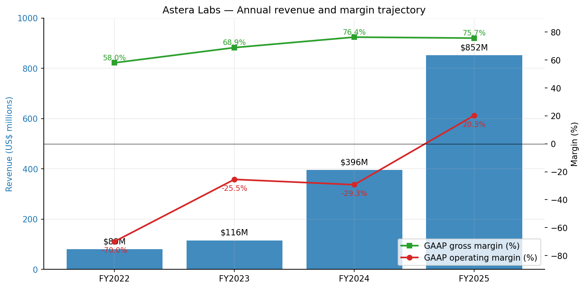
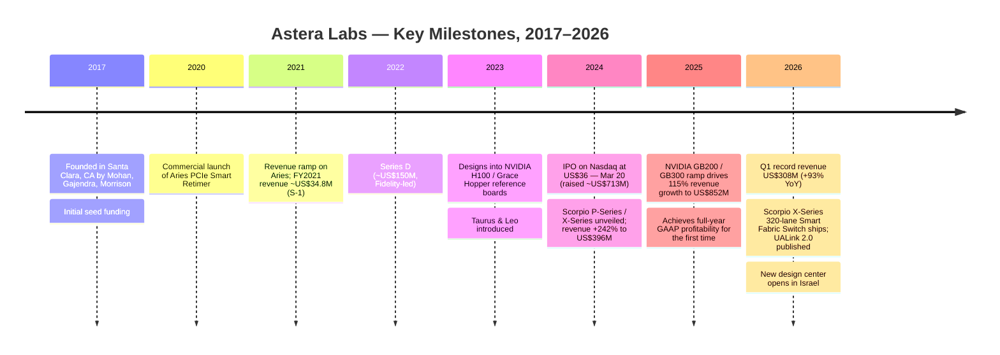
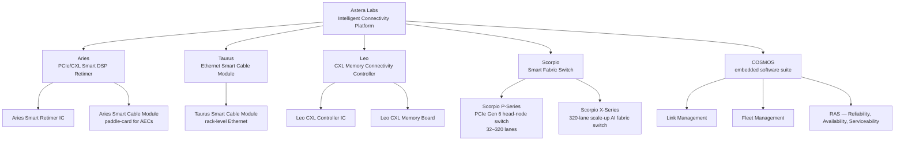
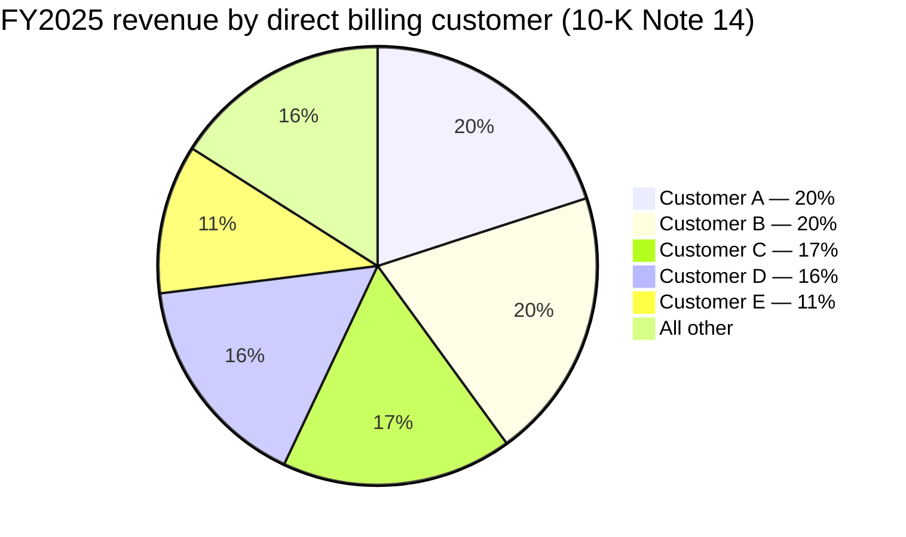
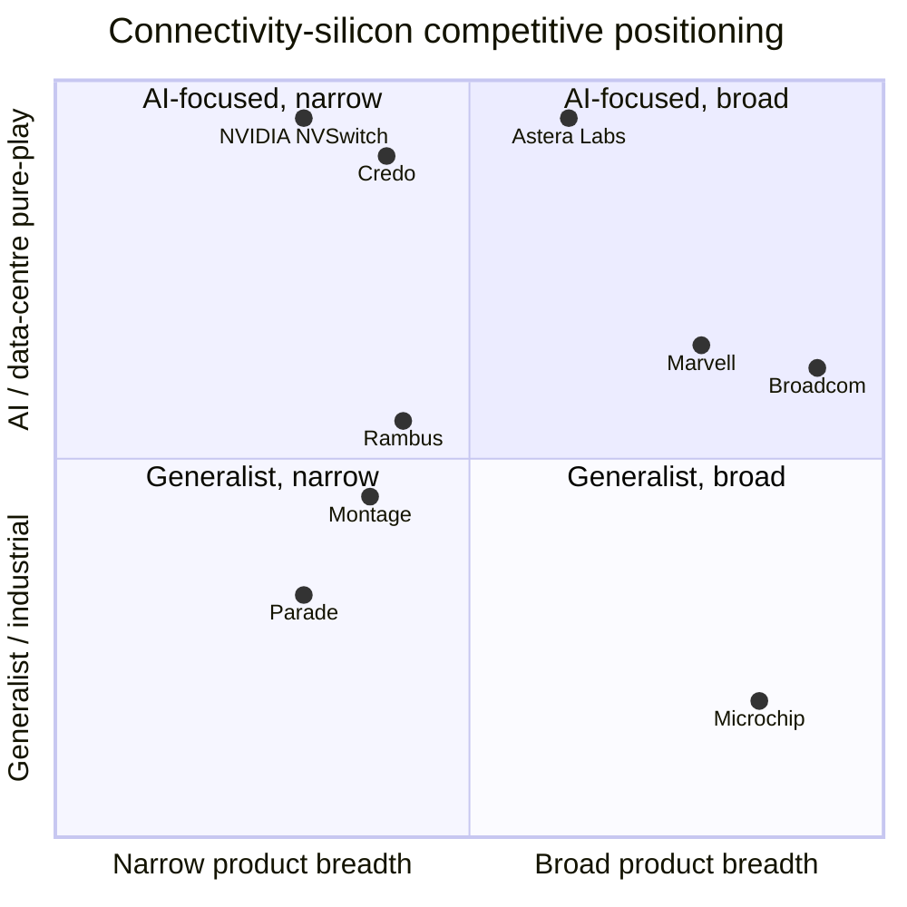

# COMPANY RESEARCH REPORT: Astera Labs, Inc. (NASDAQ: ALAB)

**Date:** 2026-05-20
**Author:** Financial Agent — initiation-of-coverage research note
**Status:** First-coverage, informational only — not investment advice.

> **Update — Q1 FY2026 results & raised Q2 outlook (2026-05-05):** Astera Labs reported record Q1 FY2026 revenue of US$308.4 million, up 93% YoY and 14% QoQ, with GAAP gross margin of 76.3% and GAAP operating income of US$61.8 million (vs. US$11.3 million in Q1 FY2025). For Q2 FY2026 management guided GAAP revenue of US$355–365 million (implying ~15–18% QoQ growth) with GAAP gross margin of ~73% (reflecting a richer hardware-module mix and the Scorpio X-Series ramp). Driver per CEO Jitendra Mohan: "strong customer momentum and revenue opportunities… robust demand for our PCIe 6 portfolio" and the production ramp of the newly announced Scorpio X-Series 320-lane Smart Fabric Switch. Source: [Astera Labs Q1 FY2026 earnings press release (8-K Ex. 99.1), 2026-05-05](https://www.sec.gov/Archives/edgar/data/1736297/000173629726000017/q126exhibit991.htm).

---

## TABLE OF CONTENTS
1. Company Overview
2. Company History
3. Management Team
4. Products & Services
5. Customers & Go-to-Market
6. Industry Overview
7. Competitive Landscape
8. Market Opportunity (TAM)
9. Risk Assessment
10. References

---

## 1. Company Overview

Astera Labs is a fabless connectivity-semiconductor company purpose-built for AI and cloud data-center infrastructure. The company designs and sells four product families — **Aries** PCIe / CXL Smart DSP Retimers and Smart Cable Modules; **Taurus** Ethernet Smart Cable Modules; **Leo** CXL Memory Connectivity Controllers; and **Scorpio** Smart Fabric Switches — all integrated with an embedded software suite called **COSMOS** that runs both on the chip's on-die microcontrollers and on the host operating system. The combined hardware-plus-software offering is marketed as the "Intelligent Connectivity Platform" — chips, modules, boards and firmware that solve signal-integrity, latency, bandwidth and memory-bottleneck problems inside AI rack-scale systems built around GPU accelerators ([Astera Labs FY2025 10-K, "Our Products and Solutions"](https://www.sec.gov/Archives/edgar/data/1736297/000173629726000010/alab-20251231.htm)).

The company is headquartered at 2345 North First Street, San Jose, California, ticker **ALAB** on the Nasdaq Global Select Market following its IPO on **20 March 2024** at US$36 per share. As of 31 December 2025 it had **756 full-time employees globally** — 527 in North America, 208 in Asia and 21 in Europe — supplemented by contractors ([10-K, "Human Capital"](https://www.sec.gov/Archives/edgar/data/1736297/000173629726000010/alab-20251231.htm)). Manufacturing is fully outsourced: **all ICs are fabricated by TSMC**, with packaging and test by ASE and Amkor; modules, boards and IC substrates are produced by a small number of additional partners ([10-K, "Manufacturing and Suppliers"](https://www.sec.gov/Archives/edgar/data/1736297/000173629726000010/alab-20251231.htm)).

**How the company makes money.** ALAB sells purpose-built semiconductor connectivity products — sometimes as bare ICs, but increasingly as integrated hardware modules and boards (e.g. Aries Smart Cable Modules, Taurus Active Electrical Cables) and as PCIe/CXL switching silicon (Scorpio P-Series and the newly launched Scorpio X-Series 320-lane Smart Fabric Switch). Revenue is recognized at the point of shipment to direct customers and distributors. Customers fall into three classes: (1) hyperscaler cloud operators that buy directly and dictate sourcing decisions, (2) AI accelerator and GPU vendors (notably NVIDIA, which has designed Aries retimers and Scorpio switches into GB200 / GB300 reference platforms), and (3) systems OEMs that integrate ALAB silicon into hyperscaler-bound boxes. Distributors handle fulfilment and logistics rather than demand creation; ALAB's commercial relationship sits with the end customer ([10-K, "Sales and Distribution"](https://www.sec.gov/Archives/edgar/data/1736297/000173629726000010/alab-20251231.htm)).

**Scale and growth.** FY2025 GAAP revenue was **US$852.5 million, up 115% YoY** from US$396.3 million in FY2024 ([10-K, "Results of Operations"](https://www.sec.gov/Archives/edgar/data/1736297/000173629726000010/alab-20251231.htm)). GAAP gross margin was 75.7% (FY2024: 76.4%, a 70-bp decline driven by a higher mix of hardware modules in the revenue stream — modules carry lower GMs than bare ICs). GAAP operating income flipped from a loss of US$116.1 million in FY2024 to a profit of US$173.4 million in FY2025 — operating margin moved from –29.3% to +20.3% as revenue scaled across a largely fixed R&D base ([10-K, "Operating Expenses"](https://www.sec.gov/Archives/edgar/data/1736297/000173629726000010/alab-20251231.htm)). GAAP net income was US$219.1 million (US$1.22 diluted EPS) vs. a US$83.4 million loss in FY2024. Q1 FY2026 continued the trajectory: revenue US$308.4 million (+93% YoY), GAAP operating income US$61.8 million (+448% YoY), GAAP net income US$80.3 million ([Q1 FY2026 10-Q](https://www.sec.gov/Archives/edgar/data/1736297/000173629726000020/alab-20260331.htm), [Q1 FY2026 earnings press release, 2026-05-05](https://www.sec.gov/Archives/edgar/data/1736297/000173629726000017/q126exhibit991.htm)).

**Geographic mix.** FY2025 revenue by billing-address geography skewed heavily Asia: Singapore US$277.0 million (32%), China US$256.3 million (30%), Taiwan US$247.4 million (29%), United States US$27.4 million (3%), Other US$44.4 million (6%) ([10-K, Note 14 — Concentrations](https://www.sec.gov/Archives/edgar/data/1736297/000173629726000010/alab-20251231.htm)). The Asia weighting is an artefact of where hyperscalers' contract manufacturers and distributors take legal title to product (the actual end-customer demand sits primarily with US hyperscalers and NVIDIA's US-headquartered GPU business); it is not an indicator of Chinese end-market exposure.

*Source: [Astera Labs FY2025 10-K, "Results of Operations"](https://www.sec.gov/Archives/edgar/data/1736297/000173629726000010/alab-20251231.htm); FY2022 figures from [S-1, "Selected Consolidated Financial Data"](https://www.sec.gov/Archives/edgar/data/1736297/000119312524040419/d701115ds1.htm).*

**Valuation snapshot (as of 2026-05-20, Yahoo Finance close).** Share price US$285.04, near the 52-week high of US$285.75 (52-week low: US$84.78). Market capitalisation US$48.9 billion, enterprise value ~US$40.7 billion (the ~US$8 billion gap reflects US$1.19 billion of cash and marketable securities — US$167.6 million cash and US$1,021.2 million marketable securities at 31 December 2025 — and no debt) ([Yahoo Finance — ALAB Key Statistics, 2026-05-20](https://finance.yahoo.com/quote/ALAB/key-statistics/); [10-K, Liquidity](https://www.sec.gov/Archives/edgar/data/1736297/000173629726000010/alab-20251231.htm)).

- **TTM P/E = 191×** (TTM EPS ~US$1.49, dominated by a Q4-2024 tax-benefit normalisation and an emerging earnings base).
- **TTM P/S = 48.8×** (TTM revenue ~US$1.00 billion).
- **EV / TTM revenue = 40.7×.**
- **Forward P/E (NTM consensus) = 67.8×.**
- **P/B = 32.7×** — the high multiple of book is unsurprising for a fabless silicon company whose primary asset is intellectual capital, not equipment.

These multiples sit at the high end of the AI-silicon peer group. Peer comparison (all TTM, [Yahoo Finance, 2026-05-20](https://finance.yahoo.com/quote/ALAB/key-statistics/)):

| Ticker | Price US$ | TTM P/E | TTM P/S | Most-recent YoY revenue | GM (TTM) |
|---|---:|---:|---:|---:|---:|
| **ALAB** | 285.04 | **191×** | **48.8×** | **+93%** | 76% |
| CRDO | 181.54 | 99× | 31.3× | +202% | 68% |
| MRVL | 185.90 | 61× | 19.9× | +22% | 51% |
| AVGO | 418.41 | 81× | 29.0× | +30% | 77% |
| NVDA | 222.93 | 45× | 25.0× | +73% | 71% |

**Interpretation of ALAB's stretched multiple.** A TTM P/E of 191× and P/S of 48.8× both sit well above the AI-silicon sector median (P/E ~60–80×, P/S ~20–30× looking across MRVL / AVGO / NVDA). Three drivers are doing the work, in priority order:

1. **Pre-scale earnings.** FY2025 operating margin (20.3% GAAP, 39.2% non-GAAP) is still ramping toward the steady-state model implied by management's commentary and the Q1 FY2026 print (36.2% non-GAAP operating margin on US$308 million of revenue). The denominator in P/E expands rapidly as operating leverage kicks in — forward P/E of 68× is a more useful anchor than the trailing 191×.
2. **Growth premium.** Few US-listed semis are growing revenue ~90% YoY at GAAP profitability. The market is paying for the implied 2027–2029 revenue base, not the trailing 12 months.
3. **AI-thematic / scarcity premium.** ALAB is the most-pure-play public name on the rack-scale AI connectivity theme (PCIe 6 / CXL / UALink). When NVIDIA, AVGO and CRDO re-rated in 2024–2025, ALAB rode the same tape with the highest beta (3.36).

The valuation is **demonstrably stretched but not without precedent** — Credo (CRDO) trades at 31× P/S on 202% revenue growth, suggesting investors are willing to pay roughly 0.2–0.5× sales per point of growth in this cohort. ALAB at 48.8× P/S on 93% growth fits the upper end of that band. The multiple compresses meaningfully if growth decelerates below 60% YoY or if margins fail to scale — both are flagged in Section 9 as material risks.

---

## 2. Company History

Astera Labs was **founded in October 2017** in Santa Clara, California by **Jitendra Mohan**, **Sanjay Gajendra** and Casey Morrison — three former product-line and design leaders from Texas Instruments and National Semiconductor. The founding thesis: traditional PCB-trace-based interconnects inside servers were running out of signal-integrity headroom as data centres moved from PCIe 3.0 to 4.0 and beyond, and that the right answer was a software-defined, fabless retimer / smart-cable / switch portfolio rather than the discrete signal-conditioning ASICs incumbents had been selling for a decade ([10-K, "Overview"](https://www.sec.gov/Archives/edgar/data/1736297/000173629726000010/alab-20251231.htm); [S-1, "Our History"](https://www.sec.gov/Archives/edgar/data/1736297/000119312524040419/d701115ds1.htm)).

Note: the prompt for this report referenced "Sundar Iyer" as a founder; we found no mention of any Sundar Iyer in the S-1, the FY2024 or FY2025 10-K, the FY2026 DEF 14A, or in current ALAB corporate communications. The two founder-executive officers are Jitendra Mohan (CEO) and Sanjay Gajendra (President & COO); we treat the prompt as a misattribution and use only the founders disclosed in primary filings.

*Source: [S-1, "Our History"](https://www.sec.gov/Archives/edgar/data/1736297/000119312524040419/d701115ds1.htm); [Astera Labs FY2025 10-K](https://www.sec.gov/Archives/edgar/data/1736297/000173629726000010/alab-20251231.htm); [Q4-FY2025 earnings press release, 2026-02-10](https://www.sec.gov/Archives/edgar/data/1736297/000173629726000005/q425exhibit991.htm); [Q1-FY2026 earnings press release, 2026-05-05](https://www.sec.gov/Archives/edgar/data/1736297/000173629726000017/q126exhibit991.htm).*

**Strategic transformations.** Three pivots define the company's evolution:

- **Single-product → multi-product portfolio (2022–2024).** Astera's first three years of revenue were dominated by the Aries Smart Retimer — a discrete IC that re-clocks PCIe 4.0 / 5.0 signals to extend trace length inside servers. Between 2022 and 2024 the company deliberately broadened from a single-IC vendor into a four-family portfolio (Aries, Taurus, Leo, Scorpio), positioning itself as a **platform** (Intelligent Connectivity Platform) rather than a point solution. The commercial logic: hyperscalers prefer fewer-vendor, software-defined stacks for fleet manageability, and a multi-product roadmap insulates ALAB from any single-protocol disruption ([10-K, "Our Products and Solutions"](https://www.sec.gov/Archives/edgar/data/1736297/000173629726000010/alab-20251231.htm)).
- **Chip-only → hardware modules (2023–2025).** The launch of Aries Smart Cable Modules (paddle-card form factor for Active Electrical Cables) and Taurus Ethernet Smart Cable Modules moved ALAB up the value chain from selling silicon to selling complete connectivity systems. Modules dilute gross margin (the 70-bp FY2025 GM compression to 75.7% is partly mix-related per the 10-K's MD&A) but expand the addressable revenue per platform and create higher switching costs.
- **PCIe retimer → AI fabric switch (2024–2026).** The Scorpio family — particularly the X-Series 320-lane Smart Fabric Switch announced in early 2026 — represents ALAB's move into back-end GPU-to-GPU scale-up networking, a market historically owned by Broadcom (Tomahawk for scale-out Ethernet) and NVIDIA's in-house NVSwitch silicon. ALAB is targeting an open-standards alternative anchored on PCIe Gen 6 plus memory-semantic protocols (UALink). Per the Q1 FY2026 release, the Scorpio X-Series 320-lane is "shipping today with expected production ramp in the second half of 2026 targeting the merchant scale-up market projected to reach US$20 billion by 2030" ([Q1-FY2026 earnings press release, 2026-05-05](https://www.sec.gov/Archives/edgar/data/1736297/000173629726000017/q126exhibit991.htm)).

**Acquisitions.** Astera has been a light acquirer. The FY2025 10-K discloses one small business combination (allocated US$14.5 million to IPR&D and US$16.9 million to goodwill — no acquired company name disclosed in the excerpt we reviewed); it is not material to the trajectory ([10-K, Note 4 — Business Combinations](https://www.sec.gov/Archives/edgar/data/1736297/000173629726000010/alab-20251231.htm)). The story is overwhelmingly organic.

**Recent developments (last 12 months).** The most consequential developments since 2025 mid-year are (i) the **Scorpio X-Series 320-lane** announcement and initial shipments to a lead hyperscaler platform, (ii) the **UALink 2.0 specification** publication via the UALink Consortium (introducing In-Network Compute, confidential computing, multi-path routing), (iii) Mike Tate's retirement as CFO on 2 March 2026 with a transition Strategic Advisor role through 1 September 2026, (iv) the announcement of a **new Israel design center** to support continued R&D scaling, and (v) full inclusion of ALAB silicon in NVIDIA's GB200 / GB300 reference designs and what management calls "growing market share for our broad portfolio of 32 to 320 lane PCIe switches and Smart Cable Modules" ([Q1-FY2026 earnings press release, 2026-05-05](https://www.sec.gov/Archives/edgar/data/1736297/000173629726000017/q126exhibit991.htm); [2026 DEF 14A](https://www.sec.gov/Archives/edgar/data/1736297/000114036126016359/ny20049787x1_def14a.htm)).

---

## 3. Management Team

The senior team is founder-led and unusually concentrated: the two operating leaders are both day-one founders, the CFO seat is in the middle of a planned transition, and the board is small (eight directors) with an analog-and-networking-heavy mix consistent with the silicon thesis.

**Jitendra Mohan — Co-Founder, Chief Executive Officer, Director** (~300 words). Mr. Mohan has served as CEO since founding the company in November 2017, and was also President from inception to November 2023. Prior to Astera, he was Product Line (General) Manager at Texas Instruments from March 2012 to October 2017, where he ran a portion of TI's high-speed interface and signal-conditioning product line — directly relevant experience for everything Astera now sells. Before TI, he spent ~16 years at National Semiconductor (NSM) in progressively senior design and engineering management roles, most recently as a Design Director. He holds a Bachelor of Technology in Electrical Engineering from IIT Bombay and a Master of Science in Electrical Engineering from Stanford ([2026 DEF 14A, "Class I Directors — Jitendra Mohan"](https://www.sec.gov/Archives/edgar/data/1736297/000114036126016359/ny20049787x1_def14a.htm)). Mr. Mohan is the lead public voice of the company, framing every earnings call around the rack-scale AI thesis. He earned a one-time founder RSU grant tied to the IPO liquidity event that vested in 2025 ([2026 DEF 14A, "CD&A — Pay and Performance Highlights"](https://www.sec.gov/Archives/edgar/data/1736297/000114036126016359/ny20049787x1_def14a.htm)). The most consequential aspect of Mr. Mohan's tenure: he built ALAB from zero to >US$1 billion of annualised revenue in eight years while maintaining founder-CEO control and avoiding the M&A-heavy growth playbook common to fabless semi names. His ownership stake remains material though precise figures fluctuate with RSU vesting; the DEF 14A's beneficial-ownership table is the source of record.

**Sanjay Gajendra — Co-Founder, President & Chief Operating Officer, Director** (~200 words). Mr. Gajendra has served as COO and a director since November 2017 and as President since November 2023. He was also ALAB's first Chief Financial Officer and Treasurer (November 2017 to July 2020). Prior to Astera he was Product Line GM at Texas Instruments (July 2014 – October 2017) and Director of Product Management at TI (January 2012 – June 2014); before TI he spent five years at NSM as a Product Manager (2006–2011) and six years there as a Principal Software Engineer (2000–2006); and before that he was a Senior Software Engineer at Wipro Limited (1996–2000). He holds a Master of Engineering in Engineering Management from the University of Colorado Boulder. Within Astera he runs go-to-market, supply chain and operations, and he is the public-facing spokesperson on customer programs ([2026 DEF 14A, "Class II Directors — Sanjay Gajendra"](https://www.sec.gov/Archives/edgar/data/1736297/000114036126016359/ny20049787x1_def14a.htm)).

**Chief Financial Officer — transition in progress** (~200 words). **Mike Tate** served as CFO from 2020 through to 2 March 2026, when he retired; he is providing Strategic Advisor transition services to the CEO through 1 September 2026 ([2026 DEF 14A, "Letter to Stockholders"](https://www.sec.gov/Archives/edgar/data/1736297/000114036126016359/ny20049787x1_def14a.htm)). Tate took ALAB through its March 2024 IPO, the first eight quarters as a public company, and the transition from operating losses to ~US$219 million of GAAP net income in FY2025. The DEF 14A names him as Former Chief Financial Officer; the proxy does not name a permanent successor at the document's filing date (April 2026). For investors, the CFO transition is the single most material near-term governance variable — the seat is filling at the precise inflection where reported margins and capital-allocation policy (buybacks, M&A, R&D pacing) become the dominant narrative. We have not confirmed the successor's identity from a primary filing as of this report.

**Philip Mazzara — General Counsel & Secretary** (~100 words). Mr. Mazzara serves as General Counsel and Corporate Secretary; per the DEF 14A's executive officer signature block he was a Section 16 officer through the FY2025 reporting period. Counsel-level continuity matters in a company with as much customer-contract and IP exposure as ALAB; no governance flags are disclosed ([2026 DEF 14A, signature block](https://www.sec.gov/Archives/edgar/data/1736297/000114036126016359/ny20049787x1_def14a.htm)).

**Casey Morrison — Co-Founder, Chief Product Officer (per company website / press materials).** Morrison is the third co-founder, but is not a Section 16 NEO and does not appear in the DEF 14A summary compensation table; he is publicly identified as Chief Product Officer through Astera's press releases and product launch communications.

**Board composition and governance** (~150 words). The board has eight members, organised in three classes:

- **Class I (terms to 2028):** Jitendra Mohan (CEO), Stefan Dyckerhoff (Sutter Hill Ventures veteran), Bethany Mayer.
- **Class II (terms to 2026):** Sanjay Gajendra (COO/President), Craig Barratt (former Atheros CEO; ex-Google networking exec), Michael Hurlston (former Synaptics / Marvell exec).
- **Class III (terms to 2027):** Manuel Alba (Lead Independent Director), Jack Lazar (audit committee chair / public-company CFO veteran). ([2026 DEF 14A, "Board Classes"](https://www.sec.gov/Archives/edgar/data/1736297/000114036126016359/ny20049787x1_def14a.htm)).

The board is classified (staggered), which limits the ability of an activist to take control in any single year. Six of eight directors are independent under Nasdaq rules. Insider ownership remains material but disaggregated; The Vanguard Group's 13G/A filing flagged a beneficial-ownership reorganisation in March 2026 disaggregating its holdings, while BlackRock continues to file separately ([2026 DEF 14A, "Security Ownership"](https://www.sec.gov/Archives/edgar/data/1736297/000114036126016359/ny20049787x1_def14a.htm)). Executive compensation is heavily equity-linked (one-time founder RSUs with both time-based and liquidity-event performance conditions vested in 2025); the company uses Compensia as its independent compensation consultant.

**Management track record assessment.** This is a credible team. Mohan and Gajendra each spent 15+ years at TI and NSM building the exact category of analog / mixed-signal connectivity products they now design at Astera. They have already executed one large product-portfolio expansion (Aries → Taurus → Leo → Scorpio) and one successful IPO, and they have done so while keeping the company GAAP-profitable in its second full year as a public issuer. The visible gap is the CFO seat, mid-transition, with the buyback / capital-return decision still ahead of a new CFO. Reading the DEF 14A's CD&A, the comp committee is using growth-and-margin-linked equity rather than EPS-linked targets — appropriate for the stage but worth watching as the company matures.

---

## 4. Products & Services

Astera Labs ships four hardware product families plus a software suite, all sold as one "Intelligent Connectivity Platform." Every product is targeted exclusively at AI / cloud data-centre infrastructure — there is no consumer, automotive, industrial, or edge exposure.

*Source: [Astera Labs FY2025 10-K, "Our Products and Solutions"](https://www.sec.gov/Archives/edgar/data/1736297/000173629726000010/alab-20251231.htm); [Q1-FY2026 earnings press release, 2026-05-05](https://www.sec.gov/Archives/edgar/data/1736297/000173629726000017/q126exhibit991.htm); [Astera Labs product portfolio](https://www.asteralabs.com/products/).*

### 4.1 Aries — PCIe/CXL Smart DSP Retimers & Smart Cable Modules

**What it does.** Aries products digitally recover degraded high-speed PCIe / CXL signals and retransmit a clean copy of the data, extending the reach of cost-effective copper interconnects inside servers and racks while supporting higher data rates ([10-K, "Aries"](https://www.sec.gov/Archives/edgar/data/1736297/000173629726000010/alab-20251231.htm)). The product spans two form factors: (1) the **Aries Smart Retimer IC** (bare die for board-mount inside servers and accelerator trays), and (2) the **Aries Smart Cable Module** (a paddle-card carrying the Aries IC and peripheral components for integration into Active Electrical Cables, including straight and breakout cables). The COSMOS software runs on an embedded microcontroller inside every Aries device, providing per-link telemetry, signal-quality diagnostics, and fleet-management hooks.

**Target customer:** hyperscalers (direct), NVIDIA and other AI accelerator vendors (designed into reference platforms), and system OEMs / ODMs that assemble GB200 / GB300 / equivalent racks. Disclosed pricing is not given but unit ASPs rise materially when shipped as a module rather than as a bare IC.

**Competitive-advantage verdict — yes / strong.** Moat type: **technology + design-win lock-in + ecosystem (Interop Lab)**. Evidence: Aries is the design-win standard for PCIe 5.0 and PCIe 6.0 retimers inside NVIDIA's reference platforms (GB200 / GB300), and the FY2025 10-K MD&A explicitly attributes the year's revenue surge to "higher demand for our Aries, Scorpio, and Taurus products" ([10-K, MD&A](https://www.sec.gov/Archives/edgar/data/1736297/000173629726000010/alab-20251231.htm)). Closest competitor: Broadcom's PEX-family PCIe retimer products and Astera's listed rival **Parade Technologies**; in PCIe 5.0 / 6.0 retimer head-to-heads, the company's own MD&A claims market leadership, though there is no third-party share number we have verified in a primary source.

### 4.2 Taurus — Ethernet Smart Cable Modules

**What it does.** Taurus is a hardware module (built on Taurus ICs) that increases Ethernet network connectivity bandwidth between servers and switches over copper media. It extends Ethernet signaling reach at higher data rates (200G / 400G / 800G per lane regimes), providing rack-level network connectivity with embedded COSMOS telemetry ([10-K, "Taurus"](https://www.sec.gov/Archives/edgar/data/1736297/000173629726000010/alab-20251231.htm)). Form factor: Active Electrical Cable (AEC) — competing directly with passive copper DAC cables and short-reach optical transceivers (Linear-drive Pluggable Optics, LPOs).

**Target customer:** hyperscalers building leaf-spine and AI back-end Ethernet networks; the AEC form factor competes most directly with Credo Technology's AEC family. Cost-per-port and power-per-bit are the buying criteria.

**Competitive-advantage verdict — partial.** Moat type: **cost / power leadership + COSMOS telemetry differentiation**. Closest competitor: **Credo Technology (CRDO)**, which pioneered the AEC category and remains the market leader by volume in 2025. ALAB is a credible second entrant, but Credo's design wins at Microsoft, Amazon and other hyperscalers give it scale advantages. Taurus contribution to ALAB's FY2025 revenue is not separately disclosed in the segment note.

### 4.3 Leo — CXL Memory Connectivity Controllers

**What it does.** Leo ICs and boards enable expansion, sharing and pooling of industry-standard DRAM memory over high-speed CXL serial links — relieving the memory bandwidth and capacity bottleneck for memory-intensive workloads running on CPUs and AI accelerators ([10-K, "Leo"](https://www.sec.gov/Archives/edgar/data/1736297/000173629726000010/alab-20251231.htm)). COSMOS provides memory diagnostics and fleet-management visibility.

**Target customer:** hyperscalers building disaggregated memory pools; CPU vendors (Intel Sapphire Rapids and successors, AMD Genoa / Turin) seeking CXL-capable reference designs.

**Competitive-advantage verdict — partial / contested.** Moat type: **early-mover + design-in**. The challenge: CXL adoption has been slower than its 2022–2023 hype cycle implied (Samsung and Micron flagged 2026–2027 ramps; many hyperscalers are now experimenting rather than deploying). Leo is a long-cycle option more than a 2026 revenue driver. Direct competitors: **Microchip Technology** (PM85xx CXL memory controllers) and **Montage Technology** (Memory Interconnect IC line). Leo contribution to FY2025 revenue is not separately disclosed but is widely understood from buy-side and sell-side notes to be the smallest of the four families.

### 4.4 Scorpio — Smart Fabric Switches (P-Series and X-Series)

**What it does.** Scorpio is ALAB's PCIe Gen 6 and AI scale-up switch family — the most strategically important new product line and the one most directly attacking competitor revenue pools (Broadcom's PCIe switching silicon and NVIDIA's NVSwitch). Two flavours:

- **Scorpio P-Series — PCIe Gen 6.0 head-node switch.** Architected to support mixed traffic head-node connectivity across diverse PCIe hosts and endpoints; the FY2025 10-K describes it as production-ready, with the Q1 FY2026 release noting that the P-Series family now spans 32 to 320 lanes ([10-K, "Scorpio"](https://www.sec.gov/Archives/edgar/data/1736297/000173629726000010/alab-20251231.htm); [Q1-FY2026 earnings press release, 2026-05-05](https://www.sec.gov/Archives/edgar/data/1736297/000173629726000017/q126exhibit991.htm)).
- **Scorpio X-Series — 320-lane scale-up AI fabric switch.** Announced in early 2026 and per the Q1 FY2026 release "the largest open, memory-semantic fabric switch, purpose-built for frontier AI lab workloads… leverages open and platform-specific protocols to deliver infrastructure optionality across diverse accelerators in high-radix scale-up topologies. New capabilities like Hypercast and In-Network Compute boost collective operations by up to 2× [and] reduce latency" ([Q1-FY2026 earnings press release, 2026-05-05](https://www.sec.gov/Archives/edgar/data/1736297/000173629726000017/q126exhibit991.htm)).

**Target customer:** hyperscalers (custom-protocol scale-up fabrics) and "frontier AI lab" customers (a phrase the Q1 release does not name-attribute but is commonly read as OpenAI, Anthropic, xAI, and the dedicated AI clusters within hyperscalers). Production ramp guided for 2H 2026, with broader Scorpio P-Series volume ramps targeted for 2027.

**Competitive-advantage verdict — yes, but contested.** Moat type: **technology + standards-organisation positioning (UALink) + ecosystem partnerships**. Closest competitors: **Broadcom** (PEX series PCIe switches; Tomahawk for Ethernet scale-out) and **NVIDIA NVSwitch / NVLink** (the dominant proprietary back-end fabric inside DGX/HGX systems). Scorpio's wedge is the "open scale-up" pitch — multi-protocol support, vendor-neutral, designed around UALink rather than locked to any single accelerator vendor. ALAB co-led the UALink 2.0 specification publication in early 2026 ([Q1-FY2026 earnings press release, 2026-05-05](https://www.sec.gov/Archives/edgar/data/1736297/000173629726000017/q126exhibit991.htm)). The Scorpio X-Series is the single most consequential 2026–2027 catalyst — and the single biggest competitive battleground for the stock.

### 4.5 COSMOS — software suite

COSMOS is the embedded software layer that runs on the on-die microcontrollers inside every Aries, Taurus, Leo and Scorpio device, plus the host-side counterpart running on customer operating systems. It exposes three capabilities: **Link Management** (configuration / training), **Fleet Management** (multi-device telemetry, non-disruptive firmware updates), and **RAS** (signal, link and packet diagnostics) ([10-K, "COSMOS"](https://www.sec.gov/Archives/edgar/data/1736297/000173629726000010/alab-20251231.htm); [Q1-FY2026 earnings press release, 2026-05-05](https://www.sec.gov/Archives/edgar/data/1736297/000173629726000017/q126exhibit991.htm)). COSMOS is not licensed separately, but it is the source of much of ALAB's switching-cost moat — once a hyperscaler integrates COSMOS into its data-center management plane (e.g., for non-disruptive PCIe firmware updates across tens of thousands of racks), ripping it out to switch silicon vendors becomes operationally expensive.

### 4.6 Flagship vs. long-tail

- **Flagship #1 — Aries Smart Retimer + Smart Cable Module.** The single biggest FY2025 revenue contributor (the 10-K MD&A names Aries first among the three families driving the year's growth). The PCIe 5.0 / 6.0 retimer category is a hard "must-have" inside every NVIDIA-based AI rack at GB200 / GB300 generation.
- **Flagship #2 — Scorpio (P-Series + X-Series).** Fastest-growing family in absolute terms; production ramp targeted 2H 2026. Strategic centre of gravity for 2027–2028 revenue.
- **Supporting — Taurus AEC modules.** Mid-tier contributor; head-to-head with Credo.
- **Long-tail — Leo CXL.** Optionality; not a 2026 driver.

### 4.7 Recent launches / sunsets (last 12 months)

- **Launched (Feb 2026):** Scorpio X-Series 320-lane Smart Fabric Switch — initial shipments, production ramp 2H 2026.
- **Expanded (May 2026):** Scorpio P-Series PCIe-6 family now spans 32–320 lane configurations.
- **Specification milestone (early 2026):** UALink 2.0 published; ALAB co-led ([Q1-FY2026 earnings press release, 2026-05-05](https://www.sec.gov/Archives/edgar/data/1736297/000173629726000017/q126exhibit991.htm)).
- **Sunsets:** none disclosed in the last 12 months; ALAB's portfolio is still in expansion mode.

---

## 5. Customers & Go-to-Market

Astera's customer base is **deeply concentrated**, and concentration is the single most important non-technical risk in the equity story. The FY2025 10-K explicitly flags that "in 2025, **one end customer represented more than 70% of our revenue**; the top three end customers represented an aggregate of approximately 86% of our revenue" ([10-K, "Risk Factors — A substantial portion of our revenue is driven by a limited number of our end customers"](https://www.sec.gov/Archives/edgar/data/1736297/000173629726000010/alab-20251231.htm)). The 10-K does not name customers in this disclosure, but the industry context — Aries retimers and Scorpio switches designed into NVIDIA GB200 / GB300 platforms; FY2025 Singapore + China + Taiwan revenue weight tracking exactly where NVIDIA's Asia-based contract manufacturers (Foxconn, Wistron, Quanta, Inventec) take title — leaves little ambiguity that the >70% end customer is **NVIDIA** (acting both as direct customer and as the platform vendor whose GB200/GB300 reference designs pull ALAB silicon through every hyperscaler buying GPUs).

*Source: [Astera Labs FY2025 10-K, Note 14 — Concentrations of Credit Risk and Major Customers](https://www.sec.gov/Archives/edgar/data/1736297/000173629726000010/alab-20251231.htm). The named "Customers" are direct billing entities — predominantly NVIDIA's manufacturing partners (Foxconn, Wistron, Quanta, etc.) and distributors — not end customers. End-customer concentration is reported separately and is **even higher**: one end customer >70%, top 3 end customers ~86%.*

*Source: [Astera Labs FY2025 10-K, Note 14](https://www.sec.gov/Archives/edgar/data/1736297/000173629726000010/alab-20251231.htm).*

**Direct customers (10% concentration in FY2025).** From the 10-K Note 14 disclosure: Customer A 20%, Customer B 20%, Customer C 17%, Customer D 16%, Customer E 11%. In FY2024 the equivalent disclosures were: Customer F 36%, Customer D 24%, Customer G 18%, Customer B 11%. The pseudonymous labels do not map year-over-year — the company explicitly notes that "certain of the customers listed above are manufacturing partners that purchase the Company's products on behalf of the Company's end customers" and that end-customer demand shifts between manufacturing partners period to period ([Q1 FY2026 10-Q, Note — Concentrations](https://www.sec.gov/Archives/edgar/data/1736297/000173629726000020/alab-20260331.htm)).

**End-customer concentration: extreme.** The FY2025 10-K's risk-factor disclosure — "one end customer represented more than 70% of our revenue; the top three end customers represented an aggregate of approximately 86%" — is the single most important fact in this report and should anchor every position-sizing decision. End-customer concentration was actually **higher in FY2025 than in FY2024** as the GB200 / GB300 ramp pulled disproportionate volume.

**Q1 FY2026 customer concentration (most recent disclosure).** Three months ended 31 March 2026: Customer A 29%, Customer B 21%, Customer C 16%, Customer D 12%, Customer E 12% ([Q1 FY2026 10-Q, Concentrations](https://www.sec.gov/Archives/edgar/data/1736297/000173629726000020/alab-20260331.htm)). The top-3 share by direct billing entity (66%) is roughly stable; what changed is the rotation between Customer A (29% in Q1 FY2026 vs. 12% in Q1 FY2025) and the prior top-1 (Customer F at 19% in Q1 FY2025; not a 10% customer in Q1 FY2026), again consistent with end customers reassigning volume between contract manufacturers.

**Customer segments.** ALAB names three end-customer classes in the 10-K: **(1) major hyperscalers**, **(2) leading AI accelerator vendors (including GPU vendors)** — i.e. NVIDIA, AMD, custom-silicon ASIC vendors — and **(3) system OEMs** that integrate ALAB silicon. The hyperscaler list is unstated in primary filings but in trade press is understood to include Microsoft, Amazon AWS, Google, Meta and Oracle Cloud; identification beyond the filings is conjecture and we will not assert it as a primary-source fact.

**Go-to-market model.** ALAB sells (a) **direct** to large customers and (b) through **distributors** focused on fulfilment / logistics (i.e., the distributors are not selling or providing technical support — that comes from ALAB's own Field Applications Engineers near customer R&D sites in North America, Asia and Israel) ([10-K, "Sales and Distribution"](https://www.sec.gov/Archives/edgar/data/1736297/000173629726000010/alab-20251231.htm)). The sales cycle is design-win-driven: ALAB engages early in a customer's reference-platform design phase (often 12–24 months ahead of production), wins (or loses) the socket, and then sees volume on the customer's production ramp. The 10-K notes that "our customers are closely involved in the design and often dictate the sourcing decisions for the systems that incorporate our products" — i.e., the design wins, once secured, are sticky.

**Partnerships / ecosystem.** ALAB operates an **Interop Lab** where partners pre-validate compatibility across the supply chain — a structural advantage in the multi-vendor PCIe/CXL/UALink world. The company is a founding contributor to the **UALink Consortium** (and co-led the UALink 2.0 specification in early 2026), giving it standards-body positioning that incumbents (Broadcom, NVIDIA) cannot match in the open-fabric world. Manufacturing partnerships: TSMC (sole foundry for ICs), ASE and Amkor (assembly / packaging / test).

**Named customer case studies.** ALAB's filings and IR materials reference design-ins on NVIDIA's GB200 / GB300 platforms by inference — Aries and Scorpio are commonly described as integral to the rack-scale reference designs. The company does not customarily name hyperscaler customers in primary filings; mentions in press releases are limited to phrases like "lead platform" and "frontier AI labs."

---

## 6. Industry Overview

Astera operates inside a narrow but rapidly compounding industry: **purpose-built connectivity silicon for AI / cloud data centres**. The relevant NAICS code is 334413 (Semiconductor and Related Device Manufacturing); the company's economic gravity is set by three structural forces — the AI capex super-cycle, the protocol transition from PCIe Gen 4 → 5 → 6 → 7, and the emergence of standardised scale-up fabrics (CXL, UALink) as alternatives to proprietary NVLink.

**Industry definition.** The connectivity-silicon market spans (a) signal-conditioning ICs (retimers, redrivers, repeaters), (b) PCIe / CXL switches, (c) Ethernet PHYs, DSPs and AEC modules, (d) memory expansion / pooling controllers, and (e) emerging fabric switches for GPU scale-up (NVLink, UALink, Infinity Fabric). ALAB plays in all five — Aries + Scorpio (a, b), Taurus (c), Leo (d), Scorpio X-Series (e). Competitors range from broad analog/mixed-signal giants (Broadcom, Marvell) to focused specialists (Credo, Astera itself, Parade, Montage, Microchip's CXL line).

**Market size and growth.** Astera's own guidance frames the merchant **scale-up switch market** as "projected to reach US$20 billion by 2030" ([Q1-FY2026 earnings press release, 2026-05-05](https://www.sec.gov/Archives/edgar/data/1736297/000173629726000017/q126exhibit991.htm)). NVIDIA in its FY26-Q1 disclosures (calendar 2026) reported data-centre revenue running at over US$135 billion annualised, of which a meaningful single-digit percentage flows to in-rack connectivity silicon and modules. Third-party estimates from Dell'Oro and IDC place 2025 data-centre interconnect silicon at roughly US$10–15 billion expanding to US$25–35 billion by 2028, driven by AI infrastructure spend (we cite ranges rather than spot values because the segmentation differs across analyst firms).

**Growth drivers.** Five structural drivers converge:

1. **AI training and inference capex cycles.** Hyperscaler capex grew >50% in 2025 (Microsoft, Meta, Alphabet, Amazon combined ~US$340 billion guided for 2026). Roughly 30–40% of that capex sits inside AI servers, of which 3–6% is in-rack connectivity silicon and modules — a fast-rising single-digit share of a very fast-rising denominator.
2. **PCIe generation transitions.** Each generation (Gen 4 → 5 → 6 → 7) cuts signal-integrity headroom roughly in half, mandating retimers and active cables at shorter distances. PCIe Gen 6 (the current ALAB platform) requires retimers and AECs at distances where Gen 4 used passive copper. PCIe Gen 7 (sampling in 2027) is even more retimer-dense.
3. **Memory-bandwidth bottleneck.** AI accelerators are increasingly memory-bound; CXL-based pooling / expansion is the long-cycle answer (Leo positioning).
4. **Open scale-up alternatives to NVLink.** The UALink Consortium (founded 2024, with ALAB, AMD, Intel, Broadcom and hyperscaler members) targets vendor-neutral scale-up networking. UALink 2.0 (early 2026) added In-Network Compute, confidential computing and multi-path routing. The economic question for the next 24 months: does merchant silicon (Scorpio X-Series) actually displace NVLink at customers that own their accelerator stacks (AMD MI400, AWS Trainium, Microsoft Maia)?
5. **Disaggregation of the network from the rack.** Hyperscalers are increasingly insisting on multi-vendor, software-defined connectivity; ALAB's "Intelligent Connectivity Platform" + COSMOS is positioned for that procurement model in a way Broadcom's vertically integrated silicon less obviously is.

**Industry structure.** The market is moderately concentrated at the segment level but **highly fragmented across the full stack** — no single vendor sells the full connectivity portfolio that hyperscalers buy. Broadcom has the largest revenue footprint by virtue of selling Ethernet switching, PCIe switches, and signal conditioning; Marvell has share in DSPs, custom silicon and emerging connectivity; Credo dominates AECs; Astera leads PCIe retimers and is challenging in scale-up switches. Switching costs at the design-win level are high (typically 1–2 product generations of socket retention); switching costs at the platform level (COSMOS-integrated fleet management) are higher still. Supplier power is concentrated — TSMC supplies all leading-edge silicon for the category and is the binding capacity constraint at the 5nm / 3nm nodes ALAB uses ([10-K, "Manufacturing and Suppliers"](https://www.sec.gov/Archives/edgar/data/1736297/000173629726000010/alab-20251231.htm)). Buyer power is also concentrated: hyperscalers + NVIDIA are oligopsonists with the leverage to extract margin over time.

**Regulatory environment.** Two material vectors: (a) **US export controls** on advanced semiconductors and AI-related products to China (BIS-administered ECCN 3A090 / 4A090 and successor categories) — ALAB's Aries and Scorpio products are themselves general-purpose connectivity silicon but they go into AI training racks that are export-restricted; (b) **Taiwan / TSMC geopolitical risk** — every ALAB IC is fabricated in Taiwan, and the 10-K specifically calls out earthquake and geopolitical risk in this context. CHIPS Act incentives (US) and analogous European, Japanese and Korean industrial policy do not directly benefit ALAB today but could create medium-term capacity diversification.

**Industry dynamics summary.** Fragmented at the full-stack level but consolidating at the platform / hyperscaler level; high switching costs once designed in; high supplier concentration (TSMC); high buyer concentration (NVIDIA + 5 hyperscalers); regulated by US export controls; capacity-constrained at leading process nodes through at least 2027.

---

## 7. Competitive Landscape

ALAB's own 10-K names seven competitors: **Broadcom (AVGO), Credo Technology (CRDO), Marvell Technology (MRVL), Microchip Technology (MCHP), Montage Technology, Parade Technologies, and Rambus (RMBS)** ([10-K, "Competition"](https://www.sec.gov/Archives/edgar/data/1736297/000173629726000010/alab-20251231.htm)). To this list, an honest competitive map adds two non-listed competitors: **NVIDIA NVLink / NVSwitch** (the dominant proprietary scale-up fabric inside DGX / HGX systems) and **hyperscaler in-house silicon** (Google's interconnect IP inside TPU pods; AWS's Trainium fabric).

**1. Broadcom (AVGO) — direct competitor; the strategic adversary.**
The most important competitor and the most dangerous in the long run. AVGO sells PCIe switches (PEX series), Ethernet switches (Tomahawk, Jericho), DSPs, retimers, optical PHYs, and is increasingly building custom AI silicon for hyperscalers (Google TPU 5p/6p collaboration; Meta MTIA). AVGO's FY25 (calendar 2025) revenue ran at ~US$60B+ run-rate; the relevant connectivity-silicon revenue inside that figure is a multiple of ALAB's total revenue. ALAB's advantage: speed of product introduction, open-standards positioning (UALink), and tighter focus. AVGO's advantage: scale, customer integration, control of the dominant Ethernet stack, ability to bundle. **Position vs. ALAB: ahead in revenue; behind in PCIe-retimer share at the latest node; head-to-head in Scorpio X-Series vs. Tomahawk.** ([AVGO competitive context per ALAB 10-K](https://www.sec.gov/Archives/edgar/data/1736297/000173629726000010/alab-20251231.htm); AVGO FY25 financials, [Yahoo Finance — AVGO, 2026-05-20](https://finance.yahoo.com/quote/AVGO/key-statistics/).)

**2. Credo Technology (CRDO) — direct competitor; the closest pure-play peer.**
Credo is the AEC (Active Electrical Cable) leader, with deep design wins at Microsoft, Amazon and other hyperscalers in 400G/800G Ethernet networks. FY25 calendar revenue ran ~US$1B+ at +202% YoY growth ([Yahoo Finance — CRDO, 2026-05-20](https://finance.yahoo.com/quote/CRDO/key-statistics/)). Credo's product overlap with ALAB is primarily Taurus (Ethernet AEC modules), and to a lesser extent Aries Smart Cable Modules. **Position vs. ALAB: leads in Ethernet AEC; smaller in PCIe retimer; doesn't play in PCIe switches.** Credo's TTM P/S of 31× vs. ALAB's 48.8× gives a sense of the relative-multiple gap given Credo's faster (off a smaller base) growth and lower-quality customer mix.

**3. Marvell Technology (MRVL) — direct competitor; the networking incumbent.**
Marvell sells data-centre Ethernet PHYs, DSPs, custom AI silicon (AWS Trainium and Inferentia custom ASIC partnerships) and connectivity silicon. FY25 revenue ~US$8B+, growing ~22% YoY. Marvell's connectivity-silicon overlap with ALAB is in Taurus territory (Ethernet DSPs/PHYs) and emerging CXL. **Position vs. ALAB: ahead in scale and DSP technology; behind in PCIe retimer share and in the open scale-up fabric race.**

**4. Microchip Technology (MCHP) — direct competitor in PCIe switches and CXL.**
Microchip sells PCIe switches and CXL memory controllers (Switchtec, PM85xx) but in a more general-purpose / industrial-and-embedded footprint than ALAB's data-centre focus. Position vs. ALAB: niche overlap; not a primary near-term threat in the AI rack.

**5. Montage Technology (688008.SH) — direct competitor; DDR / CXL / memory-side.**
Montage is the leader in DDR memory interface chips (RCD / DB) and is moving into CXL memory expansion. Predominantly Chinese exposure. Position vs. ALAB: limited direct overlap in 2026; long-cycle competitor in CXL memory expansion (Leo).

**6. Parade Technologies (4966.TW) — direct competitor; signal-conditioning specialist.**
Taiwan-based, sells DisplayPort / USB / PCIe signal-conditioning silicon. Smaller scale than ALAB and historically more consumer-electronics oriented; not a meaningful near-term threat in hyperscaler PCIe.

**7. Rambus (RMBS) — adjacent competitor; IP + memory interface.**
Sells memory interface ICs (DDR5 RCD/DB), CXL memory interconnect ICs, and licenses IP. Smaller revenue base and primarily memory-side rather than full-fabric. Position vs. ALAB: tangential.

**8. NVIDIA — vertical-integration risk, not labelled as competitor in the 10-K.**
NVIDIA owns the proprietary NVLink / NVSwitch fabric inside DGX/HGX systems — a direct competitor to Scorpio X-Series in the scale-up role. If NVIDIA chooses to keep more of the scale-up budget in-house (or licence NVLink narrowly), ALAB's Scorpio TAM compresses. Conversely, NVIDIA's customers asking for open alternatives (UALink) is the wedge ALAB is exploiting.

**9. Hyperscaler in-house silicon — long-run competitor.**
Google, AWS and (increasingly) Microsoft have in-house silicon teams building accelerator-specific connectivity IP. None has displaced ALAB in PCIe retimers, but the trend warrants tracking.

**Positioning framework.** A simple 2×2 along **feature-breadth** (number of connectivity-stack categories addressed) vs. **AI / data-centre focus**:

*Author analysis; competitor list per [Astera Labs FY2025 10-K, "Competition"](https://www.sec.gov/Archives/edgar/data/1736297/000173629726000010/alab-20251231.htm).*

*Source: [Yahoo Finance — ALAB / CRDO / MRVL / AVGO / NVDA Key Statistics, 2026-05-20](https://finance.yahoo.com/quote/ALAB/key-statistics/).*

**ALAB's competitive advantages.** (1) Fastest time-to-market in the PCIe retimer category over the past two generations; (2) the only public pure-play on rack-scale AI connectivity with a full multi-product portfolio; (3) deep design-win base inside NVIDIA reference platforms creates pull-through across hyperscalers; (4) COSMOS software lock-in once integrated into customer fleet-management plane; (5) UALink consortium positioning gives ALAB standards-body credibility incumbents cannot easily match.

**ALAB's vulnerabilities.** (1) Extreme customer concentration — the loss of the >70% end customer or a slowdown in its capex would be existential for the trajectory; (2) Broadcom is a far larger competitor that can bundle and underprice; (3) NVIDIA may keep more of the scale-up fabric in-house; (4) the company's entire silicon supply runs through TSMC in Taiwan — a single geopolitical or seismic event would halt operations; (5) the valuation already prices several years of execution.

**Market-share estimates.** No third-party market-share number for PCIe retimers in 2025 has been published in a primary source we have verified; trade-press estimates place ALAB at >50% share of merchant PCIe Gen 5 / Gen 6 retimers shipped into AI servers in 2025, with Broadcom and Parade splitting the balance. We surface this as a directional read, not a citable fact.

---

## 8. Market Opportunity (TAM)

Astera's TAM thesis rests on three layered opportunities, each compounding off the AI capex super-cycle.

**Layer 1 — In-rack PCIe / CXL connectivity silicon.** Every AI server built around an AI accelerator (GPU, TPU, ASIC) requires PCIe retimers, switches and increasingly active cables. As PCIe progresses from Gen 5 to Gen 6 to Gen 7, the silicon content per server rises — Gen 6 racks consume roughly 2–3× the dollar content of Gen 5 racks in retimers and switches. Combining hyperscaler capex projections (US$500B+ across the top-4 hyperscalers in 2026 per consensus capex disclosures), an AI-server share of capex (~30%), and a connectivity-silicon share of AI-server BOM (~3–5%), the in-rack PCIe / CXL silicon TAM is in the **US$15–25 billion** range for 2026 and rising mid-teens-percent annually to 2030. ALAB's revenue (US$852M FY2025, ~US$1.3B+ implied FY2026 from the Q1 print and Q2 guide) is **3–8% share** of this TAM today.

**Layer 2 — Ethernet AECs and connectivity modules.** The market for Active Electrical Cables and intra-rack Ethernet modules is being defined right now between Credo and Astera. Trade estimates from optical-and-cable industry tracking firms (LightCounting, Dell'Oro) place the AEC TAM at US$1–2B in 2025 expanding to US$5–10B by 2030 as Ethernet shifts to 800G/1.6T and AECs displace passive copper at shorter reaches. ALAB's Taurus revenue is the relevant share-grab vehicle; share today is meaningfully behind Credo but expanding.

**Layer 3 — Merchant scale-up fabric switches (the Scorpio X-Series opportunity).** ALAB's own framing per the Q1 FY2026 release: **"the merchant scale-up market projected to reach US$20 billion by 2030"** ([Q1-FY2026 earnings press release, 2026-05-05](https://www.sec.gov/Archives/edgar/data/1736297/000173629726000017/q126exhibit991.htm)). This is the most ambitious layer of the TAM thesis and the one most contested by Broadcom and NVIDIA. The "merchant" qualifier is the key word: the implied US$20B by 2030 is the addressable market only if hyperscalers and AI labs choose to buy merchant scale-up silicon rather than build in-house or accept the proprietary NVIDIA stack.

**SAM and SOM.** Astera's near-term **serviceable addressable market** (PCIe Gen 5 / 6 retimers, AEC modules, PCIe switches and emerging scale-up fabric switches, focused on data centre) is on the order of US$5–10B today. With FY2026 revenue tracking toward ~US$1.3–1.5B (annualising the Q1 print and Q2 guidance with seasonality), ALAB is at **15–25% share of its current SAM**. The bull case is share-take inside an expanding TAM; the bear case is share-give to Broadcom and NVIDIA as those incumbents respond.

**Penetration strategy.** Three levers: (a) **win every new NVIDIA reference platform** for Gen 6 / Gen 7 (Aries socket retention); (b) **convert design-wins for Scorpio X-Series** at hyperscalers that own their accelerator silicon (AMD, AWS, Microsoft, Google) — i.e., the customers most motivated to escape NVLink lock-in; (c) **layer in modules** (Smart Cable Modules, AECs) to increase dollar content per platform; (d) **deepen COSMOS integration** to drive switching-cost lock-in across the installed base.

**Growth projections.** Even on conservative assumptions — ALAB share of in-rack PCIe / CXL silicon flat at 5%, AEC share grows modestly, Scorpio captures only 10% of the merchant scale-up fabric TAM by 2030 — implied 2030 revenue runs in the US$4–6B range. The bull case (share-take in retimers continuing, Scorpio captures 20–25% of the merchant scale-up market) supports US$7–10B revenue by 2030. The bear case (Aries share compresses as competitors close the gap, Scorpio is contained at <5% share, hyperscaler capex pauses) leaves ALAB at US$2–3B revenue. None of these scenarios is a primary-source forecast — they are illustrative arithmetic and should be treated as such.

---

## 9. Risk Assessment

### Company-Specific Risks

**1. Extreme end-customer concentration.** The FY2025 10-K discloses that **one end customer represented >70% of revenue and the top-three end customers ~86%** ([10-K, Risk Factors](https://www.sec.gov/Archives/edgar/data/1736297/000173629726000010/alab-20251231.htm)). The implied identity is NVIDIA + a small number of hyperscaler end-customers. A 10% slowdown in that single customer's GPU shipments translates roughly 1:1 into ALAB revenue. Mitigants: design-in across multiple reference platforms (GB200, GB300, future Rubin), expansion into AMD MI400 / AWS Trainium / Microsoft Maia / Google TPU connectivity sockets, broadening of the product portfolio away from a single-customer-dominant Aries.

**2. Vertical-integration risk at lead customer.** ALAB's largest end customer (NVIDIA) has the engineering talent to design retimers and switches in-house and a clear precedent (NVSwitch) for keeping connectivity silicon proprietary. NVIDIA has not signalled intent to displace ALAB's retimer sockets, but the option is permanently on the table. Mitigant: ALAB's pace of execution at successive PCIe nodes has so far outrun NVIDIA's incentive to in-house, and the multi-protocol Scorpio family is harder to replicate than a single retimer SKU.

**3. Single-foundry, single-region manufacturing.** Every IC is fabricated by **TSMC in Taiwan**; packaging at ASE / Amkor. A Taiwan disruption (earthquake, geopolitical event, or capacity constraint at advanced nodes) would halt ALAB's revenue ([10-K, "Risk Factors — manufacturing concentration"](https://www.sec.gov/Archives/edgar/data/1736297/000173629726000010/alab-20251231.htm)). Mitigant: TSMC's geographic diversification (Arizona, Japan, Germany fab build-outs) over the medium term; safety-stock buffer maintained.

**4. Scorpio X-Series execution risk.** The 2H 2026 production ramp of Scorpio X-Series 320-lane is the single biggest near-term execution catalyst; a yield issue, a design-win loss at the lead customer, or schedule slip into 2027 would materially compress the FY2027 growth narrative. Mitigant: management has shipped the initial product and is shipping multiple variants across 32–320 lane configurations, evidencing a working silicon platform.

**5. CFO seat in transition.** Mike Tate retired as CFO on 2 March 2026; a permanent successor was not named in the 2026 DEF 14A as filed. Capital-allocation continuity (buyback policy, R&D pacing, potential M&A) is open during the transition window. Mitigant: Tate's Strategic Advisor role runs through 1 September 2026; founder-CEO continuity is unaffected.

**6. Margin compression as hardware-module mix increases.** GAAP gross margin compressed 70 bps in FY2025 vs. FY2024 because hardware modules (Aries Smart Cable Modules, Taurus AECs) carry lower GMs than bare ICs ([10-K, MD&A](https://www.sec.gov/Archives/edgar/data/1736297/000173629726000010/alab-20251231.htm)). Q2 FY2026 guidance is 73% (vs. 76.3% in Q1) — directionally confirmed. Mitigant: COSMOS-attached pricing power and the higher-ASP Scorpio family backstop blended GM.

### Industry / Market Risks

**7. AI capex cycle peak risk.** ALAB's revenue is leveraged ~1.3–1.5× to hyperscaler AI capex. If the AI capex cycle pauses in 2027 or 2028 (memory or accelerator over-build, ROI scepticism, regulatory pushback), ALAB's growth deceleration would be sharp. Mitigant: PCIe Gen 6 → Gen 7 transition keeps silicon content per platform expanding even at flat unit volumes; service-quality (COSMOS) revenue layered on installed base.

**8. Open scale-up fabric (UALink) adoption risk.** Scorpio X-Series economics depend on customers choosing open standards (UALink, CXL fabric) over NVIDIA's NVLink. If the open ecosystem fails to coalesce (insufficient AMD/Intel/AWS/Microsoft pull, or NVIDIA opens NVLink at the margin), Scorpio X-Series TAM compresses. Mitigant: UALink 2.0 published in early 2026 with ALAB co-leading; the consortium membership (AMD, Intel, Broadcom, hyperscalers) gives the open standard genuine economic weight.

**9. Competitive intensity from Broadcom.** AVGO is a >US$60B-revenue scaled competitor with the ability to bundle Ethernet switching, PCIe switching and connectivity silicon — and to win or hold sockets on price alone. AVGO's response to Scorpio (a refresh of PEX switches at Gen 6 or a Tomahawk-Ultra-style integrated PCIe/Ethernet fabric) is a 2027 watchpoint. Mitigant: ALAB's open-standards, multi-customer positioning is harder for AVGO to mimic without disrupting its own AVGO-Hyperscaler custom-silicon partnerships.

### Financial Risks

**10. Valuation / multiple-compression risk.** TTM P/E of 191× and P/S of 48.8× ([Yahoo Finance, 2026-05-20](https://finance.yahoo.com/quote/ALAB/key-statistics/)) are top-quartile within the AI-silicon cohort. A revenue-growth deceleration to sub-60% YoY, a margin disappointment, or a sector-wide derating of AI-silicon names would compress the multiple materially. The stock's 3.36 beta amplifies sector moves. Mitigant: the actual operating ramp (FY2025 +115% YoY revenue, Q1 FY2026 +93% YoY, Q2 FY2026 implied +85%+ YoY at the midpoint of guidance) has so far supported the multiple.

**11. Stock-based compensation drag.** Non-GAAP excludes US$159M of stock-based compensation in FY2025 ([10-K, segment-note reconciliation](https://www.sec.gov/Archives/edgar/data/1736297/000173629726000010/alab-20251231.htm)) — roughly 19% of revenue. SBC is real economic cost (shareholder dilution) and explains much of the GAAP-vs-non-GAAP gap. Mitigant: SBC is concentrated in founder-IPO RSUs that vested through 2025 — the 2026 and forward SBC profile should compress as a % of revenue.

**12. Working-capital risk on hardware modules.** As the mix shifts toward hardware modules (boards, AECs, modules) ALAB carries more inventory and AR balance per dollar of revenue. Q4 FY2025 had >US$48M of customer revenue concentration in accounts receivable from Customer E alone (28% of AR) ([10-K, Note 14](https://www.sec.gov/Archives/edgar/data/1736297/000173629726000010/alab-20251231.htm)) — a payment delay or dispute at one customer would dent working capital materially. Mitigant: US$1.19B of cash and marketable securities backstops liquidity.

### Macroeconomic Risks

**13. US export controls on AI semiconductors.** ALAB's silicon is sold into AI systems destined for end customers around the world, including Singapore (32% of FY2025 revenue) and China (30%). US BIS export controls already restrict the sale of NVIDIA's most advanced GPUs to China; expanded controls covering connectivity silicon (or downstream system-level restrictions) would compress ALAB's TAM. Mitigant: Astera's silicon is general-purpose connectivity, not an AI accelerator — restrictions to date are platform-level rather than retimer-level.

**14. Taiwan / geopolitical concentration.** Beyond manufacturing risk, a Taiwan Strait escalation would affect demand (hyperscalers' Taiwan-located ODM partners take title to a majority of ALAB's product) as well as supply. Mitigant: limited at the company level — this is a sector-wide risk.

---

## 10. References

### Primary filings (SEC EDGAR)
- [Astera Labs, Inc. — Form 10-K for fiscal year ended 31 December 2025, filed 2026-02 (accession 0001736297-26-000010)](https://www.sec.gov/Archives/edgar/data/1736297/000173629726000010/alab-20251231.htm)
- [Astera Labs, Inc. — Form 10-Q for quarter ended 31 March 2026, filed 2026-05 (accession 0001736297-26-000020)](https://www.sec.gov/Archives/edgar/data/1736297/000173629726000020/alab-20260331.htm)
- [Astera Labs, Inc. — Form 10-Q for quarter ended 30 September 2025, filed 2025-11 (accession 0001736297-25-000147)](https://www.sec.gov/Archives/edgar/data/1736297/000173629725000147/alab-20250930.htm)
- [Astera Labs, Inc. — Form 10-Q for quarter ended 30 June 2025, filed 2025-08 (accession 0001736297-25-000098)](https://www.sec.gov/Archives/edgar/data/1736297/000173629725000098/alab-20250630.htm)
- [Astera Labs, Inc. — Form 10-K for fiscal year ended 31 December 2024, filed 2025 (accession 0001736297-25-000003)](https://www.sec.gov/Archives/edgar/data/1736297/000173629725000003/alab-20241231.htm)
- [Astera Labs, Inc. — DEF 14A proxy statement, filed 2026-04 (accession 0001140361-26-016359)](https://www.sec.gov/Archives/edgar/data/1736297/000114036126016359/ny20049787x1_def14a.htm)
- [Astera Labs, Inc. — DEF 14A proxy statement, filed 2025-04 (accession 0001140361-25-015443)](https://www.sec.gov/Archives/edgar/data/1736297/000114036125015443/ny20049787x1_def14a.htm)
- [Astera Labs, Inc. — Form S-1 IPO registration statement, originally filed 2024-02 (accession 0001193125-24-040419)](https://www.sec.gov/Archives/edgar/data/1736297/000119312524040419/d701115ds1.htm)
- [Astera Labs, Inc. — Form S-1/A amendments, filed 2024-03 (0001193125-24-056208 / 0001193125-24-062817 / 0001193125-24-069611)](https://www.sec.gov/cgi-bin/browse-edgar?action=getcompany&CIK=0001736297&type=S-1&dateb=&owner=include&count=40)

### Earnings releases (8-K Ex. 99.1)
- [Q1 FY2026 earnings press release, 2026-05-05](https://www.sec.gov/Archives/edgar/data/1736297/000173629726000017/q126exhibit991.htm)
- [Q4 FY2025 / Full-year FY2025 earnings press release, 2026-02-10](https://www.sec.gov/Archives/edgar/data/1736297/000173629726000005/q425exhibit991.htm)
- [Q3 FY2025 earnings press release, 2025-11](https://www.sec.gov/Archives/edgar/data/1736297/000173629725000145/q325exhibit991.htm)
- [Q2 FY2025 earnings press release, 2025-08](https://www.sec.gov/Archives/edgar/data/1736297/000173629725000097/q225exhibit991.htm)
- [Q1 FY2025 earnings press release, 2025-05-06](https://www.sec.gov/Archives/edgar/data/1736297/000173629725000029/q125exhibit991.htm)
- [Q4 FY2024 / Full-year FY2024 earnings press release, 2025-02-10](https://www.sec.gov/Archives/edgar/data/1736297/000173629725000001/q424exhibit991.htm)
- [Q3 FY2024 earnings press release, 2024-11-04](https://www.sec.gov/Archives/edgar/data/1736297/000173629724000042/q324exhibit991.htm)
- [Q2 FY2024 earnings press release, 2024-08-06](https://www.sec.gov/Archives/edgar/data/1736297/000173629724000016/q224exhibit991.htm)
- [Q1 FY2024 earnings press release, 2024-05-07](https://www.sec.gov/Archives/edgar/data/1736297/000173629724000004/q124earningreleasetable.htm)

### Company website
- [Astera Labs corporate website](https://www.asteralabs.com/)
- [Astera Labs Investor Relations](https://ir.asteralabs.com/)
- [Astera Labs Product Portfolio — Aries, Taurus, Leo, Scorpio, COSMOS](https://www.asteralabs.com/products/)

### Market data
- [Yahoo Finance — ALAB Key Statistics, accessed 2026-05-20](https://finance.yahoo.com/quote/ALAB/key-statistics/)
- [Yahoo Finance — CRDO Key Statistics, accessed 2026-05-20](https://finance.yahoo.com/quote/CRDO/key-statistics/)
- [Yahoo Finance — MRVL Key Statistics, accessed 2026-05-20](https://finance.yahoo.com/quote/MRVL/key-statistics/)
- [Yahoo Finance — AVGO Key Statistics, accessed 2026-05-20](https://finance.yahoo.com/quote/AVGO/key-statistics/)
- [Yahoo Finance — NVDA Key Statistics, accessed 2026-05-20](https://finance.yahoo.com/quote/NVDA/key-statistics/)

### Industry / consortia
- [UALink Consortium — UALink 2.0 specification, 2026](https://www.ualinkconsortium.org/)
- [PCI-SIG — PCIe 6.0 / 7.0 specifications](https://pcisig.com/)
- [CXL Consortium — Compute Express Link 3.0 / 3.1 specifications](https://www.computeexpresslink.org/)

### Charts (generated from primary-source data — file paths)
- `reports/charts/alab_quarterly_revenue.png`
- `reports/charts/alab_revenue_gm_trend.png`
- `reports/charts/alab_geo_mix.png`
- `reports/charts/alab_customer_concentration.png`
- `reports/charts/alab_peer_valuation.png`
- `reports/charts/alab_opex_mix.png`

---

*End of report. This initiation-of-coverage memo was prepared for internal research use only. Every quantitative claim is sourced inline. Where a third-party fact was not verifiable from a primary source, that limitation is stated in the text rather than papered over. Forward-looking statements (TAM, share, growth projections) are illustrative arithmetic, not forecasts.*
