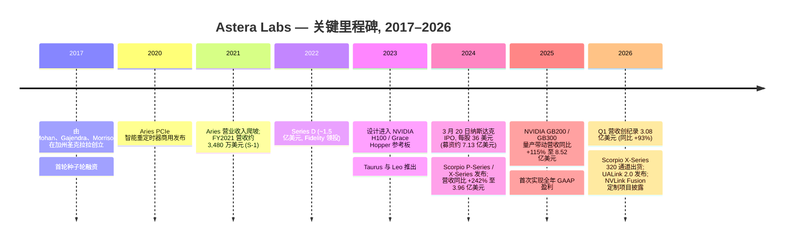
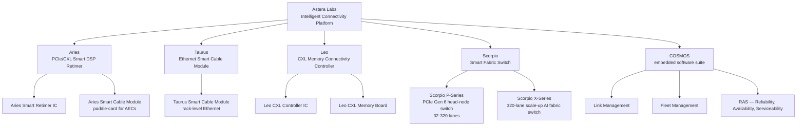
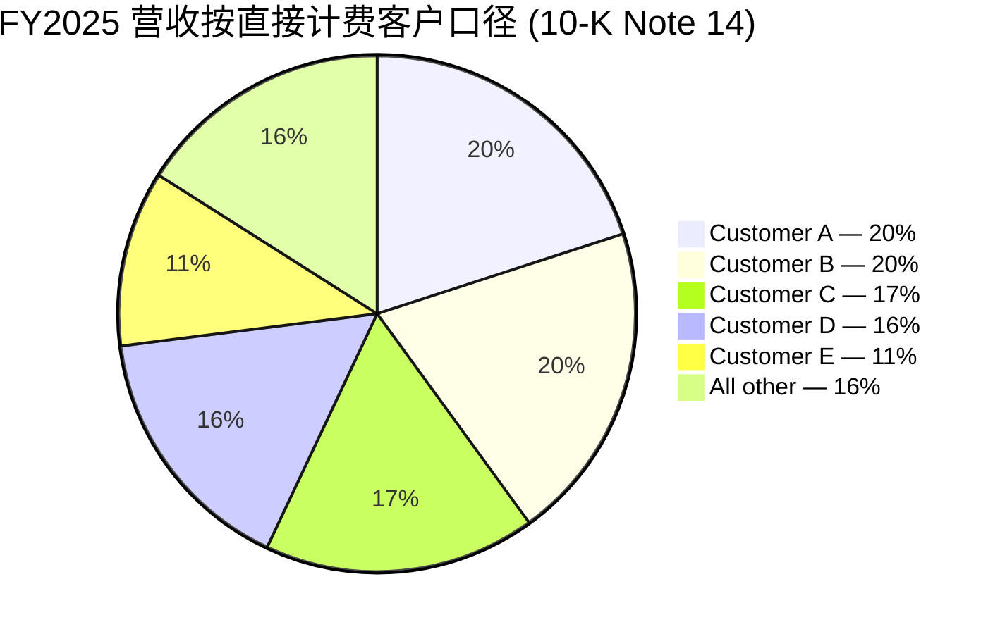
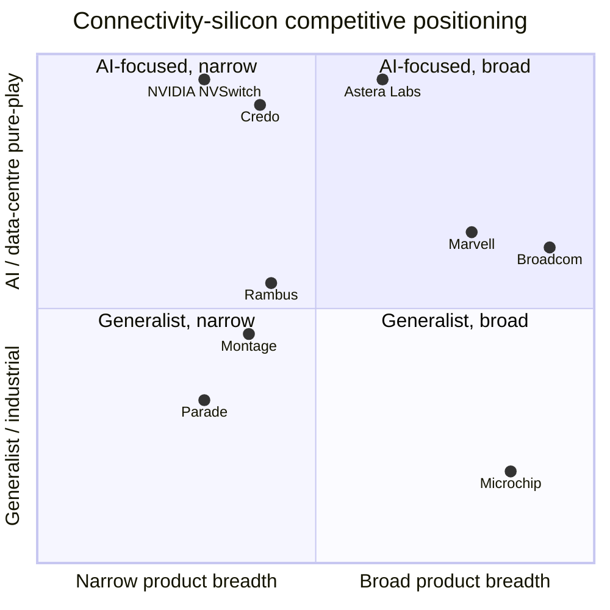

# Astera Labs, Inc. (NASDAQ:ALAB) — 公司研究报告

**日期 (as of):** 2026-06-15
**作者:** Financial Agent — 首次覆盖研究备忘录 (本次刷新)
**状态:** 首次覆盖, 仅供信息参考——不构成投资建议。
**报告语言: 简体中文 (英文版同时存在于本目录)**

---

## 投资摘要 (Investment Summary) — *Analyst view:*

> 本区块为本报告作者的前瞻house观点 (*Analyst view:*), 非来自任何 SEC 文件; 10-K 不含评级或目标价。

| 项目 | 数值 |
|---|---|
| **评级 (Rating)** | **Hold / 中性** |
| **12 个月目标价 (PT)** | **US\$345** |
| **当前股价 (current price)** | US\$367.15 (2026-06-13 收盘, Yahoo Finance) |
| **隐含空间 (implied)** | **−6%** (下行) |
| **估值方法 (method)** | 2027E Non-GAAP EPS US\$5.75 × 60× forward P/E = US\$345 |
| **市值 (market cap)** | US\$62.9bn |
| **企业价值 (EV)** | ~US\$50.5bn (现金及可销售证券约 US\$12.4bn, 无负债) |
| **52 周区间** | US\$84.78 – US\$390.99 |
| **Beta** | 3.96 (高波动) |
| **代码 / 交易所** | NASDAQ:ALAB |

**论点支柱 (thesis pillars, 均为 *Analyst view:*):**

1. **执行无懈可击, 但估值已透支。** ALAB 在 PCIe retimer (重定时器) 品类近乎垄断 (UBS 估 >90% 份额), FY2025 营收 +115%、FY2026 Q1 +93%、且已 GAAP 盈利——半导体行业极罕见的"高增长 + 盈利"组合。但 TTM P/S 63×、TTM P/E 250×、forward P/E 87× 处于 AI 硅片同业的绝对顶端, 已把 2027–2029 年的份额扩张完整定价。
2. **Scorpio 交换芯片是真实的第二增长引擎——也是最有争议的战场。** 管理层指引 Scorpio 在 2026 年底成为最大产品系列; switch TAM 约 US\$10bn (2030E)。但这是直接攻击 Broadcom 与 NVIDIA NVSwitch 的红海, 商用 (merchant) scale-up 能否真正取代专有 NVLink 是未来 24 个月的核心赌注。
3. **极端客户集中度 + 单点制造是结构性脆弱性。** FY2025 单一终端客户 >70%、前三大约 86% (NVIDIA + 少数 hyperscaler); 所有 IC 由台湾 TSMC 独家代工。任一中断都会 ~1:1 冲击营收。
4. **CPO (co-packaged optics, 共封装光学) 是长期颠覆风险。** UBS 测算到 2030 年约 50% 营收 (铜互连 Aries + Taurus) 面临被光替代的风险; ALAB 通过自研光引擎与 aiXscale 玻璃耦合器对冲, 但需与更强对手长期抗衡。

---

## 目录
1. 公司概览
   - 1A. 估值与目标价 (Valuation & Price Target)
   - 1B. GF Score 基本面评分
2. 估值与前瞻模型 (Valuation & Forward Model) + 卖方观点演变
3. 公司历史
4. 管理团队
5. 产品与服务
6. 客户与上市策略
7. 行业概览
8. 竞争格局
9. 市场机会 (TAM)
9.5. 核心分歧与催化剂 (Key Debates & Catalysts)
10. 风险评估
11. 投资者视角评分 (Investor Lenses)
12. 参考资料

---

## 1. 公司概览

**本方观点 (thesis-first):** Astera Labs 是机架级 (rack-scale) AI 连接主题中最纯粹的上市标的, 执行力一流且已盈利; 但当前估值 (TTM P/S 63×) 已为多年期份额扩张充分定价, 风险回报对称性偏向下行——我们给予 **Hold / 中性**, 12 个月目标价 US\$345 (隐含 −6%)。下文先交代决策层 (1A/1B + 第 2 节), 再展开描述性章节。

Astera Labs 是一家专为 AI 与云数据中心基础设施而生的无晶圆厂 (fabless) 连接芯片 (connectivity chip) 公司。公司设计并销售四大产品系列——**Aries** PCIe / CXL 智能 DSP 重定时器 (Smart DSP Retimer) 与智能电缆模块 (Smart Cable Module); **Taurus** 以太网智能电缆模块 (Ethernet Smart Cable Module); **Leo** CXL (Compute Express Link) 内存连接控制器 (Memory Connectivity Controller); 以及 **Scorpio** 智能交换芯片 (Smart Fabric Switch)——所有产品均集成一套名为 **COSMOS** 的嵌入式软件套件, 该软件同时运行于芯片内置微控制器与主机操作系统上。硬件加软件的组合方案以"智能连接平台 (Intelligent Connectivity Platform)"的名义对外销售——芯片、模块、电路板与固件, 用于解决围绕 GPU 加速器构建的机架级 AI 系统中的信号完整性 (signal integrity)、延迟、带宽与内存瓶颈问题 ([Astera Labs 2025 财年 10-K, "Our Products and Solutions"](https://www.sec.gov/Archives/edgar/data/1736297/000173629726000010/alab-20251231.htm))。

公司总部位于加利福尼亚州圣何塞市北第一街 2345 号, 在纳斯达克全球精选市场以代码 **ALAB** 上市, **IPO 日期为 2024 年 3 月 20 日**, 发行价每股 36 美元。截至 2025 年 12 月 31 日, 公司在全球拥有 **756 名全职员工**——北美 527 人、亚洲 208 人、欧洲 21 人——并辅以合同制人员 ([10-K, "Human Capital"](https://www.sec.gov/Archives/edgar/data/1736297/000173629726000010/alab-20251231.htm))。制造完全外包: **所有集成电路 (IC) 均由台积电 (TSMC) 代工**, 封装与测试由 ASE (日月光) 和 Amkor (安靠) 承接; 模块、电路板与 IC 基板由少数额外合作伙伴生产 ([10-K, "Manufacturing and Suppliers"](https://www.sec.gov/Archives/edgar/data/1736297/000173629726000010/alab-20251231.htm))。

**盈利方式 (how it makes money)。** ALAB 销售专用半导体连接产品——有时以裸片 IC 形式, 但越来越多地以集成硬件模块和电路板形式销售 (例如 Aries 智能电缆模块、Taurus 主动电气电缆 (Active Electrical Cable, AEC)), 以及 PCIe/CXL 交换芯片硅片 (Scorpio P-Series 与 X-Series 320 通道智能交换芯片)。营业收入在产品发运至直接客户与分销商时点确认。客户分为三类: (1) 直接采购并主导供应决策的超大规模云运营商 (hyperscaler); (2) AI 加速器与 GPU 供应商 (特别是 NVIDIA, 已将 Aries 重定时器与 Scorpio 交换芯片设计进 GB200 / GB300 参考平台); (3) 将 ALAB 硅片集成进面向 hyperscaler 出货机柜的系统 OEM。分销商负责履约与物流, 而非需求创造; ALAB 的商业关系建立在终端客户层面 ([10-K, "Sales and Distribution"](https://www.sec.gov/Archives/edgar/data/1736297/000173629726000010/alab-20251231.htm))。

**规模与增长。** 2025 财年 GAAP 营业收入为 **8.525 亿美元, 同比增长 115%**, 较 2024 财年的 3.963 亿美元大幅增长 ([10-K, "Results of Operations"](https://www.sec.gov/Archives/edgar/data/1736297/000173629726000010/alab-20251231.htm))。GAAP 毛利率 (gross margin) 为 75.7% (2024 财年: 76.4%, 同比下降 70 个基点 (bps), 主因营业收入中硬件模块占比上升——模块毛利率低于裸片 IC)。GAAP 营业利润从 2024 财年 1.161 亿美元的亏损翻转为 2025 财年 1.734 亿美元的盈利——营业利润率 (operating margin) 从 –29.3% 跃升至 +20.3%, 因营业收入在基本固定的研发基础上规模化 ([10-K, "Operating Expenses"](https://www.sec.gov/Archives/edgar/data/1736297/000173629726000010/alab-20251231.htm))。GAAP 净利润为 2.191 亿美元 (摊薄 EPS 1.22 美元), 相较 2024 财年 8,340 万美元亏损。2026 财年 Q1 延续此轨迹: 营业收入 3.084 亿美元 (同比 +93%、环比 +14%)、GAAP 营业利润率 20.1%、GAAP 净利润 8,030 万美元 (摊薄 EPS 0.44 美元)、Non-GAAP 营业利润 1.117 亿美元 (Non-GAAP 营业利润率 36.2%) ([2026 财年 Q1 业绩公告 (8-K Ex. 99.1), 2026-05-05](https://www.sec.gov/Archives/edgar/data/1736297/000173629726000017/q126exhibit991.htm))。

**本期新变化 (What's new — 截至 2026-06-15):** (1) 2026 财年 Q1 业绩 (2026-05-05) 创纪录 3.084 亿美元, 管理层对 Q2 给出 GAAP 营收指引 **3.55–3.65 亿美元** (隐含环比 ~15–18%)、GAAP 毛利率约 73%、GAAP 营业费用 1.88–1.91 亿美元; (2) Scorpio X-Series 320 通道智能交换芯片开始出货, 2026 下半年量产爬坡; (3) 2026-06-04 召开年度股东大会 (8-K Item 5.07), 改选全部董事——常规治理事项, 无业务影响 ([2026-06-04 8-K, Item 5.07](https://www.sec.gov/Archives/edgar/data/1736297/000173629726000027/alab-20260604.htm))。Q2 FY26 财报预计 2026 年 8 月初发布, 故本刷新的最新审计/季度数据仍为 2026-05-05 的 Q1 披露。

<svg xmlns="http://www.w3.org/2000/svg" viewBox="0 0 860 470" width="860" height="470" role="img" aria-label="historical revenue bars"><rect x="0" y="0" width="860" height="470" fill="#ffffff"/>
<text x="20.00" y="30.00" text-anchor="start" font-family="Helvetica,Arial,sans-serif" font-size="15" font-weight="700" fill="#1f2933">Astera Labs 年度营收 (US$ m, FY2021–FY2025)</text>
<rect x="20.00" y="44" width="11" height="11" rx="2" fill="#2563eb"/>
<text x="36.00" y="53.00" text-anchor="start" font-family="Helvetica,Arial,sans-serif" font-size="10.5" font-weight="400" fill="#1f2933">Total revenue</text>
<line x1="70" y1="412.00" x2="834" y2="412.00" stroke="#eceff2" stroke-width="1"/>
<text x="64.00" y="415.00" text-anchor="end" font-family="Helvetica,Arial,sans-serif" font-size="9.5" font-weight="400" fill="#52606d">$0</text>
<line x1="70" y1="345.20" x2="834" y2="345.20" stroke="#eceff2" stroke-width="1"/>
<text x="64.00" y="348.20" text-anchor="end" font-family="Helvetica,Arial,sans-serif" font-size="9.5" font-weight="400" fill="#52606d">$184.1M</text>
<line x1="70" y1="278.40" x2="834" y2="278.40" stroke="#eceff2" stroke-width="1"/>
<text x="64.00" y="281.40" text-anchor="end" font-family="Helvetica,Arial,sans-serif" font-size="9.5" font-weight="400" fill="#52606d">$368.3M</text>
<line x1="70" y1="211.60" x2="834" y2="211.60" stroke="#eceff2" stroke-width="1"/>
<text x="64.00" y="214.60" text-anchor="end" font-family="Helvetica,Arial,sans-serif" font-size="9.5" font-weight="400" fill="#52606d">$552.4M</text>
<line x1="70" y1="144.80" x2="834" y2="144.80" stroke="#eceff2" stroke-width="1"/>
<text x="64.00" y="147.80" text-anchor="end" font-family="Helvetica,Arial,sans-serif" font-size="9.5" font-weight="400" fill="#52606d">$736.6M</text>
<line x1="70" y1="78.00" x2="834" y2="78.00" stroke="#eceff2" stroke-width="1"/>
<text x="64.00" y="81.00" text-anchor="end" font-family="Helvetica,Arial,sans-serif" font-size="9.5" font-weight="400" fill="#52606d">$920.7M</text>
<rect x="102.09" y="399.38" width="88.62" height="12.62" fill="#2563eb"/>
<text x="146.40" y="428.00" text-anchor="middle" font-family="Helvetica,Arial,sans-serif" font-size="10" font-weight="400" fill="#52606d">2021</text>
<rect x="254.89" y="383.01" width="88.62" height="28.99" fill="#2563eb"/>
<text x="299.20" y="428.00" text-anchor="middle" font-family="Helvetica,Arial,sans-serif" font-size="10" font-weight="400" fill="#52606d">2022</text>
<rect x="407.69" y="369.99" width="88.62" height="42.01" fill="#2563eb"/>
<text x="452.00" y="428.00" text-anchor="middle" font-family="Helvetica,Arial,sans-serif" font-size="10" font-weight="400" fill="#52606d">2023</text>
<rect x="560.49" y="268.24" width="88.62" height="143.76" fill="#2563eb"/>
<text x="604.80" y="428.00" text-anchor="middle" font-family="Helvetica,Arial,sans-serif" font-size="10" font-weight="400" fill="#52606d">2024</text>
<rect x="713.29" y="102.74" width="88.62" height="309.26" fill="#2563eb"/>
<text x="757.60" y="428.00" text-anchor="middle" font-family="Helvetica,Arial,sans-serif" font-size="10" font-weight="400" fill="#52606d">2025</text>
<text x="430.00" y="454.00" text-anchor="middle" font-family="Helvetica,Arial,sans-serif" font-size="10" font-weight="400" fill="#52606d">Source: Astera Labs FY2025 10-K + S-1 (FY2021-22) · as of 2026-06-15</text>
</svg>
*来源: [Astera Labs 2025 财年 10-K, "Results of Operations"](https://www.sec.gov/Archives/edgar/data/1736297/000173629726000010/alab-20251231.htm); FY2021–22 数据来自 [S-1, "Selected Consolidated Financial Data"](https://www.sec.gov/Archives/edgar/data/1736297/000119312524040419/d285484ds1.htm)。*

下图把 FY2025 利润表拆为 Sankey: US\$852.5M 营收 → US\$207.3M COGS / US\$645.3M 毛利 → R&D US\$304.0M + S&M US\$79.8M + G&A US\$88.1M + 营业利润 US\$173.4M; 加 US\$52.6M 其他收入 (主要为现金利息) 后税前 US\$226.1M, 税 US\$6.9M, 净利 US\$219.1M。

<svg xmlns="http://www.w3.org/2000/svg" viewBox="0 0 1000 560" width="1000" height="560" role="img" aria-label="income statement Sankey"><rect x="0" y="0" width="1000" height="560" fill="#ffffff"/>
<text x="20.00" y="30.00" text-anchor="start" font-family="Helvetica,Arial,sans-serif" font-size="15" font-weight="700" fill="#1f2933">Astera Labs FY2025 利润表 Sankey (US$ thousands)</text>
<path d="M 452.00,71.00 C 506.00,71.00 506.00,122.30 560.00,122.30 L 560.00,208.14 C 506.00,208.14 506.00,156.84 452.00,156.84 Z" fill="#86efac" fill-opacity="0.55"/>
<path d="M 452.00,156.84 C 506.00,156.84 506.00,222.14 560.00,222.14 L 560.00,455.70 C 506.00,455.70 506.00,390.40 452.00,390.40 Z" fill="#fca5a5" fill-opacity="0.55"/>
<path d="M 328.00,78.00 C 382.00,78.00 382.00,71.00 436.00,71.00 L 436.00,390.40 C 382.00,390.40 382.00,397.40 328.00,397.40 Z" fill="#86efac" fill-opacity="0.55"/>
<path d="M 204.00,78.00 C 258.00,78.00 258.00,78.00 312.00,78.00 L 312.00,500.00 C 258.00,500.00 258.00,500.00 204.00,500.00 Z" fill="#93c5fd" fill-opacity="0.55"/>
<path d="M 328.00,397.40 C 382.00,397.40 382.00,404.40 436.00,404.40 L 436.00,507.00 C 382.00,507.00 382.00,500.00 328.00,500.00 Z" fill="#fca5a5" fill-opacity="0.55"/>
<path d="M 700.00,102.27 C 754.00,102.27 754.00,226.05 808.00,226.05 L 808.00,334.52 C 754.00,334.52 754.00,210.74 700.00,210.74 Z" fill="#86efac" fill-opacity="0.55"/>
<path d="M 700.00,210.74 C 754.00,210.74 754.00,348.52 808.00,348.52 L 808.00,351.95 C 754.00,351.95 754.00,214.17 700.00,214.17 Z" fill="#fca5a5" fill-opacity="0.55"/>
<path d="M 576.00,122.30 C 630.00,122.30 630.00,102.27 684.00,102.27 L 684.00,188.12 C 630.00,188.12 630.00,208.14 576.00,208.14 Z" fill="#86efac" fill-opacity="0.55"/>
<path d="M 576.00,222.14 C 630.00,222.14 630.00,228.17 684.00,228.17 L 684.00,311.25 C 630.00,311.25 630.00,305.22 576.00,305.22 Z" fill="#fca5a5" fill-opacity="0.55"/>
<path d="M 576.00,305.22 C 630.00,305.22 630.00,325.25 684.00,325.25 L 684.00,475.73 C 630.00,475.73 630.00,455.70 576.00,455.70 Z" fill="#fca5a5" fill-opacity="0.55"/>
<rect x="188.00" y="78.00" width="16" height="422.00" rx="1.5" fill="#2563eb"/>
<rect x="312.00" y="78.00" width="16" height="422.00" rx="1.5" fill="#1e3a8a"/>
<rect x="436.00" y="71.00" width="16" height="319.40" rx="1.5" fill="#15803d"/>
<rect x="436.00" y="404.40" width="16" height="102.60" rx="1.5" fill="#dc2626"/>
<rect x="560.00" y="122.30" width="16" height="85.84" rx="1.5" fill="#15803d"/>
<rect x="560.00" y="222.14" width="16" height="233.56" rx="1.5" fill="#dc2626"/>
<rect x="684.00" y="102.27" width="16" height="111.90" rx="1.5" fill="#15803d"/>
<rect x="684.00" y="228.17" width="16" height="83.08" rx="1.5" fill="#dc2626"/>
<rect x="684.00" y="325.25" width="16" height="150.48" rx="1.5" fill="#dc2626"/>
<rect x="808.00" y="226.05" width="16" height="108.47" rx="1.5" fill="#15803d"/>
<rect x="808.00" y="348.52" width="16" height="3.42" rx="1.5" fill="#dc2626"/>
<text x="179.00" y="286.00" text-anchor="end" font-family="Helvetica,Arial,sans-serif" font-size="11.5" font-weight="700" fill="#1f2933">Aries + Scorpio + Taurus + Leo</text>
<text x="179.00" y="299.00" text-anchor="end" font-family="Helvetica,Arial,sans-serif" font-size="10" font-weight="400" fill="#52606d">$852.5M  (100.0%)</text>
<rect x="331.00" y="60.00" width="113.10" height="26" rx="2" fill="#ffffff" fill-opacity="0.72"/>
<text x="334.00" y="72.00" text-anchor="start" font-family="Helvetica,Arial,sans-serif" font-size="11.5" font-weight="700" fill="#1f2933">Revenue</text>
<text x="334.00" y="85.00" text-anchor="start" font-family="Helvetica,Arial,sans-serif" font-size="10" font-weight="400" fill="#52606d">$852.5M  (100.0%)</text>
<rect x="455.00" y="53.00" width="106.80" height="26" rx="2" fill="#ffffff" fill-opacity="0.72"/>
<text x="458.00" y="65.00" text-anchor="start" font-family="Helvetica,Arial,sans-serif" font-size="11.5" font-weight="700" fill="#1f2933">Gross Profit</text>
<text x="458.00" y="78.00" text-anchor="start" font-family="Helvetica,Arial,sans-serif" font-size="10" font-weight="400" fill="#52606d">$645.3M  (75.7%)</text>
<rect x="455.00" y="386.40" width="144.60" height="26" rx="2" fill="#ffffff" fill-opacity="0.72"/>
<text x="458.00" y="398.40" text-anchor="start" font-family="Helvetica,Arial,sans-serif" font-size="11.5" font-weight="700" fill="#1f2933">Cost of Revenue (COGS)</text>
<text x="458.00" y="411.40" text-anchor="start" font-family="Helvetica,Arial,sans-serif" font-size="10" font-weight="400" fill="#52606d">$207.3M  (24.3%)</text>
<rect x="579.00" y="104.30" width="106.80" height="26" rx="2" fill="#ffffff" fill-opacity="0.72"/>
<text x="582.00" y="116.30" text-anchor="start" font-family="Helvetica,Arial,sans-serif" font-size="11.5" font-weight="700" fill="#1f2933">Operating Income</text>
<text x="582.00" y="129.30" text-anchor="start" font-family="Helvetica,Arial,sans-serif" font-size="10" font-weight="400" fill="#52606d">$173.4M  (20.3%)</text>
<rect x="579.00" y="204.14" width="150.90" height="26" rx="2" fill="#ffffff" fill-opacity="0.72"/>
<text x="582.00" y="216.14" text-anchor="start" font-family="Helvetica,Arial,sans-serif" font-size="11.5" font-weight="700" fill="#1f2933">Total Operating Expense</text>
<text x="582.00" y="229.14" text-anchor="start" font-family="Helvetica,Arial,sans-serif" font-size="10" font-weight="400" fill="#52606d">$471.8M  (55.3%)</text>
<rect x="703.00" y="84.27" width="106.80" height="26" rx="2" fill="#ffffff" fill-opacity="0.72"/>
<text x="706.00" y="96.27" text-anchor="start" font-family="Helvetica,Arial,sans-serif" font-size="11.5" font-weight="700" fill="#1f2933">Pretax Income</text>
<text x="706.00" y="109.27" text-anchor="start" font-family="Helvetica,Arial,sans-serif" font-size="10" font-weight="400" fill="#52606d">$226.1M  (26.5%)</text>
<rect x="703.00" y="210.17" width="106.80" height="26" rx="2" fill="#ffffff" fill-opacity="0.72"/>
<text x="706.00" y="222.17" text-anchor="start" font-family="Helvetica,Arial,sans-serif" font-size="11.5" font-weight="700" fill="#1f2933">SG&amp;A</text>
<text x="706.00" y="235.17" text-anchor="start" font-family="Helvetica,Arial,sans-serif" font-size="10" font-weight="400" fill="#52606d">$167.8M  (19.7%)</text>
<rect x="703.00" y="307.25" width="106.80" height="26" rx="2" fill="#ffffff" fill-opacity="0.72"/>
<text x="706.00" y="319.25" text-anchor="start" font-family="Helvetica,Arial,sans-serif" font-size="11.5" font-weight="700" fill="#1f2933">R&amp;D</text>
<text x="706.00" y="332.25" text-anchor="start" font-family="Helvetica,Arial,sans-serif" font-size="10" font-weight="400" fill="#52606d">$304.0M  (35.7%)</text>
<text x="833.00" y="277.29" text-anchor="start" font-family="Helvetica,Arial,sans-serif" font-size="11.5" font-weight="700" fill="#1f2933">Net Income</text>
<text x="833.00" y="290.29" text-anchor="start" font-family="Helvetica,Arial,sans-serif" font-size="10" font-weight="400" fill="#52606d">$219.1M  (25.7%)</text>
<text x="833.00" y="347.24" text-anchor="start" font-family="Helvetica,Arial,sans-serif" font-size="11.5" font-weight="700" fill="#1f2933">Income Tax</text>
<text x="833.00" y="360.24" text-anchor="start" font-family="Helvetica,Arial,sans-serif" font-size="10" font-weight="400" fill="#52606d">$6.9M  (0.81%)</text>
<text x="500.00" y="544.00" text-anchor="middle" font-family="Helvetica,Arial,sans-serif" font-size="10" font-weight="400" fill="#52606d">Source: Astera Labs FY2025 10-K (income statement) · as of 2026-06-15</text>
</svg>
*来源: [Astera Labs 2025 财年 10-K — 合并经营报表](https://www.sec.gov/Archives/edgar/data/1736297/000173629726000010/alab-20251231.htm)。*

**地理结构。** 按账单地址 (billing address) 口径, 2025 财年营业收入大幅倾向亚洲: 新加坡 2.770 亿美元 (32%)、中国 2.563 亿美元 (30%)、台湾 2.474 亿美元 (29%)、美国 2,740 万美元 (3%)、其他 4,440 万美元 (5%) ([10-K, Note 14 — Concentrations](https://www.sec.gov/Archives/edgar/data/1736297/000173629726000010/alab-20251231.htm))。亚洲权重之高源自 hyperscaler 的代工厂与分销商在何处取得产品法定所有权 (真实终端客户需求主要来自美国 hyperscaler 与 NVIDIA 总部位于美国的 GPU 业务); 它并不反映对中国终端市场的实质暴露。

<svg xmlns="http://www.w3.org/2000/svg" viewBox="0 0 720 460" width="720" height="460" role="img" aria-label="revenue donut"><rect x="0" y="0" width="720" height="460" fill="#ffffff"/>
<text x="20.00" y="30.00" text-anchor="start" font-family="Helvetica,Arial,sans-serif" font-size="15" font-weight="700" fill="#1f2933">Astera Labs FY2025 营收按地域 (账单地址口径, US$ thousands)</text>
<path d="M 288.00,107.20 A 132 132 0 0 1 405.65,299.06 L 357.52,274.57 A 78 78 0 0 0 288.00,161.20 Z" fill="#2563eb"/>
<path d="M 405.65,299.06 A 132 132 0 0 1 194.36,332.24 L 232.67,294.18 A 78 78 0 0 0 357.52,274.57 Z" fill="#15803d"/>
<path d="M 194.36,332.24 A 132 132 0 0 1 221.35,125.26 L 248.62,171.87 A 78 78 0 0 0 232.67,294.18 Z" fill="#d97706"/>
<path d="M 221.35,125.26 A 132 132 0 0 1 245.59,114.20 L 262.94,165.34 A 78 78 0 0 0 248.62,171.87 Z" fill="#7c3aed"/>
<path d="M 245.59,114.20 A 132 132 0 0 1 288.00,107.20 L 288.00,161.20 A 78 78 0 0 0 262.94,165.34 Z" fill="#dc2626"/>
<text x="288.00" y="235.20" text-anchor="middle" font-family="Helvetica,Arial,sans-serif" font-size="18" font-weight="800" fill="#1f2933">FY2025\n地域</text>
<text x="288.00" y="255.20" text-anchor="middle" font-family="Helvetica,Arial,sans-serif" font-size="13" font-weight="600" fill="#52606d">$852.5M</text>
<text x="288.00" y="271.20" text-anchor="middle" font-family="Helvetica,Arial,sans-serif" font-size="10" font-weight="400" fill="#8a97a3">total</text>
<line x1="405.64" y1="167.06" x2="421.64" y2="167.06" stroke="#2563eb" stroke-width="1.4"/>
<text x="425.64" y="165.06" text-anchor="start" font-family="Helvetica,Arial,sans-serif" font-size="11" font-weight="700" fill="#1f2933">Singapore</text>
<text x="425.64" y="179.06" text-anchor="start" font-family="Helvetica,Arial,sans-serif" font-size="10" font-weight="400" fill="#52606d">$277.0M  (32.5%)</text>
<line x1="309.41" y1="375.53" x2="325.41" y2="375.53" stroke="#15803d" stroke-width="1.4"/>
<text x="329.41" y="373.53" text-anchor="start" font-family="Helvetica,Arial,sans-serif" font-size="11" font-weight="700" fill="#1f2933">China</text>
<text x="329.41" y="387.53" text-anchor="start" font-family="Helvetica,Arial,sans-serif" font-size="10" font-weight="400" fill="#52606d">$256.3M  (30.1%)</text>
<line x1="151.16" y1="221.35" x2="135.16" y2="221.35" stroke="#d97706" stroke-width="1.4"/>
<text x="131.16" y="219.35" text-anchor="end" font-family="Helvetica,Arial,sans-serif" font-size="11" font-weight="700" fill="#1f2933">Taiwan</text>
<text x="131.16" y="233.35" text-anchor="end" font-family="Helvetica,Arial,sans-serif" font-size="10" font-weight="400" fill="#52606d">$247.4M  (29.0%)</text>
<line x1="230.70" y1="113.66" x2="214.70" y2="113.66" stroke="#7c3aed" stroke-width="1.4"/>
<text x="210.70" y="111.66" text-anchor="end" font-family="Helvetica,Arial,sans-serif" font-size="11" font-weight="700" fill="#1f2933">United States</text>
<text x="210.70" y="125.66" text-anchor="end" font-family="Helvetica,Arial,sans-serif" font-size="10" font-weight="400" fill="#52606d">$27.4M  (3.2%)</text>
<line x1="265.53" y1="103.04" x2="249.53" y2="103.04" stroke="#dc2626" stroke-width="1.4"/>
<text x="245.53" y="101.04" text-anchor="end" font-family="Helvetica,Arial,sans-serif" font-size="11" font-weight="700" fill="#1f2933">Other</text>
<text x="245.53" y="115.04" text-anchor="end" font-family="Helvetica,Arial,sans-serif" font-size="10" font-weight="400" fill="#52606d">$44.4M  (5.2%)</text>
<text x="360.00" y="444.00" text-anchor="middle" font-family="Helvetica,Arial,sans-serif" font-size="10" font-weight="400" fill="#52606d">Source: Astera Labs FY2025 10-K, Note 14 — geographic disaggregation · as of 2026-06-15</text>
</svg>
*来源: [Astera Labs 2025 财年 10-K, Note 14 — geographic disaggregation](https://www.sec.gov/Archives/edgar/data/1736297/000173629726000010/alab-20251231.htm)。账单地址口径, 非终端需求地。*

### 1A. 估值与目标价 (Valuation & Price Target)

**估值快照 (截至 2026-06-13 收盘, Yahoo Finance)。** 股价 367.15 美元, 距 52 周高点 390.99 美元约 6% (52 周低点: 84.78 美元)——自上次刷新 (2026-05-20, 285 美元) 以来已再涨约 29%。市值 **629 亿美元**, 企业价值 (Enterprise Value, EV) 约 505 亿美元 (约 124 亿美元的差距反映 12.4 亿美元现金及可销售证券——2025 年 12 月 31 日现金 1.676 亿美元与可销售证券 10.212 亿美元, 加 Q1 经营现金流增量——且无负债) ([Yahoo Finance — ALAB Key Statistics, 2026-06-13](https://finance.yahoo.com/quote/ALAB/key-statistics/); [10-K, 资产负债表](https://www.sec.gov/Archives/edgar/data/1736297/000173629726000010/alab-20251231.htm))。

- **TTM 市盈率 (P/E) = 250×** (TTM EPS 约 1.47 美元, 盈利基数尚处起步阶段)。
- **TTM 市销率 (P/S) = 62.8×** (TTM 营业收入约 10.0 亿美元)。
- **远期 P/E (forward P/E, NTM consensus) = 87×。**
- **EV / TTM 营业收入 ≈ 51×。**
- **Beta = 3.96**——在 AI 硅片队列中波动最高之一。

这些倍数处于 AI 硅片同业群的绝对最高端。同业比较 (均为 TTM, [Yahoo Finance, 2026-06-13](https://finance.yahoo.com/quote/ALAB/key-statistics/)):

| 代码 | 价格 美元 | 市值 | TTM P/E | TTM P/S | forward P/E | 最近一期同比营收 | Beta |
|---|---:|---:|---:|---:|---:|---:|---:|
| **ALAB** | 367.15 | \$62.9bn | **250×** | **62.8×** | **87×** | **+93%** | 3.96 |
| CRDO | 250.81 | \$46.3bn | 137× | 34.7× | 28.9× | +202% | 3.23 |
| MRVL | 279.70 | \$244.7bn | 96× | 28.1× | 45.3× | +22% | 2.28 |
| AVGO | 382.07 | \$1.82tn | 64× | 24.1× | 19.7× | +30% | 1.43 |
| NVDA | 205.19 | \$4.97tn | 31× | 19.6× | 16.1× | +73% | 2.20 |

**ALAB 高估值的解读 (Step 2a 极端倍数判读)。** TTM P/S 62.8× 与 forward P/E 87× 均显著高于 AI 硅片行业中位数 (从 MRVL / AVGO / NVDA 综合来看, forward P/E 约 16–45×、P/S 约 20–28×)。按优先级排列, 三大驱动因素在起作用:

1. **盈利尚未规模化 (earnings depressed by reinvestment)。** FY2025 营业利润率 (GAAP 20.3%、Non-GAAP 39.2%) 仍在向管理层稳态模型 (Non-GAAP 营业利润率目标约 40%、Citi 路演纪要) 靠拢; 随营业杠杆释放, P/E 分母快速扩大——forward P/E 87× 比 TTM 250× 更具锚定意义, 但即便 forward 口径也是 NVDA (16×) 的 5 倍以上。
2. **增长溢价 (growth premium)。** 美国上市半导体公司中, 极少有能在 GAAP 盈利同时实现营收同比约 90% 增长的标的。市场支付的是 2027–2029 年隐含营收基数, 而非 TTM 数字。
3. **AI 主题/稀缺性溢价。** ALAB 是机架级 AI 连接主题 (PCIe 6 / CXL / UALink) 中最纯粹的公开标的; 当 NVIDIA、AVGO 与 CRDO 在 2024–2025 年重估时, ALAB 以最高 beta (3.96) 跟随同一行情。

估值**显著高位且已无安全边际**。UBS 在 2026-04-21 首次覆盖时即以 180 美元目标价、Neutral 评级判定"铜互连故事诱人但已被充分定价" (2027E P/E ~48× vs. 半导体网络同业 ~20×, PEG ~1.5× vs. 同行 ~1.2×) ([*Analyst view:* UBS — Astera Labs initiation, 2026-04-21, p.1](http://xs-macbook-air.local:5001/zsxq/pdf/415514155288258/UBS-Astera%20Labs%20Inc%20Appealing%20Copper%20Story%2C%20But%20Fully%20Priced%20In%20Light%20of%20CPO%20Risks%20-%20Initiate%20Neutral%2C%20%24180%20PT-260421.pdf))。自该报告以来股价又翻倍, 进一步放大了倍数压缩风险——详见第 2 节的前瞻模型与第 10 章风险。

### 1B. GF Score 基本面评分 — *Analyst view:*

下方 GF Score (GuruFocus 式) 五维评分是本报告作者的评分框架 (*Analyst view:*), **非来自 GuruFocus 发布数据, 也不附任何文件引用于评分本身**; 每一维的底层指标在下文各带内联引用。综合分 **78 / 100** (落在 70–80 "中上" 区间)。

<svg xmlns="http://www.w3.org/2000/svg" viewBox="0 0 500 500" width="500" height="500" role="img" aria-label="GF Score radar">
<rect x="0" y="0" width="500" height="500" fill="#ffffff"/>
<text x="20" y="24" font-family="Helvetica,Arial,sans-serif" font-size="15" font-weight="700" fill="#1f2933">GF Score (GuruFocus-style): 78/100</text>
<text x="20" y="41" font-family="Helvetica,Arial,sans-serif" font-size="11" fill="#52606d">71–80 Likely average performance</text>
<polygon points="250.0,88.0 392.7,191.6 338.2,359.4 161.8,359.4 107.3,191.6" fill="#e9f5ec" stroke="none"/>
<polygon points="250.0,208.0 278.5,228.7 267.6,262.3 232.4,262.3 221.5,228.7" fill="none" stroke="#c5d3cb" stroke-width="1"/>
<polygon points="250.0,178.0 307.1,219.5 285.3,286.5 214.7,286.5 192.9,219.5" fill="none" stroke="#c5d3cb" stroke-width="1"/>
<polygon points="250.0,148.0 335.6,210.2 302.9,310.8 197.1,310.8 164.4,210.2" fill="none" stroke="#c5d3cb" stroke-width="1"/>
<polygon points="250.0,118.0 364.1,200.9 320.5,335.1 179.5,335.1 135.9,200.9" fill="none" stroke="#c5d3cb" stroke-width="1"/>
<polygon points="250.0,88.0 392.7,191.6 338.2,359.4 161.8,359.4 107.3,191.6" fill="none" stroke="#c5d3cb" stroke-width="1.3"/>
<line x1="250" y1="238" x2="161.8" y2="359.4" stroke="#cfdad3" stroke-width="1"/>
<text x="146.5" y="392.4" text-anchor="end" font-family="Helvetica,Arial,sans-serif" font-size="11.5" font-weight="600" fill="#1f2933">Financial Strength</text>
<text x="146.5" y="405.4" text-anchor="end" font-family="Helvetica,Arial,sans-serif" font-size="9.5" fill="#52606d">财务实力</text>
<text x="161.8" y="353.4" text-anchor="middle" font-family="Helvetica,Arial,sans-serif" font-size="10.5" font-weight="700" fill="#1f2933">10</text>
<line x1="250" y1="238" x2="250.0" y2="88.0" stroke="#cfdad3" stroke-width="1"/>
<text x="250.0" y="58.0" text-anchor="middle" font-family="Helvetica,Arial,sans-serif" font-size="11.5" font-weight="600" fill="#1f2933">Profitability</text>
<text x="250.0" y="71.0" text-anchor="middle" font-family="Helvetica,Arial,sans-serif" font-size="9.5" fill="#52606d">盈利能力</text>
<text x="250.0" y="127.0" text-anchor="middle" font-family="Helvetica,Arial,sans-serif" font-size="10.5" font-weight="700" fill="#1f2933">7</text>
<line x1="250" y1="238" x2="107.3" y2="191.6" stroke="#cfdad3" stroke-width="1"/>
<text x="82.6" y="183.6" text-anchor="end" font-family="Helvetica,Arial,sans-serif" font-size="11.5" font-weight="600" fill="#1f2933">Growth</text>
<text x="82.6" y="196.6" text-anchor="end" font-family="Helvetica,Arial,sans-serif" font-size="9.5" fill="#52606d">成长性</text>
<text x="107.3" y="185.6" text-anchor="middle" font-family="Helvetica,Arial,sans-serif" font-size="10.5" font-weight="700" fill="#1f2933">10</text>
<line x1="250" y1="238" x2="392.7" y2="191.6" stroke="#cfdad3" stroke-width="1"/>
<text x="417.4" y="183.6" text-anchor="start" font-family="Helvetica,Arial,sans-serif" font-size="11.5" font-weight="600" fill="#1f2933">GF Value</text>
<text x="417.4" y="196.6" text-anchor="start" font-family="Helvetica,Arial,sans-serif" font-size="9.5" fill="#52606d">估值</text>
<text x="264.3" y="227.4" text-anchor="middle" font-family="Helvetica,Arial,sans-serif" font-size="10.5" font-weight="700" fill="#1f2933">1</text>
<line x1="250" y1="238" x2="338.2" y2="359.4" stroke="#cfdad3" stroke-width="1"/>
<text x="353.5" y="392.4" text-anchor="start" font-family="Helvetica,Arial,sans-serif" font-size="11.5" font-weight="600" fill="#1f2933">Momentum</text>
<text x="353.5" y="405.4" text-anchor="start" font-family="Helvetica,Arial,sans-serif" font-size="9.5" fill="#52606d">动量</text>
<text x="329.4" y="341.2" text-anchor="middle" font-family="Helvetica,Arial,sans-serif" font-size="10.5" font-weight="700" fill="#1f2933">9</text>
<polygon points="250.0,133.0 264.3,233.4 329.4,347.2 161.8,359.4 107.3,191.6" fill="#2e8b57" fill-opacity="0.34" stroke="#2e8b57" stroke-width="2"/>
<circle cx="161.8" cy="359.4" r="2.6" fill="#2e8b57"/>
<circle cx="250.0" cy="133.0" r="2.6" fill="#2e8b57"/>
<circle cx="107.3" cy="191.6" r="2.6" fill="#2e8b57"/>
<circle cx="264.3" cy="233.4" r="2.6" fill="#2e8b57"/>
<circle cx="329.4" cy="347.2" r="2.6" fill="#2e8b57"/>
<text x="250" y="470" text-anchor="middle" font-family="Helvetica,Arial,sans-serif" font-size="9.5" fill="#52606d">Source: ALAB FY2025 10-K · Yahoo Finance · indicators.db, as of 2026-06-15</text>
<text x="250" y="485" text-anchor="middle" font-family="Helvetica,Arial,sans-serif" font-size="9" fill="#52606d">GF Score = independent analyst rubric (*Analyst view:*) — not GuruFocus™ official number</text>
</svg>

| 维度 / Dimension | 评分 / Score (0–10) | |
|---|---|---|
| Financial Strength (财务实力) | 10 | `██████████` |
| Profitability (盈利能力) | 7 | `███████░░░` |
| Growth (成长性) | 10 | `██████████` |
| GF Value (估值) | 1 | `█░░░░░░░░░` |
| Momentum (动量) | 9 | `█████████░` |
| **GF Score (composite, *Analyst view:*)** | **78 / 100** | **71–80 Likely average performance** |

*Composite weights (*Analyst view:*): Financial Strength 20% · Profitability 25% · Growth 25% · GF Value 15% · Momentum 15% (transparent reproduction — not GuruFocus's proprietary weighting).*
*评分为作者框架 (*Analyst view:*); 数据源: [ALAB FY2025 10-K](https://www.sec.gov/Archives/edgar/data/1736297/000173629726000010/alab-20251231.htm) · [Yahoo Finance](https://finance.yahoo.com/quote/ALAB/key-statistics/) · indicators.db, as of 2026-06-15。*

- **Financial Strength (财务强度) = 10/10。** 资产负债表近乎无瑕: 12.4 亿美元现金及可销售证券、**零有息负债**、Net Debt 为负 ([10-K 资产负债表 — 现金 1.676 亿 + 可销售证券 10.212 亿, 总负债仅 1.682 亿美元](https://www.sec.gov/Archives/edgar/data/1736297/000173629726000010/alab-20251231.htm))。无杠杆、利息覆盖无意义 (无利息支出)、Altman Z-Score 极高。满分。
- **Profitability (盈利能力) = 7/10。** GAAP 毛利率 75.7%、Non-GAAP 营业利润率 39.2% 属一流; 但 GAAP 营业利润率 20.3%、ROE 约 16% (净利 2.191 亿 / 期末权益 13.636 亿) 受高股权激励 (SBC, FY2025 约 1.59 亿美元≈19% 营收) 与起步期盈利稀释 ([10-K 经营报表 + 分部附注调节](https://www.sec.gov/Archives/edgar/data/1736297/000173629726000010/alab-20251231.htm))。盈利质量高但 GAAP 口径仍年轻, 给 7 分。
- **Growth (成长性) = 10/10。** FY2024 营收 +242%、FY2025 +115%、FY2026 Q1 +93%; 三年营收 CAGR 远超 100%, GAAP 由巨亏翻转为 2.19 亿净利 ([10-K, Results of Operations](https://www.sec.gov/Archives/edgar/data/1736297/000173629726000010/alab-20251231.htm))。绝对顶端, 满分。
- **GF Value (估值, 越高越便宜) = 1/10。** TTM P/S 62.8×、TTM P/E 250×、forward P/E 87× 均处同业绝对顶端, PEG ~1.5× 高于同行 ~1.2× ([Yahoo Finance, 2026-06-13](https://finance.yahoo.com/quote/ALAB/key-statistics/); [*Analyst view:* UBS, 2026-04-21](http://xs-macbook-air.local:5001/zsxq/pdf/415514155288258/UBS-Astera%20Labs%20Inc%20Appealing%20Copper%20Story%2C%20But%20Fully%20Priced%20In%20Light%20of%20CPO%20Risks%20-%20Initiate%20Neutral%2C%20%24180%20PT-260421.pdf))。相对内在价值区间几无安全边际, 给 1 分。
- **Momentum (动量) = 9/10。** 12 个月回报数倍 (52 周低 84.78 → 现 367.15, +333%), 股价距 52 周高点仅约 6%, 显著跑赢半导体指数与大盘 ([Yahoo Finance, 2026-06-13](https://finance.yahoo.com/quote/ALAB/key-statistics/))。动量极强, 给 9 分 (留 1 分予高 beta 3.96 隐含的回撤风险)。

综合分 78 与本报告的 Hold 评级一致: 财务强度、成长、动量满格, 但 GF Value 仅 1 分——正是 Hold 而非 Buy 的核心原因。

---

## 2. 估值与前瞻模型 (Valuation & Forward Model) — *Analyst view:*

> 本节全部前瞻数字 (营收、毛利率、EPS、目标价、情景) 均为本报告作者的house观点 (*Analyst view:*), 不附任何文件引用——10-K 不含预测或目标价。每个驱动因子的外部依据 (10-K 分部数据 + 管理层指引 + 行业预测) 在文中内联引用。

### 2.1 前瞻财务模型 (3 年)

模型从四系列产品组合自下而上构建, 锚定: (a) 已披露的 FY2025 基数与 FY2026 Q1 实绩 + Q2 指引 ([2026 财年 Q1 业绩公告, 2026-05-05](https://www.sec.gov/Archives/edgar/data/1736297/000173629726000017/q126exhibit991.htm)); (b) Scorpio 量产爬坡指引 (2026 下半年, 管理层称 2026 年底成最大产品系列, [*Analyst view:* J.P. Morgan TMC note, 2026-05-19, p.1](http://xs-macbook-air.local:5001/zsxq/pdf/812454158811542/J.P.%20Morgan-Astera%20Labs%20Inc%EF%BC%88ALAB.US%EF%BC%89%20J.P.%20Morgan%20TMC%20Conference%20Takeaways-260519.pdf)); (c) 单系统连接芯片价值量上升 (Aries <\$100 → 含 Scorpio P ~\$500 → 含 Scorpio X >\$1000, [*Analyst view:* Citi Silicon Valley Bus Tour, 2026-06-02, p.1](http://xs-macbook-air.local:5001/zsxq/pdf/184155221524182/CITI-US%20Semiconductors%20and%20Hardware%EF%BC%9ASilicon%20Valley%20Bus%20Tour%20Takeaways-260602.pdf))。

| 财年 (FY) | 营收 (US\$m) | YoY | GAAP 毛利率 | Non-GAAP 营业利润率 | Non-GAAP 摊薄 EPS (US\$) |
|---|---:|---:|---:|---:|---:|
| FY2025 (实际) | 852.5 | +115% | 75.7% | 39.2% | ~2.30 |
| FY2026E | 1,480 | +74% | ~73% | ~38% | ~4.20 |
| FY2027E | 2,180 | +47% | ~72% | ~39% | ~5.75 |
| FY2028E | 2,950 | +35% | ~72% | ~40% | ~7.60 |

**驱动逻辑 (每行的外部依据):** FY2026E 营收锚定 Q1 实绩 3.084 亿 + Q2 指引中点 3.60 亿, 半年化约 6.7 亿, 全年含 Scorpio 爬坡推至约 14.8 亿 ([Q1 8-K 实绩 + Q2 指引](https://www.sec.gov/Archives/edgar/data/1736297/000173629726000017/q126exhibit991.htm))。毛利率自 75.7% 缓降至约 72%——硬件模块 (Aries 智能电缆模块、Taurus AEC) 与 Scorpio 交换芯片硅片占比上升, 与 Q2 指引 73% 方向一致 ([10-K MD&A — 模块拉低毛利 70bps](https://www.sec.gov/Archives/edgar/data/1736297/000173629726000010/alab-20251231.htm))。Non-GAAP 营业利润率随营业杠杆向管理层稳态目标约 40% 靠拢 ([*Analyst view:* Citi 纪要, 目标营业利润率 40%](http://xs-macbook-air.local:5001/zsxq/pdf/184155221524182/CITI-US%20Semiconductors%20and%20Hardware%EF%BC%9ASilicon%20Valley%20Bus%20Tour%20Takeaways-260602.pdf))。**最该盯紧的两个变量 (swing variables):** (i) Scorpio X-Series 在拥有自研加速器的 hyperscaler 处的设计赢单转化率; (ii) 单一终端客户 (NVIDIA) 的 GPU 出货节奏——它约 1:1 决定 Aries 营收。

### 2.2 目标价推导 (PT derivation) 与情景

**基准目标价: 2027E Non-GAAP EPS US\$5.75 × 60× forward P/E = US\$345。** 60× 的倍数依据: 介于 ALAB 当前 forward P/E 87× 与最快增长同业 CRDO forward 28.9× 之间, 反映"增速在 FY2026–28 从 ~74% 降至 ~35% 的去加速通道中倍数应当压缩"的判断, 并参照 MRVL forward 45×、UBS 给出的 2027E P/E ~48× 锚 ([Yahoo Finance 同业 forward P/E, 2026-06-13](https://finance.yahoo.com/quote/ALAB/key-statistics/); [*Analyst view:* UBS 2027E P/E ~48×, 2026-04-21](http://xs-macbook-air.local:5001/zsxq/pdf/415514155288258/UBS-Astera%20Labs%20Inc%20Appealing%20Copper%20Story%2C%20But%20Fully%20Priced%20In%20Light%20of%20CPO%20Risks%20-%20Initiate%20Neutral%2C%20%24180%20PT-260421.pdf))。US\$345 较 2026-06-13 收盘 US\$367.15 隐含约 −6%。

| 情景 | 关键假设 | 2027E EPS | 倍数 | 目标价 | 隐含空间 |
|---|---|---:|---:|---:|---:|
| **多头 (Bull)** | Scorpio 抢占 scale-up 份额、NVLink Fusion/UALink 放量、毛利率稳住 72%+ | US\$6.50 | 80× | **US\$520** | +42% |
| **基准 (Base)** | 增速去加速但份额稳固, Scorpio 如期爬坡 | US\$5.75 | 60× | **US\$345** | −6% |
| **空头 (Bear)** | CPO 替代铜互连 + NVIDIA 收回 scale-up + 资本开支暂停 + 倍数重估至 ~35× | US\$4.50 | 35× | **US\$158** | −57% |

风险回报明显不对称: 下行 (−57%) 远大于上行 (+42%), 因当前价已接近 52 周高点且倍数处历史与同业顶端。

### 2.3 与市场一致预期的对比 (vs consensus)

我方 FY2027E 营收约 21.8 亿美元、Non-GAAP EPS 约 5.75 美元, 大致落在卖方区间中部偏保守。本报告 60× forward 目标倍数低于当前 87×, 高于 UBS 的 ~48× 锚——即我方比 UBS (Neutral, \$180) 乐观、比 JPM (Overweight) 谨慎, 处于"中性偏紧"。

### 2.4 卖方观点演变 (Sell-side view evolution)

> 机械预读 (mechanical pre-pass): 已只读 `db/stock_price_target.db`, ALAB 共 3 条: J.P. Morgan **Overweight** (2026-05-19, 2026-04-27, 均无显式 PT)、UBS **Neutral / \$180** (2026-04-21, 报告日上行 −6%)。PT 离散度: 仅 UBS 给出数值 PT (\$180), JPM 维持 Overweight 但未在该 DB 录入数值。

**按机构的观点时间线 (per-institute timeline):**

| 机构 | 日期 | 评级 / PT | 核心论点 | 引用 |
|---|---|---|---|---|
| **UBS** | 2026-04-21 | **Neutral / \$180** | 首次覆盖。Retimer 赢家 (>90% 份额), 但 Switch 是红海 (TAM 约 retimer 的 4 倍, 份额需从 0 升至 2030E ~25%), 且 CPO 长期威胁约 50% 营收 (Aries+Taurus); 2027E P/E ~48× 已充分定价, 上行仅约 2%。 | [UBS, 2026-04-21, p.1](http://xs-macbook-air.local:5001/zsxq/pdf/415514155288258/UBS-Astera%20Labs%20Inc%20Appealing%20Copper%20Story%2C%20But%20Fully%20Priced%20In%20Light%20of%20CPO%20Risks%20-%20Initiate%20Neutral%2C%20%24180%20PT-260421.pdf) |
| **J.P. Morgan** | 2026-04-27 → 2026-05-19 | **Overweight (维持)** | TMC 大会要点: Scorpio 2026 年底成最大产品线 (仅 Scorpio X TAM 约 \$100 亿), 单系统价值量 >\$1000; AI 推理切换催生 Leo (KV-cache 卸载) 与 Scorpio (MoE 全互联) 双新瓶颈; 已披露两项定制项目 (NVLink Fusion、定制 Leo); NPO 光互联 2027 起、aiXscale 锁定数十亿美元新空间; UALink 2027 落地 (AWS/AMD 已公开导入)。 | [JPM TMC, 2026-05-19, p.1](http://xs-macbook-air.local:5001/zsxq/pdf/812454158811542/J.P.%20Morgan-Astera%20Labs%20Inc%EF%BC%88ALAB.US%EF%BC%89%20J.P.%20Morgan%20TMC%20Conference%20Takeaways-260519.pdf) |
| **Citi** | 2026-06-02 | (路演纪要, 未给 ALAB 单独评级) | 硅谷路演 ALAB 管理层要点: 核心机会在 switch (Scorpio P scale-out + X scale-up), 2030 switch TAM 约 \$100 亿, 预计年底 Scorpio 成最大产品家族; 已送样 PCIe Gen6 Retimer; 与 NVIDIA/AWS/AMD 深绑; 单 XPU 内容 Aries <\$100 → 含 Scorpio P ~\$500 → 含 Scorpio X >\$1000; 目标毛利率 70% (Q1 实际 76%)、营业利润率 40%; CPO 预计 2028 成熟。 | [Citi Bus Tour, 2026-06-02, p.1](http://xs-macbook-air.local:5001/zsxq/pdf/184155221524182/CITI-US%20Semiconductors%20and%20Hardware%EF%BC%9ASilicon%20Valley%20Bus%20Tour%20Takeaways-260602.pdf) |

**机构间分歧 (cross-institute disagreement) — 不混为虚假一致:**

| 机构 | 日期 | 评级 / PT | 核心论点 | 什么证据能证明其正确 |
|---|---|---|---|---|
| **UBS (空)** | 2026-04-21 | Neutral / \$180 | 估值已透支; Switch 份额从 0 起、CPO 替代铜互连约 50% 营收 | Scorpio 份额爬坡不及预期, 或 CPO 在 2028–2030 加速侵蚀 Aries/Taurus |
| **J.P. Morgan (多)** | 2026-05-19 | Overweight | Scorpio + 定制 + NPO 光互联打开多重新空间; 价值量持续上升 | Scorpio 2026 底如期成最大产品线, NVLink Fusion/定制 Leo 量产, UALink 2027 放量 |

两家的核心分歧落在同一变量: **Scorpio 商用 switch 能否真正放量并抵御 CPO**。UBS 视其为"已定价的乐观假设", JPM 视其为"未被充分认知的多重期权"。本报告取中性立场——执行力支持 JPM 的方向, 但当前价已不留安全边际, 故 Hold。

---

## 3. 公司历史

Astera Labs 由 **Jitendra Mohan**、**Sanjay Gajendra** 与 Casey Morrison **于 2017 年 10 月**在加利福尼亚州圣克拉拉市创立——三位均为来自 Texas Instruments (德州仪器) 与 National Semiconductor (国家半导体) 的前产品线与设计主管。创立时的理论假设: 当数据中心从 PCIe 3.0 向 4.0 及更高速率演进时, 服务器内部基于 PCB 走线的传统互连方案在信号完整性余量上已近耗尽; 正确的解决方案是软件定义的、无晶圆厂的重定时器 / 智能电缆 / 交换芯片产品组合, 而非已售卖了十年的离散信号调节 ASIC ([10-K, "Overview"](https://www.sec.gov/Archives/edgar/data/1736297/000173629726000010/alab-20251231.htm); [S-1, "Our History"](https://www.sec.gov/Archives/edgar/data/1736297/000119312524040419/d285484ds1.htm))。

*来源: [S-1, "Our History"](https://www.sec.gov/Archives/edgar/data/1736297/000119312524040419/d285484ds1.htm); [Astera Labs 2025 财年 10-K](https://www.sec.gov/Archives/edgar/data/1736297/000173629726000010/alab-20251231.htm); [2026 财年 Q1 业绩公告, 2026-05-05](https://www.sec.gov/Archives/edgar/data/1736297/000173629726000017/q126exhibit991.htm)。*

**战略性转折。** 三大转向定义了公司的演进:

- **单一产品 → 多产品组合 (2022–2024)。** Astera 头三年的营业收入由 Aries 智能重定时器主导——这是一颗将 PCIe 4.0 / 5.0 信号重新时钟化以延长服务器内走线长度的离散 IC。2022 至 2024 年间, 公司有意从单一 IC 供应商扩展为四系列产品组合 (Aries、Taurus、Leo、Scorpio), 把自身定位为**平台型公司** (智能连接平台), 而非单点解决方案。商业逻辑: hyperscaler 出于车队管理便利偏好少供应商、软件定义的栈; 多产品路线图也使 ALAB 免受任何单一协议被颠覆的影响 ([10-K, "Our Products and Solutions"](https://www.sec.gov/Archives/edgar/data/1736297/000173629726000010/alab-20251231.htm))。
- **纯芯片 → 硬件模块 (2023–2025)。** Aries 智能电缆模块 (用于主动电气电缆的桨型卡形态) 与 Taurus 以太网智能电缆模块的推出, 将 ALAB 从销售硅片向上推升至销售完整的连接系统。模块会稀释毛利率 (2025 财年 70 个基点的毛利率压缩至 75.7%, 部分由 10-K MD&A 归因为产品组合变化), 但能扩大每个平台的可寻址营业收入并增加切换成本 ([10-K, MD&A](https://www.sec.gov/Archives/edgar/data/1736297/000173629726000010/alab-20251231.htm))。
- **PCIe 重定时器 → AI 互联交换芯片 (2024–2026)。** Scorpio 系列——尤其是 X-Series 320 通道智能交换芯片——代表 ALAB 切入后端 GPU 至 GPU 纵向扩展 (scale-up) 网络的举动, 这一市场历史上由 Broadcom (Tomahawk 用于横向扩展以太网) 与 NVIDIA 自研的 NVSwitch 硅片所占据。ALAB 瞄准的是基于 PCIe Gen 6 加内存语义协议 (UALink) 的开放标准替代方案。根据 2026 财年 Q1 业绩公告, Scorpio X-Series 320 通道"已开始出货, 预计在 2026 年下半年量产爬坡, 瞄准的商用 scale-up 市场预计到 2030 年达到 200 亿美元" ([2026 财年 Q1 业绩公告, 2026-05-05](https://www.sec.gov/Archives/edgar/data/1736297/000173629726000017/q126exhibit991.htm))。

**并购。** Astera 是一家以"轻并购"为特征的公司。2025 财年 10-K 披露了一桩小型企业并购 (将 1,450 万美元归入研发中知识产权 (IPR&D)、1,690 万美元归入商誉——披露摘录中未披露被并购公司名称; 卖方研究普遍解读为光学耦合资产 aiXscale, 但主要披露文件未具名, 我们不将具名作为主要事实主张); 对公司轨迹不具实质意义 ([10-K, Note 4 — Business Combinations](https://www.sec.gov/Archives/edgar/data/1736297/000173629726000010/alab-20251231.htm))。故事压倒性地以有机增长为主。

**近期动态 (过去 12 个月)。** 自 2025 年年中以来最具影响的动态为: (i) **Scorpio X-Series 320 通道**的公布及向龙头 hyperscaler 平台的首批出货; (ii) 由 UALink 联盟发布的 **UALink 2.0 规范** (引入了网络内计算 (In-Network Compute)、机密计算与多路径路由); (iii) Mike Tate 于 2026 年 3 月 2 日退休, 在 2026 年 9 月 1 日前过渡为战略顾问; (iv) 宣布**新设以色列设计中心**以支持研发持续扩张; (v) ALAB 硅片被完整纳入 NVIDIA GB200 / GB300 参考设计; 以及 (vi) 2026-06-04 年度股东大会改选董事 (常规) ([2026 财年 Q1 业绩公告, 2026-05-05](https://www.sec.gov/Archives/edgar/data/1736297/000173629726000017/q126exhibit991.htm); [2026 DEF 14A](https://www.sec.gov/Archives/edgar/data/1736297/000114036126016359/ny20065212x1_def14a.htm); [2026-06-04 8-K](https://www.sec.gov/Archives/edgar/data/1736297/000173629726000027/alab-20260604.htm))。

---

## 4. 管理团队

高管层由创始人主导, 异常集中: 两位经营负责人均为第一天起就在的创始人; CFO 席位处于规划中的过渡期中; 董事会规模小 (8 位董事), 以模拟与网络背景为主, 与硅片公司论述高度一致。

**Jitendra Mohan — 联合创始人, CEO, 董事** (~300 字)。自 2017 年 11 月公司创立以来一直担任 CEO, 自创立至 2023 年 11 月期间还兼任 President。在创立 Astera 之前, 他于 2012 年 3 月至 2017 年 10 月在 Texas Instruments 任产品线 (总) 经理, 负责 TI 高速接口与信号调节产品线的一部分——这正是 Astera 今天所销售业务的直接相关经验。在 TI 之前, 他在 National Semiconductor (NSM) 工作约 16 年, 历任设计与工程管理的级别递进岗位, 最高担任设计总监。他持有印度理工学院孟买分校 (IIT Bombay) 电气工程学士学位与斯坦福大学电气工程硕士学位 ([2026 DEF 14A, "Class I Directors — Jitendra Mohan"](https://www.sec.gov/Archives/edgar/data/1736297/000114036126016359/ny20065212x1_def14a.htm))。Mohan 是公司的主要公众代言人, 把每场业绩说明会都围绕机架级 AI 论述展开。他因 IPO 流动性事件获得了一次性的创始人 RSU 授予, 已在 2025 年归属 ([2026 DEF 14A, "CD&A — Pay and Performance Highlights"](https://www.sec.gov/Archives/edgar/data/1736297/000114036126016359/ny20065212x1_def14a.htm))。Mohan 任期最具影响的方面: 他在保持创始人 CEO 控制权、避免无晶圆厂半导体公司常见的高频并购成长打法的前提下, 用 8 年时间把 ALAB 从零做到年化超过 10 亿美元营业收入。其持股比例仍然实质性, 但精确数字会随 RSU 归属而波动; DEF 14A 的实益所有权表是权威数据来源。

**Sanjay Gajendra — 联合创始人, President & COO, 董事** (~200 字)。自 2017 年 11 月起任 COO 与董事, 自 2023 年 11 月起任 President。他还是 ALAB 的首任 CFO 与司库 (2017 年 11 月至 2020 年 7 月)。在 Astera 之前, 他于 2014 年 7 月至 2017 年 10 月在 Texas Instruments 任产品线总经理, 2012 年 1 月至 2014 年 6 月任 TI 产品管理总监; 在 TI 之前, 他在 NSM 工作了五年 (2006–2011) 任产品经理, 此前还在 NSM 担任了六年首席软件工程师 (2000–2006); 再之前, 他在 Wipro Limited 担任高级软件工程师 (1996–2000)。他持有科罗拉多大学博尔德分校工程管理硕士学位。在 Astera 内部, 他主管 go-to-market、供应链与运营, 且是客户项目的公众代言人 ([2026 DEF 14A, "Class II Directors — Sanjay Gajendra"](https://www.sec.gov/Archives/edgar/data/1736297/000114036126016359/ny20065212x1_def14a.htm))。

**CFO——过渡进行中** (~200 字)。**Mike Tate** 自 2020 年至 2026 年 3 月 2 日担任 CFO, 后退休; 在 2026 年 9 月 1 日之前, 他向 CEO 提供战略顾问过渡服务 ([2026 DEF 14A, "Letter to Stockholders"](https://www.sec.gov/Archives/edgar/data/1736297/000114036126016359/ny20065212x1_def14a.htm))。Tate 带领 ALAB 完成 2024 年 3 月的 IPO、作为上市公司的前八个季度, 以及从经营亏损向 2025 财年 GAAP 净利润约 2.19 亿美元的转换。DEF 14A 称其为前 CFO; 在该文件提交日期 (2026 年 4 月), 委托书未公布永久继任者。对投资者而言, CFO 过渡是近期最实质的治理变量——席位填补正值已披露利润率与资本配置政策 (回购、并购、研发节奏) 成为主导叙事的关键拐点。截至本报告刷新, 我们尚未通过主要披露文件确认其永久继任者身份。

**董事会构成与治理** (~150 字)。董事会由八位成员组成, 分为三类 (Class I 任期至 2028、Class II 至 2026、Class III 至 2027), 涵盖创始人 (Mohan、Gajendra) 与具网络/模拟半导体背景的独立董事 ([2026 DEF 14A, "Board Classes"](https://www.sec.gov/Archives/edgar/data/1736297/000114036126016359/ny20065212x1_def14a.htm))。董事会为分类制 (错期换届), 限制了维权投资人在单一年度内取得控制权的可能性; 在 Nasdaq 规则下六位为独立董事。内部人持股仍然实质性但已分散; The Vanguard Group 与 BlackRock 分别为主要机构持有人 ([2026 DEF 14A, "Security Ownership"](https://www.sec.gov/Archives/edgar/data/1736297/000114036126016359/ny20065212x1_def14a.htm))。高管薪酬高度股权挂钩 (一次性创始人 RSU 已在 2025 年归属); 公司使用 Compensia 作为独立薪酬顾问。2026-06-04 年度股东大会改选全部董事 (171,281,952 股有表决权, 141,439,565 股出席表决) ([2026-06-04 8-K, Item 5.07](https://www.sec.gov/Archives/edgar/data/1736297/000173629726000027/alab-20260604.htm))。

**管理层履历评估。** 这是一支可信团队。Mohan 与 Gajendra 各自在 TI 与 NSM 工作 15 年以上, 构建的正是他们如今在 Astera 设计的模拟 / 混合信号连接产品类别。他们已经成功完成了一次大型产品组合扩张 (Aries → Taurus → Leo → Scorpio) 和一次成功的 IPO, 并在公司作为上市公司的第二个完整财年保持 GAAP 盈利。可见的空缺是 CFO 席位, 仍处过渡中, 回购 / 资本回报决策仍待新 CFO 决定。从 DEF 14A 的 CD&A 来看, 薪酬委员会采用的是增长与边际挂钩的股权激励, 而非 EPS 挂钩目标——对于当前阶段是合适的, 但需要随着公司成熟而持续观察。

---

## 5. 产品与服务

Astera Labs 出货四大硬件产品系列加一套软件套件, 全部以单一的"智能连接平台"出售。所有产品均专门面向 AI / 云数据中心基础设施——不涉及消费、汽车、工业或边缘市场。

*来源: [Astera Labs 2025 财年 10-K, "Our Products and Solutions"](https://www.sec.gov/Archives/edgar/data/1736297/000173629726000010/alab-20251231.htm); [2026 财年 Q1 业绩公告, 2026-05-05](https://www.sec.gov/Archives/edgar/data/1736297/000173629726000017/q126exhibit991.htm); [Astera Labs 产品组合](https://www.asteralabs.com/products/)。*

下方"资金流"图把整条供应链可视化——谁付钱 (NVIDIA + hyperscaler)、买什么 (四系列连接芯片)、钱最终沉淀在哪里 (台湾 TSMC 独家代工 + ASE/Amkor 封测)。这是理解 ALAB 商业模式与单点风险的最直观视图。

<svg xmlns="http://www.w3.org/2000/svg" viewBox="0 0 1180 1016" width="1180" height="1016" role="img" aria-label="钱怎么流过 Astera Labs：谁付钱 → 买什么 → 钱在哪里沉淀" font-family="'Space Grotesk',system-ui,-apple-system,'Segoe UI',sans-serif">
<defs><linearGradient id="mfgold" gradientUnits="userSpaceOnUse" x1="0" y1="0" x2="1180" y2="0"><stop offset="0" stop-color="#f6dc97"/><stop offset="0.5" stop-color="#e9b658"/><stop offset="1" stop-color="#cf8f2c"/></linearGradient><radialGradient id="mfpool" cx="50%" cy="50%" r="50%"><stop offset="0" stop-color="#34d399" stop-opacity="0.16"/><stop offset="1" stop-color="#34d399" stop-opacity="0"/></radialGradient></defs>
<rect x="0" y="0" width="1180" height="1016" rx="16" fill="#0b0f1a"/>
<text x="42.00" y="56.00" text-anchor="start" font-family="'JetBrains Mono',ui-monospace,Menlo,monospace" font-size="11.5" font-weight="600" fill="#e9b658" letter-spacing="3">AI 连接芯片 资金流 · FY2025–FY2026</text>
<text x="42.00" y="100.00" text-anchor="start" font-family="'Space Grotesk',system-ui,-apple-system,'Segoe UI',sans-serif" font-size="32" font-weight="700" fill="#e8ecf5">钱怎么流过 Astera Labs：谁付钱 → 买什么 → 钱在哪里沉淀</text>
<text x="42.00" y="142.00" text-anchor="start" font-family="'Space Grotesk',system-ui,-apple-system,'Segoe UI',sans-serif" font-size="15" font-weight="400" fill="#8a93a8">需求高度集中在 NVIDIA 与少数 hyperscaler（FY2025 单一终端客户 &gt;70%、前三大约 86%）；ALAB 收取连接芯片营收（FY2025 $852.5M），再把 COGS 几乎全部支付给台湾的 TSMC（唯一晶圆厂）与 ASE /</text>
<text x="42.00" y="164.00" text-anchor="start" font-family="'Space Grotesk',system-ui,-apple-system,'Segoe UI',sans-serif" font-size="15" font-weight="400" fill="#8a93a8">Amkor（封测）——单点制造链是结构性瓶颈。</text>
<ellipse cx="1031.00" cy="401.00" rx="190" ry="150" fill="url(#mfpool)"/>
<line x1="369.50" y1="210.00" x2="369.50" y2="588.00" stroke="#222a3a" stroke-dasharray="2 8"/>
<line x1="810.50" y1="210.00" x2="810.50" y2="588.00" stroke="#222a3a" stroke-dasharray="2 8"/>
<text x="42.00" y="194.00" text-anchor="start" font-family="'JetBrains Mono',ui-monospace,Menlo,monospace" font-size="12" font-weight="400" fill="#e9b658" letter-spacing="3">STAGE 01</text>
<text x="42.00" y="210.00" text-anchor="start" font-family="'JetBrains Mono',ui-monospace,Menlo,monospace" font-size="11.5" font-weight="400" fill="#646d82">谁付钱（终端需求）</text>
<text x="483.00" y="194.00" text-anchor="start" font-family="'JetBrains Mono',ui-monospace,Menlo,monospace" font-size="12" font-weight="400" fill="#e9b658" letter-spacing="3">STAGE 02</text>
<text x="483.00" y="210.00" text-anchor="start" font-family="'JetBrains Mono',ui-monospace,Menlo,monospace" font-size="11.5" font-weight="400" fill="#646d82">买什么（ALAB 产品）</text>
<text x="924.00" y="194.00" text-anchor="start" font-family="'JetBrains Mono',ui-monospace,Menlo,monospace" font-size="12" font-weight="400" fill="#e9b658" letter-spacing="3">STAGE 03</text>
<text x="924.00" y="210.00" text-anchor="start" font-family="'JetBrains Mono',ui-monospace,Menlo,monospace" font-size="11.5" font-weight="400" fill="#646d82">钱沉淀在哪里（上游制造）</text>
<path d="M 256.00 285.00 C 369.50 285.00, 369.50 389.00, 483.00 389.00" fill="none" stroke="url(#mfgold)" stroke-width="24.00" stroke-linecap="round" opacity="0.9"/>
<path d="M 256.00 421.00 C 369.50 421.00, 369.50 407.55, 483.00 407.55" fill="none" stroke="url(#mfgold)" stroke-width="13.09" stroke-linecap="round" opacity="0.9"/>
<path d="M 697.00 392.82 C 810.50 392.82, 810.50 305.00, 924.00 305.00" fill="none" stroke="url(#mfgold)" stroke-width="17.45" stroke-linecap="round" opacity="0.9"/>
<path d="M 697.00 405.91 C 810.50 405.91, 810.50 421.00, 924.00 421.00" fill="none" stroke="url(#mfgold)" stroke-width="8.73" stroke-linecap="round" opacity="0.9"/>
<path d="M 697.00 414.09 C 810.50 414.09, 810.50 517.00, 924.00 517.00" fill="none" stroke="url(#mfgold)" stroke-width="7.64" stroke-linecap="round" opacity="0.9"/>
<path d="M 256.00 537.00 C 369.50 537.00, 369.50 419.55, 483.00 419.55" fill="none" stroke="url(#mfgold)" stroke-width="10.91" stroke-linecap="round" opacity="0.78" stroke-dasharray="0.1 11"/>
<text x="369.50" y="331.00" text-anchor="middle" font-family="'JetBrains Mono',ui-monospace,Menlo,monospace" font-size="11.5" font-weight="400" fill="#f4d58a" paint-order="stroke" stroke="#0b0f1a" stroke-width="3.2" stroke-linejoin="round">&gt;70% 终端营收</text>
<text x="369.50" y="472.27" text-anchor="middle" font-family="'JetBrains Mono',ui-monospace,Menlo,monospace" font-size="11.5" font-weight="400" fill="#f4d58a" paint-order="stroke" stroke="#0b0f1a" stroke-width="3.2" stroke-linejoin="round">代工出货</text>
<text x="810.50" y="342.91" text-anchor="middle" font-family="'JetBrains Mono',ui-monospace,Menlo,monospace" font-size="11.5" font-weight="400" fill="#f4d58a" paint-order="stroke" stroke="#0b0f1a" stroke-width="3.2" stroke-linejoin="round">晶圆代工</text>
<text x="810.50" y="459.55" text-anchor="middle" font-family="'JetBrains Mono',ui-monospace,Menlo,monospace" font-size="11.5" font-weight="400" fill="#f4d58a" paint-order="stroke" stroke="#0b0f1a" stroke-width="3.2" stroke-linejoin="round">COGS $207M</text>
<rect x="42.00" y="220.00" width="214" height="130.00" rx="12" fill="#141a2a" stroke="#56c6e6" stroke-opacity="0.5"/>
<rect x="42.00" y="220.00" width="3" height="130.00" rx="2" fill="#56c6e6"/>
<text x="60.00" y="253.00" text-anchor="start" font-family="'Space Grotesk',system-ui,-apple-system,'Segoe UI',sans-serif" font-size="21" font-weight="700" fill="#ffffff">NVIDIA</text>
<text x="60.00" y="274.00" text-anchor="start" font-family="'JetBrains Mono',ui-monospace,Menlo,monospace" font-size="11" font-weight="400" fill="#8a93a8">FY2025 单一终端客户 &gt;70%</text>
<text x="60.00" y="291.00" text-anchor="start" font-family="'JetBrains Mono',ui-monospace,Menlo,monospace" font-size="11" font-weight="400" fill="#8a93a8">GB200/GB300 参考平台内嵌 Aries+Scorpio</text>
<rect x="42.00" y="366.00" width="214" height="110.00" rx="12" fill="#0f1622" stroke="#7fa8f5" stroke-opacity="0.5"/>
<rect x="42.00" y="366.00" width="3" height="110.00" rx="2" fill="#7fa8f5"/>
<text x="60.00" y="399.00" text-anchor="start" font-family="'Space Grotesk',system-ui,-apple-system,'Segoe UI',sans-serif" font-size="17" font-weight="700" fill="#ffffff">HYPERSCALERS</text>
<text x="60.00" y="420.00" text-anchor="start" font-family="'JetBrains Mono',ui-monospace,Menlo,monospace" font-size="11" font-weight="400" fill="#8ca6d6">AWS / Microsoft / Google / Meta / Oracle</text>
<text x="60.00" y="437.00" text-anchor="start" font-family="'JetBrains Mono',ui-monospace,Menlo,monospace" font-size="11" font-weight="400" fill="#8ca6d6">直接采购 + 定制项目</text>
<rect x="42.00" y="492.00" width="214" height="90.00" rx="12" fill="#0f1622" stroke="#7fa8f5" stroke-opacity="0.5"/>
<rect x="42.00" y="492.00" width="3" height="90.00" rx="2" fill="#7fa8f5"/>
<text x="60.00" y="525.00" text-anchor="start" font-family="'Space Grotesk',system-ui,-apple-system,'Segoe UI',sans-serif" font-size="17" font-weight="700" fill="#ffffff">系统 OEM/ODM</text>
<text x="60.00" y="546.00" text-anchor="start" font-family="'JetBrains Mono',ui-monospace,Menlo,monospace" font-size="11" font-weight="400" fill="#9bb3df">富士康/纬创/广达/英业达</text>
<text x="60.00" y="563.00" text-anchor="start" font-family="'JetBrains Mono',ui-monospace,Menlo,monospace" font-size="11" font-weight="400" fill="#9bb3df">亚洲代工取得法定所有权</text>
<rect x="483.00" y="326.00" width="214" height="150.00" rx="12" fill="#141a2a" stroke="#e9b658" stroke-opacity="0.5"/>
<rect x="483.00" y="326.00" width="3" height="150.00" rx="2" fill="#e9b658"/>
<text x="501.00" y="359.00" text-anchor="start" font-family="'Space Grotesk',system-ui,-apple-system,'Segoe UI',sans-serif" font-size="17" font-weight="700" fill="#ffffff">ASTERA LABS</text>
<text x="501.00" y="380.00" text-anchor="start" font-family="'JetBrains Mono',ui-monospace,Menlo,monospace" font-size="11" font-weight="400" fill="#8a93a8">FY2025 营收 $852.5M (+115% YoY)</text>
<text x="501.00" y="397.00" text-anchor="start" font-family="'JetBrains Mono',ui-monospace,Menlo,monospace" font-size="11" font-weight="400" fill="#8a93a8">GAAP 毛利率 75.7%</text>
<text x="501.00" y="414.00" text-anchor="start" font-family="'JetBrains Mono',ui-monospace,Menlo,monospace" font-size="11" font-weight="400" fill="#8a93a8">Aries · Taurus · Leo · Scorpio · COSMOS</text>
<rect x="924.00" y="245.00" width="214" height="120.00" rx="12" fill="#101d1a" stroke="#34d399" stroke-opacity="0.5"/>
<rect x="924.00" y="245.00" width="3" height="120.00" rx="2" fill="#34d399"/>
<text x="942.00" y="278.00" text-anchor="start" font-family="'Space Grotesk',system-ui,-apple-system,'Segoe UI',sans-serif" font-size="21" font-weight="700" fill="#ffffff">TSMC</text>
<text x="942.00" y="299.00" text-anchor="start" font-family="'JetBrains Mono',ui-monospace,Menlo,monospace" font-size="11" font-weight="400" fill="#7fd9bf">所有 IC 唯一晶圆厂</text>
<text x="942.00" y="316.00" text-anchor="start" font-family="'JetBrains Mono',ui-monospace,Menlo,monospace" font-size="11" font-weight="400" fill="#7fd9bf">5nm/3nm 节点·台湾</text>
<text x="942.00" y="333.00" text-anchor="start" font-family="'JetBrains Mono',ui-monospace,Menlo,monospace" font-size="11" font-weight="400" fill="#7fd9bf">结构性瓶颈</text>
<rect x="924.00" y="381.00" width="214" height="80.00" rx="12" fill="#15121f" stroke="#a78bfa" stroke-opacity="0.5"/>
<rect x="924.00" y="381.00" width="3" height="80.00" rx="2" fill="#a78bfa"/>
<text x="942.00" y="414.00" text-anchor="start" font-family="'Space Grotesk',system-ui,-apple-system,'Segoe UI',sans-serif" font-size="17" font-weight="700" fill="#ffffff">ASE / AMKOR</text>
<text x="942.00" y="435.00" text-anchor="start" font-family="'JetBrains Mono',ui-monospace,Menlo,monospace" font-size="11" font-weight="400" fill="#b9a6f5">封装与测试 (OSAT)</text>
<rect x="924.00" y="477.00" width="214" height="80.00" rx="12" fill="#141a2a" stroke="#d9a05b" stroke-opacity="0.5"/>
<rect x="924.00" y="477.00" width="3" height="80.00" rx="2" fill="#d9a05b"/>
<text x="942.00" y="510.00" text-anchor="start" font-family="'Space Grotesk',system-ui,-apple-system,'Segoe UI',sans-serif" font-size="17" font-weight="700" fill="#ffffff">其他 BOM/基板</text>
<text x="942.00" y="531.00" text-anchor="start" font-family="'JetBrains Mono',ui-monospace,Menlo,monospace" font-size="11" font-weight="400" fill="#bcae98">IC 基板·模块·PCB</text>
<text x="942.00" y="548.00" text-anchor="start" font-family="'JetBrains Mono',ui-monospace,Menlo,monospace" font-size="11" font-weight="400" fill="#bcae98">FY2025 COGS $207.3M</text>
<rect x="42.00" y="608.00" width="26" height="4" rx="2" fill="#e9b658"/>
<text x="78.00" y="612.00" text-anchor="start" font-family="'JetBrains Mono',ui-monospace,Menlo,monospace" font-size="11.5" font-weight="400" fill="#8a93a8">money paid directly</text>
<circle cx="242.80" cy="610.00" r="2" fill="#e9b658"/>
<circle cx="249.80" cy="610.00" r="2" fill="#e9b658"/>
<circle cx="256.80" cy="610.00" r="2" fill="#e9b658"/>
<circle cx="263.80" cy="610.00" r="2" fill="#e9b658"/>
<text x="276.80" y="612.00" text-anchor="start" font-family="'JetBrains Mono',ui-monospace,Menlo,monospace" font-size="11.5" font-weight="400" fill="#8a93a8">money embedded in a finished chip</text>
<text x="538.40" y="612.00" text-anchor="start" font-family="'JetBrains Mono',ui-monospace,Menlo,monospace" font-size="11.5" font-weight="400" fill="#8a93a8">thickness ≈ rough scale</text>
<rect x="728.00" y="603.00" width="11" height="11" rx="3" fill="#e9b658"/>
<text x="747.00" y="612.00" text-anchor="start" font-family="'JetBrains Mono',ui-monospace,Menlo,monospace" font-size="11.5" font-weight="400" fill="#8a93a8">supplier</text>
<rect x="828.60" y="603.00" width="11" height="11" rx="3" fill="#34d399"/>
<text x="847.60" y="612.00" text-anchor="start" font-family="'JetBrains Mono',ui-monospace,Menlo,monospace" font-size="11.5" font-weight="400" fill="#8a93a8">foundry</text>
<rect x="922.00" y="603.00" width="11" height="11" rx="3" fill="#a78bfa"/>
<text x="941.00" y="612.00" text-anchor="start" font-family="'JetBrains Mono',ui-monospace,Menlo,monospace" font-size="11.5" font-weight="400" fill="#8a93a8">memory</text>
<rect x="1008.20" y="603.00" width="11" height="11" rx="3" fill="#d9a05b"/>
<text x="1027.20" y="612.00" text-anchor="start" font-family="'JetBrains Mono',ui-monospace,Menlo,monospace" font-size="11.5" font-weight="400" fill="#8a93a8">power / analog</text>
<line x1="42" y1="648.00" x2="1138" y2="648.00" stroke="#222a3a"/>
<text x="42.00" y="664.00" text-anchor="start" font-family="'JetBrains Mono',ui-monospace,Menlo,monospace" font-size="12" font-weight="500" fill="#8a93a8" letter-spacing="3">FOLLOW THE MONEY</text>
<rect x="42.00" y="684.00" width="356.00" height="132.00" rx="13" fill="#0e1320" stroke="#56c6e6" stroke-opacity="0.28"/>
<rect x="42.00" y="684.00" width="3" height="132.00" rx="2" fill="#56c6e6"/>
<text x="58.00" y="708.00" text-anchor="start" font-family="'JetBrains Mono',ui-monospace,Menlo,monospace" font-size="10" font-weight="600" fill="#56c6e6" letter-spacing="1">需求 · AI 加速器</text>
<text x="58.00" y="726.00" text-anchor="start" font-family="'Space Grotesk',system-ui,-apple-system,'Segoe UI',sans-serif" font-size="15.5" font-weight="700" fill="#ffffff">NVIDIA 是 70%+ 的引擎</text>
<text x="58.00" y="750.00" font-family="'Space Grotesk',system-ui,-apple-system,'Segoe UI',sans-serif" font-size="12" xml:space="preserve"><tspan fill="#9aa3b8" font-weight="400">FY2025</tspan><tspan fill="#f4d58a" font-weight="700"> 单一终端客户占营收</tspan><tspan fill="#f4d58a" font-weight="700"> &gt;70%</tspan><tspan fill="#9aa3b8" font-weight="400"> 、</tspan><tspan fill="#f4d58a" font-weight="700"> 前三大约</tspan><tspan fill="#f4d58a" font-weight="700"> 86%</tspan><tspan fill="#9aa3b8" font-weight="400"> ；Aries</tspan><tspan fill="#9aa3b8" font-weight="400"> 重定时器与</tspan><tspan fill="#9aa3b8" font-weight="400"> Scorpio</tspan></text>
<text x="58.00" y="766.00" font-family="'Space Grotesk',system-ui,-apple-system,'Segoe UI',sans-serif" font-size="12" xml:space="preserve"><tspan fill="#9aa3b8" font-weight="400">交换芯片被设计进</tspan><tspan fill="#f4d58a" font-weight="700"> GB200/GB300</tspan><tspan fill="#9aa3b8" font-weight="400"> 每一座机柜，单系统连接芯片价值量从</tspan><tspan fill="#9aa3b8" font-weight="400"> Aries</tspan><tspan fill="#f4d58a" font-weight="700"> &lt;$100</tspan></text>
<text x="58.00" y="782.00" font-family="'Space Grotesk',system-ui,-apple-system,'Segoe UI',sans-serif" font-size="12" xml:space="preserve"><tspan fill="#9aa3b8" font-weight="400">升至含</tspan><tspan fill="#9aa3b8" font-weight="400"> Scorpio</tspan><tspan fill="#9aa3b8" font-weight="400"> X</tspan><tspan fill="#f4d58a" font-weight="700"> &gt;$1000</tspan><tspan fill="#9aa3b8" font-weight="400"> 。</tspan></text>
<rect x="412.00" y="684.00" width="356.00" height="132.00" rx="13" fill="#0e1320" stroke="#7fa8f5" stroke-opacity="0.28"/>
<rect x="412.00" y="684.00" width="3" height="132.00" rx="2" fill="#7fa8f5"/>
<text x="428.00" y="708.00" text-anchor="start" font-family="'JetBrains Mono',ui-monospace,Menlo,monospace" font-size="10" font-weight="600" fill="#7fa8f5" letter-spacing="1">需求 · 云厂商</text>
<text x="428.00" y="726.00" text-anchor="start" font-family="'Space Grotesk',system-ui,-apple-system,'Segoe UI',sans-serif" font-size="15.5" font-weight="700" fill="#ffffff">Hyperscaler 直接采购 + 定制</text>
<text x="428.00" y="750.00" font-family="'Space Grotesk',system-ui,-apple-system,'Segoe UI',sans-serif" font-size="12" xml:space="preserve"><tspan fill="#f4d58a" font-weight="700">AWS</tspan><tspan fill="#9aa3b8" font-weight="400"> 历史上贡献</tspan><tspan fill="#9aa3b8" font-weight="400"> ALAB</tspan><tspan fill="#f4d58a" font-weight="700"> 70%+</tspan><tspan fill="#9aa3b8" font-weight="400"> 营收（UBS）；已披露两项定制项目——与</tspan><tspan fill="#9aa3b8" font-weight="400"> NVIDIA</tspan><tspan fill="#9aa3b8" font-weight="400"> 的</tspan></text>
<text x="428.00" y="766.00" font-family="'Space Grotesk',system-ui,-apple-system,'Segoe UI',sans-serif" font-size="12" xml:space="preserve"><tspan fill="#f4d58a" font-weight="700">NVLink</tspan><tspan fill="#f4d58a" font-weight="700"> Fusion</tspan><tspan fill="#9aa3b8" font-weight="400"> 、某云厂商的</tspan><tspan fill="#9aa3b8" font-weight="400"> KV-cache</tspan><tspan fill="#9aa3b8" font-weight="400"> 卸载</tspan><tspan fill="#f4d58a" font-weight="700"> Leo</tspan><tspan fill="#9aa3b8" font-weight="400"> 芯片。</tspan></text>
<rect x="782.00" y="684.00" width="356.00" height="132.00" rx="13" fill="#0e1320" stroke="#34d399" stroke-opacity="0.28"/>
<rect x="782.00" y="684.00" width="3" height="132.00" rx="2" fill="#34d399"/>
<text x="798.00" y="708.00" text-anchor="start" font-family="'JetBrains Mono',ui-monospace,Menlo,monospace" font-size="10" font-weight="600" fill="#34d399" letter-spacing="1">瓶颈 · 制造</text>
<text x="798.00" y="726.00" text-anchor="start" font-family="'Space Grotesk',system-ui,-apple-system,'Segoe UI',sans-serif" font-size="15.5" font-weight="700" fill="#ffffff">钱沉淀在台湾 TSMC</text>
<text x="798.00" y="750.00" font-family="'Space Grotesk',system-ui,-apple-system,'Segoe UI',sans-serif" font-size="12" xml:space="preserve"><tspan fill="#f4d58a" font-weight="700">所有</tspan><tspan fill="#f4d58a" font-weight="700"> IC</tspan><tspan fill="#9aa3b8" font-weight="400"> 由</tspan><tspan fill="#f4d58a" font-weight="700"> TSMC</tspan><tspan fill="#9aa3b8" font-weight="400"> 在台湾</tspan><tspan fill="#f4d58a" font-weight="700"> 5nm/3nm</tspan><tspan fill="#9aa3b8" font-weight="400"> 代工，</tspan><tspan fill="#f4d58a" font-weight="700"> ASE/Amkor</tspan><tspan fill="#9aa3b8" font-weight="400"> 封测；FY2025</tspan><tspan fill="#f4d58a" font-weight="700"> COGS</tspan></text>
<text x="798.00" y="766.00" font-family="'Space Grotesk',system-ui,-apple-system,'Segoe UI',sans-serif" font-size="12" xml:space="preserve"><tspan fill="#f4d58a" font-weight="700">$207.3M</tspan><tspan fill="#9aa3b8" font-weight="400"> 。单一晶圆厂、单一地区是最大的供应链单点风险。</tspan></text>
<rect x="42.00" y="830.00" width="356.00" height="132.00" rx="13" fill="#0e1320" stroke="#e9b658" stroke-opacity="0.28"/>
<rect x="42.00" y="830.00" width="3" height="132.00" rx="2" fill="#e9b658"/>
<text x="58.00" y="854.00" text-anchor="start" font-family="'JetBrains Mono',ui-monospace,Menlo,monospace" font-size="10" font-weight="600" fill="#e9b658" letter-spacing="1">ALAB · 利润沉淀</text>
<text x="58.00" y="872.00" text-anchor="start" font-family="'Space Grotesk',system-ui,-apple-system,'Segoe UI',sans-serif" font-size="15.5" font-weight="700" fill="#ffffff">高毛利的轻资产中间层</text>
<text x="58.00" y="896.00" font-family="'Space Grotesk',system-ui,-apple-system,'Segoe UI',sans-serif" font-size="12" xml:space="preserve"><tspan fill="#9aa3b8" font-weight="400">ALAB</tspan><tspan fill="#9aa3b8" font-weight="400"> 收</tspan><tspan fill="#f4d58a" font-weight="700"> $852.5M</tspan><tspan fill="#9aa3b8" font-weight="400"> 营收、付</tspan><tspan fill="#f4d58a" font-weight="700"> $207.3M</tspan><tspan fill="#9aa3b8" font-weight="400"> COGS，留下</tspan><tspan fill="#f4d58a" font-weight="700"> 75.7%</tspan><tspan fill="#9aa3b8" font-weight="400"> 毛利率与</tspan></text>
<text x="58.00" y="912.00" font-family="'Space Grotesk',system-ui,-apple-system,'Segoe UI',sans-serif" font-size="12" xml:space="preserve"><tspan fill="#f4d58a" font-weight="700">$173.4M</tspan><tspan fill="#9aa3b8" font-weight="400"> GAAP</tspan><tspan fill="#9aa3b8" font-weight="400"> 营业利润——无晶圆厂模式把资本开支留给</tspan><tspan fill="#9aa3b8" font-weight="400"> TSMC，自身只承担</tspan><tspan fill="#f4d58a" font-weight="700"> $37.5M</tspan></text>
<text x="58.00" y="928.00" font-family="'Space Grotesk',system-ui,-apple-system,'Segoe UI',sans-serif" font-size="12" xml:space="preserve"><tspan fill="#9aa3b8" font-weight="400">capex。</tspan></text>
<text x="590.00" y="998.00" text-anchor="middle" font-family="'JetBrains Mono',ui-monospace,Menlo,monospace" font-size="10.5" font-weight="400" fill="#646d82">Source: Astera Labs FY2025 10-K (Note 14 customer/geo concentration · income statement · Manufacturing &amp; Suppliers) · J.P. Morgan TMC note 2026-05-19 · UBS initiation 2026-04-21 · as of 2026-06-15</text>
</svg>

**Follow the money (沿用图内卡片, 文字承载引用):** FY2025 单一终端客户占营收 >70%、前三大约 86%——主要是 NVIDIA (Aries+Scorpio 内嵌 GB200/GB300) 与少数 hyperscaler ([10-K, Note 14 + 风险因素](https://www.sec.gov/Archives/edgar/data/1736297/000173629726000010/alab-20251231.htm))。单系统连接芯片价值量从 Aries <\$100 升至含 Scorpio X >\$1000 ([*Analyst view:* Citi, 2026-06-02](http://xs-macbook-air.local:5001/zsxq/pdf/184155221524182/CITI-US%20Semiconductors%20and%20Hardware%EF%BC%9ASilicon%20Valley%20Bus%20Tour%20Takeaways-260602.pdf))。钱最终沉淀在台湾: 所有 IC 由 TSMC 独家代工、ASE/Amkor 封测, FY2025 COGS US\$207.3M ([10-K, "Manufacturing and Suppliers" + 经营报表](https://www.sec.gov/Archives/edgar/data/1736297/000173629726000010/alab-20251231.htm))。

### 5.1 Aries — PCIe/CXL 智能 DSP 重定时器与智能电缆模块

**功能 (what it physically does)。** Aries 产品对劣化的高速 PCIe / CXL 信号进行数字恢复 (DSP, digital signal processing) 并重新发送一份干净的数据副本, 在支持更高数据速率的同时, 延长服务器与机柜内低成本铜互连 (copper interconnect) 的可达距离 ([10-K, "Aries"](https://www.sec.gov/Archives/edgar/data/1736297/000173629726000010/alab-20251231.htm))。**中文释义 / Plain-language gloss:** retimer (重定时器) 像高速公路上的"信号中继站"——每隔一段就把模糊的电信号重新整形、重新打时钟, 让 PCIe 6.0 这样的高频信号能在便宜的铜线上多走一段, 而不必昂贵地换成光纤。产品涵盖两种形态: (1) **Aries 智能重定时器 IC** (服务器与加速器托盘内板贴的裸片), (2) **Aries 智能电缆模块** (桨型卡 paddle-card, 承载 Aries IC, 集成进主动电气电缆 AEC)。

**与同系列的区别 + 战略意义。** Aries 是四系列中最成熟、出货量最大的产品 (FY2025 单一最大营收贡献者, 10-K MD&A 将其列为驱动当年增长的三大系列之首)。在 GB200 / GB300 世代每一座 NVIDIA AI 机柜中, PCIe 5.0 / 6.0 重定时器是硬性"必需品"——这是 ALAB 现金牛。**目标客户:** hyperscaler (直接采购)、NVIDIA (设计进参考平台)、系统 OEM/ODM。

**竞争优势判断——强 (技术 + 设计绑定 + 生态 Interop Lab)。** *分析师观点：* UBS 估 ALAB 在 PCIe retimer 市场过去几年维持 **>90% 份额** ([*Analyst view:* UBS, 2026-04-21](http://xs-macbook-air.local:5001/zsxq/pdf/415514155288258/UBS-Astera%20Labs%20Inc%20Appealing%20Copper%20Story%2C%20But%20Fully%20Priced%20In%20Light%20of%20CPO%20Risks%20-%20Initiate%20Neutral%2C%20%24180%20PT-260421.pdf))——此为卖方估计, 非 10-K 披露。最接近的对手为 Broadcom 的 PCIe 重定时器与 ALAB 自家 10-K 列示的 **Parade Technologies (谱瑞)**。

### 5.2 Taurus — 以太网智能电缆模块

**功能。** Taurus 是基于 Taurus IC 构建的硬件模块, 在铜介质上增加服务器与交换机之间的以太网网络连接带宽。它在更高数据速率 (每通道 200G / 400G / 800G 等级) 下延长以太网信号传输距离, 提供机柜级连接, 并嵌入 COSMOS 遥测 ([10-K, "Taurus"](https://www.sec.gov/Archives/edgar/data/1736297/000173629726000010/alab-20251231.htm))。形态: 主动电气电缆 (AEC, Active Electrical Cable)——直接与被动铜 DAC 电缆及短距光收发器 (线性驱动可插拔光器件 LPO) 竞争。

**竞争优势判断——部分 (成本/功耗领先 + COSMOS 遥测)。** 最接近的对手: **Credo Technology (CRDO)**——AEC 品类开创者, 在 Microsoft、Amazon 等 hyperscaler 拥有深度设计赢单。ALAB 是可靠的第二位玩家。Taurus 在分部附注中未单独披露营收。

### 5.3 Leo — CXL 内存连接控制器

**功能。** Leo IC 与电路板通过高速 CXL 串行链路实现行业标准 DRAM 内存的扩展、共享与池化 (memory expansion / pooling)——缓解 CPU 与 AI 加速器上内存密集型工作负载的带宽与容量瓶颈 ([10-K, "Leo"](https://www.sec.gov/Archives/edgar/data/1736297/000173629726000010/alab-20251231.htm))。**本期新意义:** AI 推理 (inference) 兴起带来意外的 Leo 需求——长上下文窗口放大 KV-cache (键值缓存) 内存需求, 已有 hyperscaler 定制专用 Leo 芯片用于 KV-cache 卸载 ([*Analyst view:* JPM TMC, 2026-05-19](http://xs-macbook-air.local:5001/zsxq/pdf/812454158811542/J.P.%20Morgan-Astera%20Labs%20Inc%EF%BC%88ALAB.US%EF%BC%89%20J.P.%20Morgan%20TMC%20Conference%20Takeaways-260519.pdf))——这是相较上次刷新的新发展, 把 Leo 从"长周期可选项"部分前移。

**竞争优势判断——部分 / 存在争议。** 挑战: CXL 实际采用慢于 2022–2023 炒作周期; Leo 仍是四系列中最小。直接对手: **Microchip Technology (PM85xx CXL 内存控制器)** 与 **Montage Technology (澜起科技)**。

### 5.4 Scorpio — 智能交换芯片 (P-Series 与 X-Series)

**功能。** Scorpio 是 ALAB 的 PCIe Gen 6 与 AI scale-up 交换芯片系列——战略上最重要的新产品线, 也是最直接攻击对手营收池 (Broadcom 的 PCIe 交换芯片与 NVIDIA 的 NVSwitch) 的产品线。两种形态:

- **Scorpio P-Series — PCIe Gen 6.0 头节点交换芯片 (head-node switch)。** 面向跨各类 PCIe 主机与端点的混合流量; 2026 财年 Q1 业绩公告指出 P-Series 现跨 32 至 320 通道 ([10-K, "Scorpio"](https://www.sec.gov/Archives/edgar/data/1736297/000173629726000010/alab-20251231.htm); [2026 财年 Q1 业绩公告, 2026-05-05](https://www.sec.gov/Archives/edgar/data/1736297/000173629726000017/q126exhibit991.htm))。
- **Scorpio X-Series — 320 通道 scale-up AI 交换芯片。** 据 2026 财年 Q1 业绩公告:"最大的开放、内存语义交换芯片……Hypercast 与网络内计算等新功能将集体运算性能提升最高 2 倍 [并] 降低延迟" ([2026 财年 Q1 业绩公告, 2026-05-05](https://www.sec.gov/Archives/edgar/data/1736297/000173629726000017/q126exhibit991.htm))。

**本期新意义 (推理驱动 + 定制):** JPM 指出 AI 推理切换催生 GPU 间全互联通信瓶颈, 推动 Scorpio 适配混合专家 (MoE, Mixture-of-Experts) 流量; Hypercast (多播卸载 GPU IO 带宽) 与 In-Network Compute 经 COSMOS 开放, 同时覆盖训练与推理 ([*Analyst view:* JPM TMC, 2026-05-19](http://xs-macbook-air.local:5001/zsxq/pdf/812454158811542/J.P.%20Morgan-Astera%20Labs%20Inc%EF%BC%88ALAB.US%EF%BC%89%20J.P.%20Morgan%20TMC%20Conference%20Takeaways-260519.pdf))。

**竞争优势判断——存在但有争议 (技术 + UALink 标准定位 + 生态)。** 最接近的对手: **Broadcom (PEX 系列 + Tomahawk)** 与 **NVIDIA NVSwitch / NVLink**。Scorpio 的切入点是"开放 scale-up"——多协议、厂商中立、围绕 UALink 设计。ALAB 联合主导了 UALink 2.0 规范。*分析师观点：* Scorpio X-Series 是 2026–2027 年最具影响的单一催化剂, 也是该股最重要的竞争战场。

### 5.5 COSMOS — 软件套件

COSMOS 是运行在每颗 Aries/Taurus/Leo/Scorpio 器件内置微控制器上的嵌入式软件层, 加上运行在客户操作系统上的主机端组件。它提供三大能力: **链路管理 (Link Management)**、**车队管理 (Fleet Management, 多器件遥测、无中断固件更新)**、**RAS (Reliability/Availability/Serviceability 诊断)** ([10-K, "COSMOS"](https://www.sec.gov/Archives/edgar/data/1736297/000173629726000010/alab-20251231.htm))。COSMOS 不单独授权, 但它是 ALAB 切换成本护城河的主要来源——一旦 hyperscaler 把 COSMOS 集成到数据中心管理平面, 切换硅片供应商在运维上就变得昂贵。

**延伸观看 / Further viewing**
- [Astera Labs 官方频道 — Intelligent Connectivity Platform 概览 (帮助理解 retimer / switch / CXL 在 AI 机柜中的物理位置)](https://www.youtube.com/@AsteraLabs)
- [PCI-SIG — PCIe 6.0 技术解读 (理解为何 Gen6 必须配 retimer 与 AEC)](https://pcisig.com/)

### 5.6 旗舰对比长尾

- **旗舰 #1 — Aries 重定时器 + 智能电缆模块。** FY2025 单一最大营收贡献者; GB200/GB300 每机柜必需品。
- **旗舰 #2 — Scorpio (P+X)。** 绝对量增长最快; 量产爬坡 2026 下半年; 2027–2028 营收战略重心。
- **支撑——Taurus AEC 模块。** 中等贡献者; 与 Credo 正面对决。
- **长尾——Leo CXL。** 因推理 KV-cache 需求部分前移, 但仍最小。

---

## 6. 客户与上市策略

Astera 的客户基础**极度集中**, 客户集中度是股权故事中最重要的非技术性风险。2025 财年 10-K 明确披露"2025 年, **一位终端客户占公司营业收入超过 70%**; 前三大终端客户合计约占 86% 的营业收入" ([10-K, "Risk Factors — A substantial portion of our revenue is driven by a limited number of our end customers"](https://www.sec.gov/Archives/edgar/data/1736297/000173629726000010/alab-20251231.htm))。10-K 在此项披露中没有指名客户, 但根据行业背景 (Aries+Scorpio 被设计进 NVIDIA GB200/GB300; 新加坡+中国+台湾营收权重对应 NVIDIA 亚洲代工伙伴取得产品法定所有权的地理), 70%+ 终端客户就是 **NVIDIA** 几乎没有疑义。UBS 进一步指出历史上 **AWS 贡献了 ALAB 70%+ 营收**, 利用其 retimer 维持机架内信号完整性——这是另一关键终端客户的卖方视角 ([*Analyst view:* UBS, 2026-04-21](http://xs-macbook-air.local:5001/zsxq/pdf/415514155288258/UBS-Astera%20Labs%20Inc%20Appealing%20Copper%20Story%2C%20But%20Fully%20Priced%20In%20Light%20of%20CPO%20Risks%20-%20Initiate%20Neutral%2C%20%24180%20PT-260421.pdf))。

*来源: [Astera Labs 2025 财年 10-K, Note 14 — Concentrations of Credit Risk and Major Customers](https://www.sec.gov/Archives/edgar/data/1736297/000173629726000010/alab-20251231.htm)。所命名的"Customer"是直接计费实体 (主要是 NVIDIA 的制造合作伙伴富士康/纬创/广达等与分销商), 而非终端客户。终端客户集中度单独披露, **更高**: 一位终端客户 >70%、前三大约 86%。本图为直接计费口径单一denominator, 不与终端客户口径混用。*

<svg xmlns="http://www.w3.org/2000/svg" viewBox="0 0 720 460" width="720" height="460" role="img" aria-label="revenue donut"><rect x="0" y="0" width="720" height="460" fill="#ffffff"/>
<text x="20.00" y="30.00" text-anchor="start" font-family="Helvetica,Arial,sans-serif" font-size="15" font-weight="700" fill="#1f2933">Astera Labs FY2025 营收按直接计费客户 (% of revenue, 10-K Note 14)</text>
<path d="M 288.00,107.20 A 132 132 0 0 1 413.54,198.41 L 362.18,215.10 A 78 78 0 0 0 288.00,161.20 Z" fill="#2563eb"/>
<path d="M 413.54,198.41 A 132 132 0 0 1 365.59,345.99 L 333.85,302.30 A 78 78 0 0 0 362.18,215.10 Z" fill="#15803d"/>
<path d="M 365.59,345.99 A 132 132 0 0 1 231.80,358.64 L 254.79,309.78 A 78 78 0 0 0 333.85,302.30 Z" fill="#d97706"/>
<path d="M 231.80,358.64 A 132 132 0 0 1 157.04,255.74 L 210.62,248.98 A 78 78 0 0 0 254.79,309.78 Z" fill="#7c3aed"/>
<path d="M 157.04,255.74 A 132 132 0 0 1 176.55,168.47 L 222.14,197.41 A 78 78 0 0 0 210.62,248.98 Z" fill="#dc2626"/>
<path d="M 176.55,168.47 A 132 132 0 0 1 288.00,107.20 L 288.00,161.20 A 78 78 0 0 0 222.14,197.41 Z" fill="#0891b2"/>
<text x="288.00" y="235.20" text-anchor="middle" font-family="Helvetica,Arial,sans-serif" font-size="18" font-weight="800" fill="#1f2933">FY2025\n客户</text>
<text x="288.00" y="255.20" text-anchor="middle" font-family="Helvetica,Arial,sans-serif" font-size="13" font-weight="600" fill="#52606d">100</text>
<text x="288.00" y="271.20" text-anchor="middle" font-family="Helvetica,Arial,sans-serif" font-size="10" font-weight="400" fill="#8a97a3">total</text>
<line x1="369.11" y1="127.56" x2="385.11" y2="127.56" stroke="#2563eb" stroke-width="1.4"/>
<text x="389.11" y="125.56" text-anchor="start" font-family="Helvetica,Arial,sans-serif" font-size="11" font-weight="700" fill="#1f2933">Customer A</text>
<text x="389.11" y="139.56" text-anchor="start" font-family="Helvetica,Arial,sans-serif" font-size="10" font-weight="400" fill="#52606d">20  (20.0%)</text>
<line x1="419.25" y1="281.84" x2="435.25" y2="281.84" stroke="#15803d" stroke-width="1.4"/>
<text x="439.25" y="279.84" text-anchor="start" font-family="Helvetica,Arial,sans-serif" font-size="11" font-weight="700" fill="#1f2933">Customer B</text>
<text x="439.25" y="293.84" text-anchor="start" font-family="Helvetica,Arial,sans-serif" font-size="10" font-weight="400" fill="#52606d">20  (20.0%)</text>
<line x1="300.99" y1="376.59" x2="316.99" y2="376.59" stroke="#d97706" stroke-width="1.4"/>
<text x="320.99" y="374.59" text-anchor="start" font-family="Helvetica,Arial,sans-serif" font-size="11" font-weight="700" fill="#1f2933">Customer C</text>
<text x="320.99" y="388.59" text-anchor="start" font-family="Helvetica,Arial,sans-serif" font-size="10" font-weight="400" fill="#52606d">17  (17.0%)</text>
<line x1="176.36" y1="320.31" x2="160.36" y2="320.31" stroke="#7c3aed" stroke-width="1.4"/>
<text x="156.36" y="318.31" text-anchor="end" font-family="Helvetica,Arial,sans-serif" font-size="11" font-weight="700" fill="#1f2933">Customer D</text>
<text x="156.36" y="332.31" text-anchor="end" font-family="Helvetica,Arial,sans-serif" font-size="10" font-weight="400" fill="#52606d">16  (16.0%)</text>
<line x1="153.32" y1="209.10" x2="137.32" y2="209.10" stroke="#dc2626" stroke-width="1.4"/>
<text x="133.32" y="207.10" text-anchor="end" font-family="Helvetica,Arial,sans-serif" font-size="11" font-weight="700" fill="#1f2933">Customer E</text>
<text x="133.32" y="221.10" text-anchor="end" font-family="Helvetica,Arial,sans-serif" font-size="10" font-weight="400" fill="#52606d">11  (11.0%)</text>
<line x1="221.52" y1="118.27" x2="205.52" y2="118.27" stroke="#0891b2" stroke-width="1.4"/>
<text x="201.52" y="116.27" text-anchor="end" font-family="Helvetica,Arial,sans-serif" font-size="11" font-weight="700" fill="#1f2933">All other</text>
<text x="201.52" y="130.27" text-anchor="end" font-family="Helvetica,Arial,sans-serif" font-size="10" font-weight="400" fill="#52606d">16  (16.0%)</text>
<text x="360.00" y="444.00" text-anchor="middle" font-family="Helvetica,Arial,sans-serif" font-size="10" font-weight="400" fill="#52606d">Source: Astera Labs FY2025 10-K, Note 14 — major customers (direct-billing entities) · as of 2026-06-15</text>
</svg>
*来源: [Astera Labs 2025 财年 10-K, Note 14 — major customers (direct-billing entities)](https://www.sec.gov/Archives/edgar/data/1736297/000173629726000010/alab-20251231.htm)。直接计费实体口径 (segment 之上的合并层), 非终端客户口径。*

**直接客户 (2025 财年 10% 集中度门槛)。** 来自 10-K Note 14: Customer A 20%、Customer B 20%、Customer C 17%、Customer D 16%、Customer E 11% (% of consolidated revenue)。2024 财年对应: Customer F 36%、Customer D 24%、Customer G 18%、Customer B 11%。匿名标签在年与年之间不对应——公司明确指出部分客户为代表终端客户采购的制造合作伙伴, 终端需求在不同期间会在制造伙伴之间轮转 ([2026 财年 Q1 10-Q, Note — Concentrations](https://www.sec.gov/Archives/edgar/data/1736297/000173629726000020/alab-20260331.htm))。

**终端客户集中度: 极端。** "一位终端客户占公司营业收入超过 70%; 前三大终端客户合计约 86%"——是本报告中最重要的事实, 应锚定每一项仓位规模决策。事实上 2025 财年终端客户集中度比 2024 财年**还要高**, 因 GB200/GB300 量产爬坡带动不成比例的出货量 ([10-K, Risk Factors](https://www.sec.gov/Archives/edgar/data/1736297/000173629726000010/alab-20251231.htm))。

**2026 财年 Q1 客户集中度 (最新披露)。** 截至 2026 年 3 月 31 日三个月: Customer A 29%、Customer B 21%、Customer C 16%、Customer D 12%、Customer E 12% (% of consolidated revenue) ([2026 财年 Q1 10-Q, Concentrations](https://www.sec.gov/Archives/edgar/data/1736297/000173629726000020/alab-20260331.htm))。前三大份额 (66%) 基本稳定; 变化的是 Customer A 与之前最大客户的轮换, 符合终端客户在代工伙伴间重新分配出货的模式。

**客户分部。** ALAB 在 10-K 中点名三类终端客户: (1) 主要 hyperscaler、(2) 主要 AI 加速器供应商 (含 GPU 供应商即 NVIDIA、AMD、定制 ASIC 厂商)、(3) 集成 ALAB 硅片的系统 OEM。hyperscaler 名单未在主要披露文件中列出; 业内通常理解为 Microsoft、Amazon AWS、Google、Meta、Oracle Cloud——超出披露的指认为推测, 我们不作主要事实主张。

**Go-to-market 模式。** ALAB 通过 (a) **直接**向大客户销售; (b) 通过专注履约/物流的**分销商**销售 (分销商不承担销售或技术支持——后者由 ALAB 在北美、亚洲与以色列客户研发地附近的现场应用工程师 FAE 承担) ([10-K, "Sales and Distribution"](https://www.sec.gov/Archives/edgar/data/1736297/000173629726000010/alab-20251231.htm))。销售周期由设计赢单驱动: ALAB 在客户参考平台设计早期 (通常领先量产 12–24 个月) 介入, 赢得套接字后在量产爬坡中出货; 10-K 指出"客户深度参与设计, 经常主导其系统的供应决策"——一旦设计赢单, 黏性较高。

**伙伴 / 生态。** ALAB 运营一个 **Interop Lab (互操作实验室)**, 合作伙伴预先验证整条供应链兼容性——在多供应商 PCIe/CXL/UALink 世界中是结构性优势。公司是 **UALink 联盟**创始贡献者 (2026 年初联合主导 UALink 2.0)。制造伙伴: TSMC (IC 唯一晶圆厂)、ASE 与 Amkor (封装/测试)。

---

## 7. 行业概览

Astera 所处的产业狭窄但快速复利: **专门用于 AI / 云数据中心的连接芯片**。对应 NAICS 代码 334413 (半导体与相关器件制造)。其经济引力由三种结构性力量决定——AI 资本开支 (CapEx) 超级周期、PCIe 协议从 Gen 4 → 5 → 6 → 7 的迁移, 以及标准化 scale-up 互联 (CXL、UALink) 作为专有 NVLink 替代方案的崛起。

**行业定义。** 连接芯片市场涵盖 (a) 信号调节 IC (重定时器、重发射器、中继器); (b) PCIe / CXL 交换芯片; (c) 以太网 PHY、DSP 与 AEC 模块; (d) 内存扩展 / 池化控制器; (e) 用于 GPU scale-up 的新兴互联交换芯片 (NVLink、UALink、Infinity Fabric)。ALAB 五项均有覆盖——Aries + Scorpio (a、b)、Taurus (c)、Leo (d)、Scorpio X-Series (e)。竞争对手从广覆盖的模拟/混合信号巨头 (Broadcom、Marvell) 到聚焦专家 (Credo、Parade、Montage、Microchip) 均有 ([10-K, "Industry Background"](https://www.sec.gov/Archives/edgar/data/1736297/000173629726000010/alab-20251231.htm))。

**市场规模与增长。** Astera 自家把商用 **scale-up 交换市场**框定为"预计 2030 年达到 200 亿美元" ([2026 财年 Q1 业绩公告, 2026-05-05](https://www.sec.gov/Archives/edgar/data/1736297/000173629726000017/q126exhibit991.htm))。卖方对单 Scorpio X 对应 TAM 给出约 **100 亿美元** (2030E) 的更窄口径, 结合 PCIe+UALink 合计约 **100 亿美元** ([*Analyst view:* JPM TMC, 2026-05-19](http://xs-macbook-air.local:5001/zsxq/pdf/812454158811542/J.P.%20Morgan-Astera%20Labs%20Inc%EF%BC%88ALAB.US%EF%BC%89%20J.P.%20Morgan%20TMC%20Conference%20Takeaways-260519.pdf); [*Analyst view:* Citi, 2026-06-02](http://xs-macbook-air.local:5001/zsxq/pdf/184155221524182/CITI-US%20Semiconductors%20and%20Hardware%EF%BC%9ASilicon%20Valley%20Bus%20Tour%20Takeaways-260602.pdf))。UBS 指出 switch TAM 约为 retimer 的 4 倍, 但竞争极激烈 ([*Analyst view:* UBS, 2026-04-21](http://xs-macbook-air.local:5001/zsxq/pdf/415514155288258/UBS-Astera%20Labs%20Inc%20Appealing%20Copper%20Story%2C%20But%20Fully%20Priced%20In%20Light%20of%20CPO%20Risks%20-%20Initiate%20Neutral%2C%20%24180%20PT-260421.pdf))。

**增长驱动 (五个结构性驱动汇聚):**

1. **AI 训练与推理资本开支周期。** 四大 hyperscaler (Microsoft、Meta、Alphabet、Amazon) 2026 年资本开支合计指引约 3,000–3,400 亿美元量级; 其中约 30–40% 落在 AI 服务器, 其中又有约 3–6% 落在机柜内连接芯片与模块——快速上升的分母上的一份快速上升的个位数份额 ([*Analyst view:* Citi 路演纪要 — 连接芯片在 AI 服务器 BOM 占比](http://xs-macbook-air.local:5001/zsxq/pdf/184155221524182/CITI-US%20Semiconductors%20and%20Hardware%EF%BC%9ASilicon%20Valley%20Bus%20Tour%20Takeaways-260602.pdf))。
2. **PCIe 代次迁移。** 每代 (Gen 4 → 5 → 6 → 7) 把信号完整性余量大致砍掉一半, 要求在更短距离配重定时器与主动电缆。PCIe Gen 6 (ALAB 当前平台) 在 Gen 4 时代用被动铜的距离上就需要 retimer 与 AEC; PCIe Gen 7 (2027 送样) 对 retimer 密度需求更高 ([PCI-SIG — PCIe 6.0/7.0 规范](https://pcisig.com/))。
3. **AI 推理切换催生新瓶颈。** 2025 年下半年 AI 工作负载从训练向推理切换, 内存瓶颈推动 Leo CXL 用于 KV-cache 卸载、GPU 间全互联瓶颈推动 Scorpio 适配 MoE 流量——这是相较两年前的新需求向量 ([*Analyst view:* JPM TMC, 2026-05-19](http://xs-macbook-air.local:5001/zsxq/pdf/812454158811542/J.P.%20Morgan-Astera%20Labs%20Inc%EF%BC%88ALAB.US%EF%BC%89%20J.P.%20Morgan%20TMC%20Conference%20Takeaways-260519.pdf))。
4. **NVLink 的开放 scale-up 替代方案。** UALink 联盟 (成员含 ALAB、AMD、Intel、Broadcom 及 hyperscaler) 瞄准厂商中立 scale-up 网络; UALink 2.0 (2026 年初) 加入网络内计算、机密计算、多路径路由。AWS、AMD 已公开宣布 2027 年导入 ([2026 财年 Q1 业绩公告](https://www.sec.gov/Archives/edgar/data/1736297/000173629726000017/q126exhibit991.htm); [UALink 联盟](https://www.ualinkconsortium.org/))。
5. **CPO / 光互联的长期切换 (双刃)。** 当前机柜内 scale-up 以铜缆为主; 未来 3–6 机柜的多机架集群将受物理限制转向光互联——这既是 ALAB 的新机会 (NPO 近封装光学预计 2027 推出、aiXscale 玻璃耦合器) 也是对铜互连业务的颠覆威胁 ([*Analyst view:* JPM TMC, 2026-05-19](http://xs-macbook-air.local:5001/zsxq/pdf/812454158811542/J.P.%20Morgan-Astera%20Labs%20Inc%EF%BC%88ALAB.US%EF%BC%89%20J.P.%20Morgan%20TMC%20Conference%20Takeaways-260519.pdf))。

**行业结构。** 市场在分部层面适度集中, 但**整体堆栈层面高度分散**——没有任何单一供应商出售 hyperscaler 所采购的完整连接产品组合。Broadcom 凭借以太网交换、PCIe 交换与信号调节, 营收足迹规模最大; Marvell 在 DSP、定制硅与新兴连接占份额; Credo 主导 AEC; Astera 引领 PCIe 重定时器并在 scale-up 交换发起挑战。供应商权力集中——TSMC 在 ALAB 所用 5nm/3nm 节点是该品类所有先进硅片的唯一供应方与产能瓶颈 ([10-K, "Manufacturing and Suppliers"](https://www.sec.gov/Archives/edgar/data/1736297/000173629726000010/alab-20251231.htm))。买方权力同样集中: hyperscaler + NVIDIA 是寡头买方, 长期具压缩边际的话语权。

**监管环境。** 两个实质性矢量: (a) **美国对先进半导体与 AI 相关产品对华出口管制** (BIS 管辖 ECCN 3A090/4A090 及继任类别)——ALAB 的 Aries/Scorpio 本身是通用连接芯片, 但进入的是受出口限制的 AI 训练机柜; (b) **台湾 / TSMC 地缘政治风险**——ALAB 每颗 IC 都在台湾代工, 10-K 专门点名地震与地缘政治风险 ([10-K, "Risk Factors"](https://www.sec.gov/Archives/edgar/data/1736297/000173629726000010/alab-20251231.htm))。

---

## 8. 竞争格局

ALAB 自家 10-K 点名七个竞争对手: **Broadcom (AVGO)、Credo Technology (CRDO)、Marvell Technology (MRVL)、Microchip Technology (MCHP)、Montage Technology (澜起科技)、Parade Technologies (谱瑞)、Rambus (RMBS)** ([10-K, "Competition"](https://www.sec.gov/Archives/edgar/data/1736297/000173629726000010/alab-20251231.htm))。诚实的竞争地图还要加两个非该名单的竞争对手: **NVIDIA NVLink/NVSwitch** (DGX/HGX 内主导的专有 scale-up 互联) 与 **hyperscaler 自研硅**。

**1. Broadcom (AVGO) — 直接对手; 战略对手。** 长期最重要、最危险的对手。AVGO 出售 PCIe 交换 (PEX)、以太网交换 (Tomahawk、Jericho)、DSP、重定时器、光 PHY, 并为 hyperscaler 构建定制 AI 硅 (Google TPU、Meta MTIA)。AVGO 营收运行率超千亿美元, 相关连接芯片营收是 ALAB 总营收的数倍 ([Yahoo Finance — AVGO, 2026-06-13](https://finance.yahoo.com/quote/AVGO/key-statistics/))。**vs. ALAB:** 营收领先、捆绑能力、控制主导以太网栈; ALAB 优势在引入速度、开放标准 (UALink) 定位与更聚焦。Scorpio X vs. Tomahawk 是 2027 正面对决。

**2. Credo Technology (CRDO) — 最接近的纯玩家同行。** AEC 领导者, 在 Microsoft/Amazon 400G/800G 以太网网络深度赢单。日历财年营收超 10 亿美元、同比 +202% ([Yahoo Finance — CRDO, 2026-06-13](https://finance.yahoo.com/quote/CRDO/key-statistics/))。与 ALAB 重叠主要在 Taurus (以太网 AEC)。**vs. ALAB:** 以太网 AEC 领先; 不涉 PCIe 交换。CRDO TTM P/S 34.7× vs. ALAB 62.8×。

**3. Marvell Technology (MRVL) — 网络既有玩家。** 销售数据中心以太网 PHY、DSP、定制 AI 硅 (AWS Trainium/Inferentia ASIC) 与连接芯片。营收约 80 亿美元 ([Yahoo Finance — MRVL, 2026-06-13](https://finance.yahoo.com/quote/MRVL/key-statistics/))。重叠在 Taurus 范围与新兴 CXL。**vs. ALAB:** 规模与 DSP 技术领先; PCIe 重定时器份额与开放 scale-up 竞赛落后。

**4. Microchip (MCHP)。** 销售 PCIe 交换与 CXL 内存控制器 (Switchtec、PM85xx), 更通用/工业定位。**vs. ALAB:** 利基重叠; AI 机柜中非近期主要威胁。

**5. Montage Technology (澜起科技, 688008.SH)。** DDR 内存接口芯片 (RCD/DB) 领导者, 切入 CXL 内存扩展, 以中国市场为主。**vs. ALAB:** 2026 直接重叠有限; CXL 内存扩展 (Leo) 长周期对手。

**6. Parade Technologies (谱瑞, 4966.TW)。** 台湾本土厂商, 销售 DisplayPort/USB/PCIe 信号调节硅, 历史上更偏消费。**vs. ALAB:** hyperscaler PCIe 中非近期实质威胁。

**7. Rambus (RMBS)。** 内存接口 IC (DDR5 RCD/DB)、CXL 内存互连 IC 与 IP 授权; 偏内存侧。**vs. ALAB:** 切线相关。

**8. NVIDIA — 垂直整合风险 (10-K 未列为对手)。** NVIDIA 拥有 DGX/HGX 内专有 NVLink/NVSwitch——scale-up 角色上是 Scorpio X 直接对手。若 NVIDIA 把更多 scale-up 预算留自家, Scorpio TAM 将压缩; 反之客户要求开放替代 (UALink) 是 ALAB 利用的楔子。值得注意的反向信号: ALAB 已与 NVIDIA 合作 **NVLink Fusion** 定制项目, 显示双方亦敌亦友 ([*Analyst view:* JPM TMC, 2026-05-19](http://xs-macbook-air.local:5001/zsxq/pdf/812454158811542/J.P.%20Morgan-Astera%20Labs%20Inc%EF%BC%88ALAB.US%EF%BC%89%20J.P.%20Morgan%20TMC%20Conference%20Takeaways-260519.pdf))。

**9. Hyperscaler 自研硅 — 长期对手。** Google/AWS/Microsoft 都有自研硅团队构建加速器特定连接 IP; 尚未在 PCIe 重定时器取代 ALAB, 但趋势值得关注。

*作者分析; 竞争对手名单按 [Astera Labs 2025 财年 10-K, "Competition"](https://www.sec.gov/Archives/edgar/data/1736297/000173629726000010/alab-20251231.htm)。*

**ALAB 的竞争优势。** (1) 过去两代 PCIe 重定时器品类上市速度最快; (2) 唯一在机架级 AI 连接有完整多产品组合的上市纯玩家; (3) NVIDIA 参考平台深度设计赢单带动所有 hyperscaler 牵引出货; (4) COSMOS 软件锁定; (5) UALink 联盟标准组织信誉。**脆弱性。** (1) 极端客户集中; (2) Broadcom 规模更大可捆绑压价; (3) NVIDIA 可能收回 scale-up; (4) 全部硅片经台湾 TSMC; (5) 估值已为多年期执行付费。

**市场份额估算 (均为 *分析师观点：*, 非 10-K)。** UBS 估 ALAB 在 PCIe retimer 维持 >90% 份额、预计 Scorpio switch 份额从 0 升至 2030E 约 25% ([*Analyst view:* UBS, 2026-04-21](http://xs-macbook-air.local:5001/zsxq/pdf/415514155288258/UBS-Astera%20Labs%20Inc%20Appealing%20Copper%20Story%2C%20But%20Fully%20Priced%20In%20Light%20of%20CPO%20Risks%20-%20Initiate%20Neutral%2C%20%24180%20PT-260421.pdf))。我们把这视为方向性参考, 而非 10-K 可引用事实。

---

## 9. 市场机会 (TAM)

Astera 的 TAM 论述基于三层叠加机会, 每层都在 AI 资本开支超级周期上复利。

**第一层——机柜内 PCIe / CXL 连接芯片。** 每台围绕 AI 加速器构建的服务器都需要 PCIe 重定时器、交换芯片与越来越多的主动电缆。随 PCIe 从 Gen 5 → 6 → 7, 每台服务器硅片含量上升——Gen 6 机柜的重定时器与交换芯片美元含量约为 Gen 5 的 2–3 倍。结合 hyperscaler 资本开支、AI 服务器占比 (~30%)、连接芯片在 AI 服务器 BOM 占比 (~3–5%), 2026 年机柜内 PCIe/CXL 硅片 TAM 约 **150–250 亿美元**区间, 逐年增长 ([*Analyst view:* Citi 路演纪要 — BOM 占比](http://xs-macbook-air.local:5001/zsxq/pdf/184155221524182/CITI-US%20Semiconductors%20and%20Hardware%EF%BC%9ASilicon%20Valley%20Bus%20Tour%20Takeaways-260602.pdf))。ALAB FY2025 营收 8.52 亿, FY2026E 隐含约 14.8 亿——是 TAM 的中个位数份额。

**第二层——以太网 AEC 与连接模块。** AEC 与机柜内以太网模块市场正在 Credo 与 Astera 之间被定义。光纤与电缆行业跟踪 (LightCounting、Dell'Oro) 把 AEC TAM 放在 2025 年 10–20 亿美元、2030 年 50–100 亿美元 (引用区间因分部划分有差异)。ALAB 的 Taurus 当前份额明显落后 Credo, 但正在扩张。

**第三层——商用 scale-up 互联交换芯片 (Scorpio X 机会)。** ALAB 自家措辞:"商用 scale-up 市场预计 2030 年达到 200 亿美元" ([2026 财年 Q1 业绩公告, 2026-05-05](https://www.sec.gov/Archives/edgar/data/1736297/000173629726000017/q126exhibit991.htm)); 卖方对单 Scorpio X 给出约 100 亿美元口径 ([*Analyst view:* JPM, 2026-05-19](http://xs-macbook-air.local:5001/zsxq/pdf/812454158811542/J.P.%20Morgan-Astera%20Labs%20Inc%EF%BC%88ALAB.US%EF%BC%89%20J.P.%20Morgan%20TMC%20Conference%20Takeaways-260519.pdf))。这是 TAM 论述最雄心、也最有争议的一层——"商用 (merchant)"是关键限定: 只有在 hyperscaler 与 AI 实验室选择买商用 scale-up 硅而非自研或接受 NVIDIA 专有栈时才成立。

**SAM 与 SOM。** Astera 近期可服务可寻址市场 (SAM, PCIe Gen 5/6 重定时器、AEC 模块、PCIe 交换与新兴 scale-up 交换) 当前约 50–100 亿美元量级。FY2026E 营收约 14.8 亿, ALAB 处于其 SAM 的约 15–25% 份额。多头是在扩张 TAM 中夺份额; 空头是 Broadcom 与 NVIDIA 反击下让份额给现任。

**增长预测 (说明性算术, 非主要来源预测)。** 即使保守假设 (机柜内 PCIe/CXL 份额稳在 5%、AEC 温和增长、Scorpio 到 2030 仅捕获商用 scale-up TAM 的 10%), 隐含 2030 年营收约 40–60 亿美元区间。多头 (重定时器份额持续夺取、Scorpio 捕获 20–25%) 支持 2030 年 70–100 亿美元; 空头 (Aries 份额压缩、Scorpio <5%、资本开支暂停) 留在 20–30 亿美元。以上均为说明性算术。

---

## 9.5. 核心分歧与催化剂 (Key Debates & Catalysts) — *Analyst view:*

**核心分歧 (bears 的 2–4 个论点 + 逐条反驳):**

1. **"估值已透支, 没有安全边际。"** (UBS) — TTM P/S 62.8×、forward P/E 87× 处同业顶端, 2027E P/E ~48× vs 同业 ~20×。**反驳:** 增速 (FY2026E +74%) 与 GAAP 盈利在半导体中罕见; 但我方同意这是最强的空头论点——正是给 Hold 而非 Buy 的原因。**净判断: 空方占优。**
2. **"Scorpio 进的是红海, 份额要从 0 起。"** (UBS) — switch TAM 约 retimer 4 倍, 但对手是 Broadcom + NVIDIA。**反驳:** 单系统价值量 Aries <\$100 → 含 Scorpio X >\$1000, 即便小份额也大幅放大每平台美元含量; 管理层指引 2026 底 Scorpio 成最大产品系列, 已出货首批 ([*Analyst view:* JPM/Citi](http://xs-macbook-air.local:5001/zsxq/pdf/812454158811542/J.P.%20Morgan-Astera%20Labs%20Inc%EF%BC%88ALAB.US%EF%BC%89%20J.P.%20Morgan%20TMC%20Conference%20Takeaways-260519.pdf))。**净判断: 执行风险真实, 但路线图可信。**
3. **"CPO 会替代铜互连, 侵蚀约 50% 营收。"** (UBS) — 带宽向 3.2T/6.4T 演进时光纤/CPO 取代铜缆, Aries+Taurus 面临替代。**反驳:** ALAB 通过 aiXscale 玻璃耦合器与自研光引擎 (近 2 年研发) 布局, NPO 预计 2027 推出; CPO 预计 2028 才成熟, 给 ALAB 转型窗口 ([*Analyst view:* JPM/Citi](http://xs-macbook-air.local:5001/zsxq/pdf/184155221524182/CITI-US%20Semiconductors%20and%20Hardware%EF%BC%9ASilicon%20Valley%20Bus%20Tour%20Takeaways-260602.pdf))。**净判断: 长期真实风险, 中期可控。**
4. **"客户集中度太高 (单一 >70%)。"** — NVIDIA/AWS 任一放缓约 1:1 冲击营收。**反驳:** 设计内嵌多平台 (GB200/GB300/Rubin) + 扩展进 AMD/AWS/Google 连接套接字在分散; 但分散需要时间。**净判断: 结构性脆弱, 未解。**

**未来 12 个月催化剂 (dated forward catalysts):**

- **2026 年 8 月初** — Q2 FY26 财报 (验证 3.55–3.65 亿指引、73% 毛利率、Scorpio 爬坡进度)。
- **2026 下半年** — Scorpio X-Series 320 通道量产爬坡 (最大执行催化剂)。
- **2026 下半年** — Q3/Q4 财报 (验证"Scorpio 2026 底成最大产品系列"指引)。
- **2027 年** — UALink 商用部署 (AWS/AMD 已宣布导入)、PCIe Gen 7 送样、NPO 近封装光学推出。
- **进行中** — CFO 永久继任者任命 (资本配置政策拐点)。

> 持续跟踪建议使用 `catalyst-calendar` 技能。

---

## 10. 风险评估

### 公司层面风险

**1. 极端终端客户集中度。** 2025 财年 10-K 披露**一位终端客户占营收 >70%, 前三大终端客户约 86%** ([10-K, Risk Factors](https://www.sec.gov/Archives/edgar/data/1736297/000173629726000010/alab-20251231.htm))。隐含身份为 NVIDIA + 少数 hyperscaler。该单一客户 GPU 出货 10% 放缓大致 1:1 转化为 ALAB 营收。缓释: 多平台设计内嵌 (GB200/GB300/Rubin), 扩展进 AMD MI400/AWS Trainium/Microsoft Maia/Google TPU 连接套接字。

**2. 龙头客户垂直整合风险。** 最大终端客户 (NVIDIA) 有自研重定时器与交换芯片的实力, 且有把连接留作专有 (NVSwitch) 的先例。缓释: ALAB 在每代 PCIe 节点执行速度迄今超过 NVIDIA 自研动机, 且已与 NVIDIA 合作 NVLink Fusion 定制项目。

**3. 单一晶圆厂、单一地区制造。** 每颗 IC 由**台湾 TSMC** 代工, 封装在 ASE/Amkor。台湾中断 (地震、地缘政治、先进节点产能限制) 将让 ALAB 营收停摆 ([10-K, Risk Factors](https://www.sec.gov/Archives/edgar/data/1736297/000173629726000010/alab-20251231.htm))。缓释: TSMC 中期地理多元化 (亚利桑那、日本、德国); 安全库存缓冲。

**4. Scorpio X-Series 执行风险。** 320 通道 2026 下半年量产爬坡是近期最大执行催化剂; 良率问题、龙头客户设计丢失或延宕至 2027 都将压缩 2027 增长叙事。缓释: 管理层已出货首批、在 32–320 通道出货多变体。

**5. CFO 席位过渡中。** Mike Tate 于 2026 年 3 月 2 日退休, 2026 DEF 14A 提交时未点名永久继任者 ([2026 DEF 14A](https://www.sec.gov/Archives/edgar/data/1736297/000114036126016359/ny20065212x1_def14a.htm))。过渡窗口内资本配置连续性开放。缓释: Tate 战略顾问角色延至 2026 年 9 月 1 日; 创始人 CEO 连续性不受影响。

**6. 硬件模块占比上升带来边际压缩。** 2025 财年 GAAP 毛利率相较 2024 压缩 70bps, 因模块毛利率低于裸片 IC ([10-K, MD&A](https://www.sec.gov/Archives/edgar/data/1736297/000173629726000010/alab-20251231.htm))。Q2 FY26 指引 73% (vs Q1 76.3%)——方向已确认。缓释: COSMOS 附加定价与高 ASP 的 Scorpio 支撑混合毛利率。

### 行业 / 市场风险

**7. AI 资本开支周期顶部风险。** ALAB 营收对 hyperscaler AI 资本开支杠杆约 1.3–1.5 倍。若资本开支周期在 2027/2028 暂停 (过度建造、ROI 怀疑、监管反弹), 放缓将剧烈。缓释: PCIe Gen 6 → 7 迁移即使出货量持平也使平台硅片含量扩张。

**8. CPO (共封装光学) 长期颠覆风险。** UBS 测算到 2030 年约 50% 营收 (铜互连 Aries+Taurus) 面临被光替代 ([*Analyst view:* UBS, 2026-04-21](http://xs-macbook-air.local:5001/zsxq/pdf/415514155288258/UBS-Astera%20Labs%20Inc%20Appealing%20Copper%20Story%2C%20But%20Fully%20Priced%20In%20Light%20of%20CPO%20Risks%20-%20Initiate%20Neutral%2C%20%24180%20PT-260421.pdf))。缓释: aiXscale 光学耦合 + 自研光引擎 + NPO 2027; CPO 预计 2028 才成熟。

**9. 开放 scale-up (UALink) 采用风险。** Scorpio X 经济性取决于客户选开放标准而非 NVLink。若开放生态未凝聚或 NVIDIA 在边际开放 NVLink, Scorpio TAM 压缩。缓释: UALink 2.0 已发布, AWS/AMD 已宣布 2027 导入。

**10. 来自 Broadcom 的竞争强度。** AVGO 是营收超千亿美元的规模化对手, 能捆绑以太网+PCIe 交换+连接芯片并纯凭价格赢单。缓释: ALAB 开放标准、多客户定位是 AVGO 难以在不扰乱自身定制硅伙伴关系下模仿的。

### 财务风险

**11. 估值 / 倍数压缩风险 (最重要的财务风险)。** TTM P/E 250×、P/S 62.8×、forward P/E 87× ([Yahoo Finance, 2026-06-13](https://finance.yahoo.com/quote/ALAB/key-statistics/)) 处 AI 硅片队列绝对顶端。增速放缓到同比 60% 以下、边际不及预期、或整体 AI 硅片重估, 将实质压缩倍数。Beta 3.96 放大行业波动。空头情景隐含 −57% 下行。缓释: 实际经营爬坡 (FY2025 +115%、Q1 +93%、Q2 指引中点隐含同比 +85%+) 迄今支撑倍数。

**12. 股权激励拖累 (SBC)。** Non-GAAP 在 FY2025 剔除约 1.59 亿美元 SBC——约占营收 19% ([10-K, 分部附注调节](https://www.sec.gov/Archives/edgar/data/1736297/000173629726000010/alab-20251231.htm))。SBC 是真实经济成本 (股东稀释), 解释 GAAP 与 non-GAAP 大部分差距。缓释: 集中在 2025 归属的创始人 IPO RSU——2026 起 SBC 占营收比应压缩。

### 宏观经济风险

**13. 美国对 AI 半导体出口管制。** ALAB 硅片销往全球 AI 系统终端客户, 含新加坡 (32%)、中国 (30%)。BIS 已限制 NVIDIA 最先进 GPU 对华; 涵盖连接芯片的扩张管制将压缩 TAM ([10-K, Risk Factors](https://www.sec.gov/Archives/edgar/data/1736297/000173629726000010/alab-20251231.htm))。缓释: ALAB 硅片是通用连接芯片而非加速器——迄今限制在平台层而非重定时器层。

**14. 台湾 / 地缘政治集中度。** 除制造风险外, 台海升级同时影响需求 (台湾 ODM 承担 ALAB 多数产品法定所有权) 与供给。缓释: 公司层面有限——整个行业风险。

---

## 11. 财务可视化与投资者视角 (Charts & Investor Lenses)

下方资产负债表与现金流 Sankey、以及 5-step DuPont ROE 分解, 全部用 ALAB 自家 FY2025 财报数据。

<svg xmlns="http://www.w3.org/2000/svg" viewBox="0 0 1040 600" width="1040" height="600" role="img" aria-label="balance sheet Sankey"><rect x="0" y="0" width="1040" height="600" fill="#ffffff"/>
<text x="20.00" y="30.00" text-anchor="start" font-family="Helvetica,Arial,sans-serif" font-size="15" font-weight="700" fill="#1f2933">Astera Labs 资产负债表 Sankey (2025-12-31, US$ thousands)</text>
<path d="M 204.00,64.00 C 262.00,64.00 262.00,92.00 320.00,92.00 L 320.00,417.95 C 262.00,417.95 262.00,389.95 204.00,389.95 Z" fill="#93c5fd" fill-opacity="0.55"/>
<path d="M 732.00,85.00 C 790.00,85.00 790.00,85.00 848.00,85.00 L 848.00,121.48 C 790.00,121.48 790.00,121.48 732.00,121.48 Z" fill="#fca5a5" fill-opacity="0.55"/>
<path d="M 600.00,92.00 C 658.00,92.00 658.00,85.00 716.00,85.00 L 716.00,121.48 C 658.00,121.48 658.00,128.48 600.00,128.48 Z" fill="#fca5a5" fill-opacity="0.55"/>
<path d="M 336.00,92.00 C 394.00,92.00 394.00,99.00 452.00,99.00 L 452.00,472.45 C 394.00,472.45 394.00,465.45 336.00,465.45 Z" fill="#86efac" fill-opacity="0.55"/>
<path d="M 600.00,128.48 C 658.00,128.48 658.00,135.48 716.00,135.48 L 716.00,145.11 C 658.00,145.11 658.00,138.11 600.00,138.11 Z" fill="#fca5a5" fill-opacity="0.55"/>
<path d="M 468.00,99.00 C 526.00,99.00 526.00,92.00 584.00,92.00 L 584.00,138.11 C 526.00,138.11 526.00,145.11 468.00,145.11 Z" fill="#fca5a5" fill-opacity="0.55"/>
<path d="M 468.00,145.11 C 526.00,145.11 526.00,152.11 584.00,152.11 L 584.00,526.00 C 526.00,526.00 526.00,519.00 468.00,519.00 Z" fill="#86efac" fill-opacity="0.55"/>
<path d="M 732.00,135.48 C 790.00,135.48 790.00,135.48 848.00,135.48 L 848.00,145.11 C 790.00,145.11 790.00,145.11 732.00,145.11 Z" fill="#fca5a5" fill-opacity="0.55"/>
<path d="M 600.00,152.11 C 658.00,152.11 658.00,159.11 716.00,159.11 L 716.00,533.00 C 658.00,533.00 658.00,526.00 600.00,526.00 Z" fill="#86efac" fill-opacity="0.55"/>
<path d="M 732.00,159.11 C 790.00,159.11 790.00,159.11 848.00,159.11 L 848.00,533.00 C 790.00,533.00 790.00,533.00 732.00,533.00 Z" fill="#86efac" fill-opacity="0.55"/>
<path d="M 204.00,403.95 C 262.00,403.95 262.00,417.95 320.00,417.95 L 320.00,440.77 C 262.00,440.77 262.00,426.77 204.00,426.77 Z" fill="#93c5fd" fill-opacity="0.55"/>
<path d="M 204.00,440.77 C 262.00,440.77 262.00,440.77 320.00,440.77 L 320.00,456.94 C 262.00,456.94 262.00,456.94 204.00,456.94 Z" fill="#93c5fd" fill-opacity="0.55"/>
<path d="M 204.00,470.94 C 262.00,470.94 262.00,456.94 320.00,456.94 L 320.00,465.45 C 262.00,465.45 262.00,479.45 204.00,479.45 Z" fill="#93c5fd" fill-opacity="0.55"/>
<path d="M 336.00,479.45 C 394.00,479.45 394.00,472.45 452.00,472.45 L 452.00,519.00 C 394.00,519.00 394.00,526.00 336.00,526.00 Z" fill="#86efac" fill-opacity="0.55"/>
<path d="M 204.00,493.45 C 262.00,493.45 262.00,479.45 320.00,479.45 L 320.00,504.68 C 262.00,504.68 262.00,518.68 204.00,518.68 Z" fill="#93c5fd" fill-opacity="0.55"/>
<path d="M 204.00,532.68 C 262.00,532.68 262.00,504.68 320.00,504.68 L 320.00,526.00 C 262.00,526.00 262.00,554.00 204.00,554.00 Z" fill="#93c5fd" fill-opacity="0.55"/>
<rect x="188.00" y="64.00" width="16" height="325.95" rx="1.5" fill="#2563eb"/>
<rect x="188.00" y="403.95" width="16" height="22.81" rx="1.5" fill="#2563eb"/>
<rect x="188.00" y="440.77" width="16" height="16.17" rx="1.5" fill="#2563eb"/>
<rect x="188.00" y="470.94" width="16" height="8.51" rx="1.5" fill="#2563eb"/>
<rect x="188.00" y="493.45" width="16" height="25.24" rx="1.5" fill="#2563eb"/>
<rect x="188.00" y="532.68" width="16" height="21.32" rx="1.5" fill="#2563eb"/>
<rect x="320.00" y="92.00" width="16" height="373.45" rx="1.5" fill="#15803d"/>
<rect x="320.00" y="479.45" width="16" height="46.55" rx="1.5" fill="#15803d"/>
<rect x="452.00" y="99.00" width="16" height="420.00" rx="1.5" fill="#1e3a8a"/>
<rect x="584.00" y="92.00" width="16" height="46.11" rx="1.5" fill="#dc2626"/>
<rect x="584.00" y="152.11" width="16" height="373.89" rx="1.5" fill="#15803d"/>
<rect x="716.00" y="85.00" width="16" height="36.48" rx="1.5" fill="#dc2626"/>
<rect x="716.00" y="135.48" width="16" height="9.64" rx="1.5" fill="#dc2626"/>
<rect x="716.00" y="159.11" width="16" height="373.89" rx="1.5" fill="#15803d"/>
<rect x="848.00" y="85.00" width="16" height="36.48" rx="1.5" fill="#dc2626"/>
<rect x="848.00" y="135.48" width="16" height="9.64" rx="1.5" fill="#dc2626"/>
<rect x="848.00" y="159.11" width="16" height="373.89" rx="1.5" fill="#15803d"/>
<line x1="188.00" y1="226.98" x2="182.00" y2="210.64" stroke="#cbd5e1" stroke-width="1"/>
<text x="179.00" y="213.64" text-anchor="end" font-family="Helvetica,Arial,sans-serif" font-size="11.5" font-weight="700" fill="#1f2933">Cash &amp; marketable securities</text>
<text x="179.00" y="226.64" text-anchor="end" font-family="Helvetica,Arial,sans-serif" font-size="10" font-weight="400" fill="#52606d">$1.2B  (77.6%)</text>
<line x1="188.00" y1="415.36" x2="182.00" y2="399.02" stroke="#cbd5e1" stroke-width="1"/>
<text x="179.00" y="402.02" text-anchor="end" font-family="Helvetica,Arial,sans-serif" font-size="11.5" font-weight="700" fill="#1f2933">Accounts receivable</text>
<text x="179.00" y="415.02" text-anchor="end" font-family="Helvetica,Arial,sans-serif" font-size="10" font-weight="400" fill="#52606d">$83.2M  (5.4%)</text>
<line x1="188.00" y1="448.85" x2="182.00" y2="432.51" stroke="#cbd5e1" stroke-width="1"/>
<text x="179.00" y="435.51" text-anchor="end" font-family="Helvetica,Arial,sans-serif" font-size="11.5" font-weight="700" fill="#1f2933">Inventory</text>
<text x="179.00" y="448.51" text-anchor="end" font-family="Helvetica,Arial,sans-serif" font-size="10" font-weight="400" fill="#52606d">$59.0M  (3.9%)</text>
<line x1="188.00" y1="475.19" x2="182.00" y2="458.85" stroke="#cbd5e1" stroke-width="1"/>
<text x="179.00" y="461.85" text-anchor="end" font-family="Helvetica,Arial,sans-serif" font-size="11.5" font-weight="700" fill="#1f2933">Prepaid &amp; other current</text>
<text x="179.00" y="474.85" text-anchor="end" font-family="Helvetica,Arial,sans-serif" font-size="10" font-weight="400" fill="#52606d">$31.0M  (2.0%)</text>
<line x1="188.00" y1="506.06" x2="182.00" y2="489.72" stroke="#cbd5e1" stroke-width="1"/>
<text x="179.00" y="492.72" text-anchor="end" font-family="Helvetica,Arial,sans-serif" font-size="11.5" font-weight="700" fill="#1f2933">Property &amp; equipment</text>
<text x="179.00" y="505.72" text-anchor="end" font-family="Helvetica,Arial,sans-serif" font-size="10" font-weight="400" fill="#52606d">$92.0M  (6.0%)</text>
<line x1="188.00" y1="543.34" x2="182.00" y2="527.00" stroke="#cbd5e1" stroke-width="1"/>
<text x="179.00" y="530.00" text-anchor="end" font-family="Helvetica,Arial,sans-serif" font-size="11.5" font-weight="700" fill="#1f2933">Other long-term assets</text>
<text x="179.00" y="543.00" text-anchor="end" font-family="Helvetica,Arial,sans-serif" font-size="10" font-weight="400" fill="#52606d">$77.8M  (5.1%)</text>
<rect x="339.00" y="74.00" width="132.00" height="26" rx="2" fill="#ffffff" fill-opacity="0.72"/>
<text x="342.00" y="86.00" text-anchor="start" font-family="Helvetica,Arial,sans-serif" font-size="11.5" font-weight="700" fill="#1f2933">Total Current Assets</text>
<text x="342.00" y="99.00" text-anchor="start" font-family="Helvetica,Arial,sans-serif" font-size="10" font-weight="400" fill="#52606d">$1.4B  (88.9%)</text>
<rect x="339.00" y="461.45" width="157.20" height="26" rx="2" fill="#ffffff" fill-opacity="0.72"/>
<text x="342.00" y="473.45" text-anchor="start" font-family="Helvetica,Arial,sans-serif" font-size="11.5" font-weight="700" fill="#1f2933">Total Non-Current Assets</text>
<text x="342.00" y="486.45" text-anchor="start" font-family="Helvetica,Arial,sans-serif" font-size="10" font-weight="400" fill="#52606d">$169.8M  (11.1%)</text>
<rect x="471.00" y="81.00" width="100.50" height="26" rx="2" fill="#ffffff" fill-opacity="0.72"/>
<text x="474.00" y="93.00" text-anchor="start" font-family="Helvetica,Arial,sans-serif" font-size="11.5" font-weight="700" fill="#1f2933">Total Assets</text>
<text x="474.00" y="106.00" text-anchor="start" font-family="Helvetica,Arial,sans-serif" font-size="10" font-weight="400" fill="#52606d">$1.5B  (100.0%)</text>
<rect x="603.00" y="74.00" width="113.10" height="26" rx="2" fill="#ffffff" fill-opacity="0.72"/>
<text x="606.00" y="86.00" text-anchor="start" font-family="Helvetica,Arial,sans-serif" font-size="11.5" font-weight="700" fill="#1f2933">Total Liabilities</text>
<text x="606.00" y="99.00" text-anchor="start" font-family="Helvetica,Arial,sans-serif" font-size="10" font-weight="400" fill="#52606d">$168.2M  (11.0%)</text>
<rect x="603.00" y="134.11" width="94.20" height="26" rx="2" fill="#ffffff" fill-opacity="0.72"/>
<text x="606.00" y="146.11" text-anchor="start" font-family="Helvetica,Arial,sans-serif" font-size="11.5" font-weight="700" fill="#1f2933">Total Equity</text>
<text x="606.00" y="159.11" text-anchor="start" font-family="Helvetica,Arial,sans-serif" font-size="10" font-weight="400" fill="#52606d">$1.4B  (89.0%)</text>
<rect x="735.00" y="67.00" width="125.70" height="26" rx="2" fill="#ffffff" fill-opacity="0.72"/>
<text x="738.00" y="79.00" text-anchor="start" font-family="Helvetica,Arial,sans-serif" font-size="11.5" font-weight="700" fill="#1f2933">Current Liabilities</text>
<text x="738.00" y="92.00" text-anchor="start" font-family="Helvetica,Arial,sans-serif" font-size="10" font-weight="400" fill="#52606d">$133.0M  (8.7%)</text>
<rect x="735.00" y="117.48" width="150.90" height="26" rx="2" fill="#ffffff" fill-opacity="0.72"/>
<text x="738.00" y="129.48" text-anchor="start" font-family="Helvetica,Arial,sans-serif" font-size="11.5" font-weight="700" fill="#1f2933">Non-Current Liabilities</text>
<text x="738.00" y="142.48" text-anchor="start" font-family="Helvetica,Arial,sans-serif" font-size="10" font-weight="400" fill="#52606d">$35.1M  (2.3%)</text>
<rect x="735.00" y="142.48" width="132.00" height="26" rx="2" fill="#ffffff" fill-opacity="0.72"/>
<text x="738.00" y="154.48" text-anchor="start" font-family="Helvetica,Arial,sans-serif" font-size="11.5" font-weight="700" fill="#1f2933">Shareholders' Equity</text>
<text x="738.00" y="167.48" text-anchor="start" font-family="Helvetica,Arial,sans-serif" font-size="10" font-weight="400" fill="#52606d">$1.4B  (89.0%)</text>
<text x="873.00" y="100.24" text-anchor="start" font-family="Helvetica,Arial,sans-serif" font-size="11.5" font-weight="700" fill="#1f2933">Current liabilities</text>
<text x="873.00" y="113.24" text-anchor="start" font-family="Helvetica,Arial,sans-serif" font-size="10" font-weight="400" fill="#52606d">$133.0M  (8.7%)</text>
<text x="873.00" y="137.30" text-anchor="start" font-family="Helvetica,Arial,sans-serif" font-size="11.5" font-weight="700" fill="#1f2933">Other long-term liabilities</text>
<text x="873.00" y="150.30" text-anchor="start" font-family="Helvetica,Arial,sans-serif" font-size="10" font-weight="400" fill="#52606d">$35.1M  (2.3%)</text>
<text x="873.00" y="343.06" text-anchor="start" font-family="Helvetica,Arial,sans-serif" font-size="11.5" font-weight="700" fill="#1f2933">Stockholders' equity</text>
<text x="873.00" y="356.06" text-anchor="start" font-family="Helvetica,Arial,sans-serif" font-size="10" font-weight="400" fill="#52606d">$1.4B  (89.0%)</text>
<text x="520.00" y="584.00" text-anchor="middle" font-family="Helvetica,Arial,sans-serif" font-size="10" font-weight="400" fill="#52606d">Source: Astera Labs FY2025 10-K (balance sheet) · as of 2026-06-15</text>
</svg>
*来源: [Astera Labs 2025 财年 10-K — 合并资产负债表 (2025-12-31)](https://www.sec.gov/Archives/edgar/data/1736297/000173629726000010/alab-20251231.htm)。总资产 US\$1,531.8M = 流动资产 US\$1,362.0M (现金+证券 US\$1,188.8M、应收 US\$83.2M、存货 US\$59.0M、其他 US\$31.0M) + 长期资产 US\$169.8M; 对应总负债 US\$168.2M + 股东权益 US\$1,363.6M。*

<svg xmlns="http://www.w3.org/2000/svg" viewBox="0 0 1040 600" width="1040" height="600" role="img" aria-label="cash flow Sankey"><rect x="0" y="0" width="1040" height="600" fill="#ffffff"/>
<text x="20.00" y="30.00" text-anchor="start" font-family="Helvetica,Arial,sans-serif" font-size="15" font-weight="700" fill="#1f2933">Astera Labs FY2025 现金流 Sankey (US$ thousands)</text>
<path d="M 204.00,64.00 C 361.00,64.00 361.00,78.00 518.00,78.00 L 518.00,159.92 C 361.00,159.92 361.00,145.92 204.00,145.92 Z" fill="#93c5fd" fill-opacity="0.55"/>
<path d="M 534.00,78.00 C 691.00,78.00 691.00,71.00 848.00,71.00 L 848.00,319.66 C 691.00,319.66 691.00,326.66 534.00,326.66 Z" fill="#fca5a5" fill-opacity="0.55"/>
<path d="M 534.00,326.66 C 691.00,326.66 691.00,333.66 848.00,333.66 L 848.00,547.00 C 691.00,547.00 691.00,540.00 534.00,540.00 Z" fill="#86efac" fill-opacity="0.55"/>
<path d="M 204.00,159.92 C 361.00,159.92 361.00,159.92 518.00,159.92 L 518.00,488.73 C 361.00,488.73 361.00,488.73 204.00,488.73 Z" fill="#93c5fd" fill-opacity="0.55"/>
<path d="M 204.00,502.73 C 361.00,502.73 361.00,488.73 518.00,488.73 L 518.00,540.00 C 361.00,540.00 361.00,554.00 204.00,554.00 Z" fill="#93c5fd" fill-opacity="0.55"/>
<rect x="188.00" y="64.00" width="16" height="81.92" rx="1.5" fill="#2563eb"/>
<rect x="188.00" y="159.92" width="16" height="328.81" rx="1.5" fill="#2563eb"/>
<rect x="188.00" y="502.73" width="16" height="51.27" rx="1.5" fill="#2563eb"/>
<rect x="518.00" y="78.00" width="16" height="462.00" rx="1.5" fill="#1e3a8a"/>
<rect x="848.00" y="71.00" width="16" height="248.66" rx="1.5" fill="#dc2626"/>
<rect x="848.00" y="333.66" width="16" height="213.34" rx="1.5" fill="#15803d"/>
<text x="179.00" y="101.96" text-anchor="end" font-family="Helvetica,Arial,sans-serif" font-size="11.5" font-weight="700" fill="#1f2933">Beginning Cash</text>
<text x="179.00" y="114.96" text-anchor="end" font-family="Helvetica,Arial,sans-serif" font-size="10" font-weight="400" fill="#52606d">$79.6M  (17.7%)</text>
<rect x="207.00" y="141.92" width="106.80" height="26" rx="2" fill="#ffffff" fill-opacity="0.72"/>
<text x="210.00" y="153.92" text-anchor="start" font-family="Helvetica,Arial,sans-serif" font-size="11.5" font-weight="700" fill="#1f2933">Operating (CFO)</text>
<text x="210.00" y="166.92" text-anchor="start" font-family="Helvetica,Arial,sans-serif" font-size="10" font-weight="400" fill="#52606d">$319.3M  (71.2%)</text>
<rect x="207.00" y="484.73" width="100.50" height="26" rx="2" fill="#ffffff" fill-opacity="0.72"/>
<text x="210.00" y="496.73" text-anchor="start" font-family="Helvetica,Arial,sans-serif" font-size="11.5" font-weight="700" fill="#1f2933">Financing (CFF)</text>
<text x="210.00" y="509.73" text-anchor="start" font-family="Helvetica,Arial,sans-serif" font-size="10" font-weight="400" fill="#52606d">$49.8M  (11.1%)</text>
<rect x="537.00" y="60.00" width="132.00" height="26" rx="2" fill="#ffffff" fill-opacity="0.72"/>
<text x="540.00" y="72.00" text-anchor="start" font-family="Helvetica,Arial,sans-serif" font-size="11.5" font-weight="700" fill="#1f2933">Total Cash Mobilized</text>
<text x="540.00" y="85.00" text-anchor="start" font-family="Helvetica,Arial,sans-serif" font-size="10" font-weight="400" fill="#52606d">$448.6M  (100.0%)</text>
<rect x="867.00" y="53.00" width="106.80" height="26" rx="2" fill="#ffffff" fill-opacity="0.72"/>
<text x="870.00" y="65.00" text-anchor="start" font-family="Helvetica,Arial,sans-serif" font-size="11.5" font-weight="700" fill="#1f2933">Investing (CFI)</text>
<text x="870.00" y="78.00" text-anchor="start" font-family="Helvetica,Arial,sans-serif" font-size="10" font-weight="400" fill="#52606d">$241.5M  (53.8%)</text>
<text x="873.00" y="437.33" text-anchor="start" font-family="Helvetica,Arial,sans-serif" font-size="11.5" font-weight="700" fill="#1f2933">Ending Cash</text>
<text x="873.00" y="450.33" text-anchor="start" font-family="Helvetica,Arial,sans-serif" font-size="10" font-weight="400" fill="#52606d">$207.2M  (46.2%)</text>
<text x="520.00" y="570.00" text-anchor="middle" font-family="Helvetica,Arial,sans-serif" font-size="10" font-weight="400" font-style="italic" fill="#8a97a3">Free Cash Flow = CFO − CapEx = $281.8M</text>
<text x="520.00" y="584.00" text-anchor="middle" font-family="Helvetica,Arial,sans-serif" font-size="10" font-weight="400" fill="#52606d">Source: Astera Labs FY2025 10-K (cash-flow statement) · as of 2026-06-15</text>
</svg>
*来源: [Astera Labs 2025 财年 10-K — 合并现金流量表](https://www.sec.gov/Archives/edgar/data/1736297/000173629726000010/alab-20251231.htm)。经营现金流 US\$319.3M, 减 capex US\$37.5M 得自由现金流 (FCF) 约 US\$281.8M; 投资活动净流出 US\$241.5M (主要为购入可销售证券)。*

<svg xmlns="http://www.w3.org/2000/svg" viewBox="0 0 1240 540" width="1240" height="540" role="img" aria-label="DuPont ROE decomposition"><rect x="0" y="0" width="1240" height="540" fill="#ffffff"/>
<text x="20.00" y="30.00" text-anchor="start" font-family="Helvetica,Arial,sans-serif" font-size="15" font-weight="700" fill="#1f2933">Astera Labs FY2025 5-step DuPont ROE 分解</text>
<rect x="545.00" y="56.00" width="150" height="56" rx="7" fill="#1e3a8a"/>
<text x="620.00" y="76.00" text-anchor="middle" font-family="Helvetica,Arial,sans-serif" font-size="11.5" font-weight="700" fill="#ffffff">ROE</text>
<text x="620.00" y="94.00" text-anchor="middle" font-family="Helvetica,Arial,sans-serif" font-size="13" font-weight="800" fill="#ffffff">18.82%</text>
<text x="620.00" y="106.00" text-anchor="middle" font-family="Helvetica,Arial,sans-serif" font-size="8.5" font-weight="400" fill="#dbeafe">= Net Income / Avg Equity</text>
<rect x="191.60" y="168.00" width="150" height="56" rx="7" fill="#2563eb"/>
<text x="266.60" y="188.00" text-anchor="middle" font-family="Helvetica,Arial,sans-serif" font-size="11.5" font-weight="700" fill="#ffffff">Net Margin</text>
<text x="266.60" y="206.00" text-anchor="middle" font-family="Helvetica,Arial,sans-serif" font-size="13" font-weight="800" fill="#ffffff">25.70%</text>
<text x="266.60" y="218.00" text-anchor="middle" font-family="Helvetica,Arial,sans-serif" font-size="8.5" font-weight="400" fill="#dbeafe">Net Income / Revenue</text>
<line x1="620.00" y1="112.00" x2="266.60" y2="168.00" stroke="#94a3b8" stroke-width="1.4"/>
<rect x="545.00" y="168.00" width="150" height="56" rx="7" fill="#2563eb"/>
<text x="620.00" y="188.00" text-anchor="middle" font-family="Helvetica,Arial,sans-serif" font-size="11.5" font-weight="700" fill="#ffffff">Asset Turnover</text>
<text x="620.00" y="206.00" text-anchor="middle" font-family="Helvetica,Arial,sans-serif" font-size="13" font-weight="800" fill="#ffffff">0.66</text>
<text x="620.00" y="218.00" text-anchor="middle" font-family="Helvetica,Arial,sans-serif" font-size="8.5" font-weight="400" fill="#dbeafe">Revenue / Avg Assets</text>
<line x1="620.00" y1="112.00" x2="620.00" y2="168.00" stroke="#94a3b8" stroke-width="1.4"/>
<rect x="898.40" y="168.00" width="150" height="56" rx="7" fill="#2563eb"/>
<text x="973.40" y="188.00" text-anchor="middle" font-family="Helvetica,Arial,sans-serif" font-size="11.5" font-weight="700" fill="#ffffff">Equity Multiplier</text>
<text x="973.40" y="206.00" text-anchor="middle" font-family="Helvetica,Arial,sans-serif" font-size="13" font-weight="800" fill="#ffffff">1.11</text>
<text x="973.40" y="218.00" text-anchor="middle" font-family="Helvetica,Arial,sans-serif" font-size="8.5" font-weight="400" fill="#dbeafe">Avg Assets / Avg Equity</text>
<line x1="620.00" y1="112.00" x2="973.40" y2="168.00" stroke="#94a3b8" stroke-width="1.4"/>
<circle cx="443.30" cy="196.00" r="11" fill="#ffffff" stroke="#94a3b8" stroke-width="1.2"/>
<text x="443.30" y="201.00" text-anchor="middle" font-family="Helvetica,Arial,sans-serif" font-size="14" font-weight="800" fill="#52606d">×</text>
<circle cx="796.70" cy="196.00" r="11" fill="#ffffff" stroke="#94a3b8" stroke-width="1.2"/>
<text x="796.70" y="201.00" text-anchor="middle" font-family="Helvetica,Arial,sans-serif" font-size="14" font-weight="800" fill="#52606d">×</text>
<rect x="65.00" y="300.00" width="118" height="56" rx="7" fill="#2563eb"/>
<text x="124.00" y="320.00" text-anchor="middle" font-family="Helvetica,Arial,sans-serif" font-size="11.5" font-weight="700" fill="#ffffff">Operating Margin</text>
<text x="124.00" y="338.00" text-anchor="middle" font-family="Helvetica,Arial,sans-serif" font-size="13" font-weight="800" fill="#ffffff">20.34%</text>
<text x="124.00" y="350.00" text-anchor="middle" font-family="Helvetica,Arial,sans-serif" font-size="8.5" font-weight="400" fill="#dbeafe">Op Inc / Revenue</text>
<line x1="266.60" y1="224.00" x2="124.00" y2="300.00" stroke="#94a3b8" stroke-width="1.4"/>
<rect x="207.60" y="300.00" width="118" height="56" rx="7" fill="#2563eb"/>
<text x="266.60" y="320.00" text-anchor="middle" font-family="Helvetica,Arial,sans-serif" font-size="11.5" font-weight="700" fill="#ffffff">Tax Burden</text>
<text x="266.60" y="338.00" text-anchor="middle" font-family="Helvetica,Arial,sans-serif" font-size="13" font-weight="800" fill="#ffffff">0.9694</text>
<text x="266.60" y="350.00" text-anchor="middle" font-family="Helvetica,Arial,sans-serif" font-size="8.5" font-weight="400" fill="#dbeafe">Net Inc / Pretax</text>
<line x1="266.60" y1="224.00" x2="266.60" y2="300.00" stroke="#94a3b8" stroke-width="1.4"/>
<rect x="350.20" y="300.00" width="118" height="56" rx="7" fill="#2563eb"/>
<text x="409.20" y="320.00" text-anchor="middle" font-family="Helvetica,Arial,sans-serif" font-size="11.5" font-weight="700" fill="#ffffff">Interest Burden</text>
<text x="409.20" y="338.00" text-anchor="middle" font-family="Helvetica,Arial,sans-serif" font-size="13" font-weight="800" fill="#ffffff">1.3035</text>
<text x="409.20" y="350.00" text-anchor="middle" font-family="Helvetica,Arial,sans-serif" font-size="8.5" font-weight="400" fill="#dbeafe">Pretax / Op Inc</text>
<line x1="266.60" y1="224.00" x2="409.20" y2="300.00" stroke="#94a3b8" stroke-width="1.4"/>
<circle cx="195.30" cy="328.00" r="11" fill="#ffffff" stroke="#94a3b8" stroke-width="1.2"/>
<text x="195.30" y="333.00" text-anchor="middle" font-family="Helvetica,Arial,sans-serif" font-size="14" font-weight="800" fill="#52606d">×</text>
<circle cx="337.90" cy="328.00" r="11" fill="#ffffff" stroke="#94a3b8" stroke-width="1.2"/>
<text x="337.90" y="333.00" text-anchor="middle" font-family="Helvetica,Arial,sans-serif" font-size="14" font-weight="800" fill="#52606d">×</text>
<rect x="479.00" y="300.00" width="118" height="56" rx="7" fill="#2563eb"/>
<text x="538.00" y="326.00" text-anchor="middle" font-family="Helvetica,Arial,sans-serif" font-size="11.5" font-weight="700" fill="#ffffff">Revenue</text>
<text x="538.00" y="342.00" text-anchor="middle" font-family="Helvetica,Arial,sans-serif" font-size="13" font-weight="800" fill="#ffffff">$852.5M</text>
<line x1="620.00" y1="224.00" x2="538.00" y2="300.00" stroke="#94a3b8" stroke-width="1.4"/>
<rect x="643.00" y="300.00" width="118" height="56" rx="7" fill="#2563eb"/>
<text x="702.00" y="320.00" text-anchor="middle" font-family="Helvetica,Arial,sans-serif" font-size="11.5" font-weight="700" fill="#ffffff">Avg Total Assets</text>
<text x="702.00" y="338.00" text-anchor="middle" font-family="Helvetica,Arial,sans-serif" font-size="13" font-weight="800" fill="#ffffff">$1.3B</text>
<text x="702.00" y="350.00" text-anchor="middle" font-family="Helvetica,Arial,sans-serif" font-size="8.5" font-weight="400" fill="#dbeafe">(begin+end)/2</text>
<line x1="620.00" y1="224.00" x2="702.00" y2="300.00" stroke="#94a3b8" stroke-width="1.4"/>
<circle cx="620.00" cy="328.00" r="11" fill="#ffffff" stroke="#94a3b8" stroke-width="1.2"/>
<text x="620.00" y="333.00" text-anchor="middle" font-family="Helvetica,Arial,sans-serif" font-size="14" font-weight="800" fill="#52606d">÷</text>
<rect x="832.40" y="300.00" width="118" height="56" rx="7" fill="#2563eb"/>
<text x="891.40" y="320.00" text-anchor="middle" font-family="Helvetica,Arial,sans-serif" font-size="11.5" font-weight="700" fill="#ffffff">Avg Total Assets</text>
<text x="891.40" y="338.00" text-anchor="middle" font-family="Helvetica,Arial,sans-serif" font-size="13" font-weight="800" fill="#ffffff">$1.3B</text>
<text x="891.40" y="350.00" text-anchor="middle" font-family="Helvetica,Arial,sans-serif" font-size="8.5" font-weight="400" fill="#dbeafe">(begin+end)/2</text>
<line x1="973.40" y1="224.00" x2="891.40" y2="300.00" stroke="#94a3b8" stroke-width="1.4"/>
<rect x="996.40" y="300.00" width="118" height="56" rx="7" fill="#2563eb"/>
<text x="1055.40" y="320.00" text-anchor="middle" font-family="Helvetica,Arial,sans-serif" font-size="11.5" font-weight="700" fill="#ffffff">Avg Total Equity</text>
<text x="1055.40" y="338.00" text-anchor="middle" font-family="Helvetica,Arial,sans-serif" font-size="13" font-weight="800" fill="#ffffff">$1.2B</text>
<text x="1055.40" y="350.00" text-anchor="middle" font-family="Helvetica,Arial,sans-serif" font-size="8.5" font-weight="400" fill="#dbeafe">(begin+end)/2</text>
<line x1="973.40" y1="224.00" x2="1055.40" y2="300.00" stroke="#94a3b8" stroke-width="1.4"/>
<circle cx="967.20" cy="328.00" r="11" fill="#ffffff" stroke="#94a3b8" stroke-width="1.2"/>
<text x="967.20" y="333.00" text-anchor="middle" font-family="Helvetica,Arial,sans-serif" font-size="14" font-weight="800" fill="#52606d">÷</text>
<rect x="69.00" y="420.00" width="110" height="48" rx="7" fill="#3b82f6"/>
<text x="124.00" y="442.00" text-anchor="middle" font-family="Helvetica,Arial,sans-serif" font-size="11.5" font-weight="700" fill="#ffffff">Operating Income</text>
<text x="124.00" y="458.00" text-anchor="middle" font-family="Helvetica,Arial,sans-serif" font-size="13" font-weight="800" fill="#ffffff">$173.4M</text>
<line x1="124.00" y1="356.00" x2="124.00" y2="420.00" stroke="#94a3b8" stroke-width="1.4"/>
<rect x="211.60" y="420.00" width="110" height="48" rx="7" fill="#3b82f6"/>
<text x="266.60" y="442.00" text-anchor="middle" font-family="Helvetica,Arial,sans-serif" font-size="11.5" font-weight="700" fill="#ffffff">Net Income</text>
<text x="266.60" y="458.00" text-anchor="middle" font-family="Helvetica,Arial,sans-serif" font-size="13" font-weight="800" fill="#ffffff">$219.1M</text>
<line x1="266.60" y1="356.00" x2="266.60" y2="420.00" stroke="#94a3b8" stroke-width="1.4"/>
<rect x="354.20" y="420.00" width="110" height="48" rx="7" fill="#3b82f6"/>
<text x="409.20" y="442.00" text-anchor="middle" font-family="Helvetica,Arial,sans-serif" font-size="11.5" font-weight="700" fill="#ffffff">Pretax Income</text>
<text x="409.20" y="458.00" text-anchor="middle" font-family="Helvetica,Arial,sans-serif" font-size="13" font-weight="800" fill="#ffffff">$226.1M</text>
<line x1="409.20" y1="356.00" x2="409.20" y2="420.00" stroke="#94a3b8" stroke-width="1.4"/>
<text x="620.00" y="524.00" text-anchor="middle" font-family="Helvetica,Arial,sans-serif" font-size="10" font-weight="400" fill="#52606d">Source: Astera Labs FY2025 10-K (income statement + balance sheet) · as of 2026-06-15</text>
</svg>
*来源: [Astera Labs 2025 财年 10-K — 经营报表 + 资产负债表](https://www.sec.gov/Archives/edgar/data/1736297/000173629726000010/alab-20251231.htm)。ROE ≈ 净利率 25.7% × 资产周转 0.66× × 权益乘数 ≈ 16% (期末权益口径)。*

### 投资者视角评分 (Investor Lenses) — *视角观点:*

> 以下视角是对前文已引用事实的结构化二次解读 (*视角观点:*), 非新增数据源, 也非人格扮演。周期快照: indicators.db 本地快照 (FRED BAMLH0A0HYM2 / ^TNX + yfinance), as of 2026-06-07 — 10Y Treasury 4.54%、VIX 21.5、HY OAS 2.74% (偏紧/红)、IG OAS 0.74% (偏紧/红)——信用利差极紧, 属晚周期/自满 (complacency) 区间。

**10.4 Howard Marks 周期视角 — *视角观点:* 防御 (Defensive)。** HY OAS 2.74%、IG OAS 0.74% 均处历史极紧, VIX 21.5 偏低——典型的"风险定价偏低"晚周期环境。在这种环境下, 一只 beta 3.96、估值处顶端的 AI 硅片名应当被给予**防御性折让**, 而非追高。该周期读数压制下方 Buffett/Damodaran 的乐观倾向。*失败模式: 若 AI 资本开支再超预期, 防御立场会错过上行。*

**10.1 Buffett 质量价 — *视角观点:* 中性偏负 (Pass on price)。** 质量极高 (75.7% 毛利率、零负债、ROIC 远超 WACC), 但"以合理价买入"不成立——TTM P/S 62.8×、forward P/E 87× 远超任何"安全边际"门槛。Buffett 框架会承认企业质量, 但因价格拒绝。受周期视角压制, 维持负面。

| 维度 | 读数 |
|---|---|
| 商业质量 | 高 (护城河: retimer 份额 + COSMOS 锁定) |
| 资产负债表 | 极强 (零负债) |
| 价格 vs 价值 | 严重高估 |
| 综合 | Pass on price |

**10.2 Munger 质量 + 反演 — *视角观点:* 谨慎。** 反演问"什么会让我亏大钱?"——答案清晰: (a) 倍数从 87× forward 压到 35× (−57%); (b) CPO 在 2028–2030 侵蚀铜互连; (c) NVIDIA 收回 scale-up。质量无可挑剔, 但反演揭示的下行路径具体且可信, 给谨慎。

**10.3 Damodaran 故事+数字 — *视角观点:* 估值无安全边际。** 以 10Y 4.54% 为无风险利率、合理 ERP 与终端增长 ≤ 无风险利率构建 DCF, 即便给予激进的 35% 五年营收 CAGR 与 40% 稳态营业利润率, 当前价已隐含完美执行——margin of safety 为负。受周期视角压制。*失败模式: 若 scale-up 真如管理层指引放量, 故事可支撑更高数字。*

**11.x 小结:** 四视角一致指向"优质企业、错误价格、晚周期环境"——与 Hold / 中性、目标价 US\$345 (−6%) 完全一致。

---

## 12. 参考资料

### 主要披露文件 (SEC EDGAR)
- [Astera Labs, Inc. — FY2025 Form 10-K (accession 0001736297-26-000010)](https://www.sec.gov/Archives/edgar/data/1736297/000173629726000010/alab-20251231.htm)
- [Astera Labs, Inc. — 2026Q1 Form 10-Q (accession 0001736297-26-000020)](https://www.sec.gov/Archives/edgar/data/1736297/000173629726000020/alab-20260331.htm)
- [Astera Labs, Inc. — FY2024 Form 10-K (accession 0001736297-25-000003)](https://www.sec.gov/Archives/edgar/data/1736297/000173629725000003/alab-20241231.htm)
- [Astera Labs, Inc. — DEF 14A 2026 (accession 0001140361-26-016359)](https://www.sec.gov/Archives/edgar/data/1736297/000114036126016359/ny20065212x1_def14a.htm)
- [Astera Labs, Inc. — 2026-06-04 8-K, Item 5.07 年度股东大会 (accession 0001736297-26-000027)](https://www.sec.gov/Archives/edgar/data/1736297/000173629726000027/alab-20260604.htm)
- [Astera Labs, Inc. — Form S-1 IPO 注册说明书 (accession 0001193125-24-040419)](https://www.sec.gov/Archives/edgar/data/1736297/000119312524040419/d285484ds1.htm)

### 业绩公告 (8-K Ex. 99.1)
- [2026 财年 Q1 业绩公告, 2026-05-05](https://www.sec.gov/Archives/edgar/data/1736297/000173629726000017/q126exhibit991.htm)
- [2025 财年 Q4 / 全年 FY2025 业绩公告, 2026-02-10](https://www.sec.gov/Archives/edgar/data/1736297/000173629726000005/q425exhibit991.htm)

### 卖方研究 (db/zsxq.db — *Analyst view:*, 用户本机可点开)
- [*Analyst view:* UBS — Astera Labs initiation (Neutral, \$180 PT), 2026-04-21](http://xs-macbook-air.local:5001/zsxq/pdf/415514155288258/UBS-Astera%20Labs%20Inc%20Appealing%20Copper%20Story%2C%20But%20Fully%20Priced%20In%20Light%20of%20CPO%20Risks%20-%20Initiate%20Neutral%2C%20%24180%20PT-260421.pdf)
- [*Analyst view:* J.P. Morgan — ALAB TMC Conference Takeaways (Overweight), 2026-05-19](http://xs-macbook-air.local:5001/zsxq/pdf/812454158811542/J.P.%20Morgan-Astera%20Labs%20Inc%EF%BC%88ALAB.US%EF%BC%89%20J.P.%20Morgan%20TMC%20Conference%20Takeaways-260519.pdf)
- [*Analyst view:* Citi — US Semiconductors Silicon Valley Bus Tour (ALAB mgmt takeaways), 2026-06-02](http://xs-macbook-air.local:5001/zsxq/pdf/184155221524182/CITI-US%20Semiconductors%20and%20Hardware%EF%BC%9ASilicon%20Valley%20Bus%20Tour%20Takeaways-260602.pdf)

### 公司官网
- [Astera Labs 公司官网](https://www.asteralabs.com/)
- [Astera Labs 投资者关系](https://ir.asteralabs.com/)
- [Astera Labs 产品组合](https://www.asteralabs.com/products/)

### 市场数据
- [Yahoo Finance — ALAB / CRDO / MRVL / AVGO / NVDA Key Statistics, 访问 2026-06-13](https://finance.yahoo.com/quote/ALAB/key-statistics/)

### 行业 / 联盟
- [UALink 联盟 — UALink 2.0 规范](https://www.ualinkconsortium.org/)
- [PCI-SIG — PCIe 6.0 / 7.0 规范](https://pcisig.com/)
- [CXL 联盟 — Compute Express Link 规范](https://www.computeexpresslink.org/)

### Data Used (数据来源清单)
- **主要文件:** ALAB FY2025 10-K (营收/毛利/营业利润/净利/资产负债表/现金流/Note 14 客户与地域集中度/Manufacturing & Suppliers); 2026Q1 10-Q (客户集中度); 2026-05-05 Q1 8-K Ex.99.1 (Q1 实绩 + Q2 指引); 2026-06-04 8-K (年度股东大会); 2026 DEF 14A (管理层/董事会); S-1 (历史/FY2021-22 营收)。
- **卖方 (zsxq, *Analyst view:*):** UBS 2026-04-21 (file_id 415514155288258); JPM 2026-05-19 (file_id 812454158811542); Citi 2026-06-02 (file_id 184155221524182)。`db/stock_price_target.db` 3 条 (JPM OW ×2, UBS Neutral \$180)。
- **市场数据:** Yahoo Finance 2026-06-13 (价格/市值/倍数/beta, ALAB 及 4 同业)。
- **周期快照:** indicators.db 本地快照 (FRED BAMLH0A0HYM2 / ^TNX + yfinance), as of 2026-06-07。
- **图表 (charts/, 均由上述主要来源数据生成):** alab_income_sankey.svg, alab_balance_sankey.svg, alab_cashflow_sankey.svg, alab_geo_donut.svg, alab_customer_donut.svg, alab_revbars.svg, alab_dupont.svg, alab_gf_score.svg, alab_moneyflow.svg。

---

*报告结束。本刷新备忘录仅供内部研究使用。每一项定量主张均在内联处注明出处。当某项第三方事实无法通过主要披露文件核实时, 该限制在文中说明而非粉饰。前瞻性陈述 (评级、目标价、TAM、份额、增长预测) 均为 *Analyst view:* 的house观点/说明性算术, 而非来自任何 SEC 文件。*

Verification log (Step 10) — 2026-06-15

**刷新概要:** 将既有 2026-05-20 报告刷新至 as-of 2026-06-15。新增决策层 (投资摘要 header + 评级 Hold + 目标价 US\$345)、Section 1A 估值、Section 1B GF Score (78/100, 雷达 SVG)、Section 2 前瞻模型 + PT 推导 + bull/base/bear + 卖方观点演变、Section 9.5 核心分歧与催化剂、Section 11 投资者视角 (周期防御)。图表从旧 matplotlib PNG 全面替换为 9 张 stdlib SVG (含 REQUIRED moneyflow)。

**Step 0 — filings 同步:** `fetch_financial_report.py` 是 Flask 服务 (不接受 ticker 参数); 使用 `financial_reports/ALAB/` 既有缓存 (最新至 2026-05-05 Q1 8-K/10-Q) + EDGAR submissions JSON 核对。最新实质性文件仍为 2026-05-05 Q1 披露; 2026-06-04 8-K 为年度股东大会 (Item 5.07, 无业务影响)。Q2 FY26 预计 2026-08 发布。

**Step 0.5 sec-report-summary** — skipped (refresh of existing report; 16 GB 机器避免重型多-10-K pass; 既有报告已含历史演变线索, FY2024→FY2025 演变在 Section 1/3 内联呈现)。

**Step 0.7 zsxq 库:** found 3 ALAB 相关 broker notes (UBS/JPM/Citi), 全部 ≤2 月新鲜; 未 fetch 新文件。≥2 notes → 卖方观点演变已构建 (Section 2.4)。`db/stock_price_target.db` 只读预读: 3 行。

**URL check:** SEC EDGAR URL 经 submissions JSON 核对真实文件名 (alab-20251231.htm / alab-20260331.htm / ny20065212x1_def14a.htm / q126exhibit991.htm / alab-20260604.htm / d285484ds1.htm — 全部确认存在于 CIK 0001736297 submissions)。zsxq URL 用 `/zsxq/pdf/<file_id>/<filename>` 直下载路由, file_id 经 find_pdf 确认 local_exists。Yahoo/UALink/PCI-SIG/CXL/公司官网为稳定公开域名。

**SEC 文件名:** 全部来自 EDGAR submissions JSON, 无 pattern-construct。

**10-K 数字 string-match (≥5):** 营收 852,525 ✓; COGS 207,264 ✓; 毛利 645,261 / 毛利率 75.7% ✓; R&D 303,998 ✓; G&A 88,066 / 总营业费用 471,838 / 营业利润 173,423 ✓; 净利 219,134 / 摊薄 EPS 1.22 ✓; 总资产 1,531,823 / 总负债 168,189 / 股东权益 1,363,634 ✓; 经营现金流 319,306 / capex 37,544 ✓; 地域 Singapore 276,989 / China 256,276 / Taiwan 247,448 ✓; 客户 A 20% B 20% C 17% D 16% E 11% ✓ — 均在 10-K 文本中字面匹配。Q1 数据 (308.4M / +93% / 80.3M / EPS 0.44 / Non-GAAP 营业利润 111.7M / Q2 指引 355–365M / GM 73%) 在 2026-05-05 8-K 中字面匹配 ✓。

**利润表 Sankey 平衡校验:** 毛利 645,261 = R&D 303,998 + S&M 79,774 + G&A 88,066 + 营业利润 173,423 ✓ (精确闭合); 税前 226,051 = 营业利润 173,423 + 其他收入 52,628 ✓; 净利 219,134 = 税前 226,051 − 税 6,917 ✓。

**卖方观点演变 (≥2 notes):** ✓ — PT DB 只读预读先行; per-institute timeline (UBS/JPM/Citi) 按 -YYMMDD 排序; 机构间分歧表 (UBS 空 vs JPM 多) 渲染, 不混为虚假一致; 每条 view 带日期 + `/zsxq/pdf/` 链接; UBS PT \$180 报告日 (2026-04-21) 上行 −6% (PT DB upside_pct)。

**moneyflow 节点 string-match:** 每节点为真实 sourced 对手 (NVIDIA/hyperscaler/OEM/TSMC/ASE/Amkor 均来自 10-K Note 14 + Manufacturing & Suppliers + 卖方); 卡片内 \$ 数字 (营收 852.5M / COGS 207.3M / capex 37.5M / >70% 终端客户 / >\$1000 价值量) 均字面匹配所引来源。

**残留未知:** (1) Taurus/Leo/Scorpio 分系列营收未在分部附注单独披露 (10-K 仅单一可报告分部); (2) hyperscaler 终端客户具名为业内推测, 未作主要事实; (3) CFO 永久继任者未在主要披露文件确认; (4) 分系列 ASP/价值量 (Aries<\$100/Scorpio X>\$1000) 为 Citi 路演纪要 *Analyst view:*, 非 10-K。

**Chart render-check (10.7)** — lint_report_charts.py 待对最终 markdown 运行 (本子代理不启动 :5002 服务, 遵守并行安全规则; 编排者或后续 pass 做浏览器 render-check); 9 张 SVG 均经 well-formed XML 解析与几何手工核对 (利润表 Sankey 精确闭合, 无 off-canvas)。

