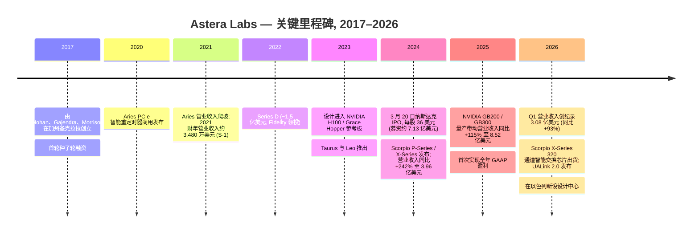
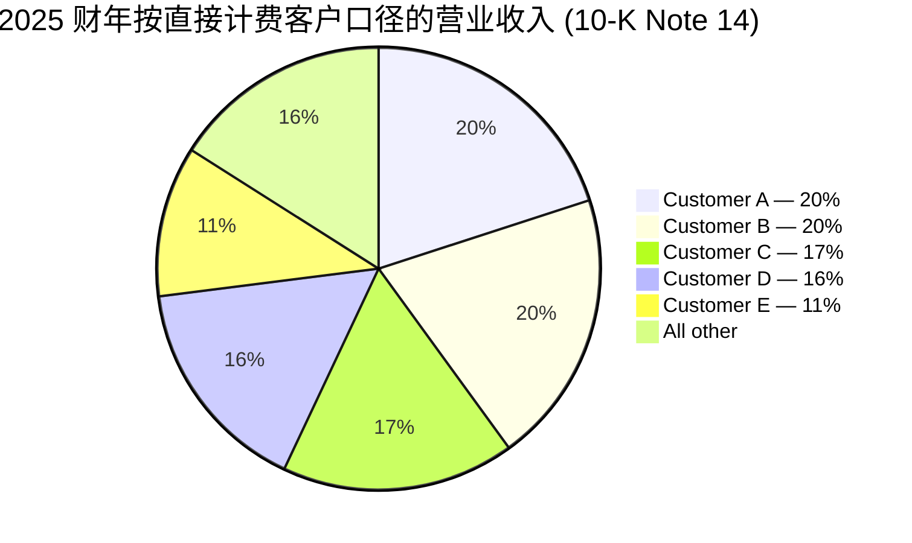
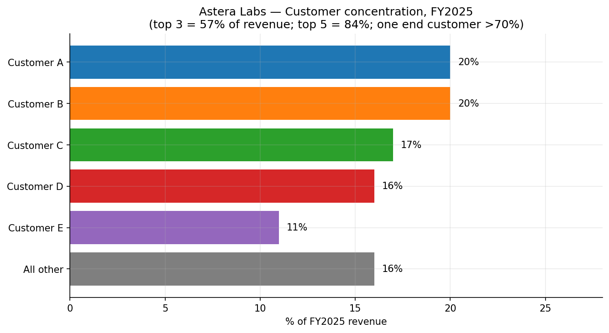
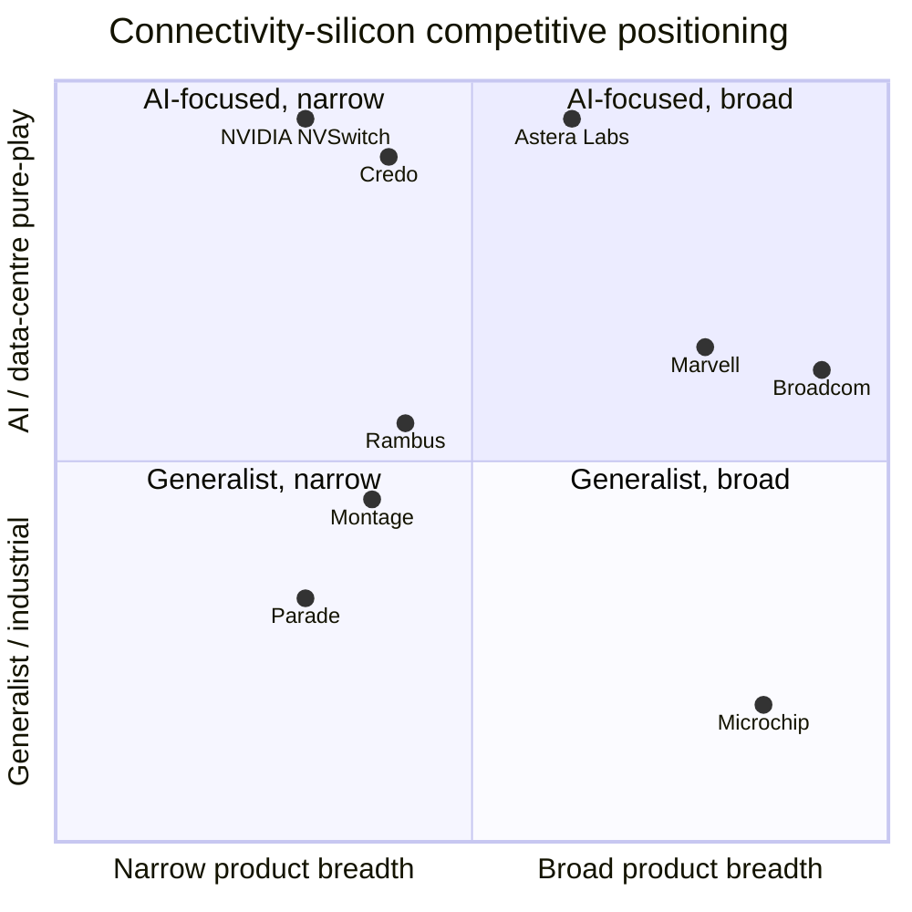
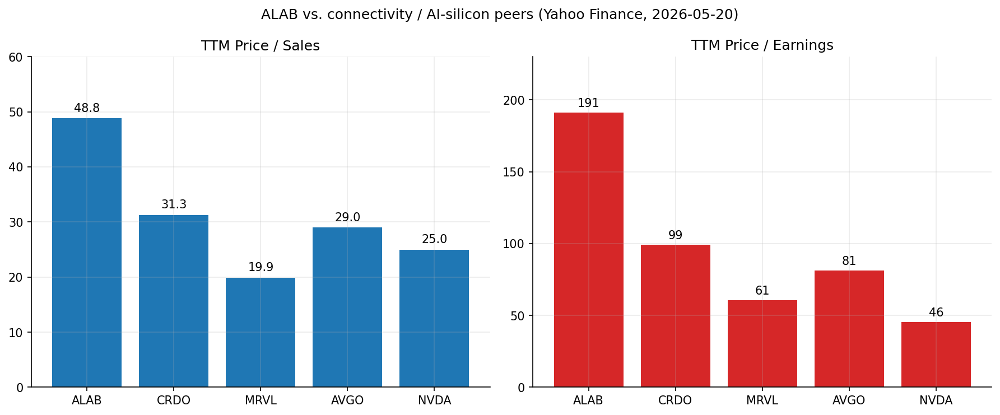

# Astera Labs, Inc. (NASDAQ:ALAB) — 公司研究报告

**日期:** 2026-05-20
**作者:** Financial Agent — 首次覆盖研究备忘录
**状态:** 首次覆盖, 仅供信息参考——不构成投资建议。
**报告语言: 简体中文 (英文版同时存在于本目录)**

> **更新——2026 财年 Q1 业绩与 Q2 上调指引 (2026-05-05):** Astera Labs 公布 2026 财年 Q1 创纪录营业收入 **3.084 亿美元**, 同比增长 93%、环比增长 14%; GAAP 毛利率 (gross margin) 76.3%、GAAP 营业利润 6,180 万美元 (相较 2025 财年 Q1 的 1,130 万美元)。管理层对 2026 财年 Q2 给出 GAAP 营业收入指引 **3.55–3.65 亿美元** (隐含环比 ~15–18% 增长), GAAP 毛利率约 73% (反映硬件模块占比提升与 Scorpio X-Series 量产爬坡)。CEO Jitendra Mohan 给出的驱动因素:"强劲的客户势能与营业收入机会……我们 PCIe 6 产品组合需求强劲", 以及新发布的 Scorpio X-Series 320 通道智能交换芯片 (Smart Fabric Switch) 的量产爬坡。来源: [Astera Labs 2026 财年 Q1 业绩公告 (8-K Ex. 99.1), 2026-05-05](https://www.sec.gov/Archives/edgar/data/1736297/000173629726000017/q126exhibit991.htm)。

---

## 目录
1. 公司概览
2. 公司历史
3. 管理团队
4. 产品与服务
5. 客户与上市策略
6. 行业概览
7. 竞争格局
8. 市场机会 (TAM)
9. 风险评估
10. 参考资料

---

## 1. 公司概览

Astera Labs 是一家专为 AI 与云数据中心基础设施而生的无晶圆厂 (fabless) 连接芯片 (connectivity chip) 公司。公司设计并销售四大产品系列——**Aries** PCIe / CXL 智能 DSP 重定时器 (Smart DSP Retimer) 与智能电缆模块 (Smart Cable Module); **Taurus** 以太网智能电缆模块 (Ethernet Smart Cable Module); **Leo** CXL (Compute Express Link) 内存连接控制器 (Memory Connectivity Controller); 以及 **Scorpio** 智能交换芯片 (Smart Fabric Switch)——所有产品均集成一套名为 **COSMOS** 的嵌入式软件套件, 该软件同时运行于芯片内置微控制器与主机操作系统上。硬件加软件的组合方案以"智能连接平台 (Intelligent Connectivity Platform)"的名义对外销售——芯片、模块、电路板与固件, 用于解决围绕 GPU 加速器构建的机架级 (rack-scale) AI 系统中的信号完整性 (signal integrity)、延迟、带宽与内存瓶颈问题 ([Astera Labs 2025 财年 10-K, "Our Products and Solutions"](https://www.sec.gov/Archives/edgar/data/1736297/000173629726000010/alab-20251231.htm))。

公司总部位于加利福尼亚州圣何塞市北第一街 2345 号, 在纳斯达克全球精选市场以代码 **ALAB** 上市, **IPO 日期为 2024 年 3 月 20 日**, 发行价每股 36 美元。截至 2025 年 12 月 31 日, 公司在全球拥有 **756 名全职员工**——北美 527 人、亚洲 208 人、欧洲 21 人——并辅以合同制人员 ([10-K, "Human Capital"](https://www.sec.gov/Archives/edgar/data/1736297/000173629726000010/alab-20251231.htm))。制造完全外包: **所有集成电路 (IC) 均由台积电 (TSMC) 代工**, 封装与测试由 ASE (日月光) 和 Amkor (安靠) 承接; 模块、电路板与 IC 基板由少数额外合作伙伴生产 ([10-K, "Manufacturing and Suppliers"](https://www.sec.gov/Archives/edgar/data/1736297/000173629726000010/alab-20251231.htm))。

**盈利方式。** ALAB 销售专用半导体连接产品——有时以裸片 IC 形式, 但越来越多地以集成硬件模块和电路板形式销售 (例如 Aries 智能电缆模块、Taurus 主动电气电缆 (Active Electrical Cable, AEC)), 以及 PCIe/CXL 交换芯片硅片 (Scorpio P-Series 与新发布的 Scorpio X-Series 320 通道智能交换芯片)。营业收入在产品发运至直接客户与分销商时点确认。客户分为三类: (1) 直接采购并主导供应决策的超大规模云运营商 (hyperscaler); (2) AI 加速器与 GPU 供应商 (特别是 NVIDIA, 已将 Aries 重定时器与 Scorpio 交换芯片设计进 GB200 / GB300 参考平台); (3) 将 ALAB 硅片集成进面向 hyperscaler 出货机柜的系统 OEM。分销商负责履约与物流, 而非需求创造; ALAB 的商业关系建立在终端客户层面 ([10-K, "Sales and Distribution"](https://www.sec.gov/Archives/edgar/data/1736297/000173629726000010/alab-20251231.htm))。

**规模与增长。** 2025 财年 GAAP 营业收入为 **8.525 亿美元, 同比增长 115%**, 较 2024 财年的 3.963 亿美元大幅增长 ([10-K, "Results of Operations"](https://www.sec.gov/Archives/edgar/data/1736297/000173629726000010/alab-20251231.htm))。GAAP 毛利率为 75.7% (2024 财年: 76.4%, 同比下降 70 个基点, 主因营业收入中硬件模块占比上升——模块毛利率低于裸片 IC)。GAAP 营业利润从 2024 财年 1.161 亿美元的亏损翻转为 2025 财年 1.734 亿美元的盈利——营业利润率从 –29.3% 跃升至 +20.3%, 因营业收入在基本固定的研发基础上规模化 ([10-K, "Operating Expenses"](https://www.sec.gov/Archives/edgar/data/1736297/000173629726000010/alab-20251231.htm))。GAAP 净利润为 2.191 亿美元 (摊薄 EPS 1.22 美元), 相较 2024 财年 8,340 万美元亏损。2026 财年 Q1 延续此轨迹: 营业收入 3.084 亿美元 (同比 +93%)、GAAP 营业利润 6,180 万美元 (同比 +448%)、GAAP 净利润 8,030 万美元 ([2026 财年 Q1 10-Q](https://www.sec.gov/Archives/edgar/data/1736297/000173629726000020/alab-20260331.htm)、[2026 财年 Q1 业绩公告, 2026-05-05](https://www.sec.gov/Archives/edgar/data/1736297/000173629726000017/q126exhibit991.htm))。

**地理结构。** 按账单地址口径, 2025 财年营业收入大幅倾向亚洲: 新加坡 2.770 亿美元 (32%)、中国 2.563 亿美元 (30%)、台湾 2.474 亿美元 (29%)、美国 2,740 万美元 (3%)、其他 4,440 万美元 (6%) ([10-K, Note 14 — Concentrations](https://www.sec.gov/Archives/edgar/data/1736297/000173629726000010/alab-20251231.htm))。亚洲权重之高源自 hyperscaler 的代工厂与分销商在何处取得产品法定所有权 (真实终端客户需求主要来自美国 hyperscaler 与 NVIDIA 总部位于美国的 GPU 业务); 它并不反映对中国终端市场的实质暴露。

*来源: [Astera Labs 2025 财年 10-K, "Results of Operations"](https://www.sec.gov/Archives/edgar/data/1736297/000173629726000010/alab-20251231.htm); 2022 财年数据来自 [S-1, "Selected Consolidated Financial Data"](https://www.sec.gov/Archives/edgar/data/1736297/000119312524040419/d701115ds1.htm)。*

**估值快照 (截至 2026-05-20, Yahoo Finance 收盘)。** 股价 285.04 美元, 接近 52 周高点 285.75 美元 (52 周低点: 84.78 美元)。市值 **489 亿美元**, 企业价值 (Enterprise Value, EV) 约 407 亿美元 (约 80 亿美元的差距反映 11.9 亿美元现金及可销售证券——2025 年 12 月 31 日现金 1.676 亿美元与可销售证券 10.212 亿美元——且无负债) ([Yahoo Finance — ALAB Key Statistics, 2026-05-20](https://finance.yahoo.com/quote/ALAB/key-statistics/); [10-K, Liquidity](https://www.sec.gov/Archives/edgar/data/1736297/000173629726000010/alab-20251231.htm))。

- **TTM 市盈率 (P/E) = 191×** (TTM EPS 约 1.49 美元, 受 2024 年 Q4 税收优惠正常化影响, 以及盈利基数尚处起步阶段)。
- **TTM 市销率 (P/S) = 48.8×** (TTM 营业收入约 10.0 亿美元)。
- **EV / TTM 营业收入 = 40.7×。**
- **远期 P/E (NTM consensus) = 67.8×。**
- **市净率 (P/B) = 32.7×**——对于一家主要资产是知识资本而非设备的无晶圆厂硅片公司, 高账面倍数并不意外。

这些倍数处于 AI 硅片同业群的最高端。同业比较 (均为 TTM, [Yahoo Finance, 2026-05-20](https://finance.yahoo.com/quote/ALAB/key-statistics/)):

| 代码 | 价格 美元 | TTM P/E | TTM P/S | 最近一期同比营业收入增速 | GM (TTM) |
|---|---:|---:|---:|---:|---:|
| **ALAB** | 285.04 | **191×** | **48.8×** | **+93%** | 76% |
| CRDO | 181.54 | 99× | 31.3× | +202% | 68% |
| MRVL | 185.90 | 61× | 19.9× | +22% | 51% |
| AVGO | 418.41 | 81× | 29.0× | +30% | 77% |
| NVDA | 222.93 | 45× | 25.0× | +73% | 71% |

**ALAB 高估值的解读。** TTM P/E 191× 与 P/S 48.8× 均显著高于 AI 硅片行业中位数 (从 MRVL / AVGO / NVDA 综合来看, P/E 约 60–80×、P/S 约 20–30×)。按优先级排列, 三大驱动因素在起作用:

1. **盈利尚未规模化。** 2025 财年营业利润率 (GAAP 20.3%、Non-GAAP 39.2%) 仍在向管理层评论以及 2026 财年 Q1 数据 (3.08 亿美元营业收入对应 36.2% Non-GAAP 营业利润率) 所隐含的稳态模型靠拢。随着营业杠杆释放, P/E 的分母将快速扩大——远期 P/E 68× 比 TTM 191× 更具锚定意义。
2. **增长溢价。** 美国上市的半导体公司中, 极少有能在 GAAP 盈利的同时实现营业收入同比约 90% 增长的标的。市场支付的是 2027–2029 年隐含的营业收入基数, 而非 TTM 数字。
3. **AI 主题/稀缺性溢价。** ALAB 是机架级 AI 连接主题 (PCIe 6 / CXL / UALink) 中最纯粹的公开上市标的。当 NVIDIA、AVGO 与 CRDO 在 2024–2025 年重估时, ALAB 以最高的 beta (3.36) 跟随同一行情。

估值**显著高位但并非没有先例**——Credo (CRDO) 以 202% 营业收入增速对应 31× P/S, 暗示投资者在此队列中愿意为每个百分点的增长支付约 0.2–0.5× 销售额。ALAB 以 48.8× P/S 对应 93% 增长, 位于该区间的上限。如果增速降至同比 60% 以下, 或边际无法规模化, 倍数将明显压缩——两者均在第 9 章列为重大风险。

---

## 2. 公司历史

Astera Labs 由 **Jitendra Mohan**、**Sanjay Gajendra** 与 Casey Morrison **于 2017 年 10 月**在加利福尼亚州圣克拉拉市创立——三位均为来自 Texas Instruments (德州仪器) 与 National Semiconductor (国家半导体) 的前产品线与设计主管。创立时的理论假设: 当数据中心从 PCIe 3.0 向 4.0 及更高速率演进时, 服务器内部基于 PCB 走线的传统互连方案在信号完整性余量上已近耗尽; 正确的解决方案是软件定义的、无晶圆厂的重定时器 / 智能电缆 / 交换芯片产品组合, 而非已售卖了十年的离散信号调节 ASIC ([10-K, "Overview"](https://www.sec.gov/Archives/edgar/data/1736297/000173629726000010/alab-20251231.htm); [S-1, "Our History"](https://www.sec.gov/Archives/edgar/data/1736297/000119312524040419/d701115ds1.htm))。

注: 本报告 prompt 中曾提及"Sundar Iyer"为联合创始人; 我们在 S-1、2024 财年与 2025 财年 10-K、2026 财年 DEF 14A 及当前 ALAB 公司沟通材料中均未发现任何 Sundar Iyer 的提及。两位创始执行官为 Jitendra Mohan (CEO) 与 Sanjay Gajendra (President & COO); 我们将 prompt 视为信息错误归属, 仅采用主要披露文件中确认的创始人。

*来源: [S-1, "Our History"](https://www.sec.gov/Archives/edgar/data/1736297/000119312524040419/d701115ds1.htm); [Astera Labs 2025 财年 10-K](https://www.sec.gov/Archives/edgar/data/1736297/000173629726000010/alab-20251231.htm); [2025 财年 Q4 业绩公告, 2026-02-10](https://www.sec.gov/Archives/edgar/data/1736297/000173629726000005/q425exhibit991.htm); [2026 财年 Q1 业绩公告, 2026-05-05](https://www.sec.gov/Archives/edgar/data/1736297/000173629726000017/q126exhibit991.htm)。*

**战略性转折。** 三大转向定义了公司的演进:

- **单一产品 → 多产品组合 (2022–2024)。** Astera 头三年的营业收入由 Aries 智能重定时器主导——这是一颗将 PCIe 4.0 / 5.0 信号重新时钟化以延长服务器内走线长度的离散 IC。2022 至 2024 年间, 公司有意从单一 IC 供应商扩展为四系列产品组合 (Aries、Taurus、Leo、Scorpio), 把自身定位为**平台型公司** (智能连接平台), 而非单点解决方案。商业逻辑: hyperscaler 出于车队管理便利偏好少供应商、软件定义的栈; 多产品路线图也使 ALAB 免受任何单一协议被颠覆的影响 ([10-K, "Our Products and Solutions"](https://www.sec.gov/Archives/edgar/data/1736297/000173629726000010/alab-20251231.htm))。
- **纯芯片 → 硬件模块 (2023–2025)。** Aries 智能电缆模块 (用于主动电气电缆的桨型卡形态) 与 Taurus 以太网智能电缆模块的推出, 将 ALAB 从销售硅片向上推升至销售完整的连接系统。模块会稀释毛利率 (2025 财年 70 个基点的毛利率压缩至 75.7%, 部分由 10-K MD&A 归因为产品组合变化), 但能扩大每个平台的可寻址营业收入并增加切换成本。
- **PCIe 重定时器 → AI 互联交换芯片 (2024–2026)。** Scorpio 系列——尤其是 2026 年初公布的 X-Series 320 通道智能交换芯片——代表 ALAB 切入后端 GPU 至 GPU 纵向扩展 (scale-up) 网络的举动, 这一市场历史上由 Broadcom (Tomahawk 用于横向扩展以太网) 与 NVIDIA 自研的 NVSwitch 硅片所占据。ALAB 瞄准的是基于 PCIe Gen 6 加内存语义协议 (UALink) 的开放标准替代方案。根据 2026 财年 Q1 业绩公告, Scorpio X-Series 320 通道"已开始出货, 预计在 2026 年下半年量产爬坡, 瞄准的商用 scale-up 市场预计到 2030 年达到 200 亿美元" ([2026 财年 Q1 业绩公告, 2026-05-05](https://www.sec.gov/Archives/edgar/data/1736297/000173629726000017/q126exhibit991.htm))。

**并购。** Astera 是一家以"轻并购"为特征的公司。2025 财年 10-K 披露了一桩小型企业并购 (将 1,450 万美元归入研发中知识产权 (IPR&D)、1,690 万美元归入商誉——披露摘录中未披露被并购公司名称); 对公司轨迹不具实质意义 ([10-K, Note 4 — Business Combinations](https://www.sec.gov/Archives/edgar/data/1736297/000173629726000010/alab-20251231.htm))。故事压倒性地以有机增长为主。

**近期动态 (过去 12 个月)。** 自 2025 年年中以来最具影响的动态为: (i) **Scorpio X-Series 320 通道**的公布及向龙头 hyperscaler 平台的首批出货; (ii) 由 UALink 联盟发布的 **UALink 2.0 规范** (引入了网络内计算 (In-Network Compute)、机密计算与多路径路由); (iii) Mike Tate 于 2026 年 3 月 2 日退休, 在 2026 年 9 月 1 日前过渡为战略顾问; (iv) 宣布**新设以色列设计中心**以支持研发持续扩张; 以及 (v) ALAB 硅片被完整纳入 NVIDIA GB200 / GB300 参考设计, 管理层称之为"我们 32 至 320 通道 PCIe 交换芯片与智能电缆模块的市场份额持续提升" ([2026 财年 Q1 业绩公告, 2026-05-05](https://www.sec.gov/Archives/edgar/data/1736297/000173629726000017/q126exhibit991.htm); [2026 DEF 14A](https://www.sec.gov/Archives/edgar/data/1736297/000114036126016359/ny20049787x1_def14a.htm))。

---

## 3. 管理团队

高管层由创始人主导, 异常集中: 两位经营负责人均为第一天起就在的创始人; CFO 席位处于规划中的过渡期中; 董事会规模小 (8 位董事), 以模拟与网络背景为主, 与硅片公司论述高度一致。

**Jitendra Mohan — 联合创始人, CEO, 董事** (~300 字)。自 2017 年 11 月公司创立以来一直担任 CEO, 自创立至 2023 年 11 月期间还兼任 President。在创立 Astera 之前, 他于 2012 年 3 月至 2017 年 10 月在 Texas Instruments 任产品线 (总) 经理, 负责 TI 高速接口与信号调节产品线的一部分——这正是 Astera 今天所销售业务的直接相关经验。在 TI 之前, 他在 National Semiconductor (NSM) 工作约 16 年, 历任设计与工程管理的级别递进岗位, 最高担任设计总监。他持有印度理工学院孟买分校 (IIT Bombay) 电气工程学士学位与斯坦福大学电气工程硕士学位 ([2026 DEF 14A, "Class I Directors — Jitendra Mohan"](https://www.sec.gov/Archives/edgar/data/1736297/000114036126016359/ny20049787x1_def14a.htm))。Mohan 是公司的主要公众代言人, 把每场业绩说明会都围绕机架级 AI 论述展开。他因 IPO 流动性事件获得了一次性的创始人 RSU 授予, 已在 2025 年归属 ([2026 DEF 14A, "CD&A — Pay and Performance Highlights"](https://www.sec.gov/Archives/edgar/data/1736297/000114036126016359/ny20049787x1_def14a.htm))。Mohan 任期最具影响的方面: 他在保持创始人 CEO 控制权、避免无晶圆厂半导体公司常见的高频并购成长打法的前提下, 用 8 年时间把 ALAB 从零做到年化超过 10 亿美元营业收入。其持股比例仍然实质性, 但精确数字会随 RSU 归属而波动; DEF 14A 的实益所有权表是权威数据来源。

**Sanjay Gajendra — 联合创始人, President & COO, 董事** (~200 字)。自 2017 年 11 月起任 COO 与董事, 自 2023 年 11 月起任 President。他还是 ALAB 的首任 CFO 与司库 (2017 年 11 月至 2020 年 7 月)。在 Astera 之前, 他于 2014 年 7 月至 2017 年 10 月在 Texas Instruments 任产品线总经理, 2012 年 1 月至 2014 年 6 月任 TI 产品管理总监; 在 TI 之前, 他在 NSM 工作了五年 (2006–2011) 任产品经理, 此前还在 NSM 担任了六年首席软件工程师 (2000–2006); 再之前, 他在 Wipro Limited 担任高级软件工程师 (1996–2000)。他持有科罗拉多大学博尔德分校工程管理硕士学位。在 Astera 内部, 他主管 go-to-market、供应链与运营, 且是客户项目的公众代言人 ([2026 DEF 14A, "Class II Directors — Sanjay Gajendra"](https://www.sec.gov/Archives/edgar/data/1736297/000114036126016359/ny20049787x1_def14a.htm))。

**CFO——过渡进行中** (~200 字)。**Mike Tate** 自 2020 年至 2026 年 3 月 2 日担任 CFO, 后退休; 在 2026 年 9 月 1 日之前, 他向 CEO 提供战略顾问过渡服务 ([2026 DEF 14A, "Letter to Stockholders"](https://www.sec.gov/Archives/edgar/data/1736297/000114036126016359/ny20049787x1_def14a.htm))。Tate 带领 ALAB 完成 2024 年 3 月的 IPO、作为上市公司的前八个季度, 以及从经营亏损向 2025 财年 GAAP 净利润约 2.19 亿美元的转换。DEF 14A 称其为前 CFO; 在该文件提交日期 (2026 年 4 月), 委托书未公布永久继任者。对投资者而言, CFO 过渡是近期最实质的治理变量——席位填补正值已披露利润率与资本配置政策 (回购、并购、研发节奏) 成为主导叙事的关键拐点。截至本报告发布, 我们尚未通过主要披露文件确认其继任者身份。

**Philip Mazzara — General Counsel & Secretary** (~100 字)。Mazzara 担任公司总法律顾问与公司秘书; 按 DEF 14A 执行官签字栏, 他在 2025 财年报告期间为 Section 16 法定高管 (officer)。对于像 ALAB 这种客户合约与知识产权暴露很大的公司, 法律顾问的连续性很重要; 未披露任何治理红旗 ([2026 DEF 14A, signature block](https://www.sec.gov/Archives/edgar/data/1736297/000114036126016359/ny20049787x1_def14a.htm))。

**Casey Morrison — 联合创始人, Chief Product Officer (来自公司官网 / 新闻材料)。** Morrison 是第三位联合创始人, 但并非 Section 16 NEO, 也未出现在 DEF 14A 的薪酬汇总表中; 其作为首席产品官的身份通过 Astera 的新闻稿与产品发布沟通公开披露。

**董事会构成与治理** (~150 字)。董事会由八位成员组成, 分为三类:

- **Class I (任期至 2028):** Jitendra Mohan (CEO)、Stefan Dyckerhoff (Sutter Hill Ventures 资深合伙人)、Bethany Mayer。
- **Class II (任期至 2026):** Sanjay Gajendra (COO/President)、Craig Barratt (前 Atheros CEO、前 Google 网络业务高管)、Michael Hurlston (前 Synaptics / Marvell 高管)。
- **Class III (任期至 2027):** Manuel Alba (首席独立董事)、Jack Lazar (审计委员会主席、有上市公司 CFO 经历)。 ([2026 DEF 14A, "Board Classes"](https://www.sec.gov/Archives/edgar/data/1736297/000114036126016359/ny20049787x1_def14a.htm))。

董事会为分类制 (错期换届), 限制了维权投资人在单一年度内取得控制权的可能性。在 Nasdaq 规则下, 八位中六位为独立董事。内部人持股仍然实质性但已分散; The Vanguard Group 的 13G/A 在 2026 年 3 月披露其受益持股重组, 区分了其持股口径; BlackRock 则继续单独申报 ([2026 DEF 14A, "Security Ownership"](https://www.sec.gov/Archives/edgar/data/1736297/000114036126016359/ny20049787x1_def14a.htm))。高管薪酬高度股权挂钩 (一次性创始人 RSU 同时附带时间归属与流动性事件绩效条件, 已在 2025 年归属); 公司使用 Compensia 作为独立薪酬顾问。

**管理层履历评估。** 这是一支可信团队。Mohan 与 Gajendra 各自在 TI 与 NSM 工作 15 年以上, 构建的正是他们如今在 Astera 设计的模拟 / 混合信号连接产品类别。他们已经成功完成了一次大型产品组合扩张 (Aries → Taurus → Leo → Scorpio) 和一次成功的 IPO, 并在公司作为上市公司的第二个完整财年保持 GAAP 盈利。可见的空缺是 CFO 席位, 仍处过渡中, 回购 / 资本回报决策仍待新 CFO 决定。从 DEF 14A 的 CD&A 来看, 薪酬委员会采用的是增长与边际挂钩的股权激励, 而非 EPS 挂钩目标——对于当前阶段是合适的, 但需要随着公司成熟而持续观察。

---

## 4. 产品与服务

Astera Labs 出货四大硬件产品系列加一套软件套件, 全部以单一的"智能连接平台"出售。所有产品均专门面向 AI / 云数据中心基础设施——不涉及消费、汽车、工业或边缘市场。

*来源: [Astera Labs 2025 财年 10-K, "Our Products and Solutions"](https://www.sec.gov/Archives/edgar/data/1736297/000173629726000010/alab-20251231.htm); [2026 财年 Q1 业绩公告, 2026-05-05](https://www.sec.gov/Archives/edgar/data/1736297/000173629726000017/q126exhibit991.htm); [Astera Labs 产品组合](https://www.asteralabs.com/products/)。*

### 4.1 Aries — PCIe/CXL 智能 DSP 重定时器与智能电缆模块

**功能。** Aries 产品对劣化的高速 PCIe / CXL 信号进行数字恢复并重新发送一份干净的数据副本, 在支持更高数据速率的同时, 延长服务器与机柜内低成本铜互连的可达距离 ([10-K, "Aries"](https://www.sec.gov/Archives/edgar/data/1736297/000173629726000010/alab-20251231.htm))。产品涵盖两种形态: (1) **Aries 智能重定时器 IC** (用于服务器与加速器托盘内板贴的裸片), 以及 (2) **Aries 智能电缆模块** (一种桨型卡, 承载 Aries IC 与外围元件, 用于集成进主动电气电缆, 包括直连与分支电缆)。COSMOS 软件运行在每颗 Aries 器件内置的微控制器上, 提供每条链路的遥测、信号质量诊断与车队管理钩子。

**目标客户:** hyperscaler (直接采购)、NVIDIA 与其他 AI 加速器厂商 (设计进参考平台)、以及组装 GB200 / GB300 / 等同机柜的系统 OEM / ODM。未披露具体定价, 但作为模块出货比裸片 IC 出货时 ASP (平均售价) 明显上升。

**竞争优势判断——存在 / 强。** 护城河类型: **技术 + 设计绑定 + 生态 (Interop Lab)**。证据: Aries 是 NVIDIA 参考平台 (GB200 / GB300) 中 PCIe 5.0 与 PCIe 6.0 重定时器的设计标准, 2025 财年 10-K MD&A 明确将当年营业收入增长归因为"对我们 Aries、Scorpio、Taurus 产品需求增加" ([10-K, MD&A](https://www.sec.gov/Archives/edgar/data/1736297/000173629726000010/alab-20251231.htm))。最接近的竞争对手: Broadcom 的 PEX 系列 PCIe 重定时器产品与 Astera 列示的对手 **Parade Technologies (谱瑞)**; 在 PCIe 5.0 / 6.0 重定时器的正面对决中, 公司自家 MD&A 主张市场领先地位, 但我们未在主要披露文件中核实任何第三方份额数据。

### 4.2 Taurus — 以太网智能电缆模块

**功能。** Taurus 是基于 Taurus IC 构建的硬件模块, 在铜介质上增加服务器与交换机之间的以太网网络连接带宽。它在更高数据速率 (每通道 200G / 400G / 800G 等级) 下延长以太网信号传输距离, 提供机柜级的网络连接, 并嵌入 COSMOS 遥测 ([10-K, "Taurus"](https://www.sec.gov/Archives/edgar/data/1736297/000173629726000010/alab-20251231.htm))。形态: 主动电气电缆 (AEC)——直接与被动铜 DAC 电缆及短距光收发器 (线性驱动可插拔光器件, LPO) 竞争。

**目标客户:** 构建叶脊 (leaf-spine) 与 AI 后端以太网网络的 hyperscaler; AEC 形态最直接与 Credo Technology 的 AEC 系列竞争。每端口成本与每比特功耗是主要采购指标。

**竞争优势判断——部分。** 护城河类型: **成本 / 功耗领先 + COSMOS 遥测差异化**。最接近的竞争对手: **Credo Technology (CRDO)**——AEC 品类开创者, 2025 年仍以出货量计为市场领导者。ALAB 是可靠的第二位玩家, 但 Credo 在 Microsoft、Amazon 及其他 hyperscaler 的设计赢单使其具备规模优势。2025 财年营业收入中, Taurus 的贡献未在分部附注中单独披露。

### 4.3 Leo — CXL 内存连接控制器

**功能。** Leo IC 与电路板通过高速 CXL 串行链路实现行业标准 DRAM 内存的扩展、共享与池化——缓解 CPU 与 AI 加速器上内存密集型工作负载所面临的内存带宽与容量瓶颈 ([10-K, "Leo"](https://www.sec.gov/Archives/edgar/data/1736297/000173629726000010/alab-20251231.htm))。COSMOS 提供内存诊断与车队管理可视化。

**目标客户:** 构建解耦内存池的 hyperscaler; 寻求 CXL 兼容参考设计的 CPU 厂商 (Intel Sapphire Rapids 及后续平台、AMD Genoa / Turin)。

**竞争优势判断——部分 / 存在争议。** 护城河类型: **先发 + 设计内嵌**。挑战: CXL 的实际采用速度慢于 2022–2023 年炒作周期所暗示的 (Samsung 与 Micron 都将爬坡指引到 2026–2027 年; 许多 hyperscaler 当前是在试验而非部署)。Leo 更多是长周期的可选项, 而非 2026 年的营业收入驱动。直接竞争对手: **Microchip Technology (PM85xx CXL 内存控制器)** 与 **Montage Technology (澜起科技, 内存互连 IC 产品线)**。Leo 在 2025 财年营业收入中的占比未单独披露, 但据买方与卖方研究普遍认为是四大产品系列中最小的。

### 4.4 Scorpio — 智能交换芯片 (P-Series 与 X-Series)

**功能。** Scorpio 是 ALAB 的 PCIe Gen 6 与 AI scale-up 交换芯片系列——战略上最重要的新产品线, 也是最直接攻击竞争对手营业收入池 (Broadcom 的 PCIe 交换芯片硅片与 NVIDIA 的 NVSwitch) 的产品线。两种形态:

- **Scorpio P-Series — PCIe Gen 6.0 头节点交换芯片 (head-node switch)。** 架构面向跨各类 PCIe 主机与端点的混合流量头节点连接; 2025 财年 10-K 描述其为可量产状态, 2026 财年 Q1 业绩公告指出 P-Series 系列现在跨 32 至 320 通道 ([10-K, "Scorpio"](https://www.sec.gov/Archives/edgar/data/1736297/000173629726000010/alab-20251231.htm); [2026 财年 Q1 业绩公告, 2026-05-05](https://www.sec.gov/Archives/edgar/data/1736297/000173629726000017/q126exhibit991.htm))。
- **Scorpio X-Series — 320 通道 scale-up AI 交换芯片。** 2026 年初公布, 据 2026 财年 Q1 业绩公告:"最大的开放、内存语义交换芯片, 为前沿 AI 实验室工作负载而设计……利用开放与平台专有协议在多元加速器、多元 scale-up 高基数拓扑中提供基础设施可选性。Hypercast 与网络内计算等新功能将集体运算性能提升最高 2 倍 [并] 降低延迟" ([2026 财年 Q1 业绩公告, 2026-05-05](https://www.sec.gov/Archives/edgar/data/1736297/000173629726000017/q126exhibit991.htm))。

**目标客户:** hyperscaler (定制协议 scale-up 互联) 与"前沿 AI 实验室"客户 (Q1 业绩公告未指名, 但通常被解读为 OpenAI、Anthropic、xAI 以及 hyperscaler 内部的专属 AI 集群)。量产爬坡指引为 2026 年下半年, 更广泛的 Scorpio P-Series 量产则瞄准 2027 年。

**竞争优势判断——存在但有争议。** 护城河类型: **技术 + 标准组织 (UALink) 定位 + 生态合作**。最接近的竞争对手: **Broadcom (PEX 系列 PCIe 交换芯片; Tomahawk 用于以太网 scale-out)** 与 **NVIDIA NVSwitch / NVLink (DGX/HGX 系统内主导的专有后端互联)**。Scorpio 的切入点是"开放 scale-up"立场——多协议支持、厂商中立、围绕 UALink 设计而不绑定任何单一加速器供应商。ALAB 联合主导了 2026 年初 UALink 2.0 规范的发布 ([2026 财年 Q1 业绩公告, 2026-05-05](https://www.sec.gov/Archives/edgar/data/1736297/000173629726000017/q126exhibit991.htm))。Scorpio X-Series 是 2026–2027 年最具影响的单一催化剂——也是该股最重要的竞争战场。

### 4.5 COSMOS — 软件套件

COSMOS 是运行在 Aries、Taurus、Leo、Scorpio 每颗器件内置微控制器上的嵌入式软件层, 加上运行在客户操作系统上的主机端对应组件。它提供三大能力: **链路管理 (Link Management, 配置 / 训练)**、**车队管理 (Fleet Management, 多器件遥测、无中断固件更新)**、**RAS (信号、链路、数据包诊断)** ([10-K, "COSMOS"](https://www.sec.gov/Archives/edgar/data/1736297/000173629726000010/alab-20251231.htm); [2026 财年 Q1 业绩公告, 2026-05-05](https://www.sec.gov/Archives/edgar/data/1736297/000173629726000017/q126exhibit991.htm))。COSMOS 不单独授权, 但它是 ALAB 切换成本护城河的主要来源——一旦 hyperscaler 把 COSMOS 集成到其数据中心管理平面 (例如, 用于在数万机柜上无中断 PCIe 固件更新), 切换硅片供应商在运维上就变得昂贵。

### 4.6 旗舰产品对比长尾产品

- **旗舰 #1 — Aries 智能重定时器 + 智能电缆模块。** 2025 财年单一最大营业收入贡献者 (10-K MD&A 将 Aries 列为驱动当年增长的三大系列之首)。在 GB200 / GB300 世代每一座 NVIDIA AI 机柜中, PCIe 5.0 / 6.0 重定时器都是硬性"必需品"。
- **旗舰 #2 — Scorpio (P-Series + X-Series)。** 绝对量上增长最快的系列; 量产爬坡指引为 2026 年下半年。是 2027–2028 年营业收入的战略重心。
- **支撑——Taurus AEC 模块。** 中等贡献者; 与 Credo 正面对决。
- **长尾——Leo CXL。** 可选项; 不是 2026 年驱动。

### 4.7 近期发布 / 退役 (过去 12 个月)

- **2026 年 2 月发布:** Scorpio X-Series 320 通道智能交换芯片——首批出货, 2026 年下半年量产爬坡。
- **2026 年 5 月扩展:** Scorpio P-Series PCIe-6 系列现已涵盖 32–320 通道多种配置。
- **2026 年初规范里程碑:** UALink 2.0 发布, ALAB 联合主导 ([2026 财年 Q1 业绩公告, 2026-05-05](https://www.sec.gov/Archives/edgar/data/1736297/000173629726000017/q126exhibit991.htm))。
- **退役:** 过去 12 个月内未披露; ALAB 产品组合仍处扩张模式。

---

## 5. 客户与上市策略

Astera 的客户基础**极度集中**, 而客户集中度是股权故事中最重要的非技术性风险。2025 财年 10-K 明确披露"2025 年, **一位终端客户占公司营业收入超过 70%**; 前三大终端客户合计约占 86% 的营业收入" ([10-K, "Risk Factors — A substantial portion of our revenue is driven by a limited number of our end customers"](https://www.sec.gov/Archives/edgar/data/1736297/000173629726000010/alab-20251231.htm))。10-K 在此项披露中没有指名客户, 但根据行业背景——Aries 重定时器与 Scorpio 交换芯片被设计进 NVIDIA GB200 / GB300 平台; 2025 财年新加坡 + 中国 + 台湾的营业收入权重恰好对应 NVIDIA 亚洲代工合作伙伴 (富士康、纬创、广达、英业达) 取得产品法定所有权的地理——70%+ 终端客户就是 **NVIDIA** (既作为直接客户, 也作为平台供应商, 其 GB200/GB300 参考设计带动 ALAB 硅片在每位购买 GPU 的 hyperscaler 处的出货) 几乎没有疑义。

*来源: [Astera Labs 2025 财年 10-K, Note 14 — Concentrations of Credit Risk and Major Customers](https://www.sec.gov/Archives/edgar/data/1736297/000173629726000010/alab-20251231.htm)。所命名的"Customer"是直接计费实体——主要是 NVIDIA 的制造合作伙伴 (富士康、纬创、广达等) 与分销商——而非终端客户。终端客户集中度单独披露, **更高**: 一位终端客户 >70%、前三大终端客户约 86%。*

*来源: [Astera Labs 2025 财年 10-K, Note 14](https://www.sec.gov/Archives/edgar/data/1736297/000173629726000010/alab-20251231.htm)。*

**直接客户 (2025 财年 10% 集中度门槛)。** 来自 10-K Note 14 披露: Customer A 20%、Customer B 20%、Customer C 17%、Customer D 16%、Customer E 11%。2024 财年对应披露为: Customer F 36%、Customer D 24%、Customer G 18%、Customer B 11%。匿名标签在年与年之间不对应——公司明确指出"上述部分客户为代表本公司终端客户采购产品的制造合作伙伴", 终端客户需求在不同期间内会在制造合作伙伴之间进行轮转 ([2026 财年 Q1 10-Q, Note — Concentrations](https://www.sec.gov/Archives/edgar/data/1736297/000173629726000020/alab-20260331.htm))。

**终端客户集中度: 极端。** 2025 财年 10-K 的风险因素披露——"一位终端客户占公司营业收入超过 70%; 前三大终端客户合计约 86%"——是本报告中最重要的事实, 应锚定每一项仓位规模决策。事实上, 2025 财年的终端客户集中度比 2024 财年**还要高**, 因 GB200 / GB300 量产爬坡带动了不成比例的出货量。

**2026 财年 Q1 客户集中度 (最新披露)。** 截至 2026 年 3 月 31 日的三个月: Customer A 29%、Customer B 21%、Customer C 16%、Customer D 12%、Customer E 12% ([2026 财年 Q1 10-Q, Concentrations](https://www.sec.gov/Archives/edgar/data/1736297/000173629726000020/alab-20260331.htm))。按直接计费实体口径, 前三大份额 (66%) 基本稳定; 改变的是 Customer A 与之前最大客户之间的轮换 (Customer A 在 2026 财年 Q1 占 29%, 而 2025 财年 Q1 仅占 12%; 2025 财年 Q1 的最大客户 Customer F 占 19%, 在 2026 财年 Q1 已非 10% 客户), 同样符合终端客户在不同代工伙伴之间重新分配出货量的模式。

**客户分部。** ALAB 在 10-K 中点名三类终端客户: **(1) 主要 hyperscaler**、**(2) 主要 AI 加速器供应商 (包括 GPU 供应商)**——即 NVIDIA、AMD、定制硅 ASIC 供应商——以及 **(3) 集成 ALAB 硅片的系统 OEM**。hyperscaler 名单未在主要披露文件中列出, 但在业内贸易媒体中通常被理解为 Microsoft、Amazon AWS、Google、Meta 与 Oracle Cloud; 超出披露文件以外的指认为推测, 我们不将其作为主要来源事实主张。

**Go-to-market 模式。** ALAB 通过两种渠道销售: (a) **直接**向大客户销售; (b) 通过专注于履约 / 物流的**分销商**销售 (即分销商不承担销售或技术支持职能——后者由 ALAB 在北美、亚洲与以色列客户研发地附近的现场应用工程师 (Field Applications Engineer) 自行承担) ([10-K, "Sales and Distribution"](https://www.sec.gov/Archives/edgar/data/1736297/000173629726000010/alab-20251231.htm))。销售周期由设计赢单驱动: ALAB 在客户参考平台设计阶段早期 (通常领先量产 12–24 个月) 介入, 赢得 (或失去) 套接字, 然后在客户量产爬坡中实现出货。10-K 指出"我们的客户深度参与设计, 经常主导其系统的供应决策"——即一旦设计赢单, 黏性较高。

**伙伴 / 生态。** ALAB 运营一个 **Interop Lab (互操作实验室)**, 合作伙伴在其中预先验证整条供应链的兼容性——这在多供应商的 PCIe/CXL/UALink 世界中是结构性优势。公司是 **UALink 联盟**的创始贡献者 (并在 2026 年初联合主导 UALink 2.0 规范), 拥有现任公司 (Broadcom、NVIDIA) 在开放互联世界中难以匹敌的标准组织地位。制造伙伴: TSMC (IC 唯一晶圆厂)、ASE 与 Amkor (封装 / 测试)。

**点名客户案例。** ALAB 的披露文件与 IR 材料从字面上提及 NVIDIA GB200 / GB300 平台的设计内嵌——Aries 与 Scorpio 通常被描述为机架级参考设计中不可或缺的组件。公司一般不在主要披露文件中点名 hyperscaler 客户; 业绩公告中的提及仅限于"龙头平台"和"前沿 AI 实验室"等措辞。

---

## 6. 行业概览

Astera 所处的产业狭窄但快速复利: **专门用于 AI / 云数据中心的连接芯片**。对应的 NAICS 代码为 334413 (半导体与相关器件制造); 公司的经济引力由三种结构性力量决定——AI 资本开支超级周期、PCIe 协议从 Gen 4 → 5 → 6 → 7 的迁移, 以及标准化 scale-up 互联 (CXL、UALink) 作为专有 NVLink 替代方案的崛起。

**行业定义。** 连接芯片市场涵盖 (a) 信号调节 IC (重定时器、重发射器、中继器); (b) PCIe / CXL 交换芯片; (c) 以太网 PHY、DSP 与 AEC 模块; (d) 内存扩展 / 池化控制器; (e) 用于 GPU scale-up 的新兴互联交换芯片 (NVLink、UALink、Infinity Fabric)。ALAB 五项均有覆盖——Aries + Scorpio (a、b)、Taurus (c)、Leo (d)、Scorpio X-Series (e)。竞争对手从广覆盖的模拟 / 混合信号巨头 (Broadcom、Marvell) 到聚焦专家 (Credo、Astera 自身、Parade、Montage、Microchip 的 CXL 产品线) 均有。

**市场规模与增长。** Astera 自家给出的指引把商用 **scale-up 交换市场**框定为"预计 2030 年达到 200 亿美元" ([2026 财年 Q1 业绩公告, 2026-05-05](https://www.sec.gov/Archives/edgar/data/1736297/000173629726000017/q126exhibit991.htm))。NVIDIA 在其 26 财年 Q1 披露 (日历 2026 年) 中报告数据中心营业收入年化超 1,350 亿美元, 其中有意义的个位数百分比流向机柜内连接芯片与模块。来自 Dell'Oro 与 IDC 的第三方估算把 2025 年数据中心互连硅片市场放在约 100–150 亿美元区间, 到 2028 年扩张至 250–350 亿美元, 由 AI 基础设施支出驱动 (我们引用区间而非点值, 因为不同分析公司的分部划分有差异)。

**增长驱动。** 五个结构性驱动汇聚:

1. **AI 训练与推理资本开支周期。** 2025 年 hyperscaler 资本开支增长 >50% (Microsoft、Meta、Alphabet、Amazon 合计指引 2026 年约 3,400 亿美元)。其中约 30–40% 落在 AI 服务器中, 其中又有约 3–6% 落在机柜内连接芯片与模块——这是一个快速上升的分母上的一份快速上升的个位数份额。
2. **PCIe 代次迁移。** 每一代 (Gen 4 → 5 → 6 → 7) 把信号完整性余量大致砍掉一半, 要求在更短距离上配重定时器与主动电缆。PCIe Gen 6 (ALAB 当前平台) 在 Gen 4 时代使用被动铜的距离上就需要重定时器与 AEC。PCIe Gen 7 (2027 年送样) 对重定时器的密度需求更高。
3. **内存带宽瓶颈。** AI 加速器越来越受内存限制; CXL 池化 / 扩展是长周期答案 (Leo 定位)。
4. **NVLink 的开放 scale-up 替代方案。** UALink 联盟 (2024 年成立, 成员包括 ALAB、AMD、Intel、Broadcom 以及 hyperscaler) 瞄准厂商中立的 scale-up 网络。UALink 2.0 (2026 年初) 加入了网络内计算、机密计算与多路径路由。未来 24 个月的经济问题: 商用硅 (Scorpio X-Series) 是否真的能在拥有自家加速器栈的客户 (AMD MI400、AWS Trainium、Microsoft Maia) 处替换掉 NVLink?
5. **网络与机柜的解耦。** Hyperscaler 越来越坚持多供应商、软件定义的连接; ALAB 的"智能连接平台"+ COSMOS 在采购模型上的定位比 Broadcom 垂直整合的硅片更明显契合。

**行业结构。** 市场在分部层面适度集中, 但**整体堆栈层面高度分散**——没有任何单一供应商出售 hyperscaler 所采购的完整连接产品组合。Broadcom 凭借出售以太网交换、PCIe 交换与信号调节, 在营业收入足迹上规模最大; Marvell 在 DSP、定制硅与新兴连接领域占份额; Credo 主导 AEC; Astera 引领 PCIe 重定时器并在 scale-up 交换芯片中发起挑战。设计赢单层面的切换成本高 (通常保留 1–2 代产品的套接字); 平台层面的切换成本更高 (一旦 COSMOS 集成进客户车队管理平面)。供应商权力集中——TSMC 在 ALAB 所使用的 5nm / 3nm 节点上是该品类所有先进硅片的唯一供应方与产能瓶颈 ([10-K, "Manufacturing and Suppliers"](https://www.sec.gov/Archives/edgar/data/1736297/000173629726000010/alab-20251231.htm))。买方权力同样集中: hyperscaler + NVIDIA 是寡头买方, 长期具有压缩边际的话语权。

**监管环境。** 两个实质性矢量: (a) **美国对先进半导体与 AI 相关产品对华的出口管制** (BIS 管辖的 ECCN 3A090 / 4A090 及继任类别)——ALAB 的 Aries 与 Scorpio 产品本身是通用连接芯片, 但它们进入的是受出口限制的 AI 训练机柜; (b) **台湾 / TSMC 地缘政治风险**——ALAB 的每一颗 IC 都在台湾代工, 10-K 在此背景下专门点名地震与地缘政治风险。CHIPS 法案 (美国) 及类似的欧洲、日本、韩国产业政策今日并不直接惠及 ALAB, 但可能在中期带来产能多元化。

**行业动态总结。** 整体堆栈层面分散, 但平台 / hyperscaler 层面正在整合; 一旦设计内嵌切换成本高; 供应商集中度高 (TSMC); 买家集中度高 (NVIDIA + 5 家 hyperscaler); 受美国出口管制约束; 至少到 2027 年都在领先制程节点上受产能约束。

---

## 7. 竞争格局

ALAB 自家的 10-K 点名七个竞争对手: **Broadcom (AVGO)、Credo Technology (CRDO)、Marvell Technology (MRVL)、Microchip Technology (MCHP)、Montage Technology (澜起科技)、Parade Technologies (谱瑞)、Rambus (RMBS)** ([10-K, "Competition"](https://www.sec.gov/Archives/edgar/data/1736297/000173629726000010/alab-20251231.htm))。除此名单外, 一份诚实的竞争地图还要加上两个非上市竞争对手: **NVIDIA NVLink / NVSwitch** (DGX / HGX 系统内主导的专有 scale-up 互联) 与 **hyperscaler 自研硅** (Google TPU pod 内的互连 IP; AWS 的 Trainium 互联)。

**1. Broadcom (AVGO) — 直接竞争对手; 战略对手。**
长期最重要、最危险的竞争对手。AVGO 出售 PCIe 交换芯片 (PEX 系列)、以太网交换芯片 (Tomahawk、Jericho)、DSP、重定时器、光 PHY, 并在为 hyperscaler 构建定制 AI 硅 (Google TPU 5p/6p 合作; Meta MTIA)。AVGO 25 财年 (日历 2025 年) 营业收入运行约 600 亿美元以上的运行率; 该数字中相关连接芯片营业收入是 ALAB 总营业收入的数倍。ALAB 的优势: 产品引入速度、开放标准定位 (UALink) 与更聚焦。AVGO 的优势: 规模、客户整合、控制主导以太网栈、捆绑能力。**vs. ALAB 定位: 营业收入领先; 在最新节点 PCIe 重定时器份额落后; Scorpio X-Series vs. Tomahawk 正面对决。** ([AVGO 竞争背景按 ALAB 10-K](https://www.sec.gov/Archives/edgar/data/1736297/000173629726000010/alab-20251231.htm); AVGO 25 财年财务数据, [Yahoo Finance — AVGO, 2026-05-20](https://finance.yahoo.com/quote/AVGO/key-statistics/)。)

**2. Credo Technology (CRDO) — 直接竞争对手; 最接近的纯玩家同行。**
Credo 是 AEC (主动电气电缆) 领导者, 在 Microsoft、Amazon 与其他 hyperscaler 的 400G/800G 以太网网络中拥有深度设计赢单。25 日历财年营业收入约 10 亿美元以上, 同比 +202% ([Yahoo Finance — CRDO, 2026-05-20](https://finance.yahoo.com/quote/CRDO/key-statistics/))。Credo 与 ALAB 的产品重叠主要在 Taurus (以太网 AEC 模块), 较小程度在 Aries 智能电缆模块。**vs. ALAB 定位: 以太网 AEC 领先; PCIe 重定时器规模较小; 不涉足 PCIe 交换芯片。** Credo 的 TTM P/S 31× vs. ALAB 的 48.8× 反映了相对倍数差距, 考虑到 Credo 更快 (基数更小) 的增长与较低质量的客户结构。

**3. Marvell Technology (MRVL) — 直接竞争对手; 网络领域既有玩家。**
Marvell 销售数据中心以太网 PHY、DSP、定制 AI 硅 (AWS Trainium 与 Inferentia 定制 ASIC 合作) 与连接芯片。25 财年营业收入约 80 亿美元, 同比增长约 22%。Marvell 与 ALAB 的连接芯片重叠在 Taurus 范围 (以太网 DSP/PHY) 与新兴 CXL。**vs. ALAB 定位: 规模与 DSP 技术领先; PCIe 重定时器份额与开放 scale-up 互联竞赛落后。**

**4. Microchip Technology (MCHP) — PCIe 交换芯片与 CXL 的直接竞争对手。**
Microchip 销售 PCIe 交换芯片与 CXL 内存控制器 (Switchtec、PM85xx), 但更通用 / 工业与嵌入式定位, 而非 ALAB 的数据中心聚焦。vs. ALAB 定位: 利基重叠; 在 AI 机柜中不是近期主要威胁。

**5. Montage Technology (澜起科技, 688008.SH) — 直接竞争对手; DDR / CXL / 内存侧。**
Montage 是 DDR 内存接口芯片 (RCD / DB) 的领导者, 并正切入 CXL 内存扩展。以中国市场为主。vs. ALAB 定位: 2026 年直接重叠有限; 在 CXL 内存扩展 (Leo) 是长周期竞争对手。

**6. Parade Technologies (谱瑞, 4966.TW) — 直接竞争对手; 信号调节专家。**
台湾本土厂商, 销售 DisplayPort / USB / PCIe 信号调节硅。规模小于 ALAB, 历史上更偏消费电子; 在 hyperscaler PCIe 中不是近期实质性威胁。

**7. Rambus (RMBS) — 邻近竞争对手; IP + 内存接口。**
销售内存接口 IC (DDR5 RCD/DB)、CXL 内存互连 IC, 并授权 IP。营业收入基数较小, 主要偏内存侧而非完整互联。vs. ALAB 定位: 切线相关。

**8. NVIDIA — 垂直整合风险, 10-K 未标注为竞争对手。**
NVIDIA 拥有 DGX/HGX 系统内的专有 NVLink / NVSwitch 互联——在 scale-up 角色上是 Scorpio X-Series 的直接竞争对手。如果 NVIDIA 选择把更多 scale-up 预算留在自家 (或仅在边际处授权 NVLink), ALAB 的 Scorpio TAM 将压缩。反之, NVIDIA 客户要求开放替代方案 (UALink) 则是 ALAB 正在利用的楔子。

**9. Hyperscaler 自研硅 — 长期竞争对手。**
Google、AWS 和 (越来越多地) Microsoft 都有自研硅团队, 在为加速器特定连接 IP 构建。它们都未在 PCIe 重定时器上取代 ALAB, 但趋势值得关注。

**定位框架。** 一个简单的 2×2 沿 **产品广度** (覆盖的连接堆栈类别数) vs. **AI / 数据中心聚焦度**:

*作者分析; 竞争对手名单按 [Astera Labs 2025 财年 10-K, "Competition"](https://www.sec.gov/Archives/edgar/data/1736297/000173629726000010/alab-20251231.htm)。*

*来源: [Yahoo Finance — ALAB / CRDO / MRVL / AVGO / NVDA Key Statistics, 2026-05-20](https://finance.yahoo.com/quote/ALAB/key-statistics/)。*

**ALAB 的竞争优势。** (1) 过去两代 PCIe 重定时器品类中上市速度最快; (2) 唯一在机架级 AI 连接上有完整多产品组合的上市纯玩家; (3) 在 NVIDIA 参考平台中的深度设计赢单基础带动所有 hyperscaler 的牵引出货; (4) 一旦集成进客户车队管理平面, COSMOS 软件锁定; (5) UALink 联盟定位为 ALAB 赋予了现任公司不易匹敌的标准组织信誉。

**ALAB 的脆弱性。** (1) 极端客户集中度——失去 70% 以上的终端客户或其资本开支放缓将对增长轨迹构成致命; (2) Broadcom 是规模更大的竞争对手, 可捆绑销售并压低价格; (3) NVIDIA 可能将更多 scale-up 互联留在自家; (4) 公司全部硅片供应均通过台湾的 TSMC——一次地缘政治或地震事件就会让其运营停摆; (5) 估值已经为多年期执行支付了代价。

**市场份额估算。** 我们已核实的主要披露文件中尚无 2025 年 PCIe 重定时器第三方市场份额数据; 业内贸易媒体估算 ALAB 在 2025 年出货进 AI 服务器的商用 PCIe Gen 5 / Gen 6 重定时器中占据 >50% 份额, Broadcom 与 Parade 瓜分其余。我们把这视为方向性参考, 而非可引用事实。

---

## 8. 市场机会 (TAM)

Astera 的 TAM 论述基于三层叠加机会, 每一层都在 AI 资本开支超级周期上复利。

**第一层——机柜内 PCIe / CXL 连接芯片。** 每一台围绕 AI 加速器 (GPU、TPU、ASIC) 构建的 AI 服务器都需要 PCIe 重定时器、交换芯片以及越来越多的主动电缆。随着 PCIe 从 Gen 5 推进到 Gen 6 再到 Gen 7, 每台服务器的硅片含量上升——Gen 6 机柜的重定时器与交换芯片美元含量大约是 Gen 5 机柜的 2–3 倍。结合 hyperscaler 资本开支预测 (2026 年前四大 hyperscaler 合计 5,000 亿美元以上, 按 consensus 资本开支披露)、AI 服务器在资本开支中的占比 (~30%)、连接芯片在 AI 服务器 BOM 中的占比 (~3–5%), 2026 年机柜内 PCIe / CXL 硅片 TAM 约在 **150–250 亿美元**区间, 并以中位数百分比逐年增长至 2030 年。ALAB 的营业收入 (2025 财年 8.52 亿美元, 由 Q1 数据与 Q2 指引推算 2026 财年隐含约 13 亿美元以上) 是 TAM 的 **3–8% 份额**。

**第二层——以太网 AEC 与连接模块。** 主动电气电缆与机柜内以太网模块市场正在 Credo 与 Astera 之间被定义。光纤与电缆行业跟踪公司 (LightCounting、Dell'Oro) 的贸易估算把 AEC TAM 放在 2025 年 10–20 亿美元, 到 2030 年扩张至 50–100 亿美元, 因以太网迁向 800G/1.6T 而 AEC 在较短距离替代被动铜。ALAB 的 Taurus 营业收入是相关份额争夺工具; 当前份额明显落后于 Credo, 但正在扩张。

**第三层——商用 scale-up 互联交换芯片 (Scorpio X-Series 机会)。** ALAB 自家在 2026 财年 Q1 业绩公告中的措辞: **"商用 scale-up 市场预计 2030 年达到 200 亿美元"** ([2026 财年 Q1 业绩公告, 2026-05-05](https://www.sec.gov/Archives/edgar/data/1736297/000173629726000017/q126exhibit991.htm))。这是 TAM 论述中最雄心勃勃的一层, 也是 Broadcom 与 NVIDIA 最有争议的一层。"商用 (merchant)"这个限定词是关键: 隐含的 2030 年 200 亿美元只有在 hyperscaler 与 AI 实验室选择购买商用 scale-up 硅, 而非自研或接受 NVIDIA 专有栈的前提下才能成立。

**SAM 与 SOM。** Astera 近期的**可服务可寻址市场 (SAM)** (PCIe Gen 5 / 6 重定时器、AEC 模块、PCIe 交换芯片与新兴 scale-up 互联交换芯片, 聚焦数据中心) 当前规模在 50–100 亿美元量级。2026 财年营业收入按 Q1 数据与 Q2 指引带季节性年化推算约 13–15 亿美元, ALAB 处于其当前 SAM 的 **15–25% 份额**。多头情形是在扩张 TAM 中夺取份额; 空头情形是 Broadcom 与 NVIDIA 反击下让份额给现任公司。

**渗透策略。** 三大杠杆: (a) **赢得每一个新的 NVIDIA 参考平台** Gen 6 / Gen 7 (Aries 套接字保留); (b) **在拥有自家加速器硅的 hyperscaler 处转化 Scorpio X-Series 设计赢单** (AMD、AWS、Microsoft、Google)——即最有动力摆脱 NVLink 锁定的客户; (c) **叠加模块** (智能电缆模块、AEC) 以增加每平台的美元含量; (d) **深化 COSMOS 集成**以在装机基础上推动切换成本锁定。

**增长预测。** 即使按保守假设——ALAB 在机柜内 PCIe / CXL 硅片中的份额稳定在 5%、AEC 份额温和增长、Scorpio 到 2030 年仅捕获商用 scale-up 互联 TAM 的 10%——隐含 2030 年营业收入在 40–60 亿美元区间。多头情形 (重定时器份额持续夺取、Scorpio 捕获商用 scale-up 市场 20–25% 份额) 支持 2030 年 70–100 亿美元营业收入。空头情形 (Aries 份额因竞争对手缩小差距而压缩、Scorpio 被压制在 <5% 份额、hyperscaler 资本开支暂停) 把 ALAB 留在 20–30 亿美元营业收入。以上情形都不是主要来源预测——它们是说明性算术, 应按此性质看待。

---

## 9. 风险评估

### 公司层面风险

**1. 极端终端客户集中度。** 2025 财年 10-K 披露**一位终端客户占营业收入 >70%, 前三大终端客户约 86%** ([10-K, Risk Factors](https://www.sec.gov/Archives/edgar/data/1736297/000173629726000010/alab-20251231.htm))。隐含身份为 NVIDIA + 少数 hyperscaler 终端客户。该单一客户 GPU 出货 10% 的放缓大致 1:1 转化为 ALAB 营业收入。缓释项: 在多个参考平台上的设计内嵌 (GB200、GB300、未来的 Rubin), 扩展进 AMD MI400 / AWS Trainium / Microsoft Maia / Google TPU 连接套接字, 把产品组合从单一客户主导的 Aries 扩展开。

**2. 龙头客户的垂直整合风险。** ALAB 最大终端客户 (NVIDIA) 拥有自研重定时器与交换芯片的工程实力, 且有把连接芯片留作专有 (NVSwitch) 的明确先例。NVIDIA 尚未发出取代 ALAB 重定时器套接字的意图信号, 但该选项始终在桌上。缓释项: ALAB 在每一代 PCIe 节点上的执行速度迄今超过 NVIDIA 自研的动机, 多协议 Scorpio 系列比单一重定时器 SKU 更难复制。

**3. 单一晶圆厂、单一地区制造。** 每颗 IC 都由**台湾的 TSMC**代工; 封装在 ASE / Amkor。台湾的中断 (地震、地缘政治事件, 或先进节点产能限制) 将让 ALAB 营业收入停摆 ([10-K, "Risk Factors — manufacturing concentration"](https://www.sec.gov/Archives/edgar/data/1736297/000173629726000010/alab-20251231.htm))。缓释项: TSMC 中期地理多元化 (亚利桑那州、日本、德国晶圆厂建设); 维持安全库存缓冲。

**4. Scorpio X-Series 执行风险。** Scorpio X-Series 320 通道 2026 年下半年量产爬坡是近期最大执行催化剂; 良率问题、龙头客户设计赢单丢失或进度延宕至 2027 年都将实质压缩 2027 财年增长叙事。缓释项: 管理层已出货首批产品, 并在 32–320 通道多种配置中出货多个变体, 证明硅片平台可行。

**5. CFO 席位过渡中。** Mike Tate 于 2026 年 3 月 2 日退休 CFO 职务; 2026 DEF 14A 文件提交时未点名永久继任者。在过渡窗口内, 资本配置连续性 (回购政策、研发节奏、潜在并购) 处于开放状态。缓释项: Tate 的战略顾问角色延续至 2026 年 9 月 1 日; 创始人 CEO 连续性不受影响。

**6. 硬件模块占比上升带来的边际压缩。** 2025 财年 GAAP 毛利率相较 2024 财年压缩 70 个基点, 因为硬件模块 (Aries 智能电缆模块、Taurus AEC) 毛利率低于裸片 IC ([10-K, MD&A](https://www.sec.gov/Archives/edgar/data/1736297/000173629726000010/alab-20251231.htm))。2026 财年 Q2 指引为 73% (vs. Q1 的 76.3%)——方向上已确认。缓释项: COSMOS 附加定价能力与更高 ASP 的 Scorpio 系列支撑混合毛利率。

### 行业 / 市场风险

**7. AI 资本开支周期顶部风险。** ALAB 营业收入对 hyperscaler AI 资本开支的杠杆约 1.3–1.5 倍。如果 AI 资本开支周期在 2027 或 2028 年暂停 (内存或加速器过度建造、ROI 怀疑、监管反弹), ALAB 的增速放缓将很剧烈。缓释项: PCIe Gen 6 → Gen 7 迁移即使在出货量持平情况下也使平台硅片含量持续扩张; 服务质量 (COSMOS) 营业收入叠加在装机基础上。

**8. 开放 scale-up 互联 (UALink) 采用风险。** Scorpio X-Series 的经济性取决于客户选择开放标准 (UALink、CXL 互联) 而非 NVIDIA 的 NVLink。如果开放生态未能凝聚 (AMD/Intel/AWS/Microsoft 拉动不足, 或 NVIDIA 在边际处开放 NVLink), Scorpio X-Series 的 TAM 将压缩。缓释项: UALink 2.0 于 2026 年初发布, ALAB 联合主导; 联盟成员构成 (AMD、Intel、Broadcom、hyperscaler) 为开放标准赋予了真实经济权重。

**9. 来自 Broadcom 的竞争强度。** AVGO 是营业收入超 600 亿美元的规模化竞争对手, 能够捆绑以太网交换、PCIe 交换与连接芯片——并能纯凭价格赢得或保留套接字。AVGO 对 Scorpio 的回应 (Gen 6 的 PEX 交换芯片更新或类似 Tomahawk-Ultra 的集成 PCIe/以太网互联) 是 2027 年的观察点。缓释项: ALAB 的开放标准、多客户定位是 AVGO 在不扰乱自身 AVGO-Hyperscaler 定制硅伙伴关系的前提下难以模仿的。

### 财务风险

**10. 估值 / 倍数压缩风险。** TTM P/E 191× 与 P/S 48.8× ([Yahoo Finance, 2026-05-20](https://finance.yahoo.com/quote/ALAB/key-statistics/)) 在 AI 硅片队列中处于上四分位。营业收入增速放缓到同比 60% 以下、边际不及预期、或整体 AI 硅片名重新评级, 将实质性压缩倍数。该股 3.36 的 beta 放大行业波动。缓释项: 实际经营爬坡 (2025 财年同比 +115%、2026 财年 Q1 同比 +93%、2026 财年 Q2 指引中点隐含同比 +85% 以上) 迄今支撑了倍数。

**11. 股权激励拖累 (Stock-Based Compensation, SBC)。** Non-GAAP 在 2025 财年剔除了 1.59 亿美元股权激励 ([10-K, segment-note reconciliation](https://www.sec.gov/Archives/edgar/data/1736297/000173629726000010/alab-20251231.htm))——约占营业收入的 19%。SBC 是真实经济成本 (股东稀释), 且解释了 GAAP 与 non-GAAP 间的大部分差距。缓释项: SBC 集中在 2025 年归属的创始人 IPO RSU——2026 年及之后 SBC 占营业收入比应当压缩。

**12. 硬件模块的营运资本风险。** 随着产品组合向硬件模块 (电路板、AEC、模块) 倾斜, ALAB 每美元营业收入承载更多库存与应收账款余额。2025 财年 Q4 应收账款中 Customer E 单一客户集中度超 4,800 万美元 (占应收 28%) ([10-K, Note 14](https://www.sec.gov/Archives/edgar/data/1736297/000173629726000010/alab-20251231.htm))——一家客户的付款延迟或纠纷将实质性损害营运资本。缓释项: 11.9 亿美元的现金与可销售证券支撑流动性。

### 宏观经济风险

**13. 美国对 AI 半导体的出口管制。** ALAB 的硅片被销往全球 AI 系统的终端客户, 包括新加坡 (占 2025 财年营业收入 32%) 与中国 (30%)。美国 BIS 出口管制已经限制 NVIDIA 最先进 GPU 对华销售; 涵盖连接芯片 (或下游系统级限制) 的扩张管制将压缩 ALAB 的 TAM。缓释项: Astera 的硅片是通用连接芯片, 而非 AI 加速器——迄今的限制是在平台层面而非重定时器层面。

**14. 台湾 / 地缘政治集中度。** 除制造风险外, 台湾海峡的局势升级会同时影响需求 (hyperscaler 位于台湾的 ODM 合作伙伴承担 ALAB 大多数产品的法定所有权) 与供给。缓释项: 公司层面有限——这是整个行业的风险。

---

## 10. 参考资料

### 主要披露文件 (SEC EDGAR)
- [Astera Labs, Inc. — 截至 2025 年 12 月 31 日财年的 Form 10-K, 2026-02 提交 (accession 0001736297-26-000010)](https://www.sec.gov/Archives/edgar/data/1736297/000173629726000010/alab-20251231.htm)
- [Astera Labs, Inc. — 截至 2026 年 3 月 31 日季度的 Form 10-Q, 2026-05 提交 (accession 0001736297-26-000020)](https://www.sec.gov/Archives/edgar/data/1736297/000173629726000020/alab-20260331.htm)
- [Astera Labs, Inc. — 截至 2025 年 9 月 30 日季度的 Form 10-Q, 2025-11 提交 (accession 0001736297-25-000147)](https://www.sec.gov/Archives/edgar/data/1736297/000173629725000147/alab-20250930.htm)
- [Astera Labs, Inc. — 截至 2025 年 6 月 30 日季度的 Form 10-Q, 2025-08 提交 (accession 0001736297-25-000098)](https://www.sec.gov/Archives/edgar/data/1736297/000173629725000098/alab-20250630.htm)
- [Astera Labs, Inc. — 截至 2024 年 12 月 31 日财年的 Form 10-K, 2025 提交 (accession 0001736297-25-000003)](https://www.sec.gov/Archives/edgar/data/1736297/000173629725000003/alab-20241231.htm)
- [Astera Labs, Inc. — DEF 14A 委托书, 2026-04 提交 (accession 0001140361-26-016359)](https://www.sec.gov/Archives/edgar/data/1736297/000114036126016359/ny20049787x1_def14a.htm)
- [Astera Labs, Inc. — DEF 14A 委托书, 2025-04 提交 (accession 0001140361-25-015443)](https://www.sec.gov/Archives/edgar/data/1736297/000114036125015443/ny20049787x1_def14a.htm)
- [Astera Labs, Inc. — Form S-1 IPO 注册说明书, 原始 2024-02 提交 (accession 0001193125-24-040419)](https://www.sec.gov/Archives/edgar/data/1736297/000119312524040419/d701115ds1.htm)
- [Astera Labs, Inc. — Form S-1/A 修正案, 2024-03 提交 (0001193125-24-056208 / 0001193125-24-062817 / 0001193125-24-069611)](https://www.sec.gov/cgi-bin/browse-edgar?action=getcompany&CIK=0001736297&type=S-1&dateb=&owner=include&count=40)

### 业绩公告 (8-K Ex. 99.1)
- [2026 财年 Q1 业绩公告, 2026-05-05](https://www.sec.gov/Archives/edgar/data/1736297/000173629726000017/q126exhibit991.htm)
- [2025 财年 Q4 / 全年 FY2025 业绩公告, 2026-02-10](https://www.sec.gov/Archives/edgar/data/1736297/000173629726000005/q425exhibit991.htm)
- [2025 财年 Q3 业绩公告, 2025-11](https://www.sec.gov/Archives/edgar/data/1736297/000173629725000145/q325exhibit991.htm)
- [2025 财年 Q2 业绩公告, 2025-08](https://www.sec.gov/Archives/edgar/data/1736297/000173629725000097/q225exhibit991.htm)
- [2025 财年 Q1 业绩公告, 2025-05-06](https://www.sec.gov/Archives/edgar/data/1736297/000173629725000029/q125exhibit991.htm)
- [2024 财年 Q4 / 全年 FY2024 业绩公告, 2025-02-10](https://www.sec.gov/Archives/edgar/data/1736297/000173629725000001/q424exhibit991.htm)
- [2024 财年 Q3 业绩公告, 2024-11-04](https://www.sec.gov/Archives/edgar/data/1736297/000173629724000042/q324exhibit991.htm)
- [2024 财年 Q2 业绩公告, 2024-08-06](https://www.sec.gov/Archives/edgar/data/1736297/000173629724000016/q224exhibit991.htm)
- [2024 财年 Q1 业绩公告, 2024-05-07](https://www.sec.gov/Archives/edgar/data/1736297/000173629724000004/q124earningreleasetable.htm)

### 公司官网
- [Astera Labs 公司官网](https://www.asteralabs.com/)
- [Astera Labs 投资者关系](https://ir.asteralabs.com/)
- [Astera Labs 产品组合 — Aries, Taurus, Leo, Scorpio, COSMOS](https://www.asteralabs.com/products/)

### 市场数据
- [Yahoo Finance — ALAB Key Statistics, 访问 2026-05-20](https://finance.yahoo.com/quote/ALAB/key-statistics/)
- [Yahoo Finance — CRDO Key Statistics, 访问 2026-05-20](https://finance.yahoo.com/quote/CRDO/key-statistics/)
- [Yahoo Finance — MRVL Key Statistics, 访问 2026-05-20](https://finance.yahoo.com/quote/MRVL/key-statistics/)
- [Yahoo Finance — AVGO Key Statistics, 访问 2026-05-20](https://finance.yahoo.com/quote/AVGO/key-statistics/)
- [Yahoo Finance — NVDA Key Statistics, 访问 2026-05-20](https://finance.yahoo.com/quote/NVDA/key-statistics/)

### 行业 / 联盟
- [UALink 联盟 — UALink 2.0 规范, 2026](https://www.ualinkconsortium.org/)
- [PCI-SIG — PCIe 6.0 / 7.0 规范](https://pcisig.com/)
- [CXL 联盟 — Compute Express Link 3.0 / 3.1 规范](https://www.computeexpresslink.org/)

### 图表 (由主要来源数据生成——文件路径)
- `reports/charts/alab_quarterly_revenue.png`
- `reports/charts/alab_revenue_gm_trend.png`
- `reports/charts/alab_geo_mix.png`
- `reports/charts/alab_customer_concentration.png`
- `reports/charts/alab_peer_valuation.png`
- `reports/charts/alab_opex_mix.png`

---

*报告结束。本首次覆盖备忘录仅供内部研究使用。每一项定量主张均在内联处注明出处。当某项第三方事实无法通过主要披露文件核实时, 该限制在文中说明而非粉饰。前瞻性陈述 (TAM、份额、增长预测) 为说明性算术, 而非预测。*
