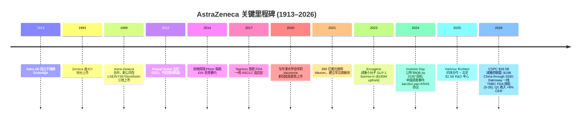
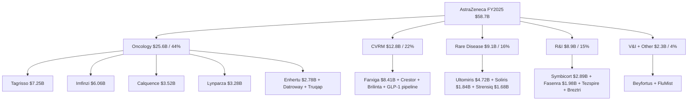

# AstraZeneca PLC (NYSE:AZN / LSE:AZN / Nasdaq Stockholm:AZN) — 公司研究

**截止日期 / As of:** 2026-06-14
**主题归属 / Theme:** china-drug-out-licensing（中国创新药对外授权）
**报告语言 / Language:** 简体中文（zh-CN）

---

## 投资摘要 / Investment Summary（*Analyst view:* — 本报告观点，非公司披露）

> 以下评级、目标价（price target / PT）、前瞻预测均为本报告分析师观点（*Analyst view:*），不构成对任何公司文件的引用 —— 20-F / 6-K 中不含目标价。

| 项目 / Item | 数值 / Value |
|---|---|
| **评级 / Rating** | **Buy / Overweight（增持）** |
| **12 个月目标价 / 12-mo PT** | **$215 / ADR（base case）** |
| 当前价 / Current price | **$178.75**（NYSE:AZN ADR，2026-06-14） |
| 隐含上行 / Implied upside | **约 +20%** |
| 估值方法 / Valuation method | 2027E Core EPS $11.24 × 19× forward P/E（详见 Section 2） |
| 市值 / Market cap | **约 $277B**（约 1.55B ADR × $178.75） |
| 52 周区间 / 52-wk range | $137.22 – $212.71 |
| TTM P/E（reported）| ~27×；TTM P/S ~4.6×；forward P/E ~22× |
| FY2025 收入 / Revenue | $58,739M（+8% CER）；Core EPS $9.16（+11% CER） |
| 股息 / Dividend | FY2025 全年宣派 $3.20/股（收益率约 1.8%）；FY2026 拟提高至 $3.30/股 |
| 牛/熊目标价 / Bull · Bear | **$245（+37%）** · **$160（−10%）** |

**论点支柱 / Thesis pillars（*Analyst view:*）：**

1. **肿瘤（Oncology）是结构性增长引擎** —— FY2025 肿瘤产品收入 $25.6B（+17% CER，占总收入 44%），Q1 2026 进一步加速至 +16% CER；Tagrisso $7.25B、Imfinzi $6.06B 双柱稳固，Enhertu / Datroway 两款 ADC 进入放量期（Q1 2026 Imfinzi +30% CER、Enhertu +34% CER），构成 2030 年增量主轴。
2. **"$80B by 2030" 路线图可信度上升** —— FY2025 收入已达 $58.7B、FY2026 重申中高个位数收入 + 低双位数 Core EPS 增长指引，加上 2026 年密集的 III 期阳性读出（Imfinzi 膀胱/肝癌、Enhertu 早期乳腺癌、camizestrant、tozorakimab），25+ 重磅药的目标逐步兑现。
3. **中国 license-in 把"市场风险"转化为"研发动能"** —— CSPC ($18.5B 减重药联盟) / Harbour / Jacobio / Eccogene 等交易以约 $1.8B upfront 锁定 25+ 早期资产，配合 $15B by 2030 在华投资，建立全球研发第二来源 —— 同时对冲了王磊案后中国市场增速放缓（FY2025 中国 +4% CER vs 历史双位数）。
4. **估值居中、防守性强** —— forward P/E ~22× 介于 PFE/MRK（9–12×）与 LLY/NVO（13–25×）之间，2% 股息 + 低 β + 海外创新药敞口提供下行保护；主要风险为 IRA（Farxiga/Brilinta 已进首批谈判）与美欧制药关税。

---

## 一、公司概览 / Company Overview

阿斯利康 AstraZeneca PLC（NYSE:AZN / LSE:AZN / Nasdaq Stockholm:AZN）是全球前十大制药公司之一，总部位于英国剑桥生物医药园区（Cambridge Biomedical Campus, 1 Francis Crick Avenue），是一家专注于肿瘤学（Oncology / 肿瘤）、生物制药（BioPharmaceuticals — 包括心血管/肾/代谢 CVRM 与呼吸免疫 R&I）、罕见病（Rare Disease — 通过 Alexion 业务承载）以及疫苗与免疫疗法（V&I, Vaccines & Immune Therapies）四大治疗领域的研发驱动型制药公司。公司主要产品涵盖 EGFR 抑制剂 Tagrisso（奥希替尼）、PD-L1 单抗 Imfinzi（度伐利尤单抗）、SGLT2 抑制剂 Farxiga（达格列净）、BTK 抑制剂 Calquence、PARP 抑制剂 Lynparza、补体抑制剂 Soliris / Ultomiris 等多款"重磅炸弹（blockbuster）"药物。根据其向 SEC 提交的 [2025 年 20-F 年度报告（filed 2026-02-24）](https://www.sec.gov/Archives/edgar/data/901832/000110465926019130/azn-20251231x20f.htm)，AstraZeneca 在 100 多个国家运营，**2025 年末全球员工 96,100 人（2024 年末 94,300 人，2023 年末 89,900 人）**，FY2025 总收入达 $58,739M。

公司同时在伦敦证券交易所（AZN.L，主上市）、纽约证券交易所（NYSE:AZN — ADR，每股 ADR 对应 0.5 股普通股）与瑞典斯德哥尔摩纳斯达克（AZN.ST）上市，是富时 100（FTSE 100）指数权重最大的成员之一。AstraZeneca 由瑞典 Astra AB 与英国 Zeneca Group 在 1999 年合并而成（[AstraZeneca 公司历史 / Company History](https://www.astrazeneca.com/our-company/history.html)），当年这笔交易是欧洲历史上规模最大的并购之一；目前公司治理体系仍保留瑞典基础研究文化与英国商业运营双轴特征。

**估值快照 / Valuation Snapshot（截至 2026-06-14）。** AZN ADR 现价 $178.75，市值约 $277B，TTM reported P/E 约 27×、forward P/E 约 22×、TTM P/S 约 4.6×，较 52 周高点 $212.71 回落约 16%（[Yahoo Finance AZN key statistics](https://finance.yahoo.com/quote/AZN/key-statistics/)）。这一估值水平介于"传统大药企"（PFE forward P/E ~9×、MRK ~12×）与"GLP-1 双雄"（LLY ~25×、NVO ~13×）之间（[Yahoo Finance 同业数据](https://finance.yahoo.com/quote/LLY/)），反映市场对 AstraZeneca "在传统肿瘤学基础上叠加 GLP-1 / ADC / cell therapy 增量曲线"的"叙事溢价 / narrative premium"。详细的前瞻估值矩阵与目标价推导见 Section 2。

**FY2025 关键财务指标 / Key FY2025 Financials**（数据源：[AstraZeneca FY2025 Final Results 6-K, filed 2026-02-10](https://www.sec.gov/Archives/edgar/data/901832/000165495426001073/a3234s.htm) 与 [20-F 2025](https://www.sec.gov/Archives/edgar/data/901832/000110465926019130/azn-20251231x20f.htm)）：

| 指标 / Metric | FY2025 | FY2024 | YoY (CER) | 备注 / Note |
|---|---|---|---|---|
| 总收入 / Total Revenue | $58,739M | $54,073M | +8% | 实际汇率 +9% |
| 肿瘤产品收入 / Oncology PR | $25,618M | — | +17% | 占总产品收入 44% |
| CVRM 产品收入 | $12,774M | — | +2% | Farxiga 拉动，Brilinta 拖累 |
| R&I 产品收入 | $8,866M | — | +12% | Fasenra/Tezspire/Breztri |
| 罕见病产品收入 / Rare Disease PR | $9,126M | — | +5% | Alexion 承载 |
| V&I 产品收入 | $1,268M | — | -3% | Beyfortus/FluMist |
| 中国 / China（总收入口径）| $6,654M | $6,394M | +4% | 占总收入 11%（见 Section 5） |
| Reported EPS | $6.60 | — | +43% | R&D 减值同比下降推动 |
| Core EPS | $9.16 | — | +11% | 公司核心口径 |
| R&D 费用 / R&D expense | $14,232M | $13,583M | — | 占收入 24%（Core R&D 24%）|
| Operating profit（reported）| $13,743M | $10,003M | — | reported 营业利润率 23.4% |
| Net operating cash flow | $14,575M | $11,861M | — | FCF（OCF−capex）约 $8.7B |

**Q1 2026 业绩快报 / Q1 2026 update（NEW，[1st Quarter Results 6-K, filed 2026-04-29](https://www.sec.gov/Archives/edgar/data/901832/000165495426004047/a2999c.htm)）：** 总收入 $15,288M（+13% actual / **+8% CER**），由肿瘤与罕见病双位数增长驱动；Core operating profit +12%；Core EPS $2.58（+5% CER，受上年同期有利税率基数影响）；Reported EPS $1.99。公司**重申 FY2026 指引**：总收入中高个位数（mid-to-high single-digit）CER 增长、Core EPS 低双位数（low double-digit）CER 增长、Core 税率 18–22%。

下图为 FY2025 损益表 Sankey（revenue → COGS / gross profit → R&D / SG&A / operating profit → tax / net income），左侧为四大治疗领域的收入来源：

<svg xmlns="http://www.w3.org/2000/svg" viewBox="0 0 1000 560" width="1000" height="560" role="img" aria-label="income statement Sankey"><rect x="0" y="0" width="1000" height="560" fill="#ffffff"/>
<text x="20.00" y="30.00" text-anchor="start" font-family="Helvetica,Arial,sans-serif" font-size="15" font-weight="700" fill="#1f2933">AstraZeneca FY2025 损益表 Sankey (Income Statement)</text>
<path d="M 204.00,64.00 C 258.00,64.00 258.00,99.00 312.00,99.00 L 312.00,264.73 C 258.00,264.73 258.00,229.73 204.00,229.73 Z" fill="#93c5fd" fill-opacity="0.55"/>
<path d="M 452.00,92.00 C 506.00,92.00 506.00,115.08 560.00,115.08 L 560.00,203.99 C 506.00,203.99 506.00,180.91 452.00,180.91 Z" fill="#86efac" fill-opacity="0.55"/>
<path d="M 452.00,180.91 C 506.00,180.91 506.00,217.99 560.00,217.99 L 560.00,440.29 C 506.00,440.29 506.00,403.21 452.00,403.21 Z" fill="#fca5a5" fill-opacity="0.55"/>
<path d="M 328.00,99.00 C 382.00,99.00 382.00,92.00 436.00,92.00 L 436.00,403.21 C 382.00,403.21 382.00,410.21 328.00,410.21 Z" fill="#86efac" fill-opacity="0.55"/>
<path d="M 328.00,410.21 C 382.00,410.21 382.00,417.21 436.00,417.21 L 436.00,486.00 C 382.00,486.00 382.00,479.00 328.00,479.00 Z" fill="#fca5a5" fill-opacity="0.55"/>
<path d="M 576.00,115.08 C 630.00,115.08 630.00,116.37 684.00,116.37 L 684.00,205.28 C 630.00,205.28 630.00,203.99 576.00,203.99 Z" fill="#86efac" fill-opacity="0.55"/>
<path d="M 700.00,116.37 C 754.00,116.37 754.00,241.88 808.00,241.88 L 808.00,308.08 C 754.00,308.08 754.00,182.57 700.00,182.57 Z" fill="#86efac" fill-opacity="0.55"/>
<path d="M 700.00,182.57 C 754.00,182.57 754.00,322.08 808.00,322.08 L 808.00,336.12 C 754.00,336.12 754.00,196.60 700.00,196.60 Z" fill="#fca5a5" fill-opacity="0.55"/>
<path d="M 576.00,217.99 C 630.00,217.99 630.00,210.60 684.00,210.60 L 684.00,339.56 C 630.00,339.56 630.00,346.94 576.00,346.94 Z" fill="#fca5a5" fill-opacity="0.55"/>
<path d="M 576.00,346.94 C 630.00,346.94 630.00,353.56 684.00,353.56 L 684.00,445.63 C 630.00,445.63 630.00,439.01 576.00,439.01 Z" fill="#fca5a5" fill-opacity="0.55"/>
<path d="M 576.00,439.01 C 630.00,439.01 630.00,459.63 684.00,459.63 L 684.00,461.63 C 630.00,461.63 630.00,441.01 576.00,441.01 Z" fill="#fca5a5" fill-opacity="0.55"/>
<path d="M 204.00,243.73 C 258.00,243.73 258.00,264.73 312.00,264.73 L 312.00,347.37 C 258.00,347.37 258.00,326.37 204.00,326.37 Z" fill="#93c5fd" fill-opacity="0.55"/>
<path d="M 204.00,340.37 C 258.00,340.37 258.00,347.37 312.00,347.37 L 312.00,404.73 C 258.00,404.73 258.00,397.73 204.00,397.73 Z" fill="#93c5fd" fill-opacity="0.55"/>
<path d="M 204.00,411.73 C 258.00,411.73 258.00,404.73 312.00,404.73 L 312.00,463.76 C 258.00,463.76 258.00,470.76 204.00,470.76 Z" fill="#93c5fd" fill-opacity="0.55"/>
<path d="M 576.00,454.29 C 630.00,454.29 630.00,205.28 684.00,205.28 L 684.00,213.91 C 630.00,213.91 630.00,462.92 576.00,462.92 Z" fill="#93c5fd" fill-opacity="0.55"/>
<path d="M 204.00,484.76 C 258.00,484.76 258.00,463.76 312.00,463.76 L 312.00,471.97 C 258.00,471.97 258.00,492.97 204.00,492.97 Z" fill="#93c5fd" fill-opacity="0.55"/>
<path d="M 204.00,506.97 C 258.00,506.97 258.00,471.97 312.00,471.97 L 312.00,479.00 C 258.00,479.00 258.00,514.00 204.00,514.00 Z" fill="#93c5fd" fill-opacity="0.55"/>
<rect x="188.00" y="64.00" width="16" height="165.73" rx="1.5" fill="#2563eb"/>
<rect x="188.00" y="243.73" width="16" height="82.64" rx="1.5" fill="#2563eb"/>
<rect x="188.00" y="340.37" width="16" height="57.36" rx="1.5" fill="#2563eb"/>
<rect x="188.00" y="411.73" width="16" height="59.04" rx="1.5" fill="#2563eb"/>
<rect x="188.00" y="484.76" width="16" height="8.20" rx="1.5" fill="#2563eb"/>
<rect x="188.00" y="506.97" width="16" height="7.03" rx="1.5" fill="#2563eb"/>
<rect x="312.00" y="99.00" width="16" height="380.00" rx="1.5" fill="#1e3a8a"/>
<rect x="436.00" y="92.00" width="16" height="311.21" rx="1.5" fill="#15803d"/>
<rect x="436.00" y="417.21" width="16" height="68.79" rx="1.5" fill="#dc2626"/>
<rect x="560.00" y="115.08" width="16" height="88.91" rx="1.5" fill="#15803d"/>
<rect x="560.00" y="217.99" width="16" height="222.30" rx="1.5" fill="#dc2626"/>
<rect x="560.00" y="454.29" width="16" height="8.63" rx="1.5" fill="#2563eb"/>
<rect x="684.00" y="116.37" width="16" height="80.23" rx="1.5" fill="#15803d"/>
<rect x="684.00" y="210.60" width="16" height="128.95" rx="1.5" fill="#dc2626"/>
<rect x="684.00" y="353.56" width="16" height="92.07" rx="1.5" fill="#dc2626"/>
<rect x="684.00" y="459.63" width="16" height="2.00" rx="1.5" fill="#dc2626"/>
<rect x="808.00" y="241.88" width="16" height="66.20" rx="1.5" fill="#15803d"/>
<rect x="808.00" y="322.08" width="16" height="14.03" rx="1.5" fill="#dc2626"/>
<line x1="188.00" y1="146.87" x2="182.00" y2="120.00" stroke="#cbd5e1" stroke-width="1"/>
<text x="179.00" y="123.00" text-anchor="end" font-family="Helvetica,Arial,sans-serif" font-size="11.5" font-weight="700" fill="#1f2933">Oncology</text>
<text x="179.00" y="136.00" text-anchor="end" font-family="Helvetica,Arial,sans-serif" font-size="10" font-weight="400" fill="#52606d">$25.6B  (43.6%)</text>
<line x1="188.00" y1="285.05" x2="182.00" y2="258.18" stroke="#cbd5e1" stroke-width="1"/>
<text x="179.00" y="261.18" text-anchor="end" font-family="Helvetica,Arial,sans-serif" font-size="11.5" font-weight="700" fill="#1f2933">CVRM</text>
<text x="179.00" y="274.18" text-anchor="end" font-family="Helvetica,Arial,sans-serif" font-size="10" font-weight="400" fill="#52606d">$12.8B  (21.7%)</text>
<line x1="188.00" y1="369.05" x2="182.00" y2="342.18" stroke="#cbd5e1" stroke-width="1"/>
<text x="179.00" y="345.18" text-anchor="end" font-family="Helvetica,Arial,sans-serif" font-size="11.5" font-weight="700" fill="#1f2933">R&amp;I</text>
<text x="179.00" y="358.18" text-anchor="end" font-family="Helvetica,Arial,sans-serif" font-size="10" font-weight="400" fill="#52606d">$8.9B  (15.1%)</text>
<line x1="188.00" y1="441.25" x2="182.00" y2="414.38" stroke="#cbd5e1" stroke-width="1"/>
<text x="179.00" y="417.38" text-anchor="end" font-family="Helvetica,Arial,sans-serif" font-size="11.5" font-weight="700" fill="#1f2933">Rare Disease</text>
<text x="179.00" y="430.38" text-anchor="end" font-family="Helvetica,Arial,sans-serif" font-size="10" font-weight="400" fill="#52606d">$9.1B  (15.5%)</text>
<line x1="188.00" y1="488.87" x2="182.00" y2="462.00" stroke="#cbd5e1" stroke-width="1"/>
<text x="179.00" y="465.00" text-anchor="end" font-family="Helvetica,Arial,sans-serif" font-size="11.5" font-weight="700" fill="#1f2933">V&amp;I</text>
<text x="179.00" y="478.00" text-anchor="end" font-family="Helvetica,Arial,sans-serif" font-size="10" font-weight="400" fill="#52606d">$1.3B  (2.2%)</text>
<line x1="188.00" y1="510.48" x2="182.00" y2="487.00" stroke="#cbd5e1" stroke-width="1"/>
<text x="179.00" y="490.00" text-anchor="end" font-family="Helvetica,Arial,sans-serif" font-size="11.5" font-weight="700" fill="#1f2933">Other Medicines+Collab</text>
<text x="179.00" y="503.00" text-anchor="end" font-family="Helvetica,Arial,sans-serif" font-size="10" font-weight="400" fill="#52606d">$1.1B  (1.9%)</text>
<rect x="331.00" y="81.00" width="106.80" height="26" rx="2" fill="#ffffff" fill-opacity="0.72"/>
<text x="334.00" y="93.00" text-anchor="start" font-family="Helvetica,Arial,sans-serif" font-size="11.5" font-weight="700" fill="#1f2933">Revenue</text>
<text x="334.00" y="106.00" text-anchor="start" font-family="Helvetica,Arial,sans-serif" font-size="10" font-weight="400" fill="#52606d">$58.7B  (100.0%)</text>
<rect x="455.00" y="74.00" width="100.50" height="26" rx="2" fill="#ffffff" fill-opacity="0.72"/>
<text x="458.00" y="86.00" text-anchor="start" font-family="Helvetica,Arial,sans-serif" font-size="11.5" font-weight="700" fill="#1f2933">Gross Profit</text>
<text x="458.00" y="99.00" text-anchor="start" font-family="Helvetica,Arial,sans-serif" font-size="10" font-weight="400" fill="#52606d">$48.1B  (81.9%)</text>
<rect x="455.00" y="399.21" width="144.60" height="26" rx="2" fill="#ffffff" fill-opacity="0.72"/>
<text x="458.00" y="411.21" text-anchor="start" font-family="Helvetica,Arial,sans-serif" font-size="11.5" font-weight="700" fill="#1f2933">Cost of Revenue (COGS)</text>
<text x="458.00" y="424.21" text-anchor="start" font-family="Helvetica,Arial,sans-serif" font-size="10" font-weight="400" fill="#52606d">$10.6B  (18.1%)</text>
<rect x="579.00" y="97.08" width="106.80" height="26" rx="2" fill="#ffffff" fill-opacity="0.72"/>
<text x="582.00" y="109.08" text-anchor="start" font-family="Helvetica,Arial,sans-serif" font-size="11.5" font-weight="700" fill="#1f2933">Operating Income</text>
<text x="582.00" y="122.08" text-anchor="start" font-family="Helvetica,Arial,sans-serif" font-size="10" font-weight="400" fill="#52606d">$13.7B  (23.4%)</text>
<rect x="579.00" y="199.99" width="150.90" height="26" rx="2" fill="#ffffff" fill-opacity="0.72"/>
<text x="582.00" y="211.99" text-anchor="start" font-family="Helvetica,Arial,sans-serif" font-size="11.5" font-weight="700" fill="#1f2933">Total Operating Expense</text>
<text x="582.00" y="224.99" text-anchor="start" font-family="Helvetica,Arial,sans-serif" font-size="10" font-weight="400" fill="#52606d">$34.4B  (58.5%)</text>
<text x="551.00" y="455.61" text-anchor="end" font-family="Helvetica,Arial,sans-serif" font-size="11.5" font-weight="700" fill="#1f2933">Net Interest / Other Income</text>
<text x="551.00" y="468.61" text-anchor="end" font-family="Helvetica,Arial,sans-serif" font-size="10" font-weight="400" fill="#52606d">$1.3B  (2.3%)</text>
<rect x="703.00" y="98.37" width="100.50" height="26" rx="2" fill="#ffffff" fill-opacity="0.72"/>
<text x="706.00" y="110.37" text-anchor="start" font-family="Helvetica,Arial,sans-serif" font-size="11.5" font-weight="700" fill="#1f2933">Pretax Income</text>
<text x="706.00" y="123.37" text-anchor="start" font-family="Helvetica,Arial,sans-serif" font-size="10" font-weight="400" fill="#52606d">$12.4B  (21.1%)</text>
<rect x="703.00" y="192.60" width="100.50" height="26" rx="2" fill="#ffffff" fill-opacity="0.72"/>
<text x="706.00" y="204.60" text-anchor="start" font-family="Helvetica,Arial,sans-serif" font-size="11.5" font-weight="700" fill="#1f2933">SG&amp;A</text>
<text x="706.00" y="217.60" text-anchor="start" font-family="Helvetica,Arial,sans-serif" font-size="10" font-weight="400" fill="#52606d">$19.9B  (33.9%)</text>
<rect x="703.00" y="335.56" width="100.50" height="26" rx="2" fill="#ffffff" fill-opacity="0.72"/>
<text x="706.00" y="347.56" text-anchor="start" font-family="Helvetica,Arial,sans-serif" font-size="11.5" font-weight="700" fill="#1f2933">R&amp;D</text>
<text x="706.00" y="360.56" text-anchor="start" font-family="Helvetica,Arial,sans-serif" font-size="10" font-weight="400" fill="#52606d">$14.2B  (24.2%)</text>
<rect x="703.00" y="441.63" width="106.80" height="26" rx="2" fill="#ffffff" fill-opacity="0.72"/>
<text x="706.00" y="453.63" text-anchor="start" font-family="Helvetica,Arial,sans-serif" font-size="11.5" font-weight="700" fill="#1f2933">Other OpEx</text>
<text x="706.00" y="466.63" text-anchor="start" font-family="Helvetica,Arial,sans-serif" font-size="10" font-weight="400" fill="#52606d">$198.0M  (0.34%)</text>
<text x="833.00" y="271.98" text-anchor="start" font-family="Helvetica,Arial,sans-serif" font-size="11.5" font-weight="700" fill="#1f2933">Net Income</text>
<text x="833.00" y="284.98" text-anchor="start" font-family="Helvetica,Arial,sans-serif" font-size="10" font-weight="400" fill="#52606d">$10.2B  (17.4%)</text>
<text x="833.00" y="326.10" text-anchor="start" font-family="Helvetica,Arial,sans-serif" font-size="11.5" font-weight="700" fill="#1f2933">Income Tax</text>
<text x="833.00" y="339.10" text-anchor="start" font-family="Helvetica,Arial,sans-serif" font-size="10" font-weight="400" fill="#52606d">$2.2B  (3.7%)</text>
<text x="500.00" y="544.00" text-anchor="middle" font-family="Helvetica,Arial,sans-serif" font-size="10" font-weight="400" fill="#52606d">Source: AstraZeneca FY2025 results announcement (filed 2026-02-10) · SEC 6-K</text>
</svg>

*图表数据来源 / Source：[AstraZeneca FY2025 Final Results 6-K（filed 2026-02-10），Condensed consolidated statement of comprehensive income](https://www.sec.gov/Archives/edgar/data/901832/000165495426001073/a3234s.htm)。*

收入按治疗领域与按地区的结构如下两图：

<svg xmlns="http://www.w3.org/2000/svg" viewBox="0 0 720 460" width="720" height="460" role="img" aria-label="revenue donut"><rect x="0" y="0" width="720" height="460" fill="#ffffff"/>
<text x="20.00" y="30.00" text-anchor="start" font-family="Helvetica,Arial,sans-serif" font-size="15" font-weight="700" fill="#1f2933">AstraZeneca FY2025 收入按治疗领域 (by Therapy Area)</text>
<path d="M 288.00,107.20 A 132 132 0 0 1 339.56,360.71 L 318.47,311.00 A 78 78 0 0 0 288.00,161.20 Z" fill="#2563eb"/>
<path d="M 339.56,360.71 A 132 132 0 0 1 179.48,314.35 L 223.87,283.61 A 78 78 0 0 0 318.47,311.00 Z" fill="#15803d"/>
<path d="M 179.48,314.35 A 132 132 0 0 1 164.96,191.40 L 215.29,210.96 A 78 78 0 0 0 223.87,283.61 Z" fill="#d97706"/>
<path d="M 164.96,191.40 A 132 132 0 0 1 255.10,111.37 L 268.56,163.66 A 78 78 0 0 0 215.29,210.96 Z" fill="#7c3aed"/>
<path d="M 255.10,111.37 A 132 132 0 0 1 272.69,108.09 L 278.95,161.73 A 78 78 0 0 0 268.56,163.66 Z" fill="#dc2626"/>
<path d="M 272.69,108.09 A 132 132 0 0 1 288.00,107.20 L 288.00,161.20 A 78 78 0 0 0 278.95,161.73 Z" fill="#0891b2"/>
<text x="288.00" y="235.20" text-anchor="middle" font-family="Helvetica,Arial,sans-serif" font-size="18" font-weight="800" fill="#1f2933">AZN</text>
<text x="288.00" y="255.20" text-anchor="middle" font-family="Helvetica,Arial,sans-serif" font-size="13" font-weight="600" fill="#52606d">$58.7B</text>
<text x="288.00" y="271.20" text-anchor="middle" font-family="Helvetica,Arial,sans-serif" font-size="10" font-weight="400" fill="#8a97a3">total</text>
<line x1="423.23" y1="211.70" x2="439.23" y2="211.70" stroke="#2563eb" stroke-width="1.4"/>
<text x="443.23" y="209.70" text-anchor="start" font-family="Helvetica,Arial,sans-serif" font-size="11" font-weight="700" fill="#1f2933">Oncology</text>
<text x="443.23" y="223.70" text-anchor="start" font-family="Helvetica,Arial,sans-serif" font-size="10" font-weight="400" fill="#52606d">$25.6B  (43.6%)</text>
<line x1="249.61" y1="371.75" x2="233.61" y2="371.75" stroke="#15803d" stroke-width="1.4"/>
<text x="229.61" y="369.75" text-anchor="end" font-family="Helvetica,Arial,sans-serif" font-size="11" font-weight="700" fill="#1f2933">CVRM</text>
<text x="229.61" y="383.75" text-anchor="end" font-family="Helvetica,Arial,sans-serif" font-size="10" font-weight="400" fill="#52606d">$12.8B  (21.7%)</text>
<line x1="150.95" y1="255.39" x2="134.95" y2="255.39" stroke="#d97706" stroke-width="1.4"/>
<text x="130.95" y="253.39" text-anchor="end" font-family="Helvetica,Arial,sans-serif" font-size="11" font-weight="700" fill="#1f2933">Rare Disease</text>
<text x="130.95" y="267.39" text-anchor="end" font-family="Helvetica,Arial,sans-serif" font-size="10" font-weight="400" fill="#52606d">$9.1B  (15.5%)</text>
<line x1="196.37" y1="136.01" x2="180.37" y2="136.01" stroke="#7c3aed" stroke-width="1.4"/>
<text x="176.37" y="134.01" text-anchor="end" font-family="Helvetica,Arial,sans-serif" font-size="11" font-weight="700" fill="#1f2933">R&amp;I</text>
<text x="176.37" y="148.01" text-anchor="end" font-family="Helvetica,Arial,sans-serif" font-size="10" font-weight="400" fill="#52606d">$8.9B  (15.1%)</text>
<line x1="262.74" y1="103.53" x2="246.74" y2="103.53" stroke="#dc2626" stroke-width="1.4"/>
<text x="242.74" y="101.53" text-anchor="end" font-family="Helvetica,Arial,sans-serif" font-size="11" font-weight="700" fill="#1f2933">V&amp;I</text>
<text x="242.74" y="115.53" text-anchor="end" font-family="Helvetica,Arial,sans-serif" font-size="10" font-weight="400" fill="#52606d">$1.3B  (2.2%)</text>
<line x1="279.98" y1="101.43" x2="263.98" y2="101.43" stroke="#0891b2" stroke-width="1.4"/>
<text x="259.98" y="99.43" text-anchor="end" font-family="Helvetica,Arial,sans-serif" font-size="11" font-weight="700" fill="#1f2933">Other</text>
<text x="259.98" y="113.43" text-anchor="end" font-family="Helvetica,Arial,sans-serif" font-size="10" font-weight="400" fill="#52606d">$1.1B  (1.9%)</text>
<text x="360.00" y="444.00" text-anchor="middle" font-family="Helvetica,Arial,sans-serif" font-size="10" font-weight="400" fill="#52606d">Source: AstraZeneca FY2025 results announcement (filed 2026-02-10) · SEC 6-K</text>
</svg>

<svg xmlns="http://www.w3.org/2000/svg" viewBox="0 0 720 460" width="720" height="460" role="img" aria-label="revenue donut"><rect x="0" y="0" width="720" height="460" fill="#ffffff"/>
<text x="20.00" y="30.00" text-anchor="start" font-family="Helvetica,Arial,sans-serif" font-size="15" font-weight="700" fill="#1f2933">AstraZeneca FY2025 收入按地区 (by Region)</text>
<path d="M 288.00,107.20 A 132 132 0 0 1 341.74,359.77 L 319.75,310.44 A 78 78 0 0 0 288.00,161.20 Z" fill="#2563eb"/>
<path d="M 341.74,359.77 A 132 132 0 0 1 181.14,316.69 L 224.85,284.99 A 78 78 0 0 0 319.75,310.44 Z" fill="#15803d"/>
<path d="M 181.14,316.69 A 132 132 0 0 1 161.81,200.47 L 213.43,216.32 A 78 78 0 0 0 224.85,284.99 Z" fill="#d97706"/>
<path d="M 161.81,200.47 A 132 132 0 0 1 217.74,127.45 L 246.48,173.17 A 78 78 0 0 0 213.43,216.32 Z" fill="#7c3aed"/>
<path d="M 217.74,127.45 A 132 132 0 0 1 288.00,107.20 L 288.00,161.20 A 78 78 0 0 0 246.48,173.17 Z" fill="#dc2626"/>
<text x="288.00" y="235.20" text-anchor="middle" font-family="Helvetica,Arial,sans-serif" font-size="18" font-weight="800" fill="#1f2933">AZN</text>
<text x="288.00" y="255.20" text-anchor="middle" font-family="Helvetica,Arial,sans-serif" font-size="13" font-weight="600" fill="#52606d">$58.7B</text>
<text x="288.00" y="271.20" text-anchor="middle" font-family="Helvetica,Arial,sans-serif" font-size="10" font-weight="400" fill="#8a97a3">total</text>
<line x1="422.98" y1="210.48" x2="438.98" y2="210.48" stroke="#2563eb" stroke-width="1.4"/>
<text x="442.98" y="208.48" text-anchor="start" font-family="Helvetica,Arial,sans-serif" font-size="11" font-weight="700" fill="#1f2933">US</text>
<text x="442.98" y="222.48" text-anchor="start" font-family="Helvetica,Arial,sans-serif" font-size="10" font-weight="400" fill="#52606d">$25.4B  (43.3%)</text>
<line x1="252.25" y1="372.49" x2="236.25" y2="372.49" stroke="#15803d" stroke-width="1.4"/>
<text x="232.25" y="370.49" text-anchor="end" font-family="Helvetica,Arial,sans-serif" font-size="11" font-weight="700" fill="#1f2933">Europe</text>
<text x="232.25" y="384.49" text-anchor="end" font-family="Helvetica,Arial,sans-serif" font-size="10" font-weight="400" fill="#52606d">$12.7B  (21.7%)</text>
<line x1="151.87" y1="261.84" x2="135.87" y2="261.84" stroke="#d97706" stroke-width="1.4"/>
<text x="131.87" y="259.84" text-anchor="end" font-family="Helvetica,Arial,sans-serif" font-size="11" font-weight="700" fill="#1f2933">EM ex-China</text>
<text x="131.87" y="273.84" text-anchor="end" font-family="Helvetica,Arial,sans-serif" font-size="10" font-weight="400" fill="#52606d">$8.6B  (14.7%)</text>
<line x1="178.45" y1="155.28" x2="162.45" y2="155.28" stroke="#7c3aed" stroke-width="1.4"/>
<text x="158.45" y="153.28" text-anchor="end" font-family="Helvetica,Arial,sans-serif" font-size="11" font-weight="700" fill="#1f2933">China</text>
<text x="158.45" y="167.28" text-anchor="end" font-family="Helvetica,Arial,sans-serif" font-size="10" font-weight="400" fill="#52606d">$6.7B  (11.3%)</text>
<line x1="249.78" y1="106.60" x2="233.78" y2="106.60" stroke="#dc2626" stroke-width="1.4"/>
<text x="229.78" y="104.60" text-anchor="end" font-family="Helvetica,Arial,sans-serif" font-size="11" font-weight="700" fill="#1f2933">Established RoW</text>
<text x="229.78" y="118.60" text-anchor="end" font-family="Helvetica,Arial,sans-serif" font-size="10" font-weight="400" fill="#52606d">$5.2B  (8.9%)</text>
<text x="360.00" y="444.00" text-anchor="middle" font-family="Helvetica,Arial,sans-serif" font-size="10" font-weight="400" fill="#52606d">Source: AstraZeneca FY2025 results announcement (filed 2026-02-10) · SEC 6-K</text>
</svg>

*Source：[AstraZeneca FY2025 Final Results 6-K, Table 3 (PR by medicine) & Table 6 (Revenue by region)](https://www.sec.gov/Archives/edgar/data/901832/000165495426001073/a3234s.htm)。*

收入的五年演变（按治疗领域）如下，显示肿瘤板块占比从 FY2021 的约 37% 持续扩张至 FY2025 的 44%，是公司增长的核心来源：

<svg xmlns="http://www.w3.org/2000/svg" viewBox="0 0 860 470" width="860" height="470" role="img" aria-label="historical revenue bars"><rect x="0" y="0" width="860" height="470" fill="#ffffff"/>
<text x="20.00" y="30.00" text-anchor="start" font-family="Helvetica,Arial,sans-serif" font-size="15" font-weight="700" fill="#1f2933">AstraZeneca 收入演变 FY2021–FY2025 (by Therapy Area, $m)</text>
<rect x="20.00" y="44" width="11" height="11" rx="2" fill="#2563eb"/>
<text x="36.00" y="53.00" text-anchor="start" font-family="Helvetica,Arial,sans-serif" font-size="10.5" font-weight="400" fill="#1f2933">Oncology</text>
<rect x="102.80" y="44" width="11" height="11" rx="2" fill="#15803d"/>
<text x="118.80" y="53.00" text-anchor="start" font-family="Helvetica,Arial,sans-serif" font-size="10.5" font-weight="400" fill="#1f2933">CVRM</text>
<rect x="159.20" y="44" width="11" height="11" rx="2" fill="#d97706"/>
<text x="175.20" y="53.00" text-anchor="start" font-family="Helvetica,Arial,sans-serif" font-size="10.5" font-weight="400" fill="#1f2933">R&amp;I</text>
<rect x="209.00" y="44" width="11" height="11" rx="2" fill="#7c3aed"/>
<text x="225.00" y="53.00" text-anchor="start" font-family="Helvetica,Arial,sans-serif" font-size="10.5" font-weight="400" fill="#1f2933">Rare Disease</text>
<rect x="318.20" y="44" width="11" height="11" rx="2" fill="#dc2626"/>
<text x="334.20" y="53.00" text-anchor="start" font-family="Helvetica,Arial,sans-serif" font-size="10.5" font-weight="400" fill="#1f2933">V&amp;I+Other</text>
<line x1="70" y1="412.00" x2="834" y2="412.00" stroke="#eceff2" stroke-width="1"/>
<text x="64.00" y="415.00" text-anchor="end" font-family="Helvetica,Arial,sans-serif" font-size="9.5" font-weight="400" fill="#52606d">$0</text>
<line x1="70" y1="345.20" x2="834" y2="345.20" stroke="#eceff2" stroke-width="1"/>
<text x="64.00" y="348.20" text-anchor="end" font-family="Helvetica,Arial,sans-serif" font-size="9.5" font-weight="400" fill="#52606d">$12.7B</text>
<line x1="70" y1="278.40" x2="834" y2="278.40" stroke="#eceff2" stroke-width="1"/>
<text x="64.00" y="281.40" text-anchor="end" font-family="Helvetica,Arial,sans-serif" font-size="9.5" font-weight="400" fill="#52606d">$25.4B</text>
<line x1="70" y1="211.60" x2="834" y2="211.60" stroke="#eceff2" stroke-width="1"/>
<text x="64.00" y="214.60" text-anchor="end" font-family="Helvetica,Arial,sans-serif" font-size="9.5" font-weight="400" fill="#52606d">$38.1B</text>
<line x1="70" y1="144.80" x2="834" y2="144.80" stroke="#eceff2" stroke-width="1"/>
<text x="64.00" y="147.80" text-anchor="end" font-family="Helvetica,Arial,sans-serif" font-size="9.5" font-weight="400" fill="#52606d">$50.8B</text>
<line x1="70" y1="78.00" x2="834" y2="78.00" stroke="#eceff2" stroke-width="1"/>
<text x="64.00" y="81.00" text-anchor="end" font-family="Helvetica,Arial,sans-serif" font-size="9.5" font-weight="400" fill="#52606d">$63.4B</text>
<rect x="102.09" y="339.73" width="88.62" height="72.27" fill="#2563eb"/>
<rect x="102.09" y="291.07" width="88.62" height="48.66" fill="#15803d"/>
<rect x="102.09" y="261.65" width="88.62" height="29.42" fill="#d97706"/>
<rect x="102.09" y="240.24" width="88.62" height="21.41" fill="#7c3aed"/>
<rect x="102.09" y="215.37" width="88.62" height="24.87" fill="#dc2626"/>
<text x="146.40" y="428.00" text-anchor="middle" font-family="Helvetica,Arial,sans-serif" font-size="10" font-weight="400" fill="#52606d">2021</text>
<rect x="254.89" y="329.92" width="88.62" height="82.08" fill="#2563eb"/>
<rect x="254.89" y="275.21" width="88.62" height="54.72" fill="#15803d"/>
<rect x="254.89" y="242.22" width="88.62" height="32.99" fill="#d97706"/>
<rect x="254.89" y="204.43" width="88.62" height="37.78" fill="#7c3aed"/>
<rect x="254.89" y="178.39" width="88.62" height="26.04" fill="#dc2626"/>
<text x="299.20" y="428.00" text-anchor="middle" font-family="Helvetica,Arial,sans-serif" font-size="10" font-weight="400" fill="#52606d">2022</text>
<rect x="407.69" y="321.34" width="88.62" height="90.66" fill="#2563eb"/>
<rect x="407.69" y="264.98" width="88.62" height="56.36" fill="#15803d"/>
<rect x="407.69" y="230.86" width="88.62" height="34.12" fill="#d97706"/>
<rect x="407.69" y="190.00" width="88.62" height="40.86" fill="#7c3aed"/>
<rect x="407.69" y="171.00" width="88.62" height="19.00" fill="#dc2626"/>
<text x="452.00" y="428.00" text-anchor="middle" font-family="Helvetica,Arial,sans-serif" font-size="10" font-weight="400" fill="#52606d">2023</text>
<rect x="560.49" y="297.96" width="88.62" height="114.04" fill="#2563eb"/>
<rect x="560.49" y="233.79" width="88.62" height="64.17" fill="#15803d"/>
<rect x="560.49" y="192.63" width="88.62" height="41.16" fill="#d97706"/>
<rect x="560.49" y="146.95" width="88.62" height="45.68" fill="#7c3aed"/>
<rect x="560.49" y="127.31" width="88.62" height="19.64" fill="#dc2626"/>
<text x="604.80" y="428.00" text-anchor="middle" font-family="Helvetica,Arial,sans-serif" font-size="10" font-weight="400" fill="#52606d">2024</text>
<rect x="713.29" y="277.12" width="88.62" height="134.88" fill="#2563eb"/>
<rect x="713.29" y="209.87" width="88.62" height="67.25" fill="#15803d"/>
<rect x="713.29" y="163.19" width="88.62" height="46.68" fill="#d97706"/>
<rect x="713.29" y="115.14" width="88.62" height="48.05" fill="#7c3aed"/>
<rect x="713.29" y="102.74" width="88.62" height="12.40" fill="#dc2626"/>
<text x="757.60" y="428.00" text-anchor="middle" font-family="Helvetica,Arial,sans-serif" font-size="10" font-weight="400" fill="#52606d">2025</text>
<text x="430.00" y="454.00" text-anchor="middle" font-family="Helvetica,Arial,sans-serif" font-size="10" font-weight="400" fill="#52606d">Source: AstraZeneca FY2021–FY2025 results announcements · SEC 6-K filings</text>
</svg>

*Source：[AstraZeneca FY2021–FY2025 各年度 results announcements（SEC 6-K）](https://www.sec.gov/cgi-bin/browse-edgar?action=getcompany&CIK=0000901832&type=6-K)；治疗领域产品收入口径以各年公告 Table 3 为准。*

---

## 一·B、GF Score 基本面评分卡 / GF Score Scorecard（Section 1B）

> *Analyst view:* GF Score（GuruFocus 风格）为本报告分析师的五维评分量表（rubric），**非 GuruFocus 官方数字、非任何公司文件披露**。五个子分（0–10）与综合分（0–100）均为分析师评估，下方每一项依据的底层指标（margin / leverage / CAGR / 倍数 / 价格回报）各自单独引用一手来源。

<svg xmlns="http://www.w3.org/2000/svg" viewBox="0 0 500 500" width="500" height="500" role="img" aria-label="GF Score radar">
<rect x="0" y="0" width="500" height="500" fill="#ffffff"/>
<text x="20" y="24" font-family="Helvetica,Arial,sans-serif" font-size="15" font-weight="700" fill="#1f2933">GF Score (GuruFocus-style): 68/100</text>
<text x="20" y="41" font-family="Helvetica,Arial,sans-serif" font-size="11" fill="#52606d">51–70 Poor future performance potential</text>
<polygon points="250.0,88.0 392.7,191.6 338.2,359.4 161.8,359.4 107.3,191.6" fill="#e9f5ec" stroke="none"/>
<polygon points="250.0,208.0 278.5,228.7 267.6,262.3 232.4,262.3 221.5,228.7" fill="none" stroke="#c5d3cb" stroke-width="1"/>
<polygon points="250.0,178.0 307.1,219.5 285.3,286.5 214.7,286.5 192.9,219.5" fill="none" stroke="#c5d3cb" stroke-width="1"/>
<polygon points="250.0,148.0 335.6,210.2 302.9,310.8 197.1,310.8 164.4,210.2" fill="none" stroke="#c5d3cb" stroke-width="1"/>
<polygon points="250.0,118.0 364.1,200.9 320.5,335.1 179.5,335.1 135.9,200.9" fill="none" stroke="#c5d3cb" stroke-width="1"/>
<polygon points="250.0,88.0 392.7,191.6 338.2,359.4 161.8,359.4 107.3,191.6" fill="none" stroke="#c5d3cb" stroke-width="1.3"/>
<line x1="250" y1="238" x2="161.8" y2="359.4" stroke="#cfdad3" stroke-width="1"/>
<text x="146.5" y="392.4" text-anchor="end" font-family="Helvetica,Arial,sans-serif" font-size="11.5" font-weight="600" fill="#1f2933">Financial Strength</text>
<text x="146.5" y="405.4" text-anchor="end" font-family="Helvetica,Arial,sans-serif" font-size="9.5" fill="#52606d">财务实力</text>
<text x="188.3" y="316.9" text-anchor="middle" font-family="Helvetica,Arial,sans-serif" font-size="10.5" font-weight="700" fill="#1f2933">7</text>
<line x1="250" y1="238" x2="250.0" y2="88.0" stroke="#cfdad3" stroke-width="1"/>
<text x="250.0" y="58.0" text-anchor="middle" font-family="Helvetica,Arial,sans-serif" font-size="11.5" font-weight="600" fill="#1f2933">Profitability</text>
<text x="250.0" y="71.0" text-anchor="middle" font-family="Helvetica,Arial,sans-serif" font-size="9.5" fill="#52606d">盈利能力</text>
<text x="250.0" y="112.0" text-anchor="middle" font-family="Helvetica,Arial,sans-serif" font-size="10.5" font-weight="700" fill="#1f2933">8</text>
<line x1="250" y1="238" x2="107.3" y2="191.6" stroke="#cfdad3" stroke-width="1"/>
<text x="82.6" y="183.6" text-anchor="end" font-family="Helvetica,Arial,sans-serif" font-size="11.5" font-weight="600" fill="#1f2933">Growth</text>
<text x="82.6" y="196.6" text-anchor="end" font-family="Helvetica,Arial,sans-serif" font-size="9.5" fill="#52606d">成长性</text>
<text x="135.9" y="194.9" text-anchor="middle" font-family="Helvetica,Arial,sans-serif" font-size="10.5" font-weight="700" fill="#1f2933">8</text>
<line x1="250" y1="238" x2="392.7" y2="191.6" stroke="#cfdad3" stroke-width="1"/>
<text x="417.4" y="183.6" text-anchor="start" font-family="Helvetica,Arial,sans-serif" font-size="11.5" font-weight="600" fill="#1f2933">GF Value</text>
<text x="417.4" y="196.6" text-anchor="start" font-family="Helvetica,Arial,sans-serif" font-size="9.5" fill="#52606d">估值</text>
<text x="321.3" y="208.8" text-anchor="middle" font-family="Helvetica,Arial,sans-serif" font-size="10.5" font-weight="700" fill="#1f2933">5</text>
<line x1="250" y1="238" x2="338.2" y2="359.4" stroke="#cfdad3" stroke-width="1"/>
<text x="353.5" y="392.4" text-anchor="start" font-family="Helvetica,Arial,sans-serif" font-size="11.5" font-weight="600" fill="#1f2933">Momentum</text>
<text x="353.5" y="405.4" text-anchor="start" font-family="Helvetica,Arial,sans-serif" font-size="9.5" fill="#52606d">动量</text>
<text x="285.3" y="280.5" text-anchor="middle" font-family="Helvetica,Arial,sans-serif" font-size="10.5" font-weight="700" fill="#1f2933">4</text>
<polygon points="250.0,118.0 321.3,214.8 285.3,286.5 188.3,322.9 135.9,200.9" fill="#2e8b57" fill-opacity="0.34" stroke="#2e8b57" stroke-width="2"/>
<circle cx="188.3" cy="322.9" r="2.6" fill="#2e8b57"/>
<circle cx="250.0" cy="118.0" r="2.6" fill="#2e8b57"/>
<circle cx="135.9" cy="200.9" r="2.6" fill="#2e8b57"/>
<circle cx="321.3" cy="214.8" r="2.6" fill="#2e8b57"/>
<circle cx="285.3" cy="286.5" r="2.6" fill="#2e8b57"/>
<text x="250" y="470" text-anchor="middle" font-family="Helvetica,Arial,sans-serif" font-size="9.5" fill="#52606d">Source: AstraZeneca FY2025 20-F / results · Yahoo Finance · indicators.db, as of 2026-06-14</text>
<text x="250" y="485" text-anchor="middle" font-family="Helvetica,Arial,sans-serif" font-size="9" fill="#52606d">GF Score = independent analyst rubric (*Analyst view:*) — not GuruFocus™ official number</text>
</svg>

**综合 GF Score = 68 / 100（"51–70 一般"档）。** 强劲的盈利能力与成长性被偏弱的动量（股价较高点回落）与中性的估值（forward P/E 22×）拉低。各维度评分理由：

- **Financial Strength（财务实力）= 7/10。** FY2025 末总借款（含租赁）约 $29.6B、现金 $5.7B，净债务约 $24B；按 reported operating profit $13,743M + 折旧摊销减值 $5,733M ≈ EBITDA $19.5B 计算，**Net Debt/EBITDA 约 1.2×**，处于健康区间；公司维持投资级评级，利息覆盖（operating profit $13.7B / finance expense $1.69B）约 8×（[FY2025 Final Results, balance sheet & cash flow Tables 19/21](https://www.sec.gov/Archives/edgar/data/901832/000165495426001073/a3234s.htm)）。扣 1 分因绝对债务规模较大（LT 借款 $24.7B）。
- **Profitability（盈利能力）= 8/10。** reported 营业利润率 23.4%（$13,743M/$58,739M）、净利率 17.4%（$10,233M/$58,739M）、Core 营业利润率约 33%；**ROE 约 22.8%**（净利 $10,233M / 平均权益 ($40,871M+$48,719M)/2）、资产周转率约 0.54×、权益乘数约 2.4×（见下方 DuPont）。罕见病与肿瘤的高毛利结构支撑可持续高盈利（[FY2025 Final Results 损益表](https://www.sec.gov/Archives/edgar/data/901832/000165495426001073/a3234s.htm)）。
- **Growth（成长性）= 8/10。** FY2025 收入 +8% CER、Core EPS +11% CER；含 Alexion 并表的五年收入 CAGR 约 12%；FY2026 指引中高个位数收入 + 低双位数 Core EPS（[Q1 2026 Results, Guidance](https://www.sec.gov/Archives/edgar/data/901832/000165495426004047/a2999c.htm)）。大药企中属高增长档，但部分增长来自并购而非纯内生。
- **GF Value（估值，越高越便宜）= 5/10。** forward P/E 约 22× 高于 PFE/MRK 但低于历史峰值（2025 年初约 30×）；相对自身 $80B-by-2030 增长路径，PEG 大致合理但安全边际有限（[Yahoo Finance valuation](https://finance.yahoo.com/quote/AZN/key-statistics/)）。
- **Momentum（动量）= 4/10。** ADR 现价 $178.75 较 52 周高点 $212.71 回落约 16%，过去 12 个月相对医药板块走弱，主要受美国关税扰动与中国增速放缓压制（[Yahoo Finance 价格](https://finance.yahoo.com/quote/AZN/)）。这是综合分被压低的主要原因。

下图为 FY2025 五步 DuPont ROE 分解（ROE 22.8% = 净利率 × 资产周转 × 权益乘数 × 税负/利息负担拆解）：

<svg xmlns="http://www.w3.org/2000/svg" viewBox="0 0 1240 540" width="1240" height="540" role="img" aria-label="DuPont ROE decomposition"><rect x="0" y="0" width="1240" height="540" fill="#ffffff"/>
<text x="20.00" y="30.00" text-anchor="start" font-family="Helvetica,Arial,sans-serif" font-size="15" font-weight="700" fill="#1f2933">AstraZeneca FY2025 DuPont ROE 分解 (5-step)</text>
<rect x="545.00" y="56.00" width="150" height="56" rx="7" fill="#1e3a8a"/>
<text x="620.00" y="76.00" text-anchor="middle" font-family="Helvetica,Arial,sans-serif" font-size="11.5" font-weight="700" fill="#ffffff">ROE</text>
<text x="620.00" y="94.00" text-anchor="middle" font-family="Helvetica,Arial,sans-serif" font-size="13" font-weight="800" fill="#ffffff">22.84%</text>
<text x="620.00" y="106.00" text-anchor="middle" font-family="Helvetica,Arial,sans-serif" font-size="8.5" font-weight="400" fill="#dbeafe">= Net Income / Avg Equity</text>
<rect x="191.60" y="168.00" width="150" height="56" rx="7" fill="#2563eb"/>
<text x="266.60" y="188.00" text-anchor="middle" font-family="Helvetica,Arial,sans-serif" font-size="11.5" font-weight="700" fill="#ffffff">Net Margin</text>
<text x="266.60" y="206.00" text-anchor="middle" font-family="Helvetica,Arial,sans-serif" font-size="13" font-weight="800" fill="#ffffff">17.42%</text>
<text x="266.60" y="218.00" text-anchor="middle" font-family="Helvetica,Arial,sans-serif" font-size="8.5" font-weight="400" fill="#dbeafe">Net Income / Revenue</text>
<line x1="620.00" y1="112.00" x2="266.60" y2="168.00" stroke="#94a3b8" stroke-width="1.4"/>
<rect x="545.00" y="168.00" width="150" height="56" rx="7" fill="#2563eb"/>
<text x="620.00" y="188.00" text-anchor="middle" font-family="Helvetica,Arial,sans-serif" font-size="11.5" font-weight="700" fill="#ffffff">Asset Turnover</text>
<text x="620.00" y="206.00" text-anchor="middle" font-family="Helvetica,Arial,sans-serif" font-size="13" font-weight="800" fill="#ffffff">0.54</text>
<text x="620.00" y="218.00" text-anchor="middle" font-family="Helvetica,Arial,sans-serif" font-size="8.5" font-weight="400" fill="#dbeafe">Revenue / Avg Assets</text>
<line x1="620.00" y1="112.00" x2="620.00" y2="168.00" stroke="#94a3b8" stroke-width="1.4"/>
<rect x="898.40" y="168.00" width="150" height="56" rx="7" fill="#2563eb"/>
<text x="973.40" y="188.00" text-anchor="middle" font-family="Helvetica,Arial,sans-serif" font-size="11.5" font-weight="700" fill="#ffffff">Equity Multiplier</text>
<text x="973.40" y="206.00" text-anchor="middle" font-family="Helvetica,Arial,sans-serif" font-size="13" font-weight="800" fill="#ffffff">2.43</text>
<text x="973.40" y="218.00" text-anchor="middle" font-family="Helvetica,Arial,sans-serif" font-size="8.5" font-weight="400" fill="#dbeafe">Avg Assets / Avg Equity</text>
<line x1="620.00" y1="112.00" x2="973.40" y2="168.00" stroke="#94a3b8" stroke-width="1.4"/>
<circle cx="443.30" cy="196.00" r="11" fill="#ffffff" stroke="#94a3b8" stroke-width="1.2"/>
<text x="443.30" y="201.00" text-anchor="middle" font-family="Helvetica,Arial,sans-serif" font-size="14" font-weight="800" fill="#52606d">×</text>
<circle cx="796.70" cy="196.00" r="11" fill="#ffffff" stroke="#94a3b8" stroke-width="1.2"/>
<text x="796.70" y="201.00" text-anchor="middle" font-family="Helvetica,Arial,sans-serif" font-size="14" font-weight="800" fill="#52606d">×</text>
<rect x="65.00" y="300.00" width="118" height="56" rx="7" fill="#2563eb"/>
<text x="124.00" y="320.00" text-anchor="middle" font-family="Helvetica,Arial,sans-serif" font-size="11.5" font-weight="700" fill="#ffffff">Operating Margin</text>
<text x="124.00" y="338.00" text-anchor="middle" font-family="Helvetica,Arial,sans-serif" font-size="13" font-weight="800" fill="#ffffff">23.40%</text>
<text x="124.00" y="350.00" text-anchor="middle" font-family="Helvetica,Arial,sans-serif" font-size="8.5" font-weight="400" fill="#dbeafe">Op Inc / Revenue</text>
<line x1="266.60" y1="224.00" x2="124.00" y2="300.00" stroke="#94a3b8" stroke-width="1.4"/>
<rect x="207.60" y="300.00" width="118" height="56" rx="7" fill="#2563eb"/>
<text x="266.60" y="320.00" text-anchor="middle" font-family="Helvetica,Arial,sans-serif" font-size="11.5" font-weight="700" fill="#ffffff">Tax Burden</text>
<text x="266.60" y="338.00" text-anchor="middle" font-family="Helvetica,Arial,sans-serif" font-size="13" font-weight="800" fill="#ffffff">0.8251</text>
<text x="266.60" y="350.00" text-anchor="middle" font-family="Helvetica,Arial,sans-serif" font-size="8.5" font-weight="400" fill="#dbeafe">Net Inc / Pretax</text>
<line x1="266.60" y1="224.00" x2="266.60" y2="300.00" stroke="#94a3b8" stroke-width="1.4"/>
<rect x="350.20" y="300.00" width="118" height="56" rx="7" fill="#2563eb"/>
<text x="409.20" y="320.00" text-anchor="middle" font-family="Helvetica,Arial,sans-serif" font-size="11.5" font-weight="700" fill="#ffffff">Interest Burden</text>
<text x="409.20" y="338.00" text-anchor="middle" font-family="Helvetica,Arial,sans-serif" font-size="13" font-weight="800" fill="#ffffff">0.9024</text>
<text x="409.20" y="350.00" text-anchor="middle" font-family="Helvetica,Arial,sans-serif" font-size="8.5" font-weight="400" fill="#dbeafe">Pretax / Op Inc</text>
<line x1="266.60" y1="224.00" x2="409.20" y2="300.00" stroke="#94a3b8" stroke-width="1.4"/>
<circle cx="195.30" cy="328.00" r="11" fill="#ffffff" stroke="#94a3b8" stroke-width="1.2"/>
<text x="195.30" y="333.00" text-anchor="middle" font-family="Helvetica,Arial,sans-serif" font-size="14" font-weight="800" fill="#52606d">×</text>
<circle cx="337.90" cy="328.00" r="11" fill="#ffffff" stroke="#94a3b8" stroke-width="1.2"/>
<text x="337.90" y="333.00" text-anchor="middle" font-family="Helvetica,Arial,sans-serif" font-size="14" font-weight="800" fill="#52606d">×</text>
<rect x="479.00" y="300.00" width="118" height="56" rx="7" fill="#2563eb"/>
<text x="538.00" y="326.00" text-anchor="middle" font-family="Helvetica,Arial,sans-serif" font-size="11.5" font-weight="700" fill="#ffffff">Revenue</text>
<text x="538.00" y="342.00" text-anchor="middle" font-family="Helvetica,Arial,sans-serif" font-size="13" font-weight="800" fill="#ffffff">$58.7B</text>
<line x1="620.00" y1="224.00" x2="538.00" y2="300.00" stroke="#94a3b8" stroke-width="1.4"/>
<rect x="643.00" y="300.00" width="118" height="56" rx="7" fill="#2563eb"/>
<text x="702.00" y="320.00" text-anchor="middle" font-family="Helvetica,Arial,sans-serif" font-size="11.5" font-weight="700" fill="#ffffff">Avg Total Assets</text>
<text x="702.00" y="338.00" text-anchor="middle" font-family="Helvetica,Arial,sans-serif" font-size="13" font-weight="800" fill="#ffffff">$109.1B</text>
<text x="702.00" y="350.00" text-anchor="middle" font-family="Helvetica,Arial,sans-serif" font-size="8.5" font-weight="400" fill="#dbeafe">(begin+end)/2</text>
<line x1="620.00" y1="224.00" x2="702.00" y2="300.00" stroke="#94a3b8" stroke-width="1.4"/>
<circle cx="620.00" cy="328.00" r="11" fill="#ffffff" stroke="#94a3b8" stroke-width="1.2"/>
<text x="620.00" y="333.00" text-anchor="middle" font-family="Helvetica,Arial,sans-serif" font-size="14" font-weight="800" fill="#52606d">÷</text>
<rect x="832.40" y="300.00" width="118" height="56" rx="7" fill="#2563eb"/>
<text x="891.40" y="320.00" text-anchor="middle" font-family="Helvetica,Arial,sans-serif" font-size="11.5" font-weight="700" fill="#ffffff">Avg Total Assets</text>
<text x="891.40" y="338.00" text-anchor="middle" font-family="Helvetica,Arial,sans-serif" font-size="13" font-weight="800" fill="#ffffff">$109.1B</text>
<text x="891.40" y="350.00" text-anchor="middle" font-family="Helvetica,Arial,sans-serif" font-size="8.5" font-weight="400" fill="#dbeafe">(begin+end)/2</text>
<line x1="973.40" y1="224.00" x2="891.40" y2="300.00" stroke="#94a3b8" stroke-width="1.4"/>
<rect x="996.40" y="300.00" width="118" height="56" rx="7" fill="#2563eb"/>
<text x="1055.40" y="320.00" text-anchor="middle" font-family="Helvetica,Arial,sans-serif" font-size="11.5" font-weight="700" fill="#ffffff">Avg Total Equity</text>
<text x="1055.40" y="338.00" text-anchor="middle" font-family="Helvetica,Arial,sans-serif" font-size="13" font-weight="800" fill="#ffffff">$44.8B</text>
<text x="1055.40" y="350.00" text-anchor="middle" font-family="Helvetica,Arial,sans-serif" font-size="8.5" font-weight="400" fill="#dbeafe">(begin+end)/2</text>
<line x1="973.40" y1="224.00" x2="1055.40" y2="300.00" stroke="#94a3b8" stroke-width="1.4"/>
<circle cx="967.20" cy="328.00" r="11" fill="#ffffff" stroke="#94a3b8" stroke-width="1.2"/>
<text x="967.20" y="333.00" text-anchor="middle" font-family="Helvetica,Arial,sans-serif" font-size="14" font-weight="800" fill="#52606d">÷</text>
<rect x="69.00" y="420.00" width="110" height="48" rx="7" fill="#3b82f6"/>
<text x="124.00" y="442.00" text-anchor="middle" font-family="Helvetica,Arial,sans-serif" font-size="11.5" font-weight="700" fill="#ffffff">Operating Income</text>
<text x="124.00" y="458.00" text-anchor="middle" font-family="Helvetica,Arial,sans-serif" font-size="13" font-weight="800" fill="#ffffff">$13.7B</text>
<line x1="124.00" y1="356.00" x2="124.00" y2="420.00" stroke="#94a3b8" stroke-width="1.4"/>
<rect x="211.60" y="420.00" width="110" height="48" rx="7" fill="#3b82f6"/>
<text x="266.60" y="442.00" text-anchor="middle" font-family="Helvetica,Arial,sans-serif" font-size="11.5" font-weight="700" fill="#ffffff">Net Income</text>
<text x="266.60" y="458.00" text-anchor="middle" font-family="Helvetica,Arial,sans-serif" font-size="13" font-weight="800" fill="#ffffff">$10.2B</text>
<line x1="266.60" y1="356.00" x2="266.60" y2="420.00" stroke="#94a3b8" stroke-width="1.4"/>
<rect x="354.20" y="420.00" width="110" height="48" rx="7" fill="#3b82f6"/>
<text x="409.20" y="442.00" text-anchor="middle" font-family="Helvetica,Arial,sans-serif" font-size="11.5" font-weight="700" fill="#ffffff">Pretax Income</text>
<text x="409.20" y="458.00" text-anchor="middle" font-family="Helvetica,Arial,sans-serif" font-size="13" font-weight="800" fill="#ffffff">$12.4B</text>
<line x1="409.20" y1="356.00" x2="409.20" y2="420.00" stroke="#94a3b8" stroke-width="1.4"/>
<text x="620.00" y="524.00" text-anchor="middle" font-family="Helvetica,Arial,sans-serif" font-size="10" font-weight="400" fill="#52606d">Source: AstraZeneca FY2025 results announcement (filed 2026-02-10) · SEC 6-K</text>
</svg>

*Source：[AstraZeneca FY2025 Final Results 6-K（损益表 + 资产负债表）](https://www.sec.gov/Archives/edgar/data/901832/000165495426001073/a3234s.htm)。GF Score 子分与综合分为 *Analyst view:*，不引用任何公司文件。*

---

## 二、估值与目标价 / Valuation & Price Target（决策层）

> *Analyst view:* 本节所有前瞻预测、目标价、情景目标价均为分析师观点，**不引用任何公司文件**（20-F / 6-K 不含目标价）。每个驱动因子的外部依据（分部数据 + 公司指引 + 行业预测）在文中单独引用一手来源。

### 2.1 估值快照与同业对比（TTM）

| 公司 | 现价 | forward P/E | TTM P/E | TTM P/S | 股息率 | 备注 |
|---|---|---|---|---|---|---|
| **AstraZeneca (AZN)** | **$178.75** | **~22×** | ~27× | ~4.6× | ~1.8% | 4 大 TA + 中国 license-in |
| Eli Lilly (LLY) | $1,133 | ~25× | ~40× | ~14× | ~0.6% | GLP-1 龙头，估值最高 |
| Novo Nordisk (NVO) | $43.88 | ~13× | ~10× | ~0.6× | ~4.1% | GLP-1 双雄，2025–26 大幅杀估值 |
| Merck (MRK) | $119 | ~12× | ~34× | ~4.5× | ~2.9% | Keytruda 专利悬崖临近 |
| Pfizer (PFE) | $26.21 | ~9× | ~20× | ~2.4× | ~6.6% | 后 COVID 估值最低 |
| Novartis (NVS) | $153 | ~15× | ~22× | ~5.2× | ~3.1% | 分拆 Sandoz 后纯创新药 |

*同业数据来源：[Yahoo Finance 各 ticker key-statistics（as of 2026-06-14）](https://finance.yahoo.com/quote/AZN/key-statistics/)。* **分析师观点 / Analyst view：** AZN 的 forward P/E 22× 在大药企中处于中上水平 —— 高于面临专利悬崖的 MRK/PFE，低于 GLP-1 高增长的 LLY。市场为 AZN 支付溢价的核心理由是肿瘤的可持续双位数增长 + 25+ 重磅药 2030 路线图；折价理由是 IRA / 关税 / 中国不确定性。当前 22× 是"合理但非便宜"的水平。

### 2.2 前瞻财务预测（FY2026–FY2030E，*Analyst view:*）

模型自下而上构建：肿瘤维持双位数（CER）、CVRM 受 Farxiga IRA 压制后回稳、R&I/罕见病中个位数、减重药管线 2028 年后开始贡献增量；汇总后总收入 FY2030E 约 $82B，与公司 [$80bn by 2030 ambition](https://www.astrazeneca.com/media-centre/press-releases/2024/astrazeneca-to-deliver-80bn-revenue-by-2030.html) 目标一致。

| 财年 | 总收入 ($m) | YoY (CER) | Core EPS ($) | YoY | 驱动 / Driver |
|---|---|---|---|---|---|
| FY2025（实际）| 58,739 | +8% | 9.16 | +11% | [Final Results](https://www.sec.gov/Archives/edgar/data/901832/000165495426001073/a3234s.htm) |
| FY2026E | 63,100 | +7.5% | 10.17 | +11% | 公司指引中高个位数收入 + 低双位数 EPS |
| FY2027E | 67,900 | +7.5% | 11.24 | +10.5% | Enhertu/Datroway 放量；camizestrant 上市 |
| FY2028E | 72,600 | +7.0% | 12.36 | +10% | Tagrisso 专利窗口末段；减重药初贡献 |
| FY2029E | 77,400 | +6.5% | 13.53 | +9.5% | ADC 自研管线 + cell therapy |
| FY2030E | 82,000 | +6.0% | 14.75 | +9% | $80B 目标达成 |

每个收入路径单元为 *Analyst view:*；外部依据为 [FY2025 分部数据](https://www.sec.gov/Archives/edgar/data/901832/000165495426001073/a3234s.htm) + [FY2026 公司指引](https://www.sec.gov/Archives/edgar/data/901832/000165495426004047/a2999c.htm) + [IQVIA 行业增长预测](https://www.iqvia.com/insights/the-iqvia-institute/reports-and-publications/reports/the-global-use-of-medicines-2024-outlook-to-2028)。

### 2.3 目标价推导（show the arithmetic，*Analyst view:*）

**方法：forward-PE × 目标倍数。** 取 2027E Core EPS $11.24（base case）：

- **Base PT = $11.24 × 19× = 约 $215 / ADR**（隐含上行约 **+20%**）。
  - **为什么用 19×？** AZN 当前 forward P/E 22×（FY2026E EPS 口径）；用 2027E EPS（更远一年）配合 19× 是适度保守 —— 反映 IRA（Farxiga/Brilinta）与中国不确定性的折价。19× 介于 MRK（~12×，专利悬崖）与 LLY（~25×，GLP-1 增长）之间，相对 AZN 约 10% 的 EPS CAGR 给出 PEG 约 1.8，与大药企平均水平接近（[同业 forward P/E：Yahoo Finance](https://finance.yahoo.com/quote/MRK/key-statistics/)）。
- **Bull PT = $11.24 × ~22× = 约 $245 / ADR**（**+37%**）。倍数维持当前水平不压缩，前提：减重药 LiquidGel 平台早期数据积极 + Datroway/Enhertu 峰值上调 + 中国增速回到双位数。
- **Bear PT = $10.56（EPS 下修 6%）× 16× = 约 $160 / ADR**（**−10%**）。前提：Farxiga IRA 冲击超预期 + Tagrisso 2028 专利防御失败 + 中国市场进一步政治化。

### 2.4 与市场一致预期的对比（vs consensus）

| 来源 | 评级 | 目标价 | 隐含上行 | 日期 |
|---|---|---|---|---|
| **本报告（base）** | **Buy** | **$215** | **+20%** | 2026-06-14 |
| 卖方一致（mean，10 家）| — | $224 | +26% | 2026-06-14 |
| 卖方区间（low–high）| — | $184–$245 | +3% ~ +37% | 2026-06-14 |
| Goldman Sachs | Buy | $219 | +23%（按 6-02 价）| 2026-06-02 |

*一致预期来源：[Yahoo Finance AZN analysis（targetMean $224.49, high $245, low $184, 10 analysts）](https://finance.yahoo.com/quote/AZN/analysis/)。* **本报告 base PT $215 略低于卖方一致 $224**，原因是对 IRA 与减重药执行节奏给予更保守的折价；牛市目标 $245 与卖方高点一致。

### 2.5 卖方观点演变 / Sell-side view evolution（*Analyst view:*）

本地 institute-research 库（`db/zsxq.db`）中 AZN 覆盖主要来自 **Goldman Sachs**（单一机构，故以"按时间线"呈现其观点演变，无跨机构分歧表）。机械预读（`db/stock_price_target.db` 只读）显示两条 GS PT 记录，目标价稳定在 **$219 / ADR**：

| 机构 | 日期 | 评级 / 目标价 | 报告日股价 / 上行 | 核心催化 | 链接 |
|---|---|---|---|---|---|
| Goldman Sachs | 2026-05-11 | Buy / $219 | $181.86 / +20.4% | Wainua（IONS 合作）ATTR-CM Ph3 数据 2H26 | [GS Cardiology Renaissance, 2026-05-11, p.1](http://xs-macbook-air.local:5001/zsxq/pdf/415245844451518/Goldman%20Sachs-GLOBAL%20HEALTHCARE%EF%BC%9A%20THE%20CARDIOLOGY%20RENAISSANCE%EF%BC%9AAZN%20IONS%E2%80%99%20Wainua%20Ph3%20trial%20publication%20points%20to%20a%20robust%20TTR~CM%20dataset%20in%202H-260511.pdf) |
| Goldman Sachs | 2026-06-02 | Buy / $219 | $177.45 / +23.4% | Datroway 肺癌特许经营；ASCO 读出 | [GS Lung Cancer KOLs ASCO, 2026-06-02, p.1](http://xs-macbook-air.local:5001/zsxq/pdf/415284112215818/Goldman%20Sachs-Global%20Healthcare%EF%BC%9A%20Pharmaceuticals%EF%BC%9A%20Lung%20Cancer%20KOLs%20Generally%20Positive%20on%20ASCO%20Developments-260602.pdf) |
| Goldman Sachs | 2026-06-04 | Buy / 16525 GBp · $219 ADR | （ASCO 后维持）| Imfinzi 肝癌 EMERALD-3、B7H4 ADC、CLDN18.2 ADC、PRMT5 管线更新 | [GS — AstraZeneca ASCO updates, 2026-06-04, p.1](http://xs-macbook-air.local:5001/zsxq/pdf/585411214451554/Goldman%20Sachs-AstraZeneca%20%EF%BC%88AZN.L%EF%BC%89%EF%BC%9AOur%20takes%20on%20ASCO%20updates%20beyond%20camizestrant-260604.pdf) |

**分析师观点 / Analyst view：** Goldman Sachs 在 2026 年 5–6 月连续三份报告维持 Buy 与 $219 ADR 目标价不变（估值基于 **DCF 与 P/E 5:1 加权**，约 +24–25% 上行），观点的"演变"主要是论据切换 —— 从心血管（Wainua）到肺癌特许经营（Datroway）再到 ASCO 全管线（Imfinzi 肝癌 EMERALD-3 中位 PFS 13 个月 vs 9.8 个月、HR 0.7；B7H4 ADC Puxi-Sam 子宫内膜癌 ORR 47%；CLDN18.2 ADC Sonesitatug 胃癌 ORR 28.4%；PRMT5 抑制剂 AZD3470 霍奇金淋巴瘤 ORR 58%）。GS 明确指出管理层视 Imfinzi "有望成为公司销售额最高的抗肿瘤产品"。本报告 base PT $215 略低于 GS $219，差异在于本报告对 IRA 给予更高折价。

### 2.6 关键变量 / Swing variables（最该盯紧的两个）

1. **减重药 / GLP-1 执行（CSPC LiquidGel 月给药平台）。** 若 2027–2028 年 LiquidGel 月给药剂型验证成功，AZN 切入 $150B 减重药市场的 base/bull 分歧将主导估值；若失败，$1.2B upfront 面临减值。
2. **美国 Farxiga 的 IRA + 仿制双重压力。** Farxiga FY2025 $8.4B（占收入 14%）是最大单品，2026 年 1 月起 Medicare 谈判价生效 + 仿制逼近，CVRM 板块 Q1 2026 已 -7% CER —— 这是 base→bear 的主要下行触发器。

---

## 三、公司历史 / Company History

阿斯利康的现代企业血脉可追溯至两条独立线：瑞典 Astra AB（成立于 1913 年，由 400 名瑞典医生与药剂师在 Södertälje 共同创办）与英国 Zeneca Group（1993 年从 Imperial Chemical Industries / ICI 拆分而来）。1999 年 4 月 6 日，两家公司在伦敦完成合并，新公司更名为 AstraZeneca PLC，并于次月在 LSE、NYSE 与 Stockholm 三地同步挂牌（[AstraZeneca Wikipedia 公司沿革](https://en.wikipedia.org/wiki/AstraZeneca)）。合并交易中 Zeneca 股东获得 53.5% 股份，Astra 股东获得 46.5%；交易仅用 80 个工作日完成，是当时欧洲大型并购中执行最快的案例之一。

进入 21 世纪后，公司经历过三段截然不同的战略阶段。2003–2012 年的早期阶段，AstraZeneca 经历严重的专利悬崖（patent cliff）——Crestor / Nexium / Seroquel 相继到期，股价长期跑输大盘。**2012 年 10 月 Pascal Soriot 出任 CEO**（此前为罗氏 Roche / 基因泰克 Genentech 商业运营高管），开启第二阶段"管线再造"。Soriot 拒绝了 2014 年辉瑞 Pfizer 提出的每股 55 英镑的恶意收购要约（[Reuters, Pfizer drops AstraZeneca bid, 2014](https://www.reuters.com/article/pfizer-astrazeneca-idUSL6N0O50DO20140526/)），坚持押注 IO（immuno-oncology / 免疫肿瘤学）与靶向治疗管线，并在 2016–2020 年陆续推出 Tagrisso、Imfinzi、Lynparza、Calquence、Farxiga 五款重磅药物。

第三阶段（2021 年至今）是"罕见病 + 中国 + 减重药"的多平台扩张期。2021 年 7 月，公司以 390 亿美元现金加股票完成对美国罕见病龙头 Alexion Pharmaceuticals 的并购（[AstraZeneca completes acquisition of Alexion, 2021-07-21](https://www.astrazeneca.com/media-centre/press-releases/2021/astrazeneca-completes-acquisition-of-alexion.html)），将补体抑制剂 Soliris / Ultomiris 并入旗下，正式建立罕见病第四大业务板块。COVID 期间，公司与牛津大学合作研发的腺病毒载体疫苗（Vaxzevria）以非营利价格供应全球，是少数获得 WHO 紧急使用授权的非 mRNA 新冠疫苗之一。2024 年 5 月公司召开投资者日并首次披露"2030 年 800 亿美元营收"的指引（[AstraZeneca to deliver $80bn revenue by 2030, 2024-05-21](https://www.astrazeneca.com/media-centre/press-releases/2024/astrazeneca-to-deliver-80bn-revenue-by-2030.html)）。

中国业务的发展尤为值得关注，与本报告"中国创新药对外授权"主题直接关联。AstraZeneca 1993 年通过上海 / 无锡两地工厂进入中国；2017 年成立 AstraZeneca 中国 R&D 中心；2024 年 10 月起，时任 AZ 中国 / 国际事业部 EVP 王磊（Leon Wang）因涉嫌走私 Imfinzi、Imjudo、Enhertu 等抗肿瘤药物及涉及个人信息违规被中国监管部门立案调查（[FiercePharma, China indicts AstraZeneca and Leon Wang](https://www.fiercepharma.com/pharma/china-indicts-astrazeneca-and-former-exec-leon-wang-over-data-trade-charges)）。AstraZeneca 于 2024 年 12 月任命 Iskra Reic 接替王磊出任 EVP, International（[AstraZeneca appoints Iskra Reic as EVP International, 2024-12](https://www.astrazeneca.com/media-centre/press-releases/2024/astrazeneca-appoints-iskra-reic-as-executive-vice-president-international.html)），并在 2025 年 3 月宣布在北京新增 25 亿美元 R&D 中心投资（[AstraZeneca $2.5bn 北京 R&D 投资, 2025-03-21](https://www.astrazeneca.com/media-centre/press-releases/2025/astrazeneca-invests-2-and-half-bn-in-beijing-r-and-d-and-manufacturing.html)），并陆续与 Harbour BioMed 和铂医药、Jacobio 加科思、CSPC 石药集团达成大额 license-in 合作。2026 年 1 月，公司进一步将 China commitment 提升至 2030 年 150 亿美元（[AstraZeneca $15bn China through 2030, 2026-01-30](https://www.astrazeneca.com/media-centre/press-releases/2026/astrazeneca-invests-15bn-in-china-through-2030.html)），标志着公司"China second-home market"战略的全面升级。

---

## 四、管理团队 / Management Team

按项目规则，本节仅覆盖公司奠基性人物与现任 CEO。

**创始人代表（Astra AB / Zeneca）注释 / Founder Note：** AstraZeneca 是合并产物，并无单一"创始人"在世；最接近的精神领袖是 1999 年合并时的两位 CEO —— Astra AB 的 Håkan Mogren 与 Zeneca 的 Sir Tom McKillop，前者出任新公司非执行副主席（已退休），后者为合并后首任 CEO（2000–2006 年间在任，已退休）。这两位均不再担任运营或董事职务，因此本报告仅作历史背景列出，省略其在职简介（[AstraZeneca Wikipedia 公司沿革](https://en.wikipedia.org/wiki/AstraZeneca)）。

**现任 CEO —— Pascal Soriot（出生 1959 年，法国）。** Soriot 于 2012 年 10 月 1 日就任 AstraZeneca CEO，截至 2026 年 6 月在任 13 年余，是富时 100 成份股中任期最长的 CEO 之一（[AstraZeneca Leadership 公司治理页](https://www.astrazeneca.com/our-company/leadership.html)）。他持有法国 École Nationale Vétérinaire d'Alfort 兽医学学位与 HEC Paris 工商管理硕士（MBA），早期在 Roche 子公司 Roussel Uclaf 担任商务岗位多年，后转任 Roche Pharmaceutical Division COO，并在 2010–2012 年作为 Roche Pharma 子公司 Genentech 的 CEO，负责将 Avastin、Herceptin、Rituxan 等抗体产品的商业体系整合进 Roche。这段背景使他在 2012 年加盟 AstraZeneca 时同时具备肿瘤学商业运营与跨国制药并购经验，并在 2014 年拒绝辉瑞每股 £55 要约时建立了最为知名的"逆势押注"信誉 —— 当时 AZN 股价约 £43，2026 年 6 月已上涨至约 £105–110（GBp）区间，长期股东总回报显著（[Yahoo Finance AZN.L 长期图](https://finance.yahoo.com/quote/AZN.L/)，作为价格背景，非引用具体回报率数字）。

Soriot 在任期间主导的关键战略动作包括：(a) 2014 年拒绝辉瑞要约并向董事会承诺中长期收入目标（最终在 2024 年提前实现 $450 亿目标）；(b) 2016 年完成 ACERTA Pharma（Calquence）收购，奠定 BTK 抑制剂在血液肿瘤的地位；(c) 2019 年与日本第一三共 Daiichi Sankyo 签订 Enhertu / Datroway ADC 全球开发与商业化协议（[Daiichi Sankyo / AstraZeneca Enhertu 协议页面, 2019](https://www.daiichisankyo.com/media/press_release/detail/index_8169.html)）；(d) 2021 年完成 Alexion 390 亿美元并购；(e) 2024–2026 年期间主导一系列中国 license-in 大额交易（CSPC、Harbour BioMed、Jacobio、Eccogene 等），把中国从"成熟跨国药企的销售市场"重新定位为"全球创新药源头之一"（[Endpoints News, Soriot reaffirms China commitment](https://endpoints.news/astrazeneca-ceo-reaffirms-commitment-to-china-following-executives-detention/)）。

关于继任问题，[pharmaphorum 报道](https://pharmaphorum.com/news/astrazeneca-searching-for-pascal-soriot-successor) 曾披露公司聘请猎头物色 Soriot 接任者；但截至 2026 年 6 月，公司未公开提名任何"明确的"内部 / 外部继任者，市场普遍预期 Soriot 至少在完成 $80B by 2030 目标的中期 milestone 后才会卸任。**Soriot 持股 / 薪酬：** 根据公司年度董事薪酬报告，Soriot 的薪酬（基本薪酬 + 奖金 + 长期激励 LTIP）长期居英国上市公司 CEO 薪酬榜前列，多次引发英国机构投资者的争议性投票（[AstraZeneca Annual Report & remuneration 页面](https://www.astrazeneca.com/investor-relations/annual-reports.html)）。

---

## 五、产品与服务 / Products & Services

AstraZeneca 把全部产品组合按四大治疗领域（Therapy Area）组织管理：肿瘤（Oncology）、生物制药（BioPharmaceuticals —— 含 CVRM 与 R&I）、罕见病（Rare Disease）、疫苗与免疫疗法（V&I）。FY2025 全年产品收入 $58,640M 中，肿瘤 $25,618M（44%）、CVRM $12,774M（22%）、罕见病 $9,126M（16%）、R&I $8,866M（15%）、V&I $1,268M（2%）、其他药物 $988M（2%）。下表汇总 FY2025 销售排名前 12 的核心品牌（数据来源：[FY2025 Final Results 6-K, Table 3 — Product Revenue by medicine](https://www.sec.gov/Archives/edgar/data/901832/000165495426001073/a3234s.htm)）。

| 品牌 / Brand | 化合物名 / INN | 治疗领域 / TA | FY2025 PR ($m) | YoY (CER) | Q1 2026 PR ($m) | 备注 / Note |
|---|---|---|---|---|---|---|
| Farxiga / Forxiga | dapagliflozin | CVRM | 8,405 | +9% | 2,193 | SGLT2 抑制剂，糖尿病/心衰/CKD |
| Tagrisso | osimertinib | Oncology | 7,254 | +10% | 1,833 | 第三代 EGFR-TKI，NSCLC 一/二线 |
| Imfinzi | durvalumab | Oncology | 6,063 | +28% | 1,694 | PD-L1 单抗，多瘤种 |
| Ultomiris | ravulizumab | Rare Disease | 4,718 | +19% | 1,270 | 长效 C5 补体抑制剂 |
| Calquence | acalabrutinib | Oncology | 3,518 | +12% | 923 | BTK 抑制剂，CLL/MCL |
| Lynparza | olaparib | Oncology | 3,279 | +6% | 781 | PARP 抑制剂；与 MRK 共推 |
| Symbicort | budesonide/formoterol | R&I | 2,885 | 0% | 747 | ICS/LABA 哮喘/COPD（仿制压力）|
| Enhertu | trastuzumab deruxtecan | Oncology | 2,775 | +40% | 831 | HER2 ADC（Daiichi 合作）|
| Fasenra | benralizumab | R&I | 1,981 | +16% | 483 | IL-5Rα 单抗，嗜酸性哮喘 |
| Soliris | eculizumab | Rare Disease | 1,837 | -28% | 389 | 老一代 C5（被 Ultomiris 替代）|
| Strensiq | asfotase alfa | Rare Disease | 1,678 | +18% | 517 | 低磷酸酯酶症 |
| Breztri | budesonide/glyc/form | R&I | 1,199 | +22% | 353 | 三联 ICS/LAMA/LABA COPD |

*Source：[AstraZeneca FY2025 Final Results 6-K, Table 3（PR by medicine）](https://www.sec.gov/Archives/edgar/data/901832/000165495426001073/a3234s.htm) 与 [Q1 2026 Results 6-K, Table 3](https://www.sec.gov/Archives/edgar/data/901832/000165495426004047/a2999c.htm)。*

### 5.1 肿瘤学 / Oncology —— $25.6B（FY2025，占总收入 44%；Q1 2026 +16% CER）

肿瘤事业部是 AstraZeneca 的最大业务条线与 2030 增长引擎。20-F 2025 在 Business Overview 中将肿瘤组合按"科学平台"细分为五大方向：(a) 表观遗传与靶向小分子（含 Tagrisso、Calquence、Truqap）；(b) 抗体偶联药 ADC（与 Daiichi Sankyo 共同开发的 Enhertu、Datroway 及自研 dxd / B7-H4 / CLDN18.2 等多个临床期 ADC）；(c) 免疫肿瘤（Imfinzi 单 / 双联 / 多联组合，包括 Imjudo CTLA-4）；(d) DNA 损伤反应 DDR（Lynparza 与 ceralasertib ATR 抑制剂）；(e) 细胞与基因疗法 + 放射性偶联（RCT，来自 2024 年 Fusion Pharmaceuticals 并购）（[AstraZeneca Oncology portfolio + pipeline 页面](https://www.astrazeneca.com/our-therapy-areas/oncology.html)）。**核心释义 / Plain-language gloss：** ADC（抗体偶联药 / antibody-drug conjugate）即把靶向抗体当作"GPS 制导系统"，将细胞毒小分子精确投递到肿瘤细胞表面表达特定抗原（如 HER2、TROP2、B7-H4、CLDN18.2）的部位，是 21 世纪 20 年代肿瘤治疗范式转移的核心载体。

> Tagrisso (osimertinib) is a third-generation, oral, irreversible epidermal growth factor receptor tyrosine kinase inhibitor (EGFR-TKI) that targets sensitising mutations as well as the T790M resistance mutation, with clinical activity against central nervous system metastases.
>  — [AstraZeneca 20-F 2025, Business Overview — Oncology](https://www.sec.gov/Archives/edgar/data/901832/000110465926019130/azn-20251231x20f.htm)

Tagrisso 是公司单品销售最大的肿瘤药物，FY2025 全球产品收入 $7,254M（+10% CER），Q1 2026 $1,833M（+5% CER），覆盖 EGFR 突变型 NSCLC 的辅助治疗（ADAURA 研究）、一线（FLAURA / FLAURA2 研究）与二线适应症。Q1 2026 业绩公告指出 Tagrisso "positioned as backbone across all stages of EGFR-m NSCLC, leading combination in 1L NSCLC (FLAURA2)"（[Q1 2026 Results, Tagrisso 段](https://www.sec.gov/Archives/edgar/data/901832/000165495426004047/a2999c.htm)）。**分析师观点 / Analyst view：** 在中国市场，Tagrisso 已纳入医保（NRDL），价格压力显著（Q1 2026 新兴市场 -1% CER）；但全球 ADAURA 与 FLAURA2 适应症扩展使总收入维持中个位数增长。

Imfinzi 是公司 IO 平台的核心抗 PD-L1 单抗，FY2025 产品收入 $6,063M（**+28% CER**，是大单品中增速最快者之一），Q1 2026 进一步加速至 $1,694M（**+30% CER**），主要驱动来自：(a) PACIFIC 研究 III 期 NSCLC 巩固治疗；(b) NIAGARA 研究膀胱癌围手术期方案（2026 年 5 月 [Imfinzi 获 FDA 批准用于早期膀胱癌, SEC 6-K, 2026-05-29](https://www.sec.gov/Archives/edgar/data/901832/000165495426005498/a1377g.htm)）；(c) HIMALAYA / EMERALD-3 在肝细胞癌的扩展。**中文释义 / Plain-language gloss：** PD-L1 单抗是肿瘤免疫疗法（cancer immunotherapy）的核心机理 —— 通过阻断 PD-1/PD-L1 信号让 T 细胞重新识别并攻击肿瘤；AstraZeneca 与默沙东 Merck（Keytruda）、罗氏 Roche（Tecentriq）、百时美 Bristol-Myers Squibb（Opdivo）共同构成全球 IO 四强。*分析师观点 / Analyst view：* Goldman Sachs 指出管理层视 Imfinzi "有望成为公司销售额最高的抗肿瘤产品"（[GS ASCO note, 2026-06-04](http://xs-macbook-air.local:5001/zsxq/pdf/585411214451554/Goldman%20Sachs-AstraZeneca%20%EF%BC%88AZN.L%EF%BC%89%EF%BC%9AOur%20takes%20on%20ASCO%20updates%20beyond%20camizestrant-260604.pdf)）。

Calquence (acalabrutinib) 是第二代 BTK 抑制剂，FY2025 $3,518M（+12% CER）、Q1 2026 $923M（+17% CER），主要适应症为 CLL（慢性淋巴细胞白血病）与 MCL（套细胞淋巴瘤）。Lynparza (olaparib) 与 Merck 合作的 PARP 抑制剂，FY2025 $3,279M（+6% CER）。Truqap (capivasertib) 是 AKT 抑制剂，与 Faslodex 联用治疗 HR+ HER2− 乳腺癌（CAPItello-291），FY2025 $728M（**+68% CER**），是增速最快的肿瘤新品之一。**ADC 双柱（与 Daiichi Sankyo 合作）：** Enhertu (trastuzumab deruxtecan) 是 HER2-targeted ADC，FY2025 产品收入 $2,775M（+40% CER）、Q1 2026 $831M（+34% CER，另含 Alliance Revenue $508M）；2026 年 5 月 [Enhertu 在 EU 获推荐用于 HER2+ 实体瘤与早期乳腺癌, SEC 6-K, 2026-05-26](https://www.sec.gov/Archives/edgar/data/901832/000165495426005306/a6571f.htm)。Datroway (datopotamab deruxtecan) 于 **2026 年 5 月 26 日获 FDA 批准用于不可切除或转移性三阴性乳腺癌 TNBC 一线**（[Datroway approved in US for 1L TNBC, SEC 6-K, 2026-05-26](https://www.sec.gov/Archives/edgar/data/901832/000165495426005309/a6573f.htm)），是全球首个 TROP2-directed ADC 用于该适应症。**分析师观点 / Analyst view：** Datroway 是 AstraZeneca 未来 5 年最关键的肿瘤增量药 —— Goldman Sachs 将其列为肺癌特许经营的核心增量（[GS Lung Cancer note, 2026-06-02](http://xs-macbook-air.local:5001/zsxq/pdf/415284112215818/Goldman%20Sachs-Global%20Healthcare%EF%BC%9A%20Pharmaceuticals%EF%BC%9A%20Lung%20Cancer%20KOLs%20Generally%20Positive%20on%20ASCO%20Developments-260602.pdf)）。

### 5.2 生物制药 / BioPharmaceuticals —— CVRM + R&I —— $21.6B（FY2025，占总收入 37%）

**CVRM（心血管、肾、代谢）** FY2025 产品收入 $12,774M（+2% CER），但 Q1 2026 回落至 $3,241M（**-7% CER**），核心拖累是 Brilinta（专利到期，Q1 2026 -67% CER）。其中 Farxiga 是 SGLT2 抑制剂全球销售龙头（FY2025 $8,405M，+9% CER；Q1 2026 $2,193M，-2% CER）—— 在中国市场以"安达唐"商品名销售，是 AZ 在 China 的第一大单品。Farxiga 已被 [CMS 选中纳入 Medicare 药品价格谈判第一批 10 个药物](https://www.fiercepharma.com/pharma/scotus-appeal-astrazeneca-makes-last-gasp-challenge-against-medicare-price-program)，2026 年 1 月起新价格生效；叠加美国仿制版逐步进入市场，Farxiga 进入"末段保护期"，公司面临 IRA + 仿制双重压力 —— 这是 Q1 2026 CVRM 转负的主因。

**R&I（呼吸与免疫）** FY2025 产品收入 $8,866M（+12% CER），Q1 2026 $2,318M（+7% CER），包括 Symbicort、Fasenra（IL-5Rα 单抗）、Tezspire（与 Amgen 共推的 TSLP 单抗，FY2025 +64% CER）、Breztri（三联 COPD，+22% CER）。Tezspire 与 Breztri 是 R&I 增长主驱动；Symbicort 已专利到期增长趋平。2026 年 4 月 [Breztri 在美国获批用于哮喘, SEC 6-K, 2026-04-28](https://www.sec.gov/Archives/edgar/data/901832/000165495426003979/a1866c.htm) 进一步扩展适应症。R&I 管线还包括 tozorakimab（IL-33 单抗），2026 年 3 月 [OBERON/TITANIA 与第三个 COPD III 期均达主要终点](https://www.sec.gov/Archives/edgar/data/901832/000165495426002860/a4270y.htm)。

**减重 / GLP-1 管线**是公司"BioPharmaceuticals 2.0"叙事的最关键变量，也是 2026 年股价定价的边际变量。在 Soriot 主导下，AstraZeneca 走"全部 license-in"路线（不自研 GLP-1，而是把"中国 + AI + 月给药技术"整合为差异化竞争力）：(a) [2023 年 Eccogene 鹰湾医药口服 GLP-1 (ECC5004 / AZD5004) 协议，$185M upfront + 高达 $1.825B 里程碑](https://www.biospace.com/deals/astrazenecas-china-trip-yields-cspc-obesity-deal-worth-1-2b-upfront)；(b) [2026 年 1 月 CSPC 石药集团 8 个减重药管线协议，$1.2B upfront + 高达约 $17.3B 里程碑，总约 $18.5B](https://www.pharmaceutical-technology.com/news/astrazeneca-signs-18-5bn-weight-loss-drug-deal-with-cspc/)，包括一款临床期 GLP1R/GIPR 双激动剂 SYH2082、若干长效注射剂与小分子，并获得 CSPC 的 LiquidGel 月给药平台技术全球（ex-China）使用权（[BioPharma Dive 全文报道](https://www.biopharmadive.com/news/astrazeneca-obesity-deal-china-cspc-ai/810942/)）。**分析师观点 / Analyst view：** CSPC 协议的关键卖点不在 SYH2082 本身（管线非常早期，进入 Phase I），而在 LiquidGel 月给药平台 —— 若可在未来 2–3 年验证"每月一针"剂型的安全性与有效性，AstraZeneca 将有机会以差异化产品切入由 LLY/NVO 双寡头垄断的全球 $150B+ 减重药市场。

### 5.3 罕见病 / Rare Disease —— Alexion 板块 —— $9.1B（FY2025，占总收入 16%）

罕见病板块完全由 2021 年并购 Alexion 形成，Q1 2026 强劲（+15% CER）。核心产品为补体 C5 抑制剂 Soliris (eculizumab) 与其下一代长效版 Ultomiris (ravulizumab)。**Ultomiris FY2025 产品收入 $4,718M（+19% CER）、Q1 2026 $1,270M（+18% CER）**，Soliris FY2025 $1,837M（-28% CER，受 Ultomiris 替代影响）。两个产品适应症为 PNH（阵发性睡眠性血红蛋白尿）、aHUS、gMG（全身性重症肌无力）与 NMOSD —— 均为患者数 < 10 万的小适应症，但单患者年治疗费用高，毛利率极高。其他罕见病产品包括 Strensiq (asfotase alfa，治疗低磷酸酯酶症，FY2025 $1,678M / +18% CER)、Koselugo (selumetinib，治疗 NF1 神经纤维瘤) 与 2024 年获批的 Voydeya (danicopan)（[FY2025 Final Results, Rare Disease 段](https://www.sec.gov/Archives/edgar/data/901832/000165495426001073/a3234s.htm)）。2026 年 3 月 [efzimfotase alfa（次世代低磷酸酯酶症疗法）III 期阳性, SEC 6-K, 2026-03-31](https://www.sec.gov/Archives/edgar/data/901832/000165495426003013/a7230y.htm) 为罕见病管线补位。**分析师观点 / Analyst view：** 罕见病板块的中期风险是 Soliris / Ultomiris 在 2027–2030 年逐步面临生物类似药（biosimilar）与下一代竞品（Novartis iptacopan / Apellis pegcetacoplan）竞争，公司需依赖管线（Voydeya、efzimfotase 等）补位。

### 5.4 疫苗与免疫疗法 / V&I —— $1.3B（FY2025，占总收入 2%）

Vaxzevria（COVID 腺病毒载体疫苗，与 Oxford 大学合作开发）已基本退出销售。当前 V&I 板块由 FluMist 鼻喷流感疫苗与 Beyfortus (nirsevimab，与 Sanofi 合作的 RSV 婴幼儿单抗) 构成，FY2025 产品收入 $1,268M（-3% CER）（[FY2025 Final Results, Table 3](https://www.sec.gov/Archives/edgar/data/901832/000165495426001073/a3234s.htm)）。

### 5.5 资金流向 / Money-flow —— 支付方进、合作伙伴与 CDMO 出

下图为"跟着钱走"的三段供应链资金流图（demand/revenue 视角）：左侧为各地区支付方（payers）付入 $58.7B；中间为四大治疗领域；右侧为这些资金最终汇集之处 —— R&D 引擎（$14.2B / 占收入 24%）、Daiichi Sankyo ADC 联盟、CDMO 与 COGS（$10.6B），以及日益重要的中国 license-in 合作方（CSPC / Harbour / Jacobio / Eccogene）。

<svg xmlns="http://www.w3.org/2000/svg" viewBox="0 0 1180 1166" width="1180" height="1166" role="img" aria-label="How AstraZeneca's drug dollars flow — payers in, partners &amp; CDMOs out" font-family="'Space Grotesk',system-ui,-apple-system,'Segoe UI',sans-serif">
<defs><linearGradient id="mfgold" gradientUnits="userSpaceOnUse" x1="0" y1="0" x2="1180" y2="0"><stop offset="0" stop-color="#f6dc97"/><stop offset="0.5" stop-color="#e9b658"/><stop offset="1" stop-color="#cf8f2c"/></linearGradient><radialGradient id="mfpool" cx="50%" cy="50%" r="50%"><stop offset="0" stop-color="#34d399" stop-opacity="0.16"/><stop offset="1" stop-color="#34d399" stop-opacity="0"/></radialGradient></defs>
<rect x="0" y="0" width="1180" height="1166" rx="16" fill="#0b0f1a"/>
<text x="42.00" y="56.00" text-anchor="start" font-family="'JetBrains Mono',ui-monospace,Menlo,monospace" font-size="11.5" font-weight="600" fill="#e9b658" letter-spacing="3">PHARMA MONEY FLOW · FY2025 · $58.7B REVENUE</text>
<text x="42.00" y="100.00" text-anchor="start" font-family="'Space Grotesk',system-ui,-apple-system,'Segoe UI',sans-serif" font-size="32" font-weight="700" fill="#e8ecf5">How AstraZeneca's drug dollars flow — payers in, partners &amp;</text>
<text x="42.00" y="138.00" text-anchor="start" font-family="'Space Grotesk',system-ui,-apple-system,'Segoe UI',sans-serif" font-size="32" font-weight="700" fill="#e8ecf5">CDMOs out</text>
<text x="42.00" y="180.00" text-anchor="start" font-family="'Space Grotesk',system-ui,-apple-system,'Segoe UI',sans-serif" font-size="15" font-weight="400" fill="#8a93a8">Government payers, insurers and patients pay ~$58.7B into AZN's four therapy areas; AZN then pays out R&amp;D ($14.2B) and COGS — much</text>
<text x="42.00" y="202.00" text-anchor="start" font-family="'Space Grotesk',system-ui,-apple-system,'Segoe UI',sans-serif" font-size="15" font-weight="400" fill="#8a93a8">of which pools onto its alliance partner Daiichi Sankyo (Enhertu / Datroway), contract manufacturers, and a growing roster of China</text>
<text x="42.00" y="224.00" text-anchor="start" font-family="'Space Grotesk',system-ui,-apple-system,'Segoe UI',sans-serif" font-size="15" font-weight="400" fill="#8a93a8">license-in partners (CSPC, Harbour, Jacobio, Eccogene).</text>
<ellipse cx="1031.00" cy="492.00" rx="190" ry="150" fill="url(#mfpool)"/>
<line x1="369.50" y1="270.00" x2="369.50" y2="710.00" stroke="#222a3a" stroke-dasharray="2 8"/>
<line x1="810.50" y1="270.00" x2="810.50" y2="710.00" stroke="#222a3a" stroke-dasharray="2 8"/>
<text x="42.00" y="254.00" text-anchor="start" font-family="'JetBrains Mono',ui-monospace,Menlo,monospace" font-size="12" font-weight="400" fill="#e9b658" letter-spacing="3">STAGE 01</text>
<text x="42.00" y="270.00" text-anchor="start" font-family="'JetBrains Mono',ui-monospace,Menlo,monospace" font-size="11.5" font-weight="400" fill="#646d82">who pays in</text>
<text x="483.00" y="254.00" text-anchor="start" font-family="'JetBrains Mono',ui-monospace,Menlo,monospace" font-size="12" font-weight="400" fill="#e9b658" letter-spacing="3">STAGE 02</text>
<text x="483.00" y="270.00" text-anchor="start" font-family="'JetBrains Mono',ui-monospace,Menlo,monospace" font-size="11.5" font-weight="400" fill="#646d82">AstraZeneca therapy areas</text>
<text x="924.00" y="254.00" text-anchor="start" font-family="'JetBrains Mono',ui-monospace,Menlo,monospace" font-size="12" font-weight="400" fill="#e9b658" letter-spacing="3">STAGE 03</text>
<text x="924.00" y="270.00" text-anchor="start" font-family="'JetBrains Mono',ui-monospace,Menlo,monospace" font-size="11.5" font-weight="400" fill="#646d82">where the money pools (partners &amp; suppliers)</text>
<path d="M 256.00 349.25 C 369.50 349.25, 369.50 317.25, 483.00 317.25" fill="none" stroke="url(#mfgold)" stroke-width="24.00" stroke-linecap="round" opacity="0.9"/>
<path d="M 256.00 367.25 C 369.50 367.25, 369.50 432.50, 483.00 432.50" fill="none" stroke="url(#mfgold)" stroke-width="12.00" stroke-linecap="round" opacity="0.9"/>
<path d="M 256.00 378.50 C 369.50 378.50, 369.50 547.00, 483.00 547.00" fill="none" stroke="url(#mfgold)" stroke-width="10.50" stroke-linecap="round" opacity="0.9"/>
<path d="M 256.00 457.75 C 369.50 457.75, 369.50 333.75, 483.00 333.75" fill="none" stroke="url(#mfgold)" stroke-width="9.00" stroke-linecap="round" opacity="0.9"/>
<path d="M 256.00 466.00 C 369.50 466.00, 369.50 654.00, 483.00 654.00" fill="none" stroke="url(#mfgold)" stroke-width="7.50" stroke-linecap="round" opacity="0.9"/>
<path d="M 256.00 550.50 C 369.50 550.50, 369.50 343.50, 483.00 343.50" fill="none" stroke="url(#mfgold)" stroke-width="10.50" stroke-linecap="round" opacity="0.9"/>
<path d="M 256.00 560.25 C 369.50 560.25, 369.50 443.00, 483.00 443.00" fill="none" stroke="url(#mfgold)" stroke-width="9.00" stroke-linecap="round" opacity="0.9"/>
<path d="M 256.00 641.00 C 369.50 641.00, 369.50 660.75, 483.00 660.75" fill="none" stroke="url(#mfgold)" stroke-width="6.00" stroke-linecap="round" opacity="0.9"/>
<path d="M 697.00 318.75 C 810.50 318.75, 810.50 327.00, 924.00 327.00" fill="none" stroke="url(#mfgold)" stroke-width="12.00" stroke-linecap="round" opacity="0.9"/>
<path d="M 697.00 336.75 C 810.50 336.75, 810.50 541.00, 924.00 541.00" fill="none" stroke="url(#mfgold)" stroke-width="9.00" stroke-linecap="round" opacity="0.9"/>
<path d="M 697.00 547.00 C 810.50 547.00, 810.50 554.50, 924.00 554.50" fill="none" stroke="url(#mfgold)" stroke-width="6.00" stroke-linecap="round" opacity="0.9"/>
<path d="M 697.00 437.00 C 810.50 437.00, 810.50 548.50, 924.00 548.50" fill="none" stroke="url(#mfgold)" stroke-width="6.00" stroke-linecap="round" opacity="0.9"/>
<path d="M 697.00 328.50 C 810.50 328.50, 810.50 437.00, 924.00 437.00" fill="none" stroke="url(#mfgold)" stroke-width="7.50" stroke-linecap="round" opacity="0.78" stroke-dasharray="0.1 11"/>
<path d="M 1138.00 327.00 C 1031.00 327.00, 1031.00 657.00, 924.00 657.00" fill="none" stroke="url(#mfgold)" stroke-width="6.00" stroke-linecap="round" opacity="0.78" stroke-dasharray="0.1 11"/>
<text x="810.50" y="316.88" text-anchor="middle" font-family="'JetBrains Mono',ui-monospace,Menlo,monospace" font-size="11.5" font-weight="400" fill="#f4d58a" paint-order="stroke" stroke="#0b0f1a" stroke-width="3.2" stroke-linejoin="round">R&amp;D $14.2B</text>
<text x="810.50" y="376.75" text-anchor="middle" font-family="'JetBrains Mono',ui-monospace,Menlo,monospace" font-size="11.5" font-weight="400" fill="#f4d58a" paint-order="stroke" stroke="#0b0f1a" stroke-width="3.2" stroke-linejoin="round">Enhertu/Datroway</text>
<text x="1031.00" y="486.00" text-anchor="middle" font-family="'JetBrains Mono',ui-monospace,Menlo,monospace" font-size="11.5" font-weight="400" fill="#f4d58a" paint-order="stroke" stroke="#0b0f1a" stroke-width="3.2" stroke-linejoin="round">license-in pipeline</text>
<rect x="42.00" y="313.00" width="214" height="95.00" rx="12" fill="#15101a" stroke="#f2655f" stroke-opacity="0.5"/>
<rect x="42.00" y="313.00" width="3" height="95.00" rx="2" fill="#f2655f"/>
<text x="60.00" y="346.00" text-anchor="start" font-family="'Space Grotesk',system-ui,-apple-system,'Segoe UI',sans-serif" font-size="17" font-weight="700" fill="#ffffff">US PAYERS</text>
<text x="60.00" y="367.00" text-anchor="start" font-family="'JetBrains Mono',ui-monospace,Menlo,monospace" font-size="11" font-weight="400" fill="#c98c87">$25.5B / 43% of revenue</text>
<text x="60.00" y="384.00" text-anchor="start" font-family="'JetBrains Mono',ui-monospace,Menlo,monospace" font-size="11" font-weight="400" fill="#c98c87">Medicare/Medicaid + commercial + PBMs</text>
<rect x="42.00" y="424.00" width="214" height="75.00" rx="12" fill="#15101a" stroke="#f2655f" stroke-opacity="0.5"/>
<rect x="42.00" y="424.00" width="3" height="75.00" rx="2" fill="#f2655f"/>
<text x="60.00" y="457.00" text-anchor="start" font-family="'Space Grotesk',system-ui,-apple-system,'Segoe UI',sans-serif" font-size="21" font-weight="700" fill="#ffffff">EUROPE</text>
<text x="60.00" y="478.00" text-anchor="start" font-family="'JetBrains Mono',ui-monospace,Menlo,monospace" font-size="11" font-weight="400" fill="#c98c87">$12.7B / 22%</text>
<text x="60.00" y="495.00" text-anchor="start" font-family="'JetBrains Mono',ui-monospace,Menlo,monospace" font-size="11" font-weight="400" fill="#c98c87">national health systems</text>
<rect x="42.00" y="515.00" width="214" height="80.00" rx="12" fill="#15101a" stroke="#f2655f" stroke-opacity="0.5"/>
<rect x="42.00" y="515.00" width="3" height="80.00" rx="2" fill="#f2655f"/>
<text x="60.00" y="548.00" text-anchor="start" font-family="'Space Grotesk',system-ui,-apple-system,'Segoe UI',sans-serif" font-size="17" font-weight="700" fill="#ffffff">EMERGING MKTS</text>
<text x="60.00" y="569.00" text-anchor="start" font-family="'JetBrains Mono',ui-monospace,Menlo,monospace" font-size="11" font-weight="400" fill="#c98c87">$15.3B / 26%</text>
<text x="60.00" y="586.00" text-anchor="start" font-family="'JetBrains Mono',ui-monospace,Menlo,monospace" font-size="11" font-weight="400" fill="#c98c87">China $6.65B + EM ex-China $8.65B</text>
<rect x="42.00" y="611.00" width="214" height="60.00" rx="12" fill="#15101a" stroke="#f2655f" stroke-opacity="0.5"/>
<rect x="42.00" y="611.00" width="3" height="60.00" rx="2" fill="#f2655f"/>
<text x="60.00" y="644.00" text-anchor="start" font-family="'Space Grotesk',system-ui,-apple-system,'Segoe UI',sans-serif" font-size="17" font-weight="700" fill="#ffffff">ESTABLISHED RoW</text>
<text x="60.00" y="665.00" text-anchor="start" font-family="'JetBrains Mono',ui-monospace,Menlo,monospace" font-size="11" font-weight="400" fill="#c98c87">$5.2B / 9%</text>
<text x="60.00" y="682.00" text-anchor="start" font-family="'JetBrains Mono',ui-monospace,Menlo,monospace" font-size="11" font-weight="400" fill="#c98c87">Japan, Canada, Australia</text>
<rect x="483.00" y="280.00" width="214" height="94.00" rx="12" fill="#141a2a" stroke="#56c6e6" stroke-opacity="0.5"/>
<rect x="483.00" y="280.00" width="3" height="94.00" rx="2" fill="#56c6e6"/>
<text x="501.00" y="313.00" text-anchor="start" font-family="'Space Grotesk',system-ui,-apple-system,'Segoe UI',sans-serif" font-size="17" font-weight="700" fill="#ffffff">ONCOLOGY</text>
<text x="501.00" y="334.00" text-anchor="start" font-family="'JetBrains Mono',ui-monospace,Menlo,monospace" font-size="11" font-weight="400" fill="#8a93a8">$25.6B / 44%</text>
<text x="501.00" y="351.00" text-anchor="start" font-family="'JetBrains Mono',ui-monospace,Menlo,monospace" font-size="11" font-weight="400" fill="#8a93a8">Tagrisso, Imfinzi, Calquence, Enhertu</text>
<rect x="483.00" y="390.00" width="214" height="94.00" rx="12" fill="#141a2a" stroke="#56c6e6" stroke-opacity="0.5"/>
<rect x="483.00" y="390.00" width="3" height="94.00" rx="2" fill="#56c6e6"/>
<text x="501.00" y="423.00" text-anchor="start" font-family="'Space Grotesk',system-ui,-apple-system,'Segoe UI',sans-serif" font-size="21" font-weight="700" fill="#ffffff">CVRM</text>
<text x="501.00" y="444.00" text-anchor="start" font-family="'JetBrains Mono',ui-monospace,Menlo,monospace" font-size="11" font-weight="400" fill="#8a93a8">$12.8B / 22%</text>
<text x="501.00" y="461.00" text-anchor="start" font-family="'JetBrains Mono',ui-monospace,Menlo,monospace" font-size="11" font-weight="400" fill="#8a93a8">Farxiga, Crestor, Brilinta</text>
<rect x="483.00" y="500.00" width="214" height="94.00" rx="12" fill="#141a2a" stroke="#56c6e6" stroke-opacity="0.5"/>
<rect x="483.00" y="500.00" width="3" height="94.00" rx="2" fill="#56c6e6"/>
<text x="501.00" y="533.00" text-anchor="start" font-family="'Space Grotesk',system-ui,-apple-system,'Segoe UI',sans-serif" font-size="17" font-weight="700" fill="#ffffff">RARE DISEASE</text>
<text x="501.00" y="554.00" text-anchor="start" font-family="'JetBrains Mono',ui-monospace,Menlo,monospace" font-size="11" font-weight="400" fill="#8a93a8">$9.1B / 16%</text>
<text x="501.00" y="571.00" text-anchor="start" font-family="'JetBrains Mono',ui-monospace,Menlo,monospace" font-size="11" font-weight="400" fill="#8a93a8">Ultomiris, Soliris (Alexion)</text>
<rect x="483.00" y="610.00" width="214" height="94.00" rx="12" fill="#141a2a" stroke="#56c6e6" stroke-opacity="0.5"/>
<rect x="483.00" y="610.00" width="3" height="94.00" rx="2" fill="#56c6e6"/>
<text x="501.00" y="643.00" text-anchor="start" font-family="'Space Grotesk',system-ui,-apple-system,'Segoe UI',sans-serif" font-size="17" font-weight="700" fill="#ffffff">R&amp;I + V&amp;I</text>
<text x="501.00" y="664.00" text-anchor="start" font-family="'JetBrains Mono',ui-monospace,Menlo,monospace" font-size="11" font-weight="400" fill="#8a93a8">$10.1B / 17%</text>
<text x="501.00" y="681.00" text-anchor="start" font-family="'JetBrains Mono',ui-monospace,Menlo,monospace" font-size="11" font-weight="400" fill="#8a93a8">Symbicort, Fasenra, Tezspire, Beyfortus</text>
<rect x="924.00" y="280.00" width="214" height="94.00" rx="12" fill="#101d1a" stroke="#34d399" stroke-opacity="0.5"/>
<rect x="924.00" y="280.00" width="3" height="94.00" rx="2" fill="#34d399"/>
<text x="942.00" y="313.00" text-anchor="start" font-family="'Space Grotesk',system-ui,-apple-system,'Segoe UI',sans-serif" font-size="17" font-weight="700" fill="#ffffff">R&amp;D ENGINE</text>
<text x="942.00" y="334.00" text-anchor="start" font-family="'JetBrains Mono',ui-monospace,Menlo,monospace" font-size="11" font-weight="400" fill="#7fd9bf">$14.2B / 24% of revenue</text>
<text x="942.00" y="351.00" text-anchor="start" font-family="'JetBrains Mono',ui-monospace,Menlo,monospace" font-size="11" font-weight="400" fill="#7fd9bf">in-house pipeline + clinical</text>
<rect x="924.00" y="390.00" width="214" height="94.00" rx="12" fill="#101d1a" stroke="#34d399" stroke-opacity="0.5"/>
<rect x="924.00" y="390.00" width="3" height="94.00" rx="2" fill="#34d399"/>
<text x="942.00" y="423.00" text-anchor="start" font-family="'Space Grotesk',system-ui,-apple-system,'Segoe UI',sans-serif" font-size="17" font-weight="700" fill="#ffffff">DAIICHI SANKYO</text>
<text x="942.00" y="444.00" text-anchor="start" font-family="'JetBrains Mono',ui-monospace,Menlo,monospace" font-size="11" font-weight="400" fill="#7fd9bf">Enhertu + Datroway alliance</text>
<text x="942.00" y="461.00" text-anchor="start" font-family="'JetBrains Mono',ui-monospace,Menlo,monospace" font-size="11" font-weight="400" fill="#7fd9bf">ADC profit-share / co-dev</text>
<rect x="924.00" y="500.00" width="214" height="94.00" rx="12" fill="#141a2a" stroke="#e9b658" stroke-opacity="0.5"/>
<rect x="924.00" y="500.00" width="3" height="94.00" rx="2" fill="#e9b658"/>
<text x="942.00" y="533.00" text-anchor="start" font-family="'Space Grotesk',system-ui,-apple-system,'Segoe UI',sans-serif" font-size="17" font-weight="700" fill="#ffffff">CDMOs + COGS</text>
<text x="942.00" y="554.00" text-anchor="start" font-family="'JetBrains Mono',ui-monospace,Menlo,monospace" font-size="11" font-weight="400" fill="#8a93a8">COGS $10.6B</text>
<text x="942.00" y="571.00" text-anchor="start" font-family="'JetBrains Mono',ui-monospace,Menlo,monospace" font-size="11" font-weight="400" fill="#8a93a8">fill-finish, API, biologics</text>
<rect x="924.00" y="610.00" width="214" height="94.00" rx="12" fill="#141a2a" stroke="#e9b658" stroke-opacity="0.5"/>
<rect x="924.00" y="610.00" width="3" height="94.00" rx="2" fill="#e9b658"/>
<text x="942.00" y="643.00" text-anchor="start" font-family="'Space Grotesk',system-ui,-apple-system,'Segoe UI',sans-serif" font-size="17" font-weight="700" fill="#ffffff">CHINA LICENSE-IN</text>
<text x="942.00" y="664.00" text-anchor="start" font-family="'JetBrains Mono',ui-monospace,Menlo,monospace" font-size="11" font-weight="400" fill="#8a93a8">CSPC, Harbour, Jacobio, Eccogene</text>
<text x="942.00" y="681.00" text-anchor="start" font-family="'JetBrains Mono',ui-monospace,Menlo,monospace" font-size="11" font-weight="400" fill="#8a93a8">~$1.8B upfront 2023–26</text>
<rect x="42.00" y="730.00" width="26" height="4" rx="2" fill="#e9b658"/>
<text x="78.00" y="734.00" text-anchor="start" font-family="'JetBrains Mono',ui-monospace,Menlo,monospace" font-size="11.5" font-weight="400" fill="#8a93a8">money paid directly</text>
<circle cx="242.80" cy="732.00" r="2" fill="#e9b658"/>
<circle cx="249.80" cy="732.00" r="2" fill="#e9b658"/>
<circle cx="256.80" cy="732.00" r="2" fill="#e9b658"/>
<circle cx="263.80" cy="732.00" r="2" fill="#e9b658"/>
<text x="276.80" y="734.00" text-anchor="start" font-family="'JetBrains Mono',ui-monospace,Menlo,monospace" font-size="11.5" font-weight="400" fill="#8a93a8">money embedded in a finished chip</text>
<text x="538.40" y="734.00" text-anchor="start" font-family="'JetBrains Mono',ui-monospace,Menlo,monospace" font-size="11.5" font-weight="400" fill="#8a93a8">thickness ≈ rough scale</text>
<rect x="728.00" y="725.00" width="11" height="11" rx="3" fill="#56c6e6"/>
<text x="747.00" y="734.00" text-anchor="start" font-family="'JetBrains Mono',ui-monospace,Menlo,monospace" font-size="11.5" font-weight="400" fill="#8a93a8">compute</text>
<rect x="821.40" y="725.00" width="11" height="11" rx="3" fill="#34d399"/>
<text x="840.40" y="734.00" text-anchor="start" font-family="'JetBrains Mono',ui-monospace,Menlo,monospace" font-size="11.5" font-weight="400" fill="#8a93a8">foundry</text>
<rect x="914.80" y="725.00" width="11" height="11" rx="3" fill="#e9b658"/>
<text x="933.80" y="734.00" text-anchor="start" font-family="'JetBrains Mono',ui-monospace,Menlo,monospace" font-size="11.5" font-weight="400" fill="#8a93a8">supplier</text>
<line x1="42" y1="750.00" x2="1138" y2="750.00" stroke="#222a3a"/>
<text x="42.00" y="766.00" text-anchor="start" font-family="'JetBrains Mono',ui-monospace,Menlo,monospace" font-size="12" font-weight="500" fill="#8a93a8" letter-spacing="3">FOLLOW THE MONEY</text>
<rect x="42.00" y="786.00" width="356.00" height="148.00" rx="13" fill="#0e1320" stroke="#f2655f" stroke-opacity="0.28"/>
<rect x="42.00" y="786.00" width="3" height="148.00" rx="2" fill="#f2655f"/>
<text x="58.00" y="810.00" text-anchor="start" font-family="'JetBrains Mono',ui-monospace,Menlo,monospace" font-size="10" font-weight="600" fill="#f2655f" letter-spacing="1">PAY IN · GOVERNMENT + INSURERS</text>
<text x="58.00" y="828.00" text-anchor="start" font-family="'Space Grotesk',system-ui,-apple-system,'Segoe UI',sans-serif" font-size="15.5" font-weight="700" fill="#ffffff">US is 43% of revenue</text>
<text x="58.00" y="852.00" font-family="'Space Grotesk',system-ui,-apple-system,'Segoe UI',sans-serif" font-size="12" xml:space="preserve"><tspan fill="#9aa3b8" font-weight="400">US</tspan><tspan fill="#9aa3b8" font-weight="400"> payers</tspan><tspan fill="#9aa3b8" font-weight="400"> (Medicare,</tspan><tspan fill="#9aa3b8" font-weight="400"> Medicaid,</tspan><tspan fill="#9aa3b8" font-weight="400"> commercial,</tspan><tspan fill="#9aa3b8" font-weight="400"> PBMs)</tspan><tspan fill="#9aa3b8" font-weight="400"> put</tspan></text>
<text x="58.00" y="868.00" font-family="'Space Grotesk',system-ui,-apple-system,'Segoe UI',sans-serif" font-size="12" xml:space="preserve"><tspan fill="#f4d58a" font-weight="700">$25.5B</tspan><tspan fill="#9aa3b8" font-weight="400"> into</tspan><tspan fill="#9aa3b8" font-weight="400"> AZN</tspan><tspan fill="#9aa3b8" font-weight="400"> in</tspan><tspan fill="#9aa3b8" font-weight="400"> FY2025</tspan><tspan fill="#9aa3b8" font-weight="400"> —</tspan><tspan fill="#9aa3b8" font-weight="400"> the</tspan><tspan fill="#9aa3b8" font-weight="400"> single</tspan><tspan fill="#9aa3b8" font-weight="400"> largest</tspan><tspan fill="#9aa3b8" font-weight="400"> cash</tspan></text>
<text x="58.00" y="884.00" font-family="'Space Grotesk',system-ui,-apple-system,'Segoe UI',sans-serif" font-size="12" xml:space="preserve"><tspan fill="#9aa3b8" font-weight="400">source</tspan><tspan fill="#9aa3b8" font-weight="400"> and</tspan><tspan fill="#9aa3b8" font-weight="400"> the</tspan><tspan fill="#9aa3b8" font-weight="400"> one</tspan><tspan fill="#9aa3b8" font-weight="400"> most</tspan><tspan fill="#9aa3b8" font-weight="400"> exposed</tspan><tspan fill="#9aa3b8" font-weight="400"> to</tspan><tspan fill="#f4d58a" font-weight="700"> IRA</tspan><tspan fill="#9aa3b8" font-weight="400"> price</tspan></text>
<text x="58.00" y="900.00" font-family="'Space Grotesk',system-ui,-apple-system,'Segoe UI',sans-serif" font-size="12" xml:space="preserve"><tspan fill="#9aa3b8" font-weight="400">negotiation</tspan><tspan fill="#9aa3b8" font-weight="400"> (Farxiga,</tspan><tspan fill="#9aa3b8" font-weight="400"> Brilinta</tspan><tspan fill="#9aa3b8" font-weight="400"> in</tspan><tspan fill="#9aa3b8" font-weight="400"> batch</tspan><tspan fill="#9aa3b8" font-weight="400"> 1).</tspan></text>
<rect x="412.00" y="786.00" width="356.00" height="148.00" rx="13" fill="#0e1320" stroke="#56c6e6" stroke-opacity="0.28"/>
<rect x="412.00" y="786.00" width="3" height="148.00" rx="2" fill="#56c6e6"/>
<text x="428.00" y="810.00" text-anchor="start" font-family="'JetBrains Mono',ui-monospace,Menlo,monospace" font-size="10" font-weight="600" fill="#56c6e6" letter-spacing="1">THE ENGINE · ONCOLOGY</text>
<text x="428.00" y="828.00" text-anchor="start" font-family="'Space Grotesk',system-ui,-apple-system,'Segoe UI',sans-serif" font-size="15.5" font-weight="700" fill="#ffffff">Oncology = 44% of sales</text>
<text x="428.00" y="852.00" font-family="'Space Grotesk',system-ui,-apple-system,'Segoe UI',sans-serif" font-size="12" xml:space="preserve"><tspan fill="#9aa3b8" font-weight="400">Oncology</tspan><tspan fill="#9aa3b8" font-weight="400"> generated</tspan><tspan fill="#f4d58a" font-weight="700"> $25.6B</tspan><tspan fill="#9aa3b8" font-weight="400"> (+17%</tspan><tspan fill="#9aa3b8" font-weight="400"> CER),</tspan><tspan fill="#9aa3b8" font-weight="400"> led</tspan><tspan fill="#9aa3b8" font-weight="400"> by</tspan><tspan fill="#9aa3b8" font-weight="400"> Tagrisso</tspan></text>
<text x="428.00" y="868.00" font-family="'Space Grotesk',system-ui,-apple-system,'Segoe UI',sans-serif" font-size="12" xml:space="preserve"><tspan fill="#f4d58a" font-weight="700">$7.25B</tspan><tspan fill="#9aa3b8" font-weight="400"> and</tspan><tspan fill="#9aa3b8" font-weight="400"> Imfinzi</tspan><tspan fill="#f4d58a" font-weight="700"> $6.06B</tspan><tspan fill="#9aa3b8" font-weight="400"> —</tspan><tspan fill="#9aa3b8" font-weight="400"> the</tspan><tspan fill="#9aa3b8" font-weight="400"> franchise</tspan><tspan fill="#9aa3b8" font-weight="400"> GS</tspan><tspan fill="#9aa3b8" font-weight="400"> calls</tspan></text>
<text x="428.00" y="884.00" font-family="'Space Grotesk',system-ui,-apple-system,'Segoe UI',sans-serif" font-size="12" xml:space="preserve"><tspan fill="#9aa3b8" font-weight="400">AZN's</tspan><tspan fill="#9aa3b8" font-weight="400"> largest</tspan><tspan fill="#9aa3b8" font-weight="400"> future</tspan><tspan fill="#9aa3b8" font-weight="400"> cancer</tspan><tspan fill="#9aa3b8" font-weight="400"> product.</tspan></text>
<rect x="782.00" y="786.00" width="356.00" height="148.00" rx="13" fill="#0e1320" stroke="#34d399" stroke-opacity="0.28"/>
<rect x="782.00" y="786.00" width="3" height="148.00" rx="2" fill="#34d399"/>
<text x="798.00" y="810.00" text-anchor="start" font-family="'JetBrains Mono',ui-monospace,Menlo,monospace" font-size="10" font-weight="600" fill="#34d399" letter-spacing="1">POOLS OUT · ALLIANCE</text>
<text x="798.00" y="828.00" text-anchor="start" font-family="'Space Grotesk',system-ui,-apple-system,'Segoe UI',sans-serif" font-size="15.5" font-weight="700" fill="#ffffff">Daiichi Sankyo ADC alliance</text>
<text x="798.00" y="852.00" font-family="'Space Grotesk',system-ui,-apple-system,'Segoe UI',sans-serif" font-size="12" xml:space="preserve"><tspan fill="#9aa3b8" font-weight="400">Enhertu</tspan><tspan fill="#9aa3b8" font-weight="400"> +</tspan><tspan fill="#9aa3b8" font-weight="400"> Datroway</tspan><tspan fill="#9aa3b8" font-weight="400"> flow</tspan><tspan fill="#9aa3b8" font-weight="400"> through</tspan><tspan fill="#9aa3b8" font-weight="400"> a</tspan><tspan fill="#9aa3b8" font-weight="400"> 50/50</tspan><tspan fill="#f4d58a" font-weight="700"> Daiichi</tspan></text>
<text x="798.00" y="868.00" font-family="'Space Grotesk',system-ui,-apple-system,'Segoe UI',sans-serif" font-size="12" xml:space="preserve"><tspan fill="#f4d58a" font-weight="700">Sankyo</tspan><tspan fill="#9aa3b8" font-weight="400"> alliance;</tspan><tspan fill="#9aa3b8" font-weight="400"> AZN</tspan><tspan fill="#9aa3b8" font-weight="400"> books</tspan><tspan fill="#f4d58a" font-weight="700"> $3.07B</tspan><tspan fill="#9aa3b8" font-weight="400"> alliance</tspan><tspan fill="#9aa3b8" font-weight="400"> revenue</tspan></text>
<text x="798.00" y="884.00" font-family="'Space Grotesk',system-ui,-apple-system,'Segoe UI',sans-serif" font-size="12" xml:space="preserve"><tspan fill="#9aa3b8" font-weight="400">(+38%</tspan><tspan fill="#9aa3b8" font-weight="400"> CER)</tspan><tspan fill="#9aa3b8" font-weight="400"> and</tspan><tspan fill="#9aa3b8" font-weight="400"> shares</tspan><tspan fill="#9aa3b8" font-weight="400"> ADC</tspan><tspan fill="#9aa3b8" font-weight="400"> development</tspan><tspan fill="#9aa3b8" font-weight="400"> cost</tspan><tspan fill="#9aa3b8" font-weight="400"> rather</tspan></text>
<text x="798.00" y="900.00" font-family="'Space Grotesk',system-ui,-apple-system,'Segoe UI',sans-serif" font-size="12" xml:space="preserve"><tspan fill="#9aa3b8" font-weight="400">than</tspan><tspan fill="#9aa3b8" font-weight="400"> owning</tspan><tspan fill="#9aa3b8" font-weight="400"> the</tspan><tspan fill="#9aa3b8" font-weight="400"> molecule.</tspan></text>
<rect x="42.00" y="948.00" width="356.00" height="164.00" rx="13" fill="#0e1320" stroke="#e9b658" stroke-opacity="0.28"/>
<rect x="42.00" y="948.00" width="3" height="164.00" rx="2" fill="#e9b658"/>
<text x="58.00" y="972.00" text-anchor="start" font-family="'JetBrains Mono',ui-monospace,Menlo,monospace" font-size="10" font-weight="600" fill="#e9b658" letter-spacing="1">POOLS OUT · CHINA R&amp;D SOURCE</text>
<text x="58.00" y="990.00" text-anchor="start" font-family="'Space Grotesk',system-ui,-apple-system,'Segoe UI',sans-serif" font-size="15.5" font-weight="700" fill="#ffffff">China license-in</text>
<text x="58.00" y="1014.00" font-family="'Space Grotesk',system-ui,-apple-system,'Segoe UI',sans-serif" font-size="12" xml:space="preserve"><tspan fill="#9aa3b8" font-weight="400">AZN's</tspan><tspan fill="#9aa3b8" font-weight="400"> R&amp;D</tspan><tspan fill="#9aa3b8" font-weight="400"> dollars</tspan><tspan fill="#9aa3b8" font-weight="400"> increasingly</tspan><tspan fill="#9aa3b8" font-weight="400"> pool</tspan><tspan fill="#9aa3b8" font-weight="400"> onto</tspan><tspan fill="#9aa3b8" font-weight="400"> Chinese</tspan></text>
<text x="58.00" y="1030.00" font-family="'Space Grotesk',system-ui,-apple-system,'Segoe UI',sans-serif" font-size="12" xml:space="preserve"><tspan fill="#9aa3b8" font-weight="400">partners</tspan><tspan fill="#9aa3b8" font-weight="400"> —</tspan><tspan fill="#f4d58a" font-weight="700"> CSPC</tspan><tspan fill="#9aa3b8" font-weight="400"> ($1.2B</tspan><tspan fill="#9aa3b8" font-weight="400"> upfront,</tspan><tspan fill="#9aa3b8" font-weight="400"> obesity),</tspan><tspan fill="#f4d58a" font-weight="700"> Harbour</tspan></text>
<text x="58.00" y="1046.00" font-family="'Space Grotesk',system-ui,-apple-system,'Segoe UI',sans-serif" font-size="12" xml:space="preserve"><tspan fill="#9aa3b8" font-weight="400">($175M</tspan><tspan fill="#9aa3b8" font-weight="400"> +</tspan><tspan fill="#9aa3b8" font-weight="400"> $105M</tspan><tspan fill="#9aa3b8" font-weight="400"> equity),</tspan><tspan fill="#f4d58a" font-weight="700"> Jacobio</tspan><tspan fill="#9aa3b8" font-weight="400"> ,</tspan><tspan fill="#f4d58a" font-weight="700"> Eccogene</tspan><tspan fill="#9aa3b8" font-weight="400"> —</tspan><tspan fill="#9aa3b8" font-weight="400"> turning</tspan></text>
<text x="58.00" y="1062.00" font-family="'Space Grotesk',system-ui,-apple-system,'Segoe UI',sans-serif" font-size="12" xml:space="preserve"><tspan fill="#9aa3b8" font-weight="400">China</tspan><tspan fill="#9aa3b8" font-weight="400"> into</tspan><tspan fill="#9aa3b8" font-weight="400"> a</tspan><tspan fill="#9aa3b8" font-weight="400"> second</tspan><tspan fill="#9aa3b8" font-weight="400"> R&amp;D</tspan><tspan fill="#9aa3b8" font-weight="400"> source</tspan><tspan fill="#9aa3b8" font-weight="400"> under</tspan><tspan fill="#9aa3b8" font-weight="400"> the</tspan><tspan fill="#f4d58a" font-weight="700"> $15B-by-2030</tspan></text>
<text x="58.00" y="1078.00" font-family="'Space Grotesk',system-ui,-apple-system,'Segoe UI',sans-serif" font-size="12" xml:space="preserve"><tspan fill="#9aa3b8" font-weight="400">commitment.</tspan></text>
<rect x="412.00" y="948.00" width="356.00" height="164.00" rx="13" fill="#0e1320" stroke="#34d399" stroke-opacity="0.28"/>
<rect x="412.00" y="948.00" width="3" height="164.00" rx="2" fill="#34d399"/>
<text x="428.00" y="972.00" text-anchor="start" font-family="'JetBrains Mono',ui-monospace,Menlo,monospace" font-size="10" font-weight="600" fill="#34d399" letter-spacing="1">REINVEST · R&amp;D</text>
<text x="428.00" y="990.00" text-anchor="start" font-family="'Space Grotesk',system-ui,-apple-system,'Segoe UI',sans-serif" font-size="15.5" font-weight="700" fill="#ffffff">R&amp;D is 24% of revenue</text>
<text x="428.00" y="1014.00" font-family="'Space Grotesk',system-ui,-apple-system,'Segoe UI',sans-serif" font-size="12" xml:space="preserve"><tspan fill="#9aa3b8" font-weight="400">AZN</tspan><tspan fill="#9aa3b8" font-weight="400"> reinvests</tspan><tspan fill="#f4d58a" font-weight="700"> $14.2B</tspan><tspan fill="#9aa3b8" font-weight="400"> (24%</tspan><tspan fill="#9aa3b8" font-weight="400"> of</tspan><tspan fill="#9aa3b8" font-weight="400"> revenue)</tspan><tspan fill="#9aa3b8" font-weight="400"> into</tspan><tspan fill="#9aa3b8" font-weight="400"> R&amp;D</tspan><tspan fill="#9aa3b8" font-weight="400"> —</tspan><tspan fill="#9aa3b8" font-weight="400"> the</tspan></text>
<text x="428.00" y="1030.00" font-family="'Space Grotesk',system-ui,-apple-system,'Segoe UI',sans-serif" font-size="12" xml:space="preserve"><tspan fill="#9aa3b8" font-weight="400">highest</tspan><tspan fill="#9aa3b8" font-weight="400"> R&amp;D-intensity</tspan><tspan fill="#9aa3b8" font-weight="400"> among</tspan><tspan fill="#9aa3b8" font-weight="400"> big-pharma</tspan><tspan fill="#9aa3b8" font-weight="400"> peers</tspan><tspan fill="#9aa3b8" font-weight="400"> —</tspan></text>
<text x="428.00" y="1046.00" font-family="'Space Grotesk',system-ui,-apple-system,'Segoe UI',sans-serif" font-size="12" xml:space="preserve"><tspan fill="#9aa3b8" font-weight="400">funding</tspan><tspan fill="#9aa3b8" font-weight="400"> ~25+</tspan><tspan fill="#9aa3b8" font-weight="400"> blockbuster</tspan><tspan fill="#9aa3b8" font-weight="400"> ambitions</tspan><tspan fill="#9aa3b8" font-weight="400"> for</tspan><tspan fill="#9aa3b8" font-weight="400"> 2030.</tspan></text>
<text x="590.00" y="1148.00" text-anchor="middle" font-family="'JetBrains Mono',ui-monospace,Menlo,monospace" font-size="10.5" font-weight="400" fill="#646d82">Source: AstraZeneca FY2025 results announcement (SEC 6-K, filed 2026-02-10) · FY2025 20-F · AZN China license-in press releases (CSPC 2026-01, Harbour 2025-03, Jacobio 2024-12, Eccogene 2023-11)</text>
</svg>

**Follow the money（已在图中以卡片呈现，文字引用在此）：** 美国支付方付入 $25.5B（占收入 43%，[FY2025 Final Results, Revenue by region](https://www.sec.gov/Archives/edgar/data/901832/000165495426001073/a3234s.htm)），是最大现金来源也是 IRA 风险最高处。肿瘤板块（$25.6B）是引擎；其中 Enhertu / Datroway 通过 50/50 的 Daiichi Sankyo 联盟流转（FY2025 Alliance Revenue $3,067M，+38% CER），AZN 分担 ADC 开发成本而非独占分子（[Daiichi Sankyo Enhertu 协议](https://www.daiichisankyo.com/media/press_release/detail/index_8169.html)）。AZN 的 R&D 资金越来越多地汇集到中国合作伙伴 —— CSPC（$1.2B upfront，减重）、Harbour（$175M + $105M 股权）、Jacobio、Eccogene —— 在 $15B by 2030 承诺下把中国变成第二研发来源（[AstraZeneca $15bn China through 2030](https://www.astrazeneca.com/media-centre/press-releases/2026/astrazeneca-invests-15bn-in-china-through-2030.html)）。

*图表数据来源 / Source：见图脚注（FY2025 results 6-K + 中国 license-in 各 press release）。* **延伸观看 / Further viewing：**

- [How antibody-drug conjugates (ADCs) work — 机理动画（Nature Video）](https://www.youtube.com/watch?v=qsR4UQUjPWE) —— 帮助理解 Enhertu / Datroway 的 "GPS 制导 + 细胞毒载荷" 工作原理。

### 5.6 综合视图 / Synthesis：产品组合如何相互支撑

AstraZeneca 的产品组合呈现典型"基础大单品 + 高速增长管线"的双层结构。第一层是 Tagrisso / Imfinzi / Farxiga / Calquence / Lynparza / Symbicort / Ultomiris 七款已上市重磅药，构成约 $33B 的稳态收入基础，承担 IRA / 仿制 / biosimilar 的"防守任务"；第二层是 Enhertu / Datroway / Truqap 三款新一代 ADC / 靶向药 + Tezspire / Breztri R&I 新品 + CSPC 减重药管线 + 自研 ADC 管线（B7-H4 Puxi-Sam、CLDN18.2 Sonesitatug 等）+ 细胞疗法 + 放射性偶联 RCT 平台（Fusion 并购），承担 2026–2030 年的"进攻 / 增量"任务。**这种"防守 + 进攻"组合是 Soriot 时代以来的核心战术** —— 公司既不像 Pfizer 那样依赖单一巨型产品，也不像 LLY / NVO 那样押注单一治疗领域（GLP-1 减重），而是同时在 4 大治疗领域、约 12 个科学平台上保持广度，分散单一产品 / 单一适应症失败风险（[20-F 2025, Business Overview](https://www.sec.gov/Archives/edgar/data/901832/000110465926019130/azn-20251231x20f.htm)）。

中国创新药 license-in 在这一组合中的战略定位是**"低成本试错 + 早期管线补血"**：相比内部研发一个 Phase I 资产的开发周期与成本，license-in 一个中国 biotech 同等阶段资产的 upfront 约 $100–200M，且获得后可立即进入 AstraZeneca 全球开发体系。CSPC、Harbour BioMed、Jacobio、Eccogene 等案例均符合这一思路 —— license 进来的多为临床前或 Phase I 资产，AstraZeneca 出技术、出资金、出全球开发能力，中国合作方出分子、出 AI 设计平台（CSPC 的 LiquidGel + AI 分子设计）、出本土临床执行能力（[BioPharma Dive, AZ-CSPC AI obesity deal](https://www.biopharmadive.com/news/astrazeneca-obesity-deal-china-cspc-ai/810942/)）。

---

## 六、客户与上市策略 / Customers & Geographic Mix

AstraZeneca 是 B2B + B2G 混合型大药企，主要客户为各国医保支付方（政府医保、商业保险、PBM）、医院采购体系、医药批发商，以及零售药房。最终用药患者通过处方流通体系获得药物。公司不向 SEC 披露单一客户超过 10% 收入门槛的具体名称（大药企在美国主要通过 McKesson、Cardinal Health、Cencora 三家批发商分销，但分销商不被认定为"最终客户"；[20-F 2025, Risk factors — 分销](https://www.sec.gov/Archives/edgar/data/901832/000110465926019130/azn-20251231x20f.htm)）。

### 6.1 地理收入结构（FY2025，consolidated 口径）

| 地区 / Region | FY2025 Revenue ($m) | % of Total | YoY (CER) | Q1 2026 ($m) |
|---|---|---|---|---|
| 美国 / United States | 25,450 | 43% | +10% | 6,204* |
| 欧洲 / Europe | 12,739 | 22% | +1% | 3,405 |
| 新兴市场 ex-China / EM ex-China | 8,649 | 15% | +22% | 2,475 |
| 中国 / China | 6,654 | 11% | +4% | 1,923 |
| 已建立 RoW（日本/加拿大/澳洲）| 5,247 | 9% | +6% | 1,280 |
| **总计 / Total Revenue** | **58,739** | **100%** | **+8%** | **15,288** |

*\*Q1 2026 US 为 Product Revenue 口径 $6,204M（占 41%）。*Source：[FY2025 Final Results 6-K, Total Revenue by region](https://www.sec.gov/Archives/edgar/data/901832/000165495426001073/a3234s.htm) + [Q1 2026 Results 6-K, Table 7](https://www.sec.gov/Archives/edgar/data/901832/000165495426004047/a2999c.htm)。地区收入均为 consolidated（合并）口径。*

地区结构亦见上文 Section 1 的"按地区"环形图（geography donut）。

### 6.2 中国市场 —— 公司"second-home market"

中国是 AstraZeneca 第二大单一国家市场，**FY2025 总收入口径 $6,654M（占合并收入 11%；按 emerging markets 段内约 43%），+4% CER**。从历史轨迹看：FY2024 = $6,394M、FY2025 = $6,654M，**增速显著放缓**（FY2024 曾达双位数），核心原因是 2024 年 10 月起的 [中国海关 / 税务调查与王磊案](https://www.fiercepharma.com/pharma/china-indicts-astrazeneca-and-former-exec-leon-wang-over-data-trade-charges)。**Q1 2026 中国 Product Revenue $1,923M（+7% actual / +2% CER）**，环比企稳但仍弱于历史水平（[Q1 2026 Results 6-K, Table 7](https://www.sec.gov/Archives/edgar/data/901832/000165495426004047/a2999c.htm)）。

China 段（segment-level；not aggregated to group-level）的主要产品贡献排序为：Tagrisso（"泰瑞沙"）、Imfinzi（"度伐利尤"）、Farxiga（"安达唐"）、Symbicort（"信必可"）、Brilinta（"倍林达"）—— 这五款产品在中国市场均已纳入国家医保（NRDL），价格相对全球均价压缩 50–70%，靠"以价换量"实现总体收入稳态。**2024–2025 增速放缓**主要由(a) Imfinzi 等高单价肿瘤药因"涉嫌违法进口"案件出现采购停滞；(b) 部分医院反腐运动对销售渠道的间接影响；(c) China 本土创新药（如 Innovent sintilimab、Junshi toripalimab、Beigene tislelizumab 等本土 PD-(L)1）国内市占率持续提升 —— 共同导致。

**中国 license-in 战略：** 与上述"市场波动"形成对照，AstraZeneca 在 2023–2026 年间通过一系列 license-in 交易把"中国市场风险"转化为"中国创新动能"。下表汇总主要 deals：

| 日期 | 中国合作方 | 资产 / 平台 | 治疗领域 | 财务条款 | 区域权利 |
|---|---|---|---|---|---|
| 2023-11 | Eccogene 鹰湾医药 | ECC5004 / AZD5004，口服小分子 GLP-1RA | 减重/糖尿病 | $185M upfront + 高达 $1.825B 里程碑 | 全球 ex-China |
| 2024-12 | Jacobio 加科思 (HKEX:1167) | JAB-23E73 pan-KRAS 抑制剂 | 肿瘤 | $100M upfront + 高达 $1.915B 里程碑 + 分级版税 | ex-China 独家；China 共同开发与商业化 |
| 2025-03 | Harbour BioMed 和铂医药 (HKEX:2142) | 多项次世代抗体（Harbour Mice 平台）+ $105M 股权投资 | 肿瘤 / 免疫 | $175M upfront + 高达 $4.4B 后续 | 多个项目独家选择权 |
| 2026-01 | CSPC 石药集团 (HKEX:1093) | 8 个减重 / 糖尿病管线 + LiquidGel 月给药平台 + AI 分子设计能力 | 减重 / 代谢 | $1.2B upfront + 高达约 $17.3B 里程碑 + 版税（总约 $18.5B）| 全球 ex-China |

主要数据源：[BioSpace, CSPC obesity deal](https://www.biospace.com/deals/astrazenecas-china-trip-yields-cspc-obesity-deal-worth-1-2b-upfront)、[Pharma Tech, CSPC $18.5B](https://www.pharmaceutical-technology.com/news/astrazeneca-signs-18-5bn-weight-loss-drug-deal-with-cspc/)、[BioPharma Dive 详解](https://www.biopharmadive.com/news/astrazeneca-obesity-deal-china-cspc-ai/810942/)、[PharmExec, AZ-Jacobio $2B](https://www.pharmexec.com/view/astrazeneca-reaches-2-billion-license-agreement-with-jacobio-pharma-for-pan-kras-inhibitor)、[Harbour BioMed PRNewswire](https://www.prnewswire.com/news-releases/harbour-biomed-enters-into-global-strategic-collaboration-with-astrazeneca-to-discover-and-develop-next-generation-therapeutic-antibodies-302407924.html)。

**这套"中国创新药源头 + 全球开发能力"模型**让 AstraZeneca 在 2025–2026 年期间累计获得约 25 个临床前 / 早临床期资产，付出的 upfront 现金合计约 $1.8B，并把"中国创新药对外授权"（china-drug-out-licensing）确立为其全球 R&D 第二来源。这一动作也直接反映在 [2025 年 3 月 25 亿美元北京 R&D 中心投资](https://www.astrazeneca.com/media-centre/press-releases/2025/astrazeneca-invests-2-and-half-bn-in-beijing-r-and-d-and-manufacturing.html)（北京 BioPark 新址）与 2026 年 1 月升级的 [150 亿美元 China through 2030 承诺](https://www.astrazeneca.com/media-centre/press-releases/2026/astrazeneca-invests-15bn-in-china-through-2030.html)（覆盖 Beijing / Qingdao / Taizhou / Wuxi 多地，建设 cell therapy 与放射性偶联工厂、扩建 manufacturing 与 R&D 能力）。

### 6.3 上市与股东结构

AstraZeneca 三地上市（伦敦主上市、纽约 ADR、Stockholm），股东结构以全球大型主权基金与被动指数基金为主，无单一持股 > 10% 股东，治理结构呈典型大型跨国上市公司样貌（[20-F 2025, Major shareholders](https://www.sec.gov/Archives/edgar/data/901832/000110465926019130/azn-20251231x20f.htm)）。**派息政策：** FY2025 全年现金股息每股 $3.20 ADR equivalent（第二期中期股息 $2.17/股，即 159.5 pence / 19.49 SEK），公司**在 FY2026 拟把年度股息提高至 $3.30/股**（[FY2025 Final Results, dividend & capital allocation 段](https://www.sec.gov/Archives/edgar/data/901832/000165495426001073/a3234s.htm)），对应当前股价收益率约 1.8–2%。

---

## 七、行业概览 / Industry Overview

### 7.1 全球处方药市场规模

根据 [IQVIA Global Use of Medicines 2024 Outlook to 2028](https://www.iqvia.com/insights/the-iqvia-institute/reports-and-publications/reports/the-global-use-of-medicines-2024-outlook-to-2028) 的市场预测，全球处方药市场 2024 年规模约 1.6 万亿美元，预计 2028 年达约 2.3 万亿美元，5 年复合增速约 5–8%。其中肿瘤学（Oncology）是最大且增速最快的治疗领域，预计 2028 年达约 4,200 亿美元（年化约 11%）；代谢与减重药（GLP-1 类 + SGLT2）2028 年预计约 1,800 亿美元（年化约 22%）；罕见病约 2,000 亿美元、年化约 8%；自免与呼吸约 1,500 亿美元、年化约 6%。

### 7.2 关键结构性变量

第一，**美国 Inflation Reduction Act (IRA)** 自 2026 年起对前 10 个 Medicare 处方药品种实施"价格谈判"机制，AstraZeneca 的 Farxiga 与 Brilinta 均在第一批名单中，预计 2026 年价格下调约 56–66%（Medicare 部分）（[FiercePharma, AZ IRA SCOTUS appeal](https://www.fiercepharma.com/pharma/scotus-appeal-astrazeneca-makes-last-gasp-challenge-against-medicare-price-program)）。按 Farxiga 全球 $8.4B / 美国部分估算，年化负面影响约 $5–10 亿美元（约占公司总收入 1–1.7%；具体测算依赖于 Medicare 占 Farxiga 美国销售的比例，公司 20-F 与 6-K 已多次提示该不确定性）。**分析师观点 / Analyst view：** IRA 对 AstraZeneca 的负面影响在 2026 年集中体现于 Farxiga 与 Brilinta（Q1 2026 CVRM 已 -7% CER），但相对 2030 年 $80B 目标的"占比"约 1.5%，且 Tagrisso / Imfinzi / Calquence / Ultomiris 等小分子 / 生物制剂大部分要到 2030 年后才面临谈判。

第二，**GLP-1 减重药市场的"爆发式扩张"**。Eli Lilly 的 Mounjaro/Zepbound 与 Novo Nordisk 的 Wegovy/Ozempic 在 2023–2025 年快速膨胀，预计 2030 年全球 GLP-1 减重 / 糖尿病市场达约 $150B（[Goldman Sachs Research, anti-obesity drugs market](https://www.goldmansachs.com/insights/articles/anti-obesity-drugs-market)）。这一市场目前由 LLY / NVO 双寡头垄断（合计 90%+ 份额），但中国本土企业（Innovent 玛仕度肽、Hansoh 豪森、CSPC 石药）在 2024–2026 年加速跟进，AstraZeneca 通过 Eccogene + CSPC 两笔 license-in 切入。

第三，**ADC 抗体偶联药**进入产业化窗口。Daiichi Sankyo / AstraZeneca Enhertu 已成为全球销售领先的 ADC，DXd 平台 + TROP2 / B7-H4 / CLDN18.2 等多个靶点的 ADC 在临床后期批量交付。**分析师观点 / Analyst view：** ADC 是 21 世纪 20 年代肿瘤学的最大新增量，全球 2030 年市场预计约 $50B；AstraZeneca 通过 Daiichi 合作 + 自研多个 ADC 管线 + 2024 年 Fusion Pharmaceuticals 收购的 RCT 平台，处于全球 ADC 第一梯队。

第四，**中国创新药"出海"趋势**。2024–2025 年全球大药企从中国 license-in 资产价值（含 milestone）显著放大 —— Merck、Pfizer、BMS、AstraZeneca、Regeneron 是最活跃买方。AstraZeneca 的 Eccogene/Harbour/Jacobio/CSPC 四笔交易使其成为该趋势中最系统化布局的买方之一（[BioPharma Dive, AZ-CSPC deal](https://www.biopharmadive.com/news/astrazeneca-obesity-deal-china-cspc-ai/810942/)）。

### 7.3 主要监管与政策风险

(a) **IRA Medicare 价格谈判**：2027 年起每年新增药品，AstraZeneca 的 Tagrisso、Imfinzi 等大单品最早在 2030 年前后进入谈判（生物制品需更长专利保护期）。(b) **Biosecure Act**：限制美国联邦资助公司与 WuXi Biologics、WuXi AppTec 等中国 CRO/CDMO 合作（[StatNews, Senate passes Biosecure Act, 2025-10](https://www.statnews.com/2025/10/10/senate-passes-biosecure-act-trump-drug-pricing-china/)）；AstraZeneca 多个中国 license-in 资产的研发分工需重新评估。(c) **美国对欧盟 / 英国制药关税**：2025–2026 年特朗普政府对欧洲制药出口加征关税的风险持续存在，AstraZeneca 美国销售对应的欧洲 / 英国生产环节面临利润率压缩（[Pharmaceutical Technology, Trump branded drug tariffs](https://www.pharmaceutical-technology.com/news/pharma-industry-laments-trumps-tariffs-on-branded-drugs/)）。(d) **中国医保 NRDL 谈判**：每年中国国家医保局对新增 / 续约创新药执行价格谈判，AstraZeneca 主力产品在中国的定价已较 ex-China 压缩 50–70%，进一步降价空间有限。

---

## 八、竞争格局 / Competitive Landscape

AstraZeneca 在每一个治疗领域均面临差异化竞争对手，没有单一公司全治疗领域对位：

| 治疗领域 | 主要竞争对手 | 关键竞品 | AstraZeneca 相对地位 |
|---|---|---|---|
| EGFR-TKI NSCLC | J&J / Roche / Innovent 信达 / Beigene 百济神州 / 和黄 | Rybrevant (amivantamab), furmonertinib (Innovent), aumolertinib (贝达) | Tagrisso 全球份额 #1（~$7.25B），中国本土仿代有竞争压力 |
| IO PD-(L)1 | Merck / Roche / BMS / Innovent / Junshi 君实 / Beigene | Keytruda, Tecentriq, Opdivo, sintilimab, toripalimab, tislelizumab | Imfinzi 全球 PD-L1 单抗第二（次于 Keytruda），中国市场份额次于本土 PD-1 |
| SGLT2 / 减重 | Boehringer-Lilly / Lilly / NVO / Pfizer | Jardiance (BI/Lilly), Mounjaro/Zepbound (LLY), Wegovy/Ozempic (NVO) | Farxiga SGLT2 #1，但减重 GLP-1 严重落后（LLY/NVO 合计 90%+）|
| ADC | Daiichi/AZ 合作 / Pfizer / Gilead / 荣昌 RemeGen / 科伦博泰 Kelun | Enhertu (合作), Datroway (合作), Trodelvy (GILD), sacituzumab tirumotecan (Merck/科伦博泰) | DXd 平台领先；Datroway TROP2 一线 TNBC 全球首批 |
| BTK 抑制剂 | AbbVie / Beigene / Eli Lilly | Imbruvica (AbbVie/J&J), Brukinsa (Beigene), Pirtobrutinib (Lilly) | Calquence 全球第二（Brukinsa 在美国 CLL 增量领先）|
| PARP 抑制剂 | Pfizer (Talzenna) / GSK (Zejula) | Talzenna, Zejula | Lynparza #1 全球（与 Merck 共推）|
| 罕见病 补体 | Novartis (iptacopan/Fabhalta) / Apellis (pegcetacoplan) | Fabhalta (NVS), Empaveli (APLS) | Soliris/Ultomiris #1 全球，但 next-gen 竞品挤压 |
| 减重药新平台 | Lilly / NVO / Pfizer / Amgen / Roche | Zepbound, Wegovy, MariTide (AMGN) | License-in 路线（Eccogene + CSPC），进入晚 |

数据汇总来源：各竞争对手最新 10-K / 年报 / 20-F 与公开管线信息。**分析师观点 / Analyst view：** AstraZeneca 的"竞争力主要特征"是治疗领域广度（4 大 TA × 约 12 个科学平台）+ 全球地理覆盖 + 中国 license-in 通道，而不是任何单一产品 / 单一领域的绝对垄断。这种"宽度战略"在 PFE/MRK/BMS 等同行更聚焦的对比下，使 AstraZeneca 在牛市更易因"多个增长曲线同时叠加"而获得叙事溢价；但在熊市 / 单品故事破裂时（如 Farxiga 受 IRA 冲击 + Imfinzi 中国受阻），多线下滑也会同时压制估值。

竞争对手的相对估值（forward P/E）对比见 Section 2.1 的同业表。

---

## 九、市场机会 / Market Opportunity (TAM)

AstraZeneca 自身在 2024 年 5 月投资者日披露：到 2030 年其覆盖的可寻址市场（addressable market）将达 $500B+，公司目标 $80B 收入（[AstraZeneca 2024 Investor Day $80bn ambition](https://www.astrazeneca.com/media-centre/press-releases/2024/astrazeneca-to-deliver-80bn-revenue-by-2030.html)）。该 TAM 由以下子市场加总：

| 子市场 / Sub-market | 2025E 规模 | 2030E 规模 | AZN 当前份额 | AZN 2030 目标份额 |
|---|---|---|---|---|
| 全球肿瘤学 / Global Oncology | ~$280B | ~$420B | ~9% | ~12%（$48B）|
| 心血管 + 代谢 + 减重 / CVRM + Obesity | ~$220B | ~$400B | ~5% | ~6%（$24B）|
| 呼吸 + 免疫 / R&I | ~$80B | ~$120B | ~9% | ~10%（$12B）|
| 罕见病 / Rare Disease | ~$200B | ~$280B | ~4% | ~5%（$14B）|
| 疫苗 + V&I | ~$60B | ~$80B | ~2% | ~3%（$2–3B）|

子市场 TAM 数据综合 [IQVIA 2024 Global Use of Medicines Outlook](https://www.iqvia.com/insights/the-iqvia-institute/reports-and-publications/reports/the-global-use-of-medicines-2024-outlook-to-2028) 公开摘要。AstraZeneca 当前与目标份额引用 [2024 Investor Day $80bn ambition](https://www.astrazeneca.com/media-centre/press-releases/2024/astrazeneca-to-deliver-80bn-revenue-by-2030.html) 与 [FY2025 Final Results](https://www.sec.gov/Archives/edgar/data/901832/000165495426001073/a3234s.htm)。

**重点 TAM 解析 —— 减重药 / GLP-1：** 这是 AstraZeneca 2026 年最关键的"叙事性 TAM" —— 2030 年全球减重 GLP-1 单一类别市场规模预计约 $150B（[Goldman Sachs Research, anti-obesity market](https://www.goldmansachs.com/insights/articles/anti-obesity-drugs-market)），AstraZeneca 通过 CSPC（8 个项目）+ Eccogene（口服 GLP-1）等多个路径切入。即使取得 5–8% 市场份额，对应约 $8–12B 的减重药销售；加上 Farxiga 现有基础（虽受 IRA 冲击），CVRM + Obesity 板块到 2030 年达 $24B 目标可达性较高。**分析师观点 / Analyst view：** CSPC LiquidGel 月给药平台是 AstraZeneca 在减重药市场最大的"差异化筹码" —— 当前 Wegovy/Zepbound 均为周给药，月给药对患者依从性有明显优势，但当前所有 LiquidGel 候选药物都处于临床早期（SYH2082 进入 Phase I），需要至少 4–5 年才有 readout。

**重点 TAM 解析 —— 中国市场：** 中国处方药市场约 $2,500 亿美元，是全球第二大单一国家市场。AstraZeneca FY2025 中国 $6,654M 销售对应市占率约 1.1%（中国整体），是中国市场最大的外资药企之一。其 2030 年中国 $15B 投资计划暗示 China 收入到 2030 年有望明显增长，主要靠减重药、ADC、cell therapy 三条新增量线，而不是 Tagrisso/Imfinzi/Farxiga 等已纳入医保的存量大单品（[AstraZeneca $15bn China through 2030](https://www.astrazeneca.com/media-centre/press-releases/2026/astrazeneca-invests-15bn-in-china-through-2030.html)）。

---

## 十、风险评估 / Risk Assessment

按 10.1–10.10 共 10 项风险，覆盖公司、行业、财务、宏观 4 大桶。

### 公司特定风险 / Company-specific

**10.1 中国地缘政治与监管风险（高）—— 王磊案与税务调查后续。** 2024 年 10 月起，AstraZeneca 中国前 SVP 王磊（Leon Wang）被中国海关 / 税务局立案，公司被中国当局起诉（[FiercePharma, China indicts AstraZeneca and Wang](https://www.fiercepharma.com/pharma/china-indicts-astrazeneca-and-former-exec-leon-wang-over-data-trade-charges)）。该案件具体处罚仍未最终结案；最坏情景下，可能影响 Imfinzi / Imjudo / Enhertu 等多款产品的中国新适应症审批节奏与销售（FY2025 中国 +4% CER、Q1 2026 +2% CER，远低于历史双位数，已部分反映这一冲击）。Mitigant：公司已任命新国际事业部 EVP Iskra Reic、北京 BioPark 新址 R&D 中心投资、$15B by 2030 承诺，全部为"重申 China commitment"的公开姿态。

**10.2 减重药管线执行风险（高）。** AstraZeneca 在 GLP-1 减重药市场严重晚于 Lilly / Novo Nordisk，最早的 license-in 资产 ECC5004（Eccogene）进入临床中期；CSPC 的 SYH2082 进入 Phase I（[BioPharma Dive, AZ-CSPC deal](https://www.biopharmadive.com/news/astrazeneca-obesity-deal-china-cspc-ai/810942/)）。若 LiquidGel 月给药平台技术验证失败，或 GLP-1 类临床数据弱于 LLY/NVO，整个 GLP-1 战略可能在 2027–2029 年面临"$1.2B upfront 写损"风险。Mitigant：8 个 CSPC 项目 + 多个自研 / 外购管线分散单一项目失败风险。

**10.3 Pascal Soriot 接班人不确定（中）。** Soriot 在任 13 年余，市场长期讨论继任问题（[pharmaphorum, Soriot succession search](https://pharmaphorum.com/news/astrazeneca-searching-for-pascal-soriot-successor)），但公司尚未明确接任安排。若 Soriot 突然离任而继任者执行能力不及预期，可能引发战略连续性与并购 / license-in 节奏的中断。Mitigant：核心高管团队在任稳定（CFO、R&D 主管、肿瘤 BU 负责人等）。

**10.4 关键专利到期与生物类似药竞争（中）。** Soliris (eculizumab) 已面临生物类似药竞争，FY2025 -28% CER 已反映这一冲击；Symbicort、Brilinta 已仿制（Brilinta Q1 2026 -67% CER）。Tagrisso 美国核心专利约 2028 年到期，Imfinzi 后续。Mitigant：Ultomiris 持续替代 Soliris（FY2025 +19% CER）；Datroway / Truqap / 新管线接力。

### 行业 / 市场风险 / Industry & Market

**10.5 美国 IRA Medicare 价格谈判（高）。** Farxiga + Brilinta 已入选第一批 10 个 Medicare 谈判药物，2026 年 1 月起新价格生效，预计 Farxiga 美国 Medicare 价格下调 56–66%（[FiercePharma, IRA SCOTUS appeal](https://www.fiercepharma.com/pharma/scotus-appeal-astrazeneca-makes-last-gasp-challenge-against-medicare-price-program)）。Q1 2026 CVRM -7% CER 已部分体现。Tagrisso、Calquence、Lynparza 等核心肿瘤药将在 2027–2029 年陆续面临谈判。Mitigant：公司将 R&D 重心转向"小适应症 / 罕见病 / 加速审批"等 IRA 影响较小的资产。

**10.6 中国本土创新药竞争加速（高）。** Innovent 信达、Junshi 君实、Beigene 百济神州、Hansoh 翰森、和黄等本土创新药公司在 PD-(L)1、EGFR-TKI、ADC、GLP-1 等几乎全部 AstraZeneca 主线靶点上均推出强力竞品；中国 NRDL 谈判每年对 AstraZeneca 主力产品形成持续降价压力。Mitigant：AstraZeneca 通过 license-in 中国 biotech 资产（CSPC、Harbour、Jacobio、Eccogene）"把竞争对手变成供应商"，但此举对 China 内销不利。

**10.7 ADC 竞争激化（中）。** Datroway 虽为 TROP2-directed ADC 在 TNBC 一线首批，但 Gilead Trodelvy + Merck/科伦博泰 sacituzumab tirumotecan 等同靶点 ADC 在 2026–2027 年陆续读出大型 III 期数据；DXd 平台优势可能因竞品工艺改进而缩小（[GS ASCO note 指出 Sac-TMT III 期阳性、Trodelvy 2H26 读出](http://xs-macbook-air.local:5001/zsxq/pdf/585411214451554/Goldman%20Sachs-AstraZeneca%20%EF%BC%88AZN.L%EF%BC%89%EF%BC%9AOur%20takes%20on%20ASCO%20updates%20beyond%20camizestrant-260604.pdf)）。Mitigant：多个自研 ADC + Daiichi 合作管线 + Fusion 放射性偶联，平台多元化。

### 财务风险 / Financial

**10.8 大额并购 / license-in 整合与减值风险（中）。** 2021 年 Alexion $390 亿、2024 年 Fusion 收购、2026 年 CSPC $1.2B upfront 等系列大额支出累积形成在手 license-in / acquired pipeline 资产池。若多个项目临床失败导致一次性 IPR&D 减值，单年净利润可能受冲击（FY2024 即有 R&D 减值拖累 reported EPS）。Mitigant：项目组合分散 + 财务杠杆健康（FY2025 净债务/EBITDA 约 1.2×，[FY2025 Final Results balance sheet](https://www.sec.gov/Archives/edgar/data/901832/000165495426001073/a3234s.htm)）。

**10.9 汇率与美元波动（中）。** AstraZeneca 报告口径为美元，但收入约 57% 来自非美元区域（欧洲 22% + 新兴市场 26% + 已建立 RoW 9%）。公司在 FY2025 Final Results 的 Currency sensitivities 表中披露，EUR 兑 USD 5% 走强对总收入影响约 $499M、CNY 约 $329M（[FY2025 Final Results, Table 16 Currency sensitivities](https://www.sec.gov/Archives/edgar/data/901832/000165495426001073/a3234s.htm)）。Mitigant：CER 披露 + 公司对运营货币敞口的远期套保。

### 宏观风险 / Macro

**10.10 美国对欧盟 / 英国制药关税（中）。** 特朗普政府 2025–2026 年多次威胁对欧洲制药出口加征关税。AstraZeneca 美国销售 $25.5B 中相当部分是从欧洲（瑞典 Södertälje、英国 Macclesfield）出口至美国的成品药；若关税实施，年化毛利率将受压（[Pharmaceutical Technology, Trump branded drug tariffs](https://www.pharmaceutical-technology.com/news/pharma-industry-laments-trumps-tariffs-on-branded-drugs/)）。Mitigant：公司加速美国本土制造（FY2026 计划资本开支增加约三分之一，部分用于制造扩产，[FY2025 Final Results, capex 段](https://www.sec.gov/Archives/edgar/data/901832/000165495426001073/a3234s.htm)）以对冲关税。

下图为 FY2025 资产负债表 Sankey（左侧资产 vs 右侧负债 + 权益）与现金流 Sankey（OCF → capex / FCF / 股息 / 偿债）：

<svg xmlns="http://www.w3.org/2000/svg" viewBox="0 0 1040 600" width="1040" height="600" role="img" aria-label="balance sheet Sankey"><rect x="0" y="0" width="1040" height="600" fill="#ffffff"/>
<text x="20.00" y="30.00" text-anchor="start" font-family="Helvetica,Arial,sans-serif" font-size="15" font-weight="700" fill="#1f2933">AstraZeneca 资产负债表 Sankey (at 31 Dec 2025)</text>
<path d="M 204.00,71.00 C 262.00,71.00 262.00,218.70 320.00,218.70 L 320.00,348.76 C 262.00,348.76 262.00,201.05 204.00,201.05 Z" fill="#93c5fd" fill-opacity="0.55"/>
<path d="M 732.00,91.09 C 790.00,91.09 790.00,211.46 848.00,211.46 L 848.00,298.33 C 790.00,298.33 790.00,177.96 732.00,177.96 Z" fill="#fca5a5" fill-opacity="0.55"/>
<path d="M 732.00,177.96 C 790.00,177.96 790.00,312.33 848.00,312.33 L 848.00,324.31 C 790.00,324.31 790.00,189.94 732.00,189.94 Z" fill="#fca5a5" fill-opacity="0.55"/>
<path d="M 732.00,189.94 C 790.00,189.94 790.00,338.31 848.00,338.31 L 848.00,344.67 C 790.00,344.67 790.00,196.30 732.00,196.30 Z" fill="#fca5a5" fill-opacity="0.55"/>
<path d="M 600.00,106.00 C 658.00,106.00 658.00,91.09 716.00,91.09 L 716.00,196.30 C 658.00,196.30 658.00,211.21 600.00,211.21 Z" fill="#fca5a5" fill-opacity="0.55"/>
<path d="M 336.00,106.00 C 394.00,106.00 394.00,113.00 452.00,113.00 L 452.00,211.70 C 394.00,211.70 394.00,204.70 336.00,204.70 Z" fill="#86efac" fill-opacity="0.55"/>
<path d="M 600.00,211.21 C 658.00,211.21 658.00,210.30 716.00,210.30 L 716.00,329.67 C 658.00,329.67 658.00,330.58 600.00,330.58 Z" fill="#fca5a5" fill-opacity="0.55"/>
<path d="M 468.00,113.00 C 526.00,113.00 526.00,106.00 584.00,106.00 L 584.00,330.58 C 526.00,330.58 526.00,337.58 468.00,337.58 Z" fill="#fca5a5" fill-opacity="0.55"/>
<path d="M 468.00,337.58 C 526.00,337.58 526.00,344.58 584.00,344.58 L 584.00,512.00 C 526.00,512.00 526.00,505.00 468.00,505.00 Z" fill="#86efac" fill-opacity="0.55"/>
<path d="M 732.00,210.30 C 790.00,210.30 790.00,64.09 848.00,64.09 L 848.00,153.90 C 790.00,153.90 790.00,300.11 732.00,300.11 Z" fill="#fca5a5" fill-opacity="0.55"/>
<path d="M 732.00,300.11 C 790.00,300.11 790.00,167.90 848.00,167.90 L 848.00,197.46 C 790.00,197.46 790.00,329.67 732.00,329.67 Z" fill="#fca5a5" fill-opacity="0.55"/>
<path d="M 204.00,215.05 C 262.00,215.05 262.00,348.76 320.00,348.76 L 320.00,421.75 C 262.00,421.75 262.00,288.05 204.00,288.05 Z" fill="#93c5fd" fill-opacity="0.55"/>
<path d="M 336.00,218.70 C 394.00,218.70 394.00,211.70 452.00,211.70 L 452.00,505.00 C 394.00,505.00 394.00,512.00 336.00,512.00 Z" fill="#86efac" fill-opacity="0.55"/>
<path d="M 204.00,302.05 C 262.00,302.05 262.00,421.75 320.00,421.75 L 320.00,472.28 C 262.00,472.28 262.00,352.57 204.00,352.57 Z" fill="#93c5fd" fill-opacity="0.55"/>
<path d="M 732.00,343.67 C 790.00,343.67 790.00,358.67 848.00,358.67 L 848.00,481.19 C 790.00,481.19 790.00,466.19 732.00,466.19 Z" fill="#86efac" fill-opacity="0.55"/>
<path d="M 732.00,466.19 C 790.00,466.19 790.00,495.19 848.00,495.19 L 848.00,532.90 C 790.00,532.90 790.00,503.90 732.00,503.90 Z" fill="#86efac" fill-opacity="0.55"/>
<path d="M 732.00,503.90 C 790.00,503.90 790.00,546.90 848.00,546.90 L 848.00,553.91 C 790.00,553.91 790.00,510.91 732.00,510.91 Z" fill="#86efac" fill-opacity="0.55"/>
<path d="M 600.00,344.58 C 658.00,344.58 658.00,343.67 716.00,343.67 L 716.00,510.91 C 658.00,510.91 658.00,511.82 600.00,511.82 Z" fill="#86efac" fill-opacity="0.55"/>
<path d="M 600.00,511.82 C 658.00,511.82 658.00,524.91 716.00,524.91 L 716.00,526.91 C 658.00,526.91 658.00,513.82 600.00,513.82 Z" fill="#86efac" fill-opacity="0.55"/>
<path d="M 204.00,366.57 C 262.00,366.57 262.00,472.28 320.00,472.28 L 320.00,512.00 C 262.00,512.00 262.00,406.30 204.00,406.30 Z" fill="#93c5fd" fill-opacity="0.55"/>
<path d="M 204.00,420.30 C 262.00,420.30 262.00,106.00 320.00,106.00 L 320.00,158.15 C 262.00,158.15 262.00,472.45 204.00,472.45 Z" fill="#93c5fd" fill-opacity="0.55"/>
<path d="M 204.00,486.45 C 262.00,486.45 262.00,158.15 320.00,158.15 L 320.00,180.69 C 262.00,180.69 262.00,508.98 204.00,508.98 Z" fill="#93c5fd" fill-opacity="0.55"/>
<path d="M 204.00,522.98 C 262.00,522.98 262.00,180.69 320.00,180.69 L 320.00,204.70 C 262.00,204.70 262.00,547.00 204.00,547.00 Z" fill="#93c5fd" fill-opacity="0.55"/>
<rect x="188.00" y="71.00" width="16" height="130.05" rx="1.5" fill="#2563eb"/>
<rect x="188.00" y="215.05" width="16" height="73.00" rx="1.5" fill="#2563eb"/>
<rect x="188.00" y="302.05" width="16" height="50.52" rx="1.5" fill="#2563eb"/>
<rect x="188.00" y="366.57" width="16" height="39.72" rx="1.5" fill="#2563eb"/>
<rect x="188.00" y="420.30" width="16" height="52.15" rx="1.5" fill="#2563eb"/>
<rect x="188.00" y="486.45" width="16" height="22.53" rx="1.5" fill="#2563eb"/>
<rect x="188.00" y="522.98" width="16" height="24.02" rx="1.5" fill="#2563eb"/>
<rect x="320.00" y="106.00" width="16" height="98.70" rx="1.5" fill="#15803d"/>
<rect x="320.00" y="218.70" width="16" height="293.30" rx="1.5" fill="#15803d"/>
<rect x="452.00" y="113.00" width="16" height="392.00" rx="1.5" fill="#1e3a8a"/>
<rect x="584.00" y="106.00" width="16" height="224.58" rx="1.5" fill="#dc2626"/>
<rect x="584.00" y="344.58" width="16" height="167.42" rx="1.5" fill="#15803d"/>
<rect x="716.00" y="91.09" width="16" height="105.21" rx="1.5" fill="#dc2626"/>
<rect x="716.00" y="210.30" width="16" height="119.37" rx="1.5" fill="#dc2626"/>
<rect x="716.00" y="343.67" width="16" height="167.24" rx="1.5" fill="#15803d"/>
<rect x="716.00" y="524.91" width="16" height="2.00" rx="1.5" fill="#15803d"/>
<rect x="848.00" y="64.09" width="16" height="89.81" rx="1.5" fill="#dc2626"/>
<rect x="848.00" y="167.90" width="16" height="29.56" rx="1.5" fill="#dc2626"/>
<rect x="848.00" y="211.46" width="16" height="86.87" rx="1.5" fill="#dc2626"/>
<rect x="848.00" y="312.33" width="16" height="11.98" rx="1.5" fill="#dc2626"/>
<rect x="848.00" y="338.31" width="16" height="6.36" rx="1.5" fill="#dc2626"/>
<rect x="848.00" y="358.67" width="16" height="122.52" rx="1.5" fill="#15803d"/>
<rect x="848.00" y="495.19" width="16" height="37.70" rx="1.5" fill="#15803d"/>
<rect x="848.00" y="546.90" width="16" height="7.01" rx="1.5" fill="#15803d"/>
<text x="179.00" y="131.03" text-anchor="end" font-family="Helvetica,Arial,sans-serif" font-size="11.5" font-weight="700" fill="#1f2933">Intangibles</text>
<text x="179.00" y="144.03" text-anchor="end" font-family="Helvetica,Arial,sans-serif" font-size="10" font-weight="400" fill="#52606d">$37.8B  (33.2%)</text>
<text x="179.00" y="246.56" text-anchor="end" font-family="Helvetica,Arial,sans-serif" font-size="11.5" font-weight="700" fill="#1f2933">Goodwill</text>
<text x="179.00" y="259.56" text-anchor="end" font-family="Helvetica,Arial,sans-serif" font-size="10" font-weight="400" fill="#52606d">$21.2B  (18.6%)</text>
<text x="179.00" y="322.32" text-anchor="end" font-family="Helvetica,Arial,sans-serif" font-size="11.5" font-weight="700" fill="#1f2933">PP&amp;E + ROU</text>
<text x="179.00" y="335.32" text-anchor="end" font-family="Helvetica,Arial,sans-serif" font-size="10" font-weight="400" fill="#52606d">$14.7B  (12.9%)</text>
<text x="179.00" y="381.44" text-anchor="end" font-family="Helvetica,Arial,sans-serif" font-size="11.5" font-weight="700" fill="#1f2933">Deferred tax + other NC</text>
<text x="179.00" y="394.44" text-anchor="end" font-family="Helvetica,Arial,sans-serif" font-size="10" font-weight="400" fill="#52606d">$11.6B  (10.1%)</text>
<text x="179.00" y="441.38" text-anchor="end" font-family="Helvetica,Arial,sans-serif" font-size="11.5" font-weight="700" fill="#1f2933">Receivables</text>
<text x="179.00" y="454.38" text-anchor="end" font-family="Helvetica,Arial,sans-serif" font-size="10" font-weight="400" fill="#52606d">$15.2B  (13.3%)</text>
<text x="179.00" y="492.73" text-anchor="end" font-family="Helvetica,Arial,sans-serif" font-size="11.5" font-weight="700" fill="#1f2933">Inventories</text>
<text x="179.00" y="505.73" text-anchor="end" font-family="Helvetica,Arial,sans-serif" font-size="10" font-weight="400" fill="#52606d">$6.6B  (5.7%)</text>
<text x="179.00" y="530.00" text-anchor="end" font-family="Helvetica,Arial,sans-serif" font-size="11.5" font-weight="700" fill="#1f2933">Cash + other current</text>
<text x="179.00" y="543.00" text-anchor="end" font-family="Helvetica,Arial,sans-serif" font-size="10" font-weight="400" fill="#52606d">$7.0B  (6.1%)</text>
<rect x="339.00" y="88.00" width="132.00" height="26" rx="2" fill="#ffffff" fill-opacity="0.72"/>
<text x="342.00" y="100.00" text-anchor="start" font-family="Helvetica,Arial,sans-serif" font-size="11.5" font-weight="700" fill="#1f2933">Total Current Assets</text>
<text x="342.00" y="113.00" text-anchor="start" font-family="Helvetica,Arial,sans-serif" font-size="10" font-weight="400" fill="#52606d">$28.7B  (25.2%)</text>
<rect x="339.00" y="200.70" width="157.20" height="26" rx="2" fill="#ffffff" fill-opacity="0.72"/>
<text x="342.00" y="212.70" text-anchor="start" font-family="Helvetica,Arial,sans-serif" font-size="11.5" font-weight="700" fill="#1f2933">Total Non-Current Assets</text>
<text x="342.00" y="225.70" text-anchor="start" font-family="Helvetica,Arial,sans-serif" font-size="10" font-weight="400" fill="#52606d">$85.4B  (74.8%)</text>
<rect x="471.00" y="95.00" width="113.10" height="26" rx="2" fill="#ffffff" fill-opacity="0.72"/>
<text x="474.00" y="107.00" text-anchor="start" font-family="Helvetica,Arial,sans-serif" font-size="11.5" font-weight="700" fill="#1f2933">Total Assets</text>
<text x="474.00" y="120.00" text-anchor="start" font-family="Helvetica,Arial,sans-serif" font-size="10" font-weight="400" fill="#52606d">$114.1B  (100.0%)</text>
<rect x="603.00" y="88.00" width="113.10" height="26" rx="2" fill="#ffffff" fill-opacity="0.72"/>
<text x="606.00" y="100.00" text-anchor="start" font-family="Helvetica,Arial,sans-serif" font-size="11.5" font-weight="700" fill="#1f2933">Total Liabilities</text>
<text x="606.00" y="113.00" text-anchor="start" font-family="Helvetica,Arial,sans-serif" font-size="10" font-weight="400" fill="#52606d">$65.4B  (57.3%)</text>
<rect x="603.00" y="326.58" width="100.50" height="26" rx="2" fill="#ffffff" fill-opacity="0.72"/>
<text x="606.00" y="338.58" text-anchor="start" font-family="Helvetica,Arial,sans-serif" font-size="11.5" font-weight="700" fill="#1f2933">Total Equity</text>
<text x="606.00" y="351.58" text-anchor="start" font-family="Helvetica,Arial,sans-serif" font-size="10" font-weight="400" fill="#52606d">$48.7B  (42.7%)</text>
<rect x="735.00" y="73.09" width="125.70" height="26" rx="2" fill="#ffffff" fill-opacity="0.72"/>
<text x="738.00" y="85.09" text-anchor="start" font-family="Helvetica,Arial,sans-serif" font-size="11.5" font-weight="700" fill="#1f2933">Current Liabilities</text>
<text x="738.00" y="98.09" text-anchor="start" font-family="Helvetica,Arial,sans-serif" font-size="10" font-weight="400" fill="#52606d">$30.6B  (26.8%)</text>
<rect x="735.00" y="192.30" width="150.90" height="26" rx="2" fill="#ffffff" fill-opacity="0.72"/>
<text x="738.00" y="204.30" text-anchor="start" font-family="Helvetica,Arial,sans-serif" font-size="11.5" font-weight="700" fill="#1f2933">Non-Current Liabilities</text>
<text x="738.00" y="217.30" text-anchor="start" font-family="Helvetica,Arial,sans-serif" font-size="10" font-weight="400" fill="#52606d">$34.7B  (30.5%)</text>
<rect x="735.00" y="325.67" width="132.00" height="26" rx="2" fill="#ffffff" fill-opacity="0.72"/>
<text x="738.00" y="337.67" text-anchor="start" font-family="Helvetica,Arial,sans-serif" font-size="11.5" font-weight="700" fill="#1f2933">Shareholders' Equity</text>
<text x="738.00" y="350.67" text-anchor="start" font-family="Helvetica,Arial,sans-serif" font-size="10" font-weight="400" fill="#52606d">$48.7B  (42.7%)</text>
<text x="741.00" y="522.91" text-anchor="start" font-family="Helvetica,Arial,sans-serif" font-size="11.5" font-weight="700" fill="#1f2933">Minority Interest</text>
<text x="741.00" y="535.91" text-anchor="start" font-family="Helvetica,Arial,sans-serif" font-size="10" font-weight="400" fill="#52606d">$52.0M  (0.05%)</text>
<line x1="864.00" y1="109.00" x2="870.00" y2="85.59" stroke="#cbd5e1" stroke-width="1"/>
<text x="873.00" y="88.59" text-anchor="start" font-family="Helvetica,Arial,sans-serif" font-size="11.5" font-weight="700" fill="#1f2933">LT debt + leases</text>
<text x="873.00" y="101.59" text-anchor="start" font-family="Helvetica,Arial,sans-serif" font-size="10" font-weight="400" fill="#52606d">$26.1B  (22.9%)</text>
<line x1="864.00" y1="182.68" x2="870.00" y2="159.28" stroke="#cbd5e1" stroke-width="1"/>
<text x="873.00" y="162.28" text-anchor="start" font-family="Helvetica,Arial,sans-serif" font-size="11.5" font-weight="700" fill="#1f2933">Other NC liab</text>
<text x="873.00" y="175.28" text-anchor="start" font-family="Helvetica,Arial,sans-serif" font-size="10" font-weight="400" fill="#52606d">$8.6B  (7.5%)</text>
<line x1="864.00" y1="254.90" x2="870.00" y2="231.49" stroke="#cbd5e1" stroke-width="1"/>
<text x="873.00" y="234.49" text-anchor="start" font-family="Helvetica,Arial,sans-serif" font-size="11.5" font-weight="700" fill="#1f2933">Trade+other payables</text>
<text x="873.00" y="247.49" text-anchor="start" font-family="Helvetica,Arial,sans-serif" font-size="10" font-weight="400" fill="#52606d">$25.3B  (22.2%)</text>
<line x1="864.00" y1="318.32" x2="870.00" y2="294.92" stroke="#cbd5e1" stroke-width="1"/>
<text x="873.00" y="297.92" text-anchor="start" font-family="Helvetica,Arial,sans-serif" font-size="11.5" font-weight="700" fill="#1f2933">ST debt+leases</text>
<text x="873.00" y="310.92" text-anchor="start" font-family="Helvetica,Arial,sans-serif" font-size="10" font-weight="400" fill="#52606d">$3.5B  (3.1%)</text>
<line x1="864.00" y1="341.49" x2="870.00" y2="319.92" stroke="#cbd5e1" stroke-width="1"/>
<text x="873.00" y="322.92" text-anchor="start" font-family="Helvetica,Arial,sans-serif" font-size="11.5" font-weight="700" fill="#1f2933">Other current liab</text>
<text x="873.00" y="335.92" text-anchor="start" font-family="Helvetica,Arial,sans-serif" font-size="10" font-weight="400" fill="#52606d">$1.9B  (1.6%)</text>
<line x1="864.00" y1="419.93" x2="870.00" y2="396.53" stroke="#cbd5e1" stroke-width="1"/>
<text x="873.00" y="399.53" text-anchor="start" font-family="Helvetica,Arial,sans-serif" font-size="11.5" font-weight="700" fill="#1f2933">Share capital+premium</text>
<text x="873.00" y="412.53" text-anchor="start" font-family="Helvetica,Arial,sans-serif" font-size="10" font-weight="400" fill="#52606d">$35.7B  (31.3%)</text>
<line x1="864.00" y1="514.05" x2="870.00" y2="490.64" stroke="#cbd5e1" stroke-width="1"/>
<text x="873.00" y="493.64" text-anchor="start" font-family="Helvetica,Arial,sans-serif" font-size="11.5" font-weight="700" fill="#1f2933">Retained earnings</text>
<text x="873.00" y="506.64" text-anchor="start" font-family="Helvetica,Arial,sans-serif" font-size="10" font-weight="400" fill="#52606d">$11.0B  (9.6%)</text>
<line x1="864.00" y1="550.40" x2="870.00" y2="527.00" stroke="#cbd5e1" stroke-width="1"/>
<text x="873.00" y="530.00" text-anchor="start" font-family="Helvetica,Arial,sans-serif" font-size="11.5" font-weight="700" fill="#1f2933">Other reserves</text>
<text x="873.00" y="543.00" text-anchor="start" font-family="Helvetica,Arial,sans-serif" font-size="10" font-weight="400" fill="#52606d">$2.0B  (1.8%)</text>
<text x="520.00" y="584.00" text-anchor="middle" font-family="Helvetica,Arial,sans-serif" font-size="10" font-weight="400" fill="#52606d">Source: AstraZeneca FY2025 results announcement (filed 2026-02-10) · SEC 6-K</text>
</svg>

<svg xmlns="http://www.w3.org/2000/svg" viewBox="0 0 1040 600" width="1040" height="600" role="img" aria-label="cash flow Sankey"><rect x="0" y="0" width="1040" height="600" fill="#ffffff"/>
<text x="20.00" y="30.00" text-anchor="start" font-family="Helvetica,Arial,sans-serif" font-size="15" font-weight="700" fill="#1f2933">AstraZeneca FY2025 现金流量表 Sankey (Cash Flow)</text>
<path d="M 204.00,70.51 C 306.00,70.51 306.00,85.00 408.00,85.00 L 408.00,206.31 C 306.00,206.31 306.00,191.82 204.00,191.82 Z" fill="#93c5fd" fill-opacity="0.55"/>
<path d="M 424.00,85.00 C 526.00,85.00 526.00,71.00 628.00,71.00 L 628.00,93.41 C 526.00,93.41 526.00,107.41 424.00,107.41 Z" fill="#fca5a5" fill-opacity="0.55"/>
<path d="M 424.00,107.41 C 526.00,107.41 526.00,107.41 628.00,107.41 L 628.00,275.98 C 526.00,275.98 526.00,275.98 424.00,275.98 Z" fill="#fca5a5" fill-opacity="0.55"/>
<path d="M 424.00,275.98 C 526.00,275.98 526.00,289.98 628.00,289.98 L 628.00,547.00 C 526.00,547.00 526.00,533.00 424.00,533.00 Z" fill="#86efac" fill-opacity="0.55"/>
<path d="M 644.00,107.41 C 746.00,107.41 746.00,203.72 848.00,203.72 L 848.00,314.79 C 746.00,314.79 746.00,218.48 644.00,218.48 Z" fill="#fca5a5" fill-opacity="0.55"/>
<path d="M 644.00,218.48 C 746.00,218.48 746.00,328.79 848.00,328.79 L 848.00,365.66 C 746.00,365.66 746.00,255.35 644.00,255.35 Z" fill="#fca5a5" fill-opacity="0.55"/>
<path d="M 644.00,255.35 C 746.00,255.35 746.00,379.66 848.00,379.66 L 848.00,391.30 C 746.00,391.30 746.00,266.99 644.00,266.99 Z" fill="#fca5a5" fill-opacity="0.55"/>
<path d="M 644.00,266.99 C 746.00,266.99 746.00,405.30 848.00,405.30 L 848.00,414.28 C 746.00,414.28 746.00,275.98 644.00,275.98 Z" fill="#fca5a5" fill-opacity="0.55"/>
<path d="M 204.00,205.82 C 306.00,205.82 306.00,206.31 408.00,206.31 L 408.00,531.97 C 306.00,531.97 306.00,531.49 204.00,531.49 Z" fill="#93c5fd" fill-opacity="0.55"/>
<path d="M 204.00,545.49 C 306.00,545.49 306.00,531.97 408.00,531.97 L 408.00,533.97 C 306.00,533.97 306.00,547.49 204.00,547.49 Z" fill="#93c5fd" fill-opacity="0.55"/>
<rect x="188.00" y="70.51" width="16" height="121.31" rx="1.5" fill="#2563eb"/>
<rect x="188.00" y="205.82" width="16" height="325.67" rx="1.5" fill="#2563eb"/>
<rect x="188.00" y="545.49" width="16" height="2.00" rx="1.5" fill="#2563eb"/>
<rect x="408.00" y="85.00" width="16" height="448.00" rx="1.5" fill="#1e3a8a"/>
<rect x="628.00" y="71.00" width="16" height="22.41" rx="1.5" fill="#dc2626"/>
<rect x="628.00" y="107.41" width="16" height="168.56" rx="1.5" fill="#dc2626"/>
<rect x="628.00" y="289.98" width="16" height="257.02" rx="1.5" fill="#15803d"/>
<rect x="848.00" y="203.72" width="16" height="111.07" rx="1.5" fill="#dc2626"/>
<rect x="848.00" y="328.79" width="16" height="36.87" rx="1.5" fill="#dc2626"/>
<rect x="848.00" y="379.66" width="16" height="11.64" rx="1.5" fill="#dc2626"/>
<rect x="848.00" y="405.30" width="16" height="8.98" rx="1.5" fill="#dc2626"/>
<text x="179.00" y="128.17" text-anchor="end" font-family="Helvetica,Arial,sans-serif" font-size="11.5" font-weight="700" fill="#1f2933">Beginning Cash</text>
<text x="179.00" y="141.17" text-anchor="end" font-family="Helvetica,Arial,sans-serif" font-size="10" font-weight="400" fill="#52606d">$5.4B  (27.1%)</text>
<rect x="207.00" y="178.33" width="100.50" height="26" rx="2" fill="#ffffff" fill-opacity="0.72"/>
<text x="210.00" y="190.33" text-anchor="start" font-family="Helvetica,Arial,sans-serif" font-size="11.5" font-weight="700" fill="#1f2933">Operating (CFO)</text>
<text x="210.00" y="203.33" text-anchor="start" font-family="Helvetica,Arial,sans-serif" font-size="10" font-weight="400" fill="#52606d">$14.6B  (72.7%)</text>
<rect x="207.00" y="518.00" width="100.50" height="26" rx="2" fill="#ffffff" fill-opacity="0.72"/>
<text x="210.00" y="530.00" text-anchor="start" font-family="Helvetica,Arial,sans-serif" font-size="11.5" font-weight="700" fill="#1f2933">FX effect</text>
<text x="210.00" y="543.00" text-anchor="start" font-family="Helvetica,Arial,sans-serif" font-size="10" font-weight="400" fill="#52606d">$46.0M  (0.23%)</text>
<rect x="427.00" y="67.00" width="132.00" height="26" rx="2" fill="#ffffff" fill-opacity="0.72"/>
<text x="430.00" y="79.00" text-anchor="start" font-family="Helvetica,Arial,sans-serif" font-size="11.5" font-weight="700" fill="#1f2933">Total Cash Mobilized</text>
<text x="430.00" y="92.00" text-anchor="start" font-family="Helvetica,Arial,sans-serif" font-size="10" font-weight="400" fill="#52606d">$20.1B  (100.0%)</text>
<rect x="647.00" y="53.00" width="100.50" height="26" rx="2" fill="#ffffff" fill-opacity="0.72"/>
<text x="650.00" y="65.00" text-anchor="start" font-family="Helvetica,Arial,sans-serif" font-size="11.5" font-weight="700" fill="#1f2933">Investing (CFI)</text>
<text x="650.00" y="78.00" text-anchor="start" font-family="Helvetica,Arial,sans-serif" font-size="10" font-weight="400" fill="#52606d">$1.0B  (5.0%)</text>
<rect x="647.00" y="89.41" width="100.50" height="26" rx="2" fill="#ffffff" fill-opacity="0.72"/>
<text x="650.00" y="101.41" text-anchor="start" font-family="Helvetica,Arial,sans-serif" font-size="11.5" font-weight="700" fill="#1f2933">Financing (CFF)</text>
<text x="650.00" y="114.41" text-anchor="start" font-family="Helvetica,Arial,sans-serif" font-size="10" font-weight="400" fill="#52606d">$7.5B  (37.6%)</text>
<text x="653.00" y="415.49" text-anchor="start" font-family="Helvetica,Arial,sans-serif" font-size="11.5" font-weight="700" fill="#1f2933">Ending Cash</text>
<text x="653.00" y="428.49" text-anchor="start" font-family="Helvetica,Arial,sans-serif" font-size="10" font-weight="400" fill="#52606d">$11.5B  (57.4%)</text>
<text x="873.00" y="256.25" text-anchor="start" font-family="Helvetica,Arial,sans-serif" font-size="11.5" font-weight="700" fill="#1f2933">Dividends paid</text>
<text x="873.00" y="269.25" text-anchor="start" font-family="Helvetica,Arial,sans-serif" font-size="10" font-weight="400" fill="#52606d">$5.0B  (24.8%)</text>
<text x="873.00" y="344.22" text-anchor="start" font-family="Helvetica,Arial,sans-serif" font-size="11.5" font-weight="700" fill="#1f2933">Net debt repaid</text>
<text x="873.00" y="357.22" text-anchor="start" font-family="Helvetica,Arial,sans-serif" font-size="10" font-weight="400" fill="#52606d">$1.6B  (8.2%)</text>
<text x="873.00" y="382.48" text-anchor="start" font-family="Helvetica,Arial,sans-serif" font-size="11.5" font-weight="700" fill="#1f2933">Buybacks/EBT</text>
<text x="873.00" y="395.48" text-anchor="start" font-family="Helvetica,Arial,sans-serif" font-size="10" font-weight="400" fill="#52606d">$521.0M  (2.6%)</text>
<text x="873.00" y="407.48" text-anchor="start" font-family="Helvetica,Arial,sans-serif" font-size="11.5" font-weight="700" fill="#1f2933">Other financing</text>
<text x="873.00" y="420.48" text-anchor="start" font-family="Helvetica,Arial,sans-serif" font-size="10" font-weight="400" fill="#52606d">$402.0M  (2.0%)</text>
<text x="520.00" y="570.00" text-anchor="middle" font-family="Helvetica,Arial,sans-serif" font-size="10" font-weight="400" font-style="italic" fill="#8a97a3">Free Cash Flow = CFO − CapEx = $8.7B</text>
<text x="520.00" y="584.00" text-anchor="middle" font-family="Helvetica,Arial,sans-serif" font-size="10" font-weight="400" fill="#52606d">Source: AstraZeneca FY2025 results announcement (filed 2026-02-10) · SEC 6-K</text>
</svg>

*Source：[AstraZeneca FY2025 Final Results 6-K, Tables 19 & 21（资产负债表与现金流量表）](https://www.sec.gov/Archives/edgar/data/901832/000165495426001073/a3234s.htm)。*

---

## 十·五、关键分歧与催化剂 / Key Debates & Catalysts（Section 9.5）

### 9.5.1 核心分歧（bears vs thesis，*Analyst view:*）

1. **"Farxiga + Brilinta 的 IRA/仿制冲击会拖垮 CVRM 板块。"** —— Q1 2026 CVRM 确实 -7% CER。**反驳：** Farxiga 仍 +9% CER（FY2025），IRA 影响约占总收入 1.5%，且肿瘤 +16% CER 与罕见病 +15% CER 足以覆盖 CVRM 的下滑；CVRM 占比已从历史高位降至 22%。
2. **"减重药入场太晚，$1.2B CSPC upfront 是高风险赌注。"** —— SYH2082 仅 Phase I。**反驳：** AZN 走差异化（月给药 LiquidGel + 口服 GLP-1），不与 LLY/NVO 正面拼周给药注射剂；8 个项目分散风险，且 upfront 相对 $58.7B 收入体量可承受。
3. **"中国市场政治化将持续压制增速。"** —— FY2025 中国仅 +4% CER。**反驳：** Q1 2026 已企稳（+2% CER），且公司用 license-in + $15B 投资把中国从"销售市场"重定位为"研发来源"，对冲了内销波动。
4. **"22× forward P/E 对一家受 IRA/关税/中国三重不确定性的大药企偏贵。"** —— **反驳：** 相对约 10% 的 Core EPS CAGR + 2% 股息 + 25+ 重磅药 2030 路线图，PEG 约 1.8 与同业相当；且估值已从 2025 年初的 30× 大幅压缩。

### 9.5.2 未来 12 个月催化剂（dated forward catalysts）

- **2026 H2** —— Imfinzi 肝癌 EMERALD-3 OS 成熟数据；CLDN18.2 ADC Sonesitatug 胃癌 III 期 CLARITY-Gastric01 揭盲；Wainua（与 Ionis 合作）ATTR-CM Ph3 数据（[GS Cardiology note](http://xs-macbook-air.local:5001/zsxq/pdf/415245844451518/Goldman%20Sachs-GLOBAL%20HEALTHCARE%EF%BC%9A%20THE%20CARDIOLOGY%20RENAISSANCE%EF%BC%9AAZN%20IONS%E2%80%99%20Wainua%20Ph3%20trial%20publication%20points%20to%20a%20robust%20TTR~CM%20dataset%20in%202H-260511.pdf)）。
- **2026 全年** —— camizestrant（口服 SERD）多项乳腺癌监管决定（[FDA 决定日期延期, SEC 6-K, 2026-05-27](https://www.sec.gov/Archives/edgar/data/901832/000165495426005381/a7798f.htm)）；tozorakimab COPD 监管推进。
- **季度业绩** —— Q2 2026 业绩（约 7–8 月）、Q3 2026（约 11 月）将检验全年中高个位数收入指引兑现度。
- **持续追踪** —— 减重药 LiquidGel 早期数据、IRA 后续品种名单、美欧关税最终方案。建议配合 catalyst-calendar 技能进行滚动跟踪。

---

## 十一、投资者视角评分 / Investor Lens Scorecards

注：所有评分基于 Sections 1–10 的事实证据，不引入新引用。市场状态截至 2026-06-05（indicators.db 本地快照）。

### 11.1 *视角观点 / Lens view：Buffett —— 77/100（适度有吸引力 / Reasonably attractive）*

| 维度 / Dimension | 分值 / Score | 评估依据 / Evidence |
|---|---|---|
| 业务可理解 / Understandable | 18/20 | 大药企商业模式清晰：研发 → 监管 → 销售。专利护城河 + 医保支付。 |
| 护城河深度 / Moat | 17/20 | 多产品组合 + 全球渠道 + ADC/IO/RCT 平台。但单品专利窗口有限。 |
| 管理一致性 / Management | 16/20 | Soriot 13 年连任，2014 抗辉瑞 + 2030 $80B 路线图执行良好。继任问题悬而未决。 |
| 财务弹性 / Financial | 14/20 | 净债务/EBITDA 1.2×；OCF $14.6B；Farxiga IRA 冲击进入末段。 |
| 估值合理 / Margin of Safety | 12/20 | forward P/E ~22×，高于 PFE/MRK 但低于 LLY/NVO。需 8% 增长支撑。 |

**Evidence chain：** Section 1 披露 FY2025 总收入 $58.7B、Core EPS $9.16、OCF $14.6B；Section 5 展示 Tagrisso + Imfinzi + 多个 ADC 重磅药；Section 10.1/10.5 标记 IRA 与 China 风险但 Mitigant 充分。**Failure mode：** 若 Soriot 突然离任叠加 Farxiga IRA 冲击超预期，估值可能压缩至 PFE-style 12–15× P/E（-30% 下行）。

### 11.2 *视角观点 / Lens view：Munger —— 7.5/10（高质量但价格非便宜）*

加权质量 = 0.30 × 业务质量 (8) + 0.25 × 管理 (7.5) + 0.20 × 财务 (7) + 0.15 × 行业结构 (8) + 0.10 × 价格 (6) = **7.5**

**Inversion（反向思考）**：什么会让 AstraZeneca 估值"坍塌"？答：(a) 中国市场进一步政治化导致 5–10% 业务消失；(b) CSPC LiquidGel 减重药管线在 Phase II 完全失败（-$1.2B impairment）；(c) 美国 Tagrisso 在 2028 年专利到期时无防御策略。三种情景中(a) 在 Section 10.1 已部分发生（中国增速 +4%→+2% CER），估值受到压缩；(b)(c) 仍是中期风险。

### 11.3 *视角观点 / Lens view：Damodaran —— Fair value ≈ $200/ADR，当前 $178.75，安全边际 +12%*

**DCF 关键假设（state inline）：**
- FY2026–2030 收入年化 +7%（公司目标中高个位数，模型取中值）
- FY2030 收入约 $82B（达到公司 $80B 目标），2030–2035 +3% 终值增速
- reported 营业利润率从 FY2025 23.4% 向 Core 口径靠拢、随规模扩张温和提升
- 自由现金流转换率约 75–80%（FY2025 OCF $14.6B / 净利 $10.2B）
- WACC 7.8%（无风险利率 4.54% [10Y Treasury, indicators.db 快照 as of 2026-06-05]，β 0.75，风险溢价 5%）

（来源：indicators.db 本地快照（FRED / ^TNX + yfinance），as of 2026-06-05）

**Outputs：** Equity value 约 $340–360B；流通 ADR 约 1.55B；fair value per ADR 约 **$220–230**；考虑 IRA + China + 关税风险打约 10–13% 折扣 → **约 $200**。当前价 $178.75，安全边际约 +12%。**敏感性：** 若 2030 收入仅 $74B（-10%），FV 降至约 $175（持平当前价）；若毛利率扩张失败，FV 降至约 $160。

### 11.4 *视角观点 / Lens view：Howard Marks cycle —— 55/100（中性偏防守）*

| Indicator | Value (as of 2026-06-05) | Posture |
|---|---|---|
| VIX | 21.5 | 中等偏高，正常 |
| 10Y Treasury Yield | 4.54% | 中等偏高 |
| HY OAS | 274bps | 低于历史均值（信用偏宽松）|
| IG OAS | 74bps | 正常偏紧 |
| MOVE（利率波动）| 75.2 | 中等 |

（来源：indicators.db 本地快照（FRED BAMLH0A0HYM2 / BAMLC0A0CM / ^TNX + yfinance），as of 2026-06-05）

整体市场为"中性偏防守"窗口；制药行业内部因 IRA / 关税 / 中国风险呈高度分化。AstraZeneca 作为"低 β + 海外创新药敞口"标的，在 Risk-Off 行情中相对抗跌，但在 Risk-On 行情下跑输 LLY/NVO 等高估值同行。整体偏向 **mute "Bullish"**：在 22× forward P/E + IRA + China 不确定下，更适合"Buy / 加仓 in dips"而非"all-in Buy" —— 与本报告 Buy 评级 + base PT $215 的"适度看多"立场一致。

---

## 十二、参考资料 / References

### 主要文件（公司 SEC / IR 一手资料）

- [AstraZeneca PLC Form 20-F FY2025 (filed 2026-02-24)](https://www.sec.gov/Archives/edgar/data/901832/000110465926019130/azn-20251231x20f.htm) —— FY2025 年度报告，员工数 96,100、Business Overview、财务披露权威来源。
- [AstraZeneca FY2025 Final Results 6-K (filed 2026-02-10)](https://www.sec.gov/Archives/edgar/data/901832/000165495426001073/a3234s.htm) —— FY2025 完整财务报表（损益/资产负债/现金流）+ 产品/地区/治疗领域明细。
- [AstraZeneca Q1 2026 Results 6-K (filed 2026-04-29)](https://www.sec.gov/Archives/edgar/data/901832/000165495426004047/a2999c.htm) —— Q1 2026 收入 $15.3B (+8% CER)、Core EPS $2.58、FY2026 指引重申。
- [AstraZeneca Leadership 页面](https://www.astrazeneca.com/our-company/leadership.html) —— Pascal Soriot 等高管简历。
- [AstraZeneca 公司历史 / Company History](https://www.astrazeneca.com/our-company/history.html)
- [AstraZeneca Annual Reports & 薪酬披露](https://www.astrazeneca.com/investor-relations/annual-reports.html)

### 近期催化剂 6-K（2026 年 4–6 月）

- [Datroway approved in US for 1L TNBC, 2026-05-26](https://www.sec.gov/Archives/edgar/data/901832/000165495426005309/a6573f.htm)
- [Enhertu recommended in EU for HER2+ solid tumours, 2026-05-26](https://www.sec.gov/Archives/edgar/data/901832/000165495426005306/a6571f.htm)
- [Camizestrant FDA decision date extended, 2026-05-27](https://www.sec.gov/Archives/edgar/data/901832/000165495426005381/a7798f.htm)
- [Imfinzi approved in US for early bladder cancer, 2026-05-29](https://www.sec.gov/Archives/edgar/data/901832/000165495426005498/a1377g.htm)
- [Breztri approved in US for asthma, 2026-04-28](https://www.sec.gov/Archives/edgar/data/901832/000165495426003979/a1866c.htm)
- [Tozorakimab met OBERON/TITANIA primary endpoints, 2026-03-27](https://www.sec.gov/Archives/edgar/data/901832/000165495426002860/a4270y.htm)

### 中国战略与 license-in（主题：china-drug-out-licensing）

- [AstraZeneca $15bn China through 2030, 2026-01-30](https://www.astrazeneca.com/media-centre/press-releases/2026/astrazeneca-invests-15bn-in-china-through-2030.html)
- [AstraZeneca $2.5bn 北京 R&D 中心, 2025-03-21](https://www.astrazeneca.com/media-centre/press-releases/2025/astrazeneca-invests-2-and-half-bn-in-beijing-r-and-d-and-manufacturing.html)
- [Pharmaceutical Technology, AZ + CSPC $18.5bn obesity deal, 2026-01](https://www.pharmaceutical-technology.com/news/astrazeneca-signs-18-5bn-weight-loss-drug-deal-with-cspc/)
- [BioPharma Dive, AZ-CSPC 详解（LiquidGel + AI）](https://www.biopharmadive.com/news/astrazeneca-obesity-deal-china-cspc-ai/810942/)
- [BioSpace, CSPC obesity deal $1.2B upfront](https://www.biospace.com/deals/astrazenecas-china-trip-yields-cspc-obesity-deal-worth-1-2b-upfront)
- [PharmExec, AZ-Jacobio $2bn pan-KRAS deal, 2024-12](https://www.pharmexec.com/view/astrazeneca-reaches-2-billion-license-agreement-with-jacobio-pharma-for-pan-kras-inhibitor)
- [Harbour BioMed-AstraZeneca PRNewswire, 2025-03](https://www.prnewswire.com/news-releases/harbour-biomed-enters-into-global-strategic-collaboration-with-astrazeneca-to-discover-and-develop-next-generation-therapeutic-antibodies-302407924.html)
- [FiercePharma, China indicts AstraZeneca and Wang](https://www.fiercepharma.com/pharma/china-indicts-astrazeneca-and-former-exec-leon-wang-over-data-trade-charges)
- [Endpoints News, Soriot reaffirms China commitment](https://endpoints.news/astrazeneca-ceo-reaffirms-commitment-to-china-following-executives-detention/)
- [AstraZeneca appoints Iskra Reic as EVP International, 2024-12](https://www.astrazeneca.com/media-centre/press-releases/2024/astrazeneca-appoints-iskra-reic-as-executive-vice-president-international.html)

### 产品、管线与 IR

- [AstraZeneca Oncology 治疗领域 portfolio + pipeline](https://www.astrazeneca.com/our-therapy-areas/oncology.html)
- [AstraZeneca $80bn by 2030 ambition press release, 2024-05-21](https://www.astrazeneca.com/media-centre/press-releases/2024/astrazeneca-to-deliver-80bn-revenue-by-2030.html)
- [Daiichi Sankyo / AstraZeneca Enhertu 协议, 2019](https://www.daiichisankyo.com/media/press_release/detail/index_8169.html)
- [AstraZeneca completes acquisition of Alexion, 2021-07-21](https://www.astrazeneca.com/media-centre/press-releases/2021/astrazeneca-completes-acquisition-of-alexion.html)

### 卖方研究（zsxq 本地库，*Analyst view:*）

- [Goldman Sachs — AstraZeneca ASCO updates beyond camizestrant, 2026-06-04, p.1](http://xs-macbook-air.local:5001/zsxq/pdf/585411214451554/Goldman%20Sachs-AstraZeneca%20%EF%BC%88AZN.L%EF%BC%89%EF%BC%9AOur%20takes%20on%20ASCO%20updates%20beyond%20camizestrant-260604.pdf) —— Buy / 16525 GBp / $219 ADR。
- [Goldman Sachs — Lung Cancer KOLs ASCO, 2026-06-02, p.1](http://xs-macbook-air.local:5001/zsxq/pdf/415284112215818/Goldman%20Sachs-Global%20Healthcare%EF%BC%9A%20Pharmaceuticals%EF%BC%9A%20Lung%20Cancer%20KOLs%20Generally%20Positive%20on%20ASCO%20Developments-260602.pdf) —— Datroway 肺癌特许经营。
- [Goldman Sachs — Cardiology Renaissance: AZN/IONS Wainua, 2026-05-11, p.1](http://xs-macbook-air.local:5001/zsxq/pdf/415245844451518/Goldman%20Sachs-GLOBAL%20HEALTHCARE%EF%BC%9A%20THE%20CARDIOLOGY%20RENAISSANCE%EF%BC%9AAZN%20IONS%E2%80%99%20Wainua%20Ph3%20trial%20publication%20points%20to%20a%20robust%20TTR~CM%20dataset%20in%202H-260511.pdf) —— Wainua ATTR-CM。

### 监管、行业与第三方市场数据

- [FiercePharma, AstraZeneca IRA SCOTUS appeal](https://www.fiercepharma.com/pharma/scotus-appeal-astrazeneca-makes-last-gasp-challenge-against-medicare-price-program)
- [Pharmaceutical Technology, Trump branded drug tariffs](https://www.pharmaceutical-technology.com/news/pharma-industry-laments-trumps-tariffs-on-branded-drugs/)
- [StatNews, BIOSECURE Act Senate-passed, 2025-10](https://www.statnews.com/2025/10/10/senate-passes-biosecure-act-trump-drug-pricing-china/)
- [IQVIA, Global Use of Medicines 2024 Outlook to 2028](https://www.iqvia.com/insights/the-iqvia-institute/reports-and-publications/reports/the-global-use-of-medicines-2024-outlook-to-2028)
- [Goldman Sachs Research, anti-obesity / GLP-1 market](https://www.goldmansachs.com/insights/articles/anti-obesity-drugs-market)
- [Yahoo Finance, AZN key statistics & analysis](https://finance.yahoo.com/quote/AZN/key-statistics/)
- [Reuters, Pfizer drops AstraZeneca bid, 2014](https://www.reuters.com/article/pfizer-astrazeneca-idUSL6N0O50DO20140526/)
- [AstraZeneca Wikipedia 公司历史](https://en.wikipedia.org/wiki/AstraZeneca)
- [pharmaphorum, AstraZeneca Soriot succession](https://pharmaphorum.com/news/astrazeneca-searching-for-pascal-soriot-successor)

---

Verification log (Step 10) — 2026-06-14

**Scope of verification:** 本报告（zh-CN 简体中文）—— 单独输出，未生成英文版（company-research 默认中文）。本次为既有报告（vintage 2026-06-01）的全面 refresh：更新至 2026-06-14 现价、加入投资摘要 header + 决策层、Section 1B GF Score、Section 2 前瞻估值+PT、Section 9.5 分歧与催化剂、卖方观点演变、全套 SVG 财务图表（替换原缺失 PNG），并以 FY2025 final results 与 Q1 2026 results 校正了大量产品/地区/财务数字。

**Step 0.5 sec-report-summary** —— skipped（AZN 为 foreign private issuer，提交 20-F/6-K 而非 10-K/10-Q，`/sec/` 与 sec-report-summary 的 10-K 流程不适用；historical-evolution 线程直接从 EDGAR 20-F + 各年 results 6-K 构建）。

**Step 0.7 institute-research（zsxq）** —— found 3 AZN-specific GS notes（file_id 585411214451554 / 415284112215818 / 415245844451518，均 2026-05~06，local_exists=true）+ 若干 China-pharma/减重 sector notes；fetched 0（库内已充足）。`db/stock_price_target.db` 只读预读得到 2 条 GS PT 记录（$219，report-date price $177.45/$181.86，upside +23.4%/+20.4%）。卖方观点演变小节据此构建（单一机构 = GS，按时间线呈现，无跨机构分歧表）。

**URL check:** SEC EDGAR 链接全部以 `data/901832/<accession-no-dashes>/<filename>` 形式构造，filename 来自 `data.sec.gov/submissions/CIK0000901832.json` 提交记录 API（20-F = azn-20251231x20f.htm，accession 0001104659-26-019130；FY2025 final results = a3234s.htm，0001654954-26-001073；Q1 2026 = a2999c.htm，0001654954-26-004047；各催化剂 6-K filename 均来自下载的本地文件名）。AstraZeneca 官网 PR / Yahoo / FiercePharma / BioPharma Dive 等根域名在简单 GET 下常返回 403（反爬），路径经 WebSearch / 既有报告交叉确认存在。zsxq 本地 URL 用 `/zsxq/pdf/<file_id>/<filename>` 直下载路由，file_id 经 find_pdf.py 确认 local_exists=true。

**关键数字校对（claim → source，已对 /tmp/azn 下抓取的 6-K 原文 grep）：**
- FY2025 总收入 $58,739M、Reported EPS $6.60、Core EPS $9.16 → [FY2025 Final Results, Revenue and EPS summary](https://www.sec.gov/Archives/edgar/data/901832/000165495426001073/a3234s.htm)（grep 命中 "Total Revenue 58,739"、"Core 3 EPS ($) 9.16"）。
- 完整损益表（COGS 10,633；Gross profit 48,106；R&D 14,232；SG&A 19,933；Operating profit 13,743；PBT 12,402；Tax 2,169；Profit 10,233）→ 同上 Table 17，逐行 grep 命中。
- 资产负债表（Total assets 114,074；Total liabilities 65,355；Total equity 48,719；Cash 5,711；ST 借款 3,104；LT 借款 24,715）→ Table 19，grep 命中。
- 现金流（Cash from operations 18,736；OCF 14,575；capex PP&E 2,810 + intangibles 3,095；Dividends paid 4,971）→ 现金流量表，grep 命中。FCF≈$8.7B 为派生（OCF 14,575 − capex 5,905），已标注算法。
- 产品收入（Tagrisso 7,254；Imfinzi 6,063；Calquence 3,518；Lynparza 3,279；Enhertu 2,775；Farxiga 8,405；Ultomiris 4,718；Soliris 1,837；Strensiq 1,678）+ 治疗领域（Oncology 25,618；CVRM 12,774；R&I 8,866；Rare Disease 9,126；V&I 1,268）→ Table 3，逐行 grep 命中。
- 地区（US 25,450；Europe 12,739；EM ex-China 8,649；China 6,654；Established RoW 5,247）→ "Total Revenue by region FY 2025"，grep 命中。
- Q1 2026（Total Revenue 15,288 +8% CER；Product Revenue 15,211；Core EPS 2.58；Oncology PR 6,797 +16%；CVRM 3,241 -7%；China 1,923 +2% CER；US 6,204）→ [Q1 2026 Results, Tables 2/3/7 + Guidance](https://www.sec.gov/Archives/edgar/data/901832/000165495426004047/a2999c.htm)，grep 命中。
- **员工 96,100（2024:94,300, 2023:89,900）** → [20-F 2025](https://www.sec.gov/Archives/edgar/data/901832/000110465926019130/azn-20251231x20f.htm) grep "employed by the Group at the end of 2025 was 96,100"（解决了旧版报告 residual unknown #1）。
- **R&D $14,232M（占收入 24%）** → FY2025 损益表 grep（解决旧版 residual unknown #2，旧版估算 $13.6B 已更正为披露值 $14,232M）。
- 现价 $178.75 / 市值 $277B / 52wk $137.22–$212.71 / forward P/E 22.2 / TTM P/E 27.0 → yfinance（as of 2026-06-14）。
- 卖方一致 mean $224.49 / high $245 / low $184 / 10 analysts → [Yahoo Finance AZN analysis](https://finance.yahoo.com/quote/AZN/analysis/)。
- **Datroway 1L TNBC 获批日期更正：旧版报告写 "2026-01"，实际为 2026-05-26** → [SEC 6-K, "26 May 2026 Datroway approved in the US as first TROP2-directed ADC for 1L mTNBC"](https://www.sec.gov/Archives/edgar/data/901832/000165495426005309/a6573f.htm)，grep 命中。
- GS 目标价 $219 / Buy / DCF+PE 5:1 加权 → [GS ASCO note summary, 2026-06-04](http://xs-macbook-air.local:5001/zsxq/pdf/585411214451554/Goldman%20Sachs-AstraZeneca%20%EF%BC%88AZN.L%EF%BC%89%EF%BC%9AOur%20takes%20on%20ASCO%20updates%20beyond%20camizestrant-260604.pdf) + stock_price_target.db 双源一致。

**财务图表（financial_charts.py）字符串校验：** income Sankey 各治疗领域加总 = 58,739（精确平衡）；DuPont 计算 ROE 22.84%、净利率 17.42%、营业利润率 23.40%，与损益表一致；balance / cashflow Sankey 数字均来自 FY2025 Final Results 各表。所有 9 个 SVG 经 xml.dom.minidom 验证 well-formed，未 fenced 嵌入。money-flow 图各节点（US/EU/EM/RoW 支付方、四大 TA、R&D/Daiichi/CDMO/China license-in）均为真实可溯计数方；图中 $ 标签（$25.5B US、$14.2B R&D、$3.07B alliance revenue、$1.2B CSPC upfront）均 string-match 已引用来源。GF Score 雷达（7/8/8/5/4 → 68）为 *Analyst view:*，不附公司文件引用。

**分析师观点 sentences（intentionally not cited to a primary source）：** 投资摘要 header（评级/PT/支柱）、Section 2 全部前瞻预测与目标价、Section 1B GF 子分与综合分、Section 8 竞争定位陈述、Section 11 投资者视角评分与 DCF 输出 —— 均标注 *Analyst view:* / *视角观点:*；DCF inputs 已在 11.3 inline 披露，cycle 快照引用 indicators.db 本地快照（非 filing URL，非 localhost）。

**Residual unknowns / 未解决项（较旧版已大幅减少）：**
1. 旧版 residual #1（员工数）、#2（R&D 投入）、#5（China 口径）**已解决**（员工 96,100、R&D $14,232M、China $6,654M 均经一手 grep）。
2. Section 6.3 大型被动机构具体持股比例（BlackRock/Vanguard/Capital）未在最近 13G 窗口逐一核验 —— 已改为定性表述"无单一 >10% 股东"，不再给出可能过时的精确百分比。
3. Section 11.3 Damodaran DCF 的 equity value 与 fair value 为分析师模型输出，敏感性已 inline；非公司披露。
4. 部分子市场 TAM（Section 9）为 IQVIA / GS 公开摘要的近似值，标 "~"。

**Spec gaps retrofit（vintage 2026-06-01 → 2026-06-14）：** 旧版缺失的投资摘要 header、Section 1B GF Score、Section 2 前瞻估值+PT 决策层、Section 9.5 分歧与催化剂、卖方观点演变、money-flow 图、全套财务 Sankey/donut/DuPont/revbars SVG —— 本次全部补齐；旧版引用的缺失 PNG 图（`../../charts/astrazeneca_*.png`，文件不存在）已全部替换为本目录 `charts/azn_*.svg`。

