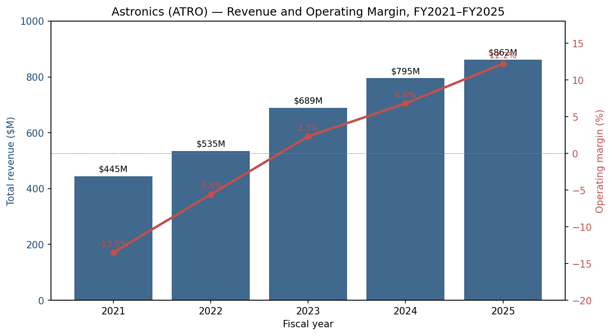
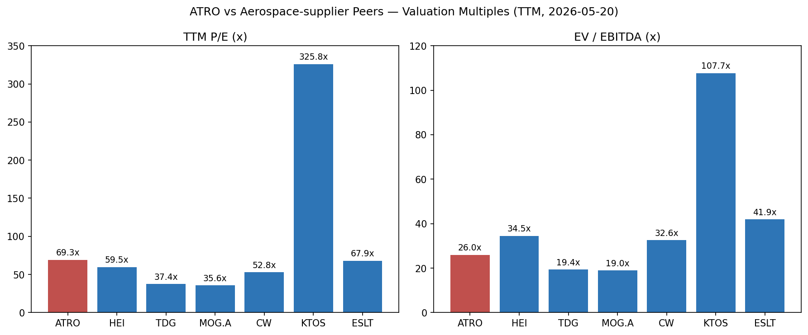
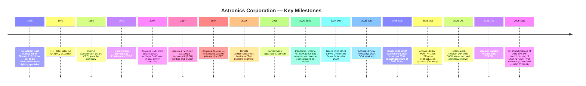
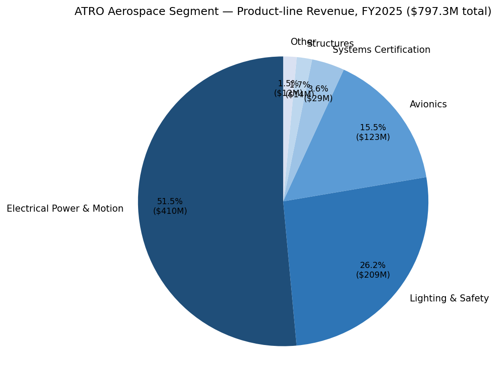
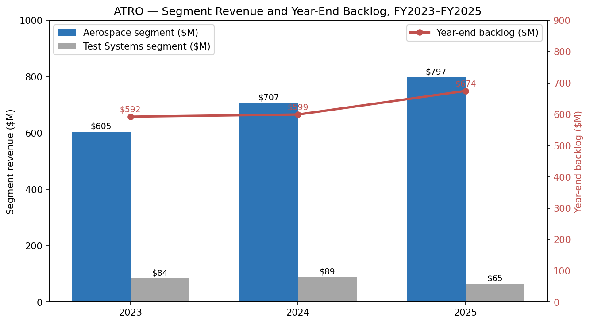
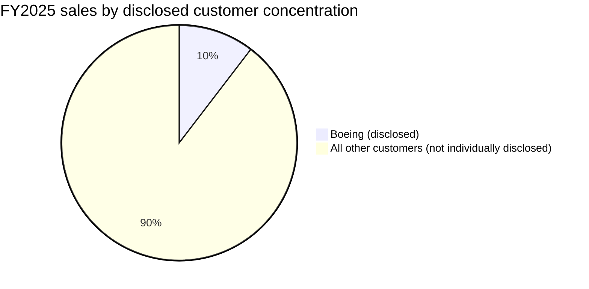
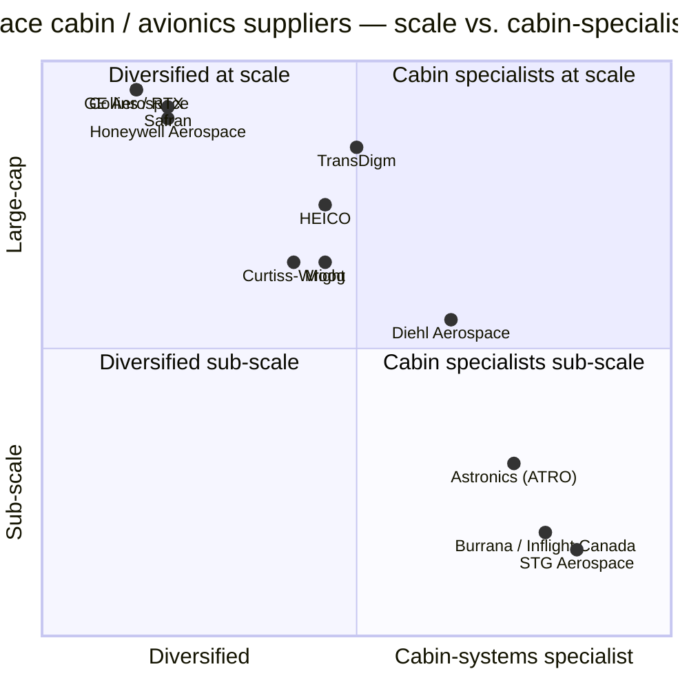

# Astronics Corporation (NASDAQ: ATRO) — Initiation of Coverage

**Date:** 2026-05-20
**Ticker:** NASDAQ: ATRO
**Sector:** Aerospace & Defense — cabin systems and automated test
**Analyst output:** company research initiation

> **Update — FY2026 revenue guidance raised (2026-05-12):** Management raised full-year 2026 revenue guidance to **USD 970M–1,000M** (from **USD 950M–990M** issued on 2026-02-24), implying ~14% growth at the midpoint versus FY2025 sales of USD 862.1M. The Q1 2026 release also disclosed Q1 sales of USD 230.6M (+12.0% YoY), record bookings of USD 290.4M (book-to-bill 1.26x), and an all-time-high backlog of USD 734.3M. Drivers cited: continued strength in Commercial Transport cabin demand (seat motion, lighting & safety) and a pending U.S. Army radio-test production award expected to ramp the Test Systems segment in 2H26. Source: [Astronics Q1 2026 earnings press release, 2026-05-12](https://www.sec.gov/Archives/edgar/data/8063/000000806326000024/ex99120260404-pr.htm); prior guide from [FY2025 earnings press release, 2026-02-24](https://www.sec.gov/Archives/edgar/data/8063/000000806326000018/ex99120251231pr.htm).

---

## TABLE OF CONTENTS

1. Company Overview
2. Company History
3. Management Team
4. Products & Services
5. Customers & Go-to-Market
6. Industry Overview
7. Competitive Landscape
8. Market Opportunity (TAM)
9. Risk Assessment
10. References

---

## 1. Company Overview

Astronics Corporation is a New York–domiciled aerospace and defense electronics supplier whose products sit deep inside the cabin and avionics bay of commercial aircraft and on the test floors of major defense primes. The company describes itself as "a leading provider of advanced technologies to the global aerospace, defense, and electronics industries" supplying "advanced, high-performance electrical power generation, distribution and motion systems, lighting and safety systems, avionics products, systems certification, aircraft structures and automated test systems" ([ATRO 2025 Form 10-K, Item 1](https://www.sec.gov/Archives/edgar/data/8063/000000806326000021/atro-20251231.htm)). The business is reported in two segments: **Aerospace** (~92% of FY25 sales) and **Test Systems** (~8% of FY25 sales).

How the company makes money is straightforward. In Aerospace, Astronics designs build-to-print and proprietary line-replaceable units (LRUs) — in-seat AC/USB power supply systems, cabin and exterior lighting, emergency lighting, seat motion actuators, antennas and avionics — that are designed-in at airframe OEMs (Boeing, Airbus, Bell, Gulfstream, Bombardier), at seat manufacturers and at completion centers, and then sold both at OE production and through long-tail aftermarket (retrofit, spares). In Test Systems, Astronics builds custom and semi-custom automated test equipment (ATE) under multi-year fixed-price contracts to defense primes and U.S. military services, with the U.S. Army radio test program for the next-generation Handheld, Manpack and Small Form Fit (HMS) radio family the single largest opportunity in the funnel.

Astronics is U.S.-headquartered in East Aurora, New York, with principal operations in the U.S., Canada, France and Germany, plus engineering offices in Ukraine and India ([10-K, Item 1](https://www.sec.gov/Archives/edgar/data/8063/000000806326000021/atro-20251231.htm)). As of December 31, 2025 the company employed approximately 2,700 full-time employees, of whom ~2,100 are U.S.-based ([10-K, Human Capital Resources](https://www.sec.gov/Archives/edgar/data/8063/000000806326000021/atro-20251231.htm)). FY2025 consolidated sales were **USD 862.1M**, up 8.4% from USD 795.4M in FY2024 and up 25.1% from USD 689.2M in FY2023 ([10-K consolidated statement of operations](https://www.sec.gov/Archives/edgar/data/8063/000000806326000021/atro-20251231.htm)). The Aerospace segment alone grew from USD 604.8M in FY23 to USD 797.3M in FY25 — a 31.8% two-year increase that approximately mirrors the OEM build-rate recovery off the post-2020 trough.

Source: [ATRO 2025 10-K consolidated statement of operations](https://www.sec.gov/Archives/edgar/data/8063/000000806326000021/atro-20251231.htm); FY2021 revenue from [Astronics 2021 Q4/Full-Year Press Release, 2022-03-02](https://www.businesswire.com/news/home/20220302005465/en/Astronics-Corporation-Reports-2021-Fourth-Quarter-and-Full-Year-Financial-Results).

Margins are the more important story. FY2025 consolidated operating margin reached **12.2%** — Aerospace at **14.2%** and Test Systems at **(12.1)%** — versus consolidated 6.8% in FY24 and 2.3% in FY23 ([10-K, Item 7 segment table](https://www.sec.gov/Archives/edgar/data/8063/000000806326000021/atro-20251231.htm)). Adjusted EBITDA margin in Q1 2026 was 16.4% ([Q1 2026 PR](https://www.sec.gov/Archives/edgar/data/8063/000000806326000024/ex99120260404-pr.htm)). Management has publicly targeted "high-teens operating margins for the consolidated business" once the Test segment turns ([FY25 earnings PR, 2026-02-24](https://www.sec.gov/Archives/edgar/data/8063/000000806326000018/ex99120251231pr.htm)).

**Geographic mix:** Astronics sells to a global customer base, but reports principally as a U.S. issuer, with foreign currency exposure mainly through its Canadian, French and German subsidiaries. The company estimates ~15% of FY2025 consolidated sales were to U.S. government-related markets (military aircraft, Pentagon test programs) ([10-K, Item 1 Government Contracts](https://www.sec.gov/Archives/edgar/data/8063/000000806326000021/atro-20251231.htm)).

**Scale indicators (FY2025):**
- Consolidated sales: USD 862.1M
- Aerospace segment sales: USD 797.3M (92.5% of total)
- Test Systems segment sales: USD 64.8M (7.5% of total)
- Operating income: USD 76.4M (8.9% margin)
- Net income: USD 29.4M (diluted EPS USD 0.81)
- Year-end consolidated backlog: USD 674.5M (Q1 2026 update: USD 734.3M — record)
- Employees: ~2,700
- Sales to Boeing: 10.4% of FY25 sales (10.2% FY24; 11.0% FY23)

### Valuation snapshot (as of 2026-05-20)

| Metric | ATRO | Source |
|---|---|---|
| Last price | USD 84.58 | [Yahoo Finance ATRO, 2026-05-20](https://finance.yahoo.com/quote/ATRO/) |
| Market cap | USD 3.03B | Yahoo Finance |
| 52-week range | USD 27.27 – 86.27 | Yahoo Finance |
| TTM P/E | **69.3x** | Yahoo Finance |
| Forward P/E (FY27 cons.) | 26.6x | Yahoo Finance |
| TTM P/S | 3.42x | Yahoo Finance |
| EV / EBITDA (TTM) | **26.0x** | Yahoo Finance |
| EV / Revenue | 3.62x | Yahoo Finance |
| P/B | 18.7x | Yahoo Finance |
| Total debt / Cash | USD 379M / USD 12M | Yahoo Finance |
| Beta | 1.11 | Yahoo Finance |

ATRO's 69x TTM P/E sits well above the aerospace-supplier peer median because FY2025 GAAP net income (USD 29.4M) is depressed by a **USD 32.6M non-cash loss on settlement of debt** from the partial repurchase of the 5.50% 2030 Convertible Notes in Q3 2025 ([10-K Note on Long-Term Debt](https://www.sec.gov/Archives/edgar/data/8063/000000806326000021/atro-20251231.htm); see also the September 2025 refinancing with the 2031 Convertible Notes). Strip that one-time charge and FY25 adjusted operating income would be approximately USD 109M — implying a normalized P/E nearer the mid-30s. The 26x forward P/E and 26x EV/EBITDA are the more defensible reads of where the market is valuing the business, both consistent with a "small-cap aerospace supplier in early-cycle margin recovery" framing rather than a stretched-multiple story.

**Peer comparison (TTM, 2026-05-20):**

| Company | Ticker | Price (USD) | Mkt cap (USD B) | TTM P/E | TTM P/S | EV/EBITDA | Op margin |
|---|---|---|---|---|---|---|---|
| Astronics | ATRO | 84.58 | 3.03 | 69.3x | 3.42x | 26.0x | 11.8% |
| HEICO | HEI | 300.87 | 41.98 | 59.5x | 9.06x | 34.5x | 22.2% |
| TransDigm | TDG | 1,200.73 | 67.16 | 37.4x | 7.07x | 19.4x | 46.7% |
| Moog | MOG.A | 314.72 | 9.97 | 35.6x | 2.39x | 19.0x | n/a |
| Curtiss-Wright | CW | 722.47 | 26.69 | 52.8x | 7.40x | 32.6x | 17.6% |
| Kratos Defense | KTOS | 55.38 | 10.38 | 325.8x | 7.34x | 107.7x | 1.8% |
| Elbit Systems | ESLT | 773.88 | 36.20 | 67.9x | 4.56x | 41.9x | 9.7% |
| **Peer median (ex-ATRO)** | | | | **59.5x** | **7.07x** | **32.6x** | **17.6%** |

Source: [Yahoo Finance / yfinance pull, 2026-05-20](https://finance.yahoo.com/quote/ATRO/key-statistics).

Source: [Yahoo Finance / yfinance, 2026-05-20](https://finance.yahoo.com/quote/ATRO/).

**Interpretation:** ATRO's headline TTM P/E (69x) is roughly in line with the peer median (~60x) but its forward P/E (~27x) and P/S (~3.4x) are *below* the peer median, reflecting (a) the GAAP loss on debt extinguishment that distorted TTM EPS, (b) materially lower operating margin than HEI/TDG (premium-multiple peers run 22–47% op margin vs. ATRO at ~12%), and (c) higher leverage and customer concentration risks vs. the larger, more diversified peers. We do not see ATRO as a stretched-multiple stock — but the 18.7x P/B is elevated because the convertible refinancings have shrunk book equity relative to debt. **A multiple-compression risk exists if Boeing build rates slip again or if Test Systems backlog conversion disappoints**; we surface this in Section 9.

---

## 2. Company History

Astronics was founded in **1968** by Thomas L. Robinson, Sr., a former engineer at the Cornell Aeronautical Laboratory in Buffalo, NY, to commercialize **electroluminescent (EL) lighting** technology — initially for instrument panel and emergency egress applications ([Astronics — Wikipedia, accessed 2026-05](https://en.wikipedia.org/wiki/Astronics); [company-histories.com, Astronics Corporation](https://www.company-histories.com/Astronics-Corporation-Company-History.html)). The company went public in 1972 and remained a small, family-influenced lighting specialist for most of the 1980s and 1990s, eventually rebranding its lighting subsidiary as **Luminescent Systems, Inc.** (LSI).

Source: [ATRO 2025 10-K, Item 1 (Acquisitions, Refinancing)](https://www.sec.gov/Archives/edgar/data/8063/000000806326000021/atro-20251231.htm); [Astronics — Wikipedia](https://en.wikipedia.org/wiki/Astronics); [Q1 2026 earnings press release, 2026-05-12](https://www.sec.gov/Archives/edgar/data/8063/000000806326000024/ex99120260404-pr.htm).

**Strategic pivots, in their causal order:**

1. **From a lighting-only specialist to a cabin power franchise (2000s).** The seminal pivot was the acquisition of **DME Corp.** in 2007, which gave Astronics the foundation of the EmPower in-seat AC/USB power business that today is the single largest product line in Aerospace (USD 410.4M FY25 sales in the Electrical Power & Motion line, 51% of segment revenue). The rationale was straightforward: once Wi-Fi and personal device proliferation took off in cabins, airlines needed in-seat power, and a lighting supplier already designed into the seat track had the certification know-how to add it.

2. **From components to a multi-system aerospace platform (2010s).** A series of acquisitions — Peco (PSUs, oxygen, cabin lighting), AeroSat (satcom antennas), Custom Control Concepts (cabin management for VVIP), Armstrong Aerospace, PGA Avionics, Telefonix PDT (IFE connectivity hardware), and Diagnosys (test) — broadened Astronics from a lighting box-shipper into a multi-product cabin systems supplier and shifted the revenue base towards more proprietary content per ship-set.

3. **Capital structure rebuild (2024–2025).** After the pandemic-era operating losses (consolidated losses in FY20–FY23) and the Boeing 737 MAX grounding, Astronics rebuilt its balance sheet via convertible debt. In December 2024 it issued **USD 165M of 5.50% Convertible Senior Notes due 2030**; in September 2025 it issued **USD 225M of zero-coupon Convertible Senior Notes due 2031** and used the proceeds to repurchase 80% (USD 132M) of the 2030 notes, recording a **USD 32.6M loss on settlement of debt** ([10-K Long-Term Debt note](https://www.sec.gov/Archives/edgar/data/8063/000000806326000021/atro-20251231.htm)). In October 2025 it replaced its USD 220M ABL revolver with a **USD 300M senior secured cash-flow-based revolver**, freeing it from the borrowing-base mechanic and lowering effective interest rates. Q1 2026 interest expense was down 25.8% YoY ([Q1 2026 PR](https://www.sec.gov/Archives/edgar/data/8063/000000806326000024/ex99120260404-pr.htm)).

**Recent developments (last 12 months):**

- **Envoy Aerospace** acquired 2025-06-30 for ~USD 8.3M. FAA ODA services provider — adds certification engineering capacity to Aerospace ([10-K, Item 1 Acquisitions](https://www.sec.gov/Archives/edgar/data/8063/000000806326000021/atro-20251231.htm)).
- **Bühler Motor Aviation (BMA)** acquired 2025-10-13 for ~USD 18.0M. Germany-based manufacturer of aircraft seat actuation systems, actuators, control panels and lighting — extends seat-motion content ([10-K, Item 1 Acquisitions](https://www.sec.gov/Archives/edgar/data/8063/000000806326000021/atro-20251231.htm)).
- **Lufthansa Technik UK patent dispute** — February 2025 UK High Court damages award of approx. USD 11.9M against Astronics for infringement of a cabin-power patent; a March 2025 supplemental award of USD 4.42M (account of profits) plus USD ~6M interest; the appeal has been delayed to **July 2026** ([Lufthansa UK appeal delayed, MLex](https://www.mlex.com/mlex/articles/2453915/lufthansa-uk-patent-appeal-against-astronics-and-panasonic-delayed-until-summer); [10-K Commitments and Contingencies](https://www.sec.gov/Archives/edgar/data/8063/000000806326000021/atro-20251231.htm)).

---

## 3. Management Team

**Peter J. Gundermann, 63 — Chairman, President & CEO** (CEO since 2003; Chairman since June 2019)

Gundermann is the central long-term operator at Astronics. He joined the company in **1988**, was named President of Astronics' Aerospace and Defense subsidiaries in 1991, became corporate President and CEO in 2003, and was named Chairman of the Board in June 2019. Total tenure at Astronics: **38 years**, of which 23 as CEO ([ATRO 2026 DEF 14A, Director Nominees](https://www.sec.gov/Archives/edgar/data/8063/000114036126015301/0001140361-26-015301-index.htm)). He holds a B.A. in Applied Mathematics and Economics from Brown University and an M.B.A. from Duke University, and also sits on the board of Moog Inc. (NYSE: MOG-A) since 2009 — meaningful because Moog is both a close peer and the prior employer of two other Astronics directors (Warren Johnson, Robert Brady). Gundermann is the largest individual insider holder: **651,618 Common shares (2.0%) and 754,025 Class B shares (19.8%)** as of April 8, 2026 ([2026 DEF 14A, Principal Shareholders](https://www.sec.gov/Archives/edgar/data/8063/000114036126015301/0001140361-26-015301-index.htm)). Astronics' dual-class structure gives Class B shares ten votes per share for most matters, meaning Gundermann's economic stake (~2% common, ~20% Class B) translates into meaningful voting influence; combined insider Common+Class B as a group held 5.1% of Common but 40.6% of Class B in 2026, materially anchoring management against short-term activism. Compensation in FY2025: a target equity grant value of USD 951,108 in stock options plus USD 500,455 in PSUs (25,250 PSUs) ([2026 DEF 14A, Grants of Plan-Based Awards](https://www.sec.gov/Archives/edgar/data/8063/000114036126015301/0001140361-26-015301-index.htm)). Gundermann's most-cited accomplishments inside the 10-K and proxy are: navigating the post-2020 trough (operating losses for four consecutive years through FY23) without large equity issuance, the at-the-market common-stock offering in 2023 used opportunistically, the post-pandemic capital-structure rebuild via the 2030 / 2031 convertible notes, and the November 2025 acquisitions (Envoy Aerospace, BMA) that arrive into rising end-market demand rather than at a cyclical top.

**Nancy L. Hedges, 52 — Vice President, Treasurer and Chief Financial Officer** (CFO since January 4, 2025)

Hedges was promoted from the company's Controller role and is the first CFO transition Astronics has made in over a decade — predecessor David C. Burney retired effective January 3, 2025 after holding the CFO role since 2003. The pivot from a long-tenured CFO to an internal promotion in the same year Astronics raised USD 225M of new convertibles and replaced its asset-based revolver with a cash-flow revolver was deliberate: Hedges had been involved in the relevant accounting and credit-agreement discussions for years and was named as both principal financial officer and principal accounting officer ([10-K Information About Our Executive Officers](https://www.sec.gov/Archives/edgar/data/8063/000000806326000021/atro-20251231.htm)). Her FY2025 grant package was USD 350,814 in PSUs (17,700 PSUs), no options ([2026 DEF 14A](https://www.sec.gov/Archives/edgar/data/8063/000114036126015301/0001140361-26-015301-index.htm)). The capital-markets résumé is in formation — she has not yet led the company through a major M&A integration or a fully independent earnings cycle, though the 2025 refinancing program was executed under her tenure. Her ownership stake is 32,049 Common + 1,287 Class B — small enough that the alignment is principally through equity-incentive economics rather than legacy ownership.

**Mark A. Peabody, 66 — Executive Vice President of the Company and President of the Aerospace Segment** (EVP since 2010)

Peabody runs the segment that produces ~92% of Astronics' sales. His FY25 PSU grant of 15,150 units (target value USD 300,273) and ownership of 174,076 Common + 185,220 Class B (4.9% of Class B) make him the second-largest insider Class B holder after Gundermann ([2026 DEF 14A, Principal Shareholders](https://www.sec.gov/Archives/edgar/data/8063/000114036126015301/0001140361-26-015301-index.htm)). Under Peabody's tenure the Aerospace segment grew from sub-USD 350M (pre-pandemic trough) to USD 797.3M in FY25, with operating margin expanding to 14.2% in FY25 from a low-single-digit base in FY23. The Bühler Motor Aviation acquisition in October 2025 sits in his segment.

**James F. Mulato, 65 — President, Astronics Test Systems, Inc. and EVP** (EVP since 2019)

Mulato runs the smaller and currently loss-making Test Systems segment. FY2025 segment sales of USD 64.8M reflected a USD 23.9M YoY decline from FY24, attributed to lower U.S. Army and U.S. Marine Corps' radio test program sales and an USD 8.3M unfavorable revision of estimated costs on long-term mass transit Test contracts ([10-K, Item 7 Test Systems segment](https://www.sec.gov/Archives/edgar/data/8063/000000806326000021/atro-20251231.htm)). His near-term mandate, per the Q1 2026 earnings call commentary, is to convert the pending U.S. Army radio test production award (expected to be issued in summer 2026) into a multi-year revenue ramp.

**Governance footer:**

- **Board composition (FY26 nominees):** nine directors. Eight of nine are independent (Brady, Frisby, Johnson, Robert Keane, Kim, Moran, O'Brien, West); only Gundermann is not independent. Lead Independent Director: Robert T. Brady (former Chairman of Moog Inc.) ([2026 DEF 14A, Director Nominees](https://www.sec.gov/Archives/edgar/data/8063/000114036126015301/0001140361-26-015301-index.htm)).
- **Insider ownership:** All directors and executive officers as a group held **5.1% of Common and 40.6% of Class B Stock** as of April 8, 2026 ([2026 DEF 14A, Principal Shareholders](https://www.sec.gov/Archives/edgar/data/8063/000114036126015301/0001140361-26-015301-index.htm)). External 5%+ Common holders: BlackRock 8.70%, Capital International Investors 5.90%, State Street 5.80%, Bares Capital Management 5.95%, American Century 5.60%.
- **Dual-class structure:** Astronics has Common and Class B Stock. Class B carries supervoting rights, which combined with the 40.6% insider Class B share creates a significant voting concentration.
- **Compensation structure:** Three primary components — base salary, annual cash bonus, and long-term equity (a mix of stock options, RSUs and PSUs). Gundermann is the only NEO who received a stock option grant in FY25 (29,750 options at USD 951k value), with the balance of NEOs receiving PSUs ([2026 DEF 14A Executive Compensation](https://www.sec.gov/Archives/edgar/data/8063/000114036126015301/0001140361-26-015301-index.htm)). The proxy reports no related-party transactions during fiscal 2025.
- **Auditor:** Ernst & Young LLP (proposed for re-appointment for FY26).
- **Annual meeting:** May 28, 2026 in Waukegan, IL.

**Management track record synthesis:** Gundermann has run Astronics for two and a half decades and has delivered through one full cycle (1999–2008 buildup), a Boeing 787 design-win era (2007–2014), the 737 MAX grounding plus pandemic (2019–2022) trough, and now an upcycle. Track record is strongest on customer relationships and design-in (the EmPower franchise is the visible artifact). Track record is weakest on the Test Systems segment, which has been operating-loss for three consecutive years through FY25; the test for the next 12 months is whether Mulato can convert the U.S. Army radio program into a margin turn. CFO and General Counsel are both relatively new (2025 / February 2026 appointments), so corporate-functions execution risk is higher than headline tenure suggests.

---

## 4. Products & Services

Astronics' product universe spans the cabin and the test floor. The Aerospace segment reports five product lines plus "Other"; the Test Systems segment is reported as a single product line.

```mermaid
graph TD
    A[Astronics Corporation] --> B[Aerospace Segment<br/>$797.3M FY25 / 92.5%]
    A --> C[Test Systems Segment<br/>$64.8M FY25 / 7.5%]
    B --> B1[Electrical Power & Motion<br/>$410.4M / 51%]
    B --> B2[Lighting & Safety<br/>$208.9M / 26%]
    B --> B3[Avionics<br/>$123.4M / 15%]
    B --> B4[Systems Certification<br/>$29.1M / 4%]
    B --> B5[Structures<br/>$13.6M / 2%]
    B --> B6[Other<br/>$11.9M / 1%]
    B1 --> B1a[EmPower in-seat AC/USB]
    B1 --> B1b[CorePower aircraft power dist.]
    B1 --> B1c[Seat motion actuators incl. BMA]
    B1 --> B1d[Cabin Management Systems VVIP]
    B2 --> B2a[LSI - Luminescent Systems]
    B2 --> B2b[Exterior aircraft lighting]
    B2 --> B2c[Emergency egress lighting]
    B2 --> B2d[Peco PSUs / oxygen masks]
    B3 --> B3a[AeroSat broadband antennas]
    B3 --> B3b[Test Sets / Avionics Boxes]
    B4 --> B4a[Envoy Aerospace FAA ODA]
    B4 --> B4b[Connectivity Systems & Certification]
    B5 --> B5a[Composite aircraft structures]
    C --> C1[U.S. Army radio test HMS]
    C --> C2[U.S. Marines radio test]
    C --> C3[Mass transit / electronics test]
    C --> C4[Training & simulation]
```

Source: [ATRO 2025 10-K Item 7 Aerospace product-line table](https://www.sec.gov/Archives/edgar/data/8063/000000806326000021/atro-20251231.htm); [Astronics product navigation (astronics.com)](https://www.astronics.com/).

Source: [ATRO 2025 10-K Item 7 Aerospace product-line table](https://www.sec.gov/Archives/edgar/data/8063/000000806326000021/atro-20251231.htm).

### Aerospace segment — product lines

**Electrical Power & Motion (USD 410.4M FY25, +14.3% YoY)** — the single largest product line. The franchise here is **EmPower**, the patented in-seat AC/USB passenger power supply system, plus **CorePower** aircraft power distribution and seat motion actuators (now including the Bühler Motor Aviation portfolio post-acquisition).

- *EmPower in-seat power systems.* AC, USB-A, USB-C and combination outlet units installed at every passenger seat on commercial aircraft. The product page states the system is in service with **"over 230 airlines with more than one million outlet units delivered"** ([Astronics In-Seat Power Supply page](https://www.astronics.com/advanced-electronic-systems/in-seat-power-supply)). The latest generation **EmPower UltraLite G2** delivers up to 60W per seat with USB-A + USB-C; per Astronics, more than a dozen airlines have committed to install it on **over 1,100 narrowbody aircraft** ([Astronics PR via BusinessWire, 2023-06-05](https://www.businesswire.com/news/home/20230605005814/en/Astronics-EmPower-UltraLite-G2-Power-System-for-Passenger-In-Seat-Power-on-Commercial-Aircraft-Revolutionizes-Cabin-Power)). **EmPower Xpress** is the retrofit on-seat USB housing intended for overnight maintenance turns — addressing the airline retrofit demand surge as carriers refresh seats on existing fleets ([Astronics EmPower Xpress page](https://www.astronics.com/advanced-electronic-systems/retrofit-in-seat-power)).
  - **Moat verdict: YES — defensible.** Moat type: combination of (i) certification / regulatory (in-seat power systems must be FAA / EASA STC-certified per aircraft type, with seat-supplier integration; switching costs are real), (ii) installed base / aftermarket (1M+ outlets installed across 230+ airlines creates spares pull and retrofit halo), and (iii) IP / patents (the Lufthansa Technik UK patent litigation is a sign Astronics' patent estate is fought over). Closest competing product: **Inflight Canada / Burrana iPower** and **Astronics' own legacy competitors KID-Systeme (Airbus subsidiary)**. ATRO position vs. competition: **ahead** in narrowbody airline OE wins (per the 1,100-aircraft UltraLite G2 commitment), but actively defending IP in the UK courts.
- *CorePower.* Aircraft-level electrical power generation, conversion and solid-state circuit-breaker (SSPC) systems. Astronics has been selected by Bell as the supplier of the **electrical power generation, conversion, and distribution system for the V-280 Valor / MV-75** under the U.S. Army Future Long-Range Assault Aircraft (FLRAA) program ([Vertical Mag, Astronics under contract with Bell for V-280](https://verticalmag.com/press-releases/astronics-corporation-under-contract-with-bell-for-v-280-valor-project/); [Bell MV-75 page](https://www.bellflight.com/products/bell-mv-75)). The 10-K confirms the MV-75 program is in engineering progression, and Q1 2026 included a **USD 2.8M catch-up of profit on the MV-75 program** ([Q1 2026 PR](https://www.sec.gov/Archives/edgar/data/8063/000000806326000024/ex99120260404-pr.htm)).
  - **Moat verdict: YES — early but valuable.** Moat type: regulatory / certification + program lock-in. Once you are sole-source designed into the electrical architecture of a 50-year-platform Army rotorcraft, you stay there. Closest competitor: GE Aerospace (formerly GE Aviation), Honeywell, Safran Electronics & Defense — all much larger but contested for individual LRUs.
- *Seat motion & actuation.* Includes the legacy Astronics business plus BMA (acquired Oct 2025) — actuators, electronics, control panels, pneumatic systems, and lighting for premium seats. Q1 2026 Aerospace growth was driven specifically by "increased demand for seat motion and lighting and safety products" ([Q1 2026 PR](https://www.sec.gov/Archives/edgar/data/8063/000000806326000024/ex99120260404-pr.htm)). The BMA acquisition is too recent to assess standalone economics.
  - **Moat verdict: PARTIAL.** Mid-tier hardware position with a few sole-source positions on premium-cabin programs; competitors include B/E Aerospace (Collins), Recaro, and Stelia (Airbus). Switching costs are real but seat suppliers re-bid actuators between aircraft programs.

**Lighting & Safety (USD 208.9M FY25, +16.4% YoY)** — the original Astronics business, now organized under Luminescent Systems Inc. (LSI) and Peco. Products include cabin night lighting, mood lighting, exterior position / navigation / anti-collision LED lighting, emergency floor-path lighting, passenger service units (PSUs), oxygen mask drop systems, and reading lights. The 10-K explicitly notes 2025 growth in this product line was driven by demand for "lighting and safety products" both on commercial transports and military aircraft.

- **Moat verdict: YES — strong on the safety side.** Moat type: certification + FAA TSO (Technical Standard Order) authorizations + installed-base aftermarket. Switching costs for emergency egress and oxygen-mask systems are very high because each aircraft model has type-certified configurations. Closest competitors: **STG Aerospace** (cabin lighting), **Diehl Aerospace** (cabin lighting and oxygen), **B/E Aerospace** (PSUs, now under Collins/RTX), **Zodiac Cabin Solutions** (Safran). Position vs. competition: **at parity** on cabin lighting (commoditizing), **ahead** on emergency egress and PSUs where TSO history matters.

**Avionics (USD 123.4M FY25, +2.7% YoY)** — broadband satcom antennas (AeroSat), avionics test boxes, communications and connectivity hardware. The product growth here in FY25 was muted vs. the other Aerospace lines because OEM antenna allocations are inherently slower than seat / cabin-power retrofits. The Q1 2026 release flagged USD 6.2M of higher general-aviation IFEC product sales to the VVIP market — VVIP completions are a Astronics niche.

- **Moat verdict: PARTIAL.** Strong on niche cabin antenna positions for narrowbody connectivity; weaker positions vs. Honeywell, Collins Aerospace and Thales in the broader avionics stack. Switching costs exist at the antenna LRU level but airlines can choose alternate IFEC suppliers (Viasat, Intelsat).

**Systems Certification (USD 29.1M FY25, +71% YoY — fastest-growing product line)** — Astronics Connectivity Systems & Certification Corp., now augmented by the 2025-06-30 acquisition of **Envoy Aerospace**, an FAA Organization Designation Authorization (ODA) services provider in Aurora, Illinois ([10-K Acquisitions](https://www.sec.gov/Archives/edgar/data/8063/000000806326000021/atro-20251231.htm)). This is engineering services for STC and TSO certification, including support for airline retrofit programs. The 71% growth reflects both the underlying retrofit cycle and the M&A contribution from Envoy.

- **Moat verdict: PARTIAL.** ODA designation is the moat — only a few firms hold an FAA ODA. But the engineering-services business is people-led and not as defensible as proprietary hardware. Closest competitors: Boeing's own ODA, Collins Aerospace, regional ODAs.

**Structures (USD 13.6M FY25)** — composite aircraft structures, small program scale.

**Other (USD 11.9M FY25)** — declining as the company has wound down non-core contract manufacturing arrangements ([10-K Item 7 Aerospace segment narrative](https://www.sec.gov/Archives/edgar/data/8063/000000806326000021/atro-20251231.htm)).

### Test Systems segment

A single segment with three sub-businesses: (a) U.S. Army and Marine Corps radio test programs (PMA-based); (b) communications and mass-transit electronics test; (c) training and simulation devices. **All FY2025 Test Systems revenue (USD 64.8M) was to government and defense customers** ([10-K Item 7](https://www.sec.gov/Archives/edgar/data/8063/000000806326000021/atro-20251231.htm)). Per management on the Q1 2026 call, the U.S. Army radio test production award is "on track to be issued in the coming weeks, with the production phase of the program accelerating in the second half of the year" ([Q1 2026 PR, 2026-05-12](https://www.sec.gov/Archives/edgar/data/8063/000000806326000024/ex99120260404-pr.htm)). Segment backlog at Q1 2026 was USD 83.0M; book-to-bill of 1.55x in the quarter.

- **Moat verdict: PARTIAL.** Defense ATE is sticky once a service buys it (calibration data, technician training, software libraries), but Astronics is sub-scale vs. larger ATE players. Competitors: **Teradyne** (semi test heritage but defense exposure), **Curtiss-Wright Defense Solutions**, **Mercury Systems**, **Ametek's Test & Measurement businesses**, and Boeing / Lockheed in-house. Position vs. competition: **behind** on scale; **at parity** on niche U.S. Army radio test programs where Astronics has the heritage from Diagnosys and prior acquisitions.

### Flagship vs. long-tail

- **Flagship 1:** EmPower / Electrical Power & Motion line — 51% of Aerospace revenue, the highest-moat business, the source of the Lufthansa litigation (and therefore where the company is willing to fight on IP). All future model-year retrofit and OE design-ins flow through this product.
- **Flagship 2:** Lighting & Safety — 26% of Aerospace revenue, the original franchise, the highest TSO-density product portfolio.
- **Flagship 3 (potential):** MV-75 / CorePower defense aircraft electrical systems — small today but with multi-decade U.S. Army content per aircraft.
- **Long-tail:** Structures (USD 13.6M), Other (USD 11.9M).

### Last-12-month launches and repositioning

- **2025-09:** USD 225M Convertible Senior Notes due 2031 issued — capital-structure event, not a product launch but materially affecting interest expense.
- **2025-10-13:** BMA acquisition closes — adds seat-actuation hardware portfolio.
- **2025-06-30:** Envoy Aerospace acquisition closes — adds FAA ODA certification services.
- **2025-Q1 ongoing:** EmPower UltraLite G2 ramp into narrowbody fleets (1,100+ aircraft committed per company; 2023 launch but still ramping).
- **2025–2026:** MV-75 engineering catch-up of profit (USD 2.8M in Q1 2026) — program moving from engineering toward LRIP.

---

## 5. Customers & Go-to-Market

### Customer segments

Astronics serves four broad customer categories:

1. **Airframe OEMs.** Boeing, Airbus, Embraer, Bombardier, Gulfstream, Dassault, Textron Aviation, Bell (the new U.S. Army MV-75 award), Sikorsky. These customers buy Aerospace LRUs at production rate, typically on PO-by-PO or single-year procurement contracts ([10-K Item 1, Products and Customers](https://www.sec.gov/Archives/edgar/data/8063/000000806326000021/atro-20251231.htm)).
2. **Seat suppliers and completion centers.** Collins Aerospace (Adient Aerospace), Safran Seats, Recaro, Stelia — these are the integrators of EmPower power and seat-motion content. Astronics is designed-in at seat level even before the airline selects the seat option.
3. **Airlines (aftermarket / retrofit).** Direct sales for retrofit programs (EmPower Xpress, cabin lighting refurb) and ongoing spares.
4. **U.S. Department of Defense & defense primes.** U.S. Army (MV-75 program, HMS radio test), U.S. Marine Corps (radio test), prime contractors. **Approximately 15% of FY2025 consolidated sales were to U.S. government-related markets** ([10-K Item 1](https://www.sec.gov/Archives/edgar/data/8063/000000806326000021/atro-20251231.htm)).

Source: [ATRO 2025 10-K Item 7 segment table](https://www.sec.gov/Archives/edgar/data/8063/000000806326000021/atro-20251231.htm); FY2023 year-end backlog of USD 592.3M from [ATRO 2023 10-K, Item 7](https://www.sec.gov/Archives/edgar/data/8063/000000806324000014/).

### Customer concentration — quantified

**Boeing is the only disclosed >10% customer.** Per the 10-K Item 1A Risk Factors:

> "In 2025, 2024, and 2023 we had a concentration of sales to Boeing representing approximately **10.4%, 10.2%, and 11.0%** of our sales, respectively. Revenue earned from sales to Boeing may decline or fluctuate significantly in the future. … The loss of Boeing as a customer or a significant reduction in business with Boeing would significantly reduce our sales and earnings." ([ATRO 2025 10-K, Item 1A](https://www.sec.gov/Archives/edgar/data/8063/000000806326000021/atro-20251231.htm))

Source: [ATRO 2025 10-K, Item 1A Risk Factors — customer concentration](https://www.sec.gov/Archives/edgar/data/8063/000000806326000021/atro-20251231.htm).

**Three-year trend:** Boeing's share has been broadly stable (11.0% → 10.2% → 10.4%) but the absolute USD value rose meaningfully — from approximately USD 75.8M in FY23 to USD 89.7M in FY25 — as commercial transport sales grew. No other single customer is disclosed at the >10% threshold. Airbus is not separately disclosed because Astronics' Airbus content per aircraft is distributed across multiple seat-supplier and completion-center contracts, none of which individually crosses 10%. Aircraft-level OEM concentration is therefore higher than the customer-level disclosure suggests: **most of the Commercial Transport revenue (USD 599.3M in FY25, 75% of Aerospace) ultimately depends on Boeing and Airbus narrowbody / widebody build rates.**

**Aircraft-level concentration (estimated, based on the commercial duopoly and Astronics' own framing):** The 10-K explicitly says, *"The commercial aerospace market is a global duopoly where Boeing and Airbus SE ('Airbus') serve as the OEMs. Their production health is vital to our performance."* ([10-K Item 1A](https://www.sec.gov/Archives/edgar/data/8063/000000806326000021/atro-20251231.htm)). Even after the seat-supplier intermediation, the combined Boeing+Airbus narrowbody build rate is the single dominant driver of Astronics' Commercial Transport revenue.

**Contract structure:** Per the 10-K Products and Customers section, *"Most of this segment's sales are a result of contracts or purchase orders received from customers, placed on a day-to-day basis or for a single year procurement rather than long-term multi-year contract commitments. On occasion, the Company does receive contractual commitments or blanket purchase orders from our customers covering multiple-year deliveries of hardware."* This is a meaningfully less defensive position than, e.g., TransDigm's IP-protected proprietary aftermarket — Astronics has to re-win price each year on most lines.

**Customer-as-competitor risk:** Lufthansa Technik (the German MRO) is both a customer and the plaintiff in the active patent infringement case in the UK ([Astronics Damages Ruling PR, 2025-02-20](https://investors.astronics.com/news-events/press-releases/detail/425/astronics-corporation-announces-damages-ruling-on-lufthansa)). Boeing's own in-house design capability for cabin power is limited; the more material customer-as-vertical-integrator risk is Airbus, whose KID-Systeme subsidiary competes directly in in-seat power.

**Concentration verdict:** Top-1 customer at 10.4% is **above the 10% disclosure threshold and meets the "material" criterion for Section 9 risk assessment**. Aircraft-program concentration through the Boeing+Airbus duopoly is materially higher; the 10-K is explicit about it. We treat this as a Section 9 risk.

### Distribution channels

- **Direct sales to OEMs and primes:** technical sales engineers based at Astronics subsidiaries (LSI, Peco, AES, Test Systems) call directly on Boeing, Airbus, Bell, Lockheed, Northrop Grumman engineering and procurement teams.
- **Direct sales to airlines for retrofit:** the company's investor materials specifically note EmPower Xpress is sold to airlines for overnight maintenance turns.
- **Distributor / reseller channels:** limited.
- **No e-commerce or direct-consumer channel.**

### Sales cycle

The cycle is long. A new-aircraft program (Boeing 777X, Bell MV-75) takes 5–10 years from initial design-in to high-rate production. Retrofit programs (EmPower Xpress) can move in 12–24 months. Test Systems programs are typically 5–10-year procurements at the program level.

### Key partnerships

- **Panasonic Avionics** — co-defendant in the Lufthansa Technik UK patent dispute, indicating commercial integration partnerships in passenger cabin power.
- **Bell** — Astronics is a "Team Valor" member supplying the electrical power and distribution system on the MV-75 ([Vertical Mag](https://verticalmag.com/press-releases/astronics-corporation-under-contract-with-bell-for-v-280-valor-project/)).
- **Major seat manufacturers** — Safran, Recaro, Collins, Stelia — integration partnerships for in-seat power.

### Customer case studies (named wins, last 12 months)

- **EmPower UltraLite G2:** more than a dozen airline commitments covering over 1,100 narrowbody aircraft ([BusinessWire, 2023-06-05](https://www.businesswire.com/news/home/20230605005814/en/Astronics-EmPower-UltraLite-G2-Power-System-for-Passenger-In-Seat-Power-on-Commercial-Aircraft-Revolutionizes-Cabin-Power)).
- **MV-75 (FLRAA):** Bell-selected supplier of the electrical power generation, conversion, and distribution system ([Astronics PR via investors.astronics.com](https://investors.astronics.com/news-events/press-releases/detail/393/astronics-corporation-selected-by-bell-to-develop)).
- **U.S. Army HMS radio test program:** "production award on track to be issued in the coming weeks, with the production phase of the program accelerating in the second half of the year" ([Q1 2026 earnings PR, 2026-05-12](https://www.sec.gov/Archives/edgar/data/8063/000000806326000024/ex99120260404-pr.htm)).

---

## 6. Industry Overview

### Industry definition and scope

Astronics operates in two distinct industries that nonetheless share customers:

- **Commercial aerospace cabin systems and interiors** — design, certification, manufacture and aftermarket supply of in-seat power, cabin lighting and safety systems, seat motion actuators, satcom antennas, avionics LRUs and aircraft structures, principally for the Boeing/Airbus narrowbody and widebody duopoly plus regional jets and business aviation. NAICS code 336413 (Other Aircraft Parts and Auxiliary Equipment Manufacturing).
- **Defense automated test equipment (ATE) and rotorcraft electrical systems** — radio test, missile / radar / EW test systems for U.S. DoD and prime contractors; rotorcraft electrical power generation and distribution for the FLRAA / MV-75. NAICS codes 334515 (Instruments for Measuring and Testing of Electricity and Electrical Signals) and 336411 (Aircraft Manufacturing — parts).

### Market size and growth

**Commercial aircraft cabin systems aggregate** — there is no single TAM figure for "aircraft cabin power + lighting + seat motion" because each sub-segment is sized separately. From the most-recent third-party reports:

- **In-seat power systems** specifically (the EmPower category): estimates range widely. Mordor Intelligence estimates the **commercial aircraft in-seat power system market at ~USD 152.6M in 2025, growing at 3.5% CAGR to USD 181M by 2030** ([Mordor Intelligence — Commercial Aircraft In-seat Power System Market](https://www.mordorintelligence.com/industry-reports/commercial-aircraft-in-seat-power-system-market), accessed 2026-05). Higher-end forecasts (Market Research Future) put the category at USD 1.4B in 2025 growing to USD 2.7B by 2035 at 6.7% CAGR ([Market Research Future, In-Seat Power System Market, 2025](https://www.marketresearchfuture.com/reports/commercial-aircraft-in-seat-power-system-market-34099)). The 9x range between these forecasts reflects definitional disagreement on whether the addressable market includes the full system (master control unit + in-seat outlets + cabling) or just the outlets — we view USD 400–600M as the credible global system-level annual TAM and Astronics as a ~25–40% share holder.
- **In-flight entertainment & connectivity (IFEC) systems** market is sized at multi-billion-dollar levels (~USD 7–10B globally per Mordor Intelligence) but Astronics participates only at the antenna and power-supply periphery, not the screens/content.
- **Commercial aircraft cabin lighting** — estimated at USD 1.0–1.5B globally per industry reports; Astronics' share via LSI / Peco is in the high-single-digit percentage range based on its segment revenue scale.
- **Commercial aircraft structures, avionics and military electronics** are far larger TAMs (hundreds of billions) where Astronics participates in narrow niches.

**Build-rate-driven demand:** Astronics' near-term revenue trajectory is more sensitive to *aircraft build rates* than to TAM CAGR. Boeing 737 MAX production cleared the FAA's 38/month cap in early 2026 and the FAA approved a ramp toward 42/month in October 2025; further increments of five planes have been discussed by CEO Kelly Ortberg ([Fortune, 2025-10-18, FAA allows Boeing to increase 737 Max production](https://fortune.com/2025/10/18/faa-boeing-737-max-production-rate-alaska-air-door-plug/); [Aerotime, Boeing FAA approval 737 MAX production](https://www.aerotime.aero/articles/boeing-faa-approval-737-max-production)). Each ramp from 38 → 42 → 47 narrowbody/month is roughly 110–235 additional ship-sets annually, each carrying USD 60–120k of Astronics in-seat power + lighting content. Airbus A320 family production has guided toward 75/month by 2027.

**Defense ATE:** The U.S. DoD test, measurement & evaluation budget runs USD 6–9B/year across services (per FY26 DoD President's Budget). The HMS radio test program for the U.S. Army (the principal near-term Test Systems opportunity) is a multi-year procurement that Astronics has been positioning to win the production phase of.

### Key trends and drivers

1. **Narrowbody build-rate recovery.** Boeing's clearance of the 38/month FAA cap in early 2026 is the single largest near-term demand driver for Astronics ([Altitudes Magazine, Boeing Clears FAA Production Cap](https://www.altitudesmagazine.com/boeing-clears-faa-production-cap-737-max-output-climbs-38-aircraft/)). Astronics' FY26 guide raise to USD 970M-1B (from USD 950M-990M) is closely tied to this dynamic.
2. **Airline retrofit / cabin refresh cycle.** Multiple major North American carriers awarded EmPower retrofit contracts to Astronics in 2024–25 ([Astronics Awarded EmPOWER Contracts PR](https://investors.astronics.com/news-events/press-releases/detail/207/astronics-awarded-empower-in-seat-passenger-power)). Premium-economy and economy seat refreshes drive new in-seat power and lighting demand on existing fleets.
3. **USB-C displacing USB-A as the passenger device standard.** EmPower UltraLite G2 supports both, with 60W per seat — sufficient for laptops, addressing a previous EmPower limitation.
4. **Modular Open Systems Architecture (MOSA) in defense.** Bell's MV-75 specifies MOSA, which advantages suppliers like Astronics with solid-state electronic circuit-breaker (SSPC) and software-configurable power distribution.
5. **Tariffs and trade policy.** FY25 cost of products sold included USD 10.4M of tariff expense; Q1 2026 cost was hit by an additional USD 1.7M of tariffs ([Q1 2026 PR](https://www.sec.gov/Archives/edgar/data/8063/000000806326000024/ex99120260404-pr.htm)). The 10-K notes that *"On January 20, 2026, the United States Supreme Court ruled that the International Emergency Economic Powers Act ('IEEPA') did not authorize the President to impose tariffs. The IEEPA tariff case has been remanded back to the Court of International Trade…"* — the path to potential tariff refunds is uncertain.
6. **IP enforcement and the Lufthansa Technik dispute.** The UK court damages award of USD ~11.9M plus the USD 4.42M account of profits and ~USD 6M interest, plus the pending July 2026 appeal, sets a precedent for cabin-power patent litigation.

### Regulatory environment

- **FAA / EASA certification.** Every Astronics aircraft product requires TSO or PMA authorization; certain systems require STC for each aircraft type. This is the single most important regulatory moat the company has.
- **U.S. Department of Defense procurement.** Cost Accounting Standards, FAR/DFARS compliance; security clearance maintenance. The 10-K identifies "our ability to maintain our security clearance with the U.S. Department of Defense" as a forward-looking risk.
- **Export controls (ITAR / EAR).** Required for defense product exports; the 10-K notes U.S. trade policy uncertainty as a risk.

### Industry dynamics

- **Highly consolidated upstream (Boeing + Airbus duopoly) and highly fragmented at Tier-2 / Tier-3 supplier level.** Astronics is a Tier-2/3 supplier with proprietary content but limited pricing power vs. OEM purchasing.
- **Supplier-power note from the 10-K:** *"We experience considerable competition in the market sectors we serve, principally with respect to product performance and price, from various competitors, many of which are substantially larger and have greater resources than we do."*
- **High barriers to entry.** FAA TSO/STC certification, OEM qualification, and a multi-decade installed base are real barriers; existing players have substantial moat against new entrants, but compete vigorously among themselves.

---

## 7. Competitive Landscape

Astronics is a sub-USD 1B aerospace supplier competing against players ranging from USD 5B niche specialists (HEICO, Moog) to USD 50B+ diversified giants (Honeywell, Collins/RTX, Safran, GE Aerospace). The competitive picture is product-line specific.

Source: positioning estimated by analyst from each company's revenue mix and product disclosures.

### Direct competitors by product line

1. **In-seat power (EmPower):**
   - **KID-Systeme GmbH** — wholly-owned Airbus subsidiary (sister to Airbus Atlantic). Direct competitor for Airbus-aircraft in-seat power; vertically integrated with the OEM. Material weakness for Astronics on Airbus narrowbodies.
   - **Burrana** (formerly IMS Company / Digecor / Inflight Canada) — IFEC + power supplier; direct competitor on EmPower Xpress retrofit category.
   - **Lufthansa Technik AG** — patent licensor and (currently) plaintiff against Astronics in the UK case.
   - **Inflight Canada** — narrowbody retrofit competitor.
2. **Cabin and exterior lighting:**
   - **STG Aerospace** — private UK-based specialist in photoluminescent emergency egress and LED cabin lighting.
   - **Diehl Aerospace** — German privately-held giant; cabin LED and oxygen systems.
   - **Collins Aerospace (RTX)** — full cabin lighting portfolio post-B/E Aerospace acquisition.
   - **Honeywell** — exterior lighting and avionics lighting niche.
3. **Avionics and antennas:**
   - **Honeywell Aerospace, Collins Aerospace, Thales** — dominant in avionics LRUs.
   - **ThinKom, Gogo, Viasat** — competing satcom antenna technologies for IFEC.
4. **Seat motion / actuation:**
   - **Moog Inc. (MOG.A)** — flight-control actuation but also some cabin actuation.
   - **Curtiss-Wright Defense Solutions** — actuation niche.
   - **Recaro, Adient Aerospace, Stelia** — seat suppliers that internalize motion.
5. **Defense ATE (Test Systems):**
   - **Curtiss-Wright (CW)** — defense electronics including ATE positions.
   - **Mercury Systems** — embedded processing and test for defense.
   - **Teradyne** — historically semi test, has expanded into defense ATE adjacencies.
   - **Northrop Grumman, Lockheed Martin** — in-house ATE for own programs.
6. **Rotorcraft electrical systems (MV-75):**
   - **GE Aerospace** — generators and power.
   - **Honeywell** — APUs and electrical systems.
   - **Safran Electronics & Defense** — full electrical-distribution stack.

### Competitive advantages

- **EmPower installed base.** 230+ airlines, 1M+ outlets installed — creates a real switching-cost moat for retrofit and aftermarket spares.
- **FAA TSO / STC certification density.** Especially in emergency egress lighting, PSUs, and oxygen masks — multi-decade TSO history is hard to replicate.
- **Patent estate.** The Lufthansa Technik UK litigation, while costly, is also evidence the patent estate is fought over.
- **Bell MV-75 design-in.** Sole-source position on the U.S. Army's next-generation FLRAA program — a 30-year content opportunity.
- **Customer breadth without single-customer-collapse risk.** Boeing is 10.4% but no other customer is disclosed at the 10% threshold — versus, e.g., Spirit AeroSystems which is ~70% Boeing.

### Competitive vulnerabilities

- **Sub-scale vs. Collins, Safran, Honeywell.** Astronics is USD 862M in revenue vs. peers measured in tens of billions; bargaining power with Boeing and Airbus is correspondingly weaker.
- **Test Systems remains loss-making.** Three consecutive years of operating losses in the segment (FY23: -USD 8.7M, FY24: -USD 8.5M, FY25: -USD 7.8M); under-absorbed fixed costs at current volume.
- **Aircraft-program concentration through duopoly.** *"The commercial aerospace market is a global duopoly… Their production health is vital to our performance"* ([10-K Item 1A](https://www.sec.gov/Archives/edgar/data/8063/000000806326000021/atro-20251231.htm)).
- **Leverage.** Debt/equity 234% per Yahoo Finance pull; total debt USD 379M against TTM EBITDA ~USD 115M (Q1 ann. + FY25) — net leverage ~3.2x. Higher than HEI/TDG.
- **Active IP litigation.** Lufthansa Technik UK appeal in July 2026 is an event-risk overhang.

### Market share analysis (estimated)

- **In-seat passenger power:** ~25–40% global share (Astronics' own disclosure of 230+ airlines and 1M outlets, against the third-party-sized USD 400–600M global TAM at system level).
- **Cabin LED / exterior lighting:** mid-single-digit percentage globally — sub-scale vs. Collins, Diehl, STG.
- **Defense ATE:** sub-1% global share; meaningful only in specific U.S. Army / Marines radio test program niches.

---

## 8. Market Opportunity (TAM)

We size Astronics' addressable market conservatively at **USD 3.5–5B annually across all product lines** (system-level addressable + retrofit + spares + defense ATE) — with Astronics at FY25 revenue of USD 862M, implied share of ~20% in its addressable categories.

**TAM breakdown:**

- **Commercial in-seat power systems (system-level addressable):** USD 400–600M (analyst estimate from third-party sub-system + power generation data) — Astronics share 25–40% via EmPower franchise. Growth: 5–7% CAGR through 2030 driven by USB-C adoption, retrofit cycle, and ramp of Boeing/Airbus narrowbody build rates.
- **Commercial cabin lighting (cabin + exterior LED, emergency egress):** USD 1.0–1.5B globally — Astronics participates via LSI and Peco; estimated 8–12% share. Growth: 4–6% CAGR.
- **Aircraft seat-motion actuation:** estimated USD 300–500M globally; share 5–10% (rising with the BMA acquisition).
- **Satcom antennas for IFEC narrowbody:** estimated USD 300–600M annual systems revenue; Astronics participates via AeroSat in a narrow band.
- **FAA ODA certification services and STC engineering:** USD 200–400M U.S.-only TAM (estimate); Astronics expanded via Envoy Aerospace acquisition.
- **Rotorcraft electrical systems for MV-75 / FLRAA:** USD 50–150M annual content potential at full Army production rates (per ship-set value estimates).
- **Defense ATE — U.S. Army / Marines radio test, mass-transit test, training & simulation:** USD 500–1,000M annual TAM (sub-set of DoD T&E budget) — Astronics share <5%.

**Total addressable (Astronics-specific):** USD 3.5–5.0B annually, growing at a blended 4–6% CAGR. Astronics' FY25 revenue of USD 862M implies ~20% share of its own addressable categories — leaving room for both organic growth via cycle recovery and M&A-driven adjacency expansion.

**SAM (serviceable available market):** Roughly USD 2.0–2.5B — the subset where Astronics is qualified, certified and competitively positioned. This excludes large-OEM in-house electrical systems (Boeing internal manufacturing, Airbus KID-Systeme captive) and large-cap defense ATE programs where Astronics lacks the scale to lead-prime.

**SOM (serviceable obtainable market over 3–5 years):** With the MV-75 production ramp, U.S. Army radio test production phase, narrowbody build-rate increases (Boeing toward 42 then 47/month; Airbus toward 75/month for the A320 family), and the EmPower UltraLite G2 fleet rollout, Astronics could plausibly reach USD 1.2–1.5B in annual revenue by 2028–2029 — consistent with the company's own ambition to deliver "high-teens operating margins for the consolidated business" ([FY25 earnings PR, 2026-02-24](https://www.sec.gov/Archives/edgar/data/8063/000000806326000018/ex99120251231pr.htm)).

**Penetration strategy:**

- *Organic:* tied to Boeing 737 MAX / 787 build-rate recovery, Airbus A320/A321 family ramp, and EmPower UltraLite G2 retrofit adoption.
- *M&A:* bolt-on acquisitions of niche cabin systems and certification services (Envoy 2025, BMA 2025).
- *Defense:* MV-75 production ramp, U.S. Army HMS radio test program conversion to production phase in 2H26.

---

## 9. Risk Assessment

### Company-Specific Risks

**1. Boeing customer concentration (HIGH).** Boeing represented **10.4% of FY25 sales (10.2% FY24; 11.0% FY23)** and is the only disclosed >10% customer ([10-K Item 1A](https://www.sec.gov/Archives/edgar/data/8063/000000806326000021/atro-20251231.htm)). The company explicitly lists "the loss of Boeing as a major customer or a significant reduction in business with Boeing" as the first forward-looking risk in the 10-K. Aircraft-program concentration is even higher because most of the Commercial Transport segment (75% of Aerospace) flows through the Boeing/Airbus duopoly. *Mitigants:* No single Astronics product is sole-source to Boeing alone; the EmPower franchise touches 230+ airlines globally; multi-year program lifetime on 737 and 787 dampens short-term volatility.

**2. Narrowbody build-rate sensitivity (HIGH).** Boeing's 737 MAX production has been capped by the FAA at 38/month since January 2024 and was approved to ramp toward 42/month in October 2025, achieving the 38 cap clearance in early 2026 ([Fortune, 2025-10-18](https://fortune.com/2025/10/18/faa-boeing-737-max-production-rate-alaska-air-door-plug/); [Altitudes Magazine](https://www.altitudesmagazine.com/boeing-clears-faa-production-cap-737-max-output-climbs-38-aircraft/)). Any new FAA restriction (a quality incident, a strike, supplier delay) would reduce Astronics' Commercial Transport revenue near-dollar-for-dollar in the affected quarters. The 10-K is explicit: *"Future shifts in their production rates remain a primary factor in our projected results."* *Mitigants:* Retrofit / aftermarket cycle (EmPower Xpress) partially decouples revenue from OE build rate; backlog of USD 734.3M as of Q1 2026 provides ~9 months of revenue visibility.

**3. Test Systems segment under-absorption (MEDIUM-HIGH).** Three consecutive years of segment operating losses (FY23: -USD 8.7M; FY24: -USD 8.5M; FY25: -USD 7.8M) and segment revenue down 27% YoY in FY25. The thesis turn depends on the U.S. Army HMS radio test production award expected mid-2026 and on long-term mass-transit contract risk (FY25 had an USD 8.3M unfavorable cost-revision). *Mitigants:* Q1 2026 segment book-to-bill of 1.55x and order backlog of USD 83M; production award expected in coming weeks per Q1 2026 call.

**4. Lufthansa Technik UK patent dispute and appeal (MEDIUM).** UK High Court awarded USD ~11.9M damages plus USD 4.42M account of profits and USD ~6M interest; appeal delayed to July 2026 ([MLex, Lufthansa UK appeal delayed](https://www.mlex.com/mlex/articles/2453915/lufthansa-uk-patent-appeal-against-astronics-and-panasonic-delayed-until-summer)). A loss on appeal would crystallize the existing damages plus potentially expand to indirect-sales exposure. *Mitigants:* USD ~22M is the materially-bounded financial exposure; the dispute is contained to one EU patent family.

**5. CFO transition + General Counsel transition (LOW-MEDIUM).** Nancy Hedges (CFO since January 2025) and Julie Davis (General Counsel since February 2026) are both relatively new to their roles. *Mitigants:* Hedges was previously Controller; Davis was already at the company.

**6. Integration risk on BMA + Envoy (LOW-MEDIUM).** Two acquisitions closed in mid–late 2025 (USD 8.3M + USD 18.0M combined, modest size). *Mitigants:* small relative to USD 862M base; both bolt-on to existing operations rather than transformational.

### Industry / Market Risks

**7. Boeing / Airbus quality or supply-chain crisis (HIGH).** The aerospace duopoly creates concentrated systemic risk. A Boeing 737 MAX 9 door-plug-type incident, an engine supplier delay, or an Airbus production strike could compress Astronics' build-rate-tied revenue. *Mitigants:* Astronics' multi-program exposure (737 + 787 + A320 + A350 + business jets + military) provides some diversification.

**8. Competitive intensity from larger, integrated suppliers (MEDIUM).** Collins (RTX), Safran, Honeywell, and Diehl all have substantially greater scale and can bundle cabin systems content. Airbus' KID-Systeme is vertically integrated for in-seat power. *Mitigants:* Astronics' EmPower franchise has a real moat in narrowbody airlines and U.S. carriers.

**9. Regulatory shifts and tariff uncertainty (MEDIUM).** FY25 cost of products sold included USD 10.4M of tariff expense; Q1 2026 had USD 1.7M of tariff incremental cost. The IEEPA tariff Supreme Court ruling (2026-01-20) leaves potential refunds uncertain ([10-K Item 1 Government Regulation](https://www.sec.gov/Archives/edgar/data/8063/000000806326000021/atro-20251231.htm)). *Mitigants:* Tariff costs are partially passed through; multi-jurisdiction supply chain limits single-country shock.

### Financial Risks

**10. Leverage and convertible-note dilution risk (MEDIUM-HIGH).** Total debt USD 379M against TTM EBITDA ~USD 110–115M; net leverage ~3.2x. The 2030 Convertible Notes (USD 33M remaining outstanding at 5.50%) and 2031 Convertible Notes (USD 225M zero-coupon) sit ahead of common shareholders; if ATRO stock rises substantially above conversion price, dilution risk crystallizes (capped-call transactions partially offset this). *Mitigants:* October 2025 refinancing replaced the borrowing-base ABL with a USD 300M cash-flow revolver; capped calls in place; debt covenants in compliance as of December 31, 2025.

**11. Multiple-compression risk if build-rate growth disappoints (MEDIUM).** ATRO's TTM P/E of 69x is materially above peer median, but the *forward* P/E of 27x and EV/EBITDA of 26x are near peer median. If FY26 revenue lands at the low end of the USD 970M-1B range or if margin expansion slows, the stock has limited multiple cushion. *Mitigants:* Record backlog and Q1 2026 book-to-bill of 1.26x; FY26 guide already raised.

### Macroeconomic Risks

**12. Commercial-aviation cyclicality (HIGH).** *"The commercial airline industry is highly cyclical, with significant downturns in the past and sensitivity to such things as fuel price increases, labor disputes, global economic conditions, availability of capital to fund new aircraft purchase and upgrades of existing aircraft and passenger demand."* ([10-K Item 1A](https://www.sec.gov/Archives/edgar/data/8063/000000806326000021/atro-20251231.htm)). A recession or fuel-price spike would compress airline cabin-refresh capex and retrofit demand. *Mitigants:* Defense exposure (~15% of consolidated sales) is counter-cyclical to civil aviation.

**13. Foreign exchange exposure (LOW-MEDIUM).** Operations in Canada (LSI Canada), France, and Germany (post-BMA) generate non-USD revenue. *Mitigants:* Limited disclosure of FX hedging program; the company has not flagged material FX impact in recent quarters.

---

## 10. References

### Primary regulatory filings

- [Astronics Corporation Form 10-K for fiscal year ended December 31, 2025 (filed 2026-02-26)](https://www.sec.gov/Archives/edgar/data/8063/000000806326000021/atro-20251231.htm)
- [Astronics Corporation Form 10-Q for the quarterly period ended April 4, 2026 (filed 2026-05-13)](https://www.sec.gov/Archives/edgar/data/8063/000000806326000025/atro-20260404.htm)
- [Astronics Corporation 2026 Proxy Statement (DEF 14A) (filed 2026-04-17)](https://www.sec.gov/Archives/edgar/data/8063/000114036126015301/)
- [Astronics Corporation 2025 Proxy Statement (DEF 14A) (filed 2025-04-09)](https://www.sec.gov/Archives/edgar/data/8063/000114036125013039/)
- [Form 8-K — Q1 2026 Earnings Results press release (2026-05-12)](https://www.sec.gov/Archives/edgar/data/8063/000000806326000024/ex99120260404-pr.htm)
- [Form 8-K — FY2025 (Q4) Earnings Results press release (2026-02-24)](https://www.sec.gov/Archives/edgar/data/8063/000000806326000018/ex99120251231pr.htm)
- [Form 8-K — Q3 2025 Earnings Results press release (2025-11-04)](https://www.sec.gov/Archives/edgar/data/8063/000000806325000081/ex99120250927-pr.htm)
- [Form 8-K — Q2 2025 Earnings Results press release (2025-08-06)](https://www.sec.gov/Archives/edgar/data/8063/000000806325000055/ex99120250628-pr.htm)
- [Form 8-K — Q1 2025 Earnings Results press release (2025-05-06)](https://www.sec.gov/Archives/edgar/data/8063/000000806325000032/ex99120250329-pr.htm)
- [Form 8-K — FY2024 (Q4) Earnings Results press release (2025-03-04)](https://www.sec.gov/Archives/edgar/data/8063/000000806325000013/ex99120241231pr.htm)

### Company website

- [Astronics Corporation — corporate site](https://www.astronics.com/)
- [Astronics In-Seat Power Supply product page](https://www.astronics.com/advanced-electronic-systems/in-seat-power-supply)
- [Astronics EmPower Xpress Retrofit page](https://www.astronics.com/advanced-electronic-systems/retrofit-in-seat-power)
- [Astronics 110VAC + USB In-Seat Power System page](https://www.astronics.com/advanced-electronic-systems/110vac-usb-in-seat-power-system)
- [Astronics High Power USB In-Seat Power System page](https://www.astronics.com/advanced-electronic-systems/high-power-usb-in-seat-power-system)
- [Astronics Investor Relations site](https://investors.astronics.com/)
- [Astronics PR — Awarded EmPOWER Contracts by North American Airlines](https://investors.astronics.com/news-events/press-releases/detail/207/astronics-awarded-empower-in-seat-passenger-power)
- [Astronics PR — Selected by Bell to Develop Electrical Power System for FLRAA](https://investors.astronics.com/news-events/press-releases/detail/393/astronics-corporation-selected-by-bell-to-develop)
- [Astronics PR — Damages Ruling on Lufthansa Technik Case (2025-02-20)](https://investors.astronics.com/news-events/press-releases/detail/425/astronics-corporation-announces-damages-ruling-on-lufthansa)

### Third-party news, market data, and industry research

- [Yahoo Finance — ATRO key statistics, accessed 2026-05-20](https://finance.yahoo.com/quote/ATRO/key-statistics)
- [BusinessWire — Astronics 2021 Q4/Full-Year Press Release (2022-03-02)](https://www.businesswire.com/news/home/20220302005465/en/Astronics-Corporation-Reports-2021-Fourth-Quarter-and-Full-Year-Financial-Results)
- [BusinessWire — Astronics EmPower UltraLite G2 (2023-06-05)](https://www.businesswire.com/news/home/20230605005814/en/Astronics-EmPower-UltraLite-G2-Power-System-for-Passenger-In-Seat-Power-on-Commercial-Aircraft-Revolutionizes-Cabin-Power)
- [Fortune — FAA allows Boeing to increase 737 Max production (2025-10-18)](https://fortune.com/2025/10/18/faa-boeing-737-max-production-rate-alaska-air-door-plug/)
- [Altitudes Magazine — Boeing Clears FAA Production Cap, 737 MAX Output 38/month (2026)](https://www.altitudesmagazine.com/boeing-clears-faa-production-cap-737-max-output-climbs-38-aircraft/)
- [Aerotime — Boeing wins FAA approval to raise 737 MAX production rate](https://www.aerotime.aero/articles/boeing-faa-approval-737-max-production)
- [FlightGlobal — Boeing's recovery gains momentum as FAA approves 737 Max production increase](https://www.flightglobal.com/airframers/boeings-recovery-gains-momentum-as-faa-approves-737-max-production-increase/164967.article)
- [Mordor Intelligence — Commercial Aircraft In-seat Power System Market](https://www.mordorintelligence.com/industry-reports/commercial-aircraft-in-seat-power-system-market)
- [Market Research Future — Commercial Aircraft In-Seat Power System Market Size 2025-2035](https://www.marketresearchfuture.com/reports/commercial-aircraft-in-seat-power-system-market-34099)
- [Vertical Mag — Astronics under contract with Bell for V-280 Valor project](https://verticalmag.com/press-releases/astronics-corporation-under-contract-with-bell-for-v-280-valor-project/)
- [Bell Flight — Bell MV-75 product page](https://www.bellflight.com/products/bell-mv-75)
- [MLex — Lufthansa UK patent appeal against Astronics and Panasonic delayed until summer](https://www.mlex.com/mlex/articles/2453915/lufthansa-uk-patent-appeal-against-astronics-and-panasonic-delayed-until-summer)
- [Mondaq — Accounting For Profits, Interest And Double Recovery In Lufthansa v Astronics And Panasonic](https://www.mondaq.com/uk/patent/1713552/accounting-for-profits-interest-and-double-recovery-in-lufthansa-v-astronics-and-panasonic)
- [The Defense Post — US Army's Next-Gen FLRAA Gets Official Name (MV-75), First Unit Assignment (2025-05-16)](https://thedefensepost.com/2025/05/16/us-armys-next-gen-flraa-gets-official-name-first-unit-assignment/)
- [Astronics — Wikipedia](https://en.wikipedia.org/wiki/Astronics)
- [Company-histories.com — Astronics Corporation Company History](https://www.company-histories.com/Astronics-Corporation-Company-History.html)
- [Encyclopedia.com — Astronics Corporation](https://www.encyclopedia.com/books/politics-and-business-magazines/astronics-corporation)

---

*Prepared 2026-05-20. All figures are sourced to the most recent regulatory filing or third-party source available as of the date of preparation. Forward-looking statements rely on management guidance from the Q1 2026 earnings release and 10-K Item 7 narrative. Where citation is to the 10-K, page numbers are omitted in favor of section labels because the HTML inline filing does not paginate consistently with the printed PDF; section references map directly to the navigation in the linked document.*
