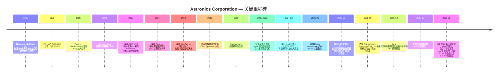
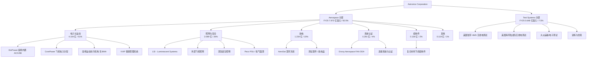
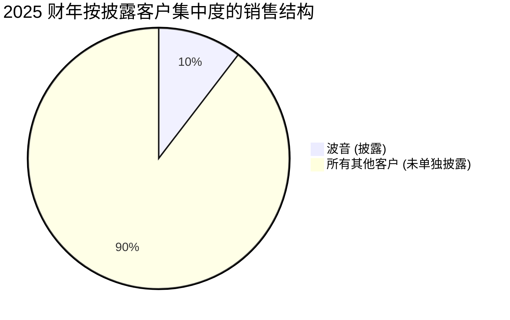
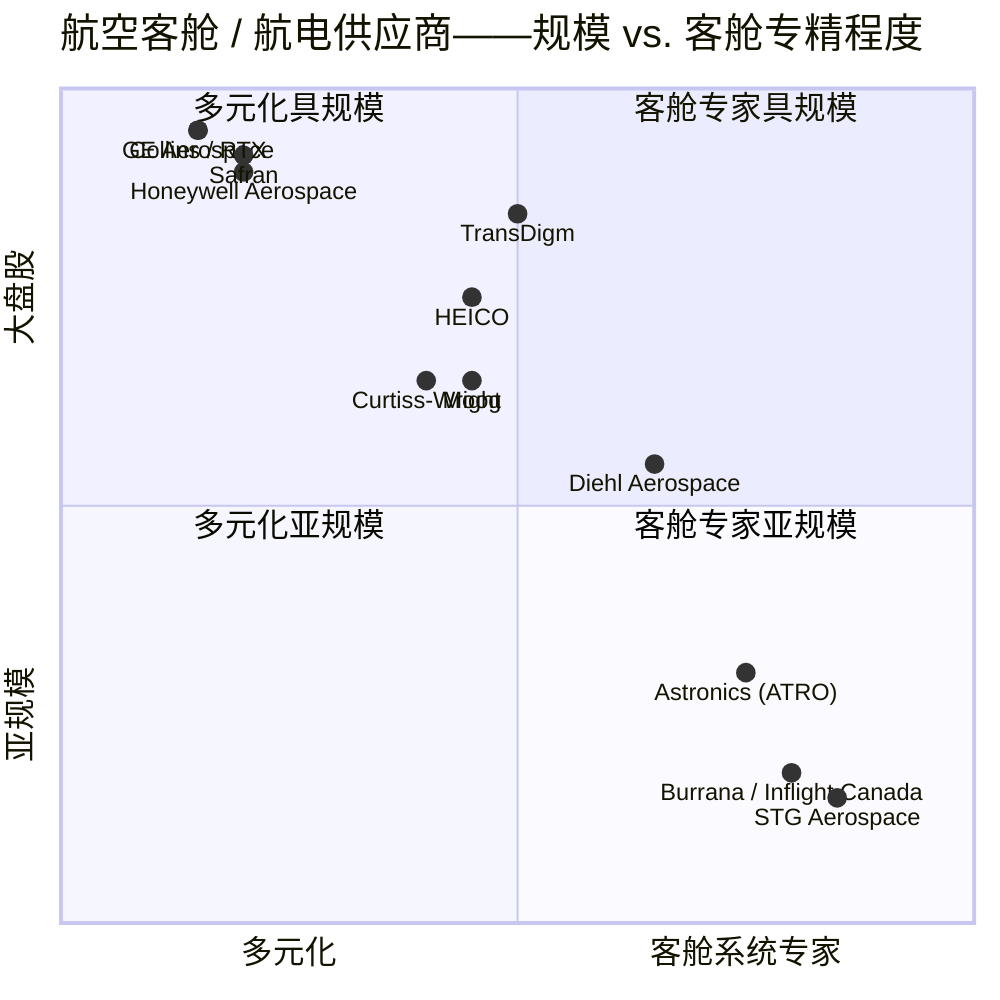

# Astronics Corporation (NASDAQ:ATRO) — 公司研究报告

**截至日期: 2026-05-20**
**代码: NASDAQ: ATRO**
**所属行业: 航空航天与国防——客舱系统与自动化测试**
**报告类型: 公司研究——首次覆盖**
**报告语言: 简体中文 (英文版同时存在于本目录)**

> **更新——2026 财年营收指引上调 (2026-05-12):** 管理层将 2026 全年营业收入指引上调至 **9.70–10.00 亿美元**(此前 2026-02-24 指引为 **9.50–9.90 亿美元**),中值同比 2025 财年 8.621 亿美元增长约 14%。2026 财年 Q1 业绩同时披露季度营业收入 2.306 亿美元(同比 +12.0%)、季度新订单录得历史新高 2.904 亿美元(book-to-bill 1.26x)、合并在手订单创历史新高 7.343 亿美元。管理层提及的驱动因素包括: 商用运输客舱需求持续强劲(座椅运动、照明与安全产品)、以及预计将在 2026 下半年带动 Astronics 测试 (Test Systems) 业务爬坡的美国陆军无线电测试产线确认订单。来源: [Astronics Q1 2026 业绩公告, 2026-05-12](https://www.sec.gov/Archives/edgar/data/8063/000000806326000024/ex99120260404-pr.htm); 此前指引出自 [2025 财年业绩公告, 2026-02-24](https://www.sec.gov/Archives/edgar/data/8063/000000806326000018/ex99120251231pr.htm)。

---

## 目录

1. 公司概览
2. 公司历史
3. 管理团队
4. 产品与服务
5. 客户与上市策略
6. 行业概览
7. 竞争格局
8. 市场机会 (TAM)
9. 风险评估
10. 参考资料

---

## 1. 公司概览

Astronics Corporation 是一家注册于纽约州的航空航天与国防电子产品供应商,其产品深植于商用飞机客舱及航电舱内部,亦坐落于主要国防主承包商的测试车间。公司自我定位为"全球航空、国防及电子工业先进技术领先供应商",提供"高性能电力发生、分配与运动系统、照明与安全系统、航空电子产品 (avionics)、系统认证服务、飞机结构件以及自动化测试系统 (automated test systems)"([ATRO 2025 年 10-K, Item 1](https://www.sec.gov/Archives/edgar/data/8063/000000806326000021/atro-20251231.htm))。公司按两大经营分部披露: **Aerospace (航空) 分部** (约占 2025 财年营收的 92%) 与 **Test Systems (测试系统) 分部** (约占 2025 财年营收的 8%)。

公司盈利模式直白。在 Aerospace 分部,Astronics 设计按图制造及自有专利的航线可更换单元 (line-replaceable unit, LRU)——座椅内置 AC/USB 电源供应系统 (in-seat AC/USB power)、客舱及外部照明、紧急照明、座椅运动执行机构 (seat motion actuator)、天线及航电产品——并在波音、空客、贝尔 (Bell)、湾流 (Gulfstream)、庞巴迪 (Bombardier) 等机体 OEM,以及座椅供应商和完成中心 (completion centers) 处获得设计导入,以原厂装配 (OE) 及长尾后市场 (retrofit/备件) 两种方式销售。在 Test Systems 分部,Astronics 在多年期固定价合约下,为国防主承包商及美军各军种制造定制及半定制自动化测试设备 (automated test equipment, ATE),其中漏斗中规模最大的机会是为新一代手持/背负/小型化 (Handheld, Manpack and Small Form Fit, HMS) 无线电系列研发的美国陆军无线电测试项目。

Astronics 总部位于美国纽约州东奥罗拉 (East Aurora),核心运营基地分布于美国、加拿大、法国、德国,并在乌克兰和印度设有工程办公室 ([10-K, Item 1](https://www.sec.gov/Archives/edgar/data/8063/000000806326000021/atro-20251231.htm))。截至 2025 年 12 月 31 日,公司共雇佣约 2,700 名全职员工,其中约 2,100 人位于美国 ([10-K, Human Capital Resources](https://www.sec.gov/Archives/edgar/data/8063/000000806326000021/atro-20251231.htm))。2025 财年合并营业收入达 **8.621 亿美元**,较 2024 财年 7.954 亿美元同比增长 8.4%,较 2023 财年 6.892 亿美元同比增长 25.1% ([10-K 合并损益表](https://www.sec.gov/Archives/edgar/data/8063/000000806326000021/atro-20251231.htm))。仅 Aerospace 分部就从 2023 财年 6.048 亿美元增长至 2025 财年 7.973 亿美元——两年累计增幅 31.8%,大体与 2020 年后 OEM 装机率从低谷复苏的轨迹一致。

来源: [ATRO 2025 年 10-K 合并损益表](https://www.sec.gov/Archives/edgar/data/8063/000000806326000021/atro-20251231.htm); 2021 财年营收数据出自 [Astronics 2021 年 Q4/全年业绩公告, 2022-03-02](https://www.businesswire.com/news/home/20220302005465/en/Astronics-Corporation-Reports-2021-Fourth-Quarter-and-Full-Year-Financial-Results)。

利润率才是更重要的故事线。2025 财年合并营业利润率达 **12.2%**——Aerospace 分部 **14.2%**、Test Systems 分部为 **-12.1%**——较 2024 财年 6.8% 与 2023 财年 2.3% 大幅改善 ([10-K, Item 7 分部数据表](https://www.sec.gov/Archives/edgar/data/8063/000000806326000021/atro-20251231.htm))。2026 财年 Q1 调整后 EBITDA 利润率为 16.4% ([Q1 2026 业绩公告](https://www.sec.gov/Archives/edgar/data/8063/000000806326000024/ex99120260404-pr.htm))。管理层已公开锚定"在测试分部扭亏后,公司合并营业利润率向高位双位数 (high-teens) 迈进"的目标 ([FY25 业绩公告, 2026-02-24](https://www.sec.gov/Archives/edgar/data/8063/000000806326000018/ex99120251231pr.htm))。

**地域结构:** Astronics 销售对象遍布全球,但主要以美国发行人身份披露,外汇敞口主要通过其加拿大、法国与德国子公司体现。公司估算 2025 财年合并营业收入中约 **15%** 销售于美国政府相关市场(军用飞机、五角大楼测试项目)([10-K, Item 1 政府合约](https://www.sec.gov/Archives/edgar/data/8063/000000806326000021/atro-20251231.htm))。

**规模指标 (2025 财年):**
- 合并营业收入: 8.621 亿美元
- Aerospace 分部营业收入: 7.973 亿美元(占总营收 92.5%)
- Test Systems 分部营业收入: 0.648 亿美元(占总营收 7.5%)
- 营业利润: 0.764 亿美元(利润率 8.9%)
- 净利润: 0.294 亿美元(摊薄 EPS 0.81 美元)
- 年末合并在手订单: 6.745 亿美元(Q1 2026 更新: 7.343 亿美元——历史新高)
- 员工人数: 约 2,700 人
- 销往波音: 占 2025 财年营收 10.4%(2024 财年 10.2%;2023 财年 11.0%)

### 估值快照 (截至 2026-05-20)

| 指标 | ATRO | 来源 |
|---|---|---|
| 最新股价 | 84.58 美元 | [Yahoo Finance ATRO, 2026-05-20](https://finance.yahoo.com/quote/ATRO/) |
| 市值 | 30.3 亿美元 | Yahoo Finance |
| 52 周区间 | 27.27 – 86.27 美元 | Yahoo Finance |
| TTM P/E | **69.3x** | Yahoo Finance |
| 前瞻 P/E (FY27 一致预期) | 26.6x | Yahoo Finance |
| TTM P/S | 3.42x | Yahoo Finance |
| EV / EBITDA (TTM) | **26.0x** | Yahoo Finance |
| EV / 营收 | 3.62x | Yahoo Finance |
| P/B | 18.7x | Yahoo Finance |
| 总债务 / 现金 | 3.79 亿 / 0.12 亿美元 | Yahoo Finance |
| Beta | 1.11 | Yahoo Finance |

ATRO 的 69x TTM P/E 显著高于航空供应商同业中位数,根本原因在于 2025 财年 GAAP 净利润 (0.294 亿美元) 被来自 2025 年 Q3 部分回购 5.50% 2030 年可转换债券所产生的 **3,260 万美元非现金债务清偿损失** 所压低 ([10-K 长期债务附注](https://www.sec.gov/Archives/edgar/data/8063/000000806326000021/atro-20251231.htm); 同时参阅 2025 年 9 月发行的 2031 年可转换债券再融资交易)。剔除该一次性费用后,2025 财年调整后营业利润约为 1.09 亿美元——隐含的标准化 P/E 接近 30 倍中段。前瞻 26x P/E 与 26x EV/EBITDA 才是市场对该公司更可辩护的估值锚定,均与"处在周期早段利润率复苏的小盘航空供应商"的定位一致,而不是延展性估值的故事。

**同业估值比较 (TTM, 2026-05-20):**

| 公司 | 代码 | 股价 (美元) | 市值 (十亿美元) | TTM P/E | TTM P/S | EV/EBITDA | 营业利润率 |
|---|---|---|---|---|---|---|---|
| Astronics | ATRO | 84.58 | 3.03 | 69.3x | 3.42x | 26.0x | 11.8% |
| HEICO | HEI | 300.87 | 41.98 | 59.5x | 9.06x | 34.5x | 22.2% |
| TransDigm | TDG | 1,200.73 | 67.16 | 37.4x | 7.07x | 19.4x | 46.7% |
| Moog | MOG.A | 314.72 | 9.97 | 35.6x | 2.39x | 19.0x | n/a |
| Curtiss-Wright | CW | 722.47 | 26.69 | 52.8x | 7.40x | 32.6x | 17.6% |
| Kratos Defense | KTOS | 55.38 | 10.38 | 325.8x | 7.34x | 107.7x | 1.8% |
| Elbit Systems | ESLT | 773.88 | 36.20 | 67.9x | 4.56x | 41.9x | 9.7% |
| **同业中位数 (剔除 ATRO)** | | | | **59.5x** | **7.07x** | **32.6x** | **17.6%** |

来源: [Yahoo Finance / yfinance 数据抓取, 2026-05-20](https://finance.yahoo.com/quote/ATRO/key-statistics)。

来源: [Yahoo Finance / yfinance, 2026-05-20](https://finance.yahoo.com/quote/ATRO/)。

**解读:** ATRO 头条 TTM P/E (69x) 大致与同业中位数 (约 60x) 相当,但前瞻 P/E (约 27x) 与 P/S (约 3.4x) 均*低于*同业中位数,反映出 (a) 债务清偿 GAAP 亏损扭曲了 TTM EPS;(b) 营业利润率显著低于 HEI/TDG (这些溢价倍数同业的营业利润率介于 22%–47%,ATRO 约 12%);以及 (c) 杠杆水平及客户集中度相对于规模更大、更多元化的同业更高。我们不认为 ATRO 是延展性估值的标的——但 18.7x P/B 偏高,因为可转债再融资压缩了股东账面权益相对于债务的比例。**如果波音装机率再次滑落,或 Test Systems 在手订单转化不及预期,存在估值压缩风险**;我们在第 9 章中将其单独列示。

---

## 2. 公司历史

Astronics 于 **1968 年**由前康奈尔航空实验室 (Cornell Aeronautical Laboratory, Buffalo, NY) 工程师 Thomas L. Robinson, Sr. 创立,初衷是商业化**电致发光 (electroluminescent, EL) 照明**技术——最早用于仪表盘和紧急逃生应用 ([Astronics——Wikipedia, accessed 2026-05](https://en.wikipedia.org/wiki/Astronics); [company-histories.com, Astronics Corporation](https://www.company-histories.com/Astronics-Corporation-Company-History.html))。公司在 1972 年 IPO,在 1980 与 1990 年代的大部分时间里始终是一家小型、带家族色彩的照明专家,最终将其照明子公司更名为 **Luminescent Systems, Inc. (LSI)**。

来源: [ATRO 2025 年 10-K, Item 1 (并购、再融资)](https://www.sec.gov/Archives/edgar/data/8063/000000806326000021/atro-20251231.htm); [Astronics — Wikipedia](https://en.wikipedia.org/wiki/Astronics); [Q1 2026 业绩公告, 2026-05-12](https://www.sec.gov/Archives/edgar/data/8063/000000806326000024/ex99120260404-pr.htm)。

**按因果顺序的战略转折:**

1. **从单一照明专家到机舱电源 (cabin power) 业务 (2000 年代)。** 标志性转折是 2007 年收购 **DME Corp.**,该并购为 Astronics 奠定了 EmPower 座椅内置 AC/USB 电源业务的基础,目前已是 Aerospace 分部中规模最大的产品线 (2025 财年电力与运动 (Electrical Power & Motion) 产品线营收 4.104 亿美元,占分部收入 51%)。逻辑直白: 当 Wi-Fi 和个人设备在客舱普及后,航司需要在座椅内置电源,而已经被设计进座椅导轨的照明供应商,天然具备增添电源功能的认证经验。

2. **从零部件到多系统航空平台 (2010 年代)。** 一系列并购——Peco (PSU、供氧、客舱照明)、AeroSat (卫通天线)、Custom Control Concepts (VVIP 客舱管理)、Armstrong Aerospace、PGA Avionics、Telefonix PDT (IFE 连接硬件) 与 Diagnosys (测试)——将 Astronics 从单一照明盒子供应商扩展为多产品客舱系统供应商,并将营收结构向每架飞机更高比例的自有专利产品 (proprietary content) 倾斜。

3. **资本结构重建 (2024–2025)。** 在疫情期间持续的营业亏损 (2020–2023 财年合并均为亏损) 与波音 737 MAX 停飞之后,Astronics 通过可转债重建资产负债表。2024 年 12 月发行 **1.65 亿美元 5.50% 2030 年到期可转换优先票据**;2025 年 9 月发行 **2.25 亿美元零息 2031 年到期可转换优先票据**,以筹得资金回购 80% (1.32 亿美元) 的 2030 年票据,并录得 **3,260 万美元债务清偿损失** ([10-K 长期债务附注](https://www.sec.gov/Archives/edgar/data/8063/000000806326000021/atro-20251231.htm))。2025 年 10 月以 **3 亿美元高级有担保基于现金流的循环授信**替换其 2.2 亿美元 ABL 循环授信,摆脱了借款基础机制并降低了实际利率水平。2026 财年 Q1 利息支出同比下降 25.8% ([Q1 2026 业绩公告](https://www.sec.gov/Archives/edgar/data/8063/000000806326000024/ex99120260404-pr.htm))。

**近期动态 (过去 12 个月):**

- **Envoy Aerospace** 于 2025-06-30 以约 830 万美元收购。该公司为 FAA ODA 认证服务提供商——为 Aerospace 分部新增认证工程产能 ([10-K, Item 1 并购](https://www.sec.gov/Archives/edgar/data/8063/000000806326000021/atro-20251231.htm))。
- **Bühler Motor Aviation (BMA)** 于 2025-10-13 以约 1,800 万美元收购。德国制造商,产品包括飞机座椅执行机构、致动器、控制面板与照明——延伸座椅运动产品 (seat-motion content) 内容 ([10-K, Item 1 并购](https://www.sec.gov/Archives/edgar/data/8063/000000806326000021/atro-20251231.htm))。
- **Lufthansa Technik UK 专利诉讼** ——2025 年 2 月英国高等法院判决 Astronics 因侵犯客舱电源专利赔偿约 1,190 万美元;2025 年 3 月追加 442 万美元 (利润核算,account of profits) 加约 600 万美元利息;上诉听证已延迟至 **2026 年 7 月** ([Lufthansa UK 上诉延后, MLex](https://www.mlex.com/mlex/articles/2453915/lufthansa-uk-patent-appeal-against-astronics-and-panasonic-delayed-until-summer); [10-K 承诺与或有事项](https://www.sec.gov/Archives/edgar/data/8063/000000806326000021/atro-20251231.htm))。

---

## 3. 管理团队

**Peter J. Gundermann, 63 岁——董事会主席、总裁兼 CEO** (CEO 任期始于 2003 年;主席任期始于 2019 年 6 月)

Gundermann 是 Astronics 的核心长期经营者。他于 **1988 年**加入公司,1991 年起任 Astronics 航空航天与国防子公司总裁,2003 年成为公司总裁兼 CEO,2019 年 6 月出任董事会主席。在 Astronics 总任期 **38 年**,其中 23 年担任 CEO ([ATRO 2026 DEF 14A, 董事提名](https://www.sec.gov/Archives/edgar/data/8063/000114036126015301/0001140361-26-015301-index.htm))。他毕业于布朗大学 (Brown University, 应用数学与经济学学士) 和杜克大学 (Duke University, MBA),自 2009 年起兼任 Moog Inc. (NYSE: MOG-A) 董事——该任职具有实质意义,因为 Moog 既是 Astronics 的紧邻同业,也是其余两位 Astronics 董事 (Warren Johnson、Robert Brady) 的前雇主。Gundermann 是最大的个人内部持股人: 截至 2026 年 4 月 8 日持有 **651,618 股普通股 (2.0%)** 与 **754,025 股 B 类股 (19.8%)** ([2026 DEF 14A, 主要股东](https://www.sec.gov/Archives/edgar/data/8063/000114036126015301/0001140361-26-015301-index.htm))。Astronics 的双层股权结构令 B 类股在多数事项上具备每股 10 票投票权,意味着 Gundermann 的经济性持股 (约 2% 普通股、20% B 类股) 折算后具备相当大的投票权重;2026 年内部人合计持有的普通股 + B 类股分别为 5.1% 普通股与 40.6% B 类股,这从结构上为管理层提供了对抗短期维权的实质屏障。2025 财年薪酬: 股票期权目标授予价值 951,108 美元加上 PSU 价值 500,455 美元 (25,250 份 PSU) ([2026 DEF 14A, 计划奖励授予](https://www.sec.gov/Archives/edgar/data/8063/000114036126015301/0001140361-26-015301-index.htm))。10-K 及代理声明中提及的 Gundermann 主要成就包括: 在没有大规模股权发行的前提下穿越 2020 年后低谷期(连续四年至 2023 财年合并营业亏损)、机会性使用 2023 年市价发行的普通股增发、通过 2030/2031 年可转债重建疫情后的资本结构,以及在 2025 年 11 月落地 Envoy Aerospace 与 BMA 两笔并购——这些并购恰好赶在下游需求向上的拐点,而非在景气周期高位执行。

**Nancy L. Hedges, 52 岁——副总裁、财务主管兼首席财务官 (CFO)** (CFO 任期始于 2025 年 1 月 4 日)

Hedges 由公司财务总监 (Controller) 内部晋升,这是 Astronics 十余年来首次 CFO 交接——其前任 David C. Burney 自 2003 年担任 CFO,于 2025 年 1 月 3 日退休生效。从长期任职的 CFO 切换至内部晋升,恰好与 2025 年公司发行 2.25 亿美元新可转债、并以现金流循环授信替换其资产抵押循环授信发生在同一年——这一时点是有意为之: Hedges 多年来已深度参与相关会计与信贷协议讨论,被同时任命为主要财务官与主要会计官 ([10-K 高管资料](https://www.sec.gov/Archives/edgar/data/8063/000000806326000021/atro-20251231.htm))。其 2025 财年授予包: 350,814 美元 PSU (17,700 份 PSU),无期权 ([2026 DEF 14A](https://www.sec.gov/Archives/edgar/data/8063/000114036126015301/0001140361-26-015301-index.htm))。其资本市场履历尚在形成中——她还未主导过一次重大并购整合或一个完整的独立财报周期,尽管 2025 年再融资计划是在她任期内完成的。其持股 32,049 普通股 + 1,287 B 类股——规模偏小,意味着其利益对齐主要来自股权激励经济性,而非历史持股。

**Mark A. Peabody, 66 岁——执行副总裁兼 Aerospace 分部总裁** (EVP 任期始于 2010 年)

Peabody 负责贡献公司约 92% 营收的分部。其 2025 财年 PSU 授予 15,150 份 (目标价值 300,273 美元),持股 174,076 普通股 + 185,220 B 类股 (B 类股 4.9%),是仅次于 Gundermann 的第二大 B 类股内部持股人 ([2026 DEF 14A, 主要股东](https://www.sec.gov/Archives/edgar/data/8063/000114036126015301/0001140361-26-015301-index.htm))。在 Peabody 任期内,Aerospace 分部从疫情前低谷不足 3.5 亿美元增长至 2025 财年 7.973 亿美元,营业利润率从 2023 财年低个位数扩张至 2025 财年 14.2%。2025 年 10 月落地的 Bühler Motor Aviation 并购归入其分部。

**James F. Mulato, 65 岁——Astronics Test Systems 总裁兼 EVP** (EVP 任期始于 2019 年)

Mulato 负责规模较小且当前处于亏损状态的 Test Systems 分部。2025 财年分部营收 6,480 万美元,同比下降 2,390 万美元,原因是美国陆军与美国海军陆战队无线电测试项目销售额下滑,以及在长期大众运输测试合约中录得 830 万美元不利成本估算修订 ([10-K, Item 7 Test Systems 分部](https://www.sec.gov/Archives/edgar/data/8063/000000806326000021/atro-20251231.htm))。根据 Q1 2026 业绩说明会评论,其近期任务是将预计 2026 年夏季公布的美国陆军无线电测试产线确认订单 (production award) 转化为多年期营收爬坡。

**治理脚注:**

- **董事会构成 (FY26 提名人):** 9 位董事。9 人中 8 位为独立董事 (Brady、Frisby、Johnson、Robert Keane、Kim、Moran、O'Brien、West);仅 Gundermann 非独立。首席独立董事: Robert T. Brady (Moog Inc. 前主席) ([2026 DEF 14A, 董事提名](https://www.sec.gov/Archives/edgar/data/8063/000114036126015301/0001140361-26-015301-index.htm))。
- **内部持股:** 截至 2026 年 4 月 8 日,全体董事及高管合计持有 **普通股 5.1% 与 B 类股 40.6%** ([2026 DEF 14A, 主要股东](https://www.sec.gov/Archives/edgar/data/8063/000114036126015301/0001140361-26-015301-index.htm))。外部 5% 以上普通股持有人: BlackRock 8.70%、Capital International Investors 5.90%、State Street 5.80%、Bares Capital Management 5.95%、American Century 5.60%。
- **双层股权结构:** Astronics 有普通股和 B 类股。B 类股具有超级投票权,与 40.6% 的内部 B 类股持股相结合,形成显著的投票权集中度。
- **薪酬结构:** 三大主要组成部分——基本工资、年度现金奖金、长期股权激励 (股票期权、RSU 与 PSU 的组合)。Gundermann 是 2025 财年唯一获授股票期权的 NEO (29,750 份期权,价值 95.1 万美元),其余 NEO 均获授 PSU ([2026 DEF 14A 高管薪酬](https://www.sec.gov/Archives/edgar/data/8063/000114036126015301/0001140361-26-015301-index.htm))。代理声明披露 2025 财年无关联方交易。
- **审计师:** 安永 (Ernst & Young LLP) (拟提名 FY26 续聘)。
- **年度股东大会:** 2026 年 5 月 28 日,伊利诺伊州沃基根 (Waukegan, IL)。

**管理团队履历综合评估:** Gundermann 已经执掌 Astronics 二十多年,带领公司穿越了一个完整周期 (1999–2008 上升期)、波音 787 设计中标周期 (2007–2014)、737 MAX 停飞叠加疫情低谷 (2019–2022),如今正处于上行周期。其履历强项在客户关系与设计导入 (EmPower 业务是最显眼的产物)。最薄弱的是 Test Systems 分部,该分部已连续三年至 2025 财年录得营业亏损;未来 12 个月的考验是 Mulato 能否将美国陆军无线电项目转化为利润率改善。CFO 与法务总监均为相对较新的任命 (2025 年 1 月 / 2026 年 2 月),公司职能层面的执行风险高于按头衔任期看上去的水平。

---

## 4. 产品与服务

Astronics 的产品宇宙覆盖客舱与测试车间。Aerospace 分部按五条产品线加"其他"披露;Test Systems 分部按单一产品线披露。

来源: [ATRO 2025 年 10-K Item 7 Aerospace 产品线表](https://www.sec.gov/Archives/edgar/data/8063/000000806326000021/atro-20251231.htm); [Astronics 产品导航 (astronics.com)](https://www.astronics.com/)。

来源: [ATRO 2025 年 10-K Item 7 Aerospace 产品线表](https://www.sec.gov/Archives/edgar/data/8063/000000806326000021/atro-20251231.htm)。

### Aerospace 分部——产品线

**电力与运动 (Electrical Power & Motion) (2025 财年 4.104 亿美元, 同比 +14.3%)** ——最大的单一产品线。该业务的核心是 **EmPower**,即专利座椅内置 AC/USB 旅客电源供应系统,加上 **CorePower** 飞机电力分配系统及座椅运动执行机构(并购完成后现已包括 Bühler Motor Aviation 产品组合)。

- *EmPower 座椅内置电源系统。*商用飞机上每个旅客座位安装的 AC、USB-A、USB-C 及组合输出装置。产品介绍页指出该系统"已服务于**超过 230 家航空公司, 累计交付超过 100 万个输出单元**" ([Astronics 座椅内置电源产品页](https://www.astronics.com/advanced-electronic-systems/in-seat-power-supply))。最新一代 **EmPower UltraLite G2** 提供每个座位最高 60W 的电力输出,支持 USB-A + USB-C;按 Astronics 披露,已有十多家航司承诺在**超过 1,100 架窄体机**上安装 ([Astronics PR via BusinessWire, 2023-06-05](https://www.businesswire.com/news/home/20230605005814/en/Astronics-EmPower-UltraLite-G2-Power-System-for-Passenger-In-Seat-Power-on-Commercial-Aircraft-Revolutionizes-Cabin-Power))。**EmPower Xpress** 是面向座椅后市场的 USB 改装外壳,设计为可在过夜维护时段安装——切入航司在既有机队上翻新座椅时激增的改装需求 ([Astronics EmPower Xpress 产品页](https://www.astronics.com/advanced-electronic-systems/retrofit-in-seat-power))。
  - **护城河判定: 是——具备防御性。** 护城河类型: (i) 认证 / 监管壁垒 (in-seat power 系统必须按机型获得 FAA / EASA STC 认证,涉及座椅供应商集成,切换成本真实);(ii) 装机基础 / 后市场 (230+ 航司、100 万+ 出口单元构建了备件拉动与改装协同效应);(iii) 知识产权 / 专利 (Lufthansa Technik UK 专利诉讼即说明 Astronics 专利组合具备争议价值)。最接近的竞品: **Inflight Canada / Burrana iPower** 与 **Astronics 自身的传统竞争对手 KID-Systeme (空客子公司)**。ATRO 相对竞争对手的定位: 在窄体机航司 OE 中标方面**领先** (反映在 1,100 架 UltraLite G2 承诺中),但正积极在英国法庭上捍卫知识产权。
- *CorePower。* 飞机级电力发生、转换与固态断路器 (solid-state power controller, SSPC) 系统。Astronics 被贝尔 (Bell) 选定为 **V-280 Valor / MV-75** 美国陆军未来远程突击飞行器 (Future Long-Range Assault Aircraft, FLRAA) 项目的电力发生、转换与分配系统供应商 ([Vertical Mag, Astronics under contract with Bell for V-280](https://verticalmag.com/press-releases/astronics-corporation-under-contract-with-bell-for-v-280-valor-project/); [Bell MV-75 产品页](https://www.bellflight.com/products/bell-mv-75))。10-K 确认 MV-75 项目处于工程推进阶段,Q1 2026 录得 **MV-75 项目 280 万美元的利润追加确认 (catch-up of profit)** ([Q1 2026 业绩公告](https://www.sec.gov/Archives/edgar/data/8063/000000806326000024/ex99120260404-pr.htm))。
  - **护城河判定: 是——尚早但价值显著。** 护城河类型: 认证 / 监管 + 项目锁定。一旦你被独家选定设计入一架使用寿命 50 年的陆军直升机的电气架构,你就在那里了。最接近的竞品: GE Aerospace (前 GE Aviation)、Honeywell、Safran Electronics & Defense——均规模显著大于 Astronics,但单 LRU 项目层面仍激烈竞争。
- *座椅运动 & 执行机构。* 包括传统 Astronics 业务加 BMA (2025 年 10 月并购) ——执行机构、电子件、控制面板、气动系统与高端座椅照明。Q1 2026 Aerospace 增长的具体驱动因素是"座椅运动以及照明与安全产品需求增长" ([Q1 2026 业绩公告](https://www.sec.gov/Archives/edgar/data/8063/000000806326000024/ex99120260404-pr.htm))。BMA 收购时间过短,尚不能独立评估其经济性。
  - **护城河判定: 部分。** 中等水平的硬件位置,在部分高端座椅项目上有少数独家供应位置;竞品包括 B/E Aerospace (Collins)、Recaro 与 Stelia (空客)。切换成本真实存在,但座椅供应商会在不同飞机项目之间重新招标执行机构。

**照明与安全 (Lighting & Safety) (2025 财年 2.089 亿美元, 同比 +16.4%)** ——Astronics 最原始的业务,如今由 Luminescent Systems Inc. (LSI) 与 Peco 运营。产品包括客舱夜灯、氛围灯、外部位置 / 导航 / 防撞 LED 灯、紧急地板路径灯 (emergency floor-path lighting)、旅客服务单元 (PSU)、氧气面罩下降系统及阅读灯。10-K 明确指出,该产品线在 2025 年增长由商用运输与军机两端对"照明与安全产品"的需求驱动。

- **护城河判定: 是——安全侧很强。** 护城河类型: 认证 + FAA TSO (Technical Standard Order) 授权 + 装机基础后市场。紧急逃生灯和氧气面罩系统的切换成本非常高,因为每种机型都有按型号认证的特定配置。最接近的竞品: **STG Aerospace** (客舱照明)、**Diehl Aerospace** (客舱照明与氧气)、**B/E Aerospace** (PSU,现已并入 Collins/RTX)、**Zodiac Cabin Solutions** (Safran)。相对竞争对手的定位: 客舱照明侧**势均力敌** (商品化趋势中);在紧急逃生与 PSU 侧**领先**,这两类 TSO 历史很重要。

**航电 (Avionics) (2025 财年 1.234 亿美元, 同比 +2.7%)** ——宽带卫通天线 (AeroSat)、航电测试盒、通信与连接硬件。2025 财年该产品线增长相对其他 Aerospace 产品线较为温和,因为 OEM 天线分配本质上比座椅 / 机舱电源改装慢。Q1 2026 业绩公告标注 VVIP 完成中心更高的通用航空 IFEC 产品销售额 620 万美元——VVIP 完成是 Astronics 的细分市场。

- **护城河判定: 部分。** 在窄体机连接的细分客舱天线位置上较强;在更广泛的航电产品堆栈上相对 Honeywell、Collins Aerospace 与 Thales 较弱。切换成本存在于天线 LRU 层面,但航司可以选择替代 IFEC 供应商 (Viasat、Intelsat)。

**系统认证 (Systems Certification) (2025 财年 0.291 亿美元, 同比 +71%——增速最快的产品线)** ——Astronics Connectivity Systems & Certification Corp.,现在通过 2025-06-30 收购 **Envoy Aerospace** (一家位于伊利诺伊州奥罗拉的 FAA 组织授权代表 (Organization Designation Authorization, ODA) 服务提供商) 得到增强 ([10-K 并购](https://www.sec.gov/Archives/edgar/data/8063/000000806326000021/atro-20251231.htm))。这是为 STC 与 TSO 认证提供工程服务,包括对航司改装项目的支持。71% 的增长既反映底层改装周期,也包含 Envoy 并购的贡献。

- **护城河判定: 部分。** ODA 资格本身就是护城河——只有少数公司持有 FAA ODA。但工程服务业务是人力驱动的,不如自有专利硬件防御性强。最接近的竞品: 波音自身的 ODA、Collins Aerospace、区域性 ODA。

**结构件 (Structures) (2025 财年 0.136 亿美元)** ——复合材料飞机结构件,项目规模较小。

**其他 (Other) (2025 财年 0.119 亿美元)** ——由于公司逐步收缩非核心代工制造合约,该项持续下降 ([10-K Item 7 Aerospace 分部叙述](https://www.sec.gov/Archives/edgar/data/8063/000000806326000021/atro-20251231.htm))。

### Test Systems 分部

单一分部,下设三个子业务: (a) 美国陆军及海军陆战队无线电测试项目 (基于 PMA);(b) 通信与大众运输电子测试;(c) 训练与仿真设备。**2025 财年 Test Systems 全部营收 (6,480 万美元) 均来自政府与国防客户** ([10-K Item 7](https://www.sec.gov/Archives/edgar/data/8063/000000806326000021/atro-20251231.htm))。根据管理层在 Q1 2026 业绩说明会上的口径,美国陆军无线电测试产线确认订单"预计在未来数周内下发,产线阶段将在下半年加速" ([Q1 2026 业绩公告, 2026-05-12](https://www.sec.gov/Archives/edgar/data/8063/000000806326000024/ex99120260404-pr.htm))。截至 Q1 2026 分部在手订单 8,300 万美元;季度 book-to-bill 1.55x。

- **护城河判定: 部分。** 国防 ATE 一旦被军方采购就具备粘性 (校准数据、技术人员培训、软件库),但 Astronics 相对更大的 ATE 厂商规模不足。竞品: **Teradyne** (半导体测试历史,但有国防敞口)、**Curtiss-Wright Defense Solutions**、**Mercury Systems**、**Ametek 的测试与测量业务**,以及波音 / 洛克希德的内部 ATE。相对竞争对手定位: 规模上**落后**;在 Astronics 拥有传承自 Diagnosys 及历史并购的窄带美国陆军无线电测试项目细分上**势均力敌**。

### 旗舰产品与长尾

- **旗舰 1:** EmPower / 电力与运动产品线——占 Aerospace 收入 51%,护城河最高的业务,Lufthansa 诉讼源头 (也因此是公司愿意在 IP 上力战的领域)。所有未来年款的改装和 OE 设计导入都要经过这条产品线。
- **旗舰 2:** 照明与安全——占 Aerospace 收入 26%,公司原始业务,TSO 密度最高的产品组合。
- **旗舰 3 (潜在):** MV-75 / CorePower 国防飞机电力系统——今日规模虽小,但具备数十年期美国陆军每架飞机内容价值。
- **长尾:** 结构件 (0.136 亿美元)、其他 (0.119 亿美元)。

### 过去 12 个月发布与重定位

- **2025-09:** 发行 2.25 亿美元 2031 年到期可转换优先票据——资本结构事件,虽非产品发布,但实质性影响利息支出。
- **2025-10-13:** BMA 并购完成——增加座椅执行机构硬件产品组合。
- **2025-06-30:** Envoy Aerospace 并购完成——增加 FAA ODA 认证服务。
- **2025 年 Q1 持续:** EmPower UltraLite G2 在窄体机机队上的爬坡 (公司披露 1,100+ 架飞机已承诺;2023 年发布但仍在爬坡)。
- **2025–2026:** MV-75 工程利润追加确认 (Q1 2026 录得 280 万美元) ——项目从工程阶段迈向 LRIP (小批量初始产线)。

---

## 5. 客户与上市策略

### 客户细分

Astronics 服务于四大客户类别:

1. **机体 OEM。** 波音、空客、巴西航空工业 (Embraer)、庞巴迪、湾流、达索、德事隆飞机 (Textron Aviation)、贝尔 (新美国陆军 MV-75 订单)、西科斯基 (Sikorsky)。这些客户按生产速率采购 Aerospace LRU,通常按订单或单年期采购合约执行,而非长期多年合约 ([10-K Item 1, 产品与客户](https://www.sec.gov/Archives/edgar/data/8063/000000806326000021/atro-20251231.htm))。
2. **座椅供应商与完成中心。** Collins Aerospace (Adient Aerospace)、Safran Seats、Recaro、Stelia——这些是 EmPower 电源与座椅运动产品的集成商。Astronics 在座椅级别已被设计导入,甚至先于航司选定座椅选项。
3. **航空公司 (后市场 / 改装)。** 直接销售给航司用于改装项目 (EmPower Xpress、客舱照明翻新) 与持续备件。
4. **美国国防部与国防主承包商。** 美国陆军 (MV-75 项目、HMS 无线电测试)、美国海军陆战队 (无线电测试)、主承包商。**2025 财年合并营收约 15% 销往美国政府相关市场** ([10-K Item 1](https://www.sec.gov/Archives/edgar/data/8063/000000806326000021/atro-20251231.htm))。

来源: [ATRO 2025 年 10-K Item 7 分部数据表](https://www.sec.gov/Archives/edgar/data/8063/000000806326000021/atro-20251231.htm); 2023 财年年末在手订单 5.923 亿美元出自 [ATRO 2023 年 10-K, Item 7](https://www.sec.gov/Archives/edgar/data/8063/000000806324000014/)。

### 客户集中度——量化分析

**波音是唯一披露的占比 >10% 客户。** 按 10-K Item 1A 风险因素披露:

> "2025、2024 与 2023 年度,我们对波音的销售集中度分别约占总销售的 **10.4%、10.2% 与 11.0%**。未来对波音的销售可能显著下降或波动。……失去波音作为客户,或对波音业务的重大缩减,将显著减少我们的销售与盈利。" ([ATRO 2025 年 10-K, Item 1A](https://www.sec.gov/Archives/edgar/data/8063/000000806326000021/atro-20251231.htm))

来源: [ATRO 2025 年 10-K, Item 1A 风险因素——客户集中度](https://www.sec.gov/Archives/edgar/data/8063/000000806326000021/atro-20251231.htm)。

**三年趋势:** 波音占比基本稳定 (11.0% → 10.2% → 10.4%),但绝对金额显著上升——从 2023 财年约 7,580 万美元升至 2025 财年 8,970 万美元——因为商用运输销售在同期增长。无其他单一客户达到 >10% 披露门槛。空客未被单独披露,因为 Astronics 对空客的每架飞机价值分散在多个座椅供应商与完成中心合约中,任一合约均未单独跨过 10% 门槛。飞机层面的 OEM 集中度因此高于客户层面披露所暗示的水平: **大部分商用运输营收 (2025 财年 5.993 亿美元,占 Aerospace 75%) 最终取决于波音与空客窄体 / 宽体机的装机率。**

**飞机层面的集中度 (估算,基于商用双寡头格局与 Astronics 自身的定性):** 10-K 明确指出: *"商用航空航天市场是全球双寡头,波音和空客 ('Airbus') 是其 OEM。它们的生产健康度对我们的业绩至关重要。"* ([10-K Item 1A](https://www.sec.gov/Archives/edgar/data/8063/000000806326000021/atro-20251231.htm))。即便经过座椅供应商的中间环节,波音 + 空客合计窄体机装机率仍是 Astronics 商用运输营收的最主要单一驱动因素。

**合约结构:** 按 10-K 产品与客户章节披露: *"本分部销售大多来自客户合约或采购订单,以日常 PO 或单年采购方式下达,而非长期多年合约承诺。偶尔我们会收到客户的合约性承诺或一揽子采购订单,涵盖多年期硬件交付。"* 这相对于 (例如) TransDigm 受 IP 保护的自有专利后市场是显著较弱的防御性位置——Astronics 在大多数产品线上每年都需要重新争取价格。

**客户即竞争对手风险:** Lufthansa Technik (德国 MRO) 既是客户也是英国专利侵权案的原告 ([Astronics 损害赔偿裁决 PR, 2025-02-20](https://investors.astronics.com/news-events/press-releases/detail/425/astronics-corporation-announces-damages-ruling-on-lufthansa))。波音自身在客舱电源的内部设计能力有限;更实质的"客户即纵向一体化"风险来自空客,其 KID-Systeme 子公司直接竞争座椅内置电源。

**集中度判定:** Top-1 客户 10.4% **已超过 10% 披露门槛,并满足第 9 章风险评估的"实质性"标准**。通过波音 + 空客双寡头的机型项目集中度实质上更高;10-K 已直白说明。我们将其列入第 9 章风险。

### 分销渠道

- **直接销售给 OEM 和主承包商:** 来自 Astronics 子公司 (LSI、Peco、AES、Test Systems) 的技术销售工程师直接联系波音、空客、贝尔、洛克希德、诺斯罗普·格鲁曼的工程与采购团队。
- **直接销售给航司用于改装:** 公司投资者材料明确指出 EmPower Xpress 销售给航司用于过夜维护时段。
- **分销商 / 代理渠道:** 有限。
- **无电商或直接消费者渠道。**

### 销售周期

周期较长。一个新机型项目 (波音 777X、贝尔 MV-75) 从初始设计导入到批量生产需要 5–10 年。改装项目 (EmPower Xpress) 可以在 12–24 个月内推进。Test Systems 项目通常是 5–10 年期项目级采购。

### 重要合作伙伴

- **Panasonic Avionics**——Lufthansa Technik UK 专利诉讼的共同被告,显示在客舱电源方面存在商业整合伙伴关系。
- **Bell**——Astronics 是为 MV-75 提供电力与分配系统的"Team Valor"成员 ([Vertical Mag](https://verticalmag.com/press-releases/astronics-corporation-under-contract-with-bell-for-v-280-valor-project/))。
- **主要座椅制造商**——Safran、Recaro、Collins、Stelia——座椅内置电源的集成合作伙伴。

### 客户案例 (过去 12 个月披露的中标)

- **EmPower UltraLite G2:** 十多家航司承诺,涉及超过 1,100 架窄体机 ([BusinessWire, 2023-06-05](https://www.businesswire.com/news/home/20230605005814/en/Astronics-EmPower-UltraLite-G2-Power-System-for-Passenger-In-Seat-Power-on-Commercial-Aircraft-Revolutionizes-Cabin-Power))。
- **MV-75 (FLRAA):** 由贝尔选定的电力发生、转换与分配系统供应商 ([Astronics PR via investors.astronics.com](https://investors.astronics.com/news-events/press-releases/detail/393/astronics-corporation-selected-by-bell-to-develop))。
- **美国陆军 HMS 无线电测试项目:** "确认订单预计在未来数周内下发,产线阶段将在下半年加速" ([Q1 2026 业绩公告, 2026-05-12](https://www.sec.gov/Archives/edgar/data/8063/000000806326000024/ex99120260404-pr.htm))。

---

## 6. 行业概览

### 行业定义与范围

Astronics 在两个独立行业中运营,这两个行业的客户却有重叠:

- **商用航空客舱系统与内饰** ——设计、认证、制造及后市场供应座椅内置电源、客舱照明与安全系统、座椅运动执行机构、卫通天线、航电 LRU 及飞机结构件,主要服务于波音 / 空客窄体 + 宽体机双寡头加上支线客机和商务航空。NAICS 代码 336413 (其他飞机零部件与辅助设备制造)。
- **国防自动化测试设备 (ATE) 与直升机电力系统** ——为美国国防部及主承包商提供无线电测试、导弹 / 雷达 / 电子战测试系统;为 FLRAA / MV-75 提供直升机电力发生与分配。NAICS 代码 334515 (电气与电信号测量与测试仪器) 与 336411 (飞机制造——零部件)。

### 市场规模与增长

**商用飞机客舱系统总市场** ——"飞机客舱电源 + 照明 + 座椅运动"没有单一 TAM 数字,因为每个子细分都单独测量。来自最新第三方报告:

- **座椅内置电源系统**单项 (EmPower 类别): 估算范围差异较大。Mordor Intelligence 估算 **商用飞机座椅内置电源系统市场 2025 年约为 1.526 亿美元,以 3.5% CAGR 增长至 2030 年 1.81 亿美元** ([Mordor Intelligence——商用飞机座椅内置电源系统市场](https://www.mordorintelligence.com/industry-reports/commercial-aircraft-in-seat-power-system-market), accessed 2026-05)。更高端的预测 (Market Research Future) 将该类别 2025 年规模放在 14 亿美元,2035 年增至 27 亿美元,CAGR 6.7% ([Market Research Future, In-Seat Power System Market, 2025](https://www.marketresearchfuture.com/reports/commercial-aircraft-in-seat-power-system-market-34099))。两个预测之间 9 倍的差异反映了对可寻址市场是否包含完整系统 (主控制单元 + 座椅出口 + 走线) 还是仅包含输出单元的定义性分歧——我们认为 4–6 亿美元是合理的全球系统级年化 TAM 区间,Astronics 占 25–40% 份额。
- **机上娱乐与连接 (IFEC) 系统**市场规模达数十亿美元 (按 Mordor Intelligence 全球约 70–100 亿美元),但 Astronics 仅在天线与电源外围参与,不在屏幕 / 内容侧。
- **商用飞机客舱照明** ——按行业报告全球估算 10–15 亿美元;Astronics 通过 LSI / Peco 参与,基于其分部营收规模,份额预估在高个位数百分比区间。
- **商用飞机结构件、航电及军用电子**是远更大的 TAM (数千亿美元),其中 Astronics 参与于狭窄细分。

**装机率驱动型需求:** Astronics 的近期营收轨迹比 TAM CAGR 更敏感于*飞机装机率*。波音 737 MAX 的生产已在 2026 年初突破 FAA 的 38/月上限,FAA 在 2025 年 10 月批准向 42/月爬坡,CEO Kelly Ortberg 也讨论过五架飞机一档的进一步增量 ([Fortune, 2025-10-18, FAA allows Boeing to increase 737 Max production](https://fortune.com/2025/10/18/faa-boeing-737-max-production-rate-alaska-air-door-plug/); [Aerotime, Boeing FAA approval 737 MAX production](https://www.aerotime.aero/articles/boeing-faa-approval-737-max-production))。窄体机从 38 → 42 → 47/月每一档爬坡约对应年化 110–235 架增量飞机,每架配套 Astronics 座椅内置电源 + 照明价值 6–12 万美元。空客 A320 系列已指引到 2027 年 75/月。

**国防 ATE:** 美国国防部测试、测量与评估预算 (依据 FY26 国防部总统预算) 跨军种年化 60–90 亿美元。美国陆军 HMS 无线电测试项目 (Test Systems 主要的近期机会) 是 Astronics 一直在争取产线阶段中标的多年期采购。

### 关键趋势与驱动因素

1. **窄体机装机率复苏。** 波音 2026 年初突破 38/月 FAA 上限是 Astronics 最大的近期需求驱动因素 ([Altitudes Magazine, Boeing Clears FAA Production Cap](https://www.altitudesmagazine.com/boeing-clears-faa-production-cap-737-max-output-climbs-38-aircraft/))。Astronics 将 FY26 指引上调至 9.7–10 亿美元 (此前 9.5–9.9 亿) 与该动态密切相关。
2. **航司翻新 / 客舱刷新周期。** 多家北美主要航司在 2024–25 年向 Astronics 授予 EmPower 改装合约 ([Astronics Awarded EmPOWER Contracts PR](https://investors.astronics.com/news-events/press-releases/detail/207/astronics-awarded-empower-in-seat-passenger-power))。高端经济舱与经济舱座椅刷新拉动既有机队的新增座椅内置电源与照明需求。
3. **USB-C 取代 USB-A 成为旅客设备标准。** EmPower UltraLite G2 同时支持两者,每座 60W——足以支持笔记本电脑使用,弥补此前 EmPower 的限制。
4. **国防领域的模块化开放系统架构 (MOSA)。** 贝尔 MV-75 明确要求 MOSA 架构,这有利于 Astronics 等具备固态电子断路器 (SSPC) 与软件可配置电力分配能力的供应商。
5. **关税与贸易政策。** 2025 财年商品销售成本中包含 1,040 万美元关税支出;Q1 2026 关税成本再增加 170 万美元 ([Q1 2026 业绩公告](https://www.sec.gov/Archives/edgar/data/8063/000000806326000024/ex99120260404-pr.htm))。10-K 提到 *"2026 年 1 月 20 日,美国最高法院裁定《国际紧急经济权力法》(IEEPA) 未授权总统征收关税。IEEPA 关税案已发回国际贸易法院……"* ——潜在关税退款路径不确定。
6. **IP 执法与 Lufthansa Technik 争端。** 英国法院 1,190 万美元损害赔偿加上 442 万美元利润核算与约 600 万美元利息,加上 2026 年 7 月待审上诉,为客舱电源专利诉讼树立了先例。

### 监管环境

- **FAA / EASA 认证。** 每个 Astronics 飞机产品都要求 TSO 或 PMA 授权;某些系统需要按机型获取 STC 认证。这是公司唯一最重要的监管护城河。
- **美国国防部采购。** 成本会计准则、FAR/DFARS 合规;安全许可保持。10-K 将"维持与美国国防部安全许可的能力"列为一项前瞻性风险。
- **出口管制 (ITAR / EAR)。** 国防产品出口所需;10-K 提到美国贸易政策不确定性为一项风险。

### 行业动态

- **上游高度集中 (波音 + 空客双寡头),Tier-2 / Tier-3 供应商层级高度分散。** Astronics 是具备自有专利产品的 Tier-2/3 供应商,但相对 OEM 采购的议价能力有限。
- **10-K 中关于供应商权力的注释:** *"我们在所服务的市场区段中经历了相当大的竞争,主要在产品性能与价格方面,来自各种竞争对手,其中许多规模显著大于我们且资源更丰富。"*
- **高进入壁垒。** FAA TSO/STC 认证、OEM 资格审查及多十年装机基础是真实壁垒;现有玩家对新进入者具备实质性护城河,但彼此之间竞争激烈。

---

## 7. 竞争格局

Astronics 是一家不到 10 亿美元营收的航空航天供应商,所面对的竞争对手从 50 亿美元规模的细分专家 (HEICO、Moog) 到 500 亿美元 + 多元化巨头 (Honeywell、Collins/RTX、Safran、GE Aerospace) 不等。竞争格局因产品线而异。

来源: 分析师基于各公司营收结构与产品披露的定位估算。

### 按产品线划分的直接竞争对手

1. **座椅内置电源 (EmPower):**
   - **KID-Systeme GmbH** ——空客全资子公司 (Airbus Atlantic 的姊妹公司)。空客飞机座椅内置电源的直接竞争对手;与 OEM 纵向一体化。在空客窄体机方面对 Astronics 构成实质性劣势。
   - **Burrana** (前 IMS Company / Digecor / Inflight Canada) ——IFEC + 电源供应商;EmPower Xpress 改装类别的直接竞争对手。
   - **Lufthansa Technik AG** ——专利许可方,(目前) 在英国案中作为 Astronics 的原告。
   - **Inflight Canada** ——窄体机改装竞争对手。
2. **客舱与外部照明:**
   - **STG Aerospace** ——英国私有专家,光致发光紧急逃生与 LED 客舱照明。
   - **Diehl Aerospace** ——德国私有巨头;客舱 LED 与氧气系统。
   - **Collins Aerospace (RTX)** ——B/E Aerospace 并购后的全客舱照明产品组合。
   - **Honeywell** ——外部照明与航电照明细分。
3. **航电与天线:**
   - **Honeywell Aerospace、Collins Aerospace、Thales** ——航电 LRU 主导厂商。
   - **ThinKom、Gogo、Viasat** ——竞争 IFEC 的卫通天线技术。
4. **座椅运动 / 执行机构:**
   - **Moog Inc. (MOG.A)** ——飞行控制执行机构,但也有部分客舱执行机构业务。
   - **Curtiss-Wright Defense Solutions** ——执行机构细分。
   - **Recaro、Adient Aerospace、Stelia** ——内部化运动功能的座椅供应商。
5. **国防 ATE (Test Systems):**
   - **Curtiss-Wright (CW)** ——国防电子,包括 ATE 位置。
   - **Mercury Systems** ——嵌入式处理与国防测试。
   - **Teradyne** ——历史上为半导体测试,已扩展至国防 ATE 相邻领域。
   - **Northrop Grumman、Lockheed Martin** ——为自有项目内部 ATE。
6. **直升机电力系统 (MV-75):**
   - **GE Aerospace** ——发电机与电力。
   - **Honeywell** ——APU 与电力系统。
   - **Safran Electronics & Defense** ——完整电力分配堆栈。

### 竞争优势

- **EmPower 装机基础。** 230+ 航司、100 万+ 出口单元——构建了改装与后市场备件的实质性切换成本护城河。
- **FAA TSO / STC 认证密度。** 特别是在紧急逃生照明、PSU 与氧气面罩——多十年 TSO 历史难以复制。
- **专利组合。** Lufthansa Technik UK 诉讼虽然代价高昂,也是专利组合具有争夺价值的证据。
- **贝尔 MV-75 设计导入。** 在美国陆军下一代 FLRAA 项目上独家供应——30 年内容机会。
- **客户广度,无单一客户崩溃风险。** 波音占 10.4%,但无其他客户达到 10% 门槛——相比之下,例如 Spirit AeroSystems 约 70% 依赖波音。

### 竞争脆弱性

- **规模不及 Collins、Safran、Honeywell。** Astronics 营收 8.62 亿美元,而同业以数百亿美元计;对波音和空客的议价能力相应较弱。
- **Test Systems 仍处于亏损状态。** 分部连续三年录得营业亏损 (FY23: -870 万美元、FY24: -850 万美元、FY25: -780 万美元);当前产量下固定成本未被充分吸收。
- **机型项目集中度通过双寡头放大。** *"商用航空航天市场是全球双寡头……它们的生产健康度对我们的业绩至关重要"* ([10-K Item 1A](https://www.sec.gov/Archives/edgar/data/8063/000000806326000021/atro-20251231.htm))。
- **杠杆。** Yahoo Finance 抓取的负债权益比 234%;总债务 3.79 亿美元相对 TTM EBITDA 约 1.15 亿美元 (Q1 年化 + FY25) ——净杠杆约 3.2x。高于 HEI/TDG。
- **活跃的 IP 诉讼。** Lufthansa Technik UK 2026 年 7 月上诉是事件型风险悬顶。

### 市场份额分析 (估算)

- **座椅内置旅客电源:** 全球份额约 25–40% (基于 Astronics 自身披露的 230+ 航司和 100 万出口数,对应第三方测算的全球系统级 TAM 4–6 亿美元)。
- **客舱 LED / 外部照明:** 全球中个位数百分比——相对 Collins、Diehl、STG 规模较小。
- **国防 ATE:** 全球份额 <1%;仅在特定的美国陆军 / 海军陆战队无线电测试项目细分中有意义。

---

## 8. 市场机会 (TAM)

我们保守地将 Astronics 的可寻址市场规模设定为**全产品线年化 35–50 亿美元** (系统级可寻址 + 改装 + 备件 + 国防 ATE) ——按 2025 财年 8.62 亿美元营收计算,隐含其在自身可寻址类别中的份额约 20%。

**TAM 分解:**

- **商用座椅内置电源系统 (系统级可寻址):** 4–6 亿美元 (分析师基于第三方子系统 + 电源发生数据的估算) ——Astronics 通过 EmPower 业务占份额 25–40%。增长: 2030 年前 5–7% CAGR,由 USB-C 采纳、改装周期及波音 / 空客窄体机装机率爬坡驱动。
- **商用客舱照明 (客舱 + 外部 LED、紧急逃生):** 全球 10–15 亿美元——Astronics 通过 LSI 与 Peco 参与;估算 8–12% 份额。增长: 4–6% CAGR。
- **飞机座椅运动执行机构:** 全球估算 3–5 亿美元;份额 5–10% (随 BMA 并购上升)。
- **窄体机 IFEC 用卫通天线:** 估算年化系统营收 3–6 亿美元;Astronics 通过 AeroSat 在窄带内参与。
- **FAA ODA 认证服务与 STC 工程:** 美国本土 TAM 估算 2–4 亿美元;Astronics 通过 Envoy Aerospace 并购扩张。
- **MV-75 / FLRAA 直升机电力系统:** 在陆军满产产能下,年化内容潜力 0.5–1.5 亿美元 (基于每架飞机价值估算)。
- **国防 ATE——美国陆军 / 海军陆战队无线电测试、大众运输测试、训练与仿真:** 年化 TAM 5–10 亿美元 (国防部 T&E 预算的子集) ——Astronics 份额 <5%。

**总可寻址市场 (Astronics 特定):** 年化 35–50 亿美元,混合 CAGR 4–6%。Astronics 2025 财年营收 8.62 亿美元隐含其自身可寻址类别约 20% 份额——为周期复苏的有机增长与并购驱动的相邻领域扩张均留有空间。

**SAM (可服务可寻址市场):** 约 20–25 亿美元——Astronics 已获资格、认证与有竞争力定位的子集。这排除大型 OEM 内部电力系统 (波音内部制造、空客 KID-Systeme 自给) 与 Astronics 缺乏规模能力主承包的大盘国防 ATE 项目。

**SOM (3–5 年可服务可获得市场):** 加上 MV-75 产线爬坡、美国陆军无线电测试产线阶段、窄体机装机率增长 (波音 38 → 42 → 47/月;空客 A320 系列 75/月)、以及 EmPower UltraLite G2 机队部署,Astronics 到 2028–2029 年合理可达到年化 12–15 亿美元营收——与公司"合并营业利润率向高位双位数迈进"的目标一致 ([FY25 业绩公告, 2026-02-24](https://www.sec.gov/Archives/edgar/data/8063/000000806326000018/ex99120251231pr.htm))。

**渗透策略:**

- *有机:* 与波音 737 MAX / 787 装机率复苏、空客 A320/A321 系列爬坡、以及 EmPower UltraLite G2 改装采纳挂钩。
- *并购:* 客舱系统与认证服务的细分领域 bolt-on 并购 (Envoy 2025、BMA 2025)。
- *国防:* MV-75 产线爬坡、美国陆军 HMS 无线电测试项目在 2H26 转入产线阶段。

---

## 9. 风险评估

### 公司特定风险

**1. 波音客户集中度 (HIGH)。** 波音占 **2025 财年销售 10.4% (FY24: 10.2%; FY23: 11.0%)**,是唯一披露的 >10% 客户 ([10-K Item 1A](https://www.sec.gov/Archives/edgar/data/8063/000000806326000021/atro-20251231.htm))。公司明确将"失去波音作为重要客户或对波音业务的重大缩减"列为 10-K 中的首要前瞻性风险。机型项目集中度更高,因为大部分商用运输分部 (Aerospace 75%) 通过波音 / 空客双寡头流转。*缓释因素:* Astronics 无单一产品独家供应给波音;EmPower 业务触及全球 230+ 航司;737 与 787 上的多年项目寿命平滑短期波动。

**2. 窄体机装机率敏感性 (HIGH)。** 波音 737 MAX 生产自 2024 年 1 月被 FAA 上限锁定在 38/月,2025 年 10 月获批向 42/月爬坡,2026 年初突破 38 上限 ([Fortune, 2025-10-18](https://fortune.com/2025/10/18/faa-boeing-737-max-production-rate-alaska-air-door-plug/); [Altitudes Magazine](https://www.altitudesmagazine.com/boeing-clears-faa-production-cap-737-max-output-climbs-38-aircraft/))。任何新的 FAA 限制 (质量事件、罢工、供应商延迟) 都将以近乎一比一的方式减少受影响季度的 Astronics 商用运输营收。10-K 表述明确: *"它们装机率的未来波动仍是我们预测业绩的主要因素。"* *缓释因素:* 改装 / 后市场周期 (EmPower Xpress) 部分使营收脱钩于 OE 装机率;Q1 2026 的 7.343 亿美元在手订单提供约 9 个月营收可见度。

**3. Test Systems 分部固定成本未充分吸收 (MEDIUM-HIGH)。** 分部连续三年录得营业亏损 (FY23: -870 万美元;FY24: -850 万美元;FY25: -780 万美元),2025 财年分部营收同比下降 27%。逻辑转折取决于预计 2026 年中下发的美国陆军 HMS 无线电测试产线确认订单,以及长期大众运输合约风险 (FY25 录得 830 万美元不利成本修订)。*缓释因素:* Q1 2026 分部 book-to-bill 1.55x,在手订单 8,300 万美元;管理层在 Q1 2026 业绩说明会上提到确认订单将在数周内下发。

**4. Lufthansa Technik UK 专利诉讼与上诉 (MEDIUM)。** 英国高等法院裁定损害赔偿约 1,190 万美元加 442 万美元利润核算及约 600 万美元利息;上诉延后至 2026 年 7 月 ([MLex, Lufthansa UK appeal delayed](https://www.mlex.com/mlex/articles/2453915/lufthansa-uk-patent-appeal-against-astronics-and-panasonic-delayed-until-summer))。上诉败诉将固化既有损害赔偿,潜在地扩展至间接销售敞口。*缓释因素:* 约 2,200 万美元为实质边界财务敞口;争议仅限于一个欧盟专利家族。

**5. CFO 与法务总监交接 (LOW-MEDIUM)。** Nancy Hedges (CFO 始于 2025 年 1 月) 与 Julie Davis (法务总监始于 2026 年 2 月) 均相对较新。*缓释因素:* Hedges 之前为公司财务总监;Davis 已在公司任职多年。

**6. BMA + Envoy 整合风险 (LOW-MEDIUM)。** 两笔并购于 2025 年中—下半年完成 (合计 830 万美元 + 1,800 万美元,规模较小)。*缓释因素:* 相对 8.62 亿美元基础规模较小;均为对既有业务的 bolt-on,而非颠覆性。

### 行业 / 市场风险

**7. 波音 / 空客质量或供应链危机 (HIGH)。** 航空航天双寡头格局制造了集中的系统性风险。一个波音 737 MAX 9 门塞类事件、发动机供应商延迟、或空客生产罢工都可能压缩 Astronics 与装机率挂钩的营收。*缓释因素:* Astronics 的多项目敞口 (737 + 787 + A320 + A350 + 商务机 + 军用) 提供一定多元化。

**8. 来自更大、综合供应商的竞争强度 (MEDIUM)。** Collins (RTX)、Safran、Honeywell 与 Diehl 均具备显著更大规模并能捆绑客舱系统内容。空客 KID-Systeme 在座椅内置电源方面纵向一体化。*缓释因素:* Astronics 的 EmPower 业务在窄体机航司和美国航司中具备真实护城河。

**9. 监管变化与关税不确定性 (MEDIUM)。** FY25 商品销售成本含 1,040 万美元关税支出;Q1 2026 关税增量成本 170 万美元。IEEPA 关税最高法院裁决 (2026-01-20) 留下潜在退款不确定性 ([10-K Item 1 政府监管](https://www.sec.gov/Archives/edgar/data/8063/000000806326000021/atro-20251231.htm))。*缓释因素:* 关税成本部分转嫁;多司法管辖区供应链限制单一国家冲击。

### 财务风险

**10. 杠杆与可转债稀释风险 (MEDIUM-HIGH)。** 总债务 3.79 亿美元相对 TTM EBITDA 约 1.10–1.15 亿美元;净杠杆约 3.2x。2030 年可转债 (剩余 3,300 万美元 5.50%) 和 2031 年可转债 (2.25 亿美元零息) 优先于普通股股东;如果 ATRO 股价显著高于转换价,稀释风险将兑现 (capped-call 交易部分抵消)。*缓释因素:* 2025 年 10 月再融资以 3 亿美元现金流循环授信替换借款基础 ABL;capped calls 到位;截至 2025 年 12 月 31 日债务契约处于合规状态。

**11. 装机率增长不及预期触发估值压缩风险 (MEDIUM)。** ATRO 的 TTM P/E 69x 显著高于同业中位数,但*前瞻* P/E 27x 与 EV/EBITDA 26x 接近同业中位数。如果 FY26 营收落在 9.7–10 亿美元区间低端,或利润率扩张放缓,估值缓冲有限。*缓释因素:* 创纪录在手订单与 Q1 2026 的 1.26x book-to-bill;FY26 指引已上调。

### 宏观经济风险

**12. 商用航空周期性 (HIGH)。** *"商用航空业高度周期性,过去出现过显著下行,对油价上涨、劳工纠纷、全球经济状况、可用于新飞机采购与既有飞机升级的资本以及客流需求敏感。"* ([10-K Item 1A](https://www.sec.gov/Archives/edgar/data/8063/000000806326000021/atro-20251231.htm))。一次衰退或油价飙升将压缩航司客舱刷新资本开支与改装需求。*缓释因素:* 国防敞口 (合并销售约 15%) 与民用航空逆周期。

**13. 外汇敞口 (LOW-MEDIUM)。** 加拿大 (LSI Canada)、法国及德国 (BMA 后) 业务产生非美元营收。*缓释因素:* 外汇对冲计划披露有限;公司近期季度未旗帜显示重大 FX 影响。

---

## 10. 参考资料

### 一级监管申报文件

- [Astronics Corporation 2025 年 10-K (财年截止 2025 年 12 月 31 日,2026-02-26 提交)](https://www.sec.gov/Archives/edgar/data/8063/000000806326000021/atro-20251231.htm)
- [Astronics Corporation 2026 年 4 月 4 日季度 10-Q (2026-05-13 提交)](https://www.sec.gov/Archives/edgar/data/8063/000000806326000025/atro-20260404.htm)
- [Astronics Corporation 2026 年代理声明 (DEF 14A) (2026-04-17 提交)](https://www.sec.gov/Archives/edgar/data/8063/000114036126015301/0001140361-26-015301-index.htm)
- [Astronics Corporation 2025 年代理声明 (DEF 14A) (2025-04-09 提交)](https://www.sec.gov/Archives/edgar/data/8063/000114036125013039/)
- [8-K——Q1 2026 业绩公告 (2026-05-12)](https://www.sec.gov/Archives/edgar/data/8063/000000806326000024/ex99120260404-pr.htm)
- [8-K——2025 财年 (Q4) 业绩公告 (2026-02-24)](https://www.sec.gov/Archives/edgar/data/8063/000000806326000018/ex99120251231pr.htm)
- [8-K——Q3 2025 业绩公告 (2025-11-04)](https://www.sec.gov/Archives/edgar/data/8063/000000806325000081/ex99120250927-pr.htm)
- [8-K——Q2 2025 业绩公告 (2025-08-06)](https://www.sec.gov/Archives/edgar/data/8063/000000806325000055/ex99120250628-pr.htm)
- [8-K——Q1 2025 业绩公告 (2025-05-06)](https://www.sec.gov/Archives/edgar/data/8063/000000806325000032/ex99120250329-pr.htm)
- [8-K——2024 财年 (Q4) 业绩公告 (2025-03-04)](https://www.sec.gov/Archives/edgar/data/8063/000000806325000013/ex99120241231pr.htm)

### 公司官网

- [Astronics Corporation——公司官网](https://www.astronics.com/)
- [Astronics 座椅内置电源供应产品页](https://www.astronics.com/advanced-electronic-systems/in-seat-power-supply)
- [Astronics EmPower Xpress 改装产品页](https://www.astronics.com/advanced-electronic-systems/retrofit-in-seat-power)
- [Astronics 110VAC + USB 座椅内置电源系统产品页](https://www.astronics.com/advanced-electronic-systems/110vac-usb-in-seat-power-system)
- [Astronics 高功率 USB 座椅内置电源系统产品页](https://www.astronics.com/advanced-electronic-systems/high-power-usb-in-seat-power-system)
- [Astronics 投资者关系网站](https://investors.astronics.com/)
- [Astronics PR——北美航司授予 EmPOWER 改装合约](https://investors.astronics.com/news-events/press-releases/detail/207/astronics-awarded-empower-in-seat-passenger-power)
- [Astronics PR——由贝尔选定为 FLRAA 电力系统开发供应商](https://investors.astronics.com/news-events/press-releases/detail/393/astronics-corporation-selected-by-bell-to-develop)
- [Astronics PR——Lufthansa Technik 案损害赔偿裁决 (2025-02-20)](https://investors.astronics.com/news-events/press-releases/detail/425/astronics-corporation-announces-damages-ruling-on-lufthansa)

### 第三方新闻、市场数据与行业研究

- [Yahoo Finance——ATRO 关键统计数据, 2026-05-20 访问](https://finance.yahoo.com/quote/ATRO/key-statistics)
- [BusinessWire——Astronics 2021 年 Q4/全年业绩公告 (2022-03-02)](https://www.businesswire.com/news/home/20220302005465/en/Astronics-Corporation-Reports-2021-Fourth-Quarter-and-Full-Year-Financial-Results)
- [BusinessWire——Astronics EmPower UltraLite G2 (2023-06-05)](https://www.businesswire.com/news/home/20230605005814/en/Astronics-EmPower-UltraLite-G2-Power-System-for-Passenger-In-Seat-Power-on-Commercial-Aircraft-Revolutionizes-Cabin-Power)
- [Fortune——FAA 允许波音提高 737 Max 生产 (2025-10-18)](https://fortune.com/2025/10/18/faa-boeing-737-max-production-rate-alaska-air-door-plug/)
- [Altitudes Magazine——波音突破 FAA 产能上限, 737 MAX 月产 38 架 (2026)](https://www.altitudesmagazine.com/boeing-clears-faa-production-cap-737-max-output-climbs-38-aircraft/)
- [Aerotime——波音获 FAA 批准提高 737 MAX 生产速率](https://www.aerotime.aero/articles/boeing-faa-approval-737-max-production)
- [FlightGlobal——FAA 批准 737 Max 生产爬坡, 波音复苏获动力](https://www.flightglobal.com/airframers/boeings-recovery-gains-momentum-as-faa-approves-737-max-production-increase/164967.article)
- [Mordor Intelligence——商用飞机座椅内置电源系统市场](https://www.mordorintelligence.com/industry-reports/commercial-aircraft-in-seat-power-system-market)
- [Market Research Future——商用飞机座椅内置电源系统市场规模 2025–2035](https://www.marketresearchfuture.com/reports/commercial-aircraft-in-seat-power-system-market-34099)
- [Vertical Mag——Astronics 与贝尔签约 V-280 Valor 项目](https://verticalmag.com/press-releases/astronics-corporation-under-contract-with-bell-for-v-280-valor-project/)
- [Bell Flight——Bell MV-75 产品页](https://www.bellflight.com/products/bell-mv-75)
- [MLex——Lufthansa 英国专利上诉对 Astronics 与 Panasonic 延迟至夏季](https://www.mlex.com/mlex/articles/2453915/lufthansa-uk-patent-appeal-against-astronics-and-panasonic-delayed-until-summer)
- [Mondaq——Lufthansa v Astronics and Panasonic 案中利润核算、利息与重复追偿](https://www.mondaq.com/uk/patent/1713552/accounting-for-profits-interest-and-double-recovery-in-lufthansa-v-astronics-and-panasonic)
- [The Defense Post——美国陆军下一代 FLRAA 获正式命名 (MV-75) 与首装部队 (2025-05-16)](https://thedefensepost.com/2025/05/16/us-armys-next-gen-flraa-gets-official-name-first-unit-assignment/)
- [Astronics——Wikipedia](https://en.wikipedia.org/wiki/Astronics)
- [Company-histories.com——Astronics Corporation 公司历史](https://www.company-histories.com/Astronics-Corporation-Company-History.html)
- [Encyclopedia.com——Astronics Corporation](https://www.encyclopedia.com/books/politics-and-business-magazines/astronics-corporation)

---

*编制于 2026-05-20。所有数字来源于截至编制日可获得的最新监管申报或第三方资料。前瞻性陈述依赖于 Q1 2026 业绩公告与 10-K Item 7 叙述中的管理层指引。在引用 10-K 时,因 HTML 在线文件页码与打印 PDF 不完全一致,因此省略页码,改为采用章节标签;章节引用直接映射至链接文档的目录导航。*
