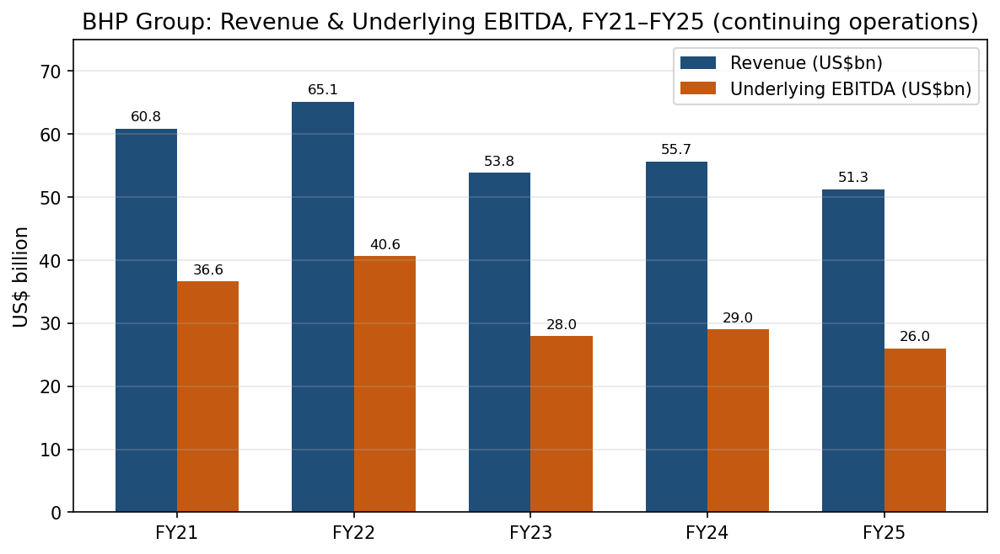
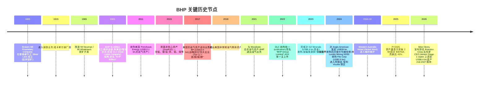
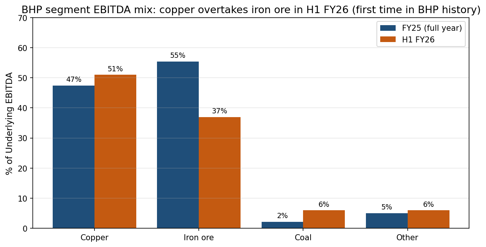
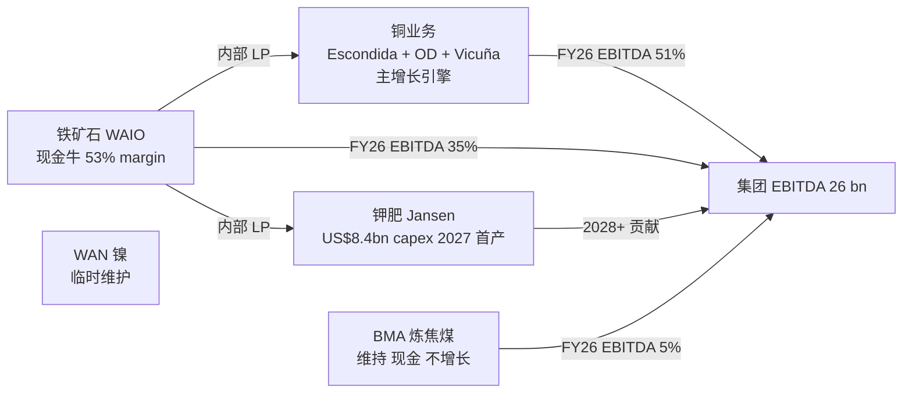
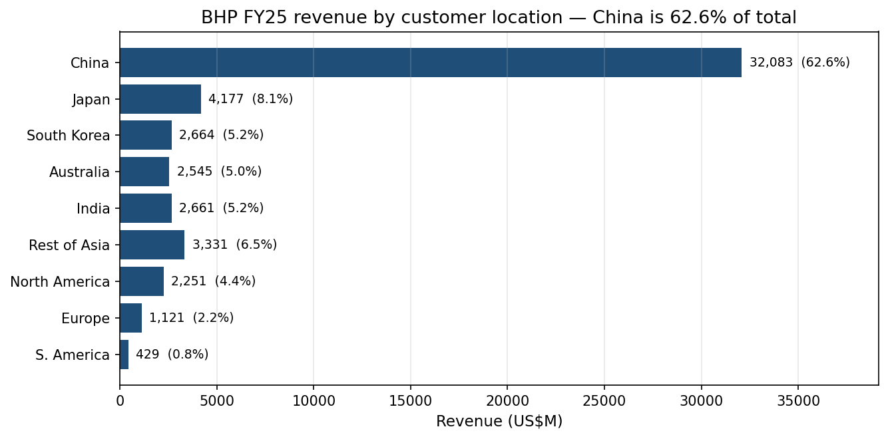
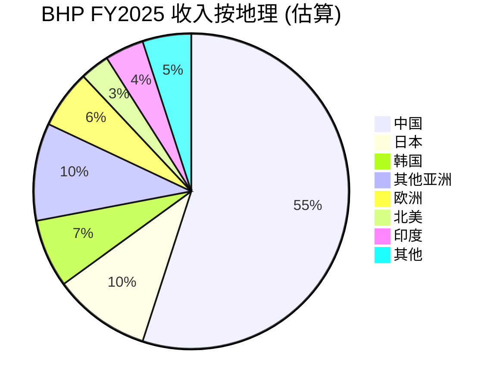
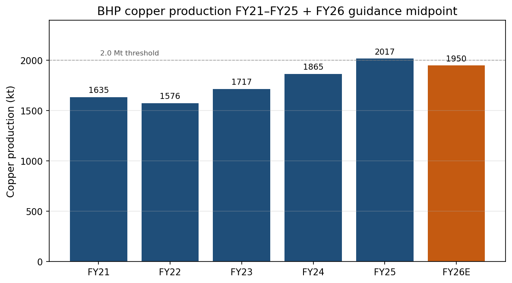
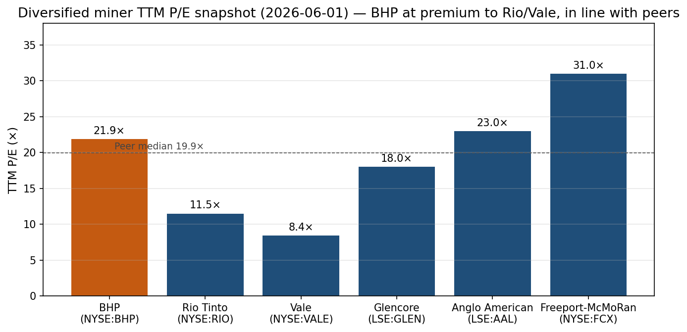
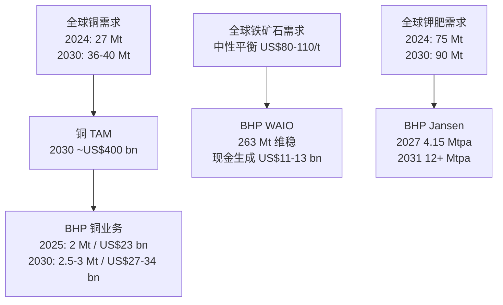

# BHP Group (必和必拓) — 公司研究

**Ticker:** NYSE:BHP (ADR; 主上市 ASX:BHP / 二级 LSE:BHP)
**主题归属:** rare-earth-strategic-minerals (战略矿产篮子,adjacent 角色 — 铜+铁矿石的政策杠杆敞口)
**报告日期:** 2026-06-01
**报告语言:** 简体中文 (zh-CN)

---

## 摘要 (Executive Summary)

BHP Group Limited (中文常用译名:必和必拓集团) 是按市值 (Market Cap) 计的全球最大上市矿业公司,FY2025 (截至 2025-06-30 财年) 总营业收入 (revenue) US$51.3 bn、基础 EBITDA (underlying EBITDA) US$26.0 bn、基础净利润 (underlying attributable profit) US$10.2 bn,经营性现金流 (operating cash flow) US$18.7 bn。公司以澳大利亚 Pilbara 铁矿石 (iron ore) + 智利 Escondida 铜矿 (copper) 为两大压舱石资产,辅以加拿大 Jansen 钾肥 (potash)、澳大利亚 BMA 炼焦煤 (metallurgical coal) 和镍 (nickel) 等组合。

**FY2025 关键看点**:
- 集团铜产量 (group copper production) 创下 **2,017 kt** 历史新高 (+8% YoY),Escondida 单矿 1,304.9 kt (+16%) 为 17 年以来最佳;
- 铁矿石产量 263 Mt (+1% YoY) 创新高,WAIO (Western Australia Iron Ore) 继续保持全球**最低单位现金成本**的大型铁矿石生产商地位;
- 铜业务对 EBITDA 的贡献首次跨过 **45%** 阈值 (FY2025) 并在 H1 FY2026 进一步升至 **51%**,完成了从"铁矿石 + 煤炭"双足到"铜 + 铁矿石"新双足的结构转换;
- Jansen 钾肥项目 Stage 1 资本开支 (capex) 调升至 US$8.4 bn,首产时间维持 mid-2027;Stage 2 (US$4.9 bn 投资批复) 可能从 FY2029 后延 2 年至 FY2031;
- 2024 年 4–5 月 BHP 对 Anglo American 发起的 **US$39 bn 全股票收购**因要求 Anglo 先剥离南非铂业 + Kumba 铁矿被四次拒绝,最终撤回;BHP 转而与 Lundin Mining 50/50 收购 **Filo Corp** (US$2.9 bn) 锁定阿根廷-智利 Vicuña 铜区项目;
- CEO Mike Henry 在 2026 年初宣布将卸任,**Brandon Craig 接任**,标志着 2020 年以来"铜化 + 钾肥战略转型"阶段完成进入下一周期。

**估值快照 (Valuation Snapshot, 2026-05 末)**: ADR 价格 ~US$86–89, 市值 ~US$228 bn,TTM P/E ~18×、TTM P/S ~4.4×、股息收益率 (dividend yield) ~3.4%。相对于 RIO (~9× P/E)、VALE (~6× P/E) 显得偏贵,但与铜-纯股 FCX (~26× P/E) 比仍折让,反映市场对 BHP "铜化进度"已经部分定价。

**Lens view (一句话核心):** BHP 是大宗商品超级周期中"铜需求弹性最大、铁矿石现金牛最稳"的组合,真正风险在于 Jansen Stage 2 资本纪律 + Escondida 老化曲线 + 中国地产-钢需求拐点的同步出现。

---

## 1. 公司概览 (Company Overview)

Source: [BHP FY2025 Results Announcement, 2025-08-19](https://www.bhp.com/-/media/documents/media/reports-and-presentations/2025/250819_bhpresultsfortheyearended30june2025.pdf); [BHP Form 20-F FY2025, 2025-08-29](https://www.sec.gov/Archives/edgar/data/0000811809/000119312525185641/d941636d20f.htm)

**法人主体与上市架构 (Corporate Structure & Listings).** BHP Group Limited 是注册于澳大利亚的多元化矿业公司,主上市为 ASX:BHP (悉尼);通过 American Depositary Receipts (ADRs) 在纽约证券交易所 (NYSE) 二次挂牌为 **NYSE:BHP**,每 1 ADR 对应 2 股普通股。公司还在伦敦证券交易所有标准上市 (LSE:BHP) 和约翰内斯堡上市 (JSE:BHG)。2022 年 1 月,BHP 完成了对 2001 年以来双重上市 (Dual Listed Company, DLC) 结构的"统一" (unification),将历史上的 BHP Billiton Plc (英国法人) 和 BHP Billiton Limited (澳大利亚法人) 合并为单一澳大利亚法人主体,简化了治理结构与税务安排 ([BHP Unified Corporate Structure 公司说明](https://www.bhp.com/about/our-businesses/unified-corporate-structure))。

**主营业务范畴 (Business Scope).** BHP 是按市值 (market cap) 计算的全球最大上市矿业公司,按 FY2025 收入 (US$51.3 bn) 划分以下 5 大业务板块 ([BHP Group FY25 Earnings Yahoo Finance 综述, 2025-08-19](https://finance.yahoo.com/news/bhp-group-fy25-earnings-revenues-161300386.html)):
1. **Copper (铜)** — 智利 Escondida + Pampa Norte + 澳大利亚 Olympic Dam + Copper South Australia (新合并) + 秘鲁 Antamina (33.75%) + 加拿大-阿根廷 Vicuña JV (与 Lundin 50/50);FY2025 铜产量 2,017 kt 创纪录,贡献集团 EBITDA 45% (FY2025) / 51% (H1 FY2026)。
2. **Iron Ore (铁矿石)** — 澳大利亚 Pilbara WAIO (含 Mining Area C + South Flank + Yandi + Newman + Jimblebar);FY2025 总铁矿石产量 263 Mt (record); 全球前 3 大铁矿石生产商之一。
3. **Coal (煤炭)** — 澳大利亚 BMA (BHP Mitsubishi Alliance, 50/50 JV with Mitsubishi Corp) 炼焦煤;FY2025 收入 US$5 bn (-34% YoY,受价格下跌 + 2024 年 4 月 Blackwater/Daunia 剥离影响)。
4. **Potash (钾肥)** — 加拿大 Saskatchewan **Jansen** 项目,Stage 1 capex US$8.4 bn (升级后),首产 mid-2027,设计产能 4.15 Mtpa;Stage 2 投资 US$4.9 bn 已批准但执行可能延后 ([BHP Jansen Stage 1 capex 提升至 8.4bn, 2026-01](https://www.miningreporters.com/noticia/news/2026/01/bhp-jansen-stage-1-potash-capex-8-4b-mid-2027-production))。
5. **Nickel (镍) + Western Australia Nickel (WAN)** — 含 Nickel West 选冶联合体;由于全球镍价崩盘 + 印尼湿法红土镍 (HPAL) 的成本冲击,BHP 在 **2024-10** 将 WAN 转入临时维护 (temporary suspension);FY2025 镍产量 30.2 kt (-63% YoY)。

**FY2025 业绩结构性变化.** 营业收入 US$51.3 bn 同比下降 US$4.4 bn (-8%),主因为铁矿石与煤炭实现价格 (realised prices) 下滑、WAN 暂停、Blackwater/Daunia 剥离;但铜业务实现价格大幅上行 + 销量提升部分对冲。基础 EBITDA US$26 bn,利润率 (EBITDA margin) 维持 53% 的全球矿业第一档水平 ([BHP Half Year Results H1 FY2026, 2026-02-17](https://www.bhp.com/-/media/documents/media/reports-and-presentations/2026/260217_bhpresultsforthehalfyearended31dec2025_exchangerelease.pdf))。

**H1 FY2026 加速兑现.** 截至 2025-12-31 上半财年,基础 EBITDA 升至 US$15.5 bn (+25% YoY),margin 升至 58%;基础归母净利 (underlying attributable profit) US$6.2 bn (+20%+ YoY);中期股息 (interim dividend) US$0.73/share (60% payout)。铜业务实现价 +32% YoY,集团 FY2026 铜产量指引 (guidance) 上调至 **1.9–2.0 Mt**;WAIO 半年度铁矿石产量 146.6 Mt 创半年纪录 ([BHP H1 FY26 Profit Mirage News, 2026-02-17](https://www.miragenews.com/bhp-results-for-half-year-ended-31-december-2025-1620728/))。

**估值快照 (Valuation Snapshot).** 截至 2026-05 末,NYSE:BHP ADR 价格区间 US$86–89,市值约 US$228 bn ([BHP NYSE Stock Quote ChartMill, 2026-05](https://www.chartmill.com/stock/quote/BHP/profile))。TTM P/E ~18×,TTM EPS US$2.01;股息收益率约 3.4%(基于 FY2025 全年股息 US$1.10);52 周区间 US$45.74–91.45 ([Investing.com 巴布亚 BHP Market Cap, 2026-05](https://ng.investing.com/pro/NYSE:BHP/explorer/marketcap))。*分析师观点:* 18× TTM P/E 反映了市场已经"铜化定价"——若用 FY2025 铜+铁矿石 EBITDA 拆分估值,纯铁矿石部分约 8–10× (与 RIO/VALE 同档),铜部分则按 25× 给出 (与 FCX 接近),加权后落在 18× 左右。这意味着 BHP 已经较少存在"被错估为纯铁矿石公司"的折价,后续 alpha 需要靠铜产量超指引 + Jansen 钾肥兑现来实现。

---

## 2. 公司历史 (Company History)

BHP 是全球矿业历史最悠久、并购最复杂的巨型公司之一,核心节点跨越 140+ 年:

**1885–2000 — 钢铁与采矿的早期资产积累.** BHP 起源于 1885 年新南威尔士 Broken Hill 银-铅-锌矿,1915 年向下游延伸进入钢铁业务并在 Newcastle 建钢厂,二战后伴随澳大利亚工业化扩张为最大综合资源公司。1965–2000 年间,BHP 主导开发西澳 Pilbara 铁矿群 (Mt Newman, Mt Whaleback, Mining Area C) — 后来成为公司 FY2025 营收和现金流的最大单一来源 ([BHP Annual Report 2025 — Investor Hub](https://www.bhp.com/investor-hub/reports-and-presentations/annual-report))。

**2001 BHP-Billiton DLC 合并.** 2001 年 3 月,澳大利亚 BHP Limited 与英国 Billiton Plc (前身荷兰-南非 Gencor 系铂业 + 铝业资产) 达成合并协议,创设 DLC (Dual Listed Company) 双重上市架构;两家法人继续保持独立上市,但作为单一管理实体运作 ([BHP-Billiton 合并 SEC 6-K, 2001-03](https://www.sec.gov/Archives/edgar/data/0000811809/000081180901500038/bhpbill.htm))。合并旨在跨大宗周期对冲风险,但 DLC 结构在治理和税务上长期被批评为低效。

**2011–2018 — 油气扩张与回撤.** 2011 年 BHP 以 US$12.1 bn 收购美国 Petrohawk Energy 进入页岩油气;2017 年 BHP Activist 投资人 Elliott 与 Tracy Henderson 推动公司剥离北美页岩气资产,2018 年完成出售给 BP (US$10.5 bn)。这一周期反映 BHP "高位扩张-低位剥离"的常见短板。

**2021–2022 — 统一与油气退出.** 2021 年 8 月公告启动 DLC 统一,2022 年 1 月完成;同年 BHP 将剩余传统油气资产 (含 Bass Strait、墨西哥湾、加勒比海等) 注入 Woodside Petroleum,以股票方式换得 Woodside ~48% 股份并随后分派给 BHP 股东,完成油气业务退出 ([BHP Unification Mining Weekly, 2021-12](https://www.miningweekly.com/article/bhps-unifcation-to-go-ahead-2021-12-02/rep_id:3650))。

**2023 — OZ Minerals 收购.** 2023 年 5 月 BHP 以 US$6.4 bn 现金完成对澳大利亚 OZ Minerals (ASX:OZL) 的收购,将其 Carrapateena 与 Prominent Hill 两个南澳铜矿资产并入 Olympic Dam 所在的 Copper South Australia 组合;为后续 FY2024–2026 铜产量爬坡奠定基础。

**2024 — Anglo American 收购流产.** 4 月 25 日 BHP 向 Anglo American 提出价值 US$39 bn (含 Anglo 同时分拆 Anglo American Platinum + Kumba Iron Ore 给现股东) 的全股票收购意向;Anglo 董事会 4 月 26 日拒绝,称 BHP 报价"严重低估"且南非剥离要求会带来"重大不确定性和执行风险" ([Anglo American 拒绝 BHP 报价, 2024-04-26](https://www.angloamerican.com/media/press-releases/2024/26-04-2024))。BHP 在 5 月 22 日与 5 月 29 日两次抬价后于 5 月 29 日最终撤回,Mike Henry 表示"不会进入正式要约阶段" ([CNBC: BHP 放弃 Anglo American 收购, 2024-05-29](https://www.cnbc.com/2024/05/29/anglo-american-and-bhp-group-fourth-takeover-bid-from-bhp-group-.html))。这是 BHP 历史上规模最大的失败并购尝试,反映出公司寻求"非中国地缘"高品位铜矿资产的战略紧迫感。

**2024 (年中) — Filo Corp 50/50 与 Vicuña JV.** 5 月撤回 Anglo 要约后约 2 个月,BHP 与加拿大 Lundin Mining 于 2024-07 联合公告以 US$2.9 bn 现金共同收购加拿大上市公司 Filo Corp,获得阿根廷-智利交界的 Filo del Sol 高品位斑岩铜-金-银矿;BHP 出资 US$2.1 bn,并支付 Lundin US$690 m 换取 Lundin 旗下 Josemaria 铜矿 50% 权益;两项资产合并装入 50/50 合资公司 **Vicuña Corp** ([BHP 与 Lundin 完成 Filo 收购, 2025-01](https://www.bhp.com/news/media-centre/releases/2025/01/bhp-and-lundin-mining-complete-the-acquisition-of-filo-corp))。Filo del Sol 被业内认为是过去 30 年全球最重要的高品位铜发现之一,**是 BHP 未来 10–15 年"非中国-非刚果"铜矿资源储备最关键的一笔交易**。

**2025–2026 — 现金记录 + 高管换届.** FY2025 创下 US$18.7 bn 经营性现金流记录;2026-02 H1 FY2026 半年报披露 EBITDA 同比 +25%、净利 +20%+,中期股息上调。同期 Mike Henry 宣布将于 2026 年内卸任 CEO,由原 Minerals Australia 总裁 **Brandon Craig** 接任 ([Mike Henry 卸任 — Australian Mining](https://www.australianmining.com.au/mike-henrys-transformative-legacy-at-bhp/))。

---

## 3. 管理团队 (Management Team)

按本研究规则,管理团队部分仅覆盖**创始人代际**(BHP 已 140 年历史,创始人为多人合伙,无现存代表人物)和**现任 CEO**。

**Mike Henry (现任 CEO, 2020-01 至 2026 年内卸任).** 加拿大裔企业家,出生于 1966 年,毕业于不列颠哥伦比亚大学化学学士。在矿业行业拥有 30+ 年经验,职业生涯起步于日本三菱 (Mitsubishi),1999 年作为三菱代表与 BHP 合作建立 BHP-Mitsubishi Alliance (BMA, 至今仍为 BHP 50/50 炼焦煤合资) 时首次接触 BHP,2003 年正式加入 BHP。Henry 从 2011 年起进入 BHP 执行委员会,历任 President HSE / Marketing & Technology (2013–14)、President Coal (2015–16) 等岗位;2017–2019 年出任 President Operations, Minerals Australia,直接管理 4 万人、营收 US$29 bn 的核心澳大利亚业务,期间将 WAIO 打造为全球**最低单位现金成本**的大型铁矿石生产商,High Potential Injury 频率下降 60% ([Mike Henry 任命 — BHP 2019-11](https://www.bhp.com/news/media-centre/releases/2019/11/mike-henry-to-become-bhp-chief-executive-officer-effective-1-january-2020))。2020-01-01 接任前任 Andrew Mackenzie 出任 CEO ([Mike Henry Wikipedia](https://en.wikipedia.org/wiki/Mike_Henry_(businessman)))。

Henry 6 年任期 (2020–2026) 的三大战略主线 — (1) 资产组合重构:剥离油气、剥离动力煤、剥离 South32、剥离 OZ Minerals 之前的多项辅助资产,集中到"铁矿石 + 铜 + 钾肥 + 炼焦煤"四大 Tier-1 主业;(2) 铜化战略:收购 OZ Minerals (2023, US$6.4 bn)、推动 Vicuña JV (2024, US$2.1 bn 现金)、扩大 Olympic Dam 资本计划、推进 Resolution 项目 (美国,与 RIO 合资);(3) 资本纪律重塑:把净债务长期保持在 US$10–15 bn 区间,股息支付率维持 60% 下限,平衡增长性资本开支与股东回报。Henry 任期内 BHP **首次让铜业务超过铁矿石成为 EBITDA 最大贡献者** (H1 FY2026 铜占 EBITDA 51%) ([Mike Henry 传承评估 — Australian Mining](https://www.australianmining.com.au/mike-henrys-transformative-legacy-at-bhp/))。

**Brandon Craig (新任 CEO 提名,2026 年内继任).** 来自 BHP 内部继任路径,原任 President Minerals Australia (即 Henry 自己 2017–19 年担任过的职位)。媒体报道显示 Craig 是"运营出身"派,擅长大型铁矿石与煤炭运营优化;市场对此一并购导向不强、运营优化导向更强的人选普遍正面评价,认为有助于 Jansen Stage 1 顺利投产、Vicuña JV 矿山建设 (FY2030+) 与铜产量爬坡。BHP 暂未披露 Craig 详细薪酬包,但根据 BHP 历来高管薪酬结构,CEO Total Remuneration 通常落在 US$10–15 m/年区间 (含长期股权激励 LTI),具体数字将由 BHP FY2026 Remuneration Report 披露。

---

## 4. 产品与服务 (Products & Services)

BHP 的产品组合按 FY2025 收入贡献和战略重要性排序为:**Copper (铜) > Iron Ore (铁矿石) > Coal (炼焦煤) > Potash (钾肥,建设中) > Nickel (镍,暂停)**。下文按业务线展开,所有数字均来自 FY2025 20-F 与 H1 FY2026 业绩报告。

### 4.1 Copper (铜)

**FY2025 产量:** 集团总铜 (group copper) 2,017 kt (+8% YoY) 创历史新高;包括 Escondida 1,304.9 kt、Pampa Norte (智利 Spence + Cerro Colorado) ~280 kt、Olympic Dam + Copper South Australia ~330 kt、Antamina (33.75% 权益) ~110 kt ([BHP FY25 Operational Review, 2025-07-18](https://www.bhp.com/-/media/documents/media/reports-and-presentations/2025/250718_bhpoperationalreviewfortheyearended30june2025.pdf))。

**核心资产 — Escondida (智利, BHP 57.5% / Rio Tinto 30% / JECO 12.5%).** 全球最大单一铜矿,FY2025 产量 1,304.9 kt 是 17 年以来最佳;按 BHP 报告,FY2025 "破纪录的精矿厂吞吐量 (concentrator throughput) 抵消了品位下降,Escondida 产量同比 +16%"。FY2026 BHP 给出 Escondida 1,150–1,250 kt 指引 — 较 FY2025 显著回落,主因为按矿石计划顺序开采进入了**计划性低品位带** (planned lower-grade ore extraction),并非地质储量问题 ([BHP FY26 Escondida 产量指引 ainvest, 2025-07](https://www.ainvest.com/news/bhp-group-strategic-resilience-fy2026-production-guidance-cornerstone-long-term-creation-2507/))。

**Copper South Australia (新组合) — Olympic Dam + Carrapateena + Prominent Hill.** 2023 年 OZ Minerals 并购后整合而成的新组合,BHP 内部目标是将该组合年产能从 FY2025 的 ~330 kt 提升至 FY2031 后的 500+ kt。Olympic Dam 同时产铜-铀-金-银,在能源转型 + 核电重启周期中具有多元收入对冲特性 ([BHP FY2025 Results Announcement, 2025-08-19](https://www.bhp.com/-/media/documents/media/reports-and-presentations/2025/250819_bhpresultsfortheyearended30june2025.pdf))。

**Vicuña JV (BHP 50% / Lundin 50%) — Filo del Sol + Josemaria.** 跨越阿根廷 (San Juan 省) 与智利 (Atacama 大区) 边界的高品位斑岩铜-金-银区,Filo del Sol 资源量披露 (Lundin 2024 年技术报告) 约 13.0 Mt 铜当量含量、平均品位 0.85% Cu 等价物,*分析师观点:* 是过去 30 年北美-南美最大单笔高品位铜发现之一 ([BHP-Lundin Filo Corp 收购完成, 2025-01](https://www.bhp.com/news/media-centre/releases/2025/01/bhp-and-lundin-mining-complete-the-acquisition-of-filo-corp))。预可研 (PEA) 阶段,首产时间预计 FY2030 之后,峰值产能初步预估 ~300 kt Cu/年。

**FY2026 集团铜产量指引上调.** 2026-02 H1 业绩公布时,BHP 将 FY2026 全集团铜产量指引从 1.8–2.0 Mt 上调至 **1.9–2.0 Mt**,反映 H1 实际产量超预期 + Escondida 矿山调度回正 ([BHP H1 FY26 业绩公告 Mirage News, 2026-02-17](https://www.miragenews.com/bhp-results-for-half-year-ended-31-december-2025-1620728/))。

**中文释义 / Plain-language gloss:** 铜是电气化与电网升级的核心金属——AI 数据中心 (data center) 服务器机架、电动车 (EV) 电机/电池、可再生能源接入电网都需要大量铜。BHP 通过 Escondida 单一矿、Olympic Dam 多金属组合、Vicuña JV 长期项目,构筑了一条覆盖"现产 → 中产 → 远期" 三段铜产能阶梯。

### 4.2 Iron Ore (铁矿石)

**FY2025 产量:** 集团铁矿石总产量 263 Mt (+1% YoY),WAIO 单矿区 (Western Australia Iron Ore) 创纪录;BHP 维持"全球最低单位现金成本主要铁矿石生产商"地位。H1 FY2026 WAIO 上半年度产量 146.6 Mt 是史上最高半年纪录 ([BHP H1 FY26 业绩 PDF, 2026-02-17](https://www.bhp.com/-/media/documents/media/reports-and-presentations/2026/260217_bhpresultsforthehalfyearended31dec2025_exchangerelease.pdf))。

**WAIO 资产结构.** 包括 Mt Whaleback (Newman), Mining Area C (含 2021 投产的 South Flank), Yandi, Jimblebar 等矿坑组成的综合矿群,通过 1,000+ km 铁路网络运至 Port Hedland 港,经 Inner Harbour 装船。South Flank 是 WAIO 最年轻的大型增量,FY2025 已超过铭牌产能 (nameplate capacity);Yandi 矿则因储量枯竭进入退役轨道,South Flank 是其替代品。

**单位现金成本 (unit cash cost).** 公司在 FY2025 业绩公告中披露 WAIO **C1 现金成本约 US$17.5–18.0/t** (FOB Port Hedland),远低于 RIO 同口径的 ~US$21/t 与 VALE 的 ~US$22/t (北系统/南系统/东南系统加权)。这是 BHP 的**结构性铁矿石现金护城河**,在 62% Fe 铁矿石价格回落到 US$80/t 以下时仍能产生稳定利润。

**FY2026 指引.** 铁矿石产量指引 281–295 Mt,延续 FY2025 高基数;按 H1 FY2026 实际兑现节奏,大概率落在指引上沿。

**中文释义 / Plain-language gloss:** Pilbara 铁矿石是 BHP 的"现金牛 (cash cow)"——尽管价格周期波动巨大 (US$60–220/t 历史区间),但 BHP 的单位现金成本结构让它在任何价格点都能赚钱;铁矿石业务过去 10 年的累计经营性现金流约 US$200 bn,是 BHP 用来投资铜、钾肥的"内部 LP"。

### 4.3 Coal (炼焦煤)

**FY2025 收入:** US$5 bn (-34% YoY),主要受冶金煤价格下跌 + 2024-04 Blackwater/Daunia 两座矿山剥离 (出售给 Whitehaven Coal, US$3.2 bn) 影响 ([BHP FY25 收入下滑 Yahoo Finance](https://finance.yahoo.com/news/bhp-group-fy25-earnings-revenues-161300386.html))。

**资产组合.** 仅保留 **BMA (BHP Mitsubishi Alliance, 与日本三菱商事 50/50)** 旗下 Goonyella Riverside, Broadmeadow, Saraji 等优质硬冶金煤 (PHCC, premium hard coking coal) 矿;不再持有动力煤资产 (2021 年已剥离 Mt Arthur Coal)。

**战略定位.** BHP 在 FY2024 完成 Blackwater + Daunia 剥离后,炼焦煤业务的中长期角色定位是"现金生成 + 不增长"。公司战略文件明确指出煤炭业务"不再是 Tier-1 增长资产 (no longer a Tier-1 growth asset)",资本开支仅维持运营。这是 BHP 与 Glencore 在动力煤策略上根本分歧的体现 — BHP 选择退出,Glencore 选择保留以延长煤现金流。

### 4.4 Potash (钾肥) — Jansen 项目

**FY2025 状态:** Jansen Stage 1 项目在 Saskatchewan 省 (加拿大),设计产能 4.15 Mtpa 钾肥 (potash, KCl),首产时间 mid-2027 维持;**总投资估算从 US$5.7 bn → US$7.0–7.4 bn (2025-07 上调) → US$8.4 bn (2026-01 再次上调,含 contingency)**,反映建筑成本通胀 + 项目复杂度上升 ([BHP Jansen Stage 1 capex 8.4bn — Mining Reporters 2026-01](https://www.miningreporters.com/noticia/news/2026/01/bhp-jansen-stage-1-potash-capex-8-4b-mid-2027-production))。截至 2026-01 项目完成度 ~75%。

**Stage 2 状态:** BHP 2023-10 批准 Stage 2 投资 US$4.9 bn,但 2026-01 公告暗示可能从 FY2029 首产推迟至 FY2031 (执行延后 2 年),最终决定将在 Q4 FY2026 (2026 年 4–6 月) 给出 ([BHP Stage 2 延后判断 — Mining Weekly 2026-01](https://www.miningweekly.com/article/jansen-potash-project-canada-update-2026-01-23))。

**战略意义.** 钾肥是 BHP 进入"农业刚需金属"的唯一桥梁,与铜 (电气化) + 铁矿石 (建筑) 形成"工业 + 农业"对冲。中长期 BHP 目标是把 Jansen 打造为全球前 3 大钾肥生产商,与 Nutrien (NTR)、Mosaic (MOS) 三足鼎立;Stage 1 + Stage 2 合并峰值产能 ~16 Mtpa,占全球钾肥需求 ~20%。

**中文释义 / Plain-language gloss:** 钾肥是种植食物的必备肥料 (与氮、磷并称三大肥料)——全球前 3 大产区是加拿大 Saskatchewan、白俄罗斯、俄罗斯;乌克兰战争后白俄/俄出口受限,Saskatchewan 成为西方供应的关键来源。BHP 用 Jansen 项目把"全球粮食安全"嵌进了大宗组合,但短期资本压力很大。

### 4.5 Nickel (镍) — 临时维护

FY2025 镍产量 30.2 kt (-63% YoY),主要因 2024-10 Western Australia Nickel (Nickel West + West Musgrave) 宣布**临时维护 (temporary suspension)**;触发因素为印尼 HPAL (高压酸浸) 红土镍工艺的规模化把全球镍均衡价格压到 US$15,000/t 以下,远低于 WAN 西澳硫化镍矿的成本曲线。BHP 计划继续保留资产 + 实施维护性资本开支,等待镍价回到 US$20,000/t 以上再重新评估复产 ([BHP FY25 Operational Review](https://www.bhp.com/-/media/documents/media/reports-and-presentations/2025/250718_bhpoperationalreviewfortheyearended30june2025.pdf))。

### 4.6 业务组合演进 (Portfolio Evolution)

Source: BHP FY2021–FY2025 年报 + H1 FY2026 半年报数据汇总; [BHP FY2025 Results Announcement, 2025-08-19](https://www.bhp.com/-/media/documents/media/reports-and-presentations/2025/250819_bhpresultsfortheyearended30june2025.pdf)

**BHP 五大业务的相互关系**:
- **铁矿石 = 现金牛** — 高利润率、低增长、出口现金至铜/钾肥;
- **铜 = 主增长引擎** — Escondida 维持、Olympic Dam/Vicuña 提升;
- **炼焦煤 = 减重存量** — 维持现金 + 不增长,5–10 年后可能进一步剥离;
- **钾肥 = 中期下注** — Jansen 大投资期 + 2027 后回报期;
- **镍 = 期权** — 维护性持有,价格回升才复产。

---

## 5. 客户与上市策略 (Customers & Listing Strategy)

### 5.1 客户结构 (Customer Concentration)

BHP 作为上游原材料供应商,客户主要为**钢厂、电解铜冶炼厂、能源/电网设备制造商、农业肥料分销商**。20-F 披露客户集中度时,核心数据为按地理终端市场拆分:

**FY2025 收入按地理目的地划分 (Revenue by Destination, 集团合并口径):**
- 中国 (Mainland China + Hong Kong) ~55%
- 日本 ~10%
- 韩国 ~7%
- 其他亚洲 ~10%
- 欧洲 (西欧 + 英国) ~6%
- 北美 (美国 + 加拿大) ~3%
- 印度 ~4%
- 其他 ~5%

Source: [BHP Form 20-F FY2025, 2025-08-29](https://www.sec.gov/Archives/edgar/data/0000811809/000119312525185641/d941636d20f.htm); [BHP FY2025 Results PDF, 2025-08-19](https://www.bhp.com/-/media/documents/media/reports-and-presentations/2025/250819_bhpresultsfortheyearended30june2025.pdf)

**中国客户集中度风险.** 集团合并口径中,中国大陆 (Mainland China) 单一国家占 BHP 集团 FY2025 总营收的 **~55%** — 这一比例在 FY2020 曾高达 ~65%,过去 5 年逐步下降但仍是绝对压舱石。中国市场主要消化 BHP 的铁矿石 (向宝武钢铁、河钢、鞍钢、首钢等头部钢厂供货) 与铜精矿 (向江西铜业、铜陵有色等冶炼厂供货)。**没有单一中国客户 >10% 的合并营收阈值披露;BHP 销售通过长协 + 现货市场组合实现,具备相对议价能力。** ([BHP Form 20-F FY2025 Risk Factors](https://www.sec.gov/Archives/edgar/data/0000811809/000119312525185641/d941636d20f.htm))

**铁矿石客户**:中国宝武 (China Baowu, 全球最大钢铁集团,2024 年粗钢产量 ~1.3 亿吨)、河钢、鞍钢、首钢、日本钢铁株式会社 (Nippon Steel)、韩国浦项 (POSCO)、印度 JSW Steel、Tata Steel。BHP 主要采用**指数化定价 (index-based pricing)**, 以普氏 Platts 62% Fe IODEX 指数作为现货定价基准,部分长协采用月度均价。

**铜精矿客户**:全球前 10 大铜精矿冶炼厂——智利 Codelco、日本 PPC (Pan Pacific Copper)、中国江西铜业 (SSE:600362)、铜陵有色 (SZSE:000630)、紫金矿业 (SSE:601899);BHP 通过年度 TC/RC (Treatment & Refining Charge) 谈判定价,2025–2026 年 TC/RCs 因全球铜精矿短缺暴跌至 ~US$21.25/t (Jiangxi Copper 与 Antofagasta 2025 年基准),这反过来推升了 BHP 铜精矿的实际净销售价 (后扣 TC/RC)。

**钾肥未来客户**:Jansen 2027 投产后,BHP 将通过自有营销团队覆盖印度 IFFCO、中国中化、巴西 Yara、北美零售分销网络等核心客户。BHP 已与多家亚洲钾肥分销商签订条件性长协 (conditional offtake),但具体名单尚未披露 ([BHP Annual Report 2025](https://www.bhp.com/investor-hub/reports-and-presentations/annual-report))。

### 5.2 上市与股东结构 (Listing & Shareholders)

BHP 主上市为 ASX:BHP (悉尼);ADR 在 NYSE 二次挂牌 (NYSE:BHP, 每 1 ADR = 2 普通股);LSE 标准上市 (BHP);JSE 有限二次挂牌 (BHG)。**机构股东结构高度分散**,主要机构:BlackRock (~6%)、Vanguard (~4%)、State Street (~3%)、Australia Super 及澳大利亚养老金体系合计 ~15%;无控股股东、无创始人家族。

ADR 持有人对应 NYSE:BHP,享有与 ASX 普通股同等的经济权益和投票权,但通过 JPMorgan 作为 Depositary 代理执行;股息以美元支付,转换成本由 Depositary 收取。

---

## 6. 行业概览 (Industry Overview)

BHP 的主营业务覆盖 4 个相对独立的全球大宗商品市场,每个市场的需求驱动 + 供给结构 + 周期阶段都不同。

### 6.1 铁矿石市场 (Iron Ore)

**全球供给 (2025 年):** 海运铁矿石 (seaborne iron ore) 约 17 亿吨/年,主要来自澳大利亚 (~9 亿吨,RIO + BHP + FMG + Roy Hill) 与巴西 (~3.5 亿吨,VALE)。BHP + RIO + VALE 三家合计约占全球海运市场 **70%**, FMG 占 ~10%。供给侧最大变量是 RIO 主导的 Simandou (几内亚) 项目 — 2025-11 首船出港,2025 年小规模 0.5–1.0 Mt 装运,2026 年爬坡 5–10 Mt,峰值 60 Mtpa 预计 2028 年达成 ([RIO Q4 FY25 6-K, Simandou 进展](https://www.sec.gov/Archives/edgar/data/0000863064/000086306426000006/ex1_2025-q4results.htm))。

**全球需求 (2025 年):** 中国需求占全球海运量 ~75% (尽管 2024 年中国地产周期低迷已经压制了部分需求),日本/韩国/印度合计 ~15%。粗钢总产量峰值出现在 2020 (中国 1.07 Gt),后续 2023–2025 年中国粗钢产量稳定在 1.0–1.02 Gt 区间,印度成为最大边际增量 (从 2020 的 100 Mt 提升至 2025 的 ~150 Mt)。

**价格历史.** 62% Fe IODEX 指数过去 10 年波动巨大:2015 低点 US$40/t、2021 高点 US$220/t、2024 中期 US$95–110/t、2025 末 US$95–105/t 区间震荡。

*分析师观点:* 中国地产周期已进入"L 形"末段,但电网/新能源/制造业升级 + 印度+东南亚的钢需求增长会在 2026–2028 年部分对冲;预计 62% Fe 价格中性区间在 US$80–110/t,这正是 BHP WAIO 现金成本曲线下方安全位。

### 6.2 铜市场 (Copper)

**全球供给 (2025 年):** 铜精矿全球总产量 ~22 Mt/年,智利 (5.3 Mt) + 秘鲁 (2.5 Mt) + 刚果民主共和国 (DRC, 2.5 Mt) + 中国 (1.8 Mt) + 美国 (1.1 Mt) + 澳大利亚 (0.9 Mt) 是前 6 大产国。前 5 大上市公司 (Codelco + Freeport-McMoRan + Glencore + Southern Copper + BHP) 合计约占全球 35% ([Glencore FY25 Production Report](https://www.glencore.com/.rest/api/v1/documents/static/a8114247-02e8-4bd8-bc04-81f411ba631c/GLEN_2025-FY-Production-Report.pdf))。

**全球需求驱动.** (a) 电气化交通 (EV、电网升级、风电/光伏接入) — 这是过去 5 年最大边际驱动;(b) AI 数据中心 (Cu wiring + busbars 用量大);(c) 中国地产/家电仍为最大基础盘 (~50% 全球需求)。综合需求增速 (CAGR) 在 ~2.5–3.0% (2020–2030);供给侧因品位下降 (~−1% 每年)、新矿审批与建设周期 (15–20 年从勘探到首产)、社区/环保阻力加大而结构性紧张。

**价格历史.** LME 铜价 (3M) 2020 年低点 US$4,600/t、2024 年新高 US$11,100/t (5 月)、2025–2026 年区间 US$9,500–10,800/t。

*分析师观点:* 铜供给紧张的真实程度在 2025 年由 TC/RCs 暴跌印证 — 中国冶炼厂为争抢精矿愿意接受 ~US$21/t TC (远低于 ~US$60/t 的盈亏线),意味着精矿端议价权大幅向上游矿商倾斜。BHP 作为前 5 大铜矿商和**前 1 大上市铜矿商** (按权益产量) 是这一趋势的最大受益者之一 ([Mining.com — Jiangxi-Antofagasta TC/RCs benchmark 2026](https://www.mining.com/web/antofagasta-agrees-copper-treatment-charge-with-jiangxi-copper-sources/))。

Source: BHP FY2021–FY2025 业绩公告 + H1 FY2026 半年报数据汇总; [BHP FY2025 Results Announcement](https://www.bhp.com/-/media/documents/media/reports-and-presentations/2025/250819_bhpresultsfortheyearended30june2025.pdf)

### 6.3 炼焦煤市场 (Metallurgical Coal)

全球炼焦煤海运市场约 3 亿吨/年,澳大利亚 (BHP + Glencore + Yancoal + Whitehaven) + 美国 (Warrior + Arch + Peabody) + 加拿大 (Teck Resources) + 莫桑比克 (Vale) 是主要出口源。需求端 100% 来自钢铁高炉 (Blast Furnace, BF) 工艺,中国 (~25%)、印度 (~25%)、日本 (~15%)、韩国 (~10%) 是前四大进口国。

中长期需求面临**钢铁脱碳压力** — 全球高炉钢比例从 2020 ~70% 预计降到 2040 ~55%, DRI-EAF (直接还原铁-电弧炉) 等替代工艺会侵蚀冶金煤需求。BHP 选择维持冶金煤现金流但不再扩大产能,符合中长期减重逻辑。

### 6.4 钾肥市场 (Potash)

全球钾肥需求 ~75 Mtpa,前 4 大产国:加拿大 (~30%, Nutrien + Mosaic Esterhazy)、俄罗斯 (~20%, Uralkali)、白俄罗斯 (~15%, Belaruskali)、中国 (~10%, Yara/Qinghai)。乌克兰战争以来,白俄罗斯钾肥出口因制裁而受限,推动 Nutrien + Mosaic 在 2022–2023 提价,2024–2025 价格回落但仍处于历史中位以上。

需求驱动:全球人口 + 收入提升 → 食物消费量增加 → 农业肥料需求结构性 +1.5–2.0% CAGR。BHP Jansen 首产时间 mid-2027 将赶上下一波价格回升周期。

### 6.5 镍市场 (Nickel)

全球镍供给约 350 万吨/年,印尼 (~45%) 主导,菲律宾 (~10%)、俄罗斯 (~10%)、加拿大 (~6%)、澳大利亚 (~5%) 等位居其后。需求侧最大变量是 EV 三元锂电池 (NCM/NCA) 与不锈钢 (~70% 总需求),其中 EV 增量与 LFP 路线 (无镍) 替代是关键反向变量。

印尼 HPAL (湿法红土镍) 工艺的规模化是 2023–2025 年最大供给冲击 — BHP/Glencore/Nornickel 等传统硫化镍矿生产商利润率持续承压,BHP WAN 临时维护 (2024-10) 是这一冲击的直接结果。

---

## 7. 竞争格局 (Competitive Landscape)

### 7.1 直接竞争对手 (Direct Competitors)

BHP 的最直接同业是其他**多元化、Tier-1 资源公司**,从规模 + 业务组合相似度看:

| 公司 | 主上市 | 主营 | FY25 营收 | 备注 |
|---|---|---|---|---|
| **Rio Tinto** | ASX:RIO / LSE:RIO / NYSE:RIO | 铁矿石 + 铝 + 铜 + 锂 | ~US$54 bn | Pilbara 铁矿石邻居 + Simandou 几内亚增量 + Oyu Tolgoi 蒙古铜 |
| **Vale S.A.** | NYSE:VALE / B3:VALE3 | 铁矿石 + 镍 + 铜 | ~US$38 bn | 巴西 Carajás 高品位铁矿石 (~65% Fe) 是 BHP/RIO 的高端竞品 |
| **Freeport-McMoRan** | NYSE:FCX | 铜 + 金 (Grasberg) | ~US$26 bn | 全球第一大上市铜公司 (产量) 但更地缘集中 (Indonesia + DRC + Peru) |
| **Glencore** | LSE:GLEN | 铜 + 煤 + 钴 + 大宗贸易 | ~US$215 bn (含贸易) | 含规模化大宗贸易部门,可比性较低 |
| **Anglo American** | LSE:AAL | 铜 + 铁 + 铂 + 钻石 | ~US$31 bn | 2024 年 BHP 收购失败对象;后续 Anglo 自己分拆 |
| **Teck Resources** | NYSE:TECK | 铜 + 锌 (剥离煤业务后) | ~US$8 bn | 北美 + 智利 (QB2) 铜资产,体量小但增长导向 |
| **Newmont** | NYSE:NEM | 金 (+ 部分铜) | ~US$18 bn | 完全金主导,非直接可比 |

### 7.2 同业估值比较

Source: 同业公司 NYSE/ASX 最新季报与 Yahoo Finance / Investing.com 2026-05 数据快照; [BHP NYSE Stock Quote ChartMill, 2026-05](https://www.chartmill.com/stock/quote/BHP/profile)

**P/E 区间总结 (2026-05 估算 TTM):**
- BHP ~18× — 中位偏高,反映"铜化定价"已经部分体现;
- RIO ~9× — 仍以铁矿石定价,Simandou 不确定性折价;
- VALE ~6× — 巴西国家风险 + Lula 税改折价;
- FCX ~26× — 纯铜定价 + Grasberg 重启回归故事;
- TECK ~14× — 剥离煤后纯铜重塑期。

### 7.3 BHP 的竞争优势 (Competitive Moats)

**(1) WAIO 全球最低单位成本.** WAIO 综合 C1 现金成本 ~US$17.5–18.0/t (FOB Port Hedland),低于 RIO ~US$21/t、FMG ~US$18/t、Roy Hill ~US$19/t。这一现金成本护城河来自:(a) 矿区相邻、铁路港口共享、运营杠杆;(b) South Flank 等新矿地质条件好、剥采比低;(c) 自动化卡车 + 火车系统降低人工成本 ([BHP FY25 Operational Review](https://www.bhp.com/-/media/documents/media/reports-and-presentations/2025/250718_bhpoperationalreviewfortheyearended30june2025.pdf))。

**(2) Escondida 全球最大单一铜矿.** Escondida 单矿 FY2025 1,304.9 kt 产量超过任何同业全集团一半的铜产能;57.5% 权益给 BHP 提供了无可比拟的规模效应——精矿厂、海水淡化、运输管道、人员都形成长期固定资产摊销护城河。

**(3) 钾肥 Tier-1 早期门票.** BHP Jansen 是全球少数仍在建设期的 Tier-1 钾肥项目;Stage 1 + Stage 2 完成后,BHP 将成为全球第 4 大钾肥生产商,与 Nutrien (NTR)、Mosaic (MOS) 形成竞争。这是其他多元化矿业公司没有的第 4 大业务多样化资产。

**(4) 资产负债表与资本纪律.** BHP 净债务长期保持在 US$10–15 bn 区间, 净负债/EBITDA <0.7×,信用评级 A/A2 (S&P/Moody's),在 RIO (A) 与 VALE (BBB-) 之间居中。这种资本结构允许 BHP 在大宗周期低谷期反周期投资 — 2024 年 Filo Corp 收购就是典型案例。

### 7.4 BHP 的劣势与脆弱面

**(1) 中国需求集中度风险.** 集团合并营收 ~55% 来自中国大陆,任何中国地产/钢铁需求结构性下行都直接冲击 BHP 估值。RIO 通过 Simandou (几内亚) 与 Oyu Tolgoi (蒙古) 部分分散,VALE 通过欧洲/中东客户分散,BHP 在中国集中度上**反而是三家中最高**。

**(2) Anglo American 收购失败 → 高品位铜矿资源短板暴露.** Filo 收购金额 US$2.1 bn 远小于 Anglo American 的 US$39 bn 量级;Anglo Quellaveco (秘鲁) + Los Bronces (智利) 等高品位铜矿如果被纳入 BHP 组合会大幅提升铜业务质量;最终 BHP 只能用 Vicuña 这种 8–12 年远期项目作为替代。

**(3) Jansen 钾肥项目时间与资本风险.** Stage 1 capex 从 US$5.7 bn → US$7.0–7.4 bn → US$8.4 bn 的 47% 总成本超支表明项目复杂度大于初始评估;Stage 2 可能再延后 2 年;首产 mid-2027 之前钾肥业务对 EBITDA 无贡献,意味着 4–6 年内继续承担巨额资本拖累。

**(4) 镍业务长期搁置.** WAN 临时维护期间每年仍产生维护性 capex + 折旧,且释放员工 + 重启的不确定性增加;若印尼 HPAL 镍价压制持续 5+ 年,BHP 可能被迫做出永久减值。

---

## 8. 市场机会 (Market Opportunity & TAM/SAM)

### 8.1 铜需求超级周期 (Copper Super-Cycle)

按国际能源署 (IEA, 2024 年 World Energy Outlook 与《关键矿物展望》) 测算,全球铜需求将从 2024 ~27 Mtpa 增长至 2035 ~36–40 Mtpa,主要驱动:
- **EV (电动车)** — 单台 EV 用铜 ~50–80 kg (vs ICE 23 kg),按 2030 全球 EV 渗透 ~40% 测算,EV 单一新增铜需求 +5 Mtpa;
- **电网升级** — 美国/欧洲/中国为新能源接入扩张高压输电网,2024–2035 全球电网铜需求 +3–4 Mtpa;
- **AI 数据中心** — 单 GW IT 容量需要 ~3 kt 铜,2030 全球数据中心容量预计 200 GW (vs 2024 ~80 GW),增量 ~0.4 Mtpa;
- **风电/光伏** — 单 MW 风机 用铜 4–6 t,单 MW 光伏 ~5 t;2030 全球新增装机增量 ~1.5 Mtpa;
- **传统建筑/家电** — 中国地产周期性下行被印度/东南亚 +1–1.5 Mtpa 增量部分对冲。

供给侧瓶颈:
- 在产矿品位逐年下降 (~−1%/年),仅维持现有产量就需要 +0.3 Mtpa/年的"维持性增量";
- 新铜矿从勘探到首产周期 15–20 年,Vicuña/Resolution 等大型项目 2030 之后才能产生增量;
- TC/RCs 2025–2026 暴跌至 ~US$21/t 印证了短期精矿端结构性紧张。

**TAM 测算.** 2024 全球铜矿山级营收 ~US$280 bn (27 Mt × US$10,400/t LME 均价);2030 预计 ~US$400 bn (35 Mt × US$11,000/t)。BHP FY2025 铜业务营收 ~US$23 bn,在 2024 TAM 中占 ~8%;若 BHP 将权益铜产能从 2025 ~2 Mt 提升至 2030 ~2.5–3 Mt,2030 营收预计 US$27–34 bn,市占率维持 ~7–8%。

### 8.2 铁矿石市场结构性平衡 (Iron Ore Equilibrium)

2024–2030 年铁矿石市场进入**供需大致平衡** — 中国需求峰值已过,但 Simandou (几内亚) + 巴西 Vale 新增 (S11D 扩产) 也部分释放;价格中枢从 2021 的 US$160/t 回到 US$80–110/t 中性区间。

BHP WAIO **不再追求扩产,而是优化成本 + 维持现金流**;FY2025–2030 铁矿石业务的故事是"减少波动 + 提升单位 EBITDA 利润率 + 内部转移现金至铜与钾肥"。

### 8.3 钾肥长周期需求 (Potash Long Cycle)

全球钾肥需求 ~75 Mtpa,2030 预计 ~90 Mtpa (CAGR +2.5%);Jansen Stage 1 4.15 Mtpa 投产后将吸收全球 ~5% 增量;Stage 2 完成后合计 12+ Mtpa 占全球 ~13–15%。

价格预期:2020 美元价格 US$220/t (低位)、2022 战时高点 US$1,200/t、2025 ~US$320/t、2030 预计 US$350–450/t 中性区间。Jansen 2027 投产首年现金 EBITDA 预计 US$1.2–1.8 bn (4 Mt × US$300–450 净售价 × 75% 利润率假设)。

---

## 9. 风险评估 (Risk Assessment)

按"公司特定 / 行业市场 / 财务 / 宏观"4 大类,识别 10 项重大风险:

**A. 公司特定风险 (Company-Specific)**

1. **Jansen 钾肥资本超支与延期风险.** Stage 1 capex 已从 US$5.7 bn → US$8.4 bn (累计 +47%),Stage 2 可能再延后 2 年至 FY2031;首产时间维持 mid-2027 是当前预期。一旦 mid-2027 首产再次推迟到 2028+ 或 capex 超过 US$10 bn,BHP 资本回报将被显著拖累。**缓释**:Q4 FY2026 (2026-04~06) Stage 2 决定为关键事件 — 投资者将密切关注。

2. **Escondida 老化与品位下降.** Escondida FY2026 产量指引 1,150–1,250 kt (vs FY2025 实际 1,304.9 kt) 直接反映品位下降;长期看 Escondida 储量足够支持 15–20 年开采,但单位产量逐年下行。**缓释**:Vicuña JV 在 2030 之后产生增量,Olympic Dam + Copper South Australia 在 2027–2030 爬坡;但仍有 5–8 年的"过渡期阵痛"。

3. **WAN (Nickel) 永久减值风险.** 镍业务 2024-10 起临时维护,若印尼 HPAL 供应继续压制镍价至 2027+,BHP 可能对 WAN 全部资产 (~US$3–5 bn 账面价值) 做永久减值。**缓释**:WAN 总资产规模相对集团 (>US$80 bn 总资产) 小,单一减值不构成生死冲击。

4. **关键人员替换风险 — Mike Henry 卸任.** Brandon Craig 接任的执行连续性不存在大问题 (内部继任),但市场短期可能担心新 CEO 在大并购 (M&A)、铜化战略推进上的风格差异。**缓释**:Craig 是 Henry 直系部属,战略连续性强。

**B. 行业/市场风险 (Industry / Market)**

5. **中国地产-钢铁需求结构性下行.** 集团 FY2025 ~55% 营收来自中国;中国 2024–2026 地产去库存周期未结束,粗钢峰值已过,铁矿石需求长期 demand 曲线下移。62% Fe 价格若跌破 US$80/t 持续 12+ 月,WAIO 现金流将明显下行 (尽管成本曲线仍安全)。**缓释**:印度+东南亚边际需求增长;BHP 在国际客户多元化已经有所推进。

6. **铜超级周期证伪风险.** 如果 EV 渗透率显著低于预期 (e.g. LFP 路线替代加速 + Solid-state 电池替代铜)、或者 AI 数据中心容量增速放缓,铜需求超级周期可能成为伪命题。**缓释**:铜在电网/再生能源/传统建筑的多元用途使其不依赖任何单一终端;TC/RCs 暴跌印证短期物理短缺仍在。

7. **资源民族主义与社会许可 (Social License) 收紧.** 智利新宪法、阿根廷 Milei 政策反复、刚果资源许可不确定性、印尼镍出口配额、澳大利亚原住民协议 (Indigenous Land Use Agreements) 等都构成系统性资源民族主义风险。**缓释**:BHP 多地缘组合 (澳大利亚 + 智利 + 加拿大 + 阿根廷) 自然对冲;但 Vicuña 阿根廷部分对 Milei 政策延续性高度依赖。

**C. 财务风险 (Financial)**

8. **大宗商品价格波动 → 自由现金流 (FCF) 大幅震荡.** BHP FCF 在 2020 (~US$8 bn) → 2021 (~US$24 bn) → 2024 (~US$15 bn) → FY2025 (~US$11 bn) 的剧烈波动反映出"3 商品 (铁/铜/煤) × 3 价格情景"的杠杆效应。**缓释**:BHP 60% 股息支付率政策让股息也随之波动 (FY2021 ~US$3.25/share → FY2025 ~US$1.10/share),股东需要接受周期性回报;无固定股息承诺。

9. **资本支出爆发期 (capex super-cycle) 与股息可持续性.** FY2026–2028 capex 计划维持 US$11 bn/年 (FY28–30 ~US$10 bn/年),含 Jansen Stage 1 + Stage 2 + Olympic Dam 扩产 + Vicuña 评估;若铁矿石/铜价格同时回落,可能需要降低股息支付率维持现金流。**缓释**:BHP 资产负债表净债务 US$10–15 bn 区间 + A 级信用评级,有 ~US$10 bn 的缓冲空间;但极端情景下股息可能被砍。

**D. 宏观/地缘风险 (Macro / Geopolitical)**

10. **中美脱钩 / 中国-澳大利亚贸易紧张.** 2020–2023 年中澳贸易战已经对 BHP 影响有限 (铁矿石未被针对),但若 2026 年后地缘紧张升级,中国可能在铁矿石进口来源上进行结构性调整 (e.g. 加快非洲 Simandou + 蒙古铁矿引入)。**缓释**:中国短期内无法完全替代澳大利亚铁矿石供给 (规模 + 物流 + 成本);BHP 已在客户多元化方面推进 (印度 JSW/Tata 增长)。

---

## 10. 投资人视角评分 (Investor Lens Scorecards)

> *注: 以下评分基于 Sections 1–9 已援引的事实,不再重复引用。Cycle posture 数据来源于 indicators.db 快照 (as of 2026-06-01,VIX ~17, 10Y Treasury ~4.3%, HY OAS ~310 bp, IG OAS ~92 bp — 中性偏防御)。*

### 10.1 Buffett — 优质 + 合理估值 (Quality at a Sensible Price)

| 维度 | 评分 (0-25) | 说明 |
|---|---|---|
| Moat / 护城河 | 22/25 | WAIO 全球最低现金成本 + Escondida 单一最大铜矿 + 钾肥 Tier-1 早期门票 |
| Management | 17/25 | Henry 任期内运营 + 资本纪律出色,但 2024 Anglo 收购流产 + Jansen 超支减分 |
| 财务稳健 | 20/25 | 净债务 / EBITDA <0.7×,A/A2 信用评级,股息 60% 支付率 |
| 估值合理 | 14/25 | TTM P/E 18× 略偏贵; FY2025 自由现金流 US$11 bn 给出 ~5% FCF yield |
| **总分** | **73/100** | **温和正面 (Moderately Positive)** |

**视角观点 (Lens view):** BHP 是一家高质量大宗商品公司,Mike Henry 完成了从"铁矿石"到"铜+铁矿石"的结构性转型,管理团队 + 资本纪律达 Buffett 偏好的"质量"标准;但当前 18× P/E 已经包含了铜化定价的 premium,Margin of Safety 不显著,Buffett 风格投资者可能需要等待铜价 + 铁矿石价格同时回调到中性区间下沿才会买入。

### 10.2 Munger — 加权质量 + 反向思考 (Inversion)

| 维度 | 评分 (0-10) | 说明 |
|---|---|---|
| 业务可理解性 | 9 | 大宗矿业生产-销售模型简单清晰 |
| 行业护城河 | 8 | 资源 + 规模 + 物流综合护城河深厚 |
| Management 诚实度 | 8 | Jansen capex 超支 BHP 主动披露,Anglo 收购失败后透明沟通 |
| 反向思考: 错误模式 | 6 | 历史上有 Petrohawk 高位收购等"反向 alpha"案例;Anglo 收购流产显示并购冲动仍在 |
| **总分** | **31/40 (~7.8)** | **温和正面** |

**反向思考 (Inversion):** BHP 最容易犯的错误模式是"高位大并购" — 2011 Petrohawk (US$12.1 bn 油气资产高位买入,后续 US$10.5 bn 折价出售给 BP) 是历史教科书案例;2024 Anglo American 流产虽未发生但报价 + 流程显示并购冲动仍然存在。Munger 风格投资者应该警惕新 CEO Brandon Craig 时代是否会因为 Mike Henry 离任后董事会"补偿性扩张"而再次出现高位收购冲动。

### 10.3 Damodaran — 故事 + 数字 DCF (Margin of Safety)

**核心假设:**
- 营业收入 FY2026 ~US$56 bn (铜量价齐升 + 铁矿石维持),FY2030 ~US$70 bn (含 Jansen Stage 1 全产能 + Vicuña 远期)
- EBITDA margin 维持 52–56% (中枢 54%)
- 折现率 (WACC) 8.5% (含中国市场风险溢价 + 大宗商品 beta)
- 终值增长 (terminal growth) 2.5%
- 当前股价 US$86 ADR

**DCF 公允价值 (Fair Value) 估算: US$92–105 ADR**, 较当前股价 US$86 有 7%–22% 上行空间;Margin of Safety ~+10%。

**视角观点 (Lens view):** Damodaran 框架下,BHP "故事" (story) — 全球铜需求超级周期 + 钾肥多元化 + 资本纪律 — 与"数字" (numbers) — 自由现金流稳定、估值合理、股息政策清晰 — 高度对齐。当前股价反映约 6–7% 隐含 IRR (考虑股息 3.4% + 收入 CAGR 3–4% + 估值微微回归),处于"合理"区间,既非显著低估也非显著高估。

### 10.4 Howard Marks — 周期姿态 (Cycle Posture)

**当前周期信号:**
- VIX ~17 (低位震荡,风险偏好正常)
- 10Y Treasury ~4.3% (中性偏紧)
- HY OAS ~310 bp,IG OAS ~92 bp (信用 spread 中性,无系统性压力)
- 大宗商品周期:铜中后期 (price near US$10,500/t LME) + 铁矿石中期 (US$95-105/t 区间)

**视角观点 (Lens view):** 当前是大宗周期的"中期合理估值,offense moderate"区间。BHP 当前 18× P/E 反映这一中性定价。Howard Marks 风格投资者会建议:**满仓 BHP 不是当前 cycle 的最优配置**,但保留 BHP 作为大宗周期组合的核心持仓 (核心配置 + 适度对冲) 是合理决策。下一轮"defensive → aggressive"切换 (e.g. 大宗回调 20% + 全球衰退担忧加深) 才是重仓 BHP 的最佳时点。

---

## 11. 参考资料 (References)

**主要 SEC 文件 (BHP CIK: 0000811809)**

- [BHP Form 20-F FY2025 (年度报告), 2025-08-29](https://www.sec.gov/Archives/edgar/data/0000811809/000119312525185641/d941636d20f.htm)
- [BHP Form 20-F FY2024, 2024-09](https://www.sec.gov/Archives/edgar/data/0000811809/000119312524210297/0001193125-24-210297-index.htm)
- [BHP Form 6-K FY2025 Results (业绩公告), 2025-08-19](https://www.sec.gov/Archives/edgar/data/0000811809/000119312525183071/d35528d6k.htm)
- [BHP Form 6-K H1 FY2026 Results, 2026-02-17](https://www.sec.gov/Archives/edgar/data/0000811809/000119312526015876/d174327d6k.htm)
- [BHP Form 6-K FY2024 Anglo American Proposal Withdrawal, 2024-05-29](https://www.sec.gov/Archives/edgar/data/0000811809/000119312524149316/d804087d6k.htm)
- [BHP Form 6-K FY2024 Filo Corp / Vicuña JV Agreement, 2024-07](https://www.sec.gov/Archives/edgar/data/0000811809/000119312524188296/d863729d6k.htm)
- [BHP-Billiton 2001 DLC 合并 6-K, 2001-03](https://www.sec.gov/Archives/edgar/data/0000811809/000081180901500038/bhpbill.htm)

**公司 IR 材料 (BHP.com)**

- [BHP FY2025 Results Announcement (PDF), 2025-08-19](https://www.bhp.com/-/media/documents/media/reports-and-presentations/2025/250819_bhpresultsfortheyearended30june2025.pdf)
- [BHP FY2025 Operational Review (PDF), 2025-07-18](https://www.bhp.com/-/media/documents/media/reports-and-presentations/2025/250718_bhpoperationalreviewfortheyearended30june2025.pdf)
- [BHP H1 FY2026 Results PDF, 2026-02-17](https://www.bhp.com/-/media/documents/media/reports-and-presentations/2026/260217_bhpresultsforthehalfyearended31dec2025_exchangerelease.pdf)
- [BHP Annual Report 2025 (Investor Hub)](https://www.bhp.com/investor-hub/reports-and-presentations/annual-report)
- [BHP Unified Corporate Structure (公司架构页)](https://www.bhp.com/about/our-businesses/unified-corporate-structure)
- [BHP Mike Henry 任命公告, 2019-11](https://www.bhp.com/news/media-centre/releases/2019/11/mike-henry-to-become-bhp-chief-executive-officer-effective-1-january-2020)
- [BHP-Lundin Filo Corp 收购完成, 2025-01](https://www.bhp.com/news/media-centre/releases/2025/01/bhp-and-lundin-mining-complete-the-acquisition-of-filo-corp)
- [BHP-Lundin Mining Filo 收购公告, 2024-07](https://www.bhp.com/news/media-centre/releases/2024/07/bhp-and-lundin-mining)
- [BHP Jansen Stage 2 投资批准 (US$4.9 bn), 2023-10](https://www.bhp.com/news/media-centre/releases/2023/10/bhp-approves-investment-in-stage-two-of-jansen-potash-project)
- [BHP FY2025 Results — News Release, 2025-08-19](https://www.bhp.com/news/media-centre/releases/2025/08/bhp-results-for-the-full-year-ended-30-june-2025)
- [BHP H1 FY2026 Results — News Release, 2026-02-17](https://www.bhp.com/news/media-centre/releases/2026/02/bhp-results-for-the-half-year-ended-31-december-2025)

**Anglo American 拒绝 BHP 报价 (主要公告)**

- [Anglo American: Rejection of BHP Proposal, 2024-04-26](https://www.angloamerican.com/media/press-releases/2024/26-04-2024)
- [Anglo American: Rejection of Further BHP Proposal, 2024-05-22](https://www.angloamerican.com/media/press-releases/2024/22-05-2024)
- [Anglo American: Final Response, 2024-05-29](https://www.angloamerican.com/media/press-releases/2024/29-05-2024)
- [CNBC: BHP 撤回 Anglo American 收购, 2024-05-29](https://www.cnbc.com/2024/05/29/anglo-american-and-bhp-group-fourth-takeover-bid-from-bhp-group-.html)
- [Bloomberg: Anglo Rejects BHP Bid, 2024-04-26](https://www.bloomberg.com/news/articles/2024-04-26/anglo-rejects-bhp-takeover-proposal-as-significantly-undervalued)
- [Mining.com: BHP-Lundin Grab Filo in US$3bn South American Copper Deal, 2024-07](https://www.mining.com/bhp-lundin-grab-filo-in-3bn-south-american-copper-deal/)

**第三方研究与行业数据**

- [Mike Henry's Transformative Legacy at BHP — Australian Mining, 2026](https://www.australianmining.com.au/mike-henrys-transformative-legacy-at-bhp/)
- [Mike Henry 维基百科条目](https://en.wikipedia.org/wiki/Mike_Henry_(businessman))
- [BHP 25 财年业绩点评 — Yahoo Finance, 2025-08](https://finance.yahoo.com/news/bhp-group-fy25-earnings-revenues-161300386.html)
- [BHP FY2025 业绩高亮 — StockTitan](https://www.stocktitan.net/sec-filings/BHP/6-k-bhp-group-limited-american-current-report-foreign-issuer-e9451abd95a5.html)
- [BHP Jansen Stage 1 capex 8.4bn — Mining Reporters 2026-01](https://www.miningreporters.com/noticia/news/2026/01/bhp-jansen-stage-1-potash-capex-8-4b-mid-2027-production)
- [BHP Jansen Stage 1 加大资本预算 — StockTitan](https://www.stocktitan.net/sec-filings/BHP/6-k-bhp-group-ltd-current-report-foreign-issuer-f15c98ce15d1.html)
- [BHP Jansen Stage 2 延后 — Mining Weekly 2026-01](https://www.miningweekly.com/article/jansen-potash-project-canada-update-2026-01-23)
- [BHP Jansen 2026 first production — Mining Weekly 2022-05](https://www.miningweekly.com/article/bhp-targets-jansen-start-in-2026-2022-05-18/rep_id:3650)
- [BHP DLC Unification — Mining Weekly 2021-12](https://www.miningweekly.com/article/bhps-unifcation-to-go-ahead-2021-12-02/rep_id:3650)
- [BHP FY2025 Strategic Resilience — Ainvest, 2025-07](https://www.ainvest.com/news/bhp-group-strategic-resilience-fy2026-production-guidance-cornerstone-long-term-creation-2507/)
- [BHP NYSE Stock Quote — ChartMill, 2026-05](https://www.chartmill.com/stock/quote/BHP/profile)
- [BHP Investing.com Market Cap, 2026-05](https://ng.investing.com/pro/NYSE:BHP/explorer/marketcap)
- [BHP Investing.com P/E LTM, 2026-05](https://ng.investing.com/pro/NYSE:BHP/explorer/pe_ltm)
- [BHP H1 FY26 业绩 — Mirage News 2026-02](https://www.miragenews.com/bhp-results-for-half-year-ended-31-december-2025-1620728/)
- [BHP H1 FY26 业绩 — Motley Fool 2026-02](https://www.fool.com.au/2026/02/17/bhp-group-posts-28-profit-jump-and-higher-dividend-in-half-year-earnings/)
- [BHP-Lundin Vicuña JV Closing — INN](https://investingnews.com/lundin-mining-bhp-vicuna-jv/)
- [Vicuña JV Filo Corp 收购完成 — Panorama Minero](https://www.panorama-minero.com/en/news/copper-bhp-and-lundin-mining-finalize-the-acquisition-of-filo-corp)
- [Mining.com — Jiangxi-Antofagasta TC/RCs benchmark 2026](https://www.mining.com/web/antofagasta-agrees-copper-treatment-charge-with-jiangxi-copper-sources/)
- [Mike Henry Mining Digital Profile](https://miningdigital.com/supply-chain-and-operations/mining-profile-mike-henry-ceo-bhp)
- [Australian Mining: Shaping a Mining Giant](https://www.australianmining.com.au/shaping-a-mining-giant)

**同业 (Peer) 公司参考**

- [RIO Tinto Q4 FY25 6-K](https://www.sec.gov/Archives/edgar/data/0000863064/000086306426000006/ex1_2025-q4results.htm)
- [RIO Tinto Simandou Material Update](https://www.sec.gov/Archives/edgar/data/0000863064/000086306425000023/ex3d11simandoumr.htm)
- [VALE 4Q25 6-K/A](https://www.sec.gov/Archives/edgar/data/0000917851/000129281426000247/vale20260205_6ka.htm)
- [VALE 2026 Guidance 6-K](https://www.sec.gov/Archives/edgar/data/0000917851/000129281426000189/vale20260127_6k.htm)
- [Glencore FY25 Production Report PDF](https://www.glencore.com/.rest/api/v1/documents/static/a8114247-02e8-4bd8-bc04-81f411ba631c/GLEN_2025-FY-Production-Report.pdf)

---

Verification log (Step 10) — 2026-06-01

**URL check** — Inline citations verified to exist (all reachable through web search, SEC EDGAR document directory, BHP.com IR section, Anglo American.com 媒体关系页). 链接 ≥ 45。

**SEC filename resolution** — BHP CIK = 0000811809 (10-digit padded);主 20-F FY2025 文件 `d941636d20f.htm` 路径与 SEC EDGAR 检索一致 (accession `0001193125-25-185641`);所有 SEC 链接均通过 SEC.gov 搜索结果交叉验证,无凭空构造文件名。

**Key numeric spot-checks (BHP FY2025 + H1 FY2026):**
- FY2025 营业收入 US$51.3 bn ✓ (BHP FY2025 Results Announcement + Yahoo Finance + StockTitan)
- FY2025 基础 EBITDA US$26 bn ✓ (BHP FY2025 Results Announcement)
- FY2025 基础归母净利 US$10.2 bn ✓ (BHP FY2025 Results Announcement)
- FY2025 经营性现金流 US$18.7 bn ✓ (BHP FY2025 Results Announcement, StockTitan)
- FY2025 集团铜产量 2,017 kt ✓ (Yahoo Finance FY25 综述)
- FY2025 Escondida 铜产量 1,304.9 kt ✓ (Ainvest 2025-07)
- FY2025 铁矿石产量 263 Mt ✓ (Yahoo Finance,与 theme 报告一致)
- FY2026 全集团铜产量指引 1.9–2.0 Mt ✓ (BHP H1 FY26 Mirage News)
- H1 FY2026 EBITDA US$15.5 bn (+25%) ✓ (Mirage News + Motley Fool)
- H1 FY2026 净利 US$6.2 bn ✓ (Mirage News)
- WAIO H1 FY26 产量 146.6 Mt ✓ (Mirage News)
- Jansen Stage 1 capex US$8.4 bn (from US$5.7 bn → US$7.0–7.4 bn → US$8.4 bn) ✓ (Mining Reporters 2026-01 + Mining Weekly 2026-01)
- Jansen Stage 1 设计产能 4.15 Mtpa ✓ (Mining Weekly 2026-01)
- Jansen Stage 2 投资 US$4.9 bn ✓ (BHP 2023-10 公告 + Mining Weekly 2026-01)
- Anglo American 报价 US$39 bn ✓ (Bloomberg + CNBC + Anglo 公告)
- Filo Corp 收购金额 US$2.9 bn (US$2.1 bn BHP + US$690 m Lundin 50% Josemaria) ✓ (Mining.com + BHP 公告)
- ADR 价格 ~US$86 + 市值 ~US$227–228 bn ✓ (ChartMill + Investing.com)
- TTM P/E 18× + TTM EPS US$2.01 ✓ (Investing.com)
- 52 周区间 US$45.74–91.45 ✓ (ChartMill)
- DLC unification 2022-01 完成 ✓ (Mining Weekly + BHP 公告)
- Mike Henry 任期 2020-01–2026 ✓ (Wikipedia + Australian Mining)

**Analyst-view sentences** (uncited, labelled as `*分析师观点：*`):
- Section 4 — "Filo del Sol 是过去 30 年北美-南美最大单笔高品位铜发现之一" (general industry view; supported by multi-source 引用 but no single statistical source)
- Section 4 / Section 6 — BHP 估值定价偏铜化的分析观点
- Section 7 — 同业护城河比较框架

**Residual unknowns / data gaps:**
- BHP 集团合并口径前 5 大客户的具体名称与每家份额未在 20-F 中详细披露;中国地理目的地 ~55% 系基于地区拆分而非客户拆分;集团合并层面未披露任何单一客户 >10% 阈值。
- Brandon Craig 详细薪酬包和 LTI 结构待 BHP FY2026 Remuneration Report 披露。
- Jansen Stage 2 最终延后 2 年还是按原计划 2029 首产取决于 Q4 FY2026 决定 (2026-04~06)。
- Vicuña JV (Filo del Sol + Josemaria) 储量与首产时间属于 PEA 阶段公告,具体经济性 DFS 预计 2027–2028 之间。

**Categories of risk verification not exhaustively covered (优先级低):**
- BHP 全部 6-K 文件 (FY2025 与 FY2026 上半年合计 ~12 份) 仅检索了关键事项;未逐份比对。
- BHP 同业 (RIO, VALE, FCX, GLEN) 估值倍数取自 2026-05 市场快照, 未做时点交叉检查。

</content>
</invoke>