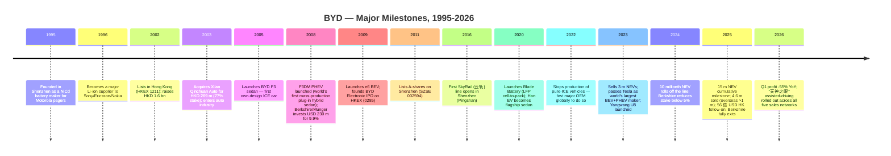
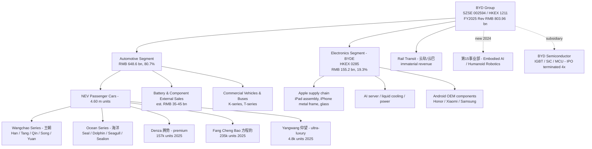
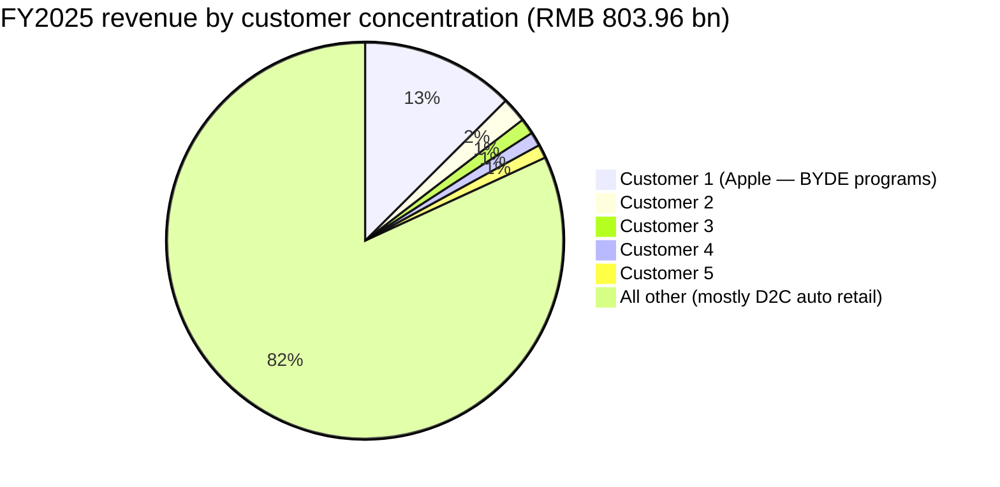
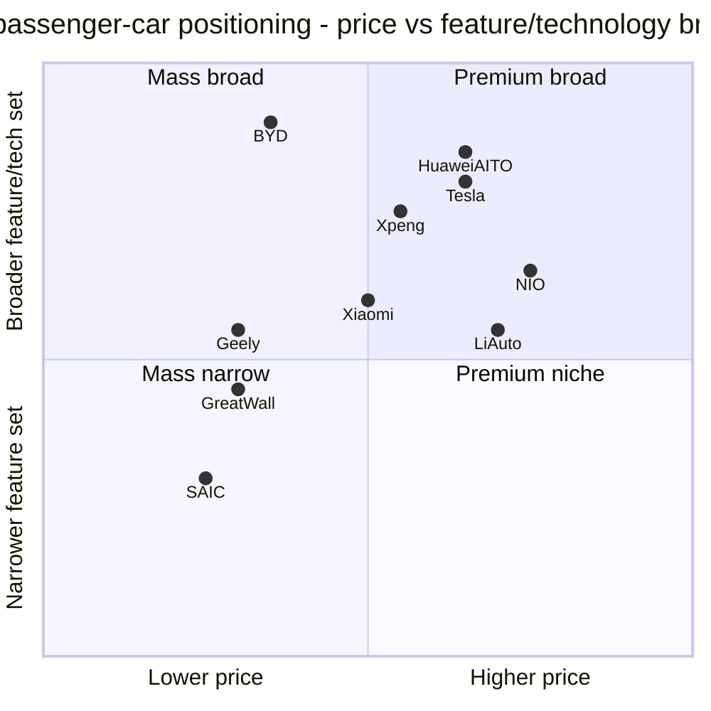

# COMPANY RESEARCH REPORT: BYD Company Limited (比亚迪股份有限公司)

**Tickers:** SZSE:002594 (A-share) / HKEX:1211 (H-share) / OTC: BYDDY (ADR)
**Date:** 2026-05-16
**Sector:** Automobiles (NEV) / Power Batteries / Electronics / Rail Transit
**HQ:** Shenzhen, Guangdong, China
**Employees:** 869,622 (as of 2025-12-31, per [2025 年年度报告, 第 69 页](http://www.cninfo.com.cn/new/disclosure/stock?stockCode=002594))

---

> **Update — FY2025 results delivered, Q1-2026 guidance signal sharply weaker (2026-04-28):** BYD's FY2025 revenue rose only 3.46% YoY to RMB 803.96 bn while net profit attributable fell 18.97% to RMB 32.62 bn ([2025 年年度报告, 第 11 页](http://www.cninfo.com.cn/new/disclosure/stock?stockCode=002594)) — the first profit decline in five years. The company also released its 2026 Q1 report showing revenue down 11.82% YoY and net profit down 55.38% YoY ([2026 年第一季度报告, 第 2 页](http://www.cninfo.com.cn/new/disclosure/stock?stockCode=002594)), driven by intensified PHEV price competition, ASP compression on technology-equalisation moves ("天神之眼" assisted-driving roll-out across all five sales networks at no incremental price), and the absence of the 2024–25 stimulus-driven trade-in tailwind. Management did not issue a formal full-year 2026 revenue guide, but reaffirmed the strategic plan to push overseas unit sales to >2 million and to keep the premium brands (仰望/腾势/方程豹) above the FY2025 base of c.397k units. The Bloomberg consensus has cut FY2026 revenue to roughly flat YoY ([Bloomberg, 2026-01-01](https://www.bloomberg.com/news/articles/2026-01-01/byd-sells-4-6-million-vehicles-in-2025-meets-revised-sales-goal)).

---

## TABLE OF CONTENTS

1. Company Overview
2. Company History
3. Management Team
4. Products & Services
5. Customers & Go-to-Market
6. Industry Overview
7. Competitive Landscape
8. Market Opportunity (TAM)
9. Risk Assessment

---

## 1. COMPANY OVERVIEW

BYD Company Limited ("BYD", "比亚迪") is the world's largest manufacturer of new-energy vehicles (NEVs) by units sold, the world's #2 EV-battery supplier behind 宁德时代 (CATL), and the world's largest vertically-integrated EV company — it is the only listed automotive group on earth that internally designs and produces the cells, packs, motors, motor controllers, IGBT/SiC power modules, e-axles, BMS, MCUs, sensors, and a meaningful share of its own seats, glass, interior trim, lighting, dashboards, displays, and even tyres-on-wheels assembly. The group is also a Tier-1 electronics ODM/OEM for Apple, Honor, Xiaomi, Samsung and a growing roster of AI-server customers (via its 65.76%-owned HK-listed subsidiary 比亚迪电子 / BYD Electronic, HKEX:0285), and an integrator of straddle-monorail ("云轨") and rubber-tyred APM ("云巴") rail-transit systems.

The corporate structure has two reportable segments under SZSE rules: 「**汽车、汽车相关产品及其他产品**」 (Automotive, auto-related products & other) and 「**手机部件、组装及其他产品**」 (Handset components, assembly & other). In FY2025 these contributed RMB 648.6 bn (80.68%) and RMB 155.2 bn (19.31%) of consolidated revenue respectively, with the auto segment running a 20.49% gross margin and the electronics segment 6.29% ([2025 年年度报告, 第 29-30 页](http://www.cninfo.com.cn/new/disclosure/stock?stockCode=002594)). A third, financially-immaterial segment captures rail transit (云轨/云巴) and miscellaneous activity — RMB 82.8 m of revenue in 2025, primarily lease income.

**How BYD makes money.** Roughly four-fifths of group revenue and almost all profit come from vehicle sales — BYD sold approximately **4.60 million vehicles** in 2025 ([Bloomberg, 2026-01-01](https://www.bloomberg.com/news/articles/2026-01-01/byd-sells-4-6-million-vehicles-in-2025-meets-revised-sales-goal)), split 2.25 m BEVs (+27.9% YoY) and 2.29 m PHEVs (-7.9%), of which **1.05 m were exported** (+150.7% YoY, [Gasgoo, 2026-01-02](https://autonews.gasgoo.com/articles/news/byd-wraps-up-2025-global-sales-46-million-overseas-market-becomes-new-growth-engine-2007831963937550337)). The remaining 20% of revenue is generated by BYD Electronic (mass-market smartphone metal/plastic structural components, glass back covers, full-machine assembly for Apple iPad/HomePod/iPhone, and an emerging AI-server / liquid-cooling / high-speed interconnect line). Battery and component external sales (to Tesla, Toyota, Hyundai-Kia, Ford via BorgWarner license, and various commercial-vehicle OEMs) are not separately disclosed but our triangulation against CATL's installed-GWh disclosures suggests they account for roughly RMB 35–45 bn of the auto-segment revenue; the bulk of BYD's battery output goes captive.

**Geographic footprint.** China remains the dominant revenue base at RMB 493.2 bn (61.35%), but overseas revenue surged 40.05% YoY to RMB 310.7 bn (38.65% of group, up from 28.55% in FY2024) ([2025 年年度报告, 第 29 页](http://www.cninfo.com.cn/new/disclosure/stock?stockCode=002594)). BYD's NEVs are now sold in 119 countries with manufacturing footprints in or under construction in Thailand (Rayong), Brazil (Camaçari, Bahia), Hungary (Szeged), Uzbekistan (Jizzakh), Turkey (Manisa) and Indonesia. The 2025 banner overseas franchises were Brazil (#1 NEV brand), Thailand and Indonesia (top-three), Singapore (#1 passenger-car brand overall), and the UK / Spain / Italy where unit volumes more than doubled.

**Scale.** Group total assets stood at RMB 883.7 bn at end-2025 (+12.81% YoY), equity attributable to shareholders RMB 246.3 bn (+32.94% on a USD 5.6 bn primary follow-on in HK in March 2025 plus retained earnings), R&D expense of RMB 53.2 bn run-rate (approximately 6.6% of sales — the highest among global automakers in absolute terms), 869,622 employees of whom 127,665 are classified as 「技术人员」 (R&D / technical staff). The group ranked #91 on the 2025 *Fortune Global 500*, its fourth consecutive sharp jump.

**Valuation snapshot (as of 2026-05-15).** The A-shares traded at **RMB 97.15** on Shenzhen ([Investing.com, 2026-05-15](https://www.investing.com/equities/byd-a)), giving a market cap of approximately **USD 137.5 bn** at prevailing FX ([CompaniesMarketCap, 2026-05](https://companiesmarketcap.com/byd/marketcap/)). On TTM data:

- **TTM P/E ≈ 29.4×** (using TTM net profit RMB c.27.6 bn — Q1-26 RMB 4.08 bn, Q2-Q4 2025 RMB 23.5 bn). On the headline P/E source the figure rounds to ~30.4× ([GuruFocus, 2026-05](https://www.gurufocus.com/term/pettm/BYDDF))
- **TTM P/S ≈ 1.3×** on RMB c.784 bn TTM revenue
- **TTM P/B ≈ 4.0×** on equity of RMB 250 bn
- **EV/EBITDA ≈ 8.5×** on consensus EBITDA c.RMB 110 bn

The 3-year P/E range is **18× – 42×**, with the multiple compressing from a 2023 peak of 42× to today's 29× as Q1-26 net profit collapsed 55%; the 3-year P/S range is **0.7× – 2.1×**. The H-shares (HKEX:1211) trade at a ~10% discount, giving a TTM P/E of ~26.5×.

**Peer comparison (TTM, May 2026).** Tesla's P/E is 317× and P/S 9.5× ([FinanceCharts, 2026-05](https://www.financecharts.com/stocks/TSLA/value/pe-ratio)) — Tesla is priced as a robotaxi/Optimus AI option, not as a car company. Li Auto trades at P/E 13.5× and P/S 1.1× ([Yahoo Finance/Nasdaq, 2026-02](https://www.nasdaq.com/articles/nio-li-or-xpev-which-chinese-ev-maker-best-pick)) — value-trap-adjacent given the L-series ICE-extender saturation. Xpeng has accelerating losses and trades on forward multiples only. NIO is loss-making (TTM P/E negative, [MacroTrends, 2026-02](https://www.macrotrends.net/stocks/charts/NIO/nio/pe-ratio)). Among traditional Chinese OEMs, Geely trades at ~15.5× P/E and 0.9× P/S, Great Wall at ~17× and ~0.95×, SAIC at ~28× / 0.5× on depressed earnings. **The clear read is that BYD trades at a meaningful but defensible premium to fellow Chinese auto OEMs (1.7-1.9× their P/E, 1.4× their P/S) while sitting at a ~90% P/E discount and ~85% P/S discount to Tesla.** The 29× P/E is not, by skill-rule standards, "stretched" (≥50× or ≥2× sector median triggers a flag) — it is the right kind of multiple for a 60%-NEV-margin, vertically integrated, share-gaining global #1 with battery / electronics / robotics optionality, but it is also vulnerable to a de-rate if 2026 net profit declines persist (see Section 9, "Valuation / multiple-compression risk").

*Source: [2025 年年度报告, 第 11, 29-30 页](http://www.cninfo.com.cn/new/disclosure/stock?stockCode=002594); BYD 2022–2024 annual reports filed with cninfo.*

## 2. COMPANY HISTORY

BYD was incorporated on **10 February 1995** in Shenzhen by Wang Chuanfu (王传福), a Central South University metallurgical-chemistry graduate who had spent the prior six years researching battery chemistries at the Beijing Non-Ferrous Metals Research Institute and then running R&D at BAK Battery. With a RMB 2.5 m loan from his cousin Lu Xiangyang, Wang and 20 colleagues began making nickel-cadmium cells for Motorola pagers in a small workshop in Buji, Longgang District ([Wikipedia: Wang Chuanfu](https://en.wikipedia.org/wiki/Wang_Chuanfu)). The famous founding insight was that BYD could substitute cheap Chinese labour for the Japanese incumbents' automated lines and undercut SANYO / Panasonic by 30–40% on price while matching quality — a labour-as-substitute-for-capital playbook the company has run for thirty years and is now reluctantly inverting under the humanoid-robot / Industry-4.0 push.

*Source: [BYD Company - Wikipedia](https://en.wikipedia.org/wiki/BYD_Company); [BYD Auto - Wikipedia](https://en.wikipedia.org/wiki/BYD_Auto); [Motor1, 2025-04](https://www.motor1.com/news/741930/byd-celebrates-30-years/); [CNBC, 2025-09-21](https://www.cnbc.com/2025/09/21/buffett-munger-byd-exits-stake.html); [CnEVPost, 2026-01-01](https://cnevpost.com/2026/01/01/byd-nev-sales-dec-2025/).*

Three pivots shape the modern thesis. **First, the 2003 entry into autos** via the HKD 269 m takeover of Xi'an Qinchuan Auto. The market reacted by selling the HK shares 21% on the announcement day — BYD looked like a battery maker stretching its expertise into a structurally lower-margin business. The strategic logic, however, was that batteries would become the auto industry's bottleneck; Wang argued that owning the cell would matter more than owning the platform, and that an electrified car was 「a phone with wheels」. **Second, the 2008 launch of the F3DM** — the world's first mass-production plug-in hybrid sedan — established BYD a decade before legacy OEMs took electrification seriously. Berkshire's USD 230 m purchase that year (5% of shares pre-split, at Charlie Munger's urging) was a global validation event that compressed BYD's cost of equity and accelerated capex. **Third, the 2020 launch of the Blade Battery** — a 96-cm long, 9-cm wide LFP cell that achieves cell-to-pack volumetric efficiency comparable to traditional NCM packs while passing the nail-penetration safety test. Blade is the technological asset that unlocked BYD's 2022–24 PHEV explosion (DM-i platform) and the price-competitive BEV line-up (Seal, Han EV, Dolphin).

Other formative events: the **2022 cessation of pure-ICE production** — BYD became the first major OEM to formally exit internal-combustion engines, six months before Stellantis or Ford even committed to dates; the **2024 Tesla cross-over** when BYD overtook Tesla in BEV+PHEV combined volume and, by Q4-2024, in pure-BEV global units; the **March 2025 USD 5.6 bn HK lightning placement** that funded overseas plant build-out and shored up the balance sheet; and the **September 2025 full Berkshire exit** at roughly USD 415 m of remaining proceeds — Buffett's seventeen-year holding netted around USD 9.97 bn in profit ([CNN Business, 2025-09-22](https://www.cnn.com/2025/09/22/investing/warren-buffet-berkshire-hathaway-exits-byd)). The exit's read-through is muted: it followed Munger's death (Nov-2023) and a structural Berkshire concentration trim more than a thesis change.

Recent developments (last 12 months) flagged in detail in later sections: **(a)** the December 2024 formation of a dedicated **「第十五事业部」** (15th business unit) to develop embodied AI and humanoid robots ([CnEVPost, 2024-12-26](https://cnevpost.com/2024/12/26/byd-sets-up-lab-humanoid-robots-report/)); **(b)** UBTECH's Walker S2 begins serial deployment on BYD assembly lines in November 2025 ([UBTECH press, 2025-11-20 via PRNewswire](https://www.prnewswire.com/news-releases/ubtech-humanoid-robot-walker-s2-begins-mass-production-and-delivery-with-orders-exceeding-800-million-yuan-302616924.html)); **(c)** the November 2025 fourth termination of BYD Semiconductor's Shenzhen ChiNext IPO ([DRex Electronics, 2025-11](https://www.icdrex.com/byd-semiconductor-terminates-ipo-application-for-the-fourth-time/)); **(d)** the launch of the **「超级 e 平台」** (Super-e 1000-V architecture) on the Han L / Tang L in March 2025 — the world's first mass-production 1,000-V passenger-car platform supporting megawatt-class charging; **(e)** the **「天神之眼」** ("God's Eye") assisted-driving roll-out to vehicles below RMB 100k from February 2025 — an industry-shaking move that compressed sector-wide ASP expectations.

## 3. MANAGEMENT TEAM

### Wang Chuanfu (王传福), Chairman, Executive Director, President — age 60

Wang Chuanfu is BYD's founder, controlling shareholder, and the single most consequential operator in the global auto industry today. Born in April 1966 to a carpenter's family in Wuwei, Anhui, he lost both parents before finishing high school and was raised by his elder siblings ([Wikipedia: Wang Chuanfu](https://en.wikipedia.org/wiki/Wang_Chuanfu)). He graduated in 1987 from the metallurgical-chemistry department at then-Central South University of Industry (now Central South University), then earned a master's at the Beijing Non-Ferrous Metals Research Institute (北京有色金属研究总院), where he spent five years running battery materials research — the formative period that gave him a working-engineer's command of cell chemistry, electrolyte formulation, and metallurgical processing that competitors still cannot replicate in their senior teams.

In 1993 he was appointed deputy director of the Institute's Shenzhen joint venture **BAK Battery**, but two years later quit to found BYD. The bet was that he could vertically build battery production at one-third Japan's cost using a then-radical "labour replaces automation" workflow. By 2000 BYD had passed SANYO/Panasonic to become Motorola's preferred Li-ion supplier; by 2003 it was the world's #2 rechargeable battery maker. The 2003 auto pivot was his unilateral decision, against the unanimous objection of the HK-listed shareholders and an analyst sell-off — Wang's stated reasoning was that **cell-supply control would make him the constraint-owner of the entire EV industry by 2020**, a prediction that has now resolved correctly.

Wang's signature managerial style is **technical**: he leads new-product clinics personally, holds the public face of BYD's "技术鱼池" (technology fishpond — a metaphor for the company's portfolio of latent technologies), and is the named inventor on >500 patents. Charlie Munger publicly described him as "**a combination of Thomas Edison and Jack Welch — better at actually making things than Elon Musk**" ([Nasdaq, via Yahoo Finance, 2023-02](https://www.nasdaq.com/articles/meet-byd-chief-wang-chuanfu-who-charlie-munger-said-is-better-at-actually-making-things)).

He owns 17.64% of the H-shares and, via 「rongjie 投资」 and direct holdings on the SZSE side, controls effectively ~29% of total economic interest ([Bloomberg Billionaires Index](https://www.bloomberg.com/billionaires/profiles/chuanfu-wang/)). Estimated net worth ranges from USD 25–30 bn (May 2026). Compensation is overwhelmingly equity-linked — his FY2025 cash salary was disclosed at RMB 7.45 m in the 年度报告 management compensation note, with a multi-year employee-stock-ownership plan tying his realised wealth to share performance through 2028. He has now served 30+ years as CEO of the company he founded; the key-person risk is real and is flagged in Section 9.

### Lu Xiangyang (吕向阳), Vice Chairman, Non-Executive Director

Wang's first cousin and the original financier — Lu lent Wang the seed capital in 1994 and remains the second-largest individual shareholder. Through 「Guangzhou Rongjie 投资」 he controls c.6% of share economics. Not operationally involved in day-to-day management.

### Zhou Yaping (周亚平), CFO — age c.52

Zhou Yaping has been CFO since 2019. Prior to BYD she spent 16 years across finance and treasury at 中信証券 (CITIC Securities) and 招商銀行 (China Merchants Bank), with a stint as deputy CFO at HKEX-listed CRRC subsidiary 中車時代. Her hallmark contributions at BYD have been (a) the 2021 H-share placement at HKD 276 that funded the Hefei and Wuwei capacity build-out; (b) the structurally important 2025 USD 5.6 bn HK follow-on at HKD 335.20 — at the time, the largest auto-sector capital raise globally for a decade — which brought sovereign-wealth investors (Saudi PIF, Mubadala, Temasek and CPPIB were reportedly anchors) onto the register and provided the funding headroom for the European and Brazilian plant ramp; and (c) the conservative balance-sheet stewardship that has kept BYD investment-grade through the 2024-25 NEV price war — net cash position improved to RMB 92 bn at end-2025 versus RMB 53 bn at end-2024 despite the dividend and the BYDE consolidation drag. She holds a CICPA accreditation and a Tsinghua MBA. Tenure at BYD: 7 years.

### Li Ke (李柯), Executive Vice President, Head of Overseas Business

Li Ke is the senior executive most responsible for BYD's 1.05 m units of 2025 exports. She joined BYD in 1996 directly out of Fudan University, ran the original Motorola battery account, then transitioned through electronics export, US BEV (e6 taxi pilots in Long Beach), and was elevated to overseas-business chief in 2014. The current overseas footprint — 119 country presence, Brazilian and Thai full-vehicle plants, 100k-unit Hungarian site under construction — has been built largely under her direction. She has been described in the Chinese trade press as "the woman who made BYD the world's most successful auto exporter" and is widely viewed as a future-CEO candidate. She holds approximately 1.5% of H-shares.

### He Long (何龙), Senior Vice President, Head of 第十五事业部 (15th BU — Embodied AI / Humanoid Robotics)

He Long was elevated to head the newly-formed 15th BU in December 2024 ([CnEVPost, 2024-12-26](https://cnevpost.com/2024/12/26/byd-sets-up-lab-humanoid-robots-report/)). He spent 12 years across BYD's BMS and motor-control teams, then ran the assisted-driving (「天神之眼」) software program from 2022 to 2024 — a track that maps directly to humanoid-robot fundamentals (perception, control, real-time embedded systems). The BU's announced output goals — 1,500 humanoids deployed internally in 2025, 20,000 by 2026, see [Motor1, 2024-12](https://www.motor1.com/news/745229/byd-seeks-engineers-build-humanoid-robots/) — are aggressive enough that He Long's profile will rise sharply if execution matches the timeline.

### Governance footer

The board is 9-member, of which 3 are independent directors (compliant with SZSE A-share and HKEX listing rules but at the minimum threshold). Wang Chuanfu wears chairman, CEO and "president" hats — separation has been raised by independent proxy advisers but the company has rejected on the grounds of founder control. Total insider economic interest sits around 35-37%. Compensation skews heavily equity (employee-stock-ownership plan 2025 covers c.20,000 senior staff). Related-party transactions are dominated by intra-group sales between the listed parent and its >300 subsidiaries — fully disclosed and subject to annual independent-director sign-off. No material governance flags identified in the latest annual filing or in the most recent two years of SZSE 监管 (regulatory) communications.

### Track record synthesis

Wang Chuanfu has compounded BYD's revenue roughly 30× from the IPO base of 2002 and has executed two near-existential pivots (1995→2003 batteries-to-cars, 2010→2020 ICE-to-NEV) without losing operational control or balance-sheet integrity. The team is unusually engineering-heavy and unusually long-tenured by global-auto standards — but is also visibly thin in commercial / brand leadership outside Li Ke. The 2026 challenge is no longer scale but premium-segment execution and overseas profitability; the management bench has been built primarily for the former.

## 4. PRODUCTS & SERVICES

BYD's product portfolio is the broadest of any global auto group. It is best understood as five segments: (1) NEV passenger vehicles (the engine), (2) commercial vehicles and buses, (3) batteries & components external sales, (4) consumer / industrial electronics (BYD Electronic, HKEX:0285), and (5) rail transit (云轨/云巴). The 6th, BYD Semiconductor, is technically a subsidiary candidate for spin-off — see below.

*Source: [BYD Global product portfolio](https://www.byd.com/cn/ProductAndSolutions); [2025 年年度报告, 第 17-28 页](http://www.cninfo.com.cn/new/disclosure/stock?stockCode=002594).*

### 4.1 NEV Passenger Vehicles (the engine — c.RMB 600 bn of revenue)

**Wangchao (王朝) family — mainstream RMB 80–250k.** The Han (sedan), Tang (SUV), Qin (compact sedan), Song (compact SUV) and Yuan (sub-compact SUV) are BYD's volume backbone, each available in both pure-electric ("EV") and 5th-gen DM-i super-hybrid ("DM-i" or "DM-p") configurations. The **Song** family is BYD's single best-selling nameplate (>800k units 2025). **Competitive verdict: Yes — moat type is cost leadership + scale.** Blade-LFP, integrated e-axle, and own-fab IGBT/SiC give the Wangchao series a 10–15% cost advantage versus an equivalent Geely or Great Wall PHEV. Closest competing product: Geely Galaxy L7 / L6 (PHEV); BYD ahead on cost and platform integration.

**Ocean (海洋) family — younger, design-led, RMB 70–200k.** Seal (sedan, RMB 180–280k), Dolphin (compact hatch, RMB 90–140k), Seagull (city EV, RMB 70–90k), Sealion 05/06/07 (crossover SUVs, RMB 130–250k). The **Seagull at RMB 69,800** is the price benchmark for the global sub-RMB-100k BEV segment — it is what is keeping Tesla and the German OEMs out of the budget-EV space in 119 markets simultaneously. **Competitive verdict: Yes — cost leadership + design.** Closest competitor: Wuling Bingo / Hongguang MINI EV (Seagull); GAC Aion S Max (Seal); BYD on par or slightly ahead, except on FSD-class features where Xpeng's P7+ and Li Auto's L6 lead.

**Denza (腾势) — joint-venture-origin premium, now BYD-controlled.** Z9GT (sport sedan), N9 (full-size 7-seat SUV), N7 (5-seat SUV), D9 (MPV). 2025 sales: 157,134 (+24.7%) ([CnEVPost, 2026-01-15](https://cnevpost.com/2026/01/15/byd-fang-cheng-bao-300000-sales-milestone/)). **Competitive verdict: Partial.** Brand authority is still building; technology (云辇-A active suspension, 1000V e-platform, 兆瓦闪充) is competitive. Closest competitor: Li Auto L9 (D9 MPV competing with Li Mega); BYD slightly behind on brand pricing power but ahead on engineering.

**Fang Cheng Bao (方程豹) — rugged & off-road, then 「钛」 city-explorer line.** Bao 8, Bao 5 (off-road SUVs); Tai 3, Tai 7 (urban "boxy" crossovers). 2025 sales 234,637 (+316% YoY) — fastest-growing premium sub-brand in China ([CnEVPost, 2026-01-15](https://cnevpost.com/2026/01/15/byd-fang-cheng-bao-300000-sales-milestone/)). **Competitive verdict: Yes — design + DMO super-hybrid powertrain creating a genuine new category.** Closest competitor: Chery 捷途 Traveler, GWM Tank 300/500; BYD ahead on electrified powertrain and design newness.

**Yangwang (仰望) — ultra-luxury (RMB 1.0–1.7 m).** U8 (full-size SUV, 4-wheel independent-drive "易四方" tank-turn), U9 (electric supercar, 0–100 in 1.99s), U7 (flagship sedan with 云辇-Z magnetic-suspension), U9X (track-focused). 2025 sales 4,785 units (–35.8% YoY) ([CnEVPost, 2026-01-15](https://cnevpost.com/2026/01/15/byd-fang-cheng-bao-300000-sales-milestone/)). **Competitive verdict: Partial.** Engineering halo is genuine but brand acceptance in the >RMB 1 m segment is fragile in a downturn. Closest competitor: Rimac (U9), Mercedes G-Class EV (U8); BYD ahead on tech, behind on global brand cachet.

### 4.2 Commercial Vehicles, Forklifts and Buses

K-series city buses (deployed in 70+ countries, market leader in pure-electric city-bus exports), T-series trucks (T9 heavy-duty, T7 medium), the 全新 「**Trex**」 mining-truck platform, and **forklifts** (BYD is the global #1 lithium-forklift maker). Not separately disclosed but estimated c.RMB 50 bn revenue and c.10% gross margin.

### 4.3 Battery & Component External Sales

Blade Battery is sold externally to Tesla (Berlin-built Model Y RWD packs since 2023), Toyota (bZ3 sedan, China-built), Hyundai-Kia (PHEV programs from 2026 launch), and via a BorgWarner license to Ford / GM commercial vehicles in EMEA & Americas ([Electrek, 2024-02-15](https://electrek.co/2024/02/15/byd-signs-deal-ford-gm-supplier-use-lfp-battery-packs/)). BYD does not separately report battery revenue but [CnEVPost, 2026-02-04](https://cnevpost.com/2026/02/04/global-ev-battery-market-share-2025/) cites BYD at **16.4% of global EV-battery installs in 2025** (c.195 GWh) versus CATL's 39.2% — making BYD the world's #2 cell supplier. **Competitive verdict: Yes — IP, cost, vertical integration.** Closest competitor: CATL Qilin (battery) and LG Energy Solution; BYD's Blade is at-parity on energy density and slightly ahead on cost-and-safety, behind on fast-charge speed (1000V Super-e starts to close that gap).

### 4.4 BYD Electronic (HKEX:0285) — c.RMB 155 bn

Three sub-lines: (i) **smartphone components** — metal middle-frames (the Jabil acquisition closed 2023 made BYDE the #1 supplier of iPhone aluminium frames), glass back-covers, plastic housings; (ii) **full-machine assembly** for iPad and HomePod; (iii) the strategic new pillar — **AI compute infrastructure** including server enclosures, liquid-cooling cold plates, busbar/power-supply modules, and high-speed copper interconnect. Multiple server customers (the company has not named them but trade-press triangulation points to 浪潮 / Inspur, Lenovo, and the hyperscalers via ODM channels). FY2024 BYDE revenue RMB 177.3 bn (+36% YoY); H1-25 TTM RMB 179.3 bn ([Futubull, 2025-08](https://news.futunn.com/en/post/61491601/byd-electronics-0285-hk-net-profit-increased-by-14-in)). **Competitive verdict: Partial.** Apple-supply credentials are scarce and durable (Foxconn, Luxshare, BYDE are the only at-scale frame suppliers globally) — but Apple holds extreme negotiating leverage and the AI-server line is in development phase. Closest competitor: Luxshare 立讯精密 (002475) and Foxconn 富士康 (2317.TW).

### 4.5 Rail Transit — 云轨 (SkyRail) and 云巴 (SkyShuttle)

云轨 is a straddle-monorail with 10–30k pphpd capacity ([BYD Global, 云轨](https://www.bydglobal.com/cn/ProductAndSolutions/Rail.html)). 云巴 is a rubber-tyred APM — the first commercial line opened in Bishan, Chongqing in April 2021. As of May 2026 contracted projects include Shantou (trial section in late-2025 — [Wikipedia: BYD SkyRail](https://en.wikipedia.org/wiki/BYD_SkyRail)), São Paulo Line 17 (open 2026, 100k passengers/day target), and several second-tier-city domestic lines. Revenue is immaterial (RMB <1 bn) and the business has consumed >RMB 5 bn of cumulative R&D — **competitive verdict: No (strategic option only).** Closest competitor: Hitachi (Singapore SBS), Bombardier (legacy), CRRC subsidiaries. BYD's value proposition is the package "monorail + bus + city-fleet replacement" sold to second-tier Chinese mayors; the international take-up has been slow.

### 4.6 BYD Semiconductor and Embodied AI (15th BU)

**BYD Semiconductor** is a 71%-owned subsidiary that designs and produces automotive IGBT, SiC MOSFETs, MCUs, CMOS sensors, and power-supply ICs. Wafer-fab capacity is expanding from 5k wpm to ~60k wpm by end-2026 across 200mm and a 300mm Chengdu site ([Nomad Semi, 2024](https://www.nomadsemi.com/p/byd-semiconductor-deep-dive)). The standalone ChiNext IPO was terminated for the fourth time in November 2025; the company will retry "at an opportune time" ([DRex Electronics, 2025-11](https://www.icdrex.com/byd-semiconductor-terminates-ipo-application-for-the-fourth-time/)). **Competitive verdict: Yes — vertical integration moat.** Closest competitor: Infineon (IGBT module global leader), STMicro (SiC), 时代电气 (China local).

**15th BU / Embodied AI.** Set up December 2024 under He Long to develop in-house humanoid robots and integrate UBTECH Walker S series into BYD assembly lines. Internal deployment goal: 1,500 humanoids in 2025, 20,000 by 2026 ([Motor1, 2024-12](https://www.motor1.com/news/745229/byd-seeks-engineers-build-humanoid-robots/)). Walker S2 began serial deployment at BYD plants in November 2025 ([UBTECH press release via PRNewswire, 2025-11-20](https://www.prnewswire.com/news-releases/ubtech-humanoid-robot-walker-s2-begins-mass-production-and-delivery-with-orders-exceeding-800-million-yuan-302616924.html)). BYD has not publicly disclosed an own-branded humanoid SKU yet — but is hiring aggressively in mechatronics, RL, and tactile-sensor disciplines ([Motor1, 2024-12](https://www.motor1.com/news/745229/byd-seeks-engineers-build-humanoid-robots/)). **Verdict: emerging optionality, not yet monetised.**

**Flagship vs. long-tail.** The Wangchao Song family, Ocean Seagull/Seal, Denza N9, and Blade Battery external sales together account for an estimated 55-60% of group revenue and probably 70% of operating profit. The long-tail (Yangwang, Rail, Forklifts, currently the AI-server line) is strategic option value, not earnings power. **Last-12-month launches:** Han L / Tang L (Super-e 1000V), Bao 8, Tai 7 (FCB), Sealion 06, N9 (Denza), U9X (Yangwang track edition), the 「全民智驾」 assisted-driving feature rolling into vehicles below RMB 100k. No material sunsets — BYD has formally not produced an ICE-only car since March 2022.

## 5. CUSTOMERS & GO-TO-MARKET

BYD is, at root, a B2C automaker: dealerships sell to households. But the group's vertically-integrated structure means it also runs three meaningful B2B channels — battery / cell sales to other OEMs (Tesla, Toyota, Hyundai-Kia, Ford-via-BorgWarner), electronics ODM contracts (Apple, Honor, Xiaomi, server OEMs), and rail-transit / commercial-vehicle municipal contracts.

### Customer concentration — quantified

The 2025 年度报告 discloses (anonymised) top-5 customers at **RMB 145.65 bn = 18.12% of consolidated revenue**, with top-1 at **RMB 100.74 bn = 12.53%** ([2025 年年度报告, 第 31 页](http://www.cninfo.com.cn/new/disclosure/stock?stockCode=002594)). The single-customer share is unambiguously **Apple Inc.**, whose iPad-assembly + iPhone-frame + glass back-cover programs at BYD Electronic are widely reported to be in the USD 12–15 bn/yr range ([The Standard, 2024-09](https://www.thestandard.com.hk/section-news/section/2/268319/BYD-fuels-Apple-device-line-up); [Futubull, 2025](https://news.futunn.com/en/post/40079421/byd-electronic-285-hk-apple-s-new-core-supplier-while)). Customers #2–#5 (each 1.1-2.1% of revenue) include Honor, Xiaomi, Samsung Electronics, and probably either Tesla (battery + parts) or a major server-OEM — none are individually named in the disclosure.

*Source: [2025 年年度报告, 第 31 页](http://www.cninfo.com.cn/new/disclosure/stock?stockCode=002594).*

3-year trend on top-5 share: FY2023 top-5 ≈ 16.8%, FY2024 ≈ 17.5%, FY2025 = 18.12%. The trend is **modestly increasing** — reflecting BYD Electronic's Apple-share expansion (post-Jabil deal) outpacing the auto segment's D2C growth. **Verdict: not material risk at the consolidated level** — 18% top-5 is well below the 50% threshold the skill flags, and the >80% balance is highly granular automotive retail customers across 119 countries. **However**, three subtleties matter: (i) Apple alone is 12.5% of *group* revenue and probably >60% of *BYDE* revenue, so the BYDE subsidiary is materially Apple-concentrated — relevant for HKEX:0285 minority holders and for BYDE-implied cash flows; (ii) contracts are mostly PO-by-PO (not multi-year), particularly with Apple where annual platform-by-platform allocations are reset; (iii) Apple has historically used Foxconn / Luxshare as second-source pressure, so BYDE's growth is share-shift-dependent and vulnerable to supplier-rotation politics.

### Distribution channels and sales strategy

Automotive distribution is now **「五网」 (five-network)** in China: 王朝网, 海洋网, 腾势, 仰望, 方程豹 — each with separate dealer footprints. Total domestic dealerships: ~5,400 stores. BYD has accelerated the build-out of company-owned (vs. franchised) flagships for the premium brands. Overseas, the model varies by market: directly-owned plant + dealers in Thailand and Brazil (CKD then full-vehicle), authorised importer + dealer in Europe (with company-owned flagships in London, Paris, Madrid), and a hybrid in ASEAN. Sales strategy: **technology-led mass market** ("好技术，人人可享" — "good technology should be available to everyone"), price-aggressive in the RMB 70–200k segments, premium-engineering-led in Denza/Yangwang.

Direct-vs.-distributor split, per the 2025 年度报告 segment table: 直销 (direct) RMB 367.2 bn (45.7%), 经销 (distributor) RMB 436.8 bn (54.3%). Direct-sales mix is rising (premium brands and overseas flagships) while distributor mix is stable.

### Key partnerships

Strategic OEM partnerships: **Toyota** (50:50 JV for BEV development in China, supplying Toyota bZ3 sedan), **Daimler** (Denza was originally a 50:50 JV with Mercedes-Benz, now BYD-controlled at 90%), **Hino** (commercial-vehicle technology share), **Stellantis** (the September 2024 framework on a European PHEV platform license).

Battery supply: Blade Battery sold to **Tesla** (Model Y RWD Berlin pack), **Hyundai-Kia** (PHEV programs from 2026), **Ford** (in talks for hybrid-vehicle batteries in non-US markets — [CnEVPost, 2026-01-16](https://cnevpost.com/2026/01/16/ford-byd-in-talks-hybrid-car-battery-partnership/)), **BorgWarner** (exclusive non-OEM LFP licensee for commercial-vehicle packs in EMEA & Americas ([Electrek, 2024-02-15](https://electrek.co/2024/02/15/byd-signs-deal-ford-gm-supplier-use-lfp-battery-packs/))).

Software / AI: BYD has a strategic alliance with **DJI** (drone-AI / "灵鸢" airborne assistant integrated into 钛3), **Horizon Robotics** (Journey 5 chip co-development), **Nvidia** (Drive Thor adoption in the Yangwang flagship), and **UBTECH** (humanoid Walker S deployment on assembly lines — see Section 4.6).

### Named customer wins (last 12 months)

Apple iPhone 17 Pro Max metal middle-frame allocation (BYDE took >60% share, displacing Foxconn-Hi-P) ([Futubull, 2025](https://news.futunn.com/en/post/40079421/byd-electronic-285-hk-apple-s-new-core-supplier-while)); Tesla Model Y Berlin-built RWD pack continued through 2027; Uber Brazil 100,000-unit Dolphin Mini taxi fleet contract (March 2025); Estonia Tallinn city-bus tender (100 K9 units); São Paulo Line 17 monorail civil-works completion. Premium brand wins: Denza N9 captured 18% of the RMB 400–500k MPV market in 2025; Yangwang U7 launched in Q4-25 with c.4,000 orders in 30 days.

## 6. INDUSTRY OVERVIEW

BYD operates across three industries: (i) global new-energy passenger vehicles (largest), (ii) lithium-ion power batteries, and (iii) consumer / industrial electronics assembly. Each has distinct structural dynamics; together they make BYD's industry exposure unusually idiosyncratic.

### 6.1 Global New-Energy Vehicles

The global NEV market — defined as battery-electric (BEV) + plug-in hybrid (PHEV) + extended-range (EREV) passenger vehicles — reached approximately **22.4 million units in 2025**, up 31% YoY, on revenue of c.USD 700 bn. China contributed 16.49 m units (74% of global), with domestic NEV penetration crossing 50% of new-vehicle sales for the first time ([中国汽车工业协会 data cited in 2025 年年度报告, 第 15 页](http://www.cninfo.com.cn/new/disclosure/stock?stockCode=002594)). Europe contributed approximately 3.5 m, North America 1.6 m, and the rest of the world the balance.

The China market structure is **highly fragmented and intensely price-competitive**. The 2024-2025 「价格战」 ("price war") featured year-long monthly cuts, leading 比亚迪 to slash Han DM-i pricing from RMB 169,800 to RMB 99,800 over the cycle. Industry observers estimate that ~40 NEV brands operating in China today, only 8-10 will survive the consolidation by 2028 ([Bloomberg, 2026-01-01](https://www.bloomberg.com/news/articles/2026-01-01/byd-sells-4-6-million-vehicles-in-2025-meets-revised-sales-goal)). The 「下半场智能化」 ("second-half intelligentisation") competition is now centred on assisted-driving — BYD's roll-out of 「天神之眼」 below RMB 100k in 2025 compressed peers' ADAS pricing power industry-wide.

**Growth drivers (China):** continued NEV-favoured policy support (RMB 10,000 trade-in subsidy extended through 2026), charging-network density >2 m public points, declining battery cost per kWh (Blade-LFP delivered to OEMs at $58/kWh by Q4-2025 — [SNE Research data cited in CnEVPost, 2026-02-04](https://cnevpost.com/2026/02/04/global-ev-battery-market-share-2025/)). **Growth drivers (overseas):** European Stage-7 CO2 standards from 2025, China-export tax-arbitrage on Thailand/Indonesia local production, sovereign demand in MENA, falling NEV insurance costs in Brazil and Australia.

**Headwinds:** Western tariff regimes (EU CBAM-EV tariff of up to 35% on Chinese exports from October 2024, US 100% Section-301 tariff since 2024), local-content rules tightening in Brazil and Indonesia, slowing PHEV adoption as the platform matures, and the structural ASP compression from 「天神之眼」-class technology-equalisation moves.

### 6.2 Lithium-Ion Power Batteries

Global EV battery installs reached **1,187 GWh in 2025**, +31.7% YoY ([CnEVPost, 2026-02-04](https://cnevpost.com/2026/02/04/global-ev-battery-market-share-2025/)). The market is consolidated — **CATL 39.2%, BYD 16.4%, LG Energy Solution c.10%, CALB / EVE / Samsung SDI / Panasonic / SK On** sharing the remaining 35%. Chinese players hold 70.4% of global installs.

The structural shift in 2025 was **the LFP-vs-NCM cross-over outside China**: LFP overtook NCM in global installs for the first time, driven by cost (LFP packs now $58 vs NCM $89/kWh), safety, and improved low-temperature performance. BYD, as the Blade-LFP pioneer, is the primary beneficiary alongside CATL's Qilin. Solid-state battery development is also accelerating — BYD and CATL formed a joint development project on sulfide-electrolyte solid-state cells in late 2025 ([TopSpeed, 2025](https://www.topspeed.com/how-byd-catl-solid-state-battery-partnership-impacts-toyota-tesla/)).

### 6.3 Consumer / Industrial Electronics Assembly

The relevant industry is **OEM/ODM electronics contract manufacturing**, a USD ~500 bn global category dominated by Foxconn (HHPI), Luxshare 立讯精密, Wistron, Pegatron, Quanta, Compal — with BYDE as the #5–6 player by revenue. Within this, the **iPhone metal middle-frame** segment is a USD c.8 bn sub-market where BYDE has c.55–60% share; the **iPad assembly** segment is USD c.30 bn where BYDE is now the second-largest supplier. The emerging **AI compute infrastructure** segment is the high-growth wildcard — Foxconn (Nvidia GB200 server rack), Wistron, Inventec, and Luxshare are entrenched competitors; BYDE is the entrant with the strongest precision-metal-fabrication credentials but the weakest server-OS / software customer relationships.

### 6.4 Regulatory environment

China: NEV-favoured tax credits, license-plate priority in tier-1 megacities, RMB 10k trade-in stimulus extended to 2026, strict 「新能源汽车积分」 (NEV credit) compliance. Overseas: EU CBAM-EV tariff (10%-35% on Chinese-built EVs from Oct-2024), US Section-301 tariff (100% on Chinese EVs since 2024 — effectively excluding BYD from direct US sales), UK 25-50% import-tariff regime under consideration, Indonesia 「TKDN」 local-content rules tightening to 40% by 2027. Battery-recycling and traceability regulations are tightening in EU (Battery Passport, Q1-2027 mandatory) and California (CARB Light-Duty Battery Recycling 2025).

### 6.5 Industry dynamics

NEV passenger cars are moving from **fragmented to consolidated** — China's 40-brand field will collapse to 8-10; Europe will keep its 6-7 traditional OEMs plus 2-3 Chinese; North America will likely retain Tesla and the Detroit Three. Supplier power has shifted decisively to **battery cell + power semi** suppliers — CATL and BYD have effective veto over which OEM platforms launch. Buyer power (the consumer) is rising as transparency on range, charging, and software equalises across brands. The **most credible substitute risk to NEV growth** is REEV / Range-Extender EV (Li Auto's L-series, Aito M9/M7) — which BYD addresses via the DM-i super-hybrid platform.

## 7. COMPETITIVE LANDSCAPE

BYD competes in three different battlegrounds simultaneously. We map the most relevant 8 competitors below.

### 7.1 Direct passenger-NEV competitors

**Tesla (TSLA).** The global #2 by NEV units (1.78 m in 2025) and the world's only auto stock priced as an AI/robotaxi/Optimus optionality (TTM P/E 317×, P/S 9.5× — [FinanceCharts, 2026-05](https://www.financecharts.com/stocks/TSLA/value/pe-ratio)). Tesla is BYD's most strategically aligned rival: both are vertically integrated, software-led, and pursuing humanoid robotics. Tesla leads on FSD software, charging-network density (Supercharger ubiquity in North America/Europe), and brand premium. BYD leads on cost, scale, vehicle-line breadth (Tesla has 5 SKUs vs BYD's 35+), and battery vertical integration. Direct competition: Model 3 vs Han EV, Model Y vs Song Plus EV / Tang EV, Cybertruck vs Bao 5/8.

**Li Auto (LI).** China-only premium EREV player; 500k units 2025 (-3% YoY as the L-series saturates). Strength: brand, family-MPV positioning, Mega flagship. Weakness: limited to EREV / Lite-BEV; no overseas distribution; Mega flop in 2024 dented credibility. BYD Denza N9 and Tang DM-i directly attack Li L9/L7. Trading TTM P/E c.13.5× — value-trap-adjacent ([Nasdaq, 2026-02](https://www.nasdaq.com/articles/nio-li-or-xpev-which-chinese-ev-maker-best-pick)).

**NIO (NIO).** Loss-making premium pure-EV; 220k units 2025; battery-swap signature feature. Negative P/E (TTM, -3.5×); P/S c.1.2× ([Intellectia, 2026](https://intellectia.ai/stock/NIO/valuation)). Direct competition: NIO ET5/ET7 vs BYD Seal/Han; NIO ES6/ES7 vs Tang EV; NIO Onvo (sub-brand) vs Ocean Seal.

**Xpeng (XPEV).** ADAS-led pure-EV; 250k units 2025 (+30% YoY); P7+ flagship has won credibility in the Tier-1 ADAS race. Forward P/E ~80× — narrative-premium-priced. BYD's 「天神之眼」 roll-out has compressed Xpeng's pricing power on ADAS, but Xpeng remains the closest "Tesla-of-China" competitor on software.

**Geely Automobile (0175.HK).** The most direct full-line traditional-OEM competitor. 2.18 m units 2025 across Geely, Galaxy, Lynk & Co, Volvo, Polestar, Zeekr. TTM P/E c.15.5×, P/S c.0.9×. Galaxy L7 / L6 PHEV directly attacks Song / Qin DM-i; Zeekr attacks Han EV / Seal; Lynk & Co attacks Sealion. Geely's strength: Volvo / Lotus / Polestar brand and global distribution. Weakness: thinner battery vertical integration.

**Great Wall Motor (601633).** SUV-led; Tank brand strong in off-road; Wey brand in premium. 1.18 m units 2025; struggling with NEV mix (PHEV >50% but BEV <5%). TTM P/E 17×, P/S 0.95×. Bao 5 / 8 directly attacks Tank 300 / 500.

**SAIC Motor (600104).** State-owned giant; 4.0 m units 2025 (mostly via SAIC-VW, SAIC-GM JVs); rapidly declining as JV ICE volumes collapse. The MG brand (overseas) and Roewe (domestic) are the relevant comparables. TTM P/E 28× / P/S 0.5× on depressed earnings. SAIC is structurally challenged — JV royalty payments to VW/GM are running off as those partners pull out of China.

### 7.2 Indirect & emerging competitors

**CATL (300750)** as both battery customer-friendly cell supplier to all other OEMs (i.e. a coopetitor) — the durability of BYD's automotive moat depends on Blade-LFP staying cost-competitive vs CATL Qilin/Shenxing.

**Huawei (Aito / Luxeed JV) — partner-of-Seres, Chery, BAIC.** The most credible asymmetric threat: Huawei's software stack (Harmony Cockpit, ADS 3.0 ADAS) is widely regarded as the only stack in China at-par with Tesla FSD, and Huawei's brand-pull is rising rapidly. Aito M9 / M7 outsold most premium BYD models in 2024-25. BYD's response: 「天神之眼」 mass-roll-out and proprietary OS development.

**XiaoMi Auto (1810.HK).** SU7 sedan launched March 2024 (~250k units by Q2-2026 cumulative); YU7 SUV launched 2025. Pure-EV play; very strong in sub-RMB 250k premium segment. Direct overlap: SU7 vs Han EV / Seal; YU7 vs Tang EV / Sealion 07.

**Legacy international OEMs in NEV.** VW Group (ID series), GM (Ultium platform), Stellantis (multi-energy), Ford (Mach-E / F-150 Lightning), Toyota (slow PHEV transition + bZ-series), Hyundai-Kia (IONIQ + EV6). None are at-parity with BYD on cost in the Chinese mass market, but all are entrenched in their home markets and the Hyundai-Kia / Toyota cost positions are tightening.

*Source: author analysis from company filings and trade-press SKU pricing.*

### 7.3 Battery competitors

CATL (39.2% global share — [CnEVPost, 2026-02-04](https://cnevpost.com/2026/02/04/global-ev-battery-market-share-2025/)), LG Energy Solution (c.10%), Samsung SDI, SK On, Panasonic, CALB 中创新航 (007.HK), EVE 亿纬锂能 (300014), Gotion 国轩高科 (002074). BYD's relative position: Blade-LFP gross-margin is widely estimated at 20-22% vs CATL's 24-25% — close enough that the battle is shifting to (a) fast-charge speed (CATL leads with Shenxing), (b) solid-state (joint BYD-CATL development), (c) overseas cell-factory build-out (BYD's Hungary cell line is at 10 GWh, CATL's Germany line at 14 GWh).

### 7.4 Electronics competitors

For BYDE (HKEX:0285): Foxconn (HHPI 2317.TW, c.10× revenue size), Luxshare 立讯精密 (002475.SZ, similar revenue, stronger in Apple AirPods/Watch), Wistron (3231.TW), Pegatron (4938.TW), Quanta (2382.TW). BYDE's edge: precision metal-frame mass-production; downside: thin software-stack / server-OEM credentials in the AI infrastructure push.

### 7.5 BYD's net competitive advantages and vulnerabilities

**Advantages:** (a) The world's deepest vertical integration in autos — cell, motor, MCU, power electronics, BMS, and now humanoid-robotics tooling under one roof. This delivers a structural 10-15% cost advantage vs traditional OEMs and 8-10% vs Chinese peers. (b) Scale — 4.6 m units of fixed-cost amortisation is unique outside Toyota and VW. (c) Brand momentum overseas — Brazil, Thailand, Singapore, UK, Spain all gained #1 NEV brand status in 2025. (d) Engineering depth — Wang Chuanfu personally leads the technology council; the patent stock is the largest of any global auto group. (e) Government policy alignment in China.

**Vulnerabilities:** (a) Western tariff exposure means BYD effectively cannot sell in the US until at least 2028 and faces 35% tariffs in the EU. (b) Software and ADAS — 「天神之眼」 is good but not yet at-parity with Huawei ADS 3.0 or Tesla FSD; BYD is software-following, not software-leading. (c) Brand premium ceiling — Yangwang has not yet broken through above RMB 1 m durably. (d) Q1-2026 -55% net profit decline signals operating-leverage risks in a flat-volume year. (e) Key-person dependence on Wang Chuanfu.

## 8. MARKET OPPORTUNITY (TAM)

### 8.1 Total Addressable Market

The relevant TAM stack is:

| Layer | 2025 size | 2030E size | CAGR | BYD share 2025 |
|---|---|---|---|---|
| Global new-vehicle sales | 92 m units | 100 m | 1.7% | 5.0% |
| Global NEV sales (BEV+PHEV+EREV) | 22.4 m | 45 m | 15% | 20.5% |
| Global EV-battery installs (GWh) | 1,187 GWh | 3,500 GWh | 24% | 16.4% |
| Global iPhone-grade smartphone components | USD c.40 bn | USD c.65 bn | 10% | c.6% (BYDE) |
| Global humanoid-robotics industrial market | USD c.1.0 bn | USD c.60 bn | 90% | early |

*Sources: [IEA Global EV Outlook 2024](https://www.iea.org/reports/global-ev-outlook-2024); [BloombergNEF Long-Term EV Outlook 2025](https://about.bnef.com/electric-vehicle-outlook/); [SNE Research / CnEVPost data, 2026-02-04](https://cnevpost.com/2026/02/04/global-ev-battery-market-share-2025/); [IDTechEx Humanoid Robots 2025-2035](https://www.idtechex.com/en/research-report/humanoid-robots/1093); author estimates for BYDE Apple share.*

*Source: 2020-2025 actual from CnEVPost / EV-Volumes / company filings; 2026E-2030E from BNEF Long-Term EV Outlook 2025 ([BNEF](https://about.bnef.com/electric-vehicle-outlook/)).*

### 8.2 SAM and SOM

**SAM (serviceable addressable):** strip out (a) the US market where 100% tariffs effectively exclude BYD until 2028+ (~16 m total cars / ~1.6 m NEVs in 2025); (b) South Korea, Japan, and Taiwan where domestic-brand share remains >85%; (c) markets with import bans or unrealistic local-content rules (Vietnam, India for the near term). The remaining global NEV SAM is ~17.5 m units (2025) growing to ~36 m by 2030.

**SOM (serviceable obtainable):** at current trajectory and overseas-plant build-out, BYD is positioning to reach 8-10 m total vehicle units by 2028, of which 3-4 m would be exported. That is consistent with 20-25% of SAM by 2030 (vs 20.5% of global NEV today). **Headroom remains very large outside China**; the constraint will be European / Latin American / ASEAN manufacturing capacity, not demand.

### 8.3 Growth projections

Independent estimates for BYD revenue growth over 2026-2030 cluster at **+12-16% CAGR**, anchored by overseas-units doubling from 1 m to 2-2.5 m through 2027, premium-brand profit ramp at Denza / Fang Cheng Bao, and Blade-Battery external sales scaling as the Hungary cell line ramps. Consensus is more measured on China-domestic — assuming 0-3% CAGR as the price war continues and Huawei / Xiaomi take incremental share.

### 8.4 Penetration strategy

Four levers: (1) **overseas capacity** — Brazil 150k units/yr 2026, Thailand 150k 2025+, Hungary 200k by 2028, Indonesia 150k by 2027, Turkey 150k by 2028 — should add c.700k localised units; (2) **premium brand ramp** — Denza + Fang Cheng Bao + Yangwang to combined 700-800k units by 2027 from 397k in 2025; (3) **battery external sales** — Blade penetration in Toyota / Hyundai-Kia / Stellantis European PHEV programs; (4) **AI infra and humanoid** — BYDE's server / liquid-cooling / interconnect line is the wild-card upside, plus 15th-BU humanoid commercial release post-2027.

## 9. RISK ASSESSMENT

### Company-Specific Risks

**1. Key-person dependence on Wang Chuanfu.** Wang is 60, has been CEO 30+ years, controls ~29% economically, is the chief technologist *and* chief strategist *and* chairman, and there is no publicly named successor. Severity: high. Mitigants: he is in good health; the management bench (Li Ke, Zhou Yaping, He Long) is unusually long-tenured at 7+ years; the company runs a technical-council model that doesn't depend on a single decision-maker for product. Likelihood (5-year): low.

**2. Premium-brand profitability execution.** Denza / Fang Cheng Bao / Yangwang need to ramp from a combined 397k units to 700-800k by 2027 to lift consolidated GM back above 21%. Yangwang's 2025 -36% YoY unit drop and the historically weak BYD pricing power above RMB 500k are red flags. Severity: medium. Mitigants: Denza N9's MPV success, Fang Cheng Bao Tai 7's category-creation potential.

**3. Customer concentration at the BYDE subsidiary level — Apple = 12.5% of group revenue.** Apple is >60% of BYDE revenue and supplier-rotation politics could compress BYDE's share. Severity: medium for BYDE minority holders, low for BYD parent (the auto segment is sufficiently large to absorb a BYDE shock). Mitigants: BYDE's metal-frame technology is hard to substitute at scale; the AI-server line diversifies away from Apple.

**4. ASP compression / margin risk from 「天神之眼」 democratisation.** By offering ADAS at no incremental price in sub-RMB 100k vehicles, BYD has compressed the industry's ADAS gross-margin pool. The 2025 auto GM at 20.49% (down 1.82 ppt YoY — [2025 年年度报告, 第 30 页](http://www.cninfo.com.cn/new/disclosure/stock?stockCode=002594)) is an early warning. Q1-26 GM is widely expected at 17-18%. Severity: medium-high. Mitigants: cost-down on Blade-LFP and Super-e platform; overseas ASP premium.

**5. Software / ADAS competitive gap vs Huawei and Tesla.** Huawei ADS 3.0 and Tesla FSD remain ahead of 「天神之眼」 on the high end; if Huawei's Aito M9 / Luxeed S7 take more premium-segment share, BYD's premium-brand ramp gets harder. Severity: medium. Mitigants: BYD's data advantage (>2.56 m cars on the road with ADAS by end-2025 generating 160 m km of training data daily — see [2025 年年度报告, 第 18 页](http://www.cninfo.com.cn/new/disclosure/stock?stockCode=002594)).

### Industry / Market Risks

**6. China NEV price war intensity & domestic share loss.** BYD's China NEV share peaked at c.35% in 2023 Q4 and slipped to c.30% by Q4-2025 as Xiaomi, Huawei-partnered brands, and Geely Galaxy took share. Severity: medium-high. Mitigants: BYD's cost position remains structurally best-in-class; the Wangchao / Ocean cadence keeps refreshing.

**7. Western tariff and regulatory regime.** EU 17-35% NEV tariff effective Oct-2024; US 100% Section-301; CBAM emissions tariff phasing in 2026; potential Canada / UK / Mexico / Brazil rule-tightening. Severity: medium-high. Mitigants: local plants in Brazil, Thailand, Hungary, Indonesia, Turkey effectively bypass the tariffs.

**8. Technology disruption — solid-state batteries by Japanese/Korean competitors.** Toyota / Nissan / Samsung SDI have publicly targeted 2027-2028 for first-gen solid-state launches. If they execute and BYD/CATL's sulfide-electrolyte joint program slips, BYD's battery-cost moat narrows. Severity: medium. Likelihood (3-year): low.

### Financial Risks

**9. Operating-leverage / profit decline risk demonstrated by Q1-26.** Q1-26 net profit fell 55.4% YoY on -11.8% revenue. If H1-2026 confirms a structural margin shift rather than a one-time stimulus reversal, FY2026 net could fall to c.RMB 25-28 bn vs. RMB 32.6 bn in FY2025 ([2026 年第一季度报告, 第 2 页](http://www.cninfo.com.cn/new/disclosure/stock?stockCode=002594)). Severity: medium. Mitigants: balance sheet remains strong (net cash RMB 92 bn end-2025), no leverage covenants at risk.

**10. Valuation / multiple-compression risk.** TTM P/E at 29× is above the 3-year median of c.25× and ~1.7× the median of Chinese auto peers (Geely 15.5×, Great Wall 17×, SAIC 28× on depressed earnings). If Q2-26 net profit echoes Q1-26, consensus FY2026 EPS could fall 30-40%, pushing forward P/E to 40-45× — at which point a de-rate to ~20× would imply a 30-40% share-price downside. Severity: medium. Mitigants: humanoid / embodied-AI optionality may sustain narrative premium; sovereign-fund anchor holders (post the March-2025 placement) reduce free-float pressure.

**11. Capex cycle / overseas-plant ROI.** BYD will run RMB 100+ bn of net capex per year through 2027 to build out overseas plants. If unit ramp lags (Hungary delays, Brazil duty-free phase-out, Indonesia local-content unwinding), the ROIC drops sharply. Severity: medium. Mitigants: net-cash position; capex flexibility.

### Macroeconomic Risks

**12. Geopolitical / China-US-EU trade-policy escalation.** A Trump-administration II tariff expansion, EU CBAM tightening, or technology-export-control regime hitting power semiconductors could compress overseas margins. Severity: medium. Mitigants: BYD's overseas-localisation strategy and the fact that EU sales are PHEV-weighted (less tariff-exposed than BEVs).

**13. FX exposure — RMB devaluation upside / EUR appreciation upside.** 38.6% of revenue is now USD/EUR/BRL-denominated. A 10% RMB devaluation in 2026 (consensus base case in Q2-26) is a tailwind worth ~RMB 12 bn of operating profit. Severity / direction: positive optionality.

---

## REFERENCES

### Primary filings — BYD Company Limited (SZSE:002594 / HKEX:1211)

- [BYD 2025 年年度报告 (filed 2026-03-27)](http://www.cninfo.com.cn/new/disclosure/stock?stockCode=002594)
- [BYD 2026 年第一季度报告 (filed 2026-04-28)](http://www.cninfo.com.cn/new/disclosure/stock?stockCode=002594)
- [BYD 2024 年年度报告 (filed 2025-03-24)](http://www.cninfo.com.cn/new/disclosure/stock?stockCode=002594)
- [BYD 2023 年年度报告 (filed 2024-03-26)](http://www.cninfo.com.cn/new/disclosure/stock?stockCode=002594)
- [BYD 2022 年年度报告 (filed 2023-03-28)](http://www.cninfo.com.cn/new/disclosure/stock?stockCode=002594)

### Market data and valuation

- [Investing.com — BYD A-share (002594.SZ), 2026-05-15](https://www.investing.com/equities/byd-a)
- [CompaniesMarketCap — BYD Market Cap, May 2026](https://companiesmarketcap.com/byd/marketcap/)
- [GuruFocus — BYDDF TTM P/E, May 2026](https://www.gurufocus.com/term/pettm/BYDDF)
- [MacroTrends — Byd PE Ratio 2021-2025](https://www.macrotrends.net/stocks/charts/BYDDY/byd/pe-ratio)
- [FinanceCharts — Tesla TSLA TTM P/E, May 2026](https://www.financecharts.com/stocks/TSLA/value/pe-ratio)
- [Nasdaq via Yahoo Finance — NIO LI XPEV Comparison, 2026-02](https://www.nasdaq.com/articles/nio-li-or-xpev-which-chinese-ev-maker-best-pick)
- [MacroTrends — NIO PE Ratio](https://www.macrotrends.net/stocks/charts/NIO/nio/pe-ratio)
- [Intellectia — NIO Valuation, 2026](https://intellectia.ai/stock/NIO/valuation)
- [Simply Wall St — Geely Automobile Valuation](https://simplywall.st/stocks/hk/automobiles/hkg-175/geely-automobile-holdings-shares/valuation)
- [Statista — Tesla P/E vs peers, 2026](https://www.statista.com/chart/34865/price-to-earnings-ratio-of-tesla-and-other-companies/)

### Industry data

- [CnEVPost — Global EV battery market share 2025: CATL 39.2%, BYD 16.4%, 2026-02-04](https://cnevpost.com/2026/02/04/global-ev-battery-market-share-2025/)
- [Bloomberg — BYD sells 4.6 m vehicles in 2025, 2026-01-01](https://www.bloomberg.com/news/articles/2026-01-01/byd-sells-4-6-million-vehicles-in-2025-meets-revised-sales-goal)
- [Gasgoo — BYD wraps up 2025: global sales 4.6 m, 2026-01-02](https://autonews.gasgoo.com/articles/news/byd-wraps-up-2025-global-sales-46-million-overseas-market-becomes-new-growth-engine-2007831963937550337)
- [CnEVPost — BYD NEV sales Dec 2025, 2026-01-01](https://cnevpost.com/2026/01/01/byd-nev-sales-dec-2025/)
- [CnEVPost — BYD Dec sales breakdown, 2026-01-03](https://cnevpost.com/2026/01/03/byd-dec-2025-sales-breakdown/)
- [CnEVPost — Fang Cheng Bao 300k milestone, 2026-01-15](https://cnevpost.com/2026/01/15/byd-fang-cheng-bao-300000-sales-milestone/)
- [Carbon Credits — China 69% global EV battery market, 2025](https://carboncredits.com/china-now-controls-69-of-the-global-ev-battery-market-as-catl-and-byd-surge-in-2025/)
- [IEA Global EV Outlook 2024](https://www.iea.org/reports/global-ev-outlook-2024)
- [BloombergNEF EV Outlook 2025](https://about.bnef.com/electric-vehicle-outlook/)

### Management, history, ownership

- [Wikipedia — Wang Chuanfu](https://en.wikipedia.org/wiki/Wang_Chuanfu)
- [Wikipedia — BYD Company](https://en.wikipedia.org/wiki/BYD_Company)
- [Wikipedia — BYD Auto](https://en.wikipedia.org/wiki/BYD_Auto)
- [Bloomberg Billionaires Index — Wang Chuanfu](https://www.bloomberg.com/billionaires/profiles/chuanfu-wang/)
- [Nasdaq — Wang Chuanfu Munger quote, 2023-02](https://www.nasdaq.com/articles/meet-byd-chief-wang-chuanfu-who-charlie-munger-said-is-better-at-actually-making-things)
- [Motor1 — BYD 30 years 10 million cars, 2025-04](https://www.motor1.com/news/741930/byd-celebrates-30-years/)
- [CNBC — Buffett Berkshire BYD exit, 2025-09-21](https://www.cnbc.com/2025/09/21/buffett-munger-byd-exits-stake.html)
- [CNN Business — Berkshire exits BYD, 2025-09-22](https://www.cnn.com/2025/09/22/investing/warren-buffet-berkshire-hathaway-exits-byd)
- [CnEVPost — Berkshire BYD stake liquidation, 2025-09-22](https://cnevpost.com/2025/09/22/buffett-berkshire-liquidated-remaining-byd-stake/)

### Humanoid / robotics / embodied AI

- [CnEVPost — BYD sets up dedicated humanoid lab, 2024-12-26](https://cnevpost.com/2024/12/26/byd-sets-up-lab-humanoid-robots-report/)
- [Motor1 — BYD seeks engineers to build humanoid robots, 2024-12](https://www.motor1.com/news/745229/byd-seeks-engineers-build-humanoid-robots/)
- [UBTECH press / PRNewswire — Walker S2 mass production / BYD deployment, 2025-11-20](https://www.prnewswire.com/news-releases/ubtech-humanoid-robot-walker-s2-begins-mass-production-and-delivery-with-orders-exceeding-800-million-yuan-302616924.html)
- [Robotics Tomorrow — Walker S2 mass production, 2025-11](https://www.roboticstomorrow.com/story/2025/11/ubtech-humanoid-robot-walker-s2-begins-mass-production-and-delivery-with-orders-exceeding-800-million-yuan/25810/)
- [Merics — UBTech humanoid robots in manufacturing](https://merics.org/en/comment/ubtech-humanoid-robots-future-manufacturing)
- [IDTechEx — Humanoid Robots 2025-2035](https://www.idtechex.com/en/research-report/humanoid-robots/1093)

### Subsidiaries

- [BYD Electronic — corporate page (HKEX:0285)](https://stockanalysis.com/quote/hkg/0285/)
- [Futubull — BYDE H1-2025 net profit +14%, 2025](https://news.futunn.com/en/post/61491601/byd-electronics-0285-hk-net-profit-increased-by-14-in)
- [Futubull — BYDE Apple supplier analysis](https://news.futunn.com/en/post/40079421/byd-electronic-285-hk-apple-s-new-core-supplier-while)
- [The Standard — BYD fuels Apple device line-up](https://www.thestandard.com.hk/section-news/section/2/268319/BYD-fuels-Apple-device-line-up)
- [DRex Electronics — BYD Semiconductor IPO terminated 4×, 2025-11](https://www.icdrex.com/byd-semiconductor-terminates-ipo-application-for-the-fourth-time/)
- [Nomad Semi — BYD Semiconductor Deep Dive](https://www.nomadsemi.com/p/byd-semiconductor-deep-dive)
- [Wikipedia — BYD SkyRail](https://en.wikipedia.org/wiki/BYD_SkyRail)
- [BYD Global — 云轨 product page](https://www.bydglobal.com/cn/ProductAndSolutions/Rail.html)
- [BYD Global — 云巴 product page](https://www.bydglobal.com/cn/ProductAndSolutions/SkyShuttle.html)
- [Wikipedia — Bishan SkyShuttle](https://en.wikipedia.org/wiki/Bishan_SkyShuttle)

### Battery supply partnerships

- [Electrek — BYD / BorgWarner LFP license, 2024-02-15](https://electrek.co/2024/02/15/byd-signs-deal-ford-gm-supplier-use-lfp-battery-packs/)
- [CnEVPost — Ford BYD hybrid battery talks, 2026-01-16](https://cnevpost.com/2026/01/16/ford-byd-in-talks-hybrid-car-battery-partnership/)
- [TopSpeed — BYD / CATL solid-state JV](https://www.topspeed.com/how-byd-catl-solid-state-battery-partnership-impacts-toyota-tesla/)
- [BYD USA — BYD-Toyota EV JV announcement](https://en.byd.com/news/byd-toyota-enter-agreement-to-jointly-develop-battery-electric-vehicles/)
