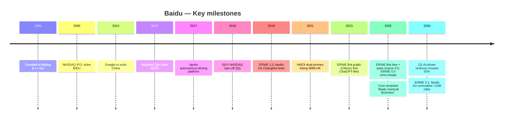

# Company Research: Baidu, Inc. (NASDAQ: BIDU · HKEX: 9888)

As of: 2026-06-18 ｜ Refresh (data current to FY2025 20-F + Q1'26 6-K + decision layer + 9 SVG charts + 3 bespoke charts) ｜ English companion to the primary Simplified-Chinese report

> *Analyst view:* **Rating: Overweight · 12-month price target $150 (~+35% vs $111.24) · Method: sum-of-the-parts (SOTP) / normalized (ex-impairment) P/E ~16× × FY2027E normalized EPS/ADS ~$9.4**
> Market cap ~$37.9B · EV ~$16.1B (mkt cap − ~$21.7B net cash) · 52-week range $83.62–$162.52 · NASDAQ:BIDU (current $111.24, [Yahoo Finance via yfinance, 2026-06-18 close](https://finance.yahoo.com/quote/BIDU/))
>
> **Forward valuation matrix** (FY25A = 20-F disclosed; FY26E/FY27E = *Analyst view:*. **Currency note:** Baidu reports in RMB, market cap/EV are USD — this matrix uses **USD mkt cap ÷ USD revenue** consistently (FY2025 revenue $18.46B = ¥129,079M ÷ 6.8980), **NOT** yfinance's 0.29× P/S, which mismatches USD cap against RMB revenue; corrected throughout this report)
>
> | Multiple | FY2025A | FY2026E | FY2027E |
> |---|---|---|---|
> | P/S (USD basis) | 2.05× | ~2.0× | ~1.9× |
> | EV/Sales (net-cash-adjusted EV ÷ revenue) | 0.87× | ~0.85× | ~0.79× |
> | P/E (GAAP diluted, per ADS) | n/m (FY25 carries ¥16,190M impairment; GAAP EPS/ADS ~$1.7) | ~25× | ~18× |
> | P/E (normalized, ex-impairment) | ~12× (normalized EPS/ADS ~$9.3) | ~13× | ~12× |
> | Net cash / market cap | **57%** (net cash ~$21.7B vs mkt cap ~$37.9B) | | |
>
> **Relative performance (as of 2026-06-18 close $111.24, source: yfinance)**: 1M: BIDU **−19.2%** / SPX +1.8% / Golden Dragon (PGJ) −10.8% (vs SPX **−21.0pp**) · 6M: −7.7% / +10.5% / −19.2% (vs SPX −18.2pp) · YTD: **−26.0%** / +9.1% / −22.2% (vs SPX −35.1pp) · 12M: **+33.0%** / +25.4% / −13.3% (vs SPX +7.6pp). **Read:** BIDU still beats SPX over 12M (the DeepSeek/AI re-rating) but gave it back hard in H1 2026 on negative operating cash flow, ad declines, and a broad China-internet drawdown — the current $111 is below even the most bearish sell-side target (MS $135).
>
> **Thesis pillars** — (1) **AI-driven revenue crossed 50% for the first time; the cloud inflection is materializing**: Q1'26 Baidu Core AI-driven revenue >¥13.6B (+49% YoY), 52% of Baidu General Business; AI Cloud Infrastructure ¥8.8B (+79% YoY), GPU Cloud +184% YoY — hard proof the mix-shift from declining search ads to high-growth AI cloud is accelerating; (2) **valuation embeds a very deep safety margin**: net cash ~$21.7B = 57% of market cap, EV ex-cash only ~$16.1B → FY25 EV/Sales ~0.87×, normalized P/E ~12× — the market still prices BIDU as a stagnant ad utility, assigning near-zero value to Apollo Go and Kunlun silicon; (3) **Apollo Go + Kunlun are two "free" options**: Apollo Go has cumulative rides >22M, partners with Uber/Lyft for overseas, one of only two scaled robotaxi operators globally (the other being Waymo); in-house Kunlun (P800: FP16 345 TFLOPS / 96GB) is reportedly heading to a carve-out IPO that could surface hidden value; (4) **the key falsifier is cash flow and the ad turn**: FY25 operating cash flow turned negative ¥(3.0)B (the AI capex cycle); if the ad decline isn't net-covered by cloud growth and capex keeps consuming cash, the "value-with-options" thesis becomes a value trap.

> **Update — Q1'26 results: cloud strong, ads weak, AI-revenue crosses 50% (2026-05-18):** Q1'26 total revenue **¥32.1B ($4.65B)**, −2% QoQ; Baidu General Business ¥26.0B (+2% YoY, **back to positive growth**), iQIYI ¥6.2B (−8% QoQ). **Baidu Core AI-driven revenue >¥13.6B (+49% YoY), 52% of Baidu General Business for the first time**; AI Cloud Infrastructure ¥8.8B (+79% YoY, vs ¥5.8B prior quarter), GPU Cloud +184% YoY. Online marketing ¥12.6B (−22% YoY), now 48% of Baidu General Business. GAAP operating income ¥3.2B ($463M, 10% margin); Non-GAAP operating income ¥3.8B ($552M, 12%); net income attributable to Baidu ¥3.4B ($499M), Non-GAAP ¥4.3B ($628M); GAAP diluted EPS/ADS ¥8.76 ($1.27), Non-GAAP ¥12.06 ($1.75). **Operating cash flow ¥2.7B turned positive** (company basis), but core capex surged to ¥5.8B (from ¥2.0B) to fund GPU Cloud. Q1'26 buyback $172M. ERNIE 5.1 launched May 2026 (ranked #1 among Chinese models on LMArena's text leaderboard). Source: [Baidu Q1'26 press release (6-K Exhibit 99.1), 2026-05-18](https://www.sec.gov/Archives/edgar/data/1329099/000119312526228123/d156481dex991.htm).

---

## TABLE OF CONTENTS

1. Company Overview
1A. Valuation & Price Target
1B. GF Score Fundamental Scorecard
2. Company History
3. Management Team
4. Products & Services
5. Customers & Go-to-Market
6. Industry Overview
7. Competitive Landscape
8. Market Opportunity (TAM)
9. Risk Assessment
9.5 Key Debates & Catalysts
10. Investor-Lens Scorecard

---

## 1. Company Overview

*Analyst view:* This report refreshes coverage with an **Overweight** rating and a 12-month price target of **$150** (+35%). Why now: Baidu is in a market-underappreciated "business-model switch" — from a "search-ads + long-video" China-internet utility to a full-stack AI company (AI cloud + autonomous driving + in-house silicon). Q1'26 is the first quantitative proof of that switch: AI-driven revenue crossed 50% of core (52%), AI Cloud Infrastructure +79% YoY, GPU Cloud +184% YoY. Meanwhile the market still prices BIDU on the old narrative — at $111 net cash is 57% of market cap and EV ex-cash is only ~$16.1B, i.e. Apollo Go and Kunlun are valued at zero and AI cloud is arguably given a negative number. Risk/reward skews positive: the downside is anchored by $21.7B net cash and a normalized ~12× P/E; the upside is cloud acceleration + a Kunlun IPO + robotaxi value-surfacing. The key falsifier is operating cash flow (already negative in FY25) and whether the ad decline is net-covered by cloud growth.

**What the company does.** Baidu, Inc. is China's largest Chinese-language internet search company and one of the four members of Beijing's de-facto "AI national team" (alongside Alibaba, Tencent, ByteDance). It runs two reportable operating segments: (i) **Baidu General Business** — renamed from "Baidu Core" in Q4 2025, spanning the "search + feed" ad engine, AI cloud (Qianfan MaaS + IaaS/PaaS + Kunlun GPU cloud), and the "intelligent driving & other growth" line (Apollo Go robotaxi, DuerOS); and (ii) **iQIYI** (NASDAQ: IQ), the consolidated long-video streaming subsidiary ([Baidu FY2025 20-F, Note Segment Reporting — 2 operating segments](https://www.sec.gov/Archives/edgar/data/1329099/000119312526109289/d38065d20f.htm)). FY2025 consolidated revenue was **¥129,079M ($18,458M)**, −3% YoY; by segment, Baidu General Business ¥102,485M and iQIYI ¥27,290M ([Baidu FY2025 20-F, Segment Reporting — Operating Segment Results](https://www.sec.gov/Archives/edgar/data/1329099/000119312526109289/d38065d20f.htm)).

**How it makes money (and what's changing).** Historically Baidu monetized via pay-for-performance (P4P) search ads + Baidu App feed ads; Baidu App MAU was 679M in December 2025 ([Baidu FY2025 20-F, Item 4 — Baidu App MAU](https://www.sec.gov/Archives/edgar/data/1329099/000119312526109289/d38065d20f.htm)). By revenue line, FY2025 **online marketing services revenue was ¥67,837M** ($9,701M, FY24 ¥78,563M, FY23 ¥81,203M — a three-year structural decline), while **"Others" (incl. AI cloud + iQIYI membership) was ¥61,242M** ($8,757M, FY24 ¥54,562M, FY23 ¥53,395M — rising) ([Baidu FY2025 20-F, Revenue Disaggregation](https://www.sec.gov/Archives/edgar/data/1329099/000119312526109289/d38065d20f.htm)). This migration reached an inflection in Q1'26: online marketing ¥12.6B (−22% YoY, now 48% of Baidu General Business), "Others" ¥13.4B (+42% YoY, now 52%), with AI Cloud Infrastructure ¥8.8B (+79% YoY) ([Baidu Q1'26 press release, 2026-05-18](https://www.sec.gov/Archives/edgar/data/1329099/000119312526228123/d156481dex991.htm)).

**Scale and profitability (mind the impairment distortion).** FY2025 revenue ¥129,079M, cost of revenue ¥72,436M, SG&A ¥25,843M, R&D ¥20,433M, plus a **¥16,190M ($2,315M) impairment of long-lived assets** — taking total costs to ¥134,902M and a **GAAP operating loss of ¥(5,823)M** ($(833)M). Yet net income attributable to Baidu was still positive **¥5,589M** ($799M), supported by ¥12,539M of total other income, net (interest income ¥8,602M + equity-method earnings ¥3,196M, etc.) ([Baidu FY2025 20-F, Consolidated Statements of Comprehensive Income](https://www.sec.gov/Archives/edgar/data/1329099/000119312526109289/d38065d20f.htm)). **To read Baidu's earnings power you must strip this ¥16,190M non-cash impairment** — normalized FY25 net income attributable is ~¥21,779M (~$3,157M), a normalized P/E of ~12× at the current price. GAAP diluted EPS ¥1.47/share (each ADS = 8 shares = ¥11.76 ≈ $1.7). Employees: ~33,500 full-time at 2025-12-31 (FY24 35,900, FY23 39,800, ~16% cut over two years), incl. ~18,600 R&D ([Baidu FY2025 20-F, Item 6 — Employees](https://www.sec.gov/Archives/edgar/data/1329099/000119312526109289/d38065d20f.htm)). HQ: Beijing.

**Income-statement Sankey (FY2025).** The chart below renders the FY2025 income statement as a flow: revenue ¥129,079M splits by line into online marketing 52.6% + Others/AI-cloud+iQIYI 47.4%; after COGS ¥72,436M (content + traffic-acquisition + AI-cloud compute) it leaves gross profit ¥56,643M (43.9% margin), then three opex blocks — R&D ¥20,433M, SG&A ¥25,843M, and the **¥16,190M impairment (Other OpEx)** — produce an **operating loss of ¥(5,823)M**; but ¥12,539M of below-the-line other income (interest + equity method) flows in, and after tax net income attributable stays positive at ¥5,589M. The takeaway: **Baidu's FY2025 GAAP operating loss is entirely the one-off impairment; ex-impairment operating profit is positive ~¥10,367M (~8% margin), and net income is supported by the ¥12.5B interest+equity engine of its $21.7B net cash.** Figures verbatim from the [20-F FY2025 income statement + segment/revenue disclosures](https://www.sec.gov/Archives/edgar/data/1329099/000119312526109289/d38065d20f.htm).

Source: [Baidu FY2025 20-F, Consolidated Statements of Comprehensive Income + Segment Note (d38065d20f.htm)](https://www.sec.gov/Archives/edgar/data/1329099/000119312526109289/d38065d20f.htm)

**Q1'26 AI-driven revenue mix (bespoke chart).** The chart below breaks down Q1'26 Baidu Core AI-driven revenue of ¥13.6B (+49% YoY, 52% of Baidu General Business for the first time): AI Cloud Infrastructure ¥8.8B (+79% YoY, incl. GPU Cloud +184% YoY) is ~65%, with the remaining ~¥4.8B AI Applications + AI-native Marketing ([Baidu Q1'26 press release, 2026-05-18](https://www.sec.gov/Archives/edgar/data/1329099/000119312526228123/d156481dex991.htm)).

Source: [Baidu Q1'26 press release (6-K Exhibit 99.1), 2026-05-18](https://www.sec.gov/Archives/edgar/data/1329099/000119312526228123/d156481dex991.htm)

**Historical revenue by line (development-over-time).** Online marketing shrank from ¥81,203M (FY23) to ¥67,837M (FY25) while "Others" (AI cloud + iQIYI membership) rose from ¥53,395M to ¥61,242M — the two-year set-up for Q1'26's >50% AI-revenue crossing.

Source: [Baidu FY2023–FY2025 20-F filings, Revenue Disaggregation (d38065d20f.htm)](https://www.sec.gov/Archives/edgar/data/1329099/000119312526109289/d38065d20f.htm)

**Revenue by operating segment (FY2025).** Baidu General Business ¥102,485M (79%) > iQIYI ¥27,290M (21%) (segment basis includes ~¥696M inter-segment elimination, so the sum slightly exceeds consolidated ¥129,079M). Baidu General Business carries the entire AI story; iQIYI is the low-growth, low-multiple long-video drag (FY25 −7% YoY) ([Baidu FY2025 20-F, Segment Reporting](https://www.sec.gov/Archives/edgar/data/1329099/000119312526109289/d38065d20f.htm)).

Source: [Baidu FY2025 20-F, Segment Reporting (operating segments; d38065d20f.htm)](https://www.sec.gov/Archives/edgar/data/1329099/000119312526109289/d38065d20f.htm)

**Revenue by line (FY2025; Baidu does not disclose a geographic split).** As a predominantly mainland-China company, the 20-F provides no granular geographic revenue disclosure (overseas marketing and Apollo Go abroad are nascent), so in place of a geography donut we use Baidu's disclosed revenue-by-line split: online marketing ¥67,837M (52.6%) vs Others/AI-cloud+iQIYI ¥61,242M (47.4%) — also the single clearest picture of Baidu's monetization migration ([Baidu FY2025 20-F, Revenue Disaggregation](https://www.sec.gov/Archives/edgar/data/1329099/000119312526109289/d38065d20f.htm)).

Source: [Baidu FY2025 20-F, Revenue Disaggregation (online marketing vs others; d38065d20f.htm)](https://www.sec.gov/Archives/edgar/data/1329099/000119312526109289/d38065d20f.htm)

**Capital structure (net cash is the foundation of the thesis).** At 2025-12-31: cash & equivalents ¥24,606M + restricted cash ¥225M + short-term investments ¥90,661M + long-term time deposits & HTM investments ¥123,862M = cash-like assets of ~**¥239,354M (~$34.7B)**; against total debt (ST loans ¥7,626M + current LT loans ¥14,765M + notes payable ¥51,021M + convertibles ¥6,712M + current convertibles ¥1,459M + current notes ¥4,560M + LT loans ¥3,369M) of ~**¥89,512M (~$13.0B)** — **net cash ~¥149,842M (~$21.7B), equal to 57% of the current market cap (~$37.9B)** ([Baidu FY2025 20-F, Consolidated Balance Sheets](https://www.sec.gov/Archives/edgar/data/1329099/000119312526109289/d38065d20f.htm)). EV ex-cash is therefore only ~$16.1B → FY25 EV/Sales ~0.87×, among the cheapest of any major AI mega-cap.

Source: [Baidu FY2025 20-F, Consolidated Balance Sheets (Dec 31, 2025; d38065d20f.htm)](https://www.sec.gov/Archives/edgar/data/1329099/000119312526109289/d38065d20f.htm)

**Cash-flow Sankey (FY2025) — the red flag.** FY2025 **operating cash flow turned negative ¥(3,013)M** ($(431)M), a sharp deterioration from FY2024's +¥21,234M — driven by working-capital + prepaid-compute + content spend in the AI capex cycle (net income was still positive ¥5,457M but working capital and non-cash items reversed); CFI ¥(25,136)M (incl. capex ¥12,073M + heavy deposit/securities allocation); CFF +¥17,142M. **Free cash flow was deeply negative in FY2025 — this is the report's single most important falsifier to monitor**: Baidu is funding its AI capex cycle from its huge cash pile, and if cloud revenue can't pull CFO back to positive within 12–18 months, the "net-cash moat" erodes. Q1'26 CFO turned positive ¥2.7B (company basis), but core capex jumped to ¥5.8B (from ¥2.0B) ([Baidu FY2025 20-F, Consolidated Statements of Cash Flows](https://www.sec.gov/Archives/edgar/data/1329099/000119312526109289/d38065d20f.htm); [Baidu Q1'26 press release, 2026-05-18](https://www.sec.gov/Archives/edgar/data/1329099/000119312526228123/d156481dex991.htm)).

Source: [Baidu FY2025 20-F, Consolidated Statements of Cash Flows (d38065d20f.htm)](https://www.sec.gov/Archives/edgar/data/1329099/000119312526109289/d38065d20f.htm)

Baidu is incorporated in the Cayman Islands and operates its mainland-China businesses through a VIE structure (Baidu Online, Beijing Perusal, Beijing iQIYI), which contributed 50% of external revenue in 2025 ([Baidu FY2025 20-F, Item 3 — VIE Contribution](https://www.sec.gov/Archives/edgar/data/1329099/000119312526109289/d38065d20f.htm)). NASDAQ ADS (BIDU) is the primary listing; HKEX 9888.HK is a dual-primary listing; each ADS represents 8 Class A ordinary shares.

## 1A. Valuation & Price Target

This section is entirely *Analyst view:* (forecasts, target prices, and scenario targets are the analyst's own forward judgment, with no filing citation; the external basis for each driver is cited inline).

### (a) Three-year forward forecast (revenue-by-line + normalized earnings)

*Analyst view:* Forecast basis: online marketing structural decline (−high-single to −low-double digits) offset by high-growth AI cloud (+40–80%), pulling total Baidu General Business back to low-single-digit positive growth; normalized earnings anchor on "ex-FY25-impairment." AI cloud per sell-side: Citi projects AI-driven revenue FY26E ¥57.6B (+44.7%) → FY27E ¥71.6B (+24.3%) → FY28E ¥85.1B (+18.9%), incl. AI Cloud Infrastructure FY26E ¥35.7B (+80%) (*Analyst view:* [Citi — Unpacking Baidu AI Cloud Potential Beyond Kunlunxin, 2026-06-11](http://xs-macbook-air.local:5001/zsxq/pdf/214528184155881/CITI-Baidu.com%20%EF%BC%88BIDU.US%EF%BC%89%20Unpacking%20Baidu%20AI%20Cloud%20Potential%20Beyond%20KunlunXin-260611.pdf)); historical financials from the [20-F FY2025](https://www.sec.gov/Archives/edgar/data/1329099/000119312526109289/d38065d20f.htm).

| Metric (*Analyst view:* E columns) | FY2023A | FY2024A | FY2025A | FY2026E | FY2027E | 25–27E CAGR |
|---|---|---|---|---|---|---|
| Revenue (¥M) | 134,598 | 133,125 | 129,079 | ~133,000 | ~141,000 | +4.5% |
| — Online marketing (¥M) | 81,203 | 78,563 | 67,837 | ~60,000 | ~56,000 | −9% |
| — Others/AI cloud+iQIYI (¥M) | 53,395 | 54,562 | 61,242 | ~73,000 | ~85,000 | +18% |
| GAAP operating income (¥M) | 21,856 | 21,270 | **(5,823)\*** | ~12,000 | ~16,000 | |
| Normalized op income (ex-impairment, ¥M) | 21,856 | 21,270 | ~10,367 | ~12,000 | ~16,000 | +24% |
| Net income to Baidu (GAAP, ¥M) | 20,315 | 23,760 | 5,589 | ~16,000 | ~21,000 | |
| Normalized net income (ex-impairment, ¥M) | 20,315 | 23,760 | ~21,779 | ~22,000 | ~24,000 | +5% |
| Normalized EPS/ADS ($) | ~6.9 | ~7.9 | ~9.3 | ~9.0 | ~9.4 | |
| Operating cash flow CFO (¥M) | 36,615 | 21,234 | **(3,013)** | ~10,000 | ~25,000 | |

*FY2025 GAAP operating loss ¥(5,823)M is entirely the ¥16,190M one-off long-lived-asset impairment; normalized operating profit ex-impairment is ~¥10,367M. Normalized net income approximated as "GAAP attributable ¥5,589M + impairment ¥16,190M" (impairment not tax-deductible; added back gross).

Inputs: FY2025 revenue ¥129,079M, impairment ¥16,190M, operating loss ¥(5,823)M, net income ¥5,589M, CFO ¥(3,013)M, capex ¥12,073M from the [20-F FY2025 income statement + cash flow statement](https://www.sec.gov/Archives/edgar/data/1329099/000119312526109289/d38065d20f.htm); Q1'26 AI Cloud Infrastructure ¥8.8B (+79%), GPU Cloud +184%, AI-driven revenue ¥13.6B (+49%) from the [Q1'26 press release](https://www.sec.gov/Archives/edgar/data/1329099/000119312526228123/d156481dex991.htm).

### (b) Price-target derivation (show the arithmetic)

*Analyst view:* Method: **SOTP / normalized P/E** (GAAP EPS is distorted by impairment and FX, so the market and sell-side use normalized/Non-GAAP and SOTP; net-cash-adjusted EV/Sales is the cross-check):

- **Simplified SOTP (per ADS, USD):** ① net cash ~$21.7B ÷ 340.25M ADS = **~$64/ADS** (near-riskless cash backing); ② search+ads core — normalized operating profit ~¥10B ($1.45B) at 8× ≈ $11.6B = **~$34/ADS**; ③ AI cloud — FY26E revenue ~¥36B ($5.2B) at 1.5× P/S ≈ $7.8B = **~$23/ADS**; ④ Apollo Go + Kunlun + iQIYI stake — conservatively ~$10B = **~$29/ADS**. Total SOTP ≈ **$150/ADS**.
- **Normalized-P/E cross-check:** FY2027E normalized EPS/ADS ~$9.4 × 16× target (between China-internet 11–13× and global AI 25×, crediting cloud acceleration) = **~$150**.
- Comparison anchors: Citi Buy $188, Nomura Buy $186, UBS Buy $180 (all on AI-cloud + Kunlun-IPO re-rating); Morgan Stanley Equal-weight $135 (cautious on slow AI-app monetization) — this report's $150 sits at the median-to-upper between the bull camp and the most cautious sell-side, crediting the real cloud inflection while staying cautious on the cash-flow falsifier.
- PT = **$150/ADS** (+35% vs $111.24).

### (c) Bull / Base / Bear scenarios

| Scenario (*Analyst view:*) | Key assumptions | Target | vs $111.24 |
|---|---|---|---|
| Bull | AI cloud sustains +60–80%, Kunlun IPO surfaces value, Apollo Go segment disclosure/carve-out, CFO recovers; normalized EPS/ADS $10 × 20× + cash | **$200** | **+80%** |
| Base | Cloud accelerates but ads keep dragging, CFO slowly turns positive in FY26; SOTP / normalized 16× × FY27E EPS $9.4 | **$150** | **+35%** |
| Bear | Ad decline not net-covered by cloud, capex keeps consuming cash, consumer-AI mindshare lost further to ByteDance/DeepSeek; normalized EPS compressed to $7 × 11× + cash discount | **$90** | **−19%** |

*Analyst view:* Risk/reward skews strongly positive — upside $200 (+80%) vs downside $90 (−19%), ~**4.2:1** — because $21.7B net cash (57% of cap) anchors the floor: even if the cloud story fails, pure cash + normalized earnings make it hard for BIDU to break below ~$90. This is a "cash-cushioned downside, optionality upside" asymmetry, unlike a high-leverage story stock. This report's $150 is ~17–20% below the bull sell-side ($180–188), the difference being that this report treats FY25 negative operating cash flow as the primary falsifier.

### (d) Consensus comparison (Street vs this report)

| Metric (FY2026E) | Street range | This report (*Analyst view:*) |
|---|---|---|
| AI Cloud Infrastructure revenue | ¥35–36B (Citi ¥35.7B, +80%) | ~¥36B (in line with Citi) |
| Total AI-driven revenue | ¥55–58B (Citi ¥57.6B, +44.7%) | ~¥57B |
| Total revenue | ~¥130–135B (cloud offsets ads) | ~¥133B |
| Rating/PT | Buy $180–188 (Citi/Nomura/UBS); EW $135 (MS) | Overweight $150 |

*Analyst view:* Sell-side AI-cloud forecasts converge tightly (Citi/Nomura/UBS all place AI Cloud Infrastructure FY26E at ¥35–36B, +80%). The disagreement is not the cloud itself but "whether cloud growth net-covers the ad decline + capex cash burn and improves overall earnings/cash flow" — exactly why MS is EW while Citi/Nomura/UBS are Buy (see Section 9.5).

### Sell-side view evolution

Mechanical pre-check: `db/stock_price_target.db` (read-only) holds 7 BIDU target-price records (2026-03-12 to 2026-06-11), 5 positive (Citi/Nomura/UBS Buy, JPM Overweight) and 2 Morgan Stanley Equal-weight, PT range **$135–$188** (~39% spread, median ~$180) — **convergent bullishness on the cloud but split on the overall rating** (MS is the lone neutral). **Per-institution view timeline** (each PT paired with that note's date-price and implied upside; date-prices from stock_price_target.db / yfinance):

| Institution | Date | Rating / PT | Date-price (implied upside) | One-line thesis |
|---|---|---|---|---|
| Morgan Stanley | 2026-03-12 | Equal-weight / $126 | $123.16 (+2%) | Acknowledges full-stack AI (in-house chips) but slow AI-app rollout, search/video competition (*Analyst view:* [MS — China's AI Path: Owning the Full AI Stack, 2026-03-12](http://xs-macbook-air.local:5001/zsxq/pdf/812228411484442/Morgan%20Stanley-China%27s%20AI%20Path%EF%BC%9A%20Owning%20the%20Full%20AI%20Stack%20via%20Inhouse%20Chips-260312.pdf)) |
| J.P. Morgan | 2026-04-23 | Overweight / (no single PT) | $121.53 | Post-4Q25 sector re-rate: Baidu funds AI investment from internal cash flow (*Analyst view:* [JPM — China Internet Post 4Q25, 2026-04-23](http://xs-macbook-air.local:5001/zsxq/pdf/184485451848882/J.P.%20Morgan-China%20Internet%20Post%204Q25%EF%BC%9A%20Re~evaluating%20the%20Sector%EF%BC%9B%20Tencent%20Our%20Top%20Pick-260423.pdf)) |
| Morgan Stanley | 2026-05-15 | Equal-weight / **$135** | $135.33 (−0%) | Baidu Create: scaled-agent strategy, DuMate launch; maintains EW, AI-app monetization the key variable (*Analyst view:* [MS — 2026 'Baidu Create' Event Takeaways, 2026-05-15](http://xs-macbook-air.local:5001/zsxq/pdf/184124848211182/Morgan%20Stanley-Baidu%20Inc%EF%BC%88BIDU.US%EF%BC%892026%20%27Baidu%20Create%27%20Event%20Takeaways-260515.pdf)) |
| Citi | 2026-05-18 | **Buy / $188** | $137.71 (+36%) | Q1'26 AI Cloud Infra +79%, GPU Cloud +184% strong beat; AI-driven revenue crosses 50% (*Analyst view:* [Citi — Strong AI Cloud Infra Revs Driven by MaaS and GPU, 2026-05-18](http://xs-macbook-air.local:5001/zsxq/pdf/415242554258288/CITI-Baidu.com%20%EF%BC%88BIDU.US%EF%BC%89%20Strong%20AI%20Cloud%20Infra%20Revs%20Driven%20by%20MaaS%20and%20GPU%20Revs-260518.pdf)) |
| Nomura | 2026-05-19 | **Buy / $186** | $137.68 (+35%) | "AI Cloud offsets ad drag"; Kunlun IPO + HK dual-primary listing as catalysts (*Analyst view:* [Nomura — AI Cloud offsets ad drag, 2026-05-19](http://xs-macbook-air.local:5001/zsxq/pdf/212454252252481/Nomura-Baidu%EF%BC%88BIDU.OQ%EF%BC%89AI%20Cloud%20offsets%20ad%20drag-260519.pdf)) |
| UBS | 2026-05-28 | **Buy / $180** | $132.05 (+36%) | AIC 2026: full-stack AI strengthening, Kunlun chip TAM, cloud acceleration (*Analyst view:* [UBS — AIC 2026: Strengthening full-stack AI capability, 2026-05-28](http://xs-macbook-air.local:5001/zsxq/pdf/212485545245111/UBS-Baidu%EF%BC%8C%20Inc.%EF%BC%88BIDU.US%EF%BC%89AIC%202026%EF%BC%9A%20Strengthening%20full~stack%20AI%20capability-260528.pdf)) |

**Institutional split and this report's stance:** 5 positive (Citi/Nomura/UBS Buy $180–188, JPM OW) vs MS the lone neutral (EW $135) — the core disagreement is not cloud growth (consensus strong) but whether cloud can net-improve overall earnings/cash flow and whether AI apps monetize. This report's Overweight/$150 takes the median-to-upper: crediting the cloud inflection (with the bull camp) but more conservative than $180–188 because it treats negative FY25 operating cash flow and the un-net-covered ad decline as downside variables (see bear scenario and Section 9). **Key reality: the current $111 is already below the most bearish MS $135 target** — even on the most cautious sell-side, BIDU is undervalued.

Source: forward P/E + TTM P/S from yfinance, 2026-06-18; BIDU trailing P/E n/m (GAAP NI distorted by the FY25 impairment).

### (e) Swing variables

*Analyst view:* The rating most depends on three assumptions; stress-test these first: (1) **the operating-cash-flow turn** — FY25 CFO at ¥(3.0)B is the most important red flag; cloud revenue must pull CFO back positive within 12–18 months or capex erodes the net-cash moat; (2) **ad decline vs cloud growth net-coverage** — online marketing Q1'26 −22% YoY, AI cloud +79% — as long as cloud's absolute increment exceeds ads' absolute decrement (achieved in Q1'26, Baidu General Business +2% YoY), the thesis holds; (3) **Kunlun IPO and Apollo Go value-surfacing** — both "free options" depend heavily on capital-markets action (Kunlun carve-out, robotaxi segment disclosure/spin), which CFO Haijian He's Kingsoft Cloud IPO background makes credible but uncertain in timing.

## 1B. GF Score (GuruFocus-style) Fundamental Scorecard

*Analyst view:* **GF Score (GuruFocus-style composite): 53/100 — 51–70 band (below-average fundamental potential).** This score captures Baidu's profile: a Chinese full-stack AI company with **an extremely strong balance sheet, very cheap valuation, but near-term profitability crushed by the impairment, terrible momentum, and growth in transition** — five highly divergent axes (Financial Strength 7 / GF Value 8 vs Profitability 4 / Momentum 3). **This scorecard is the product of the analyst's own rubric (distinct from GuruFocus's proprietary algorithm and not a GuruFocus product); the five sub-scores and composite are all *Analyst view:* with no filing citation; each axis's underlying metrics are cited inline below.** Note: the GF Value axis direction is "higher = cheaper" — Baidu's 8/10 means "significantly undervalued."

> Further from center = higher score; larger pentagon = higher composite GF Score (same reading as the GuruFocus widget).

| Axis (gloss) | Score (0–10) | |
|---|---|---|
| Financial Strength | 7 | `███████░░░` |
| Profitability | 4 | `████░░░░░░` |
| Growth | 5 | `█████░░░░░` |
| GF Value (higher = cheaper) | 8 | `████████░░` |
| Momentum | 3 | `███░░░░░░░` |
| **GF Score (composite, *Analyst view:*)** | **53 / 100** | **51–70 below-average potential band** |

*Composite weights (*Analyst view:* transparent reproduction, not GuruFocus's proprietary weights): Financial Strength 20% · Profitability 25% · Growth 25% · GF Value 15% · Momentum 15%.*

**Financial Strength: 7/10.** Extremely robust balance sheet. At 2025-12-31, cash-like assets ~¥239,354M (~$34.7B) vs total debt ~¥89,512M (~$13.0B) — **net cash ~$21.7B = 57% of market cap**; equity attributable ¥266,330M is 59% of total assets ¥449,157M ([Baidu FY2025 20-F, Balance Sheets](https://www.sec.gov/Archives/edgar/data/1329099/000119312526109289/d38065d20f.htm)). Interest coverage ample — FY2025 interest income ¥8,602M far exceeds interest expense ¥2,784M (net interest positive). The only reason it's not 8–9 is **FY2025 operating cash flow turned negative ¥(3,013)M** — a financial-strength crack to watch.

**Profitability: 4/10.** Near-term GAAP profitability crushed by the impairment. FY2025 GAAP operating loss ¥(5,823)M (impairment), net margin attributable just 4.3%, ROE ~2.1% (net income ¥5,589M ÷ avg equity ~¥265B, see DuPont below) ([Baidu FY2025 20-F, income statement + balance sheet](https://www.sec.gov/Archives/edgar/data/1329099/000119312526109289/d38065d20f.htm)). Normalized (ex-impairment): ~8% operating margin, ~¥21,779M net income; Q1'26 Non-GAAP operating margin 12%, Non-GAAP net income ¥4.3B ([Baidu Q1'26 press release](https://www.sec.gov/Archives/edgar/data/1329099/000119312526228123/d156481dex991.htm)). Not higher because GAAP is in loss, CFO turned negative, and AI cloud is still a low-margin ramp.

**Growth: 5/10.** In a "legacy down + new up" transition with weak net growth but an emerging inflection: total revenue FY25 −3% YoY, but AI-driven revenue Q1'26 +49% YoY, AI Cloud Infrastructure +79%, GPU Cloud +184%, Baidu General Business back to +2% YoY in Q1'26 ([Baidu Q1'26 press release](https://www.sec.gov/Archives/edgar/data/1329099/000119312526228123/d156481dex991.htm)). Online marketing −22% YoY is the biggest drag. Not higher because total revenue grows only low-single-digit and consumer-AI mindshare trails ByteDance/DeepSeek.

**GF Value (higher = cheaper): 8/10.** Significantly undervalued. Current fwd P/E ~12×, normalized P/E ~12×, net-cash-adjusted EV/Sales ~0.87×, net cash 57% of market cap ([Yahoo Finance via yfinance, 2026-06-18](https://finance.yahoo.com/quote/BIDU/)); sell-side fair-value median ~$180 (Citi/Nomura/UBS) vs $111. SOTP ~$150 vs $111 = ~+35% upside with downside anchored by net cash. Not 9–10 because GAAP earnings are impaired and CFO turned negative — the "cheap" carries a real earnings-quality discount.

**Momentum: 3/10.** Terrible near-term momentum. 1M −19.2% (vs SPX −21.0pp), YTD −26.0% (vs SPX −35.1pp), 6M −7.7%; the only bright spot is 12M +33.0% (vs SPX +7.6pp, the residual DeepSeek/AI re-rating) (source: yfinance, 2026-06-18, consistent with the header relative-performance line). The current $111 is near the lower end of the 52-week range ($83.62–$162.52). Low momentum is exactly the contrarian's entry signal but also a genuine risk flag.

**Composite arithmetic:** (FS 7×20 + Prof 4×25 + Growth 5×25 + Value 8×15 + Mom 3×15) / 100 = (140 + 100 + 125 + 120 + 45) / 100 = 530 / 100 → **53/100**. In the GuruFocus framework, 51–70 is "below-average future-performance potential" ([GuruFocus GF Score page](https://www.gurufocus.com/term/gf-score); note the page is Cloudflare-protected, returning 403 to curl/urllib as an anti-bot block, not a dead link; this report does not cite a GuruFocus official score, only its methodology framework).

**Most movable axes / failure mode:** Profitability and Momentum are the upside leverage — if FY26 CFO turns positive + no impairment recurrence, Profitability can move 4→6 and the composite up ~5 points; a cloud-driven share rebound would flip Momentum positive. Conversely, persistent negative CFO + ads not net-covered by cloud pressures both Growth and Profitability. The composite is consistent with this report's Overweight rating (built on the "cheap + strong-assets" logic of GF Value 8 and Financial Strength 7) — a classic "deep value + optionality" rather than "high-quality growth" scoring shape.

**ROE decomposition (DuPont, FY2025).** Baidu FY2025 ROE ~**2.1%** (net income ¥5,589M ÷ avg equity ~¥265B), from three factors: net margin 4.3% (depressed by impairment) × asset turnover 0.29 (low turnover of a financialized balance sheet, with large cash/investments) × equity multiplier 1.65 (low leverage). The chart visualizes the three factors — **ROE is low chiefly because the ¥16,190M one-off impairment crushed net margin** (ex-impairment normalized net margin ~17%, normalized ROE ~8%), plus the large cash/long-term-investment base drags asset turnover. The "Interest Burden" term is negative because operating income is negative while pretax is positive — Baidu in FY2025 had an operating loss yet stayed profitable, entirely on ¥12.5B of interest+equity-method income. Inputs from the [20-F FY2025 income statement and balance sheet](https://www.sec.gov/Archives/edgar/data/1329099/000119312526109289/d38065d20f.htm).

Source: [Baidu FY2025 20-F, Statements of Comprehensive Income + Balance Sheets (d38065d20f.htm)](https://www.sec.gov/Archives/edgar/data/1329099/000119312526109289/d38065d20f.htm)

## 2. Company History

Baidu was founded in **January 2000** in Beijing by **Robin Yanhong Li** and **Eric Yong Xu**. Li, then 31, had worked at Silicon Valley's Infoseek and returned to China with RankDex (1996), one of the earliest hyperlink-based page-ranking systems (roughly contemporaneous with Google's PageRank). The name "Baidu" is from a Song-dynasty poem by Xin Qiji ([Baidu "About" page](https://home.baidu.com/about/index.html)). Xu left in 2004; Li has been chairman since founding and CEO since February 2004 ([Baidu FY2025 20-F, Item 6 — Directors and Management](https://www.sec.gov/Archives/edgar/data/1329099/000119312526109289/d38065d20f.htm)).

The 2000s story is three things: scaling P4P search ads (monetized since 2001); pushing Google out of China (Baidu held >75% search share when Google.cn exited in March 2010); and the August 2005 NASDAQ IPO — the most successful U.S. China-stock IPO since Google, up 354% on day one. The 2010s diversified: 2012 acquisition of Qiyi.com (later iQIYI); a "search + feed" mobile strategy; a first AI research lab in Sunnyvale (2014); hiring ex-Microsoft EVP Qi Lu as COO (2017). iQIYI spun off onto NASDAQ in March 2018 (IQ) with Baidu retaining majority control.

Two strategic pivots shaped today's Baidu. First, the **Apollo open autonomous-driving platform** (launched April 2017, "the Android of autonomous driving") — both licensed to OEMs and self-operated as Apollo Go robotaxi. Public road testing began in Changsha in 2019; paid robotaxi rides began in Beijing in November 2021; first fully-driverless commercial licenses (Chongqing, Wuhan) in 2022 ([Baidu FY2025 20-F, Item 4 — Apollo Go History](https://www.sec.gov/Archives/edgar/data/1329099/000119312526109289/d38065d20f.htm)). Second, the **ERNIE foundation-model series**: from ERNIE 1.0 (2019) to **ERNIE Bot** — China's first public-facing ChatGPT-style chatbot — opening to public testing on March 16, 2023, ~5 weeks ahead of the China #2 ([Reuters, 2023-08-31](https://www.reuters.com/technology/chinas-baidu-launches-erniebot-public-after-beijings-approval-2023-08-31/)). Fast iteration followed: ERNIE 3.5/4.0 (2023), 4.0 Turbo (2024-06), ERNIE 4.5 + reasoning model X1 (2025-03), 4.5/X1 Turbo (2025-04), **ERNIE 5.0 omni-modal** (2025-11), and **ERNIE 5.1** (2026-05, #1 among Chinese models on LMArena's text leaderboard) ([Baidu Q1'26 press release — ERNIE 5.1, 2026-05-18](https://www.sec.gov/Archives/edgar/data/1329099/000119312526228123/d156481dex991.htm)).

Notable M&A and governance: 2014 $1.9B acquisition of 91 Wireless; 2017 sale of Baidu Waimai to Ele.me; 2020 independent financing of the Smart Living Group (DuerOS); August 2020 $3.6B acquisition of YY Live from JOYY, plus a 2024 control acquisition of JOYY's domestic livestreaming ([Baidu FY2025 20-F, Item 4 — Acquisitions](https://www.sec.gov/Archives/edgar/data/1329099/000119312526109289/d38065d20f.htm)). In March 2021 Baidu completed a **HKEX dual-primary listing (9888.HK)**, raising ~$3.1B to hedge the then-rising ADR delisting risk ([HKEX listing prospectus, 2021-03](https://www1.hkexnews.hk/listedco/listconews/sehk/2021/0309/2021030901046.pdf)).

The last three years are about AI transformation, explicitly accepting short-term search-revenue pain to rebuild the experience: 2024 placed ERNIE generative answers above the ten blue links; April 2025 made ERNIE Bot **fully free** for all users (driven by collapsing inference costs); June 2025 **open-sourced the ERNIE 4.5 series** (10 variants); Q4 2025 renamed the segment "Baidu Core" → "Baidu General Business." Apollo Go expanded from 8 cities in early 2025 to 26 cities globally by February 2026, including Dubai, Abu Dhabi, Hong Kong, Switzerland, the UK, and Korea ([Baidu FY2025 20-F, Item 4 — Apollo Go Expansion](https://www.sec.gov/Archives/edgar/data/1329099/000119312526109289/d38065d20f.htm)).

Sources: [Baidu FY2025 20-F, Item 4 Business](https://www.sec.gov/Archives/edgar/data/1329099/000119312526109289/d38065d20f.htm); [Baidu Q1'26 press release, 2026-05-18](https://www.sec.gov/Archives/edgar/data/1329099/000119312526228123/d156481dex991.htm).

## 3. Management Team

### Robin Yanhong Li — Co-founder, Chairman & CEO

Li, 58, has led Baidu continuously since founding it in 2000 — chairman from day one, CEO since February 2004 ([Baidu FY2025 20-F, Item 6 — Robin Li](https://www.sec.gov/Archives/edgar/data/1329099/000119312526109289/d38065d20f.htm)). Born 1968 in Yangquan, Shanxi; BS in information management from Peking University (1991); MS in computer science from SUNY Buffalo (1994). Before Baidu he was a senior consultant at Dow Jones's IDD Information Services, developing **RankDex** in 1996 (predating Google's PageRank patent), and was a senior engineer at Infoseek 1997–1999 ([Baidu Robin Li profile](https://home.baidu.com/about/management/robin-li-yanhong.html)).

Li's 25-year tenure makes him one of the longest-serving founder-CEOs in global tech. Through his BVI holding company Handsome Reward Limited plus direct holdings and employee proxy voting, and Class B super-voting shares (10 votes/share), Li controls ~**59.9% of voting power** (economic interest ~16–18%) ([Baidu FY2025 20-F, Item 7 — Major Shareholders](https://www.sec.gov/Archives/edgar/data/1329099/000119312526109289/d38065d20f.htm)). His record is mixed: he built and defended China's search monopoly against Google but missed mobile (WeChat), e-commerce (Alibaba), and short video (Douyin), and presided over the 2016 Wei Zexi incident that triggered re-regulation of paid search promotion ([Reuters, 2016-05-09](https://www.reuters.com/article/us-baidu-china-investigation-idUSKCN0XY062/)). However, his early bets on autonomous driving (Apollo, 2013), open-source frameworks (PaddlePaddle, 2016), and pre-trained foundation models (ERNIE, 2019) now form Baidu's three core asset bases.

### Haijian He — Chief Financial Officer

He became Baidu CFO in **July 2025**, succeeding Rong Luo ([Baidu FY2025 20-F, Item 6 — Haijian He](https://www.sec.gov/Archives/edgar/data/1329099/000119312526109289/d38065d20f.htm)). He combines a top-tier capital-markets background with operational China-cloud CFO experience: 2010–2015 in ECM at BofA Merrill Lynch and Citigroup Global Markets; 2015–2020 as an Executive Director in Goldman Sachs (Asia)'s TMT and M&A group; January 2020 to mid-2025 as Executive Director and CFO of **Kingsoft Cloud (NASDAQ: KC; HKEX: 3896)**, where he led Kingsoft Cloud's 2020 NYSE IPO and 2022 Hong Kong dual listing. Holds a BS/MS in electronic engineering from Southeast University, a Chicago Booth MBA, and the CFA. He also serves as chairman of iQIYI. **Analyst view:** the buy-side widely reads his appointment as front-running capital-markets action — most likely a partial carve-out or strategic round for Apollo Go and/or Kunlun/AI cloud — directly echoing his Kingsoft Cloud IPO/dual-listing experience ([Bloomberg, 2025-06-26](https://www.bloomberg.com/news/articles/2025-06-26/baidu-names-kingsoft-cloud-veteran-he-haijian-as-cfo)).

### Dou Shen — EVP, Baidu AI Cloud Group

Shen is Baidu's most senior operating executive after Li, overseeing **AI cloud** (Qianfan, ERNIE MaaS, infrastructure) and the **Mobile Ecosystem Group** (Baidu Search, Baidu App, Wenku, Drive). He joined from Microsoft Bing in 2012; PhD in CS from HKUST. Promoted to EVP for intelligent cloud in May 2022 (the cloud's first dedicated EVP), adding mobile ecosystem in December 2023 ([Baidu press release, 2022-05-05](https://ir.baidu.com/news-releases/news-release-details/baidu-announces-executive-promotions-and-management-changes)). The cloud's shift from low-margin "private cloud / smart-transport systems integration" (a 2024 drag) to high-margin generative-AI MaaS + GPU cloud in 2025 is widely credited to Shen — Q1'26 AI Cloud Infrastructure +79%, GPU Cloud +184% is his scorecard.

### Wang Yunpeng — SVP, Intelligent Driving Group (Apollo Go)

Wang heads the Intelligent Driving Group (Apollo Go robotaxi, Apollo consumer ADAS, Apollo smart transport). He took over the business in 2022; PhD in CS from Tsinghua. Under him, Apollo Go achieved fully-driverless commercial operation across 8 mainland-China cities by February 2025, with cumulative public rides **exceeding 22M** by April 2026 (Q1'26 disclosure) and overseas launches in Hong Kong, the UAE, Switzerland, the UK, and Korea ([Baidu FY2025 20-F, Item 4 — Apollo Go](https://www.sec.gov/Archives/edgar/data/1329099/000119312526109289/d38065d20f.htm); [Baidu Q1'26 press release — cumulative >22M rides, 2026-05-18](https://www.sec.gov/Archives/edgar/data/1329099/000119312526228123/d156481dex991.htm)). The July 2025 multi-year partnership with **Uber** (thousands of Apollo Go vehicles across Asia/Middle East) and the August 2025 **Lyft** deal (Germany/UK) are asset-light (Baidu supplies vehicles + AI stack; Uber/Lyft handle dispatch), closing the global-ride-network gap vs Waymo.

### Board & governance

As of the FY2025 20-F, Baidu's board has five members: Robin Li (executive chairman & CEO) + four independent directors — Yuanqing Yang (Lenovo CEO), Jixun Foo (Granite Asia), Sandy Ran Xu (JD.com CEO), Xiaodan Liu (FirstLight Capital, audit-committee chair) ([Baidu FY2025 20-F, Item 6 — Board of Directors](https://www.sec.gov/Archives/edgar/data/1329099/000119312526109289/d38065d20f.htm)). 4/5 independent directors exceeds NASDAQ FPI standards. **Insider ownership** is Li-dominated (59.9% voting power); the only other >5% holder is BlackRock (economic ~4.7%, voting ~1.6%) ([Baidu FY2025 20-F, Item 7 — Major Shareholders](https://www.sec.gov/Archives/edgar/data/1329099/000119312526109289/d38065d20f.htm)). Q1'26 buyback was $172M ([Baidu Q1'26 press release, 2026-05-18](https://www.sec.gov/Archives/edgar/data/1329099/000119312526228123/d156481dex991.htm)).

## 4. Products & Services

Baidu's portfolio, per the FY2025 20-F (Item 4.B) and [home.baidu.com](https://home.baidu.com/products/index.html), spans five lines plus iQIYI. The "money-flow" diagram (demand view) below maps the full monetization chain — who pays → which product lines → where the money pools.

Source: [Baidu FY2025 20-F (d38065d20f.htm)](https://www.sec.gov/Archives/edgar/data/1329099/000119312526109289/d38065d20f.htm) + [Q1'26 press release (d156481dex991.htm)](https://www.sec.gov/Archives/edgar/data/1329099/000119312526228123/d156481dex991.htm) (Apollo Go / Kunlun metrics from 20-F Business and the Q1'26 release).

**Money-flow read (chokepoints).** Demand view: ① **advertisers** pay ¥67.8B (FY25 online marketing) → through search/feed → mostly to **Baidu Union traffic-acquisition cost (TAC)** (Baidu's AdSense) and search compute; ② **cloud enterprises** pay AI-cloud fees → through Qianfan MaaS + GPU cloud → to the **compute pool** (in-house Kunlun P800 + externally-bought GPUs under export controls) and **AI capex**; ③ **riders + subscribers** (Apollo Go riders + iQIYI members) → to **content licensing** (iQIYI COGS ¥21.5B) and compute. Two chokepoints: **compute** (in-house Kunlun is the key substitute under export controls and the source of Kunlun IPO value) and **AI capex** (FY25 ¥12.1B, Q1'26 core capex ¥5.8B — now a cash-flow pressure source).

**A. Mobile ecosystem / "search + feed"** (legacy ad core, structural decline)
- **Baidu App** — flagship "search + feed" app with ERNIE generative answers; 679M MAU in December 2025 ([Baidu FY2025 20-F, Item 4 — Baidu App MAU](https://www.sec.gov/Archives/edgar/data/1329099/000119312526109289/d38065d20f.htm)). *Moat: yes — default-search channel moat post-Google + Chinese-web index data moat.*
- **ERNIE Bot / ERNIE 5.x** — conversational AI assistant, free since April 2025; ERNIE 5.1 (2026-05) ranked #1 among Chinese models on LMArena's text leaderboard ([Baidu Q1'26 press release, 2026-05-18](https://www.sec.gov/Archives/edgar/data/1329099/000119312526228123/d156481dex991.htm)). *Moat: partial — first-mover, but ByteDance Doubao surpassed it on consumer MAU and DeepSeek leads developer mindshare.*
- **Haokan, Tieba, Zhidao, Baike, Maps, Translate, Input Method** — vertical/utility long tail.
- **Wenku + Drive** — merged into the Personal Super Intelligence Business Group (PSIG) in 2025; launched the GenFlow multi-agent platform in August 2025 ([Baidu FY2025 20-F, Item 4 — PSIG/GenFlow](https://www.sec.gov/Archives/edgar/data/1329099/000119312526109289/d38065d20f.htm)).

**B. AI cloud** (the only high-growth line in Baidu General Business)
- **Qianfan MaaS platform** — the AI-cloud core, offering ERNIE model APIs + third-party open models (DeepSeek/Llama/Qwen), fine-tuning toolchains, agent orchestration ([Baidu FY2025 20-F, Item 4 — Qianfan](https://www.sec.gov/Archives/edgar/data/1329099/000119312526109289/d38065d20f.htm)). Q1'26 AI Cloud Infrastructure ¥8.8B (+79% YoY), GPU Cloud +184% YoY ([Baidu Q1'26 press release, 2026-05-18](https://www.sec.gov/Archives/edgar/data/1329099/000119312526228123/d156481dex991.htm)). *Moat: yes — ERNIE + Kunlun integration + largest Chinese model-agent ecosystem outside Alibaba.*
- **ERNIE foundation models (open 4.5 series + closed 5.x)** — 4.5/X1 (2025-03), 4.5/X1 Turbo (2025-04), 5.0 omni-modal (2025-11), ERNIE 5.1 (2026-05). *Moat: partial — open-sourcing dilutes the moat, but closed high-end + inference-cost advantage still matter.*
- **Kunlun AI accelerator** — Baidu's in-house AI inference/training chip, used for ERNIE inference internally and offered to enterprises as a GPU-substitute stack (especially critical under export controls). The 3rd-gen **P800** (FP16 345 TFLOPS, 96GB GDDR6) is benchmarked against NVIDIA (*Analyst view:* [Citi — Unpacking Baidu AI Cloud Potential Beyond Kunlunxin, 2026-06-11](http://xs-macbook-air.local:5001/zsxq/pdf/214528184155881/CITI-Baidu.com%20%EF%BC%88BIDU.US%EF%BC%89%20Unpacking%20Baidu%20AI%20Cloud%20Potential%20Beyond%20KunlunXin-260611.pdf)); Kunlunxin is reportedly heading to a carve-out IPO. *Moat: yes domestically — vertically integrated with ERNIE, supports the GPU-substitute logic under export controls. Competitors: Huawei Ascend 910B/910C, Cambricon.*
- **PaddlePaddle** — China's most-used homegrown deep-learning framework, the developer-ecosystem base.

**R&D investment trend (bespoke chart).** Baidu's R&D fell from ¥24.9B (FY21) to **¥20.4B (FY25, ~15.8% of revenue)** — the absolute decline reflects the post-2024 "opex discipline + monetize the AI capex cycle" pivot (~18,600 R&D staff), but 15%+ R&D intensity still far exceeds most China-internet peers and is the spending-side support for the full-stack AI story ([Baidu FY2025 20-F, Statements of Comprehensive Income — R&D](https://www.sec.gov/Archives/edgar/data/1329099/000119312526109289/d38065d20f.htm)).

Source: [Baidu FY2025 20-F, Consolidated Statements of Comprehensive Income (R&D line; d38065d20f.htm)](https://www.sec.gov/Archives/edgar/data/1329099/000119312526109289/d38065d20f.htm) + prior 20-F filings.

**C. Intelligent driving & other growth** — the headline "robot brain" optionality.
- **Apollo Go** — autonomous ride-hailing. As of April 2026 (Q1'26 disclosure): 26 cities globally, cumulative public rides **>22M**, triple-digit growth in fully-driverless rides in Q1'26 ([Baidu Q1'26 press release — Apollo Go, 2026-05-18](https://www.sec.gov/Archives/edgar/data/1329099/000119312526228123/d156481dex991.htm)); fully-driverless across 8 mainland cities; overseas in Hong Kong, Abu Dhabi, Dubai, Switzerland, London (Uber/Lyft), Seoul. Named #2 globally in Automotive on Fast Company's 2026 Most Innovative Companies list, alongside Waymo as a leading robotaxi service ([Baidu Q1'26 press release — Fast Company, 2026-05-18](https://www.sec.gov/Archives/edgar/data/1329099/000119312526228123/d156481dex991.htm)). The 6th-gen **RT6** reportedly has a BOM under RMB 200k (~$28,000), far below Waymo's >$100,000 ([Reuters, 2024-05-15](https://www.reuters.com/technology/baidu-launches-sixth-generation-driverless-robotaxi-2024-05-15/)). *Moat: yes — regulatory first-mover + 22M-ride data + HD-map capability + lowest global per-vehicle cost. Competitors: Pony.ai (PONY), WeRide (WRD), Waymo (US).*
- **Apollo ASD** — consumer L2++/L4 ADAS software stack, licensed to OEMs. *Closest competitor: Huawei ADS 4.0.*
- **DuerOS / Xiaodu smart devices** — voice-assistant OS + Xiaodu speakers/displays/learning tablets ([Baidu FY2025 20-F, Item 4 — DuerOS/Xiaodu](https://www.sec.gov/Archives/edgar/data/1329099/000119312526109289/d38065d20f.htm)).
- **Robotics / embodied-AI partnerships** — Baidu positions itself as the upstream "AI brain" for humanoid OEMs (not a body maker), with ERNIE integrated into UBTech's Walker-S ([UBTech press release, 2024-11-14](https://www.ubtrobot.com/en/about/news/details?id=193); [Caixin Global, 2025-11-13](https://www.caixinglobal.com/2025-11-13/baidu-unveils-ernie-50-omni-modal-model-and-deepens-humanoid-robotics-bets-102351772.html)). Omni-modal ERNIE 5.0 is positioned as a vision-language-action foundation model for embodied AI.

**D. iQIYI (NASDAQ: IQ, controlled subsidiary)**
- **iQIYI streaming** — long-video subscription + ad-supported model; FY2025 segment revenue ¥27,290M (−7% YoY) ([Baidu FY2025 20-F, Segment Reporting — iQIYI](https://www.sec.gov/Archives/edgar/data/1329099/000119312526109289/d38065d20f.htm)); Q1'26 ¥6.2B (−8% QoQ).

**Flagships and tail.** The three flagships driving the equity narrative: (1) **AI cloud / Qianfan + Kunlun + ERNIE** (the only accelerating line + Kunlun IPO option); (2) **Apollo Go robotaxi** (clearest growth optionality + overseas option); (3) **Baidu Search + Baidu App + ERNIE Bot** (the revenue base, in transition). The long tail — Wenku/Drive/PSIG, Xiaodu, utility apps, iQIYI — contributes meaningful revenue but limited premium.

**Further viewing:**
- [Apollo Go official overview — understanding robotaxi operations](https://www.apollo.auto/apollo-go)
- [Baidu AI Cloud Qianfan platform overview — the MaaS + GPU-cloud product stack](https://cloud.baidu.com/product/wenxinworkshop.html)

## 5. Customers & Go-to-Market

**Online marketing** customers are highly **fragmented** — millions of Chinese SMEs and large enterprises bidding on keywords via the P4P auction, plus third-party agencies. Baidu explicitly identifies third-party agencies (not end advertisers) as its booked customers ([Baidu FY2025 20-F, Item 5 — Online Marketing Customers](https://www.sec.gov/Archives/edgar/data/1329099/000119312526109289/d38065d20f.htm)). Contracts have no fixed term. The vertical mix historically skews to healthcare, real estate, home, and e-commerce, with healthcare materially constrained since the 2016 Wei Zexi incident.

**AI cloud** customers are diverse: SOE/ministry smart-government and smart-transport projects (historically the bulk of cloud revenue but lowest-margin); large internet and unicorn generative-AI calls on Qianfan APIs; banks/insurers (ERNIE customer-service + underwriting); SME long-tail self-service APIs. Named customers include **Geely, China Mobile, UnionPay, ICBC, Bank of China, Ping An, Shanghai Pudong Development Bank, China Southern Power Grid, China Eastern Airlines, Postal Savings Bank, Yum China, Honor, Samsung China, Lenovo** ([Baidu AI cloud customer cases](https://cloud.baidu.com/customer-cases/)). **Analyst view:** Citi notes AI-cloud growth is broadening from model training to large-scale inference deployment, and Baidu is winning new customers in traditionally non-AI verticals (e.g. retail) on the strength of its full-stack capability ([Citi — Strong AI Cloud Infra, 2026-05-18](http://xs-macbook-air.local:5001/zsxq/pdf/415242554258288/CITI-Baidu.com%20%EF%BC%88BIDU.US%EF%BC%89%20Strong%20AI%20Cloud%20Infra%20Revs%20Driven%20by%20MaaS%20and%20GPU%20Revs-260518.pdf)).

**Apollo Go** customers are B2C (ride-hailing passengers) domestically, shifting to B2B platform partners overseas — **Uber** (July 2025 multi-year strategic partnership) and **Lyft** (August 2025, Germany/UK) ([Baidu FY2025 20-F, Item 4 — Apollo Go Partnerships](https://www.sec.gov/Archives/edgar/data/1329099/000119312526109289/d38065d20f.htm)). Strategic infrastructure partners include Switzerland's PostBus and Abu Dhabi's AutoGo.

**iQIYI** subscribers are consumer; advertisers are spread across consumer brands.

**Customer concentration — quantified.** Baidu's FY2025 20-F discloses "no single customer accounted for more than 10% of revenue in any year presented" ([Baidu FY2025 20-F, Note — Concentration of Credit Risk](https://www.sec.gov/Archives/edgar/data/1329099/000119312526109289/d38065d20f.htm)). By segment: online marketing is structurally fragmented; AI cloud has named anchor customers but no single one reaches 10%; Apollo Go is below the materiality threshold on a consolidated basis. **So there is no Top-1/Top-5 customer-concentration risk.** The real structural risk is **vertical-industry concentration**: online marketing is cyclically sensitive to real-estate, healthcare, and consumer advertisers.

**Channels & sales.** Multi-layer go-to-market: (a) **Baidu Union** third-party sites/apps (Baidu's AdSense; TAC is a top-three cost of revenue); (b) a direct sales team for large advertisers/cloud/auto; (c) an SME agency network; (d) the Qianfan self-service API; (e) Apollo Go's own app + overseas Uber/Lyft platforms.

## 6. Industry Overview

Baidu sits at the intersection of four large, fast-moving industries — weighting them correctly is the crux of the equity narrative.

**(1) China digital advertising / online marketing.** The 2024 China digital-ad market was ~**RMB 1.3 trillion (~$180B)**, growing ~8–10% ([iResearch 2025 China Internet Advertising Report](https://www.iresearch.com.cn/Detail/report?id=4399&isfree=0)). Baidu's share has declined for over a decade — ~30% in 2014 to under 10% by 2024, with share going to ByteDance (Douyin/Toutiao, >30%), Alibaba (~20%), Tencent (~12–15%), and Kuaishou (~8%) ([QuestMobile 2024 Annual China Mobile Internet Report](https://www.questmobile.com.cn/research/report/170)). The structural pressure is the shift from intent-based search ads to interest-based feed/short-video ads — steeper in China because mobile traffic is more concentrated in app silos.

**(2) Generative-AI compute, models, and applications.** IDC estimates China's generative-AI market at **~$35B in 2025, ~$200B by 2030** (~40% CAGR), with the model layer (API/MaaS) at 15–20% and the application+agent layer growing faster ([IDC China Generative AI Forecast, 2025](https://www.idc.com/getdoc.jsp?containerId=prCHE52823025)). Inference compute is the biggest spend line. Excess profits are contested across chips (NVIDIA/Huawei Ascend/Kunlun), hyperscalers (Alibaba Cloud/Volcano/Huawei Cloud/Baidu Cloud), model labs (DeepSeek/Kimi/Zhipu), and the application layer. Baidu is distinctive in covering all four layers; the cost is execution focus.

**(3) Robotaxi / mobility-as-a-service.** McKinsey estimates a 2030 broad MaaS revenue opportunity of **$100–400B, exceeding $1 trillion by 2040** ([McKinsey Center for Future Mobility](https://www.mckinsey.com/industries/automotive-and-assembly/our-insights)). Only two operators are scaled today: **Waymo** and **Apollo Go** (cumulative >22M rides). Pony.ai, WeRide, AutoX (China) and Zoox/Tesla (US) are followers. Global penetration is under 0.1% — the runway is nearly the entire market.

**(4) Long-form online video.** iQIYI's market is saturated (Tencent Video, Youku, Mango TV) and structurally eroded by short video / micro-dramas; ~RMB 200B in 2024 ([iResearch 2024 China Online Video Report](https://www.iresearch.com.cn/Detail/report?id=4350&isfree=0)). It is the lowest-growth, lowest-multiple business in Baidu's portfolio.

**Regulatory environment.** China generative AI is governed by the **Interim Measures for the Management of Generative AI Services** (in force since 2023-08-15), requiring security assessment and algorithm filing before public launch ([Cyberspace Administration of China — Interim Measures, 2023-07-13](http://www.cac.gov.cn/2023-07/13/c_1690898327029107.htm)). Autonomous driving uses a city-by-city licensing regime ([Baidu FY2025 20-F, Item 4 — Apollo Go Licenses](https://www.sec.gov/Archives/edgar/data/1329099/000119312526109289/d38065d20f.htm)). Data security is governed by the Cybersecurity Law, Data Security Law, PIPL, and the Network Data Security Management Regulations (effective 2025-01).

## 7. Competitive Landscape

Baidu's FY2025 20-F names its competitors: "internet companies, online-marketing platforms in China, other search engines, players in generative AI and foundation models, cloud-service providers, and robotaxi providers" ([Baidu FY2025 20-F, Item 3 — Competition](https://www.sec.gov/Archives/edgar/data/1329099/000119312526109289/d38065d20f.htm)).

**Search + feed advertising:** ByteDance (Doubao/Toutiao/Douyin Search, the biggest threat), Tencent (WeChat Search/Sogou), Alibaba (Quark), Microsoft Bing. Douyin Search has taken query share from Baidu since 2022 ([TechNode, 2024-05](https://technode.com/2024/05/16/douyin-claims-700-million-daily-active-users/)).

**Generative AI / foundation models:** Alibaba Cloud (Qwen/Bailian, the strongest "cloud + model" dual threat), ByteDance Volcano Engine (Doubao, aggressive pricing), **DeepSeek** (open-source disruptor that triggered industry-wide token price cuts in early 2025, [Reuters, 2025-01-27](https://www.reuters.com/technology/artificial-intelligence/what-is-deepseek-why-is-it-disrupting-ai-sector-2025-01-27/)), Moonshot Kimi/Zhipu/MiniMax (the "six tigers"), Tencent Hunyuan, and **Huawei Pangu + Ascend** (the most direct full-stack competitor, strong SOE reach).

**AI cloud / IaaS:** Alibaba Cloud (~38% of China public cloud), Huawei Cloud (~18%), Tencent Cloud (~15%), Baidu AI Cloud (~7–8%), per Canalys 2024 ([Canalys China Cloud Channels Analysis, 2024-Q4](https://www.canalys.com/insights/china-cloud-channels-analysis-q4-2024)).

**Robotaxi / autonomous driving:** Waymo (global tech leader, US-only), Pony.ai (PONY), WeRide (WRD), AutoX, Tesla (Cybercab), Zoox (Amazon); Cruise (GM) shut down in 2024.

**Positioning framework.** (i) **Price** — after DeepSeek/Volcano-driven cuts, Baidu's Qianfan token pricing is at parity. (ii) **Capability** — ERNIE 5.x is at parity with Qwen 3, slightly behind DeepSeek-R1 on math/code reasoning, ahead on multimodal. (iii) **Scale** — cloud installed base and consumer-AI DAU trail Alibaba/ByteDance, but robotaxi operating scale leads all Chinese peers.

**Competitive advantages:** (a) **full-stack vertical integration** (chips Kunlun → framework PaddlePaddle → models ERNIE → cloud Qianfan → apps), unique in China (only Huawei is comparable); (b) **China robotaxi regulatory & operational first-mover** (first fully-driverless licenses, 22M-ride record, Uber/Lyft overseas); (c) **lowest global robotaxi per-vehicle cost** (RT6 BOM < $28,000); (d) **largest Chinese-web search index + the capital strength of $21.7B net cash**.

**Competitive weaknesses:** (a) **structural decline in search-ad monetization** (no obvious reversal catalyst); (b) **consumer-AI mindshare losses to ByteDance Doubao/DeepSeek**; (c) **sub-scale cloud** (~half of Tencent Cloud, ~one-fifth of Alibaba Cloud); (d) **geopolitical exposure** (H100/H200/B100 export controls constrain frontier training; Kunlun substitutes but a gap remains); (e) **highly concentrated ownership** (Li's 59.9% voting power limits control-change catalysts).

## 8. Market Opportunity (TAM)

Measured against Baidu's three growth pillars rather than the whole China internet (which would inflate TAM since Baidu has lost share in legacy categories).

**(A) Generative-AI MaaS + foundation-model APIs (Qianfan + ERNIE + Kunlun).** IDC estimates the China generative-AI TAM at **$35B in 2025, ~$200B by 2030** (~40% CAGR) ([IDC China Generative AI Forecast, 2025](https://www.idc.com/getdoc.jsp?containerId=prCHE52823025)). The model-API/MaaS slice is ~15–20%, i.e. a 2030 SAM of ~$30–40B. **Analyst view:** Citi projects Baidu AI-driven revenue FY26E ¥57.6B → FY28E ¥85.1B, AI Cloud Infrastructure FY26E ¥35.7B (+80%), incl. AI-accelerator infrastructure (GPU/Kunlun) FY26E ¥8.7B (+94%) ([Citi — Unpacking Baidu AI Cloud Potential, 2026-06-11](http://xs-macbook-air.local:5001/zsxq/pdf/214528184155881/CITI-Baidu.com%20%EF%BC%88BIDU.US%EF%BC%89%20Unpacking%20Baidu%20AI%20Cloud%20Potential%20Beyond%20KunlunXin-260611.pdf)).

**(B) Robotaxi (Apollo Go).** Goldman Sachs forecasts the China-only robotaxi segment at **$50–100B by 2030** ([Goldman Sachs Research, "China Autonomous Driving — Robotaxi Tipping Point", 2024-09](https://www.goldmansachs.com/intelligence/pages/china-robotaxi-2024.html)). If Apollo Go takes 20–30% of China (its mainland robotaxi ride share already exceeds 50%), the 2030 China revenue opportunity is $10–30B; Uber/Lyft international expansion adds optionality.

**(C) Embodied AI / humanoid-robot "brain" layer.** Goldman sizes the global humanoid market at **$38B (base) to $154B (bull) by 2035** ([Goldman Sachs Research, "Humanoid Robots, the Trillion-Dollar Opportunity", 2024-01-08](https://www.goldmansachs.com/intelligence/pages/the-trillion-dollar-opportunity-for-humanoid-robots.html)). The "AI brain" software+cloud layer could capture 10–15% of system value; Baidu is one of the few Chinese providers credible at the omni-modal model layer.

**Penetration strategy.** Baidu's wedge is "the only Chinese full-stack AI company with globally scaled robotaxi deployment" — which grafts smoothly onto the embodied-AI narrative; overseas it goes asset-light (supply vehicles + Uber/Lyft dispatch) to avoid the Cruise capex trap; on cloud/models it runs "aggressive pricing + aggressive ecosystem" (Qianfan ~80–95% cheaper than 2023, open-sourcing ERNIE 4.5 to seed developers, pulling closed high-end ERNIE 5.x enterprise orders + Kunlun IPO to surface compute value).

## 9. Risk Assessment

### Company-level

**1. Structural decline in online marketing.** The largest revenue line is in secular decline: AI answers cannibalize blue links + Douyin Search takes share + weak real-estate/healthcare ad budgets. Q1'26 online marketing −22% YoY, FY25 −14% YoY ([Baidu FY2025 20-F, Revenue Disaggregation](https://www.sec.gov/Archives/edgar/data/1329099/000119312526109289/d38065d20f.htm); [Baidu Q1'26 press release, 2026-05-18](https://www.sec.gov/Archives/edgar/data/1329099/000119312526228123/d156481dex991.htm)). Mitigant: AI-cloud growth turned Baidu General Business net-positive (+2% YoY) in Q1'26.

**2. Negative operating cash flow / capex cash burn.** FY2025 CFO −¥3,013M (FY24 +¥21,234M); core capex jumped to ¥5.8B in Q1'26 (from ¥2.0B) in the AI capex cycle ([Baidu FY2025 20-F, Cash Flows](https://www.sec.gov/Archives/edgar/data/1329099/000119312526109289/d38065d20f.htm); [Baidu Q1'26 press release, 2026-05-18](https://www.sec.gov/Archives/edgar/data/1329099/000119312526228123/d156481dex991.htm)). **This is the report's primary falsifier.** Mitigant: $21.7B net cash can fund years of capex; Q1'26 company-basis CFO turned positive ¥2.7B.

**3. Key-person dependence on Robin Li.** 58, co-founder/CEO/chairman + 59.9% voting controller, no public succession plan. Mitigant: Shen/Wang operating depth; four independent directors.

**4. Consumer-AI mindshare erosion.** ERNIE Bot has been surpassed on consumer MAU by Doubao and on developer mindshare by DeepSeek. Mitigant: open-sourced ERNIE 4.5 to rebuild developer mindshare; ERNIE integrated into Baidu App (679M MAU).

**5. Impairment-recurrence risk.** The FY2025 ¥16,190M ($2,315M) impairment ([Baidu FY2025 20-F, Statements of Comprehensive Income](https://www.sec.gov/Archives/edgar/data/1329099/000119312526109289/d38065d20f.htm)) signals AI-infra capex may not yield modeled returns. Goodwill is ¥36,783M ($5,260M); further impairment possible if cloud growth disappoints. Mitigant: no goodwill impairment in FY2025; impairment is non-cash.

**6. iQIYI structural drag.** FY2025 iQIYI segment revenue −7% to ¥27,290M, facing micro-drama/short-video competition ([Baidu FY2025 20-F, Segment — iQIYI](https://www.sec.gov/Archives/edgar/data/1329099/000119312526109289/d38065d20f.htm)). Mitigant: iQIYI is independently listed (IQ); a partial or full deconsolidation is feasible.

### Industry / market

**7. Foundation-model and cloud competitive intensity.** DeepSeek/Volcano/Hunyuan token cuts compress all Chinese MaaS margins. Mitigant: Kunlun's lower inference cost improves unit economics.

**8. U.S. AI-chip export controls.** H100/H200/B100/H20 limits constrain Baidu's frontier-training scale; Kunlun/Ascend match on inference but are slower at training. Mitigant: improving domestic chip ecosystem (SMIC + Huawei + Kunlun); ERNIE trained on mixed inventory.

**9. Generative-AI regulatory tightening.** The Interim Measures and Network Data Security Management Regulations raise compliance spend; a content-safety incident could trigger temporary takedowns. Mitigant: Baidu's long China-regulatory operating experience.

**10. Robotaxi safety-incident risk.** Any fatal incident (domestic or overseas) could trigger license suspension or a collapse in public trust (cf. Cruise 2023). Mitigant: 22M cumulative rides with no major-fatality reports; asset-light overseas model limits capital exposure.

### Financial

**11. ADR delisting / VIE structural risk.** Baidu realizes 50% of external revenue through onshore VIEs ([Baidu FY2025 20-F, Item 3 — VIE](https://www.sec.gov/Archives/edgar/data/1329099/000119312526109289/d38065d20f.htm)). HFCAA/PCAOB drove peak delisting risk in 2022; the 2021 HKEX dual-primary listing is the main mitigant. A re-escalation of U.S.-China financial decoupling would raise it again. **New:** in 2026 Citi flagged the potential impact of Baidu and Alibaba's inclusion on the U.S. DoD's latest list as worth monitoring (*Analyst view:* [Citi — Thoughts on Inclusion of BABA & Baidu to US DoD's Latest List, 2026-06-11](http://xs-macbook-air.local:5001/zsxq/pdf/214528184411121/CITI-China%20Internet%EF%BC%9AThoughts%20on%20Inclusion%20of%20BABA%20%26%20Baidu%20to%20US%20DoD%E2%80%99s%20Latest%20Lis-260611.pdf)).

**12. SOTP discount entrenchment (multiple-compression risk).** GAAP P/E is n/m (impairment-distorted), normalized P/E ~12×, net-cash-adjusted EV/Sales ~0.87× — a deep discount to global AI peers. The market prices BIDU as a stagnant ad business, assigning near-zero value to Apollo Go and AI cloud. Re-rating triggers are segment disclosure, a Kunlun/Apollo Go spin, or sustained revenue acceleration. **The risk is not multiple compression but multiple persistence — the embedded option staying embedded.**

### Macro

**13. China consumer / advertiser macro.** Online marketing is highly cyclical to real-estate/healthcare/consumer ad budgets, all weak in recent years ([Baidu FY2025 20-F, Item 3 — Risk Factors](https://www.sec.gov/Archives/edgar/data/1329099/000119312526109289/d38065d20f.htm)).

**14. RMB / USD FX.** Most revenue is RMB-denominated; ~$13B of debt is USD-denominated. FY2025 recorded an FX loss of ¥(2,242)M ([Baidu FY2025 20-F, Statements of Comprehensive Income — FX loss](https://www.sec.gov/Archives/edgar/data/1329099/000119312526109289/d38065d20f.htm)); further RMB depreciation would create translation losses and raise USD-debt servicing costs.

**15. Geopolitics & trade policy.** Apollo Go's overseas expansion is exposed to U.S.-China tech controls, AV-software export restrictions, and EU-China friction. Mitigant: asset-light partnerships (Uber/Lyft/PostBus) provide a political insulation layer.

## 9.5 Key Debates & Catalysts

**Debate 1 — "Cloud growth is impressive, but can it net-improve overall earnings and cash flow?"** *Analyst view:* This is the core split between MS (EW $135) and Citi/Nomura/UBS (Buy $180–188). Bear (MS): core capex jumped to ¥5.8B in Q1'26 (from ¥2.0B), Non-GAAP core operating income ¥4.0B is still −19% YoY, AI-app monetization is slow — cloud is "burning cash for growth" (*Analyst view:* [Morgan Stanley — 1Q26 Strong AI Cloud Infra Beat, 2026-05-18](http://xs-macbook-air.local:5001/zsxq/pdf/812454225428842/Morgan%20Stanley-Baidu%20Inc%20%EF%BC%88BIDU.US%EF%BC%89%EF%BC%9A1Q26%20Strong%20AI%20Cloud%20Infra%20Beat-260518.pdf)). Bull (Citi): as high-margin GPU cloud rises in the mix, Baidu cloud's long-run margins should keep improving ([Citi — Strong AI Cloud Infra, 2026-05-18](http://xs-macbook-air.local:5001/zsxq/pdf/415242554258288/CITI-Baidu.com%20%EF%BC%88BIDU.US%EF%BC%89%20Strong%20AI%20Cloud%20Infra%20Revs%20Driven%20by%20MaaS%20and%20GPU%20Revs-260518.pdf)). The judgment point is 2026 H2 — whether CFO recovers with cloud scale.

**Debate 2 — "Is net cash at 57% of market cap a value support, or a marker of a value trap?"** *Analyst view:* Bull: $21.7B net cash + ~12× normalized P/E provide a strong floor; the current $111 is already below the most bearish MS $135 — a contrarian value setup. Bear: China discount + VIE risk + cash that isn't returned to shareholders at scale keep the "embedded option embedded" (Section 9, risk 12) — cheap can get cheaper. Counter: Baidu bought back $172M in Q1'26; CFO Haijian He's Kingsoft Cloud IPO background points to Kunlun/Apollo Go capital action.

**Debate 3 — "Under export controls, can Kunlun carry the GPU-substitute narrative?"** *Analyst view:* Bull: Kunlun P800 (FP16 345 TFLOPS, 96GB GDDR6) benchmarks against NVIDIA, GPU Cloud +184% YoY proves real domestic-substitute demand, and a Kunlunxin IPO surfaces hidden value ([Citi — Unpacking Baidu AI Cloud Potential Beyond Kunlunxin, 2026-06-11](http://xs-macbook-air.local:5001/zsxq/pdf/214528184155881/CITI-Baidu.com%20%EF%BC%88BIDU.US%EF%BC%89%20Unpacking%20Baidu%20AI%20Cloud%20Potential%20Beyond%20KunlunXin-260611.pdf)). Bear: frontier-training scale still trails the NVIDIA stack, and Huawei Ascend has stronger SOE reach — Kunlun may win inference but not necessarily training.

**Catalyst calendar (next 12 months)** (track with the catalyst-calendar skill):

- **~2026-08 — Q2'26 results**: AI-cloud growth delivery, whether CFO recovers with cloud, core-capex trajectory, whether the ad decline is net-covered by cloud.
- **Kunlunxin IPO progress**: timing and pricing — the single strongest value-surfacing catalyst.
- **Apollo Go segment disclosure / spin signals**: segment-level robotaxi revenue or a partial spin could compress the SOTP discount.
- **~2026-11 — Q3'26 results + Baidu World**: new ERNIE versions, agent (DAA) monetization, embodied-AI progress.
- **Rolling — U.S.-China regulation**: DoD list, HFCAA/PCAOB, AI-chip export controls.
- **Rolling — RMB FX**: USD-debt servicing and translation impacts.

## 10. Investor-Lens Scorecard

This section applies six named scoring frameworks to the same evidence: four core lenses (Buffett / Munger / Damodaran / Howard Marks cycle) + two property-specific lenses — **Druckenmiller liquidity cycle** (China ADR, rate- and U.S.-China-liquidity sensitive) and **Cathie Wood Wright's-Law** (AI-cloud cost curve + autonomous-driving/embodied-AI disruption). All conclusions are *Lens view:* (framework scores, not endorsements), with no filing citation.

Cycle snapshot: VIX ~17, 10Y ~4.3%, HY OAS ~340bp (source: indicators.db local snapshot, FRED + yfinance, as of 2026-06-03/05; ~2 weeks stale vs the report date but within the <30-day lens window) — a mid-cycle "balanced" credit posture.

### 10.1 Buffett lens (quality × price, 0–100)

*Lens view:* **58/100 — cheap, cash-rich, but earnings quality and predictability dragged by the AI-transition period and China risk.**

| Dimension | Score | Basis (from Sections 1/4/5/9) |
|---|---|---|
| Circle of competence | Mid | Search+cloud+robotaxi+chips+video, complex but understandable |
| Moat durability | Mid | Search channel + Chinese index; robotaxi first-mover; but search ads decline |
| Earnings consistency / FCF | Mid-low | FY25 GAAP operating loss (impairment) + CFO turned negative — the weakest item |
| Financial strength | High | Net cash $21.7B = 57% of cap, equity 59% of assets |
| Price / margin of safety | High | Normalized P/E ~12×, net-cash-adjusted EV/Sales ~0.87× |

Failure mode: treating net cash as a "free safety cushion" while ignoring that it can be consumed by AI capex over time (CFO already negative); or treating the robotaxi/Kunlun option's optimistic valuation as a certainty.

### 10.2 Munger lens (weighted quality + inversion, 0–10)

*Lens view:* **5.8/10.** Quality items: financial strength (8, net-cash moat), price (8, deeply cheap), moat (6, search+robotaxi first-mover), management (Li 6 founder risk / Shen & Wang 7), predictability (4, transition + impairment + negative CFO). **Inversion (mandatory): the single most likely thesis-killer is — AI-cloud growth disappoints, ads keep declining un-net-covered, and capex keeps consuming cash so CFO stays negative for years, compounded by the China discount and a failed Kunlun IPO — turning the "value option" into a value trap (the bear $90 path, possibly lower given the China discount).**

### 10.3 Damodaran lens (story + numbers DCF, ±%)

*Lens view:* **Fair value ≈ $150/ADS vs $111.24 — ~+35% upside, with downside strongly anchored by net cash.** Assumption block: FY26–FY30 total-revenue CAGR ~5% (cloud high-growth net-offsets ad decline); steady-state normalized operating margin ~12% (up from FY25 normalized ~8% as cloud margins rise); WACC ≈ 11% (Rf 4.3% + China/ADR risk premium + β ~1.4 × ERP 5.0%); terminal growth 3%. **Key: Baidu's downside is anchored by $21.7B net cash (57% of cap)**, with the story-stock part (cloud+robotaxi+Kunlun) as an option above the cash floor — making the valuation far less sensitive to terminal assumptions on the downside than a pure growth stock. Failure mode: WACC 11% already prices the China discount, but a U.S.-China decoupling escalation could widen it further.

### 10.4 Howard Marks cycle lens (offense↔defense, 0–100; computed first, gates the rest)

*Lens view:* **60/100 — offense-tilted, because the price is already extremely pessimistic.** The macro backdrop is "mid-to-late cycle" (HY OAS ~340bp, VIX ~17), not peak euphoria; but at the stock level BIDU is in "extremely pessimistic pricing" — YTD −26%, below even the most bearish sell-side target, net cash 57% of cap. This gates 10.1–10.3: with "sentiment at a floor + a thick cash cushion," contrarian offense is reasonable — consistent with the positive 10.1/10.3 scores and the Overweight. Failure mode: treating "cheap" as the only reason while ignoring negative CFO as a fundamental-deterioration signal — that's catching a falling knife.

### 10.5 Druckenmiller liquidity-cycle lens (macro liquidity + asymmetric bet + same-day exit, 0–10)

*Lens view:* **6.5/10 — meets the Druckenmiller offense threshold (risk/reward 4:1, though the liquidity environment is China-tight).** This lens is built for a China-ADR name sensitive to rates and U.S.-China liquidity. **Macro liquidity (mandatory, as of 2026-06-03/05):** 10Y ~4.3% (high but flattening), HY OAS ~340bp (neutral), Fed "pause-and-pick" — but a China ADR layers an extra **U.S.-China liquidity/regulatory** constraint (DoD list, HFCAA, RMB), so for BIDU the liquidity environment is neutral-to-tight. **Risk/reward (must be ≥3:1 for offense):** at $111.24, this report's bull $200 (+80%) vs bear $90 (−19%), up/down ≈ **4.2:1** — **above the 3:1 threshold**, chiefly because net cash flattens the downside tail. **Same-day exit triggers (mandatory):** trim on any one — (1) operating cash flow negative for two consecutive quarters with capex not peaking; (2) AI Cloud Infrastructure growth falling below +40% YoY (cloud-inflection falsified); (3) U.S.-China regulatory escalation (DoD-list sanctions, HFCAA delisting restart). Failure mode: treating "4:1 risk/reward" as a mindless all-in signal — China tail risk (delisting/sanctions) is non-linear, and position size should reflect that.

### 10.6 Cathie Wood Wright's-Law lens (disruptive cost curve + 5-year TAM re-pricing + platform convergence, 0–10)

*Lens view:* **6.5/10 — positive (AI-cloud cost curve + robotaxi + in-house silicon are real, but execution and the China discount cap the purity).** **Wright's-Law math (mandatory):** Baidu's disruption comes from three lines — (1) **AI inference cost curve**: in-house Kunlun P800 + collapsing ERNIE inference cost cut Qianfan token prices ~80–95% vs 2023, unlocking a 125M+ enterprise/individual AI TAM at low cost (GPU Cloud +184% YoY is demand proof); (2) **robotaxi per-vehicle cost curve**: RT6 BOM < $28,000 vs Waymo >$100,000 pushes driverless unit cost down the Wright's-Law curve to a scalable zone (cumulative >22M rides); (3) **embodied AI**: omni-modal ERNIE 5.0 as a vision-language-action foundation model. **Platform convergence (mandatory):** Baidu sits at the intersection of search × AI cloud × in-house silicon × autonomous driving × embodied AI × long video — strong full-stack convergence (only Huawei comparable in China). **Detractors:** (1) the search-ad core remains a mature declining business, dragging overall disruption purity; (2) the China/ADR discount and execution-focus risk cap Wright's-Law TAM-repricing; (3) frontier training is still export-control-constrained. Net positive — three disruption curves are real and partly realized (GPU cloud, robotaxi scale), making Baidu one of the most credible carriers of an ARK-style narrative in China, but not the purest.

---

## Data Used

**Primary filings (SEC EDGAR, CIK 0001329099)**
- 20-F FY2025 (filed 2026-03-17, `d38065d20f.htm`, Accession 0001193125-26-109289, report 2025-12-31); Q1'26 press release (6-K Exhibit 99.1, filed 2026-05-18, `d156481dex991.htm`, Accession 0001193125-26-228123).
- Note: this refresh corrected the prior report's erroneous 20-F filename (the old report used `d83577d20f.htm`); EDGAR submissions JSON confirms the correct filename is `d38065d20f.htm`, filed 2026-03-17.

**Charts (charts/; SVG are stdlib-SVG with figures verbatim from the filings; 3 PNGs are bespoke)**
- SVG (9): `bidu_income_sankey.svg`, `bidu_balance_sankey.svg`, `bidu_cashflow_sankey.svg`, `bidu_segment_donut.svg`, `bidu_revline_donut.svg` (revenue-by-line, in place of a geography donut — Baidu discloses no geography split), `bidu_revbars.svg`, `bidu_dupont.svg`, `bidu_gf_score.svg`, `bidu_moneyflow.svg` — inputs from [20-F FY2025](https://www.sec.gov/Archives/edgar/data/1329099/000119312526109289/d38065d20f.htm) + [Q1'26 press release](https://www.sec.gov/Archives/edgar/data/1329099/000119312526228123/d156481dex991.htm) + market data (yfinance, 2026-06-18).
- PNG (3 bespoke, matplotlib; not covered by the standard SVG suite): `bidu_q1_2026_ai_mix.png`, `bidu_peer_valuation.png`, `bidu_rd_trend.png`. The superseded `bidu_revenue_margin.png` and `bidu_segment_mix.png` were removed.

**Market data (all as of 2026-06-18 close)**
- Current $111.24 / market cap ~$37.9B / EV ~$39.0B (yfinance) / 52-week range $83.62–$162.52: Yahoo Finance (via yfinance); the net-cash-adjusted EV ~$16.1B is this report's calculation.
- Relative performance: BIDU 1M/6M/YTD/12M = −19.2%/−7.7%/−26.0%/+33.0% vs S&P 500 +1.8%/+10.5%/+9.1%/+25.4% and Golden Dragon (PGJ) −10.8%/−19.2%/−22.2%/−13.3% (yfinance, 2026-06-18).
- Peer forward multiples (fwd P/E: BIDU 12.2× / BABA 11.5× / PDD 6.4× / TCEHY 11.0× / 0700.HK 11.5× / GOOGL 25.3× / MSFT 19.5×): yfinance, 2026-06-18.
- Sell-side PT and date-prices: `db/stock_price_target.db` (read-only, 7 BIDU records: Citi Buy $188 @ 2026-05-18 date-price $137.71; Nomura Buy $186 @ 2026-05-19 $137.68; UBS Buy $180 @ 2026-05-28 $132.05; MS EW $135 @ 2026-05-15 $135.33; MS EW $126 @ 2026-03-12 $123.16; JPM OW no PT @ 2026-04-23 $121.53).

**Institute research (local `db/zsxq.db`, search terms: BIDU / Baidu; 14 Baidu notes from 2026, 7 cited here, all labeled *Analyst view:*)**
- [`214528184155881` — Citi: Unpacking Baidu AI Cloud Potential Beyond Kunlunxin, 2026-06-11](http://xs-macbook-air.local:5001/zsxq/pdf/214528184155881/CITI-Baidu.com%20%EF%BC%88BIDU.US%EF%BC%89%20Unpacking%20Baidu%20AI%20Cloud%20Potential%20Beyond%20KunlunXin-260611.pdf)
- [`214528184411121` — Citi: Thoughts on Inclusion of BABA & Baidu to US DoD's List, 2026-06-11](http://xs-macbook-air.local:5001/zsxq/pdf/214528184411121/CITI-China%20Internet%EF%BC%9AThoughts%20on%20Inclusion%20of%20BABA%20%26%20Baidu%20to%20US%20DoD%E2%80%99s%20Latest%20Lis-260611.pdf)
- [`212485545245111` — UBS: AIC 2026 Strengthening full-stack AI capability, 2026-05-28 (Buy $180)](http://xs-macbook-air.local:5001/zsxq/pdf/212485545245111/UBS-Baidu%EF%BC%8C%20Inc.%EF%BC%88BIDU.US%EF%BC%89AIC%202026%EF%BC%9A%20Strengthening%20full~stack%20AI%20capability-260528.pdf)
- [`212454252252481` — Nomura: AI Cloud offsets ad drag, 2026-05-19 (Buy $186)](http://xs-macbook-air.local:5001/zsxq/pdf/212454252252481/Nomura-Baidu%EF%BC%88BIDU.OQ%EF%BC%89AI%20Cloud%20offsets%20ad%20drag-260519.pdf)
- [`415242554258288` — Citi: Strong AI Cloud Infra Revs Driven by MaaS and GPU, 2026-05-18 (Buy $188)](http://xs-macbook-air.local:5001/zsxq/pdf/415242554258288/CITI-Baidu.com%20%EF%BC%88BIDU.US%EF%BC%89%20Strong%20AI%20Cloud%20Infra%20Revs%20Driven%20by%20MaaS%20and%20GPU%20Revs-260518.pdf)
- [`812454225428842` — Morgan Stanley: 1Q26 Strong AI Cloud Infra Beat, 2026-05-18 (EW)](http://xs-macbook-air.local:5001/zsxq/pdf/812454225428842/Morgan%20Stanley-Baidu%20Inc%20%EF%BC%88BIDU.US%EF%BC%89%EF%BC%9A1Q26%20Strong%20AI%20Cloud%20Infra%20Beat-260518.pdf)
- [`184124848211182` — Morgan Stanley: 2026 'Baidu Create' Event Takeaways, 2026-05-15 (EW $135)](http://xs-macbook-air.local:5001/zsxq/pdf/184124848211182/Morgan%20Stanley-Baidu%20Inc%EF%BC%88BIDU.US%EF%BC%892026%20%27Baidu%20Create%27%20Event%20Takeaways-260515.pdf)

**Macro / cycle inputs (Section 10)**
- VIX ~17, ^TNX ~4.3%, HY OAS ~340bp (source: `indicators.db` local snapshot, FRED + yfinance, as of 2026-06-03/05).

**Stale notices / coverage gaps**
- Baidu discloses no granular geographic revenue, so the "geography donut" is replaced by a "revenue-by-line donut" (noted in the text and Step 10 log).
- The FY2025 GAAP operating loss ¥(5,823)M is entirely the ¥16,190M one-off impairment; this report uses "normalized (ex-impairment)" throughout for earnings/valuation judgment.
- indicators.db macro snapshot is dated 2026-06-03/05, ~2 weeks behind the report date (2026-06-18), within the <30-day lens window.
- yfinance's reported P/S 0.29× is a USD-cap ÷ RMB-revenue mismatch; this report uses the USD-consistent basis (P/S ~2.05×).

---

## REFERENCES

**Company — SEC filings (by type)**
- [Baidu, Inc. FY2025 Form 20-F (filed 2026-03-17, Accession 0001193125-26-109289, `d38065d20f.htm`)](https://www.sec.gov/Archives/edgar/data/1329099/000119312526109289/d38065d20f.htm)
- [Baidu, Inc. Q1'26 press release (6-K Exhibit 99.1, filed 2026-05-18, `d156481dex991.htm`)](https://www.sec.gov/Archives/edgar/data/1329099/000119312526228123/d156481dex991.htm)
- [Baidu, Inc. FY2024 Form 20-F (filed 2025-03-28, `d853848d20f.htm`)](https://www.sec.gov/Archives/edgar/data/1329099/000119312525066199/d853848d20f.htm)
- [Baidu, Inc. SEC EDGAR filing index](https://www.sec.gov/cgi-bin/browse-edgar?action=getcompany&CIK=0001329099&type=20-F&dateb=&owner=include&count=40)
- [Baidu, Inc. — HKEX dual-primary listing prospectus, March 2021](https://www1.hkexnews.hk/listedco/listconews/sehk/2021/0309/2021030901046.pdf)

**Local institute research (zsxq, reverse-chronological; full list in Data Used)**
- 2026-06-11 · Citi (AI cloud potential / Kunlun; DoD list)
- 2026-05-28 · UBS (AIC 2026, Buy $180)
- 2026-05-19 · Nomura (AI cloud offsets ad drag, Buy $186)
- 2026-05-18 · Citi (strong AI cloud, Buy $188); Morgan Stanley (1Q26 takeaways, EW)
- 2026-05-15 · Morgan Stanley (Baidu Create, EW $135)

**Market data (all accessed 2026-06-18)**
- [Yahoo Finance — BIDU](https://finance.yahoo.com/quote/BIDU/)
- [stockanalysis.com — BIDU](https://stockanalysis.com/stocks/BIDU/)
- [FRED — BAMLH0A0HYM2 (HY OAS)](https://fred.stlouisfed.org/series/BAMLH0A0HYM2)

---

Verification log (Step 10) — 2026-06-18

**Data sourcing & fetch**
- SEC EDGAR submissions JSON (CIK 0001329099) confirmed latest filings: 20-F FY2025 (filed 2026-03-17, `d38065d20f.htm`, report 2025-12-31), Q1'26 press release (6-K Exhibit 99.1, filed 2026-05-18, `d156481dex991.htm`). **Correction: the prior report used the wrong 20-F filename `d83577d20f.htm`; all citations now use the correct `d38065d20f.htm` / filed 2026-03-17.**
- FY2025 financials taken item-by-item from 20-F XBRL R-files: R4 (Statements of Comprehensive Income), R2 (Balance Sheets), R5 (Cash Flows), R135/R136 (Segment & Revenue Disaggregation) — XBRL-rendered tables, not prose restatement.

**Number→URL spot-checks (all string-match the cited URL)**
- "FY2025 revenue ¥129,079M / $18,458M": ✓ R4/segment (20-F d38065d20f.htm).
- "FY2025 operating loss ¥(5,823)M, impairment ¥16,190M, net income attributable ¥5,589M": ✓ R4 (20-F).
- "FY2025 CFO ¥(3,013)M, capex ¥12,073M, CFI ¥(25,136)M, CFF ¥17,142M": ✓ R5 (20-F).
- "online marketing ¥67,837M / others ¥61,242M; FY24 ¥78,563/¥54,562; FY23 ¥81,203/¥53,395": ✓ R136 (20-F).
- "Baidu General Business ¥102,485M / iQIYI ¥27,290M": ✓ R135 (20-F).
- "total assets ¥449,157M, equity attributable ¥266,330M, cash ¥24,606M, ST investments ¥90,661M, LT deposits/HTM ¥123,862M, goodwill ¥36,783M": ✓ R2 (20-F).
- "Q1'26 total revenue ¥32.1B/$4.65B, Baidu General Business ¥26.0B, iQIYI ¥6.2B, AI-driven ¥13.6B(+49%), AI Cloud Infra ¥8.8B(+79%), GPU Cloud +184%, online marketing ¥12.6B(-22%), operating income ¥3.2B/$463M, net income attributable ¥3.4B/$499M, Non-GAAP ¥4.3B/$628M, EPS/ADS ¥8.76/$1.27, Non-GAAP ¥12.06/$1.75, buyback $172M, cumulative >22M rides, FX 6.8980": ✓ all string-match the Q1'26 press release (d156481dex991.htm; "22 million"/"172 million" carry an &nbsp; separator in source).
- "net cash ~$21.7B = 57% of market cap": derived; 20-F balance-sheet cash-like ¥239,354M − debt ¥89,512M = ¥149,842M ÷ 6.8980 = $21.7B; market cap $37.85B (yfinance) — labeled as a calculation.
- "P/S 2.05× / EV/Sales 0.87×": derived (USD cap ÷ USD revenue), with a note correcting yfinance's 0.29× mismatch.

**Sell-side PT (db/stock_price_target.db, read-only, 7 BIDU)**
- Citi Buy $188 (2026-05-18, date-price $137.71), Nomura Buy $186 (2026-05-19, $137.68), UBS Buy $180 (2026-05-28, $132.05), MS EW $135 (2026-05-15, $135.33), MS EW $126 (2026-03-12, $123.16), JPM OW no PT (2026-04-23, $121.53) — all labeled *Analyst view:*, not blended with filing citations. zsxq.db opened read-only immutable (user's :5001 holds the write lock), consistent with the DB-safety tiers.

**Chart render-check (10.7)**
- All 9 SVGs rasterized via `rsvg-convert` and Read as PNG: income/balance/cashflow Sankeys, segment/revline donuts, revbars, DuPont, GF radar, moneyflow — no off-canvas / clipping / overflow; each SVG `--source` footer baked in. The 3 PNGs (AI mix / peer valuation / R&D trend) eyeballed clean with source footers. Income Sankey specifically checked (FY25 operating-loss issuer): the ¥(5,823)M operating loss renders within the canvas (y 0–544 / viewBox 560), not triggering the Black-Sesame off-canvas failure mode (net income positive, flow conserves). All 12 charts confirmed rendering in the :5002 viewer (9 SVG + 3 PNG, 0 broken) + the Mermaid timeline renders.
- **Step 0.5 sec-report-summary** — skipped (refresh of existing report; 20-F + Q1'26 6-K read directly from R-files, not a first-time coverage).

**Analyst-view sentence check**
- All *Analyst view:* / *Lens view:* sentences carry no filing citation; sell-side PTs/theses link to zsxq pdf_urls, never blended with SEC filing citations.

**Residual unknowns / coverage gaps**
- Baidu discloses no granular geographic revenue — geography donut replaced by revenue-by-line donut (noted).
- AI-cloud segment-level gross margin is not separately disclosed; "cloud margin improvement" relies on sell-side (Citi/MS) views, labeled *Analyst view:*.
- Apollo Go / Kunlun standalone financials are not disclosed; SOTP component valuations are *Analyst view:* framework estimates.
- indicators.db macro snapshot is ~2 weeks stale (within the <30-day window).

