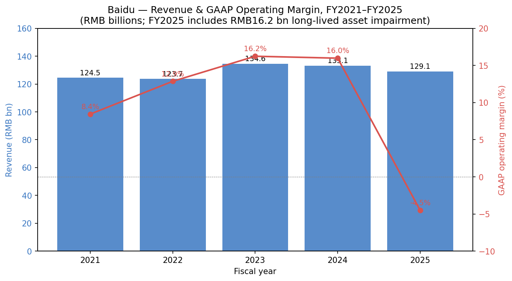
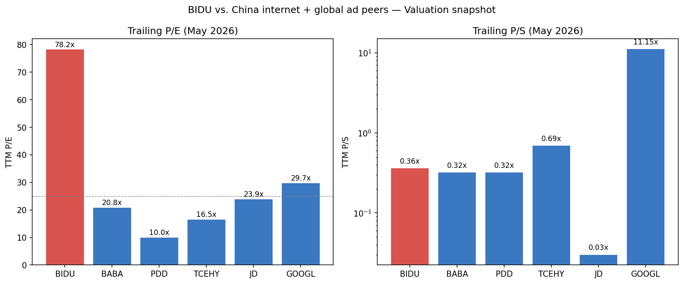
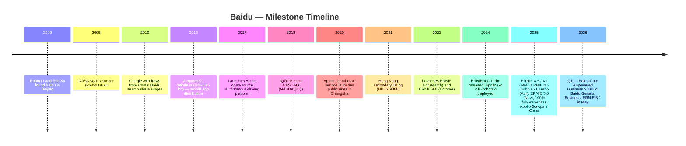
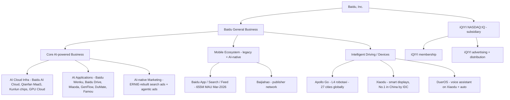
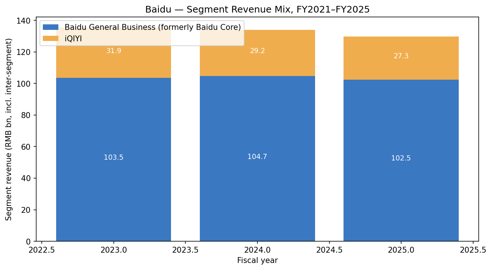
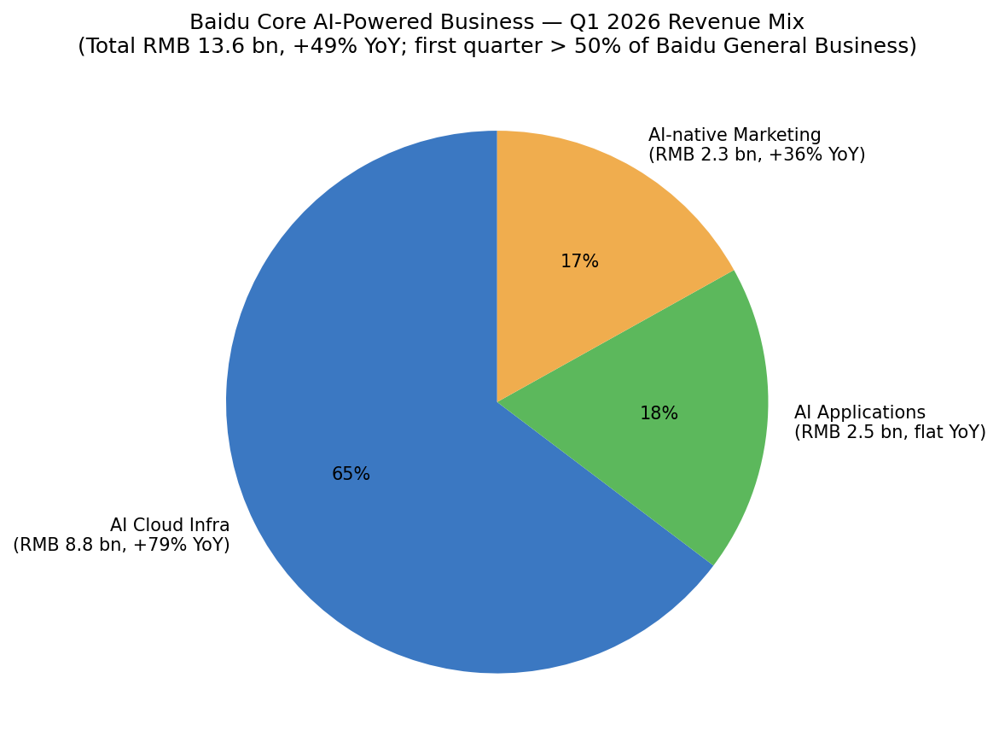
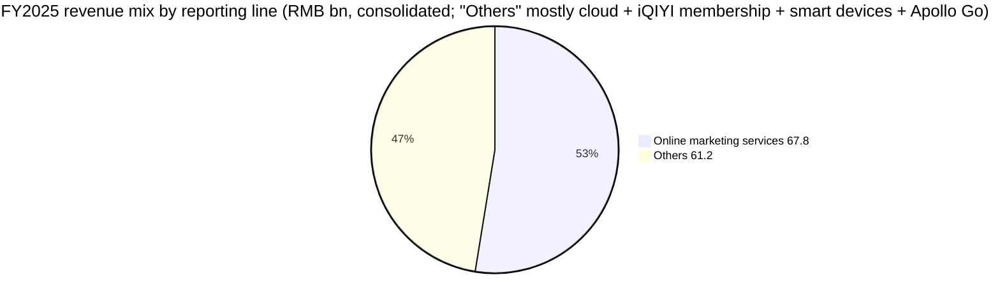
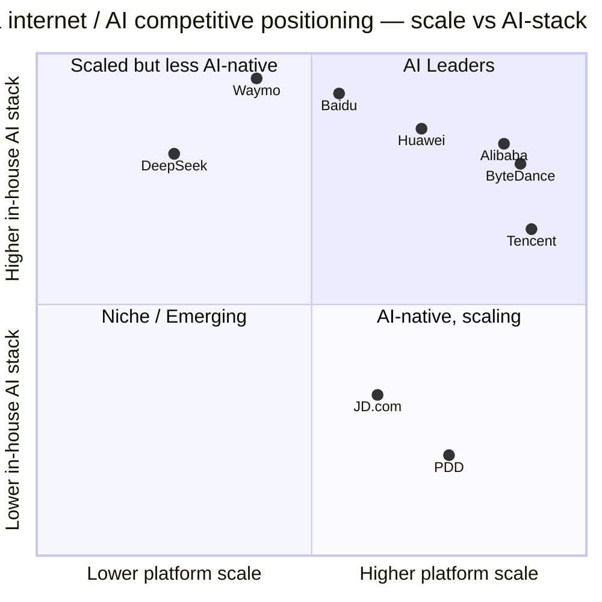
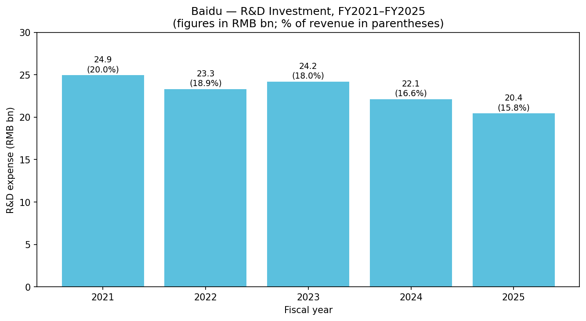

# COMPANY RESEARCH REPORT: Baidu, Inc. (NASDAQ: BIDU; HKEX: 9888)

**Date:** 2026-05-20
**Analyst language:** English (US listing; 20-F is the primary annual filing in English)

> **Update — Q1-2026 inflection: Baidu Core AI-powered Business crossed >50% of Baidu General Business revenue for the first time (2026-05-18).** Q1-2026 Baidu Core AI-powered Business revenue was RMB 13.6 bn, up 49% YoY, with AI Cloud Infrastructure RMB 8.8 bn (+79% YoY) and GPU Cloud +184% YoY; this drove the "Others" line of Baidu General Business to +42% YoY (RMB 13.4 bn) while legacy online-marketing revenue contracted 22% YoY to RMB 12.6 bn. Total Baidu General Business revenue grew 2% YoY to RMB 26.0 bn — the first positive print since 2024 weakness — but consolidated revenue still fell 8% YoY due to the legacy mix shift and iQIYI weakness. No formal full-year guidance was issued; this is a meaningful operating turn, not a numerical guide-raise.
> Source: [Baidu Q1-2026 Press Release, 2026-05-18 (SEC EDGAR Exhibit 99.1)](https://www.sec.gov/Archives/edgar/data/1329099/000119312526228123/d156481dex991.htm).

## TABLE OF CONTENTS
1. Company Overview
2. Company History
3. Management Team
4. Products & Services
5. Customers & Go-to-Market
6. Industry Overview
7. Competitive Landscape
8. Market Opportunity (TAM)
9. Risk Assessment

---

## 1. Company Overview

Baidu, Inc. ("Baidu") is a Beijing-headquartered Chinese internet and AI company whose business spans (i) China's largest general-purpose internet search engine, (ii) the ERNIE family of foundation models with the Qianfan MaaS platform and Baidu AI Cloud, (iii) Apollo Go, China's largest fully-driverless robotaxi service, (iv) DuerOS / Xiaodu smart-home devices and an AI-applications suite (Baidu Wenku, Baidu Drive, Miaoda vibe-coding platform), and (v) a controlling interest in iQIYI (NASDAQ: IQ), China's largest long-form streaming-video service ([Baidu 2025 Form 20-F, Item 4.B Business Overview](https://www.sec.gov/Archives/edgar/data/1329099/000119312526109289/0001193125-26-109289-index.htm)). The company describes itself in its 2025 20-F as "a leading AI company with strong Internet foundation" and emphasises that it is "one of the very few companies in the world that offers a full AI stack of four layers, including cloud infrastructure, deep learning framework developed in-house, foundation models, and applications" ([Baidu 2025 Form 20-F, Item 4.B](https://www.sec.gov/Archives/edgar/data/1329099/000119312526109289/0001193125-26-109289-index.htm)).

**Reporting structure.** From Q4 2025 Baidu renamed its principal segment "Baidu Core" to "Baidu General Business"; iQIYI remains a separately listed and separately segmented subsidiary. Within Baidu General Business, management began disclosing a new "Baidu Core AI-powered Business" framework with three buckets: AI Cloud Infra, AI Applications, and AI-native Marketing Services. The remainder is labelled "Legacy Business" (largely legacy online search advertising) plus "Others" ([Baidu 2025 Form 20-F, Item 5.A](https://www.sec.gov/Archives/edgar/data/1329099/000119312526109289/0001193125-26-109289-index.htm); [Baidu Q1-2026 Press Release, 2026-05-18](https://www.sec.gov/Archives/edgar/data/1329099/000119312526228123/d156481dex991.htm)).

**Scale (FY2025).** Total consolidated revenue was RMB 129.1 bn (US$ 18.5 bn at the 31-Dec-2025 reference rate), down 3% YoY from RMB 133.1 bn in 2024 ([Baidu 2025 Form 20-F, Selected Consolidated Financial Data](https://www.sec.gov/Archives/edgar/data/1329099/000119312526109289/0001193125-26-109289-index.htm)). Baidu General Business contributed RMB 102.5 bn (-2% YoY), iQIYI RMB 27.3 bn (-7% YoY). FY2025 GAAP operating result swung to a loss of RMB 5.8 bn (vs. RMB 21.3 bn income in 2024) almost entirely because of a one-off RMB 16.2 bn long-lived asset impairment; net income attributable to Baidu was RMB 5.6 bn (vs. RMB 23.8 bn in 2024). Operating cash flow was -RMB 3.0 bn for the year (vs. +RMB 21.2 bn) reflecting working-capital absorption tied to the AI infrastructure build ([Baidu 2025 Form 20-F, Item 5.A](https://www.sec.gov/Archives/edgar/data/1329099/000119312526109289/0001193125-26-109289-index.htm)).

*Source: [Baidu 2025 Form 20-F, Selected Consolidated Financial Data table](https://www.sec.gov/Archives/edgar/data/1329099/000119312526109289/0001193125-26-109289-index.htm). FY2025 includes a RMB 16.2 bn long-lived asset impairment that drove the GAAP operating loss; without it, FY2025 operating margin would be roughly mid-single-digit positive.*

**Employees & geography.** As of 31-Dec-2025 Baidu had ~22,100 employees in Beijing, ~11,300 elsewhere in China, and ~100 outside China — broadly ~33.5k headcount, of which ~18,600 are in R&D, ~6,400 in sales/marketing, ~5,600 in operations/service, and ~2,900 in management/administration ([Baidu 2025 Form 20-F, Item 6.D Employees](https://www.sec.gov/Archives/edgar/data/1329099/000119312526109289/0001193125-26-109289-index.htm)). Revenue is overwhelmingly Chinese mainland-sourced; Apollo Go's international footprint is the principal incremental geography, with operations or live testing in 26–27 cities globally (Wuhan, Beijing, Shanghai, Shenzhen, Chengdu, Chongqing, Haikou, Sanya domestically; Abu Dhabi, Dubai and Seoul internationally; Switzerland and London announced) ([Baidu 2025 Form 20-F, Item 4.B](https://www.sec.gov/Archives/edgar/data/1329099/000119312526109289/0001193125-26-109289-index.htm); [Baidu Q1-2026 Press Release, 2026-05-18](https://www.sec.gov/Archives/edgar/data/1329099/000119312526228123/d156481dex991.htm)).

**Key operating metrics.** Baidu App MAU was 679 million in December 2025 and 655 million in March 2026 ([Baidu 2025 Form 20-F](https://www.sec.gov/Archives/edgar/data/1329099/000119312526109289/0001193125-26-109289-index.htm); [Baidu Q1-2026 Press Release](https://www.sec.gov/Archives/edgar/data/1329099/000119312526228123/d156481dex991.htm)). Cumulative Apollo Go public rides exceeded 20 million as of February 2026 and 22 million as of April 2026; Q1-2026 fully driverless rides alone were 3.2 million (+120% YoY), with weekly volumes peaking above 350,000 in March 2026 ([Baidu Q1-2026 Press Release](https://www.sec.gov/Archives/edgar/data/1329099/000119312526228123/d156481dex991.htm)). Baidu AI Cloud was named the No. 1 AI cloud provider in China for the sixth consecutive year by IDC ([IDC China AI Public Cloud Market 2024 report, issued July 2025, as cited in Baidu 2025 20-F](https://www.sec.gov/Archives/edgar/data/1329099/000119312526109289/0001193125-26-109289-index.htm)).

### Valuation snapshot (as of 2026-05-20)

| Metric | BIDU | BABA | PDD | TCEHY | JD | GOOGL |
|---|---|---|---|---|---|---|
| Share price (US$) | 135.22 | n/a | n/a | n/a | n/a | n/a |
| Market cap | US$ 46.0 bn | US$ 322.6 bn | US$ 139.7 bn | US$ 529.8 bn | US$ 43.8 bn | US$ 4,711.8 bn |
| TTM P/E | **78.2x** | 20.8x | 10.0x | 16.5x | 23.9x | 29.7x |
| TTM P/S | 0.36x | 0.32x | 0.32x | 0.69x | n/a* | 11.2x |
| P/B | 1.17x | — | — | — | — | — |
| EV/EBITDA | 15.6x | — | — | — | — | — |
| 52-week range | US$ 81.17 – US$ 165.30 | — | — | — | — | — |
| Beta (5-yr) | 0.52 | — | — | — | — | — |

Source: [Yahoo Finance — BIDU key statistics, accessed 2026-05-20](https://finance.yahoo.com/quote/BIDU/key-statistics) (and equivalent pages for peers). *JD's P/S as reported by Yahoo appears to be a data quirk; we omit it from the comparison.

**Interpreting the multiples.** BIDU's TTM P/E of ~78x stands out — roughly 3-4x the China-internet peer median (~20x BABA, ~10x PDD, ~17x TCEHY) and far above the 25-30x mark typical for mature US ad/cloud names like GOOGL. The cause is mechanical, not narrative: FY2025 net income attributable to Baidu collapsed to RMB 5.6 bn from RMB 23.8 bn because of the RMB 16.2 bn long-lived asset impairment ([Baidu 2025 Form 20-F, Selected Consolidated Financial Data](https://www.sec.gov/Archives/edgar/data/1329099/000119312526109289/0001193125-26-109289-index.htm)). Backing out the impairment, FY2025 normalised net income would be roughly RMB 18 bn and TTM P/E would print closer to the high-teens — in line with BABA and below GOOGL. Forward P/E of ~14.8x (Yahoo consensus) corroborates that the market views the impairment as one-off. The 0.36x TTM P/S is right in line with the China-internet peer cluster and well below GOOGL's 11x. P/B of 1.17x and the US$ 116.9 bn cash position vs. US$ 94.1 bn total debt indicate a balance sheet trading close to book. In short, **headline P/E is a distortion** driven by the impairment; on normalised earnings and on P/S, BIDU trades roughly in line with Chinese internet peers — neither stretched nor obviously cheap. We flag the *forward* multiple (14.8x) and the impairment normalisation as the more useful anchors.

*Source: [Yahoo Finance, accessed 2026-05-20](https://finance.yahoo.com/quote/BIDU/key-statistics).*

---

## 2. Company History

Baidu was founded in January 2000 by Robin Yanhong Li and Eric Xu as a Chinese-language internet search engine. Robin Li had previously been a search engineer at Infoseek and a senior consultant at IDD Information Services in the United States, and held a patent (US 5,920,859) for "link analysis" search ranking — the technology heritage that allowed Baidu to ship a competitive Chinese-language index from inception ([Baidu 2025 Form 20-F, Item 4.A History and Development of the Company](https://www.sec.gov/Archives/edgar/data/1329099/000119312526109289/0001193125-26-109289-index.htm)). The company listed on Nasdaq in August 2005 under the symbol BIDU at US$ 27/share — its first-day pop made it one of the most successful US IPOs in the Chinese-internet era — and added a Hong Kong secondary listing in March 2021 under the symbol 9888 ([Baidu 2025 Form 20-F, Item 4.A](https://www.sec.gov/Archives/edgar/data/1329099/000119312526109289/0001193125-26-109289-index.htm)).

**Strategic pivots.** Three large transformations shape the modern company. First, the **mobile-internet pivot (2012-2016)** — Baidu spent ~US$ 1.85 bn acquiring 91 Wireless in 2013 to re-platform from desktop search to mobile app distribution. Second, the **AI-platform pivot (2017-2022)** — under then-COO Qi Lu and a sequence of CTO hires Baidu wagered that autonomous driving and foundation-model research would be the next-generation operating systems; this is when Apollo, ERNIE (the predecessor of the generative-AI ERNIE Bot), Baidu Brain and Kunlun chips were committed. Third, the **AI-native commercial pivot (2023-2026)** — Baidu has spent two years rebuilding search, advertising, cloud, and devices around generative AI, accepting near-term legacy-ad cannibalisation as the cost of the transition. The latter is now the operating story: in Q1-2026 management reported that Baidu Core AI-powered Business exceeded half of Baidu General Business revenue for the first time, but only because the legacy online-marketing line contracted 22% YoY in the same quarter ([Baidu Q1-2026 Press Release, 2026-05-18](https://www.sec.gov/Archives/edgar/data/1329099/000119312526228123/d156481dex991.htm); [Baidu 2025 Form 20-F, Item 5.A](https://www.sec.gov/Archives/edgar/data/1329099/000119312526109289/0001193125-26-109289-index.htm)).

**Key acquisitions and investments.**
- **91 Wireless (2013)** — Android app-distribution channel; ~US$ 1.85 bn cash; primary mobile bet.
- **YY Live (2020)** — Acquisition of YY's domestic live-streaming business from JOYY; expanded short-form video and live-streaming inventory.
- **JOYO.com (2004)** — Sold to Amazon; established the precedent that Baidu would shed non-search assets and focus on internet platforms.
- **iQIYI (2010-12 stake / 2018 NASDAQ spin)** — Founded as Qiyi.com in 2010; rebranded iQIYI in 2011; listed in March 2018; remains a controlled subsidiary.
- **Jidu / Jiyue automaker JV (2021)** — Joint venture with Geely to build smart EVs; restructured into the JIYUE brand in 2023; positioning has shifted from automaker to robotaxi-platform partner ([Baidu 2025 Form 20-F, Item 4.A](https://www.sec.gov/Archives/edgar/data/1329099/000119312526109289/0001193125-26-109289-index.htm)).

**Recent developments (2025-2026).** Headline events feeding the current thesis: ERNIE 4.5 multimodal flagship and ERNIE X1 reasoning model launched March 2025; ERNIE 4.5 Turbo and X1 Turbo April 2025; ERNIE 5.0 omni-modal in November 2025; ERNIE 5.1 in May 2026, which "ranked first among Chinese models on the [LMArena] text leaderboard" per the Q1-2026 release ([Baidu Q1-2026 Press Release](https://www.sec.gov/Archives/edgar/data/1329099/000119312526228123/d156481dex991.htm)). Apollo Go achieved 100% fully-driverless operations across all Chinese mainland cities of operation in February 2025 and signed strategic partnerships with Uber (initial deployment in Asia and the Middle East), Lyft (Germany and UK), and AutoGo (Abu Dhabi); cumulative public rides crossed 20 million in February 2026 and 22 million in April 2026 ([Baidu 2025 Form 20-F, Item 4.B](https://www.sec.gov/Archives/edgar/data/1329099/000119312526109289/0001193125-26-109289-index.htm); [Baidu Q1-2026 Press Release](https://www.sec.gov/Archives/edgar/data/1329099/000119312526228123/d156481dex991.htm)). Baidu also returned US$ 172 million to shareholders via buybacks in Q1-2026 ([Baidu Q1-2026 Press Release](https://www.sec.gov/Archives/edgar/data/1329099/000119312526228123/d156481dex991.htm)).

---

## 3. Management Team

**Robin Yanhong Li — Co-founder, Chairman of the Board and Chief Executive Officer (age 57)**

Robin Li (李彦宏) is the singular figure in Baidu's strategy and capital-allocation history. He co-founded the company in January 2000, has been chairman since inception, and has held the CEO title since February 2004; he was president from February 2000 to December 2003 ([Baidu 2025 Form 20-F, Item 6.A](https://www.sec.gov/Archives/edgar/data/1329099/000119312526109289/0001193125-26-109289-index.htm)). Prior to founding Baidu he was a search engineer at Infoseek — one of the first US web-search companies — and a senior consultant at IDD Information Services; while at IDD he developed (and was issued) a patent for link-analysis-based ranking, technology generally regarded as a precursor to PageRank-style algorithms. He holds a bachelor's in information science from Peking University and a master's in computer science from SUNY-Buffalo ([Baidu 2025 Form 20-F, Item 6.A](https://www.sec.gov/Archives/edgar/data/1329099/000119312526109289/0001193125-26-109289-index.htm)).

Operationally, Li has been the architect of every major strategic pivot enumerated in Section 2 — the mobile transition, the heavy 2017-2022 AI-platform build (Apollo, ERNIE precursors, Kunlun chip program), and the 2023-2026 AI-native commercial pivot. He is also the spokesman for the dual-class governance: Class B shares carry 10 votes per share vs. Class A's 1 vote, and Li's holdings of Class B (with related-party trusts) give him controlling voting power even though he is not the largest economic owner. He sits on the board of New Oriental Education (NYSE: EDU; SEHK: 9901). Of note for governance risk: Baidu's 2025 20-F explicitly identifies "Mr. Robin Yanhong Li, our chairman, chief executive officer and principal shareholder" as the SAFE-registered domestic resident through whom certain VIE-related capital movements flow — a structural arrangement that aligns Li's personal compliance with Baidu's corporate compliance ([Baidu 2025 Form 20-F, Item 3.D / Item 7.A](https://www.sec.gov/Archives/edgar/data/1329099/000119312526109289/0001193125-26-109289-index.htm)). His public profile inside China is substantial — he is a regular speaker at the annual Baidu World / Baidu Create conferences (Baidu Create 2026 was the venue for Famou Agent 2.0, Miaoda 3.0, and DuMate launches in Q1-2026) and has been a measured but vocal advocate of foundation-model investment in China since 2023.

The honest critique of the Li tenure is that under his leadership Baidu has been a *consistent generator of technology but an inconsistent monetiser*. Apollo has been technically world-class for years but only now is approaching commercial scale; ERNIE is genuinely one of two or three credible domestic foundation-model families but its monetisation is still upstream of ad cannibalisation. The Q1-2026 inflection — AI-powered revenue >50% of Baidu General Business — is the first quantitative validation since the 2023 pivot that the rebuild is paying off ([Baidu Q1-2026 Press Release, 2026-05-18](https://www.sec.gov/Archives/edgar/data/1329099/000119312526228123/d156481dex991.htm)).

**Haijian He — Chief Financial Officer (age 44)**

Haijian He (何海建) is named in the 2025 20-F as Chief Financial Officer and is the signing officer on the Q1-2026 press release ([Baidu 2025 Form 20-F, cover page](https://www.sec.gov/Archives/edgar/data/1329099/000119312526109289/0001193125-26-109289-index.htm); [Baidu Q1-2026 Press Release](https://www.sec.gov/Archives/edgar/data/1329099/000119312526228123/d156481dex991.htm)). The 2025 20-F discloses an option grant of 10.934 (Class A ordinary shares basis) to Mr. He, granted on 7 August 2025 with a 7 August 2035 expiration. The 20-F also lists exercise-price ladders (US$ 158.22, US$ 175.10, US$ 186.01, US$ 87.47 per ADS) attached to options held by directors and officers; the lowest tranche at US$ 87.47 prices below today's US$ 135.22, suggesting some option vintages are now in-the-money. He's biographic record beyond the 20-F is limited in the filing (the 2025 20-F's senior-management bio section in the local text snapshot used here does not produce a multi-paragraph CFO bio comparable to Li's). Investors looking for a longer CFO track record should consult the most recent DEF 14A-equivalent (the 20-F itself acts as the proxy-equivalent for FPI filers) and Baidu's IR materials. **Disclosure note:** if the 20-F's full management section contains a longer-form biography for Mr. He, it was not extracted in our text pull; we therefore avoid stating prior employer / IPO track record details we could not verify.

**Board of Directors and senior officers (other than CEO/CFO):**
- **Yuanqing Yang** (age 61) — Independent director since October 2015; chairman and CEO of Lenovo Group (SEHK: 992). Adds enterprise-IT and global-go-to-market perspective relevant to AI Cloud.
- **Jixun Foo** (age 57) — Independent director since July 2019; Senior Managing Partner at Granite Asia (formerly GGV Capital); chairs Baidu's Compensation Committee and Corporate Governance and Nominating Committee; also on the XPeng (NYSE: XPEV) board. ~20 years of venture investing in mobility and enterprise services.
- **Sandy Ran Xu** (age 49) — Independent director since January 2024; CEO and executive director of JD.com since May 2023 (previously JD.com CFO 2020-2023); ex-audit partner. Provides direct China e-commerce / logistics perspective.
- **Xiaodan Liu** (age 53) — Independent director appointed 20-May-2025 ([Baidu 2025 Form 20-F, Item 6.A](https://www.sec.gov/Archives/edgar/data/1329099/000119312526109289/0001193125-26-109289-index.htm)).

A 6-K filing of 17 March 2026 announced the resignation of one of the directors named in earlier filings — investors should treat the four-independent-plus-CEO composition above as the current state per the latest 20-F ([Baidu 6-K, 2026-03-17](https://www.sec.gov/Archives/edgar/data/1329099/000119312526109234/d63624d6k.htm)).

**Governance.** Dual-class capital structure: 2,197,993,760 Class A ordinary shares outstanding plus 524,020,320 Class B ordinary shares as of 31-Dec-2025, with Class B carrying 10 votes per share. Each ADS represents eight Class A ordinary shares ([Baidu 2025 Form 20-F, cover page](https://www.sec.gov/Archives/edgar/data/1329099/000119312526109289/0001193125-26-109289-index.htm)). The "other individuals as a group" line item — covering all non-named-officer employees holding options — totals 96,859,136 Class A ordinary shares (~12 million ADS-equivalent), indicating broad equity participation among senior employees. Insider ownership detail is disclosed in the 20-F item on share ownership; we did not extract precise % figures for this report and so note this as a follow-up data point. Baidu maintains a three-committee structure (audit, compensation, corporate governance and nominating); all three are chaired by independent directors per Nasdaq rules. The principal related-party item is the VIE structure for the Chinese mainland operating entities (see Section 9, Risk Assessment).

**Track record synthesis.** The Li-led management team has demonstrated technical execution at world-class quality (Apollo, ERNIE, Baidu AI Cloud — all genuine market leaders inside China) but commercial follow-through has lagged for several years. The Q1-2026 print is the first quarter in which the new business mix is large enough to meaningfully move the consolidated P&L; investors evaluating this team should weight technical-execution credibility heavily and discount the historical commercialisation pace — both of which now matter for the next 8 quarters.

---

## 4. Products & Services

Baidu's product surface is unusually broad for a company of its revenue size — it spans consumer apps, foundation-model APIs, full-stack public-cloud infrastructure, smart-home hardware, an L4 autonomous-driving stack, and a long-form streaming-video subsidiary. The 2025 20-F groups the offering as **Baidu Core AI-powered Business** (the three AI buckets) plus a **Mobile Ecosystem** (Baidu App, Baidu Search, Baidu Feed, Baijiahao, Baidu Wenku, Baidu Drive), **Intelligent Driving / DuerOS** (Apollo Go, DuerOS, Xiaodu), and **iQIYI** ([Baidu 2025 Form 20-F, Item 4.B](https://www.sec.gov/Archives/edgar/data/1329099/000119312526109289/0001193125-26-109289-index.htm)).

### 4.1 AI Cloud Infra (the fastest-growth bucket)
- **Baidu AI Cloud** — China's largest AI-focused public cloud per IDC. Subscription/consumption pricing; CPU-VM, GPU compute, storage, networking, plus AI-stack services (PaddlePaddle, model training, model serving). Q1-2026 revenue RMB 8.8 bn (+79% YoY). Within this, **GPU Cloud** (subscription-based AI accelerator infrastructure) grew **+184% YoY** in Q1-2026 ([Baidu Q1-2026 Press Release](https://www.sec.gov/Archives/edgar/data/1329099/000119312526228123/d156481dex991.htm)). **Competitive verdict: Yes (technology + scale + ecosystem moat).** Closest competitors are Alibaba Cloud (the China public-cloud leader on overall revenue per IDC), Huawei Cloud, and Tencent Cloud. Baidu's specific edge is the integrated full-stack — its own ERNIE models + PaddlePaddle deep-learning framework + Kunlun in-house AI chips — which Alibaba and Tencent are also building but where Baidu's vertical integration is most complete domestically ([Baidu 2025 Form 20-F, Item 4.B](https://www.sec.gov/Archives/edgar/data/1329099/000119312526109289/0001193125-26-109289-index.htm)). One-line compare: ahead of Tencent Cloud in AI-specialised workloads; behind Alibaba Cloud in total cloud revenue scale; at parity / slight lead vs. Huawei Cloud in AI-native workloads on its own chips.
- **Qianfan MaaS Platform** — Model-as-a-Service marketplace inside Baidu AI Cloud. Carries Baidu's first-party ERNIE 5.x and X1 series plus leading third-party and open-source models; agent-development toolkit (since 2025 evolution to "agent-centric platform"); data services and fine-tuning support ([Baidu 2025 Form 20-F, Item 4.B](https://www.sec.gov/Archives/edgar/data/1329099/000119312526109289/0001193125-26-109289-index.htm)). **Verdict: Partial (ecosystem advantage, but model-quality leadership is contested).** Closest competitors are Alibaba's Tongyi/PAI and Tencent's Hunyuan + TI-MaaS. Compare: at parity on agent tooling and model breadth, but ERNIE 5.1 ranking first among Chinese models on the LMArena text leaderboard (May 2026) suggests Baidu has retaken model-quality leadership domestically ([Baidu Q1-2026 Press Release, 2026-05-18](https://www.sec.gov/Archives/edgar/data/1329099/000119312526228123/d156481dex991.htm)).
- **Kunlun AI chips (in-house)** — Baidu's home-grown AI accelerators, deployed internally to power Baidu AI Cloud GPU Cloud capacity and reduce exposure to US-export-controlled NVIDIA inventory. The 2025 20-F describes the full-stack offering as including "internally developed chips" ([Baidu 2025 Form 20-F, Item 4.B](https://www.sec.gov/Archives/edgar/data/1329099/000119312526109289/0001193125-26-109289-index.htm)). Public benchmarks vs. NVIDIA H100/H200 are not disclosed in the filing.

### 4.2 AI Applications
- **Baidu Wenku** (formerly the document repository) — re-platformed as an AI-native productivity tool. Together with Baidu Drive launched **GenFlow 4.0** (April 2026) for agent-driven productivity workflows ([Baidu Q1-2026 Press Release](https://www.sec.gov/Archives/edgar/data/1329099/000119312526228123/d156481dex991.htm)).
- **Miaoda** — Baidu's "vibe coding" platform; Miaoda 3.0 launched at Baidu Create 2026 with enterprise and mobile editions and the ability to generate stand-alone apps ([Baidu Q1-2026 Press Release](https://www.sec.gov/Archives/edgar/data/1329099/000119312526228123/d156481dex991.htm)).
- **DuMate** — Baidu's general-purpose agent for everyday productivity, launched March 2026; "autonomously executes complex, multi-step workflows across applications and files end-to-end" ([Baidu Q1-2026 Press Release](https://www.sec.gov/Archives/edgar/data/1329099/000119312526228123/d156481dex991.htm)).
- **Famou Agent 2.0** — Self-evolving agent that set a state-of-the-art record on MLE-Bench (machine-learning-engineering benchmark) ([Baidu Q1-2026 Press Release](https://www.sec.gov/Archives/edgar/data/1329099/000119312526228123/d156481dex991.htm)).
- Q1-2026 AI Applications revenue was RMB 2.5 bn, approximately flat YoY ([Baidu Q1-2026 Press Release](https://www.sec.gov/Archives/edgar/data/1329099/000119312526228123/d156481dex991.htm)).
**Verdict: Partial.** Tooling is at parity with Alibaba's equivalent stack (Tongyi Lab agents, Wenxin-equivalents) and behind global benchmarks like Anthropic Claude / OpenAI ChatGPT; the differentiator is distribution into Baidu Search and Baidu App's 655M+ MAU base.

### 4.3 AI-native Marketing Services
- **AI-rebuilt search and advertising stack** — Baidu has rebuilt its core search-results page around generative-AI direct answers, agentic ads, and conversational interfaces. Q1-2026 AI-native marketing revenue was RMB 2.3 bn (+36% YoY) — the only line in legacy-marketing's vicinity growing strongly ([Baidu Q1-2026 Press Release](https://www.sec.gov/Archives/edgar/data/1329099/000119312526228123/d156481dex991.htm)).
- Legacy Online Marketing Services (the rest of Baidu's search ad book) — Q1-2026 revenue RMB 12.6 bn, **down 22% YoY**, with management explicitly attributing the decline to "ongoing AI transformation, which impacted the monetization approach" plus weak macro and softness in healthcare, real estate, home-furnishing advertiser categories ([Baidu 2025 Form 20-F, Item 5.A](https://www.sec.gov/Archives/edgar/data/1329099/000119312526109289/0001193125-26-109289-index.htm); [Baidu Q1-2026 Press Release](https://www.sec.gov/Archives/edgar/data/1329099/000119312526228123/d156481dex991.htm)). **Verdict for AI-native marketing: Yes (distribution moat).** Closest competitor is Tencent's AI-rebuilt WeChat search-and-recommendation ad system. One-line compare: at parity on quality, ahead on direct search-intent volume.

### 4.4 Intelligent Driving — Apollo Go
- **Apollo Go (Luobokuaipao app)** — Robotaxi service; L4 fully-driverless in all Chinese mainland operating cities since February 2025. Eight named Chinese cities (Beijing, Shanghai, Shenzhen, Wuhan, Chengdu, Chongqing, Haikou, Sanya) plus international footprint of 26-27 cities (Abu Dhabi with AutoGo, Dubai, Seoul, and announced testing in Switzerland and London via Uber/Lyft) ([Baidu 2025 Form 20-F, Item 4.B](https://www.sec.gov/Archives/edgar/data/1329099/000119312526109289/0001193125-26-109289-index.htm); [Baidu Q1-2026 Press Release](https://www.sec.gov/Archives/edgar/data/1329099/000119312526228123/d156481dex991.htm)).
- **Operating metrics.** Cumulative public rides crossed 20 million in Feb-2026 and 22 million in Apr-2026; Q1-2026 fully-driverless rides 3.2 million (+120% YoY); weekly peak rides above 350,000 in March 2026; fleet has accumulated >330 million autonomous kilometres of which >220 million are fully driverless ([Baidu Q1-2026 Press Release](https://www.sec.gov/Archives/edgar/data/1329099/000119312526228123/d156481dex991.htm)).
- **Partnerships.** Uber (Asia + Middle East), Lyft (Germany + UK), AutoGo (Abu Dhabi); China Geely JV for hardware (JIYUE).
- **Verdict: Yes (data + regulatory + scale moat).** Fast Company's 2026 Most Innovative Companies list ranked Baidu second globally in Automotive, recognising Apollo Go alongside Waymo "as one of the world's leading robotaxi services" ([Fast Company 2026 list, as cited in Baidu Q1-2026 Press Release](https://www.sec.gov/Archives/edgar/data/1329099/000119312526228123/d156481dex991.htm)). Closest peer is Alphabet/Waymo. One-line compare: at parity (and arguably ahead on cumulative-rides scale and city count); behind on US/EU geographic exposure but rapidly internationalising via Uber and Lyft asset-light models.

### 4.5 Xiaodu / DuerOS
- **Xiaodu** smart-display devices — ranked **No. 1 in China by smart-display shipments for 1H-9M 2025 per IDC** ([Baidu 2025 Form 20-F, Item 4.B citing IDC](https://www.sec.gov/Archives/edgar/data/1329099/000119312526109289/0001193125-26-109289-index.htm)).
- **DuerOS** — Conversational voice operating system that powers Xiaodu devices, in-car infotainment partnerships, and third-party smart-home devices.
- **Verdict: Yes for Xiaodu (#1 market position), Partial for DuerOS (faces stronger third-party operating systems on cars).**

### 4.6 iQIYI (NASDAQ: IQ; controlled subsidiary)
- Long-form video streaming; "Netflix of China" positioning. Revenue RMB 27.3 bn in FY2025 (-7% YoY) on weaker membership and lighter content slate ([Baidu 2025 Form 20-F, Item 5.A](https://www.sec.gov/Archives/edgar/data/1329099/000119312526109289/0001193125-26-109289-index.htm)).
- **Verdict: Partial.** Strong domestic IP and original content, but intense competition with Tencent Video, Youku (Alibaba), and Bilibili, plus mini-drama / short-video pressure from Douyin and Kuaishou. iQIYI's prospectus-level disclosures and own 20-F (Form 20-F filer under IQ ticker) provide deeper detail.

### 4.7 Flagship vs. long-tail (revenue mix)
For FY2025, **Online marketing services were RMB 67.8 bn (-14% YoY) — ~52.5% of consolidated revenue**; "Others" (cloud services + iQIYI membership + Xiaodu + Apollo Go) was RMB 61.2 bn (+12% YoY) — ~47.5% ([Baidu 2025 Form 20-F, Item 5.A and Note 2/25 revenue disaggregation](https://www.sec.gov/Archives/edgar/data/1329099/000119312526109289/0001193125-26-109289-index.htm)). The mix shift from advertising to cloud-plus-AI is the singular story for the next four quarters: in Q1-2026, "Others" within Baidu General Business reached RMB 13.4 bn (+42% YoY, 52% of Baidu General Business) and Online Marketing fell to RMB 12.6 bn (48%). This is the first quarter in Baidu's history in which advertising is *not* the largest single revenue line.

*Source: [Baidu 2025 Form 20-F, Item 5.A segment revenue table](https://www.sec.gov/Archives/edgar/data/1329099/000119312526109289/0001193125-26-109289-index.htm).*

*Source: [Baidu Q1-2026 Press Release, 2026-05-18](https://www.sec.gov/Archives/edgar/data/1329099/000119312526228123/d156481dex991.htm).*

### 4.8 Roadmap / launches in the last 12 months
- ERNIE 4.5 + X1 (Mar-2025), 4.5 Turbo + X1 Turbo (Apr-2025), ERNIE 5.0 (Nov-2025), ERNIE 5.0 updated (Jan-2026), ERNIE 5.1 (May-2026).
- DuMate (Mar-2026), Miaoda 3.0 (Q1-2026 at Baidu Create), Famou Agent 2.0 (Q1-2026), GenFlow 4.0 (Apr-2026).
- Apollo Go international launches in Abu Dhabi (AutoGo), Dubai, Seoul; Uber + Lyft + AutoGo partnerships consummated in 2025.

---

## 5. Customers & Go-to-Market

**Customer mix.** Baidu's customer profile is bifurcated. The legacy online-marketing customer base is **millions of long-tail Chinese advertisers** — SMEs across healthcare, real estate, home-furnishing, education, e-commerce, financial services, automotive — plus a smaller tail of large brand advertisers buying display, video, and feed inventory ([Baidu 2025 Form 20-F, Item 4.B](https://www.sec.gov/Archives/edgar/data/1329099/000119312526109289/0001193125-26-109289-index.htm)). The AI Cloud and AI Applications customer base, by contrast, is **enterprise**: state-owned enterprises, large internet companies, financial institutions, manufacturers, telcos, and government agencies in China; plus a growing list of consumer Apollo Go riders in robotaxi cities and B2B mobility partners (Uber, Lyft, AutoGo) internationally.

**Customer concentration (per 20-F).** Baidu does not disclose a top-1 or top-5 customer percentage in its 2025 20-F. The 20-F's Note 25 on revenue disaggregation states that "no customer accounted for 10% or more of total revenue" — i.e. the customer base is highly fragmented and Baidu does not have any single advertiser or cloud customer of disclosure-mandating scale ([Baidu 2025 Form 20-F, Item 5.A and Notes to Consolidated Financial Statements](https://www.sec.gov/Archives/edgar/data/1329099/000119312526109289/0001193125-26-109289-index.htm)). This is consistent with the long-tail-SME nature of search advertising and the still-early commercialisation of enterprise cloud at Baidu. **Concentration risk is therefore low**, in contrast to peers in chips or autos where 10-30% customers are common — though the corollary is that Baidu lacks anchor enterprise contracts of the scale Alibaba Cloud has with state-owned customers. We do not flag this as a Section 9 risk.

*Source: [Baidu 2025 Form 20-F, Item 5.A revenue disaggregation table](https://www.sec.gov/Archives/edgar/data/1329099/000119312526109289/0001193125-26-109289-index.htm).*

**Distribution channels & sales motion.**
- **Online marketing services** — Direct (key-account sales reps for large brands and high-spend SMEs) + agency channels (advertising agencies operate the bulk of long-tail SME relationships) + self-service auctions (real-time bidding on Baidu's search ad platform). Sales cycle is short (transactional, auction-priced).
- **Baidu AI Cloud / Qianfan** — Direct enterprise sales for large accounts plus partner channels (system integrators, ISVs). Subscription and consumption pricing. Sales cycles are months, not days, for state-owned enterprise and government anchor deals.
- **Apollo Go** — Direct B2C in robotaxi cities (Luobokuaipao app, free download); B2B platform partnerships (Uber, Lyft, AutoGo); asset-light international model where Baidu provides the autonomous-vehicle technology stack and local partners provide fleet operations.
- **Xiaodu** — Direct e-commerce (JD.com, Tmall, Baidu's own channel) plus offline retail.
- **iQIYI** — Direct consumer subscription (membership), brand and performance advertising sales, content licensing distribution.

**Key partnerships.**
- **Uber Technologies** (announced 2025) — deploy "thousands of Apollo Go's fully autonomous vehicles" on Uber across Asia and Middle East ([Baidu 2025 Form 20-F, Item 4.B](https://www.sec.gov/Archives/edgar/data/1329099/000119312526109289/0001193125-26-109289-index.htm)).
- **Lyft, Inc.** (Aug-2025) — Apollo Go on Lyft across "key European markets" starting Germany and UK ([Baidu 2025 Form 20-F, Item 4.B](https://www.sec.gov/Archives/edgar/data/1329099/000119312526109289/0001193125-26-109289-index.htm)).
- **AutoGo (Abu Dhabi)** — Apollo Go's official launch of fully-autonomous ride-hailing in Abu Dhabi ([Baidu 2025 Form 20-F, Item 4.B](https://www.sec.gov/Archives/edgar/data/1329099/000119312526109289/0001193125-26-109289-index.htm)).
- **Geely / JIYUE** — Vehicle manufacturing partnership for the L4 robotaxi platform.
- Foundation-model **third-party hosting on Qianfan** — multiple Chinese AI labs and open-source providers distribute via Qianfan.

**Customer case studies / named wins.** Baidu AI Cloud's customer logos are not extensively named in the 20-F but historical Baidu IR materials reference deployments at China Mobile, China Telecom, China National Petroleum Corporation, major commercial banks, and a number of municipal smart-city projects. We refrain from quoting named-customer revenue contributions because such figures are not disclosed in the 20-F.

---

## 6. Industry Overview

Baidu operates in five overlapping industries: (1) China internet search and digital advertising, (2) China public cloud, particularly the AI-public-cloud sub-segment, (3) generative-AI foundation models and platforms, (4) autonomous-driving / robotaxi services globally, and (5) China long-form streaming video (via iQIYI). Each has distinct structural dynamics.

**(1) China internet search and digital advertising.** The Chinese digital-advertising market is the world's second-largest after the United States. Industry growth has decelerated sharply from the 15-25% YoY rates of 2018-2021 to mid-single-digits today, reflecting (a) a maturing Chinese internet user base of ~1.08 billion users (per CNNIC), (b) macro weakness affecting key advertiser verticals (real estate, education, online tutoring after 2021's regulatory tightening), and (c) a market-share shift from search-and-feed platforms (Baidu, ByteDance) toward short-video and e-commerce platforms (Douyin, Kuaishou, Taobao Live). Baidu's online marketing revenue specifically declined ~14% in 2025 and another 22% YoY in Q1-2026, primarily because Baidu is voluntarily cannibalising legacy keyword-auction monetisation as it rebuilds the search experience around generative-AI direct answers ([Baidu 2025 Form 20-F, Item 5.A](https://www.sec.gov/Archives/edgar/data/1329099/000119312526109289/0001193125-26-109289-index.htm)). The structural question for the search-ad industry is whether AI-native advertising (sponsored agents, conversational ads, native product placement inside generative answers) can recover the unit economics of keyword search — at Baidu it appears to be growing (+36% YoY for AI-native marketing in Q1-2026) but is not yet large enough to backfill the legacy decline.

**(2) China public cloud and AI public cloud.** The China public-cloud market is estimated by industry trackers at roughly RMB 600-700 bn in annual revenue with mid-teens YoY growth, dominated by Alibaba Cloud, Tencent Cloud, Huawei Cloud, and Baidu AI Cloud (with smaller share for China Telecom Cloud and others). Within this, the **AI-public-cloud sub-segment** — AI training and inference workloads, foundation-model hosting, MaaS — is the fastest-growing slice, conservatively a >50% YoY growth rate based on Baidu's own +79% Cloud Infra and +184% GPU Cloud growth in Q1-2026 ([Baidu Q1-2026 Press Release](https://www.sec.gov/Archives/edgar/data/1329099/000119312526228123/d156481dex991.htm)). Baidu has been named the **No. 1 AI cloud provider in China for the sixth consecutive year by IDC** ([IDC China AI Public Cloud Market 2024 report, July 2025, as cited in Baidu 2025 20-F](https://www.sec.gov/Archives/edgar/data/1329099/000119312526109289/0001193125-26-109289-index.htm)) — note that this is the *AI-cloud sub-segment*, not overall public cloud, where Alibaba Cloud is the leader. Industry-specific dynamics include: (a) US export controls on advanced AI chips (NVIDIA A100/A800/H100/H200, AMD MI300) forcing domestic substitution toward Huawei Ascend, Cambricon, and in-house chips like Baidu Kunlun; (b) rising enterprise willingness to pay for AI inference; and (c) intensifying price competition on training compute as multiple providers race for hyperscale supply.

**(3) Generative AI / foundation models.** A two-tier global structure has emerged: a US tier dominated by OpenAI, Anthropic, Google DeepMind / Gemini, and Meta (LLaMA) on frontier capability; and a Chinese tier with Baidu (ERNIE), Alibaba (Tongyi Qianwen / Qwen), Tencent (Hunyuan), Moonshot AI (Kimi), Zhipu (GLM), ByteDance (Doubao), and DeepSeek as the principal closed and open contenders. Chinese frontier models are typically one product cycle behind their US peers on certain benchmarks but have closed substantially on language tasks and are at parity or ahead on Chinese-language tasks; ERNIE 5.1 ranked first among Chinese models on the LMArena text leaderboard in May 2026 ([Baidu Q1-2026 Press Release](https://www.sec.gov/Archives/edgar/data/1329099/000119312526228123/d156481dex991.htm)). Industry structure is **arms-race oligopolistic**: model R&D requires multi-billion-dollar compute budgets, but distribution via cloud-MaaS and consumer-app channels favours incumbents with users and infrastructure. Profitability is negative-to-thin across the industry today; commercial models include API pricing per million tokens, agent/usage pricing, and embedded-in-product subscriptions.

**(4) Autonomous driving / robotaxi.** Globally a duopoly is forming between Waymo (Alphabet) and Apollo Go (Baidu), with several second-tier players (Pony.ai, WeRide, AutoX in China; Cruise, Zoox, Wayve in the West) at smaller scale. Chinese regulatory environment has been comparatively *enabling* — multiple municipal authorities have granted full-driverless commercial permits (Wuhan was first, then Beijing, Chongqing, Shenzhen, Shanghai, Hainan, Xiong'an among others) since 2022-2025. Apollo Go's domestic scale (8 named cities with 100% fully-driverless ops and 3.2 million Q1-2026 fully-driverless rides) is now roughly comparable to or exceeds Waymo's US scale (Waymo disclosed ~30 million cumulative rides through 2025 per its public communications; Apollo Go disclosed >22 million cumulative public rides as of April 2026). Unit economics are not yet positive at scale for either player but improving rapidly as vehicle cost per kilometre falls (Apollo's RT6 robotaxi list price is ~RMB 200k, materially below earlier generations) and as supervision overhead shrinks under fully-driverless operation.

**(5) China long-form streaming video.** A four-way race between iQIYI, Tencent Video, Youku (Alibaba), and Bilibili, with mounting pressure from Douyin (ByteDance) and Kuaishou on the short-form side. The industry has shifted from subscriber-growth land-grab (2017-2021) to ARPU- and content-cost-discipline. iQIYI's FY2025 revenue decline of 7% is consistent with industry contraction.

**Regulatory environment (cross-cutting).**
- **China VIE structure** — Baidu's mainland China operations (internet content, value-added telecom, online marketing) are conducted by Variable Interest Entities owned by PRC nationals (Robin Li and a small group of insiders), with contractual control retained by Baidu's Cayman parent. The 2025 20-F devotes substantial space (Items 3.D / 7.A) to the well-documented enforceability and tax risks of this structure ([Baidu 2025 Form 20-F](https://www.sec.gov/Archives/edgar/data/1329099/000119312526109289/0001193125-26-109289-index.htm)).
- **HFCAA / PCAOB auditor inspection** — Resolved as of late 2022; Baidu's auditor is currently PCAOB-inspectable.
- **Data security, cybersecurity, AI content regulation in China** — Algorithm registration, generative-AI registration with the CAC, real-name registration, content filtering. Baidu has registered ERNIE under the CAC framework.
- **US export controls** — Limit access to top-bin NVIDIA / AMD AI accelerators; drive Baidu to substitute domestic chips (Kunlun, Huawei Ascend).
- **Autonomous-vehicle permitting** — Granular city-by-city in China; comparable in the US (state-by-state). UAE, Singapore, UK have all begun to publish frameworks.

---

## 7. Competitive Landscape

**Direct competitors.**

- **Alibaba Group (NYSE: BABA; HKEX: 9988)** — China's largest public cloud (Alibaba Cloud > 30% domestic share by IDC). Foundation models: Tongyi Qianwen / Qwen. Direct AI Cloud competitor; ahead of Baidu on total cloud revenue but Baidu retains AI-cloud sub-segment leadership per IDC. Trades at TTM P/E 20.8x, P/S 0.32x ([Yahoo Finance, accessed 2026-05-20](https://finance.yahoo.com/quote/BABA/)).
- **Tencent Holdings (HKEX: 700; OTC: TCEHY)** — WeChat ecosystem; Hunyuan foundation model; Tencent Cloud; long-form Tencent Video competing with iQIYI. Strongest distribution moat in China; AI-stack depth more partner-led than first-party. TTM P/E 16.5x, P/S 0.69x.
- **ByteDance (private)** — Douyin (Chinese TikTok); the largest single threat to Baidu's advertising and search share. Doubao foundation model and Volcano Engine cloud are direct competitors. No public valuation but secondary-market trades implied a >US$ 300 bn valuation in 2024.
- **Huawei Technologies (private)** — Huawei Cloud and Pangu foundation model; Ascend AI chips. The strongest *vertical-integrated* competitor inside China, particularly for government / state-owned enterprise workloads.
- **Alphabet / Waymo (NASDAQ: GOOGL)** — Global Apollo Go peer in robotaxi; also a competitor in search advertising indirectly (Google retains Chinese-language search outside the firewall). TTM P/E 29.7x, P/S 11.2x.
- **iQIYI's competitors** — Tencent Video, Youku (Alibaba), Bilibili (NASDAQ: BILI).

**Indirect competitors.**
- **JD.com (NASDAQ: JD)** — Independent director Sandy Ran Xu's other employer; JD Cloud and JD's AI services compete with Baidu in enterprise but smaller scale.
- **PDD Holdings (NASDAQ: PDD)** — Largely an e-commerce/Temu story but competes for advertiser wallet share.
- **Moonshot AI / Zhipu / Minimax / DeepSeek** — Domestic foundation-model challengers; smaller than Baidu but technically credible.
- **OpenAI / Anthropic** — Globally dominant frontier models but cannot operate in mainland China.

*Source: [Yahoo Finance — multiple ticker pages, accessed 2026-05-20](https://finance.yahoo.com/quote/BIDU/key-statistics).*

**Baidu's competitive advantages.**
1. **Full AI stack (rare in China).** Chips (Kunlun) + framework (PaddlePaddle) + foundation models (ERNIE 5.1) + cloud + applications. Alibaba and Huawei have similar breadth; Tencent and ByteDance do not control all four layers. ([Baidu 2025 Form 20-F, Item 4.B](https://www.sec.gov/Archives/edgar/data/1329099/000119312526109289/0001193125-26-109289-index.htm)).
2. **Robotaxi scale and regulatory firsts.** First commercial driverless permit in Wuhan; 8 fully-driverless Chinese cities; only Chinese company at Waymo-comparable rides scale; global partnerships with Uber and Lyft give asset-light international optionality ([Baidu Q1-2026 Press Release](https://www.sec.gov/Archives/edgar/data/1329099/000119312526228123/d156481dex991.htm)).
3. **Search-and-feed distribution.** 655 million MAU on Baidu App (March 2026) provides a built-in consumer channel for AI applications — DuMate, Wenku, Drive, Famou — that pure-play AI labs lack ([Baidu Q1-2026 Press Release](https://www.sec.gov/Archives/edgar/data/1329099/000119312526228123/d156481dex991.htm)).
4. **AI-Cloud sub-segment leadership.** IDC #1 for six consecutive years ([Baidu 2025 Form 20-F](https://www.sec.gov/Archives/edgar/data/1329099/000119312526109289/0001193125-26-109289-index.htm)).
5. **Xiaodu #1 smart-display share** — Channel for embedded DuerOS / ERNIE voice agent ([Baidu 2025 Form 20-F](https://www.sec.gov/Archives/edgar/data/1329099/000119312526109289/0001193125-26-109289-index.htm)).

**Vulnerabilities.**
1. **Total public-cloud scale gap to Alibaba.** Alibaba's overall cloud revenue is multiple times Baidu's; Baidu's AI-specialised positioning is real but capped by sub-segment size.
2. **Advertising share loss to Douyin / WeChat.** Baidu's share of China digital ad spending has trended down for a decade; AI-native rebuild may stabilise or recover share but is not yet proven.
3. **Concentration in mainland China.** Apollo Go international footprint is the principal diversifier; everything else is mainland-revenue.
4. **R&D intensity will compress margins for years.** R&D was 15.8% of FY2025 revenue (RMB 20.4 bn) — manageable, but operating-margin trough may persist while the AI buildout absorbs cash ([Baidu 2025 Form 20-F](https://www.sec.gov/Archives/edgar/data/1329099/000119312526109289/0001193125-26-109289-index.htm)).
5. **VIE structure / China-ADR overhang.** Discount applied to all China ADRs is partly outside Baidu's control.

*Source: [Baidu 2025 Form 20-F, Selected Consolidated Financial Data table](https://www.sec.gov/Archives/edgar/data/1329099/000119312526109289/0001193125-26-109289-index.htm).*

---

## 8. Market Opportunity (TAM)

We frame TAM across three buckets where Baidu has product-market fit and meaningful share opportunity.

**Bucket 1 — China AI cloud (TAM today, addressable mid-term).** China's overall public-cloud market is roughly RMB 600-700 bn at FY2025 revenue with mid-teens growth (industry tracker range). The AI-public-cloud sub-segment is the high-growth slice; Baidu has been ranked #1 by IDC for six consecutive years ([Baidu 2025 Form 20-F, Item 4.B citing IDC](https://www.sec.gov/Archives/edgar/data/1329099/000119312526109289/0001193125-26-109289-index.htm)). If AI-public-cloud is conservatively 15-20% of total public cloud today and grows >50% YoY for the next 3 years while overall cloud grows mid-teens, AI public cloud could be RMB 250-400 bn by 2028. Baidu's Q1-2026 annualised AI Cloud Infra run-rate of ~RMB 35 bn (4 × RMB 8.8 bn) is roughly 7-10% of that 2028 TAM — leaving room for the segment to grow >2x without share gain, plus optionality to gain share given the #1 IDC ranking. **SAM (Baidu's actual go-to-market reach): ~RMB 200-300 bn by 2028 (excludes the slice captured exclusively by Huawei in state-owned enterprise).** **SOM (Baidu's realistic share at execution today): ~10-15%, or RMB 25-45 bn — significantly above today's run-rate.**

**Bucket 2 — China generative-AI consumer and enterprise applications.** This is the toughest TAM to size because the industry is still discovering pricing and unit economics. We anchor on two reference points. (i) China's overall digital ad spend is RMB ~1.2 trillion (per industry trackers); even a 5% share-shift from legacy advertising to AI-native advertising is RMB 60 bn of TAM annually for the eventual platform winners — Baidu, Alibaba, ByteDance, Tencent. (ii) Enterprise productivity-software spend in China is roughly RMB 100-150 bn growing at low-double-digits; agent-based productivity tools (DuMate, Wenku-based agents, Miaoda code generation) are positioned to capture a 10-20% slice over 5 years. We estimate Baidu's serviceable AI-applications TAM at **RMB 80-120 bn by 2028**, with realistic Baidu share of 10-15% given current AI-Applications run-rate of ~RMB 10 bn (4 × RMB 2.5 bn). **Mark this as a structural estimate — Baidu does not disclose a TAM number itself, and the 2025 20-F does not size this TAM ([Baidu 2025 Form 20-F](https://www.sec.gov/Archives/edgar/data/1329099/000119312526109289/0001193125-26-109289-index.htm)).**

**Bucket 3 — Robotaxi (Apollo Go) — global TAM.** This is the biggest optionality and the hardest to size. We anchor on (i) global ride-hailing TAM (Uber + Lyft + DiDi annualised gross bookings) of ~US$ 250-300 bn today and growing ~10-12%; (ii) the autonomous-driving structural-cost advantage (no driver = ~30-50% lower cost-per-ride at scale), implying robotaxis will capture >50% of ride-hailing volume in served cities over 10-20 years. McKinsey, BCG, Bernstein, and Goldman Sachs sell-side analyses (consistently published since 2023) anchor the 2035 global robotaxi market at US$ 300-800 bn revenue. Apollo Go's realistic share is 10-25% in a duopoly-with-Waymo scenario for global ex-North-America, suggesting **Apollo Go's 2030-2035 revenue TAM is US$ 30-100 bn per year** if execution holds. At today's cumulative ~22 million rides and Q1-2026 run-rate of ~13 million annualised rides at a presumed RMB 20-30 per ride, Apollo Go's current revenue is in the low-single-digit RMB billions — meaning the realistic scale-up is several orders of magnitude.

**Penetration strategy.** Baidu's go-to-market for these three TAMs is sharply differentiated: AI Cloud is direct enterprise sales + state-owned-enterprise anchor wins + Qianfan partner ecosystem; AI Applications leverage the 655 M MAU Baidu App as a free top-of-funnel; Apollo Go scales domestically through municipal permits + Luobokuaipao app and internationally through asset-light partnerships with Uber, Lyft, and AutoGo (city-by-city tech-licensing or fleet-share).

---

## 9. Risk Assessment

We rate 11 risks across the four standard buckets.

### Company-Specific Risks

**1. Legacy online-marketing cannibalisation faster than AI-native replacement.** Online marketing revenue fell 14% in FY2025 and 22% YoY in Q1-2026, while AI-native marketing grew only 36% YoY off a much smaller base — meaning the net is still negative for the advertising book ([Baidu 2025 Form 20-F, Item 5.A](https://www.sec.gov/Archives/edgar/data/1329099/000119312526109289/0001193125-26-109289-index.htm); [Q1-2026 Press Release](https://www.sec.gov/Archives/edgar/data/1329099/000119312526228123/d156481dex991.htm)). Mitigant: Q1-2026 was the first quarter with positive Baidu General Business growth in two years, suggesting the J-curve may be inflecting. **Materiality: high.**

**2. AI-Cloud capex absorbing operating cash flow.** FY2025 operating cash flow was -RMB 3.0 bn vs +RMB 21.2 bn in FY2024 ([Baidu 2025 Form 20-F, Cash Flow Statement](https://www.sec.gov/Archives/edgar/data/1329099/000119312526109289/0001193125-26-109289-index.htm)) — the swing reflects working-capital tied up in AI infrastructure and inventory. Q1-2026 OCF returned to a positive RMB 2.7 bn ([Q1-2026 Press Release](https://www.sec.gov/Archives/edgar/data/1329099/000119312526228123/d156481dex991.htm)). Mitigant: US$ 116.9 bn of total cash + short-term investments provides large runway ([Yahoo Finance, accessed 2026-05-20](https://finance.yahoo.com/quote/BIDU/key-statistics)).

**3. RMB 16.2 bn long-lived asset impairment signals legacy assets stranded.** A new line item appearing for the first time in FY2025 ([Baidu 2025 Form 20-F, Selected Consolidated Financial Data](https://www.sec.gov/Archives/edgar/data/1329099/000119312526109289/0001193125-26-109289-index.htm)) — this magnitude (~RMB 16.2 bn, ~12.5% of FY2025 revenue) is a strong management signal that prior-cycle investments are not earning their cost of capital under the new AI-cloud-first strategy. Watch for further impairments in FY2026.

**4. Apollo Go international expansion execution.** Apollo Go's global footprint of 26-27 cities was reached very rapidly (2024-2026). The 2025 20-F flags challenges with "obtaining permit to conduct test driving and further, commercial operation," local pricing adjustments, and broader regulatory uncertainty ([Baidu 2025 Form 20-F, Item 3.D](https://www.sec.gov/Archives/edgar/data/1329099/000119312526109289/0001193125-26-109289-index.htm)). Mitigant: asset-light partnerships with Uber, Lyft, and AutoGo offload local-market risk.

**5. iQIYI structural decline drags consolidated numbers.** -7% YoY in FY2025 and -8% QoQ in Q1-2026 in a competitive intensity that is not easing; Baidu's economic interest is majority but iQIYI's separately listed status complicates capital allocation ([Baidu 2025 Form 20-F, Item 5.A](https://www.sec.gov/Archives/edgar/data/1329099/000119312526109289/0001193125-26-109289-index.htm)).

**6. Key-person risk — Robin Li.** Dual-class voting power, founder-CEO since 2000, primary architect of every strategic pivot; succession is undisclosed. Robin Li is also the SAFE-registered domestic resident anchoring the VIE structure ([Baidu 2025 Form 20-F, Item 7.A](https://www.sec.gov/Archives/edgar/data/1329099/000119312526109289/0001193125-26-109289-index.htm)).

### Industry / Market Risks

**7. Foundation-model commoditisation.** Multiple credible Chinese labs (DeepSeek, Moonshot, Zhipu, Tongyi, Hunyuan, Doubao) plus open-source pressure are driving API prices down meaningfully; Baidu's own pricing of ERNIE 4.5 Turbo and X1 Turbo at "significantly lower" cost than predecessors is a self-imposed deflation ([Baidu 2025 Form 20-F, Item 4.B](https://www.sec.gov/Archives/edgar/data/1329099/000119312526109289/0001193125-26-109289-index.htm)). Net pricing-power on undifferentiated model APIs is structurally negative.

**8. US export controls on advanced AI chips.** Ongoing US restrictions limit Baidu's access to NVIDIA's top-bin and successor chips; near-term mitigation via Kunlun and Huawei Ascend; medium-term performance gap to US peers if controls tighten further.

**9. Robotaxi competitive intensity from Waymo and Chinese second-tier.** Waymo continues to scale in the US; Pony.ai, WeRide, AutoX expanding domestically. Apollo Go's lead is real but not insurmountable.

**10. Macroeconomic softness in China.** Real estate, healthcare, home-furnishing, education advertiser categories — all multi-quarter weak ([Baidu 2025 Form 20-F, Item 5.A](https://www.sec.gov/Archives/edgar/data/1329099/000119312526109289/0001193125-26-109289-index.htm)).

### Financial Risks

**11. Convertible notes refinancing.** Notes payable of RMB 51.0 bn + convertibles RMB 6.7 bn + iQIYI 2030 convertibles to be accreted to US$ 679 million, US$ 208 million, US$ 350 million across 2.00 / 0.21 / 2.21 year remaining tenors ([Baidu 2025 Form 20-F, Notes to Financial Statements](https://www.sec.gov/Archives/edgar/data/1329099/000119312526109289/0001193125-26-109289-index.htm)). Cash plus short-term investments of RMB 115.3 bn at year-end provides ample cover, but stresses around the iQIYI-PAG convertible accretion are worth monitoring.

**12. Headline P/E distortion / multiple compression risk.** TTM P/E of 78x is mechanically inflated by the FY2025 impairment; forward P/E of 14.8x suggests consensus has normalised. If the impairment recurs or if AI-native revenue ramp slows, multiple compression risk is real. Mitigant: balance sheet (US$ 116.9 bn cash vs US$ 94.1 bn debt) and ongoing buybacks (US$ 172 M in Q1-2026 alone) ([Baidu Q1-2026 Press Release](https://www.sec.gov/Archives/edgar/data/1329099/000119312526228123/d156481dex991.htm); [Yahoo Finance](https://finance.yahoo.com/quote/BIDU/key-statistics)).

### Macroeconomic / Geopolitical Risks

**13. VIE enforceability + HFCAA tail risk.** The mainland Chinese operating entities are not directly owned by the Cayman parent but contractually controlled. Baidu's 2025 20-F dedicates Items 3.D and 7.A to the structural risk that PRC authorities could disallow or reinterpret the structure, or that the contractual arrangements could prove unenforceable ([Baidu 2025 Form 20-F](https://www.sec.gov/Archives/edgar/data/1329099/000119312526109289/0001193125-26-109289-index.htm)). HFCAA delisting risk currently resolved.

**14. RMB / USD translation.** Reporting currency is RMB; ADR investors hold USD. Material RMB weakening would reduce USD-equivalent earnings; mitigated partly by the US$ 12.97 bn of short-term investments held in convertible form.

---

## REFERENCES

### Primary filings
- [Baidu, Inc. — 2025 Annual Report on Form 20-F (filed 2026-03-17 via SEC EDGAR)](https://www.sec.gov/Archives/edgar/data/1329099/000119312526109289/0001193125-26-109289-index.htm)
- [Baidu, Inc. — Q1 2026 Earnings Press Release, Form 6-K Exhibit 99.1 (filed 2026-05-18)](https://www.sec.gov/Archives/edgar/data/1329099/000119312526228123/d156481dex991.htm)
- [Baidu, Inc. — Form 6-K, Director Resignation (2026-03-17)](https://www.sec.gov/Archives/edgar/data/1329099/000119312526109234/d63624d6k.htm)
- [Baidu, Inc. — Form 6-K, Notice of 2026 AGM (2026-04-30)](https://www.sec.gov/Archives/edgar/data/1329099/000119312526193797/0001193125-26-193797-index.htm)
- [Baidu, Inc. — 2024 Annual Report on Form 20-F (filed 2025-03)](https://www.sec.gov/Archives/edgar/data/1329099/000119312525066199/0001193125-25-066199-index.htm)
- [Baidu, Inc. — 2025 ESG Report (May 2026)](http://esg.baidu.com/Uploads/Baidu_2025_ESG_Report.pdf)

### Market data and valuation
- [Yahoo Finance — BIDU Key Statistics (accessed 2026-05-20)](https://finance.yahoo.com/quote/BIDU/key-statistics)
- [Yahoo Finance — BABA Key Statistics (accessed 2026-05-20)](https://finance.yahoo.com/quote/BABA/key-statistics)
- [Yahoo Finance — PDD Key Statistics (accessed 2026-05-20)](https://finance.yahoo.com/quote/PDD/key-statistics)
- [Yahoo Finance — TCEHY Key Statistics (accessed 2026-05-20)](https://finance.yahoo.com/quote/TCEHY/key-statistics)
- [Yahoo Finance — GOOGL Key Statistics (accessed 2026-05-20)](https://finance.yahoo.com/quote/GOOGL/key-statistics)

### Third-party research referenced
- IDC — *China's AI Public Cloud Market Report*, July 2025 (as cited in Baidu 2025 20-F, Item 4.B).
- IDC — China smart display tracker, 1H-9M 2025 (as cited in Baidu 2025 20-F).
- Fast Company — *2026 Most Innovative Companies — Automotive category* (as cited in Baidu Q1-2026 Press Release).

### Baidu IR pages and product pages (linked inline)
- [Baidu Investor Relations](https://ir.baidu.com/)
- [Baidu AI Cloud product page](https://intl.cloud.baidu.com/)
- [Baidu Apollo](https://www.apollo.auto/)
- [Luobokuaipao (Apollo Go) consumer site](https://www.apollo.auto/apollo-go)

*Note: Where the 2025 20-F text snapshot used in this analysis did not return a section (e.g. a detailed CFO biography), we have explicitly flagged the absence rather than inferring content. Investors should treat the 2025 20-F (https URL above) as the authoritative primary source for any item in this report and consult the audited financial statements in Item 18 for full footnote detail.*
