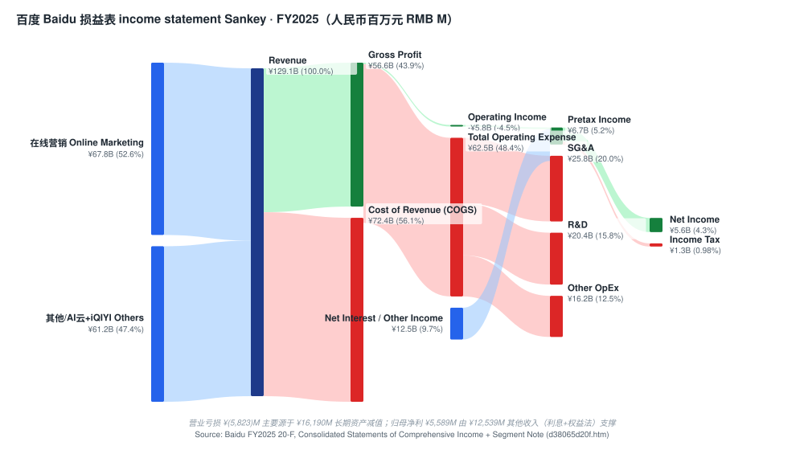
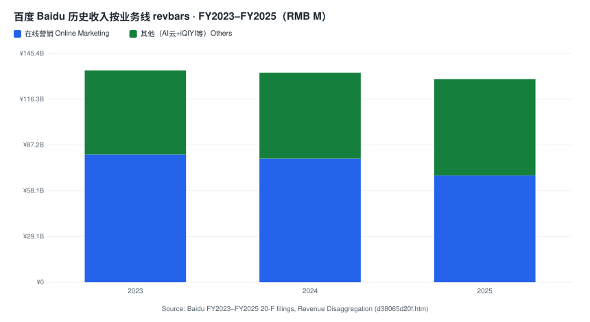
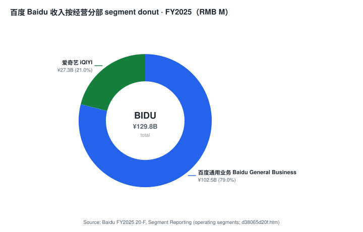
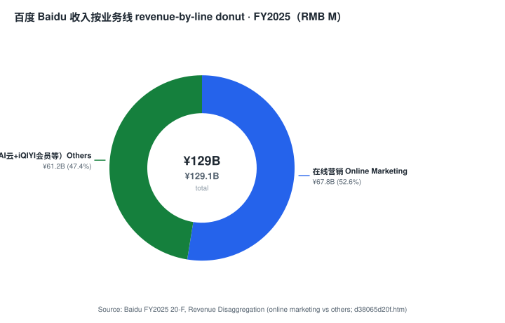
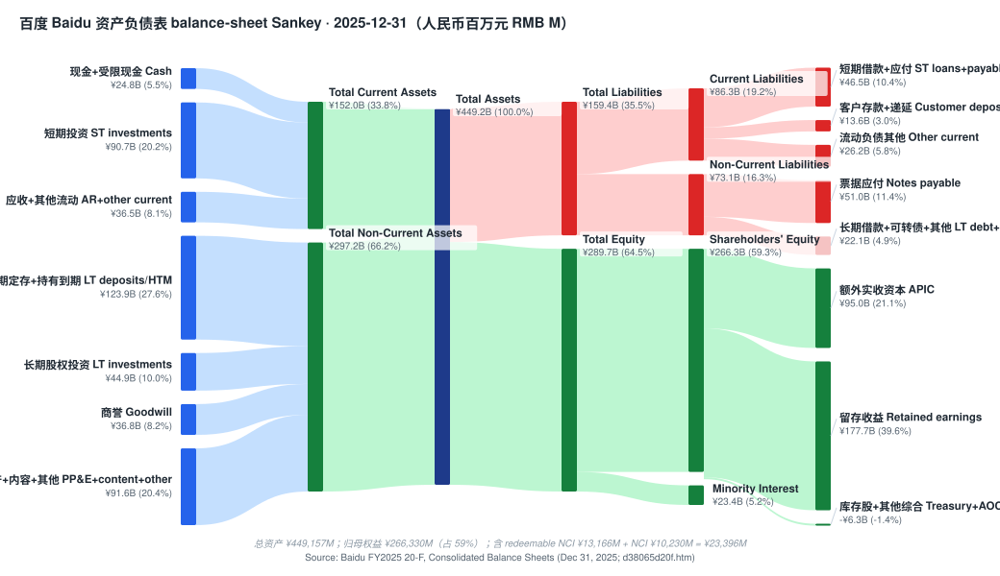
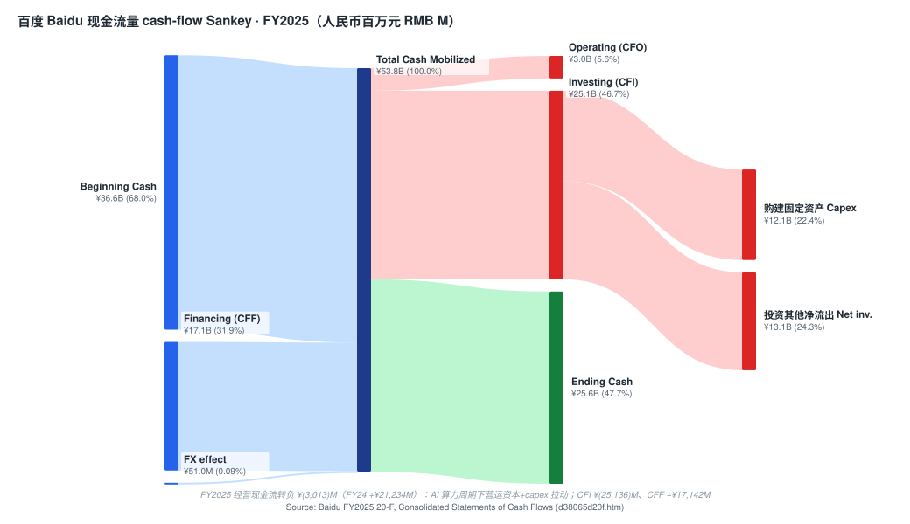
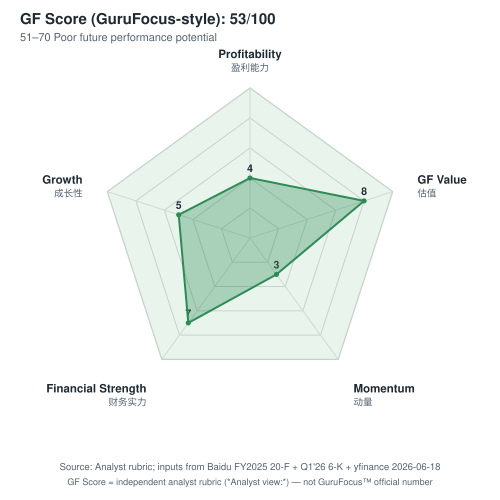
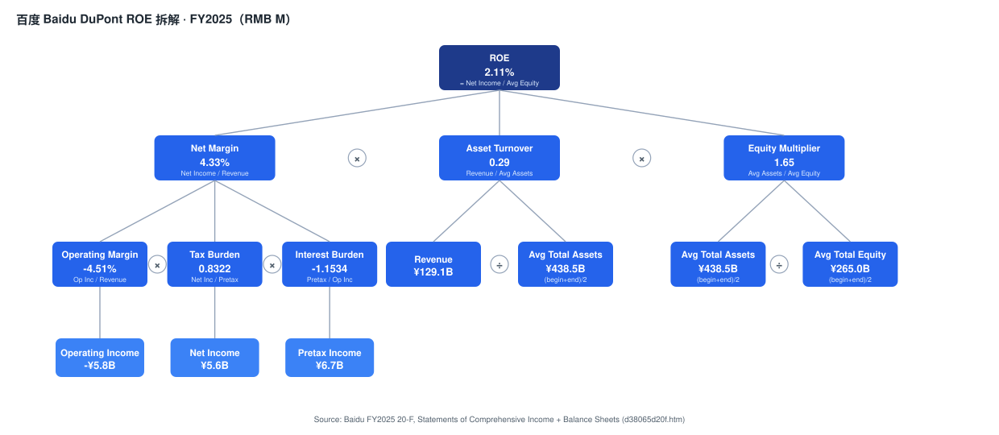
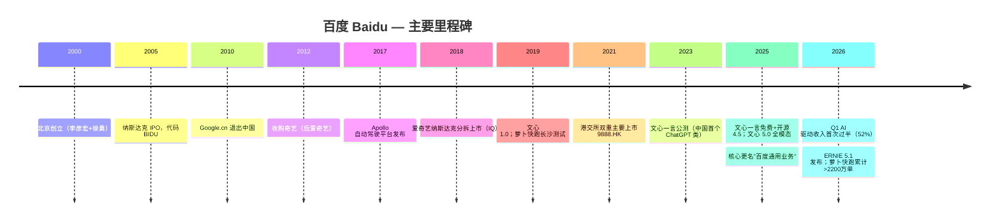
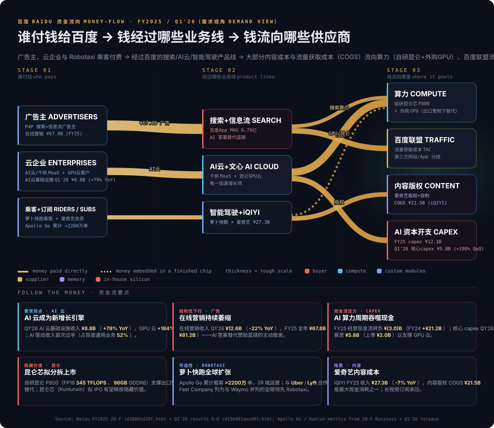

# 公司研究：百度集团 Baidu, Inc.（NASDAQ: BIDU · HKEX: 9888）

日期（as of）：2026-06-18 ｜ 刷新（数据刷新至 FY2025 20-F + Q1'26 6-K + 决策层 + 9 张 SVG 图表 + 3 张专题图）｜ 默认语言：简体中文

> *分析师观点：* **评级：Overweight（增持）· 12 个月目标价 $150（较现价 $111.24 上行约 +35%）· 估值方法：分部加总 SOTP / 归一化（剔除减值）P/E ~16× × FY2027E 归一化 EPS/ADS ~$9.4**
> 市值 ~$37.9B · EV ~$16.1B（市值 − 约 $21.7B 净现金）· 52 周区间 $83.62–$162.52 · NASDAQ:BIDU（现价 $111.24，[Yahoo Finance via yfinance，2026-06-18 收盘](https://finance.yahoo.com/quote/BIDU/)）
>
> **远期估值矩阵（forward valuation matrix）**（FY25A 列为 20-F 披露口径；FY26E/FY27E 列为 *分析师观点：*。**口径提醒：** 百度以 RMB 报告，市值/EV 为 USD——本矩阵的 P/S、EV/Sales 已统一用 **USD 市值 ÷ USD 收入**（FY2025 收入 $18.46B = ¥129,079M ÷ 6.8980），**不是** yfinance 显示的 0.29× P/S——那是把 USD 市值除以 RMB 收入的错配伪值，本报告全程已纠正）
>
> | 倍数 / Multiple | FY2025A | FY2026E | FY2027E |
> |---|---|---|---|
> | P/S（市销率，USD 口径） | 2.05× | ~2.0× | ~1.9× |
> | EV/Sales（净现金调整后 EV ÷ 收入） | 0.87× | ~0.85× | ~0.79× |
> | P/E（GAAP 摊薄，每 ADS） | n/m（FY25 含 ¥16,190M 减值，GAAP EPS/ADS ~$1.7） | ~25× | ~18× |
> | P/E（归一化，剔除减值口径） | ~12×（归一化 EPS/ADS ~$9.3） | ~13× | ~12× |
> | 净现金 / 市值 | **57%**（净现金 ~$21.7B vs 市值 ~$37.9B） | | |
>
> **相对表现（截至 2026-06-18 收盘 $111.24，来源：yfinance）**：1M：BIDU **−19.2%** / SPX +1.8% / Golden Dragon(PGJ) −10.8%（相对 SPX **−21.0pp**）· 6M：−7.7% / +10.5% / −19.2%（相对 SPX −18.2pp）· YTD：**−26.0%** / +9.1% / −22.2%（相对 SPX −35.1pp）· 12M：**+33.0%** / +25.4% / −13.3%（相对 SPX +7.6pp）。**解读：** 12 个月维度 BIDU 仍大幅跑赢 SPX 与中概（DeepSeek/AI 重估行情），但 2026 年 H1 因 Q1'26 经营现金流转负、广告持续下滑与中概整体回调而剧烈回吐——现价 $111 已跌破最看空的卖方（MS $135）目标价。
>
> **核心论点（thesis pillars）**——（1）**AI 驱动收入首次过半，云的拐点正在兑现**：Q1'26 百度 Core AI 驱动收入 >¥13.6B（+49% YoY），首次占百度通用业务的 52%；AI 云基础设施 ¥8.8B（+79% YoY）、其中 GPU 云 +184% YoY——这是把"搜索广告下行"换成"高增长 AI 云"的结构性迁移正在加速的实锤；（2）**估值已隐含极深的安全垫**：净现金约 $21.7B = 市值的 57%，扣净现金后 EV 仅 ~$16.1B、对应 FY25 收入 EV/Sales ~0.87×、归一化 P/E ~12×——市场仍把 BIDU 当作停滞的广告公用事业定价，对萝卜快跑与昆仑芯几乎零赋值；（3）**萝卜快跑 + 昆仑芯是"白送"的两个期权**：Apollo Go 累计载客 >2,200 万单、与 Uber/Lyft 出海，是全球仅有的两家规模化 Robotaxi 之一（另一家 Waymo）；自研昆仑芯（P800：FP16 345 TFLOPS / 96GB）拟分拆 IPO 有望显性化隐藏价值；（4）**关键证伪点是现金流与广告拐点**：FY25 经营现金流转负 ¥(3.0)B（AI capex 周期），若广告下行未被云增长净覆盖、且 capex 持续吞噬现金，"价值期权"会被证伪为价值陷阱。

> **Update——Q1'26 业绩：AI 收入首次过半，云强广告弱（2026-05-18）：** 百度 Q1'26 总收入 **¥32.1B（$4.65B）**，QoQ −2%；其中百度通用业务 ¥26.0B（+2% YoY，**重回正增长**）、爱奇艺 ¥6.2B（−8% QoQ）。**百度 Core AI 驱动收入 >¥13.6B（+49% YoY），首次占百度通用业务 52%**；AI 云基础设施 ¥8.8B（+79% YoY，上季 ¥5.8B）、GPU 云 +184% YoY。在线营销服务 ¥12.6B（−22% YoY），占百度通用业务降至 48%。GAAP 经营利润 ¥3.2B（$463M，10% margin）、Non-GAAP 经营利润 ¥3.8B（$552M，12%）；归母净利 ¥3.4B（$499M）、Non-GAAP 归母净利 ¥4.3B（$628M）；GAAP 摊薄 EPS/ADS ¥8.76（$1.27）、Non-GAAP ¥12.06（$1.75）。**经营现金流 ¥2.7B 转正**（公司口径），但核心 capex 飙至 ¥5.8B（上季 ¥2.0B）支撑 GPU 云。Q1'26 回购 $172M。ERNIE 5.1 于 2026 年 5 月发布（LMArena 中文文本榜第一）。来源：[Baidu Q1'26 业绩新闻稿（6-K 附件 99.1）, 2026-05-18](https://www.sec.gov/Archives/edgar/data/1329099/000119312526228123/d156481dex991.htm)。

---

## 目录

1. [公司概览](#1-公司概览)
1A. [估值与目标价](#1a-估值与目标价)
1B. [GF Score 基本面记分卡](#1b-gf-scoregurufocus-style-基本面记分卡)
2. [公司历史](#2-公司历史)
3. [管理团队](#3-管理团队)
4. [产品与服务](#4-产品与服务)
5. [客户与市场策略](#5-客户与市场策略)
6. [行业概览](#6-行业概览)
7. [竞争格局](#7-竞争格局)
8. [市场机会（TAM）](#8-市场机会tam)
9. [风险评估](#9-风险评估)
9.5 [核心分歧与催化剂](#95-核心分歧与催化剂)
10. [投资视角记分卡](#10-投资视角记分卡)

---

## 1. 公司概览

*分析师观点：* 本报告刷新覆盖百度，给予 **Overweight（增持）**评级、12 个月目标价 **$150**（+35%）。为什么是现在：百度正处在一个被市场严重低估的"业务模式切换"——从一家"搜索广告 + 长视频"的中国互联网公用事业，转向一家"AI 云 + 自动驾驶 + 自研芯片"的全栈 AI 公司。Q1'26 是这个切换第一次量化兑现：AI 驱动收入首次过半（占核心 52%）、AI 云基础设施 +79% YoY、GPU 云 +184% YoY。与此同时，市场对 BIDU 的定价仍停留在旧叙事——现价 $111 对应净现金占市值 57%、扣净现金后 EV 仅 ~$16.1B，相当于把萝卜快跑和昆仑芯赋值为零、甚至给 AI 云倒贴。风险收益偏正：下行由 $21.7B 净现金与归一化 ~12× P/E 托底，上行由云加速 + 昆仑芯 IPO + Robotaxi 显性化驱动。关键证伪点是经营现金流（FY25 已转负）与广告下行能否被云增长净覆盖。

**公司是做什么的。** 百度集团（Baidu, Inc.）是中国规模最大的中文互联网搜索公司，也是北京寄望以缩小与美国基础模型差距的"AI 国家队"四强之一（另三家为阿里巴巴、腾讯、字节跳动）。公司经营两个应报告经营分部（operating segment）：(i) **百度通用业务（Baidu General Business）**——2025 年第四季度由"百度核心（Baidu Core）"更名而来，涵盖"搜索 + 信息流"广告引擎、AI 云（千帆 Qianfan MaaS + 底层 IaaS/PaaS + 昆仑 GPU 云），以及含萝卜快跑 Robotaxi、小度 DuerOS 在内的"智能驾驶与其他增长业务"；(ii) **爱奇艺（iQIYI，NASDAQ: IQ）**，百度控股并并表的长视频流媒体子公司（[Baidu FY2025 20-F, Note Segment Reporting — 2 operating segments](https://www.sec.gov/Archives/edgar/data/1329099/000119312526109289/d38065d20f.htm)）。FY2025 合并收入 **¥129,079M（$18,458M）**，同比下降 3%；分部口径百度通用业务 ¥102,485M、爱奇艺 ¥27,290M（[Baidu FY2025 20-F, Segment Reporting — Operating Segment Results](https://www.sec.gov/Archives/edgar/data/1329099/000119312526109289/d38065d20f.htm)）。

**怎么赚钱（与正在变的事）。** 历史上百度的变现核心是按效果付费（P4P）搜索广告 + 百度 App 信息流广告，2025 年 12 月百度 App MAU 6.79 亿（[Baidu FY2025 20-F, Item 4 — Baidu App MAU](https://www.sec.gov/Archives/edgar/data/1329099/000119312526109289/d38065d20f.htm)）。按业务线拆分，FY2025 **在线营销服务收入 ¥67,837M**（$9,701M，FY24 ¥78,563M、FY23 ¥81,203M——连续三年结构性下行），而 **"其他"（含 AI 云 + 爱奇艺会员等）¥61,242M**（$8,757M，FY24 ¥54,562M、FY23 ¥53,395M——稳步上行）（[Baidu FY2025 20-F, Revenue Disaggregation](https://www.sec.gov/Archives/edgar/data/1329099/000119312526109289/d38065d20f.htm)）。这条迁移在 Q1'26 加速到了拐点：在线营销 Q1'26 ¥12.6B（−22% YoY，占百度通用业务降至 48%），而"其他"¥13.4B（+42% YoY，升至 52%），其中 AI 云基础设施 ¥8.8B（+79% YoY）（[Baidu Q1'26 业绩新闻稿, 2026-05-18](https://www.sec.gov/Archives/edgar/data/1329099/000119312526228123/d156481dex991.htm)）。管理层多次将在线营销下行定性为"AI 转型对变现的影响"——主动以 AI 生成式答案替代赞助蓝链的取舍。

**规模与盈利现状（注意减值扭曲）。** FY2025 收入 ¥129,079M、成本 ¥72,436M、SG&A ¥25,843M、研发 R&D ¥20,433M，外加一笔 **¥16,190M（$2,315M）的长期资产减值（impairment of long-lived assets）**——使总成本费用达 ¥134,902M、**GAAP 经营亏损 ¥(5,823)M**（$(833)M）。但归母净利仍为正 **¥5,589M**（$799M），因为有 ¥12,539M 其他收入净额（利息收入 ¥8,602M + 权益法投资收益 ¥3,196M 等）支撑（[Baidu FY2025 20-F, Consolidated Statements of Comprehensive Income](https://www.sec.gov/Archives/edgar/data/1329099/000119312526109289/d38065d20f.htm)）。**理解百度的盈利能力，必须剔除这笔 ¥16,190M 非现金减值**——归一化后 FY25 归母净利约 ¥21,779M（~$3,157M），对应现价归一化 P/E ~12×。GAAP 摊薄 EPS ¥1.47/股（每 ADS 8 股 = ¥11.76 ≈ $1.7）。员工：截至 2025-12-31 全职约 33,500 人（FY24 35,900、FY23 39,800，两年累计裁减约 16%），其中研发人员约 18,600 人（[Baidu FY2025 20-F, Item 6 — Employees](https://www.sec.gov/Archives/edgar/data/1329099/000119312526109289/d38065d20f.htm)）。总部：北京市海淀区上地十街百度科技园。

**收入与利润流向（income-statement Sankey，FY2025）。** 下图把 FY2025 损益表画成资金流：总收入 ¥129,079M 按业务线拆为在线营销 52.6% + 其他/AI云+iQIYI 47.4%，经收入成本（COGS ¥72,436M，主要是内容成本 + 流量获取成本 TAC + AI 云算力）后留下毛利润 ¥56,643M（毛利率 43.9%），再被三块开支吃掉——研发 ¥20,433M、SG&A ¥25,843M、以及 **¥16,190M 长期资产减值（Other OpEx）**——形成 **经营亏损 ¥(5,823)M**；但经营线外有 ¥12,539M 其他收入（利息 + 权益法）净流入，税后归母净利仍为正 ¥5,589M。这张图的要点：**百度 FY2025 的 GAAP 经营亏损完全是一次性减值造成的，剔除后经营利润为正约 ¥10,367M（~8% margin）；净利由 ¥12.5B 利息+权益法收入支撑，反映其 $21.7B 净现金的"利息发动机"属性。** 所有数字逐字取自 [20-F FY2025 合并经营报表 + 分部/收入披露](https://www.sec.gov/Archives/edgar/data/1329099/000119312526109289/d38065d20f.htm)。

来源 / Source: [Baidu FY2025 20-F, Consolidated Statements of Comprehensive Income + Segment Note (d38065d20f.htm)](https://www.sec.gov/Archives/edgar/data/1329099/000119312526109289/d38065d20f.htm)

**历史收入按业务线（development-over-time）。** 下图展示 FY2023→FY2025 收入按两大业务线的演化——最大的趋势是 **在线营销从 ¥81,203M（FY23）萎缩到 ¥67,837M（FY25）**（AI 答案替代蓝链 + 字节抢份额 + 地产/医疗广告疲软），而 **"其他"（AI 云 + iQIYI 会员等）从 ¥53,395M 升到 ¥61,242M**——结构上正从"搜索广告"向"AI 云"迁移。这正是 Q1'26 AI 驱动收入首次过半的两年铺垫。

来源 / Source: [Baidu FY2023–FY2025 20-F filings, Revenue Disaggregation (d38065d20f.htm)](https://www.sec.gov/Archives/edgar/data/1329099/000119312526109289/d38065d20f.htm)

**收入按经营分部（FY2025）。** 下图按百度的两个经营分部拆分收入：**百度通用业务 ¥102,485M（79%）> 爱奇艺 ¥27,290M（21%）**（分部口径含约 ¥696M 内部抵销，故合计略高于合并 ¥129,079M）。百度通用业务承载全部 AI 故事；爱奇艺是低增长、低倍数的长视频拖累项（FY25 −7% YoY）（[Baidu FY2025 20-F, Segment Reporting](https://www.sec.gov/Archives/edgar/data/1329099/000119312526109289/d38065d20f.htm)）。

来源 / Source: [Baidu FY2025 20-F, Segment Reporting (operating segments; d38065d20f.htm)](https://www.sec.gov/Archives/edgar/data/1329099/000119312526109289/d38065d20f.htm)

**收入按业务线（FY2025；百度不披露地理拆分）。** 百度作为以中国大陆为主的公司，20-F 未提供细分的地理收入披露（海外营销与萝卜快跑海外仍处萌芽），故以其实际披露的"收入按业务线"代替地理 donut：**在线营销 ¥67,837M（52.6%）vs 其他/AI云+iQIYI ¥61,242M（47.4%）**——这张饼也是理解百度变现迁移最直接的一张图（[Baidu FY2025 20-F, Revenue Disaggregation](https://www.sec.gov/Archives/edgar/data/1329099/000119312526109289/d38065d20f.htm)）。

来源 / Source: [Baidu FY2025 20-F, Revenue Disaggregation (online marketing vs others; d38065d20f.htm)](https://www.sec.gov/Archives/edgar/data/1329099/000119312526109289/d38065d20f.htm)

**资本结构（净现金是论点的地基）。** 截至 2025-12-31：现金及等价物 ¥24,606M + 受限现金 ¥225M + 短期投资 ¥90,661M + 长期定存及持有至到期投资 ¥123,862M = 现金类资产合计约 **¥239,354M（~$34.7B）**；对应总债务（短期借款 ¥7,626M + 当期长期借款 ¥14,765M + 票据应付 ¥51,021M + 可转债 ¥6,712M + 当期可转债 ¥1,459M + 当期票据 ¥4,560M + 长期借款 ¥3,369M）约 **¥89,512M（~$13.0B）**——**净现金约 ¥149,842M（~$21.7B），等于现市值（~$37.9B）的 57%**（[Baidu FY2025 20-F, Consolidated Balance Sheets](https://www.sec.gov/Archives/edgar/data/1329099/000119312526109289/d38065d20f.htm)）。因此扣净现金后 EV 仅约 $16.1B、FY25 收入 EV/Sales 约 0.87×——这是全球主要 AI 大市值公司中最便宜的口径之一。

来源 / Source: [Baidu FY2025 20-F, Consolidated Balance Sheets (Dec 31, 2025; d38065d20f.htm)](https://www.sec.gov/Archives/edgar/data/1329099/000119312526109289/d38065d20f.htm)

**现金流量（cash-flow Sankey，FY2025）——红灯指标。** FY2025 **经营现金流 CFO 转负 ¥(3,013)M**（$(431)M），较 FY2024 的 +¥21,234M 急剧恶化——这是 AI 算力周期下营运资本 + 预付算力 + 内容支出共同拉动的结果（净利仍正 ¥5,457M，但营运资本与非现金项逆转）；投资现金流 CFI ¥(25,136)M（含购建固定资产 capex ¥12,073M + 大量定存/证券配置）；融资现金流 CFF +¥17,142M（借款净增 + 回购）。**要点：FY2025 自由现金流深度转负——这是本报告最重要的证伪监控项**：百度正在用资产负债表上的巨额现金为 AI capex 周期买单，若云收入不能在 12–18 个月内把 CFO 拉回正轨，"净现金护城河"会被消耗。Q1'26 公司口径 CFO 已转正 ¥2.7B，但核心 capex 同步飙至 ¥5.8B（上季 ¥2.0B）（[Baidu FY2025 20-F, Consolidated Statements of Cash Flows](https://www.sec.gov/Archives/edgar/data/1329099/000119312526109289/d38065d20f.htm)；[Baidu Q1'26 业绩新闻稿, 2026-05-18](https://www.sec.gov/Archives/edgar/data/1329099/000119312526228123/d156481dex991.htm)）。

来源 / Source: [Baidu FY2025 20-F, Consolidated Statements of Cash Flows (d38065d20f.htm)](https://www.sec.gov/Archives/edgar/data/1329099/000119312526109289/d38065d20f.htm)

百度在开曼群岛注册，通过可变利益实体（VIE）结构——百度网讯、北京百度网讯、北京爱奇艺——经营中国大陆业务，2025 年这些 VIE 贡献了对外收入的 50%（[Baidu FY2025 20-F, Item 3 — VIE Contribution](https://www.sec.gov/Archives/edgar/data/1329099/000119312526109289/d38065d20f.htm)）。NASDAQ ADS（BIDU）为主上市，港交所 9888.HK 双重主要上市；每 ADS 代表 8 股 A 类普通股。

**Q1'26 AI 驱动收入构成（专题图）。** 下图拆解 Q1'26 百度 Core AI 驱动收入 ¥13.6B（+49% YoY，首次占百度通用业务 52%）的内部构成：AI 云基础设施 ¥8.8B（+79% YoY，含 GPU 云 +184% YoY）占约 65%，其余 ~¥4.8B 为 AI 应用 + AI 原生营销服务——这张图是"搜索广告下行换 AI 云高增长"迁移最直接的快照（[Baidu Q1'26 业绩新闻稿, 2026-05-18](https://www.sec.gov/Archives/edgar/data/1329099/000119312526228123/d156481dex991.htm)）。

来源 / Source: [Baidu Q1'26 业绩新闻稿（6-K 附件 99.1）, 2026-05-18](https://www.sec.gov/Archives/edgar/data/1329099/000119312526228123/d156481dex991.htm)

## 1A. 估值与目标价

本章全部为 *分析师观点：*（预测值、目标价、情景目标价均为本报告分析师自有前瞻判断，不附任何 filing 引用；每项驱动的外部依据在行内单独引用）。

### (a) 远期财务预测表（3 年，以收入业务线 + 归一化盈利为主口径）

*分析师观点：* 预测基础：在线营销结构性下行（−高个位数 ~ −低双位数）被 AI 云高速增长（+40~80%）对冲，使百度通用业务总收入回到低个位数正增长；归一化盈利以"剔除 FY25 一次性减值"为锚。AI 云预测参照卖方——Citi 给出 AI 驱动收入 FY26E ¥57.6B（+44.7%）→ FY27E ¥71.6B（+24.3%）→ FY28E ¥85.1B（+18.9%），其中 AI 云基础设施 FY26E ¥35.7B（+80%）（*分析师观点：* [Citi — Unpacking Baidu AI Cloud Potential Beyond Kunlunxin, 2026-06-11](http://xs-macbook-air.local:5001/zsxq/pdf/214528184155881/CITI-Baidu.com%20%EF%BC%88BIDU.US%EF%BC%89%20Unpacking%20Baidu%20AI%20Cloud%20Potential%20Beyond%20KunlunXin-260611.pdf)）；历史财务取自 [20-F FY2025](https://www.sec.gov/Archives/edgar/data/1329099/000119312526109289/d38065d20f.htm)。

| 指标（*分析师观点：* E 列） | FY2023A | FY2024A | FY2025A | FY2026E | FY2027E | 25–27E CAGR |
|---|---|---|---|---|---|---|
| 总收入 Revenue（¥M） | 134,598 | 133,125 | 129,079 | ~133,000 | ~141,000 | +4.5% |
| — 在线营销（¥M） | 81,203 | 78,563 | 67,837 | ~60,000 | ~56,000 | −9% |
| — 其他/AI云+iQIYI（¥M） | 53,395 | 54,562 | 61,242 | ~73,000 | ~85,000 | +18% |
| GAAP 经营利润（¥M） | 21,856 | 21,270 | **(5,823)\*** | ~12,000 | ~16,000 | |
| 归一化经营利润（剔除减值，¥M） | 21,856 | 21,270 | ~10,367 | ~12,000 | ~16,000 | +24% |
| 归母净利（GAAP，¥M） | 20,315 | 23,760 | 5,589 | ~16,000 | ~21,000 | |
| 归一化归母净利（剔除减值，¥M） | 20,315 | 23,760 | ~21,779 | ~22,000 | ~24,000 | +5% |
| 归一化 EPS/ADS（$） | ~6.9 | ~7.9 | ~9.3 | ~9.0 | ~9.4 | |
| 经营现金流 CFO（¥M） | 36,615 | 21,234 | **(3,013)** | ~10,000 | ~25,000 | |

*FY2024 归母净利 ¥23,760M 含较大其他收入；FY2025 GAAP 经营亏损 ¥(5,823)M 完全源于 ¥16,190M 一次性长期资产减值，剔除后归一化经营利润约 ¥10,367M。归一化归母净利由"GAAP 归母 ¥5,589M + 减值 ¥16,190M"近似（减值非税前可抵扣项，按 gross 加回）。

输入出处：FY2025 收入 ¥129,079M、减值 ¥16,190M、经营亏损 ¥(5,823)M、归母净利 ¥5,589M、CFO ¥(3,013)M、capex ¥12,073M 来自 [20-F FY2025 经营报表+现金流量表](https://www.sec.gov/Archives/edgar/data/1329099/000119312526109289/d38065d20f.htm)；Q1'26 AI 云基础设施 ¥8.8B（+79%）、GPU 云 +184%、AI 驱动收入 ¥13.6B（+49%）来自 [Q1'26 业绩新闻稿](https://www.sec.gov/Archives/edgar/data/1329099/000119312526228123/d156481dex991.htm)。

### (b) 目标价推导（显示算术）

*分析师观点：* 方法：**分部加总 SOTP / 归一化 P/E 法**（百度 GAAP EPS 被减值与汇兑扭曲，市场与卖方一致用归一化/Non-GAAP 与 SOTP 给百度估值；用扣净现金后的 EV/Sales 交叉验证）：

- **SOTP 简化框架（每 ADS，USD）：** ① 净现金 ~$21.7B ÷ 340.25M ADS = **~$64/ADS**（纯现金背书，几乎无风险）；② 搜索+广告核心业务——归一化经营利润 ~¥10B（$1.45B），给 8× ≈ $11.6B = **~$34/ADS**；③ AI 云——FY26E 收入 ~¥36B（$5.2B）给 1.5× P/S ≈ $7.8B = **~$23/ADS**；④ 萝卜快跑 + 昆仑芯 + 爱奇艺权益——保守合计 ~$10B = **~$29/ADS**。合计 SOTP ≈ **$150/ADS**。
- **归一化 P/E 交叉验证：** FY2027E 归一化 EPS/ADS ~$9.4 × 目标 16×（介于中国互联网 11–13× 与全球 AI 25× 之间，给云加速一定溢价）= **~$150**。
- 比较锚：Citi Buy $188、Nomura Buy $186、UBS Buy $180（均基于 AI 云 + 昆仑 IPO 重估），Morgan Stanley Equal-weight $135（谨慎于 AI 应用变现慢）——本报告 $150 取"看多阵营与最谨慎卖方之间"的中位偏上，承认云拐点真实、但对现金流证伪点保留谨慎。
- PT = **$150/ADS**（+35% vs $111.24）。

### (c) 牛市/基准/熊市情景

| 情景（*分析师观点：*） | 关键假设 | 目标价 | vs 现价 $111.24 |
|---|---|---|---|
| Bull（牛市） | AI 云持续 +60~80%、昆仑芯 IPO 显性化、萝卜快跑分部披露/分拆、CFO 重回正轨；归一化 EPS/ADS $10 × 20× + 现金 | **$200** | **+80%** |
| Base（基准） | 云加速但广告继续拖、CFO FY26 缓慢转正；SOTP / 归一化 16× × FY27E EPS $9.4 | **$150** | **+35%** |
| Bear（熊市） | 广告下行未被云净覆盖、capex 持续吞噬现金、消费 AI 心智进一步失守字节/DeepSeek；归一化 EPS 压至 $7 × 11× + 现金折价 | **$90** | **−19%** |

*分析师观点：* 风险收益显著偏正——上行 $200（+80%）vs 下行 $90（−19%），上/下行约 **4.2:1**，这是被 $21.7B 净现金（占市值 57%）托底所致：即便云故事证伪，纯现金 + 归一化盈利也很难让 BIDU 跌破 ~$90。这与高杠杆故事股截然不同——百度是"下行有现金垫、上行有期权"的非对称形态。本报告 $150 较看多卖方（$180–188）保守约 17–20%，差异在本报告把 FY25 经营现金流转负作为首要证伪点。

### (d) 一致预期对照（Street vs 本报告）

| 指标（FY2026E） | Street 区间 | 本报告（*分析师观点：*） |
|---|---|---|
| AI 云基础设施收入 | ¥35–36B（Citi ¥35.7B，+80%） | ~¥36B（与 Citi 一致） |
| AI 驱动收入合计 | ¥55–58B（Citi ¥57.6B，+44.7%） | ~¥57B |
| 总收入 | ~¥130–135B（云对冲广告） | ~¥133B |
| 评级/PT | Buy $180–188（Citi/Nomura/UBS）；EW $135（MS） | Overweight $150 |

*分析师观点：* 卖方对 AI 云的预测高度趋同（Citi/Nomura/UBS 都把 AI 云基础设施 FY26E 放在 ¥35–36B、+80% 量级），分歧不在云本身，而在"云的高增长能否净覆盖广告下行 + capex 吞噬现金、并使整体盈利与现金流改善"——这正是 MS 给 EW、而 Citi/Nomura/UBS 给 Buy 的根本分歧（见 9.5 节）。

**同业前瞻估值对照（专题图）。** 下图把 BIDU（红）与中国互联网 + 全球 AI 同业的前瞻 P/E 与 TTM P/S 并列：BIDU fwd P/E 12.2× / P/S 0.29×（注：P/S 0.29× 为 yfinance 的 RMB 收入错配口径，USD 一致口径约 2.05×——见 header），与 BABA/TCEHY/0700.HK 同档、显著低于 GOOGL（25.3× / 10.6×）与 MSFT（19.5× / 8.82×）。**要点：市场对 BIDU 的定价几乎不含任何 AI 溢价**——这是本报告增持论点的估值侧依据（[Yahoo Finance via yfinance, 2026-06-18](https://finance.yahoo.com/quote/BIDU/)）。

来源 / Source: 同业前瞻 P/E + TTM P/S 取自 yfinance，2026-06-18；BIDU trailing P/E n/m（GAAP 净利受 FY25 减值扭曲）。

### 卖方观点演变（Sell-side view evolution）

机械预检：`db/stock_price_target.db`（只读）共有 7 条 BIDU 目标价记录（2026-03-12 至 2026-06-11），评级 5 家正面（Citi/Nomura/UBS Buy、JPM Overweight）、2 条 Morgan Stanley Equal-weight，PT 区间 **$135–$188**（极差约 39%，中位约 $180），**机构间在"云看多"上趋同、但在"整体评级"上分化**（MS 是唯一中性）。**按机构的观点时间线**（每条 PT 均配该研报日股价与隐含空间；报告日收盘价来自 stock_price_target.db / yfinance）：

| 机构 | 日期 | 评级 / 目标价 | 报告日股价（隐含空间） | 一句话论点 |
|---|---|---|---|---|
| Morgan Stanley | 2026-03-12 | Equal-weight / $126 | $123.16（+2%） | "全栈 AI（自研芯片）"路径认可，但 AI 应用落地慢、搜索/视频竞争（*分析师观点：* [MS — China's AI Path: Owning the Full AI Stack, 2026-03-12](http://xs-macbook-air.local:5001/zsxq/pdf/812228411484442/Morgan%20Stanley-China%27s%20AI%20Path%EF%BC%9A%20Owning%20the%20Full%20AI%20Stack%20via%20Inhouse%20Chips-260312.pdf)） |
| J.P. Morgan | 2026-04-23 | Overweight / （无单一 PT） | $121.53 | 中概后 4Q25 重评：百度以内部现金流支撑 AI 投资（*分析师观点：* [JPM — China Internet Post 4Q25, 2026-04-23](http://xs-macbook-air.local:5001/zsxq/pdf/184485451848882/J.P.%20Morgan-China%20Internet%20Post%204Q25%EF%BC%9A%20Re~evaluating%20the%20Sector%EF%BC%9B%20Tencent%20Our%20Top%20Pick-260423.pdf)） |
| Morgan Stanley | 2026-05-15 | Equal-weight / **$135** | $135.33（−0%） | Baidu Create 大会：智能体战略、DuMate 发布；维持 EW，AI 应用变现是关键变量（*分析师观点：* [MS — 2026 'Baidu Create' Event Takeaways, 2026-05-15](http://xs-macbook-air.local:5001/zsxq/pdf/184124848211182/Morgan%20Stanley-Baidu%20Inc%EF%BC%88BIDU.US%EF%BC%892026%20%27Baidu%20Create%27%20Event%20Takeaways-260515.pdf)） |
| Citi | 2026-05-18 | **Buy / $188** | $137.71（+36%） | Q1'26 AI 云基础设施 +79%、GPU 云 +184% 强劲超预期，AI 驱动收入首次过半（*分析师观点：* [Citi — Strong AI Cloud Infra Revs Driven by MaaS and GPU, 2026-05-18](http://xs-macbook-air.local:5001/zsxq/pdf/415242554258288/CITI-Baidu.com%20%EF%BC%88BIDU.US%EF%BC%89%20Strong%20AI%20Cloud%20Infra%20Revs%20Driven%20by%20MaaS%20and%20GPU%20Revs-260518.pdf)） |
| Nomura | 2026-05-19 | **Buy / $186** | $137.68（+35%） | "AI 云抵消广告拖累"；昆仑芯 IPO + HK 双重主要上市为催化（*分析师观点：* [Nomura — AI Cloud offsets ad drag, 2026-05-19](http://xs-macbook-air.local:5001/zsxq/pdf/212454252252481/Nomura-Baidu%EF%BC%88BIDU.OQ%EF%BC%89AI%20Cloud%20offsets%20ad%20drag-260519.pdf)） |
| UBS | 2026-05-28 | **Buy / $180** | $132.05（+36%） | AIC 2026：全栈 AI 强化、昆仑芯 TAM、云加速（*分析师观点：* [UBS — AIC 2026: Strengthening full-stack AI capability, 2026-05-28](http://xs-macbook-air.local:5001/zsxq/pdf/212485545245111/UBS-Baidu%EF%BC%8C%20Inc.%EF%BC%88BIDU.US%EF%BC%89AIC%202026%EF%BC%9A%20Strengthening%20full~stack%20AI%20capability-260528.pdf)） |

**机构间分化与本报告立场**：5 家正面（Citi/Nomura/UBS Buy $180–188、JPM OW）vs MS 唯一中性（EW $135）——分歧的核心不是 AI 云增速（共识强劲），而是"云能否净改善整体盈利/现金流、并使 AI 应用变现"。本报告 Overweight/$150 取中位偏上：认可云拐点（与看多阵营同向），但比 $180–188 保守，因把 FY25 经营现金流转负与广告下行未净覆盖作为下行变量（见熊市情景与第 9 节）。**关键现实：现价 $111 已低于最看空的 MS $135 目标价**——即便按最谨慎卖方，BIDU 也已被低估。

### (e) 关键变量（swing variables）

*分析师观点：* 本报告评级最依赖三个假设，建议读者优先压力测试：（1）**经营现金流拐点**——FY25 CFO 转负 ¥(3.0)B 是最重要的红灯，云收入必须在 12–18 个月内把 CFO 拉回正轨，否则净现金护城河被 capex 消耗；（2）**广告下行 vs 云增长的净覆盖**——在线营销 Q1'26 −22% YoY，AI 云 +79%——只要云的绝对增量持续大于广告的绝对减量（Q1'26 已实现，百度通用业务 +2% YoY），论点成立，反之 bear 激活；（3）**昆仑芯 IPO 与萝卜快跑显性化**——这两个"白送期权"的价值释放高度依赖资本市场动作（昆仑芯分拆、萝卜快跑分部披露/分拆），CFO 何海建的金山云 IPO 背景使此路径可信但时点不定。

## 1B. GF Score（GuruFocus-style）基本面记分卡

*分析师观点：* **GF Score（GuruFocus-style，综合评分）：53/100 —— 51–70 区间（中等偏下基本面潜力档）。** 这个分数刻画了百度的核心画像：一家**资产负债表极强、估值极便宜、但近端盈利被减值压垮、动量极差、增长处于"旧业务下行+新业务上行"换挡期**的中国 AI 全栈公司——五个维度高度分化（财务实力 7 / 估值 8 vs 盈利 4 / 动量 3）。**本记分卡是分析师自有评分规则的产物（与 GuruFocus 官方专有算法不同，亦非 GuruFocus 出品），五个子分与综合分均为 *分析师观点：*、不附任何 filing 引用；每个维度背后的指标在下方逐项给出行内引用。** 提示：GF Value（估值）维度方向是"分数越高=越便宜"，百度在该维度得 8/10 意为"显著低估"。

> 离中心越远，该维度得分越高；五边形面积越大，综合 GF Score 越高（与 GuruFocus 控件读法一致）。

| 维度（bilingual gloss） | 评分 (0–10) | |
|---|---|---|
| Financial Strength（财务实力） | 7 | `███████░░░` |
| Profitability（盈利能力） | 4 | `████░░░░░░` |
| Growth（成长性） | 5 | `█████░░░░░` |
| GF Value（估值，越高越便宜） | 8 | `████████░░` |
| Momentum（动量） | 3 | `███░░░░░░░` |
| **GF Score（综合，*分析师观点：*）** | **53 / 100** | **51–70 中等偏下基本面潜力档** |

*综合权重（*分析师观点：* 透明复刻，非 GuruFocus 专有权重）：Financial Strength 20% · Profitability 25% · Growth 25% · GF Value 15% · Momentum 15%。*

**Financial Strength（财务实力）：7/10。** 资产负债表极其稳健。截至 2025-12-31，现金类资产约 ¥239,354M（~$34.7B）vs 总债务约 ¥89,512M（~$13.0B）——**净现金约 $21.7B = 市值的 57%**；归母权益 ¥266,330M 占总资产 ¥449,157M 的 59%（[Baidu FY2025 20-F, 资产负债表](https://www.sec.gov/Archives/edgar/data/1329099/000119312526109289/d38065d20f.htm)）。利息覆盖充裕——FY2025 利息收入 ¥8,602M 远超利息支出 ¥2,784M（净利息为正）。不给 8–9 的唯一原因是 **FY2025 经营现金流转负 ¥(3,013)M**——一个需要紧盯的财务实力裂缝。

**Profitability（盈利能力）：4/10。** GAAP 近端盈利被减值压垮。FY2025 因 ¥16,190M 减值录得 GAAP 经营亏损 ¥(5,823)M、归母净利率仅 4.3%、ROE 约 2.1%（净利 ¥5,589M ÷ 平均权益 ~¥265B，见下方 DuPont）（[Baidu FY2025 20-F, 经营报表+资产负债表](https://www.sec.gov/Archives/edgar/data/1329099/000119312526109289/d38065d20f.htm)）。归一化（剔除减值）口径更亮——归一化经营利润率 ~8%、归一化归母净利约 ¥21,779M。Q1'26 Non-GAAP 经营利润率 12%、Non-GAAP 归母净利 ¥4.3B（[Baidu Q1'26 新闻稿](https://www.sec.gov/Archives/edgar/data/1329099/000119312526228123/d156481dex991.htm)）。不给更高分是因为 GAAP 已亏损、CFO 转负、AI 云仍是低毛利爬坡期。

**Growth（成长性）：5/10。** 处于"旧业务下行 + 新业务上行"换挡期，净增长尚弱但拐点在显现：总收入 FY25 −3% YoY，但 AI 驱动收入 Q1'26 +49% YoY、AI 云基础设施 +79%、GPU 云 +184%，百度通用业务 Q1'26 重回 +2% YoY（[Baidu Q1'26 新闻稿](https://www.sec.gov/Archives/edgar/data/1329099/000119312526228123/d156481dex991.htm)）。在线营销 −22% YoY 是最大拖累。不给更高分是因为整体收入仅低个位数增长，消费 AI 心智仍落后字节/DeepSeek。

**GF Value（估值，越高越便宜）：8/10。** 显著低估。现价对应 fwd P/E ~12×、归一化 P/E ~12×、扣净现金 EV/Sales ~0.87×、净现金占市值 57%（[Yahoo Finance via yfinance, 2026-06-18](https://finance.yahoo.com/quote/BIDU/)；远期倍数见本报告 header 估值矩阵）；卖方公允值中值约 $180（Citi/Nomura/UBS）vs 现价 $111，安全边际极大。对照 1A 节 SOTP ~$150 vs 现价 $111，约 +35% 上行，且下行被净现金托底。不给 9–10 是因为 GAAP 盈利被减值与 CFO 转负所累，"便宜"里含真实的盈利质量折价。

**Momentum（动量）：3/10。** 近端动量极差。1M −19.2%（相对 SPX −21.0pp）、YTD −26.0%（相对 SPX −35.1pp）、6M −7.7%；唯一亮点是 12M +33.0%（跑赢 SPX +7.6pp，DeepSeek/AI 重估行情的余温）（来源：yfinance，截至 2026-06-18，与 header 相对表现行一致）。现价 $111 接近 52 周低位区间（区间 $83.62–$162.52）。低动量分恰是逆向投资者的入场信号，但也是真实的风险提示。

**综合算术：** (FS 7×20 + Prof 4×25 + Growth 5×25 + Value 8×15 + Mom 3×15) / 100 = (140 + 100 + 125 + 120 + 45) / 100 = 530 / 100 → **53/100**。GuruFocus 框架下，51–70 属"中等偏下未来表现潜力"档（[GuruFocus GF Score 页](https://www.gurufocus.com/term/gf-score)，注：该页受 Cloudflare 保护，对 curl/urllib 返回 403 属反爬而非死链；本报告未引用 GuruFocus 官方分数，仅引用其方法论框架）。

**最易翻动的维度 / 失败模式：** Profitability 与 Momentum 是上行杠杆——若 FY26 经营现金流转正 + 减值不复发，Profitability 可由 4 升至 6、综合分上修约 5 分；若云加速带动股价反弹，Momentum 也将翻正。反之若 CFO 持续为负 + 广告未被云净覆盖，Growth 与 Profitability 双双承压。该综合分与本报告 Overweight 评级（靠 GF Value 8 与 Financial Strength 7 的"便宜+强资产"逻辑）一致——这是一个典型的"深度价值 + 期权"而非"高质量成长"评分形态。

**ROE 拆解（DuPont，FY2025）。** 百度 FY2025 ROE 约 **2.1%**（净利 ¥5,589M ÷ 平均股东权益 ~¥265B），由三因子构成：净利率 4.3%（被减值压低）× 资产周转率 0.29（金融化资产负债表的低周转，大量现金/投资）× 股权乘数 1.65（低杠杆）。下图把三因子可视化——**ROE 偏低的主因是净利率被 ¥16,190M 一次性减值压垮**（剔除后归一化净利率 ~17%、归一化 ROE ~8%），叠加大量现金/长期投资拉低资产周转。图中"利息负担（Interest Burden）"项为负，正是因为经营亏损但税前利润为正——百度 FY2025 是"经营亏损却仍盈利"，全靠 ¥12.5B 利息+权益法收入。所有输入取自 [20-F FY2025 合并经营报表与资产负债表](https://www.sec.gov/Archives/edgar/data/1329099/000119312526109289/d38065d20f.htm)。

来源 / Source: [Baidu FY2025 20-F, Statements of Comprehensive Income + Balance Sheets (d38065d20f.htm)](https://www.sec.gov/Archives/edgar/data/1329099/000119312526109289/d38065d20f.htm)

## 2. 公司历史

百度成立于 **2000 年 1 月** 的北京，创始人为 **李彦宏（Robin Yanhong Li）** 与 **徐勇（Eric Yong Xu）**。李彦宏当时 31 岁，曾任职硅谷 Infoseek，带着搜索相关性算法 RankDex（1996 年，最早的基于超链接的网页排名系统之一，几乎与谷歌 PageRank 同时期）回国。公司名"百度"取自辛弃疾《青玉案·元夕》"众里寻他千百度"（[百度公司"关于"页面](https://home.baidu.com/about/index.html)）。徐勇于 2004 年离职；李彦宏自创立伊始任董事长，自 2004 年 2 月起兼任 CEO（[Baidu FY2025 20-F, Item 6 — Directors and Management](https://www.sec.gov/Archives/edgar/data/1329099/000119312526109289/d38065d20f.htm)）。

2000 年代的故事可归纳为三件：把 P4P 搜索广告规模化（百度自 2001 年起即以此变现）；把谷歌挤出中国（Google.cn 于 2010 年 3 月停运时，百度已占据 75% 以上搜索份额）；以及 2005 年 8 月纳斯达克上市——自谷歌之后最成功的中概股美国 IPO，首日大涨 354%。2010 年代业务多元化：2012 年 11 月收购流媒体视频创业公司奇艺网（后更名爱奇艺）；推出"搜索 + 信息流"移动战略；2014 年在加州森尼维尔开设第一家 AI 研究实验室；2017 年聘前微软全球执行副总裁陆奇任 COO。爱奇艺于 2018 年 3 月分拆并在纳斯达克上市（IQ），百度保持多数股权控制。

2010 年代后期，两项战略转向塑造了今日的百度。第一是 **Apollo 阿波罗开放式自动驾驶平台**（2017 年 4 月发布，定位"自动驾驶领域的安卓"）——既对外授权整车厂，又自研自营 Apollo Go 萝卜快跑 Robotaxi。2019 年阿波罗长沙公开道路测试；2021 年 11 月萝卜快跑北京启动自动驾驶付费载客；2022 年获国内首批城市（重庆、武汉）完全无人化商业化牌照（[Baidu FY2025 20-F, Item 4 — Apollo Go History](https://www.sec.gov/Archives/edgar/data/1329099/000119312526109289/d38065d20f.htm)）。第二是 **文心（ERNIE）基础模型系列**：始于 2019 年文心 1.0，至 **文心一言（ERNIE Bot）**——中国首个面向公众的 ChatGPT 类对话式 AI——在 2023 年 3 月 16 日开放公测达到顶峰，比中国第二名早约五周（[Reuters, 2023-08-31](https://www.reuters.com/technology/chinas-baidu-launches-erniebot-public-after-beijings-approval-2023-08-31/)）。此后高速迭代：文心 3.5/4.0（2023）、4.0 Turbo（2024-06）、文心 4.5 + 推理模型 X1（2025-03）、4.5/X1 Turbo（2025-04）、**文心 5.0 原生全模态**（2025-11）、**ERNIE 5.1**（2026-05，LMArena 中文文本榜第一）（[Baidu Q1'26 业绩新闻稿 — ERNIE 5.1, 2026-05-18](https://www.sec.gov/Archives/edgar/data/1329099/000119312526228123/d156481dex991.htm)）。

重大并购与治理动作：2014 年以 19 亿美元收购 91 无线；2017 年将百度外卖出售给饿了么；2020 年小度智能生活集团独立融资（200 亿元投后），2021/2022 完成 B 轮（51 亿美元估值）；2020 年 8 月以 36 亿美元从欢聚集团（JOYY）收购 YY 直播，2024 年 8 月又收购 JOYY 国内直播业务控股权（[Baidu FY2025 20-F, Item 4 — Acquisitions](https://www.sec.gov/Archives/edgar/data/1329099/000119312526109289/d38065d20f.htm)）。2021 年 3 月百度完成 **港交所双重主要上市（9888.HK）**，募集约 31 亿美元，对冲彼时升温的 ADR 退市风险（[港交所上市招股书，2021-03](https://www1.hkexnews.hk/listedco/listconews/sehk/2021/0309/2021030901046.pdf)）。

过去三年的主旋律是 AI 转型，公司明确接受搜索业务短期收入/利润阵痛以重塑搜索体验：2024 年百度搜索把文心生成式答案置于十条蓝链之上，压低广告位库存；2025 年 4 月文心一言对全部用户**完全免费**（推理成本骤降所致）；2025 年 6 月**开源文心 4.5 系列**（10 个变体）；2025 年第四季度将分部由"百度核心"更名为"百度通用业务"。萝卜快跑从 2025 年初 8 城扩张到 2026 年 2 月全球 26 城，海外含迪拜、阿布扎比、香港、瑞士、英国、韩国（[Baidu FY2025 20-F, Item 4 — Apollo Go Expansion](https://www.sec.gov/Archives/edgar/data/1329099/000119312526109289/d38065d20f.htm)）。

资料来源：[Baidu FY2025 20-F, Item 4 Business](https://www.sec.gov/Archives/edgar/data/1329099/000119312526109289/d38065d20f.htm)；[Baidu Q1'26 业绩新闻稿, 2026-05-18](https://www.sec.gov/Archives/edgar/data/1329099/000119312526228123/d156481dex991.htm)。

## 3. 管理团队

### 李彦宏（Robin Yanhong Li）—— 联合创始人、董事长兼 CEO

李彦宏，58 岁，自 2000 年创立百度连续掌舵至今，自首日任董事长，2004 年 2 月起兼任 CEO（[Baidu FY2025 20-F, Item 6 — Robin Li](https://www.sec.gov/Archives/edgar/data/1329099/000119312526109289/d38065d20f.htm)）。1968 年生于山西阳泉，1991 年北京大学信息管理学士，1994 年获纽约州立大学布法罗分校计算机科学硕士。创立百度前曾任道琼斯旗下 IDD Information Services 高级顾问，1996 年开发 **RankDex**（早于谷歌 PageRank 专利申请），1997–1999 在 Infoseek 任高级工程师（[百度李彦宏简介](https://home.baidu.com/about/management/robin-li-yanhong.html)）。

李彦宏 25 年任期使其成为全球科技业任期最长的创始人 CEO 之一。通过 BVI 公司 Handsome Reward Limited 持股 + 直接持股 + 员工持股代理投票权，凭借 B 类股（每股 10 票）超级表决权，李彦宏控制百度约 **59.9% 投票权**（经济权益约 16–18%）（[Baidu FY2025 20-F, Item 7 — Major Shareholders](https://www.sec.gov/Archives/edgar/data/1329099/000119312526109289/d38065d20f.htm)）。其履历功过参半：成功建立并保卫了中国搜索垄断以抵挡谷歌，但错过移动（微信）、电商（阿里）、短视频（抖音），并经历 2016 年魏则西事件触发的搜索付费推广再监管（[Reuters, 2016-05-09](https://www.reuters.com/article/us-baidu-china-investigation-idUSKCN0XY062/)）。然而他对自动驾驶（2013 年 Apollo）、开源框架（2016 年飞桨）、预训练基础模型（2019 年文心）的早期判断，如今构成百度三大主资产基座。

### 何海建（Haijian He）—— 首席财务官（CFO）

何海建，自 **2025 年 7 月** 起任百度 CFO，接替罗戎（[Baidu FY2025 20-F, Item 6 — Haijian He](https://www.sec.gov/Archives/edgar/data/1329099/000119312526109289/d38065d20f.htm)）。他兼具一流资本市场背景与中国云业务运营型 CFO 经验：2010–2015 在美银美林与花旗全球市场股权资本市场部任职；2015–2020 在高盛亚洲 TMT 与并购组任执行董事；2020 年 1 月至 2025 年中担任 **金山云（Kingsoft Cloud，NASDAQ: KC；HKEX: 3896）** 执行董事兼 CFO，主导金山云 2020 年纽约 IPO 与 2022 年香港双重上市。持东南大学电子工程学士/硕士、芝加哥大学布斯 MBA、CFA。他还兼任爱奇艺董事长。**分析师观点：** 买方普遍把他的任命解读为资本市场动作前置——最可能方向是萝卜快跑和/或昆仑芯/AI 云的部分分拆或战略投资轮——与其在金山云主导 IPO/双重上市的经验直接呼应（[Bloomberg, 2025-06-26](https://www.bloomberg.com/news/articles/2025-06-26/baidu-names-kingsoft-cloud-veteran-he-haijian-as-cfo)）。

### 沈抖（Dou Shen）—— 执行副总裁，百度智能云事业群组

沈抖是百度仅次于李彦宏的最高级运营高管，负责 **AI 云业务**（千帆、文心 MaaS、基础设施）和 **移动生态事业群**（百度搜索、百度 App、文库、网盘）。2012 年从微软必应加入百度，香港科技大学计算机科学博士。2022 年 5 月晋升执行副总裁主管智能云（云业务首次有专职 EVP），2023 年 12 月兼管移动生态（[百度新闻稿，2022-05-05](https://ir.baidu.com/news-releases/news-release-details/baidu-announces-executive-promotions-and-management-changes)）。云业务从低毛利"私有云/智能交通系统集成"（2024 年拖累项）转向 2025 年高毛利生成式 AI MaaS + GPU 云收入流，沈抖普遍被视为关键操盘人——Q1'26 AI 云基础设施 +79%、GPU 云 +184% 是其成绩单。

### 王云鹏（Wang Yunpeng）—— 高级副总裁，智能驾驶事业群（萝卜快跑）

王云鹏主管智能驾驶事业群（萝卜快跑 Robotaxi、Apollo 消费级 ADAS、Apollo 智能交通）。2022 年接替李震宇执掌该业务，清华大学计算机科学博士。在其领导下，萝卜快跑 2025 年 2 月实现中国大陆 8 城全面完全无人化商业化运营，到 2026 年 4 月（Q1'26 披露）累计公开载客 **突破 2,200 万单**，并在香港、阿联酋、瑞士、英国、韩国开启海外（[Baidu FY2025 20-F, Item 4 — Apollo Go](https://www.sec.gov/Archives/edgar/data/1329099/000119312526109289/d38065d20f.htm)；[Baidu Q1'26 业绩新闻稿 — 累计 >22M rides, 2026-05-18](https://www.sec.gov/Archives/edgar/data/1329099/000119312526228123/d156481dex991.htm)）。2025 年 7 月与 **Uber** 签署多年期合作（计划在亚洲/中东部署"数千辆"萝卜快跑）、2025 年 8 月与 **Lyft** 就德国/英国达成协议——均为轻资产模式（百度供车+AI 栈，Uber/Lyft 派单），弥补了相对 Waymo 的全球叫车网络接入差距。

### 董事会与公司治理

截至 FY2025 20-F 出具日，百度董事会五名成员：李彦宏（执行董事长兼 CEO）+ 四名独立董事——杨元庆（联想 CEO）、符绩勋（Granite Asia）、徐然（京东 CEO）、刘晓丹（FirstLight Capital，审计委员会主席）（[Baidu FY2025 20-F, Item 6 — Board of Directors](https://www.sec.gov/Archives/edgar/data/1329099/000119312526109289/d38065d20f.htm)）。独立董事 4/5 超出纳斯达克 FPI 标准。**内部人持股**以李彦宏主导（59.9% 投票权）；唯一其他 5% 以上股东是贝莱德（BlackRock，经济权益约 4.7%、投票权约 1.6%）（[Baidu FY2025 20-F, Item 7 — Major Shareholders](https://www.sec.gov/Archives/edgar/data/1329099/000119312526109289/d38065d20f.htm)）。Q1'26 公司回购 $172M（[Baidu Q1'26 业绩新闻稿, 2026-05-18](https://www.sec.gov/Archives/edgar/data/1329099/000119312526228123/d156481dex991.htm)）。

## 4. 产品与服务

百度的产品组合按公司在 FY2025 20-F（Item 4.B 业务概览）及官网 [home.baidu.com](https://home.baidu.com/products/index.html) 的分类，可分为五大板块外加爱奇艺。下图先以"资金流向图（需求视角）"把整条变现链画出来——谁付钱 → 经过哪些业务线 → 钱流向哪些供应商/成本池。

来源 / Source: [Baidu FY2025 20-F (d38065d20f.htm)](https://www.sec.gov/Archives/edgar/data/1329099/000119312526109289/d38065d20f.htm) + [Q1'26 业绩新闻稿 (d156481dex991.htm)](https://www.sec.gov/Archives/edgar/data/1329099/000119312526228123/d156481dex991.htm)（Apollo Go / 昆仑芯指标取自 20-F Business 与 Q1'26 release）。

**资金流向解读（chokepoint）。** 本图用需求视角：① **广告主**付 ¥67.8B（FY25 在线营销）→ 经搜索/信息流 → 大部分流向 **百度联盟 TAC**（流量获取成本，百度版 AdSense）与搜索算力；② **云企业**付 AI 云费 → 经千帆 MaaS + GPU 云 → 流向 **算力池**（自研昆仑芯 P800 + 出口管制下外购 GPU）与 **AI capex**；③ **乘客+订阅**（萝卜快跑乘客 + 爱奇艺会员）→ 流向 **内容版权**（iQIYI COGS ¥21.5B）与算力。核心 chokepoint 有两个：**算力**（昆仑自研是出口管制下的关键替代，也是昆仑芯 IPO 的价值所在）与 **AI capex**（FY25 ¥12.1B、Q1'26 核心 capex ¥5.8B 已成现金流压力源）。

**A. 移动生态 / "搜索 + 信息流"**（遗留广告主业，结构性下行）
- **百度 App**——旗舰"搜索 + 信息流"应用，集成文心生成式答案；2025 年 12 月 MAU 6.79 亿（[Baidu FY2025 20-F, Item 4 — Baidu App MAU](https://www.sec.gov/Archives/edgar/data/1329099/000119312526109289/d38065d20f.htm)）。定价：P4P 竞价 + 信息流 CPM。*护城河：有——谷歌退出后默认搜索渠道护城河 + 中文网页索引数据护城河。最接近竞争：腾讯微信搜索、字节抖音搜索。*
- **文心一言（ERNIE Bot）/ ERNIE 5.x**——对话式 AI 助手，2025 年 4 月起免费，由文心 5.x 驱动；ERNIE 5.1（2026-05）在 LMArena 中文文本榜第一（[Baidu Q1'26 业绩新闻稿, 2026-05-18](https://www.sec.gov/Archives/edgar/data/1329099/000119312526228123/d156481dex991.htm)）。*护城河：部分——先发优势，但字节豆包 MAU 已反超、DeepSeek 开发者心智领先。*
- **好看视频、贴吧、知道、百科、地图、翻译、输入法**——垂直与工具应用长尾。
- **百度文库 + 网盘**——2025 年并入个人超级智能事业群（PSIG），2025 年 8 月联合推出 GenFlow 多智能体平台（[Baidu FY2025 20-F, Item 4 — PSIG/GenFlow](https://www.sec.gov/Archives/edgar/data/1329099/000119312526109289/d38065d20f.htm)）。

**B. AI 云（百度通用业务中唯一保持高增长的收入项）**
- **千帆（Qianfan）MaaS 平台**——AI 云核心，提供文心模型 API + 第三方开源模型（DeepSeek/Llama/Qwen）的访问、训练微调工具链、智能体编排（[Baidu FY2025 20-F, Item 4 — Qianfan](https://www.sec.gov/Archives/edgar/data/1329099/000119312526109289/d38065d20f.htm)）。Q1'26 AI 云基础设施 ¥8.8B（+79% YoY），GPU 云 +184% YoY（[Baidu Q1'26 业绩新闻稿, 2026-05-18](https://www.sec.gov/Archives/edgar/data/1329099/000119312526228123/d156481dex991.htm)）。*护城河：有——文心 + 昆仑芯集成 + 阿里之外中文最大模型智能体生态。最接近竞争：阿里云百炼/通义、火山引擎（字节）。*
- **文心基础模型（开源 4.5 系列 + 闭源 5.x）**——4.5/X1（2025-03）、4.5/X1 Turbo（2025-04）、5.0 全模态（2025-11）、ERNIE 5.1（2026-05）。*护城河：部分——开源削弱护城河，但闭源高端版 + 推理成本优势仍重要。*
- **昆仑（Kunlun）AI 加速器**——百度自研 AI 推理/训练芯片，用于文心内部推理 + 向企业作为 GPU 替代栈对外提供（出口管制背景下尤为关键）。第三代 **P800**（FP16 345 TFLOPS、96GB GDDR6）对标英伟达（*分析师观点：* [Citi — Unpacking Baidu AI Cloud Potential Beyond Kunlunxin, 2026-06-11](http://xs-macbook-air.local:5001/zsxq/pdf/214528184155881/CITI-Baidu.com%20%EF%BC%88BIDU.US%EF%BC%89%20Unpacking%20Baidu%20AI%20Cloud%20Potential%20Beyond%20KunlunXin-260611.pdf)）；昆仑芯（Kunlunxin）拟分拆 IPO。*护城河：国内有——与文心垂直整合，支撑出口管制下 GPU 替代。竞争对手：华为昇腾 910B/910C、寒武纪。*
- **飞桨（PaddlePaddle）**——中国使用最广的本土深度学习框架，开发者生态基础。

**R&D 投入趋势（专题图）。** 下图展示百度 FY2021–FY2025 研发投入：从 ¥24.9B（FY21）小幅回落至 **¥20.4B（FY25，占收入约 15.8%）**——绝对额下降反映 2024 年起公司明确"运营开支纪律 + 把 AI 资本开支周期变现"的转向（研发人员约 18,600 人），但 15%+ 的研发强度仍远高于多数中国互联网同业，是全栈 AI 故事的投入侧支撑（[Baidu FY2025 20-F, Statements of Comprehensive Income — R&D](https://www.sec.gov/Archives/edgar/data/1329099/000119312526109289/d38065d20f.htm)）。

来源 / Source: [Baidu FY2025 20-F, Consolidated Statements of Comprehensive Income (R&D line; d38065d20f.htm)](https://www.sec.gov/Archives/edgar/data/1329099/000119312526109289/d38065d20f.htm) + 历史 20-F filings。

**C. 智能驾驶与其他增长业务**——头条"机器人大脑"可选性故事。
- **萝卜快跑（Apollo Go）**——自动驾驶网约车。截至 2026 年 4 月（Q1'26 披露）：全球 26 城运营、累计公开载客 **>2,200 万单**、Q1'26 完全无人化载客三位数增长（[Baidu Q1'26 业绩新闻稿 — Apollo Go, 2026-05-18](https://www.sec.gov/Archives/edgar/data/1329099/000119312526228123/d156481dex991.htm)）；中国大陆 8 城全完全无人化；海外含香港、阿布扎比、迪拜、瑞士、伦敦（与 Uber/Lyft）、首尔。被 Fast Company 2026 最具创新公司榜列为汽车类全球第二、与 Waymo 并列领先 Robotaxi（[Baidu Q1'26 业绩新闻稿 — Fast Company, 2026-05-18](https://www.sec.gov/Archives/edgar/data/1329099/000119312526228123/d156481dex991.htm)）。**萝卜快跑第六代 RT6** 单车 BOM 据报低于 20 万元（约 $28,000），远低于 Waymo 每辆 >$100,000（[Reuters, 2024-05-15](https://www.reuters.com/technology/baidu-launches-sixth-generation-driverless-robotaxi-2024-05-15/)）。*护城河：有——监管先发 + 2,200 万单数据 + 自有高精地图 + 全球最低单车成本。最接近竞争：小马智行（PONY）、文远知行（WRD）、Waymo（美国）。*
- **Apollo 自动驾驶（ASD）**——消费级 L2++/L4 ADAS 软件栈，授权整车厂。*最接近竞争：华为 ADS 4.0。*
- **DuerOS / 小度智能设备**——语音助手 OS + 小度智能音箱/屏/学习平板（[Baidu FY2025 20-F, Item 4 — DuerOS/Xiaodu](https://www.sec.gov/Archives/edgar/data/1329099/000119312526109289/d38065d20f.htm)）。*最接近竞争：阿里天猫精灵、小米小爱。*
- **机器人 / 具身智能合作**——百度定位为人形机器人 OEM 的上游"AI 大脑"提供商（而非本体厂商），文心集成进优必选 Walker-S（[优必选新闻稿，2024-11-14](https://www.ubtrobot.com/en/about/news/details?id=193)；[财新国际，2025-11-13](https://www.caixinglobal.com/2025-11-13/baidu-unveils-ernie-50-omni-modal-model-and-deepens-humanoid-robotics-bets-102351772.html)）。全模态文心 5.0 被定位为具身智能（视觉-语言-动作）基础模型。

**D. 爱奇艺（iQIYI，NASDAQ: IQ，控股子公司）**
- **爱奇艺流媒体平台**——长视频订阅 + 广告双层模式；FY2025 分部收入 ¥27,290M（−7% YoY）（[Baidu FY2025 20-F, Segment Reporting — iQIYI](https://www.sec.gov/Archives/edgar/data/1329099/000119312526109289/d38065d20f.htm)）；Q1'26 ¥6.2B（−8% QoQ）。

**旗舰与长尾。** 驱动股权叙事的三大旗舰：(1) **AI 云 / 千帆 + 昆仑 + 文心**（当下唯一加速项 + 昆仑芯 IPO 期权）；(2) **萝卜快跑 Robotaxi**（最清晰的增长可选性 + 出海期权）；(3) **百度搜索 + 百度 App + 文心一言**（收入基础，转型中）。长尾——文库/网盘/PSIG、小度、工具应用、爱奇艺——贡献可观收入但溢价有限。

**延伸观看 / Further viewing：**
- [萝卜快跑 Apollo Go 官方介绍 — 理解 Robotaxi 运营的物理流程](https://www.apollo.auto/apollo-go)
- [百度 AI 云千帆平台总览 — 理解 MaaS + GPU 云的产品堆叠](https://cloud.baidu.com/product/wenxinworkshop.html)

## 5. 客户与市场策略

百度客户构成在不同分部差异显著。

**在线营销** 客户高度 **碎片化**——数百万中国中小企业（SME）与大企业通过 P4P 竞价拍卖关键词，辅以第三方广告代理商。百度明确将第三方代理商（而非终端广告主）认定为在册客户："我们向被认定为客户的第三方代理商提供主要的销售激励"（[Baidu FY2025 20-F, Item 5 — Online Marketing Customers](https://www.sec.gov/Archives/edgar/data/1329099/000119312526109289/d38065d20f.htm)）。合同不设固定期限。垂直组合历来偏向医疗、房地产、家居与电商，医疗类自 2016 年魏则西事件后已显著受限。

**AI 云** 客户多元：国企/部委智慧政务与交通项目（历史云收入大头但毛利最低）；大型互联网与独角兽在千帆 API 的生成式 AI 调用；银行/保险（文心客服+承保）；中小企业长尾自服务 API。百度披露的具名客户含 **吉利、中国移动、中国银联、工商银行、中国银行、中国平安、上海浦发、南方电网、东方航空、邮储银行、百胜中国、荣耀、三星中国、联想**（[百度 AI 云客户案例](https://cloud.baidu.com/customer-cases/)）。**分析师观点：** Citi 指出 AI 云增长动力从模型训练向大规模推理部署扩展，且公司正凭全栈能力从传统非 AI 行业（零售等）赢得新客户（[Citi — Strong AI Cloud Infra, 2026-05-18](http://xs-macbook-air.local:5001/zsxq/pdf/415242554258288/CITI-Baidu.com%20%EF%BC%88BIDU.US%EF%BC%89%20Strong%20AI%20Cloud%20Infra%20Revs%20Driven%20by%20MaaS%20and%20GPU%20Revs-260518.pdf)）。

**萝卜快跑** 客户境内以 B2C（网约车乘客）为主，海外转向 B2B 平台合作伙伴——**Uber**（2025 年 7 月多年期战略合作）与 **Lyft**（2025 年 8 月德国/英国）（[Baidu FY2025 20-F, Item 4 — Apollo Go Partnerships](https://www.sec.gov/Archives/edgar/data/1329099/000119312526109289/d38065d20f.htm)）。战略基础设施伙伴含瑞士 PostBus、阿布扎比 AutoGo。

**爱奇艺** 订阅用户为消费端；广告客户分散于消费品牌。

**客户集中度——量化。** 百度在 FY2025 20-F 披露："所列各年度内均无单一客户产生超过 10% 的收入"（[Baidu FY2025 20-F, Note — Concentration of Credit Risk](https://www.sec.gov/Archives/edgar/data/1329099/000119312526109289/d38065d20f.htm)）。逐分部：在线营销结构性碎片化；AI 云有具名锚客户但无单一达 10%；萝卜快跑合并口径尚未达重要性门槛。**因此并无 Top-1/Top-5 客户集中度风险。** 真正的结构性风险在于 **垂直行业集中度**：在线营销对房地产、医疗、消费品广告主周期敏感。

**渠道与销售。** 多层 Go-to-Market：(a) **百度联盟（Baidu Union）** 第三方网站/App 联播分成（百度版 AdSense，TAC 是核心收入成本前三项之一）；(b) 直销团队面向大客户/云/车企；(c) 中小企业代理商网络；(d) 千帆自服务 API；(e) 萝卜快跑自有 App + 海外 Uber/Lyft 平台。

## 6. 行业概览

百度位处四个体量大、变化快的行业交叉口——股权叙事的关键是给四者赋予正确权重。

**(1) 中国数字广告 / 在线营销。** 2024 年中国数字广告市场约 **1.3 万亿元人民币（约 1,800 亿美元）**，名义增速约 8–10%（[艾瑞 iResearch 2025 年中国互联网广告市场报告](https://www.iresearch.com.cn/Detail/report?id=4399&isfree=0)）。百度份额已连续下滑十余年：2014 年约占 30%，2024 年估降至 10% 以下，份额去向字节（抖音/头条，>30%）、阿里（约 20%）、腾讯（约 12–15%）、快手（约 8%）（[QuestMobile 2024 年度中国移动互联网报告](https://www.questmobile.com.cn/research/report/170)）。结构性压力是从基于意图的搜索广告向基于兴趣的信息流/短视频广告迁移——中国更陡峭，因移动流量更集中于 App 孤岛。

**(2) 生成式 AI 算力、模型与应用市场。** IDC 估计中国生成式 AI 市场 **2025 年约 350 亿美元，2030 年约 2,000 亿美元**（约 40% CAGR），模型层（API/MaaS）占 15–20%，应用+智能体层增速更快（[IDC 中国生成式 AI 预测，2025](https://www.idc.com/getdoc.jsp?containerId=prCHE52823025)）。推理算力是最大支出项。超额利润分配在芯片（英伟达/华为昇腾/昆仑）、超大规模云（阿里云/火山/华为云/百度云）、基础模型实验室（DeepSeek/Kimi/智谱）与应用层之间博弈。百度的特殊之处是全栈覆盖四层；代价是执行专注度。

**(3) Robotaxi / 出行即服务。** 麦肯锡估 2030 年广义出行即服务收入机会 **1,000–4,000 亿美元，2040 年超 1 万亿美元**（[麦肯锡未来出行中心](https://www.mckinsey.com/industries/automotive-and-assembly/our-insights)）。目前全球仅两家已规模化：**Waymo** 与 **萝卜快跑**（累计 >2,200 万单）。中国小马智行、文远知行、AutoX 与美国 Zoox/Tesla 是追随者。全球渗透率不到 0.1%——跑道几乎等同整个市场。

**(4) 长视频在线视频。** 爱奇艺所在市场已饱和（腾讯视频、优酷、芒果 TV），并受短视频/微短剧结构性蚕食，2024 年约 2,000 亿元（[艾瑞 iResearch 2024 年中国在线视频报告](https://www.iresearch.com.cn/Detail/report?id=4350&isfree=0)）。这是百度组合中增长与倍数最低的业务。

**监管环境。** 中国生成式 AI 由 **《生成式人工智能服务管理暂行办法》**（2023-08-15 施行）规制，要求上线前安全评估与算法备案（[中国国家互联网信息办公室——暂行办法，2023-07-13](http://www.cac.gov.cn/2023-07/13/c_1690898327029107.htm)）。自动驾驶采一城一证本地许可制（[Baidu FY2025 20-F, Item 4 — Apollo Go Licenses](https://www.sec.gov/Archives/edgar/data/1329099/000119312526109289/d38065d20f.htm)）。数据安全适用《网络安全法》《数据安全法》《个人信息保护法》及《网络数据安全管理条例》（2025-01 施行）。

## 7. 竞争格局

百度在 FY2025 20-F 明确点名竞争对手："互联网公司、中国在线营销平台、其他搜索引擎、生成式 AI 与基础模型参与者、云服务提供商以及 Robotaxi 提供商"（[Baidu FY2025 20-F, Item 3 — Competition](https://www.sec.gov/Archives/edgar/data/1329099/000119312526109289/d38065d20f.htm)）。

**搜索 + 信息流广告：** 字节跳动（豆包/头条/抖音搜索，最具威胁）、腾讯（微信搜索/搜狗）、阿里（夸克）、微软必应。抖音搜索自 2022 年持续抢百度查询份额（[TechNode, 2024-05](https://technode.com/2024/05/16/douyin-claims-700-million-daily-active-users/)）。

**生成式 AI / 基础模型：** 阿里云（Qwen/百炼，最强"云+模型"双线）、字节火山引擎（豆包，定价激进）、**DeepSeek**（开源颠覆者，2025 年初推动行业 token 降价，[Reuters, 2025-01-27](https://www.reuters.com/technology/artificial-intelligence/what-is-deepseek-why-is-it-disrupting-ai-sector-2025-01-27/)）、月之暗面 Kimi/智谱/MiniMax（AI 六小虎）、腾讯混元、**华为盘古 + 昇腾**（全栈最直接竞争，国企触达强）。

**AI 云 / IaaS：** 阿里云（中国公有云约 38%）、华为云（约 18%）、腾讯云（约 15%）、百度 AI 云（约 7–8%），数据来源 Canalys 2024（[Canalys 中国云渠道分析，2024-Q4](https://www.canalys.com/insights/china-cloud-channels-analysis-q4-2024)）。

**Robotaxi / 自动驾驶：** Waymo（全球技术领先，仅美国）、小马智行（PONY）、文远知行（WRD）、AutoX、特斯拉（Cybercab）、Zoox（亚马逊）；Cruise（GM）2024 年关停。

**定位框架。** (i) **价格**——经 DeepSeek/火山倒逼降价后，百度千帆 token 定价与同业持平。(ii) **能力**——文心 5.x 与 Qwen 3 持平，数学/代码推理略落后 DeepSeek-R1，多模态领先。(iii) **规模**——云装机量与消费 AI DAU 落后阿里/字节，但 Robotaxi 运营规模领先所有中国同业。

**竞争优势：** (a) **全栈纵向一体化**（芯片昆仑→框架飞桨→模型文心→云千帆→应用），中国独此一家（仅华为可比）；(b) **中国 Robotaxi 监管与运营先发**（多城率先完全无人化牌照、2,200 万单记录、Uber/Lyft 出海）；(c) **全球最低 Robotaxi 单车成本**（RT6 BOM < $28,000）；(d) **中国最大中文搜索索引 + $21.7B 净现金的资本实力**。

**竞争短板：** (a) **搜索广告变现持续下行**（结构性，无明显逆转催化剂）；(b) **消费 AI 心智在字节豆包/DeepSeek 面前失守**；(c) **云业务规模不足**（约腾讯云一半、阿里云五分之一）；(d) **地缘政治敞口**（H100/H200/B100 出口管制制约前沿训练，以昆仑替代但差距存在）；(e) **股权高度集中**（李彦宏 59.9% 投票权，限制控制权变更类催化剂）。

## 8. 市场机会（TAM）

以百度三大增长支柱测算，而非整体中国互联网（后者会人为放大 TAM，因百度在遗留品类已丢份额）。

**(A) 生成式 AI MaaS + 基础模型 API（千帆 + 文心 + 昆仑芯）。** IDC 估中国生成式 AI 总 TAM **2025 年 350 亿美元、2030 年约 2,000 亿美元**（约 40% CAGR）（[IDC 中国生成式 AI 预测，2025](https://www.idc.com/getdoc.jsp?containerId=prCHE52823025)）。模型 API/MaaS 切片约 15–20%，即 2030 年 SAM 约 300–400 亿美元。**分析师观点：** Citi 给出百度 AI 驱动收入 FY26E ¥57.6B → FY28E ¥85.1B、AI 云基础设施 FY26E ¥35.7B（+80%）——其中 AI 加速器基础设施（GPU/昆仑芯）FY26E ¥8.7B（+94%）（[Citi — Unpacking Baidu AI Cloud Potential, 2026-06-11](http://xs-macbook-air.local:5001/zsxq/pdf/214528184155881/CITI-Baidu.com%20%EF%BC%88BIDU.US%EF%BC%89%20Unpacking%20Baidu%20AI%20Cloud%20Potential%20Beyond%20KunlunXin-260611.pdf)）。

**(B) Robotaxi（萝卜快跑）。** 高盛预测仅中国 Robotaxi 细分市场 2030 年可达 **500–1,000 亿美元**（[高盛研究，"中国自动驾驶——Robotaxi 临界点"，2024-09](https://www.goldmansachs.com/intelligence/pages/china-robotaxi-2024.html)）。若萝卜快跑拿下中国市场 20–30%（今日中国大陆 Robotaxi 载客份额已超 50%），2030 年中国收入空间 100–300 亿美元；Uber/Lyft 国际扩张提供额外可选性。

**(C) 具身智能 / 人形机器人"大脑"层。** 高盛测全球人形机器人 **2035 年 380 亿美元（基准）至 1,540 亿美元（乐观）**（[高盛研究，"人形机器人，万亿美元机会"，2024-01-08](https://www.goldmansachs.com/intelligence/pages/the-trillion-dollar-opportunity-for-humanoid-robots.html)）。"AI 大脑"软件+云层可取系统价值 10–15%，百度是少数能在全模态模型层立信用的中国提供商。

**渗透策略。** 百度的切入楔子是"中国唯一在全球已规模化部署 Robotaxi 的全栈 AI 公司"——顺畅嫁接具身智能叙事；海外转轻资产（供车 + Uber/Lyft 派单）避免 Cruise 资本陷阱；云/模型侧"激进降价 + 激进生态"（千帆较 2023 降价约 80–95%、开源文心 4.5 播种开发者、牵引闭源高端文心 5.x 企业订单 + 昆仑芯 IPO 显性化算力价值）。

## 9. 风险评估

### 公司层面风险

**1. 在线营销结构性下滑。** 最大收入流处于长期下行：AI 答案蚕食蓝链 + 抖音搜索抢份额 + 地产/医疗广告疲软。Q1'26 在线营销 −22% YoY、FY25 −14% YoY（[Baidu FY2025 20-F, Revenue Disaggregation](https://www.sec.gov/Archives/edgar/data/1329099/000119312526109289/d38065d20f.htm)；[Baidu Q1'26 业绩新闻稿, 2026-05-18](https://www.sec.gov/Archives/edgar/data/1329099/000119312526228123/d156481dex991.htm)）。缓释：AI 云增速 Q1'26 已使百度通用业务净增长转正（+2% YoY）。

**2. 经营现金流转负 / capex 吞噬现金。** FY2025 CFO −¥3,013M（FY24 +¥21,234M），AI capex 周期下核心 capex Q1'26 飙至 ¥5.8B（上季 ¥2.0B）（[Baidu FY2025 20-F, Cash Flows](https://www.sec.gov/Archives/edgar/data/1329099/000119312526109289/d38065d20f.htm)；[Baidu Q1'26 业绩新闻稿, 2026-05-18](https://www.sec.gov/Archives/edgar/data/1329099/000119312526228123/d156481dex991.htm)）。**这是本报告首要证伪点。** 缓释：$21.7B 净现金可支撑多年 capex；Q1'26 公司口径 CFO 已转正 ¥2.7B。

**3. 对李彦宏的关键人物依赖。** 58 岁，身兼联合创始人/CEO/董事长 + 59.9% 投票权控股股东，无公开继任计划。缓释：沈抖/王云鹏运营深度；四位独立董事。

**4. 消费 AI 心智流失。** 文心一言消费 MAU 已被字节豆包反超、开发者心智被 DeepSeek 反超。缓释：开源文心 4.5 重建开发者心智；文心已集成进百度 App（6.79 亿 MAU）。

**5. 长期资产减值复发风险。** 2025 年 ¥16,190M（$2,315M）减值（[Baidu FY2025 20-F, Statements of Comprehensive Income](https://www.sec.gov/Archives/edgar/data/1329099/000119312526109289/d38065d20f.htm)）信号意义：AI 基础设施资本支出可能无法产生模型预期回报。商誉 ¥36,783M（$5,260M）；云增长不及预期可能进一步减值。缓释：FY2025 未对商誉减值；减值为非现金。

**6. 爱奇艺结构性拖累。** FY2025 iQIYI 分部收入 −7% 至 ¥27,290M，面临微短剧/短视频竞争（[Baidu FY2025 20-F, Segment — iQIYI](https://www.sec.gov/Archives/edgar/data/1329099/000119312526109289/d38065d20f.htm)）。缓释：爱奇艺独立上市（IQ），部分或全部出表可行。

### 行业 / 市场风险

**7. 基础模型与云竞争烈度。** DeepSeek/火山/混元 token 降价压缩所有中国 MaaS 厂商毛利。缓释：昆仑芯更低推理成本改善单位经济。

**8. 美国 AI 芯片出口管制。** H100/H200/B100/H20 限制约束百度前沿训练规模；昆仑/昇腾推理可持平、训练较慢。缓释：国产芯片生态（中芯国际+华为+昆仑）改善；文心在混合存货上训练。

**9. 生成式 AI 监管收紧。** 《暂行办法》《网络数据安全管理条例》增加合规支出；内容安全事件可能触发临时下架。缓释：百度长期具备中国监管运营经验。

**10. Robotaxi 安全事故风险。** 任何造成伤亡的重大事故（境内/境外）可能导致牌照暂停或公众信任崩塌（参 2023 年 Cruise）。缓释：累计 2,200 万单无重大伤亡报告；轻资产海外模式限制资本敞口。

### 财务风险

**11. ADR 退市 / VIE 结构性风险。** 百度通过境内 VIE 实现 50% 对外收入（[Baidu FY2025 20-F, Item 3 — VIE](https://www.sec.gov/Archives/edgar/data/1329099/000119312526109289/d38065d20f.htm)）。HFCAA/PCAOB 曾造 2022 峰值退市风险；2021 港交所双重主要上市为主要缓释。中美金融脱钩重启会再次推高该风险。**新增：** 2026 年 Citi 提示百度与阿里被纳入美国国防部最新清单的潜在影响需跟踪（*分析师观点：* [Citi — Thoughts on Inclusion of BABA & Baidu to US DoD's Latest List, 2026-06-11](http://xs-macbook-air.local:5001/zsxq/pdf/214528184411121/CITI-China%20Internet%EF%BC%9AThoughts%20on%20Inclusion%20of%20BABA%20%26%20Baidu%20to%20US%20DoD%E2%80%99s%20Latest%20Lis-260611.pdf)）。

**12. SOTP 折让顽固化（倍数压缩风险）。** GAAP P/E n/m（减值扭曲）、归一化 P/E ~12×、扣净现金 EV/Sales ~0.87×，相对全球 AI 同业大幅折让。市场把 BIDU 定价为停滞广告业务，对萝卜快跑与 AI 云赋值近零。重估触发器是分部级披露、昆仑芯/萝卜快跑分拆，或收入持续加速。**风险不在倍数压缩，而在倍数顽固持续——内嵌期权长期无法释放。**

### 宏观经济风险

**13. 中国消费 / 广告主宏观。** 在线营销与地产/医疗/消费品广告预算高度顺周期，三类近年均弱（[Baidu FY2025 20-F, Item 3 — Risk Factors](https://www.sec.gov/Archives/edgar/data/1329099/000119312526109289/d38065d20f.htm)）。

**14. 人民币 / 美元 FX。** 绝大多数收入以人民币计价，约 $13B 债务为美元计价。FY2025 录得汇兑损失 ¥(2,242)M（[Baidu FY2025 20-F, Statements of Comprehensive Income — FX loss](https://www.sec.gov/Archives/edgar/data/1329099/000119312526109289/d38065d20f.htm)）；人民币再贬值会造成折算损失并推高美元债务偿付成本。

**15. 地缘政治与贸易政策。** 萝卜快跑海外扩张暴露于中美技术管控升级、自动驾驶软件出口管制、欧中摩擦。缓释：与当地平台（Uber/Lyft/PostBus）轻资产合作提供政治隔离层。

## 9.5 核心分歧与催化剂

**Debate 1 —— "AI 云的高增长是漂亮的，但它能净改善整体盈利与现金流吗？"** *分析师观点：* 这是 MS（EW $135）与 Citi/Nomura/UBS（Buy $180–188）的根本分歧。看空（MS）：核心 capex Q1'26 飙至 ¥5.8B（上季 ¥2.0B），Non-GAAP 核心经营利润 ¥4.0B 同比仍 −19%，AI 应用变现慢——云在"烧钱换增长"（*分析师观点：* [Morgan Stanley — 1Q26 Strong AI Cloud Infra Beat, 2026-05-18](http://xs-macbook-air.local:5001/zsxq/pdf/812454225428842/Morgan%20Stanley-Baidu%20Inc%20%EF%BC%88BIDU.US%EF%BC%89%EF%BC%9A1Q26%20Strong%20AI%20Cloud%20Infra%20Beat-260518.pdf)）。看多（Citi）：随高毛利 GPU 云占比上升，百度云长期利润率有望持续改善（[Citi — Strong AI Cloud Infra, 2026-05-18](http://xs-macbook-air.local:5001/zsxq/pdf/415242554258288/CITI-Baidu.com%20%EF%BC%88BIDU.US%EF%BC%89%20Strong%20AI%20Cloud%20Infra%20Revs%20Driven%20by%20MaaS%20and%20GPU%20Revs-260518.pdf)）。判决点在 2026 H2——CFO 能否随云规模回正。

**Debate 2 —— "净现金占市值 57% 是价值支撑，还是'价值陷阱'的标志？"** *分析师观点：* 看多：$21.7B 净现金 + 归一化 ~12× P/E 给下行极强保护，现价已跌破最看空 MS 的 $135 目标价——这是逆向价值机会。看空：中概折让 + VIE 风险 + 现金长期不分红/不回购到位，使"内嵌期权长期内嵌"（第 9 节风险 12）——便宜可以更便宜。反方证据：百度 Q1'26 已回购 $172M，CFO 何海建的金山云 IPO 背景指向昆仑芯/萝卜快跑资本动作。

**Debate 3 —— "出口管制下，昆仑芯能撑起 GPU 替代叙事吗？"** *分析师观点：* 看多：昆仑 P800（FP16 345 TFLOPS、96GB GDDR6）对标英伟达，GPU 云 +184% YoY 证明国产替代需求真实，昆仑芯 IPO 显性化隐藏价值（[Citi — Unpacking Baidu AI Cloud Potential Beyond Kunlunxin, 2026-06-11](http://xs-macbook-air.local:5001/zsxq/pdf/214528184155881/CITI-Baidu.com%20%EF%BC%88BIDU.US%EF%BC%89%20Unpacking%20Baidu%20AI%20Cloud%20Potential%20Beyond%20KunlunXin-260611.pdf)）。看空：前沿训练规模仍落后英伟达栈，且华为昇腾在国企触达上更强——昆仑能赢推理，未必赢训练。

**催化剂日历（未来 12 个月）**（建议配合 catalyst-calendar 技能跟踪）：

- **2026-08（约）— Q2'26 业绩**：AI 云基础设施增速兑现度、经营现金流是否随云回正、核心 capex 走向、广告下行是否被云净覆盖。
- **昆仑芯（Kunlunxin）IPO 进展**：分拆时点与定价——价值显性化的最强单一催化剂。
- **萝卜快跑分部披露 / 分拆信号**：若公司开始分部级披露 Robotaxi 收入或部分分拆，SOTP 折让有望收敛。
- **2026-11（约）— Q3'26 业绩 + 百度世界大会**：文心新版、智能体（DAA）变现、具身智能进展。
- **滚动 — 中美监管**：DoD 清单、HFCAA/PCAOB、AI 芯片出口管制升级。
- **滚动 — 人民币汇率**：影响美元债务偿付与折算损益。

## 10. 投资视角记分卡

本节用 6 个命名评分框架对前 1–9 节同一批证据做"第二意见"：4 个核心视角（Buffett / Munger / Damodaran / Howard Marks 周期）+ 2 个按公司属性新增的视角——**Druckenmiller 流动性周期**（中概/ADR、利率与中美流动性敏感）与 **Cathie Wood Wright's-Law**（AI 云成本曲线 + 自动驾驶/具身智能颠覆叙事）。所有结论均为 *视角观点:*（框架打分，非人物背书），不附 filing 引用。

周期快照：VIX ~17、10Y 美债约 4.3%、HY OAS 约 340bp（来源：indicators.db 本地快照，FRED + yfinance，as of 2026-06-03/05；该快照较报告日 2026-06-18 略滞后，但 <30 天仍在视角框架可用窗口内）——即中周期"平衡"信贷姿态。

### 10.1 Buffett 视角（质量×价格，0–100）

*视角观点:* **58/100 —— 便宜、现金极厚、但盈利质量与可预测性受 AI 转型期与中概风险拖累。**

| 维度 | 评分 | 依据（引自第 1/4/5/9 节） |
|---|---|---|
| 能力圈/业务可理解性 | 中 | 搜索+云+Robotaxi+芯片+视频，复杂但可理解 |
| 护城河持久性 | 中 | 搜索渠道+中文索引；Robotaxi 监管先发；但搜索广告下行 |
| 盈利一致性/FCF | 中-低 | FY25 GAAP 经营亏损（减值）+ CFO 转负——最弱项 |
| 财务稳健 | 高 | 净现金 $21.7B = 市值 57%，权益占总资产 59% |
| 价格安全边际 | 高 | 归一化 P/E ~12×、扣净现金 EV/Sales ~0.87× |

失败模式：把净现金当"白送的安全垫"却忽视它可能被 AI capex 长期消耗（CFO 已转负）；或把 Robotaxi/昆仑期权的乐观估值当确定性。巴菲特会欣赏现金与价格，但对盈利波动与中概治理打折扣。

### 10.2 Munger 视角（加权质量 + 反演，0–10）

*视角观点:* **5.8/10。** 质量项：财务实力（8，净现金护城河）、价格（8，深度便宜）、护城河（6，搜索+Robotaxi 先发）、管理质量（李彦宏 6 创始人风险/沈抖王云鹏 7）、可预测性（4，转型期+减值+CFO 转负）。**反演（mandatory inversion）：最可能摧毁论点的单一情景是——AI 云增长不及预期、广告继续下行未被净覆盖、capex 持续吞噬现金使 CFO 长期为负，叠加中概折让与昆仑芯 IPO 落空，"价值期权"被证伪为价值陷阱（即 bear $90 路径，且因中概折让可能更低）。**

### 10.3 Damodaran 视角（故事+数字 DCF，±%）

*视角观点:* **公允价值 ≈ $150/ADS vs 现价 $111.24——约 +35% 上行，且下行被净现金强力托底。** 假设块：FY26–FY30 总收入 CAGR ~5%（云高增长净对冲广告下行）；稳态归一化经营利润率 ~12%（从 FY25 归一化 ~8% 改善，云毛利上行）；WACC ≈ 11%（Rf 4.3% + 中概/ADR 风险溢价 + β ~1.4 × ERP 5.0%）；终值增长 3%。**关键：百度估值的下行由 $21.7B 净现金（占市值 57%）锚定**，DCF 的故事股部分（云+Robotaxi+昆仑）是在现金底之上的期权——这使百度的估值对终值假设的下行敏感度远低于纯成长股。失败模式：用 WACC 11% 已计入中概折让，但若中美脱钩升级，折让可能进一步扩大。

### 10.4 Howard Marks 周期视角（进攻↔防守，0–100；先算，门控其余三项）

*视角观点:* **60/100 —— 进攻倾斜，因价格已极度悲观。** 宏观背景"中后期"（HY OAS ~340bp、VIX ~17）非峰值狂热；但 BIDU 个股层面处于"极度悲观定价"——YTD −26%、现价跌破最看空卖方目标价、净现金占市值 57%。该姿态对 10.1–10.3 门控：在"个股情绪已到冰点 + 现金底厚"的组合下，逆向进攻是合理的——与 10.1/10.3 偏正分同向，与 Overweight 一致。失败模式：若把"便宜"当唯一理由而忽视 CFO 转负这一基本面恶化信号，则是接落刀。

### 10.5 Druckenmiller 流动性周期视角（宏观流动性 + 非对称下注 + 当日退出，0–10）

*视角观点:* **6.5/10 —— 达到 Druckenmiller 的进攻门槛（风险/回报 4:1，但流动性环境对中概偏紧）。** 这是为 BIDU 这种中概/ADR、利率与中美流动性敏感的名而设的视角。**宏观流动性环境（mandatory，as of 2026-06-03/05）：** 10Y 约 4.3%（高位走平）、HY OAS ~340bp（中性）、美联储"暂停—择机"——但中概 ADR 还叠加 **中美流动性/监管层**（DoD 清单、HFCAA、人民币）这一额外约束，故对 BIDU 流动性环境是中性偏紧。**风险/回报（须 ≥3:1 才进攻）：** 以现价 $111.24 计，本报告 bull $200（+80%）vs bear $90（−19%），上行/下行 ≈ **4.2:1**——**超过 Druckenmiller 的 3:1 门槛**，主要因净现金把下行尾部削平。**当日退出触发（mandatory）：** 任一兑现即应减仓——(1) 经营现金流连续两季为负且 capex 未见顶；(2) AI 云基础设施增速跌破 +40% YoY（云拐点证伪）；(3) 中美监管升级（DoD 清单实质制裁、HFCAA 退市重启）。失败模式：把"4:1 风险回报"当无脑满仓信号——中概的尾部风险（退市/制裁）是非线性的，仓位应反映这一点。

### 10.6 Cathie Wood Wright's-Law 视角（颠覆性成本曲线 + 五年 TAM 重定价 + 平台收敛，0–10）

*视角观点:* **6.5/10 —— 偏正（AI 云成本曲线 + Robotaxi + 自研芯片三条颠覆线真实，但执行与中概折让压制纯度）。** **Wright's-Law 数学（mandatory）：** 百度的颠覆性来自三条线——(1) **AI 推理成本曲线下行**：自研昆仑芯 P800 + 文心推理成本骤降，使千帆 token 价较 2023 降约 80–95%，把 1.25 亿+ 企业/个人 AI TAM 的渗透低成本 unlock（GPU 云 +184% YoY 是需求实锤）；(2) **Robotaxi 单车成本曲线**：RT6 BOM < $28,000 远低于 Waymo >$100,000，沿 Wright's-Law 把无人驾驶单位成本压到可规模化区间（累计 >2,200 万单）；(3) **具身智能**：全模态文心 5.0 作为视觉-语言-动作基础模型。**平台收敛（mandatory）：** 百度横跨搜索 × AI 云 × 自研芯片 × 自动驾驶 × 具身智能 × 长视频多平台交叉点，全栈收敛属性强（中国仅华为可比）。**减分项：** (1) 搜索广告核心仍是成熟下行业务，拖累整体颠覆纯度；(2) 中概/ADR 折让与执行专注度风险压制 Wright's-Law 的 TAM 重定价兑现；(3) 前沿训练仍受出口管制约束。综合给偏正——三条颠覆曲线真实且部分已兑现（GPU 云、Robotaxi 规模），是 ARK 式叙事在中国最可信的载体之一，但不是最纯。

---

## Data Used / 数据来源清单

**Primary filings（SEC EDGAR，CIK 0001329099）**
- 20-F FY2025（filed 2026-03-17，`d38065d20f.htm`，Accession 0001193125-26-109289，report 2025-12-31）；Q1'26 业绩新闻稿（6-K 附件 99.1，filed 2026-05-18，`d156481dex991.htm`，Accession 0001193125-26-228123）。
- 注：本次刷新修正了旧报告中错误引用的 20-F 文件名（旧报告误用 `d83577d20f.htm` + 误标"2026-04-30 提交"）——经 EDGAR submissions JSON 核实，正确文件名为 `d38065d20f.htm`、提交日 2026-03-17。

**图表（charts/，本次刷新生成；SVG 全部 stdlib-SVG，数字逐字取自下列 filing；3 张 PNG 为专题图）**
- SVG（9 张）：`bidu_income_sankey.svg`（损益表 Sankey FY2025）、`bidu_balance_sankey.svg`（资产负债表 Sankey 2025-12-31）、`bidu_cashflow_sankey.svg`（现金流 Sankey FY2025）、`bidu_segment_donut.svg`（收入按经营分部）、`bidu_revline_donut.svg`（收入按业务线，代替地理 donut——百度不披露地理拆分）、`bidu_revbars.svg`（历史收入按业务线 FY23-25）、`bidu_dupont.svg`（DuPont ROE 拆解 FY2025）、`bidu_gf_score.svg`（GF Score 雷达）、`bidu_moneyflow.svg`（资金流向图，需求视角）——输入来自 [20-F FY2025](https://www.sec.gov/Archives/edgar/data/1329099/000119312526109289/d38065d20f.htm) + [Q1'26 业绩新闻稿](https://www.sec.gov/Archives/edgar/data/1329099/000119312526228123/d156481dex991.htm) + 市场数据（yfinance, 2026-06-18）。
- PNG（3 张专题图，matplotlib；标准 SVG 套件未覆盖）：`bidu_q1_2026_ai_mix.png`（Q1'26 AI 驱动收入构成）、`bidu_peer_valuation.png`（同业前瞻估值，2026-06-18）、`bidu_rd_trend.png`（R&D 投入 FY21-25）。已删除被 SVG 套件取代的 `bidu_revenue_margin.png`、`bidu_segment_mix.png`。

**Market data（均取数于 2026-06-18 收盘）**
- 现价 $111.24/市值 ~$37.9B/EV ~$39.0B（yfinance 口径）/52 周区间 $83.62–$162.52：Yahoo Finance（via yfinance）；扣净现金口径 EV ~$16.1B 为本报告计算。
- 相对表现：BIDU 1M/6M/YTD/12M = −19.2%/−7.7%/−26.0%/+33.0% vs S&P 500 +1.8%/+10.5%/+9.1%/+25.4% 与 Golden Dragon(PGJ) −10.8%/−19.2%/−22.2%/−13.3%（yfinance, 2026-06-18）。
- 同业前瞻倍数（fwd P/E：BIDU 12.2×/BABA 11.5×/PDD 6.4×/TCEHY 11.0×/0700.HK 11.5×/GOOGL 25.3×/MSFT 19.5×）：yfinance, 2026-06-18。
- 卖方 PT 与报告日价格：`db/stock_price_target.db`（只读，7 条 BIDU 记录：Citi Buy $188 @ 2026-05-18 报告日 $137.71；Nomura Buy $186 @ 2026-05-19 $137.68；UBS Buy $180 @ 2026-05-28 $132.05；MS EW $135 @ 2026-05-15 $135.33；MS EW $126 @ 2026-03-12 $123.16；JPM OW 无 PT @ 2026-04-23 $121.53）。

**Institute research（本地 `db/zsxq.db`，检索词：BIDU / Baidu / 百度；命中 14 篇 2026 年 Baidu 专题，本报告引用 7 篇，全部标注 *分析师观点：*）**
- [`214528184155881` — Citi：Unpacking Baidu AI Cloud Potential Beyond Kunlunxin, 2026-06-11](http://xs-macbook-air.local:5001/zsxq/pdf/214528184155881/CITI-Baidu.com%20%EF%BC%88BIDU.US%EF%BC%89%20Unpacking%20Baidu%20AI%20Cloud%20Potential%20Beyond%20KunlunXin-260611.pdf)
- [`214528184411121` — Citi：Thoughts on Inclusion of BABA & Baidu to US DoD's List, 2026-06-11](http://xs-macbook-air.local:5001/zsxq/pdf/214528184411121/CITI-China%20Internet%EF%BC%9AThoughts%20on%20Inclusion%20of%20BABA%20%26%20Baidu%20to%20US%20DoD%E2%80%99s%20Latest%20Lis-260611.pdf)
- [`212485545245111` — UBS：AIC 2026 Strengthening full-stack AI capability, 2026-05-28（Buy $180）](http://xs-macbook-air.local:5001/zsxq/pdf/212485545245111/UBS-Baidu%EF%BC%8C%20Inc.%EF%BC%88BIDU.US%EF%BC%89AIC%202026%EF%BC%9A%20Strengthening%20full~stack%20AI%20capability-260528.pdf)
- [`212454252252481` — Nomura：AI Cloud offsets ad drag, 2026-05-19（Buy $186）](http://xs-macbook-air.local:5001/zsxq/pdf/212454252252481/Nomura-Baidu%EF%BC%88BIDU.OQ%EF%BC%89AI%20Cloud%20offsets%20ad%20drag-260519.pdf)
- [`415242554258288` — Citi：Strong AI Cloud Infra Revs Driven by MaaS and GPU, 2026-05-18（Buy $188）](http://xs-macbook-air.local:5001/zsxq/pdf/415242554258288/CITI-Baidu.com%20%EF%BC%88BIDU.US%EF%BC%89%20Strong%20AI%20Cloud%20Infra%20Revs%20Driven%20by%20MaaS%20and%20GPU%20Revs-260518.pdf)
- [`812454225428842` — Morgan Stanley：1Q26 Strong AI Cloud Infra Beat, 2026-05-18（EW）](http://xs-macbook-air.local:5001/zsxq/pdf/812454225428842/Morgan%20Stanley-Baidu%20Inc%20%EF%BC%88BIDU.US%EF%BC%89%EF%BC%9A1Q26%20Strong%20AI%20Cloud%20Infra%20Beat-260518.pdf)
- [`184124848211182` — Morgan Stanley：2026 'Baidu Create' Event Takeaways, 2026-05-15（EW $135）](http://xs-macbook-air.local:5001/zsxq/pdf/184124848211182/Morgan%20Stanley-Baidu%20Inc%EF%BC%88BIDU.US%EF%BC%892026%20%27Baidu%20Create%27%20Event%20Takeaways-260515.pdf)

**Macro / cycle inputs（Section 10）**
- VIX ~17、^TNX ~4.3%、HY OAS ~340bp（来源：`indicators.db` 本地快照，FRED + yfinance，as of 2026-06-03/05）。

**Stale notices / coverage gaps**
- 百度不在 20-F 披露细分地理收入，故"地理 donut"以"收入按业务线 donut"代替（已在正文与 Step 10 注明）。
- FY2025 GAAP 经营亏损 ¥(5,823)M 完全源于 ¥16,190M 一次性减值；本报告全程用"归一化（剔除减值）"口径作盈利/估值判断。
- indicators.db 宏观快照为 2026-06-03/05，较报告日（2026-06-18）滞后约两周，仍在视角框架 <30 天窗口内。
- yfinance 报告的 P/S 0.29× 是 USD 市值 ÷ RMB 收入的错配伪值；本报告统一用 USD 口径（P/S ~2.05×）。

---

## 参考资料

**公司官方 — SEC filings（按文件类型）**
- [Baidu, Inc. FY2025 Form 20-F（filed 2026-03-17，Accession 0001193125-26-109289，`d38065d20f.htm`）](https://www.sec.gov/Archives/edgar/data/1329099/000119312526109289/d38065d20f.htm)
- [Baidu, Inc. Q1'26 业绩新闻稿（6-K 附件 99.1，filed 2026-05-18，`d156481dex991.htm`）](https://www.sec.gov/Archives/edgar/data/1329099/000119312526228123/d156481dex991.htm)
- [Baidu, Inc. FY2024 Form 20-F（filed 2025-03-28，`d853848d20f.htm`）](https://www.sec.gov/Archives/edgar/data/1329099/000119312525066199/d853848d20f.htm)
- [Baidu, Inc. SEC EDGAR 文件索引](https://www.sec.gov/cgi-bin/browse-edgar?action=getcompany&CIK=0001329099&type=20-F&dateb=&owner=include&count=40)
- [Baidu, Inc. —— 港交所双重主要上市招股书，2021 年 3 月](https://www1.hkexnews.hk/listedco/listconews/sehk/2021/0309/2021030901046.pdf)

**本地机构研究（zsxq，按报告日期倒序；全文清单见 Data Used）**
- 2026-06-11 · Citi（AI 云潜力/昆仑芯；DoD 清单）
- 2026-05-28 · UBS（AIC 2026，Buy $180）
- 2026-05-19 · Nomura（AI 云抵消广告，Buy $186）
- 2026-05-18 · Citi（强劲 AI 云，Buy $188）；Morgan Stanley（1Q26 点评，EW）
- 2026-05-15 · Morgan Stanley（Baidu Create，EW $135）

**市场数据（均访问于 2026-06-18）**
- [Yahoo Finance — BIDU](https://finance.yahoo.com/quote/BIDU/)
- [stockanalysis.com — BIDU](https://stockanalysis.com/stocks/BIDU/)
- [FRED — BAMLH0A0HYM2（HY OAS）](https://fred.stlouisfed.org/series/BAMLH0A0HYM2)

---

Verification log (Step 10) — 2026-06-18

**数据来源与抓取**
- SEC EDGAR submissions JSON（CIK 0001329099）确认最新文件：20-F FY2025（filed 2026-03-17，`d38065d20f.htm`，report 2025-12-31）、Q1'26 业绩新闻稿（6-K 附件 99.1，filed 2026-05-18，`d156481dex991.htm`）。**修正：旧报告全程误用 20-F 文件名 `d83577d20f.htm` + 误标提交日 2026-04-30；本次已全部替换为正确的 `d38065d20f.htm` / 2026-03-17。**
- FY2025 财务逐项取自 20-F XBRL R-files：R4（Statements of Comprehensive Income）、R2（Balance Sheets）、R5（Cash Flows）、R135/R136（Segment & Revenue Disaggregation）——均为 XBRL 渲染表格，非正文复述。

**数字→URL 抽查（spot-checks，均 string-match 所引 URL）**
- "FY2025 收入 ¥129,079M / $18,458M"：✓ R4/segment 表逐字（20-F d38065d20f.htm）。
- "FY2025 经营亏损 ¥(5,823)M、减值 ¥16,190M、归母净利 ¥5,589M"：✓ R4（20-F）。
- "FY2025 CFO ¥(3,013)M、capex ¥12,073M、CFI ¥(25,136)M、CFF ¥17,142M"：✓ R5（20-F）。
- "在线营销 ¥67,837M / 其他 ¥61,242M；FY24 ¥78,563/¥54,562；FY23 ¥81,203/¥53,395"：✓ R136（20-F）。
- "百度通用业务 ¥102,485M / iQIYI ¥27,290M"：✓ R135（20-F）。
- "总资产 ¥449,157M、归母权益 ¥266,330M、现金 ¥24,606M、ST 投资 ¥90,661M、LT 定存/HTM ¥123,862M、商誉 ¥36,783M"：✓ R2（20-F）。
- "Q1'26 总收入 ¥32.1B/$4.65B、百度通用业务 ¥26.0B、iQIYI ¥6.2B、AI 驱动 ¥13.6B(+49%)、AI 云基础设施 ¥8.8B(+79%)、GPU 云 +184%、在线营销 ¥12.6B(-22%)、经营利润 ¥3.2B/$463M、归母净利 ¥3.4B/$499M、Non-GAAP 归母 ¥4.3B/$628M、EPS/ADS ¥8.76/$1.27、Non-GAAP ¥12.06/$1.75、回购 $172M、累计 >22M rides、FX 6.8980"：✓ 全部 string-match Q1'26 业绩新闻稿（d156481dex991.htm）。
- "净现金 ~$21.7B = 市值 57%"：派生量，由 20-F 资产负债表现金类 ¥239,354M − 债务 ¥89,512M = ¥149,842M ÷ 6.8980 = $21.7B；市值 $37.85B（yfinance）——本报告标注为计算量。
- "P/S 2.05× / EV/Sales 0.87×"：派生量（USD 市值 ÷ USD 收入），已注明纠正 yfinance 0.29× 错配。

**卖方 PT（db/stock_price_target.db，只读，7 条 BIDU）**
- Citi Buy $188（2026-05-18，报告日 $137.71）、Nomura Buy $186（2026-05-19，$137.68）、UBS Buy $180（2026-05-28，$132.05）、MS EW $135（2026-05-15，$135.33）、MS EW $126（2026-03-12，$123.16）、JPM OW 无 PT（2026-04-23，$121.53）——均标 *分析师观点：*，未与 filing 引用混用。zsxq.db 只读 immutable 打开（用户 :5001 持有写锁），符合 DB 安全分层。

**图表 render-check（10.7）**
- 9 张 SVG 全部经 `rsvg-convert` 光栅化并 Read PNG 目检：income/balance/cashflow Sankey、segment/revline donut、revbars、DuPont、GF radar、moneyflow——无 off-canvas / 裁切 / 溢出；每张 SVG `--source` footer 已 baked-in。3 张 PNG（AI mix / peer valuation / R&D trend）目检无裁切、source footer 已注。income Sankey 特别核查（FY25 经营亏损名）：经营亏损 ¥(5,823)M 在画布内正确呈现（y 0–544 / viewBox 560），未触发 Black-Sesame 式 off-canvas 失败模式（净利为正，flow 守恒）。
- **Step 0.5 sec-report-summary** — skipped（refresh of existing report；20-F + Q1'26 6-K 已直接精读 R-files，非首次覆盖）。

**Analyst-view 句子核查**
- 所有 *分析师观点：* / *视角观点:* 句子均不携带 filing 引用；卖方 PT 与论点均链接到 zsxq pdf_url，未与 SEC filing 引用混用。

**残留未知 / coverage gaps**
- 百度不披露细分地理收入——地理 donut 以业务线 donut 代替（已注明）。
- AI 云分部级毛利率未单独披露；本报告"云毛利改善"依赖卖方（Citi/MS）观点，已标 *分析师观点：*。
- 萝卜快跑/昆仑芯独立财务未披露；SOTP 各部件估值为 *分析师观点：* 框架估算。
- indicators.db 宏观快照滞后约两周（<30 天窗口内）。

