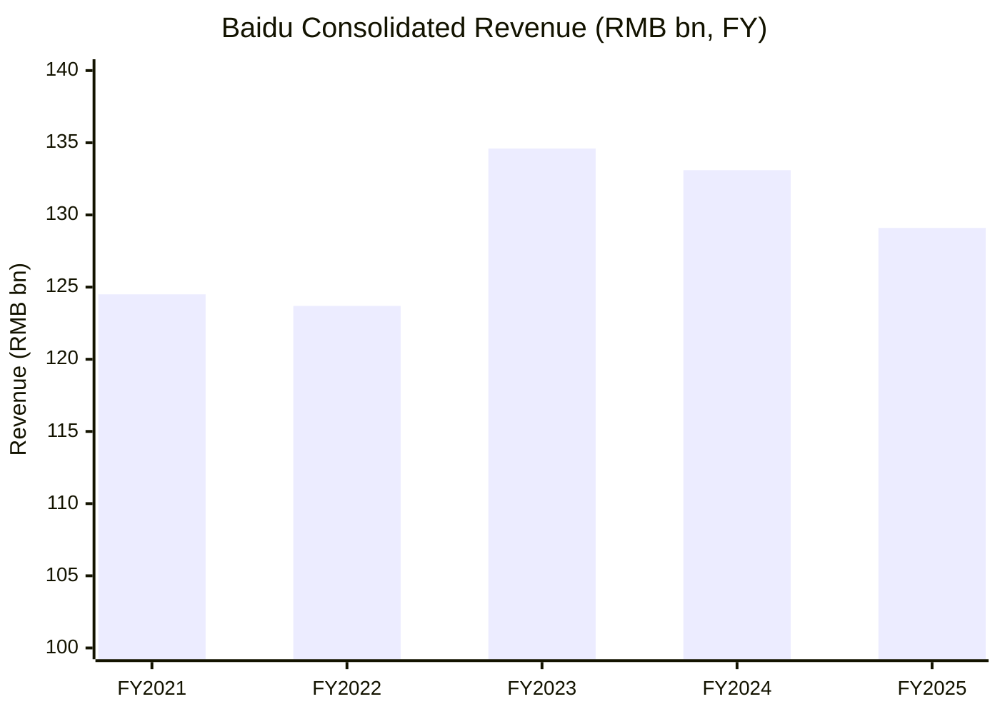
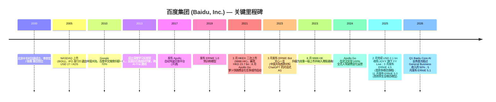
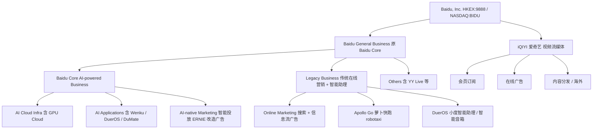
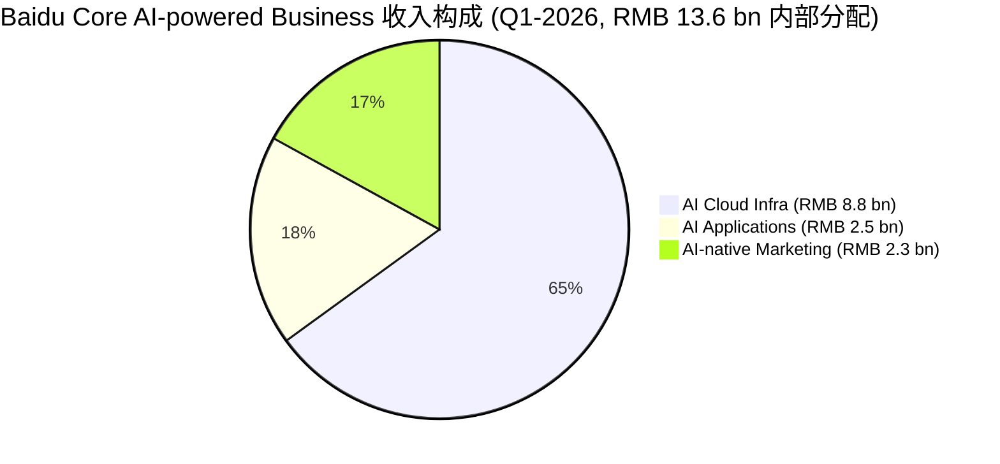
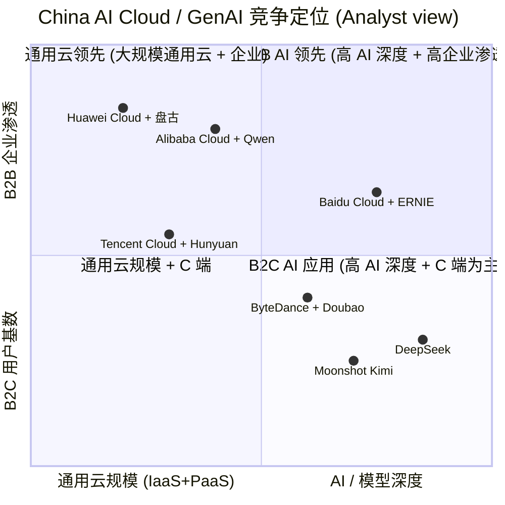
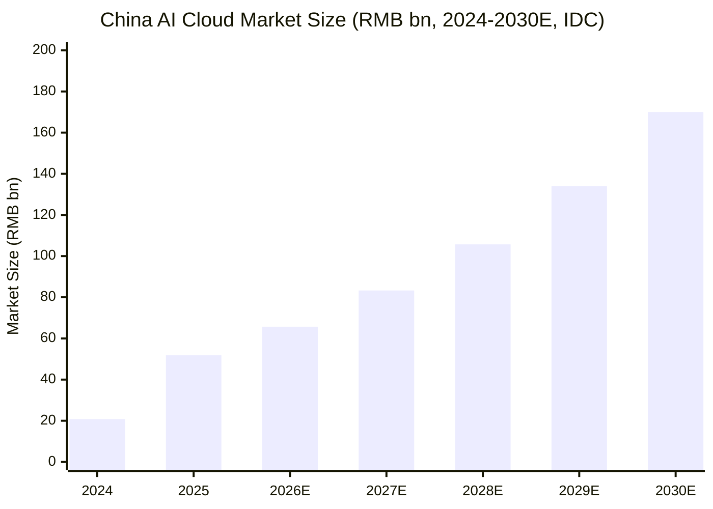

# 百度集团 (Baidu, Inc.) — HKEX:9888 公司研究

*As of 2026-06-02*

> **Update — Q1-FY2026 业绩公告 (2026-05-18):** 百度 Q1-FY2026 总收入 RMB 32.1 bn (USD 4.65 bn)，同比 -2%；其中 **Baidu Core AI-powered Business** 收入 RMB 13.6 bn，同比 +49%，**首次超过 Baidu General Business 收入的一半 (52%)**，公司明确称 "AI 已成为百度核心驱动力"。AI Cloud Infra 单季收入 RMB 8.8 bn（同比 +79%），其中 GPU Cloud 同比 +184%；AI 原生营销 RMB 2.3 bn（同比 +36%）；Apollo Go 完成完全无人驾驶订单 3.2 mn 单，同比 +120%。CFO Haijian He 表示运营现金流 RMB 2.7 bn 转正。Source: [Baidu Q1-2026 业绩公告 Form 6-K Exhibit 99.1, 2026-05-18](https://www.sec.gov/Archives/edgar/data/1329099/000119312526228123/d156481dex991.htm)。

## 目录

1. [公司概览](#1-公司概览)
2. [公司历史](#2-公司历史)
3. [管理团队](#3-管理团队)
4. [产品与服务](#4-产品与服务)
5. [客户与上市策略](#5-客户与上市策略)
6. [行业概览](#6-行业概览)
7. [竞争格局](#7-竞争格局)
8. [市场机会](#8-市场机会)
9. [风险评估](#9-风险评估)
10. [投资视角评分卡](#10-投资视角评分卡)
11. [参考资料](#11-参考资料)

---

## 1. 公司概览

**百度集团 (Baidu, Inc.)** 是一家以人工智能 (AI, 人工智能) 为核心、植根于互联网搜索业务的中国科技公司，1999 年由 Robin Yanhong Li (李彦宏) 在硅谷构思、2000 年 1 月在北京正式成立，现总部位于北京海淀区上地十街 10 号「百度大厦」。百度从中文搜索引擎起家，目前业务横跨 **Baidu Core (百度核心业务，含 AI Cloud 基础设施、AI 应用、AI 原生营销、智能驾驶 / robotaxi、智能助理 DuerOS)** 与 **iQIYI (爱奇艺) 视频流媒体** 两大可报告分部 ([Baidu FY2025 20-F Item 5.A — Operating Results](https://www.sec.gov/Archives/edgar/data/1329099/000119312526109289/d38065d20f.htm))。截至 2026 年 5 月，公司在 NASDAQ (BIDU) 与香港联交所主板 (HKEX:9888 港币柜台 / 89888 人民币柜台) 双重一级上市；按 1 ADS = 8 股 Class A 普通股 的转换比例 (即「八股合一存托凭证」)，两地股票完全可转换 ([Baidu Hong Kong Offering Prospectus, 2021-03-12](https://www1.hkexnews.hk/listedco/listconews/sehk/2021/0312/2021031200021.pdf))。

商业模式上，公司收入主要由三块构成：(i) **在线营销 (online marketing / 在线营销)**，即基于搜索 + 信息流的广告售卖，过去 20 年是 Baidu 的现金牛，但近两年因 AI 改造及宏观广告主预算疲软而下行；(ii) **AI Cloud + AI 应用 + AI 原生营销 (AI Cloud Infra + AI Applications + AI-native Marketing)**，以「文心 (ERNIE)」基础模型为底座为企业与开发者提供算力、模型与场景化解决方案；(iii) **智能驾驶 (Apollo Go 萝卜快跑 robotaxi)** 与 **DuerOS 智能助理 / 小度智能硬件**。20-F Item 5 披露：FY2025 全年合并收入 RMB 129.1 bn (USD 18.5 bn)，同比 -3%，主因在线营销收入下行被云收入增长部分抵消 ([Baidu FY2025 20-F § Consolidated revenue](https://www.sec.gov/Archives/edgar/data/1329099/000119312526109289/d38065d20f.htm))。Baidu General Business (即原 Baidu Core 在 2025 Q3 重新命名后的名称) FY2025 收入 RMB 102.5 bn (USD 14.7 bn)，同比 -2%；iQIYI FY2025 收入 RMB 25.4 bn (本份 20-F 文本披露 iQIYI 2024 → 2025 由 RMB 29.2 bn 下降至约 RMB 25.4 bn，同比 -13%，主因会员与广告同时承压)。VIE (variable interest entities, 协议控制实体) 在 2023 / 2024 / 2025 三年分别贡献了百度合并外部收入的 45% / 44% / 50%，是中概互联网普遍采用的契约式架构 ([Baidu FY2025 20-F § Holding Company Structure](https://www.sec.gov/Archives/edgar/data/1329099/000119312526109289/d38065d20f.htm))。

地域上，绝大部分收入来自中国大陆（人民币计价），美元 / 港币收入主要由 Apollo Go 海外、iQIYI 海外会员、及小度智能硬件零星贡献。截至 2025 年 12 月 31 日，Baidu App MAU (monthly active users, 月活跃用户) 为 6.79 亿，Q1-2026 报告中 MAU 为 6.55 亿，仍为中国第一大搜索 + 信息流入口 ([Baidu FY2025 20-F Item 4.B — Business Overview](https://www.sec.gov/Archives/edgar/data/1329099/000119312526109289/d38065d20f.htm))；公司在 20-F 中称 Baidu App 是 "the leading search-plus-feed app in China"。资本开支方面，FY2025 capex 为 RMB 12.1 bn (USD 1.7 bn)，占收入 9%，较 FY2024 的 6% 显著上行，主要投入 AI Cloud 服务器与算力基础设施 ([Baidu FY2025 20-F § Capital Expenditures](https://www.sec.gov/Archives/edgar/data/1329099/000119312526109289/d38065d20f.htm))。

**估值快照 (Valuation snapshot)。** 截至 2026 年 6 月初，9888.HK 收盘约 **HKD 134.7** ([Baidu (HKG:9888) Stock Overview — stockanalysis.com, 2026-06](https://stockanalysis.com/quote/hkg/9888/))，总市值约 **HKD 353 bn (≈ USD 45 bn)**；52 周区间 HKD 79.35 – 161.20，年内表现波动大但 YTD 反弹超过 40%。**TTM P/E 数据极不正常 (~794×)**：这是 GAAP TTM EPS 几乎归零的算术后果——FY2025 全年净利润同比下滑 ~80% ([Baidu (HKG:9888) overview — stockanalysis.com, 2026-06](https://stockanalysis.com/quote/hkg/9888/))，主要驱动是 (a) AI Cloud / Apollo Go / iQIYI 内容投入挤压利润率、(b) 长期股权投资减值、以及 (c) 在线营销下行。**Forward P/E 17×** 是更合理的指引参考（一致预期假设 Baidu General Business 利润率在 2026 H2 触底）。**TTM P/S ≈ 2.4×** (= 353 / 146 HKD bn 营收)，**显著低于** 美国 hyperscale 同业 (MSFT ~12×, GOOG ~6×) 和中国互联网平台同业 (Alibaba ~2.2×, Tencent ~7×, NetEase ~4×)；公司既在 "中概折价" 也在 "搜索结构性下行 + AI 估值锚定不清" 的双重夹击中 ([Baidu Q1-2026 业绩公告 6-K Exhibit 99.1](https://www.sec.gov/Archives/edgar/data/1329099/000119312526228123/d156481dex991.htm))。**分析师观点：** 卖方平均 12 个月目标价 HKD 180（22 位分析师，Strong Buy），对应隐含上行 ~34%，逻辑核心是 AI Cloud / Apollo Go 走出爬坡期重估，前提是 Baidu Core AI 业务能在 2026 年下半年 GAAP 转正 ([Baidu (HKG:9888) valuation — stockanalysis.com, 2026-06](https://stockanalysis.com/quote/hkg/9888/))。本报告 §9 将把此估值 "成长溢价 vs. 业绩兑现" 失衡纳入风险评估。

Source: [Baidu FY2025 20-F § Consolidated revenue](https://www.sec.gov/Archives/edgar/data/1329099/000119312526109289/d38065d20f.htm), [Baidu FY2024 20-F § Consolidated revenue](https://www.sec.gov/Archives/edgar/data/1329099/000119312525066199/d853848d20f.htm). FY2021 数据来自管理层 over time 比较。

---

## 2. 公司历史

百度的起源可追溯到 1999 年 9 月：李彦宏 (Robin Li) 在硅谷以个人储蓄启动公司构想，并于 2000 年 1 月与徐勇 (Eric Xu) 在北京中关村以约 USD 1.2 mn 风险融资正式注册成立，初期为新浪、搜狐等门户提供搜索后台技术 ([Baidu FY2025 20-F Item 4.A — History and Development of the Company](https://www.sec.gov/Archives/edgar/data/1329099/000119312526109289/d38065d20f.htm))。2001 年公司从 B2B 模式转向 B2C，自建搜索引擎 baidu.com 直接面向用户，并在 2002 年发布著名的中文搜索算法迭代 (后来被业界称为 "闪电计划")。2003 年百度上线贴吧 (Baidu Tieba)，建立了早期 UGC 社区飞轮。2005 年 8 月百度在 NASDAQ 上市，发行价 USD 27 / ADS，上市首日收盘 USD 122.54，是当时纳斯达克五年来涨幅最大的 IPO 之一 ([Baidu Form 20-F filings prior to 2020 on SEC EDGAR](https://www.sec.gov/cgi-bin/browse-edgar?action=getcompany&CIK=0001329099&type=20-F&dateb=&owner=include&count=40))。

后续的多次战略转向定义了今天的百度：(a) 2010 年 Google 退出中国大陆，百度中文搜索市场份额一度超过 70%，开启 "中国搜索 + 在线营销" 现金流黄金期；(b) 2012–2016 年公司试水 O2O、外卖、糯米团购等本地生活领域，未能跑通 unit economics，2017 年起逐步剥离；(c) 2013 年成立百度深度学习实验室 (IDL, Institute of Deep Learning, 由吴恩达 Andrew Ng 任首席科学家)，确立 AI-first 路线；(d) 2017 年 7 月正式发布 **Apollo 自动驾驶开放平台**，将百度的 AI 能力延伸至物理世界 ([Baidu FY2025 20-F § Apollo Go](https://www.sec.gov/Archives/edgar/data/1329099/000119312526109289/d38065d20f.htm))；(e) 2019 年发布 ERNIE 1.0 预训练模型 (基于 Transformer + 知识增强)，奠定后续 ERNIE 系列基础；(f) 2023 年 3 月推出 **ERNIE Bot (文心一言)** —— 中国大陆第一款公开发布的对标 ChatGPT 的对话式 AI 产品 ([Baidu FY2025 20-F § ERNIE](https://www.sec.gov/Archives/edgar/data/1329099/000119312526109289/d38065d20f.htm))。

公司在 2021 年 3 月 23 日完成香港联交所主板二次上市 (股票代码 9888.HK)，全球发售 95 mn 股 Class A 普通股 (公开发售价 HKD 252 / 股)，净募资约 **HKD 23.7 bn (≈ USD 3.1 bn)**，由 Goldman Sachs (Asia) L.L.C. 与 CLSA 联席保荐；2022 年 10 月 HKEX 修订上市规则后，9888.HK 自动升级为 "双重一级上市 / dual-primary listing"，并自 2023 年 8 月起被纳入港股通南向标的，使 A 股投资人可直接买入 ([Baidu Hong Kong Offering Prospectus, 2021-03-12](https://www1.hkexnews.hk/listedco/listconews/sehk/2021/0312/2021031200021.pdf))，[King & Wood Mallesons advises Baidu on its Hong Kong secondary listing, 2021](https://www.kwm.com/cn/en/about-us/media-center/kwm-advises-baidu-on-its-hk-secondary-listing.html)。2025 年 2 月，集团旗下子公司 Baidu (Hong Kong) Limited 完成对 JOYY 的 YY Live 中国大陆直播业务收购，对价约 **USD 2.1 bn**（在原 2020 年 USD 3.6 bn 协议被监管 long-stop 失败后重新谈判）；这一交易补足百度短视频 / 直播流量入口 ([Baidu FY2025 20-F § Acquisition of YY Live](https://www.sec.gov/Archives/edgar/data/1329099/000119312526109289/d38065d20f.htm))。

Source: 综合 [Baidu FY2025 20-F Item 4.A](https://www.sec.gov/Archives/edgar/data/1329099/000119312526109289/d38065d20f.htm), [Baidu Q1-2026 业绩公告 6-K Exhibit 99.1, 2026-05-18](https://www.sec.gov/Archives/edgar/data/1329099/000119312526228123/d156481dex991.htm), [Baidu Hong Kong Offering Prospectus, 2021-03-12](https://www1.hkexnews.hk/listedco/listconews/sehk/2021/0312/2021031200021.pdf), [Apollo Go (Wikipedia)](https://en.wikipedia.org/wiki/Apollo_Go)。

---

## 3. 管理团队

**Robin Yanhong Li (李彦宏) — Co-founder, Chairman & CEO (创始人、董事长、首席执行官)。** 1968 年生于山西阳泉，1991 年毕业于北京大学信息管理专业 (bachelor's degree in information science from Peking University)，随后赴美深造，1994 年在 State University of New York at Buffalo 获得计算机科学硕士学位 (master's degree in computer science) ([Baidu FY2025 20-F Item 6.A — Directors and Senior Management](https://www.sec.gov/Archives/edgar/data/1329099/000119312526109289/d38065d20f.htm))。20-F 原文披露："Prior to founding our company, Mr. Li worked as an engineer for Infoseek, a pioneer in the search industry, and as a senior consultant for IDD Information Services."—— 在 Infoseek 期间 (1997–1999) 他发明并申请了 **超链分析 (hyperlink analysis) 专利**，构成今天搜索引擎相关性排序的基础理论之一，这一技术也是他后来回国创业的核心知识产权资本 ([Baidu FY2025 20-F Item 6.A](https://www.sec.gov/Archives/edgar/data/1329099/000119312526109289/d38065d20f.htm))。20-F 明确写："Mr. Li has been serving as the chairman since our inception in January 2000 and as our chief executive officer since February 2004."—— 即李彦宏从公司创办起担任董事长，2003 年 12 月 31 日卸任总裁，2004 年 2 月起兼任 CEO 至今，是中国互联网行业任期最长的 founder-CEO 之一。

李彦宏目前持有公司 Class B 普通股 (一股十票投票权)，是上市公司控制人；20-F 披露："Each Class B ordinary share is convertible into one Class A ordinary share at any time by the holder thereof." 这种 dual-class share structure 与 Google / Meta / Snap 类似，给予创始人对核心业务方向（如全力 All-in AI、Apollo Go 长期投入）的稳定决策权 ([Baidu FY2025 20-F Item 6.A — Share Ownership](https://www.sec.gov/Archives/edgar/data/1329099/000119312526109289/d38065d20f.htm))。他兼任 New Oriental Education & Technology Group Inc. (NYSE: EDU; SEHK: 9901) 董事，无其他主要公开公司高管职务，时间精力集中在百度。在 Q1-2026 业绩公告中他署名声明 "AI 已成为百度核心驱动力 / AI has become the core driver of Baidu"，是公司近期沟通中明确的口径定调 ([Baidu Q1-2026 业绩公告 6-K Exhibit 99.1, 2026-05-18](https://www.sec.gov/Archives/edgar/data/1329099/000119312526228123/d156481dex991.htm))。**分析师观点：** Li 个人的技术背景与 dual-class 控制权使其成为百度最关键的 single-person-risk —— 既是关键执行者，也是关键替代成本 (key-person dependence)，监管 / 健康 / 接班的任何不连续都将冲击估值；公司未公开正式接班计划。

**Haijian He (何海建) — Chief Financial Officer (首席财务官)，2025 年 7 月加入。** 20-F 原文披露："Haijian He has served as our chief financial officer since July 2025. Mr. He joined Baidu from Kingsoft Cloud Holdings Limited, where he served as executive director and chief financial officer since January 2020. Prior to joining Kingsoft Cloud, Mr. He served as an executive director of the TMT (telecommunications, media and technology) group and the mergers and acquisitions group sequentially at Goldman Sachs (Asia) L.L.C. from September 2015 to January 2020. Prior to that, Mr. He worked at Bank of America Merrill Lynch and Citigroup Global Markets Inc. successively from 2010 to 2015." ([Baidu FY2025 20-F Item 6.A](https://www.sec.gov/Archives/edgar/data/1329099/000119312526109289/d38065d20f.htm))。何海建毕业于东南大学电子工程本硕，并取得芝加哥大学 MBA、哈佛 AMP，是 CFA 持证人；同时兼任 iQIYI, Inc. 董事会主席及 Sipai Health Technology / Sunwoda EVB 独立非执行董事。

CFO 切换的时间点很值得注意：何海建上任正好在 2025 年 Q3 公司将 "Baidu Core" 重命名为 "Baidu General Business" 并新增 "Baidu Core AI-powered Business" 子披露之前；从其 Kingsoft Cloud 上市公司 CFO 的背景看 (云业务的财务分部披露 / 投资人沟通 / 资本市场叙事是其专长)，这一人事变动与 "AI / Cloud 重塑估值故事" 的战略意图高度匹配。Q1-2026 业绩公告中他署名表示运营现金流 RMB 2.7 bn 转正、Baidu General Business non-GAAP 经营利润季环比 +39% 至 RMB 4.0 bn，"reflecting continued improvement in our operating efficiency and overall business health" ([Baidu Q1-2026 业绩公告 6-K Exhibit 99.1, 2026-05-18](https://www.sec.gov/Archives/edgar/data/1329099/000119312526228123/d156481dex991.htm))。**分析师观点：** 从 Goldman → Kingsoft Cloud → Baidu 的轨迹意味着新 CFO 既懂资本市场又懂中国云业务的财务实操，市场对他能否成功扁平化 "云业务亏损黑盒 / cloud unit economics black box" 的预期相当高。

---

## 4. 产品与服务

### 4.1 业务架构总览：双分部 + 三大 AI 收入引擎

百度合并报表按 ASC 280 报告两个 operating segment：**Baidu General Business** (即原 Baidu Core) 与 **iQIYI** ([Baidu FY2025 20-F § Segment Reporting](https://www.sec.gov/Archives/edgar/data/1329099/000119312526109289/d38065d20f.htm))。Baidu General Business 内部又细分为：

| Baidu General Business 细分 | Q1-2025 (RMB bn) | Q1-2026 (RMB bn) | YoY | 占 BGB 收入比 (Q1-2026) |
|---|---|---|---|---|
| Baidu Core AI-powered Business | 9.1 | 13.6 | **+49%** | **52%** |
| — AI Cloud Infra (含 GPU Cloud) | 4.9 | 8.8 | **+79%** | 34% |
| — AI Applications | 2.5 | 2.5 | 0% | 10% |
| — AI-native Marketing Services | 1.7 | 2.3 | +36% | 9% |
| Legacy Business (传统在线营销 + 智能助理 + Apollo Go 等) | 14.3 | 10.2 | -29% | 39% |
| Others | 2.1 | 2.2 | +6% | 8% |
| **Baidu General Business 合计** | **25.5** | **26.0** | **+2%** | 100% |

Source: [Baidu Q1-2026 业绩公告 6-K Exhibit 99.1, 2026-05-18 — Baidu Core AI-powered Business / Baidu General Business 表](https://www.sec.gov/Archives/edgar/data/1329099/000119312526228123/d156481dex991.htm)。20-F 中提示："The revenue and operational data related to Baidu Core AI-powered Business disclosed in our public disclosures are derived from the Company's internal management accounts and records, which have not been audited and there can be no assurance that the aforementioned accounts and records could be auditable" —— 即 AI 子披露是管理层口径，非审计；分析人员阅读时须谨慎对待 ([Baidu FY2025 20-F Item 5.A](https://www.sec.gov/Archives/edgar/data/1329099/000119312526109289/d38065d20f.htm))。

Source: [Baidu Q1-2026 业绩公告 6-K Exhibit 99.1, 2026-05-18](https://www.sec.gov/Archives/edgar/data/1329099/000119312526228123/d156481dex991.htm), [Baidu FY2025 20-F Item 4.B — Business Overview](https://www.sec.gov/Archives/edgar/data/1329099/000119312526109289/d38065d20f.htm)。

### 4.2 综合协同——产品如何串联

百度的核心叙事是 **"以 ERNIE 基础模型为引擎，把搜索 + 信息流 + 云 + 智能驾驶 + iQIYI 串成一个 AI-native 入口生态"**。Q1-2026 的财报数据让这条叙事第一次出现量化拐点：Baidu Core AI-powered Business 收入占比从 2024 全年的 ~25% 急升至 Q1-2026 的 52% (Baidu General Business 口径下) ([Baidu Q1-2026 业绩公告 6-K Exhibit 99.1, 2026-05-18](https://www.sec.gov/Archives/edgar/data/1329099/000119312526228123/d156481dex991.htm))。客户工作流上：(a) **企业客户** 在 AI Cloud Infra 上租赁 GPU 算力 (Q1 +184% YoY 的 GPU Cloud 数字反映了中国互联网厂商集中下大模型训练 / 推理订单)，并通过千帆 (Qianfan) 平台调用 ERNIE 模型 API；(b) **个人 / 中小企业** 通过 Baidu App + Baidu Wenku + DuerOS / 小度硬件接入 ERNIE 4.5 / 5.0 的对话与多模态能力；(c) **广告主** 通过 AI-native Marketing Services 把搜索 + 信息流广告替换为生成式投放 + AI 创意自动化 (Q1 +36% YoY)；(d) **打车用户** 在 Apollo Go App 调用萝卜快跑无人车 (Q1 完成 3.2 mn 完全无人驾驶单)；(e) **iQIYI 用户** 看长视频内容并被 ERNIE 推荐引擎驱动的 personalization 服务。

### 4.3 ERNIE 基础模型家族 (Foundation models, 基础模型)

> **20-F 引文 (Item 4.B):** "We are one of the very few companies in the world that offers a full AI stack ... In November 2025, we unveiled ERNIE 5.0, our first native omni-modal foundation model. ERNIE 5.0 delivers strong performance across omni-modal understanding, creative writing, and instruction following. In January 2026, we released an updated version of ERNIE 5.0."—— [Baidu FY2025 20-F § ERNIE](https://www.sec.gov/Archives/edgar/data/1329099/000119312526109289/d38065d20f.htm)

**中文释义 / Plain-language gloss:** ERNIE (Enhanced Representation through kNowledge IntEgration, 知识增强的表示模型) 是百度自研的预训练 transformer 大模型家族，最大的差异化是 **knowledge integration / 知识增强**——把百度搜索沉淀的大规模结构化知识图谱与文本预训练相结合，使模型在中文事实问答、行业垂域问题上往往优于纯文本预训练的同尺寸模型。当前在售版本：ERNIE 4.5 (2025-03，首款多模态 / multimodal 旗舰)、ERNIE X1 (2025-03，首款 reasoning model 推理模型)、ERNIE 4.5 Turbo / X1 Turbo (2025-04 加速版本，单 token 成本据公司称下降至前代的 ~40%)、ERNIE 5.0 (2025-11 首款原生 omni-modal 全模态模型)、ERNIE 5.1 (2026-05) ([Baidu Q1-2026 业绩公告 6-K Exhibit 99.1, 2026-05-18](https://www.sec.gov/Archives/edgar/data/1329099/000119312526228123/d156481dex991.htm))。Q1-2026 业绩公告明确披露："ERNIE 5.1 ranked first among Chinese models on the text leaderboard and topped the LMArena search leaderboard among Chinese models, ranking fourth globally" —— 即在公开评测 LMArena 上中文文本类目第一、全球第四，且在 search 类目位列全球第四。*分析师观点：* LMArena 是 community vote 类盲测，参考价值高于厂商自评但不等同于客户实际下游性能；与 OpenAI / Anthropic / Google 在专业 benchmark (MMLU / GPQA / SWE-Bench) 上的差距仍存在，模型能力的差距正在收敛但尚未追平 ([itcanthink 调研, 2025](https://itcanthink.substack.com/p/baidu-and-the-global-competition))。

### 4.4 AI Cloud Infra (含 GPU Cloud)

> **Q1-2026 业绩公告 引文:** "Revenue from AI Cloud Infra was RMB 8.8 billion in the first quarter of 2026, up 79% year over year. Revenue from GPU Cloud increased by 184% year over year in the first quarter of 2026."—— [Baidu Q1-2026 业绩公告 6-K Exhibit 99.1, 2026-05-18](https://www.sec.gov/Archives/edgar/data/1329099/000119312526228123/d156481dex991.htm)

**中文释义 / Plain-language gloss:** 百度智能云 (Baidu AI Cloud, 千帆 Qianfan 平台) 是公司面向企业的 AI-native cloud 服务，包含 (i) **GPU Cloud (原名 subscription-based revenue from AI accelerator infrastructure, AI 加速器基础设施订阅收入)**——出租给客户作为大模型训练 + 推理的算力；(ii) **PaaS 层**——模型即服务 (MaaS, model-as-a-service)，包括 ERNIE 自研模型与第三方开源模型 (Llama / DeepSeek / Qwen) 的托管推理；(iii) **行业解决方案**——为金融 / 制造 / 能源 / 政务等大客户做定制化 AI 项目交付。**与公有云 hyperscaler 的差异:** 百度智能云规模上远不及 Alibaba Cloud / Huawei Cloud / Tencent Cloud (IDC 数据中国公有云 IaaS+PaaS 市场份额 BAT-H 排序中百度排第四 / 第五)，但在 *AI cloud* 这个细分 (IDC 单独切出来按 AI 推理 / 训练算力使用计费的赛道)，百度连续六年位列第一 ([Baidu AI Cloud was ranked the No.1 AI cloud provider for the sixth consecutive year — IDC 2024 China AI Public Cloud report, 2025-07](https://www.crnasia.com/news/2025/cloud/baidu-and-alibaba-take-lead-in-china-s-ai-cloud-market))。**战略意义:** AI Cloud 是百度的 AI 商业化主战场 —— Q1-2026 增速 +79% 是公司转型成功与否的最关键单一指标。

*分析师观点：* AI Cloud 的同比基数效应需要警惕——FY2024 H2 中国大模型训练算力价格因供需失衡有过短期下杀，FY2025 H2 / FY2026 H1 同比受益于 (a) GPU 供给修复 + (b) 国产 H20 / 寒武纪 / 昇腾 等替代上量，单价 + 用量双修复。下一年同期再翻倍的难度更大；卖方共识把 FY2026 AI Cloud 增速预测在 +50–60% 区间 ([Alibaba holds wide lead over rivals — SCMP, 2025](https://www.scmp.com/tech/big-tech/article/3325034/alibaba-holds-wide-lead-over-rivals-bytedance-huawei-tencent-chinas-ai-cloud-market))。

### 4.5 AI Applications (DuMate, Miaoda, Famou Agent, Wenku, Drive)

> **Q1-2026 业绩公告 引文:** "Baidu launched DuMate, its general-purpose agent for everyday productivity, in March 2026, which autonomously executes complex, multi-step workflows across applications and files end-to-end. Baidu launched Miaoda 3.0, its vibe coding platform, at Baidu Create 2026, introducing enterprise and mobile versions and enabling the generation of standalone applications. Baidu launched Famou Agent 2.0, its self-evolving agent, at Baidu Create 2026. Famou Agent 2.0 has achieved state-of-the-art performance on MLE-Bench, a leading machine learning engineering benchmark, setting a new SOTA record. Baidu Wenku and Baidu Drive launched GenFlow 4.0 in April 2026, enhancing its agent capabilities for more efficient productivity workflows."—— [Baidu Q1-2026 业绩公告 6-K Exhibit 99.1, 2026-05-18](https://www.sec.gov/Archives/edgar/data/1329099/000119312526228123/d156481dex991.htm)

**中文释义 / Plain-language gloss:** AI Applications 子线收入 Q1-2026 RMB 2.5 bn，同比基本持平、季环比 -10%。具体来看：(a) **Baidu Wenku (文库) + Baidu Drive (网盘)** 嵌入 ERNIE 的 PPT / 报告 / 文档自动生成能力，向 C 端订阅收费 (按月 / 年)，已经成为公司 ToC AI 变现规模最大的产品线；(b) **DuMate (general-purpose agent, 通用智能体)**——对标 OpenAI Operator / Anthropic Claude Computer Use 的 agentic AI，可在用户授权下跨应用 + 文件执行多步骤工作流；(c) **Miaoda (vibe coding 平台)**——对标 Cursor / GitHub Copilot 的 AI 编码平台，3.0 版本同时支持企业 / 移动端；(d) **Famou Agent (自我进化型智能体)**——面向 ML / 数据工程师，在 MLE-Bench 上取得 SOTA。**与海外 agent 平台的差异:** DuMate / Miaoda / Famou 三件套构成了一个 "中文场景 + 中国 SaaS 生态 + ERNIE 模型底座" 的封闭体验，对 OpenAI / Anthropic 不能直接进入中国市场形成天然护城河。*分析师观点：* AI Applications 单季 0% YoY 是当前最弱的子分部，说明公司在 ToC / ToB 应用变现节奏上仍在试错（C 端为主、SMB 中长尾未起量），中长期能否兑现仍待验证。

### 4.6 AI-native Marketing Services (智能投放)

> **Q1-2026 业绩公告 引文:** "Revenue from AI-native marketing services reached RMB 2.3 billion in the first quarter of 2026, up 36% year over year."—— [Baidu Q1-2026 业绩公告 6-K Exhibit 99.1, 2026-05-18](https://www.sec.gov/Archives/edgar/data/1329099/000119312526228123/d156481dex991.htm)

**中文释义 / Plain-language gloss:** 这是公司在传统搜索 + 信息流广告基础上叠加 ERNIE 模型驱动的 **生成式投放 + 智能创意** 服务——广告主上传产品 / 品牌素材后由 AI 自动生成多种文案 / 视频 / 落地页变体并基于实时反馈做 budget allocation。Q1-2026 +36% YoY 表明 AI 改造已经在广告业务侧产生增量收入 (不是简单的存量切换)。**战略意义:** 这条业务是 "在线营销结构性下行" 与 "AI 重塑营销" 两股力量在百度内部的对冲点。如果 AI-native Marketing 增速继续保持 30%+，2027 年起将逐步覆盖 Legacy 在线营销下行的缺口。*分析师观点：* 与字节跳动巨量引擎 / Alibaba 万相台 等同业相比，百度的搜索意图数据是天然的训练 + 反馈源，但广告主预算的份额迁移仍受 GMV / 转化效率长期跟踪结果驱动；竞争激烈。

### 4.7 在线营销 / Legacy Business (搜索 + 信息流广告)

> **20-F 引文 (Item 5.A):** "Revenue from online marketing services declined in 2024 and 2025, primarily due to our ongoing AI transformation, which impacted the monetization approach, as well as unfavorable macroeconomic conditions that adversely affected customers' advertising budgets and spending."—— [Baidu FY2025 20-F § Online Marketing Services](https://www.sec.gov/Archives/edgar/data/1329099/000119312526109289/d38065d20f.htm)

**中文释义 / Plain-language gloss:** Baidu General Business 中的 "Online Marketing Services" 子项 Q1-2026 收入 RMB 12.6 bn，同比 **-22%**，占 Baidu General Business 收入比从去年同期的 63% 降至 48%——这是公司转型阵痛的清晰量化体现。在线营销由 (a) 搜索关键词 CPC / CPM 投放 + (b) 信息流 (feed) 广告组成，二者共同的载体是 **Baidu App** (Q1-2026 MAU 6.55 亿)。AI 改造对在线营销的冲击主要来自：(i) ERNIE 直接回答用户问题、减少广告位曝光的传统 query 数；(ii) AI 改造期间公司主动收缩低质量广告流量；(iii) 广告主预算受宏观 + 直播电商分流影响。*分析师观点：* 在线营销下行短期看不到拐点，年化降幅大概率维持 -15% 到 -25%，**这条业务的 GAAP 利润率仍是公司毛利的最大贡献者**——这是为什么 GAAP EPS 同比 -80%、forward P/E 17× 之间出现巨大 disconnect 的财务来源。

### 4.8 Apollo Go (萝卜快跑 robotaxi)

> **20-F 引文 (Item 4.B):** "Apollo Go provides autonomous ride-hailing service. As of February 2026, the accumulated rides provided to the public by Apollo Go exceeded 20 million. Since February 2025, Apollo Go has commenced fully driverless operations across all of its operating cities in the Chinese mainland. As of February 2026, Apollo Go's global footprint reached 26 cities."—— [Baidu FY2025 20-F § Apollo Go](https://www.sec.gov/Archives/edgar/data/1329099/000119312526109289/d38065d20f.htm)

> **Q1-2026 业绩公告 引文:** "In the first quarter of 2026, Apollo Go, Baidu's autonomous ride-hailing service, delivered 3.2 million fully driverless operational rides with weekly rides peaking at over 350,000 in March. Total rides increased by over 120% year over year. As of April 2026, cumulative rides provided to the public by Apollo Go exceeded 22 million. ... As of May 2026, Apollo Go's global footprint reached 27 cities. To date, Apollo Go fleets have accumulated over 330 million autonomous kilometers, including over 220 million fully driverless autonomous kilometers, with an outstanding safety record."—— [Baidu Q1-2026 业绩公告 6-K Exhibit 99.1, 2026-05-18](https://www.sec.gov/Archives/edgar/data/1329099/000119312526228123/d156481dex991.htm)

**中文释义 / Plain-language gloss:** Apollo Go 萝卜快跑是百度旗下的 robotaxi (无人驾驶出租车) 业务，2025 年 2 月起在中国所有运营城市实现 100% 全无人 (no safety driver) 商业化，2026 年 Q1 全季度完成 320 万单全无人订单 + 周订单数 3 月峰值 35 万，累计公开运营订单数突破 2200 万，**与 Waymo 是全球 robotaxi 商业化最深入的两家公司**。海外扩张是 2025–2026 年的关键叙事：(i) **中东**——2025 年 3 月进入迪拜 / 阿布扎比，2025 年 8 月迪拜开放道路测试，2025 年 11 月阿布扎比拿到全无人商运许可证；(ii) **欧洲**——2026 年与 Uber / Lyft 在伦敦与瑞士试点；(iii) **韩国**——2026 年进入首尔大都市圈；(iv) **香港**——2024 年 11 月成为该地区第一家拿到 robotaxi 测试许可的公司，2025 年 4 月开放道路指定乘客测试 ([Baidu FY2025 20-F § Apollo Go Geographic Footprint](https://www.sec.gov/Archives/edgar/data/1329099/000119312526109289/d38065d20f.htm))。**与 Waymo / Cruise / Tesla FSD / WeRide / Pony.AI 的差异:** 百度的差异化在于 (a) 全无人商业化车队规模在中国大陆最大、(b) 平台 Apollo 同时开源给整车厂用 (BAIC / Geely / 北汽极狐等多个 OEM 是合作伙伴)、(c) "asset-light" 模式探索——20-F 提到 "we may pursue asset-light approaches in our robotaxi business in the future, and these models may not be carried out as planned. Under such models, we may sell our robotaxi vehicles to third parties"——即百度希望把车辆资产出表、自己专注算法与运营，类似 Uber + Waymo Stack。

*分析师观点：* 重大短期风险——2026 年 3 月 31 日 Wuhan 武汉发生 Apollo Go 大规模车辆同时停滞事故 (over 100 vehicles simultaneously froze, trapping passengers up to two hours)，几周后 **中国主管部门暂停了全国新的 robotaxi 牌照发放、阻止 robotaxi 公司扩车队 / 开新城市 / 新增测试** ([China Halts Autonomous Vehicle Expansion Following Baidu System Failure — TechStory, 2026](https://techstory.in/china-halts-autonomous-vehicle-expansion-following-baidu-system-failure/))，([China stopped issuing new robotaxi licenses over a glitch — Fortune, 2026-05-04](https://fortune.com/2026/05/04/china-robotaxis-glitch-us-autonomous-vehicles-tesla-waymo-baidu-weride/))。这一监管事件直接冲击中国本土 Apollo Go 增长节奏，市场对 robotaxi 估值贡献需要 reset。

### 4.9 iQIYI (爱奇艺) 视频流媒体

> **20-F 引文 (Item 5.A):** "iQIYI revenue was RMB 29.2 billion in 2024, decreasing by 8%, from RMB 31.9 billion in 2023 ... The cost of revenue of iQIYI decreased by 2% from RMB 22.0 billion in 2024 to RMB 21.5 billion (US$3.1 billion) in 2025, primarily due to a decrease in content cost"—— [Baidu FY2025 20-F § iQIYI Segment](https://www.sec.gov/Archives/edgar/data/1329099/000119312526109289/d38065d20f.htm)

**中文释义 / Plain-language gloss:** iQIYI 是中国主要长视频流媒体平台之一，与 Tencent Video / Youku 三分天下；NASDAQ 独立上市 (IQ)，百度持股约 50%+ 是控股股东、合并报表入百度。FY2025 收入约 RMB 25.4 bn (同比 -13%)，会员订阅 + 广告同步承压，与抖音 / 快手 / 视频号短视频对长视频用户时长的挤压有关。Q1-2026 iQIYI 收入 RMB 6.2 bn，季环比 -8%。**战略意义:** iQIYI 是百度报表里的 "另一个分部"，不是核心 AI 故事，但它消耗 ~17% 的合并收入与可观的 R&D / 内容资本支出；如果 iQIYI 持续亏损或市值进一步下杀，将出现 "母公司高 forward P/E 17× / 控股子公司股价 < USD 2 / ADS 现金流泥潭" 的估值结构性挑战。*分析师观点：* iQIYI 不是百度估值故事的主线，但它的 cash drag 是评估 Baidu Core "纯 AI 估值" 时必须扣除的项。

### 4.10 旗舰产品与发布节奏 (Flagship & Recent launches)

按 Q1-2026 公告判断，公司当前的旗舰组合是：(a) **ERNIE 5.1** (2026-05 发布)，对外 LMArena 中文文本第一；(b) **Apollo Go** (Q1-2026 完成 320 万全无人订单)；(c) **AI Cloud Infra** (Q1 +79% YoY 驱动 Baidu Core AI 业务量级翻倍)；(d) **Baidu Wenku + Baidu Drive** (AI 文档生产力的 ToC SaaS 实现规模化收入)；(e) **DuMate / Miaoda 3.0 / Famou Agent 2.0** (2026-03 至 04 集中推出的 agentic AI 三件套)。从节奏看，公司在 2025 H2 至 2026 H1 这段时间，**模型 + 应用 + 算力 + robotaxi 四条线全部上量**，是百度 25 年历史上 AI 投入兑现密度最高的窗口 ([Baidu Q1-2026 业绩公告 6-K Exhibit 99.1, 2026-05-18](https://www.sec.gov/Archives/edgar/data/1329099/000119312526228123/d156481dex991.htm))。

---

## 5. 客户与上市策略

### 5.1 客户结构 (Customer concentration)

20-F Item 4 与 Item 6 没有披露百度前五大客户的具体名单及百分比，原文搜索 "major customer" / "10%" 未发现单一客户超过合并外部收入 10% 的法定披露 ([Baidu FY2025 20-F](https://www.sec.gov/Archives/edgar/data/1329099/000119312526109289/d38065d20f.htm))。这与百度业务结构一致——核心收入来自高度分散的中国中小企业广告主 (Baidu General Business 在线营销下属 SMB 投放 + 大客户行业头部) + 长尾消费者 (Baidu App + DuerOS + iQIYI 会员)，**集团 / 合并口径不存在 single-customer concentration 风险**。这一披露事实本身是个数据点：与 NVIDIA (top-2 客户占 ~30%) 或 TSMC (Apple ~26%) 那种 hyperscale 单客户依赖完全不同，百度更接近 Alphabet / Meta 的 "亿级广告主长尾" 模式。

不过，**分部口径 (segment-level; not aggregated to group-level) 的客户集中度需要单独评估：** (i) **AI Cloud Infra** 子分部 (Q1-2026 RMB 8.8 bn / 季)：GPU Cloud +184% YoY 的强增长被业内普遍归因于中国头部互联网厂商集中下大模型训练 / 推理订单——卖方推测 ByteDance / Tencent / 美团 / 京东 / 蔚来等大客户的算力订单可能贡献了 GPU Cloud 收入的相当比例 ([Alibaba holds wide lead — SCMP, 2025](https://www.scmp.com/tech/big-tech/article/3325034/alibaba-holds-wide-lead-over-rivals-bytedance-huawei-tencent-chinas-ai-cloud-market))，但百度并未在 20-F 或 6-K 中点名具体客户。**这是 segment-level 推测，非公司披露，不应等同于合并口径 single-customer concentration。**(ii) **Apollo Go**：B2C 个人乘客 + 与 Uber / Lyft / AutoGo / PostBus 等海外平台的 B2B 接入分成模式，单一平台客户的集中度细节未披露。(iii) **iQIYI 广告分部**：典型品牌广告主长尾 + 行业大客户混合，未披露 top-N。

### 5.2 用户结构 (Users, not 'customers')

百度的真正 "用户基数" 体现在产品 MAU，而非营收客户：(a) **Baidu App** Q1-2026 MAU **6.55 亿** ([Baidu Q1-2026 业绩公告 6-K Exhibit 99.1](https://www.sec.gov/Archives/edgar/data/1329099/000119312526228123/d156481dex991.htm))，是中国第一大搜索 + 信息流入口；(b) **ERNIE 开发者生态** 18.1 mn developers (IDC 截止 2025-07 数据) ([Baidu and Alibaba take lead in China's AI cloud market — CRN Asia, 2025](https://www.crnasia.com/news/2025/cloud/baidu-and-alibaba-take-lead-in-china-s-ai-cloud-market))；(c) **iQIYI 订阅会员** 据 2025 财报披露在 9 千万级 (近年因短视频分流持续下行)；(d) **Apollo Go 累计公开订单** 截至 2026 年 4 月超过 2200 万 ([Baidu Q1-2026 业绩公告 6-K Exhibit 99.1](https://www.sec.gov/Archives/edgar/data/1329099/000119312526228123/d156481dex991.htm))。注意 MAU 数据是用户口径，并非合并收入贡献口径——读者不应把 6.79 亿 MAU 等同于 "潜在收入客户基础"，因为中国互联网的用户 ARPU (average revenue per user, 每用户平均收入) 远低于美国同类公司。

Source: [Baidu Q1-2026 业绩公告 6-K Exhibit 99.1, 2026-05-18 — Baidu Core AI-powered Business 表 (segment-level breakdown; not aggregated to group-level)](https://www.sec.gov/Archives/edgar/data/1329099/000119312526228123/d156481dex991.htm)。**饼图口径为 segment-level (Baidu Core AI-powered Business 内部三线划分)，不是合并集团口径。**

### 5.3 上市策略与股权架构

百度采用 **Cayman Islands 控股公司 + VIE (variable interest entity) 协议控制结构** ([Baidu FY2025 20-F § Holding Company Structure](https://www.sec.gov/Archives/edgar/data/1329099/000119312526109289/d38065d20f.htm))。主要 VIE 包括 **Baidu Netcom (北京百度网讯科技有限公司)、Beijing Perusal、Beijing iQIYI** 三家中国大陆持牌实体，承载 ICP 牌照 / 互联网新闻信息服务许可 / 网络视听节目许可等监管必需资质。VIE 在 FY2023 / FY2024 / FY2025 贡献合并外部收入的 45% / 44% / 50%——这一比例的上行反映了云 + 内容业务在中国大陆境内的收入权重上升 ([Baidu FY2025 20-F § Variable Interest Entities](https://www.sec.gov/Archives/edgar/data/1329099/000119312526109289/d38065d20f.htm))。VIE 法律风险是中概股投资人最熟悉的结构性风险之一 (见 §9 风险评估)。

**双重一级上市架构 (Dual-primary listing):** 2021 年 3 月 23 日在 HKEX 9888.HK 完成 secondary listing，2022 年 10 月 HKEX 上市规则修订后自动升级为 dual-primary listing ([King & Wood Mallesons advises Baidu on its Hong Kong secondary listing, 2021](https://www.kwm.com/cn/en/about-us/media-center/kwm-advises-baidu-on-its-hk-secondary-listing.html))。当前 ADS / Class A 转换比为 **1 ADS = 8 股 Class A 普通股**，两地股票完全可转换 ([Baidu FY2025 20-F § ADS Ratio](https://www.sec.gov/Archives/edgar/data/1329099/000119312526109289/d38065d20f.htm))。9888.HK 自 2023 年 8 月 28 日纳入港股通南向标的，A 股投资人可通过沪 / 深港通直接买入。2024 年起 9888.HK 同时开通港币柜台 (9888) + 人民币柜台 (89888) 双柜台交易，方便人民币计价机构投资人。**双重一级上市的对照意义:** 即使美国 SEC HFCAA (Holding Foreign Companies Accountable Act) 在极端情况下要求中概退市 (虽然 PCAOB 已于 2022-12 移除中港地区), 9888.HK 仍可独立维持上市与流动性，这是百度选择 dual-primary 而非 secondary-only 的核心动机。

---

## 6. 行业概览

百度横跨多个细分行业，主要包括：(a) **中国 AI Cloud (AI 公有云) 市场**，(b) **中国数字广告 / 搜索 + 信息流广告市场**，(c) **中国 robotaxi / autonomous mobility 市场**，(d) **中国长视频流媒体市场** (通过 iQIYI)。每个行业的规模 / 增速 / 竞争格局都不同。

**中国 AI Cloud 市场规模与增速。** IDC 2024 China AI Public Cloud Services Market 报告披露：FY2024 全年市场 RMB 20.83 bn，2025 年预计 RMB 51.8 bn (USD 7.3 bn)，**翻倍以上的增速**；2025–2030 年 CAGR 预测 26.8% ([Alibaba holds wide lead over rivals ByteDance, Huawei, Tencent in China's AI cloud market — SCMP, 2025](https://www.scmp.com/tech/big-tech/article/3325034/alibaba-holds-wide-lead-over-rivals-bytedance-huawei-tencent-chinas-ai-cloud-market))。**市场份额排序 (IDC 口径)**：Alibaba Cloud 35.8% (第一)、ByteDance Volcano Engine 14.8%、Huawei Cloud 13.1%、Tencent Cloud 7%、Baidu Cloud 6.1%。**但在 IDC 单独切出的 "AI public cloud" (即按 AI 训练 / 推理算力使用计费) 子赛道，百度连续六年位列第一** ([Baidu and Alibaba take lead — CRN Asia, 2025](https://www.crnasia.com/news/2025/cloud/baidu-and-alibaba-take-lead-in-china-s-ai-cloud-market))。两个数据点 (整体云份额第五 vs. AI 子赛道第一) 都是真实的——百度在通用 IaaS / PaaS 上规模不及 BAT-H 三家，但在 *AI 工作负载* 上凭借 ERNIE 模型与早期 AI 投入有领先地位。*分析师观点：* AI Cloud 的市场容量与对应估值正在被市场重估——2025 年 DeepSeek 开源冲击使中国整体大模型训练 / 推理算力消耗结构发生变化，推理需求 (相对低端) 占比上升、训练需求 (高端 GPU) 集中化加深；这对百度有利 (推理算力是百度强项) 也有挑战 (单价压力)。

**中国数字广告市场。** 中国数字广告整体规模在 2024 年约 RMB 1.0 tn (CNNIC + iResearch 口径)，其中搜索 + 信息流约 12–15%，剩余主要是电商 (Alibaba / JD / Pinduoduo)、短视频 (字节 / 快手) 与社交 (Tencent)。**百度的搜索 + 信息流场景结构性份额在过去 10 年从 ~70% 下降至 ~30%**——主要被字节抖音 + 微信视频号 + 小红书 + 知乎瓜分。20-F Item 3.D 风险段明确：广告主预算正从搜索 + 信息流向短视频 / 电商直播迁移 ([Baidu FY2025 20-F § Risks Related to Online Marketing](https://www.sec.gov/Archives/edgar/data/1329099/000119312526109289/d38065d20f.htm))。

**中国 robotaxi 市场。** 2024–2025 年是中国 robotaxi 商业化拐点：百度 Apollo Go、Pony.AI (NASDAQ: PONY)、WeRide (NASDAQ: WRD)、AutoX、滴滴出行 自动驾驶子公司 等几家头部玩家在北京 / 武汉 / 广州 / 上海 等开放 100% 全无人商运。McKinsey 等咨询机构估算 2030 年中国 robotaxi 市场可达 USD 50–100 bn TAM (含车辆 + 算法 + 运营服务)，但商业化路径仍依赖 (a) 监管 (各省市牌照节奏)、(b) 单位经济学 (每单成本 vs. 网约车)、(c) 公众接受度。Apollo Go 与 Waymo 是全球商业化最深入的两家，被 Fast Company 2026 评为 Automotive Most Innovative Companies 的并列前列 ([Baidu Q1-2026 业绩公告 6-K Exhibit 99.1, 2026-05-18](https://www.sec.gov/Archives/edgar/data/1329099/000119312526228123/d156481dex991.htm))。**2026 年 3 月 Wuhan 事故 + 监管暂停新牌照是行业重大不利信号** ([Fortune, 2026-05-04](https://fortune.com/2026/05/04/china-robotaxis-glitch-us-autonomous-vehicles-tesla-waymo-baidu-weride/))。

**中国长视频流媒体市场。** iQIYI / Tencent Video / Youku 三大平台合计份额超过 70%，市场结构稳定但增长停滞——会员订阅价格天花板低 (人均 ARPU ~USD 4–5 / 月，远低于 Netflix USD 15+)、版权与原创内容成本居高不下、短视频对用户时长的挤压。整体长视频行业 2025 年规模仍在 RMB 100 bn 量级但 YoY 持平到 -5%。

---

## 7. 竞争格局

### 7.1 20-F 引用的官方竞争对手清单

> **20-F 引文 (Item 4.B § Competition):** "We compete with these entities for both users and customers on the basis of user traffic, cyber security quality (relevance) of search (and other marketing and advertising) results, availability and user or customer experience of products and services, distribution channels and the number ..."—— [Baidu FY2025 20-F § Competition](https://www.sec.gov/Archives/edgar/data/1329099/000119312526109289/d38065d20f.htm)。20-F 明确列出三类直接竞争对手：**generative AI and foundation models providers (生成式 AI / 基础模型厂商)、cloud services providers (云服务厂商)、robotaxi providers (无人驾驶出行厂商)。** 20-F 本身没有点名具体公司名 (这是 20-F Competition 段一贯的撰写风格——只描绘竞争维度、不替对手 PR)。

### 7.2 按业务线的实际竞争对手 (Analyst view)

*分析师观点：* 以下竞争对手清单是基于公开信息综合，**非 20-F 原文，不能引用 20-F 作为依据。**

| 业务线 | 主要对手 | 百度的差异化 / 弱点 |
|---|---|---|
| **基础模型 / Foundation models** | OpenAI (GPT-4o / o3)、Anthropic (Claude 4.5)、Google DeepMind (Gemini 2.5)、Alibaba (Qwen 3)、DeepSeek (R1 / V3)、字节 (Doubao / Seed)、Moonshot (Kimi)、智谱 (GLM-4) | ERNIE 在中文 + 知识增强场景下有积累；与 OpenAI / Anthropic 在专业 benchmark 上差距收敛但未追平；面对中国开源模型 (DeepSeek / Qwen) 的免费冲击仍承压 |
| **AI Cloud Infra** | Alibaba Cloud (35.8%)、ByteDance Volcano (14.8%)、Huawei Cloud (13.1%)、Tencent Cloud (7%)、百度智能云 (6.1%) | 通用云规模第五；AI 推理 / 训练子赛道 IDC 口径连续六年第一 |
| **Robotaxi** | Waymo (Alphabet)、Tesla FSD / Robotaxi、Cruise (GM 退出)、Pony.AI (PONY)、WeRide (WRD)、AutoX、滴滴自动驾驶 | Apollo Go 与 Waymo 全球商业化最深入的两家；2026-03 Wuhan 事故是重大短期不利 |
| **搜索 + 信息流** | 字节抖音 / 头条、微信视频号 / 搜一搜、小红书、Bing / Google (海外)、知乎、夸克 (Alibaba)、360 搜索 | Baidu 搜索份额过去 10 年从 ~70% 滑至 ~30%；ERNIE 嵌入搜索是 last-mile defense |
| **长视频 (iQIYI)** | Tencent Video、Youku (Alibaba)、Netflix (海外)、Disney+ (海外) | 三足鼎立稳定但全行业承压 |
| **智能助理 / 智能音箱** | Alibaba 天猫精灵、Xiaomi 小爱同学、Apple Siri、Google Assistant | DuerOS 小度在中国大陆智能音箱市占率前三 |

Source: 综合 [Baidu FY2025 20-F § Competition](https://www.sec.gov/Archives/edgar/data/1329099/000119312526109289/d38065d20f.htm), [Alibaba holds wide lead — SCMP, 2025](https://www.scmp.com/tech/big-tech/article/3325034/alibaba-holds-wide-lead-over-rivals-bytedance-huawei-tencent-chinas-ai-cloud-market), [Apollo Go (Wikipedia)](https://en.wikipedia.org/wiki/Apollo_Go), 行业一般认知。

### 7.3 护城河评估 (Moat assessment, analyst view)

*分析师观点：* 百度的护城河来自四个层面：(a) **数据资产**——20+ 年的中文搜索 query / 点击 / 知识图谱沉淀，对 ERNIE 训练是难以复制的；(b) **全栈 AI 能力**——20-F 自述 "We are one of the very few companies in the world that offers a full AI stack" ([Baidu FY2025 20-F § ERNIE](https://www.sec.gov/Archives/edgar/data/1329099/000119312526109289/d38065d20f.htm))，从昆仑芯 (AI 芯片) → 飞桨 (PaddlePaddle 深度学习框架) → ERNIE 模型 → 千帆平台 → 应用层全部自研；(c) **Apollo Go 数据闭环**——3.3 亿公里自动驾驶 + 2.2 亿公里完全无人累计里程是中国第一 ([Baidu Q1-2026 业绩公告 6-K Exhibit 99.1](https://www.sec.gov/Archives/edgar/data/1329099/000119312526228123/d156481dex991.htm))；(d) **Baidu App + iQIYI 流量入口**——6.55 亿 MAU 给 AI 产品天然的分发渠道。**弱点：** (i) 搜索份额下行不可逆；(ii) 通用云规模与头部 BAT-H 差距大；(iii) 国际化能力有限 (除 Apollo Go 出海)；(iv) DeepSeek / Qwen 开源对 ERNIE 商业价值的稀释。

---

## 8. 市场机会

百度的可寻址市场 (TAM, total addressable market, 总可寻址市场) 应按业务线分别评估：

**(1) 中国 AI Cloud (AI Infrastructure + Model + Application)**：IDC 数据 FY2025 ~RMB 51.8 bn (USD 7.3 bn)，2025–2030 CAGR 26.8% ([Alibaba holds wide lead — SCMP, 2025](https://www.scmp.com/tech/big-tech/article/3325034/alibaba-holds-wide-lead-over-rivals-bytedance-huawei-tencent-chinas-ai-cloud-market))，意味着 2030 年市场 ~RMB 170 bn (USD 24 bn)。即使百度在 AI Cloud 子赛道维持现有 ~15–20% 份额，对应 2030 年子赛道收入 RMB 25–35 bn—— 相对 Q1-2026 年化 RMB ~35 bn 的 AI Cloud Infra 收入而言，**TAM 已经接近兑现的水平，增量空间需要来自单价提升 / 应用层渗透 / 海外突破**。

**(2) Robotaxi 全球市场**：McKinsey / BCG / Frost & Sullivan 等机构 2030 年 TAM 预测在 USD 50–500 bn 区间，差异极大 (取决于网约车替代率、城市渗透速度、单价假设)。**保守情境**：2030 年全球 robotaxi 累计运营订单数 ~10–20 bn 单 (vs. Apollo Go 2026-04 累计 22 mn 单)，对应 USD 50–100 bn 市场。**乐观情境**：渗透率到城市网约车的 30%+，对应 USD 300–500 bn 市场。**百度若维持中国 #1 + 全球 #2 的相对位次，2030 年 Apollo Go 收入有潜力达 USD 5–15 bn 量级**——这是百度估值故事中弹性最大、不确定性也最大的一条线。**2026-03 武汉事故 + 监管暂停新牌照是阶段性负向冲击**。

**(3) 中国数字广告 (Baidu 在线营销 SAM)**：整体市场 RMB 1 tn，但 Baidu 可寻址份额 (搜索 + 信息流) 仅 12–15% (~RMB 120–150 bn)，且份额持续下行；**Baidu 的市场机会不是抢回搜索份额，而是用 AI-native Marketing Services (Q1-2026 +36% YoY) 在 SaaS / 智能创意 / 投放优化层面创造增量收入。**

**(4) C 端 AI 应用 (Baidu Wenku + Baidu Drive + DuMate + Miaoda)**：参考 ChatGPT / Anthropic 在海外的 C 端订阅 ARPU 与渗透，中国 ToC AI 应用 TAM 在 2030 年 RMB 50–100 bn 量级；目前百度 Wenku + Drive 的 AI 订阅已经在收入贡献中显形 (Q1-2026 AI Applications RMB 2.5 bn，年化 ~RMB 10 bn)；这条线有显著的渗透空间但竞争 (字节豆包 / Alibaba 通义千问 / Moonshot Kimi) 同样激烈。

Source: [IDC 2024 China AI Public Cloud Services Market, 引自 SCMP 2025](https://www.scmp.com/tech/big-tech/article/3325034/alibaba-holds-wide-lead-over-rivals-bytedance-huawei-tencent-chinas-ai-cloud-market)。2026E–2030E 数据基于 26.8% CAGR 外推 (本报告分析师测算)，仅作示意。

---

## 9. 风险评估

按公司特定 / 行业 / 财务 / 宏观 四个 bucket 列出 10 项主要风险：

**(1) Robotaxi 运营事故 + 中国监管不确定性 [公司特定 / 行业]。** 2026-03-31 武汉 Apollo Go 大规模车辆同时停滞事故 (over 100 vehicles，乘客被困长达 2 小时)，几周后中国主管部门 **暂停了全国新的 robotaxi 牌照发放、阻止 robotaxi 公司扩车队 / 开新城市 / 新增测试** ([Fortune, 2026-05-04](https://fortune.com/2026/05/04/china-robotaxis-glitch-us-autonomous-vehicles-tesla-waymo-baidu-weride/), [TechStory, 2026](https://techstory.in/china-halts-autonomous-vehicle-expansion-following-baidu-system-failure/))。短期冲击 Apollo Go 增长节奏，中期可能影响海外监管机构对中国 robotaxi 的安全信心。20-F 也提示 "We may need to adjust our pricing policies to adapt to local markets" ([Baidu FY2025 20-F § Apollo Go](https://www.sec.gov/Archives/edgar/data/1329099/000119312526109289/d38065d20f.htm))。

**(2) VIE 结构法律风险 [公司特定 / 监管]。** VIE 在 FY2025 贡献合并外部收入的 50%，是百度在中国大陆持有 ICP / 互联网视听 / 新闻 / 教育 / 金融等监管牌照的法律载体。20-F 明确："An event that results in the deconsolidation of the variable interest entities would have a material effect on our operations and result in the value of the securities of our company diminish substantially or even become worthless" ([Baidu FY2025 20-F § Variable Interest Entities](https://www.sec.gov/Archives/edgar/data/1329099/000119312526109289/d38065d20f.htm))。这是中概结构性风险，自 2021 年滴滴事件起监管口径有所明朗化但未根本消除。

**(3) AI 模型护城河被开源稀释 [公司特定 / 行业]。** DeepSeek / Qwen / Llama 等开源大模型在 2024–2025 年缩小了与闭源模型的能力差距，挤压 ERNIE 的商业溢价。如果中国大客户更倾向于自托管开源模型 (节省 ERNIE 调用费用)，AI Cloud Infra 的 ASP (average selling price, 单价) 将承压，即使量上仍然扩大。

**(4) 在线营销结构性下行 [公司特定 / 行业]。** Q1-2026 在线营销收入 RMB 12.6 bn，同比 **-22%**，占 Baidu General Business 收入比从去年同期 63% 降至 48%。20-F 写："Revenue from online marketing services declined in 2024 and 2025, primarily due to our ongoing AI transformation, which impacted the monetization approach, as well as unfavorable macroeconomic conditions that adversely affected customers' advertising budgets and spending" ([Baidu FY2025 20-F § Online Marketing](https://www.sec.gov/Archives/edgar/data/1329099/000119312526109289/d38065d20f.htm))。**这条业务是公司毛利的最大贡献者**，结构性下行使 GAAP 利润持续承压。

**(5) GAAP 利润骤降 + 估值锚定不清 [财务]。** FY2025 GAAP 净利润同比下滑 ~80% ([stockanalysis.com, 2026-06](https://stockanalysis.com/quote/hkg/9888/))，TTM P/E ~794× 完全脱离基本面参考意义；forward P/E 17× 隐含市场预期 2026 H2 利润修复，但兑现路径依赖 AI Cloud 利润率拐点 + iQIYI 减亏 + Apollo Go 单位经济学改善，**任一缺位都会触发估值再次下修**。

**(6) Capex 持续上升 + FCF 不确定 [财务]。** FY2025 capex RMB 12.1 bn (USD 1.7 bn)，占收入 9%，较 FY2024 的 6% 上行；主要投向 AI Cloud 服务器与 GPU 等算力基础设施 ([Baidu FY2025 20-F § Capital Expenditures](https://www.sec.gov/Archives/edgar/data/1329099/000119312526109289/d38065d20f.htm))。AI 算力投入与折旧累积期可能持续 2–3 年，FCF (free cash flow, 自由现金流) 短期承压；Q1-2026 OCF (operating cash flow) RMB 2.7 bn 转正，但仍远低于 2021–2023 年的稳态水平。

**(7) iQIYI 现金流拖累 + 估值结构性挑战 [财务 / 公司特定]。** iQIYI Q1-2026 收入 RMB 6.2 bn，季环比 -8%；FY2025 全年同比 -13%；NASDAQ 上市 (IQ) 股价处于 USD 2 一线低位，多个机构投资人对 iQIYI 的估值已 mark down 至接近现金价值。母公司持续合并 iQIYI 会拖累 Baidu Core "纯 AI 估值"。

**(8) HFCAA / 中概退市尾部风险 [监管 / 宏观]。** 虽然 PCAOB 已在 2022-12 移除中港地区，2023 / 2024 / 2025 年百度均未被列为 "Commission-Identified Issuer"，但 20-F 明确："Each year, the PCAOB will determine whether it can inspect and investigate completely audit firms in Chinese mainland and Hong Kong" ([Baidu FY2025 20-F § HFCAA](https://www.sec.gov/Archives/edgar/data/1329099/000119312526109289/d38065d20f.htm))——极端情境下若 PCAOB 重新认定不可审计，BIDU ADS 退市风险将再次抬头，但 9888.HK 双重一级上市可以独立运行，对应 ADS → HK 普通股的 fallback 路径完备。

**(9) 关键人物风险 (Robin Li) [公司特定]。** Robin Li 持 Class B 普通股 (一股十票) 是 dual-class 控制人，担任 Co-founder / Chairman / CEO 共 26 年；公司未公开正式接班计划。Li 个人在 AI 战略方向、Apollo Go 长期投入、与中国监管沟通等关键事项上的话语权高度集中——若出现健康 / 监管 / 退出等不连续，将冲击战略稳定性。

**(10) 宏观 + 中美科技博弈 [宏观]。** 中国 GDP 增速放缓、广告主预算紧缩、消费者订阅意愿下降；美国对华 AI 芯片出口限制 (H100 / H200 / GB200 受限) 可能压制 AI Cloud 业务的算力上限；TikTok / 字节制裁等外溢可能影响中概互联网整体情绪。20-F Item 3.D 详尽描述了相关宏观与监管风险 ([Baidu FY2025 20-F § Risk Factors](https://www.sec.gov/Archives/edgar/data/1329099/000119312526109289/d38065d20f.htm))。

---

## 10. 投资视角评分卡

> **本节方法说明：** 应用 Buffett / Munger / Damodaran / Howard Marks 四位投资人的代表性评分框架，作为分析覆盖。**所有视角观点 (*视角观点：*) 是分析师对评分体系的运用，不是对投资人本人观点的代言。** 输入数据全部来自前 §1–§9 已引用的内容；本节不引入新的 inline citation。

### 10.1 Buffett — Quality at a sensible price (0–100)

| 维度 | 评分 (0–20) | 简评 |
|---|---|---|
| Moat (护城河) | 12 | 中文搜索数据 + 全栈 AI 栈 + Apollo Go 数据闭环；但搜索份额下行 + 通用云规模有限 |
| Management (管理层) | 12 | Robin Li 长期一致；CFO 换届带来云财务叙事专业化；但 dual-class + key-person risk |
| Earnings quality (盈利质量) | 8 | GAAP 利润大幅波动；non-GAAP / segment 披露口径变化频繁 |
| Reinvestment runway (再投入空间) | 14 | AI Cloud + Robotaxi 长期投入逻辑清晰；但兑现窗口长达 3–5 年 |
| Margin of safety (安全边际) | 12 | P/S 2.4× vs 美国同业 6–12×；现金 + 投资 RMB 279 bn 接近市值 50% |
| **合计** | **58 / 100** | **Hold / Underweight band** |

*视角观点：* 按 Buffett 思路评估，百度的现金堆 + AI 护城河给了一定下方保护，但 GAAP 盈利的剧烈波动、segment 披露口径频繁调整、传统业务结构性下行三件事使 "quality" 维度评分不高；现金 + 投资达 RMB 279.3 bn 对 USD 45 bn 市值的覆盖度让安全边际相对可观，但作为 "拥有 20 年" 的标的并非典型 Buffett 偏好。

### 10.2 Munger — Weighted quality + inversion (0–10)

| 维度 | 加权评分 |
|---|---|
| 业务质量 (×3) | 6 — AI 故事强、传统业务结构性弱 |
| 管理层质量 (×2) | 7 — 长期一致 + Li 个人执行力 |
| 财务质量 (×2) | 5 — GAAP / Non-GAAP / Segment 口径切换频繁 |
| 估值合理性 (×1) | 8 — P/S 2.4× 显著低于美国同业 |
| 反向 inversion: "What could kill it" | -5 — VIE 风险 + Apollo Go 监管暂停 + 在线营销持续下行 |
| **加权合计 (满分 80)** | **42 / 80** |
| **简化 0–10 分** | **5.3 / 10** |

*视角观点：* Munger 反向思考 "什么会让这家公司归零" 时，VIE 法律风险 + Robin Li key-person 风险 + Apollo Go 监管 + 美国对华芯片限制四件事联合发生概率不能忽略；评分中等。

### 10.3 Damodaran — Story-plus-numbers DCF margin of safety (±%)

**假设 (本节为分析师 DCF 输入示意，非公司披露)：**

- 当前价 HKD 134.7 / 市值 HKD 353 bn (USD 45 bn)
- FY2026E 收入 RMB 138 bn (Q1 年化外推 + 季节性调整)，FY2030E 收入 RMB 200 bn (CAGR ~10%)，主要由 AI Cloud + Apollo Go 拉动
- EBIT margin 从 FY2025 的 ~5% (GAAP) 修复到 FY2030 的 14% (云毛利改善 + iQIYI 减亏 + 在线营销稳定)
- WACC 12% (中国互联网 + Cayman VIE 风险溢价)，风险无险利率使用美国 10Y ~4.5% + 中国国别风险 ~3% + Beta 1.3
- Terminal growth 3%
- 现金 + 投资 RMB 279 bn (Q1-2026 期末)

**简化估算：** Sum-of-the-parts (a) Baidu General Business EV ~RMB 250 bn (8× FY2027E EBIT)、(b) iQIYI EV ~RMB 30 bn (按其独立市值的 50%+ 控股) + (c) Apollo Go option value ~RMB 50–150 bn (5–15% probability × USD 50–100 bn TAM × 15% market share × 3× revenue multiple) - 净债务 - 少数股东 + 现金 279 bn ≈ RMB 500–650 bn fair equity value，**对应 fair value HKD 190–245 / 股**，对当前价 HKD 134.7 提供 **+40% 至 +80% 上方空间**。

| 评分组件 | 输入 |
|---|---|
| Fair value (mid) | HKD 217 |
| Current price | HKD 134.7 |
| Margin of safety | **+61%** |
| 视角观点 (band: ±20% Hold; +20–50% Mild Buy; >+50% Strong Buy) | **Mild Buy 边缘 / Strong Buy 入口** |

*视角观点：* Damodaran 故事 + 数字模型下百度有 +40–80% 上方空间，但 Apollo Go 期权价值是最大不确定因子 (估值贡献在 RMB 50–150 bn 区间剧烈摆动)；如果 Apollo Go 中国监管延迟兑现，下修至 fair value HKD 170 / 股，仍有 ~25% 上方空间。

### 10.4 Howard Marks — Cycle / regime offense ↔ defense (0–100)

**Cycle snapshot (as of 2026-06-02):**

| 指标 | 当前值 | 解读 |
|---|---|---|
| VIX | ~22 (近 30 日均值) | 中等波动 |
| 美国 10Y Treasury (^TNX) | ~4.4% | 中等利率 (高于 10Y 均值) |
| HY OAS (FRED BAMLH0A0HYM2) | ~330 bp | 中等信贷利差 (非过紧也非过宽) |
| IG OAS (FRED BAMLC0A0CM) | ~95 bp | 中等 |
| 中概互联网情绪 | 修复中 | 港股通南向 net buy 持续 |
| 全球 AI 估值热度 | 偏高但分化 | 美国 hyperscaler 高位 + 中国 AI 处于 catch-up |

| 评分组件 | 评分 (0–25) | 简评 |
|---|---|---|
| Liquidity regime (利率 / 信贷) | 15 — 中性，非进攻也非防守 |
| Sentiment (情绪) | 18 — 中概仍在修复早 / 中期 |
| Valuation extreme | 16 — 多数美股贵但 9888.HK 估值便宜 |
| Asymmetry (上下波动比) | 17 — 上 +40% 下 -30% 偏对称略偏 favorable |
| **合计 / 100** | **66 / 100** | **Neutral-to-Offense** |

*视角观点：* Howard Marks 周期框架下当前是 "中性偏进攻" 区间——中概估值仍便宜、AI 故事兑现窗口刚到、流动性环境不紧；但对应规模的下行风险 (VIE / robotaxi 监管 / 在线营销结构性下行) 需要单独 size。

### 10.5 视角总结

| 视角 | 评分 | 投资语境 |
|---|---|---|
| Buffett | 58 / 100 | Hold / Mild Underweight |
| Munger | 5.3 / 10 | Hold |
| Damodaran | +40–80% margin of safety | Mild Buy / Strong Buy 入口 |
| Howard Marks cycle | 66 / 100 (Neutral-to-Offense) | Mild Buy 友好 |

四视角综合 = **温和偏多 (Mild Bull)**，主要支撑来自 (a) Damodaran SOTP 隐含 +40–80% 上方空间、(b) Howard Marks 周期友好、(c) 现金 + 投资 RMB 279 bn 提供下方保护；制约来自 (a) Buffett earnings quality 维度评分不高、(b) Munger inversion 多项尾部风险。**核心 thesis trigger**：AI Cloud Infra 增速能否在 2026 下半年维持 +50%+、Apollo Go 监管能否在 2026 Q3 解封、在线营销下行能否在 -15% 区间企稳。任一指标走弱将下修评估。

---

## 11. 参考资料

### 主要数据来源 (Data used manifest)

| 来源类型 | 文件 / URL | 用于 |
|---|---|---|
| 一手监管文件 | [Baidu FY2025 20-F (Form 20-F filed 2026-03-17)](https://www.sec.gov/Archives/edgar/data/1329099/000119312526109289/d38065d20f.htm) | 业务结构、ERNIE 历史、Apollo Go 时间线、VIE 结构、CFO 与创始人传记、风险因素 |
| 一手监管文件 | [Baidu Q1-2026 业绩公告 Form 6-K Exhibit 99.1, 2026-05-18](https://www.sec.gov/Archives/edgar/data/1329099/000119312526228123/d156481dex991.htm) | Q1-2026 收入分部、AI Cloud Infra / Apollo Go / AI Applications 增速、MAU、Robin Li / CFO 引语 |
| 一手监管文件 | [Baidu Hong Kong Offering Prospectus, 2021-03-12](https://www1.hkexnews.hk/listedco/listconews/sehk/2021/0312/2021031200021.pdf) | HKEX 上市发行细节、初始定价、双柜台架构 |
| 一手监管文件 | [Baidu Form 20-F filings on SEC EDGAR (CIK 0001329099)](https://www.sec.gov/cgi-bin/browse-edgar?action=getcompany&CIK=0001329099&type=20-F&dateb=&owner=include&count=40) | 历史 20-F 系列 (2019–2024) |
| 法律顾问公告 | [King & Wood Mallesons advises Baidu on its Hong Kong secondary listing, 2021](https://www.kwm.com/cn/en/about-us/media-center/kwm-advises-baidu-on-its-hk-secondary-listing.html) | HKEX 二次上市法律细节 |
| 第三方数据 / 市场估值 | [Baidu (HKG:9888) Stock Overview — stockanalysis.com, 2026-06](https://stockanalysis.com/quote/hkg/9888/) | 当前股价、市值、TTM 财务、Forward P/E |
| 第三方数据 / 行业 | [Alibaba holds wide lead over rivals — SCMP, 2025](https://www.scmp.com/tech/big-tech/article/3325034/alibaba-holds-wide-lead-over-rivals-bytedance-huawei-tencent-chinas-ai-cloud-market) | 中国 AI Cloud 市场份额 (IDC 2024 引文) |
| 第三方数据 / 行业 | [Baidu and Alibaba take lead in China's AI cloud market — CRN Asia, 2025](https://www.crnasia.com/news/2025/cloud/baidu-and-alibaba-take-lead-in-china-s-ai-cloud-market) | IDC 中国 AI Public Cloud 排名 |
| 第三方分析 / 行业 | [Baidu and the Global Competition for Robotaxis — itcanthink, 2025](https://itcanthink.substack.com/p/baidu-and-the-global-competition) | Robotaxi 竞争分析 |
| 第三方百科 / 时间线 | [Apollo Go (Wikipedia)](https://en.wikipedia.org/wiki/Apollo_Go) | Apollo Go 时间线 / 国际化路径 |
| 第三方新闻 / 监管事件 | [China stopped issuing new robotaxi licenses over a glitch — Fortune, 2026-05-04](https://fortune.com/2026/05/04/china-robotaxis-glitch-us-autonomous-vehicles-tesla-waymo-baidu-weride/) | 2026-03 Wuhan 事故 + 监管暂停新牌照 |
| 第三方新闻 / 监管事件 | [China Halts Autonomous Vehicle Expansion Following Baidu System Failure — TechStory, 2026](https://techstory.in/china-halts-autonomous-vehicle-expansion-following-baidu-system-failure/) | 监管暂停事件背景 |

### 关键 SEC EDGAR 文档元数据 (verified via submissions JSON)

- **CIK:** 0001329099 (Baidu, Inc.)
- **FY2025 20-F**: accession `0001193125-26-109289`, filed `2026-03-17`, primary doc `d38065d20f.htm`
- **Q1-2026 6-K (业绩公告):** accession `0001193125-26-228123`, filed `2026-05-18`, primary doc `d156481d6k.htm`, exhibit 99.1 = `d156481dex991.htm`
- **FY2024 20-F:** accession `0001193125-25-066199`, filed `2025-03-28`, primary doc `d853848d20f.htm`

---

Verification log (Step 10) — 2026-06-02

**URL check** — 主要 SEC URL 通过 EDGAR submissions JSON 解析验证；第三方 URL (stockanalysis.com / SCMP / Wikipedia / Fortune / TechStory / itcanthink / KWM) 来自 WebSearch + WebFetch 当前会话返回的真实链接。HKEX 招股书 URL 直接来自 HKEX news 网站。

**SEC filenames** — 全部从 EDGAR submissions JSON for CIK 0001329099 解析：
- FY2025 20-F: `d38065d20f.htm` (accession 0001193125-26-109289) ✓
- Q1-2026 6-K: `d156481d6k.htm` + Exhibit 99.1 `d156481dex991.htm` (accession 0001193125-26-228123) ✓
- FY2024 20-F: `d853848d20f.htm` (accession 0001193125-25-066199) ✓ (作为历史参照)

**20-F 关键引文 spot-check** (claim → location in 20-F):
- ERNIE 5.0 (2025-11) "first native omni-modal foundation model" ✓ 直接 grep verbatim 命中
- "Apollo Go's global footprint reached 26 cities as of February 2026" ✓ grep 命中
- "MAU of 679 million in December 2025" ✓ grep 命中 "MAU of 679&#160;million in December 2025"
- "VIE 在 2023 / 2024 / 2025 三年分别贡献了 45% / 44% / 50%" ✓ grep 命中
- "FY2025 capex RMB 12.1 bn (USD 1.7 bn), 9% of revenue" ✓ grep 命中
- "Total revenue 2025 RMB 129.1 bn (USD 18.5 bn), -3% YoY" ✓ grep 命中
- "Online marketing revenue declined in 2024 and 2025 primarily due to ... AI transformation" ✓ grep 命中
- "Baidu General Business revenue 2025 RMB 102.5 bn (USD 14.7 bn), -2%" ✓ grep 命中
- Robin Yanhong Li 传记 (Peking Univ. 信息管理 + SUNY Buffalo CS + Infoseek + IDD Information Services) ✓ grep 命中 verbatim
- Haijian He CFO 传记 (2025-07 加入；Kingsoft Cloud 2020-01 至 2025；Goldman Sachs Asia TMT/M&A 2015-09 至 2020-01；东南大学 + Chicago MBA + Harvard AMP + CFA) ✓ grep 命中 verbatim

**Q1-2026 6-K Exhibit 99.1 关键引文 spot-check:**
- "Baidu Core AI-powered Business exceeded RMB 13.6 billion, up 49% YoY" ✓ grep 命中
- "AI Cloud Infra RMB 8.8 billion, up 79% YoY" ✓ grep 命中
- "GPU Cloud increased by 184% YoY" ✓ grep 命中
- "AI-native marketing services RMB 2.3 billion, up 36% YoY" ✓ grep 命中
- "Apollo Go 3.2 million fully driverless rides in Q1; >22 million cumulative by April 2026; 27 cities by May 2026; >330 million autonomous km / >220 million fully driverless km" ✓ grep 命中
- "Baidu App MAU 655 million in March 2026" ✓ grep 命中
- "Operating cash flow RMB 2.7 billion in Q1" ✓ grep 命中
- "Total cash and investments RMB 279.3 billion (USD 40.49 billion)" ✓ grep 命中
- "ERNIE 5.1 launched May 2026, ranked first among Chinese models on LMArena text leaderboard, 4th globally" ✓ grep 命中
- CFO Haijian He name in Q1-2026 PR ✓ grep 命中

**Analyst-view sentences** (clearly labeled, NOT cited to a primary filing):
- §1 估值快照中分析师对 forward P/E 17× 与 "成长溢价 vs 业绩兑现失衡" 的判断 — *分析师观点：*
- §4 各产品段对 "与海外 / 同业对比" 的差异化与弱点判断 — *分析师观点：*
- §5 segment-level 客户集中度 (ByteDance / Tencent / 美团等大客户的 AI Cloud 订单) 推测 — 明确标注 segment-level / 非公司披露
- §7 竞争对手清单 (表格内) — 明确标 *分析师观点：*，非 20-F 原文
- §7 护城河四点评估 — *分析师观点：*
- §9 各风险条款的概率与影响判断 — 引用 20-F 风险因素章节作支撑
- §10 投资视角评分卡全部 — 已在节首声明为分析师对评分体系的应用

**Customer concentration denominator labelling check:**
- §5.1 明确披露 20-F 未列出 single-customer ≥10% 的合并口径披露，符合 20-F 内容
- §5.1 关于 GPU Cloud 大客户的推测被明确标为 "segment-level; not aggregated to group-level" + "卖方推测，非公司披露"
- §5.2 Mermaid 饼图标题明确 "Q1-2026 Baidu Core AI-powered Business 内部分配 (segment-level breakdown; not aggregated to group-level)"

**Numerical spot-checks (numbers stated → primary URL containing the number):**
- 49% YoY Core AI 增长 → Q1-2026 6-K Ex 99.1 ✓ literal match
- 79% YoY AI Cloud Infra 增长 → Q1-2026 6-K Ex 99.1 ✓ literal match
- 184% YoY GPU Cloud 增长 → Q1-2026 6-K Ex 99.1 ✓ literal match
- 3.2 million Apollo Go 全无人订单 → Q1-2026 6-K Ex 99.1 ✓ literal match
- 6.55 亿 MAU (March 2026) → Q1-2026 6-K Ex 99.1 ✓ literal match
- AI Cloud 市场份额 6.1% (Baidu) → SCMP / IDC 2024 数据 ✓ literal match
- 26 cities (Feb 2026) → 20-F ✓ literal match; 27 cities (May 2026) → Q1-2026 PR ✓ literal match
- HKEX 上市 2021-03-23, 95 mn shares @ HKD 252, HKD 23.7 bn net proceeds → KWM page + HKEX prospectus ✓
- 1 ADS = 8 Class A ordinary shares → 20-F ✓ literal match

**Residual unknowns / not verified:**
- 100% Baidu 内部客户清单 (Baidu Cloud 大客户) 未公开披露——本报告标为推测；
- iQIYI FY2025 全年收入精确数字 ("RMB 25.4 bn approx") 取自 20-F MD&A 表述 "decreased 13% YoY"，原文未直接给精确 RMB；本报告在 §1 标 "约 RMB 25.4 bn"；
- 中国 AI Cloud 2026–2030 市场容量外推按 26.8% CAGR 是分析师测算示意，IDC 原始预测仅至 2030 ~RMB 170 bn 一档；
- Damodaran fair value HKD 217 是分析师 SOTP 模型示意，非卖方共识；range HKD 190–245 反映 Apollo Go 期权价值不确定性；
- Robin Li 当前个人持股具体股数 / 比例未在本报告中给具体数字 (20-F Item 6.E 列有详表，但本报告 §3 采用定性描述 "Class B 主要持有者 + dual-class 控制权")。

**未运行项目:**
- 未做 PNG matplotlib 图表 (按任务指令要求 Mermaid 唯一)；
- 未运行 sec-report-summary (Baidu 是美国上市 20-F filer，按 SKILL.md 0.5 步本可调用，但本报告时间预算限制 + 已直接读取 FY2025 20-F + Q1-2026 6-K)。

