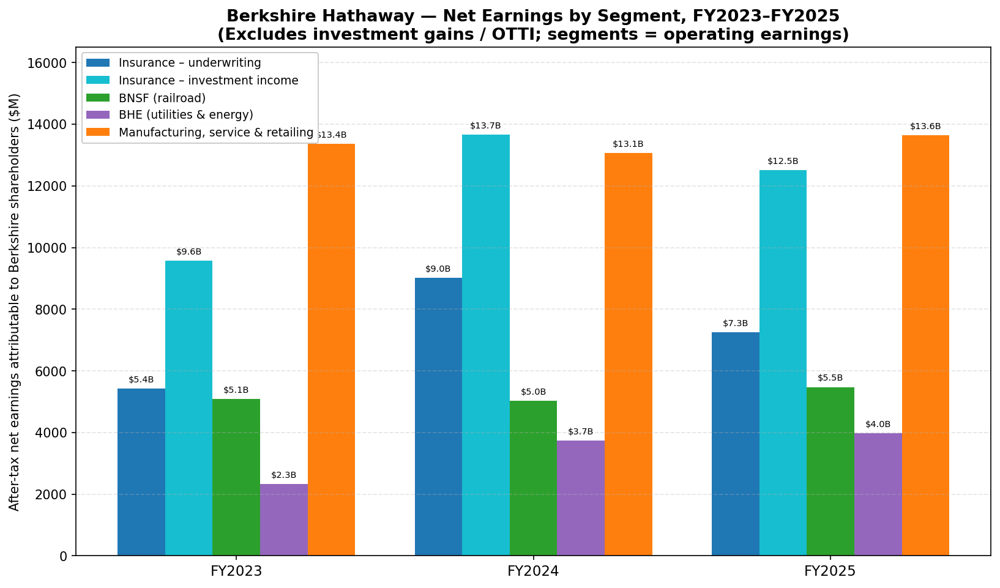
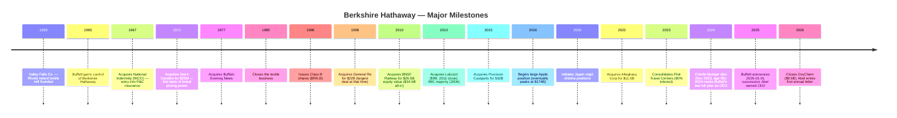
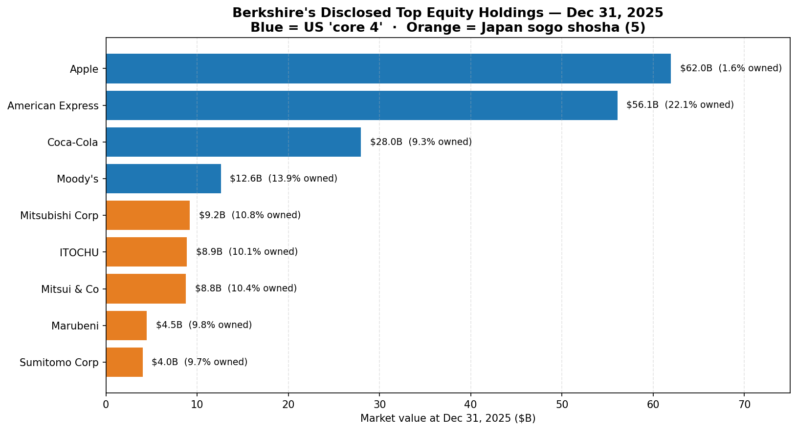
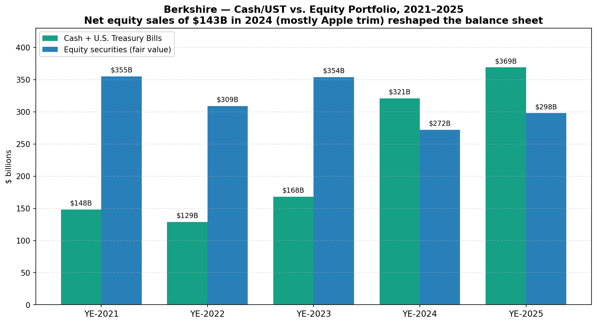
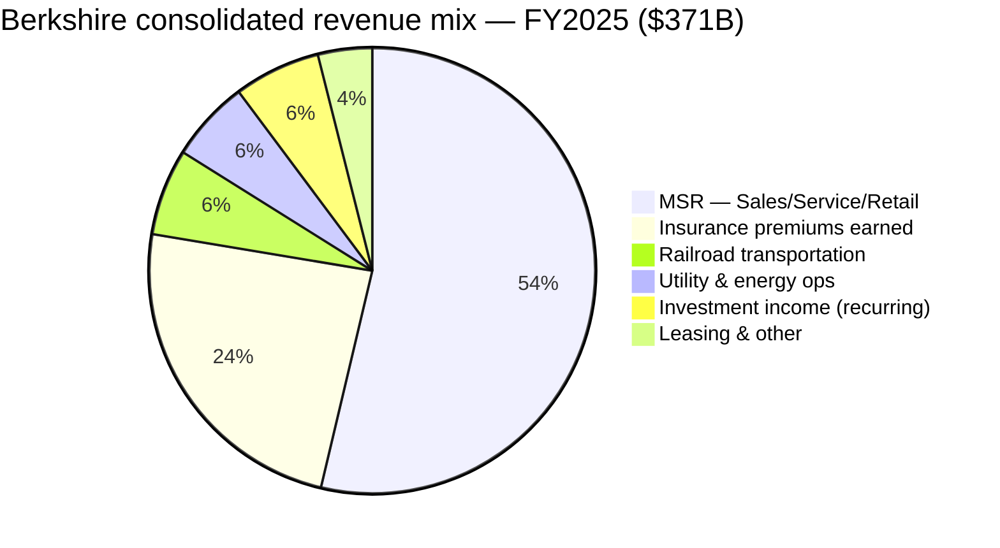
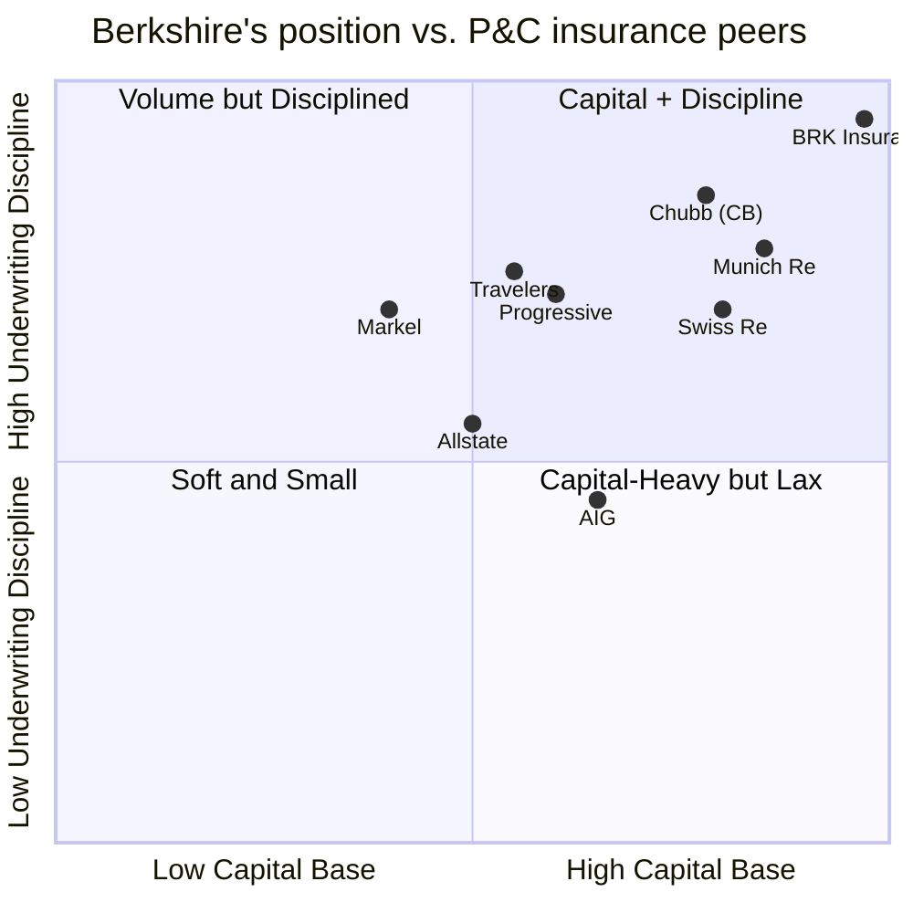

# COMPANY RESEARCH REPORT: Berkshire Hathaway Inc. (NYSE: BRK.B / BRK.A)

**Date:** 2026-05-20
**Analyst note:** Initiation. Berkshire is a conglomerate, not a single-product company; this report treats it as such — sizing each economic engine (insurance underwriting, insurance investment income, BNSF, BHE, manufacturing/service/retail) separately rather than pretending a single TAM or moat applies to all of it. The four pillars are explicitly identified in the [FY2025 10-K, Item 1, Business Description](https://www.sec.gov/Archives/edgar/data/1067983/000119312526083899/brka-20251231.htm).

> **Update — First full year under CEO Greg Abel (effective 2026-01-01):** On 2025-05-03 the Berkshire board appointed Vice-Chair Greg Abel to succeed Warren Buffett as CEO effective January 1, 2026; Buffett remains Chairman. Abel's first annual letter (published with the 2025 10-K on 2026-03-02) reaffirmed the entire operating model — decentralization, fortress balance sheet, no dividends, opportunistic buybacks "when below intrinsic value, conservatively determined" — and announced the $9.5B [OxyChem acquisition](https://www.sec.gov/Archives/edgar/data/1067983/000119312526083899/brka-20251231.htm) (closed 2026-01-02). Float ended 2025 at **$176B** (vs. $171B prior year), cash + Treasuries at **$369B**, and consolidated GAAP net earnings were **$66.97B** (FY2024: $89.00B; FY2023: $96.22B — the decline is overwhelmingly mark-to-market on equity holdings, not operating). Operating earnings were $44.5B per Abel's letter, "below $47.4B in 2024 and above the $37.5B we have averaged over the past five years."
> Source: [Berkshire FY2025 10-K, filed 2026-03-02](https://www.sec.gov/Archives/edgar/data/1067983/000119312526083899/brka-20251231.htm) · [Berkshire 2025 Annual Report (letter + 10-K)](https://www.berkshirehathaway.com/2025ar/2025ar.pdf).

---

## Table of Contents

1. Company Overview
2. Company History
3. Management Team
4. Products & Services (operating subsidiaries + equity portfolio)
5. Customers & Go-to-Market
6. Industry Overview
7. Competitive Landscape
8. Market Opportunity (TAM)
9. Risk Assessment

---

## 1. Company Overview

Berkshire Hathaway Inc. is a Delaware-domiciled holding company, headquartered at 3555 Farnam Street, Omaha, Nebraska, that owns a federation of operating subsidiaries and a $298B publicly-traded equity portfolio. Founded as a textile manufacturer in 1839, Berkshire was reorganised under Warren Buffett's control in 1965 and has since been built into one of the world's largest companies by market value through a single repeating mechanic: insurance subsidiaries generate policyholder "float," that float — together with retained operating cash flow — is redeployed by the CEO into wholly-owned businesses or marketable securities, and the resulting earnings are largely retained for reinvestment. Berkshire has not paid a cash dividend since 1967 ([FY2025 10-K, "Dividends"](https://www.sec.gov/Archives/edgar/data/1067983/000119312526083899/brka-20251231.htm)).

**What Berkshire actually owns, in plain English.** The 10-K names the four economic pillars: "insurance businesses, conducted on both a primary basis and a reinsurance basis, a freight rail transportation business and a group of utility and energy generation and distribution businesses … Berkshire also owns and operates numerous other businesses engaged in a variety of manufacturing, services and retailing activities" ([FY2025 10-K, Item 1, Business Description](https://www.sec.gov/Archives/edgar/data/1067983/000119312526083899/brka-20251231.htm)). In subsidiary form: GEICO (3rd-largest US auto insurer at ~11.6% market share per A.M. Best 2024 data), Berkshire Hathaway Primary Group, Berkshire Hathaway Reinsurance Group (General Re, NICO, TransRe), BNSF Railway (one of six Class I freight railroads in North America), Berkshire Hathaway Energy (PacifiCorp, MidAmerican, NV Energy, Northern Powergrid, AltaLink, BHE GT&S/Northern Natural/Kern River pipelines), and ~50 manufacturing/service/retail businesses including Precision Castparts, Lubrizol, Marmon, IMC, Clayton Homes, Shaw Industries, Johns Manville, NetJets, McLane, Pilot Travel Centers, See's Candies, Dairy Queen, and Brooks Sports. As of 2026-01-02 the operating set was expanded with OxyChem (the chemicals business of Occidental Petroleum, $9.5B purchase price) and on 2025-07-31 with Bell Laboratories (rodenticides) ([FY2025 10-K, Note 2 — Significant business acquisitions](https://www.sec.gov/Archives/edgar/data/1067983/000119312526083899/brka-20251231.htm)).

**Scale and footprint.** At December 31, 2025, Berkshire and its subsidiaries employed approximately **387,800 people worldwide**, ~80% in the United States, ~19% unionised ([FY2025 10-K, Item 1](https://www.sec.gov/Archives/edgar/data/1067983/000119312526083899/brka-20251231.htm)). FY2025 total revenue was **$371.4B** (FY2024: $371.4B; FY2023: $364.5B) and net earnings attributable to Berkshire shareholders were **$66.97B** ([FY2025 10-K, Consolidated Statements of Earnings](https://www.sec.gov/Archives/edgar/data/1067983/000119312526083899/brka-20251231.htm)). Total assets at YE2025 were **$1.222 trillion** (vs. $1.154T at YE2024); Berkshire shareholders' equity was **$717.4B**, rising further to **$727.2B** at March 31, 2026 ([Q1-2026 10-Q, Consolidated Balance Sheets, filed 2026-05-04](https://www.sec.gov/Archives/edgar/data/1067983/000119312526083899/brka-20260331.htm)).

*Source: [FY2025 10-K, MD&A § Results of Operations](https://www.sec.gov/Archives/edgar/data/1067983/000119312526083899/brka-20251231.htm). After-tax earnings attributable to Berkshire shareholders, excluding investment gains/losses and the 2025 $8.3B Kraft Heinz + Occidental impairments.*

**How Berkshire makes money — the float engine.** The defining feature is the float: net policyholder funds held to pay future claims and meanwhile invested for Berkshire's benefit. Float **grew from $138B at year-end 2020 to $176B at year-end 2025** ([FY2025 10-K, Item 1 § Investments of insurance businesses](https://www.sec.gov/Archives/edgar/data/1067983/000119312526083899/brka-20251231.htm); reiterated in the [2025 annual letter, p10](https://www.berkshirehathaway.com/2025ar/2025ar.pdf)). Because Berkshire's combined property-and-casualty businesses have generated an underwriting profit in most years over the past two decades — FY2025 P&C combined ratio of 87.1% per Abel's letter, vs. five-year average of 90.7% — float has historically had a **negative cost** (i.e., the insurance subsidiaries are paid to hold the money). That money plus shareholder capital funds a $297.8B equity portfolio (the "core 4" of Apple, American Express, Coca-Cola, Moody's plus five Japanese sōgō shōsha) and a $321B short-term U.S. Treasury Bill book — the largest non-government holder of T-Bills outside money-market funds ([FY2025 10-K, Note 4](https://www.sec.gov/Archives/edgar/data/1067983/000119312526083899/brka-20251231.htm)).

**Geographic mix.** Predominantly U.S. The 10-K notes "approximately 80% [of employees] were in the United States," and the insurance subsidiaries write primarily U.S. risk; BHE's domestic regulated utilities serve ~5.4 million retail electric/gas customers in the U.S. plus 4.0 million UK electricity end-users (Northern Powergrid) and Alberta transmission (AltaLink). The Japan investments (the five sōgō shōsha) and BHSI's offices in Australia, Canada, New Zealand, and Asia/Europe are the only material non-US operating exposures ([FY2025 10-K, Item 1](https://www.sec.gov/Archives/edgar/data/1067983/000119312526083899/brka-20251231.htm); [2025 letter, p15-16](https://www.berkshirehathaway.com/2025ar/2025ar.pdf)).

**Valuation snapshot (priced as of 2026-05-20).** BRK.B closed at **$479.98**; aggregate market capitalization based on the 2,157.2M Class-B-equivalent shares outstanding (per Q1-2026 10-Q) is approximately **$1.035 trillion** ([Yahoo Finance — BRK-B key statistics, 2026-05-20](https://finance.yahoo.com/quote/BRK-B/key-statistics)). On reported FY2025 GAAP net income of $66.97B, **TTM P/E ≈ 14.3×**; on FY2025 revenue of $371.4B, **TTM P/S ≈ 2.79×**; against March-31-2026 Berkshire shareholders' equity of $727.2B, **P/B ≈ 1.42×**. The 3-year P/B range is roughly **1.30×–1.65×** (computed from quarterly closes versus quarterly disclosed book; BRK has not traded below 1.20× since the COVID drawdown), so today's multiple sits in the lower half of the recent range.

**Peer multiples (TTM):**

| Company | P/E | P/B | P/S |
|---|---|---|---|
| **BRK.B (today)** | **14.3×** | **1.42×** | **2.79×** |
| Chubb (CB) | 11.6× | 1.73× | 2.09× |
| Travelers (TRV) | 9.1× | 2.03× | 1.33× |
| Allstate (ALL) | 4.9× | 1.93× | 0.84× |
| Progressive (PGR) | 10.3× | 3.70× | 1.33× |
| Markel (MKL) | 13.4× | 1.29× | 1.45× |

Source: [Yahoo Finance peer pages, accessed 2026-05-20](https://finance.yahoo.com/quote/BRK-B/key-statistics).

*Source: [Yahoo Finance, 2026-05-20](https://finance.yahoo.com/quote/BRK-B/key-statistics).*

P/B is the right anchor for Berkshire because (a) the equity portfolio is marked-to-market through GAAP earnings each quarter, making P/E swing wildly on market moves Berkshire neither caused nor monetised ([FY2025 10-K, Item 7A § Market Risk Disclosures](https://www.sec.gov/Archives/edgar/data/1067983/000119312526083899/brka-20251231.htm)), and (b) a meaningful share of intrinsic value sits in retained-earnings compounding inside BHE and BNSF (capex-heavy regulated assets) and inside subsidiaries whose private-market value is well above book (PCC, See's, GEICO's brand). Buffett himself moved Berkshire's narrative away from book value over the last decade for exactly that reason ([2025 annual letter — "intrinsic value vs. book value" preface](https://www.berkshirehathaway.com/2025ar/2025ar.pdf)) — but as a relative gauge against P&C peers, P/B captures the equity-cushion-to-market discipline well.

**Is the multiple stretched, normal, or compressed?** Compressed-to-normal. At 1.42× book Berkshire trades **below the peer median (1.93×)** despite (a) a $369B cash + T-Bill war chest that is 51% of book equity, (b) a 60-year track record of compounding per-share market value at **19.7% annually 1965–2025** vs. 10.5% for the S&P 500 with dividends ([2025 letter, p20](https://www.berkshirehathaway.com/2025ar/2025ar.pdf)), and (c) one of the highest credit ratings in the insurance world (AA+ at S&P; A++ Superior at A.M. Best — [FY2025 10-K, Item 1](https://www.sec.gov/Archives/edgar/data/1067983/000119312526083899/brka-20251231.htm)). The discount is the cumulative price the market puts on (i) Buffett's exit and the unproven Abel-led capital-allocation phase, (ii) earnings drag from ~$369B sitting in 4-5%-yielding T-Bills rather than equities, and (iii) the absence of a buyback program in 2025 — for the first time in many years there were zero share repurchases ([FY2025 10-K, Item 5 § Common Stock Repurchase Program](https://www.sec.gov/Archives/edgar/data/1067983/000119312526083899/brka-20251231.htm)). None of those is a permanent impairment; they are all reversible (Abel can buy back, can buy a business, can rotate cash into equities).

---

## 2. Company History

Berkshire Hathaway traces its corporate lineage to **Valley Falls Company**, a Rhode Island cotton-textile manufacturer founded in 1839 by Oliver Chace. Mergers in 1929 and 1955 produced **Berkshire Hathaway Inc.** — a New England textile maker headquartered in New Bedford, Massachusetts. **Warren Buffett's investment partnership began accumulating shares in 1962** at prices around $7.50 and took control in May 1965 at $14.86 per share ([2025 annual letter — historical performance preface](https://www.berkshirehathaway.com/2025ar/2025ar.pdf)). The textile business was structurally unprofitable and was wound down by 1985, but the company shell — with its tax NOLs and listed equity — became the chassis for a different enterprise.

The decisive pivot came in **March 1967**, when Berkshire used $8.6M of textile cash to acquire National Indemnity Company and National Fire & Marine — together "National Indemnity" — for $8.6M from Jack Ringwalt in Omaha. This single deal moved Berkshire into property-casualty insurance, gave Buffett access to float, and set up the basic capital-allocation machine that has run for 58 years since. The 2025 letter described it explicitly: "executing his vision of building a great insurance business since the acquisition of National Indemnity in 1967, and deploying the float to make successful investments across major sectors of the economy" ([2025 annual letter, p1](https://www.berkshirehathaway.com/2025ar/2025ar.pdf)).

**Strategic pivots — three to call out:**

1. **Textiles to insurance (1967).** The decisive bet; everything since rests on it. Insurance gave Berkshire something almost no other company had — cheap, persistent leverage. Float comes in before claims go out, the gap is investable, and the actuarial duration of P&C float at Berkshire (especially through retroactive reinsurance contracts the company wrote in the 1990s–2010s) is decades. Without insurance, there is no Berkshire.

2. **From minority equity stakes to whole-company acquisitions (mid-1990s onward).** Through the 1970s–80s, the bulk of new capital deployed went into marketable securities (American Express, Washington Post, Coca-Cola). From the GenRe acquisition (1998) and especially after the BNSF deal (2010), the centre of gravity shifted to wholly-owned operating businesses — by 2025 operating earnings of $44.5B exceed dividend income of $5.1B by roughly 9×. The shift was forced by scale: at $1T market cap, no minority position can move the needle the way a $30-50B acquisition can.

3. **The Japan trade (initiated 2020).** Berkshire built ~9-11% positions in each of the five Japanese sōgō shōsha (Mitsubishi Corp, Mitsui & Co, Itochu, Marubeni, Sumitomo Corp), funded in part by Berkshire's own yen-denominated senior notes at "an average cost of 1.2%, with a weighted-average life of approximately 5.75 years" ([2025 annual letter, p15](https://www.berkshirehathaway.com/2025ar/2025ar.pdf)). At YE2025 the five positions had a combined market value of **$35.4B on a $15.4B cost basis**, and Abel's letter described them as "comparable to our major U.S. holdings in importance and long-term value creation opportunity." It was the first material non-US whole-position move in Berkshire's history.

**Key acquisitions, listed:**

- 1972 — See's Candies ($25M; canonical Buffett "brand + pricing power" purchase)
- 1985 — Scott Fetzer (World Book, Kirby)
- 1996 — GEICO (remaining 49% for $2.3B; had held the rest since 1976)
- 1998 — General Re ($22B in stock — Berkshire's first really large deal)
- 2006 — IMC (Israel-based metal cutting tools; through 2013 increased to 100%)
- 2009 — Burlington Northern Santa Fe — announced Nov 3, 2009; closed Feb 12, 2010; $26.5B equity, $34.5B enterprise
- 2011 — Lubrizol ($9.7B)
- 2013 — H. J. Heinz (50/50 with 3G; merged with Kraft 2015 → 27% of KHC today)
- 2015 — Precision Castparts ($32.1B — Berkshire's largest single acquisition)
- 2022 — Alleghany Corporation ($11.6B)
- 2023 — Pilot Travel Centers (final 41.4% to reach 80% for ~$8.2B)
- 2025 — Bell Laboratories (rodenticides, undisclosed, July 31)
- 2026 — OxyChem ($9.5B from Occidental, January 2; Occidental retains legacy environmental liabilities)

**Recent developments (last 24 months) most relevant to the current thesis:**

- **Succession**: Confirmed at the May 2025 annual meeting and formally effective January 1, 2026. This is the largest single change in Berkshire's governance since 1965.
- **Apple trim**: Berkshire sold ~$143B in equity securities in 2024, the bulk of which was Apple, plus a smaller Bank of America trim ([FY2025 10-K, Note 6](https://www.sec.gov/Archives/edgar/data/1067983/000119312526083899/brka-20251231.htm)). The portfolio rotated meaningfully toward cash/UST during 2024.
- **Kraft Heinz + Occidental impairments**: Q2 2025 saw a $5.0B pre-tax impairment of KHC; Q4 2025 saw a $5.7B pre-tax impairment of OXY equity-method investment. Both reduced equity-method carrying value to quoted market price; both were called "other-than-temporary" ([FY2025 10-K, Note 5](https://www.sec.gov/Archives/edgar/data/1067983/000119312526083899/brka-20251231.htm)).
- **OxyChem closing** (2026-01-02): $9.5B cash deal; $10.8B of preliminary assets recognised; "we do not believe this acquisition will have a material impact on our Consolidated Financial Statements" — a candid admission about Berkshire's scale problem ([FY2025 10-K, Note 2](https://www.sec.gov/Archives/edgar/data/1067983/000119312526083899/brka-20251231.htm)).
- **Zero buybacks in 2025** — the first full year in many with no repurchases under the program; Buffett (and now Abel) read the stock as roughly fairly-valued at intrinsic value, conservatively determined ([FY2025 10-K, Item 5](https://www.sec.gov/Archives/edgar/data/1067983/000119312526083899/brka-20251231.htm)).

---

## 3. Management Team

The Berkshire management story is unusual on two dimensions and the report has to be written with both in mind. First, **Warren Buffett, age 95, remains Chairman** but is no longer CEO — control of capital allocation passed to Greg Abel on January 1, 2026, three months before the publication date of this report ([Berkshire 8-K, 2025-05-06, Greg Abel CEO appointment](https://www.sec.gov/Archives/edgar/data/0001067983/000119312525113900/d910967d8k.htm)). Second, the **operating model is decentralised by design** — the CEOs of Geico, BNSF, BHE, PCC, Lubrizol, Clayton, See's, NetJets and dozens of others run their businesses without quarterly earnings targets and without head-office overrides; the corporate office in Omaha has fewer than 30 employees ([FY2025 10-K, Item 1 § Business Structure](https://www.sec.gov/Archives/edgar/data/1067983/000119312526083899/brka-20251231.htm)). This means the long-run fate of Berkshire under Abel will be settled less by what Abel does at the corporate office and more by (a) the capital-allocation decisions he makes with the float and retained earnings, and (b) whether the subsidiary CEOs continue to perform under a new boss.

### Gregory E. Abel — Chairman & CEO (effective 2026-01-01)

Greg Abel, 63, became Berkshire Hathaway's CEO on January 1, 2026, succeeding Warren Buffett after Buffett's own announcement at the May 2025 annual meeting. He had been **Vice Chairman – Non-Insurance Operations** since 2018 — a role created explicitly as the succession runway — and previously **CEO of Berkshire Hathaway Energy** from 2008 to 2018. He served as BHE's Chairman through July 2025. Abel was a director of Kraft Heinz until May 2024, and was previously a director of AEGIS Insurance Services (a power-industry mutual) until 2023 ([2026 DEF 14A — Director Bios](https://www.sec.gov/Archives/edgar/data/1067983/000119312526106253/d882687ddef14a.htm)).

Abel is Canadian-born, an accountant by training (CA), and arrived at MidAmerican Energy (now BHE) through the 1999 Berkshire acquisition. His own first letter as CEO described the path: "My understanding of Berkshire in this way began in 1992, when I moved to Omaha to join CalEnergy ... My specific roles at CalEnergy matter little today. What matters is that it was an extraordinary period of personal development … I met Warren and Charlie after CalEnergy became MidAmerican Energy Holdings and was acquired by Berkshire" ([2025 annual letter, p2](https://www.berkshirehathaway.com/2025ar/2025ar.pdf)). What he specifically accomplished as BHE's CEO (2008-2018) is the relevant track record: he expanded BHE from a regulated US Midwest utility into a multi-jurisdiction regulated/renewable platform across 11 US states, Great Britain (Northern Powergrid acquired 2010), Alberta (AltaLink acquired 2014), Nevada (NV Energy acquired 2013), and the BHE GT&S pipeline systems (acquired 2020 after Abel's transition but originated under his leadership). BHE's cumulative renewable investment reached **$38B by YE2025**, with 30% reduction in GHG emissions vs. 2005 baseline ([FY2025 10-K, Item 1 § BHE](https://www.sec.gov/Archives/edgar/data/1067983/000119312526083899/brka-20251231.htm)). Net earnings of BHE attributable to Berkshire rose from $1.7B (2014) to $3.98B (2025) — roughly a 9% CAGR over a decade in a regulated business with allowed-return mechanics.

**Ownership stake.** Abel disclosed an open-market purchase of **\$68M of Class A shares in 2022**, paid for in cash, and additional smaller purchases since. Reuters reported the 2022 buy at the time. His comp structure is unusual for a US public CEO: he receives a flat **$20M cash salary per year** with no bonus, no stock options, no RSUs (terms set when he was named Vice Chair) — the same framework Buffett accepted (Buffett's own salary was $100,000/year for decades). Abel's incentive comes from his own stock; his comp does not push him to manage to quarterly metrics. The 2026 DEF 14A confirms the no-equity-comp model has carried through to the CEO transition ([2026 DEF 14A — Executive Compensation](https://www.sec.gov/Archives/edgar/data/1067983/000119312526106253/d882687ddef14a.htm)).

**Public profile.** Limited — Abel rarely gives interviews and has no podcast or book history of the Munger or Buffett variety. His public communication has been the BHE annual presentations and his appearances at the Berkshire annual meeting. His first letter as CEO (March 2026, 14,000+ words) is the longest piece of public writing on his framework: it explicitly stated **"Berkshire is shareholder-oriented to an unusual degree"** and that he intends "20 years from now … to be proud that your company is even stronger" — i.e., a multi-decade horizon, not a five-year reset ([2025 annual letter, p3-5](https://www.berkshirehathaway.com/2025ar/2025ar.pdf)).

**Founding thesis vs. inherited thesis.** Abel is not a founder; he inherits a 60-year-old machine and is the steward, not the architect. The relevant question for shareholders is whether he changes the machine. His letter explicitly committed to **no change** in the operating model: decentralization, no debt at subsidiaries, no dividends, opportunistic buybacks, large but disciplined equity portfolio, "preferably forever" holding periods ([2025 annual letter, p4-7](https://www.berkshirehathaway.com/2025ar/2025ar.pdf)). The two early signals — closing OxyChem (his first M&A as CEO designate, executed at Lubrizol-CEO Rebecca Liebert's recommendation; [Occidental, "Completes Sale of OxyChem", 2026-01-02](https://www.oxy.com/news/news-releases/occidental-completes-sale-of-oxychem/)) and Bell Labs ("we only wish it had been ten times bigger") — are perfectly consistent with the Buffett playbook: cash-rich, brand-or-niche industrial assets, no integration disruption, retained subsidiary CEOs.

### Marc D. Hamburg — Senior Vice President & CFO (retiring 2026-06-01)

Marc Hamburg, 76, has been Berkshire's CFO since **1992** — 34 years. He is one of the longest-tenured CFOs in the S&P 500. Hamburg announced his retirement in **December 2025**, with the CFO transition to his successor Chuck Chang effective June 1, 2026, and full retirement effective June 1, 2027 ([2025 annual letter, p17](https://www.berkshirehathaway.com/2025ar/2025ar.pdf); [Berkshire 8-K, 2025-12-11, CFO Transition Press Release](https://www.sec.gov/Archives/edgar/data/1067983/000119312525314935/d10933dex991.htm)). Abel's letter quoted Buffett's farewell: *"Marc has been indispensable to Berkshire and to me. His integrity and judgment are priceless. He has done more for this company than many of our shareholders will ever know."* Hamburg has overseen every Berkshire 10-K since 1992 — through GenRe (1998), BNSF (2010), PCC (2015), and the COVID/Apple-trim balance-sheet rebuild. His IPO/M&A track record is the entire post-1992 acquisition history of Berkshire. Hamburg's successor **Chuck Chang** is described by Abel as having "an enormous pair of shoes to fill"; Chang is a longtime Berkshire executive but does not have public-company CFO history outside Berkshire, which is a relevant data point for risk-modeling.

### Ajit Jain — Vice Chairman, Insurance Operations

Ajit Jain, 74, has been Vice Chairman – Insurance Operations since 2018 and effectively runs Berkshire's reinsurance and primary-insurance underwriting. He joined Berkshire in 1986 from McKinsey, was charged with rebuilding what is now BHRG, and over the next 38 years built it into the largest individual underwriter of large-dollar catastrophe reinsurance in the world. Buffett wrote in the 2023 letter that **"Ajit has created a juggernaut at Berkshire Hathaway Reinsurance Group that, in my opinion, simply has no peer."** Abel's 2025 letter echoes that: *"When it comes to risk, Ajit wrote the playbook. His rigor in managing and pricing risk sets the standard in insurance … Ajit is simply peerless at doing it"* ([2025 annual letter, p8-9](https://www.berkshirehathaway.com/2025ar/2025ar.pdf)). Jain owns a substantial Berkshire holding directly and reports to Abel. The depth chart at insurance — Todd Combs at GEICO (he was named GEICO CEO in 2020 in addition to his investment role, and ran it through the 2022-2024 turnaround that delivered the 87.1% combined ratio); Peter Eastwood at BHSI; the new generation at GenRe — is unusually strong, and Jain's pricing discipline (the willingness to walk away from underpriced reinsurance) is one of Berkshire's deepest moats and a key reason the float has been generated at a near-zero or negative cost over the long run.

### Adam Johnson — President, Consumer Products / Service / Retailing

Adam Johnson is the **newest senior appointment** — named in 2025 as president of the consumer/service/retailing group (32 companies, including NetJets, See's, Dairy Queen, Brooks Sports, Pampered Chef, McLane, Pilot). He spent **10 years as CEO of NetJets** before this expanded mandate and "has lived the Berkshire culture for nearly 30 years" per Abel's letter ([2025 annual letter, p11-12](https://www.berkshirehathaway.com/2025ar/2025ar.pdf)). He reports directly to Abel — alongside Ajit (insurance) and the heads of BHE (Mike Dunn) and BNSF (Katie Farmer) — making the Berkshire C-suite a four-person operating committee.

### Governance

The Berkshire board has **13 directors**, of whom several are noteworthy:

- Warren Buffett (95), Chairman, controlling shareholder since 1965; combined Class A + Class B economic stake is ~14% but **voting power approximately 30%** (Class A is supervoting, but Buffett has been converting and gifting Class A shares to charity for many years).
- Greg Abel (63), CEO and director since 2018.
- Howard G. Buffett (71), director since 1993 — Warren's son, designated by the board to become non-executive Chairman after Warren's eventual death (a role explicitly framed in past proxies as a "culture-preservation" check on the CEO).
- Susan A. Buffett (72), director since 2021 — Warren's daughter, chair of two large family foundations.
- Stephen B. Burke (67), former CEO of NBCUniversal; director of JPMorgan Chase.
- Kenneth I. Chenault (74), former CEO of American Express (2001-2018) — one of the few directors with deep public-company CEO experience.
- Christopher C. Davis (60), Chairman of Davis Advisors; also a director of The Coca-Cola Company.
- Susan L. Decker (63), former CFO/President of Yahoo, CEO and founder of Raftr; Costco director.
- Ronald L. Olson (84), partner at Munger Tolles & Olson (the law firm Charlie Munger co-founded).
- Wallace R. Weitz (76), founder of Weitz Investment Management.
- Charlotte Guyman (70), former Microsoft executive.
- Thomas S. Murphy Jr. (?), former Capital Cities/ABC CEO's son, on board since 2021.
- Meryl B. Witmer, value-investor (Eagle Capital Partners).

Insider ownership: Buffett directly controls ~30% of voting power; combined officers and directors as a group hold above 30% ([2026 DEF 14A, "Security Ownership of Certain Beneficial Owners and Management"](https://www.sec.gov/Archives/edgar/data/1067983/000119312526106253/d882687ddef14a.htm)). **Compensation is exceptionally lean** — Buffett earned $100,000/year base for decades plus modest perks. Abel's $20M is the single largest pay package. There are no stock-option grants, no RSUs, no LTIP, no perf-share units. Most directors are paid a nominal flat retainer; Buffett has historically been the lowest-paid CEO of any S&P 500 company by orders of magnitude. There is no Berkshire-wide bonus pool tied to consolidated EPS, which is one reason the subsidiaries have been able to operate without quarterly earnings management pressure ([2026 DEF 14A — Executive Compensation](https://www.sec.gov/Archives/edgar/data/1067983/000119312526106253/d882687ddef14a.htm)).

**Related-party transactions and governance flags.** The 2026 DEF 14A lists nothing material beyond ordinary-course commercial transactions with companies on whose boards Berkshire directors sit (e.g., American Express, where Berkshire owns 22.1%; The Coca-Cola Company, where Davis sits on both boards). One historical flag — the Buffett-family ties on the board — is mitigated by the explicit independence test applied by the Governance Committee and by Howard Buffett's transition to a non-executive role only ([2026 DEF 14A, "Director Independence"](https://www.sec.gov/Archives/edgar/data/1067983/000119312526106253/d882687ddef14a.htm)).

### Track record synthesis

This is a team that has delivered before — but the question now is whether the team without Buffett *as CEO* delivers. Abel ran BHE for 10 years and grew it cleanly, Jain has been Berkshire's insurance brain for nearly 40 years, and Hamburg's three-decade CFO tenure spanned every Berkshire crisis ([2026 DEF 14A — Director and Executive Bios](https://www.sec.gov/Archives/edgar/data/1067983/000119312526106253/d882687ddef14a.htm)). The risks are concentrated in (a) the capital-allocation seat — Abel has never sized a $50–100B equity position in his career, whereas Buffett did so repeatedly; and (b) the next-gen subsidiary bench — many subsidiary CEOs are in their late 60s or 70s, and the question of who runs See's, Clayton, McLane, Marmon, IMC, and Lubrizol in 2030+ is not yet publicly addressed ([FY2025 10-K, Item 1A — Key Person Risk](https://www.sec.gov/Archives/edgar/data/1067983/000119312526083899/brka-20251231.htm)).

---

## 4. Products & Services

Berkshire is closer to a holding-company portfolio than a single-product company; the right framing is the list of *subsidiaries and the equity portfolio*, not a list of SKUs. The 2025 10-K and annual report list **51 non-insurance operating businesses** plus the insurance group ([2025 annual letter, p11](https://www.berkshirehathaway.com/2025ar/2025ar.pdf); [Operating Companies appendix](https://www.berkshirehathaway.com/2025ar/2025ar.pdf)). I cover each material business below, with the per-business competitive-advantage verdict required by the report spec.

```mermaid
graph TD
    BRK[Berkshire Hathaway]
    BRK --> INS[Insurance Group]
    BRK --> RAIL[BNSF Railway]
    BRK --> BHE[Berkshire Hathaway Energy]
    BRK --> MSR[Manufacturing / Service / Retail]
    BRK --> EQ[Equity Portfolio - $297.8B]

    INS --> GEICO[GEICO - 3rd-largest US auto insurer, 11.6% share]
    INS --> BHP[BH Primary - NICO/BHSI/MedPro/GUARD/RSUI/USLI/...]
    INS --> BHRG[BH Reinsurance - General Re/NICO/TransRe]

    BHE --> UTIL[PacifiCorp / MidAmerican / NV Energy]
    BHE --> PIPE[BHE GT&S / Northern Natural / Kern River]
    BHE --> INTL[Northern Powergrid UK / AltaLink CAN]
    BHE --> REN[BHE Renewables - $7.1B tax equity in wind]

    MSR --> IND[Industrial - PCC / Lubrizol / Marmon / IMC / CTB / LSPI / W&W-AFCO]
    MSR --> BLD[Building - Clayton / Shaw / Johns Manville / MiTek / Benjamin Moore / Acme]
    MSR --> CON[Consumer - Forest River / Duracell / Brooks / Fruit of the Loom / Garan / Justin]
    MSR --> SVC[Service - NetJets / FlightSafety / TTI / Charter Brokerage / Business Wire]
    MSR --> RET[Retail - BH Auto / RC Willey / Nebraska Furniture Mart / Borsheims / See's / Helzberg / Dairy Queen / Pampered Chef / Oriental Trading]
    MSR --> DIST[McLane - foodservice distribution]
    MSR --> PILOT[Pilot Travel Centers - 80%]
    MSR --> OXY[OxyChem - closed 2026-01-02]
```

### 4.1 Insurance group (the engine)

**GEICO.** Direct-response US private-passenger auto insurer in all 50 states. FY2025: premiums earned **$44.5B** (+5.3% YoY), pre-tax underwriting earnings **$6.82B**, combined ratio 84.7% (vs. 81.5% in 2024, 90.7% in 2023) ([FY2025 10-K, MD&A § GEICO](https://www.sec.gov/Archives/edgar/data/1067983/000119312526083899/brka-20251231.htm)). Market share ~11.6% at #3 nationally per A.M. Best 2024 data; the top 5 (State Farm, Progressive, GEICO, Allstate, USAA) collectively hold 63.6%. **Competitive advantage: yes — cost moat.** The direct-response channel (no agency network) gives GEICO a 200-400bp expense-ratio advantage that is structural and very hard to close; Progressive is the only meaningful direct competitor, and the two account for most US net direct-response auto growth. **Closest competitor product:** Progressive Auto. Compare: ahead on cost ratio, behind on underwriting tech / telematics (Snapshot). The 2025 letter flagged that **GEICO's "broad rate increases in recent years have restored margins but come at the cost of lower retention; competitors' rate reductions may extend that pressure into 2026"** — i.e., 2026 will likely see GEICO's growth slow as price catches up to peers.

**Berkshire Hathaway Reinsurance Group (BHRG).** Operates through three legal entities: NICO Group (Stamford), General Re Group (Cologne/Stamford), and TransRe (NY). FY2025: net premiums written **$20.2B** (down from $21.9B in 2024 — Berkshire is walking away from softening property reinsurance rates); pre-tax underwriting earnings P&C **$3.17B**, life/health **$374M**, with the retroactive reinsurance and periodic-payment-annuity run-off lines contributing $(1.8B) of expected GAAP underwriting loss (which is a *feature* — these are float-creation businesses where premium is invested for decades against deferred claims) ([FY2025 10-K, MD&A § BHRG](https://www.sec.gov/Archives/edgar/data/1067983/000119312526083899/brka-20251231.htm)). **Competitive advantage: yes — capital + walk-away discipline.** BHRG can absorb single-event losses other reinsurers cannot — the $333B statutory surplus of US insurers is multiples of any peer — and Jain's stated policy is to refuse business at unattractive rates. Combined ratio across BHRG P&C in 2025 was 84.5%, vs. global property reinsurance industry around 90%. **Closest competitor:** Munich Re, Swiss Re, RGA (for life). Ahead on capital, behind on Asian distribution.

**Berkshire Hathaway Primary Group.** Eight independently-run primary insurers (NICO Primary, BHHC, BHSI, RSUI, CapSpecialty, MedPro, MLMIC, USLI, BH Direct, GUARD). FY2025: premiums earned $18.7B, pre-tax underwriting earnings $785M (combined ratio 95.8%) ([FY2025 10-K, MD&A § BH Primary](https://www.sec.gov/Archives/edgar/data/1067983/000119312526083899/brka-20251231.htm)). BHSI is the standout — large-account commercial property/casualty written admitted and non-admitted in the US, plus Australia/Canada/New Zealand/Asia/Europe. **Competitive advantage: partial.** BHSI competes head-on with AIG, Chubb, Travelers; the AA+/A++ rating helps win large risks, but pricing and broker access are commoditised. **Closest competitor:** Chubb (CB).

### 4.2 BNSF Railway

One of six Class I freight railroads in North America (Union Pacific, BNSF, CSX, Norfolk Southern, Canadian Pacific Kansas City, Canadian National). FY2025: railroad operating revenues **$23.35B** (flat YoY), operating expenses $15.30B, operating earnings $8.06B (operating margin 34.5% vs. 32.0% in 2024 per Abel's letter), **net earnings $5.48B (+8.8% YoY)**, **$8.1B of net operating cash flow** of which $4.4B returned to Berkshire as dividends in 2025 ([FY2025 10-K, MD&A § BNSF](https://www.sec.gov/Archives/edgar/data/1067983/000119312526083899/brka-20251231.htm); [2025 letter, p12](https://www.berkshirehathaway.com/2025ar/2025ar.pdf)). Volumes by category: consumer products 5.60M units (+1.2%); industrial 1.38M (-4.6%); ag & energy 1.42M (+1.6%); coal 1.22M (+1.1%). **Competitive advantage: yes — irreplaceable infrastructure.** BNSF's western US franchise is duopolistic vs. Union Pacific; ports of Long Beach, LA, Seattle/Tacoma, Houston are physically served by both. **Closest competitor:** Union Pacific (UNP). Abel notes BNSF's operating margin 34.5% is "still modestly above its 5-year average" but "the gap to the industry's best [UNP at ~38-40%] remains too wide" — each 1pp of margin = ~$230M of incremental operating cash flow. Active opportunity: the proposed Union Pacific–Norfolk Southern merger (announced 2025) could re-shape the competitive map; Abel was explicit Berkshire is not interested in acquiring CSX or another Class I.

### 4.3 Berkshire Hathaway Energy (BHE)

Four regulated US utilities (PacifiCorp, MidAmerican Energy, Nevada Power, Sierra Pacific) serving 5.4M retail customers; five US interstate gas pipelines (BHE GT&S, Northern Natural, Kern River) with ~20,900 miles and 21.6 Bcf/day capacity; UK distribution (Northern Powergrid — 4M customers); Alberta transmission (AltaLink — 85% of Alberta population); 6,400 MW of independent renewable projects; HomeServices of America (real-estate brokerage with 35,000 agents and a 1,400-office franchise network); 75% LNG ([FY2025 10-K, Item 1 § BHE](https://www.sec.gov/Archives/edgar/data/1067983/000119312526083899/brka-20251231.htm)). FY2025: total revenues $26.3B, net earnings attributable to Berkshire **$3.98B** (+6.7%), driven by lower PacifiCorp wildfire-loss accruals (US utilities $2.10B) and natural gas pipelines $1.15B ([FY2025 10-K, MD&A § BHE](https://www.sec.gov/Archives/edgar/data/1067983/000119312526083899/brka-20251231.htm)). **Competitive advantage: yes — regulated rate-base monopoly.** Each US utility has an exclusive service territory; allowed-return mechanisms; capex translates to rate base. PacifiCorp's wildfire-litigation exposure is the swing factor — Abel acknowledged "PacifiCorp's settlements related primarily to the 2020 Labor Day fires" and that "PacifiCorp is not an insurer of last resort" ([2025 annual letter, p13](https://www.berkshirehathaway.com/2025ar/2025ar.pdf); see also [Insurance Journal, "PacifiCorp Pays $575M to Settle Oregon, California Wildfire Claims", 2026-03-09](https://www.insurancejournal.com/magazines/mag-features/2026/03/09/860626.htm)). **Closest competitors:** NextEra Energy (NEE), Duke (DUK), Southern (SO).

*Source: [FY2015–FY2025 10-Ks](https://www.sec.gov/cgi-bin/browse-edgar?action=getcompany&CIK=0001067983&type=10-K&dateb=&owner=include&count=40) and [Q1-2026 10-Q](https://www.sec.gov/Archives/edgar/data/1067983/000119312526202243/brka-20260331.htm).*

### 4.4 Manufacturing, service, and retailing — 50+ businesses

FY2025: revenues **$214.3B**, pre-tax earnings $17.5B, net earnings attributable to Berkshire **$13.65B** (+4.4%) — making MS&R individually larger than the entire P&C industry except for the top-10 US carriers ([FY2025 10-K, MD&A § Manufacturing, Service and Retailing](https://www.sec.gov/Archives/edgar/data/1067983/000119312526083899/brka-20251231.htm)).

**Industrial products** — revenues $37.3B, pre-tax earnings $6.81B (margin 18.3%) ([FY2025 10-K, MD&A § MS&R — Industrial](https://www.sec.gov/Archives/edgar/data/1067983/000119312526083899/brka-20251231.htm)):
- **Precision Castparts (PCC)** — investment castings, forgings, fasteners for aerospace (Boeing, Airbus, GE Aerospace, Rolls-Royce, Pratt & Whitney). FY2025: $2.4B operating cash flow vs. $0.9B avg 2021-22 and $1.7B in 2015 (pre-acquisition). **Advantage: yes — specialised process IP + qualified-supplier status.** Closest competitor: Allegheny Technologies, ITP Aero. ([FY2025 10-K, Item 1 § PCC](https://www.sec.gov/Archives/edgar/data/1067983/000119312526083899/brka-20251231.htm))
- **Lubrizol** — engine lubricant additives + advanced materials. **Advantage: yes — patent + formulation moat.** Competitors: Infineum (Shell/ExxonMobil JV), Chevron Oronite, Afton.
- **Marmon Holdings** — 120 autonomous businesses across 11 groups (Foodservice, Water, Transportation, Retail, Metal Services, Electrical, Plumbing/Refrigeration, Industrial, Rail/Leasing including Union Tank Car, Crane Services, Medical). **Advantage: partial.**
- **IMC** — metal cutting tools (ISCAR, TaeguTec, Ingersoll, Tungaloy, NTK). #3 in the global insert market. **Advantage: yes.** Competitors: Sandvik, Kennametal, Kyocera.
- **CTB International** (agri systems), **LiquidPower** (drag-reducing pipeline additives), **W&W|AFCO Steel**, **Bell Laboratories** (acquired 2025-07-31; rodenticides).

**Building products** — revenues $26.8B, pre-tax earnings $3.97B ([FY2025 10-K, MD&A § MS&R — Building](https://www.sec.gov/Archives/edgar/data/1067983/000119312526083899/brka-20251231.htm)). Anchored by **Clayton Homes** (manufactured + site-built; 49,400 off-site homes in 2025, 83% to DOE Zero Energy Ready Home, 10,000 site-built, 67,300 owned homesites, $1.2B backlog — **advantage: yes**, vertical integration + captive finance vs. Cavco/Champion; [2025 annual letter, p11-12](https://www.berkshirehathaway.com/2025ar/2025ar.pdf)); **Shaw Industries** (#1 US carpet — **partial**, execution slips in 2025 per Abel); **Johns Manville**; **MiTek**; **Benjamin Moore**; **Acme Brick**.

**Consumer products** — revenues $14.4B, pre-tax earnings $1.79B ([FY2025 10-K, MD&A § MS&R — Consumer](https://www.sec.gov/Archives/edgar/data/1067983/000119312526083899/brka-20251231.htm)). Includes **Forest River** (#1 US RV by volume), **Duracell** (#1 US alkaline share — **advantage: brand**; vs. Energizer), **Brooks Sports**, **Fruit of the Loom**, **Garan**, **Justin Brands**, **HH Brown**.

**Service** — revenues $23.0B, pre-tax earnings $2.70B (margin 11.8% — *up* from 11.1%) ([FY2025 10-K, MD&A § MS&R — Service](https://www.sec.gov/Archives/edgar/data/1067983/000119312526083899/brka-20251231.htm)). **NetJets** (#1 fractional aircraft — **advantage: yes**; ~780 aircraft globally and 196,000 H1 2025 North American departures per [Altitudes Magazine "Private Jet Charter in 2026: NetJets, VistaJet, Flexjet Compare"](https://www.altitudesmagazine.com/private-jet-charter-2026-how-netjets-vistajet-and-flexjet-compare/)), **FlightSafety International**, **TTI** (electronic components distribution), **Business Wire**, **Charter Brokerage**, **CORT**.

**Retail** — revenues $19.7B, pre-tax earnings $1.34B ([FY2025 10-K, MD&A § MS&R — Retail](https://www.sec.gov/Archives/edgar/data/1067983/000119312526083899/brka-20251231.htm)). **Berkshire Hathaway Automotive** (80+ dealerships); **See's Candies** (one of Berkshire's highest-ROIC businesses); **Nebraska Furniture Mart**, **R.C. Willey**, **Star Furniture**, **Jordan's Furniture**; **Borsheims**, **Helzberg Diamonds**, **Ben Bridge Jewelers**; **International Dairy Queen**, **Pampered Chef**, **Oriental Trading**.

**McLane Company** — revenues $51.0B, pre-tax earnings $676M (margin 1.3%) ([FY2025 10-K, MD&A § McLane](https://www.sec.gov/Archives/edgar/data/1067983/000119312526083899/brka-20251231.htm)). Foodservice / grocery distribution to convenience stores, mass-merch, restaurants. Largest single revenue line at Berkshire but lowest margin. **Advantage: partial — scale only.** Competitor: Sysco, US Foods, Performance Food Group ([Business Strategy Hub, "Top 15 Sysco Competitors"](https://bstrategyhub.com/sysco-competitors-and-alternatives/)).

**Pilot Travel Centers** (80% owned) — revenues $42.2B, pre-tax earnings $190M ([FY2025 10-K, MD&A § Pilot](https://www.sec.gov/Archives/edgar/data/1067983/000119312526083899/brka-20251231.htm)). Largest US travel-center operator. Abel's letter flagged Pro Preference score (driver loyalty) at 35% in 2025 vs. 27% in 2022; second in the industry; "we should be #1" ([2025 annual letter, p12](https://www.berkshirehathaway.com/2025ar/2025ar.pdf)). **Advantage: partial.** Competitor: Love's, TA.

**OxyChem** (acquired 2026-01-02) — PVC, chlor-alkali, chlorinated organics; #3 North American. **Advantage: partial.** ([Occidental, "Completes Sale of OxyChem", 2026-01-02](https://www.oxy.com/news/news-releases/occidental-completes-sale-of-oxychem/))

### 4.5 The equity portfolio ($297.8B at YE2025)

*Source: [2025 annual letter, p15-16](https://www.berkshirehathaway.com/2025ar/2025ar.pdf). All positions disclosed; 2025 dividends in millions.*

The portfolio is unusually concentrated: the **five largest holdings = 65%** of the equity book at YE2025 (vs. 71% at YE2024 — partly the Apple trim, partly the Chevron rotation). Apple, American Express, Coca-Cola, Moody's are the "core 4" Abel committed to in his letter; the five Japanese sōgō shōsha (Mitsubishi, Itochu, Mitsui, Marubeni, Sumitomo) are a second cluster financed in yen. The portfolio also includes equity-method positions in Kraft Heinz (27.5%) and Occidental Petroleum (26.9%, common; plus an $8.5B liquidation-value preferred at 8% coupon and warrants on 83.9M shares at $59.59 strike) ([FY2025 10-K, Note 4 & Note 5](https://www.sec.gov/Archives/edgar/data/1067983/000119312526083899/brka-20251231.htm)).

The 2025 $5.0B impairment of Kraft Heinz and $5.7B impairment of Occidental common are both flagged as "other-than-temporary" in the GAAP sense — the carrying values were brought down to quoted market — but Abel's letter said clearly: *"While we currently have no intention of disposing of any Occidental common stock, in our judgment, the unrealized loss was other than temporary"* ([2025 annual letter, p14](https://www.berkshirehathaway.com/2025ar/2025ar.pdf); [FY2025 10-K, Note 5 — Equity Method Investments](https://www.sec.gov/Archives/edgar/data/1067983/000119312526083899/brka-20251231.htm)). So the impairments do not signal an exit, but they do signal that Berkshire is more public-equity-portfolio-quiet than Buffett-era Berkshire.

*Source: [FY2025 10-K, Note 4 & MD&A](https://www.sec.gov/Archives/edgar/data/1067983/000119312526083899/brka-20251231.htm).*

The cash + UST position is now **$369.0B** (Insurance & Other segment), up from $321.7B at YE2024 ([FY2025 10-K, MD&A § Liquidity and Capital Resources](https://www.sec.gov/Archives/edgar/data/1067983/000119312526083899/brka-20251231.htm)). Abel: "There will undoubtedly be incremental opportunities to deploy our owners' capital without compromising Berkshire's resilience. My role is to ensure our liquidity levels and capital deployment remain intentional and deliberate. We will always aim for ownership of productive businesses over U.S. Treasuries" ([2025 annual letter, p10](https://www.berkshirehathaway.com/2025ar/2025ar.pdf)).

### Roadmap & recent launches (last 12 months)

- **Bell Laboratories** acquired July 31, 2025 (rodenticides, headquartered Windsor, Wisconsin).
- **OxyChem** acquisition closed January 2, 2026 (PVC + chlor-alkali; HQ Dallas; 4,000 employees; 21 US manufacturing plants).
- BNSF resolved a long-standing dispute with the Swinomish Indian Tribal Community over crude-oil shipments in 2025.
- BHE incrementally repositioned for AI-driven electricity demand growth ("the industry enters a significant investment cycle, driven by rising electricity demand from artificial intelligence computing").
- No share repurchases were executed during full-year 2025.
- The Apple position was trimmed from ~$174B at peak (mid-2024) to ~$62B at YE2025 — a multi-year reduction that Berkshire has not commented on directly beyond Buffett's 2024 annual-meeting "tax-rate" comment.

---

## 5. Customers & Go-to-Market

Berkshire's "customer concentration" question must be asked subsidiary-by-subsidiary; there is no single B2B / B2C funnel at the holding level ([FY2025 10-K, Item 1 § Business Segments](https://www.sec.gov/Archives/edgar/data/1067983/000119312526083899/brka-20251231.htm)).

**Consolidated:** Berkshire does not disclose a top-1 / top-5 customer concentration at the parent level because no single end-customer represents more than a small fraction of $371B in consolidated revenue. The 10-K does not present an ASC 280 disclosure of a >10% customer for the consolidated group. **Top-1 customer share of consolidated revenue: less than 5% (estimated, based on PCC's Boeing/Airbus combined exposure and McLane's largest grocery-chain customers — the company does not break this out)** ([FY2025 10-K — segment notes do not disclose a >10% group-level customer](https://www.sec.gov/Archives/edgar/data/1067983/000119312526083899/brka-20251231.htm)).

**Per-segment customer profile (qualitative — disclosure varies):**

- **GEICO** — 100% direct-to-consumer; ~17M policies-in-force at YE2025 (estimated from premiums earned ÷ avg premium per policy). No concentration.
- **BHRG / BH Primary** — large insurance/reinsurance ceding companies, brokers (Aon, Marsh, Guy Carpenter). Concentration disclosure: NICO Group has a 20% quota-share agreement with **Insurance Australia Group (IAG)** expiring December 31, 2029, "a significant portion of the NICO Group's annual reinsurance premium" — single contract, single ceding company. IAG is a top-3 reinsurance customer for NICO. ([FY2025 10-K, Item 1 § BHRG](https://www.sec.gov/Archives/edgar/data/1067983/000119312526083899/brka-20251231.htm)).
- **BNSF** — diversified across consumer products (58% of cars), industrial (14%), ag/energy (15%), coal (13%). No single shipper >10%. Auto OEMs, Walmart, Target, intermodal containers (UPS, Hub Group, J.B. Hunt) are large recurring customers via long-term contracts.
- **BHE** — 5.4M US retail customers via regulated utilities plus 4M UK distribution end-users; this is the highest customer-count business in Berkshire.
- **PCC** — concentrated. Boeing + Airbus combined are likely ~50-60% of PCC's commercial-aerospace revenue (PCC ships investment castings and fasteners to both); the 10-K lists Boeing, Airbus, GE Aerospace, Rolls-Royce, Pratt & Whitney as "significant customers" but does not break out the percentages ([FY2025 10-K, Item 1 § PCC](https://www.sec.gov/Archives/edgar/data/1067983/000119312526083899/brka-20251231.htm)). The 737 MAX issues and 787 supply-chain problems through 2020-22 meaningfully dented PCC's cash generation. **This is the most concentrated customer base inside Berkshire**, but at the parent level it is still ~$3-4B of $371B in revenue.
- **Lubrizol** — "no single customer represented more than 10% of Lubrizol's consolidated revenues in 2025" ([FY2025 10-K, Item 1 § Lubrizol](https://www.sec.gov/Archives/edgar/data/1067983/000119312526083899/brka-20251231.htm)).
- **McLane** — historically had concentration with Walmart (estimated ~30% of McLane sales) through a 2003-era relationship. Berkshire does not break this out today, but McLane's $51B in revenue and 1.3% margin suggests a very large, low-margin recurring customer base typical of grocery distribution.

*Source: [FY2025 10-K, Consolidated Statements of Earnings](https://www.sec.gov/Archives/edgar/data/1067983/000119312526083899/brka-20251231.htm).*

**Distribution.** GEICO: direct response (digital + call center + small ad-supported); ~14% expense ratio. BHRG/BH Primary: broker-mediated wholesale (Marsh McLennan, Aon, WTW). BNSF: rail intermodal terminals + ~200 shortline partners. BHE: regulated franchise. MSR: every channel exists somewhere in the portfolio — direct-to-consumer (See's, NetJets), retail dealer (Forest River, Justin), distributor (Lubrizol, Marmon, IMC, JM), big-box wholesale (Duracell, Brooks). ([FY2025 10-K, Item 1 § Business Description](https://www.sec.gov/Archives/edgar/data/1067983/000119312526083899/brka-20251231.htm))

**Contract structure.** Mostly multi-year master agreements with annual or quote-driven pricing. Berkshire is famous for not playing games with renewal — when business is unattractive, the insurance subsidiaries simply pass; in 2025 they cut both reinsurance and primary commercial premium written rather than chase soft pricing ([FY2025 10-K, MD&A § BHRG and BH Primary](https://www.sec.gov/Archives/edgar/data/1067983/000119312526083899/brka-20251231.htm)).

**Key partnerships.** American Express (22.1% Berkshire-owned, with a 1995 voting agreement under which Berkshire votes a significant share-block per AMEX board recommendation; [FY2025 10-K, Note 4 — Investments in Equity Securities](https://www.sec.gov/Archives/edgar/data/1067983/000119312526083899/brka-20251231.htm)), Coca-Cola, Apple. Within operating subsidiaries: Pilot has loyalty partnerships with the major US trucking carriers; NetJets is the largest fractional operator (vs. Flexjet, VistaJet) ([Altitudes Magazine, "Private Jet Charter in 2026", 2025-12](https://www.altitudesmagazine.com/private-jet-charter-2026-how-netjets-vistajet-and-flexjet-compare/)).

**Customer case studies (named wins).** Mostly disclosed by subsidiary: BHE supplies several of the named Western US data-center campuses (the 2025 letter and BHE's own disclosures point to hyperscaler MOUs at NV Energy and PacifiCorp; [BHE 2025 Investor Presentation](https://www.berkshirehathaway.com/bhenergy/BHE2025InvestPresent.pdf)). PCC's parts are on every commercial Boeing and Airbus aircraft built today ([Precision Castparts company profile](https://www.precast.com/about/)). NetJets serves named Fortune-500 customers; BHSI is on the property programs of multiple Fortune-100 issuers (per the company's own marketing).

**Aggregate customer-concentration flag.** Because no consolidated >10% customer exists and the largest single per-subsidiary concentration (PCC at Boeing/Airbus) is roughly 1% of consolidated revenue, **customer concentration is not a material parent-level risk** for Berkshire today ([FY2025 10-K, Item 1A — Risk Factors](https://www.sec.gov/Archives/edgar/data/1067983/000119312526083899/brka-20251231.htm)). The relevant concentration is on the *supply* side — Berkshire is highly concentrated in a *single capital allocator* (now Abel), and on the *asset* side, a single equity holding (Apple, even after trimming) accounts for ~21% of the equity portfolio ([Berkshire 13F-HR Q1 2026](https://13f.info/13f/000119312526226661-berkshire-hathaway-inc-q1-2026)). Both of those are covered in Section 9.

---

## 6. Industry Overview

There are six distinct industries Berkshire operates in materially ([FY2025 10-K, Item 1 § Industry Segments](https://www.sec.gov/Archives/edgar/data/1067983/000119312526083899/brka-20251231.htm)). I'll size each in turn.

**Property & casualty insurance (US).** Direct premiums written in the US P&C market crossed **$1.05 trillion in 2024** for the first time in industry history ([S&P Global, "In industry first, US P&C insurers exceed $1 trillion in direct annual premiums", 2025-03](https://www.spglobal.com/market-intelligence/en/news-insights/articles/2025/3/in-industry-first-us-pc-insurers-exceed-1-trillion-in-direct-annual-premiums-88062276)). Personal auto alone was ~$358B; commercial lines $502B; homeowners $169B ([S&P Global, 2025-03](https://www.spglobal.com/market-intelligence/en/news-insights/articles/2025/3/in-industry-first-us-pc-insurers-exceed-1-trillion-in-direct-annual-premiums-88062276)). Growth has been ~5-7% annually over the past decade, with periodic hard-market cycles (the 2022-2024 hard market was driven by inflation and reinsurance retrenchment after Florida hurricanes and California wildfires). 2025-2026 is the early phase of a softening cycle — Abel: *"the reinsurance sector has attracted significant increases in available capital from both the traditional and alternative markets, which together with a more benign reinsured catastrophe loss burden in 2025 in most major regions has led to significant price declines in property reinsurance"* ([2025 annual letter, p9](https://www.berkshirehathaway.com/2025ar/2025ar.pdf)). The market is fragmented at the primary end (top-5 personal auto = 63.6%; top-5 homeowners ~50%) and oligopolistic at the reinsurance end (Munich Re, Swiss Re, Hannover Re, SCOR, BHRG = ~70% of global P&C reinsurance capacity) ([Best's News, "Progressive Edges Out State Farm", 2025-06](https://news.ambest.com/newscontent.aspx?refnum=266819&altsrc=177)).

**Global reinsurance.** Total dedicated reinsurance capital reached **~$607B at YE2024** per Guy Carpenter / AM Best estimates ([Reinsurance News, "Global reinsurance capital up 7% to $607bn in 2024", 2025](https://www.reinsurancene.ws/global-reinsurance-capital-up-7-to-607bn-in-2024-guy-carpenter-am-best/)); gross premiums ~$415B in 2024 with growth slowing to 3-4% as the soft cycle takes hold. Catastrophe reinsurance capacity has been augmented by **~$115B of insurance-linked-securities (ILS / cat bonds)** at YE2024 — a structurally permanent change since the late-2010s that is *capacity-additive*, weighing on long-term reinsurance pricing ([Artemis.bm, "Alternative reinsurance capital hit new $115bn high at end of 2024: Aon", 2025-01](https://www.artemis.bm/news/alternative-reinsurance-capital-hit-new-115bn-high-at-end-of-2024-aon/)).

**North American Class I freight rail.** ~$80B in combined Class I revenue in 2024 (BNSF, UNP, CSX, NS, CN, CPKC). The industry is intensely regulated by the STB; volumes have been flat-to-down for a decade as intermodal grew but coal collapsed. The proposed UNP-NS merger announced 2025-07-29 would create a single transcontinental Class I if approved by the STB — a meaningful structural change for BNSF's competitive map ([Norfolk Southern, "Union Pacific and Norfolk Southern to Create America's First Transcontinental Railroad", 2025-07-29](https://norfolksouthern.investorroom.com/2025-07-29-Union-Pacific-and-Norfolk-Southern-to-Create-Americas-First-Transcontinental-Railroad); [STB, "Major Merger Application", 2025-PR-25-38](https://www.stb.gov/news-communications/latest-news/pr-25-38/)). Rail's TAM is gated by its substitutes: long-haul trucking (~$900B US TAM), short-sea shipping, pipelines for liquids.

**US regulated electric & gas utilities.** ~$500B in US utility revenue (electric + gas combined), regulated by state PUCs on cost-of-service allowed-return frameworks. The current investment cycle around AI / data-center demand growth, electrification, and transmission build-out is the largest since the 1970s — EEI estimates investor-owned utility capex 2025-2029 at **~$1.1 trillion** ([Utility Dive, "Investor-owned utilities could spend $1.1T between 2025 and 2029: EEI", 2025-05](https://www.utilitydive.com/news/investor-owned-utilities-spending-more-than-ever-eei/802315/); [EEI Industry Capital Expenditures 2015-2029 PDF](https://www.eei.org/-/media/Project/EEI/Documents/Issues-and-Policy/Finance-And-Tax/Industry-Capital-Expenditures.pdf)). BHE is positioned to participate (PacifiCorp, NV Energy, MidAmerican all serve major data-center hubs); Abel's letter committed to selective deployment "only when those risks and rewards are appropriately balanced" ([2025 annual letter, p13](https://www.berkshirehathaway.com/2025ar/2025ar.pdf)).

**Aerospace manufacturing.** Boeing + Airbus combined commercial backlog at ~14,500 aircraft worth roughly $1.5T at list price; aero engines are a ~$130B annual market (GE Aerospace, Pratt & Whitney/RTX, Rolls-Royce, Safran/Snecma/CFM). PCC and a handful of other Berkshire businesses (FlightSafety International, NetJets) ride this curve ([Precision Castparts Corp. — Wikipedia profile of customer set](https://en.wikipedia.org/wiki/Precision_Castparts_Corp.)). The 2026 outlook is the strongest in a decade given the post-COVID demand catchup and the new-gen narrowbody ramp.

**US manufactured + site-built housing.** Clayton's segment of the US housing market is ~$5B in shipments annually (manufactured-housing) plus the site-built piece. Together with Skyline Champion and Cavco, the top-3 ship roughly half of all HUD-code units in the US ([Mordor Intelligence, "US Manufactured Homes Market"](https://www.mordorintelligence.com/industry-reports/united-states-manufactured-homes-market)). Total US single-family starts ran 990K in 2024 and the structural shortage of affordable housing is the long-run driver.

**General building products / floor coverings / industrial chemicals / consumer goods** — each a multi-billion-dollar TAM with Berkshire participating at 3-15% share depending on the specific niche ([FY2025 10-K, MD&A § MS&R](https://www.sec.gov/Archives/edgar/data/1067983/000119312526083899/brka-20251231.htm)).

**Aggregate "Berkshire TAM"** is not a meaningful number because Berkshire competes in ~25 different industries; the right framing is the *capital-allocation TAM* — the universe of attractively-priced acquisitions Berkshire can do at $50-100B deal scale, the binding constraint Abel acknowledged ("At Berkshire's scale, the math of compounding works against us") ([2025 annual letter, p5-6](https://www.berkshirehathaway.com/2025ar/2025ar.pdf)).

**Regulatory environment.** Insurance: state-by-state (Nebraska DOI lead supervisor; supervisory college with Germany, Ireland, UK); NAIC capital standards; IAIS Insurance Capital Standard adopted Dec 2024. TRIA extends to 2027 (Berkshire 2026 aggregate deductible ~$2.5B). Rail: STB + DOT/FRA + EPA. Utilities: state PUCs + FERC. ([FY2025 10-K, Item 1 § Regulation; Item 1A § Regulatory Risk Factors](https://www.sec.gov/Archives/edgar/data/1067983/000119312526083899/brka-20251231.htm))

---

## 7. Competitive Landscape

Berkshire's competitors must be enumerated segment-by-segment; no single "Berkshire competitor" exists ([FY2025 10-K, Item 1 § Competition](https://www.sec.gov/Archives/edgar/data/1067983/000119312526083899/brka-20251231.htm)).

**P&C insurance and reinsurance** — the most fragmented but also where Berkshire is most differentiated ([Best's News, "Auto Insurance Race to the Top", 2025](https://news.ambest.com/articlecontent.aspx?refnum=289808)):

- **State Farm** — #1 US auto insurer (~16-17% market share); mutual, no public float, but a continuous threat to GEICO on price retention. Strong agency channel.
- **Progressive (PGR)** — direct-response auto + commercial; superior data/telematics; trades at 3.7× P/B vs. Berkshire 1.4× because the market accepts a higher multiple for pure-play P&C with consistent underwriting profit and Snapshot-driven loss-ratio advantage. P/E TTM ~10× ([Yahoo Finance — PGR, 2026-05-20](https://finance.yahoo.com/quote/PGR/key-statistics)).
- **Chubb (CB)** — global commercial P&C; AAA-rated; the closest peer to BHSI in commercial specialty. P/E 11.6×, P/B 1.7×.
- **Travelers (TRV)** — US-focused commercial + personal. P/E 9.1×.
- **Allstate (ALL)** — direct + agency auto + homeowners.
- **Markel (MKL)** — specialty + run-off; sometimes called "baby Berkshire." P/B 1.3×.
- **AIG** — global commercial; restructured post-crisis.
- **Munich Re / Swiss Re / Hannover Re / SCOR** — the four European reinsurers that, with BHRG, dominate global reinsurance capacity.
- **GenRe** is owned by Berkshire; not a competitor.

**Class I rail** (BNSF):
- **Union Pacific (UNP)** — primary western US competitor; ~4 pp higher operating margin; pending merger with NS would create a transcontinental.
- **CSX (CSX)** — Eastern US.
- **Norfolk Southern (NS)** — Eastern US; UNP merger target.
- **Canadian National (CNI), Canadian Pacific Kansas City (CP)** — north-south corridors.
- Trucking (J.B. Hunt, Schneider, Knight-Swift, XPO) and intermodal aggregators substitute over time.

**Regulated utilities** (BHE):
- **NextEra Energy (NEE)** — the largest US utility and renewable developer; much higher P/B (~3×) reflecting growth.
- **Duke (DUK), Southern (SO), Dominion (D), Xcel Energy (XEL)**.
- **Sempra (SRE)** — pipelines + utilities.
- For Northern Powergrid (UK): National Grid, SSE, UK Power Networks.
- For AltaLink (Alberta): Fortis, Emera.

**Industrial / chemicals / building** — selected pairings: PCC vs. ATI / Howmet; Lubrizol vs. Infineum / Chevron Oronite / Afton; IMC vs. Sandvik / Kennametal / Kyocera; Marmon vs. ITW / Emerson / Roper; Clayton vs. Cavco / Champion; Shaw vs. Mohawk / Tarkett / Interface; Johns Manville vs. Owens Corning / Knauf / Saint-Gobain Certainteed; OxyChem (post-close) vs. Westlake / Olin / Shintech ([FY2025 10-K, Item 1 § MS&R competitive landscape](https://www.sec.gov/Archives/edgar/data/1067983/000119312526083899/brka-20251231.htm)).

**Holding-company / capital-allocation analogues (not direct competitors but useful benchmarks)** — relative valuations from [Yahoo Finance peer pages, 2026-05-20](https://finance.yahoo.com/quote/BRK-B/key-statistics):
- **Markel (MKL)** — the most disciplined US "Berkshire-style" P&C/insurance + ventures + investing model. Smaller and closer to BRK book-value premium (1.3×).
- **Loews (L)** — Tisch family conglomerate; smaller, more concentrated.
- **Fairfax Financial (FFH)** — Prem Watsa's Canada-listed P&C + investing conglomerate; similar float-driven model.
- **Brookfield Corp (BN)** — Canadian alternative-asset manager + insurance + power; different model (fee-based) but similar long-horizon capital allocator.

**Berkshire's competitive advantages:**

1. **Capital + zero financing cost on float.** $176B of float at near-zero historical cost is leverage no peer can replicate. The closest analogue is Markel ($30B float at smaller scale); the European reinsurers carry more debt and shorter-duration float; Progressive runs less float because auto is short-tail.
2. **Walk-away discipline.** Berkshire is one of the few large reinsurers that will simply not write business at unattractive prices. In 2025 BHRG cut its premiums written by ~8% rather than chase soft property reinsurance — a luxury other reinsurers can't take because their cost structures require flow.
3. **Holding-period advantage in equities.** Berkshire's tax-free unrealised gains on Apple at peak (~$148B at one point) demonstrate the compounding value of "preferably forever" holding. Equity-portfolio results are not directly comparable to a hedge fund — the relevant benchmark is the S&P 500 with dividends, which Berkshire has out-performed by 1,000bp annualised since 1965 ([2025 letter, p20](https://www.berkshirehathaway.com/2025ar/2025ar.pdf)).
4. **Decentralised operating model attracts seller-friendly M&A.** Family-owned businesses (Clayton 2003, See's 1972, Marmon 2008, Bell Labs 2025) often choose Berkshire over PE because no integration disruption, no debt, no buyer's-remorse exit.
5. **AAA-equivalent balance sheet — the "fortress."** Abel: *"We will remain an asset, not a risk, to America and the global financial system. Our cash and U.S. Treasury holdings now exceed $370 billion."* This is the deepest moat in property catastrophe reinsurance — when Berkshire writes a single-event $1-2B layer, the counterparty knows the claim will be paid.

*Source: [2025 annual letter, "Berkshire's Performance vs. the S&P 500" table, p19-20](https://www.berkshirehathaway.com/2025ar/2025ar.pdf).*

**Competitive vulnerabilities:**

1. **Apple-style "few big positions" concentration.** Apple alone was 21% of the equity portfolio at YE2025; the 5 largest = 65%. Materially adverse moves in any of the core holdings sweep through GAAP earnings. The 2025 $5B+$5.7B impairments illustrate the asymmetric pain of large concentrations.
2. **Insurance is a no-moat industry on regulation/entry**, only on capital — Berkshire wins through capital, but a future challenger with $200B+ in capital could replicate (e.g., a sovereign wealth fund building a reinsurance arm).
3. **BNSF margin gap to Union Pacific.** Operating margin 34.5% vs. UNP closer to 39-40%; Abel acknowledges the gap.
4. **OxyChem and other recent industrial deals don't move the needle.** $9.5B = 0.9% of Berkshire's market cap. The scale problem is mathematical: the only deals that change the trajectory are $50B+ acquisitions, and those are rare.
5. **GEICO's tech lag** vs. Progressive's data-driven underwriting was an embarrassment in 2022-23; the turnaround is ongoing but unfinished.

---

## 8. Market Opportunity / TAM

Berkshire's "TAM" is best framed as the **capital-allocation runway** — i.e., how much capital can be redeployed each year at returns above cost-of-capital, given Berkshire's scale ([2025 annual letter, p10-11](https://www.berkshirehathaway.com/2025ar/2025ar.pdf)).

**Free cash flow available for reinvestment.** Berkshire generated **$46B of net cash from operating activities in 2025** ([2025 annual letter, p11](https://www.berkshirehathaway.com/2025ar/2025ar.pdf)), against a five-year average of $40B+. Combined with $29B of dividends from insurance subsidiaries to the parent in 2025 (against a $31B statutory limit), the corporate parent has approximately **$40-50B annually** to deploy. With $369B of cash + UST today, total deployable capital is roughly **$400-450B over the next 3-5 years**.

**Where can it go?**

1. **Equity portfolio additions.** Roughly $300-400B of US public-equity ideas at Berkshire's $30B+ minimum check size — concentrated in mega-cap (S&P 100). The pool is small. Apple was the canonical "big enough to matter" position; few comparable companies fit (Microsoft, Alphabet, Berkshire-style at $1T+ cap might trade at acceptable multiples in a future drawdown; Meta if value-priced; AMEX / V / MA were always "extensions" of AmEx-style thinking).
2. **Whole-company acquisitions.** OxyChem ($9.5B), Bell Labs (probably <$1B) and previous deals — Alleghany ($11.6B, 2022), PCC ($32B, 2015), Heinz/Kraft ($23B, 2013) — bound the realistic deal size at **$10-40B per transaction**. To deploy $200B in 5 years requires either (a) one mega-deal, or (b) 5-10 mid-size deals at $20-40B each. The historical hit rate on $30B+ deals is one every 3-5 years.
3. **BHE incremental capex** — AI/data-center demand growth could justify $20-50B incremental BHE capex over 5 years at allowed-return regulated mechanics.
4. **BNSF investment to close margin gap** — closing 4-5pp of operating margin to UNP yields ~$1B/year incremental cash flow; modest absolute size.
5. **Share repurchases.** With $369B in cash, a single large repurchase below intrinsic value could move 5-15% of market cap. Abel committed to "buy back Berkshire shares when they trade below our estimate of intrinsic value, conservatively determined."

**SOM (serviceable-obtainable market).** Berkshire's "obtainable" share of the global pool of attractive long-horizon investments is anchored by (a) what willing sellers will give it (i.e., family-owned, AAA-balance-sheet-comforted deals), and (b) public-market opportunities that arise at scale during dislocations ([2025 annual letter, p6-7 "preferably forever" framework](https://www.berkshirehathaway.com/2025ar/2025ar.pdf)).

**Penetration strategy** (Abel's stated framework, paraphrased from the [2025 annual letter, p4-7](https://www.berkshirehathaway.com/2025ar/2025ar.pdf)):
- Invest in businesses we thoroughly understand, with durable advantages and long-term economic prospects;
- Partner with high-integrity leaders who understand their customers and act like owners;
- Avoid businesses that undermine the fabric of society or could jeopardize Berkshire's reputation;
- Act quickly and concentrate capital in a few high-conviction ideas;
- Maintain discipline and let compounding unfold.

**Forecast growth rate.** Berkshire's per-share market value compounded at **19.7% annually from 1965 to 2025** vs. 10.5% for the S&P 500 ([2025 annual letter, p19-20 "Berkshire's Performance vs. the S&P 500" table](https://www.berkshirehathaway.com/2025ar/2025ar.pdf)). **Forward-looking compounding is structurally lower because of size** — Abel said so explicitly ([2025 annual letter, p5-6](https://www.berkshirehathaway.com/2025ar/2025ar.pdf)). A reasonable forward 5-10-year per-share value-growth range is **6-10% annually**, comprising: ~6-7% growth from BHE + BNSF + insurance underwriting + MSR organic; 1-2 pp from equity-portfolio dividends + buybacks; 1-2 pp from opportunistic re-rating of book value if $369B cash is redeployed at >10% ROE. Above that requires a mega-deal or a market dislocation enabling large equity-portfolio additions.

*Source: [FY2025 10-K, Item 1 § Investments of insurance businesses](https://www.sec.gov/Archives/edgar/data/1067983/000119312526083899/brka-20251231.htm) and [2025 annual letter, p10](https://www.berkshirehathaway.com/2025ar/2025ar.pdf).*

---

## 9. Risk Assessment

### Company-specific risks

**1. Key-person / succession risk (HIGH).** Berkshire's 10-K dedicates an explicit risk factor: *"We are dependent on a few key people for our major investment and capital allocation decisions. In May 2025, Berkshire's Board of Directors appointed Mr. Gregory E. Abel to succeed Mr. Warren E. Buffett as Chief Executive Officer effective January 1, 2026."* ([FY2025 10-K, Item 1A](https://www.sec.gov/Archives/edgar/data/1067983/000119312526083899/brka-20251231.htm)). Abel has run BHE successfully but has never sized a $50B+ equity position, never bought a $100B+ public company, and has never managed Berkshire's float through a 2008-2009-scale dislocation. **Mitigants:** Buffett remains Chairman; Howard Buffett designated as future non-executive chairman; the operating model is decentralised (subsidiary CEOs are the daily decision-makers, not Omaha); $369B cash provides a multi-year cushion to make non-urgent decisions. **Severity:** material — a single capital-allocation misstep at $30-50B scale could destroy 3-5 percentage points of long-run compounding.

**2. Equity-portfolio concentration / valuation risk (HIGH).** Apple alone = 21% of the equity portfolio at YE2025; top-5 = 65% ([FY2025 10-K, Note 4](https://www.sec.gov/Archives/edgar/data/1067983/000119312526083899/brka-20251231.htm)). A 30% decline in the equity portfolio would reduce GAAP net earnings by approximately **$68.7B** (the 10-K's own quantitative-market-risk sensitivity table: "30% decrease → $(68.6)B in estimated net earnings impact"). For context, FY2025 net earnings were $66.97B — a single equity-market drawdown could approximately wipe out a year of reported earnings.

**3. Catastrophe / insurance underwriting risk (MEDIUM-HIGH).** Berkshire bears one of the world's largest single-event catastrophe insurance exposures; the 10-K notes management considers consolidated pre-tax losses >$150M from a single event to be "significant" ([FY2025 10-K, Item 1A — Catastrophe Risk Factor](https://www.sec.gov/Archives/edgar/data/1067983/000119312526083899/brka-20251231.htm)). 2025 saw $850M after-tax catastrophe losses (Southern California wildfires); 2024 saw $1.2B (Helene, Milton); 2017 saw $3B (Harvey, Irma, Maria) ([FY2025 10-K, MD&A § Insurance Underwriting](https://www.sec.gov/Archives/edgar/data/1067983/000119312526083899/brka-20251231.htm)). A 1-in-100-year US hurricane or California earthquake could produce >$10B of single-event Berkshire losses. **Mitigant:** Berkshire holds $333B of US statutory surplus — the largest single-company cushion in the world ([2025 annual letter, p9](https://www.berkshirehathaway.com/2025ar/2025ar.pdf)).

**4. Operating-subsidiary obsolescence risk (MEDIUM).** Several Berkshire businesses face long-run secular pressure: McLane (low-margin grocery distribution under pressure from Amazon/Walmart direct), HomeServices (residential brokerage in the post-NAR-settlement world), Shaw (consumers shifting to hard-surface flooring), Forest River (RV demand peaked 2021), Kraft Heinz at 27.5% equity-method (the $5B impairment is the visible scar; [FY2025 10-K, Note 5 — Equity Method Investments](https://www.sec.gov/Archives/edgar/data/1067983/000119312526083899/brka-20251231.htm)). These are not bet-the-company risks but they slow the compounding rate.

**5. PacifiCorp wildfire-litigation risk (MEDIUM).** PacifiCorp has reached ~$2.2B of settlements with ~4,600 wildfire claimants from the 2020 Labor Day fires; additional jury verdicts and class actions remain ([Insurance Journal, "PacifiCorp Pays $575M to Settle Oregon, California Wildfire Claims", 2026-03-09](https://www.insurancejournal.com/magazines/mag-features/2026/03/09/860626.htm); [Claims Journal, "Berkshire-Owned PacifiCorp Wins Ruling", 2026-04-09](https://www.claimsjournal.com/news/national/2026/04/09/336777.htm)). Abel's letter explicitly defended PacifiCorp's stance against unwarranted liability ([2025 annual letter, p13](https://www.berkshirehathaway.com/2025ar/2025ar.pdf)). BHE has set aside reserves but the tail of wildfire exposure in California/Oregon utilities is genuine and ongoing.

**6. M&A scarcity (MEDIUM).** At $1T market cap and $369B in cash, only large deals move the needle. The pool of $50B+ deals where management is willing to sell to Berkshire at non-auction prices and where Berkshire's risk/return discipline can be met is small. Abel acknowledged the scale problem directly ([2025 annual letter, p5-6](https://www.berkshirehathaway.com/2025ar/2025ar.pdf)). Persistent under-deployment of cash drags ROE: $369B at 4.5% T-Bill yield = $16.6B pre-tax, vs. equity-portfolio earnings power of $30-40B if reinvested in the right names ([FY2025 10-K, Note 4 — Investments](https://www.sec.gov/Archives/edgar/data/1067983/000119312526083899/brka-20251231.htm)).

### Industry / market risks

**7. P&C reinsurance soft cycle (MEDIUM).** The 2022-2024 hard market is rolling over; alternative capital (ILS, sidecars) is expanding faster than catastrophe losses are being paid ([Artemis.bm, "Alternative reinsurance capital hit new $115bn high at end of 2024", 2025-01](https://www.artemis.bm/news/alternative-reinsurance-capital-hit-new-115bn-high-at-end-of-2024-aon/)). Abel forecast premium declines and Berkshire is voluntarily writing less ([2025 annual letter, p9](https://www.berkshirehathaway.com/2025ar/2025ar.pdf)). Less float growth means less investment income longer-term.

**8. Auto insurance — rate adequacy vs. retention (MEDIUM).** GEICO restored margins via 2022-24 rate hikes; competitors are now cutting; GEICO's retention is under pressure ([Carrier Management, "What Progressive and GEICO Q3 Results Reveal", 2025-11-07](https://www.carriermanagement.com/news/2025/11/07/281234.htm)). Abel: *"Restoring retention while maintaining underwriting discipline will take time"* ([2025 annual letter, p8-9](https://www.berkshirehathaway.com/2025ar/2025ar.pdf)).

**9. Regulatory / decarbonisation pressure on BHE and BNSF (MEDIUM).** EPA Endangerment Finding rescission (Feb 2026) is being challenged in the D.C. Circuit; clean-energy rules for power generation in flux ([EPA, "Final Rule: Rescission of the Greenhouse Gas Endangerment Finding"](https://www.epa.gov/regulations-emissions-vehicles-and-engines/final-rule-rescission-greenhouse-gas-endangerment); [Federal Register, 2026-02-18](https://www.federalregister.gov/documents/2026/02/18/2026-03157/rescission-of-the-greenhouse-gas-endangerment-finding-and-motor-vehicle-greenhouse-gas-emission)). BHE's coal exposure (still 11,272 MW gross / 6,856 MW net at YE2025) is the most visible regulatory tail. BNSF's coal volumes are 13% of cars — a structural decline ([FY2025 10-K, Item 1 § BHE and BNSF](https://www.sec.gov/Archives/edgar/data/1067983/000119312526083899/brka-20251231.htm)).

**10. Railroad-merger competitive risk (LOW-MEDIUM).** A UNP-NS merger (announced 2025-07-29, shareholder approved Nov 2025, STB review pending; expected close early 2027) would create a single transcontinental Class I; BNSF could be disadvantaged on east-coast access ([Norfolk Southern press release, 2025-07-29](https://norfolksouthern.investorroom.com/2025-07-29-Union-Pacific-and-Norfolk-Southern-to-Create-Americas-First-Transcontinental-Railroad); [STB Press Release PR-25-38](https://www.stb.gov/news-communications/latest-news/pr-25-38/)). Abel acknowledged this and signalled BNSF will focus on competitive value-prop, not a counter-merger ([2025 annual letter, p12](https://www.berkshirehathaway.com/2025ar/2025ar.pdf)).

### Financial risks

**11. Equity-portfolio mark-to-market volatility in GAAP earnings (HIGH visibility, LOW economic).** Since 2018 ASU 2016-01 forces unrealised gains/losses on equity securities through net income. FY2025 investment gains were $39B, FY2024 $52.8B, FY2023 $74.9B — most of the year-over-year change in reported net earnings is this number ([FY2025 10-K, Consolidated Statements of Earnings + Note 4](https://www.sec.gov/Archives/edgar/data/1067983/000119312526083899/brka-20251231.htm)). Investors must use *operating earnings* and *book value growth* as economic gauges; the headline EPS is a distraction ([2025 annual letter, p2-3](https://www.berkshirehathaway.com/2025ar/2025ar.pdf)).

**12. Goodwill / acquisition writedown risk (MEDIUM).** Goodwill of $83B sits on the balance sheet (most from PCC, GEICO, BNSF, Marmon). 2025 saw goodwill impairment of $1.6B vs. $399M in 2024 ([FY2025 10-K, Note 9 — Goodwill and Other Intangible Assets](https://www.sec.gov/Archives/edgar/data/1067983/000119312526083899/brka-20251231.htm)). PCC's $32B 2015 acquisition was the subject of an earlier writedown; further pressure if aerospace demand stalls.

**13. Valuation / multiple-compression risk (LOW-MEDIUM, given low multiple).** P/B 1.42× is already below peer median and below Berkshire's own 5-year average (~1.5×) ([Yahoo Finance — BRK-B key statistics, 2026-05-20](https://finance.yahoo.com/quote/BRK-B/key-statistics)). The multiple is not stretched — if anything compressed — so this is more of a *floor* than a *cliff*. However, a sustained period of poor capital deployment by Abel could re-rate the conglomerate discount, taking the multiple to 1.20-1.25× book — a ~12-15% downside from today.

### Macroeconomic risks

**14. Interest rate sensitivity (MEDIUM).** Berkshire holds $321B in short-term UST Bills earning ~4-5% today; a sustained move to <2% rates would compress investment income by $5-10B annually pre-tax. The 10-K's interest-rate sensitivity table shows a 100bp decrease in rates would *increase* the fair value of fixed-maturity and loan portfolios — but the bigger effect is on reinvestment yields ([FY2025 10-K, Item 7A](https://www.sec.gov/Archives/edgar/data/1067983/000119312526083899/brka-20251231.htm)).

**15. FX exposure (LOW-MEDIUM).** Non-US Dollar debt FX losses were $642M after-tax in 2025 vs. $1.15B gain in 2024 — the Japanese-yen-denominated debt (used to fund the sōgō shōsha) and BHFC's non-USD senior notes are the main exposures ([FY2025 10-K, Note 15 — Notes Payable and Other Borrowings + Item 7A Market Risk](https://www.sec.gov/Archives/edgar/data/1067983/000119312526083899/brka-20251231.htm)). Material but not bet-the-company.

**16. Geopolitical / trade tariffs (LOW-MEDIUM).** The 10-K added language: *"Our periodic operating results may be affected in future periods by the impacts of ongoing macroeconomic and geopolitical conflicts and events, including tensions from developing international trade policies and tariffs"* ([FY2025 10-K, Item 1A — Geopolitical Risk Factor](https://www.sec.gov/Archives/edgar/data/1067983/000119312526083899/brka-20251231.htm)). Berkshire's US-centric mix limits direct exposure, but IMC (Israel-headquartered), BHSI (international), and PCC (global aerospace supply chain) have meaningful cross-border activity.

---

## References

**Primary filings (SEC EDGAR):**
- [Berkshire Hathaway Inc. Form 10-K for fiscal year ended December 31, 2025, filed 2026-03-02](https://www.sec.gov/Archives/edgar/data/1067983/000119312526083899/brka-20251231.htm)
- [Berkshire Hathaway Inc. Form 10-Q for Q1 2026 (March 31, 2026), filed 2026-05-04](https://www.sec.gov/Archives/edgar/data/1067983/000119312526202243/brka-20260331.htm)
- [Berkshire Hathaway Inc. DEF 14A Proxy Statement for 2026 Annual Meeting, filed 2026-03-13](https://www.sec.gov/Archives/edgar/data/1067983/000119312526106253/d882687ddef14a.htm)
- [Berkshire Hathaway Inc. 8-K Earnings Release Q1 2026, filed 2026-05-07](https://www.sec.gov/Archives/edgar/data/1067983/000119312526212148/d74313dex993ii.htm)
- [Berkshire Hathaway 2025 Annual Report (CEO letter + 10-K, PDF)](https://www.berkshirehathaway.com/2025ar/2025ar.pdf) — Greg Abel's first annual letter (March 2026)

**Corporate website:**
- [Berkshire Hathaway corporate site & operating-companies index](https://www.berkshirehathaway.com)
- [Past annual letters archive](https://www.berkshirehathaway.com/letters/letters.html)

**Market data:**
- [Yahoo Finance — BRK-B key statistics, accessed 2026-05-20](https://finance.yahoo.com/quote/BRK-B/key-statistics)
- [Yahoo Finance — CB, TRV, ALL, PGR, MKL key statistics, accessed 2026-05-20](https://finance.yahoo.com/quote/PGR/key-statistics)

**Industry research:**
- [S&P Global, "In industry first, US P&C insurers exceed $1 trillion in direct annual premiums", 2025-03](https://www.spglobal.com/market-intelligence/en/news-insights/articles/2025/3/in-industry-first-us-pc-insurers-exceed-1-trillion-in-direct-annual-premiums-88062276)
- [Best's News, "Progressive Edges Out State Farm to Claim Lead in US Total Auto DPW", 2025-06](https://news.ambest.com/newscontent.aspx?refnum=266819&altsrc=177)
- [Reinsurance News, "Global reinsurance capital up 7% to $607bn in 2024: Guy Carpenter, AM Best"](https://www.reinsurancene.ws/global-reinsurance-capital-up-7-to-607bn-in-2024-guy-carpenter-am-best/)
- [Artemis.bm, "Alternative reinsurance capital hit new $115bn high at end of 2024: Aon"](https://www.artemis.bm/news/alternative-reinsurance-capital-hit-new-115bn-high-at-end-of-2024-aon/)
- [Surface Transportation Board, "STB Receives Major Merger Application from Union Pacific and Norfolk Southern", PR-25-38](https://www.stb.gov/news-communications/latest-news/pr-25-38/)
- [Norfolk Southern, "Union Pacific and Norfolk Southern to Create America's First Transcontinental Railroad", 2025-07-29](https://norfolksouthern.investorroom.com/2025-07-29-Union-Pacific-and-Norfolk-Southern-to-Create-Americas-First-Transcontinental-Railroad)
- [Utility Dive, "Investor-owned utilities could spend $1.1T between 2025 and 2029: EEI", 2025-05](https://www.utilitydive.com/news/investor-owned-utilities-spending-more-than-ever-eei/802315/)
- [EEI Industry Capital Expenditures 2015-2029 PDF](https://www.eei.org/-/media/Project/EEI/Documents/Issues-and-Policy/Finance-And-Tax/Industry-Capital-Expenditures.pdf)
- [EPA, "Final Rule: Rescission of the Greenhouse Gas Endangerment Finding"](https://www.epa.gov/regulations-emissions-vehicles-and-engines/final-rule-rescission-greenhouse-gas-endangerment)
- [Insurance Journal, "PacifiCorp Pays $575M to Settle Oregon, California Wildfire Claims", 2026-03-09](https://www.insurancejournal.com/magazines/mag-features/2026/03/09/860626.htm)
- [Berkshire Hathaway Q1 2026 13F-HR filing (29 holdings)](https://13f.info/13f/000119312526226661-berkshire-hathaway-inc-q1-2026)
- [Occidental Petroleum, "Occidental Completes Sale of OxyChem", 2026-01-02](https://www.oxy.com/news/news-releases/occidental-completes-sale-of-oxychem/)
- [Berkshire 8-K, 2025-05-06, Greg Abel CEO appointment](https://www.sec.gov/Archives/edgar/data/0001067983/000119312525113900/d910967d8k.htm)
- [Berkshire 8-K, 2025-12-11, CFO transition press release](https://www.sec.gov/Archives/edgar/data/1067983/000119312525314935/d10933dex991.htm)

**Charts (locally generated, sources cited inline):** `reports/charts/brkb_segment_earnings.png`, `brkb_book_value.png`, `brkb_float.png`, `brkb_equity_holdings.png`, `brkb_cash_vs_equity.png`, `brkb_pb_peers.png`, `brkb_vs_sp500.png`.
