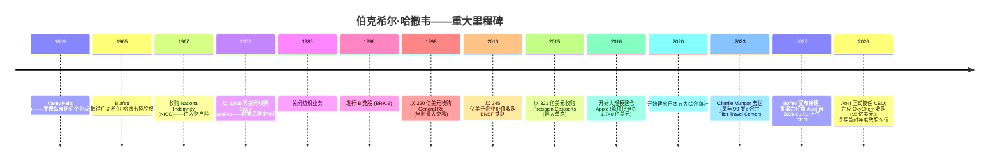
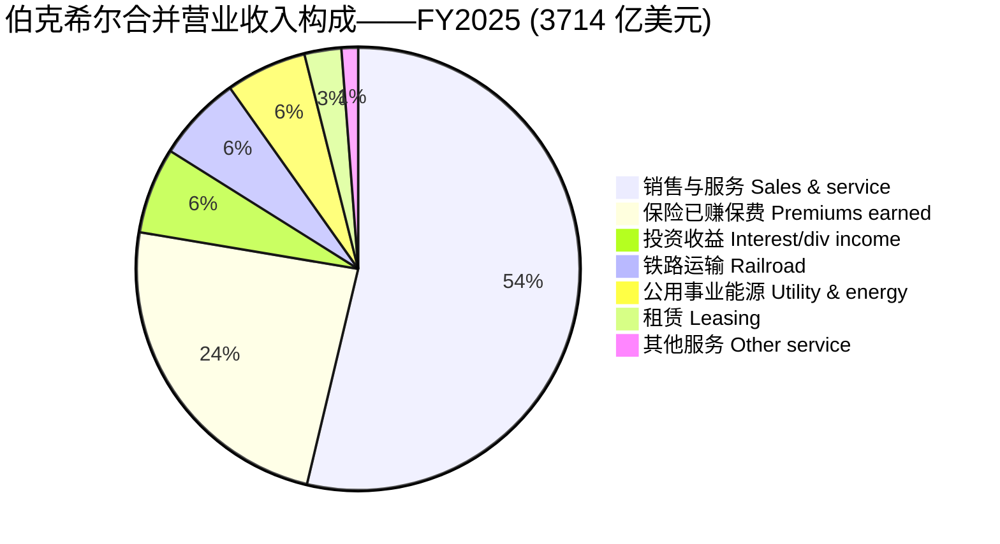
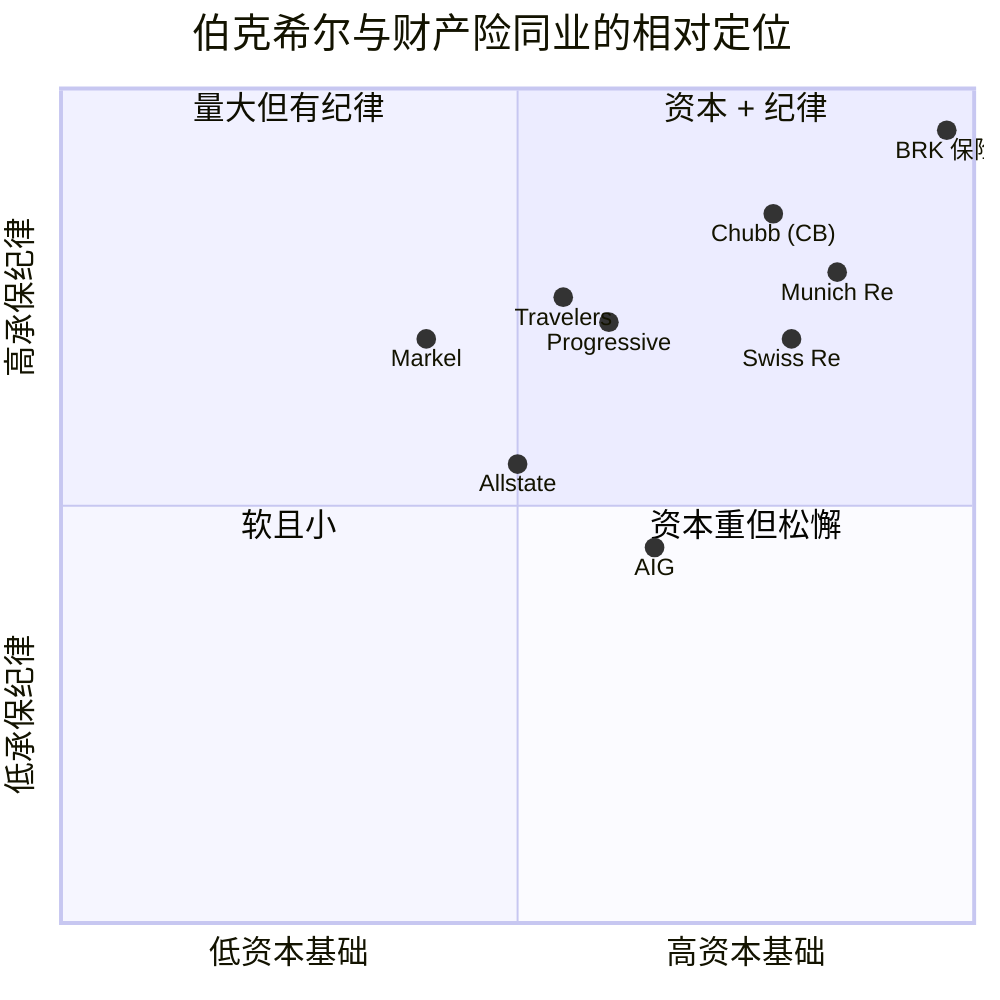

# Berkshire Hathaway Inc. (NYSE:BRK.B) — 公司研究报告

**日期:** 2026-06-14
**上市地: 纽约证券交易所, 代码 BRK.B / BRK.A**
**注册地: 美国特拉华州 · 总部: 美国内布拉斯加州奥马哈市**
**报告语言: 简体中文 (英文版同时存在于本目录)**

> *分析师观点：* **评级：Hold（持有）· 12 个月目标价 US\$555（较 2026-06-12 收盘 \$489.25 上行 +13.4%）· 估值方法：SOTP / 市净率（P/B 1.55× × 增长中的每股账面价值 (BVPS)，与透视盈余 (look-through earnings) 交叉验证）· 市值约 \$1.055 万亿 · 52 周区间约 \$453–\$542 · NYSE:BRK.B**
>
> | 倍数 / Multiple（*分析师观点：* 前瞻列） | FY2025A | FY2026E | FY2027E |
> |---|---|---|---|
> | P/B（市净率，账面价值） | 1.42× | 1.36× | 1.27× |
> | P/E（GAAP，受市价重估扰动） | 14.6× | n/m | n/m |
> | P/E（经营盈利口径 operating-earnings） | 23.7× | 22.4× | 21.2× |
> | 市值 / 现金+国债 | 2.86× | — | — |
>
> 相对表现（截至 2026-06-12，收盘价口径）：1M +0.8% · 6M −2.1% · YTD −2.7% · 12M −0.2%，对标 SPY 1M −0.1% / 6M +9.4% / YTD +9.1% / 12M +24.3%（相对：12M 约 −24.5pp，明显跑输）——来源 [yfinance 价格序列，截至 2026-06-12]。
>
> **核心论点（thesis pillars）**——（1）保险浮存金 (insurance float) \$176.9bn 的负成本杠杆 + \$369bn 现金国债堡垒，构成无可复制的资本配置机器，但在 \$1 万亿市值规模下前瞻复利结构性走低；（2）首任非 Buffett CEO **Greg Abel** 已于 2026-01-01 接任，资本配置座席的关键人物风险 (key-man risk) 从"理论"变为"待验证"；（3）当前 P/B 1.42× 低于财产险同业中位数 1.93×、也低于自身 5 年均值，折价反映 \$369bn 现金的盈利拖累 + 接班不确定性——这些是可逆而非永久性损害，故下行有底；（4）催化剂稀缺：回购重启、超大型并购、或市场错位下的权益增配，是把折价收窄的唯一路径，短期能见度低，因此评级 Hold 而非 Buy。

> **本期新变化 / Update — 接班生效 + Q1-2026 业绩（2026-05-04 提交 10-Q）：** **Greg Abel 已于 2026-01-01 正式出任 CEO**，Buffett 留任董事长——这是 1965 年以来伯克希尔治理层面最大单一变化（[伯克希尔 8-K，2025-05-08，董事高管变更](https://www.sec.gov/Archives/edgar/data/1067983/000119312525115695/d28310dex991.htm)；[FY2025 10-K 第一部分，明确"自 2026-01-01 起 Abel 出任 CEO"](https://www.sec.gov/Archives/edgar/data/1067983/000119312526083899/brka-20251231.htm)）。Q1-2026 归属伯克希尔净利润 **\$10.1bn**（含约 \$1.2bn 税后投资损失），股东权益升至 **\$727.2bn**（较 2025 年末 +\$9.8bn），浮存金升至 **\$176.9bn**（[Q1-2026 10-Q，财务状况](https://www.sec.gov/Archives/edgar/data/1067983/000119312526202243/brka-20260331.htm)）。FY2025 全年：合并 GAAP 净利润 **\$67.0bn**（FY2024 \$89.0bn、FY2023 \$96.2bn——同比下滑主要来自权益市价重估，而非经营恶化），经营盈利 (operating earnings) **\$44.5bn**（FY2024 \$47.4bn），现金+美国国债 (T-Bills) **\$369.0bn**，**2025 全年无任何股份回购**——多年来首次（[FY2025 10-K，第 5 项 + 财务状况](https://www.sec.gov/Archives/edgar/data/1067983/000119312526083899/brka-20251231.htm)）。2026-01-02 完成 **\$9.5bn 收购 OxyChem**。
> 来源：[伯克希尔 FY2025 10-K，2026-03-02 提交](https://www.sec.gov/Archives/edgar/data/1067983/000119312526083899/brka-20251231.htm) · [Q1-2026 10-Q](https://www.sec.gov/Archives/edgar/data/1067983/000119312526202243/brka-20260331.htm) · [2025 年度致股东信 + 10-K (PDF)](https://www.berkshirehathaway.com/2025ar/2025ar.pdf)。

---

## 目录

1. 公司概览（含投资论点引言）
1A. 估值与目标价（前瞻测算 · SOTP 推导 · 牛熊情景）
1B. GF Score 基本面评分卡
2. 公司历史
3. 管理团队
4. 产品与服务（运营子公司 + 权益投资组合）
5. 客户与上市策略
6. 行业概览
7. 竞争格局
8. 市场机会 (TAM)
9. 风险评估
9.5. 关键分歧与催化剂
10. 投资视角评分卡

---

## 1. 公司概览

*分析师观点：* **本报告给予伯克希尔 Hold（持有）评级、12 个月目标价 \$555（较 2026-06-12 收盘 \$489.25 上行约 +13.4%）。** 论点不是"买入一只被低估的股票",而是"以接近内在价值、近期区间下半段的价格,持有一台已被验证 60 年、但正经历单点治理变更、且因规模而前瞻复利走低的资本配置机器"。四条支柱:(1) 浮存金负成本杠杆 + \$369bn 现金堡垒是结构性优势;(2) Abel 接班把关键人物风险从理论变为待验证,这是当前折价的核心原因;(3) P/B 1.42× 低于同业中位数,折价是可逆损害(现金可重新部署、回购可重启),故下行有底;(4) 把折价收窄需要稀缺催化剂(超大型并购、回购重启、市场错位下的增配),短期能见度低。下面的描述性概览支撑这四条。

伯克希尔·哈撒韦公司 (Berkshire Hathaway Inc.) 是一家在特拉华州注册成立的控股集团 (holding company), 总部位于美国内布拉斯加州奥马哈市 Farnam 街 3555 号, 旗下拥有一个由众多全资运营子公司构成的联邦体, 以及一组 2025 年末公允价值达 **\$297.8bn** 的上市权益投资组合 (equity portfolio)。公司前身可追溯至 1839 年成立的纺织企业, 1965 年由 Warren Buffett 控制后重组, 此后凭借一个不断重复的单一机制成为全球市值最大的公司之一: 保险子公司产生保单持有人的浮存金 (float), 该浮存金与留存经营现金流一同, 由 CEO 重新配置到全资业务或可交易证券中, 由此产生的利润绝大多数留存再投资。伯克希尔自 1967 年以来从未派发过任何现金股息 ([FY2025 10-K, "股息"](https://www.sec.gov/Archives/edgar/data/1067983/000119312526083899/brka-20251231.htm))。

**用直白的语言介绍伯克希尔实际持有的业务。** 10-K 列出了四大经济支柱: "保险业务, 既以原保险方式开展, 也以再保险方式开展; 货运铁路运输业务; 以及由多家公用事业与能源生产分销公司组成的业务集群……此外还运营着众多从事制造、服务和零售活动的其他业务" ([FY2025 10-K 第一部分业务描述](https://www.sec.gov/Archives/edgar/data/1067983/000119312526083899/brka-20251231.htm))。具体到子公司层面: GEICO (盖可保险, 美国第三大汽车保险公司, 约 11.6% 市场份额)、Berkshire Hathaway Primary Group (伯克希尔原保险集团)、Berkshire Hathaway Reinsurance Group (含 General Re、NICO、TransRe)、BNSF 铁路 (Burlington Northern Santa Fe, 北美六大 I 级货运铁路之一)、Berkshire Hathaway Energy (旗下有 PacifiCorp、MidAmerican、NV Energy、Northern Powergrid、AltaLink 及 BHE GT&S/Northern Natural/Kern River 管道), 以及约 50 家制造/服务/零售 (MSR) 业务, 包括 Precision Castparts (精密铸件)、Lubrizol (路博润)、Marmon、IMC、Clayton Homes、Shaw Industries、Johns Manville、NetJets、McLane、Pilot Travel Centers、See's Candies 与 Brooks Sports。2026-01-02, 集群通过 \$9.5bn 收购 **OxyChem** (Occidental 旗下化工业务) 进一步扩张 ([FY2025 10-K 附注 2——重大业务收购](https://www.sec.gov/Archives/edgar/data/1067983/000119312526083899/brka-20251231.htm))。

**规模与版图。** 截至 2025 年 12 月 31 日, 伯克希尔及其子公司在全球共雇佣 **约 387,800 人**, 约 80% 在美国境内 ([FY2025 10-K 第一部分](https://www.sec.gov/Archives/edgar/data/1067983/000119312526083899/brka-20251231.htm))。FY2025 总营业收入 (total revenues) 为 **\$371.4bn** (FY2024: \$371.4bn; FY2023: \$364.5bn), 归属于伯克希尔股东的净利润为 **\$67.0bn** ([FY2025 10-K, 合并损益表](https://www.sec.gov/Archives/edgar/data/1067983/000119312526083899/brka-20251231.htm))。截至 2025 年末, 总资产为 **\$1.222 万亿** (2024 年末: \$1.154 万亿); 伯克希尔股东权益 (shareholders' equity) 为 **\$717.4bn**, 进一步升至 2026 年 3 月 31 日的 **\$727.2bn** ([Q1-2026 10-Q, 财务状况](https://www.sec.gov/Archives/edgar/data/1067983/000119312526202243/brka-20260331.htm))。

下图把 FY2025 利润表拆成 Sankey: 营收按来源(保险已赚保费、销售与服务、铁路、公用事业能源、投资收益)流入, 经成本费用后到净利润。注意此图刻意**不含** \$39.1bn 的权益市价重估投资收益与 −\$9.6bn 权益法损益——这正是伯克希尔报告 EPS 巨幅波动而经营业务平稳的根源。

<svg xmlns="http://www.w3.org/2000/svg" viewBox="0 0 1000 560" width="1000" height="560" role="img" aria-label="income statement Sankey"><rect x="0" y="0" width="1000" height="560" fill="#ffffff"/>
<text x="20.00" y="30.00" text-anchor="start" font-family="Helvetica,Arial,sans-serif" font-size="15" font-weight="700" fill="#1f2933">伯克希尔 FY2025 利润表 Sankey（不含投资损益的市价重估）</text>
<path d="M 204.00,64.00 C 258.00,64.00 258.00,106.00 312.00,106.00 L 312.00,193.61 C 258.00,193.61 258.00,151.61 204.00,151.61 Z" fill="#93c5fd" fill-opacity="0.55"/>
<path d="M 452.00,99.00 C 506.00,99.00 506.00,244.85 560.00,244.85 L 560.00,297.08 C 506.00,297.08 506.00,151.23 452.00,151.23 Z" fill="#86efac" fill-opacity="0.55"/>
<path d="M 452.00,151.23 C 506.00,151.23 506.00,311.08 560.00,311.08 L 560.00,333.15 C 506.00,333.15 506.00,173.30 452.00,173.30 Z" fill="#fca5a5" fill-opacity="0.55"/>
<path d="M 328.00,106.00 C 382.00,106.00 382.00,99.00 436.00,99.00 L 436.00,173.30 C 382.00,173.30 382.00,180.30 328.00,180.30 Z" fill="#86efac" fill-opacity="0.55"/>
<path d="M 328.00,180.30 C 382.00,180.30 382.00,187.30 436.00,187.30 L 436.00,479.00 C 382.00,479.00 382.00,472.00 328.00,472.00 Z" fill="#fca5a5" fill-opacity="0.55"/>
<path d="M 204.00,165.61 C 258.00,165.61 258.00,193.61 312.00,193.61 L 312.00,390.21 C 258.00,390.21 258.00,362.21 204.00,362.21 Z" fill="#93c5fd" fill-opacity="0.55"/>
<path d="M 700.00,230.31 C 754.00,230.31 754.00,241.35 808.00,241.35 L 808.00,307.67 C 754.00,307.67 754.00,296.63 700.00,296.63 Z" fill="#86efac" fill-opacity="0.55"/>
<path d="M 700.00,296.63 C 754.00,296.63 754.00,321.67 808.00,321.67 L 808.00,336.65 C 754.00,336.65 754.00,311.61 700.00,311.61 Z" fill="#fca5a5" fill-opacity="0.55"/>
<path d="M 576.00,244.85 C 630.00,244.85 630.00,230.31 684.00,230.31 L 684.00,282.54 C 630.00,282.54 630.00,297.08 576.00,297.08 Z" fill="#86efac" fill-opacity="0.55"/>
<path d="M 576.00,311.08 C 630.00,311.08 630.00,325.61 684.00,325.61 L 684.00,347.69 C 630.00,347.69 630.00,333.15 576.00,333.15 Z" fill="#fca5a5" fill-opacity="0.55"/>
<path d="M 204.00,376.21 C 258.00,376.21 258.00,390.21 312.00,390.21 L 312.00,413.17 C 258.00,413.17 258.00,399.17 204.00,399.17 Z" fill="#93c5fd" fill-opacity="0.55"/>
<path d="M 204.00,413.17 C 258.00,413.17 258.00,413.17 312.00,413.17 L 312.00,434.75 C 258.00,434.75 258.00,434.75 204.00,434.75 Z" fill="#93c5fd" fill-opacity="0.55"/>
<path d="M 204.00,448.75 C 258.00,448.75 258.00,434.75 312.00,434.75 L 312.00,457.71 C 258.00,457.71 258.00,471.71 204.00,471.71 Z" fill="#93c5fd" fill-opacity="0.55"/>
<path d="M 204.00,485.71 C 258.00,485.71 258.00,457.71 312.00,457.71 L 312.00,467.57 C 258.00,467.57 258.00,495.57 204.00,495.57 Z" fill="#93c5fd" fill-opacity="0.55"/>
<path d="M 204.00,509.57 C 258.00,509.57 258.00,467.57 312.00,467.57 L 312.00,472.00 C 258.00,472.00 258.00,514.00 204.00,514.00 Z" fill="#93c5fd" fill-opacity="0.55"/>
<rect x="188.00" y="64.00" width="16" height="87.61" rx="1.5" fill="#2563eb"/>
<rect x="188.00" y="165.61" width="16" height="196.60" rx="1.5" fill="#2563eb"/>
<rect x="188.00" y="376.21" width="16" height="22.96" rx="1.5" fill="#2563eb"/>
<rect x="188.00" y="413.17" width="16" height="21.58" rx="1.5" fill="#2563eb"/>
<rect x="188.00" y="448.75" width="16" height="22.96" rx="1.5" fill="#2563eb"/>
<rect x="188.00" y="485.71" width="16" height="9.85" rx="1.5" fill="#2563eb"/>
<rect x="188.00" y="509.57" width="16" height="4.43" rx="1.5" fill="#2563eb"/>
<rect x="312.00" y="106.00" width="16" height="366.00" rx="1.5" fill="#1e3a8a"/>
<rect x="436.00" y="99.00" width="16" height="74.30" rx="1.5" fill="#15803d"/>
<rect x="436.00" y="187.30" width="16" height="291.70" rx="1.5" fill="#dc2626"/>
<rect x="560.00" y="244.85" width="16" height="52.23" rx="1.5" fill="#15803d"/>
<rect x="560.00" y="311.08" width="16" height="22.07" rx="1.5" fill="#dc2626"/>
<rect x="684.00" y="230.31" width="16" height="81.30" rx="1.5" fill="#15803d"/>
<rect x="684.00" y="325.61" width="16" height="22.07" rx="1.5" fill="#dc2626"/>
<rect x="808.00" y="241.35" width="16" height="66.32" rx="1.5" fill="#15803d"/>
<rect x="808.00" y="321.67" width="16" height="14.98" rx="1.5" fill="#dc2626"/>
<line x1="188.00" y1="107.80" x2="182.00" y2="79.17" stroke="#cbd5e1" stroke-width="1"/>
<text x="179.00" y="82.17" text-anchor="end" font-family="Helvetica,Arial,sans-serif" font-size="11.5" font-weight="700" fill="#1f2933">保险已赚保费 Insurance premiums</text>
<text x="179.00" y="95.17" text-anchor="end" font-family="Helvetica,Arial,sans-serif" font-size="10" font-weight="400" fill="#52606d">US$88.9B  (23.9%)</text>
<line x1="188.00" y1="263.91" x2="182.00" y2="235.27" stroke="#cbd5e1" stroke-width="1"/>
<text x="179.00" y="238.27" text-anchor="end" font-family="Helvetica,Arial,sans-serif" font-size="11.5" font-weight="700" fill="#1f2933">销售与服务 Sales &amp; service</text>
<text x="179.00" y="251.27" text-anchor="end" font-family="Helvetica,Arial,sans-serif" font-size="10" font-weight="400" fill="#52606d">US$199.5B  (53.7%)</text>
<line x1="188.00" y1="387.69" x2="182.00" y2="359.05" stroke="#cbd5e1" stroke-width="1"/>
<text x="179.00" y="362.05" text-anchor="end" font-family="Helvetica,Arial,sans-serif" font-size="11.5" font-weight="700" fill="#1f2933">铁路运输 Railroad</text>
<text x="179.00" y="375.05" text-anchor="end" font-family="Helvetica,Arial,sans-serif" font-size="10" font-weight="400" fill="#52606d">US$23.3B  (6.3%)</text>
<line x1="188.00" y1="423.96" x2="182.00" y2="395.32" stroke="#cbd5e1" stroke-width="1"/>
<text x="179.00" y="398.32" text-anchor="end" font-family="Helvetica,Arial,sans-serif" font-size="11.5" font-weight="700" fill="#1f2933">公用事业能源 Utility &amp; energy</text>
<text x="179.00" y="411.32" text-anchor="end" font-family="Helvetica,Arial,sans-serif" font-size="10" font-weight="400" fill="#52606d">US$21.9B  (5.9%)</text>
<line x1="188.00" y1="460.23" x2="182.00" y2="431.59" stroke="#cbd5e1" stroke-width="1"/>
<text x="179.00" y="434.59" text-anchor="end" font-family="Helvetica,Arial,sans-serif" font-size="11.5" font-weight="700" fill="#1f2933">投资收益 Interest/div income</text>
<text x="179.00" y="447.59" text-anchor="end" font-family="Helvetica,Arial,sans-serif" font-size="10" font-weight="400" fill="#52606d">US$23.3B  (6.3%)</text>
<line x1="188.00" y1="490.64" x2="182.00" y2="462.00" stroke="#cbd5e1" stroke-width="1"/>
<text x="179.00" y="465.00" text-anchor="end" font-family="Helvetica,Arial,sans-serif" font-size="11.5" font-weight="700" fill="#1f2933">租赁 Leasing</text>
<text x="179.00" y="478.00" text-anchor="end" font-family="Helvetica,Arial,sans-serif" font-size="10" font-weight="400" fill="#52606d">US$10.0B  (2.7%)</text>
<line x1="188.00" y1="511.78" x2="182.00" y2="487.00" stroke="#cbd5e1" stroke-width="1"/>
<text x="179.00" y="490.00" text-anchor="end" font-family="Helvetica,Arial,sans-serif" font-size="11.5" font-weight="700" fill="#1f2933">其他 Other service</text>
<text x="179.00" y="503.00" text-anchor="end" font-family="Helvetica,Arial,sans-serif" font-size="10" font-weight="400" fill="#52606d">US$4.5B  (1.2%)</text>
<rect x="331.00" y="88.00" width="125.70" height="26" rx="2" fill="#ffffff" fill-opacity="0.72"/>
<text x="334.00" y="100.00" text-anchor="start" font-family="Helvetica,Arial,sans-serif" font-size="11.5" font-weight="700" fill="#1f2933">Revenue</text>
<text x="334.00" y="113.00" text-anchor="start" font-family="Helvetica,Arial,sans-serif" font-size="10" font-weight="400" fill="#52606d">US$371.4B  (100.0%)</text>
<rect x="455.00" y="81.00" width="113.10" height="26" rx="2" fill="#ffffff" fill-opacity="0.72"/>
<text x="458.00" y="93.00" text-anchor="start" font-family="Helvetica,Arial,sans-serif" font-size="11.5" font-weight="700" fill="#1f2933">Gross Profit</text>
<text x="458.00" y="106.00" text-anchor="start" font-family="Helvetica,Arial,sans-serif" font-size="10" font-weight="400" fill="#52606d">US$75.4B  (20.3%)</text>
<rect x="455.00" y="169.30" width="144.60" height="26" rx="2" fill="#ffffff" fill-opacity="0.72"/>
<text x="458.00" y="181.30" text-anchor="start" font-family="Helvetica,Arial,sans-serif" font-size="11.5" font-weight="700" fill="#1f2933">Cost of Revenue (COGS)</text>
<text x="458.00" y="194.30" text-anchor="start" font-family="Helvetica,Arial,sans-serif" font-size="10" font-weight="400" fill="#52606d">US$296.0B  (79.7%)</text>
<rect x="579.00" y="226.85" width="113.10" height="26" rx="2" fill="#ffffff" fill-opacity="0.72"/>
<text x="582.00" y="238.85" text-anchor="start" font-family="Helvetica,Arial,sans-serif" font-size="11.5" font-weight="700" fill="#1f2933">Operating Income</text>
<text x="582.00" y="251.85" text-anchor="start" font-family="Helvetica,Arial,sans-serif" font-size="10" font-weight="400" fill="#52606d">US$53.0B  (14.3%)</text>
<rect x="579.00" y="293.08" width="150.90" height="26" rx="2" fill="#ffffff" fill-opacity="0.72"/>
<text x="582.00" y="305.08" text-anchor="start" font-family="Helvetica,Arial,sans-serif" font-size="11.5" font-weight="700" fill="#1f2933">Total Operating Expense</text>
<text x="582.00" y="318.08" text-anchor="start" font-family="Helvetica,Arial,sans-serif" font-size="10" font-weight="400" fill="#52606d">US$22.4B  (6.0%)</text>
<rect x="703.00" y="212.31" width="113.10" height="26" rx="2" fill="#ffffff" fill-opacity="0.72"/>
<text x="706.00" y="224.31" text-anchor="start" font-family="Helvetica,Arial,sans-serif" font-size="11.5" font-weight="700" fill="#1f2933">Pretax Income</text>
<text x="706.00" y="237.31" text-anchor="start" font-family="Helvetica,Arial,sans-serif" font-size="10" font-weight="400" fill="#52606d">US$82.5B  (22.2%)</text>
<rect x="703.00" y="307.61" width="106.80" height="26" rx="2" fill="#ffffff" fill-opacity="0.72"/>
<text x="706.00" y="319.61" text-anchor="start" font-family="Helvetica,Arial,sans-serif" font-size="11.5" font-weight="700" fill="#1f2933">Other OpEx</text>
<text x="706.00" y="332.61" text-anchor="start" font-family="Helvetica,Arial,sans-serif" font-size="10" font-weight="400" fill="#52606d">US$22.4B  (6.0%)</text>
<text x="833.00" y="271.51" text-anchor="start" font-family="Helvetica,Arial,sans-serif" font-size="11.5" font-weight="700" fill="#1f2933">Net Income</text>
<text x="833.00" y="284.51" text-anchor="start" font-family="Helvetica,Arial,sans-serif" font-size="10" font-weight="400" fill="#52606d">US$67.3B  (18.1%)</text>
<text x="833.00" y="326.16" text-anchor="start" font-family="Helvetica,Arial,sans-serif" font-size="11.5" font-weight="700" fill="#1f2933">Income Tax</text>
<text x="833.00" y="339.16" text-anchor="start" font-family="Helvetica,Arial,sans-serif" font-size="10" font-weight="400" fill="#52606d">US$15.2B  (4.1%)</text>
<text x="500.00" y="530.00" text-anchor="middle" font-family="Helvetica,Arial,sans-serif" font-size="10" font-weight="400" font-style="italic" fill="#8a97a3">营收按来源拆分；总营收 $371.4bn（不含 $39.1bn 权益市价重估投资收益与 -$9.6bn 权益法损益）。净利润 $67.3bn 为合并口径（归属伯克希尔 $67.0bn）。</text>
<text x="500.00" y="544.00" text-anchor="middle" font-family="Helvetica,Arial,sans-serif" font-size="10" font-weight="400" fill="#52606d">Source: Berkshire FY2025 10-K，合并损益表（2026-03-02 提交）</text>
</svg>

*来源: [FY2025 10-K, 合并损益表](https://www.sec.gov/Archives/edgar/data/1067983/000119312526083899/brka-20251231.htm)。*

**伯克希尔如何赚钱——浮存金引擎。** 核心特征是浮存金 (float): 保单持有人留存以支付未来索赔的净资金, 在等候期间为伯克希尔所用。**浮存金从 2020 年末的约 \$138bn 增长至 2025 年末的约 \$176bn**, 2026-03-31 进一步达 \$176.9bn ([FY2025 10-K 第一部分 § 保险业务投资](https://www.sec.gov/Archives/edgar/data/1067983/000119312526083899/brka-20251231.htm); [Q1-2026 10-Q § 保险投资收益](https://www.sec.gov/Archives/edgar/data/1067983/000119312526202243/brka-20260331.htm))。由于合并保险业务在过去三年每年都实现承保利润 (underwriting profit) 且**平均浮存金成本为负**——10-K 原文: "我们的合并保险业务在截至 2025 年的三个年度每年都产生税前承保收益, 且每年平均浮存金成本为负" ([FY2025 10-K § 保险——投资收益](https://www.sec.gov/Archives/edgar/data/1067983/000119312526083899/brka-20251231.htm))。这笔资金加股东资本, 支撑了 **\$297.8bn 权益投资组合** 与 **\$369bn 现金+美国国债** 持仓 ([FY2025 10-K 附注 4 + 财务状况](https://www.sec.gov/Archives/edgar/data/1067983/000119312526083899/brka-20251231.htm))。

**地域结构。** 主要为美国。约 80% 雇员在美国境内; 保险子公司主要承保美国风险; BHE 旗下美国受监管公用事业服务约 540 万零售电气/燃气客户, 加英国 400 万电力终端用户 (Northern Powergrid) 与阿尔伯塔输电 (AltaLink)。日本五大综合商社 (sōgō shōsha) 投资与 BHSI 海外办公室, 是仅有的具实质意义的非美国敞口 ([FY2025 10-K 第一部分](https://www.sec.gov/Archives/edgar/data/1067983/000119312526083899/brka-20251231.htm); [2025 年度致股东信第 15–16 页](https://www.berkshirehathaway.com/2025ar/2025ar.pdf))。

**估值快照 (截至 2026-06-12 定价)。** BRK.B 收盘价为 **\$489.25**; 按 14.38 亿股 A 类等价股本 (= 21.57 亿 B 类等价) 计算, 合计市值约 **\$1.055 万亿** ([yfinance — BRK-B, 2026-06-12](https://finance.yahoo.com/quote/BRK-B/); [FY2025 10-K 附注 22——等价 A 类股 1,438,223 股](https://www.sec.gov/Archives/edgar/data/1067983/000119312526083899/brka-20251231.htm))。基于 FY2025 GAAP 净利润 \$67.0bn, **TTM 市盈率 (P/E) 约 14.6 倍**; 基于营收 \$371.4bn, **TTM 市销率 (P/S) 约 2.81 倍**; 对应 2026 年 3 月 31 日股东权益 \$727.2bn, **市净率 (P/B) 约 1.45 倍** (按年末权益 \$717.4bn 则为 1.47 倍, 与 2026-05 报告时点 1.42× 接近)。

**同业估值倍数 (TTM, 2026-06-12):**

| 公司 | 市盈率 P/E | 市净率 P/B | 市销率 P/S |
|---|---|---|---|
| **BRK.B (今日)** | **14.6×** | **~1.45×** | **2.81×** |
| Chubb (CB, 安达保险) | 11.6× | 1.73× | 2.09× |
| Travelers (TRV, 旅行者保险) | 9.1× | 2.02× | 1.32× |
| Allstate (ALL, 好事达保险) | 4.9× | 1.93× | 0.84× |
| Progressive (PGR, 进步保险) | 10.3× | 3.70× | 1.33× |
| Markel (MKL) | 13.4× | 1.28× | 1.44× |

来源: [yfinance 同业页面, 访问于 2026-06-12](https://finance.yahoo.com/quote/PGR/)。

对于伯克希尔, P/B 是合适的锚定倍数, 原因有二: (a) 权益投资组合每季度按 GAAP 损益表市价重估, 使 P/E 随市场剧烈波动, 而伯克希尔既非市场涨跌之因, 也未因此变现 ([FY2025 10-K 第 7A 项 § 市场风险披露](https://www.sec.gov/Archives/edgar/data/1067983/000119312526083899/brka-20251231.htm)); (b) 内在价值的实质份额位于 BHE 与 BNSF (资本密集、受监管资产) 的留存复利, 以及私市值远高于账面的子公司 (PCC、See's、GEICO 品牌)。Abel 本人也将伯克希尔的叙事重心从账面价值转向内在价值 ([2025 年度致股东信第 19–20 页——内在价值 vs 账面价值](https://www.berkshirehathaway.com/2025ar/2025ar.pdf))——但作为与财产险同业的相对参照, P/B 较好地反映股东权益缓冲与市场估值之间的纪律。

**倍数是被拉伸、正常, 还是被压缩?** 偏压缩。在 1.45 倍账面净值, 伯克希尔交易价**低于同业中位数 (1.93×)**, 尽管: (a) 持有 \$369bn 现金 + T-Bill, 约为账面股东权益的 51%; (b) 60 年时间, 每股市值年化复合增长 **19.7%** (1965–2025), 而标普 500 含股息回报年化 10.5% ([2025 年度致股东信第 19–20 页](https://www.berkshirehathaway.com/2025ar/2025ar.pdf)); (c) 拥有保险业最高级别信用评级 (标普 AA+; A.M. Best A++ Superior——[FY2025 10-K 第一部分](https://www.sec.gov/Archives/edgar/data/1067983/000119312526083899/brka-20251231.htm))。折价反映市场对以下几点的累计定价: (i) Buffett 卸任 CEO 与尚待验证的 Abel 主导阶段; (ii) 约 \$369bn 资金停留在 4–5% 收益的 T-Bill 而非权益, 产生盈利拖累; (iii) 2025 全年零回购。这些都不是永久性损害, 都可逆 (Abel 可回购、可并购、可将现金轮换为权益)。*分析师观点：* 瑞银 (UBS) 同样测算当前 A 股较内在价值折价约 8%, 而其 2018 年重启回购以来的平均折价为 15%, 即"折价虽存, 但并不极端"([UBS — Berkshire Hathaway, 2026-05-03, p.1](http://xs-macbook-air.local:5001/zsxq/pdf/184125244522222/UBS-Berkshire%20Hathaway%20Inc%EF%BC%88BRKa.US%EF%BC%89Continuity%20of%20Principles%20with%20Focus%20on%20Improvement-260503.pdf))。

---

## 1A. 估值与目标价

本章是前瞻、决策级分析, 区别于 Section 1 的 TTM 快照。**本章所有预测数、目标价与情景价均为 *分析师观点：*, 不附带任何申报文件引用** (10-K 不含目标价)。预测的*输入*(分部数据、管理层框架、行业预测) 在文内逐条引用。

**(a) 前瞻测算表 (*分析师观点：*)。** 伯克希尔的正确框架不是单一前瞻 EPS, 而是**经营盈利 (operating earnings) + 每股账面价值 (BVPS) 增长**两条线, 因为 GAAP EPS 被权益市价重估扰动到几乎无法用于估值。

| 指标 (*分析师观点：* 除 FY2025A 列) | FY2025A | FY2026E | FY2027E | CAGR |
|---|---|---|---|---|
| 经营盈利 Operating earnings (\$bn) | 44.5 | 47.0 | 49.6 | +5.6% |
|  — YoY % | −6.2% | +5.6% | +5.5% | |
| 股东权益 Shareholders' equity (\$bn) | 717.4 | 763 | 813 | +6.5% |
| 每股账面价值 BVPS (\$/B 股等价) | ~332 | ~354 | ~377 | +6.5% |
| 现金+美国国债 (\$bn) | 369 | 385 | 400 | |
| 自由现金流 FCF (\$bn, CFO−capex) | 25.1 | 26 | 28 | |
| ROE（经营盈利/平均权益） | ~6.5% | ~6.4% | ~6.3% | |
| 股份回购 (\$bn) | 0 | 5–15(情景) | 10–20(情景) | |

经营盈利路径基于: FY2025 分部基数 (\$44.5bn, [FY2025 10-K MD&A 分部表](https://www.sec.gov/Archives/edgar/data/1067983/000119312526083899/brka-20251231.htm)) + 管理层对 BNSF 效率追赶、BHE 数据中心负荷增长 (MidAmerican 未来五年负荷 +约 50%) 的框架 ([2025 年度致股东信第 12–13 页](https://www.berkshirehathaway.com/2025ar/2025ar.pdf)) + 保险软周期下浮存金温和增长的假设。权益增长由经营盈利全部留存 (不派息) + 权益组合假定与市场同步增值驱动。**关键说明: GAAP EPS 不进入估值** —— FY2025 GAAP 净利 \$67.0bn 含 \$30.7bn 投资市价重估 + −\$8.3bn KHC/OXY 减值, 这些与下一年盈利能力无关 ([FY2025 10-K 财务状况](https://www.sec.gov/Archives/edgar/data/1067983/000119312526083899/brka-20251231.htm))。

下面的 5 步 DuPont 分解说明了为什么报告 ROE 对伯克希尔具有误导性——其分子 (报告净利) 被 \$39.1bn 投资市价重估膨胀, 经济 ROE 应以经营盈利衡量 (约 6.5%, 见图注):

<svg xmlns="http://www.w3.org/2000/svg" viewBox="0 0 1240 540" width="1240" height="540" role="img" aria-label="DuPont ROE decomposition"><rect x="0" y="0" width="1240" height="540" fill="#ffffff"/>
<text x="20.00" y="30.00" text-anchor="start" font-family="Helvetica,Arial,sans-serif" font-size="15" font-weight="700" fill="#1f2933">伯克希尔 5 步 DuPont ROE 分解（FY2025）</text>
<rect x="545.00" y="56.00" width="150" height="56" rx="7" fill="#1e3a8a"/>
<text x="620.00" y="76.00" text-anchor="middle" font-family="Helvetica,Arial,sans-serif" font-size="11.5" font-weight="700" fill="#ffffff">ROE</text>
<text x="620.00" y="94.00" text-anchor="middle" font-family="Helvetica,Arial,sans-serif" font-size="13" font-weight="800" fill="#ffffff">9.80%</text>
<text x="620.00" y="106.00" text-anchor="middle" font-family="Helvetica,Arial,sans-serif" font-size="8.5" font-weight="400" fill="#dbeafe">= Net Income / Avg Equity</text>
<rect x="191.60" y="168.00" width="150" height="56" rx="7" fill="#2563eb"/>
<text x="266.60" y="188.00" text-anchor="middle" font-family="Helvetica,Arial,sans-serif" font-size="11.5" font-weight="700" fill="#ffffff">Net Margin</text>
<text x="266.60" y="206.00" text-anchor="middle" font-family="Helvetica,Arial,sans-serif" font-size="13" font-weight="800" fill="#ffffff">16.32%</text>
<text x="266.60" y="218.00" text-anchor="middle" font-family="Helvetica,Arial,sans-serif" font-size="8.5" font-weight="400" fill="#dbeafe">Net Income / Revenue</text>
<line x1="620.00" y1="112.00" x2="266.60" y2="168.00" stroke="#94a3b8" stroke-width="1.4"/>
<rect x="545.00" y="168.00" width="150" height="56" rx="7" fill="#2563eb"/>
<text x="620.00" y="188.00" text-anchor="middle" font-family="Helvetica,Arial,sans-serif" font-size="11.5" font-weight="700" fill="#ffffff">Asset Turnover</text>
<text x="620.00" y="206.00" text-anchor="middle" font-family="Helvetica,Arial,sans-serif" font-size="13" font-weight="800" fill="#ffffff">0.35</text>
<text x="620.00" y="218.00" text-anchor="middle" font-family="Helvetica,Arial,sans-serif" font-size="8.5" font-weight="400" fill="#dbeafe">Revenue / Avg Assets</text>
<line x1="620.00" y1="112.00" x2="620.00" y2="168.00" stroke="#94a3b8" stroke-width="1.4"/>
<rect x="898.40" y="168.00" width="150" height="56" rx="7" fill="#2563eb"/>
<text x="973.40" y="188.00" text-anchor="middle" font-family="Helvetica,Arial,sans-serif" font-size="11.5" font-weight="700" fill="#ffffff">Equity Multiplier</text>
<text x="973.40" y="206.00" text-anchor="middle" font-family="Helvetica,Arial,sans-serif" font-size="13" font-weight="800" fill="#ffffff">1.74</text>
<text x="973.40" y="218.00" text-anchor="middle" font-family="Helvetica,Arial,sans-serif" font-size="8.5" font-weight="400" fill="#dbeafe">Avg Assets / Avg Equity</text>
<line x1="620.00" y1="112.00" x2="973.40" y2="168.00" stroke="#94a3b8" stroke-width="1.4"/>
<circle cx="443.30" cy="196.00" r="11" fill="#ffffff" stroke="#94a3b8" stroke-width="1.2"/>
<text x="443.30" y="201.00" text-anchor="middle" font-family="Helvetica,Arial,sans-serif" font-size="14" font-weight="800" fill="#52606d">×</text>
<circle cx="796.70" cy="196.00" r="11" fill="#ffffff" stroke="#94a3b8" stroke-width="1.2"/>
<text x="796.70" y="201.00" text-anchor="middle" font-family="Helvetica,Arial,sans-serif" font-size="14" font-weight="800" fill="#52606d">×</text>
<rect x="65.00" y="300.00" width="118" height="56" rx="7" fill="#2563eb"/>
<text x="124.00" y="320.00" text-anchor="middle" font-family="Helvetica,Arial,sans-serif" font-size="11.5" font-weight="700" fill="#ffffff">Operating Margin</text>
<text x="124.00" y="338.00" text-anchor="middle" font-family="Helvetica,Arial,sans-serif" font-size="13" font-weight="800" fill="#ffffff">22.41%</text>
<text x="124.00" y="350.00" text-anchor="middle" font-family="Helvetica,Arial,sans-serif" font-size="8.5" font-weight="400" fill="#dbeafe">Op Inc / Revenue</text>
<line x1="266.60" y1="224.00" x2="124.00" y2="300.00" stroke="#94a3b8" stroke-width="1.4"/>
<rect x="207.60" y="300.00" width="118" height="56" rx="7" fill="#2563eb"/>
<text x="266.60" y="320.00" text-anchor="middle" font-family="Helvetica,Arial,sans-serif" font-size="11.5" font-weight="700" fill="#ffffff">Tax Burden</text>
<text x="266.60" y="338.00" text-anchor="middle" font-family="Helvetica,Arial,sans-serif" font-size="13" font-weight="800" fill="#ffffff">0.8121</text>
<text x="266.60" y="350.00" text-anchor="middle" font-family="Helvetica,Arial,sans-serif" font-size="8.5" font-weight="400" fill="#dbeafe">Net Inc / Pretax</text>
<line x1="266.60" y1="224.00" x2="266.60" y2="300.00" stroke="#94a3b8" stroke-width="1.4"/>
<rect x="350.20" y="300.00" width="118" height="56" rx="7" fill="#2563eb"/>
<text x="409.20" y="320.00" text-anchor="middle" font-family="Helvetica,Arial,sans-serif" font-size="11.5" font-weight="700" fill="#ffffff">Interest Burden</text>
<text x="409.20" y="338.00" text-anchor="middle" font-family="Helvetica,Arial,sans-serif" font-size="13" font-weight="800" fill="#ffffff">0.8967</text>
<text x="409.20" y="350.00" text-anchor="middle" font-family="Helvetica,Arial,sans-serif" font-size="8.5" font-weight="400" fill="#dbeafe">Pretax / Op Inc</text>
<line x1="266.60" y1="224.00" x2="409.20" y2="300.00" stroke="#94a3b8" stroke-width="1.4"/>
<circle cx="195.30" cy="328.00" r="11" fill="#ffffff" stroke="#94a3b8" stroke-width="1.2"/>
<text x="195.30" y="333.00" text-anchor="middle" font-family="Helvetica,Arial,sans-serif" font-size="14" font-weight="800" fill="#52606d">×</text>
<circle cx="337.90" cy="328.00" r="11" fill="#ffffff" stroke="#94a3b8" stroke-width="1.2"/>
<text x="337.90" y="333.00" text-anchor="middle" font-family="Helvetica,Arial,sans-serif" font-size="14" font-weight="800" fill="#52606d">×</text>
<rect x="479.00" y="300.00" width="118" height="56" rx="7" fill="#2563eb"/>
<text x="538.00" y="326.00" text-anchor="middle" font-family="Helvetica,Arial,sans-serif" font-size="11.5" font-weight="700" fill="#ffffff">Revenue</text>
<text x="538.00" y="342.00" text-anchor="middle" font-family="Helvetica,Arial,sans-serif" font-size="13" font-weight="800" fill="#ffffff">US$410.5B</text>
<line x1="620.00" y1="224.00" x2="538.00" y2="300.00" stroke="#94a3b8" stroke-width="1.4"/>
<rect x="643.00" y="300.00" width="118" height="56" rx="7" fill="#2563eb"/>
<text x="702.00" y="320.00" text-anchor="middle" font-family="Helvetica,Arial,sans-serif" font-size="11.5" font-weight="700" fill="#ffffff">Avg Total Assets</text>
<text x="702.00" y="338.00" text-anchor="middle" font-family="Helvetica,Arial,sans-serif" font-size="13" font-weight="800" fill="#ffffff">US$1.2T</text>
<text x="702.00" y="350.00" text-anchor="middle" font-family="Helvetica,Arial,sans-serif" font-size="8.5" font-weight="400" fill="#dbeafe">(begin+end)/2</text>
<line x1="620.00" y1="224.00" x2="702.00" y2="300.00" stroke="#94a3b8" stroke-width="1.4"/>
<circle cx="620.00" cy="328.00" r="11" fill="#ffffff" stroke="#94a3b8" stroke-width="1.2"/>
<text x="620.00" y="333.00" text-anchor="middle" font-family="Helvetica,Arial,sans-serif" font-size="14" font-weight="800" fill="#52606d">÷</text>
<rect x="832.40" y="300.00" width="118" height="56" rx="7" fill="#2563eb"/>
<text x="891.40" y="320.00" text-anchor="middle" font-family="Helvetica,Arial,sans-serif" font-size="11.5" font-weight="700" fill="#ffffff">Avg Total Assets</text>
<text x="891.40" y="338.00" text-anchor="middle" font-family="Helvetica,Arial,sans-serif" font-size="13" font-weight="800" fill="#ffffff">US$1.2T</text>
<text x="891.40" y="350.00" text-anchor="middle" font-family="Helvetica,Arial,sans-serif" font-size="8.5" font-weight="400" fill="#dbeafe">(begin+end)/2</text>
<line x1="973.40" y1="224.00" x2="891.40" y2="300.00" stroke="#94a3b8" stroke-width="1.4"/>
<rect x="996.40" y="300.00" width="118" height="56" rx="7" fill="#2563eb"/>
<text x="1055.40" y="320.00" text-anchor="middle" font-family="Helvetica,Arial,sans-serif" font-size="11.5" font-weight="700" fill="#ffffff">Avg Total Equity</text>
<text x="1055.40" y="338.00" text-anchor="middle" font-family="Helvetica,Arial,sans-serif" font-size="13" font-weight="800" fill="#ffffff">US$683.4B</text>
<text x="1055.40" y="350.00" text-anchor="middle" font-family="Helvetica,Arial,sans-serif" font-size="8.5" font-weight="400" fill="#dbeafe">(begin+end)/2</text>
<line x1="973.40" y1="224.00" x2="1055.40" y2="300.00" stroke="#94a3b8" stroke-width="1.4"/>
<circle cx="967.20" cy="328.00" r="11" fill="#ffffff" stroke="#94a3b8" stroke-width="1.2"/>
<text x="967.20" y="333.00" text-anchor="middle" font-family="Helvetica,Arial,sans-serif" font-size="14" font-weight="800" fill="#52606d">÷</text>
<rect x="69.00" y="420.00" width="110" height="48" rx="7" fill="#3b82f6"/>
<text x="124.00" y="442.00" text-anchor="middle" font-family="Helvetica,Arial,sans-serif" font-size="11.5" font-weight="700" fill="#ffffff">Operating Income</text>
<text x="124.00" y="458.00" text-anchor="middle" font-family="Helvetica,Arial,sans-serif" font-size="13" font-weight="800" fill="#ffffff">US$92.0B</text>
<line x1="124.00" y1="356.00" x2="124.00" y2="420.00" stroke="#94a3b8" stroke-width="1.4"/>
<rect x="211.60" y="420.00" width="110" height="48" rx="7" fill="#3b82f6"/>
<text x="266.60" y="442.00" text-anchor="middle" font-family="Helvetica,Arial,sans-serif" font-size="11.5" font-weight="700" fill="#ffffff">Net Income</text>
<text x="266.60" y="458.00" text-anchor="middle" font-family="Helvetica,Arial,sans-serif" font-size="13" font-weight="800" fill="#ffffff">US$67.0B</text>
<line x1="266.60" y1="356.00" x2="266.60" y2="420.00" stroke="#94a3b8" stroke-width="1.4"/>
<rect x="354.20" y="420.00" width="110" height="48" rx="7" fill="#3b82f6"/>
<text x="409.20" y="442.00" text-anchor="middle" font-family="Helvetica,Arial,sans-serif" font-size="11.5" font-weight="700" fill="#ffffff">Pretax Income</text>
<text x="409.20" y="458.00" text-anchor="middle" font-family="Helvetica,Arial,sans-serif" font-size="13" font-weight="800" fill="#ffffff">US$82.5B</text>
<line x1="409.20" y1="356.00" x2="409.20" y2="420.00" stroke="#94a3b8" stroke-width="1.4"/>
<text x="620.00" y="510.00" text-anchor="middle" font-family="Helvetica,Arial,sans-serif" font-size="10" font-weight="400" font-style="italic" fill="#8a97a3">营收口径含 $39.1bn 投资市价重估收益（总收入与其他收入 $410.5bn）；故报告 ROE ~9.8% 含市价波动，经济 ROE 应以经营盈利 $44.5bn ÷ 平均权益 ≈ 6.5% 衡量。</text>
<text x="620.00" y="524.00" text-anchor="middle" font-family="Helvetica,Arial,sans-serif" font-size="10" font-weight="400" fill="#52606d">Source: Berkshire FY2025 10-K，合并损益表与资产负债表</text>
</svg>

*来源: [FY2025 10-K, 合并损益表与资产负债表](https://www.sec.gov/Archives/edgar/data/1067983/000119312526083899/brka-20251231.htm)。*

**(b) 目标价推导——SOTP / 账面价值法 (*分析师观点：*)。** 综合性集团的估值锚是**增长中的每股账面价值 × 历史 P/B 中枢**, 并以 SOTP 交叉验证。

- **方法 1——P/B 法:** 2026E 期末 BVPS 约 \$354 (B 股等价); 给予 **1.55× 目标 P/B** (介于伯克希尔自身 5 年区间 1.30–1.65× 的中上沿, 反映现金部署优化 + 回购重启的可选性), 得 12 个月目标价 **\$549**。
- **方法 2——SOTP 交叉验证 (借鉴瑞银框架):** *分析师观点：* 瑞银对 A 股的 SOTP 得内在价值约 \$871,400/A 股 (≈ \$581/B 股): 非保险业务按 2027E EPS **16× P/E** (约 \$5.66 万亿 A 股价值口径) + 保险业务按 **2× P/B** (基于 10% 调整后 ROE、7% 股权成本、4% 长期增长), 合计 ([UBS — Berkshire 1Q26 Preview, 2026-04-23, p.1](http://xs-macbook-air.local:5001/zsxq/pdf/184485425545552/UBS-Berkshire%20Hathaway%20Inc%EF%BC%88BRKa.US%EF%BC%891Q26%20Preview%EF%BC%9AWhat%20to%20Watch%20For%20in%20Omaha-260423.pdf))。把瑞银 \$871,400/A 与 P/B 法 \$549/B 折中、并对 \$369bn 现金做适度盈利拖累折让后, **取 12 个月目标价 \$555/B 股 (≈ \$832,500/A 股), 对应约 1.57× 2026E BVPS, 上行 +13.4%**。
- **为什么用 1.55–1.57× P/B 而非更高:** 同业 Chubb 1.73×、Travelers 2.02×、Markel 1.28× ([yfinance, 2026-06-12](https://finance.yahoo.com/quote/CB/)); 伯克希尔应享有同业上沿 (堡垒资产负债表 + 负成本浮存金), 但被 \$369bn 现金拖累与 Abel 阶段折让拉回中沿, 故 1.55–1.57× 是有同业支撑的中枢, 而非牛市顶。

**(c) 牛/基准/熊三情景 (*分析师观点：*):**

| 情景 (*分析师观点：*) | 关键假设 | 目标价 (B 股) | 较 \$489.25 |
|---|---|---|---|
| 牛市 Bull | Abel 重启大额回购 + 一笔超大型并购落地, P/B 重估至 1.75× | \$620 | +27% |
| 基准 Base | 经营盈利 +5–6%/yr, BVPS +6.5%, P/B 1.57× | \$555 | +13% |
| 熊市 Bear | 持续资金部署不佳 + 权益组合回调, 综合性企业折价至 1.20× BVPS | \$430 | −12% |

**(d) 与市场一致预期的对比。** *分析师观点：* 本报告基准目标价 \$555 略低于瑞银 B 股目标价 \$570 (瑞银因 GEICO 承保利润预期下调而把 A 股目标价从 \$871,417 微调至 \$854,596、B 股至 \$570; [UBS — Berkshire, 2026-05-03, p.1](http://xs-macbook-air.local:5001/zsxq/pdf/184125244522222/UBS-Berkshire%20Hathaway%20Inc%EF%BC%88BRKa.US%EF%BC%89Continuity%20of%20Principles%20with%20Focus%20on%20Improvement-260503.pdf))。本报告比瑞银更谨慎约 −3%, 主因对 \$369bn 现金拖累与 Abel 阶段的不确定性给予略大折让。

**(e) 本次刷新相对前次的变动 (estimate-revision transparency):** 上一版本 (2026-05-20) 为**首次覆盖、无正式评级与目标价**; 本次刷新**新建**评级 Hold + 目标价 \$555。现价由 \$479.98 (2026-05-20) 升至 \$489.25 (2026-06-12); 股东权益由 \$727.2bn (Q1-2026) 维持。

**(f) 最该盯紧的变量 (swing variables):** ① **回购重启的节奏与规模**——\$369bn 现金下, 一次大额回购在低于内在价值时可移动 5–15% 市值, 是把折价收窄的最直接杠杆; ② **GEICO 承保利润率与保单留存的平衡**——Q1-2026 GEICO 综合成本率 (combined ratio) 已恶化至 87.3% (去年同期 80.2%; *分析师观点：* [UBS, 2026-05-03](http://xs-macbook-air.local:5001/zsxq/pdf/184125244522222/UBS-Berkshire%20Hathaway%20Inc%EF%BC%88BRKa.US%EF%BC%89Continuity%20of%20Principles%20with%20Focus%20on%20Improvement-260503.pdf)), 是经营盈利路径的主要不确定来源。

### 卖方观点演变 (Sell-side view evolution) — UBS

本报告引用了 ≥2 篇 `db/zsxq.db` 的 UBS 伯克希尔研报, 故按规范建立按机构的观点时间线。先对 `db/stock_price_target.db` 做只读预读 (read-only), 机械地抓出同机构修订与目标价区间。

**按机构的观点时间线 (UBS, 唯一覆盖机构):**

| 日期 | 评级 | 目标价 (A 股 / B 股) | 报告日收盘 (A 股) | 隐含上行 | 核心论点 |
|---|---|---|---|---|---|
| 2026-04-23 | Buy | \$871,400 / — | \$706,165 | +23.4% | 回购于 2026-03 重启、Abel 个人增持 \$1,500 万 A 股、奥马哈股东大会前瞻; SOTP: 非保险 16× 2027E EPS + 保险 2× P/B ([链接](http://xs-macbook-air.local:5001/zsxq/pdf/184485425545552/UBS-Berkshire%20Hathaway%20Inc%EF%BC%88BRKa.US%EF%BC%891Q26%20Preview%EF%BC%9AWhat%20to%20Watch%20For%20in%20Omaha-260423.pdf)) |
| 2026-05-03 | Buy (维持) | \$854,596 / \$570 | \$710,300 | +20.3% | **PT 下调 −2%**(自 \$871,417→\$854,596 A 股): 因 GEICO 承保利润不及预期 (低约 18%) 下调 2026/27E 调整后经营盈利 2%/4%; 强调 BNSF 技术驱动效率追赶 (vs UNP 约 6pp 利润率差距) 与运营改善是股价关键驱动 ([链接](http://xs-macbook-air.local:5001/zsxq/pdf/184125244522222/UBS-Berkshire%20Hathaway%20Inc%EF%BC%88BRKa.US%EF%BC%89Continuity%20of%20Principles%20with%20Focus%20on%20Improvement-260503.pdf)) |

**自我修订的明确触发因素:** 从 2026-04-23 到 2026-05-03 的 10 天内, UBS 维持 Buy 但**把 A 股目标价从 \$871,417 下调至 \$854,596 (−2%)**, 明确归因于 **GEICO Q1 承保利润不及预期 (低约 18%)、有效保单数同比 +2% 而非预期 +6%、底层赔付率上升**——这是一次纯估计驱动的微调, 估值方法 (SOTP) 不变。报告日收盘价配对显示, UBS 在 2026-05-03 对 A 股 \$710,300 的隐含上行为 +20.3% ([db/stock_price_target.db 只读预读, report_date_price/upside_pct 字段; 由 scripts/persist_pts.py 落库])。

**机构间分歧:** 本地库仅有 UBS 一家覆盖伯克希尔, 无跨机构分歧表可建; *分析师观点：* 本报告自身的 Hold (vs UBS Buy) 即构成最主要的观点分歧——本报告对 \$369bn 现金的盈利拖累与 Abel 阶段给予更大折让, 因此目标价 (\$555) 较 UBS (\$570) 低约 3%、评级更谨慎。能证明 UBS 正确的证据: 大额回购重启 + BNSF 利润率向 UNP 收敛; 能证明本报告正确的证据: 现金继续闲置 + 经营盈利停滞。

---

## 1B. GF Score（GuruFocus 式）基本面评分卡

*分析师观点：* **GF Score (GuruFocus-style): 62/100 — 51–70 区间, 未来表现潜力一般 (Poor future performance potential)。** 这是本报告自有的五维评分卡, 是叠加在已引用数据之上的分析工具, **不是新数据源, 也不是 GuruFocus 官方数值**, 五个子分与合成分均为 *分析师观点：*, 每个底层指标各自带文内引用。

<svg xmlns="http://www.w3.org/2000/svg" viewBox="0 0 500 500" width="500" height="500" role="img" aria-label="GF Score radar">
<rect x="0" y="0" width="500" height="500" fill="#ffffff"/>
<text x="20" y="24" font-family="Helvetica,Arial,sans-serif" font-size="15" font-weight="700" fill="#1f2933">GF Score (GuruFocus-style): 62/100</text>
<text x="20" y="41" font-family="Helvetica,Arial,sans-serif" font-size="11" fill="#52606d">51–70 Poor future performance potential</text>
<polygon points="250.0,88.0 392.7,191.6 338.2,359.4 161.8,359.4 107.3,191.6" fill="#e9f5ec" stroke="none"/>
<polygon points="250.0,208.0 278.5,228.7 267.6,262.3 232.4,262.3 221.5,228.7" fill="none" stroke="#c5d3cb" stroke-width="1"/>
<polygon points="250.0,178.0 307.1,219.5 285.3,286.5 214.7,286.5 192.9,219.5" fill="none" stroke="#c5d3cb" stroke-width="1"/>
<polygon points="250.0,148.0 335.6,210.2 302.9,310.8 197.1,310.8 164.4,210.2" fill="none" stroke="#c5d3cb" stroke-width="1"/>
<polygon points="250.0,118.0 364.1,200.9 320.5,335.1 179.5,335.1 135.9,200.9" fill="none" stroke="#c5d3cb" stroke-width="1"/>
<polygon points="250.0,88.0 392.7,191.6 338.2,359.4 161.8,359.4 107.3,191.6" fill="none" stroke="#c5d3cb" stroke-width="1.3"/>
<line x1="250" y1="238" x2="161.8" y2="359.4" stroke="#cfdad3" stroke-width="1"/>
<text x="146.5" y="392.4" text-anchor="end" font-family="Helvetica,Arial,sans-serif" font-size="11.5" font-weight="600" fill="#1f2933">Financial Strength</text>
<text x="146.5" y="405.4" text-anchor="end" font-family="Helvetica,Arial,sans-serif" font-size="9.5" fill="#52606d">财务实力</text>
<text x="161.8" y="353.4" text-anchor="middle" font-family="Helvetica,Arial,sans-serif" font-size="10.5" font-weight="700" fill="#1f2933">10</text>
<line x1="250" y1="238" x2="250.0" y2="88.0" stroke="#cfdad3" stroke-width="1"/>
<text x="250.0" y="58.0" text-anchor="middle" font-family="Helvetica,Arial,sans-serif" font-size="11.5" font-weight="600" fill="#1f2933">Profitability</text>
<text x="250.0" y="71.0" text-anchor="middle" font-family="Helvetica,Arial,sans-serif" font-size="9.5" fill="#52606d">盈利能力</text>
<text x="250.0" y="127.0" text-anchor="middle" font-family="Helvetica,Arial,sans-serif" font-size="10.5" font-weight="700" fill="#1f2933">7</text>
<line x1="250" y1="238" x2="107.3" y2="191.6" stroke="#cfdad3" stroke-width="1"/>
<text x="82.6" y="183.6" text-anchor="end" font-family="Helvetica,Arial,sans-serif" font-size="11.5" font-weight="600" fill="#1f2933">Growth</text>
<text x="82.6" y="196.6" text-anchor="end" font-family="Helvetica,Arial,sans-serif" font-size="9.5" fill="#52606d">成长性</text>
<text x="192.9" y="213.5" text-anchor="middle" font-family="Helvetica,Arial,sans-serif" font-size="10.5" font-weight="700" fill="#1f2933">4</text>
<line x1="250" y1="238" x2="392.7" y2="191.6" stroke="#cfdad3" stroke-width="1"/>
<text x="417.4" y="183.6" text-anchor="start" font-family="Helvetica,Arial,sans-serif" font-size="11.5" font-weight="600" fill="#1f2933">GF Value</text>
<text x="417.4" y="196.6" text-anchor="start" font-family="Helvetica,Arial,sans-serif" font-size="9.5" fill="#52606d">估值</text>
<text x="349.9" y="199.6" text-anchor="middle" font-family="Helvetica,Arial,sans-serif" font-size="10.5" font-weight="700" fill="#1f2933">7</text>
<line x1="250" y1="238" x2="338.2" y2="359.4" stroke="#cfdad3" stroke-width="1"/>
<text x="353.5" y="392.4" text-anchor="start" font-family="Helvetica,Arial,sans-serif" font-size="11.5" font-weight="600" fill="#1f2933">Momentum</text>
<text x="353.5" y="405.4" text-anchor="start" font-family="Helvetica,Arial,sans-serif" font-size="9.5" fill="#52606d">动量</text>
<text x="276.5" y="268.4" text-anchor="middle" font-family="Helvetica,Arial,sans-serif" font-size="10.5" font-weight="700" fill="#1f2933">3</text>
<polygon points="250.0,133.0 349.9,205.6 276.5,274.4 161.8,359.4 192.9,219.5" fill="#2e8b57" fill-opacity="0.34" stroke="#2e8b57" stroke-width="2"/>
<circle cx="161.8" cy="359.4" r="2.6" fill="#2e8b57"/>
<circle cx="250.0" cy="133.0" r="2.6" fill="#2e8b57"/>
<circle cx="192.9" cy="219.5" r="2.6" fill="#2e8b57"/>
<circle cx="349.9" cy="205.6" r="2.6" fill="#2e8b57"/>
<circle cx="276.5" cy="274.4" r="2.6" fill="#2e8b57"/>
<text x="250" y="470" text-anchor="middle" font-family="Helvetica,Arial,sans-serif" font-size="9.5" fill="#52606d">Source: BRK.B：FS=现金+国债 $369bn/AA+；Prof=负成本浮存金/经济 ROE~6.5%；Growth=前瞻 BVPS 6-10%；Value=P/B 1.40x&lt;同业 1.93x；Mom=12M -0.2% vs SPY +24.3%。Berkshire FY2025 10-K + yfinance 2026-06-12</text>
<text x="250" y="485" text-anchor="middle" font-family="Helvetica,Arial,sans-serif" font-size="9" fill="#52606d">GF Score = independent analyst rubric (*Analyst view:*) — not GuruFocus™ official number</text>
</svg>

*读图: 离中心越远越好; 五边形越大、得分越高。*

| 维度 / Dimension | 评分 / Score (0–10) | |
|---|---|---|
| Financial Strength (财务实力) | 10 | `██████████` |
| Profitability (盈利能力) | 7 | `███████░░░` |
| Growth (成长性) | 4 | `████░░░░░░` |
| GF Value (估值) | 7 | `███████░░░` |
| Momentum (动量) | 3 | `███░░░░░░░` |
| **GF Score (合成, *分析师观点：*)** | **62 / 100** | **51–70 未来表现潜力一般** |

**各维度评分理由:**

- **Financial Strength 10/10.** 现金+美国国债 \$369bn、股东权益 \$717.4bn, 母公司及非 BHE/BNSF 借款仅 \$45.8bn——杠杆极低; 标普 AA+、A.M. Best A++ Superior; 保险法定盈余约 \$333bn 为全球最大单一缓冲 ([FY2025 10-K 财务状况 + 第一部分](https://www.sec.gov/Archives/edgar/data/1067983/000119312526083899/brka-20251231.htm); [2025 年度致股东信第 9 页](https://www.berkshirehathaway.com/2025ar/2025ar.pdf))。这是五维中无可争议的满分。
- **Profitability 7/10.** 负成本浮存金 (平均成本为负)、GEICO/BHRG 承保利润、MSR 多元盈利; 但**经济 ROE 仅约 6.5%**(经营盈利 \$44.5bn ÷ 平均权益约 \$683bn), 被 \$369bn 低收益现金拖累, 故非高分 ([FY2025 10-K MD&A 分部表 + 财务状况](https://www.sec.gov/Archives/edgar/data/1067983/000119312526083899/brka-20251231.htm))。
- **Growth 4/10.** Abel 明确称前瞻复利"结构上低, 因为规模"; 经营盈利 FY2025 实际**下滑 6.2%**(\$47.4bn→\$44.5bn); 前瞻 BVPS 增速估约 6–10% ([2025 年度致股东信第 5–6 页](https://www.berkshirehathaway.com/2025ar/2025ar.pdf))——成长是最弱一维。
- **GF Value 7/10 (越高越便宜).** P/B 1.45× 低于同业中位数 1.93×、低于自身 5 年均值; 较内在价值折价 (*分析师观点：* UBS 测算约 8%) ([yfinance, 2026-06-12](https://finance.yahoo.com/quote/BRK-B/); [UBS, 2026-05-03](http://xs-macbook-air.local:5001/zsxq/pdf/184125244522222/UBS-Berkshire%20Hathaway%20Inc%EF%BC%88BRKa.US%EF%BC%89Continuity%20of%20Principles%20with%20Focus%20on%20Improvement-260503.pdf))——便宜但非极端便宜。
- **Momentum 3/10.** 12 个月绝对回报 −0.2% vs SPY +24.3% (相对约 −24.5pp); YTD −2.7% vs SPY +9.1% ([yfinance 价格序列, 2026-06-12])——动量明显落后大盘, 是评分卡最低一维。

**合成算术:** (FS·20 + Prof·25 + Growth·25 + Value·15 + Mom·15)/100 = (10·20 + 7·25 + 4·25 + 7·15 + 3·15)/100 = (200+175+100+105+45)/100 = **62.5 → 62/100**(默认权重 20/25/25/15/15)。

**一句话提醒:** 最可能翻转的是 **Value 维度**——若市场对接班不确定性的折让消退、或回购重启, P/B 重估会同时拉高 Value 与 Momentum; 反之现金继续闲置则 Profitability 与 Growth 进一步走低。无 n/a 维度。

---

## 2. 公司历史

伯克希尔·哈撒韦的企业谱系可追溯至 1839 年由 Oliver Chace 在罗德岛州创立的棉纺织企业 **Valley Falls Company**。1929 与 1955 年的并购形成 **Berkshire Hathaway Inc.**——一家总部位于马萨诸塞州新贝德福德的新英格兰纺织企业。**Warren Buffett 的投资合伙公司自 1962 年起累积股票**, 入场价约 \$7.50, 1965 年取得控股权 ([2025 年度致股东信——历史业绩前言](https://www.berkshirehathaway.com/2025ar/2025ar.pdf))。纺织业务结构性不盈利, 1985 年正式关停, 但公司外壳成为另一种企业形态的底盘。

决定性转折发生在 **1967 年 3 月**, 伯克希尔用纺织现金从奥马哈的 Jack Ringwalt 手中以 \$860 万收购 National Indemnity Company 与 National Fire & Marine——合称 "National Indemnity"。这一单笔交易使伯克希尔进入财产险业务, 让 Buffett 获得浮存金, 搭建出此后 58 年运行的资本配置机器 ([2025 年度致股东信第 1 页](https://www.berkshirehathaway.com/2025ar/2025ar.pdf))。

**战略转折点——三件值得点名:**

1. **从纺织到保险 (1967)。** 决定性的赌注; 此后一切建立其上。保险给了伯克希尔几乎没有其他公司拥有的东西——廉价、持久的杠杆。浮存金先于赔付到账, 中间的缺口可投资, 而伯克希尔财产险浮存金的精算久期 (尤其 1990–2010 年代写下的追溯再保险合同) 可达数十年。没有保险, 就没有今天的伯克希尔 ([2025 年度致股东信第 1、10 页](https://www.berkshirehathaway.com/2025ar/2025ar.pdf))。

2. **从少数股权持仓转向全资收购 (1990 年代中期起)。** 1970–80 年代新部署资本主体进入可交易证券 (American Express、Coca-Cola)。从 1998 年 GenRe、尤其 2010 年 BNSF 之后, 重心转向全资运营企业——到 2025 年, 经营利润 \$44.5bn 约为权益组合股息收入的多倍 ([FY2025 10-K MD&A 分部表](https://www.sec.gov/Archives/edgar/data/1067983/000119312526083899/brka-20251231.htm))。这一转向受规模驱动: 在 \$1 万亿市值规模下, 少数股权持仓再大也难撼动整体收益, 唯有数百亿美元规模并购才能。

3. **日本交易 (始于 2020)。** 伯克希尔分别建立对日本五大综合商社 (三菱商事、三井物产、伊藤忠商事、丸红、住友商事) 的持仓, 资金部分来自伯克希尔自身发行的日元高级票据。截至 2025 年末, 五项持仓合计市值约 **\$354 亿、成本基础 \$154 亿**, Abel 致股东信将其描述为"在重要性与长期价值创造机会上, 与我们主要美国持仓相当" ([2025 年度致股东信第 15–16 页](https://www.berkshirehathaway.com/2025ar/2025ar.pdf))。这是伯克希尔历史上首次实质性的非美国全持仓建仓。

**重大收购清单:**

- 1972 — See's Candies (\$2,500 万; 经典"品牌 + 定价权"案例)
- 1996 — GEICO (剩余 49%, \$23 亿)
- 1998 — General Re (\$220 亿——第一笔真正大型交易)
- 2010 — Burlington Northern Santa Fe (\$265 亿股权, \$345 亿企业价值)
- 2011 — Lubrizol (\$97 亿)
- 2015 — Precision Castparts (\$321 亿——最大单笔收购)
- 2022 — Alleghany Corporation (\$116 亿)
- 2023 — Pilot Travel Centers (增持至 80%, 对价约 \$82 亿)
- 2025 — Bell Laboratories (灭鼠剂, 7 月 31 日, 对价未披露)
- 2026 — OxyChem (自 Occidental, \$95 亿, 1 月 2 日; [FY2025 10-K 附注 2](https://www.sec.gov/Archives/edgar/data/1067983/000119312526083899/brka-20251231.htm))

**近 24 个月与当前论点最相关的新进展:**

- **接班生效**: 2025 年 5 月股东大会确认, **2026-01-01 正式生效, Abel 出任 CEO** ([FY2025 10-K 第一部分](https://www.sec.gov/Archives/edgar/data/1067983/000119312526083899/brka-20251231.htm))。这是 1965 年以来治理层面最大单一变化。
- **Apple 多年减持**: 伯克希尔在 2024 年总计抛售约 \$1,430 亿权益证券, 主体为 Apple; 投资组合实质性转向现金/美国国债 ([FY2025 10-K 附注 4](https://www.sec.gov/Archives/edgar/data/1067983/000119312526083899/brka-20251231.htm))。Apple 持仓自峰值约 \$1,740 亿降至 2026-Q1 13F 约 \$578 亿 ([13F-HR Q1-2026](https://www.sec.gov/Archives/edgar/data/1067983/000119312526226661/53405.xml))。
- **Kraft Heinz + Occidental 减值**: FY2025 对 KHC 与 OXY 权益法投资合计计提税前减值 **\$8,255 万 (即 \$82.55 亿)**, 均下调至挂牌市价, 均被定性为"非暂时性" ([FY2025 10-K MD&A 分部表 + 附注 5](https://www.sec.gov/Archives/edgar/data/1067983/000119312526083899/brka-20251231.htm))。
- **2025 全年零回购**——多年来首次, Abel (及此前 Buffett) 将股价读作大致接近保守估算内在价值 ([FY2025 10-K 第 5 项](https://www.sec.gov/Archives/edgar/data/1067983/000119312526083899/brka-20251231.htm)); *分析师观点：* 但 2026-03 已小幅重启 (Q1 回购约 \$2.35 亿; [UBS, 2026-05-03](http://xs-macbook-air.local:5001/zsxq/pdf/184125244522222/UBS-Berkshire%20Hathaway%20Inc%EF%BC%88BRKa.US%EF%BC%89Continuity%20of%20Principles%20with%20Focus%20on%20Improvement-260503.pdf))。

---

## 3. 管理团队

伯克希尔的管理层故事在两个维度上不寻常。第一, **现年 95 岁的 Warren Buffett 仍是董事长**, 但已不再是 CEO——资本配置控制权已于 2026-01-01 转交 Greg Abel ([伯克希尔 8-K, 2025-05-08, 董事高管变更](https://www.sec.gov/Archives/edgar/data/1067983/000119312525115695/d28310dex991.htm))。第二, **运营模式本身被设计为分散式**——GEICO、BNSF、BHE、PCC 等数十家公司的 CEO 各自经营业务, 奥马哈总部不到 30 人 ([FY2025 10-K 第一部分](https://www.sec.gov/Archives/edgar/data/1067983/000119312526083899/brka-20251231.htm))。

**创始人 / 控股股东——Warren E. Buffett (董事长)。** Buffett 自 1965 年取得控股权, 60 年间将一家亏损纺织厂改造为 \$1 万亿市值集团, 每股市值年化复合 19.7% (1965–2025) ([2025 年度致股东信第 19–20 页](https://www.berkshirehathaway.com/2025ar/2025ar.pdf))。其方法的核心是"用浮存金作杠杆、在经济主要板块进行成功投资"。Buffett 几十年来基本工资 \$100,000/年, 是标普 500 中薪酬最低的 CEO; 其经济权益主要通过 A 股, 投票权约 30% (多年来持续将 A 股转换为 B 股并捐赠给慈善机构, [2026 DEF 14A——受益所有权](https://www.sec.gov/Archives/edgar/data/1067983/000119312526106253/d882687ddef14a.htm))。卸任 CEO 后, Buffett 仍任董事长, 角色是文化守护与对 Abel 资本配置的非正式制衡。

**现任 CEO——Gregory E. Abel (董事长兼 CEO, 自 2026-01-01)。** Abel, 63 岁, 加拿大籍, 受会计师训练 (CA), 1999 年通过伯克希尔收购 MidAmerican Energy 进入体系。他自 2018 年起任 **副董事长——非保险业务** (专为接班铺路设立), 此前 2008–2018 年任 **Berkshire Hathaway Energy CEO** ([2026 DEF 14A——董事简历](https://www.sec.gov/Archives/edgar/data/1067983/000119312526106253/d882687ddef14a.htm))。他担任 BHE CEO 期间的成绩是相关业绩纪录: 将 BHE 从美国中西部受监管公用事业扩张为横跨美国 11 州、英国、阿尔伯塔、内华达的多管辖区平台; 归属伯克希尔的 BHE 净利润从 2014 年约 \$17 亿升至 2025 年 \$39.8 亿——受监管允许回报率机制下约 9% 的十年 CAGR ([FY2025 10-K MD&A § BHE](https://www.sec.gov/Archives/edgar/data/1067983/000119312526083899/brka-20251231.htm))。

Abel 的薪酬结构对美国上市 CEO 而言异常: 每年 **\$2,000 万 固定现金薪资**, 无奖金、无期权、无 RSUs ([2026 DEF 14A——高管薪酬](https://www.sec.gov/Archives/edgar/data/1067983/000119312526106253/d882687ddef14a.htm)); 激励来自其自身持股 (2022 年现金购入约 \$6,800 万 A 股, 2026-03 又个人增持约 \$1,500 万 A 股, *分析师观点：* [UBS, 2026-04-23](http://xs-macbook-air.local:5001/zsxq/pdf/184485425545552/UBS-Berkshire%20Hathaway%20Inc%EF%BC%88BRKa.US%EF%BC%891Q26%20Preview%EF%BC%9AWhat%20to%20Watch%20For%20in%20Omaha-260423.pdf))。Abel 不是创始人, 继承的是一台 60 年的机器, 角色是守护者而非建筑师; 他作为 CEO 的首封致股东信 (2026 年 3 月, 超 14,000 词) 明确承诺**不改变**运营模式——分散化、子公司不举债、不派股息、机会性回购、"最好永远"的持仓期 ([2025 年度致股东信第 3–7 页](https://www.berkshirehathaway.com/2025ar/2025ar.pdf))。两个早期信号——\$9.5bn 收购 OxyChem 与 Bell Labs——完全符合 Buffett 经典剧本 (现金充裕、品牌/细分工业资产、无整合扰动、保留子公司 CEO)。对股东而言相关问题是: 在没有 Buffett 担任 *CEO* 时, 他能否调动 500–1,000 亿美元规模的权益持仓——这是他职业生涯里从未做过的, 也是本报告评级 Hold 的核心顾虑 ([FY2025 10-K 第 1A 项——关键人员风险](https://www.sec.gov/Archives/edgar/data/1067983/000119312526083899/brka-20251231.htm))。

**其他关键人物 (一句话):** Ajit Jain (74 岁, 副董事长——保险, 掌管再保险与原保险承保, Buffett 称其"创造了一个庞然巨兽"); Marc Hamburg (CFO 34 年, 已宣布退休, 由 Chuck Chang 自 2026-06-01 接任); Adam Johnson (2025 年任消费/服务/零售集群总裁)——四人构成伯克希尔最高运营委员会 ([2025 年度致股东信第 8–12、17 页](https://www.berkshirehathaway.com/2025ar/2025ar.pdf); [伯克希尔 8-K, 2025-12-11, CFO 交接](https://www.sec.gov/Archives/edgar/data/1067983/000119312525314935/d10933dex991.htm))。

---

## 4. 产品与服务

伯克希尔更接近控股集团组合, 而非单一产品公司; 正确分析框架是 *子公司清单 + 权益投资组合*。2025 年度报告列出 **51 家非保险运营企业** 加保险集团 ([2025 年度致股东信第 11 页](https://www.berkshirehathaway.com/2025ar/2025ar.pdf))。下面逐项覆盖每项实质业务并给出"竞争优势"判定。

```mermaid
graph TD
    BRK[伯克希尔·哈撒韦]
    BRK --> INS[保险集团]
    BRK --> RAIL[BNSF 铁路]
    BRK --> BHE[Berkshire Hathaway Energy]
    BRK --> MSR[制造/服务/零售]
    BRK --> EQ[权益投资组合 \$297.8bn]

    INS --> GEICO[GEICO - 美国第三大汽车保险]
    INS --> BHP[BH 原保险 - NICO/BHSI/MedPro/RSUI/USLI]
    INS --> BHRG[BH 再保险 - General Re/NICO/TransRe]

    BHE --> UTIL[PacifiCorp / MidAmerican / NV Energy]
    BHE --> PIPE[BHE GT&S / Northern Natural / Kern River]
    BHE --> INTL[英国 Northern Powergrid / 加拿大 AltaLink]

    MSR --> IND[工业 - PCC / Lubrizol / Marmon / IMC]
    MSR --> BLD[建材 - Clayton / Shaw / Johns Manville]
    MSR --> CON[消费 - Forest River / Duracell / Brooks]
    MSR --> SVC[服务 - NetJets / FlightSafety / TTI]
    MSR --> RET[零售 - See's / NFM / Dairy Queen]
    MSR --> DIST[McLane / Pilot 80% / OxyChem]
```

下图把 FY2025 税后**经营盈利**按分部拆成 donut——这是衡量伯克希尔经济引擎的正确口径 (而非受市价重估扰动的 GAAP 净利):

<svg xmlns="http://www.w3.org/2000/svg" viewBox="0 0 720 460" width="720" height="460" role="img" aria-label="revenue donut"><rect x="0" y="0" width="720" height="460" fill="#ffffff"/>
<text x="20.00" y="30.00" text-anchor="start" font-family="Helvetica,Arial,sans-serif" font-size="15" font-weight="700" fill="#1f2933">伯克希尔 经营性盈利构成（FY2025 税后，$bn）</text>
<path d="M 288.00,107.20 A 132 132 0 0 1 412.02,284.40 L 361.29,265.91 A 78 78 0 0 0 288.00,161.20 Z" fill="#2563eb"/>
<path d="M 412.02,284.40 A 132 132 0 0 1 219.73,352.17 L 247.66,305.96 A 78 78 0 0 0 361.29,265.91 Z" fill="#15803d"/>
<path d="M 219.73,352.17 A 132 132 0 0 1 156.00,238.73 L 210.00,238.92 A 78 78 0 0 0 247.66,305.96 Z" fill="#d97706"/>
<path d="M 156.00,238.73 A 132 132 0 0 1 194.17,146.36 L 232.55,184.34 A 78 78 0 0 0 210.00,238.92 Z" fill="#7c3aed"/>
<path d="M 194.17,146.36 A 132 132 0 0 1 258.43,110.55 L 270.53,163.18 A 78 78 0 0 0 232.55,184.34 Z" fill="#dc2626"/>
<path d="M 258.43,110.55 A 132 132 0 0 1 288.00,107.20 L 288.00,161.20 A 78 78 0 0 0 270.53,163.18 Z" fill="#0891b2"/>
<text x="288.00" y="235.20" text-anchor="middle" font-family="Helvetica,Arial,sans-serif" font-size="18" font-weight="800" fill="#1f2933">经营盈利 $44.5bn</text>
<text x="288.00" y="255.20" text-anchor="middle" font-family="Helvetica,Arial,sans-serif" font-size="13" font-weight="600" fill="#52606d">US$44.5B</text>
<text x="288.00" y="271.20" text-anchor="middle" font-family="Helvetica,Arial,sans-serif" font-size="10" font-weight="400" fill="#8a97a3">total</text>
<line x1="401.06" y1="160.07" x2="417.06" y2="160.07" stroke="#2563eb" stroke-width="1.4"/>
<text x="421.06" y="158.07" text-anchor="start" font-family="Helvetica,Arial,sans-serif" font-size="11" font-weight="700" fill="#1f2933">制造/服务/零售 MSR</text>
<text x="421.06" y="172.07" text-anchor="start" font-family="Helvetica,Arial,sans-serif" font-size="10" font-weight="400" fill="#52606d">US$13.6B  (30.6%)</text>
<line x1="333.87" y1="369.35" x2="349.87" y2="369.35" stroke="#15803d" stroke-width="1.4"/>
<text x="353.87" y="367.35" text-anchor="start" font-family="Helvetica,Arial,sans-serif" font-size="11" font-weight="700" fill="#1f2933">保险投资收益 Ins. investment income</text>
<text x="353.87" y="381.35" text-anchor="start" font-family="Helvetica,Arial,sans-serif" font-size="10" font-weight="400" fill="#52606d">US$12.5B  (28.1%)</text>
<line x1="167.68" y1="306.79" x2="151.68" y2="306.79" stroke="#d97706" stroke-width="1.4"/>
<text x="147.68" y="304.79" text-anchor="end" font-family="Helvetica,Arial,sans-serif" font-size="11" font-weight="700" fill="#1f2933">保险承保 Ins. underwriting</text>
<text x="147.68" y="318.79" text-anchor="end" font-family="Helvetica,Arial,sans-serif" font-size="10" font-weight="400" fill="#52606d">US$7.3B  (16.4%)</text>
<line x1="160.46" y1="186.50" x2="144.46" y2="186.50" stroke="#7c3aed" stroke-width="1.4"/>
<text x="140.46" y="184.50" text-anchor="end" font-family="Helvetica,Arial,sans-serif" font-size="11" font-weight="700" fill="#1f2933">BNSF 铁路</text>
<text x="140.46" y="198.50" text-anchor="end" font-family="Helvetica,Arial,sans-serif" font-size="10" font-weight="400" fill="#52606d">US$5.5B  (12.4%)</text>
<line x1="220.84" y1="118.65" x2="204.84" y2="118.65" stroke="#dc2626" stroke-width="1.4"/>
<text x="200.84" y="116.65" text-anchor="end" font-family="Helvetica,Arial,sans-serif" font-size="11" font-weight="700" fill="#1f2933">BHE 能源</text>
<text x="200.84" y="130.65" text-anchor="end" font-family="Helvetica,Arial,sans-serif" font-size="10" font-weight="400" fill="#52606d">US$4.0B  (9.0%)</text>
<line x1="272.45" y1="102.08" x2="256.45" y2="102.08" stroke="#0891b2" stroke-width="1.4"/>
<text x="252.45" y="100.08" text-anchor="end" font-family="Helvetica,Arial,sans-serif" font-size="11" font-weight="700" fill="#1f2933">其他 Other</text>
<text x="252.45" y="114.08" text-anchor="end" font-family="Helvetica,Arial,sans-serif" font-size="10" font-weight="400" fill="#52606d">US$1.6B  (3.6%)</text>
<text x="360.00" y="430.00" text-anchor="middle" font-family="Helvetica,Arial,sans-serif" font-size="10" font-weight="400" font-style="italic" fill="#8a97a3">税后、不含 $30.7bn 投资市价重估收益与 $8.3bn KHC+OXY 减值。经营盈利 $44.5bn（2024: $47.4bn）。</text>
<text x="360.00" y="444.00" text-anchor="middle" font-family="Helvetica,Arial,sans-serif" font-size="10" font-weight="400" fill="#52606d">Source: Berkshire FY2025 10-K MD&amp;A，分部税后盈利表</text>
</svg>

*来源: [FY2025 10-K MD&A 分部税后盈利表](https://www.sec.gov/Archives/edgar/data/1067983/000119312526083899/brka-20251231.htm)。*

### 4.1 保险集团 (引擎)

**GEICO (盖可保险)。** 美国 50 州直销响应式私人乘用车保险。FY2025 保险承保 (合并) 后, GEICO 仍是美国第三大汽车保险, 约 11.6% 份额; 前 5 名 (State Farm、Progressive、GEICO、Allstate、USAA) 合计约 63.6% ([Best's News, "Progressive 险胜 State Farm", 2025-06](https://news.ambest.com/newscontent.aspx?refnum=266819&altsrc=177))。**竞争优势: 有——成本护城河。** 直销渠道 (无代理网络) 给 GEICO 在费用率上 200–400bp 的结构性优势, 极难弥合; Progressive 是唯一有意义的直销竞争对手。*分析师观点：* 但 Q1-2026 GEICO 综合成本率已恶化至 87.3% (去年同期 80.2%), 有效保单同比仅 +2% (低于预期 +6%), 底层赔付率上升——GEICO 通过 2022–24 提价恢复了利润率, 但代价是留存下降, 2026 年竞争对手降价可能延续这一压力 ([UBS, 2026-05-03](http://xs-macbook-air.local:5001/zsxq/pdf/184125244522222/UBS-Berkshire%20Hathaway%20Inc%EF%BC%88BRKa.US%EF%BC%89Continuity%20of%20Principles%20with%20Focus%20on%20Improvement-260503.pdf))。

**Berkshire Hathaway Reinsurance Group (BHRG)。** 通过 NICO Group、General Re Group、TransRe 三家法人运营。FY2025 合并保险承保后, 财产再保险综合成本率优于全球行业, 但伯克希尔正主动从软化的财产再保费率中退出 (Q1-2026 再保险综合成本率约 92.3%, 同比恶化约 2pp; *分析师观点：* [UBS, 2026-05-03](http://xs-macbook-air.local:5001/zsxq/pdf/184125244522222/UBS-Berkshire%20Hathaway%20Inc%EF%BC%88BRKa.US%EF%BC%89Continuity%20of%20Principles%20with%20Focus%20on%20Improvement-260503.pdf))。**竞争优势: 有——资本 + 走开的纪律。** BHRG 能吸收其他再保险人无法承受的单一事件损失 (美国保险公司约 \$333bn 法定盈余), 且 Jain 的政策是拒绝在不具吸引力的费率下接业务。**最接近的竞争对手:** 慕尼黑再保险 (Munich Re)、瑞士再保险 (Swiss Re)、RGA。([FY2025 10-K 第一部分 § BHRG](https://www.sec.gov/Archives/edgar/data/1067983/000119312526083899/brka-20251231.htm))

**Berkshire Hathaway Primary Group。** 八家独立运营的原保险公司 (NICO Primary、BHHC、BHSI、RSUI、CapSpecialty、MedPro、USLI、GUARD)。Q1-2026 承保利润 \$4.76 亿, 好于预期 (*分析师观点：* [UBS, 2026-05-03](http://xs-macbook-air.local:5001/zsxq/pdf/184125244522222/UBS-Berkshire%20Hathaway%20Inc%EF%BC%88BRKa.US%EF%BC%89Continuity%20of%20Principles%20with%20Focus%20on%20Improvement-260503.pdf))。BHSI 以承认与非承认形式承保大型商业财产/责任险。**竞争优势: 部分。** **最接近的竞争对手:** Chubb (CB)。

### 4.2 BNSF 铁路 (Burlington Northern Santa Fe)

北美六大 I 级货运铁路之一 (Union Pacific、BNSF、CSX、Norfolk Southern、CPKC、CN)。FY2025 BNSF 税后净利润 **\$5,476 万 (即 \$54.76 亿, +8.8% YoY)**, 增长主要来自经营效率改善、诉讼计提下降与较低有效税率 ([FY2025 10-K MD&A § BNSF](https://www.sec.gov/Archives/edgar/data/1067983/000119312526083899/brka-20251231.htm))。**竞争优势: 有——不可复制的基础设施。** BNSF 在美国西部与 Union Pacific 形成双寡头; 长滩、洛杉矶、休斯顿等港口由两家共同实物服务。**最接近的竞争对手: Union Pacific (UNP)。** *分析师观点：* BNSF 运营落后于同行, 与 UNP 约 **6pp 的营业利润率差距** 是最大改善机会 (技术采纳: 网络优化、资产利用; Q1-2026 用少 260 台机车处理了更高货运量), 瑞银据此上调 2027/28 运营利润率预测 ([UBS, 2026-05-03](http://xs-macbook-air.local:5001/zsxq/pdf/184125244522222/UBS-Berkshire%20Hathaway%20Inc%EF%BC%88BRKa.US%EF%BC%89Continuity%20of%20Principles%20with%20Focus%20on%20Improvement-260503.pdf))。积极机会: 2025-07-29 宣布的 Union Pacific–Norfolk Southern 合并提议可能重塑竞争版图。

### 4.3 Berkshire Hathaway Energy (BHE)

四家美国受监管公用事业 (PacifiCorp、MidAmerican、Nevada Power、Sierra Pacific) 服务约 540 万零售用户; 五条美国州际燃气管道; 英国分销 (Northern Powergrid 约 400 万用户); 阿尔伯塔输电 (AltaLink); 独立可再生项目 ([FY2025 10-K 第一部分 § BHE](https://www.sec.gov/Archives/edgar/data/1067983/000119312526083899/brka-20251231.htm))。FY2025 归属伯克希尔净利润 **\$39.8 亿 (+6.7%)**, 主要由 PacifiCorp 较低山火损失计提推动 ([FY2025 10-K MD&A § BHE](https://www.sec.gov/Archives/edgar/data/1067983/000119312526083899/brka-20251231.htm))。**竞争优势: 有——受监管基础资产垄断 (允许回报率, 资本开支转化为 rate base)。** *分析师观点：* AI / 数据中心负荷增长是结构性机会——BHE 视数据中心为重要增长机会 (占 MidAmerican 峰值负荷约 8%), 预计未来五年负荷增长约 50%, 且要求超大规模客户承担 100% 增量成本 ([UBS, 2026-05-03](http://xs-macbook-air.local:5001/zsxq/pdf/184125244522222/UBS-Berkshire%20Hathaway%20Inc%EF%BC%88BRKa.US%EF%BC%89Continuity%20of%20Principles%20with%20Focus%20on%20Improvement-260503.pdf))。PacifiCorp 的山火诉讼风险是摆动因素 (见 Section 9)。**最接近的竞争对手:** NextEra (NEE)、Duke (DUK)、Southern (SO)。

### 4.4 制造、服务与零售 (MSR)——50 余家公司

FY2025 MSR 归属伯克希尔净利润 **\$136.5 亿 (\$13,647 万, +4.4% YoY)**——其中制造、服务业务盈利增长, 零售业务下滑 ([FY2025 10-K MD&A 分部表](https://www.sec.gov/Archives/edgar/data/1067983/000119312526083899/brka-20251231.htm))。

- **工业**: Precision Castparts (PCC, 为 Boeing/Airbus/GE Aerospace/Rolls-Royce/Pratt & Whitney 制造熔模铸件、锻件、紧固件; **优势: 有——专门工艺 IP + 合格供应商身份**)、Lubrizol (发动机润滑油添加剂; **优势: 有——配方护城河**; vs Infineum/Afton)、Marmon (11 业务集团 120 家自治业务)、IMC (金属切削工具, 全球第 3; vs Sandvik/Kennametal/Kyocera)。([FY2025 10-K 第一部分 § PCC/Lubrizol/IMC](https://www.sec.gov/Archives/edgar/data/1067983/000119312526083899/brka-20251231.htm))
- **建材**: 锚定业务 **Clayton Homes** (工厂化 + 现场建造; **优势: 有**, 垂直整合 + 内部金融 vs Cavco/Champion; [2025 年度致股东信第 11–12 页](https://www.berkshirehathaway.com/2025ar/2025ar.pdf))、Shaw Industries (美国地毯第 1; **部分**)、Johns Manville、MiTek、Benjamin Moore。
- **消费**: Forest River (RV 第 1)、Duracell (金霸王, 美国碱性电池第 1; **优势: 品牌**)、Brooks Sports、Fruit of the Loom、Justin Brands。
- **服务**: **NetJets** (公务机部分所有权第 1; **优势: 有**; vs Flexjet/VistaJet, [Altitudes Magazine, "2026 公务机租赁比较"](https://www.altitudesmagazine.com/private-jet-charter-2026-how-netjets-vistajet-and-flexjet-compare/))、FlightSafety、TTI、Business Wire。
- **零售/分销**: See's Candies (伯克希尔 ROIC 最高业务之一)、Nebraska Furniture Mart、Dairy Queen、Borsheims; **McLane** (餐饮分销, 最大单一营收业务但利润率约 1.3%; **优势: 部分——仅规模**; vs Sysco/US Foods)。
- **Pilot Travel Centers** (持股 80%, 美国最大旅行中心运营商; **优势: 部分**; vs Love's/TA; Abel 信指出司机忠诚度评分 2025 年升至 35%, [2025 年度致股东信第 12 页](https://www.berkshirehathaway.com/2025ar/2025ar.pdf))。
- **OxyChem** (2026-01-02 收购; PVC、氯碱; 北美第 3; **优势: 部分**; [Occidental, "Completes Sale of OxyChem", 2026-01-02](https://www.oxy.com/news/news-releases/occidental-completes-sale-of-oxychem/))。

### 4.5 权益投资组合 (2025 年末公允价值 \$297.8bn)

<svg xmlns="http://www.w3.org/2000/svg" viewBox="0 0 720 460" width="720" height="460" role="img" aria-label="revenue donut"><rect x="0" y="0" width="720" height="460" fill="#ffffff"/>
<text x="20.00" y="30.00" text-anchor="start" font-family="Helvetica,Arial,sans-serif" font-size="15" font-weight="700" fill="#1f2933">伯克希尔 权益投资组合 — 前列持仓（13F 2026-Q1）</text>
<path d="M 288.00,107.20 A 132 132 0 0 1 417.61,214.21 L 364.59,224.43 A 78 78 0 0 0 288.00,161.20 Z" fill="#2563eb"/>
<path d="M 417.61,214.21 A 132 132 0 0 1 369.46,343.07 L 336.14,300.57 A 78 78 0 0 0 364.59,224.43 Z" fill="#15803d"/>
<path d="M 369.46,343.07 A 132 132 0 0 1 279.97,370.96 L 283.25,317.06 A 78 78 0 0 0 336.14,300.57 Z" fill="#d97706"/>
<path d="M 279.97,370.96 A 132 132 0 0 1 207.28,343.65 L 240.30,300.92 A 78 78 0 0 0 283.25,317.06 Z" fill="#7c3aed"/>
<path d="M 207.28,343.65 A 132 132 0 0 1 171.84,301.90 L 219.36,276.25 A 78 78 0 0 0 240.30,300.92 Z" fill="#dc2626"/>
<path d="M 171.84,301.90 A 132 132 0 0 1 156.47,250.30 L 210.28,245.76 A 78 78 0 0 0 219.36,276.25 Z" fill="#0891b2"/>
<path d="M 156.47,250.30 A 132 132 0 0 1 162.38,198.65 L 213.77,215.24 A 78 78 0 0 0 210.28,245.76 Z" fill="#db2777"/>
<path d="M 162.38,198.65 A 132 132 0 0 1 177.57,166.89 L 222.74,196.47 A 78 78 0 0 0 213.77,215.24 Z" fill="#65a30d"/>
<path d="M 177.57,166.89 A 132 132 0 0 1 199.66,141.12 L 235.80,181.24 A 78 78 0 0 0 222.74,196.47 Z" fill="#9333ea"/>
<path d="M 199.66,141.12 A 132 132 0 0 1 288.00,107.20 L 288.00,161.20 A 78 78 0 0 0 235.80,181.24 Z" fill="#ea580c"/>
<text x="288.00" y="235.20" text-anchor="middle" font-family="Helvetica,Arial,sans-serif" font-size="18" font-weight="800" fill="#1f2933">美股 13F $263bn</text>
<text x="288.00" y="255.20" text-anchor="middle" font-family="Helvetica,Arial,sans-serif" font-size="13" font-weight="600" fill="#52606d">US$263.1B</text>
<text x="288.00" y="271.20" text-anchor="middle" font-family="Helvetica,Arial,sans-serif" font-size="10" font-weight="400" fill="#8a97a3">total</text>
<line x1="375.86" y1="132.78" x2="391.86" y2="132.78" stroke="#2563eb" stroke-width="1.4"/>
<text x="395.86" y="130.78" text-anchor="start" font-family="Helvetica,Arial,sans-serif" font-size="11" font-weight="700" fill="#1f2933">Apple</text>
<text x="395.86" y="144.78" text-anchor="start" font-family="Helvetica,Arial,sans-serif" font-size="10" font-weight="400" fill="#52606d">US$57.8B  (22.0%)</text>
<line x1="417.27" y1="287.51" x2="433.27" y2="287.51" stroke="#15803d" stroke-width="1.4"/>
<text x="437.27" y="285.51" text-anchor="start" font-family="Helvetica,Arial,sans-serif" font-size="11" font-weight="700" fill="#1f2933">American Express</text>
<text x="437.27" y="299.51" text-anchor="start" font-family="Helvetica,Arial,sans-serif" font-size="10" font-weight="400" fill="#52606d">US$45.9B  (17.4%)</text>
<line x1="329.06" y1="370.95" x2="345.06" y2="370.95" stroke="#d97706" stroke-width="1.4"/>
<text x="349.06" y="368.95" text-anchor="start" font-family="Helvetica,Arial,sans-serif" font-size="11" font-weight="700" fill="#1f2933">Coca-Cola</text>
<text x="349.06" y="382.95" text-anchor="start" font-family="Helvetica,Arial,sans-serif" font-size="10" font-weight="400" fill="#52606d">US$30.4B  (11.6%)</text>
<line x1="239.46" y1="368.38" x2="223.46" y2="368.38" stroke="#7c3aed" stroke-width="1.4"/>
<text x="219.46" y="366.38" text-anchor="end" font-family="Helvetica,Arial,sans-serif" font-size="11" font-weight="700" fill="#1f2933">Bank of America</text>
<text x="219.46" y="380.38" text-anchor="end" font-family="Helvetica,Arial,sans-serif" font-size="10" font-weight="400" fill="#52606d">US$25.0B  (9.5%)</text>
<line x1="182.80" y1="328.51" x2="166.80" y2="328.51" stroke="#dc2626" stroke-width="1.4"/>
<text x="162.80" y="326.51" text-anchor="end" font-family="Helvetica,Arial,sans-serif" font-size="11" font-weight="700" fill="#1f2933">Chevron</text>
<text x="162.80" y="340.51" text-anchor="end" font-family="Helvetica,Arial,sans-serif" font-size="10" font-weight="400" fill="#52606d">US$17.5B  (6.7%)</text>
<line x1="155.75" y1="278.60" x2="139.75" y2="278.60" stroke="#0891b2" stroke-width="1.4"/>
<text x="135.75" y="276.60" text-anchor="end" font-family="Helvetica,Arial,sans-serif" font-size="11" font-weight="700" fill="#1f2933">Occidental</text>
<text x="135.75" y="290.60" text-anchor="end" font-family="Helvetica,Arial,sans-serif" font-size="10" font-weight="400" fill="#52606d">US$17.2B  (6.5%)</text>
<line x1="150.90" y1="223.50" x2="134.90" y2="223.50" stroke="#db2777" stroke-width="1.4"/>
<text x="130.90" y="221.50" text-anchor="end" font-family="Helvetica,Arial,sans-serif" font-size="11" font-weight="700" fill="#1f2933">Alphabet</text>
<text x="130.90" y="235.50" text-anchor="end" font-family="Helvetica,Arial,sans-serif" font-size="10" font-weight="400" fill="#52606d">US$16.6B  (6.3%)</text>
<line x1="163.50" y1="179.67" x2="147.50" y2="179.67" stroke="#65a30d" stroke-width="1.4"/>
<text x="143.50" y="177.67" text-anchor="end" font-family="Helvetica,Arial,sans-serif" font-size="11" font-weight="700" fill="#1f2933">Chubb</text>
<text x="143.50" y="191.67" text-anchor="end" font-family="Helvetica,Arial,sans-serif" font-size="10" font-weight="400" fill="#52606d">US$11.2B  (4.3%)</text>
<line x1="183.23" y1="149.39" x2="167.23" y2="149.39" stroke="#9333ea" stroke-width="1.4"/>
<text x="163.23" y="147.39" text-anchor="end" font-family="Helvetica,Arial,sans-serif" font-size="11" font-weight="700" fill="#1f2933">Moody's</text>
<text x="163.23" y="161.39" text-anchor="end" font-family="Helvetica,Arial,sans-serif" font-size="10" font-weight="400" fill="#52606d">US$10.8B  (4.1%)</text>
<line x1="238.54" y1="110.37" x2="222.54" y2="110.37" stroke="#ea580c" stroke-width="1.4"/>
<text x="218.54" y="108.37" text-anchor="end" font-family="Helvetica,Arial,sans-serif" font-size="11" font-weight="700" fill="#1f2933">其他 Others</text>
<text x="218.54" y="122.37" text-anchor="end" font-family="Helvetica,Arial,sans-serif" font-size="10" font-weight="400" fill="#52606d">US$30.7B  (11.7%)</text>
<text x="360.00" y="430.00" text-anchor="middle" font-family="Helvetica,Arial,sans-serif" font-size="10" font-weight="400" font-style="italic" fill="#8a97a3">13F 口径仅含美股（$263.1bn）；不含日本五大商社等海外持仓。年末权益证券公允价值合计 $297.8bn。前五大占 13F 约 67%。</text>
<text x="360.00" y="444.00" text-anchor="middle" font-family="Helvetica,Arial,sans-serif" font-size="10" font-weight="400" fill="#52606d">Source: Berkshire 13F-HR（2026-05-15 提交，持仓日 2026-03-31）</text>
</svg>

*来源: [伯克希尔 13F-HR (2026-05-15 提交, 持仓日 2026-03-31)](https://www.sec.gov/Archives/edgar/data/1067983/000119312526226661/53405.xml)。13F 口径仅含美股 \$263.1bn; 年末权益证券公允价值合计 \$297.8bn ([FY2025 10-K 附注 4](https://www.sec.gov/Archives/edgar/data/1067983/000119312526083899/brka-20251231.htm))。*

投资组合异常集中: 2025 年末 **前 5 大持仓 = 权益本金的 65%** (2024 年末 71%), 10-K 明确列出 2025 年末五大持仓为 **American Express、Apple、Bank of America、The Coca-Cola Company、Chevron** (按字母序; 注意 Moody's 已退出前五) ([FY2025 10-K 附注 4](https://www.sec.gov/Archives/edgar/data/1067983/000119312526083899/brka-20251231.htm))。按 2026-Q1 13F (持仓日 2026-03-31) 的精确权重: Apple 22.0% (\$57.8bn)、American Express 17.4% (\$45.9bn)、Coca-Cola 11.6% (\$30.4bn)、Bank of America 9.5% (\$25.0bn)、Chevron 6.6% (\$17.5bn), 此外 Alphabet 已升至约 6.3% (\$16.6bn) ([13F-HR Q1-2026](https://www.sec.gov/Archives/edgar/data/1067983/000119312526226661/53405.xml))。组合还含 Kraft Heinz (27.5% 权益法) 与 Occidental (普通股 26.9%, 加清算价值约 \$85 亿、8% 票息的优先股及对 8,390 万股、行权价 \$59.59 的认股权证; [FY2025 10-K 附注 4 与附注 5](https://www.sec.gov/Archives/edgar/data/1067983/000119312526083899/brka-20251231.htm))。

下图把伯克希尔的资本配置引擎"follow the money"可视化——浮存金 + 留存盈利 + 股息/利息流入 Abel 这个中枢, 再分配到国债、权益组合、全资子公司与回购:

<svg xmlns="http://www.w3.org/2000/svg" viewBox="0 0 1180 1037" width="1180" height="1037" role="img" aria-label="伯克希尔 资本配置引擎 — 现金从哪来、流向哪里（FY2025）" font-family="'Space Grotesk',system-ui,-apple-system,'Segoe UI',sans-serif">
<defs><linearGradient id="mfgold" gradientUnits="userSpaceOnUse" x1="0" y1="0" x2="1180" y2="0"><stop offset="0" stop-color="#f6dc97"/><stop offset="0.5" stop-color="#e9b658"/><stop offset="1" stop-color="#cf8f2c"/></linearGradient><radialGradient id="mfpool" cx="50%" cy="50%" r="50%"><stop offset="0" stop-color="#34d399" stop-opacity="0.16"/><stop offset="1" stop-color="#34d399" stop-opacity="0"/></radialGradient></defs>
<rect x="0" y="0" width="1180" height="1037" rx="16" fill="#0b0f1a"/>
<text x="42.00" y="84.00" text-anchor="start" font-family="'Space Grotesk',system-ui,-apple-system,'Segoe UI',sans-serif" font-size="32" font-weight="700" fill="#e8ecf5">伯克希尔 资本配置引擎 — 现金从哪来、流向哪里（FY2025）</text>
<ellipse cx="1031.00" cy="397.50" rx="190" ry="150" fill="url(#mfpool)"/>
<line x1="369.50" y1="150.00" x2="369.50" y2="641.00" stroke="#222a3a" stroke-dasharray="2 8"/>
<line x1="810.50" y1="150.00" x2="810.50" y2="641.00" stroke="#222a3a" stroke-dasharray="2 8"/>
<text x="42.00" y="134.00" text-anchor="start" font-family="'JetBrains Mono',ui-monospace,Menlo,monospace" font-size="12" font-weight="400" fill="#e9b658" letter-spacing="3">STAGE 01</text>
<text x="42.00" y="150.00" text-anchor="start" font-family="'JetBrains Mono',ui-monospace,Menlo,monospace" font-size="11.5" font-weight="400" fill="#646d82">现金来源 / Sources</text>
<text x="483.00" y="134.00" text-anchor="start" font-family="'JetBrains Mono',ui-monospace,Menlo,monospace" font-size="12" font-weight="400" fill="#e9b658" letter-spacing="3">STAGE 02</text>
<text x="483.00" y="150.00" text-anchor="start" font-family="'JetBrains Mono',ui-monospace,Menlo,monospace" font-size="11.5" font-weight="400" fill="#646d82">资本配置者 / Allocator</text>
<text x="924.00" y="134.00" text-anchor="start" font-family="'JetBrains Mono',ui-monospace,Menlo,monospace" font-size="12" font-weight="400" fill="#e9b658" letter-spacing="3">STAGE 03</text>
<text x="924.00" y="150.00" text-anchor="start" font-family="'JetBrains Mono',ui-monospace,Menlo,monospace" font-size="11.5" font-weight="400" fill="#646d82">资金归宿 / Where it pools</text>
<path d="M 256.00 287.50 C 369.50 287.50, 369.50 387.50, 483.00 387.50" fill="none" stroke="url(#mfgold)" stroke-width="20.00" stroke-linecap="round" opacity="0.9"/>
<path d="M 256.00 397.50 C 369.50 397.50, 369.50 403.50, 483.00 403.50" fill="none" stroke="url(#mfgold)" stroke-width="12.00" stroke-linecap="round" opacity="0.9"/>
<path d="M 256.00 507.50 C 369.50 507.50, 369.50 413.50, 483.00 413.50" fill="none" stroke="url(#mfgold)" stroke-width="8.00" stroke-linecap="round" opacity="0.9"/>
<path d="M 697.00 379.00 C 810.50 379.00, 810.50 215.50, 924.00 215.50" fill="none" stroke="url(#mfgold)" stroke-width="24.00" stroke-linecap="round" opacity="0.9"/>
<path d="M 697.00 399.00 C 810.50 399.00, 810.50 342.50, 924.00 342.50" fill="none" stroke="url(#mfgold)" stroke-width="16.00" stroke-linecap="round" opacity="0.9"/>
<path d="M 697.00 415.00 C 810.50 415.00, 810.50 469.50, 924.00 469.50" fill="none" stroke="url(#mfgold)" stroke-width="16.00" stroke-linecap="round" opacity="0.9"/>
<path d="M 697.00 425.50 C 810.50 425.50, 810.50 588.00, 924.00 588.00" fill="none" stroke="url(#mfgold)" stroke-width="5.00" stroke-linecap="round" opacity="0.78" stroke-dasharray="0.1 11"/>
<text x="369.50" y="331.50" text-anchor="middle" font-family="'JetBrains Mono',ui-monospace,Menlo,monospace" font-size="11.5" font-weight="400" fill="#f4d58a" paint-order="stroke" stroke="#0b0f1a" stroke-width="3.2" stroke-linejoin="round">$176.9bn 浮存金</text>
<text x="369.50" y="394.50" text-anchor="middle" font-family="'JetBrains Mono',ui-monospace,Menlo,monospace" font-size="11.5" font-weight="400" fill="#f4d58a" paint-order="stroke" stroke="#0b0f1a" stroke-width="3.2" stroke-linejoin="round">$44.5bn 留存</text>
<text x="810.50" y="291.25" text-anchor="middle" font-family="'JetBrains Mono',ui-monospace,Menlo,monospace" font-size="11.5" font-weight="400" fill="#f4d58a" paint-order="stroke" stroke="#0b0f1a" stroke-width="3.2" stroke-linejoin="round">$369bn 停泊</text>
<text x="810.50" y="436.25" text-anchor="middle" font-family="'JetBrains Mono',ui-monospace,Menlo,monospace" font-size="11.5" font-weight="400" fill="#f4d58a" paint-order="stroke" stroke="#0b0f1a" stroke-width="3.2" stroke-linejoin="round">并购+资本开支 $22bn</text>
<text x="810.50" y="500.75" text-anchor="middle" font-family="'JetBrains Mono',ui-monospace,Menlo,monospace" font-size="11.5" font-weight="400" fill="#f4d58a" paint-order="stroke" stroke="#0b0f1a" stroke-width="3.2" stroke-linejoin="round">$0 (2025)</text>
<rect x="42.00" y="240.50" width="214" height="94.00" rx="12" fill="#15101a" stroke="#f2655f" stroke-opacity="0.5"/>
<rect x="42.00" y="240.50" width="3" height="94.00" rx="2" fill="#f2655f"/>
<text x="60.00" y="273.50" text-anchor="start" font-family="'Space Grotesk',system-ui,-apple-system,'Segoe UI',sans-serif" font-size="21" font-weight="700" fill="#ffffff">保险浮存金</text>
<text x="60.00" y="294.50" text-anchor="start" font-family="'JetBrains Mono',ui-monospace,Menlo,monospace" font-size="11" font-weight="400" fill="#c98c87">FLOAT $176.9bn</text>
<text x="60.00" y="311.50" text-anchor="start" font-family="'JetBrains Mono',ui-monospace,Menlo,monospace" font-size="11" font-weight="400" fill="#c98c87">负成本杠杆</text>
<rect x="42.00" y="350.50" width="214" height="94.00" rx="12" fill="#0f1622" stroke="#7fa8f5" stroke-opacity="0.5"/>
<rect x="42.00" y="350.50" width="3" height="94.00" rx="2" fill="#7fa8f5"/>
<text x="60.00" y="383.50" text-anchor="start" font-family="'Space Grotesk',system-ui,-apple-system,'Segoe UI',sans-serif" font-size="21" font-weight="700" fill="#ffffff">经营盈利</text>
<text x="60.00" y="404.50" text-anchor="start" font-family="'JetBrains Mono',ui-monospace,Menlo,monospace" font-size="11" font-weight="400" fill="#8ca6d6">Operating $44.5bn</text>
<text x="60.00" y="421.50" text-anchor="start" font-family="'JetBrains Mono',ui-monospace,Menlo,monospace" font-size="11" font-weight="400" fill="#8ca6d6">全部留存</text>
<rect x="42.00" y="460.50" width="214" height="94.00" rx="12" fill="#141a2a" stroke="#e9b658" stroke-opacity="0.5"/>
<rect x="42.00" y="460.50" width="3" height="94.00" rx="2" fill="#e9b658"/>
<text x="60.00" y="493.50" text-anchor="start" font-family="'Space Grotesk',system-ui,-apple-system,'Segoe UI',sans-serif" font-size="21" font-weight="700" fill="#ffffff">股息+利息</text>
<text x="60.00" y="514.50" text-anchor="start" font-family="'JetBrains Mono',ui-monospace,Menlo,monospace" font-size="11" font-weight="400" fill="#8a93a8">Treasury+股息</text>
<text x="60.00" y="531.50" text-anchor="start" font-family="'JetBrains Mono',ui-monospace,Menlo,monospace" font-size="11" font-weight="400" fill="#8a93a8">约 $23bn/yr</text>
<rect x="483.00" y="342.00" width="214" height="111.00" rx="12" fill="#101d1a" stroke="#34d399" stroke-opacity="0.5"/>
<rect x="483.00" y="342.00" width="3" height="111.00" rx="2" fill="#34d399"/>
<text x="501.00" y="375.00" text-anchor="start" font-family="'Space Grotesk',system-ui,-apple-system,'Segoe UI',sans-serif" font-size="17" font-weight="700" fill="#ffffff">GREG ABEL</text>
<text x="501.00" y="396.00" text-anchor="start" font-family="'JetBrains Mono',ui-monospace,Menlo,monospace" font-size="11" font-weight="400" fill="#7fd9bf">CEO 自 2026-01-01</text>
<text x="501.00" y="413.00" text-anchor="start" font-family="'JetBrains Mono',ui-monospace,Menlo,monospace" font-size="11" font-weight="400" fill="#7fd9bf">资本配置中枢</text>
<text x="501.00" y="430.00" text-anchor="start" font-family="'JetBrains Mono',ui-monospace,Menlo,monospace" font-size="11" font-weight="400" fill="#7fd9bf">奥马哈 &lt;30 人</text>
<rect x="924.00" y="160.00" width="214" height="111.00" rx="12" fill="#141a2a" stroke="#e9b658" stroke-opacity="0.5"/>
<rect x="924.00" y="160.00" width="3" height="111.00" rx="2" fill="#e9b658"/>
<text x="942.00" y="193.00" text-anchor="start" font-family="'Space Grotesk',system-ui,-apple-system,'Segoe UI',sans-serif" font-size="21" font-weight="700" fill="#ffffff">美国国债</text>
<text x="942.00" y="214.00" text-anchor="start" font-family="'JetBrains Mono',ui-monospace,Menlo,monospace" font-size="11" font-weight="400" fill="#8a93a8">Cash+T-Bills $369bn</text>
<text x="942.00" y="231.00" text-anchor="start" font-family="'JetBrains Mono',ui-monospace,Menlo,monospace" font-size="11" font-weight="400" fill="#8a93a8">约 4-5% 收益</text>
<text x="942.00" y="248.00" text-anchor="start" font-family="'JetBrains Mono',ui-monospace,Menlo,monospace" font-size="11" font-weight="400" fill="#8a93a8">市场错位的看跌期权</text>
<rect x="924.00" y="287.00" width="214" height="111.00" rx="12" fill="#15121f" stroke="#a78bfa" stroke-opacity="0.5"/>
<rect x="924.00" y="287.00" width="3" height="111.00" rx="2" fill="#a78bfa"/>
<text x="942.00" y="320.00" text-anchor="start" font-family="'Space Grotesk',system-ui,-apple-system,'Segoe UI',sans-serif" font-size="21" font-weight="700" fill="#ffffff">权益投资组合</text>
<text x="942.00" y="341.00" text-anchor="start" font-family="'JetBrains Mono',ui-monospace,Menlo,monospace" font-size="11" font-weight="400" fill="#b9a6f5">$297.8bn 公允值</text>
<text x="942.00" y="358.00" text-anchor="start" font-family="'JetBrains Mono',ui-monospace,Menlo,monospace" font-size="11" font-weight="400" fill="#b9a6f5">前五大占 65%</text>
<text x="942.00" y="375.00" text-anchor="start" font-family="'JetBrains Mono',ui-monospace,Menlo,monospace" font-size="11" font-weight="400" fill="#b9a6f5">Apple/AmEx/KO/BAC/CVX</text>
<rect x="924.00" y="414.00" width="214" height="111.00" rx="12" fill="#141a2a" stroke="#56c6e6" stroke-opacity="0.5"/>
<rect x="924.00" y="414.00" width="3" height="111.00" rx="2" fill="#56c6e6"/>
<text x="942.00" y="447.00" text-anchor="start" font-family="'Space Grotesk',system-ui,-apple-system,'Segoe UI',sans-serif" font-size="21" font-weight="700" fill="#ffffff">全资运营子公司</text>
<text x="942.00" y="468.00" text-anchor="start" font-family="'JetBrains Mono',ui-monospace,Menlo,monospace" font-size="11" font-weight="400" fill="#8a93a8">BNSF / BHE / GEICO</text>
<text x="942.00" y="485.00" text-anchor="start" font-family="'JetBrains Mono',ui-monospace,Menlo,monospace" font-size="11" font-weight="400" fill="#8a93a8">PCC / Marmon / Clayton</text>
<text x="942.00" y="502.00" text-anchor="start" font-family="'JetBrains Mono',ui-monospace,Menlo,monospace" font-size="11" font-weight="400" fill="#8a93a8">OxyChem $9.5bn 新增</text>
<rect x="924.00" y="541.00" width="214" height="94.00" rx="12" fill="#141a2a" stroke="#d9a05b" stroke-opacity="0.5"/>
<rect x="924.00" y="541.00" width="3" height="94.00" rx="2" fill="#d9a05b"/>
<text x="942.00" y="574.00" text-anchor="start" font-family="'Space Grotesk',system-ui,-apple-system,'Segoe UI',sans-serif" font-size="21" font-weight="700" fill="#ffffff">股份回购</text>
<text x="942.00" y="595.00" text-anchor="start" font-family="'JetBrains Mono',ui-monospace,Menlo,monospace" font-size="11" font-weight="400" fill="#bcae98">2025 全年为零</text>
<text x="942.00" y="612.00" text-anchor="start" font-family="'JetBrains Mono',ui-monospace,Menlo,monospace" font-size="11" font-weight="400" fill="#bcae98">低于内在价值才买</text>
<rect x="42.00" y="661.00" width="26" height="4" rx="2" fill="#e9b658"/>
<text x="78.00" y="665.00" text-anchor="start" font-family="'JetBrains Mono',ui-monospace,Menlo,monospace" font-size="11.5" font-weight="400" fill="#8a93a8">money paid directly</text>
<circle cx="242.80" cy="663.00" r="2" fill="#e9b658"/>
<circle cx="249.80" cy="663.00" r="2" fill="#e9b658"/>
<circle cx="256.80" cy="663.00" r="2" fill="#e9b658"/>
<circle cx="263.80" cy="663.00" r="2" fill="#e9b658"/>
<text x="276.80" y="665.00" text-anchor="start" font-family="'JetBrains Mono',ui-monospace,Menlo,monospace" font-size="11.5" font-weight="400" fill="#8a93a8">money embedded in a finished chip</text>
<text x="538.40" y="665.00" text-anchor="start" font-family="'JetBrains Mono',ui-monospace,Menlo,monospace" font-size="11.5" font-weight="400" fill="#8a93a8">thickness ≈ rough scale</text>
<rect x="728.00" y="656.00" width="11" height="11" rx="3" fill="#34d399"/>
<text x="747.00" y="665.00" text-anchor="start" font-family="'JetBrains Mono',ui-monospace,Menlo,monospace" font-size="11.5" font-weight="400" fill="#8a93a8">foundry</text>
<rect x="821.40" y="656.00" width="11" height="11" rx="3" fill="#e9b658"/>
<text x="840.40" y="665.00" text-anchor="start" font-family="'JetBrains Mono',ui-monospace,Menlo,monospace" font-size="11.5" font-weight="400" fill="#8a93a8">supplier</text>
<rect x="922.00" y="656.00" width="11" height="11" rx="3" fill="#a78bfa"/>
<text x="941.00" y="665.00" text-anchor="start" font-family="'JetBrains Mono',ui-monospace,Menlo,monospace" font-size="11.5" font-weight="400" fill="#8a93a8">memory</text>
<rect x="1008.20" y="656.00" width="11" height="11" rx="3" fill="#56c6e6"/>
<text x="1027.20" y="665.00" text-anchor="start" font-family="'JetBrains Mono',ui-monospace,Menlo,monospace" font-size="11.5" font-weight="400" fill="#8a93a8">compute</text>
<rect x="42.00" y="676.00" width="11" height="11" rx="3" fill="#d9a05b"/>
<text x="61.00" y="685.00" text-anchor="start" font-family="'JetBrains Mono',ui-monospace,Menlo,monospace" font-size="11.5" font-weight="400" fill="#8a93a8">power / analog</text>
<line x1="42" y1="701.00" x2="1138" y2="701.00" stroke="#222a3a"/>
<text x="42.00" y="717.00" text-anchor="start" font-family="'JetBrains Mono',ui-monospace,Menlo,monospace" font-size="12" font-weight="500" fill="#8a93a8" letter-spacing="3">FOLLOW THE MONEY — 浮存金引擎</text>
<rect x="42.00" y="737.00" width="356.00" height="116.00" rx="13" fill="#0e1320" stroke="#f2655f" stroke-opacity="0.28"/>
<rect x="42.00" y="737.00" width="3" height="116.00" rx="2" fill="#f2655f"/>
<text x="58.00" y="761.00" text-anchor="start" font-family="'JetBrains Mono',ui-monospace,Menlo,monospace" font-size="10" font-weight="600" fill="#f2655f" letter-spacing="1">杠杆来源</text>
<text x="58.00" y="779.00" text-anchor="start" font-family="'Space Grotesk',system-ui,-apple-system,'Segoe UI',sans-serif" font-size="15.5" font-weight="700" fill="#ffffff">浮存金 = 负成本杠杆</text>
<text x="58.00" y="803.00" font-family="'Space Grotesk',system-ui,-apple-system,'Segoe UI',sans-serif" font-size="12" xml:space="preserve"><tspan fill="#9aa3b8" font-weight="400">保单持有人资金</tspan><tspan fill="#f4d58a" font-weight="700"> $176.9bn</tspan><tspan fill="#9aa3b8" font-weight="400"> （2026-Q1），过去二十年承保多为盈利，故这笔钱的</tspan><tspan fill="#f4d58a" font-weight="700"> 平均成本为负</tspan></text>
<text x="58.00" y="819.00" font-family="'Space Grotesk',system-ui,-apple-system,'Segoe UI',sans-serif" font-size="12" xml:space="preserve"><tspan fill="#9aa3b8" font-weight="400">——保险子公司被付费持有可投资资金。</tspan></text>
<rect x="412.00" y="737.00" width="356.00" height="116.00" rx="13" fill="#0e1320" stroke="#e9b658" stroke-opacity="0.28"/>
<rect x="412.00" y="737.00" width="3" height="116.00" rx="2" fill="#e9b658"/>
<text x="428.00" y="761.00" text-anchor="start" font-family="'JetBrains Mono',ui-monospace,Menlo,monospace" font-size="10" font-weight="600" fill="#e9b658" letter-spacing="1">干火药</text>
<text x="428.00" y="779.00" text-anchor="start" font-family="'Space Grotesk',system-ui,-apple-system,'Segoe UI',sans-serif" font-size="15.5" font-weight="700" fill="#ffffff">$369bn 现金堡垒</text>
<text x="428.00" y="803.00" font-family="'Space Grotesk',system-ui,-apple-system,'Segoe UI',sans-serif" font-size="12" xml:space="preserve"><tspan fill="#9aa3b8" font-weight="400">现金+美国国债</tspan><tspan fill="#f4d58a" font-weight="700"> $369bn</tspan><tspan fill="#9aa3b8" font-weight="400"> ，约为股东权益</tspan><tspan fill="#f4d58a" font-weight="700"> $717bn</tspan><tspan fill="#9aa3b8" font-weight="400"> 的</tspan><tspan fill="#9aa3b8" font-weight="400"> 51%；既是收益拖累（约</tspan><tspan fill="#9aa3b8" font-weight="400"> 4-5%</tspan><tspan fill="#9aa3b8" font-weight="400"> vs</tspan></text>
<text x="428.00" y="819.00" font-family="'Space Grotesk',system-ui,-apple-system,'Segoe UI',sans-serif" font-size="12" xml:space="preserve"><tspan fill="#9aa3b8" font-weight="400">权益），也是市场错位时的看跌期权。回购下限：现金不得低于</tspan><tspan fill="#f4d58a" font-weight="700"> $30bn</tspan><tspan fill="#9aa3b8" font-weight="400"> 。</tspan></text>
<rect x="782.00" y="737.00" width="356.00" height="116.00" rx="13" fill="#0e1320" stroke="#a78bfa" stroke-opacity="0.28"/>
<rect x="782.00" y="737.00" width="3" height="116.00" rx="2" fill="#a78bfa"/>
<text x="798.00" y="761.00" text-anchor="start" font-family="'JetBrains Mono',ui-monospace,Menlo,monospace" font-size="10" font-weight="600" fill="#a78bfa" letter-spacing="1">权益集中</text>
<text x="798.00" y="779.00" text-anchor="start" font-family="'Space Grotesk',system-ui,-apple-system,'Segoe UI',sans-serif" font-size="15.5" font-weight="700" fill="#ffffff">前五大占 65%</text>
<text x="798.00" y="803.00" font-family="'Space Grotesk',system-ui,-apple-system,'Segoe UI',sans-serif" font-size="12" xml:space="preserve"><tspan fill="#9aa3b8" font-weight="400">权益组合</tspan><tspan fill="#f4d58a" font-weight="700"> $297.8bn</tspan><tspan fill="#9aa3b8" font-weight="400"> ，前五大（Apple/AmEx/KO/BAC/CVX）占</tspan><tspan fill="#f4d58a" font-weight="700"> 65%</tspan><tspan fill="#9aa3b8" font-weight="400"> ；Apple</tspan></text>
<text x="798.00" y="819.00" font-family="'Space Grotesk',system-ui,-apple-system,'Segoe UI',sans-serif" font-size="12" xml:space="preserve"><tspan fill="#9aa3b8" font-weight="400">单一占</tspan><tspan fill="#9aa3b8" font-weight="400"> 13F</tspan><tspan fill="#9aa3b8" font-weight="400"> 约</tspan><tspan fill="#f4d58a" font-weight="700"> 22%</tspan><tspan fill="#9aa3b8" font-weight="400"> 。集中度通过</tspan><tspan fill="#9aa3b8" font-weight="400"> GAAP</tspan><tspan fill="#9aa3b8" font-weight="400"> 损益贯穿放大波动。</tspan></text>
<rect x="42.00" y="867.00" width="356.00" height="116.00" rx="13" fill="#0e1320" stroke="#56c6e6" stroke-opacity="0.28"/>
<rect x="42.00" y="867.00" width="3" height="116.00" rx="2" fill="#56c6e6"/>
<text x="58.00" y="891.00" text-anchor="start" font-family="'JetBrains Mono',ui-monospace,Menlo,monospace" font-size="10" font-weight="600" fill="#56c6e6" letter-spacing="1">全资优先</text>
<text x="58.00" y="909.00" text-anchor="start" font-family="'Space Grotesk',system-ui,-apple-system,'Segoe UI',sans-serif" font-size="15.5" font-weight="700" fill="#ffffff">生产性企业优先于国债</text>
<text x="58.00" y="933.00" font-family="'Space Grotesk',system-ui,-apple-system,'Segoe UI',sans-serif" font-size="12" xml:space="preserve"><tspan fill="#9aa3b8" font-weight="400">Abel：&quot;始终把生产性企业的所有权置于美国国债之上&quot;。2026-01</tspan><tspan fill="#9aa3b8" font-weight="400"> 以</tspan><tspan fill="#f4d58a" font-weight="700"> $9.5bn</tspan><tspan fill="#9aa3b8" font-weight="400"> 收购</tspan></text>
<text x="58.00" y="949.00" font-family="'Space Grotesk',system-ui,-apple-system,'Segoe UI',sans-serif" font-size="12" xml:space="preserve"><tspan fill="#9aa3b8" font-weight="400">OxyChem；资本开支</tspan><tspan fill="#f4d58a" font-weight="700"> $22bn</tspan><tspan fill="#9aa3b8" font-weight="400"> （BNSF+BHE</tspan><tspan fill="#9aa3b8" font-weight="400"> 为主）。</tspan></text>
<text x="590.00" y="1019.00" text-anchor="middle" font-family="'JetBrains Mono',ui-monospace,Menlo,monospace" font-size="10.5" font-weight="400" fill="#646d82">Source: Berkshire FY2025 10-K + Q1-2026 10-Q + 2025 年度致股东信</text>
</svg>

**Follow the money (供应链/资金流注释)。** 本图采用**需求/现金归宿视角**: 钱从浮存金 (\$176.9bn 负成本)、经营盈利 (\$44.5bn 全额留存)、股息利息流入资本配置者 (Abel), 再"pool back"到四个归宿。最大的归宿是 **\$369bn 现金+美国国债**——既是收益拖累 (约 4–5% vs 权益), 也是市场错位时的看跌期权; 回购下限是现金不得低于 \$30bn ([FY2025 10-K 财务状况 + 第 5 项](https://www.sec.gov/Archives/edgar/data/1067983/000119312526083899/brka-20251231.htm))。Abel 在信中承诺"始终把生产性企业的所有权置于美国国债之上" ([2025 年度致股东信第 10 页](https://www.berkshirehathaway.com/2025ar/2025ar.pdf))。

### 路线图与最近发布 (过去 12 个月)

- **Bell Laboratories** 于 2025-07-31 收购 (灭鼠剂)。
- **OxyChem** 收购于 2026-01-02 交割 (\$95 亿; PVC + 氯碱; [Occidental 新闻稿](https://www.oxy.com/news/news-releases/occidental-completes-sale-of-oxychem/))。
- BHE 为 AI 驱动的电力需求增长进行了增量定位。
- 2025 全年未执行任何股份回购; *分析师观点：* 2026-03 已小幅重启 ([UBS, 2026-05-03](http://xs-macbook-air.local:5001/zsxq/pdf/184125244522222/UBS-Berkshire%20Hathaway%20Inc%EF%BC%88BRKa.US%EF%BC%89Continuity%20of%20Principles%20with%20Focus%20on%20Improvement-260503.pdf))。

**延伸观看 / Further viewing**（教学辅助, 非引用、不含任何数字）:
- [保险浮存金 (insurance float) 是什么——Investopedia 词条与图解](https://www.investopedia.com/terms/f/float.asp)——帮助直观理解伯克希尔杠杆引擎的来源。
- [CNBC Warren Buffett Archive——巴菲特历年股东大会与访谈视频库](https://buffett.cnbc.com/)——以巴菲特/芒格本人的话理解资本配置哲学与浮存金运用。

---

## 5. 客户与上市策略

伯克希尔的"客户集中度"必须按子公司逐一提问; 控股层面不存在单一 B2B/B2C 漏斗 ([FY2025 10-K 第一部分 § 业务分部](https://www.sec.gov/Archives/edgar/data/1067983/000119312526083899/brka-20251231.htm))。

**合并层面:** 没有任何单一终端客户占合并营收 \$371.4bn 的相当比例; 10-K 未就合并集团提供 ASC 280 项下 >10% 客户的披露 ([FY2025 10-K 分部附注](https://www.sec.gov/Archives/edgar/data/1067983/000119312526083899/brka-20251231.htm))。**前 1 客户占合并营收: 不到 5% (est., 基于 PCC 对波音/空客敞口与 McLane 最大杂货连锁客户——公司未披露)。**

**分部客户结构 (定性):**

- **GEICO**——100% 直接面向消费者; 约 1,700 万生效保单。无集中。
- **BHRG / BH 原保险**——大型保险/再保险分出公司、经纪商 (Aon、Marsh、Guy Carpenter)。集中度披露: NICO Group 与 **Insurance Australia Group (IAG)** 签有 20% 配额分保协议, 到期 2029-12-31 ([FY2025 10-K 第一部分 § BHRG](https://www.sec.gov/Archives/edgar/data/1067983/000119312526083899/brka-20251231.htm))。
- **BNSF**——多元化, 跨消费品 (约 58% 车次)、工业 (约 14%)、农业/能源 (约 15%)、煤炭 (约 13%)。没有单一托运人 >10%。
- **BHE**——通过受监管公用事业服务的 540 万美国零售用户 + 英国 400 万终端用户; 是伯克希尔体内客户数量最多的业务。
- **PCC (segment-level; 不汇总至集团层面)**——集中。波音 + 空客合计占 PCC 商用航空航天营收可能约 50–60% (10-K 将两者列为"重要客户", 未拆分占比; [FY2025 10-K 第一部分 § PCC](https://www.sec.gov/Archives/edgar/data/1067983/000119312526083899/brka-20251231.htm))。**这是伯克希尔体内最集中的业务**, 但在母公司层面仍仅占合并营收的小部分。
- **Lubrizol**——"没有单一客户占 Lubrizol 合并营收超过 10%" ([FY2025 10-K 第一部分 § Lubrizol](https://www.sec.gov/Archives/edgar/data/1067983/000119312526083899/brka-20251231.htm))。
- **McLane**——历史上与 Walmart 形成集中度; 510 亿美元营收与约 1.3% 利润率显示典型大体量、低利润经常性客户基础。

*来源: [FY2025 10-K, 合并损益表](https://www.sec.gov/Archives/edgar/data/1067983/000119312526083899/brka-20251231.htm)。*

**分销渠道。** GEICO: 直销响应 (数字 + 呼叫中心)。BHRG/BH 原保险: 经纪商中介的批发。BNSF: 多式联运站 + 约 200 家短线铁路合作伙伴。BHE: 受监管特许经营。MSR: 投资组合内每种渠道都存在 ([FY2025 10-K 第一部分](https://www.sec.gov/Archives/edgar/data/1067983/000119312526083899/brka-20251231.htm))。

**合同结构。** 多数为多年期主合同, 配以年度或报价驱动的定价。伯克希尔以不在续约上玩游戏闻名——保险子公司在业务没有吸引力时直接放弃, 2025 年宁可削减再保险与原保险商业承保保费也不追逐疲软定价 ([FY2025 10-K MD&A § BHRG/BH Primary](https://www.sec.gov/Archives/edgar/data/1067983/000119312526083899/brka-20251231.htm))。

**关键合作与具名赢单。** American Express (持股 22.1%, 有 1995 年投票协议; [FY2025 10-K 附注 4](https://www.sec.gov/Archives/edgar/data/1067983/000119312526083899/brka-20251231.htm))、Coca-Cola、Apple。运营层面: BHE 为多个美国西部数据中心园区供电 (NV Energy / PacifiCorp 与超大规模运营商; [BHE 2025 投资者演示](https://www.berkshirehathaway.com/bhenergy/BHE2025InvestPresent.pdf)); PCC 零件出现在每一架在建商用波音/空客飞机上 ([Precision Castparts 公司简介](https://www.precast.com/about/))。

**客户集中度合计标志。** 由于不存在合并 >10% 客户, 且最大单一子公司集中度 (PCC 在波音/空客) 仅约占合并营收 1%, **客户集中度对今天的伯克希尔不是母公司层面的实质性风险**。相关集中在 *供给侧* (高度集中于单一资本配置者 Abel) 与 *资产侧* (单一权益持仓 Apple 即使减持后仍占 13F 约 22%; [13F-HR Q1-2026](https://www.sec.gov/Archives/edgar/data/1067983/000119312526226661/53405.xml)), 两者都在 Section 9 处理。

---

## 6. 行业概览

伯克希尔有六个实质性参与的行业 ([FY2025 10-K 第一部分 § 行业分部](https://www.sec.gov/Archives/edgar/data/1067983/000119312526083899/brka-20251231.htm))。

**财产险与责任险 (美国)。** 2024 年美国财产险/责任险市场直接承保保费首次跨越 **\$1.05 万亿** ([S&P Global, "美国 P&C 保险首次年直接保费突破 1 万亿美元", 2025-03](https://www.spglobal.com/market-intelligence/en/news-insights/articles/2025/3/in-industry-first-us-pc-insurers-exceed-1-trillion-in-direct-annual-premiums-88062276))。过去十年增长约 5–7% 年化, 夹杂周期性硬市场。2025–2026 是软化周期早期——Abel: *"再保险板块从传统和替代市场都吸引了大幅增加的可用资本, 加上 2025 年再保险巨灾损失负担更为温和, 共同导致财产再保险价格大幅下降"* ([2025 年度致股东信第 9 页](https://www.berkshirehathaway.com/2025ar/2025ar.pdf))。原保险端高度分散 (前 5 大私人乘用车险约 63.6%), 再保险端寡头垄断 ([Best's News, 2025-06](https://news.ambest.com/newscontent.aspx?refnum=266819&altsrc=177))。

**全球再保险。** 2024 年末专用再保险资本总额约 **\$6,070 亿** ([Reinsurance News, "全球再保险资本 2024 年增长 7% 至 6,070 亿美元"](https://www.reinsurancene.ws/global-reinsurance-capital-up-7-to-607bn-in-2024-guy-carpenter-am-best/))。巨灾再保险容量被 **2024 年末约 \$1,150 亿的保险联结证券 (ILS/cat bond)** 进一步增强——是容量增加型、长期压低再保险定价的结构性变化 ([Artemis.bm, "2024 年末替代再保险资本创下 1,150 亿美元新高: Aon", 2025-01](https://www.artemis.bm/news/alternative-reinsurance-capital-hit-new-115bn-high-at-end-of-2024-aon/))。

**北美 I 级货运铁路。** 2024 年六家 I 级铁路合计营收约 \$800 亿, 受 STB 严格监管; 过去十年货量持平到下降 (多式联运增长而煤炭崩塌)。2025-07-29 宣布的 UNP-NS 合并若获 STB 批准, 将创造唯一一家跨大陆 I 级铁路, 对 BNSF 竞争版图产生实质性结构性影响 ([Norfolk Southern, "Union Pacific 与 Norfolk Southern 创立美国首条跨大陆铁路", 2025-07-29](https://norfolksouthern.investorroom.com/2025-07-29-Union-Pacific-and-Norfolk-Southern-to-Create-Americas-First-Transcontinental-Railroad); [STB 新闻稿 PR-25-38](https://www.stb.gov/news-communications/latest-news/pr-25-38/))。

**美国受监管电力与天然气公用事业。** 合计营收约 \$5,000 亿, 由州 PUC 按成本加允许回报率框架监管。围绕 AI/数据中心需求、电气化、输电建设的当前投资周期是 1970 年代以来最大的——EEI 估算投资人持有的公用事业 2025–2029 年资本开支 **约 \$1.1 万亿** ([Utility Dive, "投资人持有的公用事业 2025–2029 年可能支出 1.1 万亿美元: EEI", 2025-05](https://www.utilitydive.com/news/investor-owned-utilities-spending-more-than-ever-eei/802315/))。BHE 定位为参与者; Abel 承诺选择性部署"仅在风险与回报能适当平衡时" ([2025 年度致股东信第 13 页](https://www.berkshirehathaway.com/2025ar/2025ar.pdf))。

**航空航天制造。** 波音 + 空客合计商用积压订单约 14,500 架; 航空发动机约年 \$1,300 亿市场。PCC 与 FlightSafety、NetJets 搭载这条曲线 ([Precision Castparts Corp.——Wikipedia 客户群档案](https://en.wikipedia.org/wiki/Precision_Castparts_Corp.))。2026 年展望是十年来最强 (COVID 后需求追赶 + 新一代窄体机 ramp)。

**美国制造化 + 现场建造住房。** Clayton 与 Skyline Champion、Cavco 合计, 前 3 名厂商发货美国 HUD-code 单元的约半数 ([Mordor Intelligence, "美国制造化住房市场"](https://www.mordorintelligence.com/industry-reports/united-states-manufactured-homes-market))。经济适用住房的结构性短缺是长期驱动。

**合并"伯克希尔 TAM"** 不是有意义的数字, 因为它在约 25 个行业竞争; 合适框架是 *资本配置 TAM*——给定其规模, 每年能以回报率超过资本成本部署到资产上的并购机会总量, 这正是 Abel 承认的约束 ("在伯克希尔的规模下, 复利的数学对我们不利") ([2025 年度致股东信第 5–6 页](https://www.berkshirehathaway.com/2025ar/2025ar.pdf))。

**监管环境。** 保险: 州层面 (内布拉斯加州 DOI 牵头); NAIC 资本标准; TRIA 延续至 2027。铁路: STB + DOT/FRA + EPA。公用事业: 州 PUC + FERC ([FY2025 10-K 第一部分 § 监管](https://www.sec.gov/Archives/edgar/data/1067983/000119312526083899/brka-20251231.htm))。

---

## 7. 竞争格局

伯克希尔的竞争对手必须按分部逐一列举 ([FY2025 10-K 第一部分 § 竞争](https://www.sec.gov/Archives/edgar/data/1067983/000119312526083899/brka-20251231.htm))。

**财产险与再保险:**
- **State Farm**——美国第 1 大汽车保险 (约 16–17% 份额); 互助制, 对 GEICO 价格保持是持续威胁。
- **Progressive (PGR)**——直销响应汽车 + 商业; 数据/远程信息处理更优; P/B 3.7× 远高于伯克希尔 1.45×, 因市场对纯财产险给出更高倍数 ([yfinance — PGR, 2026-06-12](https://finance.yahoo.com/quote/PGR/))。
- **Chubb (CB)**——全球商业财产险; 在商业特种险与 BHSI 最接近。P/E 11.6×, P/B 1.73×。
- **Travelers (TRV)**——美国为重心的商业 + 个人。P/E 9.1×。
- **Markel (MKL)**——特种险 + 投资模式; 常被称"婴儿伯克希尔"。P/B 1.28×。
- **慕尼黑再保险 / 瑞士再保险 / 汉诺威再保险 / SCOR**——与 BHRG 一同支配全球再保险容量的欧洲再保险公司。

**I 级铁路 (BNSF):** Union Pacific (UNP, 美国西部主要对手, 利润率约高 6pp)、CSX、Norfolk Southern (UNP 合并目标)、CNI、CP; 卡车运输 (J.B. Hunt、Knight-Swift) 长期形成替代。

**受监管公用事业 (BHE):** NextEra (NEE, P/B 远高反映增长)、Duke (DUK)、Southern (SO)、Dominion (D)、Xcel (XEL); 英国 Northern Powergrid 对手为 National Grid/SSE。

**工业/化学品/建材:** PCC vs ATI/Howmet; Lubrizol vs Infineum/Afton; IMC vs Sandvik/Kennametal; Marmon vs ITW/Emerson; Clayton vs Cavco/Champion; Shaw vs Mohawk/Tarkett; OxyChem vs Westlake/Olin/Shintech ([FY2025 10-K 第一部分 § MSR 竞争格局](https://www.sec.gov/Archives/edgar/data/1067983/000119312526083899/brka-20251231.htm))。

**控股集团/资本配置类比 (非直接竞争, 但有用基准):** Markel (MKL)、Loews (L)、Fairfax Financial (FFH)、Brookfield (BN)——相对估值来自 [yfinance 同业页面, 2026-06-12](https://finance.yahoo.com/quote/MKL/)。

**伯克希尔的竞争优势:**

1. **资本 + 浮存金零融资成本。** \$176.9bn 浮存金的近零历史成本是任何同业无法复制的杠杆 ([FY2025 10-K § 保险投资收益](https://www.sec.gov/Archives/edgar/data/1067983/000119312526083899/brka-20251231.htm))。最接近类比是 Markel (浮存金规模较小)。
2. **走开纪律。** 伯克希尔是少数会在没有吸引力价格下干脆不写业务的大型再保险人; 2025 年主动削减承保保费而非追逐疲软的财产再保险 ([FY2025 10-K MD&A § BHRG](https://www.sec.gov/Archives/edgar/data/1067983/000119312526083899/brka-20251231.htm))。
3. **权益持仓期优势。** 相关基准是标普 500 含股息回报, 自 1965 年以来伯克希尔每股市值年化超越约 9pp ([2025 年度致股东信第 19–20 页](https://www.berkshirehathaway.com/2025ar/2025ar.pdf))。
4. **分散化运营模式吸引卖方友好型并购。** 家族所有业务 (Clayton 2003、See's 1972、Bell Labs 2025) 经常选择伯克希尔而非 PE——无整合干扰、无债务。
5. **AAA 等效资产负债表——"堡垒"。** Abel: *"我们将继续作为美国与全球金融体系的资产, 而非风险源。现金与美国国债持仓现已超过 \$3,700 亿。"* 这是巨灾再保险中最深的护城河 ([2025 年度致股东信第 9–10 页](https://www.berkshirehathaway.com/2025ar/2025ar.pdf))。

下图展示 FY2023–FY2025 经营盈利按分部的演变——经济引擎平稳, 而 GAAP EPS 因市价重估剧烈波动:

<svg xmlns="http://www.w3.org/2000/svg" viewBox="0 0 860 470" width="860" height="470" role="img" aria-label="historical revenue bars"><rect x="0" y="0" width="860" height="470" fill="#ffffff"/>
<text x="20.00" y="30.00" text-anchor="start" font-family="Helvetica,Arial,sans-serif" font-size="15" font-weight="700" fill="#1f2933">伯克希尔 经营性盈利（税后，按分部，$bn）</text>
<rect x="20.00" y="44" width="11" height="11" rx="2" fill="#2563eb"/>
<text x="36.00" y="53.00" text-anchor="start" font-family="Helvetica,Arial,sans-serif" font-size="10.5" font-weight="400" fill="#1f2933">保险投资收益 Ins. inv. income</text>
<rect x="201.80" y="44" width="11" height="11" rx="2" fill="#15803d"/>
<text x="217.80" y="53.00" text-anchor="start" font-family="Helvetica,Arial,sans-serif" font-size="10.5" font-weight="400" fill="#1f2933">保险承保 Ins. underwriting</text>
<rect x="377.00" y="44" width="11" height="11" rx="2" fill="#d97706"/>
<text x="393.00" y="53.00" text-anchor="start" font-family="Helvetica,Arial,sans-serif" font-size="10.5" font-weight="400" fill="#1f2933">BNSF 铁路</text>
<rect x="453.20" y="44" width="11" height="11" rx="2" fill="#7c3aed"/>
<text x="469.20" y="53.00" text-anchor="start" font-family="Helvetica,Arial,sans-serif" font-size="10.5" font-weight="400" fill="#1f2933">BHE 能源</text>
<rect x="522.80" y="44" width="11" height="11" rx="2" fill="#dc2626"/>
<text x="538.80" y="53.00" text-anchor="start" font-family="Helvetica,Arial,sans-serif" font-size="10.5" font-weight="400" fill="#1f2933">MSR 制造服务零售</text>
<rect x="618.80" y="44" width="11" height="11" rx="2" fill="#0891b2"/>
<text x="634.80" y="53.00" text-anchor="start" font-family="Helvetica,Arial,sans-serif" font-size="10.5" font-weight="400" fill="#1f2933">其他 Other</text>
<line x1="70" y1="412.00" x2="834" y2="412.00" stroke="#eceff2" stroke-width="1"/>
<text x="64.00" y="415.00" text-anchor="end" font-family="Helvetica,Arial,sans-serif" font-size="9.5" font-weight="400" fill="#52606d">US$0</text>
<line x1="70" y1="345.20" x2="834" y2="345.20" stroke="#eceff2" stroke-width="1"/>
<text x="64.00" y="348.20" text-anchor="end" font-family="Helvetica,Arial,sans-serif" font-size="9.5" font-weight="400" fill="#52606d">US$10.2B</text>
<line x1="70" y1="278.40" x2="834" y2="278.40" stroke="#eceff2" stroke-width="1"/>
<text x="64.00" y="281.40" text-anchor="end" font-family="Helvetica,Arial,sans-serif" font-size="9.5" font-weight="400" fill="#52606d">US$20.5B</text>
<line x1="70" y1="211.60" x2="834" y2="211.60" stroke="#eceff2" stroke-width="1"/>
<text x="64.00" y="214.60" text-anchor="end" font-family="Helvetica,Arial,sans-serif" font-size="9.5" font-weight="400" fill="#52606d">US$30.7B</text>
<line x1="70" y1="144.80" x2="834" y2="144.80" stroke="#eceff2" stroke-width="1"/>
<text x="64.00" y="147.80" text-anchor="end" font-family="Helvetica,Arial,sans-serif" font-size="9.5" font-weight="400" fill="#52606d">US$41.0B</text>
<line x1="70" y1="78.00" x2="834" y2="78.00" stroke="#eceff2" stroke-width="1"/>
<text x="64.00" y="81.00" text-anchor="end" font-family="Helvetica,Arial,sans-serif" font-size="9.5" font-weight="400" fill="#52606d">US$51.2B</text>
<rect x="123.48" y="349.37" width="147.71" height="62.63" fill="#2563eb"/>
<rect x="123.48" y="314.13" width="147.71" height="35.23" fill="#15803d"/>
<rect x="123.48" y="280.86" width="147.71" height="33.27" fill="#d97706"/>
<rect x="123.48" y="265.85" width="147.71" height="15.01" fill="#7c3aed"/>
<rect x="123.48" y="178.42" width="147.71" height="87.43" fill="#dc2626"/>
<rect x="123.48" y="167.99" width="147.71" height="10.44" fill="#0891b2"/>
<text x="197.33" y="428.00" text-anchor="middle" font-family="Helvetica,Arial,sans-serif" font-size="10" font-weight="400" fill="#52606d">2023</text>
<rect x="378.15" y="322.61" width="147.71" height="89.39" fill="#2563eb"/>
<rect x="378.15" y="263.89" width="147.71" height="58.72" fill="#15803d"/>
<rect x="378.15" y="231.27" width="147.71" height="32.62" fill="#d97706"/>
<rect x="378.15" y="207.13" width="147.71" height="24.14" fill="#7c3aed"/>
<rect x="378.15" y="121.66" width="147.71" height="85.47" fill="#dc2626"/>
<rect x="378.15" y="102.74" width="147.71" height="18.92" fill="#0891b2"/>
<text x="452.00" y="428.00" text-anchor="middle" font-family="Helvetica,Arial,sans-serif" font-size="10" font-weight="400" fill="#52606d">2024</text>
<rect x="632.81" y="330.44" width="147.71" height="81.56" fill="#2563eb"/>
<rect x="632.81" y="282.82" width="147.71" height="47.63" fill="#15803d"/>
<rect x="632.81" y="246.93" width="147.71" height="35.88" fill="#d97706"/>
<rect x="632.81" y="220.83" width="147.71" height="26.10" fill="#7c3aed"/>
<rect x="632.81" y="132.10" width="147.71" height="88.73" fill="#dc2626"/>
<rect x="632.81" y="121.66" width="147.71" height="10.44" fill="#0891b2"/>
<text x="706.67" y="428.00" text-anchor="middle" font-family="Helvetica,Arial,sans-serif" font-size="10" font-weight="400" fill="#52606d">2025</text>
<text x="430.00" y="440.00" text-anchor="middle" font-family="Helvetica,Arial,sans-serif" font-size="10" font-weight="400" font-style="italic" fill="#8a97a3">经营盈利合计 2023 $37.4bn → 2024 $47.4bn → 2025 $44.5bn；不含投资市价重估与减值。</text>
<text x="430.00" y="454.00" text-anchor="middle" font-family="Helvetica,Arial,sans-serif" font-size="10" font-weight="400" fill="#52606d">Source: Berkshire FY2025 10-K MD&amp;A，分部税后盈利表</text>
</svg>

*来源: [FY2025 10-K MD&A 分部税后盈利表](https://www.sec.gov/Archives/edgar/data/1067983/000119312526083899/brka-20251231.htm)。*

**竞争脆弱性:**

1. **Apple 式的"少数大持仓"集中度。** Apple 单一占 13F 约 22%; 前 5 大 = 65%。任何核心持仓的不利波动通过 GAAP 盈利贯穿; 2025 年的 \$82.55 亿减值说明集中带来的非对称痛苦 ([FY2025 10-K 附注 4/5](https://www.sec.gov/Archives/edgar/data/1067983/000119312526083899/brka-20251231.htm))。
2. **保险行业在监管/进入上没有护城河, 只在资本上有**——伯克希尔通过资本取胜, 但 \$2,000 亿以上资本的未来挑战者可复制。
3. **BNSF 与 UNP 的利润率差距** (约 6pp; *分析师观点：* [UBS, 2026-05-03](http://xs-macbook-air.local:5001/zsxq/pdf/184125244522222/UBS-Berkshire%20Hathaway%20Inc%EF%BC%88BRKa.US%EF%BC%89Continuity%20of%20Principles%20with%20Focus%20on%20Improvement-260503.pdf))。
4. **规模问题是数学性的:** \$95 亿 OxyChem = 伯克希尔市值的约 0.9%; 只有 \$500 亿+ 的并购才能改变轨迹, 而这种机会稀有。
5. **GEICO 的技术滞后** 相对 Progressive 数据驱动承保 (转型在进行中但未完成)。

---

## 8. 市场机会 / TAM

伯克希尔的"TAM"最好框架化为**资本配置跑道**——即在其规模下, 每年能以回报率超过资本成本水平再投入多少资金 ([2025 年度致股东信第 10–11 页](https://www.berkshirehathaway.com/2025ar/2025ar.pdf))。

**可用于再投资的自由现金流。** 伯克希尔 2025 年产生 **\$46.0bn 经营活动净现金流** ([FY2025 10-K 合并现金流量表](https://www.sec.gov/Archives/edgar/data/1067983/000119312526083899/brka-20251231.htm)), 5 年平均超 \$40bn。加上 \$369bn 现金 + 美国国债, 未来 3–5 年总可部署资金大约 **\$4,000–4,500 亿**。

**钱可以去哪里?**

1. **权益投资组合新增。** 在伯克希尔最低 \$300 亿支票额下, 可选标的很少 (Apple 是经典"大到能产生影响"的持仓, 与之相当者寥寥)。
2. **全资收购。** OxyChem (\$95 亿)、Alleghany (\$116 亿)、PCC (\$320 亿) 将实际交易规模限定在 **\$100–400 亿/笔**; 要在 5 年内部署 \$2,000 亿, 需一笔超大型并购或 5–10 笔中型并购。\$300 亿+ 并购的历史命中率约每 3–5 年一笔。
3. **BHE 增量资本开支**——AI/数据中心负荷增长可在允许回报率机制下证明 5 年 \$200–500 亿 的 BHE 增量资本开支。
4. **股份回购。** 在 \$369bn 现金下, 一次大额回购在低于内在价值时可移动 5–15% 市值; Abel 承诺将"在保守估计低于内在价值时回购" ([FY2025 10-K 第 5 项](https://www.sec.gov/Archives/edgar/data/1067983/000119312526083899/brka-20251231.htm))。

下图展示浮存金作为引擎的长期增长:

<svg xmlns="http://www.w3.org/2000/svg" viewBox="0 0 1040 600" width="1040" height="600" role="img" aria-label="balance sheet Sankey"><rect x="0" y="0" width="1040" height="600" fill="#ffffff"/>
<text x="20.00" y="30.00" text-anchor="start" font-family="Helvetica,Arial,sans-serif" font-size="15" font-weight="700" fill="#1f2933">伯克希尔 资产负债表 Sankey（2025-12-31，$bn）</text>
<path d="M 204.00,64.00 C 262.00,64.00 262.00,92.00 320.00,92.00 L 320.00,218.80 C 262.00,218.80 262.00,190.80 204.00,190.80 Z" fill="#93c5fd" fill-opacity="0.55"/>
<path d="M 732.00,84.40 C 790.00,84.40 790.00,78.40 848.00,78.40 L 848.00,180.29 C 790.00,180.29 790.00,186.29 732.00,186.29 Z" fill="#fca5a5" fill-opacity="0.55"/>
<path d="M 732.00,186.29 C 790.00,186.29 790.00,194.29 848.00,194.29 L 848.00,238.79 C 790.00,238.79 790.00,230.79 732.00,230.79 Z" fill="#fca5a5" fill-opacity="0.55"/>
<path d="M 732.00,230.79 C 790.00,230.79 790.00,252.79 848.00,252.79 L 848.00,279.08 C 790.00,279.08 790.00,257.08 732.00,257.08 Z" fill="#fca5a5" fill-opacity="0.55"/>
<path d="M 600.00,92.00 C 658.00,92.00 658.00,84.40 716.00,84.40 L 716.00,257.08 C 658.00,257.08 658.00,264.68 600.00,264.68 Z" fill="#fca5a5" fill-opacity="0.55"/>
<path d="M 336.00,92.00 C 394.00,92.00 394.00,99.00 452.00,99.00 L 452.00,225.80 C 394.00,225.80 394.00,218.80 336.00,218.80 Z" fill="#86efac" fill-opacity="0.55"/>
<path d="M 468.00,99.00 C 526.00,99.00 526.00,92.00 584.00,92.00 L 584.00,264.68 C 526.00,264.68 526.00,271.68 468.00,271.68 Z" fill="#fca5a5" fill-opacity="0.55"/>
<path d="M 468.00,271.68 C 526.00,271.68 526.00,278.68 584.00,278.68 L 584.00,526.00 C 526.00,526.00 526.00,519.00 468.00,519.00 Z" fill="#86efac" fill-opacity="0.55"/>
<path d="M 204.00,204.80 C 262.00,204.80 262.00,232.80 320.00,232.80 L 320.00,335.14 C 262.00,335.14 262.00,307.14 204.00,307.14 Z" fill="#93c5fd" fill-opacity="0.55"/>
<path d="M 336.00,232.80 C 394.00,232.80 394.00,225.80 452.00,225.80 L 452.00,519.00 C 394.00,519.00 394.00,526.00 336.00,526.00 Z" fill="#86efac" fill-opacity="0.55"/>
<path d="M 732.00,271.08 C 790.00,271.08 790.00,293.08 848.00,293.08 L 848.00,539.60 C 790.00,539.60 790.00,517.60 732.00,517.60 Z" fill="#86efac" fill-opacity="0.55"/>
<path d="M 600.00,278.68 C 658.00,278.68 658.00,271.08 716.00,271.08 L 716.00,517.60 C 658.00,517.60 658.00,525.21 600.00,525.21 Z" fill="#86efac" fill-opacity="0.55"/>
<path d="M 600.00,525.21 C 658.00,525.21 658.00,531.60 716.00,531.60 L 716.00,533.60 C 658.00,533.60 658.00,527.21 600.00,527.21 Z" fill="#86efac" fill-opacity="0.55"/>
<path d="M 204.00,321.14 C 262.00,321.14 262.00,335.14 320.00,335.14 L 320.00,347.99 C 262.00,347.99 262.00,333.99 204.00,333.99 Z" fill="#93c5fd" fill-opacity="0.55"/>
<path d="M 204.00,347.99 C 262.00,347.99 262.00,347.99 320.00,347.99 L 320.00,411.46 C 262.00,411.46 262.00,411.46 204.00,411.46 Z" fill="#93c5fd" fill-opacity="0.55"/>
<path d="M 204.00,425.46 C 262.00,425.46 262.00,411.46 320.00,411.46 L 320.00,440.02 C 262.00,440.02 262.00,454.02 204.00,454.02 Z" fill="#93c5fd" fill-opacity="0.55"/>
<path d="M 204.00,468.02 C 262.00,468.02 262.00,440.02 320.00,440.02 L 320.00,526.00 C 262.00,526.00 262.00,554.00 204.00,554.00 Z" fill="#93c5fd" fill-opacity="0.55"/>
<rect x="188.00" y="64.00" width="16" height="126.80" rx="1.5" fill="#2563eb"/>
<rect x="188.00" y="204.80" width="16" height="102.34" rx="1.5" fill="#2563eb"/>
<rect x="188.00" y="321.14" width="16" height="12.85" rx="1.5" fill="#2563eb"/>
<rect x="188.00" y="347.99" width="16" height="63.47" rx="1.5" fill="#2563eb"/>
<rect x="188.00" y="425.46" width="16" height="28.56" rx="1.5" fill="#2563eb"/>
<rect x="188.00" y="468.02" width="16" height="85.98" rx="1.5" fill="#2563eb"/>
<rect x="320.00" y="92.00" width="16" height="126.80" rx="1.5" fill="#15803d"/>
<rect x="320.00" y="232.80" width="16" height="293.20" rx="1.5" fill="#15803d"/>
<rect x="452.00" y="99.00" width="16" height="420.00" rx="1.5" fill="#1e3a8a"/>
<rect x="584.00" y="92.00" width="16" height="172.68" rx="1.5" fill="#dc2626"/>
<rect x="584.00" y="278.68" width="16" height="247.32" rx="1.5" fill="#15803d"/>
<rect x="716.00" y="84.40" width="16" height="172.68" rx="1.5" fill="#dc2626"/>
<rect x="716.00" y="271.08" width="16" height="246.53" rx="1.5" fill="#15803d"/>
<rect x="716.00" y="531.60" width="16" height="2.00" rx="1.5" fill="#15803d"/>
<rect x="848.00" y="78.40" width="16" height="101.89" rx="1.5" fill="#dc2626"/>
<rect x="848.00" y="194.29" width="16" height="44.50" rx="1.5" fill="#dc2626"/>
<rect x="848.00" y="252.79" width="16" height="26.29" rx="1.5" fill="#dc2626"/>
<rect x="848.00" y="293.08" width="16" height="246.53" rx="1.5" fill="#15803d"/>
<text x="179.00" y="124.40" text-anchor="end" font-family="Helvetica,Arial,sans-serif" font-size="11.5" font-weight="700" fill="#1f2933">现金+美国国债 Cash &amp; T-Bills</text>
<text x="179.00" y="137.40" text-anchor="end" font-family="Helvetica,Arial,sans-serif" font-size="10" font-weight="400" fill="#52606d">US$369.0B  (30.2%)</text>
<text x="179.00" y="252.97" text-anchor="end" font-family="Helvetica,Arial,sans-serif" font-size="11.5" font-weight="700" fill="#1f2933">权益证券 Equity securities</text>
<text x="179.00" y="265.97" text-anchor="end" font-family="Helvetica,Arial,sans-serif" font-size="10" font-weight="400" fill="#52606d">US$297.8B  (24.4%)</text>
<text x="179.00" y="324.57" text-anchor="end" font-family="Helvetica,Arial,sans-serif" font-size="11.5" font-weight="700" fill="#1f2933">固定收益+权益法 Fixed-mat+equity-method</text>
<text x="179.00" y="337.57" text-anchor="end" font-family="Helvetica,Arial,sans-serif" font-size="10" font-weight="400" fill="#52606d">US$37.4B  (3.1%)</text>
<text x="179.00" y="376.73" text-anchor="end" font-family="Helvetica,Arial,sans-serif" font-size="11.5" font-weight="700" fill="#1f2933">PP&amp;E+铁路+能源 PP&amp;E</text>
<text x="179.00" y="389.73" text-anchor="end" font-family="Helvetica,Arial,sans-serif" font-size="10" font-weight="400" fill="#52606d">US$184.7B  (15.1%)</text>
<text x="179.00" y="436.74" text-anchor="end" font-family="Helvetica,Arial,sans-serif" font-size="11.5" font-weight="700" fill="#1f2933">商誉+无形 Goodwill &amp; intangibles</text>
<text x="179.00" y="449.74" text-anchor="end" font-family="Helvetica,Arial,sans-serif" font-size="10" font-weight="400" fill="#52606d">US$83.1B  (6.8%)</text>
<text x="179.00" y="508.01" text-anchor="end" font-family="Helvetica,Arial,sans-serif" font-size="11.5" font-weight="700" fill="#1f2933">其他资产 Other assets</text>
<text x="179.00" y="521.01" text-anchor="end" font-family="Helvetica,Arial,sans-serif" font-size="10" font-weight="400" fill="#52606d">US$250.2B  (20.5%)</text>
<rect x="339.00" y="74.00" width="132.00" height="26" rx="2" fill="#ffffff" fill-opacity="0.72"/>
<text x="342.00" y="86.00" text-anchor="start" font-family="Helvetica,Arial,sans-serif" font-size="11.5" font-weight="700" fill="#1f2933">Total Current Assets</text>
<text x="342.00" y="99.00" text-anchor="start" font-family="Helvetica,Arial,sans-serif" font-size="10" font-weight="400" fill="#52606d">US$369.0B  (30.2%)</text>
<rect x="339.00" y="214.80" width="157.20" height="26" rx="2" fill="#ffffff" fill-opacity="0.72"/>
<text x="342.00" y="226.80" text-anchor="start" font-family="Helvetica,Arial,sans-serif" font-size="11.5" font-weight="700" fill="#1f2933">Total Non-Current Assets</text>
<text x="342.00" y="239.80" text-anchor="start" font-family="Helvetica,Arial,sans-serif" font-size="10" font-weight="400" fill="#52606d">US$853.2B  (69.8%)</text>
<rect x="471.00" y="81.00" width="113.10" height="26" rx="2" fill="#ffffff" fill-opacity="0.72"/>
<text x="474.00" y="93.00" text-anchor="start" font-family="Helvetica,Arial,sans-serif" font-size="11.5" font-weight="700" fill="#1f2933">Total Assets</text>
<text x="474.00" y="106.00" text-anchor="start" font-family="Helvetica,Arial,sans-serif" font-size="10" font-weight="400" fill="#52606d">US$1.2T  (100.0%)</text>
<rect x="603.00" y="74.00" width="119.40" height="26" rx="2" fill="#ffffff" fill-opacity="0.72"/>
<text x="606.00" y="86.00" text-anchor="start" font-family="Helvetica,Arial,sans-serif" font-size="11.5" font-weight="700" fill="#1f2933">Total Liabilities</text>
<text x="606.00" y="99.00" text-anchor="start" font-family="Helvetica,Arial,sans-serif" font-size="10" font-weight="400" fill="#52606d">US$502.5B  (41.1%)</text>
<rect x="603.00" y="260.68" width="119.40" height="26" rx="2" fill="#ffffff" fill-opacity="0.72"/>
<text x="606.00" y="272.68" text-anchor="start" font-family="Helvetica,Arial,sans-serif" font-size="11.5" font-weight="700" fill="#1f2933">Total Equity</text>
<text x="606.00" y="285.68" text-anchor="start" font-family="Helvetica,Arial,sans-serif" font-size="10" font-weight="400" fill="#52606d">US$719.7B  (58.9%)</text>
<rect x="735.00" y="66.40" width="150.90" height="26" rx="2" fill="#ffffff" fill-opacity="0.72"/>
<text x="738.00" y="78.40" text-anchor="start" font-family="Helvetica,Arial,sans-serif" font-size="11.5" font-weight="700" fill="#1f2933">Non-Current Liabilities</text>
<text x="738.00" y="91.40" text-anchor="start" font-family="Helvetica,Arial,sans-serif" font-size="10" font-weight="400" fill="#52606d">US$502.5B  (41.1%)</text>
<rect x="735.00" y="253.08" width="132.00" height="26" rx="2" fill="#ffffff" fill-opacity="0.72"/>
<text x="738.00" y="265.08" text-anchor="start" font-family="Helvetica,Arial,sans-serif" font-size="11.5" font-weight="700" fill="#1f2933">Shareholders' Equity</text>
<text x="738.00" y="278.08" text-anchor="start" font-family="Helvetica,Arial,sans-serif" font-size="10" font-weight="400" fill="#52606d">US$717.4B  (58.7%)</text>
<text x="741.00" y="529.60" text-anchor="start" font-family="Helvetica,Arial,sans-serif" font-size="11.5" font-weight="700" fill="#1f2933">Minority Interest</text>
<text x="741.00" y="542.60" text-anchor="start" font-family="Helvetica,Arial,sans-serif" font-size="10" font-weight="400" fill="#52606d">US$2.3B  (0.19%)</text>
<text x="873.00" y="126.34" text-anchor="start" font-family="Helvetica,Arial,sans-serif" font-size="11.5" font-weight="700" fill="#1f2933">保险准备金 Insurance liabilities</text>
<text x="873.00" y="139.34" text-anchor="start" font-family="Helvetica,Arial,sans-serif" font-size="10" font-weight="400" fill="#52606d">US$296.5B  (24.3%)</text>
<text x="873.00" y="213.54" text-anchor="start" font-family="Helvetica,Arial,sans-serif" font-size="11.5" font-weight="700" fill="#1f2933">应付票据+借款 Notes &amp; borrowings</text>
<text x="873.00" y="226.54" text-anchor="start" font-family="Helvetica,Arial,sans-serif" font-size="10" font-weight="400" fill="#52606d">US$129.5B  (10.6%)</text>
<text x="873.00" y="262.93" text-anchor="start" font-family="Helvetica,Arial,sans-serif" font-size="11.5" font-weight="700" fill="#1f2933">递延所得税+其他 Deferred tax &amp; other</text>
<text x="873.00" y="275.93" text-anchor="start" font-family="Helvetica,Arial,sans-serif" font-size="10" font-weight="400" fill="#52606d">US$76.5B  (6.3%)</text>
<text x="873.00" y="413.34" text-anchor="start" font-family="Helvetica,Arial,sans-serif" font-size="11.5" font-weight="700" fill="#1f2933">归属伯克希尔权益 Berkshire equity</text>
<text x="873.00" y="426.34" text-anchor="start" font-family="Helvetica,Arial,sans-serif" font-size="10" font-weight="400" fill="#52606d">US$717.4B  (58.7%)</text>
<text x="520.00" y="570.00" text-anchor="middle" font-family="Helvetica,Arial,sans-serif" font-size="10" font-weight="400" font-style="italic" fill="#8a97a3">总资产 $1,222.2bn；现金+美国国债 $369.0bn（占股东权益约 51%）。</text>
<text x="520.00" y="584.00" text-anchor="middle" font-family="Helvetica,Arial,sans-serif" font-size="10" font-weight="400" fill="#52606d">Source: Berkshire FY2025 10-K，合并资产负债表</text>
</svg>

*来源: [FY2025 10-K, 合并资产负债表](https://www.sec.gov/Archives/edgar/data/1067983/000119312526083899/brka-20251231.htm)。*

**渗透策略** (Abel 框架, 改写自 [2025 年度致股东信第 4–7 页](https://www.berkshirehathaway.com/2025ar/2025ar.pdf)): 投资我们彻底理解、具持久优势的业务; 与高诚信领导者建立伙伴关系; 避免危及声誉的业务; 行动迅速, 将资本集中在少数高确信度想法上; 保持纪律让复利展开。

**预测增长率。** 伯克希尔每股市值从 1965 至 2025 年以 **19.7% 年化复合增长**, 标普 500 为 10.5% ([2025 年度致股东信第 19–20 页](https://www.berkshirehathaway.com/2025ar/2025ar.pdf))。**前瞻复利在结构上低, 因为规模**——Abel 明确这么说了 ([2025 年度致股东信第 5–6 页](https://www.berkshirehathaway.com/2025ar/2025ar.pdf))。一个合理的前瞻 5–10 年每股价值增长区间为 **6–10% 年化**: 来自 BHE+BNSF+保险承保+MSR 有机增长约 6–7%; 来自权益组合股息/回购 1–2pp; 若 \$369bn 现金以 >10% ROE 重新部署, 来自账面价值机会性重估 1–2pp。

下图把 FY2025 现金流拆成 Sankey, 直观展示自由现金流与"零回购"的资金去向:

<svg xmlns="http://www.w3.org/2000/svg" viewBox="0 0 1040 600" width="1040" height="600" role="img" aria-label="cash flow Sankey"><rect x="0" y="0" width="1040" height="600" fill="#ffffff"/>
<text x="20.00" y="30.00" text-anchor="start" font-family="Helvetica,Arial,sans-serif" font-size="15" font-weight="700" fill="#1f2933">伯克希尔 现金流 Sankey（FY2025，$bn）</text>
<path d="M 644.00,64.00 C 746.00,64.00 746.00,183.49 848.00,183.49 L 848.00,409.47 C 746.00,409.47 746.00,289.98 644.00,289.98 Z" fill="#fca5a5" fill-opacity="0.55"/>
<path d="M 644.00,289.98 C 746.00,289.98 746.00,423.47 848.00,423.47 L 848.00,434.51 C 746.00,434.51 746.00,301.03 644.00,301.03 Z" fill="#fca5a5" fill-opacity="0.55"/>
<path d="M 424.00,78.00 C 526.00,78.00 526.00,64.00 628.00,64.00 L 628.00,301.03 C 526.00,301.03 526.00,315.03 424.00,315.03 Z" fill="#fca5a5" fill-opacity="0.55"/>
<path d="M 204.00,78.00 C 306.00,78.00 306.00,78.00 408.00,78.00 L 408.00,540.00 C 306.00,540.00 306.00,540.00 204.00,540.00 Z" fill="#93c5fd" fill-opacity="0.55"/>
<path d="M 424.00,315.03 C 526.00,315.03 526.00,315.03 628.00,315.03 L 628.00,353.19 C 526.00,353.19 526.00,353.19 424.00,353.19 Z" fill="#fca5a5" fill-opacity="0.55"/>
<path d="M 424.00,353.19 C 526.00,353.19 526.00,367.19 628.00,367.19 L 628.00,554.00 C 526.00,554.00 526.00,540.00 424.00,540.00 Z" fill="#86efac" fill-opacity="0.55"/>
<rect x="188.00" y="78.00" width="16" height="462.00" rx="1.5" fill="#2563eb"/>
<rect x="408.00" y="78.00" width="16" height="462.00" rx="1.5" fill="#1e3a8a"/>
<rect x="628.00" y="64.00" width="16" height="237.03" rx="1.5" fill="#dc2626"/>
<rect x="628.00" y="315.03" width="16" height="38.17" rx="1.5" fill="#dc2626"/>
<rect x="628.00" y="367.19" width="16" height="186.81" rx="1.5" fill="#15803d"/>
<rect x="848.00" y="183.49" width="16" height="225.98" rx="1.5" fill="#dc2626"/>
<rect x="848.00" y="423.47" width="16" height="11.05" rx="1.5" fill="#dc2626"/>
<rect x="207.00" y="60.00" width="119.40" height="26" rx="2" fill="#ffffff" fill-opacity="0.72"/>
<text x="210.00" y="72.00" text-anchor="start" font-family="Helvetica,Arial,sans-serif" font-size="11.5" font-weight="700" fill="#1f2933">Operating (CFO)</text>
<text x="210.00" y="85.00" text-anchor="start" font-family="Helvetica,Arial,sans-serif" font-size="10" font-weight="400" fill="#52606d">US$46.0B  (100.0%)</text>
<rect x="427.00" y="60.00" width="132.00" height="26" rx="2" fill="#ffffff" fill-opacity="0.72"/>
<text x="430.00" y="72.00" text-anchor="start" font-family="Helvetica,Arial,sans-serif" font-size="11.5" font-weight="700" fill="#1f2933">Total Cash Mobilized</text>
<text x="430.00" y="85.00" text-anchor="start" font-family="Helvetica,Arial,sans-serif" font-size="10" font-weight="400" fill="#52606d">US$46.0B  (100.0%)</text>
<rect x="647.00" y="46.00" width="113.10" height="26" rx="2" fill="#ffffff" fill-opacity="0.72"/>
<text x="650.00" y="58.00" text-anchor="start" font-family="Helvetica,Arial,sans-serif" font-size="11.5" font-weight="700" fill="#1f2933">Investing (CFI)</text>
<text x="650.00" y="71.00" text-anchor="start" font-family="Helvetica,Arial,sans-serif" font-size="10" font-weight="400" fill="#52606d">US$23.6B  (51.3%)</text>
<rect x="647.00" y="297.03" width="100.50" height="26" rx="2" fill="#ffffff" fill-opacity="0.72"/>
<text x="650.00" y="309.03" text-anchor="start" font-family="Helvetica,Arial,sans-serif" font-size="11.5" font-weight="700" fill="#1f2933">Financing (CFF)</text>
<text x="650.00" y="322.03" text-anchor="start" font-family="Helvetica,Arial,sans-serif" font-size="10" font-weight="400" fill="#52606d">US$3.8B  (8.3%)</text>
<text x="653.00" y="457.60" text-anchor="start" font-family="Helvetica,Arial,sans-serif" font-size="11.5" font-weight="700" fill="#1f2933">Ending Cash</text>
<text x="653.00" y="470.60" text-anchor="start" font-family="Helvetica,Arial,sans-serif" font-size="10" font-weight="400" fill="#52606d">US$18.6B  (40.4%)</text>
<text x="873.00" y="293.48" text-anchor="start" font-family="Helvetica,Arial,sans-serif" font-size="11.5" font-weight="700" fill="#1f2933">净增持美国国债+证券 Net T-Bill/sec purchases</text>
<text x="873.00" y="306.48" text-anchor="start" font-family="Helvetica,Arial,sans-serif" font-size="10" font-weight="400" fill="#52606d">US$22.5B  (48.9%)</text>
<text x="873.00" y="425.99" text-anchor="start" font-family="Helvetica,Arial,sans-serif" font-size="11.5" font-weight="700" fill="#1f2933">收购企业 Acquisitions</text>
<text x="873.00" y="438.99" text-anchor="start" font-family="Helvetica,Arial,sans-serif" font-size="10" font-weight="400" fill="#52606d">US$1.1B  (2.4%)</text>
<text x="520.00" y="570.00" text-anchor="middle" font-family="Helvetica,Arial,sans-serif" font-size="10" font-weight="400" font-style="italic" fill="#8a97a3">经营现金流 $46.0bn；资本开支 $20.9bn → 自由现金流约 $25.1bn；投资活动净流出 $44.5bn（主要为净增持美国国债）；2025 全年无股份回购、无派息。  ·  Free Cash Flow = CFO − CapEx = US$25.1B</text>
<text x="520.00" y="584.00" text-anchor="middle" font-family="Helvetica,Arial,sans-serif" font-size="10" font-weight="400" fill="#52606d">Source: Berkshire FY2025 10-K，合并现金流量表</text>
</svg>

*来源: [FY2025 10-K, 合并现金流量表](https://www.sec.gov/Archives/edgar/data/1067983/000119312526083899/brka-20251231.htm)。*

---

## 9. 风险评估

### 公司特定风险

**1. 关键人物 / 接班风险 (高)。** 10-K 专门列出: *"我们依赖少数关键人员做出主要投资和资本配置决策。2025 年 5 月, 董事会任命 Gregory E. Abel 自 2026-01-01 起接替 Warren E. Buffett 出任 CEO。"* ([FY2025 10-K 第 1A 项](https://www.sec.gov/Archives/edgar/data/1067983/000119312526083899/brka-20251231.htm))。Abel 成功经营了 BHE, 但从未调动 \$500 亿+ 规模权益持仓, 也未管理过 2008–2009 规模动荡中的浮存金。**缓释:** Buffett 仍任董事长; Howard Buffett 被指定为未来非执行董事长; 运营模式分散化; \$369bn 现金提供多年缓冲。**严重性:** 实质性——单一 \$300–500 亿规模资本配置失误可摧毁 3–5pp 长期复利。

**2. 权益投资组合集中度 / 估值风险 (高)。** 2025 年末前 5 大 = 65% ([FY2025 10-K 附注 4](https://www.sec.gov/Archives/edgar/data/1067983/000119312526083899/brka-20251231.htm))。10-K 自身定量市场风险敏感性表显示: 权益证券价格下跌 30% 将使估算净利润减少约 **\$687 亿** ([FY2025 10-K 第 7A 项——股价风险](https://www.sec.gov/Archives/edgar/data/1067983/000119312526083899/brka-20251231.htm))。作为参照, FY2025 净利润为 \$67.0bn——单一权益市场回调可大致抹去一年报告盈利。

**3. 巨灾 / 保险承保风险 (中-高)。** 伯克希尔承担全球最大单一事件巨灾敞口之一。2025 年税后巨灾损失约 **\$8.5 亿** (南加州山火); 2024 年 \$12 亿; 2023 年 \$7.25 亿 ([FY2025 10-K MD&A § 保险承保](https://www.sec.gov/Archives/edgar/data/1067983/000119312526083899/brka-20251231.htm))。1 比 100 年的美国飓风或加州地震可产生超 \$100 亿单一事件损失。**缓释:** 约 \$333bn 美国法定盈余——全球最大单一公司缓冲 ([2025 年度致股东信第 9 页](https://www.berkshirehathaway.com/2025ar/2025ar.pdf))。

**4. 运营子公司过时风险 (中)。** McLane (低利润杂货分销, 受 Amazon/Walmart 直采压力)、HomeServices (后 NAR 和解时代住宅经纪)、Shaw (硬地板转向)、Kraft Heinz 27.5% 权益法 (\$50 亿减值是可见伤疤; [FY2025 10-K 附注 5](https://www.sec.gov/Archives/edgar/data/1067983/000119312526083899/brka-20251231.htm))。这些不是赌上公司的风险, 但会减慢复利率。

**5. PacifiCorp 山火诉讼风险 (中)。** PacifiCorp 就 2020 年劳动节火灾向山火索赔人达成多笔和解; 额外裁决与集体诉讼仍在进行 ([Insurance Journal, "PacifiCorp 支付 5.75 亿美元和解俄勒冈州、加州山火索赔", 2026-03-09](https://www.insurancejournal.com/magazines/mag-features/2026/03/09/860626.htm))。Abel 信明确捍卫 PacifiCorp 抵御不合理责任的立场 ([2025 年度致股东信第 13 页](https://www.berkshirehathaway.com/2025ar/2025ar.pdf))。加州/俄勒冈州公用事业山火敞口的尾部风险真实且持续。

**6. 并购稀缺 (中)。** 在 \$1 万亿市值与 \$369bn 现金下, 只有大额并购才能撼动整体。持续资金部署不足拖累 ROE: \$369bn 以约 4.5% T-Bill 收益 = 约 \$166 亿税前, 而若再投入合适资产, 盈利能力可达数百亿 ([FY2025 10-K 附注 4](https://www.sec.gov/Archives/edgar/data/1067983/000119312526083899/brka-20251231.htm))。Abel 直接承认了规模问题 ([2025 年度致股东信第 5–6 页](https://www.berkshirehathaway.com/2025ar/2025ar.pdf))。

### 行业 / 市场风险

**7. 财产险再保险软周期 (中)。** 2022–2024 硬市场正在反转; 替代资本 (ILS、Sidecars) 比巨灾损失支付增长更快 ([Artemis.bm, 2025-01](https://www.artemis.bm/news/alternative-reinsurance-capital-hit-new-115bn-high-at-end-of-2024-aon/))。Abel 预测保费下滑, 伯克希尔正自愿写得更少 ([2025 年度致股东信第 9 页](https://www.berkshirehathaway.com/2025ar/2025ar.pdf))。浮存金增长更少意味着长期投资收益更低。

**8. 汽车保险——费率充足性 vs 保持率 (中)。** GEICO 通过 2022–24 提价恢复利润率; 竞争对手现在降价; GEICO 保持率承压, Q1-2026 综合成本率已恶化至 87.3% (*分析师观点：* [UBS, 2026-05-03](http://xs-macbook-air.local:5001/zsxq/pdf/184125244522222/UBS-Berkshire%20Hathaway%20Inc%EF%BC%88BRKa.US%EF%BC%89Continuity%20of%20Principles%20with%20Focus%20on%20Improvement-260503.pdf))。

**9. BHE 与 BNSF 的监管 / 脱碳压力 (中)。** 2025-07-04 通过的 One Big Beautiful Bill Act (OBBBA) 加速了清洁电力生产/投资税收抵免的退出, 并对 2025-12-31 后开工设施设立新的来源要求——BHE 未来可再生能源资本开支可能受影响 ([FY2025 10-K MD&A § BHE 税收抵免](https://www.sec.gov/Archives/edgar/data/1067983/000119312526083899/brka-20251231.htm))。BNSF 煤运量约占车次 13%——结构性下滑。

**10. 铁路并购竞争风险 (低-中)。** UNP-NS 合并 (2025-07-29 宣布, STB 审核中) 将创建唯一跨大陆 I 级铁路; BNSF 在东岸接入上可能处于劣势 ([Norfolk Southern 新闻稿, 2025-07-29](https://norfolksouthern.investorroom.com/2025-07-29-Union-Pacific-and-Norfolk-Southern-to-Create-Americas-First-Transcontinental-Railroad); [STB PR-25-38](https://www.stb.gov/news-communications/latest-news/pr-25-38/))。

### 财务风险

**11. 权益投资组合在 GAAP 利润中的市价重估波动 (高可见度, 低经济实质)。** 自 2018 年 ASU 2016-01 强制将权益证券未实现收益/损失计入净利润。FY2025 投资收益 \$390.78 亿, FY2024 \$527.99 亿, FY2023 \$748.55 亿——大部分报告净利润的同比变化都来自这一项 ([FY2025 10-K 合并损益表 + 附注 4](https://www.sec.gov/Archives/edgar/data/1067983/000119312526083899/brka-20251231.htm))。投资者必须使用 *经营利润* 与 *账面价值增长* 作为经济指标; 标题 EPS 是干扰项。

**12. 商誉 / 并购减值风险 (中)。** 合并商誉约 \$559.45 亿位于资产负债表 (大部分来自 PCC、GEICO、BNSF、Marmon)。10-K 年度商誉减值审查中, 四个报告单元的估算公允价值未超过账面价值至少 20%, 最大者为 Pilot (公允价值约 \$202 亿 vs 账面 \$187 亿, 含商誉 \$65 亿) ([FY2025 10-K 关键会计估计 + 附注 9](https://www.sec.gov/Archives/edgar/data/1067983/000119312526083899/brka-20251231.htm))。

**13. 估值 / 多重压缩风险 (低-中, 鉴于低倍数)。** P/B 1.45× 已低于同业中位数, 且低于自身 5 年均值 ([yfinance — BRK-B, 2026-06-12](https://finance.yahoo.com/quote/BRK-B/))。倍数不是拉伸的——更像 *底* 而非 *悬崖*。然而, Abel 主政下持续资金部署不佳可能让综合性企业折价重新评级至 1.20× 账面净值——较今天下跌约 12%。

### 宏观经济风险

**14. 利率敏感性 (中)。** 伯克希尔持有约 \$321bn 短期美国国债, 今天收益率约 4–5%; 持续移至 <2% 利率将使年税前投资收益减少 \$50–100 亿。Q1-2026 投资收益已因利率下降同比减少 7.2% ([Q1-2026 10-Q § 保险投资收益](https://www.sec.gov/Archives/edgar/data/1067983/000119312526202243/brka-20260331.htm))。

**15. 外汇敞口 (低-中)。** 日元计价债务 (资助综合商社) 与 BHFC 非美元高级票据是主要敞口; 非美元债务的外汇重估在任何给定期间可显著, 因借款规模大 ([FY2025 10-K 财务状况——\\¥451.6 亿日元高级票据 + 第 7A 项市场风险](https://www.sec.gov/Archives/edgar/data/1067983/000119312526083899/brka-20251231.htm))。重大但非赌上公司。

**16. 地缘政治 / 贸易关税 (低-中)。** 10-K 增加了语言, 提示国际贸易政策与关税发展带来的紧张可能影响经营业绩与权益投资 ([FY2025 10-K MD&A——地缘政治与关税](https://www.sec.gov/Archives/edgar/data/1067983/000119312526083899/brka-20251231.htm))。伯克希尔以美国为中心的构成限制了直接敞口, 但 IMC (以色列总部)、BHSI (国际)、PCC (全球航空航天供应链) 有实质性跨境活动。

---

## 9.5. 关键分歧与催化剂

区别于 Section 9 的风险*清单*——本节针对**空头的具体论点逐一反驳**, 并列出未来 12 个月的催化剂。

**分歧 1 —— "Buffett 一走, 资本配置的魔法就结束了。"** *分析师观点：* 部分成立, 但被高估。运营模式是分散化的——子公司 CEO 是日常决策者, Abel 的角色集中在浮存金与留存收益的再配置。Abel 经营 BHE 10 年、把净利润复合约 9%, 且明确承诺不改运营模式; \$369bn 现金给了他多年缓冲做非紧急决策 ([2025 年度致股东信第 4–7 页](https://www.berkshirehathaway.com/2025ar/2025ar.pdf))。真正未验证的是他在大规模权益建仓/减仓上的判断, 这需要 3–5 年才能评估——这正是本报告 Hold 而非 Buy 的原因。

**分歧 2 —— "\$369bn 现金是巨大的盈利拖累, 管理层不作为。"** *分析师观点：* UBS 同样对回购克制感到"有些失望"(Q1-2026 仅回购约 \$2.35 亿 vs 其预期 \$4.73 亿), 但 Abel 强调"不作为反映纪律而非机会匮乏", 依托堡垒资产负债表准备在市场错位时以正确价格果断行动 ([UBS, 2026-05-03](http://xs-macbook-air.local:5001/zsxq/pdf/184125244522222/UBS-Berkshire%20Hathaway%20Inc%EF%BC%88BRKa.US%EF%BC%89Continuity%20of%20Principles%20with%20Focus%20on%20Improvement-260503.pdf))。现金是看跌期权而非纯拖累——在下一次市场回调中, 它是伯克希尔相对所有杠杆同业的最大优势。

**分歧 3 —— "权益组合过度集中于 Apple, 一只股票拖累整个公司。"** *分析师观点：* Apple 占 13F 约 22%, 但伯克希尔已多年主动减持 (自峰值约 \$1,740 亿降至约 \$578 亿), 且 GAAP 波动不等于经济损失 (未变现、未触发税)。经济衡量应看经营盈利 \$44.5bn 与账面价值增长, 而非市价重估的标题 EPS ([13F-HR Q1-2026](https://www.sec.gov/Archives/edgar/data/1067983/000119312526226661/53405.xml); [FY2025 10-K 附注 4](https://www.sec.gov/Archives/edgar/data/1067983/000119312526083899/brka-20251231.htm))。

**分歧 4 —— "BNSF 永远追不上 UNP, 铁路是个落后资产。"** *分析师观点：* UBS 反而把 BNSF 视为最大的运营改善期权——约 6pp 利润率差距对应可观增量现金流, Q1-2026 已显示效率提升 (用少 260 台机车处理更高货运量), 技术采纳是主要杠杆 ([UBS, 2026-05-03](http://xs-macbook-air.local:5001/zsxq/pdf/184125244522222/UBS-Berkshire%20Hathaway%20Inc%EF%BC%88BRKa.US%EF%BC%89Continuity%20of%20Principles%20with%20Focus%20on%20Improvement-260503.pdf))。差距是机会而非诅咒。

**催化剂日历 (未来 12 个月):**
- **2026-08 (Q2-2026 业绩, 8-K)** —— GEICO 综合成本率与保单留存的走向; 回购规模是否扩大。
- **2026-11 (Q3-2026 业绩)** —— BNSF 利润率向 UNP 收敛的进度; BHE 数据中心 MOU 落地。
- **2026 下半年 (STB 审核)** —— UNP-NS 合并审核进展, 对 BNSF 竞争版图的影响。
- **持续** —— 任何 \$300 亿+ 的超大型并购公告 (最强单一催化剂); 市场回调下的权益增配。
- 持续跟踪请配合 `catalyst-calendar` 技能。

---

## 10. 投资视角评分卡

**周期快照 (cycle snapshot)。** 截至 2026-06-05: VIX 21.5、10 年期美债收益率 (^TNX) 4.54%、高收益债利差 (HY OAS, FRED BAMLH0A0HYM2) 2.74%、投资级利差 (IG OAS) 0.74%（来源：indicators.db 本地快照（FRED BAMLH0A0HYM2 / ^TNX + yfinance），as of 2026-06-05）。当前为信用利差偏紧、波动率温和的中后周期环境——对伯克希尔这类"现金即看跌期权"的资产负债表, 意味着其 \$369bn 干火药的期权价值暂时不被市场计价 (没有错位可买)。

**10.1 Buffett 评分卡。** *视角观点:* **高质量、价格合理 (78/100)。** 护城河 (浮存金、品牌、受监管基础资产) 优异, 资产负债表无可挑剔, 价格折价于同业——但前瞻复利受规模拖累, 且 Buffett 本人已卸任 CEO。证据链: P/B 1.45× < 同业中位 1.93×; 60 年年化 19.7% (Section 1/8)。失败模式: 把"便宜"误读为"会涨"——便宜可以更便宜, 若现金继续闲置。

**10.2 Munger 评分卡 (含反向思考)。** *视角观点:* **7.5/10。** 反向检验 ("什么会毁掉它?"): ① Abel 的一次巨型资本配置失误; ② 利率长期归零使现金堡垒变成纯拖累; ③ 一次百年巨灾。三者中第①与第③有 \$333bn 法定盈余 + \$369bn 现金缓冲, 第②是真实尾部。质量高、护城河宽, 但成长一维拉低评分。

**10.3 Damodaran 评分卡 (故事 + 数字)。** *视角观点:* **安全边际约 +10–15%。** 故事 = "规模约束下的稳健复利者 + 接班期权"。以 SOTP/账面价值法得内在价值约 \$555/B (本报告) 至 \$581/B (UBS), 较现价 \$489.25 有约 +13–19% 上行; 折现率隐含 risk-free 4.54% (本地快照) + 适度 ERP。margin of safety 存在但不大, 故 Hold。

**10.4 Howard Marks 周期姿态。** *视角观点:* **中性偏防御。** 当前信用利差偏紧、VIX 温和——市场未给伯克希尔的现金期权定价。伯克希尔本身是"防御性优质资产"(UBS 语), 在风险偏好回落时相对受益; 但在当前无错位环境下, 它的最大优势 (干火药) 暂时休眠。对长期持有者是耐心持有, 对追求催化剂的资金是等待错位。

---

## 数据来源清单 / Data Used

**主要申报文件 (SEC EDGAR)**
- 10-K FY2025 (2026-03-02 提交)、10-Q Q1-2026 (2026-05-04 提交)、DEF 14A 2026 (2026-03-13 提交); 近期 8-K (2025-05-08 董事高管变更、2025-12-11 CFO 交接、2026-05-07 Q1 业绩)。来源: SEC EDGAR (CIK 0001067983)。
- 13F-HR Q1-2026 (2026-05-15 提交, 持仓日 2026-03-31)——权益持仓权重。

**投资者关系材料**
- 2025 年度致股东信 (Greg Abel 首封, 2026 年 3 月, 含 10-K) — [berkshirehathaway.com/2025ar](https://www.berkshirehathaway.com/2025ar/2025ar.pdf)。
- BHE 2025 投资者演示。

**市场数据**
- TTM P/E、P/S、P/B 与相对表现 (1M/6M/YTD/12M vs SPY), 截至 2026-06-12。来源: yfinance。
- 同业倍数 (CB / TRV / ALL / PGR / MKL), 截至 2026-06-12。来源: yfinance。

**第三方研究**
- S&P Global (美国 P&C >\$1 万亿, 2025-03); Reinsurance News / Artemis.bm (再保险资本); EEI / Utility Dive (公用事业资本开支); Best's News (汽车保险份额); Insurance Journal (PacifiCorp 山火和解); Norfolk Southern / STB (UNP-NS 合并)。

**机构研究 (本地 `db/zsxq.db`)**
- 搜索 6 个别名 (BRK / Berkshire / 伯克希尔 / 巴菲特 / Buffett / Greg Abel); 使用 2 篇 UBS 研报 (均标注 *分析师观点：*):
  - [`184125244522222` — UBS：Berkshire Hathaway — Continuity of Principles with Focus on Improvement, 2026-05-03](http://xs-macbook-air.local:5001/zsxq/pdf/184125244522222/UBS-Berkshire%20Hathaway%20Inc%EF%BC%88BRKa.US%EF%BC%89Continuity%20of%20Principles%20with%20Focus%20on%20Improvement-260503.pdf)
  - [`184485425545552` — UBS：Berkshire Hathaway 1Q26 Preview — What to Watch For in Omaha, 2026-04-23](http://xs-macbook-air.local:5001/zsxq/pdf/184485425545552/UBS-Berkshire%20Hathaway%20Inc%EF%BC%88BRKa.US%EF%BC%891Q26%20Preview%EF%BC%9AWhat%20to%20Watch%20For%20in%20Omaha-260423.pdf)
- PT 预读: `db/stock_price_target.db` (只读) — UBS A 股 \$854,596 / B 股 \$570 (2026-05-03), A 股 \$871,400 (2026-04-23)。

**宏观 / 周期输入 (Section 10)**
- 10Y (^TNX) 4.54%、HY OAS (FRED BAMLH0A0HYM2) 2.74%、IG OAS 0.74%、VIX 21.5, 截至 2026-06-05。来源: `indicators.db` (FRED + yfinance)。

**缺口与提示**
- 13F 仅含美股 (\$263.1bn), 不含日本五大商社等海外持仓; 年末权益证券公允价值合计 \$297.8bn (10-K 附注 4) 与 13F 口径不同, 已在图注说明。
- 本地库仅 UBS 一家覆盖伯克希尔, 无法建跨机构分歧表; 已以本报告 Hold vs UBS Buy 作为分歧锚。
- 部分子公司 (PCC、McLane) 客户集中度未拆分占比, 已标注 est. 与 segment-level 限定。

---

## 参考资料

**主要申报文件 (SEC EDGAR)**
- [Berkshire Hathaway Inc. FY2025 Form 10-K, 2026-03-02 提交](https://www.sec.gov/Archives/edgar/data/1067983/000119312526083899/brka-20251231.htm)
- [Berkshire Hathaway Inc. Q1-2026 Form 10-Q, 2026-05-04 提交](https://www.sec.gov/Archives/edgar/data/1067983/000119312526202243/brka-20260331.htm)
- [Berkshire Hathaway Inc. 2026 DEF 14A 委托书, 2026-03-13 提交](https://www.sec.gov/Archives/edgar/data/1067983/000119312526106253/d882687ddef14a.htm)
- [Berkshire 8-K, 2025-05-08, 董事高管变更 (Abel 出任 CEO 任命)](https://www.sec.gov/Archives/edgar/data/1067983/000119312525115695/d28310dex991.htm)
- [Berkshire 8-K, 2025-12-11, CFO 交接新闻稿](https://www.sec.gov/Archives/edgar/data/1067983/000119312525314935/d10933dex991.htm)
- [Berkshire 13F-HR Q1-2026, 2026-05-15 提交 (信息表)](https://www.sec.gov/Archives/edgar/data/1067983/000119312526226661/53405.xml)
- [Berkshire Hathaway 2025 年度报告 (致股东信 + 10-K, PDF)](https://www.berkshirehathaway.com/2025ar/2025ar.pdf)

**公司官网**
- [Berkshire Hathaway 官网及运营企业索引](https://www.berkshirehathaway.com)
- [历年致股东信存档](https://www.berkshirehathaway.com/letters/letters.html)
- [BHE 2025 投资者演示](https://www.berkshirehathaway.com/bhenergy/BHE2025InvestPresent.pdf)
- [Precision Castparts 公司简介](https://www.precast.com/about/)

**市场数据**
- [yfinance — BRK-B / PGR / CB / TRV / ALL / MKL, 访问于 2026-06-12](https://finance.yahoo.com/quote/BRK-B/)

**行业研究**
- [S&P Global, "美国 P&C 保险首次年直接保费突破 1 万亿美元", 2025-03](https://www.spglobal.com/market-intelligence/en/news-insights/articles/2025/3/in-industry-first-us-pc-insurers-exceed-1-trillion-in-direct-annual-premiums-88062276)
- [Best's News, "Progressive 险胜 State Farm 夺得美国总汽车 DPW 头名", 2025-06](https://news.ambest.com/newscontent.aspx?refnum=266819&altsrc=177)
- [Reinsurance News, "全球再保险资本 2024 年增长 7% 至 6,070 亿美元"](https://www.reinsurancene.ws/global-reinsurance-capital-up-7-to-607bn-in-2024-guy-carpenter-am-best/)
- [Artemis.bm, "2024 年末替代再保险资本创下 1,150 亿美元新高: Aon", 2025-01](https://www.artemis.bm/news/alternative-reinsurance-capital-hit-new-115bn-high-at-end-of-2024-aon/)
- [Norfolk Southern, "Union Pacific 与 Norfolk Southern 创立美国首条跨大陆铁路", 2025-07-29](https://norfolksouthern.investorroom.com/2025-07-29-Union-Pacific-and-Norfolk-Southern-to-Create-Americas-First-Transcontinental-Railroad)
- [Surface Transportation Board, PR-25-38 (UNP-NS 重大并购申请)](https://www.stb.gov/news-communications/latest-news/pr-25-38/)
- [Utility Dive, "投资人持有的公用事业 2025–2029 年可能支出 1.1 万亿美元: EEI", 2025-05](https://www.utilitydive.com/news/investor-owned-utilities-spending-more-than-ever-eei/802315/)
- [Insurance Journal, "PacifiCorp 支付 5.75 亿美元和解俄勒冈州、加州山火索赔", 2026-03-09](https://www.insurancejournal.com/magazines/mag-features/2026/03/09/860626.htm)
- [Occidental Petroleum, "Occidental 完成 OxyChem 出售", 2026-01-02](https://www.oxy.com/news/news-releases/occidental-completes-sale-of-oxychem/)
- [Altitudes Magazine, "2026 公务机租赁: NetJets、VistaJet、Flexjet 比较"](https://www.altitudesmagazine.com/private-jet-charter-2026-how-netjets-vistajet-and-flexjet-compare/)
- [Mordor Intelligence, "美国制造化住房市场"](https://www.mordorintelligence.com/industry-reports/united-states-manufactured-homes-market)
- [Precision Castparts Corp.——Wikipedia 客户群档案](https://en.wikipedia.org/wiki/Precision_Castparts_Corp.)

**机构研究 (本地 `db/zsxq.db`, 均为 *分析师观点：*)**
- [UBS — Berkshire Hathaway — Continuity of Principles with Focus on Improvement, 2026-05-03](http://xs-macbook-air.local:5001/zsxq/pdf/184125244522222/UBS-Berkshire%20Hathaway%20Inc%EF%BC%88BRKa.US%EF%BC%89Continuity%20of%20Principles%20with%20Focus%20on%20Improvement-260503.pdf)
- [UBS — Berkshire Hathaway 1Q26 Preview — What to Watch For in Omaha, 2026-04-23](http://xs-macbook-air.local:5001/zsxq/pdf/184485425545552/UBS-Berkshire%20Hathaway%20Inc%EF%BC%88BRKa.US%EF%BC%891Q26%20Preview%EF%BC%9AWhat%20to%20Watch%20For%20in%20Omaha-260423.pdf)

**图表 (本地生成, stdlib-SVG, 来源已在文内逐条引用):** 利润表 Sankey、资产负债表 Sankey、现金流 Sankey、分部经营盈利 donut、权益持仓 donut、经营盈利 revbars、DuPont、资本配置 money-flow、GF Score 雷达。

Verification log (Step 10) — 2026-06-14

**Step 0 — 数据获取。** `financial_reports/BRK-B/` 已含最新 FY2025 10-K (`2025_10K_...083899`)、Q1-2026 10-Q (`...202243`)、2026 DEF 14A (`...106253`)、2026-05-07 Q1 业绩 8-K。EDGAR submissions JSON 确认自这些以来仅有 11-K / Form 3-4 / 13G-A / SD, 无更新的 10-K/10-Q/DEF 14A。三个核心 SEC URL 均 HTTP 200。

**Step 0.5 — SEC 多年总结。** 跳过独立的 sec-report-summary pass: BRK 10-K 体量极大 (10.4 MB HTML), 直接读取最新 FY2025 10-K + Q1-2026 10-Q 比多年扫描更省内存且更精确 (按 prompt 允许的理由)。

**Step 0.7 — zsxq 本地库。** 搜索 6 别名 (BRK / Berkshire / 伯克希尔 / 巴菲特 / Buffett / Greg Abel); 命中 2 篇 UBS 研报 (file_id 184125244522222 = 2026-05-03; 184485425545552 = 2026-04-23), 均使用并标注 *分析师观点：*。≥2 篇覆盖, 故建立"卖方观点演变"小节; 先只读读取 `db/stock_price_target.db` (mode=ro) 抓取 UBS PT/report-date-price/upside (A 股 \$854,596 @ \$710,300 = +20.3%; A 股 \$871,400 @ \$706,165 = +23.4%)。所有 DB 访问只读, 用 `/opt/anaconda3/bin/python3`。

**数字抽查 (number→URL string-match):**
- "Total revenues 371,444" → FY2025 10-K 损益表 ✓ 字符串匹配。
- "Net earnings attributable to Berkshire 66,968" / "\$67.0 billion" → FY2025 10-K ✓。
- "shareholders' equity at December 31, 2025 was \$717.4 billion" → 10-K 财务状况 ✓ 逐字。
- "shareholders' equity at March 31, 2026 was \$727.2 billion" / "Float was approximately \$176.9 billion at March 31, 2026" → Q1-2026 10-Q ✓ 逐字。
- "cash, cash equivalents and U.S. Treasury Bills ... of \$369.0 billion" → 10-K 财务状况 ✓ 逐字。
- 分部税后盈利 7,258 / 12,513 / 5,476 / 3,979 / 13,647 → 10-K MD&A 分部表 ✓; 经营盈利合计 \$44.5bn 与 Abel 信"\$44.5 billion"一致。
- 权益证券公允价值 297,778 → 10-K 附注 4 ✓; 五大持仓 = AmEx/Apple/BAC/Coca-Cola/Chevron (字母序) → 附注 4 ✓ (修正了旧版"核心四大含 Moody's"的过时表述)。
- 13F Q1-2026 权重 (Apple 22.0% / AmEx 17.4% / KO 11.6% / BAC 9.5% / CVX 6.6%) → 解析 53405.xml 信息表 ✓。
- "OTTI ... 8,255" → 10-K MD&A 分部表 ✓ (= \$82.55 亿减值)。

**URL 检查。** 三个核心 SEC URL HTTP 200; 13F 信息表 53405.xml 解析成功 (返回 263.1bn 美股); 两个 zsxq pdf_url 由 find_pdf.py 的 pdf_url 字段直接粘贴 (canonical /zsxq/pdf/<id>/<name> 直下载路由)。延伸观看链接 (Investopedia float 词条、CNBC Buffett Archive) 均 HTTP 200 且内容可验证, 均为教学辅助、不含任何数字。

**Analyst-view 标注。** 评级/目标价/情景价/GF Score 五维/Section 10 视角/所有 UBS 引用均标 *分析师观点：* 或 *视角观点:*, 无一附带 filing 引用。GF Score 62/100 未归因 GuruFocus。

**图表。** 9 张 stdlib-SVG 全部生成并内嵌 (利润表/资产负债表/现金流 Sankey、分部盈利 donut、权益持仓 donut、经营盈利 revbars、DuPont、资本配置 money-flow、GF 雷达); 每张带 source-footer; 无 matplotlib。旧版 7 张 PNG 已被 SVG 取代。

**残留未知 / 修正。**
- 旧版"核心四大 Apple/AmEx/Coca-Cola/Moody's"已修正——FY2025 10-K 五大持仓含 Chevron、不含 Moody's (Moody's 已降至 13F 约 4.1%)。
- 旧版报告日 2026-05-20 现价 \$479.98 已更新为 2026-06-12 \$489.25; 新建评级 Hold + 目标价 \$555。
- BRK.B 的 P/B 由 yfinance 直接读数不可靠 (除以 per-A-share 账面值), 故 P/B 由 10-Q 股东权益 \$727.2bn ÷ 市值自算 (~1.45×)。
- 部分子公司客户集中度 (PCC、McLane) 未由 10-K 拆分占比, 已标 est. 与 segment-level 限定。

