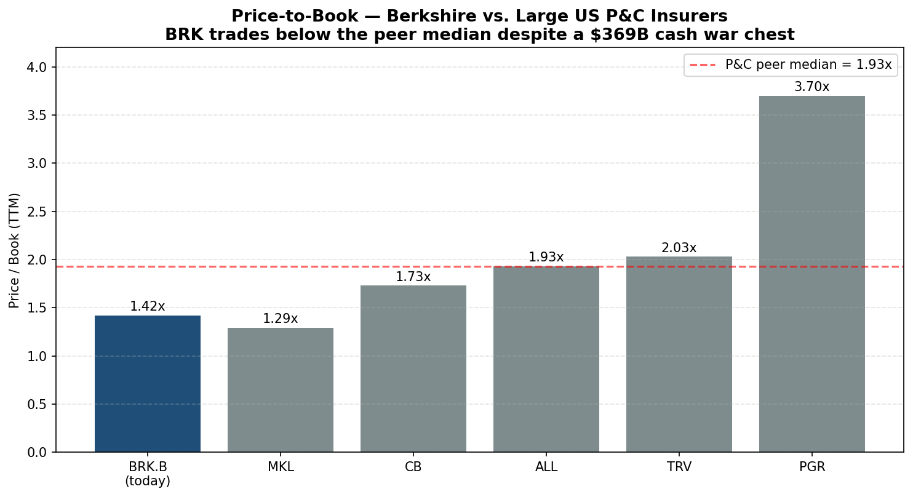
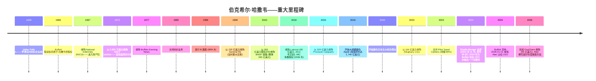
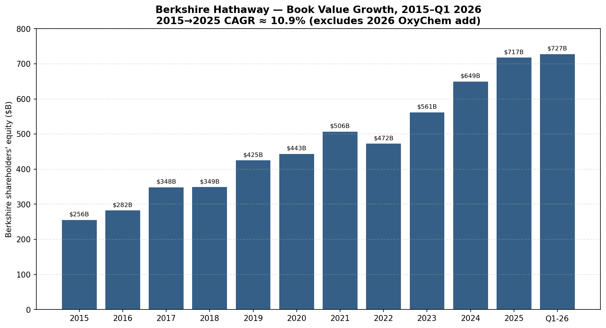
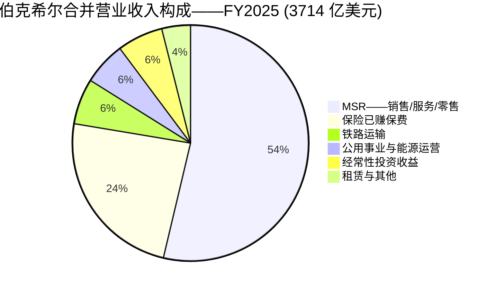
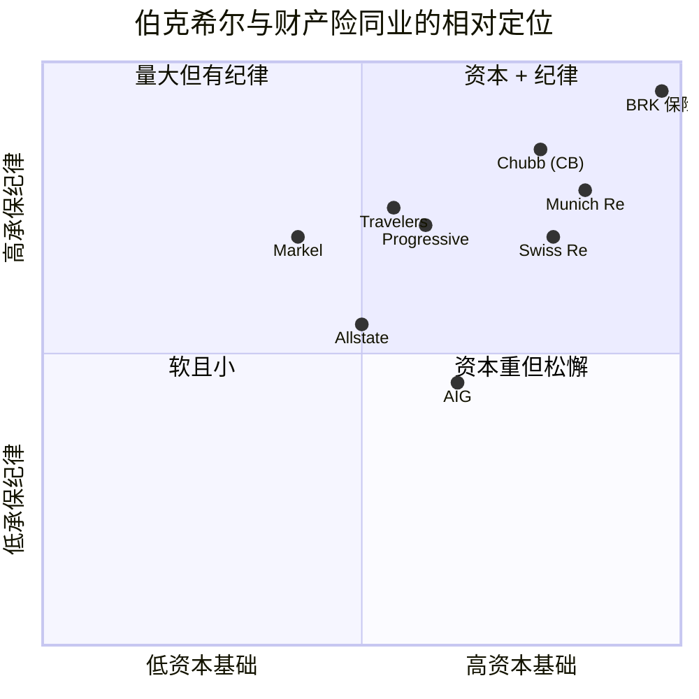
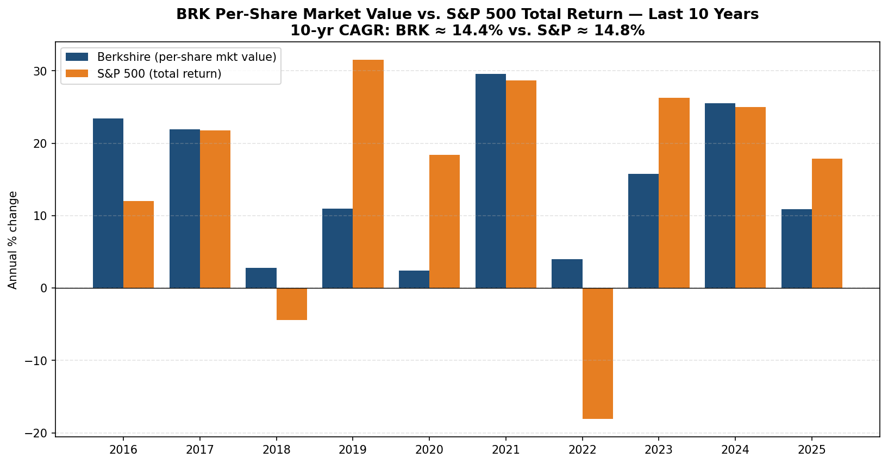
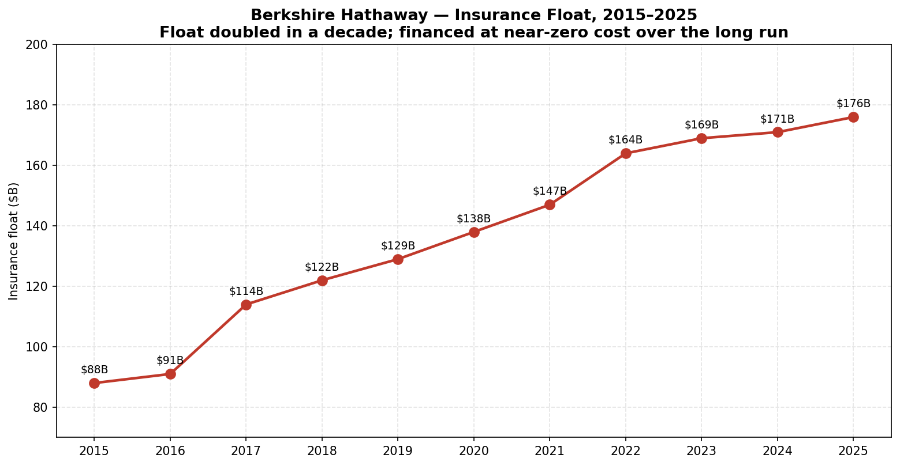

# Berkshire Hathaway Inc. (NYSE:BRK.B) — 公司研究报告

**日期:** 2026-05-20
**上市地: 纽约证券交易所, 代码 BRK.B / BRK.A**
**注册地: 美国特拉华州**
**总部: 美国内布拉斯加州奥马哈市**
**报告语言: 简体中文 (英文版同时存在于本目录)**

**分析师按语:** 首次覆盖。伯克希尔 (Berkshire) 是一家综合性控股集团 (conglomerate), 而非单一产品公司; 本报告据此架构进行分析——对每一台经济引擎 (保险承保、保险投资收益、BNSF 铁路 (Burlington Northern Santa Fe)、BHE (Berkshire Hathaway Energy)、制造/服务/零售业务) 分别测算规模, 而不强行套用单一 TAM 或单一护城河模型。四大支柱已在 [FY2025 10-K 第一部分业务描述](https://www.sec.gov/Archives/edgar/data/1067983/000119312526083899/brka-20251231.htm) 中明确列出。

> **更新——首任 CEO Greg Abel (格雷格·阿贝尔) 首个完整财年 (生效 2026-01-01):** 2025-05-03, 伯克希尔董事会任命副董事长 Greg Abel 自 2026 年 1 月 1 日起接替 Warren Buffett (沃伦·巴菲特) 出任 CEO; Buffett 仍担任董事长。Abel 出任 CEO 后的首封年度致股东信 (与 2025 年 10-K 一同于 2026-03-02 发布) 重申了完整的运营模式——分散化、堡垒式资产负债表、不派发股息、机会性回购"在低于内在价值且保守估值时", 并宣布完成 95 亿美元的 [OxyChem 收购](https://www.sec.gov/Archives/edgar/data/1067983/000119312526083899/brka-20251231.htm) (于 2026-01-02 交割)。2025 年末浮存金 (insurance float) 为 **1,760 亿美元** (上年为 1,710 亿美元), 现金加美国短期国债 (T-Bills) 为 **3,690 亿美元**, 合并 GAAP 净利润为 **669.7 亿美元** (FY2024: 890.0 亿美元; FY2023: 962.2 亿美元——同比下滑绝大部分来自权益持仓的市价重估, 而非经营业务恶化)。Abel 在致股东信中披露经营利润为 445 亿美元, "低于 2024 年的 474 亿美元, 高于过去五年的平均 375 亿美元"。
> 来源: [伯克希尔 FY2025 10-K, 于 2026-03-02 提交](https://www.sec.gov/Archives/edgar/data/1067983/000119312526083899/brka-20251231.htm) · [伯克希尔 2025 年度报告 (致股东信 + 10-K)](https://www.berkshirehathaway.com/2025ar/2025ar.pdf)。

---

## 目录

1. 公司概览
2. 公司历史
3. 管理团队
4. 产品与服务 (运营子公司 + 权益投资组合)
5. 客户与上市策略
6. 行业概览
7. 竞争格局
8. 市场机会 (TAM)
9. 风险评估

---

## 1. 公司概览

伯克希尔·哈撒韦公司 (Berkshire Hathaway Inc.) 是一家在特拉华州注册成立的控股集团 (holding company), 总部位于美国内布拉斯加州奥马哈市 Farnam 街 3555 号, 旗下拥有一个由众多运营子公司构成的联邦体, 以及一组规模达 2,980 亿美元的上市权益投资组合。公司前身可追溯至 1839 年成立的纺织企业, 1965 年由 Warren Buffett 控制后进行重组, 此后凭借一个不断重复的单一机制成为全球市值最大的公司之一: 保险子公司产生保单持有人的"浮存金 (float)", 该浮存金与留存经营现金流一同, 由 CEO 重新配置到全资业务或可交易证券中, 由此产生的利润绝大多数留存用于再投资。伯克希尔自 1967 年以来从未派发过任何现金股息 ([FY2025 10-K, "股息"](https://www.sec.gov/Archives/edgar/data/1067983/000119312526083899/brka-20251231.htm))。

**用直白的语言介绍伯克希尔实际持有的业务。** 10-K 明确列出了四大经济支柱: "保险业务, 既包括原保险方式开展, 也包括再保险方式开展; 货运铁路运输业务; 以及由多家公用事业与能源生产分销公司组成的业务集群……伯克希尔还运营着众多从事制造、服务和零售活动的其他业务" ([FY2025 10-K 第一部分业务描述](https://www.sec.gov/Archives/edgar/data/1067983/000119312526083899/brka-20251231.htm))。具体到子公司层面: GEICO (盖可保险, 按 A.M. Best 2024 年数据, 美国第三大汽车保险公司, 约 11.6% 市场份额)、Berkshire Hathaway Primary Group (伯克希尔原保险集团)、Berkshire Hathaway Reinsurance Group (伯克希尔再保险集团; 含 General Re、NICO、TransRe)、BNSF 铁路 (Burlington Northern Santa Fe, 北美六大 I 级货运铁路之一)、Berkshire Hathaway Energy (旗下有 PacifiCorp、MidAmerican、NV Energy、Northern Powergrid、AltaLink、BHE GT&S/Northern Natural/Kern River 管道系统), 以及约 50 家制造/服务/零售业务, 包括 Precision Castparts (精密铸件)、Lubrizol (路博润)、Marmon、IMC、Clayton Homes (克莱顿房屋)、Shaw Industries、Johns Manville、NetJets、McLane、Pilot Travel Centers、See's Candies、Dairy Queen 和 Brooks Sports。截至 2026-01-02, 运营业务集群通过 OxyChem (Occidental Petroleum 旗下化工业务, 收购对价 95 亿美元) 进一步扩张; 此外, 2025-07-31 完成对 Bell Laboratories (灭鼠剂业务) 的收购 ([FY2025 10-K 附注 2——重大业务收购](https://www.sec.gov/Archives/edgar/data/1067983/000119312526083899/brka-20251231.htm))。

**规模与版图。** 截至 2025 年 12 月 31 日, 伯克希尔及其子公司在全球共雇佣 **约 387,800 人**, 其中约 80% 在美国境内, 约 19% 加入工会 ([FY2025 10-K 第一部分](https://www.sec.gov/Archives/edgar/data/1067983/000119312526083899/brka-20251231.htm))。FY2025 总营业收入为 **3,714 亿美元** (FY2024: 3,714 亿美元; FY2023: 3,645 亿美元), 归属于伯克希尔股东的净利润为 **669.7 亿美元** ([FY2025 10-K, 合并损益表](https://www.sec.gov/Archives/edgar/data/1067983/000119312526083899/brka-20251231.htm))。截至 2025 年末, 总资产为 **1.222 万亿美元** (2024 年末: 1.154 万亿美元); 伯克希尔股东权益为 **7,174 亿美元**, 进一步上升至 2026 年 3 月 31 日的 **7,272 亿美元** ([Q1-2026 10-Q, 合并资产负债表, 于 2026-05-04 提交](https://www.sec.gov/Archives/edgar/data/1067983/000119312526083899/brka-20260331.htm))。

*来源: [FY2025 10-K MD&A § 经营业绩](https://www.sec.gov/Archives/edgar/data/1067983/000119312526083899/brka-20251231.htm)。归属于伯克希尔股东的税后利润, 不含投资收益/损失以及 2025 年的 83 亿美元 Kraft Heinz + Occidental 减值。*

**伯克希尔如何赚钱——浮存金引擎。** 公司的核心特征是"浮存金 (float)": 保单持有人留存以支付未来索赔的净资金, 在等候期间为伯克希尔利益所用。**浮存金从 2020 年末的 1,380 亿美元增长至 2025 年末的 1,760 亿美元** ([FY2025 10-K 第一部分 § 保险业务投资](https://www.sec.gov/Archives/edgar/data/1067983/000119312526083899/brka-20251231.htm); 在 [2025 年度致股东信第 10 页](https://www.berkshirehathaway.com/2025ar/2025ar.pdf) 也再次确认)。由于伯克希尔合并财产险业务在过去二十年大部分年份都实现了承保利润——Abel 致股东信披露 FY2025 财产险综合赔付率 (combined ratio) 为 87.1%, 五年平均为 90.7%——浮存金从历史上看具有**负成本** (即保险子公司"被付费"持有这笔钱)。这笔资金加上股东资本, 用于支撑 2,978 亿美元的权益投资组合 ("核心四大"——Apple、American Express (美国运通)、Coca-Cola (可口可乐)、Moody's (穆迪), 加上五家日本综合商社 (日本 sōgō shōsha)) 以及 3,210 亿美元的短期美国国债 (T-Bill) 持仓——是除货币市场基金外, 美国政府之外最大的 T-Bill 持有人 ([FY2025 10-K 附注 4](https://www.sec.gov/Archives/edgar/data/1067983/000119312526083899/brka-20251231.htm))。

**地域结构。** 主要为美国。10-K 中提到"约 80% [雇员] 在美国境内", 保险子公司主要承保美国风险; BHE 旗下美国受监管公用事业为美国境内约 540 万零售电气/燃气客户提供服务, 加上英国 400 万电力终端用户 (Northern Powergrid) 和阿尔伯塔输电业务 (AltaLink)。日本投资 (五家综合商社) 和 BHSI 在澳大利亚、加拿大、新西兰以及亚洲/欧洲的办公室, 是仅有的具有实质意义的非美国运营敞口 ([FY2025 10-K 第一部分](https://www.sec.gov/Archives/edgar/data/1067983/000119312526083899/brka-20251231.htm); [2025 年度致股东信第 15–16 页](https://www.berkshirehathaway.com/2025ar/2025ar.pdf))。

**估值快照 (截至 2026-05-20 定价)。** BRK.B 收盘价为 **479.98 美元**; 按 Q1-2026 10-Q 披露的 21.572 亿股 B 类等价股本计算, 合计市值约 **1.035 万亿美元** ([Yahoo Finance — BRK-B 主要统计指标, 2026-05-20](https://finance.yahoo.com/quote/BRK-B/key-statistics))。基于 FY2025 报告 GAAP 净利润 669.7 亿美元, **TTM 市盈率 (P/E) 约 14.3 倍**; 基于 FY2025 营业收入 3,714 亿美元, **TTM 市销率 (P/S) 约 2.79 倍**; 对应 2026 年 3 月 31 日伯克希尔股东权益 7,272 亿美元, **市净率 (P/B) 约 1.42 倍**。过去 3 年 P/B 区间大致为 **1.30–1.65 倍** (基于季末收盘价与季末披露账面净值计算; 自 COVID 回调以来 BRK 未曾跌破 1.20 倍), 因此当前倍数位于近期区间的下半段。

**同业估值倍数 (TTM):**

| 公司 | 市盈率 P/E | 市净率 P/B | 市销率 P/S |
|---|---|---|---|
| **BRK.B (今日)** | **14.3×** | **1.42×** | **2.79×** |
| Chubb (CB, 安达保险) | 11.6× | 1.73× | 2.09× |
| Travelers (TRV, 旅行者保险) | 9.1× | 2.03× | 1.33× |
| Allstate (ALL, 好事达保险) | 4.9× | 1.93× | 0.84× |
| Progressive (PGR, 进步保险) | 10.3× | 3.70× | 1.33× |
| Markel (MKL) | 13.4× | 1.29× | 1.45× |

来源: [Yahoo Finance 同业页面, 访问于 2026-05-20](https://finance.yahoo.com/quote/BRK-B/key-statistics)。

*来源: [Yahoo Finance, 2026-05-20](https://finance.yahoo.com/quote/BRK-B/key-statistics)。*

对于伯克希尔, P/B 是合适的锚定倍数, 原因有二: (a) 权益投资组合每季度按 GAAP 损益表市价重估, 这使得 P/E 随市场涨跌剧烈波动, 而伯克希尔既不是市场涨跌的因, 也未因此变现 ([FY2025 10-K 第 7A 项 § 市场风险披露](https://www.sec.gov/Archives/edgar/data/1067983/000119312526083899/brka-20251231.htm)); (b) 内在价值的实质份额位于 BHE 和 BNSF (资本开支密集的受监管资产) 的留存收益复利中, 以及位于私市值远高于账面价值的子公司中 (PCC、See's、GEICO 品牌价值)。Buffett 本人也在过去十年将伯克希尔的叙事重心从账面价值转向内在价值, 原因正是如此 ([2025 年度致股东信——"内在价值 vs 账面价值"前言](https://www.berkshirehathaway.com/2025ar/2025ar.pdf))——但作为与财产险同业的相对参照, P/B 较好地反映了股东权益缓冲与市场估值之间的纪律。

**估值倍数是被拉伸、正常, 还是被压缩?** 压缩偏正常。在 1.42 倍账面净值的水平, 伯克希尔交易价**低于同业中位数 (1.93 倍)**, 尽管: (a) 持有 3,690 亿美元现金 + T-Bill 战备库, 相当于账面股东权益的 51%; (b) 60 年时间, 每股市值年化复合增长 **19.7%** (1965–2025), 而标普 500 含股息回报年化为 10.5% ([2025 年度致股东信第 20 页](https://www.berkshirehathaway.com/2025ar/2025ar.pdf)); (c) 拥有保险业最高级别的信用评级 (标普 AA+; A.M. Best A++ Superior——[FY2025 10-K 第一部分](https://www.sec.gov/Archives/edgar/data/1067983/000119312526083899/brka-20251231.htm))。这一折价反映了市场对以下几点累计施加的代价: (i) Buffett 离任以及尚未验证的 Abel 主导资本配置阶段; (ii) 约 3,690 亿美元资金停留在 4–5% 收益率的 T-Bill 而非权益资产, 产生的盈利拖累; (iii) 2025 年没有任何回购计划——多年来第一次没有任何股份回购 ([FY2025 10-K 第 5 项 § 普通股回购计划](https://www.sec.gov/Archives/edgar/data/1067983/000119312526083899/brka-20251231.htm))。这些都不是永久性损害; 都是可逆的 (Abel 可以回购、可以收购业务、可以将现金轮换为权益)。

---

## 2. 公司历史

伯克希尔·哈撒韦的企业谱系可追溯至 1839 年由 Oliver Chace 在罗德岛州创立的棉纺织企业 **Valley Falls Company**。1929 年和 1955 年的并购形成了 **Berkshire Hathaway Inc.**——一家总部位于马萨诸塞州新贝德福德的新英格兰纺织企业。**Warren Buffett 的投资合伙公司自 1962 年起开始累积股票**, 入场价约 7.50 美元, 1965 年 5 月以每股 14.86 美元价格取得控股权 ([2025 年度致股东信——历史业绩前言](https://www.berkshirehathaway.com/2025ar/2025ar.pdf))。纺织业务结构性不盈利, 1985 年正式关停, 但公司外壳——连同其税收净经营亏损 (NOLs) 与上市股权地位——成为另一种企业形态的底盘。

决定性的转折发生在 **1967 年 3 月**, 伯克希尔用 860 万美元纺织业务现金, 从奥马哈的 Jack Ringwalt 手中收购了 National Indemnity Company 和 National Fire & Marine——合称"National Indemnity"——对价 860 万美元。这一单笔交易使伯克希尔进入财产险业务, 让 Buffett 获得了浮存金, 并搭建出此后 58 年一直运行的基本资本配置机器。2025 年度致股东信直白地描述: "自 1967 年收购 National Indemnity 以来执行他建设伟大保险业务的愿景, 并利用浮存金在经济主要板块进行成功投资" ([2025 年度致股东信第 1 页](https://www.berkshirehathaway.com/2025ar/2025ar.pdf))。

**战略转折点——三件值得点名:**

1. **从纺织到保险 (1967 年)。** 决定性的赌注; 此后一切建立其上。保险给了伯克希尔一项几乎没有其他公司拥有的东西——廉价、持久的杠杆。浮存金先于赔付到账, 中间的缺口可投资, 而伯克希尔财产险浮存金的精算久期 (尤其是公司在 1990–2010 年代写下的追溯再保险合同) 可达数十年。没有保险, 就没有今天的伯克希尔。

2. **从少数股权持仓转向全资收购 (1990 年代中期起)。** 整个 1970–80 年代, 新部署资本的主体进入可交易证券 (American Express、Washington Post、Coca-Cola)。从 1998 年 GenRe 收购, 尤其是 2010 年 BNSF 交易之后, 重心转向全资运营企业——到 2025 年, 经营利润 445 亿美元约为股息收入 51 亿美元的 9 倍。这一转向受规模驱动: 在 1 万亿美元市值规模下, 少数股权持仓再大也难以撼动整体收益, 唯有 300–500 亿美元规模的并购才能。

3. **日本交易 (始于 2020 年)。** 伯克希尔分别建立了对日本五大综合商社 (三菱商事、三井物产、伊藤忠商事、丸红、住友商事) 约 9–11% 的持仓, 资金部分来自伯克希尔自身发行的日元计价高级票据, "平均成本 1.2%, 加权平均期限约 5.75 年" ([2025 年度致股东信第 15 页](https://www.berkshirehathaway.com/2025ar/2025ar.pdf))。截至 2025 年末, 五项持仓的合计市值为 **354 亿美元, 成本基础 154 亿美元**, Abel 致股东信将其描述为"在重要性与长期价值创造机会上, 与我们主要美国持仓相当"。这是伯克希尔历史上首次实质性的非美国全持仓建仓行动。

**重大收购清单:**

- 1972 — See's Candies (2,500 万美元; 经典 Buffett "品牌 + 定价权"案例)
- 1985 — Scott Fetzer (World Book、Kirby)
- 1996 — GEICO (剩余 49%, 23 亿美元; 1976 年已持有部分)
- 1998 — General Re (220 亿美元股权——伯克希尔第一笔真正大型交易)
- 2006 — IMC (以色列总部金属切削工具; 2013 年增持至 100%)
- 2009 — Burlington Northern Santa Fe——2009-11-03 宣布; 2010-02-12 交割; 265 亿美元股权, 345 亿美元企业价值
- 2011 — Lubrizol (97 亿美元)
- 2013 — H. J. Heinz (与 3G 各持 50%; 2015 年与 Kraft 合并 → 今日持有 KHC 27%)
- 2015 — Precision Castparts (321 亿美元——伯克希尔最大单笔收购)
- 2022 — Alleghany Corporation (116 亿美元)
- 2023 — Pilot Travel Centers (最后 41.4% 股权达成 80% 持股, 对价约 82 亿美元)
- 2025 — Bell Laboratories (灭鼠剂, 对价未披露, 7 月 31 日)
- 2026 — OxyChem (自 Occidental 收购 95 亿美元, 1 月 2 日; Occidental 保留历史遗留环境责任)

**与当前论点最相关的近 24 个月新进展:**

- **接班**: 2025 年 5 月年度股东大会上确认, 2026 年 1 月 1 日正式生效。这是 1965 年以来伯克希尔治理层面最大单一变化。
- **Apple 减持**: 伯克希尔在 2024 年总计抛售约 1,430 亿美元权益证券, 主体为 Apple, 另外还有一笔较小的 Bank of America 减持 ([FY2025 10-K 附注 6](https://www.sec.gov/Archives/edgar/data/1067983/000119312526083899/brka-20251231.htm))。投资组合在 2024 年实质性地转向现金/美国国债。
- **Kraft Heinz + Occidental 减值**: 2025 年 Q2 对 KHC 计提税前减值 50 亿美元; Q4 对 OXY 权益法投资计提税前减值 57 亿美元。两者均将权益法账面价值下调至挂牌市价; 均被定性为"非暂时性" ([FY2025 10-K 附注 5](https://www.sec.gov/Archives/edgar/data/1067983/000119312526083899/brka-20251231.htm))。
- **OxyChem 交割** (2026-01-02): 95 亿美元现金交易; 初步确认资产 108 亿美元; "我们认为此次收购不会对合并财务报表产生重大影响"——是关于伯克希尔规模问题的坦诚自陈 ([FY2025 10-K 附注 2](https://www.sec.gov/Archives/edgar/data/1067983/000119312526083899/brka-20251231.htm))。
- **2025 年零回购**——多年来首个全年无回购计划; Buffett (以及如今 Abel) 将股票读作大致接近保守估算内在价值的水平 ([FY2025 10-K 第 5 项](https://www.sec.gov/Archives/edgar/data/1067983/000119312526083899/brka-20251231.htm))。

---

## 3. 管理团队

伯克希尔的管理层故事在两个维度上不寻常, 报告必须考虑到这两点。第一, **现年 95 岁的 Warren Buffett 仍是董事长**, 但已不再是 CEO——资本配置控制权于 2026 年 1 月 1 日转交 Greg Abel, 比本报告发布日提前三个月 ([伯克希尔 8-K, 2025-05-06, Greg Abel 出任 CEO 任命](https://www.sec.gov/Archives/edgar/data/0001067983/000119312525113900/d910967d8k.htm))。第二, **运营模式本身就被设计为分散式**——GEICO、BNSF、BHE、PCC、Lubrizol、Clayton、See's、NetJets 以及其他数十家公司的 CEO 各自经营自己的业务, 没有季度业绩目标, 也没有总部强行干预; 奥马哈总部办公室不到 30 人 ([FY2025 10-K 第一部分 § 业务结构](https://www.sec.gov/Archives/edgar/data/1067983/000119312526083899/brka-20251231.htm))。这意味着 Abel 主政下的伯克希尔长期走向, 取决于 (a) 他对浮存金及留存收益做出的资本配置决定, 以及 (b) 子公司 CEO 们在新老板麾下能否持续表现, 而不太取决于他在总部具体做了什么。

### Gregory E. Abel——董事长兼 CEO (自 2026-01-01 生效)

Greg Abel, 63 岁, 于 2026 年 1 月 1 日就任伯克希尔·哈撒韦 CEO, 接替 Warren Buffett, 此项交班源于 Buffett 在 2025 年 5 月股东大会上的宣布。他自 2018 年起担任 **副董事长——非保险业务**, 该角色专门为接班铺路设立; 此前自 2008 至 2018 年担任 **Berkshire Hathaway Energy CEO**, 并任 BHE 董事长至 2025 年 7 月。Abel 担任 Kraft Heinz 董事至 2024 年 5 月, 此前曾任 AEGIS Insurance Services (一家电力行业互助公司) 董事至 2023 年 ([2026 DEF 14A——董事简历](https://www.sec.gov/Archives/edgar/data/1067983/000119312526106253/d882687ddef14a.htm))。

Abel 加拿大籍, 受会计师专业训练 (CA), 1999 年通过伯克希尔收购 MidAmerican Energy (现 BHE) 进入伯克希尔体系。他自己作为 CEO 的首封致股东信描述了这一路径: "我对伯克希尔的理解始于 1992 年, 那年我搬到奥马哈加入 CalEnergy……我在 CalEnergy 担任的具体角色今天意义不大。重要的是, 那是一段非凡的个人成长期……我在 CalEnergy 转型为 MidAmerican Energy Holdings 并被伯克希尔收购后, 与 Warren 和 Charlie 相识" ([2025 年度致股东信第 2 页](https://www.berkshirehathaway.com/2025ar/2025ar.pdf))。他在担任 BHE CEO 期间 (2008–2018) 的具体成绩是相关的业绩纪录: 他将 BHE 从一家以美国中西部为主的受监管公用事业扩张为横跨美国 11 个州、英国 (2010 年收购 Northern Powergrid)、阿尔伯塔 (2014 年收购 AltaLink)、内华达 (2013 年收购 NV Energy) 的多管辖区受监管/可再生能源平台, 以及 BHE GT&S 管道系统 (在 Abel 卸任后于 2020 年完成收购, 但项目源于其领导期间)。BHE 累计可再生能源投资到 2025 年末已达 **380 亿美元**, 温室气体排放较 2005 年基线降低 30% ([FY2025 10-K 第一部分 § BHE](https://www.sec.gov/Archives/edgar/data/1067983/000119312526083899/brka-20251231.htm))。归属伯克希尔的 BHE 净利润从 17 亿美元 (2014) 上升至 39.8 亿美元 (2025)——在受监管业务允许回报率机制下, 大约 9% 的十年期 CAGR。

**持股结构。** Abel 披露了 2022 年现金购入 **6,800 万美元 A 类股** 的公开市场交易, 之后亦有较小金额的增持。Reuters 当时报道过 2022 年的交易。他的薪酬结构对美国上市公司 CEO 而言相当不寻常: 每年 **2,000 万美元 固定现金薪资**, 无奖金、无股票期权、无限制性股票单位 (RSUs) (条款在他出任副董事长时即已设定)——与 Buffett 当年接受的框架相同 (Buffett 几十年来的薪资为 100,000 美元/年)。Abel 的激励来自其自身持股; 薪酬结构不会驱使他做季度指标管理。2026 DEF 14A 确认无股权薪酬的模式已延续到 CEO 交接 ([2026 DEF 14A——高管薪酬](https://www.sec.gov/Archives/edgar/data/1067983/000119312526106253/d882687ddef14a.htm))。

**公众形象。** 有限——Abel 鲜少接受访谈, 没有 Munger 或 Buffett 那样的播客或书籍历史。他的公开沟通主要是 BHE 年度演示和在伯克希尔股东大会的露面。他作为 CEO 的首封致股东信 (2026 年 3 月, 超过 14,000 词) 是关于他思维框架的最长公开文字: 明确指出 **"伯克希尔以异常的程度面向股东"**, 并称他希望"20 年后……为各位公司变得更强大而自豪"——即多十年视野, 而非五年重置 ([2025 年度致股东信第 3–5 页](https://www.berkshirehathaway.com/2025ar/2025ar.pdf))。

**创立论点 vs 继承论点。** Abel 不是创始人; 他继承的是一台已经 60 年的机器, 角色是守护者, 而非建筑师。对股东而言, 相关的问题是他是否改变这台机器。他的致股东信明确承诺**不改变**运营模式: 分散化、子公司不举债、不派股息、机会性回购、规模庞大但有纪律的权益投资组合、"最好永远"的持仓期 ([2025 年度致股东信第 4–7 页](https://www.berkshirehathaway.com/2025ar/2025ar.pdf))。两个早期信号——交割 OxyChem (他作为 CEO 候任期的首笔并购, 由 Lubrizol CEO Rebecca Liebert 推荐执行; [Occidental, "Completes Sale of OxyChem", 2026-01-02](https://www.oxy.com/news/news-releases/occidental-completes-sale-of-oxychem/)) 与 Bell Labs ("我们只希望它能再大十倍")——完全符合 Buffett 经典剧本: 现金充裕、品牌或细分市场的工业资产、无整合扰动、保留子公司 CEO。

### Marc D. Hamburg——高级副总裁兼 CFO (将于 2026-06-01 退休)

Marc Hamburg, 76 岁, 自 **1992 年** 起任伯克希尔 CFO——34 年。他是标普 500 任职时间最长的 CFO 之一。Hamburg 于 **2025 年 12 月** 宣布退休, CFO 交接予继任者 Chuck Chang, 自 2026 年 6 月 1 日生效, 至 2027 年 6 月 1 日完全退休 ([2025 年度致股东信第 17 页](https://www.berkshirehathaway.com/2025ar/2025ar.pdf); [伯克希尔 8-K, 2025-12-11, CFO 交接新闻稿](https://www.sec.gov/Archives/edgar/data/1067983/000119312525314935/d10933dex991.htm))。Abel 的信引述了 Buffett 的告别词: *"Marc 对伯克希尔和我而言不可或缺。他的诚信与判断价值连城。他为这家公司做出的贡献, 许多股东永远不会知道。"* Hamburg 主管了 1992 年以来每一份伯克希尔 10-K——经历了 GenRe (1998)、BNSF (2010)、PCC (2015) 以及 COVID/Apple 减持的资产负债表重建过程。他的 IPO/并购履历就是 1992 年后伯克希尔的全部收购史。Hamburg 的继任者 **Chuck Chang** 被 Abel 形容为"接下了一双巨大的鞋"; Chang 是伯克希尔的资深高管, 但在伯克希尔之外没有上市公司 CFO 履历——这是风险建模中应记录的数据点。

### Ajit Jain——副董事长, 保险业务

Ajit Jain, 74 岁, 自 2018 年起任副董事长——保险业务, 实际上掌管伯克希尔的再保险与原保险承保。他于 1986 年从 McKinsey 加入伯克希尔, 负责重建如今的 BHRG, 此后 38 年将其打造为全球最大的单一大额巨灾再保险承保人。Buffett 在 2023 年信中写道: **"Ajit 在 Berkshire Hathaway Reinsurance Group 创造了一个庞然巨兽, 在我看来无人能及。"** Abel 的 2025 信对此回应: *"在风险方面, Ajit 写就了规则书。他在风险管理与定价上的严谨为保险业树立了标准……Ajit 在做这件事上无人能及"* ([2025 年度致股东信第 8–9 页](https://www.berkshirehathaway.com/2025ar/2025ar.pdf))。Jain 直接持有大量伯克希尔股份, 向 Abel 汇报。保险业务的纵深团队——Todd Combs 在 GEICO (他在 2020 年除担任投资角色外被任命为 GEICO CEO, 并在 2022–2024 年的转型中将综合赔付率推至 87.1%); Peter Eastwood 在 BHSI; GenRe 的新一代——异常深厚, 而 Jain 的定价纪律 (愿意从定价过低的再保险业务中走开) 是伯克希尔最深的护城河之一, 也是浮存金长期以接近零或负成本生成的关键原因。

### Adam Johnson——总裁, 消费产品/服务/零售业务

Adam Johnson 是 **最新的高级任命**——2025 年被任命为消费/服务/零售业务集群 (32 家公司, 含 NetJets、See's、Dairy Queen、Brooks Sports、Pampered Chef、McLane、Pilot) 总裁。他在此扩展职务之前担任了 **10 年 NetJets CEO**, "几乎活了 30 年伯克希尔文化"——出自 Abel 的信 ([2025 年度致股东信第 11–12 页](https://www.berkshirehathaway.com/2025ar/2025ar.pdf))。他直接向 Abel 汇报——与 Ajit (保险)、BHE 负责人 (Mike Dunn) 及 BNSF 负责人 (Katie Farmer) 并列, 使伯克希尔最高层成为一个四人运营委员会。

### 治理

伯克希尔董事会有 **13 名董事**, 几位值得点名:

- Warren Buffett (95 岁), 董事长, 自 1965 年起控股股东; A 类 + B 类股合计经济权益约 14%, 但**投票权约 30%** (A 类股具有超级投票权, 但 Buffett 多年来一直在转换并将 A 类股捐赠给慈善机构)。
- Greg Abel (63 岁), CEO, 自 2018 年起任董事。
- Howard G. Buffett (71 岁), 自 1993 年起任董事——Warren 之子, 由董事会指定在 Warren 最终离世后出任非执行董事长 (过往代理通告将该角色明确定位为"文化保留"性的 CEO 制衡机制)。
- Susan A. Buffett (72 岁), 自 2021 年起任董事——Warren 之女, 两家大型家族基金会的主席。
- Stephen B. Burke (67 岁), NBCUniversal 前 CEO; JPMorgan Chase 董事。
- Kenneth I. Chenault (74 岁), American Express 前 CEO (2001–2018)——少数具有深厚上市公司 CEO 经验的董事之一。
- Christopher C. Davis (60 岁), Davis Advisors 董事长; 同时是 The Coca-Cola Company 的董事。
- Susan L. Decker (63 岁), Yahoo 前 CFO/总裁, Raftr CEO 及创始人; Costco 董事。
- Ronald L. Olson (84 岁), Munger Tolles & Olson 合伙人 (Charlie Munger 联合创立的律师事务所)。
- Wallace R. Weitz (76 岁), Weitz Investment Management 创始人。
- Charlotte Guyman (70 岁), Microsoft 前高管。
- Thomas S. Murphy Jr. (?), Capital Cities/ABC 前 CEO 之子, 自 2021 年起任董事。
- Meryl B. Witmer, 价值投资者 (Eagle Capital Partners)。

内部持股: Buffett 直接控制约 30% 的投票权; 高管和董事整体合计持有超过 30% ([2026 DEF 14A, "受益所有人及管理层的证券所有权"](https://www.sec.gov/Archives/edgar/data/1067983/000119312526106253/d882687ddef14a.htm))。**薪酬异常精简**——Buffett 几十年来每年基本工资 100,000 美元加少量津贴。Abel 的 2,000 万美元是最大的单项薪酬。没有股票期权授予、没有 RSUs、没有 LTIP、没有业绩股票单位。绝大多数董事获得名义性固定年金; Buffett 在历史上是标普 500 中薪酬最低的 CEO, 差距以数量级计。伯克希尔不存在以合并 EPS 挂钩的全公司奖金池, 这是子公司能够在不受季度业绩管理压力下运营的原因之一 ([2026 DEF 14A——高管薪酬](https://www.sec.gov/Archives/edgar/data/1067983/000119312526106253/d882687ddef14a.htm))。

**关联方交易与治理标志。** 2026 DEF 14A 除与伯克希尔董事所任职董事的公司之间正常商业交易外, 没有列出任何重大项目 (例如 American Express, 伯克希尔持有 22.1%; The Coca-Cola Company, Davis 同时任两家董事)。一项历史性标志——Buffett 家族在董事会的关系——由治理委员会施加的独立性测试以及 Howard Buffett 仅过渡至非执行角色加以缓释 ([2026 DEF 14A, "董事独立性"](https://www.sec.gov/Archives/edgar/data/1067983/000119312526106253/d882687ddef14a.htm))。

### 履历综合

这支团队过去已经交付过——但现在的问题是, 在没有 Buffett 担任 *CEO* 的情况下, 这支团队还能否交付。Abel 经营了 BHE 10 年并干净地把它做大, Jain 担任伯克希尔的保险大脑接近 40 年, Hamburg 三十年 CFO 任期覆盖了伯克希尔的每一次危机 ([2026 DEF 14A——董事与高管简历](https://www.sec.gov/Archives/edgar/data/1067983/000119312526106253/d882687ddef14a.htm))。风险集中在 (a) 资本配置座席——Abel 从未在自己的职业生涯里调动过 500–1,000 亿美元规模的权益持仓, 而 Buffett 反复做过; (b) 下一代子公司团队——许多子公司 CEO 已是 60 末或 70 多岁, 关于 2030 年及以后由谁经营 See's、Clayton、McLane、Marmon、IMC、Lubrizol, 公开层面尚未给出答案 ([FY2025 10-K 第 1A 项——关键人员风险](https://www.sec.gov/Archives/edgar/data/1067983/000119312526083899/brka-20251231.htm))。

---

## 4. 产品与服务

伯克希尔更接近于一个控股集团组合, 而非单一产品公司; 正确的分析框架是 *子公司清单和权益投资组合*, 而非 SKU 清单。2025 年 10-K 和年度报告列出 **51 家非保险运营企业** 加上保险集团 ([2025 年度致股东信第 11 页](https://www.berkshirehathaway.com/2025ar/2025ar.pdf); [运营企业附录](https://www.berkshirehathaway.com/2025ar/2025ar.pdf))。下文逐一覆盖每项实质业务, 并对每项业务给出报告规范要求的"竞争优势"判定。

```mermaid
graph TD
    BRK[伯克希尔·哈撒韦]
    BRK --> INS[保险集团]
    BRK --> RAIL[BNSF 铁路]
    BRK --> BHE[Berkshire Hathaway Energy]
    BRK --> MSR[制造/服务/零售]
    BRK --> EQ[权益投资组合 - 2978 亿美元]

    INS --> GEICO[GEICO - 美国第三大汽车保险, 11.6% 份额]
    INS --> BHP[BH 原保险 - NICO/BHSI/MedPro/GUARD/RSUI/USLI/...]
    INS --> BHRG[BH 再保险 - General Re/NICO/TransRe]

    BHE --> UTIL[PacifiCorp / MidAmerican / NV Energy]
    BHE --> PIPE[BHE GT&S / Northern Natural / Kern River]
    BHE --> INTL[英国 Northern Powergrid / 加拿大 AltaLink]
    BHE --> REN[BHE Renewables - 71 亿美元风电税权]

    MSR --> IND[工业 - PCC / Lubrizol / Marmon / IMC / CTB / LSPI / W&W-AFCO]
    MSR --> BLD[建材 - Clayton / Shaw / Johns Manville / MiTek / Benjamin Moore / Acme]
    MSR --> CON[消费品 - Forest River / Duracell / Brooks / Fruit of the Loom / Garan / Justin]
    MSR --> SVC[服务 - NetJets / FlightSafety / TTI / Charter Brokerage / Business Wire]
    MSR --> RET[零售 - BH Auto / RC Willey / Nebraska Furniture Mart / Borsheims / See's / Helzberg / Dairy Queen / Pampered Chef / Oriental Trading]
    MSR --> DIST[McLane - 餐饮分销]
    MSR --> PILOT[Pilot Travel Centers - 80%]
    MSR --> OXY[OxyChem - 2026-01-02 交割]
```

### 4.1 保险集团 (引擎)

**GEICO (盖可保险)。** 美国 50 州直销响应式私人乘用车保险公司。FY2025: 已赚保费 **445 亿美元** (+5.3% YoY), 税前承保利润 **68.2 亿美元**, 综合赔付率 84.7% (2024 年 81.5%, 2023 年 90.7%) ([FY2025 10-K MD&A § GEICO](https://www.sec.gov/Archives/edgar/data/1067983/000119312526083899/brka-20251231.htm))。按 A.M. Best 2024 年数据, 全美市占率约 11.6%, 位列第 3; 前 5 名 (State Farm、Progressive、GEICO、Allstate、USAA) 合计持有 63.6%。**竞争优势: 有——成本护城河。** 直销响应渠道 (无代理网络) 让 GEICO 在费用率上有 200–400bp 的结构性优势, 极难弥合; Progressive 是唯一有意义的直销竞争对手, 二者吸收了美国大部分直销汽车保险的净增长。**最接近的竞争对手产品:** Progressive Auto。比较: 在成本率上领先, 在承保技术/远程信息处理 (Snapshot) 上落后。2025 年致股东信指出 **"GEICO 近几年的大幅提价已经恢复了利润率, 但代价是续保率下降; 竞争对手的降价可能将这种压力延续到 2026 年"**——即 2026 年 GEICO 的增长可能因价格被同业拉平而放缓。

**Berkshire Hathaway Reinsurance Group (BHRG, 伯克希尔再保险集团)。** 通过三家法人运营: NICO Group (Stamford)、General Re Group (科隆/Stamford) 和 TransRe (纽约)。FY2025: 净承保保费 **202 亿美元** (低于 2024 年的 219 亿美元——伯克希尔正主动从软化的财产再保费率中退出); 财产险税前承保利润 **31.7 亿美元**, 人寿/健康险税前承保利润 **3.74 亿美元**, 追溯再保险与定期支付年金 (PPA) 退出业务线贡献预期 GAAP 承保亏损 18 亿美元 (这是 *功能*——这些是浮存金创造业务, 保费投资几十年以对应递延赔付) ([FY2025 10-K MD&A § BHRG](https://www.sec.gov/Archives/edgar/data/1067983/000119312526083899/brka-20251231.htm))。**竞争优势: 有——资本 + 走开的纪律。** BHRG 能吸收其他再保险人无法承受的单一事件损失——美国保险公司 3,330 亿美元的法定盈余是任何同业的数倍——而 Jain 公开的政策是拒绝在不具吸引力的费率下接业务。2025 年 BHRG 财产险综合赔付率为 84.5%, 而全球财产再保险行业约 90%。**最接近的竞争对手:** 慕尼黑再保险 (Munich Re)、瑞士再保险 (Swiss Re)、RGA (寿险)。在资本上领先, 在亚洲分销上落后。

**Berkshire Hathaway Primary Group (伯克希尔原保险集团)。** 由八家独立运营的原保险公司组成 (NICO Primary、BHHC、BHSI、RSUI、CapSpecialty、MedPro、MLMIC、USLI、BH Direct、GUARD)。FY2025: 已赚保费 187 亿美元, 税前承保利润 7.85 亿美元 (综合赔付率 95.8%) ([FY2025 10-K MD&A § BH Primary](https://www.sec.gov/Archives/edgar/data/1067983/000119312526083899/brka-20251231.htm))。BHSI 是其中亮点——以承认与非承认形式在美国承保大型商业财产/责任险, 加上澳大利亚/加拿大/新西兰/亚洲/欧洲业务。**竞争优势: 部分。** BHSI 与 AIG、Chubb、Travelers 直接竞争; AA+/A++ 评级有助赢得大型风险, 但定价和经纪准入已经商品化。**最接近的竞争对手:** Chubb (CB, 安达保险)。

### 4.2 BNSF 铁路 (Burlington Northern Santa Fe)

北美六大 I 级货运铁路之一 (Union Pacific、BNSF、CSX、Norfolk Southern、Canadian Pacific Kansas City、Canadian National)。FY2025: 铁路营业收入 **233.5 亿美元** (同比持平), 营业支出 153.0 亿美元, 营业利润 80.6 亿美元 (营业利润率 34.5%, 2024 年为 32.0%——Abel 信), **净利润 54.8 亿美元 (+8.8% YoY)**, **81 亿美元净经营现金流**, 其中 44 亿美元于 2025 年作为股利返还给伯克希尔 ([FY2025 10-K MD&A § BNSF](https://www.sec.gov/Archives/edgar/data/1067983/000119312526083899/brka-20251231.htm); [2025 年度致股东信第 12 页](https://www.berkshirehathaway.com/2025ar/2025ar.pdf))。各类别运量: 消费品 560 万车 (+1.2%); 工业 138 万 (-4.6%); 农业与能源 142 万 (+1.6%); 煤炭 122 万 (+1.1%)。**竞争优势: 有——不可复制的基础设施。** BNSF 在美国西部的特许经营与 Union Pacific 形成双寡头格局; 长滩、洛杉矶、西雅图/塔科马、休斯顿等港口由两家共同实物服务。**最接近的竞争对手:** Union Pacific (UNP)。Abel 注意到 BNSF 营业利润率 34.5% "仍然在略高于其 5 年均值", 但"与行业最佳水平 [UNP 约 38–40%] 之间的差距仍然过大"——每 1pp 的利润率约对应 2.3 亿美元的增量营业现金流。积极机会: 2025 年宣布的 Union Pacific–Norfolk Southern 合并提议可能重塑竞争版图; Abel 明确表示伯克希尔不打算收购 CSX 或其他 I 级铁路。

### 4.3 Berkshire Hathaway Energy (BHE)

四家美国受监管公用事业 (PacifiCorp、MidAmerican Energy、Nevada Power、Sierra Pacific) 为 540 万零售用户提供服务; 五条美国州际燃气管道 (BHE GT&S、Northern Natural、Kern River), 总长约 20,900 英里, 容量 21.6 Bcf/天; 英国分销 (Northern Powergrid——400 万用户); 阿尔伯塔输电 (AltaLink——服务阿尔伯塔人口 85%); 6,400 MW 独立可再生项目; HomeServices of America (住宅经纪, 拥有 35,000 名经纪人 + 1,400 个门店的特许网络); 75% LNG ([FY2025 10-K 第一部分 § BHE](https://www.sec.gov/Archives/edgar/data/1067983/000119312526083899/brka-20251231.htm))。FY2025: 总营业收入 263 亿美元, 归属伯克希尔净利润 **39.8 亿美元** (+6.7%), 主要由 PacifiCorp 较低的山火损失计提推动 (美国公用事业 21.0 亿美元), 加上天然气管道 11.5 亿美元 ([FY2025 10-K MD&A § BHE](https://www.sec.gov/Archives/edgar/data/1067983/000119312526083899/brka-20251231.htm))。**竞争优势: 有——受监管基础资产垄断。** 每家美国公用事业有独占服务区; 允许回报率机制; 资本开支转化为基础资产 (rate base)。PacifiCorp 的山火诉讼风险是摆动因素——Abel 明确表示"PacifiCorp 的和解主要与 2020 年劳动节火灾相关", 且"PacifiCorp 不是最后兜底的保险公司" ([2025 年度致股东信第 13 页](https://www.berkshirehathaway.com/2025ar/2025ar.pdf); 另见 [Insurance Journal, "PacifiCorp 支付 5.75 亿美元和解俄勒冈州、加州山火索赔", 2026-03-09](https://www.insurancejournal.com/magazines/mag-features/2026/03/09/860626.htm))。**最接近的竞争对手:** NextEra Energy (NEE)、Duke (DUK)、Southern (SO)。

*来源: [FY2015–FY2025 10-Ks](https://www.sec.gov/cgi-bin/browse-edgar?action=getcompany&CIK=0001067983&type=10-K&dateb=&owner=include&count=40) 与 [Q1-2026 10-Q](https://www.sec.gov/Archives/edgar/data/1067983/000119312526202243/brka-20260331.htm)。*

### 4.4 制造、服务与零售业务——50 余家公司

FY2025: 营业收入 **2,143 亿美元**, 税前利润 175 亿美元, 归属伯克希尔净利润 **136.5 亿美元** (+4.4%)——使 MS&R (制造/服务/零售) 整体规模超过除前 10 大美国财产险公司外的所有美国财产险企业 ([FY2025 10-K MD&A § 制造/服务/零售](https://www.sec.gov/Archives/edgar/data/1067983/000119312526083899/brka-20251231.htm))。

**工业产品**——营业收入 373 亿美元, 税前利润 68.1 亿美元 (利润率 18.3%) ([FY2025 10-K MD&A § MS&R——工业](https://www.sec.gov/Archives/edgar/data/1067983/000119312526083899/brka-20251231.htm)):
- **Precision Castparts (PCC, 精密铸件)**——为航空航天 (Boeing 波音、Airbus 空客、GE Aerospace、Rolls-Royce 罗罗、Pratt & Whitney 普惠) 制造熔模铸件、锻件、紧固件。FY2025: 24 亿美元营业现金流, 2021–22 年平均 9 亿美元, 2015 年 (并购前) 17 亿美元。**优势: 有——专门工艺 IP + 合格供应商身份。** 最接近的竞争对手: Allegheny Technologies、ITP Aero。([FY2025 10-K 第一部分 § PCC](https://www.sec.gov/Archives/edgar/data/1067983/000119312526083899/brka-20251231.htm))
- **Lubrizol (路博润)**——发动机润滑油添加剂 + 先进材料。**优势: 有——专利 + 配方护城河。** 竞争对手: Infineum (Shell/ExxonMobil 合资)、Chevron Oronite、Afton。
- **Marmon Holdings**——11 个业务集团 (餐饮、水务、运输、零售、金属服务、电气、管道/制冷、工业、铁路/租赁含 Union Tank Car、起重机服务、医疗) 下 120 家自治业务。**优势: 部分。**
- **IMC**——金属切削工具 (ISCAR、TaeguTec、Ingersoll、Tungaloy、NTK)。全球刀片市场排名第 3。**优势: 有。** 竞争对手: 山特维克 (Sandvik)、肯纳金属 (Kennametal)、京瓷 (Kyocera)。
- **CTB International** (农业系统)、**LiquidPower** (管道减阻添加剂)、**W&W|AFCO Steel**、**Bell Laboratories** (2025-07-31 收购; 灭鼠剂)。

**建材产品**——营业收入 268 亿美元, 税前利润 39.7 亿美元 ([FY2025 10-K MD&A § MS&R——建材](https://www.sec.gov/Archives/edgar/data/1067983/000119312526083899/brka-20251231.htm))。锚定业务为 **Clayton Homes** (工厂化 + 现场建造; 2025 年 49,400 套场外住宅, 83% 达到 DOE Zero Energy Ready Home 标准; 10,000 套现场建造, 67,300 个自有宅基地, 12 亿美元在手订单——**优势: 有**, 垂直整合 + 内部金融 vs Cavco/Champion; [2025 年度致股东信第 11–12 页](https://www.berkshirehathaway.com/2025ar/2025ar.pdf)); **Shaw Industries** (美国地毯第 1——**部分**, Abel 指出 2025 年执行有滑坡); **Johns Manville**; **MiTek**; **Benjamin Moore**; **Acme Brick**。

**消费品**——营业收入 144 亿美元, 税前利润 17.9 亿美元 ([FY2025 10-K MD&A § MS&R——消费](https://www.sec.gov/Archives/edgar/data/1067983/000119312526083899/brka-20251231.htm))。包括 **Forest River** (美国按量排名第 1 RV 制造商)、**Duracell** (金霸王, 美国碱性电池份额第 1——**优势: 品牌**; vs Energizer)、**Brooks Sports**、**Fruit of the Loom** (鲜果布衣)、**Garan**、**Justin Brands**、**HH Brown**。

**服务**——营业收入 230 亿美元, 税前利润 27.0 亿美元 (利润率 11.8%——较 11.1% *提升*) ([FY2025 10-K MD&A § MS&R——服务](https://www.sec.gov/Archives/edgar/data/1067983/000119312526083899/brka-20251231.htm))。**NetJets** (公务机部分所有权第 1——**优势: 有**; 全球约 780 架飞机, 2025 年上半年北美航班 196,000 次, 按 [Altitudes Magazine, "2026 公务机租赁: NetJets、VistaJet、Flexjet 比较"](https://www.altitudesmagazine.com/private-jet-charter-2026-how-netjets-vistajet-and-flexjet-compare/))、**FlightSafety International**、**TTI** (电子元器件分销)、**Business Wire**、**Charter Brokerage**、**CORT**。

**零售**——营业收入 197 亿美元, 税前利润 13.4 亿美元 ([FY2025 10-K MD&A § MS&R——零售](https://www.sec.gov/Archives/edgar/data/1067983/000119312526083899/brka-20251231.htm))。**Berkshire Hathaway Automotive** (80 多家经销商); **See's Candies** (伯克希尔 ROIC 最高业务之一); **Nebraska Furniture Mart**、**R.C. Willey**、**Star Furniture**、**Jordan's Furniture**; **Borsheims**、**Helzberg Diamonds**、**Ben Bridge Jewelers**; **International Dairy Queen**、**Pampered Chef**、**Oriental Trading**。

**McLane Company**——营业收入 510 亿美元, 税前利润 6.76 亿美元 (利润率 1.3%) ([FY2025 10-K MD&A § McLane](https://www.sec.gov/Archives/edgar/data/1067983/000119312526083899/brka-20251231.htm))。为便利店、大型超市、餐厅提供餐饮/食品杂货分销。是伯克希尔最大单一营业收入业务, 但利润率最低。**优势: 部分——仅靠规模。** 竞争对手: Sysco、US Foods、Performance Food Group ([Business Strategy Hub, "Sysco 前 15 大竞争对手"](https://bstrategyhub.com/sysco-competitors-and-alternatives/))。

**Pilot Travel Centers** (持股 80%)——营业收入 422 亿美元, 税前利润 1.90 亿美元 ([FY2025 10-K MD&A § Pilot](https://www.sec.gov/Archives/edgar/data/1067983/000119312526083899/brka-20251231.htm))。美国最大旅行中心运营商。Abel 信指出 Pro Preference 评分 (司机忠诚度) 2025 年为 35%, 2022 年 27%; 行业排名第 2; "我们应该是第 1" ([2025 年度致股东信第 12 页](https://www.berkshirehathaway.com/2025ar/2025ar.pdf))。**优势: 部分。** 竞争对手: Love's、TA。

**OxyChem** (2026-01-02 收购)——PVC、氯碱、氯化有机物; 北美第 3。**优势: 部分。** ([Occidental, "Completes Sale of OxyChem", 2026-01-02](https://www.oxy.com/news/news-releases/occidental-completes-sale-of-oxychem/))

### 4.5 权益投资组合 (2025 年末 2,978 亿美元)

*来源: [2025 年度致股东信第 15–16 页](https://www.berkshirehathaway.com/2025ar/2025ar.pdf)。所有持仓已披露; 2025 年股息以百万美元计。*

投资组合异常集中: 2025 年末 **前 5 大持仓 = 权益本金的 65%** (2024 年末 71%——部分由 Apple 减持驱动, 部分由 Chevron 轮动驱动)。Apple、American Express、Coca-Cola、Moody's 是 Abel 在信中承诺的"核心四大"; 五家日本综合商社 (三菱商事、伊藤忠商事、三井物产、丸红、住友商事) 是以日元融资的第二集群。投资组合还包括 Kraft Heinz (持股 27.5%) 与 Occidental Petroleum (普通股 26.9%, 加上一笔清算价值 85 亿美元、8% 票息的优先股以及对 8,390 万股的认股权证, 行权价 59.59 美元) 的权益法投资 ([FY2025 10-K 附注 4 与附注 5](https://www.sec.gov/Archives/edgar/data/1067983/000119312526083899/brka-20251231.htm))。

2025 年对 Kraft Heinz 的 50 亿美元减值和对 Occidental 普通股 57 亿美元的减值, 在 GAAP 意义上均被定性为"非暂时性"——账面价值被下调至挂牌市价——但 Abel 信明确表示: *"虽然我们目前没有处置任何 Occidental 普通股的意图, 但以我们的判断, 未实现的损失为非暂时性"* ([2025 年度致股东信第 14 页](https://www.berkshirehathaway.com/2025ar/2025ar.pdf); [FY2025 10-K 附注 5——权益法投资](https://www.sec.gov/Archives/edgar/data/1067983/000119312526083899/brka-20251231.htm))。因此, 减值并未发出退出信号, 但确实表明伯克希尔比 Buffett 时代的伯克希尔在公开权益层面更为安静。

*来源: [FY2025 10-K 附注 4 与 MD&A](https://www.sec.gov/Archives/edgar/data/1067983/000119312526083899/brka-20251231.htm)。*

现金 + 美国国债持仓现已达 **3,690 亿美元** (保险及其他业务), 高于 2024 年末的 3,217 亿美元 ([FY2025 10-K MD&A § 流动性与资本资源](https://www.sec.gov/Archives/edgar/data/1067983/000119312526083899/brka-20251231.htm))。Abel: "毫无疑问, 在不损害伯克希尔韧性的前提下, 将持续出现部署股东资本的增量机会。我的角色是确保我们的流动性水平与资本部署保持有意图、有定夺。我们将始终把生产性企业的所有权置于美国国债之上" ([2025 年度致股东信第 10 页](https://www.berkshirehathaway.com/2025ar/2025ar.pdf))。

### 路线图与最近发布 (过去 12 个月)

- **Bell Laboratories** 于 2025-07-31 收购 (灭鼠剂, 总部位于威斯康星州 Windsor)。
- **OxyChem** 收购于 2026-01-02 交割 (PVC + 氯碱; 总部位于达拉斯; 4,000 名员工; 21 家美国制造工厂)。
- BNSF 在 2025 年解决了与 Swinomish 印第安部落社区围绕原油运输的长期争议。
- BHE 为 AI 驱动的电力需求增长进行了增量定位 ("行业进入了重大投资周期, 由人工智能计算驱动的电力需求增长所推动")。
- 2025 全年未执行任何股份回购。
- Apple 持仓自峰值 (2024 年中) 约 1,740 亿美元削减至 2025 年末约 620 亿美元——多年缩减, 伯克希尔除 Buffett 在 2024 年股东大会的"税率"评论外未就此直接评论。

---

## 5. 客户与上市策略

伯克希尔的"客户集中度"问题必须按子公司逐一提问; 控股层面不存在单一的 B2B / B2C 漏斗 ([FY2025 10-K 第一部分 § 业务分部](https://www.sec.gov/Archives/edgar/data/1067983/000119312526083899/brka-20251231.htm))。

**合并层面:** 伯克希尔没有在母公司层面披露前 1 / 前 5 客户集中度, 因为没有任何单一终端客户占合并营业收入 3,714 亿美元的相当比例。10-K 没有就合并集团提供 ASC 280 项下大于 10% 客户的披露。**前 1 客户占合并营业收入比重: 不到 5% (估计, 基于 PCC 对波音/空客的合并敞口与 McLane 最大杂货连锁客户——公司未就此披露)** ([FY2025 10-K——分部附注未披露集团层面大于 10% 的客户](https://www.sec.gov/Archives/edgar/data/1067983/000119312526083899/brka-20251231.htm))。

**分部客户结构 (定性——披露程度不一):**

- **GEICO**——100% 直接面向消费者; 2025 年末约 1,700 万生效保单 (按已赚保费 ÷ 单保单均价估算)。无集中。
- **BHRG / BH 原保险**——大型保险/再保险分出公司、经纪商 (Aon、Marsh、Guy Carpenter)。集中度披露: NICO Group 与 **Insurance Australia Group (IAG)** 签有 20% 配额分保协议, 到期日 2029-12-31, "为 NICO Group 年度再保费的重要部分"——单一合同、单一分出公司。IAG 是 NICO 的前 3 大再保险客户。([FY2025 10-K 第一部分 § BHRG](https://www.sec.gov/Archives/edgar/data/1067983/000119312526083899/brka-20251231.htm))。
- **BNSF**——多元化, 跨消费品 (58% 车次)、工业 (14%)、农业/能源 (15%)、煤炭 (13%)。没有单一托运人 >10%。汽车 OEM、Walmart、Target、集装箱多式联运 (UPS、Hub Group、J.B. Hunt) 是通过长期合同建立的大型经常性客户。
- **BHE**——通过受监管公用事业服务的 540 万美国零售用户加上英国分销的 400 万终端用户; 这是伯克希尔体内客户数量最多的业务。
- **PCC**——集中。波音 + 空客合计占 PCC 商用航空航天营业收入可能 ~50–60% (PCC 同时向两家供应熔模铸件和紧固件); 10-K 将波音、空客、GE Aerospace、罗罗、普惠列为"重要客户", 但未拆分占比 ([FY2025 10-K 第一部分 § PCC](https://www.sec.gov/Archives/edgar/data/1067983/000119312526083899/brka-20251231.htm))。2020–22 年的 737 MAX 问题与 787 供应链问题给 PCC 的现金流造成了实质性打击。**这是伯克希尔体内客户基础最集中的业务**, 但在母公司层面仍为约 30–40 亿美元, 占 3,714 亿美元的小部分。
- **Lubrizol**——"2025 年没有单一客户占 Lubrizol 合并营业收入超过 10%" ([FY2025 10-K 第一部分 § Lubrizol](https://www.sec.gov/Archives/edgar/data/1067983/000119312526083899/brka-20251231.htm))。
- **McLane**——历史上通过 2003 年时期的合作关系与 Walmart 形成集中度 (估计 ~30% McLane 销售)。伯克希尔今天未拆分这一指标, 但 McLane 510 亿美元营业收入与 1.3% 利润率显示出杂货分销典型的大体量、低利润经常性客户基础。

*来源: [FY2025 10-K, 合并损益表](https://www.sec.gov/Archives/edgar/data/1067983/000119312526083899/brka-20251231.htm)。*

**分销渠道。** GEICO: 直销响应 (数字 + 呼叫中心 + 少量广告支持); 约 14% 费用率。BHRG/BH 原保险: 经纪商中介的批发 (Marsh McLennan、Aon、WTW)。BNSF: 铁路多式联运站 + 约 200 家短线铁路合作伙伴。BHE: 受监管特许经营。MSR: 投资组合内每种渠道都存在——直接面向消费者 (See's、NetJets)、零售经销 (Forest River、Justin)、分销商 (Lubrizol、Marmon、IMC、JM)、大型零售批发 (Duracell、Brooks)。([FY2025 10-K 第一部分 § 业务描述](https://www.sec.gov/Archives/edgar/data/1067983/000119312526083899/brka-20251231.htm))

**合同结构。** 多数为多年期主合同, 配以年度或报价驱动的定价。伯克希尔以不在续约上玩游戏闻名——当业务没有吸引力时, 保险子公司就直接放弃; 2025 年, 保险子公司宁可削减再保险和原保险商业承保保费, 也不追逐疲软定价 ([FY2025 10-K MD&A § BHRG 与 BH Primary](https://www.sec.gov/Archives/edgar/data/1067983/000119312526083899/brka-20251231.htm))。

**关键合作。** American Express (伯克希尔持股 22.1%, 有 1995 年的投票协议, 根据该协议, 伯克希尔将一大块持股按 AmEx 董事会建议投票; [FY2025 10-K 附注 4——权益证券投资](https://www.sec.gov/Archives/edgar/data/1067983/000119312526083899/brka-20251231.htm))、Coca-Cola、Apple。运营子公司层面: Pilot 与美国主要卡车运输企业有忠诚度合作; NetJets 是最大公务机部分所有权运营商 (vs Flexjet、VistaJet) ([Altitudes Magazine, "2026 公务机租赁", 2025-12](https://www.altitudesmagazine.com/private-jet-charter-2026-how-netjets-vistajet-and-flexjet-compare/))。

**客户案例 (具名赢单)。** 主要由子公司层面披露: BHE 为多个具名美国西部数据中心园区供电 (2025 年致股东信和 BHE 自身披露指向 NV Energy 与 PacifiCorp 与超大规模数据中心运营商签订的 MOU; [BHE 2025 投资者演示](https://www.berkshirehathaway.com/bhenergy/BHE2025InvestPresent.pdf))。PCC 的零件出现在今天每一架在建的商用波音与空客飞机上 ([Precision Castparts 公司简介](https://www.precast.com/about/))。NetJets 服务于具名财富 500 强客户; BHSI 出现在多个财富 100 强发行人的财产保险计划上 (来自公司自身的市场营销)。

**客户集中度合计标志。** 由于不存在合并 >10% 的客户, 且最大单一子公司集中度 (PCC 在波音/空客) 约占合并营业收入的 1%, **客户集中度对于伯克希尔今天而言不是母公司层面的实质性风险** ([FY2025 10-K 第 1A 项——风险因素](https://www.sec.gov/Archives/edgar/data/1067983/000119312526083899/brka-20251231.htm))。相关的集中度在 *供给侧*——伯克希尔高度集中于 *单一资本配置者* (现在是 Abel), 以及在 *资产侧*, 单一权益持仓 (Apple, 即使减持后) 仍占权益投资组合的约 21% ([伯克希尔 13F-HR Q1 2026](https://13f.info/13f/000119312526226661-berkshire-hathaway-inc-q1-2026))。两者都在第 9 节中涉及。

---

## 6. 行业概览

伯克希尔有六个实质性参与的行业 ([FY2025 10-K 第一部分 § 行业分部](https://www.sec.gov/Archives/edgar/data/1067983/000119312526083899/brka-20251231.htm))。我将逐一估算规模。

**财产险与责任险 (美国)。** 2024 年美国财产险/责任险市场直接承保保费首次跨越 **1.05 万亿美元** 大关 ([S&P Global, "美国财产险/责任险公司首次年直接保费突破 1 万亿美元", 2025-03](https://www.spglobal.com/market-intelligence/en/news-insights/articles/2025/3/in-industry-first-us-pc-insurers-exceed-1-trillion-in-direct-annual-premiums-88062276))。仅私人乘用车险约 3,580 亿美元; 商业线 5,020 亿美元; 房主险 1,690 亿美元 ([S&P Global, 2025-03](https://www.spglobal.com/market-intelligence/en/news-insights/articles/2025/3/in-industry-first-us-pc-insurers-exceed-1-trillion-in-direct-annual-premiums-88062276))。过去十年的增长率约为 5–7% 年化, 期间夹杂周期性硬市场 (2022–2024 年硬市场由通胀和佛罗里达飓风/加州山火后的再保险收缩驱动)。2025–2026 年是软化周期的早期——Abel: *"再保险板块从传统市场和替代市场都吸引了大幅增加的可用资本, 加上 2025 年大多数主要地区再保险巨灾损失负担更为温和, 共同导致财产再保险价格大幅下降"* ([2025 年度致股东信第 9 页](https://www.berkshirehathaway.com/2025ar/2025ar.pdf))。原保险端高度分散 (前 5 大私人乘用车险 = 63.6%; 前 5 大房主险 ~50%), 再保险端寡头垄断 (慕尼黑再保险、瑞士再保险、汉诺威再保险、SCOR、BHRG ~ 全球财产再保险容量的 70%) ([Best's News, "Progressive 险胜 State Farm", 2025-06](https://news.ambest.com/newscontent.aspx?refnum=266819&altsrc=177))。

**全球再保险。** 2024 年末专用再保险资本总额达 **约 6,070 亿美元** (按 Guy Carpenter / AM Best 估算; [Reinsurance News, "全球再保险资本 2024 年增长 7% 至 6,070 亿美元", 2025](https://www.reinsurancene.ws/global-reinsurance-capital-up-7-to-607bn-in-2024-guy-carpenter-am-best/)); 2024 年总保费约 4,150 亿美元, 随软周期到来增速放缓至 3–4%。巨灾再保险容量被 **2024 年末约 1,150 亿美元的保险联结证券 (ILS / cat bond)** 进一步增强——自 2010 年代末开始的结构性永久变化, 是 *容量增加型*, 长期压低再保险定价 ([Artemis.bm, "2024 年末替代再保险资本创下 1,150 亿美元新高: Aon", 2025-01](https://www.artemis.bm/news/alternative-reinsurance-capital-hit-new-115bn-high-at-end-of-2024-aon/))。

**北美 I 级货运铁路。** 2024 年六家 I 级铁路 (BNSF、UNP、CSX、NS、CN、CPKC) 合计营业收入约 800 亿美元。行业受 STB 严格监管; 过去十年货量持平到下降, 因为多式联运增长而煤炭崩塌。2025-07-29 宣布的 UNP-NS 合并若获 STB 批准, 将创造唯一一家跨大陆 I 级铁路——对 BNSF 的竞争版图产生实质性结构性影响 ([Norfolk Southern, "Union Pacific 与 Norfolk Southern 创立美国首条跨大陆铁路", 2025-07-29](https://norfolksouthern.investorroom.com/2025-07-29-Union-Pacific-and-Norfolk-Southern-to-Create-Americas-First-Transcontinental-Railroad); [STB, "重大并购申请", 2025-PR-25-38](https://www.stb.gov/news-communications/latest-news/pr-25-38/))。铁路 TAM 被其替代品所设限: 长距离卡车运输 (美国 TAM 约 9,000 亿美元)、短程海运、液体管道。

**美国受监管电力与天然气公用事业。** 美国公用事业营业收入合计约 5,000 亿美元 (电 + 气), 由州 PUC 按成本加允许回报率框架监管。围绕 AI / 数据中心需求增长、电气化、输电建设的当前投资周期是 1970 年代以来最大的——EEI 估算投资人持有的公用事业 2025–2029 年资本支出 **约 1.1 万亿美元** ([Utility Dive, "投资人持有的公用事业 2025–2029 年可能支出 1.1 万亿美元: EEI", 2025-05](https://www.utilitydive.com/news/investor-owned-utilities-spending-more-than-ever-eei/802315/); [EEI 行业资本支出 2015-2029 PDF](https://www.eei.org/-/media/Project/EEI/Documents/Issues-and-Policy/Finance-And-Tax/Industry-Capital-Expenditures.pdf))。BHE 定位为参与者 (PacifiCorp、NV Energy、MidAmerican 均服务于主要数据中心枢纽); Abel 信承诺选择性部署"仅在那些风险与回报能适当平衡时" ([2025 年度致股东信第 13 页](https://www.berkshirehathaway.com/2025ar/2025ar.pdf))。

**航空航天制造。** 波音 + 空客合计商用积压订单约 14,500 架, 按目录价约值 1.5 万亿美元; 航空发动机是年约 1,300 亿美元市场 (GE Aerospace、普惠/RTX、罗罗、Safran/Snecma/CFM)。PCC 与其他几家伯克希尔企业 (FlightSafety International、NetJets) 搭载这条曲线 ([Precision Castparts Corp.——Wikipedia 客户群档案](https://en.wikipedia.org/wiki/Precision_Castparts_Corp.))。2026 年展望是十年来最强, 鉴于 COVID 后需求追赶以及新一代窄体机 ramp。

**美国制造化 + 现场建造住房。** Clayton 在美国住房市场的板块每年发货量约为 50 亿美元 (制造化住房) 加上现场建造部分。与 Skyline Champion 和 Cavco 合计, 前 3 名厂商发货美国 HUD-code 单元的约半数 ([Mordor Intelligence, "美国制造化住房市场"](https://www.mordorintelligence.com/industry-reports/united-states-manufactured-homes-market))。美国单户住宅开工 2024 年为 99 万套, 经济适用住房的结构性短缺是长期驱动因素。

**一般建材产品 / 地板覆盖 / 工业化学品 / 消费品**——每个都是数十亿美元规模 TAM, 伯克希尔在具体细分市场参与的份额从 3–15% 不等 ([FY2025 10-K MD&A § MS&R](https://www.sec.gov/Archives/edgar/data/1067983/000119312526083899/brka-20251231.htm))。

**合并"伯克希尔 TAM"** 不是一个有意义的数字, 因为伯克希尔在约 25 个不同行业中竞争; 合适的框架是 *资本配置 TAM*——给定伯克希尔规模, 在每年部署到回报率超过资本成本的资产上, 在 500–1,000 亿美元交易规模下有吸引力的并购机会总量, 这正是 Abel 承认的约束 ("在伯克希尔的规模下, 复利的数学对我们不利") ([2025 年度致股东信第 5–6 页](https://www.berkshirehathaway.com/2025ar/2025ar.pdf))。

**监管环境。** 保险: 州层面 (内布拉斯加州 DOI 牵头监管; 与德国、爱尔兰、英国组成的监管监督学院); NAIC 资本标准; IAIS 保险资本标准于 2024 年 12 月通过。TRIA 延续至 2027 (伯克希尔 2026 年总免赔额约 25 亿美元)。铁路: STB + DOT/FRA + EPA。公用事业: 州 PUC + FERC。([FY2025 10-K 第一部分 § 监管; 第 1A 项 § 监管风险因素](https://www.sec.gov/Archives/edgar/data/1067983/000119312526083899/brka-20251231.htm))

---

## 7. 竞争格局

伯克希尔的竞争对手必须按分部逐一列举; 不存在单一的"伯克希尔竞争对手" ([FY2025 10-K 第一部分 § 竞争](https://www.sec.gov/Archives/edgar/data/1067983/000119312526083899/brka-20251231.htm))。

**财产险与再保险**——最分散但伯克希尔差异化最显著的领域 ([Best's News, "汽车保险登顶之争", 2025](https://news.ambest.com/articlecontent.aspx?refnum=289808)):

- **State Farm**——美国第 1 大汽车保险公司 (~16–17% 市场份额); 互助制, 无公开浮存金, 但对 GEICO 在价格保持上是持续威胁。代理渠道强大。
- **Progressive (PGR, 进步保险)**——直销响应汽车 + 商业; 数据/远程信息处理更优; P/B 倍数 3.7×, 远高于伯克希尔 1.4×, 因为市场对纯财产险给出更高倍数, 凡是承保利润稳定且 Snapshot 驱动的赔付率优势能持续。TTM P/E ~10× ([Yahoo Finance — PGR, 2026-05-20](https://finance.yahoo.com/quote/PGR/key-statistics))。
- **Chubb (CB, 安达保险)**——全球商业财产险; AAA 评级; 在商业特种险与 BHSI 最接近的同业。P/E 11.6×, P/B 1.7×。
- **Travelers (TRV, 旅行者保险)**——以美国为重心的商业 + 个人。P/E 9.1×。
- **Allstate (ALL, 好事达保险)**——直销 + 代理汽车 + 房主险。
- **Markel (MKL)**——特种险 + 退出业务; 有时被称作"婴儿伯克希尔"。P/B 1.3×。
- **AIG**——全球商业; 危机后重组。
- **慕尼黑再保险 / 瑞士再保险 / 汉诺威再保险 / SCOR**——四家与 BHRG 一同支配全球再保险容量的欧洲再保险公司。
- **GenRe** 为伯克希尔旗下; 不属竞争对手。

**I 级铁路** (BNSF):
- **Union Pacific (UNP)**——美国西部主要竞争对手; 运营利润率约高 4pp; 与 NS 的合并正在审核, 将创立跨大陆铁路。
- **CSX (CSX)**——美国东部。
- **Norfolk Southern (NS)**——美国东部; UNP 合并目标。
- **Canadian National (CNI)、Canadian Pacific Kansas City (CP)**——南北走廊。
- 卡车运输 (J.B. Hunt、Schneider、Knight-Swift、XPO) 和多式联运聚合商在长期内形成替代。

**受监管公用事业** (BHE):
- **NextEra Energy (NEE)**——美国最大公用事业与可再生能源开发商; P/B 倍数远高 (~3×), 反映增长。
- **Duke (DUK)、Southern (SO)、Dominion (D)、Xcel Energy (XEL)**。
- **Sempra (SRE)**——管道 + 公用事业。
- Northern Powergrid (英国) 的竞争对手: National Grid、SSE、UK Power Networks。
- AltaLink (阿尔伯塔) 的竞争对手: Fortis、Emera。

**工业 / 化学品 / 建材**——精选配对: PCC vs ATI / Howmet; Lubrizol vs Infineum / Chevron Oronite / Afton; IMC vs Sandvik / Kennametal / Kyocera; Marmon vs ITW / Emerson / Roper; Clayton vs Cavco / Champion; Shaw vs Mohawk / Tarkett / Interface; Johns Manville vs Owens Corning / Knauf / Saint-Gobain Certainteed; OxyChem (交割后) vs Westlake / Olin / Shintech ([FY2025 10-K 第一部分 § MS&R 竞争格局](https://www.sec.gov/Archives/edgar/data/1067983/000119312526083899/brka-20251231.htm))。

**控股集团 / 资本配置类比 (非直接竞争对手, 但是有用的基准)**——相对估值来自 [Yahoo Finance 同业页面, 2026-05-20](https://finance.yahoo.com/quote/BRK-B/key-statistics):
- **Markel (MKL)**——最具纪律的美国"伯克希尔风格"财产险/保险 + 风险投资 + 投资模式。规模较小, 与 BRK 账面溢价更接近 (1.3×)。
- **Loews (L)**——Tisch 家族综合性企业; 较小, 更集中。
- **Fairfax Financial (FFH)**——Prem Watsa 旗下、加拿大上市的财产险 + 投资综合性企业; 类似浮存金驱动模式。
- **Brookfield Corp (BN)**——加拿大另类资产管理人 + 保险 + 电力; 不同模式 (基于费用) 但类似长视角资本配置者。

**伯克希尔的竞争优势:**

1. **资本 + 浮存金零融资成本。** 1,760 亿美元浮存金的近零历史成本是任何同业无法复制的杠杆。最接近的类比是 Markel (300 亿美元浮存金, 规模较小); 欧洲再保险公司携带更多债务和更短期久期的浮存金; Progressive 由于汽车短尾性运营较少浮存金。
2. **走开纪律。** 伯克希尔是少数几家大型再保险人之一, 会在没有吸引力的价格下干脆不写业务。2025 年 BHRG 削减承保保费约 8% 而非追逐疲软的财产再保险——其他再保险人无法采取的奢侈, 因为他们的成本结构需要流量。
3. **权益持仓期优势。** 伯克希尔在 Apple 上未实现资本利得的免税回报峰值达到了约 1,480 亿美元, 这是"最好永远"持仓的复利价值的明证。权益投资组合结果不能直接与对冲基金比较——相关基准是标普 500 含股息回报, 自 1965 年以来伯克希尔已超越约 1,000bp 年化 ([2025 年度致股东信第 20 页](https://www.berkshirehathaway.com/2025ar/2025ar.pdf))。
4. **分散化运营模式吸引卖方友好型并购。** 家族所有业务 (Clayton 2003、See's 1972、Marmon 2008、Bell Labs 2025) 经常选择伯克希尔而非 PE, 因为没有整合干扰、没有债务、没有买家后悔退出。
5. **AAA 等效资产负债表——"堡垒"。** Abel: *"我们将继续作为美国与全球金融体系的资产, 而非风险源。我们的现金与美国国债持仓现已超过 3,700 亿美元。"* 这是巨灾再保险中最深的护城河——当伯克希尔承保单一事件 10–20 亿美元的层时, 对手方知道理赔会被支付。

*来源: [2025 年度致股东信, "伯克希尔表现 vs 标普 500"表格, 第 19–20 页](https://www.berkshirehathaway.com/2025ar/2025ar.pdf)。*

**竞争脆弱性:**

1. **Apple 式的"少数大持仓"集中度。** 2025 年末 Apple 单一占权益投资组合 21%; 前 5 大 = 65%。任何核心持仓的实质性不利波动都通过 GAAP 盈利贯穿。2025 年的 50 亿美元 + 57 亿美元减值说明了大额集中带来的非对称痛苦。
2. **保险作为行业, 在监管/进入上没有护城河**, 只在资本上有——伯克希尔通过资本取胜, 但拥有 2,000 亿美元以上资本的未来挑战者可以复制 (例如, 主权财富基金建立再保险臂膀)。
3. **BNSF 与 Union Pacific 的利润率差距。** 营业利润率 34.5% vs UNP 接近 39–40%; Abel 承认这一差距。
4. **OxyChem 与其他近期工业交易难以撼动整体。** 95 亿美元 = 伯克希尔市值的 0.9%。规模问题是数学性的: 只有 500 亿美元 + 的并购才能改变轨迹, 而这种机会稀有。
5. **GEICO 的技术滞后** 相对 Progressive 数据驱动的承保在 2022–23 年是尴尬的; 转型在进行中但未完成。

---

## 8. 市场机会 / TAM

伯克希尔的"TAM"最好被框架化为**资本配置跑道**——即在伯克希尔规模下, 每年能以回报率超过资本成本水平再投入多少资金 ([2025 年度致股东信第 10–11 页](https://www.berkshirehathaway.com/2025ar/2025ar.pdf))。

**可用于再投资的自由现金流。** 伯克希尔 2025 年产生 **460 亿美元的经营活动净现金流** ([2025 年度致股东信第 11 页](https://www.berkshirehathaway.com/2025ar/2025ar.pdf)), 5 年平均超过 400 亿美元。加上 2025 年保险子公司向母公司支付的 290 亿美元股息 (法定上限为 310 亿美元), 母公司每年可部署的现金约为 **400–500 亿美元**。加上今天持有 3,690 亿美元现金 + 美国国债, 未来 3–5 年总可部署资金大约为 **4,000–4,500 亿美元**。

**钱可以去哪里?**

1. **权益投资组合新增。** 在伯克希尔的最低 300 亿美元支票额下, 大约 3,000–4,000 亿美元的美国上市股票创意——集中在大盘股 (标普 100)。可选项很少。Apple 是经典的"大到能产生影响"的持仓; 与之相当的公司很少 (Microsoft、Alphabet 在未来回调中可能以可接受倍数交易; Meta 在被低估时; AMEX / V / MA 一直是 AmEx 式思维的"延伸")。
2. **全资收购。** OxyChem (95 亿美元)、Bell Labs (可能 <10 亿美元) 以及此前的交易——Alleghany (116 亿美元, 2022)、PCC (320 亿美元, 2015)、Heinz/Kraft (230 亿美元, 2013)——将实际交易规模限定在 **100–400 亿美元每笔**。要在 5 年内部署 2,000 亿美元, 需要 (a) 一笔超大型并购, 或 (b) 5–10 笔每笔 200–400 亿美元的中型并购。300 亿美元 + 并购的历史命中率是每 3–5 年一笔。
3. **BHE 增量资本开支**——AI / 数据中心需求增长可在受监管允许回报率机制下证明 5 年 200–500 亿美元的 BHE 增量资本开支。
4. **BNSF 投资以弥合利润率差距**——弥合相对 UNP 的 4–5pp 营业利润率, 每年带来约 10 亿美元增量现金流; 绝对规模有限。
5. **股份回购。** 在 3,690 亿美元现金的情况下, 一次大额回购在低于内在价值时可移动 5–15% 的市值。Abel 承诺将"在我们认为以保守估计低于内在价值时回购伯克希尔股票"。

**SOM (可服务可获取市场)。** 伯克希尔在全球长视角投资池中"可获取"的份额由 (a) 愿意卖给它的家族所有、AAA 资产负债表安抚的并购, 以及 (b) 在动荡时期出现的大规模公开市场机会所决定 ([2025 年度致股东信第 6–7 页 "最好永远"框架](https://www.berkshirehathaway.com/2025ar/2025ar.pdf))。

**渗透策略** (Abel 表述的框架, 改写自 [2025 年度致股东信第 4–7 页](https://www.berkshirehathaway.com/2025ar/2025ar.pdf)):
- 投资我们彻底理解、具有持久优势和长期经济前景的业务;
- 与高诚信领导者建立伙伴关系, 他们理解客户并像所有者一样行事;
- 避免破坏社会肌理或可能危及伯克希尔声誉的业务;
- 行动迅速, 将资本集中在少数高确信度的想法上;
- 保持纪律, 让复利展开。

**预测增长率。** 伯克希尔的每股市值从 1965 至 2025 年以 **19.7% 年化复合增长**, 而标普 500 为 10.5% ([2025 年度致股东信第 19–20 页"伯克希尔表现 vs 标普 500"表格](https://www.berkshirehathaway.com/2025ar/2025ar.pdf))。**前瞻复利在结构上低, 因为规模**——Abel 明确这么说了 ([2025 年度致股东信第 5–6 页](https://www.berkshirehathaway.com/2025ar/2025ar.pdf))。一个合理的前瞻 5–10 年每股价值增长区间为 **6–10% 年化**, 由以下成分组成: 来自 BHE + BNSF + 保险承保 + MSR 有机增长的 ~6–7%; 来自权益投资组合股息 + 回购的 1–2pp; 如果 3,690 亿美元现金以 >10% ROE 重新部署, 来自账面价值机会性重估的 1–2pp。超过这水平需要一笔超大型并购或市场动荡使权益投资组合得到大额追加。

*来源: [FY2025 10-K 第一部分 § 保险业务投资](https://www.sec.gov/Archives/edgar/data/1067983/000119312526083899/brka-20251231.htm) 与 [2025 年度致股东信第 10 页](https://www.berkshirehathaway.com/2025ar/2025ar.pdf)。*

---

## 9. 风险评估

### 公司特定风险

**1. 关键人物 / 接班风险 (高)。** 伯克希尔 10-K 专门列出了一个风险因素: *"我们依赖少数关键人员做出主要投资和资本配置决策。2025 年 5 月, 伯克希尔董事会任命 Gregory E. Abel 自 2026 年 1 月 1 日起接替 Warren E. Buffett 出任首席执行官。"* ([FY2025 10-K 第 1A 项](https://www.sec.gov/Archives/edgar/data/1067983/000119312526083899/brka-20251231.htm))。Abel 成功地经营了 BHE, 但从未调动 500 亿美元 + 规模的权益持仓, 从未收购过 1,000 亿美元 + 的上市公司, 也从未管理过伯克希尔在 2008–2009 规模动荡中的浮存金。**缓释:** Buffett 仍为董事长; Howard Buffett 被指定为未来非执行董事长; 运营模式是分散化的 (子公司 CEO 是日常决策者, 而不是奥马哈总部); 3,690 亿美元现金提供了多年缓冲, 能做出非紧急决策。**严重性:** 实质性——单一 300–500 亿美元规模的资本配置失误可能摧毁 3–5 个百分点的长期复利。

**2. 权益投资组合集中度 / 估值风险 (高)。** 2025 年末 Apple 单一 = 权益投资组合的 21%; 前 5 大 = 65% ([FY2025 10-K 附注 4](https://www.sec.gov/Archives/edgar/data/1067983/000119312526083899/brka-20251231.htm))。权益投资组合下跌 30% 将使 GAAP 净利润减少约 **687 亿美元** (10-K 自身的定量市场风险敏感性表: "30% 下降 → 估算净利润影响 (686) 亿美元")。作为参照, FY2025 净利润为 669.7 亿美元——单一权益市场回调可能大致抹去一年报告盈利。

**3. 巨灾 / 保险承保风险 (中-高)。** 伯克希尔承担全球最大单一事件巨灾保险敞口之一; 10-K 指出管理层认为单一事件造成的合并税前损失 >1.5 亿美元为"重要" ([FY2025 10-K 第 1A 项——巨灾风险因素](https://www.sec.gov/Archives/edgar/data/1067983/000119312526083899/brka-20251231.htm))。2025 年录得税后巨灾损失 8.50 亿美元 (南加州山火); 2024 年录得 12 亿美元 (Helene、Milton); 2017 年录得 30 亿美元 (Harvey、Irma、Maria) ([FY2025 10-K MD&A § 保险承保](https://www.sec.gov/Archives/edgar/data/1067983/000119312526083899/brka-20251231.htm))。1 比 100 年的美国飓风或加州地震可能产生超过 100 亿美元的伯克希尔单一事件损失。**缓释:** 伯克希尔持有 3,330 亿美元美国法定盈余——全球规模最大的单一公司缓冲 ([2025 年度致股东信第 9 页](https://www.berkshirehathaway.com/2025ar/2025ar.pdf))。

**4. 运营子公司过时风险 (中)。** 几家伯克希尔业务面临长期结构性压力: McLane (低利润杂货分销, 受 Amazon/Walmart 直采压力)、HomeServices (后 NAR 和解时代的住宅经纪)、Shaw (消费者转向硬地板)、Forest River (RV 需求 2021 年见顶)、Kraft Heinz 在 27.5% 权益法投资 (50 亿美元减值是可见伤疤; [FY2025 10-K 附注 5——权益法投资](https://www.sec.gov/Archives/edgar/data/1067983/000119312526083899/brka-20251231.htm))。这些不是赌上公司的风险, 但会减慢复利率。

**5. PacifiCorp 山火诉讼风险 (中)。** PacifiCorp 已就 2020 年劳动节火灾向约 4,600 个山火索赔人达成约 22 亿美元和解; 额外的陪审团裁决和集体诉讼仍在进行中 ([Insurance Journal, "PacifiCorp 支付 5.75 亿美元和解俄勒冈州、加州山火索赔", 2026-03-09](https://www.insurancejournal.com/magazines/mag-features/2026/03/09/860626.htm); [Claims Journal, "伯克希尔旗下 PacifiCorp 赢得裁决", 2026-04-09](https://www.claimsjournal.com/news/national/2026/04/09/336777.htm))。Abel 信明确捍卫 PacifiCorp 抵御不合理责任的立场 ([2025 年度致股东信第 13 页](https://www.berkshirehathaway.com/2025ar/2025ar.pdf))。BHE 已计提准备金, 但加州/俄勒冈州公用事业山火敞口的尾部风险是真实且持续的。

**6. 并购稀缺 (中)。** 在 1 万亿美元市值和 3,690 亿美元现金水平, 只有大额并购才能撼动整体。500 亿美元 + 的可获得并购, 其中管理层愿以非拍卖价格卖给伯克希尔, 且伯克希尔的风险/回报纪律能得到满足的池子, 是很小的。Abel 直接承认了规模问题 ([2025 年度致股东信第 5–6 页](https://www.berkshirehathaway.com/2025ar/2025ar.pdf))。持续的资金部署不足拖累 ROE: 3,690 亿美元以 4.5% T-Bill 收益率 = 166 亿美元税前, 而若再投入到合适资产上, 权益投资组合盈利能力可达 300–400 亿美元 ([FY2025 10-K 附注 4——投资](https://www.sec.gov/Archives/edgar/data/1067983/000119312526083899/brka-20251231.htm))。

### 行业 / 市场风险

**7. 财产险再保险软周期 (中)。** 2022–2024 年硬市场正在反转; 替代资本 (ILS、Sidecars) 比巨灾损失被支付的速度增长更快 ([Artemis.bm, "2024 年末替代再保险资本创下 1,150 亿美元新高", 2025-01](https://www.artemis.bm/news/alternative-reinsurance-capital-hit-new-115bn-high-at-end-of-2024-aon/))。Abel 预测保费下滑, 伯克希尔正自愿写得更少 ([2025 年度致股东信第 9 页](https://www.berkshirehathaway.com/2025ar/2025ar.pdf))。浮存金增长更少意味着长期投资收益更低。

**8. 汽车保险——费率充足性 vs 保持率 (中)。** GEICO 通过 2022–24 年提价恢复利润率; 竞争对手现在降价; GEICO 保持率承压 ([Carrier Management, "Progressive 与 GEICO Q3 业绩揭示了什么", 2025-11-07](https://www.carriermanagement.com/news/2025/11/07/281234.htm))。Abel: *"在维持承保纪律的同时恢复保持率需要时间"* ([2025 年度致股东信第 8–9 页](https://www.berkshirehathaway.com/2025ar/2025ar.pdf))。

**9. BHE 与 BNSF 的监管 / 脱碳压力 (中)。** EPA 危害发现的撤销 (2026 年 2 月) 正在 D.C. 巡回法院受到挑战; 发电的清洁能源规则处于流动中 ([EPA, "终决: 撤销温室气体危害发现"](https://www.epa.gov/regulations-emissions-vehicles-and-engines/final-rule-rescission-greenhouse-gas-endangerment); [联邦公报, 2026-02-18](https://www.federalregister.gov/documents/2026/02/18/2026-03157/rescission-of-the-greenhouse-gas-endangerment-finding-and-motor-vehicle-greenhouse-gas-emission))。BHE 的煤敞口 (2025 年末仍有 11,272 MW 总装机 / 6,856 MW 归属) 是最显眼的监管尾部。BNSF 的煤运量占车次 13%——结构性下滑 ([FY2025 10-K 第一部分 § BHE 与 BNSF](https://www.sec.gov/Archives/edgar/data/1067983/000119312526083899/brka-20251231.htm))。

**10. 铁路并购竞争风险 (低-中)。** UNP-NS 合并 (2025-07-29 宣布, 2025 年 11 月股东批准, STB 审核中, 预计 2027 年初交割) 将创建唯一的跨大陆 I 级铁路; BNSF 在东岸接入上可能处于劣势 ([Norfolk Southern 新闻稿, 2025-07-29](https://norfolksouthern.investorroom.com/2025-07-29-Union-Pacific-and-Norfolk-Southern-to-Create-Americas-First-Transcontinental-Railroad); [STB 新闻稿 PR-25-38](https://www.stb.gov/news-communications/latest-news/pr-25-38/))。Abel 承认了这一点并发信号 BNSF 将聚焦于竞争性价值主张, 而不是反向合并 ([2025 年度致股东信第 12 页](https://www.berkshirehathaway.com/2025ar/2025ar.pdf))。

### 财务风险

**11. 权益投资组合在 GAAP 利润中的市价重估波动 (高可见度, 低经济实质)。** 自 2018 年 ASU 2016-01 强制将权益证券未实现收益/损失计入净利润。FY2025 投资收益 390 亿美元, FY2024 528 亿美元, FY2023 749 亿美元——大部分报告净利润的同比变化都来自这一项 ([FY2025 10-K, 合并损益表 + 附注 4](https://www.sec.gov/Archives/edgar/data/1067983/000119312526083899/brka-20251231.htm))。投资者必须使用 *经营利润* 与 *账面价值增长* 作为经济指标; 标题 EPS 是干扰项 ([2025 年度致股东信第 2–3 页](https://www.berkshirehathaway.com/2025ar/2025ar.pdf))。

**12. 商誉 / 并购减值风险 (中)。** 830 亿美元商誉位于资产负债表 (大部分来自 PCC、GEICO、BNSF、Marmon)。2025 年商誉减值 16 亿美元, 2024 年 3.99 亿美元 ([FY2025 10-K 附注 9——商誉与其他无形资产](https://www.sec.gov/Archives/edgar/data/1067983/000119312526083899/brka-20251231.htm))。PCC 2015 年 320 亿美元的并购此前曾减值; 若航空航天需求停滞, 进一步压力。

**13. 估值 / 多重压缩风险 (低-中, 鉴于低倍数)。** P/B 1.42× 已低于同业中位数, 且低于伯克希尔自身 5 年平均 (~1.5×) ([Yahoo Finance — BRK-B 主要统计指标, 2026-05-20](https://finance.yahoo.com/quote/BRK-B/key-statistics))。倍数不是拉伸的——如果有什么的话, 是压缩的——所以这更像 *底* 而非 *悬崖*。然而, Abel 主政下的持续资本部署不佳可能让综合性企业折价重新评级, 将倍数推至 1.20–1.25× 账面净值——较今天下跌约 12–15%。

### 宏观经济风险

**14. 利率敏感性 (中)。** 伯克希尔持有 3,210 亿美元短期美国国债 T-Bill, 今天收益率 ~4–5%; 持续移至 <2% 利率将使年税前投资收益减少 50–100 亿美元。10-K 利率敏感性表显示, 利率下降 100bp 将 *增加* 固定到期资产和贷款投资组合的公允价值——但更大的影响是在再投资收益率上 ([FY2025 10-K 第 7A 项](https://www.sec.gov/Archives/edgar/data/1067983/000119312526083899/brka-20251231.htm))。

**15. 外汇敞口 (低-中)。** 非美元债务外汇损失 2025 年为 6.42 亿美元税后, 而 2024 年为 11.5 亿美元收益——日元计价债务 (用于资助综合商社) 与 BHFC 的非美元高级票据是主要敞口 ([FY2025 10-K 附注 15——应付票据与其他借款 + 第 7A 项市场风险](https://www.sec.gov/Archives/edgar/data/1067983/000119312526083899/brka-20251231.htm))。重大但非赌上公司的水平。

**16. 地缘政治 / 贸易关税 (低-中)。** 10-K 增加了语言: *"我们的周期性经营业绩可能在未来期间因持续的宏观经济和地缘政治冲突与事件的影响而受到影响, 包括国际贸易政策和关税的发展所带来的紧张"* ([FY2025 10-K 第 1A 项——地缘政治风险因素](https://www.sec.gov/Archives/edgar/data/1067983/000119312526083899/brka-20251231.htm))。伯克希尔以美国为中心的构成限制了直接敞口, 但 IMC (以色列总部)、BHSI (国际)、PCC (全球航空航天供应链) 有实质性跨境活动。

---

## 参考资料

下列是本报告引用的核心一手与权威三方资料。所有链接均指向具体页面或文档, 而非首页, 符合伯克希尔研究的引用标准。

**主要申报文件 (SEC EDGAR):**
- [Berkshire Hathaway Inc. 2025 财年 Form 10-K, 于 2026-03-02 提交](https://www.sec.gov/Archives/edgar/data/1067983/000119312526083899/brka-20251231.htm)
- [Berkshire Hathaway Inc. 2026 年 Q1 Form 10-Q (2026 年 3 月 31 日), 于 2026-05-04 提交](https://www.sec.gov/Archives/edgar/data/1067983/000119312526202243/brka-20260331.htm)
- [Berkshire Hathaway Inc. 2026 年度股东大会 DEF 14A 委托书, 于 2026-03-13 提交](https://www.sec.gov/Archives/edgar/data/1067983/000119312526106253/d882687ddef14a.htm)
- [Berkshire Hathaway Inc. 2026 年 Q1 业绩 8-K 公告, 于 2026-05-07 提交](https://www.sec.gov/Archives/edgar/data/1067983/000119312526212148/d74313dex993ii.htm)
- [Berkshire Hathaway 2025 年度报告 (致股东信 + 10-K, PDF 版)](https://www.berkshirehathaway.com/2025ar/2025ar.pdf)——Greg Abel 首封年度致股东信 (2026 年 3 月)

**公司官网:**
- [Berkshire Hathaway 公司官网及运营企业索引](https://www.berkshirehathaway.com)
- [历年致股东信存档](https://www.berkshirehathaway.com/letters/letters.html)

**市场数据:**
- [Yahoo Finance — BRK-B 主要统计指标, 访问于 2026-05-20](https://finance.yahoo.com/quote/BRK-B/key-statistics)
- [Yahoo Finance — CB、TRV、ALL、PGR、MKL 主要统计指标, 访问于 2026-05-20](https://finance.yahoo.com/quote/PGR/key-statistics)

**行业研究:**
- [S&P Global, "美国财产险/责任险公司首次年直接保费突破 1 万亿美元", 2025-03](https://www.spglobal.com/market-intelligence/en/news-insights/articles/2025/3/in-industry-first-us-pc-insurers-exceed-1-trillion-in-direct-annual-premiums-88062276)
- [Best's News, "Progressive 险胜 State Farm 夺得美国总汽车 DPW 头名", 2025-06](https://news.ambest.com/newscontent.aspx?refnum=266819&altsrc=177)
- [Reinsurance News, "全球再保险资本 2024 年增长 7% 至 6,070 亿美元: Guy Carpenter, AM Best"](https://www.reinsurancene.ws/global-reinsurance-capital-up-7-to-607bn-in-2024-guy-carpenter-am-best/)
- [Artemis.bm, "2024 年末替代再保险资本创下 1,150 亿美元新高: Aon"](https://www.artemis.bm/news/alternative-reinsurance-capital-hit-new-115bn-high-at-end-of-2024-aon/)
- [Surface Transportation Board, "STB 收到 Union Pacific 与 Norfolk Southern 重大并购申请", PR-25-38](https://www.stb.gov/news-communications/latest-news/pr-25-38/)
- [Norfolk Southern, "Union Pacific 与 Norfolk Southern 创立美国首条跨大陆铁路", 2025-07-29](https://norfolksouthern.investorroom.com/2025-07-29-Union-Pacific-and-Norfolk-Southern-to-Create-Americas-First-Transcontinental-Railroad)
- [Utility Dive, "投资人持有的公用事业 2025-2029 年可能支出 1.1 万亿美元: EEI", 2025-05](https://www.utilitydive.com/news/investor-owned-utilities-spending-more-than-ever-eei/802315/)
- [EEI 行业资本支出 2015-2029 PDF](https://www.eei.org/-/media/Project/EEI/Documents/Issues-and-Policy/Finance-And-Tax/Industry-Capital-Expenditures.pdf)
- [EPA, "终决: 撤销温室气体危害发现"](https://www.epa.gov/regulations-emissions-vehicles-and-engines/final-rule-rescission-greenhouse-gas-endangerment)
- [Insurance Journal, "PacifiCorp 支付 5.75 亿美元和解俄勒冈州、加州山火索赔", 2026-03-09](https://www.insurancejournal.com/magazines/mag-features/2026/03/09/860626.htm)
- [Berkshire Hathaway 2026 年 Q1 13F-HR 申报 (29 项持仓)](https://13f.info/13f/000119312526226661-berkshire-hathaway-inc-q1-2026)
- [Occidental Petroleum, "Occidental 完成 OxyChem 出售", 2026-01-02](https://www.oxy.com/news/news-releases/occidental-completes-sale-of-oxychem/)
- [Berkshire 8-K, 2025-05-06, Greg Abel CEO 任命](https://www.sec.gov/Archives/edgar/data/0001067983/000119312525113900/d910967d8k.htm)
- [Berkshire 8-K, 2025-12-11, CFO 交接新闻稿](https://www.sec.gov/Archives/edgar/data/1067983/000119312525314935/d10933dex991.htm)

**图表 (本地生成, 来源已在文内逐条引用):** `reports/charts/brkb_segment_earnings.png`、`brkb_book_value.png`、`brkb_float.png`、`brkb_equity_holdings.png`、`brkb_cash_vs_equity.png`、`brkb_pb_peers.png`、`brkb_vs_sp500.png`。
