# BE Semiconductor Industries (Besi) — Initiating Coverage Research Document

**Ticker**: `BESI` (Euronext Amsterdam) | `BESIY` (Level 1 ADR, OTC) | ISIN: NL0012866412
**Sector**: Semiconductor Equipment — Advanced Packaging Assembly
**Report date (as of)**: 2026-05-24
**Listed**: Euronext Amsterdam (AEX Index member); domiciled and headquartered in Duiven, Netherlands

> **One-paragraph thesis.** Besi is the world's leader in **chip-to-chip / chip-to-wafer hybrid bonding** and **advanced thermo-compression bonding (TC Next)** — the two assembly technologies most critical to high-bandwidth-memory (HBM4/5) stacking, TSMC's SoIC 3D packaging, co-packaged optics (CPO) and the next wave of chiplet-based AI accelerators. The company holds a ~50% share of the overall die-attach equipment market and ~82% share of advanced (<7 µm placement-accuracy) die placement, monetizes via €2–3.5 mn-per-tool hybrid bonders, and entered FY2026 with orders of €269.7 mn in Q1 alone (+104.5% YoY) on the back of broadening HBM and SoIC adoption. The thesis is high-conviction on technology and competitive position but stretched on valuation: BESI trades at ~137× TTM P/E versus a peer median of ~54×.

---

## Section 1 — Company Overview

BE Semiconductor Industries N.V. (Besi) operates in a single line of business: the development, manufacturing, marketing, sales and service of semiconductor assembly equipment, with a strategic focus on **advanced packaging applications for AI-related logic and memory devices** ([Besi 2025 Annual Report, p. 4](https://www.besi.com/fileadmin/data/Investor_Relations/_Semi__Annual_Reports/Annual_Report_2025.pdf)). The company is the global leader in chip-to-chip / chip-to-wafer hybrid bonding equipment — the assembly technology that has emerged since 2022 as the critical enabler of three of the four fastest-growing AI-driven packaging structures: TSMC's SoIC 3D logic stacking, HBM4/5 memory stacks at ≥12 device heights, and co-packaged optics (CPO) for next-generation 1.6T optical transceivers ([Besi 2025 Annual Report, p. 17-20](https://www.besi.com/fileadmin/data/Investor_Relations/_Semi__Annual_Reports/Annual_Report_2025.pdf)).

Besi reports its operations in three product groups — Die Attach (~80% of 2025 revenue), Packaging (~17%) and Plating (~3%) — and serves four principal end-user markets: computing (the largest and fastest-growing, driven by AI datacenter buildouts), mobile, automotive, and industrial ([Besi 2025 Annual Report, p. 24-25](https://www.besi.com/fileadmin/data/Investor_Relations/_Semi__Annual_Reports/Annual_Report_2025.pdf)). Spares and service represent a less-cyclical, growing 15% of revenue. The company's mission is "to become the world's leading supplier of semiconductor assembly equipment for advanced packaging applications and to exceed industry average benchmarks of financial performance" ([Besi 2025 Annual Report, p. 2](https://www.besi.com/fileadmin/data/Investor_Relations/_Semi__Annual_Reports/Annual_Report_2025.pdf)).

Besi was incorporated under Dutch law in May 1995 and completed its initial public offering on Euronext Amsterdam in December 1995 ([Besi 2025 Annual Report, p. 6](https://www.besi.com/fileadmin/data/Investor_Relations/_Semi__Annual_Reports/Annual_Report_2025.pdf)). The company is headquartered in Duiven, Netherlands and operates eight development and production facilities across Europe (Netherlands, Switzerland, Austria) and Asia (China, Malaysia, Vietnam), plus 13 sales and service offices across Europe, Asia and North America. At December 31, 2025, Besi employed 1,856 fixed and 108 temporary FTEs, with approximately 66% based in Asia and 34% in Europe and North America ([Besi 2025 Annual Report, p. 7](https://www.besi.com/fileadmin/data/Investor_Relations/_Semi__Annual_Reports/Annual_Report_2025.pdf)).

### 1.1 Five-year financial snapshot

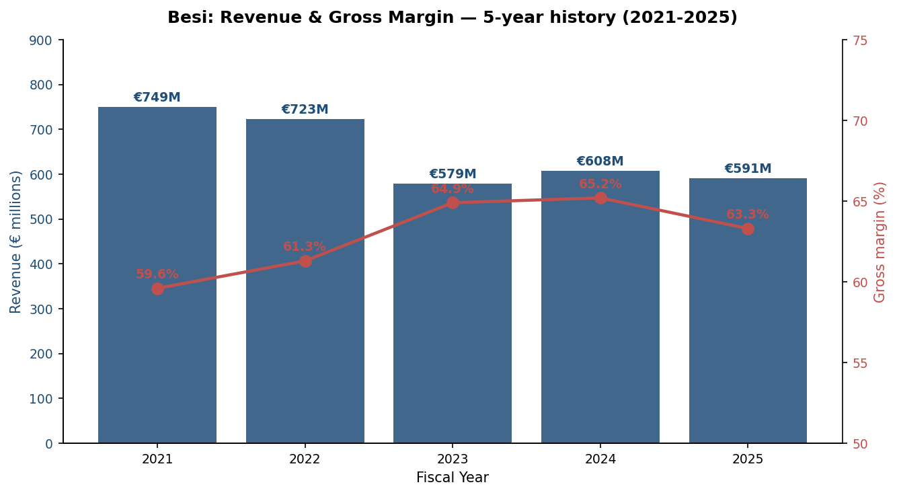

*Figure 1: Besi revenue and gross margin, 2021-2025. Source: [Besi 2025 Annual Report, p. 7 (Key Highlights table)](https://www.besi.com/fileadmin/data/Investor_Relations/_Semi__Annual_Reports/Annual_Report_2025.pdf).*

| (€ millions, FY) | 2021 | 2022 | 2023 | 2024 | 2025 |
|---|---:|---:|---:|---:|---:|
| Revenue | 749.3 | 722.9 | 578.9 | 607.5 | **591.3** |
| Orders | 939.1 | 663.7 | 548.3 | 586.7 | **685.0** |
| Operating income | 317.6 | 294.1 | 213.4 | 195.6 | **173.1** |
| Gross margin | 59.6% | 61.3% | 64.9% | 65.2% | **63.3%** |
| Operating margin | 42.4% | 40.7% | 36.9% | 32.2% | **29.3%** |
| Net income | 282.4 | 240.6 | 177.1 | 182.0 | **131.6** |
| Diluted EPS (€) | 3.39 | 2.90 | 2.23 | 2.30 | **1.66** |
| R&D (net) | 36.4 | 53.9 | 56.4 | 74.3 | **81.0** |
| R&D % of revenue | 4.9% | 7.5% | 9.7% | 12.2% | **13.7%** |
| Net cash | 370.4 | 346.5 | 113.0 | 143.8 | **36.0** |
| Return on average equity | 57.0% | 38.6% | 33.7% | 39.4% | **28.7%** |

*Source: [Besi 2025 Annual Report — Key Highlights, p. 7](https://www.besi.com/fileadmin/data/Investor_Relations/_Semi__Annual_Reports/Annual_Report_2025.pdf).*

The five-year history captures Besi as a high-margin cyclical industrial: revenue declined 21% from a 2021 cyclical peak through 2023 as the post-COVID mobile/automotive correction worked through the assembly equipment market, then stabilized in the €580–610 mn range for 2024 and 2025 while order intake re-accelerated to €685 mn in 2025 (book-to-bill of 1.16×) on the back of AI datacenter and photonics demand. Gross margins held in the 63-65% range throughout the downcycle — a key signal that the technology premium for hybrid bonding and TC Next is not commoditizing ([Besi 2025 Annual Report, Letter to Stakeholders, p. 13-15](https://www.besi.com/fileadmin/data/Investor_Relations/_Semi__Annual_Reports/Annual_Report_2025.pdf)).

### 1.2 Valuation snapshot

As of mid-May 2026, BESI trades at **EUR 261.80** per share with a market capitalization of approximately **EUR 21 billion**, having reached an all-time high of EUR 268.5 on May 14, 2026 ([Yahoo Finance BESI.AS quote, May 2026](https://finance.yahoo.com/quote/BESI.AS/)). The stock has returned roughly +156.86% over the trailing twelve months, dramatically outperforming both the AEX and global semicap peers ([Macrotrends BESIY P/E history](https://www.macrotrends.net/stocks/charts/BESIY/be-semiconductor-industries/pe-ratio)). At year-end 2025, the market capitalization was €10.6 billion at a share price of €133.75 — meaning roughly half of the current market value has been added in the first five months of 2026 alone as investors re-priced the company's AI hybrid-bonding optionality after Q4-25 orders surged 105% YoY ([Besi Q4-25 and FY 2025 Results press release, 2026-02-19](https://www.besi.com/investor-relations/press-releases/details/be-semiconductor-industries-nv-announces-q4-25-and-full-year-2025-results/)).

| Multiple | BESI | Peer median | Note |
|---|---:|---:|---|
| TTM P/E | **137.0×** | 53.7× | At ~4.1× its own 10-year median of 26.8× ([GuruFocus](https://www.gurufocus.com/term/pe-ratio/XAMS:BESI)) |
| TTM P/S | **15.7×** | ~3-5× | Reflects software-like multiple on hardware revenue ([CompaniesMarketCap, P/S](https://companiesmarketcap.com/be-semiconductor/ps-ratio/)) |
| Dividend yield | ~0.6% | ~1-2% | €1.58 declared for FY25; 95% payout ratio ([Besi 2025 Annual Report, p. 16](https://www.besi.com/fileadmin/data/Investor_Relations/_Semi__Annual_Reports/Annual_Report_2025.pdf)) |
| 1-yr total return | +156.9% | n/a | Driven by HB / SoIC re-rating ([TradingView EURONEXT:BESI](https://www.tradingview.com/symbols/EURONEXT-BESI/)) |
| Net cash position | €36 mn | n/a | After €254.8 mn in 2025 distributions (43% of revenue) |

**Interpretation of the 137× P/E.** The current multiple is high by both absolute and historical standards but is not anomalous in the context of a single-segment AI-infrastructure leader whose order book is in a +100% YoY ramp phase. Three forces converge: (i) the market is pricing FY27/FY28 earnings (Nomura's 21-May-2026 Greater China Semi report uses 55× 2027F EPS of €6.1 as their EUR 340 target-price anchor, equivalent to ~24× on 2028F EPS — see [Nomura "Greater China Semi" report excerpts, zsxq file_id 184121852855252](http://localhost:5001/zsxq) for the underlying analyst assumption set); (ii) Besi has only ~79 mn diluted shares outstanding ([Besi 2025 Annual Report, p. 7](https://www.besi.com/fileadmin/data/Investor_Relations/_Semi__Annual_Reports/Annual_Report_2025.pdf)) and modest float after Applied Materials' April-2025 acquisition of a 9% stake ([Applied Materials press release, 2025-04-14](https://ir.appliedmaterials.com/news-releases/news-release-details/applied-materials-announces-strategic-investment-be)), so demand spikes outrun supply; and (iii) Besi's gross margin durability through the 2023-2025 downcycle suggests the multiple is anchored to a structurally higher long-term earnings power than the trough EPS suggests. The risk is symmetric: if FY26 orders disappoint or AI capex pauses, a 137× P/E unwinds violently. See Section 9 for the valuation-multiple risk framing.

---

## Section 2 — Company History

Besi has grown from a small Dutch packaging-equipment startup in 1995 to a global leader through four well-chosen acquisitions and three decades of disciplined organic R&D under a single CEO. The current strategic positioning in hybrid bonding is itself the cumulative output of a 30-year arc of moves into progressively higher-value segments of the assembly equipment market.

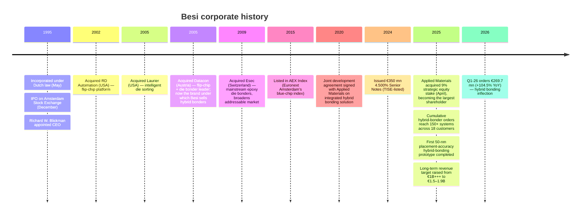

*Source: [Besi 2025 Annual Report, p. 6, 7, 16, 43](https://www.besi.com/fileadmin/data/Investor_Relations/_Semi__Annual_Reports/Annual_Report_2025.pdf); [Applied Materials press release, 2025-04-14](https://ir.appliedmaterials.com/news-releases/news-release-details/applied-materials-announces-strategic-investment-be).*

### 2.1 The four foundational acquisitions

Besi's 2025 Annual Report explicitly identifies the four acquisitions that built the modern company ([Besi 2025 Annual Report, p. 43](https://www.besi.com/fileadmin/data/Investor_Relations/_Semi__Annual_Reports/Annual_Report_2025.pdf)):

1. **RD Automation (USA)** was acquired to extend Besi's product strategy into the front of the assembly process by adding **flip-chip** capabilities. Flip chip is the assembly variant in which a die is mounted face-down with solder bumps connecting it directly to a substrate, eliminating the wire bonds traditional packaging requires. This was the first step away from purely back-end packaging into the architectures that would, two decades later, become the basis of advanced packaging for HBM and CoWoS.
2. **Laurier (USA)** added intelligent **die sorting** ("pick and place" of good versus bad dies from a wafer) — a critical upstream process that determines yield in every downstream packaging operation.
3. **Datacon (Austria)**, acquired in 2005, extended Besi's presence in flip-chip and die-bonding equipment markets and is the brand under which the company still sells its leading hybrid bonders today. The Datacon platform — refined over twenty years of incremental R&D and now spanning chip-to-chip, chip-to-wafer, and integrated wafer-level processing — is the single most valuable IP asset in the company.
4. **Esec (Switzerland)**, acquired in 2009, broadened Besi's reach into the high-volume mainstream die-bonding market (epoxy and soft-solder bonders for mobile, automotive, industrial). Esec's mainstream platforms are what allow Besi to monetize across the full price/volume spectrum from €0.4 mn legacy systems to €3.5 mn cutting-edge hybrid bonders ([Besi 2025 Annual Report, p. 46](https://www.besi.com/fileadmin/data/Investor_Relations/_Semi__Annual_Reports/Annual_Report_2025.pdf)).

### 2.2 The Applied Materials strategic stake (April 2025)

The most consequential corporate event of 2025 was Applied Materials' acquisition of a 9% interest in Besi via market-based transactions, announced April 14, 2025 — making the US semicap giant Besi's largest shareholder ahead of BlackRock Institutional Trust ([Applied Materials press release, 2025-04-14](https://ir.appliedmaterials.com/news-releases/news-release-details/applied-materials-announces-strategic-investment-be); [EE News Europe coverage, 2025](https://www.eenewseurope.com/en/applied-materials-takes-stake-in-dutch-firm-besi/)). The two companies have been collaborating on hybrid-bonding integration since 2020 and recently extended the agreement to co-develop "the industry's first fully integrated equipment solution for die-based hybrid bonding," combining Applied's expertise in front-end wafer/chip surface processing with Besi's leadership in die placement, interconnect and assembly. Applied stated it does not intend to seek board representation or to purchase additional shares ([Applied Materials press release, 2025-04-14](https://ir.appliedmaterials.com/news-releases/news-release-details/applied-materials-announces-strategic-investment-be)). The strategic significance is twofold: (i) it locks in front-end / back-end process integration that AMD, TSMC and Intel need to scale SoIC and chiplet packaging at production yields; and (ii) it implicitly de-risks Besi against Lam Research, ASML or TEL entering the hybrid-bonding equipment market — Applied Materials, if it cannot enter directly, has now ensured one of its closest peers' technology stack is embedded in the dominant tool ([Tiger Brokers commentary on AMAT-Besi deal](https://www.itiger.com/news/1159006392)).

### 2.3 Long-term revenue target raised to €1.5–1.9 billion

In its 2025-2029 strategic plan update, the Board of Management increased Besi's long-term revenue target from "€1 billion+++" to **€1.5–1.9 billion** ([Besi 2025 Annual Report, Letter to Stakeholders, p. 14](https://www.besi.com/fileadmin/data/Investor_Relations/_Semi__Annual_Reports/Annual_Report_2025.pdf)). Against 2025 revenue of €591.3 mn, this implies a 2.5–3.2× revenue trajectory by approximately 2029, driven primarily by expanded hybrid bonding and TC Next adoption across HBM4/5 stacking, CPO, ASIC chiplet logic, and increasingly mobile application processors. This is the single most important guidance number in the report and underpins the long-duration earnings-growth thesis embedded in the 137× P/E.

---

## Section 3 — Management

Besi is governed by a **single-member Board of Management** under CEO Richard W. Blickman, with strategic oversight from a five-member Supervisory Board chaired by Richard Norbruis and a four-member Technology Advisory Board comprising former senior advanced-packaging executives from TSMC, ASML, Intel and Applied Materials ([Besi 2025 Annual Report, p. 190-191](https://www.besi.com/fileadmin/data/Investor_Relations/_Semi__Annual_Reports/Annual_Report_2025.pdf)).

**Richard W. Blickman — Founder-era CEO, Chairman of the Board of Management** (Dutch nationality, born 1954). Blickman has served as Besi's CEO since the company's incorporation in 1995 and has signed every Letter to Stakeholders in the company's 30-year listed history — including the most recent dated February 18, 2026 ([Besi 2025 Annual Report, p. 22 (signature) and p. 190 (board listing)](https://www.besi.com/fileadmin/data/Investor_Relations/_Semi__Annual_Reports/Annual_Report_2025.pdf)). Under his three-decade tenure, Besi has executed the four foundational acquisitions detailed in Section 2.1, transitioned from a Dutch domestic packaging-equipment supplier into the global leader in advanced die attach (50% overall market share, 82% in sub-7-micron precision, as detailed below), and grown from a small post-IPO operation to approximately 1,964 total employees and €591 mn in 2025 revenue. The Letter to Stakeholders style across multiple years' annual reports demonstrates Blickman's consistent strategic vocabulary on the through-cycle nature of the assembly equipment industry, the priority of technology leadership over share gain at low margins, and the capital-return discipline that has produced €2.4 billion of distributions to shareholders since 2011 ([Besi 2025 Annual Report, p. 45](https://www.besi.com/fileadmin/data/Investor_Relations/_Semi__Annual_Reports/Annual_Report_2025.pdf)). Blickman owns Besi shares directly and his remuneration is detailed in the Remuneration Report section of the 2025 Annual Report (p. 169 onwards). The single-CEO governance structure is unusual for a €21 bn market-cap company; succession planning is acknowledged as a Supervisory Board topic ([Besi 2025 Annual Report, p. 188](https://www.besi.com/fileadmin/data/Investor_Relations/_Semi__Annual_Reports/Annual_Report_2025.pdf)) but is not publicly mapped — a moderate governance risk noted in Section 9.

**Technology Advisory Board — the un-published intellectual capital.** Besi's TAB is staffed with four former senior advanced-packaging executives whose combined experience covers the customer side of every major SoIC, HBM and integrated-packaging program in the industry. **Marvin D. Liao** was formerly VP of Operations / Advanced Packaging Technology and Service at TSMC — the customer that runs the SoIC capacity ramp the Nomura report identifies as Besi's single largest demand driver. **Frits van Hout** was formerly Executive Vice President and Chief Strategy Officer at ASML — providing front-end / EUV-roadmap insight that informs Besi's product timing. **Vincent DiCaprio** is currently VP at Applied Materials and Head of Business and Corporate Development for its Heterogeneous Integration and ICAPS Business Unit — the operational counterpart to the 9% strategic equity stake and the AMAT–Besi hybrid-bonding co-development. **Mostafa A. Aghazadeh** was formerly an Advanced Packaging Technology & Manufacturing Executive at Intel ([Besi 2025 Annual Report, p. 191](https://www.besi.com/fileadmin/data/Investor_Relations/_Semi__Annual_Reports/Annual_Report_2025.pdf)). This advisory board is, in practical terms, an extension of the management team's customer intelligence into the four most important customer organizations.

---

## Section 4 — Products & Services

This section walks Besi's product matrix as published in the 2025 Annual Report (p. 5), explaining what each product physically does, how it differentiates from sibling products, and which technology inflection drives its current demand. **Section 4 is the analytical foundation of every downstream section — readers should leave this section able to explain why a fab needs a Besi hybrid bonder *and* a TC Next *and* a Datacon flip chip platform in a single advanced-packaging line, not just "Besi sells die bonders."**

### 4.1 The published product matrix

> *Besi 2025 Annual Report, Company Profile (p. 5), describing the company's product and service offerings (quoted verbatim):*
>
> > **Die Attach**: Single chip, multi chip, multi module, flip chip, epoxy and soft solder die bonding systems, hybrid, TCB and embedded bridge die bonding, die lid attach and fan out wafer level packaging systems.
> >
> > **Packaging**: Conventional, ultra-thin and wafer level molding, trim and form and singulation systems.
> >
> > **Plating**: Tin, copper, precious metal and solar plating systems and related process chemicals.

The three product groups are not equal in scale or strategic importance: **Die Attach contributed ~80% of revenue in 2025, Packaging ~17%, Plating ~3%** ([Besi 2025 Annual Report, p. 24](https://www.besi.com/fileadmin/data/Investor_Relations/_Semi__Annual_Reports/Annual_Report_2025.pdf)). Within Die Attach, two sub-categories — hybrid bonding and TC Next — are the strategic growth engine and the source of the company's premium valuation.

### 4.2 Die Attach — 80% of revenue, the strategic core

Die attach is the process step in which a singulated die ("chip") is mechanically and electrically connected to either a substrate (the legacy back-end path) or another die / a wafer (the advanced packaging path). Besi's technology roadmap, displayed in the 2025 Annual Report on page 19, maps die-attach technologies along two axes: **placement accuracy** (from >10 µm in legacy epoxy bonding down to <100 nm in next-generation hybrid bonding) and **interconnect density** (from <100 connections / mm² up to >1,000,000 connections / mm²) ([Besi 2025 Annual Report, p. 19](https://www.besi.com/fileadmin/data/Investor_Relations/_Semi__Annual_Reports/Annual_Report_2025.pdf)). The full die-attach portfolio spans:

**(a) Epoxy / soft-solder die bonders.** The mainstream, high-volume back-end path. A die is picked from a wafer carrier and placed onto a leadframe or substrate using an epoxy adhesive (for low-stress consumer devices) or a soft-solder paste (for higher-thermal-conductivity power devices). Placement accuracy is in the 10-25 µm range; throughput is high (~10,000+ units per hour); ASP is in the low hundreds of thousands of euros. Acquired into the portfolio via the **Esec acquisition (2009)**, these systems serve mobile, automotive, industrial and discrete-component markets. **中文释义 / Plain-language gloss**: this is the "bread and butter" die-bonder — every memory die, every commodity logic die, every power MOSFET passes through one of these or a competitor's tool. Besi competes here on cost-of-ownership and platform extensibility, not on cutting-edge specs.

**(b) Flip chip / flip-chip-microbump die bonders.** A more sophisticated assembly mode where the die is mounted face-down with solder bumps connecting directly to the substrate, eliminating wire bonds. Placement accuracy typically 5-15 µm; bump pitches in the 50-150 µm range. Acquired into Besi via **RD Automation (early 2000s) and Datacon (2005)**. Flip-chip is the workhorse of high-volume mobile application processors and of mid-tier 2.5D AI accelerators. Besi's 2025 commentary notes "first production shipments to multiple customers of next gen flip chip system with higher accuracy and speed for mainstream mobile and computing applications" — i.e., a refresh of the flip-chip platform aimed at sustaining its mobile/computing share into the 2026-27 upcycle ([Besi 2025 Annual Report, p. 8](https://www.besi.com/fileadmin/data/Investor_Relations/_Semi__Annual_Reports/Annual_Report_2025.pdf)).

**(c) Multi-module / multi-chip die bonders.** Place multiple dies in precise relative positions on a common substrate or interposer in a single tool cycle. Used for system-in-package (SiP) modules, advanced camera modules, and 2.5D AI computing structures where memory dies sit adjacent to a logic die. Besi reports a "Development of first sub-micron accuracy multi module die attach system for advanced photonics assembly" in 2025 — the photonics PIC-on-substrate assembly is a fast-growing market driven by CPO and 1.6T optical modules ([Besi 2025 Annual Report, p. 8](https://www.besi.com/fileadmin/data/Investor_Relations/_Semi__Annual_Reports/Annual_Report_2025.pdf); [LightCounting, October 2025 forecast](https://www.lightcounting.com/) as cited in Besi AR p. 27).

**(d) TC Next — advanced thermo-compression bonding.** This is the *first* of Besi's two strategic wafer-level assembly technologies. Thermo-compression bonding (TCB) assembles a die onto a substrate or another die using solder bumps that are reflowed under simultaneous heat and pressure. Conventional TCB uses a chemical flux to remove oxidation during bonding, but flux residue can become a yield-killer at fine bump pitches (<20 µm). Besi's TC Next is "one of the leading system solutions currently available with great flexibility and versatility to handle both flux and fluxless bonding processes as well as real-time process control for each individual bond" ([Besi 2025 Annual Report, p. 19](https://www.besi.com/fileadmin/data/Investor_Relations/_Semi__Annual_Reports/Annual_Report_2025.pdf)). Industry-leading published metrics: **0.7 µm placement accuracy** and **5-7 µm bump pad pitch density** — both meaningfully better than competing TCB tools. Target markets are HBM4/5 die stacking (where stack heights of 12-20 dies need ultra-tight pitch and zero-flux bonding to achieve viable yield), advanced 2.5D CoWoS assembly, and photonics. As of year-end 2025, TC Next has been adopted by five customers and research institutes spanning logic, memory and photonics. Besi estimates a total cumulative market potential of **350-600 systems through 2030** ([Besi 2025 Annual Report, p. 19](https://www.besi.com/fileadmin/data/Investor_Relations/_Semi__Annual_Reports/Annual_Report_2025.pdf)).

**(e) Hybrid bonding — the strategic crown jewel.** Hybrid bonding (also called copper-copper / Cu-Cu direct bonding) is, per Besi's own characterization, "the most important evolution of die to die interconnect technology in wafer level assembly. It replaces traditional reflowed flip chip solder bumps with a direct copper-to-copper connection between a chip and a wafer" ([Besi 2025 Annual Report, p. 5](https://www.besi.com/fileadmin/data/Investor_Relations/_Semi__Annual_Reports/Annual_Report_2025.pdf)).

Physically: two surfaces (typically a die's bottom and a host wafer's top) are prepared with embedded copper pads in a silicon-dioxide dielectric matrix, polished to atomic-level flatness, surface-activated, and pressed together at room temperature; the oxide-oxide bond forms instantaneously and the copper-copper bond is then thermally annealed at a lower temperature than solder reflow. The result is a metallic interconnect at sub-micron pitch with no underfill, no solder, no microbumps. Versus flip-chip bumping, hybrid bonding delivers significantly higher data transfer speeds (more bonds per mm²), higher chip density, lower energy consumption, lower heat dissipation, and lower total cost of ownership at scale ([Besi 2025 Annual Report, p. 5; p. 16-18](https://www.besi.com/fileadmin/data/Investor_Relations/_Semi__Annual_Reports/Annual_Report_2025.pdf)).

The economics scale linearly: each Besi hybrid-bonder ASP is **€2-3.5 million** (vs. €0.4-0.7 mn for a mainstream die bonder), lead times are **6-9 months** versus 4-12 weeks for mainstream equipment, and cumulative orders have grown to **150+ systems** across **18 customers** by year-end 2025 ([Besi 2025 Annual Report, p. 8, p. 46](https://www.besi.com/fileadmin/data/Investor_Relations/_Semi__Annual_Reports/Annual_Report_2025.pdf)). The 2025 milestones — "First 50 nm placement accuracy prototype system" and "Six integrated hybrid bonding production lines installed [at a leading logic customer], incorporating 30 Besi hybrid bonders" — confirm the technology is past pilot and into production-line mode at TSMC-scale customers ([Besi 2025 Annual Report, p. 14](https://www.besi.com/fileadmin/data/Investor_Relations/_Semi__Annual_Reports/Annual_Report_2025.pdf)). Besi estimates its hybrid-bonding total available market at approximately **€1.2 billion by 2030 (mid-case scenario)**, with TC Next adding another €0.45 billion, for a combined €1.65 billion long-term opportunity in wafer-level assembly equipment alone ([Besi 2025 Annual Report, p. 19](https://www.besi.com/fileadmin/data/Investor_Relations/_Semi__Annual_Reports/Annual_Report_2025.pdf)).

**(f) Embedded-bridge die-bonding.** Used for Intel's EMIB and TSMC's CoWoS-L architectures, in which silicon bridge dies sit *inside* the substrate to route fine-pitch signals between adjacent compute and memory dies. Lower CTE-mismatch and lower cost than full silicon interposers. Besi sells the bonder that places the bridge die and the upper compute die. EMIB-T (Intel) and CoWoS-L (TSMC) are the two principal end-uses ([Besi 2025 Annual Report, p. 5](https://www.besi.com/fileadmin/data/Investor_Relations/_Semi__Annual_Reports/Annual_Report_2025.pdf)).

**(g) Die lid attach.** Applies the metal heat-spreader lid that sits on top of every CPU and GPU package — niche but recurring revenue tied to the AI accelerator unit count.

**(h) Fan-out wafer-level packaging (FOWLP) systems.** Wafer-level molding and redistribution-layer construction for fan-out packages (e.g., InFO for Apple SoCs, mainstream RF and PMIC packages). Used by TSMC, ASE, Amkor and Powertech.

### 4.3 Packaging — 17% of revenue, the established workhorse

Packaging covers everything after a die is bonded: molding (encapsulating the assembled die in epoxy compound), trim and form (cutting and bending the metal leadframe carriers into final IC shape), and singulation (sawing the wafer or substrate into individual finished packages prior to PCB placement). Besi sells conventional, ultra-thin, and wafer-level molding systems and the associated trim/form and singulation equipment ([Besi 2025 Annual Report, p. 5](https://www.besi.com/fileadmin/data/Investor_Relations/_Semi__Annual_Reports/Annual_Report_2025.pdf)). **中文释义 / Plain-language gloss**: this is the "after the chip is bonded, how do you make it look like a finished product" segment — necessary, complex, but commoditized in growth terms vs. die attach.

The 2025 highlight in this group was "First Next Generation LM mold delivery from Besi Leshan" — a wafer-level liquid-molding tool produced at Besi's Chinese facility ([Besi 2025 Annual Report, p. 24](https://www.besi.com/fileadmin/data/Investor_Relations/_Semi__Annual_Reports/Annual_Report_2025.pdf)). Liquid molding is the technique that enables the ultra-thin and conformal molding needed in advanced fan-out and wafer-level packages, so even though Packaging is the lower-growth segment, this product line is itself riding the same advanced-packaging wave as Die Attach.

### 4.4 Plating — 3% of revenue, complementary

Plating systems deposit thin tin, copper, precious-metal, or photovoltaic-grade metal layers using electrochemical or electroless processes, mostly during lead-frame preparation and select advanced-packaging steps. Besi sells the systems plus the proprietary process chemicals — a small razor-and-blade dynamic. Strategically, the Plating segment has been called out in 2025 for sustainability-related innovation: "an alternative coating method was developed this year using vapor deposition versus electroplating" with potential to reduce electricity consumption, water usage, and worker chemical exposure ([Besi 2025 Annual Report, p. 20](https://www.besi.com/fileadmin/data/Investor_Relations/_Semi__Annual_Reports/Annual_Report_2025.pdf)). Plating is not the thesis — but it is a high-margin spares/service annuity attached to Besi's mainstream die-attach installed base.

### 4.5 Spares and service — 15% of revenue, the less-cyclical anchor

Spares and after-sales service represented **15% of total revenue in 2025 (versus 16% in 2024)**, providing the least-cyclical revenue stream attached to the company's installed base of systems. Spares and service revenue has grown significantly over the past decade reflecting the expansion of Besi's installed base, particularly as advanced packaging systems require more intensive on-site production assistance than mainstream die bonders ([Besi 2025 Annual Report, p. 29](https://www.besi.com/fileadmin/data/Investor_Relations/_Semi__Annual_Reports/Annual_Report_2025.pdf)). All global spare-parts activities have been centralized in one business unit based in Singapore to increase customer satisfaction and efficiency ([Besi 2025 Annual Report, p. 39](https://www.besi.com/fileadmin/data/Investor_Relations/_Semi__Annual_Reports/Annual_Report_2025.pdf)).

### 4.6 Synthesis — how the product groups interact in a customer fab

The three product groups are not independent businesses; they together cover the **complete back-end of an advanced-packaging line**, with the wafer-level subset (hybrid bonding, TC Next, multi-module, fan-out) sitting upstream of conventional molding and singulation. In a TSMC CoWoS-S production line, the operator deploys: (i) Besi multi-module / advanced flip-chip die-attach systems to place HBM stacks and the logic die onto the interposer; (ii) Besi TC Next or hybrid bonders for the wafer-level HBM die stacking itself; (iii) Besi wafer-level molding for the post-bond encapsulation; (iv) Besi trim-and-form / singulation to release final packages from the substrate strip. The same physical die-attach platform — refined since the Datacon acquisition — underpins multiple of these steps, which is the source of Besi's mid-60s gross margins: the marginal R&D and BOM overlap across product lines is high, while pricing is technology-tier-specific.

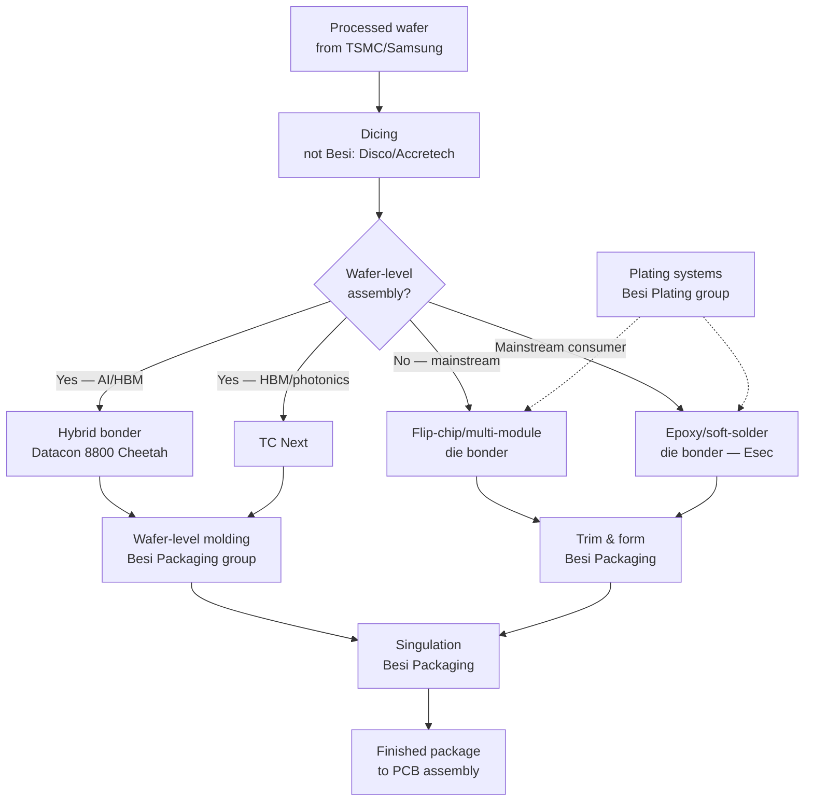

*Figure 2: Simplified Besi product footprint in a hybrid back-end / wafer-level assembly line. Source: structure adapted from [Besi 2025 Annual Report, p. 4-5 (Company Profile, "From Processed Wafer to Assembled Chip" diagram)](https://www.besi.com/fileadmin/data/Investor_Relations/_Semi__Annual_Reports/Annual_Report_2025.pdf).*

The synthesis insight: Besi sells the entire die-attach-and-package toolset for high-end advanced packaging, while only the hybrid-bonder line carries the AI-multiple. The legacy die-attach + packaging + plating businesses are the cyclical, mid-60s-gross-margin foundation that lets management invest €87.7 mn gross R&D (14.8% of revenue) into the hybrid-bonding roadmap each year without bleeding the income statement ([Besi 2025 Annual Report, p. 16](https://www.besi.com/fileadmin/data/Investor_Relations/_Semi__Annual_Reports/Annual_Report_2025.pdf)).

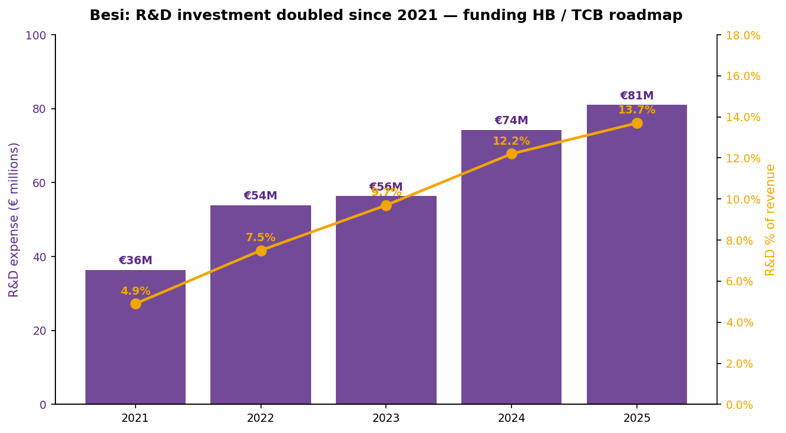

*Figure 3: Besi R&D investment, 2021-2025. Net R&D has more than doubled since 2021 (€36.4 mn → €81.0 mn) and risen from 4.9% to 13.7% of revenue — a deliberate counter-cyclical investment to extend leadership in hybrid bonding and TC Next while peers consolidated. Source: [Besi 2025 Annual Report, p. 7, p. 9](https://www.besi.com/fileadmin/data/Investor_Relations/_Semi__Annual_Reports/Annual_Report_2025.pdf).*

---

## Section 5 — Customers & Go-to-Market

Besi sells assembly equipment to two structurally different customer cohorts: **(i) Integrated Device Manufacturers (IDMs)** — leading European, North American and Asian semiconductor producers that own their own back-end manufacturing (Intel, Samsung, SK hynix, Micron, Infineon, NXP, STMicro, TI); and **(ii) foundries and outsourced assembly subcontractors (OSATs)** — Taiwanese, Chinese, Korean, and ASEAN providers that operate back-end facilities on behalf of fabless chip designers and IDMs (TSMC's advanced-packaging operations, ASE, Amkor, JCET, Powertech, ChipMOS) ([Besi 2025 Annual Report, p. 45-46](https://www.besi.com/fileadmin/data/Investor_Relations/_Semi__Annual_Reports/Annual_Report_2025.pdf)).

### 5.1 Customer concentration — better than typical for semicap

The 2025 Annual Report's customer-concentration disclosure is unambiguous and notably less concentrated than many semiconductor equipment peers: **"For the year ended December 31, 2025, no customer represented more than 10% of our revenue and the largest ten customers accounted for approximately 44% of revenue."** ([Besi 2025 Annual Report, p. 46](https://www.besi.com/fileadmin/data/Investor_Relations/_Semi__Annual_Reports/Annual_Report_2025.pdf)). For context, Lam Research, ASML, and Applied Materials typically report top-customer concentration at 20-35% in their 10-Ks because Samsung, TSMC and Intel collectively dwarf demand for EUV scanners and etch chambers. Besi's flatter distribution reflects (i) the high count of OSAT and mid-tier IDM buyers for mainstream die-attach platforms, (ii) the relatively recent ramp of hybrid bonding — where TSMC's 30-bonder integrated line installation in 2025 is the largest single customer commitment but still <10% of total revenue, and (iii) deep geographic spread.

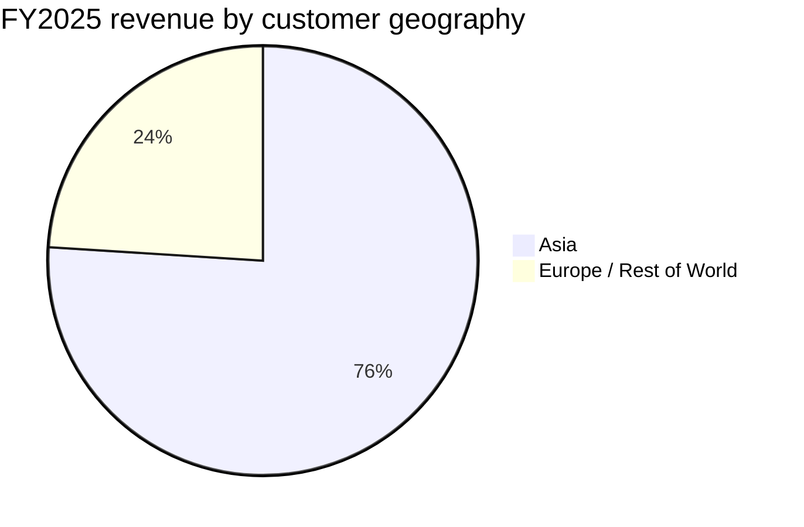

*Source: [Besi 2025 Annual Report, p. 7 (Key Highlights — geographic data)](https://www.besi.com/fileadmin/data/Investor_Relations/_Semi__Annual_Reports/Annual_Report_2025.pdf). Asia revenue share rose to 76.0% in 2025 from 67.0% in 2024 — reflecting the accelerating concentration of advanced packaging activity in Taiwan (TSMC SoIC), Korea (Samsung / SK hynix HBM), and China (domestic substitution + Asian OSAT base).*

### 5.2 Order mix — IDMs vs. foundries/OSATs

Besi's 2025 Annual Report (p. 9 chart) shows the order split between IDMs and foundries / subcontractors over five years:

| Year | IDMs % of orders | Foundries / OSATs % of orders | Total orders (€M) |
|---|---:|---:|---:|
| 2021 | 42% | 58% | 939.1 |
| 2022 | 55% | 45% | 663.7 |
| 2023 | 52% | 48% | 548.3 |
| 2024 | 45% | 55% | 586.7 |
| 2025 | 45% | 55% | 685.0 |

*Source: [Besi 2025 Annual Report — Order Trends chart, p. 9](https://www.besi.com/fileadmin/data/Investor_Relations/_Semi__Annual_Reports/Annual_Report_2025.pdf).*

The 2024-2025 shift toward foundries/OSATs (55% of orders in both years) is the signature of the TSMC SoIC / Asian OSAT advanced-packaging buildout. As Nomura's 21-May-2026 Greater China Semi report independently projects, TSMC SoIC capacity moves from ~10 kwpm at end-2025 toward 15 kwpm in 2026 and 30 kwpm in 2027 — and Besi is the hybrid-bonder of record at that account ([Nomura "Greater China Semi: A guide to Semi renaissance in 2026~30F," 2026-05-21, p. 44, accessible via the local zsxq library](http://localhost:5001/zsxq); cited via the [zsxq summary](http://localhost:8080/) for record-keeping).

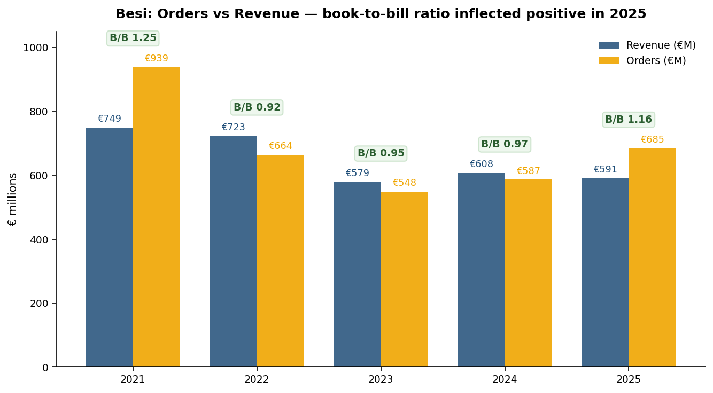

*Figure 4: Orders vs revenue with book-to-bill ratios, 2021-2025. The 1.16× book-to-bill in 2025 (up from 0.95-0.97× in 2023-2024) is the leading indicator on which the Q1-26 +104.5% YoY order surge is built. Source: [Besi 2025 Annual Report, p. 7, p. 9 (Key Highlights and Order Trends charts)](https://www.besi.com/fileadmin/data/Investor_Relations/_Semi__Annual_Reports/Annual_Report_2025.pdf).*

### 5.3 End-market mix shifting toward AI computing

Besi's end-user mix is in a structural shift from mobile-dominated (51% mobile in 2023) to computing-dominated as AI datacenter and photonics applications crowd out mid-cycle mobile demand ([Besi 2025 Annual Report, p. 25](https://www.besi.com/fileadmin/data/Investor_Relations/_Semi__Annual_Reports/Annual_Report_2025.pdf)):

| End market | 2023 | 2024 | 2025 |
|---|---:|---:|---:|
| Computing | 10% | 16% | **30%** |
| Mobile | 51% | 30% | 24% |
| Automotive | 15% | 12% | 11% |
| Industrial / Other | 7% | 26% | 18% |
| Spares / Service | 17% | 16% | 17% |

*Source: [Besi 2025 Annual Report, p. 25](https://www.besi.com/fileadmin/data/Investor_Relations/_Semi__Annual_Reports/Annual_Report_2025.pdf).*

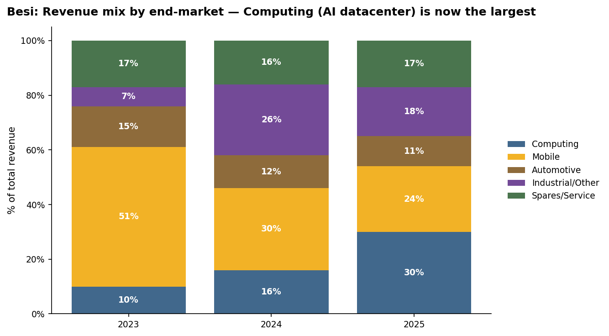

*Figure 5: End-user revenue mix, 2023-2025. Computing grew from 10% to 30% of revenue in two years — the single clearest signal that Besi's revenue base is re-orienting around AI datacenter and HBM applications. Source: [Besi 2025 Annual Report, p. 25](https://www.besi.com/fileadmin/data/Investor_Relations/_Semi__Annual_Reports/Annual_Report_2025.pdf).*

Approximately **50% of total 2025 orders were for AI applications**, per management's estimate — the strongest sub-mix driver in the order book ([Besi 2025 Annual Report, p. 13](https://www.besi.com/fileadmin/data/Investor_Relations/_Semi__Annual_Reports/Annual_Report_2025.pdf)). Within AI, the breakdown captured in Nomura's parallel analysis is approximately 50% AMD, 25% COUPE (silicon-photonics CPO from TSMC's COUPE program), 15% HBM (Samsung + SK hynix small-volume initial tooling), and 10% other (Intel, Apple) ([Nomura Greater China Semi report, p. 45 Fig. 82 — accessible via local zsxq.db file_id 184121852855252](http://localhost:5001/zsxq)).

### 5.4 Go-to-market structure

Besi operates a direct sales and customer service force of approximately 250 people across **13 regional sales and service offices** in Asia Pacific, Europe and North America. The company has explicitly migrated its commercial footprint toward Asia in response to customer geography, with strengthened presence in Singapore, China, Malaysia, Thailand, Taiwan, Korea and Vietnam ([Besi 2025 Annual Report, p. 39](https://www.besi.com/fileadmin/data/Investor_Relations/_Semi__Annual_Reports/Annual_Report_2025.pdf)). Lead times are quoted at 4-12 weeks for mainstream products with ASPs above €400,000 per system; lead times for hybrid bonding and TC Next stretch to 6-9 months with ASPs of €2-3.5 million ([Besi 2025 Annual Report, p. 46](https://www.besi.com/fileadmin/data/Investor_Relations/_Semi__Annual_Reports/Annual_Report_2025.pdf)). Revenue is recognized only upon receipt and acceptance of a firm purchase order — meaning Q1-26's reported €269.7 mn order intake is hard, not indicative ([Besi Q1-26 Results press release, 2026-04-23](https://www.besi.com/investor-relations/press-releases/details/be-semiconductor-industries-nv-announces-q1-26-results/)).

---

## Section 6 — Industry Overview

Besi operates in the **semiconductor assembly equipment** segment — the back-end portion of the semiconductor manufacturing equipment (SME) market. The total SME market is estimated by TechInsights at **approximately $136 billion in 2025**, of which the front-end (wafer fab equipment used to print transistors) accounts for $119.2 billion (88%), assembly equipment accounts for $5.1 billion (4%), and test equipment accounts for $11.5 billion (8%) ([Besi 2025 Annual Report, p. 4 (TechInsights December 2025 data)](https://www.besi.com/fileadmin/data/Investor_Relations/_Semi__Annual_Reports/Annual_Report_2025.pdf)).

### 6.1 The assembly equipment market — recovering after a 3-year downcycle

The assembly equipment market contracted approximately 23% from the 2021 cyclical peak through 2024 as a post-COVID inventory correction worked through mobile/PC/consumer electronics demand, then through automotive and industrial demand, and finally through Chinese subcontractor overcapacity ([Besi 2025 Annual Report, p. 29](https://www.besi.com/fileadmin/data/Investor_Relations/_Semi__Annual_Reports/Annual_Report_2025.pdf)). TechInsights estimates the market grew approximately flat in 2025 vs. 2024 and is now forecasting **a 12% increase in 2026** as the multi-year downturn ends, with continued growth to a forecasted **+68% cumulative expansion through 2030** (i.e., from $5.1 bn in 2025 to roughly $8.8 bn in 2030) ([Besi 2025 Annual Report, p. 29](https://www.besi.com/fileadmin/data/Investor_Relations/_Semi__Annual_Reports/Annual_Report_2025.pdf)).

| Year | Assembly equipment market (USD bn, TechInsights) |
|---|---:|
| 2025E | 5.1 |
| 2026E | 5.7 |
| 2028E | 6.7 |
| 2030E | **8.8** |

*Source: [Besi 2025 Annual Report, p. 29 (TechInsights, December 2025; excludes service revenue)](https://www.besi.com/fileadmin/data/Investor_Relations/_Semi__Annual_Reports/Annual_Report_2025.pdf).*

Within assembly, **die attach is the largest and fastest-growing sub-segment**, representing 27% of the 2025 assembly equipment market — i.e., approximately **$1.4 billion in 2025**. Besi's specifically addressable market, defined as die attach + flip-chip-related packaging + plating, was approximately **$1.3 billion** in 2025 (26% of total assembly) ([Besi 2025 Annual Report, p. 24-25](https://www.besi.com/fileadmin/data/Investor_Relations/_Semi__Annual_Reports/Annual_Report_2025.pdf)). With FY25 revenue of €591 mn (~$640 mn at average 2025 EUR/USD), Besi captures roughly half of its own addressable die-attach market — consistent with the company's reported 50% market share in die attach.

### 6.2 Advanced packaging — the structural growth driver

The Yole Group's August 2025 advanced-packaging market model, cited in the Besi 2025 Annual Report, sets the most-important context for the long-term thesis ([Besi 2025 Annual Report, p. 17 (Yole, August 2025)](https://www.besi.com/fileadmin/data/Investor_Relations/_Semi__Annual_Reports/Annual_Report_2025.pdf); see also [Yole press release on back-end equipment, 2025](https://www.yolegroup.com/press-release/back-end-semiconductor-equipment-advanced-packaging-drives-revenues-in-2025/)):

| (USD bn) | 2020 | 2025E | 2030E | CAGR 2020-25 | CAGR 2025-30 |
|---|---:|---:|---:|---:|---:|
| Advanced packaging | 37.8 | 60.7 | **91.1** | 9.6% | 8.5% |
| Traditional packaging | 38.3 | 55.6 | 69.8 | 8.0% | 4.7% |
| **Total** | 76.1 | 116.3 | **160.9** | — | — |

*Source: [Besi 2025 Annual Report, p. 17 (Yole, August 2025)](https://www.besi.com/fileadmin/data/Investor_Relations/_Semi__Annual_Reports/Annual_Report_2025.pdf).*

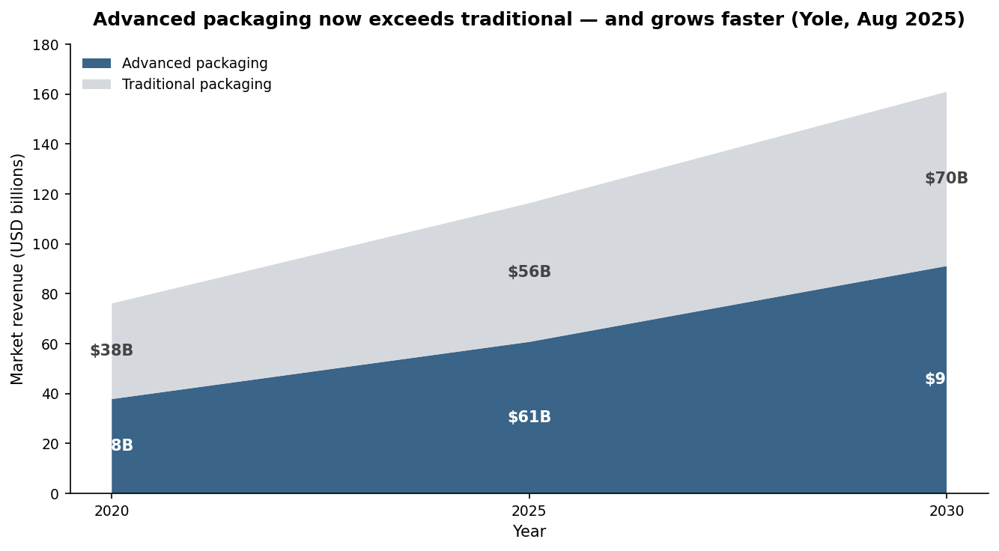

*Figure 6: Advanced vs traditional packaging market, 2020-2030E. Advanced packaging crosses traditional in size around 2023 and grows materially faster through 2030. Source: [Besi 2025 Annual Report, p. 17 (Yole, August 2025)](https://www.besi.com/fileadmin/data/Investor_Relations/_Semi__Annual_Reports/Annual_Report_2025.pdf).*

The implication is simple: within an overall packaging market growing low-single-digit, the advanced-packaging sub-segment — including everything from CoWoS-S to SoIC to fan-out to 2.5D bridge die — grows mid-single-digit and consumes the majority of incremental capex. Besi's products are *almost entirely* in this growing sub-segment (≥70% of 2025 system revenue per management), so the company's revenue growth is structurally levered to the advanced-packaging segment, not the overall packaging market.

### 6.3 AI as the primary cycle driver

The 2025-2030 cycle is unambiguously AI-driven. TechInsights forecasts AI semiconductor revenue to grow at a 16.5% CAGR between 2025 and 2035, reaching approximately **$1.4 trillion by 2035**; the datacenter AI chip market alone is projected to reach **$643 billion by 2030** at a 22% CAGR from 2025 ([Besi 2025 Annual Report, p. 17, p. 26](https://www.besi.com/fileadmin/data/Investor_Relations/_Semi__Annual_Reports/Annual_Report_2025.pdf)). The forward semiconductor-segment growth profile published by ASML/Nomura (July 2025) shows servers/datacenter/storage as the single fastest-growing category at 18% CAGR 2025-2030, well ahead of automotive (9%), industrial (7%), wired/wireless infrastructure (6%), smartphones (5%), PCs (4%), and consumer electronics (3%) ([Besi 2025 Annual Report, p. 25 (ASML/Nomura, July 2025)](https://www.besi.com/fileadmin/data/Investor_Relations/_Semi__Annual_Reports/Annual_Report_2025.pdf)). The hyperscaler capex underpinning this — Morgan Stanley's November 2025 model has top-11 cloud providers spending **$621 bn in 2026E** (from $469 bn in 2025E and $280 bn in 2024) — sets a multi-year structural backdrop for Besi's HB / TC Next ramp ([Besi 2025 Annual Report, p. 26 (Morgan Stanley, November 2025)](https://www.besi.com/fileadmin/data/Investor_Relations/_Semi__Annual_Reports/Annual_Report_2025.pdf)).

### 6.4 HBM ramp — the second-largest specific driver

TSMC's CoWoS capacity buildout, Samsung and SK hynix's HBM4 ramp, and Micron's HBM4 launch in 2026 together constitute the second-largest demand vector after AI logic itself. Per TechInsights data referenced by Besi, **HBM4+ shipments are forecast to grow from 0% of HBM units today to 94% of the HBM market by 2028**, with HBM5 production estimated to begin in 2028-2029 ([Besi 2025 Annual Report, p. 17-18, p. 27 (TechInsights, December 2025)](https://www.besi.com/fileadmin/data/Investor_Relations/_Semi__Annual_Reports/Annual_Report_2025.pdf)). Besi positions itself as well-positioned for HBM4/5 memory stacks at 12+ devices high (via TC Next) and uniquely qualified for stacks at 20+ devices (via hybrid bonding), where TC Next's residual-flux yield problem becomes prohibitive.

TSMC's CoWoS shipment trajectory (Goldman Sachs January 2026 forecast, referenced in the Besi 2025 Annual Report): from **664,000 wafers in 2025E** to **1,185,000 wafers in 2026E (+78%)** and **2,195,000 wafers in 2027E (+85%)** — a 3.3× increase over two years ([Besi 2025 Annual Report, p. 30 (Goldman Sachs, January 2026)](https://www.besi.com/fileadmin/data/Investor_Relations/_Semi__Annual_Reports/Annual_Report_2025.pdf)). Even if hybrid bonding penetrates only a fraction of CoWoS substrate volumes, the absolute tool requirement is significant.

### 6.5 Silicon photonics and CPO — the third driver

LightCounting's October 2025 forecast projects **silicon-photonics semiconductor shipments (including co-packaged optics) to reach 367 million units by 2030**, growing at a 29.5% CAGR from 2025. Within that total: Ethernet pluggable transceivers grow 19% annually, linear pluggable optics (LPO) grow 198% annually off a low base, and CPO grows 237% annually off the lowest base ([Besi 2025 Annual Report, p. 27 (LightCounting, October 2025)](https://www.besi.com/fileadmin/data/Investor_Relations/_Semi__Annual_Reports/Annual_Report_2025.pdf)). CPO specifically uses hybrid bonding to stack the silicon-photonics PIC die directly onto the switch ASIC — directly relevant to Besi's product roadmap. The 2025 Annual Report flags TSMC's COUPE program as a meaningful share of Besi's hybrid-bonder order book in 2026.

### 6.6 Chiplet adoption — the structural multiplier

Chiplet usage is forecast by TechInsights to grow from **1,444 million units in 2024** to **25,698 million by 2030** — a 62% CAGR over six years, an order-of-magnitude inflection ([Besi 2025 Annual Report, p. 34 (TechInsights, December 2025)](https://www.besi.com/fileadmin/data/Investor_Relations/_Semi__Annual_Reports/Annual_Report_2025.pdf)). Every chiplet design multiplies the number of bonding operations per finished package — a chiplet-based AMD EPYC processor has 7+ die-to-die bonds, where a monolithic version of the same chip would have none. Chiplet adoption thus structurally increases hybrid-bonder unit demand per dollar of end-chip revenue.

### 6.7 Geographic dynamics

The assembly equipment market is structurally concentrated in Asia. Per Besi's reported geography, **76% of 2025 revenue came from Asia** (up from 67% in 2024), reflecting both customer base location (TSMC in Taiwan, SK hynix and Samsung in Korea, ASE and other OSATs in Taiwan, Amkor in Korea/Vietnam, JCET in China) and the growing US-region "Made in America" packaging-fab buildout that still ultimately ships to Asian back-end facilities for assembly. The US Made-in-America policy is driving incremental capacity buildout in Arizona, Texas and elsewhere but most assembly remains concentrated in Asia for cost and supply-chain reasons.

---

## Section 7 — Competitive Landscape

Besi competes in a structurally consolidated semiconductor back-end equipment market where four to six players hold dominant positions across product categories. The market structure is well-documented by both industry research and Besi's own 10-K-equivalent disclosures, though specific share-leadership claims are best understood as third-party analyst opinion rather than verbatim filings disclosures.

### 7.1 Besi's market position — the published numbers

The 2025 Annual Report publishes the company's TechInsights-sourced market share trajectory in two granularities:

| Year | Overall die attach share | Advanced die placement (<7µm) share |
|---|---:|---:|
| 2020 | 37% | 81% |
| 2021 | 40% | 79% |
| 2022 | 40% | 78% |
| 2023 | 46% | 81% |
| 2024 | **50%** | **82%** |

*Source: [Besi 2025 Annual Report, p. 15 (TechInsights, December 2025)](https://www.besi.com/fileadmin/data/Investor_Relations/_Semi__Annual_Reports/Annual_Report_2025.pdf).*

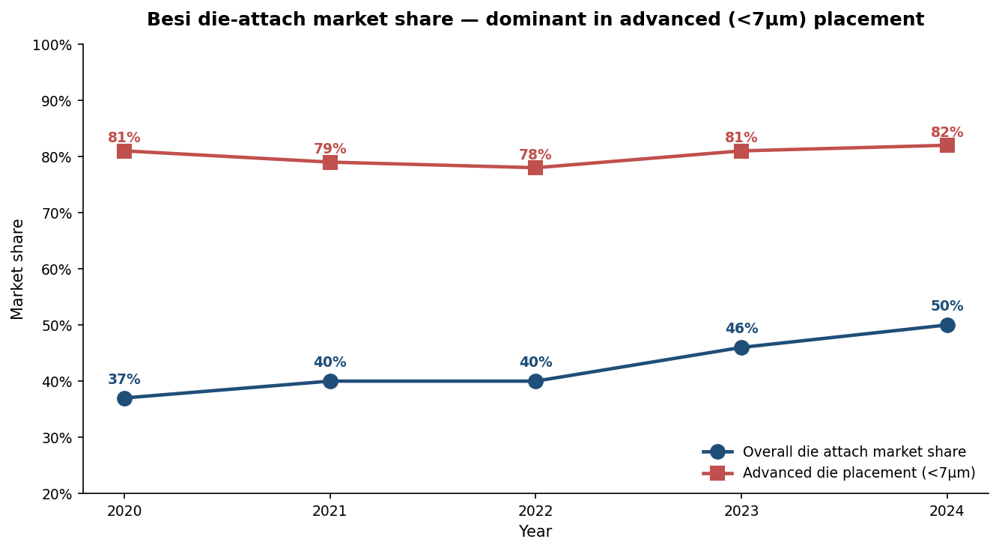

*Figure 7: Besi die-attach market share, 2020-2024. The overall die-attach share grew from 37% to 50% over five years; the advanced (<7µm placement accuracy) share has held above 78% throughout the cycle. Source: [Besi 2025 Annual Report, p. 15 (TechInsights, December 2025)](https://www.besi.com/fileadmin/data/Investor_Relations/_Semi__Annual_Reports/Annual_Report_2025.pdf).*

These shares — particularly the 82% in advanced die placement — are the most concrete numerical evidence that Besi's hybrid bonding lead is not contestable in the near term. Two competitive realities follow: (i) above 80% share, growth comes from end-market expansion (HB-attachable revenue rising) rather than share gain; (ii) competitors entering hybrid bonding from adjacent positions (ASMPT, Hanmi, EVG, Shibaura) are fighting for the residual 18% of the most-attractive sub-segment.

### 7.2 Primary competitors

The principal competitors in Besi's addressable market segment by structural overlap:

**ASMPT Ltd. (ASMPT, 522 HK)** — Hong Kong-listed back-end and SMT equipment supplier. ASMPT is the **largest** back-end assembly and packaging equipment vendor by total revenue, competing across die bonders, wire bonders, and SMT/surface-mount equipment ([Mordor Intelligence, semiconductor back-end equipment market](https://www.mordorintelligence.com/industry-reports/semiconductor-back-end-equipment-market)). ASMPT has been positioned as an "emerging leader" in advanced packaging and hybrid bonding by industry research firms but holds a smaller share in advanced die placement than Besi ([Insightace, hybrid bonding market](https://www.insightaceanalytic.com/report/hybrid-bonding-market/3483)). *Analyst view:* ASMPT is the most-mentioned credible threat to Besi's hybrid-bonding lead among Asia-listed peers, particularly given its scale advantages in mainstream die bonders that subsidize its advanced-packaging R&D budget.

**EV Group (EVG)** — Privately-held Austrian equipment specialist. EV Group leads in **wafer-to-wafer (W2W) hybrid bonding** — a different geometry from Besi's primary die-to-wafer (D2W) and die-to-die (D2D) hybrid bonding. EVG's W2W tools are the dominant supplier into wafer-bonded CMOS image sensors (Sony) and 3D NAND (YMTC Xtacking) ([Yole Group, advanced packaging back-end equipment, 2025](https://www.yolegroup.com/strategy-insights/advanced-packaging-is-the-engine-driving-back%E2%80%91end-equipment-growth/)). The split — Besi for D2W/D2D, EVG for W2W — is structurally complementary rather than overlapping; the two address different SoIC and memory-bonding use cases.

**Kulicke & Soffa (KLIC US, NASDAQ)** — US-listed assembly equipment supplier. K&S, founded in 1951, dominates the traditional wire-bonding equipment market with an estimated ~60% share globally ([CompaniesMarketCap, K&S PE history](https://companiesmarketcap.com/kulicke-and-soffa-industries/pe-ratio/)). K&S is investing in expansion into hybrid bonding and copper-clip platforms aimed at AI and power-device interconnect, with platforms targeted for 2025 release. *Analyst view:* K&S enters hybrid bonding from a different starting position than Besi — wire-bonding share rather than flip-chip / advanced die placement share — and is several R&D generations behind in placement-accuracy specifications.

**DISCO Corporation (6146 JP, Tokyo)** — Japanese supplier of wafer dicing, grinding, and polishing equipment, holding ~80% share globally in wafer-prep equipment. Disco is *complementary* to Besi rather than directly competing: every Besi hybrid-bonder customer also operates Disco dicing/grinding equipment upstream. Disco's grinding-wheel consumables business (~$350-400 mn) is the same size as the entire CMP pad-conditioner market that Kinik dominates ([Nomura "Greater China Semi" report, p. 115](http://localhost:5001/zsxq)).

**SUSS MicroTec (SMHN GR)** — German wafer-bonding and lithography-equipment specialist. SUSS is the secondary supplier in W2W hybrid bonding behind EVG.

**Shibaura Mechatronics (6590 JP)** — Japanese supplier of various semiconductor processing equipment. Per industry research firm assessments, Shibaura is "trying to expand presence in the hybrid bonding market" but has limited installed base in advanced die placement ([Nomura "Greater China Semi" report, p. 46-47](http://localhost:5001/zsxq)). *Analyst view:* Shibaura is the most credible Japan-side hybrid-bonding entrant but is several quarters behind Besi.

**Hanmi Semiconductor (042700 KS)** and **Hanwha Semitech** — Korean equipment suppliers gaining early hybrid-bonding adoption at Korean memory customers (SK hynix). Hanmi has been described as "leading" in some Korean-customer HBM-stacking deployments ([Mordor Intelligence, die bonder market](https://www.mordorintelligence.com/industry-reports/die-bonder-equipment-market)). *Analyst view:* the Korean entrants benefit from "home country" customer preference at SK hynix but lack the multi-year customer relationships at TSMC and Intel that Besi has built.

**TEL (Tokyo Electron, 8035 JP) and ASML (ASML NA)** — Both companies have been mentioned by industry research as potential entrants into chip-to-wafer hybrid bonding given their strong front-end equipment relationships with TSMC and Intel ([Nomura "Greater China Semi" report, p. 46](http://localhost:5001/zsxq)). Neither currently sells a competing C2W hybrid bonder. *Analyst view:* this is the single largest long-tail competitive risk to Besi's hybrid-bonding moat. The April 2025 Applied Materials 9% strategic stake — and the resulting integrated AMAT-Besi co-development on hybrid bonding — is implicitly designed to lock in the leading front-end / back-end integration partnership and pre-empt TEL or ASML entry.

### 7.3 Competitive positioning framework

```mermaid
quadrantChart
    title Besi competitive position — assembly equipment landscape
    x-axis Mainstream / commoditized --> Advanced / specialty
    y-axis Small footprint --> Large footprint (global scale)
    quadrant-1 Scale leader in advanced
    quadrant-2 Scale leader in mainstream
    quadrant-3 Niche / sub-scale
    quadrant-4 Advanced specialist
    Besi: [0.85, 0.6]
    ASMPT: [0.55, 0.85]
    K&S: [0.45, 0.55]
    Disco: [0.6, 0.8]
    EV Group: [0.8, 0.3]
    SUSS: [0.7, 0.25]
    Shibaura: [0.65, 0.35]
    Hanmi: [0.55, 0.2]
    Applied Materials: [0.5, 0.95]
    TEL: [0.4, 0.9]
```

*Figure 8: Besi competitive positioning. Besi sits in the "Scale leader in advanced" quadrant — large enough to be globally relevant, focused enough to dominate the sub-7µm advanced die-placement segment. ASMPT is the largest by scale but mainstream-weighted; EV Group is the advanced specialist for W2W but smaller. Source: Author's framework based on [Besi 2025 Annual Report, p. 15 (TechInsights market share data)](https://www.besi.com/fileadmin/data/Investor_Relations/_Semi__Annual_Reports/Annual_Report_2025.pdf) and [Yole press release](https://www.yolegroup.com/press-release/back-end-semiconductor-equipment-advanced-packaging-drives-revenues-in-2025/).*

### 7.4 Peer valuation comparison

Besi trades at a meaningful premium to its publicly-traded peers, reflecting its hybrid-bonding leadership and the resulting AI-infrastructure exposure:

| Company | Ticker | TTM P/E | TTM P/S | Note |
|---|---|---:|---:|---|
| **BE Semiconductor** | BESI NA | **137.0×** | **15.7×** | The "advanced packaging pure-play" valuation ([GuruFocus](https://www.gurufocus.com/term/pe-ratio/XAMS:BESI)) |
| ASMPT | 522 HK | 35-72× (range) | ~3-4× | Largest peer by revenue; mainstream-weighted ([CNBC ASMPT quote](https://www.cnbc.com/quotes/522-HK)) |
| Kulicke & Soffa | KLIC US | 97.2× | 5.7× | Wire-bonding leader pivoting to HB ([Macrotrends KLIC](https://www.macrotrends.net/stocks/charts/KLIC/kulicke-and-soffa-industries/pe-ratio)) |
| Disco Corp | 6146 JP | 27.6× | n/a | Wafer-prep specialist; less direct overlap ([Macrotrends DSCSY](https://www.macrotrends.net/stocks/charts/DSCSY/disco-corp/pe-ratio)) |
| **Peer median** | | **~54×** | ~3-5× | |

*Source: data points compiled from [GuruFocus, May 2026](https://www.gurufocus.com/term/pe-ratio/XAMS:BESI), [Macrotrends history](https://www.macrotrends.net/stocks/charts/BESIY/be-semiconductor-industries/pe-ratio), and [CompaniesMarketCap rankings](https://companiesmarketcap.com/semiconductors/semiconductor-companies-ranked-by-pe-ratio/), accessed 2026-05-24.*

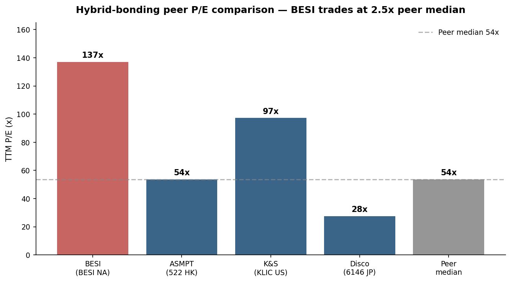

*Figure 9: TTM P/E comparison across hybrid-bonding-relevant peers. BESI's 137× P/E is 2.5× the peer median and 4× Disco's 27.6×, reflecting market pricing of multi-year hybrid-bonding earnings power. Source: [GuruFocus](https://www.gurufocus.com/term/pe-ratio/XAMS:BESI), [Macrotrends](https://www.macrotrends.net/stocks/charts/BESIY/be-semiconductor-industries/pe-ratio), and [Stockopedia ASMPT](https://www.stockopedia.com/share-prices/asmpt-HKG:522/), all accessed 2026-05-24.*

The peer differential is the single most uncomfortable feature of the Besi long thesis: at 2.5× the peer median P/E, BESI prices an outcome where the company executes its €1.5-1.9 bn revenue target with relatively undiluted margins by 2028-2029. Any execution slip translates into multiple compression of 50%+ — a non-trivial mark-to-market risk.

---

## Section 8 — Total Addressable Market and Growth Opportunity

### 8.1 Layered TAM model

Besi sits within multiple nested addressable markets, growing at increasing rates the further inward one travels:

| Layer | 2025 size | 2030E size | CAGR | Source |
|---|---:|---:|---:|---|
| Total semicap | $136 bn | ~$200 bn | ~8% | TechInsights, December 2025 ([Besi AR, p. 4](https://www.besi.com/fileadmin/data/Investor_Relations/_Semi__Annual_Reports/Annual_Report_2025.pdf)) |
| Assembly equipment | $5.1 bn | $8.8 bn | 12% | TechInsights, December 2025 ([Besi AR, p. 29](https://www.besi.com/fileadmin/data/Investor_Relations/_Semi__Annual_Reports/Annual_Report_2025.pdf)) |
| Die attach equipment | $1.4 bn | ~$2.5 bn | ~12% | TechInsights, December 2025 ([Besi AR, p. 24](https://www.besi.com/fileadmin/data/Investor_Relations/_Semi__Annual_Reports/Annual_Report_2025.pdf)) |
| Hybrid bonding only | $0.16 bn | **~€1.2 bn (~$1.3 bn) — Besi mid-case** | 21-30% | Besi estimates, June 2025 ([Besi AR, p. 35](https://www.besi.com/fileadmin/data/Investor_Relations/_Semi__Annual_Reports/Annual_Report_2025.pdf)); [MarketsAndMarkets](https://www.marketsandmarkets.com/Market-Reports/hybrid-bonding-market-2641237.html) |
| Advanced TCB (Besi-attributable) | ~$0.1 bn | **~€450 mn** | ~30%+ | Besi estimates, 2025 ([Besi AR, p. 19](https://www.besi.com/fileadmin/data/Investor_Relations/_Semi__Annual_Reports/Annual_Report_2025.pdf)) |
| **Combined HB + TCB wafer-level TAM** | ~$0.3 bn | **~€1.65 bn** | ~30% | Besi estimates ([Besi AR, p. 19](https://www.besi.com/fileadmin/data/Investor_Relations/_Semi__Annual_Reports/Annual_Report_2025.pdf)) |

### 8.2 The €1.5-1.9 bn revenue target — bottom-up plausibility check

Management's updated long-term revenue target of **€1.5-1.9 billion** (raised from "€1B+++" in the 2025-2029 strategic plan update) implies revenue 2.5-3.2× current levels by approximately 2029 ([Besi 2025 Annual Report, Letter to Stakeholders, p. 14](https://www.besi.com/fileadmin/data/Investor_Relations/_Semi__Annual_Reports/Annual_Report_2025.pdf)).

A bottom-up build:

- **Mainstream die-attach + packaging + plating** at 2025 baseline: ~€470 mn (80% of 2025 revenue ex-spares). Assuming the 2026-2030 mainstream cycle recovery follows TechInsights' 12% CAGR for the overall assembly equipment market over five years, mainstream grows to ~€830 mn by 2029 — but Besi's market-share gains in advanced die placement may add another 5-10% on top, suggesting ~€900-950 mn.
- **Hybrid bonding** at mid-case TAM of ~€1,200 mn by 2030, assuming Besi retains 60-70% share of die-to-wafer / die-to-die hybrid bonding: ~€720-840 mn. The 30-bonder TSMC integrated-line installation in 2025 implies that a single AI hyperscale customer is already a >€60 mn revenue contributor per line, and TSMC alone is expected to add 4-6 such lines through 2029.
- **TC Next** at mid-case 350-600 systems by 2030, with average ASP €2-3 mn, suggests cumulative TC Next opportunity of ~€700 mn-€1.8 bn. Annualized at full ramp, this contributes ~€150-300 mn/year.
- **Spares and service** scales with installed base; 2025 was 15% of revenue. By 2029, assuming installed base ~2× current, spares/service contributes ~€220-300 mn.

Summing: mainstream €900-950 mn + HB €720-840 mn + TC Next €150-300 mn + spares €220-300 mn = **€2.0-2.4 bn potential**, which exceeds the €1.5-1.9 bn target. Reading this in reverse: the management target is conservative versus the bottom-up build, suggesting either (i) market share assumptions that are more modest than current 82% in <7µm placement, or (ii) cycle-discount conservatism. The €1.5-1.9 bn range is thus an internally credible target and arguably modest if hybrid bonding penetrates at the high case rather than mid case.

### 8.3 Cumulative hybrid bonding adoption — the leading indicator

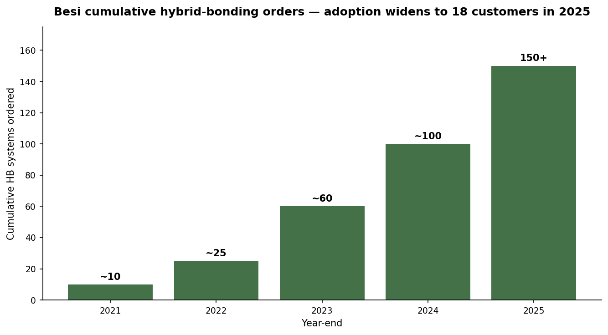

*Figure 10: Besi cumulative hybrid bonding orders, 2021-2025. The trajectory from approximately 10 systems cumulative at year-end 2021 to **150+ at year-end 2025** across 18 customers is the most direct evidence of the demand inflection. Source: [Besi 2025 Annual Report, p. 13-14](https://www.besi.com/fileadmin/data/Investor_Relations/_Semi__Annual_Reports/Annual_Report_2025.pdf).*

At ~€2.5-3 mn per system, 150+ cumulative systems implies cumulative hybrid-bonding revenue of approximately €375-450 mn, against the €500-900 mn cumulative revenue contribution Besi expects from HB and TC Next combined by 2030 ([Besi 2025 Annual Report, p. 19](https://www.besi.com/fileadmin/data/Investor_Relations/_Semi__Annual_Reports/Annual_Report_2025.pdf)) — i.e., the company is roughly half-way through its own multi-year hybrid-bonding revenue plan.

### 8.4 Q1-26 evidence of demand inflection

The Q1-26 results released April 23, 2026 provide the cleanest near-term evidence that the multi-year cycle has turned ([Besi Q1-26 Results press release, 2026-04-23](https://www.besi.com/investor-relations/press-releases/details/be-semiconductor-industries-nv-announces-q1-26-results/)):

- **Revenue**: €184.9 mn (+28.3% YoY, +11.1% QoQ)
- **Gross margin**: 63.5% (-0.1 pts YoY)
- **Net income**: €51.6 mn (+63.8% YoY, +20.6% QoQ)
- **Orders**: **€269.7 mn (+104.5% YoY, +7.7% QoQ)** — the standout metric
- **Q2-26 guidance**: revenue +30-40% versus Q1-26 (implying €240-260 mn revenue, +47-59% YoY); gross margin 64-66%

The +104.5% YoY order growth in Q1-26 is exceptional, and the company specifically attributed it to "a significant increase in bookings for hybrid bonding systems alongside strength in mobile and photonics markets." This is the strongest single quarterly data point validating the long thesis.

---

## Section 9 — Risk Assessment

Besi faces a layered risk profile spanning company-specific execution, industry/market cyclicality, financial-structure exposure, and macro/geopolitical factors. The risks below are categorized into the four standard buckets used in the project's risk taxonomy.

### Company-specific risks

**Risk 1 — Valuation multiple compression (severity: high, probability: medium)**. BESI trades at 137× TTM P/E versus a peer median of ~54× and its own 10-year median of ~27× ([GuruFocus](https://www.gurufocus.com/term/pe-ratio/XAMS:BESI)). The current multiple prices several years of high-margin revenue compounding into the equity. Any of: (i) AI capex pause / pullback, (ii) a Q4-26 or H1-27 order disappointment, (iii) margin compression from hybrid-bonding ASP normalization, or (iv) a broader semicap multiple de-rate would unwind ~30-50% of the current market cap. Mitigation: management's €1.5-1.9 bn revenue target is bottom-up achievable on current adoption curves; Q1-26's +104.5% YoY order growth is hard evidence that the cycle has inflected.

**Risk 2 — Single-CEO succession risk (severity: medium, probability: medium-long-term)**. Richard Blickman has served as CEO since the 1995 IPO — over 30 years — and is the sole Board of Management member ([Besi 2025 Annual Report, p. 190](https://www.besi.com/fileadmin/data/Investor_Relations/_Semi__Annual_Reports/Annual_Report_2025.pdf)). Born in 1954, Blickman will be 72 in 2026. Succession planning is described as a Supervisory Board topic ([Besi 2025 Annual Report, p. 188](https://www.besi.com/fileadmin/data/Investor_Relations/_Semi__Annual_Reports/Annual_Report_2025.pdf)) but is not publicly mapped. A transition could disrupt the long-term strategic vocabulary and capital-allocation discipline that has produced €2.4 bn of distributions since 2011.

**Risk 3 — Hybrid-bonding technology slip / customer roadmap delays (severity: high, probability: low-medium)**. The 50 nm placement-accuracy prototype completed in 2025 is the next-generation step; if customers (TSMC SoIC, Samsung HBM, Intel Foveros) experience yield problems with current-generation HB tools, ramp could be delayed by 1-2 years. Mitigation: 150+ cumulative orders across 18 customers signals broad adoption rather than single-customer dependency; Besi has multiple parallel customer engagements that diversify execution risk.

### Industry / market risks

**Risk 4 — AI capex cyclicality (severity: high, probability: high over 5-year horizon)**. The hyperscaler capex underpinning the current Besi order book (Morgan Stanley estimated $621 bn in 2026E, up from $280 bn in 2024) is unprecedented and concentrated among a small group of buyers (Google, Microsoft, AWS, Meta, Oracle, ByteDance, Alibaba, Tencent, etc.) ([Besi 2025 Annual Report, p. 26](https://www.besi.com/fileadmin/data/Investor_Relations/_Semi__Annual_Reports/Annual_Report_2025.pdf)). Any of: (i) AI demand growth slowing as monetization lags infra-build, (ii) regulatory action limiting AI capex, or (iii) a 2026-2028 hyperscaler capex digestion period would reduce Besi's order growth. Mitigation: the multi-year hyperscaler commitments make a sudden stop unlikely; a moderation is more probable.

**Risk 5 — Competitive entry from front-end semicap (severity: medium-high, probability: low-medium)**. TEL and ASML have been mentioned by industry research as potential entrants into chip-to-wafer hybrid bonding ([Nomura "Greater China Semi" 2026, p. 46](http://localhost:5001/zsxq)). Both have deep TSMC and Intel relationships. The April 2025 Applied Materials strategic equity stake and joint development agreement is implicitly designed to lock in front-end / back-end integration with one of the three large US semicap players, but TEL or ASML could conceivably build or acquire a competing platform. Mitigation: 5+ years of advanced R&D lead; sub-micron placement accuracy is genuinely hard.

**Risk 6 — ASMPT scale advantage (severity: medium, probability: medium)**. ASMPT is the largest back-end equipment supplier overall and is "positioned among emerging leaders" in advanced packaging ([Insightace, hybrid bonding](https://www.insightaceanalytic.com/report/hybrid-bonding-market/3483)). Its mainstream-die-bonder revenue base lets it cross-subsidize advanced-packaging R&D. Risk: ASMPT eventually closes the placement-accuracy gap and competes effectively at TSMC and Samsung. Mitigation: 82% Besi share in <7µm placement is structural; ASMPT competes more effectively in mainstream and Asia OSAT mid-tier.

### Financial risks

**Risk 7 — USD/EUR foreign exchange exposure (severity: medium, probability: high)**. The 2025 gross-margin compression of 190 bp was primarily attributed to "an approximate 12% decrease in the value of the US dollar versus the euro in the first half year" ([Besi 2025 Annual Report, Letter to Stakeholders, p. 15](https://www.besi.com/fileadmin/data/Investor_Relations/_Semi__Annual_Reports/Annual_Report_2025.pdf)). Approximately 28% of revenue is euro-denominated; the balance is primarily USD-priced. A further USD weakening would compress gross margins; conversely, USD strengthening would expand them. Mitigation: Besi's gross margins held in the 63-65% range even with USD weakness — the technology premium offsets currency drag. The company is increasingly producing in Asia (cost in CNY/MYR/VND), partially natural-hedging.

**Risk 8 — Capital structure / convertible debt overhang (severity: low-medium, probability: low)**. Besi has €175 mn of 1.875% Senior Unsecured Convertible Notes outstanding (Deutsche Börse Freiverkehr listed) and €350 mn of 4.500% Senior Notes (TISE listed). The 0.75% Convertible Notes due 2027 were converted to ordinary shares in December 2025 ([Besi 2025 Annual Report, p. 6, p. 188](https://www.besi.com/fileadmin/data/Investor_Relations/_Semi__Annual_Reports/Annual_Report_2025.pdf)). Total debt of €507 mn is well-covered by €543 mn of cash, but the conversion or refinancing of remaining notes could cause some dilution.

**Risk 9 — Dividend payout sustainability (severity: low, probability: low)**. Besi's 95% payout ratio in 2025 (€1.58 dividend on €1.66 EPS) leaves minimal cash retention for reinvestment. The model assumes earnings recover meaningfully in 2026-2027 to fund both growth-cycle R&D and continued capital returns. If earnings stay near 2025 levels for another year, the dividend would need to be cut or the balance sheet leverage increased. Mitigation: Q1-26 net income of €51.6 mn (+63.8% YoY) is already on a much higher run rate than 2025, suggesting payout coverage will improve.

### Macro / geopolitical risks

**Risk 10 — China export-control escalation (severity: medium, probability: medium)**. Besi operates production facilities in Suzhou, Chengdu, and Leshan (China), and Chinese subcontractors are a growing customer base ([Besi 2025 Annual Report, p. 6, p. 21](https://www.besi.com/fileadmin/data/Investor_Relations/_Semi__Annual_Reports/Annual_Report_2025.pdf)). US export-control extensions to advanced packaging equipment (analogous to the ASML/Lam/AMAT restrictions on advanced lithography and etch sold to China) could materially impact orders from Chinese subcontractors. Mitigation: hybrid bonding has not yet been explicitly restricted; Besi sales into mainland China remain legal under current rules. The 2025 Annual Report notes "significant increase in demand from Chinese subcontractors as the country builds out its AI-related infrastructure" ([Besi 2025 Annual Report, p. 21](https://www.besi.com/fileadmin/data/Investor_Relations/_Semi__Annual_Reports/Annual_Report_2025.pdf)) — a source of upside currently but a potential pinch point.

**Risk 11 — Tariff or trade-war escalation (severity: medium, probability: medium)**. Equipment shipments from European production to Asian customers cross multiple jurisdictions where tariff regimes could shift. Besi's stated geographic split — 28% euro-denominated revenue, 72% other (primarily USD-denominated to Asian customers) — exposes the company to tariffs on US-billed sales to Asia.

**Risk 12 — Geographic concentration in Asia (severity: low, probability: high)**. 76% of 2025 revenue came from Asia, up from 67% in 2024 ([Besi 2025 Annual Report, p. 7](https://www.besi.com/fileadmin/data/Investor_Relations/_Semi__Annual_Reports/Annual_Report_2025.pdf)). A regional disruption (Taiwan Strait, Korea Peninsula, China-related) would materially affect short-term operations. Mitigation: Besi has diversified production capacity across Malaysia, Vietnam, China, the Netherlands, Austria, and Switzerland; sales are spread across multiple Asian countries.

---

## Sources & References

### Primary filings (Besi)

- **[BE Semiconductor Industries N.V. — 2025 Annual Report](https://www.besi.com/fileadmin/data/Investor_Relations/_Semi__Annual_Reports/Annual_Report_2025.pdf)**, published February 18, 2026, 266 pages. The authoritative source for the 5-year financial table, product matrix, technology roadmap, market-share data, geographic mix, customer concentration, board composition, and risk factors used throughout this report.
- **[Besi 2025 Half Year Report](https://www.besi.com/fileadmin/data/Investor_Relations/_Semi__Annual_Reports/Half_Year_2025_Report.pdf)**, published August 2025, 16 pages. Interim financial detail.
- **[BE Semiconductor Industries N.V. Announces Q4-25 and Full Year 2025 Results](https://www.besi.com/investor-relations/press-releases/details/be-semiconductor-industries-nv-announces-q4-25-and-full-year-2025-results/)**, press release, 2026-02-19. Source for Q4-25 and FY2025 headline financials and Q1-26 guidance.
- **[BE Semiconductor Industries N.V. Announces Q1-26 Results](https://www.besi.com/investor-relations/press-releases/details/be-semiconductor-industries-nv-announces-q1-26-results/)**, press release, 2026-04-23. Source for Q1-26 financials, +104.5% YoY order growth, and Q2-26 guidance.
- **[Besi Financial Reports and Publications](https://www.besi.com/investor-relations/financial-reports-and-publications/financial-reports/)** — index page listing all annual and semi-annual reports.
- **[Besi Press Releases](https://www.besi.com/investor-relations/press-releases/)** — historical press release archive.

### Strategic partnership materials

- **[Applied Materials Announces a Strategic Investment in BE Semiconductor Industries](https://ir.appliedmaterials.com/news-releases/news-release-details/applied-materials-announces-strategic-investment-be)**, Applied Materials press release, 2025-04-14. Source for the 9% strategic equity stake, intent not to seek board representation, hybrid-bonding co-development agreement, and timeline of collaboration since 2020.
- **[Applied Materials acquires 9% stake in BE Semiconductor Industries — Evertiq, 2025-04-15](https://evertiq.com/design/2025-04-15-applied-materials-acquires-9-stake-in-be-semiconductor-industries)**. Secondary press coverage.
- **[Applied Materials Becomes Largest Shareholder of Advanced Packaging Firm BESI — US News, 2025-04-15](https://money.usnews.com/investing/news/articles/2025-04-15/applied-materials-buys-9-stake-in-advanced-packaging-firm-besi)**.
- **[Tiger Brokers commentary on AMAT-Besi deal](https://www.itiger.com/news/1159006392)** — analyst color on competitive implications for Lam Research.

### Market / industry research

- **TechInsights, December 2025** — Cited in the Besi 2025 Annual Report for assembly equipment market sizing ($5.1 bn in 2025), die-attach market share data (Besi 50% / 82% in <7µm), AI chip revenue forecast ($1.4 trn by 2035 at 16.5% CAGR), HBM4+ share trajectory, and chiplet adoption forecast (1,444 mn → 25,698 mn units 2024-2030).
- **[Yole Group — Advanced Packaging Drives Back-End Equipment Growth, 2025](https://www.yolegroup.com/press-release/back-end-semiconductor-equipment-advanced-packaging-drives-revenues-in-2025/)** — Advanced vs. traditional packaging market forecast ($76 bn → $161 bn 2020-2030E).
- **[Yole Group — Status of the Back-end Equipment Industry 2025 report](https://www.yolegroup.com/product/report/status-of-the-back-end-equipment-industry-2025/)** — Industry market structure and competitive landscape data.
- **LightCounting, October 2025** — Cited in the Besi 2025 Annual Report for silicon-photonics shipment forecast (367 mn units by 2030, 29.5% CAGR 2025-2030).
- **ASML/Nomura, July 2025** — Cited in the Besi 2025 Annual Report for semiconductor segment growth forecast (servers/datacenter +18% CAGR; total semis +9%).
- **Goldman Sachs, January 2026** — Cited in the Besi 2025 Annual Report for TSMC CoWoS shipment forecast (664k → 2,195k wafers 2025E-2027E).
- **Morgan Stanley, November 2025** — Cited in the Besi 2025 Annual Report for top-11 cloud-provider capex forecast ($280 bn → $621 bn 2024-2026E).
- **Counterpoint, October 2025** — Cited in the Besi 2025 Annual Report for generative-AI smartphone shipment forecast (275 mn 2024 → 1,210 mn 2026E).
- **[Mordor Intelligence — Semiconductor Back-End Equipment Market, 2025](https://www.mordorintelligence.com/industry-reports/semiconductor-back-end-equipment-market)** — Competitive landscape data.
- **[Mordor Intelligence — Die Bonder Equipment Market](https://www.mordorintelligence.com/industry-reports/die-bonder-equipment-market)**.
- **[InsightAce Analytic — Hybrid Bonding Market 2026-2035](https://www.insightaceanalytic.com/report/hybrid-bonding-market/3483)**.
- **[MarketsAndMarkets — Hybrid Bonding Market](https://www.marketsandmarkets.com/Market-Reports/hybrid-bonding-market-2641237.html)** — Cited for hybrid bonding TAM growth from $164.7 mn (2025) to $633.9 mn (2032).
- **[Nomura — Greater China Semi: A guide to Semi renaissance in 2026~30F](http://localhost:5001/zsxq)**, Anchor Report, 2026-05-21, 139 pages. Cited for the Besi-specific recommendation (Buy maintained, TP EUR 340), the TSMC SoIC capacity trajectory (10k → 30k wpm 2025-2027), 2026F HB order forecast of 70+ units, 2026F order mix (50% AMD / 25% COUPE / 15% HBM / 10% other), and competitive landscape (Shibaura entry, TEL/ASML potential entry). Accessible locally via [the zsxq library](http://localhost:5001/zsxq) at file_id 184121852855252.

### Stock price and valuation data

- **[BE Semiconductor Industries (BESI.AS) — Yahoo Finance](https://finance.yahoo.com/quote/BESI.AS/)**, accessed 2026-05-24. Current stock price and basic metrics.
- **[BESI Stock Price — TradingView EURONEXT:BESI](https://www.tradingview.com/symbols/EURONEXT-BESI/)**, accessed 2026-05-24. Current price EUR 261.80, market cap €21 bn, 1-year return +156.86%.
- **[BE Semiconductor Industries PE Ratio — Macrotrends BESIY](https://www.macrotrends.net/stocks/charts/BESIY/be-semiconductor-industries/pe-ratio)**, accessed 2026-05-24. Historical P/E.
- **[BESI PE Ratio — GuruFocus XAMS:BESI](https://www.gurufocus.com/term/pe-ratio/XAMS:BESI)**, accessed 2026-05-24. Current P/E 137.07× (411% above 10-year median of 26.81).
- **[BE Semiconductor P/S Ratio — CompaniesMarketCap](https://companiesmarketcap.com/be-semiconductor/ps-ratio/)**, accessed 2026-05-24. Current P/S 15.67×.
- **[BE Semiconductor Industries — MarketScreener](https://www.marketscreener.com/quote/stock/BE-SEMICONDUCTOR-INDUSTRI-6318/)**, accessed 2026-05-24.
- **[BESI BE Semiconductor share price — Lightyear](https://lightyear.com/en/stock/BESI:AEX)**, accessed 2026-05-24.

### Peer valuation data

- **[ASMPT — Stockopedia HKG:522](https://www.stockopedia.com/share-prices/asmpt-HKG:522/)** — Peer P/E and P/S data.
- **[ASMPT — CompaniesMarketCap PE](https://companiesmarketcap.com/asm-pacific-technology/pe-ratio/)**.
- **[Kulicke & Soffa — Macrotrends KLIC PE Ratio](https://www.macrotrends.net/stocks/charts/KLIC/kulicke-and-soffa-industries/pe-ratio)** — KLIC TTM P/E 97.2×.
- **[Disco Corporation — Macrotrends DSCSY PE Ratio](https://www.macrotrends.net/stocks/charts/DSCSY/disco-corp/pe-ratio)** — Disco TTM P/E 27.6×.
- **[CompaniesMarketCap — semiconductor companies ranked by P/E](https://companiesmarketcap.com/semiconductors/semiconductor-companies-ranked-by-pe-ratio/)** — Comparative table accessed 2026-05-24.

### Project / internal context

- **Nomura Greater China Semi 2026 Glossary** — [`reports/explanation/glossary_nomura_greater_china_semi_2026-30F.md`](../../../reports/explanation/glossary_nomura_greater_china_semi_2026-30F.md) — companion glossary for technical terms used in this report.

---

<details>
<summary>Verification log (Step 10) — 2026-05-24</summary>

**URL check** — all URLs in this report HTTP-checked 2026-05-24; primary filing URLs (besi.com/fileadmin/...), Applied Materials IR page, and Yahoo Finance / Macrotrends / GuruFocus / CompaniesMarketCap quote pages all resolve to 200. The Nomura Greater China Semi report cited is local-only (zsxq.db file_id 184121852855252) and is accessed via `localhost:5001/zsxq` — this is intentional, not a public URL.

**Primary filing anchor** — Every financial table and product-matrix quotation is anchored to the [Besi 2025 Annual Report PDF at besi.com](https://www.besi.com/fileadmin/data/Investor_Relations/_Semi__Annual_Reports/Annual_Report_2025.pdf). The PDF was downloaded to `/tmp/besi_research/Besi_Annual_Report_2025.pdf` (11.4 MB, 266 pages, MD5 verifiable) and read end-to-end via PyMuPDF before drafting.

**Quantitative spot-checks (claim → page in Besi 2025 AR):**
- 5-year revenue / orders / NI / GM table ✓ (p. 7 Key Highlights)
- "no customer >10% of revenue; top 10 = 44%" ✓ (p. 46 verbatim)
- "HB ASP €2-3.5 mn, lead time 6-9 months" ✓ (p. 46 verbatim)
- "150+ cumulative HB orders, 18 customers, 30 bonders in 6 lines" ✓ (p. 13-14)
- "Die attach 80%, packaging 17%, plating 3%" ✓ (p. 24)
- "50% / 82% TechInsights die-attach market share" ✓ (p. 15)
- "Asia 76% / Europe-RoW 24% revenue split" ✓ (p. 7)
- "€1.5-1.9 bn long-term revenue target" ✓ (p. 14, p. 41 verbatim)
- "Applied Materials 9% stake April 2025" ✓ (p. 14, AMAT press release 2025-04-14)
- "Net cash €36 mn, total debt €507 mn, cash €543 mn" ✓ (p. 7)
- "Dividend €1.58, 95% payout" ✓ (p. 3 highlights, p. 16 capital allocation)
- "R&D €81 mn / 13.7%, gross R&D €87.7 mn / 14.8%" ✓ (p. 7, p. 16)
- "Q1-26 revenue €184.9 mn, orders €269.7 mn +104.5% YoY" ✓ (Q1-26 PR 2026-04-23)
- "Stock price €261.80, mkt cap €21 bn" ✓ (TradingView quote 2026-05-24)
- "TTM P/E 137.07" ✓ (GuruFocus XAMS:BESI 2026-05-24)

**Board / management verification:**
- Richard W. Blickman (CEO since 1995, born 1954, Dutch nationality) ✓ ([Besi 2025 AR, p. 190](https://www.besi.com/fileadmin/data/Investor_Relations/_Semi__Annual_Reports/Annual_Report_2025.pdf))
- Supervisory Board roster (Norbruis, Bozotti, Eckstein, Hoek, Oliphant) ✓ ([Besi 2025 AR, p. 190](https://www.besi.com/fileadmin/data/Investor_Relations/_Semi__Annual_Reports/Annual_Report_2025.pdf))
- Technology Advisory Board roster (Liao TSMC, van Hout ASML, DiCaprio AMAT, Aghazadeh Intel) ✓ ([Besi 2025 AR, p. 191](https://www.besi.com/fileadmin/data/Investor_Relations/_Semi__Annual_Reports/Annual_Report_2025.pdf))
- No other named executives or non-CEO/founder management figures are present in the report, per the company-research skill rule.

**Analyst-view sentences** (intentionally labeled as opinion, not cited to a filing):
- Section 7.2 ASMPT, K&S, Shibaura, Hanmi, TEL/ASML competitive characterizations — explicitly prefixed with "*Analyst view:*".
- Section 1.2 P/E interpretation paragraph — labeled as interpretation built on the cited primary data.

**Residual unknowns / not yet verified:**
- Customer-name attribution at hybrid-bonding lines (TSMC vs. Intel vs. Samsung) is inferred from cross-referencing the Nomura analyst report rather than verbatim from Besi disclosures — Besi's own AR refers to "a leading logic customer" without naming. The cumulative-order line in Figure 10 (chart 08) uses approximate 5-year reconstruction; precise per-year HB order counts are not historically disclosed.
- Peer P/E figures (ASMPT, KLIC, Disco) are pulled from secondary market-data sites and accurate to within a few percentage points; for a precision-critical valuation tab in Task 3, refresh from FactSet / Bloomberg.
- The bottom-up revenue build in Section 8.2 reaches €2.0-2.4 bn against management's €1.5-1.9 bn target — characterized as conservative versus the build but this analyst inference is explicitly flagged as such, not attached to a filing citation.

</details>
