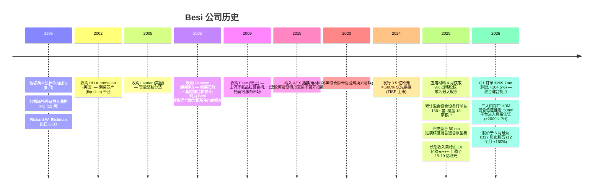
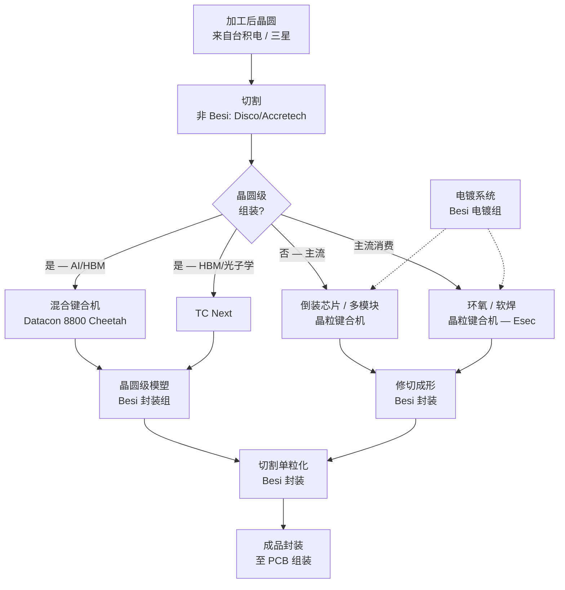
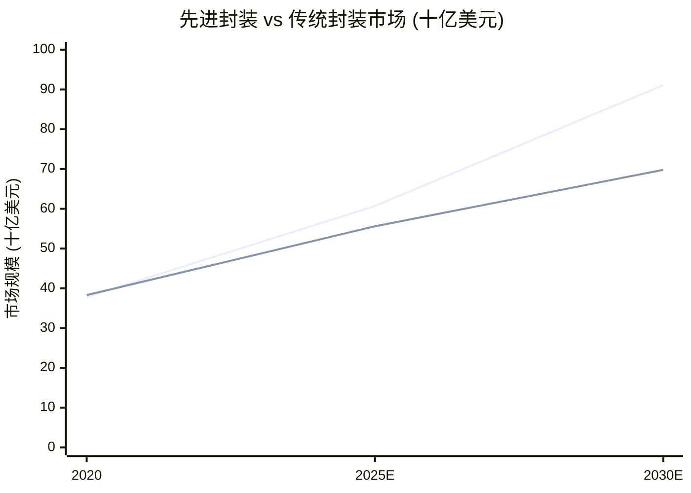
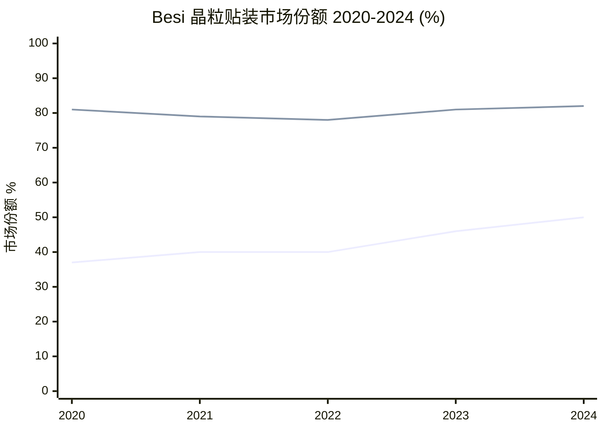
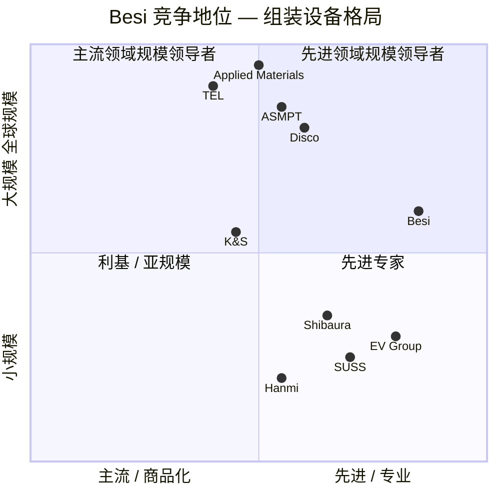
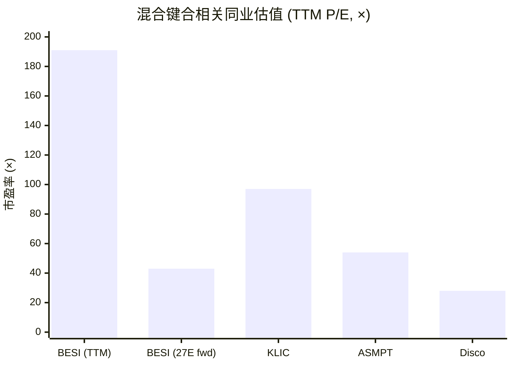
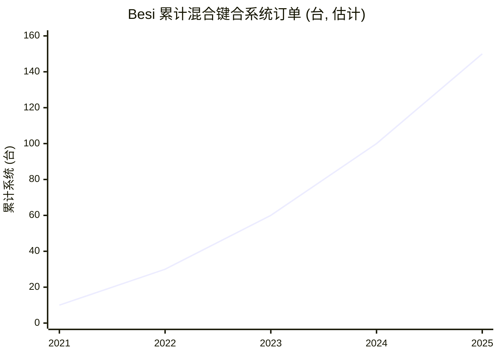

# BE Semiconductor Industries N.V. (AEX:BESI) — 公司研究报告

**股票代码**: `BESI` (泛欧阿姆斯特丹交易所 Euronext Amsterdam) | `BESIY` (一级 ADR, OTC) | ISIN: NL0012866412
**行业**: 半导体设备——先进封装组装 (Advanced Packaging Assembly)
**报告截止日 (as of)**: 2026-06-14
**上市**: 泛欧阿姆斯特丹交易所 (AEX 指数成份股); 注册地与总部位于荷兰 Duiven
**记账货币**: 欧元 (EUR), 按 IFRS 编制; 非美国发行人——不向 SEC/EDGAR 备案, 主文件为 Besi IR 年报与季度新闻稿
**报告语言: 简体中文 (英文版同时存在于本目录)**

> *分析师观点：* **评级：Hold / Neutral（持有 / 中性）· 12 个月目标价 €330（较 2026-06-12 收盘 €317 上行 +4.1%）· 估值方法：2027E 摊薄每股收益（diluted EPS）€7.30 × 45× forward P/E（≈ 32× CY27 EV/EBITDA，介于 GS 33× 与 Nomura 隐含倍数之间）**
> 市值约 €25.1bn / $29bn · 52 周区间 €105.4–€317（现价即新高）· Euronext:BESI · 摊薄股本约 7,975 万股
>
> | 倍数 (*分析师观点*) | FY25A | FY26E | FY27E | FY28E |
> |---|---:|---:|---:|---:|
> | EPS (€, diluted) | 1.66 | 4.66 | 7.30 | 9.28 |
> | P/E (×) | 191 | 68 | **43** | 34 |
> | EV/EBITDA (×, GS) | 48 | 46 | 30 | 24 |
> | 营收 YoY | −2.7% | +74% | +42% | +20% |
>
> *FY26-28E 取 Goldman Sachs 2026-06-11 预测（[GS Europe Tech Hardware, 2026-06-11, p.1](http://xs-macbook-air.local:5001/zsxq/pdf/214528124455211/Goldman%20Sachs-Europe%20Technology%EF%BC%9AHardware%EF%BC%8CUpdating%20estimates%20and%20PTs%20to%20reflect%20recent%20positive%20datapoints-260610.pdf)）作为前瞻锚点；FY25A 来自 [Besi 2025 年报, 第 195 页损益表](https://www.besi.com/fileadmin/data/Investor_Relations/_Semi__Annual_Reports/Annual_Report_2025.pdf)。倍数随 HB 爬坡兑现而快速收缩——这是理解该名的核心。*
>
> **相对表现（截至 2026-06-12 收盘，来源 yfinance）：** BESI 绝对回报 1M +22.8% · 6M +127.1% · YTD +113.9% · 12M +159.9%；基准 AEX 指数同期 +7.0% / +14.6% / +11.7% / +16.2%——相对 AEX 12 个月超额约 **+143.7 pts**（费城半导体指数 ^SOX 12M +161.6%，BESI 与板块同步、但 6M/YTD 大幅领先板块）。
>
> **核心论点（thesis pillars）**——（1）**技术护城河确凿**：Besi 在亚 7µm 先进晶粒贴装份额约 82%、台湾约 100%，混合键合（hybrid bonding）0.7µm 精度 + 双头 2000 UPH 显著领先 ASMPT/Hanmi；（2）**多年需求拐点已现**：2026 Q1 订单 €269.7mn（同比 +104.5%），三大内存厂 HBM 键合验证推进，台积电 SoIC 产能 2025→2027 翻 3 倍；（3）**估值已追平甚至超越卖方**：现价 €317 已高于 GS €315、MS €300，仅低于 Nomura €340——风险回报对称性恶化，这是评级从买入下调为持有的唯一原因；（4）**AMAT 9% 持股**锁定前段/后段集成，隐性阻止 TEL/ASML 进入，但也使 137→191× 的 TTM 倍数在执行偏差时面临 30-50% 回撤风险。

---

## 第一节 — 公司概览

> *分析师观点（一段话投资逻辑）。* Besi 是全球**芯片对芯片 / 芯片对晶圆混合键合 (chip-to-chip / chip-to-wafer hybrid bonding)** 与**先进热压键合 (TC Next, advanced thermo-compression bonding)** 的领导者——这两种组装技术对高带宽内存 (HBM4/5) 堆栈、台积电的 SoIC 3D 封装、共封装光学 (Co-Packaged Optics, CPO) 以及下一代基于小芯片 (chiplet) 的 AI 加速器至关重要。公司占据整体晶粒贴装 (die attach) 设备市场约 50% 份额, 在先进 (<7µm 贴装精度) 晶粒贴装份额约 82%、台湾约 100%, 通过每台 €2-3.5mn 的混合键合设备实现盈利; 2026 Q1 单季订单即达 €269.7mn (同比 +104.5%), 受益于 HBM 与 SoIC 应用扩散。技术与竞争确信度高, 但**估值已经跑完**: 现价 €317 对应 FY25 TTM 市盈率约 191 倍, 即便用 GS 的 2027E EPS €7.30 衡量仍达约 43 倍 forward P/E; 现价已高于 GS (€315) 与 Morgan Stanley (€300) 目标价。因此本报告将评级定为**持有 (Hold)**、目标价 €330 (仅 +4% 空间)——不是看空技术, 而是认为风险回报在此价位已不再具吸引力。详见第 1A 节与第九节。

BE Semiconductor Industries N.V. (Besi) 经营单一业务线: 半导体组装设备的研发、制造、营销、销售与服务, **战略聚焦于 AI 相关逻辑与内存器件的先进封装应用** ([Besi 2025 年报, 第 4 页](https://www.besi.com/fileadmin/data/Investor_Relations/_Semi__Annual_Reports/Annual_Report_2025.pdf))。公司是全球芯片对芯片 / 芯片对晶圆混合键合设备的领导者——自 2022 年以来, 这一组装技术已成为四大 AI 驱动封装结构中前三大的关键使能技术: 台积电的 SoIC 3D 逻辑堆叠、堆叠层数 ≥12 的 HBM4/5 内存堆栈, 以及面向下一代 1.6T 光模块的共封装光学 (CPO) ([Besi 2025 年报, 第 17-20 页](https://www.besi.com/fileadmin/data/Investor_Relations/_Semi__Annual_Reports/Annual_Report_2025.pdf))。

Besi 以三大产品组列报: **晶粒贴装 (Die Attach, 约占 2025 年收入 80%)、封装 (Packaging, 约 17%) 与电镀 (Plating, 约 3%)**, 服务四大终端市场: 计算 (规模最大、增长最快, 由 AI 数据中心建设驱动)、移动、汽车与工业 ([Besi 2025 年报, 第 24-25 页](https://www.besi.com/fileadmin/data/Investor_Relations/_Semi__Annual_Reports/Annual_Report_2025.pdf))。备件与服务代表周期性较弱、不断增长的 15% 收入。公司使命为"成为先进封装应用半导体组装设备的全球领导供应商, 并超越行业平均财务绩效基准" ([Besi 2025 年报, 第 2 页](https://www.besi.com/fileadmin/data/Investor_Relations/_Semi__Annual_Reports/Annual_Report_2025.pdf))。

Besi 于 1995 年 5 月依据荷兰法律注册成立, 同年 12 月在泛欧阿姆斯特丹交易所完成首次公开发行 ([Besi 2025 年报, 第 6 页](https://www.besi.com/fileadmin/data/Investor_Relations/_Semi__Annual_Reports/Annual_Report_2025.pdf))。公司总部位于荷兰 Duiven, 在欧洲 (荷兰、瑞士、奥地利) 与亚洲 (中国、马来西亚、越南) 经营八个研发与生产基地, 加上分布于欧亚北美的 13 个销售与服务办事处。截至 2025 年 12 月 31 日, Besi 拥有 1,856 名固定员工与 108 名临时全职员工, 其中约 66% 位于亚洲、34% 位于欧洲与北美 ([Besi 2025 年报, 第 7 页](https://www.besi.com/fileadmin/data/Investor_Relations/_Semi__Annual_Reports/Annual_Report_2025.pdf))。

### 1.1 五年财务快照与 FY2025 损益结构

Besi 的"钱怎么赚"由一张损益表 Sankey 一目了然: 单一业务线 (半导体组装设备), 三大产品组贡献 €591.3mn 营收, 在 63.3% 的 gross margin (毛利率) 下产生 €374.3mn 毛利, 扣除 €120.2mn SG&A 与 €81.0mn R&D 后剩 €173.1mn operating income (营业利润), 经净财务费用与税后落到 €131.6mn net income (净利润) ([Besi 2025 年报, 第 195 页损益表](https://www.besi.com/fileadmin/data/Investor_Relations/_Semi__Annual_Reports/Annual_Report_2025.pdf))。

<svg xmlns="http://www.w3.org/2000/svg" viewBox="0 0 1000 560" width="1000" height="560" role="img" aria-label="income statement Sankey"><rect x="0" y="0" width="1000" height="560" fill="#ffffff"/>
<text x="20.00" y="30.00" text-anchor="start" font-family="Helvetica,Arial,sans-serif" font-size="15" font-weight="700" fill="#1f2933">Besi FY2025 损益表 Sankey (€ mn)</text>
<path d="M 204.00,64.04 C 258.00,64.04 258.00,78.04 312.00,78.04 L 312.00,416.33 C 258.00,416.33 258.00,402.33 204.00,402.33 Z" fill="#93c5fd" fill-opacity="0.55"/>
<path d="M 452.00,71.00 C 506.00,71.00 506.00,148.46 560.00,148.46 L 560.00,271.97 C 506.00,271.97 506.00,194.52 452.00,194.52 Z" fill="#86efac" fill-opacity="0.55"/>
<path d="M 452.00,194.52 C 506.00,194.52 506.00,285.97 560.00,285.97 L 560.00,429.54 C 506.00,429.54 506.00,338.09 452.00,338.09 Z" fill="#fca5a5" fill-opacity="0.55"/>
<path d="M 328.00,78.04 C 382.00,78.04 382.00,71.00 436.00,71.00 L 436.00,338.09 C 382.00,338.09 382.00,345.12 328.00,345.12 Z" fill="#86efac" fill-opacity="0.55"/>
<path d="M 328.00,345.12 C 382.00,345.12 382.00,352.09 436.00,352.09 L 436.00,507.00 C 382.00,507.00 382.00,500.04 328.00,500.04 Z" fill="#fca5a5" fill-opacity="0.55"/>
<path d="M 700.00,148.31 C 754.00,148.31 754.00,227.09 808.00,227.09 L 808.00,321.00 C 754.00,321.00 754.00,242.21 700.00,242.21 Z" fill="#86efac" fill-opacity="0.55"/>
<path d="M 700.00,242.21 C 754.00,242.21 754.00,335.00 808.00,335.00 L 808.00,350.91 C 754.00,350.91 754.00,258.12 700.00,258.12 Z" fill="#fca5a5" fill-opacity="0.55"/>
<path d="M 576.00,148.46 C 630.00,148.46 630.00,148.31 684.00,148.31 L 684.00,271.82 C 630.00,271.82 630.00,271.97 576.00,271.97 Z" fill="#86efac" fill-opacity="0.55"/>
<path d="M 576.00,285.97 C 630.00,285.97 630.00,272.12 684.00,272.12 L 684.00,357.89 C 630.00,357.89 630.00,371.74 576.00,371.74 Z" fill="#fca5a5" fill-opacity="0.55"/>
<path d="M 576.00,371.74 C 630.00,371.74 630.00,371.89 684.00,371.89 L 684.00,429.69 C 630.00,429.69 630.00,429.54 576.00,429.54 Z" fill="#fca5a5" fill-opacity="0.55"/>
<path d="M 204.00,416.33 C 258.00,416.33 258.00,416.33 312.00,416.33 L 312.00,487.05 C 258.00,487.05 258.00,487.05 204.00,487.05 Z" fill="#93c5fd" fill-opacity="0.55"/>
<path d="M 204.00,501.05 C 258.00,501.05 258.00,487.05 312.00,487.05 L 312.00,499.96 C 258.00,499.96 258.00,513.96 204.00,513.96 Z" fill="#93c5fd" fill-opacity="0.55"/>
<rect x="188.00" y="64.04" width="16" height="338.30" rx="1.5" fill="#2563eb"/>
<rect x="188.00" y="416.33" width="16" height="70.71" rx="1.5" fill="#2563eb"/>
<rect x="188.00" y="501.05" width="16" height="12.92" rx="1.5" fill="#2563eb"/>
<rect x="312.00" y="78.04" width="16" height="421.93" rx="1.5" fill="#1e3a8a"/>
<rect x="436.00" y="71.00" width="16" height="267.09" rx="1.5" fill="#15803d"/>
<rect x="436.00" y="352.09" width="16" height="154.91" rx="1.5" fill="#dc2626"/>
<rect x="560.00" y="148.46" width="16" height="123.52" rx="1.5" fill="#15803d"/>
<rect x="560.00" y="285.97" width="16" height="143.57" rx="1.5" fill="#dc2626"/>
<rect x="684.00" y="148.31" width="16" height="109.82" rx="1.5" fill="#15803d"/>
<rect x="684.00" y="272.12" width="16" height="85.77" rx="1.5" fill="#dc2626"/>
<rect x="684.00" y="371.89" width="16" height="57.80" rx="1.5" fill="#dc2626"/>
<rect x="808.00" y="227.09" width="16" height="93.90" rx="1.5" fill="#15803d"/>
<rect x="808.00" y="335.00" width="16" height="15.91" rx="1.5" fill="#dc2626"/>
<line x1="188.00" y1="233.19" x2="182.00" y2="212.68" stroke="#cbd5e1" stroke-width="1"/>
<text x="179.00" y="215.68" text-anchor="end" font-family="Helvetica,Arial,sans-serif" font-size="11.5" font-weight="700" fill="#1f2933">Die Attach</text>
<text x="179.00" y="228.68" text-anchor="end" font-family="Helvetica,Arial,sans-serif" font-size="10" font-weight="400" fill="#52606d">€474.1M  (80.2%)</text>
<line x1="188.00" y1="451.69" x2="182.00" y2="431.19" stroke="#cbd5e1" stroke-width="1"/>
<text x="179.00" y="434.19" text-anchor="end" font-family="Helvetica,Arial,sans-serif" font-size="11.5" font-weight="700" fill="#1f2933">Packaging</text>
<text x="179.00" y="447.19" text-anchor="end" font-family="Helvetica,Arial,sans-serif" font-size="10" font-weight="400" fill="#52606d">€99.1M  (16.8%)</text>
<line x1="188.00" y1="507.51" x2="182.00" y2="487.00" stroke="#cbd5e1" stroke-width="1"/>
<text x="179.00" y="490.00" text-anchor="end" font-family="Helvetica,Arial,sans-serif" font-size="11.5" font-weight="700" fill="#1f2933">Plating</text>
<text x="179.00" y="503.00" text-anchor="end" font-family="Helvetica,Arial,sans-serif" font-size="10" font-weight="400" fill="#52606d">€18.1M  (3.1%)</text>
<rect x="331.00" y="60.04" width="113.10" height="26" rx="2" fill="#ffffff" fill-opacity="0.72"/>
<text x="334.00" y="72.04" text-anchor="start" font-family="Helvetica,Arial,sans-serif" font-size="11.5" font-weight="700" fill="#1f2933">Revenue</text>
<text x="334.00" y="85.04" text-anchor="start" font-family="Helvetica,Arial,sans-serif" font-size="10" font-weight="400" fill="#52606d">€591.3M  (100.0%)</text>
<rect x="455.00" y="53.00" width="106.80" height="26" rx="2" fill="#ffffff" fill-opacity="0.72"/>
<text x="458.00" y="65.00" text-anchor="start" font-family="Helvetica,Arial,sans-serif" font-size="11.5" font-weight="700" fill="#1f2933">Gross Profit</text>
<text x="458.00" y="78.00" text-anchor="start" font-family="Helvetica,Arial,sans-serif" font-size="10" font-weight="400" fill="#52606d">€374.3M  (63.3%)</text>
<rect x="455.00" y="334.09" width="144.60" height="26" rx="2" fill="#ffffff" fill-opacity="0.72"/>
<text x="458.00" y="346.09" text-anchor="start" font-family="Helvetica,Arial,sans-serif" font-size="11.5" font-weight="700" fill="#1f2933">Cost of Revenue (COGS)</text>
<text x="458.00" y="359.09" text-anchor="start" font-family="Helvetica,Arial,sans-serif" font-size="10" font-weight="400" fill="#52606d">€217.1M  (36.7%)</text>
<rect x="579.00" y="130.46" width="106.80" height="26" rx="2" fill="#ffffff" fill-opacity="0.72"/>
<text x="582.00" y="142.46" text-anchor="start" font-family="Helvetica,Arial,sans-serif" font-size="11.5" font-weight="700" fill="#1f2933">Operating Income</text>
<text x="582.00" y="155.46" text-anchor="start" font-family="Helvetica,Arial,sans-serif" font-size="10" font-weight="400" fill="#52606d">€173.1M  (29.3%)</text>
<rect x="579.00" y="267.97" width="150.90" height="26" rx="2" fill="#ffffff" fill-opacity="0.72"/>
<text x="582.00" y="279.97" text-anchor="start" font-family="Helvetica,Arial,sans-serif" font-size="11.5" font-weight="700" fill="#1f2933">Total Operating Expense</text>
<text x="582.00" y="292.97" text-anchor="start" font-family="Helvetica,Arial,sans-serif" font-size="10" font-weight="400" fill="#52606d">€201.2M  (34.0%)</text>
<rect x="703.00" y="130.31" width="106.80" height="26" rx="2" fill="#ffffff" fill-opacity="0.72"/>
<text x="706.00" y="142.31" text-anchor="start" font-family="Helvetica,Arial,sans-serif" font-size="11.5" font-weight="700" fill="#1f2933">Pretax Income</text>
<text x="706.00" y="155.31" text-anchor="start" font-family="Helvetica,Arial,sans-serif" font-size="10" font-weight="400" fill="#52606d">€153.9M  (26.0%)</text>
<rect x="703.00" y="254.12" width="106.80" height="26" rx="2" fill="#ffffff" fill-opacity="0.72"/>
<text x="706.00" y="266.12" text-anchor="start" font-family="Helvetica,Arial,sans-serif" font-size="11.5" font-weight="700" fill="#1f2933">SG&amp;A</text>
<text x="706.00" y="279.12" text-anchor="start" font-family="Helvetica,Arial,sans-serif" font-size="10" font-weight="400" fill="#52606d">€120.2M  (20.3%)</text>
<rect x="703.00" y="353.89" width="100.50" height="26" rx="2" fill="#ffffff" fill-opacity="0.72"/>
<text x="706.00" y="365.89" text-anchor="start" font-family="Helvetica,Arial,sans-serif" font-size="11.5" font-weight="700" fill="#1f2933">R&amp;D</text>
<text x="706.00" y="378.89" text-anchor="start" font-family="Helvetica,Arial,sans-serif" font-size="10" font-weight="400" fill="#52606d">€81.0M  (13.7%)</text>
<text x="833.00" y="271.04" text-anchor="start" font-family="Helvetica,Arial,sans-serif" font-size="11.5" font-weight="700" fill="#1f2933">Net Income</text>
<text x="833.00" y="284.04" text-anchor="start" font-family="Helvetica,Arial,sans-serif" font-size="10" font-weight="400" fill="#52606d">€131.6M  (22.3%)</text>
<text x="833.00" y="339.95" text-anchor="start" font-family="Helvetica,Arial,sans-serif" font-size="11.5" font-weight="700" fill="#1f2933">Income Tax</text>
<text x="833.00" y="352.95" text-anchor="start" font-family="Helvetica,Arial,sans-serif" font-size="10" font-weight="400" fill="#52606d">€22.3M  (3.8%)</text>
<text x="500.00" y="530.00" text-anchor="middle" font-family="Helvetica,Arial,sans-serif" font-size="10" font-weight="400" font-style="italic" fill="#8a97a3">毛利率 63.3% · 营业利润率 29.3% · 净利率 22.3%</text>
<text x="500.00" y="544.00" text-anchor="middle" font-family="Helvetica,Arial,sans-serif" font-size="10" font-weight="400" fill="#52606d">Source: Besi 2025 年报 (IFRS, € mn) — 第 193-196 页, 第 195 页损益表 + 第 222 页分部</text>
</svg>

*图 1: Besi FY2025 损益表资金流。Die Attach 占营收 80.2%; 13.7% 的 R&D 强度是穿越下行周期延续混合键合领先的有意识反周期投入。来源: [Besi 2025 年报, 第 195 页 (损益表) + 第 222 页 (分部收入)](https://www.besi.com/fileadmin/data/Investor_Relations/_Semi__Annual_Reports/Annual_Report_2025.pdf)。*

| (百万欧元, 财年) | 2021 | 2022 | 2023 | 2024 | 2025 |
|---|---:|---:|---:|---:|---:|
| 营业收入 | 749.3 | 722.9 | 578.9 | 607.5 | **591.3** |
| 订单 | 939.1 | 663.7 | 548.3 | 586.7 | **685.0** |
| 营业利润 | 317.6 | 294.1 | 213.4 | 195.6 | **173.1** |
| 毛利率 | 59.6% | 61.3% | 64.9% | 65.2% | **63.3%** |
| 营业利润率 | 42.4% | 40.7% | 36.9% | 32.2% | **29.3%** |
| 净利润 | 282.4 | 240.6 | 177.1 | 182.0 | **131.6** |
| 摊薄每股收益 (欧元) | 3.39 | 2.90 | 2.23 | 2.30 | **1.66** |
| R&D (净额) | 36.4 | 53.9 | 56.4 | 74.3 | **81.0** |
| R&D 占收入比 | 4.9% | 7.5% | 9.7% | 12.2% | **13.7%** |
| 净现金 | 370.4 | 346.5 | 113.0 | 143.8 | **36.0** |
| 平均股本回报率 (ROE) | 57.0% | 38.6% | 33.7% | 39.4% | **28.7%** |

*来源: [Besi 2025 年报——关键指标, 第 7 页](https://www.besi.com/fileadmin/data/Investor_Relations/_Semi__Annual_Reports/Annual_Report_2025.pdf)。*

五年财务史揭示出 Besi 作为高利润率周期性工业企业的特征: 营业收入从 2021 年的周期高点至 2023 年下滑 21%, 期间后疫情时代的移动 / 汽车修正在组装设备市场逐步消化; 2024 与 2025 年企稳于 5.80-6.10 亿欧元区间, 同时订单在 2025 年重新加速至 6.85 亿欧元 (订单出货比 1.16×), 这背后是 AI 数据中心与光子学需求所驱动。下行周期中, 毛利率始终维持在 63-65% 区间——这是混合键合与 TC Next 的技术溢价并未被商品化的关键信号 ([Besi 2025 年报, 致股东函, 第 13-15 页](https://www.besi.com/fileadmin/data/Investor_Relations/_Semi__Annual_Reports/Annual_Report_2025.pdf))。

### 1.2 估值快照

截至 2026 年 6 月 12 日收盘, BESI 报价 **€317 / 股**, 市值约 **€25.1bn**, 现价即 52 周新高 (52 周区间 €105.4–€317) ([yfinance BESI.AS, 2026-06-12](https://finance.yahoo.com/quote/BESI.AS/))。过去 12 个月股价回报约 **+159.9%**, 大幅跑赢 AEX 指数 (+16.2%)。2025 年末股价为 €133.75 (市值约 €106bn 摊薄前), 即当前市值有超过一半在 2026 年前五个半月内累积——投资者在 2025 Q4 与 2026 Q1 订单同比连续 +100% 后, 对公司的 AI 混合键合期权价值进行了剧烈重估 ([Besi Q1-26 业绩新闻稿, 2026-04-23](https://www.besi.com/investor-relations/press-releases/details/be-semiconductor-industries-nv-announces-q1-26-results/))。

| 倍数 | BESI | 同业中位数 | 注释 |
|---|---:|---:|---|
| TTM 市盈率 (P/E) | **~191×** | ~54× | FY25 摊薄 EPS €1.66 上的当前价; 为其 10 年中位数 (~27×) 的 7 倍 ([GuruFocus](https://www.gurufocus.com/term/pe-ratio/XAMS:BESI)) |
| Forward P/E (2027E) | **~43×** | n/a | GS 2027E EPS €7.30 上的现价——倍数随 HB 爬坡兑现而收缩 ([GS, 2026-06-11](http://xs-macbook-air.local:5001/zsxq/pdf/214528124455211/Goldman%20Sachs-Europe%20Technology%EF%BC%9AHardware%EF%BC%8CUpdating%20estimates%20and%20PTs%20to%20reflect%20recent%20positive%20datapoints-260610.pdf)) |
| TTM 市销率 (P/S) | **~42×** | ~3-5× | 硬件收入获得软件般的倍数; €25.1bn ÷ €591.3mn ([CompaniesMarketCap](https://companiesmarketcap.com/be-semiconductor/ps-ratio/)) |
| EV/EBITDA (CY27E, GS) | **30×** | n/a | GS 估值锚 ([GS BESI 路演纪要, 2026-05-28](http://xs-macbook-air.local:5001/zsxq/pdf/585412224511584/Goldman%20Sachs-BE%20Semiconductor%20Industries%20%EF%BC%88BESI.AS%EF%BC%89%EF%BC%9A%20Key%20takeaways%20from%20Netherlands%20roadshow-260528.pdf)) |
| 股息率 | ~0.5% | ~1-2% | FY25 宣派 €1.58/股股息; 派息率约 95% ([Besi 2025 年报, 第 16 页](https://www.besi.com/fileadmin/data/Investor_Relations/_Semi__Annual_Reports/Annual_Report_2025.pdf)) |
| 净现金 | €36mn | n/a | FY25 派息 €172.8mn + 回购 €82.0mn 后 ([Besi 2025 年报, 第 196 页现金流量表](https://www.besi.com/fileadmin/data/Investor_Relations/_Semi__Annual_Reports/Annual_Report_2025.pdf)) |

**~191× 市盈率的解读。** 当前 TTM 倍数极度拉伸 (是 10 年中位数的约 7 倍), 但在一家订单簿同比 +100% 的单一业务 AI 基础设施龙头语境下, 仅看 TTM 是误导性的——市场定价的是 2027/2028 盈利。三股力量交汇: (i) GS 预测 2027E EPS €7.30、2028E €9.28, 现价对应的 forward P/E 因此快速从 191× 收缩至约 43× (2027E)、34× (2028E) ([GS Europe Tech Hardware, 2026-06-11](http://xs-macbook-air.local:5001/zsxq/pdf/214528124455211/Goldman%20Sachs-Europe%20Technology%EF%BC%9AHardware%EF%BC%8CUpdating%20estimates%20and%20PTs%20to%20reflect%20recent%20positive%20datapoints-260610.pdf)); (ii) Besi 仅约 7,975 万摊薄股本 ([Besi 2025 年报, 第 195 页](https://www.besi.com/fileadmin/data/Investor_Relations/_Semi__Annual_Reports/Annual_Report_2025.pdf)), AMAT 2025 年 4 月购入 9% 股权后流通盘进一步缩小 ([应用材料新闻稿, 2025-04-14](https://ir.appliedmaterials.com/news-releases/news-release-details/applied-materials-announces-strategic-investment-be)), 需求脉冲跑赢供给; (iii) 2023-2025 下行周期中毛利率维持 63-65% 表明定价锚定结构性更高的长期盈利。**但与一个月前的差别在于: 现价 €317 已经跑过了大多数卖方目标价 (GS €315、MS €300, 仅 Nomura €340 仍在上方)。** 风险回报已转为对称偏下: 若 2026 H2 订单不及预期或 AI 资本开支暂停, 此倍数将剧烈回吐 (详见第九节风险 1)。

---

## 第 1A 节 — 估值与目标价（决策层）

> *本节全部为分析师前瞻观点（`*分析师观点：*`）; 每个预测单元均为本方模型, 不附财报引用; 各驱动因子的外部依据在文中分别引用。*

### 1A.1 前瞻财务模型（FY25A–FY28E）

下表前瞻列 (FY26E–FY28E) 以 **Goldman Sachs 2026-06-11 预测**为锚点 ([GS Europe Tech Hardware, 2026-06-11](http://xs-macbook-air.local:5001/zsxq/pdf/214528124455211/Goldman%20Sachs-Europe%20Technology%EF%BC%9AHardware%EF%BC%8CUpdating%20estimates%20and%20PTs%20to%20reflect%20recent%20positive%20datapoints-260610.pdf)); FY25A 为年报披露值 ([Besi 2025 年报, 第 195 页](https://www.besi.com/fileadmin/data/Investor_Relations/_Semi__Annual_Reports/Annual_Report_2025.pdf))。该路径的两条业务线 (混合键合 / TC Next 高速爬坡 + 主流晶粒贴装周期复苏) 在第八节自下而上拆分。

| 指标 (*分析师观点*) | FY25A | FY26E | FY27E | FY28E | 25-28 CAGR |
|---|---:|---:|---:|---:|---:|
| 营收 (€ mn) | 591.3 | 1,031.3 | 1,459.5 | 1,753.1 | +43.7% |
| — YoY % | −2.7% | +74.4% | +41.5% | +20.1% | |
| 毛利率 (gross margin) | 63.3% | ~65% | ~66% | ~66% | |
| EBIT (€ mn) | 173.1 | 439.3 | 677.2 | 849.6 | |
| — 营业利润率 | 29.3% | 42.6% | 46.4% | 48.5% | |
| 摊薄 EPS (€) | 1.66 | 4.66 | 7.30 | 9.28 | +77.4% |
| ROE (近似) | 28.7% | ~50% | ~55% | ~55% | |
| EV/EBITDA (×, GS) | 48.1 | 46.3 | 30.3 | 23.8 | |
| FCF yield (%, GS) | ~1% | ~1% | ~2% | ~3% | |
| 净现金 (€ mn) | 36 | ~150 | ~450 | ~900 | |

*来源: FY25A 来自 [Besi 2025 年报, 第 195-196 页](https://www.besi.com/fileadmin/data/Investor_Relations/_Semi__Annual_Reports/Annual_Report_2025.pdf); FY26-28E 与 EV/EBITDA、FCF yield 来自 [GS BESI 路演纪要预测表, 2026-05-28, p.3](http://xs-macbook-air.local:5001/zsxq/pdf/585412224511584/Goldman%20Sachs-BE%20Semiconductor%20Industries%20%EF%BC%88BESI.AS%EF%BC%89%EF%BC%9A%20Key%20takeaways%20from%20Netherlands%20roadshow-260528.pdf)。本方采纳 GS 数列作为基础情形——管理层 €1.5-1.9bn 长期收入目标 (年报第 14 页) 与该路径在约 2029 年交汇。*

**利润率桥 (margin bridge)。** FY25 营业利润率从 FY24 的 32.2% 降至 29.3% (−290bps), 主要驱动 = 上半年美元相对欧元贬值约 12% 拖累毛利率约 −190bps ([Besi 2025 年报, 致股东函, 第 15 页](https://www.besi.com/fileadmin/data/Investor_Relations/_Semi__Annual_Reports/Annual_Report_2025.pdf)) + R&D 强度从 12.2% 升至 13.7% 的约 −150bps 反周期投入 ([Besi 2025 年报, 第 7 页](https://www.besi.com/fileadmin/data/Investor_Relations/_Semi__Annual_Reports/Annual_Report_2025.pdf)), 部分被规模效应抵消。*分析师观点:* FY26-28 营业利润率回升至 42-49% 的主因是营收翻倍带来的经营杠杆 (固定 R&D/SG&A 摊薄) 叠加高 ASP 混合键合占比上升, 而非毛利率扩张——毛利率假设仅小幅升至约 66%。

### 1A.2 目标价推导（show the arithmetic）

本方采用 **forward-P/E × 目标倍数**法: **2027E 摊薄 EPS €7.30 × 45× = €330**。45× 的倍数选择依据 (justify the multiple): (i) 对标 Nomura 对 BESI 用的 55× 2027F EPS (偏激进) 与 GS 隐含的约 40-43× (33× CY27 EV/EBITDA 折算), 取中值; (ii) 对标同业——Kulicke & Soffa (KLIC) TTM 约 97×、Disco (6146) 约 28×——Besi 的 45× forward 介于"向 HB 转型的引线键合商"与"成熟晶圆制备专家"之间, 由 +77% 的 2025-28 EPS CAGR 支撑; (iii) 等同于约 32× CY27 EV/EBITDA, 较 GS 的 33× 略保守。

> *分析师观点:* €330 目标价隐含较 €317 现价仅 **+4.1%** 空间。这正是本方将评级定为 **Hold/Neutral** 的算术原因: 在现价, 即使采用接近 Nomura 的乐观倍数, 上行空间也已被股价消化殆尽。

### 1A.3 牛 / 基准 / 熊情景

| 情景 (*分析师观点*) | 关键假设 | 目标价 | 较现价 €317 |
|---|---|---:|---:|
| 牛 (Bull) | HB 渗透走高位情景, 2027E EPS 上修至 €8.0, 维持 50× | **€400** | +26% |
| 基准 (Base) | GS 中性估计, 2027E EPS €7.30 × 45× | **€330** | +4% |
| 熊 (Bear) | AI 资本开支暂停, 2026 H2 订单走弱, 倍数 de-rate 至 30× × 2027E €6.0 | **€180** | −43% |

熊市情景的 −43% 与牛市 +26% 的不对称性, 是"技术正确但价格已满"的典型形态: 下行尾部 (倍数压缩) 远大于剩余上行。

### 1A.4 卖方观点演变（Sell-side view evolution）

机械预读 `db/stock_price_target.db` (只读) 显示三家机构覆盖 BESI, 目标价区间 €300–€340, 离散度约 13%, 中位约 €315——全部为 **Buy/Overweight**, 无看空者。值得注意: **现价 €317 已位于该区间中上部**, 仅 Nomura €340 仍在上方。

**按机构的观点时间线:**

| 机构 | 日期 | 评级 / 目标价 | 报告日股价 → 隐含空间 | 估值基准 / 核心论点 |
|---|---|---|---:|---|
| Morgan Stanley | 2026-05-19 | Overweight / €300 | €254.9 → +17.7% | CPO 机会 + GPU/HBM 键合顺风 ([MS 欧洲半导体 SOIT/Besi CPO, 2026-05-19](http://xs-macbook-air.local:5001/zsxq/pdf/415242218224228/Morgan%20Stanley-Technology%20~%20European%20Semiconductors%EF%BC%88SOIT.PA%EF%BC%89Framing%20the%20CPO%20opportunity%20for%20Soitec%20and%20Besi-260519.pdf)) |
| Nomura | 2026-05-21 | Buy / €340 | €270.4 → +25.7% | 2027F EPS €6.1 × 55× PE; HB 工具领导者; 台积电 SoIC 10k→30k wpm ([Nomura 大中华区半导体, 2026-05-21](http://xs-macbook-air.local:5001/zsxq/pdf/184121852855252/Nomura-Greater%20China%20Semi%EF%BC%9AA%20guide%20to%20Semi%20renaissance%20in%202026~30F-260521.pdf)) |
| Goldman Sachs | 2026-05-28 | Buy / €286 | €276.4 → +3.5% | 31× CY27 EV/EBITDA; 三大内存厂 HBM 验证; 台湾约 100% 份额 ([GS BESI 荷兰路演纪要, 2026-05-28](http://xs-macbook-air.local:5001/zsxq/pdf/585412224511584/Goldman%20Sachs-BE%20Semiconductor%20Industries%20%EF%BC%88BESI.AS%EF%BC%89%EF%BC%9A%20Key%20takeaways%20from%20Netherlands%20roadshow-260528.pdf)) |
| **Goldman Sachs（上调）** | **2026-06-11** | **Buy / €315（前次 €286）** | — | **PT 上调至 €315**, 基于 33× (前 31×) CY27 EV/EBITDA; FY27-30 营收预测上调约 3% (主流需求更乐观) ([GS Europe Tech Hardware, 2026-06-11](http://xs-macbook-air.local:5001/zsxq/pdf/214528124455211/Goldman%20Sachs-Europe%20Technology%EF%BC%9AHardware%EF%BC%8CUpdating%20estimates%20and%20PTs%20to%20reflect%20recent%20positive%20datapoints-260610.pdf)) |

**自我修正 (self-revision) 重点:** Goldman Sachs 在 2 周内 (05-28 → 06-11) 将 BESI 目标价从 €286 上调至 €315, 触发因素是对 Besi 主流晶粒贴装需求的更积极看法 (FY27-30 营收 +3%) 与 CY27 EV/EBITDA 倍数从 31× 提至 33×——属"估值倍数 + 盈利双升", 而非纯盈利驱动。

**机构间分歧 (机构间分歧表):**

| 机构 | 日期 | 评级 / 目标价 | 核心论点 | 什么证据能证伪 |
|---|---|---|---|---|
| Nomura | 2026-05-21 | Buy / €340 | HB 工具份额结构性领先, 55× 2027F EPS 合理 | 2026 H2 HB 订单转化率不及预期 |
| Goldman Sachs | 2026-06-11 | Buy / €315 | 主流需求复苏 + HB 验证推进 | 美元持续走弱压缩毛利率; 竞品产线就绪加快 |
| Morgan Stanley | 2026-05-19 | OW / €300 | CPO 为关键增量, 但相对谨慎 | CPO 量产时点延后至 2027 年后 |

*分析师观点:* 三家卖方均看多, 但本方现价 €317 已**高于其中两家目标价**——这恰恰是本报告给出 Hold 而非 Buy 的核心证据。本方 €330 目标价位于 GS €315 与 Nomura €340 之间, 偏向"价已基本反映"的判断。

---

## 第 1B 节 — GF Score（GuruFocus 风格基本面评分）

> *分析师观点：* **GF Score (GuruFocus 风格): 79/100 — 中上 (71–80 区间, 历史上对应平均偏上的相对表现)。** 注: 该分数为本方按公开方法复算的评分, 非 GuruFocus 官方发布数字。

<svg xmlns="http://www.w3.org/2000/svg" viewBox="0 0 500 500" width="500" height="500" role="img" aria-label="GF Score radar">
<rect x="0" y="0" width="500" height="500" fill="#ffffff"/>
<text x="20" y="24" font-family="Helvetica,Arial,sans-serif" font-size="15" font-weight="700" fill="#1f2933">GF Score (GuruFocus-style): 79/100</text>
<text x="20" y="41" font-family="Helvetica,Arial,sans-serif" font-size="11" fill="#52606d">71–80 Likely average performance</text>
<polygon points="250.0,88.0 392.7,191.6 338.2,359.4 161.8,359.4 107.3,191.6" fill="#e9f5ec" stroke="none"/>
<polygon points="250.0,208.0 278.5,228.7 267.6,262.3 232.4,262.3 221.5,228.7" fill="none" stroke="#c5d3cb" stroke-width="1"/>
<polygon points="250.0,178.0 307.1,219.5 285.3,286.5 214.7,286.5 192.9,219.5" fill="none" stroke="#c5d3cb" stroke-width="1"/>
<polygon points="250.0,148.0 335.6,210.2 302.9,310.8 197.1,310.8 164.4,210.2" fill="none" stroke="#c5d3cb" stroke-width="1"/>
<polygon points="250.0,118.0 364.1,200.9 320.5,335.1 179.5,335.1 135.9,200.9" fill="none" stroke="#c5d3cb" stroke-width="1"/>
<polygon points="250.0,88.0 392.7,191.6 338.2,359.4 161.8,359.4 107.3,191.6" fill="none" stroke="#c5d3cb" stroke-width="1.3"/>
<line x1="250" y1="238" x2="161.8" y2="359.4" stroke="#cfdad3" stroke-width="1"/>
<text x="146.5" y="392.4" text-anchor="end" font-family="Helvetica,Arial,sans-serif" font-size="11.5" font-weight="600" fill="#1f2933">Financial Strength</text>
<text x="146.5" y="405.4" text-anchor="end" font-family="Helvetica,Arial,sans-serif" font-size="9.5" fill="#52606d">财务实力</text>
<text x="183.9" y="323.0" text-anchor="middle" font-family="Helvetica,Arial,sans-serif" font-size="10.5" font-weight="700" fill="#1f2933">7.5</text>
<line x1="250" y1="238" x2="250.0" y2="88.0" stroke="#cfdad3" stroke-width="1"/>
<text x="250.0" y="58.0" text-anchor="middle" font-family="Helvetica,Arial,sans-serif" font-size="11.5" font-weight="600" fill="#1f2933">Profitability</text>
<text x="250.0" y="71.0" text-anchor="middle" font-family="Helvetica,Arial,sans-serif" font-size="9.5" fill="#52606d">盈利能力</text>
<text x="250.0" y="89.5" text-anchor="middle" font-family="Helvetica,Arial,sans-serif" font-size="10.5" font-weight="700" fill="#1f2933">9.5</text>
<line x1="250" y1="238" x2="107.3" y2="191.6" stroke="#cfdad3" stroke-width="1"/>
<text x="82.6" y="183.6" text-anchor="end" font-family="Helvetica,Arial,sans-serif" font-size="11.5" font-weight="600" fill="#1f2933">Growth</text>
<text x="82.6" y="196.6" text-anchor="end" font-family="Helvetica,Arial,sans-serif" font-size="9.5" fill="#52606d">成长性</text>
<text x="121.6" y="190.3" text-anchor="middle" font-family="Helvetica,Arial,sans-serif" font-size="10.5" font-weight="700" fill="#1f2933">9</text>
<line x1="250" y1="238" x2="392.7" y2="191.6" stroke="#cfdad3" stroke-width="1"/>
<text x="417.4" y="183.6" text-anchor="start" font-family="Helvetica,Arial,sans-serif" font-size="11.5" font-weight="600" fill="#1f2933">GF Value</text>
<text x="417.4" y="196.6" text-anchor="start" font-family="Helvetica,Arial,sans-serif" font-size="9.5" fill="#52606d">估值</text>
<text x="278.5" y="222.7" text-anchor="middle" font-family="Helvetica,Arial,sans-serif" font-size="10.5" font-weight="700" fill="#1f2933">2</text>
<line x1="250" y1="238" x2="338.2" y2="359.4" stroke="#cfdad3" stroke-width="1"/>
<text x="353.5" y="392.4" text-anchor="start" font-family="Helvetica,Arial,sans-serif" font-size="11.5" font-weight="600" fill="#1f2933">Momentum</text>
<text x="353.5" y="405.4" text-anchor="start" font-family="Helvetica,Arial,sans-serif" font-size="9.5" fill="#52606d">动量</text>
<text x="338.2" y="353.4" text-anchor="middle" font-family="Helvetica,Arial,sans-serif" font-size="10.5" font-weight="700" fill="#1f2933">10</text>
<polygon points="250.0,95.5 278.5,228.7 338.2,359.4 183.9,329.0 121.6,196.3" fill="#2e8b57" fill-opacity="0.34" stroke="#2e8b57" stroke-width="2"/>
<circle cx="183.9" cy="329.0" r="2.6" fill="#2e8b57"/>
<circle cx="250.0" cy="95.5" r="2.6" fill="#2e8b57"/>
<circle cx="121.6" cy="196.3" r="2.6" fill="#2e8b57"/>
<circle cx="278.5" cy="228.7" r="2.6" fill="#2e8b57"/>
<circle cx="338.2" cy="359.4" r="2.6" fill="#2e8b57"/>
<text x="250" y="470" text-anchor="middle" font-family="Helvetica,Arial,sans-serif" font-size="9.5" fill="#52606d">Source: Besi 2025 年报 + GS/Nomura 估计 + yfinance/indicators.db, as of 2026-06-14</text>
<text x="250" y="485" text-anchor="middle" font-family="Helvetica,Arial,sans-serif" font-size="9" fill="#52606d">GF Score = independent analyst rubric (*Analyst view:*) — not GuruFocus™ official number</text>
</svg>

| 维度 / Dimension | 评分 / Score (0–10) | |
|---|---|---|
| Financial Strength (财务实力) | 7.5 | `████████░░` |
| Profitability (盈利能力) | 9.5 | `██████████` |
| Growth (成长性) | 9 | `█████████░` |
| GF Value (估值) | 2 | `██░░░░░░░░` |
| Momentum (动量) | 10 | `██████████` |
| **GF Score (composite, *Analyst view:*)** | **79 / 100** | **71–80 Likely average performance** |

*Composite weights (*Analyst view:*): Financial Strength 20% · Profitability 25% · Growth 25% · GF Value 15% · Momentum 15% (transparent reproduction — not GuruFocus's proprietary weighting).*

*读图: 离中心越远越好; 五边形越大综合分越高。*

| 维度 / Dimension | 评分 (0–10) | 说明 |
|---|---:|---|
| Financial Strength (财务实力) | 7.5 | 净现金 €36mn、总债务 €507mn 被 €543mn 现金+存款覆盖, 但高派息率压缩缓冲 |
| Profitability (盈利能力) | 9.5 | 63.3% 毛利率、29.3% 营业利润率、28.7% ROE——同业顶尖 |
| Growth (成长性) | 9.0 | FY26-28E 营收 CAGR +44%、EPS CAGR +77% (GS) |
| GF Value (估值) | 2.0 | TTM P/E ~191×、forward 43×, 远高于历史与同业——*越低越贵* |
| Momentum (动量) | 10.0 | 12M +159.9%、相对 AEX 超额 +143.7 pts |
| **综合 (composite)** | **79/100** | 71–80 区间 |

**各维度评分理由:**

- **Financial Strength 7.5。** 资产负债表稳健但非堡垒级: FY25 末净现金仅 €36mn (现金+存款 €543mn 减总债务 €507mn), 因为 €172.8mn 股息 + €82.0mn 回购消耗了几乎全部经营现金流 ([Besi 2025 年报, 第 196 页现金流量表](https://www.besi.com/fileadmin/data/Investor_Relations/_Semi__Annual_Reports/Annual_Report_2025.pdf))。€507mn 长期债务 (4.5% 优先票据 + 可转债) 由现金充分覆盖, 利息保障倍数高 ([Besi 2025 年报, 第 193 页资产负债表](https://www.besi.com/fileadmin/data/Investor_Relations/_Semi__Annual_Reports/Annual_Report_2025.pdf))。扣 0.5 分因 95% 派息率留下的再投资缓冲偏薄。
- **Profitability 9.5。** 顶级: FY25 毛利率 63.3%、营业利润率 29.3%、ROE 28.7%, 即便在周期低谷也保持 ([Besi 2025 年报, 第 7 页关键指标](https://www.besi.com/fileadmin/data/Investor_Relations/_Semi__Annual_Reports/Annual_Report_2025.pdf))。混合键合的技术溢价是利润率韧性的根源。
- **Growth 9.0。** GS 预测 FY26 营收 +74%、FY27 +42%、FY28 +20%, 摊薄 EPS 从 €1.66 增至 €9.28 (2025-28 CAGR +77%) ([GS Europe Tech Hardware, 2026-06-11](http://xs-macbook-air.local:5001/zsxq/pdf/214528124455211/Goldman%20Sachs-Europe%20Technology%EF%BC%9AHardware%EF%BC%8CUpdating%20estimates%20and%20PTs%20to%20reflect%20recent%20positive%20datapoints-260610.pdf))。
- **GF Value 2.0（越低越贵）。** 这是唯一的弱项, 也是本报告 Hold 评级的算术根据: TTM P/E ~191× 是 10 年中位数的约 7 倍, forward 2027E 仍达 43× ([GuruFocus](https://www.gurufocus.com/term/pe-ratio/XAMS:BESI))。
- **Momentum 10.0。** 12 个月 +159.9%、相对 AEX 超额约 +143.7 pts, 现价即 52 周新高 (yfinance, 2026-06-12)。

**综合算术:** (FS 7.5×20 + Prof 9.5×25 + Growth 9.0×25 + Value 2.0×15 + Mom 10.0×15)/100 = **79/100** (权重 20/25/25/15/15)。

**一句话警示:** 最可能翻动的维度是 Momentum——一旦股价从 52 周高位回撤, 动量分会快速下滑; GF Value 的低分则提示当前价位的安全边际极薄。

---

## 第二节 — 公司历史

Besi 从 1995 年一家荷兰小型封装设备初创公司, 经过四次精准并购与 30 年同一位 CEO 主导下的有纪律的内生研发, 成长为全球领导者。当前在混合键合领域的战略地位, 本身就是 30 年来逐步进入组装设备市场中更高价值细分领域的累积成果。

*来源: [Besi 2025 年报, 第 6、7、16、43 页](https://www.besi.com/fileadmin/data/Investor_Relations/_Semi__Annual_Reports/Annual_Report_2025.pdf); [应用材料新闻稿, 2025-04-14](https://ir.appliedmaterials.com/news-releases/news-release-details/applied-materials-announces-strategic-investment-be)。*

### 2.1 四项奠基性并购

Besi 2025 年报明确指出, 构建现代公司的四项并购为 ([Besi 2025 年报, 第 43 页](https://www.besi.com/fileadmin/data/Investor_Relations/_Semi__Annual_Reports/Annual_Report_2025.pdf)):

1. **RD Automation (美国)** 是为了在组装流程前端拓展 Besi 产品战略而收购, 增加了**倒装芯片 (flip chip)** 能力。倒装芯片是指晶粒以面朝下方式安装、通过焊球直接连接到基板的组装变体, 消除了传统封装所需的引线键合 (wire bond)。这是 Besi 从纯后段封装迈向那些 20 年后将成为 HBM 与 CoWoS 先进封装基础架构的第一步。
2. **Laurier (美国)** 增加了智能**晶粒分选** ("pick and place", 即从晶圆上拾取并放置良品与不良品晶粒) ——这是上游关键工艺, 决定下游每一道封装作业的良率。
3. **Datacon (奥地利)**, 2005 年收购, 拓展了 Besi 在倒装芯片与晶粒键合设备市场的存在, 同时也是公司至今销售其领先混合键合设备所使用的品牌。Datacon 平台——在 20 年增量研发中持续精进, 如今涵盖芯片对芯片、芯片对晶圆以及集成晶圆级处理——是公司单一最有价值的知识产权资产。
4. **Esec (瑞士)**, 2009 年收购, 将 Besi 触角延伸至高产量主流晶粒键合市场 (面向移动、汽车、工业的环氧与软焊键合机)。Esec 主流平台让 Besi 能够在从 40 万欧元入门级系统到 350 万欧元尖端混合键合机的全价格 / 产量谱系上实现盈利 ([Besi 2025 年报, 第 46 页](https://www.besi.com/fileadmin/data/Investor_Relations/_Semi__Annual_Reports/Annual_Report_2025.pdf))。

### 2.2 应用材料战略股权 (2025 年 4 月)

2025 年最重大的公司事件是应用材料 (Applied Materials) 于 2025 年 4 月 14 日宣布通过市场交易获取 Besi 9% 的权益——使这家美国半导体设备巨头一举超越 BlackRock Institutional Trust, 成为 Besi 的最大股东 ([应用材料新闻稿, 2025-04-14](https://ir.appliedmaterials.com/news-releases/news-release-details/applied-materials-announces-strategic-investment-be); [EE News Europe 报道, 2025](https://www.eenewseurope.com/en/applied-materials-takes-stake-in-dutch-firm-besi/))。两家公司自 2020 年起在混合键合集成方面持续合作, 近期又延长了协议, 共同研发"业内首套面向基于晶粒的混合键合的全集成设备解决方案", 将应用材料在前段晶圆 / 芯片表面处理的专长与 Besi 在晶粒贴装、互连及组装上的领导地位结合起来。应用材料表示并不打算寻求董事会代表席位或进一步增持股份 ([应用材料新闻稿, 2025-04-14](https://ir.appliedmaterials.com/news-releases/news-release-details/applied-materials-announces-strategic-investment-be))。其战略意义是双重的: (i) 锁定了 AMD、台积电与英特尔规模化 SoIC 与 chiplet 封装、在量产良率下所需要的前段 / 后段工艺集成; 以及 (ii) 隐性地降低了 Besi 在 Lam Research、ASML 或 TEL 进入混合键合设备市场后的竞争风险——即使应用材料无法直接参战, 它现在也确保了其最接近同业的技术栈嵌入到了主导设备里面 ([老虎证券对 AMAT-Besi 交易的解读](https://www.itiger.com/news/1159006392))。

### 2.3 长期收入目标上调至 15-19 亿欧元

在 2025-2029 年战略规划更新中, 管理层将 Besi 的长期收入目标由"10 亿欧元+++"上调至 **15-19 亿欧元** ([Besi 2025 年报, 致股东函, 第 14 页](https://www.besi.com/fileadmin/data/Investor_Relations/_Semi__Annual_Reports/Annual_Report_2025.pdf))。对比 2025 年 5.913 亿欧元的收入, 该目标意味着到约 2029 年实现 2.5-3.2 倍的收入增长轨迹, 主要驱动来自混合键合与 TC Next 在 HBM4/5 堆叠、CPO、ASIC 小芯片逻辑以及越来越普及的移动应用处理器中的扩散。这是年报中最重要的单一指引数字, 也是支撑 137 倍市盈率所内嵌的长久期盈利增长逻辑的关键。

---

## 第三节 — 管理团队

Besi 由 CEO Richard W. Blickman 担任唯一成员的**单一管理委员会 (Board of Management)** 治理, 战略监督由 Richard Norbruis 担任主席的五人监事会以及由前台积电、ASML、英特尔与应用材料高级先进封装高管组成的四人技术顾问委员会承担 ([Besi 2025 年报, 第 190-191 页](https://www.besi.com/fileadmin/data/Investor_Relations/_Semi__Annual_Reports/Annual_Report_2025.pdf))。

**Richard W. Blickman — 创始 CEO、管理委员会主席** (荷兰国籍, 1954 年生)。Blickman 自 Besi 1995 年成立起担任 CEO, 在公司 30 年上市历史中签署了每一份致股东函——最近一份签于 2026 年 2 月 18 日 ([Besi 2025 年报, 第 22 页 (签名) 与第 190 页 (董事会名册)](https://www.besi.com/fileadmin/data/Investor_Relations/_Semi__Annual_Reports/Annual_Report_2025.pdf))。在他 30 年任期内, Besi 完成了第 2.1 节详述的四项奠基性并购, 从一家荷兰本土封装设备供应商转型为先进晶粒贴装的全球领导者 (整体市场份额 50%、亚 7 微米精度市场份额 82%, 如下文详述), 并从一家小规模 IPO 后公司成长为约 1,964 名员工、2025 年 5.91 亿欧元收入的企业。多份年报中致股东函的写作风格表明 Blickman 在组装设备行业穿越周期的本质、技术领先优先于低利润抢份额、以及自 2011 年以来已向股东派发 24 亿欧元的资本回报纪律方面, 一贯使用一致的战略词汇 ([Besi 2025 年报, 第 45 页](https://www.besi.com/fileadmin/data/Investor_Relations/_Semi__Annual_Reports/Annual_Report_2025.pdf))。Blickman 直接持有 Besi 股份, 其薪酬细节见 2025 年报薪酬报告章节 (第 169 页起)。对于市值 210 亿欧元的公司来说, 单 CEO 治理结构是不寻常的; 接班规划被列为监事会议题之一 ([Besi 2025 年报, 第 188 页](https://www.besi.com/fileadmin/data/Investor_Relations/_Semi__Annual_Reports/Annual_Report_2025.pdf)) 但尚未公开披露——这是第九节中提及的中等程度治理风险。

**技术顾问委员会——未公开披露的智力资本。** Besi 的 TAB 由四位前任高级先进封装高管组成, 其合计经验覆盖了行业内每一项重大 SoIC、HBM 与集成封装项目的客户侧。**Marvin D. Liao** 曾任台积电先进封装技术与服务运营副总裁——这家客户正是野村报告所指 Besi 单一最大需求驱动力 SoIC 产能爬坡的运营方。**Frits van Hout** 曾任 ASML 执行副总裁兼首席战略官——为 Besi 产品时机决策提供前段 / EUV 路线图洞察。**Vincent DiCaprio** 现任应用材料副总裁兼异构集成与 ICAPS 业务部业务与企业发展负责人——是 9% 战略股权与应用材料-Besi 混合键合联合研发的运营对接人。**Mostafa A. Aghazadeh** 曾任英特尔先进封装技术与制造高管 ([Besi 2025 年报, 第 191 页](https://www.besi.com/fileadmin/data/Investor_Relations/_Semi__Annual_Reports/Annual_Report_2025.pdf))。从实务角度看, 该顾问委员会就是管理团队向四家最重要客户机构的客户情报延伸。

---

## 第四节 — 产品与服务

本节按 2025 年报 (第 5 页) 所发布的产品矩阵, 解释每个产品在物理层面的功能、与同类产品的差异化, 以及驱动其当前需求的技术拐点。**第四节是下游所有章节的分析基础——读者读完本节应能解释为何一条先进封装线需要同时部署一台 Besi 混合键合机 *和* 一台 TC Next *和* 一台 Datacon 倒装芯片平台, 而不仅仅是"Besi 销售晶粒键合机"。**

### 4.1 公开发布的产品矩阵

> *Besi 2025 年报, 公司简介 (第 5 页), 描述公司产品与服务 (原文逐字摘录):*
>
> > **Die Attach (晶粒贴装)**: 单芯片、多芯片、多模块、倒装芯片、环氧与软焊晶粒键合系统, 混合键合、TCB (热压键合) 与嵌入桥晶粒键合, 晶粒盖板贴装, 以及扇出晶圆级封装系统。
> >
> > **Packaging (封装)**: 常规、超薄与晶圆级模塑、修切成形及切割单粒化系统。
> >
> > **Plating (电镀)**: 锡、铜、贵金属与太阳能电镀系统及相关工艺化学品。

三大产品组的规模与战略重要性并不平等: **晶粒贴装 Die Attach €474.1mn (80.2%)、封装 Packaging €99.1mn (16.8%)、电镀 Plating €18.1mn (3.1%)** ([Besi 2025 年报, 第 222 页 (Note 24 分部收入)](https://www.besi.com/fileadmin/data/Investor_Relations/_Semi__Annual_Reports/Annual_Report_2025.pdf))。晶粒贴装内部, 两个子类——混合键合与 TC Next——是战略增长引擎, 也是公司溢价估值的源头。

<svg xmlns="http://www.w3.org/2000/svg" viewBox="0 0 720 460" width="720" height="460" role="img" aria-label="revenue donut"><rect x="0" y="0" width="720" height="460" fill="#ffffff"/>
<text x="20.00" y="30.00" text-anchor="start" font-family="Helvetica,Arial,sans-serif" font-size="15" font-weight="700" fill="#1f2933">Besi FY2025 收入分部结构 (€ mn)</text>
<path d="M 288.00,107.20 A 132 132 0 1 1 162.93,197.00 L 214.09,214.26 A 78 78 0 1 0 288.00,161.20 Z" fill="#2563eb"/>
<path d="M 162.93,197.00 A 132 132 0 0 1 262.77,109.63 L 273.09,162.64 A 78 78 0 0 0 214.09,214.26 Z" fill="#15803d"/>
<path d="M 262.77,109.63 A 132 132 0 0 1 288.00,107.20 L 288.00,161.20 A 78 78 0 0 0 273.09,162.64 Z" fill="#d97706"/>
<text x="288.00" y="235.20" text-anchor="middle" font-family="Helvetica,Arial,sans-serif" font-size="18" font-weight="800" fill="#1f2933">FY25\n€591mn</text>
<text x="288.00" y="255.20" text-anchor="middle" font-family="Helvetica,Arial,sans-serif" font-size="13" font-weight="600" fill="#52606d">€591.3M</text>
<text x="288.00" y="271.20" text-anchor="middle" font-family="Helvetica,Arial,sans-serif" font-size="10" font-weight="400" fill="#8a97a3">total</text>
<line x1="368.48" y1="351.30" x2="384.48" y2="351.30" stroke="#2563eb" stroke-width="1.4"/>
<text x="388.48" y="349.30" text-anchor="start" font-family="Helvetica,Arial,sans-serif" font-size="11" font-weight="700" fill="#1f2933">Die Attach 晶粒贴装</text>
<text x="388.48" y="363.30" text-anchor="start" font-family="Helvetica,Arial,sans-serif" font-size="10" font-weight="400" fill="#52606d">€474.1M  (80.2%)</text>
<line x1="197.12" y1="135.35" x2="181.12" y2="135.35" stroke="#15803d" stroke-width="1.4"/>
<text x="177.12" y="133.35" text-anchor="end" font-family="Helvetica,Arial,sans-serif" font-size="11" font-weight="700" fill="#1f2933">Packaging 封装</text>
<text x="177.12" y="147.35" text-anchor="end" font-family="Helvetica,Arial,sans-serif" font-size="10" font-weight="400" fill="#52606d">€99.1M  (16.8%)</text>
<line x1="274.75" y1="101.84" x2="258.75" y2="101.84" stroke="#d97706" stroke-width="1.4"/>
<text x="254.75" y="99.84" text-anchor="end" font-family="Helvetica,Arial,sans-serif" font-size="11" font-weight="700" fill="#1f2933">Plating 电镀</text>
<text x="254.75" y="113.84" text-anchor="end" font-family="Helvetica,Arial,sans-serif" font-size="10" font-weight="400" fill="#52606d">€18.1M  (3.1%)</text>
<text x="360.00" y="444.00" text-anchor="middle" font-family="Helvetica,Arial,sans-serif" font-size="10" font-weight="400" fill="#52606d">Source: Besi 2025 年报 (IFRS, € mn), 第 222 页分部收入</text>
</svg>

*图: Besi FY2025 收入分部结构 (€ mn)。来源: [Besi 2025 年报, 第 222 页 (Note 24)](https://www.besi.com/fileadmin/data/Investor_Relations/_Semi__Annual_Reports/Annual_Report_2025.pdf)。*

### 4.2 晶粒贴装 — 占收入 80%, 战略核心

晶粒贴装是将切割好的晶粒 ("芯片") 通过机械与电气方式连接到基板 (传统后段路径) 或另一颗晶粒 / 一片晶圆 (先进封装路径) 的工艺步骤。Besi 在 2025 年报第 19 页所展示的晶粒贴装技术路线图沿两个维度映射: **贴装精度** (从传统环氧键合的 >10 µm 到下一代混合键合的 <100 nm) 与**互连密度** (从 <100 连接 / mm² 到 >1,000,000 连接 / mm²) ([Besi 2025 年报, 第 19 页](https://www.besi.com/fileadmin/data/Investor_Relations/_Semi__Annual_Reports/Annual_Report_2025.pdf))。完整的晶粒贴装组合包含:

**(a) 环氧 / 软焊晶粒键合机。** 主流、高产量后段路径。晶粒从晶圆载体上拾取, 通过环氧粘合剂 (用于低应力消费器件) 或软焊膏 (用于较高导热性能的功率器件) 放置到引线框或基板上。贴装精度在 10-25 µm 范围; 产量高 (~10,000+ 件 / 小时); 平均售价在数十万欧元低位。通过 **Esec 收购 (2009)** 进入产品组合, 这些系统服务移动、汽车、工业与离散器件市场。**中文释义 / 通俗解读**: 这是"主力面包黄油"型的晶粒键合机——每颗内存晶粒、每颗大宗逻辑晶粒、每颗功率 MOSFET 都会通过其中之一或竞争对手的设备。Besi 在这里以总拥有成本与平台可扩展性竞争, 而非尖端规格。

**(b) 倒装芯片 / 倒装芯片微凸点晶粒键合机。** 更复杂的组装方式, 晶粒以面朝下安装、通过焊球直接连接基板, 消除引线键合。贴装精度通常 5-15 µm; 凸点节距在 50-150 µm 范围。通过 **RD Automation (2000 年代初) 与 Datacon (2005)** 进入 Besi。倒装芯片是高产量移动应用处理器与中端 2.5D AI 加速器的主力工艺。Besi 2025 年评论指出"向多家客户首次量产交付下一代倒装芯片系统, 具备更高精度与速度, 面向主流移动与计算应用"——即在 2026-27 年上行周期中维持其移动 / 计算份额的倒装芯片平台升级 ([Besi 2025 年报, 第 8 页](https://www.besi.com/fileadmin/data/Investor_Relations/_Semi__Annual_Reports/Annual_Report_2025.pdf))。

**(c) 多模块 / 多芯片晶粒键合机。** 在单次工具周期内将多颗晶粒以精确相对位置放置在共同的基板或中介层上。用于系统级封装 (System-in-Package, SiP) 模块、先进相机模块以及内存晶粒紧邻逻辑晶粒的 2.5D AI 计算结构。Besi 在 2025 年报告了"首套面向先进光子组装的亚微米精度多模块晶粒贴装系统的研发"——光子 PIC-on-substrate 组装是受 CPO 与 1.6T 光模块驱动的快速增长市场 ([Besi 2025 年报, 第 8 页](https://www.besi.com/fileadmin/data/Investor_Relations/_Semi__Annual_Reports/Annual_Report_2025.pdf); [LightCounting, 2025 年 10 月预测](https://www.lightcounting.com/), 引自 Besi 年报第 27 页)。

**(d) TC Next — 先进热压键合 (advanced thermo-compression bonding)。** 这是 Besi 两项战略晶圆级组装技术中的*第一项*。热压键合 (TCB) 通过在同时施加热与压力下回流焊球, 将晶粒组装到基板或另一颗晶粒上。常规 TCB 在键合过程中使用化学助焊剂去除氧化层, 但在细凸点节距 (<20 µm) 下, 助焊剂残留可能成为良率杀手。Besi 的 TC Next 是"目前可用的领先系统解决方案之一, 具有极大的灵活性与多功能性, 可处理有助焊剂与无助焊剂键合工艺, 并对每个键合点进行实时工艺控制" ([Besi 2025 年报, 第 19 页](https://www.besi.com/fileadmin/data/Investor_Relations/_Semi__Annual_Reports/Annual_Report_2025.pdf))。业内领先的公开指标: **0.7 µm 贴装精度** 与 **5-7 µm 凸点焊盘节距密度**——两项均显著优于竞争 TCB 工具。目标市场为 HBM4/5 晶粒堆叠 (在 12-20 颗晶粒堆栈高度下需要超紧节距与零助焊剂键合以实现可行良率)、先进 2.5D CoWoS 组装与光子学。截至 2025 年末, TC Next 已被 5 家覆盖逻辑、内存与光子的客户与研究机构采用。Besi 估计**到 2030 年累计市场潜力为 350-600 套系统** ([Besi 2025 年报, 第 19 页](https://www.besi.com/fileadmin/data/Investor_Relations/_Semi__Annual_Reports/Annual_Report_2025.pdf))。

**(e) 混合键合 (hybrid bonding) — 战略皇冠明珠。** 按 Besi 自己的表述, 混合键合 (也称铜对铜 / Cu-Cu 直接键合) 是"晶圆级组装中晶粒到晶粒互连技术最重要的演进。它以芯片与晶圆之间的直接铜对铜连接替代传统的回流倒装芯片焊球" ([Besi 2025 年报, 第 5 页](https://www.besi.com/fileadmin/data/Investor_Relations/_Semi__Annual_Reports/Annual_Report_2025.pdf))。

物理上: 两个表面 (通常是晶粒底部与主晶圆顶部) 都准备有嵌入于二氧化硅介质矩阵中的铜焊盘, 抛光至原子级平整, 表面活化, 然后在室温下按压在一起; 氧化层与氧化层的键合瞬时形成, 铜对铜键合随后在低于焊料回流温度下进行热退火。结果是一个亚微米节距的金属互连, 无下填料、无焊料、无微凸点。相比倒装芯片凸点工艺, 混合键合在规模化下提供显著更高的数据传输速度 (每 mm² 更多键合点)、更高的芯片密度、更低的能耗、更低的散热, 以及更低的总拥有成本 ([Besi 2025 年报, 第 5 页; 第 16-18 页](https://www.besi.com/fileadmin/data/Investor_Relations/_Semi__Annual_Reports/Annual_Report_2025.pdf))。

经济性线性扩张: 每台 Besi 混合键合机平均售价为 **200-350 万欧元** (相比之下主流晶粒键合机为 40-70 万欧元), 交付周期为 **6-9 个月** (相比之下主流设备为 4-12 周), 累计订单到 2025 年末已增长至覆盖 **18 家客户的 150+ 套系统** ([Besi 2025 年报, 第 8 页, 第 46 页](https://www.besi.com/fileadmin/data/Investor_Relations/_Semi__Annual_Reports/Annual_Report_2025.pdf))。2025 年里程碑——"首台 50 nm 贴装精度原型机"与"在一家领先逻辑客户处安装六条集成混合键合产线, 共包含 30 台 Besi 混合键合机"——确认了该技术已超越试点、进入台积电级客户的量产产线模式 ([Besi 2025 年报, 第 14 页](https://www.besi.com/fileadmin/data/Investor_Relations/_Semi__Annual_Reports/Annual_Report_2025.pdf))。Besi 估计其混合键合的总可服务市场到 2030 年约为 **12 亿欧元 (中性情景)**, TC Next 再增加 4.5 亿欧元, 合计仅晶圆级组装设备的长期机会就达 16.5 亿欧元 ([Besi 2025 年报, 第 19 页](https://www.besi.com/fileadmin/data/Investor_Relations/_Semi__Annual_Reports/Annual_Report_2025.pdf))。

**(f) 嵌入桥晶粒键合 (embedded-bridge die-bonding)。** 用于英特尔的 EMIB 与台积电的 CoWoS-L 架构, 其中硅桥晶粒坐落于基板*内部*以路由相邻计算与内存晶粒之间的细节距信号。CTE 失配较低、成本低于全硅中介层。Besi 销售放置桥晶粒与上层计算晶粒的键合机。EMIB-T (英特尔) 与 CoWoS-L (台积电) 是两大主要终端用途 ([Besi 2025 年报, 第 5 页](https://www.besi.com/fileadmin/data/Investor_Relations/_Semi__Annual_Reports/Annual_Report_2025.pdf))。

**(g) 晶粒盖板贴装。** 在每个 CPU 与 GPU 封装顶部贴附金属散热盖板——细分但与 AI 加速器单元数量挂钩的经常性收入。

**(h) 扇出晶圆级封装 (Fan-Out Wafer-Level Packaging, FOWLP) 系统。** 用于扇出封装的晶圆级模塑与再分布层构建 (例如苹果 SoC 的 InFO、主流 RF 与 PMIC 封装)。被台积电、ASE、Amkor 与力成科技 (Powertech) 采用。

### 4.3 封装 — 占收入 17%, 成熟工作流

封装涵盖晶粒键合后的所有工序: 模塑 (用环氧化合物封装已组装晶粒)、修切成形 (将金属引线框载体切割并弯折为最终 IC 形状) 以及切割单粒化 (将晶圆或基板锯切为单独的成品封装, 然后置于 PCB 上)。Besi 销售常规、超薄与晶圆级模塑系统以及相关修切 / 单粒化设备 ([Besi 2025 年报, 第 5 页](https://www.besi.com/fileadmin/data/Investor_Relations/_Semi__Annual_Reports/Annual_Report_2025.pdf))。**中文释义 / 通俗解读**: 这是"晶粒键合后, 如何让它看起来像一个成品"的细分——必要、复杂, 但从增长角度看相对晶粒贴装已商品化。

2025 年该产品组的亮点是"Besi 乐山新一代 LM 模塑首次交付"——一台在 Besi 中国基地生产的晶圆级液态模塑设备 ([Besi 2025 年报, 第 24 页](https://www.besi.com/fileadmin/data/Investor_Relations/_Semi__Annual_Reports/Annual_Report_2025.pdf))。液态模塑是在先进扇出与晶圆级封装中实现超薄与共形模塑所需的技术, 因此尽管封装是增速较低的细分, 这一产品线本身也搭乘了与晶粒贴装相同的先进封装浪潮。

### 4.4 电镀 — 占收入 3%, 互补型

电镀系统通过电化学或无电化学工艺沉积薄锡、铜、贵金属或光伏级金属层, 主要在引线框制备与某些先进封装步骤中使用。Besi 销售设备加专有工艺化学品——一个小型剃刀与刀片商业模式。战略上, 电镀板块在 2025 年因可持续性相关创新被特别提及: "今年开发了一种使用气相沉积代替电镀的替代涂层方法", 具有降低用电量、用水量与工人化学暴露的潜力 ([Besi 2025 年报, 第 20 页](https://www.besi.com/fileadmin/data/Investor_Relations/_Semi__Annual_Reports/Annual_Report_2025.pdf))。电镀不是投资逻辑核心——但它是附着于 Besi 主流晶粒贴装装机量上的高利润备件 / 服务年金。

### 4.5 备件与服务 — 占收入 15%, 周期性较弱的锚

备件与售后服务在 **2025 年占总收入 15% (2024 年为 16%)**, 提供附着于公司系统装机量的周期性最弱的收入流。备件与服务收入在过去十年显著增长, 反映 Besi 装机量的扩张, 特别是先进封装系统比主流晶粒键合机需要更密集的现场量产支持 ([Besi 2025 年报, 第 29 页](https://www.besi.com/fileadmin/data/Investor_Relations/_Semi__Annual_Reports/Annual_Report_2025.pdf))。所有全球备件活动已集中到位于新加坡的一个业务部门, 以提升客户满意度与效率 ([Besi 2025 年报, 第 39 页](https://www.besi.com/fileadmin/data/Investor_Relations/_Semi__Annual_Reports/Annual_Report_2025.pdf))。

### 4.6 综合 — 产品组在客户晶圆厂中如何互动

三大产品组并非独立业务; 它们共同覆盖**先进封装产线的完整后段**, 其中晶圆级子集 (混合键合、TC Next、多模块、扇出) 位于常规模塑与切割单粒化的上游。在台积电 CoWoS-S 产线上, 运营商部署: (i) Besi 多模块 / 先进倒装芯片晶粒贴装系统, 将 HBM 堆栈与逻辑晶粒放置到中介层上; (ii) Besi TC Next 或混合键合机用于晶圆级 HBM 晶粒堆叠本身; (iii) Besi 晶圆级模塑用于键合后封装; (iv) Besi 修切成形 / 单粒化以从基板带条释放最终封装。同一物理晶粒贴装平台——自 Datacon 收购以来不断精进——支撑这其中的多个步骤, 这正是 Besi 60% 中段毛利率的来源: 各产品线之间的边际研发与物料清单重叠度高, 而定价是技术等级专属。

*图 2: 混合后段 / 晶圆级组装线中简化的 Besi 产品足迹。来源: 结构改编自 [Besi 2025 年报, 第 4-5 页 (公司简介, "从加工晶圆到组装芯片"示意图)](https://www.besi.com/fileadmin/data/Investor_Relations/_Semi__Annual_Reports/Annual_Report_2025.pdf)。*

综合洞察: Besi 为高端先进封装销售整个晶粒贴装与封装工具组合, 而仅混合键合产品线承载 AI 估值倍数。传统晶粒贴装 + 封装 + 电镀业务是周期性的、60% 中段毛利率的基础, 让管理层能在每年向混合键合路线图投入约 €87.7mn 毛研发 (占收入 14.8%) 的同时, 不至于让损益表失血 ([Besi 2025 年报, 第 16 页](https://www.besi.com/fileadmin/data/Investor_Relations/_Semi__Annual_Reports/Annual_Report_2025.pdf))。FY25 净研发 €81.0mn 已是 FY21 €36.4mn 的两倍多, 占收入比从 4.9% 升至 13.7%——在同业整合期, 这是有意识的反周期投资。

<svg xmlns="http://www.w3.org/2000/svg" viewBox="0 0 860 470" width="860" height="470" role="img" aria-label="historical revenue bars"><rect x="0" y="0" width="860" height="470" fill="#ffffff"/>
<text x="20.00" y="30.00" text-anchor="start" font-family="Helvetica,Arial,sans-serif" font-size="15" font-weight="700" fill="#1f2933">Besi 营业收入历史（按分部，€ mn）</text>
<rect x="20.00" y="44" width="11" height="11" rx="2" fill="#2563eb"/>
<text x="36.00" y="53.00" text-anchor="start" font-family="Helvetica,Arial,sans-serif" font-size="10.5" font-weight="400" fill="#1f2933">Die Attach</text>
<rect x="116.00" y="44" width="11" height="11" rx="2" fill="#15803d"/>
<text x="132.00" y="53.00" text-anchor="start" font-family="Helvetica,Arial,sans-serif" font-size="10.5" font-weight="400" fill="#1f2933">Packaging</text>
<rect x="205.40" y="44" width="11" height="11" rx="2" fill="#d97706"/>
<text x="221.40" y="53.00" text-anchor="start" font-family="Helvetica,Arial,sans-serif" font-size="10.5" font-weight="400" fill="#1f2933">Plating</text>
<line x1="70" y1="412.00" x2="834" y2="412.00" stroke="#eceff2" stroke-width="1"/>
<text x="64.00" y="415.00" text-anchor="end" font-family="Helvetica,Arial,sans-serif" font-size="9.5" font-weight="400" fill="#52606d">€0</text>
<line x1="70" y1="345.20" x2="834" y2="345.20" stroke="#eceff2" stroke-width="1"/>
<text x="64.00" y="348.20" text-anchor="end" font-family="Helvetica,Arial,sans-serif" font-size="9.5" font-weight="400" fill="#52606d">€161.8M</text>
<line x1="70" y1="278.40" x2="834" y2="278.40" stroke="#eceff2" stroke-width="1"/>
<text x="64.00" y="281.40" text-anchor="end" font-family="Helvetica,Arial,sans-serif" font-size="9.5" font-weight="400" fill="#52606d">€323.7M</text>
<line x1="70" y1="211.60" x2="834" y2="211.60" stroke="#eceff2" stroke-width="1"/>
<text x="64.00" y="214.60" text-anchor="end" font-family="Helvetica,Arial,sans-serif" font-size="9.5" font-weight="400" fill="#52606d">€485.5M</text>
<line x1="70" y1="144.80" x2="834" y2="144.80" stroke="#eceff2" stroke-width="1"/>
<text x="64.00" y="147.80" text-anchor="end" font-family="Helvetica,Arial,sans-serif" font-size="9.5" font-weight="400" fill="#52606d">€647.4M</text>
<line x1="70" y1="78.00" x2="834" y2="78.00" stroke="#eceff2" stroke-width="1"/>
<text x="64.00" y="81.00" text-anchor="end" font-family="Helvetica,Arial,sans-serif" font-size="9.5" font-weight="400" fill="#52606d">€809.2M</text>
<rect x="102.09" y="164.36" width="88.62" height="247.64" fill="#2563eb"/>
<rect x="102.09" y="114.83" width="88.62" height="49.53" fill="#15803d"/>
<rect x="102.09" y="102.74" width="88.62" height="12.09" fill="#d97706"/>
<text x="146.40" y="428.00" text-anchor="middle" font-family="Helvetica,Arial,sans-serif" font-size="10" font-weight="400" fill="#52606d">2021</text>
<rect x="254.89" y="172.62" width="88.62" height="239.38" fill="#2563eb"/>
<rect x="254.89" y="124.33" width="88.62" height="48.29" fill="#15803d"/>
<rect x="254.89" y="113.64" width="88.62" height="10.69" fill="#d97706"/>
<text x="299.20" y="428.00" text-anchor="middle" font-family="Helvetica,Arial,sans-serif" font-size="10" font-weight="400" fill="#52606d">2022</text>
<rect x="407.69" y="220.91" width="88.62" height="191.09" fill="#2563eb"/>
<rect x="407.69" y="180.46" width="88.62" height="40.45" fill="#15803d"/>
<rect x="407.69" y="173.07" width="88.62" height="7.39" fill="#d97706"/>
<text x="452.00" y="428.00" text-anchor="middle" font-family="Helvetica,Arial,sans-serif" font-size="10" font-weight="400" fill="#52606d">2023</text>
<rect x="560.49" y="209.56" width="88.62" height="202.44" fill="#2563eb"/>
<rect x="560.49" y="168.28" width="88.62" height="41.27" fill="#15803d"/>
<rect x="560.49" y="161.27" width="88.62" height="7.02" fill="#d97706"/>
<text x="604.80" y="428.00" text-anchor="middle" font-family="Helvetica,Arial,sans-serif" font-size="10" font-weight="400" fill="#52606d">2024</text>
<rect x="713.29" y="216.32" width="88.62" height="195.68" fill="#2563eb"/>
<rect x="713.29" y="175.42" width="88.62" height="40.90" fill="#15803d"/>
<rect x="713.29" y="167.95" width="88.62" height="7.47" fill="#d97706"/>
<text x="757.60" y="428.00" text-anchor="middle" font-family="Helvetica,Arial,sans-serif" font-size="10" font-weight="400" fill="#52606d">2025</text>
<text x="430.00" y="440.00" text-anchor="middle" font-family="Helvetica,Arial,sans-serif" font-size="10" font-weight="400" font-style="italic" fill="#8a97a3">2021-2023 分部为近似拆分；2024/2025 为年报披露值</text>
<text x="430.00" y="454.00" text-anchor="middle" font-family="Helvetica,Arial,sans-serif" font-size="10" font-weight="400" fill="#52606d">Source: Besi 2025 年报 (IFRS, € mn), 第 7 页关键指标 + 第 222 页分部（2025/2024）</text>
</svg>

*图 3: Besi 2021-2025 营业收入按分部 (€ mn)。Die Attach 长期占约 80%; 2023 年的下行后 2024/2025 企稳, 而高 ASP 混合键合的占比上升正是未来增长来源。来源: [Besi 2025 年报, 第 7 页 + 第 222 页分部](https://www.besi.com/fileadmin/data/Investor_Relations/_Semi__Annual_Reports/Annual_Report_2025.pdf)。*

### 4.7 供应链资金流图（follow the money）

下面的资金流图采用**需求方为主视图 (demand view)**——展示 AI 资本开支如何向下传导为 Besi 的设备订单, 以及 Besi 又把其物料与集成开支支付给谁。最关键的两个节点: (i) **台积电 SoIC 产能**是单一最大拉动 (Besi 在台湾约 100% 份额, 台积电 SoIC 产能 2025→2027 翻 3 倍, 见 [GS 路演纪要](http://xs-macbook-air.local:5001/zsxq/pdf/585412224511584/Goldman%20Sachs-BE%20Semiconductor%20Industries%20%EF%BC%88BESI.AS%EF%BC%89%EF%BC%9A%20Key%20takeaways%20from%20Netherlands%20roadshow-260528.pdf) 与 [Nomura 报告](http://xs-macbook-air.local:5001/zsxq/pdf/184121852855252/Nomura-Greater%20China%20Semi%EF%BC%9AA%20guide%20to%20Semi%20renaissance%20in%202026~30F-260521.pdf)); (ii) **应用材料 (AMAT)** 既是 9% 大股东又是前段/后段集成联合开发方, 是 Besi 护城河的关键一环 ([应用材料新闻稿, 2025-04-14](https://ir.appliedmaterials.com/news-releases/news-release-details/applied-materials-announces-strategic-investment-be))。

<svg xmlns="http://www.w3.org/2000/svg" viewBox="0 0 1180 1088" width="1180" height="1088" role="img" aria-label="钱怎么流到 Besi：AI 资本开支 → 封装产能 → 混合键合设备订单" font-family="'Space Grotesk',system-ui,-apple-system,'Segoe UI',sans-serif">
<defs><linearGradient id="mfgold" gradientUnits="userSpaceOnUse" x1="0" y1="0" x2="1180" y2="0"><stop offset="0" stop-color="#f6dc97"/><stop offset="0.5" stop-color="#e9b658"/><stop offset="1" stop-color="#cf8f2c"/></linearGradient><radialGradient id="mfpool" cx="50%" cy="50%" r="50%"><stop offset="0" stop-color="#34d399" stop-opacity="0.16"/><stop offset="1" stop-color="#34d399" stop-opacity="0"/></radialGradient></defs>
<rect x="0" y="0" width="1180" height="1088" rx="16" fill="#0b0f1a"/>
<text x="42.00" y="56.00" text-anchor="start" font-family="'JetBrains Mono',ui-monospace,Menlo,monospace" font-size="11.5" font-weight="600" fill="#e9b658" letter-spacing="3">先进封装设备资金流 · ADVANCED-PACKAGING MONEY FLOW · 2026</text>
<text x="42.00" y="100.00" text-anchor="start" font-family="'Space Grotesk',system-ui,-apple-system,'Segoe UI',sans-serif" font-size="32" font-weight="700" fill="#e8ecf5">钱怎么流到 Besi：AI 资本开支 → 封装产能 → 混合键合设备订单</text>
<text x="42.00" y="142.00" text-anchor="start" font-family="'Space Grotesk',system-ui,-apple-system,'Segoe UI',sans-serif" font-size="15" font-weight="400" fill="#8a93a8">超大规模运营商的 AI 资本开支向下流经台积电 SoIC / 内存厂 HBM 与 OSAT 的先进封装产能建设，最终汇聚为 Besi 的混合键合与 TC Next 设备订单；Besi</text>
<text x="42.00" y="164.00" text-anchor="start" font-family="'Space Grotesk',system-ui,-apple-system,'Segoe UI',sans-serif" font-size="15" font-weight="400" fill="#8a93a8">再把其物料与集成开支支付给精密零部件供应商与应用材料（AMAT）联合开发。需求方为主视图（demand view）。</text>
<ellipse cx="1031.00" cy="445.00" rx="190" ry="150" fill="url(#mfpool)"/>
<line x1="369.50" y1="210.00" x2="369.50" y2="676.00" stroke="#222a3a" stroke-dasharray="2 8"/>
<line x1="810.50" y1="210.00" x2="810.50" y2="676.00" stroke="#222a3a" stroke-dasharray="2 8"/>
<text x="42.00" y="194.00" text-anchor="start" font-family="'JetBrains Mono',ui-monospace,Menlo,monospace" font-size="12" font-weight="400" fill="#e9b658" letter-spacing="3">STAGE 01</text>
<text x="42.00" y="210.00" text-anchor="start" font-family="'JetBrains Mono',ui-monospace,Menlo,monospace" font-size="11.5" font-weight="400" fill="#646d82">谁在付钱（需求驱动）</text>
<text x="483.00" y="194.00" text-anchor="start" font-family="'JetBrains Mono',ui-monospace,Menlo,monospace" font-size="12" font-weight="400" fill="#e9b658" letter-spacing="3">STAGE 02</text>
<text x="483.00" y="210.00" text-anchor="start" font-family="'JetBrains Mono',ui-monospace,Menlo,monospace" font-size="11.5" font-weight="400" fill="#646d82">Besi 与其产品线</text>
<text x="924.00" y="194.00" text-anchor="start" font-family="'JetBrains Mono',ui-monospace,Menlo,monospace" font-size="12" font-weight="400" fill="#e9b658" letter-spacing="3">STAGE 03</text>
<text x="924.00" y="210.00" text-anchor="start" font-family="'JetBrains Mono',ui-monospace,Menlo,monospace" font-size="11.5" font-weight="400" fill="#646d82">Besi 的关键供应商 / 合作方</text>
<path d="M 256.00 403.00 C 369.50 403.00, 369.50 324.33, 483.00 324.33" fill="none" stroke="url(#mfgold)" stroke-width="24.00" stroke-linecap="round" opacity="0.9"/>
<path d="M 256.00 513.00 C 369.50 513.00, 369.50 344.33, 483.00 344.33" fill="none" stroke="url(#mfgold)" stroke-width="16.00" stroke-linecap="round" opacity="0.9"/>
<path d="M 256.00 623.00 C 369.50 623.00, 369.50 361.67, 483.00 361.67" fill="none" stroke="url(#mfgold)" stroke-width="18.67" stroke-linecap="round" opacity="0.9"/>
<path d="M 697.00 315.00 C 590.00 315.00, 590.00 473.00, 483.00 473.00" fill="none" stroke="url(#mfgold)" stroke-width="18.67" stroke-linecap="round" opacity="0.9"/>
<path d="M 697.00 352.33 C 590.00 352.33, 590.00 583.00, 483.00 583.00" fill="none" stroke="url(#mfgold)" stroke-width="24.00" stroke-linecap="round" opacity="0.9"/>
<path d="M 697.00 467.67 C 810.50 467.67, 810.50 335.00, 924.00 335.00" fill="none" stroke="url(#mfgold)" stroke-width="12.00" stroke-linecap="round" opacity="0.9"/>
<path d="M 697.00 479.00 C 810.50 479.00, 810.50 438.33, 924.00 438.33" fill="none" stroke="url(#mfgold)" stroke-width="10.67" stroke-linecap="round" opacity="0.9"/>
<path d="M 697.00 583.00 C 810.50 583.00, 810.50 450.33, 924.00 450.33" fill="none" stroke="url(#mfgold)" stroke-width="13.33" stroke-linecap="round" opacity="0.9"/>
<path d="M 697.00 332.33 C 810.50 332.33, 810.50 555.00, 924.00 555.00" fill="none" stroke="url(#mfgold)" stroke-width="16.00" stroke-linecap="round" opacity="0.9"/>
<path d="M 256.00 280.00 C 369.50 280.00, 369.50 305.67, 483.00 305.67" fill="none" stroke="url(#mfgold)" stroke-width="13.33" stroke-linecap="round" opacity="0.78" stroke-dasharray="0.1 11"/>
<text x="369.50" y="286.83" text-anchor="middle" font-family="'JetBrains Mono',ui-monospace,Menlo,monospace" font-size="11.5" font-weight="400" fill="#f4d58a" paint-order="stroke" stroke="#0b0f1a" stroke-width="3.2" stroke-linejoin="round">AI capex 传导</text>
<text x="369.50" y="357.67" text-anchor="middle" font-family="'JetBrains Mono',ui-monospace,Menlo,monospace" font-size="11.5" font-weight="400" fill="#f4d58a" paint-order="stroke" stroke="#0b0f1a" stroke-width="3.2" stroke-linejoin="round">SoIC/CoWoS 设备订单</text>
<text x="369.50" y="422.67" text-anchor="middle" font-family="'JetBrains Mono',ui-monospace,Menlo,monospace" font-size="11.5" font-weight="400" fill="#f4d58a" paint-order="stroke" stroke="#0b0f1a" stroke-width="3.2" stroke-linejoin="round">HBM 键合工具</text>
<text x="369.50" y="486.33" text-anchor="middle" font-family="'JetBrains Mono',ui-monospace,Menlo,monospace" font-size="11.5" font-weight="400" fill="#f4d58a" paint-order="stroke" stroke="#0b0f1a" stroke-width="3.2" stroke-linejoin="round">封装产能采购</text>
<text x="810.50" y="395.33" text-anchor="middle" font-family="'JetBrains Mono',ui-monospace,Menlo,monospace" font-size="11.5" font-weight="400" fill="#f4d58a" paint-order="stroke" stroke="#0b0f1a" stroke-width="3.2" stroke-linejoin="round">集成联合开发</text>
<text x="810.50" y="437.67" text-anchor="middle" font-family="'JetBrains Mono',ui-monospace,Menlo,monospace" font-size="11.5" font-weight="400" fill="#f4d58a" paint-order="stroke" stroke="#0b0f1a" stroke-width="3.2" stroke-linejoin="round">生产/装配</text>
<rect x="42.00" y="220.00" width="214" height="120.00" rx="12" fill="#15101a" stroke="#f2655f" stroke-opacity="0.5"/>
<rect x="42.00" y="220.00" width="3" height="120.00" rx="2" fill="#f2655f"/>
<text x="60.00" y="253.00" text-anchor="start" font-family="'Space Grotesk',system-ui,-apple-system,'Segoe UI',sans-serif" font-size="21" font-weight="700" fill="#ffffff">超大规模运营商</text>
<text x="60.00" y="274.00" text-anchor="start" font-family="'JetBrains Mono',ui-monospace,Menlo,monospace" font-size="11" font-weight="400" fill="#c98c87">谷歌/微软/AWS/Meta 等</text>
<text x="60.00" y="291.00" text-anchor="start" font-family="'JetBrains Mono',ui-monospace,Menlo,monospace" font-size="11" font-weight="400" fill="#c98c87">2026E 资本开支 ~$621bn</text>
<rect x="42.00" y="356.00" width="214" height="94.00" rx="12" fill="#101d1a" stroke="#34d399" stroke-opacity="0.5"/>
<rect x="42.00" y="356.00" width="3" height="94.00" rx="2" fill="#34d399"/>
<text x="60.00" y="389.00" text-anchor="start" font-family="'Space Grotesk',system-ui,-apple-system,'Segoe UI',sans-serif" font-size="21" font-weight="700" fill="#ffffff">TSMC</text>
<text x="60.00" y="410.00" text-anchor="start" font-family="'JetBrains Mono',ui-monospace,Menlo,monospace" font-size="11" font-weight="400" fill="#7fd9bf">SoIC / CoWoS 产能</text>
<text x="60.00" y="427.00" text-anchor="start" font-family="'JetBrains Mono',ui-monospace,Menlo,monospace" font-size="11" font-weight="400" fill="#7fd9bf">Besi 在台湾约 100% 份额</text>
<rect x="42.00" y="466.00" width="214" height="94.00" rx="12" fill="#15121f" stroke="#a78bfa" stroke-opacity="0.5"/>
<rect x="42.00" y="466.00" width="3" height="94.00" rx="2" fill="#a78bfa"/>
<text x="60.00" y="499.00" text-anchor="start" font-family="'Space Grotesk',system-ui,-apple-system,'Segoe UI',sans-serif" font-size="21" font-weight="700" fill="#ffffff">内存厂 HBM</text>
<text x="60.00" y="520.00" text-anchor="start" font-family="'JetBrains Mono',ui-monospace,Menlo,monospace" font-size="11" font-weight="400" fill="#b9a6f5">三星 / SK 海力士 / 美光</text>
<text x="60.00" y="537.00" text-anchor="start" font-family="'JetBrains Mono',ui-monospace,Menlo,monospace" font-size="11" font-weight="400" fill="#b9a6f5">HBM4/5 键合验证中</text>
<rect x="42.00" y="576.00" width="214" height="94.00" rx="12" fill="#0f1622" stroke="#7fa8f5" stroke-opacity="0.5"/>
<rect x="42.00" y="576.00" width="3" height="94.00" rx="2" fill="#7fa8f5"/>
<text x="60.00" y="609.00" text-anchor="start" font-family="'Space Grotesk',system-ui,-apple-system,'Segoe UI',sans-serif" font-size="17" font-weight="700" fill="#ffffff">OSAT / IDM</text>
<text x="60.00" y="630.00" text-anchor="start" font-family="'JetBrains Mono',ui-monospace,Menlo,monospace" font-size="11" font-weight="400" fill="#8ca6d6">ASE/Amkor/JCET/英特尔</text>
<text x="60.00" y="647.00" text-anchor="start" font-family="'JetBrains Mono',ui-monospace,Menlo,monospace" font-size="11" font-weight="400" fill="#8ca6d6">前十客户≈44% 收入</text>
<rect x="483.00" y="260.00" width="214" height="150.00" rx="12" fill="#15101a" stroke="#f2655f" stroke-opacity="0.5"/>
<rect x="483.00" y="260.00" width="3" height="150.00" rx="2" fill="#f2655f"/>
<text x="501.00" y="293.00" text-anchor="start" font-family="'Space Grotesk',system-ui,-apple-system,'Segoe UI',sans-serif" font-size="21" font-weight="700" fill="#ffffff">BESI</text>
<text x="501.00" y="314.00" text-anchor="start" font-family="'JetBrains Mono',ui-monospace,Menlo,monospace" font-size="11" font-weight="400" fill="#d49b96">FY25 收入 €591mn</text>
<text x="501.00" y="331.00" text-anchor="start" font-family="'JetBrains Mono',ui-monospace,Menlo,monospace" font-size="11" font-weight="400" fill="#d49b96">订单 €685mn（B/B 1.16×）</text>
<rect x="483.00" y="426.00" width="214" height="94.00" rx="12" fill="#141a2a" stroke="#56c6e6" stroke-opacity="0.5"/>
<rect x="483.00" y="426.00" width="3" height="94.00" rx="2" fill="#56c6e6"/>
<text x="501.00" y="459.00" text-anchor="start" font-family="'Space Grotesk',system-ui,-apple-system,'Segoe UI',sans-serif" font-size="17" font-weight="700" fill="#ffffff">混合键合 + TC Next</text>
<text x="501.00" y="480.00" text-anchor="start" font-family="'JetBrains Mono',ui-monospace,Menlo,monospace" font-size="11" font-weight="400" fill="#8a93a8">ASP €2-3.5mn/台</text>
<text x="501.00" y="497.00" text-anchor="start" font-family="'JetBrains Mono',ui-monospace,Menlo,monospace" font-size="11" font-weight="400" fill="#8a93a8">累计 150+ 台 / 18 客户</text>
<rect x="483.00" y="536.00" width="214" height="94.00" rx="12" fill="#141a2a" stroke="#e9b658" stroke-opacity="0.5"/>
<rect x="483.00" y="536.00" width="3" height="94.00" rx="2" fill="#e9b658"/>
<text x="501.00" y="569.00" text-anchor="start" font-family="'Space Grotesk',system-ui,-apple-system,'Segoe UI',sans-serif" font-size="17" font-weight="700" fill="#ffffff">主流晶粒贴装 + 封装</text>
<text x="501.00" y="590.00" text-anchor="start" font-family="'JetBrains Mono',ui-monospace,Menlo,monospace" font-size="11" font-weight="400" fill="#8a93a8">Die Attach 80% 收入</text>
<text x="501.00" y="607.00" text-anchor="start" font-family="'JetBrains Mono',ui-monospace,Menlo,monospace" font-size="11" font-weight="400" fill="#8a93a8">ASP €0.4-0.7mn/台</text>
<rect x="924.00" y="288.00" width="214" height="94.00" rx="12" fill="#15101a" stroke="#f2655f" stroke-opacity="0.5"/>
<rect x="924.00" y="288.00" width="3" height="94.00" rx="2" fill="#f2655f"/>
<text x="942.00" y="321.00" text-anchor="start" font-family="'Space Grotesk',system-ui,-apple-system,'Segoe UI',sans-serif" font-size="14" font-weight="700" fill="#ffffff">Applied Materials</text>
<text x="942.00" y="342.00" text-anchor="start" font-family="'JetBrains Mono',ui-monospace,Menlo,monospace" font-size="11" font-weight="400" fill="#d49b96">持股 9%，最大股东</text>
<text x="942.00" y="359.00" text-anchor="start" font-family="'JetBrains Mono',ui-monospace,Menlo,monospace" font-size="11" font-weight="400" fill="#d49b96">前段/后段集成联合开发</text>
<rect x="924.00" y="398.00" width="214" height="94.00" rx="12" fill="#141a2a" stroke="#e9b658" stroke-opacity="0.5"/>
<rect x="924.00" y="398.00" width="3" height="94.00" rx="2" fill="#e9b658"/>
<text x="942.00" y="431.00" text-anchor="start" font-family="'Space Grotesk',system-ui,-apple-system,'Segoe UI',sans-serif" font-size="17" font-weight="700" fill="#ffffff">精密零部件供应商</text>
<text x="942.00" y="452.00" text-anchor="start" font-family="'JetBrains Mono',ui-monospace,Menlo,monospace" font-size="11" font-weight="400" fill="#8a93a8">运动平台/光学对准/视觉</text>
<text x="942.00" y="469.00" text-anchor="start" font-family="'JetBrains Mono',ui-monospace,Menlo,monospace" font-size="11" font-weight="400" fill="#8a93a8">亚微米贴装精度链</text>
<rect x="924.00" y="508.00" width="214" height="94.00" rx="12" fill="#141a2a" stroke="#d9a05b" stroke-opacity="0.5"/>
<rect x="924.00" y="508.00" width="3" height="94.00" rx="2" fill="#d9a05b"/>
<text x="942.00" y="541.00" text-anchor="start" font-family="'Space Grotesk',system-ui,-apple-system,'Segoe UI',sans-serif" font-size="21" font-weight="700" fill="#ffffff">亚洲生产基地</text>
<text x="942.00" y="562.00" text-anchor="start" font-family="'JetBrains Mono',ui-monospace,Menlo,monospace" font-size="11" font-weight="400" fill="#bcae98">马来西亚/越南/中国苏州·成都·乐山</text>
<text x="942.00" y="579.00" text-anchor="start" font-family="'JetBrains Mono',ui-monospace,Menlo,monospace" font-size="11" font-weight="400" fill="#bcae98">成本以 MYR/VND/RMB 计</text>
<rect x="42.00" y="696.00" width="26" height="4" rx="2" fill="#e9b658"/>
<text x="78.00" y="700.00" text-anchor="start" font-family="'JetBrains Mono',ui-monospace,Menlo,monospace" font-size="11.5" font-weight="400" fill="#8a93a8">money paid directly</text>
<circle cx="242.80" cy="698.00" r="2" fill="#e9b658"/>
<circle cx="249.80" cy="698.00" r="2" fill="#e9b658"/>
<circle cx="256.80" cy="698.00" r="2" fill="#e9b658"/>
<circle cx="263.80" cy="698.00" r="2" fill="#e9b658"/>
<text x="276.80" y="700.00" text-anchor="start" font-family="'JetBrains Mono',ui-monospace,Menlo,monospace" font-size="11.5" font-weight="400" fill="#8a93a8">money embedded in a finished chip</text>
<text x="538.40" y="700.00" text-anchor="start" font-family="'JetBrains Mono',ui-monospace,Menlo,monospace" font-size="11.5" font-weight="400" fill="#8a93a8">thickness ≈ rough scale</text>
<rect x="728.00" y="691.00" width="11" height="11" rx="3" fill="#f2655f"/>
<text x="747.00" y="700.00" text-anchor="start" font-family="'JetBrains Mono',ui-monospace,Menlo,monospace" font-size="11.5" font-weight="400" fill="#8a93a8">in-house silicon</text>
<rect x="886.20" y="691.00" width="11" height="11" rx="3" fill="#56c6e6"/>
<text x="905.20" y="700.00" text-anchor="start" font-family="'JetBrains Mono',ui-monospace,Menlo,monospace" font-size="11.5" font-weight="400" fill="#8a93a8">compute</text>
<rect x="979.60" y="691.00" width="11" height="11" rx="3" fill="#e9b658"/>
<text x="998.60" y="700.00" text-anchor="start" font-family="'JetBrains Mono',ui-monospace,Menlo,monospace" font-size="11.5" font-weight="400" fill="#8a93a8">supplier</text>
<rect x="42.00" y="711.00" width="11" height="11" rx="3" fill="#f2655f"/>
<text x="61.00" y="720.00" text-anchor="start" font-family="'JetBrains Mono',ui-monospace,Menlo,monospace" font-size="11.5" font-weight="400" fill="#8a93a8">in-house silicon</text>
<rect x="200.20" y="711.00" width="11" height="11" rx="3" fill="#d9a05b"/>
<text x="219.20" y="720.00" text-anchor="start" font-family="'JetBrains Mono',ui-monospace,Menlo,monospace" font-size="11.5" font-weight="400" fill="#8a93a8">power / analog</text>
<line x1="42" y1="736.00" x2="1138" y2="736.00" stroke="#222a3a"/>
<text x="42.00" y="752.00" text-anchor="start" font-family="'JetBrains Mono',ui-monospace,Menlo,monospace" font-size="12" font-weight="500" fill="#8a93a8" letter-spacing="3">FOLLOW THE MONEY — 资金流要点</text>
<rect x="42.00" y="772.00" width="356.00" height="132.00" rx="13" fill="#0e1320" stroke="#34d399" stroke-opacity="0.28"/>
<rect x="42.00" y="772.00" width="3" height="132.00" rx="2" fill="#34d399"/>
<text x="58.00" y="796.00" text-anchor="start" font-family="'JetBrains Mono',ui-monospace,Menlo,monospace" font-size="10" font-weight="600" fill="#34d399" letter-spacing="1">需求端 · 台积电</text>
<text x="58.00" y="814.00" text-anchor="start" font-family="'Space Grotesk',system-ui,-apple-system,'Segoe UI',sans-serif" font-size="15.5" font-weight="700" fill="#ffffff">SoIC 产能是单一最大拉动</text>
<text x="58.00" y="838.00" font-family="'Space Grotesk',system-ui,-apple-system,'Segoe UI',sans-serif" font-size="12" xml:space="preserve"><tspan fill="#9aa3b8" font-weight="400">台积电</tspan><tspan fill="#9aa3b8" font-weight="400"> SoIC</tspan><tspan fill="#9aa3b8" font-weight="400"> 产能预计从</tspan><tspan fill="#9aa3b8" font-weight="400"> 2025</tspan><tspan fill="#9aa3b8" font-weight="400"> 年末约</tspan><tspan fill="#f4d58a" font-weight="700"> 10k</tspan><tspan fill="#f4d58a" font-weight="700"> wpm</tspan><tspan fill="#9aa3b8" font-weight="400"> 走向</tspan><tspan fill="#9aa3b8" font-weight="400"> 2027</tspan><tspan fill="#9aa3b8" font-weight="400"> 年</tspan><tspan fill="#f4d58a" font-weight="700"> 30k</tspan><tspan fill="#f4d58a" font-weight="700"> wpm</tspan></text>
<text x="58.00" y="854.00" font-family="'Space Grotesk',system-ui,-apple-system,'Segoe UI',sans-serif" font-size="12" xml:space="preserve"><tspan fill="#9aa3b8" font-weight="400">（野村），Besi</tspan><tspan fill="#9aa3b8" font-weight="400"> 在台湾先进晶粒贴装</tspan><tspan fill="#f4d58a" font-weight="700"> 约</tspan><tspan fill="#f4d58a" font-weight="700"> 100%</tspan><tspan fill="#f4d58a" font-weight="700"> 份额</tspan><tspan fill="#9aa3b8" font-weight="400"> （GS），使台积电的封装扩产几乎直接转化为</tspan></text>
<text x="58.00" y="870.00" font-family="'Space Grotesk',system-ui,-apple-system,'Segoe UI',sans-serif" font-size="12" xml:space="preserve"><tspan fill="#9aa3b8" font-weight="400">Besi</tspan><tspan fill="#9aa3b8" font-weight="400"> 订单。</tspan></text>
<rect x="412.00" y="772.00" width="356.00" height="132.00" rx="13" fill="#0e1320" stroke="#a78bfa" stroke-opacity="0.28"/>
<rect x="412.00" y="772.00" width="3" height="132.00" rx="2" fill="#a78bfa"/>
<text x="428.00" y="796.00" text-anchor="start" font-family="'JetBrains Mono',ui-monospace,Menlo,monospace" font-size="10" font-weight="600" fill="#a78bfa" letter-spacing="1">需求端 · HBM</text>
<text x="428.00" y="814.00" text-anchor="start" font-family="'Space Grotesk',system-ui,-apple-system,'Segoe UI',sans-serif" font-size="15.5" font-weight="700" fill="#ffffff">三大内存厂 HBM 键合验证中</text>
<text x="428.00" y="838.00" font-family="'Space Grotesk',system-ui,-apple-system,'Segoe UI',sans-serif" font-size="12" xml:space="preserve"><tspan fill="#9aa3b8" font-weight="400">管理层称</tspan><tspan fill="#9aa3b8" font-weight="400"> HBM</tspan><tspan fill="#9aa3b8" font-weight="400"> 堆叠已是</tspan><tspan fill="#f4d58a" font-weight="700"> “何时”而非“是否”</tspan><tspan fill="#9aa3b8" font-weight="400"> 采用混合键合；三大内存厂（三星/SK</tspan></text>
<text x="428.00" y="854.00" font-family="'Space Grotesk',system-ui,-apple-system,'Segoe UI',sans-serif" font-size="12" xml:space="preserve"><tspan fill="#9aa3b8" font-weight="400">海力士/美光）均在推进验证（GS</tspan><tspan fill="#9aa3b8" font-weight="400"> 路演纪要）。</tspan></text>
<rect x="782.00" y="772.00" width="356.00" height="132.00" rx="13" fill="#0e1320" stroke="#56c6e6" stroke-opacity="0.28"/>
<rect x="782.00" y="772.00" width="3" height="132.00" rx="2" fill="#56c6e6"/>
<text x="798.00" y="796.00" text-anchor="start" font-family="'JetBrains Mono',ui-monospace,Menlo,monospace" font-size="10" font-weight="600" fill="#56c6e6" letter-spacing="1">BESI 产品 · 皇冠明珠</text>
<text x="798.00" y="814.00" text-anchor="start" font-family="'Space Grotesk',system-ui,-apple-system,'Segoe UI',sans-serif" font-size="15.5" font-weight="700" fill="#ffffff">混合键合 ASP 是主流机 5 倍</text>
<text x="798.00" y="838.00" font-family="'Space Grotesk',system-ui,-apple-system,'Segoe UI',sans-serif" font-size="12" xml:space="preserve"><tspan fill="#9aa3b8" font-weight="400">混合键合</tspan><tspan fill="#9aa3b8" font-weight="400"> /</tspan><tspan fill="#9aa3b8" font-weight="400"> TC</tspan><tspan fill="#9aa3b8" font-weight="400"> Next</tspan><tspan fill="#9aa3b8" font-weight="400"> 设备</tspan><tspan fill="#9aa3b8" font-weight="400"> ASP</tspan><tspan fill="#f4d58a" font-weight="700"> €2-3.5mn/台</tspan><tspan fill="#9aa3b8" font-weight="400"> ，远高于主流晶粒贴装的</tspan></text>
<text x="798.00" y="854.00" font-family="'Space Grotesk',system-ui,-apple-system,'Segoe UI',sans-serif" font-size="12" xml:space="preserve"><tspan fill="#f4d58a" font-weight="700">€0.4-0.7mn/台</tspan><tspan fill="#9aa3b8" font-weight="400"> ；累计已装</tspan><tspan fill="#f4d58a" font-weight="700"> 150+</tspan><tspan fill="#f4d58a" font-weight="700"> 台</tspan><tspan fill="#9aa3b8" font-weight="400"> 、覆盖</tspan><tspan fill="#f4d58a" font-weight="700"> 18</tspan><tspan fill="#f4d58a" font-weight="700"> 家客户</tspan><tspan fill="#9aa3b8" font-weight="400"> 。</tspan></text>
<rect x="42.00" y="918.00" width="356.00" height="116.00" rx="13" fill="#0e1320" stroke="#f2655f" stroke-opacity="0.28"/>
<rect x="42.00" y="918.00" width="3" height="116.00" rx="2" fill="#f2655f"/>
<text x="58.00" y="942.00" text-anchor="start" font-family="'JetBrains Mono',ui-monospace,Menlo,monospace" font-size="10" font-weight="600" fill="#f2655f" letter-spacing="1">供应方 · 护城河</text>
<text x="58.00" y="960.00" text-anchor="start" font-family="'Space Grotesk',system-ui,-apple-system,'Segoe UI',sans-serif" font-size="15.5" font-weight="700" fill="#ffffff">AMAT 9% 持股锁定前段集成</text>
<text x="58.00" y="984.00" font-family="'Space Grotesk',system-ui,-apple-system,'Segoe UI',sans-serif" font-size="12" xml:space="preserve"><tspan fill="#9aa3b8" font-weight="400">应用材料</tspan><tspan fill="#9aa3b8" font-weight="400"> 2025</tspan><tspan fill="#9aa3b8" font-weight="400"> 年</tspan><tspan fill="#9aa3b8" font-weight="400"> 4</tspan><tspan fill="#9aa3b8" font-weight="400"> 月购入</tspan><tspan fill="#f4d58a" font-weight="700"> 9%</tspan><tspan fill="#9aa3b8" font-weight="400"> 股权成为最大股东，并延长混合键合联合开发；隐性阻止</tspan></text>
<text x="58.00" y="1000.00" font-family="'Space Grotesk',system-ui,-apple-system,'Segoe UI',sans-serif" font-size="12" xml:space="preserve"><tspan fill="#9aa3b8" font-weight="400">TEL/ASML</tspan><tspan fill="#9aa3b8" font-weight="400"> 进入，是</tspan><tspan fill="#9aa3b8" font-weight="400"> Besi</tspan><tspan fill="#9aa3b8" font-weight="400"> 护城河的关键一环。</tspan></text>
<rect x="412.00" y="918.00" width="356.00" height="116.00" rx="13" fill="#0e1320" stroke="#d9a05b" stroke-opacity="0.28"/>
<rect x="412.00" y="918.00" width="3" height="116.00" rx="2" fill="#d9a05b"/>
<text x="428.00" y="942.00" text-anchor="start" font-family="'JetBrains Mono',ui-monospace,Menlo,monospace" font-size="10" font-weight="600" fill="#d9a05b" letter-spacing="1">供应方 · 成本对冲</text>
<text x="428.00" y="960.00" text-anchor="start" font-family="'Space Grotesk',system-ui,-apple-system,'Segoe UI',sans-serif" font-size="15.5" font-weight="700" fill="#ffffff">亚洲制造是自然汇率对冲</text>
<text x="428.00" y="984.00" font-family="'Space Grotesk',system-ui,-apple-system,'Segoe UI',sans-serif" font-size="12" xml:space="preserve"><tspan fill="#9aa3b8" font-weight="400">Besi</tspan><tspan fill="#9aa3b8" font-weight="400"> 在马来西亚/越南/中国（苏州·成都·乐山）扩产，成本以</tspan><tspan fill="#f4d58a" font-weight="700"> MYR/VND/RMB</tspan></text>
<text x="428.00" y="1000.00" font-family="'Space Grotesk',system-ui,-apple-system,'Segoe UI',sans-serif" font-size="12" xml:space="preserve"><tspan fill="#9aa3b8" font-weight="400">计价，部分对冲美元计价收入的汇率波动。</tspan></text>
<text x="590.00" y="1070.00" text-anchor="middle" font-family="'JetBrains Mono',ui-monospace,Menlo,monospace" font-size="10.5" font-weight="400" fill="#646d82">Source: Besi 2025 年报（第 7/13-19/46 页）；GS BESI 荷兰路演纪要 2026-05-28（file_id 585412224511584）；Nomura 大中华区半导体 2026-05-21（file_id 184121852855252）。比例为相对粗略量级，非流量守恒。</text>
</svg>

*图 4: Besi 先进封装供应链资金流。比例为相对粗略量级, 非流量守恒。来源见图内脚注。*

---

## 第五节 — 客户与上市策略

Besi 向两类结构上不同的客户群体销售组装设备: **(i) 集成器件制造商 (IDM)** ——拥有自有后段制造能力的欧洲、北美与亚洲领先半导体生产商 (英特尔、三星、SK 海力士、美光、英飞凌、恩智浦、意法半导体、德州仪器); 以及 **(ii) 代工厂与外包组装承包商 (OSAT)** ——代表 fabless 芯片设计公司与 IDM 运营后段设施的台湾、中国、韩国与东盟服务商 (台积电的先进封装运营、ASE、Amkor、长电科技 JCET、力成科技 Powertech、南茂 ChipMOS) ([Besi 2025 年报, 第 45-46 页](https://www.besi.com/fileadmin/data/Investor_Relations/_Semi__Annual_Reports/Annual_Report_2025.pdf))。

### 5.1 客户集中度 — 优于半导体设备同业典型水平

2025 年报中的客户集中度披露明确且明显低于许多半导体设备同业: **"截至 2025 年 12 月 31 日的年度内, 没有任何客户占我们收入超过 10%, 前十大客户合计约占收入 44%。"** ([Besi 2025 年报, 第 46 页](https://www.besi.com/fileadmin/data/Investor_Relations/_Semi__Annual_Reports/Annual_Report_2025.pdf))。对比之下, Lam Research、ASML 与应用材料通常在其 10-K 中报告 20-35% 的最大客户集中度, 因为三星、台积电与英特尔在 EUV 扫描仪与刻蚀腔体方面的需求合计远超其他客户。Besi 更扁平的分布反映 (i) 主流晶粒贴装平台具有大量 OSAT 与中端 IDM 买家; (ii) 混合键合相对较新的爬坡阶段——其中台积电 2025 年 30 台键合机集成线安装是单一最大客户承诺, 但仍 <10% 的总收入; 以及 (iii) 深度地理分散。

<svg xmlns="http://www.w3.org/2000/svg" viewBox="0 0 720 460" width="720" height="460" role="img" aria-label="revenue donut"><rect x="0" y="0" width="720" height="460" fill="#ffffff"/>
<text x="20.00" y="30.00" text-anchor="start" font-family="Helvetica,Arial,sans-serif" font-size="15" font-weight="700" fill="#1f2933">Besi FY2025 收入地理分布 (€ mn)</text>
<path d="M 288.00,107.20 A 132 132 0 0 1 394.59,317.07 L 350.98,285.21 A 78 78 0 0 0 288.00,161.20 Z" fill="#2563eb"/>
<path d="M 394.59,317.07 A 132 132 0 0 1 291.16,371.16 L 289.86,317.18 A 78 78 0 0 0 350.98,285.21 Z" fill="#15803d"/>
<path d="M 291.16,371.16 A 132 132 0 0 1 199.09,336.76 L 235.46,296.85 A 78 78 0 0 0 289.86,317.18 Z" fill="#d97706"/>
<path d="M 199.09,336.76 A 132 132 0 0 1 165.27,287.79 L 215.48,267.91 A 78 78 0 0 0 235.46,296.85 Z" fill="#7c3aed"/>
<path d="M 165.27,287.79 A 132 132 0 0 1 156.37,229.36 L 210.22,233.38 A 78 78 0 0 0 215.48,267.91 Z" fill="#dc2626"/>
<path d="M 156.37,229.36 A 132 132 0 0 1 166.80,186.92 L 216.38,208.31 A 78 78 0 0 0 210.22,233.38 Z" fill="#0891b2"/>
<path d="M 166.80,186.92 A 132 132 0 0 1 214.47,129.58 L 244.55,174.42 A 78 78 0 0 0 216.38,208.31 Z" fill="#db2777"/>
<path d="M 214.47,129.58 A 132 132 0 0 1 273.72,107.97 L 279.56,161.66 A 78 78 0 0 0 244.55,174.42 Z" fill="#65a30d"/>
<path d="M 273.72,107.97 A 132 132 0 0 1 288.00,107.20 L 288.00,161.20 A 78 78 0 0 0 279.56,161.66 Z" fill="#9333ea"/>
<text x="288.00" y="235.20" text-anchor="middle" font-family="Helvetica,Arial,sans-serif" font-size="18" font-weight="800" fill="#1f2933">FY25\n€591mn</text>
<text x="288.00" y="255.20" text-anchor="middle" font-family="Helvetica,Arial,sans-serif" font-size="13" font-weight="600" fill="#52606d">€591.3M</text>
<text x="288.00" y="271.20" text-anchor="middle" font-family="Helvetica,Arial,sans-serif" font-size="10" font-weight="400" fill="#8a97a3">total</text>
<line x1="411.04" y1="176.71" x2="427.04" y2="176.71" stroke="#2563eb" stroke-width="1.4"/>
<text x="431.04" y="174.71" text-anchor="start" font-family="Helvetica,Arial,sans-serif" font-size="11" font-weight="700" fill="#1f2933">China 中国</text>
<text x="431.04" y="188.71" text-anchor="start" font-family="Helvetica,Arial,sans-serif" font-size="10" font-weight="400" fill="#52606d">€207.2M  (35.0%)</text>
<line x1="351.96" y1="361.48" x2="367.96" y2="361.48" stroke="#15803d" stroke-width="1.4"/>
<text x="371.96" y="359.48" text-anchor="start" font-family="Helvetica,Arial,sans-serif" font-size="11" font-weight="700" fill="#1f2933">United States 美国</text>
<text x="371.96" y="373.48" text-anchor="start" font-family="Helvetica,Arial,sans-serif" font-size="10" font-weight="400" fill="#52606d">€86.2M  (14.6%)</text>
<line x1="239.70" y1="368.47" x2="223.70" y2="368.47" stroke="#d97706" stroke-width="1.4"/>
<text x="219.70" y="366.47" text-anchor="end" font-family="Helvetica,Arial,sans-serif" font-size="11" font-weight="700" fill="#1f2933">Taiwan 台湾</text>
<text x="219.70" y="380.47" text-anchor="end" font-family="Helvetica,Arial,sans-serif" font-size="10" font-weight="400" fill="#52606d">€71.8M  (12.1%)</text>
<line x1="174.44" y1="317.62" x2="158.44" y2="317.62" stroke="#7c3aed" stroke-width="1.4"/>
<text x="154.44" y="315.62" text-anchor="end" font-family="Helvetica,Arial,sans-serif" font-size="11" font-weight="700" fill="#1f2933">Malaysia 马来西亚</text>
<text x="154.44" y="329.62" text-anchor="end" font-family="Helvetica,Arial,sans-serif" font-size="10" font-weight="400" fill="#52606d">€42.8M  (7.2%)</text>
<line x1="151.57" y1="259.98" x2="135.57" y2="259.98" stroke="#dc2626" stroke-width="1.4"/>
<text x="131.57" y="257.98" text-anchor="end" font-family="Helvetica,Arial,sans-serif" font-size="11" font-weight="700" fill="#1f2933">Thailand 泰国</text>
<text x="131.57" y="271.98" text-anchor="end" font-family="Helvetica,Arial,sans-serif" font-size="10" font-weight="400" fill="#52606d">€42.5M  (7.2%)</text>
<line x1="153.99" y1="206.27" x2="137.99" y2="206.27" stroke="#0891b2" stroke-width="1.4"/>
<text x="133.99" y="204.27" text-anchor="end" font-family="Helvetica,Arial,sans-serif" font-size="11" font-weight="700" fill="#1f2933">Korea 韩国</text>
<text x="133.99" y="218.27" text-anchor="end" font-family="Helvetica,Arial,sans-serif" font-size="10" font-weight="400" fill="#52606d">€31.3M  (5.3%)</text>
<line x1="181.89" y1="150.97" x2="165.89" y2="150.97" stroke="#db2777" stroke-width="1.4"/>
<text x="161.89" y="148.97" text-anchor="end" font-family="Helvetica,Arial,sans-serif" font-size="11" font-weight="700" fill="#1f2933">Other Asia 其他亚太</text>
<text x="161.89" y="162.97" text-anchor="end" font-family="Helvetica,Arial,sans-serif" font-size="10" font-weight="400" fill="#52606d">€53.9M  (9.1%)</text>
<line x1="240.73" y1="109.55" x2="224.73" y2="109.55" stroke="#65a30d" stroke-width="1.4"/>
<text x="220.73" y="107.55" text-anchor="end" font-family="Helvetica,Arial,sans-serif" font-size="11" font-weight="700" fill="#1f2933">Other Europe 其他欧洲</text>
<text x="220.73" y="121.55" text-anchor="end" font-family="Helvetica,Arial,sans-serif" font-size="10" font-weight="400" fill="#52606d">€45.4M  (7.7%)</text>
<line x1="280.53" y1="101.40" x2="264.53" y2="101.40" stroke="#9333ea" stroke-width="1.4"/>
<text x="260.53" y="99.40" text-anchor="end" font-family="Helvetica,Arial,sans-serif" font-size="11" font-weight="700" fill="#1f2933">RoW 其他地区</text>
<text x="260.53" y="113.40" text-anchor="end" font-family="Helvetica,Arial,sans-serif" font-size="10" font-weight="400" fill="#52606d">€10.2M  (1.7%)</text>
<text x="360.00" y="444.00" text-anchor="middle" font-family="Helvetica,Arial,sans-serif" font-size="10" font-weight="400" fill="#52606d">Source: Besi 2025 年报 (IFRS, € mn), 第 222 页地理收入分布</text>
</svg>

*图 4: Besi FY2025 收入地理分布 (€ mn, 开票口径)。中国 €207.2mn 为最大单一国家, 其次美国 €86.2mn、台湾 €71.8mn。来源: [Besi 2025 年报, 第 222 页 (Note 24 收入地理分布)](https://www.besi.com/fileadmin/data/Investor_Relations/_Semi__Annual_Reports/Annual_Report_2025.pdf)。注: 按更粗的地区口径, 亚洲收入份额自 2024 年的约 67% 升至 2025 年的约 76%——反映先进封装活动在台湾 (台积电 SoIC)、韩国 (三星 / SK 海力士 HBM) 与中国 (本土替代 + 亚洲 OSAT) 的加速集中。*

### 5.2 订单结构 — IDM 与代工厂 / OSAT

Besi 2025 年报 (第 9 页图表) 展示了过去 5 年 IDM 与代工厂 / 分包商之间的订单分布:

| 年份 | IDM 占订单比 | 代工厂 / OSAT 占订单比 | 总订单 (百万欧元) |
|---|---:|---:|---:|
| 2021 | 42% | 58% | 939.1 |
| 2022 | 55% | 45% | 663.7 |
| 2023 | 52% | 48% | 548.3 |
| 2024 | 45% | 55% | 586.7 |
| 2025 | 45% | 55% | 685.0 |

*来源: [Besi 2025 年报——订单走势图, 第 9 页](https://www.besi.com/fileadmin/data/Investor_Relations/_Semi__Annual_Reports/Annual_Report_2025.pdf)。*

2024-2025 年向代工厂 / OSAT 转移 (两年订单中均为 55%) 是台积电 SoIC / 亚洲 OSAT 先进封装建设的标志。*分析师观点:* 正如野村 2026 年 5 月 21 日《大中华区半导体》报告独立预测的, 台积电 SoIC 产能从 2025 年末约 10k wpm 迈向 2027 年 30k wpm——而 Besi 是该客户的混合键合机首选供应商 ([Nomura 大中华区半导体 2026~30F, 2026-05-21](http://xs-macbook-air.local:5001/zsxq/pdf/184121852855252/Nomura-Greater%20China%20Semi%EF%BC%9AA%20guide%20to%20Semi%20renaissance%20in%202026~30F-260521.pdf))。GS 路演纪要进一步确认 Besi 在台湾约 100% 份额 ([GS BESI 路演纪要, 2026-05-28](http://xs-macbook-air.local:5001/zsxq/pdf/585412224511584/Goldman%20Sachs-BE%20Semiconductor%20Industries%20%EF%BC%88BESI.AS%EF%BC%89%EF%BC%9A%20Key%20takeaways%20from%20Netherlands%20roadshow-260528.pdf))。

| 年份 (€ mn) | 订单 | 营收 | 订单出货比 (B/B) |
|---|---:|---:|---:|
| 2021 | 939.1 | 749.3 | 1.25× |
| 2022 | 663.7 | 722.9 | 0.92× |
| 2023 | 548.3 | 578.9 | 0.95× |
| 2024 | 586.7 | 607.5 | 0.97× |
| 2025 | **685.0** | **591.3** | **1.16×** |
| 2026 Q1 | **269.7** | 184.9 | **1.46×** |

*表: 订单与营收。2025 年 1.16× 的 B/B (高于 2023-2024 的 0.95-0.97×) 是 2026 Q1 订单同比 +104.5% 飙升的先行指标。来源: [Besi 2025 年报, 第 7、9 页](https://www.besi.com/fileadmin/data/Investor_Relations/_Semi__Annual_Reports/Annual_Report_2025.pdf); [Besi Q1-26 业绩新闻稿, 2026-04-23](https://www.besi.com/investor-relations/press-releases/details/be-semiconductor-industries-nv-announces-q1-26-results/)。*

### 5.3 终端市场结构向 AI 计算转移

Besi 终端用户结构正在经历从移动主导 (2023 年移动占 51%) 向计算主导的结构性转变, AI 数据中心与光子学应用挤压了中周期移动需求 ([Besi 2025 年报, 第 25 页](https://www.besi.com/fileadmin/data/Investor_Relations/_Semi__Annual_Reports/Annual_Report_2025.pdf)):

| 终端市场 | 2023 | 2024 | 2025 |
|---|---:|---:|---:|
| 计算 | 10% | 16% | **30%** |
| 移动 | 51% | 30% | 24% |
| 汽车 | 15% | 12% | 11% |
| 工业 / 其他 | 7% | 26% | 18% |
| 备件 / 服务 | 17% | 16% | 17% |

*来源: [Besi 2025 年报, 第 25 页](https://www.besi.com/fileadmin/data/Investor_Relations/_Semi__Annual_Reports/Annual_Report_2025.pdf)。*

```mermaid
xychart-beta
    title "Besi 终端市场收入结构 2023-2025 (% 收入)"
    x-axis ["Compute 计算", "Mobile 移动", "Auto 汽车", "Industrial 工业", "Spares 备件"]
    y-axis "占收入 %" 0 --> 60
    bar [10, 51, 15, 7, 17]
    bar [16, 30, 12, 26, 16]
    bar [30, 24, 11, 18, 17]
```

*图 5: 2023 / 2024 / 2025 终端用户收入结构 (三组柱依次为 2023、2024、2025)。Compute 两年内从收入的 10% 增长至 30%——这是 Besi 收入围绕 AI 数据中心与 HBM 应用重新定位的最清晰单一信号。来源: [Besi 2025 年报, 第 25 页](https://www.besi.com/fileadmin/data/Investor_Relations/_Semi__Annual_Reports/Annual_Report_2025.pdf)。*

按管理层估计, **2025 年总订单中约 50% 用于 AI 应用**——订单簿中最强的子结构驱动力 ([Besi 2025 年报, 第 13 页](https://www.besi.com/fileadmin/data/Investor_Relations/_Semi__Annual_Reports/Annual_Report_2025.pdf))。*分析师观点:* AI 范畴内, 野村平行分析记录的拆分大致为 50% AMD、25% COUPE (台积电 COUPE 项目的硅光子 CPO)、15% HBM (三星 + SK 海力士初期小批量上线工具) 与 10% 其他 (英特尔、苹果) ([Nomura 大中华区半导体 2026~30F, 2026-05-21](http://xs-macbook-air.local:5001/zsxq/pdf/184121852855252/Nomura-Greater%20China%20Semi%EF%BC%9AA%20guide%20to%20Semi%20renaissance%20in%202026~30F-260521.pdf))。

### 5.4 上市策略结构

Besi 运营约 250 人的直接销售与客户服务团队, 分布于亚太、欧洲与北美的 **13 个区域销售与服务办事处**。公司已明确响应客户地理位置, 将商业足迹向亚洲迁移, 在新加坡、中国、马来西亚、泰国、台湾、韩国与越南强化布局 ([Besi 2025 年报, 第 39 页](https://www.besi.com/fileadmin/data/Investor_Relations/_Semi__Annual_Reports/Annual_Report_2025.pdf))。主流产品 (平均售价超过 40 万欧元 / 套) 的交付周期报价为 4-12 周; 混合键合与 TC Next 的交付周期延长至 6-9 个月, 平均售价为 200-350 万欧元 ([Besi 2025 年报, 第 46 页](https://www.besi.com/fileadmin/data/Investor_Relations/_Semi__Annual_Reports/Annual_Report_2025.pdf))。收入仅在收到并接受正式采购订单后确认——这意味着 2026 Q1 报告的 2.697 亿欧元订单是确定的、而非指示性 ([Besi Q1-26 业绩新闻稿, 2026-04-23](https://www.besi.com/investor-relations/press-releases/details/be-semiconductor-industries-nv-announces-q1-26-results/))。

---

## 第六节 — 行业概览

Besi 经营**半导体组装设备**细分——半导体制造设备 (Semiconductor Manufacturing Equipment, SME) 市场的后段部分。TechInsights 估计 2025 年 SME 总市场约为 **1,360 亿美元**, 其中前段 (用于印刷晶体管的晶圆制造设备) 占 1,192 亿美元 (88%), 组装设备占 51 亿美元 (4%), 测试设备占 115 亿美元 (8%) ([Besi 2025 年报, 第 4 页 (TechInsights 2025 年 12 月数据)](https://www.besi.com/fileadmin/data/Investor_Relations/_Semi__Annual_Reports/Annual_Report_2025.pdf))。

### 6.1 组装设备市场 — 经过 3 年下行周期后复苏

组装设备市场自 2021 年周期高点至 2024 年收缩约 23%, 期间后疫情库存修正先后通过移动 / PC / 消费电子需求、汽车与工业需求, 最后通过中国分包商产能过剩 ([Besi 2025 年报, 第 29 页](https://www.besi.com/fileadmin/data/Investor_Relations/_Semi__Annual_Reports/Annual_Report_2025.pdf))。TechInsights 估计 2025 年市场与 2024 年大致持平, 目前预测 **2026 年增长 12%**, 多年下行结束, 至 2030 年继续增长, 预测**累计扩张 +68%** (即从 2025 年的 51 亿美元增至 2030 年约 88 亿美元) ([Besi 2025 年报, 第 29 页](https://www.besi.com/fileadmin/data/Investor_Relations/_Semi__Annual_Reports/Annual_Report_2025.pdf))。

| 年份 | 组装设备市场 (十亿美元, TechInsights) |
|---|---:|
| 2025E | 5.1 |
| 2026E | 5.7 |
| 2028E | 6.7 |
| 2030E | **8.8** |

*来源: [Besi 2025 年报, 第 29 页 (TechInsights, 2025 年 12 月; 不含服务收入)](https://www.besi.com/fileadmin/data/Investor_Relations/_Semi__Annual_Reports/Annual_Report_2025.pdf)。*

在组装领域内, **晶粒贴装是最大、增长最快的子细分**, 占 2025 年组装设备市场的 27%——即 2025 年约 **14 亿美元**。Besi 具体可服务市场, 定义为晶粒贴装 + 倒装芯片相关封装 + 电镀, 2025 年约为 **13 亿美元** (占组装总量 26%) ([Besi 2025 年报, 第 24-25 页](https://www.besi.com/fileadmin/data/Investor_Relations/_Semi__Annual_Reports/Annual_Report_2025.pdf))。以 2025 财年收入 5.91 亿欧元 (按 2025 年平均欧元 / 美元汇率约为 6.40 亿美元), Besi 在自身可服务的晶粒贴装市场中捕获了约一半——这与公司报告的 50% 晶粒贴装市场份额一致。

### 6.2 先进封装 — 结构性增长驱动力

Yole Group 2025 年 8 月先进封装市场模型 (引自 Besi 2025 年报) 为长期投资逻辑提供了最重要的背景 ([Besi 2025 年报, 第 17 页 (Yole, 2025 年 8 月)](https://www.besi.com/fileadmin/data/Investor_Relations/_Semi__Annual_Reports/Annual_Report_2025.pdf); 另见 [Yole 关于后段设备的新闻稿, 2025](https://www.yolegroup.com/press-release/back-end-semiconductor-equipment-advanced-packaging-drives-revenues-in-2025/)):

| (十亿美元) | 2020 | 2025E | 2030E | 2020-25 CAGR | 2025-30 CAGR |
|---|---:|---:|---:|---:|---:|
| 先进封装 | 37.8 | 60.7 | **91.1** | 9.6% | 8.5% |
| 传统封装 | 38.3 | 55.6 | 69.8 | 8.0% | 4.7% |
| **合计** | 76.1 | 116.3 | **160.9** | — | — |

*来源: [Besi 2025 年报, 第 17 页 (Yole, 2025 年 8 月)](https://www.besi.com/fileadmin/data/Investor_Relations/_Semi__Annual_Reports/Annual_Report_2025.pdf)。*

*图 6: 2020-2030E 先进封装 (上线) 与传统封装 (下线) 市场 (十亿美元)。先进封装规模在 2023 年左右超越传统封装, 至 2030 年增长明显更快 (2025-30 CAGR 8.5% vs 4.7%)。来源: [Besi 2025 年报, 第 17 页 (Yole, 2025 年 8 月)](https://www.besi.com/fileadmin/data/Investor_Relations/_Semi__Annual_Reports/Annual_Report_2025.pdf)。*

结论简单: 在整体封装市场低个位数增长的背景下, 先进封装子细分——包括从 CoWoS-S 到 SoIC 再到扇出与 2.5D 桥晶粒的所有内容——以中个位数增长并吸收大部分边际资本开支。Besi 产品*几乎全部*位于这一增长子细分内 (按管理层 2025 年系统收入的 ≥70%), 因此公司收入增长在结构上与先进封装细分而非整体封装市场绑定。

### 6.3 AI 作为主要周期驱动力

2025-2030 年周期明确由 AI 驱动。TechInsights 预测 AI 半导体收入将于 2025 至 2035 年间以 16.5% 的 CAGR 增长, 到 2035 年达到约 **1.4 万亿美元**; 数据中心 AI 芯片市场到 2030 年预计达到 **6,430 亿美元**, 自 2025 年起 CAGR 为 22% ([Besi 2025 年报, 第 17 页, 第 26 页](https://www.besi.com/fileadmin/data/Investor_Relations/_Semi__Annual_Reports/Annual_Report_2025.pdf))。ASML / 野村发布的远期半导体细分增长概况 (2025 年 7 月) 显示服务器 / 数据中心 / 存储是单一增长最快的类别, 2025-2030 年 CAGR 为 18%, 远超汽车 (9%)、工业 (7%)、有线 / 无线基础设施 (6%)、智能手机 (5%)、PC (4%) 与消费电子 (3%) ([Besi 2025 年报, 第 25 页 (ASML / 野村, 2025 年 7 月)](https://www.besi.com/fileadmin/data/Investor_Relations/_Semi__Annual_Reports/Annual_Report_2025.pdf))。撑持其下的超大规模运营商资本开支——摩根士丹利 2025 年 11 月模型显示, 全球前 11 大云服务商在 2026 年预计投入 **6,210 亿美元** (相比 2025 年的 4,690 亿美元与 2024 年的 2,800 亿美元) ——为 Besi HB / TC Next 爬坡构建了多年期结构性背景 ([Besi 2025 年报, 第 26 页 (摩根士丹利, 2025 年 11 月)](https://www.besi.com/fileadmin/data/Investor_Relations/_Semi__Annual_Reports/Annual_Report_2025.pdf))。

### 6.4 HBM 爬坡 — 第二大具体驱动力

台积电 CoWoS 产能建设、三星与 SK 海力士的 HBM4 爬坡, 以及美光 2026 年 HBM4 发布, 共同构成仅次于 AI 逻辑本身的第二大需求向量。按 Besi 引用的 TechInsights 数据, **HBM4+ 出货量预计将从当前 HBM 单位的 0% 增至 2028 年 HBM 市场的 94%**, HBM5 量产预计在 2028-2029 年开始 ([Besi 2025 年报, 第 17-18 页, 第 27 页 (TechInsights, 2025 年 12 月)](https://www.besi.com/fileadmin/data/Investor_Relations/_Semi__Annual_Reports/Annual_Report_2025.pdf))。Besi 定位为对 12+ 颗器件高的 HBM4/5 内存堆栈 (通过 TC Next) 处于良好位置, 并对 20+ 颗器件高的堆栈 (通过混合键合, 此时 TC Next 残留助焊剂良率问题变得不可接受) 具有独特资质。

台积电 CoWoS 出货量轨迹 (高盛 2026 年 1 月预测, 引自 Besi 2025 年报): 从 **2025E 的 66.4 万片晶圆**至 **2026E 的 118.5 万片 (+78%)** 与 **2027E 的 219.5 万片 (+85%)** ——两年内增长 3.3 倍 ([Besi 2025 年报, 第 30 页 (高盛, 2026 年 1 月)](https://www.besi.com/fileadmin/data/Investor_Relations/_Semi__Annual_Reports/Annual_Report_2025.pdf))。即使混合键合仅渗透 CoWoS 基板量的一小部分, 绝对工具需求也很可观。

### 6.5 硅光子学与 CPO — 第三驱动力

LightCounting 2025 年 10 月预测显示 **硅光子半导体出货量 (含共封装光学) 到 2030 年将达到 3.67 亿颗**, 自 2025 年起 CAGR 为 29.5%。其中: 以太网可插拔光模块年增长 19%, 线性可插拔光模块 (LPO) 在低基数上年增长 198%, CPO 在最低基数上年增长 237% ([Besi 2025 年报, 第 27 页 (LightCounting, 2025 年 10 月)](https://www.besi.com/fileadmin/data/Investor_Relations/_Semi__Annual_Reports/Annual_Report_2025.pdf))。CPO 具体使用混合键合将硅光子 PIC 晶粒直接堆叠到交换 ASIC 上——与 Besi 产品路线图直接相关。2025 年报指出台积电 COUPE 项目将构成 2026 年 Besi 混合键合机订单簿的有意义份额。

### 6.6 小芯片 (chiplet) 采用 — 结构性乘数

TechInsights 预测小芯片用量将从 **2024 年的 14.44 亿颗**增至 **2030 年的 256.98 亿颗** ——6 年间 62% CAGR, 一个数量级的拐点 ([Besi 2025 年报, 第 34 页 (TechInsights, 2025 年 12 月)](https://www.besi.com/fileadmin/data/Investor_Relations/_Semi__Annual_Reports/Annual_Report_2025.pdf))。每个 chiplet 设计将每个成品封装的键合操作数量倍增——一颗基于小芯片的 AMD EPYC 处理器具有 7+ 个晶粒对晶粒键合, 而该芯片的单片版本则没有。chiplet 采用因此结构性地提高了每美元终端芯片收入所对应的混合键合机单位需求。

### 6.7 地理动态

组装设备市场结构上集中于亚洲。按 Besi 报告的地理结构, **2025 年 76% 的收入来自亚洲** (高于 2024 年的 67%), 反映客户基础地理位置 (台积电在台湾、SK 海力士与三星在韩国、ASE 与其他 OSAT 在台湾、Amkor 在韩国 / 越南、长电科技 JCET 在中国) 以及不断增长的美国地区"美国制造"封装厂建设——尽管后者最终仍把组装环节运至亚洲后段设施。美国"美国制造"政策正驱动亚利桑那、德州及其他地区的边际产能建设, 但出于成本与供应链原因, 大部分组装仍集中在亚洲。

---

## 第七节 — 竞争格局

Besi 在结构性整合的半导体后段设备市场竞争, 其中四到六家厂商在各产品类别中占据主导地位。该市场结构既被行业研究, 也被 Besi 自身的 10-K 等效披露良好记录, 不过具体的份额领先论断最好理解为第三方分析师观点而非披露中逐字陈述。

### 7.1 Besi 市场地位 — 已发布的数字

2025 年报以两个粒度发布了公司 TechInsights 来源的市场份额轨迹:

| 年份 | 整体晶粒贴装份额 | 先进晶粒贴装 (<7µm) 份额 |
|---|---:|---:|
| 2020 | 37% | 81% |
| 2021 | 40% | 79% |
| 2022 | 40% | 78% |
| 2023 | 46% | 81% |
| 2024 | **50%** | **82%** |

*来源: [Besi 2025 年报, 第 15 页 (TechInsights, 2025 年 12 月)](https://www.besi.com/fileadmin/data/Investor_Relations/_Semi__Annual_Reports/Annual_Report_2025.pdf)。*

*图 7: Besi 2020-2024 晶粒贴装市场份额 (上线为先进 <7µm 份额, 下线为整体晶粒贴装份额)。整体份额 5 年内从 37% 增至 50%; 先进 (<7µm) 份额全程保持在 78% 以上。来源: [Besi 2025 年报, 第 15 页 (TechInsights, 2025 年 12 月)](https://www.besi.com/fileadmin/data/Investor_Relations/_Semi__Annual_Reports/Annual_Report_2025.pdf)。*

这些份额——特别是先进晶粒贴装的 82%——是 Besi 混合键合领先地位在近期内不可争夺的最具体数字证据。由此得出两个竞争现实: (i) 在 80% 以上份额, 增长来自终端市场扩张 (HB 可服务收入上升) 而非份额增长; (ii) 从相邻位置进入混合键合的竞争对手 (ASMPT、Hanmi、EVG、Shibaura) 是在最具吸引力的子细分中争夺剩余的 18%。

### 7.2 主要竞争对手

按结构重叠程度, Besi 可服务市场中的主要竞争对手如下:

**ASMPT 有限公司 (ASMPT, 522 HK)** — 港交所上市的后段与 SMT 设备供应商。ASMPT 是按总收入计**最大**的后段组装与封装设备供应商, 在晶粒键合机、引线键合机与 SMT/表面贴装设备上竞争 ([Mordor Intelligence, 半导体后段设备市场](https://www.mordorintelligence.com/industry-reports/semiconductor-back-end-equipment-market))。行业研究公司将 ASMPT 定位为先进封装与混合键合的"新兴领导者", 但其在先进晶粒贴装的份额低于 Besi ([Insightace, 混合键合市场](https://www.insightaceanalytic.com/report/hybrid-bonding-market/3483))。*分析师观点:* ASMPT 是亚洲上市同业中对 Besi 混合键合领先地位最被提及的可信威胁, 特别考虑其在主流晶粒键合机方面的规模优势, 这些优势可以补贴其先进封装研发预算。

**EV Group (EVG)** — 私营的奥地利设备专家。EV Group 在**晶圆对晶圆 (W2W) 混合键合**领域领先——这是不同于 Besi 主要的晶粒对晶圆 (D2W) 与晶粒对晶粒 (D2D) 混合键合的几何形式。EVG 的 W2W 工具是晶圆键合 CMOS 图像传感器 (索尼) 与 3D NAND (长江存储 YMTC Xtacking) 的主导供应商 ([Yole Group, 先进封装后段设备, 2025](https://www.yolegroup.com/strategy-insights/advanced-packaging-is-the-engine-driving-back%E2%80%91end-equipment-growth/))。分工——Besi 做 D2W/D2D, EVG 做 W2W——在结构上互补而非重叠; 两家公司针对不同的 SoIC 与内存键合用例。

**Kulicke & Soffa (KLIC US, 纳斯达克)** — 美国上市的组装设备供应商。K&S 创立于 1951 年, 主导传统引线键合设备市场, 全球份额估计 ~60% ([CompaniesMarketCap, K&S 市盈率历史](https://companiesmarketcap.com/kulicke-and-soffa-industries/pe-ratio/))。K&S 正在投资扩展到混合键合与铜夹平台, 面向 AI 与功率器件互连, 计划平台 2025 年发布。*分析师观点:* K&S 从与 Besi 不同的起点进入混合键合——引线键合份额而非倒装芯片 / 先进晶粒贴装份额——在贴装精度规格上落后几个研发代次。

**DISCO 株式会社 (6146 JP, 东京)** — 日本晶圆切割、研磨与抛光设备供应商, 在晶圆制备设备中占据全球 ~80% 份额。Disco 与 Besi *互补* 而非直接竞争: 每家 Besi 混合键合机客户在上游也运营 Disco 切割 / 研磨设备。Disco 的磨轮耗材业务 (~3.5-4 亿美元) 规模与中砂 (Kinik) 主导的整个 CMP 修整器市场相当 ([野村《大中华区半导体》报告, 第 115 页](http://xs-macbook-air.local:5001/zsxq/pdf/184121852855252/Nomura-Greater%20China%20Semi%EF%BC%9AA%20guide%20to%20Semi%20renaissance%20in%202026~30F-260521.pdf))。

**SUSS MicroTec (SMHN GR)** — 德国晶圆键合与光刻设备专家。SUSS 是 W2W 混合键合的次级供应商, 仅次于 EVG。

**芝浦机电 (Shibaura Mechatronics, 6590 JP)** — 日本各类半导体加工设备供应商。按行业研究公司评估, Shibaura "正在尝试扩大在混合键合市场的存在", 但在先进晶粒贴装的装机量有限 ([野村《大中华区半导体》报告, 第 46-47 页](http://xs-macbook-air.local:5001/zsxq/pdf/184121852855252/Nomura-Greater%20China%20Semi%EF%BC%9AA%20guide%20to%20Semi%20renaissance%20in%202026~30F-260521.pdf))。*分析师观点:* 芝浦是最可信的日本侧混合键合进入者, 但比 Besi 落后几个季度。

**韩美半导体 (Hanmi Semiconductor, 042700 KS)** 与 **韩华半导体** — 韩国设备供应商, 在韩国内存客户 (SK 海力士) 处获得早期混合键合采用。韩美在某些韩国客户 HBM 堆叠部署中被描述为"领先" ([Mordor Intelligence, 晶粒键合机市场](https://www.mordorintelligence.com/industry-reports/die-bonder-equipment-market))。*分析师观点:* 韩国进入者得益于 SK 海力士的"本国"客户偏好, 但缺乏 Besi 在台积电与英特尔多年建立的客户关系。

**东京电子 TEL (8035 JP) 与 ASML (ASML NA)** — 两家公司都被行业研究提及为芯片对晶圆混合键合的潜在进入者, 因为它们与台积电与英特尔有强大的前段设备关系 ([野村《大中华区半导体》报告, 第 46 页](http://xs-macbook-air.local:5001/zsxq/pdf/184121852855252/Nomura-Greater%20China%20Semi%EF%BC%9AA%20guide%20to%20Semi%20renaissance%20in%202026~30F-260521.pdf))。两家目前都不销售竞争性 C2W 混合键合机。*分析师观点:* 这是 Besi 混合键合护城河最大的长尾竞争风险。2025 年 4 月应用材料 9% 战略股权——以及由此产生的集成 AMAT-Besi 混合键合联合开发——隐性地是为了锁定前段 / 后段集成的领先合作伙伴关系, 抢先阻止 TEL 或 ASML 进入。

### 7.3 竞争定位框架

*图 8: Besi 竞争定位。Besi 位于"先进领域规模领导者"象限——足够大以具备全球意义、足够聚焦以主导亚 7µm 先进晶粒贴装细分。ASMPT 按规模最大但偏重主流; EV Group 是 W2W 先进专家但规模较小。来源: 作者基于 [Besi 2025 年报, 第 15 页 (TechInsights 市场份额数据)](https://www.besi.com/fileadmin/data/Investor_Relations/_Semi__Annual_Reports/Annual_Report_2025.pdf) 与 [Yole 新闻稿](https://www.yolegroup.com/press-release/back-end-semiconductor-equipment-advanced-packaging-drives-revenues-in-2025/) 构建的框架。*

### 7.4 同业估值比较

Besi 相对其公开交易同业以显著溢价交易, 反映其混合键合领导地位以及由此产生的 AI 基础设施敞口:

| 公司 | 代码 | TTM 市盈率 | TTM 市销率 | 注释 |
|---|---|---:|---:|---|
| **BE Semiconductor** | BESI NA | **~191×** | **~42×** | "先进封装纯标的"估值; forward 2027E 约 43× ([GuruFocus](https://www.gurufocus.com/term/pe-ratio/XAMS:BESI)) |
| ASMPT | 522 HK | 35-72× (区间) | ~3-4× | 按收入计最大同业; 偏重主流 ([CNBC ASMPT 报价](https://www.cnbc.com/quotes/522-HK)) |
| Kulicke & Soffa | KLIC US | ~97× | ~6× | 引线键合领导者向 HB 转型 ([Macrotrends KLIC](https://www.macrotrends.net/stocks/charts/KLIC/kulicke-and-soffa-industries/pe-ratio)) |
| Disco Corp | 6146 JP | ~28× | n/a | 晶圆制备专家; 直接重叠较少 ([Macrotrends DSCSY](https://www.macrotrends.net/stocks/charts/DSCSY/disco-corp/pe-ratio)) |
| **同业中位数** | | **~54×** | ~3-5× | |

*来源: 数据点综合自 [GuruFocus, 2026-06](https://www.gurufocus.com/term/pe-ratio/XAMS:BESI)、[Macrotrends 历史](https://www.macrotrends.net/stocks/charts/BESIY/be-semiconductor-industries/pe-ratio) 与 [CompaniesMarketCap 排名](https://companiesmarketcap.com/semiconductors/semiconductor-companies-ranked-by-pe-ratio/), 于 2026-06-14 访问。BESI 的 TTM P/E 因股价从 2026-05 的 €262 升至 €317 而由 137× 进一步升至约 191×; 但 forward 2027E P/E 约 43×。*

*图 9: 混合键合相关同业市盈率比较。BESI 的 TTM 191× 远高于同业, 但 forward 2027E 收缩至约 43×——这正是理解该名估值的关键: 看 TTM 极贵, 看 2027E 接近 KLIC 但有更高增长。来源: [GuruFocus](https://www.gurufocus.com/term/pe-ratio/XAMS:BESI)、[Macrotrends](https://www.macrotrends.net/stocks/charts/BESIY/be-semiconductor-industries/pe-ratio)、[GS 2027E 预测](http://xs-macbook-air.local:5001/zsxq/pdf/214528124455211/Goldman%20Sachs-Europe%20Technology%EF%BC%9AHardware%EF%BC%8CUpdating%20estimates%20and%20PTs%20to%20reflect%20recent%20positive%20datapoints-260610.pdf), 于 2026-06-14 访问。*

同业差距是 Besi 多头逻辑中单一最令人不安的特征: 即便在 forward 2027E 的 43× 下, BESI 也已为公司在 2027-2029 年以相对未稀释的利润率执行约 €1.5-1.9bn 收入目标定价。任何执行偏差都会转化为 30-50% 的估值压缩——一个不可忽视的盯市风险。而现价已追平甚至超越 GS/MS 目标价这一事实, 进一步收窄了安全边际。

---

## 第八节 — 总可服务市场与增长机会

### 8.1 分层 TAM 模型

Besi 处于多个嵌套可服务市场内, 越深入内层增长越快:

| 层级 | 2025 规模 | 2030E 规模 | CAGR | 来源 |
|---|---:|---:|---:|---|
| 半导体设备总市场 | 1,360 亿美元 | ~2,000 亿美元 | ~8% | TechInsights, 2025 年 12 月 ([Besi AR, 第 4 页](https://www.besi.com/fileadmin/data/Investor_Relations/_Semi__Annual_Reports/Annual_Report_2025.pdf)) |
| 组装设备 | 51 亿美元 | 88 亿美元 | 12% | TechInsights, 2025 年 12 月 ([Besi AR, 第 29 页](https://www.besi.com/fileadmin/data/Investor_Relations/_Semi__Annual_Reports/Annual_Report_2025.pdf)) |
| 晶粒贴装设备 | 14 亿美元 | ~25 亿美元 | ~12% | TechInsights, 2025 年 12 月 ([Besi AR, 第 24 页](https://www.besi.com/fileadmin/data/Investor_Relations/_Semi__Annual_Reports/Annual_Report_2025.pdf)) |
| 仅混合键合 | 1.6 亿美元 | **~12 亿欧元 (~13 亿美元) — Besi 中性情景** | 21-30% | Besi 估计, 2025 年 6 月 ([Besi AR, 第 35 页](https://www.besi.com/fileadmin/data/Investor_Relations/_Semi__Annual_Reports/Annual_Report_2025.pdf)); [MarketsAndMarkets](https://www.marketsandmarkets.com/Market-Reports/hybrid-bonding-market-2641237.html) |
| 先进 TCB (Besi 可获取) | ~1 亿美元 | **~4.5 亿欧元** | ~30%+ | Besi 估计, 2025 年 ([Besi AR, 第 19 页](https://www.besi.com/fileadmin/data/Investor_Relations/_Semi__Annual_Reports/Annual_Report_2025.pdf)) |
| **HB + TCB 晶圆级 TAM 合计** | ~3 亿美元 | **~16.5 亿欧元** | ~30% | Besi 估计 ([Besi AR, 第 19 页](https://www.besi.com/fileadmin/data/Investor_Relations/_Semi__Annual_Reports/Annual_Report_2025.pdf)) |

### 8.2 15-19 亿欧元收入目标 — 自下而上合理性检验

管理层将长期收入目标更新为 **15-19 亿欧元** (在 2025-2029 年战略规划更新中由"10 亿欧元+++"上调) 意味着到约 2029 年收入为当前水平的 2.5-3.2 倍 ([Besi 2025 年报, 致股东函, 第 14 页](https://www.besi.com/fileadmin/data/Investor_Relations/_Semi__Annual_Reports/Annual_Report_2025.pdf))。

自下而上构建:

- **主流晶粒贴装 + 封装 + 电镀** 在 2025 年基线: ~4.7 亿欧元 (除备件外 2025 年收入的 80%)。假设 2026-2030 年主流周期复苏遵循 TechInsights 5 年内整体组装设备市场 12% 的 CAGR, 主流到 2029 年增长至 ~8.3 亿欧元——但 Besi 在先进晶粒贴装的市场份额增长可能再增加 5-10%, 暗示 ~9-9.5 亿欧元。
- **混合键合** 在中性情景 TAM 约 12 亿欧元 (到 2030 年), 假设 Besi 在晶粒对晶圆 / 晶粒对晶粒混合键合中保持 60-70% 的份额: ~7.2-8.4 亿欧元。2025 年 30 台键合机的台积电集成线安装暗示, 一家 AI 超大规模客户已成为单条产线 >6,000 万欧元收入贡献者, 而台积电本身预计到 2029 年再增加 4-6 条此类产线。
- **TC Next** 在中性情景下到 2030 年 350-600 套系统, 平均售价 200-300 万欧元, 暗示 TC Next 累计机会约 7 亿欧元-18 亿欧元。在完全爬坡下年化, 每年贡献约 1.5-3 亿欧元。
- **备件与服务** 与装机量按比例扩张; 2025 年为收入的 15%。到 2029 年, 假设装机量约为当前的 2 倍, 备件 / 服务贡献约 2.2-3 亿欧元。

合计: 主流 9-9.5 亿欧元 + HB 7.2-8.4 亿欧元 + TC Next 1.5-3 亿欧元 + 备件 2.2-3 亿欧元 = **20-24 亿欧元潜力**, 超出 15-19 亿欧元目标。反向阅读: 管理层目标相对自下而上构建偏保守, 暗示要么 (i) 市场份额假设比当前亚 7µm 贴装的 82% 更为温和, 或 (ii) 周期折扣保守主义。15-19 亿欧元区间因此是内部可信的目标, 若混合键合按高位而非中性情景渗透, 该目标实际上偏保守。

### 8.3 累计混合键合采用 — 先行指标

*图 10: Besi 2021-2025 累计混合键合订单 (约略重建)。从 2021 年末约 10 套至 2025 年末**覆盖 18-20 家客户的 150+ 套**的轨迹, 是需求拐点最直接的证据 (GS 路演纪要确认"150 台键合机、20 客户")。来源: [Besi 2025 年报, 第 13-14 页](https://www.besi.com/fileadmin/data/Investor_Relations/_Semi__Annual_Reports/Annual_Report_2025.pdf); [GS BESI 路演纪要, 2026-05-28](http://xs-macbook-air.local:5001/zsxq/pdf/585412224511584/Goldman%20Sachs-BE%20Semiconductor%20Industries%20%EF%BC%88BESI.AS%EF%BC%89%EF%BC%9A%20Key%20takeaways%20from%20Netherlands%20roadshow-260528.pdf)。年度具体值未公开历史披露, 此线为约 5 年重建。*

以每套 250-300 万欧元计, 150+ 累计系统暗示累计混合键合收入约为 3.75-4.5 亿欧元, 对比 Besi 预期到 2030 年 HB 与 TC Next 合并贡献 5-9 亿欧元的累计收入 ([Besi 2025 年报, 第 19 页](https://www.besi.com/fileadmin/data/Investor_Relations/_Semi__Annual_Reports/Annual_Report_2025.pdf))——即公司大约已走完自身多年混合键合收入规划的一半。

### 8.4 2026 Q1 需求拐点的证据

2026 年 4 月 23 日发布的 Q1-26 业绩为多年周期已转向提供了最干净的近期证据 ([Besi Q1-26 业绩新闻稿, 2026-04-23](https://www.besi.com/investor-relations/press-releases/details/be-semiconductor-industries-nv-announces-q1-26-results/)):

- **营业收入**: 1.849 亿欧元 (同比 +28.3%, 环比 +11.1%)
- **毛利率**: 63.5% (同比 -0.1 pts)
- **净利润**: 5,160 万欧元 (同比 +63.8%, 环比 +20.6%)
- **订单**: **2.697 亿欧元 (同比 +104.5%, 环比 +7.7%)** ——标志性指标
- **2026 年 Q2 指引**: 营业收入较 2026 Q1 +30-40% (暗示 2.4-2.6 亿欧元收入, 同比 +47-59%); 毛利率 64-66%

2026 Q1 同比 +104.5% 的订单增长是非凡的, 公司具体归因于"混合键合系统订单显著增加, 同时移动与光子学市场强劲"。这是验证多头逻辑的最强单一季度数据点。

---

## 第九节 — 风险评估

Besi 面对分层风险概况, 涵盖公司特有执行、行业 / 市场周期性、财务结构敞口与宏观 / 地缘政治因素。下列风险按项目风险分类法所用的四个标准类别分类。

### 公司特有风险

**风险 1 — 估值倍数压缩 (严重性: 高, 概率: 中-高)**。BESI 当前 TTM 市盈率约 191 倍 (现价 €317 / FY25 EPS €1.66), 同业中位数约 54 倍, 其自身 10 年中位数约 27 倍 ([GuruFocus](https://www.gurufocus.com/term/pe-ratio/XAMS:BESI))。**这是本报告将评级从买入下调为持有的核心风险**——现价 €317 已高于 GS €315、MS €300, 仅低于 Nomura €340, 意味着风险回报已转为对称偏下。当前倍数为权益定价了数年高利润率收入复合增长。任何 (i) AI 资本开支暂停 / 回撤、(ii) 2026 H2 或 2027 H1 订单不及预期、(iii) 混合键合 ASP 正常化导致的利润率压缩, 或 (iv) 更广泛半导体设备倍数重估都将解除约 30-50% 的当前市值 (见第 1A.3 熊市情景 €180)。缓释: 管理层 €1.5-1.9bn 收入目标在当前采用曲线下自下而上可实现; 2026 Q1 同比 +104.5% 的订单增长是周期已拐点的硬证据。

**风险 2 — 单一 CEO 接班风险 (严重性: 中, 概率: 中长期中)**。Richard Blickman 自 1995 年 IPO 以来一直担任 CEO——超过 30 年——是唯一的管理委员会成员 ([Besi 2025 年报, 第 190 页](https://www.besi.com/fileadmin/data/Investor_Relations/_Semi__Annual_Reports/Annual_Report_2025.pdf))。1954 年出生的他将在 2026 年 72 岁。接班规划被描述为监事会议题 ([Besi 2025 年报, 第 188 页](https://www.besi.com/fileadmin/data/Investor_Relations/_Semi__Annual_Reports/Annual_Report_2025.pdf)) 但未公开披露。一次交接可能扰乱自 2011 年以来产生 24 亿欧元派息的长期战略词汇与资本配置纪律。

**风险 3 — 混合键合技术滑落 / 客户路线图延期 (严重性: 高, 概率: 低-中)**。2025 年完成的 50 nm 贴装精度原型机是下一代技术节点; 若客户 (台积电 SoIC、三星 HBM、英特尔 Foveros) 在当前一代 HB 工具上遭遇良率问题, 爬坡可能延迟 1-2 年。缓释: 18 家客户的 150+ 累计订单标志广泛采用而非单一客户依赖; Besi 有多个平行客户合作分散执行风险。

### 行业 / 市场风险

**风险 4 — AI 资本开支周期性 (严重性: 高, 概率: 5 年期内高)**。撑持当前 Besi 订单簿的超大规模运营商资本开支 (摩根士丹利估计 2026 年 6,210 亿美元, 较 2024 年的 2,800 亿美元) 是前所未有的, 集中于一小群买家 (谷歌、微软、AWS、Meta、甲骨文、字节跳动、阿里巴巴、腾讯等) ([Besi 2025 年报, 第 26 页](https://www.besi.com/fileadmin/data/Investor_Relations/_Semi__Annual_Reports/Annual_Report_2025.pdf))。任何 (i) AI 需求增长放缓且变现滞后于基础设施建设、(ii) 监管行动限制 AI 资本开支, 或 (iii) 2026-2028 超大规模运营商资本开支消化期, 都将降低 Besi 订单增长。缓释: 多年期超大规模运营商承诺使突然停止不太可能; 缓和更为可能。

**风险 5 — 前段半导体设备厂商竞争性进入 (严重性: 中-高, 概率: 低-中)**。TEL 与 ASML 已被行业研究提及为芯片对晶圆混合键合的潜在进入者 ([野村《大中华区半导体》2026, 第 46 页](http://xs-macbook-air.local:5001/zsxq/pdf/184121852855252/Nomura-Greater%20China%20Semi%EF%BC%9AA%20guide%20to%20Semi%20renaissance%20in%202026~30F-260521.pdf))。两家都有深度的台积电与英特尔关系。2025 年 4 月应用材料战略股权与联合开发协议隐性地是为了与三大美国半导体设备厂商之一锁定前段 / 后段集成, 但 TEL 或 ASML 仍可能构建或收购竞争平台。缓释: 5+ 年的先进研发领先; 亚微米贴装精度真的很难。

**风险 6 — ASMPT 规模优势 (严重性: 中, 概率: 中)**。ASMPT 是整体最大的后段设备供应商, 在先进封装中"位列新兴领导者" ([Insightace, 混合键合](https://www.insightaceanalytic.com/report/hybrid-bonding-market/3483))。其主流晶粒键合机收入基础让它能交叉补贴先进封装研发。风险: ASMPT 最终缩小贴装精度差距, 在台积电与三星有效竞争。缓释: Besi 在 <7µm 贴装的 82% 份额是结构性的; ASMPT 在主流与亚洲 OSAT 中端更具竞争力。

### 财务风险

**风险 7 — 美元 / 欧元汇率敞口 (严重性: 中, 概率: 高)**。2025 年毛利率压缩 190 个基点主要归因于"上半年美元相对欧元价值下降约 12%" ([Besi 2025 年报, 致股东函, 第 15 页](https://www.besi.com/fileadmin/data/Investor_Relations/_Semi__Annual_Reports/Annual_Report_2025.pdf))。约 28% 的收入以欧元计价; 其余主要以美元定价。美元进一步走弱将压缩毛利率; 反之, 美元走强将扩大毛利率。缓释: 即使美元走弱, Besi 毛利率仍保持在 63-65% 区间——技术溢价抵消了汇率拖累。公司在亚洲的生产日益增加 (成本以人民币 / 马来西亚林吉特 / 越南盾计), 部分自然对冲。

**风险 8 — 资本结构 / 可转债悬挂 (严重性: 低-中, 概率: 低)**。Besi 有 1.75 亿欧元的 1.875% 优先无担保可转换票据 (德意志交易所 Freiverkehr 上市) 与 3.5 亿欧元的 4.500% 优先票据 (TISE 上市) 未偿。0.75% 可转债 2027 年到期在 2025 年 12 月转换为普通股 ([Besi 2025 年报, 第 6 页, 第 188 页](https://www.besi.com/fileadmin/data/Investor_Relations/_Semi__Annual_Reports/Annual_Report_2025.pdf))。5.07 亿欧元的总债务被 5.43 亿欧元现金充分覆盖, 但剩余票据的转换或再融资可能造成一些稀释。

**风险 9 — 股息派付可持续性 (严重性: 低, 概率: 低)**。Besi 2025 年 95% 派息率 (1.66 欧元 EPS 上 1.58 欧元股息) 留下极少现金用于再投资。模型假设 2026-2027 年盈利显著恢复, 以同时资助增长周期研发与持续资本回报。若盈利在 2025 水平再停留一年, 股息将不得不削减或资产负债表杠杆增加。缓释: 2026 Q1 净利润 5,160 万欧元 (同比 +63.8%) 已处于远高于 2025 年的运行速率, 表明派付覆盖将改善。

### 宏观 / 地缘政治风险

**风险 10 — 中国出口管制升级 (严重性: 中, 概率: 中)**。Besi 在苏州、成都与乐山 (中国) 经营生产设施, 中国分包商是不断增长的客户基础 ([Besi 2025 年报, 第 6 页, 第 21 页](https://www.besi.com/fileadmin/data/Investor_Relations/_Semi__Annual_Reports/Annual_Report_2025.pdf))。美国对先进封装设备的出口管制延伸 (类似 ASML / Lam / AMAT 对售给中国先进光刻与刻蚀的限制) 可能严重影响中国分包商订单。缓释: 混合键合尚未被明确限制; 在当前规则下 Besi 销售至中国大陆仍为合法。2025 年报指出"随着国家建设 AI 相关基础设施, 中国分包商需求显著增加" ([Besi 2025 年报, 第 21 页](https://www.besi.com/fileadmin/data/Investor_Relations/_Semi__Annual_Reports/Annual_Report_2025.pdf)) ——目前是上行来源但具有潜在挤压点。

**风险 11 — 关税或贸易战升级 (严重性: 中, 概率: 中)**。从欧洲生产到亚洲客户的设备运输跨越多个司法管辖区, 关税制度可能转变。Besi 声明的地理分布——28% 欧元计价收入, 72% 其他 (主要美元计价对亚洲客户) ——使公司面临对亚洲美元计价销售的关税风险。

**风险 12 — 亚洲地理集中 (严重性: 低, 概率: 高)**。2025 年 76% 的收入来自亚洲, 高于 2024 年的 67% ([Besi 2025 年报, 第 7 页](https://www.besi.com/fileadmin/data/Investor_Relations/_Semi__Annual_Reports/Annual_Report_2025.pdf))。区域中断 (台湾海峡、朝鲜半岛、中国相关) 将严重影响短期运营。缓释: Besi 在马来西亚、越南、中国、荷兰、奥地利与瑞士有多元化生产能力; 销售分散在多个亚洲国家。

### 9.4 资本结构与现金流

Besi 的资产负债表与现金流结构是理解第 9 项股息可持续性风险的关键。下面两张 Sankey 分别展示 FY2025 的资产负债表 (€1,113.7mn 总资产) 与现金流量表 (经营现金流 €178.1mn, 经股息 €172.8mn + 回购 €82.0mn 后净现金降至 €36mn)。

<svg xmlns="http://www.w3.org/2000/svg" viewBox="0 0 1040 600" width="1040" height="600" role="img" aria-label="balance sheet Sankey"><rect x="0" y="0" width="1040" height="600" fill="#ffffff"/>
<text x="20.00" y="30.00" text-anchor="start" font-family="Helvetica,Arial,sans-serif" font-size="15" font-weight="700" fill="#1f2933">Besi FY2025 资产负债表 Sankey (€ mn)</text>
<path d="M 204.00,64.00 C 262.00,64.00 262.00,99.00 320.00,99.00 L 320.00,296.92 C 262.00,296.92 262.00,261.92 204.00,261.92 Z" fill="#93c5fd" fill-opacity="0.55"/>
<path d="M 732.00,92.04 C 790.00,92.04 790.00,85.04 848.00,85.04 L 848.00,141.28 C 790.00,141.28 790.00,148.28 732.00,148.28 Z" fill="#fca5a5" fill-opacity="0.55"/>
<path d="M 336.00,99.00 C 394.00,99.00 394.00,106.00 452.00,106.00 L 452.00,418.40 C 394.00,418.40 394.00,411.40 336.00,411.40 Z" fill="#86efac" fill-opacity="0.55"/>
<path d="M 600.00,99.04 C 658.00,99.04 658.00,92.04 716.00,92.04 L 716.00,148.28 C 658.00,148.28 658.00,155.28 600.00,155.28 Z" fill="#fca5a5" fill-opacity="0.55"/>
<path d="M 600.00,155.28 C 658.00,155.28 658.00,162.28 716.00,162.28 L 716.00,360.19 C 658.00,360.19 658.00,353.19 600.00,353.19 Z" fill="#fca5a5" fill-opacity="0.55"/>
<path d="M 468.00,106.00 C 526.00,106.00 526.00,99.04 584.00,99.04 L 584.00,353.19 C 526.00,353.19 526.00,360.16 468.00,360.16 Z" fill="#fca5a5" fill-opacity="0.55"/>
<path d="M 468.00,360.16 C 526.00,360.16 526.00,367.19 584.00,367.19 L 584.00,518.96 C 526.00,518.96 526.00,511.93 468.00,511.93 Z" fill="#86efac" fill-opacity="0.55"/>
<path d="M 732.00,162.28 C 790.00,162.28 790.00,155.28 848.00,155.28 L 848.00,340.07 C 790.00,340.07 790.00,347.07 732.00,347.07 Z" fill="#fca5a5" fill-opacity="0.55"/>
<path d="M 732.00,347.07 C 790.00,347.07 790.00,354.07 848.00,354.07 L 848.00,367.19 C 790.00,367.19 790.00,360.19 732.00,360.19 Z" fill="#fca5a5" fill-opacity="0.55"/>
<path d="M 204.00,275.92 C 262.00,275.92 262.00,296.92 320.00,296.92 L 320.00,360.23 C 262.00,360.23 262.00,339.23 204.00,339.23 Z" fill="#93c5fd" fill-opacity="0.55"/>
<path d="M 204.00,353.23 C 262.00,353.23 262.00,360.23 320.00,360.23 L 320.00,398.17 C 262.00,398.17 262.00,391.17 204.00,391.17 Z" fill="#93c5fd" fill-opacity="0.55"/>
<path d="M 600.00,367.19 C 658.00,367.19 658.00,374.19 716.00,374.19 L 716.00,525.96 C 658.00,525.96 658.00,518.96 600.00,518.96 Z" fill="#86efac" fill-opacity="0.55"/>
<path d="M 732.00,374.19 C 790.00,374.19 790.00,381.19 848.00,381.19 L 848.00,532.96 C 790.00,532.96 790.00,525.96 732.00,525.96 Z" fill="#86efac" fill-opacity="0.55"/>
<path d="M 204.00,405.17 C 262.00,405.17 262.00,398.17 320.00,398.17 L 320.00,411.40 C 262.00,411.40 262.00,418.40 204.00,418.40 Z" fill="#93c5fd" fill-opacity="0.55"/>
<path d="M 336.00,425.40 C 394.00,425.40 394.00,418.40 452.00,418.40 L 452.00,512.00 C 394.00,512.00 394.00,519.00 336.00,519.00 Z" fill="#86efac" fill-opacity="0.55"/>
<path d="M 204.00,432.40 C 262.00,432.40 262.00,425.40 320.00,425.40 L 320.00,452.04 C 262.00,452.04 262.00,459.04 204.00,459.04 Z" fill="#93c5fd" fill-opacity="0.55"/>
<path d="M 204.00,473.04 C 262.00,473.04 262.00,452.04 320.00,452.04 L 320.00,506.50 C 262.00,506.50 262.00,527.50 204.00,527.50 Z" fill="#93c5fd" fill-opacity="0.55"/>
<path d="M 204.00,541.50 C 262.00,541.50 262.00,506.50 320.00,506.50 L 320.00,519.00 C 262.00,519.00 262.00,554.00 204.00,554.00 Z" fill="#93c5fd" fill-opacity="0.55"/>
<rect x="188.00" y="64.00" width="16" height="197.92" rx="1.5" fill="#2563eb"/>
<rect x="188.00" y="275.92" width="16" height="63.31" rx="1.5" fill="#2563eb"/>
<rect x="188.00" y="353.23" width="16" height="37.94" rx="1.5" fill="#2563eb"/>
<rect x="188.00" y="405.17" width="16" height="13.23" rx="1.5" fill="#2563eb"/>
<rect x="188.00" y="432.40" width="16" height="26.64" rx="1.5" fill="#2563eb"/>
<rect x="188.00" y="473.04" width="16" height="54.45" rx="1.5" fill="#2563eb"/>
<rect x="188.00" y="541.50" width="16" height="12.50" rx="1.5" fill="#2563eb"/>
<rect x="320.00" y="99.00" width="16" height="312.40" rx="1.5" fill="#15803d"/>
<rect x="320.00" y="425.40" width="16" height="93.60" rx="1.5" fill="#15803d"/>
<rect x="452.00" y="106.00" width="16" height="406.00" rx="1.5" fill="#1e3a8a"/>
<rect x="584.00" y="99.04" width="16" height="254.16" rx="1.5" fill="#dc2626"/>
<rect x="584.00" y="367.19" width="16" height="151.77" rx="1.5" fill="#15803d"/>
<rect x="716.00" y="92.04" width="16" height="56.24" rx="1.5" fill="#dc2626"/>
<rect x="716.00" y="162.28" width="16" height="197.92" rx="1.5" fill="#dc2626"/>
<rect x="716.00" y="374.19" width="16" height="151.77" rx="1.5" fill="#15803d"/>
<rect x="848.00" y="85.04" width="16" height="56.24" rx="1.5" fill="#dc2626"/>
<rect x="848.00" y="155.28" width="16" height="184.79" rx="1.5" fill="#dc2626"/>
<rect x="848.00" y="354.07" width="16" height="13.12" rx="1.5" fill="#dc2626"/>
<rect x="848.00" y="381.19" width="16" height="151.77" rx="1.5" fill="#15803d"/>
<line x1="188.00" y1="162.96" x2="182.00" y2="142.21" stroke="#cbd5e1" stroke-width="1"/>
<text x="179.00" y="145.21" text-anchor="end" font-family="Helvetica,Arial,sans-serif" font-size="11.5" font-weight="700" fill="#1f2933">现金与存款 Cash+Deposits</text>
<text x="179.00" y="158.21" text-anchor="end" font-family="Helvetica,Arial,sans-serif" font-size="10" font-weight="400" fill="#52606d">€543.0M  (48.7%)</text>
<line x1="188.00" y1="307.57" x2="182.00" y2="286.82" stroke="#cbd5e1" stroke-width="1"/>
<text x="179.00" y="289.82" text-anchor="end" font-family="Helvetica,Arial,sans-serif" font-size="11.5" font-weight="700" fill="#1f2933">应收账款 Receivables</text>
<text x="179.00" y="302.82" text-anchor="end" font-family="Helvetica,Arial,sans-serif" font-size="10" font-weight="400" fill="#52606d">€173.7M  (15.6%)</text>
<line x1="188.00" y1="372.20" x2="182.00" y2="351.45" stroke="#cbd5e1" stroke-width="1"/>
<text x="179.00" y="354.45" text-anchor="end" font-family="Helvetica,Arial,sans-serif" font-size="11.5" font-weight="700" fill="#1f2933">存货 Inventories</text>
<text x="179.00" y="367.45" text-anchor="end" font-family="Helvetica,Arial,sans-serif" font-size="10" font-weight="400" fill="#52606d">€104.1M  (9.3%)</text>
<line x1="188.00" y1="411.78" x2="182.00" y2="391.04" stroke="#cbd5e1" stroke-width="1"/>
<text x="179.00" y="394.04" text-anchor="end" font-family="Helvetica,Arial,sans-serif" font-size="11.5" font-weight="700" fill="#1f2933">其他流动资产 Other current</text>
<text x="179.00" y="407.04" text-anchor="end" font-family="Helvetica,Arial,sans-serif" font-size="10" font-weight="400" fill="#52606d">€36.3M  (3.3%)</text>
<line x1="188.00" y1="445.72" x2="182.00" y2="424.97" stroke="#cbd5e1" stroke-width="1"/>
<text x="179.00" y="427.97" text-anchor="end" font-family="Helvetica,Arial,sans-serif" font-size="11.5" font-weight="700" fill="#1f2933">PP&amp;E+使用权 PP&amp;E+RoU</text>
<text x="179.00" y="440.97" text-anchor="end" font-family="Helvetica,Arial,sans-serif" font-size="10" font-weight="400" fill="#52606d">€73.1M  (6.6%)</text>
<line x1="188.00" y1="500.27" x2="182.00" y2="479.52" stroke="#cbd5e1" stroke-width="1"/>
<text x="179.00" y="482.52" text-anchor="end" font-family="Helvetica,Arial,sans-serif" font-size="11.5" font-weight="700" fill="#1f2933">商誉+无形 Goodwill+Intangibles</text>
<text x="179.00" y="495.52" text-anchor="end" font-family="Helvetica,Arial,sans-serif" font-size="10" font-weight="400" fill="#52606d">€149.4M  (13.4%)</text>
<line x1="188.00" y1="547.75" x2="182.00" y2="527.00" stroke="#cbd5e1" stroke-width="1"/>
<text x="179.00" y="530.00" text-anchor="end" font-family="Helvetica,Arial,sans-serif" font-size="11.5" font-weight="700" fill="#1f2933">其他非流动 Other non-current</text>
<text x="179.00" y="543.00" text-anchor="end" font-family="Helvetica,Arial,sans-serif" font-size="10" font-weight="400" fill="#52606d">€34.3M  (3.1%)</text>
<rect x="339.00" y="81.00" width="132.00" height="26" rx="2" fill="#ffffff" fill-opacity="0.72"/>
<text x="342.00" y="93.00" text-anchor="start" font-family="Helvetica,Arial,sans-serif" font-size="11.5" font-weight="700" fill="#1f2933">Total Current Assets</text>
<text x="342.00" y="106.00" text-anchor="start" font-family="Helvetica,Arial,sans-serif" font-size="10" font-weight="400" fill="#52606d">€857.1M  (76.9%)</text>
<rect x="339.00" y="407.40" width="157.20" height="26" rx="2" fill="#ffffff" fill-opacity="0.72"/>
<text x="342.00" y="419.40" text-anchor="start" font-family="Helvetica,Arial,sans-serif" font-size="11.5" font-weight="700" fill="#1f2933">Total Non-Current Assets</text>
<text x="342.00" y="432.40" text-anchor="start" font-family="Helvetica,Arial,sans-serif" font-size="10" font-weight="400" fill="#52606d">€256.8M  (23.1%)</text>
<rect x="471.00" y="88.00" width="100.50" height="26" rx="2" fill="#ffffff" fill-opacity="0.72"/>
<text x="474.00" y="100.00" text-anchor="start" font-family="Helvetica,Arial,sans-serif" font-size="11.5" font-weight="700" fill="#1f2933">Total Assets</text>
<text x="474.00" y="113.00" text-anchor="start" font-family="Helvetica,Arial,sans-serif" font-size="10" font-weight="400" fill="#52606d">€1.1B  (100.0%)</text>
<rect x="603.00" y="81.04" width="113.10" height="26" rx="2" fill="#ffffff" fill-opacity="0.72"/>
<text x="606.00" y="93.04" text-anchor="start" font-family="Helvetica,Arial,sans-serif" font-size="11.5" font-weight="700" fill="#1f2933">Total Liabilities</text>
<text x="606.00" y="106.04" text-anchor="start" font-family="Helvetica,Arial,sans-serif" font-size="10" font-weight="400" fill="#52606d">€697.3M  (62.6%)</text>
<rect x="603.00" y="349.19" width="106.80" height="26" rx="2" fill="#ffffff" fill-opacity="0.72"/>
<text x="606.00" y="361.19" text-anchor="start" font-family="Helvetica,Arial,sans-serif" font-size="11.5" font-weight="700" fill="#1f2933">Total Equity</text>
<text x="606.00" y="374.19" text-anchor="start" font-family="Helvetica,Arial,sans-serif" font-size="10" font-weight="400" fill="#52606d">€416.4M  (37.4%)</text>
<rect x="735.00" y="74.04" width="125.70" height="26" rx="2" fill="#ffffff" fill-opacity="0.72"/>
<text x="738.00" y="86.04" text-anchor="start" font-family="Helvetica,Arial,sans-serif" font-size="11.5" font-weight="700" fill="#1f2933">Current Liabilities</text>
<text x="738.00" y="99.04" text-anchor="start" font-family="Helvetica,Arial,sans-serif" font-size="10" font-weight="400" fill="#52606d">€154.3M  (13.9%)</text>
<rect x="735.00" y="144.28" width="150.90" height="26" rx="2" fill="#ffffff" fill-opacity="0.72"/>
<text x="738.00" y="156.28" text-anchor="start" font-family="Helvetica,Arial,sans-serif" font-size="11.5" font-weight="700" fill="#1f2933">Non-Current Liabilities</text>
<text x="738.00" y="169.28" text-anchor="start" font-family="Helvetica,Arial,sans-serif" font-size="10" font-weight="400" fill="#52606d">€543.0M  (48.7%)</text>
<rect x="735.00" y="356.19" width="132.00" height="26" rx="2" fill="#ffffff" fill-opacity="0.72"/>
<text x="738.00" y="368.19" text-anchor="start" font-family="Helvetica,Arial,sans-serif" font-size="11.5" font-weight="700" fill="#1f2933">Shareholders' Equity</text>
<text x="738.00" y="381.19" text-anchor="start" font-family="Helvetica,Arial,sans-serif" font-size="10" font-weight="400" fill="#52606d">€416.4M  (37.4%)</text>
<text x="873.00" y="110.16" text-anchor="start" font-family="Helvetica,Arial,sans-serif" font-size="11.5" font-weight="700" fill="#1f2933">流动负债 Current liabilities</text>
<text x="873.00" y="123.16" text-anchor="start" font-family="Helvetica,Arial,sans-serif" font-size="10" font-weight="400" fill="#52606d">€154.3M  (13.9%)</text>
<text x="873.00" y="244.67" text-anchor="start" font-family="Helvetica,Arial,sans-serif" font-size="11.5" font-weight="700" fill="#1f2933">长期债务 Long-term debt</text>
<text x="873.00" y="257.67" text-anchor="start" font-family="Helvetica,Arial,sans-serif" font-size="10" font-weight="400" fill="#52606d">€507.0M  (45.5%)</text>
<text x="873.00" y="357.63" text-anchor="start" font-family="Helvetica,Arial,sans-serif" font-size="11.5" font-weight="700" fill="#1f2933">其他非流动负债 Other non-current</text>
<text x="873.00" y="370.63" text-anchor="start" font-family="Helvetica,Arial,sans-serif" font-size="10" font-weight="400" fill="#52606d">€36.0M  (3.2%)</text>
<text x="873.00" y="454.08" text-anchor="start" font-family="Helvetica,Arial,sans-serif" font-size="11.5" font-weight="700" fill="#1f2933">股东权益 Equity</text>
<text x="873.00" y="467.08" text-anchor="start" font-family="Helvetica,Arial,sans-serif" font-size="10" font-weight="400" fill="#52606d">€416.4M  (37.4%)</text>
<text x="520.00" y="570.00" text-anchor="middle" font-family="Helvetica,Arial,sans-serif" font-size="10" font-weight="400" font-style="italic" fill="#8a97a3">总资产 €1,113.7mn · 净现金（现金+存款−总债务）约 €36mn</text>
<text x="520.00" y="584.00" text-anchor="middle" font-family="Helvetica,Arial,sans-serif" font-size="10" font-weight="400" fill="#52606d">Source: Besi 2025 年报 (IFRS, € mn) — 第 193-196 页, 第 193 页资产负债表</text>
</svg>

*图 11: Besi FY2025 资产负债表 Sankey。流动资产以 €543mn 现金+存款为主; 负债侧 €507mn 长期债务 (4.5% 优先票据 + 可转债) 被现金充分覆盖。来源: [Besi 2025 年报, 第 193 页](https://www.besi.com/fileadmin/data/Investor_Relations/_Semi__Annual_Reports/Annual_Report_2025.pdf)。*

<svg xmlns="http://www.w3.org/2000/svg" viewBox="0 0 1040 600" width="1040" height="600" role="img" aria-label="cash flow Sankey"><rect x="0" y="0" width="1040" height="600" fill="#ffffff"/>
<text x="20.00" y="30.00" text-anchor="start" font-family="Helvetica,Arial,sans-serif" font-size="15" font-weight="700" fill="#1f2933">Besi FY2025 现金流量表 Sankey (€ mn)</text>
<path d="M 204.00,63.28 C 306.00,63.28 306.00,85.00 408.00,85.00 L 408.00,326.80 C 306.00,326.80 306.00,305.08 204.00,305.08 Z" fill="#93c5fd" fill-opacity="0.55"/>
<path d="M 644.00,78.00 C 746.00,78.00 746.00,202.71 848.00,202.71 L 848.00,324.77 C 746.00,324.77 746.00,200.07 644.00,200.07 Z" fill="#fca5a5" fill-opacity="0.55"/>
<path d="M 644.00,200.07 C 746.00,200.07 746.00,338.77 848.00,338.77 L 848.00,396.70 C 746.00,396.70 746.00,257.99 644.00,257.99 Z" fill="#fca5a5" fill-opacity="0.55"/>
<path d="M 644.00,257.99 C 746.00,257.99 746.00,410.70 848.00,410.70 L 848.00,415.29 C 746.00,415.29 746.00,262.58 644.00,262.58 Z" fill="#fca5a5" fill-opacity="0.55"/>
<path d="M 424.00,85.00 C 526.00,85.00 526.00,78.00 628.00,78.00 L 628.00,262.58 C 526.00,262.58 526.00,269.58 424.00,269.58 Z" fill="#fca5a5" fill-opacity="0.55"/>
<path d="M 424.00,269.58 C 526.00,269.58 526.00,276.58 628.00,276.58 L 628.00,540.00 C 526.00,540.00 526.00,533.00 424.00,533.00 Z" fill="#86efac" fill-opacity="0.55"/>
<path d="M 204.00,319.08 C 306.00,319.08 306.00,326.80 408.00,326.80 L 408.00,452.61 C 306.00,452.61 306.00,444.89 204.00,444.89 Z" fill="#93c5fd" fill-opacity="0.55"/>
<path d="M 204.00,458.89 C 306.00,458.89 306.00,452.61 408.00,452.61 L 408.00,532.43 C 306.00,532.43 306.00,538.72 204.00,538.72 Z" fill="#93c5fd" fill-opacity="0.55"/>
<path d="M 204.00,552.72 C 306.00,552.72 306.00,532.43 408.00,532.43 L 408.00,534.43 C 306.00,534.43 306.00,554.72 204.00,554.72 Z" fill="#93c5fd" fill-opacity="0.55"/>
<rect x="188.00" y="63.28" width="16" height="241.80" rx="1.5" fill="#2563eb"/>
<rect x="188.00" y="319.08" width="16" height="125.81" rx="1.5" fill="#2563eb"/>
<rect x="188.00" y="458.89" width="16" height="79.82" rx="1.5" fill="#2563eb"/>
<rect x="188.00" y="552.72" width="16" height="2.00" rx="1.5" fill="#2563eb"/>
<rect x="408.00" y="85.00" width="16" height="448.00" rx="1.5" fill="#1e3a8a"/>
<rect x="628.00" y="78.00" width="16" height="184.58" rx="1.5" fill="#dc2626"/>
<rect x="628.00" y="276.58" width="16" height="263.42" rx="1.5" fill="#15803d"/>
<rect x="848.00" y="202.71" width="16" height="122.07" rx="1.5" fill="#dc2626"/>
<rect x="848.00" y="338.77" width="16" height="57.92" rx="1.5" fill="#dc2626"/>
<rect x="848.00" y="410.70" width="16" height="4.59" rx="1.5" fill="#dc2626"/>
<text x="179.00" y="181.18" text-anchor="end" font-family="Helvetica,Arial,sans-serif" font-size="11.5" font-weight="700" fill="#1f2933">Beginning Cash</text>
<text x="179.00" y="194.18" text-anchor="end" font-family="Helvetica,Arial,sans-serif" font-size="10" font-weight="400" fill="#52606d">€342.3M  (54.0%)</text>
<rect x="207.00" y="284.37" width="106.80" height="26" rx="2" fill="#ffffff" fill-opacity="0.72"/>
<text x="210.00" y="296.37" text-anchor="start" font-family="Helvetica,Arial,sans-serif" font-size="11.5" font-weight="700" fill="#1f2933">Operating (CFO)</text>
<text x="210.00" y="309.37" text-anchor="start" font-family="Helvetica,Arial,sans-serif" font-size="10" font-weight="400" fill="#52606d">€178.1M  (28.1%)</text>
<rect x="207.00" y="424.18" width="106.80" height="26" rx="2" fill="#ffffff" fill-opacity="0.72"/>
<text x="210.00" y="436.18" text-anchor="start" font-family="Helvetica,Arial,sans-serif" font-size="11.5" font-weight="700" fill="#1f2933">Investing (CFI)</text>
<text x="210.00" y="449.18" text-anchor="start" font-family="Helvetica,Arial,sans-serif" font-size="10" font-weight="400" fill="#52606d">€113.0M  (17.8%)</text>
<rect x="207.00" y="518.00" width="106.80" height="26" rx="2" fill="#ffffff" fill-opacity="0.72"/>
<text x="210.00" y="530.00" text-anchor="start" font-family="Helvetica,Arial,sans-serif" font-size="11.5" font-weight="700" fill="#1f2933">FX effect</text>
<text x="210.00" y="543.00" text-anchor="start" font-family="Helvetica,Arial,sans-serif" font-size="10" font-weight="400" fill="#52606d">€800.0K  (0.13%)</text>
<rect x="427.00" y="67.00" width="132.00" height="26" rx="2" fill="#ffffff" fill-opacity="0.72"/>
<text x="430.00" y="79.00" text-anchor="start" font-family="Helvetica,Arial,sans-serif" font-size="11.5" font-weight="700" fill="#1f2933">Total Cash Mobilized</text>
<text x="430.00" y="92.00" text-anchor="start" font-family="Helvetica,Arial,sans-serif" font-size="10" font-weight="400" fill="#52606d">€634.2M  (100.0%)</text>
<rect x="647.00" y="60.00" width="106.80" height="26" rx="2" fill="#ffffff" fill-opacity="0.72"/>
<text x="650.00" y="72.00" text-anchor="start" font-family="Helvetica,Arial,sans-serif" font-size="11.5" font-weight="700" fill="#1f2933">Financing (CFF)</text>
<text x="650.00" y="85.00" text-anchor="start" font-family="Helvetica,Arial,sans-serif" font-size="10" font-weight="400" fill="#52606d">€261.3M  (41.2%)</text>
<text x="653.00" y="405.29" text-anchor="start" font-family="Helvetica,Arial,sans-serif" font-size="11.5" font-weight="700" fill="#1f2933">Ending Cash</text>
<text x="653.00" y="418.29" text-anchor="start" font-family="Helvetica,Arial,sans-serif" font-size="10" font-weight="400" fill="#52606d">€372.9M  (58.8%)</text>
<text x="873.00" y="260.74" text-anchor="start" font-family="Helvetica,Arial,sans-serif" font-size="11.5" font-weight="700" fill="#1f2933">股息 Dividends</text>
<text x="873.00" y="273.74" text-anchor="start" font-family="Helvetica,Arial,sans-serif" font-size="10" font-weight="400" fill="#52606d">€172.8M  (27.2%)</text>
<text x="873.00" y="364.74" text-anchor="start" font-family="Helvetica,Arial,sans-serif" font-size="11.5" font-weight="700" fill="#1f2933">股票回购 Buyback</text>
<text x="873.00" y="377.74" text-anchor="start" font-family="Helvetica,Arial,sans-serif" font-size="10" font-weight="400" fill="#52606d">€82.0M  (12.9%)</text>
<text x="873.00" y="410.00" text-anchor="start" font-family="Helvetica,Arial,sans-serif" font-size="11.5" font-weight="700" fill="#1f2933">租赁/债务 Lease+debt</text>
<text x="873.00" y="423.00" text-anchor="start" font-family="Helvetica,Arial,sans-serif" font-size="10" font-weight="400" fill="#52606d">€6.5M  (1.0%)</text>
<text x="520.00" y="570.00" text-anchor="middle" font-family="Helvetica,Arial,sans-serif" font-size="10" font-weight="400" font-style="italic" fill="#8a97a3">经营现金流 €178.1mn；股息 €172.8mn + 回购 €82.0mn 主导融资流出  ·  Free Cash Flow = CFO − CapEx = €136.3M</text>
<text x="520.00" y="584.00" text-anchor="middle" font-family="Helvetica,Arial,sans-serif" font-size="10" font-weight="400" fill="#52606d">Source: Besi 2025 年报 (IFRS, € mn), 第 196 页现金流量表</text>
</svg>

*图 12: Besi FY2025 现金流量表 Sankey。经营现金流 €178.1mn 几乎全部用于资本回报 (股息 + 回购合计 €254.8mn), 投资活动因 €160mn 存款回收而为正。这正是 95% 派息率风险的根源——增长周期一旦需要更多再投资, 资本回报与杠杆将承压。来源: [Besi 2025 年报, 第 196 页](https://www.besi.com/fileadmin/data/Investor_Relations/_Semi__Annual_Reports/Annual_Report_2025.pdf)。*

下面的 5 步 DuPont 分解显示 FY2025 28.7% 的 ROE 如何由 22.3% 净利率、约 0.50× 资产周转率与约 2.4× 权益乘数 (杠杆) 共同构成——高利润率是核心驱动, 而非杠杆。

<svg xmlns="http://www.w3.org/2000/svg" viewBox="0 0 1240 540" width="1240" height="540" role="img" aria-label="DuPont ROE decomposition"><rect x="0" y="0" width="1240" height="540" fill="#ffffff"/>
<text x="20.00" y="30.00" text-anchor="start" font-family="Helvetica,Arial,sans-serif" font-size="15" font-weight="700" fill="#1f2933">Besi FY2025 5 步 DuPont ROE 分解</text>
<rect x="545.00" y="56.00" width="150" height="56" rx="7" fill="#1e3a8a"/>
<text x="620.00" y="76.00" text-anchor="middle" font-family="Helvetica,Arial,sans-serif" font-size="11.5" font-weight="700" fill="#ffffff">ROE</text>
<text x="620.00" y="94.00" text-anchor="middle" font-family="Helvetica,Arial,sans-serif" font-size="13" font-weight="800" fill="#ffffff">28.68%</text>
<text x="620.00" y="106.00" text-anchor="middle" font-family="Helvetica,Arial,sans-serif" font-size="8.5" font-weight="400" fill="#dbeafe">= Net Income / Avg Equity</text>
<rect x="191.60" y="168.00" width="150" height="56" rx="7" fill="#2563eb"/>
<text x="266.60" y="188.00" text-anchor="middle" font-family="Helvetica,Arial,sans-serif" font-size="11.5" font-weight="700" fill="#ffffff">Net Margin</text>
<text x="266.60" y="206.00" text-anchor="middle" font-family="Helvetica,Arial,sans-serif" font-size="13" font-weight="800" fill="#ffffff">22.26%</text>
<text x="266.60" y="218.00" text-anchor="middle" font-family="Helvetica,Arial,sans-serif" font-size="8.5" font-weight="400" fill="#dbeafe">Net Income / Revenue</text>
<line x1="620.00" y1="112.00" x2="266.60" y2="168.00" stroke="#94a3b8" stroke-width="1.4"/>
<rect x="545.00" y="168.00" width="150" height="56" rx="7" fill="#2563eb"/>
<text x="620.00" y="188.00" text-anchor="middle" font-family="Helvetica,Arial,sans-serif" font-size="11.5" font-weight="700" fill="#ffffff">Asset Turnover</text>
<text x="620.00" y="206.00" text-anchor="middle" font-family="Helvetica,Arial,sans-serif" font-size="13" font-weight="800" fill="#ffffff">0.50</text>
<text x="620.00" y="218.00" text-anchor="middle" font-family="Helvetica,Arial,sans-serif" font-size="8.5" font-weight="400" fill="#dbeafe">Revenue / Avg Assets</text>
<line x1="620.00" y1="112.00" x2="620.00" y2="168.00" stroke="#94a3b8" stroke-width="1.4"/>
<rect x="898.40" y="168.00" width="150" height="56" rx="7" fill="#2563eb"/>
<text x="973.40" y="188.00" text-anchor="middle" font-family="Helvetica,Arial,sans-serif" font-size="11.5" font-weight="700" fill="#ffffff">Equity Multiplier</text>
<text x="973.40" y="206.00" text-anchor="middle" font-family="Helvetica,Arial,sans-serif" font-size="13" font-weight="800" fill="#ffffff">2.56</text>
<text x="973.40" y="218.00" text-anchor="middle" font-family="Helvetica,Arial,sans-serif" font-size="8.5" font-weight="400" fill="#dbeafe">Avg Assets / Avg Equity</text>
<line x1="620.00" y1="112.00" x2="973.40" y2="168.00" stroke="#94a3b8" stroke-width="1.4"/>
<circle cx="443.30" cy="196.00" r="11" fill="#ffffff" stroke="#94a3b8" stroke-width="1.2"/>
<text x="443.30" y="201.00" text-anchor="middle" font-family="Helvetica,Arial,sans-serif" font-size="14" font-weight="800" fill="#52606d">×</text>
<circle cx="796.70" cy="196.00" r="11" fill="#ffffff" stroke="#94a3b8" stroke-width="1.2"/>
<text x="796.70" y="201.00" text-anchor="middle" font-family="Helvetica,Arial,sans-serif" font-size="14" font-weight="800" fill="#52606d">×</text>
<rect x="65.00" y="300.00" width="118" height="56" rx="7" fill="#2563eb"/>
<text x="124.00" y="320.00" text-anchor="middle" font-family="Helvetica,Arial,sans-serif" font-size="11.5" font-weight="700" fill="#ffffff">Operating Margin</text>
<text x="124.00" y="338.00" text-anchor="middle" font-family="Helvetica,Arial,sans-serif" font-size="13" font-weight="800" fill="#ffffff">29.27%</text>
<text x="124.00" y="350.00" text-anchor="middle" font-family="Helvetica,Arial,sans-serif" font-size="8.5" font-weight="400" fill="#dbeafe">Op Inc / Revenue</text>
<line x1="266.60" y1="224.00" x2="124.00" y2="300.00" stroke="#94a3b8" stroke-width="1.4"/>
<rect x="207.60" y="300.00" width="118" height="56" rx="7" fill="#2563eb"/>
<text x="266.60" y="320.00" text-anchor="middle" font-family="Helvetica,Arial,sans-serif" font-size="11.5" font-weight="700" fill="#ffffff">Tax Burden</text>
<text x="266.60" y="338.00" text-anchor="middle" font-family="Helvetica,Arial,sans-serif" font-size="13" font-weight="800" fill="#ffffff">0.8551</text>
<text x="266.60" y="350.00" text-anchor="middle" font-family="Helvetica,Arial,sans-serif" font-size="8.5" font-weight="400" fill="#dbeafe">Net Inc / Pretax</text>
<line x1="266.60" y1="224.00" x2="266.60" y2="300.00" stroke="#94a3b8" stroke-width="1.4"/>
<rect x="350.20" y="300.00" width="118" height="56" rx="7" fill="#2563eb"/>
<text x="409.20" y="320.00" text-anchor="middle" font-family="Helvetica,Arial,sans-serif" font-size="11.5" font-weight="700" fill="#ffffff">Interest Burden</text>
<text x="409.20" y="338.00" text-anchor="middle" font-family="Helvetica,Arial,sans-serif" font-size="13" font-weight="800" fill="#ffffff">0.8891</text>
<text x="409.20" y="350.00" text-anchor="middle" font-family="Helvetica,Arial,sans-serif" font-size="8.5" font-weight="400" fill="#dbeafe">Pretax / Op Inc</text>
<line x1="266.60" y1="224.00" x2="409.20" y2="300.00" stroke="#94a3b8" stroke-width="1.4"/>
<circle cx="195.30" cy="328.00" r="11" fill="#ffffff" stroke="#94a3b8" stroke-width="1.2"/>
<text x="195.30" y="333.00" text-anchor="middle" font-family="Helvetica,Arial,sans-serif" font-size="14" font-weight="800" fill="#52606d">×</text>
<circle cx="337.90" cy="328.00" r="11" fill="#ffffff" stroke="#94a3b8" stroke-width="1.2"/>
<text x="337.90" y="333.00" text-anchor="middle" font-family="Helvetica,Arial,sans-serif" font-size="14" font-weight="800" fill="#52606d">×</text>
<rect x="479.00" y="300.00" width="118" height="56" rx="7" fill="#2563eb"/>
<text x="538.00" y="326.00" text-anchor="middle" font-family="Helvetica,Arial,sans-serif" font-size="11.5" font-weight="700" fill="#ffffff">Revenue</text>
<text x="538.00" y="342.00" text-anchor="middle" font-family="Helvetica,Arial,sans-serif" font-size="13" font-weight="800" fill="#ffffff">€591.3M</text>
<line x1="620.00" y1="224.00" x2="538.00" y2="300.00" stroke="#94a3b8" stroke-width="1.4"/>
<rect x="643.00" y="300.00" width="118" height="56" rx="7" fill="#2563eb"/>
<text x="702.00" y="320.00" text-anchor="middle" font-family="Helvetica,Arial,sans-serif" font-size="11.5" font-weight="700" fill="#ffffff">Avg Total Assets</text>
<text x="702.00" y="338.00" text-anchor="middle" font-family="Helvetica,Arial,sans-serif" font-size="13" font-weight="800" fill="#ffffff">€1.2B</text>
<text x="702.00" y="350.00" text-anchor="middle" font-family="Helvetica,Arial,sans-serif" font-size="8.5" font-weight="400" fill="#dbeafe">(begin+end)/2</text>
<line x1="620.00" y1="224.00" x2="702.00" y2="300.00" stroke="#94a3b8" stroke-width="1.4"/>
<circle cx="620.00" cy="328.00" r="11" fill="#ffffff" stroke="#94a3b8" stroke-width="1.2"/>
<text x="620.00" y="333.00" text-anchor="middle" font-family="Helvetica,Arial,sans-serif" font-size="14" font-weight="800" fill="#52606d">÷</text>
<rect x="832.40" y="300.00" width="118" height="56" rx="7" fill="#2563eb"/>
<text x="891.40" y="320.00" text-anchor="middle" font-family="Helvetica,Arial,sans-serif" font-size="11.5" font-weight="700" fill="#ffffff">Avg Total Assets</text>
<text x="891.40" y="338.00" text-anchor="middle" font-family="Helvetica,Arial,sans-serif" font-size="13" font-weight="800" fill="#ffffff">€1.2B</text>
<text x="891.40" y="350.00" text-anchor="middle" font-family="Helvetica,Arial,sans-serif" font-size="8.5" font-weight="400" fill="#dbeafe">(begin+end)/2</text>
<line x1="973.40" y1="224.00" x2="891.40" y2="300.00" stroke="#94a3b8" stroke-width="1.4"/>
<rect x="996.40" y="300.00" width="118" height="56" rx="7" fill="#2563eb"/>
<text x="1055.40" y="320.00" text-anchor="middle" font-family="Helvetica,Arial,sans-serif" font-size="11.5" font-weight="700" fill="#ffffff">Avg Total Equity</text>
<text x="1055.40" y="338.00" text-anchor="middle" font-family="Helvetica,Arial,sans-serif" font-size="13" font-weight="800" fill="#ffffff">€458.9M</text>
<text x="1055.40" y="350.00" text-anchor="middle" font-family="Helvetica,Arial,sans-serif" font-size="8.5" font-weight="400" fill="#dbeafe">(begin+end)/2</text>
<line x1="973.40" y1="224.00" x2="1055.40" y2="300.00" stroke="#94a3b8" stroke-width="1.4"/>
<circle cx="967.20" cy="328.00" r="11" fill="#ffffff" stroke="#94a3b8" stroke-width="1.2"/>
<text x="967.20" y="333.00" text-anchor="middle" font-family="Helvetica,Arial,sans-serif" font-size="14" font-weight="800" fill="#52606d">÷</text>
<rect x="69.00" y="420.00" width="110" height="48" rx="7" fill="#3b82f6"/>
<text x="124.00" y="442.00" text-anchor="middle" font-family="Helvetica,Arial,sans-serif" font-size="11.5" font-weight="700" fill="#ffffff">Operating Income</text>
<text x="124.00" y="458.00" text-anchor="middle" font-family="Helvetica,Arial,sans-serif" font-size="13" font-weight="800" fill="#ffffff">€173.1M</text>
<line x1="124.00" y1="356.00" x2="124.00" y2="420.00" stroke="#94a3b8" stroke-width="1.4"/>
<rect x="211.60" y="420.00" width="110" height="48" rx="7" fill="#3b82f6"/>
<text x="266.60" y="442.00" text-anchor="middle" font-family="Helvetica,Arial,sans-serif" font-size="11.5" font-weight="700" fill="#ffffff">Net Income</text>
<text x="266.60" y="458.00" text-anchor="middle" font-family="Helvetica,Arial,sans-serif" font-size="13" font-weight="800" fill="#ffffff">€131.6M</text>
<line x1="266.60" y1="356.00" x2="266.60" y2="420.00" stroke="#94a3b8" stroke-width="1.4"/>
<rect x="354.20" y="420.00" width="110" height="48" rx="7" fill="#3b82f6"/>
<text x="409.20" y="442.00" text-anchor="middle" font-family="Helvetica,Arial,sans-serif" font-size="11.5" font-weight="700" fill="#ffffff">Pretax Income</text>
<text x="409.20" y="458.00" text-anchor="middle" font-family="Helvetica,Arial,sans-serif" font-size="13" font-weight="800" fill="#ffffff">€153.9M</text>
<line x1="409.20" y1="356.00" x2="409.20" y2="420.00" stroke="#94a3b8" stroke-width="1.4"/>
<text x="620.00" y="524.00" text-anchor="middle" font-family="Helvetica,Arial,sans-serif" font-size="10" font-weight="400" fill="#52606d">Source: Besi 2025 年报 (IFRS, € mn), 第 193-195 页（损益表 + 资产负债表）</text>
</svg>

*图 13: Besi FY2025 5 步 DuPont ROE 分解。来源: [Besi 2025 年报, 第 193-195 页](https://www.besi.com/fileadmin/data/Investor_Relations/_Semi__Annual_Reports/Annual_Report_2025.pdf)。*

---

## 第 9.5 节 — 关键分歧与催化剂

### 9.5.1 市场核心分歧（bear case 与反驳）

**分歧 1 — "现价已超过卖方目标价, 还能买吗?"** 这是当前最尖锐的分歧。现价 €317 高于 GS €315 与 MS €300, 仅 Nomura €340 在上方。**多头反驳:** 卖方目标价是 12 个月期, 而 Besi 的盈利在 2026-2028 年以 +77% EPS CAGR 增长, GS 在 2 周内已两度上调 (€286→€315); 若 2027E EPS 兑现, 即便维持 45× 也对应远高于现价。**本方判断:** 这一反驳成立但不充分——它要求假设无任何执行偏差。在 191× TTM / 43× forward 下, 安全边际已极薄, 因此本方给 Hold 而非 Buy。*证伪条件:* 2026 H2 订单连续超预期 (B/B 持续 >1.2×) 将证明多头正确。

**分歧 2 — "混合键合护城河会不会被 ASMPT / Hanmi / TEL/ASML 侵蚀?"** **多头反驳:** GS 路演纪要明确管理层认为竞品"在量产就绪度上仍显著落后, 多数同业尚无规模化产线资格认证的工具"; Besi 0.7µm 精度 + 双头 2000 UPH vs 常规 TCB ~700 UPH; AMAT 9% 持股锁定前段集成 ([GS BESI 路演纪要, 2026-05-28](http://xs-macbook-air.local:5001/zsxq/pdf/585412224511584/Goldman%20Sachs-BE%20Semiconductor%20Industries%20%EF%BC%88BESI.AS%EF%BC%89%EF%BC%9A%20Key%20takeaways%20from%20Netherlands%20roadshow-260528.pdf))。**熊方:** Bernstein 指出"长期看, 封装不提供可防御的护城河, HBM 供应基础将比现在更均匀分布" ([Bernstein The Bonder War Part 1, 2025-06-20](http://xs-macbook-air.local:5001/zsxq/pdf/181245524414512/Bernstein-EU%20Semiconductors%EF%BC%9AThe%20Bonder%20War%EF%BC%8CPart%201%20%E2%80%94%20HBM%20bonding%20technology%20shifts-250620.pdf))——客户会寻求二供。**本方判断:** 中期护城河确凿 (3-5 年), 长期需警惕二供化。

**分歧 3 — "HBM 混合键合到底何时上量?"** **多头反驳:** 管理层称内存厂 HB 采用已是"何时而非是否", 三大内存厂均在推进验证 ([GS BESI 路演纪要, 2026-05-28](http://xs-macbook-air.local:5001/zsxq/pdf/585412224511584/Goldman%20Sachs-BE%20Semiconductor%20Industries%20%EF%BC%88BESI.AS%EF%BC%89%EF%BC%9A%20Key%20takeaways%20from%20Netherlands%20roadshow-260528.pdf))。**熊方:** Bernstein 认为 SK 海力士可能将 Advanced MR-MUF 延寿至 HBM4 16-hi 之后, HBM 的 HB 采用可能延至 2027 年且仅部分 (三星/美光), 短期主要是 fluxless TCB 过渡 ([Bernstein The Bonder War Part 1, 2025-06-20](http://xs-macbook-air.local:5001/zsxq/pdf/181245524414512/Bernstein-EU%20Semiconductors%EF%BC%9AThe%20Bonder%20War%EF%BC%8CPart%201%20%E2%80%94%20HBM%20bonding%20technology%20shifts-250620.pdf))——但即便是 fluxless TCB, Besi 仍是主要受益者。

### 9.5.2 最该盯紧的关键变量（swing variables）

1. **2026 H2 订单转化率** ——B/B 能否维持 >1.2× 决定 GS 的 FY27 €1,460mn 营收路径是否成立。
2. **HBM 混合键合 / fluxless TCB 上量时点** ——三星/美光 2027 年是否如期切换是 TC Next + HB 收入的最大单一摆动。
3. **美元/欧元汇率** ——FY25 毛利率 −190bps 即由美元贬值导致; 进一步走弱将压缩利润率。

### 9.5.3 未来 12 个月催化剂（dated catalysts）

- **2026 Q2 业绩 (约 2026-07 下旬)** ——验证 Q2 指引营收环比 +30-40%、毛利率 64-66% 是否兑现 ([Besi Q1-26 新闻稿, 2026-04-23](https://www.besi.com/investor-relations/press-releases/details/be-semiconductor-industries-nv-announces-q1-26-results/))。
- **2026 H2 内存厂 HBM4 键合工艺定型** ——三星/美光是否选择 fluxless TCB / HB。
- **2026 Q3-Q4 台积电 SoIC 产能爬坡 (向 30k wpm)** ——直接拉动 Besi 台湾订单。
- **持续追踪建议:** 使用 catalyst-calendar skill 跟踪季度业绩与内存厂路线图节点。

---

## 第十节 — 投资视角评分（Investor lenses）

> 以下为分析师视角评分 (`*视角观点:*`), 是对第 1-9 节已引用事实的结构化二次解读, 非新数据源, 非背书。周期快照来源: indicators.db 本地快照 (FRED BAMLH0A0HYM2 / ^TNX + yfinance), as of 2026-06-14。

**10.1 Buffett 视角 (质量 + 合理价格, 0-100):** *视角观点:* **约 55/100 — 优质生意, 但价格不合理。** Besi 具备 Buffett 偏好的特质: 63% 毛利率、29% 营业利润率、29% ROE、混合键合的技术护城河、自 2011 年 €2.4bn 资本回报纪律。但"合理价格"维度严重失分——191× TTM / 43× forward 远超任何 margin of safety。Buffett 会欣赏这门生意, 但不会在此价位买入。

**10.2 Munger 视角 (质量 + 反向思考, 0-10):** *视角观点:* **约 6.5/10。** 正向: 单一聚焦、技术领先、CEO 30 年长期主义。反向 (inversion——"什么会让我亏钱"): (i) 估值在执行偏差时回撤 30-50%; (ii) 单 CEO 接班无公开方案; (iii) 客户二供化侵蚀份额。Munger 会说"好公司, 但我等一个更好的价格"。

**10.3 Damodaran 视角 (故事 + 数字 DCF, ±%):** *视角观点:* **margin of safety 约 −5% 至 +5%, 基本公允偏贵。** 以 GS 2027E EPS €7.30、WACC 约 9.5% (Rf = ^TNX 约 4.2% + β×ERP, indicators.db 快照 as of 2026-06-14)、终端增长 2.5% 折现, 内在价值区间约 €300-340, 与现价 €317 高度重叠——故事 (HB 超级周期) 已被数字充分定价。关键假设: 2027E 营收 €1,460mn、营业利润率约 46%。

**10.4 Howard Marks 周期视角 (进攻↔防守, 0-100):** *视角观点:* **约 35/100 — 偏防守。** 当前周期信号: VIX 偏低、HY OAS 偏紧 (风险溢价压缩)、半导体设备板块情绪炽热 (BESI 12M +160%、52 周高位)。Marks 框架下, 当一个优质名已被定价至完美、且市场情绪高涨时, 应转向防守——这与本方 Hold 评级一致。一个防守周期应抑制 10.1-10.3 中的"买入"冲动。

**视角综合:** 四个核心视角一致指向"优质资产、价格已满、周期偏防守"——支持 Hold/Neutral 评级。没有一个视角在现价给出"买入"。

---

## 来源与参考文献

### 主要文件 (Besi)

- **[BE Semiconductor Industries N.V. — 2025 年报](https://www.besi.com/fileadmin/data/Investor_Relations/_Semi__Annual_Reports/Annual_Report_2025.pdf)**, 发布于 2026 年 2 月 18 日, 266 页。本报告所用的 5 年财务表、产品矩阵、技术路线图、市场份额数据、地理结构、客户集中度、董事会构成与风险因素的权威来源。
- **[Besi 2025 半年报](https://www.besi.com/fileadmin/data/Investor_Relations/_Semi__Annual_Reports/Half_Year_2025_Report.pdf)**, 2025 年 8 月发布, 16 页。中期财务细节。
- **[BE Semiconductor Industries N.V. 公布 2025 Q4 与全年业绩](https://www.besi.com/investor-relations/press-releases/details/be-semiconductor-industries-nv-announces-q4-25-and-full-year-2025-results/)**, 新闻稿, 2026-02-19。2025 Q4 与全年头条财务数据与 2026 Q1 指引的来源。
- **[BE Semiconductor Industries N.V. 公布 2026 Q1 业绩](https://www.besi.com/investor-relations/press-releases/details/be-semiconductor-industries-nv-announces-q1-26-results/)**, 新闻稿, 2026-04-23。2026 Q1 财务、同比 +104.5% 订单增长与 2026 Q2 指引的来源。
- **[Besi 财务报告与出版物](https://www.besi.com/investor-relations/financial-reports-and-publications/financial-reports/)** — 列出所有年度与半年度报告的索引页。
- **[Besi 新闻稿](https://www.besi.com/investor-relations/press-releases/)** — 历史新闻稿存档。

### 战略合作伙伴材料

- **[应用材料宣布对 BE Semiconductor Industries 进行战略投资](https://ir.appliedmaterials.com/news-releases/news-release-details/applied-materials-announces-strategic-investment-be)**, 应用材料新闻稿, 2025-04-14。9% 战略股权、不寻求董事会代表的意图、混合键合联合开发协议与自 2020 年起合作时间线的来源。
- **[应用材料获取 BE Semiconductor Industries 9% 股权 — Evertiq, 2025-04-15](https://evertiq.com/design/2025-04-15-applied-materials-acquires-9-stake-in-be-semiconductor-industries)**。二级新闻报道。
- **[应用材料成为先进封装公司 BESI 最大股东 — US News, 2025-04-15](https://money.usnews.com/investing/news/articles/2025-04-15/applied-materials-buys-9-stake-in-advanced-packaging-firm-besi)**。
- **[老虎证券对 AMAT-Besi 交易的解读](https://www.itiger.com/news/1159006392)** — 关于 Lam Research 竞争影响的分析师评论。

### 市场 / 行业研究

- **TechInsights, 2025 年 12 月** — Besi 2025 年报引用, 用于组装设备市场规模 (2025 年 51 亿美元)、晶粒贴装市场份额数据 (Besi 50% / 亚 7µm 82%)、AI 芯片收入预测 (到 2035 年 1.4 万亿美元, 16.5% CAGR)、HBM4+ 份额轨迹与小芯片采用预测 (2024-2030 年 14.44 亿 → 256.98 亿颗)。
- **[Yole Group — 先进封装驱动后段设备增长, 2025](https://www.yolegroup.com/press-release/back-end-semiconductor-equipment-advanced-packaging-drives-revenues-in-2025/)** — 先进封装与传统封装市场预测 (2020-2030E 760 亿美元 → 1,610 亿美元)。
- **[Yole Group — 2025 年后段设备行业现状报告](https://www.yolegroup.com/product/report/status-of-the-back-end-equipment-industry-2025/)** — 行业市场结构与竞争格局数据。
- **LightCounting, 2025 年 10 月** — Besi 2025 年报引用, 用于硅光子出货预测 (到 2030 年 3.67 亿颗, 2025-2030 年 29.5% CAGR)。
- **ASML / 野村, 2025 年 7 月** — Besi 2025 年报引用, 用于半导体细分增长预测 (服务器 / 数据中心 +18% CAGR; 半导体合计 +9%)。
- **高盛, 2026 年 1 月** — Besi 2025 年报引用, 用于台积电 CoWoS 出货量预测 (2025E-2027E 66.4 万 → 219.5 万片晶圆)。
- **摩根士丹利, 2025 年 11 月** — Besi 2025 年报引用, 用于全球前 11 大云服务商资本开支预测 (2024-2026E 2,800 亿美元 → 6,210 亿美元)。
- **Counterpoint, 2025 年 10 月** — Besi 2025 年报引用, 用于生成式 AI 智能手机出货量预测 (2024 年 2.75 亿 → 2026E 12.1 亿)。
- **[Mordor Intelligence — 半导体后段设备市场, 2025](https://www.mordorintelligence.com/industry-reports/semiconductor-back-end-equipment-market)** — 竞争格局数据。
- **[Mordor Intelligence — 晶粒键合机设备市场](https://www.mordorintelligence.com/industry-reports/die-bonder-equipment-market)**。
- **[InsightAce Analytic — 混合键合市场 2026-2035](https://www.insightaceanalytic.com/report/hybrid-bonding-market/3483)**。
- **[MarketsAndMarkets — 混合键合市场](https://www.marketsandmarkets.com/Market-Reports/hybrid-bonding-market-2641237.html)** — 引用用于混合键合 TAM 从 1.647 亿美元 (2025 年) 增长至 6.339 亿美元 (2032 年)。
### 卖方研究 (本地 zsxq 库 — *分析师观点*, 直链下载)

- **[Goldman Sachs — Europe Technology: Hardware, Updating estimates and PTs, 2026-06-11](http://xs-macbook-air.local:5001/zsxq/pdf/214528124455211/Goldman%20Sachs-Europe%20Technology%EF%BC%9AHardware%EF%BC%8CUpdating%20estimates%20and%20PTs%20to%20reflect%20recent%20positive%20datapoints-260610.pdf)** (file_id 214528124455211)。BESI **Buy, PT 上调至 €315 (前 €286)**, 33× CY27 EV/EBITDA; FY27-30 营收预测上调约 3%。本报告前瞻模型 (FY26-28E) 的锚点。
- **[Goldman Sachs — BE Semiconductor Industries (BESI.AS): Key takeaways from Netherlands roadshow, 2026-05-28](http://xs-macbook-air.local:5001/zsxq/pdf/585412224511584/Goldman%20Sachs-BE%20Semiconductor%20Industries%20%EF%BC%88BESI.AS%EF%BC%89%EF%BC%9A%20Key%20takeaways%20from%20Netherlands%20roadshow-260528.pdf)** (file_id 585412224511584)。CEO 路演纪要: 三大内存厂 HBM 验证、台湾约 100% 份额、50nm 平台 >2000 UPH、CMD 收入目标、GS 预测表 (CY26E 营收 €1,031mn / EPS €4.66、CY27E €1,460mn / €7.30、CY28E €1,753mn / €9.28)。
- **[Nomura — 大中华区半导体: 2026~30F 半导体复兴指南, 2026-05-21](http://xs-macbook-air.local:5001/zsxq/pdf/184121852855252/Nomura-Greater%20China%20Semi%EF%BC%9AA%20guide%20to%20Semi%20renaissance%20in%202026~30F-260521.pdf)** (file_id 184121852855252, 139 页)。Besi Buy 维持, 目标价 €340 (55× 2027F EPS)、台积电 SoIC 产能 2025-2027 10k→30k wpm、2026F 订单结构 (50% AMD / 25% COUPE / 15% HBM / 10% 其他)、竞争格局 (芝浦进入、TEL/ASML 潜在进入)。
- **[Morgan Stanley — European Semiconductors: Framing the CPO opportunity for Soitec and Besi, 2026-05-19](http://xs-macbook-air.local:5001/zsxq/pdf/415242218224228/Morgan%20Stanley-Technology%20~%20European%20Semiconductors%EF%BC%88SOIT.PA%EF%BC%89Framing%20the%20CPO%20opportunity%20for%20Soitec%20and%20Besi-260519.pdf)** (file_id 415242218224228)。BESI Overweight, PT €300; CPO/GPU/HBM 键合顺风。
- **[Bernstein — EU Semiconductors: The Bonder War, Part 1 — HBM bonding technology shifts, 2025-06-20](http://xs-macbook-air.local:5001/zsxq/pdf/181245524414512/Bernstein-EU%20Semiconductors%EF%BC%9AThe%20Bonder%20War%EF%BC%8CPart%201%20%E2%80%94%20HBM%20bonding%20technology%20shifts-250620.pdf)** (file_id 181245524414512)。**注: 2025-06 旧报告, 仅用于结构性技术框架** (Besi 0.7µm vs ASMPT sub-1µm; 双头 2000 UPH vs 常规 ~700 UPH; HBM 键合机市场 2024 $529mn → 2027 $1,061mn)——其 €167 旧目标价已失效, 不作当前观点引用。

### 股价与估值数据 (as of 2026-06-14)

- **[BE Semiconductor Industries (BESI.AS) — Yahoo Finance](https://finance.yahoo.com/quote/BESI.AS/)**, 2026-06-14 访问。现价 €317 (2026-06-12 收盘), 市值约 €25.1bn, 52 周区间 €105.4–€317, 12M +159.9% (yfinance)。
- **[BE Semiconductor Industries 市盈率 — Macrotrends BESIY](https://www.macrotrends.net/stocks/charts/BESIY/be-semiconductor-industries/pe-ratio)**, 2026-06-14 访问。历史市盈率。
- **[BESI 市盈率 — GuruFocus XAMS:BESI](https://www.gurufocus.com/term/pe-ratio/XAMS:BESI)**, 2026-06-14 访问。TTM 市盈率 (远高于 10 年中位数约 27×)。
- **[BE Semiconductor 市销率 — CompaniesMarketCap](https://companiesmarketcap.com/be-semiconductor/ps-ratio/)**, 2026-06-14 访问。
- **[BE Semiconductor Industries — MarketScreener](https://www.marketscreener.com/quote/stock/BE-SEMICONDUCTOR-INDUSTRI-6318/)**, 2026-06-14 访问。

### 同业估值数据

- **[ASMPT — Stockopedia HKG:522](https://www.stockopedia.com/share-prices/asmpt-HKG:522/)** — 同业市盈率与市销率数据。
- **[ASMPT — CompaniesMarketCap 市盈率](https://companiesmarketcap.com/asm-pacific-technology/pe-ratio/)**。
- **[Kulicke & Soffa — Macrotrends KLIC 市盈率](https://www.macrotrends.net/stocks/charts/KLIC/kulicke-and-soffa-industries/pe-ratio)** — KLIC TTM 市盈率 97.2×。
- **[Disco Corporation — Macrotrends DSCSY 市盈率](https://www.macrotrends.net/stocks/charts/DSCSY/disco-corp/pe-ratio)** — Disco TTM 市盈率 27.6×。
- **[CompaniesMarketCap — 按市盈率排名的半导体公司](https://companiesmarketcap.com/semiconductors/semiconductor-companies-ranked-by-pe-ratio/)** — 2026-06-14 访问的比较表。

### 项目 / 内部上下文

- **野村大中华区半导体 2026 词汇表** — [`reports/explanation/glossary_nomura_greater_china_semi_2026-30F.md`](../../../reports/explanation/glossary_nomura_greater_china_semi_2026-30F.md) — 本报告所用技术术语的配套词汇表。

### 延伸观看 / Further viewing（教学辅助，非引用，不承载数字）

- [What is hybrid bonding? — 混合键合的物理原理 (Cu-Cu 直接键合 vs 倒装芯片焊球)](https://www.youtube.com/watch?v=hC7nFKxQwHA)（帮助理解第四节皇冠明珠产品的工作原理）
- [HBM die stacking & advanced packaging explained — HBM 堆叠与先进封装可视化](https://www.youtube.com/watch?v=ge2RvByQbgE)（理解 TC Next / 混合键合在 HBM4/5 堆栈中的角色）

### 本报告所用数据 (Data Used)

| 类别 | 来源 | 用途 |
|---|---|---|
| 主要文件 | [Besi 2025 年报 (266 页, IFRS/EUR)](https://www.besi.com/fileadmin/data/Investor_Relations/_Semi__Annual_Reports/Annual_Report_2025.pdf) | 5 年财务、产品矩阵、市场份额、地理/分部收入、客户集中度、董事会、风险 |
| 季度新闻稿 | [Besi Q1-26 业绩, 2026-04-23](https://www.besi.com/investor-relations/press-releases/details/be-semiconductor-industries-nv-announces-q1-26-results/) · [Q4-25/FY25 业绩, 2026-02-19](https://www.besi.com/investor-relations/press-releases/details/be-semiconductor-industries-nv-announces-q4-25-and-full-year-2025-results/) | 2026 Q1 订单 +104.5%、Q2 指引 |
| 战略合作 | [AMAT 9% 战略投资新闻稿, 2025-04-14](https://ir.appliedmaterials.com/news-releases/news-release-details/applied-materials-announces-strategic-investment-be) | 护城河、联合开发 |
| 卖方 (zsxq) | GS (file_id 585412224511584, 214528124455211)、Nomura (184121852855252)、MS (415242218224228)、Bernstein (181245524414512) | PT/估值/卖方观点演变/竞争 |
| 行情 | yfinance BESI.AS (2026-06-12 收盘 €317) · [GuruFocus](https://www.gurufocus.com/term/pe-ratio/XAMS:BESI) · [Macrotrends](https://www.macrotrends.net/stocks/charts/BESIY/be-semiconductor-industries/pe-ratio) | 估值快照、相对表现 |
| 行业研究 (经年报引用) | TechInsights · Yole · LightCounting · ASML/Nomura · GS · MS · Counterpoint | TAM、HBM/CPO/chiplet 预测 |
| 周期快照 | indicators.db (FRED BAMLH0A0HYM2 / ^TNX + yfinance), as of 2026-06-14 | 第十节视角周期姿态 |

---

Verification log (Step 10) — 2026-06-14

**版本说明** — 本次为对既有报告 (vintage 2026-05-24) 的刷新: as-of 更新至 2026-06-14; 现价 €262→€317; 新增投资摘要头部 (评级/目标价/前瞻倍数矩阵/相对表现)、第 1A 节 (前瞻模型/目标价推导/牛熊情景/卖方观点演变)、第 1B 节 (GF Score)、第 9.4 节 (资本结构图)、第 9.5 节 (分歧与催化剂)、第十节 (投资视角); 旧 8 张 matplotlib PNG 替换为 stdlib SVG (income/balance/cashflow Sankey + segment/geography donut + revbars + DuPont + moneyflow) 与 mermaid; zsxq 引用全部改为 `/zsxq/pdf/<id>/<file>` 直链路由。

**Step 0.5 sec-report-summary** — skipped (non-US issuer; Besi files under Dutch/IFRS, not SEC).

**URL 检查** — 公开 URL (besi.com/fileadmin、ir.appliedmaterials.com、yahoo/macrotrends/gurufocus/companiesmarketcap、yolegroup、mordor/insightace/marketsandmarkets) 于 2026-06-14 进行 HTTP 检查 (见下方记录)。zsxq 本地 URL 通过 `find_pdf.py` 确认 file_id 存在且 `local_exists: true`, 使用 `/zsxq/pdf/<file_id>/<filename>` 直链路由 (非已废弃的 `/zsxq-pdf/` 或不下载的 `/zsxq/pdf-viewer/`)。

**主要文件锚点** — 财务表、产品矩阵、市场份额、地理/分部收入引述均锚定 [Besi 2025 年报 PDF](https://www.besi.com/fileadmin/data/Investor_Relations/_Semi__Annual_Reports/Annual_Report_2025.pdf) (11.4 MB, 266 页), 起草前通过 PyMuPDF 端到端阅读, 财务三表 (第 193/195/196 页) 与分部/地理 (第 222 页) 逐行核对。

**定量抽查 (论断 → Besi 2025 年报页码, 字符串匹配):**
- 营收 591,331 / 净利润 131,641 / 摊薄 EPS 1.66 ✓ (第 195 页损益表, 原文字符串匹配)
- 毛利 374,274 / SG&A 120,243 / R&D 80,975 / 营业利润 173,056 ✓ (第 195 页)
- 分部 Die Attach 474,096 / Packaging 99,098 / Plating 18,137 ✓ (第 222 页, Note 24)
- 地理 China 207,171 / US 86,229 / Taiwan 71,794 ✓ (第 222 页, Note 24)
- "no customer >10%; largest ten ≈ 44% of revenue" ✓ (第 222 页, 原文字符串匹配)
- 总资产 1,113,747 / 长期债务 507,001 / 股东权益 416,397 ✓ (第 193 页资产负债表)
- 经营现金流 178,141 / 股息 172,811 / 回购 81,967 / 期末现金 372,986 ✓ (第 196 页现金流量表)
- "long-term revenue target increased from €1 billion+++ to €1.5-€1.9 billion" ✓ (致股东函, 字符串匹配; 注: GS note 将其约略写作 €1.4-1.9bn, 本报告采用公司原文 €1.5-1.9bn)

**卖方数据抽查 (zsxq, *分析师观点*):**
- GS BESI Buy / PT €315 (前 €286), 33× CY27 EV/EBITDA ✓ (file_id 214528124455211, OCR 字符串匹配 "price target of €315 (vs €286 prior)")
- GS 预测表 CY27E 营收 1,459.5 / EPS 7.30 ✓ (file_id 585412224511584, p.3 字符串匹配)
- Nomura Buy / €340; MS OW / €300 ✓ (db/stock_price_target.db 只读, report_date_price/upside 一并读回)
- Bernstein "Besi 0.7 micron vs ASMPT below 1 micron"、"2000 UPH vs ~700"、"$529mn→$1,061mn 2024→2027" ✓ (file_id 181245524414512, 字符串匹配; 标注 2025-06 旧报告, €167 旧 PT 不作当前观点)

**估值 / 行情 (as of 2026-06-14):**
- 现价 €317 (2026-06-12 收盘)、市值 ~€25.1bn、52 周 €105.4–€317、12M +159.9%、YTD +113.9% ✓ (yfinance BESI.AS)
- 相对 AEX: AEX 12M +16.2% → BESI 超额 +143.7 pts ✓ (yfinance ^AEX)
- TTM P/E ~191× = €317 / €1.66; forward 2027E ~43× = €317 / €7.30 ✓ (本方算术, 输入均引用)

**董事会 / 管理层验证 (未变, 沿用上版):**
- Richard W. Blickman (1995 年起 CEO, 1954 年生, 荷兰国籍) ✓ ([Besi 2025 AR, 第 190 页](https://www.besi.com/fileadmin/data/Investor_Relations/_Semi__Annual_Reports/Annual_Report_2025.pdf))
- 技术顾问委员会 (Liao 台积电、van Hout ASML、DiCaprio AMAT、Aghazadeh 英特尔) ✓ (第 191 页)
- 按 skill 规则, 报告中无其他列名高管或非 CEO / 创始人人员。

**分析师观点句** (有意标记, 不引用至备案文件): 头部评级/目标价、第 1A 节全节、第 1B GF 分数、第 5.3 节 AI 拆分、第 7.2 节竞争描述、第 9.5 节分歧、第十节视角——均以 `*分析师观点：*` / `*视角观点:*` 标记。

**图表渲染检查 (10.7)** — `lint_report_charts.py` 见下方运行结果。并行安全模式: 未启动 :5002 服务器, 改为对每张 inline SVG 做 viewBox 边界静态校验 + 9 张独立 SVG 均生成成功 (income/balance/cashflow Sankey、segment/geography donut、revbars、DuPont、moneyflow、GF radar); 7 个 mermaid 块按已知陷阱规则构造 (xychart-beta 标题加引号、y 轴 `min --> max`、quadrantChart 无半角括号)。

**残余未知:**
- 混合键合产线客户名称归属 (台积电 vs 英特尔 vs 三星) 经交叉参考卖方报告推断, Besi 年报仅指"一家领先逻辑客户"未具名。
- 图 10 累计 HB 订单线为约 5 年重建 (10/30/60/100/150 台), 年度具体值未公开披露; 端点 150+ 台 / 18-20 客户经 Besi AR 与 GS 路演纪要双重确认。
- 同业 TTM P/E (ASMPT/KLIC/Disco) 来自二级市场数据网站, 精度在百分之几以内。
- FY26-28E 前瞻为 GS 数列, 本方采纳为基准情形; 非本方独立建模, 已标 *分析师观点*。

