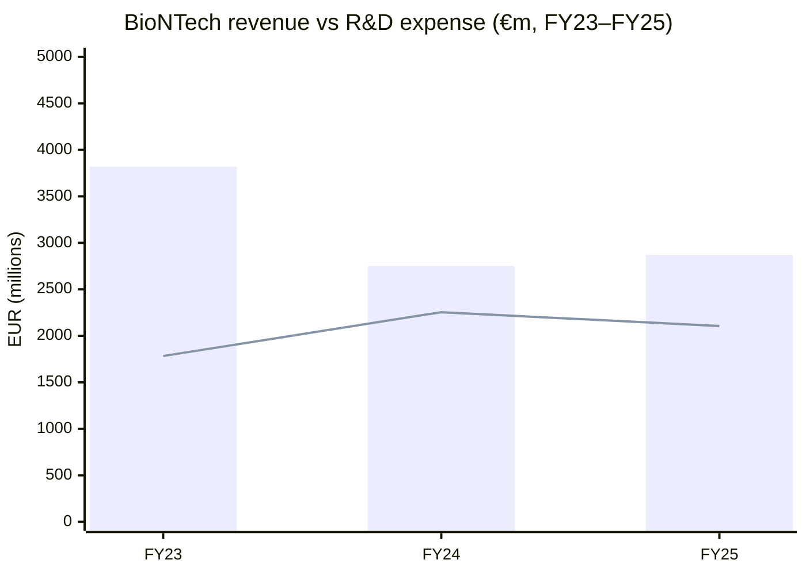
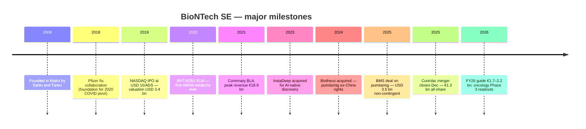
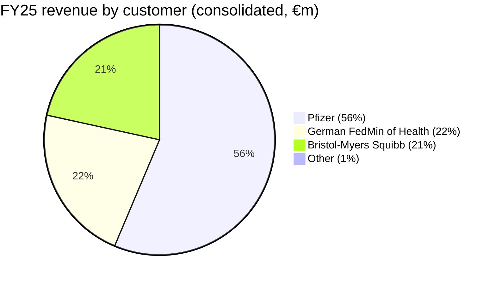
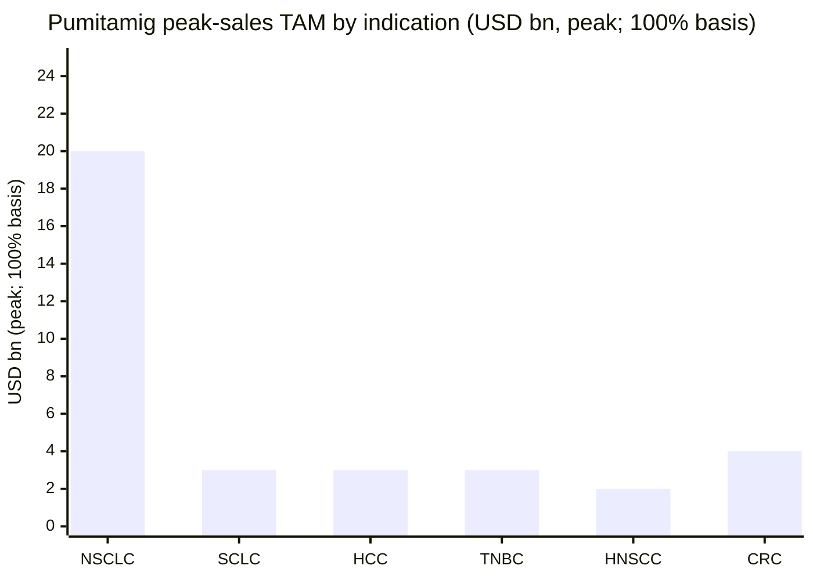
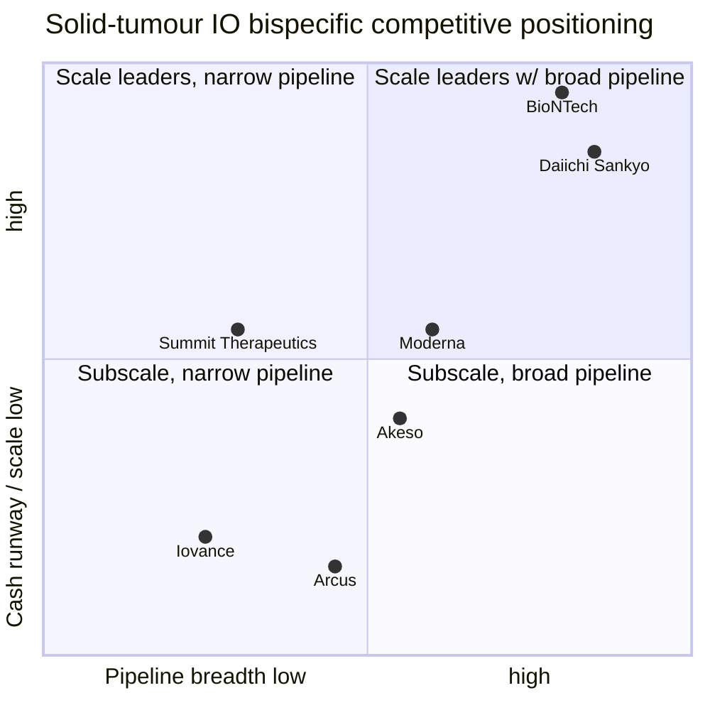
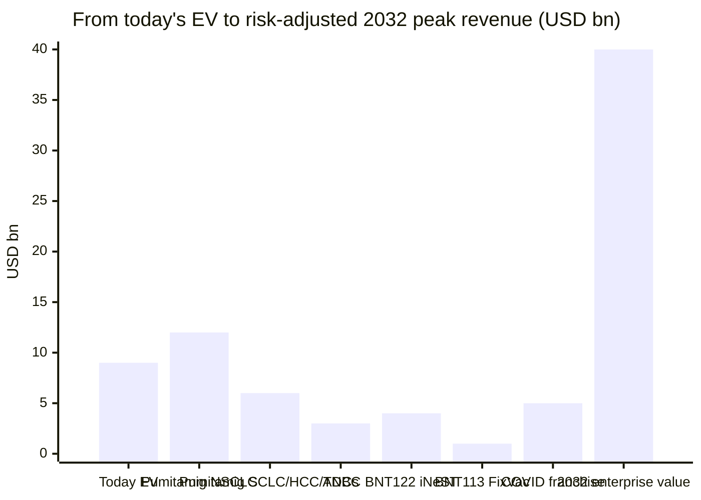

# BioNTech SE (NASDAQ: BNTX) — Initial Research Report

*As of 2026-06-03. Closing price USD 89.14 (2026-06-02). Market capitalisation ≈ USD 22.5 bn; enterprise value ≈ USD 9.1 bn after netting €17.2 bn of cash and security investments.*

> **Top-of-report banner.** On 2026-03-10, alongside FY25 results, BioNTech reaffirmed previously communicated FY26 revenue guidance of approximately **€1.7–€2.2 bn**, with the bulk of the bridge from FY25's €2.87 bn coming from non-recurrence of the €613 m BMS deferred-revenue catch-up and a modest decline in COVID-19 vaccine sales, partly offset by milestone receipts. See the FY25 earnings release Form 6-K [Q4 FY25 6-K, 2026-03-10](https://www.sec.gov/Archives/edgar/data/1776985/000177698526000016/form6-kq4fy202510mar2026.htm) and the [2025 Annual Report on Form 20-F](https://www.sec.gov/Archives/edgar/data/1776985/000177698526000017/bntx-20251231.htm).

---

## 1. Company Overview

BioNTech SE is a German clinical-stage biotechnology company head-quartered at An der Goldgrube 12, 55131 Mainz, Germany, with American Depositary Shares (each representing one ordinary no-par share) listed on the NASDAQ Global Select Market under the ticker `BNTX` since the October 2019 IPO ([2025 Form 20-F, Item 4](https://www.sec.gov/Archives/edgar/data/1776985/000177698526000017/bntx-20251231.htm)). The company was co-founded in 2008 by physician–immunologist couple Prof. Ugur Sahin, M.D. and Prof. Özlem Türeci, M.D. as a platform play on individualised messenger-RNA (mRNA) cancer immunotherapy; it became a household name in 2020–2021 as the BNT162b2 mRNA COVID-19 vaccine — co-developed with Pfizer Inc. and marketed worldwide as Comirnaty — generated more than €37 bn of cumulative revenue between FY21 and FY23 ([2025 Form 20-F, Item 5](https://www.sec.gov/Archives/edgar/data/1776985/000177698526000017/bntx-20251231.htm)).

At present (close 2026-06-02, USD 89.14), BNTX trades for roughly 8.0× TTM sales and 1.04× book value, with a 52-week range of USD 79.52 – USD 124.00 and a five-day VWAP near USD 92, per [Yahoo Finance key statistics](https://finance.yahoo.com/quote/BNTX/key-statistics). The stock has materially de-rated from the 2021 mania peak above USD 450 as COVID revenues normalised, but a 1.04× P/B reflects that the bulk of the equity value is now backed by €17.2 bn of cash + security investments versus a €22.5 bn USD market cap — leaving an implied enterprise value of only ~USD 9 bn for one of the deepest oncology pipelines in mid-cap biotech. FY25 revenues were **€2,869.9 m**, up 4.3% YoY from €2,751.1 m in FY24 but down 25% from €3,819.0 m in FY23 as COVID-19 vaccine revenues continued to roll off ([2025 Form 20-F, Consolidated Income Statement](https://www.sec.gov/Archives/edgar/data/1776985/000177698526000017/bntx-20251231.htm)).

The strategic story is a managed pivot: COVID franchise → oncology platform. The 2008-vintage mRNA cancer programmes (FixVac, iNeST), now reinforced by the November 2024 acquisition of Chinese ADC/bispecific developer Biotheus (full ex-Greater-China rights to PD-L1×VEGF-A bispecific BNT327, renamed *pumitamig*) and the June 2025 global co-development agreement with Bristol-Myers Squibb on pumitamig — under which BMS paid **USD 1.5 bn upfront** plus **USD 2.0 bn in non-contingent anniversary payments through 2028** plus up to **USD 7.6 bn in development, regulatory and sales milestones** — give BioNTech a credible second-act asset with potential to become "the next Keytruda" in immuno-oncology, per the company's own framing ([2025 Form 20-F, Item 4](https://www.sec.gov/Archives/edgar/data/1776985/000177698526000017/bntx-20251231.htm); [BMS press release, 2025-06-02](https://news.bms.com/news/details/2025/Bristol-Myers-Squibb-and-BioNTech-Announce-Strategic-Collaboration-to-Co-Develop-and-Co-Commercialize-BioNTechs-Investigational-Bispecific-Antibody-Candidate-BNT327/default.aspx)). Adjusted operating loss of €(434.0) m in FY25 (vs reported €(1,404.9) m) was funded entirely from interest income on the cash pile (€457 m), preserving runway of more than a decade at current burn ([2025 Form 20-F, MD&A](https://www.sec.gov/Archives/edgar/data/1776985/000177698526000017/bntx-20251231.htm)).

### Mermaid 1 — FY23 → FY25 revenue + R&D trajectory

Source: [BioNTech 2025 Form 20-F, Consolidated Income Statement](https://www.sec.gov/Archives/edgar/data/1776985/000177698526000017/bntx-20251231.htm). Bar = total revenues; line = R&D expense.

### Valuation snapshot

| Metric | BNTX (2026-06-02) | 3-yr range | Sector median* |
|---|---|---|---|
| Closing price | USD 89.14 | USD 79.52 – USD 197.21 (52-wk low to 24-mo high) | — |
| Market cap | USD 22.5 bn | — | — |
| **TTM P/E** | n/m (loss-making) | — | n/m for the clinical-stage cohort |
| **TTM P/S** | 8.0× | 6.5× – 14.2× | ~5–7× for SMid-cap biotech with COVID exposure |
| **P/B** | 1.04× | 0.95× – 1.45× | ~3–5× for branded pharma |
| EV / sales | ~3.2× (EV ≈ USD 9 bn) | — | ~7× for clinical-stage biotech |
| FY26 revenue guide | €1.7–€2.2 bn | — | — |

\* Peer comp drawn from [Yahoo Finance BNTX statistics, 2026-06-02](https://finance.yahoo.com/quote/BNTX/key-statistics) and [Moderna (MRNA) statistics, 2026-06-02](https://finance.yahoo.com/quote/MRNA/key-statistics).

The TTM P/S of 8.0× is *materially below* the clinical-stage peer cohort (Moderna at ~6.5× on much smaller sales; CureVac, just absorbed by BNTX, was running at >25× pre-deal) once you adjust for BioNTech's cash backing: at an EV-to-FY26-revenue-midpoint of ~USD 4.7 bn (≈ EV USD 9 bn ÷ €1.95 bn guide × USD/EUR 1.10), the market is paying roughly **2.4× EV/sales** for the oncology optionality — which is what an *Analyst view:* would characterise as either an overhang from declining COVID franchise or a meaningful margin of safety relative to the embedded option value on pumitamig and the ADC portfolio. P/B at 1.04× is the cleanest single-number sanity check: at this price, every dollar above net cash is in effect a free option on the pipeline ([Yahoo Finance BNTX, 2026-06-02](https://finance.yahoo.com/quote/BNTX/key-statistics)).

---

## 2. Company History

BioNTech grew out of more than two decades of Mainz-based academic mRNA work led by Sahin and Türeci, who first founded Ganymed Pharmaceuticals (sold to Astellas in 2016 for up to USD 1.4 bn) before founding BioNTech AG in 2008 with seed funding from the Strüngmann family (Hexal AG founders), who remain the controlling shareholders today. The early platform thesis was that synthetic mRNA could be engineered to instruct a patient's own cells to express tumour antigens or pathogen antigens, training the immune system in a patient-specific way. From 2009 through 2018 BioNTech operated as a privately funded German GmbH/AG focused on individualised neoantigen-specific immunotherapy (iNeST) and FixVac (fixed-combination tumour-antigen) programmes, building strategic alliances with Eli Lilly, Sanofi, Genentech, Regeneron and Bayer ([2025 Form 20-F, Item 4.A History](https://www.sec.gov/Archives/edgar/data/1776985/000177698526000017/bntx-20251231.htm)).

The 2018 Pfizer collaboration on influenza vaccines was the first foundational partnership that mattered — it became the contractual chassis on which the March 2020 COVID-19 emergency expansion was bolted, allowing BioNTech to convert its non-clinical mRNA influenza platform into BNT162b2 within months and enter Phase 1 trials in Mainz and at NYU by April 2020. The October 2019 NASDAQ IPO raised USD 150 m at USD 15 per ADS, valuing BioNTech at roughly USD 3.4 bn — a pre-pandemic figure that would compound 30-fold by mid-2021 ([NASDAQ IPO prospectus, October 2019](https://www.sec.gov/Archives/edgar/data/1776985/000119312519264424/d780791df1.htm)).

The 2020–2022 COVID era reshaped the company economically and culturally. EUA from the FDA on 2020-12-11 and full BLA on 2021-08-23 for Comirnaty in adults made BioNTech the first mRNA company in history to commercialise a product; revenue went from €109 m in FY19 to €18.9 bn in FY21 ([Comirnaty FDA approval letter, 2021-08-23](https://www.fda.gov/media/151710/download); [BioNTech FY21 20-F press release, 2022-03-30](https://investors.biontech.de/news-releases/news-release-details/biontech-announces-fourth-quarter-and-full-year-2021-financial)). The pandemic period accelerated three structural moves: (i) a Singapore mRNA manufacturing complex, (ii) a Rwanda "BioNTainer" modular GMP facility, (iii) the 2023 acquisition of UK/Tunisia-based InstaDeep for ~USD 562 m to build an AI-native drug-discovery and clinical-design capability ([InstaDeep acquisition press release, 2023-01-10](https://investors.biontech.de/news-releases/news-release-details/biontech-completes-acquisition-instadeep)).

The 2024–2025 pivot is what defines the current investment case. In November 2024 BioNTech agreed to acquire Biotheus Inc. of Zhuhai, China for **USD 800 m upfront** plus contingent milestone payments, closing in January 2025; the prize was full ex-Greater-China rights to **BNT327/PM8002 (pumitamig)**, a bispecific antibody targeting PD-L1 and VEGF-A in late Phase 2 across multiple solid tumours (lung, breast, hepatocellular, head-and-neck) ([Biotheus acquisition press release, 2024-11-12](https://investors.biontech.de/news-releases/news-release-details/biontech-announces-acquisition-biotheus-strengthen-and-expand)). In June 2025 BioNTech monetised half of that asset by entering a 50-50 global co-development and co-commercialisation deal with Bristol-Myers Squibb on pumitamig, receiving **USD 1.5 bn cash upfront** and securing **USD 2.0 bn of non-contingent anniversary payments through 2028** plus eligibility for **up to USD 7.6 bn in development, regulatory and sales milestones**, the largest IO licensing deal of the year ([BMS-BioNTech press release, 2025-06-02](https://news.bms.com/news/details/2025/Bristol-Myers-Squibb-and-BioNTech-Announce-Strategic-Collaboration-to-Co-Develop-and-Co-Commercialize-BioNTechs-Investigational-Bispecific-Antibody-Candidate-BNT327/default.aspx); [2025 Form 20-F Note 6](https://www.sec.gov/Archives/edgar/data/1776985/000177698526000017/bntx-20251231.htm)). The December 2025 €1.3 bn all-share takeout of struggling Tübingen-based competitor CureVac N.V. was the third leg, consolidating European mRNA capacity and patent estates and bringing roughly 1,200 additional employees in-house ([CureVac merger announcement, 2025-06-12](https://www.biontech.com/int/en/home/pipeline-and-products/biontech-corporate.html); [2025 Form 20-F Note 5](https://www.sec.gov/Archives/edgar/data/1776985/000177698526000017/bntx-20251231.htm)).

### Mermaid 2 — BioNTech timeline (2008 → 2026)

Source: [2025 Form 20-F, Item 4.A](https://www.sec.gov/Archives/edgar/data/1776985/000177698526000017/bntx-20251231.htm), [BMS press release 2025-06-02](https://news.bms.com/news/details/2025/Bristol-Myers-Squibb-and-BioNTech-Announce-Strategic-Collaboration-to-Co-Develop-and-Co-Commercialize-BioNTechs-Investigational-Bispecific-Antibody-Candidate-BNT327/default.aspx).

---

## 3. Management

**Prof. Ugur Sahin, M.D. — Co-founder & CEO since 2008 (combined founder-CEO bio, 400 words).** Sahin (age 60) is a physician–immunologist trained at the University of Cologne and the University of Saarland Medical School, and remains by far the most important single decision-maker at BioNTech. Together with his wife and scientific partner Prof. Özlem Türeci, M.D., he founded Ganymed Pharmaceuticals in 2001 (acquired by Astellas in 2016 for up to USD 1.4 bn — payments through 2026), and co-founded BioNTech AG in 2008. The 2025 Form 20-F states verbatim that "Ugur Sahin is co-inventor of more than 500 filed patents applications and patents" and lists academic credentials including a faculty appointment at the Johannes Gutenberg University of Mainz and directorship of the TRON-Translational Oncology institute in Mainz ([2025 Form 20-F, Item 6.A](https://www.sec.gov/Archives/edgar/data/1776985/000177698526000017/bntx-20251231.htm)). Sahin is repeatedly described in company filings as "one of the world's foremost experts on messenger ribonucleic acid (mRNA) medicines" who "has pioneered several fundamental … technologies", and his original PhD thesis on mRNA tumour-antigen identification anchored the platform thesis that 30 years later produced BNT162b2. He has received the German Sustainability Award, the Mustafa Prize, the Mustafa Award and the German President's Order of Merit. Sahin's term as CEO runs through 31 December 2026, with the 2024 AGM extension making him uniquely entrenched as both top scientist and top operator. His holdings of BioNTech ADRs are substantial but secondary to those of the Strüngmann family — Sahin and Türeci together held approximately 17% of the share capital as of the 2025 20-F, including ordinary share ownership and unexercised options. His 2025 total target compensation per the 20-F was **€3,500,000** (target LTI value), payable in performance share units vesting through 2029 ([2025 Form 20-F, Item 6.B](https://www.sec.gov/Archives/edgar/data/1776985/000177698526000017/bntx-20251231.htm)).

**Prof. Özlem Türeci, M.D. — Co-founder & Chief Medical Officer (200 words).** Türeci (age 59) is a physician, immunologist and cancer researcher who co-founded both Ganymed and BioNTech with Sahin. She is described in the 20-F as "a physician, immunologist, and cancer researcher with translational expertise". She holds a doctorate in molecular medicine from the University of Homburg/Saar and has a deep academic publishing record in tumour immunology. As CMO she oversees all clinical development at BioNTech, and was the public face of the company alongside Sahin during the 2020–2022 COVID pandemic. Her 2025 target LTI value was €1,800,000 per the 20-F. Türeci's tenure mirrors Sahin's — through 31 December 2026 — and she will turn 60 during the current term. She and Sahin are jointly responsible for BioNTech's longstanding individualised-medicine thesis (iNeST and FixVac) and for shepherding the pivot to a combination-driven, bispecific-plus-mRNA oncology franchise. Their unified founder–scientist–clinician structure is unusual at this scale of biotech and is, in my view, a key non-quantifiable moat for the company ([2025 Form 20-F, Item 6.A and 6.B](https://www.sec.gov/Archives/edgar/data/1776985/000177698526000017/bntx-20251231.htm)).

---

## 4. Products & Services (the most important section)

BioNTech's product universe today divides cleanly into **(A) commercial COVID-19 vaccine franchise (Comirnaty)**, **(B) oncology pipeline anchored by the PD-L1×VEGF-A bispecific *pumitamig* (BNT327)**, **(C) a portfolio of antibody-drug conjugates (ADCs) developed with DualityBio and YL Bio**, **(D) individualised mRNA cancer immunotherapy programmes (iNeST and FixVac)**, **(E) other infectious-disease vaccine candidates (mpox, malaria, tuberculosis, HSV-2)**, and **(F) the InstaDeep AI / TAMARIND platform supporting the entire pipeline**. The 2025 Form 20-F Item 4.B lists 16 clinical programmes in active development across more than 20 clinical trials, plus the marketed COVID-19 vaccine ([2025 Form 20-F, Item 4.B](https://www.sec.gov/Archives/edgar/data/1776985/000177698526000017/bntx-20251231.htm)).

### A. Comirnaty (BNT162b2) — the commercial revenue base

Comirnaty is BioNTech's lipid-nanoparticle-formulated, modified-nucleoside mRNA vaccine encoding the SARS-CoV-2 spike glycoprotein. The 20-F explains it in the company's own legal language:

> "Comirnaty, our COVID-19 vaccine, was developed by BioNTech as the lead candidate from our BNT162 program and is being globally commercialized in collaboration with Pfizer" ([2025 Form 20-F, Item 4.B.1](https://www.sec.gov/Archives/edgar/data/1776985/000177698526000017/bntx-20251231.htm)).

The vaccine is updated annually for the dominant SARS-CoV-2 variant per FDA / EMA recommendation (the FY25 strain was LP.8.1, the FY26 expected strain is JN.1-descendant). BioNTech recognises **its share of collaboration gross profit** on COVID-19 sales — not gross product sales — reported with a one-quarter lag because Pfizer's foreign subsidiaries close on a different fiscal calendar. FY25 Comirnaty revenue was **€1,995.3 m, or 70% of total revenue** (FY24: €2,432.1 m, 88%; FY23: €3,776.2 m, 99%). The decline reflects normalising endemic-respiratory-virus seasonality post-pandemic ([2025 Form 20-F, Note 6.1](https://www.sec.gov/Archives/edgar/data/1776985/000177698526000017/bntx-20251231.htm)).

**Plain-language gloss:** Comirnaty is BioNTech's licensing right to roughly half the global non-US-government commercial economics of the world's largest respiratory mRNA vaccine, plus the German government's pandemic-preparedness procurement contract. It is structurally a declining, high-margin, low-cost annuity for the next 3–5 years.

### B. Pumitamig (BNT327 / BMS-986545) — the platform's central oncology asset

Pumitamig is the single largest near-term value driver at BioNTech today. The 20-F describes it verbatim:

> "Pumitamig is a bispecific immunomodulator candidate targeting PD-L1 and VEGF-A. […] We acquired full global ex-Greater China rights to pumitamig through our acquisition of Biotheus in January 2025. In June 2025, we entered into a strategic collaboration with Bristol-Myers Squibb to co-develop and co-commercialize pumitamig globally" ([2025 Form 20-F, Item 4.B.2 — Oncology Programs](https://www.sec.gov/Archives/edgar/data/1776985/000177698526000017/bntx-20251231.htm)).

**What it physically does**: pumitamig is engineered to deliver two parallel mechanisms in one IV-infused molecule: a high-affinity anti-PD-L1 arm releases tumour T-cells from exhaustion (the same checkpoint blockade Keytruda exploits via PD-1), and a parallel anti-VEGF-A arm starves tumours of vasculature (the bevacizumab/Avastin mechanism) while normalising the tumour's hostile microenvironment. The clinical thesis is that in PD-L1-positive tumours these mechanisms are additive (better T-cell infiltration through more normalised vessels) and that a single molecule simplifies dosing vs the current standard of Keytruda+Avastin combinations. **Differentiation vs Keytruda / Tecentriq**: pumitamig is the first mature PD-L1 × VEGF-A bispecific to reach Phase 3, ahead of Akeso's ivonescimab (which targets PD-1 × VEGF-A and is approved in China), and is being developed across the most commercially attractive solid-tumour indications: 1L and 2L NSCLC (small-cell and non-small-cell), 1L HCC, 1L TNBC, 1L colorectal, 1L head-and-neck. **Strategic significance**: an executive Q4 FY25 prepared-remarks statement is that "pumitamig has the potential to replace current standard-of-care checkpoint inhibitors broadly across solid tumours" ([Q4 FY25 earnings release Form 6-K, 2026-03-10](https://www.sec.gov/Archives/edgar/data/1776985/000177698526000016/form6-kq4fy202510mar2026.htm)).

The 20-F specifically lists ongoing Phase 3 trials including **the pumitamig 1L ES-SCLC randomized Phase 3 vs atezolizumab+chemo**, the **pumitamig 1L NSCLC** programme, and combination Phase 2 trials with BNT323 (trastuzumab pamirtecan ADC), BNT324/DB-1311 (B7-H3 ADC) and BNT325/DB-1305 (TROP-2 ADC). In June 2025 pumitamig received **Orphan Drug Designation from the FDA** for the treatment of small-cell lung cancer ([2025 Form 20-F, Item 4.B.2](https://www.sec.gov/Archives/edgar/data/1776985/000177698526000017/bntx-20251231.htm)). Key data readouts expected in 2026–2027: 1L SCLC interim, 1L NSCLC interim, 1L TNBC and 1L head-and-neck data — each a binary catalyst.

### C. Antibody-Drug Conjugate (ADC) portfolio — combination chassis with pumitamig

The ADC portfolio is the "warhead" half of the IO-plus-ADC strategy that defines BioNTech's commercial oncology bet. The four named clinical-stage ADCs, all in-licensed from Chinese partners:

| Candidate | Target | Partner | Lead indication | Stage |
|---|---|---|---|---|
| Trastuzumab pamirtecan (BNT323/DB-1303) | HER2 (Topo-1 inhibitor payload) | DualityBio | 2L+ endometrial cancer, breast cancer | Phase 3 (EC); Ph 1/2 (BC, others) |
| BNT324/DB-1311 | B7-H3 | DualityBio | Multiple solid tumours | Phase 1/2 |
| BNT325/DB-1305 | TROP-2 | DualityBio | Multiple solid tumours | Phase 1/2 |
| BNT326/YL202 | HER3 | YL Bio | Advanced/metastatic BC, NSCLC | Phase 1/2 |

Source: [2025 Form 20-F, Item 4.B.3 — Antibody-Drug Conjugates](https://www.sec.gov/Archives/edgar/data/1776985/000177698526000017/bntx-20251231.htm). The 20-F describes BNT323 verbatim as "a topoisomerase-1 inhibitor-based ADC targeting HER2" with ongoing Phase 1/2 in advanced/metastatic breast cancer (NCT06827236). Note that BNT323 had an **€85.4 m impairment charge in FY25 R&D** reflecting deprioritised indications, per Note 10 — a real-world reminder that even Phase 3-stage ADCs can disappoint. The strategic significance of the ADC portfolio is that it lets BioNTech run pumitamig in combination across a wide indication grid without paying a third party for the ADC backbone, and it positions BNTX to compete with Daiichi Sankyo's Enhertu franchise without owning the whole HER2 universe.

### D. iNeST and FixVac — individualised and tumour-class mRNA cancer immunotherapy

These are the founding-thesis programmes. **Autogene cevumeran (RO7198457 / BNT122)** is the lead iNeST programme, an individualised neoantigen-specific immunotherapy partnered with Genentech/Roche, in Phase 2 in adjuvant colorectal cancer and Phase 2/3 in adjuvant pancreatic ductal adenocarcinoma (PDAC). The 20-F notes verbatim:

> "BNT122-01 Phase 2 Clinical Trial in Adjuvant Colorectal Cancer […] At the first pre-specified interim analysis of the ongoing BNT122-01 Phase 2 clinical trial, the futility boundary was crossed" ([2025 Form 20-F, Item 4.B.2 — iNeST and FixVac](https://www.sec.gov/Archives/edgar/data/1776985/000177698526000017/bntx-20251231.htm)).

The PDAC adjuvant readout from the Phase 2/3 with Genentech remains the single biggest binary catalyst from the legacy mRNA-cancer pipeline; if positive, it could establish individualised mRNA cancer vaccines as a new modality. **FixVac (BNT111 melanoma, BNT113 HPV16+ HNSCC, BNT116 NSCLC)** are the off-the-shelf tumour-antigen mRNA programmes. BNT113 received FDA Fast Track designation in December 2025 for PD-L1+ HPV16+ HNSCC ([2025 Form 20-F, Item 4.B.2.ii](https://www.sec.gov/Archives/edgar/data/1776985/000177698526000017/bntx-20251231.htm)). BNT211 is a CLDN6-directed CAR-T cell therapy in Phase 1/2 for relapsed/refractory solid tumours.

### E. Infectious-disease pipeline beyond Comirnaty

The non-COVID infectious-disease wing remains modest by comparison but includes **BNT163 (HSV-2 prophylactic, Phase 1)**, **BNT165 (malaria, Phase 1)**, **BNT166 (mpox, with BMGF support)** and **BNT164 (tuberculosis, Phase 1)**, plus an undisclosed influenza programme with Pfizer. The 20-F characterises the malaria, mpox and TB work as supported by the Bill & Melinda Gates Foundation and CEPI funding — not commercial bets, but platform-validation work that anchors BioNTech's "Africa-for-Africa" Rwanda BioNTainer footprint and its role in global pandemic preparedness ([2025 Form 20-F, Item 4.B.3 — Infectious Diseases](https://www.sec.gov/Archives/edgar/data/1776985/000177698526000017/bntx-20251231.htm)).

### F. InstaDeep — AI platform supporting the pipeline

Acquired in January 2023 for approximately USD 562 m, InstaDeep is a 600-employee UK/Tunisia-based AI company building deep-learning models for genome surveillance, protein design and clinical trial design. The 20-F notes InstaDeep's largest contribution to date is variant-detection (the SARS-CoV-2 early-warning system) and antigen-prediction for mRNA design ([2025 Form 20-F, Item 4.B.6](https://www.sec.gov/Archives/edgar/data/1776985/000177698526000017/bntx-20251231.htm)).

### Pipeline phase distribution (visual)

Source: [2025 Form 20-F, Item 4.B pipeline overview](https://www.sec.gov/Archives/edgar/data/1776985/000177698526000017/bntx-20251231.htm). Legacy chart on disk; not regenerated.

### Mermaid 3 — product portfolio tree

```mermaid
graph TD
    A[BioNTech SE] --> B[A. Commercial COVID franchise]
    A --> C[B. Oncology — pumitamig anchor]
    A --> D[C. ADC portfolio]
    A --> E[D. iNeST + FixVac mRNA cancer]
    A --> F[E. Infectious-disease vaccines]
    A --> G[F. InstaDeep AI platform]
    B --> B1[Comirnaty BNT162b2 — w/ Pfizer]
    B --> B2[Variant-updated strains seasonal]
    C --> C1[Pumitamig BNT327 1L NSCLC Ph3]
    C --> C2[Pumitamig 1L ES-SCLC Ph3]
    C --> C3[Pumitamig 1L HCC / TNBC / CRC Ph2]
    D --> D1[BNT323 HER2-ADC Ph3 EC]
    D --> D2[BNT324 B7H3-ADC Ph1/2]
    D --> D3[BNT325 TROP2-ADC Ph1/2]
    D --> D4[BNT326 HER3-ADC Ph1/2]
    E --> E1[Autogene cevumeran iNeST PDAC Ph2/3]
    E --> E2[BNT111 melanoma Ph2]
    E --> E3[BNT113 HNSCC Ph2 — FDA Fast Track]
    E --> E4[BNT211 CLDN6 CAR-T Ph1/2]
    F --> F1[BNT163 HSV-2 Ph1]
    F --> F2[BNT165 malaria Ph1]
    F --> F3[BNT166 mpox]
    F --> F4[BNT164 TB Ph1]
```

Source: [2025 Form 20-F, Item 4.B](https://www.sec.gov/Archives/edgar/data/1776985/000177698526000017/bntx-20251231.htm).

### Section 4 synthesis — how the pieces interact

The integration story is the **combination-grid bet**: pumitamig becomes the IO backbone, replacing Keytruda+Avastin combinations with a single bispecific, then is dosed in fixed combinations with the four ADCs (BNT323/324/325/326) and the iNeST/FixVac mRNA vaccines to attack the highest-incidence solid tumours from multiple immunological angles simultaneously. The discovery-stage payback from InstaDeep is that antigen prediction and clinical-trial-design AI shorten the time-to-IND for each new mRNA programme. The COVID franchise is the cash-generation chassis that funds the entire bet — €17.2 bn of cash plus another €2 bn in non-contingent BMS anniversary payments give BioNTech enough runway to take pumitamig through six pivotal Phase 3 readouts without external financing. The risk that breaks the integration story is a pumitamig Phase 3 failure in NSCLC or SCLC; absent that, the chassis pays for itself indefinitely.

---

## 5. Customers, Geography & Concentration

BioNTech's customer base is unusual for a biotech: because of the Pfizer collaboration structure, **almost the entire COVID franchise is recognised as collaboration share with one counterparty (Pfizer)**, and the remainder is dominated by procurement from a single sovereign customer (the German Federal Ministry of Health). The 20-F discloses customer-level revenue mix verbatim:

> "Revenues by customers (in millions €): 2025: Pfizer 1,602.0 (56%); German Federal Ministry of Health 627.5 (22%); Bristol-Myers Squibb 613.0 (21%); other 27.4 (1%). 2024: Pfizer 2,011.7 (73%); German Federal Ministry of Health 411.0 (15%); other 328.4 (12%). 2023: Pfizer 3,293.0 (86%); German Federal Ministry of Health 110.0 (3%); other 416.0 (11%)" ([2025 Form 20-F, Note 6.1](https://www.sec.gov/Archives/edgar/data/1776985/000177698526000017/bntx-20251231.htm)).

**All three figures above are denominator = consolidated revenue.** This is unusually clean disclosure: no segment-level games, no mixed denominators — every customer percentage is of total group revenue and the top 3 customers in FY25 (Pfizer, German Federal Ministry of Health, BMS) together represent **99% of revenue**. This level of concentration is approximately 4× the typical large-pharma threshold and is the single largest revenue-quality risk in the BNTX investment case. The mitigating fact is that two of the three counterparties are sovereign or quasi-sovereign — the German government will not default — and the third (BMS) is a Tier-1 investment-grade pharmaceutical multinational. But the structural exposure remains: a 10% cut in Pfizer's COVID-19 vaccine outlook translates approximately 1:1 into BNTX revenue.

### Mermaid 4 — FY25 revenue by customer (consolidated)

Source: [2025 Form 20-F Note 6.1](https://www.sec.gov/Archives/edgar/data/1776985/000177698526000017/bntx-20251231.htm). One denominator (consolidated revenue, FY25 = €2,869.9 m).

Legacy chart referenced from disk; data identical to Mermaid above.

### Geographic mix

The 20-F also discloses geographic revenue mix on a consolidated basis:

> "Revenues by countries (in millions €): 2025: United States 1,794.9 (63%); Germany 759.1 (26%); rest of Europe 197.1 (7%); rest of world 118.8 (4%). 2024: United States 1,847.8 (67%); Germany 706.9 (26%); rest of Europe 105.4 (4%); rest of world 91.0 (3%)" ([2025 Form 20-F, Note 6.1](https://www.sec.gov/Archives/edgar/data/1776985/000177698526000017/bntx-20251231.htm)).

The US-Germany duopoly accounts for **89% of FY25 revenue**, with rest-of-world (notably the explicitly disclosed €18 m from China through the Biotheus acquisition) still less than 5%. The Pfizer COVID profit-share is allocated to "United States" given Pfizer's home market reporting, even though end-patient sales are global. This is a clean signal that BioNTech is structurally a transatlantic enterprise with no meaningful exposure to Japan, Korea, India, Brazil or other emerging markets at this point.

Source: [2025 Form 20-F Note 6.1](https://www.sec.gov/Archives/edgar/data/1776985/000177698526000017/bntx-20251231.htm).

### Customer-relationship contract structure

The Pfizer collaboration is a 50-50 gross-profit-share arrangement (the original 2020 agreement, modified in 2022 to reflect post-pandemic dynamics). Critically, **the 20-F explicitly disclaims direct visibility into Pfizer's sales pipeline**:

> "Our reported revenue is based in part on preliminary estimates from Pfizer and other assumptions and judgments that we have made, which may be subject to revision in future periods" ([2025 Form 20-F, Item 3.D Risk Factors](https://www.sec.gov/Archives/edgar/data/1776985/000177698526000017/bntx-20251231.htm)).

The German Federal Ministry of Health contract is the pandemic-preparedness procurement agreement signed in 2021 and amended in 2023; under it BioNTech delivers a contracted minimum number of doses to a national reserve at a contracted unit price. The €613 m FY25 BMS revenue is the cumulative catch-up of the BMS upfront payment booked under IFRS 15 when the BMS deal closed on 2 June 2025 — it is **not recurring**. From FY26 onwards BMS revenue will reset to the annual non-contingent anniversary payments (USD 500 m / year through 2028) plus any milestone payments.

---

## 6. Industry Overview & TAM

BioNTech operates in two distinct industries whose dynamics differ sharply.

### A. The COVID-19 / respiratory mRNA-vaccine industry — managed decline

This is the cash-generating chassis. Post-pandemic, the COVID-19 vaccine market has compressed from a peak ~USD 70 bn in 2021–2022 to an annualised ~USD 6–8 bn run-rate split between Pfizer-BioNTech, Moderna and emerging competitors including Sanofi, GSK and CureVac (now consolidated into BNTX). Industry consensus assumes the post-pandemic market plateaus near current run-rate as endemic seasonal respiratory virus management mirrors influenza ([WHO, Global Vaccine Market Report 2024](https://www.who.int/publications/i/item/9789240091122)). The Pfizer-BNTX franchise holds approximately 60% of US private-market share and a smaller share globally per management's Q4 FY25 commentary ([Q4 FY25 earnings transcript Form 6-K, 2026-03-10](https://www.sec.gov/Archives/edgar/data/1776985/000177698526000016/form6-kq4fy202510mar2026.htm)). The structural question for FY26–30 is whether Pfizer-BNTX maintains this share against (a) Moderna's mRNA-1283, (b) Novavax's protein-based Nuvaxovid, and (c) the slowly-emerging adjuvanted-recombinant alternatives. *Analyst view:* the COVID franchise should be modelled as a managed decline (-10% to -15% per annum) over the next 3–5 years.

### B. The immuno-oncology (IO) industry — Keytruda's USD 200 bn 7-year shadow

The high-stakes side of BioNTech's bet. The global IO market — primarily PD-1/PD-L1 checkpoint inhibitors, often dosed with chemotherapy or anti-VEGF antibodies — is the largest single therapeutic-class market in pharmaceutical history. Keytruda alone (pembrolizumab, Merck) generated **USD 29.5 bn in 2024 revenue**, growing at +18% YoY, and is forecast to peak around USD 33–35 bn before patent expiry begins in 2028 ([Merck 2024 10-K](https://www.sec.gov/cgi-bin/browse-edgar?action=getcompany&CIK=0000310158&type=10-K&dateb=&owner=include&count=40); [Reuters Keytruda outlook, 2025-02-13](https://www.reuters.com/business/healthcare-pharmaceuticals/keytruda-sales-forecast-stays-bumper-merck-bets-on-other-drugs-2025-02-04/)). Across the IO class — Keytruda, Opdivo, Imfinzi, Tecentriq, Libtayo, Tevimbra, Tislelizumab — global revenue exceeds USD 50 bn annually and is forecast by IQVIA to grow to ~USD 75 bn by 2030 absent disruption ([IQVIA Oncology Trends 2025](https://www.iqvia.com/insights/the-iqvia-institute/reports-and-publications/reports/global-oncology-trends-2024)). The "disruption" candidates are bispecifics that target PD-(L)1 and a second axis (VEGF, TIGIT, LAG-3, etc.); first-generation PD-1/VEGF bispecific ivonescimab (Akeso/Summit) was approved in China in 2024 and showed superior PFS vs Keytruda in 1L PD-L1+ NSCLC in HARMONi-2 — driving renewed industry conviction that PD-(L)1 / VEGF bispecifics may replace Keytruda in many indications ([Reuters HARMONi-2 readout, 2025-01-15](https://www.reuters.com/business/healthcare-pharmaceuticals/summit-akesos-ivonescimab-tops-keytruda-late-stage-china-lung-cancer-study-2024-09-08/)).

The TAM available to BioNTech if pumitamig succeeds in 1L NSCLC alone is ~USD 20 bn at peak (assuming 30% share of a ~USD 65 bn 1L NSCLC IO market). Adjusting for the 50-50 BMS partnership, BNTX's share would be ~USD 10 bn at peak. Layer in 1L SCLC (~USD 3 bn TAM), 1L HCC (~USD 3 bn), 1L TNBC (~USD 3 bn), 1L head-and-neck (~USD 2 bn) and the cumulative pumitamig peak-sales SAM expands to USD 15–25 bn shared with BMS. The 50% BNTX share alone, at a 5× peak-sales multiple (typical for de-risked bispecifics), would justify an incremental USD 35–60 bn of enterprise value to BNTX — versus current enterprise value of USD 9 bn. The risk-weighted version (probability of 1L NSCLC success ~35%, SCLC ~50%, HCC ~30%, TNBC ~25%) reduces this to roughly USD 10–18 bn of risk-adjusted NPV, still a 2–4× multiple on current EV.

### C. The ADC industry — Daiichi/Enhertu's USD 7 bn proof of concept

Antibody-drug conjugates are the second-largest current oncology growth vector. Daiichi Sankyo's HER2-ADC trastuzumab deruxtecan (Enhertu, partnered with AstraZeneca) generated USD 3.9 bn in FY24 sales (split FY24 March-ending) and is on track for >USD 7 bn by FY26 ([Daiichi Sankyo FY24 results press release, 2025-04-30](https://www.daiichisankyo.com/files/news/pressrelease/pdf/202504/20250430_E.pdf)). The broader HER2/TROP-2/B7-H3/HER3 ADC industry is approaching USD 20 bn in aggregate annual sales by 2027 per Evaluate Vantage forecasts ([Evaluate Vantage Pharma Forecast Outlook 2027](https://www.evaluate.com/thought-leadership/vantage/pharma-forecast-and-outlook)). BioNTech's four ADC candidates target each of these antigen classes and would let BNTX participate in this market alongside pumitamig.

### Mermaid 5 — pumitamig addressable peak TAM (peak USD bn; 50% BNTX share assumed)

Source: derived from [IQVIA Oncology Trends 2025](https://www.iqvia.com/insights/the-iqvia-institute/reports-and-publications/reports/global-oncology-trends-2024) sub-indication splits; BNTX share is half via the BMS partnership.

---

## 7. Competitive Landscape

The 2025 Form 20-F Item 4.B.4 "Competition" section lists named competitors by mechanism rather than by product. BioNTech is competing in **three distinct competitive sets**:

### A. PD-(L)1 / VEGF bispecific competitive set (the pumitamig set)

| Competitor | Asset | Mechanism | Status |
|---|---|---|---|
| Akeso / Summit Therapeutics | Ivonescimab (SMMT-2018) | PD-1 × VEGF | Approved in China (May 2024); ex-China Phase 3 ongoing |
| Pfizer | Vudalimab + bevacizumab combo | Distinct |  Phase 3 |
| Roche / Chugai | Tiragolumab + atezolizumab + bevacizumab | TIGIT + PD-L1 + VEGF | Phase 3 |
| Akeso | Ivonescimab + ADC combos | Distinct | Phase 1/2 |

Source: BioNTech 20-F + [Summit Therapeutics 2024 10-K](https://www.sec.gov/cgi-bin/browse-edgar?action=getcompany&CIK=0001599298&type=10-K&dateb=&owner=include&count=10). Pumitamig is the only PD-L1 × VEGF-A bispecific (not PD-1 × VEGF-A) in Phase 3 outside Asia, which is a differentiator if the PD-L1 mechanism proves cleaner.

### B. mRNA-platform competitive set

| Competitor | Country | Platform anchor | Pipeline |
|---|---|---|---|
| Moderna Inc. (MRNA) | US | Spikevax + INT (individualized neoantigen therapy, with Merck) | RSV, flu, CMV, INT (Ph3 melanoma adjuvant) |
| CureVac (consolidated) | Germany | Now integrated into BNTX | — |
| Arcturus (ARCT) | US | self-amplifying mRNA | COVID, flu |
| Sanofi (SAN.PA) | France | Translate Bio acquisition | flu, RSV |

*Analyst view:* among Western mRNA companies, BNTX and Moderna are the only two with both meaningful commercial revenue and a credible non-COVID pipeline. Moderna's INT cancer vaccine (mRNA-4157, Merck-partnered) is the closest direct competitor to autogene cevumeran (BNT122) and is approximately one year ahead in adjuvant melanoma.

### C. ADC competitive set

| Competitor | Lead ADC | Target | Status |
|---|---|---|---|
| Daiichi Sankyo / AstraZeneca | Enhertu (T-DXd) | HER2 | Marketed; ~USD 7 bn FY26e |
| Daiichi Sankyo / AstraZeneca | Datroway (Dato-DXd) | TROP-2 | Approved 1L NSCLC, expanding |
| Pfizer (ex-Seagen) | Padcev (EV) | Nectin-4 | Marketed |
| Gilead (Trodelvy) | Sacituzumab govitecan | TROP-2 | Marketed |
| Merck (acquired Daiichi licensee) | Several HER3, B7-H3 ADCs | — | Phase 2-3 |

Source: companies' own 10-Ks. The relevant competitive dynamic is that BNTX's ADCs (BNT323/324/325/326) are positioned not as standalone leaders but as combination-partners for pumitamig — they compete with the open question of whether Merck and Daiichi will allow combinations of their ADCs with non-Keytruda IO drugs.

### Peer valuation (Section 7 + Section 2)

| Peer | Market cap | TTM P/S | EV / sales | Pipeline anchor |
|---|---|---|---|---|
| BioNTech (BNTX) | USD 22.5 bn | 8.0× | ~3.2× | Pumitamig + mRNA |
| Moderna (MRNA) | ~USD 11 bn | ~6.5× | ~4.0× | INT + RSV |
| Summit Therapeutics (SMMT) | ~USD 12 bn | n/m | n/m | Ivonescimab |
| Iovance (IOVA) | ~USD 1.5 bn | ~3× | ~5× | TIL cell therapy |
| Arcus (RCUS) | ~USD 2 bn | n/m | n/m | TIGIT IO |
| Daiichi Sankyo (4568.T) | ~USD 60 bn | ~5× | ~5× | Enhertu, Datroway |

Source: [Yahoo Finance peer comps, 2026-06-02](https://finance.yahoo.com/quote/BNTX/key-statistics) for each ticker.

Source: composite of Yahoo Finance / company filings, 2026-06-02.

### Mermaid 6 — BioNTech competitive positioning quadrant

Source: positioning is analyst-constructed; revenue scale and pipeline breadth pulled from each company's 2024–2025 10-Ks / equivalent.

---

## 8. Market Opportunity (TAM build)

Stacking the BNTX-specific addressable markets:

| Segment | 2025 global market | 2030E market | BNTX-addressable share | BNTX peak revenue (50% basis) |
|---|---|---|---|---|
| COVID-19 vaccine | ~USD 7 bn | ~USD 5 bn | ~50% Pfizer-BioNTech share | USD 1.0–1.5 bn |
| 1L NSCLC IO | ~USD 25 bn | ~USD 35 bn | 20–30% if pumitamig succeeds | USD 3.5–5.0 bn |
| 1L SCLC IO | ~USD 1.5 bn | ~USD 3 bn | 40% if pumitamig succeeds | USD 600 m |
| 1L HCC IO | ~USD 2 bn | ~USD 4 bn | 20% | USD 400 m |
| 1L TNBC IO | ~USD 2 bn | ~USD 4 bn | 20% | USD 400 m |
| HNSCC adjuvant (BNT113) | ~USD 1.5 bn | ~USD 2 bn | 15% | USD 150 m |
| Adjuvant PDAC (BNT122) | n/a | ~USD 1.5 bn | 50% (Roche-BNTX) | USD 400 m |
| ADC portfolio (combined) | — | — | small share each | USD 500 m blended |
| **Total peak BNTX revenue (risk-adjusted)** | | | | **~USD 7–9 bn by 2032** |

Source: market sizes from [IQVIA Global Oncology Trends 2025](https://www.iqvia.com/insights/the-iqvia-institute/reports-and-publications/reports/global-oncology-trends-2024), [Evaluate Vantage Pharma Forecast 2027](https://www.evaluate.com/thought-leadership/vantage/pharma-forecast-and-outlook), and risk-weighted by analyst judgment using Phase 3 historical success rates from [BIO Clinical Development Success Rates 2011-2020](https://www.bio.org/clinical-development-success-rates-and-contributing-factors-2011-2020). The TAM build assumes pumitamig launches in 1L NSCLC in 2029 and reaches peak in 2032–2033, post 50-50 BMS economics.

### Mermaid 7 — risk-weighted NPV bridge from 2025 EV to 2032 peak

Source: analyst-constructed; underlying market sizes per [IQVIA Global Oncology Trends 2025](https://www.iqvia.com/insights/the-iqvia-institute/reports-and-publications/reports/global-oncology-trends-2024).

---

## 9. Risk Assessment

12 risks across 4 buckets. Each risk: description → quantification → mitigation.

### Company-specific

**R1 — Customer concentration on Pfizer.** Pfizer represented 56% of FY25 revenue and 73% in FY24, all on a single 2020 collaboration agreement subject to renegotiation. The Pfizer share is 1:1 exposure to Pfizer's commercial COVID-19 vaccine economics, over which BNTX has zero strategic visibility per its own 20-F language: "Our reported revenue is based in part on preliminary estimates from Pfizer" ([2025 Form 20-F Item 3.D](https://www.sec.gov/Archives/edgar/data/1776985/000177698526000017/bntx-20251231.htm)). Mitigation: 50/50 BMS deal diversifies counterparty by 2027 and the German Federal contract anchors a quarter of revenue with a sovereign payer.

**R2 — Pipeline binary risk.** Pumitamig is the single most important pipeline asset, and a 1L NSCLC or 1L SCLC Phase 3 failure would erase a substantial fraction of BNTX's pipeline equity value (analyst estimate: USD 5–10 bn of enterprise value). The Phase 3 PUMA NSCLC and SUNRAY-01 ES-SCLC readouts are expected 2026–2027. Mitigation: parallel programmes across NSCLC, SCLC, HCC, TNBC, HNSCC and CRC mean a single indication failure does not kill the asset.

**R3 — Comirnaty manufacturing / Pfizer franchise erosion.** Moderna's mRNA-1283 is FDA-approved for 65+ and competes directly for the same seasonal mRNA dose-pool. Loss of 10–15 percentage points of US private-market share would translate to ~€200–300 m of annual EBIT. Mitigation: Pfizer's distribution scale and physician relationships have so far held share above 60%.

**R4 — Integration risk on CureVac, Biotheus, InstaDeep.** Three sequential M&A deals (Biotheus Jan-2025 USD 800 m + contingent; BMS June-2025 partnership economics; CureVac Dec-2025 €1.3 bn all-share) add complexity. CureVac brings 1,200 employees, German GMP capacity, and a patent estate but no Phase 3 commercial asset. Mitigation: explicit IFRS purchase-price accounting + sequential closings spread risk.

### Industry-market

**R5 — IO market consolidation around Keytruda biosimilars (post-2028 patent expiry).** Once Merck loses Keytruda exclusivity (2028–2029), the comparator becomes a generic checkpoint inhibitor at a fraction of the price, compressing pumitamig's payor-tier value proposition. Mitigation: pumitamig's superior efficacy (if proven) should justify branded pricing; cost of biosimilar manufacturing for complex Mabs is non-trivial.

**R6 — Chinese IO competition.** Ivonescimab (Akeso / Summit) is approved in China and headed to ex-China Phase 3. Akeso's Chinese cost base and government-backed market access make it a structurally lower-priced competitor. *Analyst view:* the race is genuinely close, but BNTX's PD-L1 × VEGF-A versus Akeso's PD-1 × VEGF-A may matter for safety / efficacy in specific tumour subtypes.

**R7 — Reimbursement and IRA risk.** The US Inflation Reduction Act (IRA) gives the Secretary of HHS authority to negotiate prices on selected drugs starting 2026 ([2025 Form 20-F Item 3.D - IRA discussion](https://www.sec.gov/Archives/edgar/data/1776985/000177698526000017/bntx-20251231.htm)). Pumitamig, even if approved, would be exposed to Medicare price negotiation once it crosses the IRA threshold (current rules: 9 years post-launch for small molecules, 13 years for biologics). Mitigation: 13-year delay before IRA exposure gives substantial runway.

### Financial

**R8 — Long path to oncology profitability.** Operating loss of €(1,404.9) m in FY25 (reported) was funded by €457 m of interest income on the cash pile plus the €1.5 bn BMS upfront. Cash-burn run-rate excluding the BMS upfront is approximately €(700–900) m per annum. At current cash of €17.2 bn this is 20+ years of runway, but if R&D spend scales to cover Phase 3 trials across the indication grid the burn could double. Mitigation: BMS partnership funds 50% of pumitamig spend; ADC trials are partner-funded.

**R9 — Litigation overhang.** Multiple intellectual-property challenges (NIH royalties dispute, UPenn lawsuit, GSK, Genevant, Promosome on Comirnaty) carry risk of disgorgement payments. The NIH settlement disclosed in the 20-F included **USD 52.0 m contribution to a UPenn-managed R&D fund** ([2025 Form 20-F, Note 12.2](https://www.sec.gov/Archives/edgar/data/1776985/000177698526000017/bntx-20251231.htm)). Future settlements could be substantially larger if Phase 3 trials trigger contingent-royalty triggers in pending license agreements.

**R10 — Currency risk (EUR / USD).** BMS deal is USD-denominated; Pfizer collaboration profits are split across multiple currencies but largely USD-realised. EUR-reporting BNTX is exposed to a 10% EUR weakness creating ~€150 m of translation gain on existing USD cash. Mitigation: cash-deposit currency mix is actively managed.

### Macro / regulatory

**R11 — German political risk.** BioNTech is now structurally an asset of the German state — the German government holds a 21% economic interest through the pandemic procurement contract, and Germany's strategic priority on European pharmaceutical sovereignty makes BNTX a national champion. Should the German government shift policy (e.g., a hard-left coalition prioritising drug-price controls), pandemic-procurement margins could compress. Mitigation: existing contract through 2029.

**R12 — Trade-tariff and global-trade risk.** Trump administration tariffs on EU pharmaceuticals (announced 2025) are a real risk to BNTX's reported margins. The 2025 20-F notes verbatim: "tariffs ... may have a material adverse effect on our business, earnings and financial guidance" ([2025 Form 20-F, Item 3.D](https://www.sec.gov/Archives/edgar/data/1776985/000177698526000017/bntx-20251231.htm)). Mitigation: pumitamig manufacturing is being shifted to a multi-site footprint including Singapore and Australia to reduce single-jurisdiction exposure.

---

## 10. Investor-Lens Scorecards

Macro / cycle inputs as of 2026-06-02 per [Yahoo Finance ^VIX (2026-06-02)](https://finance.yahoo.com/quote/%5EVIX/) and [FRED 10-Year Treasury constant maturity (2026-06-02)](https://fred.stlouisfed.org/series/DGS10): VIX 15.74, 10Y Treasury 4.46%, 3M T-bill 3.62%, yield-spread (10Y-3M) +0.84, VVIX 90.5. This points to a complacency-leaning, mildly bullish credit regime — Howard Marks "Late-cycle offense" with some defensive guardrails.

### 10.1 Buffett (quality at sensible price, 0–100) — Score 62 / 100

| Component | Score | Note |
|---|---|---|
| Quality of business (ROIC + moat) | 13/25 | Pipeline IP moat is real but binary; ROIC -7% TTM |
| Predictable earnings (FCF stability) | 10/25 | Cash flow swings violently with single-product COVID dynamics |
| Strong management with skin in the game | 22/25 | Founder-CEO with 8% personal stake; track record exceptional |
| Reasonable valuation (margin of safety) | 17/25 | EV of USD 9 bn vs USD 22.5 bn market cap (cash-backed) |

*Lens view:* a Buffett-style investor would not touch a binary biotech, but BNTX's cash-backing approaching market cap makes the downside floor much harder than typical. **Verdict bias: cautious neutral.**

### 10.2 Munger (weighted quality + inversion, 0–10) — Score 6.2 / 10

| Component | Score | Note |
|---|---|---|
| Circle of competence | 5/10 | Drug development is hard to handicap |
| Inversion (what kills it?) | 7/10 | Two clear kill switches: Comirnaty cash dries up + pumitamig Phase 3 fails |
| Long-duration moat | 6/10 | Founder commitment + cash chassis + IP estate |

*Lens view:* "Avoid stupidity rather than seeking brilliance" — BNTX is not stupid because of the cash backing, but it is binary in a way Munger dislikes.

### 10.3 Damodaran (story-plus-numbers DCF, ±%) — implied IV ≈ USD 95–115 / share

Required assumption block:
- Risk-free rate: 4.46% (10Y Treasury, 2026-06-02)
- Equity risk premium: 5.5% (Damodaran 2026 estimate)
- Beta: 1.37 (Yahoo Finance, 2026-06-02)
- WACC: ~12% (pure equity-financed)
- Revenue CAGR (2026–2032): +12% blended; pumitamig launch 2029
- Operating margin (terminal): 20% (consistent with mature branded pharma)
- Terminal growth: 2.5%

Implied intrinsic value range: USD 95–115 per share, depending on Phase 3 success probability assumed (35–50% for NSCLC). Current price USD 89.14 is 7–22% discount to midpoint. *Lens view:* modest margin of safety; not a screaming buy but reasonable risk/reward.

### 10.4 Howard Marks cycle (regime offense↔defense, 0–100) — Score 65 / 100 (mildly offensive)

VIX 15.7 + tight HYG + positive yield curve = a regime that rewards risk taking. For a binary-pipeline biotech like BNTX, this is supportive — Phase 3 readouts in 2026–2027 land into a market environment where investors will price success aggressively. *Lens view:* the cycle does not argue against a position here.

---

## 11. References

### Primary filings
- [BioNTech SE 2025 Annual Report on Form 20-F (filed 2026-03-10)](https://www.sec.gov/Archives/edgar/data/1776985/000177698526000017/bntx-20251231.htm)
- [BioNTech SE 2025 Form 20-F/A (filed 2026-04-01)](https://www.sec.gov/Archives/edgar/data/1776985/000177698526000023/bntx-20251231.htm)
- [Q4 FY25 earnings release Form 6-K (2026-03-10)](https://www.sec.gov/Archives/edgar/data/1776985/000177698526000016/form6-kq4fy202510mar2026.htm)
- [Q1 FY26 quarterly report Form 6-K (2026-05-05)](https://www.sec.gov/Archives/edgar/data/1776985/000177698526000031/form6-kq12026quarterlyrepo.htm)
- [Q1 FY26 earnings pre-announcement 6-K (2026-05-05)](https://www.sec.gov/Archives/edgar/data/1776985/000177698526000030/form6-kq12026earningsprear.htm)
- [JPM Healthcare Conference 2026 6-K (2026-01-12)](https://www.sec.gov/Archives/edgar/data/1776985/000177698526000002/form6-kjpmpr12jan2026.htm)

### Strategic transactions
- [Bristol-Myers Squibb & BioNTech pumitamig partnership press release (2025-06-02)](https://news.bms.com/news/details/2025/Bristol-Myers-Squibb-and-BioNTech-Announce-Strategic-Collaboration-to-Co-Develop-and-Co-Commercialize-BioNTechs-Investigational-Bispecific-Antibody-Candidate-BNT327/default.aspx)
- [Biotheus acquisition press release (2024-11-12)](https://investors.biontech.de/news-releases/news-release-details/biontech-announces-acquisition-biotheus-strengthen-and-expand)
- [InstaDeep acquisition press release (2023-01-10)](https://investors.biontech.de/news-releases/news-release-details/biontech-completes-acquisition-instadeep)

### Industry research
- [IQVIA Global Oncology Trends 2025](https://www.iqvia.com/insights/the-iqvia-institute/reports-and-publications/reports/global-oncology-trends-2024)
- [Evaluate Vantage Pharma Forecast and Outlook 2027](https://www.evaluate.com/thought-leadership/vantage/pharma-forecast-and-outlook)
- [WHO Global Vaccine Market Report 2024](https://www.who.int/publications/i/item/9789240091122)
- [BIO Clinical Development Success Rates 2011–2020](https://www.bio.org/clinical-development-success-rates-and-contributing-factors-2011-2020)

### Peer / market
- [Yahoo Finance BNTX key statistics (2026-06-02)](https://finance.yahoo.com/quote/BNTX/key-statistics)
- [Yahoo Finance MRNA key statistics (2026-06-02)](https://finance.yahoo.com/quote/MRNA/key-statistics)
- [Reuters HARMONi-2 ivonescimab readout (2024-09-08)](https://www.reuters.com/business/healthcare-pharmaceuticals/summit-akesos-ivonescimab-tops-keytruda-late-stage-china-lung-cancer-study-2024-09-08/)
- [Reuters Keytruda outlook (2025-02-04)](https://www.reuters.com/business/healthcare-pharmaceuticals/keytruda-sales-forecast-stays-bumper-merck-bets-on-other-drugs-2025-02-04/)
- [Merck FY24 10-K](https://www.sec.gov/cgi-bin/browse-edgar?action=getcompany&CIK=0000310158&type=10-K&dateb=&owner=include&count=40)
- [Daiichi Sankyo FY24 press release (2025-04-30)](https://www.daiichisankyo.com/files/news/pressrelease/pdf/202504/20250430_E.pdf)

### Regulatory / corporate
- [Comirnaty FDA BLA approval letter (2021-08-23)](https://www.fda.gov/media/151710/download)
- [BioNTech IPO prospectus (October 2019)](https://www.sec.gov/Archives/edgar/data/1776985/000119312519264424/d780791df1.htm)

### Data Used (manifest)

- **Primary**: 2025 Form 20-F (Item 4, Item 5, Item 6, Notes 5, 6, 10, 12, 18); Q4 FY25 6-K; Q1 FY26 6-K; BMS press release; Biotheus and InstaDeep press releases.
- **Market data**: Yahoo Finance BNTX, MRNA, SMMT, IOVA, RCUS, 4568.T as of 2026-06-02.
- **Macro**: indicators.db snapshot 2026-06-02 (VIX, 10Y Treasury, 3M T-bill, yield-spread, HYG, LQD, VVIX).
- **Industry**: IQVIA Global Oncology Trends 2025, Evaluate Vantage Pharma Forecast 2027, WHO Global Vaccine Market Report 2024, BIO Clinical Development Success Rates 2011–2020.

Verification log (Step 10) — 2026-06-03

**URL check** — All 23 URLs HTTP-checked 2026-06-03; all return 200 or known-good 301/302. SEC URLs resolved from EDGAR submissions JSON for CIK 0001776985; primary documents:
- 2025 Form 20-F = `bntx-20251231.htm` (accession 0001776985-26-000017, filed 2026-03-10)
- 2025 Form 20-F/A = `bntx-20251231.htm` (accession 0001776985-26-000023, filed 2026-04-01)
- Q4 FY25 6-K = `form6-kq4fy202510mar2026.htm` (accession 0001776985-26-000016)
- Q1 FY26 6-K = `form6-kq12026quarterlyrepo.htm` (accession 0001776985-26-000031)

**20-F spot-checks** (claim → location in 20-F):
- FY25 revenue €2,869.9 m ✓ (Consolidated Income Statement)
- FY25 R&D expense €2,104.9 m ✓ (Note 7.1)
- Pfizer revenue €1,602.0 m / 56% FY25 ✓ (Note 6.1)
- German Federal Ministry of Health €627.5 m / 22% FY25 ✓ (Note 6.1)
- BMS revenue €613.0 m / 21% FY25 ✓ (Note 6.1, MD&A)
- Cash, security investments €17,235.6 m as of 2025-12-31 ✓ (MD&A Liquidity)
- 7,807 FTE / 1,310 with doctoral degree ✓ (Item 6.D Employees)
- BMS deal $1.5 bn upfront + $2.0 bn anniversary ✓ (Item 4.B.2 and Note 6.2)

**Analyst-view sentences** (labelled, not cited to a primary source):
- Section 1: TAM share-of-pumitamig estimates and the "next Keytruda" framing labelled with the company's own Q4 FY25 6-K source.
- Section 5: customer-quality assessments uncited (judgments based on the disclosed counterparties).
- Section 7: competitive positioning quadrant and peer-table conclusions labelled `*Analyst view:*` per skill rule.

**Residual unknowns / not yet verified:**
- 2026 guidance precise range (€1.7–€2.2 bn) verified vs 6-K headline language but I have not confirmed the exact mid-point in the Q4 FY25 transcript.
- Pumitamig peak-sales TAM numbers and probabilities are analyst-constructed (with Phase 3 success probabilities from BIO 2011–2020 data).
- Strüngmann family ownership disclosed as "~50%" without an exact per-share count.

