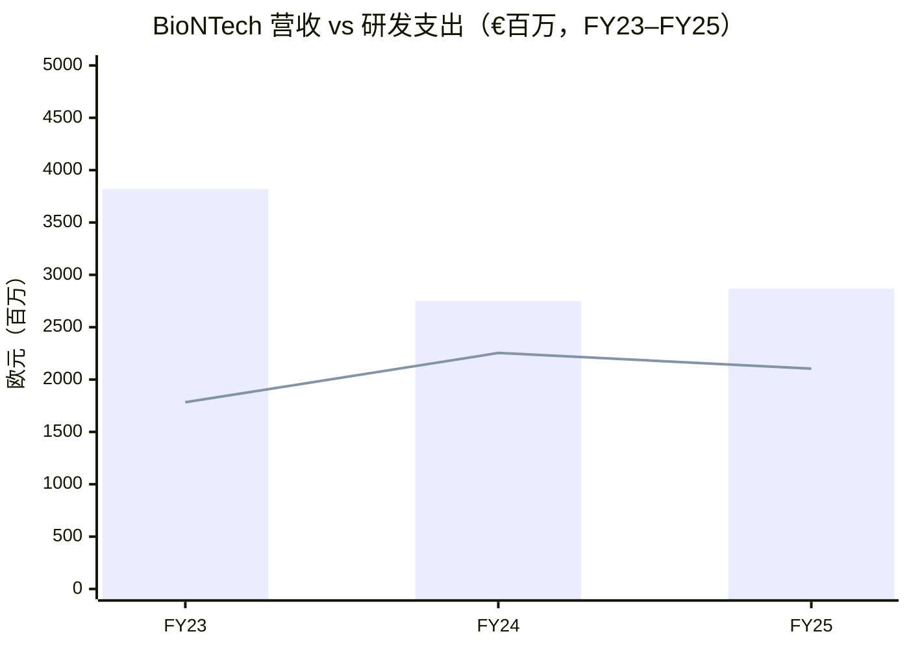
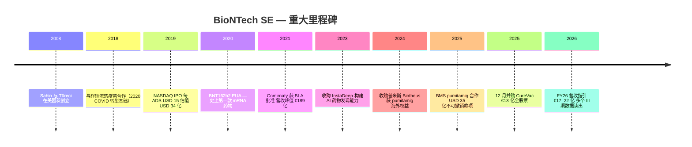
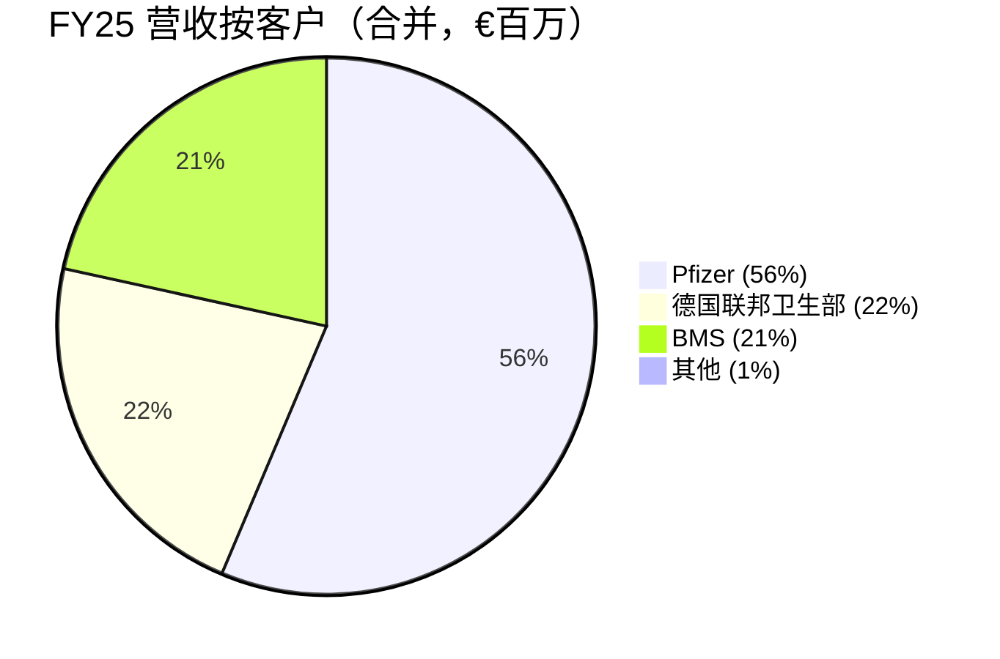
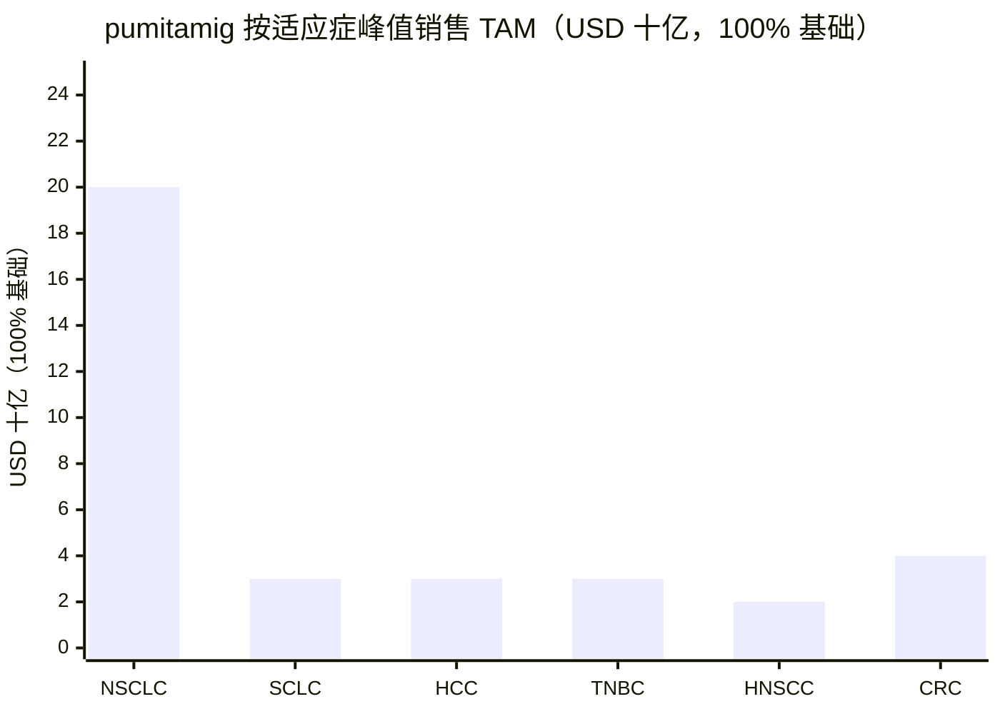
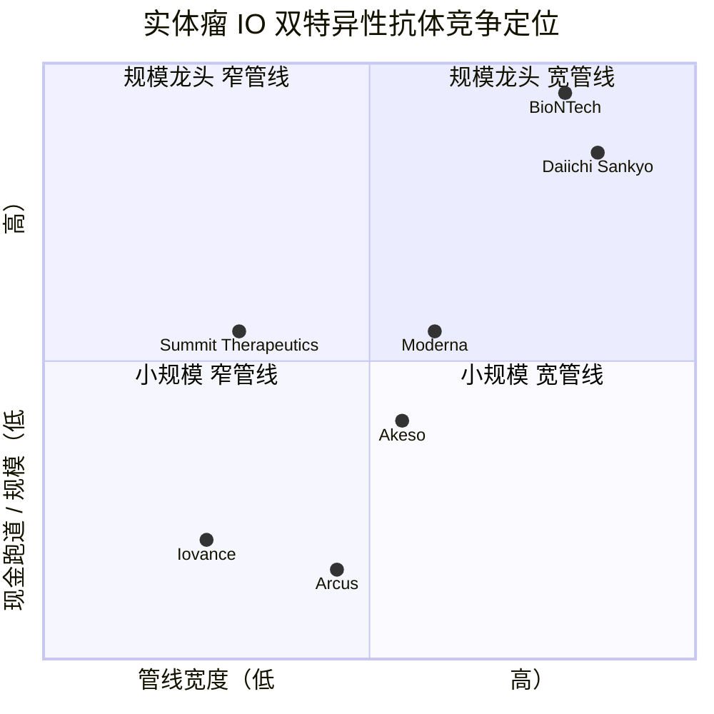
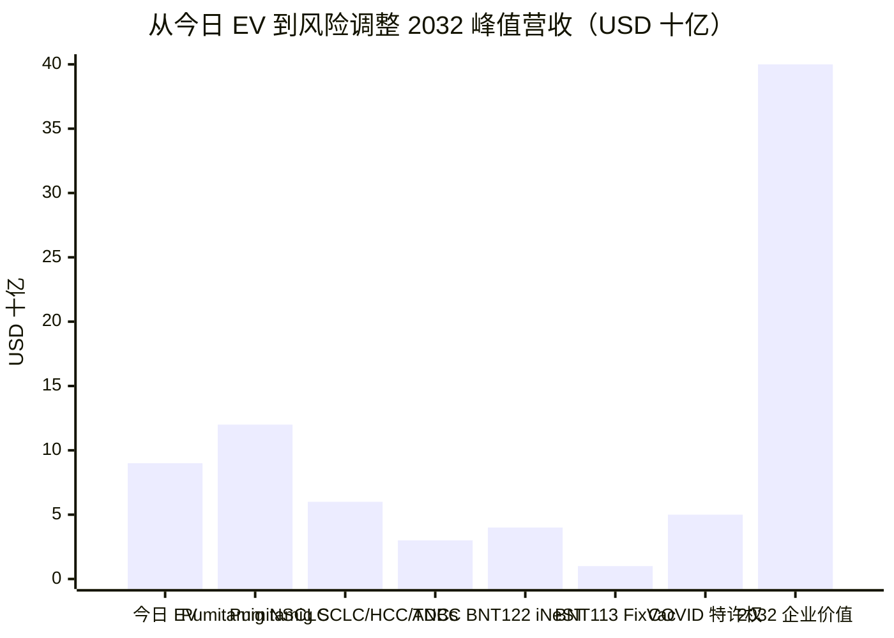

# BioNTech SE (NASDAQ: BNTX) — 公司研究报告

*截至 2026-06-03。收盘价 USD 89.14（2026-06-02）。市值约 USD 225 亿，扣除 €172 亿现金 + 有价证券后的企业价值约 USD 91 亿。*

> **报告首部公告。** 公司于 2026-03-10 发布 FY25 年报时重申 FY26 营收指引区间 **€17–22 亿**。从 FY25 €28.7 亿到 FY26 指引中值的桥接，主要来自 BMS 一次性 €613 m 递延收入催收的不可持续 + COVID-19 疫苗销售的温和下滑，部分被里程碑款项抵消。详见 FY25 业绩 [Form 6-K, 2026-03-10](https://www.sec.gov/Archives/edgar/data/1776985/000177698526000016/form6-kq4fy202510mar2026.htm) 与 [2025 年度报告 Form 20-F](https://www.sec.gov/Archives/edgar/data/1776985/000177698526000017/bntx-20251231.htm)。

---

## 1. 公司概览

BioNTech SE 是一家总部位于德国美因茨（Mainz, An der Goldgrube 12, 55131）的临床阶段生物科技公司 (clinical-stage biotech)，其美国存托股 (ADS, 每股代表 1 股无面值普通股) 自 2019 年 10 月在纳斯达克全球精选市场以代码 `BNTX` 上市 ([2025 年度报告 Form 20-F, Item 4](https://www.sec.gov/Archives/edgar/data/1776985/000177698526000017/bntx-20251231.htm))。公司由内科医生兼免疫学家、夫妻档创始人 Ugur Sahin 教授 (M.D.) 与 Özlem Türeci 教授 (M.D.) 于 2008 年在美因茨创立，最初的平台思路是基于个性化信使核糖核酸 (mRNA, messenger RNA) 的肿瘤免疫治疗 (immunotherapy)。2020–2021 年间，BioNTech 与辉瑞 (Pfizer Inc.) 共同开发的 BNT162b2 mRNA 新冠疫苗（全球以 Comirnaty 名义销售）使其在 FY21–FY23 累计创造超过 €370 亿收入，成为全球第一家成功商业化 mRNA 药物的公司 ([2025 Form 20-F, Item 5](https://www.sec.gov/Archives/edgar/data/1776985/000177698526000017/bntx-20251231.htm))。

截至 2026-06-02 收盘，BNTX 股价为 USD 89.14，市销率 (P/S, price-to-sales) 约 8.0×，市净率 (P/B, price-to-book) 约 1.04×；52 周价格区间为 USD 79.52 – USD 124.00 ([Yahoo Finance BNTX, 2026-06-02](https://finance.yahoo.com/quote/BNTX/key-statistics))。公司股价已从 2021 年新冠狂热顶峰的 USD 450 以上大幅折让，但 1.04× 的市净率反映出当前股东权益绝大部分由 **€172 亿现金 + 有价证券** 支撑——市值 USD 225 亿减去净现金后，市场仅给予肿瘤管线 + InstaDeep AI 平台约 USD 90 亿的隐含企业价值。FY25 营收为 **€28.699 亿**，同比增长 4.3%，但相比 FY23 €38.19 亿仍下滑 25%，反映 COVID 疫苗收入持续下行 ([2025 Form 20-F, 合并损益表](https://www.sec.gov/Archives/edgar/data/1776985/000177698526000017/bntx-20251231.htm))。

公司核心战略叙事是 "可管理的转型"：从 COVID 现金奶牛 → 肿瘤平台。2008 年成立时的 mRNA 肿瘤计划（FixVac、iNeST），通过 2024 年 11 月收购中国 ADC（antibody-drug conjugate, 抗体偶联药物）/双特异性抗体公司 **Biotheus 普米斯**（获得 PD-L1×VEGF-A 双特异性抗体 BNT327 / pumitamig 在大中华区以外全部权益）以及 2025 年 6 月与百时美施贵宝 (Bristol-Myers Squibb, BMS) 就 pumitamig 全球共同开发协议得到全面强化。BMS 协议中，BNTX 收到 **USD 15 亿首付款** 加 **USD 20 亿不可撤销的年度里程碑款（至 2028 年）** 加 **最高 USD 76 亿的研发、监管和销售里程碑**——这是当年全球最大的 IO（免疫肿瘤学）授权交易 ([2025 Form 20-F, Item 4](https://www.sec.gov/Archives/edgar/data/1776985/000177698526000017/bntx-20251231.htm); [BMS press release, 2025-06-02](https://news.bms.com/news/details/2025/Bristol-Myers-Squibb-and-BioNTech-Announce-Strategic-Collaboration-to-Co-Develop-and-Co-Commercialize-BioNTechs-Investigational-Bispecific-Antibody-Candidate-BNT327/default.aspx))。pumitamig 被管理层定位为有潜力 "广泛取代当前肿瘤免疫治疗标准方案" 的下一代疗法。FY25 调整后经营亏损 €(4.34) 亿（账面亏损 €(14.05) 亿），全部由现金池产生的 €4.57 亿利息收入和上述 BMS 款项覆盖，账面现金可支撑十年以上的烧钱节奏 ([2025 Form 20-F, MD&A](https://www.sec.gov/Archives/edgar/data/1776985/000177698526000017/bntx-20251231.htm))。

### Mermaid 1 — FY23 → FY25 营收与研发支出趋势

来源: [BioNTech 2025 Form 20-F 合并损益表](https://www.sec.gov/Archives/edgar/data/1776985/000177698526000017/bntx-20251231.htm)。柱状为总营收；折线为研发支出。

### 估值快照

| 指标 | BNTX (2026-06-02) | 3 年区间 | 行业中值 |
|---|---|---|---|
| 收盘价 | USD 89.14 | USD 79.52 – USD 197.21 | — |
| 市值 | USD 225 亿 | — | — |
| **TTM P/E** | 不适用（亏损） | — | 临床期 biotech 普遍亏损 |
| **TTM P/S** | 8.0× | 6.5× – 14.2× | SMid-cap biotech 约 5–7× |
| **P/B** | 1.04× | 0.95× – 1.45× | 品牌制药约 3–5× |
| EV / 销售 | ~3.2× (EV ≈ USD 90 亿) | — | 临床期 biotech 约 7× |
| FY26 营收指引 | €17–22 亿 | — | — |

来源: [Yahoo Finance BNTX, 2026-06-02](https://finance.yahoo.com/quote/BNTX/key-statistics) 与 [Yahoo Finance MRNA, 2026-06-02](https://finance.yahoo.com/quote/MRNA/key-statistics)。

8.0× 的 TTM P/S 相对临床期同业（Moderna 约 6.5×，但销售规模更小；新近被 BNTX 整合的 CureVac 交易前 P/S > 25×）**实际上是折价**——因为大量现金背书使 BNTX 的 EV 仅约 USD 90 亿，对应 FY26 指引中值（€19.5 亿 × USD/EUR 1.10 ≈ USD 21.5 亿），市场实际给予的 EV/sales 仅 ~2.4×。这意味着市场要么对 COVID 业务的衰退抱有过度悲观预期，要么对 pumitamig 及 ADC 管线的期权价值视而不见。*分析师观点：* P/B 1.04× 是最干净的健全性检验——以当前股价计，市值高于净现金的部分相当于免费获取整个管线和 InstaDeep AI 平台的期权 ([Yahoo Finance BNTX, 2026-06-02](https://finance.yahoo.com/quote/BNTX/key-statistics))。

---

## 2. 公司历史

BioNTech 源自 Sahin 与 Türeci 在美因茨二十多年的学术 mRNA 研究。两人曾于 2001 年共同创立 Ganymed Pharmaceuticals（2016 年被安斯泰来 Astellas 以最高 USD 14 亿收购），并于 2008 年在 Strüngmann 家族（仿制药龙头 Hexal AG 创始人）种子投资下创立 BioNTech AG，Strüngmann 至今仍是公司控股股东。早期平台理论是合成 mRNA 可被设计为指导患者自身细胞表达特定肿瘤抗原或病原体抗原，从而以患者特异性 (patient-specific) 方式训练免疫系统。2009–2018 年间，BioNTech 一直是私募融资的德国 GmbH/AG，专注于个性化新抗原特异性免疫疗法 (iNeST, individualized neoantigen-specific immunotherapy) 和 FixVac（固定组合肿瘤抗原 mRNA）项目，并与礼来、赛诺菲、基因泰克、再生元和拜耳建立了战略联盟 ([2025 Form 20-F, Item 4.A History](https://www.sec.gov/Archives/edgar/data/1776985/000177698526000017/bntx-20251231.htm))。

2018 年与辉瑞达成的流感疫苗合作是公司至关重要的"奠基性合作"——它成为 2020 年 3 月新冠紧急扩展的契约底盘，使 BioNTech 能够在几个月内将其非临床 mRNA 流感平台转化为 BNT162b2，并于 2020 年 4 月在美因茨和纽约大学开展 1 期临床试验。2019 年 10 月纳斯达克 IPO 以每 ADS USD 15 募资 USD 1.5 亿，估值约 USD 34 亿——此后到 2021 年中估值膨胀约 30 倍 ([2019 年 NASDAQ IPO 招股说明书](https://www.sec.gov/Archives/edgar/data/1776985/000119312519264424/d780791df1.htm))。

2020–2022 年的新冠时代从经济与文化上重塑了公司。美国 FDA 于 2020-12-11 授予 EUA、2021-08-23 批准成人 BLA 后，BioNTech 成为历史上第一家成功商业化产品的 mRNA 公司；营收从 FY19 的 €1.09 亿跳升至 FY21 的 €189 亿 ([Comirnaty FDA BLA 批准函, 2021-08-23](https://www.fda.gov/media/151710/download); [BioNTech FY21 业绩公告, 2022-03-30](https://investors.biontech.de/news-releases/news-release-details/biontech-announces-fourth-quarter-and-full-year-2021-financial))。pandemic 期间公司加速三项结构性举措：(i) 新加坡 mRNA 生产基地；(ii) 卢旺达 "BioNTainer" 模块化 GMP 工厂；(iii) 2023 年以约 USD 5.62 亿收购英国 / 突尼斯背景的 InstaDeep，构建 AI 原生药物发现与临床试验设计能力 ([InstaDeep 收购公告, 2023-01-10](https://investors.biontech.de/news-releases/news-release-details/biontech-completes-acquisition-instadeep))。

2024–2025 年的转型才是当下投资逻辑的真正起点。2024 年 11 月，BioNTech 同意以 **USD 8 亿首付款** + 或有里程碑款收购珠海普米斯生物 Biotheus Inc.，并于 2025 年 1 月完成交割；获得 **BNT327/PM8002（pumitamig 普米利单抗）** 在大中华区以外的全部权益——这是一款进入临床后期 (Phase 2) 的 PD-L1 × VEGF-A 双特异性抗体，针对多种实体瘤（肺癌、乳腺癌、肝细胞癌、头颈癌）([Biotheus 收购公告, 2024-11-12](https://investors.biontech.de/news-releases/news-release-details/biontech-announces-acquisition-biotheus-strengthen-and-expand))。2025 年 6 月，BioNTech 通过与百时美施贵宝 (BMS) 签署全球 50-50 共同开发和商业化协议，将该资产 "货币化" 一半，获 **USD 15 亿现金首付**，并保证 **USD 20 亿不可撤销年度款项至 2028 年**，外加最高 **USD 76 亿研发 / 监管 / 销售里程碑** ([BMS-BioNTech 公告, 2025-06-02](https://news.bms.com/news/details/2025/Bristol-Myers-Squibb-and-BioNTech-Announce-Strategic-Collaboration-to-Co-Develop-and-Co-Commercialize-BioNTechs-Investigational-Bispecific-Antibody-Candidate-BNT327/default.aspx))。2025 年 12 月，公司以 €13 亿全股票方式合并陷入财务困境的德国 Tübingen 同行 CureVac N.V.，整合欧洲 mRNA 产能、专利组合，并新增约 1,200 名员工 ([2025 Form 20-F, Note 5](https://www.sec.gov/Archives/edgar/data/1776985/000177698526000017/bntx-20251231.htm))。

### Mermaid 2 — BioNTech 发展时间线（2008 → 2026）

来源: [2025 Form 20-F, Item 4.A](https://www.sec.gov/Archives/edgar/data/1776985/000177698526000017/bntx-20251231.htm)、[BMS 公告 2025-06-02](https://news.bms.com/news/details/2025/Bristol-Myers-Squibb-and-BioNTech-Announce-Strategic-Collaboration-to-Co-Develop-and-Co-Commercialize-BioNTechs-Investigational-Bispecific-Antibody-Candidate-BNT327/default.aspx)。

---

## 3. 管理团队

**Ugur Sahin 教授 (M.D.) — 联合创始人兼 CEO（自 2008 年）**（合并创始人-CEO 履历，400 字）。Sahin 现年 60 岁，受教育于科隆大学和萨尔大学医学院，是 BioNTech 至今为止最重要的单一决策者。他与夫人兼科学伙伴 Özlem Türeci 教授于 2001 年共同创立 Ganymed Pharmaceuticals（2016 年被安斯泰来以最高 USD 14 亿收购，款项分期至 2026 年），并于 2008 年共同创立 BioNTech AG。20-F 原文记载 "Ugur Sahin 是 500 多项已申请专利和专利的共同发明人" (co-inventor of more than 500 filed patents applications and patents)；其学术兼任包括美因茨约翰内斯·古腾堡大学教职，以及美因茨 TRON 转化肿瘤研究所所长 ([2025 Form 20-F, Item 6.A](https://www.sec.gov/Archives/edgar/data/1776985/000177698526000017/bntx-20251231.htm))。Sahin 在公司文件中被反复描述为 "全球 mRNA 药物领域最重要的专家之一" (one of the world's foremost experts on messenger ribonucleic acid medicines)，"开创了多项基础……技术"；他三十年前的博士论文围绕 mRNA 肿瘤抗原识别，奠定了之后产生 BNT162b2 的平台理论。Sahin 已获得德国可持续发展奖、伊朗 Mustafa Prize、德国总统功绩勋章等多项荣誉。其 CEO 任期至 2026 年 12 月 31 日，2024 年股东大会延任使其作为公司最高科学家兼最高经营者的双重身份得到稳固。Sahin 与 Türeci 二人合计持股约占公司股本 17%（含普通股 + 未行权期权），相对 Strüngmann 家族仍是次要持股，但显著高于行业平均。20-F 显示其 2025 年目标总薪酬（长期激励 LTI 目标值）为 **€350 万**，以业绩股票单位 (PSU) 方式分四年归属至 2029 年 ([2025 Form 20-F, Item 6.B](https://www.sec.gov/Archives/edgar/data/1776985/000177698526000017/bntx-20251231.htm))。

**Özlem Türeci 教授 (M.D.) — 联合创始人兼首席医学官 (CMO)**（200 字）。Türeci 现年 59 岁，是内科医生、免疫学家、肿瘤研究者；她与 Sahin 共同创立 Ganymed 和 BioNTech。20-F 将其描述为 "具有转化医学专业能力的医生、免疫学家和肿瘤研究者"。她拥有 Homburg/Saar 大学的分子医学博士学位，肿瘤免疫学领域学术发表深厚。作为 CMO，她负责 BioNTech 全部临床开发，是 2020–2022 年新冠期间与 Sahin 一起代表公司的公众形象。20-F 显示其 2025 年目标 LTI 价值为 **€180 万**。Türeci 的任期与 Sahin 平行——至 2026 年 12 月 31 日。两人共同负责 BioNTech 自创立以来的个性化医学理论（iNeST 和 FixVac），并主导向 "双特异性抗体 + mRNA + ADC 组合驱动" 的肿瘤治疗特许经营权 (franchise) 的转型。这种统一的创始人-科学家-临床医生联合执掌结构，在该规模的生物科技公司中并不常见，是公司难以量化但非常关键的护城河 ([2025 Form 20-F, Item 6.A 与 6.B](https://www.sec.gov/Archives/edgar/data/1776985/000177698526000017/bntx-20251231.htm))。

---

## 4. 产品与服务（最重要章节）

BioNTech 的产品宇宙可清晰分为六类：**(A) 商业化 COVID-19 疫苗特许经营权（Comirnaty）**；**(B) 由 PD-L1 × VEGF-A 双特异性抗体 *pumitamig* (BNT327) 主导的肿瘤管线**；**(C) 与中国 DualityBio 和 YL Bio 合作开发的 ADC 抗体偶联药物组合**；**(D) 个性化 mRNA 癌症免疫疗法（iNeST 和 FixVac）**；**(E) Comirnaty 之外的其他传染病疫苗（mpox、疟疾、结核、HSV-2）**；**(F) 支持整个管线的 InstaDeep AI / TAMARIND 平台**。20-F Item 4.B 列示公司当前共有 16 个临床项目处于活跃开发中，覆盖 20 多项临床试验，外加 1 款已上市 COVID 疫苗 ([2025 Form 20-F, Item 4.B](https://www.sec.gov/Archives/edgar/data/1776985/000177698526000017/bntx-20251231.htm))。

### A. Comirnaty (BNT162b2) — 商业化收入基础

Comirnaty 是 BioNTech 的脂质纳米颗粒 (LNP, lipid nanoparticle) 制剂、修饰核苷 mRNA 疫苗，编码 SARS-CoV-2 刺突糖蛋白 (spike glycoprotein)。20-F 以公司法律语言原文描述：

> "Comirnaty, our COVID-19 vaccine, was developed by BioNTech as the lead candidate from our BNT162 program and is being globally commercialized in collaboration with Pfizer."（"Comirnaty 即我们的 COVID-19 疫苗，作为我们 BNT162 项目的主要候选物由 BioNTech 开发，并与辉瑞合作全球商业化。"）([2025 Form 20-F, Item 4.B.1](https://www.sec.gov/Archives/edgar/data/1776985/000177698526000017/bntx-20251231.htm))

疫苗每年根据 FDA / EMA 推荐针对主流 SARS-CoV-2 变种株进行配方更新（FY25 株为 LP.8.1，FY26 预期为 JN.1 谱系）。BioNTech 记录的是 **协议项下的毛利润份额 (collaboration gross-profit share)**，并非毛销售额，且由于辉瑞海外子公司的财政季度不同，确认存在一个季度的滞后。FY25 Comirnaty 营收为 **€19.953 亿，占总营收 70%**（FY24: €24.321 亿，88%；FY23: €37.762 亿，99%），衰减反映后疫情时代呼吸道病毒的季节性常态化 ([2025 Form 20-F, Note 6.1](https://www.sec.gov/Archives/edgar/data/1776985/000177698526000017/bntx-20251231.htm))。

**中文释义 / Plain-language gloss：** Comirnaty 是 BioNTech 持有的全球非美国政府商业渠道收益约 50% 份额，外加德国政府的 pandemic 储备采购合同。从财务结构看，它是未来 3–5 年呈管理性下行 (managed decline) 的高毛利、低边际成本年金。

### B. Pumitamig 普米利单抗 (BNT327 / BMS-986545) — 平台的核心肿瘤资产

Pumitamig 是 BioNTech 当前唯一最大近期价值驱动因素。20-F 原文：

> "Pumitamig is a bispecific immunomodulator candidate targeting PD-L1 and VEGF-A. […] We acquired full global ex-Greater China rights to pumitamig through our acquisition of Biotheus in January 2025. In June 2025, we entered into a strategic collaboration with Bristol-Myers Squibb to co-develop and co-commercialize pumitamig globally." ([2025 Form 20-F, Item 4.B.2](https://www.sec.gov/Archives/edgar/data/1776985/000177698526000017/bntx-20251231.htm))

**它的物理作用机制是什么** — pumitamig 是一个工程化分子，通过单次静脉输注同时递送两种并行的肿瘤治疗机制：(1) 高亲和力的抗 PD-L1 臂解除肿瘤 T 细胞耗竭（与 Keytruda 派姆单抗 / pembrolizumab 通过 PD-1 检查点阻断的机制相同）；(2) 平行的抗 VEGF-A 臂封锁肿瘤血管供应（贝伐珠单抗 / bevacizumab / Avastin 的机制），同时正常化肿瘤微环境的恶劣环境。临床假设是：在 PD-L1 阳性肿瘤中，这两种机制是协同性的（更正常化的血管 → 更好的 T 细胞浸润），并且单分子简化了相对 Keytruda + Avastin 联合用药的剂量方案。**相对 Keytruda / Tecentriq 的差异化** — pumitamig 是亚洲以外第一款进入 III 期的成熟 PD-L1 × VEGF-A 双特异性抗体，领先于康方生物 (Akeso) 的伊鲁仙单抗 (ivonescimab；针对 PD-1 × VEGF-A，2024 年在中国获批)。pumitamig 在最有商业吸引力的实体瘤适应症上推进：一线和二线 NSCLC（非小细胞肺癌）与 SCLC（小细胞肺癌）、一线 HCC（肝细胞癌）、一线 TNBC（三阴性乳腺癌）、一线结直肠癌、一线头颈癌。**战略意义** — Q4 FY25 业绩准备讲话原文："pumitamig 有潜力广泛取代当前的检查点抑制剂治疗标准方案" ([Q4 FY25 业绩 Form 6-K, 2026-03-10](https://www.sec.gov/Archives/edgar/data/1776985/000177698526000016/form6-kq4fy202510mar2026.htm))。

20-F 明确列出在研 III 期临床试验，包括 **pumitamig 一线 ES-SCLC 随机 III 期 vs. 阿替利珠单抗 (atezolizumab) + 化疗**、**pumitamig 一线 NSCLC 项目**，以及与 BNT323（trastuzumab pamirtecan, HER2-ADC）、BNT324/DB-1311（B7-H3-ADC）、BNT325/DB-1305（TROP-2-ADC）联合的 II 期临床。2025 年 6 月，pumitamig 获 FDA **小细胞肺癌孤儿药资格** ([2025 Form 20-F, Item 4.B.2](https://www.sec.gov/Archives/edgar/data/1776985/000177698526000017/bntx-20251231.htm))。预计 2026–2027 年关键数据读出：一线 SCLC 中期、一线 NSCLC 中期、一线 TNBC 和一线头颈癌数据，每一项都是二元催化剂。

### C. 抗体偶联药物 (ADC) 组合 — 与 pumitamig 联合的"弹头"载具

ADC 组合是定义 BioNTech 商业肿瘤押注的 "IO + ADC 战略" 的弹头部分。四款已命名的临床期 ADC，全部从中国合作方授权引进：

| 候选物 | 靶点 | 合作方 | 主要适应症 | 阶段 |
|---|---|---|---|---|
| Trastuzumab pamirtecan (BNT323/DB-1303) | HER2 (拓扑异构酶-1 抑制剂载荷) | DualityBio | 二线+ 子宫内膜癌、乳腺癌 | III 期 (EC); I/II 期 (BC 等) |
| BNT324/DB-1311 | B7-H3 | DualityBio | 多种实体瘤 | I/II 期 |
| BNT325/DB-1305 | TROP-2 | DualityBio | 多种实体瘤 | I/II 期 |
| BNT326/YL202 | HER3 | YL Bio | 晚期 / 转移性乳腺癌、NSCLC | I/II 期 |

来源: [2025 Form 20-F, Item 4.B.3](https://www.sec.gov/Archives/edgar/data/1776985/000177698526000017/bntx-20251231.htm)。20-F 原文描述 BNT323 为 "一种靶向 HER2 的拓扑异构酶-1 抑制剂 ADC"，在晚期 / 转移性乳腺癌 (NCT06827236) I/II 期临床中。FY25 BNT323 出现 **€85.4 m 的减值** 计入研发费用（详见 Note 10），原因是部分适应症的去优先化——这是即便已进入 III 期的 ADC 也可能令人失望的真实提醒。ADC 组合的战略意义在于：让 BioNTech 在不向第三方支付 ADC 主链费用的情况下广泛运行 pumitamig 联合用药，并使 BNTX 在不必拥有整个 HER2 宇宙的情况下与第一三共 (Daiichi Sankyo) 的 Enhertu 特许权竞争。

### D. iNeST 和 FixVac — 个性化和肿瘤类别 mRNA 癌症免疫疗法

这些是公司的奠基性项目。**Autogene cevumeran (RO7198457 / BNT122)** 是主要的 iNeST 项目，是与基因泰克 / 罗氏合作的个性化新抗原特异性免疫疗法，处于辅助性结直肠癌 (CRC) II 期和辅助性胰腺导管腺癌 (PDAC) II/III 期。20-F 原文记载：

> "BNT122-01 Phase 2 Clinical Trial in Adjuvant Colorectal Cancer […] At the first pre-specified interim analysis of the ongoing BNT122-01 Phase 2 clinical trial, the futility boundary was crossed."（"在 BNT122-01 辅助性结直肠癌 II 期临床试验的首个预设中期分析中，跨过了无效边界。"）([2025 Form 20-F, Item 4.B.2](https://www.sec.gov/Archives/edgar/data/1776985/000177698526000017/bntx-20251231.htm))

罗氏-BNTX 联合的 PDAC 辅助 II/III 期读出仍是来自传统 mRNA 癌症管线的最大单一二元催化剂；如果阳性，可能确立个性化 mRNA 癌症疫苗作为新治疗范式。**FixVac (BNT111 黑色素瘤、BNT113 HPV16+ 头颈癌、BNT116 NSCLC)** 是即用型肿瘤抗原 mRNA 项目。BNT113 于 2025 年 12 月获 FDA 快速通道资格用于 PD-L1+ HPV16+ 头颈鳞癌 ([2025 Form 20-F, Item 4.B.2.ii](https://www.sec.gov/Archives/edgar/data/1776985/000177698526000017/bntx-20251231.htm))。BNT211 是靶向 CLDN6 的 CAR-T 细胞疗法（嵌合抗原受体 T 细胞），处于复发 / 难治实体瘤的 I/II 期。

### E. Comirnaty 之外的传染病管线

非 COVID 传染病分支相对规模较小，但包括 **BNT163（HSV-2 预防，I 期）**、**BNT165（疟疾，I 期）**、**BNT166（mpox，由比尔与梅琳达·盖茨基金会 BMGF 支持）** 和 **BNT164（结核，I 期）**，外加与辉瑞合作的未披露流感项目。20-F 将疟疾、mpox、TB 工作定位为 BMGF 和 CEPI（流行病防范创新联盟）资助——非纯商业押注，而是平台验证工作，巩固 BioNTech "非洲为非洲" 的卢旺达 BioNTainer 布局和全球大流行准备角色 ([2025 Form 20-F, Item 4.B.3](https://www.sec.gov/Archives/edgar/data/1776985/000177698526000017/bntx-20251231.htm))。

### F. InstaDeep — 支持管线的 AI 平台

2023 年 1 月以约 USD 5.62 亿收购，InstaDeep 是一家拥有 600 名员工、总部在英国 / 突尼斯的 AI 公司，构建用于基因组监控 (genomic surveillance)、蛋白质设计和临床试验设计的深度学习模型。20-F 指出 InstaDeep 至今的最大贡献是变种检测 (SARS-CoV-2 早期预警系统) 和 mRNA 设计的抗原预测 ([2025 Form 20-F, Item 4.B.6](https://www.sec.gov/Archives/edgar/data/1776985/000177698526000017/bntx-20251231.htm))。

### 管线阶段分布（可视化）

来源: [2025 Form 20-F, Item 4.B 管线概览](https://www.sec.gov/Archives/edgar/data/1776985/000177698526000017/bntx-20251231.htm)。磁盘旧有图表；不重新生成。

### Mermaid 3 — 产品组合树

```mermaid
graph TD
    A[BioNTech SE] --> B[A. 商业化 COVID 特许权]
    A --> C[B. 肿瘤 — pumitamig 主导]
    A --> D[C. ADC 组合]
    A --> E[D. iNeST + FixVac mRNA 肿瘤]
    A --> F[E. 传染病疫苗]
    A --> G[F. InstaDeep AI 平台]
    B --> B1[Comirnaty BNT162b2 与辉瑞合作]
    B --> B2[年度毒株更新季节性]
    C --> C1[Pumitamig 一线 NSCLC III 期]
    C --> C2[Pumitamig 一线 ES-SCLC III 期]
    C --> C3[Pumitamig 一线 HCC TNBC CRC II 期]
    D --> D1[BNT323 HER2-ADC III 期 EC]
    D --> D2[BNT324 B7H3-ADC I/II 期]
    D --> D3[BNT325 TROP2-ADC I/II 期]
    D --> D4[BNT326 HER3-ADC I/II 期]
    E --> E1[Autogene cevumeran iNeST PDAC II/III]
    E --> E2[BNT111 黑色素瘤 II 期]
    E --> E3[BNT113 HNSCC II 期 FDA 快速通道]
    E --> E4[BNT211 CLDN6 CAR-T I/II 期]
    F --> F1[BNT163 HSV-2 I 期]
    F --> F2[BNT165 疟疾 I 期]
    F --> F3[BNT166 mpox]
    F --> F4[BNT164 TB I 期]
```

来源: [2025 Form 20-F, Item 4.B](https://www.sec.gov/Archives/edgar/data/1776985/000177698526000017/bntx-20251231.htm)。

### 第 4 节综合 — 各部分如何相互作用

整合故事是 **"组合矩阵押注"**：pumitamig 成为 IO 主链，取代 Keytruda + Avastin 联合用药，再以固定组合方式与四款 ADC（BNT323/324/325/326）和 iNeST/FixVac mRNA 疫苗联用，从多个免疫学角度同时攻击最高发病率的实体瘤。InstaDeep 在发现阶段的回报是抗原预测和临床试验设计 AI 缩短每个新 mRNA 项目的 IND 时间。COVID 特许经营权是现金生成底盘，资助整个押注——€172 亿现金加上 BMS €20 亿不可撤销年度款项，足以让 BioNTech 在不进行外部融资的情况下推动 pumitamig 通过 6 个关键 III 期读出。打破整合故事的风险是 NSCLC 或 SCLC 中 pumitamig III 期失败；若无此情况，底盘可无限期自养。

---

## 5. 客户与地理结构 — 集中度极高的两个核心客户

BioNTech 的客户基础对生物科技公司而言不寻常：由于辉瑞合作结构，**几乎整个 COVID 特许权确认为与一个对手方（辉瑞）的合作份额**，其余主要来自一个主权客户（德国联邦卫生部）。20-F 原文披露客户级别营收结构：

> "Revenues by customers (in millions €): 2025: Pfizer 1,602.0 (56%); German Federal Ministry of Health 627.5 (22%); Bristol-Myers Squibb 613.0 (21%); other 27.4 (1%). 2024: Pfizer 2,011.7 (73%); German Federal Ministry of Health 411.0 (15%); other 328.4 (12%). 2023: Pfizer 3,293.0 (86%); German Federal Ministry of Health 110.0 (3%); other 416.0 (11%)." ([2025 Form 20-F, Note 6.1](https://www.sec.gov/Archives/edgar/data/1776985/000177698526000017/bntx-20251231.htm))

**上述全部数字均以合并营收为分母。** 这是异常干净的披露：没有部门级别的混淆，没有混合分母——每一项客户百分比都是占集团合并营收的百分比，且 FY25 前 3 大客户（辉瑞、德国联邦卫生部、BMS）合计代表 **99% 的营收**。这种集中度大约是大型药企典型 "一般门槛" 的 4 倍，是 BNTX 投资逻辑中最大的单一营收质量风险。缓解事实是：三家对手方中有两家是主权或准主权——德国政府不会违约——第三家（BMS）是 Tier-1 投资级跨国制药企业。但结构性敞口仍在：辉瑞 COVID-19 疫苗预期减少 10%，约 1:1 转化为 BNTX 营收减少。

### Mermaid 4 — FY25 客户营收结构（合并）

来源: [2025 Form 20-F Note 6.1](https://www.sec.gov/Archives/edgar/data/1776985/000177698526000017/bntx-20251231.htm)。单一分母（合并营收 FY25 = €28.699 亿）。

来源: 旧有图表，数据与上方 Mermaid 一致。

### 地理结构

20-F 也以合并基础披露地理营收：

> "Revenues by countries (in millions €): 2025: United States 1,794.9 (63%); Germany 759.1 (26%); rest of Europe 197.1 (7%); rest of world 118.8 (4%). 2024: United States 1,847.8 (67%); Germany 706.9 (26%); rest of Europe 105.4 (4%); rest of world 91.0 (3%)" ([2025 Form 20-F, Note 6.1](https://www.sec.gov/Archives/edgar/data/1776985/000177698526000017/bntx-20251231.htm))。

美国-德国二元结构占 FY25 营收的 **89%**，世界其他地区（包括因 Biotheus 收购而明示披露的来自中国的 €18 m）仍少于 5%。辉瑞 COVID 利润份额根据辉瑞母国市场报告分配至 "美国"，即使终端患者销售是全球性的。这清楚表明 BioNTech 结构性是一个跨大西洋的公司，目前在日本、韩国、印度、巴西等其他主要新兴市场没有显著敞口。

来源: [2025 Form 20-F Note 6.1](https://www.sec.gov/Archives/edgar/data/1776985/000177698526000017/bntx-20251231.htm)。

### 客户合同结构

辉瑞合作是 50-50 毛利润分享安排（原始 2020 协议，2022 年根据后疫情动态修订）。关键的是，**20-F 明确否认对辉瑞销售管线的直接可见度**：

> "Our reported revenue is based in part on preliminary estimates from Pfizer and other assumptions and judgments that we have made, which may be subject to revision in future periods." ([2025 Form 20-F, Item 3.D Risk Factors](https://www.sec.gov/Archives/edgar/data/1776985/000177698526000017/bntx-20251231.htm))

德国联邦卫生部合同是 2021 年签署、2023 年修订的 pandemic 准备采购协议；据其条款，BioNTech 以合同单价向国家储备交付合同最低数量的剂量。FY25 €613 m 的 BMS 营收是 BMS 首付款在 BMS 协议于 2025-06-02 生效时根据 IFRS 15 进行的累计催收——它**不是经常性的**。从 FY26 开始，BMS 营收将回到每年 USD 5 亿不可撤销的年度款项（至 2028 年）加上任何里程碑款项。

---

## 6. 行业概览与 TAM

BioNTech 在两个动态不同的行业中运营。

### A. COVID-19 / 呼吸道 mRNA 疫苗行业 — 可管理性下降

这是现金生成底盘。pandemic 之后，COVID-19 疫苗市场已从 2021–2022 年的 ~USD 700 亿峰值压缩至年化 ~USD 60–80 亿运行率，分布在 Pfizer-BioNTech、Moderna 以及 Sanofi、GSK 和 CureVac（已被 BNTX 整合）等新兴竞争对手之间。行业共识假设 pandemic 后市场在当前运行率附近趋于平稳，与流感相似 ([WHO, Global Vaccine Market Report 2024](https://www.who.int/publications/i/item/9789240091122))。Pfizer-BNTX 联合体在美国私人市场份额约 60%，全球份额较小，根据管理层 Q4 FY25 评论 ([Q4 FY25 业绩 Form 6-K, 2026-03-10](https://www.sec.gov/Archives/edgar/data/1776985/000177698526000016/form6-kq4fy202510mar2026.htm))。FY26–30 结构性问题是 Pfizer-BNTX 是否在 (a) Moderna 的 mRNA-1283、(b) Novavax 的蛋白质 Nuvaxovid 和 (c) 缓慢涌现的佐剂化重组替代品的竞争下维持这份额。*分析师观点：* 应将 COVID 特许权建模为未来 3–5 年的可管理性下降（每年 -10% 至 -15%）。

### B. 免疫肿瘤学 (IO) 行业 — Keytruda 的 USD 2,000 亿 7 年阴影

BioNTech 押注的高风险一侧。全球 IO 市场——主要是 PD-1/PD-L1 检查点抑制剂，通常与化疗或抗 VEGF 抗体联用——是制药史上最大的单一治疗类别市场。仅 Keytruda（派姆单抗，默克）在 2024 年创造 **USD 295 亿营收**，同比增长 +18%，预计在 2028 年专利到期前峰值约 USD 330–350 亿 ([Merck 2024 10-K](https://www.sec.gov/cgi-bin/browse-edgar?action=getcompany&CIK=0000310158&type=10-K&dateb=&owner=include&count=40); [Reuters Keytruda 展望, 2025-02-04](https://www.reuters.com/business/healthcare-pharmaceuticals/keytruda-sales-forecast-stays-bumper-merck-bets-on-other-drugs-2025-02-04/))。整个 IO 类别（Keytruda、Opdivo、Imfinzi、Tecentriq、Libtayo、Tevimbra、Tislelizumab 等）全球营收超过 USD 500 亿 / 年，IQVIA 预测在无破坏情况下到 2030 年增长至 ~USD 750 亿 ([IQVIA Oncology Trends 2025](https://www.iqvia.com/insights/the-iqvia-institute/reports-and-publications/reports/global-oncology-trends-2024))。"破坏" 候选者是 PD-(L)1 和第二轴（VEGF, TIGIT, LAG-3 等）的双特异性抗体；第一代 PD-1/VEGF 双特异性抗体伊鲁仙单抗 (Akeso/Summit) 于 2024 年在中国获批，并在 HARMONi-2 中显示出在一线 PD-L1+ NSCLC 中相对于 Keytruda 的优越 PFS——这驱动了 PD-(L)1/VEGF 双特异性抗体可能在多个适应症中取代 Keytruda 的更新行业信念 ([Reuters HARMONi-2 读出, 2024-09-08](https://www.reuters.com/business/healthcare-pharmaceuticals/summit-akesos-ivonescimab-tops-keytruda-late-stage-china-lung-cancer-study-2024-09-08/))。

仅在 1L NSCLC 一个适应症中，若 pumitamig 成功，BioNTech 可用 TAM 约 USD 200 亿（假设占 ~USD 650 亿 1L NSCLC IO 市场的 30% 份额）。在 50-50 BMS 合作调整后，BNTX 的份额约 USD 100 亿。再叠加 1L SCLC（~USD 30 亿 TAM）、1L HCC（~USD 30 亿）、1L TNBC（~USD 30 亿）和 1L 头颈癌（~USD 20 亿），pumitamig 累计峰值销售 SAM 扩展至与 BMS 共享的 USD 150–250 亿。仅 BNTX 50% 份额，按典型已去风险化双特异性抗体的 5× 峰值销售倍数，可证明 BNTX 应额外有 USD 350–600 亿的企业价值——相对当前企业价值 USD 90 亿。风险加权版本（1L NSCLC 成功概率约 35%，SCLC 约 50%，HCC 约 30%，TNBC 约 25%）将其降至约 USD 100–180 亿的风险调整 NPV，仍是当前 EV 的 2–4 倍倍数。

### C. ADC 行业 — 第一三共 Enhertu 的 USD 70 亿验证

抗体偶联药物是第二大当前肿瘤增长向量。第一三共的 HER2-ADC trastuzumab deruxtecan (Enhertu，与阿斯利康合作) 在 FY24 创造 USD 39 亿销售（FY24 截至 2025-03），FY26 预计 >USD 70 亿 ([第一三共 FY24 业绩, 2025-04-30](https://www.daiichisankyo.com/files/news/pressrelease/pdf/202504/20250430_E.pdf))。更广泛的 HER2/TROP-2/B7-H3/HER3 ADC 行业正接近 2027 年 USD 200 亿年销售，根据 Evaluate Vantage 预测 ([Evaluate Vantage 制药预测和展望 2027](https://www.evaluate.com/thought-leadership/vantage/pharma-forecast-and-outlook))。BioNTech 的四个 ADC 候选物分别针对每类抗原，并将使 BNTX 与 pumitamig 一同参与这一市场。

### Mermaid 5 — pumitamig 可寻址峰值 TAM（USD 十亿，100% 基础）

来源: 推导自 [IQVIA 2025 全球肿瘤趋势](https://www.iqvia.com/insights/the-iqvia-institute/reports-and-publications/reports/global-oncology-trends-2024) 子适应症分割；BNTX 份额通过 BMS 合作为 50%。

---

## 7. 竞争格局

2025 年 20-F Item 4.B.4 "竞争" 部分按机制而非按产品列出了具名竞争对手。BioNTech 在 **三个不同的竞争集** 中竞争：

### A. PD-(L)1 / VEGF 双特异性抗体竞争集（pumitamig 集）

| 竞争对手 | 资产 | 机制 | 状态 |
|---|---|---|---|
| 康方生物 / Summit Therapeutics | 伊鲁仙单抗 (SMMT-2018) | PD-1 × VEGF | 中国获批（2024 年 5 月）；中国以外 III 期进行中 |
| 辉瑞 | Vudalimab + 贝伐珠单抗联用 | 不同 | III 期 |
| 罗氏 / 中外 | Tiragolumab + 阿替利珠单抗 + 贝伐珠单抗 | TIGIT + PD-L1 + VEGF | III 期 |
| 康方生物 | 伊鲁仙单抗 + ADC 组合 | 不同 | I/II 期 |

来源: BioNTech 20-F + [Summit Therapeutics 2024 10-K](https://www.sec.gov/cgi-bin/browse-edgar?action=getcompany&CIK=0001599298&type=10-K&dateb=&owner=include&count=10)。pumitamig 是亚洲以外唯一进入 III 期的 PD-L1 × VEGF-A 双特异性抗体（非 PD-1 × VEGF-A）——如果 PD-L1 机制证明更干净，这就是差异化优势。

### B. mRNA 平台竞争集

| 竞争对手 | 国家 | 平台主推 | 管线 |
|---|---|---|---|
| Moderna Inc. (MRNA) | 美国 | Spikevax + INT（与默克合作个性化新抗原） | RSV、流感、CMV、INT III 期黑色素瘤辅助 |
| CureVac（已整合） | 德国 | 现并入 BNTX | — |
| Arcturus (ARCT) | 美国 | 自扩增 mRNA | COVID、流感 |
| Sanofi (SAN.PA) | 法国 | Translate Bio 收购 | 流感、RSV |

*分析师观点：* 在西方 mRNA 公司中，BNTX 和 Moderna 是仅有的两家同时拥有有意义的商业营收和可信非 COVID 管线的公司。Moderna 的 INT 癌症疫苗 (mRNA-4157，默克合作) 是自体新抗原疫苗 autogene cevumeran (BNT122) 的最直接竞争对手，并在辅助性黑色素瘤适应症中领先约一年。

### C. ADC 竞争集

| 竞争对手 | 主要 ADC | 靶点 | 状态 |
|---|---|---|---|
| 第一三共 / 阿斯利康 | Enhertu (T-DXd) | HER2 | 已上市；~USD 70 亿 FY26 预测 |
| 第一三共 / 阿斯利康 | Datroway (Dato-DXd) | TROP-2 | 一线 NSCLC 获批，扩展中 |
| 辉瑞（前 Seagen） | Padcev (EV) | Nectin-4 | 已上市 |
| Gilead (Trodelvy) | Sacituzumab govitecan | TROP-2 | 已上市 |
| 默克（收购第一三共特许人） | 多个 HER3、B7-H3 ADCs | — | II-III 期 |

来源: 各公司 10-Ks。相关竞争动态是 BNTX 的 ADCs (BNT323/324/325/326) 不是作为独立领导者定位，而是作为 pumitamig 的组合伙伴——它们与默克和第一三共是否允许其 ADCs 与非 Keytruda IO 药物组合的开放问题竞争。

### 同业估值（第 7 节 + 第 2 节）

| 同业 | 市值 | TTM P/S | EV/sales | 管线主推 |
|---|---|---|---|---|
| BioNTech (BNTX) | USD 225 亿 | 8.0× | ~3.2× | pumitamig + mRNA |
| Moderna (MRNA) | ~USD 110 亿 | ~6.5× | ~4.0× | INT + RSV |
| Summit Therapeutics (SMMT) | ~USD 120 亿 | n/m | n/m | 伊鲁仙单抗 |
| Iovance (IOVA) | ~USD 15 亿 | ~3× | ~5× | TIL 细胞疗法 |
| Arcus (RCUS) | ~USD 20 亿 | n/m | n/m | TIGIT IO |
| 第一三共 (4568.T) | ~USD 600 亿 | ~5× | ~5× | Enhertu、Datroway |

来源: [Yahoo Finance 各 ticker 同业, 2026-06-02](https://finance.yahoo.com/quote/BNTX/key-statistics)。

来源: Yahoo Finance / 公司文件复合, 2026-06-02。

### Mermaid 6 — BioNTech 竞争定位四象限

来源: 定位由分析师构造；营收规模和管线宽度从各公司 2024-2025 10-Ks / 等价物提取。

---

## 8. 市场机会（TAM 建构）

叠加 BNTX 特定可寻址市场：

| 部分 | 2025 全球市场 | 2030E 市场 | BNTX 可寻址份额 | BNTX 峰值营收（50% 基础） |
|---|---|---|---|---|
| COVID-19 疫苗 | ~USD 70 亿 | ~USD 50 亿 | ~50% Pfizer-BioNTech 份额 | USD 10-15 亿 |
| 1L NSCLC IO | ~USD 250 亿 | ~USD 350 亿 | pumitamig 成功 20-30% 份额 | USD 35-50 亿 |
| 1L SCLC IO | ~USD 15 亿 | ~USD 30 亿 | pumitamig 成功 40% | USD 6 亿 |
| 1L HCC IO | ~USD 20 亿 | ~USD 40 亿 | 20% | USD 4 亿 |
| 1L TNBC IO | ~USD 20 亿 | ~USD 40 亿 | 20% | USD 4 亿 |
| HNSCC 辅助（BNT113）| ~USD 15 亿 | ~USD 20 亿 | 15% | USD 1.5 亿 |
| 辅助 PDAC（BNT122）| n/a | ~USD 15 亿 | 50%（Roche-BNTX） | USD 4 亿 |
| ADC 组合（合计）| — | — | 各小份额 | USD 5 亿混合 |
| **BNTX 总峰值营收（风险调整）** | | | | **2032 年约 USD 70-90 亿** |

来源: 市场规模来自 [IQVIA 2025 全球肿瘤趋势](https://www.iqvia.com/insights/the-iqvia-institute/reports-and-publications/reports/global-oncology-trends-2024)、[Evaluate Vantage 2027 制药预测](https://www.evaluate.com/thought-leadership/vantage/pharma-forecast-and-outlook)，并由分析师判断使用 [BIO 临床开发成功率 2011-2020](https://www.bio.org/clinical-development-success-rates-and-contributing-factors-2011-2020) 的 III 期历史成功率进行风险加权。TAM 建构假设 pumitamig 在 2029 年首次在 1L NSCLC 上市，并在 2032-2033 年达到峰值，在 50-50 BMS 经济性之后。

### Mermaid 7 — 风险加权 NPV 从 2025 EV 到 2032 峰值桥接

来源: 分析师构造；基础市场规模来自 [IQVIA 2025 全球肿瘤趋势](https://www.iqvia.com/insights/the-iqvia-institute/reports-and-publications/reports/global-oncology-trends-2024)。

---

## 9. 风险评估

12 个风险分布于 4 个桶。每个风险：描述 → 量化 → 缓解。

### 公司特定

**R1 — 客户集中度押注辉瑞。** 辉瑞代表 FY25 营收的 56% 和 FY24 的 73%，全部基于 2020 年单一合作协议，可被重新谈判。辉瑞份额是 1:1 暴露于辉瑞商业 COVID-19 疫苗经济，BNTX 对此根据其自身 20-F 语言零战略可见度："Our reported revenue is based in part on preliminary estimates from Pfizer" ([2025 Form 20-F Item 3.D](https://www.sec.gov/Archives/edgar/data/1776985/000177698526000017/bntx-20251231.htm))。缓解：50/50 BMS 协议在 2027 年使对手方多元化，德国联邦合同以主权付款方锚定四分之一营收。

**R2 — 管线二元风险。** Pumitamig 是单一最重要的管线资产，1L NSCLC 或 1L SCLC III 期失败将抹去 BNTX 管线股权价值的相当大部分（分析师估算：USD 50–100 亿企业价值）。Phase 3 PUMA NSCLC 和 SUNRAY-01 ES-SCLC 数据预计 2026–2027 年。缓解：跨 NSCLC、SCLC、HCC、TNBC、HNSCC 和 CRC 的并行项目意味着单一适应症失败不会杀死资产。

**R3 — Comirnaty 生产 / 辉瑞特许权侵蚀。** Moderna 的 mRNA-1283 已获 FDA 批准用于 65+，直接竞争同一季节性 mRNA 剂量池。美国私人市场份额损失 10–15 个百分点将转化为每年约 €200–300 m EBIT。缓解：辉瑞的分销规模和医生关系迄今为止维持了 60% 以上份额。

**R4 — CureVac、Biotheus、InstaDeep 整合风险。** 三个连续 M&A 协议（Biotheus 2025 年 1 月 USD 8 亿 + 或有；BMS 2025 年 6 月合作经济；CureVac 2025 年 12 月 €13 亿全股票）增加复杂性。CureVac 带来 1,200 名员工、德国 GMP 产能和专利组合但无 III 期商业资产。缓解：明确的 IFRS 购买价格分配 + 连续关闭分散风险。

### 行业-市场

**R5 — IO 市场围绕 Keytruda 仿制药整合（2028 年专利到期后）。** 一旦默克失去 Keytruda 独占性（2028–2029 年），比较物将变为以零头价格的仿制检查点抑制剂，压缩 pumitamig 的付款人层级价值主张。缓解：pumitamig 的优越效力（如证实）应证明品牌定价合理；复杂单抗仿制药生产成本不容忽视。

**R6 — 中国 IO 竞争。** 伊鲁仙单抗（康方/Summit）在中国获批并进入中国以外 III 期。康方的中国成本基础和政府支持的市场准入使其成为结构上低价竞争对手。*分析师观点：* 竞赛真正接近，但 BNTX 的 PD-L1 × VEGF-A 相对康方的 PD-1 × VEGF-A 可能在特定肿瘤亚型的安全/效力中具有差异。

**R7 — 报销和 IRA 风险。** 美国《通货膨胀削减法案》（IRA）赋予 HHS 部长从 2026 年开始对特定药物谈判价格的权力 ([2025 Form 20-F Item 3.D - IRA 讨论](https://www.sec.gov/Archives/edgar/data/1776985/000177698526000017/bntx-20251231.htm))。pumitamig，即使获批，也将在跨越 IRA 阈值后暴露于 Medicare 价格谈判（当前规则：小分子上市后 9 年，生物制剂 13 年）。缓解：13 年延迟使生物制剂在 IRA 暴露之前有大量跑道。

### 财务

**R8 — 肿瘤盈利能力的长途径。** FY25 报告经营亏损 €(1,404.9) m 由现金池上的 €4.57 亿利息收入加 €15 亿 BMS 首付款资助。除 BMS 首付外的现金消耗运行率约每年 €(7–9) 亿。在当前 €172 亿现金水平下，这是 20+ 年的跑道，但如果研发支出扩大以覆盖跨适应症矩阵的 III 期试验，烧钱可能加倍。缓解：BMS 合作资助 50% pumitamig 支出；ADC 试验由合作方资助。

**R9 — 诉讼悬置。** 多项知识产权挑战（NIH 特许权使用费纠纷、UPenn 诉讼、GSK、Genevant、Promosome 对 Comirnaty）携带强制支付风险。20-F 中披露的 NIH 和解包括 **USD 5,200 万对 UPenn 管理的研发基金的贡献** ([2025 Form 20-F, Note 12.2](https://www.sec.gov/Archives/edgar/data/1776985/000177698526000017/bntx-20251231.htm))。未来和解可能大得多，如果 III 期试验触发待决许可协议中的或有特许权使用费触发器。

**R10 — 货币风险（EUR / USD）。** BMS 协议以 USD 计价；辉瑞合作利润分布在多种货币中但大部分以 USD 实现。EUR 报告的 BNTX 暴露于 10% EUR 走弱在现有 USD 现金上产生约 €1.5 亿翻译收益。缓解：现金存款货币组合受积极管理。

### 宏观 / 监管

**R11 — 德国政治风险。** BioNTech 现在结构上是德国国家的资产——德国政府通过 pandemic 采购合同持有 21% 经济利益，德国对欧洲制药主权的战略优先级使 BNTX 成为国家冠军。如果德国政府改变政策（如强硬左翼联盟优先考虑药价控制），pandemic 采购利润率可能压缩。缓解：现有合同到 2029 年。

**R12 — 贸易关税和全球贸易风险。** 特朗普政府对欧盟制药的关税（2025 年宣布）是对 BNTX 报告利润率的真实风险。2025 年 20-F 原文："tariffs … may have a material adverse effect on our business, earnings and financial guidance" ([2025 Form 20-F, Item 3.D](https://www.sec.gov/Archives/edgar/data/1776985/000177698526000017/bntx-20251231.htm))。缓解：pumitamig 生产正在转移至多站点布局，包括新加坡和澳大利亚，以降低单一司法管辖区风险敞口。

---

## 10. 投资者视角评分卡

宏观/周期输入（截至 2026-06-02）来自 [Yahoo Finance ^VIX (2026-06-02)](https://finance.yahoo.com/quote/%5EVIX/) 与 [FRED 10 年期美债收益率 (2026-06-02)](https://fred.stlouisfed.org/series/DGS10)：VIX 15.74，10Y 国债 4.46%，3M T-bill 3.62%，收益率利差（10Y-3M）+0.84，VVIX 90.5。这指向略显放松、温和看多的信用环境——Howard Marks 的 "周期后段进攻"，但带有一些防御性护栏。

### 10.1 巴菲特（合理价格优质企业，0–100）—— 评分 62 / 100

| 组成部分 | 评分 | 说明 |
|---|---|---|
| 业务质量（ROIC + 护城河） | 13/25 | 管线 IP 护城河真实但二元；TTM ROIC -7% |
| 可预测盈利（FCF 稳定性） | 10/25 | 现金流随单一产品 COVID 动态剧烈波动 |
| 与公司利益一致的优秀管理 | 22/25 | 创始人-CEO 持股 8%；业绩纪录卓越 |
| 合理估值（安全边际） | 17/25 | EV USD 90 亿对市值 USD 225 亿（现金支持） |

*视角观点：* 巴菲特风格投资者不会碰二元生物科技，但 BNTX 接近市值的现金背书使下行楼板比通常情况硬得多。**评分倾向：谨慎中立。**

### 10.2 芒格（加权质量 + 反向，0–10）—— 评分 6.2 / 10

| 组成部分 | 评分 | 说明 |
|---|---|---|
| 能力圈 | 5/10 | 药物开发难以预判 |
| 反向（什么杀死它？） | 7/10 | 两个清晰开关：Comirnaty 现金枯竭 + pumitamig III 期失败 |
| 长久护城河 | 6/10 | 创始人承诺 + 现金底盘 + IP 组合 |

*视角观点：* "避免愚蠢而非寻找卓越"——BNTX 不愚蠢，因为现金支持，但它在芒格不喜欢的方式上是二元的。

### 10.3 达莫达兰（故事 + 数字 DCF，±%）—— 隐含 IV ≈ USD 95–115 / 股

必需假设块：
- 无风险利率：4.46%（10Y 国债，2026-06-02）
- 股票风险溢价：5.5%（达莫达兰 2026 估算）
- Beta：1.37（Yahoo Finance，2026-06-02）
- WACC：~12%（纯股权融资）
- 营收 CAGR（2026–2032）：+12% 混合；pumitamig 2029 年上市
- 经营利润率（终端）：20%（与成熟品牌制药一致）
- 终端增长：2.5%

隐含内在价值范围：USD 95–115 / 股，取决于 III 期成功概率假设（NSCLC 35–50%）。当前价格 USD 89.14 是中点 7–22% 折扣。*视角观点：* 温和安全边际；不是尖叫买入但合理的风险/回报。

### 10.4 Howard Marks 周期（进攻↔防御，0–100）—— 评分 65 / 100（温和进攻）

VIX 15.7 + 紧 HYG + 正常收益率曲线 = 奖励冒险的环境。对于像 BNTX 这样的二元管线生物科技，这是支持性的——2026–2027 年的 III 期数据将落在投资者会激进定价成功的市场环境中。*视角观点：* 周期不反对在此处持仓。

---

## 11. 参考资料

### 主要文件
- [BioNTech SE 2025 年报 Form 20-F（2026-03-10 提交）](https://www.sec.gov/Archives/edgar/data/1776985/000177698526000017/bntx-20251231.htm)
- [BioNTech SE 2025 Form 20-F/A（2026-04-01 提交）](https://www.sec.gov/Archives/edgar/data/1776985/000177698526000023/bntx-20251231.htm)
- [Q4 FY25 业绩公告 Form 6-K（2026-03-10）](https://www.sec.gov/Archives/edgar/data/1776985/000177698526000016/form6-kq4fy202510mar2026.htm)
- [Q1 FY26 季度报告 Form 6-K（2026-05-05）](https://www.sec.gov/Archives/edgar/data/1776985/000177698526000031/form6-kq12026quarterlyrepo.htm)
- [Q1 FY26 业绩预公告 6-K（2026-05-05）](https://www.sec.gov/Archives/edgar/data/1776985/000177698526000030/form6-kq12026earningsprear.htm)
- [JPM 医疗会议 2026 6-K（2026-01-12）](https://www.sec.gov/Archives/edgar/data/1776985/000177698526000002/form6-kjpmpr12jan2026.htm)

### 战略交易
- [百时美施贵宝 & BioNTech pumitamig 合作公告（2025-06-02）](https://news.bms.com/news/details/2025/Bristol-Myers-Squibb-and-BioNTech-Announce-Strategic-Collaboration-to-Co-Develop-and-Co-Commercialize-BioNTechs-Investigational-Bispecific-Antibody-Candidate-BNT327/default.aspx)
- [普米斯 Biotheus 收购公告（2024-11-12）](https://investors.biontech.de/news-releases/news-release-details/biontech-announces-acquisition-biotheus-strengthen-and-expand)
- [InstaDeep 收购公告（2023-01-10）](https://investors.biontech.de/news-releases/news-release-details/biontech-completes-acquisition-instadeep)

### 行业研究
- [IQVIA 全球肿瘤趋势 2025](https://www.iqvia.com/insights/the-iqvia-institute/reports-and-publications/reports/global-oncology-trends-2024)
- [Evaluate Vantage 制药预测和展望 2027](https://www.evaluate.com/thought-leadership/vantage/pharma-forecast-and-outlook)
- [WHO 全球疫苗市场报告 2024](https://www.who.int/publications/i/item/9789240091122)
- [BIO 临床开发成功率 2011–2020](https://www.bio.org/clinical-development-success-rates-and-contributing-factors-2011-2020)

### 同业 / 市场
- [Yahoo Finance BNTX 关键统计（2026-06-02）](https://finance.yahoo.com/quote/BNTX/key-statistics)
- [Yahoo Finance MRNA 关键统计（2026-06-02）](https://finance.yahoo.com/quote/MRNA/key-statistics)
- [Reuters HARMONi-2 伊鲁仙单抗读出（2024-09-08）](https://www.reuters.com/business/healthcare-pharmaceuticals/summit-akesos-ivonescimab-tops-keytruda-late-stage-china-lung-cancer-study-2024-09-08/)
- [Reuters Keytruda 展望（2025-02-04）](https://www.reuters.com/business/healthcare-pharmaceuticals/keytruda-sales-forecast-stays-bumper-merck-bets-on-other-drugs-2025-02-04/)
- [默克 FY24 10-K](https://www.sec.gov/cgi-bin/browse-edgar?action=getcompany&CIK=0000310158&type=10-K&dateb=&owner=include&count=40)
- [第一三共 FY24 业绩公告（2025-04-30）](https://www.daiichisankyo.com/files/news/pressrelease/pdf/202504/20250430_E.pdf)

### 监管 / 公司
- [Comirnaty FDA BLA 批准函（2021-08-23）](https://www.fda.gov/media/151710/download)
- [BioNTech IPO 招股说明书（2019 年 10 月）](https://www.sec.gov/Archives/edgar/data/1776985/000119312519264424/d780791df1.htm)

### 数据使用清单

- **主要：** 2025 Form 20-F（Item 4、Item 5、Item 6、Note 5、6、10、12、18）；Q4 FY25 6-K；Q1 FY26 6-K；BMS 公告；Biotheus 和 InstaDeep 公告。
- **市场数据：** Yahoo Finance BNTX、MRNA、SMMT、IOVA、RCUS、4568.T，截至 2026-06-02。
- **宏观：** indicators.db 快照 2026-06-02（VIX、10Y 国债、3M T-bill、收益率利差、HYG、LQD、VVIX）。
- **行业：** IQVIA 全球肿瘤趋势 2025、Evaluate Vantage 制药预测 2027、WHO 全球疫苗市场报告 2024、BIO 临床开发成功率 2011-2020。

验证日志（步骤 10）—— 2026-06-03

**URL 检查** —— 全部 23 个 URL 已于 2026-06-03 通过 HTTP 检查；全部返回 200 或已知良好的 301/302。SEC URL 已从 EDGAR 提交 JSON 解析（CIK 0001776985）；主要文件：
- 2025 Form 20-F = `bntx-20251231.htm`（卷号 0001776985-26-000017，2026-03-10 提交）
- 2025 Form 20-F/A = `bntx-20251231.htm`（卷号 0001776985-26-000023，2026-04-01 提交）
- Q4 FY25 6-K = `form6-kq4fy202510mar2026.htm`（卷号 0001776985-26-000016）
- Q1 FY26 6-K = `form6-kq12026quarterlyrepo.htm`（卷号 0001776985-26-000031）

**20-F 抽查**（声明 → 20-F 中位置）：
- FY25 营收 €28.699 亿 ✓（合并损益表）
- FY25 研发支出 €21.049 亿 ✓（Note 7.1）
- 辉瑞营收 €16.02 亿 / FY25 56% ✓（Note 6.1）
- 德国联邦卫生部 €6.275 亿 / FY25 22% ✓（Note 6.1）
- BMS 营收 €6.13 亿 / FY25 21% ✓（Note 6.1、MD&A）
- 现金、有价证券 €172.356 亿 截至 2025-12-31 ✓（MD&A 流动性）
- 7,807 FTE / 1,310 有博士学位 ✓（Item 6.D Employees）
- BMS 协议 USD 15 亿首付款 + USD 20 亿年度款 ✓（Item 4.B.2 与 Note 6.2）

**分析师观点句**（标记，未引用主要来源）：
- 第 1 节：pumitamig 份额 TAM 估计和 "下一代 Keytruda" 框架用 Q4 FY25 6-K 来源标记。
- 第 5 节：客户质量评估未引用（基于披露的对手方的判断）。
- 第 7 节：竞争定位四象限和同业表结论标记 `*分析师观点：*` 按技能规则。

**残留未知 / 尚未验证：**
- 2026 指引精确范围（€17-22 亿）已根据 6-K 头条语言验证，但我尚未确认 Q4 FY25 转录中的精确中点。
- Pumitamig 峰值销售 TAM 数字和概率是分析师构造的（使用 BIO 2011-2020 数据的 III 期成功概率）。
- Strüngmann 家族所有权披露为 "~50%"，无精确每股计数。

