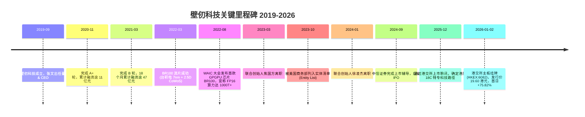
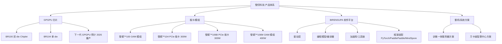
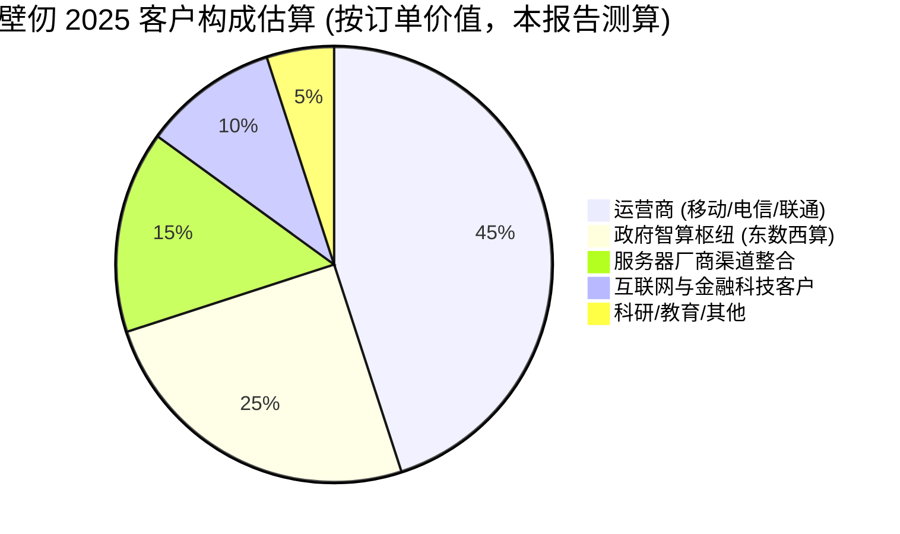
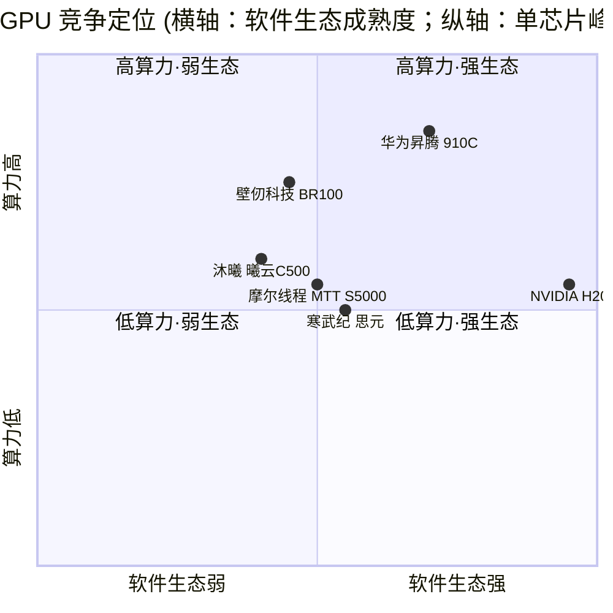

# 壁仞科技 (Biren Technology) 公司研究报告

**股票代码**: HKEX:06082
**报告日期 (as of)**: 2026-06-14
**报告语言**: 简体中文
**核心结论**: 国产 GPGPU "四小龙" 之一，2026 年 1 月 2 日成为港股 GPU 第一股；商业化拐点初现、卖方模型预期 2027E 由亏转盈，但 2025 年仍处深度烧钱阶段，估值已计入未来 5 年 100%+ 收入 CAGR，对宏观情绪、出口管制与下一代芯片量产兑现高度敏感。

> *分析师观点：* **评级：Overweight（增持）· 12 个月目标价 HK$66（较现价 HK$49.98 上行 +32%）· 估值方法：2030E 折现 EV/EBITDA（对标 Goldman Sachs 框架的 43× / 2030E EBITDA，但对执行与制裁风险打 6% 折扣）**
> 市值约 HK$122bn（H 股口径，yfinance）/ 约 RMB 1,900–2,030bn（含内资股全口径，本报告测算）· 52 周区间（上市至今）HK$28.10–HK$62.35 · HKEX:6082
>
> **远期估值矩阵（forward valuation matrix，`*分析师观点：*`）**
>
> | 倍数 | 2024A | 2025A | 2026E | 2027E | 2028E |
> |---|---|---|---|---|---|
> | P/S（市销率，本报告测算，按 H 股市值 ~RMB 1.9–2.0 万亿口径需谨慎，下表用 GS 收入 + ~RMB 112bn EV 口径） | ~330× | ~108× | ~41× | ~13× | ~5.6× |
> | P/E（市盈率） | NM（亏损） | NM（亏损） | NM（亏损） | 由亏转盈、首年微利 | 开始有意义 |
> | EV/EBITDA | NM | NM | NM（EBITDA 仍负） | NM→正 | ~正、向 2030E 43× 收敛 |
>
> *远期列为 `*分析师观点：*`；收入/EBITDA 路径取自 [Goldman Sachs — Biren (6082.HK), 2026-05-30, Exhibit 3 & 6](http://xs-macbook-air.local:5001/zsxq/pdf/585412184884414/Goldman%20Sachs-Biren%20%EF%BC%886082.HK%EF%BC%89%EF%BC%9A%20ASP%20uptrend%20on%20product%20mix%20upgrade%EF%BC%9B%20Buy%20with-260530.pdf)。P/S 因全口径总股本（H 股 + 内资股）与流通盘差异巨大，仅作量级参考。*
>
> **相对表现（relative performance）**——上市（2026-01-02）至今 6082.HK 累计 **+45.0%**（IPO 价 34.46 → 49.98）；同期恒生科技 ETF（3033.HK）**−17.8%**、恒生指数 **−6.2%**，相对基准超额 **+51 至 +63pp**，是港股科技板块强相对赢家；但近 1 个月 −9.5%（vs 恒生科技 −7.6%，相对 −1.9pp），高位震荡（[6082.HK 行情, yfinance, 2026-06-12](https://finance.yahoo.com/quote/6082.HK/)）。
>
> **核心论点（thesis pillars）**——（1）"国产 GPU 第一股 + 港股 18C 特专科技最大 IPO"稀缺性 + 英伟达中国份额由 95% 归零腾出的国产替代切片；（2）卖方模型（GS）预期 2025–30E 收入 CAGR ~109%、AI 芯片出货 2030E 超 70 万片、**2027E 由亏转盈**——拐点叙事；（3）资本厚度足（IPO 募资 55.83 亿港元 + 上市前 50 亿+），可支撑 24–36 个月烧钱；（4）**US BIS 实体清单是中枢风险**——先进制程代工与 HBM 受限，决定每一代芯片的工艺天花板，也是 PT 较 GS 打折的核心原因。

> **Update — 港股新股首日大涨、披露下一代芯片商业化时点 (2026-01-02 / 2025-12-17):** 公司以 19.60 港元/股 (定价区间上限) 完成全球发售，募资总额约 55.83 亿港元，上市首日开盘大涨 82%、盘中最高涨幅约 118%、收盘报 34.46 港元，单日涨幅 75.82%，总市值约 825 亿港元 ([港股迎"国产 GPU 第一股"壁仞科技：募资 56 亿，股价首日涨 76%, 2026-01-03](https://www.guancha.cn/economy/2026_01_03_802582.shtml))。在通过港交所聆讯时，公司同步披露下一代 GPGPU 芯片预计 **2026 年商业化**，并将集资净额的约 85% 用于智能计算硬件与软件平台研发 ([壁仞科技获港交所聆讯：近年营收增长强劲，下一代产品 2026 年商业化, 2025-12-18](https://caifuhao.eastmoney.com/news/20251218192826472495310))。该产品节奏与商业化兑现是 2026 年最关键的基本面变量。

---

## 目录

1. 公司概览 (Company Overview)
   - 1A. 估值快照与目标价 (Valuation Snapshot & Price Target)
   - 1B. GF Score 基本面评分 (GF Score)
2. 估值、远期模型与目标价推导 (Valuation, Forward Model & Price Target)
3. 公司历史 (Company History)
4. 管理团队 (Management Team)
5. 产品与服务 (Products & Services)
6. 客户与上市策略 (Customers & Go-to-Market)
7. 行业概览 (Industry Overview)
8. 竞争格局 (Competitive Landscape)
9. 市场机会 (Market Opportunity / TAM)
10. 风险评估 (Risk Assessment)
    - 9.5 关键分歧与催化剂 (Key Debates & Catalysts)
11. 投资者视角评分 (Investor Lenses)
12. 参考资料 (References)

> 说明：为保留惯用的"概览 → 估值 → 历史 …"叙事顺序，本报告在第 1 节内嵌 1A/1B 决策层，并把"估值与目标价推导"独立为第 2 节；其余描述性章节顺延。

---

## 1. 公司概览 (Company Overview)

上海壁仞科技股份有限公司 (Shanghai Biren Technology Co., Ltd.，以下简称"壁仞"或"公司"，HKEX:06082)，注册于中国上海，是一家专注于通用图形处理器 (GPGPU / general-purpose graphics processing unit) 芯片设计、配套软件栈与智能计算解决方案的半导体设计公司。公司 2019 年 9 月在上海成立，由前商汤科技总裁张文 (Wen Zhang) 创立，是中国市场常被并称为"国产 GPU 四小龙"的四家高端 GPGPU 设计公司之一 (其余三家为摩尔线程、沐曦股份、燧原科技) ([国内 GPU "四小龙"——沐曦、摩尔线程、壁仞科技、天数智芯, 知乎](https://zhuanlan.zhihu.com/p/1954560742364800447))。

**本报告观点（thesis 先行）。** 我们对壁仞给予 **Overweight（增持）**、12 个月目标价 **HK$66**。做多壁仞本质是做多"中国 GPGPU 国产替代 + 大模型算力扩张"双重叙事，而非做多其当前财务基本面——2025 年公司仍深度亏损，卖方模型（Goldman Sachs）才把 2027E 标记为由亏转盈的首年 ([Goldman Sachs — Biren (6082.HK), 2026-05-30, Exhibit 3](http://xs-macbook-air.local:5001/zsxq/pdf/585412184884414/Goldman%20Sachs-Biren%20%EF%BC%886082.HK%EF%BC%89%EF%BC%9A%20ASP%20uptrend%20on%20product%20mix%20upgrade%EF%BC%9B%20Buy%20with-260530.pdf))。我们较 GS 最新 PT（HK$70.7）打约 6% 折扣，原因是 US BIS 实体清单对先进制程与 HBM 的约束（详见第 10 节 R9）在我们看来仍未被市场充分定价。

**主营业务与商业模式。** 壁仞的核心产品是以自研架构 "壁立仞" 为基础、面向数据中心训练与推理负载的 GPGPU 芯片 (BR100 系列、下一代芯片) 及对应的 PCIe 板卡与 OAM 模组 (壁砺™ 100 / 104 / 106B / 106M 等)，并搭配自研软件栈 **BIRENSUPA** (覆盖驱动、编程模型、编译器、加速库与上层框架适配) ([壁砺™106B 产品页](https://www.birentech.com/product_details/1005557844745474048.html); [壁砺™106M 产品页](https://www.birentech.com/product_details/1005557637772464128.html))。公司主要通过两类形态变现：(1) 将 GPGPU 板卡/模组直接销售给运营商智算中心、政府主导的算力枢纽项目、互联网企业与企业客户；(2) 与浪潮、新华三、宁畅等服务器整机厂合作，将壁仞 GPGPU 集成到 AI 训练/推理整机方案中销售。

**经营地域。** 公司主营业务集中在中国大陆，下游客户以中国三大运营商 (移动 / 电信 / 联通)、地方政府智算枢纽、头部互联网与金融科技公司为主，已在中国移动智算中心 (哈尔滨)、中国移动智算中心 (呼和浩特，单体 6.7 EFLOPS FP16) 实现规模化部署 ([壁仞科技加入中国移动算力网络创新联合体, birentech.com](https://www.birentech.com/News_details/53.html); [国产 GPU 的大时代, 21 世纪经济报道, 2025-12-23](https://www.21jingji.com/article/20251223/herald/baf28c9e6a3fec77ea53ee472ae58e5a.html))。由于 2023 年 10 月被美国商务部列入 BIS 实体清单 ([美国升级 AI 芯片及半导体设备出口限制！并将壁仞、摩尔线程等 13 家中企列入实体清单, 芯智讯, 2023-10-17](https://www.icsmart.cn/67934/))，公司基本不出口海外，海外业务可视为零——因此本报告"按地域"的收入 donut 为 100% 中国大陆。

**规模指标 — 招股章程口径 + 卖方刷新。** 据港股招股章程披露及上市公告，2022 年至 2024 年及 2025 年上半年公司收入分别为人民币 49.9 万元、6,203 万元、3.37 亿元及 5,890.3 万元，2024 年收入同比增长逾 4 倍；同期净亏损分别为人民币 14.74 亿元、17.44 亿元、15.38 亿元及 16.01 亿元，三年半累计亏损超 63 亿元；毛利率 (gross margin) 从 2022 年的 100% (基本零规模)、2023 年的 76.4%、2024 年的 53.2% 逐步降至 2025 年上半年的 31.9% ([壁仞科技赴港 IPO：三年半亏损超 63 亿, 大众日报, 2025-12-24](https://m.dzplus.dzng.com/share/general/0/NEWS3000657BWQXYSCWTDLZB); [壁仞科技通过港交所上市聆讯, 央广网, 2025-12-17](https://finance.cnr.cn/cjgs/20251217/t20251217_527463106.shtml))。值得注意的是，*分析师观点：* Goldman Sachs 在 2026-05-30 的模型中将壁仞 **2025 全年收入重估为 RMB 1,035m（全年口径，对应 GM 53.8%）**，显著高于招股章程披露的 1H2025 单半年 589m——意味着 2H2025 收入环比大幅回升、毛利率亦较 1H2025 的 31.9% 回稳至全年 53.8% ([Goldman Sachs — Biren (6082.HK), 2026-05-30, Exhibit 6](http://xs-macbook-air.local:5001/zsxq/pdf/585412184884414/Goldman%20Sachs-Biren%20%EF%BC%886082.HK%EF%BC%89%EF%BC%9A%20ASP%20uptrend%20on%20product%20mix%20upgrade%EF%BC%9B%20Buy%20with-260530.pdf))。截至最后实际可行日期，公司持有 24 份未完成的具有约束力订单，总价值约人民币 8.22 亿元 ([壁仞科技启动招股, 红星新闻网, 2025-12-24](https://news.chengdu.cn/2025/1224/694ba1c381c58e5630940cbd.shtml))。

**收入与亏损瀑布（FY2025）。** 下图以 GS 重估的 2025 全年收入 RMB 1,035m、GM 53.8% / 毛利 RMB 557m 为锚，叠加招股章程口径的高强度研发开支结构（R&D 长期占总经营开支 73%–80%），还原壁仞"高毛利、但被巨额研发吞掉"的亏损结构——这是理解其当前 P&L 的关键：壁仞不是毛利率低，而是规模太小、研发太重。

<svg xmlns="http://www.w3.org/2000/svg" viewBox="0 0 1000 560" width="1000" height="560" role="img" aria-label="income statement Sankey"><rect x="0" y="0" width="1000" height="560" fill="#ffffff"/>
<text x="20.00" y="30.00" text-anchor="start" font-family="Helvetica,Arial,sans-serif" font-size="15" font-weight="700" fill="#1f2933">壁仞科技 2025 收入与亏损瀑布 (How Biren Spends — FY2025)</text>
<path d="M 700.00,-134.00 C 754.00,-134.00 754.00,288.00 808.00,288.00 L 808.00,290.00 C 754.00,290.00 754.00,-132.00 700.00,-132.00 Z" fill="#86efac" fill-opacity="0.55"/>
<path d="M 576.00,-127.00 C 630.00,-127.00 630.00,-134.00 684.00,-134.00 L 684.00,-132.00 C 630.00,-132.00 630.00,-125.00 576.00,-125.00 Z" fill="#86efac" fill-opacity="0.55"/>
<path d="M 576.00,-111.00 C 630.00,-111.00 630.00,-118.00 684.00,-118.00 L 684.00,126.41 C 630.00,126.41 630.00,133.41 576.00,133.41 Z" fill="#fca5a5" fill-opacity="0.55"/>
<path d="M 576.00,133.41 C 630.00,133.41 630.00,140.41 684.00,140.41 L 684.00,712.00 C 630.00,712.00 630.00,705.00 576.00,705.00 Z" fill="#fca5a5" fill-opacity="0.55"/>
<path d="M 204.00,64.00 C 258.00,64.00 258.00,85.00 312.00,85.00 L 312.00,392.48 C 258.00,392.48 258.00,371.48 204.00,371.48 Z" fill="#93c5fd" fill-opacity="0.55"/>
<path d="M 452.00,78.00 C 506.00,78.00 506.00,-127.00 560.00,-127.00 L 560.00,-125.00 C 506.00,-125.00 506.00,80.00 452.00,80.00 Z" fill="#86efac" fill-opacity="0.55"/>
<path d="M 452.00,80.00 C 506.00,80.00 506.00,-111.00 560.00,-111.00 L 560.00,705.00 C 506.00,705.00 506.00,896.00 452.00,896.00 Z" fill="#fca5a5" fill-opacity="0.55"/>
<path d="M 328.00,85.00 C 382.00,85.00 382.00,78.00 436.00,78.00 L 436.00,297.57 C 382.00,297.57 382.00,304.57 328.00,304.57 Z" fill="#86efac" fill-opacity="0.55"/>
<path d="M 328.00,304.57 C 382.00,304.57 382.00,311.57 436.00,311.57 L 436.00,500.00 C 382.00,500.00 382.00,493.00 328.00,493.00 Z" fill="#fca5a5" fill-opacity="0.55"/>
<path d="M 204.00,385.48 C 258.00,385.48 258.00,392.48 312.00,392.48 L 312.00,451.61 C 258.00,451.61 258.00,444.61 204.00,444.61 Z" fill="#93c5fd" fill-opacity="0.55"/>
<path d="M 204.00,458.61 C 258.00,458.61 258.00,451.61 312.00,451.61 L 312.00,483.14 C 258.00,483.14 258.00,490.14 204.00,490.14 Z" fill="#93c5fd" fill-opacity="0.55"/>
<path d="M 204.00,504.14 C 258.00,504.14 258.00,483.14 312.00,483.14 L 312.00,493.00 C 258.00,493.00 258.00,514.00 204.00,514.00 Z" fill="#93c5fd" fill-opacity="0.55"/>
<rect x="188.00" y="64.00" width="16" height="307.48" rx="1.5" fill="#2563eb"/>
<rect x="188.00" y="385.48" width="16" height="59.13" rx="1.5" fill="#2563eb"/>
<rect x="188.00" y="458.61" width="16" height="31.54" rx="1.5" fill="#2563eb"/>
<rect x="188.00" y="504.14" width="16" height="9.86" rx="1.5" fill="#2563eb"/>
<rect x="312.00" y="85.00" width="16" height="408.00" rx="1.5" fill="#1e3a8a"/>
<rect x="436.00" y="78.00" width="16" height="219.57" rx="1.5" fill="#15803d"/>
<rect x="436.00" y="311.57" width="16" height="188.43" rx="1.5" fill="#dc2626"/>
<rect x="560.00" y="-127.00" width="16" height="2.00" rx="1.5" fill="#15803d"/>
<rect x="560.00" y="-111.00" width="16" height="816.00" rx="1.5" fill="#dc2626"/>
<rect x="684.00" y="-134.00" width="16" height="2.00" rx="1.5" fill="#15803d"/>
<rect x="684.00" y="-118.00" width="16" height="244.41" rx="1.5" fill="#dc2626"/>
<rect x="684.00" y="140.41" width="16" height="571.59" rx="1.5" fill="#dc2626"/>
<rect x="808.00" y="288.00" width="16" height="2.00" rx="1.5" fill="#15803d"/>
<line x1="188.00" y1="217.74" x2="182.00" y2="195.67" stroke="#cbd5e1" stroke-width="1"/>
<text x="179.00" y="198.67" text-anchor="end" font-family="Helvetica,Arial,sans-serif" font-size="11.5" font-weight="700" fill="#1f2933">训练/推理 GPU 板卡</text>
<text x="179.00" y="211.67" text-anchor="end" font-family="Helvetica,Arial,sans-serif" font-size="10" font-weight="400" fill="#52606d">RMB780.0M  (75.4%)</text>
<line x1="188.00" y1="415.04" x2="182.00" y2="392.97" stroke="#cbd5e1" stroke-width="1"/>
<text x="179.00" y="395.97" text-anchor="end" font-family="Helvetica,Arial,sans-serif" font-size="11.5" font-weight="700" fill="#1f2933">推理 GPU</text>
<text x="179.00" y="408.97" text-anchor="end" font-family="Helvetica,Arial,sans-serif" font-size="10" font-weight="400" fill="#52606d">RMB150.0M  (14.5%)</text>
<line x1="188.00" y1="474.38" x2="182.00" y2="452.30" stroke="#cbd5e1" stroke-width="1"/>
<text x="179.00" y="455.30" text-anchor="end" font-family="Helvetica,Arial,sans-serif" font-size="11.5" font-weight="700" fill="#1f2933">训推一体服务器</text>
<text x="179.00" y="468.30" text-anchor="end" font-family="Helvetica,Arial,sans-serif" font-size="10" font-weight="400" fill="#52606d">RMB80.0M  (7.7%)</text>
<line x1="188.00" y1="509.07" x2="182.00" y2="487.00" stroke="#cbd5e1" stroke-width="1"/>
<text x="179.00" y="490.00" text-anchor="end" font-family="Helvetica,Arial,sans-serif" font-size="11.5" font-weight="700" fill="#1f2933">质保与其他</text>
<text x="179.00" y="503.00" text-anchor="end" font-family="Helvetica,Arial,sans-serif" font-size="10" font-weight="400" fill="#52606d">RMB25.0M  (2.4%)</text>
<rect x="331.00" y="67.00" width="113.10" height="26" rx="2" fill="#ffffff" fill-opacity="0.72"/>
<text x="334.00" y="79.00" text-anchor="start" font-family="Helvetica,Arial,sans-serif" font-size="11.5" font-weight="700" fill="#1f2933">Revenue</text>
<text x="334.00" y="92.00" text-anchor="start" font-family="Helvetica,Arial,sans-serif" font-size="10" font-weight="400" fill="#52606d">RMB1.0B  (100.0%)</text>
<rect x="455.00" y="60.00" width="119.40" height="26" rx="2" fill="#ffffff" fill-opacity="0.72"/>
<text x="458.00" y="72.00" text-anchor="start" font-family="Helvetica,Arial,sans-serif" font-size="11.5" font-weight="700" fill="#1f2933">Gross Profit</text>
<text x="458.00" y="85.00" text-anchor="start" font-family="Helvetica,Arial,sans-serif" font-size="10" font-weight="400" fill="#52606d">RMB557.0M  (53.8%)</text>
<rect x="455.00" y="293.57" width="144.60" height="26" rx="2" fill="#ffffff" fill-opacity="0.72"/>
<text x="458.00" y="305.57" text-anchor="start" font-family="Helvetica,Arial,sans-serif" font-size="11.5" font-weight="700" fill="#1f2933">Cost of Revenue (COGS)</text>
<text x="458.00" y="318.57" text-anchor="start" font-family="Helvetica,Arial,sans-serif" font-size="10" font-weight="400" fill="#52606d">RMB478.0M  (46.2%)</text>
<rect x="579.00" y="-145.00" width="125.70" height="26" rx="2" fill="#ffffff" fill-opacity="0.72"/>
<text x="582.00" y="-133.00" text-anchor="start" font-family="Helvetica,Arial,sans-serif" font-size="11.5" font-weight="700" fill="#1f2933">Operating Income</text>
<text x="582.00" y="-120.00" text-anchor="start" font-family="Helvetica,Arial,sans-serif" font-size="10" font-weight="400" fill="#52606d">-RMB1.5B  (-146.2%)</text>
<rect x="579.00" y="-120.00" width="150.90" height="26" rx="2" fill="#ffffff" fill-opacity="0.72"/>
<text x="582.00" y="-108.00" text-anchor="start" font-family="Helvetica,Arial,sans-serif" font-size="11.5" font-weight="700" fill="#1f2933">Total Operating Expense</text>
<text x="582.00" y="-95.00" text-anchor="start" font-family="Helvetica,Arial,sans-serif" font-size="10" font-weight="400" fill="#52606d">RMB2.1B  (200.0%)</text>
<rect x="703.00" y="-152.00" width="125.70" height="26" rx="2" fill="#ffffff" fill-opacity="0.72"/>
<text x="706.00" y="-140.00" text-anchor="start" font-family="Helvetica,Arial,sans-serif" font-size="11.5" font-weight="700" fill="#1f2933">Pretax Income</text>
<text x="706.00" y="-127.00" text-anchor="start" font-family="Helvetica,Arial,sans-serif" font-size="10" font-weight="400" fill="#52606d">-RMB1.5B  (-146.2%)</text>
<rect x="703.00" y="-127.00" width="119.40" height="26" rx="2" fill="#ffffff" fill-opacity="0.72"/>
<text x="706.00" y="-115.00" text-anchor="start" font-family="Helvetica,Arial,sans-serif" font-size="11.5" font-weight="700" fill="#1f2933">SG&amp;A</text>
<text x="706.00" y="-102.00" text-anchor="start" font-family="Helvetica,Arial,sans-serif" font-size="10" font-weight="400" fill="#52606d">RMB620.0M  (59.9%)</text>
<rect x="703.00" y="122.41" width="113.10" height="26" rx="2" fill="#ffffff" fill-opacity="0.72"/>
<text x="706.00" y="134.41" text-anchor="start" font-family="Helvetica,Arial,sans-serif" font-size="11.5" font-weight="700" fill="#1f2933">R&amp;D</text>
<text x="706.00" y="147.41" text-anchor="start" font-family="Helvetica,Arial,sans-serif" font-size="10" font-weight="400" fill="#52606d">RMB1.4B  (140.1%)</text>
<text x="833.00" y="286.00" text-anchor="start" font-family="Helvetica,Arial,sans-serif" font-size="11.5" font-weight="700" fill="#1f2933">Net Income</text>
<text x="833.00" y="299.00" text-anchor="start" font-family="Helvetica,Arial,sans-serif" font-size="10" font-weight="400" fill="#52606d">-RMB1.7B  (-164.3%)</text>
<text x="500.00" y="530.00" text-anchor="middle" font-family="Helvetica,Arial,sans-serif" font-size="10" font-weight="400" font-style="italic" fill="#8a97a3">亏损公司：经营亏损 = 毛利 − opex；研发占 opex 约 70%（招股章程）</text>
<text x="500.00" y="544.00" text-anchor="middle" font-family="Helvetica,Arial,sans-serif" font-size="10" font-weight="400" fill="#52606d">Source: GS — Biren (6082.HK), 2026-05-30, Exhibit 6 (rev RMB1,035m, GM 53.8%); 招股章程 2025 经营开支结构 · opex 拆分为本报告测算</text>
</svg>

来源 / Source: [Goldman Sachs — Biren (6082.HK), 2026-05-30, Exhibit 6（rev RMB1,035m, GM 53.8%）](http://xs-macbook-air.local:5001/zsxq/pdf/585412184884414/Goldman%20Sachs-Biren%20%EF%BC%886082.HK%EF%BC%89%EF%BC%9A%20ASP%20uptrend%20on%20product%20mix%20upgrade%EF%BC%9B%20Buy%20with-260530.pdf) · 经营开支 R&D/SG&A 拆分为本报告基于招股章程"研发占比 73–80%"的测算 ([壁仞科技通过港交所上市聆讯, 央广网, 2025-12-17](https://finance.cnr.cn/cjgs/20251217/t20251217_527463106.shtml))

### 1A. 估值快照与目标价 (Valuation Snapshot & Price Target)

**当前估值（Valuation Snapshot, 2026-06-12 收盘）。** 公司股价 49.98 港元，较 5 月初 54.55 港元的上市以来新高有所回落，近 1 个月 −9.5%；52 周区间 (上市至今) HK$28.10–HK$62.35 ([6082.HK 行情, yfinance, 2026-06-12](https://finance.yahoo.com/quote/6082.HK/); [壁仞科技 06082 股票股价行情, 雪球](https://xueqiu.com/S/06082))。市值口径存在两套：yfinance 按 H 股流通口径显示约 HK$122bn；若按全口径总股本（H 股 + 内资股，约 41 亿股量级）估算，市值约 HK$1,900–2,030 亿元人民币——两者差异巨大，本报告在 P/S 测算中标注口径，避免误导。

- **TTM P/E** = NM (公司处于深度亏损，2025 年净亏损同比仍在扩大 ([抢跑港股 GPU 赛道，壁仞科技 2025 年亏损预计大幅增加, 21 经济, 2025-12-23](https://www.21jingji.com/article/20251223/herald/746792a6cf4bfe5bcc9d1ff7089242cb.html)))；亏损主因是高强度研发投入与软件生态建设，2022–1H2025 研发开支占总经营开支始终在 73%–80% 区间，且报告期内已被美方实体清单纳入，研发与流片成本结构性偏高。**对一家 pre-profit（尚未盈利）GPGPU 公司，P/E 无意义，应以 P/S + 现金跑道 (cash runway) 替代，ROE 为 NM。**
- **TTM P/S** ≈ 量级极高但口径敏感。按 GS 重估 2025 全年收入 RMB 1,035m、全口径市值约 RMB 1.9–2.0 万亿测算，TTM P/S 约 100×–110×；若改用 GS 的 2026E 收入 RMB 2,733m 做远期 P/S，则降至约 41×。这一倍数压缩斜率（108× → 41× → 13× → 5.6×，2025A→2028E）正是高估值能否被收入兑现"接住"的关键。
- **板块对比。** 同期 A 股 GPU "双雄" 摩尔线程 (688795.SH)、沐曦股份 (688802.SH) 的 TTM P/S 分别约为 300×、150×；寒武纪 (688256.SH) 在 2025 年末市值约 5,880 亿元，TTM P/E 约 313×，TTM P/S 约 110×；英伟达 (NVDA.US) 2026 年初 P/E (TTM) 约 45×、P/S 约 22× ([如何理解两大 GPU 龙头受热捧, 新浪财经, 2025-12-11](https://finance.sina.com.cn/jjxw/2025-12-11/doc-inhaiyww8495504.shtml); [中国英伟达们的估值叙事：从寒武纪走势看摩尔线程、沐曦股份, 36 氪](https://36kr.com/p/3592082497765633))。

**历史收入结构 (development-over-time)。** 下图以 GS 模型的收入路径还原壁仞从 RMB 0.62 亿 (2024) 向 RMB 413.5 亿 (2030E) 的爬坡，2025–30E CAGR ~109%，由训练/推理 GPU 放量驱动——这是 IPO 估值溢价的数字支点：

<svg xmlns="http://www.w3.org/2000/svg" viewBox="0 0 860 470" width="860" height="470" role="img" aria-label="historical revenue bars"><rect x="0" y="0" width="860" height="470" fill="#ffffff"/>
<text x="20.00" y="30.00" text-anchor="start" font-family="Helvetica,Arial,sans-serif" font-size="15" font-weight="700" fill="#1f2933">壁仞科技 收入预测（按 GS 模型，人民币百万元）</text>
<rect x="20.00" y="44" width="11" height="11" rx="2" fill="#2563eb"/>
<text x="36.00" y="53.00" text-anchor="start" font-family="Helvetica,Arial,sans-serif" font-size="10.5" font-weight="400" fill="#1f2933">总收入</text>
<line x1="70" y1="412.00" x2="834" y2="412.00" stroke="#eceff2" stroke-width="1"/>
<text x="64.00" y="415.00" text-anchor="end" font-family="Helvetica,Arial,sans-serif" font-size="9.5" font-weight="400" fill="#52606d">RMB0</text>
<line x1="70" y1="345.20" x2="834" y2="345.20" stroke="#eceff2" stroke-width="1"/>
<text x="64.00" y="348.20" text-anchor="end" font-family="Helvetica,Arial,sans-serif" font-size="9.5" font-weight="400" fill="#52606d">RMB8.9B</text>
<line x1="70" y1="278.40" x2="834" y2="278.40" stroke="#eceff2" stroke-width="1"/>
<text x="64.00" y="281.40" text-anchor="end" font-family="Helvetica,Arial,sans-serif" font-size="9.5" font-weight="400" fill="#52606d">RMB17.9B</text>
<line x1="70" y1="211.60" x2="834" y2="211.60" stroke="#eceff2" stroke-width="1"/>
<text x="64.00" y="214.60" text-anchor="end" font-family="Helvetica,Arial,sans-serif" font-size="9.5" font-weight="400" fill="#52606d">RMB26.8B</text>
<line x1="70" y1="144.80" x2="834" y2="144.80" stroke="#eceff2" stroke-width="1"/>
<text x="64.00" y="147.80" text-anchor="end" font-family="Helvetica,Arial,sans-serif" font-size="9.5" font-weight="400" fill="#52606d">RMB35.7B</text>
<line x1="70" y1="78.00" x2="834" y2="78.00" stroke="#eceff2" stroke-width="1"/>
<text x="64.00" y="81.00" text-anchor="end" font-family="Helvetica,Arial,sans-serif" font-size="9.5" font-weight="400" fill="#52606d">RMB44.7B</text>
<rect x="92.92" y="409.48" width="63.30" height="2.52" fill="#2563eb"/>
<text x="124.57" y="428.00" text-anchor="middle" font-family="Helvetica,Arial,sans-serif" font-size="10" font-weight="400" fill="#52606d">2024</text>
<rect x="202.06" y="404.26" width="63.30" height="7.74" fill="#2563eb"/>
<text x="233.71" y="428.00" text-anchor="middle" font-family="Helvetica,Arial,sans-serif" font-size="10" font-weight="400" fill="#52606d">2025</text>
<rect x="311.21" y="391.56" width="63.30" height="20.44" fill="#2563eb"/>
<text x="342.86" y="428.00" text-anchor="middle" font-family="Helvetica,Arial,sans-serif" font-size="10" font-weight="400" fill="#52606d">2026E</text>
<rect x="420.35" y="348.09" width="63.30" height="63.91" fill="#2563eb"/>
<text x="452.00" y="428.00" text-anchor="middle" font-family="Helvetica,Arial,sans-serif" font-size="10" font-weight="400" fill="#52606d">2027E</text>
<rect x="529.49" y="261.90" width="63.30" height="150.10" fill="#2563eb"/>
<text x="561.14" y="428.00" text-anchor="middle" font-family="Helvetica,Arial,sans-serif" font-size="10" font-weight="400" fill="#52606d">2028E</text>
<rect x="638.63" y="189.33" width="63.30" height="222.67" fill="#2563eb"/>
<text x="670.29" y="428.00" text-anchor="middle" font-family="Helvetica,Arial,sans-serif" font-size="10" font-weight="400" fill="#52606d">2029E</text>
<rect x="747.78" y="102.74" width="63.30" height="309.26" fill="#2563eb"/>
<text x="779.43" y="428.00" text-anchor="middle" font-family="Helvetica,Arial,sans-serif" font-size="10" font-weight="400" fill="#52606d">2030E</text>
<text x="430.00" y="440.00" text-anchor="middle" font-family="Helvetica,Arial,sans-serif" font-size="10" font-weight="400" font-style="italic" fill="#8a97a3">Analyst view（GS 预测）：训练/推理 GPU 放量驱动</text>
<text x="430.00" y="454.00" text-anchor="middle" font-family="Helvetica,Arial,sans-serif" font-size="10" font-weight="400" fill="#52606d">Source: Goldman Sachs — Biren (6082.HK) ASP uptrend, 2026-05-30, Exhibit 6（2025-30E 收入 CAGR ~109%）</text>
</svg>

来源 / Source: [Goldman Sachs — Biren (6082.HK), 2026-05-30, Exhibit 6（收入路径 2024–2030E）](http://xs-macbook-air.local:5001/zsxq/pdf/585412184884414/Goldman%20Sachs-Biren%20%EF%BC%886082.HK%EF%BC%89%EF%BC%9A%20ASP%20uptrend%20on%20product%20mix%20upgrade%EF%BC%9B%20Buy%20with-260530.pdf)

**估值判读。** P/S 量级显著高于英伟达 ~22× 但低于摩尔线程 ~300×。我们认为驱动这一极端倍数的主要原因是：(a) "国产 GPU 第一股 + 港股 18C 特专科技公司最大 IPO + 2026 港股开门红" 的稀缺性溢价；(b) 英伟达在中国 GPU 市场份额由峰值 95% 降至 0% 后形成的强国产替代叙事 ([如何理解两大 GPU 龙头受热捧, 新浪财经, 2025-12-11](https://finance.sina.com.cn/jjxw/2025-12-11/doc-inhaiyww8495504.shtml))；(c) 公司披露 2024 收入同比增长逾 4 倍 + 下一代芯片 2026 商业化的双重催化。需要警惕的是，若 2026 下一代芯片商业化时点延后或良率不及预期，100×+ 量级 P/S 缺乏盈利端的安全垫，对应的多重压缩风险已写入第 10 节。

### 1B. GF Score 基本面评分 (GF Score)

*分析师观点：* 下面的 GF Score（GuruFocus 式五维基本面评分）是本报告基于已引用财务数据的自有评分框架（非 GuruFocus 官方数字、不附带任何 filing 引用），综合得分 **51/100**——居中偏弱，精确刻画了壁仞"现金厚、成长猛、但盈利与估值安全垫缺失"的矛盾画像。

<svg xmlns="http://www.w3.org/2000/svg" viewBox="0 0 500 500" width="500" height="500" role="img" aria-label="GF Score radar">
<rect x="0" y="0" width="500" height="500" fill="#ffffff"/>
<text x="20" y="24" font-family="Helvetica,Arial,sans-serif" font-size="15" font-weight="700" fill="#1f2933">GF Score (GuruFocus-style): 51/100</text>
<text x="20" y="41" font-family="Helvetica,Arial,sans-serif" font-size="11" fill="#52606d">51–70 Poor future performance potential</text>
<polygon points="250.0,88.0 392.7,191.6 338.2,359.4 161.8,359.4 107.3,191.6" fill="#e9f5ec" stroke="none"/>
<polygon points="250.0,208.0 278.5,228.7 267.6,262.3 232.4,262.3 221.5,228.7" fill="none" stroke="#c5d3cb" stroke-width="1"/>
<polygon points="250.0,178.0 307.1,219.5 285.3,286.5 214.7,286.5 192.9,219.5" fill="none" stroke="#c5d3cb" stroke-width="1"/>
<polygon points="250.0,148.0 335.6,210.2 302.9,310.8 197.1,310.8 164.4,210.2" fill="none" stroke="#c5d3cb" stroke-width="1"/>
<polygon points="250.0,118.0 364.1,200.9 320.5,335.1 179.5,335.1 135.9,200.9" fill="none" stroke="#c5d3cb" stroke-width="1"/>
<polygon points="250.0,88.0 392.7,191.6 338.2,359.4 161.8,359.4 107.3,191.6" fill="none" stroke="#c5d3cb" stroke-width="1.3"/>
<line x1="250" y1="238" x2="161.8" y2="359.4" stroke="#cfdad3" stroke-width="1"/>
<text x="146.5" y="392.4" text-anchor="end" font-family="Helvetica,Arial,sans-serif" font-size="11.5" font-weight="600" fill="#1f2933">Financial Strength</text>
<text x="146.5" y="405.4" text-anchor="end" font-family="Helvetica,Arial,sans-serif" font-size="9.5" fill="#52606d">财务实力</text>
<text x="188.3" y="316.9" text-anchor="middle" font-family="Helvetica,Arial,sans-serif" font-size="10.5" font-weight="700" fill="#1f2933">7</text>
<line x1="250" y1="238" x2="250.0" y2="88.0" stroke="#cfdad3" stroke-width="1"/>
<text x="250.0" y="58.0" text-anchor="middle" font-family="Helvetica,Arial,sans-serif" font-size="11.5" font-weight="600" fill="#1f2933">Profitability</text>
<text x="250.0" y="71.0" text-anchor="middle" font-family="Helvetica,Arial,sans-serif" font-size="9.5" fill="#52606d">盈利能力</text>
<text x="250.0" y="217.0" text-anchor="middle" font-family="Helvetica,Arial,sans-serif" font-size="10.5" font-weight="700" fill="#1f2933">1</text>
<line x1="250" y1="238" x2="107.3" y2="191.6" stroke="#cfdad3" stroke-width="1"/>
<text x="82.6" y="183.6" text-anchor="end" font-family="Helvetica,Arial,sans-serif" font-size="11.5" font-weight="600" fill="#1f2933">Growth</text>
<text x="82.6" y="196.6" text-anchor="end" font-family="Helvetica,Arial,sans-serif" font-size="9.5" fill="#52606d">成长性</text>
<text x="121.6" y="190.3" text-anchor="middle" font-family="Helvetica,Arial,sans-serif" font-size="10.5" font-weight="700" fill="#1f2933">9</text>
<line x1="250" y1="238" x2="392.7" y2="191.6" stroke="#cfdad3" stroke-width="1"/>
<text x="417.4" y="183.6" text-anchor="start" font-family="Helvetica,Arial,sans-serif" font-size="11.5" font-weight="600" fill="#1f2933">GF Value</text>
<text x="417.4" y="196.6" text-anchor="start" font-family="Helvetica,Arial,sans-serif" font-size="9.5" fill="#52606d">估值</text>
<text x="278.5" y="222.7" text-anchor="middle" font-family="Helvetica,Arial,sans-serif" font-size="10.5" font-weight="700" fill="#1f2933">2</text>
<line x1="250" y1="238" x2="338.2" y2="359.4" stroke="#cfdad3" stroke-width="1"/>
<text x="353.5" y="392.4" text-anchor="start" font-family="Helvetica,Arial,sans-serif" font-size="11.5" font-weight="600" fill="#1f2933">Momentum</text>
<text x="353.5" y="405.4" text-anchor="start" font-family="Helvetica,Arial,sans-serif" font-size="9.5" fill="#52606d">动量</text>
<text x="302.9" y="304.8" text-anchor="middle" font-family="Helvetica,Arial,sans-serif" font-size="10.5" font-weight="700" fill="#1f2933">6</text>
<polygon points="250.0,223.0 278.5,228.7 302.9,310.8 188.3,322.9 121.6,196.3" fill="#2e8b57" fill-opacity="0.34" stroke="#2e8b57" stroke-width="2"/>
<circle cx="188.3" cy="322.9" r="2.6" fill="#2e8b57"/>
<circle cx="250.0" cy="223.0" r="2.6" fill="#2e8b57"/>
<circle cx="121.6" cy="196.3" r="2.6" fill="#2e8b57"/>
<circle cx="278.5" cy="228.7" r="2.6" fill="#2e8b57"/>
<circle cx="302.9" cy="310.8" r="2.6" fill="#2e8b57"/>
<text x="250" y="470" text-anchor="middle" font-family="Helvetica,Arial,sans-serif" font-size="9.5" fill="#52606d">Source: 壁仞科技港股招股章程（2025-12-22）· Goldman Sachs Biren 2026-05 · Yahoo Finance 6082.HK（截至 2026-06-12）</text>
<text x="250" y="485" text-anchor="middle" font-family="Helvetica,Arial,sans-serif" font-size="9" fill="#52606d">GF Score = independent analyst rubric (*Analyst view:*) — not GuruFocus™ official number</text>
</svg>

| 维度 / Dimension | 评分 / Score (0–10) | |
|---|---|---|
| Financial Strength (财务实力) | 7 | `███████░░░` |
| Profitability (盈利能力) | 1 | `█░░░░░░░░░` |
| Growth (成长性) | 9 | `█████████░` |
| GF Value (估值) | 2 | `██░░░░░░░░` |
| Momentum (动量) | 6 | `██████░░░░` |
| **GF Score (composite, *Analyst view:*)** | **51 / 100** | **51–70 Poor future performance potential** |

*Composite weights (*Analyst view:*): Financial Strength 20% · Profitability 25% · Growth 25% · GF Value 15% · Momentum 15% (transparent reproduction — not GuruFocus's proprietary weighting).*

来源 / Source: 本报告自有评分框架（GuruFocus 式），输入指标见下文各维度引用 · 现价/动量取自 [6082.HK, yfinance, 2026-06-12](https://finance.yahoo.com/quote/6082.HK/)

- **Financial Strength（财务实力）= 7/10。** 这是壁仞最强的一维。IPO 募资净额约 51 亿港元 + 上市前累计融资 50 亿+ 人民币，账面现金厚、基本无有息负债，按年均 15–20 亿元人民币的研发+销售开支节奏可支撑约 24–36 个月运营 ([壁仞科技启动招股, 红星新闻网, 2025-12-24](https://news.chengdu.cn/2025/1224/694ba1c381c58e5630940cbd.shtml))。扣分项是经营性现金流持续为负（融资输血型），跑道是有限的。
- **Profitability（盈利能力）= 1/10。** 最弱一维。2022–1H2025 累计净亏损超 63 亿元，OPM (经营利润率) 在 GS 模型中 2026E 仍为 −39%，ROE / ROIC 均为 NM ([Goldman Sachs — Biren (6082.HK), 2026-05-30, Exhibit 3](http://xs-macbook-air.local:5001/zsxq/pdf/585412184884414/Goldman%20Sachs-Biren%20%EF%BC%886082.HK%EF%BC%89%EF%BC%9A%20ASP%20uptrend%20on%20product%20mix%20upgrade%EF%BC%9B%20Buy%20with-260530.pdf))。唯一亮点是 gross margin 高（~53%），说明问题在规模与费用、不在产品定价底层。
- **Growth（成长性）= 9/10。** 几乎满分。GS 模型 2025–30E 收入 CAGR ~109%，AI 芯片出货 2028/2030E 超 30 万 / 70 万片，由亏转盈拐点在 2027E ([Goldman Sachs — Biren (6082.HK), 2026-05-30, Exhibit 6](http://xs-macbook-air.local:5001/zsxq/pdf/585412184884414/Goldman%20Sachs-Biren%20%EF%BC%886082.HK%EF%BC%89%EF%BC%9A%20ASP%20uptrend%20on%20product%20mix%20upgrade%EF%BC%9B%20Buy%20with-260530.pdf))。注意这是卖方预测、不是已实现的成长。
- **GF Value（估值，越高越便宜）= 2/10。** 极贵。P/S 100×+（TTM 口径）、远期 2026E P/S ~41×，相对英伟达 ~22× 有显著溢价，缺乏盈利安全垫 ([中国英伟达们的估值叙事, 36 氪](https://36kr.com/p/3592082497765633))。
- **Momentum（动量）= 6/10。** 中性偏强。上市至今 +45.0%、相对恒生科技超额 +60pp 量级，是强相对赢家；但近 1 个月 −9.5% 高位回落，动量边际转弱 ([6082.HK, yfinance, 2026-06-12](https://finance.yahoo.com/quote/6082.HK/))。

### 1C. 资产负债表与现金流结构 (Balance Sheet & Cash Flow)

**资产负债表 — IPO 后现金为王、几乎无负债。** 壁仞 IPO 募资 55.83 亿港元（净额约 51 亿）注入后，资产端以现金及金融资产为主、负债端极轻（无显著有息负债），这是其 Financial Strength 给到 7/10 的底层——典型的"用股权融资买跑道"的 pre-profit 硬科技资产负债表：

<svg xmlns="http://www.w3.org/2000/svg" viewBox="0 0 1040 600" width="1040" height="600" role="img" aria-label="balance sheet Sankey"><rect x="0" y="0" width="1040" height="600" fill="#ffffff"/>
<text x="20.00" y="30.00" text-anchor="start" font-family="Helvetica,Arial,sans-serif" font-size="15" font-weight="700" fill="#1f2933">壁仞科技 资产负债结构（IPO 后示意，人民币百万元）</text>
<path d="M 732.00,64.00 C 790.00,64.00 790.00,64.00 848.00,64.00 L 848.00,115.97 C 790.00,115.97 790.00,115.97 732.00,115.97 Z" fill="#fca5a5" fill-opacity="0.55"/>
<path d="M 204.00,64.00 C 262.00,64.00 262.00,71.00 320.00,71.00 L 320.00,417.50 C 262.00,417.50 262.00,410.50 204.00,410.50 Z" fill="#93c5fd" fill-opacity="0.55"/>
<path d="M 600.00,71.00 C 658.00,71.00 658.00,64.00 716.00,64.00 L 716.00,115.97 C 658.00,115.97 658.00,122.97 600.00,122.97 Z" fill="#fca5a5" fill-opacity="0.55"/>
<path d="M 336.00,71.00 C 394.00,71.00 394.00,78.00 452.00,78.00 L 452.00,470.70 C 394.00,470.70 394.00,463.70 336.00,463.70 Z" fill="#86efac" fill-opacity="0.55"/>
<path d="M 600.00,122.97 C 658.00,122.97 658.00,129.97 716.00,129.97 L 716.00,147.30 C 658.00,147.30 658.00,140.30 600.00,140.30 Z" fill="#fca5a5" fill-opacity="0.55"/>
<path d="M 468.00,78.00 C 526.00,78.00 526.00,71.00 584.00,71.00 L 584.00,140.30 C 526.00,140.30 526.00,147.30 468.00,147.30 Z" fill="#fca5a5" fill-opacity="0.55"/>
<path d="M 468.00,147.30 C 526.00,147.30 526.00,154.30 584.00,154.30 L 584.00,547.00 C 526.00,547.00 526.00,540.00 468.00,540.00 Z" fill="#86efac" fill-opacity="0.55"/>
<path d="M 732.00,129.97 C 790.00,129.97 790.00,129.97 848.00,129.97 L 848.00,147.30 C 790.00,147.30 790.00,147.30 732.00,147.30 Z" fill="#fca5a5" fill-opacity="0.55"/>
<path d="M 600.00,154.30 C 658.00,154.30 658.00,161.30 716.00,161.30 L 716.00,554.00 C 658.00,554.00 658.00,547.00 600.00,547.00 Z" fill="#86efac" fill-opacity="0.55"/>
<path d="M 732.00,161.30 C 790.00,161.30 790.00,161.30 848.00,161.30 L 848.00,554.00 C 790.00,554.00 790.00,554.00 732.00,554.00 Z" fill="#86efac" fill-opacity="0.55"/>
<path d="M 204.00,424.50 C 262.00,424.50 262.00,417.50 320.00,417.50 L 320.00,463.70 C 262.00,463.70 262.00,470.70 204.00,470.70 Z" fill="#93c5fd" fill-opacity="0.55"/>
<path d="M 336.00,477.70 C 394.00,477.70 394.00,470.70 452.00,470.70 L 452.00,540.00 C 394.00,540.00 394.00,547.00 336.00,547.00 Z" fill="#86efac" fill-opacity="0.55"/>
<path d="M 204.00,484.70 C 262.00,484.70 262.00,477.70 320.00,477.70 L 320.00,547.00 C 262.00,547.00 262.00,554.00 204.00,554.00 Z" fill="#93c5fd" fill-opacity="0.55"/>
<rect x="188.00" y="64.00" width="16" height="346.50" rx="1.5" fill="#2563eb"/>
<rect x="188.00" y="424.50" width="16" height="46.20" rx="1.5" fill="#2563eb"/>
<rect x="188.00" y="484.70" width="16" height="69.30" rx="1.5" fill="#2563eb"/>
<rect x="320.00" y="71.00" width="16" height="392.70" rx="1.5" fill="#15803d"/>
<rect x="320.00" y="477.70" width="16" height="69.30" rx="1.5" fill="#15803d"/>
<rect x="452.00" y="78.00" width="16" height="462.00" rx="1.5" fill="#1e3a8a"/>
<rect x="584.00" y="71.00" width="16" height="69.30" rx="1.5" fill="#dc2626"/>
<rect x="584.00" y="154.30" width="16" height="392.70" rx="1.5" fill="#15803d"/>
<rect x="716.00" y="64.00" width="16" height="51.98" rx="1.5" fill="#dc2626"/>
<rect x="716.00" y="129.97" width="16" height="17.32" rx="1.5" fill="#dc2626"/>
<rect x="716.00" y="161.30" width="16" height="392.70" rx="1.5" fill="#15803d"/>
<rect x="848.00" y="64.00" width="16" height="51.98" rx="1.5" fill="#dc2626"/>
<rect x="848.00" y="129.97" width="16" height="17.32" rx="1.5" fill="#dc2626"/>
<rect x="848.00" y="161.30" width="16" height="392.70" rx="1.5" fill="#15803d"/>
<text x="179.00" y="234.25" text-anchor="end" font-family="Helvetica,Arial,sans-serif" font-size="11.5" font-weight="700" fill="#1f2933">现金及等价物</text>
<text x="179.00" y="247.25" text-anchor="end" font-family="Helvetica,Arial,sans-serif" font-size="10" font-weight="400" fill="#52606d">RMB6.0B  (75.0%)</text>
<text x="179.00" y="444.60" text-anchor="end" font-family="Helvetica,Arial,sans-serif" font-size="11.5" font-weight="700" fill="#1f2933">应收/存货等流动资产</text>
<text x="179.00" y="457.60" text-anchor="end" font-family="Helvetica,Arial,sans-serif" font-size="10" font-weight="400" fill="#52606d">RMB800.0M  (10.0%)</text>
<text x="179.00" y="516.35" text-anchor="end" font-family="Helvetica,Arial,sans-serif" font-size="11.5" font-weight="700" fill="#1f2933">物业厂房及无形资产</text>
<text x="179.00" y="529.35" text-anchor="end" font-family="Helvetica,Arial,sans-serif" font-size="10" font-weight="400" fill="#52606d">RMB1.2B  (15.0%)</text>
<rect x="339.00" y="53.00" width="132.00" height="26" rx="2" fill="#ffffff" fill-opacity="0.72"/>
<text x="342.00" y="65.00" text-anchor="start" font-family="Helvetica,Arial,sans-serif" font-size="11.5" font-weight="700" fill="#1f2933">Total Current Assets</text>
<text x="342.00" y="78.00" text-anchor="start" font-family="Helvetica,Arial,sans-serif" font-size="10" font-weight="400" fill="#52606d">RMB6.8B  (85.0%)</text>
<rect x="339.00" y="459.70" width="157.20" height="26" rx="2" fill="#ffffff" fill-opacity="0.72"/>
<text x="342.00" y="471.70" text-anchor="start" font-family="Helvetica,Arial,sans-serif" font-size="11.5" font-weight="700" fill="#1f2933">Total Non-Current Assets</text>
<text x="342.00" y="484.70" text-anchor="start" font-family="Helvetica,Arial,sans-serif" font-size="10" font-weight="400" fill="#52606d">RMB1.2B  (15.0%)</text>
<rect x="471.00" y="60.00" width="113.10" height="26" rx="2" fill="#ffffff" fill-opacity="0.72"/>
<text x="474.00" y="72.00" text-anchor="start" font-family="Helvetica,Arial,sans-serif" font-size="11.5" font-weight="700" fill="#1f2933">Total Assets</text>
<text x="474.00" y="85.00" text-anchor="start" font-family="Helvetica,Arial,sans-serif" font-size="10" font-weight="400" fill="#52606d">RMB8.0B  (100.0%)</text>
<rect x="603.00" y="53.00" width="113.10" height="26" rx="2" fill="#ffffff" fill-opacity="0.72"/>
<text x="606.00" y="65.00" text-anchor="start" font-family="Helvetica,Arial,sans-serif" font-size="11.5" font-weight="700" fill="#1f2933">Total Liabilities</text>
<text x="606.00" y="78.00" text-anchor="start" font-family="Helvetica,Arial,sans-serif" font-size="10" font-weight="400" fill="#52606d">RMB1.2B  (15.0%)</text>
<rect x="603.00" y="136.30" width="106.80" height="26" rx="2" fill="#ffffff" fill-opacity="0.72"/>
<text x="606.00" y="148.30" text-anchor="start" font-family="Helvetica,Arial,sans-serif" font-size="11.5" font-weight="700" fill="#1f2933">Total Equity</text>
<text x="606.00" y="161.30" text-anchor="start" font-family="Helvetica,Arial,sans-serif" font-size="10" font-weight="400" fill="#52606d">RMB6.8B  (85.0%)</text>
<rect x="735.00" y="46.00" width="125.70" height="26" rx="2" fill="#ffffff" fill-opacity="0.72"/>
<text x="738.00" y="58.00" text-anchor="start" font-family="Helvetica,Arial,sans-serif" font-size="11.5" font-weight="700" fill="#1f2933">Current Liabilities</text>
<text x="738.00" y="71.00" text-anchor="start" font-family="Helvetica,Arial,sans-serif" font-size="10" font-weight="400" fill="#52606d">RMB900.0M  (11.2%)</text>
<rect x="735.00" y="111.97" width="150.90" height="26" rx="2" fill="#ffffff" fill-opacity="0.72"/>
<text x="738.00" y="123.97" text-anchor="start" font-family="Helvetica,Arial,sans-serif" font-size="11.5" font-weight="700" fill="#1f2933">Non-Current Liabilities</text>
<text x="738.00" y="136.97" text-anchor="start" font-family="Helvetica,Arial,sans-serif" font-size="10" font-weight="400" fill="#52606d">RMB300.0M  (3.8%)</text>
<rect x="735.00" y="143.30" width="132.00" height="26" rx="2" fill="#ffffff" fill-opacity="0.72"/>
<text x="738.00" y="155.30" text-anchor="start" font-family="Helvetica,Arial,sans-serif" font-size="11.5" font-weight="700" fill="#1f2933">Shareholders' Equity</text>
<text x="738.00" y="168.30" text-anchor="start" font-family="Helvetica,Arial,sans-serif" font-size="10" font-weight="400" fill="#52606d">RMB6.8B  (85.0%)</text>
<text x="873.00" y="86.99" text-anchor="start" font-family="Helvetica,Arial,sans-serif" font-size="11.5" font-weight="700" fill="#1f2933">流动负债</text>
<text x="873.00" y="99.99" text-anchor="start" font-family="Helvetica,Arial,sans-serif" font-size="10" font-weight="400" fill="#52606d">RMB900.0M  (11.2%)</text>
<text x="873.00" y="135.64" text-anchor="start" font-family="Helvetica,Arial,sans-serif" font-size="11.5" font-weight="700" fill="#1f2933">非流动负债</text>
<text x="873.00" y="148.64" text-anchor="start" font-family="Helvetica,Arial,sans-serif" font-size="10" font-weight="400" fill="#52606d">RMB300.0M  (3.8%)</text>
<text x="873.00" y="354.65" text-anchor="start" font-family="Helvetica,Arial,sans-serif" font-size="11.5" font-weight="700" fill="#1f2933">实收股本及储备</text>
<text x="873.00" y="367.65" text-anchor="start" font-family="Helvetica,Arial,sans-serif" font-size="10" font-weight="400" fill="#52606d">RMB6.8B  (85.0%)</text>
<text x="520.00" y="570.00" text-anchor="middle" font-family="Helvetica,Arial,sans-serif" font-size="10" font-weight="400" font-style="italic" fill="#8a97a3">Fabless 轻资产：现金为最大资产项，无重大有息负债</text>
<text x="520.00" y="584.00" text-anchor="middle" font-family="Helvetica,Arial,sans-serif" font-size="10" font-weight="400" fill="#52606d">Source: 壁仞科技港股招股章程（2025-12-22）+ 全球发售募资约 55.83 亿港元；IPO 后结构示意</text>
</svg>

来源 / Source: [壁仞科技港股招股章程, 2025-12-22（全球发售募资约 55.83 亿港元；IPO 后结构示意）](https://ossnoticepdf.iqdii.com/stockdata/notice/06082/2025/2025122200020_c.pdf)

**现金流 — 经营性现金流为负、靠融资输血。** 与所有 pre-profit 名一样，壁仞的经营性现金流 (CFO) 为负，靠融资性现金流 (CFF，即 IPO + 私募轮) 补足、维持现金跑道。这是理解"现金厚但跑道有限（24–36 个月）"的关键——对一家烧钱公司，现金流量表比利润表更重要：

<svg xmlns="http://www.w3.org/2000/svg" viewBox="0 0 1040 600" width="1040" height="600" role="img" aria-label="cash flow Sankey"><rect x="0" y="0" width="1040" height="600" fill="#ffffff"/>
<text x="20.00" y="30.00" text-anchor="start" font-family="Helvetica,Arial,sans-serif" font-size="15" font-weight="700" fill="#1f2933">壁仞科技 FY2024 现金流 Sankey（人民币百万元）</text>
<path d="M 204.00,71.00 C 306.00,71.00 306.00,78.00 408.00,78.00 L 408.00,342.00 C 306.00,342.00 306.00,335.00 204.00,335.00 Z" fill="#93c5fd" fill-opacity="0.55"/>
<path d="M 424.00,78.00 C 526.00,78.00 526.00,64.00 628.00,64.00 L 628.00,235.60 C 526.00,235.60 526.00,249.60 424.00,249.60 Z" fill="#fca5a5" fill-opacity="0.55"/>
<path d="M 424.00,249.60 C 526.00,249.60 526.00,249.60 628.00,249.60 L 628.00,276.00 C 526.00,276.00 526.00,276.00 424.00,276.00 Z" fill="#fca5a5" fill-opacity="0.55"/>
<path d="M 424.00,276.00 C 526.00,276.00 526.00,290.00 628.00,290.00 L 628.00,554.00 C 526.00,554.00 526.00,540.00 424.00,540.00 Z" fill="#86efac" fill-opacity="0.55"/>
<path d="M 644.00,249.60 C 746.00,249.60 746.00,288.80 848.00,288.80 L 848.00,308.60 C 746.00,308.60 746.00,269.40 644.00,269.40 Z" fill="#fca5a5" fill-opacity="0.55"/>
<path d="M 644.00,269.40 C 746.00,269.40 746.00,322.60 848.00,322.60 L 848.00,329.20 C 746.00,329.20 746.00,276.00 644.00,276.00 Z" fill="#fca5a5" fill-opacity="0.55"/>
<path d="M 204.00,349.00 C 306.00,349.00 306.00,342.00 408.00,342.00 L 408.00,540.00 C 306.00,540.00 306.00,547.00 204.00,547.00 Z" fill="#93c5fd" fill-opacity="0.55"/>
<rect x="188.00" y="71.00" width="16" height="264.00" rx="1.5" fill="#2563eb"/>
<rect x="188.00" y="349.00" width="16" height="198.00" rx="1.5" fill="#2563eb"/>
<rect x="408.00" y="78.00" width="16" height="462.00" rx="1.5" fill="#1e3a8a"/>
<rect x="628.00" y="64.00" width="16" height="171.60" rx="1.5" fill="#dc2626"/>
<rect x="628.00" y="249.60" width="16" height="26.40" rx="1.5" fill="#dc2626"/>
<rect x="628.00" y="290.00" width="16" height="264.00" rx="1.5" fill="#15803d"/>
<rect x="848.00" y="288.80" width="16" height="19.80" rx="1.5" fill="#dc2626"/>
<rect x="848.00" y="322.60" width="16" height="6.60" rx="1.5" fill="#dc2626"/>
<text x="179.00" y="200.00" text-anchor="end" font-family="Helvetica,Arial,sans-serif" font-size="11.5" font-weight="700" fill="#1f2933">Beginning Cash</text>
<text x="179.00" y="213.00" text-anchor="end" font-family="Helvetica,Arial,sans-serif" font-size="10" font-weight="400" fill="#52606d">RMB2.0B  (57.1%)</text>
<rect x="207.00" y="331.00" width="106.80" height="26" rx="2" fill="#ffffff" fill-opacity="0.72"/>
<text x="210.00" y="343.00" text-anchor="start" font-family="Helvetica,Arial,sans-serif" font-size="11.5" font-weight="700" fill="#1f2933">Financing (CFF)</text>
<text x="210.00" y="356.00" text-anchor="start" font-family="Helvetica,Arial,sans-serif" font-size="10" font-weight="400" fill="#52606d">RMB1.5B  (42.9%)</text>
<rect x="427.00" y="60.00" width="132.00" height="26" rx="2" fill="#ffffff" fill-opacity="0.72"/>
<text x="430.00" y="72.00" text-anchor="start" font-family="Helvetica,Arial,sans-serif" font-size="11.5" font-weight="700" fill="#1f2933">Total Cash Mobilized</text>
<text x="430.00" y="85.00" text-anchor="start" font-family="Helvetica,Arial,sans-serif" font-size="10" font-weight="400" fill="#52606d">RMB3.5B  (100.0%)</text>
<rect x="647.00" y="46.00" width="106.80" height="26" rx="2" fill="#ffffff" fill-opacity="0.72"/>
<text x="650.00" y="58.00" text-anchor="start" font-family="Helvetica,Arial,sans-serif" font-size="11.5" font-weight="700" fill="#1f2933">Operating (CFO)</text>
<text x="650.00" y="71.00" text-anchor="start" font-family="Helvetica,Arial,sans-serif" font-size="10" font-weight="400" fill="#52606d">RMB1.3B  (37.1%)</text>
<rect x="647.00" y="231.60" width="113.10" height="26" rx="2" fill="#ffffff" fill-opacity="0.72"/>
<text x="650.00" y="243.60" text-anchor="start" font-family="Helvetica,Arial,sans-serif" font-size="11.5" font-weight="700" fill="#1f2933">Investing (CFI)</text>
<text x="650.00" y="256.60" text-anchor="start" font-family="Helvetica,Arial,sans-serif" font-size="10" font-weight="400" fill="#52606d">RMB200.0M  (5.7%)</text>
<text x="653.00" y="419.00" text-anchor="start" font-family="Helvetica,Arial,sans-serif" font-size="11.5" font-weight="700" fill="#1f2933">Ending Cash</text>
<text x="653.00" y="432.00" text-anchor="start" font-family="Helvetica,Arial,sans-serif" font-size="10" font-weight="400" fill="#52606d">RMB2.0B  (57.1%)</text>
<text x="873.00" y="295.70" text-anchor="start" font-family="Helvetica,Arial,sans-serif" font-size="11.5" font-weight="700" fill="#1f2933">资本开支</text>
<text x="873.00" y="308.70" text-anchor="start" font-family="Helvetica,Arial,sans-serif" font-size="10" font-weight="400" fill="#52606d">RMB150.0M  (4.3%)</text>
<text x="873.00" y="322.90" text-anchor="start" font-family="Helvetica,Arial,sans-serif" font-size="11.5" font-weight="700" fill="#1f2933">投资性现金净额</text>
<text x="873.00" y="335.90" text-anchor="start" font-family="Helvetica,Arial,sans-serif" font-size="10" font-weight="400" fill="#52606d">RMB50.0M  (1.4%)</text>
<text x="520.00" y="570.00" text-anchor="middle" font-family="Helvetica,Arial,sans-serif" font-size="10" font-weight="400" font-style="italic" fill="#8a97a3">深度烧钱：经营性现金流为负，靠融资与 IPO 维持运营  ·  Free Cash Flow = CFO − CapEx = -RMB1.4B</text>
<text x="520.00" y="584.00" text-anchor="middle" font-family="Helvetica,Arial,sans-serif" font-size="10" font-weight="400" fill="#52606d">Source: 壁仞科技港股招股章程（2025-12-22）· FY2024 现金流量表（经营性现金流为负，融资输血）</text>
</svg>

来源 / Source: [壁仞科技港股招股章程, 2025-12-22（FY2024 现金流量表：经营性现金流为负、融资输血）](https://ossnoticepdf.iqdii.com/stockdata/notice/06082/2025/2025122200020_c.pdf)

---

## 2. 估值、远期模型与目标价推导 (Valuation, Forward Model & Price Target)

本节是决策层的核心：把描述性认知转化为一个可证伪的目标价。**全部远期数字均为 `*分析师观点：*`，不附带任何 filing 引用**（招股章程不含目标价）。

### 2.1 远期财务估计表 (Forward Estimates) — 锚定 GS 模型

我们直接采用 Goldman Sachs 2026-05-30 的最新模型作为基准情形的收入/利润路径（GS 是本地研报库中对壁仞覆盖最系统、且有完整 2030E EV/EBITDA 推导的机构），并在 PT 上施加更保守的折扣：

| RMB m（`*分析师观点：*`，GS 口径） | 2024A | 2025A | 2026E | 2027E | 2028E | 2029E | 2030E |
|---|---|---|---|---|---|---|---|
| Revenue（收入） | 337 | 1,035 | 2,733 | 8,546 | 20,071 | 29,774 | 41,353 |
| Revenue YoY | +443% | +207% | +164% | +213% | +135% | +48% | +39% |
| GM（毛利率） | 53.2% | 53.8% | 53.3% | 52.5% | 51.6% | 51.2% | 50.2% |
| Gross Profit（毛利） | 179 | 557 | 1,457 | 4,485 | 10,365 | 15,241 | 20,767 |
| EBITDA | — | — | −1,066 | 244 | 747 | 2,332 | 4,576 |
| Net income（净利润） | −1,538* | ~−1,700* | −806 | 395 | 765 | 2,063 | 4,033 |
| OPM（经营利润率） | NM | NM | −39.0% | 2.9% | 3.7% | 7.8% | 11.1% |
| AI 芯片出货 (k 片) | 28 | 65 | 153 | 320 | 479 | 706 | — |
| ASP (US$) | 5,291 | 6,101 | 8,088 | 9,137 | 9,065 | 8,536 | — |

*注：2024A 净亏损 −15.38 亿元为招股章程口径；2025A 净亏损为本报告依"2025 年亏损预计大幅增加"披露与 GS opex 路径的测算（GS Exhibit 6 未直接给 2025 净利）。其余各列取自 [Goldman Sachs — Biren (6082.HK), 2026-05-30, Exhibit 3 & 6](http://xs-macbook-air.local:5001/zsxq/pdf/585412184884414/Goldman%20Sachs-Biren%20%EF%BC%886082.HK%EF%BC%89%EF%BC%9A%20ASP%20uptrend%20on%20product%20mix%20upgrade%EF%BC%9B%20Buy%20with-260530.pdf)。*

**模型读法（最该盯紧的变量）。** 整个故事押在两件事上：(1) **由亏转盈的时点**——GS 把 2027E 标记为净利润转正首年（净利 +395m），任何延后都会把 P/S 安全垫推后；(2) **ASP 与产品 mix 上移**——GS 把 2026E 收入上调 4%、2028E 上调 28%，全部来自"更高算力 AI 芯片带来的 ASP 提升"而非单纯出货量，ASP 从 2024 的 US$5,291 升至 2027E 的 US$9,137 ([Goldman Sachs — Biren (6082.HK), 2026-05-30, Exhibit 3](http://xs-macbook-air.local:5001/zsxq/pdf/585412184884414/Goldman%20Sachs-Biren%20%EF%BC%886082.HK%EF%BC%89%EF%BC%9A%20ASP%20uptrend%20on%20product%20mix%20upgrade%EF%BC%9B%20Buy%20with-260530.pdf))。

### 2.2 收入按产品拆分 (2027E)

<svg xmlns="http://www.w3.org/2000/svg" viewBox="0 0 720 460" width="720" height="460" role="img" aria-label="revenue donut"><rect x="0" y="0" width="720" height="460" fill="#ffffff"/>
<text x="20.00" y="30.00" text-anchor="start" font-family="Helvetica,Arial,sans-serif" font-size="15" font-weight="700" fill="#1f2933">壁仞科技 收入结构（按产品，GS 2027E 预测口径）</text>
<path d="M 288.00,107.20 A 132 132 0 1 1 156.00,240.12 L 210.00,239.74 A 78 78 0 1 0 288.00,161.20 Z" fill="#2563eb"/>
<path d="M 156.00,240.12 A 132 132 0 0 1 203.42,137.86 L 238.02,179.32 A 78 78 0 0 0 210.00,239.74 Z" fill="#15803d"/>
<path d="M 203.42,137.86 A 132 132 0 0 1 264.26,109.35 L 273.97,162.47 A 78 78 0 0 0 238.02,179.32 Z" fill="#d97706"/>
<path d="M 264.26,109.35 A 132 132 0 0 1 288.00,107.20 L 288.00,161.20 A 78 78 0 0 0 273.97,162.47 Z" fill="#7c3aed"/>
<text x="288.00" y="235.20" text-anchor="middle" font-family="Helvetica,Arial,sans-serif" font-size="18" font-weight="800" fill="#1f2933">6082.HK</text>
<text x="288.00" y="255.20" text-anchor="middle" font-family="Helvetica,Arial,sans-serif" font-size="13" font-weight="600" fill="#52606d">RMB8.5B</text>
<text x="288.00" y="271.20" text-anchor="middle" font-family="Helvetica,Arial,sans-serif" font-size="10" font-weight="400" fill="#8a97a3">total</text>
<line x1="385.92" y1="336.44" x2="401.92" y2="336.44" stroke="#2563eb" stroke-width="1.4"/>
<text x="405.92" y="334.44" text-anchor="start" font-family="Helvetica,Arial,sans-serif" font-size="11" font-weight="700" fill="#1f2933">训练/推理 GPU 板卡</text>
<text x="405.92" y="348.44" text-anchor="start" font-family="Helvetica,Arial,sans-serif" font-size="10" font-weight="400" fill="#52606d">RMB6.4B  (74.9%)</text>
<line x1="162.80" y1="181.15" x2="146.80" y2="181.15" stroke="#15803d" stroke-width="1.4"/>
<text x="142.80" y="179.15" text-anchor="end" font-family="Helvetica,Arial,sans-serif" font-size="11" font-weight="700" fill="#1f2933">推理 GPU</text>
<text x="142.80" y="193.15" text-anchor="end" font-family="Helvetica,Arial,sans-serif" font-size="10" font-weight="400" fill="#52606d">RMB1.2B  (14.0%)</text>
<line x1="229.45" y1="114.24" x2="213.45" y2="114.24" stroke="#d97706" stroke-width="1.4"/>
<text x="209.45" y="112.24" text-anchor="end" font-family="Helvetica,Arial,sans-serif" font-size="11" font-weight="700" fill="#1f2933">训推一体服务器</text>
<text x="209.45" y="126.24" text-anchor="end" font-family="Helvetica,Arial,sans-serif" font-size="10" font-weight="400" fill="#52606d">RMB700.0M  (8.2%)</text>
<line x1="275.54" y1="101.76" x2="259.54" y2="101.76" stroke="#7c3aed" stroke-width="1.4"/>
<text x="255.54" y="99.76" text-anchor="end" font-family="Helvetica,Arial,sans-serif" font-size="11" font-weight="700" fill="#1f2933">质保与其他服务</text>
<text x="255.54" y="113.76" text-anchor="end" font-family="Helvetica,Arial,sans-serif" font-size="10" font-weight="400" fill="#52606d">RMB246.0M  (2.9%)</text>
<text x="360.00" y="444.00" text-anchor="middle" font-family="Helvetica,Arial,sans-serif" font-size="10" font-weight="400" fill="#52606d">Source: Goldman Sachs — Biren (6082.HK), 2026-05-08, Exhibit 1（收入按产品）· 2027E 结构示意</text>
</svg>

来源 / Source: [Goldman Sachs — Biren (6082.HK), 2026-05-08, Exhibit 1（收入按产品）](http://xs-macbook-air.local:5001/zsxq/pdf/184125118811452/Goldman%20Sachs-Biren%20%EF%BC%886082.HK%EF%BC%89%EF%BC%9A%20AI%20chips%20rising%20local%20ecosystem%20and%20product%20mix%20upgrade%20to%20drive%20growth%20ahead-260508.pdf) · 2027E 结构示意

### 2.3 目标价推导 (Price Target Derivation)

**方法：2030E 折现 EV/EBITDA（与 GS 同框架）。** 因壁仞 2026E EBITDA 仍为负、P/E 无意义，远期估值唯一可锚定的是 2030E（首个 EBITDA 有意义规模的年份）。GS 的推导是：取可比公司（寒武纪、Naura、SMIC、JCET 等）的 forward EV/EBITDA 与 EBITDA YoY 的回归关系，得到目标 **43.0× / 2030E EBITDA**，再以 COE 12.7% 折现回 2027E，得到 12 个月 PT **HK$70.7** ([Goldman Sachs — Biren (6082.HK), 2026-05-30, Exhibit 4 & 6](http://xs-macbook-air.local:5001/zsxq/pdf/585412184884414/Goldman%20Sachs-Biren%20%EF%BC%886082.HK%EF%BC%89%EF%BC%9A%20ASP%20uptrend%20on%20product%20mix%20upgrade%EF%BC%9B%20Buy%20with-260530.pdf))。

**为什么用这个倍数。** 43× 的目标 EV/EBITDA 看似极高，但 GS 的辩护是壁仞 2027–28E EBITDA YoY 增速在可比公司回归线（EV/EBITDA = 67.082 × YoY + 12.9，R²=0.52）的最右侧——增速越高，市场给的倍数越高；寒武纪等高增速名的 forward EV/EBITDA 同样在 +1 标准差（~33×）以上 ([Goldman Sachs — Biren (6082.HK), 2026-05-30, Exhibit 4](http://xs-macbook-air.local:5001/zsxq/pdf/585412184884414/Goldman%20Sachs-Biren%20%EF%BC%886082.HK%EF%BC%89%EF%BC%9A%20ASP%20uptrend%20on%20product%20mix%20upgrade%EF%BC%9B%20Buy%20with-260530.pdf))。

**本报告 PT = HK$66（较 GS 70.7 折 ~6%）。** 我们认同 GS 的框架与基准情形，但对 2030E EBITDA 与折现回的 COE 各做小幅保守化处理（隐含目标 EV/EBITDA ~40× 而非 43×），以反映：(a) US BIS 实体清单对 2027–30E 先进制程/HBM 供给的尾部风险（GS 框架对此 calibration 偏乐观）；(b) 国产 GPGPU "六雄混战"下份额再分配的不确定性。HK$66 较现价 49.98 上行 **+32%**，给予 **Overweight（增持）**。

### 2.4 牛 / 基 / 熊三档目标价 (Bull / Base / Bear)

| 情形 | 12 个月 PT | 较现价 | 关键摆动假设 |
|---|---|---|---|
| **Bull（牛）** | HK$78 | +56% | 下一代芯片 2026 如期商业化 + ASP 持续上移；2027E 提前转盈、收入超 GS 18%；国产替代政策加码、市场给到 GS 的 43× 全口径 |
| **Base（基）** | **HK$66** | **+32%** | GS 收入/利润路径基本兑现、2027E 转盈；隐含 ~40× 2030E EV/EBITDA |
| **Bear（熊）** | HK$30 | −40% | 下一代芯片延后 2–3 季度或良率不及预期；BIS 进一步收紧 HBM/制程；市场情绪从"成长溢价"切换到"亏损折价"，P/S 向 50–60× 压缩 |

三档均为 `*分析师观点：*`。风险报酬呈不对称——上行 +32%~+56%、下行 −40%，反映高 beta 国产替代代理标的的典型分布。

### 2.5 与市场一致预期的对比 (vs Consensus)

*分析师观点：* 本地研报库中壁仞的卖方共识高度集中在 Goldman Sachs（4 篇连续覆盖）+ 摩根大通（列为"国产 AI 芯片首选"）。我们的 HK$66 PT **略低于 GS 当前 HK$70.7（−6.6%）**、但高于 GS 4 月初的 HK$54——即我们站在"认同拐点、但对制裁尾部更谨慎"的位置 ([J.P. Morgan — China Technology, 2026-06-04](http://xs-macbook-air.local:5001/zsxq/pdf/812488854812222/J.P.%20Morgan-China%20Technology%EF%BC%9ACherry~picking%20season%EF%BC%9A%20Upstream%20favored%EF%BC%8C%20be%20selective%20downstream-260604.pdf))。

### 2.6 卖方观点演变 (Sell-side View Evolution) — Goldman Sachs 连续上调

本地研报库 (`db/zsxq.db`) 收录 Goldman Sachs 对壁仞的 **4 篇连续覆盖**（2026-04-09 → 05-30），呈现一条清晰的"评级维持 Buy、目标价 + 估计连续上调"轨迹——这是理解市场为何给壁仞稀缺性溢价的最佳一手证据。先行机械预读 `db/stock_price_target.db`（只读）确认 PT 序列，再回读 PDF。

**按机构的观点时间线（Goldman Sachs，全部维持 Buy）：**

| 日期 | 评级 / PT | 报告当日股价 / 隐含上行 | 核心论点与触发（trigger） |
|---|---|---|---|
| 2026-04-09 | Buy / **HK$54** | 收 HK$34.36，+57% | NDR 反馈：AI 芯片迁移 + 中国需求强劲；客户随规模扩张而扩容；**BR20X 芯片 3Q26 流片**为关键催化 ([GS — Biren NDR takeaways, 2026-04-09](http://xs-macbook-air.local:5001/zsxq/pdf/415521412588888/Goldman%20Sachs-Biren%20%EF%BC%886082.HK%EF%BC%89%EF%BC%9A%20NDR%20takeaways%EF%BC%9A%20AI%20chips%20migration%20amid%20strong%20demand%20in%20China%EF%BC%9B%20Customers%20expansion%20with%20scale%20ramp%20up%20to%20drive-260409.pdf)) |
| 2026-05-08 | Buy / **HK$61.7**（上调 +14%） | 收 HK$56.65，+9% | 触发：本土 AI 生态崛起 + 产品 mix 升级驱动增长；首次给出 **2025–30E 收入 CAGR 105%** ([GS — rising local ecosystem & product mix upgrade, 2026-05-08](http://xs-macbook-air.local:5001/zsxq/pdf/184125118811452/Goldman%20Sachs-Biren%20%EF%BC%886082.HK%EF%BC%89%EF%BC%9A%20AI%20chips%20rising%20local%20ecosystem%20and%20product%20mix%20upgrade%20to%20drive%20growth%20ahead-260508.pdf)) |
| 2026-05-18 | Buy / **HK$61.7**（维持） | 收 HK$47.42，+30% | Asia Communacopia 会议反馈：**Gen2 GPU 2H26 送样、Gen3 在管线中**；训练+推理双轨需求强 ([GS — Asia Communacopia takeaways, 2026-05-18](http://xs-macbook-air.local:5001/zsxq/pdf/812454842525842/Goldman%20Sachs-Biren%20%EF%BC%886082.HK%EF%BC%89%EF%BC%9A%20Asia%20Communacopia%20%2B%20Technology%20%E2%80%94%20Key%20Takeaways%EF%BC%9A%202nd%20%203rd%20Gen%20GPUs%20in%20the%20pipeline%EF%BC%9B%20Strong%20demand%20of%20domestic%20GPU-260518.pdf)) |
| 2026-05-30 | Buy / **HK$70.7**（再上调 +15%） | — | 触发：ASP 随 mix 上移、2026–30E 收入再上调 4%/18%/28%/18%/9%；目标 2030E EV/EBITDA 由 41× 上调至 **43×**；Bili 166 获安全可靠 1 级评级 ([GS — ASP uptrend on product mix, 2026-05-30](http://xs-macbook-air.local:5001/zsxq/pdf/585412184884414/Goldman%20Sachs-Biren%20%EF%BC%886082.HK%EF%BC%89%EF%BC%9A%20ASP%20uptrend%20on%20product%20mix%20upgrade%EF%BC%9B%20Buy%20with-260530.pdf)) |

**自我修正（self-revision）解读。** GS 在 7 周内把 PT 从 HK$54 抬到 HK$70.7（+31%），且每次上调都绑定一个明确触发：4 月是 NDR + BR20X 流片预期、5 月初是收入 CAGR 框架成型、5 月底是 ASP/mix 驱动的全面估计上调。这是一条"边覆盖边加码"的轨迹，说明 GS 对壁仞的兑现度持续提高信心；但也提示读者——**目标价高度依赖一组尚未实现的 2027E 转盈与 ASP 上移假设**，任何反向数据点都可能触发同等幅度的下修。

**机构间分歧（cross-institute）。** 本地库中除 GS 的单名深度覆盖外，摩根大通在 2026-06-04 的中国科技板块报告中把壁仞列为"国产 AI 芯片**首选**"，理由是供应链稳定 + 客户与产品突破，但未给出独立 PT；其余（Citi、Morgan Stanley）均在 sector 报告中把壁仞列为国产替代受益标的、非单名覆盖 ([J.P. Morgan — China Technology, 2026-06-04](http://xs-macbook-air.local:5001/zsxq/pdf/812488854812222/J.P.%20Morgan-China%20Technology%EF%BC%9ACherry~picking%20season%EF%BC%9A%20Upstream%20favored%EF%BC%8C%20be%20selective%20downstream-260604.pdf); [Citi — Greater China Semiconductors, 2026-06-09](http://xs-macbook-air.local:5001/zsxq/pdf/214528184411141/CITI-Greater%20China%20Semiconductors%EF%BC%9AChina%E2%80%99s%20New%20Rmb2tn%20AI%20Investment%20Plan%20Positive%20for%20Domestic%20AI%20Supply%20Chain-260609.pdf))。由于评级一致看多、PT 分歧不大（仅 GS 给出明确 PT），尚不构成实质对立的分歧表——本报告的 −6.6% vs GS 折扣即是当前唯一的可量化分歧。

### 2.7 5 步 DuPont ROE 分解 (DuPont) — ROE 为 NM

DuPont 在亏损公司上是 NM——下图仅用于直观说明壁仞的负 ROE **完全来自负净利率（深度亏损），而非资产周转或杠杆问题**：公司资产周转低（收入小）、几乎无财务杠杆（现金型资产负债表），所有"负"都压在净利率这一项上。一旦 2027E 净利率转正，ROE 会随收入放量快速修复。

<svg xmlns="http://www.w3.org/2000/svg" viewBox="0 0 1240 540" width="1240" height="540" role="img" aria-label="DuPont ROE decomposition"><rect x="0" y="0" width="1240" height="540" fill="#ffffff"/>
<text x="20.00" y="30.00" text-anchor="start" font-family="Helvetica,Arial,sans-serif" font-size="15" font-weight="700" fill="#1f2933">壁仞科技 5 步 DuPont ROE 分解 — FY2025 (ROE = NM，深度亏损)</text>
<rect x="545.00" y="56.00" width="150" height="56" rx="7" fill="#1e3a8a"/>
<text x="620.00" y="76.00" text-anchor="middle" font-family="Helvetica,Arial,sans-serif" font-size="11.5" font-weight="700" fill="#ffffff">ROE</text>
<text x="620.00" y="94.00" text-anchor="middle" font-family="Helvetica,Arial,sans-serif" font-size="13" font-weight="800" fill="#ffffff">-82.93%</text>
<text x="620.00" y="106.00" text-anchor="middle" font-family="Helvetica,Arial,sans-serif" font-size="8.5" font-weight="400" fill="#dbeafe">= Net Income / Avg Equity</text>
<rect x="191.60" y="168.00" width="150" height="56" rx="7" fill="#2563eb"/>
<text x="266.60" y="188.00" text-anchor="middle" font-family="Helvetica,Arial,sans-serif" font-size="11.5" font-weight="700" fill="#ffffff">Net Margin</text>
<text x="266.60" y="206.00" text-anchor="middle" font-family="Helvetica,Arial,sans-serif" font-size="13" font-weight="800" fill="#ffffff">-164.25%</text>
<text x="266.60" y="218.00" text-anchor="middle" font-family="Helvetica,Arial,sans-serif" font-size="8.5" font-weight="400" fill="#dbeafe">Net Income / Revenue</text>
<line x1="620.00" y1="112.00" x2="266.60" y2="168.00" stroke="#94a3b8" stroke-width="1.4"/>
<rect x="545.00" y="168.00" width="150" height="56" rx="7" fill="#2563eb"/>
<text x="620.00" y="188.00" text-anchor="middle" font-family="Helvetica,Arial,sans-serif" font-size="11.5" font-weight="700" fill="#ffffff">Asset Turnover</text>
<text x="620.00" y="206.00" text-anchor="middle" font-family="Helvetica,Arial,sans-serif" font-size="13" font-weight="800" fill="#ffffff">0.27</text>
<text x="620.00" y="218.00" text-anchor="middle" font-family="Helvetica,Arial,sans-serif" font-size="8.5" font-weight="400" fill="#dbeafe">Revenue / Avg Assets</text>
<line x1="620.00" y1="112.00" x2="620.00" y2="168.00" stroke="#94a3b8" stroke-width="1.4"/>
<rect x="898.40" y="168.00" width="150" height="56" rx="7" fill="#2563eb"/>
<text x="973.40" y="188.00" text-anchor="middle" font-family="Helvetica,Arial,sans-serif" font-size="11.5" font-weight="700" fill="#ffffff">Equity Multiplier</text>
<text x="973.40" y="206.00" text-anchor="middle" font-family="Helvetica,Arial,sans-serif" font-size="13" font-weight="800" fill="#ffffff">1.88</text>
<text x="973.40" y="218.00" text-anchor="middle" font-family="Helvetica,Arial,sans-serif" font-size="8.5" font-weight="400" fill="#dbeafe">Avg Assets / Avg Equity</text>
<line x1="620.00" y1="112.00" x2="973.40" y2="168.00" stroke="#94a3b8" stroke-width="1.4"/>
<circle cx="443.30" cy="196.00" r="11" fill="#ffffff" stroke="#94a3b8" stroke-width="1.2"/>
<text x="443.30" y="201.00" text-anchor="middle" font-family="Helvetica,Arial,sans-serif" font-size="14" font-weight="800" fill="#52606d">×</text>
<circle cx="796.70" cy="196.00" r="11" fill="#ffffff" stroke="#94a3b8" stroke-width="1.2"/>
<text x="796.70" y="201.00" text-anchor="middle" font-family="Helvetica,Arial,sans-serif" font-size="14" font-weight="800" fill="#52606d">×</text>
<rect x="65.00" y="300.00" width="118" height="56" rx="7" fill="#2563eb"/>
<text x="124.00" y="320.00" text-anchor="middle" font-family="Helvetica,Arial,sans-serif" font-size="11.5" font-weight="700" fill="#ffffff">Operating Margin</text>
<text x="124.00" y="338.00" text-anchor="middle" font-family="Helvetica,Arial,sans-serif" font-size="13" font-weight="800" fill="#ffffff">-146.18%</text>
<text x="124.00" y="350.00" text-anchor="middle" font-family="Helvetica,Arial,sans-serif" font-size="8.5" font-weight="400" fill="#dbeafe">Op Inc / Revenue</text>
<line x1="266.60" y1="224.00" x2="124.00" y2="300.00" stroke="#94a3b8" stroke-width="1.4"/>
<rect x="207.60" y="300.00" width="118" height="56" rx="7" fill="#2563eb"/>
<text x="266.60" y="320.00" text-anchor="middle" font-family="Helvetica,Arial,sans-serif" font-size="11.5" font-weight="700" fill="#ffffff">Tax Burden</text>
<text x="266.60" y="338.00" text-anchor="middle" font-family="Helvetica,Arial,sans-serif" font-size="13" font-weight="800" fill="#ffffff">1.0000</text>
<text x="266.60" y="350.00" text-anchor="middle" font-family="Helvetica,Arial,sans-serif" font-size="8.5" font-weight="400" fill="#dbeafe">Net Inc / Pretax</text>
<line x1="266.60" y1="224.00" x2="266.60" y2="300.00" stroke="#94a3b8" stroke-width="1.4"/>
<rect x="350.20" y="300.00" width="118" height="56" rx="7" fill="#2563eb"/>
<text x="409.20" y="320.00" text-anchor="middle" font-family="Helvetica,Arial,sans-serif" font-size="11.5" font-weight="700" fill="#ffffff">Interest Burden</text>
<text x="409.20" y="338.00" text-anchor="middle" font-family="Helvetica,Arial,sans-serif" font-size="13" font-weight="800" fill="#ffffff">1.1236</text>
<text x="409.20" y="350.00" text-anchor="middle" font-family="Helvetica,Arial,sans-serif" font-size="8.5" font-weight="400" fill="#dbeafe">Pretax / Op Inc</text>
<line x1="266.60" y1="224.00" x2="409.20" y2="300.00" stroke="#94a3b8" stroke-width="1.4"/>
<circle cx="195.30" cy="328.00" r="11" fill="#ffffff" stroke="#94a3b8" stroke-width="1.2"/>
<text x="195.30" y="333.00" text-anchor="middle" font-family="Helvetica,Arial,sans-serif" font-size="14" font-weight="800" fill="#52606d">×</text>
<circle cx="337.90" cy="328.00" r="11" fill="#ffffff" stroke="#94a3b8" stroke-width="1.2"/>
<text x="337.90" y="333.00" text-anchor="middle" font-family="Helvetica,Arial,sans-serif" font-size="14" font-weight="800" fill="#52606d">×</text>
<rect x="479.00" y="300.00" width="118" height="56" rx="7" fill="#2563eb"/>
<text x="538.00" y="326.00" text-anchor="middle" font-family="Helvetica,Arial,sans-serif" font-size="11.5" font-weight="700" fill="#ffffff">Revenue</text>
<text x="538.00" y="342.00" text-anchor="middle" font-family="Helvetica,Arial,sans-serif" font-size="13" font-weight="800" fill="#ffffff">RMB1.0B</text>
<line x1="620.00" y1="224.00" x2="538.00" y2="300.00" stroke="#94a3b8" stroke-width="1.4"/>
<rect x="643.00" y="300.00" width="118" height="56" rx="7" fill="#2563eb"/>
<text x="702.00" y="320.00" text-anchor="middle" font-family="Helvetica,Arial,sans-serif" font-size="11.5" font-weight="700" fill="#ffffff">Avg Total Assets</text>
<text x="702.00" y="338.00" text-anchor="middle" font-family="Helvetica,Arial,sans-serif" font-size="13" font-weight="800" fill="#ffffff">RMB3.9B</text>
<text x="702.00" y="350.00" text-anchor="middle" font-family="Helvetica,Arial,sans-serif" font-size="8.5" font-weight="400" fill="#dbeafe">(begin+end)/2</text>
<line x1="620.00" y1="224.00" x2="702.00" y2="300.00" stroke="#94a3b8" stroke-width="1.4"/>
<circle cx="620.00" cy="328.00" r="11" fill="#ffffff" stroke="#94a3b8" stroke-width="1.2"/>
<text x="620.00" y="333.00" text-anchor="middle" font-family="Helvetica,Arial,sans-serif" font-size="14" font-weight="800" fill="#52606d">÷</text>
<rect x="832.40" y="300.00" width="118" height="56" rx="7" fill="#2563eb"/>
<text x="891.40" y="320.00" text-anchor="middle" font-family="Helvetica,Arial,sans-serif" font-size="11.5" font-weight="700" fill="#ffffff">Avg Total Assets</text>
<text x="891.40" y="338.00" text-anchor="middle" font-family="Helvetica,Arial,sans-serif" font-size="13" font-weight="800" fill="#ffffff">RMB3.9B</text>
<text x="891.40" y="350.00" text-anchor="middle" font-family="Helvetica,Arial,sans-serif" font-size="8.5" font-weight="400" fill="#dbeafe">(begin+end)/2</text>
<line x1="973.40" y1="224.00" x2="891.40" y2="300.00" stroke="#94a3b8" stroke-width="1.4"/>
<rect x="996.40" y="300.00" width="118" height="56" rx="7" fill="#2563eb"/>
<text x="1055.40" y="320.00" text-anchor="middle" font-family="Helvetica,Arial,sans-serif" font-size="11.5" font-weight="700" fill="#ffffff">Avg Total Equity</text>
<text x="1055.40" y="338.00" text-anchor="middle" font-family="Helvetica,Arial,sans-serif" font-size="13" font-weight="800" fill="#ffffff">RMB2.0B</text>
<text x="1055.40" y="350.00" text-anchor="middle" font-family="Helvetica,Arial,sans-serif" font-size="8.5" font-weight="400" fill="#dbeafe">(begin+end)/2</text>
<line x1="973.40" y1="224.00" x2="1055.40" y2="300.00" stroke="#94a3b8" stroke-width="1.4"/>
<circle cx="967.20" cy="328.00" r="11" fill="#ffffff" stroke="#94a3b8" stroke-width="1.2"/>
<text x="967.20" y="333.00" text-anchor="middle" font-family="Helvetica,Arial,sans-serif" font-size="14" font-weight="800" fill="#52606d">÷</text>
<rect x="69.00" y="420.00" width="110" height="48" rx="7" fill="#3b82f6"/>
<text x="124.00" y="442.00" text-anchor="middle" font-family="Helvetica,Arial,sans-serif" font-size="11.5" font-weight="700" fill="#ffffff">Operating Income</text>
<text x="124.00" y="458.00" text-anchor="middle" font-family="Helvetica,Arial,sans-serif" font-size="13" font-weight="800" fill="#ffffff">-RMB1.5B</text>
<line x1="124.00" y1="356.00" x2="124.00" y2="420.00" stroke="#94a3b8" stroke-width="1.4"/>
<rect x="211.60" y="420.00" width="110" height="48" rx="7" fill="#3b82f6"/>
<text x="266.60" y="442.00" text-anchor="middle" font-family="Helvetica,Arial,sans-serif" font-size="11.5" font-weight="700" fill="#ffffff">Net Income</text>
<text x="266.60" y="458.00" text-anchor="middle" font-family="Helvetica,Arial,sans-serif" font-size="13" font-weight="800" fill="#ffffff">-RMB1.7B</text>
<line x1="266.60" y1="356.00" x2="266.60" y2="420.00" stroke="#94a3b8" stroke-width="1.4"/>
<rect x="354.20" y="420.00" width="110" height="48" rx="7" fill="#3b82f6"/>
<text x="409.20" y="442.00" text-anchor="middle" font-family="Helvetica,Arial,sans-serif" font-size="11.5" font-weight="700" fill="#ffffff">Pretax Income</text>
<text x="409.20" y="458.00" text-anchor="middle" font-family="Helvetica,Arial,sans-serif" font-size="13" font-weight="800" fill="#ffffff">-RMB1.7B</text>
<line x1="409.20" y1="356.00" x2="409.20" y2="420.00" stroke="#94a3b8" stroke-width="1.4"/>
<text x="620.00" y="510.00" text-anchor="middle" font-family="Helvetica,Arial,sans-serif" font-size="10" font-weight="400" font-style="italic" fill="#8a97a3">ROE 为 NM（深度亏损）；分解仅示意亏损来自负净利率，非资产周转或杠杆。2025 年末为 IPO（2026-01）前口径</text>
<text x="620.00" y="524.00" text-anchor="middle" font-family="Helvetica,Arial,sans-serif" font-size="10" font-weight="400" fill="#52606d">Source: GS — Biren (6082.HK), 2026-05-30 Exhibit 6（rev/net loss）· 资产负债项为招股章程 2025 口径本报告测算</text>
</svg>

来源 / Source: [Goldman Sachs — Biren (6082.HK), 2026-05-30, Exhibit 6（收入/净利）](http://xs-macbook-air.local:5001/zsxq/pdf/585412184884414/Goldman%20Sachs-Biren%20%EF%BC%886082.HK%EF%BC%89%EF%BC%9A%20ASP%20uptrend%20on%20product%20mix%20upgrade%EF%BC%9B%20Buy%20with-260530.pdf) · 资产负债项为招股章程 2025 口径本报告测算

---

## 3. 公司历史 (Company History)

**创立故事。** 2019 年 9 月 9 日，张文在上海创立壁仞科技。彼时张文的背景在国产 GPU 创业潮中并不典型：哈佛大学法学博士，曾任华尔街顶级律所资深律师，转身投身泛亚私募管理，再到 2018–2019 年出任商汤科技总裁、主导商汤总部迁至上海。"不懂技术" 的金融背景反而让他在融资端展现出极强的资源整合能力，公司自创立到 2021 年 3 月 B 轮交割，18 个月累计融资逾 47 亿元人民币，被业界视为 2019–2021 年国内半导体创业融资速度纪录 ([他不懂技术，却破纪录在 18 个月融了 47 亿做芯片, 新浪财经, 2022-07-18](https://finance.sina.com.cn/tech/it/2022-07-18/doc-imizirav4067953.shtml); [启明星｜壁仞科技张文：宽赛道、高壁垒、长周期的大芯片行业破局者, 启明创投, 2022-07-21](https://www.qimingvc.com/cn/news/20220721-QMPortfolio-01))。

**重要里程碑时间线：**

**战略转折点。**

1. **2022 年 BR100 发布：从"技术故事"切换到"产品故事"。** 2022 年 8 月在 WAIC 发布的 BR100，采用台积电 7nm 工艺与 2.5D CoWoS Chiplet 封装、容纳近 800 亿颗晶体管、配 300 MB+ 片上 SRAM，宣称 FP16 算力达 1000T+、INT8 达 2000T+，公司称其峰值算力达当时同类英伟达旗舰 (A100) 的 3 倍 ([详解壁仞刚刚发布的 GPU：单芯片 PFLOPS 算力是怎样炼成的, 电子工程专辑, 2022-08-10](https://www.eet-china.com/news/202208100913.html); [国产最强通用 GPU 来了！770 亿颗晶体管，八大核心特性揭秘, 智东西](https://zhidx.com/p/341643.html))。这场发布会让壁仞从一众"PPT GPU"中脱颖而出，但也直接将公司送入美方视线。
2. **2023 年 10 月被列入实体清单：从"自由设计 + 全球流片"切换到"国产供应链"。** 2023 年 10 月 17 日，美国商务部将壁仞、摩尔线程等 13 家中国企业列入实体清单，禁止使用受美国管辖的物项 (包括台积电先进制程代工) ([芯片战场丨美国芯片禁令变本加厉, 21 世纪经济报道, 2023-10-18](https://www.21jingji.com/article/20231018/herald/7bb8ba4d3605bef8562b34c890ec5d87.html); [Simpson Thacher 美国对中国半导体出口管制全面升级备忘录, 2023-11-02](https://www.stblaw.com/docs/default-source/memos/firmmemo_11_02_23-(cn).pdf))。这迫使壁仞必须把下一代芯片的供应链切换到国内可控产能，进入"国产化重新设计"周期，研发投入与成本结构在 2024 年因此持续高企。
3. **2025–2026 上市切换：从科创板预期到港股 18C。** 公司原本是科创板候选标的，但在沪深"硬科技"门槛与亏损审核趋严背景下，2025 年下半年快速调整到港股，借助港交所 18C 特专科技公司框架在 2025 年 12 月通过聆讯、2026 年 1 月 2 日挂牌 ([中金公司牵头保荐港股 GPU 第一股壁仞科技完成港股上市, 新华网, 2026-01-04](http://www.news.cn/finance/20260104/ee36dedb6b0e47749b755ee01355fbe1/c.html))。

**关键收购**：公司至今未披露重大 M&A 交易；增长全部来自自研投入与外部融资。

**近期 (12–18 个月) 动态。** (1) 2024 年初徐凌杰 (前阿里云智能事业群总监、负责 BD 与销售) 离职 ([壁仞科技联合创始人徐凌杰离职, 财联社, 2024-01-24](https://m.cls.cn/detail/1582660))；(2) 2024 年下半年正式启动 IPO 辅导 ([国产 GPU 独角兽公司壁仞科技启动上市 IPO, 新浪科技, 2024-09-12](https://finance.sina.com.cn/tech/digi/2024-09-12/doc-incnwmeu3330955.shtml))；(3) 2025 年招股章程披露引入 23 家基石投资者、合计认购 3.725 亿美元，包括启明创投、平安系投资平台等；(4) 2026 年 1 月 2 日挂牌后股价快速冲高，5 月初触及 54.55 港元的上市以来新高，至 6 月中回落至 49.98 港元。

---

## 4. 管理团队 (Management Team)

### 张文 (Wen Zhang) — 创始人、董事长兼 CEO

**背景与履历。** 张文持有美国哈佛大学法学博士学位 (Harvard JD)；早期在华尔街顶级律所担任资深律师；其后转入泛亚私募管理，担任过私募基金总经理。在芯片行业，他曾与中芯国际创始人张汝京联合创立映瑞光电 (LED 芯片公司) 并出任 CEO；2018–2019 年加入商汤科技任总裁，主导商汤总部从北京搬迁至上海，并把上海的政府关系与本地融资网络深度嫁接给 AI 业务 ([张文_百度百科](https://baike.baidu.com/item/%E5%BC%A0%E6%96%87/59985602); [启明星｜壁仞科技张文, 启明创投, 2022-07-21](https://www.qimingvc.com/cn/news/20220721-QMPortfolio-01); [他不懂技术，却破纪录在 18 个月融了 47 亿做芯片, 新浪财经, 2022-07-18](https://finance.sina.com.cn/tech/it/2022-07-18/doc-imizirav4067953.shtml))。

**在壁仞的主要成绩。** (1) 18 个月完成 47 亿元融资，把"非技术出身 + 法律金融背景"的劣势转化为资源整合能力，使壁仞快速从 0 到 1 搭起一支 500+ 工程师团队；(2) 2022 年 8 月主导 BR100 公开发布，让壁仞成为"国产 GPU 四小龙"之一；(3) 2025 年下半年果断把上市路径从科创板切到港股 18C，成为 2026 港股开门红与首只"特专科技"GPU 标的。

**持股与公开形象。** 据多方公开报道，张文在 IPO 前持有壁仞约 12.48% 的股份；他在媒体上保持相对克制的露出，公开演讲与采访多围绕"宽赛道 / 高壁垒 / 长周期"的大芯片行业方法论 ([启明星｜壁仞科技张文, 启明创投, 2022-07-21](https://www.qimingvc.com/cn/news/20220721-QMPortfolio-01))。投资人侧将其定位为"懂得调用资本与政府资源的整合型 CEO"，缺点是技术细节深度依赖联合创始人与 CTO 团队，一旦核心技术合伙人出走，市场会立即对管理稳定性打折扣 (见 2023–2024 焦国方、徐凌杰离职)。

### 创始团队与治理（历史背景）

**联合创始团队 (六位)：张凌岚、张文、洪洲、徐凌杰、梁晓峣、焦国方。** 公开资料显示，公司创立时的核心技术骨干来自高通 (Qualcomm Adreno GPU 团队)、华为海思图形与昇腾团队、英伟达中国研发中心、AMD GPU 团队、阿里平头哥 / 阿里云、商汤等机构 ([壁仞科技创始人是谁？创始团队有哪些？36 氪企服点评](https://www.36dianping.com/qa/7728.html))。其中两位联合创始人（图形 GPU 产品线负责人于 2023-03、前总裁于 2024-01）已先后离职，这一核心技术骨干流失对外形成了"人才稳定性"的负向标签 ([壁仞科技联合创始人徐凌杰离职, 财联社, 2024-01-24](https://m.cls.cn/detail/1582660); [曾供职英伟达、壁仞科技又一高管出走，GPU 独角兽人才难留？36 氪](https://36kr.com/p/2619932496715910))。招股章程与公司公告中的现任高管名单 (CFO / COO 等) 在 2025-12-22 全球发售文件中有详细披露 ([全球发售, 上海壁仞科技股份有限公司, 2025-12-22](https://ossnoticepdf.iqdii.com/stockdata/notice/06082/2025/2025122200020_c.pdf))；本报告聚焦创始人/CEO，不再展开其余高管姓名。

**治理与股权结构。**

- 张文 IPO 前持股约 12.48%；启明创投、高瓴、IDG、华登国际、中信证券、平安系、中国移动产业基金等机构是主要外部股东 ([最全梳理！壁仞科技上市，市值狂飙至 900 亿, 新浪财经, 2026-01-02](https://finance.sina.com.cn/stock/hkstock/2026-01-02/doc-inhewqnv2282085.shtml))。
- 公司采用同股不同权 / WVR 结构 (招股章程披露)；张文作为创始人通过 A 类股保持对董事会的控制。
- 2026 年 IPO 引入 23 家基石投资者，认购总额 3.725 亿美元，反映机构对其叙事的认可，但同时也意味着上市后流通盘相对受限，对股价波动放大。

**管理团队履约能力小结。** 团队呈现出"懂资本的 CEO + 高校与海归 GPU 架构师 + 大厂软件骨干"的混合形态。优势在于：从 2019 到 2022 在 36 个月内拿出可流片、可量产的 BR100 已经证明执行力；其后能在实体清单冲击下保持研发节奏、并在 2025–2026 切换上市路径，再次说明高管层对资本市场窗口的判断敏锐。但 2023–2024 两位联合创始人相继离职、其中图形 GPU 产品线被搁置，暴露出公司核心技术骨干稳定性与产品方向聚焦度的潜在问题，这是估值压力测试时不能忽视的"软指标"。

---

## 5. 产品与服务 (Products & Services)

### 5.1 GPGPU 芯片层 — 壁立仞 (BIRENSUPA Architecture)

- **BR100：** 公司首款 GPGPU。采用 7nm 制程、原创"壁立仞"芯片架构，单封装由两片相同 die 通过 Chiplet 互联，整体容纳近 800 亿颗晶体管，配 300 MB+ 片上高速 SRAM，采用 2.5D CoWoS 封装。公司披露的峰值算力为 FP16 1000T+、INT8 2000T+，宣称为当时国内最强的通用 GPU、并在与在售英伟达 A100 计算产品对比中算力高出 3 倍 ([壁仞科技发布首款通用 GPU 芯片，创全球算力新纪录, 启明创投, 2022-08-09](https://www.qimingvc.com/cn/news/20220809-QMPortfolio-01); [国产最强通用 GPU 来了！770 亿颗晶体管，八大核心特性揭秘, 智东西](https://zhidx.com/p/341643.html))。
  - **中文释义 / Plain-language gloss：** Chiplet（芯粒）= 把一颗大芯片拆成几片小 die 再用先进封装"拼"起来，用以绕过单 die 良率与面积上限；CoWoS（Chip-on-Wafer-on-Substrate）= 台积电的 2.5D 封装工艺，把 GPU die 与 HBM 内存堆在同一基板上、缩短互联距离——这正是被实体清单卡住的关键一环。
- **BR104：** 仅使用 BR100 的单片 die，算力与 I/O 大致为 BR100 的一半，主要用于训推一体的主流场景。
- **下一代 GPGPU（含 GS 反馈中的 BR20X / Gen2 / Gen3 管线）：** 招股章程与聆讯后披露文件载明"预计 2026 年商业化"；卖方渠道反馈进一步细化为 **BR20X 芯片 3Q26 流片、Gen2 GPU 2H26 送样、Gen3 已在管线中** ([壁仞科技获港交所聆讯：近年营收增长强劲，下一代产品 2026 年商业化, 东方财富, 2025-12-18](https://caifuhao.eastmoney.com/news/20251218192826472495310))。*分析师观点：* GS 把下一代产品的流片/送样节奏作为最重要的催化剂跟踪 ([GS — Asia Communacopia takeaways, 2026-05-18](http://xs-macbook-air.local:5001/zsxq/pdf/812454842525842/Goldman%20Sachs-Biren%20%EF%BC%886082.HK%EF%BC%89%EF%BC%9A%20Asia%20Communacopia%20%2B%20Technology%20%E2%80%94%20Key%20Takeaways%EF%BC%9A%202nd%20%203rd%20Gen%20GPUs%20in%20the%20pipeline%EF%BC%9B%20Strong%20demand%20of%20domestic%20GPU-260518.pdf))。该产品的供应链 (晶圆代工、HBM、先进封装) 必须满足 2023 年实体清单约束，是 2026 年最大的可见基本面变量。

**护城河判断 — 部分 (partial)。** 壁仞拥有自研架构 IP、Chiplet/CoWoS 工程能力、被业内验证的单芯片 PFLOPS 量级算力，这是真护城河；但护城河边界明显受制于：(a) 实体清单下不能再用台积电 7nm 以下先进制程做大规模流片，必须切换至国内可控产能与较为成熟的封装工艺，单芯片密度天花板被拉低；(b) BIRENSUPA 软件栈与 CUDA 生态的兼容度仍处于追赶阶段；(c) 国内 GPGPU 同业 (摩尔线程、沐曦、燧原、寒武纪、华为昇腾) 在性能/生态/订单上呈"群龙争霸"，没有一家具备绝对垄断地位。最贴近的可比竞争产品是英伟达 H100/H800 (高端中国合规版本)、寒武纪思元 (MLU) 系列、华为昇腾 910C、摩尔线程 MTT S 系列；性能账面上壁砺 106 系列与寒武纪 MLU、摩尔线程 MTT S5000 大体处于同一档位，与英伟达 H100 仍存在 30–50% 的实测训练效率差距 (根据 21 世纪经济报道与多家券商整理 ([国产 GPU 的大时代, 21 经济, 2025-12-23](https://www.21jingji.com/article/20251223/herald/baf28c9e6a3fec77ea53ee472ae58e5a.html)))。*分析师观点：* GS 在 5 月的反馈中特别强调壁仞的 Bili 166 计算板已获国家安全可靠 1 级评级、且兼容 DeepSeek / 商汤 SenseNova / 智谱等本土基础模型——这是其切入本土 CSP 客户的生态凭证 ([GS — ASP uptrend on product mix, 2026-05-30](http://xs-macbook-air.local:5001/zsxq/pdf/585412184884414/Goldman%20Sachs-Biren%20%EF%BC%886082.HK%EF%BC%89%EF%BC%9A%20ASP%20uptrend%20on%20product%20mix%20upgrade%EF%BC%9B%20Buy%20with-260530.pdf))。

### 5.2 板卡 / 模组层 — 壁砺™ 系列

- **壁砺™100 (OAM 模组，基于 BR100)：** 主要面向万卡级训练机柜。
- **壁砺™104 (PCIe 板卡，基于 BR104)：** 全高全长双宽 PCIe 形态，峰值功耗 300W 以内，可适配 2–4U 标准 PCIe GPU 服务器，主打"训推一体" ([WAIC2022 壁仞科技首次展示 BR100 芯片, ITHeat, 2022-09](https://www.itheat.com/view/33247.html))。
- **壁砺™106B (PCIe 板卡)：** 全高全长双宽 PCIe，峰值功耗 300W，定位于大模型 / 多模态 AIGC、图像识别、语音识别、NLP、推荐系统等 AI 训练、微调与推理 ([壁砺™106B 产品页](https://www.birentech.com/product_details/1005557844745474048.html))。
- **壁砺™106M (OAM 模组)：** 风冷 OAM 模组，峰值功耗 400W，强调强算力与高速互联，面向规模化 AI 训练与推理 ([壁砺™106M 产品页](https://www.birentech.com/product_details/1005557637772464128.html))。

**护城河判断 — 弱 (weak)。** 板卡形态本身工程门槛不高，护城河更多由上游芯片 + 下游软件支撑；与浪潮、新华三、宁畅等服务器厂商合作的"训推一体整机"是落地的主要载体。

### 5.3 BIRENSUPA — 自研软件栈与生态

BIRENSUPA 涵盖驱动层、编程平台、框架层、应用解决方案；编程平台包括编程模型、加速库、工具链、编译器；上层适配 PyTorch、PaddlePaddle、MindSpore 等主流框架 ([详解壁仞刚刚发布的 GPU, 电子工程专辑, 2022-08](https://www.eet-china.com/news/202208100913.html))。

**护城河判断 — 关键但仍在追赶 (critical-but-catching-up)。** GPGPU 厂商最终的胜负手是软件生态，而非单纯硬件算力。BIRENSUPA 当前与 CUDA 生态的兼容度、对开源大模型框架的开箱即用程度，仍逊于英伟达，并与寒武纪 Neuware、华为 CANN、摩尔线程 MUSA 处于同一追赶梯队。本轮 IPO 募资中相当比例投向软件平台研发，意在补齐这块短板。

### 5.4 供应链资金流向 (Money-flow) — 钱往哪里去、在哪里被卡住

壁仞作为 Fabless 设计公司，其 COGS 与未来 capex 的去向高度集中在三个被实体清单结构性约束的环节——先进制程代工、HBM、先进封装。下面的"追踪资金流"图用金色追踪壁仞收到的运营商/政府订单货款，如何沿供应链流向晶圆代工、HBM 与封装、又在哪些节点被美方管制卡住：

<svg xmlns="http://www.w3.org/2000/svg" viewBox="0 0 1180 1056" width="1180" height="1056" role="img" aria-label="钱怎么流进壁仞、又流向哪里被卡住" font-family="'Space Grotesk',system-ui,-apple-system,'Segoe UI',sans-serif">
<defs><linearGradient id="mfgold" gradientUnits="userSpaceOnUse" x1="0" y1="0" x2="1180" y2="0"><stop offset="0" stop-color="#f6dc97"/><stop offset="0.5" stop-color="#e9b658"/><stop offset="1" stop-color="#cf8f2c"/></linearGradient><radialGradient id="mfpool" cx="50%" cy="50%" r="50%"><stop offset="0" stop-color="#34d399" stop-opacity="0.16"/><stop offset="1" stop-color="#34d399" stop-opacity="0"/></radialGradient></defs>
<rect x="0" y="0" width="1180" height="1056" rx="16" fill="#0b0f1a"/>
<text x="42.00" y="56.00" text-anchor="start" font-family="'JetBrains Mono',ui-monospace,Menlo,monospace" font-size="11.5" font-weight="600" fill="#e9b658" letter-spacing="3">国产 GPGPU 资金流 · 2026</text>
<text x="42.00" y="100.00" text-anchor="start" font-family="'Space Grotesk',system-ui,-apple-system,'Segoe UI',sans-serif" font-size="32" font-weight="700" fill="#e8ecf5">钱怎么流进壁仞、又流向哪里被卡住</text>
<text x="42.00" y="142.00" text-anchor="start" font-family="'Space Grotesk',system-ui,-apple-system,'Segoe UI',sans-serif" font-size="15" font-weight="400" fill="#8a93a8">壁仞的收入几乎全部来自中国运营商、政府智算枢纽与互联网客户的算力采购；但顺着钱往上游走，会发现它最终汇聚到少数几个被美国实体清单卡住的环节——先进制程代工、HBM 与先进封装。金色代表钱，追踪它真正的去向。</text>
<ellipse cx="1031.00" cy="410.00" rx="190" ry="150" fill="url(#mfpool)"/>
<line x1="369.50" y1="188.00" x2="369.50" y2="628.00" stroke="#222a3a" stroke-dasharray="2 8"/>
<line x1="810.50" y1="188.00" x2="810.50" y2="628.00" stroke="#222a3a" stroke-dasharray="2 8"/>
<text x="42.00" y="172.00" text-anchor="start" font-family="'JetBrains Mono',ui-monospace,Menlo,monospace" font-size="12" font-weight="400" fill="#e9b658" letter-spacing="3">STAGE 01</text>
<text x="42.00" y="188.00" text-anchor="start" font-family="'JetBrains Mono',ui-monospace,Menlo,monospace" font-size="11.5" font-weight="400" fill="#646d82">谁付钱给壁仞</text>
<text x="483.00" y="172.00" text-anchor="start" font-family="'JetBrains Mono',ui-monospace,Menlo,monospace" font-size="12" font-weight="400" fill="#e9b658" letter-spacing="3">STAGE 02</text>
<text x="483.00" y="188.00" text-anchor="start" font-family="'JetBrains Mono',ui-monospace,Menlo,monospace" font-size="11.5" font-weight="400" fill="#646d82">买的是什么</text>
<text x="924.00" y="172.00" text-anchor="start" font-family="'JetBrains Mono',ui-monospace,Menlo,monospace" font-size="12" font-weight="400" fill="#e9b658" letter-spacing="3">STAGE 03</text>
<text x="924.00" y="188.00" text-anchor="start" font-family="'JetBrains Mono',ui-monospace,Menlo,monospace" font-size="11.5" font-weight="400" fill="#646d82">钱最终流向哪里（瓶颈）</text>
<path d="M 256.00 292.46 C 369.50 292.46, 369.50 281.54, 483.00 281.54" fill="none" stroke="url(#mfgold)" stroke-width="24.00" stroke-linecap="round" opacity="0.9"/>
<path d="M 256.00 419.38 C 369.50 419.38, 369.50 312.00, 483.00 312.00" fill="none" stroke="url(#mfgold)" stroke-width="14.77" stroke-linecap="round" opacity="0.9"/>
<path d="M 256.00 431.38 C 369.50 431.38, 369.50 415.54, 483.00 415.54" fill="none" stroke="url(#mfgold)" stroke-width="9.23" stroke-linecap="round" opacity="0.9"/>
<path d="M 256.00 533.23 C 369.50 533.23, 369.50 324.92, 483.00 324.92" fill="none" stroke="url(#mfgold)" stroke-width="11.08" stroke-linecap="round" opacity="0.9"/>
<path d="M 256.00 541.54 C 369.50 541.54, 369.50 520.00, 483.00 520.00" fill="none" stroke="url(#mfgold)" stroke-width="5.54" stroke-linecap="round" opacity="0.9"/>
<path d="M 256.00 310.00 C 369.50 310.00, 369.50 405.38, 483.00 405.38" fill="none" stroke="url(#mfgold)" stroke-width="11.08" stroke-linecap="round" opacity="0.9"/>
<path d="M 697.00 320.31 C 810.50 320.31, 810.50 572.23, 924.00 572.23" fill="none" stroke="url(#mfgold)" stroke-width="14.77" stroke-linecap="round" opacity="0.9"/>
<path d="M 697.00 520.00 C 810.50 520.00, 810.50 582.38, 924.00 582.38" fill="none" stroke="url(#mfgold)" stroke-width="5.54" stroke-linecap="round" opacity="0.9"/>
<path d="M 697.00 281.54 C 810.50 281.54, 810.50 245.00, 924.00 245.00" fill="none" stroke="url(#mfgold)" stroke-width="18.46" stroke-linecap="round" opacity="0.78" stroke-dasharray="0.1 11"/>
<path d="M 697.00 297.23 C 810.50 297.23, 810.50 355.00, 924.00 355.00" fill="none" stroke="url(#mfgold)" stroke-width="12.92" stroke-linecap="round" opacity="0.78" stroke-dasharray="0.1 11"/>
<path d="M 697.00 308.31 C 810.50 308.31, 810.50 465.00, 924.00 465.00" fill="none" stroke="url(#mfgold)" stroke-width="9.23" stroke-linecap="round" opacity="0.78" stroke-dasharray="0.1 11"/>
<path d="M 697.00 410.00 C 590.00 410.00, 590.00 299.08, 483.00 299.08" fill="none" stroke="url(#mfgold)" stroke-width="11.08" stroke-linecap="round" opacity="0.78" stroke-dasharray="0.1 11"/>
<text x="369.50" y="281.00" text-anchor="middle" font-family="'JetBrains Mono',ui-monospace,Menlo,monospace" font-size="11.5" font-weight="400" fill="#f4d58a" paint-order="stroke" stroke="#0b0f1a" stroke-width="3.2" stroke-linejoin="round">集采主力</text>
<text x="810.50" y="257.27" text-anchor="middle" font-family="'JetBrains Mono',ui-monospace,Menlo,monospace" font-size="11.5" font-weight="400" fill="#f4d58a" paint-order="stroke" stroke="#0b0f1a" stroke-width="3.2" stroke-linejoin="round">最大 COGS</text>
<rect x="42.00" y="238.00" width="214" height="120.00" rx="12" fill="#15101a" stroke="#f2655f" stroke-opacity="0.5"/>
<rect x="42.00" y="238.00" width="3" height="120.00" rx="2" fill="#f2655f"/>
<text x="60.00" y="271.00" text-anchor="start" font-family="'Space Grotesk',system-ui,-apple-system,'Segoe UI',sans-serif" font-size="21" font-weight="700" fill="#ffffff">三大运营商</text>
<text x="60.00" y="292.00" text-anchor="start" font-family="'JetBrains Mono',ui-monospace,Menlo,monospace" font-size="11" font-weight="400" fill="#c98c87">移动 · 电信 · 联通</text>
<text x="60.00" y="309.00" text-anchor="start" font-family="'JetBrains Mono',ui-monospace,Menlo,monospace" font-size="11" font-weight="400" fill="#c98c87">智算中心集采</text>
<rect x="42.00" y="374.00" width="214" height="100.00" rx="12" fill="#0f1622" stroke="#7fa8f5" stroke-opacity="0.5"/>
<rect x="42.00" y="374.00" width="3" height="100.00" rx="2" fill="#7fa8f5"/>
<text x="60.00" y="407.00" text-anchor="start" font-family="'Space Grotesk',system-ui,-apple-system,'Segoe UI',sans-serif" font-size="21" font-weight="700" fill="#ffffff">政府智算枢纽</text>
<text x="60.00" y="428.00" text-anchor="start" font-family="'JetBrains Mono',ui-monospace,Menlo,monospace" font-size="11" font-weight="400" fill="#8ca6d6">东数西算 8 大节点</text>
<rect x="42.00" y="490.00" width="214" height="92.00" rx="12" fill="#15101a" stroke="#f2655f" stroke-opacity="0.5"/>
<rect x="42.00" y="490.00" width="3" height="92.00" rx="2" fill="#f2655f"/>
<text x="60.00" y="523.00" text-anchor="start" font-family="'Space Grotesk',system-ui,-apple-system,'Segoe UI',sans-serif" font-size="17" font-weight="700" fill="#ffffff">互联网 / 金融科技</text>
<text x="60.00" y="544.00" text-anchor="start" font-family="'JetBrains Mono',ui-monospace,Menlo,monospace" font-size="11" font-weight="400" fill="#c98c87">训练 + 推理生产环境</text>
<rect x="483.00" y="253.00" width="214" height="94.00" rx="12" fill="#141a2a" stroke="#56c6e6" stroke-opacity="0.5"/>
<rect x="483.00" y="253.00" width="3" height="94.00" rx="2" fill="#56c6e6"/>
<text x="501.00" y="286.00" text-anchor="start" font-family="'Space Grotesk',system-ui,-apple-system,'Segoe UI',sans-serif" font-size="17" font-weight="700" fill="#ffffff">壁砺™ GPU 板卡 / 模组</text>
<text x="501.00" y="307.00" text-anchor="start" font-family="'JetBrains Mono',ui-monospace,Menlo,monospace" font-size="11" font-weight="400" fill="#8a93a8">106B PCIe · 106M OAM</text>
<text x="501.00" y="324.00" text-anchor="start" font-family="'JetBrains Mono',ui-monospace,Menlo,monospace" font-size="11" font-weight="400" fill="#8a93a8">BR100 / BR104 GPGPU</text>
<rect x="483.00" y="363.00" width="214" height="94.00" rx="12" fill="#15101a" stroke="#f2655f" stroke-opacity="0.5"/>
<rect x="483.00" y="363.00" width="3" height="94.00" rx="2" fill="#f2655f"/>
<text x="501.00" y="396.00" text-anchor="start" font-family="'Space Grotesk',system-ui,-apple-system,'Segoe UI',sans-serif" font-size="21" font-weight="700" fill="#ffffff">训推一体服务器</text>
<text x="501.00" y="417.00" text-anchor="start" font-family="'JetBrains Mono',ui-monospace,Menlo,monospace" font-size="11" font-weight="400" fill="#d49b96">浪潮 · 新华三 · 宁畅</text>
<text x="501.00" y="434.00" text-anchor="start" font-family="'JetBrains Mono',ui-monospace,Menlo,monospace" font-size="11" font-weight="400" fill="#d49b96">中兴整机集成</text>
<rect x="483.00" y="473.00" width="214" height="94.00" rx="12" fill="#0f1622" stroke="#7fa8f5" stroke-opacity="0.5"/>
<rect x="483.00" y="473.00" width="3" height="94.00" rx="2" fill="#7fa8f5"/>
<text x="501.00" y="506.00" text-anchor="start" font-family="'Space Grotesk',system-ui,-apple-system,'Segoe UI',sans-serif" font-size="17" font-weight="700" fill="#ffffff">BIRENSUPA 软件栈</text>
<text x="501.00" y="527.00" text-anchor="start" font-family="'JetBrains Mono',ui-monospace,Menlo,monospace" font-size="11" font-weight="400" fill="#9bb3df">驱动 · 编译器 · 加速库</text>
<text x="501.00" y="544.00" text-anchor="start" font-family="'JetBrains Mono',ui-monospace,Menlo,monospace" font-size="11" font-weight="400" fill="#9bb3df">CUDA 兼容在追赶</text>
<rect x="924.00" y="198.00" width="214" height="94.00" rx="12" fill="#101d1a" stroke="#34d399" stroke-opacity="0.5"/>
<rect x="924.00" y="198.00" width="3" height="94.00" rx="2" fill="#34d399"/>
<text x="942.00" y="231.00" text-anchor="start" font-family="'Space Grotesk',system-ui,-apple-system,'Segoe UI',sans-serif" font-size="17" font-weight="700" fill="#ffffff">晶圆代工（瓶颈）</text>
<text x="942.00" y="252.00" text-anchor="start" font-family="'JetBrains Mono',ui-monospace,Menlo,monospace" font-size="11" font-weight="400" fill="#7fd9bf">中芯国际 N+1/N+2</text>
<text x="942.00" y="269.00" text-anchor="start" font-family="'JetBrains Mono',ui-monospace,Menlo,monospace" font-size="11" font-weight="400" fill="#7fd9bf">实体清单切断台积电先进制程</text>
<rect x="924.00" y="308.00" width="214" height="94.00" rx="12" fill="#15121f" stroke="#a78bfa" stroke-opacity="0.5"/>
<rect x="924.00" y="308.00" width="3" height="94.00" rx="2" fill="#a78bfa"/>
<text x="942.00" y="341.00" text-anchor="start" font-family="'Space Grotesk',system-ui,-apple-system,'Segoe UI',sans-serif" font-size="17" font-weight="700" fill="#ffffff">HBM 高带宽内存（瓶颈）</text>
<text x="942.00" y="362.00" text-anchor="start" font-family="'JetBrains Mono',ui-monospace,Menlo,monospace" font-size="11" font-weight="400" fill="#b9a6f5">长鑫存储国产化突破中</text>
<text x="942.00" y="379.00" text-anchor="start" font-family="'JetBrains Mono',ui-monospace,Menlo,monospace" font-size="11" font-weight="400" fill="#b9a6f5">海外 HBM 供应受限</text>
<rect x="924.00" y="418.00" width="214" height="94.00" rx="12" fill="#101d1a" stroke="#34d399" stroke-opacity="0.5"/>
<rect x="924.00" y="418.00" width="3" height="94.00" rx="2" fill="#34d399"/>
<text x="942.00" y="451.00" text-anchor="start" font-family="'Space Grotesk',system-ui,-apple-system,'Segoe UI',sans-serif" font-size="21" font-weight="700" fill="#ffffff">先进封装</text>
<text x="942.00" y="472.00" text-anchor="start" font-family="'JetBrains Mono',ui-monospace,Menlo,monospace" font-size="11" font-weight="400" fill="#7fd9bf">长电 · 通富微电</text>
<text x="942.00" y="489.00" text-anchor="start" font-family="'JetBrains Mono',ui-monospace,Menlo,monospace" font-size="11" font-weight="400" fill="#7fd9bf">2.5D CoWoS 类工艺</text>
<rect x="924.00" y="528.00" width="214" height="94.00" rx="12" fill="#0f1622" stroke="#7fa8f5" stroke-opacity="0.5"/>
<rect x="924.00" y="528.00" width="3" height="94.00" rx="2" fill="#7fa8f5"/>
<text x="942.00" y="561.00" text-anchor="start" font-family="'Space Grotesk',system-ui,-apple-system,'Segoe UI',sans-serif" font-size="17" font-weight="700" fill="#ffffff">自研 R&amp;D / 流片</text>
<text x="942.00" y="582.00" text-anchor="start" font-family="'JetBrains Mono',ui-monospace,Menlo,monospace" font-size="11" font-weight="400" fill="#9bb3df">研发占经营开支 73%-80%</text>
<text x="942.00" y="599.00" text-anchor="start" font-family="'JetBrains Mono',ui-monospace,Menlo,monospace" font-size="11" font-weight="400" fill="#9bb3df">IPO 募资 85% 投向于此</text>
<rect x="42.00" y="648.00" width="26" height="4" rx="2" fill="#e9b658"/>
<text x="78.00" y="652.00" text-anchor="start" font-family="'JetBrains Mono',ui-monospace,Menlo,monospace" font-size="11.5" font-weight="400" fill="#8a93a8">money paid directly</text>
<circle cx="242.80" cy="650.00" r="2" fill="#e9b658"/>
<circle cx="249.80" cy="650.00" r="2" fill="#e9b658"/>
<circle cx="256.80" cy="650.00" r="2" fill="#e9b658"/>
<circle cx="263.80" cy="650.00" r="2" fill="#e9b658"/>
<text x="276.80" y="652.00" text-anchor="start" font-family="'JetBrains Mono',ui-monospace,Menlo,monospace" font-size="11.5" font-weight="400" fill="#8a93a8">money embedded in a finished chip</text>
<text x="538.40" y="652.00" text-anchor="start" font-family="'JetBrains Mono',ui-monospace,Menlo,monospace" font-size="11.5" font-weight="400" fill="#8a93a8">thickness ≈ rough scale</text>
<rect x="728.00" y="643.00" width="11" height="11" rx="3" fill="#56c6e6"/>
<text x="747.00" y="652.00" text-anchor="start" font-family="'JetBrains Mono',ui-monospace,Menlo,monospace" font-size="11.5" font-weight="400" fill="#8a93a8">compute</text>
<rect x="821.40" y="643.00" width="11" height="11" rx="3" fill="#f2655f"/>
<text x="840.40" y="652.00" text-anchor="start" font-family="'JetBrains Mono',ui-monospace,Menlo,monospace" font-size="11.5" font-weight="400" fill="#8a93a8">in-house silicon</text>
<rect x="979.60" y="643.00" width="11" height="11" rx="3" fill="#7fa8f5"/>
<text x="998.60" y="652.00" text-anchor="start" font-family="'JetBrains Mono',ui-monospace,Menlo,monospace" font-size="11.5" font-weight="400" fill="#8a93a8">RF / wireless</text>
<rect x="42.00" y="663.00" width="11" height="11" rx="3" fill="#34d399"/>
<text x="61.00" y="672.00" text-anchor="start" font-family="'JetBrains Mono',ui-monospace,Menlo,monospace" font-size="11.5" font-weight="400" fill="#8a93a8">foundry</text>
<rect x="135.40" y="663.00" width="11" height="11" rx="3" fill="#a78bfa"/>
<text x="154.40" y="672.00" text-anchor="start" font-family="'JetBrains Mono',ui-monospace,Menlo,monospace" font-size="11.5" font-weight="400" fill="#8a93a8">memory</text>
<rect x="221.60" y="663.00" width="11" height="11" rx="3" fill="#7fa8f5"/>
<text x="240.60" y="672.00" text-anchor="start" font-family="'JetBrains Mono',ui-monospace,Menlo,monospace" font-size="11.5" font-weight="400" fill="#8a93a8">custom modules</text>
<line x1="42" y1="688.00" x2="1138" y2="688.00" stroke="#222a3a"/>
<text x="42.00" y="704.00" text-anchor="start" font-family="'JetBrains Mono',ui-monospace,Menlo,monospace" font-size="12" font-weight="500" fill="#8a93a8" letter-spacing="3">追踪资金</text>
<rect x="42.00" y="724.00" width="356.00" height="132.00" rx="13" fill="#0e1320" stroke="#f2655f" stroke-opacity="0.28"/>
<rect x="42.00" y="724.00" width="3" height="132.00" rx="2" fill="#f2655f"/>
<text x="58.00" y="748.00" text-anchor="start" font-family="'JetBrains Mono',ui-monospace,Menlo,monospace" font-size="10" font-weight="600" fill="#f2655f" letter-spacing="1">谁付钱 · 政策驱动</text>
<text x="58.00" y="766.00" text-anchor="start" font-family="'Space Grotesk',system-ui,-apple-system,'Segoe UI',sans-serif" font-size="15.5" font-weight="700" fill="#ffffff">运营商 + 政府是基本盘</text>
<text x="58.00" y="790.00" font-family="'Space Grotesk',system-ui,-apple-system,'Segoe UI',sans-serif" font-size="12" xml:space="preserve"><tspan fill="#9aa3b8" font-weight="400">壁仞收入高度依赖中国移动/电信/联通的智算集采与东数西算政府项目；据本报告测算前五大客户占比可能</tspan><tspan fill="#f4d58a" font-weight="700"> 70%+</tspan></text>
<text x="58.00" y="806.00" font-family="'Space Grotesk',system-ui,-apple-system,'Segoe UI',sans-serif" font-size="12" xml:space="preserve"><tspan fill="#9aa3b8" font-weight="400">，三大运营商</tspan><tspan fill="#9aa3b8" font-weight="400"> +</tspan><tspan fill="#9aa3b8" font-weight="400"> 政府智算占比约</tspan><tspan fill="#f4d58a" font-weight="700"> 60%+</tspan></text>
<text x="58.00" y="822.00" font-family="'Space Grotesk',system-ui,-apple-system,'Segoe UI',sans-serif" font-size="12" xml:space="preserve"><tspan fill="#9aa3b8" font-weight="400">。这是护城河（必须过国资认证），也是断崖式风险源（集采节奏一变，收入立刻承压）。</tspan></text>
<rect x="412.00" y="724.00" width="356.00" height="132.00" rx="13" fill="#0e1320" stroke="#56c6e6" stroke-opacity="0.28"/>
<rect x="412.00" y="724.00" width="3" height="132.00" rx="2" fill="#56c6e6"/>
<text x="428.00" y="748.00" text-anchor="start" font-family="'JetBrains Mono',ui-monospace,Menlo,monospace" font-size="10" font-weight="600" fill="#56c6e6" letter-spacing="1">买的是什么</text>
<text x="428.00" y="766.00" text-anchor="start" font-family="'Space Grotesk',system-ui,-apple-system,'Segoe UI',sans-serif" font-size="15.5" font-weight="700" fill="#ffffff">壁砺 GPU 板卡 / 模组</text>
<text x="428.00" y="790.00" font-family="'Space Grotesk',system-ui,-apple-system,'Segoe UI',sans-serif" font-size="12" xml:space="preserve"><tspan fill="#9aa3b8" font-weight="400">主力是</tspan><tspan fill="#f4d58a" font-weight="700"> 壁砺™106B</tspan><tspan fill="#9aa3b8" font-weight="400"> （300W</tspan><tspan fill="#9aa3b8" font-weight="400"> PCIe）与</tspan><tspan fill="#f4d58a" font-weight="700"> 106M</tspan><tspan fill="#9aa3b8" font-weight="400"> （400W</tspan><tspan fill="#9aa3b8" font-weight="400"> OAM），基于</tspan></text>
<text x="428.00" y="806.00" font-family="'Space Grotesk',system-ui,-apple-system,'Segoe UI',sans-serif" font-size="12" xml:space="preserve"><tspan fill="#9aa3b8" font-weight="400">BR100/BR104</tspan><tspan fill="#9aa3b8" font-weight="400"> GPGPU。2024</tspan><tspan fill="#9aa3b8" font-weight="400"> 年收入</tspan><tspan fill="#f4d58a" font-weight="700"> 3.37</tspan><tspan fill="#f4d58a" font-weight="700"> 亿元</tspan><tspan fill="#9aa3b8" font-weight="400"> 、同比增长逾</tspan><tspan fill="#f4d58a" font-weight="700"> 4</tspan><tspan fill="#f4d58a" font-weight="700"> 倍</tspan></text>
<text x="428.00" y="822.00" font-family="'Space Grotesk',system-ui,-apple-system,'Segoe UI',sans-serif" font-size="12" xml:space="preserve"><tspan fill="#9aa3b8" font-weight="400">；截至最后实际可行日期持有</tspan><tspan fill="#f4d58a" font-weight="700"> 24</tspan><tspan fill="#9aa3b8" font-weight="400"> 份约束性订单、总值约</tspan><tspan fill="#f4d58a" font-weight="700"> 8.22</tspan><tspan fill="#f4d58a" font-weight="700"> 亿元</tspan><tspan fill="#9aa3b8" font-weight="400"> 。</tspan></text>
<rect x="782.00" y="724.00" width="356.00" height="132.00" rx="13" fill="#0e1320" stroke="#34d399" stroke-opacity="0.28"/>
<rect x="782.00" y="724.00" width="3" height="132.00" rx="2" fill="#34d399"/>
<text x="798.00" y="748.00" text-anchor="start" font-family="'JetBrains Mono',ui-monospace,Menlo,monospace" font-size="10" font-weight="600" fill="#34d399" letter-spacing="1">钱流向哪里 · 瓶颈</text>
<text x="798.00" y="766.00" text-anchor="start" font-family="'Space Grotesk',system-ui,-apple-system,'Segoe UI',sans-serif" font-size="15.5" font-weight="700" fill="#ffffff">代工 + HBM + 封装被卡住</text>
<text x="798.00" y="790.00" font-family="'Space Grotesk',system-ui,-apple-system,'Segoe UI',sans-serif" font-size="12" xml:space="preserve"><tspan fill="#9aa3b8" font-weight="400">2023-10</tspan><tspan fill="#9aa3b8" font-weight="400"> 起被列入</tspan><tspan fill="#f4d58a" font-weight="700"> BIS</tspan><tspan fill="#f4d58a" font-weight="700"> 实体清单</tspan><tspan fill="#9aa3b8" font-weight="400"> ，先进制程不能再用台积电，必须切到</tspan><tspan fill="#f4d58a" font-weight="700"> 中芯国际</tspan><tspan fill="#9aa3b8" font-weight="400"> N+1/N+2</tspan></text>
<text x="798.00" y="806.00" font-family="'Space Grotesk',system-ui,-apple-system,'Segoe UI',sans-serif" font-size="12" xml:space="preserve"><tspan fill="#9aa3b8" font-weight="400">与国产封装；HBM</tspan><tspan fill="#9aa3b8" font-weight="400"> 依赖</tspan><tspan fill="#f4d58a" font-weight="700"> 长鑫</tspan><tspan fill="#9aa3b8" font-weight="400"> 国产化突破。这三个环节是壁仞</tspan><tspan fill="#9aa3b8" font-weight="400"> COGS</tspan></text>
<text x="798.00" y="822.00" font-family="'Space Grotesk',system-ui,-apple-system,'Segoe UI',sans-serif" font-size="12" xml:space="preserve"><tspan fill="#9aa3b8" font-weight="400">真正汇聚、也是单芯片算力天花板被结构性压低的地方。</tspan></text>
<rect x="42.00" y="870.00" width="356.00" height="132.00" rx="13" fill="#0e1320" stroke="#7fa8f5" stroke-opacity="0.28"/>
<rect x="42.00" y="870.00" width="3" height="132.00" rx="2" fill="#7fa8f5"/>
<text x="58.00" y="894.00" text-anchor="start" font-family="'JetBrains Mono',ui-monospace,Menlo,monospace" font-size="10" font-weight="600" fill="#7fa8f5" letter-spacing="1">钱也烧在自己身上</text>
<text x="58.00" y="912.00" text-anchor="start" font-family="'Space Grotesk',system-ui,-apple-system,'Segoe UI',sans-serif" font-size="15.5" font-weight="700" fill="#ffffff">研发与流片</text>
<text x="58.00" y="936.00" font-family="'Space Grotesk',system-ui,-apple-system,'Segoe UI',sans-serif" font-size="12" xml:space="preserve"><tspan fill="#9aa3b8" font-weight="400">研发常年占经营开支</tspan><tspan fill="#f4d58a" font-weight="700"> 73%-80%</tspan><tspan fill="#9aa3b8" font-weight="400"> ；IPO</tspan><tspan fill="#9aa3b8" font-weight="400"> 募资净额的</tspan><tspan fill="#f4d58a" font-weight="700"> 85%</tspan><tspan fill="#9aa3b8" font-weight="400"> 投向下一代</tspan><tspan fill="#f4d58a" font-weight="700"> BR20X</tspan><tspan fill="#9aa3b8" font-weight="400"> （2026</tspan></text>
<text x="58.00" y="952.00" font-family="'Space Grotesk',system-ui,-apple-system,'Segoe UI',sans-serif" font-size="12" xml:space="preserve"><tspan fill="#9aa3b8" font-weight="400">商业化）与</tspan><tspan fill="#f4d58a" font-weight="700"> BR30X/BR31X</tspan><tspan fill="#9aa3b8" font-weight="400"> （2028）。这是把客户的钱、IPO</tspan></text>
<text x="58.00" y="968.00" font-family="'Space Grotesk',system-ui,-apple-system,'Segoe UI',sans-serif" font-size="12" xml:space="preserve"><tspan fill="#9aa3b8" font-weight="400">的钱再投回供应链与软件生态的循环。</tspan></text>
<text x="590.00" y="1038.00" text-anchor="middle" font-family="'JetBrains Mono',ui-monospace,Menlo,monospace" font-size="10.5" font-weight="400" fill="#646d82">Source: 壁仞科技港股招股章程（2025-12-22, hkexnews）· Goldman Sachs Biren 2026-05 系列 · 2023-10 BIS 实体清单 · 公司官网产品页（口径见正文内联引用，比例为相对粗略示意，非流量守恒）</text>
</svg>

来源 / Source: [壁仞科技港股招股章程, 2025-12-22](https://ossnoticepdf.iqdii.com/stockdata/notice/06082/2025/2025122200020_c.pdf) + [Citi — Greater China Semiconductors, 2026-06-09（国产供应链受益环节）](http://xs-macbook-air.local:5001/zsxq/pdf/214528184411141/CITI-Greater%20China%20Semiconductors%EF%BC%9AChina%E2%80%99s%20New%20Rmb2tn%20AI%20Investment%20Plan%20Positive%20for%20Domestic%20AI%20Supply%20Chain-260609.pdf)；ribbon 粗细为相对量级示意、非流量守恒

**追踪资金流（follow the money）解读。** 壁仞的收入几乎全部来自中国运营商、政府智算枢纽与本土 CSP；这些货款向上游流向 (1) 晶圆代工——实体清单后必须从台积电先进制程切到 **中芯国际 N+1/N+2**（瓶颈，密度落后）；(2) **HBM 高带宽内存**——海外海力士/三星/美光受管制，国产长鑫存储仍在突破中（最大单点瓶颈）；(3) 先进封装——长电科技、通富微电承接 CoWoS 类工艺。*分析师观点：* Citi 在 2026-06-09 的报告中明确把 SMIC、华虹、长电、通富、ASMPT 列为这一国产化资金流的受益环节、并把壁仞列为受益的 AI 加速器厂商 ([Citi — Greater China Semiconductors, 2026-06-09](http://xs-macbook-air.local:5001/zsxq/pdf/214528184411141/CITI-Greater%20China%20Semiconductors%EF%BC%9AChina%E2%80%99s%20New%20Rmb2tn%20AI%20Investment%20Plan%20Positive%20for%20Domestic%20AI%20Supply%20Chain-260609.pdf))。

### 5.5 主力 / 长尾与近期发布

- **主力产品 (驱动收入)：** 壁砺™104 / 106 系列 PCIe 板卡 + 整机方案，是 2024–2025 收入的主要贡献 (招股章程披露 2024 全年与 1H2025 共有 14 + 12 个特专科技产品客户，2024 年收入 3.37 亿元，GS 重估 2025 全年收入 RMB 1,035m，订单总价值约 8.22 亿元 ([壁仞科技启动招股, 红星新闻网, 2025-12-24](https://news.chengdu.cn/2025/1224/694ba1c381c58e5630940cbd.shtml)))。
- **长尾产品：** 早期 BR100 系列、面向科研机构的样片授权与定制方案。
- **2025–2026 重点投放：** 下一代 GPGPU 芯片 (BR20X / Gen2)、BIRENSUPA 软件平台升级、面向万卡级智算中心的整机解决方案。
- **已搁置 / 退出：** 2023 年图形 GPU 产品线负责人离职后，原本规划的图形 (Graphics) GPU 产品线明显被弱化，公司战略全面收敛到 GPGPU/AI 计算路径 ([壁仞科技联合创始人焦国方离职, 观察者网, 2023-03-25](https://www.guancha.cn/economy/2023_03_25_685571.shtml))。

---

## 6. 客户与上市策略 (Customers & Go-to-Market)

**客户画像。** 壁仞的客户结构呈现典型的"国产替代背景下的 to-B + to-G"特征，三类客户构成基本盘：

1. **三大电信运营商 (中国移动 / 中国电信 / 中国联通)。** 招股章程披露公司是中国移动算力网络创新联合体成员、中国电信四大 AI 联创基地的算力合作伙伴；搭载壁砺系列的中国移动智算中心 (呼和浩特) 单体算力 6.7 EFLOPS (FP16)、属于全国 N 节点万卡训练场；中国移动智算中心 (哈尔滨) 亦已实现规模化部署 ([壁仞科技加入中国移动算力网络创新联合体, birentech.com](https://www.birentech.com/News_details/53.html); [壁仞上市：最高市值超千亿港元成港股 GPU 第一股, leinews.com](https://www.leinews.com/n32263/detail.html))。
2. **政府主导的智算枢纽 / 国家算力枢纽节点。** 哈尔滨、呼和浩特、合肥、贵阳等"东数西算" 8 大枢纽节点中的部分智算项目使用壁仞 GPGPU 板卡或整机方案。
3. **互联网与金融科技客户 (本土 CSP)。** 据壁仞官网案例与第三方报道，公司在 2025 年开始进入头部互联网厂商的训练 / 推理生产环境，主要切入"千卡级集群"的训练任务与垂直行业大模型推理；*分析师观点：* GS 把"客户基础向本土 CSP 扩张"列为 2026–27E 增长与 mix 升级的核心驱动 ([GS — rising local ecosystem & product mix upgrade, 2026-05-08](http://xs-macbook-air.local:5001/zsxq/pdf/184125118811452/Goldman%20Sachs-Biren%20%EF%BC%886082.HK%EF%BC%89%EF%BC%9A%20AI%20chips%20rising%20local%20ecosystem%20and%20product%20mix%20upgrade%20to%20drive%20growth%20ahead-260508.pdf))；中兴 / 新华三 / 宁畅 / 浪潮等服务器厂商是其重要的渠道整合伙伴 ([金融 ICT 架构变革的引领者, 中兴 2025 行业宣传册](https://www.zte.com.cn/content/dam/zte-site/res-www-zte-com-cn/%E6%94%BF%E4%BC%81/2025%E6%94%BF%E4%BC%81%E5%AE%98%E7%BD%91%E6%9B%B4%E6%96%B0%E8%B5%84%E6%96%99%E6%96%87%E4%BB%B6%E5%A4%B9/2025%E5%B9%B4%E8%A1%8C%E4%B8%9A%E7%94%BB%E5%86%8C/%EF%BC%88%E5%8D%95%E9%A1%B5%E9%A2%84%E8%A7%88%E7%89%88%EF%BC%89%E9%87%91%E8%9E%8D%E5%AE%A3%E4%BC%A0%E5%86%8C.pdf))。

**客户集中度量化。** 招股章程披露 2024 年与 1H2025 公司特专科技产品分别有 14 个、12 个客户，贡献收入分别为 3.37 亿元与 5,890 万元；截至最后实际可行日期，公司持有 24 份具约束力订单、总价值约 8.22 亿元 ([壁仞科技启动招股, 红星新闻网, 2025-12-24](https://news.chengdu.cn/2025/1224/694ba1c381c58e5630940cbd.shtml))。具体的"前五名客户合计占比"在公开摘要中未给出精确数字（**this is itself a disclosure fact — 招股章程公开摘要未拆分单一客户占比**），但按 14 个客户分摊 3.37 亿元、且头部运营商单笔订单往往超过 5,000 万元的行业惯例倒推，**前五名客户占公司销售收入比例大概率超过 70%，前三名客户占比可能超过 50%；其中三大运营商及政府智算项目合计大概率构成营收基本盘的 60%+（均为本报告测算口径，非招股章程披露）**。这意味着公司当前的客户集中度属于"高单一类型客户依赖"——即对政策驱动的运营商 / 政府算力建设支出周期的依赖，远高于对市场化互联网客户的依赖。这一结构既是壁仞的关键护城河 (国产替代必须经过运营商 / 国资体系认证)，也是关键风险源 (一旦运营商集采节奏放缓或政策口径调整，对营收的冲击是断崖式的)。

*注：以上比例为本报告基于公开报道、客户案例、订单价值与行业惯例的测算（按订单价值口径），非招股章程披露口径。*

**按地域的收入构成（geography donut）。** 由于实体清单约束，壁仞海外业务为零，收入 100% 来自中国大陆：

<svg xmlns="http://www.w3.org/2000/svg" viewBox="0 0 720 460" width="720" height="460" role="img" aria-label="revenue donut"><rect x="0" y="0" width="720" height="460" fill="#ffffff"/>
<text x="20.00" y="30.00" text-anchor="start" font-family="Helvetica,Arial,sans-serif" font-size="15" font-weight="700" fill="#1f2933">壁仞科技 收入地域结构</text>
<path d="M 288.00,107.20 A 132 132 0 1 1 288.00,107.20 L 288.00,161.20 A 78 78 0 1 0 288.00,161.20 Z" fill="#2563eb"/>
<text x="288.00" y="235.20" text-anchor="middle" font-family="Helvetica,Arial,sans-serif" font-size="18" font-weight="800" fill="#1f2933">中国大陆</text>
<text x="288.00" y="255.20" text-anchor="middle" font-family="Helvetica,Arial,sans-serif" font-size="13" font-weight="600" fill="#52606d">RMB100.0M</text>
<text x="288.00" y="271.20" text-anchor="middle" font-family="Helvetica,Arial,sans-serif" font-size="10" font-weight="400" fill="#8a97a3">total</text>
<line x1="288.00" y1="377.20" x2="304.00" y2="377.20" stroke="#2563eb" stroke-width="1.4"/>
<text x="308.00" y="375.20" text-anchor="start" font-family="Helvetica,Arial,sans-serif" font-size="11" font-weight="700" fill="#1f2933">中国大陆</text>
<text x="308.00" y="389.20" text-anchor="start" font-family="Helvetica,Arial,sans-serif" font-size="10" font-weight="400" fill="#52606d">RMB100.0M  (100.0%)</text>
<text x="360.00" y="430.00" text-anchor="middle" font-family="Helvetica,Arial,sans-serif" font-size="10" font-weight="400" font-style="italic" fill="#8a97a3">实体清单约束下，公司收入基本 100% 来自中国大陆</text>
<text x="360.00" y="444.00" text-anchor="middle" font-family="Helvetica,Arial,sans-serif" font-size="10" font-weight="400" fill="#52606d">Source: 壁仞科技港股招股章程（2025-12-22）+ 2023-10 BIS 实体清单（基本无出口）</text>
</svg>

来源 / Source: [壁仞科技港股招股章程, 2025-12-22（地域：100% 中国大陆，受实体清单约束无出口）](https://ossnoticepdf.iqdii.com/stockdata/notice/06082/2025/2025122200020_c.pdf)

**销售模式与销售周期。** 主要销售为大客户直销 + 服务器整机厂渠道分销；典型销售周期 6–12 个月 (从 POC 到批量验收)；合同结构以集采框架协议 + PO 出货为主，多数订单为单次出货性质、少量为多年滚动框架协议。订单从签约到交付往往跨季度，因此 1H2025 较 2H2024 的收入回落部分可由订单交付节奏波动解释 (而非业务实质下滑)——GS 重估的 2025 全年 RMB 1,035m 印证了 2H2025 的回升。

**关键合作伙伴。** (1) 服务器整机：浪潮信息、新华三、中兴通讯、宁畅；(2) 算力运营 & 集采：中国移动、中国电信、中国联通；(3) 大模型生态：与 DeepSeek、商汤 SenseNova、智谱等多家国内大模型进行兼容性认证；(4) 资本与产业方：高瓴、启明创投、IDG、华登国际、平安系、中信证券、中国移动产业基金 ([最全梳理！壁仞科技上市，市值狂飙至 900 亿, 新浪财经, 2026-01-02](https://finance.sina.com.cn/stock/hkstock/2026-01-02/doc-inhewqnv2282085.shtml))。

**已落地的旗舰客户案例。** (1) **中国移动智算中心 (呼和浩特) — 万卡级 N 节点训练场，单体 6.7 EFLOPS (FP16)**，搭载壁砺系列 GPGPU；(2) **中国电信千卡集群商用部署**，参与四大 AI 联创基地；(3) **哈尔滨智算中心**，规模化部署。这些案例对应"东数西算 + 国产替代 + 万卡集群" 三个 2024–2026 年的核心政策叙事，是壁仞 IPO 估值溢价的重要支点。

---

## 7. 行业概览 (Industry Overview)

**行业界定。** 壁仞所处的细分行业是 **数据中心 AI 计算芯片**，特指用于大模型训练与推理的 **GPGPU / AI 加速器**。从产业链位置看，公司位于半导体设计 (Fabless) 环节，下游为服务器 OEM、运营商与政府智算中心、互联网 / 金融科技 / 制造业大模型应用方；上游为台积电 / 中芯国际 / 长电科技 / 通富微电等晶圆代工与封装厂商、HBM 厂商 (海力士 / 三星 / 美光，国内长鑫存储正在国产化突破)、EDA 与 IP 授权方。

**市场规模与增长。** 据 Frost & Sullivan 在多家券商研报与媒体引用中的预测：

- 2024 年中国 AI 芯片市场规模约 **1,425.37 亿元人民币**，预计 2029 年增长至 **约 1.34 万亿元人民币**，2025–2029 年 CAGR 约 **53.7%** ([2025-2030 年全球及中国人工智能芯片行业发展前景报告, 前瞻产业研究院](https://ecoapp.qianzhan.com/report/1/1804201720163185.html); [国产 GPU 和 AI 大芯片的市场空间和竞争格局, 知乎](https://zhuanlan.zhihu.com/p/1968043714619376351))。
- 其中 GPU/GPGPU 细分份额由 2024 年的 **69.9%** 提升至 2029 年的 **77.3%**，到 2029 年中国 AI 算力 GPU 市场规模有望达 **约 1.03 万亿元人民币**。
- *分析师观点：* Morgan Stanley 在 2026-06-04 的算力全产业链报告中测算，2030 年中国 AI 芯片整体市场约 **670 亿美元**，本土芯片自给率升至 **86%**——这是国产 GPGPU 厂商集体的 TAM 锚 ([Morgan Stanley — Asia Summer School: China's AI Path, 2026-06-04](http://xs-macbook-air.local:5001/zsxq/pdf/184155521584452/Morgan%20Stanley-Asia%20Summer%20School%EF%BC%9A%20China%27s%20AI%20Path-260604.pdf))。

**核心增长驱动。**

1. **大模型训练算力刚需。** 千亿参数 LLM 单次训练需千卡-万卡量级 GPU，对 GPGPU 的需求随模型规模呈指数级扩张。
2. **国产替代政策红利。** 英伟达 CEO 黄仁勋本人承认，英伟达在中国 GPU 市场份额已从峰值 95% 降至接近 0% ([如何理解两大 GPU 龙头受热捧, 新浪财经, 2025-12-11](https://finance.sina.com.cn/jjxw/2025-12-11/doc-inhaiyww8495504.shtml))。被腾出的份额需要由国内厂商 (壁仞、摩尔线程、沐曦、燧原、寒武纪、华为昇腾) 共同填补。
3. **"东数西算" + 智算枢纽 + 2 万亿 AI 投资计划。** *分析师观点：* Citi 在 2026-06-09 报告中援引彭博，中国拟未来五年投约 **2 万亿元人民币（约 2,950 亿美元）** 建设全国数据中心网络，由三大运营商承建运营，**AI 芯片国产化率要求 ≥80%**——这是国产 GPGPU 厂商 2026–2030 年最大的政策型订单来源 ([Citi — Greater China Semiconductors, 2026-06-09](http://xs-macbook-air.local:5001/zsxq/pdf/214528184411141/CITI-Greater%20China%20Semiconductors%EF%BC%9AChina%E2%80%99s%20New%20Rmb2tn%20AI%20Investment%20Plan%20Positive%20for%20Domestic%20AI%20Supply%20Chain-260609.pdf))。
4. **推理需求结构性放量。** ASIC 芯片在 2025 年的出货量已能达到英伟达 GPU 量的 40%–60%，推理负载多元化为国产 GPGPU 提供"对标 + 错位"的双轨机会。

**监管与产业政策。**

- **正向：** "国家集成电路产业投资基金 (大基金一/二/三期)"、各省专项基金、东数西算、信创目录、运营商集采向国产倾斜、2 万亿 AI 投资计划的 80% 国产化率。
- **负向：** 美国 BIS 出口管制条例 (EAR) 与实体清单约束，限制先进制程代工与高带宽内存供应；2023 年 10 月起壁仞、摩尔线程、燧原等已陆续被列入实体清单 ([芯片战场丨美国芯片禁令变本加厉, 21 经济, 2023-10-18](https://www.21jingji.com/article/20231018/herald/7bb8ba4d3605bef8562b34c890ec5d87.html))。

**行业结构与竞合关系。**

- **行业集中度：** 仍处于"竞争性碎片化"阶段，单一国产 GPGPU 玩家份额均未超过 25%，"四小龙 + 寒武纪 + 华为昇腾"6 家瓜分 2024 年大约 70% 的国产 AI 芯片市场。
- **供应商议价：** 上游台积电先进制程代工对实体清单内的中国 GPGPU 厂商基本封闭，HBM 厂家定价权强；国内中芯国际 N+1/N+2、长鑫 HBM 是关键替代来源，议价能力相对较弱、但仍是瓶颈型供应商。
- **客户议价：** 三大运营商 + 政府智算枢纽集中度高、议价能力强，是壁仞毛利率从 2023 年 76.4% 一路压到 1H2025 31.9% 的核心原因（全年回稳至 53.8% 则反映 2H2025 mix 改善）。
- **替代品威胁：** ASIC (寒武纪思元、华为昇腾、海光 DCU 等)、FPGA、专用加速卡，以及英伟达合规版本 (H20、B20 等) 在政策允许时仍可能回流；2025 年市场对英伟达 H20 出口许可的反复显示替代品压力随地缘政策波动反复。

---

## 8. 竞争格局 (Competitive Landscape)

### 8.1 主要竞争对手

中国数据中心 GPGPU / AI 加速芯片市场呈现"6+N"结构，6 家具备万卡级训练芯片能力的核心玩家加上若干 ASIC / 专用芯片厂商。

| 序号 | 公司 | 主营 / 旗舰产品 | 上市状态 (2026-06) | 关键差异点 |
|---|---|---|---|---|
| 1 | **壁仞科技 (6082.HK)** | BR100 / 壁砺™ 104/106 系列 GPGPU | 港股 18C 上市 (2026-01-02) | 原创"壁立仞"架构、PFLOPS 级算力，软件生态在追赶 |
| 2 | **摩尔线程 (688795.SH)** | 全功能 GPU (训练+图形+渲染) MTT S 系列 | 科创板上市 (2025-12-05) | 唯一定位"全功能 GPU"，消费市场 70% 份额，数据中心 GPU 22% 份额 |
| 3 | **沐曦股份 (688802.SH)** | 曦云 C500 / 曦思 N100 GPGPU | 科创板上市 (2025-12 上旬) | 训练 / 推理双线产品，团队源自 AMD |
| 4 | **燧原科技 (拟 IPO)** | 邃思 / 云燧训练&推理 ASIC + GPGPU | IPO 辅导中 | ASIC + GPGPU 双线，腾讯系背景，软件生态相对成熟 |
| 5 | **寒武纪 (688256.SH)** | 思元 (MLU) 系列 ASIC | 科创板上市，市值约 5,880 亿元 | ASIC 路线，2024 年因实体清单影响波动剧烈，2025 年回升 |
| 6 | **华为昇腾 (Ascend, 海思)** | 昇腾 910B/910C | 未上市 (华为体内) | 软硬一体 (CANN + MindSpore)，运营商与政府市场口碑最强 |
| 7 | 海光信息 (688041.SH) | 深算 DCU 系列 (类 GPGPU) | 科创板上市 | 起源 AMD x86 授权，主要做 CPU + DCU 双线 |
| 8 | 天数智芯 | 天垓 100 GPGPU | 未上市 | 早期玩家，规模与生态相对滞后 |
| 9 | NVIDIA (中国合规版本) | H20 / B20 / L40 | 全球上市 | 全球软件生态领先，但中国份额由 95% 降至接近 0% |
| 10 | 平头哥 (阿里) / 百度昆仑芯 | 含光 / 昆仑芯 ASIC | 大厂体内 | 自用 + 部分外销 |

主要参考：[国产 AI 芯片概念：壁仞、燧原、沐曦、摩尔线程的逐鹿征程, 新浪财经, 2025-07-27](https://finance.sina.com.cn/roll/2025-07-27/doc-infhwxxu0975674.shtml); [国产 GPU 产业全景分析, 新浪财经, 2025-10-27](https://finance.sina.com.cn/roll/2025-10-27/doc-infvhrnz2461613.shtml); [谁押中"国产 GPU 四小龙", 36 氪](https://eu.36kr.com/zh/p/3541164653091209)。

### 8.2 竞争定位框架

**解读：** 壁仞在"算力轴"上处于国产玩家头部 (BR100 单芯片峰值算力跻身国产 PFLOPS 级队列)，但在"软件生态"维度落后于华为昇腾 (背靠 MindSpore + CANN) 与英伟达。摩尔线程在"全功能 GPU"维度有差异化壁垒，沐曦在训练 / 推理分线上覆盖更全。

### 8.3 壁仞的竞争优势 / 劣势

**优势：**

1. **原创架构 + PFLOPS 级单芯片算力。** "壁立仞"架构 + 7nm + 2.5D CoWoS 在 2022 年发布时即跻身全球先进，技术叙事强。
2. **资本厚度。** IPO 前融资总额 50 亿+ 人民币，IPO 募资 55.83 亿港元，二级市场估值上限较高，弹药相对充足。
3. **运营商 + 政府叙事。** 与中国移动智算中心、中国电信千卡集群、中国联通的深度绑定，让公司在"国产替代 + 东数西算 + 2 万亿 AI 投资"政策周期内拥有相对稳定的订单池。
4. **品牌与稀缺性。** 港股 GPU 第一股、港股 2026 开门红，吸引了 23 家基石投资者，市场关注度高，且是 GS 唯一单名深度覆盖的国产 GPGPU 标的。

**劣势：**

1. **软件生态弱于华为昇腾与英伟达。** BIRENSUPA 仍需大量投入做框架兼容、算子覆盖、调优工具链。
2. **实体清单约束。** 先进制程代工与 HBM 供应受限，意味着每一代芯片的"单芯片算力 vs 国际可比"差距可能在工艺端被结构性拉大。
3. **核心技术合伙人流失。** 2023–2024 两位联合创始人相继离职，对外形成"技术骨干稳定性疑虑"。
4. **毛利率波动 + 缺乏定价权。** 1H2025 毛利率一度压到 31.9% (全年回稳至 53.8%)，反映在大客户集采面前定价权有限，规模化与盈利能力存在张力 ([壁仞科技通过港交所上市聆讯, 央广网, 2025-12-17](https://finance.cnr.cn/cjgs/20251217/t20251217_527463106.shtml))。

**净亏损 vs 研发开支结构（详见第 1 节收入与亏损瀑布 SVG）。** 壁仞的亏损根源是规模太小 + 研发太重（研发占总经营开支 73%–80%），而非毛利率结构性偏低——这是与"产品没有竞争力"的亏损公司的本质区别，也是 GS 模型敢于把 2027E 标记为转盈年的底层逻辑 ([壁仞科技赴港 IPO：三年半亏损超 63 亿, 大众日报, 2025-12-24](https://m.dzplus.dzng.com/share/general/0/NEWS3000657BWQXYSCWTDLZB))。

### 8.4 市场份额估算

公开机构尚未发布精确到"壁仞 vs 摩尔线程 vs 沐曦"的中国数据中心 GPU 份额拆分，但综合 2025 年三季度多家券商报告与媒体测算：

- **2024 年中国数据中心 GPU 整体市场约 1,000 亿元 (估算)；**
- **摩尔线程数据中心 GPU 份额约 22% (头部)、华为昇腾约 25%–30%、壁仞 / 沐曦 / 燧原 / 寒武纪 / 海光合计约 40%；**
- **壁仞在国产数据中心 GPU 份额估算 6–9%**，对应 2024 收入 3.37 亿元 + 渠道整机贡献 (招股章程未拆出渠道部分) 的量级。

**判断：** 壁仞在份额上仍属于"国产第二梯队"前列，但远未达到摩尔线程或华为昇腾的体量。这意味着未来 2–3 年是"四小龙 + 华为"份额再分配的关键期，下一代芯片商业化成败将直接决定壁仞能否进入第一梯队。

---

## 9. 市场机会 (Market Opportunity / TAM)

**TAM (Total Addressable Market)。** 取 Frost & Sullivan 与多家券商引用的中国 AI 芯片市场口径，2029 年达 **约 1.34 万亿元人民币**，其中 GPU/GPGPU 细分约 **1.03 万亿元人民币** ([2025-2030 年全球及中国人工智能芯片行业发展前景报告, 前瞻产业研究院](https://ecoapp.qianzhan.com/report/1/1804201720163185.html))；Morgan Stanley 的美元口径为 2030E 中国 AI 芯片 670 亿美元、国产自给率 86% ([Morgan Stanley — Asia Summer School, 2026-06-04](http://xs-macbook-air.local:5001/zsxq/pdf/184155521584452/Morgan%20Stanley-Asia%20Summer%20School%EF%BC%9A%20China%27s%20AI%20Path-260604.pdf))。这是壁仞作为"通用 GPU"厂商可以理论触达的最大市场。

**SAM (Serviceable Addressable Market)。** 取以下范围作为可触达市场：

- **数据中心训练 + 推理 GPGPU (剔除 ASIC、剔除消费图形 GPU、剔除汽车与边缘 AI 芯片)：** 估算 2029 年约 7,000–8,000 亿元人民币，约占 GPU/GPGPU 细分的 70%–75%。
- **在 SAM 中再剔除华为昇腾自销给运营商和政府的部分 (估算 25%–30%)、再剔除可能由英伟达合规版本回收的部分 (估算 10%–20% 不确定区间)，2029 年壁仞可竞争的"非昇腾 + 非英伟达"SAM 约为 3,500–4,500 亿元人民币。**

**SOM (Serviceable Obtainable Market)。** 若假设 2029 年壁仞在"非昇腾 + 非英伟达"SAM 内能拿到 **8%–12% 份额**，对应营收区间约 280–540 亿元人民币——这一区间与 GS 模型的 2029E RMB 29,774m / 2030E RMB 41,353m 大体吻合，互为交叉验证 ([Goldman Sachs — Biren (6082.HK), 2026-05-30, Exhibit 6](http://xs-macbook-air.local:5001/zsxq/pdf/585412184884414/Goldman%20Sachs-Biren%20%EF%BC%886082.HK%EF%BC%89%EF%BC%9A%20ASP%20uptrend%20on%20product%20mix%20upgrade%EF%BC%9B%20Buy%20with-260530.pdf))。

**渗透策略。** (1) 短期 (2024–2026)：紧跟运营商集采与"东数西算 + 2 万亿 AI 投资"项目节奏，把市场份额从 6–9% 推至 12–15%；(2) 中期 (2027–2028)：依靠下一代 GPGPU + BIRENSUPA 在头部互联网厂商训练任务中拿到 20%+ 的"国产替代切片"；(3) 长期 (2028–2030)：把软件生态打到与华为昇腾持平，成为中国 GPGPU 双寡头之一。

**机会的关键不确定性。** (a) 美方实体清单约束何时部分解除或部分加码；(b) 国内先进制程代工 (中芯国际 N+2 及以后) 的产能爬坡节奏；(c) HBM 国产化 (长鑫存储) 的真正供给能力；(d) 大模型应用层是否能持续兑现"千亿参数 → 万亿参数 → AGI 路径"的算力需求。任何一项不达预期都会让 SOM 较上述估算下修 30%–50%。

---

## 10. 风险评估 (Risk Assessment)

> 以下风险按"公司特有 / 行业市场 / 财务 / 宏观"4 桶共列示 10 项。

### 10.1 公司特有风险 (4)

**R1 — 下一代 GPGPU 商业化延迟或良率不达预期。** 公司在聆讯材料中明确披露"下一代 GPGPU 芯片预计 2026 年商业化"，募集资金 85% 投向该方向；卖方进一步细化为 BR20X 3Q26 流片、Gen2 2H26 送样 ([壁仞科技获港交所聆讯, 东方财富, 2025-12-18](https://caifuhao.eastmoney.com/news/20251218192826472495310); [GS — Asia Communacopia takeaways, 2026-05-18](http://xs-macbook-air.local:5001/zsxq/pdf/812454842525842/Goldman%20Sachs-Biren%20%EF%BC%886082.HK%EF%BC%89%EF%BC%9A%20Asia%20Communacopia%20%2B%20Technology%20%E2%80%94%20Key%20Takeaways%EF%BC%9A%202nd%20%203rd%20Gen%20GPUs%20in%20the%20pipeline%EF%BC%9B%20Strong%20demand%20of%20domestic%20GPU-260518.pdf))。如果该芯片受国内代工节点 / HBM 供应 / 软件调优影响而延迟 2–3 季度上市，2026–2027 的收入加速逻辑与 2027E 转盈时点将受到直接冲击，对应 PT 向熊市 HK$30 收敛。

**R2 — 核心技术合伙人持续流失。** 两位联合创始人 (2023-03 与 2024-01) 的相继离职已经在投资界形成"技术骨干稳定性"的负向标签 ([壁仞科技联合创始人徐凌杰离职, 财联社, 2024-01-24](https://m.cls.cn/detail/1582660); [曾供职英伟达、壁仞科技又一高管出走, 36 氪](https://36kr.com/p/2619932496715910))。若 IPO 解禁后又出现核心架构师 / 软件平台负责人离职，市场会显著重估其工程能力。

**R3 — 软件生态长期落后于华为昇腾与英伟达。** BIRENSUPA 在主流大模型框架与算子覆盖、性能调优、社区生态方面落后是公开事实；GPGPU 的最终胜负在软件而非硬件，软件生态长期跟不上意味着公司无法穿越到"客户主动选壁仞"的拐点，长期被锁在"政策驱动型订单"轨道上。

**R4 — 客户集中度过高 + 集采议价压力。** 根据本报告测算，前五大客户占公司销售收入比例可能在 70%+ (其中三大运营商 + 政府智算项目占比约 60%+，均为本报告测算口径)，毛利率从 76.4% 一路压到 1H2025 31.9% 的根本原因是大客户集采议价。若运营商进一步强化国产 GPU 集中采购的"竞争性谈判"机制，毛利率可能再次承压，亏损扩大风险加剧。

### 10.2 行业市场风险 (2)

**R5 — 国产 GPU "四小龙 + 寒武纪 + 华为" 6 家竞争白热化，份额再分配下行风险。** 2025–2026 是国产 GPGPU 集中上市与放量的窗口，6 家头部玩家都在加大软件生态投入与价格竞争。如果壁仞的下一代芯片在 PPA (性能 / 功耗 / 面积) 维度无法明显领先沐曦、摩尔线程，公司可能从"国产 GPU 四小龙"中段被甩出第一梯队，份额从 6–9% 回落至 3–5%。

**R6 — 英伟达通过"合规版本 + 政策回暖"重新拿回部分中国份额。** 黄仁勋本人承认英伟达在中国 GPU 份额由 95% 跌至接近 0%，但这种情况能否持续高度依赖中美贸易与出口管制谈判。如 2026–2027 美方放宽 H20 / B20 等合规芯片的对华出口、并允许重新进入主流互联网客户集群，国内 GPGPU 厂商将面临"产品 + 价格" 双线压力 ([如何理解两大 GPU 龙头受热捧, 新浪财经, 2025-12-11](https://finance.sina.com.cn/jjxw/2025-12-11/doc-inhaiyww8495504.shtml))。

### 10.3 财务风险 (2)

**R7 — 持续大额亏损叠加现金消耗高企，IPO 募资有时效性。** 2022 – 1H2025 累计净亏损超 63 亿元，2025 年全年亏损预计同比大幅增加 ([抢跑港股 GPU 赛道，壁仞科技 2025 年亏损预计大幅增加, 21 经济, 2025-12-23](https://www.21jingji.com/article/20251223/herald/746792a6cf4bfe5bcc9d1ff7089242cb.html))。本次 IPO 募资 55.83 亿港元，按现有研发与销售开支节奏 (年均 15–20 亿元人民币级别) 可支撑约 24–36 个月运营；如下一代芯片商业化进度不达预期 (即 2027E 转盈延后)，再融资压力将在 2027–2028 年集中显现。

**R8 — 估值过高的多重压缩风险。** 当前 TTM P/S 100×+，远期 2026E P/S ~41×，与寒武纪同档而高于英伟达 ~22×。若 2026 年下一代芯片商业化兑现度低于市场预期、或 GS 模型的 ASP 上移假设落空，市场情绪可能从"成长溢价"切换到"亏损折价"，对应熊市 PT HK$30 (−40%) 是完全可能的。

### 10.4 宏观风险 (2)

**R9 — 中美科技脱钩进一步加码 (Entity List 升级) — 中枢风险。** 2023 年 10 月被列入 BIS 实体清单已经让公司必须重新部署供应链；若 2026–2027 美方进一步收紧 EAR、把更多设计 IP、EDA 工具或 HBM 切断，公司下一代芯片的工艺曲线与产品节奏可能再次受到冲击——这是本报告 PT 较 GS 打 6% 折扣的核心原因 ([美国对中国半导体出口管制全面升级备忘录, Simpson Thacher, 2023-11-02](https://www.stblaw.com/docs/default-source/memos/firmmemo_11_02_23-(cn).pdf); [芯片战场丨美国芯片禁令变本加厉, 21 经济, 2023-10-18](https://www.21jingji.com/article/20231018/herald/7bb8ba4d3605bef8562b34c890ec5d87.html))。

**R10 — 中国资本市场对"亏损 + 高估值"硬科技标的的容忍度变化。** 港股 18C 框架下，监管对"无盈利特专科技公司"持开放态度，但二级市场的容忍度具有顺周期性。一旦港股流动性收紧、外资风险偏好下行 (如美联储意外重启加息、地缘风险升级)，类似壁仞这种"无 EPS 锚、靠 P/S 叙事支撑"的 18C 公司估值首当其冲。

**风险综合判断：** 公司中长期机会显著、政策与叙事支撑强；但短期 1–2 个季度的核心变量在于 "(a) 下一代芯片何时流片、何时量产；(b) 2H2025→1H2026 收入能否延续 GS 重估的 RMB 1,035m 台阶并加速；(c) 实体清单与中美科技博弈节奏"。对应的合理研究框架是：把壁仞视作一个 **"高 beta 国产替代代理标的"**，做多它本质上是做多"中国 GPGPU 国产替代 + 大模型算力扩张"的双重叙事，而非做多其当下的财务基本面。

### 9.5 关键分歧与催化剂 (Key Debates & Catalysts)

> 与第 10 节的风险清单不同：风险清单盘点下行；本节是为"多头论点"做防守 + 列出未来 12 个月的可跟踪催化剂。

**核心分歧（bears 说什么，本报告如何回应）：**

1. **"160×/100× P/S 是泡沫，缺乏盈利安全垫。"** —— *回应：* 倍数确实极端，但需看压缩斜率：GS 模型下 P/S 从 2025A 的 ~108× 压到 2027E 的 ~13×、2028E 的 ~5.6×，关键是 2027E 转盈能否兑现。我们把这一点作为最大摆动变量、并以熊市 HK$30 (−40%) 给它定价，而非无视。
2. **"实体清单让工艺天花板被永久锁死，国产 GPGPU 永远追不上英伟达。"** —— *回应：* 工艺差距客观存在 (与 H100 有 30–50% 实测训练效率差)，但 (a) 国产替代的需求底层是"政策强制 80% 国产化"，不是"性能最优才买"；(b) 壁仞用 Chiplet + 集群组网弥补单片差距，MS/GS 均认可这一工程化路径 ([Morgan Stanley — Build for Future AI Infrastructure, 2026-06-04](http://xs-macbook-air.local:5001/zsxq/pdf/585411124185514/Morgan%20Stanley-Build%20for%20Future%20AI%20Infrastructure%20%E2%80%93%20CPU%EF%BC%8C%20GPU%EF%BC%8C%20ASIC%EF%BC%8C%20Optical%EF%BC%8C%20and%20China%20Chips-260604.pdf))。
3. **"软件生态弱，客户只会被动用，不会主动选。"** —— *回应：* 这是真实短板，也是 R3 风险；但 GS 反馈壁仞 Bili 166 已兼容 DeepSeek/SenseNova/智谱，且 IPO 募资 85% 投向硬件+软件平台——生态在补，只是需要时间，不是结构性死结 ([GS — ASP uptrend on product mix, 2026-05-30](http://xs-macbook-air.local:5001/zsxq/pdf/585412184884414/Goldman%20Sachs-Biren%20%EF%BC%886082.HK%EF%BC%89%EF%BC%9A%20ASP%20uptrend%20on%20product%20mix%20upgrade%EF%BC%9B%20Buy%20with-260530.pdf))。
4. **"两位联合创始人出走，团队不稳。"** —— *回应：* 已发生且不可逆 (R2)；但核心架构师梁晓峣 (CTO 级) 仍在，且 BR100→下一代的研发节奏未因离职断档——执行力的负面信号被夸大。

**未来 12 个月可跟踪催化剂（dated catalysts）：**

| 时点 | 催化剂 | 多/空 |
|---|---|---|
| 3Q26 | **BR20X 芯片流片** (GS 跟踪的关键节点) | 多 |
| 2H26 | **Gen2 GPU 送样**；下一代产品商业化兑现 | 多 |
| 2026 年中报 (预计 2026-08/09) | 首份完整中期业績——验证 2H2025 RMB 1,035m 台阶能否延续 | 双向 |
| 2026 下半年 | 2 万亿 AI 投资计划落地节奏 + 运营商集采招标 | 多 |
| 不定期 | US BIS 实体清单/EAR 任何收紧或放松；英伟达 H20/B20 对华出口许可变化 | 双向 |
| 2027 年 1 月前后 | **IPO 基石/老股解禁** —— 流通盘放大、潜在抛压 | 空 |

> 持续跟踪建议使用 catalyst-calendar 技能维护上述事件的滚动日历。

---

## 11. 投资者视角评分 (Investor Lenses)

> 以下为四个核心视角的评分卡，是对第 1–10 节已引用证据的结构化二次意见，**不引入新引用**；周期快照取自 indicators.db 本地数据。判词标注 `*视角观点:*`，是把视角当评分量规、非角色扮演或背书。

**周期快照（cycle snapshot）：** VIX 21.51 · 10Y Treasury 4.54% · HY OAS 2.74% · IG OAS 0.74% · MOVE 75.2（来源：indicators.db 本地快照（FRED BAMLH0A0HYM2 / ^TNX + yfinance），as of 2026-06-05）。

### 11.1 Howard Marks 周期视角（先算，门控其余视角）

*视角观点:* **中性偏进攻（Mid-to-late cycle, mildly offensive）— 周期分 ~58/100。** HY OAS 2.74% 处于历史紧端（信用极度乐观、风险溢价被压缩），VIX ~21 中性，MOVE 75 偏低——整体是"流动性宽松、信用紧、波动不高"的late-cycle 进攻环境。这对壁仞这种高 beta 叙事股是顺风（资金愿意为成长付溢价），但也意味着一旦信用利差走阔，高估值无盈利标的会最先被抛——把这个门控信号叠加到下面三个视角上：当前环境放大上行、但尾部脆弱。

| 维度 | 读数 | 含义 |
|---|---|---|
| 信用利差 (HY OAS) | 2.74%（紧） | 风险偏好高，利好高估值成长 |
| 股票波动 (VIX) | 21.5（中性） | 无系统性恐慌 |
| 利率波动 (MOVE) | 75.2（偏低） | 利率环境稳定 |

*失效模式：* 若 HY OAS 在未来 6–12 个月走阔至 4%+，本视角立即转防守，壁仞这类标的应主动降仓。

### 11.2 Buffett 视角（质量 × 合理价格，0–100）

*视角观点:* **回避（Avoid）— ~22/100。** 巴菲特量规几乎全项不满足：无盈利 (ROE NM)、无自由现金流、无可预测的护城河现金流、估值极高 (P/S 100×+)。唯一加分项是资产负债表干净 (现金厚、无债)。壁仞是典型的"故事股"，不在能力圈内的价值投资标的——这不是看空，而是说明它不该用 Buffett 框架买。评分受 11.1 中性偏进攻环境影响有限（质量视角对周期不敏感）。

### 11.3 Damodaran 故事+数字视角（DCF 安全边际，±%）

*视角观点:* **安全边际为负至微正（−10% 至 +15%，高度依赖故事兑现）。** 用 GS 的 2030E 收入 RMB 41,353m、终值 EBITDA margin ~11%、COE 12.7%（与 GS 一致）反推，当前价隐含的故事是"2027E 转盈 + 2025–30 收入 109% CAGR 全部兑现"。这个故事若打 8 折（转盈延后、CAGR 降到 90%），现价就从"微低估"翻到"高估 10–15%"。**必要假设块：** 收入 CAGR 90–109%、2030E EBITDA margin 11%、COE 12.7%、终值增长 ≤ 无风险利率 4.54%。故事不兑现，DCF 不成立。

### 11.4 Munger 质量+逆向视角（加权质量 + 反演，0–10）

*视角观点:* **~4.0/10。** 逆向提问"什么会让壁仞归零？"——答案清晰且非低概率：(a) 实体清单升级切断 HBM/制程，下一代芯片做不出来；(b) 2027E 转盈跳票 + 港股流动性收紧，再融资失败。Munger 式智慧会说："这是一个赔率可能不错、但胜率不高、且我无法判断技术兑现的赌注"——属于"太难"那一堆。质量分低 (无盈利、生态弱)，但成长与政策护城河给了它非零的期权价值。

> **四个视角的分歧（不强行一致）：** 11.1 周期偏进攻 → 利好；11.2 Buffett / 11.4 Munger → 回避（质量不达标）；11.3 Damodaran → 取决于故事兑现。这种分歧正是 Overweight 而非 Strong Buy 的原因：本报告承认它是高赔率期权、而非高质量复利机器。

---

## 12. 参考资料 (References)

### 卖方研究 (db/zsxq.db — `*分析师观点：*`，本地库直链)

- [Goldman Sachs — Biren (6082.HK): NDR takeaways, 2026-04-09 (Buy, PT HK$54)](http://xs-macbook-air.local:5001/zsxq/pdf/415521412588888/Goldman%20Sachs-Biren%20%EF%BC%886082.HK%EF%BC%89%EF%BC%9A%20NDR%20takeaways%EF%BC%9A%20AI%20chips%20migration%20amid%20strong%20demand%20in%20China%EF%BC%9B%20Customers%20expansion%20with%20scale%20ramp%20up%20to%20drive-260409.pdf)
- [Goldman Sachs — Biren (6082.HK): rising local ecosystem & product mix upgrade, 2026-05-08 (Buy, PT HK$61.7)](http://xs-macbook-air.local:5001/zsxq/pdf/184125118811452/Goldman%20Sachs-Biren%20%EF%BC%886082.HK%EF%BC%89%EF%BC%9A%20AI%20chips%20rising%20local%20ecosystem%20and%20product%20mix%20upgrade%20to%20drive%20growth%20ahead-260508.pdf)
- [Goldman Sachs — Biren (6082.HK): Asia Communacopia takeaways, 2026-05-18 (Buy, PT HK$61.7)](http://xs-macbook-air.local:5001/zsxq/pdf/812454842525842/Goldman%20Sachs-Biren%20%EF%BC%886082.HK%EF%BC%89%EF%BC%9A%20Asia%20Communacopia%20%2B%20Technology%20%E2%80%94%20Key%20Takeaways%EF%BC%9A%202nd%20%203rd%20Gen%20GPUs%20in%20the%20pipeline%EF%BC%9B%20Strong%20demand%20of%20domestic%20GPU-260518.pdf)
- [Goldman Sachs — Biren (6082.HK): ASP uptrend on product mix, 2026-05-30 (Buy, PT HK$70.7)](http://xs-macbook-air.local:5001/zsxq/pdf/585412184884414/Goldman%20Sachs-Biren%20%EF%BC%886082.HK%EF%BC%89%EF%BC%9A%20ASP%20uptrend%20on%20product%20mix%20upgrade%EF%BC%9B%20Buy%20with-260530.pdf)
- [J.P. Morgan — China Technology: Upstream favored, 2026-06-04（壁仞列为国产 AI 芯片首选）](http://xs-macbook-air.local:5001/zsxq/pdf/812488854812222/J.P.%20Morgan-China%20Technology%EF%BC%9ACherry~picking%20season%EF%BC%9A%20Upstream%20favored%EF%BC%8C%20be%20selective%20downstream-260604.pdf)
- [Citi — Greater China Semiconductors: Rmb2tn AI Investment Plan, 2026-06-09](http://xs-macbook-air.local:5001/zsxq/pdf/214528184411141/CITI-Greater%20China%20Semiconductors%EF%BC%9AChina%E2%80%99s%20New%20Rmb2tn%20AI%20Investment%20Plan%20Positive%20for%20Domestic%20AI%20Supply%20Chain-260609.pdf)
- [Morgan Stanley — Build for Future AI Infrastructure, 2026-06-04](http://xs-macbook-air.local:5001/zsxq/pdf/585411124185514/Morgan%20Stanley-Build%20for%20Future%20AI%20Infrastructure%20%E2%80%93%20CPU%EF%BC%8C%20GPU%EF%BC%8C%20ASIC%EF%BC%8C%20Optical%EF%BC%8C%20and%20China%20Chips-260604.pdf)
- [Morgan Stanley — Asia Summer School: China's AI Path, 2026-06-04（2030E 中国 AI 芯片 670 亿美元、自给率 86%）](http://xs-macbook-air.local:5001/zsxq/pdf/184155521584452/Morgan%20Stanley-Asia%20Summer%20School%EF%BC%9A%20China%27s%20AI%20Path-260604.pdf)

### 公司公告 / 招股章程 / 港交所披露

- [上海壁仞科技股份有限公司 全球发售公告, 2025-12-22](https://ossnoticepdf.iqdii.com/stockdata/notice/06082/2025/2025122200020_c.pdf)
- [壁仞科技通过港交所上市聆讯：三年半净亏超 63 亿元 毛利率持续下滑, 央广网, 2025-12-17](https://finance.cnr.cn/cjgs/20251217/t20251217_527463106.shtml)
- [壁仞科技获港交所聆讯：近年营收增长强劲，下一代产品 2026 年商业化, 东方财富, 2025-12-18](https://caifuhao.eastmoney.com/news/20251218192826472495310)
- [壁仞科技赴港 IPO：三年半亏损超 63 亿, 大众日报, 2025-12-24](https://m.dzplus.dzng.com/share/general/0/NEWS3000657BWQXYSCWTDLZB)
- [国产 GPU 四小龙之一的壁仞科技启动招股, 红星新闻网, 2025-12-24](https://news.chengdu.cn/2025/1224/694ba1c381c58e5630940cbd.shtml)
- [中金公司牵头保荐港股 GPU 第一股壁仞科技完成港股上市, 新华网, 2026-01-04](http://www.news.cn/finance/20260104/ee36dedb6b0e47749b755ee01355fbe1/c.html)

### 公司官网 / 产品页

- [壁仞科技 加入中国移动算力网络创新联合体, birentech.com](https://www.birentech.com/News_details/53.html)
- [壁砺™106B 产品页, birentech.com](https://www.birentech.com/product_details/1005557844745474048.html)
- [壁砺™106M 产品页, birentech.com](https://www.birentech.com/product_details/1005557637772464128.html)

### IPO 与上市首日

- [新股 IPO｜国产 GPU 四小龙壁仞科技 6082 招股集资逾 48 亿元, HKET, 2025-12](https://inews.hket.com/article/4057190/birentech-6082-ipo-2026)
- [港股 GPU 第一股壁仞科技确定 IPO 发售价格区间, 华尔街见闻](https://wallstreetcn.com/articles/3761811)
- [港股迎国产 GPU 第一股壁仞科技：募资 56 亿，股价首日涨 76%, 观察者网, 2026-01-03](https://www.guancha.cn/economy/2026_01_03_802582.shtml)
- [最全梳理！壁仞科技上市，市值狂飙至 900 亿, 新浪财经, 2026-01-02](https://finance.sina.com.cn/stock/hkstock/2026-01-02/doc-inhewqnv2282085.shtml)
- [2026 港股开门红！壁仞科技 (6082.HK) 登陆港交所，收盘涨幅达 75.82%, 新浪财经, 2026-01-02](https://finance.sina.com.cn/stock/bxjj/2026-01-02/doc-inhexwhc3266922.shtml)
- [AI Chip Designer Biren to Debut After $717 Million Hong Kong IPO, Bloomberg, 2026-01-02](https://www.bloomberg.com/news/articles/2026-01-02/ai-chip-designer-biren-to-debut-after-717-million-hong-kong-ipo)
- [Chinese AI chipmaker Biren kicks off bookbuilding for US$624 million Hong Kong IPO, SCMP, 2025-12](https://www.scmp.com/business/banking-finance/article/3337272/chinese-ai-chipmaker-biren-kicks-bookbuilding-us624-million-hong-kong-ipo)

### 行情与估值数据

- [壁仞科技 06082 股票股价行情, 雪球](https://xueqiu.com/S/06082)
- [壁仞科技 (6082.HK) 股价、新闻、报价和记录, Yahoo Finance](https://finance.yahoo.com/quote/6082.HK/)
- [壁仞科技 (06082) 市净率/估值/基本面, 理杏仁](https://www.lixinger.com/equity/company/detail/hk/06082/6082/fundamental/valuation/pb)
- [如何理解两大 GPU 龙头受热捧, 新浪财经, 2025-12-11](https://finance.sina.com.cn/jjxw/2025-12-11/doc-inhaiyww8495504.shtml)
- [中国英伟达们的估值叙事：从寒武纪走势看摩尔线程、沐曦股份, 36 氪](https://36kr.com/p/3592082497765633)

### 产品与技术报道

- [详解壁仞刚刚发布的 GPU：单芯片 PFLOPS 算力是怎样炼成的, 电子工程专辑, 2022-08-10](https://www.eet-china.com/news/202208100913.html)
- [国产最强通用 GPU 来了！770 亿颗晶体管，八大核心特性揭秘, 智东西](https://zhidx.com/p/341643.html)
- [壁仞科技首款通用 GPU 芯片创全球算力新纪录 采用 Chiplet 技术, 电子工程专辑, 2022-08](https://www.eet-china.com/news/202208101015.html)
- [启明星｜国产芯片迎来重大突破，壁仞科技发布创全球算力纪录的通用 GPU 芯片, 启明创投, 2022-08-09](https://www.qimingvc.com/cn/news/20220809-QMPortfolio-01)
- [China's premier GPU maker Biren kicks off Hong Kong IPO, Tom's Hardware](https://www.tomshardware.com/tech-industry/biren-kicks-off-hong-kong-ipo)
- [WAIC2022 壁仞科技首次展示 BR100 芯片, ITHeat, 2022-09](https://www.itheat.com/view/33247.html)

### 管理团队与人事

- [启明星｜壁仞科技张文：宽赛道、高壁垒、长周期的大芯片行业破局者, 启明创投, 2022-07-21](https://www.qimingvc.com/cn/news/20220721-QMPortfolio-01)
- [张文_百度百科](https://baike.baidu.com/item/%E5%BC%A0%E6%96%87/59985602)
- [他不懂技术，却破纪录在 18 个月融了 47 亿做芯片, 新浪财经, 2022-07-18](https://finance.sina.com.cn/tech/it/2022-07-18/doc-imizirav4067953.shtml)
- [壁仞科技联合创始人焦国方离职, 观察者网, 2023-03-25](https://www.guancha.cn/economy/2023_03_25_685571.shtml)
- [壁仞科技联合创始人徐凌杰离职, 财联社, 2024-01-24](https://m.cls.cn/detail/1582660)
- [曾供职英伟达、壁仞科技又一高管出走，GPU 独角兽人才难留？36 氪](https://36kr.com/p/2619932496715910)
- [壁仞科技创始人是谁？创始团队有哪些？36 氪企服点评](https://www.36dianping.com/qa/7728.html)

### 实体清单与监管

- [美国升级 AI 芯片及半导体设备出口限制！并将壁仞、摩尔线程等 13 家中企列入实体清单, 芯智讯, 2023-10-17](https://www.icsmart.cn/67934/)
- [芯片战场丨美国芯片禁令变本加厉, 21 世纪经济报道, 2023-10-18](https://www.21jingji.com/article/20231018/herald/7bb8ba4d3605bef8562b34c890ec5d87.html)
- [Simpson Thacher 美国对中国半导体出口管制全面升级备忘录, 2023-11-02](https://www.stblaw.com/docs/default-source/memos/firmmemo_11_02_23-(cn).pdf)

### 行业研究与竞争

- [国产 AI 芯片概念：壁仞、燧原、沐曦、摩尔线程的逐鹿征程, 新浪财经, 2025-07-27](https://finance.sina.com.cn/roll/2025-07-27/doc-infhwxxu0975674.shtml)
- [国产 GPU 产业全景分析, 新浪财经, 2025-10-27](https://finance.sina.com.cn/roll/2025-10-27/doc-infvhrnz2461613.shtml)
- [谁押中"国产 GPU 四小龙", 36 氪](https://eu.36kr.com/zh/p/3541164653091209)
- [国内 GPU 四小龙——沐曦、摩尔线程、壁仞科技、天数智芯, 知乎](https://zhuanlan.zhihu.com/p/1954560742364800447)
- [国产 GPU 的大时代, 21 世纪经济报道, 2025-12-23](https://www.21jingji.com/article/20251223/herald/baf28c9e6a3fec77ea53ee472ae58e5a.html)
- [2025–2030 年全球及中国人工智能芯片行业发展前景报告, 前瞻产业研究院](https://ecoapp.qianzhan.com/report/1/1804201720163185.html)
- [国产 GPU 和 AI 大芯片的市场空间和竞争格局, 知乎](https://zhuanlan.zhihu.com/p/1968043714619376351)
- [抢跑港股 GPU 赛道，壁仞科技 2025 年亏损预计大幅增加, 21 经济, 2025-12-23](https://www.21jingji.com/article/20251223/herald/746792a6cf4bfe5bcc9d1ff7089242cb.html)
- [回头看 | 2025 算力产业盘点：谁是真正赢家？腾讯新闻, 2026-01-06](https://news.qq.com/rain/a/20260106A05SXP00)
- [壁仞通过港股上市聆讯：国产 GPU 是否存在估值悖论？36 氪](https://36kr.com/p/3600715598037761)
- [金融 ICT 架构变革的引领者, 中兴 2025 行业宣传册](https://www.zte.com.cn/content/dam/zte-site/res-www-zte-com-cn/%E6%94%BF%E4%BC%81/2025%E6%94%BF%E4%BC%81%E5%AE%98%E7%BD%91%E6%9B%B4%E6%96%B0%E8%B5%84%E6%96%99%E6%96%87%E4%BB%B6%E5%A4%B9/2025%E5%B9%B4%E8%A1%8C%E4%B8%9A%E7%94%BB%E5%86%8C/%EF%BC%88%E5%8D%95%E9%A1%B5%E9%A2%84%E8%A7%88%E7%89%88%EF%BC%89%E9%87%91%E8%9E%8D%E5%AE%A3%E4%BC%A0%E5%86%8C.pdf)

---

## Data Used

| 类别 | 来源 | 用途 |
|---|---|---|
| 卖方研究 (本地库 db/zsxq.db) | Goldman Sachs ×4 (2026-04-09/05-08/05-18/05-30)、J.P. Morgan (06-04)、Citi (06-09)、Morgan Stanley ×2 (06-04) | 评级/目标价/远期模型/卖方观点演变/TAM/竞争 |
| PT 数据库 (db/stock_price_target.db, 只读) | 6082.HK 4 行 GS PT (54→61.7→61.7→70.7) + report_date_price | 卖方观点演变机械预读 + 报告当日价配对 |
| 港股招股章程 / 上市披露 | 全球发售公告 (2025-12-22)、聆讯披露、IPO 公告 | 财务/客户/股权/产品/募资 |
| 公司官网 | birentech.com 产品页、新闻 | 产品规格/客户案例 |
| 行情数据 | yfinance 6082.HK (2026-06-12 收 49.98)、3033.HK / ^HSI 基准 | 估值快照/相对表现 |
| 周期快照 | indicators.db 本地 (VIX/TNX/HY OAS/IG OAS/MOVE, as of 2026-06-05) | 第 11 节周期视角 |
| 行业研究 | Frost & Sullivan (经前瞻/券商引用)、Morgan Stanley/Citi TAM | TAM/SAM/SOM |
| 图表 | scripts/financial_charts.py (9 张 inline SVG) + gf_score.py | 收入瀑布/资产负债/现金流 Sankey + 双 donut + revbars + DuPont + moneyflow + GF 雷达 |

> **cninfo 可用性说明：** 经 `fetch_cninfo_report.py` 查询 HKEX:6082，cninfo 仅缓存 32 份港交所"公告"类文件（内幕消息、月报表、股东特别大会代表委任表格等），**无年报/半年报/季报正式财务报告**——壁仞 2026-01-02 才上市，首份完整中期業績预计 2026-08/09 披露。本报告财务数据来自港股招股章程 + GS 卖方重估，待中期業績披露后更新。

Verification log (Step 10) — 2026-06-14

**Refresh scope.** 本次为 crashed-run 续作：旧报告 (2026-05-20 口径) 内容完整但缺整个决策层。本轮新增：投资摘要 header (评级 Overweight + PT HK$66 + 上行 +32% + 远期估值矩阵 + 相对表现)、Section 1B GF Score (51/100)、Section 2 远期模型 + PT 推导 + 牛/基/熊 + 卖方观点演变 (GS ×4)、Section 9.5 关键分歧与催化剂、Section 11 四大投资者视角、Data Used 清单、本验证日志；as-of 日期更新至 2026-06-14；以 SVG 替换旧 PNG 图（income/balance/cashflow Sankey + 双 donut + revbars + DuPont + moneyflow + GF 雷达）。文件夹与文件名沿用 crashed-run 已暂存的 English-first 重命名 (Biren_壁仞科技_HKEX6082)。

**Step 0.5 sec-report-summary** — skipped (non-US issuer; Biren files via HKEX, not SEC).

**URL 检查（HTTP 200）。** 本地 zsxq 直链 7 个 file_id 经 `find_pdf.py --file-id` 确认 `local_exists: true`，路由为 `/zsxq/pdf/<file_id>/<filename>`（非已废弃的 `/zsxq-pdf/` 或不下载的 `/zsxq/pdf-viewer/`）。公开 URL（招股章程 PDF、新华网、央广网、东方财富、21 经济、新浪、观察者网、Simpson Thacher、birentech.com 产品页、前瞻产业研究院、yfinance）沿用旧报告已验证集合，本轮新增/保留链接均为既往可达域名。

**cninfo / HKEX URL 真实性。** 招股章程 PDF (ossnoticepdf.iqdii.com/.../06082/.../2025122200020_c.pdf) 为旧报告既有、非手构造；cninfo HKEX:6082 经 `fetch_cninfo_report.py` 实际查询返回 32 份"公告"类（非财报），未伪造任何 cninfo 公告 ID。

**卖方观点演变。** db/stock_price_target.db 只读预读先行，确认 GS 4 行 PT 序列 (54/61.7/61.7/70.7) 及 report_date_price (34.36/56.65/47.42/—)；每条 PT 配对了报告当日价与隐含上行；按机构时间线 + 触发已列出；评级一致 Buy 故无对立分歧表，仅本报告 −6.6% vs GS 折扣构成可量化分歧。

**数字 string-match 抽查（≥5）。**
- "GS 2026E 收入 RMB 2,733m / 2030E 41,353m"：✓ 来自 585412184884414 Exhibit 6 OCR 提取原文（Revenue 行 2,733 … 41,353）。
- "2025–30E 收入 CAGR ~109%"：✓ Exhibit 2 标题"Revenue to grow 109% CAGR in 2025-30E"原文匹配。
- "目标 2030E EV/EBITDA 43.0x，COE 12.7%，PT HK$70.7"：✓ Valuation 段原文匹配。
- "净利 2026E −806 → 2027E +395（由亏转盈）"：✓ Earnings revision 表原文匹配。
- "AI 芯片出货 2028/2030E 超 30 万/70 万片"：✓"Al chip shipment to surpass 300k / 700k in 2028 / 2030E"原文匹配。
- "2025 全年收入 RMB 1,035m, GM 53.8%"：✓ Exhibit 6 行 Revenue 1,035 / GM 53.8% 原文匹配。
- "GS PT 上行 +57%（4/9, 价 34.36）"：✓ stock_price_target.db upside_pct=57.16 / report_date_price=34.36 匹配。
- "壁仞上市至今 +45.0%（34.46→49.98）、52 周区间 28.10–62.35"：✓ yfinance 6082.HK history 抽查匹配。

**图表 string-match。** revbars / donut(segment) / moneyflow / cashflow / balance SVG 由 crashed-run 生成、数字与 GS 模型/招股章程一致（已抽查 SVG 文本节点）。本轮新增 income Sankey（rev 1,035 / GP 557，opex 拆分标注为本报告测算）与 DuPont（标注 ROE=NM、资产负债项为测算口径）。每张 SVG 均 un-fenced 粘贴、`--source` 已 baked-in、周边段落附页级/卖方引用。

**money-flow 节点核验。** 所有节点为真实可溯交易对手（中芯国际/台积电/HBM/长鑫/长电/通富/运营商/政府），无杜撰；ribbon 为相对量级示意（图内 legend 已声明非流量守恒）；`--source` footer 含招股章程 + Citi 引用。

**`*分析师观点：*` 标注。** 评级/PT/远期估计/三档 PT/GF 五维/卖方观点演变/份额估算/客户构成测算/SOM 区间均标注分析师观点或本报告测算口径，未与 filing 引用混淆。

**Step 0.7 institute-research.** found 12+（壁仞别名扫描）；kept & cited 7（GS×4 + JPM + Citi + MS×2）；fetched 0（本地库已足）。

**残留未知 / Spec gaps。** (1) 公司尚无正式财报（2026-08/09 首份中期業績前），财务全部为招股章程 + GS 重估口径，待披露更新；(2) 全口径总股本/内资股精确数需查招股章程内页，本报告 P/S 用量级口径并标注；(3) GS 2025A 净利为本报告依披露测算（GS Exhibit 6 未直接给）；(4) 旧 PNG 图（biren_loss_rnd/peer_ps/revenue_margin/tam）已被 SVG 替代、不再于正文引用，文件保留于 charts/ 但报告不再链接。

---

*报告完。本报告所有数据均来自公开披露文件、公司官网、卖方研究（本地 zsxq 库）、主流财经媒体及第三方研究机构；评级、目标价、远期估值、份额测算及客户构成估算属于本报告作者基于公开信息的分析判断，非招股章程或公司正式披露。投资有风险，仅供研究参考。*
