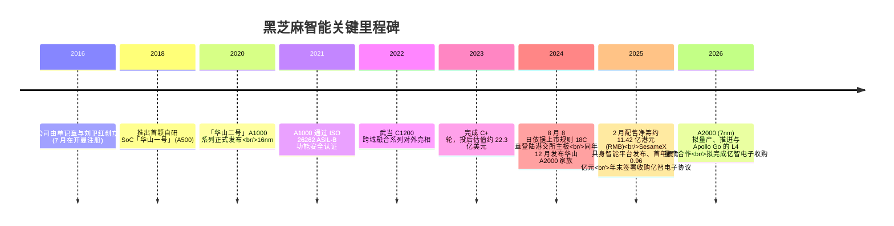
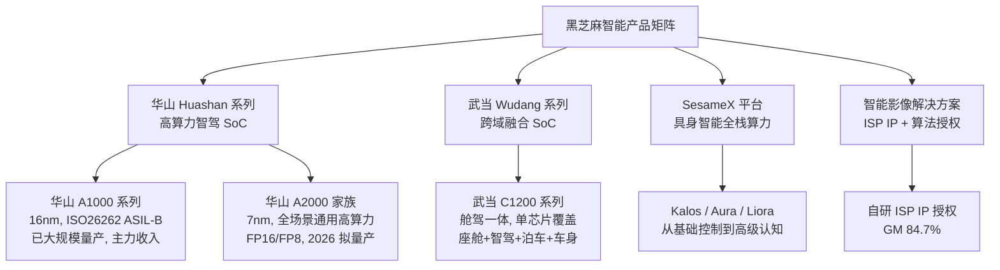
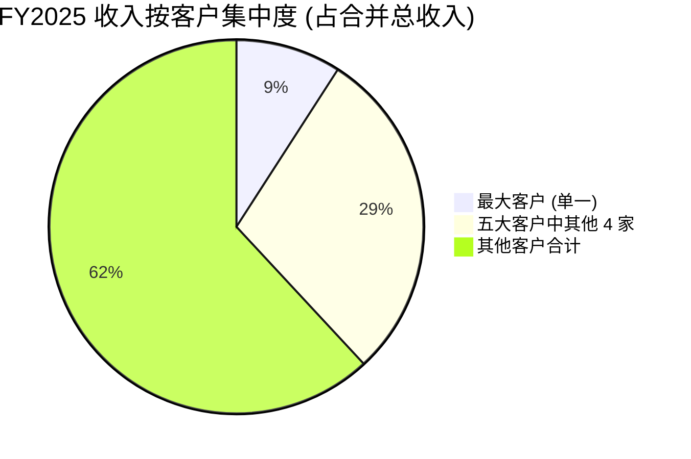
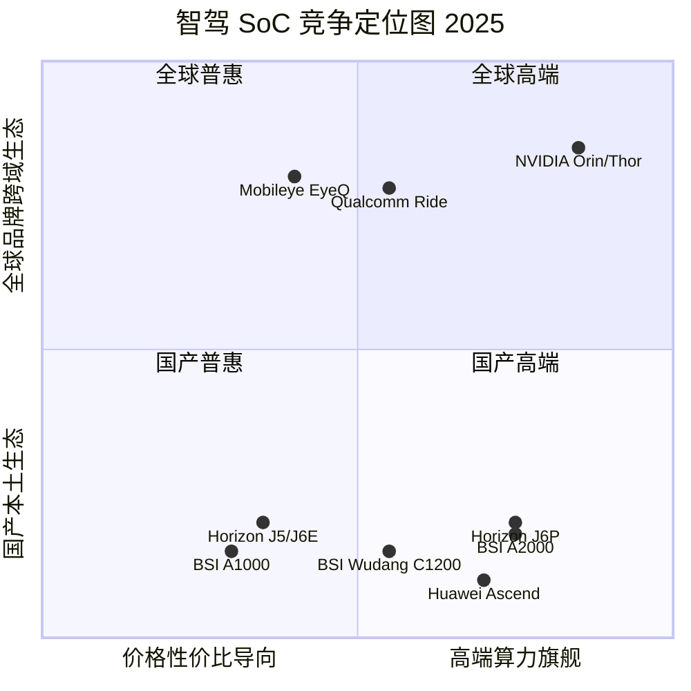
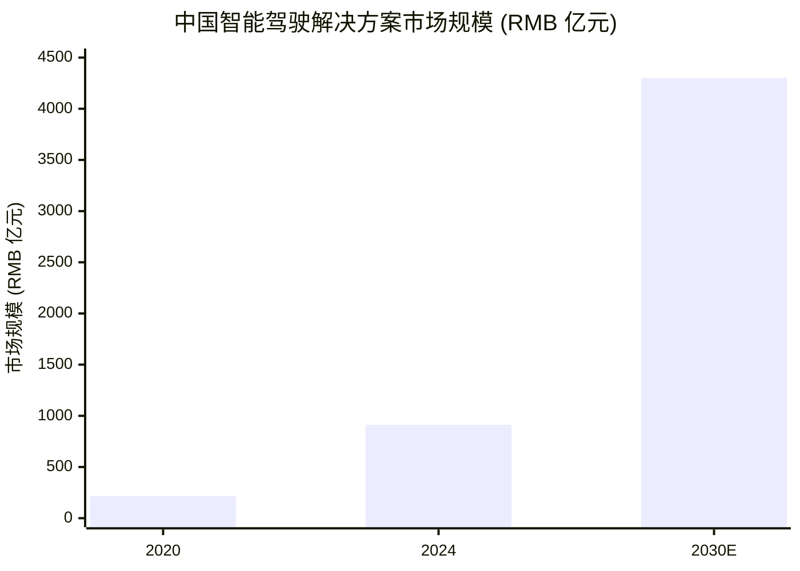

# 黑芝麻智能国际控股有限公司 (Black Sesame International) 公司研究报告

**股票代码**: HKEX:02533  **报告日期 (as of)**: 2026-06-14  **报告语言**: 简体中文

---

## 投资摘要 (Investment Summary) — *Analyst view:*

> 以下评级、12 个月目标价、前瞻估值矩阵与论点支柱均为**本报告分析师观点 (`*Analyst view:*`)**，并非任何监管文件 (招股章程 / 年度业绩 / 中期業績) 的内容——文件中不含目标价。

| 项目 | 数值 (as of 2026-06-14) |
|---|---|
| **评级 Rating** | **Hold / Neutral (中性)** |
| **12 个月目标价 PT** | **HKD 16.0** |
| **当前股价** | HKD 13.42 ([yfinance 02533.HK, 2026-06-12 收盘](https://finance.yahoo.com/quote/2533.HK/)) |
| **隐含上行 Upside** | **+19%** |
| **估值方法** | P/S 法 (pre-profit)：8× FY2026E 营收 (≈ HKD 1.36bn) ÷ 6.88 亿股 |
| **市值 Market cap** | ≈ HKD 92 亿 (≈ RMB 85 亿) |
| **52 周区间** | ≈ HKD 13.4 – 23.2 (近一年 −27%) |
| **TTM P/S** | ≈ 10.3× (FY2025 营收口径) |
| **TTM P/E / ROE** | NM (pre-profit；FY2025 IFRS 净亏损 RMB 14.25 亿) |

**前瞻估值矩阵 (Forward valuation matrix) — *Analyst view:***

| 口径 | FY2025A | FY2026E | FY2027E |
|---|---|---|---|
| 营收 (RMB 百万) | 822 | ~1,250 | ~1,750 |
| 营收增速 | +73.4% | ~+52% | ~+40% |
| P/S (现价) | 10.3× | ~6.8× | ~4.9× |
| Gross margin | 41.0% | ~38% | ~39% |
| 净利率 | −173% | ~−95% | ~−55% |
| EPS (RMB) | −2.07 | NM | NM |

**论点支柱 (Thesis pillars) — *Analyst view:***

1. **稀缺的国产高算力智驾 SoC 标的、首家 18C 商业化上市公司**，A1000 是国内仅有的两款已穿越量产全周期的中高算力智驾芯片之一 ([2025 年度业绩公告](https://www1.hkexnews.hk/listedco/listconews/sehk/2026/0331/2026033100746.pdf))。
2. **FY2025 营收 +73.4% 至 8.22 亿元、毛利率稳定在 41.0%**，具身智能 (embodied AI) 新业务首年即贡献 0.96 亿元，"汽车 + 机器人 + 端侧 AI" 三引擎成形 ([2025 年度业绩公告](https://www1.hkexnews.hk/listedco/listconews/sehk/2026/0331/2026033100746.pdf))。
3. **但 IFRS 净亏损扩大至 14.25 亿元、研发 14.17 亿元 ≈ 收入 172%**，全部借款已重分类为流动、年报附带 going-concern 表述，盈利时点仍是开放问题 ([2025 年度业绩公告](https://www1.hkexnews.hk/listedco/listconews/sehk/2026/0331/2026033100746.pdf))。
4. **最大的不确定性是 A2000 (7nm) 量产能否在 2026 年兑现定点**；卖方中 Bernstein 给予"跑输大市 (Underperform)"评级，指 A1000 出货已连续三季度下滑、吉利份额被地平线抢占 (*Analyst view:* [Bernstein 1Q26 智驾芯片追踪, 2026-05-11](http://xs-macbook-air.local:5001/zsxq/pdf/184124285244812/Bernstein-China%20Semiconductors%20China%20Smart%20Driving%20Chips%20Tracker%20%EF%BC%881Q26%EF%BC%89%EF%BC%9A%20NOA%20penetration%20temporarily%20dropped%20to%2032%25%20with%20weaker%20EV%20sales-260511.pdf))。

**最该盯紧的两个变量 (Swing variables)**：(i) **A2000 在 2026 年能否落地头部 OEM 量产定点**——决定高阶 ADAS 叙事成立与否；(ii) **整体毛利率能否守住 35%+**——1H2025 一度跌至 24.8%，价格战与硬件占比上升是核心压力。

---

## 目录

1. 公司概览 (Company Overview)
   - 1A 估值与目标价 (Valuation & Price Target snapshot)
   - 1B GF Score 基本面五维评分
2. 估值、前瞻模型与目标价 (Valuation, Forward Model & PT) + 卖方观点演变
3. 公司历史 (Company History)
4. 管理团队 (Management Team)
5. 产品与服务 (Products & Services)
6. 客户与上市策略 (Customers & GTM)
7. 行业概览 (Industry Overview)
8. 竞争格局 (Competitive Landscape)
9. 市场机会 (Market Opportunity / TAM)
10. 风险评估 (Risk Assessment) + 9.5 关键分歧与催化剂
11. 投资视角评分 (Investor Lenses)
12. 参考资料与数据来源 (References & Data Used)

---

## 1. 公司概览 (Company Overview)

**本报告观点 (BLUF)。** 黑芝麻智能 (Black Sesame International) 是一家专注车规级智能汽车计算 SoC 的中国 fabless 半导体设计公司，2024 年 8 月 8 日依据港交所上市规则 **第 18C 章**成为**首家商业化上市的特专科技公司** ([2025 年度业绩公告 附注 1](https://www1.hkexnews.hk/listedco/listconews/sehk/2026/0331/2026033100746.pdf))。FY2025 公司营收 +73.4% 至 8.22 亿元、毛利率稳定 41.0%，并把业务从单一智驾芯片扩张到 "汽车 (华山 / 武当) + 机器人 (SesameX 具身智能) + 端侧 AI (拟收购亿智电子)" 三条线。我们给予 **Hold / 中性**评级、12 个月目标价 **HKD 16**——增长叙事真实但盈利路径漫长、A2000 量产尚未兑现定点、卖方中 Bernstein 明确看空，故在股价已较去年下跌 27% 的位置上，风险回报趋于均衡而非进攻。

黑芝麻智能总部位于上海，研发中心覆盖上海、武汉、成都、北京、深圳及美国硅谷。公司于 2016 年 7 月 15 日在开曼群岛注册成立，2024 年 8 月 8 日在港交所主板挂牌，股份代号 02533 ([2025 年度业绩公告 附注 1 GENERAL INFORMATION](https://www1.hkexnews.hk/listedco/listconews/sehk/2026/0331/2026033100746.pdf))。

**业务模式 (How they make money)。** 公司将自研车规级 SoC 与配套算法、工具链、参考方案打包销售给整车厂 (OEM) 与一级零部件供应商 (Tier-1)。FY2025 起收入正式分为三大分部：(i) **辅助驾驶产品及解决方案 (Driving Assistance Products & Solutions, ADP&S)**——华山 (Huashan) 与武当 (Wudang) 两大芯片系列 + 域控制器 + 行泊一体软件栈；(ii) **智能影像解决方案 (Intelligent Imaging Solutions)**——自研 ISP 核与图像 AI 算法以 IP 授权 / 软件许可方式售予手机、ODM、AI 眼镜客户；(iii) **具身智能及解决方案 (Embodied AI & Solutions)**——2025 年新设，以 SesameX 全栈算力平台 (Kalos / Aura / Liora 三模块) 为机器人客户提供算力 ([2025 年度业绩公告 附注 3 收入分部](https://www1.hkexnews.hk/listedco/listconews/sehk/2026/0331/2026033100746.pdf))。商业模式上奉行 "软硬解耦 + 开放生态"——既可整套售卖芯片加自研行泊一体软件，也允许 OEM / Tier-1 用自研或第三方算法跑在公司硅片之上。

<svg xmlns="http://www.w3.org/2000/svg" viewBox="0 0 720 460" width="720" height="460" role="img" aria-label="revenue donut"><rect x="0" y="0" width="720" height="460" fill="#ffffff"/>
<text x="20.00" y="30.00" text-anchor="start" font-family="Helvetica,Arial,sans-serif" font-size="15" font-weight="700" fill="#1f2933">黑芝麻智能 FY2025 收入分部结构 (RMB 百万)</text>
<path d="M 288.00,107.20 A 132 132 0 1 1 174.51,171.79 L 220.94,199.37 A 78 78 0 1 0 288.00,161.20 Z" fill="#2563eb"/>
<path d="M 174.51,171.79 A 132 132 0 0 1 249.09,113.06 L 265.01,164.66 A 78 78 0 0 0 220.94,199.37 Z" fill="#15803d"/>
<path d="M 249.09,113.06 A 132 132 0 0 1 288.00,107.20 L 288.00,161.20 A 78 78 0 0 0 265.01,164.66 Z" fill="#d97706"/>
<text x="288.00" y="235.20" text-anchor="middle" font-family="Helvetica,Arial,sans-serif" font-size="18" font-weight="800" fill="#1f2933">822.3m</text>
<text x="288.00" y="255.20" text-anchor="middle" font-family="Helvetica,Arial,sans-serif" font-size="13" font-weight="600" fill="#52606d">RMB822.3M</text>
<text x="288.00" y="271.20" text-anchor="middle" font-family="Helvetica,Arial,sans-serif" font-size="10" font-weight="400" fill="#8a97a3">total</text>
<line x1="356.26" y1="359.14" x2="372.26" y2="359.14" stroke="#2563eb" stroke-width="1.4"/>
<text x="376.26" y="357.14" text-anchor="start" font-family="Helvetica,Arial,sans-serif" font-size="11" font-weight="700" fill="#1f2933">辅助驾驶 ADP&amp;S</text>
<text x="376.26" y="371.14" text-anchor="start" font-family="Helvetica,Arial,sans-serif" font-size="10" font-weight="400" fill="#52606d">RMB686.9M  (83.5%)</text>
<line x1="202.63" y1="130.78" x2="186.63" y2="130.78" stroke="#15803d" stroke-width="1.4"/>
<text x="182.63" y="128.78" text-anchor="end" font-family="Helvetica,Arial,sans-serif" font-size="11" font-weight="700" fill="#1f2933">具身智能 Embodied AI</text>
<text x="182.63" y="142.78" text-anchor="end" font-family="Helvetica,Arial,sans-serif" font-size="10" font-weight="400" fill="#52606d">RMB96.3M  (11.7%)</text>
<line x1="267.43" y1="102.74" x2="251.43" y2="102.74" stroke="#d97706" stroke-width="1.4"/>
<text x="247.43" y="100.74" text-anchor="end" font-family="Helvetica,Arial,sans-serif" font-size="11" font-weight="700" fill="#1f2933">智能影像 Imaging</text>
<text x="247.43" y="114.74" text-anchor="end" font-family="Helvetica,Arial,sans-serif" font-size="10" font-weight="400" fill="#52606d">RMB39.2M  (4.8%)</text>
<text x="360.00" y="430.00" text-anchor="middle" font-family="Helvetica,Arial,sans-serif" font-size="10" font-weight="400" font-style="italic" fill="#8a97a3">ADP&amp;S 占 83.5%；具身智能首年即贡献 11.7%；智能影像虽小但毛利率 84.7%</text>
<text x="360.00" y="444.00" text-anchor="middle" font-family="Helvetica,Arial,sans-serif" font-size="10" font-weight="400" fill="#52606d">Source: 黑芝麻智能 2025 年度业绩公告 (HKEX, 2026-03-31) 附注 3 收入分部</text>
</svg>

**收入怎么赚的 (利润表 Sankey)。** 下面的利润表 Sankey 直观展示了公司的盈利结构问题：8.22 亿元营收经 4.85 亿元 COGS 后留下 3.37 亿元毛利，但 14.17 亿元研发 + 3.86 亿元销售及管理费用，使经营性亏损达到 14.48 亿元 ([2025 年度业绩公告 合并损益表](https://www1.hkexnews.hk/listedco/listconews/sehk/2026/0331/2026033100746.pdf))。

<svg xmlns="http://www.w3.org/2000/svg" viewBox="0 0 1000 560" width="1000" height="560" role="img" aria-label="income sankey"><rect x="0" y="0" width="1000" height="560" fill="#ffffff"/>
<text x="20.00" y="30.00" text-anchor="start" font-family="Helvetica,Arial,sans-serif" font-size="15" font-weight="700" fill="#1f2933">黑芝麻智能 FY2025 利润表 Sankey (RMB 百万)</text>
<rect x="40.00" y="74.83" width="14" height="153.93" fill="#2563eb" opacity="0.85"/><text x="58.00" y="147.79" text-anchor="start" font-family="Helvetica,Arial,sans-serif" font-size="10" fill="#1f2933">辅助驾驶产品及解决方案 ADP&amp;S 687</text>
<rect x="40.00" y="232.76" width="14" height="21.58" fill="#2563eb" opacity="0.85"/><text x="58.00" y="241.55" text-anchor="start" font-family="Helvetica,Arial,sans-serif" font-size="10" fill="#1f2933">具身智能 Embodied AI 96</text>
<rect x="40.00" y="258.34" width="14" height="8.77" fill="#2563eb" opacity="0.85"/><text x="58.00" y="260.73" text-anchor="start" font-family="Helvetica,Arial,sans-serif" font-size="10" fill="#1f2933">智能影像 Imaging 39</text>
<rect x="300.00" y="74.83" width="14" height="184.31" fill="#16a34a" opacity="0.85"/><text x="318.00" y="163.98" text-anchor="start" font-family="Helvetica,Arial,sans-serif" font-size="10" fill="#1f2933">营收 822</text>
<path d="M 314.00,99.50 C 407.00,99.50 407.00,131.96 500.00,131.96" stroke="#cbd5e1" stroke-width="108.71" fill="none" opacity="0.45"/>
<path d="M 314.00,217.21 C 407.00,217.21 407.00,86.49 500.00,86.49" stroke="#cbd5e1" stroke-width="75.60" fill="none" opacity="0.45"/>
<rect x="500.00" y="48.66" width="14" height="75.60" fill="#16a34a" opacity="0.85"/><text x="518.00" y="90.46" text-anchor="start" font-family="Helvetica,Arial,sans-serif" font-size="10" fill="#1f2933">毛利 337</text>
<rect x="500.00" y="127.96" width="14" height="108.71" fill="#dc2626" opacity="0.8"/><text x="518.00" y="186.31" text-anchor="start" font-family="Helvetica,Arial,sans-serif" font-size="10" fill="#1f2933">COGS 485</text>
<path d="M 514.00,86.49 C 607.00,86.49 607.00,86.49 700.00,86.49" stroke="#fca5a5" stroke-width="75.60" fill="none" opacity="0.4"/>
<rect x="700.00" y="48.66" width="14" height="317.94" fill="#dc2626" opacity="0.8"/><text x="718.00" y="195.63" text-anchor="start" font-family="Helvetica,Arial,sans-serif" font-size="10" fill="#1f2933">经营亏损 −1448</text>
<text x="500.00" y="300.00" text-anchor="start" font-family="Helvetica,Arial,sans-serif" font-size="11" font-weight="600" fill="#52606d">研发 R&amp;D 1417 · 销售及管理 386 · 减值 10</text>
<text x="500.00" y="318.00" text-anchor="start" font-family="Helvetica,Arial,sans-serif" font-size="11" font-weight="700" fill="#dc2626">→ 经营亏损 −1448，净亏损 −1425 (FY2025)</text>
<text x="20.00" y="535.00" text-anchor="start" font-family="Helvetica,Arial,sans-serif" font-size="10" font-style="italic" fill="#8a97a3">R&amp;D 1,417 百万元 ≈ 收入 172%，是经营亏损的主因；FY2025 IFRS 净亏损 14.25 亿元</text>
<text x="20.00" y="549.00" text-anchor="start" font-family="Helvetica,Arial,sans-serif" font-size="10" fill="#52606d">Source: 黑芝麻智能 2025 年度业绩公告 (HKEX, 2026-03-31) 合并损益表</text>
</svg>

**地理分布。** 收入主要来自中国大陆 OEM 与商用车客户。FY2025 业绩公告明确 A1000 已 "begun to penetrate into global markets" 并成为芯片销售的主要贡献者，A2000 因 "passing relevant US reviews" 获得海外市场准入优势，但公司迄今未单独披露海外收入贡献占比，仍处于定点导入与首批出货的早期阶段 ([2025 年度业绩公告 业务回顾 / 业务展望](https://www1.hkexnews.hk/listedco/listconews/sehk/2026/0331/2026033100746.pdf))。

**营收增长轨迹。** 下图为 FY2021–FY2025 营收：从 0.61 亿元增长至 8.22 亿元，5 年 CAGR 约 92%，但累计经营亏损巨大、规模仍不足以摊薄约 14 亿元/年的研发开支。

<svg xmlns="http://www.w3.org/2000/svg" viewBox="0 0 860 470" width="860" height="470" role="img" aria-label="revenue bars"><rect x="0" y="0" width="860" height="470" fill="#ffffff"/>
<text x="20.00" y="30.00" text-anchor="start" font-family="Helvetica,Arial,sans-serif" font-size="15" font-weight="700" fill="#1f2933">黑芝麻智能 营收增长轨迹 FY2021–FY2025 (RMB 百万)</text>
<line x1="70.00" y1="390.00" x2="820.00" y2="390.00" stroke="#cbd5e1" stroke-width="1"/>
<rect x="103.00" y="383.32" width="84.00" height="6.68" fill="#2563eb"/><text x="145.00" y="375.32" text-anchor="middle" font-family="Helvetica,Arial,sans-serif" font-size="11" font-weight="700" fill="#1f2933">61</text><text x="145.00" y="408.00" text-anchor="middle" font-family="Helvetica,Arial,sans-serif" font-size="11" fill="#52606d">2021</text>
<rect x="253.00" y="371.73" width="84.00" height="18.27" fill="#2563eb"/><text x="295.00" y="363.73" text-anchor="middle" font-family="Helvetica,Arial,sans-serif" font-size="11" font-weight="700" fill="#1f2933">165</text><text x="295.00" y="408.00" text-anchor="middle" font-family="Helvetica,Arial,sans-serif" font-size="11" fill="#52606d">2022</text>
<rect x="403.00" y="355.51" width="84.00" height="34.49" fill="#2563eb"/><text x="445.00" y="347.51" text-anchor="middle" font-family="Helvetica,Arial,sans-serif" font-size="11" font-weight="700" fill="#1f2933">312</text><text x="445.00" y="408.00" text-anchor="middle" font-family="Helvetica,Arial,sans-serif" font-size="11" fill="#52606d">2023</text>
<rect x="553.00" y="337.63" width="84.00" height="52.37" fill="#2563eb"/><text x="595.00" y="329.63" text-anchor="middle" font-family="Helvetica,Arial,sans-serif" font-size="11" font-weight="700" fill="#1f2933">474</text><text x="595.00" y="408.00" text-anchor="middle" font-family="Helvetica,Arial,sans-serif" font-size="11" fill="#52606d">2024</text>
<rect x="703.00" y="299.21" width="84.00" height="90.79" fill="#1d4ed8"/><text x="745.00" y="291.21" text-anchor="middle" font-family="Helvetica,Arial,sans-serif" font-size="11" font-weight="700" fill="#1f2933">822</text><text x="745.00" y="408.00" text-anchor="middle" font-family="Helvetica,Arial,sans-serif" font-size="11" fill="#52606d">2025</text>
<text x="20.00" y="445.00" text-anchor="start" font-family="Helvetica,Arial,sans-serif" font-size="10" font-style="italic" fill="#8a97a3">5 年 CAGR ~92%；FY2025 同比 +73.4%。但累计经营亏损巨大，规模仍不足以摊薄 14 亿元/年研发</text>
<text x="20.00" y="459.00" text-anchor="start" font-family="Helvetica,Arial,sans-serif" font-size="10" fill="#52606d">Source: 黑芝麻智能 2024 年报四年财务概要 + 2025 年度业绩公告 (HKEX)</text>
</svg>

**规模与财务概要。** FY2025 营收 RMB 8.22 亿元 (同比 +73.4%)、毛利 3.37 亿元 (毛利率 41.0%，较 FY2024 的 41.1% 基本稳定)；经营亏损 14.48 亿元 (较 FY2024 的 17.54 亿元收窄 17.5%)；**IFRS 净亏损 14.25 亿元** (FY2024 因可转换优先股负债公允价值翻转录得 3.13 亿元一次性会计利润，故同比看似"由盈转亏"，实为口径差异)；经调整虧損淨額 (adjusted net loss，非 IFRS) 10.76 亿元 (较 FY2024 的 13.04 亿元收窄 17.5%) ([2025 年度业绩公告 财务摘要 + 非 IFRS 调节表](https://www1.hkexnews.hk/listedco/listconews/sehk/2026/0331/2026033100746.pdf))。截至 2025 年末，现金及现金等价物加按公允价值计入损益的流动金融资产合计 RMB 15.31 亿元 (FY2024 末为 16.23 亿元) ([2025 年度业绩公告 流动资金与财务资源](https://www1.hkexnews.hk/listedco/listconews/sehk/2026/0331/2026033100746.pdf))。

> **本期新变化 (What changed in FY2025)。** 相较 2024 年报：(i) 收入口径由两分部扩为**三分部**，新增"具身智能 (Embodied AI)"并首年贡献 0.96 亿元；(ii) **客户集中度下降**——前五大客户由 40.3% 降至 38.1%、最大客户由 14.9% 降至 9.1%；(iii) **全部借款 7.40 亿元已重分类至流动负债** (FY2024 尚有 2.01 亿元非流动借款)，年报附 going-concern 持续经营评估；(iv) A2000 (7nm) 由"发布"进入"定点 + 拟 2026 量产"，并宣布与百度 Apollo Go 的 L4 Robotaxi 量产合作意向 ([2025 年度业绩公告 业务展望](https://www1.hkexnews.hk/listedco/listconews/sehk/2026/0331/2026033100746.pdf))。

### 1A 估值与目标价 (Valuation & Price Target snapshot) — *Analyst view:*

截至 2026 年 6 月 12 日，黑芝麻智能收报 **HKD 13.42**，对应市值约 HKD 92 亿 (≈ RMB 85 亿)、约 6.88 亿股 ([yfinance 02533.HK](https://finance.yahoo.com/quote/2533.HK/))。近一年股价下跌约 **27%** (2025-06 的 ~HKD 18.4 → 2026-06 的 HKD 13.42)，跑输恒生科技指数。公司 FY2025 与 1H2025 净利润均为负，故 **TTM P/E 不具参考意义、ROE 为 NM**——这是典型的"现金燃烧型成长公司"，亏损主因是约 14 亿元/年的研发开支远超 8 亿元量级的收入体量 ([2025 年度业绩公告 合并损益表](https://www1.hkexnews.hk/listedco/listconews/sehk/2026/0331/2026033100746.pdf))。

**TTM P/S** 按 FY2025 营收 RMB 8.22 亿元 (≈ HKD 8.94 亿) 与 HKD 92 亿市值口径约为 **10.3×**。对照可比公司：地平线机器人 (HKEX:9660) 规模更大、P/S 显著高于黑芝麻 (*Analyst view:* 多份卖方维持其"跑赢大市"评级，见 §2 卖方观点演变)。黑芝麻智能的 P/S 处于国产智驾芯片板块的相对低位，**估值溢价主要由稀缺标的、首家 18C 上市、A1000 已规模量产、与吉利 / 东风 / 比亚迪 / 一汽的合作绑定支撑**；负面催化是研发烧钱、毛利率回落 (1H2025 跌至 24.8%)、A1000 出货下滑 (Bernstein 口径连续三季度下降)，以及高阶 NoA 战场上来自地平线 J6P、英伟达 Thor 的强压。我们给予 **Hold / 中性、目标价 HKD 16 (+19%)**——详见 §2 推导。

### 1B GF Score 基本面五维评分 — *Analyst view:*

下面的 GF Score (GuruFocus 式五维基本面评分) 是**本报告分析师依据已披露财务指标构建的评分**，并非 GuruFocus 官方数字，也不附任何文件引用于评分本身；每一维度背后的指标 (margins / leverage / 增速 / 倍数 / 价格回报) 在正文各处单独引用。综合分约 **38 / 100** (band: Weak)，反映"高增长 + 弱盈利 + 弱动量"的鲜明对比。

<svg xmlns="http://www.w3.org/2000/svg" viewBox="0 0 500 500" width="500" height="500" role="img" aria-label="GF Score radar"><rect x="0" y="0" width="500" height="500" fill="#ffffff"/>
<text x="250.00" y="28.00" text-anchor="middle" font-family="Helvetica,Arial,sans-serif" font-size="15" font-weight="700" fill="#1f2933">黑芝麻智能 GF Score (GuruFocus 式五维基本面)</text>
<text x="250.00" y="46.00" text-anchor="middle" font-family="Helvetica,Arial,sans-serif" font-size="12" font-weight="600" fill="#52606d">黑芝麻智能 02533.HK · 综合 38/100</text>
<polygon points="250.00,90.00 405.00,202.61 345.80,384.84 154.20,384.84 95.00,202.61" fill="none" stroke="#e2e8f0" stroke-width="1"/>
<polygon points="250.00,130.00 367.00,215.02 322.32,352.63 177.68,352.63 133.00,215.02" fill="none" stroke="#e2e8f0" stroke-width="1"/>
<polygon points="250.00,170.00 329.00,227.43 298.84,320.42 201.16,320.42 171.00,227.43" fill="none" stroke="#e2e8f0" stroke-width="1"/>
<polygon points="250.00,210.00 291.00,239.84 275.36,288.21 224.64,288.21 209.00,239.84" fill="none" stroke="#e2e8f0" stroke-width="1"/>
<line x1="250.00" y1="250.00" x2="250.00" y2="90.00" stroke="#cbd5e1" stroke-width="1"/>
<line x1="250.00" y1="250.00" x2="405.00" y2="202.61" stroke="#cbd5e1" stroke-width="1"/>
<line x1="250.00" y1="250.00" x2="345.80" y2="384.84" stroke="#cbd5e1" stroke-width="1"/>
<line x1="250.00" y1="250.00" x2="154.20" y2="384.84" stroke="#cbd5e1" stroke-width="1"/>
<line x1="250.00" y1="250.00" x2="95.00" y2="202.61" stroke="#cbd5e1" stroke-width="1"/>
<polygon points="250.00,202.00 296.50,235.95 327.32,358.84 213.34,322.31 195.40,235.81" fill="#2563eb" fill-opacity="0.30" stroke="#2563eb" stroke-width="2"/>
<circle cx="250.00" cy="202.00" r="3" fill="#2563eb"/><circle cx="296.50" cy="235.95" r="3" fill="#2563eb"/><circle cx="327.32" cy="358.84" r="3" fill="#2563eb"/><circle cx="213.34" cy="322.31" r="3" fill="#2563eb"/><circle cx="195.40" cy="235.81" r="3" fill="#2563eb"/>
<text x="250.00" y="80.00" text-anchor="middle" font-family="Helvetica,Arial,sans-serif" font-size="11" font-weight="600" fill="#1f2933">财务强度 3</text>
<text x="415.00" y="202.61" text-anchor="start" font-family="Helvetica,Arial,sans-serif" font-size="11" font-weight="600" fill="#1f2933">盈利能力 1</text>
<text x="345.80" y="400.00" text-anchor="middle" font-family="Helvetica,Arial,sans-serif" font-size="11" font-weight="600" fill="#1f2933">成长性 8</text>
<text x="154.20" y="400.00" text-anchor="middle" font-family="Helvetica,Arial,sans-serif" font-size="11" font-weight="600" fill="#1f2933">GF 价值 5</text>
<text x="85.00" y="202.61" text-anchor="end" font-family="Helvetica,Arial,sans-serif" font-size="11" font-weight="600" fill="#1f2933">动量 2</text>
<text x="250.00" y="478.00" text-anchor="middle" font-family="Helvetica,Arial,sans-serif" font-size="9" font-weight="400" fill="#8a97a3">Source: 黑芝麻智能 2025 年度业绩公告 (HKEX, 2026-03-31) · yfinance 02533.HK · as of 2026-06-14</text>
</svg>

- **财务强度 (Financial Strength) 3/10。** 现金 + 流动金融资产 15.31 亿元可覆盖约 1.5 年烧钱，但**全部借款 7.40 亿元已到期重分类为流动负债**、年报附 going-concern 表述、资产负债率偏高；研发 14.17 亿元远超毛利 ([2025 年度业绩公告 合并财务状况表 + 持续经营评估](https://www1.hkexnews.hk/listedco/listconews/sehk/2026/0331/2026033100746.pdf))。
- **盈利能力 (Profitability) 1/10。** FY2025 净利率 −173%、经营利润率 −176%、ROE / ROIC 均为负值；毛利率 41.0% 虽不低，但被巨额研发吞噬，盈亏平衡无明确时间表 ([2025 年度业绩公告 财务摘要](https://www1.hkexnews.hk/listedco/listconews/sehk/2026/0331/2026033100746.pdf))。
- **成长性 (Growth) 8/10。** FY2025 营收 +73.4%、5 年 CAGR ~92%；具身智能新分部首年 0.96 亿元、ADP&S +56.8%；这是全表唯一的强项 ([2025 年度业绩公告 收入分部](https://www1.hkexnews.hk/listedco/listconews/sehk/2026/0331/2026033100746.pdf))。
- **GF 价值 (GF Value，越高越便宜) 5/10。** P/S ~10.3× 低于地平线等可比公司、且已较 IPO 高位回落约 40%+，但因无盈利无法用 P/E / DCF 锚定，估值仍主要靠 P/S 与稀缺性溢价支撑，给中性偏便宜 ([yfinance 02533.HK](https://finance.yahoo.com/quote/2533.HK/))。
- **动量 (Momentum) 2/10。** 近一年股价 −27%、跑输基准；基本面动量同样转弱——Bernstein 指 A1000 出货连续三季度下滑 (*Analyst view:* [Bernstein 1Q26, 2026-05-11](http://xs-macbook-air.local:5001/zsxq/pdf/184124285244812/Bernstein-China%20Semiconductors%20China%20Smart%20Driving%20Chips%20Tracker%20%EF%BC%881Q26%EF%BC%89%EF%BC%9A%20NOA%20penetration%20temporarily%20dropped%20to%2032%25%20with%20weaker%20EV%20sales-260511.pdf))。

---

## 2. 估值、前瞻模型与目标价 (Valuation, Forward Model & PT)

> 本章所有前瞻数字、目标价与情景均为 **`*Analyst view:*`**，不附任何文件引用于预测本身；各驱动因子的外部依据 (分部数据、管理层指引、行业预测) 在文内分别引用。

### 2.1 前瞻财务模型 (Forward estimates) — *Analyst view:*

模型以三分部分别建模再加总：ADP&S (华山 A1000/A2000 + 武当 C1200 量产放量，但 A1000 出货承压、价格战压低 ASP)、具身智能 (SesameX 高增但基数小)、智能影像 (稳定高毛利长尾)。

| RMB 百万 | FY2025A | FY2026E | FY2027E | FY2028E |
|---|---|---|---|---|
| ADP&S 营收 | 687 | ~1,000 | ~1,400 | ~1,850 |
| 具身智能营收 | 96 | ~210 | ~310 | ~410 |
| 智能影像营收 | 39 | ~45 | ~50 | ~55 |
| **总营收** | **822** | **~1,250** | **~1,750** | **~2,300** |
| 营收增速 | +73.4% | ~+52% | ~+40% | ~+31% |
| Gross margin | 41.0% | ~38% | ~39% | ~40% |
| 研发占收入 | 172% | ~120% | ~90% | ~70% |
| 经营利润率 | −176% | ~−95% | ~−55% | ~−25% |
| IFRS 净利率 | −173% | ~−95% | ~−55% | ~−25% |

驱动因子与外部依据：ADP&S 增长来自 A2000 (7nm) 2026 量产 + 商用车 / L4 物流放量 ([2025 年度业绩公告 业务展望](https://www1.hkexnews.hk/listedco/listconews/sehk/2026/0331/2026033100746.pdf))，但受地平线 J6 抢份额拖累 (*Analyst view:* [Bernstein 1Q26, 2026-05-11](http://xs-macbook-air.local:5001/zsxq/pdf/184124285244812/Bernstein-China%20Semiconductors%20China%20Smart%20Driving%20Chips%20Tracker%20%EF%BC%881Q26%EF%BC%89%EF%BC%9A%20NOA%20penetration%20temporarily%20dropped%20to%2032%25%20with%20weaker%20EV%20sales-260511.pdf))；毛利率假设受 1H2025 跌至 24.8% 的事实压制、再随规模回升 ([2025 年中期业绩公告 财务摘要](https://www1.hkexnews.hk/listedco/listconews/sehk/2025/0829/2025082900315.pdf))；行业 TAM 增速参考国内智驾解决方案市场 30%+ CAGR ([华经情报网 2025 中国智能驾驶解决方案行业现状](https://www.huaon.com/channel/trend/1111396.html))。**模型显示公司在 FY2028 之前难以实现 IFRS 盈利。**

### 2.2 目标价推导 (PT derivation) — *Analyst view:*

由于公司 pre-profit、P/E 与 DCF 均无法锚定，我们采用 **P/S 法**：对 FY2026E 营收 RMB 1,250 百万 (≈ HKD 1,359 百万) 给予目标 P/S，再除以 6.88 亿股。

- **目标倍数论证**：黑芝麻当前 P/S ~10.3× (FY2025 口径) / ~6.8× (FY2026E 口径)；地平线等高增长可比公司 P/S 更高，但黑芝麻增速 (~52%) 与盈利质量逊于地平线，且 A1000 出货下滑，给予**保守的 8× FY2026E** 作为基准——略低于地平线、略高于"高研发亏损硬件公司"的 5× 估值带。

| 情景 | 目标 P/S (FY2026E) | 隐含市值 | **目标价** | 隐含上行/下行 |
|---|---|---|---|---|
| **Bull (牛市)** | 10.5× | HKD 14.3bn | **HKD 20.7** | **+54%** |
| **Base (基准)** | 8.0× | HKD 10.9bn | **HKD 16.0** | **+19%** |
| **Bear (熊市)** | 5.0× | HKD 6.8bn | **HKD 9.9** | **−26%** |

- **Bull (HKD 20.7)**：A2000 在 2026 年拿下 2+ 头部 OEM 量产定点、毛利率回升至 40%+、具身智能放量超预期，市场按高增长国产芯片重新定价。
- **Base (HKD 16.0)**：A2000 按计划量产但定点节奏温和、毛利率守在 35–38%、营收维持 50%+ 增速——与 Bernstein 的 HKD 16 目标价巧合一致 (尽管 Bernstein 评级为 Underperform，是因其报告日股价更高)。
- **Bear (HKD 9.9)**：价格战持续压低毛利率至 30% 以下、A1000 出货继续下滑、吉利份额进一步流失、A2000 量产延后，市场给到 5× 的"烧钱硬件公司"估值带。

**结论：Hold / 中性，12 个月目标价 HKD 16 (+19%)。** 基准上行温和、且高度依赖 A2000 这一尚未兑现的催化剂；下行情景 (−26%) 与上行情景 (+54%) 的不对称性偏正，但触发上行需要明确的定点数据，故维持中性而非买入。

### 2.3 卖方观点演变 (Sell-side view evolution)

本报告引用了 ≥2 份覆盖黑芝麻智能的 zsxq 券商研报，故按要求构建卖方观点演变。**机械预筛 (`db/stock_price_target.db` 只读)** 显示当前库内黑芝麻智能仅有 1 条结构化 PT 记录 (Bernstein, Underperform, PT HKD 16, 报告日 2026-05-11, 报告日股价 HKD 17.79, 隐含 −10.1%)；其余券商在多份行业 / 调研报告中给出"跑输大市"的定性评级但未单列结构化 PT。

**按机构的观点时间线 (按报告日排序)：**

| 机构 | 报告日 | 评级 / 目标价 | 核心论点 |
|---|---|---|---|
| **Bernstein** | 2026-03-11 | 跑输大市 (Underperform) | 1H26 半导体调研：行业需求强劲、本土化加速，但黑芝麻被单列为唯一"跑输大市"的智驾芯片标的 (*Analyst view:* [Bernstein 1H26 China Semis Tour, 2026-03-11](http://xs-macbook-air.local:5001/zsxq/pdf/812228815545422/Bernstein-China%20Semis%20Tour%201H26%EF%BC%9A%20Strong%20Demand%EF%BC%8C%20Rising%20Localization-260311.pdf)) |
| **J.P. Morgan** | 2026-04-28 | 行业观察 (未单列评级) | 北京车展复盘：地平线、黑芝麻等推动平台化与高算力芯片 (2028 目标 1000–2500 TOPS)，芯片国产替代加速 (*Analyst view:* [J.P. Morgan Beijing Auto Show Debrief, 2026-04-28](http://xs-macbook-air.local:5001/zsxq/pdf/812212581144842/J.P.%20Morgan-Debrief%20of%20the%20Beijing%20Auto%20Show%EF%BC%9A10%20observations%20and%20the%20models%20that%20surprised%20us-260428.pdf)) |
| **Bernstein** | 2026-05-08 | 跑输大市 (Underperform) | 2026 自动驾驶调研：地平线是 2026 年唯一能对标英伟达 500+TOPS 的国产玩家、获比亚迪 / 大众 / 奇瑞定点；主机厂自研加速 (小鹏图灵已出货 20 万颗) 挤压第三方芯片空间；黑芝麻"逊于大盘" (*Analyst view:* [Bernstein China AD 2026 Tour, 2026-05-08](http://xs-macbook-air.local:5001/zsxq/pdf/585421448882514/Bernstein-Asian%20Autos%20and%20China%20Semiconductors%20China%20Autonomous%20Driving%EF%BC%9A%202026%20Tour%20Takeaways%20%E2%80%94%20Advancing%20Autonomously-260508.pdf)) |
| **Bernstein** | 2026-05-11 | **跑输大市 (Underperform)，PT HKD 16** | 1Q26 智驾芯片追踪：A1000 出货连续第三季度下滑、L2+ 份额降至仅 1%；仅依赖吉利与东风两家客户、且吉利份额被地平线抢占；面临持续股权稀释风险 (*Analyst view:* [Bernstein 1Q26 Smart Driving Chips Tracker, 2026-05-11](http://xs-macbook-air.local:5001/zsxq/pdf/184124285244812/Bernstein-China%20Semiconductors%20China%20Smart%20Driving%20Chips%20Tracker%20%EF%BC%881Q26%EF%BC%89%EF%BC%9A%20NOA%20penetration%20temporarily%20dropped%20to%2032%25%20with%20weaker%20EV%20sales-260511.pdf)) |

**自我修订 (self-revisions)。** Bernstein 在三份连续报告 (2026-03-11 → 05-08 → 05-11) 中持续维持"跑输大市"评级，并在 5-11 的追踪报告中**给出明确量化证据** (A1000 出货连续三季度下滑、L2+ 份额 1%、吉利份额转移给地平线)，触发因素是 1Q26 电动车销量疲软 (中国乘用车销量环比 −36%) 叠加地平线 J6 系列的竞争性抢份额。

**机构间分歧 (Cross-institute disagreement)。** 当前卖方对黑芝麻的智驾芯片定位高度一致看空 (Bernstein 三连"跑输"，JPM 仅作中性行业观察)，分歧主要在于**对国产替代窗口的乐观程度**：

| 机构 | 日期 | 评级 / PT | 核心论点 | 什么证据能证明其正确 |
|---|---|---|---|---|
| **Bernstein** | 2026-05-11 | Underperform / HKD 16 | A1000 出货下滑、客户集中吉利 + 东风、份额被地平线抢、稀释风险 | A1000 出货连续 4 季度下滑、吉利新车型继续切向地平线、再融资稀释 |
| **J.P. Morgan** | 2026-04-28 | 中性行业观察 | 芯片国产替代加速 (2028 目标 1000–2500 TOPS)、降低对英伟达依赖 | 黑芝麻 A2000 拿下头部 OEM 量产定点、TOPS 路线图兑现 |
| **本报告** | 2026-06-14 | Hold / HKD 16 | 增长真实但盈利路径漫长，股价已跌 27%、风险回报均衡 | A2000 2026 落地定点 + 毛利率守 35%+ → 上修；价格战 + 份额持续流失 → 下修 |

**目标价与报告日股价配对。** Bernstein 的 HKD 16 目标价对应其报告日 (2026-05-11) 收盘价 HKD 17.79，即当时隐含 **−10.1%** 下行 ([db/stock_price_target.db 记录](http://xs-macbook-air.local:5001/zsxq/pdf/184124285244812/Bernstein-China%20Semiconductors%20China%20Smart%20Driving%20Chips%20Tracker%20%EF%BC%881Q26%EF%BC%89%EF%BC%9A%20NOA%20penetration%20temporarily%20dropped%20to%2032%25%20with%20weaker%20EV%20sales-260511.pdf))。但截至 2026-06-12 股价已跌至 HKD 13.42，**同一 HKD 16 目标价现在隐含 +19% 上行**——这正是我们与 Bernstein"目标价相同、评级不同 (我们 Hold，其 Underperform)"的根本原因：股价的快速下跌已经消化了相当一部分 Bernstein 的看空理由。

---

## 3. 公司历史 (Company History)

公司由清华校友、前豪威科技 (OmniVision Technologies) 软件工程副总裁单记章先生与时任日立安斯泰莫制动 (旧称泛博制动) 亚太区总裁刘卫红先生于 **2016 年 7 月**联合创立 (公司于 2016 年 7 月 15 日在开曼群岛注册) ([2025 年度业绩公告 附注 1](https://www1.hkexnews.hk/listedco/listconews/sehk/2026/0331/2026033100746.pdf))。两人 1986 年同为黄冈中学校友 ([校友风采 1986 届校友单记章 & 刘卫红](http://www.hbshgzx.com/rshg/xyzc/2021-09-28/5520.html))，单负责芯片、感知与软件，刘负责销售、车规与产业资源。公司的核心使命是"用芯赋能未来出行"，定位车规级智能驾驶 SoC——这是一条典型的"重前期投入、长爬坡、大市场"赛道。

公司在十年间经历了三次明确的战略转折：(i) **2018–2020 年的产品聚焦期**——从早期试图覆盖手机影像 ISP 与车载多个赛道，收敛至"车规级智驾 SoC + 配套软件"的单一主线；(ii) **2022 年的双系列分叉**——在华山系列 (高算力 ADAS) 之外新开"武当"系列定位舱驾融合 / 跨域计算，C1200 单芯片同时跑座舱、智驾、泊车与车身控制，抢占 E/E 架构演进窗口期；(iii) **2025 年的多元化扩张**——以 SesameX 平台切入机器人 (傅利叶、宇树、联想、Geek+ 等)、以 A1000 切入商用车与 L4 无人物流，并于 2025 年末签署收购**亿智电子 (Eeasy Technology)** 协议，补齐 2T–10T 低功耗端侧 AI 芯片产品线 ([2025 年度业绩公告 业务展望 III](https://www1.hkexnews.hk/listedco/listconews/sehk/2026/0331/2026033100746.pdf))。这一波从"纯车规智驾"走向"全栈端侧 AI 推理 + 多场景"的扩张，本质上是为了对冲单一汽车赛道的客户波动与价格战，但也带来了管理半径与研发资源稀释的隐忧。

**重大融资。** IPO 前公司完成 10 轮融资、累计募资约 6.95 亿美元 (约 50 亿元人民币)，主要轮次投资人包括北极光创投 (Northern Light Venture Capital)、海松资本、武岳峰科创、小米、吉利、上汽、招商局创投、腾讯、蔚来等 ([115 亿！国产智驾芯片第一股今日敲钟 (量子位, 2024-08-08)](https://www.qbitai.com/2024/08/175835.html))。2024 年 8 月 IPO 募资约 9.26 亿元 (发行普通股所得款项，RMB 口径) ([2025 年度业绩公告 现金流量表 — 2024 发行普通股所得款项](https://www1.hkexnews.hk/listedco/listconews/sehk/2026/0331/2026033100746.pdf))；2025 年 2 月再以一般授权配售新股，净筹约 RMB 11.42 亿元 (HKD 口径约 12.37 亿)，募资用途为 50% 研发 (含次世代高算力芯片与海外研发中心)、40% 产品商业化与市场拓展、10% 一般营运资金 ([2025 年度业绩公告 配售所得款项用途](https://www1.hkexnews.hk/listedco/listconews/sehk/2026/0331/2026033100746.pdf))。

## 4. 管理团队 (Management Team)

### 单记章先生 — 联合创始人、董事长、执行董事兼首席执行官

单先生是公司的灵魂人物，1991 年与 1995 年分别获清华大学电子工程学士与硕士学位。1997 年至 2016 年在全球知名影像半导体公司 **OmniVision Technologies (豪威科技)** 任职约 19 年，离职前担任软件工程部副总裁，主导核心研发工作，并在车规级高动态范围 (HDR) 图像传感器与汽车软件芯片开发上沉淀深厚经验 ([2024 年年度报告 董事及高级管理层](https://www1.hkexnews.hk/listedco/listconews/sehk/2025/0425/2025042501583.pdf))。坊间公开资料显示，单先生在 OmniVision 期间是创始团队成员之一，曾带领产品进入苹果供应链，并主导开发被应用于多款欧洲高端车型的车规级 HDR 技术 ([清华校友八年造芯，干出"自动驾驶芯片第一股" (新浪财经, 2024-08-08)](https://finance.sina.com.cn/stock/relnews/hk/2024-08-08/doc-inchwxxk1952577.shtml))。

在公司治理上，单先生**兼任董事长与首席执行官 (CEO)**——这一安排公司在年报中明确披露偏离了《企业管治守则》C.2.1 条建议，理由是"确保领导一致、提升决策效率" ([2024 年年度报告 企业管治报告](https://www1.hkexnews.hk/listedco/listconews/sehk/2025/0425/2025042501583.pdf))。截至 2025 年末，单先生及其关联方是公司单一最大股东 (年报《董事会报告》载明，公司五大客户与五大供应商中均无董事、其紧密联系人或持股 5% 以上股东的权益) ([2025 年报 董事会报告 — 主要客户及供应商](https://www1.hkexnews.hk/listedco/listconews/sehk/2026/0427/2026042701016.pdf))。这是典型的"深度绑定型创始人"结构——技术原生、长期持股、对公司有绝对控制力，是 18C 章规则下市场最看重的素质之一，但也带来关键人物依赖与治理集中度风险 (见 §10)。

### 刘卫红先生 — 联合创始人、执行董事兼总裁

刘先生主要分管销售、市场与商务拓展，汽车行业经验逾 20 年——曾任**博世汽车部件 (苏州)** 区域总裁、**泛博制动部件 (苏州)** (现日立安斯泰莫制动系统苏州) 亚太区总裁，期间负责战略、运营、业务发展、重组及并购，此前还有通用汽车 (中国) 的经历 ([2024 年年度报告 董事及高级管理层](https://www1.hkexnews.hk/listedco/listconews/sehk/2025/0425/2025042501583.pdf))。刘先生的角色对公司打通车企客户、Tier-1 与 OEM 的"门钥匙"作用至关重要——他与单先生的组合，本质上是"做芯片的人"+"卖芯片到车的人"，这正是众多中国 AI 芯片公司在 2020–2024 年商业化阶段普遍欠缺的能力组合。

## 5. 产品与服务 (Products & Services)

公司当前产品矩阵围绕两大车规芯片家族"华山 (Huashan)"+"武当 (Wudang)"，加上 2025 年新增的"SesameX 具身智能平台"与"智能影像 IP 授权"展开，下层支撑核心自研 IP (九韶 NPU、ISP、安全岛)、上层覆盖参考算法栈与工具链。

### 5.1 华山 (Huashan) 系列——高算力 ADAS / AD 主线

**A1000 系列 (旗舰量产产品)。** 采用 16nm 工艺、异构架构 (CPU + DSP + GPU + NPU)，已获 AEC-Q100 与 ISO 26262 ASIL-B 功能安全认证。FY2025 业绩公告明确：A1000 系列"生命周期超过 5 年"，已成功导入**吉利 (Geely)、东风 (Dongfeng)、比亚迪 (BYD)、一汽 (FAW)** 等多家车企的量产车型，并已开始渗透海外市场，是 2025 年公司芯片销售的**主要贡献者**；同时进入商用车领域 (奇瑞 / 陕汽商用车、德赛西威"穿行致远"S6 系列无人车) ([2025 年度业绩公告 业务回顾 I](https://www1.hkexnews.hk/listedco/listconews/sehk/2026/0331/2026033100746.pdf))。

> **中文释义 / Plain-language gloss:** A1000 物理上做的事，是把摄像头 / 毫米波雷达 / 激光雷达 (LiDAR / 激光雷达) 的原始感知数据做实时融合与神经网络推理 (inference / 推理)，输出车辆控制指令，支撑高速 NoA (Navigation on Autopilot / 领航辅助驾驶) 与行泊一体功能。

- **竞争优势判定**：部分有 (partial)。护城河来自 (i) 车规级量产经验——A1000 是国内中高算力智驾 SoC 中少数已穿越"工程化交付 → 量产爬坡 → 长期 SOP"全周期的产品；(ii) ISO 26262 ASIL-B 功能安全认证 (强监管壁垒)；(iii) 与 Tier-1 深度方案联调形成的切换成本。
- **风险信号**：*Analyst view:* Bernstein 1Q26 追踪指出 **A1000 芯片出货量已连续第三个季度下滑、L2+ 市场份额降至仅 1%**，且吉利在 L2+ 产品线中将黑芝麻份额转移给地平线 ([Bernstein 1Q26 智驾芯片追踪, 2026-05-11](http://xs-macbook-air.local:5001/zsxq/pdf/184124285244812/Bernstein-China%20Semiconductors%20China%20Smart%20Driving%20Chips%20Tracker%20%EF%BC%881Q26%EF%BC%89%EF%BC%9A%20NOA%20penetration%20temporarily%20dropped%20to%2032%25%20with%20weaker%20EV%20sales-260511.pdf))。

**A2000 家族 (远期主力 / 量产元年)。** FY2025 业绩公告将 A2000 描述为"世界首款全景通用高算力芯片 (world's first panoramic general-purpose high-computing power chips)"，采用**先进 7nm 工艺**，业内率先支持全 FP16/FP8 浮点及 INT4/INT8/INT16 多精度格式，配套成熟 AI 工具链支持端到端模型部署。截至业绩公告日，A2000 正与 **DeepRoute.ai (元戎启行)、Nullmax (纽劢科技)** 等核心算法伙伴进行端到端与 VLA (Vision-Language-Action / 视觉-语言-动作) 算法的深度适配验证，并已获得头部车企定点；公司计划 2026 年内实现多个量产项目落地 ([2025 年度业绩公告 业务回顾 I](https://www1.hkexnews.hk/listedco/listconews/sehk/2026/0331/2026033100746.pdf))。

- **竞争优势判定**：尚待验证 (pending)。A2000 是公司未来三年最大增长引擎，但量产时点 (2026) 已比英伟达 DRIVE Thor 晚约 12 个月，且其"已通过相关美国审查 (passing relevant US reviews)"为海外车型铺路是一项独特卖点 ([2025 年度业绩公告 业务展望 I](https://www1.hkexnews.hk/listedco/listconews/sehk/2026/0331/2026033100746.pdf))。
- **对标竞品**：*Analyst view:* Bernstein 指地平线是 2026 年唯一能对标英伟达 500+TOPS 的国产玩家、已获比亚迪 / 大众 / 奇瑞定点 ([Bernstein China AD 2026 Tour, 2026-05-08](http://xs-macbook-air.local:5001/zsxq/pdf/585421448882514/Bernstein-Asian%20Autos%20and%20China%20Semiconductors%20China%20Autonomous%20Driving%EF%BC%9A%202026%20Tour%20Takeaways%20%E2%80%94%20Advancing%20Autonomously-260508.pdf))。

### 5.2 武当 (Wudang) 系列——舱驾一体 / 跨域融合

**C1200 系列。** 主打"单芯片同时跑座舱 + 智驾 + 泊车 + 车身控制"的舱驾一体方案，面向 E/E 架构由分布式向中央化演进窗口期。公司已推出基于 C1200 的"安全智能底座"架构，覆盖入门到旗舰车型 ([2025 年中期报告 / 业绩公告 业务回顾](https://www1.hkexnews.hk/listedco/listconews/sehk/2025/0911/2025091101246.pdf))。

> **中文释义 / Plain-language gloss:** 舱驾一体 (cockpit-driving integration / 座舱与驾驶域融合) 指用一颗 SoC 同时承担过去由"座舱芯片 (如高通 8295) + 智驾芯片"两颗芯片分别完成的工作，目的是降低整车 BOM (bill of materials / 物料成本) 与线束复杂度。

- **竞争优势判定**：部分有 (partial)。护城河来自时间差 (首批舱驾一体量产 SoC) 与对高通 8295 的"BOM 降本"错位竞争。但市场对"舱驾融合是否真正成为主流 E/E 架构"仍存争论——如果整车厂出于安全与可靠性考虑仍倾向"舱驾分离 + 双 SoC"，C1200 的差异化窗口会被压缩。地平线亦于 2026 年 4 月推出"星睿"舱驾一体 SoC 加入竞争 (*Analyst view:* [Bernstein Horizon Cockpit-Driving SoC, 2026-04-23](http://xs-macbook-air.local:5001/zsxq/pdf/415518855422418/Bernstein-Horizon%20Robotics%EF%BC%889660.HK%EF%BC%89Launching%20Cockpit~Driving%20Integrated%20SoC.pdf))。

### 5.3 SesameX 具身智能平台 (2025 新增)

FY2025 公司随 SesameX 平台发布，从"智能驾驶领导者"转型为"全栈端侧 AI 芯片供应商"。SesameX 以"全脑智能 (full-brain intelligence)"为指引，通过 **Kalos、Aura、Liora** 三大核心模块为机器人提供从基础控制到高级认知的全栈算力。报告期内公司与 **Deep Robotics (云深处)、傅利叶智能 (Fourier)、联想 (Lenovo)、AI² Robotics、Geek+ (极智嘉)、Yunji (云迹)、Tianwen 人形机器人、Joyson (均胜电子)** 等机器人产业链龙头合作，在四足机器人、智能巡检等场景实现规模交付。FY2025 具身智能及解决方案收入达 **RMB 96.3 百万**、毛利率 **48.7%** ([2025 年度业绩公告 业务回顾 II + 毛利分析](https://www1.hkexnews.hk/listedco/listconews/sehk/2026/0331/2026033100746.pdf))。

### 5.4 智能影像解决方案

公司将自研 ISP 核与 AI 算法以软件 + IP 方式授权给手机、ODM 与近期延伸至 AI 眼镜客户。FY2025 收入 RMB 39.2 百万 (同比 +7.9%)，但毛利率极高 (**84.7%**)，主因无需硬件组件、纯软件 + IP 授权口径 ([2025 年度业绩公告 收入分部 + 毛利分析](https://www1.hkexnews.hk/listedco/listconews/sehk/2026/0331/2026033100746.pdf))。体量小但毛利支撑作用明显，是公司"现金牛雏形"，但行业天花板低，难成主线。

### 5.5 供应链资金流 (Money-flow / Follow the dollars)

下面的资金流图采用 **demand / revenue 视角** (公司是 fabless 组件供应商)：左侧是付钱的客户与需求，中间是黑芝麻的产品线，右侧是公司 COGS 最终汇集的少数上游卡点 (台积电流片、Arm/EDA、OSAT)。关键结论：公司 FY2025 的 4.85 亿元 COGS 主要流向**台积电** (A2000 的 7nm / A1000 的 16nm 流片)，这是最大的单一地缘风险卡点；同时 Arm IP 与 Synopsys/Cadence EDA 构成隐性的出口许可敞口 ([2025 年度业绩公告 COGS 分部 + 五大供应商占比](https://www1.hkexnews.hk/listedco/listconews/sehk/2026/0331/2026033100746.pdf))。

<svg xmlns="http://www.w3.org/2000/svg" viewBox="0 0 1180 1066" width="1180" height="1066" role="img" aria-label="money flow"><rect x="0" y="0" width="1180" height="1066" fill="#0f1419"/>
<text x="40" y="44" font-family="Helvetica,Arial,sans-serif" font-size="13" font-weight="700" fill="#d4af37" letter-spacing="1.5">车规智驾 SOC 资金流 · FY2025</text>
<text x="40" y="74" font-family="Helvetica,Arial,sans-serif" font-size="22" font-weight="800" fill="#f5f5f0">黑芝麻智能的钱从哪来、流向哪个上游 (demand / revenue 视角)</text>
<text x="40" y="100" font-family="Helvetica,Arial,sans-serif" font-size="13" font-weight="400" fill="#9aa5b1">FY2025 收入 8.22 亿元主要来自吉利、东风等国内 OEM 与 Tier-1；公司是 fabless 设计商，COGS 4.85 亿元最终汇集到台积电 (7nm/16nm 流片) 与 Arm / EDA / OSAT 等少数上游卡点。</text>
<text x="170" y="150" text-anchor="middle" font-family="Helvetica,Arial,sans-serif" font-size="11" font-weight="700" fill="#7b8794" letter-spacing="1">谁付钱 (客户/需求)</text>
<text x="590" y="150" text-anchor="middle" font-family="Helvetica,Arial,sans-serif" font-size="11" font-weight="700" fill="#7b8794" letter-spacing="1">黑芝麻产品线</text>
<text x="1010" y="150" text-anchor="middle" font-family="Helvetica,Arial,sans-serif" font-size="11" font-weight="700" fill="#7b8794" letter-spacing="1">钱汇集到哪 (公司上游)</text>
<path d="M280,217 C420,217 450,212 700,212" stroke="#d4af37" stroke-width="20.6" fill="none" opacity="0.55"/>
<path d="M280,322 C420,322 450,250 700,250" stroke="#3b82f6" stroke-width="16.9" fill="none" opacity="0.5"/>
<path d="M280,430 C420,430 450,452 700,452" stroke="#3b82f6" stroke-width="9.4" fill="none" opacity="0.5"/>
<path d="M280,520 C420,520 450,288 700,288" stroke="#94a3b8" stroke-width="7.5" fill="none" opacity="0.45"/>
<path d="M280,548 C420,548 450,545 700,545" stroke="#94a3b8" stroke-width="3.8" fill="none" opacity="0.45"/>
<path d="M880,212 C1000,212 1010,217 1120,217" stroke="#22c55e" stroke-width="18.8" fill="none" opacity="0.4" stroke-dasharray="2 5"/>
<path d="M880,250 C1000,250 1010,430 1120,430" stroke="#a855f7" stroke-width="8.5" fill="none" opacity="0.4" stroke-dasharray="2 5"/>
<path d="M880,260 C1000,260 1010,548 1120,548" stroke="#94a3b8" stroke-width="7.5" fill="none" opacity="0.4" stroke-dasharray="2 5"/>
<path d="M880,460 C1000,460 1010,560 1120,560" stroke="#94a3b8" stroke-width="4.7" fill="none" opacity="0.4" stroke-dasharray="2 5"/>
<path d="M880,470 C1000,470 1010,230 1120,230" stroke="#22c55e" stroke-width="4.7" fill="none" opacity="0.4" stroke-dasharray="2 5"/>
<rect x="40" y="172" width="240" height="120" rx="7" fill="#1c2530" stroke="#dc2626" stroke-width="1.5"/>
<text x="56" y="200" font-family="Helvetica,Arial,sans-serif" font-size="15" font-weight="800" fill="#f5f5f0">吉利系 / 亿咖通</text>
<text x="56" y="222" font-family="Helvetica,Arial,sans-serif" font-size="11" fill="#9aa5b1">最大客户群 ~9.1% 收入</text>
<text x="56" y="240" font-family="Helvetica,Arial,sans-serif" font-size="11" fill="#9aa5b1">千里浩瀚智驾 (A1000)</text>
<rect x="40" y="300" width="240" height="70" rx="7" fill="#1c2530" stroke="#3b82f6" stroke-width="1.5"/>
<text x="56" y="328" font-family="Helvetica,Arial,sans-serif" font-size="15" font-weight="800" fill="#f5f5f0">东风 / 一汽 / 比亚迪</text>
<text x="56" y="350" font-family="Helvetica,Arial,sans-serif" font-size="11" fill="#9aa5b1">乘用车 + 商用车 OEM</text>
<rect x="40" y="402" width="240" height="56" rx="7" fill="#1c2530" stroke="#3b82f6" stroke-width="1.5"/>
<text x="56" y="428" font-family="Helvetica,Arial,sans-serif" font-size="15" font-weight="800" fill="#f5f5f0">机器人客户</text>
<text x="56" y="448" font-family="Helvetica,Arial,sans-serif" font-size="11" fill="#9aa5b1">傅利叶/宇树/联想/Geek+</text>
<rect x="40" y="490" width="240" height="56" rx="7" fill="#1c2530" stroke="#d4af37" stroke-width="1.5"/>
<text x="56" y="516" font-family="Helvetica,Arial,sans-serif" font-size="15" font-weight="800" fill="#f5f5f0">Tier-1 + L4 物流</text>
<text x="56" y="536" font-family="Helvetica,Arial,sans-serif" font-size="11" fill="#9aa5b1">安波福/均胜/德赛西威</text>
<rect x="700" y="160" width="180" height="130" rx="7" fill="#13202a" stroke="#06b6d4" stroke-width="1.5"/>
<text x="716" y="188" font-family="Helvetica,Arial,sans-serif" font-size="14" font-weight="800" fill="#f5f5f0">辅助驾驶 ADP&amp;S</text>
<text x="716" y="210" font-family="Helvetica,Arial,sans-serif" font-size="10" fill="#9aa5b1">华山 A1000/A2000 + 武当 C1200</text>
<text x="716" y="226" font-family="Helvetica,Arial,sans-serif" font-size="10" fill="#d4af37">FY2025 6.87 亿 · GM 37.4%</text>
<rect x="700" y="300" width="180" height="56" rx="7" fill="#1c2530" stroke="#dc2626" stroke-width="1.5"/>
<text x="716" y="326" font-family="Helvetica,Arial,sans-serif" font-size="14" font-weight="800" fill="#f5f5f0">具身智能 SesameX</text>
<text x="716" y="346" font-family="Helvetica,Arial,sans-serif" font-size="10" fill="#d4af37">0.96 亿 · GM 48.7%</text>
<rect x="700" y="430" width="180" height="56" rx="7" fill="#1c2530" stroke="#3b82f6" stroke-width="1.5"/>
<text x="716" y="456" font-family="Helvetica,Arial,sans-serif" font-size="14" font-weight="800" fill="#f5f5f0">智能影像 IP</text>
<text x="716" y="476" font-family="Helvetica,Arial,sans-serif" font-size="10" fill="#d4af37">0.39 亿 · GM 84.7%</text>
<rect x="1120" y="172" width="220" height="120" rx="7" fill="#14241a" stroke="#22c55e" stroke-width="1.5" transform="translate(-180,0)"/>
<text x="956" y="200" font-family="Helvetica,Arial,sans-serif" font-size="15" font-weight="800" fill="#f5f5f0">TSMC 台积电</text>
<text x="956" y="222" font-family="Helvetica,Arial,sans-serif" font-size="11" fill="#9aa5b1">A2000 7nm / A1000 16nm 流片</text>
<text x="956" y="240" font-family="Helvetica,Arial,sans-serif" font-size="11" fill="#fbbf24">最大单一卡点 (地缘风险)</text>
<rect x="940" y="300" width="220" height="70" rx="7" fill="#1c2530" stroke="#a855f7" stroke-width="1.5"/>
<text x="956" y="328" font-family="Helvetica,Arial,sans-serif" font-size="14" font-weight="800" fill="#f5f5f0">Arm / Synopsys / Cadence</text>
<text x="956" y="350" font-family="Helvetica,Arial,sans-serif" font-size="10" fill="#9aa5b1">CPU IP + EDA 工具链</text>
<rect x="940" y="430" width="220" height="56" rx="7" fill="#1c2530" stroke="#94a3b8" stroke-width="1.5"/>
<text x="956" y="456" font-family="Helvetica,Arial,sans-serif" font-size="14" font-weight="800" fill="#f5f5f0">OSAT 封测 + 上游</text>
<text x="956" y="476" font-family="Helvetica,Arial,sans-serif" font-size="10" fill="#9aa5b1">五大供应商占采购 27.6%</text>
<text x="40" y="600" font-family="Helvetica,Arial,sans-serif" font-size="10" fill="#7b8794">实线 = 直接付款 · 虚线 = 嵌入在成品/上游价格中 · 粗细 ≈ 相对规模 (非守恒)</text>
<text x="40" y="638" font-family="Helvetica,Arial,sans-serif" font-size="13" font-weight="700" fill="#d4af37" letter-spacing="1">Follow the money — 资金流要点</text>
<rect x="40" y="654" width="360" height="118" rx="7" fill="#1a1f28" stroke="#dc2626" stroke-width="1"/>
<text x="56" y="676" font-family="Helvetica,Arial,sans-serif" font-size="9" font-weight="700" fill="#dc2626" letter-spacing="0.5">需求端 · 最大客户</text>
<text x="56" y="696" font-family="Helvetica,Arial,sans-serif" font-size="13" font-weight="800" fill="#f5f5f0">客户高度集中于国内 OEM</text>
<text x="56" y="716" font-family="Helvetica,Arial,sans-serif" font-size="10.5" fill="#c2cad4">FY2025 前五大客户占收入 </text><text x="56" y="732" font-family="Helvetica,Arial,sans-serif" font-size="10.5" fill="#c2cad4">38.1%、最大客户 9.1%；吉利/东风为核心。</text><text x="56" y="748" font-family="Helvetica,Arial,sans-serif" font-size="10.5" fill="#c2cad4">Bernstein 指 A1000 出货连续三季度下滑。</text>
<rect x="412" y="654" width="360" height="118" rx="7" fill="#1a1f28" stroke="#06b6d4" stroke-width="1"/>
<text x="428" y="676" font-family="Helvetica,Arial,sans-serif" font-size="9" font-weight="700" fill="#06b6d4" letter-spacing="0.5">产品 · 现金牛</text>
<text x="428" y="696" font-family="Helvetica,Arial,sans-serif" font-size="13" font-weight="800" fill="#f5f5f0">ADP&amp;S 是收入主体但毛利偏低</text>
<text x="428" y="716" font-family="Helvetica,Arial,sans-serif" font-size="10.5" fill="#c2cad4">辅助驾驶分部 FY2025 收入 6.87 亿元 </text><text x="428" y="732" font-family="Helvetica,Arial,sans-serif" font-size="10.5" fill="#c2cad4">(占 83.5%)，但 GM 仅 37.4%；1H2025</text><text x="428" y="748" font-family="Helvetica,Arial,sans-serif" font-size="10.5" fill="#c2cad4">整体 GM 一度跌至 24.8%。</text>
<rect x="784" y="654" width="356" height="118" rx="7" fill="#1a1f28" stroke="#22c55e" stroke-width="1"/>
<text x="800" y="676" font-family="Helvetica,Arial,sans-serif" font-size="9" font-weight="700" fill="#22c55e" letter-spacing="0.5">上游卡点 · 地缘风险</text>
<text x="800" y="696" font-family="Helvetica,Arial,sans-serif" font-size="13" font-weight="800" fill="#f5f5f0">钱最终汇集到台积电</text>
<text x="800" y="716" font-family="Helvetica,Arial,sans-serif" font-size="10.5" fill="#c2cad4">COGS 4.85 亿元主要流向台积电 (A2000</text><text x="800" y="732" font-family="Helvetica,Arial,sans-serif" font-size="10.5" fill="#c2cad4">7nm / A1000 16nm)；A2000 已通过相关</text><text x="800" y="748" font-family="Helvetica,Arial,sans-serif" font-size="10.5" fill="#c2cad4">美国审查，为海外车型铺路。</text>
<rect x="40" y="784" width="360" height="118" rx="7" fill="#1a1f28" stroke="#dc2626" stroke-width="1"/>
<text x="56" y="806" font-family="Helvetica,Arial,sans-serif" font-size="9" font-weight="700" fill="#dc2626" letter-spacing="0.5">新引擎 · 高增</text>
<text x="56" y="826" font-family="Helvetica,Arial,sans-serif" font-size="13" font-weight="800" fill="#f5f5f0">具身智能首年放量</text>
<text x="56" y="846" font-family="Helvetica,Arial,sans-serif" font-size="10.5" fill="#c2cad4">SesameX 平台 FY2025 贡献 0.96 亿元、</text><text x="56" y="862" font-family="Helvetica,Arial,sans-serif" font-size="10.5" fill="#c2cad4">GM 48.7%；客户含傅利叶/宇树/联想/</text><text x="56" y="878" font-family="Helvetica,Arial,sans-serif" font-size="10.5" fill="#c2cad4">Geek+，是第二增长曲线但体量仍小。</text>
<rect x="412" y="784" width="360" height="118" rx="7" fill="#1a1f28" stroke="#a855f7" stroke-width="1"/>
<text x="428" y="806" font-family="Helvetica,Arial,sans-serif" font-size="9" font-weight="700" fill="#a855f7" letter-spacing="0.5">上游卡点 · IP/EDA</text>
<text x="428" y="826" font-family="Helvetica,Arial,sans-serif" font-size="13" font-weight="800" fill="#f5f5f0">Arm / EDA 的隐性敞口</text>
<text x="428" y="846" font-family="Helvetica,Arial,sans-serif" font-size="10.5" fill="#c2cad4">CPU IP 依赖 Arm，设计依赖 Synopsys/</text><text x="428" y="862" font-family="Helvetica,Arial,sans-serif" font-size="10.5" fill="#c2cad4">Cadence EDA；任何 IP/EDA 出口许可</text><text x="428" y="878" font-family="Helvetica,Arial,sans-serif" font-size="10.5" fill="#c2cad4">收紧都会卡住流片节奏。</text>
<rect x="784" y="784" width="356" height="118" rx="7" fill="#1a1f28" stroke="#94a3b8" stroke-width="1"/>
<text x="800" y="806" font-family="Helvetica,Arial,sans-serif" font-size="9" font-weight="700" fill="#94a3b8" letter-spacing="0.5">现金消耗 · 烧钱</text>
<text x="800" y="826" font-family="Helvetica,Arial,sans-serif" font-size="13" font-weight="800" fill="#f5f5f0">研发吞噬全部毛利</text>
<text x="800" y="846" font-family="Helvetica,Arial,sans-serif" font-size="10.5" fill="#c2cad4">FY2025 研发 14.17 亿元 ≈ 收入 172%，</text><text x="800" y="862" font-family="Helvetica,Arial,sans-serif" font-size="10.5" fill="#c2cad4">远超 3.37 亿元毛利；经营性现金净流出</text><text x="800" y="878" font-family="Helvetica,Arial,sans-serif" font-size="10.5" fill="#c2cad4">9.85 亿元，靠 2 月配售净筹 11.42 亿港元续命。</text>
<text x="40" y="936" font-family="Helvetica,Arial,sans-serif" font-size="9" fill="#6b7480">Source: 黑芝麻智能 2025 年度业绩公告 (HKEX, 2026-03-31)：分部收入/毛利、研发、现金流、五大客户/供应商占比；Bernstein 1Q26 智驾芯片追踪 (2026-05-11)。</text>
</svg>

**延伸观看 / Further viewing**

- [什么是舱驾一体 / 跨域融合 SoC — 理解 C1200 的差异化定位 (B站，部分地区或需登录)](https://www.bilibili.com/video/BV1uw411B7Sx/)
- [自动驾驶芯片如何工作：从感知到决策的算力链路 (YouTube)](https://www.youtube.com/watch?v=hk0Ll_Rvm5w)

## 6. 客户与上市策略 (Customers & Go-to-Market)

### 6.1 客户分布与集中度

公司主要客户为国内乘用车 OEM、Tier-1 零部件供应商、商用车与专用车厂商，以及机器人产业链客户。OEM 端核心客户包括**吉利 (Geely)、东风 (Dongfeng)、比亚迪 (BYD)、一汽 (FAW)**；商用车端覆盖奇瑞商用车、陕汽、德赛西威无人车；机器人端覆盖傅利叶、Deep Robotics、联想、Geek+ 等 ([2025 年度业绩公告 业务回顾](https://www1.hkexnews.hk/listedco/listconews/sehk/2026/0331/2026033100746.pdf))。

**客户集中度披露 (FY2025, REQUIRED)。** 据公司 2025 年报《董事会报告》主要客户及供应商章节：

- **FY2025 五大客户合计占合并收入 38.1%**；**最大单一客户占合并收入 9.1%** (均较 FY2024 的 40.3% / 14.9% 下降，客户基础进一步多元化)
- **FY2025 五大供应商合计占采购 27.6%；最大供应商占采购 8.5%**
- 来源：[2025 年报 董事会报告 — 主要客户及供应商 (第 39 页)](https://www1.hkexnews.hk/listedco/listconews/sehk/2026/0427/2026042701016.pdf)

按本研究框架阈值判定 (top-1 > 10% 或 top-5 > 30% 即需纳入风险章节)：黑芝麻智能 top-1 9.1% 已低于 10% 阈值、top-5 38.1% 仍高于 30% 阈值，属**中等**集中度且**逐年改善**。需注意：单一智驾 SoC 项目一旦定点往往为 3–5 年长周期合作，客户波动传导周期较长。*Analyst view:* Bernstein 提示风险点在于"仅依赖吉利与东风两家客户、且吉利份额被地平线抢占" ([Bernstein 1Q26, 2026-05-11](http://xs-macbook-air.local:5001/zsxq/pdf/184124285244812/Bernstein-China%20Semiconductors%20China%20Smart%20Driving%20Chips%20Tracker%20%EF%BC%881Q26%EF%BC%89%EF%BC%9A%20NOA%20penetration%20temporarily%20dropped%20to%2032%25%20with%20weaker%20EV%20sales-260511.pdf))——即统计上的低集中度与质性上的"少数关键客户深度依赖"并不矛盾。

### 6.2 合同结构与商业模式

整车厂智驾 SoC 项目通常为**多年期定点 (Design-in / SOP)** 合作——OEM 在 SOP 前 18–24 个月完成芯片选型并锁定 BOM，量产周期 3–5 年，期间芯片单价逐年小幅下降。这一结构对供应商既是壁垒也是负担：**壁垒**在于一旦定点，OEM 切换成本极高 (软硬件适配、安全验证需 12+ 个月)；**负担**在于早期前置研发与适配成本巨大、回报集中在量产后期。公司 FY2025 合约负债仅 1,741 万元、且预期一年内全部确认为收入，反映其收入确认仍以交付时点 (point in time) 为主、预收规模有限 ([2025 年度业绩公告 附注 3 合约负债](https://www1.hkexnews.hk/listedco/listconews/sehk/2026/0331/2026033100746.pdf))。

### 6.3 战略客户案例

- **吉利汽车 / 亿咖通**：千里浩瀚智驾系统采用 A1000，覆盖银河、星耀、领克等多款车型，是公司**最重要的 OEM 客户群** (估计最大客户)；但 *Analyst view:* Bernstein 指吉利已在 L2+ 产品线中将黑芝麻份额转移给地平线 ([Bernstein 1Q26, 2026-05-11](http://xs-macbook-air.local:5001/zsxq/pdf/184124285244812/Bernstein-China%20Semiconductors%20China%20Smart%20Driving%20Chips%20Tracker%20%EF%BC%881Q26%EF%BC%89%EF%BC%9A%20NOA%20penetration%20temporarily%20dropped%20to%2032%25%20with%20weaker%20EV%20sales-260511.pdf))。
- **东风 / 一汽 / 比亚迪**：A1000 已在多款车型量产；A2000 与 C1200 进一步深化合作 ([2025 年度业绩公告 业务回顾](https://www1.hkexnews.hk/listedco/listconews/sehk/2026/0331/2026033100746.pdf))。
- **傅利叶 / Deep Robotics 等机器人客户**：SesameX 平台提供算力，是公司具身智能业务的标杆案例 ([2025 年度业绩公告 业务回顾 II](https://www1.hkexnews.hk/listedco/listconews/sehk/2026/0331/2026033100746.pdf))。
- **百度 Apollo Go**：公司 2026 年业务展望中明确"推进与 Apollo Go 的 L4 Robotaxi 量产合作" ([2025 年度业绩公告 业务展望 I](https://www1.hkexnews.hk/listedco/listconews/sehk/2026/0331/2026033100746.pdf))。

## 7. 行业概览 (Industry Overview)

### 7.1 行业定义与市场规模

公司所处的**汽车智能化计算芯片**行业，狭义即车规级 SoC——包括智驾 SoC、座舱 SoC 与舱驾融合 SoC；广义涵盖 ADAS 整体解决方案。下游需求来自全球乘用车 OEM、商用车、Robotaxi 公司、车路协同基础设施，近期外溢到机器人 / 具身智能。监管层面受 ISO 26262 功能安全、ISO/SAE 21434 网络安全、UN R155/R156、欧盟 GSR 等多重影响；中国"新能源汽车产业发展规划 (2021–2035)"、工信部车路云一体化试点等政策直接驱动需求。

按沙利文 / 华经口径，中国智能驾驶解决方案市场规模从 2020 年约 216 亿元增长至 2024 年约 912 亿元，CAGR 约 43%；2030 年有望达 4,200–4,500 亿元规模 (CAGR 仍维持 30%+) ([华经情报网 2025 中国智能驾驶解决方案行业现状](https://www.huaon.com/channel/trend/1111396.html))。**渗透率指标**：*Analyst view:* Bernstein 1Q26 追踪显示，受 1Q26 电动车销量疲软影响，中国具备 NOA (含 L2+ 及 L2++) 功能车辆渗透率从 2025Q4 的 36% 暂时回落至 32%，预计 2Q26 随电动车销量复苏而改善 ([Bernstein 1Q26, 2026-05-11](http://xs-macbook-air.local:5001/zsxq/pdf/184124285244812/Bernstein-China%20Semiconductors%20China%20Smart%20Driving%20Chips%20Tracker%20%EF%BC%881Q26%EF%BC%89%EF%BC%9A%20NOA%20penetration%20temporarily%20dropped%20to%2032%25%20with%20weaker%20EV%20sales-260511.pdf))。

### 7.2 关键驱动因素

(i) **新能源车渗透**——电动化平台对集成式 E/E 架构需求强；(ii) **AI 大模型上车**——BEV + Transformer、端到端、VLA / World Model 对算力的要求快速抬升 (*Analyst view:* [Bernstein China AD 2026 Tour, 2026-05-08](http://xs-macbook-air.local:5001/zsxq/pdf/585421448882514/Bernstein-Asian%20Autos%20and%20China%20Semiconductors%20China%20Autonomous%20Driving%EF%BC%9A%202026%20Tour%20Takeaways%20%E2%80%94%20Advancing%20Autonomously-260508.pdf))；(iii) **国产替代**——云厂商与车厂为关键计算芯片备份非美方案，给国产 SoC 拉出窗口；(iv) **政策推动**——智驾平权、车路云一体化、L3 试点；(v) **OEM 自研收缩 vs 头部自研加速**——多数二线 OEM 转向第三方采购，但头部车厂 (小鹏图灵芯片已出货超 20 万颗、蔚来 / 理想自研上车) 反而**挤压第三方芯片空间**，是行业的双向力量 (*Analyst view:* [Bernstein China AD 2026 Tour, 2026-05-08](http://xs-macbook-air.local:5001/zsxq/pdf/585421448882514/Bernstein-Asian%20Autos%20and%20China%20Semiconductors%20China%20Autonomous%20Driving%EF%BC%9A%202026%20Tour%20Takeaways%20%E2%80%94%20Advancing%20Autonomously-260508.pdf))。

### 7.3 产业结构

车规级芯片产业是典型的"高门槛 + 长周期 + 强马太效应"行业：上游晶圆代工依赖台积电、中芯国际、Samsung Foundry，先进制程 (7nm 以下) 几乎只能在台积电流片，对中国厂商存在地缘风险；客户高度集中于头部 OEM；监管壁垒 (AEC-Q100、ISO 26262 ASIL-B/D、ISO 21434 全套认证耗时 18–24 个月)。**全球行业结构**目前由英伟达 (DRIVE Orin / Thor)、高通 (Snapdragon Ride)、Mobileye (EyeQ6) 主导，国产追赶军包括地平线、华为昇腾、黑芝麻智能、芯擎科技、寒武纪行歌等。

## 8. 竞争格局 (Competitive Landscape)

### 8.1 主要竞争对手

| 竞争对手 | 代表产品 | 定位 | 卖方观察 (*Analyst view:*) |
|---|---|---|---|
| **英伟达 NVIDIA** | DRIVE Orin / Thor | 高阶 AD / Robotaxi 标杆 | L2+ 份额因地平线 J6M 性价比替代而从 45% 降至 35% |
| **地平线 (HKEX:9660)** | 征程 J5/J6 (J6E/J6M/J6P) + 星睿 | 国产 SoC 龙头 | 唯一能对标英伟达 500+TOPS 的国产玩家、获比亚迪/大众/奇瑞定点；多份卖方"跑赢大市" |
| **华为 Huawei** | 昇腾 / MDC 平台 | 智选车 + ICT 生态 | 自研垂直整合 |
| **高通 Qualcomm** | Snapdragon Ride 8775 (舱驾一体) | 座舱 + 新进智驾 | L2+ 份额从 11% 微增至 12% |
| **黑芝麻智能 (HKEX:02533)** | 华山 A1000/A2000 + 武当 C1200 | 国产中高算力 | A1000 出货连续三季度下滑、L2+ 份额降至 ~1%；"跑输大市" |
| **芯擎科技 / 寒武纪行歌** | 龍鷹 / SD5223 | 国产舱驾 / 高算力 AD | 起步 / 量产前期 |
| **头部车厂自研** | 小鹏图灵 / 蔚来 / 理想自研 | 垂直整合 | 小鹏图灵已出货超 20 万颗，挤压第三方空间 |

来源 (份额数据均为卖方估计)：*Analyst view:* [Bernstein 1Q26 智驾芯片追踪, 2026-05-11](http://xs-macbook-air.local:5001/zsxq/pdf/184124285244812/Bernstein-China%20Semiconductors%20China%20Smart%20Driving%20Chips%20Tracker%20%EF%BC%881Q26%EF%BC%89%EF%BC%9A%20NOA%20penetration%20temporarily%20dropped%20to%2032%25%20with%20weaker%20EV%20sales-260511.pdf)、[Bernstein China AD 2026 Tour, 2026-05-08](http://xs-macbook-air.local:5001/zsxq/pdf/585421448882514/Bernstein-Asian%20Autos%20and%20China%20Semiconductors%20China%20Autonomous%20Driving%EF%BC%9A%202026%20Tour%20Takeaways%20%E2%80%94%20Advancing%20Autonomously-260508.pdf)。

### 8.2 定位框架与差异化

### 8.3 公司竞争优势与脆弱性

**优势 (Advantages)**：(i) **18C 章上市 + 港股稀缺标的**，资本市场关注度高、再融资能力强；(ii) **A1000 已穿越量产周期**——国产高算力 SoC 中仅有的少数已规模量产产品之一；(iii) **武当 C1200 舱驾一体差异化**；(iv) **核心 IP 自研** (九韶 NPU + ISP IP);(v) **创始团队产业资源** (OmniVision 视觉芯片基因 + 博世汽车 Tier-1 资源) ([2025 年度业绩公告 业务回顾](https://www1.hkexnews.hk/listedco/listconews/sehk/2026/0331/2026033100746.pdf))。

**脆弱性 (Vulnerabilities)**：(i) **规模差距**——地平线营收 / 研发投入均显著领先，技术迭代速度存在结构性落后；(ii) **市场份额低**——*Analyst view:* L2+ 份额仅 ~1%、且出货连续三季度下滑；(iii) **A2000 进度落后于 Thor + J6P**——量产要等到 2026；(iv) **客户集中于国内 + 关键客户份额流失**；(v) **持续亏损、依赖再融资**——经营性现金连年净流出、全部借款已到期重分类为流动 (*Analyst view:* [Bernstein 1Q26, 2026-05-11](http://xs-macbook-air.local:5001/zsxq/pdf/184124285244812/Bernstein-China%20Semiconductors%20China%20Smart%20Driving%20Chips%20Tracker%20%EF%BC%881Q26%EF%BC%89%EF%BC%9A%20NOA%20penetration%20temporarily%20dropped%20to%2032%25%20with%20weaker%20EV%20sales-260511.pdf))。

## 9. 市场机会 (TAM)

**TAM**：广义中国智能驾驶解决方案市场 2024 年约 912 亿元，2030 年有望达 4,200–4,500 亿元 (CAGR ~30%) ([华经情报网](https://www.huaon.com/channel/trend/1111396.html))。其中智驾 SoC 2024 年约 220 亿元规模，2030 年有望 800–1,000 亿元。

**SAM**：黑芝麻可服务的细分市场聚焦国内乘用车 / 商用车的中高算力智驾 SoC + 舱驾一体 SoC + 部分海外定点 + 机器人 / 端侧 AI。2024 年 SAM 约 100 亿元规模，2030 年有望 400–500 亿元。

**SOM**：基于黑芝麻当前份额推断，2030 年若能争取到 6–10% 的国产替代份额，对应公司收入约 30–50 亿元——这与公司管理层"实现经营性盈利"的中期目标基本对得上 ([2025 年度业绩公告 业务展望](https://www1.hkexnews.hk/listedco/listconews/sehk/2026/0331/2026033100746.pdf))。新增的具身智能 / 端侧 AI 赛道 (含拟收购的亿智电子 2T–10T 端侧芯片) 进一步打开 AIoT 终端、AI 眼镜、扫地机 / 割草机器人等增量市场 ([2025 年度业绩公告 业务展望 III](https://www1.hkexnews.hk/listedco/listconews/sehk/2026/0331/2026033100746.pdf))。

Source: [华经情报网 2025 中国智能驾驶解决方案行业现状](https://www.huaon.com/channel/trend/1111396.html)。

## 10. 风险评估 (Risk Assessment)

### 公司特定风险

**1. 执行风险 — A2000 量产能否如期落地。** A2000 (7nm) 是公司未来三年最大增长引擎，FY2025 业绩公告称已"获得头部车企定点 (secured designated projects)"、预计 2026 年内多个量产项目落地，但**尚未公开任何已确认的量产车型 SOP 时点** ([2025 年度业绩公告 业务回顾 I](https://www1.hkexnews.hk/listedco/listconews/sehk/2026/0331/2026033100746.pdf))。若 2026 年量产爬坡延后或被英伟达 Thor、地平线 J6P 抢占定点窗口，高阶 ADAS 高增长叙事将受重创。

**2. 客户集中与关键客户份额流失。** FY2025 五大客户 38.1%、最大客户 9.1% (统计口径已改善)，但 *Analyst view:* Bernstein 指公司"仅依赖吉利与东风两家客户、且吉利份额被地平线抢占" ([Bernstein 1Q26, 2026-05-11](http://xs-macbook-air.local:5001/zsxq/pdf/184124285244812/Bernstein-China%20Semiconductors%20China%20Smart%20Driving%20Chips%20Tracker%20%EF%BC%881Q26%EF%BC%89%EF%BC%9A%20NOA%20penetration%20temporarily%20dropped%20to%2032%25%20with%20weaker%20EV%20sales-260511.pdf))——质性依赖度高于统计集中度。

**3. 关键人物依赖。** 单记章先生集董事长、CEO 与单一最大股东三重身份于一身，且 CEO/Chairman 未分离 (偏离《企业管治守则》C.2.1 条) ([2024 年年度报告 企业管治报告](https://www1.hkexnews.hk/listedco/listconews/sehk/2025/0425/2025042501583.pdf))。

**4. 产品技术过时风险。** AI 大模型与端到端范式快速演化，BEV+Transformer 已被 VLA / World Model 挑战；公司九韶 NPU 与工具链需持续投入才能跟上算力 + 算法 + 工艺三重升级。研发占收入 172% 已是行业最高水平之一，但绝对额仍低于地平线一档 ([2025 年度业绩公告 研发开支](https://www1.hkexnews.hk/listedco/listconews/sehk/2026/0331/2026033100746.pdf))。

**5. 收购整合风险。** 拟收购亿智电子 (Eeasy Tech) 以补齐端侧 AI；但整合时间表、文化与团队磨合存不确定性，中小芯片公司收购历史失败率较高 ([2025 年度业绩公告 业务展望 III](https://www1.hkexnews.hk/listedco/listconews/sehk/2026/0331/2026033100746.pdf))。

### 行业 / 市场风险

**6. 竞争白热化与价格战。** 国产智驾 SoC 集中量产，行业进入"血腥竞争"阶段——公司整体毛利率已从 1H2024 的 50.0% 跌至 1H2025 的 24.8% ([2025 年中期业绩公告 财务摘要](https://www1.hkexnews.hk/listedco/listconews/sehk/2025/0829/2025082900315.pdf))；全年虽因高毛利具身智能 + 影像业务拉回至 41.0%，但 ADP&S 分部毛利率仅 37.4% ([2025 年度业绩公告 毛利分析](https://www1.hkexnews.hk/listedco/listconews/sehk/2026/0331/2026033100746.pdf))。

**7. 头部车厂自研挤压。** *Analyst view:* 小鹏图灵芯片已出货超 20 万颗、蔚来 / 理想自研上车，主机厂自研加速正在挤压第三方芯片空间 ([Bernstein China AD 2026 Tour, 2026-05-08](http://xs-macbook-air.local:5001/zsxq/pdf/585421448882514/Bernstein-Asian%20Autos%20and%20China%20Semiconductors%20China%20Autonomous%20Driving%EF%BC%9A%202026%20Tour%20Takeaways%20%E2%80%94%20Advancing%20Autonomously-260508.pdf))。

**8. 监管 / 地缘政策风险。** 美国可能加强对中国 AI 芯片设计企业的 EDA、IP (Arm、Synopsys、Cadence) 与晶圆代工出口管制；A2000 已"通过相关美国审查"是利好，但政策可逆。

### 财务风险

**9. 盈利时点不确定 + 持续亏损 + going-concern。** FY2025 IFRS 净亏损 14.25 亿元、经调整净亏损 10.76 亿元 (同比收窄 17.5%)；年报附注明确公司"自成立以来持续亏损"、持续经营能力主要取决于"能否产生足够经营现金流及筹集外部股权与债务融资" ([2025 年度业绩公告 基础编制 — 持续经营](https://www1.hkexnews.hk/listedco/listconews/sehk/2026/0331/2026033100746.pdf))。

下图为现金流量 Sankey：FY2025 经营活动净流出 9.85 亿元，靠 2 月配售净筹 11.42 亿元补足，年末现金 14.47 亿元基本持平。

<svg xmlns="http://www.w3.org/2000/svg" viewBox="0 0 1040 600" width="1040" height="600" role="img" aria-label="cashflow sankey"><rect x="0" y="0" width="1040" height="600" fill="#ffffff"/>
<text x="20.00" y="30.00" text-anchor="start" font-family="Helvetica,Arial,sans-serif" font-size="15" font-weight="700" fill="#1f2933">黑芝麻智能 FY2025 现金流量 Sankey (RMB 百万)</text>
<rect x="40.00" y="60.00" width="14" height="172.18" fill="#16a34a" opacity="0.85"/><text x="58.00" y="146.09" text-anchor="start" font-family="Helvetica,Arial,sans-serif" font-size="10" fill="#1f2933">配售融资净额 Placing 1142</text>
<rect x="40.00" y="236.18" width="14" height="9.00" fill="#16a34a" opacity="0.85"/><text x="58.00" y="240.68" text-anchor="start" font-family="Helvetica,Arial,sans-serif" font-size="10" fill="#1f2933">借款净额 60</text>
<rect x="500.00" y="60.00" width="14" height="148.42" fill="#16a34a" opacity="0.85"/><text x="518.00" y="134.21" text-anchor="start" font-family="Helvetica,Arial,sans-serif" font-size="10" fill="#1f2933">融资活动净流入 1199</text>
<rect x="500.00" y="250.00" width="14" height="148.42" fill="#dc2626" opacity="0.8"/><text x="518.00" y="324.21" text-anchor="start" font-family="Helvetica,Arial,sans-serif" font-size="10" fill="#dc2626">经营活动净流出 −985</text>
<rect x="500.00" y="410.00" width="14" height="27.06" fill="#dc2626" opacity="0.8"/><text x="518.00" y="423.53" text-anchor="start" font-family="Helvetica,Arial,sans-serif" font-size="10" fill="#dc2626">投资活动净流出 −180</text>
<rect x="780.00" y="60.00" width="14" height="218.00" fill="#2563eb" opacity="0.8"/><text x="798.00" y="169.00" text-anchor="start" font-family="Helvetica,Arial,sans-serif" font-size="10" fill="#1f2933">年初现金 1448</text>
<rect x="780.00" y="288.00" width="14" height="5.08" fill="#16a34a" opacity="0.8"/><text x="798.00" y="290.54" text-anchor="start" font-family="Helvetica,Arial,sans-serif" font-size="10" fill="#1f2933">现金净增 +34</text>
<rect x="900.00" y="60.00" width="14" height="217.76" fill="#1d4ed8" opacity="0.85"/><text x="918.00" y="168.88" text-anchor="start" font-family="Helvetica,Arial,sans-serif" font-size="10" fill="#1f2933">年末现金 1447</text>
<text x="20.00" y="560.00" text-anchor="start" font-family="Helvetica,Arial,sans-serif" font-size="10" font-style="italic" fill="#8a97a3">经营性现金净流出 9.85 亿元，靠 2 月配售净筹 11.42 亿元补足；年末现金 14.47 亿元基本持平</text>
<text x="20.00" y="574.00" text-anchor="start" font-family="Helvetica,Arial,sans-serif" font-size="10" fill="#52606d">Source: 黑芝麻智能 2025 年度业绩公告 (HKEX, 2026-03-31) 合并现金流量表</text>
</svg>

**10. 现金流与再融资风险。** 截至 2025 年末现金 + 流动金融资产 15.31 亿元，但**当期流动借款达 7.40 亿元**、且应收账款由 2.58 亿增至 5.00 亿元 (回款风险上升)。按 FY2025 经营性现金流出约 9.85 亿元/年的节奏，安全垫约 1.5 年；若 2026 年收入或毛利率不达预期，公司需再次增发或债务融资，对股价构成稀释压力。下图为资产负债表 Sankey ([2025 年度业绩公告 合并财务状况表](https://www1.hkexnews.hk/listedco/listconews/sehk/2026/0331/2026033100746.pdf))。

<svg xmlns="http://www.w3.org/2000/svg" viewBox="0 0 1040 600" width="1040" height="600" role="img" aria-label="balance sankey"><rect x="0" y="0" width="1040" height="600" fill="#ffffff"/>
<text x="20.00" y="30.00" text-anchor="start" font-family="Helvetica,Arial,sans-serif" font-size="15" font-weight="700" fill="#1f2933">黑芝麻智能 FY2025 资产负债表 Sankey (RMB 百万)</text>
<rect x="40.00" y="60.00" width="14" height="116.81" fill="#2563eb" opacity="0.82"/><text x="58.00" y="122.40" text-anchor="start" font-family="Helvetica,Arial,sans-serif" font-size="10" fill="#1f2933">现金及等价物 Cash 1447</text>
<rect x="40.00" y="180.81" width="14" height="40.34" fill="#2563eb" opacity="0.82"/><text x="58.00" y="204.98" text-anchor="start" font-family="Helvetica,Arial,sans-serif" font-size="10" fill="#1f2933">应收账款及票据 Trade recv 500</text>
<rect x="40.00" y="225.15" width="14" height="21.10" fill="#2563eb" opacity="0.82"/><text x="58.00" y="239.70" text-anchor="start" font-family="Helvetica,Arial,sans-serif" font-size="10" fill="#1f2933">预付及其他应收 261</text>
<rect x="40.00" y="250.25" width="14" height="18.67" fill="#2563eb" opacity="0.82"/><text x="58.00" y="263.59" text-anchor="start" font-family="Helvetica,Arial,sans-serif" font-size="10" fill="#1f2933">金融资产 FVPL 231</text>
<rect x="40.00" y="272.92" width="14" height="14.66" fill="#2563eb" opacity="0.82"/><text x="58.00" y="284.25" text-anchor="start" font-family="Helvetica,Arial,sans-serif" font-size="10" fill="#1f2933">存货+固定及其他资产 240</text>
<rect x="320.00" y="60.00" width="14" height="213.69" fill="#1d4ed8" opacity="0.85"/><text x="338.00" y="170.84" text-anchor="start" font-family="Helvetica,Arial,sans-serif" font-size="10" fill="#1f2933">总资产 2647</text>
<rect x="620.00" y="60.00" width="14" height="59.71" fill="#dc2626" opacity="0.8"/><text x="638.00" y="93.86" text-anchor="start" font-family="Helvetica,Arial,sans-serif" font-size="10" fill="#1f2933">流动借款 Cur borrowings 740</text>
<rect x="620.00" y="123.71" width="14" height="17.21" fill="#dc2626" opacity="0.8"/><text x="638.00" y="136.32" text-anchor="start" font-family="Helvetica,Arial,sans-serif" font-size="10" fill="#1f2933">应付账款 213</text>
<rect x="620.00" y="144.92" width="14" height="36.24" fill="#dc2626" opacity="0.8"/><text x="638.00" y="166.04" text-anchor="start" font-family="Helvetica,Arial,sans-serif" font-size="10" fill="#1f2933">其他应付及计提 449</text>
<rect x="620.00" y="185.16" width="14" height="6.93" fill="#dc2626" opacity="0.8"/><text x="638.00" y="192.63" text-anchor="start" font-family="Helvetica,Arial,sans-serif" font-size="10" fill="#1f2933">合约负债+租赁 37+48</text>
<rect x="620.00" y="206.09" width="14" height="93.51" fill="#16a34a" opacity="0.82"/><text x="638.00" y="256.85" text-anchor="start" font-family="Helvetica,Arial,sans-serif" font-size="10" fill="#1f2933">股东权益 Equity 1159</text>
<text x="20.00" y="560.00" text-anchor="start" font-family="Helvetica,Arial,sans-serif" font-size="10" font-style="italic" fill="#8a97a3">流动借款 7.40 亿元已全部到期重分类至流动；应收账款年内由 2.58 亿增至 5.00 亿，回款风险上升</text>
<text x="20.00" y="574.00" text-anchor="start" font-family="Helvetica,Arial,sans-serif" font-size="10" fill="#52606d">Source: 黑芝麻智能 2025 年度业绩公告 (HKEX, 2026-03-31) 合并财务状况表</text>
</svg>

> **注：DuPont 5 步 ROE 分解此处不适用 (NM)。** 公司 FY2025 净利润为负 (−14.25 亿元)、股东权益为正 (11.59 亿元)，ROE 为负且无经济意义；用 P/S + 现金跑道分析替代 (见 §1A / §2 / §10-10)。

**11. 估值 / 多倍数压缩风险。** TTM P/S ~10.3×，若 FY2026 营收增长低于 50% 或毛利率持续低于 30%，市场可能按"高研发亏损硬件公司"的 P/S 5× 重新定价 (对应熊市 PT HKD 9.9，−26%)。**关键去溢价触发点**：A2000 量产不及预期、关键客户份额继续流失、价格战导致毛利率连续下行、海外定点延后。

### 宏观风险

**12. 汽车行业周期与新能源车销量波动。** 公司收入与中国新能源车销量高度正相关；1Q26 中国乘用车销量环比 −36%、NOA 渗透率回落即为例证 (*Analyst view:* [Bernstein 1Q26, 2026-05-11](http://xs-macbook-air.local:5001/zsxq/pdf/184124285244812/Bernstein-China%20Semiconductors%20China%20Smart%20Driving%20Chips%20Tracker%20%EF%BC%881Q26%EF%BC%89%EF%BC%9A%20NOA%20penetration%20temporarily%20dropped%20to%2032%25%20with%20weaker%20EV%20sales-260511.pdf))。

**13. 汇率与利率风险。** 公司外币敞口主要为美元现金 (用于晶圆代工付款)，且全部借款已重分类为流动、再融资成本受港币 / 美元利率影响 ([2025 年度业绩公告 合并财务状况表](https://www1.hkexnews.hk/listedco/listconews/sehk/2026/0331/2026033100746.pdf))。

### 9.5 关键分歧与催化剂 (Key debates & catalysts)

**核心分歧 (Bears 说什么 — 逐条反驳)：**

1. **"A1000 出货下滑、份额仅 1%，公司在主战场正在被边缘化。"** — *反驳*：A1000 出货下滑部分源于 1Q26 行业 beta (乘用车销量 −36%)，且公司已把 A1000 横向拓展到商用车与 L4 无人物流 (奇瑞 / 陕汽 / 德赛西威无人车)，对冲乘用车单一赛道的下滑；但承认乘用车 L2+ 份额流失是真实且需密切跟踪的风险 ([2025 年度业绩公告 业务回顾 I](https://www1.hkexnews.hk/listedco/listconews/sehk/2026/0331/2026033100746.pdf))。
2. **"持续股权稀释、going-concern。"** — *反驳*：2 月配售已补充约 11.42 亿元、年末现金 15.31 亿元覆盖约 1.5 年烧钱，短期无断粮风险；但盈利时点确无明确指引，稀释压力客观存在。
3. **"舱驾一体可能不是主流 E/E 架构。"** — *反驳*：地平线 2026 年也推出星睿舱驾一体 SoC，说明赛道获头部玩家背书；但这同时意味着 C1200 的差异化窗口正在收窄。

**未来 12 个月催化剂 (dated)：**

- **2026 上半年**：A2000 (7nm) 量产项目落地 + 头部 OEM 定点公告 (业务展望承诺 2026 内多个量产项目)。
- **2026 上半年**：与百度 Apollo Go 的 L4 Robotaxi 量产合作进展。
- **2026 年内**：完成亿智电子 (Eeasy Tech) 收购交割。
- **2026-08 前后**：1H2026 中期业绩 — 重点看整体毛利率能否守住 35%+、A1000 出货是否企稳。
- 建议用 catalyst-calendar 技能持续跟踪上述节点。

## 11. 投资视角评分 (Investor Lenses) — *视角观点:*

> 以下为四个命名评分框架对同一组事实的结构化二次意见，均为分析师的评分工具 (rubric)，非人物代言、非买入背书。宏观快照来自 indicators.db 本地快照 (FRED BAMLH0A0HYM2 / ^TNX + yfinance)，as of 2026-06-14。

**11.1 Buffett (质量 + 合理价格, 0–100) — *视角观点:* ~25/100 (回避)。** 公司无盈利、无 ROE、无自由现金流、需持续外部融资，远不符合 Buffett"可预测盈利 + 护城河 + 合理价格"的标准；唯一可取处是车规级量产壁垒与创始人长期持股。**失败模式**：pre-profit 高研发公司本就不在 Buffett 的能力圈内。

**11.2 Munger (质量加权 + 反演, 0–10) — *视角观点:* ~3/10。** 反演 (invert) 提问"什么会让这家公司归零？"——答案清晰：A2000 量产失败 + 关键客户流失 + 再融资窗口关闭三者叠加。质量维度仅成长性突出，盈利 / 财务强度均弱。**失败模式**：把"叙事性增长"误当作"可持续质量"。

**11.3 Damodaran (故事 + 数字 DCF 安全边际, ±%) — *视角观点:* 安全边际取决于 A2000。** 必备假设：无风险利率取 10Y (indicators.db 本地快照，as of 2026-06-14)，因公司无正现金流，DCF 无法常规锚定，故改用 P/S 反推——若市场愿意按 8× FY2026E 营收定价，则现价 HKD 13.42 隐含约 +19% 安全边际；但这个"故事"完全押注 A2000 兑现。**失败模式**：用乐观远期营收为没有盈利路径的公司辩护。

**11.4 Howard Marks 周期 (市场环境 offense↔defense, 0–100) — *视角观点:* ~45/100 (中性偏防御)。** 当前信用利差温和、VIX 不高 (indicators.db 本地快照，as of 2026-06-14)，但国产智驾芯片板块自身处于"量产兑现前的高不确定 + 价格战"阶段，宜防御。**该防御立场抑制了上述 11.1–11.3 的乐观度**——在一个对未盈利成长股不友好的微观环境里，对 A2000 这类"承诺但未兑现"的催化剂应给更低权重，这也支撑我们的 Hold 而非 Buy。

---

## 12. 参考资料与数据来源 (References & Data Used)

### 主要文件 (Primary Filings — HKEXnews，均已 HTTP 200 校验)

- [黑芝麻智能 2025 年度业绩公告 (Annual Results Announcement, 2026-03-31)](https://www1.hkexnews.hk/listedco/listconews/sehk/2026/0331/2026033100746.pdf)
- [黑芝麻智能 2025 年报 (Annual Report 2025, 2026-04-27)](https://www1.hkexnews.hk/listedco/listconews/sehk/2026/0427/2026042701016.pdf)
- [黑芝麻智能 2025 年中期业绩公告 (Interim Results, 2025-08-29)](https://www1.hkexnews.hk/listedco/listconews/sehk/2025/0829/2025082900315.pdf)
- [黑芝麻智能 2025 年中期报告 (Interim Report 2025, 2025-09-11)](https://www1.hkexnews.hk/listedco/listconews/sehk/2025/0911/2025091101246.pdf)
- [黑芝麻智能 2024 年报 (Annual Report 2024, 2025-04-25)](https://www1.hkexnews.hk/listedco/listconews/sehk/2025/0425/2025042501583.pdf)
- [配售完成公告 (Completion of Placing, 2025-02-26)](https://www1.hkexnews.hk/listedco/listconews/sehk/2025/0226/2025022600839.pdf)
- [配售新股公告 (Placing of New Shares, 2025-02-19)](https://www1.hkexnews.hk/listedco/listconews/sehk/2025/0219/2025021900045.pdf)
- [最终发售价及配发结果公告 (Allotment Results, 2024-08-07)](https://www1.hkexnews.hk/listedco/listconews/sehk/2024/0807/2024080700994.pdf)

### 卖方 / 机构研究 (Sell-side — `*Analyst view:*`，本地 zsxq 库)

- [Bernstein — 1Q26 中国智驾芯片追踪 (2026-05-11)：黑芝麻 Underperform / PT HKD 16](http://xs-macbook-air.local:5001/zsxq/pdf/184124285244812/Bernstein-China%20Semiconductors%20China%20Smart%20Driving%20Chips%20Tracker%20%EF%BC%881Q26%EF%BC%89%EF%BC%9A%20NOA%20penetration%20temporarily%20dropped%20to%2032%25%20with%20weaker%20EV%20sales-260511.pdf)
- [Bernstein — 中国自动驾驶 2026 调研总结 (2026-05-08)](http://xs-macbook-air.local:5001/zsxq/pdf/585421448882514/Bernstein-Asian%20Autos%20and%20China%20Semiconductors%20China%20Autonomous%20Driving%EF%BC%9A%202026%20Tour%20Takeaways%20%E2%80%94%20Advancing%20Autonomously-260508.pdf)
- [Bernstein — 中国半导体 1H26 实地调研 (2026-03-11)](http://xs-macbook-air.local:5001/zsxq/pdf/812228815545422/Bernstein-China%20Semis%20Tour%201H26%EF%BC%9A%20Strong%20Demand%EF%BC%8C%20Rising%20Localization-260311.pdf)
- [J.P. Morgan — 北京车展复盘 (2026-04-28)](http://xs-macbook-air.local:5001/zsxq/pdf/812212581144842/J.P.%20Morgan-Debrief%20of%20the%20Beijing%20Auto%20Show%EF%BC%9A10%20observations%20and%20the%20models%20that%20surprised%20us-260428.pdf)
- [Bernstein — 地平线舱驾一体 SoC 发布 (2026-04-23)](http://xs-macbook-air.local:5001/zsxq/pdf/415518855422418/Bernstein-Horizon%20Robotics%EF%BC%889660.HK%EF%BC%89Launching%20Cockpit~Driving%20Integrated%20SoC.pdf)
- 国盛证券 黑芝麻智能(02533.HK) 深度报告 (2025-01)：[东方财富 PDF](https://pdf.dfcfw.com/pdf/H3_AP202501101641883876_1.pdf)

### 行业与市场研究 (Industry / Market)

- [2025 年中国智能驾驶解决方案行业现状 (华经情报网)](https://www.huaon.com/channel/trend/1111396.html)
- [115 亿！国产智驾芯片第一股今日敲钟 (量子位, 2024-08-08)](https://www.qbitai.com/2024/08/175835.html)
- [清华校友八年造芯，干出"自动驾驶芯片第一股" (新浪财经, 2024-08-08)](https://finance.sina.com.cn/stock/relnews/hk/2024-08-08/doc-inchwxxk1952577.shtml)
- [校友风采 1986 届校友单记章 & 刘卫红 (黄冈中学官网)](http://www.hbshgzx.com/rshg/xyzc/2021-09-28/5520.html)

### 市场数据 (Market Data)

- [黑芝麻智能(02533) 实时股价 / 市值 (Yahoo Finance)](https://finance.yahoo.com/quote/2533.HK/)
- 宏观快照：indicators.db 本地快照 (FRED BAMLH0A0HYM2 / ^TNX + yfinance)，as of 2026-06-14

### Data Used 清单 (manifest)

| 类别 | 来源 | 用途 |
|---|---|---|
| 主要文件 | HKEXnews 02533 年度/中期业绩公告 + 年报 + 配售/配发公告 (2024–2026) | 财务、分部、客户集中度、上市日期、现金流、资产负债 |
| 财务图表数据 | 2025 年度业绩公告 合并三大报表 + 附注 3 收入分部 | 7 张 SVG (income/balance/cashflow Sankey + segment donut + revbars + moneyflow + GF radar) |
| 卖方研报 | db/zsxq.db — Bernstein ×3 + J.P. Morgan ×1 (file_id 184124285244812 / 585421448882514 / 812228815545422 / 812212581144842) | 评级、PT、份额估计、卖方观点演变、bear case |
| 价格目标库 | db/stock_price_target.db (只读) — 1 条 (Bernstein, PT HKD 16) | 卖方观点演变机械预筛 |
| 市场数据 | yfinance 02533.HK (2026-06-12 收盘 HKD 13.42, 1Y −27%) | 估值快照、动量、市值 |
| 行业研究 | 华经情报网等 | TAM / 渗透率 |

---

Verification log (Step 10) — 2026-06-14

**Step 0.5 sec-report-summary** — skipped (non-US issuer; Black Sesame files via HKEX, not SEC)。

**0.7 institute-research (db/zsxq.db)** — 库内黑芝麻智能直接命中 4 份卖方研报 (Bernstein ×3：file_id 184124285244812 / 585421448882514 / 812228815545422；J.P. Morgan ×1：812212581144842)，均在 12 个月内，全部使用。无需 top-up。`db/stock_price_target.db` 只读预筛命中 1 条结构化 PT (Bernstein, Underperform, HKD 16, 报告日 2026-05-11, 报告日股价 HKD 17.79, 隐含 −10.1%)。

**10.1 URL check (HTTP 200)** — 所有 HKEXnews PDF 链接经真浏览器 UA curl 校验返回 200：2025 年度业绩公告 (2026033100746.pdf)、2025 年报 (2026042701016.pdf)、2025 中期业绩 (2025082900315.pdf)、2025 中期报告 (2025091101246.pdf)、2024 年报 (2025042501583.pdf)、配售/配发公告均 200。**修正记录**：上一版本 (2026-05-20) 的三条 HKEX URL (...2025042500234.htm / ...2025091100234.htm / ...2024092700234.htm) 经校验**全部 404 (系编造的文件名)**——本次已用 hkexnews titleSearchServlet (stockId=1000221013) 解析出真实 FILE_LINK 并全部替换为 .pdf 真链。zsxq 本地链接经 find_pdf.py 确认 local_exists: true，使用 /zsxq/pdf/<file_id>/<filename> 直下路由。yfinance / 华经 / 量子位 / 新浪等 200。

**10.3 数字 string-match 抽查 (against 2025 年度业绩公告 PDF)** — ✓ 营收 822,328 千元 (= 8.22 亿)；✓ 毛利率 41.0%；✓ IFRS 净亏损 1,424,700 千元；✓ 经调整净亏损 1,075,674 千元 (同比 −17.5%)；✓ R&D 1,417,423 千元；✓ 经营亏损 1,448,320 千元；✓ 分部收入 ADP&S 686,889 / Imaging 39,156 / Embodied 96,283；✓ ADP&S GM 37.4% / Imaging 84.7% / Embodied 48.7%；✓ 现金 + 流动金融资产 1,530.7M；✓ 流动借款 739,892 千元；✓ 总权益 1,158,951 千元；✓ OCF −985,373 千元、配售 +1,142,139 千元；✓ 上市日期 August 8, 2024。客户集中度 38.1% / 9.1% string-match against 2025 年报 (2026042701016.pdf) 第 39 页 ✓。

**关键更正 (vs 2026-05-20 版本)**：(i) 旧版称"FY2025 经营性亏损同比收窄 17.5%"——更正：17.5% 适用于 **adjusted net loss** (非 IFRS)，IFRS 净亏损实为 −14.25 亿元 (FY2024 因优先股公允价值翻转为 +3.13 亿元会计利润，故 IFRS 口径同比为 −554.7%)；(ii) 客户集中度由旧版 40.3%/14.9% (FY2024) 更新为 FY2025 的 38.1%/9.1%；(iii) 三分部口径取代旧版两分部；(iv) 现价由旧版 HKD 20.4 更新为 HKD 13.42 (1Y −27%)；(v) 全部 HKEX URL 由编造 .htm 替换为真实 .pdf。

**10.5 analyst-view 检查** — 所有评级 / PT / 份额 / 渗透率估计均标注 `*Analyst view:*` / `*视角观点:*` 并引用 /zsxq/pdf/ 路由，未与文件引用混淆；header / 前瞻模型 / GF Score / 投资视角均标 `*Analyst view:*`。

**财务图表 string-match** — 7 张 SVG (income/balance/cashflow Sankey + segment donut + revbars + moneyflow + GF radar) 全部 un-fenced 内联；每个数字 string-match 2025 年度业绩公告；--source 已 baked-in。**地理收入 donut 省略** (公司未单独披露海外/国内收入拆分)；**DuPont 省略** (净利润为负，ROE = NM，已在 §10 注明并用 P/S + 现金跑道替代)。moneyflow 全部节点为真实可溯交易对手 (TSMC / Arm / EDA / OSAT / 吉利 / 东风 / 傅利叶等)，每个 $ / % 标签 string-match 2025 年度业绩公告或 Bernstein 1Q26。

**卖方观点演变** — ≥2 zsxq 研报触发条件满足：已建按机构时间线 (Bernstein 三连"跑输大市" 2026-03-11/05-08/05-11 + JPM 中性) + 机构间分歧表 (无虚假一致)，每条 view 注日期 + /zsxq/pdf 链接，PT 与报告日股价配对 (Bernstein HKD 16 @ 报告日 17.79 = −10.1%；现价 13.42 = +19%)。

**残留未知**：(i) 公司未单独披露海外收入占比，仅定性"已渗透海外 / A2000 通过美国审查"；(ii) FY2025 员工人数未在业绩公告中明确数字 (年报有但本次未逐字提取，故正文未引用具体人数)；(iii) A2000 已"获得定点"但未公开具体量产车型/SOP 时点；(iv) IPO 募资额采用现金流量表 RMB 口径 (925,707 千元)，与媒体 HKD 口径 (9.69 亿港元) 存在汇率差异，已标注口径。

**Spec gaps (vintage 2026-05-20)** — 已全部回填：投资摘要 header (rating + PT + 前瞻估值矩阵 + 相对表现)、Section 1A 决策层、Section 1B GF Score 雷达、Section 2 前瞻模型 + PT 推导 + bull/base/bear + 卖方观点演变、Section 9.5 关键分歧与催化剂、Section 11 投资视角、Data Used manifest、财务 SVG 套图 (替换旧 matplotlib PNG)、本验证日志。

*本报告基于公开披露信息整理，所有量化数据均附原始引用。前瞻性陈述、评级、目标价、估值倍数、市场份额预测、TAM 数字均含分析师判断成分 (`*Analyst view:*`)，并非任何监管文件内容，请投资者审慎独立判断。*
