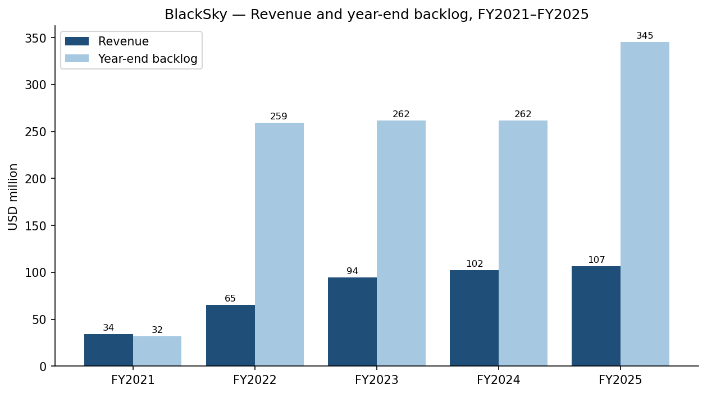
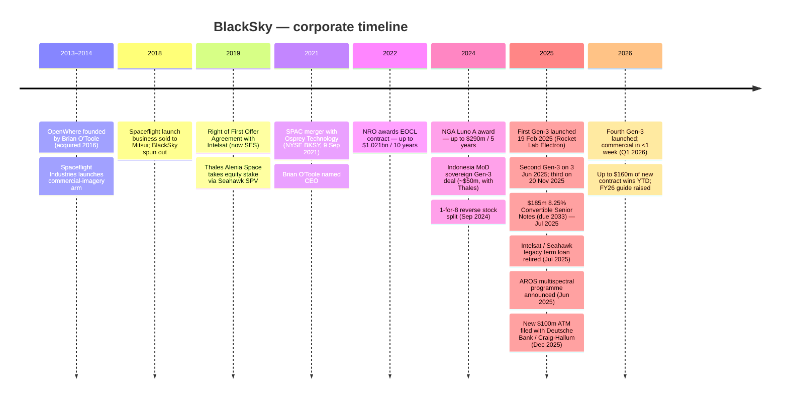
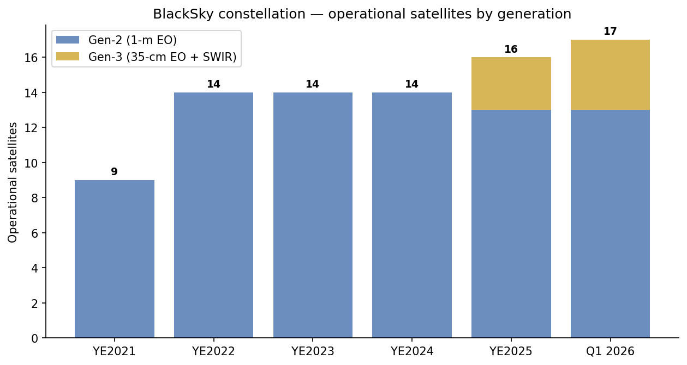
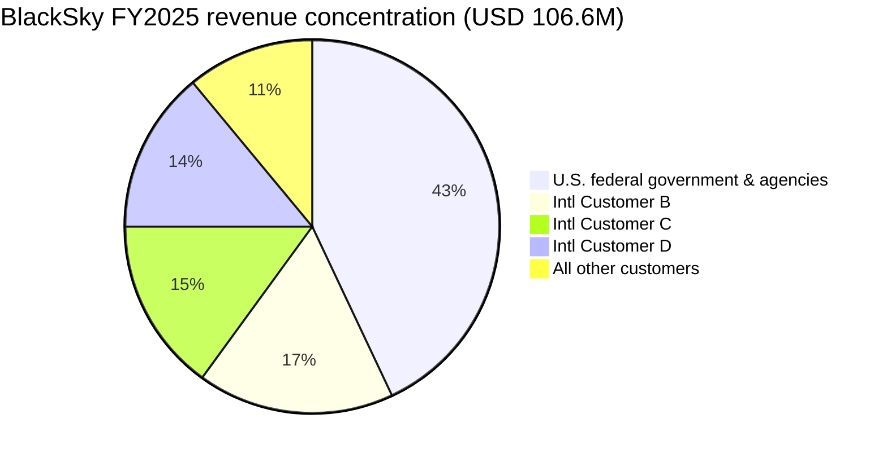
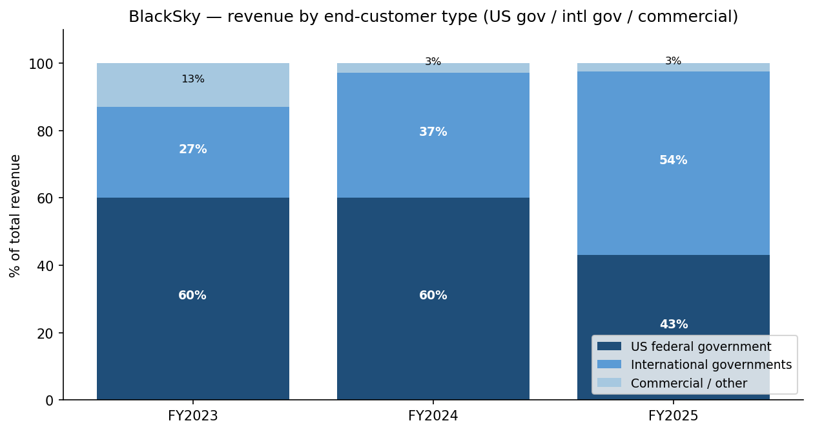
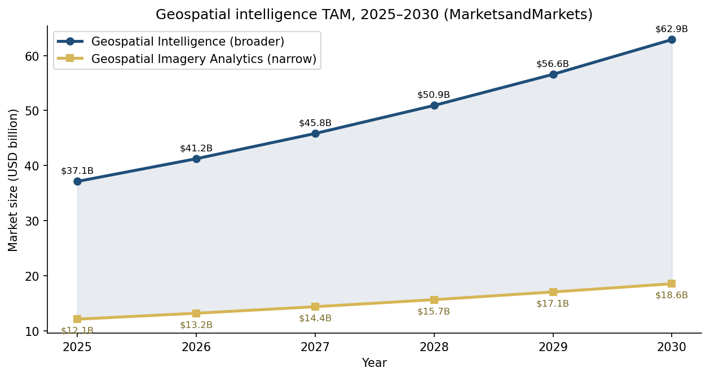
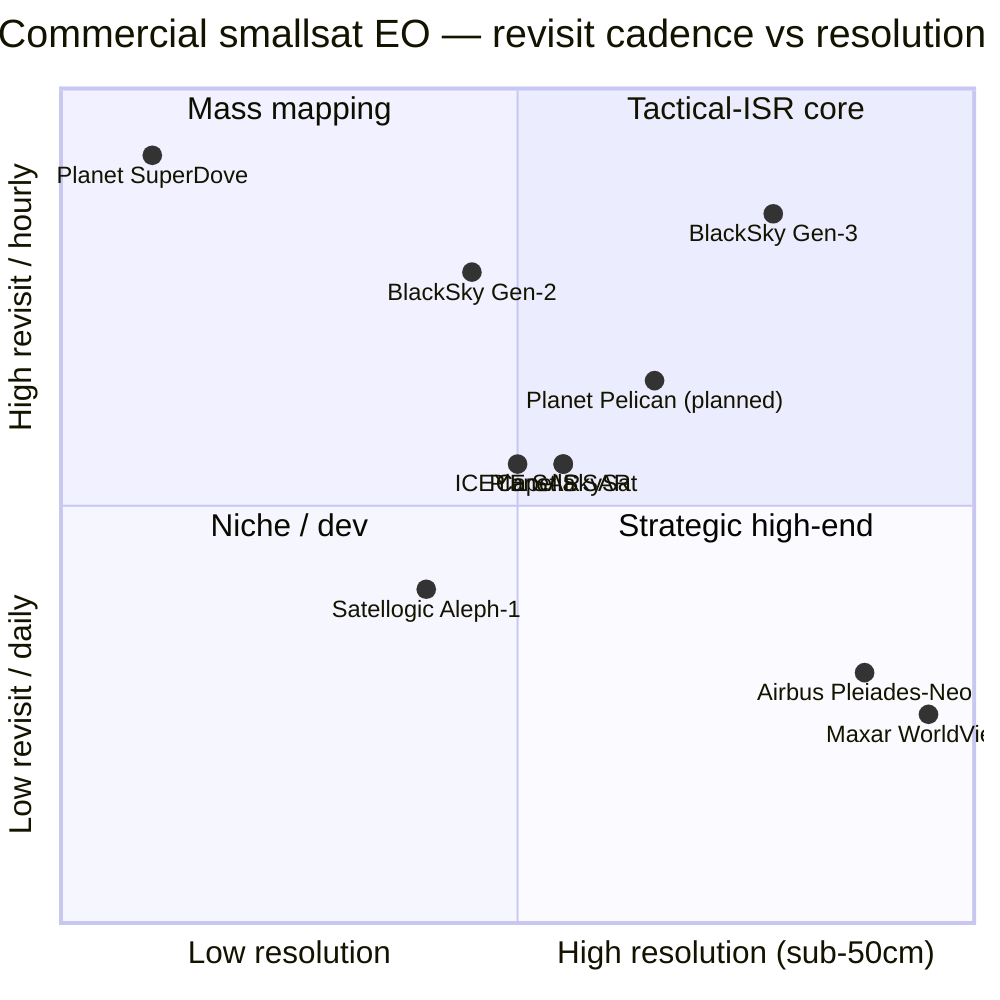
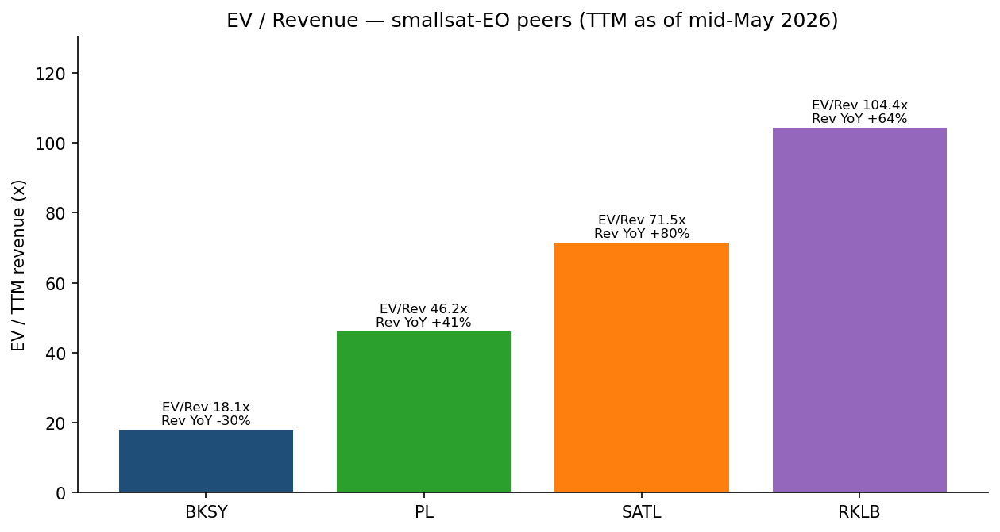
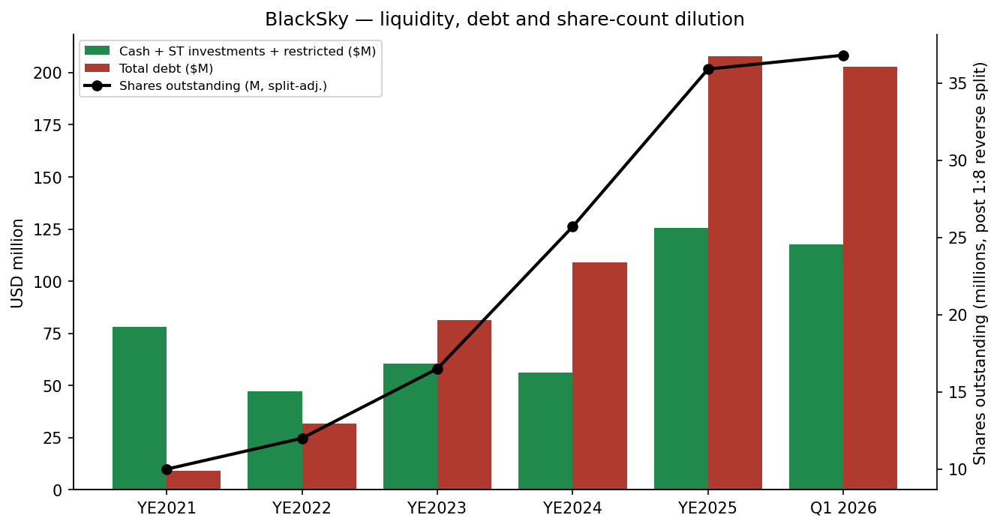

# COMPANY RESEARCH REPORT: BlackSky Technology Inc.

**Ticker:** NYSE: BKSY  
**Date:** 2026-05-20  
**Industry:** Commercial geospatial intelligence — smallsat Earth observation + AI analytics  
**HQ:** 2411 Dulles Corner Park, Suite 300, Herndon, VA 20171  
**Employees (YE2025):** 321

> **Update — FY2026 revenue guidance raised (2026-05-07):** Management raised full-year 2026 revenue guidance to **USD 130–150 million** (from USD 120–145 million at the February 2026 initiation) and raised Adjusted-EBITDA guidance to **USD 12–24 million** (from USD 6–18 million), while reaffirming FY2026 capex of USD 50–60 million. The raise reflects up to USD 160 million of new contract wins year-to-date, including a USD 25 million multi-year subscription contract with a major international Ministry of Defense for Gen-3 35-cm imagery and AI analytics, and a major international defense customer that scaled from a Gen-3 pilot to a ~USD 30 million annual subscription. The midpoint implies ~31% YoY revenue growth versus FY2025's USD 106.6 million.
> Source: [Q1-2026 earnings press release, 2026-05-07](https://www.sec.gov/Archives/edgar/data/1753539/000175353926000057/exhibit991-blackskyq12026e.htm).

## TABLE OF CONTENTS

1. Company Overview
2. Company History
3. Management Team
4. Products & Services
5. Customers & Go-to-Market
6. Industry Overview
7. Competitive Landscape
8. Market Opportunity (TAM)
9. Risk Assessment
   References

======================================

## 1. COMPANY OVERVIEW

BlackSky Technology Inc. is a Herndon, Virginia–based commercial geospatial intelligence company that owns and operates a low-earth-orbit (LEO) constellation of high-revisit, high-resolution smallsats and delivers imagery, AI-generated analytics, and end-to-end "sovereign" satellite systems primarily to defense and intelligence customers in the United States and allied governments worldwide. Founded in 2014, the company describes itself as "a space-based technology company that delivers real-time imagery, analytics and high-frequency monitoring of the world's most critical and strategic locations, economic assets, and events" ([BlackSky 10-K for FY2025, Item 1](https://www.sec.gov/Archives/edgar/data/1753539/000175353926000032/bksy-20251231.htm)).

**What the business does — three revenue lines.** Effective January 1, 2025, BlackSky reclassified its income-statement captions into three segments: (1) **Space-based intelligence & AI services** — subscription-based "On-Demand" and "Assured" imagery and analytics products delivered through the BlackSky **Spectra** software platform; (2) **Mission Solutions** — turnkey sovereign systems where the customer (typically a national MoD) owns its own Gen-3 satellite(s) and ground segment, built and operated with BlackSky's stack; and (3) **Advanced Technology Programs** — bespoke R&D and integration services. In FY2025 these contributed USD 65.1 M (61.1%), USD 21.2 M (19.9%) and USD 20.2 M (19.0%) of total revenue, respectively, on USD 106.6 M of total revenue ([10-K FY2025, MD&A](https://www.sec.gov/Archives/edgar/data/1753539/000175353926000032/bksy-20251231.htm)).

**The constellation.** As of Q1 2026 BlackSky operates a hybrid fleet of legacy **Gen-2** (≈1-metre electro-optical) microsatellites built by sister-company LeoStella, augmented by the new **Gen-3** spacecraft, which deliver **35-centimetre electro-optical resolution** and **1.2-metre short-wave-infrared (SWIR)** imaging for low-light/nighttime collection ([10-K FY2025, Item 1](https://www.sec.gov/Archives/edgar/data/1753539/000175353926000032/bksy-20251231.htm)). The first Gen-3 went up on Rocket Lab's 60th Electron flight on **19 February 2025** from Mahia, New Zealand ([Via Satellite, 2025-02-19](https://www.satellitetoday.com/launch/2025/02/19/rocket-lab-launches-blackskys-first-gen-3-satellite-on-60th-electron-mission/)); a second followed on **3 June 2025** ([Spaceflight Now, 2025-06-02](https://spaceflightnow.com/2025/06/02/rocket-lab-to-launch-blackskys-next-gen-3-satellite-on-electron-rocket-from-new-zealand/)); a third on **20 November 2025** (BlackSky was the previously "confidential" customer; [SpaceNews, 2025-11-27](https://spacenews.com/blacksky-announces-latest-gen-3-satellite-in-orbit-after-confidential-electron-launch/)); and a fourth in Q1 2026, which "began delivering very-high-resolution images within hours from launch and rapidly entered commercial operations in less than one week" ([Q1-2026 earnings release, 2026-05-07](https://www.sec.gov/Archives/edgar/data/1753539/000175353926000057/exhibit991-blackskyq12026e.htm)). Management has flagged additional dedicated Electron launches in 2026 and the next Gen-3 spacecraft has shipped to the launch site.

**Scale and financials.** FY2025 revenue of USD 106.6 M grew 4.4% versus USD 102.1 M in FY2024, with growth weighted to Mission Solutions (+258% YoY, off a small base) and pulled down by a 22.4% decline in Advanced Technology Programs and 7.1% decline in subscription-imagery services as one large legacy contract ran off ([10-K FY2025, MD&A — revenue tables](https://www.sec.gov/Archives/edgar/data/1753539/000175353926000032/bksy-20251231.htm)). Year-end backlog reached **USD 345.3 M**, +32% YoY, driven by **USD 240 M of FY2025 contract bookings** — the strongest order intake in the company's history ([Q4-2025 earnings release, 2026-02-26](https://www.sec.gov/Archives/edgar/data/1753539/000175353926000009/exhibit991-blackskyq42025e.htm)). Net loss widened to USD 70.3 M (FY2025) from USD 57.2 M (FY2024); the company has accumulated USD 756.1 M of losses since inception ([Q1-2026 release, 2026-05-07](https://www.sec.gov/Archives/edgar/data/1753539/000175353926000057/exhibit991-blackskyq12026e.htm)).

*Source: derived from [BlackSky 10-K FY2021](https://www.sec.gov/Archives/edgar/data/1753539/000175353922000020/bksy-20211231.htm), [FY2022 10-K](https://www.sec.gov/Archives/edgar/data/1753539/000175353923000020/bksy-20221231.htm), [FY2023 10-K](https://www.sec.gov/Archives/edgar/data/1753539/000175353924000032/bksy-20231231.htm), [FY2024 10-K](https://www.sec.gov/Archives/edgar/data/1753539/000175353925000030/bksy-20241231.htm), [FY2025 10-K](https://www.sec.gov/Archives/edgar/data/1753539/000175353926000032/bksy-20251231.htm). Revenue is total revenue per income statement; backlog is "remaining performance obligations" as defined in the revenue footnote.*

**Valuation snapshot (as of 2026-05-20).** With the stock at USD 45.83 (near a 52-week range of USD 9.88–46.44), market cap is approximately **USD 1.70 bn** on 37.1 M diluted shares outstanding; enterprise value is **USD 1.77 bn** after netting USD 115.5 M of cash against USD 210.9 M of debt ([Yahoo Finance — BKSY key statistics, 2026-05-20](https://finance.yahoo.com/quote/BKSY/key-statistics/)). Trailing-twelve-month figures and multiples:

| Metric | BKSY (TTM) | Planet (PL) | Satellogic (SATL) | Rocket Lab (RKLB) |
|---|---|---|---|---|
| Stock price (USD) | 45.83 | 42.81 | 9.61 | 134.33 |
| Market cap (USD M) | 1,701 | 15,255 | 1,425 | 77,744 |
| Enterprise value (USD M) | 1,772 | 14,219 | 1,460 | 70,966 |
| TTM revenue (USD M) | 97.8 | 307.7 | 20.4 | 679.6 |
| TTM P/S | **17.4×** | 49.6× | 69.7× | 114.4× |
| EV / Revenue | **18.1×** | 46.2× | 71.5× | 104.4× |
| TTM P/E | n/m (loss) | n/m (loss) | n/m (loss) | n/m (loss) |
| Revenue YoY (latest) | **−29.7%** | +41.1% | +80.3% | +63.5% |
| Gross margin | 69.3% | 56.2% | 75.1% | 36.6% |

Source: [Yahoo Finance — BKSY](https://finance.yahoo.com/quote/BKSY/key-statistics/), [PL](https://finance.yahoo.com/quote/PL/key-statistics/), [SATL](https://finance.yahoo.com/quote/SATL/key-statistics/), [RKLB](https://finance.yahoo.com/quote/RKLB/key-statistics/), all pulled 2026-05-20.

**Interpretation — why P/E is negative and P/S is elevated.** BlackSky has never been GAAP profitable; FY2025 net loss of USD 70.3 M is driven by USD 30.3 M of D&A as the constellation depreciates, USD 87.4 M of S,G&A (which includes USD 19.6 M of stock-based comp and the cost of running a public company at sub-USD 110 M revenue), USD 14.9 M of interest expense on USD 207.9 M of debt, and an USD 8.0 M loss on derivative warrants whose mark-to-market follows the stock price ([10-K FY2025, MD&A](https://www.sec.gov/Archives/edgar/data/1753539/000175353926000032/bksy-20251231.htm)). The company has accumulated USD 756.1 M of losses since inception ([10-K FY2025, balance sheet](https://www.sec.gov/Archives/edgar/data/1753539/000175353926000032/bksy-20251231.htm)). This is cash-burning growth, not a one-off charge.

P/S of 17.4× sits **below** the small-cap smallsat peer group median (PL ~50×, SATL ~70×, RKLB ~114×). Two drivers compress the multiple: (1) TTM revenue is **down 29.7%** because Q1 2025 included a one-time USD 9 M Mission Solutions milestone, and (2) BlackSky's growth has been visibly lumpy (4.4% YoY in FY2025 GAAP revenue versus +44% in FY2023). The stock has nonetheless re-rated from USD 9.88 to USD 45.83 over the last 12 months on the Gen-3 deployment, the USD 240 M of FY2025 bookings, and the FY2026 guidance raise — implying the market is pricing in the back-half growth shown in the guidance bridge (FY2026 mid-point USD 140 M = +31% YoY). Section 9 includes a **valuation / multiple-compression risk** because both TTM growth and current valuation assume the FY2026 inflection lands as guided.

## 2. COMPANY HISTORY

BlackSky was **founded in 2014** in Seattle as Spaceflight Industries' commercial imagery arm. The founding thesis — that AI-enabled software and cheap LEO smallsats would commoditise the legacy GeoEye/DigitalGlobe model of one-off USD 500 M imaging satellites — was articulated early by founder-CTO and now-CEO Brian O'Toole, a GeoEye veteran ([BlackSky 2025 DEF 14A — director biographies](https://www.sec.gov/Archives/edgar/data/1753539/000175353925000081/blacksky2025proxystatement.htm)). The company spun out of Spaceflight Industries in 2018, when the launch-services arm was sold to Mitsui & Co. of Japan, leaving BlackSky as a pure-play imagery analytics company.

A key piece of the early corporate structure is the **Right of First Offer Agreement** signed in October 2019 with Intelsat Jackson Holdings (now part of SES), which gives Intelsat/SES first-look rights on any sale of subsidiary BlackSky Holdings, Inc. through October 31, 2026 ([10-K FY2025, Item 1A](https://www.sec.gov/Archives/edgar/data/1753539/000175353926000032/bksy-20251231.htm)). BlackSky's other large strategic shareholder is **Seahawk SPV Investment LLC**, a vehicle ultimately owned by **Thales Alenia Space** (the Franco-Italian satellite-manufacturing JV), which owns 5.9% of the common stock and partners on Mission Solutions deliveries such as Indonesia's sovereign system ([2025 DEF 14A — 5% holder table](https://www.sec.gov/Archives/edgar/data/1753539/000175353925000081/blacksky2025proxystatement.htm)).

BlackSky went public on **9 September 2021** through a SPAC merger with **Osprey Technology Acquisition Corp.**, raising gross proceeds intended to fund the Gen-2 build-out and the Gen-3 development programme. The company never recovered the de-SPAC peak; by 2024 it had to execute a **one-for-eight reverse stock split on 6 September 2024** to regain NYSE listing-price compliance ([10-K FY2024 — Item 5](https://www.sec.gov/Archives/edgar/data/1753539/000175353925000030/bksy-20241231.htm)).

**Strategic pivots.** Three transitions matter for the current thesis. **First**, the move from selling individual scenes to **subscription-based** "On-Demand" and "Assured" services on the Spectra platform, which roughly doubled the imagery-services gross margin profile and converted lumpy one-off revenue into deferred-revenue backlog. **Second**, the **Mission Solutions** pivot — selling whole sovereign systems, beginning with the Indonesia / Thales deal — which materially expanded the per-deal contract value (Indonesia: ~USD 50 M across multiple years; the unnamed February 2026 customer: "eight-figure" ([BusinessWire, 2026-02-17](https://www.businesswire.com/news/home/20260217069416/en/BlackSky-Signs-New-Eight-Figure-International-Contract-for-Accelerated-Delivery-of-Gen-3-Sovereign-Space-Based-Intelligence-Solution))) but introduced a heavier mission-solutions cost-of-sales line (USD 10.9 M in FY2025 versus USD 5.0 M in FY2024). **Third**, the **Gen-3 ramp**, which simultaneously (a) lifts the addressable market by adding 35-cm and SWIR capability that previously required Maxar's WorldView, and (b) imposes a multi-year capex programme of USD 46.6 M in FY2025 and USD 50–60 M guided for FY2026 ([Q1-2026 release](https://www.sec.gov/Archives/edgar/data/1753539/000175353926000057/exhibit991-blackskyq12026e.htm)).

**Acquisitions.** BlackSky's M&A history is light: the 2016 acquisition of **OpenWhere** (Brian O'Toole's prior startup) seeded the Spectra analytics platform; the company has not made a material acquisition since.

## 3. MANAGEMENT TEAM

### Brian E. O'Toole — President, Chief Executive Officer, Director

Brian O'Toole has led BlackSky as CEO since the September 2021 SPAC merger and joined the legacy private company as President in November 2018, having previously served as its CTO from June 2016. Before BlackSky, O'Toole was the **founder and CEO of OpenWhere, Inc.** (2013–2016), a startup delivering global-scale geospatial intelligence solutions to public- and private-sector customers, which Legacy BlackSky acquired in June 2016 and which became the technical foundation of the **Spectra** software platform. From August 2008 to June 2013 he was **CTO of GeoEye, Inc.** — the publicly traded high-resolution-imagery operator that was acquired by DigitalGlobe in 2013 and ultimately rolled into Maxar — where he "led strategic efforts for developing and expanding technology, products, and solutions in geospatial intelligence and location-based services" ([2025 DEF 14A — director and officer biographies](https://www.sec.gov/Archives/edgar/data/1753539/000175353925000081/blacksky2025proxystatement.htm)). Earlier roles include Vice President of Product Development at Overwatch Systems (a Textron-owned geospatial-software business), founder and President of ITspatial, and nine years as a Technical Director and Systems Engineer at GE Aerospace.

O'Toole holds a B.S. in Computer Science from Clarkson University and an M.S. in Computer Engineering from Syracuse University ([DEF 14A 2025](https://www.sec.gov/Archives/edgar/data/1753539/000175353925000081/blacksky2025proxystatement.htm)). He is a software-and-systems-engineering operator (rather than a satellite-hardware builder) whose entire 25-year career, from GE Aerospace through Overwatch, GeoEye and OpenWhere into BlackSky, has been on the *software-fused-with-imagery* side of the geospatial industry — the exact thesis BlackSky has built around. His public posture has been consistent: every earnings release for the last six quarters has explicitly framed the company as "real-time, space-based intelligence" rather than as a "satellite operator," and the Gen-3 narrative emphasizes time-to-image (hours to commercial operation post-launch) rather than purely spatial resolution.

**Ownership and compensation.** O'Toole beneficially owned **485,454 shares** (1.4% of outstanding) as of 30 June 2025, comprising 334,133 common shares and 151,321 options exercisable within 60 days ([2025 DEF 14A — beneficial ownership table](https://www.sec.gov/Archives/edgar/data/1753539/000175353925000081/blacksky2025proxystatement.htm)). His 2024 total compensation was **USD 2.54 M** (base USD 498,750; stock awards USD 1.58 M; cash bonus USD 461,344; other USD 3,564), down from USD 3.45 M in 2023 because no stock options were granted in 2024 ([DEF 14A 2025 — Summary Compensation Table](https://www.sec.gov/Archives/edgar/data/1753539/000175353925000081/blacksky2025proxystatement.htm)). Pay design under his employment letter provides a target equity stack of USD 937,500 in RSUs plus options to purchase 2× the RSU share count, vesting 25% on the first anniversary and quarterly thereafter — squarely in line with software/mid-cap-tech peer practice and not founder-tier control.

**Verdict.** O'Toole is the right CEO for the current chapter: a software-and-systems leader executing a hardware-intensive constellation ramp while leaning on the partners (Rocket Lab for launch, LeoStella for bus, Thales for some Mission Solutions integration) for what BlackSky doesn't build. The track record at GeoEye and OpenWhere supports the strategy. The principal gap is that BlackSky has never delivered GAAP profitability under his tenure, and the Gen-3 production / launch / on-orbit-commissioning cadence still has limited validation history outside Rocket Lab launches.

### Henry Dubois — Chief Financial Officer

Henry Dubois has served as CFO since June 2022. Crucially for a satellite-imagery company, Dubois's prior career is **almost entirely** in commercial geospatial imagery: he was **CFO of GeoEye from February 2005 to December 2012**, during which time he "helped grow revenues from USD 30 to USD 350 million" and oversaw the company through the WorldView acquisition by DigitalGlobe; before that he held multiple executive roles at **DigitalGlobe** including President, CFO and COO ([2025 DEF 14A — officer biographies](https://www.sec.gov/Archives/edgar/data/1753539/000175353925000081/blacksky2025proxystatement.htm)). He joined BlackSky in September 2021 as Chief Development Officer prior to taking over the CFO seat. He also served briefly as CEO of Hooper Holmes Inc., a health-screening business, which filed Chapter 11 in August 2018 after his tenure — a disclosed historical event in the proxy that should be acknowledged but did not relate to satellite operations.

Dubois holds an MBA from Northwestern's Kellogg School (finance / marketing / accounting) and a B.A. in Mathematics from Holy Cross. 2024 total compensation: **USD 2.24 M**. Beneficial ownership: **232,260 shares** (under 1%), including 139,250 options exercisable within 60 days ([DEF 14A 2025](https://www.sec.gov/Archives/edgar/data/1753539/000175353925000081/blacksky2025proxystatement.htm)). His July 2025 USD 185 M convertible-note raise to retire the 12% Intelsat / Seahawk paper and lower the average debt cost to 8.25% is the clearest stamp of his tenure to date.

### Christiana Lin — General Counsel and Chief Administrative Officer

Lin has served as GC and CAO since February 2022 and was the deal lawyer who closed the SPAC merger. She brings over two decades of public-company legal experience: GC, Chief Privacy Officer and Corporate Secretary at **Comscore** from 2001–2017, where she helped grow the business from an early-stage startup to a USD 450 M-market-cap public company; GC and Chief Privacy & Administrative Officer at **Rakuten Advertising** from 2018–2021. J.D. from Georgetown Law, B.A. from Yale ([DEF 14A 2025](https://www.sec.gov/Archives/edgar/data/1753539/000175353925000081/blacksky2025proxystatement.htm)). 2024 total compensation: USD 1.83 M.

### Governance footer

- **Board composition.** Seven directors: O'Toole (executive); six independents — William Porteous (RRE Ventures, Chair), Magid Abraham (founder of Comscore), Susan Gordon (former Principal Deputy Director of National Intelligence), Timothy Harvey, David DiDomenico (JANA Partners), and James Tolonen (former CFO Novell, Business Objects). Six of seven directors meet NYSE independence standards ([2025 DEF 14A — board independence](https://www.sec.gov/Archives/edgar/data/1753539/000175353925000081/blacksky2025proxystatement.htm)). The board uses a classified, three-year-staggered structure across three classes.
- **Insider ownership.** All directors and executive officers as a group (9 persons) own **1,354,013 shares = 3.8%** as of 30 June 2025 — meaningful but not founder-controlled. Largest 5% holders: AWM Investment Company 8.0%, Mithril LP (Peter Thiel / Ajay Royan) 6.7%, and Seahawk SPV (Thales Alenia Space) 5.9% ([DEF 14A 2025](https://www.sec.gov/Archives/edgar/data/1753539/000175353925000081/blacksky2025proxystatement.htm)). The Thales stake is a strategic anchor for Mission Solutions partnerships; Mithril is the historic Peter Thiel venture fund.
- **Compensation structure.** Three-element pay (base + cash bonus + RSU/option equity); ~75% of NEO compensation is equity-linked. No Section 162(m) "performance-based" excess-comp overrides; bonus targets are 100% of base for CEO and 80% for CFO, paid on a balanced scorecard of revenue, contract bookings and adjusted EBITDA.
- **Related-party flags.** Intelsat's right-of-first-offer on subsidiary BlackSky Holdings expires October 31, 2026, after which it lapses — a clean-up before any potential strategic transaction. Seahawk/Thales' 5.9% stake creates an arm's-length but material commercial counterpart on Mission Solutions.

### Management track record — synthesis

The senior team that BlackSky has assembled is unusually pedigreed for a USD 1.7 bn space-tech name: the CEO and CFO both ran the previous generation of commercial-imagery winners (GeoEye and DigitalGlobe), the GC built the Comscore IPO and post-IPO compliance machinery, and the board includes the former PDDNI (Susan Gordon) — directly addressing the customer concentration in US IC accounts. The gaps: BlackSky has never delivered GAAP profitability, the Gen-3 constellation is still in scale-up, and there is no founder with material economic ownership to anchor multi-decade alignment. Net, this is a "operator team rebuilding a category they already won once" story.

## 4. PRODUCTS & SERVICES

BlackSky organises its catalogue around three revenue streams (and one platform). Each is described below with a competitive-advantage verdict.

### A. Space-Based Intelligence & AI Services (61.1% of FY2025 revenue)

The flagship product line, sold through annual or multi-year **subscription contracts** with priced tiers:

1. **BlackSky Spectra® platform** — the software layer through which all imagery and analytics is tasked, delivered and fused with third-party data. Spectra performs automated tip-and-cue tasking, mission planning, command-and-control of the constellation, and AI-driven change-detection / object-detection analytics ([BlackSky 10-K FY2025 — Item 1](https://www.sec.gov/Archives/edgar/data/1753539/000175353926000032/bksy-20251231.htm); [blacksky.com / Spectra](https://blacksky.com/spectra/)).
   - *Competitive advantage:* **Partial.** Spectra is one of only three vertically-integrated tasking-and-analytics platforms in commercial EO (the others are Maxar's GeoHIVE / WorldView platform and Planet's Tasking API). The moat is data-and-network: customers' workflows, training data and automated alerts are calibrated to BlackSky's revisit cadence. Switching cost is moderate. Closest competitor product: **Maxar's GeoHIVE** — Maxar is ahead on resolution legacy and image library; BlackSky is at parity on AI analytics tooling and ahead on revisit cadence.
2. **On-Demand subscription** — pay-as-tasked imagery and analytics with flexible priorities; the entry-level commercial offering ([BlackSky On-Demand product page](https://blacksky.com/on-demand/)).
3. **Assured subscription** — guaranteed satellite tasking capacity over named customer areas-of-interest, with first-priority collection; the premium product purchased by defence customers. The Q1 2026 press release flagged a USD 25 M multi-year subscription contract from an international MoD for "Assured access to best-in-class 35cm space-based imagery and AI analytics" ([Q1-2026 release, 2026-05-07](https://www.sec.gov/Archives/edgar/data/1753539/000175353926000057/exhibit991-blackskyq12026e.htm)).
   - *Competitive advantage:* **Yes — switching cost and certification.** Assured contracts are typically locked to specific orbital tasking windows and survey areas, with multi-year terms tied to mission-specific national-security workflows; once a country has built tasking pipelines and analyst training around BlackSky's revisit cadence and 35-cm imagery, displacement is expensive. Closest competitor product: **Maxar's SecureWatch** — at parity on assurance, ahead on legacy library, behind on revisit cadence.
4. **AI Analytics** — automated detection of vessels, aircraft, vehicles, infrastructure change, and economic-indicator monitoring (cars in parking lots, oil-storage tank levels, port activity). Marketed standalone or bundled with imagery. The Spectra AI models are described in the 10-K as "purpose-built" — i.e. trained on BlackSky's own imagery corpus rather than generalist vision foundation models.
   - *Competitive advantage:* **Partial.** Differentiated AI training data is real but the analytics market is rapidly being commoditized by vertical-AI startups (HawkEye 360 for RF, Ursa Space for SAR-fused). Moat = data + government-grade certification (FedRAMP, ITAR), not algorithm IP.

### B. Mission Solutions (19.9% of FY2025 revenue, +258% YoY)

Turnkey **sovereign satellite systems** sold to national governments who want to own their own Earth-observation capacity: BlackSky builds and delivers Gen-3 satellites (often co-manufactured with Thales Alenia Space), ground stations, launch support, operations software and training. The customer retains full custody of the satellites and data within their own borders.

- **Anchor deal:** Indonesia MoD, announced February 2024 — approximately USD 50 M in multi-year contracts (delivered with **Thales Alenia Space** and **PT Len** as Indonesian partner), under which Indonesia will own two of BlackSky's next-generation EO satellites ([BusinessWire, 2024-02-08](https://www.businesswire.com/news/home/20240208512218/en/BlackSky-Wins-Approximately-50-Million-in-Multi-Year-Contracts-for-Gen-3-Capabilities-and-Services-to-Accelerate-Sovereign-Space-Capabilities-for-Indonesian-Ministry-of-Defense)).
- **New Q1 2026 wins:** an **eight-figure international contract** for accelerated delivery of a sovereign Gen-3 system (February 2026; [BusinessWire, 2026-02-17](https://www.businesswire.com/news/home/20260217069416/en/BlackSky-Signs-New-Eight-Figure-International-Contract-for-Accelerated-Delivery-of-Gen-3-Sovereign-Space-Based-Intelligence-Solution)); and a "more than USD 30 million" multi-year contract to integrate Gen-3 tactical ISR services into an international customer's secure environment ([BlackSky press release, 2026](https://blacksky.com/press-releases/blacksky-wins-more-than-30-million-multi-year-contract-to-integrate-gen-3-tactical-isr-services-into-international-customers-secure-environment/)).
- *Competitive advantage:* **Yes — regulatory + integration.** Sovereign deals require ITAR / export-control approval, NATO-grade encryption, and trained-on-site operations support — high entry barriers that disqualify pure smallsat builders (Capella, Iceye, Satellogic). The natural competitors are Maxar (which builds high-end sovereign systems but at >5× the price point), and Airbus Defence & Space (Pléiade-Neo, but heavier and slower-cadence). Closest competitor product: **Maxar's sovereign systems** (e.g., the Saudi Arabia "KSA" satellites) — ahead on heritage, behind on price and delivery time.

### C. Advanced Technology Programs (19.0% of FY2025 revenue, −22.4% YoY)

Bespoke R&D, integration and customer-specific software-feature work funded by individual customers — primarily US government R&D contracts. Revenue declined in FY2025 because two large US R&D programmes ran off. Going forward this segment is the catch-all for non-recurring engineering work and is treated by management as lumpy.

- *Competitive advantage:* **No moat.** This is professional-services revenue at low margins; useful as a wedge into customer relationships but not strategic on its own.

### D. AROS multispectral programme (announced June 2025, first launch targeted 2027)

In June 2025 BlackSky unveiled **AROS** — a planned new constellation of multispectral, large-area-collection satellites designed to complement the high-revisit Gen-3 fleet via "tip-and-cue" handoffs. Designed for country-scale digital mapping, navigation, maritime monitoring and 3-D digital-twin applications, AROS would extend BlackSky's TAM from "monitoring" into "mapping" — directly into Planet Labs' core SuperDove franchise ([BlackSky press release, 2025-06-16](https://ir.blacksky.com/news-events/press-releases/news-details/2025/BlackSky-to-Expand-Constellation-to-Deliver-High-Cadence-Multi-Spectral-Broad-Area-Collection-Capabilities-06-16-2025/default.aspx)). Currently development-stage with partners; not yet revenue-bearing.

- *Competitive advantage:* **Not yet — depends on execution.** AROS is years from commercial revenue; the announcement is a strategic positioning move ahead of Planet's WorldView Legion / Pelican developments.

### Flagship vs long-tail

The **flagship** of the business is the bundled Spectra-platform + Gen-3 Assured subscription, sold to allied defence ministries. This is the source of the USD 240 M of FY2025 bookings and the 32% YoY backlog growth. The **Mission Solutions** sovereign-satellite deal is the largest *per-deal* revenue contributor but lumpy. Advanced Technology Programs and Gen-2-only legacy subscriptions are long-tail / declining.

```mermaid
graph TD
    A[BlackSky Technology Inc.] --> B[Space-Based Intelligence & AI services<br/>FY25: $65.1M, 61%]
    A --> C[Mission Solutions<br/>FY25: $21.2M, 20%]
    A --> D[Advanced Technology Programs<br/>FY25: $20.2M, 19%]
    B --> B1[BlackSky Spectra software platform]
    B --> B2[On-Demand subscription]
    B --> B3[Assured subscription &lt;35cm Gen-3&gt;]
    B --> B4[AI analytics: vessel, vehicle, change detection]
    C --> C1[Sovereign Gen-3 satellite delivery]
    C --> C2[Ground-segment build &amp; ops support]
    C --> C3[Indonesia MoD &#40;~$50m, Thales partner&#41;]
    C --> C4[8-figure intl MoD &#40;Feb 2026&#41;]
    D --> D1[Customer-funded R&D]
    D --> D2[Integration services]
    A --> E[AROS multispectral &#40;dev. — 2027 target launch&#41;]
```

*Source: [10-K FY2025 — Item 1](https://www.sec.gov/Archives/edgar/data/1753539/000175353926000032/bksy-20251231.htm), [BlackSky product pages](https://blacksky.com/), [Q1-2026 earnings release](https://www.sec.gov/Archives/edgar/data/1753539/000175353926000057/exhibit991-blackskyq12026e.htm).*

### Recent launches and sunsets (last 12 months)

| Date | Event |
|---|---|
| Feb 2025 | First Gen-3 satellite launched, achieving 35-cm resolution + SWIR ([Via Satellite, 2025-02-19](https://www.satellitetoday.com/launch/2025/02/19/rocket-lab-launches-blackskys-first-gen-3-satellite-on-60th-electron-mission/)) |
| Jun 2025 | Second Gen-3 launched on Electron ([Spaceflight Now, 2025-06-02](https://spaceflightnow.com/2025/06/02/rocket-lab-to-launch-blackskys-next-gen-3-satellite-on-electron-rocket-from-new-zealand/)) |
| Jun 2025 | AROS multispectral constellation programme announced |
| Jul 2025 | USD 185 M 8.25% Convertible Senior Notes due 2033 issued; legacy Intelsat term loan retired |
| Nov 2025 | Third Gen-3 launched ([SpaceNews, 2025-11-27](https://spacenews.com/blacksky-announces-latest-gen-3-satellite-in-orbit-after-confidential-electron-launch/)) |
| Feb 2026 | Eight-figure intl Gen-3 Mission Solutions deal |
| Q1 2026 | Fourth Gen-3 satellite in orbit; commercial operations within one week of launch |

No products have been formally sunset over the last 12 months; the Gen-2 constellation continues to fly and contribute revisit capacity, but new contracts are increasingly Gen-3 dependent.

*Source: Counts derived from [BlackSky 10-K filings 2021–2025](https://www.sec.gov/cgi-bin/browse-edgar?action=getcompany&CIK=0001753539&type=10-K&dateb=&owner=include&count=40), [Q1-2026 earnings press release](https://www.sec.gov/Archives/edgar/data/1753539/000175353926000057/exhibit991-blackskyq12026e.htm), and [eoPortal — BlackSky Constellation](https://www.eoportal.org/satellite-missions/blacksky-constellation). Gen-2 counts approximate operational status; some satellites retired or in extended end-of-life service.*

## 5. CUSTOMERS & GO-TO-MARKET

### Customer concentration — material and quantified

BlackSky's customer base is highly concentrated and entirely **government-led**. In FY2025 the company had **four customers each above 10% of total revenue, aggregating to 89% of total revenue** (FY2024: three customers = 88%; FY2023: three = 67%; FY2022: two = 42%) ([10-K FY2025, Item 1A and revenue footnote](https://www.sec.gov/Archives/edgar/data/1753539/000175353926000032/bksy-20251231.htm)). The named breakdown for FY2025:

| Customer | Geography | FY2025 % of revenue | FY2024 % of revenue |
|---|---|---|---|
| U.S. federal government & agencies (NRO / NGA / Space Force, aggregated) | United States | **43%** | 60% |
| Customer B (international government) | Rest of World | 17% | 16% |
| Customer C (international government) | Rest of World | 15% | < 10% |
| Customer D (international government) | Rest of World | 14% | 12% |
| **Top-4 total** | | **89%** | **88%** |

Source: [10-K FY2025 — Revenue concentration footnote](https://www.sec.gov/Archives/edgar/data/1753539/000175353926000032/bksy-20251231.htm).

The three "rest of world" customers are not named in the 10-K, but each is associated with a unique country and disclosure indicates they are all national ministries of defense. Industry reporting strongly suggests Indonesia (Customer B / first sovereign Mission Solutions deal), India, and a third Asia-Pacific or Middle-East customer are likely candidates — but the 10-K is explicit that it does not name them, so we mark them only as "international defense customer."

*Source: [10-K FY2025 — Revenue concentration footnote](https://www.sec.gov/Archives/edgar/data/1753539/000175353926000032/bksy-20251231.htm).*

### Government end-customer split

The revenue mix has shifted aggressively toward **international** governments over the last three years:

| FY | US federal | International gov | Commercial / other |
|---|---|---|---|
| FY2023 | 60% | 27% (est.) | 13% (est.) |
| FY2024 | USD 61.3 M (60%) | USD 38.0 M (37%) | USD 2.9 M (3%) |
| FY2025 | USD 45.8 M (43%) | USD 58.0 M (54%) | USD 2.8 M (3%) |

Source: [10-K FY2025 — Note 5 disaggregation of revenue](https://www.sec.gov/Archives/edgar/data/1753539/000175353926000032/bksy-20251231.htm).

US federal revenue declined in absolute terms (USD 61.3 M → USD 45.8 M) in FY2025 because one large legacy US-government professional-services contract ran off, while international government revenue grew 53% to USD 58.0 M on the back of the Indonesia delivery and new Asia-Pacific subscription wins. **Commercial revenue is immaterial** (~3%) — BlackSky is functionally a B2G defence supplier.

*Source: [10-K FY2025 — Note 5 disaggregation of revenue](https://www.sec.gov/Archives/edgar/data/1753539/000175353926000032/bksy-20251231.htm). FY2023 split estimated from [10-K FY2024](https://www.sec.gov/Archives/edgar/data/1753539/000175353925000030/bksy-20241231.htm) and [10-K FY2023](https://www.sec.gov/Archives/edgar/data/1753539/000175353924000032/bksy-20231231.htm).*

### Anchor government programmes

- **NRO Electro-Optical Commercial Layer (EOCL)** — In May 2022 the National Reconnaissance Office awarded BlackSky a 10-year contract worth **up to USD 1.021 billion**, with a five-year base subscription valued at USD 85.5 M, alongside larger contracts to Maxar and Planet ([SpaceNews, 2022-05-25](https://spacenews.com/blacksky-maxar-planet-win-10-year-nro-contracts-for-satellite-imagery/); [NRO press release, 2022-05](https://www.nro.gov/News-and-Media/News-Articles/Article/3135765/nro-announces-largest-award-of-commercial-imagery-contracts/)). EOCL distributes BlackSky imagery to "a half-million intelligence, defense, and federal civil agency users" per the 10-K. The ceiling is a contract maximum, not a guaranteed minimum — actual annual draw is far below the headline.
- **NGA Luno A** — In October 2024 BlackSky won a five-year **NGA Luno A** contract valued **up to USD 290 M** to monitor global economic and environmental activity, with AI-driven change-detection analytics across BlackSky's high-cadence imagery ([BlackSky press release, 2024](https://www.blacksky.com/blacksky-wins-five-year-nga-luno-a-contract-valued-up-to-290-million-to-monitor-global-economic-activity-and-military-capability/)). Luno A is the successor to the 2021 NGA Economic Indicator Monitoring (EIM) programme, which had a USD 60 M ceiling. BlackSky also operates under **Luno B** (broader military-capability monitoring) and received a "seven-figure renewal award" under Luno in Q1 2026 ([Q1-2026 release, 2026-05-07](https://www.sec.gov/Archives/edgar/data/1753539/000175353926000057/exhibit991-blackskyq12026e.htm)).
- **Indonesia MoD sovereign system** — USD 50 M multi-year delivery in partnership with Thales Alenia Space and PT Len (February 2024).

### Backlog dynamics

Year-end FY2025 backlog of **USD 345.3 M** (vs USD 261.7 M FY2024 = +32% YoY) is scheduled to convert as follows: **USD 77.3 M in FY2026, USD 55.2 M in FY2027, and USD 212.8 M thereafter** ([10-K FY2025 — Note 5](https://www.sec.gov/Archives/edgar/data/1753539/000175353926000032/bksy-20251231.htm)). Two observations:

1. The FY2026 backlog runoff of USD 77.3 M is only ~55% of the FY2026 revenue guide mid-point (USD 140 M) — meaning roughly **USD 60–65 M of FY2026 revenue must come from contracts not yet signed at YE2025**. The Q1 2026 "up to USD 160 M" of new contract wins narrows this gap considerably (the 25 M Assured + 30 M Gen-3 tactical + 8-figure sovereign + other deals).
2. The "thereafter" portion (USD 212.8 M, ~62% of backlog) is heavily back-loaded — typical for multi-year defence subscription contracts but it also means much of the headline backlog will not convert for 3+ years.

### Contract structure

- **Subscription contracts** (Space-Based Intelligence services): generally annual or multi-year master agreements with priced tiers; US government contracts typically include termination-for-convenience clauses ([10-K FY2025, Item 1A](https://www.sec.gov/Archives/edgar/data/1753539/000175353926000032/bksy-20251231.htm)).
- **Mission Solutions:** milestone-based fixed-price contracts with delivery obligations spanning 2–3 years; revenue recognized over time based on cost-to-cost percentage of completion. The lumpiness of Q1 2025 vs Q1 2026 (USD 9.8 M vs USD 2.0 M of Mission Solutions revenue) reflects this milestone accounting.
- **Advanced Technology Programs:** cost-plus or fixed-price US-government R&D contracts.

### Go-to-market

BlackSky sells **direct** to government customers via a US-government sales team (cleared personnel; Federal Acquisition Regulation / DFARS expertise) and an international BD team that often partners with prime contractors and local systems integrators in-country (Thales Alenia Space, PT Len in Indonesia). There is no meaningful channel partner program for commercial subscriptions. Sales cycles are long — typically 12–24 months for subscription contracts, 24–48 months for Mission Solutions deals — and largely lumpy as a result.

## 6. INDUSTRY OVERVIEW

### Industry definition

BlackSky operates in the **commercial satellite Earth observation (EO) and geospatial intelligence (GEOINT) services** industry — NAICS 517410 (Satellite Telecommunications) overlapped with NAICS 541370 (Surveying & Mapping Services) and 541715 (R&D in Physical Sciences) for the AI-analytics layer. The industry sells two outputs: (1) imagery and other space-collected sensor data, and (2) analytics extracted from that data (objects identified, change detected, predictive monitoring). End-customers cluster in defence/intelligence, civilian government (disaster response, climate, agriculture), and commercial verticals (insurance, energy, finance/economic activity).

### Market structure and scale

Multiple research firms size the industry, with the figures depending on whether the scope is "satellite imagery + analytics" (narrower) or "geospatial intelligence" (broader, including ground-collected geospatial data):

- **Geospatial Intelligence Market (broader):** USD 37.13 bn in 2025 → USD 62.88 bn in 2030, CAGR 11.1% ([MarketsandMarkets, "Geospatial Intelligence Market 2030", 2025](https://www.marketsandmarkets.com/PressReleases/geospatial-intelligence.asp)).
- **Geospatial Imagery Analytics (narrower):** USD 12.12 bn in 2025 → USD 18.55 bn in 2030, CAGR 8.9% ([MarketsandMarkets, "Geospatial Imagery Analytics Market 2030", 2025](https://www.marketsandmarkets.com/PressReleases/geospatial-imagery-analytics.asp)) — the figure BlackSky itself cites in its 10-K.
- **Commercial satellite EO revenue (Euroconsult / Novaspace estimates referenced in industry press):** USD 4–5 bn in 2025, projected to reach USD 7–8 bn by 2030 — this is the most directly addressable slice for BlackSky and Planet.

*Source: [MarketsandMarkets — Geospatial Intelligence Market, 2025–2030](https://www.marketsandmarkets.com/Market-Reports/geospatial-intelligence-market-198354497.html); [MarketsandMarkets — Geospatial Imagery Analytics Market, 2025–2030](https://www.marketsandmarkets.com/Market-Reports/geospatial-imagery-analytics-market-221633264.html). Intermediate years interpolated at the published CAGR.*

### Growth drivers

1. **Sovereign space programmes.** Allied governments (Australia, Japan, South Korea, India, Saudi Arabia, Indonesia, the UAE, several NATO members) are funding indigenous EO capacity rather than relying on US-government sharing or pure commercial purchase. BlackSky cites "countries in Europe, the Asia Pacific, and the Middle East announce[d] their intention to invest billions before 2030 to support the acquisition of sovereign small satellite solutions" ([10-K FY2025, Item 1](https://www.sec.gov/Archives/edgar/data/1753539/000175353926000032/bksy-20251231.htm)).
2. **AI-enabled analytics.** Vision-foundation models and automated change-detection are reducing the human-analyst cost per insight, expanding the practical use cases for commercial imagery (parking-lot counting for retail equities, oil-tank measurement, ship-tracking).
3. **Tactical defence demand.** The Russia-Ukraine war (2022–) demonstrated the operational value of commercial sub-metre imagery for OSINT and battlefield planning. Multiple NATO ministries of defence have since established direct commercial-imagery procurement budgets — a structural tailwind for BlackSky and Maxar.
4. **Smallsat economics.** The cost-to-orbit per kg has fallen ~10× over the last decade (Rocket Lab Electron + SpaceX Falcon 9 rideshare), making the constellation-replacement economics viable for a sub-USD 200 M annual capex budget.

### Regulatory environment

- **NOAA commercial remote sensing licence (US):** BlackSky's Gen-3 35-cm imagery operates under the post-2020 "Tier 1" framework that removed the 50-cm resolution cap — a regulatory unlock that benefited Maxar (already at 30 cm) and now BlackSky.
- **Shutter control:** US-licensed operators can be ordered to limit imaging of designated areas (e.g., Israel under the Kyl-Bingaman Amendment until 2020, US/allied military zones during operations). BlackSky has not publicly disclosed shutter-control events.
- **ITAR / EAR (US):** Restrictions on selling defence-grade imaging satellites internationally; sovereign Mission Solutions deals require State Department licensing.
- **FedRAMP / IL-4/5/6 (US Government):** BlackSky maintains the certifications required to deliver data into classified US-government environments.

### Competitive dynamics

The industry has consolidated meaningfully:

- **Maxar Technologies** — formerly the dominant 30-cm provider; taken private by Advent International in May 2023 for USD 6.4 bn (~USD 53 / share) and now operates as **Maxar Intelligence** plus **Maxar Space Systems** (the former SSL bus business). Maxar remains the legacy heavyweight on resolution and image library but has paused some commercial transparency since the take-private ([Reuters / company press releases, 2023](https://www.reuters.com/business/aerospace-defense/maxar-shareholders-approve-64-billion-sale-private-equity-firm-advent-2023-04-25/)).
- **Planet Labs (NYSE:PL)** — daily-coverage SuperDove constellation (~200 satellites, 3-m resolution) plus higher-resolution SkySat (~21 satellites, ~50 cm). Planet's positioning is **breadth-first** (daily mapping of the entire landmass) versus BlackSky's **revisit-first** (15× / day over priority sites).
- **Satellogic (NASDAQ:SATL)** — Argentine-American operator with a planned ~200-satellite hyperspectral + sub-metre constellation, currently sub-scale (USD 20.4 M TTM revenue).
- **Capella Space (private)** — synthetic-aperture-radar (SAR) operator, all-weather day/night imagery, complementary not directly substitute to BlackSky's EO.
- **ICEYE (private, Finland)** — also SAR-focused; large Series E from Solidium in 2024.
- **Airbus Defence & Space / Pléiade-Neo (private operator)** — European 30-cm EO constellation; the closest European competitor on resolution.
- **Sovereign-state programmes** — Maxar's WorldView, Airbus's Pléiades, KARI's KOMPSAT, ISRO's Cartosat, JAXA's ALOS, etc. — partial substitutes especially for non-aligned states, but most allied governments still buy commercially as well.

### Industry headwinds

- **US federal budget uncertainty.** A US-government shutdown or continuing-resolution period can pause or defer commercial-imagery contract obligations; BlackSky cites this explicitly in every recent earnings release.
- **Foundation-model commoditization.** As multi-modal foundation models become cheaper, the AI-analytics value chain captured by operators like BlackSky may compress at the analytics layer.
- **Cyber and ASAT risk.** Loss of orbit assets (whether to debris, kinetic ASAT, or cyber attack) is uninsurable at full replacement cost.

## 7. COMPETITIVE LANDSCAPE

The competitive set splits into three clusters: high-resolution EO incumbents, smallsat EO challengers, and adjacent sensor-modality operators.

### Direct competitors

1. **Maxar Intelligence** (private, owned by Advent International; ~USD 1.8 bn 2023 revenue at take-private). The legacy 30-cm EO leader; far ahead of BlackSky on archival library, resolution heritage, and US IC integrations. Behind on revisit cadence (heavy WorldView satellites cost ~USD 500 M each and have low cadence per orbital pass). Maxar is BlackSky's principal competitor on EOCL and on sovereign-system sales. The Advent take-private removed Maxar's quarterly financial transparency but it remains the benchmark for SecureWatch (subscription EO) and GeoHIVE (analytics).
2. **Planet Labs PBC (NYSE:PL)** — USD 307.7 M TTM revenue (vs BKSY's USD 97.8 M); EV/Rev 46.2× ([Yahoo Finance — PL, 2026-05-20](https://finance.yahoo.com/quote/PL/key-statistics/)). Planet's SuperDove fleet ~200 satellites provides daily 3-m mapping; SkySat fleet ~21 satellites provides ~50-cm tasking. Planet announced its **WorldView Legion**-class **Pelican** higher-resolution constellation in 2024 for launch from 2026. Planet is positioned for breadth and mapping; BlackSky for site-specific high-revisit tasking. Direct overlap is highest in commercial subscriptions and growing in the AROS multispectral domain.
3. **Satellogic (NASDAQ:SATL)** — Argentine smallsat operator; sub-metre EO + hyperspectral roadmap; USD 20.4 M TTM revenue, EV/Rev 71.5×. Significantly smaller than BKSY but growing 80% YoY off a small base. Direct overlap on subscription imagery in price-sensitive markets.
4. **Capella Space (private)** — SAR-only (X-band, ~50-cm); complementary not substitute, but Capella partners (e.g., Ursa Space Systems) bundle SAR + EO and can disintermediate BlackSky on tasking workflows.
5. **ICEYE (private)** — also SAR-only. Sells imagery + sovereign mission systems (Finnish flagship deal with the Finnish Defence Forces). Direct competitor to BlackSky on the **Mission Solutions** business in NATO and EU markets.

### Indirect / adjacent competitors

6. **Airbus Defence & Space — Pléiades-Neo** (30-cm, French sovereign), and the upcoming **CO3D** programme. European preferred supplier; competes on EOCL-like ESA / EU SatCen contracts.
7. **Rocket Lab USA (NASDAQ:RKLB)** — a partner (launch provider for Gen-3) but increasingly a competitor as Rocket Lab builds its **Space Systems** business including dedicated EO buses for sovereign customers and is constructing its own large constellation via the Geost / acquired imaging payload IP.
8. **Sovereign-state programmes** — Maxar's WorldView Legion (Saudi-financed and US sovereign), Airbus's Pléiades, ISRO's Cartosat, KARI's KOMPSAT — partial substitutes for governments that prefer national-flag systems.
9. **Software-only AI analytics players** — Ursa Space (multi-source data fusion), HawkEye 360 (RF-geolocation), Orbital Insight (now part of Privateer), Descartes Labs (now Maptive) — disintermediate the analytics layer of Spectra.

### Positioning framework

*Positioning estimates derived from operator websites and [eoPortal](https://www.eoportal.org/) entries; subjective assessment intended for visual comparison only.*

### Competitive advantages — BlackSky

- **High revisit cadence at sub-metre resolution.** BlackSky claims 15× daily revisit over priority sites; few competitors match this at 35-cm resolution.
- **Vertically integrated software + hardware.** Sister company **LeoStella** (a Thales / BlackSky JV bus manufacturer) gives BlackSky a faster, cheaper Gen-3 satellite supply chain than legacy primes.
- **Government-grade clearance and certifications.** FedRAMP, ITAR-cleared workforce, and a network of cleared analysts.
- **Capital-efficient constellation design.** A smallsat fleet is replaced for a fraction of the cost of a single Maxar-class large satellite. The 10-K explicitly frames this: "our constellation can deliver…intelligence with a smaller, more capital efficient, and adaptable constellation" ([10-K FY2025, Item 1](https://www.sec.gov/Archives/edgar/data/1753539/000175353926000032/bksy-20251231.htm)).
- **Sovereign Mission Solutions wedge.** No US listed competitor has demonstrated end-to-end sovereign delivery; ICEYE and Maxar do but are private or harder to procure.

### Competitive vulnerabilities

- **Resolution ceiling vs Maxar.** WorldView Legion will deliver 30-cm sample distance, slightly ahead of Gen-3's 35 cm; for the highest-end military targeting workflows Maxar remains the default.
- **Constellation scale vs Planet.** With ~17 operational satellites BlackSky cannot offer daily mapping of the full landmass; Planet's SuperDove can. AROS is the planned answer, but it is 2027+.
- **Customer concentration on US IC.** US federal-government share declined to 43% in FY2025 (from 60% in FY2024), but together with three named foreign-government customers represents 89% of revenue — a single budget or political decision can move 10%+ of revenue.
- **Balance sheet vs Planet / Rocket Lab.** Planet had USD 640 M of cash at last report; BlackSky has USD 117.5 M and USD 210.9 M of debt. In a sustained capex environment BKSY has to keep tapping the equity market (ATM) or convertibles.

*Source: [Yahoo Finance — key statistics for BKSY](https://finance.yahoo.com/quote/BKSY/key-statistics/), [PL](https://finance.yahoo.com/quote/PL/key-statistics/), [SATL](https://finance.yahoo.com/quote/SATL/key-statistics/), [RKLB](https://finance.yahoo.com/quote/RKLB/key-statistics/), all pulled 2026-05-20. RKLB included as a smallsat-EO-adjacent comp; PL is the most relevant direct peer.*

### Market share — narrow EO subscription market

There is no clean third-party market-share number for the narrow "commercial sub-metre EO subscription" market, but a rough order-of-magnitude reconciliation from listed-peer revenues plus published Maxar Intelligence guidance suggests:

- Maxar Intelligence (post-Advent): ~USD 1.7–1.9 bn 2024 revenue (Earth Intelligence segment) — ~55–60% of the narrow segment
- Planet Labs (PL): USD 308 M TTM — ~10–12%
- BlackSky: USD 98–107 M — ~3–4%
- Airbus Pléiades-Neo: estimated USD 100–150 M revenue
- All others (Satellogic, ICEYE, Capella, smaller sovereigns): combined ~20%

These are estimates and should be treated as order-of-magnitude only — none are disclosed.

## 8. MARKET OPPORTUNITY (TAM)

### TAM / SAM / SOM framework

**TAM — Geospatial Intelligence (broadest framing).** USD 37.1 bn in 2025 → USD 62.9 bn by 2030 (MarketsandMarkets). This is the universe of all geospatial-data products + analytics services, including ground-collected. BlackSky is a sliver of this.

**SAM — Commercial satellite EO + analytics services.** Roughly USD 12 bn in 2025, growing to USD 18.6 bn in 2030 (MarketsandMarkets "Geospatial Imagery Analytics" — the figure BlackSky cites in its own 10-K). This is the addressable market — satellite-collected imagery and the analytics built on it, sold to government and commercial buyers.

**SOM — Defence-and-intelligence subscription imagery to allied governments + sovereign systems.** Combining (a) the named US contract ceilings (EOCL ~USD 100 M/yr of ceiling spread across three vendors; Luno A ~USD 60 M/yr spread; smaller IDIQs), (b) European programmes (EU/SatCen, NATO MoDs), and (c) sovereign Mission Solutions to Indonesia-like buyers, BlackSky's serviceable obtainable market is in the order of USD 1.5–2.5 bn per year — a 15× the company's current revenue base. The Q1 2026 commentary "up to USD 160 M of new contract wins" YTD suggests bookings of ~USD 600 M annualised in the current environment, against which the FY2026 revenue guide (USD 130–150 M) and FY2025 backlog (USD 345 M) look reasonable.

### Growth drivers

- **Sovereign space wave.** "Countries in Europe, the Asia Pacific, and the Middle East announce[d] their intention to invest billions before 2030 to support the acquisition of sovereign small satellite solutions" ([BlackSky 10-K FY2025, Item 1](https://www.sec.gov/Archives/edgar/data/1753539/000175353926000032/bksy-20251231.htm)). Public examples include Saudi Arabia's USD 1+ bn EO programme (currently with Maxar/Airbus), South Korea's KARI roadmap, and India's commercial-imagery procurement programme.
- **Tactical-ISR demand from Ukraine.** Multiple NATO MoDs have created commercial-imagery line items in their budgets that did not exist in 2021.
- **NRO commercial-buy expansion.** The EOCL ceiling implies the NRO is willing to spend roughly USD 600 M/yr in aggregate across BlackSky / Maxar / Planet — up from sub-USD 200 M/yr pre-2022.

### Penetration strategy

BlackSky's stated strategy is a three-step pyramid:

1. **Land** — sell On-Demand subscriptions for proof-of-value pilots.
2. **Expand** — convert pilots to multi-year Assured subscriptions with first-priority tasking.
3. **Sovereign** — for the largest customers, layer a Mission Solutions sovereign system on top.

The Q1 2026 narrative — "Major international defense customer rapidly scaled from Gen-3 pilot to nearly USD 30 million annual subscription contract for Assured access to real-time, space-based tactical ISR capabilities" — is the literal embodiment of this playbook ([Q1-2026 release, 2026-05-07](https://www.sec.gov/Archives/edgar/data/1753539/000175353926000057/exhibit991-blackskyq12026e.htm)). The next inflection is AROS in 2027+, which would add a multispectral mapping product line and broaden the customer base outside pure ISR.

### Risks to the TAM thesis

- US federal procurement could underdeliver against EOCL/Luno ceilings (FY2025 US-gov revenue already dropped 25% YoY).
- Foundation models could compress the analytics layer.
- Sovereign-state competitors (national programmes) could displace commercial purchase as in-house capacity comes online.

## 9. RISK ASSESSMENT

### Company-Specific Risks

1. **Customer concentration — material/high.** Top-4 customers = 89% of FY2025 revenue (US federal government 43%; three international government customers 17%/15%/14%) ([10-K FY2025](https://www.sec.gov/Archives/edgar/data/1753539/000175353926000032/bksy-20251231.htm)). The US-federal share dropped from 60% to 43% in one year as a large legacy contract ran off. Loss of any single top customer would move 10%+ of revenue; US-federal exposure is subject to budget-shutdown and continuing-resolution risk. All contracts are subject to termination-for-convenience. Mitigant: 89% is split across four customers in four geographies, so it is not a one-customer risk in the strict sense.
2. **Constellation-replenishment capex and Gen-3 execution risk.** FY2025 capex was USD 46.6 M; FY2026 guided USD 50–60 M; Gen-3 production must continue at a cadence of 4–6 satellites/year through 2028 to maintain orbital coverage. Any production delay or on-orbit failure of a Gen-3 satellite ahead of commissioning would directly compress the Mission Solutions delivery schedule and the Assured subscription product. The 10-K explicitly warns "Our Gen-3 satellites are at the initial stages of production and may undergo incremental modifications" ([10-K FY2025, Item 1A](https://www.sec.gov/Archives/edgar/data/1753539/000175353926000032/bksy-20251231.htm)).
3. **Equity-and-debt dilution from capex programme.** The 1-for-8 reverse split in September 2024 normalised the share-count optics, but on a split-adjusted basis shares outstanding grew from ~10 M (YE2021) to 36.8 M (Q1 2026) — a roughly 3.7× increase in 4.5 years from ATM offerings, RSU vesting and SPAC-warrant conversion. The new USD 100 M ATM filed December 2025 with Deutsche Bank / Craig-Hallum and the existing USD 185 M Convertible Notes (conversion price USD 36.78, deeply in the money at USD 45.83) mean further dilution is likely if the stock holds.
4. **Key-person dependency on Brian O'Toole.** BlackSky's go-to-market and strategic positioning are heavily authored by O'Toole; the next-best operator in the seat (no obvious successor on the management page) would face a 12-month re-learn cycle. Mitigant: deep continuity from GeoEye-era teammates (CFO Dubois) reduces the bus-factor exposure relative to a typical founder-led smallcap.
5. **Sovereign-deal lumpiness and revenue-recognition reversal risk.** Q1 2025 reported USD 9.8 M of Mission Solutions revenue versus USD 2.0 M in Q1 2026 because Q1 2025 included a one-time programme milestone. This kind of lumpiness will continue and is hard to model; cost-to-cost revenue recognition can also produce reversals if cost estimates are revised.

### Industry/Market Risks

6. **Competitive intensity from Maxar and Planet.** Maxar's WorldView Legion (30-cm) is now operating at higher resolution than BlackSky Gen-3 (35-cm); Planet's Pelican constellation, scheduled from 2026, narrows the cadence-gap that has been BlackSky's primary differentiator. Both competitors have stronger balance sheets (Maxar: PE backing; Planet: USD 640 M cash). Mitigant: BlackSky's revisit advantage and sovereign-system delivery capability are still distinctive.
7. **Foundation-model analytics commoditization.** Vision foundation models are reducing the marginal cost of object detection and change extraction, putting pressure on the AI-analytics layer of Spectra. Mitigant: BlackSky's training data + government certification create durable switching costs at the enterprise level.
8. **Sovereign-state programme substitution.** As more allied states stand up indigenous EO capacity (some via BlackSky Mission Solutions, some not), the recurring-subscription opportunity could compress in years 6–10.
9. **NRO/NGA budget cycle.** US-federal commercial-imagery spend has tripled since 2021 but is now plateauing in real terms; a continuing-resolution year would directly hit US-government revenue.

### Financial Risks

10. **Cash burn and going-concern proximity.** YE2025 cash + ST investments + restricted cash = USD 125.6 M ([Q4-2025 release](https://www.sec.gov/Archives/edgar/data/1753539/000175353926000009/exhibit991-blackskyq42025e.htm)); FY2025 operating cash use of USD 28.3 M plus FY2025 capex of USD 46.6 M = USD 74.9 M total cash burn before financing. At the FY2026 capex guide of USD 50–60 M and even break-even op cash flow, that leaves ~18–24 months of runway before another raise — exactly the window the new USD 100 M ATM is designed to bridge. Mitigant: the 8.25% Convertible Senior Notes don't amortise until 2033; near-term interest expense is the binding cash drag.

*Source: [BlackSky 10-K filings 2021–2025 — balance sheet and equity sections](https://www.sec.gov/cgi-bin/browse-edgar?action=getcompany&CIK=0001753539&type=10-K&dateb=&owner=include&count=40); [Q1-2026 release](https://www.sec.gov/Archives/edgar/data/1753539/000175353926000057/exhibit991-blackskyq12026e.htm). Shares outstanding shown on a post-1:8-reverse-split basis for comparability.*

11. **Debt service and convertible overhang.** USD 185 M 8.25% Convertible Senior Notes due 2033 — annual interest ~USD 15.3 M; conversion price USD 36.78 is in the money at USD 45.83, meaning the share-issuance overhang is fully on the screen. The Convertible's "fundamental change" clauses also act as a soft poison pill against acquisition.
12. **Valuation / multiple-compression risk.** Stock has re-rated from USD 9.88 (52-week low) to USD 45.83 = 4.6× in one year while TTM revenue actually declined 29.7%. Current EV/Revenue of 18.1× sits below smallsat-EO peers (PL 46×, SATL 71×) but at ~2× the company's 3-year average; any miss against the FY2026 USD 130–150 M revenue guide or the USD 12–24 M Adjusted-EBITDA guide could trigger a sharp de-rate. Trigger candidates: a Gen-3 launch failure; an NRO/NGA budget cut; the USD 185 M convertible flipping to settle in shares; a US-government shutdown that delays contract obligations.

### Macroeconomic Risks

13. **US-government budget / shutdown risk.** Continued reliance on US federal procurement (43% of FY2025 revenue + indirect EOCL / Luno exposure) keeps the business macro-sensitive to congressional appropriations cycles.
14. **Geopolitical risk on international customers.** Three of four top customers are international defence ministries in unnamed jurisdictions. A change in US export-licence policy (ITAR), a coup in a customer state, or a sanctions decision could disrupt those flows materially.
15. **Foreign-exchange exposure.** International revenue is largely USD-denominated per disclosure, mitigating direct FX risk; however, customer affordability shifts with local currency dynamics and could affect renewal pricing.

======================================

## REFERENCES

### Primary — SEC filings

- [BlackSky Technology Inc. — 10-K for FY2025, filed 2026-03-17](https://www.sec.gov/Archives/edgar/data/1753539/000175353926000032/bksy-20251231.htm)
- [BlackSky Technology Inc. — 10-K/A for FY2025, filed 2026-04-16](https://www.sec.gov/Archives/edgar/data/1753539/000175353926000049/bksy-20251231.htm)
- [BlackSky Technology Inc. — 10-Q for Q1 2026, filed 2026-05-07](https://www.sec.gov/Archives/edgar/data/1753539/000175353926000064/bksy-20260331.htm)
- [BlackSky Technology Inc. — 10-K for FY2024, filed 2025-03-20](https://www.sec.gov/Archives/edgar/data/1753539/000175353925000030/bksy-20241231.htm)
- [BlackSky Technology Inc. — 10-K for FY2023, filed 2024-03-20](https://www.sec.gov/Archives/edgar/data/1753539/000175353924000032/bksy-20231231.htm)
- [BlackSky Technology Inc. — 10-K for FY2022, filed 2023-03-23](https://www.sec.gov/Archives/edgar/data/1753539/000175353923000020/bksy-20221231.htm)
- [BlackSky Technology Inc. — 10-K for FY2021, filed 2022-03-31](https://www.sec.gov/Archives/edgar/data/1753539/000175353922000020/bksy-20211231.htm)
- [BlackSky Technology Inc. — 2025 DEF 14A Proxy Statement, filed 2025-07-24](https://www.sec.gov/Archives/edgar/data/1753539/000175353925000081/blacksky2025proxystatement.htm)
- [Q1-2026 earnings press release (8-K Ex. 99.1), 2026-05-07](https://www.sec.gov/Archives/edgar/data/1753539/000175353926000057/exhibit991-blackskyq12026e.htm)
- [Q4-2025 earnings press release (8-K Ex. 99.1), 2026-02-26](https://www.sec.gov/Archives/edgar/data/1753539/000175353926000009/exhibit991-blackskyq42025e.htm)
- [Q3-2025 earnings press release (8-K Ex. 99.1), 2025-11-06](https://www.sec.gov/Archives/edgar/data/1753539/000175353925000103/exhibit991-blackskyq32025e.htm)
- [Q2-2025 earnings press release (8-K Ex. 99.1), 2025-08-07](https://www.sec.gov/Archives/edgar/data/1753539/000175353925000091/exhibit991-blackskyq22025e.htm)
- [Q1-2025 earnings press release (8-K Ex. 99.1), 2025-05-08](https://www.sec.gov/Archives/edgar/data/1753539/000175353925000050/exhibit991-blackskyq12025e.htm)
- [Convertible Senior Notes / Term Loan press release (8-K Ex. 99.1), 2025-07-22](https://www.sec.gov/Archives/edgar/data/1753539/000175353925000073/exhibit991-launchpressrele.htm)

### Primary — BlackSky press releases and IR site

- [BlackSky IR — press releases](https://ir.blacksky.com/news-events/press-releases)
- [BlackSky to Expand Constellation to Deliver High-Cadence, Multi-Spectral Broad Area Collection Capabilities (AROS), 2025-06-16](https://ir.blacksky.com/news-events/press-releases/news-details/2025/BlackSky-to-Expand-Constellation-to-Deliver-High-Cadence-Multi-Spectral-Broad-Area-Collection-Capabilities-06-16-2025/default.aspx)
- [BlackSky Wins Five-Year NGA Luno A Contract Valued Up to $290 Million, 2024-10](https://www.blacksky.com/blacksky-wins-five-year-nga-luno-a-contract-valued-up-to-290-million-to-monitor-global-economic-activity-and-military-capability/)
- [BlackSky Wins ~$50M for Indonesia MoD Sovereign Gen-3, 2024-02-08](https://www.businesswire.com/news/home/20240208512218/en/BlackSky-Wins-Approximately-50-Million-in-Multi-Year-Contracts-for-Gen-3-Capabilities-and-Services-to-Accelerate-Sovereign-Space-Capabilities-for-Indonesian-Ministry-of-Defense)
- [BlackSky Signs New Eight-Figure International Contract for Accelerated Delivery of Gen-3 Sovereign Solution, 2026-02-17](https://www.businesswire.com/news/home/20260217069416/en/BlackSky-Signs-New-Eight-Figure-International-Contract-for-Accelerated-Delivery-of-Gen-3-Sovereign-Space-Based-Intelligence-Solution)
- [BlackSky wins >$30M multi-year contract for Gen-3 tactical ISR integration, 2026](https://blacksky.com/press-releases/blacksky-wins-more-than-30-million-multi-year-contract-to-integrate-gen-3-tactical-isr-services-into-international-customers-secure-environment/)
- [BlackSky company / Gen-3 product page](https://blacksky.com/gen-3/)
- [BlackSky Spectra product page](https://blacksky.com/spectra/)

### Secondary — news / industry coverage (last 12 months)

- [Rocket Lab Launches BlackSky's First Gen-3 Satellite on 60th Electron — Via Satellite, 2025-02-19](https://www.satellitetoday.com/launch/2025/02/19/rocket-lab-launches-blackskys-first-gen-3-satellite-on-60th-electron-mission/)
- [Rocket Lab launches BlackSky's next Gen-3 satellite — Spaceflight Now, 2025-06-02](https://spaceflightnow.com/2025/06/02/rocket-lab-to-launch-blackskys-next-gen-3-satellite-on-electron-rocket-from-new-zealand/)
- [BlackSky confirms Nov 20 confidential Gen-3 launch — Spaceflight Now, 2025-11-27](https://spaceflightnow.com/2025/11/27/blacksky-confirms-it-was-the-confidential-customer-on-recent-rocket-lab-electron-rocket-launch/)
- [BlackSky announces latest Gen-3 satellite in orbit — SpaceNews, 2025-11-27](https://spacenews.com/blacksky-announces-latest-gen-3-satellite-in-orbit-after-confidential-electron-launch/)
- [Rocket Lab Successfully Launches 60th Electron, First of Multiple Missions for BlackSky — Rocket Lab corp., 2025](https://rocketlabcorp.com/updates/rocket-lab-successfully-launches-60th-electron-first-of-multiple-missions-for-blacksky/)
- [BlackSky, Maxar, Planet win 10-year NRO contracts — SpaceNews, 2022-05-25](https://spacenews.com/blacksky-maxar-planet-win-10-year-nro-contracts-for-satellite-imagery/)
- [NRO awards EOCL contracts — NRO press release, 2022-05](https://www.nro.gov/News-and-Media/News-Articles/Article/3135765/nro-announces-largest-award-of-commercial-imagery-contracts/)
- [Sorting Out the Details of the NRO's EOCL Contract Awards — caseclosed.substack, 2022](https://caseclosed.substack.com/p/sorting-out-the-details-of-the-nros)
- [BlackSky CEO Details Sovereign Deal with Indonesian MoD — Via Satellite, 2024-02-08](https://www.satellitetoday.com/government-military/2024/02/08/blacksky-ceo-details-sovereign-deal-with-indonesian-mod/)
- [Update: BlackSky to provide its Gen-3 satellite services to Indonesian MoD — Janes, 2024](https://www.janes.com/osint-insights/defence-news/air/update-blacksky-to-provide-its-gen-3-satellite-services-to-indonesian-mod)
- [Maxar shareholders approve $6.4 bn sale to Advent — Reuters, 2023-04-25](https://www.reuters.com/business/aerospace-defense/maxar-shareholders-approve-64-billion-sale-private-equity-firm-advent-2023-04-25/)

### Industry / market sizing

- [Geospatial Intelligence Market worth $62.88 billion by 2030 — MarketsandMarkets, 2025](https://www.marketsandmarkets.com/PressReleases/geospatial-intelligence.asp)
- [Geospatial Imagery Analytics Market worth $18.55 billion by 2030 — MarketsandMarkets, 2025](https://www.marketsandmarkets.com/PressReleases/geospatial-imagery-analytics.asp)
- [Geospatial Imagery Analytics Market Report 2025-2030 — MarketsandMarkets](https://www.marketsandmarkets.com/Market-Reports/geospatial-imagery-analytics-market-221633264.html)

### Constellation / satellite-database references

- [eoPortal — BlackSky Constellation](https://www.eoportal.org/satellite-missions/blacksky-constellation)
- [Gunter's Space Page — BlackSky Global](https://space.skyrocket.de/doc_sdat/blacksky-global.htm)
- [Gunter's Space Page — BlackSky Gen-3](https://space.skyrocket.de/doc_sdat/blacksky-global-g3.htm)
- [WMO OSCAR — BlackSky-20 (Gen3-1)](https://space.oscar.wmo.int/satellites/view/blacksky_20_gen3_1)
- [NewSpace Index — BlackSky](https://www.newspace.im/constellations/blacksky)

### Market data

- [Yahoo Finance — BKSY key statistics, accessed 2026-05-20](https://finance.yahoo.com/quote/BKSY/key-statistics/)
- [Yahoo Finance — PL key statistics, accessed 2026-05-20](https://finance.yahoo.com/quote/PL/key-statistics/)
- [Yahoo Finance — SATL key statistics, accessed 2026-05-20](https://finance.yahoo.com/quote/SATL/key-statistics/)
- [Yahoo Finance — RKLB key statistics, accessed 2026-05-20](https://finance.yahoo.com/quote/RKLB/key-statistics/)
