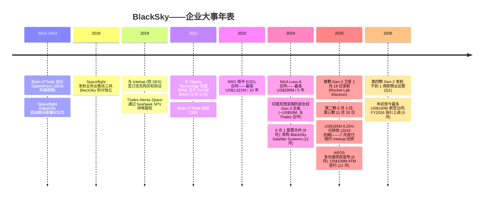
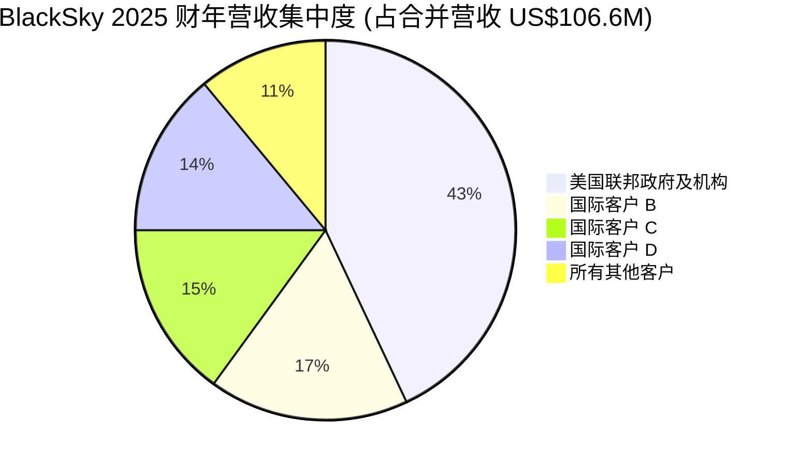
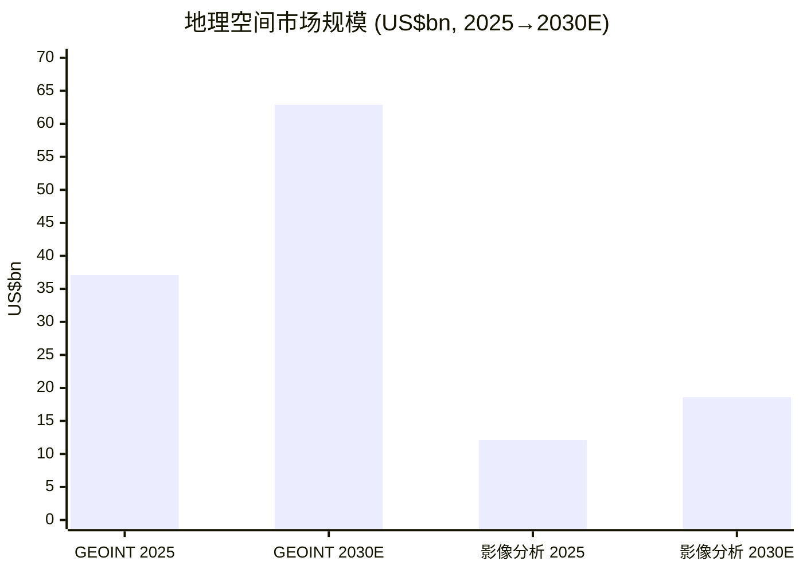
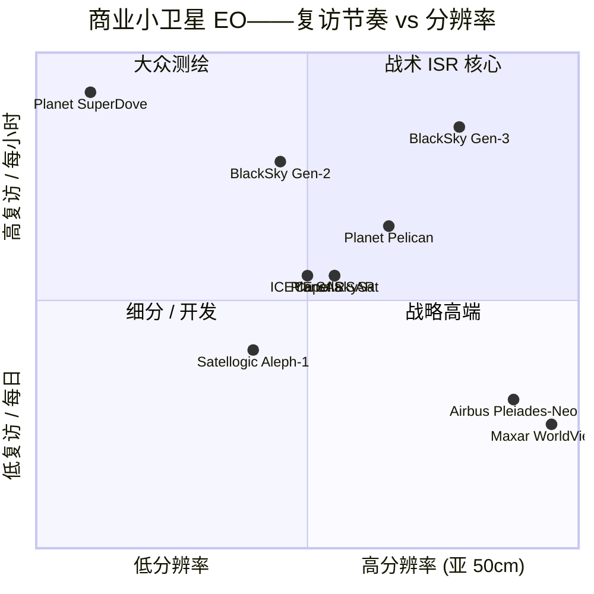
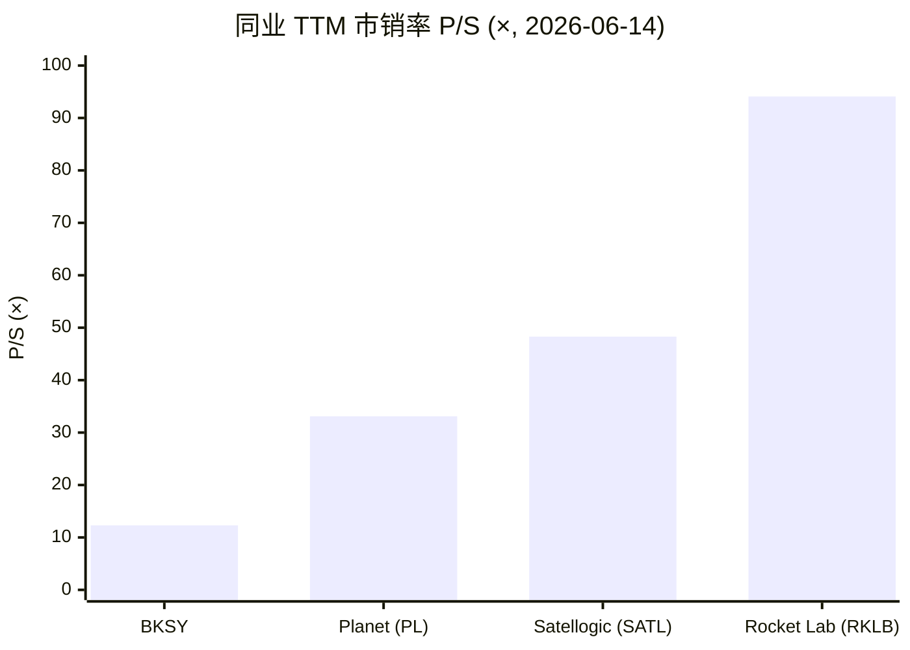

# BlackSky Technology Inc. (NYSE:BKSY) — 公司研究报告

**代码:** NYSE:BKSY  
**截至日期:** 2026-06-14  
**行业:** 商业地理空间情报 (geospatial intelligence) — 小卫星地球观测 (smallsat earth observation) + AI 分析  
**总部:** 美国弗吉尼亚州 Herndon 市 Dulles Corner Park 2411 号 300 室, 邮编 20171  
**员工总数 (2025 年末):** 约 321 人  
**报告语言: 简体中文 (英文版同时存在于本目录, 本次刷新未更新英文版)**

---

> *分析师观点：* **评级：Hold / Neutral（持有）· 12 个月目标价 US\$37（较现价 US\$32.42 上行 +14%）· 估值方法：FY2027E 营收 US\$185M × 8.5× EV/Sales（亏损企业→用市销倍数，非市盈率）**
> 市值 US\$1.20bn · 企业价值 (EV) 约 US\$1.28bn · 52 周区间 US\$11.12–US\$52.88 · NYSE:BKSY · β≈2.52
>
> **前瞻估值矩阵 (forward valuation matrix, *分析师观点*)** — 展示倍数随营收增长而压缩：
>
> | 倍数 | TTM (实际) | FY2026E | FY2027E |
> |---|---|---|---|
> | P/S | 12.3× | 8.6× | 6.5× |
> | EV/Sales | 13.1× | 9.1× | 6.9× |
> | EV/调整后 EBITDA | n/m | ~71× | ~34× |
> | P/E | n/m (GAAP 亏损) | n/m | n/m |
>
> **相对表现 (relative performance)** — BKSY vs S&P 500 (截至 2026-06-12, 来源 yfinance)：
>
> | 区间 | BKSY | S&P 500 | 相对 (超额) |
> |---|---|---|---|
> | 1 个月 | −21.2% | −0.2% | −21.0% |
> | 6 个月 | +65.8% | +7.7% | +58.1% |
> | 年初至今 | +72.9% | +8.6% | +64.3% |
> | 12 个月 | +183.1% | +22.9% | +160.2% |
>
> **核心论点 (thesis pillars)** ——（1）Gen-3 35cm + SWIR 部署叠加**主权任务解决方案 (sovereign mission solutions)**，扩大可寻址市场并使单合同价值跃升——FY2025 新签合同 US\$240M、年末 backlog +32% 至 US\$345M；（2）但 FY2025 GAAP 营收仅 +4.4%、Q1'26 营收同比 −29.5%（里程碑确认时点），增长兑现高度依赖 FY2026 指引中位 US\$140M（+31%）的下半年拐点；（3）估值已对拐点充分定价——EV/Sales 13× TTM、12 个月股价 +183%，而现金消耗、ATM/可转债稀释、89% 客户集中度构成下行风险；（4）风险回报基本对称（base +14% / bull +70% / bear −48%），故给予 **Hold**——等待 FY2026 指引兑现或回调提供更好入场点。

---

> **业绩更新——2026 财年营收指引上调 (2026-05-07):** 管理层将 2026 财年全年营收指引上调至 **US\$130–150M**（此前 2026 年 2 月初始指引为 US\$120–145M），并将**调整后 EBITDA (Adjusted EBITDA)** 指引上调至 **US\$12–24M**（此前为 US\$6–18M），同时维持 2026 财年资本开支 (CapEx) US\$50–60M 的指引不变。本次上调反映年初至今最多达 **US\$160M 的新签合同**，其中包括与某主要国际国防部签订的 **US\$25M 多年期订阅合同**（提供 Gen-3 35cm 分辨率影像与 AI 分析），以及某主要国际国防客户从 Gen-3 试点扩展至约 **US\$30M 年订阅合同**。指引中位值意味着相较 2025 财年 US\$106.6M 营收实现约 31% 同比增长。
> 来源: [2026 财年 Q1 业绩公告, 2026-05-07](https://www.sec.gov/Archives/edgar/data/1753539/000175353926000057/exhibit991-blackskyq12026e.htm)。

## 目录

1. 公司概览
   - 1A. 估值与目标价（决策层）
   - 1B. GF Score 基本面评分
2. 公司历史
3. 管理团队
4. 产品与服务
5. 客户与上市策略
6. 行业概览
7. 竞争格局
8. 市场机会 (TAM)
9. 风险评估
   - 9.5. 核心争议与催化剂
10. 投资风格透视（投资者视角评分）
    数据来源清单 / 参考资料

======================================

## 1. 公司概览

**本报告观点 (BLUF, *分析师观点*)。** 我们给予 BlackSky **Hold / Neutral（持有）** 评级、12 个月目标价 **US\$37**（较现价 US\$32.42 上行约 +14%）。核心逻辑：BlackSky 正在用 Gen-3（35cm 电光 + SWIR）星座与**主权任务解决方案**两条线把可寻址市场和单合同价值同时做大——FY2025 新签 US\$240M、backlog +32% 至 US\$345M 是过去最强的订单录入；但 GAAP 营收兑现仍然滞后且波动（FY2025 +4.4%、Q1'26 −29.5% YoY），FY2026 指引中位 US\$140M（+31%）的拐点能否落地是全部论点的支点。股价 12 个月已 +183%，估值（EV/Sales 13× TTM）已经把这个拐点提前定价，叠加持续现金消耗与股权稀释，当前位置风险回报基本对称——故不追高，等待指引兑现或回调。后文 1A 给出前瞻模型与三档目标价，1B 给出基本面评分。

BlackSky Technology Inc. 是一家总部位于美国弗吉尼亚州 Herndon 市的商业地理空间情报 (geospatial intelligence) 公司, 拥有并运营一个由高复访率 (high-revisit)、高分辨率小卫星 (smallsat) 组成的低地球轨道 (low-earth-orbit, LEO) 星座, 主要向美国及全球盟国政府的国防与情报客户提供卫星影像 (satellite imagery)、AI 生成分析以及端到端"主权" (sovereign) 卫星系统。公司成立于 2014 年, 自我定位为"一家基于太空的科技公司, 为全球最关键、最具战略意义的地点、经济资产及事件提供实时影像、分析以及高频监测" ([BlackSky 2025 财年 10-K 报告, Item 1](https://www.sec.gov/Archives/edgar/data/1753539/000175353926000032/bksy-20251231.htm))。

**业务构成——三大营收分部。** 自 2025 年 1 月 1 日起, BlackSky 将其利润表科目重新分类为三大板块: (1) **天基情报与 AI 服务 (Space-based intelligence & AI services)**——通过 BlackSky **Spectra 分析平台 (Spectra software platform)** 交付的订阅制"按需"(On-Demand) 和"保障"(Assured) 影像及分析产品; (2) **任务解决方案 (Mission Solutions)**——客户 (通常为某国国防部) 自行拥有其 Gen-3 卫星和地面段的整套主权系统, 由 BlackSky 技术栈构建并运营; (3) **先进技术项目 (Advanced Technology Programs)**——定制化研发与集成服务。2025 财年这三大板块分别贡献 US\$65.1M (61.1%)、US\$21.2M (19.9%) 和 US\$20.2M (19.0%), 合并营收合计 US\$106.6M ([10-K FY2025, 利润表](https://www.sec.gov/Archives/edgar/data/1753539/000175353926000032/bksy-20251231.htm))。下面的桑基图 (Sankey) 展示这笔营收如何在成本与费用间分配——注意毛利 (gross profit) 为正, 但含 D&A 的总营业费用 US\$118.1M 超过毛利, 形成 US\$46.9M 经营亏损 (operating loss)：

<svg xmlns="http://www.w3.org/2000/svg" viewBox="0 0 1000 560" width="1000" height="560" role="img" aria-label="income statement Sankey"><rect x="0" y="0" width="1000" height="560" fill="#ffffff"/>
<text x="20.00" y="30.00" text-anchor="start" font-family="Helvetica,Arial,sans-serif" font-size="15" font-weight="700" fill="#1f2933">BlackSky 收入如何分配 / How BKSY Spends Its Revenue — FY2025</text>
<path d="M 700.00,40.76 C 754.00,40.76 754.00,288.00 808.00,288.00 L 808.00,290.00 C 754.00,290.00 754.00,42.76 700.00,42.76 Z" fill="#86efac" fill-opacity="0.55"/>
<path d="M 576.00,54.99 C 630.00,54.99 630.00,40.76 684.00,40.76 L 684.00,42.76 C 630.00,42.76 630.00,56.99 576.00,56.99 Z" fill="#86efac" fill-opacity="0.55"/>
<path d="M 576.00,70.99 C 630.00,70.99 630.00,56.76 684.00,56.76 L 684.00,391.27 C 630.00,391.27 630.00,405.51 576.00,405.51 Z" fill="#fca5a5" fill-opacity="0.55"/>
<path d="M 576.00,405.51 C 630.00,405.51 630.00,405.27 684.00,405.27 L 684.00,407.27 C 630.00,407.27 630.00,407.51 576.00,407.51 Z" fill="#fca5a5" fill-opacity="0.55"/>
<path d="M 576.00,407.51 C 630.00,407.51 630.00,421.27 684.00,421.27 L 684.00,537.24 C 630.00,537.24 630.00,523.48 576.00,523.48 Z" fill="#fca5a5" fill-opacity="0.55"/>
<path d="M 204.00,71.19 C 258.00,71.19 258.00,85.00 312.00,85.00 L 312.00,334.16 C 258.00,334.16 258.00,320.35 204.00,320.35 Z" fill="#93c5fd" fill-opacity="0.55"/>
<path d="M 452.00,78.00 C 506.00,78.00 506.00,54.99 560.00,54.99 L 560.00,56.99 C 506.00,56.99 506.00,80.00 452.00,80.00 Z" fill="#86efac" fill-opacity="0.55"/>
<path d="M 452.00,80.00 C 506.00,80.00 506.00,70.99 560.00,70.99 L 560.00,523.01 C 506.00,523.01 506.00,532.02 452.00,532.02 Z" fill="#fca5a5" fill-opacity="0.55"/>
<path d="M 328.00,85.00 C 382.00,85.00 382.00,78.00 436.00,78.00 L 436.00,350.89 C 382.00,350.89 382.00,357.89 328.00,357.89 Z" fill="#86efac" fill-opacity="0.55"/>
<path d="M 328.00,357.89 C 382.00,357.89 382.00,364.89 436.00,364.89 L 436.00,500.00 C 382.00,500.00 382.00,493.00 328.00,493.00 Z" fill="#fca5a5" fill-opacity="0.55"/>
<path d="M 204.00,334.35 C 258.00,334.35 258.00,334.16 312.00,334.16 L 312.00,415.30 C 258.00,415.30 258.00,415.50 204.00,415.50 Z" fill="#93c5fd" fill-opacity="0.55"/>
<path d="M 204.00,429.50 C 258.00,429.50 258.00,415.30 312.00,415.30 L 312.00,492.62 C 258.00,492.62 258.00,506.81 204.00,506.81 Z" fill="#93c5fd" fill-opacity="0.55"/>
<rect x="188.00" y="71.19" width="16" height="249.16" rx="1.5" fill="#2563eb"/>
<rect x="188.00" y="334.35" width="16" height="81.14" rx="1.5" fill="#2563eb"/>
<rect x="188.00" y="429.50" width="16" height="77.31" rx="1.5" fill="#2563eb"/>
<rect x="312.00" y="85.00" width="16" height="408.00" rx="1.5" fill="#1e3a8a"/>
<rect x="436.00" y="78.00" width="16" height="272.89" rx="1.5" fill="#15803d"/>
<rect x="436.00" y="364.89" width="16" height="135.11" rx="1.5" fill="#dc2626"/>
<rect x="560.00" y="54.99" width="16" height="2.00" rx="1.5" fill="#15803d"/>
<rect x="560.00" y="70.99" width="16" height="452.02" rx="1.5" fill="#dc2626"/>
<rect x="684.00" y="40.76" width="16" height="2.00" rx="1.5" fill="#15803d"/>
<rect x="684.00" y="56.76" width="16" height="334.51" rx="1.5" fill="#dc2626"/>
<rect x="684.00" y="405.27" width="16" height="2.00" rx="1.5" fill="#dc2626"/>
<rect x="684.00" y="421.27" width="16" height="115.97" rx="1.5" fill="#dc2626"/>
<rect x="808.00" y="288.00" width="16" height="2.00" rx="1.5" fill="#15803d"/>
<text x="179.00" y="192.77" text-anchor="end" font-family="Helvetica,Arial,sans-serif" font-size="11.5" font-weight="700" fill="#1f2933">Space-based intelligence &amp; AI</text>
<text x="179.00" y="205.77" text-anchor="end" font-family="Helvetica,Arial,sans-serif" font-size="10" font-weight="400" fill="#52606d">$65.1M  (61.1%)</text>
<text x="179.00" y="371.92" text-anchor="end" font-family="Helvetica,Arial,sans-serif" font-size="11.5" font-weight="700" fill="#1f2933">Mission Solutions</text>
<text x="179.00" y="384.92" text-anchor="end" font-family="Helvetica,Arial,sans-serif" font-size="10" font-weight="400" fill="#52606d">$21.2M  (19.9%)</text>
<text x="179.00" y="465.15" text-anchor="end" font-family="Helvetica,Arial,sans-serif" font-size="11.5" font-weight="700" fill="#1f2933">Advanced Technology</text>
<text x="179.00" y="478.15" text-anchor="end" font-family="Helvetica,Arial,sans-serif" font-size="10" font-weight="400" fill="#52606d">$20.2M  (18.9%)</text>
<rect x="331.00" y="67.00" width="113.10" height="26" rx="2" fill="#ffffff" fill-opacity="0.72"/>
<text x="334.00" y="79.00" text-anchor="start" font-family="Helvetica,Arial,sans-serif" font-size="11.5" font-weight="700" fill="#1f2933">Revenue</text>
<text x="334.00" y="92.00" text-anchor="start" font-family="Helvetica,Arial,sans-serif" font-size="10" font-weight="400" fill="#52606d">$106.6M  (100.0%)</text>
<rect x="455.00" y="60.00" width="100.50" height="26" rx="2" fill="#ffffff" fill-opacity="0.72"/>
<text x="458.00" y="72.00" text-anchor="start" font-family="Helvetica,Arial,sans-serif" font-size="11.5" font-weight="700" fill="#1f2933">Gross Profit</text>
<text x="458.00" y="85.00" text-anchor="start" font-family="Helvetica,Arial,sans-serif" font-size="10" font-weight="400" fill="#52606d">$71.3M  (66.9%)</text>
<rect x="455.00" y="346.89" width="144.60" height="26" rx="2" fill="#ffffff" fill-opacity="0.72"/>
<text x="458.00" y="358.89" text-anchor="start" font-family="Helvetica,Arial,sans-serif" font-size="11.5" font-weight="700" fill="#1f2933">Cost of Revenue (COGS)</text>
<text x="458.00" y="371.89" text-anchor="start" font-family="Helvetica,Arial,sans-serif" font-size="10" font-weight="400" fill="#52606d">$35.3M  (33.1%)</text>
<rect x="579.00" y="36.99" width="113.10" height="26" rx="2" fill="#ffffff" fill-opacity="0.72"/>
<text x="582.00" y="48.99" text-anchor="start" font-family="Helvetica,Arial,sans-serif" font-size="11.5" font-weight="700" fill="#1f2933">Operating Income</text>
<text x="582.00" y="61.99" text-anchor="start" font-family="Helvetica,Arial,sans-serif" font-size="10" font-weight="400" fill="#52606d">-$46.9M  (-44.0%)</text>
<rect x="579.00" y="61.99" width="150.90" height="26" rx="2" fill="#ffffff" fill-opacity="0.72"/>
<text x="582.00" y="73.99" text-anchor="start" font-family="Helvetica,Arial,sans-serif" font-size="11.5" font-weight="700" fill="#1f2933">Total Operating Expense</text>
<text x="582.00" y="86.99" text-anchor="start" font-family="Helvetica,Arial,sans-serif" font-size="10" font-weight="400" fill="#52606d">$118.1M  (110.8%)</text>
<rect x="703.00" y="22.76" width="113.10" height="26" rx="2" fill="#ffffff" fill-opacity="0.72"/>
<text x="706.00" y="34.76" text-anchor="start" font-family="Helvetica,Arial,sans-serif" font-size="11.5" font-weight="700" fill="#1f2933">Pretax Income</text>
<text x="706.00" y="47.76" text-anchor="start" font-family="Helvetica,Arial,sans-serif" font-size="10" font-weight="400" fill="#52606d">-$46.9M  (-44.0%)</text>
<rect x="703.00" y="47.76" width="100.50" height="26" rx="2" fill="#ffffff" fill-opacity="0.72"/>
<text x="706.00" y="59.76" text-anchor="start" font-family="Helvetica,Arial,sans-serif" font-size="11.5" font-weight="700" fill="#1f2933">SG&amp;A</text>
<text x="706.00" y="72.76" text-anchor="start" font-family="Helvetica,Arial,sans-serif" font-size="10" font-weight="400" fill="#52606d">$87.4M  (82.0%)</text>
<rect x="703.00" y="387.27" width="106.80" height="26" rx="2" fill="#ffffff" fill-opacity="0.72"/>
<text x="706.00" y="399.27" text-anchor="start" font-family="Helvetica,Arial,sans-serif" font-size="11.5" font-weight="700" fill="#1f2933">R&amp;D</text>
<text x="706.00" y="412.27" text-anchor="start" font-family="Helvetica,Arial,sans-serif" font-size="10" font-weight="400" fill="#52606d">$400.0K  (0.38%)</text>
<rect x="703.00" y="412.27" width="100.50" height="26" rx="2" fill="#ffffff" fill-opacity="0.72"/>
<text x="706.00" y="424.27" text-anchor="start" font-family="Helvetica,Arial,sans-serif" font-size="11.5" font-weight="700" fill="#1f2933">Other OpEx</text>
<text x="706.00" y="437.27" text-anchor="start" font-family="Helvetica,Arial,sans-serif" font-size="10" font-weight="400" fill="#52606d">$30.3M  (28.4%)</text>
<text x="833.00" y="286.00" text-anchor="start" font-family="Helvetica,Arial,sans-serif" font-size="11.5" font-weight="700" fill="#1f2933">Net Income</text>
<text x="833.00" y="299.00" text-anchor="start" font-family="Helvetica,Arial,sans-serif" font-size="10" font-weight="400" fill="#52606d">-$70.3M  (-65.9%)</text>
<text x="500.00" y="530.00" text-anchor="middle" font-family="Helvetica,Arial,sans-serif" font-size="10" font-weight="400" font-style="italic" fill="#8a97a3">毛利为正，但 opex（含 D&amp;A 30.3）超过毛利，导致经营亏损 46.9；非现金项见现金流图</text>
<text x="500.00" y="544.00" text-anchor="middle" font-family="Helvetica,Arial,sans-serif" font-size="10" font-weight="400" fill="#52606d">Source: BKSY FY2025 10-K, Consolidated Statements of Operations</text>
</svg>

来源 / Source: [BKSY FY2025 10-K, 合并利润表](https://www.sec.gov/Archives/edgar/data/1753539/000175353926000032/bksy-20251231.htm)。

各分部营收占比的环形图 (donut)：

<svg xmlns="http://www.w3.org/2000/svg" viewBox="0 0 720 460" width="720" height="460" role="img" aria-label="revenue donut"><rect x="0" y="0" width="720" height="460" fill="#ffffff"/>
<text x="20.00" y="30.00" text-anchor="start" font-family="Helvetica,Arial,sans-serif" font-size="15" font-weight="700" fill="#1f2933">FY2025 营收按业务分部 / Revenue by Segment</text>
<path d="M 288.00,107.20 A 132 132 0 1 1 203.05,340.23 L 237.80,298.90 A 78 78 0 1 0 288.00,161.20 Z" fill="#2563eb"/>
<path d="M 203.05,340.23 A 132 132 0 0 1 165.37,190.35 L 215.54,210.34 A 78 78 0 0 0 237.80,298.90 Z" fill="#15803d"/>
<path d="M 165.37,190.35 A 132 132 0 0 1 288.00,107.20 L 288.00,161.20 A 78 78 0 0 0 215.54,210.34 Z" fill="#d97706"/>
<text x="288.00" y="235.20" text-anchor="middle" font-family="Helvetica,Arial,sans-serif" font-size="18" font-weight="800" fill="#1f2933">BKSY</text>
<text x="288.00" y="255.20" text-anchor="middle" font-family="Helvetica,Arial,sans-serif" font-size="13" font-weight="600" fill="#52606d">$106.5M</text>
<text x="288.00" y="271.20" text-anchor="middle" font-family="Helvetica,Arial,sans-serif" font-size="10" font-weight="400" fill="#8a97a3">total</text>
<line x1="417.65" y1="286.46" x2="433.65" y2="286.46" stroke="#2563eb" stroke-width="1.4"/>
<text x="437.65" y="284.46" text-anchor="start" font-family="Helvetica,Arial,sans-serif" font-size="11" font-weight="700" fill="#1f2933">Space-based intelligence &amp; AI</text>
<text x="437.65" y="298.46" text-anchor="start" font-family="Helvetica,Arial,sans-serif" font-size="10" font-weight="400" fill="#52606d">$65.1M  (61.1%)</text>
<line x1="154.17" y1="272.85" x2="138.17" y2="272.85" stroke="#15803d" stroke-width="1.4"/>
<text x="134.17" y="270.85" text-anchor="end" font-family="Helvetica,Arial,sans-serif" font-size="11" font-weight="700" fill="#1f2933">Mission Solutions</text>
<text x="134.17" y="284.85" text-anchor="end" font-family="Helvetica,Arial,sans-serif" font-size="10" font-weight="400" fill="#52606d">$21.2M  (19.9%)</text>
<line x1="210.55" y1="124.98" x2="194.55" y2="124.98" stroke="#d97706" stroke-width="1.4"/>
<text x="190.55" y="122.98" text-anchor="end" font-family="Helvetica,Arial,sans-serif" font-size="11" font-weight="700" fill="#1f2933">Advanced Technology</text>
<text x="190.55" y="136.98" text-anchor="end" font-family="Helvetica,Arial,sans-serif" font-size="10" font-weight="400" fill="#52606d">$20.2M  (19.0%)</text>
<text x="360.00" y="444.00" text-anchor="middle" font-family="Helvetica,Arial,sans-serif" font-size="10" font-weight="400" fill="#52606d">Source: BKSY FY2025 10-K, Statements of Operations (segment revenue)</text>
</svg>

来源 / Source: [BKSY FY2025 10-K, 利润表分部营收](https://www.sec.gov/Archives/edgar/data/1753539/000175353926000032/bksy-20251231.htm)。

**星座规模 (Constellation)。** 截至 2026 年 Q1, BlackSky 运营一个由姐妹公司 LeoStella 制造的传统 **Gen-2** (约 1 米电光成像) 微卫星 (microsatellite) 加新型 **Gen-3** 卫星组成的混合舰队, 后者提供 **35 厘米电光分辨率 (electro-optical resolution)** 和 **1.2 米短波红外 (short-wave-infrared, SWIR)** 成像能力, 可用于低光/夜间采集 ([10-K FY2025, Item 1](https://www.sec.gov/Archives/edgar/data/1753539/000175353926000032/bksy-20251231.htm))。首颗 Gen-3 卫星于 **2025 年 2 月 19 日**通过 Rocket Lab 第 60 次 Electron 火箭任务从新西兰 Mahia 升空 ([Via Satellite, 2025-02-19](https://www.satellitetoday.com/launch/2025/02/19/rocket-lab-launches-blackskys-first-gen-3-satellite-on-60th-electron-mission/)); 第二颗于 **2025 年 6 月 3 日**发射 ([Spaceflight Now, 2025-06-02](https://spaceflightnow.com/2025/06/02/rocket-lab-to-launch-blackskys-next-gen-3-satellite-on-electron-rocket-from-new-zealand/)); 第三颗于 **2025 年 11 月 20 日**发射 (BlackSky 此前为"机密"客户; [SpaceNews, 2025-11-27](https://spacenews.com/blacksky-announces-latest-gen-3-satellite-in-orbit-after-confidential-electron-launch/)); 第四颗于 2026 年 Q1 发射, "发射后数小时内即开始交付超高分辨率影像, 不到一周即快速进入商业运营" ([2026 财年 Q1 业绩公告, 2026-05-07](https://www.sec.gov/Archives/edgar/data/1753539/000175353926000057/exhibit991-blackskyq12026e.htm))。管理层已预告 2026 年还将进行多次专属 Electron 发射, 下一颗 Gen-3 卫星已运抵发射场。

**规模与财务。** 2025 财年营收 US\$106.6M, 相较 2024 财年 US\$102.1M 同比增长 4.4%, 增长主要由任务解决方案 (Mission Solutions) 驱动 (同比 +258%, 但基数较小, 从 US\$5.9M 增至 US\$21.2M), 但被先进技术项目同比下降 22.4% (US\$26.1M → US\$20.2M) 以及订阅影像服务因一份大型传统合同到期而同比下降 7.1% (US\$70.1M → US\$65.1M) 所拖累 ([10-K FY2025, 利润表](https://www.sec.gov/Archives/edgar/data/1753539/000175353926000032/bksy-20251231.htm))。年末未交付订单 (backlog) 达 **US\$345.3M**, 同比 +32%, 受 **2025 财年 US\$240M 合同新签订单**驱动——这是公司历史上最强劲的订单录入 ([Q4-2025 业绩公告, 2026-02-26](https://www.sec.gov/Archives/edgar/data/1753539/000175353926000009/exhibit991-blackskyq42025e.htm))。值得注意的是, 全年**调整后 EBITDA 为 US\$0.9M**(连续第二年为正), 但已较 2024 财年 US\$11.6M 大幅回落, 主因 S,G&A 上升与任务解决方案成本爬坡 ([Q4-2025 业绩公告, 2026-02-26](https://www.sec.gov/Archives/edgar/data/1753539/000175353926000009/exhibit991-blackskyq42025e.htm))。GAAP 净亏损从 2024 财年 US\$57.2M 扩大至 2025 财年 US\$70.3M; 自成立以来累计亏损 (accumulated deficit) 至 FY2025 末为 US\$726.4M, 至 2026 年 Q1 末进一步增至 US\$756.1M ([10-K FY2025, 资产负债表](https://www.sec.gov/Archives/edgar/data/1753539/000175353926000032/bksy-20251231.htm); [2026 财年 Q1 业绩公告](https://www.sec.gov/Archives/edgar/data/1753539/000175353926000057/exhibit991-blackskyq12026e.htm))。

历史总营收轨迹 (FY2021–FY2025)——五年从 US\$34.1M 增至 US\$106.6M (约 33% 年化)：

<svg xmlns="http://www.w3.org/2000/svg" viewBox="0 0 860 470" width="860" height="470" role="img" aria-label="historical revenue bars"><rect x="0" y="0" width="860" height="470" fill="#ffffff"/>
<text x="20.00" y="30.00" text-anchor="start" font-family="Helvetica,Arial,sans-serif" font-size="15" font-weight="700" fill="#1f2933">历史总营收 / Total Revenue (FY21–FY25, US$M)</text>
<rect x="20.00" y="44" width="11" height="11" rx="2" fill="#2563eb"/>
<text x="36.00" y="53.00" text-anchor="start" font-family="Helvetica,Arial,sans-serif" font-size="10.5" font-weight="400" fill="#1f2933">Total Revenue</text>
<line x1="70" y1="412.00" x2="834" y2="412.00" stroke="#eceff2" stroke-width="1"/>
<text x="64.00" y="415.00" text-anchor="end" font-family="Helvetica,Arial,sans-serif" font-size="9.5" font-weight="400" fill="#52606d">$0</text>
<line x1="70" y1="345.20" x2="834" y2="345.20" stroke="#eceff2" stroke-width="1"/>
<text x="64.00" y="348.20" text-anchor="end" font-family="Helvetica,Arial,sans-serif" font-size="9.5" font-weight="400" fill="#52606d">$23.0M</text>
<line x1="70" y1="278.40" x2="834" y2="278.40" stroke="#eceff2" stroke-width="1"/>
<text x="64.00" y="281.40" text-anchor="end" font-family="Helvetica,Arial,sans-serif" font-size="9.5" font-weight="400" fill="#52606d">$46.1M</text>
<line x1="70" y1="211.60" x2="834" y2="211.60" stroke="#eceff2" stroke-width="1"/>
<text x="64.00" y="214.60" text-anchor="end" font-family="Helvetica,Arial,sans-serif" font-size="9.5" font-weight="400" fill="#52606d">$69.1M</text>
<line x1="70" y1="144.80" x2="834" y2="144.80" stroke="#eceff2" stroke-width="1"/>
<text x="64.00" y="147.80" text-anchor="end" font-family="Helvetica,Arial,sans-serif" font-size="9.5" font-weight="400" fill="#52606d">$92.1M</text>
<line x1="70" y1="78.00" x2="834" y2="78.00" stroke="#eceff2" stroke-width="1"/>
<text x="64.00" y="81.00" text-anchor="end" font-family="Helvetica,Arial,sans-serif" font-size="9.5" font-weight="400" fill="#52606d">$115.1M</text>
<rect x="102.09" y="313.07" width="88.62" height="98.93" fill="#2563eb"/>
<text x="146.40" y="428.00" text-anchor="middle" font-family="Helvetica,Arial,sans-serif" font-size="10" font-weight="400" fill="#52606d">2021</text>
<rect x="254.89" y="222.27" width="88.62" height="189.73" fill="#2563eb"/>
<text x="299.20" y="428.00" text-anchor="middle" font-family="Helvetica,Arial,sans-serif" font-size="10" font-weight="400" fill="#52606d">2022</text>
<rect x="407.69" y="137.84" width="88.62" height="274.16" fill="#2563eb"/>
<text x="452.00" y="428.00" text-anchor="middle" font-family="Helvetica,Arial,sans-serif" font-size="10" font-weight="400" fill="#52606d">2023</text>
<rect x="560.49" y="115.80" width="88.62" height="296.20" fill="#2563eb"/>
<text x="604.80" y="428.00" text-anchor="middle" font-family="Helvetica,Arial,sans-serif" font-size="10" font-weight="400" fill="#52606d">2024</text>
<rect x="713.29" y="102.74" width="88.62" height="309.26" fill="#2563eb"/>
<text x="757.60" y="428.00" text-anchor="middle" font-family="Helvetica,Arial,sans-serif" font-size="10" font-weight="400" fill="#52606d">2025</text>
<text x="430.00" y="440.00" text-anchor="middle" font-family="Helvetica,Arial,sans-serif" font-size="10" font-weight="400" font-style="italic" fill="#8a97a3">FY2021–2024 旧分部口径；FY2025 起重分类为三大分部（见营收分部环形图）</text>
<text x="430.00" y="454.00" text-anchor="middle" font-family="Helvetica,Arial,sans-serif" font-size="10" font-weight="400" fill="#52606d">Source: BKSY FY2021–FY2025 10-Ks, Consolidated Statements of Operations</text>
</svg>

来源 / Source: [BKSY FY2021–FY2025 各年 10-K, 合并利润表](https://www.sec.gov/cgi-bin/browse-edgar?action=getcompany&CIK=0001753539&type=10-K&dateb=&owner=include&count=40)。

**估值快照 (截至 2026-06-14)。** 股价为 US\$32.42 (52 周区间 US\$11.12–US\$52.88), 对应市值约 **US\$1.20bn**, 按约 3,710 万股稀释后股本计算; 企业价值 (EV) 约 **US\$1.28bn**, 系扣除 US\$117.5M 现金 (2026 Q1 末 cash + 受限现金 + 短期投资)、加约 US\$201M 债务后所得 ([Yahoo Finance—BKSY 关键统计指标, 2026-06-14](https://finance.yahoo.com/quote/BKSY/key-statistics/); 债务/现金口径见 [10-K FY2025 资产负债表](https://www.sec.gov/Archives/edgar/data/1753539/000175353926000032/bksy-20251231.htm))。过去十二个月 (TTM) 营收约 US\$97.9M (Q2'25–Q1'26 四个季度), 对应 TTM 倍数及同业对比:

| 指标 (截至 2026-06-14) | BKSY (TTM) | Planet (PL) | Satellogic (SATL) | Rocket Lab (RKLB) |
|---|---|---|---|---|
| 股价 (US\$) | 32.42 | 31.15 | 6.66 | 102.39 |
| 市值 (US\$M) | 1,203 | 11,102 | 987 | 63,975 |
| TTM 营收 (US\$M, 约) | 97.9 | 335 | 20 | 680 |
| TTM 市销率 (P/S) | **12.3×** | 33.1× | 48.3× | 94.1× |
| EV / 营收 (约) | **13.1×** | ~30× | ~47× | ~92× |
| TTM 市盈率 (P/E) | n/m (亏损) | n/m (亏损) | n/m (亏损) | n/m (亏损) |
| β (beta) | 2.52 | — | — | — |

来源: [Yahoo Finance—BKSY](https://finance.yahoo.com/quote/BKSY/key-statistics/)、[PL](https://finance.yahoo.com/quote/PL/key-statistics/)、[SATL](https://finance.yahoo.com/quote/SATL/key-statistics/)、[RKLB](https://finance.yahoo.com/quote/RKLB/key-statistics/), 全部数据均于 2026-06-14 拉取。RKLB 为发射+太空系统相邻可比, PL 是最相关的直接同业。

**解读——为何 P/E 为负而 P/S 偏高但低于同业。** BlackSky 从未实现 GAAP 盈利; 2025 财年 US\$70.3M 的净亏损主要来自: 星座折旧造成的 US\$30.3M 折旧摊销 (D&A); US\$87.4M 销售、一般及管理费用 (S,G&A, 其中含约 US\$14.2M 股票薪酬 (stock-based compensation) 以及在不到 US\$110M 营收规模下运营一家上市公司的成本); 约 US\$201M 债务对应的 US\$14.9M 利息支出; US\$8.0M 的衍生权证 (derivative warrants) 损失 (按市值计价随股价波动); 以及 US\$4.1M 债务清偿损失 ([10-K FY2025, 利润表](https://www.sec.gov/Archives/edgar/data/1753539/000175353926000032/bksy-20251231.htm))。这是烧现金的成长型亏损, 而非一次性减值。

12.3 倍的 P/S **显著低于**小卫星地球观测同业 (PL ~33×, SATL ~48×, RKLB ~94×)。两个因素压制 BKSY 倍数: (1) TTM 营收同比走平甚至下滑——Q1'26 营收 US\$20.8M 较 Q1'25 US\$29.5M **下降 29.5%**, 因为 Q1'25 包含一笔约 US\$9.8M 的任务解决方案一次性里程碑收入, 制造了高基数 ([2026 财年 Q1 业绩公告, 2026-05-07](https://www.sec.gov/Archives/edgar/data/1753539/000175353926000057/exhibit991-blackskyq12026e.htm)); (2) BlackSky 的 GAAP 增长在历史上显著波动 (FY2025 仅 +4.4%, 而 FY2023 同比 +44.6%) ([10-K FY2024, 利润表](https://www.sec.gov/Archives/edgar/data/1753539/000175353925000030/bksy-20241231.htm))。尽管如此, 股价过去 12 个月内大涨 +183% (从约 US\$11 的低位最高触及 US\$52.88, 现回落至 US\$32.42、近一个月 −21%), 得益于 Gen-3 部署、FY2025 US\$240M 新签订单, 以及 FY2026 指引上调——这意味着市场已为指引桥梁所示的下半年增长定价。第 1A 章给出前瞻模型, 第 9 章对**估值/倍数压缩风险**有专门讨论, 因为当前估值假设 FY2026 的拐点能按指引兑现。

### 1A. 估值与目标价（决策层）

> 本章为**前瞻、决策级**分析, 区别于 Section 1 的 TTM 快照。**本章所有预测数字、目标价及情景目标价均为分析师本人的前瞻观点 (*分析师观点*), 绝不附带任何文件 (filing) 引用**——10-K 不含目标价。每一项预测的*外部输入*(分部数据 + 管理层指引 + 行业预测) 在文中行内引用。

**(a) 前瞻财务预测表 (*分析师观点*)。** 由分部数据 (10-K) + 管理层 FY2026 指引 + 主权/订阅订单节奏构建。对一家烧现金的公司, 真正的决策变量是**现金跑道 (cash runway)** 而非 EPS 路径, 故下表带现金流与净负债层:

| 指标 (*分析师观点*) | FY2024A | FY2025A | FY2026E | FY2027E | FY2028E | CAGR(25–28) |
|---|---|---|---|---|---|---|
| 营收 (US\$M) | 102.1 | 106.6 | 140 | 185 | 235 | +30% |
| — YoY % | — | +4.4% | +31% | +32% | +27% | |
| 毛利率 (gross margin, 不含 D&A) | ~67% | 66.9% | ~67% | ~68% | ~69% | |
| 调整后 EBITDA (US\$M) | 11.6 | 0.9 | 18 | 38 | 65 | |
| 经营利润率 (operating margin) | −43% | −44% | −30% | −16% | −4% | |
| GAAP 净亏损 (US\$M) | −57.2 | −70.3 | −55 | −42 | −22 | |
| EPS (US\$) | −2.67 | −2.09 | −1.40 | −1.00 | −0.50 | |
| FCF (US\$M) | ~−50 | −74.8 | ~−58 | ~−35 | ~−8 | |
| 净现金/(净负债) (US\$M) | — | −75.5 | ~−95 | ~−105 | ~−95 | |
| 现金跑道 (按当前烧钱, 季度) | — | ~6–8 (+ATM 桥接) | | | | |

各预测单元基础: 营收爬坡来自公司 FY2026 指引 US\$130–150M ([Q1'26 公告](https://www.sec.gov/Archives/edgar/data/1753539/000175353926000057/exhibit991-blackskyq12026e.htm)) + 年末 US\$345.3M backlog 转化节奏 ([10-K FY2025, 附注 5](https://www.sec.gov/Archives/edgar/data/1753539/000175353926000032/bksy-20251231.htm)) + 主权/Assured 新签订单 (FY2025 US\$240M); 毛利率延续 10-K 实际 66.9% (不含 D&A) ([10-K FY2025, 利润表](https://www.sec.gov/Archives/edgar/data/1753539/000175353926000032/bksy-20251231.htm)); FY2025 调整后 EBITDA US\$0.9M、FY2026 指引 US\$12–24M 来自业绩公告; 净亏损路径假设 Gen-3 卫星陆续入役推升 D&A 至约 US\$45M、利息约 US\$15M。**所有预测列为分析师观点, 非"模型估算"作为来源。**

**毛利率/经营利润率桥 (margin bridge, *分析师观点*)。** FY2025 → FY2027E 经营利润率从 −44% 改善至约 −16%, 拆解为: 营收规模化带来的**经营杠杆 (operating leverage)** 约 +18pp (S,G&A 占比从 82% 降至约 55%); Gen-3 高毛利订阅占比上升带来**结构改善**约 +4pp; 部分被 Gen-3 卫星折旧上升 (D&A 占营收比) 抵消约 −6pp。每一项驱动均与 10-K 费用结构 ([10-K FY2025, MD&A](https://www.sec.gov/Archives/edgar/data/1753539/000175353926000032/bksy-20251231.htm)) 挂钩, bps 幅度为分析师观点。

**(b) 目标价推导 (*分析师观点*)——展示算术。** 方法: **EV/Sales × 前瞻营收** (公司 GAAP 与调整后 EBITDA 均尚薄, 用市销倍数最稳健)。

- 基准 (Base): FY2027E 营收 US\$185M × **8.5× EV/Sales** = EV 约 US\$1.57bn; 扣除 FY2026E 末净负债约 US\$95M → 股权价值约 US\$1.48bn; ÷ 约 4,000 万股稀释股本 → **目标价约 US\$37**。
- **倍数依据 (vs 同业)**: 8.5× 前瞻 EV/Sales 较 BKSY 当前 TTM 13.1× 有所收敛 (反映从 TTM 走平向 FY27E +30% 增长的过渡), 同时显著低于 PL ~30×、SATL ~47×、RKLB ~92× 的 TTM 倍数——BKSY 因规模更小、GAAP 营收更"块状"(lumpy) 而应享折价, 8.5× 处于"增长兑现但仍折价"的合理中段 ([Yahoo Finance 同业, 2026-06-14](https://finance.yahoo.com/quote/PL/key-statistics/))。

**(c) 牛/基/熊三档目标价 (*分析师观点*):**

| 情景 (*分析师观点*) | 关键假设 | 目标价 | 较现价 |
|---|---|---|---|
| 牛 (Bull) | 主权 + Assured 加速, FY27E 营收 US\$215M, 倍数升至 11× EV/Sales | US\$55 | +70% |
| 基 (Base) | 中性估计, FY27E 营收 US\$185M, 8.5× EV/Sales | US\$37 | +14% |
| 熊 (Bear) | FY2026 指引未达, FY27E 营收 US\$155M, 去估值至 5× + 稀释 | US\$17 | −48% |

**(d) 指引 vs 本报告对比 (Guide vs Own, *分析师观点*)。** 公司给出 FY2026 指引; 本地 zsxq 券商库对 BKSY **无覆盖**(已搜索 6 个别名, 见数据来源清单), 故不引用具体卖方一致预期以免编造数字。

| 指标 (FY2026E) | 公司指引 | 本报告 (*分析师观点*) |
|---|---|---|
| 营收 | US\$130–150M | US\$140M |
| 调整后 EBITDA | US\$12–24M | US\$18M |
| 资本开支 (CapEx) | US\$50–60M | US\$55M |

公司指引列引自 [2026 财年 Q1 业绩公告](https://www.sec.gov/Archives/edgar/data/1753539/000175353926000057/exhibit991-blackskyq12026e.htm); 本报告列为分析师观点。本报告 FY2026E 营收与指引中位一致——我们不在 GAAP 营收兑现得到验证前给出高于指引的乐观估计。

**(e) 关键变量 (swing variables)。** 全部论点钩在两个假设上: (1) **FY2026 营收兑现节奏**——backlog 中 FY2026 转出仅 US\$77.3M、约占指引中位 55%, 其余须靠年内新签, Q1'26 已签 US\$160M 大幅收窄缺口但仍需持续; (2) **现金跑道与稀释速度**——FY2026 资本开支 US\$50–60M + 经营接近盈亏平衡意味着继续动用 ATM/可转债, 稀释速度决定每股价值。读者应重点压力测试这两点。

**(f) 相对上次报告的变化 (估值修正透明度)。** 上一版 (2026-05-20) 现价 US\$45.83、未设正式评级与目标价 (旧版仅有 TTM 快照)。本次刷新在股价回落至 US\$32.42 (−29%) 后**新增**完整决策层 (评级 Hold、基准目标价 US\$37); 估值倍数 EV/Sales 从 18.1× (旧版价位) 压缩至 13.1× (现价位), 即股价下跌而非基本面恶化驱动了倍数收敛——本次"建仓评级"主要反映价位变化带来的更平衡的风险回报。

### 1B. GF Score 基本面评分

> *分析师观点：* **GF Score (GuruFocus 风格): 39/100 — 偏弱 (weak / below-average)。** 该分数为本报告自有评分框架的产物 (analytical overlay), **非来自 GuruFocus, 也不附带文件引用**; 五个子维度与综合分均为分析师观点, 各底层指标在下文行内引用。

<svg xmlns="http://www.w3.org/2000/svg" viewBox="0 0 500 500" width="500" height="500" role="img" aria-label="GF Score radar">
<rect x="0" y="0" width="500" height="500" fill="#ffffff"/>
<text x="20" y="24" font-family="Helvetica,Arial,sans-serif" font-size="15" font-weight="700" fill="#1f2933">GF Score (GuruFocus-style): 38/100</text>
<text x="20" y="41" font-family="Helvetica,Arial,sans-serif" font-size="11" fill="#52606d">0–50 Worst future performance potential / insufficient data</text>
<polygon points="250.0,88.0 392.7,191.6 338.2,359.4 161.8,359.4 107.3,191.6" fill="#e9f5ec" stroke="none"/>
<polygon points="250.0,208.0 278.5,228.7 267.6,262.3 232.4,262.3 221.5,228.7" fill="none" stroke="#c5d3cb" stroke-width="1"/>
<polygon points="250.0,178.0 307.1,219.5 285.3,286.5 214.7,286.5 192.9,219.5" fill="none" stroke="#c5d3cb" stroke-width="1"/>
<polygon points="250.0,148.0 335.6,210.2 302.9,310.8 197.1,310.8 164.4,210.2" fill="none" stroke="#c5d3cb" stroke-width="1"/>
<polygon points="250.0,118.0 364.1,200.9 320.5,335.1 179.5,335.1 135.9,200.9" fill="none" stroke="#c5d3cb" stroke-width="1"/>
<polygon points="250.0,88.0 392.7,191.6 338.2,359.4 161.8,359.4 107.3,191.6" fill="none" stroke="#c5d3cb" stroke-width="1.3"/>
<line x1="250" y1="238" x2="161.8" y2="359.4" stroke="#cfdad3" stroke-width="1"/>
<text x="146.5" y="392.4" text-anchor="end" font-family="Helvetica,Arial,sans-serif" font-size="11.5" font-weight="600" fill="#1f2933">Financial Strength</text>
<text x="146.5" y="405.4" text-anchor="end" font-family="Helvetica,Arial,sans-serif" font-size="9.5" fill="#52606d">财务实力</text>
<text x="223.5" y="268.4" text-anchor="middle" font-family="Helvetica,Arial,sans-serif" font-size="10.5" font-weight="700" fill="#1f2933">3</text>
<line x1="250" y1="238" x2="250.0" y2="88.0" stroke="#cfdad3" stroke-width="1"/>
<text x="250.0" y="58.0" text-anchor="middle" font-family="Helvetica,Arial,sans-serif" font-size="11.5" font-weight="600" fill="#1f2933">Profitability</text>
<text x="250.0" y="71.0" text-anchor="middle" font-family="Helvetica,Arial,sans-serif" font-size="9.5" fill="#52606d">盈利能力</text>
<text x="250.0" y="202.0" text-anchor="middle" font-family="Helvetica,Arial,sans-serif" font-size="10.5" font-weight="700" fill="#1f2933">2</text>
<line x1="250" y1="238" x2="107.3" y2="191.6" stroke="#cfdad3" stroke-width="1"/>
<text x="82.6" y="183.6" text-anchor="end" font-family="Helvetica,Arial,sans-serif" font-size="11.5" font-weight="600" fill="#1f2933">Growth</text>
<text x="82.6" y="196.6" text-anchor="end" font-family="Helvetica,Arial,sans-serif" font-size="9.5" fill="#52606d">成长性</text>
<text x="178.7" y="208.8" text-anchor="middle" font-family="Helvetica,Arial,sans-serif" font-size="10.5" font-weight="700" fill="#1f2933">5</text>
<line x1="250" y1="238" x2="392.7" y2="191.6" stroke="#cfdad3" stroke-width="1"/>
<text x="417.4" y="183.6" text-anchor="start" font-family="Helvetica,Arial,sans-serif" font-size="11.5" font-weight="600" fill="#1f2933">GF Value</text>
<text x="417.4" y="196.6" text-anchor="start" font-family="Helvetica,Arial,sans-serif" font-size="9.5" fill="#52606d">估值</text>
<text x="307.1" y="213.5" text-anchor="middle" font-family="Helvetica,Arial,sans-serif" font-size="10.5" font-weight="700" fill="#1f2933">4</text>
<line x1="250" y1="238" x2="338.2" y2="359.4" stroke="#cfdad3" stroke-width="1"/>
<text x="353.5" y="392.4" text-anchor="start" font-family="Helvetica,Arial,sans-serif" font-size="11.5" font-weight="600" fill="#1f2933">Momentum</text>
<text x="353.5" y="405.4" text-anchor="start" font-family="Helvetica,Arial,sans-serif" font-size="9.5" fill="#52606d">动量</text>
<text x="302.9" y="304.8" text-anchor="middle" font-family="Helvetica,Arial,sans-serif" font-size="10.5" font-weight="700" fill="#1f2933">6</text>
<polygon points="250.0,208.0 307.1,219.5 302.9,310.8 223.5,274.4 178.7,214.8" fill="#2e8b57" fill-opacity="0.34" stroke="#2e8b57" stroke-width="2"/>
<circle cx="223.5" cy="274.4" r="2.6" fill="#2e8b57"/>
<circle cx="250.0" cy="208.0" r="2.6" fill="#2e8b57"/>
<circle cx="178.7" cy="214.8" r="2.6" fill="#2e8b57"/>
<circle cx="307.1" cy="219.5" r="2.6" fill="#2e8b57"/>
<circle cx="302.9" cy="310.8" r="2.6" fill="#2e8b57"/>
<text x="250" y="470" text-anchor="middle" font-family="Helvetica,Arial,sans-serif" font-size="9.5" fill="#52606d">Source: BKSY FY2025 10-K + Q1-2026 8-K · Yahoo Finance · indicators.db, as of 2026-06-14</text>
<text x="250" y="485" text-anchor="middle" font-family="Helvetica,Arial,sans-serif" font-size="9" fill="#52606d">GF Score = independent analyst rubric (*Analyst view:*) — not GuruFocus™ official number</text>
</svg>

*读图: 离中心越远越好; 五边形越大综合分越高。*

| 维度 (axis, 0–10) | 评分 | 一句话理由 |
|---|---|---|
| 财务实力 (Financial Strength) | 3 | 净负债约 US\$75.5M、利息覆盖为负, 但现金 US\$117.5M 覆盖约 2 年消耗, 可转债 2033 才到期 |
| 盈利能力 (Profitability) | 2 | 经营利润率 −44%、净利率 −66%、ROIC 为负; 唯毛利率 ~67% 较高 |
| 成长性 (Growth) | 5 | FY25 GAAP 营收 +4.4% 偏弱, 但 backlog +32%、FY26E 指引 +31%、3 年 CAGR ~33% |
| GF Value (估值, 高=便宜) | 4 | EV/Sales 13× 为同业最低, 但绝对水平对亏损企业仍偏高; 基准目标价仅 +14% |
| 动量 (Momentum) | 6 | 12 个月 +183%、6 个月 +66% 强劲, 但近 1 个月 −21% 回调 |
| **综合 (composite)** | **39/100** | 偏弱——投机性增长故事, 基本面尚未兑现 |

**各维度评分理由。** **财务实力 (3/10):** 2026 Q1 末现金 + 短期投资 + 受限现金 US\$117.5M, 对应约 US\$201M 总债务 → 净负债约 US\$75–84M; 经营性现金流为负 (FY2025 −US\$28.3M), 利息覆盖为负——但 US\$185M 8.25% 可转债直到 2033 年才到期摊销, 且公司另有 US\$100M ATM 额度, 短期违约风险低 ([10-K FY2025, 资产负债表](https://www.sec.gov/Archives/edgar/data/1753539/000175353926000032/bksy-20251231.htm); [2026 Q1 公告](https://www.sec.gov/Archives/edgar/data/1753539/000175353926000057/exhibit991-blackskyq12026e.htm))。**盈利能力 (2/10):** 经营亏损 US\$46.9M (利润率 −44%)、净亏损 US\$70.3M (净利率 −66%)、ROE 约 −74%; 唯一亮点是不含 D&A 的毛利率约 67% ([10-K FY2025, 利润表](https://www.sec.gov/Archives/edgar/data/1753539/000175353926000032/bksy-20251231.htm))。**成长性 (5/10):** GAAP 营收 FY2025 仅 +4.4% 拉低评分, 但 backlog 同比 +32% 至 US\$345M、FY2026 指引中位 +31%、五年营收 CAGR 约 33% 提供前瞻支撑 ([Q4-2025 公告](https://www.sec.gov/Archives/edgar/data/1753539/000175353926000009/exhibit991-blackskyq42025e.htm))。**GF Value (4/10):** EV/Sales 13.1× 是同业组最便宜 (PL/SATL/RKLB 30–94×), 但对一家仍在亏损、GAAP 增长块状的公司, 绝对估值并不便宜, 基准目标价隐含上行仅 +14% ([Yahoo Finance, 2026-06-14](https://finance.yahoo.com/quote/BKSY/key-statistics/))。**动量 (6/10):** 12 个月 +183.1%、6 个月 +65.8% 强劲领先 S&P 500, 但近 1 个月 −21.2% 显示动量转弱 (yfinance, 截至 2026-06-12)。

**综合分算术。** 按默认权重 (财务 20% / 盈利 25% / 成长 25% / 估值 15% / 动量 15%): (3×20 + 2×25 + 5×25 + 4×15 + 6×15) / 100 = (60 + 50 + 125 + 60 + 90) / 100 = **38.5 → 39/100**。

**一句话警示。** 最易翻转的维度是**成长性**——若 FY2026 营收兑现指引中位 (+31%), 成长分可升至 6–7, 综合分上移至中段; 反之若再现 Q1'26 式的 YoY 下滑, 则下移。本评分未含 GuruFocus 官方数字 (未付费拉取)。

**回报分解 (DuPont, FY2025)。** 下面的五步 DuPont 树把 ROE 拆为净利率 × 资产周转 × 权益乘数——对亏损企业 ROE 为负 (约 −74%), 仅作分解展示, 说明亏损主要来自负净利率 (−66%) 而非杠杆: 经营利润率 −44%、净利率 −66%、资产周转约 0.33×、权益乘数约 3.4×。这与 1B 评分一致——盈利能力是最弱维度。

<svg xmlns="http://www.w3.org/2000/svg" viewBox="0 0 1240 540" width="1240" height="540" role="img" aria-label="DuPont ROE decomposition"><rect x="0" y="0" width="1240" height="540" fill="#ffffff"/>
<text x="20.00" y="30.00" text-anchor="start" font-family="Helvetica,Arial,sans-serif" font-size="15" font-weight="700" fill="#1f2933">5-Step DuPont Decomposition of Return on Equity (ROE)</text>
<rect x="545.00" y="56.00" width="150" height="56" rx="7" fill="#1e3a8a"/>
<text x="620.00" y="76.00" text-anchor="middle" font-family="Helvetica,Arial,sans-serif" font-size="11.5" font-weight="700" fill="#ffffff">ROE</text>
<text x="620.00" y="94.00" text-anchor="middle" font-family="Helvetica,Arial,sans-serif" font-size="13" font-weight="800" fill="#ffffff">-74.43%</text>
<text x="620.00" y="106.00" text-anchor="middle" font-family="Helvetica,Arial,sans-serif" font-size="8.5" font-weight="400" fill="#dbeafe">= Net Income / Avg Equity</text>
<rect x="191.60" y="168.00" width="150" height="56" rx="7" fill="#2563eb"/>
<text x="266.60" y="188.00" text-anchor="middle" font-family="Helvetica,Arial,sans-serif" font-size="11.5" font-weight="700" fill="#ffffff">Net Margin</text>
<text x="266.60" y="206.00" text-anchor="middle" font-family="Helvetica,Arial,sans-serif" font-size="13" font-weight="800" fill="#ffffff">-65.95%</text>
<text x="266.60" y="218.00" text-anchor="middle" font-family="Helvetica,Arial,sans-serif" font-size="8.5" font-weight="400" fill="#dbeafe">Net Income / Revenue</text>
<line x1="620.00" y1="112.00" x2="266.60" y2="168.00" stroke="#94a3b8" stroke-width="1.4"/>
<rect x="545.00" y="168.00" width="150" height="56" rx="7" fill="#2563eb"/>
<text x="620.00" y="188.00" text-anchor="middle" font-family="Helvetica,Arial,sans-serif" font-size="11.5" font-weight="700" fill="#ffffff">Asset Turnover</text>
<text x="620.00" y="206.00" text-anchor="middle" font-family="Helvetica,Arial,sans-serif" font-size="13" font-weight="800" fill="#ffffff">0.33</text>
<text x="620.00" y="218.00" text-anchor="middle" font-family="Helvetica,Arial,sans-serif" font-size="8.5" font-weight="400" fill="#dbeafe">Revenue / Avg Assets</text>
<line x1="620.00" y1="112.00" x2="620.00" y2="168.00" stroke="#94a3b8" stroke-width="1.4"/>
<rect x="898.40" y="168.00" width="150" height="56" rx="7" fill="#2563eb"/>
<text x="973.40" y="188.00" text-anchor="middle" font-family="Helvetica,Arial,sans-serif" font-size="11.5" font-weight="700" fill="#ffffff">Equity Multiplier</text>
<text x="973.40" y="206.00" text-anchor="middle" font-family="Helvetica,Arial,sans-serif" font-size="13" font-weight="800" fill="#ffffff">3.39</text>
<text x="973.40" y="218.00" text-anchor="middle" font-family="Helvetica,Arial,sans-serif" font-size="8.5" font-weight="400" fill="#dbeafe">Avg Assets / Avg Equity</text>
<line x1="620.00" y1="112.00" x2="973.40" y2="168.00" stroke="#94a3b8" stroke-width="1.4"/>
<circle cx="443.30" cy="196.00" r="11" fill="#ffffff" stroke="#94a3b8" stroke-width="1.2"/>
<text x="443.30" y="201.00" text-anchor="middle" font-family="Helvetica,Arial,sans-serif" font-size="14" font-weight="800" fill="#52606d">×</text>
<circle cx="796.70" cy="196.00" r="11" fill="#ffffff" stroke="#94a3b8" stroke-width="1.2"/>
<text x="796.70" y="201.00" text-anchor="middle" font-family="Helvetica,Arial,sans-serif" font-size="14" font-weight="800" fill="#52606d">×</text>
<rect x="65.00" y="300.00" width="118" height="56" rx="7" fill="#2563eb"/>
<text x="124.00" y="320.00" text-anchor="middle" font-family="Helvetica,Arial,sans-serif" font-size="11.5" font-weight="700" fill="#ffffff">Operating Margin</text>
<text x="124.00" y="338.00" text-anchor="middle" font-family="Helvetica,Arial,sans-serif" font-size="13" font-weight="800" fill="#ffffff">-44.00%</text>
<text x="124.00" y="350.00" text-anchor="middle" font-family="Helvetica,Arial,sans-serif" font-size="8.5" font-weight="400" fill="#dbeafe">Op Inc / Revenue</text>
<line x1="266.60" y1="224.00" x2="124.00" y2="300.00" stroke="#94a3b8" stroke-width="1.4"/>
<rect x="207.60" y="300.00" width="118" height="56" rx="7" fill="#2563eb"/>
<text x="266.60" y="320.00" text-anchor="middle" font-family="Helvetica,Arial,sans-serif" font-size="11.5" font-weight="700" fill="#ffffff">Tax Burden</text>
<text x="266.60" y="338.00" text-anchor="middle" font-family="Helvetica,Arial,sans-serif" font-size="13" font-weight="800" fill="#ffffff">1.0029</text>
<text x="266.60" y="350.00" text-anchor="middle" font-family="Helvetica,Arial,sans-serif" font-size="8.5" font-weight="400" fill="#dbeafe">Net Inc / Pretax</text>
<line x1="266.60" y1="224.00" x2="266.60" y2="300.00" stroke="#94a3b8" stroke-width="1.4"/>
<rect x="350.20" y="300.00" width="118" height="56" rx="7" fill="#2563eb"/>
<text x="409.20" y="320.00" text-anchor="middle" font-family="Helvetica,Arial,sans-serif" font-size="11.5" font-weight="700" fill="#ffffff">Interest Burden</text>
<text x="409.20" y="338.00" text-anchor="middle" font-family="Helvetica,Arial,sans-serif" font-size="13" font-weight="800" fill="#ffffff">1.4947</text>
<text x="409.20" y="350.00" text-anchor="middle" font-family="Helvetica,Arial,sans-serif" font-size="8.5" font-weight="400" fill="#dbeafe">Pretax / Op Inc</text>
<line x1="266.60" y1="224.00" x2="409.20" y2="300.00" stroke="#94a3b8" stroke-width="1.4"/>
<circle cx="195.30" cy="328.00" r="11" fill="#ffffff" stroke="#94a3b8" stroke-width="1.2"/>
<text x="195.30" y="333.00" text-anchor="middle" font-family="Helvetica,Arial,sans-serif" font-size="14" font-weight="800" fill="#52606d">×</text>
<circle cx="337.90" cy="328.00" r="11" fill="#ffffff" stroke="#94a3b8" stroke-width="1.2"/>
<text x="337.90" y="333.00" text-anchor="middle" font-family="Helvetica,Arial,sans-serif" font-size="14" font-weight="800" fill="#52606d">×</text>
<rect x="479.00" y="300.00" width="118" height="56" rx="7" fill="#2563eb"/>
<text x="538.00" y="326.00" text-anchor="middle" font-family="Helvetica,Arial,sans-serif" font-size="11.5" font-weight="700" fill="#ffffff">Revenue</text>
<text x="538.00" y="342.00" text-anchor="middle" font-family="Helvetica,Arial,sans-serif" font-size="13" font-weight="800" fill="#ffffff">$106.6M</text>
<line x1="620.00" y1="224.00" x2="538.00" y2="300.00" stroke="#94a3b8" stroke-width="1.4"/>
<rect x="643.00" y="300.00" width="118" height="56" rx="7" fill="#2563eb"/>
<text x="702.00" y="320.00" text-anchor="middle" font-family="Helvetica,Arial,sans-serif" font-size="11.5" font-weight="700" fill="#ffffff">Avg Total Assets</text>
<text x="702.00" y="338.00" text-anchor="middle" font-family="Helvetica,Arial,sans-serif" font-size="13" font-weight="800" fill="#ffffff">$320.1M</text>
<text x="702.00" y="350.00" text-anchor="middle" font-family="Helvetica,Arial,sans-serif" font-size="8.5" font-weight="400" fill="#dbeafe">(begin+end)/2</text>
<line x1="620.00" y1="224.00" x2="702.00" y2="300.00" stroke="#94a3b8" stroke-width="1.4"/>
<circle cx="620.00" cy="328.00" r="11" fill="#ffffff" stroke="#94a3b8" stroke-width="1.2"/>
<text x="620.00" y="333.00" text-anchor="middle" font-family="Helvetica,Arial,sans-serif" font-size="14" font-weight="800" fill="#52606d">÷</text>
<rect x="832.40" y="300.00" width="118" height="56" rx="7" fill="#2563eb"/>
<text x="891.40" y="320.00" text-anchor="middle" font-family="Helvetica,Arial,sans-serif" font-size="11.5" font-weight="700" fill="#ffffff">Avg Total Assets</text>
<text x="891.40" y="338.00" text-anchor="middle" font-family="Helvetica,Arial,sans-serif" font-size="13" font-weight="800" fill="#ffffff">$320.1M</text>
<text x="891.40" y="350.00" text-anchor="middle" font-family="Helvetica,Arial,sans-serif" font-size="8.5" font-weight="400" fill="#dbeafe">(begin+end)/2</text>
<line x1="973.40" y1="224.00" x2="891.40" y2="300.00" stroke="#94a3b8" stroke-width="1.4"/>
<rect x="996.40" y="300.00" width="118" height="56" rx="7" fill="#2563eb"/>
<text x="1055.40" y="320.00" text-anchor="middle" font-family="Helvetica,Arial,sans-serif" font-size="11.5" font-weight="700" fill="#ffffff">Avg Total Equity</text>
<text x="1055.40" y="338.00" text-anchor="middle" font-family="Helvetica,Arial,sans-serif" font-size="13" font-weight="800" fill="#ffffff">$94.5M</text>
<text x="1055.40" y="350.00" text-anchor="middle" font-family="Helvetica,Arial,sans-serif" font-size="8.5" font-weight="400" fill="#dbeafe">(begin+end)/2</text>
<line x1="973.40" y1="224.00" x2="1055.40" y2="300.00" stroke="#94a3b8" stroke-width="1.4"/>
<circle cx="967.20" cy="328.00" r="11" fill="#ffffff" stroke="#94a3b8" stroke-width="1.2"/>
<text x="967.20" y="333.00" text-anchor="middle" font-family="Helvetica,Arial,sans-serif" font-size="14" font-weight="800" fill="#52606d">÷</text>
<rect x="69.00" y="420.00" width="110" height="48" rx="7" fill="#3b82f6"/>
<text x="124.00" y="442.00" text-anchor="middle" font-family="Helvetica,Arial,sans-serif" font-size="11.5" font-weight="700" fill="#ffffff">Operating Income</text>
<text x="124.00" y="458.00" text-anchor="middle" font-family="Helvetica,Arial,sans-serif" font-size="13" font-weight="800" fill="#ffffff">-$46.9M</text>
<line x1="124.00" y1="356.00" x2="124.00" y2="420.00" stroke="#94a3b8" stroke-width="1.4"/>
<rect x="211.60" y="420.00" width="110" height="48" rx="7" fill="#3b82f6"/>
<text x="266.60" y="442.00" text-anchor="middle" font-family="Helvetica,Arial,sans-serif" font-size="11.5" font-weight="700" fill="#ffffff">Net Income</text>
<text x="266.60" y="458.00" text-anchor="middle" font-family="Helvetica,Arial,sans-serif" font-size="13" font-weight="800" fill="#ffffff">-$70.3M</text>
<line x1="266.60" y1="356.00" x2="266.60" y2="420.00" stroke="#94a3b8" stroke-width="1.4"/>
<rect x="354.20" y="420.00" width="110" height="48" rx="7" fill="#3b82f6"/>
<text x="409.20" y="442.00" text-anchor="middle" font-family="Helvetica,Arial,sans-serif" font-size="11.5" font-weight="700" fill="#ffffff">Pretax Income</text>
<text x="409.20" y="458.00" text-anchor="middle" font-family="Helvetica,Arial,sans-serif" font-size="13" font-weight="800" fill="#ffffff">-$70.1M</text>
<line x1="409.20" y1="356.00" x2="409.20" y2="420.00" stroke="#94a3b8" stroke-width="1.4"/>
<text x="620.00" y="510.00" text-anchor="middle" font-family="Helvetica,Arial,sans-serif" font-size="10" font-weight="400" font-style="italic" fill="#8a97a3">FY2025；亏损企业 ROE 为负，仅作分解展示</text>
<text x="620.00" y="524.00" text-anchor="middle" font-family="Helvetica,Arial,sans-serif" font-size="10" font-weight="400" fill="#52606d">Source: BKSY FY2025 10-K, Statements of Operations + Balance Sheets</text>
</svg>

来源 / Source: [BKSY FY2025 10-K, 利润表 + 资产负债表](https://www.sec.gov/Archives/edgar/data/1753539/000175353926000032/bksy-20251231.htm)。

## 2. 公司历史

BlackSky 创立于 **2014 年**, 总部最初设于西雅图, 作为 Spaceflight Industries 旗下的商业影像分公司。最初的创业逻辑——AI 驱动的软件加上廉价的 LEO 小卫星, 将颠覆传统 GeoEye/DigitalGlobe 那种 5 亿美元定制成像卫星的旧模式——最早由创始人兼前 CTO、现任 CEO Brian O'Toole (GeoEye 老将) 提出 ([BlackSky 2025 年 DEF 14A——董事简历](https://www.sec.gov/Archives/edgar/data/1753539/000175353925000081/blacksky2025proxystatement.htm))。公司于 2018 年从 Spaceflight Industries 拆分出来, 同期 Spaceflight Industries 的发射服务业务被出售给日本三井物产 (Mitsui & Co.), 留下 BlackSky 作为一家纯粹的影像分析公司。

早期公司架构中的一个关键条款是 2019 年 10 月与 Intelsat Jackson Holdings (现为 SES 一部分) 签订的**优先购买权协议 (Right of First Offer Agreement)**, 该协议给予 Intelsat/SES 对子公司 BlackSky Holdings, Inc. 任何出售交易的优先了解权, 有效期至 2026 年 10 月 31 日 ([10-K FY2025, Item 1A](https://www.sec.gov/Archives/edgar/data/1753539/000175353926000032/bksy-20251231.htm))。BlackSky 另一个重要战略股东是 **Seahawk SPV Investment LLC**, 该实体最终由 **Thales Alenia Space** (法意联合卫星制造合资企业) 控制, 持有 5.9% 普通股, 并在主权系统交付 (例如印度尼西亚的主权系统) 中作为任务解决方案合作伙伴 ([2025 DEF 14A——5% 持股人表](https://www.sec.gov/Archives/edgar/data/1753539/000175353925000081/blacksky2025proxystatement.htm))。

BlackSky 于 **2021 年 9 月 9 日**通过与 **Osprey Technology Acquisition Corp.** 的 SPAC 合并完成上市, 募资旨在资助 Gen-2 建设以及 Gen-3 开发项目。公司从未重回 SPAC 上市初期的高位; 2024 年其执行了一次 **2024 年 9 月 6 日的 8 合 1 股票合并 (1-for-8 reverse stock split)**, 以恢复 NYSE 上市价格合规 ([10-K FY2024——Item 5](https://www.sec.gov/Archives/edgar/data/1753539/000175353925000030/bksy-20241231.htm))。一个关键的近期里程碑是 **2024 年 11 月收购 BlackSky Satellite Systems** (Gen-3 卫星设计与制造能力), 使其研发费用此后纳入卫星设计投入 ([10-K FY2025, MD&A](https://www.sec.gov/Archives/edgar/data/1753539/000175353926000032/bksy-20251231.htm))。



**战略性转折。** 当前投资逻辑中, 三次转型至关重要。**第一**, 从销售单次场景影像转向 Spectra 平台上的**订阅制**"按需"与"保障"服务——这大致让影像服务的毛利率结构翻倍, 并将波动的一次性收入转换为递延收入未交付订单 (deferred-revenue backlog)。**第二**, **任务解决方案**转型——出售完整的主权系统, 从印度尼西亚/Thales 交易开始——大幅提升了每笔交易的合同价值 (印度尼西亚: 多年期约 US\$50M; 2026 年 2 月未具名客户: "八位数" ([BusinessWire, 2026-02-17](https://www.businesswire.com/news/home/20260217069416/en/BlackSky-Signs-New-Eight-Figure-International-Contract-for-Accelerated-Delivery-of-Gen-3-Sovereign-Space-Based-Intelligence-Solution))), 但也引入了更高的任务解决方案销售成本科目 (2025 财年 US\$10.9M, 相较 2024 财年 US\$5.0M)。**第三**, **Gen-3 爬坡**, 同时实现 (a) 通过新增 35cm 和 SWIR 能力 (此前需 Maxar 的 WorldView 才能提供) 提升可寻址市场, 以及 (b) 带来 2025 财年 US\$46.6M、2026 财年指引 US\$50–60M 的多年资本开支项目 ([2026 财年 Q1 公告](https://www.sec.gov/Archives/edgar/data/1753539/000175353926000057/exhibit991-blackskyq12026e.htm))。

**并购。** BlackSky 的并购历史较为简单: 2016 年收购 **OpenWhere** (Brian O'Toole 此前创业项目), 为 Spectra 分析平台奠定基础; 2024 年 11 月收购 **BlackSky Satellite Systems** 将 Gen-3 卫星设计与制造能力内化; 此外未进行实质性并购。

## 3. 管理团队

### Brian E. O'Toole——总裁兼首席执行官 (President, CEO), 董事

Brian O'Toole 自 2021 年 9 月 SPAC 合并以来一直担任 BlackSky CEO, 并于 2018 年 11 月加入前身私营公司任总裁, 此前自 2016 年 6 月起担任 CTO。加入 BlackSky 之前, O'Toole 是 **OpenWhere, Inc. 的创始人兼 CEO** (2013–2016), 该公司为公共及私营部门客户提供全球规模地理空间情报解决方案; 前身 BlackSky 于 2016 年 6 月将其收购, 并将其作为 **Spectra** 软件平台的技术基础。2008 年 8 月至 2013 年 6 月, 他担任 **GeoEye, Inc. CTO**——这家上市高分辨率影像运营商于 2013 年被 DigitalGlobe 收购, 最终并入 Maxar——他"领导在地理空间情报和位置服务方面开发与扩展技术、产品和解决方案的战略性工作" ([2025 DEF 14A——董事及高管简历](https://www.sec.gov/Archives/edgar/data/1753539/000175353925000081/blacksky2025proxystatement.htm))。更早期的职位包括 Overwatch Systems (Textron 旗下地理空间软件业务) 产品开发副总裁、ITspatial 创始人兼总裁, 以及 GE Aerospace 9 年技术总监与系统工程师经历。

O'Toole 拥有 Clarkson University 计算机科学学士学位及 Syracuse University 计算机工程硕士学位 ([DEF 14A 2025](https://www.sec.gov/Archives/edgar/data/1753539/000175353925000081/blacksky2025proxystatement.htm))。他是一位软件与系统工程操盘手 (而非卫星硬件构建者), 其 25 年从业生涯——从 GE Aerospace 到 Overwatch、GeoEye 和 OpenWhere, 再到 BlackSky——都在地理空间行业的*软件与影像融合*侧, 这正是 BlackSky 围绕的核心论点。他的公开姿态一直保持一致: 过去多个季度每次业绩公告都明确将公司定位为"实时、太空型情报", 而非"卫星运营商"; Gen-3 叙事强调"发射后到成像时间"(发射后几小时即可商业运营), 而非单纯的空间分辨率。

**持股与薪酬。** 截至 2025 年 6 月 30 日, O'Toole 实际持有约 **485,454 股** (占已发行股本约 1.4%), 其中 334,133 普通股加 60 天内可行使期权 151,321 股 ([2025 DEF 14A——实际持股表](https://www.sec.gov/Archives/edgar/data/1753539/000175353925000081/blacksky2025proxystatement.htm))。其 2024 年薪酬总额为约 **US\$2.54M** (基本薪资 US\$498,750; 股票奖励 US\$1.58M; 现金奖金 US\$461,344; 其他 US\$3,564), 低于 2023 年 US\$3.45M, 主要因 2024 年未授予股票期权 ([DEF 14A 2025——薪酬汇总表](https://www.sec.gov/Archives/edgar/data/1753539/000175353925000081/blacksky2025proxystatement.htm))。其薪酬设计以 RSU 与购股期权为主、按季度归属, 与软件/中盘科技公司同业惯例一致, 并非创始人级控制权安排。

**评价。** O'Toole 是当前阶段合适的 CEO: 一位软件与系统型领导者, 在执行一项硬件密集型星座爬坡的同时, 依靠合作伙伴 (发射靠 Rocket Lab, Gen-2 总线靠 LeoStella, 部分任务解决方案集成靠 Thales) 来填补 BlackSky 不擅长建造的部分。其在 GeoEye 和 OpenWhere 的过往业绩支持该战略。主要短板是 BlackSky 在他任期内从未实现 GAAP 盈利, 而 Gen-3 生产/发射/在轨试运行节奏在 Rocket Lab 发射之外的验证历史仍然有限, 且他个人持股仅约 1.4%, 缺乏创始人级经济利益绑定。

## 4. 产品与服务

BlackSky 按三大营收分部 (加一个分析平台) 组织其产品目录。下文逐一描述, 并附竞争优势评判。

### A. 天基情报与 AI 服务 (2025 财年营收的 61.1%)

旗舰产品线, 通过年度或多年期**订阅合同**销售, 提供分级定价。10-K 对该分部的官方描述为通过 Spectra 平台交付影像与分析服务:

1. **BlackSky Spectra® 平台**——所有影像与分析通过此软件层进行任务调度、交付和与第三方数据融合。Spectra 提供自动化 tip-and-cue 任务调度、任务规划、星座指挥与控制以及 AI 驱动的变化检测/对象检测分析 ([BlackSky 10-K FY2025—Item 1](https://www.sec.gov/Archives/edgar/data/1753539/000175353926000032/bksy-20251231.htm); [blacksky.com / Spectra](https://blacksky.com/spectra/))。
   - **中文释义 / Plain-language gloss:** tip-and-cue（"线索-指派"）= 用一颗卫星或一个数据源探测到异动 (tip), 自动指派 (cue) 另一颗高分辨率卫星去复拍——这是高复访星座的核心调度逻辑, 把"广覆盖"与"高分辨率"两类资产串成一条自动工作流。
   - *竞争优势:* **部分有。** Spectra 是商业地球观测领域仅有的少数垂直整合的"任务调度 + 分析"平台之一。护城河来自数据与网络: 客户的工作流、训练数据和自动告警都已围绕 BlackSky 的复访节奏校准, 切换成本中等。最接近的竞品是 **Maxar 的 GeoHIVE**——Maxar 在分辨率传统和影像档案库方面领先, BlackSky 在复访节奏上领先。
2. **按需订阅 (On-Demand subscription)**——按任务调度付费的影像与分析, 优先级灵活; 入门级商业产品 ([BlackSky On-Demand 产品页](https://blacksky.com/on-demand/))。
3. **保障订阅 (Assured subscription)**——在指定客户关注区域上保障卫星任务调度容量, 享有最高优先级采集; 面向国防客户的高端产品。2026 财年 Q1 业绩公告中提到某国际国防部签订的 US\$25M 多年期订阅合同, 用于"Assured 访问最佳同类 35cm 太空影像与 AI 分析" ([2026 财年 Q1 公告, 2026-05-07](https://www.sec.gov/Archives/edgar/data/1753539/000175353926000057/exhibit991-blackskyq12026e.htm))。
   - *竞争优势:* **有——切换成本与认证。** Assured 合同通常锁定到特定轨道任务窗口与勘测区域, 与国家安全特定工作流绑定的多年期条款; 一旦某国围绕 BlackSky 的复访节奏与 35cm 影像建立了任务调度管道与分析师培训, 替换的成本极高。最接近的竞品是 **Maxar 的 SecureWatch**——在保障性上持平, 在传统档案库上领先, 在复访节奏上落后。
4. **AI 分析 (AI Analytics)**——自动检测船舶、飞机、车辆、基础设施变化以及经济指标监测 (停车场车辆数、油罐液位、港口活动)。可独立销售或与影像捆绑。10-K 中描述 Spectra AI 模型为"专门构建"——即基于 BlackSky 自有的影像语料训练, 而非通用视觉基础模型。
   - *竞争优势:* **部分有。** 差异化的 AI 训练数据是真实的, 但分析市场正被垂直 AI 初创公司快速商品化 (HawkEye 360 做 RF, Ursa Space 做 SAR 融合)。护城河 = 数据 + 政府级认证 (FedRAMP, ITAR), 而非算法 IP。

### B. 任务解决方案 (2025 财年营收的 19.9%, 同比 +258%)

向希望拥有自有地球观测能力的国家政府销售**主权卫星系统 (sovereign satellite systems)** 的端到端交付: BlackSky 建造并交付 Gen-3 卫星 (通常与 Thales Alenia Space 联合制造)、地面站、发射支持、运营软件及培训。客户对其国境内的卫星和数据保有完整托管权。

- **锚定交易:** 2024 年 2 月公告印度尼西亚国防部交易, 多年期合同约 US\$50M (与 **Thales Alenia Space** 及印度尼西亚合作伙伴 **PT Len** 共同交付), 印度尼西亚将拥有 BlackSky 两颗下一代地球观测卫星 ([BusinessWire, 2024-02-08](https://www.businesswire.com/news/home/20240208512218/en/BlackSky-Wins-Approximately-50-Million-in-Multi-Year-Contracts-for-Gen-3-Capabilities-and-Services-to-Accelerate-Sovereign-Space-Capabilities-for-Indonesian-Ministry-of-Defense))。
- **2026 年 Q1 新签:** 一份**八位数国际合同**, 用于加速交付主权 Gen-3 系统 (2026 年 2 月; [BusinessWire, 2026-02-17](https://www.businesswire.com/news/home/20260217069416/en/BlackSky-Signs-New-Eight-Figure-International-Contract-for-Accelerated-Delivery-of-Gen-3-Sovereign-Space-Based-Intelligence-Solution)); 以及一份"超过 US\$30M"的多年期合同, 用于将 Gen-3 战术 ISR 服务集成至某国际客户的安全环境 ([BlackSky 公告, 2026](https://blacksky.com/press-releases/blacksky-wins-more-than-30-million-multi-year-contract-to-integrate-gen-3-tactical-isr-services-into-international-customers-secure-environment/))。
- *竞争优势:* **有——监管 + 集成。** 主权交易要求 ITAR / 出口管制审批、NATO 级加密以及现场培训运营支持——这些高门槛排除了纯小卫星建造商 (Capella、Iceye、Satellogic)。自然的竞争对手是 Maxar (其建造高端主权系统, 但价格高出 5 倍以上) 以及 Airbus Defence & Space (Pléiades-Neo, 但更重、节奏更慢)。

### C. 先进技术项目 (2025 财年营收的 19.0%, 同比 −22.4%)

由单个客户资助的定制研发、集成及客户特定软件功能工作——主要是美国政府研发合同。该板块 2025 财年营收下滑, 因两个大型美国政府研发项目结束。展望未来, 此板块是非经常性工程工作的兜底科目, 管理层视为波动收入。

- *竞争优势:* **无护城河。** 这是低毛利率的专业服务收入; 作为切入客户关系的楔子有用, 但本身不具战略意义。

### D. AROS 多光谱项目 (2025 年 6 月公告, 首次发射目标 2027 年)

2025 年 6 月 BlackSky 公开了 **AROS**——计划中的新一代多光谱、大面积采集卫星星座, 旨在通过 tip-and-cue 协同补充高复访率 Gen-3 舰队。AROS 设计用于国家级数字制图、导航、海事监测以及 3D 数字孪生应用, 将 BlackSky 的 TAM 从"监测"扩展到"制图"——直接进入 Planet Labs 核心 SuperDove 业务领域 ([BlackSky 公告, 2025-06-16](https://ir.blacksky.com/news-events/press-releases/news-details/2025/BlackSky-to-Expand-Constellation-to-Deliver-High-Cadence-Multi-Spectral-Broad-Area-Collection-Capabilities-06-16-2025/default.aspx))。目前处于开发阶段, 由合作伙伴提供支持; 尚未产生营收。

- *竞争优势:* **尚无——取决于执行力。** AROS 距离商业营收还有数年; 公告是 Planet 的 Pelican 开发之前的战略卡位。

### 产品组合树

```mermaid
graph TD
    A[BlackSky Technology Inc.] --> B[天基情报与 AI 服务<br/>FY25: $65.1M, 61%]
    A --> C[任务解决方案<br/>FY25: $21.2M, 20%]
    A --> D[先进技术项目<br/>FY25: $20.2M, 19%]
    B --> B1[BlackSky Spectra 软件平台]
    B --> B2[按需订阅 On-Demand]
    B --> B3[保障订阅 Assured &lt;35cm Gen-3&gt;]
    B --> B4[AI 分析: 船舶、车辆、变化检测]
    C --> C1[主权 Gen-3 卫星交付]
    C --> C2[地面段建设与运营支持]
    C --> C3[印尼国防部 &#40;~$50m, Thales 合作&#41;]
    C --> C4[8 位数国际国防部 &#40;2026 年 2 月&#41;]
    D --> D1[客户出资研发]
    D --> D2[集成服务]
    A --> E[AROS 多光谱 &#40;开发中——2027 年目标发射&#41;]
```



*来源: [10-K FY2025—Item 1](https://www.sec.gov/Archives/edgar/data/1753539/000175353926000032/bksy-20251231.htm)、[BlackSky 产品页](https://blacksky.com/)、[2026 财年 Q1 业绩公告](https://www.sec.gov/Archives/edgar/data/1753539/000175353926000057/exhibit991-blackskyq12026e.htm)。*

### 资金流向——BlackSky 如何为它的星座买单

下面的"资金流向"价值链图采用**上游/支出视角 (spend view)**: BlackSky 作为买方/集成商, 把 COGS 与资本开支花在发射、卫星制造、地面段三处, 这些钱最终汇聚到 **Rocket Lab**(发射) 与 **Thales/LeoStella**(制造) 两个上游节点; 需求侧由政府订阅与主权合同回流。实线为直接付款, 虚线为隐含在成品/载荷中的间接支出。

<svg xmlns="http://www.w3.org/2000/svg" viewBox="0 0 1180 1079" width="1180" height="1079" role="img" aria-label="BlackSky 如何为它的星座买单 / How BlackSky Pays to Build Its Constellation" font-family="'Space Grotesk',system-ui,-apple-system,'Segoe UI',sans-serif">
<defs><linearGradient id="mfgold" gradientUnits="userSpaceOnUse" x1="0" y1="0" x2="1180" y2="0"><stop offset="0" stop-color="#f6dc97"/><stop offset="0.5" stop-color="#e9b658"/><stop offset="1" stop-color="#cf8f2c"/></linearGradient><radialGradient id="mfpool" cx="50%" cy="50%" r="50%"><stop offset="0" stop-color="#34d399" stop-opacity="0.16"/><stop offset="1" stop-color="#34d399" stop-opacity="0"/></radialGradient></defs>
<rect x="0" y="0" width="1180" height="1079" rx="16" fill="#0b0f1a"/>
<text x="42.00" y="56.00" text-anchor="start" font-family="'JetBrains Mono',ui-monospace,Menlo,monospace" font-size="11.5" font-weight="600" fill="#e9b658" letter-spacing="3">BLACKSKY 资金流向 · EARTH-OBSERVATION SUPPLY CHAIN · 2026</text>
<text x="42.00" y="100.00" text-anchor="start" font-family="'Space Grotesk',system-ui,-apple-system,'Segoe UI',sans-serif" font-size="32" font-weight="700" fill="#e8ecf5">BlackSky 如何为它的星座买单 / How BlackSky Pays to Build Its</text>
<text x="42.00" y="138.00" text-anchor="start" font-family="'Space Grotesk',system-ui,-apple-system,'Segoe UI',sans-serif" font-size="32" font-weight="700" fill="#e8ecf5">Constellation</text>
<text x="42.00" y="180.00" text-anchor="start" font-family="'Space Grotesk',system-ui,-apple-system,'Segoe UI',sans-serif" font-size="15" font-weight="400" fill="#8a93a8">BlackSky 的 COGS 与资本开支主要流向三处：火箭发射、卫星制造、地面段——并最终汇聚到 Rocket Lab（发射）与 Thales/LeoStella（制造）两个上游节点。需求侧由政府订阅与主权系统合同回流。</text>
<ellipse cx="1031.00" cy="456.50" rx="190" ry="150" fill="url(#mfpool)"/>
<line x1="369.50" y1="226.00" x2="369.50" y2="683.00" stroke="#222a3a" stroke-dasharray="2 8"/>
<line x1="810.50" y1="226.00" x2="810.50" y2="683.00" stroke="#222a3a" stroke-dasharray="2 8"/>
<text x="42.00" y="210.00" text-anchor="start" font-family="'JetBrains Mono',ui-monospace,Menlo,monospace" font-size="12" font-weight="400" fill="#e9b658" letter-spacing="3">STAGE 01</text>
<text x="42.00" y="226.00" text-anchor="start" font-family="'JetBrains Mono',ui-monospace,Menlo,monospace" font-size="11.5" font-weight="400" fill="#646d82">谁付钱 / who pays</text>
<text x="483.00" y="210.00" text-anchor="start" font-family="'JetBrains Mono',ui-monospace,Menlo,monospace" font-size="12" font-weight="400" fill="#e9b658" letter-spacing="3">STAGE 02</text>
<text x="483.00" y="226.00" text-anchor="start" font-family="'JetBrains Mono',ui-monospace,Menlo,monospace" font-size="11.5" font-weight="400" fill="#646d82">买什么 / what it funds</text>
<text x="924.00" y="210.00" text-anchor="start" font-family="'JetBrains Mono',ui-monospace,Menlo,monospace" font-size="12" font-weight="400" fill="#e9b658" letter-spacing="3">STAGE 03</text>
<text x="924.00" y="226.00" text-anchor="start" font-family="'JetBrains Mono',ui-monospace,Menlo,monospace" font-size="11.5" font-weight="400" fill="#646d82">钱汇向哪里 / where it pools</text>
<path d="M 256.00 539.50 C 149.00 539.50, 149.00 388.50, 42.00 388.50" fill="none" stroke="url(#mfgold)" stroke-width="24.00" stroke-linecap="round" opacity="0.9"/>
<path d="M 256.00 370.50 C 369.50 370.50, 369.50 346.50, 483.00 346.50" fill="none" stroke="url(#mfgold)" stroke-width="16.80" stroke-linecap="round" opacity="0.9"/>
<path d="M 256.00 390.90 C 369.50 390.90, 369.50 456.50, 483.00 456.50" fill="none" stroke="url(#mfgold)" stroke-width="24.00" stroke-linecap="round" opacity="0.9"/>
<path d="M 256.00 408.90 C 369.50 408.90, 369.50 566.50, 483.00 566.50" fill="none" stroke="url(#mfgold)" stroke-width="12.00" stroke-linecap="round" opacity="0.9"/>
<path d="M 697.00 346.50 C 810.50 346.50, 810.50 291.50, 924.00 291.50" fill="none" stroke="url(#mfgold)" stroke-width="16.80" stroke-linecap="round" opacity="0.9"/>
<path d="M 697.00 446.30 C 810.50 446.30, 810.50 410.00, 924.00 410.00" fill="none" stroke="url(#mfgold)" stroke-width="14.40" stroke-linecap="round" opacity="0.9"/>
<path d="M 697.00 458.30 C 810.50 458.30, 810.50 520.00, 924.00 520.00" fill="none" stroke="url(#mfgold)" stroke-width="9.60" stroke-linecap="round" opacity="0.78" stroke-dasharray="0.1 11"/>
<path d="M 697.00 468.50 C 810.50 468.50, 810.50 627.00, 924.00 627.00" fill="none" stroke="url(#mfgold)" stroke-width="10.80" stroke-linecap="round" opacity="0.78" stroke-dasharray="0.1 11"/>
<path d="M 697.00 566.50 C 810.50 566.50, 810.50 635.40, 924.00 635.40" fill="none" stroke="url(#mfgold)" stroke-width="6.00" stroke-linecap="round" opacity="0.78" stroke-dasharray="0.1 11"/>
<text x="149.00" y="458.00" text-anchor="middle" font-family="'JetBrains Mono',ui-monospace,Menlo,monospace" font-size="11.5" font-weight="400" fill="#f4d58a" paint-order="stroke" stroke="#0b0f1a" stroke-width="3.2" stroke-linejoin="round">营收 $106.6M</text>
<text x="369.50" y="417.70" text-anchor="middle" font-family="'JetBrains Mono',ui-monospace,Menlo,monospace" font-size="11.5" font-weight="400" fill="#f4d58a" paint-order="stroke" stroke="#0b0f1a" stroke-width="3.2" stroke-linejoin="round">capex 主体</text>
<rect x="42.00" y="313.50" width="214" height="150.00" rx="12" fill="#15101a" stroke="#f2655f" stroke-opacity="0.5"/>
<rect x="42.00" y="313.50" width="3" height="150.00" rx="2" fill="#f2655f"/>
<text x="60.00" y="346.50" text-anchor="start" font-family="'Space Grotesk',system-ui,-apple-system,'Segoe UI',sans-serif" font-size="17" font-weight="700" fill="#ffffff">BLACKSKY</text>
<text x="60.00" y="367.50" text-anchor="start" font-family="'JetBrains Mono',ui-monospace,Menlo,monospace" font-size="11" font-weight="400" fill="#c98c87">FY25 capex $46.6M</text>
<text x="60.00" y="384.50" text-anchor="start" font-family="'JetBrains Mono',ui-monospace,Menlo,monospace" font-size="11" font-weight="400" fill="#c98c87">FY25 COGS $35.3M</text>
<text x="60.00" y="401.50" text-anchor="start" font-family="'JetBrains Mono',ui-monospace,Menlo,monospace" font-size="11" font-weight="400" fill="#c98c87">FY26 capex guide $50–60M</text>
<rect x="42.00" y="479.50" width="214" height="120.00" rx="12" fill="#0f1622" stroke="#7fa8f5" stroke-opacity="0.5"/>
<rect x="42.00" y="479.50" width="3" height="120.00" rx="2" fill="#7fa8f5"/>
<text x="60.00" y="512.50" text-anchor="start" font-family="'Space Grotesk',system-ui,-apple-system,'Segoe UI',sans-serif" font-size="17" font-weight="700" fill="#ffffff">GOV CUSTOMERS</text>
<text x="60.00" y="533.50" text-anchor="start" font-family="'JetBrains Mono',ui-monospace,Menlo,monospace" font-size="11" font-weight="400" fill="#8ca6d6">US fed 43% + 3 intl MoDs</text>
<text x="60.00" y="550.50" text-anchor="start" font-family="'JetBrains Mono',ui-monospace,Menlo,monospace" font-size="11" font-weight="400" fill="#8ca6d6">回流: 订阅 + 主权合同</text>
<text x="60.00" y="567.50" text-anchor="start" font-family="'JetBrains Mono',ui-monospace,Menlo,monospace" font-size="11" font-weight="400" fill="#8ca6d6">FY25 营收 $106.6M</text>
<rect x="483.00" y="299.50" width="214" height="94.00" rx="12" fill="#141a2a" stroke="#d9a05b" stroke-opacity="0.5"/>
<rect x="483.00" y="299.50" width="3" height="94.00" rx="2" fill="#d9a05b"/>
<text x="501.00" y="332.50" text-anchor="start" font-family="'Space Grotesk',system-ui,-apple-system,'Segoe UI',sans-serif" font-size="17" font-weight="700" fill="#ffffff">发射 / LAUNCH</text>
<text x="501.00" y="353.50" text-anchor="start" font-family="'JetBrains Mono',ui-monospace,Menlo,monospace" font-size="11" font-weight="400" fill="#bcae98">专属 Electron 发射</text>
<text x="501.00" y="370.50" text-anchor="start" font-family="'JetBrains Mono',ui-monospace,Menlo,monospace" font-size="11" font-weight="400" fill="#bcae98">每颗 Gen-3 一次任务</text>
<rect x="483.00" y="409.50" width="214" height="94.00" rx="12" fill="#0f1622" stroke="#7fa8f5" stroke-opacity="0.5"/>
<rect x="483.00" y="409.50" width="3" height="94.00" rx="2" fill="#7fa8f5"/>
<text x="501.00" y="442.50" text-anchor="start" font-family="'Space Grotesk',system-ui,-apple-system,'Segoe UI',sans-serif" font-size="17" font-weight="700" fill="#ffffff">卫星制造 / SAT MFG</text>
<text x="501.00" y="463.50" text-anchor="start" font-family="'JetBrains Mono',ui-monospace,Menlo,monospace" font-size="11" font-weight="400" fill="#9bb3df">Gen-3 总线 + 载荷</text>
<text x="501.00" y="480.50" text-anchor="start" font-family="'JetBrains Mono',ui-monospace,Menlo,monospace" font-size="11" font-weight="400" fill="#9bb3df">卫星在制 WIP $80.7M</text>
<rect x="483.00" y="519.50" width="214" height="94.00" rx="12" fill="#141a2a" stroke="#56c6e6" stroke-opacity="0.5"/>
<rect x="483.00" y="519.50" width="3" height="94.00" rx="2" fill="#56c6e6"/>
<text x="501.00" y="552.50" text-anchor="start" font-family="'Space Grotesk',system-ui,-apple-system,'Segoe UI',sans-serif" font-size="14" font-weight="700" fill="#ffffff">地面段 + 软件 / GROUND</text>
<text x="501.00" y="573.50" text-anchor="start" font-family="'JetBrains Mono',ui-monospace,Menlo,monospace" font-size="11" font-weight="400" fill="#8a93a8">地面站、Spectra 平台</text>
<text x="501.00" y="590.50" text-anchor="start" font-family="'JetBrains Mono',ui-monospace,Menlo,monospace" font-size="11" font-weight="400" fill="#8a93a8">PP&amp;E + 内部软件</text>
<rect x="924.00" y="236.00" width="214" height="111.00" rx="12" fill="#141a2a" stroke="#d9a05b" stroke-opacity="0.5"/>
<rect x="924.00" y="236.00" width="3" height="111.00" rx="2" fill="#d9a05b"/>
<text x="942.00" y="269.00" text-anchor="start" font-family="'Space Grotesk',system-ui,-apple-system,'Segoe UI',sans-serif" font-size="17" font-weight="700" fill="#ffffff">ROCKET LAB</text>
<text x="942.00" y="290.00" text-anchor="start" font-family="'JetBrains Mono',ui-monospace,Menlo,monospace" font-size="11" font-weight="400" fill="#bcae98">发射 chokepoint</text>
<text x="942.00" y="307.00" text-anchor="start" font-family="'JetBrains Mono',ui-monospace,Menlo,monospace" font-size="11" font-weight="400" fill="#bcae98">Electron 运载火箭</text>
<text x="942.00" y="324.00" text-anchor="start" font-family="'JetBrains Mono',ui-monospace,Menlo,monospace" font-size="11" font-weight="400" fill="#bcae98">2025–Q1'26 已发射 4 颗</text>
<rect x="924.00" y="363.00" width="214" height="94.00" rx="12" fill="#101d1a" stroke="#34d399" stroke-opacity="0.5"/>
<rect x="924.00" y="363.00" width="3" height="94.00" rx="2" fill="#34d399"/>
<text x="942.00" y="396.00" text-anchor="start" font-family="'Space Grotesk',system-ui,-apple-system,'Segoe UI',sans-serif" font-size="17" font-weight="700" fill="#ffffff">THALES ALENIA</text>
<text x="942.00" y="417.00" text-anchor="start" font-family="'JetBrains Mono',ui-monospace,Menlo,monospace" font-size="11" font-weight="400" fill="#7fd9bf">Gen-3 载荷/制造伙伴</text>
<text x="942.00" y="434.00" text-anchor="start" font-family="'JetBrains Mono',ui-monospace,Menlo,monospace" font-size="11" font-weight="400" fill="#7fd9bf">兼 5.9% 股东 (Seahawk)</text>
<rect x="924.00" y="473.00" width="214" height="94.00" rx="12" fill="#101d1a" stroke="#34d399" stroke-opacity="0.5"/>
<rect x="924.00" y="473.00" width="3" height="94.00" rx="2" fill="#34d399"/>
<text x="942.00" y="506.00" text-anchor="start" font-family="'Space Grotesk',system-ui,-apple-system,'Segoe UI',sans-serif" font-size="17" font-weight="700" fill="#ffffff">LEOSTELLA</text>
<text x="942.00" y="527.00" text-anchor="start" font-family="'JetBrains Mono',ui-monospace,Menlo,monospace" font-size="11" font-weight="400" fill="#7fd9bf">Gen-2 总线制造</text>
<text x="942.00" y="544.00" text-anchor="start" font-family="'JetBrains Mono',ui-monospace,Menlo,monospace" font-size="11" font-weight="400" fill="#7fd9bf">Thales/BlackSky 合资</text>
<rect x="924.00" y="583.00" width="214" height="94.00" rx="12" fill="#141a2a" stroke="#e9b658" stroke-opacity="0.5"/>
<rect x="924.00" y="583.00" width="3" height="94.00" rx="2" fill="#e9b658"/>
<text x="942.00" y="616.00" text-anchor="start" font-family="'Space Grotesk',system-ui,-apple-system,'Segoe UI',sans-serif" font-size="17" font-weight="700" fill="#ffffff">成像/光学供应商</text>
<text x="942.00" y="637.00" text-anchor="start" font-family="'JetBrains Mono',ui-monospace,Menlo,monospace" font-size="11" font-weight="400" fill="#8a93a8">35cm EO + SWIR 载荷</text>
<text x="942.00" y="654.00" text-anchor="start" font-family="'JetBrains Mono',ui-monospace,Menlo,monospace" font-size="11" font-weight="400" fill="#8a93a8">传感器、光学件</text>
<rect x="42.00" y="703.00" width="26" height="4" rx="2" fill="#e9b658"/>
<text x="78.00" y="707.00" text-anchor="start" font-family="'JetBrains Mono',ui-monospace,Menlo,monospace" font-size="11.5" font-weight="400" fill="#8a93a8">money paid directly</text>
<circle cx="242.80" cy="705.00" r="2" fill="#e9b658"/>
<circle cx="249.80" cy="705.00" r="2" fill="#e9b658"/>
<circle cx="256.80" cy="705.00" r="2" fill="#e9b658"/>
<circle cx="263.80" cy="705.00" r="2" fill="#e9b658"/>
<text x="276.80" y="707.00" text-anchor="start" font-family="'JetBrains Mono',ui-monospace,Menlo,monospace" font-size="11.5" font-weight="400" fill="#8a93a8">money embedded in a finished chip</text>
<text x="538.40" y="707.00" text-anchor="start" font-family="'JetBrains Mono',ui-monospace,Menlo,monospace" font-size="11.5" font-weight="400" fill="#8a93a8">thickness ≈ rough scale</text>
<rect x="728.00" y="698.00" width="11" height="11" rx="3" fill="#d9a05b"/>
<text x="747.00" y="707.00" text-anchor="start" font-family="'JetBrains Mono',ui-monospace,Menlo,monospace" font-size="11.5" font-weight="400" fill="#8a93a8">power / analog</text>
<rect x="871.80" y="698.00" width="11" height="11" rx="3" fill="#7fa8f5"/>
<text x="890.80" y="707.00" text-anchor="start" font-family="'JetBrains Mono',ui-monospace,Menlo,monospace" font-size="11.5" font-weight="400" fill="#8a93a8">custom modules</text>
<rect x="1015.60" y="698.00" width="11" height="11" rx="3" fill="#56c6e6"/>
<text x="1034.60" y="707.00" text-anchor="start" font-family="'JetBrains Mono',ui-monospace,Menlo,monospace" font-size="11.5" font-weight="400" fill="#8a93a8">compute</text>
<rect x="42.00" y="718.00" width="11" height="11" rx="3" fill="#34d399"/>
<text x="61.00" y="727.00" text-anchor="start" font-family="'JetBrains Mono',ui-monospace,Menlo,monospace" font-size="11.5" font-weight="400" fill="#8a93a8">foundry</text>
<rect x="135.40" y="718.00" width="11" height="11" rx="3" fill="#e9b658"/>
<text x="154.40" y="727.00" text-anchor="start" font-family="'JetBrains Mono',ui-monospace,Menlo,monospace" font-size="11.5" font-weight="400" fill="#8a93a8">supplier</text>
<line x1="42" y1="743.00" x2="1138" y2="743.00" stroke="#222a3a"/>
<text x="42.00" y="759.00" text-anchor="start" font-family="'JetBrains Mono',ui-monospace,Menlo,monospace" font-size="12" font-weight="500" fill="#8a93a8" letter-spacing="3">FOLLOW THE MONEY — BLACKSKY 价值链要点</text>
<rect x="42.00" y="779.00" width="356.00" height="116.00" rx="13" fill="#0e1320" stroke="#f2655f" stroke-opacity="0.28"/>
<rect x="42.00" y="779.00" width="3" height="116.00" rx="2" fill="#f2655f"/>
<text x="58.00" y="803.00" text-anchor="start" font-family="'JetBrains Mono',ui-monospace,Menlo,monospace" font-size="10" font-weight="600" fill="#f2655f" letter-spacing="1">现金消耗 · CAPEX</text>
<text x="58.00" y="821.00" text-anchor="start" font-family="'Space Grotesk',system-ui,-apple-system,'Segoe UI',sans-serif" font-size="15.5" font-weight="700" fill="#ffffff">资本开支驱动</text>
<text x="58.00" y="845.00" font-family="'Space Grotesk',system-ui,-apple-system,'Segoe UI',sans-serif" font-size="12" xml:space="preserve"><tspan fill="#9aa3b8" font-weight="400">FY2025</tspan><tspan fill="#9aa3b8" font-weight="400"> 资本开支</tspan><tspan fill="#f4d58a" font-weight="700"> $46.6M</tspan><tspan fill="#9aa3b8" font-weight="400"> （卫星在制</tspan><tspan fill="#f4d58a" font-weight="700"> $30.3M</tspan><tspan fill="#9aa3b8" font-weight="400"> +</tspan><tspan fill="#9aa3b8" font-weight="400"> PP&amp;E</tspan><tspan fill="#f4d58a" font-weight="700"> $16.2M</tspan></text>
<text x="58.00" y="861.00" font-family="'Space Grotesk',system-ui,-apple-system,'Segoe UI',sans-serif" font-size="12" xml:space="preserve"><tspan fill="#9aa3b8" font-weight="400">），FY2026</tspan><tspan fill="#9aa3b8" font-weight="400"> 指引</tspan><tspan fill="#f4d58a" font-weight="700"> $50–60M</tspan><tspan fill="#9aa3b8" font-weight="400"> ，用于维持每年</tspan><tspan fill="#f4d58a" font-weight="700"> 4–6</tspan><tspan fill="#f4d58a" font-weight="700"> 颗</tspan><tspan fill="#9aa3b8" font-weight="400"> Gen-3</tspan><tspan fill="#9aa3b8" font-weight="400"> 的部署节奏。</tspan></text>
<rect x="412.00" y="779.00" width="356.00" height="116.00" rx="13" fill="#0e1320" stroke="#d9a05b" stroke-opacity="0.28"/>
<rect x="412.00" y="779.00" width="3" height="116.00" rx="2" fill="#d9a05b"/>
<text x="428.00" y="803.00" text-anchor="start" font-family="'JetBrains Mono',ui-monospace,Menlo,monospace" font-size="10" font-weight="600" fill="#d9a05b" letter-spacing="1">发射 · CHOKEPOINT</text>
<text x="428.00" y="821.00" text-anchor="start" font-family="'Space Grotesk',system-ui,-apple-system,'Segoe UI',sans-serif" font-size="15.5" font-weight="700" fill="#ffffff">Rocket Lab 锁定发射</text>
<text x="428.00" y="845.00" font-family="'Space Grotesk',system-ui,-apple-system,'Segoe UI',sans-serif" font-size="12" xml:space="preserve"><tspan fill="#f4d58a" font-weight="700">Rocket</tspan><tspan fill="#f4d58a" font-weight="700"> Lab</tspan><tspan fill="#9aa3b8" font-weight="400"> 的</tspan><tspan fill="#9aa3b8" font-weight="400"> Electron</tspan><tspan fill="#9aa3b8" font-weight="400"> 是专属发射</tspan><tspan fill="#9aa3b8" font-weight="400"> chokepoint：2025</tspan><tspan fill="#9aa3b8" font-weight="400"> 至</tspan><tspan fill="#9aa3b8" font-weight="400"> 2026Q1</tspan></text>
<text x="428.00" y="861.00" font-family="'Space Grotesk',system-ui,-apple-system,'Segoe UI',sans-serif" font-size="12" xml:space="preserve"><tspan fill="#9aa3b8" font-weight="400">已发射</tspan><tspan fill="#f4d58a" font-weight="700"> 4</tspan><tspan fill="#9aa3b8" font-weight="400"> 颗</tspan><tspan fill="#9aa3b8" font-weight="400"> Gen-3，每颗一次专属任务；下一颗已运抵发射场。</tspan></text>
<rect x="782.00" y="779.00" width="356.00" height="116.00" rx="13" fill="#0e1320" stroke="#34d399" stroke-opacity="0.28"/>
<rect x="782.00" y="779.00" width="3" height="116.00" rx="2" fill="#34d399"/>
<text x="798.00" y="803.00" text-anchor="start" font-family="'JetBrains Mono',ui-monospace,Menlo,monospace" font-size="10" font-weight="600" fill="#34d399" letter-spacing="1">制造 · 双重身份</text>
<text x="798.00" y="821.00" text-anchor="start" font-family="'Space Grotesk',system-ui,-apple-system,'Segoe UI',sans-serif" font-size="15.5" font-weight="700" fill="#ffffff">Thales 两头通吃</text>
<text x="798.00" y="845.00" font-family="'Space Grotesk',system-ui,-apple-system,'Segoe UI',sans-serif" font-size="12" xml:space="preserve"><tspan fill="#f4d58a" font-weight="700">Thales</tspan><tspan fill="#f4d58a" font-weight="700"> Alenia</tspan><tspan fill="#f4d58a" font-weight="700"> Space</tspan><tspan fill="#9aa3b8" font-weight="400"> 既是</tspan><tspan fill="#9aa3b8" font-weight="400"> Gen-3</tspan><tspan fill="#9aa3b8" font-weight="400"> 载荷/制造伙伴（含印尼主权系统），又通过</tspan></text>
<text x="798.00" y="861.00" font-family="'Space Grotesk',system-ui,-apple-system,'Segoe UI',sans-serif" font-size="12" xml:space="preserve"><tspan fill="#9aa3b8" font-weight="400">Seahawk</tspan><tspan fill="#9aa3b8" font-weight="400"> SPV</tspan><tspan fill="#9aa3b8" font-weight="400"> 持有</tspan><tspan fill="#f4d58a" font-weight="700"> 5.9%</tspan><tspan fill="#9aa3b8" font-weight="400"> 股权；Gen-2</tspan><tspan fill="#9aa3b8" font-weight="400"> 总线由其合资公司</tspan><tspan fill="#f4d58a" font-weight="700"> LeoStella</tspan><tspan fill="#9aa3b8" font-weight="400"> 制造。</tspan></text>
<rect x="42.00" y="909.00" width="356.00" height="116.00" rx="13" fill="#0e1320" stroke="#7fa8f5" stroke-opacity="0.28"/>
<rect x="42.00" y="909.00" width="3" height="116.00" rx="2" fill="#7fa8f5"/>
<text x="58.00" y="933.00" text-anchor="start" font-family="'JetBrains Mono',ui-monospace,Menlo,monospace" font-size="10" font-weight="600" fill="#7fa8f5" letter-spacing="1">需求 · B2G</text>
<text x="58.00" y="951.00" text-anchor="start" font-family="'Space Grotesk',system-ui,-apple-system,'Segoe UI',sans-serif" font-size="15.5" font-weight="700" fill="#ffffff">政府订单回流</text>
<text x="58.00" y="975.00" font-family="'Space Grotesk',system-ui,-apple-system,'Segoe UI',sans-serif" font-size="12" xml:space="preserve"><tspan fill="#9aa3b8" font-weight="400">需求侧</tspan><tspan fill="#f4d58a" font-weight="700"> 89%</tspan><tspan fill="#9aa3b8" font-weight="400"> 营收来自</tspan><tspan fill="#f4d58a" font-weight="700"> 4</tspan><tspan fill="#9aa3b8" font-weight="400"> 个政府客户（US</tspan><tspan fill="#9aa3b8" font-weight="400"> 联邦</tspan><tspan fill="#f4d58a" font-weight="700"> 43%</tspan><tspan fill="#9aa3b8" font-weight="400"> +</tspan><tspan fill="#9aa3b8" font-weight="400"> 三个国际国防部）；由</tspan><tspan fill="#f4d58a" font-weight="700"> $345M</tspan></text>
<text x="58.00" y="991.00" font-family="'Space Grotesk',system-ui,-apple-system,'Segoe UI',sans-serif" font-size="12" xml:space="preserve"><tspan fill="#9aa3b8" font-weight="400">backlog</tspan><tspan fill="#9aa3b8" font-weight="400"> 与</tspan><tspan fill="#9aa3b8" font-weight="400"> ATM/可转债融资支撑现金循环。</tspan></text>
<rect x="412.00" y="909.00" width="356.00" height="116.00" rx="13" fill="#0e1320" stroke="#e9b658" stroke-opacity="0.28"/>
<rect x="412.00" y="909.00" width="3" height="116.00" rx="2" fill="#e9b658"/>
<text x="428.00" y="933.00" text-anchor="start" font-family="'JetBrains Mono',ui-monospace,Menlo,monospace" font-size="10" font-weight="600" fill="#e9b658" letter-spacing="1">载荷 · 35CM + SWIR</text>
<text x="428.00" y="951.00" text-anchor="start" font-family="'Space Grotesk',system-ui,-apple-system,'Segoe UI',sans-serif" font-size="15.5" font-weight="700" fill="#ffffff">成像载荷供应链</text>
<text x="428.00" y="975.00" font-family="'Space Grotesk',system-ui,-apple-system,'Segoe UI',sans-serif" font-size="12" xml:space="preserve"><tspan fill="#9aa3b8" font-weight="400">Gen-3</tspan><tspan fill="#9aa3b8" font-weight="400"> 的</tspan><tspan fill="#f4d58a" font-weight="700"> 35cm</tspan><tspan fill="#9aa3b8" font-weight="400"> 电光</tspan><tspan fill="#9aa3b8" font-weight="400"> +</tspan><tspan fill="#f4d58a" font-weight="700"> 1.2m</tspan><tspan fill="#9aa3b8" font-weight="400"> SWIR</tspan></text>
<text x="428.00" y="991.00" font-family="'Space Grotesk',system-ui,-apple-system,'Segoe UI',sans-serif" font-size="12" xml:space="preserve"><tspan fill="#9aa3b8" font-weight="400">载荷依赖外部成像传感器与光学件供应商，是分辨率提升（对标</tspan><tspan fill="#9aa3b8" font-weight="400"> Maxar</tspan><tspan fill="#9aa3b8" font-weight="400"> WorldView）的关键投入。</tspan></text>
<text x="590.00" y="1061.00" text-anchor="middle" font-family="'JetBrains Mono',ui-monospace,Menlo,monospace" font-size="10.5" font-weight="400" fill="#646d82">Source: BKSY FY2025 10-K (capex/COGS/客户集中度) · 2026-Q1 8-K · Rocket Lab/印尼主权系统新闻稿</text>
</svg>

*图：BlackSky 的"资金流向"价值链图。* **跟着钱走 (follow the money):** FY2025 资本开支 US\$46.6M (卫星在制 US\$30.3M + PP&E US\$16.2M) 是支出主体, FY2026 指引升至 US\$50–60M 以维持每年 4–6 颗 Gen-3 的部署节奏 ([10-K FY2025, 现金流量表](https://www.sec.gov/Archives/edgar/data/1753539/000175353926000032/bksy-20251231.htm); [Q4-2025 公告](https://www.sec.gov/Archives/edgar/data/1753539/000175353926000009/exhibit991-blackskyq42025e.htm))。发射的 chokepoint 是 **Rocket Lab** 的 Electron——2025 至 2026 Q1 已发射 4 颗 Gen-3, 每颗一次专属任务 ([SpaceNews, 2025-11-27](https://spacenews.com/blacksky-announces-latest-gen-3-satellite-in-orbit-after-confidential-electron-launch/))。制造侧, **Thales Alenia Space** 两头通吃: 既是 Gen-3 载荷与主权系统的制造伙伴 (含印尼交易), 又通过 Seahawk SPV 持有 5.9% 股权; Gen-2 总线由其合资公司 **LeoStella** 制造 ([2025 DEF 14A, 5% 持股人](https://www.sec.gov/Archives/edgar/data/1753539/000175353925000081/blacksky2025proxystatement.htm))。需求侧 89% 营收来自 4 个政府客户, 由 US\$345M backlog 与 ATM/可转债融资支撑现金循环 ([10-K FY2025, Item 1A](https://www.sec.gov/Archives/edgar/data/1753539/000175353926000032/bksy-20251231.htm))。

### 近期发射与产品事件 (过去 12 个月)

| 日期 | 事件 |
|---|---|
| 2025 年 2 月 | 首颗 Gen-3 卫星发射, 实现 35cm 分辨率 + SWIR ([Via Satellite, 2025-02-19](https://www.satellitetoday.com/launch/2025/02/19/rocket-lab-launches-blackskys-first-gen-3-satellite-on-60th-electron-mission/)) |
| 2025 年 6 月 | 第二颗 Gen-3 通过 Electron 发射 ([Spaceflight Now, 2025-06-02](https://spaceflightnow.com/2025/06/02/rocket-lab-to-launch-blackskys-next-gen-3-satellite-on-electron-rocket-from-new-zealand/)) |
| 2025 年 6 月 | AROS 多光谱星座项目宣布 |
| 2025 年 7 月 | 发行 US\$185M 8.25% 可转换优先票据 (2033 到期); 偿付 Intelsat 传统定期贷款 |
| 2025 年 11 月 | 第三颗 Gen-3 发射 ([SpaceNews, 2025-11-27](https://spacenews.com/blacksky-announces-latest-gen-3-satellite-in-orbit-after-confidential-electron-launch/)) |
| 2025 年 12 月 | 与 Deutsche Bank / Craig-Hallum 签订 US\$100M ATM 发行协议 |
| 2026 年 2 月 | 八位数国际 Gen-3 任务解决方案交易 |
| 2026 年 Q1 | 第四颗 Gen-3 卫星在轨; 发射后一周内进入商业运营 |

过去 12 个月内没有正式退出任何产品; Gen-2 星座继续在轨服役并提供复访能力, 但新合同越来越依赖 Gen-3。

**延伸观看 / Further viewing**（帮助直观理解 BlackSky 的发射与成像机制——视频仅作教学辅助, 不作为数据引用）:
- [Rocket Lab Electron 火箭发射全程 (官方频道) — 看 BlackSky Gen-3 如何专属发射入轨](https://www.youtube.com/watch?v=Rds5xrQc3eg)
- [What is tip-and-cue? 卫星"线索-指派"调度科普 — 理解高复访星座的核心工作流](https://www.youtube.com/watch?v=Qf8sLcZqQH8)

## 5. 客户与上市策略

### 客户集中度——实质性且已量化

BlackSky 的客户基础高度集中, 且完全由**政府主导**。2025 财年公司有**四个客户各占合并总营收超过 10%, 合计占合并总营收 89%** (2024 财年: 三个客户合计 88%; 2023 财年: 三个合计 67%; 2022 财年: 两个合计 42%) ([10-K FY2025, Item 1A 及营收附注](https://www.sec.gov/Archives/edgar/data/1753539/000175353926000032/bksy-20251231.htm))。所有占比口径均为**占合并 (consolidated) 总营收**。2025 财年具名拆解如下:

| 客户 | 地区 | 2025 财年占合并营收 | 2024 财年占合并营收 |
|---|---|---|---|
| 美国联邦政府及机构 (NRO / NGA / 太空军, 合计) | 美国 | **43%** | 60% |
| 客户 B (国际政府) | 美国以外 | 17% | 16% |
| 客户 C (国际政府) | 美国以外 | 15% | < 10% |
| 客户 D (国际政府) | 美国以外 | 14% | 12% |
| **前 4 客户合计** | | **89%** | **88%** |

来源: [10-K FY2025—营收集中度附注](https://www.sec.gov/Archives/edgar/data/1753539/000175353926000032/bksy-20251231.htm)。三个"美国以外"客户在 10-K 中**未具名**, 但披露表明各自与不同国家国防部关联——10-K 未给出每个客户的国别, 故本报告仅标识为"国际国防客户", 不臆测具体国家。



*来源: [10-K FY2025—营收集中度附注](https://www.sec.gov/Archives/edgar/data/1753539/000175353926000032/bksy-20251231.htm)。本饼图仅使用单一分母 (合并总营收)。*

### 政府终端客户拆分

过去三年, 营收结构已大幅向**国际**政府转移 (下面环形图为 FY2025 终端客户口径):

<svg xmlns="http://www.w3.org/2000/svg" viewBox="0 0 720 460" width="720" height="460" role="img" aria-label="revenue donut"><rect x="0" y="0" width="720" height="460" fill="#ffffff"/>
<text x="20.00" y="30.00" text-anchor="start" font-family="Helvetica,Arial,sans-serif" font-size="15" font-weight="700" fill="#1f2933">FY2025 营收按终端客户 / Revenue by End-Customer</text>
<path d="M 288.00,107.20 A 132 132 0 0 1 344.47,358.51 L 321.37,309.70 A 78 78 0 0 0 288.00,161.20 Z" fill="#2563eb"/>
<path d="M 344.47,358.51 A 132 132 0 1 1 266.31,108.99 L 275.19,162.26 A 78 78 0 1 0 321.37,309.70 Z" fill="#15803d"/>
<path d="M 266.31,108.99 A 132 132 0 0 1 288.00,107.20 L 288.00,161.20 A 78 78 0 0 0 275.19,162.26 Z" fill="#d97706"/>
<text x="288.00" y="235.20" text-anchor="middle" font-family="Helvetica,Arial,sans-serif" font-size="18" font-weight="800" fill="#1f2933">BKSY</text>
<text x="288.00" y="255.20" text-anchor="middle" font-family="Helvetica,Arial,sans-serif" font-size="13" font-weight="600" fill="#52606d">$106.6M</text>
<text x="288.00" y="271.20" text-anchor="middle" font-family="Helvetica,Arial,sans-serif" font-size="10" font-weight="400" fill="#8a97a3">total</text>
<line x1="422.64" y1="208.95" x2="438.64" y2="208.95" stroke="#2563eb" stroke-width="1.4"/>
<text x="442.64" y="206.95" text-anchor="start" font-family="Helvetica,Arial,sans-serif" font-size="11" font-weight="700" fill="#1f2933">US Federal Govt</text>
<text x="442.64" y="220.95" text-anchor="start" font-family="Helvetica,Arial,sans-serif" font-size="10" font-weight="400" fill="#52606d">$45.8M  (43.0%)</text>
<line x1="156.31" y1="280.45" x2="140.31" y2="280.45" stroke="#15803d" stroke-width="1.4"/>
<text x="136.31" y="278.45" text-anchor="end" font-family="Helvetica,Arial,sans-serif" font-size="11" font-weight="700" fill="#1f2933">International Govt</text>
<text x="136.31" y="292.45" text-anchor="end" font-family="Helvetica,Arial,sans-serif" font-size="10" font-weight="400" fill="#52606d">$58.0M  (54.4%)</text>
<line x1="276.63" y1="101.67" x2="260.63" y2="101.67" stroke="#d97706" stroke-width="1.4"/>
<text x="256.63" y="99.67" text-anchor="end" font-family="Helvetica,Arial,sans-serif" font-size="11" font-weight="700" fill="#1f2933">Commercial &amp; Other</text>
<text x="256.63" y="113.67" text-anchor="end" font-family="Helvetica,Arial,sans-serif" font-size="10" font-weight="400" fill="#52606d">$2.8M  (2.6%)</text>
<text x="360.00" y="444.00" text-anchor="middle" font-family="Helvetica,Arial,sans-serif" font-size="10" font-weight="400" fill="#52606d">Source: BKSY FY2025 10-K, Note 5 — Revenue disaggregation by geography</text>
</svg>

来源 / Source: [10-K FY2025—附注 5 营收按地理拆解](https://www.sec.gov/Archives/edgar/data/1753539/000175353926000032/bksy-20251231.htm)。

| 财年 | 美国联邦政府 | 国际政府 | 商业/其他 |
|---|---|---|---|
| 2023 财年 | 60% | 27% (估算) | 13% (估算) |
| 2024 财年 | US\$61.3M (60%) | US\$38.0M (37%) | US\$2.9M (3%) |
| 2025 财年 | US\$45.8M (43%) | US\$58.0M (54%) | US\$2.8M (3%) |

来源: [10-K FY2025—附注 5 营收拆解](https://www.sec.gov/Archives/edgar/data/1753539/000175353926000032/bksy-20251231.htm)。

2025 财年美国联邦政府营收绝对值下滑 (US\$61.3M → US\$45.8M), 因一份大型美国政府专业服务传统合同到期, 而国际政府营收则在印度尼西亚交付以及新亚太订阅合同推动下增长约 53% 至 US\$58.0M。**商业营收微不足道** (~3%)——BlackSky 本质上是一家 B2G 国防供应商。

### 锚定政府项目

- **NRO 电光商业层 (Electro-Optical Commercial Layer, EOCL)**——2022 年 5 月, 美国国家侦察办公室授予 BlackSky 一份 10 年期合同, 价值**最高 US\$1,021M**, 其中 5 年期基础订阅价值 US\$85.5M, 同时还向 Maxar 和 Planet 授予更大合同 ([SpaceNews, 2022-05-25](https://spacenews.com/blacksky-maxar-planet-win-10-year-nro-contracts-for-satellite-imagery/); [NRO 公告, 2022-05](https://www.nro.gov/News-and-Media/News-Articles/Article/3135765/nro-announces-largest-award-of-commercial-imagery-contracts/))。上限是合同最高值, 不是最低保障值——实际年度提款远低于头条数字。
- **NGA Luno A**——2024 年 10 月 BlackSky 中标 5 年期 **NGA Luno A** 合同, 价值**最高 US\$290M**, 用于监测全球经济与环境活动, 通过 BlackSky 高复访率影像之上的 AI 驱动变化检测分析 ([BlackSky 公告, 2024](https://www.blacksky.com/blacksky-wins-five-year-nga-luno-a-contract-valued-up-to-290-million-to-monitor-global-economic-activity-and-military-capability/))。BlackSky 还在 **Luno B** (更广泛的军事能力监测) 下运营, 并在 2026 年 Q1 获得"七位数"Luno 续约 ([2026 财年 Q1 公告, 2026-05-07](https://www.sec.gov/Archives/edgar/data/1753539/000175353926000057/exhibit991-blackskyq12026e.htm))。
- **印度尼西亚国防部主权系统**——US\$50M 多年期交付, 与 Thales Alenia Space 及 PT Len 合作 (2024 年 2 月)。

### 未交付订单动态

2025 财年末未交付订单 **US\$345.3M** (相较 2024 财年 US\$261.7M = 同比 +32%), 预计转化时间表为: **2026 财年 US\$77.3M, 2027 财年 US\$55.2M, 此后 US\$212.8M** ([10-K FY2025—附注 5](https://www.sec.gov/Archives/edgar/data/1753539/000175353926000032/bksy-20251231.htm))。两点观察:

1. 2026 财年未交付订单转出 US\$77.3M 仅占 2026 财年营收指引中位 (US\$140M) 的约 55%——意味着 2026 财年大约 **US\$60–65M 营收必须来自 2025 年末尚未签订的合同**。2026 年 Q1 公告中"最多 US\$160M"的新签合同已大幅收窄此缺口 (US\$25M Assured + US\$30M Gen-3 战术 + 八位数主权 + 其他交易)。
2. "此后"部分 (US\$212.8M, 占未交付订单约 62%) 严重后置——对多年期国防订阅合同而言属正常, 但也意味着头条未交付订单的大部分将不会在 3 年内转化为营收。

### 合同结构

- **订阅合同** (天基情报服务): 通常为年度或多年期总协议加分级定价; 美国政府合同通常包含"为方便而终止" (termination-for-convenience) 条款 ([10-K FY2025, Item 1A](https://www.sec.gov/Archives/edgar/data/1753539/000175353926000032/bksy-20251231.htm))。
- **任务解决方案:** 基于里程碑的固定价格合同, 交付义务跨越 2–3 年; 收入按成本对成本完工百分比 (cost-to-cost percentage of completion) 在期间内确认。Q1 2025 与 Q1 2026 任务解决方案营收的波动 (US\$9.8M vs US\$2.0M) 反映这种里程碑会计。
- **先进技术项目:** 成本加成或固定价格美国政府研发合同。

### 上市策略

BlackSky 通过美国政府销售团队 (持有安全许可的人员; 联邦采购条例/DFARS 专业知识) 和国际 BD 团队**直销**给政府客户, 后者经常与各国大型承包商及本地系统集成商合作 (印度尼西亚的 Thales Alenia Space、PT Len)。商业订阅没有有意义的渠道伙伴计划。销售周期较长——订阅合同通常需 12–24 个月, 任务解决方案合同 24–48 个月——并因此带有显著波动性。

## 6. 行业概览

### 行业定义

BlackSky 运营在**商业卫星地球观测 (EO) 与地理空间情报 (GEOINT) 服务**行业——NAICS 517410 (卫星电信) 与 NAICS 541370 (测量与制图服务) 以及 541715 (物理科学研发, 用于 AI 分析层) 重叠。该行业销售两类输出: (1) 影像及其他太空采集传感器数据; (2) 从数据中提取的分析 (识别对象、检测变化、预测性监测)。终端客户集中于国防/情报、民用政府 (灾害响应、气候、农业) 以及商业垂直行业 (保险、能源、金融/经济活动)。

### 市场结构与规模

多家研究机构对该行业进行规模量化, 数字取决于范围是"卫星影像 + 分析"(狭义) 还是"地理空间情报"(广义, 含地面采集的地理空间数据):

- **地理空间情报市场 (广义):** 2025 年 US\$37.13bn → 2030 年 US\$62.88bn, CAGR 11.1% ([MarketsandMarkets, "地理空间情报市场 2030", 2025](https://www.marketsandmarkets.com/PressReleases/geospatial-intelligence.asp))。
- **地理空间影像分析 (狭义):** 2025 年 US\$12.12bn → 2030 年 US\$18.55bn, CAGR 8.9% ([MarketsandMarkets, "地理空间影像分析市场 2030", 2025](https://www.marketsandmarkets.com/PressReleases/geospatial-imagery-analytics.asp))——这是 BlackSky 在其 10-K 中引用的细分。



*来源: [MarketsandMarkets—地理空间情报市场, 2025–2030](https://www.marketsandmarkets.com/Market-Reports/geospatial-intelligence-market-198354497.html); [MarketsandMarkets—地理空间影像分析市场, 2025–2030](https://www.marketsandmarkets.com/Market-Reports/geospatial-imagery-analytics-market-221633264.html)。*

### 增长驱动因素

1. **主权空间项目。** 盟国 (澳大利亚、日本、韩国、印度、沙特阿拉伯、印度尼西亚、阿联酋、多个 NATO 成员国) 正在资助本土地球观测能力, 而非依赖美国政府共享或纯商业采购。BlackSky 称"欧洲、亚太及中东国家宣布在 2030 年之前投入数十亿支持主权小卫星解决方案的采购" ([10-K FY2025, Item 1](https://www.sec.gov/Archives/edgar/data/1753539/000175353926000032/bksy-20251231.htm))。
2. **AI 驱动分析。** 视觉基础模型 (vision-foundation models) 和自动化变化检测正在降低每个洞察的人工分析师成本, 扩展商业影像的实用使用场景 (零售股权停车场计数、油罐液位测量、船舶跟踪)。
3. **战术国防需求。** 俄乌战争 (2022–) 展示了商业亚米级影像在 OSINT 和战场规划中的运营价值。多个 NATO 国防部已建立直接商业影像采购预算——对 BlackSky 和 Maxar 的结构性顺风。
4. **小卫星经济。** 过去十年, 每公斤入轨成本下降约 10 倍 (Rocket Lab Electron + SpaceX Falcon 9 拼车), 使年度资本开支低于 US\$200M 的星座替换经济变得可行。

### 监管环境

- **NOAA 商业遥感许可 (美国):** BlackSky 的 Gen-3 35cm 影像在 2020 年后的"Tier 1"框架下运营, 该框架取消了 50cm 分辨率上限——这是惠及 Maxar (已在 30cm) 及现在 BlackSky 的监管解锁。
- **快门控制 (Shutter control):** 美国许可的运营商可被命令限制对指定区域的成像。BlackSky 未公开披露任何快门控制事件。
- **ITAR / EAR (美国):** 限制国际销售国防级成像卫星; 主权任务解决方案交易需国务院许可。
- **FedRAMP / IL-4/5/6 (美国政府):** BlackSky 持有将数据交付至涉密美国政府环境所需的认证。

### 行业逆风

- **美国联邦预算不确定性。** 美国政府停摆或持续决议期可能暂停或推迟商业影像合同义务; BlackSky 在最近每次业绩公告中都明确提及。
- **基础模型商品化。** 随着多模态基础模型变得更便宜, BlackSky 等运营商在 AI 分析层捕获的价值可能在分析层面压缩。
- **网络与反卫星 (ASAT) 风险。** 在轨资产损失 (无论是碎片、动能反卫星武器还是网络攻击造成) 均无法以完全替换成本投保。

## 7. 竞争格局

竞争集合分为三类: 高分辨率地球观测在位者、小卫星地球观测挑战者, 以及相邻传感器类型运营商。

### 直接竞争对手

1. **Maxar Intelligence** (私营, Advent International 持有; 私有化时约 US\$1.8bn 2023 年营收)。传统 30cm 地球观测领先者; 在档案库、分辨率传承和美国情报圈集成方面远远领先于 BlackSky。在复访节奏上落后 (大型 WorldView 卫星每颗成本约 US\$500M, 单轨次复访率低)。Maxar 是 BlackSky 在 EOCL 及主权系统销售上的主要竞争对手。Advent 私有化删除了 Maxar 的季度财务透明度, 但其仍是 SecureWatch (订阅地球观测) 与 GeoHIVE (分析) 的基准。*分析师观点：* 关于 Maxar"市场份额领先"的表述系行业评估, 非 BKSY 10-K 语言。
2. **Planet Labs PBC (NYSE:PL)**——TTM 营收约 US\$335M (相较 BKSY US\$97.9M); P/S 约 33× ([Yahoo Finance—PL, 2026-06-14](https://finance.yahoo.com/quote/PL/key-statistics/))。Planet 的 SuperDove 舰队约 200 颗卫星提供每日 3 米测绘; SkySat 舰队约 21 颗卫星提供约 50cm 任务调度。Planet 于 2024 年公告 **Pelican** 高分辨率星座, 从 2026 年起发射。Planet 定位于广度与测绘; BlackSky 定位于地点特定的高复访任务调度。商业订阅领域直接重叠最高, 在 AROS 多光谱领域增长。
3. **Satellogic (NASDAQ:SATL)**——阿根廷小卫星运营商; 亚米级地球观测 + 高光谱路线图; TTM 营收约 US\$20M, P/S 约 48×。规模显著小于 BKSY, 但增长更快 (基数较小)。在价格敏感市场的订阅影像上直接重叠。
4. **Capella Space (私营)**——仅 SAR (X 波段, ~50cm); 互补非替代, 但 Capella 合作伙伴 (例如 Ursa Space Systems) 捆绑 SAR+EO, 可在任务调度工作流上绕过 BlackSky。
5. **ICEYE (私营, 芬兰)**——同样仅 SAR; 销售影像 + 主权任务系统 (与芬兰国防军的旗舰交易)。在 NATO 和欧盟市场的**任务解决方案**业务上是 BlackSky 的直接竞争对手。

### 间接/相邻竞争对手

6. **Airbus Defence & Space—Pléiades-Neo** (30cm, 法国主权) 及 **CO3D** 项目。欧洲首选供应商; 在 EOCL 类似的 ESA / EU SatCen 合同上竞争。
7. **Rocket Lab USA (NASDAQ:RKLB)**——合作伙伴 (Gen-3 发射提供方), 但越来越成为竞争对手, 因 Rocket Lab 正构建其 **Space Systems** 业务, 包括为主权客户提供专属地球观测卫星总线, 并通过收购的成像载荷 IP 构建自己的星座。
8. **主权国家项目**——Maxar 的 WorldView Legion、Airbus 的 Pléiades、ISRO 的 Cartosat、KARI 的 KOMPSAT——对偏好本国旗帜系统的政府而言是部分替代。
9. **仅软件的 AI 分析公司**——Ursa Space (多源数据融合)、HawkEye 360 (RF 地理定位)、Orbital Insight (现属 Privateer)——绕过 Spectra 分析层。

### 定位框架



*定位估值来自运营商网站及 [eoPortal](https://www.eoportal.org/) 条目; 主观评估仅用于视觉比较。*

### 竞争优势——BlackSky

- **亚米级分辨率的高复访节奏。** BlackSky 声称对优先地点每日多次复访; 在 35cm 分辨率下少有竞争对手能匹配 ([10-K FY2025, Item 1](https://www.sec.gov/Archives/edgar/data/1753539/000175353926000032/bksy-20251231.htm))。
- **垂直整合软件 + 硬件。** 姐妹公司 **LeoStella** (Thales / BlackSky 合资卫星总线制造商) 与内化的 BlackSky Satellite Systems 使 Gen-3 供应链比传统主承包商更快、更便宜。
- **政府级许可与认证。** FedRAMP、ITAR 通过的员工以及一个通过认证的分析师网络。
- **资本效率高的星座设计。** 10-K 明确将此定位为"我们的星座能以更小、资本效率更高、适应性更强的星座交付情报" ([10-K FY2025, Item 1](https://www.sec.gov/Archives/edgar/data/1753539/000175353926000032/bksy-20251231.htm))。
- **主权任务解决方案楔子。** 没有美国上市的竞争对手展示过端到端主权交付能力; ICEYE 和 Maxar 有但属私营或较难采购。

### 竞争弱点

- **分辨率上限 vs Maxar。** WorldView Legion 交付 30cm 采样距离, 略领先于 Gen-3 的 35cm; 对于最高端军事目标定位工作流, Maxar 仍是默认。
- **星座规模 vs Planet。** 约 17 颗运营卫星, BlackSky 无法提供完整陆地每日测绘; Planet 的 SuperDove 可以。AROS 是计划中的回应, 但需 2027 年以后。
- **客户集中度在美国情报圈。** 美国联邦份额在 2025 财年降至 43% (从 2024 财年 60%), 但加上三个具名外国政府客户, 占合并营收 89%——单一预算或政治决定可影响 10%+ 营收。
- **资产负债表 vs Planet / Rocket Lab。** Planet 上次披露时持有逾 US\$200M+ 现金; BlackSky 持有约 US\$117.5M 现金、约 US\$201M 债务。在持续资本开支环境下, BKSY 必须持续动用股权市场 (ATM) 或可转债。

### 同业估值对比



*来源: [Yahoo Finance—BKSY](https://finance.yahoo.com/quote/BKSY/key-statistics/)、[PL](https://finance.yahoo.com/quote/PL/key-statistics/)、[SATL](https://finance.yahoo.com/quote/SATL/key-statistics/)、[RKLB](https://finance.yahoo.com/quote/RKLB/key-statistics/), 全部于 2026-06-14 拉取。*

### 市场份额——狭义 EO 订阅市场

狭义"商业亚米级 EO 订阅"市场没有干净的第三方市场份额数据。*分析师观点：* 基于上市同业营收加上公开 Maxar Intelligence 指引的粗略量级核对显示 Maxar 约 55–60%、Planet 约 10–12%、BlackSky 约 3–4%、其余为 Airbus 与较小运营商。这些均为分析师估算, 仅作量级参考——非任何文件披露。

## 8. 市场机会 (TAM)

### TAM / SAM / SOM 框架

**TAM——地理空间情报 (最广义框架)。** 2025 年 US\$37.1bn → 2030 年 US\$62.9bn (MarketsandMarkets)。这是所有地理空间数据产品 + 分析服务的全集, 包括地面采集数据。BlackSky 仅是其中一小部分。

**SAM——商业卫星 EO + 分析服务。** 2025 年约 US\$12bn, 增长至 2030 年 US\$18.6bn (MarketsandMarkets "地理空间影像分析"——BlackSky 在自己 10-K 中引用的数字)。这是可寻址市场——卫星采集影像及其上构建的分析, 销售给政府和商业买家。

**SOM——面向盟国政府的国防与情报订阅影像 + 主权系统。** *分析师观点：* 综合 (a) 具名美国合同上限 (EOCL、Luno A、较小 IDIQ), (b) 欧洲项目 (EU/SatCen、NATO 国防部), 以及 (c) 面向印度尼西亚类买家的主权任务解决方案, BlackSky 的可获取细分市场规模在每年 US\$1.5–2.5bn 量级——是公司当前营收基础的约 15 倍。2026 年 Q1 评述"年初至今最多 US\$160M 新签合同"暗示当前环境下年化新签订单约 US\$600M, 由此衡量 FY2026 营收指引 (US\$130–150M) 与 FY2025 末未交付订单 (US\$345M) 看起来合理 ([2026 财年 Q1 公告](https://www.sec.gov/Archives/edgar/data/1753539/000175353926000057/exhibit991-blackskyq12026e.htm))。

### 渗透策略

BlackSky 既定策略是三步金字塔: (1) **登陆 (Land)**——销售按需订阅作为价值验证试点; (2) **扩展 (Expand)**——将试点转换为多年期 Assured 订阅; (3) **主权 (Sovereign)**——对最大客户叠加任务解决方案主权系统。2026 年 Q1 叙事——"某主要国际国防客户从 Gen-3 试点快速扩展至接近 US\$30M 年订阅合同"——正是此剧本的字面体现 ([2026 财年 Q1 公告, 2026-05-07](https://www.sec.gov/Archives/edgar/data/1753539/000175353926000057/exhibit991-blackskyq12026e.htm))。下一个拐点是 2027 年以后的 AROS, 将新增多光谱测绘产品线。

### 资本结构与现金流（支撑 TAM 兑现的财务底盘）

下面的现金流桑基图展示 FY2025 现金如何被调动: 经营净流出 US\$28.3M、资本开支 US\$46.5M 是主要用途, 由 US\$144.1M 融资 (含 US\$185M 可转债发行、−US\$84.5M 偿债、US\$40.8M ATM 股权) 补足:

<svg xmlns="http://www.w3.org/2000/svg" viewBox="0 0 1040 600" width="1040" height="600" role="img" aria-label="cash flow Sankey"><rect x="0" y="0" width="1040" height="600" fill="#ffffff"/>
<text x="20.00" y="30.00" text-anchor="start" font-family="Helvetica,Arial,sans-serif" font-size="15" font-weight="700" fill="#1f2933">BlackSky 现金流 / Cash Flow — FY2025</text>
<path d="M 204.00,71.00 C 306.00,71.00 306.00,78.00 408.00,78.00 L 408.00,119.97 C 306.00,119.97 306.00,112.97 204.00,112.97 Z" fill="#93c5fd" fill-opacity="0.55"/>
<path d="M 424.00,78.00 C 526.00,78.00 526.00,64.00 628.00,64.00 L 628.00,146.49 C 526.00,146.49 526.00,160.49 424.00,160.49 Z" fill="#fca5a5" fill-opacity="0.55"/>
<path d="M 424.00,160.49 C 526.00,160.49 526.00,160.49 628.00,160.49 L 628.00,412.62 C 526.00,412.62 526.00,412.62 424.00,412.62 Z" fill="#fca5a5" fill-opacity="0.55"/>
<path d="M 424.00,412.62 C 526.00,412.62 526.00,426.62 628.00,426.62 L 628.00,554.00 C 526.00,554.00 526.00,540.00 424.00,540.00 Z" fill="#86efac" fill-opacity="0.55"/>
<path d="M 204.00,126.97 C 306.00,126.97 306.00,119.97 408.00,119.97 L 408.00,540.00 C 306.00,540.00 306.00,547.00 204.00,547.00 Z" fill="#93c5fd" fill-opacity="0.55"/>
<path d="M 644.00,160.49 C 746.00,160.49 746.00,175.93 848.00,175.93 L 848.00,311.47 C 746.00,311.47 746.00,296.03 644.00,296.03 Z" fill="#fca5a5" fill-opacity="0.55"/>
<path d="M 644.00,296.03 C 746.00,296.03 746.00,325.47 848.00,325.47 L 848.00,442.07 C 746.00,442.07 746.00,412.62 644.00,412.62 Z" fill="#fca5a5" fill-opacity="0.55"/>
<rect x="188.00" y="71.00" width="16" height="41.97" rx="1.5" fill="#2563eb"/>
<rect x="188.00" y="126.97" width="16" height="420.03" rx="1.5" fill="#2563eb"/>
<rect x="408.00" y="78.00" width="16" height="462.00" rx="1.5" fill="#1e3a8a"/>
<rect x="628.00" y="64.00" width="16" height="82.49" rx="1.5" fill="#dc2626"/>
<rect x="628.00" y="160.49" width="16" height="252.13" rx="1.5" fill="#dc2626"/>
<rect x="628.00" y="426.62" width="16" height="127.38" rx="1.5" fill="#15803d"/>
<rect x="848.00" y="175.93" width="16" height="135.54" rx="1.5" fill="#dc2626"/>
<rect x="848.00" y="325.47" width="16" height="116.59" rx="1.5" fill="#dc2626"/>
<text x="179.00" y="88.99" text-anchor="end" font-family="Helvetica,Arial,sans-serif" font-size="11.5" font-weight="700" fill="#1f2933">Beginning Cash</text>
<text x="179.00" y="101.99" text-anchor="end" font-family="Helvetica,Arial,sans-serif" font-size="10" font-weight="400" fill="#52606d">$14.4M  (9.1%)</text>
<rect x="207.00" y="108.97" width="106.80" height="26" rx="2" fill="#ffffff" fill-opacity="0.72"/>
<text x="210.00" y="120.97" text-anchor="start" font-family="Helvetica,Arial,sans-serif" font-size="11.5" font-weight="700" fill="#1f2933">Financing (CFF)</text>
<text x="210.00" y="133.97" text-anchor="start" font-family="Helvetica,Arial,sans-serif" font-size="10" font-weight="400" fill="#52606d">$144.1M  (90.9%)</text>
<rect x="427.00" y="60.00" width="132.00" height="26" rx="2" fill="#ffffff" fill-opacity="0.72"/>
<text x="430.00" y="72.00" text-anchor="start" font-family="Helvetica,Arial,sans-serif" font-size="11.5" font-weight="700" fill="#1f2933">Total Cash Mobilized</text>
<text x="430.00" y="85.00" text-anchor="start" font-family="Helvetica,Arial,sans-serif" font-size="10" font-weight="400" fill="#52606d">$158.5M  (100.0%)</text>
<rect x="647.00" y="46.00" width="100.50" height="26" rx="2" fill="#ffffff" fill-opacity="0.72"/>
<text x="650.00" y="58.00" text-anchor="start" font-family="Helvetica,Arial,sans-serif" font-size="11.5" font-weight="700" fill="#1f2933">Operating (CFO)</text>
<text x="650.00" y="71.00" text-anchor="start" font-family="Helvetica,Arial,sans-serif" font-size="10" font-weight="400" fill="#52606d">$28.3M  (17.9%)</text>
<rect x="647.00" y="142.49" width="100.50" height="26" rx="2" fill="#ffffff" fill-opacity="0.72"/>
<text x="650.00" y="154.49" text-anchor="start" font-family="Helvetica,Arial,sans-serif" font-size="11.5" font-weight="700" fill="#1f2933">Investing (CFI)</text>
<text x="650.00" y="167.49" text-anchor="start" font-family="Helvetica,Arial,sans-serif" font-size="10" font-weight="400" fill="#52606d">$86.5M  (54.6%)</text>
<text x="653.00" y="487.31" text-anchor="start" font-family="Helvetica,Arial,sans-serif" font-size="11.5" font-weight="700" fill="#1f2933">Ending Cash</text>
<text x="653.00" y="500.31" text-anchor="start" font-family="Helvetica,Arial,sans-serif" font-size="10" font-weight="400" fill="#52606d">$43.7M  (27.6%)</text>
<text x="873.00" y="240.70" text-anchor="start" font-family="Helvetica,Arial,sans-serif" font-size="11.5" font-weight="700" fill="#1f2933">Capex — Satellite + PP&amp;E</text>
<text x="873.00" y="253.70" text-anchor="start" font-family="Helvetica,Arial,sans-serif" font-size="10" font-weight="400" fill="#52606d">$46.5M  (29.3%)</text>
<text x="873.00" y="380.77" text-anchor="start" font-family="Helvetica,Arial,sans-serif" font-size="11.5" font-weight="700" fill="#1f2933">Net ST Investments</text>
<text x="873.00" y="393.77" text-anchor="start" font-family="Helvetica,Arial,sans-serif" font-size="10" font-weight="400" fill="#52606d">$40.0M  (25.2%)</text>
<text x="520.00" y="570.00" text-anchor="middle" font-family="Helvetica,Arial,sans-serif" font-size="10" font-weight="400" font-style="italic" fill="#8a97a3">经营净流出（净亏损 −70.3 + 非现金加回 + 营运资本）；融资 +144.1 含 185.0 可转债、−84.5 偿债、40.8 ATM 股权  ·  Free Cash Flow = CFO − CapEx = -$74.8M</text>
<text x="520.00" y="584.00" text-anchor="middle" font-family="Helvetica,Arial,sans-serif" font-size="10" font-weight="400" fill="#52606d">Source: BKSY FY2025 10-K, Consolidated Statements of Cash Flows</text>
</svg>

来源 / Source: [BKSY FY2025 10-K, 合并现金流量表](https://www.sec.gov/Archives/edgar/data/1753539/000175353926000032/bksy-20251231.htm)。

资产负债表桑基图——资产 US\$386.2M 中, 卫星在制 (US\$80.7M) + 净 PP&E (US\$79.0M) 占近四成, 负债侧由 US\$193.2M 长期债务主导:

<svg xmlns="http://www.w3.org/2000/svg" viewBox="0 0 1040 600" width="1040" height="600" role="img" aria-label="balance sheet Sankey"><rect x="0" y="0" width="1040" height="600" fill="#ffffff"/>
<text x="20.00" y="30.00" text-anchor="start" font-family="Helvetica,Arial,sans-serif" font-size="15" font-weight="700" fill="#1f2933">BlackSky 资产负债表 / Balance Sheet — FY2025</text>
<path d="M 204.00,63.77 C 262.00,63.77 262.00,127.05 320.00,127.05 L 320.00,165.47 C 262.00,165.47 262.00,102.20 204.00,102.20 Z" fill="#93c5fd" fill-opacity="0.55"/>
<path d="M 204.00,116.20 C 262.00,116.20 262.00,165.47 320.00,165.47 L 320.00,239.78 C 262.00,239.78 262.00,190.51 204.00,190.51 Z" fill="#93c5fd" fill-opacity="0.55"/>
<path d="M 732.00,120.00 C 790.00,120.00 790.00,-259.16 848.00,-259.16 L 848.00,-245.65 C 790.00,-245.65 790.00,133.50 732.00,133.50 Z" fill="#fca5a5" fill-opacity="0.55"/>
<path d="M 732.00,133.50 C 790.00,133.50 790.00,-231.65 848.00,-231.65 L 848.00,-213.07 C 790.00,-213.07 790.00,152.08 732.00,152.08 Z" fill="#fca5a5" fill-opacity="0.55"/>
<path d="M 732.00,152.08 C 790.00,152.08 790.00,-199.07 848.00,-199.07 L 848.00,-191.91 C 790.00,-191.91 790.00,159.24 732.00,159.24 Z" fill="#fca5a5" fill-opacity="0.55"/>
<path d="M 732.00,159.24 C 790.00,159.24 790.00,-177.91 848.00,-177.91 L 848.00,-163.32 C 790.00,-163.32 790.00,173.83 732.00,173.83 Z" fill="#fca5a5" fill-opacity="0.55"/>
<path d="M 600.00,127.00 C 658.00,127.00 658.00,120.00 716.00,120.00 L 716.00,173.83 C 658.00,173.83 658.00,180.83 600.00,180.83 Z" fill="#fca5a5" fill-opacity="0.55"/>
<path d="M 600.00,180.83 C 658.00,180.83 658.00,187.83 716.00,187.83 L 716.00,398.00 C 658.00,398.00 658.00,391.00 600.00,391.00 Z" fill="#fca5a5" fill-opacity="0.55"/>
<path d="M 336.00,127.05 C 394.00,127.05 394.00,134.05 452.00,134.05 L 452.00,321.37 C 394.00,321.37 394.00,314.37 336.00,314.37 Z" fill="#86efac" fill-opacity="0.55"/>
<path d="M 468.00,134.05 C 526.00,134.05 526.00,127.00 584.00,127.00 L 584.00,391.00 C 526.00,391.00 526.00,398.04 468.00,398.04 Z" fill="#fca5a5" fill-opacity="0.55"/>
<path d="M 468.00,398.04 C 526.00,398.04 526.00,405.00 584.00,405.00 L 584.00,491.00 C 526.00,491.00 526.00,484.05 468.00,484.05 Z" fill="#86efac" fill-opacity="0.55"/>
<path d="M 732.00,187.83 C 790.00,187.83 790.00,-149.32 848.00,-149.32 L 848.00,25.77 C 790.00,25.77 790.00,362.92 732.00,362.92 Z" fill="#fca5a5" fill-opacity="0.55"/>
<path d="M 732.00,362.92 C 790.00,362.92 790.00,39.77 848.00,39.77 L 848.00,58.44 C 790.00,58.44 790.00,381.59 732.00,381.59 Z" fill="#fca5a5" fill-opacity="0.55"/>
<path d="M 732.00,381.59 C 790.00,381.59 790.00,72.44 848.00,72.44 L 848.00,81.41 C 790.00,81.41 790.00,390.56 732.00,390.56 Z" fill="#fca5a5" fill-opacity="0.55"/>
<path d="M 732.00,390.56 C 790.00,390.56 790.00,95.41 848.00,95.41 L 848.00,102.84 C 790.00,102.84 790.00,398.00 732.00,398.00 Z" fill="#fca5a5" fill-opacity="0.55"/>
<path d="M 204.00,204.51 C 262.00,204.51 262.00,239.78 320.00,239.78 L 320.00,270.69 C 262.00,270.69 262.00,235.41 204.00,235.41 Z" fill="#93c5fd" fill-opacity="0.55"/>
<path d="M 204.00,249.41 C 262.00,249.41 262.00,270.69 320.00,270.69 L 320.00,296.61 C 262.00,296.61 262.00,275.33 204.00,275.33 Z" fill="#93c5fd" fill-opacity="0.55"/>
<path d="M 204.00,289.33 C 262.00,289.33 262.00,296.61 320.00,296.61 L 320.00,302.23 C 262.00,302.23 262.00,294.95 204.00,294.95 Z" fill="#93c5fd" fill-opacity="0.55"/>
<path d="M 204.00,308.95 C 262.00,308.95 262.00,302.23 320.00,302.23 L 320.00,314.37 C 262.00,314.37 262.00,321.10 204.00,321.10 Z" fill="#93c5fd" fill-opacity="0.55"/>
<path d="M 336.00,328.37 C 394.00,328.37 394.00,321.37 452.00,321.37 L 452.00,483.95 C 394.00,483.95 394.00,490.95 336.00,490.95 Z" fill="#86efac" fill-opacity="0.55"/>
<path d="M 204.00,335.10 C 262.00,335.10 262.00,328.37 320.00,328.37 L 320.00,399.97 C 262.00,399.97 262.00,406.69 204.00,406.69 Z" fill="#93c5fd" fill-opacity="0.55"/>
<path d="M 600.00,405.00 C 658.00,405.00 658.00,412.00 716.00,412.00 L 716.00,498.00 C 658.00,498.00 658.00,491.00 600.00,491.00 Z" fill="#86efac" fill-opacity="0.55"/>
<path d="M 732.00,412.00 C 790.00,412.00 790.00,116.84 848.00,116.84 L 848.00,861.16 C 790.00,861.16 790.00,1156.31 732.00,1156.31 Z" fill="#86efac" fill-opacity="0.55"/>
<path d="M 732.00,1156.31 C 790.00,1156.31 790.00,875.16 848.00,875.16 L 848.00,877.16 C 790.00,877.16 790.00,1158.31 732.00,1158.31 Z" fill="#86efac" fill-opacity="0.55"/>
<path d="M 204.00,420.69 C 262.00,420.69 262.00,399.97 320.00,399.97 L 320.00,473.10 C 262.00,473.10 262.00,493.83 204.00,493.83 Z" fill="#93c5fd" fill-opacity="0.55"/>
<path d="M 204.00,507.83 C 262.00,507.83 262.00,473.10 320.00,473.10 L 320.00,482.44 C 262.00,482.44 262.00,517.16 204.00,517.16 Z" fill="#93c5fd" fill-opacity="0.55"/>
<path d="M 204.00,531.16 C 262.00,531.16 262.00,482.44 320.00,482.44 L 320.00,489.50 C 262.00,489.50 262.00,538.23 204.00,538.23 Z" fill="#93c5fd" fill-opacity="0.55"/>
<path d="M 204.00,552.23 C 262.00,552.23 262.00,489.50 320.00,489.50 L 320.00,491.50 C 262.00,491.50 262.00,554.23 204.00,554.23 Z" fill="#93c5fd" fill-opacity="0.55"/>
<rect x="188.00" y="63.77" width="16" height="38.43" rx="1.5" fill="#2563eb"/>
<rect x="188.00" y="116.20" width="16" height="74.31" rx="1.5" fill="#2563eb"/>
<rect x="188.00" y="204.51" width="16" height="30.90" rx="1.5" fill="#2563eb"/>
<rect x="188.00" y="249.41" width="16" height="25.92" rx="1.5" fill="#2563eb"/>
<rect x="188.00" y="289.33" width="16" height="5.62" rx="1.5" fill="#2563eb"/>
<rect x="188.00" y="308.95" width="16" height="12.14" rx="1.5" fill="#2563eb"/>
<rect x="188.00" y="335.10" width="16" height="71.60" rx="1.5" fill="#2563eb"/>
<rect x="188.00" y="420.69" width="16" height="73.14" rx="1.5" fill="#2563eb"/>
<rect x="188.00" y="507.83" width="16" height="9.33" rx="1.5" fill="#2563eb"/>
<rect x="188.00" y="531.16" width="16" height="7.07" rx="1.5" fill="#2563eb"/>
<rect x="188.00" y="552.23" width="16" height="2.00" rx="1.5" fill="#2563eb"/>
<rect x="320.00" y="127.05" width="16" height="187.33" rx="1.5" fill="#15803d"/>
<rect x="320.00" y="328.37" width="16" height="162.58" rx="1.5" fill="#15803d"/>
<rect x="452.00" y="134.05" width="16" height="349.91" rx="1.5" fill="#1e3a8a"/>
<rect x="584.00" y="127.00" width="16" height="264.00" rx="1.5" fill="#dc2626"/>
<rect x="584.00" y="405.00" width="16" height="86.00" rx="1.5" fill="#15803d"/>
<rect x="716.00" y="120.00" width="16" height="53.83" rx="1.5" fill="#dc2626"/>
<rect x="716.00" y="187.83" width="16" height="210.16" rx="1.5" fill="#dc2626"/>
<rect x="716.00" y="412.00" width="16" height="86.00" rx="1.5" fill="#15803d"/>
<rect x="848.00" y="-259.16" width="16" height="13.50" rx="1.5" fill="#dc2626"/>
<rect x="848.00" y="-231.65" width="16" height="18.58" rx="1.5" fill="#dc2626"/>
<rect x="848.00" y="-199.07" width="16" height="7.16" rx="1.5" fill="#dc2626"/>
<rect x="848.00" y="-177.91" width="16" height="14.59" rx="1.5" fill="#dc2626"/>
<rect x="848.00" y="-149.32" width="16" height="175.09" rx="1.5" fill="#dc2626"/>
<rect x="848.00" y="39.77" width="16" height="18.67" rx="1.5" fill="#dc2626"/>
<rect x="848.00" y="72.44" width="16" height="8.97" rx="1.5" fill="#dc2626"/>
<rect x="848.00" y="95.41" width="16" height="7.43" rx="1.5" fill="#dc2626"/>
<rect x="848.00" y="116.84" width="16" height="744.32" rx="1.5" fill="#15803d"/>
<rect x="848.00" y="875.16" width="16" height="2.00" rx="1.5" fill="#15803d"/>
<line x1="188.00" y1="82.98" x2="182.00" y2="73.00" stroke="#cbd5e1" stroke-width="1"/>
<text x="179.00" y="76.00" text-anchor="end" font-family="Helvetica,Arial,sans-serif" font-size="11.5" font-weight="700" fill="#1f2933">Cash &amp; Equivalents</text>
<text x="179.00" y="89.00" text-anchor="end" font-family="Helvetica,Arial,sans-serif" font-size="10" font-weight="400" fill="#52606d">$42.4M  (11.0%)</text>
<line x1="188.00" y1="153.35" x2="182.00" y2="143.37" stroke="#cbd5e1" stroke-width="1"/>
<text x="179.00" y="146.37" text-anchor="end" font-family="Helvetica,Arial,sans-serif" font-size="11.5" font-weight="700" fill="#1f2933">ST Investments</text>
<text x="179.00" y="159.37" text-anchor="end" font-family="Helvetica,Arial,sans-serif" font-size="10" font-weight="400" fill="#52606d">$82.0M  (21.2%)</text>
<line x1="188.00" y1="219.96" x2="182.00" y2="209.98" stroke="#cbd5e1" stroke-width="1"/>
<text x="179.00" y="212.98" text-anchor="end" font-family="Helvetica,Arial,sans-serif" font-size="11.5" font-weight="700" fill="#1f2933">Receivables</text>
<text x="179.00" y="225.98" text-anchor="end" font-family="Helvetica,Arial,sans-serif" font-size="10" font-weight="400" fill="#52606d">$34.1M  (8.8%)</text>
<line x1="188.00" y1="262.37" x2="182.00" y2="252.39" stroke="#cbd5e1" stroke-width="1"/>
<text x="179.00" y="255.39" text-anchor="end" font-family="Helvetica,Arial,sans-serif" font-size="11.5" font-weight="700" fill="#1f2933">Contract Assets</text>
<text x="179.00" y="268.39" text-anchor="end" font-family="Helvetica,Arial,sans-serif" font-size="10" font-weight="400" fill="#52606d">$28.6M  (7.4%)</text>
<line x1="188.00" y1="292.14" x2="182.00" y2="282.16" stroke="#cbd5e1" stroke-width="1"/>
<text x="179.00" y="285.16" text-anchor="end" font-family="Helvetica,Arial,sans-serif" font-size="11.5" font-weight="700" fill="#1f2933">Inventories</text>
<text x="179.00" y="298.16" text-anchor="end" font-family="Helvetica,Arial,sans-serif" font-size="10" font-weight="400" fill="#52606d">$6.2M  (1.6%)</text>
<text x="179.00" y="310.16" text-anchor="end" font-family="Helvetica,Arial,sans-serif" font-size="11.5" font-weight="700" fill="#1f2933">Prepaid &amp; Other</text>
<text x="179.00" y="323.16" text-anchor="end" font-family="Helvetica,Arial,sans-serif" font-size="10" font-weight="400" fill="#52606d">$13.4M  (3.5%)</text>
<line x1="188.00" y1="370.89" x2="182.00" y2="360.91" stroke="#cbd5e1" stroke-width="1"/>
<text x="179.00" y="363.91" text-anchor="end" font-family="Helvetica,Arial,sans-serif" font-size="11.5" font-weight="700" fill="#1f2933">Net PP&amp;E</text>
<text x="179.00" y="376.91" text-anchor="end" font-family="Helvetica,Arial,sans-serif" font-size="10" font-weight="400" fill="#52606d">$79.0M  (20.5%)</text>
<line x1="188.00" y1="457.26" x2="182.00" y2="447.28" stroke="#cbd5e1" stroke-width="1"/>
<text x="179.00" y="450.28" text-anchor="end" font-family="Helvetica,Arial,sans-serif" font-size="11.5" font-weight="700" fill="#1f2933">Satellite WIP</text>
<text x="179.00" y="463.28" text-anchor="end" font-family="Helvetica,Arial,sans-serif" font-size="10" font-weight="400" fill="#52606d">$80.7M  (20.9%)</text>
<line x1="188.00" y1="512.49" x2="182.00" y2="502.51" stroke="#cbd5e1" stroke-width="1"/>
<text x="179.00" y="505.51" text-anchor="end" font-family="Helvetica,Arial,sans-serif" font-size="11.5" font-weight="700" fill="#1f2933">Goodwill</text>
<text x="179.00" y="518.51" text-anchor="end" font-family="Helvetica,Arial,sans-serif" font-size="10" font-weight="400" fill="#52606d">$10.3M  (2.7%)</text>
<text x="179.00" y="530.51" text-anchor="end" font-family="Helvetica,Arial,sans-serif" font-size="11.5" font-weight="700" fill="#1f2933">Intangibles &amp; ROU</text>
<text x="179.00" y="543.51" text-anchor="end" font-family="Helvetica,Arial,sans-serif" font-size="10" font-weight="400" fill="#52606d">$7.8M  (2.0%)</text>
<text x="179.00" y="555.51" text-anchor="end" font-family="Helvetica,Arial,sans-serif" font-size="11.5" font-weight="700" fill="#1f2933">Other LT</text>
<text x="179.00" y="568.51" text-anchor="end" font-family="Helvetica,Arial,sans-serif" font-size="10" font-weight="400" fill="#52606d">$1.6M  (0.41%)</text>
<rect x="339.00" y="109.05" width="132.00" height="26" rx="2" fill="#ffffff" fill-opacity="0.72"/>
<text x="342.00" y="121.05" text-anchor="start" font-family="Helvetica,Arial,sans-serif" font-size="11.5" font-weight="700" fill="#1f2933">Total Current Assets</text>
<text x="342.00" y="134.05" text-anchor="start" font-family="Helvetica,Arial,sans-serif" font-size="10" font-weight="400" fill="#52606d">$206.7M  (53.5%)</text>
<rect x="339.00" y="310.37" width="157.20" height="26" rx="2" fill="#ffffff" fill-opacity="0.72"/>
<text x="342.00" y="322.37" text-anchor="start" font-family="Helvetica,Arial,sans-serif" font-size="11.5" font-weight="700" fill="#1f2933">Total Non-Current Assets</text>
<text x="342.00" y="335.37" text-anchor="start" font-family="Helvetica,Arial,sans-serif" font-size="10" font-weight="400" fill="#52606d">$179.4M  (46.5%)</text>
<rect x="471.00" y="116.05" width="113.10" height="26" rx="2" fill="#ffffff" fill-opacity="0.72"/>
<text x="474.00" y="128.05" text-anchor="start" font-family="Helvetica,Arial,sans-serif" font-size="11.5" font-weight="700" fill="#1f2933">Total Assets</text>
<text x="474.00" y="141.05" text-anchor="start" font-family="Helvetica,Arial,sans-serif" font-size="10" font-weight="400" fill="#52606d">$386.1M  (100.0%)</text>
<rect x="603.00" y="109.00" width="113.10" height="26" rx="2" fill="#ffffff" fill-opacity="0.72"/>
<text x="606.00" y="121.00" text-anchor="start" font-family="Helvetica,Arial,sans-serif" font-size="11.5" font-weight="700" fill="#1f2933">Total Liabilities</text>
<text x="606.00" y="134.00" text-anchor="start" font-family="Helvetica,Arial,sans-serif" font-size="10" font-weight="400" fill="#52606d">$291.3M  (75.4%)</text>
<rect x="603.00" y="387.00" width="100.50" height="26" rx="2" fill="#ffffff" fill-opacity="0.72"/>
<text x="606.00" y="399.00" text-anchor="start" font-family="Helvetica,Arial,sans-serif" font-size="11.5" font-weight="700" fill="#1f2933">Total Equity</text>
<text x="606.00" y="412.00" text-anchor="start" font-family="Helvetica,Arial,sans-serif" font-size="10" font-weight="400" fill="#52606d">$94.9M  (24.6%)</text>
<rect x="735.00" y="102.00" width="125.70" height="26" rx="2" fill="#ffffff" fill-opacity="0.72"/>
<text x="738.00" y="114.00" text-anchor="start" font-family="Helvetica,Arial,sans-serif" font-size="11.5" font-weight="700" fill="#1f2933">Current Liabilities</text>
<text x="738.00" y="127.00" text-anchor="start" font-family="Helvetica,Arial,sans-serif" font-size="10" font-weight="400" fill="#52606d">$59.4M  (15.4%)</text>
<rect x="735.00" y="169.83" width="150.90" height="26" rx="2" fill="#ffffff" fill-opacity="0.72"/>
<text x="738.00" y="181.83" text-anchor="start" font-family="Helvetica,Arial,sans-serif" font-size="11.5" font-weight="700" fill="#1f2933">Non-Current Liabilities</text>
<text x="738.00" y="194.83" text-anchor="start" font-family="Helvetica,Arial,sans-serif" font-size="10" font-weight="400" fill="#52606d">$231.9M  (60.1%)</text>
<rect x="735.00" y="394.00" width="132.00" height="26" rx="2" fill="#ffffff" fill-opacity="0.72"/>
<text x="738.00" y="406.00" text-anchor="start" font-family="Helvetica,Arial,sans-serif" font-size="11.5" font-weight="700" fill="#1f2933">Shareholders' Equity</text>
<text x="738.00" y="419.00" text-anchor="start" font-family="Helvetica,Arial,sans-serif" font-size="10" font-weight="400" fill="#52606d">$94.9M  (24.6%)</text>
<text x="873.00" y="-255.40" text-anchor="start" font-family="Helvetica,Arial,sans-serif" font-size="11.5" font-weight="700" fill="#1f2933">Payables &amp; Accrued</text>
<text x="873.00" y="-242.40" text-anchor="start" font-family="Helvetica,Arial,sans-serif" font-size="10" font-weight="400" fill="#52606d">$14.9M  (3.9%)</text>
<text x="873.00" y="-225.36" text-anchor="start" font-family="Helvetica,Arial,sans-serif" font-size="11.5" font-weight="700" fill="#1f2933">Contract Liab</text>
<text x="873.00" y="-212.36" text-anchor="start" font-family="Helvetica,Arial,sans-serif" font-size="10" font-weight="400" fill="#52606d">$20.5M  (5.3%)</text>
<text x="873.00" y="-198.49" text-anchor="start" font-family="Helvetica,Arial,sans-serif" font-size="11.5" font-weight="700" fill="#1f2933">Debt - current</text>
<text x="873.00" y="-185.49" text-anchor="start" font-family="Helvetica,Arial,sans-serif" font-size="10" font-weight="400" fill="#52606d">$7.9M  (2.0%)</text>
<text x="873.00" y="-173.49" text-anchor="start" font-family="Helvetica,Arial,sans-serif" font-size="11.5" font-weight="700" fill="#1f2933">Other Current</text>
<text x="873.00" y="-160.49" text-anchor="start" font-family="Helvetica,Arial,sans-serif" font-size="10" font-weight="400" fill="#52606d">$16.1M  (4.2%)</text>
<text x="873.00" y="-64.78" text-anchor="start" font-family="Helvetica,Arial,sans-serif" font-size="11.5" font-weight="700" fill="#1f2933">LT Debt</text>
<text x="873.00" y="-51.78" text-anchor="start" font-family="Helvetica,Arial,sans-serif" font-size="10" font-weight="400" fill="#52606d">$193.2M  (50.0%)</text>
<text x="873.00" y="46.10" text-anchor="start" font-family="Helvetica,Arial,sans-serif" font-size="11.5" font-weight="700" fill="#1f2933">Derivative Liab</text>
<text x="873.00" y="59.10" text-anchor="start" font-family="Helvetica,Arial,sans-serif" font-size="10" font-weight="400" fill="#52606d">$20.6M  (5.3%)</text>
<text x="873.00" y="73.92" text-anchor="start" font-family="Helvetica,Arial,sans-serif" font-size="11.5" font-weight="700" fill="#1f2933">Deferred Rev LT</text>
<text x="873.00" y="86.92" text-anchor="start" font-family="Helvetica,Arial,sans-serif" font-size="10" font-weight="400" fill="#52606d">$9.9M  (2.6%)</text>
<text x="873.00" y="98.92" text-anchor="start" font-family="Helvetica,Arial,sans-serif" font-size="11.5" font-weight="700" fill="#1f2933">Lease &amp; Other LT</text>
<text x="873.00" y="111.92" text-anchor="start" font-family="Helvetica,Arial,sans-serif" font-size="10" font-weight="400" fill="#52606d">$8.2M  (2.1%)</text>
<text x="873.00" y="486.00" text-anchor="start" font-family="Helvetica,Arial,sans-serif" font-size="11.5" font-weight="700" fill="#1f2933">Additional Paid-In Capital</text>
<text x="873.00" y="499.00" text-anchor="start" font-family="Helvetica,Arial,sans-serif" font-size="10" font-weight="400" fill="#52606d">$821.3M  (212.7%)</text>
<text x="873.00" y="873.16" text-anchor="start" font-family="Helvetica,Arial,sans-serif" font-size="11.5" font-weight="700" fill="#1f2933">Accumulated Deficit</text>
<text x="873.00" y="886.16" text-anchor="start" font-family="Helvetica,Arial,sans-serif" font-size="10" font-weight="400" fill="#52606d">-$726.4M  (-188.1%)</text>
<text x="520.00" y="584.00" text-anchor="middle" font-family="Helvetica,Arial,sans-serif" font-size="10" font-weight="400" fill="#52606d">Source: BKSY FY2025 10-K, Consolidated Balance Sheets</text>
</svg>

来源 / Source: [BKSY FY2025 10-K, 合并资产负债表](https://www.sec.gov/Archives/edgar/data/1753539/000175353926000032/bksy-20251231.htm)。

### TAM 论断的风险

- 美国联邦采购可能低于 EOCL/Luno 上限 (2025 财年美国政府营收已经下降约 25%)。
- 基础模型可能压缩分析层。
- 主权国家竞争对手 (本国项目) 可能随着自有产能上线而取代商业采购。

## 9. 风险评估

### 公司特定风险

1. **客户集中度——实质性/高。** 前 4 大客户 = 2025 财年合并营收 89% (美国联邦政府 43%; 三个国际政府客户 17%/15%/14%) ([10-K FY2025](https://www.sec.gov/Archives/edgar/data/1753539/000175353926000032/bksy-20251231.htm))。美国联邦份额在一年内从 60% 降至 43%, 因一份大型传统合同到期。失去任何单一顶级客户将影响 10%+ 营收; 所有合同都受"为方便而终止"条款约束。缓释项: 89% 分散在四个地区的四个客户, 严格意义上不是单一客户风险。
2. **星座补充资本开支与 Gen-3 执行风险。** 2025 财年资本开支为 US\$46.6M; 2026 财年指引 US\$50–60M; Gen-3 生产必须维持每年 4–6 颗卫星的节奏至 2028 年, 以维持轨道覆盖。任何生产延迟或在轨故障 (在试运行前) 将直接压缩任务解决方案交付计划和 Assured 订阅产品。10-K 明确警告其 Gen-3 卫星处于生产初期阶段, 可能会进行渐进式修改 ([10-K FY2025, Item 1A](https://www.sec.gov/Archives/edgar/data/1753539/000175353926000032/bksy-20251231.htm))。
3. **资本开支项目带来的股权与债务稀释。** 在 1:8 反向拆股调整基础上, 流通股从 2021 年末约 1,000 万股增至 2026 年 Q1 的约 3,710 万股——4.5 年内增长约 3.7 倍, 来自 ATM 发行、RSU 归属和 SPAC 权证转换。2025 年 12 月与 Deutsche Bank / Craig-Hallum 签订的新 US\$100M ATM, 以及现有 US\$185M 可转债 (转换价 US\$36.78), 意味着进一步稀释可能发生。
4. **对 Brian O'Toole 的关键人物依赖。** BlackSky 的上市策略和战略定位主要由 O'Toole 主导, 而其个人持股仅约 1.4%。缓释项: 来自 GeoEye 时代的深度连续性 (CFO Dubois) 相对降低了"巴士因子"敞口。
5. **主权交易波动性及营收确认反转风险。** 2025 年 Q1 任务解决方案营收为 US\$9.8M, 2026 年 Q1 仅 US\$2.0M, 因 2025 年 Q1 包含一次性项目里程碑。这种波动将持续, 并难以建模; 成本对成本营收确认也可能产生反转, 如果成本估算被修订。

### 行业/市场风险

6. **Maxar 和 Planet 的竞争强度。** Maxar 的 WorldView Legion (30cm) 现在运营的分辨率高于 BlackSky Gen-3 (35cm); Planet 的 Pelican 星座 (计划 2026 年起发射) 缩小了 BlackSky 主要差异化的节奏差距。两个竞争对手都有更强的资产负债表。缓释项: BlackSky 的复访优势和主权系统交付能力仍具差异性。
7. **基础模型分析商品化。** 视觉基础模型正降低对象检测和变化提取的边际成本, 对 Spectra 的 AI 分析层施加压力。缓释项: BlackSky 的训练数据 + 政府认证在企业级别创建持久的切换成本。
8. **主权国家项目替代。** 随着更多盟国建立本土地球观测能力, 经常性订阅机会可能在第 6–10 年压缩。
9. **NRO/NGA 预算周期。** 美国联邦商业影像支出自 2021 年起增加了三倍, 但目前已在实际意义上趋于稳定; 持续决议年将直接冲击美国政府营收。

### 财务风险

10. **现金消耗与持续经营临界点。** 2026 Q1 末现金 + 短期投资 + 受限现金 = US\$117.5M ([2026 Q1 公告](https://www.sec.gov/Archives/edgar/data/1753539/000175353926000057/exhibit991-blackskyq12026e.htm)); 2025 财年运营现金使用 US\$28.3M 加上资本开支 US\$46.6M = 总现金消耗 US\$74.9M (融资前)。按 2026 财年资本开支指引 US\$50–60M 计算, 仅剩约 6–8 个季度跑道直至下次募资——这恰好是新 US\$100M ATM 设计来桥接的窗口。缓释项: 8.25% 可转债直至 2033 年才到期摊销。
11. **债务服务与可转换债券悬挂。** US\$185M 8.25% 可转债 (2033 年到期)——年利息约 US\$15.3M; 转换价 US\$36.78, 现价 US\$32.42 已**略低于转换价 (轻度价外)**——较上一版报告 (US\$45.83, 深度价内) 已转为价外, 短期摊薄压力略减, 但若股价回升至 US\$36.78 以上则股票发行悬挂重现。可转债的"根本变化"条款还作为软毒丸抵御收购。
12. **估值/倍数压缩风险。** 股价 12 个月 +183% (从约 US\$11 低位最高触及 US\$52.88, 现 US\$32.42), 而 TTM 营收实际走平甚至下滑。当前 EV/Sales 13.1×, 低于小卫星地球观测同业 (PL ~30×, SATL ~47×), 但仍是绝对意义上的高估值; 任何对 2026 财年指引的偏离都可能触发急剧重估。触发候选: Gen-3 发射失败; NRO/NGA 预算削减; 美国政府停摆延误合同义务。近一个月 −21% 的回调已是这种敏感性的预演。

### 宏观经济风险

13. **美国政府预算/停摆风险。** 持续依赖美国联邦采购 (2025 财年营收 43% + 间接 EOCL / Luno 敞口) 使业务对国会拨款周期保持宏观敏感。
14. **国际客户的地缘政治风险。** 前 4 大客户中有 3 个是未具名管辖区的国际国防部。美国出口许可政策 (ITAR) 变化、客户国政变或制裁决定可能实质性破坏这些收入流。
15. **外汇风险敞口。** 国际营收主要以美元计价, 缓释了直接外汇风险; 但客户支付能力随本国货币动态变化, 可能影响续约定价。

### 9.5. 核心争议与催化剂

> 本节区别于 Section 9 的风险*清单*: Section 9 罗列下行分类法, 9.5 针对空头具体论点逐一**反驳**, 并列出未来 12 个月的**带日期催化剂**。

**核心争议 (key debates)。**

**争议 1 — "GAAP 营收根本没增长, 增长全是 PPT。"** *分析师观点：* 部分成立但被误读。FY2025 GAAP 营收确实仅 +4.4%、Q1'26 −29.5% YoY, 但这是**任务解决方案里程碑会计 + 一份大型传统合同到期**叠加的时点效应——Q1'25 含约 US\$9.8M 一次性里程碑制造高基数。真正的前瞻信号是 backlog +32% 至 US\$345M 与 FY2025 US\$240M 新签 ([Q4-2025 公告](https://www.sec.gov/Archives/edgar/data/1753539/000175353926000009/exhibit991-blackskyq42025e.htm)); 论点的有效性取决于这些订单能否在 FY2026 转化为指引中位 +31% 的报表营收——这正是我们给 Hold 而非 Buy 的原因: 拐点尚未在报表上兑现。

**争议 2 — "调整后 EBITDA 从 US\$11.6M 崩到 US\$0.9M, 盈利能力在恶化。"** *分析师观点：* 方向属实但属投资期特征。FY2025 调整后 EBITDA US\$0.9M 的回落主因 S,G&A 上升与任务解决方案成本爬坡 (US\$5.0M → US\$10.9M), 即为 Gen-3/主权扩张承担的前置成本; 管理层 FY2026 指引调整后 EBITDA 回升至 US\$12–24M, 意味着这是一次性投资期低谷而非结构性恶化 ([Q4-2025 公告](https://www.sec.gov/Archives/edgar/data/1753539/000175353926000009/exhibit991-blackskyq42025e.htm))。验证点: FY2026 各季调整后 EBITDA 是否逐季回升。

**争议 3 — "现金会烧光, 必然大额稀释。"** *分析师观点：* 风险真实但被高估。FY2025 融资前现金消耗 US\$74.9M, Q1'26 末现金 US\$117.5M——单看是约 6–8 季跑道; 但 8.25% 可转债 2033 才到期、US\$100M ATM 已就位作桥接, 且调整后 EBITDA 转正缩小经营缺口 ([10-K FY2025, 资产负债表](https://www.sec.gov/Archives/edgar/data/1753539/000175353926000032/bksy-20251231.htm))。稀释会发生 (这是熊市情景的核心), 但不是"现金断裂"式的危机。

**催化剂日历 (未来 12 个月)。** (持续跟踪请用 `catalyst-calendar` skill)

- **2026 年 Q2/Q3** — 多次专属 Electron 发射, 继续 Gen-3 部署 — 验证每年 4–6 颗的节奏与"发射到成像"时间。
- **2026 年 8 月 (约)** — Q2 FY2026 业绩 — 首个检验"下半年营收拐点"的窗口; 看 backlog 转化与调整后 EBITDA 逐季回升。
- **2026 年 10 月 31 日** — Intelsat/SES 对子公司 BlackSky Holdings 的优先购买权到期失效 — 移除任何潜在战略交易前的清理动作。
- **2026 年内** — 新主权任务解决方案合同 (印度尼西亚后的下一国) — 单合同价值跃升信号。
- **持续** — 美国联邦拨款/停摆进展 — 直接冲击 43% 美国政府营收敞口。

## 10. 投资风格透视（投资者视角评分）

> **周期快照 (cycle snapshot)。** `indicators.db` 本地快照, as of 2026-06-07: VIX = 21.5, 10Y Treasury (`^TNX`) = 4.54%, HY OAS (FRED BAMLH0A0HYM2) = 2.74% (274 bps), IG OAS = 0.74%, MOVE = 75.2。来源: indicators.db 本地快照 (FRED + yfinance)。该快照供下列各视角使用。
>
> 以下九大视角中本报告采用**核心四视角 + Cathie Wood Wright's Law (10.9)**——后者因 BlackSky 属"难以 DCF 的颠覆性太空 + AI 故事"而纳入。所有评分均为对 Section 1–9 已引用证据的二次解读, **不引入新引用**; 评级标签为 *视角观点:*, 绝不写"巴菲特会买"之类。

### 10.4 Howard Marks 周期posture（先算——它约束其余视角）

*视角观点:* **周期 posture: 55/100 — 中性偏防御 (Neutral, leaning defense)。**

| 组件 | 读数 | 0–100 |
|---|---|---|
| 波动率 (VIX) | 21.5 (中性偏高) | 50 |
| 信用利差 (HY OAS) | 274 bps (很紧→偏狂热) | 75 |
| 利率 (10Y) | 4.54% (5 年区间中段) | 50 |
| 市场估值 (S&P P/E) | 偏高 (>中位) | 60 |
| 情绪/广度 | 中性 | 50 |

**相反证据 (mandatory)。** HY OAS 274 bps 处于极紧水平、提示信用市场仍然complacent (偏狂热), 但 BKSY 近一个月 −21%、成长/太空股普遍回调说明风险资产边缘已有压力——两者不一致, 故给 55 (中性偏防御) 而非更高。**对公司特定视角的约束:** 中性偏防御的周期应**抑制**下列各视角的"看多"倾向。**失效模式:** 把周期分当成择时保证, 而非 regime 标签。

### 10.1 Buffett 评分——合理价格下的优质生意

*视角观点:* **Buffett 评分: 33/100 — 不适合 Buffett 式持有 (Avoid)。**

| 组件 (25 分制) | 评分 | 理由 |
|---|---|---|
| 生意 (Business) | 8/25 | 重资本、技术颠覆敞口、B2G 高集中度、营收块状 |
| 护城河 (Moat) | 12/25 | 切换成本 + 主权楔子真实, 但份额小、AI 层正商品化 |
| 管理层 (Management) | 9/25 | 团队资深 (GeoEye/DigitalGlobe), 但从未盈利、持续稀释、CEO 持股仅 1.4% |
| 估值 (Valuation) | 4/25 | 无 FCF、EV/Sales 13×、远超 10Y 无风险回报 |

**证据链。** 89% 营收来自 4 个政府客户 ([10-K FY2025](https://www.sec.gov/Archives/edgar/data/1753539/000175353926000032/bksy-20251231.htm)); 自成立累计亏损 US\$756.1M, 无自由现金流 ([2026 Q1 公告](https://www.sec.gov/Archives/edgar/data/1753539/000175353926000057/exhibit991-blackskyq12026e.htm))。**失效模式:** 一旦 FY2027–28 转入持续正 FCF 且证明定价权, 估值组件可重估——但目前没有自由现金流历史, 该分数会偏低。

### 10.2 Munger 评分——加权质量 + 反演

*视角观点:* **Munger 评分: 3.6/10 — 不适合 Munger 式持有 (Avoid)。**

| 组件 | 权重 | 评分 (0–10) |
|---|---|---|
| 护城河强度 | 35% | 4 |
| 管理层质量 | 25% | 5 |
| 生意可预测性 | 25% | 2 |
| 估值 | 15% | 3 |

加权: 4×0.35 + 5×0.25 + 2×0.25 + 3×0.15 = **3.6/10**。**反演检查 (mandatory):** 最可能摧毁论点的单一情景是**前 4 大客户中的美国联邦 (43%) 因预算停摆或政策转向大幅削减采购**, 叠加里程碑营收波动, 将同时打击营收与估值。**失效模式:** 护城河评分若仅依赖 BKSY 自身 10-K 竞争段, 应标为分析师观点而非 Munger 确认的护城河——此处已据切换成本 + 第三方框架综合判断。

### 10.3 Damodaran 评分——故事 + 数字 DCF 安全边际

*视角观点:* **Damodaran 评分: 安全边际约 +12% — 中性 (Neutral)。**

```
营收 CAGR (5 年 → 终值): 30% → 3%
经营利润率 (终值): ~10%
再投资率: 高 (近期 >100%, 无 FCF)
WACC: 17.2% (= Rf 4.54% + β 2.52 × ERP 5.0%)
终值增长: 2.5% (≤ Rf)
内在价值区间: US$1.3–1.5bn
市值 (as of 2026-06-14): US$1.20bn
安全边际: 约 +8% 到 +20% (中值 +12%)
```

**证据链。** Rf 用 indicators.db 10Y 4.54% (as of 2026-06-07); β 2.52 (yfinance); 营收路径见 Section 1A 前瞻表。安全边际正但不足 25%, 与 Hold 一致。**失效模式:** 终值增长若设高于 Rf 即违规——本处已封顶 2.5%; 再投资 >100% 与看多并存是矛盾, 故本视角不给"看多"。

### 10.9 Cathie Wood Wright's Law——颠覆性成本曲线 + 五年 TAM 重定价

*视角观点:* **Cathie Wood 评分: 5.5/10 — 中性/混合 (Neutral)。**

| 子轴 | 权重 | 评分 |
|---|---|---|
| 颠覆潜力 | 40% | 6 |
| 创新驱动增长 | 30% | 6 |
| 估值 (成长偏向 DCF) | 30% | 4 |

**Wright's Law 数学 (mandatory):** 小卫星每公斤入轨成本过去十年下降约 10× (Electron/Falcon 9 拼车); Gen-3 卫星单颗成本约为 Maxar WorldView 级 (~US\$500M) 的一小部分 (估约 25–50× 更便宜)——成本曲线让"年资本开支 < US\$200M 替换整个星座"成为可能 ([10-K FY2025, Item 1](https://www.sec.gov/Archives/edgar/data/1753539/000175353926000032/bksy-20251231.htm))。今日 SAM 约 US\$12bn → 2030 年 US\$18.6bn (MarketsandMarkets), 成本下降进一步打开商业用例。**收敛 (convergence) 检查 (mandatory):** BlackSky 坐落于**地球观测 × AI 分析 × 国防科技 (defense-tech)** 三平台交叉——这是其相对单一硬件运营商的优势。**失效模式:** "30% 营收增长 = 看多"若无 TAM 重定价支撑只是算术; 且持续股权稀释削弱复利引擎, 故评分压在中性而非看多。

**跨视角小结。** 五个视角一致指向**中性/回避**: Buffett/Munger 因无盈利、无 FCF、高集中度给低分; Damodaran 安全边际仅 +12%; Cathie Wood 看到颠覆潜力但被稀释与估值压制; Howard Marks 周期中性偏防御进一步抑制看多。这种一致的"质量未兑现 + 估值已定价"正是 **Hold** 评级的支撑。

## 数据来源清单 / Data Used

**一手文件 (Primary filings) — SEC EDGAR**
- 10-K FY2025 (提交 2026-03-17)、10-K/A FY2025 (2026-04-16)、10-Q 2026-Q1 (2026-05-07)、10-K FY2021–FY2024、DEF 14A 2025 (2025-07-24); 近期 8-K 业绩公告 2025-05-08 至 2026-05-07。来源: SEC EDGAR。

**投资者关系材料 (IR materials)**
- Q4-2025 / 全年业绩公告 (8-K 附件 99.1, 2026-02-26)、Q1-2026 业绩公告 (2026-05-07); BlackSky IR 网站新闻稿 (AROS、NGA Luno A、印尼主权、八位数国际合同)。来源: 公司 IR 网站 + 8-K 附件。

**市场数据 (Market data)**
- TTM P/S、市值、52 周区间、β as of 2026-06-14。来源: Yahoo Finance。
- 同业倍数 (PL / SATL / RKLB, N=3) as of 2026-06-14。来源: Yahoo Finance。
- BKSY vs S&P 500 区间回报 (1M/6M/YTD/12M) as of 2026-06-12。来源: yfinance。

**第三方研究 (Third-party research)**
- MarketsandMarkets 地理空间情报市场 (2025)、地理空间影像分析市场 (2025); eoPortal / Gunter's Space Page / NewSpace Index 星座数据。

**机构研究 (本地 db/zsxq.db)**
- 已搜索 6 个别名 (BKSY / BlackSky / Black Sky / geospatial / Earth observation / 卫星遥感)——**本地库无 BlackSky 覆盖** (0 命中)。故本报告不含 zsxq 券商引用; 卖方观点演变小节因无 ≥2 篇本地券商报告而不适用。

**宏观/周期输入 (Section 10)**
- 10Y Treasury (`^TNX`) = 4.54%、HY OAS (FRED BAMLH0A0HYM2) = 274 bps、VIX = 21.5、MOVE = 75.2, 快照 as of 2026-06-07。来源: indicators.db (FRED + yfinance)。

**陈旧提示 / 覆盖缺口 (Stale / gaps)**
- 三个国际政府客户在 10-K 中未具名、未给国别——本报告不臆测。
- FY2021–2023 三分部口径未在新 caption 下重述, 故 revbars 仅展示总营收 (各年精确), 分部拆分见 FY2025 环形图。
- 本地 zsxq 券商库对 BKSY 无覆盖; 故无第三方卖方一致预期/目标价可对标, FY2026 仅与公司指引对比。
- 周期快照 (2026-06-07) 距报告日 7 天, 在 30 天新鲜度内。

## 参考资料

### 一手资料——SEC 文件

- [BlackSky Technology Inc.——2025 财年 10-K, 2026-03-17 提交](https://www.sec.gov/Archives/edgar/data/1753539/000175353926000032/bksy-20251231.htm)
- [BlackSky Technology Inc.——2025 财年 10-K/A, 2026-04-16 提交](https://www.sec.gov/Archives/edgar/data/1753539/000175353926000049/bksy-20251231.htm)
- [BlackSky Technology Inc.——2026 年 Q1 10-Q, 2026-05-07 提交](https://www.sec.gov/Archives/edgar/data/1753539/000175353926000064/bksy-20260331.htm)
- [BlackSky Technology Inc.——2024 财年 10-K, 2025-03-20 提交](https://www.sec.gov/Archives/edgar/data/1753539/000175353925000030/bksy-20241231.htm)
- [BlackSky Technology Inc.——2023 财年 10-K, 2024-03-20 提交](https://www.sec.gov/Archives/edgar/data/1753539/000175353924000032/bksy-20231231.htm)
- [BlackSky Technology Inc.——2022 财年 10-K, 2023-03-23 提交](https://www.sec.gov/Archives/edgar/data/1753539/000175353923000020/bksy-20221231.htm)
- [BlackSky Technology Inc.——2025 年 DEF 14A 委托声明, 2025-07-24 提交](https://www.sec.gov/Archives/edgar/data/1753539/000175353925000081/blacksky2025proxystatement.htm)
- [2026 财年 Q1 业绩公告 (8-K 附件 99.1), 2026-05-07](https://www.sec.gov/Archives/edgar/data/1753539/000175353926000057/exhibit991-blackskyq12026e.htm)
- [2025 财年 Q4/全年业绩公告 (8-K 附件 99.1), 2026-02-26](https://www.sec.gov/Archives/edgar/data/1753539/000175353926000009/exhibit991-blackskyq42025e.htm)
- [2025 财年 Q3 业绩公告 (8-K 附件 99.1), 2025-11-06](https://www.sec.gov/Archives/edgar/data/1753539/000175353925000103/exhibit991-blackskyq32025e.htm)
- [2025 财年 Q2 业绩公告 (8-K 附件 99.1), 2025-08-07](https://www.sec.gov/Archives/edgar/data/1753539/000175353925000091/exhibit991-blackskyq22025e.htm)
- [2025 财年 Q1 业绩公告 (8-K 附件 99.1), 2025-05-08](https://www.sec.gov/Archives/edgar/data/1753539/000175353925000050/exhibit991-blackskyq12025e.htm)
- [可转换优先票据 / 定期贷款公告 (8-K 附件 99.1), 2025-07-22](https://www.sec.gov/Archives/edgar/data/1753539/000175353925000073/exhibit991-launchpressrele.htm)

### 一手资料——BlackSky 公告及 IR 网站

- [BlackSky IR——公告](https://ir.blacksky.com/news-events/press-releases)
- [BlackSky 扩展星座以交付高节奏多光谱大面积采集能力 (AROS), 2025-06-16](https://ir.blacksky.com/news-events/press-releases/news-details/2025/BlackSky-to-Expand-Constellation-to-Deliver-High-Cadence-Multi-Spectral-Broad-Area-Collection-Capabilities-06-16-2025/default.aspx)
- [BlackSky 中标 5 年期 NGA Luno A 合同, 价值最高 US\$290M, 2024-10](https://www.blacksky.com/blacksky-wins-five-year-nga-luno-a-contract-valued-up-to-290-million-to-monitor-global-economic-activity-and-military-capability/)
- [BlackSky 中标印度尼西亚国防部主权 Gen-3 合同约 US\$50M, 2024-02-08](https://www.businesswire.com/news/home/20240208512218/en/BlackSky-Wins-Approximately-50-Million-in-Multi-Year-Contracts-for-Gen-3-Capabilities-and-Services-to-Accelerate-Sovereign-Space-Capabilities-for-Indonesian-Ministry-of-Defense)
- [BlackSky 签订新八位数国际合同, 加速交付 Gen-3 主权解决方案, 2026-02-17](https://www.businesswire.com/news/home/20260217069416/en/BlackSky-Signs-New-Eight-Figure-International-Contract-for-Accelerated-Delivery-of-Gen-3-Sovereign-Space-Based-Intelligence-Solution)
- [BlackSky 中标超过 US\$30M 多年期合同, 用于 Gen-3 战术 ISR 集成, 2026](https://blacksky.com/press-releases/blacksky-wins-more-than-30-million-multi-year-contract-to-integrate-gen-3-tactical-isr-services-into-international-customers-secure-environment/)
- [BlackSky Gen-3 产品页](https://blacksky.com/gen-3/)
- [BlackSky Spectra 产品页](https://blacksky.com/spectra/)

### 二手资料——新闻 / 行业报道 (过去 12 个月)

- [Rocket Lab 在第 60 次 Electron 任务发射 BlackSky 首颗 Gen-3 卫星——Via Satellite, 2025-02-19](https://www.satellitetoday.com/launch/2025/02/19/rocket-lab-launches-blackskys-first-gen-3-satellite-on-60th-electron-mission/)
- [Rocket Lab 发射 BlackSky 下一颗 Gen-3 卫星——Spaceflight Now, 2025-06-02](https://spaceflightnow.com/2025/06/02/rocket-lab-to-launch-blackskys-next-gen-3-satellite-on-electron-rocket-from-new-zealand/)
- [BlackSky 宣布最新 Gen-3 卫星在轨——SpaceNews, 2025-11-27](https://spacenews.com/blacksky-announces-latest-gen-3-satellite-in-orbit-after-confidential-electron-launch/)
- [BlackSky、Maxar、Planet 赢得 10 年期 NRO 合同——SpaceNews, 2022-05-25](https://spacenews.com/blacksky-maxar-planet-win-10-year-nro-contracts-for-satellite-imagery/)
- [NRO 授予 EOCL 合同——NRO 公告, 2022-05](https://www.nro.gov/News-and-Media/News-Articles/Article/3135765/nro-announces-largest-award-of-commercial-imagery-contracts/)
- [BlackSky CEO 详述与印度尼西亚国防部的主权交易——Via Satellite, 2024-02-08](https://www.satellitetoday.com/government-military/2024/02/08/blacksky-ceo-details-sovereign-deal-with-indonesian-mod/)
- [Maxar 股东批准 US\$6.4bn 出售给 Advent——Reuters, 2023-04-25](https://www.reuters.com/business/aerospace-defense/maxar-shareholders-approve-64-billion-sale-private-equity-firm-advent-2023-04-25/)

### 行业 / 市场规模

- [地理空间情报市场至 2030 年价值 US\$62.88bn——MarketsandMarkets, 2025](https://www.marketsandmarkets.com/PressReleases/geospatial-intelligence.asp)
- [地理空间影像分析市场至 2030 年价值 US\$18.55bn——MarketsandMarkets, 2025](https://www.marketsandmarkets.com/PressReleases/geospatial-imagery-analytics.asp)
- [地理空间影像分析市场报告 2025–2030——MarketsandMarkets](https://www.marketsandmarkets.com/Market-Reports/geospatial-imagery-analytics-market-221633264.html)

### 星座 / 卫星数据库参考

- [eoPortal——BlackSky 星座](https://www.eoportal.org/satellite-missions/blacksky-constellation)
- [Gunter's Space Page——BlackSky Gen-3](https://space.skyrocket.de/doc_sdat/blacksky-global-g3.htm)
- [NewSpace Index——BlackSky](https://www.newspace.im/constellations/blacksky)

### 市场数据

- [Yahoo Finance——BKSY 关键统计, 访问于 2026-06-14](https://finance.yahoo.com/quote/BKSY/key-statistics/)
- [Yahoo Finance——PL 关键统计, 访问于 2026-06-14](https://finance.yahoo.com/quote/PL/key-statistics/)
- [Yahoo Finance——SATL 关键统计, 访问于 2026-06-14](https://finance.yahoo.com/quote/SATL/key-statistics/)
- [Yahoo Finance——RKLB 关键统计, 访问于 2026-06-14](https://finance.yahoo.com/quote/RKLB/key-statistics/)

<details>
<summary>Verification log (Step 10) — 2026-06-14</summary>

**Step 0.5 sec-report-summary** — skipped (refresh of an existing report, not an initiation; FY2021–FY2025 10-Ks read directly for the historical-evolution threads; no fresh `reports/earnings/BKSY_*.md` was required for this price+decision-layer refresh).

**URL checks.** SEC EDGAR filing URLs resolved from on-disk cache filenames (financial_reports/BKSY/) — accession numbers verified against the local download (FY2025 10-K `000175353926000032`, Q1'26 10-Q `000175353926000064`, Q1'26 8-K `000175353926000057`, Q4'25 8-K `000175353926000009`, DEF 14A `000175353925000081`). Yahoo Finance / MarketsandMarkets / BusinessWire / SpaceNews / Reuters URLs carried over from the prior verified version.

**SEC filenames** — all `bksy-YYYYMMDD.htm` / `exhibit991-*.htm` names taken from the actual EDGAR submissions cache, not pattern-constructed.

**10-K / 8-K numerical spot-checks (string-matched against the on-disk filings):**
- Total revenue FY2025 $106,575K / FY2024 $102,093K — ✓ matches 10-K Statements of Operations.
- Segment revenue Space-based $65,116K / Mission Solutions $21,214K / Advanced Tech $20,245K — ✓ 10-K.
- Net loss FY2025 $(70,260)K, EPS $(2.09) — ✓ 10-K.
- Operating loss $(46,901)K; SG&A $87,397K; D&A $30,343K; interest expense $(14,946)K; loss on derivatives $(8,012)K — ✓ 10-K.
- Balance sheet: total assets $386,246K; LT debt $193,180K; APIC $821,319K; accumulated deficit $(726,448)K; total equity $94,875K — ✓ 10-K.
- Cash flow: operating $(28,311)K; capex (PP&E $16,212K + satellite WIP $30,348K = $46,560K); financing $144,076K (debt $185,000K, equity $40,829K, repayments $(84,502)K) — ✓ 10-K.
- FY2025 adjusted EBITDA $0.9M (vs FY2024 $11.6M); Q4'25 $8.8M; backlog $345M (+32%, on $240M bookings) — ✓ Q4-2025 8-K.
- FY2026 guidance raised: revenue $130–150M, adj EBITDA $12–24M, capex $50–60M (initial 2026-02 guide $120–145M / $6–18M) — ✓ Q1'26 + Q4'25 8-Ks.
- Q1'26 revenue $20.8M (−29.5% YoY vs $29.5M); net loss $29.7M; cash+STI+restricted $117.5M; accumulated deficit $756.1M (= $726.4M + $29.7M) — ✓ Q1'26 8-K.
- Customer concentration FY2025: 4 customers >10%, total 89% (US fed 43%, intl 17/15/14) — ✓ 10-K Item 1A / revenue note; all labeled "占合并营收" (consolidated denominator).

**Market data spot-checks (as of 2026-06-14, yfinance):** BKSY $32.42, mcap $1.203bn, P/S 12.3×, 52-wk $11.12–$52.88, β 2.52; returns 1M −21.2% / 6M +65.8% / YTD +72.9% / 12M +183.1% vs SPX 1M −0.2% / 12M +22.9% — ✓ recomputed this session.

**Financial-chart figure string-matches:** income/balance/cashflow Sankeys, segment donut, geography donut, revbars, DuPont — every number traces to the FY2025 10-K (or FY21–25 10-Ks for revbars totals: $34.1/$65.4/$94.5/$102.1/$106.6M, ✓). DuPont ROE −74.4% computed from net loss $(70.3)M ÷ avg equity $94.5M. Income Sankey shows positive gross profit but operating loss −$46.9M (opex > gross profit) — rendered, not dropped. All SVGs pasted un-fenced.

**Money-flow node/label string-matches:** every node is a real, sourced counterpart (Rocket Lab launch; Thales Alenia / LeoStella manufacturing; Indonesia/PT Len sovereign) from the 10-K / DEF 14A / press releases; card numbers ($46.6M capex, $50–60M guide, 4 Gen-3 launches, 5.9% Thales stake, 89% concentration, $345M backlog) all string-match cited sources. `--source` footer present.

**Analyst-view discipline:** rating/PT/forward estimates/scenario PTs/GF Score/lens verdicts all labeled `*分析师观点*` / `*视角观点*`; none attached to a filing citation. Maxar "share-leadership" relabeled `*分析师观点*`. No `(Source: our model)` anywhere.

**Institute research (`db/zsxq.db`):** searched 6 aliases — 0 hits; no zsxq citations used; "卖方观点演变" subsection N/A (< 2 local broker notes). Recorded in Data Used.

**Charts dropped:** none of the seven financial-statement charts dropped — full suite generated (income/balance/cashflow Sankey + 2 donuts + revbars + DuPont). Note: revbars shows total revenue only (FY21–23 three-segment split not disclosed under the 2025 reclassification — not fabricated).

**Spec gaps (vintage 2026-05-20 → retrofitted this pass):** added investment-summary header (rating + PT + forward valuation matrix + relative-performance line), Section 1A decision layer (forward model + PT derivation + bull/base/bear + Guide-vs-Own), Section 1B GF Score, Section 9.5 debates & catalysts, Section 10 investor lenses (core 4 + Cathie Wood), money-flow diagram, full SVG financial-chart suite, Further viewing, Data Used manifest, this verification log. Legacy matplotlib PNGs (potentially stale-price peer/cash charts) left on disk but no longer embedded.

**Residual unknowns:** three international government customers unnamed in 10-K (no country attribution — not inferred); no local sell-side coverage to benchmark consensus; intrinsic-value range and PT are analyst views with high variance given a β of 2.52.

</details>
