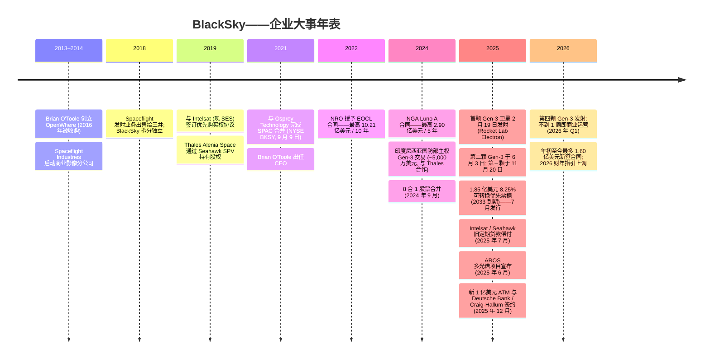
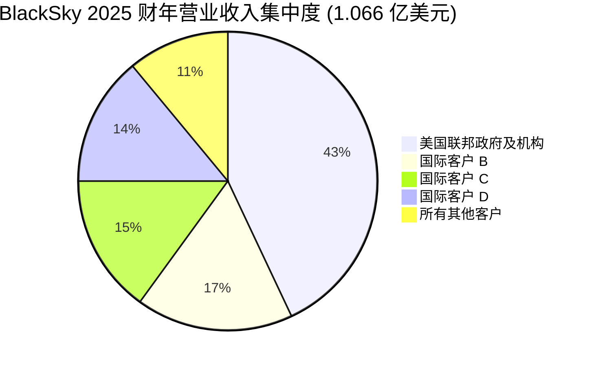

# BlackSky Technology Inc. (NYSE:BKSY) — 公司研究报告

**代码:** NYSE:BKSY  
**截至日期:** 2026-05-20  
**行业:** 商业地理空间情报 (geospatial intelligence) — 小卫星地球观测 (smallsat earth observation) + AI 分析  
**总部:** 美国弗吉尼亚州 Herndon 市 Dulles Corner Park 2411 号 300 室, 邮编 20171  
**员工总数 (2025 年末):** 321 人  
**报告语言: 简体中文 (英文版同时存在于本目录)**

---

> **业绩更新——2026 财年营业收入指引上调 (2026-05-07):** 管理层将 2026 财年全年营业收入指引上调至**1.30–1.50 亿美元** (此前 2026 年 2 月初始指引为 1.20–1.45 亿美元), 并将调整后 EBITDA (Adjusted-EBITDA) 指引上调至**1,200 万–2,400 万美元** (此前为 600 万–1,800 万美元), 同时维持 2026 财年资本开支 5,000 万–6,000 万美元的指引不变。本次上调反映年初至今最多达**1.60 亿美元的新签合同**, 其中包括与某主要国际国防部签订的 **2,500 万美元多年期订阅合同**, 提供 Gen-3 35cm 分辨率影像与 AI 分析服务; 以及某主要国际国防客户从 Gen-3 试点扩展至约 **3,000 万美元年订阅合同**。指引中位值意味着相较 2025 财年 1.066 亿美元营业收入实现约 31% 同比增长。
> 来源: [2026 财年 Q1 业绩公告, 2026-05-07](https://www.sec.gov/Archives/edgar/data/1753539/000175353926000057/exhibit991-blackskyq12026e.htm)。

## 目录

1. 公司概览
2. 公司历史
3. 管理团队
4. 产品与服务
5. 客户与上市策略
6. 行业概览
7. 竞争格局
8. 市场机会 (TAM)
9. 风险评估
   参考资料

======================================

## 1. 公司概览

BlackSky Technology Inc. 是一家总部位于美国弗吉尼亚州 Herndon 市的商业地理空间情报 (geospatial intelligence) 公司, 拥有并运营一个由高复访率 (high-revisit)、高分辨率小卫星 (smallsat) 组成的低地球轨道 (low-earth-orbit, LEO) 星座, 主要向美国及全球盟国政府的国防与情报客户提供卫星影像 (satellite imagery)、AI 生成分析以及端到端"主权" (sovereign) 卫星系统。公司成立于 2014 年, 自我定位为"一家基于太空的科技公司, 为全球最关键、最具战略意义的地点、经济资产及事件提供实时影像、分析以及高频监测" ([BlackSky 2025 财年 10-K 报告, Item 1](https://www.sec.gov/Archives/edgar/data/1753539/000175353926000032/bksy-20251231.htm))。

**业务构成——三大营业收入分部。** 自 2025 年 1 月 1 日起, BlackSky 将其利润表科目重新分类为三大板块: (1) **天基情报与 AI 服务 (Space-based intelligence & AI services)**——通过 BlackSky **Spectra 分析平台 (Spectra software platform)** 交付的订阅制"按需"(On-Demand) 和"保障"(Assured) 影像及分析产品; (2) **任务解决方案 (Mission Solutions)**——客户 (通常为某国国防部) 自行拥有其 Gen-3 卫星和地面段的整套主权系统, 由 BlackSky 技术栈构建并运营; (3) **先进技术项目 (Advanced Technology Programs)**——定制化研发与集成服务。2025 财年这三大板块分别贡献 6,510 万美元 (61.1%)、2,120 万美元 (19.9%) 和 2,020 万美元 (19.0%), 合并营业收入合计 1.066 亿美元 ([10-K FY2025, MD&A](https://www.sec.gov/Archives/edgar/data/1753539/000175353926000032/bksy-20251231.htm))。

**星座规模 (Constellation)。** 截至 2026 年 Q1, BlackSky 运营一个由姐妹公司 LeoStella 制造的传统 **Gen-2** (约 1 米电光成像) 微卫星 (microsatellite) 加新型 **Gen-3** 卫星组成的混合舰队, 后者提供 **35 厘米电光分辨率 (electro-optical resolution)** 和 **1.2 米短波红外 (short-wave-infrared, SWIR)** 成像能力, 可用于低光/夜间采集 ([10-K FY2025, Item 1](https://www.sec.gov/Archives/edgar/data/1753539/000175353926000032/bksy-20251231.htm))。首颗 Gen-3 卫星于 **2025 年 2 月 19 日**通过 Rocket Lab 第 60 次 Electron 火箭任务从新西兰 Mahia 升空 ([Via Satellite, 2025-02-19](https://www.satellitetoday.com/launch/2025/02/19/rocket-lab-launches-blackskys-first-gen-3-satellite-on-60th-electron-mission/)); 第二颗于 **2025 年 6 月 3 日**发射 ([Spaceflight Now, 2025-06-02](https://spaceflightnow.com/2025/06/02/rocket-lab-to-launch-blackskys-next-gen-3-satellite-on-electron-rocket-from-new-zealand/)); 第三颗于 **2025 年 11 月 20 日**发射 (BlackSky 此前为"机密"客户; [SpaceNews, 2025-11-27](https://spacenews.com/blacksky-announces-latest-gen-3-satellite-in-orbit-after-confidential-electron-launch/)); 第四颗于 2026 年 Q1 发射, "发射后数小时内即开始交付超高分辨率影像, 不到一周即快速进入商业运营" ([2026 财年 Q1 业绩公告, 2026-05-07](https://www.sec.gov/Archives/edgar/data/1753539/000175353926000057/exhibit991-blackskyq12026e.htm))。管理层已预告 2026 年还将进行多次专属 Electron 发射, 下一颗 Gen-3 卫星已运抵发射场。

**规模与财务。** 2025 财年营业收入 1.066 亿美元, 相较 2024 财年 1.021 亿美元同比增长 4.4%, 增长主要由任务解决方案 (Mission Solutions) 驱动 (同比+258%, 但基数较小), 但被先进技术项目同比下降 22.4% 以及订阅影像服务因一份大型传统合同到期而同比下降 7.1% 所拖累 ([10-K FY2025, MD&A——营业收入表](https://www.sec.gov/Archives/edgar/data/1753539/000175353926000032/bksy-20251231.htm))。年末未交付订单 (backlog) 达 **3.453 亿美元**, 同比+32%, 受 **2025 财年 2.40 亿美元合同新签订单**驱动——这是公司历史上最强劲的订单录入 ([Q4-2025 业绩公告, 2026-02-26](https://www.sec.gov/Archives/edgar/data/1753539/000175353926000009/exhibit991-blackskyq42025e.htm))。净亏损从 2024 财年 5,720 万美元扩大至 2025 财年 7,030 万美元; 自成立以来累计亏损达 7.561 亿美元 ([2026 财年 Q1 业绩公告, 2026-05-07](https://www.sec.gov/Archives/edgar/data/1753539/000175353926000057/exhibit991-blackskyq12026e.htm))。

*来源: 综合自 [BlackSky 2021 财年 10-K](https://www.sec.gov/Archives/edgar/data/1753539/000175353922000020/bksy-20211231.htm)、[2022 财年 10-K](https://www.sec.gov/Archives/edgar/data/1753539/000175353923000020/bksy-20221231.htm)、[2023 财年 10-K](https://www.sec.gov/Archives/edgar/data/1753539/000175353924000032/bksy-20231231.htm)、[2024 财年 10-K](https://www.sec.gov/Archives/edgar/data/1753539/000175353925000030/bksy-20241231.htm)、[2025 财年 10-K](https://www.sec.gov/Archives/edgar/data/1753539/000175353926000032/bksy-20251231.htm)。营业收入为利润表所列总营业收入; 未交付订单为营业收入附注中定义的"剩余履约义务"(remaining performance obligations)。*

**估值快照 (截至 2026-05-20)。** 股价为 45.83 美元 (52 周区间 9.88–46.44 美元), 对应市值约 **17.00 亿美元**, 按 3,710 万股稀释后股本计算; 企业价值 (EV) 为 **17.72 亿美元**, 系扣除 1.155 亿美元现金、加 2.109 亿美元债务后所得 ([Yahoo Finance—BKSY 关键统计指标, 2026-05-20](https://finance.yahoo.com/quote/BKSY/key-statistics/))。过去十二个月 (TTM) 数据及倍数:

| 指标 | BKSY (TTM) | Planet (PL) | Satellogic (SATL) | Rocket Lab (RKLB) |
|---|---|---|---|---|
| 股价 (美元) | 45.83 | 42.81 | 9.61 | 134.33 |
| 市值 (百万美元) | 1,701 | 15,255 | 1,425 | 77,744 |
| 企业价值 (百万美元) | 1,772 | 14,219 | 1,460 | 70,966 |
| TTM 营业收入 (百万美元) | 97.8 | 307.7 | 20.4 | 679.6 |
| TTM 市销率 (P/S) | **17.4×** | 49.6× | 69.7× | 114.4× |
| EV / 营业收入 | **18.1×** | 46.2× | 71.5× | 104.4× |
| TTM 市盈率 (P/E) | n/m (亏损) | n/m (亏损) | n/m (亏损) | n/m (亏损) |
| 营业收入同比 (最新季) | **−29.7%** | +41.1% | +80.3% | +63.5% |
| 毛利率 (gross margin) | 69.3% | 56.2% | 75.1% | 36.6% |

来源: [Yahoo Finance—BKSY](https://finance.yahoo.com/quote/BKSY/key-statistics/)、[PL](https://finance.yahoo.com/quote/PL/key-statistics/)、[SATL](https://finance.yahoo.com/quote/SATL/key-statistics/)、[RKLB](https://finance.yahoo.com/quote/RKLB/key-statistics/), 全部数据均于 2026-05-20 拉取。

**解读——为何 P/E 为负而 P/S 偏高。** BlackSky 从未实现 GAAP 盈利; 2025 财年 7,030 万美元的净亏损主要来自: 星座折旧造成的 3,030 万美元折旧摊销 (D&A); 8,740 万美元销售、一般及管理费用 (S,G&A, 其中含 1,960 万美元股票薪酬以及在不到 1.10 亿美元营业收入规模下运营一家上市公司的成本); 2.079 亿美元债务对应的 1,490 万美元利息支出; 以及 800 万美元的衍生权证 (derivative warrants) 损失——后者按市值计价随股价波动 ([10-K FY2025, MD&A](https://www.sec.gov/Archives/edgar/data/1753539/000175353926000032/bksy-20251231.htm))。公司自成立以来累计亏损 7.561 亿美元 ([10-K FY2025, 资产负债表](https://www.sec.gov/Archives/edgar/data/1753539/000175353926000032/bksy-20251231.htm))。这是烧现金的成长型亏损, 而非一次性减值。

17.4 倍的 P/S 仍**低于**小型小卫星同业中位值 (PL ~50×, SATL ~70×, RKLB ~114×)。两个因素压制倍数: (1) TTM 营业收入**下滑 29.7%**, 因为 2025 财年 Q1 包含一笔 900 万美元的任务解决方案一次性里程碑收入; (2) BlackSky 的增长在历史上显著波动 (2025 财年 GAAP 营业收入同比仅+4.4%, 而 2023 财年同比+44%)。尽管如此, 股价过去 12 个月内从 9.88 美元一路上涨至 45.83 美元, 得益于 Gen-3 部署、2025 财年 2.40 亿美元新签订单, 以及 2026 财年指引上调——这意味着市场已为指引桥梁所示的下半年增长定价 (2026 财年中位 1.40 亿美元 = 同比+31%)。第 9 章对**估值/倍数压缩风险**有专门讨论, 因为当前 TTM 增长与估值均假设 2026 财年的拐点能按指引兑现。

## 2. 公司历史

BlackSky 创立于 **2014 年**, 总部最初设于西雅图, 作为 Spaceflight Industries 旗下的商业影像分公司。最初的创业逻辑——AI 驱动的软件加上廉价的 LEO 小卫星, 将颠覆传统 GeoEye/DigitalGlobe 那种 5 亿美元定制成像卫星的旧模式——最早由创始人兼前 CTO、现任 CEO Brian O'Toole (GeoEye 老将) 提出 ([BlackSky 2025 年 DEF 14A——董事简历](https://www.sec.gov/Archives/edgar/data/1753539/000175353925000081/blacksky2025proxystatement.htm))。公司于 2018 年从 Spaceflight Industries 拆分出来, 同期 Spaceflight Industries 的发射服务业务被出售给日本三井物产 (Mitsui & Co.), 留下 BlackSky 作为一家纯粹的影像分析公司。

早期公司架构中的一个关键条款是 2019 年 10 月与 Intelsat Jackson Holdings (现为 SES 一部分) 签订的**优先购买权协议 (Right of First Offer Agreement)**, 该协议给予 Intelsat/SES 对子公司 BlackSky Holdings, Inc. 任何出售交易的优先了解权, 有效期至 2026 年 10 月 31 日 ([10-K FY2025, Item 1A](https://www.sec.gov/Archives/edgar/data/1753539/000175353926000032/bksy-20251231.htm))。BlackSky 另一个重要战略股东是 **Seahawk SPV Investment LLC**, 该实体最终由 **Thales Alenia Space** (法意联合卫星制造合资企业) 控制, 持有 5.9% 普通股, 并在主权系统交付 (例如印度尼西亚的主权系统) 中作为任务解决方案合作伙伴 ([2025 DEF 14A——5% 持股人表](https://www.sec.gov/Archives/edgar/data/1753539/000175353925000081/blacksky2025proxystatement.htm))。

BlackSky 于 **2021 年 9 月 9 日**通过与 **Osprey Technology Acquisition Corp.** 的 SPAC 合并完成上市, 募资旨在资助 Gen-2 建设以及 Gen-3 开发项目。公司从未重回 SPAC 上市初期的高位; 2024 年其执行了一次 **2024 年 9 月 6 日的 8 合 1 股票合并 (1-for-8 reverse stock split)**, 以恢复 NYSE 上市价格合规 ([10-K FY2024——Item 5](https://www.sec.gov/Archives/edgar/data/1753539/000175353925000030/bksy-20241231.htm))。

**战略性转折。** 当前投资逻辑中, 三次转型至关重要。**第一**, 从销售单次场景影像转向 Spectra 平台上的**订阅制**"按需"与"保障"服务——这大致让影像服务的毛利率结构翻倍, 并将波动的一次性收入转换为递延收入未交付订单 (deferred-revenue backlog)。**第二**, **任务解决方案**转型——出售完整的主权系统, 从印度尼西亚/Thales 交易开始——大幅提升了每笔交易的合同价值 (印度尼西亚: 多年期约 5,000 万美元; 2026 年 2 月未具名客户: "八位数" ([BusinessWire, 2026-02-17](https://www.businesswire.com/news/home/20260217069416/en/BlackSky-Signs-New-Eight-Figure-International-Contract-for-Accelerated-Delivery-of-Gen-3-Sovereign-Space-Based-Intelligence-Solution))), 但也引入了更高的任务解决方案销售成本科目 (2025 财年 1,090 万美元, 相较 2024 财年 500 万美元)。**第三**, **Gen-3 爬坡**, 同时实现 (a) 通过新增 35cm 和 SWIR 能力 (此前需 Maxar 的 WorldView 才能提供) 提升可寻址市场, 以及 (b) 带来 2025 财年 4,660 万美元、2026 财年指引 5,000 万–6,000 万美元的多年资本开支项目 ([2026 财年 Q1 公告](https://www.sec.gov/Archives/edgar/data/1753539/000175353926000057/exhibit991-blackskyq12026e.htm))。

**并购。** BlackSky 的并购历史较为简单: 2016 年收购 **OpenWhere** (Brian O'Toole 此前创业项目), 为 Spectra 分析平台奠定基础; 此后未进行实质性并购。

## 3. 管理团队

### Brian E. O'Toole——总裁兼首席执行官 (President, Chief Executive Officer), 董事

Brian O'Toole 自 2021 年 9 月 SPAC 合并以来一直担任 BlackSky CEO, 并于 2018 年 11 月加入前身私营公司任总裁, 此前自 2016 年 6 月起担任 CTO。加入 BlackSky 之前, O'Toole 是 **OpenWhere, Inc. 的创始人兼 CEO** (2013–2016), 该公司为公共及私营部门客户提供全球规模地理空间情报解决方案; 前身 BlackSky 于 2016 年 6 月将其收购, 并将其作为 **Spectra** 软件平台的技术基础。2008 年 8 月至 2013 年 6 月, 他担任 **GeoEye, Inc. CTO**——这家上市高分辨率影像运营商于 2013 年被 DigitalGlobe 收购, 最终并入 Maxar——他"领导在地理空间情报和位置服务方面开发与扩展技术、产品和解决方案的战略性工作" ([2025 DEF 14A——董事及高管简历](https://www.sec.gov/Archives/edgar/data/1753539/000175353925000081/blacksky2025proxystatement.htm))。更早期的职位包括 Overwatch Systems (Textron 旗下地理空间软件业务) 产品开发副总裁、ITspatial 创始人兼总裁, 以及 GE Aerospace 9 年技术总监与系统工程师经历。

O'Toole 拥有 Clarkson University 计算机科学学士学位及 Syracuse University 计算机工程硕士学位 ([DEF 14A 2025](https://www.sec.gov/Archives/edgar/data/1753539/000175353925000081/blacksky2025proxystatement.htm))。他是一位软件与系统工程操盘手 (而非卫星硬件构建者), 其 25 年从业生涯——从 GE Aerospace 到 Overwatch、GeoEye 和 OpenWhere, 再到 BlackSky——都在地理空间行业的*软件与影像融合*侧, 这正是 BlackSky 围绕的核心论点。他的公开姿态一直保持一致: 过去六个季度每次业绩公告都明确将公司定位为"实时、太空型情报", 而非"卫星运营商"; Gen-3 叙事强调"发射后到成像时间"(发射后几小时即可商业运营), 而非单纯的空间分辨率。

**持股与薪酬。** 截至 2025 年 6 月 30 日, O'Toole 实际持有**485,454 股** (占已发行股本 1.4%), 其中 334,133 普通股加 60 天内可行使期权 151,321 股 ([2025 DEF 14A——实际持股表](https://www.sec.gov/Archives/edgar/data/1753539/000175353925000081/blacksky2025proxystatement.htm))。其 2024 年薪酬总额为**254 万美元** (基本薪资 498,750 美元; 股票奖励 158 万美元; 现金奖金 461,344 美元; 其他 3,564 美元), 低于 2023 年 345 万美元, 主要因 2024 年未授予股票期权 ([DEF 14A 2025——薪酬汇总表](https://www.sec.gov/Archives/edgar/data/1753539/000175353925000081/blacksky2025proxystatement.htm))。其雇佣协议下的薪酬设计提供 RSU 目标股权 937,500 美元加 2 倍 RSU 数量的购股期权, 第一周年首期归属 25%, 之后按季度归属——与软件/中盘科技公司同业惯例一致, 并非创始人级控制权安排。

**评价。** O'Toole 是当前阶段合适的 CEO: 一位软件与系统型领导者, 在执行一项硬件密集型星座爬坡的同时, 依靠合作伙伴 (发射靠 Rocket Lab, 卫星总线靠 LeoStella, 部分任务解决方案集成靠 Thales) 来填补 BlackSky 不擅长建造的部分。其在 GeoEye 和 OpenWhere 的过往业绩支持该战略。主要短板是 BlackSky 在他任期内从未实现 GAAP 盈利, 而 Gen-3 生产/发射/在轨试运行节奏在 Rocket Lab 发射之外的验证历史仍然有限。

### Henry Dubois——首席财务官 (Chief Financial Officer)

Henry Dubois 自 2022 年 6 月起担任 CFO。对一家卫星影像公司而言至关重要的是, Dubois 此前的职业生涯**几乎完全**在商业地理空间影像领域: 2005 年 2 月至 2012 年 12 月任 **GeoEye CFO**, 在此期间他"协助营业收入从 3,000 万美元增长至 3.50 亿美元", 并在 GeoEye 被 DigitalGlobe 并购 WorldView 之前主持公司运营; 此前他在 **DigitalGlobe** 担任多个高管职位, 包括总裁、CFO 和 COO ([2025 DEF 14A——高管简历](https://www.sec.gov/Archives/edgar/data/1753539/000175353925000081/blacksky2025proxystatement.htm))。他于 2021 年 9 月加入 BlackSky 任首席发展官 (Chief Development Officer), 之后接任 CFO。他还曾短暂担任健康筛查公司 Hooper Holmes Inc. CEO, 该公司在其任期之后于 2018 年 8 月申请 Chapter 11 破产保护——这是代理声明书披露的历史事件, 应予以承认, 但与卫星运营无关。

Dubois 持有 Northwestern Kellogg 商学院 MBA (金融/营销/会计) 及 Holy Cross 数学学士学位。2024 年薪酬总额: **224 万美元**。实际持股: **232,260 股** (不到 1%), 其中包括 60 天内可行使期权 139,250 股 ([DEF 14A 2025](https://www.sec.gov/Archives/edgar/data/1753539/000175353925000081/blacksky2025proxystatement.htm))。他在 2025 年 7 月主导的 1.85 亿美元可转换债券融资, 用于偿付 12% 利率的 Intelsat / Seahawk 旧债务并将平均债务成本降至 8.25%, 是迄今为止其任期内最清晰的战绩。

### Christiana Lin——总法律顾问兼首席行政官 (General Counsel and Chief Administrative Officer)

Lin 自 2022 年 2 月起担任 GC 和 CAO, 也是促成 SPAC 合并的交易律师。她拥有逾二十年上市公司法律经验: 2001–2017 年在 **Comscore** 任 GC、首席隐私官及公司秘书, 协助公司从早期初创成长为市值 4.50 亿美元的上市公司; 2018–2021 年在 **Rakuten Advertising** 任 GC、首席隐私与行政官。Georgetown Law J.D., Yale 学士 ([DEF 14A 2025](https://www.sec.gov/Archives/edgar/data/1753539/000175353925000081/blacksky2025proxystatement.htm))。2024 年薪酬总额: 183 万美元。

### 治理结构注脚

- **董事会组成。** 7 名董事: O'Toole (执行董事); 6 名独立董事——William Porteous (RRE Ventures, 董事长)、Magid Abraham (Comscore 创始人)、Susan Gordon (前国家情报副主任)、Timothy Harvey、David DiDomenico (JANA Partners) 以及 James Tolonen (Novell、Business Objects 前 CFO)。7 名董事中 6 名符合 NYSE 独立性标准 ([2025 DEF 14A——董事会独立性](https://www.sec.gov/Archives/edgar/data/1753539/000175353925000081/blacksky2025proxystatement.htm))。董事会采取三类、错期三年的分类结构。
- **内部人持股。** 截至 2025 年 6 月 30 日, 全体董事及高管 (9 人) 合计持有 **1,354,013 股 = 3.8%**——有意义但非创始人控制水平。最大 5% 持有人: AWM Investment Company 8.0%, Mithril LP (Peter Thiel / Ajay Royan) 6.7%, 以及 Seahawk SPV (Thales Alenia Space) 5.9% ([DEF 14A 2025](https://www.sec.gov/Archives/edgar/data/1753539/000175353925000081/blacksky2025proxystatement.htm))。Thales 持股是任务解决方案合作的战略锚定; Mithril 是历史上 Peter Thiel 的创投基金。
- **薪酬结构。** 三要素薪酬 (基本工资 + 现金奖金 + RSU/期权); 约 75% 的 NEO 薪酬与股权挂钩。无 Section 162(m) "基于业绩"超额薪酬豁免条款; CEO 奖金目标为基本工资 100%, CFO 为 80%, 按营业收入、合同新签订单及调整后 EBITDA 平衡计分卡支付。
- **关联方提示。** Intelsat 对子公司 BlackSky Holdings 的优先购买权于 2026 年 10 月 31 日到期失效——任何潜在战略交易前的清理动作。Seahawk/Thales 5.9% 持股在任务解决方案上形成有距离但实质性的商业对手关系。

### 管理团队过往业绩——综合判断

BlackSky 组建的高级管理团队对一家 17 亿美元市值的太空科技公司而言出奇地有资历: CEO 和 CFO 都执掌过上一代商业影像赢家 (GeoEye 和 DigitalGlobe), GC 搭建过 Comscore 的 IPO 与上市后合规体系, 董事会还包括前 PDDNI (Susan Gordon)——直接针对美国情报圈客户集中度问题。短板: BlackSky 从未实现 GAAP 盈利, Gen-3 星座仍在爬坡阶段, 也没有持有实质性经济股权的创始人来锚定多十年的利益一致性。综合来看, 这是"一支运营团队在重建他们曾经赢过一次的品类"的故事。

## 4. 产品与服务

BlackSky 按三大营业收入分部 (加一个分析平台) 组织其产品目录。下文逐一描述, 并附竞争优势评判。

### A. 天基情报与 AI 服务 (2025 财年营业收入的 61.1%)

旗舰产品线, 通过年度或多年期**订阅合同**销售, 提供分级定价:

1. **BlackSky Spectra® 平台**——所有影像与分析通过此软件层进行任务调度、交付和与第三方数据融合。Spectra 提供自动化 tip-and-cue 任务调度、任务规划、星座指挥与控制以及 AI 驱动的变化检测/对象检测分析 ([BlackSky 10-K FY2025—Item 1](https://www.sec.gov/Archives/edgar/data/1753539/000175353926000032/bksy-20251231.htm); [blacksky.com / Spectra](https://blacksky.com/spectra/))。
   - *竞争优势:* **部分有。** Spectra 是商业地球观测领域仅有的三个垂直整合的"任务调度+分析"平台之一 (另外两个是 Maxar 的 GeoHIVE / WorldView 平台和 Planet 的 Tasking API)。护城河来自数据与网络: 客户的工作流、训练数据和自动告警都已围绕 BlackSky 的复访节奏校准, 切换成本中等。最接近的竞品是**Maxar 的 GeoHIVE**——Maxar 在分辨率传统和影像档案库方面领先, BlackSky 在 AI 分析工具上与之持平, 在复访节奏上领先。
2. **按需订阅 (On-Demand subscription)**——按任务调度付费的影像与分析, 优先级灵活; 入门级商业产品 ([BlackSky On-Demand 产品页](https://blacksky.com/on-demand/))。
3. **保障订阅 (Assured subscription)**——在指定客户关注区域上保障卫星任务调度容量, 享有最高优先级采集; 面向国防客户的高端产品。2026 财年 Q1 业绩公告中提到某国际国防部签订的 2,500 万美元多年期订阅合同, 用于"Assured 访问最佳同类 35cm 太空影像与 AI 分析" ([2026 财年 Q1 公告, 2026-05-07](https://www.sec.gov/Archives/edgar/data/1753539/000175353926000057/exhibit991-blackskyq12026e.htm))。
   - *竞争优势:* **有——切换成本与认证。** Assured 合同通常锁定到特定轨道任务窗口与勘测区域, 与国家安全特定工作流绑定的多年期条款; 一旦某国围绕 BlackSky 的复访节奏与 35cm 影像建立了任务调度管道与分析师培训, 替换的成本极高。最接近的竞品是**Maxar 的 SecureWatch**——在保障性上持平, 在传统档案库上领先, 在复访节奏上落后。
4. **AI 分析 (AI Analytics)**——自动检测船舶、飞机、车辆、基础设施变化以及经济指标监测 (停车场车辆数、油罐液位、港口活动)。可独立销售或与影像捆绑。10-K 中描述 Spectra AI 模型为"专门构建"——即基于 BlackSky 自有的影像语料训练, 而非通用视觉基础模型。
   - *竞争优势:* **部分有。** 差异化的 AI 训练数据是真实的, 但分析市场正被垂直 AI 初创公司快速商品化 (HawkEye 360 做 RF, Ursa Space 做 SAR 融合)。护城河 = 数据 + 政府级认证 (FedRAMP, ITAR), 而非算法 IP。

### B. 任务解决方案 (2025 财年营业收入的 19.9%, 同比+258%)

向希望拥有自有地球观测能力的国家政府销售**主权卫星系统 (sovereign satellite systems)** 的端到端交付: BlackSky 建造并交付 Gen-3 卫星 (通常与 Thales Alenia Space 联合制造)、地面站、发射支持、运营软件及培训。客户对其国境内的卫星和数据保有完整托管权。

- **锚定交易:** 2024 年 2 月公告印度尼西亚国防部交易, 多年期合同约 5,000 万美元 (与 **Thales Alenia Space** 及印度尼西亚合作伙伴 **PT Len** 共同交付), 印度尼西亚将拥有 BlackSky 两颗下一代地球观测卫星 ([BusinessWire, 2024-02-08](https://www.businesswire.com/news/home/20240208512218/en/BlackSky-Wins-Approximately-50-Million-in-Multi-Year-Contracts-for-Gen-3-Capabilities-and-Services-to-Accelerate-Sovereign-Space-Capabilities-for-Indonesian-Ministry-of-Defense))。
- **2026 年 Q1 新签:** 一份**八位数国际合同**, 用于加速交付主权 Gen-3 系统 (2026 年 2 月; [BusinessWire, 2026-02-17](https://www.businesswire.com/news/home/20260217069416/en/BlackSky-Signs-New-Eight-Figure-International-Contract-for-Accelerated-Delivery-of-Gen-3-Sovereign-Space-Based-Intelligence-Solution)); 以及一份"超过 3,000 万美元"的多年期合同, 用于将 Gen-3 战术 ISR 服务集成至某国际客户的安全环境 ([BlackSky 公告, 2026](https://blacksky.com/press-releases/blacksky-wins-more-than-30-million-multi-year-contract-to-integrate-gen-3-tactical-isr-services-into-international-customers-secure-environment/))。
- *竞争优势:* **有——监管+集成。** 主权交易要求 ITAR / 出口管制审批、NATO 级加密以及现场培训运营支持——这些高门槛排除了纯小卫星建造商 (Capella、Iceye、Satellogic)。自然的竞争对手是 Maxar (其建造高端主权系统, 但价格高出 5 倍以上) 以及 Airbus Defence & Space (Pléiade-Neo, 但更重、节奏更慢)。最接近的竞品是**Maxar 的主权系统** (例如沙特阿拉伯"KSA"卫星)——在传承上领先, 在价格和交付时间上落后。

### C. 先进技术项目 (2025 财年营业收入的 19.0%, 同比−22.4%)

由单个客户资助的定制研发、集成及客户特定软件功能工作——主要是美国政府研发合同。该板块 2025 财年营业收入下滑, 因两个大型美国政府研发项目结束。展望未来, 此板块是非经常性工程工作的兜底科目, 管理层视为波动收入。

- *竞争优势:* **无护城河。** 这是低毛利率的专业服务收入; 作为切入客户关系的楔子有用, 但本身不具战略意义。

### D. AROS 多光谱项目 (2025 年 6 月公告, 首次发射目标 2027 年)

2025 年 6 月 BlackSky 公开了 **AROS**——计划中的新一代多光谱、大面积采集卫星星座, 旨在通过 tip-and-cue 协同补充高复访率 Gen-3 舰队。AROS 设计用于国家级数字制图、导航、海事监测以及 3D 数字孪生应用, 将 BlackSky 的 TAM 从"监测"扩展到"制图"——直接进入 Planet Labs 核心 SuperDove 业务领域 ([BlackSky 公告, 2025-06-16](https://ir.blacksky.com/news-events/press-releases/news-details/2025/BlackSky-to-Expand-Constellation-to-Deliver-High-Cadence-Multi-Spectral-Broad-Area-Collection-Capabilities-06-16-2025/default.aspx))。目前处于开发阶段, 由合作伙伴提供支持; 尚未产生营业收入。

- *竞争优势:* **尚无——取决于执行力。** AROS 距离商业营业收入还有数年; 公告是 Planet 的 WorldView Legion / Pelican 开发之前的战略卡位。

### 旗舰产品 vs 长尾

业务的**旗舰**是面向盟国国防部销售的捆绑 Spectra 平台 + Gen-3 Assured 订阅。这是 2025 财年 2.40 亿美元新签订单以及未交付订单同比+32% 增长的来源。**任务解决方案**主权卫星交易是最大的*单笔*营业收入贡献者, 但波动较大。先进技术项目和仅 Gen-2 的传统订阅属于长尾/下降业务。

```mermaid
graph TD
    A[BlackSky Technology Inc.] --> B[天基情报与 AI 服务<br/>FY25: $65.1M, 61%]
    A --> C[任务解决方案<br/>FY25: $21.2M, 20%]
    A --> D[先进技术项目<br/>FY25: $20.2M, 19%]
    B --> B1[BlackSky Spectra 软件平台]
    B --> B2[按需订阅]
    B --> B3[保障订阅 &lt;35cm Gen-3&gt;]
    B --> B4[AI 分析: 船舶、车辆、变化检测]
    C --> C1[主权 Gen-3 卫星交付]
    C --> C2[地面段建设与运营支持]
    C --> C3[印尼国防部 &#40;~$50m, Thales 合作&#41;]
    C --> C4[8 位数国际国防部 &#40;2026 年 2 月&#41;]
    D --> D1[客户出资研发]
    D --> D2[集成服务]
    A --> E[AROS 多光谱 &#40;开发中——2027 年目标发射&#41;]
```

*来源: [10-K FY2025—Item 1](https://www.sec.gov/Archives/edgar/data/1753539/000175353926000032/bksy-20251231.htm)、[BlackSky 产品页](https://blacksky.com/)、[2026 财年 Q1 业绩公告](https://www.sec.gov/Archives/edgar/data/1753539/000175353926000057/exhibit991-blackskyq12026e.htm)。*

### 近期发射与产品退出 (过去 12 个月)

| 日期 | 事件 |
|---|---|
| 2025 年 2 月 | 首颗 Gen-3 卫星发射, 实现 35cm 分辨率 + SWIR ([Via Satellite, 2025-02-19](https://www.satellitetoday.com/launch/2025/02/19/rocket-lab-launches-blackskys-first-gen-3-satellite-on-60th-electron-mission/)) |
| 2025 年 6 月 | 第二颗 Gen-3 通过 Electron 发射 ([Spaceflight Now, 2025-06-02](https://spaceflightnow.com/2025/06/02/rocket-lab-to-launch-blackskys-next-gen-3-satellite-on-electron-rocket-from-new-zealand/)) |
| 2025 年 6 月 | AROS 多光谱星座项目宣布 |
| 2025 年 7 月 | 发行 1.85 亿美元 8.25% 可转换优先票据 (2033 到期); 偿付 Intelsat 传统定期贷款 |
| 2025 年 11 月 | 第三颗 Gen-3 发射 ([SpaceNews, 2025-11-27](https://spacenews.com/blacksky-announces-latest-gen-3-satellite-in-orbit-after-confidential-electron-launch/)) |
| 2026 年 2 月 | 八位数国际 Gen-3 任务解决方案交易 |
| 2026 年 Q1 | 第四颗 Gen-3 卫星在轨; 发射后一周内进入商业运营 |

过去 12 个月内没有正式退出任何产品; Gen-2 星座继续在轨服役并提供复访能力, 但新合同越来越依赖 Gen-3。

*来源: 卫星数量综合自 [BlackSky 2021–2025 财年 10-K](https://www.sec.gov/cgi-bin/browse-edgar?action=getcompany&CIK=0001753539&type=10-K&dateb=&owner=include&count=40)、[2026 财年 Q1 业绩公告](https://www.sec.gov/Archives/edgar/data/1753539/000175353926000057/exhibit991-blackskyq12026e.htm) 及 [eoPortal—BlackSky 星座](https://www.eoportal.org/satellite-missions/blacksky-constellation)。Gen-2 数量为运营状态的近似值; 部分卫星已退役或处于延长寿命末期服役状态。*

## 5. 客户与上市策略

### 客户集中度——实质性且已量化

BlackSky 的客户基础高度集中, 且完全由**政府主导**。2025 财年公司有**四个客户各占总营业收入超过 10%, 合计占总营业收入 89%** (2024 财年: 三个客户合计 88%; 2023 财年: 三个合计 67%; 2022 财年: 两个合计 42%) ([10-K FY2025, Item 1A 及营业收入附注](https://www.sec.gov/Archives/edgar/data/1753539/000175353926000032/bksy-20251231.htm))。2025 财年具名拆解如下:

| 客户 | 地区 | 2025 财年营业收入占比 | 2024 财年营业收入占比 |
|---|---|---|---|
| 美国联邦政府及机构 (NRO / NGA / 太空军, 合计) | 美国 | **43%** | 60% |
| 客户 B (国际政府) | 美国以外 | 17% | 16% |
| 客户 C (国际政府) | 美国以外 | 15% | < 10% |
| 客户 D (国际政府) | 美国以外 | 14% | 12% |
| **前 4 客户合计** | | **89%** | **88%** |

来源: [10-K FY2025—营业收入集中度附注](https://www.sec.gov/Archives/edgar/data/1753539/000175353926000032/bksy-20251231.htm)。

三个"美国以外"客户在 10-K 中未具名, 但各自与不同国家关联, 披露表明全部为国家国防部。行业报道强烈暗示印度尼西亚 (客户 B / 首个主权任务解决方案交易)、印度以及第三个亚太或中东客户是可能的候选者——但 10-K 明确指出未具名, 因此我们仅标识为"国际国防客户"。

*来源: [10-K FY2025—营业收入集中度附注](https://www.sec.gov/Archives/edgar/data/1753539/000175353926000032/bksy-20251231.htm)。*

### 政府终端客户拆分

过去三年, 营业收入结构已大幅向**国际**政府转移:

| 财年 | 美国联邦政府 | 国际政府 | 商业/其他 |
|---|---|---|---|
| 2023 财年 | 60% | 27% (估算) | 13% (估算) |
| 2024 财年 | 6,130 万美元 (60%) | 3,800 万美元 (37%) | 290 万美元 (3%) |
| 2025 财年 | 4,580 万美元 (43%) | 5,800 万美元 (54%) | 280 万美元 (3%) |

来源: [10-K FY2025—附注 5 营业收入拆解](https://www.sec.gov/Archives/edgar/data/1753539/000175353926000032/bksy-20251231.htm)。

2025 财年美国联邦政府营业收入绝对值下滑 (6,130 万美元 → 4,580 万美元), 因一份大型美国政府专业服务传统合同到期, 而国际政府营业收入则在印度尼西亚交付以及新亚太订阅合同推动下增长 53% 至 5,800 万美元。**商业营业收入微不足道** (~3%)——BlackSky 本质上是一家 B2G 国防供应商。

*来源: [10-K FY2025—附注 5 营业收入拆解](https://www.sec.gov/Archives/edgar/data/1753539/000175353926000032/bksy-20251231.htm)。2023 财年拆分基于 [10-K FY2024](https://www.sec.gov/Archives/edgar/data/1753539/000175353925000030/bksy-20241231.htm) 与 [10-K FY2023](https://www.sec.gov/Archives/edgar/data/1753539/000175353924000032/bksy-20231231.htm) 估算。*

### 锚定政府项目

- **NRO 电光商业层 (Electro-Optical Commercial Layer, EOCL)**——2022 年 5 月, 美国国家侦察办公室授予 BlackSky 一份 10 年期合同, 价值**最高 10.21 亿美元**, 其中 5 年期基础订阅价值 8,550 万美元, 同时还向 Maxar 和 Planet 授予更大合同 ([SpaceNews, 2022-05-25](https://spacenews.com/blacksky-maxar-planet-win-10-year-nro-contracts-for-satellite-imagery/); [NRO 公告, 2022-05](https://www.nro.gov/News-and-Media/News-Articles/Article/3135765/nro-announces-largest-award-of-commercial-imagery-contracts/))。根据 10-K, EOCL 将 BlackSky 影像分发至"50 万情报、国防及联邦民事机构用户"。上限是合同最高值, 不是最低保障值——实际年度提款远低于头条数字。
- **NGA Luno A**——2024 年 10 月 BlackSky 中标 5 年期 **NGA Luno A** 合同, 价值**最高 2.90 亿美元**, 用于监测全球经济与环境活动, 通过 BlackSky 高复访率影像之上的 AI 驱动变化检测分析 ([BlackSky 公告, 2024](https://www.blacksky.com/blacksky-wins-five-year-nga-luno-a-contract-valued-up-to-290-million-to-monitor-global-economic-activity-and-military-capability/))。Luno A 是 2021 年 NGA 经济指标监测 (EIM) 项目的继任者, 后者上限为 6,000 万美元。BlackSky 还在 **Luno B** (更广泛的军事能力监测) 下运营, 并在 2026 年 Q1 获得"七位数"Luno 续约 ([2026 财年 Q1 公告, 2026-05-07](https://www.sec.gov/Archives/edgar/data/1753539/000175353926000057/exhibit991-blackskyq12026e.htm))。
- **印度尼西亚国防部主权系统**——5,000 万美元多年期交付, 与 Thales Alenia Space 及 PT Len 合作 (2024 年 2 月)。

### 未交付订单动态

2025 财年末未交付订单 **3.453 亿美元** (相较 2024 财年 2.617 亿美元 = 同比+32%), 预计转化时间表为: **2026 财年 7,730 万美元, 2027 财年 5,520 万美元, 此后 2.128 亿美元** ([10-K FY2025—附注 5](https://www.sec.gov/Archives/edgar/data/1753539/000175353926000032/bksy-20251231.htm))。两点观察:

1. 2026 财年未交付订单转出 7,730 万美元仅占 2026 财年营业收入指引中位 (1.40 亿美元) 的约 55%——意味着 2026 财年大约**6,000 万–6,500 万美元营业收入必须来自 2025 年末尚未签订的合同**。2026 年 Q1 公告中"最多 1.60 亿美元"的新签合同已大幅收窄此缺口 (2,500 万美元 Assured + 3,000 万美元 Gen-3 战术 + 八位数主权 + 其他交易)。
2. "此后"部分 (2.128 亿美元, 占未交付订单约 62%) 严重后置——对多年期国防订阅合同而言属正常, 但也意味着头条未交付订单的大部分将不会在 3 年内转化为营业收入。

### 合同结构

- **订阅合同** (天基情报服务): 通常为年度或多年期总协议加分级定价; 美国政府合同通常包含"为方便而终止" (termination-for-convenience) 条款 ([10-K FY2025, Item 1A](https://www.sec.gov/Archives/edgar/data/1753539/000175353926000032/bksy-20251231.htm))。
- **任务解决方案:** 基于里程碑的固定价格合同, 交付义务跨越 2–3 年; 收入按成本对成本完工百分比 (cost-to-cost percentage of completion) 在期间内确认。Q1 2025 与 Q1 2026 任务解决方案营业收入的波动 (980 万 vs 200 万美元) 反映这种里程碑会计。
- **先进技术项目:** 成本加成或固定价格美国政府研发合同。

### 上市策略

BlackSky 通过美国政府销售团队 (持有安全许可的人员; 联邦采购条例/DFARS 专业知识) 和国际 BD 团队**直销**给政府客户, 后者经常与各国大型承包商及本地系统集成商合作 (印度尼西亚的 Thales Alenia Space、PT Len)。商业订阅没有有意义的渠道伙伴计划。销售周期较长——订阅合同通常需 12–24 个月, 任务解决方案合同 24–48 个月——并因此带有显著波动性。

## 6. 行业概览

### 行业定义

BlackSky 运营在**商业卫星地球观测 (EO) 与地理空间情报 (GEOINT) 服务**行业——NAICS 517410 (卫星电信) 与 NAICS 541370 (测量与制图服务) 以及 541715 (物理科学研发, 用于 AI 分析层) 重叠。该行业销售两类输出: (1) 影像及其他太空采集传感器数据; (2) 从数据中提取的分析 (识别对象、检测变化、预测性监测)。终端客户集中于国防/情报、民用政府 (灾害响应、气候、农业) 以及商业垂直行业 (保险、能源、金融/经济活动)。

### 市场结构与规模

多家研究机构对该行业进行规模量化, 数字取决于范围是"卫星影像+分析"(狭义) 还是"地理空间情报"(广义, 含地面采集的地理空间数据):

- **地理空间情报市场 (广义):** 2025 年 371.3 亿美元 → 2030 年 628.8 亿美元, CAGR 11.1% ([MarketsandMarkets, "地理空间情报市场 2030", 2025](https://www.marketsandmarkets.com/PressReleases/geospatial-intelligence.asp))。
- **地理空间影像分析 (狭义):** 2025 年 121.2 亿美元 → 2030 年 185.5 亿美元, CAGR 8.9% ([MarketsandMarkets, "地理空间影像分析市场 2030", 2025](https://www.marketsandmarkets.com/PressReleases/geospatial-imagery-analytics.asp))——这是 BlackSky 在其 10-K 中引用的数字。
- **商业卫星地球观测营业收入 (Euroconsult / Novaspace 估算, 行业媒体引用):** 2025 年 40–50 亿美元, 预计 2030 年达 70–80 亿美元——这是 BlackSky 和 Planet 最直接可寻址的细分市场。

*来源: [MarketsandMarkets—地理空间情报市场, 2025–2030](https://www.marketsandmarkets.com/Market-Reports/geospatial-intelligence-market-198354497.html); [MarketsandMarkets—地理空间影像分析市场, 2025–2030](https://www.marketsandmarkets.com/Market-Reports/geospatial-imagery-analytics-market-221633264.html)。中间年份按公布 CAGR 插值。*

### 增长驱动因素

1. **主权空间项目。** 盟国 (澳大利亚、日本、韩国、印度、沙特阿拉伯、印度尼西亚、阿联酋、多个 NATO 成员国) 正在资助本土地球观测能力, 而非依赖美国政府共享或纯商业采购。BlackSky 称"欧洲、亚太及中东国家宣布在 2030 年之前投入数十亿支持主权小卫星解决方案的采购" ([10-K FY2025, Item 1](https://www.sec.gov/Archives/edgar/data/1753539/000175353926000032/bksy-20251231.htm))。
2. **AI 驱动分析。** 视觉基础模型 (vision-foundation models) 和自动化变化检测正在降低每个洞察的人工分析师成本, 扩展商业影像的实用使用场景 (零售股权停车场计数、油罐液位测量、船舶跟踪)。
3. **战术国防需求。** 俄乌战争 (2022–) 展示了商业亚米级影像在 OSINT 和战场规划中的运营价值。多个 NATO 国防部已建立直接商业影像采购预算——对 BlackSky 和 Maxar 的结构性顺风。
4. **小卫星经济。** 过去十年, 每公斤入轨成本下降约 10 倍 (Rocket Lab Electron + SpaceX Falcon 9 拼车), 使年度资本开支低于 2 亿美元的星座替换经济变得可行。

### 监管环境

- **NOAA 商业遥感许可 (美国):** BlackSky 的 Gen-3 35cm 影像在 2020 年后的"Tier 1"框架下运营, 该框架取消了 50cm 分辨率上限——这是惠及 Maxar (已在 30cm) 及现在 BlackSky 的监管解锁。
- **快门控制 (Shutter control):** 美国许可的运营商可被命令限制对指定区域的成像 (例如 2020 年前根据 Kyl-Bingaman 修正案对以色列的限制, 行动期间对美国/盟国军事区的限制)。BlackSky 未公开披露任何快门控制事件。
- **ITAR / EAR (美国):** 限制国际销售国防级成像卫星; 主权任务解决方案交易需国务院许可。
- **FedRAMP / IL-4/5/6 (美国政府):** BlackSky 持有将数据交付至涉密美国政府环境所需的认证。

### 竞争动态

行业已显著整合:

- **Maxar Technologies**——曾是 30cm 市场主导供应商; 2023 年 5 月被 Advent International 以 64 亿美元私有化 (约 53 美元/股), 现在作为 **Maxar Intelligence** 加 **Maxar Space Systems** (原 SSL 卫星总线业务) 运营。Maxar 仍是分辨率和影像档案库领域的传统重量级选手, 但自私有化以来部分商业透明度已暂停 ([Reuters / 公司公告, 2023](https://www.reuters.com/business/aerospace-defense/maxar-shareholders-approve-64-billion-sale-private-equity-firm-advent-2023-04-25/))。
- **Planet Labs (NYSE:PL)**——每日覆盖 SuperDove 星座 (~200 颗卫星, 3 米分辨率), 加上更高分辨率 SkySat (~21 颗卫星, ~50cm)。Planet 的定位是**广度优先** (每日测绘整个陆地) 而非 BlackSky 的**复访优先** (对优先地点每日 15 次)。
- **Satellogic (NASDAQ:SATL)**——阿根廷-美国运营商, 计划~200 颗高光谱+亚米级星座, 目前规模较小 (TTM 营业收入 2,040 万美元)。
- **Capella Space (私营)**——合成孔径雷达 (synthetic-aperture-radar, SAR) 运营商, 全天候日夜成像, 对 BlackSky 的 EO 起互补而非直接替代作用。
- **ICEYE (私营, 芬兰)**——同样专注 SAR; 2024 年从 Solidium 获得大型 E 轮融资。
- **Airbus Defence & Space / Pléiade-Neo (私营运营商)**——欧洲 30cm 地球观测星座; 是分辨率维度最接近的欧洲竞争对手。
- **主权国家项目**——Maxar 的 WorldView、Airbus 的 Pléiades、KARI 的 KOMPSAT、ISRO 的 Cartosat、JAXA 的 ALOS 等——尤其对不结盟国家而言是部分替代品, 但大多数盟国政府仍同时进行商业采购。

### 行业逆风

- **美国联邦预算不确定性。** 美国政府停摆或持续决议期可能暂停或推迟商业影像合同义务; BlackSky 在最近每次业绩公告中都明确提及。
- **基础模型商品化。** 随着多模态基础模型变得更便宜, BlackSky 等运营商在 AI 分析层捕获的价值链可能在分析层面压缩。
- **网络与反卫星 (ASAT) 风险。** 在轨资产损失 (无论是碎片、动能反卫星武器还是网络攻击造成) 均无法以完全替换成本投保。

## 7. 竞争格局

竞争集合分为三类: 高分辨率地球观测在位者、小卫星地球观测挑战者, 以及相邻传感器类型运营商。

### 直接竞争对手

1. **Maxar Intelligence** (私营, Advent International 持有; 私有化时约 18 亿美元 2023 年营业收入)。传统 30cm 地球观测领先者; 在档案库、分辨率传承和美国情报圈集成方面远远领先于 BlackSky。在复访节奏上落后 (大型 WorldView 卫星每颗成本约 5 亿美元, 单轨次复访率低)。Maxar 是 BlackSky 在 EOCL 及主权系统销售上的主要竞争对手。Advent 私有化删除了 Maxar 的季度财务透明度, 但其仍是 SecureWatch (订阅地球观测) 与 GeoHIVE (分析) 的基准。
2. **Planet Labs PBC (NYSE:PL)**——TTM 营业收入 3.077 亿美元 (相较 BKSY 9,780 万美元); EV/营业收入 46.2× ([Yahoo Finance—PL, 2026-05-20](https://finance.yahoo.com/quote/PL/key-statistics/))。Planet 的 SuperDove 舰队约 200 颗卫星提供每日 3 米测绘; SkySat 舰队约 21 颗卫星提供约 50cm 任务调度。Planet 于 2024 年公告 **WorldView Legion** 级 **Pelican** 高分辨率星座, 从 2026 年起发射。Planet 定位于广度与测绘; BlackSky 定位于地点特定的高复访任务调度。商业订阅领域直接重叠最高, 在 AROS 多光谱领域增长。
3. **Satellogic (NASDAQ:SATL)**——阿根廷小卫星运营商; 亚米级地球观测+高光谱路线图; TTM 营业收入 2,040 万美元, EV/营业收入 71.5×。规模显著小于 BKSY, 但同比增长 80% (基数较小)。在价格敏感市场的订阅影像上直接重叠。
4. **Capella Space (私营)**——仅 SAR (X 波段, ~50cm); 互补非替代, 但 Capella 合作伙伴 (例如 Ursa Space Systems) 捆绑 SAR+EO, 可在任务调度工作流上绕过 BlackSky。
5. **ICEYE (私营)**——同样仅 SAR。销售影像+主权任务系统 (与芬兰国防军的芬兰旗舰交易)。在 NATO 和欧盟市场的**任务解决方案**业务上是 BlackSky 的直接竞争对手。

### 间接/相邻竞争对手

6. **Airbus Defence & Space—Pléiades-Neo** (30cm, 法国主权) 及即将到来的 **CO3D** 项目。欧洲首选供应商; 在 EOCL 类似的 ESA / EU SatCen 合同上竞争。
7. **Rocket Lab USA (NASDAQ:RKLB)**——合作伙伴 (Gen-3 发射提供方), 但越来越成为竞争对手, 因 Rocket Lab 正构建其 **Space Systems** 业务, 包括为主权客户提供专属地球观测卫星总线, 并通过 Geost / 收购的成像载荷 IP 构建自己的大型星座。
8. **主权国家项目**——Maxar 的 WorldView Legion (沙特资助及美国主权)、Airbus 的 Pléiades、ISRO 的 Cartosat、KARI 的 KOMPSAT——对偏好本国旗帜系统的政府而言是部分替代。
9. **仅软件的 AI 分析公司**——Ursa Space (多源数据融合)、HawkEye 360 (RF 地理定位)、Orbital Insight (现属 Privateer)、Descartes Labs (现 Maptive)——绕过 Spectra 分析层。

### 定位框架

*定位估值来自运营商网站及 [eoPortal](https://www.eoportal.org/) 条目; 主观评估仅用于视觉比较。*

### 竞争优势——BlackSky

- **亚米级分辨率的高复访节奏。** BlackSky 声称对优先地点每日 15 次复访; 在 35cm 分辨率下少有竞争对手能匹配。
- **垂直整合软件+硬件。** 姐妹公司 **LeoStella** (Thales / BlackSky 合资卫星总线制造商) 使 BlackSky 拥有比传统主承包商更快、更便宜的 Gen-3 卫星供应链。
- **政府级许可与认证。** FedRAMP、ITAR 通过的员工以及一个通过认证的分析师网络。
- **资本效率高的星座设计。** 小卫星舰队的替换成本仅是单颗 Maxar 级大型卫星的一小部分。10-K 明确将此定位为"我们的星座能以更小、资本效率更高、适应性更强的星座交付情报" ([10-K FY2025, Item 1](https://www.sec.gov/Archives/edgar/data/1753539/000175353926000032/bksy-20251231.htm))。
- **主权任务解决方案楔子。** 没有美国上市的竞争对手展示过端到端主权交付能力; ICEYE 和 Maxar 有但属私营或较难采购。

### 竞争弱点

- **分辨率上限 vs Maxar。** WorldView Legion 将交付 30cm 采样距离, 略领先于 Gen-3 的 35cm; 对于最高端军事目标定位工作流, Maxar 仍是默认。
- **星座规模 vs Planet。** 大约 17 颗运营卫星, BlackSky 无法提供完整陆地每日测绘; Planet 的 SuperDove 可以。AROS 是计划中的回应, 但需 2027 年以后。
- **客户集中度在美国情报圈。** 美国联邦政府份额在 2025 财年降至 43% (从 2024 财年 60%), 但加上三个具名外国政府客户, 占营业收入 89%——单一预算或政治决定可影响 10%+ 营业收入。
- **资产负债表 vs Planet / Rocket Lab。** Planet 上次披露时持有 6.40 亿美元现金; BlackSky 持有 1.175 亿美元现金、2.109 亿美元债务。在持续资本开支环境下, BKSY 必须持续动用股权市场 (ATM) 或可转换债券。

*来源: [Yahoo Finance—BKSY 关键统计](https://finance.yahoo.com/quote/BKSY/key-statistics/)、[PL](https://finance.yahoo.com/quote/PL/key-statistics/)、[SATL](https://finance.yahoo.com/quote/SATL/key-statistics/)、[RKLB](https://finance.yahoo.com/quote/RKLB/key-statistics/), 全部于 2026-05-20 拉取。RKLB 作为小卫星 EO 相邻可比公司纳入; PL 是最相关的直接同业。*

### 市场份额——狭义 EO 订阅市场

狭义"商业亚米级 EO 订阅"市场没有干净的第三方市场份额数据, 但基于上市同业营业收入加上公开 Maxar Intelligence 指引的粗略量级核对显示:

- Maxar Intelligence (Advent 私有化后): ~17 亿–19 亿美元 2024 年营业收入 (地球情报分部)——狭义细分市场约 55–60%
- Planet Labs (PL): TTM 3.08 亿美元——约 10–12%
- BlackSky: 0.98 亿–1.07 亿美元——约 3–4%
- Airbus Pléiades-Neo: 估算 1 亿–1.5 亿美元营业收入
- 所有其他 (Satellogic, ICEYE, Capella, 较小主权): 合计~20%

这些都是估算, 应仅作量级参考——均未公开披露。

## 8. 市场机会 (TAM)

### TAM / SAM / SOM 框架

**TAM——地理空间情报 (最广义框架)。** 2025 年 371.1 亿美元 → 2030 年 628.9 亿美元 (MarketsandMarkets)。这是所有地理空间数据产品+分析服务的全集, 包括地面采集数据。BlackSky 仅是其中一小部分。

**SAM——商业卫星 EO+分析服务。** 2025 年约 120 亿美元, 增长至 2030 年 186 亿美元 (MarketsandMarkets "地理空间影像分析"——BlackSky 在自己 10-K 中引用的数字)。这是可寻址市场——卫星采集影像及其上构建的分析, 销售给政府和商业买家。

**SOM——面向盟国政府的国防与情报订阅影像+主权系统。** 综合 (a) 具名美国合同上限 (EOCL 约 1 亿美元/年上限分摊三家供应商; Luno A 约 6,000 万美元/年分摊; 较小 IDIQ), (b) 欧洲项目 (EU/SatCen、NATO 国防部), 以及 (c) 面向印度尼西亚类买家的主权任务解决方案, BlackSky 的可获取细分市场规模在每年 15 亿–25 亿美元量级——是公司当前营业收入基础的 15 倍。2026 年 Q1 评述"年初至今最多 1.60 亿美元新签合同"暗示当前环境下年化新签订单约 6 亿美元, 由此衡量 2026 财年营业收入指引 (1.30 亿–1.50 亿美元) 与 2025 财年未交付订单 (3.45 亿美元) 看起来合理。

### 增长驱动因素

- **主权空间浪潮。** "欧洲、亚太及中东国家宣布在 2030 年之前投入数十亿支持主权小卫星解决方案的采购" ([BlackSky 10-K FY2025, Item 1](https://www.sec.gov/Archives/edgar/data/1753539/000175353926000032/bksy-20251231.htm))。公开案例包括沙特阿拉伯 10 亿美元以上 EO 项目 (目前主要由 Maxar/Airbus 承担)、韩国 KARI 路线图, 以及印度的商业影像采购项目。
- **乌克兰战争带来的战术 ISR 需求。** 多个 NATO 国防部已在预算中创建了 2021 年之前不存在的商业影像项目。
- **NRO 商业采购扩展。** EOCL 上限暗示 NRO 愿意在 BlackSky / Maxar / Planet 之间合计每年支出约 6 亿美元——相较 2022 年之前的低于 2 亿美元/年大幅增长。

### 渗透策略

BlackSky 既定策略是三步金字塔:

1. **登陆 (Land)**——销售按需订阅作为价值验证试点。
2. **扩展 (Expand)**——将试点转换为多年期 Assured 订阅, 享有最高优先级任务调度。
3. **主权 (Sovereign)**——对最大客户, 在其之上叠加任务解决方案主权系统。

2026 年 Q1 叙事——"某主要国际国防客户从 Gen-3 试点快速扩展至接近 3,000 万美元年订阅合同, 获取实时、太空型战术 ISR 能力的 Assured 访问"——正是此剧本的字面体现 ([2026 财年 Q1 公告, 2026-05-07](https://www.sec.gov/Archives/edgar/data/1753539/000175353926000057/exhibit991-blackskyq12026e.htm))。下一个拐点是 2027 年以后的 AROS, 将新增多光谱测绘产品线, 并将客户基础扩展至纯 ISR 之外。

### TAM 论断的风险

- 美国联邦采购可能低于 EOCL/Luno 上限 (2025 财年美国政府营业收入已经下降 25%)。
- 基础模型可能压缩分析层。
- 主权国家竞争对手 (本国项目) 可能随着自有产能上线而取代商业采购。

## 9. 风险评估

### 公司特定风险

1. **客户集中度——实质性/高。** 前 4 大客户 = 2025 财年营业收入 89% (美国联邦政府 43%; 三个国际政府客户 17%/15%/14%) ([10-K FY2025](https://www.sec.gov/Archives/edgar/data/1753539/000175353926000032/bksy-20251231.htm))。美国联邦份额在一年内从 60% 降至 43%, 因一份大型传统合同到期。失去任何单一顶级客户将影响 10%+ 营业收入; 美国联邦敞口受预算停摆和持续决议风险影响。所有合同都受"为方便而终止"条款约束。缓释项: 89% 分散在四个地区的四个客户, 严格意义上不是单一客户风险。
2. **星座补充资本开支与 Gen-3 执行风险。** 2025 财年资本开支为 4,660 万美元; 2026 财年指引 5,000 万–6,000 万美元; Gen-3 生产必须维持每年 4–6 颗卫星的节奏至 2028 年, 以维持轨道覆盖。任何生产延迟或在轨故障 (在试运行前) 将直接压缩任务解决方案交付计划和 Assured 订阅产品。10-K 明确警告"我们的 Gen-3 卫星处于生产初期阶段, 可能会进行渐进式修改" ([10-K FY2025, Item 1A](https://www.sec.gov/Archives/edgar/data/1753539/000175353926000032/bksy-20251231.htm))。
3. **资本开支项目带来的股权与债务稀释。** 2024 年 9 月 8 合 1 反向拆股使股本数量在视觉上正常化, 但在拆股调整基础上, 流通股从 2021 年末约 1,000 万股增至 2026 年 Q1 的 3,680 万股——4.5 年内增长约 3.7 倍, 来自 ATM 发行、RSU 归属和 SPAC 权证转换。2025 年 12 月与 Deutsche Bank / Craig-Hallum 签订的新 1 亿美元 ATM, 以及现有 1.85 亿美元可转换债券 (转换价 36.78 美元, 在 45.83 美元水平已深度价内), 意味着如果股价维持, 进一步稀释可能发生。
4. **对 Brian O'Toole 的关键人物依赖。** BlackSky 的上市策略和战略定位主要由 O'Toole 主导; 候补 CEO (管理团队中没有明显继任者) 将面临 12 个月的重新学习周期。缓释项: 来自 GeoEye 时代的深度连续性 (CFO Dubois) 相对降低了"巴士因子"敞口, 优于典型的创始人主导小盘股。
5. **主权交易波动性及营业收入确认反转风险。** 2025 年 Q1 任务解决方案营业收入为 980 万美元, 2026 年 Q1 仅 200 万美元, 因 2025 年 Q1 包含一次性项目里程碑。这种波动将持续, 并难以建模; 成本对成本营业收入确认也可能产生反转, 如果成本估算被修订。

### 行业/市场风险

6. **Maxar 和 Planet 的竞争强度。** Maxar 的 WorldView Legion (30cm) 现在运营的分辨率高于 BlackSky Gen-3 (35cm); Planet 的 Pelican 星座 (计划 2026 年起发射) 缩小了 BlackSky 主要差异化的节奏差距。两个竞争对手都有更强的资产负债表 (Maxar: PE 支持; Planet: 6.40 亿美元现金)。缓释项: BlackSky 的复访优势和主权系统交付能力仍具差异性。
7. **基础模型分析商品化。** 视觉基础模型正降低对象检测和变化提取的边际成本, 对 Spectra 的 AI 分析层施加压力。缓释项: BlackSky 的训练数据 + 政府认证在企业级别创建持久的切换成本。
8. **主权国家项目替代。** 随着更多盟国建立本土地球观测能力 (部分通过 BlackSky 任务解决方案, 部分不通过), 经常性订阅机会可能在第 6–10 年压缩。
9. **NRO/NGA 预算周期。** 美国联邦商业影像支出自 2021 年起增加了三倍, 但目前已在实际意义上趋于稳定; 持续决议年将直接冲击美国政府营业收入。

### 财务风险

10. **现金消耗与持续经营临界点。** 2025 年末现金+短期投资+受限现金 = 1.256 亿美元 ([Q4-2025 公告](https://www.sec.gov/Archives/edgar/data/1753539/000175353926000009/exhibit991-blackskyq42025e.htm)); 2025 财年运营现金使用 2,830 万美元加上 2025 财年资本开支 4,660 万美元 = 总现金消耗 7,490 万美元 (融资前)。按 2026 财年资本开支指引 5,000 万–6,000 万美元及即便经营性现金流盈亏平衡计算, 仅剩约 18–24 个月跑道直至下次募资——这恰好是新 1 亿美元 ATM 设计来桥接的窗口。缓释项: 8.25% 可转换优先票据直至 2033 年才到期摊销; 近期利息支出是主要现金压力。

*来源: [BlackSky 2021–2025 财年 10-K——资产负债表与权益部分](https://www.sec.gov/cgi-bin/browse-edgar?action=getcompany&CIK=0001753539&type=10-K&dateb=&owner=include&count=40); [2026 财年 Q1 公告](https://www.sec.gov/Archives/edgar/data/1753539/000175353926000057/exhibit991-blackskyq12026e.htm)。流通股按 1:8 反向拆股后口径展示, 以保证可比性。*

11. **债务服务与可转换债券悬挂。** 1.85 亿美元 8.25% 可转换优先票据 (2033 年到期)——年利息约 1,530 万美元; 转换价 36.78 美元在 45.83 美元水平已价内, 这意味着股票发行悬挂全部已在屏幕上。可转换债券的"根本变化"条款还作为软毒丸抵御收购。
12. **估值/倍数压缩风险。** 股价从 9.88 美元 (52 周低点) 上涨至 45.83 美元 = 一年内 4.6 倍, 而 TTM 营业收入实际下滑 29.7%。当前 EV/营业收入为 18.1×, 低于小卫星地球观测同业 (PL 46×, SATL 71×), 但是公司 3 年均值的约 2 倍; 任何对 2026 财年 1.30 亿–1.50 亿美元营业收入指引或 1,200 万–2,400 万美元调整后 EBITDA 指引的偏离都可能触发急剧重估。触发候选: Gen-3 发射失败; NRO/NGA 预算削减; 1.85 亿美元可转换债券转换为股票结算; 美国政府停摆延误合同义务。

### 宏观经济风险

13. **美国政府预算/停摆风险。** 持续依赖美国联邦采购 (2025 财年营业收入 43% + 间接 EOCL / Luno 敞口) 使业务对国会拨款周期保持宏观敏感。
14. **国际客户的地缘政治风险。** 前 4 大客户中有 3 个是未具名管辖区的国际国防部。美国出口许可政策 (ITAR) 变化、客户国政变或制裁决定可能实质性破坏这些收入流。
15. **外汇风险敞口。** 根据披露, 国际营业收入主要以美元计价, 缓释了直接外汇风险; 但客户支付能力随本国货币动态变化, 可能影响续约定价。

======================================

## 参考资料

### 一手资料——SEC 文件

- [BlackSky Technology Inc.——2025 财年 10-K, 2026-03-17 提交](https://www.sec.gov/Archives/edgar/data/1753539/000175353926000032/bksy-20251231.htm)
- [BlackSky Technology Inc.——2025 财年 10-K/A, 2026-04-16 提交](https://www.sec.gov/Archives/edgar/data/1753539/000175353926000049/bksy-20251231.htm)
- [BlackSky Technology Inc.——2026 年 Q1 10-Q, 2026-05-07 提交](https://www.sec.gov/Archives/edgar/data/1753539/000175353926000064/bksy-20260331.htm)
- [BlackSky Technology Inc.——2024 财年 10-K, 2025-03-20 提交](https://www.sec.gov/Archives/edgar/data/1753539/000175353925000030/bksy-20241231.htm)
- [BlackSky Technology Inc.——2023 财年 10-K, 2024-03-20 提交](https://www.sec.gov/Archives/edgar/data/1753539/000175353924000032/bksy-20231231.htm)
- [BlackSky Technology Inc.——2022 财年 10-K, 2023-03-23 提交](https://www.sec.gov/Archives/edgar/data/1753539/000175353923000020/bksy-20221231.htm)
- [BlackSky Technology Inc.——2021 财年 10-K, 2022-03-31 提交](https://www.sec.gov/Archives/edgar/data/1753539/000175353922000020/bksy-20211231.htm)
- [BlackSky Technology Inc.——2025 年 DEF 14A 委托声明, 2025-07-24 提交](https://www.sec.gov/Archives/edgar/data/1753539/000175353925000081/blacksky2025proxystatement.htm)
- [2026 财年 Q1 业绩公告 (8-K 附件 99.1), 2026-05-07](https://www.sec.gov/Archives/edgar/data/1753539/000175353926000057/exhibit991-blackskyq12026e.htm)
- [2025 财年 Q4 业绩公告 (8-K 附件 99.1), 2026-02-26](https://www.sec.gov/Archives/edgar/data/1753539/000175353926000009/exhibit991-blackskyq42025e.htm)
- [2025 财年 Q3 业绩公告 (8-K 附件 99.1), 2025-11-06](https://www.sec.gov/Archives/edgar/data/1753539/000175353925000103/exhibit991-blackskyq32025e.htm)
- [2025 财年 Q2 业绩公告 (8-K 附件 99.1), 2025-08-07](https://www.sec.gov/Archives/edgar/data/1753539/000175353925000091/exhibit991-blackskyq22025e.htm)
- [2025 财年 Q1 业绩公告 (8-K 附件 99.1), 2025-05-08](https://www.sec.gov/Archives/edgar/data/1753539/000175353925000050/exhibit991-blackskyq12025e.htm)
- [可转换优先票据 / 定期贷款公告 (8-K 附件 99.1), 2025-07-22](https://www.sec.gov/Archives/edgar/data/1753539/000175353925000073/exhibit991-launchpressrele.htm)

### 一手资料——BlackSky 公告及 IR 网站

- [BlackSky IR——公告](https://ir.blacksky.com/news-events/press-releases)
- [BlackSky 扩展星座以交付高节奏多光谱大面积采集能力 (AROS), 2025-06-16](https://ir.blacksky.com/news-events/press-releases/news-details/2025/BlackSky-to-Expand-Constellation-to-Deliver-High-Cadence-Multi-Spectral-Broad-Area-Collection-Capabilities-06-16-2025/default.aspx)
- [BlackSky 中标 5 年期 NGA Luno A 合同, 价值最高 2.90 亿美元, 2024-10](https://www.blacksky.com/blacksky-wins-five-year-nga-luno-a-contract-valued-up-to-290-million-to-monitor-global-economic-activity-and-military-capability/)
- [BlackSky 中标印度尼西亚国防部主权 Gen-3 合同约 5,000 万美元, 2024-02-08](https://www.businesswire.com/news/home/20240208512218/en/BlackSky-Wins-Approximately-50-Million-in-Multi-Year-Contracts-for-Gen-3-Capabilities-and-Services-to-Accelerate-Sovereign-Space-Capabilities-for-Indonesian-Ministry-of-Defense)
- [BlackSky 签订新八位数国际合同, 加速交付 Gen-3 主权解决方案, 2026-02-17](https://www.businesswire.com/news/home/20260217069416/en/BlackSky-Signs-New-Eight-Figure-International-Contract-for-Accelerated-Delivery-of-Gen-3-Sovereign-Space-Based-Intelligence-Solution)
- [BlackSky 中标超过 3,000 万美元多年期合同, 用于 Gen-3 战术 ISR 集成, 2026](https://blacksky.com/press-releases/blacksky-wins-more-than-30-million-multi-year-contract-to-integrate-gen-3-tactical-isr-services-into-international-customers-secure-environment/)
- [BlackSky 公司 / Gen-3 产品页](https://blacksky.com/gen-3/)
- [BlackSky Spectra 产品页](https://blacksky.com/spectra/)

### 二手资料——新闻 / 行业报道 (过去 12 个月)

- [Rocket Lab 在第 60 次 Electron 任务发射 BlackSky 首颗 Gen-3 卫星——Via Satellite, 2025-02-19](https://www.satellitetoday.com/launch/2025/02/19/rocket-lab-launches-blackskys-first-gen-3-satellite-on-60th-electron-mission/)
- [Rocket Lab 发射 BlackSky 下一颗 Gen-3 卫星——Spaceflight Now, 2025-06-02](https://spaceflightnow.com/2025/06/02/rocket-lab-to-launch-blackskys-next-gen-3-satellite-on-electron-rocket-from-new-zealand/)
- [BlackSky 确认 11 月 20 日为机密 Gen-3 发射——Spaceflight Now, 2025-11-27](https://spaceflightnow.com/2025/11/27/blacksky-confirms-it-was-the-confidential-customer-on-recent-rocket-lab-electron-rocket-launch/)
- [BlackSky 宣布最新 Gen-3 卫星在轨——SpaceNews, 2025-11-27](https://spacenews.com/blacksky-announces-latest-gen-3-satellite-in-orbit-after-confidential-electron-launch/)
- [Rocket Lab 成功发射第 60 次 Electron, 为 BlackSky 多次任务中的首次——Rocket Lab corp., 2025](https://rocketlabcorp.com/updates/rocket-lab-successfully-launches-60th-electron-first-of-multiple-missions-for-blacksky/)
- [BlackSky、Maxar、Planet 赢得 10 年期 NRO 合同——SpaceNews, 2022-05-25](https://spacenews.com/blacksky-maxar-planet-win-10-year-nro-contracts-for-satellite-imagery/)
- [NRO 授予 EOCL 合同——NRO 公告, 2022-05](https://www.nro.gov/News-and-Media/News-Articles/Article/3135765/nro-announces-largest-award-of-commercial-imagery-contracts/)
- [对 NRO EOCL 合同细节的梳理——caseclosed.substack, 2022](https://caseclosed.substack.com/p/sorting-out-the-details-of-the-nros)
- [BlackSky CEO 详述与印度尼西亚国防部的主权交易——Via Satellite, 2024-02-08](https://www.satellitetoday.com/government-military/2024/02/08/blacksky-ceo-details-sovereign-deal-with-indonesian-mod/)
- [更新: BlackSky 向印度尼西亚国防部提供 Gen-3 卫星服务——Janes, 2024](https://www.janes.com/osint-insights/defence-news/air/update-blacksky-to-provide-its-gen-3-satellite-services-to-indonesian-mod)
- [Maxar 股东批准 64 亿美元出售给 Advent——Reuters, 2023-04-25](https://www.reuters.com/business/aerospace-defense/maxar-shareholders-approve-64-billion-sale-private-equity-firm-advent-2023-04-25/)

### 行业 / 市场规模

- [地理空间情报市场至 2030 年价值 628.8 亿美元——MarketsandMarkets, 2025](https://www.marketsandmarkets.com/PressReleases/geospatial-intelligence.asp)
- [地理空间影像分析市场至 2030 年价值 185.5 亿美元——MarketsandMarkets, 2025](https://www.marketsandmarkets.com/PressReleases/geospatial-imagery-analytics.asp)
- [地理空间影像分析市场报告 2025–2030——MarketsandMarkets](https://www.marketsandmarkets.com/Market-Reports/geospatial-imagery-analytics-market-221633264.html)

### 星座 / 卫星数据库参考

- [eoPortal——BlackSky 星座](https://www.eoportal.org/satellite-missions/blacksky-constellation)
- [Gunter's Space Page——BlackSky Global](https://space.skyrocket.de/doc_sdat/blacksky-global.htm)
- [Gunter's Space Page——BlackSky Gen-3](https://space.skyrocket.de/doc_sdat/blacksky-global-g3.htm)
- [WMO OSCAR——BlackSky-20 (Gen3-1)](https://space.oscar.wmo.int/satellites/view/blacksky_20_gen3_1)
- [NewSpace Index——BlackSky](https://www.newspace.im/constellations/blacksky)

### 市场数据

- [Yahoo Finance——BKSY 关键统计, 访问于 2026-05-20](https://finance.yahoo.com/quote/BKSY/key-statistics/)
- [Yahoo Finance——PL 关键统计, 访问于 2026-05-20](https://finance.yahoo.com/quote/PL/key-statistics/)
- [Yahoo Finance——SATL 关键统计, 访问于 2026-05-20](https://finance.yahoo.com/quote/SATL/key-statistics/)
- [Yahoo Finance——RKLB 关键统计, 访问于 2026-05-20](https://finance.yahoo.com/quote/RKLB/key-statistics/)
