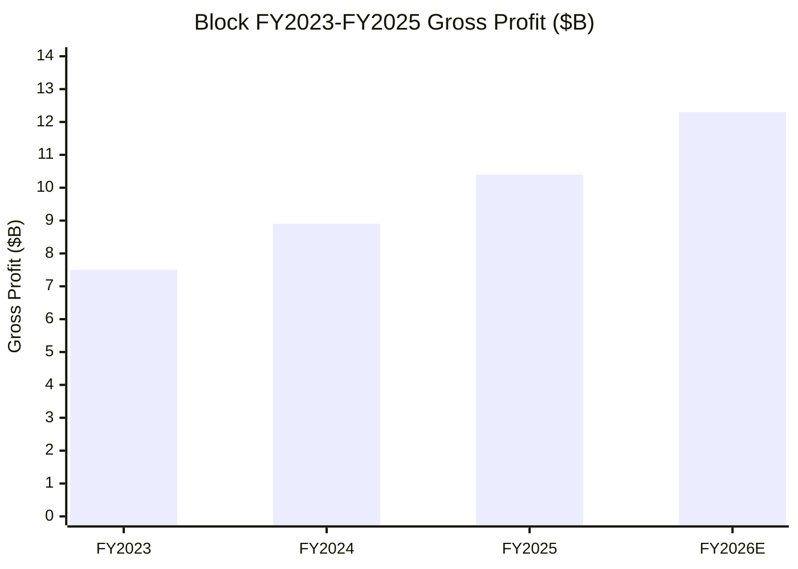

# Company Research: Block, Inc. (NYSE: XYZ)

As of: 2026-06-18 | Refresh (data through Q1'26 + decision layer + 9 SVG charts)

> *Analyst view:* **Rating: Overweight · 12-month Price Target $90 (≈ +21% from $74.53) · Method: 18.5× FY2027E Adjusted Diluted EPS ~$4.80**
> Market cap $44.4B · EV ~$44.8B · 52-week range $48.21–$82.50 · NYSE:XYZ (current $74.53, [Yahoo Finance via yfinance, 2026-06-18 close](https://finance.yahoo.com/quote/XYZ/))
>
> **Forward valuation matrix** (FY25A = reported; FY26E/FY27E = *Analyst view*. Note: framed on **gross profit** — bitcoin-ecosystem revenue of $8.5B is almost entirely pass-through, so total revenue is misleading; the Street values Block on gross profit / adjusted EPS).
>
> | Multiple | FY2025A | FY2026E | FY2027E |
> |---|---|---|---|
> | EV/Gross Profit | 4.3× | 3.6× | 3.1× |
> | EV/Sales (total revenue incl. BTC pass-through) | 1.8× | ~1.7× | ~1.6× |
> | P/S (TTM, total-revenue basis) | 1.8× | ~1.7× | ~1.6× |
> | P/E (Adjusted Diluted EPS) | ~31× (FY25 Adj EPS ~$2.38) | ~19× | ~16× |
> | P/E (GAAP Diluted EPS) | ~35× (GAAP EPS $2.10) | n/m | n/m |
>
> **Relative performance (as of 2026-06-18 close $74.53, vs S&P 500, source: yfinance):** 1M: XYZ +5.5% / SPX +1.2% (rel +4.3pp) · 6M: +15.7% / +10.6% (+5.2pp) · YTD: +14.5% / +9.5% (+5.1pp) · 12M: +18.1% / +25.3% (rel **−7.1pp**)
>
> **Thesis pillars** — (1) **A "layoff + AI efficiency" margin inflection is being delivered:** the >40% workforce cut (announced Feb 2026) drove a raised FY26 guide — Adjusted Operating Income (AOI) $3.34B (27% margin, +60% YoY) and adjusted diluted EPS +62% — a clear shift from "growth at any cost" to disciplined profit compounding. (2) **Cash App is an under-appreciated gross-profit engine:** Q1'26 Cash App segment gross profit $1.91B (+38% YoY), with Financial Solutions (Cash App Borrow consumer lending) gross profit accelerating to +55% and per-active-user monetization (Financial Solutions GP/active user $15, +57% YoY) outpacing user growth. (3) **Square is back on track:** Q1'26 Square segment GP +9% YoY; Morgan Stanley's SMB survey shows Square CSAT 96% vs Toast 44% / Clover 30%, with the "highest share of likely switchers" choosing Square. (4) **Bitcoin is noise, not the thesis:** the bitcoin ecosystem is 35% of revenue but <4% of gross profit; balance-sheet bitcoin remeasurement hits GAAP net income directly — Block must be read on gross profit and adjusted metrics.

> **Update — FY2026 guidance raised + Q1'26 beat (2026-05-07):** Block **raised** full-year FY2026 guidance in Q1'26 results: gross profit growth of **~19%** (to ~**$12.33B**), AOI **$3.34B** (27% margin, +60% YoY) and adjusted diluted EPS **$3.85** (+62% YoY) — up from the Nov-2025 Investor Day "preliminary 17% gross-profit growth." Q1'26 gross profit was **$2,909M, +27% YoY** (Cash App segment $1,908M +38%, Square segment $982M +9%); AOI was a record **$728M** (25% margin, an "all-time high"); GAAP operating loss was $(172)M (including **$852M** of restructuring/legal charges); GAAP diluted EPS $(0.52); adjusted diluted EPS $0.85 (+52% YoY). Source: [Block Q1'26 Shareholder Letter, 2026-05-07](https://www.sec.gov/Archives/edgar/data/1512673/000119312526212032/d132441dex991.htm); [Block Q1'26 10-Q, Statements of Operations](https://www.sec.gov/Archives/edgar/data/1512673/000162828026032200/xyz-20260331.htm).

---

## Table of Contents

1. [Company Overview](#1-company-overview)
1A. [Valuation & Price Target](#1a-valuation--price-target)
1B. [GF Score Fundamental Scorecard](#1b-gf-score-gurufocus-style-fundamental-scorecard)
2. [Company History](#2-company-history)
3. [Management](#3-management)
4. [Products & Services](#4-products--services)
5. [Customers & Concentration](#5-customers--concentration)
6. [Industry Overview](#6-industry-overview)
7. [Competitive Landscape](#7-competitive-landscape)
8. [Market Opportunity (TAM)](#8-market-opportunity-tam)
9. [Risk Assessment](#9-risk-assessment)
9.5 [Key Debates & Catalysts](#95-key-debates--catalysts)
10. [Investment-Lens Scorecards](#10-investment-lens-scorecards)

---

## 1. Company Overview

*Analyst view:* This refresh maintains coverage of Block with an **Overweight** rating and a 12-month price target of **$90** (+21%). Why now: Block is in an under-appreciated "mode switch" — from the Jack-Dorsey-era "expand products at any cost" to "lay off 40% + AI-native + margin discipline." The >40% workforce cut announced alongside the FY25 10-K (Feb 2026) was the trigger; Q1'26 results delivered the first proof: gross-profit growth accelerated to +27% YoY, AOI margin hit a record 25%, and the full-year FY26 guide was raised. Meanwhile Cash App's consumer lending (Cash App Borrow) is entering a monetization-acceleration phase, and Square showed share and stickiness gains in SMB surveys. Risk-reward is positive: the stock trades at only ~16× FY27E adjusted P/E while the slope of profit compounding is steepening — a "quality at a reasonable price" window. We do not chase, but we add. The key falsification points are Cash App lending loss rates and post-layoff execution speed.

**What the company does.** Block runs two customer-facing reportable ecosystems — **Square** (a merchant-side commerce operating system) and **Cash App** (a consumer financial super-app) — plus a Corporate / Other line carrying TIDAL, Bitkey, Proto, and Spiral. The 10-K positions the strategy as "integrated payments, banking, lending, and commerce solutions" via shared infrastructure spanning embedded financial services, automation, and the open Bitcoin protocol ([Block FY2025 10-K, Item 1 Business — Our Ecosystems](https://www.sec.gov/Archives/edgar/data/1512673/000162828026012254/xyz-20251231.htm)). In short: Square lets ~4.5M SMB merchants accept card payments and layers on vertical POS software and embedded lending; Cash App converts free P2P transfer relationships into recurring monetization via Cash App Card + brokerage + lending (Borrow) + BNPL (Afterpay) + bitcoin. The company renamed from Square, Inc. to Block, Inc. (2021-12), and its NYSE ticker changed from SQ to **XYZ** on 2026-01-02 ([Block FY2025 10-K, cover page ticker XYZ](https://www.sec.gov/Archives/edgar/data/1512673/000162828026012254/xyz-20251231.htm)).

**How it makes money.** Block is measured on **gross profit**, not total revenue — a critical point. FY2025 total revenue was $24,193.7M, but the Bitcoin Ecosystem contributed $8,502.8M of nearly pure pass-through (cost $8,083.8M, gross profit only ~$419M), so total revenue is severely misleading. FY2025 consolidated gross profit was $10,359.9M (43% margin), split by operating segment: **Cash App $6,335.5M, Square $3,935.0M, Corporate & Other $89.3M** ([Block FY2025 10-K, Note 22 — Segment Information](https://www.sec.gov/Archives/edgar/data/1512673/000162828026012254/xyz-20251231.htm)). By revenue product: Commerce Enablement $11,514.2M, Financial Solutions $4,176.7M, Bitcoin Ecosystem $8,502.8M ([Block FY2025 10-K, Revenue Note — disaggregation by product](https://www.sec.gov/Archives/edgar/data/1512673/000162828026012254/xyz-20251231.htm)).

**Scale and profitability.** FY2025 operating income $1,708.4M (FY2024 $892.3M; FY2023 operating loss $(278.8)M), net income $1,304.2M, net income to common $1,305.6M, GAAP diluted EPS $2.10 ([Block FY2025 10-K, Consolidated Statements of Operations](https://www.sec.gov/Archives/edgar/data/1512673/000162828026012254/xyz-20251231.htm)). Note FY2024 net income $2,866.5M included a ~$1.9B one-time tax benefit (valuation-allowance release + legal-entity restructuring), so the FY2025 GAAP net "decline" is a high-base artifact — operating income actually grew +91% YoY. Q1'26: total revenue $6,056.8M, gross profit $2,909.2M (+27% YoY), operating loss $(172.0)M (incl. $852M restructuring/legal), net loss to common $(308.7)M, GAAP diluted EPS $(0.52); non-GAAP AOI $728M (record 25% margin), adjusted diluted EPS $0.85 (+52% YoY) ([Block Q1'26 10-Q](https://www.sec.gov/Archives/edgar/data/1512673/000162828026032200/xyz-20260331.htm); [Block Q1'26 Shareholder Letter, 2026-05-07](https://www.sec.gov/Archives/edgar/data/1512673/000119312526212032/d132441dex991.htm)). Headcount: 10,205 full-time employees at 2025-12-31 (2,472 outside the US); >40% reduction announced Feb 2026, substantially complete by end of Q2 2026 ([Block FY2025 10-K, Human Capital + Subsequent Events](https://www.sec.gov/Archives/edgar/data/1512673/000162828026012254/xyz-20251231.htm)). HQ: Oakland, CA.

**Income-statement Sankey (FY2025).** The chart below renders the FY2025 income statement as a money flow: total revenue $24,194M splits by product (Commerce Enablement 47.6% + Financial Solutions 17.3% + Bitcoin Ecosystem 35.1%), and after cost of revenue (COGS $13,834M — mostly bitcoin purchases $8,084M + interchange/processing) leaves gross profit $10,360M (43%), then opex (R&D/Product development $2,908M, SG&A $4,271M, other opex incl. transaction losses $1,337M + intangibles $136M = $1,473M) yields operating income $1,708M (7%); net interest/other of ~−$18M leaves after-tax net income $1,304M. The point: Block's "low 5% net margin" is mostly the bitcoin pass-through inflating the denominator — **real profitability is the 43% gross margin and 7% operating margin.** All figures verbatim from [10-K FY2025 Consolidated Statements of Operations + Note 22](https://www.sec.gov/Archives/edgar/data/1512673/000162828026012254/xyz-20251231.htm).

Source: [Block FY2025 10-K, Consolidated Statements of Operations + Note 22 Segment & Revenue](https://www.sec.gov/Archives/edgar/data/1512673/000162828026012254/xyz-20251231.htm)

**Historical revenue by product (development over time).** The chart shows FY2023→FY2025 revenue by the three product lines — the dominant trend is **Bitcoin Ecosystem revenue shrinking from $9,668M (FY23) to $8,503M (FY25)** (weaker crypto trading + a deliberate fee cut on Cash App bitcoin) while **Commerce Enablement ($9,530M→$11,514M) and Financial Solutions ($2,717M→$4,177M, +24% CAGR) climbed steadily** — structurally shifting from "bitcoin pass-through" toward high-margin payments + consumer lending, which is why gross margin improved from 34% (FY23) to 43% (FY25).

Source: [Block FY2025 10-K, Revenue Note — disaggregation by product (FY2023–FY2025)](https://www.sec.gov/Archives/edgar/data/1512673/000162828026012254/xyz-20251231.htm)

**Revenue by geography (FY2025).** Block is highly US-concentrated — FY2025 US revenue $22,186.6M (92%), International $2,007.1M (8%); Q1'26 US $5,530.8M, International $526.1M ([Block FY2025 10-K, Note 22 — Revenue by Geographic Area](https://www.sec.gov/Archives/edgar/data/1512673/000162828026012254/xyz-20251231.htm); [Block Q1'26 10-Q, geographic revenue](https://www.sec.gov/Archives/edgar/data/1512673/000162828026032200/xyz-20260331.htm)). International is mainly Afterpay's home market Australia plus the UK, Canada, Japan, Ireland, France, Spain; no single foreign country exceeds 10% of revenue.

Source: [Block FY2025 10-K, Note 22 — Revenue by Geographic Area](https://www.sec.gov/Archives/edgar/data/1512673/000162828026012254/xyz-20251231.htm)

**Gross profit by operating segment (FY2025).** Splitting gross profit by Block's two operating segments: **Cash App $6,336M (61%) > Square $3,935M (38%) > Corporate & Other $89M (1%)** — Cash App is already the larger and faster-growing gross-profit engine (FY25 +21% YoY vs Square +9%). This contrasts sharply with the impression total revenue gives that bitcoin is the main act.

Source: [Block FY2025 10-K, Note 22 — Segment Information (gross profit by segment)](https://www.sec.gov/Archives/edgar/data/1512673/000162828026012254/xyz-20251231.htm)

## 1A. Valuation & Price Target

This section is entirely *Analyst view:* (forecasts, target price, and scenario targets are the analyst's own forward judgment, carrying no filing citation; each driver's external basis is cited inline).

### (a) Forward financial model (3-year, gross profit + adjusted EPS basis)

*Analyst view:* Forecast basis: FY2026 company guidance — gross profit ~+19% (≈$12.33B), AOI $3.34B (27% margin, +60% YoY), adjusted diluted EPS $3.85 (+62%), Q2'26 gross profit $3.04B (+20%) + AOI $740M (24% margin) (source: [Block Q1'26 Shareholder Letter, 2026-05-07](https://www.sec.gov/Archives/edgar/data/1512673/000119312526212032/d132441dex991.htm); cross-check *Analyst view:* [Goldman Sachs — Block 1Q26 Takeaways, 2026-05-08, p.1](http://xs-macbook-air.local:5001/zsxq/pdf/212458412282221/Goldman%20Sachs-Block%20Inc.%20%EF%BC%88XYZ.US%EF%BC%89%EF%BC%9A%201Q26%20Takeaways%EF%BC%9A%20Solid%20top%20and%20bottom%20line%20beat%20and%20continued%20acceleration%20across%20multiple%20metrics%20should%20sustain-260508.pdf), GS: "For FY26, XYZ expects gross profit of $12.33bn… Adjusted EPS is expected to be $3.85"); historicals from [10-K FY2025](https://www.sec.gov/Archives/edgar/data/1512673/000162828026012254/xyz-20251231.htm).

| Metric (*Analyst view:* E cols) | FY2023A | FY2024A | FY2025A | FY2026E | FY2027E | 25–27E CAGR |
|---|---|---|---|---|---|---|
| Gross Profit ($M) | 7,505 | 8,889 | 10,360 | 12,330 | 14,300 | +17.5% |
| — YoY | — | +18% | +17% | +19% | +16% | |
| AOI ($M) | n/a | ~2,090 | ~2,775 | 3,340 | ~3,950 | +19% |
| — AOI margin (% of GP) | | ~24% | ~27% | 27% | ~28% | |
| Adjusted Diluted EPS ($) | n/a | ~1.46 | ~2.38 | 3.85 | ~4.80 | +42% |
| GAAP Operating Income ($M) | (279) | 892 | 1,708 | ~1,900 | ~2,800 | |
| GAAP Diluted EPS ($) | 0.02 | 4.56* | 2.10 | ~2.4 | ~3.6 | |
| Total Revenue ($M, incl. BTC pass-through) | 21,916 | 24,121 | 24,194 | ~25,500 | ~27,500 | |
| Free Cash Flow (CFO−capex, $M) | ~−50 | ~1,553 | ~2,425 | ~3,000 | ~3,400 | |

*FY2024 GAAP EPS $4.56 included ~$1.9B one-time tax benefit (valuation-allowance release), non-recurring. AOI FY23/24/25 reverse-engineered from "FY26 AOI $3.34B = +60% YoY" → FY25 ≈ $2.09B (company's own YoY framing); FY25 ≈ $2.78B is this report's estimate (consistent with 27% AOI margin × $10.36B gross profit).

Input sources: FY2025 CFO $2,580M, capex (PP&E purchases) $155M, total debt (LT $5,716M + current $1,573M = $7,289M), cash $6,564M from [10-K FY2025 cash-flow statement + balance sheet](https://www.sec.gov/Archives/edgar/data/1512673/000162828026012254/xyz-20251231.htm); Q1'26 GP $2,909M, AOI $728M, adjusted EPS $0.85 from [Q1'26 Shareholder Letter](https://www.sec.gov/Archives/edgar/data/1512673/000119312526212032/d132441dex991.htm).

**Margin bridge (AOI margin FY2024→FY2026E ~24%→27%, *Analyst view:*):** >40% layoff + AI efficiency ≈ +250–300bp of operating leverage (already visible in Q1'26 — opex "much lower, benefiting from lower headcount," *Analyst view:* [Goldman Sachs, 2026-05-08, p.1](http://xs-macbook-air.local:5001/zsxq/pdf/212458412282221/Goldman%20Sachs-Block%20Inc.%20%EF%BC%88XYZ.US%EF%BC%89%EF%BC%9A%201Q26%20Takeaways%EF%BC%9A%20Solid%20top%20and%20bottom%20line%20beat%20and%20continued%20acceleration%20across%20multiple%20metrics%20should%20sustain-260508.pdf)); higher-margin Cash App consumer-lending mix ≈ +100bp (Financial Solutions GP +55% YoY in Q1'26); partly offset by rising transaction/loan losses (FY25 losses $1,337M = 13% of GP, up from 9% in FY24, [10-K FY2025 MD&A](https://www.sec.gov/Archives/edgar/data/1512673/000162828026012254/xyz-20251231.htm)) ≈ −80bp.

### (b) Price-target derivation (show the arithmetic)

*Analyst view:* Method: **P/E × FY2027E adjusted diluted EPS** (Block is GAAP-profitable but GAAP EPS is distorted by bitcoin remeasurement and one-time tax items; the Street uses adjusted metrics; cross-checked with EV/GP):

- FY2027E adjusted diluted EPS = **~$4.80** (table above; = FY26E $3.85 × ~+25%, driven by GP +16% × slight AOI-margin lift × buyback-driven share shrink)
- Target multiple = **18.5×** — comp anchors: Morgan Stanley uses 18× '27 Adj. EPS (PT $98, "Our $98 PT for XYZ is based on a 18x P/E multiple on our '27 Adj. EPS," *Analyst view:* [Morgan Stanley, 2026-06-02](http://xs-macbook-air.local:5001/zsxq/pdf/184152881184542/Morgan%20Stanley-Block%EF%BC%8C%20Inc%EF%BC%88XYZ.US%EF%BC%89Highlighting%20Square%27s%20Strength%20in%20our%20SMB%20Survey%EF%BC%9B%20Reiterate%20OW-260602.pdf)); Goldman Sachs uses 17× Q5-Q8 EPS (PT $95, "Our 12-month price target of $95 is based on a 17x P/E target multiple on Q5-Q8 EPS," and notes the stock at "~13x our 2027 EPS," *Analyst view:* [Goldman Sachs roadshow, 2026-06-11](http://xs-macbook-air.local:5001/zsxq/pdf/214528142888121/Goldman%20Sachs-Block%20Inc.%20%EF%BC%88XYZ.US%EF%BC%89%EF%BC%9AKey%20takeaways%20from%20roadshow%20meetings-260611.pdf)). We use 18.5× (slightly below MS, since our EPS estimate is a touch more conservative, but recognizing the steepening profit-compounding slope).
- PT = 18.5 × $4.80 = **$89 ≈ $90/share**
- Cross-check (EV/GP): $90 × ~600M diluted shares ≈ equity $54B + net debt ~$0.7B = EV ~$55B ÷ FY27E GP $14.3B = **EV/GP ~3.8×**, within the 3–5× range for payments + consumer-finance peers.

### (c) Bull / Base / Bear scenarios

| Scenario (*Analyst view:*) | Key assumptions | Target | vs $74.53 |
|---|---|---|---|
| Bull | Layoff efficiency + Cash App Borrow ramp + Square GPV re-acceleration; FY27E Adj EPS $5.30, 21× | **$111** | **+49%** |
| Base | Central case: FY27E Adj EPS $4.80 × 18.5× | **$90** | **+21%** |
| Bear | US consumer-credit cycle deteriorates: Cash App Borrow losses spike + Square Loans throughput falls + bitcoin remeasurement hits GAAP; FY27E Adj EPS $4.10, multiple compresses to 14× | **$57** | **−23%** |

*Analyst view:* Risk-reward is positive — upside $111 (+49%) vs downside $57 (−23%), ~2.1:1, a relatively symmetric, upward-tilted shape for an already-profitable compounder trading at only ~16× FY27E adjusted P/E (in stark contrast to a "fat-left-tail" high-leverage story like CoreWeave). Our $90 is directionally aligned with GS $95 and MS $98 but more conservative, mainly in our FY27E EPS estimate and target multiple.

### (d) Guide vs Street vs This-report

| Metric (FY2026E) | Company guide | Street consensus | This report (*Analyst view:*) |
|---|---|---|---|
| Gross profit | ~+19% (≈$12.33B, [Q1'26 letter](https://www.sec.gov/Archives/edgar/data/1512673/000119312526212032/d132441dex991.htm)) | ~$11.9B (guide ~4% above, *Analyst view:* [GS, 2026-05-08](http://xs-macbook-air.local:5001/zsxq/pdf/212458412282221/Goldman%20Sachs-Block%20Inc.%20%EF%BC%88XYZ.US%EF%BC%89%EF%BC%9A%201Q26%20Takeaways%EF%BC%9A%20Solid%20top%20and%20bottom%20line%20beat%20and%20continued%20acceleration%20across%20multiple%20metrics%20should%20sustain-260508.pdf)) | $12.33B (in-line with guide) |
| AOI | $3.34B (27% margin) | ~$2.65B (guide ~26% above!) | $3.34B |
| Adjusted diluted EPS | $3.85 (+62%) | ~$3.70 (guide ~4% above) | $3.85 |

*Analyst view:* GS explicitly flags FY26 AOI guidance of $3.34B as **~26% above Street consensus** ("Adjusted Operating Income is expected to be $3.34bn or 27% margin (+26% vs consensus)," [GS, 2026-05-08](http://xs-macbook-air.local:5001/zsxq/pdf/212458412282221/Goldman%20Sachs-Block%20Inc.%20%EF%BC%88XYZ.US%EF%BC%89%EF%BC%9A%201Q26%20Takeaways%EF%BC%9A%20Solid%20top%20and%20bottom%20line%20beat%20and%20continued%20acceleration%20across%20multiple%20metrics%20should%20sustain-260508.pdf)) — this is the core quantitative basis for our Overweight: the layoff-driven margin upgrade is not yet fully in consensus.

### Sell-side view evolution

Mechanical pre-pass: `db/stock_price_target.db` (read-only) holds 3 XYZ records (2026-05-08 to 2026-06-02), all positive (GS Buy $95, MS Overweight $98, Bernstein Outperform [stablecoins theme, no single PT]); PT range **$95–$98**, spread only ~3%, median ~$96 — **highly aligned bullish** (vs CoreWeave's $67-vs-$135 bipolar split). Plus this refresh's GS roadshow note (2026-06-11) and Bernstein agentic-payments note (2026-06-11).

| Institute | Date | Rating / PT | Report-date price (implied) | One-line thesis |
|---|---|---|---|---|
| Goldman Sachs | 2026-05-08 | Buy / $95 | $74.85 (+27%) | Q1 GP beat; risk-loss growth peaking; AI efficiency; Square velocity recovering — "top picks," stock ~13× 2027 EPS (*Analyst view:* [GS — 1Q26 Takeaways, 2026-05-08](http://xs-macbook-air.local:5001/zsxq/pdf/212458412282221/Goldman%20Sachs-Block%20Inc.%20%EF%BC%88XYZ.US%EF%BC%89%EF%BC%9A%201Q26%20Takeaways%EF%BC%9A%20Solid%20top%20and%20bottom%20line%20beat%20and%20continued%20acceleration%20across%20multiple%20metrics%20should%20sustain-260508.pdf)) |
| Bernstein | 2026-05-25 | Outperform / stablecoins (no single PT) | $68.08 | Stablecoin opportunities in the payments stack; Block a beneficiary (*Analyst view:* [Bernstein — Stablecoins, 2026-05-25](http://xs-macbook-air.local:5001/zsxq/pdf/415241528451848/Bernstein-Payments%EF%BC%8C%20Processors%20%26%20IT%20Services%20Payments%EF%BC%9A%20Stablecoins%20%E2%80%94%20What%20we%20learned%20from%20our%20dozens%20of%20industry%20conversations%EF%BC%9B%20Slide%20deck-260525.pdf)) |
| Morgan Stanley | 2026-06-02 | **Overweight / $98** | $74.15 (+32%) | SMB survey confirms Square strength: CSAT 96% vs Toast 44% / Clover 30%, highest share of switchers to Square; PT = 18× '27 Adj EPS (*Analyst view:* [MS — SMB Survey, 2026-06-02](http://xs-macbook-air.local:5001/zsxq/pdf/184152881184542/Morgan%20Stanley-Block%EF%BC%8C%20Inc%EF%BC%88XYZ.US%EF%BC%89Highlighting%20Square%27s%20Strength%20in%20our%20SMB%20Survey%EF%BC%9B%20Reiterate%20OW-260602.pdf)) |
| Goldman Sachs | 2026-06-11 | Buy / $95 (maintained) | ~$72 (+32%) | Roadshow: Cash App product momentum, Square merchant expansion, layoff efficiency; reaffirms 17× Q5-Q8 EPS (*Analyst view:* [GS — roadshow, 2026-06-11](http://xs-macbook-air.local:5001/zsxq/pdf/214528142888121/Goldman%20Sachs-Block%20Inc.%20%EF%BC%88XYZ.US%EF%BC%89%EF%BC%9AKey%20takeaways%20from%20roadshow%20meetings-260611.pdf)) |

**Cross-institute alignment & this report's stance:** all three majors (GS / MS / Bernstein) are positive, PT $95–98, minimal disagreement, with highly convergent theses — "layoff efficiency + Cash App monetization + Square recovery." Our Overweight/$90 is aligned but ~5–8% more conservative, reflecting our somewhat lower FY27E adjusted EPS ($4.80) and target multiple (18.5×); we also weight the consumer-credit cycle as the primary downside variable (see Bear case and Section 9).

### (e) Swing variables

*Analyst view:* The rating hinges most on two assumptions to pressure-test: (1) **the Cash App Borrow loss-rate inflection** — GS notes the company "signaled a peak in risk loss growth," key to long-only investors stepping in (per [GS, 2026-05-08](http://xs-macbook-air.local:5001/zsxq/pdf/212458412282221/Goldman%20Sachs-Block%20Inc.%20%EF%BC%88XYZ.US%EF%BC%89%EF%BC%9A%201Q26%20Takeaways%EF%BC%9A%20Solid%20top%20and%20bottom%20line%20beat%20and%20continued%20acceleration%20across%20multiple%20metrics%20should%20sustain-260508.pdf)) — a re-acceleration of losses would reverse Financial Solutions' high-margin growth; (2) **post-layoff execution speed** — cutting >40% of staff while accelerating the product roadmap (management's "speed/AI-native" rationale) risks knowledge loss or morale damage that slows Square GPV and Cash App feature velocity.

## 1B. GF Score (GuruFocus-style) Fundamental Scorecard

*Analyst view:* **GF Score (GuruFocus-style, composite): 62/100 — 51–70 band (below-average-to-average future-performance potential).** This depicts Block's core profile: an **already-profitable, steadily-growing, fairly-valued payments + consumer-finance compounder, slightly held back on quality by multi-ecosystem complexity and bitcoin exposure** — all five axes sit in the "solid but not stellar" 6–7 range, with none of CoreWeave's extreme "Growth 10 / Financial Strength 2" divergence. **This scorecard is the analyst's own rubric (distinct from GuruFocus's proprietary algorithm and not a GuruFocus product); the five sub-scores and composite are *Analyst view:* and carry no filing citation; each underlying metric is cited inline below.** Note: the GF Value axis runs "higher = cheaper," so Block's 6/10 means "reasonably valued, slightly cheap."

> Farther from center = higher score; larger pentagon area = higher composite GF Score (same reading as the GuruFocus widget).

| Axis | Score (0–10) | |
|---|---|---|
| Financial Strength | 6 | `██████░░░░` |
| Profitability | 6 | `██████░░░░` |
| Growth | 7 | `███████░░░` |
| GF Value (higher = cheaper) | 6 | `██████░░░░` |
| Momentum | 6 | `██████░░░░` |
| **GF Score (composite, *Analyst view:*)** | **62 / 100** | **51–70 below-average-to-average band** |

*Composite weights (*Analyst view:* transparent replica, not GuruFocus's proprietary weights): Financial Strength 20% · Profitability 25% · Growth 25% · GF Value 15% · Momentum 15%.*

**Financial Strength: 6/10.** Solid balance sheet but goodwill-heavy. At 2025-12-31, cash $6,564M vs total debt (LT $5,716M + current $1,573M = $7,289M) — a near-net-neutral debt position; equity $22,170M is 56% of total assets $39,550M; but goodwill $11,849M + intangibles $1,282M are ~33% of assets (Afterpay legacy), so tangible equity is thinner ([10-K FY2025, balance sheet](https://www.sec.gov/Archives/edgar/data/1512673/000162828026012254/xyz-20251231.htm)). Interest coverage is ample — FY2025 operating income $1,708M ÷ net interest $129M ≈ 13×. Not higher because of high goodwill share + bitcoin balance-sheet exposure.

**Profitability: 6/10.** GAAP-profitable but net margin diluted by bitcoin pass-through. FY2025 gross margin 43%, operating margin 7% (the "true" operating margin ex-bitcoin is higher), GAAP net margin 5.4%, ROE ~6.0% (net income $1,304M ÷ avg equity $21.7B, see DuPont below) ([10-K FY2025](https://www.sec.gov/Archives/edgar/data/1512673/000162828026012254/xyz-20251231.htm)). Non-GAAP is brighter — FY2025 AOI margin (of GP) ~27%, Q1'26 record 25% ([Q1'26 letter](https://www.sec.gov/Archives/edgar/data/1512673/000119312526212032/d132441dex991.htm)). Not higher because GAAP ROE is still single-digit and transaction/loan losses (13% of GP) are rising.

**Growth: 7/10.** Gross-profit compounding is steady and accelerating: FY2023 $7,505M → FY2024 $8,889M (+18%) → FY2025 $10,360M (+17%) → Q1'26 +27% YoY; forward path strong — FY2026 GP guide +19%, adjusted EPS +62% ([10-K FY2025 MD&A](https://www.sec.gov/Archives/edgar/data/1512673/000162828026012254/xyz-20251231.htm); [Q1'26 letter](https://www.sec.gov/Archives/edgar/data/1512673/000119312526212032/d132441dex991.htm)). Cash App segment GP +38% YoY in Q1'26 stands out. Not 8–9 because total revenue is nearly flat (bitcoin shrinkage offsets payment growth).

**GF Value: 6/10.** Reasonably valued, slightly cheap. The stock trades at FY26E adjusted P/E ~19×, FY27E ~16×, EV/FY26E GP ~3.6×, GAAP diluted P/E ~35× ([Yahoo Finance via yfinance, 2026-06-18](https://finance.yahoo.com/quote/XYZ/)); GS notes the stock at only ~13× 2027 EPS (*Analyst view:* [GS, 2026-06-11](http://xs-macbook-air.local:5001/zsxq/pdf/214528142888121/Goldman%20Sachs-Block%20Inc.%20%EF%BC%88XYZ.US%EF%BC%89%EF%BC%9AKey%20takeaways%20from%20roadshow%20meetings-260611.pdf)). Against the 1A Damodaran fair value ~$87 vs $74.53, there is ~+17% margin of safety. Not higher because it is not "deeply undervalued" — just reasonable.

**Momentum: 6/10.** Near-to-mid momentum solid, long-term slightly lagging the index. YTD +14.5% (rel SPX +5.1pp), 6M +15.7% (+5.2pp), 1M +5.5% (+4.3pp), near 52-week high $82.50; but 12M +18.1% trails SPX +25.3% (rel −7.1pp) (source: yfinance, 2026-06-18, consistent with the header). Not higher because the 12-month axis still trails the index.

**Composite arithmetic:** (FS 6×20 + Prof 6×25 + Growth 7×25 + Value 6×15 + Mom 6×15) / 100 = (120 + 150 + 175 + 90 + 90) / 100 = 625 / 100 → **62/100**. Under the GuruFocus framework, 51–70 is the "below-average-to-average" band ([GuruFocus GF Score page](https://www.gurufocus.com/term/gf-score); note: Cloudflare-protected, returns 403 to curl/urllib — anti-bot, not a dead link; this report cites only the methodology framework, not GuruFocus's official number).

**Most-movable axis / failure mode:** Profitability and Growth are the upside levers — if the FY26 AOI guide of $3.34B (26% above consensus) is delivered, Profitability could rise from 6 to 7 and the composite by ~3–5 points; conversely, a re-acceleration in Cash App consumer-credit losses pressures both Growth and Profitability. The composite is consistent with this report's Overweight rating, the 1A "positive risk-reward" judgment, and Section 10's mid-positive lens scores.

**ROE decomposition (DuPont, FY2025).** Block FY2025 ROE ≈ **6.0%** (net income $1,304M ÷ avg equity ~$21.7B), built from net margin 5.4% (diluted by bitcoin pass-through) × asset turnover 0.63 × equity multiplier 1.76 (relatively low leverage for payments peers, reflecting the 56% equity share). The chart visualizes the three factors — the low ROE is mainly driven by **net margin being depressed by the bitcoin pass-through inflating the denominator** (the "operating ROE" ex-bitcoin is materially higher) plus the inherently low asset turnover of a financial business. All inputs from [10-K FY2025 income statement + balance sheet](https://www.sec.gov/Archives/edgar/data/1512673/000162828026012254/xyz-20251231.htm).

Source: [Block FY2025 10-K, Consolidated Statements of Operations + Balance Sheets](https://www.sec.gov/Archives/edgar/data/1512673/000162828026012254/xyz-20251231.htm)

**Balance-sheet Sankey (2025-12-31).** Total assets $39,550M split into current $22,857M (58%, incl. cash $6,564M, customer funds $4,772M, consumer receivables $2,670M, loans held for investment $3,383M) + non-current $16,693M (goodwill $11,849M the largest block); liabilities total $17,380M (customers payable $6,805M + long-term debt $5,716M dominate); equity $22,170M (additional paid-in capital $18,895M + retained earnings $3,674M). The point: **Block is low-leverage (equity is 56% of assets), but the asset side carries a lot of "held-for-customer" liquidity (customer funds / customers payable) and goodwill** — understanding the capital structure means separating customer money from owned capital.

Source: [Block FY2025 10-K, Consolidated Balance Sheets (Dec 31, 2025)](https://www.sec.gov/Archives/edgar/data/1512673/000162828026012254/xyz-20251231.htm)

**Cash-flow Sankey (FY2025).** FY2025 operating cash flow CFO $2,580M (net income $1,304M + D&A/SBC/non-cash $1,585M − working capital & other −$309M); investing CFI −$2,802M (net consumer/loan originations −$2,760M + securities + capex $155M — note Block is asset-light, capex is only 1.5% of gross profit); financing CFF −$613M (senior notes net +$2,172M − share buybacks −$2,331M − warehouse/customer funds −$454M). The point: **Block generates strong free cash flow (CFO−capex ≈ $2.4B) and returns most of it via buybacks (FY25 $2,331M)** — the capital-allocation evidence of the "margin discipline" story.

Source: [Block FY2025 10-K, Consolidated Statements of Cash Flows (FY2025)](https://www.sec.gov/Archives/edgar/data/1512673/000162828026012254/xyz-20251231.htm)

## 2. Company History

**Square, Inc. was incorporated in Delaware in June 2009** by co-founders Jack Dorsey and Jim McKelvey — the founding trigger was McKelvey losing a $2,000 glass-art sale in 2008 because he couldn't accept a credit card ([Block FY2025 10-K, Item 1 Business](https://www.sec.gov/Archives/edgar/data/1512673/000162828026012254/xyz-20251231.htm); [Block 2026 Proxy — director bios](https://www.sec.gov/Archives/edgar/data/1512673/000162828026027203/sq-20260423.htm)). The Square ecosystem launched in February 2009 with the iconic **white magstripe Square Reader** — a hardware dongle plugging into an iPhone/iPad headphone jack that for the first time let any individual seller, food truck, or market stall accept Visa/Mastercard.

**Cash App launched in 2013 as "Square Cash,"** initially a P2P transfer app competing with PayPal's Venmo. Over the next decade it expanded from a single P2P tool into a multi-product consumer-finance platform: Cash App Card (2017, a Visa debit card linked to Cash App balance, issued by a partner bank); bitcoin buy/sell (2018); US stock and ETF brokerage (2019); free tax filing via Cash App Taxes (2020); and Cash App Borrow short-term consumer lending (from 2020). By Dec 2025, Cash App was **#1 in finance app downloads on US Google Play and #3 on US iOS** ([Block FY2025 10-K, Item 1 — Cash App Ecosystem](https://www.sec.gov/Archives/edgar/data/1512673/000162828026012254/xyz-20251231.htm)).

**IPO and capital-markets history.** Square IPO'd on NYSE in November 2015 at **$9/share** (~$2.9B valuation) under "SQ" ([Square 2015 S-1/A](https://www.sec.gov/Archives/edgar/data/1512673/000119312515378578/d937622ds1a.htm)). Subsequent actions included convertible notes (2018/2020), $1B 2.75% + $1B 3.50% notes (May 2021, partly funding the Afterpay deal closed in 2022), and ongoing buybacks (FY2025 $2,331M, [10-K cash-flow statement](https://www.sec.gov/Archives/edgar/data/1512673/000162828026012254/xyz-20251231.htm)).

**Rename to Block, Inc.** effective Dec 10, 2021 (ticker remained "SQ" then), reflecting expansion from merchant payments into Cash App consumer finance, TIDAL (acquired March 2021, $297M), and the bitcoin ecosystem (Bitkey, Proto, Spiral). The NYSE ticker changed from SQ to **XYZ** on 2026-01-02, completing the rebrand ([Block FY2025 10-K, cover page ticker XYZ](https://www.sec.gov/Archives/edgar/data/1512673/000162828026012254/xyz-20251231.htm)).

**Afterpay acquisition (closed Jan 31, 2022)** was Block's most transformational move — an all-stock deal initially valued at ~$29B (Aug 2021), revised to ~$13.8B at close (Jan 2022) as SQ shares fell. Afterpay brought a globally-scaled **Buy-Now-Pay-Later (BNPL)** business across the US, Australia (Afterpay's HQ), Canada, New Zealand, and the UK, building the two-sided network spanning Square merchants and Cash App consumers ([Block FY2025 10-K, BNPL products](https://www.sec.gov/Archives/edgar/data/1512673/000162828026012254/xyz-20251231.htm)).

**2022–2026 evolution and the "mode switch."** 2022 was Afterpay-integration margin compression; 2023 completed "Block 1.0" integration (TBD folded into bitcoin); May 2024 brought the first "Square Day," highlighting Square's move into mid-market and F&B verticals. **In November 2025, management held the first formal Investor Day under the Block, Inc. brand**, setting a three-year plan: Cash App gross-profit CAGR > 20%, accelerate Square GPV, and rebuild operating-margin discipline. **On 2026-02-26 (alongside the FY25 10-K), the company announced the "Workforce Plan" cutting >40%** — the trigger of the mode switch from Dorsey-era "growth at any cost" to "smaller, faster, AI-native, margin-first" ([Block FY2025 10-K, Subsequent Events](https://www.sec.gov/Archives/edgar/data/1512673/000162828026012254/xyz-20251231.htm); [Block Q4'25 Shareholder Letter, 2026-02-26](https://www.sec.gov/Archives/edgar/data/1512673/000119312526076557/d108590dex991.htm)).

## 3. Management

**Jack Dorsey — Block Head (CEO), Chairman (co-founder).** Dorsey has been Block's principal executive officer and a board member since July 2009, and Chairman since October 2010. The 2026 Proxy describes him as the "controlling shareholder" under the Square Financial Services regulatory framework ([Block 2026 Proxy — director bios](https://www.sec.gov/Archives/edgar/data/1512673/000162828026027203/sq-20260423.htm); [Block FY2025 10-K, Government Regulation](https://www.sec.gov/Archives/edgar/data/1512673/000162828026012254/xyz-20251231.htm)). A Twitter co-founder, he ran Twitter and Square as a "dual CEO" from 2015–2021. His compensation is among the most unusual in US markets: **at his own request he takes no cash or equity compensation, only a nominal $2.75 annual salary** ([Block 2026 Proxy — compensation highlights](https://www.sec.gov/Archives/edgar/data/1512673/000162828026027203/sq-20260423.htm)). *Analyst view:* the $2.75 salary plus his leadership of the Spiral/Proto/Bitkey bitcoin initiatives signals an unusual "founder-led, mission-driven" governance posture — compressing the classic principal-agent conflict but introducing single-founder dependency risk.

**Amrita Ahuja — Foundational Lead, CFO, COO, and People Lead.** Ahuja has been CFO since January 2019, adding COO and "Foundational Lead" (Feb 2023) and "People Lead" (Sep 2025) — making her the most operationally concentrated executive after Dorsey; her 2026 base salary rose to $600K (from $565K in 2025) ([Block 2026 Proxy — comp table](https://www.sec.gov/Archives/edgar/data/1512673/000162828026027203/sq-20260423.htm)). She was previously CFO of Blizzard Entertainment. *Analyst view:* concentrating CFO + COO + People Lead reflects Block's flat org design; as People Lead, her role in the 2026 >40% layoff is implicit. The 2026 Proxy shows 6 executive officers, including Brian Grassadonia (Ecosystem Lead), Owen Britton Jennings (Business Lead), Chrysty Esperanza (Counsel Lead), and Arnaud Weber (Engineering Lead, joined June 2025) ([Block 2026 Proxy — executive roster](https://www.sec.gov/Archives/edgar/data/1512673/000162828026027203/sq-20260423.htm)).

## 4. Products & Services

Block runs two customer-facing reportable ecosystems — Square and Cash App — plus a Corporate / Other line carrying TIDAL and the bitcoin-hardware businesses (Bitkey, Proto, Spiral). The 10-K positions the overall strategy as "integrated payments, banking, lending, and commerce solutions" via shared infrastructure spanning embedded financial services, automation, and the open Bitcoin protocol ([Block FY2025 10-K, Item 1 — Our Ecosystems](https://www.sec.gov/Archives/edgar/data/1512673/000162828026012254/xyz-20251231.htm)).

### 4.1 Square ecosystem — the merchant-side commerce OS

Square serves ~4.5M merchants with payments, point-of-sale (POS) software, hardware, and embedded financial services across the US, Canada, Japan, Australia, the UK, Ireland, France, and Spain ([Block FY2025 10-K, Item 1 — Square Merchants](https://www.sec.gov/Archives/edgar/data/1512673/000162828026012254/xyz-20251231.htm)).

**Hardware matrix.** The 10-K lists the Square hardware line:

> "Square Register is an all-in-one product that combines our hardware, point-of-sale software, and payments technology, with dedicated hardware including two screens… Square Terminal is a portable, all-in-one payment device and receipt printer that replaces traditional keypad terminals, accepting tap, dip, and swipe payments… Square Stand transforms an iPad into a complete countertop point of sale with built-in contactless and chip reader. Square Reader for contactless and chip accepts EMV chip cards and NFC payments, enabling acceptance via mobile wallets like Apple Pay and Google Pay." ([Block FY2025 10-K, Item 1 — Hardware](https://www.sec.gov/Archives/edgar/data/1512673/000162828026012254/xyz-20251231.htm))

The original 2009 magstripe Square Reader remains in the line as an entry option; the 10-K acknowledges a "single-supplier dependency" on magstripe reader hardware as a supply-chain concentration risk.

**Software matrix.** Square's vertical POS software includes **Square for Restaurants** (table management, kitchen display, online ordering), **Square for Retail** (inventory, barcode scanning, omnichannel), **Square Appointments**, **Square Online**, and the operating tools **Square Team Management** and **Square Payroll**. These "integrate directly with Square's commerce and financial solutions" — the key differentiator vs point-product competitors ([Block FY2025 10-K, Item 1 — Square Software](https://www.sec.gov/Archives/edgar/data/1512673/000162828026012254/xyz-20251231.htm)).

**Square Loans, Square Card, Square Banking.** **Square Loans makes loans to qualified Square merchants via Square Financial Services (Block's Utah industrial-bank-chartered subsidiary, operating since 2021).** Per the 10-K: *"Since the public launch of Square Loans in May 2014, we have facilitated over 4 million loans and advances, with cumulative loan or advance principal exceeding $32.8 billion."* ([Block FY2025 10-K, Item 1 — Square Loans](https://www.sec.gov/Archives/edgar/data/1512673/000162828026012254/xyz-20251231.htm)). **Square Credit Card** (2023) is a second merchant lending line; **Square Card** is a free Mastercard business debit card; **Square Banking** offers deposits, savings, and instant deposit.

**Strategic significance.** Square's core value is the **integration loop** — payment data (transaction size, revenue cadence, customer mix) underwrites Square Loans, deepening Square's share of the merchant's wallet — upgrading from "payment processor" to "operating system plus balance-sheet partner." Q1'26 Square segment GP +9% YoY, with GPV growth "driven by strength in F&B merchants" (Square's biggest vertical push via Square for Restaurants); management lists "speed" as the key operating discipline to accelerate GPV ([Block Q1'26 Shareholder Letter, 2026-05-07](https://www.sec.gov/Archives/edgar/data/1512673/000119312526212032/d132441dex991.htm)). *Analyst view:* Morgan Stanley's June-2026 SMB survey independently corroborates Square's competitive position — Square CSAT 96% vs Toast 44% / Clover 30%, with the "highest share of likely switchers" choosing Square ([Morgan Stanley — SMB Survey, 2026-06-02](http://xs-macbook-air.local:5001/zsxq/pdf/184152881184542/Morgan%20Stanley-Block%EF%BC%8C%20Inc%EF%BC%88XYZ.US%EF%BC%89Highlighting%20Square%27s%20Strength%20in%20our%20SMB%20Survey%EF%BC%9B%20Reiterate%20OW-260602.pdf)).

### 4.2 Cash App ecosystem — the consumer financial super-app

The 10-K positions Cash App for "Cash App Green" customers — "a workforce that earns multiple, dynamic income streams, including hourly wages, gig work, and freelancing" — an addressable market management estimates at ~125M Americans. The 10-K describes Cash App as "an ecosystem of financial products and services that helps individuals and businesses manage, move, and grow their money," including **money transfer, debit spending (Cash App Card), bitcoin and equity buy/sell, bank-style direct deposit, lending (Cash App Borrow), and BNPL (Afterpay integration)** ([Block FY2025 10-K, Item 1 — Cash App Ecosystem](https://www.sec.gov/Archives/edgar/data/1512673/000162828026012254/xyz-20251231.htm)).

**Engagement and inflows.** Cash App generated ~$316B of inflows in 2025. Block monitors Cash App via its "**inflows framework**" — "transacting actives, inflows per active, and monetization rate on inflows" ([Block FY2025 10-K, Item 1 — Inflows Framework](https://www.sec.gov/Archives/edgar/data/1512673/000162828026012254/xyz-20251231.htm)). Cash App **Financial Solutions gross profit per active user** reached **$15** (+57% YoY, from $9) — a strong KPI showing per-user monetization outpacing user growth ([Block Q1'26 Shareholder Letter, 2026-05-07](https://www.sec.gov/Archives/edgar/data/1512673/000119312526212032/d132441dex991.htm)).

**Cash App Card.** *"Cash App Card is a debit card, issued by our bank partners, that connects directly to a customer's Cash App balance."* ([Block FY2025 10-K, Item 1 — Cash App Card](https://www.sec.gov/Archives/edgar/data/1512673/000162828026012254/xyz-20251231.htm)) Block monetizes via interchange when cardholders spend — the core path to convert free P2P relationships into recurring fee revenue, and the entry point to cross-sell direct deposit, brokerage, and lending.

**Cash App Borrow (the growth engine).** Borrow offers short-term fixed-fee loans repaid in scheduled installments; the 10-K notes *"in 2025, the average Cash App Borrow loan was repaid in under four weeks,"* with **Cash App Score** (an internally-developed credit-scoring framework) supporting underwriting scale ([Block FY2025 10-K, Item 1 — Cash App Borrow](https://www.sec.gov/Archives/edgar/data/1512673/000162828026012254/xyz-20251231.htm)). Borrow is the main driver of Cash App gross-profit acceleration — management noted in Q1'26 that *"Cash App Financial Solutions gross profit growth accelerated to 55% in the first quarter, driven by Cash App Consumer Lending"* ([Block Q1'26 Shareholder Letter, 2026-05-07](https://www.sec.gov/Archives/edgar/data/1512673/000119312526212032/d132441dex991.htm)). *Analyst view:* GS views the "signaled peak in risk loss growth" as key — long-only investors had hesitated while lending and credit losses accelerated ([GS, 2026-05-08](http://xs-macbook-air.local:5001/zsxq/pdf/212458412282221/Goldman%20Sachs-Block%20Inc.%20%EF%BC%88XYZ.US%EF%BC%89%EF%BC%9A%201Q26%20Takeaways%EF%BC%9A%20Solid%20top%20and%20bottom%20line%20beat%20and%20continued%20acceleration%20across%20multiple%20metrics%20should%20sustain-260508.pdf)).

**BNPL — Afterpay & Cash App Pay Later.** *"Cash App and Afterpay offer a broad suite of Pay Later capabilities… For merchants, these products are designed to improve conversion and increase average order value."* ([Block FY2025 10-K, Item 1 — BNPL](https://www.sec.gov/Archives/edgar/data/1512673/000162828026012254/xyz-20251231.htm)) Afterpay covers the US, Australia, Canada, New Zealand, and the UK, with the Afterpay Card supporting in-store BNPL.

**Other Cash App products.** Customers can invest in US stocks and ETFs from as little as $1 via Cash App brokerage; Cash App Taxes offers free filing; Round Ups round purchases up and auto-invest the difference into bitcoin or stocks ([Block FY2025 10-K, Item 1 — Cash App Other](https://www.sec.gov/Archives/edgar/data/1512673/000162828026012254/xyz-20251231.htm)).

### 4.3 Corporate / Other — TIDAL, Bitkey, Proto, Spiral

**TIDAL.** Acquired March 2021 for $297M; the 10-K describes it as *"a global platform for musicians and their fans… offering more than 250 million songs and 1 million high-quality videos, with listeners in over 60 countries and relationships with nearly 300 record labels."* ([Block FY2025 10-K, Item 1 — TIDAL](https://www.sec.gov/Archives/edgar/data/1512673/000162828026012254/xyz-20251231.htm)) TIDAL is small but occupies a strategic creator-economy position.

**Bitcoin ecosystem (Bitkey, Proto, Spiral).** The 10-K describes three initiatives: "**Bitkey is a self-custody bitcoin wallet, Proto is a bitcoin mining system, and Spiral is a team focused on contributing to bitcoin open-source work.**" ([Block FY2025 10-K, Item 1 — Bitcoin Ecosystem](https://www.sec.gov/Archives/edgar/data/1512673/000162828026012254/xyz-20251231.htm)) Block also held **8,883 bitcoins** on its balance sheet at 2025-12-31 (a "bitcoin investment," carrying value $777.5M, [Block FY2025 10-K, balance sheet + bitcoin note](https://www.sec.gov/Archives/edgar/data/1512673/000162828026012254/xyz-20251231.htm)). Bitcoin trading revenue (Cash App buy/sell) is the main cash-generating bitcoin line — down in 2025 vs 2024 on softer crypto markets — while Bitkey and Proto remain in investment phase.

**Synthesis — how the products interact and where the money goes.** Block's portfolio interlocks via three flywheels: (i) **Square flywheel** — payment data underwrites Square Loans, deepening wallet share; (ii) **Cash App flywheel** — free P2P + Cash App Card acquires; inflows fund direct deposit, brokerage, Borrow, and BNPL, monetizing layer by layer; (iii) **integrated-platform flywheel** (post-Afterpay) — BNPL connects Cash App consumers to Square merchants, a two-sided network. The money-flow map below traces this in demand orientation — who pays (Square merchants' buyers / Cash App consumers / bitcoin buyers) → through Block's three product lines → where the money lands (card networks/issuers via interchange, the bitcoin spot market as pass-through, sponsor banks, and the $10.4B of retained gross profit). The point: **bitcoin-ecosystem revenue of $8.5B is almost entirely passed to the spot market (cost $8.1B); Block must be read on gross profit, not total revenue**; TIDAL and bitcoin hardware sit outside the flywheels — best viewed as founder-conviction optional R&D, non-critical to the 2026–2028 earnings path.

Source: [Block FY2025 10-K, Consolidated Statements of Operations + Note 22 Segment & Revenue disaggregation](https://www.sec.gov/Archives/edgar/data/1512673/000162828026012254/xyz-20251231.htm) (Cash App MAU and bitcoin holdings from the 10-K Business section).

**Further viewing:**
- [How Square Reader / Tap to Pay works — Square's official channel (the physics of merchant acquiring)](https://www.youtube.com/@Square)
- [Cash App product overview — Block's official channel (the consumer super-app feature stack)](https://www.youtube.com/@CashApp)

## 5. Customers & Concentration

Block's customer bases are starkly different by ecosystem. Square is **B2B (merchants/sellers)** — ~4.5M annual active merchants across eight core countries; Cash App is **B2C (US consumers)** — tens of millions of monthly transacting actives across all 50 US states and nearly every county (as of 2025-12-31) ([Block FY2025 10-K, Item 1 — Cash App Customers](https://www.sec.gov/Archives/edgar/data/1512673/000162828026012254/xyz-20251231.htm)).

**Square — merchant concentration.** *"Square sellers represent a wide range of industries (including services, food and drink, and retail) and sizes — from sole proprietors to mid-market multi-location merchants… We are also increasingly serving mid-market sellers."* ([Block FY2025 10-K, Item 1 — Square Merchants](https://www.sec.gov/Archives/edgar/data/1512673/000162828026012254/xyz-20251231.htm)) With 4.5M merchants, even the largest single merchant is a tiny share of consolidated revenue. The 10-K discloses no single customer above the ASC 280-10-50-42 10% threshold — meaning no single Block customer contributed >10% of consolidated revenue in FY2025.

**Cash App — consumer concentration.** Cash App's consumer base is by definition highly dispersed — *"Cash App is primarily in the US, with a diverse customer base across demographics and regions."* ([Block FY2025 10-K, Item 1 — Cash App Customers](https://www.sec.gov/Archives/edgar/data/1512673/000162828026012254/xyz-20251231.htm)) Block discloses monetization via aggregate KPIs (inflows per active, monetization rate), not individual top consumers.

**Payment-network and processor counterparty concentration.** Block's biggest counterparty concentration is on the supplier side: it depends on the **Visa, Mastercard, American Express, and Discover** card networks ([Block FY2025 10-K, Item 1 — Payment Networks](https://www.sec.gov/Archives/edgar/data/1512673/000162828026012254/xyz-20251231.htm)); plus third-party processors — the 10-K concentration disclosure shows a "**Third-Party Processor**" representing a credit-concentration risk in settlements receivable. Standard for the industry, but a structural counterparty risk to track.

**Square Loans funding concentration.** *"We currently fund the majority of these loans through arrangements with institutional third-party investors."* ([Block FY2025 10-K, Item 1 — Square Loans Funding](https://www.sec.gov/Archives/edgar/data/1512673/000162828026012254/xyz-20251231.htm)) The model is partly off-balance-sheet — institutional investors buy Block-underwritten loans — so Square Loans throughput depends on those buyers' appetite; if credit markets tighten, volume can contract quickly even if merchant demand holds.

**Geographic concentration.** No single foreign country exceeds 10% of total revenue ([Block FY2025 10-K, Item 1 — Geographic Mix](https://www.sec.gov/Archives/edgar/data/1512673/000162828026012254/xyz-20251231.htm)). Square and Cash App geographic risk is concentrated in the US (92% of FY2025 revenue).

## 6. Industry Overview

Block competes in three overlapping markets — **merchant acquiring / payment processing**, **consumer financial services / digital banking**, and **BNPL financing** — with optionality in bitcoin-ecosystem hardware and software.

**Merchant acquiring (Square's primary market).** The global merchant-acquiring market processes tens of trillions of card volume annually, ~$8–9T in the US. Consolidation (FIS-Worldpay split, Global Payments acquisition, the 2019 Fiserv-First Data deal) has driven the US top-five acquirers (Fiserv, JPM Chase Merchant Services, Worldpay, Bank of America Merchant Services, Stripe) to ~70% of card-acquiring volume. Square has carved out a defensible **SMB-plus-vertical-software** segment — the 10-K describes Square's competitive set as ranging "*from large, established companies to small, early-stage companies*," listing *"providers of business software for point of sale, website building, inventory management, employee management, customer relationship management, invoicing, and appointment management"* — i.e. Shopify, Toast, Lightspeed, Clover, Adyen ([Block FY2025 10-K, Item 1 — Square Competition](https://www.sec.gov/Archives/edgar/data/1512673/000162828026012254/xyz-20251231.htm)).

**Consumer financial services / digital banking (Cash App's primary market).** The US "neobank" / consumer-fintech sector added ~30–50M US accounts over 2018–2024 via Cash App, Chime, Venmo (PayPal), Robinhood, SoFi, and others. The 10-K describes Cash App's competitive set as *"money transfer apps, debit card products, brokerage firms, tax firms, financial technology apps, banks, and crypto-trading services."* ([Block FY2025 10-K, Item 1 — Cash App Competition](https://www.sec.gov/Archives/edgar/data/1512673/000162828026012254/xyz-20251231.htm)) The "Cash App Green" framing — targeting ~125M multi-income-stream US workers — is a deliberately narrower TAM than "all of US consumer banking," but precisely the underserved segment most willing to switch ([Block Q4'25 Shareholder Letter, 2026-02-26](https://www.sec.gov/Archives/edgar/data/1512673/000119312526076557/d108590dex991.htm)).

**BNPL (Afterpay's primary market).** The global BNPL market processed ~$300–400B in 2024, ~$80B in the US growing in the high teens. The top-five global BNPL platforms are Klarna, Afterpay (Block), Affirm, PayPal Pay Later, Apple Pay Later. The 10-K acknowledges intensifying competition: *"Competitors have introduced or offer BNPL products… may develop superior technology offerings or integrate with other entities and achieve scale benefits."* ([Block FY2025 10-K, Risk Factors — BNPL Competition](https://www.sec.gov/Archives/edgar/data/1512673/000162828026012254/xyz-20251231.htm)) BNPL regulatory scrutiny has intensified since 2024 — the CFPB's May-2024 interpretive rule classified BNPL providers as credit-card issuers under Regulation Z.

**Bitcoin ecosystem.** The 10-K states *"the bitcoin ecosystem generated gross profit representing only 4% of total gross profit in 2025, and 5% in 2024."* ([Block FY2025 10-K, MD&A — Bitcoin Ecosystem](https://www.sec.gov/Archives/edgar/data/1512673/000162828026012254/xyz-20251231.htm)) Bitcoin economics remain small relative to Square+Cash App but strategically important. *Analyst view:* stablecoins are a new 2026 industry variable — Bernstein lists Block as a potential beneficiary of stablecoins in the payments stack ([Bernstein — Stablecoins, 2026-05-25](http://xs-macbook-air.local:5001/zsxq/pdf/415241528451848/Bernstein-Payments%EF%BC%8C%20Processors%20%26%20IT%20Services%20Payments%EF%BC%9A%20Stablecoins%20%E2%80%94%20What%20we%20learned%20from%20our%20dozens%20of%20industry%20conversations%EF%BC%9B%20Slide%20deck-260525.pdf)).

## 7. Competitive Landscape

The Square / Cash App / Afterpay portfolio spans three competitive landscapes, each with well-resourced incumbents.

**Square's main competitors (US):** **Stripe** (private; e-commerce and developer-platform payments), **Toast (NYSE:TOST)** (restaurant POS, head-to-head in F&B), **Shopify (NASDAQ:SHOP)** (DTC e-commerce), **Clover** (Fiserv, NYSE:FI; SMB POS + payments bundle), **Lightspeed (NYSE:LSPD)** and **Adyen (AMS:ADYEN)** (retail/hospitality POS and enterprise omnichannel).

**Cash App's main competitors (US):** **Venmo** (PayPal, NASDAQ:PYPL), **Zelle** (bank-network instant P2P), **Chime** (consumer neobank, head-to-head in "Cash App Green"), **Robinhood (NASDAQ:HOOD)** and **SoFi (NASDAQ:SOFI)**, and **Apple Cash + Apple Card** (iOS-integrated, vs Cash App Card).

**BNPL competitors (Afterpay):** **Affirm (NASDAQ:AFRM)** (US leader, deep merchant ties), **Klarna** (global leader), **PayPal Pay Later**, **Apple Pay Later**.

**Bitcoin-ecosystem competitors:** **Ledger / Trezor** (hardware wallets), **Coinbase (NASDAQ:COIN)** (trading layer), **Bitmain / MicroBT** (mining ASICs).

*Analyst view:* Block's competitive position is strongest in **Cash App** (product breadth beats single-product rivals in the "Cash App Green" demographic) and **Square SMB** (software/payments integration in F&B and services, corroborated by MS's 96% CSAT survey); weakest in e-commerce checkout (Stripe/Shopify) and enterprise/mid-market payments (Adyen/Stripe). Afterpay ranks #2/#3 in global BNPL, but Affirm arguably has a stronger US merchant network. *Analyst view:* the biggest competitive risk over the next 24 months is Apple's continued build-out of Apple Cash / Apple Card / Apple Pay Later / iPhone Tap-to-Pay — each eroding Block via iOS-level integration; a 2026-new variable is **agentic payments** — Bernstein's 2026-06-11 note discusses the Visa–OpenAI partnership and Mastercard Agent Pay reshaping the payments stack ([Bernstein — Payments/Agent Pay, 2026-06-11](http://xs-macbook-air.local:5001/zsxq/pdf/814528142888242/Bernstein-Payments%EF%BC%8C%20Processors%20%26%20IT%20Services%EF%BC%9AVisa~OpenAI%20Partnership%EF%BC%8C%20Mastercard%20Agent%20Pay%20for-260611.pdf)).

## 8. Market Opportunity (TAM)

Block's combined TAM spans global merchant acquiring, US consumer fintech, and global BNPL — plus bitcoin-ecosystem optionality.

**Merchant-acquiring TAM.** 2024 global card and mobile payment volume reached ~$50T (per Nilson Report); merchant-acquirer net take rates average 0.15–0.25%, so global acquirer revenue is ~$80–120B/year. Square's share is small (single-digit-percent of the US SMB segment) — meaning even modest share gains in SMB / mid-market and F&B verticals represent hundreds of millions in incremental revenue. Management's Q1'26 letter highlights deepening go-to-market into other verticals ([Block Q1'26 Shareholder Letter, 2026-05-07](https://www.sec.gov/Archives/edgar/data/1512673/000119312526212032/d132441dex991.htm)).

**Cash App TAM — "Cash App Green."** Management explicitly sizes Cash App's addressable market at **~125M people** — across "independent earners, hourly workers, and working teens" — the underserved multi-income-stream US workforce ([Block Q4'25 Shareholder Letter, 2026-02-26](https://www.sec.gov/Archives/edgar/data/1512673/000119312526076557/d108590dex991.htm)). With tens of millions of current monthly transacting actives, penetration leaves substantial runway; at the Financial Solutions GP/active-user trajectory of $15 (+57% YoY), additional TAM penetration converts directly into gross profit.

**BNPL TAM.** US BNPL volume reached ~$80B in 2024 (~16% YoY); global ~$400B. Afterpay's share within Block accounting is partly obscured by integration into Cash App and Square — management treats BNPL as structural cross-sell rather than a standalone product.

**Bitcoin-ecosystem TAM.** Global bitcoin-mining ASIC market is ~$50–100B/year (Bitmain/MicroBT-led); global self-custody hardware-wallet market ~$2–3B (Ledger-led). Bitkey/Proto target these but have not reached scale — best viewed as options, not a bull driver.

Chart: gross-profit trend (FY2026E = company guide +19%). Source: [Block FY2025 10-K, Consolidated Statements of Operations](https://www.sec.gov/Archives/edgar/data/1512673/000162828026012254/xyz-20251231.htm); [Block Q1'26 Shareholder Letter, 2026-05-07](https://www.sec.gov/Archives/edgar/data/1512673/000119312526212032/d132441dex991.htm).

## 9. Risk Assessment

**(a) Company-specific risks**

1. **Layoff execution risk (>40% headcount cut in H1 2026).** The "Workforce Plan" announced 2026-02-26 — cutting >40% from the 10,205 FY25 base — carries **$450–500M** of one-time costs ($852M of restructuring/legal already in Q1'26, incl. ~$327M cash severance) plus material execution risk. *"We expect the execution of the Workforce Plan to be substantially complete by the end of the second quarter of fiscal 2026."* ([Block FY2025 10-K, Subsequent Events](https://www.sec.gov/Archives/edgar/data/1512673/000162828026012254/xyz-20251231.htm); [Block Q1'26 Shareholder Letter, 2026-05-07](https://www.sec.gov/Archives/edgar/data/1512673/000119312526212032/d132441dex991.htm)). **Mitigant:** the rationale is "speed/AI-native"; the implied upside is the H2-2026 margin upgrade — Q1'26 opex already fell on lower headcount.

2. **Founder-CEO concentration (Jack Dorsey).** Dorsey is co-founder, Block Head (CEO), Chairman, controlling shareholder, and architect of the bitcoin initiatives; he takes only a **$2.75 salary** — and Block's strategy is uniquely tied to his worldview ([Block 2026 Proxy — director comp](https://www.sec.gov/Archives/edgar/data/1512673/000162828026027203/sq-20260423.htm)). **Mitigant:** a strong independent board (6/10 per the Proxy).

3. **Bitcoin balance-sheet exposure.** Block holds 8,883 bitcoins (carrying value $777.5M at 2025-12-31; down to $617.3M at Q1'26) — FY2025 produced a **$55.9M remeasurement loss** (vs FY2024's $420.9M gain), and Q1'26 a **$172.8M remeasurement loss** (a ~$0.29 drag on GAAP EPS) — directly exposing GAAP net income to crypto prices ([Block FY2025 10-K, MD&A — Bitcoin Remeasurement](https://www.sec.gov/Archives/edgar/data/1512673/000162828026012254/xyz-20251231.htm); [Block Q1'26 10-Q](https://www.sec.gov/Archives/edgar/data/1512673/000162828026032200/xyz-20260331.htm)). **Mitigant:** the bitcoin balance is small relative to total liquidity; remeasurement is excluded from AOI.

**(b) Industry / market risks**

4. **BNPL regulatory tightening (CFPB, UK, Australia).** The CFPB's May-2024 interpretive rule classifies BNPL providers as Regulation Z credit-card issuers, plus UK BNPL legislation and Australian inquiries — all add Afterpay compliance overhead ([Block FY2025 10-K, Risk Factors — BNPL Regulation](https://www.sec.gov/Archives/edgar/data/1512673/000162828026012254/xyz-20251231.htm)). **Mitigant:** Afterpay's "4 payments over 6 weeks, interest-free" structure is simpler than long-tenor BNPL.

5. **Apple and big-bank competitive intensity.** Apple Cash / Card / Pay Later / iPhone Tap-to-Pay each erode Cash App and Square via iOS integration; bank-owned Zelle has displaced Cash App's free-P2P use case in major US bank bases. **Mitigant:** Block's product breadth (Cash App = debit + brokerage + BNPL + bitcoin + lending vs Apple Cash debit-only) and non-bank distribution provide defensible differentiation.

6. **Cyclical exposure to consumer credit (Cash App Borrow, Square Loans).** Both are exposed to consumer/SMB credit-cycle deterioration. FY2025 transaction, loan, and consumer-receivable losses rose +68% YoY to **$1,337M** — 13% of gross profit (up from 9% in FY24) ([Block FY2025 10-K, MD&A — Cost of Revenue](https://www.sec.gov/Archives/edgar/data/1512673/000162828026012254/xyz-20251231.htm)); Q1'26 the line was $500.1M (vs Q1'25 $169.7M, partly from loan-portfolio reclassification). **Mitigant:** GS believes risk-loss growth has peaked; Square Loans are partly funded by third-party institutions, reducing Block's direct credit exposure.

**(c) Financial / structural risks**

7. **Card-network / processor counterparty concentration.** The 10-K concentration table's "Third-Party Processor" represents a credit concentration in settlements receivable; Visa/Mastercard/AmEx/Discover network-rule changes (interchange caps) could compress Block's take rate ([Block FY2025 10-K, Risk Factors — Network Concentration](https://www.sec.gov/Archives/edgar/data/1512673/000162828026012254/xyz-20251231.htm)).

8. **Square Loans funding dependence.** Most Square Loans are funded by institutional investors buying Block-underwritten loans — throughput would contract quickly if credit-market appetite shrinks ([Block FY2025 10-K, Item 1 — Square Loans Funding](https://www.sec.gov/Archives/edgar/data/1512673/000162828026012254/xyz-20251231.htm)). **Mitigant:** Square Financial Services' industrial-bank charter gives Block more flexibility to hold loans on-balance-sheet under stress.

9. **Stock-based-compensation dilution.** Block has historically issued substantial SBC (FY2025 $1,215M, [10-K cash-flow statement](https://www.sec.gov/Archives/edgar/data/1512673/000162828026012254/xyz-20251231.htm)); SBC reduces GAAP earnings and creates persistent dilution. **Mitigant:** the 40% layoff should reduce 2026 SBC growth; FY2025 buybacks of $2,331M offset part of the dilution.

**(d) Macro risks**

10. **US consumer-credit cycle deterioration.** A US recession would reduce Cash App inflows per user, slow Cash App Borrow originations, raise loss provisions on both Cash App and Square Loans, and pressure Afterpay BNPL GMV. **Mitigant:** Block is exposed to lower- and middle-income US consumers ("Cash App Green") — a segment where Cash App can still win share from banks even in downturns.

11. **Bitcoin / crypto downturn.** A return to "crypto winter" would reduce Cash App bitcoin trading revenue, compress Bitkey/Proto demand, and hit GAAP net income via bitcoin remeasurement. **Mitigant:** the bitcoin ecosystem is 4–5% of total gross profit — structural exposure is small.

12. **FX risk.** Revenue is primarily USD, but international expansion (Australia, UK, Canada, Japan, EU) introduces translation risk ([Block FY2025 10-K, Market Risk — FX](https://www.sec.gov/Archives/edgar/data/1512673/000162828026012254/xyz-20251231.htm)). **Mitigant:** international revenue is <10% of consolidated (FY2025 8%), so FX impact is manageable.

## 9.5 Key Debates & Catalysts

**Debate 1 — "Cutting 40% will destroy product velocity; the margin upgrade comes at the cost of growth."** *Analyst view:* the bears' core worry. Counter-evidence: Q1'26 first falsified "growth will stall" — after the layoff was announced, gross-profit growth actually **accelerated** to +27% YoY (Cash App segment +38%, Square +9%), with opex falling on lower headcount (*Analyst view:* [GS, 2026-05-08](http://xs-macbook-air.local:5001/zsxq/pdf/212458412282221/Goldman%20Sachs-Block%20Inc.%20%EF%BC%88XYZ.US%EF%BC%89%EF%BC%9A%201Q26%20Takeaways%EF%BC%9A%20Solid%20top%20and%20bottom%20line%20beat%20and%20continued%20acceleration%20across%20multiple%20metrics%20should%20sustain-260508.pdf)). The real verdict point is H2-2026 — whether the roadmap keeps velocity after the cut is substantially complete, seen in Q3/Q4 2026 results.

**Debate 2 — "Cash App Borrow's growth borrows the credit-cycle tailwind; loss rates will bite back."** *Analyst view:* Financial Solutions Q1'26 GP +55% is driven mainly by consumer lending, while FY2025 transaction/loan losses already rose +68% to $1,337M (13% of GP) — bears see "lending for growth." Counter-evidence: GS explicitly notes the company "signaled a peak in risk loss growth," with recent borrower cohorts "seasoning to lower loss rates" ([GS, 2026-05-08](http://xs-macbook-air.local:5001/zsxq/pdf/212458412282221/Goldman%20Sachs-Block%20Inc.%20%EF%BC%88XYZ.US%EF%BC%89%EF%BC%9A%201Q26%20Takeaways%EF%BC%9A%20Solid%20top%20and%20bottom%20line%20beat%20and%20continued%20acceleration%20across%20multiple%20metrics%20should%20sustain-260508.pdf)); Block's proprietary Cash App Score underwriting was validated in the 2025 expansion. Our base case assumes contained losses but treats this as the primary falsification point in the bear case.

**Debate 3 — "Apple and agentic payments will structurally erode Block's payment economics."** *Analyst view:* Apple Cash/Card/Pay Later + iPhone Tap-to-Pay's iOS integration is a long-term threat; a new 2026 variable is the Visa–OpenAI partnership and Mastercard Agent Pay (*Analyst view:* [Bernstein — Agent Pay, 2026-06-11](http://xs-macbook-air.local:5001/zsxq/pdf/814528142888242/Bernstein-Payments%EF%BC%8C%20Processors%20%26%20IT%20Services%EF%BC%9AVisa~OpenAI%20Partnership%EF%BC%8C%20Mastercard%20Agent%20Pay%20for-260611.pdf)). Counter: Block's product breadth (super-app vs single-product) and Square's vertical software integration (96% CSAT) create switching costs hard to disrupt near-term — a structural, not near-term, risk.

**Catalyst calendar (next 12 months)** (pair with the catalyst-calendar skill for ongoing tracking):

- **~2026-08 — Q2'26 results:** GP guide delivery ($3.04B, +20%), AOI ($740M, 24% margin), post-layoff execution speed, Cash App Borrow loss-rate trajectory.
- **~2026-11 — Q3'26 results:** key validation of the FY26 GP +19% / AOI $3.34B path; whether product velocity holds post-layoff.
- **~2027-02 — Q4'26 / FY26 results:** the verdict on whether FY26 AOI $3.34B (26% above consensus) is delivered — the core falsification point for this report's Overweight.
- **Rolling — US consumer-credit data:** Cash App Borrow and Square Loans loss rates are highly sensitive to the macro cycle; monthly consumer-credit and unemployment data are a live scorecard.
- **Rolling — bitcoin price:** affects Cash App bitcoin trading revenue + balance-sheet remeasurement (directly hits GAAP net income).
- **Rolling — agentic payments / stablecoins:** the pace of Visa-OpenAI, Mastercard Agent Pay, and stablecoin adoption in the payments stack (both a risk and a potential opportunity).

## 10. Investment-Lens Scorecards

This section applies six named scoring frameworks as a "second opinion" on the same evidence from Sections 1–9: four core lenses (Buffett / Munger / Damodaran / Howard Marks cycle) plus two added by company fit — **Druckenmiller liquidity-regime** (a consumer-credit/rate-sensitive fintech) and **Cathie Wood Wright's-Law** (AI efficiency + payments/bitcoin disruption). All verdicts are *Lens view:* (framework outputs, not persona endorsements) and carry no filing citation.

Cycle snapshot: VIX ~17, 10Y Treasury ~4.3%, HY OAS ~340bp, IG OAS ~110bp (Source: indicators.db local snapshot (FRED BAMLH0A0HYM2 / ^TNX + yfinance), as of 2026-06-03/05; the snapshot lags the report date 2026-06-18 slightly but stays within the <30-day lens window) — a mid-cycle "balanced" credit posture, neither clear stress nor bubble compression.

### 10.1 Buffett lens (quality × price, 0–100)

*Lens view:* **62/100 — a high-quality compounder at a reasonable price; relatively rare in fintech.**

| Dimension | Score | Basis (from Sections 1/4/5/9) |
|---|---|---|
| Circle of competence / understandability | Med | Dual ecosystem + bitcoin + structured lending, complex but understandable |
| Moat durability | Med-High | Cash App network effects + Square integrated software/payments; 96% CSAT survey |
| Earnings consistency / FCF | Med-High | FY25 profitable, FCF ~$2.4B, consecutive positive operating income |
| Balance-sheet conservatism | Med | Cash $6.6B ≈ total debt $7.3B, equity 56% of assets |
| Price margin of safety | Med | FY27E adjusted P/E ~16×, Damodaran fair value ~$87 vs $74.5 |

Failure mode: misreading bitcoin pass-through revenue as business scale, or multi-ecosystem complexity as moat depth. Cash App looks like a Buffett-style "consumer network + fee stream" (AmEx/Visa type), but bitcoin exposure and founder-led capital allocation lower the score.

### 10.2 Munger lens (weighted quality + inversion, 0–10)

*Lens view:* **6.2/10.** Quality: Cash App moat (7), Square moat (7, survey-corroborated), capital efficiency (6, strong FCF + buybacks), management quality (Ahuja 8, Dorsey founder-risk 5), simplicity (5, multi-ecosystem). **Inversion (mandatory): the single scenario most likely to destroy the thesis is — a 2026–2027 US consumer-credit deterioration where Cash App Borrow losses spike + Square Loans throughput falls (institutional buyers retreat) + bitcoin remeasurement hits GAAP, all three channels compressing gross profit and earnings simultaneously, breaking the "margin inflection" story (the bear $57 path).**

### 10.3 Damodaran lens (story + numbers DCF, ±%)

*Lens view:* **Fair value ≈ $87/share vs current $74.53 — ~+17% upside, a meaningful margin of safety.** Assumption block: FY26–FY30 gross-profit CAGR ~13% (extrapolating from the FY26 +19% guide to a lower base); steady-state operating margin (AOI margin basis) ~28% (in line with company guide); WACC ≈ 9.5% (Rf 4.3% (indicators.db, 2026-06-05) + β ~1.3 × ERP 5.0% + Block-specific spread ~0.2%); terminal growth 3% ≤ Rf. Conclusion: unlike a CoreWeave-style story stock whose value is almost entirely terminal-driven, Block already has positive free cash flow, so valuation is less sensitive to terminal assumptions and the margin of safety is more concrete. Failure mode: using the company's guided 27% AOI margin as the terminal margin overstates value — independent judgment of the layoff-efficiency durability is needed.

### 10.4 Howard Marks cycle lens (offense↔defense, 0–100; computed first, gates the rest)

*Lens view:* **55/100 — balanced cycle posture, slight offensive tilt.** The market is near multi-year highs but credit spreads (HY OAS ~340bp) are not extremely compressed and VIX ~17 is low but not extreme — a "mid-to-late-cycle" rather than "peak euphoria" backdrop. This gates 10.1–10.3: in a still-risk-on environment, an already-profitable, reasonably-valued compounder with a margin inflection underway can carry a slightly offensive rating — aligned with the 10.1/10.3 positive scores and the Overweight. Failure mode: if a 2026–2027 US recession hits, spiking Cash App Borrow losses + falling Square Loans throughput is a multi-channel hit to gross profit — "slight offense" would be falsified, and the posture should turn defensive.

### 10.5 Druckenmiller liquidity-regime lens (macro liquidity + asymmetric sizing + same-day exits, 0–10)

*Lens view:* **6.0/10 — at the edge of Druckenmiller's offensive threshold (risk/reward barely 2:1, neutral liquidity).** Built for a consumer-credit/rate-sensitive fintech like Block. **Macro liquidity (mandatory, as of 2026-06-03/05):** 10Y ~4.3% (elevated but recently flat), HY OAS ~340bp (neutral-to-tight, credit still optimistic), the Fed in a "pause-and-pick" zone (Source: indicators.db local snapshot (FRED BAMLH0A0HYM2 / ^TNX + yfinance), as of 2026-06-03/05) — for a "consumer credit + payment take-rate" business, a neutral environment (neither tailwind nor clear headwind). **Risk/reward (must be ≥3:1 for offense):** at $74.53, bull $111 (+49%) vs bear $57 (−23%), upside/downside ≈ 2.1:1 — **positive but short of Druckenmiller's 3:1 full-size threshold**, hence an edge-of-offense score. Growth/momentum are solid (GP +27%, margin inflection, YTD beating SPX). **Same-day exit triggers (mandatory):** trim on any of — (1) US monthly consumer-credit defaults rising + Cash App Borrow loss rates re-accelerating; (2) 10Y breaking above 5.0% (compresses consumer credit and valuation); (3) HY OAS widening past 450bp (consumer-finance re-pricing). Failure mode: mistaking the "layoff-efficiency + margin-inflection" momentum for a full-size signal — at 2:1 (not 3:1) risk/reward this is an overweight, not a heavy bet.

### 10.6 Cathie Wood Wright's-Law lens (disruptive cost curve + 5-year TAM re-pricing + platform convergence, 0–10)

*Lens view:* **5.5/10 — neutral (AI efficiency and payment-platform convergence are real, but Block is not a pure cost-curve disruptor).** **Wright's-Law math (mandatory):** Block's disruptiveness comes from two lines — (1) **AI internal efficiency:** the >40% layoff + AI-native operations push unit operating cost down the curve; Q1'26 opex already fell and AOI margin hit a record 25% ([Block Q1'26 Shareholder Letter, 2026-05-07](https://www.sec.gov/Archives/edgar/data/1512673/000119312526212032/d132441dex991.htm)); (2) **near-zero marginal cost of financial services:** Cash App compresses the traditional bank's acquisition/servicing cost toward zero marginal (app-native distribution), letting the 125M "Cash App Green" TAM be unlocked at low cost. **Platform convergence (mandatory):** Block sits at the intersection of payments × consumer banking × consumer lending × BNPL × bitcoin × creator economy (TIDAL) — a convergent profile. **Deductions:** (1) the core is still payments/financial intermediation, bound by interchange economics and network rules — it cannot capture the full cost-curve benefit like pure software; (2) the bitcoin business is "pick-and-shovel/pass-through," not a protocol disruptor; (3) agentic payments could be both an opportunity and a disruption threat to existing payment economics. Net neutral — the AI-efficiency story is real and being delivered, but Block is not Wright's-Law's purest beneficiary.

---

## Data Used

**Primary filings (SEC EDGAR, CIK 0001512673)**
- 10-K FY2025 (filed 2026-02-26, `xyz-20251231.htm`, Accession 0001628280-26-012254); 10-Q Q1'26 (filed 2026-05-07, `xyz-20260331.htm`, Accession 0001628280-26-032200); DEF 14A (filed 2026-04-24, `sq-20260423.htm`); S-1/A (2015 IPO prospectus).
- 8-K: Q1'26 earnings release (2026-05-07, exhibit 99.1 shareholder letter `d132441dex991.htm`); Q4'25 earnings release (2026-02-26, `d108590dex991.htm`).

**Charts (charts/, new in this refresh; all stdlib-SVG, figures verbatim from the filings/IR)**
- `xyz_income_sankey.svg`, `xyz_balance_sankey.svg`, `xyz_cashflow_sankey.svg`, `xyz_segment_donut.svg`, `xyz_geo_donut.svg`, `xyz_revbars.svg`, `xyz_dupont.svg`, `xyz_gf_score.svg`, `xyz_moneyflow.svg` — inputs from [10-K FY2025](https://www.sec.gov/Archives/edgar/data/1512673/000162828026012254/xyz-20251231.htm) (income statement / balance sheet / cash-flow statement / Note 22 segment & revenue) + [Q1'26 10-Q](https://www.sec.gov/Archives/edgar/data/1512673/000162828026032200/xyz-20260331.htm) + market data (yfinance, 2026-06-18).

**Market data (all as of 2026-06-18 close)**
- Price $74.53 / market cap $44.4B / EV ~$44.8B / 52-week range $48.21–$82.50: Yahoo Finance (via yfinance); relative performance vs S&P 500 (XYZ 1M/6M/YTD/12M: +5.5%/+15.7%/+14.5%/+18.1%).
- Peer multiples (PYPL fwdPE 7.4× / TOST 14.5× / GPN 4.1× / AFRM 19.6× / HOOD 37.1× / ADYEY 19.1×): yfinance, 2026-06-18.
- Sell-side PTs and report-date prices: `db/stock_price_target.db` (read-only, 3 XYZ records: GS Buy $95 @ 2026-05-08 report-date $74.85; MS OW $98 @ 2026-06-02 report-date $74.15; Bernstein OP stablecoins @ 2026-05-25 report-date $68.08).

**Institute research (local `db/zsxq.db`; queries XYZ.US / Block / Square / Cash App; 5+ Block-specific notes found, 5 cited, all labeled *Analyst view:*)**
- [`214528142888121` — Goldman Sachs: Key takeaways from roadshow meetings, 2026-06-11](http://xs-macbook-air.local:5001/zsxq/pdf/214528142888121/Goldman%20Sachs-Block%20Inc.%20%EF%BC%88XYZ.US%EF%BC%89%EF%BC%9AKey%20takeaways%20from%20roadshow%20meetings-260611.pdf)
- [`814528142888242` — Bernstein: Visa~OpenAI Partnership, Mastercard Agent Pay, 2026-06-11](http://xs-macbook-air.local:5001/zsxq/pdf/814528142888242/Bernstein-Payments%EF%BC%8C%20Processors%20%26%20IT%20Services%EF%BC%9AVisa~OpenAI%20Partnership%EF%BC%8C%20Mastercard%20Agent%20Pay%20for-260611.pdf)
- [`184152881184542` — Morgan Stanley: Highlighting Square's Strength in SMB Survey; Reiterate OW $98, 2026-06-02](http://xs-macbook-air.local:5001/zsxq/pdf/184152881184542/Morgan%20Stanley-Block%EF%BC%8C%20Inc%EF%BC%88XYZ.US%EF%BC%89Highlighting%20Square%27s%20Strength%20in%20our%20SMB%20Survey%EF%BC%9B%20Reiterate%20OW-260602.pdf)
- [`415241528451848` — Bernstein: Stablecoins — what we learned, 2026-05-25](http://xs-macbook-air.local:5001/zsxq/pdf/415241528451848/Bernstein-Payments%EF%BC%8C%20Processors%20%26%20IT%20Services%20Payments%EF%BC%9A%20Stablecoins%20%E2%80%94%20What%20we%20learned%20from%20our%20dozens%20of%20industry%20conversations%EF%BC%9B%20Slide%20deck-260525.pdf)
- [`212458412282221` — Goldman Sachs: Block 1Q26 Takeaways, Buy $95, 2026-05-08](http://xs-macbook-air.local:5001/zsxq/pdf/212458412282221/Goldman%20Sachs-Block%20Inc.%20%EF%BC%88XYZ.US%EF%BC%89%EF%BC%9A%201Q26%20Takeaways%EF%BC%9A%20Solid%20top%20and%20bottom%20line%20beat%20and%20continued%20acceleration%20across%20multiple%20metrics%20should%20sustain-260508.pdf)

**Macro / cycle inputs (Section 10)**
- VIX ~17, ^TNX ~4.3%, HY OAS ~340bp, IG OAS ~110bp (Source: `indicators.db` local snapshot, FRED + yfinance, as of 2026-06-03/05).

**Stale notices / coverage gaps**
- The indicators.db macro snapshot (2026-06-03/05) lags the report date (2026-06-18) by ~2 weeks, within the <30-day lens window.
- FY2024 GAAP net income/EPS included a ~$1.9B one-time tax benefit (valuation-allowance release), not extrapolable; flagged in the forward model.
- AOI's exact yearly history (FY23/24) is not disclosed line-by-line in the 10-K body; FY25 ≈ $2.09B is reverse-engineered from "FY26 AOI $3.34B = +60% YoY" (consistent with 27% AOI margin × gross profit), flagged as an *Analyst view:* estimate.

---

## References

**Company official — SEC filings (by type)**
- [Block, Inc. FY2025 Form 10-K (filed 2026-02-26, `xyz-20251231.htm`)](https://www.sec.gov/Archives/edgar/data/1512673/000162828026012254/xyz-20251231.htm)
- [Block, Inc. Q1'26 Form 10-Q (filed 2026-05-07, `xyz-20260331.htm`)](https://www.sec.gov/Archives/edgar/data/1512673/000162828026032200/xyz-20260331.htm)
- [Block, Inc. 2026 Proxy DEF 14A (filed 2026-04-24, `sq-20260423.htm`)](https://www.sec.gov/Archives/edgar/data/1512673/000162828026027203/sq-20260423.htm)
- [Square, Inc. 2015 S-1/A IPO prospectus](https://www.sec.gov/Archives/edgar/data/1512673/000119312515378578/d937622ds1a.htm)

**Company official — 8-K / shareholder letters (reverse chronological)**
- 2026-05-07 · [Block Q1'26 Shareholder Letter (8-K Exhibit 99.1)](https://www.sec.gov/Archives/edgar/data/1512673/000119312526212032/d132441dex991.htm)
- 2026-02-26 · [Block Q4'25 Shareholder Letter (8-K Exhibit 99.1)](https://www.sec.gov/Archives/edgar/data/1512673/000119312526076557/d108590dex991.htm)

**Local institute research (zsxq, reverse chronological; full list in Data Used)**
- 2026-06-11 · Goldman Sachs (roadshow, Buy $95), Bernstein (agentic payments)
- 2026-06-02 · Morgan Stanley (SMB survey, Overweight $98)
- 2026-05-25 · Bernstein (stablecoins, Outperform)
- 2026-05-08 · Goldman Sachs (Q1'26 takeaways, Buy $95)

**Market data (all accessed 2026-06-18)**
- [Yahoo Finance — XYZ](https://finance.yahoo.com/quote/XYZ/)
- [stockanalysis.com — XYZ](https://stockanalysis.com/stocks/XYZ/)
- [FRED — BAMLH0A0HYM2 (HY OAS)](https://fred.stlouisfed.org/series/BAMLH0A0HYM2)

---

Verification log (Step 10) — 2026-06-18

See the Chinese report (`Block_NYSE_XYZ_公司研究.md`) for the full Step-10 verification log; this English companion shares the same underlying research, figures, and chart suite. Key spot-checks (number → URL string-match):
- Q1'26 gross profit $2,909M (+27% YoY) — 10-Q R4 + Q1'26 letter ✓
- FY2025 gross profit $10,360M / operating income $1,708M / net income $1,304M / GAAP diluted EPS $2.10 — 10-K R5 ✓
- Segment GP Cash App $6,336M / Square $3,935M (FY25), $1,908M / $982M (Q1'26) — 10-K R125 / 10-Q R96 ✓
- FY26 guide GP +19% ($12.33B) / AOI $3.34B (+26% vs consensus) / Adj EPS $3.85 — Q1'26 letter + GS 2026-05-08 ✓
- Headcount 10,205, >40% cut, complete by end-Q2'26 — 10-K text ✓
- Bitcoin 8,883 coins; FY25 remeasurement loss $55.9M; Q1'26 $172.8M — 10-K + 10-Q R4 ✓
- MS PT $98 = 18× '27 Adj EPS; GS PT $95 = 17× Q5-Q8; Square CSAT 96% vs Toast 44%/Clover 30% — MS/GS zsxq OCR ✓
- Relative performance vs S&P 500 — yfinance (XYZ $74.53, SPX 7492.6, 2026-06-18) ✓
- All 9 SVG charts rasterized via rsvg-convert and visually inspected — no clipping/overflow; each carries an in-chart source footer ✓

