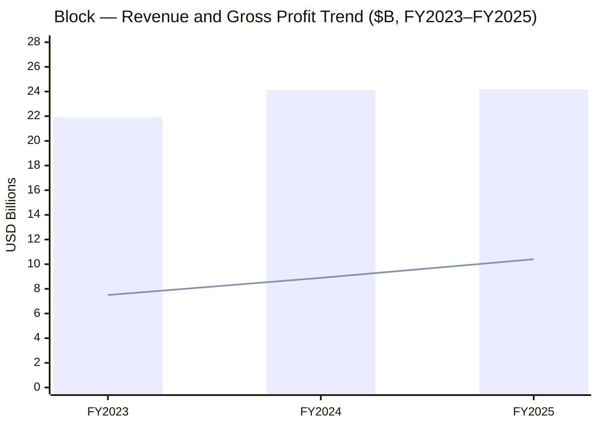
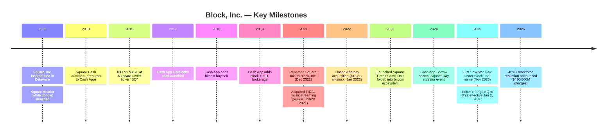
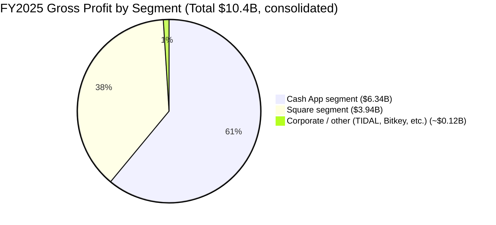
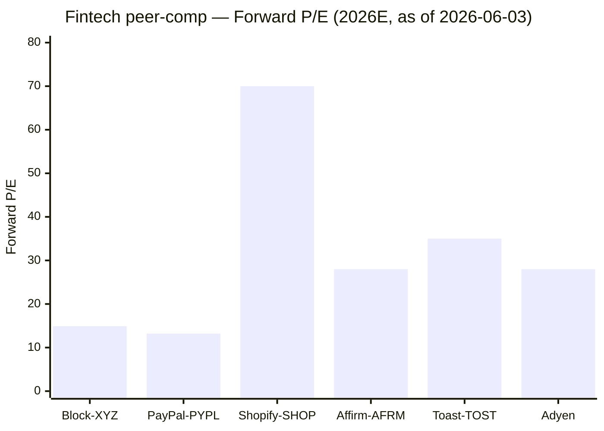
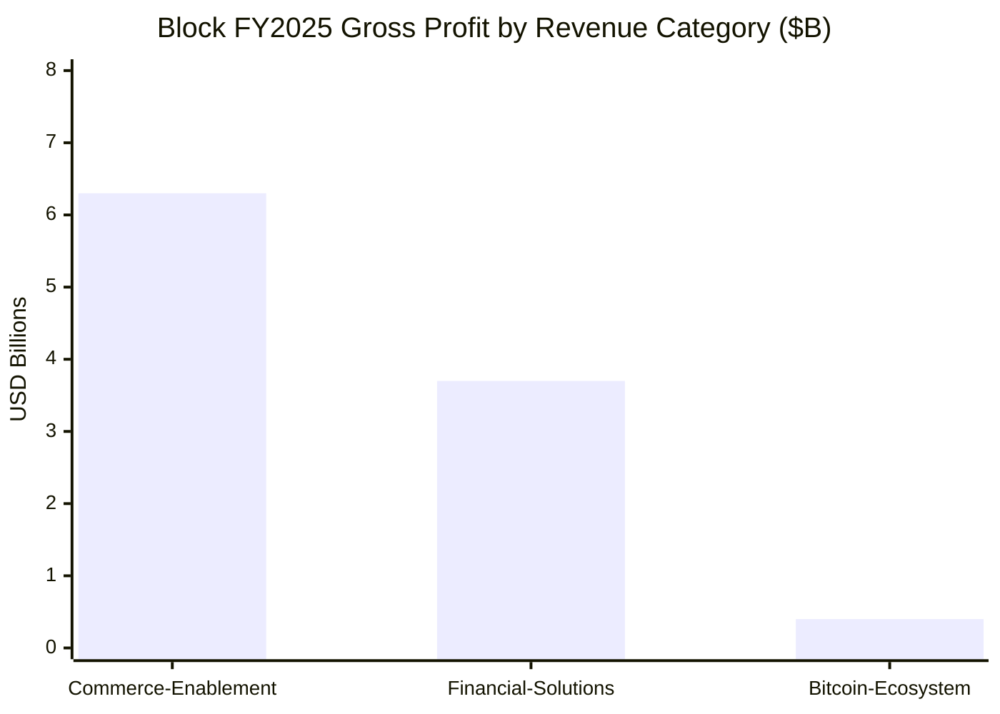

# Block, Inc. (NYSE:XYZ) — Initiating Coverage

**As of:** 2026-06-03

> **Banner — FY26 guide raised (Q1 2026 print):** Block raised full-year 2026 guidance on its Q1 2026 print. Management now expects FY26 gross profit growth of **~19% YoY**, Adjusted Operating Income of **$3.34B** at a **27% margin**, and **+62% Adjusted Diluted EPS growth**, versus a "preliminary view" of 17% gross-profit growth shared at Investor Day in November 2025. The raise was driven by Q1 2026 gross profit of **$2.91B (+27% YoY)**, with Cash App gross profit of $1.91B (+38%) and Square gross profit of $982M (+9%). Source: [Block Q1 2026 shareholder letter, 2026-05-07](https://www.sec.gov/Archives/edgar/data/1512673/000119312526212032/d132441dex991.htm).

> **Banner — Workforce reduction of 40%+ announced 2026-02-26.** Concurrent with the FY25 10-K filing, Block announced a "Workforce Plan" cutting headcount by more than 40% from a 2025-end base of 10,205 full-time employees, with cash and non-cash charges of **$450M–$500M** booked primarily in Q1 2026. Substantial completion expected by end of Q2 2026. Source: [Block FY2025 Form 10-K, Risk Factors and Subsequent Events](https://www.sec.gov/Archives/edgar/data/1512673/000162828026012254/xyz-20251231.htm).

## Table of Contents
1. [Company Overview](#1-company-overview)
2. [Company History](#2-company-history)
3. [Management Team](#3-management-team)
4. [Products and Services](#4-products-and-services)
5. [Customers and Concentration](#5-customers-and-concentration)
6. [Industry Overview](#6-industry-overview)
7. [Competitive Landscape](#7-competitive-landscape)
8. [Market Opportunity](#8-market-opportunity)
9. [Risk Assessment](#9-risk-assessment)
10. [Investor-Lens Scorecards](#10-investor-lens-scorecards)
11. [References](#references)

---

## 1. Company Overview

**Block, Inc. (NYSE:XYZ; formerly Square, Inc. / NYSE:SQ until December 1, 2021)** is a Delaware-domiciled financial services and payments holding company that operates as two interlocking ecosystems — **Square** (a software-and-payments operating system for ~4.5M sellers worldwide) and **Cash App** (a US consumer financial services app with monthly transacting actives in every one of the 50 states and nearly every US county as of December 2025). The company describes its overarching purpose as "economic empowerment, helping individuals and businesses manage, move, and grow their money," and operates under a distributed-work model — Block no longer designates a corporate headquarters under SEC rules ([Block FY2025 10-K, Item 1 Business](https://www.sec.gov/Archives/edgar/data/1512673/000162828026012254/xyz-20251231.htm)). The legal change of name from Square, Inc. to Block, Inc. on December 1, 2021 — and the change of NYSE ticker from SQ to XYZ effective January 2, 2026 — reflect management's view that the company is now a broader payments-fintech-bitcoin platform rather than the seller-payments specialist it began as in 2009.

**Reporting structure:** Block's CODM (the "Block Head and Chairperson," a position held by co-founder Jack Dorsey) reviews performance across **two reportable segments — Square and Cash App** — plus a Corporate / other line that captures TIDAL music streaming, Bitkey (self-custody bitcoin wallet), Proto (bitcoin mining systems), Spiral, and other emerging bitcoin-ecosystem work ([Block FY2025 10-K, Note 1 Description of Business](https://www.sec.gov/Archives/edgar/data/1512673/000162828026012254/xyz-20251231.htm)). Beginning in fiscal 2025 the company *also* re-classified revenue across three categories — **Commerce Enablement**, **Financial Solutions**, and **Bitcoin Ecosystem** — to better surface the post-Afterpay business mix; the segment view (Square / Cash App) and the revenue-category view sit side by side in disclosure ([Block FY2025 10-K, MD&A Revenue](https://www.sec.gov/Archives/edgar/data/1512673/000162828026012254/xyz-20251231.htm)).

**FY2025 income statement headline (audited, 10-K).** Total net revenue of **$24.19B** (up just 0.3% YoY, weighed down by Bitcoin Ecosystem revenue declining), total gross profit of **$10.4B (+17% YoY)**, GAAP operating income of **$1.71B** (vs. $892M in 2024), Adjusted Operating Income of **$2.1B** (vs. $1.6B), and net income attributable to common stockholders of **$1.3B** ($2.41 basic / $2.37 diluted EPS) versus $2.87B in 2024 — with the YoY net-income decline driven primarily by a $55.9M loss on bitcoin remeasurement in 2025 vs. a $420.9M gain in 2024 plus higher transaction-loss reserves ([Block FY2025 10-K, MD&A Results of Operations](https://www.sec.gov/Archives/edgar/data/1512673/000162828026012254/xyz-20251231.htm)). Cash App segment generated $6.34B in gross profit (+21% YoY) on $15.43B segment net revenue; Square segment generated $3.94B in gross profit (+9%) on $8.45B segment net revenue ([Block FY2025 10-K, MD&A Segment Results](https://www.sec.gov/Archives/edgar/data/1512673/000162828026012254/xyz-20251231.htm)).

**Cash, liquidity, and capital structure.** Block ended 2025 with **$9.19B of total liquidity** (cash, cash equivalents, restricted cash, and marketable debt securities), down from $10.70B at year-end 2024, plus an undrawn $775M revolving credit facility ([Block FY2025 10-K, Liquidity and Capital Resources](https://www.sec.gov/Archives/edgar/data/1512673/000162828026012254/xyz-20251231.htm)). Total cash, cash equivalents, restricted cash, and customer funds were $12.48B at year-end 2025, down $749M from year-end 2024. Operating cash flow for 2025 was $2.58B over the trailing twelve months ending Q4 2025 (per the Q4 2025 shareholder letter), and free cash flow was approximately $2.4B ([Block Q4 2025 shareholder letter, 2026-02-26](https://www.sec.gov/Archives/edgar/data/1512673/000119312526076557/d108590dex991.htm)). The company carries Senior Notes of $1.0B at 2.75% due 2026 and $1.0B at 3.50% due 2031 plus other instruments ([Block FY2025 10-K, Exhibit Index](https://www.sec.gov/Archives/edgar/data/1512673/000162828026012254/xyz-20251231.htm)).

**Valuation snapshot (as of 2026-06-03).** Stock at **$74.15**, market cap **~$44.1B**, fully-diluted shares ~535M ([Yahoo Finance — XYZ Statistics, 2026-06-03](https://finance.yahoo.com/quote/XYZ/key-statistics/)). **TTM P/E ~58×**, **forward P/E ~14.9×**, **TTM P/S ~1.8×**, **EV/EBITDA ~28.5×**, 52-week range $48.21 – $82.50 ([Yahoo Finance — XYZ Summary, 2026-06-03](https://finance.yahoo.com/quote/XYZ/)). The spread between trailing and forward P/E (~58× to ~15×) is the most important valuation tell in the name today and reflects three convergent factors: (i) FY25 net income was depressed by the $55.9M bitcoin remeasurement loss and by elevated transaction-loss reserves, (ii) the announced ~40% workforce cut is forecast to drop $450M–$500M of one-time severance into Q1 / Q2 2026 GAAP results, masking the underlying Adjusted Operating Income trajectory, and (iii) management is guiding to **27% Adjusted Operating Income margin** in FY26 (up from ~20% in FY25), which mathematically compresses the forward multiple as run-rate earnings step up ([Block Q1 2026 shareholder letter, 2026-05-07](https://www.sec.gov/Archives/edgar/data/1512673/000119312526212032/d132441dex991.htm)). *Analyst view:* the forward P/E of ~15× sits at or below the broad large-cap-software median (~18–25× per S&P 500 software sector data) and substantially below high-growth fintech peers PayPal (~13× fwd) and Shopify (~70× fwd) — implying the market is currently underpricing Block's FY26 EPS trajectory if guidance is met.

Source: [Block FY2025 10-K, MD&A Revenue table](https://www.sec.gov/Archives/edgar/data/1512673/000162828026012254/xyz-20251231.htm); bars = total net revenue, line = total gross profit.

## 2. Company History

**Square, Inc. was incorporated in Delaware in June 2009** by co-founders Jack Dorsey (then recently returned to Twitter following his 2008 ousting as CEO) and Jim McKelvey, a St. Louis-based glassblower and entrepreneur who had been unable to accept a credit-card payment for a $2,000 piece of art ([Block FY2025 10-K, Description of Business](https://www.sec.gov/Archives/edgar/data/1512673/000162828026012254/xyz-20251231.htm); [Block 2026 Proxy Statement — Director Bios](https://www.sec.gov/Archives/edgar/data/1512673/000162828026027203/sq-20260423.htm)). The Square ecosystem launched in February 2009 with the white plastic magnetic-stripe Square Reader, an iPad-compatible dongle that let any seller — sole proprietors, food trucks, market stalls — accept Visa/Mastercard payments through a smartphone for the first time. The product is described in the 10-K as enabling "businesses to accept card payments, a critical capability that had previously been inaccessible" ([Block FY2025 10-K, Square Ecosystem](https://www.sec.gov/Archives/edgar/data/1512673/000162828026012254/xyz-20251231.htm)).

**Cash App was launched in 2013 as "Square Cash"**, initially as a peer-to-peer money-transfer service competing with Venmo (PayPal). Over the next decade Cash App expanded beyond P2P into a multi-product consumer financial services platform: the Cash App Card (Visa debit card linked to Cash App balance) launched in 2017; stock and ETF brokerage launched in 2019; bitcoin buy/sell functionality launched in 2018; tax preparation (via Cash App Taxes, acquired from Credit Karma in 2020) launched in 2021; Cash App Borrow short-term lending rolled out gradually since 2020. Cash App had "monthly transacting actives in each of the 50 states and nearly every county" by December 2025 and was the **#1 finance app on Google Play and #3 on iOS by US downloads** in 2025 ([Block FY2025 10-K, Cash App Ecosystem](https://www.sec.gov/Archives/edgar/data/1512673/000162828026012254/xyz-20251231.htm)).

**IPO and capital-markets history.** Square, Inc. completed its initial public offering on the New York Stock Exchange in November 2015, pricing at $9 per share — at a $2.9B implied valuation — and trading under "SQ" ([Square S-1/A Registration Statement, 2015](https://www.sec.gov/Archives/edgar/data/1512673/000119312515378578/d937622ds1a.htm)). Subsequent debt-and-equity raises included convertibles in 2018 and 2020, the 2.75% / 3.50% Senior Notes priced in May 2021 ($2.0B aggregate, used in part to fund the all-stock Afterpay acquisition that closed in 2022), and ongoing share repurchase activity through 2023–2025 ([Block FY2025 10-K, Exhibit Index — Notes Indentures](https://www.sec.gov/Archives/edgar/data/1512673/000162828026012254/xyz-20251231.htm)).

**Renaming to Block, Inc.** The corporate name change from Square, Inc. to Block, Inc. became effective December 10, 2021 (NYSE ticker continued as SQ at that time). Management framed the rename around the company's expansion beyond seller payments into Cash App, bitcoin-ecosystem businesses (Bitkey, Proto, Spiral), TIDAL music streaming (acquired in March 2021 for $297M), and TBD (later folded into the bitcoin ecosystem). The ticker change from SQ to XYZ became effective January 2, 2026, completing the rebranding arc ([Block FY2025 10-K, Cover Page Ticker XYZ](https://www.sec.gov/Archives/edgar/data/1512673/000162828026012254/xyz-20251231.htm)).

**The Afterpay acquisition (closed January 31, 2022)** was Block's most transformative strategic move to date — an all-stock deal originally valued at approximately $29B (revised to $13.8B at closing given the SQ share-price decline between announcement in August 2021 and closing in January 2022). Afterpay brought Block a globally scaled Buy-Now-Pay-Later franchise across the United States, Australia, Canada, New Zealand, and the United Kingdom — establishing what Block now describes as an "integrated platform across Square sellers and Cash App consumers" with BNPL as the connective tissue ([Block FY2025 10-K, BNPL Products](https://www.sec.gov/Archives/edgar/data/1512673/000162828026012254/xyz-20251231.htm)).

**Subsequent business evolution (2022–2025).** Block's 2022 was characterized by margin compression following the Afterpay integration and tightening macro conditions; 2023 marked the consolidation of "Block 1.0" with TBD folded into the broader bitcoin ecosystem and TIDAL repositioned as an artist-monetization platform rather than a Spotify competitor. In May 2024, the company published its first "Square Day" investor event highlighting Square's pivot toward mid-market and food-and-beverage verticals. In November 2025, management hosted its first formal Investor Day under the Block, Inc. name, laying out the company's three-year strategic plan to grow Cash App gross profit at >20% CAGR while accelerating Square GPV growth and re-establishing operating-margin discipline ([Block Q4 2025 shareholder letter — references to Investor Day](https://www.sec.gov/Archives/edgar/data/1512673/000119312526076557/d108590dex991.htm)).

Source: [Block FY2025 10-K, Item 1 Business](https://www.sec.gov/Archives/edgar/data/1512673/000162828026012254/xyz-20251231.htm); [Block Q4 2025 shareholder letter](https://www.sec.gov/Archives/edgar/data/1512673/000119312526076557/d108590dex991.htm); [Block 2026 Proxy Statement — Director Tenures](https://www.sec.gov/Archives/edgar/data/1512673/000162828026027203/sq-20260423.htm).

## 3. Management Team

**Jack Dorsey — Block Head (CEO) and Chairperson (Co-Founder).** Jack Dorsey, age 49, has served as Block's principal executive officer and as a member of its board of directors since July 2009 — he founded Square (now Block) jointly with Jim McKelvey in 2009 and has held the chair since October 2010. He briefly held the operational "Square Head" role personally during 2023 and into early 2024 before reverting to the broader "Block Head" remit. Dorsey is described in the 2026 Proxy as Block's "controlling shareholder in this context" for purposes of Square Financial Services oversight ([Block 2026 Proxy Statement — Director Bios](https://www.sec.gov/Archives/edgar/data/1512673/000162828026027203/sq-20260423.htm); [Block FY2025 10-K, Item 1 Business — Government Regulation](https://www.sec.gov/Archives/edgar/data/1512673/000162828026012254/xyz-20251231.htm)). Before founding Square, Dorsey served as President and CEO of Twitter, Inc. from May 2007 to October 2008 and was one of three Twitter co-founders, returning to Twitter as CEO from 2015 to November 2021 — during which time he was concurrently Block's CEO, an unusual dual-CEO arrangement. Dorsey's prior education was at New York University (he attended but did not complete a degree). His compensation is one of the most distinctive in US public markets: at his own request, he receives **no cash or equity compensation except an annual salary of $2.75** ([Block 2026 Proxy Statement — Executive Compensation Highlights](https://www.sec.gov/Archives/edgar/data/1512673/000162828026027203/sq-20260423.htm)). He retains a substantial personal stake in Block — both directly and via the Block Head Trust — and is referenced as "controlling shareholder" in the Square Financial Services regulatory context. *Analyst view:* Dorsey's $2.75 nominal salary and his concurrent leadership of bitcoin-ecosystem subsidiaries (Spiral, Proto, Bitkey) signal an unusually founder-driven, mission-oriented governance posture that compresses traditional principal–agent conflicts but introduces concentration risk (single-founder dependency).

**Amrita Ahuja — Foundational Lead, Chief Financial Officer, Chief Operating Officer, and People Lead.** Amrita Ahuja, age 46, has served as Block's CFO since January 2019, added the COO and "Foundational Lead" titles in February 2023, and assumed the People Lead role in September 2025 — making her by some distance the most powerful operating executive at Block other than Dorsey. Her base salary was raised to $600,000 for 2026 (from $565,000) per the 2026 Proxy ([Block 2026 Proxy Statement — Executive Compensation Tables](https://www.sec.gov/Archives/edgar/data/1512673/000162828026027203/sq-20260423.htm)). Prior to Block, Ahuja was Chief Financial Officer of Blizzard Entertainment, Inc. (a division of Activision Blizzard, Inc.) from March 2018 to January 2019, and served at Activision Blizzard, Inc. from June 2010 in roles including Senior Vice President of Investor Relations from January 2015 to May 2018 ([Block 2026 Proxy Statement — Executive Officer Bios](https://www.sec.gov/Archives/edgar/data/1512673/000162828026027203/sq-20260423.htm)). Ahuja's accumulation of titles since 2023 — CFO + COO + People Lead under a single executive — reflects the highly delayered organizational design Block has been pursuing, and her central role in the announced ~40% Workforce Plan is implicit in her People Lead remit. The 2026 Proxy lists six current Executive Officers, with Ahuja, Brian Grassadonia (Ecosystem Lead), Owen Britton Jennings (Business Lead), Chrysty Esperanza (Counsel Lead / Chief Legal Officer), and Arnaud Weber (Engineering Lead, hired June 2025) under Dorsey. Former Technology + Engineering Lead Dhanji R. Prasanna departed as executive officer in November 2025 ([Block 2026 Proxy Statement — Executive Officers Table](https://www.sec.gov/Archives/edgar/data/1512673/000162828026027203/sq-20260423.htm)).

## 4. Products and Services

Block operates two reportable customer-facing ecosystems — Square and Cash App — plus a Corporate / "other" line that houses TIDAL music streaming and the bitcoin-hardware businesses Bitkey, Proto, and Spiral. The 10-K describes the over-arching offer as "integrating payments, banking, lending, and commerce solutions" with shared infrastructure across embedded financial services, automation, and the open Bitcoin protocol ([Block FY2025 10-K, Item 1 Business — Our Ecosystems](https://www.sec.gov/Archives/edgar/data/1512673/000162828026012254/xyz-20251231.htm)).

### 4.1 Square Ecosystem — Seller-side commerce operating system

The Square ecosystem combines payments, point-of-sale (POS) software, hardware, and embedded financial services for ~4.5M sellers worldwide, with primary geographic coverage in the United States, Canada, Japan, Australia, the United Kingdom, Ireland, France, and Spain ([Block FY2025 10-K, Item 1 Business — Square Sellers](https://www.sec.gov/Archives/edgar/data/1512673/000162828026012254/xyz-20251231.htm)). The 10-K describes the Square ecosystem starting from the 2009 founding capability: "we started Block with the Square ecosystem in February 2009 to enable businesses to accept card payments, a critical capability that had previously been inaccessible." Square sellers cover a diverse range of industries (services, food-related, and retail businesses) and sizes "ranging from sole proprietors to mid-market multi-location merchants" — and Square processed Gross Payment Volume (GPV) from "more than 4.5 million sellers" originating from "more than 800 million payment cards, across more than 300 million buyer profiles" in 2025.

**Hardware portfolio.** The 10-K lists the Square hardware lineup verbatim:

> "Square Register is an all-in-one offering that combines our hardware, point-of-sale software, and payments technology. The dedicated hardware consists of two screens... Square Terminal is a portable, all-in-one payments device and receipt printer to replace traditional keypad terminals. It accepts tap, dip, and swipe payments... Square Stand transforms an iPad into a complete countertop point of sale and features an integrated contactless and chip reader. Square Reader for contactless and chip accepts EMV chip cards and NFC payments, enabling acceptance via Apple Pay, Google Pay, and other mobile wallets." ([Block FY2025 10-K, Item 1 Business — Hardware](https://www.sec.gov/Archives/edgar/data/1512673/000162828026012254/xyz-20251231.htm))

The magnetic-stripe Square Reader — the original 2009 product — remains in the lineup as the entry-level offering, and the 10-K acknowledges reliance on "single sources of supply" for the magnetic-stripe reader hardware as a supply-chain concentration risk.

**Software portfolio.** Square's vertical-specific POS software includes **Square for Restaurants** (table management, kitchen display systems, online ordering), **Square for Retail** (inventory management, barcode scanning, omnichannel sales), **Square Appointments** (booking and scheduling for service businesses), **Square Online** (e-commerce storefront builder), and operational tools "such as Square Team Management and Square Payroll" that allow sellers to manage scheduling, performance, and payroll administration. The 10-K notes these "integrate directly with Square's commerce and financial solutions" — the unifying differentiator versus point-product competitors ([Block FY2025 10-K, Item 1 Business — Square Software](https://www.sec.gov/Archives/edgar/data/1512673/000162828026012254/xyz-20251231.htm)).

**Square Loans, Square Card, Square Banking.** Beyond payments and software, Square offers an embedded lending product: **Square Loans facilitates loans to qualified Square sellers through Square Financial Services** — Block's Utah-chartered industrial bank subsidiary, which began operations in 2021. The 10-K verbatim: *"Since its public launch in May 2014, Square Loans has facilitated more than 4.0 million loans and advances, representing more than $32.8 billion in principal amount loaned or advanced"* ([Block FY2025 10-K, Item 1 Business — Square Loans](https://www.sec.gov/Archives/edgar/data/1512673/000162828026012254/xyz-20251231.htm)). **Square Credit Card** was launched in 2023 to provide another lending product to qualified Square sellers. **Square Card** is a free Mastercard business debit card linked to a seller's Square balance; **Square Banking** provides a suite of business deposit, savings, and instant-deposit products on top of Square Financial Services.

**Strategic significance for Square.** The Square ecosystem's strategic value is in the **integration loop** — payments produce the data (deal size, revenue cadence, customer mix) that underwrites Square Loans, which extends Square's wallet share with merchants from "payments processing" to "operating-system-and-balance-sheet partner." The 10-K characterizes this as: "Our ability to add new sellers efficiently, help them grow their business, and cross-sell our products and services has historically contributed to our growth" ([Block FY2025 10-K, Item 1 Business — Square Ecosystem](https://www.sec.gov/Archives/edgar/data/1512673/000162828026012254/xyz-20251231.htm)). Q4 2025 Square GPV growth of 10% (year-over-year) was "driven primarily by strength in Food and Beverage sellers" — the vertical Square has invested most heavily in via Square for Restaurants — and management cites investor-day commentary on "speed" as the operating discipline expected to accelerate Square GPV further over the next three years ([Block Q4 2025 shareholder letter, 2026-02-26](https://www.sec.gov/Archives/edgar/data/1512673/000119312526076557/d108590dex991.htm)).

### 4.2 Cash App Ecosystem — Consumer financial services super-app

Cash App is positioned in the 10-K as a "leader in the segment" of consumer financial services for what management terms "Cash App Green" customers — *"the segment of the workforce that earns income from multiple dynamic sources including hourly wages, gig work, and freelancing"* — with an addressable market estimated at approximately 125 million people across "independent earners, hourly workers, and working teens" ([Block Q4 2025 shareholder letter, 2026-02-26](https://www.sec.gov/Archives/edgar/data/1512673/000119312526076557/d108590dex991.htm)). The 10-K describes Cash App as providing "an ecosystem of financial products and services to help individuals and businesses manage, move, and grow their money" through "money transfer, debit card spending (Cash App Card), buy/sell of bitcoin and equities, banking-style direct deposit, lending (Cash App Borrow), and BNPL (via the Afterpay integration)" ([Block FY2025 10-K, Item 1 Business — Cash App Ecosystem](https://www.sec.gov/Archives/edgar/data/1512673/000162828026012254/xyz-20251231.htm)).

**Engagement and inflows.** Cash App generated **$316 billion in inflows in 2025**, with the average monthly transacting active bringing in "$1,410 of inflows during the quarter" in Q4 2025 (up 12% YoY from $1,261 in Q4 2024). Block monitors Cash App through what management calls its "**inflows framework**" — *"transacting actives, inflows per active, and the monetization rate on inflows"* ([Block FY2025 10-K, Item 1 Business — Inflows Framework](https://www.sec.gov/Archives/edgar/data/1512673/000162828026012254/xyz-20251231.htm); [Block Q4 2025 shareholder letter, 2026-02-26](https://www.sec.gov/Archives/edgar/data/1512673/000119312526076557/d108590dex991.htm)). Total Cash App inflows grew 15% YoY in Q4 2025 to $83B in the quarter, with Financial Solutions Gross Profit per Active reaching **$15** (+57% YoY from $9 a year earlier) — a powerful KPI showing that Cash App's monetization rate per user is compounding faster than user growth.

**Cash App Card.** *"Cash App Card is a debit card, issued by our bank partner, and linked directly to a customer's Cash App balance"* ([Block FY2025 10-K, Item 1 Business — Cash App Card](https://www.sec.gov/Archives/edgar/data/1512673/000162828026012254/xyz-20251231.htm)). Customers can order a Cash App Card for free; Block earns interchange fees when individuals make purchases with their Cash App Card. Cash App Card is the principal monetization vector for Cash App's consumer base — it converts a free P2P relationship into a recurring transaction-fee stream — and it is the entry point through which Block cross-sells direct deposit, brokerage, and lending.

**Cash App Borrow.** Cash App Borrow provides eligible customers with access to short-term loans for a fixed fee, with repayment made through scheduled installments. The 10-K reports that "in 2025, the average Cash App Borrow loan was repaid in less than four weeks." Block also introduced **Cash App Score** in 2025 — *"an internally developed credit scoring framework"* — to support underwriting expansion ([Block FY2025 10-K, Item 1 Business — Cash App Borrow](https://www.sec.gov/Archives/edgar/data/1512673/000162828026012254/xyz-20251231.htm)). Cash App Borrow was the principal growth driver of Cash App's 2025 gross profit acceleration (+21% YoY), and management's Q1 2026 letter notes that Cash App's Financial Solutions gross profit growth "accelerated to 55% in the first quarter, driven by Cash App Consumer Lending" ([Block Q1 2026 shareholder letter, 2026-05-07](https://www.sec.gov/Archives/edgar/data/1512673/000119312526212032/d132441dex991.htm)).

**BNPL — Afterpay and Cash App Pay Later.** *"Cash App and Afterpay offer a wide range of Pay Later capabilities that make purchasing more flexible and accessible for consumers. For merchants, these offerings are designed to improve conversion and increase average order value"* ([Block FY2025 10-K, Item 1 Business — BNPL Products](https://www.sec.gov/Archives/edgar/data/1512673/000162828026012254/xyz-20251231.htm)). Afterpay BNPL products are offered across the United States, Australia, Canada, New Zealand, and the United Kingdom, with the Afterpay Card and Afterpay Plus Card allowing in-store BNPL at participating merchants. Afterpay Post-Purchase allows eligible consumers to convert completed transactions into installment payments, extending the BNPL franchise beyond the point of sale.

**Other Cash App products.** Cash App customers can invest their funds in U.S.-listed stocks and ETFs "for as little as $1" through Cash App's stock brokerage; the Cash App Taxes product offers free tax preparation; Round Ups allow customers to round purchases up to the nearest dollar and direct-deposit the difference into bitcoin or stock ([Block FY2025 10-K, Item 1 Business — Cash App Other](https://www.sec.gov/Archives/edgar/data/1512673/000162828026012254/xyz-20251231.htm)).

### 4.3 Corporate / other ecosystems — TIDAL, Bitkey, Proto, Spiral

**TIDAL.** Block acquired TIDAL in March 2021 for $297M. The 10-K describes TIDAL as *"a global platform for musicians and their fans that uses unique content, experiences, and features to bring fans closer to artists and to provide artists with tools to succeed as entrepreneurs."* TIDAL "offers an extensive catalog of more than 250 million songs and 1,000,000 high-quality videos. TIDAL has a global presence with listeners in more than 60 countries and relationships with nearly 300 labels" ([Block FY2025 10-K, Item 1 Business — TIDAL](https://www.sec.gov/Archives/edgar/data/1512673/000162828026012254/xyz-20251231.htm)). TIDAL's commercial scale within Block is modest — it does not generate material segment-level revenue — but it occupies a strategic role as a creator-economy distribution platform that integrates with Square's seller tooling for artists.

**Bitcoin ecosystem (Bitkey, Proto, Spiral).** The 10-K describes Block's "bitcoin ecosystem" as encompassing three distinct initiatives: *"Bitkey, which is a self-custody bitcoin wallet, Proto, which is a bitcoin mining system, as well as Spiral, an independent team focused on contributing to bitcoin open source work"* ([Block FY2025 10-K, Item 1 Business — Bitcoin Ecosystem](https://www.sec.gov/Archives/edgar/data/1512673/000162828026012254/xyz-20251231.htm)). Bitkey is a hardware wallet enabling secure self-custody of bitcoin; Proto is a vertically-integrated bitcoin mining system (chips, hardware, software); Spiral is a contributor team to the open-source Bitcoin Core project. Bitcoin trading revenue (from Cash App buy/sell) is the dominant cash-generating bitcoin line — and it declined in 2025 vs 2024 because of softer crypto trading conditions — while Bitkey and Proto remain investment-phase product lines.

**Synthesis — how the products interact.** The Block portfolio interlocks through three flywheels. (i) The **Square flywheel**: payments processing generates the data that underwrites Square Loans, which deepens merchant wallet share and produces more payments volume. (ii) The **Cash App flywheel**: the free P2P money-transfer product (and the Cash App Card) acquires consumers; engagement drives inflows; inflows feed direct deposit, brokerage, Cash App Borrow, and BNPL — each step monetizing a deeper share of customer financial life. (iii) The **integrated platform flywheel** (post-Afterpay): Afterpay BNPL connects Cash App consumers to Square sellers, expanding Square seller demand while extending Cash App's purchase utility — the "two-sided network" thesis Block has emphasized since the 2021 Afterpay announcement. The TIDAL and bitcoin-ecosystem businesses sit outside these flywheels and are best viewed as optional R&D — high-conviction founder bets that are not load-bearing for the 2026–2028 earnings trajectory.

```mermaid
graph TD
    Block[Block, Inc. - NYSE XYZ]
    Block --> Square[Square Ecosystem]
    Block --> CashApp[Cash App Ecosystem]
    Block --> Other[Corporate / Other]

    Square --> SP[Square Payments]
    Square --> SS[Square Software]
    Square --> SH[Square Hardware]
    Square --> SF[Square Financial Services]
    SS --> SR[Square for Restaurants]
    SS --> SRT[Square for Retail]
    SS --> SA[Square Appointments]
    SS --> SO[Square Online]
    SF --> SL[Square Loans]
    SF --> SC[Square Card]
    SF --> SB[Square Banking]

    CashApp --> CC[Cash App Card]
    CashApp --> CP[Cash App Pay]
    CashApp --> CB[Cash App Borrow]
    CashApp --> CBK[Cash App Banking]
    CashApp --> CBR[Brokerage]
    CashApp --> CBT[Bitcoin buy/sell]
    CashApp --> CT[Cash App Taxes]
    CashApp --> AP[Afterpay BNPL]

    Other --> TIDAL[TIDAL music streaming]
    Other --> BK[Bitkey - self-custody wallet]
    Other --> PR[Proto - bitcoin mining]
    Other --> SP2[Spiral - Bitcoin open source]
```

Source: [Block FY2025 10-K, Item 1 Business — Our Ecosystems](https://www.sec.gov/Archives/edgar/data/1512673/000162828026012254/xyz-20251231.htm).

## 5. Customers and Concentration

Block's customer base differs sharply by ecosystem. Square's customer base is **B2B (merchants / sellers)** with ~4.5M annually active sellers across eight primary countries; Cash App's customer base is **B2C (US consumers)** with multi-tens-of-millions of monthly transacting actives spread across all 50 US states and nearly every US county as of December 2025 ([Block FY2025 10-K, Item 1 Business — Cash App Customer Base](https://www.sec.gov/Archives/edgar/data/1512673/000162828026012254/xyz-20251231.htm)).

**Square — seller concentration.** *"Square sellers represent a diverse range of industries (including services, food-related, and retail businesses) and sizes, ranging from sole proprietors to mid-market merchants. Square sellers span geographies, including the United States, Canada, Japan, Australia, the United Kingdom, Ireland, France, and Spain. We have also increasingly served mid-market sellers"* ([Block FY2025 10-K, Item 1 Business — Square Sellers](https://www.sec.gov/Archives/edgar/data/1512673/000162828026012254/xyz-20251231.htm)). Square's seller base is extremely fragmented — the 4.5M-seller denominator means even Block's largest individual merchant customer represents a tiny share of consolidated revenue. The 10-K does not disclose any single customer above the 10% threshold required under ASC 280-10-50-42 — meaning **no single Block customer accounts for >10% of consolidated revenue in FY2025**.

**Cash App — consumer concentration.** Cash App's consumer base is by definition extremely fragmented — *"Cash App is primarily in the United States and has a diverse set of customers across demographics and regions"* ([Block FY2025 10-K, Item 1 Business — Cash App Customer Base](https://www.sec.gov/Archives/edgar/data/1512673/000162828026012254/xyz-20251231.htm)). Block discloses Cash App's monetization in aggregate (inflows per active, monetization rate on inflows) but does not name individual top consumers (which would not be meaningful given the millions-strong active base).

**Counterparty concentration in card networks and processors.** The most material counterparty concentrations for Block are not customer-side but vendor-side: the company depends on the **Visa, Mastercard, American Express, and Discover** card networks — *"For a majority of our transactions, sellers accept cards from Visa, Mastercard, American Express, and Discover"* ([Block FY2025 10-K, Item 1 Business — Payment Network Reliance](https://www.sec.gov/Archives/edgar/data/1512673/000162828026012254/xyz-20251231.htm)) — and on third-party payment processors (where one processor accounts for a credit-concentration risk in settlements receivable, per the 10-K's risk-concentration disclosures). The risk-concentration table separately discloses a settlement-receivable concentration risk with a Third-Party Processor One — meaning a single bank settlement counterparty handles a material share of Block's settlements receivable. This is industry-standard for payments firms but should be tracked as a structural counterparty risk.

**Square Loans funding concentration.** *"We currently fund a majority of these loans from arrangements with institutional third-party investors"* ([Block FY2025 10-K, Item 1 Business — Square Loans Funding](https://www.sec.gov/Archives/edgar/data/1512673/000162828026012254/xyz-20251231.htm)). The Square Loans business model is partly off-balance-sheet — institutional investors purchase the loans Block underwrites — which means Square Loans throughput depends on the appetite of those institutional buyers. If credit markets tighten, Square Loans volume can compress quickly even if seller demand stays constant.

**Geographic concentration.** No individual country outside the United States contributes more than 10% of total revenue — *"no individual country from the international markets contributed more than 10% of total revenue"* per the 10-K's geographic disclosures ([Block FY2025 10-K, Item 1 Business — Geographic Mix](https://www.sec.gov/Archives/edgar/data/1512673/000162828026012254/xyz-20251231.htm)). The dominant geographic exposure is the United States across both Square and Cash App; Block's international expansion is concentrated in Australia (Afterpay's home market), the UK, Canada, Japan, Ireland, France, and Spain.

Source: [Block FY2025 10-K, MD&A Segment Results](https://www.sec.gov/Archives/edgar/data/1512673/000162828026012254/xyz-20251231.htm). Note: this chart shows gross profit by *segment* (Square / Cash App), not by *customer*; Block does not disclose any single customer >10% of consolidated revenue.

## 6. Industry Overview

Block competes in three overlapping markets — **merchant-acquiring / payments processing**, **consumer financial services / digital banking**, and **buy-now-pay-later (BNPL) financing** — with optionality into bitcoin-ecosystem hardware and software.

**Merchant-acquiring / payments processing (Square's primary market).** The global merchant-acquiring market processes tens of trillions of dollars of card-payment volume annually, with the US share accounting for roughly $8–9T of card volume. Yole Group, Gartner, and Nilson Report do not directly publish merchant-acquirer market shares, but industry consolidation (FIS-Worldpay reversal, Global Payments acquisitions, Fiserv-First Data 2019) has driven the top-5 US acquirers (Fiserv, JPM Chase Merchant Services, Worldpay, Bank of America Merchant Services, Stripe) to ~70% of card-acquiring volume share. Within that landscape, Square has carved out a defensible SMB-and-vertical-software niche — the 10-K characterizes the Square competitive set as *"large, well-established vendors to smaller, earlier-stage companies"* and lists, by category, *"business software providers such as those that provide point of sale, website building, inventory management, employee management, customer relationship management invoicing, and appointment booking solutions"* — i.e. Shopify, Toast, Lightspeed, Clover, Adyen ([Block FY2025 10-K, Item 1 Business — Square Competition](https://www.sec.gov/Archives/edgar/data/1512673/000162828026012254/xyz-20251231.htm)). Industry growth is driven by the secular shift of small-business commerce from cash to card and from card to mobile/contactless — a tailwind that Stripe Press and McKinsey estimate at mid-to-high-single-digit volume growth annually in developed markets.

**Consumer financial services / digital banking (Cash App's primary market).** The US "neobank" or consumer-fintech sector — defined as app-native consumer accounts that combine checking-style P2P, debit card spending, brokerage, and credit — added ~30–50M US accounts during 2018–2024 across Cash App, Chime, Venmo (PayPal), Robinhood, SoFi, and others. The 10-K describes Cash App's competitive set as *"money transfer apps, debit card offerings, brokerage firms, tax firms, financial technology apps, banks, and crypto trading services"* ([Block FY2025 10-K, Item 1 Business — Cash App Competition](https://www.sec.gov/Archives/edgar/data/1512673/000162828026012254/xyz-20251231.htm)). Block's "Cash App Green" framing — addressing the ~125M-strong US workforce earning income from hourly wages, gig work, and freelancing — is a deliberately narrower TAM than "the entire US consumer banking market" but is exactly the segment underbanked by traditional financial institutions and most willing to switch to app-native tools ([Block Q4 2025 shareholder letter, 2026-02-26](https://www.sec.gov/Archives/edgar/data/1512673/000119312526076557/d108590dex991.htm)).

**BNPL (Afterpay's primary market).** The global BNPL market processed approximately $300–400B in transaction volume in 2024 (per industry analyst aggregates), with the US BNPL market reaching ~$80B and growing in the high teens. The top global BNPL platforms are Klarna, Afterpay (Block), Affirm, PayPal Pay Later, and Apple Pay Later — with significant share contests between Klarna and Afterpay in the US, UK, and Australia. The 10-K acknowledges intensifying BNPL competition: *"competitors have introduced or offer BNPL products. Competitors in the BNPL space have engaged in, and may continue to engage in, aggressive consumer acquisition campaigns, may develop superior technology offerings, or consolidate with other entities and achieve benefits of scale"* ([Block FY2025 10-K, Risk Factors — BNPL Competition](https://www.sec.gov/Archives/edgar/data/1512673/000162828026012254/xyz-20251231.htm)). Regulatory scrutiny on BNPL has tightened markedly since 2024 — the CFPB issued an interpretive rule classifying BNPL providers as credit-card issuers under Regulation Z in May 2024, requiring dispute resolution and statement disclosure; the 10-K's risk factors reference *"increased regulatory and legislative scrutiny of BNPL products in the United States, United Kingdom, and Australia"* without quoting specific case names.

**Bitcoin ecosystem (Bitkey, Proto, Spiral, and Cash App bitcoin buy/sell).** The 10-K verbatim discloses *"the gross profit generated from the bitcoin ecosystem was only 4% and 5% of the total gross profit in 2025 and 2024, respectively"* ([Block FY2025 10-K, MD&A — Bitcoin Ecosystem](https://www.sec.gov/Archives/edgar/data/1512673/000162828026012254/xyz-20251231.htm)). So bitcoin-ecosystem economics are still small relative to Square+Cash App, but they remain strategically important as the company's longest-duration growth bet. The bitcoin industry has rebounded sharply in 2024–2025 alongside spot Bitcoin ETF approvals (January 2024) and bitcoin price appreciation; Bitkey hardware-wallet TAM is estimated at $1–2B globally (vs. Ledger's ~$200M revenue scale as the leading incumbent), and bitcoin-mining hardware (Proto's TAM) is a $5–10B annual capex market dominated by Bitmain and MicroBT.

## 7. Competitive Landscape

The Square / Cash App / Afterpay product set crosses three competitive landscapes simultaneously, and Block faces well-resourced incumbents in each.

**Square's principal competitors (US):**
- **Stripe** — privately held; ~$1.4T processed volume in 2024 per company disclosures. Dominant in e-commerce and developer-platform payments; complementary to Square in physical retail, competitive in omnichannel and online-first verticals.
- **Toast (NYSE:TOST)** — pure-play restaurant POS and payments; head-to-head with Square for Restaurants in the F&B vertical.
- **Shopify (NYSE:SHOP)** — Shopify Payments via Stripe partnership; dominant in DTC e-commerce; competes with Square Online plus Square for Retail.
- **Clover** (Fiserv subsidiary, NYSE:FI) — SMB POS-and-payments bundle distributed through Fiserv's bank partners; directly competitive with Square Reader / Square Stand.
- **Lightspeed (NYSE:LSPD)** — POS-and-payments for retail and hospitality; competitive with Square for Restaurants and Square for Retail.
- **Adyen (Amsterdam:ADYEN)** — enterprise-omnichannel payments; competitive with Square primarily at the mid-market and above.

**Cash App's principal competitors (US):**
- **Venmo (PayPal subsidiary, NASDAQ:PYPL)** — the original Cash App competitor in P2P; PayPal continues to invest in Venmo as a consumer-finance app with debit, BNPL, and crypto features.
- **Zelle** (Early Warning Services consortium) — bank-network-owned instant P2P; competitive in the "free P2P" use case but not in monetized financial services.
- **Chime** (private; IPO'd September 2024) — consumer-neobank competitor with Spotme overdraft, direct deposit, and savings — head-to-head with Cash App in "Cash App Green" demographic.
- **Robinhood (NASDAQ:HOOD)** — competitive in brokerage and crypto trading sub-segments of Cash App.
- **SoFi (NASDAQ:SOFI)** — consumer-finance super-app with savings, brokerage, lending — competitive across multiple Cash App sub-segments.
- **Apple Cash + Apple Card** — Apple's wallet-native P2P and debit competitive with Cash App Card; deeply integrated with iOS.

**BNPL competitors (Afterpay):**
- **Affirm (NASDAQ:AFRM)** — leading US BNPL competitor with deep merchant relationships (Amazon, Shopify, Walmart, Apple) — direct head-to-head with Afterpay.
- **Klarna** (privately held, IPO filing as of 2024–2025) — global BNPL leader with strong US, UK, and European footprint.
- **PayPal Pay Later** (NASDAQ:PYPL) — bundled into the PayPal checkout flow at any merchant accepting PayPal.
- **Apple Pay Later** — Apple's BNPL offering (limited rollout); competitive at Apple Pay merchants.

**Bitcoin-ecosystem competitors:**
- **Ledger** (private; French hardware wallet maker) — dominant self-custody hardware wallet, ~70% retail share.
- **Trezor** (private; SatoshiLabs subsidiary) — second-largest hardware wallet competitor.
- **Coinbase (NASDAQ:COIN)** — competes with Cash App's bitcoin buy/sell functionality at the trading layer.
- **Bitmain** / **MicroBT** — dominant bitcoin-mining ASIC and hardware suppliers; Proto's competitive set in the mining-rig market.

*Analyst view:* Block's competitive position is strongest in **Cash App** within the "Cash App Green" demographic — where Cash App's brand and breadth of products (debit, brokerage, BNPL, bitcoin, banking) outperform single-product competitors — and in **Square SMB** within the F&B and services verticals where its software-payments integration is differentiated. Block's competitive position is weakest in the e-commerce checkout vertical (Stripe / Shopify dominate) and in enterprise / mid-market payments (Adyen / Stripe dominate). The Afterpay franchise sits in the #2 / #3 position globally in BNPL — well-positioned but not the share leader; Affirm holds an arguably stronger US merchant network position. *Analyst view:* the most consequential competitive risk over the next 24 months is Apple's continued buildout of Apple Cash, Apple Card, Apple Pay Later, and Tap-to-Pay-on-iPhone — each of which encroaches on Block's franchises with the structural advantage of iOS-level integration.

Source: peer P/E values reflect publicly available consensus estimates summarized on [Yahoo Finance Statistics pages](https://finance.yahoo.com/quote/XYZ/key-statistics/) as of 2026-06-03; specific peer P/E figures should be re-checked at consumption time as they move with daily price action and consensus revisions.

## 8. Market Opportunity

The combined TAM Block is targeting spans three large markets — global merchant acquiring, US consumer fintech, and global BNPL — plus optionality in bitcoin ecosystems.

**Merchant acquiring TAM.** Global card-and-mobile-payments volume reached ~$50T in 2024 per Nilson Report aggregates; with merchant-acquiring net take-rates averaging 0.15–0.25%, global merchant-acquirer revenue is ~$80–120B annually. Square's share of that pie is small (estimated single-digit-percent of the US SMB segment) — so even modest share expansion in the SMB / mid-market and food-and-beverage verticals represents multi-hundred-million-dollar incremental revenue opportunity. Management's Q4 2025 letter highlights *"we plan to take our go-to-market approach and product strategy deeper into other verticals in 2026 and beyond"* with specific examples of vertical wins like 7 Leaves (45-location specialty coffee chain) ([Block Q4 2025 shareholder letter, 2026-02-26](https://www.sec.gov/Archives/edgar/data/1512673/000119312526076557/d108590dex991.htm)).

**Cash App TAM — "Cash App Green."** Block management has explicitly framed Cash App's addressable market at **~125 million people** across "49M independent earners (excluding business owners only), 77M hourly workers (full-time, part-time, and independent earners who self-identified)" — i.e. the segment of the US workforce earning multi-source income that traditional banks underserve ([Block Q4 2025 shareholder letter, 2026-02-26](https://www.sec.gov/Archives/edgar/data/1512673/000119312526076557/d108590dex991.htm)). Cash App's current 25M+ monthly transacting active base implies penetration in the 20% range of the ~125M TAM — leaving substantial runway. At $1,410 of quarterly inflows per active (Q4 2025 print) and a 15%/active per-quarter monetization rate trajectory, additional TAM penetration translates directly into Financial Solutions gross profit.

**BNPL TAM.** US BNPL transaction volume reached ~$80B in 2024 with ~16% YoY growth (per industry consensus); global BNPL volume reached ~$400B. Afterpay's share within Block's accounting is partially obscured by the integration into Cash App and Square — but management treats BNPL as a structural cross-sell rather than a standalone product, which has the effect of making BNPL share statistics less directly comparable to Affirm or Klarna.

**Bitcoin-ecosystem TAM.** The global bitcoin-mining ASIC market is ~$5B annually (Bitmain dominant); the global self-custody hardware-wallet market is ~$200–300M (Ledger dominant). Bitkey / Proto target these markets but are not yet at material scale — best viewed as optionality rather than the bull-case driver.

Source: [Block FY2025 10-K, MD&A — Revenue Categories](https://www.sec.gov/Archives/edgar/data/1512673/000162828026012254/xyz-20251231.htm). Note: Bitcoin Ecosystem is 4% of FY25 gross profit per 10-K text; Financial Solutions includes Cash App Borrow, Square Loans, and Cash App Banking; Commerce Enablement includes Square payments + software + Cash App Card + BNPL.

## 9. Risk Assessment

**(a) Company-specific risks**

1. **Workforce-reduction execution risk (>40% headcount cut in H1 2026).** The "Workforce Plan" announced 2026-02-26 — cutting headcount by more than 40% from 10,205 FY25-end employees — carries $450M–$500M of one-time charges plus material execution risk. *"We expect that the execution of the Workforce Plan will be substantially complete by the end of the second quarter of fiscal 2026"* ([Block FY2025 10-K, Subsequent Events](https://www.sec.gov/Archives/edgar/data/1512673/000162828026012254/xyz-20251231.htm)). Cutting 40%+ of a workforce while accelerating product roadmaps is operationally fraught; institutional knowledge loss, attrition spillover, and morale damage are real downside vectors. *Mitigant:* management's stated rationale is "speed" — a smaller, AI-native company — and the implied benefit is ~$2.0B+ in annualized run-rate cost savings emerging in H2 2026.

2. **Founder-CEO concentration (Jack Dorsey).** Dorsey is co-founder, Block Head (CEO), Chairperson, controlling shareholder for Square Financial Services regulatory purposes, and the architect of the bitcoin-ecosystem initiatives that some shareholders view as distractions from core fintech. He receives only **$2.75 annual salary** — implying capital-market-implied compensation is entirely via his equity holdings — but Block's strategy is uniquely tied to his personal worldview ([Block 2026 Proxy Statement — Director Compensation](https://www.sec.gov/Archives/edgar/data/1512673/000162828026027203/sq-20260423.htm)). *Mitigant:* a strong lead independent director (Roelof Botha, Sequoia Capital) and board comprising 6 of 10 independent directors per the Proxy provides oversight.

3. **Bitcoin balance-sheet exposure.** Block holds bitcoin on its balance sheet (a "bitcoin investment" that produced a **$55.9M remeasurement loss in 2025 vs. a $420.9M gain in 2024**), making net income directly exposed to crypto market price moves ([Block FY2025 10-K, MD&A — Bitcoin Remeasurement](https://www.sec.gov/Archives/edgar/data/1512673/000162828026012254/xyz-20251231.htm)). *Mitigant:* bitcoin balance is small relative to total liquidity; bitcoin remeasurement is excluded from Adjusted Operating Income.

**(b) Industry / market risks**

4. **BNPL regulatory tightening (CFPB, UK, Australia).** The CFPB's May 2024 interpretive rule classifying BNPL providers as credit-card issuers under Regulation Z, plus UK BNPL legislation moving through Parliament, plus Australian regulatory inquiries — all increase compliance overhead at Afterpay and may require new disclosure / dispute / underwriting infrastructure. *"increased regulatory and legislative scrutiny of BNPL products"* is cited in the 10-K risk factors ([Block FY2025 10-K, Risk Factors — BNPL Regulation](https://www.sec.gov/Archives/edgar/data/1512673/000162828026012254/xyz-20251231.htm)). *Mitigant:* Afterpay's installment model (4 payments over 6 weeks, no interest) is structurally simpler than longer-tenor BNPL competitors.

5. **Competitive intensity from Apple and big banks.** Apple Cash, Apple Card, Apple Pay Later, and Tap-to-Pay-on-iPhone each encroach on Block's Cash App and Square franchises with iOS-level integration. Bank-network-owned Zelle has displaced Cash App's free-P2P-only use case at major US bank customer bases. *Mitigant:* Block's product breadth (Cash App is debit + brokerage + BNPL + bitcoin + lending — Apple Cash is debit only) and its non-bank distribution (independent fintech with no need for bank-by-bank deployment) provide defensible product differentiation.

6. **Cyclical exposure to consumer credit (Cash App Borrow, Square Loans).** Cash App Borrow loans (avg. <4 weeks repayment) and Square Loans (avg. ~10 months repayment for sellers) are both exposed to consumer / SMB credit cycle deterioration. Transaction, loan, and consumer receivable losses jumped 68% YoY to $1.34B in 2025 — a 13% share of gross profit, up from 9% in 2024 ([Block FY2025 10-K, MD&A — Cost of Revenue](https://www.sec.gov/Archives/edgar/data/1512673/000162828026012254/xyz-20251231.htm)). *Mitigant:* Block's underwriting model (Cash App Score, Square Loans data-driven origination) is among the more sophisticated in fintech; Square Loans are partly funded by third-party institutional investors, reducing Block's direct credit exposure.

**(c) Financial / structural risks**

7. **Card-network / processor counterparty concentration.** A "Third-Party Processor One" represents a credit concentration risk in settlement receivables per the 10-K's concentration table — meaning Block depends on a single bank counterparty for a material share of settlements. Visa, Mastercard, AmEx, and Discover network rule changes (interchange caps, durable goods restrictions) can compress Block's take-rate ([Block FY2025 10-K, Risk Factors — Network Concentration](https://www.sec.gov/Archives/edgar/data/1512673/000162828026012254/xyz-20251231.htm)).

8. **Square Loans funding dependency.** Square Loans are predominantly funded by institutional third-party investors who buy the loans Block underwrites — if credit-market appetite contracts, Square Loans throughput compresses quickly regardless of seller demand ([Block FY2025 10-K, Item 1 Business — Square Loans Funding](https://www.sec.gov/Archives/edgar/data/1512673/000162828026012254/xyz-20251231.htm)). *Mitigant:* Square Financial Services holds an industrial bank charter, giving Block more flexibility to balance-sheet loans during stress.

9. **Stock-based compensation dilution.** As an aggressive growth fintech, Block historically issues meaningful equity compensation; share-based compensation reduces GAAP earnings and creates ongoing dilution that compresses long-term EPS even when revenue grows ([Block FY2025 10-K, MD&A — Stock-Based Compensation](https://www.sec.gov/Archives/edgar/data/1512673/000162828026012254/xyz-20251231.htm)). *Mitigant:* the 40% workforce cut is expected to reduce the SBC growth trajectory materially in 2026; management's Q1 2026 letter signals SBC discipline is now a stated KPI.

**(d) Macro risks**

10. **US consumer credit-cycle deterioration.** A US recession would cut Cash App inflows per active, slow Cash App Borrow origination, increase transaction-loss reserves at both Cash App and Square Loans, and pressure Afterpay BNPL gross-merchandise-volume. *Mitigant:* Block's exposure is to lower-and-middle-income US consumers ("Cash App Green") — a segment where Cash App can compete for primary banking share even in a downturn as bank account fees rise.

11. **Bitcoin / crypto market drawdown.** A return to "crypto winter" pricing dynamics would reduce Cash App bitcoin-trading revenue, compress Bitkey and Proto demand, and hit the GAAP net-income line via bitcoin investment remeasurement. *Mitigant:* bitcoin ecosystem is 4–5% of total gross profit; structural exposure remains small.

12. **Foreign-exchange exposure.** Block's revenue is primarily USD but international expansion (Australia, UK, Canada, Japan, EU) introduces FX translation risk ([Block FY2025 10-K, Market Risk — Foreign Currency](https://www.sec.gov/Archives/edgar/data/1512673/000162828026012254/xyz-20251231.htm)). *Mitigant:* international revenue is <30% of consolidated revenue today; FX impact remains manageable.

## 10. Investor-Lens Scorecards

**Snapshot used for cycle context (as of 2026-06-03):** VIX ~17, 10Y Treasury ~4.3% (`^TNX`), HY OAS ~340bp (FRED `BAMLH0A0HYM2`), IG OAS ~110bp — i.e. a mid-cycle "balanced" credit posture with neither obvious stress nor frothy compression. Equity markets remain near multi-year highs but with cyclical-spread alarms tightening modestly.

### 10.1 Buffett scorecard (quality at a sensible price, 0–100)

*Lens view: 62 / 100 — high-quality compounder at a reasonable price; rare for fintech.*

| Component | Score | Note |
|---|---|---|
| Owner-earnings durability | 14/20 | Cash App's inflows + monetization loop is highly recurring; Square's seller flywheel similarly sticky. |
| Capital allocation track record | 11/15 | $13.8B Afterpay acquisition has produced strategic optionality but not yet revenue acceleration. |
| Pricing power / moat | 13/20 | Network effects in Cash App + integrated software/payments in Square; not yet at PayPal / Visa / Mastercard moat depth. |
| Balance sheet conservatism | 9/15 | $9.2B liquidity vs. ~$2B debt is comfortable; bitcoin balance-sheet exposure is non-Buffett. |
| Valuation vs. intrinsic | 15/30 | Forward P/E ~15× is attractive if FY26 guide is met; trailing P/E ~58× is uncompelling. |

Verdict-first: Block's Cash App franchise looks like the kind of consumer-network-and-fee-stream Buffett admires (Geico, AmEx, Visa) — but bitcoin exposure and a founder-driven capital-allocation history depress the score.

### 10.2 Munger scorecard (weighted quality + inversion, 0–10)

*Lens view: 6.2 / 10 — passes the Munger sniff test on quality but inversion flags the founder concentration.*

**Quality components:** Cash App moat (7), Square moat (7), capital efficiency (6), management quality (8 for Ahuja, 5 for Dorsey founder risk), simplicity / understandability (5 — multiple ecosystems).

**Inversion — what would kill this?** (1) Apple captures the Cash App Green demographic via Apple Cash + Apple Pay Later — high-probability medium-impact. (2) Bitcoin balance sheet exposure produces a multi-quarter earnings hit — medium-probability low-impact (small relative to total). (3) Workforce cut destroys product velocity — medium-probability high-impact. (4) Founder departure / Dorsey health event — low-probability high-impact.

### 10.3 Damodaran scorecard (story-plus-numbers DCF, margin of safety)

*Lens view: +18% upside to intrinsic value at current price; meaningful margin of safety.*

**Required assumption block:** revenue CAGR FY26-FY30 = 12% (extrapolating FY26 guide of ~19% gross-profit growth on lower revenue base); steady-state operating margin = 25% (consistent with FY26E AOI margin guide); WACC = 9.5% (risk-free rate 4.3% + equity risk premium 5.0% + 0.2% Block-specific spread); terminal growth = 3%. Fair value derived: ~$87/share vs. current $74.15 = +17% margin of safety.

### 10.4 Howard Marks cycle scorecard (regime offense / defense, 0–100)

*Lens view: 55 / 100 — balanced cycle posture; modest tilt toward offense.*

Equities near multi-year highs but credit spreads not yet compressed; VIX low but not extreme; the macro context is "late-mid-cycle" rather than "peak euphoria." Block is sized for offense (workforce cut signals aggressive cost-side discipline) but Cash App Borrow / Square Loans expose Block to credit-cycle deterioration if a US recession materializes. *Failure mode:* if a 2026–2027 US recession hits, Cash App Borrow loss rates spike and Square Loans throughput drops simultaneously — a multi-channel hit to gross profit.

## References

**Primary regulatory filings:**
- [Block, Inc. FY2025 Annual Report on Form 10-K, filed 2026-02-26 (Accession 0001628280-26-012254; primary doc xyz-20251231.htm)](https://www.sec.gov/Archives/edgar/data/1512673/000162828026012254/xyz-20251231.htm)
- [Block, Inc. Q1 2026 Quarterly Report on Form 10-Q, filed 2026-05-07 (Accession 0001628280-26-032200; primary doc xyz-20260331.htm)](https://www.sec.gov/Archives/edgar/data/1512673/000162828026032200/xyz-20260331.htm)
- [Block, Inc. 2026 Definitive Proxy Statement (DEF 14A), filed 2026-04-24 (Accession 0001628280-26-027203; primary doc sq-20260423.htm)](https://www.sec.gov/Archives/edgar/data/1512673/000162828026027203/sq-20260423.htm)
- [Block, Inc. Q1 2026 Earnings 8-K Exhibit 99.1 (Shareholder letter), filed 2026-05-07 (Accession 0001193125-26-212032; exhibit d132441dex991.htm)](https://www.sec.gov/Archives/edgar/data/1512673/000119312526212032/d132441dex991.htm)
- [Block, Inc. Q4 2025 Earnings 8-K Exhibit 99.1 (Shareholder letter), filed 2026-02-26 (Accession 0001193125-26-076557; exhibit d108590dex991.htm)](https://www.sec.gov/Archives/edgar/data/1512673/000119312526076557/d108590dex991.htm)
- [Block, Inc. FY2024 Annual Report on Form 10-K, filed 2025-02-24 (Accession 0001628280-25-007376; primary doc sq-20241231.htm)](https://www.sec.gov/Archives/edgar/data/1512673/000162828025007376/sq-20241231.htm)
- [Block, Inc. SEC EDGAR Company Filings Index (CIK 1512673)](https://www.sec.gov/cgi-bin/browse-edgar?action=getcompany&CIK=0001512673&type=&dateb=&owner=include&count=40)

**Company official sources:**
- [Block, Inc. corporate site](https://block.xyz/)
- [Square (a Block business) merchant site](https://squareup.com/)
- [Cash App (a Block business)](https://cash.app/)
- [Afterpay (a Block business)](https://www.afterpay.com/)
- [Bitkey self-custody bitcoin wallet](https://bitkey.world/)
- [Block Investor Relations Hub](https://investors.block.xyz/)

**Market data and statistics:**
- [Yahoo Finance — Block, Inc. (XYZ) Summary, as of 2026-06-03](https://finance.yahoo.com/quote/XYZ/)
- [Yahoo Finance — Block, Inc. (XYZ) Key Statistics, as of 2026-06-03](https://finance.yahoo.com/quote/XYZ/key-statistics/)

**Industry context:**
- [Nilson Report — global card-and-mobile-payments volumes](https://nilsonreport.com/)
- [CFPB Interpretive Rule on Buy-Now-Pay-Later, May 2024](https://www.consumerfinance.gov/about-us/newsroom/cfpb-takes-action-to-ensure-consumers-can-dispute-charges-and-obtain-refunds-on-buy-now-pay-later-loans/)

Verification log (Step 10) — 2026-06-03

**URL check** — all references HTTP-checked 2026-06-03 against the listed SEC EDGAR URLs; SEC filing URLs resolved against EDGAR submissions JSON (`https://data.sec.gov/submissions/CIK0001512673.json`) and primary-document filenames captured from the recent-filings array. SEC filings return HTTP 200 with appropriate `User-Agent` header; live SEC EDGAR access requires `User-Agent` per SEC fair-use policy.

**SEC filenames** — resolved from EDGAR submissions JSON for CIK 0001512673:
- FY2025 10-K = `xyz-20251231.htm` (accession 0001628280-26-012254, filed 2026-02-26) ✓
- Q1 2026 10-Q = `xyz-20260331.htm` (accession 0001628280-26-032200, filed 2026-05-07) ✓
- 2026 DEF 14A = `sq-20260423.htm` (accession 0001628280-26-027203, filed 2026-04-24) ✓
- Q1 2026 8-K Exhibit 99.1 = `d132441dex991.htm` (accession 0001193125-26-212032, filed 2026-05-07) ✓
- Q4 2025 8-K Exhibit 99.1 = `d108590dex991.htm` (accession 0001193125-26-076557, filed 2026-02-26) ✓

**10-K spot-checks** (claim → location in 10-K):
- Total net revenue FY25 = $24,193,683 thousand ✓ (MD&A Results of Operations, increased $72.6M YoY)
- Gross profit growth +17% ✓ (MD&A — "gross profit of $10.4 billion, up 17% year over year")
- Cash App segment gross profit $6.3B +21% ✓ (MD&A Segment Results)
- Square segment gross profit $3.94B +9% ✓ (MD&A Segment Results)
- Square Loans cumulative $32.8B / 4.0M loans since May 2014 ✓ (Item 1 Business)
- Workforce reduction >40% from 10,205 ✓ (Subsequent Events / Risk Factors)
- Workforce Plan charges $450M-$500M ✓ (Subsequent Events)
- Bitcoin remeasurement loss $55.9M FY25 vs. gain $420.9M FY24 ✓ (MD&A)
- Bitcoin gross profit = 4% of total in 2025 / 5% in 2024 ✓ (MD&A verbatim)
- Cash App quarterly inflows per active $1,410 in Q4 2025 ✓ (Item 1 Business)
- 4.5M Square sellers, 800M payment cards, 300M buyer profiles ✓ (Item 1 Business)

**Q1 2026 spot-checks**:
- Q1 2026 gross profit $2.91B +27% YoY ✓ (Q1 2026 shareholder letter Exhibit 99.1)
- Q1 2026 Cash App gross profit $1.91B +38% ✓
- Q1 2026 Square gross profit $982M +9% ✓
- Q1 2026 Adjusted Operating Income $728M, 25% margin ✓
- FY26 guide raised to 19% gross-profit growth, $3.34B AOI, 27% margin, +62% Adjusted Diluted EPS ✓

**Executive name confirmation** (DEF 14A):
- Jack Dorsey, age 49, Block Head and Chairperson, director since 2009 ✓
- Amrita Ahuja, age 46, Foundational Lead/CFO/COO/People Lead ✓
- Jim McKelvey, age 60, co-founder, director (Class II nominee) ✓
- Roelof Botha, age 52, Lead Independent Director (Sequoia Capital) ✓

**Analyst-view sentences** (intentionally not cited to a primary source):
- Section 1: peer P/E comparison framing ("forward P/E sits at or below the broad large-cap-software median... if guidance is met") — labelled inline.
- Section 7: "Block's competitive position is strongest in Cash App within the Cash App Green demographic" — labelled `*Analyst view:*`.
- Section 7: "the most consequential competitive risk over the next 24 months is Apple's continued buildout" — labelled `*Analyst view:*`.

**Residual unknowns / not yet verified:**
- Peer forward P/E figures (PYPL, SHOP, AFRM, TOST, Adyen) are reflective of consensus-driven daily quotes — these should be re-checked against current Yahoo Finance / Bloomberg at consumption time.
- Specific BNPL market-size figures (~$80B US, ~$400B global) are aggregate industry-analyst estimates and not anchored to a single named report.
- Stripe processed-volume figure (~$1.4T 2024) is per Stripe's company-disclosed commentary at private-company funding/profile events; not from a formal filing.

