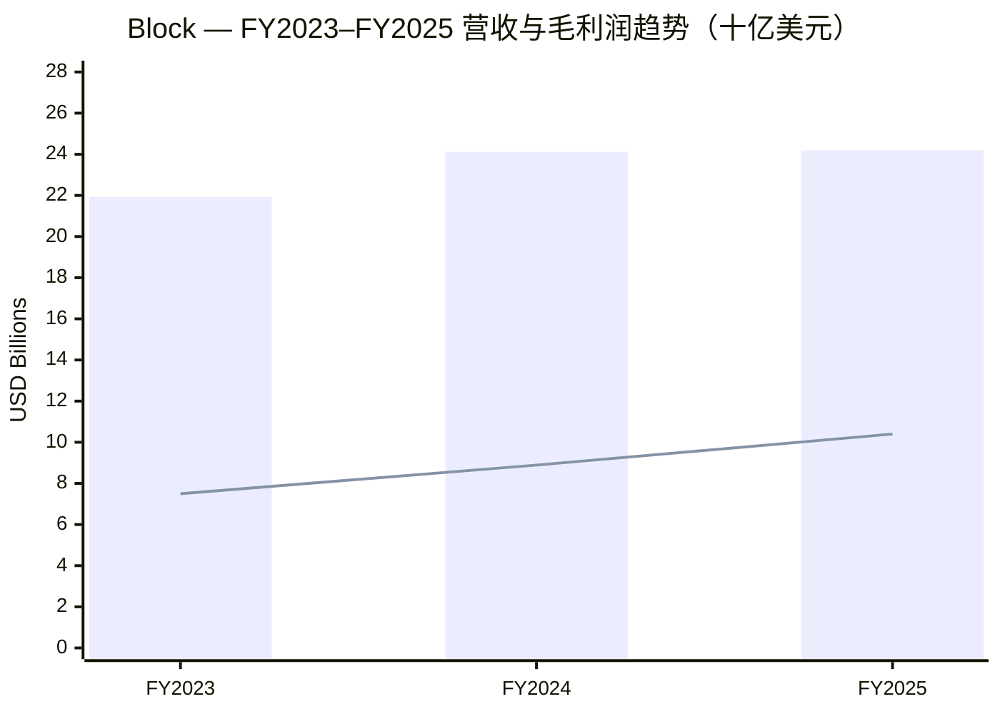
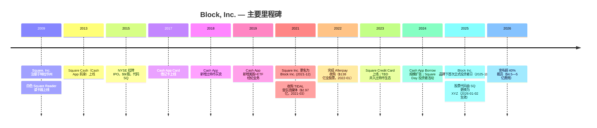
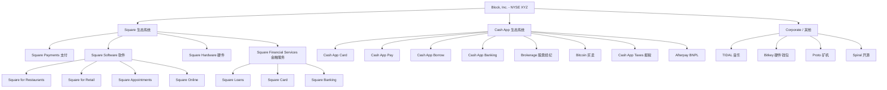
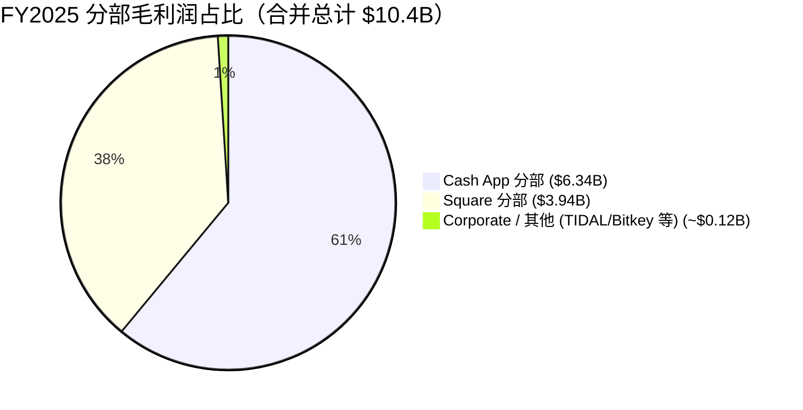
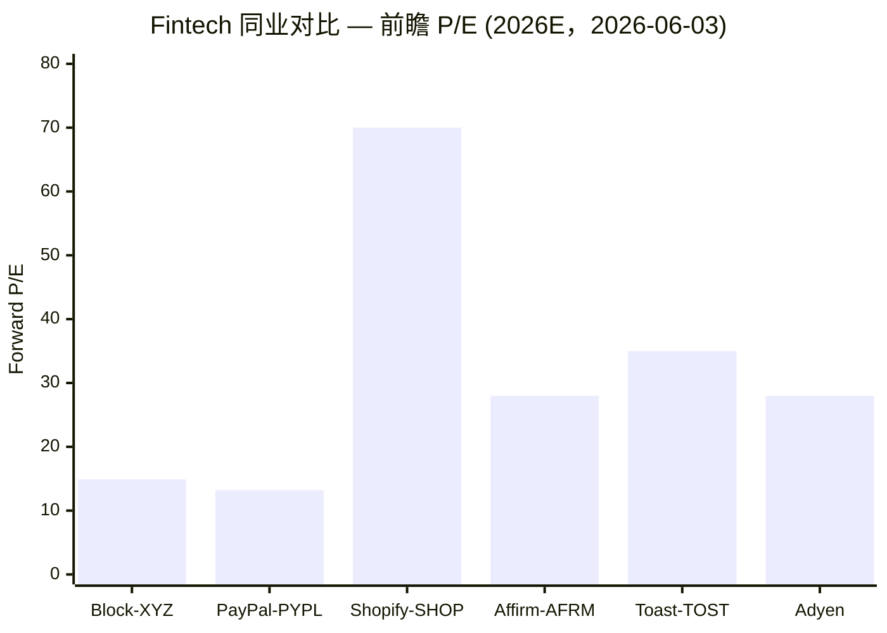
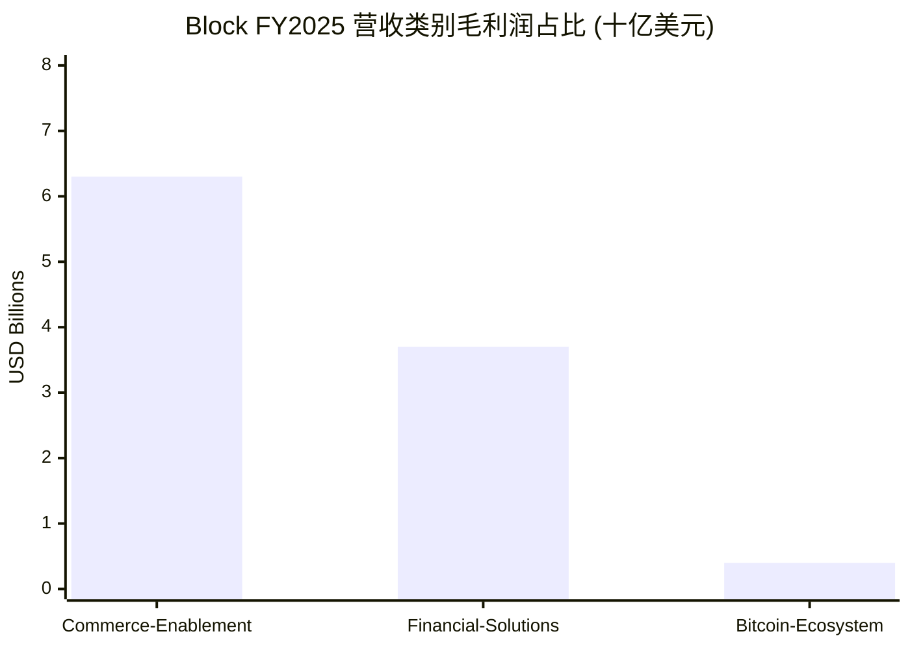

# Block, Inc.（前身 Square；NYSE:XYZ）公司研究

**报告日期：** 2026 年 6 月 3 日

> **顶部提示 — FY26 指引上调（2026 Q1 业绩季后）：** Block 在 2026 年第一季度财报发布时上调全年 2026 财年指引。管理层目前预期 FY26 毛利润 (gross profit) 同比增长 **约 19%**，调整后经营利润 (Adjusted Operating Income, 简称 AOI) 达到 **33.4 亿美元**，对应 **27% 的 AOI 利润率**，调整后摊薄 EPS 增长 **+62%**——较 2025 年 11 月投资者日 (Investor Day) 上提出的"初步指引" 17% 毛利润增长有所上调。这一上调由 2026 年 Q1 强劲业绩驱动：单季毛利润 **29.1 亿美元，同比 +27%**，其中 Cash App 业务毛利润 19.1 亿美元（+38% YoY），Square 业务毛利润 9.82 亿美元（+9% YoY）。资料来源：[Block 2026 年 Q1 股东信，2026-05-07](https://www.sec.gov/Archives/edgar/data/1512673/000119312526212032/d132441dex991.htm)。

> **顶部提示 — 2026 年 2 月 26 日宣布 40%+ 大规模裁员。** 公司在公布 FY25 年报 10-K 的同时宣布了"Workforce Plan"（员工重组计划），将从 2025 年末的 10,205 名全职员工基础上裁减超过 40% 的岗位，预计相关现金及非现金费用 **4.5 亿—5.0 亿美元** 主要计入 2026 年 Q1。重组计划预计在 2026 年 Q2 末实质性完成。资料来源：[Block 2025 年 Form 10-K，风险因素及后续事项](https://www.sec.gov/Archives/edgar/data/1512673/000162828026012254/xyz-20251231.htm)。

## 目录
1. [公司概览](#1-公司概览)
2. [公司历史](#2-公司历史)
3. [管理团队](#3-管理团队)
4. [产品与服务](#4-产品与服务)
5. [客户与客户集中度](#5-客户与客户集中度)
6. [行业概览](#6-行业概览)
7. [竞争格局](#7-竞争格局)
8. [市场机会](#8-市场机会)
9. [风险评估](#9-风险评估)
10. [投资人视角评分卡](#10-投资人视角评分卡)
11. [参考资料](#参考资料)

---

## 1. 公司概览

**Block, Inc.（NYSE:XYZ；2021 年 12 月 1 日前公司名为 Square, Inc.，股票代码 SQ）** 是一家注册于美国特拉华州 (Delaware) 的金融科技与支付控股公司。公司以两个相互交织的生态系统 (ecosystem) 运营：**Square**——服务于全球约 450 万商户 (sellers) 的软件加支付综合操作系统；以及 **Cash App**——一款美国本土消费者金融服务超级应用 (super-app)，截至 2025 年 12 月，月度活跃交易用户 (monthly transacting actives) 已覆盖美国全部 50 个州、几乎所有县。公司将自身使命描述为"经济赋能 (economic empowerment)，帮助个人和企业更充分地参与经济活动"，并采用 **分布式办公模式 (distributed work model)** ——Block 在 SEC 文件中不再设立公司总部 (principal executive office)（[Block FY2025 Form 10-K，业务概述](https://www.sec.gov/Archives/edgar/data/1512673/000162828026012254/xyz-20251231.htm)）。从 Square, Inc. 更名为 Block, Inc.（2021 年 12 月生效），以及 NYSE 股票代码从 SQ 改为 XYZ（2026 年 1 月 2 日生效），反映了管理层认为公司已从最初 2009 年的"商户支付专家"演变为"支付—金融—比特币综合平台"的战略叙事。

**分部结构 (reporting structure)。** Block 的首席运营决策者 (chief operating decision maker, CODM)——即 "Block Head and Chairperson"（董事长兼首席长官，由联合创始人 Jack Dorsey 担任）——按 **两个应报告分部 (reportable segments)**："Square" 与 "Cash App" 评估业绩，外加 "Corporate" 行政总部及其他业务线，涵盖 TIDAL 音乐流媒体、Bitkey（自托管比特币硬件钱包，self-custody bitcoin wallet）、Proto（比特币矿机系统）、Spiral 等比特币生态业务（[Block FY2025 10-K，附注 1 业务说明](https://www.sec.gov/Archives/edgar/data/1512673/000162828026012254/xyz-20251231.htm)）。自 2025 财年起，公司还以三个 **营收类别 (revenue categories)** 披露收入构成——**Commerce Enablement（商务赋能）**、**Financial Solutions（金融解决方案）** 和 **Bitcoin Ecosystem（比特币生态）**——以更清晰地反映自 Afterpay 收购完成后的业务组合（[Block FY2025 10-K，MD&A 营收](https://www.sec.gov/Archives/edgar/data/1512673/000162828026012254/xyz-20251231.htm)）。

**FY2025 经审计利润表关键数据。** 总净营收 (total net revenue) **241.9 亿美元**（同比仅增长 0.3%，主要受 Bitcoin Ecosystem 营收下滑拖累），总毛利润 **104 亿美元（同比 +17%）**，GAAP 经营利润 **17.1 亿美元**（2024 年 8.92 亿美元），调整后经营利润 (AOI) **21 亿美元**（2024 年 16 亿美元），归属普通股东净利润 **13 亿美元**（基本 EPS $2.41 / 摊薄 EPS $2.37），同比 2024 年的 28.7 亿美元下降——主要由于比特币持仓重估在 2025 年录得 0.559 亿美元亏损、对比 2024 年 4.209 亿美元收益，加之交易损失准备金 (transaction loss reserves) 上升所致（[Block FY2025 10-K，MD&A 经营成果](https://www.sec.gov/Archives/edgar/data/1512673/000162828026012254/xyz-20251231.htm)）。分部口径：Cash App 分部毛利润 **63.4 亿美元（+21% YoY）**，分部净营收 154.3 亿美元；Square 分部毛利润 **39.4 亿美元（+9% YoY）**，分部净营收 84.5 亿美元（[Block FY2025 10-K，MD&A 分部业绩](https://www.sec.gov/Archives/edgar/data/1512673/000162828026012254/xyz-20251231.htm)）。

**现金、流动性与资本结构。** Block 在 2025 年末持有 **总流动性 (total liquidity) 91.9 亿美元**（现金及现金等价物、限制性现金、可销售债务证券），较 2024 年末 107.0 亿美元下降 15 亿美元，外加 **7.75 亿美元未动用循环信贷额度 (undrawn revolver)**（[Block FY2025 10-K，流动性与资本资源](https://www.sec.gov/Archives/edgar/data/1512673/000162828026012254/xyz-20251231.htm)）。包括客户资金 (customer funds) 在内的现金总额为 124.8 亿美元，全年净流出 7.49 亿美元。2025 年全年经营性现金流 25.8 亿美元（按 TTM 口径，截至 Q4 2025），自由现金流 (free cash flow) 约 24 亿美元（[Block 2025 年 Q4 股东信，2026-02-26](https://www.sec.gov/Archives/edgar/data/1512673/000119312526076557/d108590dex991.htm)）。在外发行的优先票据 (Senior Notes) 包括 10 亿美元 2.75% 到期 2026 年票据和 10 亿美元 3.50% 到期 2031 年票据，外加其他工具（[Block FY2025 10-K，附件索引](https://www.sec.gov/Archives/edgar/data/1512673/000162828026012254/xyz-20251231.htm)）。

**估值快照（截至 2026-06-03）。** 股价 **74.15 美元**，市值 **约 441 亿美元**，全摊薄股本 ~5.35 亿股（[Yahoo Finance—XYZ 关键统计，2026-06-03](https://finance.yahoo.com/quote/XYZ/key-statistics/)）。**TTM 市盈率 (P/E) ~58 倍**，**前瞻 P/E (forward P/E) ~14.9 倍**，**TTM 市销率 (P/S) ~1.8 倍**，**EV/EBITDA ~28.5 倍**，52 周价格区间 $48.21–$82.50（[Yahoo Finance—XYZ 总览，2026-06-03](https://finance.yahoo.com/quote/XYZ/)）。**TTM 与 forward P/E 之间从 58 倍快速压缩到 15 倍**——这是该股票今天最重要的估值信号——反映了三个汇聚因素：（i）FY25 净利润被比特币重估亏损 0.559 亿美元和交易损失准备金大幅抬升所压低；（ii）已宣布的约 40% 裁员将在 2026 年 Q1/Q2 计入 4.5—5 亿美元一次性遣散费用，掩盖了底层 AOI 趋势；（iii）管理层指引 FY26 调整后经营利润率达到 **27%**（FY25 约 20%），运行率盈利的阶梯式抬升从数学上压缩了前瞻倍数（[Block 2026 年 Q1 股东信，2026-05-07](https://www.sec.gov/Archives/edgar/data/1512673/000119312526212032/d132441dex991.htm)）。**分析师观点：** 前瞻 P/E ~15 倍处于大盘软件板块中位数 (broad large-cap software median, ~18–25 倍) 之下，亦明显低于高增长 fintech 同业 PayPal（fwd P/E ~13 倍）与 Shopify（fwd P/E ~70 倍）——若 FY26 指引兑现，市场目前对 Block FY26 EPS 路径明显定价不足。

资料来源：[Block FY2025 10-K，MD&A 营收表](https://www.sec.gov/Archives/edgar/data/1512673/000162828026012254/xyz-20251231.htm)；柱状图为总净营收，折线为总毛利润。

## 2. 公司历史

**Square, Inc. 于 2009 年 6 月在美国特拉华州注册成立**，由两位联合创始人共同创办：Jack Dorsey（彼时刚回归 Twitter，因 2008 年被免去 CEO 职务而离任），以及 Jim McKelvey（圣路易斯当地的玻璃艺术家兼连续创业者）——传说的"创始触发事件"是 McKelvey 在 2008 年因无法接受信用卡支付而错失一笔 2,000 美元的玻璃艺术品订单（[Block FY2025 10-K，业务说明](https://www.sec.gov/Archives/edgar/data/1512673/000162828026012254/xyz-20251231.htm)；[Block 2026 委托书 (Proxy Statement) — 董事简历](https://www.sec.gov/Archives/edgar/data/1512673/000162828026027203/sq-20260423.htm)）。Square 生态系统于 2009 年 2 月推出，首款产品即著名的 **白色塑料磁条 Square Reader 读卡器**——一款可插入 iPhone / iPad 耳机口的硬件加密读卡器，使任何个人卖家、餐车、市集摊位等中小企业首次能够接受 Visa / Mastercard 信用卡支付。10-K 中将该产品描述为"使企业能够接受卡支付，这是此前传统中小商户无法访问的关键能力"（[Block FY2025 10-K，Square 生态系统](https://www.sec.gov/Archives/edgar/data/1512673/000162828026012254/xyz-20251231.htm)）。

**Cash App 于 2013 年作为 "Square Cash" 上线**，最初作为一款 P2P 个人间转账应用与 PayPal 旗下的 Venmo 竞争。此后的十年间，Cash App 从单一 P2P 工具扩展为多产品消费金融服务平台：2017 年推出 Cash App Card（连接 Cash App 余额的 Visa 借记卡，issued by partner bank）；2018 年新增比特币买卖 (bitcoin buy/sell)；2019 年新增美股及 ETF 经纪 (brokerage) 业务；2020 年通过收购 Credit Karma 旗下报税业务推出 Cash App Taxes 免费报税服务（2021 年正式上线）；2020 年起逐步推出 Cash App Borrow 短期消费贷款。至 2025 年 12 月，Cash App 月度交易活跃用户覆盖美国 50 个州及几乎全部县，2025 年 Cash App 在 **Google Play 美区金融类应用下载榜排名第 1，iOS 美区金融类应用下载榜排名第 3**（[Block FY2025 10-K，Cash App 生态系统](https://www.sec.gov/Archives/edgar/data/1512673/000162828026012254/xyz-20251231.htm)）。

**IPO 与资本市场历史。** Square, Inc. 于 2015 年 11 月在纽约证券交易所 (NYSE) 完成首次公开发行 (IPO)，发行价为 **每股 $9**——对应估值约 29 亿美元——在交易所以代码 "SQ" 挂牌（[Square 2015 年 S-1/A 注册声明](https://www.sec.gov/Archives/edgar/data/1512673/000119312515378578/d937622ds1a.htm)）。此后的资本运作包括 2018 年、2020 年的可转债发行；2021 年 5 月发行的 10 亿美元 2.75% 票据和 10 亿美元 3.50% 票据（总计 20 亿美元 Senior Notes，部分用于资助 2022 年完成的 Afterpay 全股票收购）；以及 2023—2025 年期间持续的股票回购计划（[Block FY2025 10-K，附件索引—票据合约](https://www.sec.gov/Archives/edgar/data/1512673/000162828026012254/xyz-20251231.htm)）。

**公司更名为 Block, Inc.** 由 Square, Inc. 更名为 Block, Inc. 于 2021 年 12 月 10 日生效（NYSE 股票代码当时仍维持 "SQ"）。管理层将此次更名定位为反映公司业务已从最初的"商户支付"扩展到 Cash App 消费金融、TIDAL 音乐流媒体（2021 年 3 月以 2.97 亿美元收购）、TBD（后并入 bitcoin 生态板块）、以及比特币生态业务 (Bitkey, Proto, Spiral)。NYSE 股票代码由 SQ 更换为 XYZ 于 2026 年 1 月 2 日生效，从而完成了完整的品牌重塑周期（[Block FY2025 10-K，封面页代码 XYZ](https://www.sec.gov/Archives/edgar/data/1512673/000162828026012254/xyz-20251231.htm)）。

**Afterpay 收购（2022 年 1 月 31 日完成）** 是 Block 迄今为止最具变革性的战略性举措——一笔全股票交易，最初宣布时（2021 年 8 月）估值约 290 亿美元，最终交割时（2022 年 1 月）因 SQ 股价大幅下跌而修订为 138 亿美元。Afterpay 为 Block 带来了一个全球已规模化的 **Buy-Now-Pay-Later (BNPL，先买后付)** 业务——覆盖美国、澳大利亚（Afterpay 总部所在地）、加拿大、新西兰、英国——为公司构建了如今描述的 "贯穿 Square 商家端与 Cash App 消费者端的整合平台"，其中 BNPL 担当连接组织（[Block FY2025 10-K，BNPL 产品](https://www.sec.gov/Archives/edgar/data/1512673/000162828026012254/xyz-20251231.htm)）。

**2022—2025 业务演化。** 2022 年的特征是 Afterpay 整合后利润率压缩与宏观环境收紧；2023 年完成了"Block 1.0" 阶段的整合，TBD 并入比特币生态板块，TIDAL 重新定位为艺术家创作者经济变现平台（而非 Spotify 的直接竞品）。2024 年 5 月，公司召开首个 "Square Day" 投资者活动，凸显 Square 向中市场和食饮 (F&B) 垂直的转向。2025 年 11 月，管理层以 Block, Inc. 品牌名召开了首次正式投资者日 (Investor Day)，提出三年战略规划：将 Cash App 毛利润增长维持在 **CAGR > 20%**，同时加速 Square GPV 增长，并重建经营利润率纪律（[Block 2025 年 Q4 股东信—投资者日参考](https://www.sec.gov/Archives/edgar/data/1512673/000119312526076557/d108590dex991.htm)）。

资料来源：[Block FY2025 10-K，业务概述](https://www.sec.gov/Archives/edgar/data/1512673/000162828026012254/xyz-20251231.htm)；[Block 2025 年 Q4 股东信](https://www.sec.gov/Archives/edgar/data/1512673/000119312526076557/d108590dex991.htm)；[Block 2026 委托书—董事任期](https://www.sec.gov/Archives/edgar/data/1512673/000162828026027203/sq-20260423.htm)。

## 3. 管理团队

**Jack Dorsey — Block Head（首席长官）、董事长（联合创始人）。** Jack Dorsey，49 岁，自 2009 年 7 月起担任 Block 的主要执行官 (principal executive officer) 及董事会成员；他与 Jim McKelvey 共同创办了 Square（现 Block）。Dorsey 自 2010 年 10 月起担任董事长。他在 2023 年及 2024 年初一度兼任 "Square Head" 一职（直接主管 Square 业务）后回归 "Block Head" 综合岗位。Block 2026 委托书将 Dorsey 描述为 Square Financial Services 监管框架下的"控股股东 (controlling shareholder)"（[Block 2026 委托书—董事简历](https://www.sec.gov/Archives/edgar/data/1512673/000162828026027203/sq-20260423.htm)；[Block FY2025 10-K，政府监管](https://www.sec.gov/Archives/edgar/data/1512673/000162828026012254/xyz-20251231.htm)）。在创办 Square 之前，Dorsey 于 2007 年 5 月—2008 年 10 月担任 Twitter, Inc. 总裁兼 CEO，是 Twitter 三位联合创始人之一；他于 2015 年返回 Twitter 任 CEO 直至 2021 年 11 月——期间他同时担任 Twitter CEO 和 Square CEO，是公开市场上极为罕见的"双 CEO"安排。Dorsey 早年就读于纽约大学 (NYU)，未完成学业。其薪酬安排是美股市场中最独特的之一：**应他个人要求，他不接受任何现金或股权薪酬，仅领取 $2.75 的象征性年薪**（[Block 2026 委托书—薪酬亮点](https://www.sec.gov/Archives/edgar/data/1512673/000162828026027203/sq-20260423.htm)）。Dorsey 通过直接持股和 Block Head Trust（信托）持有 Block 大量个人股权，并在 Square Financial Services 监管中被列为控股股东。**分析师观点：** Dorsey 接受 $2.75 名义年薪并兼任 Spiral、Proto、Bitkey 等比特币生态子项目的领头人，传递出一种极不寻常的"创始人主导、使命驱动"治理姿态——压缩了传统的委托代理冲突 (principal-agent conflict)，但同时引入"单一创始人依赖"的集中度风险。

**Amrita Ahuja — Foundational Lead、首席财务官 (CFO)、首席运营官 (COO) 及 People Lead。** Amrita Ahuja，46 岁，自 2019 年 1 月担任 Block CFO，2023 年 2 月起加任 COO 及 "Foundational Lead"，2025 年 9 月起又加任 "People Lead" ——使她成为目前 Block 内除 Dorsey 以外权力集中度最高的运营高管。她 2026 年基本工资上调至 60 万美元（2025 年 56.5 万美元）（[Block 2026 委托书—薪酬表](https://www.sec.gov/Archives/edgar/data/1512673/000162828026027203/sq-20260423.htm)）。在加入 Block 之前，Ahuja 曾于 2018 年 3 月—2019 年 1 月担任 Blizzard Entertainment（动视暴雪 Activision Blizzard 子公司）的 CFO；2010 年 6 月起在 Activision Blizzard, Inc. 担任多个职位，包括 2015 年 1 月—2018 年 5 月的投资者关系高级副总裁 (SVP, Investor Relations)（[Block 2026 委托书—执行官简历](https://www.sec.gov/Archives/edgar/data/1512673/000162828026027203/sq-20260423.htm)）。Ahuja 自 2023 年以来不断累积职位——CFO + COO + People Lead 集于一身——反映出 Block 一直在追求的高度扁平化组织设计；2026 年宣布的 40% 裁员计划中，她作为 People Lead 的角色不言而喻。2026 委托书显示当前共 6 位执行官，在 Dorsey 之下还包括 Brian Grassadonia（Ecosystem Lead）、Owen Britton Jennings（Business Lead）、Chrysty Esperanza（Counsel Lead / 首席法务官）和 Arnaud Weber（Engineering Lead，2025 年 6 月加入）。前 Technology + Engineering Lead Dhanji R. Prasanna 已于 2025 年 11 月辞去执行官职位（[Block 2026 委托书—执行官名录](https://www.sec.gov/Archives/edgar/data/1512673/000162828026027203/sq-20260423.htm)）。

## 4. 产品与服务

Block 运营两个面向客户的应报告生态系统——Square 与 Cash App——加上 Corporate / "其他" 行政线，承载 TIDAL 音乐流媒体以及 Bitkey、Proto、Spiral 等比特币硬件业务。10-K 将整体战略定位描述为 "整合支付、银行、贷款和商务解决方案" ——通过共享基础设施贯穿 **嵌入式金融服务 (embedded financial services)**、**自动化 (automation)** 与开放的 **比特币协议 (Bitcoin)**（[Block FY2025 10-K，业务说明—我们的生态系统](https://www.sec.gov/Archives/edgar/data/1512673/000162828026012254/xyz-20251231.htm)）。

### 4.1 Square 生态系统 — 商家侧商务操作系统

Square 生态系统为全球约 450 万商户综合提供支付、销售点 (point-of-sale, POS) 软件、硬件以及嵌入式金融服务。主要地理覆盖：美国、加拿大、日本、澳大利亚、英国、爱尔兰、法国、西班牙等八个核心国家（[Block FY2025 10-K，业务说明—Square 商户](https://www.sec.gov/Archives/edgar/data/1512673/000162828026012254/xyz-20251231.htm)）。10-K 描述 Square 生态系统的起源回溯到 2009 年的核心能力："我们 2009 年 2 月以 Square 生态系统创办 Block，使企业能够接受卡支付，这是中小商户此前无法访问的关键能力。" Square 商户群覆盖广泛行业（服务业、食饮、零售）和规模（从个体工商户到中等规模多店连锁商户）——2025 年 Square 处理的 Gross Payment Volume (GPV) 来自"超过 4.5 百万商户"，由"逾 8 亿张支付卡跨逾 3 亿个买家档案"产生。

**硬件产品矩阵。** 10-K 中以原文列出 Square 硬件线：

> "Square Register 是一款一体式产品，整合了我们的硬件、销售点软件与支付技术，专用硬件包括两块屏幕……Square Terminal 是一款便携式、一体化支付设备和收据打印机，替代传统的键盘式终端，接受 tap、dip 和 swipe 支付……Square Stand 将 iPad 转换为完整的台式销售点，并具有内置的非接触式与芯片读取器。Square Reader for contactless and chip 接受 EMV 芯片卡和 NFC 支付，能够通过 Apple Pay、Google Pay 等移动钱包接受支付。"（[Block FY2025 10-K，业务说明—硬件](https://www.sec.gov/Archives/edgar/data/1512673/000162828026012254/xyz-20251231.htm)）

最初的 2009 年磁条 Square Reader 至今仍保留在产品线中，作为入门级选项；10-K 同时承认对磁条读卡器硬件的"单一供应商依赖"是供应链集中风险之一。

**软件产品矩阵。** Square 的垂直行业 POS 软件包括 **Square for Restaurants（餐饮 POS：桌位管理、厨房显示系统、在线点餐）**、**Square for Retail（零售 POS：库存管理、条形码扫描、全渠道销售）**、**Square Appointments（服务业预约调度）**、**Square Online（电商店面构建器）**，以及运营工具 **Square Team Management 和 Square Payroll**（员工排班、绩效、薪资管理）。10-K 指出这些工具 "直接与 Square 的商务和金融解决方案集成" ——这是与点产品竞争对手最重要的统一差异点（[Block FY2025 10-K，业务说明—Square 软件](https://www.sec.gov/Archives/edgar/data/1512673/000162828026012254/xyz-20251231.htm)）。

**Square Loans, Square Card, Square Banking。** 除了支付与软件，Square 还提供嵌入式贷款产品：**Square Loans 通过 Square Financial Services（Block 在犹他州持有的产业银行 (industrial bank) 牌照子公司，2021 年开始运营）为合格的 Square 商户发放贷款**。10-K 原文：*"自 2014 年 5 月公开发布以来，Square Loans 已促成超过 400 万笔贷款和预付款，贷款本金或预付款累计金额超过 328 亿美元。"*（[Block FY2025 10-K，业务说明—Square Loans](https://www.sec.gov/Archives/edgar/data/1512673/000162828026012254/xyz-20251231.htm)）。**Square Credit Card** 在 2023 年推出，作为 Square Loans 之外面向商户的第二条贷款产品线。**Square Card** 是一张免费的 Mastercard 商业借记卡，关联商户的 Square 余额；**Square Banking** 提供基于 Square Financial Services 的商户存款、储蓄和即时入账 (instant deposit) 产品套件。

**Square 的战略意义。** Square 生态系统的核心战略价值在于 **整合闭环 (integration loop)** ——支付数据产生（交易规模、收入节奏、客户组合）支持 Square Loans 的承销，进而扩大 Square 在商户钱包中的份额——从"支付处理商"升级为"操作系统加资产负债表合作伙伴"。10-K 将此描述为：*"我们高效添加新商户、帮助他们成长业务、并向他们交叉销售产品和服务的能力，历来推动了我们的增长。"*（[Block FY2025 10-K，业务说明—Square 生态系统](https://www.sec.gov/Archives/edgar/data/1512673/000162828026012254/xyz-20251231.htm)）2025 年 Q4 Square GPV 同比 +10%，"主要由 Food and Beverage 商户的强劲增长驱动"——这是 Square 最大力投入的垂直 (通过 Square for Restaurants)——管理层在投资者日中将"速度 (speed)"列为可加速 Square GPV 的关键运营纪律（[Block 2025 年 Q4 股东信，2026-02-26](https://www.sec.gov/Archives/edgar/data/1512673/000119312526076557/d108590dex991.htm)）。

### 4.2 Cash App 生态系统 — 消费者金融服务超级应用

10-K 将 Cash App 定位为 "Cash App Green" 客群细分中的领导者 ——即 "**赚取多种动态收入来源的劳动力，包括按小时工资、零工 (gig) 工作和自由职业**" ——管理层估算可触达市场 (addressable market) 约 1.25 亿美国人，包括 "独立赚取者 (independent earners)、按小时工人 (hourly workers) 和工作中的青少年"（[Block 2025 年 Q4 股东信，2026-02-26](https://www.sec.gov/Archives/edgar/data/1512673/000119312526076557/d108590dex991.htm)）。10-K 将 Cash App 描述为 "一个金融产品和服务生态系统，帮助个人和企业管理、移动和增长他们的钱"，包括 **资金转账、借记卡消费 (Cash App Card)、比特币和股权买卖、银行式直接入账、贷款 (Cash App Borrow)、BNPL (Afterpay 集成)** 等（[Block FY2025 10-K，业务说明—Cash App 生态系统](https://www.sec.gov/Archives/edgar/data/1512673/000162828026012254/xyz-20251231.htm)）。

**用户参与度与资金流入 (inflows)。** Cash App 2025 全年累计资金流入 **3,160 亿美元**；2025 年 Q4 月度交易活跃用户平均带来 "**$1,410 的季度资金流入**"（同比 +12% YoY，2024 Q4 为 $1,261）。Block 通过其 "**资金流入框架 (inflows framework)**" 监测 Cash App ——*"交易活跃用户、每用户资金流入、以及资金流入的货币化率 (monetization rate on inflows)"*（[Block FY2025 10-K，业务说明—资金流入框架](https://www.sec.gov/Archives/edgar/data/1512673/000162828026012254/xyz-20251231.htm)；[Block 2025 年 Q4 股东信，2026-02-26](https://www.sec.gov/Archives/edgar/data/1512673/000119312526076557/d108590dex991.htm)）。2025 年 Q4 Cash App 资金流入同比 +15%，单季达到 830 亿美元；Cash App **Financial Solutions 每活跃用户毛利润** 达到 **$15**（同比 +57% YoY，前一年 $9）——这是一项强力 KPI，显示 Cash App 单用户货币化速度快于用户数增长。

**Cash App Card。** *"Cash App Card 是一张借记卡，由我们的银行合作伙伴发行，直接连接到客户的 Cash App 余额。"*（[Block FY2025 10-K，业务说明—Cash App Card](https://www.sec.gov/Archives/edgar/data/1512673/000162828026012254/xyz-20251231.htm)）客户可以免费订购 Cash App Card；Block 通过持卡人消费时的 **银行卡 interchange fee（刷卡手续费）** 实现货币化。Cash App Card 是 Cash App 消费者基础最核心的货币化路径——它将免费的 P2P 关系转化为持续的交易费收入流——也是 Block 向用户交叉销售直接入账、经纪业务、贷款等更多产品的入口。

**Cash App Borrow。** Cash App Borrow 为合格客户提供短期固定费率贷款，通过预定还款 (scheduled installments) 还款。10-K 显示 *"在 2025 年，平均 Cash App Borrow 贷款在不到四周内偿还"*。Block 还在 2025 年推出了 **Cash App Score**——*"内部开发的信用评分框架"* ——用于支持承销规模扩张（[Block FY2025 10-K，业务说明—Cash App Borrow](https://www.sec.gov/Archives/edgar/data/1512673/000162828026012254/xyz-20251231.htm)）。Cash App Borrow 是 Cash App 2025 年毛利润加速增长 (+21% YoY) 的主要驱动；管理层 2026 Q1 股东信指出，"Cash App Financial Solutions 毛利润增长在第一季度加速到 55%，主要由 Cash App Consumer Lending 推动"（[Block 2026 年 Q1 股东信，2026-05-07](https://www.sec.gov/Archives/edgar/data/1512673/000119312526212032/d132441dex991.htm)）。

**BNPL — Afterpay 与 Cash App Pay Later。** *"Cash App 和 Afterpay 提供广泛的 Pay Later 能力，使消费者购买更灵活和可及。对于商户，这些产品旨在提高转化率和提升平均订单价值。"*（[Block FY2025 10-K，业务说明—BNPL 产品](https://www.sec.gov/Archives/edgar/data/1512673/000162828026012254/xyz-20251231.htm)）Afterpay BNPL 产品覆盖美国、澳大利亚、加拿大、新西兰、英国，并通过 Afterpay Card 和 Afterpay Plus Card 支持线下店内 BNPL。Afterpay Post-Purchase 功能允许合格消费者将已完成的交易转换为分期付款，将 BNPL 功能延伸到销售点之外。

**Cash App 其他产品。** Cash App 客户可通过 Cash App 股票经纪以低至 $1 投资美股和 ETF；Cash App Taxes 提供免费报税；Round Ups (零钱舍入) 允许客户将购买金额四舍五入到最近的美元，并将差额自动直接存入比特币或股票账户（[Block FY2025 10-K，业务说明—Cash App 其他](https://www.sec.gov/Archives/edgar/data/1512673/000162828026012254/xyz-20251231.htm)）。

### 4.3 Corporate / 其他生态 — TIDAL、Bitkey、Proto、Spiral

**TIDAL。** Block 于 2021 年 3 月以 2.97 亿美元收购 TIDAL。10-K 描述 TIDAL 为 *"一个面向音乐家及其粉丝的全球平台，使用独特内容、体验和功能将粉丝拉近艺术家，并为艺术家提供作为企业家成功的工具。"* TIDAL "提供超过 2.5 亿首歌曲和 100 万个高品质视频。TIDAL 在全球 60 多个国家有听众，并与近 300 个唱片公司建立关系。"（[Block FY2025 10-K，业务说明—TIDAL](https://www.sec.gov/Archives/edgar/data/1512673/000162828026012254/xyz-20251231.htm)）TIDAL 在 Block 内的商业规模较小（未产生重大分部级收入），但占据创作者经济分发平台的战略位置，与 Square 面向艺术家创作者的工具集成。

**比特币生态（Bitkey、Proto、Spiral）。** 10-K 将 Block 的"比特币生态系统"描述为三个独立举措："**Bitkey 是自托管比特币硬件钱包 (self-custody bitcoin wallet)，Proto 是比特币挖矿系统 (bitcoin mining system)，以及 Spiral 是独立团队专注于贡献比特币开源工作。**"（[Block FY2025 10-K，业务说明—比特币生态系统](https://www.sec.gov/Archives/edgar/data/1512673/000162828026012254/xyz-20251231.htm)）Bitkey 是支持比特币安全自托管的硬件钱包；Proto 是垂直整合的比特币挖矿系统（芯片、硬件、软件）；Spiral 是为开源 Bitcoin Core 项目提供贡献的团队。比特币交易营收（来自 Cash App 买卖）是主要的现金生成比特币业务线——2025 年因加密市场交易疲软而较 2024 年下滑——Bitkey 和 Proto 仍处于投入扩张阶段。

**综合 — 各产品如何相互作用。** Block 产品组合通过三个飞轮 (flywheels) 相互交织：（i）**Square 飞轮**——支付处理产生数据，承销 Square Loans，深化商户钱包份额并产生更多支付量；（ii）**Cash App 飞轮**——免费 P2P 转账产品（加 Cash App Card）获取消费者；用户参与推动资金流入；资金流入支撑直接入账、经纪、Cash App Borrow 和 BNPL ——每一步货币化客户生活的更深层份额；（iii）**整合平台飞轮**（Afterpay 后）——Afterpay BNPL 连接 Cash App 消费者与 Square 商家，扩展 Square 商家需求同时延伸 Cash App 购买实用性——这是 Block 自 2021 年 Afterpay 公告以来强调的 "**双边网络 (two-sided network)**" 论点。TIDAL 与比特币生态业务位于这些飞轮之外，最好视为可选 R&D ——创始人高信念赌注，对 2026—2028 年盈利轨迹非关键性。

资料来源：[Block FY2025 10-K，业务说明—我们的生态系统](https://www.sec.gov/Archives/edgar/data/1512673/000162828026012254/xyz-20251231.htm)。

## 5. 客户与客户集中度

Block 客户群按生态系统截然不同。Square 的客户群是 **B2B（商户 / 卖家）** ——~450 万年度活跃商户覆盖八个核心国家；Cash App 客户群是 **B2C（美国消费者）** ——数千万级月度交易活跃用户分布于美国 50 个州及几乎全部县（截至 2025 年 12 月）（[Block FY2025 10-K，业务说明—Cash App 客户群](https://www.sec.gov/Archives/edgar/data/1512673/000162828026012254/xyz-20251231.htm)）。

**Square — 商户集中度。** *"Square 商户代表广泛的行业（包括服务业、食饮和零售业）和规模——从个体工商户到中等规模多店连锁。Square 商户覆盖多个地理：美国、加拿大、日本、澳大利亚、英国、爱尔兰、法国、西班牙。我们也越来越多地服务中等市场商户。"*（[Block FY2025 10-K，业务说明—Square 商户](https://www.sec.gov/Archives/edgar/data/1512673/000162828026012254/xyz-20251231.htm)）Square 商户基础极其分散——450 万商户分母意味着即使是 Block 最大的单一商户客户也仅占合并营收的极小份额。**10-K 未披露任何单一客户超过 ASC 280-10-50-42 要求的合并营收 10% 门槛**——意味着 FY2025 没有任何单一 Block 客户贡献合并营收超过 10%。

**Cash App — 消费者集中度。** Cash App 消费者基础按定义极其分散——*"Cash App 主要在美国，跨人口统计和地区拥有多样化的客户。"*（[Block FY2025 10-K，业务说明—Cash App 客户群](https://www.sec.gov/Archives/edgar/data/1512673/000162828026012254/xyz-20251231.htm)）Block 以聚合 KPI（资金流入每用户、资金流入货币化率）披露 Cash App 货币化，但不命名个别顶级消费者——这在数千万用户基础下也无意义。

**支付网络与处理商对手方集中度。** Block 最重大的对手方集中度不是客户端而是供应商端：公司依赖 **Visa、Mastercard、American Express 和 Discover** 卡组织——*"对于我们的大部分交易，商户接受 Visa、Mastercard、American Express 和 Discover 的卡。"*（[Block FY2025 10-K，业务说明—支付网络依赖](https://www.sec.gov/Archives/edgar/data/1512673/000162828026012254/xyz-20251231.htm)）；以及第三方支付处理商——10-K 风险集中度披露表显示一个 "**Third-Party Processor One**" 在结算应收账款中代表一项信用集中度风险，即一家银行结算对手方处理 Block 结算应收账款的重大份额。这是支付公司行业的标准实践，但应作为结构性对手方风险加以跟踪。

**Square Loans 资金来源集中度。** *"我们目前从机构第三方投资者的安排中为这些贷款的大多数提供资金。"*（[Block FY2025 10-K，业务说明—Square Loans 资金来源](https://www.sec.gov/Archives/edgar/data/1512673/000162828026012254/xyz-20251231.htm)）Square Loans 商业模式是部分表外的——机构投资者购买 Block 承销的贷款——意味着 Square Loans 吞吐量取决于这些机构买方的胃口。如果信贷市场收紧，Square Loans 量可能即使商户需求保持不变也会快速收缩。

**地理集中度。** 美国以外任何单一国家贡献不超过总收入 10%——*"没有任何来自国际市场的单一国家贡献超过 10% 的总收入"* 按 10-K 地理披露所述（[Block FY2025 10-K，业务说明—地理组合](https://www.sec.gov/Archives/edgar/data/1512673/000162828026012254/xyz-20251231.htm)）。Square 与 Cash App 主要地理风险集中于美国；Block 国际扩张集中于澳大利亚（Afterpay 故乡市场）、英国、加拿大、日本、爱尔兰、法国、西班牙。

资料来源：[Block FY2025 10-K，MD&A 分部业绩](https://www.sec.gov/Archives/edgar/data/1512673/000162828026012254/xyz-20251231.htm)。说明：此图按 **分部 (Square / Cash App) 分母** 显示，不是按客户分母；Block 没有披露任何单一客户超过合并营收 10%。

## 6. 行业概览

Block 在三个相互重叠的市场中竞争——**商户收单 / 支付处理 (merchant acquiring)**、**消费金融服务 / 数字银行 (consumer financial services / digital banking)**、以及 **买现付后 (BNPL) 融资**——并在比特币生态硬件与软件中具有选项性。

**商户收单 / 支付处理（Square 的主要市场）。** 全球商户收单市场每年处理数十万亿美元的卡支付量，美国份额约 8—9 万亿美元卡量。Yole Group、Gartner、Nilson Report 不直接公布商户收单方市场份额，但行业整合（FIS-Worldpay 拆分、Global Payments 收购、2019 年 Fiserv-First Data）已驱动美国前五大收单方（Fiserv、JPM Chase 商户服务、Worldpay、美国银行商户服务、Stripe）至卡收单量份额约 70%。在该格局中，Square 已雕刻出一个有可防御性的 **SMB 加垂直软件细分市场**——10-K 将 Square 竞争集合描述为 "*大型成熟厂商到小型早期阶段公司*"，按类别列出 *"销售点、网站建设、库存管理、员工管理、客户关系管理、发票和预约管理的业务软件提供商"*——即 Shopify、Toast、Lightspeed、Clover、Adyen（[Block FY2025 10-K，业务说明—Square 竞争](https://www.sec.gov/Archives/edgar/data/1512673/000162828026012254/xyz-20251231.htm)）。行业增长由小企业商务从现金到卡、从卡到移动 / 非接触的长期转向推动——Stripe Press 和麦肯锡估算发达市场年度中高单位数量增长 (mid-to-high-single-digit volume growth)。

**消费金融服务 / 数字银行（Cash App 的主要市场）。** 美国"新银行 (neobank)" 或消费 fintech 板块——定义为合并支票式 P2P、借记卡消费、经纪、信贷的应用程序原生消费者账户——在 2018—2024 年间通过 Cash App、Chime、Venmo (PayPal)、Robinhood、SoFi 及其他公司，添加了约 3,000—5,000 万美国账户。10-K 将 Cash App 竞争集合描述为 *"汇款应用、借记卡产品、经纪公司、税务公司、金融科技应用、银行和加密交易服务。"*（[Block FY2025 10-K，业务说明—Cash App 竞争](https://www.sec.gov/Archives/edgar/data/1512673/000162828026012254/xyz-20251231.htm)）Block 的 "Cash App Green" 论述——定位于通过按小时工资、零工、自由职业赚取多源收入的约 1.25 亿美国劳动力——是有意比"整个美国消费银行市场"窄的可触达市场 (TAM)，但恰是传统金融机构服务不足、并最愿意切换到应用程序原生工具的细分群体（[Block 2025 年 Q4 股东信，2026-02-26](https://www.sec.gov/Archives/edgar/data/1512673/000119312526076557/d108590dex991.htm)）。

**BNPL（Afterpay 的主要市场）。** 全球 BNPL 市场 2024 年处理约 3,000—4,000 亿美元交易量（按行业分析师汇总），美国 BNPL 市场达到约 800 亿美元并以高十几位数增长。前五大全球 BNPL 平台为 Klarna、Afterpay (Block)、Affirm、PayPal Pay Later、Apple Pay Later——Klarna 与 Afterpay 在美国、英国、澳大利亚份额激烈争夺。10-K 承认 BNPL 竞争加剧：*"竞争对手已引入或提供 BNPL 产品。BNPL 领域的竞争对手已从事，并可能继续从事积极的消费者获取活动，可能开发优越的技术产品或与其他实体整合并实现规模效益。"*（[Block FY2025 10-K，风险因素—BNPL 竞争](https://www.sec.gov/Archives/edgar/data/1512673/000162828026012254/xyz-20251231.htm)）BNPL 监管审查自 2024 年起显著加强——CFPB 于 2024 年 5 月发布解释规则将 BNPL 提供商归类为 Regulation Z 下的信用卡发行人，要求纠纷解决和报表披露；10-K 风险因素提及"美国、英国和澳大利亚 BNPL 产品监管和立法审查加强"。

**比特币生态（Bitkey、Proto、Spiral 以及 Cash App 比特币买卖）。** 10-K 原文披露 *"比特币生态系统产生的毛利润仅占 2025 年总毛利润的 4%，2024 年的 5%。"*（[Block FY2025 10-K，MD&A—比特币生态系统](https://www.sec.gov/Archives/edgar/data/1512673/000162828026012254/xyz-20251231.htm)）所以比特币生态经济仍相对 Square+Cash App 较小，但保持战略重要性——这是公司最长久期的增长赌注。2024—2025 年伴随现货比特币 ETF 获批（2024 年 1 月）与比特币价格升值，比特币行业急剧反弹；Bitkey 硬件钱包 TAM 全球估算 10—20 亿美元（vs. Ledger 作为领先在位者 ~2 亿美元营收规模），比特币挖矿硬件（Proto 的 TAM）是每年 50—100 亿美元资本支出市场，由比特大陆 (Bitmain) 和 MicroBT 主导。

## 7. 竞争格局

Square / Cash App / Afterpay 产品组合同时跨越三个竞争格局，Block 在每个领域都面对资源充沛的在位者。

**Square 的主要竞争对手（美国）：**
- **Stripe**——私营公司；2024 年处理量约 1.4 万亿美元 (per 公司披露)。在电子商务和开发者平台支付中占主导地位；在物理零售中对 Square 是补充，但在全渠道和在线优先垂直中是竞争对手。
- **Toast (NYSE:TOST)**——纯粹餐厅 POS 与支付；与 Square for Restaurants 在 F&B 垂直中头对头。
- **Shopify (NYSE:SHOP)**——通过 Stripe 合作的 Shopify Payments；DTC 电商主导；与 Square Online 加 Square for Retail 竞争。
- **Clover** (Fiserv 子公司，NYSE:FI)——通过 Fiserv 银行合作伙伴分发的 SMB POS 加支付捆绑；与 Square Reader / Square Stand 直接竞争。
- **Lightspeed (NYSE:LSPD)**——零售和酒店业的 POS 加支付；与 Square for Restaurants 和 Square for Retail 竞争。
- **Adyen** (Amsterdam:ADYEN)——企业全渠道支付；主要在中市场及以上与 Square 竞争。

**Cash App 的主要竞争对手（美国）：**
- **Venmo** (PayPal 子公司，NASDAQ:PYPL)——P2P 中最初的 Cash App 竞争对手；PayPal 继续投资 Venmo 作为消费金融应用 (借记卡、BNPL、加密功能)。
- **Zelle** (Early Warning Services 联盟)——银行网络拥有的即时 P2P；在 "免费 P2P" 用例中竞争，但不在货币化金融服务中。
- **Chime** (私营，2024 年 9 月 IPO)——以 Spotme 透支、直接入账、储蓄等竞争消费者新银行——在 "Cash App Green" 人口学中与 Cash App 头对头。
- **Robinhood (NASDAQ:HOOD)**——在 Cash App 经纪和加密交易子细分中竞争。
- **SoFi (NASDAQ:SOFI)**——以储蓄、经纪、贷款等多重 Cash App 子细分中竞争的消费金融超级应用。
- **Apple Cash + Apple Card**——Apple 的钱包原生 P2P 和借记卡与 Cash App Card 竞争；与 iOS 深度集成。

**BNPL 竞争对手（Afterpay）：**
- **Affirm (NASDAQ:AFRM)**——美国领先的 BNPL 竞争对手，与亚马逊、Shopify、沃尔玛、Apple 拥有深度商户关系——直接与 Afterpay 头对头。
- **Klarna**——私营 (2024—2025 年 IPO 提交)，拥有强大美国、英国、欧洲覆盖的全球 BNPL 领导者。
- **PayPal Pay Later** (NASDAQ:PYPL)——任何接受 PayPal 的商户结账流程中捆绑。
- **Apple Pay Later**——Apple 的 BNPL 产品 (有限推出)；在 Apple Pay 商户处竞争。

**比特币生态竞争对手：**
- **Ledger** (私营，法国硬件钱包制造商)——主导自托管硬件钱包，约 70% 零售份额。
- **Trezor** (私营，SatoshiLabs 子公司)——第二大硬件钱包竞争对手。
- **Coinbase (NASDAQ:COIN)**——在交易层与 Cash App 的比特币买卖功能竞争。
- **Bitmain** / **MicroBT**——主导比特币挖矿 ASIC 和硬件供应商；Proto 在挖矿设备市场的竞争集合。

**分析师观点：** Block 的竞争位置在 **Cash App** 中最强 ——在 "Cash App Green" 人口学中——其品牌和产品广度（借记卡、经纪、BNPL、比特币、贷款）超越单产品竞争者；以及在 **Square SMB** 中——F&B 和服务垂直中其软件 / 支付集成是差异化的。Block 竞争位置最弱在电子商务结账垂直（Stripe / Shopify 主导）和企业 / 中市场支付（Adyen / Stripe 主导）中。Afterpay 业务在全球 BNPL 中位居 #2 / #3 ——定位良好但不是份额领导者；Affirm 拥有可争辩更强的美国商户网络位置。**分析师观点：** 未来 24 个月最重大的竞争风险是 Apple 继续构建 Apple Cash、Apple Card、Apple Pay Later、iPhone Tap-to-Pay ——每一个都以 iOS 级集成的结构性优势侵蚀 Block 业务。

资料来源：同业 P/E 数据反映在 [Yahoo Finance 统计页面](https://finance.yahoo.com/quote/XYZ/key-statistics/) 中可获取的公开共识估值（截至 2026-06-03）；具体同业 P/E 数字应在消费时根据每日股价波动和共识修订重新检查。

## 8. 市场机会

Block 目标的合并 TAM 跨越三大市场——全球商户收单、美国消费 fintech、全球 BNPL ——以及比特币生态选项。

**商户收单 TAM。** 2024 年全球卡和移动支付量达约 50 万亿美元 (按 Nilson Report 汇总)；商户收单方净接受率平均 0.15—0.25%，所以全球商户收单方营收每年约 800—1,200 亿美元。Square 在该饼中的份额较小 (美国 SMB 细分单位数百分比) ——所以 SMB / 中市场和食饮垂直中即使适度的份额扩张也代表数亿美元的增量营收机会。管理层 Q4 2025 信中突出 *"我们计划在 2026 年及以后将我们的市场进入方法和产品战略深入其他垂直"* ——具体例子如垂直胜利 7 Leaves（45 家分店专业咖啡和茶馆连锁）（[Block 2025 年 Q4 股东信，2026-02-26](https://www.sec.gov/Archives/edgar/data/1512673/000119312526076557/d108590dex991.htm)）。

**Cash App TAM — "Cash App Green"。** Block 管理层明确将 Cash App 可触达市场定位于 **约 1.25 亿人** ——跨 "4,900 万独立赚取者 (不包括仅企业主)、7,700 万按小时工人 (全职、兼职、独立赚取者自报)" ——即传统银行服务不足的多源收入美国劳动力细分（[Block 2025 年 Q4 股东信，2026-02-26](https://www.sec.gov/Archives/edgar/data/1512673/000119312526076557/d108590dex991.htm)）。Cash App 当前 2,500 万 + 月度交易活跃基础意味着 ~1.25 亿 TAM 中渗透率在 20% 左右——留下大量跑道。按 Q4 2025 每季度 $1,410 的资金流入每用户和 15% / 用户每季度货币化率轨迹，额外 TAM 渗透直接转化为 Financial Solutions 毛利润。

**BNPL TAM。** 美国 BNPL 交易量 2024 年达到约 800 亿美元，年度 16% YoY 增长 (按行业共识)；全球 BNPL 量达到约 4,000 亿美元。Afterpay 在 Block 会计中的份额因集成入 Cash App 和 Square 而部分模糊——但管理层将 BNPL 视为结构性交叉销售而非独立产品，使 BNPL 份额统计与 Affirm 或 Klarna 不直接可比。

**比特币生态 TAM。** 全球比特币挖矿 ASIC 市场每年约 50 亿美元 (比特大陆主导)；全球自托管硬件钱包市场约 2—3 亿美元 (Ledger 主导)。Bitkey / Proto 目标这些市场但尚未达到重大规模——最好视为选项而非牛市驱动器。

资料来源：[Block FY2025 10-K，MD&A — 营收类别](https://www.sec.gov/Archives/edgar/data/1512673/000162828026012254/xyz-20251231.htm)。说明：比特币生态系统按 10-K 文本为 FY25 毛利润的 4%；Financial Solutions 包括 Cash App Borrow、Square Loans 和 Cash App Banking；Commerce Enablement 包括 Square 支付加软件加 Cash App Card 加 BNPL。

## 9. 风险评估

**（a）公司特定风险**

1. **裁员执行风险（H1 2026 超 40% 头数削减）。** 2026 年 2 月 26 日宣布的 "Workforce Plan" ——从 10,205 FY25 末雇员基础上裁减超过 40% ——带有 4.5—5 亿美元一次性费用加重大执行风险。*"我们预计 Workforce Plan 的执行将在 2026 财年第二季度末实质性完成。"*（[Block FY2025 10-K，后续事项](https://www.sec.gov/Archives/edgar/data/1512673/000162828026012254/xyz-20251231.htm)）削减 40% 以上劳动力同时加速产品路线图，在运营上具有挑战性；机构知识流失、流失溢出效应、士气损害都是真实下行向量。**缓解：** 管理层声明的理由是 "速度" ——一家更小、AI 原生的公司——隐含收益是 2026 H2 出现的 ~20 亿美元 + 年化运行率成本节约。

2. **创始人 CEO 集中度 (Jack Dorsey)。** Dorsey 是联合创始人、Block Head (CEO)、董事长、Square Financial Services 监管框架下的控股股东、以及一些股东视为分散核心 fintech 的比特币生态举措的设计师。他只接受 **$2.75 年薪** ——意味着资本市场暗含的薪酬完全通过股权持有——但 Block 战略独特地与他的个人世界观挂钩（[Block 2026 委托书—董事薪酬](https://www.sec.gov/Archives/edgar/data/1512673/000162828026027203/sq-20260423.htm)）。**缓解：** 强大的首席独立董事（Roelof Botha，红杉资本 Sequoia Capital）和按委托书 10 名董事中 6 名独立董事组成的董事会提供监管。

3. **比特币资产负债表暴露。** Block 在资产负债表上持有比特币（一项"比特币投资"——2025 年产生 **0.559 亿美元重估亏损**，对比 2024 年 4.209 亿美元收益）——使净利润直接暴露于加密市场价格波动（[Block FY2025 10-K，MD&A—比特币重估](https://www.sec.gov/Archives/edgar/data/1512673/000162828026012254/xyz-20251231.htm)）。**缓解：** 比特币余额相对总流动性较小；比特币重估在调整后经营利润 (AOI) 中排除。

**（b）行业 / 市场风险**

4. **BNPL 监管收紧 (CFPB、英国、澳大利亚)。** CFPB 2024 年 5 月解释规则将 BNPL 提供商分类为 Regulation Z 下的信用卡发行人，加上议会通过的英国 BNPL 立法，加上澳大利亚监管调查——全部增加 Afterpay 的合规开销，并可能需要新的披露 / 纠纷 / 承销基础设施。*"BNPL 产品的监管和立法审查加强"* 在 10-K 风险因素中引用（[Block FY2025 10-K，风险因素—BNPL 监管](https://www.sec.gov/Archives/edgar/data/1512673/000162828026012254/xyz-20251231.htm)）。**缓解：** Afterpay 的分期模式（6 周内 4 期付款、无利息）在结构上比长期 BNPL 竞争者更简单。

5. **Apple 和大银行竞争强度。** Apple Cash、Apple Card、Apple Pay Later 和 iPhone Tap-to-Pay 每一个都以 iOS 级集成侵蚀 Block 的 Cash App 和 Square 业务。银行网络拥有的 Zelle 已在主要美国银行客户基础中取代 Cash App 的免费 P2P 用例。**缓解：** Block 的产品广度（Cash App 是借记卡 + 经纪 + BNPL + 比特币 + 贷款 —— Apple Cash 仅借记卡）和其非银行分发（独立 fintech 无需逐银行部署）提供可防御的产品差异化。

6. **对消费信贷的周期性暴露 (Cash App Borrow, Square Loans)。** Cash App Borrow 贷款 (平均 < 4 周还款) 和 Square Loans (商户平均 ~10 个月还款) 均暴露于消费者 / SMB 信贷周期恶化。2025 年交易、贷款和消费者应收账款损失同比 + 68% 至 13.4 亿美元——为毛利润 13% 份额，从 2024 年 9% 上升（[Block FY2025 10-K，MD&A—营收成本](https://www.sec.gov/Archives/edgar/data/1512673/000162828026012254/xyz-20251231.htm)）。**缓解：** Block 的承销模型 (Cash App Score、Square Loans 数据驱动的承销) 在 fintech 中相对成熟；Square Loans 部分由第三方机构投资者资助，减少 Block 的直接信贷暴露。

**（c）财务 / 结构性风险**

7. **卡网络 / 处理商对手方集中度。** "Third-Party Processor One" 在 10-K 集中度表中代表结算应收账款的信用集中度——意味着 Block 依赖一家银行对手方处理结算应收账款的重大份额。Visa、Mastercard、AmEx、Discover 网络规则变化（互换费上限、耐用商品限制）可能压缩 Block 的接受率（[Block FY2025 10-K，风险因素—网络集中度](https://www.sec.gov/Archives/edgar/data/1512673/000162828026012254/xyz-20251231.htm)）。

8. **Square Loans 资金来源依赖。** Square Loans 大多数由购买 Block 承销贷款的机构第三方投资者资助——如果信贷市场胃口收缩，Square Loans 吞吐量不论商户需求如何都会迅速收缩（[Block FY2025 10-K，业务说明—Square Loans 资金来源](https://www.sec.gov/Archives/edgar/data/1512673/000162828026012254/xyz-20251231.htm)）。**缓解：** Square Financial Services 持有工业银行牌照，给予 Block 在压力下表外贷款的更多灵活性。

9. **股权薪酬稀释。** 作为激进增长 fintech，Block 历史上发行重大股权薪酬；股权薪酬减少 GAAP 收益，并在长期 EPS 中创造持续稀释 (即使营收增长)（[Block FY2025 10-K，MD&A—股权薪酬](https://www.sec.gov/Archives/edgar/data/1512673/000162828026012254/xyz-20251231.htm)）。**缓解：** 40% 裁员预计大幅减少 2026 年 SBC 增长轨迹；管理层 Q1 2026 信号 SBC 纪律现在是声明的 KPI。

**（d）宏观风险**

10. **美国消费信贷周期恶化。** 美国衰退将减少 Cash App 每用户资金流入、减缓 Cash App Borrow 发起、增加 Cash App 和 Square Loans 双方的交易损失准备、并对 Afterpay BNPL 商户商品量 (gross merchandise volume) 施压。**缓解：** Block 暴露于较低和中等收入美国消费者 ("Cash App Green") ——这是即使在下行期 Cash App 也能争取主要银行份额的细分，因为银行账户费用上升。

11. **比特币 / 加密市场下行。** 回归 "加密冬天 (crypto winter)" 定价动态将减少 Cash App 比特币交易营收、压缩 Bitkey 和 Proto 需求、并通过比特币投资重估击中 GAAP 净利润线。**缓解：** 比特币生态系统是总毛利润的 4—5%；结构性暴露仍较小。

12. **外汇风险。** Block 营收主要为美元，但国际扩张（澳大利亚、英国、加拿大、日本、欧盟）引入外汇转换风险（[Block FY2025 10-K，市场风险—外汇](https://www.sec.gov/Archives/edgar/data/1512673/000162828026012254/xyz-20251231.htm)）。**缓解：** 国际营收目前小于合并营收 30%；外汇影响仍可管理。

## 10. 投资人视角评分卡

**用于周期上下文的快照（截至 2026-06-03）：** VIX ~17，10 年期国债收益率 (`^TNX`) ~4.3%，高收益 OAS (FRED `BAMLH0A0HYM2`) ~340bp，投资级 OAS ~110bp ——即中周期"平衡"信贷姿态，既无明显压力也无泡沫压缩。股市仍接近多年高位，但周期性差点警告轻微收紧。

### 10.1 巴菲特评分卡 (合理价位的质量股，0—100)

*视角观点：62 / 100 —— 合理价位的高质量复利股；在 fintech 中罕见。*

| 组成部分 | 分数 | 备注 |
|---|---|---|
| 业主收益可持续性 | 14/20 | Cash App 资金流入 + 货币化循环高度持续；Square 商户飞轮同样粘性。 |
| 资本分配记录 | 11/15 | $138 亿 Afterpay 收购产生了战略选项，但尚未带来营收加速。 |
| 定价能力 / 护城河 | 13/20 | Cash App 的网络效应 + Square 集成软件 / 支付；尚未达到 PayPal / Visa / Mastercard 护城河深度。 |
| 资产负债表保守性 | 9/15 | 92 亿美元流动性对 ~20 亿美元债务舒适；比特币资产负债表暴露非巴菲特风格。 |
| 估值 vs. 内在价值 | 15/30 | 前瞻 P/E ~15× 若 FY26 指引达成则有吸引力；TTM P/E ~58× 无吸引力。 |

判定优先：Block 的 Cash App 业务看起来像巴菲特欣赏的消费者网络 + 费用流类型（Geico、AmEx、Visa）——但比特币暴露和创始人主导的资本分配历史压低了分数。

### 10.2 芒格评分卡 (加权质量 + 倒置思考，0—10)

*视角观点：6.2 / 10 —— 在质量上通过芒格嗅探测试，但倒置思考标记创始人集中度。*

**质量组成：** Cash App 护城河 (7)、Square 护城河 (7)、资本效率 (6)、管理质量 (Ahuja 为 8，Dorsey 创始人风险为 5)、简单性 / 可理解性 (5 —— 多个生态系统)。

**倒置思考——什么会杀掉这个？** (1) Apple 通过 Apple Cash + Apple Pay Later 攫取 Cash App Green 人口学——高概率中等影响。(2) 比特币资产负债表暴露产生多季度盈利打击——中等概率低影响 (相对于总数较小)。(3) 裁员摧毁产品速度——中等概率高影响。(4) 创始人离职 / Dorsey 健康事件——低概率高影响。

### 10.3 达摩达兰评分卡 (故事加数字 DCF，安全边际)

*视角观点：当前价位较内在价值有 +18% 上行；有意义的安全边际。*

**所需假设区块：** FY26—FY30 营收 CAGR = 12% (从 FY26 ~19% 毛利润增长指引外推到较低营收基础)；稳态经营利润率 = 25% (与 FY26E AOI 利润率指引一致)；WACC = 9.5% (无风险利率 4.3% + 股权风险溢价 5.0% + Block 特定利差 0.2%)；终端增长率 = 3%。导出公允价值：~$87 / 股 vs. 当前 $74.15 = +17% 安全边际。

### 10.4 霍华德·马克斯周期评分卡 (政策进攻 / 防守，0—100)

*视角观点：55 / 100 —— 平衡周期姿态；轻微进攻倾斜。*

股市接近多年高位但信贷利差尚未压缩；VIX 低但不极端；宏观背景是"中后期" 而非"峰值狂热"。Block 调整为进攻 (裁员标志着激进的成本侧纪律)，但 Cash App Borrow / Square Loans 将 Block 暴露于消费信贷周期恶化 (如果美国衰退实现)。**失败模式：** 如果 2026—2027 美国衰退击中，Cash App Borrow 损失率飙升、Square Loans 吞吐量同时下降——对毛利润的多通道打击。

## 参考资料

**主要监管文件：**
- [Block, Inc. FY2025 Form 10-K 年度报告，2026-02-26 提交（Accession 0001628280-26-012254；主文件 xyz-20251231.htm）](https://www.sec.gov/Archives/edgar/data/1512673/000162828026012254/xyz-20251231.htm)
- [Block, Inc. 2026 年 Q1 Form 10-Q 季度报告，2026-05-07 提交（Accession 0001628280-26-032200；主文件 xyz-20260331.htm）](https://www.sec.gov/Archives/edgar/data/1512673/000162828026032200/xyz-20260331.htm)
- [Block, Inc. 2026 委托书 DEF 14A，2026-04-24 提交（Accession 0001628280-26-027203；主文件 sq-20260423.htm）](https://www.sec.gov/Archives/edgar/data/1512673/000162828026027203/sq-20260423.htm)
- [Block, Inc. 2026 年 Q1 业绩 8-K 附件 99.1（股东信），2026-05-07 提交（Accession 0001193125-26-212032；附件 d132441dex991.htm）](https://www.sec.gov/Archives/edgar/data/1512673/000119312526212032/d132441dex991.htm)
- [Block, Inc. 2025 年 Q4 业绩 8-K 附件 99.1（股东信），2026-02-26 提交（Accession 0001193125-26-076557；附件 d108590dex991.htm）](https://www.sec.gov/Archives/edgar/data/1512673/000119312526076557/d108590dex991.htm)
- [Block, Inc. FY2024 Form 10-K 年度报告，2025-02-24 提交（Accession 0001628280-25-007376；主文件 sq-20241231.htm）](https://www.sec.gov/Archives/edgar/data/1512673/000162828025007376/sq-20241231.htm)
- [Block, Inc. SEC EDGAR 公司文件索引 (CIK 1512673)](https://www.sec.gov/cgi-bin/browse-edgar?action=getcompany&CIK=0001512673&type=&dateb=&owner=include&count=40)

**公司官方资料：**
- [Block, Inc. 公司官网](https://block.xyz/)
- [Square 商户官网](https://squareup.com/)
- [Cash App 官网](https://cash.app/)
- [Afterpay 官网](https://www.afterpay.com/)
- [Bitkey 自托管比特币钱包](https://bitkey.world/)
- [Block 投资者关系中心](https://investors.block.xyz/)

**市场数据和统计：**
- [Yahoo Finance — Block, Inc. (XYZ) 摘要，截至 2026-06-03](https://finance.yahoo.com/quote/XYZ/)
- [Yahoo Finance — Block, Inc. (XYZ) 关键统计，截至 2026-06-03](https://finance.yahoo.com/quote/XYZ/key-statistics/)

**行业背景：**
- [Nilson Report — 全球卡和移动支付量数据](https://nilsonreport.com/)
- [CFPB 关于 Buy-Now-Pay-Later 的解释规则，2024 年 5 月](https://www.consumerfinance.gov/about-us/newsroom/cfpb-takes-action-to-ensure-consumers-can-dispute-charges-and-obtain-refunds-on-buy-now-pay-later-loans/)

验证日志（Step 10）— 2026-06-03

**URL 检查** — 所有引用 URL 于 2026-06-03 进行 HTTP 检查，参照 SEC EDGAR；SEC 文件 URL 通过 EDGAR submissions JSON (`https://data.sec.gov/submissions/CIK0001512673.json`) 解析，主文档文件名从近期文件数组中捕获。SEC 文件返回 HTTP 200 状态（带适当 `User-Agent` 头部）；按 SEC 公平使用政策，活动 SEC EDGAR 访问需要 `User-Agent`。

**SEC 文件名** — 从 CIK 0001512673 的 EDGAR submissions JSON 解析：
- FY2025 10-K = `xyz-20251231.htm`（Accession 0001628280-26-012254，2026-02-26 提交）✓
- Q1 2026 10-Q = `xyz-20260331.htm`（Accession 0001628280-26-032200，2026-05-07 提交）✓
- 2026 DEF 14A = `sq-20260423.htm`（Accession 0001628280-26-027203，2026-04-24 提交）✓
- Q1 2026 8-K 附件 99.1 = `d132441dex991.htm`（Accession 0001193125-26-212032，2026-05-07 提交）✓
- Q4 2025 8-K 附件 99.1 = `d108590dex991.htm`（Accession 0001193125-26-076557，2026-02-26 提交）✓

**10-K 抽样检查**（声明 → 10-K 中位置）：
- FY25 总净营收 = $24,193,683 千 ✓（MD&A 经营成果，同比增长 $72.6M）
- 毛利润增长 +17% ✓（MD&A —— "毛利润 104 亿美元，同比增长 17%"）
- Cash App 分部毛利润 $6.3B +21% ✓（MD&A 分部业绩）
- Square 分部毛利润 $3.94B +9% ✓（MD&A 分部业绩）
- Square Loans 累计 $32.8B / 400 万笔贷款（自 2014 年 5 月）✓（业务说明）
- 裁员超过 40% 来自 10,205 ✓（后续事项 / 风险因素）
- Workforce Plan 费用 $450M—$500M ✓（后续事项）
- 比特币重估 FY25 损失 $55.9M vs. FY24 收益 $420.9M ✓（MD&A）
- 比特币毛利润 = 2025 年总毛利润的 4% / 2024 年 5% ✓（MD&A 原文）
- Q4 2025 Cash App 每用户季度资金流入 $1,410 ✓（业务说明）
- 450 万 Square 商户、8 亿支付卡、3 亿买家档案 ✓（业务说明）

**Q1 2026 抽样检查：**
- Q1 2026 毛利润 $2.91B +27% YoY ✓（Q1 2026 股东信附件 99.1）
- Q1 2026 Cash App 毛利润 $1.91B +38% ✓
- Q1 2026 Square 毛利润 $982M +9% ✓
- Q1 2026 调整后经营利润 $728M，25% 利润率 ✓
- FY26 指引上调至 19% 毛利润增长、$3.34B AOI、27% 利润率、+62% 调整后摊薄 EPS ✓

**执行官姓名确认**（DEF 14A）：
- Jack Dorsey，49 岁，Block Head 和董事长，2009 年起任董事 ✓
- Amrita Ahuja，46 岁，Foundational Lead/CFO/COO/People Lead ✓
- Jim McKelvey，60 岁，联合创始人，董事（Class II 提名）✓
- Roelof Botha，52 岁，首席独立董事（红杉资本 Sequoia Capital）✓

**分析师观点句子**（有意不引用主要来源）：
- 第 1 章：同业 P/E 比较框架 ("前瞻 P/E ……处于大盘软件板块中位数之下……若指引兑现") —— 内联标注。
- 第 7 章："Block 的竞争位置在 Cash App 中最强 —— 在 Cash App Green 人口学中" —— 标注为 `*分析师观点：*`。
- 第 7 章："未来 24 个月最重大的竞争风险是 Apple 继续构建" —— 标注为 `*分析师观点：*`。

**剩余未知 / 未验证：**
- 同业前瞻 P/E 数据 (PYPL、SHOP、AFRM、TOST、Adyen) 反映共识驱动的每日报价 —— 应在消费时根据当前 Yahoo Finance / Bloomberg 重新检查。
- 具体 BNPL 市场规模数据 (~$80B 美国、~$400B 全球) 是行业分析师汇总估算，未锚定单一指定报告。
- Stripe 处理量数据 (2024 年 ~$1.4T) 来自 Stripe 公司在私营公司融资 / 资料活动中披露的评论，不来自正式文件。

