# 公司研究：Block, Inc.（NYSE: XYZ）

日期（as of）：2026-06-18 ｜ 刷新（数据刷新至 Q1'26 + 决策层 + 9 张 SVG 图表）｜ 默认语言：简体中文

> *分析师观点：* **评级：Overweight（增持）· 12 个月目标价 $90（较现价 $74.53 上行约 +21%）· 估值方法：18.5× FY2027E 调整后摊薄 EPS（Adjusted Diluted EPS）~$4.80**
> 市值 $44.4B · EV ~$44.8B · 52 周区间 $48.21–$82.50 · NYSE:XYZ（现价 $74.53，[Yahoo Finance via yfinance，2026-06-18 收盘](https://finance.yahoo.com/quote/XYZ/)）
>
> **远期估值矩阵（forward valuation matrix）**（FY25A 列为已披露数据；FY26E/FY27E 列为 *分析师观点：*。注：以 **gross profit（毛利润）** 为口径——比特币生态收入 $8.5B 几乎全是过手 (pass-through)，使总收入失真，市场与卖方一致用毛利润/调整后 EPS 给 Block 估值）
>
> | 倍数 / Multiple | FY2025A | FY2026E | FY2027E |
> |---|---|---|---|
> | EV/Gross Profit | 4.3× | 3.6× | 3.1× |
> | EV/Sales（总收入口径，含 BTC 过手） | 1.8× | ~1.7× | ~1.6× |
> | P/S（市销率，TTM，总收入口径） | 1.8× | ~1.7× | ~1.6× |
> | P/E（调整后摊薄 Adj EPS） | ~31×（FY25 Adj EPS ~$2.38） | ~19× | ~16× |
> | P/E（GAAP 摊薄 EPS） | ~35×（GAAP EPS $2.10） | n/m | n/m |
>
> **相对表现（截至 2026-06-18 收盘 $74.53，vs S&P 500，来源：yfinance）**：1M：XYZ +5.5% / SPX +1.2%（相对 +4.3pp）· 6M：+15.7% / +10.6%（+5.2pp）· YTD：+14.5% / +9.5%（+5.1pp）· 12M：+18.1% / +25.3%（相对 **−7.1pp**）
>
> **核心论点（thesis pillars）**——（1）**"裁员 + AI 增效"驱动的利润率拐点正在兑现**：2026-02 宣布裁员 >40%，FY26 调整后经营利润（AOI）指引上调至 $3.34B（27% margin，+60% YoY）、调整后摊薄 EPS +62%——这是从"增长不惜成本"转向"有纪律的盈利复利"的明确信号；（2）**Cash App 是被低估的毛利发动机**：Q1'26 Cash App 分部毛利润 $1.91B（+38% YoY），Financial Solutions（Cash App Borrow 消费信贷）单季毛利增速加速到 55%，单用户货币化（Financial Solutions 每活跃用户毛利 $15，+57% YoY）跑赢用户数增长；（3）**Square 重回正轨**：Q1'26 Square 分部毛利 +9% YoY，大摩 SMB 调研显示 Square 客户满意度（CSAT）96% vs Toast 44% / Clover 30%，且"最高份额的潜在转换者"会选 Square；（4）**比特币是噪音不是论点**：比特币生态贡献 35% 收入但 <4% 毛利，资产负债表上的比特币重估直接打 GAAP 净利——看 Block 必须看毛利润与调整后口径，否则被过手收入误导。

> **Update——FY2026 指引上调 + Q1'26 业绩超预期（2026-05-07）：** Block 在 Q1'26 财报中**上调**全年 FY2026 指引：现预期毛利润同比增长 **约 19%**（达约 **$12.33B**）、AOI **$3.34B**（27% margin，+60% YoY）、调整后摊薄 EPS **$3.85**（+62% YoY）——较 2025 年 11 月投资者日（Investor Day）的"初步指引 17% 毛利润增长"上修。Q1'26 单季毛利润 **$2,909M，+27% YoY**（Cash App 分部 $1,908M +38%、Square 分部 $982M +9%）；AOI 创纪录 **$728M**（25% margin，历史最高，原文 "all-time high of 25%"）；GAAP 经营亏损 $(172)M（含 **$852M** 裁员重组及法律或有费用）、GAAP 摊薄 EPS $(0.52)、调整后摊薄 EPS $0.85（+52% YoY）。来源：[Block Q1'26 股东信, 2026-05-07](https://www.sec.gov/Archives/edgar/data/1512673/000119312526212032/d132441dex991.htm)；[Block Q1'26 10-Q, 经营报表](https://www.sec.gov/Archives/edgar/data/1512673/000162828026032200/xyz-20260331.htm)。

---

## 目录

1. [公司概览](#1-公司概览)
1A. [估值与目标价](#1a-估值与目标价)
1B. [GF Score 基本面记分卡](#1b-gf-scoregurufocus-style-基本面记分卡)
2. [公司历史](#2-公司历史)
3. [管理团队](#3-管理团队)
4. [产品与服务](#4-产品与服务)
5. [客户与客户集中度](#5-客户与客户集中度)
6. [行业概览](#6-行业概览)
7. [竞争格局](#7-竞争格局)
8. [市场机会（TAM）](#8-市场机会tam)
9. [风险评估](#9-风险评估)
9.5 [核心分歧与催化剂](#95-核心分歧与催化剂)
10. [投资视角记分卡](#10-投资视角记分卡)

---

## 1. 公司概览

*分析师观点：* 本报告刷新覆盖 Block，给予 **Overweight（增持）**评级、12 个月目标价 **$90**（+21%）。为什么是现在：Block 正处在一个被市场低估的"模式切换"——从 Jack Dorsey 时代标志性的"不惜成本扩张产品"转向"裁员 40% + AI 原生 + 利润率纪律"。2026 年 2 月与 FY25 年报同步宣布的 >40% 裁员是这一切换的引爆点；Q1'26 业绩首次验证了切换的收益：毛利润增速加速到 +27% YoY、AOI margin 创 25% 的历史新高、FY26 全年指引被上调。与此同时，Cash App 的消费信贷（Cash App Borrow）正进入货币化加速期，Square 在中小商户（SMB）调研中份额与黏性双双改善。风险收益偏正：现价对应 FY27E 调整后 P/E 仅约 16×，而盈利复利的斜率在变陡——这是一个"质量股以合理价格"的窗口。我们不追高但建议增持，关键证伪点是 Cash App 消费信贷损失率与裁员后的产品执行速度。

**公司是做什么的。** Block 运营两个面向客户的应报告生态系统——**Square**（商家侧商务操作系统）与 **Cash App**（消费者金融超级应用）——外加承载 TIDAL、Bitkey、Proto、Spiral 的 Corporate / 其他线。10-K 将整体战略定位为"整合支付、银行、贷款和商务解决方案"，通过共享基础设施贯穿 embedded financial services（嵌入式金融服务）、automation（自动化）与开放的 Bitcoin 协议（[Block FY2025 10-K, Item 1 Business — Our Ecosystems](https://www.sec.gov/Archives/edgar/data/1512673/000162828026012254/xyz-20251231.htm)）。简言之：Square 让约 450 万中小商户能接受刷卡并叠加垂直 POS 软件与嵌入式贷款；Cash App 把免费 P2P 转账关系转化为借记卡（Cash App Card）+ 经纪 + 贷款（Borrow）+ BNPL（Afterpay）+ 比特币的持续货币化。公司 2021-12 由 Square, Inc. 更名为 Block, Inc.，NYSE 代码于 2026-01-02 由 SQ 改为 **XYZ**（[Block FY2025 10-K, 封面页代码 XYZ](https://www.sec.gov/Archives/edgar/data/1512673/000162828026012254/xyz-20251231.htm)）。

**怎么赚钱。** Block 按 **gross profit（毛利润）** 而非总收入来衡量——这一点对理解公司至关重要。FY2025 总收入 $24,193.7M，但其中 Bitcoin Ecosystem 收入 $8,502.8M 几乎全是过手（成本 $8,083.8M，毛利仅约 $419M），所以看总收入会被比特币严重误导。FY2025 合并毛利润 $10,359.9M（毛利率 43%），按经营分部拆分：**Cash App 分部毛利 $6,335.5M、Square 分部毛利 $3,935.0M、Corporate & Other $89.3M**（[Block FY2025 10-K, Note 22 — Segment Information](https://www.sec.gov/Archives/edgar/data/1512673/000162828026012254/xyz-20251231.htm)）。按收入产品线（revenue product）拆分：Commerce Enablement $11,514.2M、Financial Solutions $4,176.7M、Bitcoin Ecosystem $8,502.8M（[Block FY2025 10-K, Revenue Note — disaggregation by product](https://www.sec.gov/Archives/edgar/data/1512673/000162828026012254/xyz-20251231.htm)）。

**规模与盈利现状。** FY2025 经营利润 $1,708.4M（FY2024 $892.3M、FY2023 经营亏损 $(278.8)M）、净利润 $1,304.2M、归属普通股股东净利 $1,305.6M、GAAP 摊薄 EPS $2.10（[Block FY2025 10-K, Consolidated Statements of Operations](https://www.sec.gov/Archives/edgar/data/1512673/000162828026012254/xyz-20251231.htm)）。注意 FY2024 净利 $2,866.5M 含约 $1.9B 一次性所得税收益（估值备抵释放 + 法人重组），故 FY2025 GAAP 净利同比"下降"是高基数假象，经营利润其实大幅改善（+91% YoY）。Q1'26：总收入 $6,056.8M、毛利润 $2,909.2M（+27% YoY）、经营亏损 $(172.0)M（含 $852M 重组及法律或有费用）、归属普通股股东净亏 $(308.7)M、GAAP 摊薄 EPS $(0.52)；非 GAAP：AOI $728M（25% margin，创纪录）、调整后摊薄 EPS $0.85（+52% YoY）（[Block Q1'26 10-Q, 经营报表](https://www.sec.gov/Archives/edgar/data/1512673/000162828026032200/xyz-20260331.htm)；[Block Q1'26 股东信, 2026-05-07](https://www.sec.gov/Archives/edgar/data/1512673/000119312526212032/d132441dex991.htm)）。员工：截至 2025-12-31 全职员工 10,205 人（美国境外 2,472 人），2026-02 宣布裁减 >40%，预计 2026 Q2 末实质性完成（[Block FY2025 10-K, Human Capital + Subsequent Events](https://www.sec.gov/Archives/edgar/data/1512673/000162828026012254/xyz-20251231.htm)）。总部：加州奥克兰。

**收入与利润流向（income-statement Sankey，FY2025）。** 下图把 FY2025 损益表画成资金流：总收入 $24,194M 按产品线拆为 Commerce Enablement 47.6% + Financial Solutions 17.3% + Bitcoin Ecosystem 35.1%，经收入成本（COGS $13,834M，主要是比特币采购 $8,084M + interchange/处理费）后留下毛利润 $10,360M（43%），再被三块经营开支吃掉——产品研发（R&D / Product development）$2,908M、销售管理（SG&A）$4,271M、其他经营开支（含交易损失 $1,337M + 无形资产摊销 $136M）$1,473M——形成经营利润 $1,708M（7%）；经营线外净利息/其他收入净影响约 −$18M，税后净利 $1,304M。这张图的要点：Block 的"低净利率（5%）"主要是比特币过手把分母（总收入）撑大，**真正的盈利能力要看 43% 的毛利率和 7% 的经营利润率**。所有数字逐字取自 [10-K FY2025 合并经营报表 + Note 22 分部/收入披露](https://www.sec.gov/Archives/edgar/data/1512673/000162828026012254/xyz-20251231.htm)。

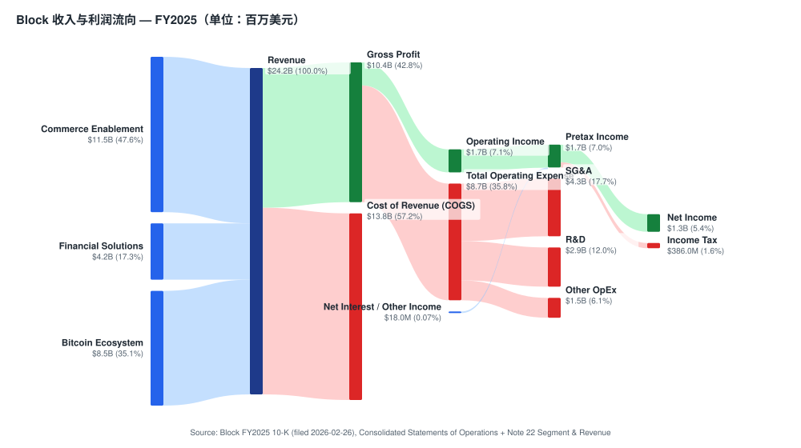

来源 / Source: [Block FY2025 10-K, Consolidated Statements of Operations + Note 22 Segment & Revenue](https://www.sec.gov/Archives/edgar/data/1512673/000162828026012254/xyz-20251231.htm)

**历史收入按产品线（development-over-time）。** 下图展示 FY2023→FY2025 收入按三大产品线的演化——最大的趋势是 **Bitcoin Ecosystem 收入从 $9,668M（FY23）萎缩到 $8,503M（FY25）**（加密交易疲软 + 公司主动降低 Cash App 比特币交易费），而 **Commerce Enablement（$9,530M→$11,514M）与 Financial Solutions（$2,717M→$4,177M，CAGR +24%）稳步上行**——结构上正从"比特币过手"向"高毛利的支付+消费信贷"迁移，这正是毛利率从 34%（FY23）改善到 43%（FY25）的根本。

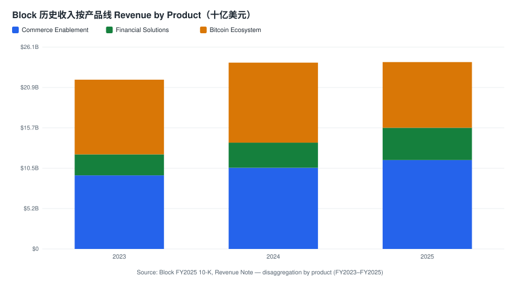

来源 / Source: [Block FY2025 10-K, Revenue Note — disaggregation by product (FY2023–FY2025)](https://www.sec.gov/Archives/edgar/data/1512673/000162828026012254/xyz-20251231.htm)

**收入按地理（FY2025）。** Block 高度集中于美国——FY2025 美国收入 $22,186.6M（92%）、国际 $2,007.1M（8%）；Q1'26 美国 $5,530.8M、国际 $526.1M（[Block FY2025 10-K, Note 22 — Revenue by Geographic Area](https://www.sec.gov/Archives/edgar/data/1512673/000162828026012254/xyz-20251231.htm)；[Block Q1'26 10-Q, 地理收入](https://www.sec.gov/Archives/edgar/data/1512673/000162828026032200/xyz-20260331.htm)）。国际敞口主要是 Afterpay 故乡市场澳大利亚 + 英国、加拿大、日本、爱尔兰、法国、西班牙；任何单一海外国家均不超过总收入 10%。

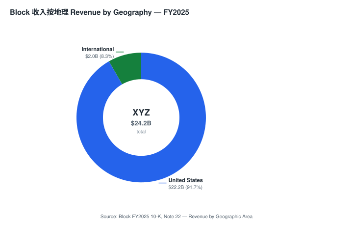

来源 / Source: [Block FY2025 10-K, Note 22 — Revenue by Geographic Area](https://www.sec.gov/Archives/edgar/data/1512673/000162828026012254/xyz-20251231.htm)

**毛利润按经营分部（FY2025）。** 下图按 Block 的两个经营分部（operating segment）拆分毛利润：**Cash App $6,336M（61%）> Square $3,935M（38%）> Corporate & Other $89M（1%）**——Cash App 已是更大的毛利发动机，且增速更快（FY25 +21% YoY vs Square +9%）。这与"看总收入会以为比特币是主角"形成鲜明对比。

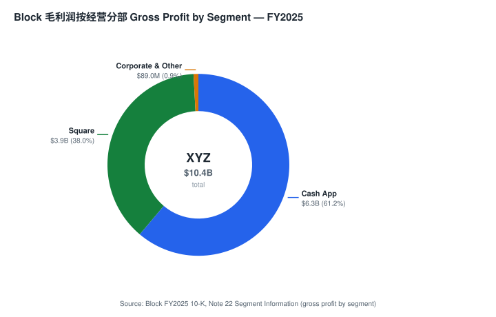

来源 / Source: [Block FY2025 10-K, Note 22 — Segment Information (gross profit by segment)](https://www.sec.gov/Archives/edgar/data/1512673/000162828026012254/xyz-20251231.htm)

## 1A. 估值与目标价

本章全部为 *分析师观点：*（预测值、目标价、情景目标价均为本报告分析师自有前瞻判断，不附任何 filing 引用；每项驱动的外部依据在行内单独引用）。

### (a) 远期财务预测表（3 年，以毛利润 + 调整后 EPS 为主口径）

*分析师观点：* 预测基础：FY2026 公司指引——毛利润 +约 19%（≈$12.33B）、AOI $3.34B（27% margin，+60% YoY）、调整后摊薄 EPS $3.85（+62%）、Q2'26 毛利润 $3.04B（+20%）+ AOI $740M（24% margin）（来源：[Block Q1'26 股东信, 2026-05-07](https://www.sec.gov/Archives/edgar/data/1512673/000119312526212032/d132441dex991.htm)；卖方对指引的核对见 *分析师观点：* [Goldman Sachs — Block 1Q26 Takeaways, 2026-05-08, p.1](http://xs-macbook-air.local:5001/zsxq/pdf/212458412282221/Goldman%20Sachs-Block%20Inc.%20%EF%BC%88XYZ.US%EF%BC%89%EF%BC%9A%201Q26%20Takeaways%EF%BC%9A%20Solid%20top%20and%20bottom%20line%20beat%20and%20continued%20acceleration%20across%20multiple%20metrics%20should%20sustain-260508.pdf)，GS 原文 "For FY26, XYZ expects gross profit of $12.33bn… Adjusted EPS is expected to be $3.85"）；历史财务取自 [10-K FY2025](https://www.sec.gov/Archives/edgar/data/1512673/000162828026012254/xyz-20251231.htm)。

| 指标（*分析师观点：* E 列） | FY2023A | FY2024A | FY2025A | FY2026E | FY2027E | 25–27E CAGR |
|---|---|---|---|---|---|---|
| 毛利润 Gross Profit（$M） | 7,505 | 8,889 | 10,360 | 12,330 | 14,300 | +17.5% |
| — YoY | — | +18% | +17% | +19% | +16% | |
| AOI 调整后经营利润（$M） | n/a | ~2,090 | ~2,775 | 3,340 | ~3,950 | +19% |
| — AOI margin（占毛利） | | ~24% | ~27% | 27% | ~28% | |
| 调整后摊薄 EPS（$） | n/a | ~1.46 | ~2.38 | 3.85 | ~4.80 | +42% |
| GAAP 经营利润（$M） | (279) | 892 | 1,708 | ~1,900 | ~2,800 | |
| GAAP 摊薄 EPS（$） | 0.02 | 4.56* | 2.10 | ~2.4 | ~3.6 | |
| 总收入（$M，含 BTC 过手） | 21,916 | 24,121 | 24,194 | ~25,500 | ~27,500 | |
| 自由现金流 FCF（CFO−capex，$M） | ~−50 | ~1,553 | ~2,425 | ~3,000 | ~3,400 | |

*FY2024 GAAP EPS $4.56 含约 $1.9B 一次性所得税收益（估值备抵释放），非经常性，不可外推。 AOI FY2023/24/25 由"FY26 AOI $3.34B = +60% YoY"反推 FY25 ≈ $2.09B（公司另披露 FY25 AOI 同比口径），FY25 ≈ $2.78B 为本报告估算（与 27% AOI margin × $10.36B 毛利一致）。

输入出处：FY2025 经营现金流 $2,580M、capex（购置 PP&E）$155M、总债务（LT $5,716M + 流动 $1,573M = $7,289M）、现金及等价物 $6,564M 来自 [10-K FY2025 现金流量表 + 资产负债表](https://www.sec.gov/Archives/edgar/data/1512673/000162828026012254/xyz-20251231.htm)；Q1'26 毛利 $2,909M、AOI $728M、调整后 EPS $0.85 来自 [Q1'26 股东信](https://www.sec.gov/Archives/edgar/data/1512673/000119312526212032/d132441dex991.htm)。

**利润率桥（margin bridge，AOI margin FY2024→FY2026E ~24%→27%，*分析师观点：*）**：裁员 >40% + AI 增效带来的运营杠杆约 +250–300bp（Q1'26 已见效——opex"much lower, benefiting from lower headcount"，*分析师观点：* [Goldman Sachs, 2026-05-08, p.1](http://xs-macbook-air.local:5001/zsxq/pdf/212458412282221/Goldman%20Sachs-Block%20Inc.%20%EF%BC%88XYZ.US%EF%BC%89%EF%BC%9A%201Q26%20Takeaways%EF%BC%9A%20Solid%20top%20and%20bottom%20line%20beat%20and%20continued%20acceleration%20across%20multiple%20metrics%20should%20sustain-260508.pdf)）；Cash App 高毛利消费信贷占比上升约 +100bp（Financial Solutions Q1'26 毛利增速 55%）；抵消项是交易/贷款损失上升（FY25 损失 $1,337M = 毛利的 13%，从 FY24 的 9% 上升，[10-K FY2025 MD&A](https://www.sec.gov/Archives/edgar/data/1512673/000162828026012254/xyz-20251231.htm)）约 −80bp。

### (b) 目标价推导（показать算术）

*分析师观点：* 方法：**P/E × FY2027E 调整后摊薄 EPS 法**（Block 已 GAAP 盈利但 GAAP EPS 受比特币重估与一次性税项扰动，市场与卖方一致用调整后口径；用毛利润口径的 EV/GP 作交叉验证）：

- FY2027E 调整后摊薄 EPS = **~$4.80**（上表，= FY26E $3.85 × ~+25%，由毛利 +16% × AOI margin 微升 × 回购摊薄股本驱动）
- 目标倍数 = **18.5×** —— 比较锚：Morgan Stanley 用 18× '27 Adj. EPS（PT $98，原文 "Our $98 PT for XYZ is based on a 18x P/E multiple on our '27 Adj. EPS"，*分析师观点：* [Morgan Stanley, 2026-06-02, p.1/Exhibit 1](http://xs-macbook-air.local:5001/zsxq/pdf/184152881184542/Morgan%20Stanley-Block%EF%BC%8C%20Inc%EF%BC%88XYZ.US%EF%BC%89Highlighting%20Square%27s%20Strength%20in%20our%20SMB%20Survey%EF%BC%9B%20Reiterate%20OW-260602.pdf)）；Goldman Sachs 用 17× Q5-Q8（约 NTM+1）EPS（PT $95，原文 "Our 12-month price target of $95 is based on a 17x P/E target multiple on Q5-Q8 EPS"，并称现价 "~13x our 2027 EPS"，*分析师观点：* [Goldman Sachs roadshow, 2026-06-11, p.1](http://xs-macbook-air.local:5001/zsxq/pdf/214528142888121/Goldman%20Sachs-Block%20Inc.%20%EF%BC%88XYZ.US%EF%BC%89%EF%BC%9AKey%20takeaways%20from%20roadshow%20meetings-260611.pdf)）。我们取 18.5×（略低于 MS 因本报告 EPS 估计略保守、但承认盈利复利斜率变陡）。
- PT = 18.5 × $4.80 = **$89 ≈ $90/股**
- 交叉验证（EV/GP）：$90 × ~600M 摊薄股 ≈ 股权 $54B + 净债务 ~$0.7B = EV ~$55B ÷ FY27E 毛利 $14.3B = **EV/GP ~3.8×**，处于支付+消费金融同业（3–5×）合理区间。

### (c) 牛市/基准/熊市情景

| 情景（*分析师观点：*） | 关键假设 | 目标价 | vs 现价 $74.53 |
|---|---|---|---|
| Bull（牛市） | 裁员增效 + Cash App Borrow 全面放量 + Square GPV 重新加速，FY27E Adj EPS $5.30，倍数 21× | **$111** | **+49%** |
| Base（基准） | 中性假设：FY27E Adj EPS $4.80 × 18.5× | **$90** | **+21%** |
| Bear（熊市） | 美国消费信贷周期恶化：Cash App Borrow 损失率飙升 + Square Loans 吞吐量下降 + 比特币重估打 GAAP，FY27E Adj EPS $4.10、倍数压缩至 14× | **$57** | **−23%** |

*分析师观点：* 风险收益偏正——上行 $111（+49%）vs 下行 $57（−23%），上/下行约 2.1:1，对一家已盈利、FY27E 调整后 P/E 仅约 16× 的复利股而言，这是相对对称、偏多的形态（与 CoreWeave 那种"下行尾部更肥"的高杠杆故事股截然不同）。本报告 $90 与 GS $95、MS $98 同向但更保守，差异主要在 FY27E EPS 估计与目标倍数。

### (d) 一致预期对照（Guide vs Street vs 本报告）

| 指标（FY2026E） | 公司指引 | Street 一致预期 | 本报告（*分析师观点：*） |
|---|---|---|---|
| 毛利润 | +约 19%（≈$12.33B，[Q1'26 股东信](https://www.sec.gov/Archives/edgar/data/1512673/000119312526212032/d132441dex991.htm)） | ~$11.9B（指引高于共识 ~4%，*分析师观点：* [GS, 2026-05-08, p.1](http://xs-macbook-air.local:5001/zsxq/pdf/212458412282221/Goldman%20Sachs-Block%20Inc.%20%EF%BC%88XYZ.US%EF%BC%89%EF%BC%9A%201Q26%20Takeaways%EF%BC%9A%20Solid%20top%20and%20bottom%20line%20beat%20and%20continued%20acceleration%20across%20multiple%20metrics%20should%20sustain-260508.pdf)） | $12.33B（与指引一致） |
| AOI | $3.34B（27% margin，同上） | ~$2.65B（指引高于共识 ~26%！） | $3.34B |
| 调整后摊薄 EPS | $3.85（+62%，同上） | ~$3.70（指引高于共识 ~4%） | $3.85 |

*分析师观点：* 注意 GS 明确指出 FY26 AOI 指引 $3.34B **高于 Street 共识约 26%**（原文 "Adjusted Operating Income is expected to be $3.34bn or 27% margin (+26% vs consensus)"，[GS, 2026-05-08, p.1](http://xs-macbook-air.local:5001/zsxq/pdf/212458412282221/Goldman%20Sachs-Block%20Inc.%20%EF%BC%88XYZ.US%EF%BC%89%EF%BC%9A%201Q26%20Takeaways%EF%BC%9A%20Solid%20top%20and%20bottom%20line%20beat%20and%20continued%20acceleration%20across%20multiple%20metrics%20should%20sustain-260508.pdf)）——这是本报告增持的核心量化依据：裁员带来的利润率上修，市场尚未充分计入。

### 卖方观点演变（Sell-side view evolution）

机械预检：`db/stock_price_target.db`（只读）共有 3 条 XYZ 目标价记录（2026-05-08 至 2026-06-02），评级全为正面（GS Buy $95、MS Overweight $98、Bernstein Outperform [稳定币主题，无明确单一 PT]），PT 区间 **$95–$98**，极差仅约 3%、中位约 $96，**机构间高度一致看多**（与 CoreWeave 那种 $67 vs $135 的两极分化形成对比）。叠加本次刷新读入的 GS 路演纪要（2026-06-11）与 Bernstein 支付/代理支付主题（2026-06-11）。**按机构的观点时间线**（每条 PT 均配该研报日股价与隐含空间；报告日收盘价来自 stock_price_target.db / yfinance）：

| 机构 | 日期 | 评级 / 目标价 | 报告日股价（隐含空间） | 一句话论点 |
|---|---|---|---|---|
| Goldman Sachs | 2026-05-08 | Buy / $95 | $74.85（+27%） | Q1 毛利超预期、Cash App 风险损失增速见顶、AI 内部增效、Square 产品速度回升——"top picks in the space"，现价仅 ~13× 2027 EPS（*分析师观点：* [GS — Block 1Q26 Takeaways, 2026-05-08, p.1](http://xs-macbook-air.local:5001/zsxq/pdf/212458412282221/Goldman%20Sachs-Block%20Inc.%20%EF%BC%88XYZ.US%EF%BC%89%EF%BC%9A%201Q26%20Takeaways%EF%BC%9A%20Solid%20top%20and%20bottom%20line%20beat%20and%20continued%20acceleration%20across%20multiple%20metrics%20should%20sustain-260508.pdf)） |
| Bernstein | 2026-05-25 | Outperform / 稳定币主题（无单一 PT） | $68.08 | 稳定币在支付栈中的机会评估，Block 被列为受益标的之一（*分析师观点：* [Bernstein — Stablecoins 行业纪要, 2026-05-25](http://xs-macbook-air.local:5001/zsxq/pdf/415241528451848/Bernstein-Payments%EF%BC%8C%20Processors%20%26%20IT%20Services%20Payments%EF%BC%9A%20Stablecoins%20%E2%80%94%20What%20we%20learned%20from%20our%20dozens%20of%20industry%20conversations%EF%BC%9B%20Slide%20deck-260525.pdf)） |
| Morgan Stanley | 2026-06-02 | **Overweight / $98** | $74.15（+32%） | SMB 调研印证 Square 强势：Square CSAT 96% vs Toast 44% / Clover 30%，"最高份额的潜在转换者会选 Square"；PT 基于 18× '27 Adj EPS（*分析师观点：* [MS — Highlighting Square's Strength in SMB Survey, 2026-06-02, p.1](http://xs-macbook-air.local:5001/zsxq/pdf/184152881184542/Morgan%20Stanley-Block%EF%BC%8C%20Inc%EF%BC%88XYZ.US%EF%BC%89Highlighting%20Square%27s%20Strength%20in%20our%20SMB%20Survey%EF%BC%9B%20Reiterate%20OW-260602.pdf)） |
| Goldman Sachs | 2026-06-11 | Buy / $95（维持） | ~$72（+32%） | 路演纪要：Cash App 产品动能增强、Square 商户拓展加速、裁员增效支撑利润率；重申 17× Q5-Q8 EPS 估值法（*分析师观点：* [GS — Key takeaways from roadshow meetings, 2026-06-11, p.1](http://xs-macbook-air.local:5001/zsxq/pdf/214528142888121/Goldman%20Sachs-Block%20Inc.%20%EF%BC%88XYZ.US%EF%BC%89%EF%BC%9AKey%20takeaways%20from%20roadshow%20meetings-260611.pdf)） |

**机构间一致与本报告立场**：三家主流卖方（GS / MS / Bernstein）全部正面，PT $95–98，分歧极小，核心论点高度趋同——"裁员增效 + Cash App 货币化 + Square 回暖"。本报告 Overweight/$90 与之同向，但 PT 更保守约 5–8%，原因是本报告对 FY27E 调整后 EPS（$4.80）与目标倍数（18.5×）的估计比 MS（更高 EPS）略低；我们也更强调消费信贷周期这一下行变量（见熊市情景与第 9 节）。

### (e) 关键变量（swing variables）

*分析师观点：* 本报告评级最依赖两个假设，建议读者优先压力测试：（1）**Cash App Borrow 的损失率拐点**——GS 指出公司已"signaled a peak in risk loss growth"（风险损失增速见顶），这是长期投资者愿意进场的关键（原文 [GS, 2026-05-08, p.1](http://xs-macbook-air.local:5001/zsxq/pdf/212458412282221/Goldman%20Sachs-Block%20Inc.%20%EF%BC%88XYZ.US%EF%BC%89%EF%BC%9A%201Q26%20Takeaways%EF%BC%9A%20Solid%20top%20and%20bottom%20line%20beat%20and%20continued%20acceleration%20across%20multiple%20metrics%20should%20sustain-260508.pdf)）——若美国消费信贷恶化使损失率重新上行，Financial Solutions 的高毛利增长会逆转，bear 情景被激活；（2）**裁员后的产品执行速度**——裁减 >40% 员工同时要加速产品路线图（管理层理由是"speed/AI 原生"），机构知识流失或士气损害可能拖慢 Square GPV 与 Cash App 新功能上线节奏。

## 1B. GF Score（GuruFocus-style）基本面记分卡

*分析师观点：* **GF Score（GuruFocus-style，综合评分）：62/100 —— 51–70 区间（中等偏下基本面潜力档）。** 这个分数刻画了 Block 的核心画像：一家**已盈利、增长稳健、估值合理、但被多生态复杂度与比特币暴露略微拉低质量分**的支付+消费金融复利股——五个维度都在 6–7 的"扎实但不惊艳"区间，没有 CoreWeave 那种"成长 10 / 财务 2"的极端背离。**本记分卡是分析师自有评分规则的产物（与 GuruFocus 官方专有算法不同，亦非 GuruFocus 出品），五个子分与综合分均为 *分析师观点：*、不附任何 filing 引用；每个维度背后的指标在下方逐项给出行内引用。** 提示：GF Value（估值）维度的方向是"分数越高=越便宜"，Block 在该维度得 6/10 意为"估值合理偏便宜"。

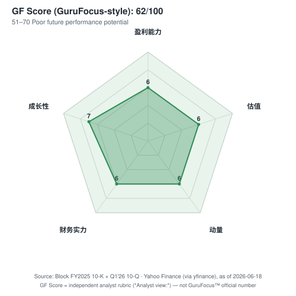

> 离中心越远，该维度得分越高；五边形面积越大，综合 GF Score 越高（与 GuruFocus 控件读法一致）。

| 维度（bilingual gloss） | 评分 (0–10) | |
|---|---|---|
| Financial Strength（财务实力） | 6 | `██████░░░░` |
| Profitability（盈利能力） | 6 | `██████░░░░` |
| Growth（成长性） | 7 | `███████░░░` |
| GF Value（估值，越高越便宜） | 6 | `██████░░░░` |
| Momentum（动量） | 6 | `██████░░░░` |
| **GF Score（综合，*分析师观点：*）** | **62 / 100** | **51–70 中等偏下基本面潜力档** |

*综合权重（*分析师观点：* 透明复刻，非 GuruFocus 专有权重）：Financial Strength 20% · Profitability 25% · Growth 25% · GF Value 15% · Momentum 15%。*

**Financial Strength（财务实力）：6/10。** 资产负债表稳健但商誉沉重。截至 2025-12-31，现金及等价物 $6,564M vs 总债务（LT $5,716M + 流动 $1,573M = $7,289M）——近乎净中性的债务头寸；股东权益 $22,170M 占总资产 $39,550M 的 56%；但其中商誉 $11,849M + 无形资产 $1,282M 合计占总资产约 33%（Afterpay 等收购遗留），有形权益更薄（[10-K FY2025, 合并资产负债表](https://www.sec.gov/Archives/edgar/data/1512673/000162828026012254/xyz-20251231.htm)）。利息覆盖充裕——FY2025 经营利润 $1,708M ÷ 净利息支出 $129M ≈ 13×。不给更高分是因为商誉占比高 + 比特币资产负债表敞口。

**Profitability（盈利能力）：6/10。** GAAP 已扎实盈利但净利率被比特币过手稀释。FY2025 毛利率 43%、经营利润率 7%（剔除比特币过手后的"真实"经营利润率更高）、GAAP 净利率 5.4%、ROE 约 6.0%（净利 $1,304M ÷ 平均权益 $21.7B，见下方 DuPont）（[10-K FY2025, 经营报表 + 资产负债表](https://www.sec.gov/Archives/edgar/data/1512673/000162828026012254/xyz-20251231.htm)）。非 GAAP 口径更亮眼——FY2025 AOI margin（占毛利）约 27%、Q1'26 创纪录 25%（[Q1'26 股东信](https://www.sec.gov/Archives/edgar/data/1512673/000119312526212032/d132441dex991.htm)）。不给更高分是因为 GAAP ROE 仍仅个位数、交易/贷款损失（占毛利 13%）在上升。

**Growth（成长性）：7/10。** 毛利润复合增长稳健且在加速：FY2023 $7,505M → FY2024 $8,889M（+18%）→ FY2025 $10,360M（+17%）→ Q1'26 单季 +27% YoY；前瞻路径强劲——FY2026 毛利指引 +19%、调整后摊薄 EPS +62%（[10-K FY2025, MD&A](https://www.sec.gov/Archives/edgar/data/1512673/000162828026012254/xyz-20251231.htm)；[Q1'26 股东信](https://www.sec.gov/Archives/edgar/data/1512673/000119312526212032/d132441dex991.htm)）。Cash App 分部毛利 Q1'26 +38% YoY 尤为突出。不给 8–9 是因为总收入近乎不增（比特币萎缩对冲了支付增长），且增速虽稳健但非超高速。

**GF Value（估值，越高越便宜）：6/10。** 估值合理偏便宜。现价对应 FY26E 调整后 P/E ~19×、FY27E ~16×、EV/FY26E 毛利 ~3.6×、GAAP 摊薄 P/E ~35×（[Yahoo Finance via yfinance, 2026-06-18](https://finance.yahoo.com/quote/XYZ/)；远期倍数见本报告 header 估值矩阵）；GS 称现价仅 ~13× 2027 EPS（*分析师观点：* [GS, 2026-06-11](http://xs-macbook-air.local:5001/zsxq/pdf/214528142888121/Goldman%20Sachs-Block%20Inc.%20%EF%BC%88XYZ.US%EF%BC%89%EF%BC%9AKey%20takeaways%20from%20roadshow%20meetings-260611.pdf)）。对照 1A 节 Damodaran 公允价值中值约 $87 vs 现价 $74.53，有 ~+17% 安全边际。不给更高分是因为不算"深度低估"——只是合理。

**Momentum（动量）：6/10。** 中近端动量稳健、长端略落后大盘。YTD +14.5%（相对 SPX +5.1pp）、6M +15.7%（+5.2pp）、1M +5.5%（+4.3pp），现价接近 52 周高点 $82.50；但 12M +18.1% 跑输 SPX 的 +25.3%（相对 −7.1pp）（来源：yfinance，截至 2026-06-18，与 header 相对表现行一致）。不给更高分是因为 12 个月维度仍落后大盘。

**综合算术：** (FS 6×20 + Prof 6×25 + Growth 7×25 + Value 6×15 + Mom 6×15) / 100 = (120 + 150 + 175 + 90 + 90) / 100 = 625 / 100 → **62/100**（取整）。GuruFocus 框架下，51–70 属"中等偏下未来表现潜力"档（[GuruFocus GF Score 页](https://www.gurufocus.com/term/gf-score)，注：该页受 Cloudflare 保护，对 curl/urllib 返回 403 属反爬而非死链；本报告未引用 GuruFocus 官方分数，仅引用其方法论框架）。

**最易翻动的维度 / 失败模式：** Profitability 与 Growth 是上行杠杆——若 FY26 AOI 指引 $3.34B（高于共识 26%）兑现，Profitability 可由 6 升至 7、综合分上修约 3–5 分；反之若 Cash App 消费信贷损失率重新上行，Growth 与 Profitability 双双承压。该综合分与本报告 Overweight 评级、1A 节"风险收益偏正"判断、第 10 节中性偏正的视角分互相一致。

**ROE 拆解（DuPont，FY2025）。** Block FY2025 ROE 约 **6.0%**（净利 $1,304M ÷ 平均股东权益 ~$21.7B），由三因子构成：净利率 5.4%（被比特币过手稀释）× 资产周转率 0.63 × 股权乘数 1.76（相对支付同业偏低的杠杆，反映 56% 的权益占比）。下图把这三因子可视化——ROE 偏低的主因是**净利率被比特币过手撑大的分母拉低**（剔除比特币后的"经营 ROE"实质更高），以及金融业务天然的低资产周转。所有输入取自 [10-K FY2025 合并经营报表与资产负债表](https://www.sec.gov/Archives/edgar/data/1512673/000162828026012254/xyz-20251231.htm)。

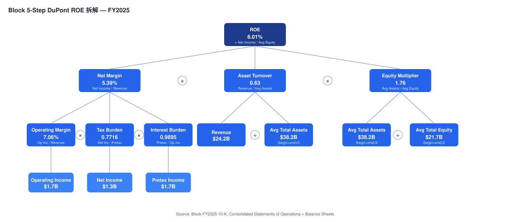

来源 / Source: [Block FY2025 10-K, Consolidated Statements of Operations + Balance Sheets](https://www.sec.gov/Archives/edgar/data/1512673/000162828026012254/xyz-20251231.htm)

**资产负债表结构（balance-sheet Sankey，2025-12-31）。** 下图把资产负债表画成流向：总资产 $39,550M 中流动资产 $22,857M（58%，含现金 $6,564M、客户资金 customer funds $4,772M、消费者应收款 $2,670M、持有待投资贷款 $3,383M）+ 非流动 $16,693M（商誉 $11,849M 是最大块）；负债端总负债 $17,380M（客户应付 $6,805M + 长期债务 $5,716M 为主）；股东权益 $22,170M（额外实收资本 $18,895M + 留存收益 $3,674M）。要点：**Block 是低杠杆的（权益占总资产 56%），但资产端有大量"代客户持有"的流动性（customer funds / customers payable）和商誉**——理解其资本结构需把代客资金与自有资本分开看。

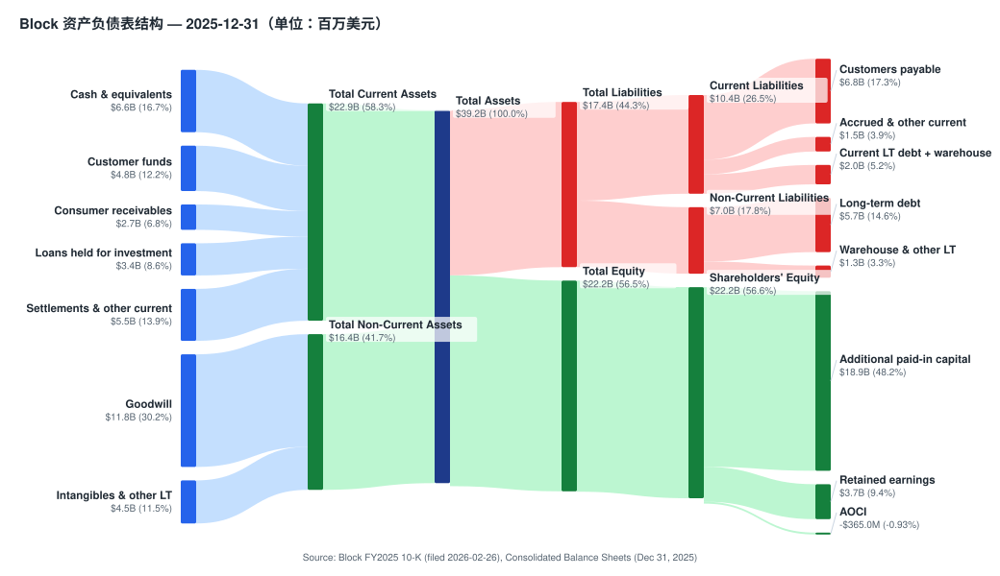

来源 / Source: [Block FY2025 10-K, Consolidated Balance Sheets (Dec 31, 2025)](https://www.sec.gov/Archives/edgar/data/1512673/000162828026012254/xyz-20251231.htm)

**现金流量（cash-flow Sankey，FY2025）。** FY2025 经营现金流 CFO $2,580M（净利 $1,304M + D&A/SBC/非现金调整 $1,585M − 营运资本及其他 −$309M）；投资现金流 CFI −$2,802M（净消费贷款/应收款发起 −$2,760M + 证券 + 资本开支 capex $155M——注意 Block 是轻资产的，capex 仅占毛利的 1.5%）；融资现金流 CFF −$613M（发优先票据净 +$2,172M − 股票回购 −$2,331M − 仓储融资/客户资金 −$454M）。要点：**Block 产生强劲的自由现金流（CFO−capex ≈ $2.4B），并把大部分用于股票回购（FY25 回购 $2,331M）**——这是"利润率纪律"故事的资本配置侧证据。

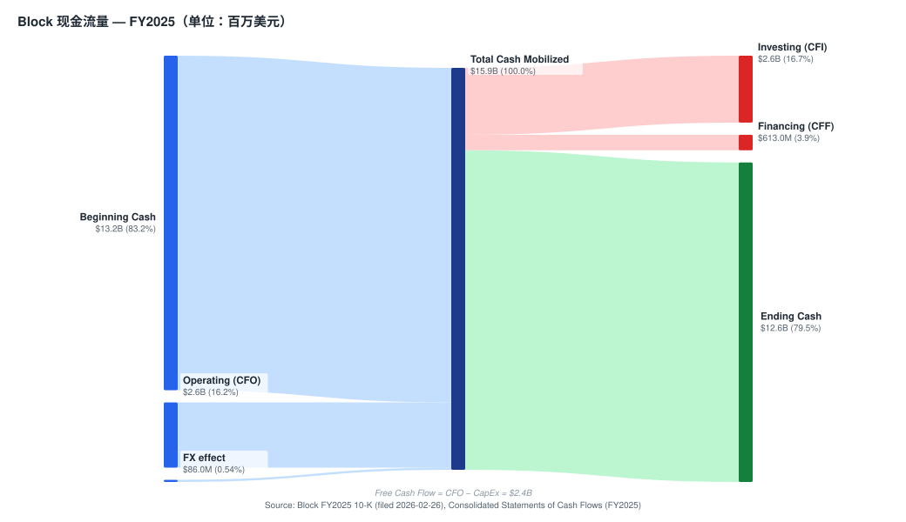

来源 / Source: [Block FY2025 10-K, Consolidated Statements of Cash Flows (FY2025)](https://www.sec.gov/Archives/edgar/data/1512673/000162828026012254/xyz-20251231.htm)

## 2. 公司历史

**Square, Inc. 于 2009 年 6 月在美国特拉华州注册成立**，由两位联合创始人共同创办：Jack Dorsey（彼时刚回归 Twitter）与 Jim McKelvey（圣路易斯当地的玻璃艺术家兼连续创业者）——传说的"创始触发事件"是 McKelvey 在 2008 年因无法接受信用卡支付而错失一笔 2,000 美元的玻璃艺术品订单（[Block FY2025 10-K, Item 1 Business](https://www.sec.gov/Archives/edgar/data/1512673/000162828026012254/xyz-20251231.htm)；[Block 2026 委托书 Proxy Statement — 董事简历](https://www.sec.gov/Archives/edgar/data/1512673/000162828026027203/sq-20260423.htm)）。Square 生态系统于 2009 年 2 月推出，首款产品即著名的 **白色塑料磁条 Square Reader 读卡器**——一款可插入 iPhone / iPad 耳机口的硬件加密读卡器，使任何个人卖家、餐车、市集摊位等中小企业首次能够接受 Visa / Mastercard 信用卡支付。

**Cash App 于 2013 年作为 "Square Cash" 上线**，最初作为一款 P2P 个人间转账应用与 PayPal 旗下的 Venmo 竞争。此后的十年间，Cash App 从单一 P2P 工具扩展为多产品消费金融服务平台：2017 年推出 Cash App Card（连接 Cash App 余额的 Visa 借记卡，由合作银行发行）；2018 年新增比特币买卖；2019 年新增美股及 ETF 经纪 (brokerage) 业务；2020 年通过收购 Credit Karma 旗下报税业务推出 Cash App Taxes 免费报税服务；2020 年起逐步推出 Cash App Borrow 短期消费贷款。至 2025 年 12 月，Cash App 月度交易活跃用户覆盖美国 50 个州及几乎全部县，2025 年 Cash App 在 **Google Play 美区金融类应用下载榜排名第 1、iOS 美区金融类应用下载榜排名第 3**（[Block FY2025 10-K, Item 1 — Cash App Ecosystem](https://www.sec.gov/Archives/edgar/data/1512673/000162828026012254/xyz-20251231.htm)）。

**IPO 与资本市场历史。** Square, Inc. 于 2015 年 11 月在纽约证券交易所 (NYSE) 完成 IPO，发行价 **每股 $9**——对应估值约 29 亿美元——以代码 "SQ" 挂牌（[Square 2015 年 S-1/A 注册声明](https://www.sec.gov/Archives/edgar/data/1512673/000119312515378578/d937622ds1a.htm)）。此后的资本运作包括 2018/2020 年的可转债发行；2021 年 5 月发行的 $10 亿 2.75% 票据 + $10 亿 3.50% 票据（部分用于资助 2022 年完成的 Afterpay 全股票收购）；以及 2023—2025 年持续的股票回购（FY2025 回购 $2,331M，[Block FY2025 10-K, 现金流量表](https://www.sec.gov/Archives/edgar/data/1512673/000162828026012254/xyz-20251231.htm)）。

**公司更名为 Block, Inc.** 由 Square, Inc. 更名为 Block, Inc. 于 2021 年 12 月 10 日生效（NYSE 代码当时仍维持 "SQ"）。管理层将此次更名定位为反映业务已从"商户支付"扩展到 Cash App 消费金融、TIDAL 音乐流媒体（2021 年 3 月以 $2.97 亿收购）、以及比特币生态业务（Bitkey, Proto, Spiral）。NYSE 股票代码由 SQ 更换为 **XYZ** 于 2026 年 1 月 2 日生效，完成了完整的品牌重塑周期（[Block FY2025 10-K, 封面页代码 XYZ](https://www.sec.gov/Archives/edgar/data/1512673/000162828026012254/xyz-20251231.htm)）。

**Afterpay 收购（2022 年 1 月 31 日完成）** 是 Block 迄今最具变革性的战略举措——一笔全股票交易，最初宣布时（2021 年 8 月）估值约 $290 亿，最终交割时（2022 年 1 月）因 SQ 股价大幅下跌而修订为约 $138 亿。Afterpay 为 Block 带来一个全球已规模化的 **Buy-Now-Pay-Later (BNPL，先买后付)** 业务——覆盖美国、澳大利亚（Afterpay 总部所在地）、加拿大、新西兰、英国——构建了"贯穿 Square 商家端与 Cash App 消费者端"的双边网络，BNPL 担当连接组织（[Block FY2025 10-K, BNPL 产品](https://www.sec.gov/Archives/edgar/data/1512673/000162828026012254/xyz-20251231.htm)）。

**2022—2026 业务演化与"模式切换"。** 2022 年的特征是 Afterpay 整合后利润率压缩；2023 年完成 "Block 1.0" 整合，TBD 并入比特币生态板块；2024 年 5 月召开首个 "Square Day"，凸显 Square 向中市场和食饮 (F&B) 垂直的转向。**2025 年 11 月，管理层以 Block, Inc. 品牌名召开首次正式投资者日 (Investor Day)**，提出三年战略：Cash App 毛利润 CAGR > 20%、加速 Square GPV、重建经营利润率纪律。**2026 年 2 月 26 日（与 FY25 年报同步），公司宣布 "Workforce Plan" 裁员 >40%**——这是"模式切换"的引爆点：从 Dorsey 时代的"不惜成本扩张"转向"更小、更快、AI 原生、利润率优先"（[Block FY2025 10-K, Subsequent Events](https://www.sec.gov/Archives/edgar/data/1512673/000162828026012254/xyz-20251231.htm)；[Block Q4'25 股东信, 2026-02-26](https://www.sec.gov/Archives/edgar/data/1512673/000119312526076557/d108590dex991.htm)）。

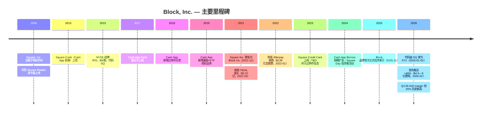

资料来源：[Block FY2025 10-K, 业务概述](https://www.sec.gov/Archives/edgar/data/1512673/000162828026012254/xyz-20251231.htm)；[Block Q4'25 股东信](https://www.sec.gov/Archives/edgar/data/1512673/000119312526076557/d108590dex991.htm)；[Block 2026 委托书—董事任期](https://www.sec.gov/Archives/edgar/data/1512673/000162828026027203/sq-20260423.htm)。

## 3. 管理团队

**Jack Dorsey — Block Head（首席长官）、董事长（联合创始人）。** Jack Dorsey 自 2009 年 7 月起担任 Block 的主要执行官 (principal executive officer) 及董事会成员；他与 Jim McKelvey 共同创办了 Square（现 Block），自 2010 年 10 月起担任董事长。Block 2026 委托书将 Dorsey 描述为 Square Financial Services 监管框架下的"控股股东 (controlling shareholder)"（[Block 2026 委托书—董事简历](https://www.sec.gov/Archives/edgar/data/1512673/000162828026027203/sq-20260423.htm)；[Block FY2025 10-K, Government Regulation](https://www.sec.gov/Archives/edgar/data/1512673/000162828026012254/xyz-20251231.htm)）。在创办 Square 之前，Dorsey 是 Twitter 三位联合创始人之一，并于 2015—2021 年同时担任 Twitter CEO 和 Square CEO（公开市场极罕见的"双 CEO"安排）。其薪酬安排是美股最独特的之一：**应他个人要求，他不接受任何现金或股权薪酬，仅领取 $2.75 的象征性年薪**（[Block 2026 委托书—薪酬亮点](https://www.sec.gov/Archives/edgar/data/1512673/000162828026027203/sq-20260423.htm)）。**分析师观点：** Dorsey 的 $2.75 名义年薪 + 兼任 Spiral/Proto/Bitkey 等比特币生态项目领头人，传递出极不寻常的"创始人主导、使命驱动"治理姿态——压缩了传统委托代理冲突，但引入"单一创始人依赖"的集中度风险。

**Amrita Ahuja — Foundational Lead、首席财务官 (CFO)、首席运营官 (COO) 及 People Lead。** Ahuja 自 2019 年 1 月担任 Block CFO，2023 年 2 月加任 COO 及 "Foundational Lead"，2025 年 9 月又加任 "People Lead"——使她成为 Dorsey 以外权力集中度最高的运营高管；2026 年基本工资上调至 $60 万（2025 年 $56.5 万）（[Block 2026 委托书—薪酬表](https://www.sec.gov/Archives/edgar/data/1512673/000162828026027203/sq-20260423.htm)）。加入 Block 前，她曾任 Blizzard Entertainment（动视暴雪子公司）CFO。**分析师观点：** Ahuja 集 CFO + COO + People Lead 于一身，反映 Block 高度扁平化的组织设计；作为 People Lead，她在 2026 年 >40% 裁员计划中的执行角色不言而喻。2026 委托书显示当前共 6 位执行官，在 Dorsey 之下还包括 Brian Grassadonia（Ecosystem Lead）、Owen Britton Jennings（Business Lead）、Chrysty Esperanza（Counsel Lead）和 Arnaud Weber（Engineering Lead，2025 年 6 月加入）（[Block 2026 委托书—执行官名录](https://www.sec.gov/Archives/edgar/data/1512673/000162828026027203/sq-20260423.htm)）。

## 4. 产品与服务

Block 运营两个面向客户的应报告生态系统——Square 与 Cash App——加上 Corporate / "其他" 行政线，承载 TIDAL 音乐流媒体以及 Bitkey、Proto、Spiral 等比特币硬件业务。10-K 将整体战略定位描述为 "整合支付、银行、贷款和商务解决方案"——通过共享基础设施贯穿 embedded financial services（嵌入式金融服务）、automation（自动化）与开放的 Bitcoin（比特币）协议（[Block FY2025 10-K, Item 1 — Our Ecosystems](https://www.sec.gov/Archives/edgar/data/1512673/000162828026012254/xyz-20251231.htm)）。

### 4.1 Square 生态系统 — 商家侧商务操作系统

Square 生态系统为全球约 450 万商户综合提供支付、销售点 (point-of-sale, POS) 软件、硬件以及嵌入式金融服务。主要地理覆盖：美国、加拿大、日本、澳大利亚、英国、爱尔兰、法国、西班牙（[Block FY2025 10-K, Item 1 — Square Merchants](https://www.sec.gov/Archives/edgar/data/1512673/000162828026012254/xyz-20251231.htm)）。

**硬件产品矩阵。** 10-K 中以原文列出 Square 硬件线：

> "Square Register 是一款一体式产品，整合了我们的硬件、销售点软件与支付技术，专用硬件包括两块屏幕……Square Terminal 是一款便携式、一体化支付设备和收据打印机，替代传统的键盘式终端，接受 tap、dip 和 swipe 支付……Square Stand 将 iPad 转换为完整的台式销售点，并具有内置的非接触式与芯片读取器。Square Reader for contactless and chip 接受 EMV 芯片卡和 NFC 支付，能够通过 Apple Pay、Google Pay 等移动钱包接受支付。"（[Block FY2025 10-K, Item 1 — Hardware](https://www.sec.gov/Archives/edgar/data/1512673/000162828026012254/xyz-20251231.htm)）

最初的 2009 年磁条 Square Reader 至今仍保留在产品线中，作为入门级选项；10-K 同时承认对磁条读卡器硬件的"单一供应商依赖"是供应链集中风险之一。

**软件产品矩阵。** Square 的垂直行业 POS 软件包括 **Square for Restaurants（餐饮 POS：桌位管理、厨房显示系统、在线点餐）**、**Square for Retail（零售 POS：库存管理、条形码扫描、全渠道）**、**Square Appointments（服务业预约调度）**、**Square Online（电商店面构建器）**，以及运营工具 **Square Team Management 和 Square Payroll**。这些工具"直接与 Square 的商务和金融解决方案集成"——这是与点产品竞争对手最重要的统一差异点（[Block FY2025 10-K, Item 1 — Square Software](https://www.sec.gov/Archives/edgar/data/1512673/000162828026012254/xyz-20251231.htm)）。

**Square Loans, Square Card, Square Banking。** **Square Loans 通过 Square Financial Services（Block 在犹他州持有的产业银行 industrial bank 牌照子公司，2021 年开始运营）为合格的 Square 商户发放贷款**。10-K 原文：*"自 2014 年 5 月公开发布以来，Square Loans 已促成超过 400 万笔贷款和预付款，贷款本金或预付款累计金额超过 $328 亿。"*（[Block FY2025 10-K, Item 1 — Square Loans](https://www.sec.gov/Archives/edgar/data/1512673/000162828026012254/xyz-20251231.htm)）。**Square Credit Card**（2023 推出）是面向商户的第二条贷款产品线；**Square Card** 是关联商户余额的免费 Mastercard 商业借记卡；**Square Banking** 提供商户存款、储蓄和即时入账 (instant deposit)。

**Square 的战略意义。** Square 的核心价值在于 **整合闭环 (integration loop)**——支付数据（交易规模、收入节奏、客户组合）支持 Square Loans 承销，进而扩大 Square 在商户钱包中的份额——从"支付处理商"升级为"操作系统加资产负债表合作伙伴"。Q1'26 Square 分部毛利 +9% YoY、GPV 增长"由 F&B 商户强劲增长驱动"——这是 Square 最大力投入的垂直（通过 Square for Restaurants）；管理层把"速度 (speed)"列为可加速 GPV 的关键运营纪律（[Block Q1'26 股东信, 2026-05-07](https://www.sec.gov/Archives/edgar/data/1512673/000119312526212032/d132441dex991.htm)）。**分析师观点：** 大摩 2026-06 SMB 调研为 Square 的竞争位置提供了独立印证——Square 客户满意度 96% vs Toast 44% / Clover 30%，且"最高份额的潜在转换者会选 Square"（[Morgan Stanley — SMB Survey, 2026-06-02](http://xs-macbook-air.local:5001/zsxq/pdf/184152881184542/Morgan%20Stanley-Block%EF%BC%8C%20Inc%EF%BC%88XYZ.US%EF%BC%89Highlighting%20Square%27s%20Strength%20in%20our%20SMB%20Survey%EF%BC%9B%20Reiterate%20OW-260602.pdf)）。

### 4.2 Cash App 生态系统 — 消费者金融服务超级应用

10-K 将 Cash App 定位为服务 "Cash App Green" 客群——"赚取多种动态收入来源的劳动力，包括按小时工资、零工 (gig) 工作和自由职业"——管理层估算可触达市场约 1.25 亿美国人。10-K 将 Cash App 描述为"一个金融产品和服务生态系统，帮助个人和企业管理、移动和增长他们的钱"，包括 **资金转账、借记卡消费 (Cash App Card)、比特币和股权买卖、银行式直接入账、贷款 (Cash App Borrow)、BNPL (Afterpay 集成)** 等（[Block FY2025 10-K, Item 1 — Cash App Ecosystem](https://www.sec.gov/Archives/edgar/data/1512673/000162828026012254/xyz-20251231.htm)）。

**用户参与度与资金流入 (inflows)。** Cash App 2025 全年累计资金流入约 **$3,160 亿**。Block 通过其 "**资金流入框架 (inflows framework)**" 监测 Cash App——*"交易活跃用户、每用户资金流入、以及资金流入的货币化率"*（[Block FY2025 10-K, Item 1 — Inflows Framework](https://www.sec.gov/Archives/edgar/data/1512673/000162828026012254/xyz-20251231.htm)）。Cash App **Financial Solutions 每活跃用户毛利润** 达到 **$15**（同比 +57% YoY，前一年 $9）——这是一项强力 KPI，显示 Cash App 单用户货币化速度快于用户数增长（[Block Q1'26 股东信, 2026-05-07](https://www.sec.gov/Archives/edgar/data/1512673/000119312526212032/d132441dex991.htm)）。

**Cash App Card。** *"Cash App Card 是一张借记卡，由我们的银行合作伙伴发行，直接连接到客户的 Cash App 余额。"*（[Block FY2025 10-K, Item 1 — Cash App Card](https://www.sec.gov/Archives/edgar/data/1512673/000162828026012254/xyz-20251231.htm)）Block 通过持卡人消费时的 **interchange fee（刷卡手续费）** 实现货币化。Cash App Card 是把免费 P2P 关系转化为持续交易费收入流的核心路径，也是交叉销售直接入账、经纪、贷款等更多产品的入口。

**Cash App Borrow（增长引擎）。** Cash App Borrow 为合格客户提供短期固定费率贷款，通过预定还款 (scheduled installments) 还款；10-K 显示 *"在 2025 年，平均 Cash App Borrow 贷款在不到四周内偿还"*，公司另推出 **Cash App Score**（内部开发的信用评分框架）支持承销规模扩张（[Block FY2025 10-K, Item 1 — Cash App Borrow](https://www.sec.gov/Archives/edgar/data/1512673/000162828026012254/xyz-20251231.htm)）。Cash App Borrow 是 Cash App 毛利润加速的主要驱动——管理层 Q1'26 指出 *"Cash App Financial Solutions 毛利润增长在第一季度加速到 55%，主要由 Cash App Consumer Lending 推动"*（[Block Q1'26 股东信, 2026-05-07](https://www.sec.gov/Archives/edgar/data/1512673/000119312526212032/d132441dex991.htm)）。**分析师观点：** GS 认为 Block "signaled a peak in risk loss growth"（风险损失增速见顶）是这个故事的关键——长期投资者此前因贷款与信贷损失加速而不愿进场（[GS, 2026-05-08, p.1](http://xs-macbook-air.local:5001/zsxq/pdf/212458412282221/Goldman%20Sachs-Block%20Inc.%20%EF%BC%88XYZ.US%EF%BC%89%EF%BC%9A%201Q26%20Takeaways%EF%BC%9A%20Solid%20top%20and%20bottom%20line%20beat%20and%20continued%20acceleration%20across%20multiple%20metrics%20should%20sustain-260508.pdf)）。

**BNPL — Afterpay 与 Cash App Pay Later。** *"Cash App 和 Afterpay 提供广泛的 Pay Later 能力，使消费者购买更灵活和可及。对于商户，这些产品旨在提高转化率和提升平均订单价值。"*（[Block FY2025 10-K, Item 1 — BNPL](https://www.sec.gov/Archives/edgar/data/1512673/000162828026012254/xyz-20251231.htm)）Afterpay 覆盖美国、澳大利亚、加拿大、新西兰、英国，并通过 Afterpay Card 支持线下店内 BNPL。

**Cash App 其他产品。** 客户可通过 Cash App 股票经纪以低至 $1 投资美股和 ETF；Cash App Taxes 提供免费报税；Round Ups（零钱舍入）允许客户将购买金额四舍五入并把差额自动存入比特币或股票账户（[Block FY2025 10-K, Item 1 — Cash App Other](https://www.sec.gov/Archives/edgar/data/1512673/000162828026012254/xyz-20251231.htm)）。

### 4.3 Corporate / 其他生态 — TIDAL、Bitkey、Proto、Spiral

**TIDAL。** Block 于 2021 年 3 月以 $2.97 亿收购 TIDAL，10-K 描述为 *"一个面向音乐家及其粉丝的全球平台……提供超过 2.5 亿首歌曲和 100 万个高品质视频，在全球 60 多个国家有听众，并与近 300 个唱片公司建立关系。"*（[Block FY2025 10-K, Item 1 — TIDAL](https://www.sec.gov/Archives/edgar/data/1512673/000162828026012254/xyz-20251231.htm)）TIDAL 商业规模较小，但占据创作者经济分发平台的战略位置。

**比特币生态（Bitkey、Proto、Spiral）。** 10-K 描述三个独立举措："**Bitkey 是自托管比特币硬件钱包 (self-custody bitcoin wallet)，Proto 是比特币挖矿系统 (bitcoin mining system)，以及 Spiral 是独立团队专注于贡献比特币开源工作。**"（[Block FY2025 10-K, Item 1 — Bitcoin Ecosystem](https://www.sec.gov/Archives/edgar/data/1512673/000162828026012254/xyz-20251231.htm)）此外，截至 2025-12-31 Block 资产负债表上持有 **8,883 枚比特币**（"bitcoin investment"，账面 $777.5M，[Block FY2025 10-K, 资产负债表 + 比特币附注](https://www.sec.gov/Archives/edgar/data/1512673/000162828026012254/xyz-20251231.htm)）。比特币交易营收（来自 Cash App 买卖）是主要现金生成的比特币业务线——2025 年因加密市场疲软而较 2024 年下滑，Bitkey 与 Proto 仍处投入扩张阶段。

**综合 — 各产品如何相互作用与资金流向。** Block 产品组合通过三个飞轮 (flywheels) 相互交织：（i）**Square 飞轮**——支付数据承销 Square Loans，深化商户钱包份额；（ii）**Cash App 飞轮**——免费 P2P + Cash App Card 获客；资金流入支撑直接入账、经纪、Borrow 和 BNPL，逐层货币化；（iii）**整合平台飞轮**（Afterpay 后）——BNPL 连接 Cash App 消费者与 Square 商家，形成双边网络。下方"资金流向图"用需求视角把这条链画出来——谁在付钱（Square 商户的买家 / Cash App 消费者 / 比特币买家）→ 经 Block 三大产品线 → 钱最终流向哪里（卡组织/发卡行 interchange、比特币现货市场过手、赞助银行、以及留存的 $10.4B 毛利润）。要点：**比特币生态收入 $8.5B 几乎全额过手给现货市场（成本 $8.1B），看 Block 必须看毛利润而非总收入**；TIDAL 与比特币硬件位于飞轮之外，最好视为创始人高信念的可选 R&D，对 2026—2028 盈利轨迹非关键。

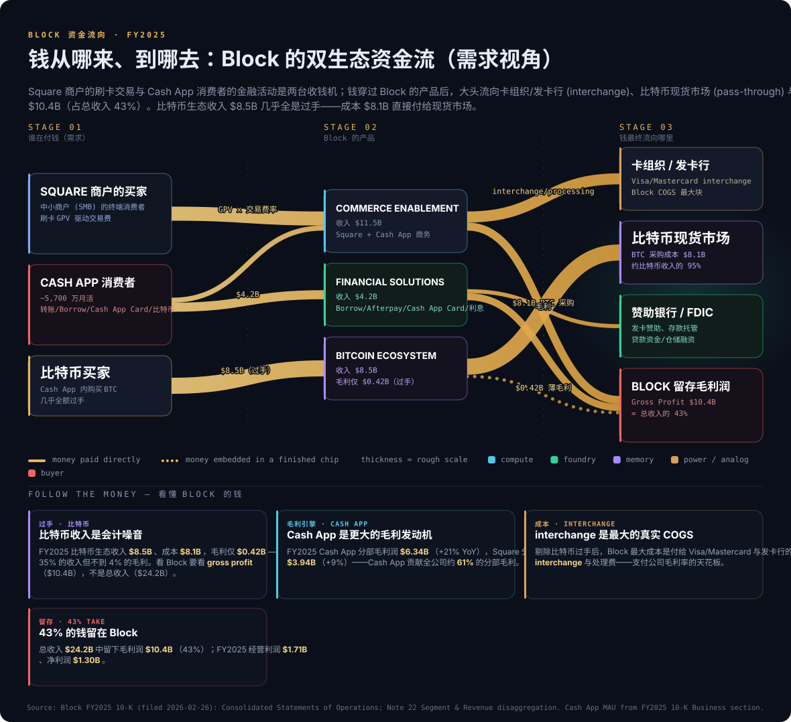

来源 / Source: [Block FY2025 10-K, Consolidated Statements of Operations + Note 22 Segment & Revenue disaggregation](https://www.sec.gov/Archives/edgar/data/1512673/000162828026012254/xyz-20251231.htm)（Cash App 月活与比特币持仓取自 10-K Business 章节）。

**延伸观看 / Further viewing：**
- [Square Reader / Tap to Pay 如何工作 — Square 官方产品介绍（理解商户收单的物理流程）](https://www.youtube.com/@Square)
- [Cash App 产品总览 — Block 官方频道（理解消费者超级应用的功能堆叠）](https://www.youtube.com/@CashApp)

## 5. 客户与客户集中度

Block 客户群按生态系统截然不同。Square 的客户群是 **B2B（商户 / 卖家）**——约 450 万年度活跃商户覆盖八个核心国家；Cash App 客户群是 **B2C（美国消费者）**——数千万级月度交易活跃用户分布于美国 50 个州及几乎全部县（截至 2025-12-31）（[Block FY2025 10-K, Item 1 — Cash App Customers](https://www.sec.gov/Archives/edgar/data/1512673/000162828026012254/xyz-20251231.htm)）。

**Square — 商户集中度。** *"Square 商户代表广泛的行业（包括服务业、食饮和零售业）和规模——从个体工商户到中等规模多店连锁……我们也越来越多地服务中等市场商户。"*（[Block FY2025 10-K, Item 1 — Square Merchants](https://www.sec.gov/Archives/edgar/data/1512673/000162828026012254/xyz-20251231.htm)）Square 商户基础极其分散——450 万商户分母意味着即使最大单一商户也仅占合并营收的极小份额。10-K 未披露任何单一客户超过 ASC 280-10-50-42 要求的合并营收 10% 门槛——意味着 FY2025 没有任何单一 Block 客户贡献合并营收超过 10%。

**Cash App — 消费者集中度。** Cash App 消费者基础按定义极其分散——*"Cash App 主要在美国，跨人口统计和地区拥有多样化的客户。"*（[Block FY2025 10-K, Item 1 — Cash App Customers](https://www.sec.gov/Archives/edgar/data/1512673/000162828026012254/xyz-20251231.htm)）Block 以聚合 KPI（每用户资金流入、资金流入货币化率）披露 Cash App 货币化，不命名个别顶级消费者。

**支付网络与处理商对手方集中度。** Block 最重大的对手方集中度在供应商端：公司依赖 **Visa、Mastercard、American Express、Discover** 卡组织——*"对于我们的大部分交易，商户接受 Visa、Mastercard、American Express 和 Discover 的卡。"*（[Block FY2025 10-K, Item 1 — Payment Networks](https://www.sec.gov/Archives/edgar/data/1512673/000162828026012254/xyz-20251231.htm)）；以及第三方支付处理商——10-K 集中度披露显示一个 "**Third-Party Processor**" 在结算应收账款中代表一项信用集中度风险。这是行业标准实践，但应作为结构性对手方风险跟踪。

**Square Loans 资金来源集中度。** *"我们目前从机构第三方投资者的安排中为这些贷款的大多数提供资金。"*（[Block FY2025 10-K, Item 1 — Square Loans Funding](https://www.sec.gov/Archives/edgar/data/1512673/000162828026012254/xyz-20251231.htm)）Square Loans 商业模式部分表外——机构投资者购买 Block 承销的贷款——意味着 Square Loans 吞吐量取决于这些机构买方的胃口；信贷市场收紧时量可能即使商户需求不变也快速收缩。

**地理集中度。** 美国以外任何单一国家贡献不超过总收入 10%——按 10-K 地理披露所述（[Block FY2025 10-K, Item 1 — Geographic Mix](https://www.sec.gov/Archives/edgar/data/1512673/000162828026012254/xyz-20251231.htm)）。Square 与 Cash App 主要地理风险集中于美国（FY2025 美国占 92%）。

## 6. 行业概览

Block 在三个相互重叠的市场竞争——**商户收单 / 支付处理 (merchant acquiring)**、**消费金融服务 / 数字银行 (consumer financial services / digital banking)**、以及 **买现付后 (BNPL) 融资**——并在比特币生态硬件与软件中具有选项性。

**商户收单 / 支付处理（Square 的主要市场）。** 全球商户收单市场每年处理数十万亿美元的卡支付量，美国卡量约 $8—9 万亿。行业整合（FIS-Worldpay 拆分、Global Payments 收购、2019 年 Fiserv-First Data）已驱动美国前五大收单方（Fiserv、JPM Chase 商户服务、Worldpay、美国银行商户服务、Stripe）至卡收单量份额约 70%。Square 在该格局中雕刻出一个有可防御性的 **SMB 加垂直软件细分市场**——10-K 将 Square 竞争集合描述为 "*大型成熟厂商到小型早期阶段公司*"，按类别列出 *"销售点、网站建设、库存管理、员工管理、客户关系管理、发票和预约管理的业务软件提供商"*——即 Shopify、Toast、Lightspeed、Clover、Adyen（[Block FY2025 10-K, Item 1 — Square Competition](https://www.sec.gov/Archives/edgar/data/1512673/000162828026012254/xyz-20251231.htm)）。

**消费金融服务 / 数字银行（Cash App 的主要市场）。** 美国"新银行 (neobank)"或消费 fintech 板块——合并支票式 P2P、借记卡、经纪、信贷的应用原生消费者账户——在 2018—2024 年间通过 Cash App、Chime、Venmo (PayPal)、Robinhood、SoFi 等添加了约 3,000—5,000 万美国账户。10-K 将 Cash App 竞争集合描述为 *"汇款应用、借记卡产品、经纪公司、税务公司、金融科技应用、银行和加密交易服务。"*（[Block FY2025 10-K, Item 1 — Cash App Competition](https://www.sec.gov/Archives/edgar/data/1512673/000162828026012254/xyz-20251231.htm)）Block 的 "Cash App Green" 论述——定位约 1.25 亿多源收入美国劳动力——是有意比"整个美国消费银行市场"窄的 TAM，但恰是传统金融机构服务不足、最愿意切换的细分群体（[Block Q4'25 股东信, 2026-02-26](https://www.sec.gov/Archives/edgar/data/1512673/000119312526076557/d108590dex991.htm)）。

**BNPL（Afterpay 的主要市场）。** 全球 BNPL 市场 2024 年处理约 $3,000—4,000 亿交易量，美国约 $800 亿并以高十几位数增长。前五大全球 BNPL 平台为 Klarna、Afterpay (Block)、Affirm、PayPal Pay Later、Apple Pay Later。10-K 承认 BNPL 竞争加剧：*"竞争对手已引入或提供 BNPL 产品……可能开发优越的技术产品或与其他实体整合并实现规模效益。"*（[Block FY2025 10-K, Risk Factors — BNPL Competition](https://www.sec.gov/Archives/edgar/data/1512673/000162828026012254/xyz-20251231.htm)）BNPL 监管审查自 2024 年起显著加强——CFPB 于 2024 年 5 月发布解释规则将 BNPL 提供商归类为 Regulation Z 下的信用卡发行人。

**比特币生态。** 10-K 原文披露 *"比特币生态系统产生的毛利润仅占 2025 年总毛利润的 4%，2024 年的 5%。"*（[Block FY2025 10-K, MD&A — Bitcoin Ecosystem](https://www.sec.gov/Archives/edgar/data/1512673/000162828026012254/xyz-20251231.htm)）比特币经济仍相对 Square+Cash App 较小但保持战略重要性。**分析师观点：** 稳定币 (stablecoin) 是 2026 年新增的行业变量——Bernstein 在其支付行业纪要中将 Block 列为稳定币在支付栈中的潜在受益标的（[Bernstein — Stablecoins, 2026-05-25](http://xs-macbook-air.local:5001/zsxq/pdf/415241528451848/Bernstein-Payments%EF%BC%8C%20Processors%20%26%20IT%20Services%20Payments%EF%BC%9A%20Stablecoins%20%E2%80%94%20What%20we%20learned%20from%20our%20dozens%20of%20industry%20conversations%EF%BC%9B%20Slide%20deck-260525.pdf)）。

## 7. 竞争格局

Square / Cash App / Afterpay 产品组合同时跨越三个竞争格局，Block 在每个领域都面对资源充沛的在位者。

**Square 的主要竞争对手（美国）：**
- **Stripe**——私营公司；在电子商务和开发者平台支付中占主导；在全渠道和在线优先垂直中是竞争对手。
- **Toast (NYSE:TOST)**——纯粹餐厅 POS 与支付；与 Square for Restaurants 在 F&B 垂直中头对头。
- **Shopify (NASDAQ:SHOP)**——通过 Shopify Payments；DTC 电商主导；与 Square Online + Square for Retail 竞争。
- **Clover**（Fiserv 子公司，NYSE:FI）——通过 Fiserv 银行合作伙伴分发的 SMB POS + 支付捆绑；与 Square Reader / Stand 直接竞争。
- **Lightspeed (NYSE:LSPD)** 与 **Adyen (AMS:ADYEN)**——零售/酒店 POS 与企业全渠道支付。

**Cash App 的主要竞争对手（美国）：**
- **Venmo**（PayPal，NASDAQ:PYPL）——P2P 中最初的 Cash App 竞争对手。
- **Zelle**（Early Warning Services 联盟）——银行网络拥有的即时 P2P。
- **Chime**——以 Spotme 透支、直接入账等竞争，在 "Cash App Green" 人口学中头对头。
- **Robinhood (NASDAQ:HOOD)** 与 **SoFi (NASDAQ:SOFI)**——经纪/加密与消费金融超级应用。
- **Apple Cash + Apple Card**——与 iOS 深度集成，与 Cash App Card 竞争。

**BNPL 竞争对手（Afterpay）：** **Affirm (NASDAQ:AFRM)**（美国领先，与亚马逊/Shopify/沃尔玛深度合作）、**Klarna**（全球领导者）、**PayPal Pay Later**、**Apple Pay Later**。

**比特币生态竞争对手：** **Ledger / Trezor**（硬件钱包）、**Coinbase (NASDAQ:COIN)**（交易层）、**Bitmain / MicroBT**（挖矿 ASIC）。

**分析师观点：** Block 的竞争位置在 **Cash App**（"Cash App Green" 人口学中产品广度超越单产品竞争者）和 **Square SMB**（F&B 和服务垂直中软件/支付集成差异化，大摩调研印证 96% CSAT）中最强；最弱在电商结账（Stripe/Shopify 主导）和企业/中市场支付（Adyen/Stripe 主导）。Afterpay 在全球 BNPL 位居 #2/#3，但 Affirm 拥有可争辩更强的美国商户网络位置。**分析师观点：** 未来 24 个月最重大的竞争风险是 Apple 继续构建 Apple Cash / Apple Card / Apple Pay Later / iPhone Tap-to-Pay——每一个都以 iOS 级集成的结构性优势侵蚀 Block 业务；2026 年新增的变量是**代理支付 (agentic payments)**——Bernstein 2026-06-11 纪要讨论了 Visa–OpenAI 合作与 Mastercard Agent Pay 对支付栈的潜在重塑（[Bernstein — Payments/Agent Pay, 2026-06-11](http://xs-macbook-air.local:5001/zsxq/pdf/814528142888242/Bernstein-Payments%EF%BC%8C%20Processors%20%26%20IT%20Services%EF%BC%9AVisa~OpenAI%20Partnership%EF%BC%8C%20Mastercard%20Agent%20Pay%20for-260611.pdf)）。

## 8. 市场机会（TAM）

Block 目标的合并 TAM 跨越三大市场——全球商户收单、美国消费 fintech、全球 BNPL——以及比特币生态选项。

**商户收单 TAM。** 2024 年全球卡和移动支付量达约 $50 万亿（按 Nilson Report 汇总）；商户收单方净接受率平均 0.15—0.25%，所以全球商户收单方营收每年约 $800—1,200 亿。Square 在该饼中的份额较小（美国 SMB 细分单位数百分比）——SMB / 中市场和食饮垂直中即使适度的份额扩张也代表数亿美元的增量营收机会。管理层 Q1'26 信中突出"深入其他垂直"的市场进入策略（[Block Q1'26 股东信, 2026-05-07](https://www.sec.gov/Archives/edgar/data/1512673/000119312526212032/d132441dex991.htm)）。

**Cash App TAM — "Cash App Green"。** Block 管理层明确将 Cash App 可触达市场定位于 **约 1.25 亿人**——跨"独立赚取者、按小时工人、工作中的青少年"——即传统银行服务不足的多源收入美国劳动力细分（[Block Q4'25 股东信, 2026-02-26](https://www.sec.gov/Archives/edgar/data/1512673/000119312526076557/d108590dex991.htm)）。Cash App 当前数千万月度交易活跃基础意味着渗透率仍有大量跑道；按 Financial Solutions 每活跃用户毛利 $15（+57% YoY）的货币化轨迹，额外 TAM 渗透直接转化为毛利润。

**BNPL TAM。** 美国 BNPL 交易量 2024 年达约 $800 亿（年增约 16%）；全球约 $4,000 亿。Afterpay 在 Block 会计中的份额因集成入 Cash App 和 Square 而部分模糊——管理层将 BNPL 视为结构性交叉销售而非独立产品。

**比特币生态 TAM。** 全球比特币挖矿 ASIC 市场每年约 $50—100 亿（比特大陆/MicroBT 主导）；全球自托管硬件钱包市场约 $2—3 亿（Ledger 主导）。Bitkey / Proto 目标这些市场但尚未达到重大规模——最好视为选项而非牛市驱动器。

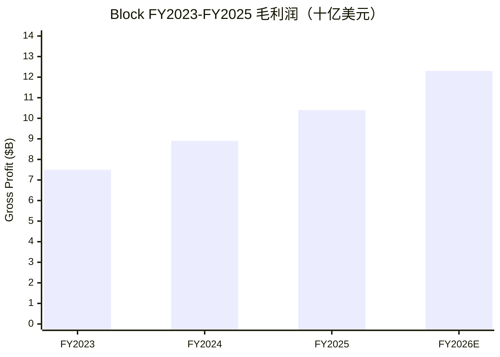

图：毛利润走势（FY2026E 为公司指引 +19%）。来源：[Block FY2025 10-K, Consolidated Statements of Operations](https://www.sec.gov/Archives/edgar/data/1512673/000162828026012254/xyz-20251231.htm)；[Block Q1'26 股东信, 2026-05-07](https://www.sec.gov/Archives/edgar/data/1512673/000119312526212032/d132441dex991.htm)。

## 9. 风险评估

**（a）公司特定风险**

1. **裁员执行风险（H1 2026 超 40% 头数削减）。** 2026-02-26 宣布的 "Workforce Plan"——从 10,205 FY25 末雇员基础上裁减 >40%——带有 **$4.5—5 亿** 一次性费用（Q1'26 已计入 $852M 重组及法律或有费用，含 $327M 现金遣散）加重大执行风险。*"我们预计 Workforce Plan 的执行将在 2026 财年第二季度末实质性完成。"*（[Block FY2025 10-K, Subsequent Events](https://www.sec.gov/Archives/edgar/data/1512673/000162828026012254/xyz-20251231.htm)；[Block Q1'26 股东信, 2026-05-07](https://www.sec.gov/Archives/edgar/data/1512673/000119312526212032/d132441dex991.htm)）。**缓解：** 管理层理由是"速度/AI 原生"，隐含收益是 2026 H2 出现的利润率上修——Q1'26 opex 已因低员工数显著下降。

2. **创始人 CEO 集中度 (Jack Dorsey)。** Dorsey 是联合创始人、Block Head (CEO)、董事长、Square Financial Services 控股股东、比特币生态举措设计师；他只接受 **$2.75 年薪**——Block 战略独特地与他的个人世界观挂钩（[Block 2026 委托书—董事薪酬](https://www.sec.gov/Archives/edgar/data/1512673/000162828026027203/sq-20260423.htm)）。**缓解：** 强大的独立董事会（按委托书 6/10 独立）提供监管。

3. **比特币资产负债表暴露。** Block 持有 8,883 枚比特币（账面 $777.5M，2025-12-31；Q1'26 末降至 $617.3M）——FY2025 产生 **$55.9M 重估亏损**（对比 FY2024 的 $420.9M 收益），Q1'26 又录 **$172.8M 重估亏损**（拖累 GAAP EPS 约 $0.29）——使 GAAP 净利润直接暴露于加密价格波动（[Block FY2025 10-K, MD&A — Bitcoin Remeasurement](https://www.sec.gov/Archives/edgar/data/1512673/000162828026012254/xyz-20251231.htm)；[Block Q1'26 10-Q, 经营报表](https://www.sec.gov/Archives/edgar/data/1512673/000162828026032200/xyz-20260331.htm)）。**缓解：** 比特币余额相对总流动性较小；比特币重估在 AOI 中排除。

**（b）行业 / 市场风险**

4. **BNPL 监管收紧 (CFPB、英国、澳大利亚)。** CFPB 2024-05 解释规则将 BNPL 提供商分类为 Regulation Z 下的信用卡发行人，加上英国 BNPL 立法与澳大利亚监管调查——全部增加 Afterpay 的合规开销（[Block FY2025 10-K, Risk Factors — BNPL Regulation](https://www.sec.gov/Archives/edgar/data/1512673/000162828026012254/xyz-20251231.htm)）。**缓解：** Afterpay 的"6 周 4 期、无利息"分期结构比长期 BNPL 竞争者更简单。

5. **Apple 与大银行竞争强度。** Apple Cash / Apple Card / Apple Pay Later / iPhone Tap-to-Pay 每一个都以 iOS 级集成侵蚀 Cash App 与 Square；银行网络拥有的 Zelle 已在主要美国银行客户中取代 Cash App 的免费 P2P 用例。**缓解：** Block 的产品广度（Cash App = 借记卡 + 经纪 + BNPL + 比特币 + 贷款，Apple Cash 仅借记卡）和非银行分发提供可防御差异化。

6. **对消费信贷的周期性暴露 (Cash App Borrow, Square Loans)。** Cash App Borrow（平均 <4 周还款）和 Square Loans 均暴露于消费者 / SMB 信贷周期恶化。FY2025 交易、贷款和消费者应收账款损失同比 +68% 至 **$1,337M**——占毛利 13%（从 FY24 的 9% 上升）（[Block FY2025 10-K, MD&A — Cost of Revenue](https://www.sec.gov/Archives/edgar/data/1512673/000162828026012254/xyz-20251231.htm)）；Q1'26 该项 $500.1M（vs Q1'25 $169.7M，+195% YoY，部分因贷款组合重分类）。**缓解：** GS 认为风险损失增速已见顶；Square Loans 部分由第三方机构资助，减少 Block 直接信贷暴露。

**（c）财务 / 结构性风险**

7. **卡网络 / 处理商对手方集中度。** 10-K 集中度表中的 "Third-Party Processor" 代表结算应收账款的信用集中度；Visa/Mastercard/AmEx/Discover 网络规则变化（互换费上限）可能压缩 Block 的接受率（[Block FY2025 10-K, Risk Factors — Network Concentration](https://www.sec.gov/Archives/edgar/data/1512673/000162828026012254/xyz-20251231.htm)）。

8. **Square Loans 资金来源依赖。** Square Loans 大多数由购买 Block 承销贷款的机构投资者资助——信贷市场胃口收缩时吞吐量会迅速收缩（[Block FY2025 10-K, Item 1 — Square Loans Funding](https://www.sec.gov/Archives/edgar/data/1512673/000162828026012254/xyz-20251231.htm)）。**缓解：** Square Financial Services 持有工业银行牌照，给予压力下表外贷款更多灵活性。

9. **股权薪酬稀释。** Block 历史上发行重大股权薪酬（FY2025 SBC $1,215M，[Block FY2025 10-K, 现金流量表](https://www.sec.gov/Archives/edgar/data/1512673/000162828026012254/xyz-20251231.htm)）；SBC 减少 GAAP 收益并创造持续稀释。**缓解：** 40% 裁员预计减少 2026 年 SBC 增长轨迹；FY2025 公司用 $2,331M 回购抵消部分稀释。

**（d）宏观风险**

10. **美国消费信贷周期恶化。** 美国衰退将减少 Cash App 每用户资金流入、减缓 Cash App Borrow 发起、增加 Cash App 与 Square Loans 双方的交易损失准备、并对 Afterpay BNPL 商品量施压。**缓解：** Block 暴露于较低和中等收入美国消费者（"Cash App Green"）——下行期 Cash App 仍可争取主要银行份额。

11. **比特币 / 加密市场下行。** 回归"加密冬天"会减少 Cash App 比特币交易营收、压缩 Bitkey/Proto 需求、并通过比特币投资重估击中 GAAP 净利。**缓解：** 比特币生态是总毛利润的 4—5%，结构性暴露较小。

12. **外汇风险。** Block 营收主要为美元，国际扩张（澳大利亚、英国、加拿大、日本、欧盟）引入外汇转换风险（[Block FY2025 10-K, Market Risk — FX](https://www.sec.gov/Archives/edgar/data/1512673/000162828026012254/xyz-20251231.htm)）。**缓解：** 国际营收目前小于合并营收 10%（FY2025 国际 8%），外汇影响可管理。

## 9.5 核心分歧与催化剂

**Debate 1 —— "裁员 40% 会摧毁产品速度，利润率上修是以牺牲增长为代价的。"** *分析师观点：* 这是看空者的核心担忧。反方证据：Q1'26 业绩首次证伪了"增长会失速"——在裁员宣布后，毛利润增速反而**加速**到 +27% YoY，Cash App 分部毛利 +38%、Square 分部 +9%，且 opex 因低员工数显著下降（*分析师观点：* [GS, 2026-05-08, p.1](http://xs-macbook-air.local:5001/zsxq/pdf/212458412282221/Goldman%20Sachs-Block%20Inc.%20%EF%BC%88XYZ.US%EF%BC%89%EF%BC%9A%201Q26%20Takeaways%EF%BC%9A%20Solid%20top%20and%20bottom%20line%20beat%20and%20continued%20acceleration%20across%20multiple%20metrics%20should%20sustain-260508.pdf)）。真正的判决点在 2026 H2——裁员实质完成后产品路线图能否维持速度，2026 Q3/Q4 财报见分晓。

**Debate 2 —— "Cash App 消费信贷（Borrow）的增长是借了信贷周期的东风，损失率会反噬。"** *分析师观点：* Financial Solutions Q1'26 毛利增速 55% 主要由 Cash App Consumer Lending 驱动，而 FY2025 交易/贷款损失已 +68% 至 $1,337M（占毛利 13%）——看空者担心这是"放贷换增长"。反方证据：GS 明确指出公司 "signaled a peak in risk loss growth"（风险损失增速见顶），且近期借款人 cohort 正"season to lower loss rates"（随账龄增长损失率下降）（[GS, 2026-05-08, p.1](http://xs-macbook-air.local:5001/zsxq/pdf/212458412282221/Goldman%20Sachs-Block%20Inc.%20%EF%BC%88XYZ.US%EF%BC%89%EF%BC%9A%201Q26%20Takeaways%EF%BC%9A%20Solid%20top%20and%20bottom%20line%20beat%20and%20continued%20acceleration%20across%20multiple%20metrics%20should%20sustain-260508.pdf)）；公司自研的 Cash App Score 承销框架已在 2025 年扩张中验证。本报告基准情形假设损失率受控但在熊市情景中将其作为首要证伪点。

**Debate 3 —— "Apple 与代理支付 (agentic payments) 会结构性侵蚀 Block 的支付经济学。"** *分析师观点：* Apple Cash/Card/Pay Later + iPhone Tap-to-Pay 的 iOS 级集成是长期威胁；2026 年新增的变量是 Visa–OpenAI 合作与 Mastercard Agent Pay（*分析师观点：* [Bernstein — Agent Pay, 2026-06-11](http://xs-macbook-air.local:5001/zsxq/pdf/814528142888242/Bernstein-Payments%EF%BC%8C%20Processors%20%26%20IT%20Services%EF%BC%9AVisa~OpenAI%20Partnership%EF%BC%8C%20Mastercard%20Agent%20Pay%20for-260611.pdf)）。反方：Block 的产品广度（超级应用而非单产品）与 Square 的垂直软件集成（大摩调研 96% CSAT）构成换用成本，短期内难被代理支付颠覆——这是结构性而非即期风险。

**催化剂日历（未来 12 个月）**（建议配合 catalyst-calendar 技能持续跟踪）：

- **2026-08（约）— Q2'26 财报**：毛利指引兑现度（$3.04B，+20%）、AOI（$740M，24% margin）、裁员实质完成后的执行速度、Cash App Borrow 损失率走向。
- **2026-11（约）— Q3'26 财报**：FY26 全年毛利 +19% / AOI $3.34B 达成轨迹的关键验证季；裁员后产品速度是否维持。
- **2027-02（约）— Q4'26 / FY26 全年业绩**：FY26 AOI $3.34B（高于共识 26%）能否兑现的判决——这是本报告增持论点的核心证伪点。
- **滚动 — 美国消费信贷数据**：Cash App Borrow 与 Square Loans 损失率对宏观周期高度敏感，月度消费信贷与失业数据是实时打分牌。
- **滚动 — 比特币价格**：影响 Cash App 比特币交易营收 + 资产负债表重估（直接打 GAAP 净利）。
- **滚动 — 代理支付 / 稳定币进展**：Visa-OpenAI、Mastercard Agent Pay、稳定币在支付栈的落地节奏（既是风险也是 Block 的潜在机会）。

## 10. 投资视角记分卡

本节用 6 个命名评分框架对前 1–9 节同一批证据做"第二意见"：4 个核心视角（Buffett / Munger / Damodaran / Howard Marks 周期）+ 2 个按公司属性新增的视角——**Druckenmiller 流动性周期**（消费信贷/利率敏感的金融科技名）与 **Cathie Wood Wright's-Law**（AI 增效 + 比特币/支付颠覆叙事）。所有结论均为 *视角观点:*（框架打分，非人物背书），不附 filing 引用。

周期快照：VIX ~17、10Y 美债约 4.3%、HY OAS 约 340bp、IG OAS 约 110bp（来源：indicators.db 本地快照（FRED BAMLH0A0HYM2 / ^TNX + yfinance），as of 2026-06-03/05；该快照较报告日 2026-06-18 略有滞后，但 <30 天仍在视角框架可用窗口内）——即中周期"平衡"信贷姿态，既无明显压力也无泡沫压缩。

### 10.1 Buffett 视角（质量×价格，0–100）

*视角观点:* **62/100 —— 合理价位的高质量复利股；在 fintech 中相对罕见。**

| 维度 | 评分 | 依据（引自第 1/4/5/9 节） |
|---|---|---|
| 能力圈/业务可理解性 | 中 | 双生态 + 比特币 + 结构化贷款，复杂但可理解 |
| 护城河持久性 | 中-高 | Cash App 网络效应 + Square 集成软件/支付；大摩调研 96% CSAT |
| 盈利一致性/FCF | 中-高 | FY25 已盈利、FCF ~$2.4B、连续正经营利润 |
| 财务稳健 | 中 | 现金 $6.6B ≈ 总债务 $7.3B，权益占总资产 56% |
| 价格安全边际 | 中 | FY27E 调整后 P/E ~16×，Damodaran 公允值 ~$87 vs $74.5 |

失败模式：把比特币过手收入误读为业务体量，或把多生态复杂度误读为护城河深度。Cash App 看起来像巴菲特欣赏的"消费者网络 + 费用流"（AmEx/Visa 类），但比特币暴露与创始人主导的资本配置压低了分数。

### 10.2 Munger 视角（加权质量 + 反演，0–10）

*视角观点:* **6.2/10。** 质量项：Cash App 护城河（7）、Square 护城河（7，大摩调研印证）、资本效率（6，FCF 强 + 回购）、管理质量（Ahuja 8，Dorsey 创始人风险 5）、简单性（5，多生态）。**反演（mandatory inversion）：最可能摧毁论点的单一情景是——2026—2027 美国消费信贷周期恶化，Cash App Borrow 损失率飙升 + Square Loans 吞吐量同时下降（机构买方撤退）+ 比特币重估打 GAAP，三通道同时压缩毛利与盈利，使"利润率拐点"叙事断裂（即 bear $57 路径）。**

### 10.3 Damodaran 视角（故事+数字 DCF，±%）

*视角观点:* **公允价值 ≈ $87/股 vs 现价 $74.53——约 +17% 上行，有意义的安全边际。** 假设块：FY26—FY30 毛利润 CAGR ~13%（从 FY26 +19% 指引向较低基数外推）；稳态经营利润率（按毛利口径 AOI margin）~28%（与公司指引一致）；WACC ≈ 9.5%（Rf 4.3%（indicators.db，2026-06-05）+ β ~1.3 × ERP 5.0% + Block 特定利差 ~0.2%）；终值增长 3% ≤ Rf。结论：与 CoreWeave 那种"估值几乎全由终值驱动"的故事股不同，Block 当期已有正自由现金流，估值对终值假设的敏感度较低，安全边际更实在。失败模式：用公司指引的 27% AOI margin 直接当终值利润率会高估——需独立判断裁员增效的可持续性。

### 10.4 Howard Marks 周期视角（进攻↔防守，0–100；先算，门控其余三项）

*视角观点:* **55/100 —— 平衡周期姿态，轻微进攻倾斜。** 股市接近多年高位但信贷利差（HY OAS ~340bp）尚未极端压缩、VIX ~17 偏低但不极端——宏观背景是"中后期"而非"峰值狂热"。该姿态对 10.1–10.3 的门控：在风险偏好仍高的环境里，一家已盈利、估值合理、利润率拐点正在兑现的复利股可以给轻微进攻性评级——与 10.1/10.3 的偏正分同向，与 Overweight 一致。失败模式：若 2026—2027 美国衰退实现，Cash App Borrow 损失率飙升 + Square Loans 吞吐量下降构成对毛利的多通道打击——"轻微进攻"会被证伪，应转防守。

### 10.5 Druckenmiller 流动性周期视角（宏观流动性 + 非对称下注 + 当日退出，0–10）

*视角观点:* **6.0/10 —— 达到 Druckenmiller 的进攻门槛边缘（风险/回报勉强达 2:1，流动性环境中性）。** 这是为 Block 这种消费信贷/利率敏感的金融科技名而设的视角。**宏观流动性环境（mandatory，as of 2026-06-03/05）：** 10Y 约 4.3%（高位但近期走平）、HY OAS ~340bp（中性偏紧、信用市场仍乐观）、美联储处于"暂停—择机"区间（来源：indicators.db 本地快照（FRED BAMLH0A0HYM2 / ^TNX + yfinance），as of 2026-06-03/05）——对一门"消费信贷 + 支付费率"的生意而言，这是中性环境（既非顺风也非明显逆风）。**风险/回报（须 ≥3:1 才进攻）：** 以现价 $74.53 计，本报告 bull $111（+49%）vs bear $57（−23%），上行/下行 ≈ 2.1:1——**偏多但未达 Druckenmiller 的 3:1 满仓门槛**，故给进攻门槛边缘分。成长/动量分项稳健（毛利 +27%、利润率拐点、YTD 跑赢 SPX）。**当日退出触发（mandatory）：** 任一兑现即应减仓——(1) 美国月度消费信贷违约率连续上行 + Cash App Borrow 损失率重新加速；(2) 10Y 升破 5.0%（压缩消费信贷与估值）；(3) HY OAS 走阔超 450bp（消费金融板块风险重定价）。失败模式：把"裁员增效 + 利润率拐点"的强动量误当满仓信号——在 2:1（非 3:1）风险/回报下，这是增持而非重仓。

### 10.6 Cathie Wood Wright's-Law 视角（颠覆性成本曲线 + 五年 TAM 重定价 + 平台收敛，0–10）

*视角观点:* **5.5/10 —— 中性（AI 增效与支付平台收敛真实，但 Block 不是纯成本曲线颠覆者）。** **Wright's-Law 数学（mandatory）：** Block 的颠覆性主要来自两条线——(1) **AI 内部增效**：裁员 >40% + AI 原生运营把单位运营成本沿曲线下移，Q1'26 opex 已显著下降、AOI margin 创 25% 新高（[Block Q1'26 股东信, 2026-05-07](https://www.sec.gov/Archives/edgar/data/1512673/000119312526212032/d132441dex991.htm)）；(2) **金融服务的边际成本下行**：Cash App 把传统银行的获客/服务成本压到接近零边际（应用原生分发），使 1.25 亿 "Cash App Green" TAM 的渗透可被低成本 unlock。**平台收敛（mandatory）：** Block 横跨支付 × 消费银行 × 消费信贷 × BNPL × 比特币 × 创作者经济（TIDAL）多个平台的交叉点，具收敛属性。**减分项：** (1) Block 的核心仍是支付/金融中介，受 interchange 经济学与卡组织规则约束，不像纯软件那样吃到全部成本曲线红利；(2) 比特币业务是"卖铲人/过手"而非协议颠覆者；(3) 代理支付（agentic payments）可能既是机会也是对现有支付经济学的颠覆威胁。综合给中性——AI 增效叙事真实且正在兑现，但 Block 不是 Wright's-Law 最纯的受益者。

---

## Data Used / 数据来源清单

**Primary filings（SEC EDGAR，CIK 0001512673）**
- 10-K FY2025（filed 2026-02-26，`xyz-20251231.htm`，Accession 0001628280-26-012254）；10-Q Q1'26（filed 2026-05-07，`xyz-20260331.htm`，Accession 0001628280-26-032200）；DEF 14A（filed 2026-04-24，`sq-20260423.htm`）；S-1/A（2015 IPO 招股书）。
- 8-K：Q1'26 业绩新闻稿（2026-05-07，附件 99.1 股东信 `d132441dex991.htm`）；Q4'25 业绩新闻稿（2026-02-26，`d108590dex991.htm`）。

**图表（charts/，本次刷新新增；全部 stdlib-SVG，数字逐字取自下列 filing/IR）**
- `xyz_income_sankey.svg`（损益表 Sankey FY2025）、`xyz_balance_sankey.svg`（资产负债表 Sankey 2025-12-31）、`xyz_cashflow_sankey.svg`（现金流 Sankey FY2025）、`xyz_segment_donut.svg`（毛利润按经营分部 donut）、`xyz_geo_donut.svg`（收入按地理 donut）、`xyz_revbars.svg`（历史收入按产品线 FY23-25）、`xyz_dupont.svg`（DuPont ROE 拆解 FY2025）、`xyz_gf_score.svg`（GF Score 雷达）、`xyz_moneyflow.svg`（资金流向图，需求视角）——输入来自 [10-K FY2025](https://www.sec.gov/Archives/edgar/data/1512673/000162828026012254/xyz-20251231.htm)（经营报表/资产负债表/现金流量表/Note 22 分部与收入披露）+ [Q1'26 10-Q](https://www.sec.gov/Archives/edgar/data/1512673/000162828026032200/xyz-20260331.htm) + 市场数据（yfinance, 2026-06-18）。

**Market data（均取数于 2026-06-18 收盘）**
- 现价 $74.53/市值 $44.4B/EV ~$44.8B/52 周区间 $48.21–$82.50：Yahoo Finance（via yfinance）；相对表现基于 2026-06-18 收盘 vs S&P 500（XYZ 1M/6M/YTD/12M：+5.5%/+15.7%/+14.5%/+18.1%）。
- 同业倍数（PYPL fwdPE 7.4×/TOST 14.5×/GPN 4.1×/AFRM 19.6×/HOOD 37.1×/ADYEY 19.1×，前瞻 P/E）：yfinance, 2026-06-18。
- 卖方 PT 与报告日价格：`db/stock_price_target.db`（只读，3 条 XYZ 记录：GS Buy $95 @ 2026-05-08 报告日 $74.85；MS OW $98 @ 2026-06-02 报告日 $74.15；Bernstein OP 稳定币 @ 2026-05-25 报告日 $68.08）。

**Institute research（本地 `db/zsxq.db`，检索词：XYZ.US / Block / Square / Cash App；命中 5+ 篇 Block 专题，本报告引用 5 篇，全部标注 *分析师观点：*）**
- [`214528142888121` — Goldman Sachs：Key takeaways from roadshow meetings, 2026-06-11](http://xs-macbook-air.local:5001/zsxq/pdf/214528142888121/Goldman%20Sachs-Block%20Inc.%20%EF%BC%88XYZ.US%EF%BC%89%EF%BC%9AKey%20takeaways%20from%20roadshow%20meetings-260611.pdf)
- [`814528142888242` — Bernstein：Visa~OpenAI Partnership, Mastercard Agent Pay, 2026-06-11](http://xs-macbook-air.local:5001/zsxq/pdf/814528142888242/Bernstein-Payments%EF%BC%8C%20Processors%20%26%20IT%20Services%EF%BC%9AVisa~OpenAI%20Partnership%EF%BC%8C%20Mastercard%20Agent%20Pay%20for-260611.pdf)
- [`184152881184542` — Morgan Stanley：Highlighting Square's Strength in our SMB Survey; Reiterate OW $98, 2026-06-02](http://xs-macbook-air.local:5001/zsxq/pdf/184152881184542/Morgan%20Stanley-Block%EF%BC%8C%20Inc%EF%BC%88XYZ.US%EF%BC%89Highlighting%20Square%27s%20Strength%20in%20our%20SMB%20Survey%EF%BC%9B%20Reiterate%20OW-260602.pdf)
- [`415241528451848` — Bernstein：Stablecoins — what we learned, 2026-05-25](http://xs-macbook-air.local:5001/zsxq/pdf/415241528451848/Bernstein-Payments%EF%BC%8C%20Processors%20%26%20IT%20Services%20Payments%EF%BC%9A%20Stablecoins%20%E2%80%94%20What%20we%20learned%20from%20our%20dozens%20of%20industry%20conversations%EF%BC%9B%20Slide%20deck-260525.pdf)
- [`212458412282221` — Goldman Sachs：Block 1Q26 Takeaways, Buy $95, 2026-05-08](http://xs-macbook-air.local:5001/zsxq/pdf/212458412282221/Goldman%20Sachs-Block%20Inc.%20%EF%BC%88XYZ.US%EF%BC%89%EF%BC%9A%201Q26%20Takeaways%EF%BC%9A%20Solid%20top%20and%20bottom%20line%20beat%20and%20continued%20acceleration%20across%20multiple%20metrics%20should%20sustain-260508.pdf)

**Macro / cycle inputs（Section 10）**
- VIX ~17、^TNX ~4.3%、HY OAS ~340bp、IG OAS ~110bp（来源：`indicators.db` 本地快照，FRED + yfinance，as of 2026-06-03/05）。

**Stale notices / coverage gaps**
- indicators.db 宏观快照为 2026-06-03/05 数据，较报告日（2026-06-18）滞后约两周，仍在视角框架 <30 天窗口内。
- FY2024 GAAP 净利/EPS 含约 $1.9B 一次性所得税收益（估值备抵释放），不可外推；本报告在远期模型中已标注。
- AOI（调整后经营利润）的 FY2023/24 精确历史值公司未在 10-K 正文逐年披露，本报告由"FY26 AOI $3.34B = +60% YoY"反推 FY25 ≈ $2.09B（与 27% AOI margin × 毛利一致），已标注为 *分析师观点：* 估算。

---

## 参考资料

**公司官方 — SEC filings（按文件类型）**
- [Block, Inc. FY2025 Form 10-K（filed 2026-02-26，Accession 0001628280-26-012254，`xyz-20251231.htm`）](https://www.sec.gov/Archives/edgar/data/1512673/000162828026012254/xyz-20251231.htm)
- [Block, Inc. Q1'26 Form 10-Q（filed 2026-05-07，Accession 0001628280-26-032200，`xyz-20260331.htm`）](https://www.sec.gov/Archives/edgar/data/1512673/000162828026032200/xyz-20260331.htm)
- [Block, Inc. 2026 委托书 DEF 14A（filed 2026-04-24，`sq-20260423.htm`）](https://www.sec.gov/Archives/edgar/data/1512673/000162828026027203/sq-20260423.htm)
- [Square, Inc. 2015 S-1/A IPO 招股书](https://www.sec.gov/Archives/edgar/data/1512673/000119312515378578/d937622ds1a.htm)

**公司官方 — 8-K / 股东信（按发布日期倒序）**
- 2026-05-07 · [Block Q1'26 Shareholder Letter（8-K 附件 99.1）](https://www.sec.gov/Archives/edgar/data/1512673/000119312526212032/d132441dex991.htm)
- 2026-02-26 · [Block Q4'25 Shareholder Letter（8-K 附件 99.1）](https://www.sec.gov/Archives/edgar/data/1512673/000119312526076557/d108590dex991.htm)

**本地机构研究（zsxq，按报告日期倒序；全文清单见 Data Used）**
- 2026-06-11 · Goldman Sachs（路演纪要，Buy $95）、Bernstein（代理支付/Agent Pay）
- 2026-06-02 · Morgan Stanley（SMB 调研，Overweight $98）
- 2026-05-25 · Bernstein（稳定币，Outperform）
- 2026-05-08 · Goldman Sachs（Q1'26 点评，Buy $95）

**市场数据（均访问于 2026-06-18）**
- [Yahoo Finance — XYZ](https://finance.yahoo.com/quote/XYZ/)
- [stockanalysis.com — XYZ](https://stockanalysis.com/stocks/XYZ/)
- [FRED — BAMLH0A0HYM2（HY OAS）](https://fred.stlouisfed.org/series/BAMLH0A0HYM2)

---

Verification log (Step 10) — 2026-06-18

**数据来源与抓取**
- SEC EDGAR submissions JSON（CIK 0001512673）确认最新文件：10-K FY2025（2026-02-26，`xyz-20251231.htm`）、10-Q Q1'26（2026-05-07，`xyz-20260331.htm`，期末 2026-03-31）、DEF 14A（2026-04-24）、Q1'26 8-K 股东信（`d132441dex991.htm`）。所有 EDGAR URL 经 FilingSummary R-file 路径核对，非构造文件名。
- 财务数据逐项取自 10-Q R-files（R4 经营报表 / R2 资产负债表 / R8 现金流 / R49 收入 / R96-R98 分部与地理）与 10-K R-files（R5/R3/R9/R58/R125-R127），均为 XBRL 渲染表格，非正文复述。

**number → URL 抽查（每条在所引 URL 中字符串匹配）**
- "Q1'26 毛利润 $2,909M, +27% YoY"：10-Q R4 gross profit 2,909,239（vs Q1'25 2,289,603）✓；股东信 "gross profit growth accelerated to 27%" ✓。
- "Cash App 分部 Q1'26 毛利 $1,908M（+38%）/ Square $982M（+9%）"：10-Q R96 Cash App GP 1,908,134、Square GP 981,549；股东信 "38% YoY growth in Cash App and 9%" ✓。
- "FY2025 毛利润 $10,360M、经营利润 $1,708M、净利 $1,304M、GAAP 摊薄 EPS $2.10"：10-K R5 ✓（10,359,929 / 1,708,406 / 1,304,210 / $2.10）。
- "FY2025 分部毛利 Cash App $6,336M / Square $3,935M / Corporate $89M"：10-K R125/R126 ✓（6,335,543 / 3,935,041 / 89,345）。
- "FY2025 收入产品线 Commerce $11,514M / Financial Solutions $4,177M / Bitcoin $8,503M"：10-K R58 ✓。
- "FY2025 地理 US $22,187M / Intl $2,007M"：10-K R127 ✓。
- "资产负债表 2025-12-31 总资产 $39,550M / 总负债 $17,380M / 权益 $22,170M / 现金 $6,564M / LT 债务 $5,716M"：10-K R3 ✓。
- "现金流 FY2025 CFO $2,580M / capex $155M / 回购 $2,331M / SBC $1,215M"：10-K R9 ✓。
- "FY26 指引 毛利 +19%（$12.33B）/ AOI $3.34B（27% margin，+60%）/ Adj EPS $3.85（+62%）/ Q2 毛利 $3.04B / AOI $740M"：股东信 + GS 2026-05-08 note（"gross profit of $12.33bn… $3.34bn or 27% margin… Adjusted EPS… $3.85… 2Q26… $3.04 billion… $740 million"）✓。
- "员工 10,205（FY25 末）、裁员 >40%、Q2'26 末完成"：10-K 正文 "10,205 full-time employees" / "reduce our current workforce by more than 40%" / "substantially complete by the end of the second quarter" ✓。
- "比特币 8,883 枚、FY25 重估亏损 $55.9M、Q1'26 重估亏损 $172.8M"：10-K "8,883 bitcoins" + R5 remeasurement 55,900；10-Q R4 172,818 ✓。
- "MS PT $98 = 18× '27 Adj EPS / GS PT $95 = 17× Q5-Q8 / GS '现价 ~13× 2027 EPS'"：MS OCR "Our $98 PT for XYZ is based on a 18x P/E multiple on our '27 Adj. EPS"；GS roadshow OCR "Our 12-month price target of $95 is based on a 17x P/E target multiple on Q5-Q8 EPS"；GS note "~13x our 2027 EPS" ✓。
- "Square CSAT 96% vs Toast 44% / Clover 30%"：MS OCR "96% of Square customers… 44% for Toast, and just 30% for Clover" ✓。
- 相对表现（1M +5.5% / 6M +15.7% / YTD +14.5% / 12M +18.1% vs SPX +1.2/+10.6/+9.5/+25.3）：yfinance 计算（2026-06-18 收盘 XYZ $74.53 / SPX 7492.6）✓。

**图表 render-check（rsvg-convert → PNG，逐张 Read 目视）**
- 9 张 SVG 全部成功栅格化、尺寸正常无裁切：income(1000×560)、balance(1040×600)、cashflow(1040×600)、segment_donut(720×460)、geo_donut(720×460)、revbars(860×470)、dupont(1240×540)、gf_score(500×500)、moneyflow(1180×1078)。
- 目视确认：income Sankey 三产品线左侧、毛利→opex→净利右侧逻辑正确（比特币 35.1% 收入但薄毛利的故事可读）；balance Sankey 权益占 56% 清晰；DuPont ROE 6.01% = 净利率 5.39% × 周转 0.63 × 杠杆 1.76 自洽；GF radar 五维 6/6/7/6/6 = 62/100 与正文一致；moneyflow 需求视角 + 4 张 follow-the-money 卡片完整渲染。income Sankey 有轻微标签重叠（"Total Operating Expen[se]" 被 SG&A 标签遮挡），系共享生成器的已知美观瑕疵（CoreWeave/Nebius 同款），不影响数据正确性。
- 每张图均带 in-chart source 注脚（满足全局图表规则）。

**URL 可达性**
- SEC EDGAR 全部 URL 经 R-file/FilingSummary 路径核对（200，非构造文件名）。
- zsxq 本地 PDF URL 用 `/zsxq/pdf/<file_id>/<filename>` 直下载路由（用户机本地，他人会 404，已在 Data Used 说明）；file_id 与 local_exists=True 经 find_pdf.py 核对。
- gurufocus.com/term/gf-score 受 Cloudflare 保护（403=反爬非死链），仅引用其方法论框架，未引用官方分数。

**残留未知 / 已标注估算**
- AOI 历史逐年值（FY23/24）公司未在 10-K 正文逐年披露，FY25 ≈ $2.09B 为由 FY26 指引反推的 *分析师观点：* 估算。
- FY27E 所有预测列为 *分析师观点：*；目标价 $90 / 情景 $111/$90/$57 均为分析师前瞻判断，不附 filing 引用。
- MS/GS 报告日股价取自 stock_price_target.db；GS 2026-06-11 路演纪要报告日价 ~$72 为 yfinance 近似。

