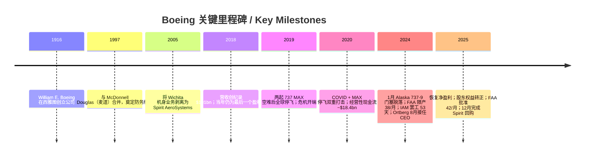
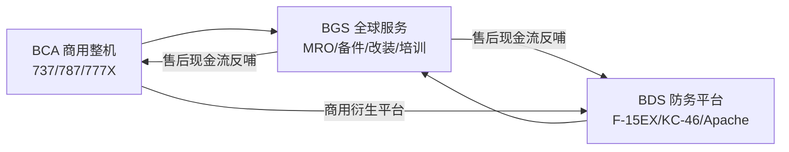
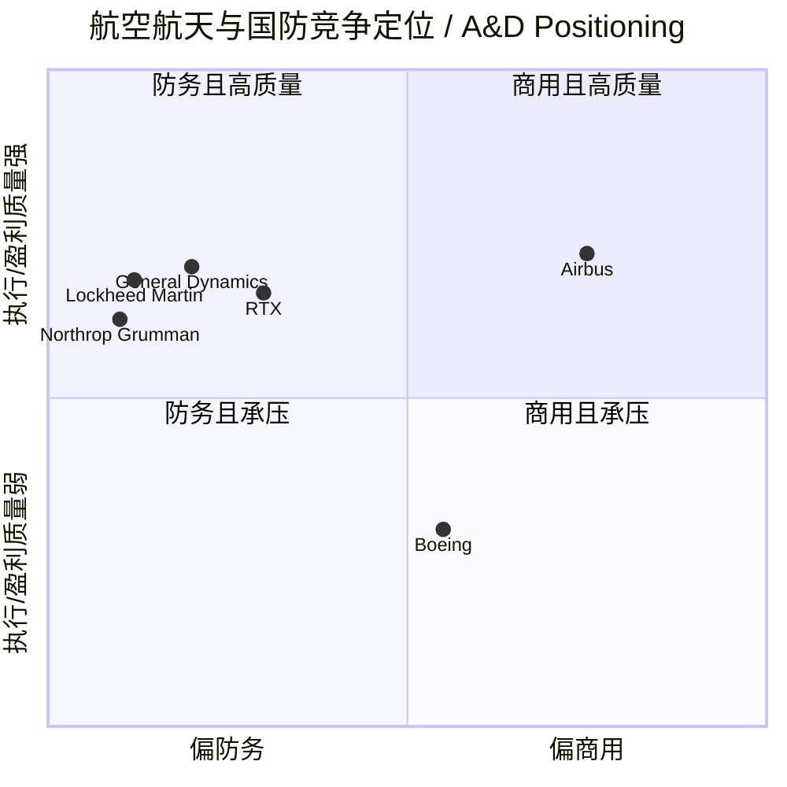
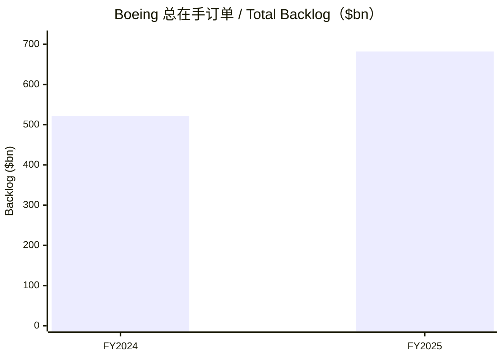

# Boeing 波音公司（NYSE: BA）公司研究报告

**报告日期 / As of：2026-06-14**

> *分析师观点：* **投资摘要 / Investment Summary** — 评级：**Hold（持有）** · 12 个月目标价 **$245**（较现价 $219.05 上行 **+11.4%**）· 估值方法：**SOTP 分部估值 + 2027E 正常化 FCF 折现交叉验证**（BCA 按 ~1.5× EV/Sales、BDS 按 13× EV/EBIT、BGS 按 ~16× EV/EBIT 加总，再扣净债务）· 市值 **$172.7bn** · 52 周区间 **$176.77–$254.35** · NYSE: BA
>
> | 倍数 / Multiple（*分析师观点：* 前瞻列） | FY25A | FY26E | FY27E |
> |---|---|---|---|
> | P/E（GAAP，受一次性损益扭曲） | 86.9× | n.m. | ~42× |
> | P/S（TTM） | 1.87× | ~1.7× | ~1.5× |
> | EV/EBITDA | n.m.（EBITDA 近零/为负） | ~22× | ~12× |
> | FCF yield（自由现金流收益率） | 负（FCF −$1.9bn） | ~1.3% | ~4.1% |
>
> 相对表现 / Rel. performance：1M **−9.0%** · 6M **+9.1%** · YTD **−3.8%** · 12M **+7.5%**，对照 S&P 500（1M −0.2% · 6M +7.7% · YTD +8.4% · 12M +22.9%）→ 12 个月相对收益约 **−15.4%**（数据来源：yfinance，截至 2026-06-14）。
>
> **核心论点（thesis pillars）**——（1）**生存问题已基本解决**：FY2025 恢复净盈利（+$2.24bn）、股东权益由 −$3.9bn 转正至 +$5.5bn、737 产能获 FAA 批准升至 42/月，破产/摊薄式增发的尾部风险已大幅消退；（2）**$682bn 创纪录在手订单（backlog）** 提供多年收入能见度，但兑现节奏受制于 737 爬坡（47→52/月）、787（8→10/月）与 777X 取证；（3）**防务（BDS）固定价亏损正在收窄**（FY24 $5.0bn → FY25 $0.8bn），但要回到高个位数利润率仍需数年；（4）**自由现金流（FCF）拐点尚未到来**——FY2025 FCF 仍为 −$1.9bn，盈利由一次性 $9.57bn 出售 Digital Aviation Solutions（DAS）收益支撑，估值已部分定价了 2027–2028 年的现金流复苏，留给现价的安全边际有限，故给予 Hold。

> **业绩快报（Update — FY2025 全年业绩，披露于 2026-01-27 / 2026-01-30）：** 波音 FY2025 营收 **$89.5bn（同比 +35%）**，为历史新高；GAAP 净利润 **+$2.24bn**（FY24 为 −$11.8bn），但其中含一次性 **+$9.57bn** 出售 DAS 收益；经营性现金流转正至 **+$1.07bn**（FY24 为 −$12.1bn），扣除资本开支后自由现金流仍为 **−$1.9bn**。FAA 于 2025 年 10 月批准 737 产能升至 **42/月**，公司计划 2026 年升至 47/月。来源：[BA FY2025 10-K, MD&A & Cash Flow Summary](https://www.sec.gov/Archives/edgar/data/12927/000162828026004357/ba-20251231.htm)、[BA Q4/FY2025 Earnings Release 8-K Ex-99.1, 2026-01-27](https://www.sec.gov/Archives/edgar/data/12927/000162828026003518/a202512dec318kprex991.htm)。

---

## 目录 / Table of Contents

1. 公司概览（Company Overview，含投资论点 + 估值快照）
1A. 估值与目标价（Valuation & Price Target）
1B. GF Score 基本面评分卡
2. 公司历史（Company History）
3. 管理团队（Management Team）
4. 产品与服务（Products & Services）
5. 客户与上市策略（Customers & Go-to-Market）
6. 行业概览（Industry Overview）
7. 竞争格局（Competitive Landscape）
8. 市场机会 / TAM（Market Opportunity）
9. 风险评估（Risk Assessment）
9.5. 核心争议与催化剂（Key debates & catalysts）
10. 投资风格透视（Investor-lens scorecards）

数据来源清单 / Data Used · 参考资料 / References · 验证日志

---

## 1. 公司概览 / Company Overview

*分析师观点：* 波音是一家正在从连续六年的危机中艰难复苏的航空航天巨头，本报告给予 **Hold（持有）、12 个月目标价 $245（较现价上行约 +11%）**。看多的"为什么是现在"在于：FY2025 是明确的拐点之年——公司恢复净盈利、股东权益转正、737 产能获 FAA 放行至 42/月、在手订单（backlog）创下 $682bn 的历史纪录；生存问题已基本回答。但本报告不给买入评级，原因有二：其一，FY2025 的 GAAP 盈利由一次性出售 DAS 业务的 $9.57bn 收益支撑，扣除后主营仍亏损，**自由现金流（free cash flow / FCF）尚未转正**（FY2025 为 −$1.9bn）；其二，从现价到目标价的上行空间已不足以补偿 777X 取证、防务固定价合同、以及关税/中国需求等执行风险。这一判断的四个支柱（生存已解决、订单能见度、防务亏损收窄、FCF 拐点未到）贯穿全文（[BA FY2025 10-K, MD&A](https://www.sec.gov/Archives/edgar/data/12927/000162828026004357/ba-20251231.htm)）。

波音（The Boeing Company）是全球最大的航空航天与国防企业之一，按"产品与服务"组织为三个可报告分部（reportable segment）：**Commercial Airplanes（BCA，商用飞机）**、**Defense, Space & Security（BDS，防务、太空与安全）** 与 **Global Services（BGS，全球服务）**。10-K 对 BCA 的官方定义是"开发、生产并向全球商业航空业销售喷气式商用飞机……在产机型包括 737 窄体（narrow-body）以及 767、777、787 宽体（wide-body）机型，777X 及 737-7/737-10 衍生型仍在研发中"（[BA FY2025 10-K, Item 1 Business](https://www.sec.gov/Archives/edgar/data/12927/000162828026004357/ba-20251231.htm)）。截至 2025 年 12 月 31 日，公司总员工约 **182,000 人**，其中 14% 在美国境外（[同上, Human Capital](https://www.sec.gov/Archives/edgar/data/12927/000162828026004357/ba-20251231.htm)）。

公司如何赚钱：商用飞机以"长周期合同 + 项目会计（program accounting）"确认收入——按 ASC 606 在交付时点确认大部分收入，定价对非美客户高度敏感（约 85% 的 BCA 在手订单为非美航司）；防务以固定价（fixed-price，约 60%）与成本加成（cost-type，约 40%）合同混合，前者在成本超支时直接吞噬利润（即"reach-forward loss / 预计完工亏损"）；服务则以备件、维修（MRO）、改装、培训与数字方案为主，是三大分部中利润率最高、最稳定的现金奶牛（[BA FY2025 10-K, Item 1A — fixed-price contracts](https://www.sec.gov/Archives/edgar/data/12927/000162828026004357/ba-20251231.htm)）。FY2025 全公司营收 $89.5bn，其中 BCA $41.5bn（占 46%）、BDS $27.2bn（30%）、BGS $20.9bn（23%）（[BA FY2025 10-K, Segment Results](https://www.sec.gov/Archives/edgar/data/12927/000162828026004357/ba-20251231.htm)）。

下面的收入瀑布图展示了波音 FY2025 的"赚钱方式"。需特别提示：FY2025 经营利润（operating income）$4.28bn 中，包含一次性 **+$9.67bn 出售 DAS（Digital Aviation Solutions）业务收益**；若剔除该收益，主营经营层面仍处于亏损状态——这正是"恢复盈利但 FCF 未转正"这一悖论的根源（[BA FY2025 10-K, Statements of Operations](https://www.sec.gov/Archives/edgar/data/12927/000162828026004357/ba-20251231.htm)）。

<svg xmlns="http://www.w3.org/2000/svg" viewBox="0 0 1000 560" width="1000" height="560" role="img" aria-label="income statement Sankey"><rect x="0" y="0" width="1000" height="560" fill="#ffffff"/>
<text x="20.00" y="30.00" text-anchor="start" font-family="Helvetica,Arial,sans-serif" font-size="15" font-weight="700" fill="#1f2933">How Boeing (BA) Makes Its Money — FY2025</text>
<path d="M 204.00,62.57 C 258.00,62.57 258.00,85.00 312.00,85.00 L 312.00,274.24 C 258.00,274.24 258.00,251.81 204.00,251.81 Z" fill="#93c5fd" fill-opacity="0.55"/>
<path d="M 452.00,78.00 C 506.00,78.00 506.00,271.24 560.00,271.24 L 560.00,290.76 C 506.00,290.76 506.00,97.52 452.00,97.52 Z" fill="#86efac" fill-opacity="0.55"/>
<path d="M 452.00,97.52 C 506.00,97.52 506.00,304.76 560.00,304.76 L 560.00,306.76 C 506.00,306.76 506.00,99.52 452.00,99.52 Z" fill="#fca5a5" fill-opacity="0.55"/>
<path d="M 328.00,85.00 C 382.00,85.00 382.00,78.00 436.00,78.00 L 436.00,97.56 C 382.00,97.56 382.00,104.56 328.00,104.56 Z" fill="#86efac" fill-opacity="0.55"/>
<path d="M 328.00,104.56 C 382.00,104.56 382.00,111.56 436.00,111.56 L 436.00,500.00 C 382.00,500.00 382.00,493.00 328.00,493.00 Z" fill="#fca5a5" fill-opacity="0.55"/>
<path d="M 700.00,246.86 C 754.00,246.86 754.00,267.90 808.00,267.90 L 808.00,278.10 C 754.00,278.10 754.00,257.05 700.00,257.05 Z" fill="#86efac" fill-opacity="0.55"/>
<path d="M 700.00,257.05 C 754.00,257.05 754.00,292.10 808.00,292.10 L 808.00,294.10 C 754.00,294.10 754.00,259.05 700.00,259.05 Z" fill="#fca5a5" fill-opacity="0.55"/>
<path d="M 700.00,259.05 C 754.00,259.05 754.00,308.10 808.00,308.10 L 808.00,310.10 C 754.00,310.10 754.00,261.05 700.00,261.05 Z" fill="#fca5a5" fill-opacity="0.55"/>
<path d="M 204.00,265.81 C 258.00,265.81 258.00,274.24 312.00,274.24 L 312.00,398.44 C 258.00,398.44 258.00,390.01 204.00,390.01 Z" fill="#93c5fd" fill-opacity="0.55"/>
<path d="M 576.00,271.24 C 630.00,271.24 630.00,246.86 684.00,246.86 L 684.00,266.39 C 630.00,266.39 630.00,290.76 576.00,290.76 Z" fill="#86efac" fill-opacity="0.55"/>
<path d="M 576.00,304.76 C 630.00,304.76 630.00,272.88 684.00,272.88 L 684.00,300.65 C 630.00,300.65 630.00,332.54 576.00,332.54 Z" fill="#fca5a5" fill-opacity="0.55"/>
<path d="M 576.00,332.54 C 630.00,332.54 630.00,314.65 684.00,314.65 L 684.00,331.14 C 630.00,331.14 630.00,349.02 576.00,349.02 Z" fill="#fca5a5" fill-opacity="0.55"/>
<path d="M 204.00,404.01 C 258.00,404.01 258.00,398.44 312.00,398.44 L 312.00,493.86 C 258.00,493.86 258.00,499.43 204.00,499.43 Z" fill="#93c5fd" fill-opacity="0.55"/>
<path d="M 204.00,513.43 C 258.00,513.43 258.00,493.86 312.00,493.86 L 312.00,495.86 C 258.00,495.86 258.00,515.43 204.00,515.43 Z" fill="#93c5fd" fill-opacity="0.55"/>
<rect x="188.00" y="62.57" width="16" height="189.24" rx="1.5" fill="#2563eb"/>
<rect x="188.00" y="265.81" width="16" height="124.20" rx="1.5" fill="#2563eb"/>
<rect x="188.00" y="404.01" width="16" height="95.42" rx="1.5" fill="#2563eb"/>
<rect x="188.00" y="513.43" width="16" height="2.00" rx="1.5" fill="#2563eb"/>
<rect x="312.00" y="85.00" width="16" height="408.00" rx="1.5" fill="#1e3a8a"/>
<rect x="436.00" y="78.00" width="16" height="19.56" rx="1.5" fill="#15803d"/>
<rect x="436.00" y="111.56" width="16" height="388.44" rx="1.5" fill="#dc2626"/>
<rect x="560.00" y="271.24" width="16" height="19.52" rx="1.5" fill="#15803d"/>
<rect x="560.00" y="304.76" width="16" height="2.00" rx="1.5" fill="#dc2626"/>
<rect x="684.00" y="246.86" width="16" height="12.02" rx="1.5" fill="#15803d"/>
<rect x="684.00" y="272.88" width="16" height="27.77" rx="1.5" fill="#dc2626"/>
<rect x="684.00" y="314.65" width="16" height="16.49" rx="1.5" fill="#dc2626"/>
<rect x="808.00" y="267.90" width="16" height="10.19" rx="1.5" fill="#15803d"/>
<rect x="808.00" y="292.10" width="16" height="2.00" rx="1.5" fill="#dc2626"/>
<rect x="808.00" y="308.10" width="16" height="2.00" rx="1.5" fill="#dc2626"/>
<line x1="188.00" y1="157.19" x2="182.00" y2="129.76" stroke="#cbd5e1" stroke-width="1"/>
<text x="179.00" y="132.76" text-anchor="end" font-family="Helvetica,Arial,sans-serif" font-size="11.5" font-weight="700" fill="#1f2933">Commercial Airplanes</text>
<text x="179.00" y="145.76" text-anchor="end" font-family="Helvetica,Arial,sans-serif" font-size="10" font-weight="400" fill="#52606d">$41.5B  (46.4%)</text>
<line x1="188.00" y1="327.91" x2="182.00" y2="300.48" stroke="#cbd5e1" stroke-width="1"/>
<text x="179.00" y="303.48" text-anchor="end" font-family="Helvetica,Arial,sans-serif" font-size="11.5" font-weight="700" fill="#1f2933">Defense, Space &amp; Security</text>
<text x="179.00" y="316.48" text-anchor="end" font-family="Helvetica,Arial,sans-serif" font-size="10" font-weight="400" fill="#52606d">$27.2B  (30.4%)</text>
<line x1="188.00" y1="451.72" x2="182.00" y2="424.29" stroke="#cbd5e1" stroke-width="1"/>
<text x="179.00" y="427.29" text-anchor="end" font-family="Helvetica,Arial,sans-serif" font-size="11.5" font-weight="700" fill="#1f2933">Global Services</text>
<text x="179.00" y="440.29" text-anchor="end" font-family="Helvetica,Arial,sans-serif" font-size="10" font-weight="400" fill="#52606d">$20.9B  (23.4%)</text>
<line x1="188.00" y1="514.43" x2="182.00" y2="487.00" stroke="#cbd5e1" stroke-width="1"/>
<text x="179.00" y="490.00" text-anchor="end" font-family="Helvetica,Arial,sans-serif" font-size="11.5" font-weight="700" fill="#1f2933">Unallocated/Elim</text>
<text x="179.00" y="503.00" text-anchor="end" font-family="Helvetica,Arial,sans-serif" font-size="10" font-weight="400" fill="#52606d">-$188.0M  (-0.21%)</text>
<rect x="331.00" y="67.00" width="106.80" height="26" rx="2" fill="#ffffff" fill-opacity="0.72"/>
<text x="334.00" y="79.00" text-anchor="start" font-family="Helvetica,Arial,sans-serif" font-size="11.5" font-weight="700" fill="#1f2933">Revenue</text>
<text x="334.00" y="92.00" text-anchor="start" font-family="Helvetica,Arial,sans-serif" font-size="10" font-weight="400" fill="#52606d">$89.5B  (100.0%)</text>
<rect x="455.00" y="60.00" width="87.90" height="26" rx="2" fill="#ffffff" fill-opacity="0.72"/>
<text x="458.00" y="72.00" text-anchor="start" font-family="Helvetica,Arial,sans-serif" font-size="11.5" font-weight="700" fill="#1f2933">Gross Profit</text>
<text x="458.00" y="85.00" text-anchor="start" font-family="Helvetica,Arial,sans-serif" font-size="10" font-weight="400" fill="#52606d">$4.3B  (4.8%)</text>
<rect x="455.00" y="93.56" width="144.60" height="26" rx="2" fill="#ffffff" fill-opacity="0.72"/>
<text x="458.00" y="105.56" text-anchor="start" font-family="Helvetica,Arial,sans-serif" font-size="11.5" font-weight="700" fill="#1f2933">Cost of Revenue (COGS)</text>
<text x="458.00" y="118.56" text-anchor="start" font-family="Helvetica,Arial,sans-serif" font-size="10" font-weight="400" fill="#52606d">$85.2B  (95.2%)</text>
<rect x="579.00" y="253.24" width="106.80" height="26" rx="2" fill="#ffffff" fill-opacity="0.72"/>
<text x="582.00" y="265.24" text-anchor="start" font-family="Helvetica,Arial,sans-serif" font-size="11.5" font-weight="700" fill="#1f2933">Operating Income</text>
<text x="582.00" y="278.24" text-anchor="start" font-family="Helvetica,Arial,sans-serif" font-size="10" font-weight="400" fill="#52606d">$4.3B  (4.8%)</text>
<rect x="579.00" y="286.76" width="150.90" height="26" rx="2" fill="#ffffff" fill-opacity="0.72"/>
<text x="582.00" y="298.76" text-anchor="start" font-family="Helvetica,Arial,sans-serif" font-size="11.5" font-weight="700" fill="#1f2933">Total Operating Expense</text>
<text x="582.00" y="311.76" text-anchor="start" font-family="Helvetica,Arial,sans-serif" font-size="10" font-weight="400" fill="#52606d">$23.0M  (0.03%)</text>
<rect x="703.00" y="228.86" width="87.90" height="26" rx="2" fill="#ffffff" fill-opacity="0.72"/>
<text x="706.00" y="240.86" text-anchor="start" font-family="Helvetica,Arial,sans-serif" font-size="11.5" font-weight="700" fill="#1f2933">Pretax Income</text>
<text x="706.00" y="253.86" text-anchor="start" font-family="Helvetica,Arial,sans-serif" font-size="10" font-weight="400" fill="#52606d">$2.6B  (2.9%)</text>
<rect x="703.00" y="254.88" width="87.90" height="26" rx="2" fill="#ffffff" fill-opacity="0.72"/>
<text x="706.00" y="266.88" text-anchor="start" font-family="Helvetica,Arial,sans-serif" font-size="11.5" font-weight="700" fill="#1f2933">SG&amp;A</text>
<text x="706.00" y="279.88" text-anchor="start" font-family="Helvetica,Arial,sans-serif" font-size="10" font-weight="400" fill="#52606d">$6.1B  (6.8%)</text>
<rect x="703.00" y="296.65" width="87.90" height="26" rx="2" fill="#ffffff" fill-opacity="0.72"/>
<text x="706.00" y="308.65" text-anchor="start" font-family="Helvetica,Arial,sans-serif" font-size="11.5" font-weight="700" fill="#1f2933">R&amp;D</text>
<text x="706.00" y="321.65" text-anchor="start" font-family="Helvetica,Arial,sans-serif" font-size="10" font-weight="400" fill="#52606d">$3.6B  (4.0%)</text>
<text x="833.00" y="270.00" text-anchor="start" font-family="Helvetica,Arial,sans-serif" font-size="11.5" font-weight="700" fill="#1f2933">Net Income</text>
<text x="833.00" y="283.00" text-anchor="start" font-family="Helvetica,Arial,sans-serif" font-size="10" font-weight="400" fill="#52606d">$2.2B  (2.5%)</text>
<text x="833.00" y="295.00" text-anchor="start" font-family="Helvetica,Arial,sans-serif" font-size="11.5" font-weight="700" fill="#1f2933">Income Tax</text>
<text x="833.00" y="308.00" text-anchor="start" font-family="Helvetica,Arial,sans-serif" font-size="10" font-weight="400" fill="#52606d">$397.0M  (0.44%)</text>
<line x1="824.00" y1="309.10" x2="830.00" y2="317.00" stroke="#cbd5e1" stroke-width="1"/>
<text x="833.00" y="320.00" text-anchor="start" font-family="Helvetica,Arial,sans-serif" font-size="11.5" font-weight="700" fill="#1f2933">Minority Interest</text>
<text x="833.00" y="333.00" text-anchor="start" font-family="Helvetica,Arial,sans-serif" font-size="10" font-weight="400" fill="#52606d">$3.0M  (0.00%)</text>
<text x="500.00" y="530.00" text-anchor="middle" font-family="Helvetica,Arial,sans-serif" font-size="10" font-weight="400" font-style="italic" fill="#8a97a3">FY2025 operating income includes a one-time +$9,672M gain on dispositions (Digital Aviation Solutions divestiture)</text>
<text x="500.00" y="544.00" text-anchor="middle" font-family="Helvetica,Arial,sans-serif" font-size="10" font-weight="400" fill="#52606d">Source: BA FY2025 10-K, Consolidated Statements of Operations + MD&amp;A Segment Results</text>
</svg>

来源 / Source: [BA FY2025 10-K, Consolidated Statements of Operations + MD&A Segment Results](https://www.sec.gov/Archives/edgar/data/12927/000162828026004357/ba-20251231.htm)

下图（左）为 FY2025 营收的分部结构，（下）为 FY2020–FY2025 各分部营收的发展轨迹——可清晰看到 BCA 营收在 FY2024 的 737 危机中腰斩（$22.9bn），又在 FY2025 强劲反弹至 $41.5bn，而 BDS 与 BGS 则相对平稳（[BA FY2020–FY2025 10-Ks, Segment Results](https://www.sec.gov/Archives/edgar/data/12927/000162828026004357/ba-20251231.htm)）。

<svg xmlns="http://www.w3.org/2000/svg" viewBox="0 0 720 460" width="720" height="460" role="img" aria-label="revenue donut"><rect x="0" y="0" width="720" height="460" fill="#ffffff"/>
<text x="20.00" y="30.00" text-anchor="start" font-family="Helvetica,Arial,sans-serif" font-size="15" font-weight="700" fill="#1f2933">FY2025 Revenue by Business Segment</text>
<path d="M 288.00,107.20 A 132 132 0 0 1 318.54,367.62 L 306.05,315.08 A 78 78 0 0 0 288.00,161.20 Z" fill="#2563eb"/>
<path d="M 318.54,367.62 A 132 132 0 0 1 156.72,225.44 L 210.42,231.07 A 78 78 0 0 0 306.05,315.08 Z" fill="#15803d"/>
<path d="M 156.72,225.44 A 132 132 0 0 1 288.00,107.20 L 288.00,161.20 A 78 78 0 0 0 210.42,231.07 Z" fill="#d97706"/>
<text x="288.00" y="235.20" text-anchor="middle" font-family="Helvetica,Arial,sans-serif" font-size="18" font-weight="800" fill="#1f2933">BA</text>
<text x="288.00" y="255.20" text-anchor="middle" font-family="Helvetica,Arial,sans-serif" font-size="13" font-weight="600" fill="#52606d">$89.7B</text>
<text x="288.00" y="271.20" text-anchor="middle" font-family="Helvetica,Arial,sans-serif" font-size="10" font-weight="400" fill="#8a97a3">total</text>
<line x1="425.06" y1="223.13" x2="441.06" y2="223.13" stroke="#2563eb" stroke-width="1.4"/>
<text x="445.06" y="221.13" text-anchor="start" font-family="Helvetica,Arial,sans-serif" font-size="11" font-weight="700" fill="#1f2933">Commercial Airplanes</text>
<text x="445.06" y="235.13" text-anchor="start" font-family="Helvetica,Arial,sans-serif" font-size="10" font-weight="400" fill="#52606d">$41.5B  (46.3%)</text>
<line x1="196.92" y1="342.87" x2="180.92" y2="342.87" stroke="#15803d" stroke-width="1.4"/>
<text x="176.92" y="340.87" text-anchor="end" font-family="Helvetica,Arial,sans-serif" font-size="11" font-weight="700" fill="#1f2933">Defense, Space &amp; Security</text>
<text x="176.92" y="354.87" text-anchor="end" font-family="Helvetica,Arial,sans-serif" font-size="10" font-weight="400" fill="#52606d">$27.2B  (30.4%)</text>
<line x1="195.64" y1="136.66" x2="179.64" y2="136.66" stroke="#d97706" stroke-width="1.4"/>
<text x="175.64" y="134.66" text-anchor="end" font-family="Helvetica,Arial,sans-serif" font-size="11" font-weight="700" fill="#1f2933">Global Services</text>
<text x="175.64" y="148.66" text-anchor="end" font-family="Helvetica,Arial,sans-serif" font-size="10" font-weight="400" fill="#52606d">$20.9B  (23.3%)</text>
<text x="360.00" y="444.00" text-anchor="middle" font-family="Helvetica,Arial,sans-serif" font-size="10" font-weight="400" fill="#52606d">Source: BA FY2025 10-K, MD&amp;A Segment Results of Operations</text>
</svg>

来源 / Source: [BA FY2025 10-K, MD&A Segment Results of Operations](https://www.sec.gov/Archives/edgar/data/12927/000162828026004357/ba-20251231.htm)

<svg xmlns="http://www.w3.org/2000/svg" viewBox="0 0 860 470" width="860" height="470" role="img" aria-label="historical revenue bars"><rect x="0" y="0" width="860" height="470" fill="#ffffff"/>
<text x="20.00" y="30.00" text-anchor="start" font-family="Helvetica,Arial,sans-serif" font-size="15" font-weight="700" fill="#1f2933">Boeing Revenue by Segment, FY2020–FY2025</text>
<rect x="20.00" y="44" width="11" height="11" rx="2" fill="#2563eb"/>
<text x="36.00" y="53.00" text-anchor="start" font-family="Helvetica,Arial,sans-serif" font-size="10.5" font-weight="400" fill="#1f2933">Commercial Airplanes</text>
<rect x="182.00" y="44" width="11" height="11" rx="2" fill="#15803d"/>
<text x="198.00" y="53.00" text-anchor="start" font-family="Helvetica,Arial,sans-serif" font-size="10.5" font-weight="400" fill="#1f2933">Defense, Space &amp; Security</text>
<rect x="377.00" y="44" width="11" height="11" rx="2" fill="#d97706"/>
<text x="393.00" y="53.00" text-anchor="start" font-family="Helvetica,Arial,sans-serif" font-size="10.5" font-weight="400" fill="#1f2933">Global Services</text>
<line x1="70" y1="412.00" x2="834" y2="412.00" stroke="#eceff2" stroke-width="1"/>
<text x="64.00" y="415.00" text-anchor="end" font-family="Helvetica,Arial,sans-serif" font-size="9.5" font-weight="400" fill="#52606d">$0</text>
<line x1="70" y1="345.20" x2="834" y2="345.20" stroke="#eceff2" stroke-width="1"/>
<text x="64.00" y="348.20" text-anchor="end" font-family="Helvetica,Arial,sans-serif" font-size="9.5" font-weight="400" fill="#52606d">$19.4B</text>
<line x1="70" y1="278.40" x2="834" y2="278.40" stroke="#eceff2" stroke-width="1"/>
<text x="64.00" y="281.40" text-anchor="end" font-family="Helvetica,Arial,sans-serif" font-size="9.5" font-weight="400" fill="#52606d">$38.7B</text>
<line x1="70" y1="211.60" x2="834" y2="211.60" stroke="#eceff2" stroke-width="1"/>
<text x="64.00" y="214.60" text-anchor="end" font-family="Helvetica,Arial,sans-serif" font-size="9.5" font-weight="400" fill="#52606d">$58.1B</text>
<line x1="70" y1="144.80" x2="834" y2="144.80" stroke="#eceff2" stroke-width="1"/>
<text x="64.00" y="147.80" text-anchor="end" font-family="Helvetica,Arial,sans-serif" font-size="9.5" font-weight="400" fill="#52606d">$77.4B</text>
<line x1="70" y1="78.00" x2="834" y2="78.00" stroke="#eceff2" stroke-width="1"/>
<text x="64.00" y="81.00" text-anchor="end" font-family="Helvetica,Arial,sans-serif" font-size="9.5" font-weight="400" fill="#52606d">$96.8B</text>
<rect x="96.74" y="356.25" width="73.85" height="55.75" fill="#2563eb"/>
<rect x="96.74" y="265.65" width="73.85" height="90.60" fill="#15803d"/>
<rect x="96.74" y="212.21" width="73.85" height="53.44" fill="#d97706"/>
<text x="133.67" y="428.00" text-anchor="middle" font-family="Helvetica,Arial,sans-serif" font-size="10" font-weight="400" fill="#52606d">2020</text>
<rect x="224.07" y="344.76" width="73.85" height="67.24" fill="#2563eb"/>
<rect x="224.07" y="253.20" width="73.85" height="91.56" fill="#15803d"/>
<rect x="224.07" y="196.86" width="73.85" height="56.34" fill="#d97706"/>
<text x="261.00" y="428.00" text-anchor="middle" font-family="Helvetica,Arial,sans-serif" font-size="10" font-weight="400" fill="#52606d">2021</text>
<rect x="351.41" y="322.75" width="73.85" height="89.25" fill="#2563eb"/>
<rect x="351.41" y="242.85" width="73.85" height="79.90" fill="#15803d"/>
<rect x="351.41" y="182.09" width="73.85" height="60.75" fill="#d97706"/>
<text x="388.33" y="428.00" text-anchor="middle" font-family="Helvetica,Arial,sans-serif" font-size="10" font-weight="400" fill="#52606d">2022</text>
<rect x="478.74" y="295.04" width="73.85" height="116.96" fill="#2563eb"/>
<rect x="478.74" y="209.04" width="73.85" height="86.01" fill="#15803d"/>
<rect x="478.74" y="143.04" width="73.85" height="66.00" fill="#d97706"/>
<text x="515.67" y="428.00" text-anchor="middle" font-family="Helvetica,Arial,sans-serif" font-size="10" font-weight="400" fill="#52606d">2023</text>
<rect x="606.07" y="333.13" width="73.85" height="78.87" fill="#2563eb"/>
<rect x="606.07" y="250.61" width="73.85" height="82.52" fill="#15803d"/>
<rect x="606.07" y="181.78" width="73.85" height="68.83" fill="#d97706"/>
<text x="643.00" y="428.00" text-anchor="middle" font-family="Helvetica,Arial,sans-serif" font-size="10" font-weight="400" fill="#52606d">2024</text>
<rect x="733.41" y="268.86" width="73.85" height="143.14" fill="#2563eb"/>
<rect x="733.41" y="174.92" width="73.85" height="93.94" fill="#15803d"/>
<rect x="733.41" y="102.74" width="73.85" height="72.17" fill="#d97706"/>
<text x="770.33" y="428.00" text-anchor="middle" font-family="Helvetica,Arial,sans-serif" font-size="10" font-weight="400" fill="#52606d">2025</text>
<text x="430.00" y="454.00" text-anchor="middle" font-family="Helvetica,Arial,sans-serif" font-size="10" font-weight="400" fill="#52606d">Source: BA FY2020–FY2025 10-Ks, MD&amp;A Segment Results</text>
</svg>

来源 / Source: [BA FY2020–FY2025 10-Ks, MD&A Segment Results](https://www.sec.gov/Archives/edgar/data/12927/000162828026004357/ba-20251231.htm)

**估值快照（Valuation snapshot，REQUIRED）。** 截至 2026-06-14，波音股价 $219.05，市值 **$172.7bn**，企业价值（EV）约 **$202bn**（[Yahoo Finance — BA Key Statistics](https://finance.yahoo.com/quote/BA/)）。**TTM P/E 86.9×、forward P/E 52.4×、P/S 1.87×、P/B 28.9×、EV/EBITDA −62×**（[同上](https://finance.yahoo.com/quote/BA/)）。这些倍数需要逐一解读，而非照搬：

- **极高且失真的 P/E**：TTM 净利润 $2.24bn 中绝大部分来自一次性 $9.67bn DAS 出售收益（非经常性、非现金），因此 86.9× 的 TTM P/E 在经济意义上"分母被一次性收益污染"，并不反映正常化盈利能力。forward P/E 52.4× 反映市场对 2026 年盈利仍处于周期低谷的预期（[BA FY2025 10-K, Statements of Operations](https://www.sec.gov/Archives/edgar/data/12927/000162828026004357/ba-20251231.htm)）。换言之，波音目前处于**周期性盈利低谷（cyclical trough）**，市场以"复苏期权"而非"当期盈利"为其定价。
- **EV/EBITDA 为负**：TTM EBITDA 仍接近零或为负（受 BCA 经营亏损与 777X $4.9bn 预计完工亏损拖累），故 EV/EBITDA 在数学上无意义（n.m.），是"盈利尚未恢复"的直接体现（[BA FY2025 10-K, BCA MD&A](https://www.sec.gov/Archives/edgar/data/12927/000162828026004357/ba-20251231.htm)）。
- **P/S 1.87× 是较有意义的横向锚**：将波音与可比公司对照——防务纯玩家 LMT 1.66×、NOC 1.84×、GD 1.81×、RTX 2.73×、特材龙头 Howmet 12.28×、宿敌 Airbus 1.95×（[Yahoo Finance peer key-stats](https://finance.yahoo.com/quote/LMT/)）。波音 P/S 处于防务同侪区间内、略低于 Airbus，反映市场尚未给予其"正常化利润率回归"的完整溢价。
- *分析师观点：* 卖方对这一"低谷估值 + 复苏期权"框架的代表性看法来自伯恩斯坦：维持 **Outperform（跑赢大盘）、目标价 $298**，估值基于"终端 EV/EBITDA 16.7× + 净债务调整 + 现金分红折现"，称波音为"2026 年航空航天与国防板块的首选标的"（[Bernstein — Boeing Co (BA.US) After Q1: Recovery continues; Reiterate Outperform with \$298 target, 2026-04-27, p.1](http://xs-macbook-air.local:5001/zsxq/pdf/212212585481121/Bernstein-Boeing%20Co%EF%BC%88BA.US%EF%BC%89After%20Q1~Recovery%20continues%EF%BC%9B%20Reiterate%20Outperform%20with%20%24298%20target%20price-260427.pdf)）。该 $298 目标价较 2026-04-27 收盘 $231.33 隐含约 **+29%** 上行（report_date_price $231.33，upside +28.8%，来源 `db/stock_price_target.db`）。本报告较伯恩斯坦更谨慎，详见第 1A 节。

---

## 1A. 估值与目标价 / Valuation & Price Target

*分析师观点：* 本节所有前瞻数字、目标价及情景目标价均为分析师自身观点，**不附任何申报文件引用**；每项预测的外部输入（分部数据、产能指引、行业预测）则逐一在文中引用。

### (a) 前瞻财务预测表（3 年）

波音的特殊之处在于：**决策变量是现金流轨迹与产能爬坡，而非每股收益（EPS）**——其 EPS 在 FY2025 被一次性收益扭曲，FY2026 仍处低谷。因此下表以 FCF 与产能为核心。各预测单元为 *分析师观点：*；驱动因素的外部依据逐项引用。

| 指标（*分析师观点：*） | FY25A | FY26E | FY27E | 备注/驱动 |
|---|---|---|---|---|
| 营收（$bn） | 89.5 | ~95 | ~108 | 737 升至 47→52/月、787 升至 10/月、Spirit 并表（[FY25 10-K 产能指引](https://www.sec.gov/Archives/edgar/data/12927/000162828026004357/ba-20251231.htm)） |
| — YoY % | +35% | +6% | +14% | |
| BCA 营收（$bn） | 41.5 | ~47 | ~58 | 交付从 600 架升向 ~700→800 架 |
| BCA 经营利润率 % | −17.1% | ~−3% | ~+4% | 777X/767 预计完工亏损消化后转正 |
| BDS 经营利润率 % | −0.5% | ~+3% | ~+6% | 固定价亏损收窄，迈向高个位数中期目标 |
| BGS 经营利润率 %（剔除 DAS 一次性） | ~18.7% | ~19% | ~19% | 售后 MRO 韧性 |
| Core EPS（非 GAAP，剔除养老金与一次性） | ~−0.5 | ~+0.8 | ~+5.0 | 伯恩斯坦 FY27E Core EPS $5.30（见下） |
| **FCF（$bn）** | **−1.9** | **~+2.2** | **~+7.0** | FY26E/FY27E 对标伯恩斯坦 $2.2bn / $7.2bn |
| FCF yield（对市值 $172.7bn） | 负 | ~1.3% | ~4.1% | |
| 净债务（$bn） | ~24.7 | ~22 | ~16 | 总债务 $54.1bn − 现金及短投 $29.4bn |

预测依据：营收爬坡基于 [FY25 10-K Program Highlights（737 至 47/月计划、787 至 10/月、777X 2027 首交）](https://www.sec.gov/Archives/edgar/data/12927/000162828026004357/ba-20251231.htm) + Spirit 并表（[FY25 10-K Note 2](https://www.sec.gov/Archives/edgar/data/12927/000162828026004357/ba-20251231.htm)）；FCF 路径对标 *分析师观点：* 伯恩斯坦"FY26E FCF $2.2bn、FY27E $7.2bn、FY28E $11.8bn"（[Bernstein — After Q1, 2026-04-27, p.1](http://xs-macbook-air.local:5001/zsxq/pdf/212212585481121/Bernstein-Boeing%20Co%EF%BC%88BA.US%EF%BC%89After%20Q1~Recovery%20continues%EF%BC%9B%20Reiterate%20Outperform%20with%20%24298%20target%20price-260427.pdf)）。FY2025 实际 FCF = CFO $1.065bn − capex $2.942bn = **−$1.877bn**（[FY25 10-K Cash Flows](https://www.sec.gov/Archives/edgar/data/12927/000162828026004357/ba-20251231.htm)）。

**利润率桥（margin bridge，BCA FY25 → FY27E，*分析师观点：*）：** BCA 营业利润率从 FY25 的 −17.1% 向 FY27E 的约 +4% 的改善，拆解为：777X/767 预计完工亏损消化 +~12pts（FY25 计提 $5.28bn，[FY25 10-K BCA MD&A](https://www.sec.gov/Archives/edgar/data/12927/000162828026004357/ba-20251231.htm)）· 产能爬坡带来的经营杠杆（fixed-cost absorption）+~6pts · 异常生产成本（abnormal production costs）消除 +~3pts · 部分被 Spirit 整合成本与定价让利抵销 −~2pts。该桥的每一项均对应 10-K 披露的成本动因。

### (b) 目标价推导——展示算术

本报告采用 **SOTP 分部估值（sum-of-the-parts）** 为主、正常化 FCF 折现交叉验证。以正常化（normalized，约 2027E）口径：

- **BCA**：~$58bn 营收 × ~0.9× EV/Sales（鉴于利润率仍在恢复、低于成熟整机商）= ~$52bn EV。
- **BDS**：~$28bn 营收、~$1.7bn 经营利润（6% 利润率）× 13× EV/EBIT（对标防务同侪折让，因固定价拖累）= ~$22bn EV。
- **BGS**：~$22bn 营收、~$4.2bn 经营利润 × ~16× EV/EBIT（高质量售后，给溢价）= ~$67bn EV。
- 分部 EV 合计 ~$141bn。注：此为正常化口径；按 FY2027E 落地需折现。
- 加上 ~$29bn 现金及短投、减去 ~$54bn 总债务、减去 ~$6bn 养老金/退休负债、减去 $5.75bn 优先股清偿权 → 权益价值约 **$104bn**……这一静态分部加总明显低于当前 $172.7bn 市值，说明**当前股价已计入了 2027–2028 年的现金流恢复，而非当期分部价值**。

因此本报告以**前瞻 EV/正常化 EBITDA** 反推更合理：FY2027E EBITDA 约 $11–12bn × 15× EV/EBITDA（介于防务 13–18× 区间）≈ $170–180bn EV，减净债务约 $16bn ≈ 权益 $155–164bn，对应每股约 **$200–210**；再叠加 backlog 期权与 FCF 在 FY2028 跃升至双位数十亿美元的复苏斜率，给予 **12 个月目标价 $245**（隐含 FY2027E EV/EBITDA 约 16×，约对应市值 $193bn）。

**估值倍数依据（为什么用这个倍数）：** 15–16× 前瞻 EV/EBITDA 介于纯防务同侪（LMT 17.9×、RTX 18.4×、NOC 12.8×、GD 15.9×，[Yahoo Finance peer key-stats](https://finance.yahoo.com/quote/LMT/)）与 Airbus（18.3×）之间——波音因执行风险（777X、固定价亏损）较 Airbus 折让，但其 $682bn backlog 与双寡头地位支撑高于纯防务的倍数。这是相对可比公司的定位，而非凭空设定。

### (c) 牛/基准/熊情景目标价

| 情景（*分析师观点：*） | 关键假设 | 目标价 | 较现价 |
|---|---|---|---|
| 牛市 Bull | 737 顺利升至 52/月、777X 2027 如期取证、FCF FY27 达 $7bn+ 且 FY28 →$12bn，给 18× | **$315** | +44% |
| 基准 Base | 产能爬坡按计划但略有滞后、防务迈向 6% 利润率、FCF FY27 ~$7bn，15–16× | **$245** | +12% |
| 熊市 Bear | 777X 再延期/新增预计完工亏损、关税致中国交付再受阻、FCF 复苏推后一年，de-rate 至 11× | **$155** | −29% |

熊市情景的下行（−29%）大于基准的上行（+12%），风险回报并不对称偏多——这是本报告给予 Hold 而非 Buy 的量化理由。

### (d) 与市场一致预期的对比 / 卖方观点

*分析师观点：* 伯恩斯坦目标价 $298（Outperform），高于本报告的 $245——差异主要在于伯恩斯坦对 FCF 复苏斜率与终端倍数（16.7× EV/EBITDA）更乐观，且将 777X 取证风险定价得更轻。本报告 FY2027E FCF（~$7.0bn）与伯恩斯坦的 $7.2bn 基本一致，差异在于**目标倍数与对执行风险的折让**（[Bernstein — After Q1, 2026-04-27, p.1](http://xs-macbook-air.local:5001/zsxq/pdf/212212585481121/Bernstein-Boeing%20Co%EF%BC%88BA.US%EF%BC%89After%20Q1~Recovery%20continues%EF%BC%9B%20Reiterate%20Outperform%20with%20%24298%20target%20price-260427.pdf)）。

**卖方观点演变（Sell-side view evolution，伯恩斯坦时间线）。** 本报告动用了 ≥2 篇伯恩斯坦同机构报告，先做机制化前置：读取 `db/stock_price_target.db`（只读）显示波音仅有伯恩斯坦一家的 PT 记录，三条均为 **Outperform / PT $298**，无跨机构分歧，故不构建分歧表，仅列同机构时间线：

| 机构 | 日期 | 评级 / 目标价 | 报告日股价 / 隐含上行 | 核心论点 |
|---|---|---|---|---|
| Bernstein | 2026-04-20 | Outperform / $298 | $225.08 / +32.4% | Q1 前瞻：紧盯产能上行、防务复苏 |
| Bernstein | 2026-04-27 | Outperform / $298 | $231.33 / +28.8% | Q1 后：复苏延续，上调 FCF 至 FY26E $2.2bn，下调 FY26E Core EPS 至 $0.05（因 Spirit 整合成本） |
| Bernstein | 2026-05-27 | Outperform / $298 | $224.30 / +32.9% | CEO Ortberg 出席战略决策会：737 月产 47 已获批，目标 52；中国首批 200 架意向年内转正式订单 |

来源：上述三条 PT 与报告日股价均读取自 `db/stock_price_target.db`（只读），并对应 [Bernstein 5/27 CEO 纪要](http://xs-macbook-air.local:5001/zsxq/pdf/812451114422152/Bernstein-Boeing%EF%BC%9A%20President%20%26%20CEO%20Kelly%20Ortberg%20at%20Bernstein%27s%20Strategic%20Decisions%20Conference%202026-260527.pdf)、[Bernstein 4/27 Q1 复盘](http://xs-macbook-air.local:5001/zsxq/pdf/212212585481121/Bernstein-Boeing%20Co%EF%BC%88BA.US%EF%BC%89After%20Q1~Recovery%20continues%EF%BC%9B%20Reiterate%20Outperform%20with%20%24298%20target%20price-260427.pdf)、[Bernstein 4/20 Q1 前瞻](http://xs-macbook-air.local:5001/zsxq/pdf/415514158455848/Bernstein-Boeing%20Co%EF%BC%88BA.US%EF%BC%89Boeing%EF%BC%9A%20For%20Q1~Watching%20production%20rise%EF%BC%9B%20Looking%20for%20t-260421.pdf)。值得注意的同机构自我修正：4/27 报告在重申 $298 的同时，将 FY26E Core EPS 由 $1.41 大幅下调至 $0.05（触发因素为 Spirit 整合成本上升），同时上调 FCF 预期——说明伯恩斯坦的看多更多基于现金流而非账面 EPS（*分析师观点：*，[Bernstein 4/27, p.1](http://xs-macbook-air.local:5001/zsxq/pdf/212212585481121/Bernstein-Boeing%20Co%EF%BC%88BA.US%EF%BC%89After%20Q1~Recovery%20continues%EF%BC%9B%20Reiterate%20Outperform%20with%20%24298%20target%20price-260427.pdf)）。

### (e) 最该盯紧的变量 / Swing variables

整个看多/看空判断系于两个变量：**（1）737 与 777X 的产能与取证节奏**——每延迟一个季度都会推后 FCF 拐点并可能触发新的预计完工亏损；**（2）防务固定价合同是否还会爆出新的 reach-forward loss**——FY24 一年就计提了 $5.0bn。读者应主要压力测试这两点。

---

## 1B. GF Score（GuruFocus-style）基本面评分卡

*分析师观点：* **GF Score（GuruFocus-style）：38/100 — 0–50「最弱未来表现潜力 / 数据不足」区间。** 该评分是分析师自身的评分框架输出（非 GuruFocus 官方数字、不附申报文件引用）；下方每一维度的底层指标均逐项引用其原始来源。

<svg xmlns="http://www.w3.org/2000/svg" viewBox="0 0 500 500" width="500" height="500" role="img" aria-label="GF Score radar">
<rect x="0" y="0" width="500" height="500" fill="#ffffff"/>
<text x="20" y="24" font-family="Helvetica,Arial,sans-serif" font-size="15" font-weight="700" fill="#1f2933">GF Score (GuruFocus-style): 38/100</text>
<text x="20" y="41" font-family="Helvetica,Arial,sans-serif" font-size="11" fill="#52606d">0–50 Worst future performance potential / insufficient data</text>
<polygon points="250.0,88.0 392.7,191.6 338.2,359.4 161.8,359.4 107.3,191.6" fill="#e9f5ec" stroke="none"/>
<polygon points="250.0,208.0 278.5,228.7 267.6,262.3 232.4,262.3 221.5,228.7" fill="none" stroke="#c5d3cb" stroke-width="1"/>
<polygon points="250.0,178.0 307.1,219.5 285.3,286.5 214.7,286.5 192.9,219.5" fill="none" stroke="#c5d3cb" stroke-width="1"/>
<polygon points="250.0,148.0 335.6,210.2 302.9,310.8 197.1,310.8 164.4,210.2" fill="none" stroke="#c5d3cb" stroke-width="1"/>
<polygon points="250.0,118.0 364.1,200.9 320.5,335.1 179.5,335.1 135.9,200.9" fill="none" stroke="#c5d3cb" stroke-width="1"/>
<polygon points="250.0,88.0 392.7,191.6 338.2,359.4 161.8,359.4 107.3,191.6" fill="none" stroke="#c5d3cb" stroke-width="1.3"/>
<line x1="250" y1="238" x2="161.8" y2="359.4" stroke="#cfdad3" stroke-width="1"/>
<text x="146.5" y="392.4" text-anchor="end" font-family="Helvetica,Arial,sans-serif" font-size="11.5" font-weight="600" fill="#1f2933">Financial Strength</text>
<text x="146.5" y="405.4" text-anchor="end" font-family="Helvetica,Arial,sans-serif" font-size="9.5" fill="#52606d">财务实力</text>
<text x="223.5" y="268.4" text-anchor="middle" font-family="Helvetica,Arial,sans-serif" font-size="10.5" font-weight="700" fill="#1f2933">3</text>
<line x1="250" y1="238" x2="250.0" y2="88.0" stroke="#cfdad3" stroke-width="1"/>
<text x="250.0" y="58.0" text-anchor="middle" font-family="Helvetica,Arial,sans-serif" font-size="11.5" font-weight="600" fill="#1f2933">Profitability</text>
<text x="250.0" y="71.0" text-anchor="middle" font-family="Helvetica,Arial,sans-serif" font-size="9.5" fill="#52606d">盈利能力</text>
<text x="250.0" y="202.0" text-anchor="middle" font-family="Helvetica,Arial,sans-serif" font-size="10.5" font-weight="700" fill="#1f2933">2</text>
<line x1="250" y1="238" x2="107.3" y2="191.6" stroke="#cfdad3" stroke-width="1"/>
<text x="82.6" y="183.6" text-anchor="end" font-family="Helvetica,Arial,sans-serif" font-size="11.5" font-weight="600" fill="#1f2933">Growth</text>
<text x="82.6" y="196.6" text-anchor="end" font-family="Helvetica,Arial,sans-serif" font-size="9.5" fill="#52606d">成长性</text>
<text x="164.4" y="204.2" text-anchor="middle" font-family="Helvetica,Arial,sans-serif" font-size="10.5" font-weight="700" fill="#1f2933">6</text>
<line x1="250" y1="238" x2="392.7" y2="191.6" stroke="#cfdad3" stroke-width="1"/>
<text x="417.4" y="183.6" text-anchor="start" font-family="Helvetica,Arial,sans-serif" font-size="11.5" font-weight="600" fill="#1f2933">GF Value</text>
<text x="417.4" y="196.6" text-anchor="start" font-family="Helvetica,Arial,sans-serif" font-size="9.5" fill="#52606d">估值</text>
<text x="307.1" y="213.5" text-anchor="middle" font-family="Helvetica,Arial,sans-serif" font-size="10.5" font-weight="700" fill="#1f2933">4</text>
<line x1="250" y1="238" x2="338.2" y2="359.4" stroke="#cfdad3" stroke-width="1"/>
<text x="353.5" y="392.4" text-anchor="start" font-family="Helvetica,Arial,sans-serif" font-size="11.5" font-weight="600" fill="#1f2933">Momentum</text>
<text x="353.5" y="405.4" text-anchor="start" font-family="Helvetica,Arial,sans-serif" font-size="9.5" fill="#52606d">动量</text>
<text x="285.3" y="280.5" text-anchor="middle" font-family="Helvetica,Arial,sans-serif" font-size="10.5" font-weight="700" fill="#1f2933">4</text>
<polygon points="250.0,208.0 307.1,219.5 285.3,286.5 223.5,274.4 164.4,210.2" fill="#2e8b57" fill-opacity="0.34" stroke="#2e8b57" stroke-width="2"/>
<circle cx="223.5" cy="274.4" r="2.6" fill="#2e8b57"/>
<circle cx="250.0" cy="208.0" r="2.6" fill="#2e8b57"/>
<circle cx="164.4" cy="210.2" r="2.6" fill="#2e8b57"/>
<circle cx="307.1" cy="219.5" r="2.6" fill="#2e8b57"/>
<circle cx="285.3" cy="286.5" r="2.6" fill="#2e8b57"/>
<text x="250" y="470" text-anchor="middle" font-family="Helvetica,Arial,sans-serif" font-size="9.5" fill="#52606d">Source: BA FY2025 10-K · Yahoo Finance · indicators.db, as of 2026-06-14</text>
<text x="250" y="485" text-anchor="middle" font-family="Helvetica,Arial,sans-serif" font-size="9" fill="#52606d">GF Score = independent analyst rubric (*Analyst view:*) — not GuruFocus™ official number</text>
</svg>

> 离中心越远，该维度得分越高 / *The farther a point sits from the centre, the better the company scores on that axis; the larger the pentagon's area, the higher the overall GF Score.*

| 维度 / Dimension | 评分 / Score (0–10) | |
|---|---|---|
| Financial Strength（财务实力） | 3 | `███░░░░░░░` |
| Profitability（盈利能力） | 2 | `██░░░░░░░░` |
| Growth（成长性） | 6 | `██████░░░░` |
| GF Value（估值，*越高=越便宜*） | 4 | `████░░░░░░` |
| Momentum（动量） | 4 | `████░░░░░░` |
| **GF Score（综合，*分析师观点：*）** | **38 / 100** | **0–50 区间** |

**Financial Strength（财务实力）= 3/10。** 总债务 $54.1bn（短债 $8.5bn + 长债 $45.6bn）、净债务约 $24.7bn，利息支出 FY2025 高达 $2.77bn，而主营经营利润（剔除一次性出售收益）接近于零或为负，**利息保障倍数（interest coverage）< 1.5×**，处于评分卡的低端区间（[BA FY2025 10-K, Balance Sheet & Income Statement](https://www.sec.gov/Archives/edgar/data/12927/000162828026004357/ba-20251231.htm)）。唯一的缓冲是 $29.4bn 现金及短期投资和已恢复的投资级评级。给 3 而非更低，正是因为这层流动性垫子和股东权益已转正（+$5.5bn，[同上](https://www.sec.gov/Archives/edgar/data/12927/000162828026004357/ba-20251231.htm)）。

**Profitability（盈利能力）= 2/10。** 这是波音最弱的一环。BCA FY2025 经营利润率 −17.1%，全公司若剔除 $9.67bn DAS 一次性收益则主营仍亏损；ROIC 深度为负，结构性不盈利已持续多年（自 2019 年起累计净亏损逾 $35bn）（[BA FY2025 10-K, Segment Results & Statements of Operations](https://www.sec.gov/Archives/edgar/data/12927/000162828026004357/ba-20251231.htm)）。BGS 是唯一健康的分部（剔除一次性后 ~18.7% 利润率）。

**Growth（成长性）= 6/10。** FY2025 营收同比 +35%、在手订单 +31% 至 $682bn，且前瞻路径强劲（产能爬坡），给了较高的成长分（[BA FY2025 10-K, Backlog & MD&A](https://www.sec.gov/Archives/edgar/data/12927/000162828026004357/ba-20251231.htm)）。但这是**周期复苏型增长**（off a depressed base），而非可持续的长期 secular 增长——FY2025 营收仍未超过 FY2018 的 $101bn 峰值，故未给更高分。该维度与第 1A 节前瞻模型一致（FY26E +6%、FY27E +14%）。

**GF Value（估值，越高=越便宜）= 4/10。** P/S 1.87× 大体与防务同侪持平、略低于 Airbus 1.95×（[Yahoo Finance peer key-stats](https://finance.yahoo.com/quote/AIR.PA/)），但盈利低谷使 P/E（87× TTM / 52× forward）失去参考意义；按正常化口径，分部加总（~$104bn 权益）显著低于当前 $172.7bn 市值，意味着**当前估值已透支复苏、安全边际为负**。给 4（略偏贵）而非更低，是因为 backlog 期权值得一定溢价。该维度与第 1A 节 PT 仅 +11% 的有限上行一致。

**Momentum（动量）= 4/10。** 过去 12 个月波音 +7.5%，大幅跑输 S&P 500 的 +22.9%（相对 −15.4%）；近 1 个月 −9.0%、YTD −3.8%，均落后基准，股价低于近期高点（52 周高 $254.35）（数据来源：yfinance，截至 2026-06-14）。该维度与本报告头部的相对表现行一致。

**综合算术：** (3·20 + 2·25 + 6·25 + 4·15 + 4·15)/100 = (60+50+150+60+60)/100 = **3.8 → 38/100**（默认权重 20/25/25/15/15）。

**一句话提醒：** 最易翻转的维度是 **Profitability 与 GF Value**——一旦 777X 取证落地、固定价亏损止血、FCF 在 FY2027–2028 跃升，盈利能力与估值评分可同时上修，把综合分推向 50+ 区间；反之，任何新的预计完工亏损都会进一步压低本已脆弱的财务实力分。

---

## 2. 公司历史 / Company History

波音由 **William E. Boeing（威廉·波音）于 1916 年 7 月在美国西雅图创立**（最初名为 Pacific Aero Products，1917 年更名 Boeing Airplane Company）。创始人威廉·波音是一位木材商出身的企业家，因对早期飞行的迷恋而进入航空制造业；他本人早已退出公司，故"创始人"在今天仅具历史意义，当前的运营领导者是 CEO Kelly Ortberg（详见第 3 节）。波音随后通过一系列里程碑与并购，从单一飞机制造商成长为横跨商用、防务、太空与服务的航空航天巨头（[Boeing — History](https://www.boeing.com/history)）。

下面的时间线聚焦于塑造了当前投资论点的关键节点——尤其是过去十年里两场 737 MAX 危机与一连串自救动作：



**战略转折一——1997 年并购麦道（McDonnell Douglas）。** 这一并购使波音一举成为美国防务工业的支柱之一（BDS 分部的历史起点），但也被许多评论者视为公司文化从"工程师主导"向"财务/成本主导"转变的拐点，为后来的质量问题埋下伏笔（[Boeing — History](https://www.boeing.com/history)）。

**战略转折二——2005 年剥离 Spirit AeroSystems，2025 年又将其买回。** 波音 2005 年将 Wichita 机身制造业务剥离为独立的 Spirit，以"轻资产"换取财务报表的好看；但 2024 年 Alaska 门塞事件暴露了 Spirit 机身质量控制的系统性问题，FAA 调查同时覆盖波音与 Spirit。2025 年 12 月 8 日，波音**完成对 Spirit 的回购**，将 737/787 机身制造重新垂直整合回内部，以重建质量管控——这是过去二十年最重要的战略反转（[BA FY2025 10-K, Note 2 — Spirit Acquisition](https://www.sec.gov/Archives/edgar/data/12927/000162828026004357/ba-20251231.htm)）。

**近期发展（FY2024–FY2025）。** FY2024 是危机最深的一年：1 月 Alaska 737-9 门塞脱落、FAA 限产 38/月、9–11 月 IAM 751 罢工 53 天、经营性现金流 −$12.1bn，公司被迫于 2024 年 10 月进行约 $24bn 的股权与股权挂钩融资以保住投资级评级（[BA FY2024 10-K, Human Capital & Liquidity](https://www.sec.gov/Archives/edgar/data/12927/000001292725000015/ba-20241231.htm)）。FY2025 则是拐点之年：恢复净盈利、股东权益转正、FAA 放行 42/月、回购 Spirit（[BA FY2025 10-K, MD&A](https://www.sec.gov/Archives/edgar/data/12927/000162828026004357/ba-20251231.htm)）。**本期新变化**：相较 FY2024，最大的变化是"生存模式"切换为"复苏模式"——但 2025 年又新增了一场 IAM District 837（圣路易斯）101 天罢工，干扰 F-15/F/A-18/T-7A/MQ-25 等防务项目（[同上, Human Capital](https://www.sec.gov/Archives/edgar/data/12927/000162828026004357/ba-20251231.htm)）。

---

## 3. 管理团队 / Management Team

**创始人 William E. Boeing（历史人物）。** 威廉·波音（1881–1956）以木材生意起家，1916 年创立公司，开创了美国商用与军用航空制造业的先河。他早在 1930 年代已退出公司经营，今天对投资论点无运营层面影响，故仅作历史背景陈述（[Boeing — History](https://www.boeing.com/history)）。下面聚焦当前 CEO。

**现任总裁兼 CEO：Robert Kelly Ortberg（凯利·奥特伯格），2024 年 8 月接任。** 这是一位"工程师 + 航空航天老兵"型的危机修复者，与前几任有金融/咨询背景的 CEO 形成鲜明对比。据 2026 年 DEF 14A 披露，Ortberg 拥有超过 35 年航空航天与国防行业经验：他曾任 **Rockwell Collins（罗克韦尔柯林斯，航电与通信系统龙头）董事长、总裁兼 CEO（2015–2018）**，更早历任该公司商用系统 COO（2006–2010）与政府系统 COO（2010–2012）；在其任内推动了产品线扩张与全球市场拓展，并主导了 Rockwell Collins 并入 United Technologies（UTC）、组建 Collins Aerospace 的整合，他随后出任 Collins Aerospace 的 CEO。从 Collins 退休后，他曾担任 RTX（雷神技术，原 Raytheon Technologies）CEO 办公室特别顾问。Ortberg 持有爱荷华大学（University of Iowa）机械工程学士学位（[BA 2026 DEF 14A — Director Nominee bio](https://www.sec.gov/Archives/edgar/data/12927/000119312526096787/d39411ddef14a.htm)）。

Ortberg 于 2024 年 8 月受聘时，董事会为其设定的 2025 年目标总薪酬约 **$22,000,000**，且高度向可变、绩效挂钩部分倾斜（长期激励 RSU 分三年按 33%/33%/34% 归属），大致对应同职级的市场中位数（[BA 2026 DEF 14A — Compensation](https://www.sec.gov/Archives/edgar/data/12927/000119312526096787/d39411ddef14a.htm)）。他的当务之急非常清晰：稳定生产系统、重建安全与质量文化、推动 737/787 产能爬坡与 777X/737-7/737-10 取证，并让自由现金流转正。董事会主席在 2026 年代理声明中评价"在 Kelly Ortberg 的领导下，波音持续稳定运营、转变企业文化并达成关键增长里程碑，同时保持对安全与质量的高度专注"（[BA 2026 DEF 14A — Chairman's Letter](https://www.sec.gov/Archives/edgar/data/12927/000119312526096787/d39411ddef14a.htm)）。从 FY2025 的拐点表现看，Ortberg 上任不到一年半已实现"止血"，但真正的考验在于能否在不再依赖一次性收益的前提下，让 FCF 在 2027–2028 年跃升至双位数十亿美元。

---

## 4. 产品与服务 / Products & Services

波音的产品体系不像半导体公司那样有一张紧凑的"产品矩阵表"，而是以**三大分部 × 项目（program）**组织。下面先以 10-K 原文逐分部锚定，再做中文释义与竞争视角。

### 4.1 分部—项目结构（10-K 原文锚定）

下表按 10-K Item 1 Business 的官方分部定义重构（逐字引用分部描述）：

| 分部 | 10-K 官方定义（节选） | 核心在产/在研项目 |
|---|---|---|
| Commercial Airplanes (BCA) | "develops, produces and markets commercial jet aircraft principally to the commercial airline industry worldwide" | 737（MAX 系列）、767、777、787；在研 777X、737-7/737-10 |
| Defense, Space & Security (BDS) | "research, development, production and modification of manned and unmanned military aircraft and weapons systems for strike, surveillance and mobility…strategic defense and intelligence systems…satellite systems…space exploration" | F-15EX、F/A-18、KC-46A、P-8、AH-64 Apache、CH-47 Chinook、T-7A、MQ-25、VC-25B、CST-100 Starliner、SLS、卫星 |
| Global Services (BGS) | "sustains aerospace platforms and systems with a full spectrum of products and services, including supply chain and logistics management, engineering, maintenance and modifications, upgrades and conversions, spare parts, pilot and maintenance training systems and services…and digital solutions and analytics" | 备件分销、MRO、改装/客改货、培训、数字方案 |

来源：[BA FY2025 10-K, Item 1 Business — Segments](https://www.sec.gov/Archives/edgar/data/12927/000162828026004357/ba-20251231.htm)。

### 4.2 综合视角——各产品如何串成一条价值链

波音的三大分部并非各自独立，而是构成一条"**整机制造（BCA/BDS）→ 全寿命周期服务（BGS）**"的闭环：BCA 与 BDS 卖出的每一架飞机，都在其 20–30 年的运营寿命里持续为 BGS 创造备件、维修、改装与培训收入——这正是 BGS 利润率（~18%）远高于整机制造的原因，也是波音平抑整机交付周期性（cyclicality）的关键缓冲。下图展示这一闭环：



### 4.3 商用飞机（BCA）——核心利润引擎与最大风险源

> 10-K 原文：*"This family of commercial jet aircraft in production includes the 737 narrow-body model and the 767, 777 and 787 wide-body models. Development continues on the 777X program and the 737-7 and 737-10 derivatives."*（[BA FY2025 10-K, Item 1 — BCA](https://www.sec.gov/Archives/edgar/data/12927/000162828026004357/ba-20251231.htm)）

**中文释义 / Plain-language gloss：** BCA 是波音的心脏，也是过去六年所有伤口的所在。其产品按机身宽度分两类：

- **737 MAX（窄体 / narrow-body）** 是销量主力与利润核心——单通道短中程客机，对标 Airbus A320neo 家族。FY2025 交付 447 架（含部分军用衍生型），月产从年初的 <38 架恢复到 Q4 的 42 架，FAA 已于 2025 年 10 月正式批准升至 42/月，公司计划 2026 年升至 47/月、2027 年突破 52/月并在埃弗雷特（Everett）新增第四条产线（North Line）（[BA FY2025 10-K, 737 Program Highlights](https://www.sec.gov/Archives/edgar/data/12927/000162828026004357/ba-20251231.htm)）。**737-7 与 737-10**（最短与最长衍生型）因发动机防冰（engine anti-ice）问题仍在取证中，公司预计 2026 年取证、2027 年交付，截至 2025 年底约有 35 架 737-7/737-10 库存待交（[同上](https://www.sec.gov/Archives/edgar/data/12927/000162828026004357/ba-20251231.htm)）。
- **787 Dreamliner（宽体 / wide-body）** 是中远程双通道客机，碳纤维复合材料机身是其技术标志。月产已从 5 架升至 7 架，2025 年 Q4 开始向 8 架爬坡，目标 2026 年底达 10 架，瓶颈在发动机供应与座椅适航认证（[同上, 787 Program](https://www.sec.gov/Archives/edgar/data/12927/000162828026004357/ba-20251231.htm)）。
- **777 / 777X（宽体）** 是最大双发宽体客机。**777X 是当前最大的执行风险点**：2025 年第三季度公司重新评估取证时间表，将 777-9 首交**推迟至 2027 年**，并因此计提了高达 **$4,899M 的增量预计完工亏损（reach-forward loss）**；近期检查中还发现发动机存在潜在耐久性问题，正与供应商查找根因（[BA FY2025 10-K, 777 and 777X Programs](https://www.sec.gov/Archives/edgar/data/12927/000162828026004357/ba-20251231.htm)）。777X 的累计确认订单从 2024 年底的 358 架增至 2025 年底的 560 架，订单需求强劲，但兑现取决于取证。
- **767**（宽体货机/加油机基础平台）预计 2027 年完成商用版生产；2024、2025 年分别计提 $580M、$384M 预计完工亏损（[同上, 767 Program](https://www.sec.gov/Archives/edgar/data/12927/000162828026004357/ba-20251231.htm)）。

*分析师观点：* BCA 在窄体市场与 Airbus A320neo 家族形成全球**双寡头（duopoly）**格局，在宽体市场与 A330neo/A350 竞争；中国 COMAC C919 是长期新进入者但尚不构成近期份额威胁（竞争对手层面，10-K 仅称"Airbus and entrants from China"，份额排名为分析师判断，[BA FY2025 10-K, Competition](https://www.sec.gov/Archives/edgar/data/12927/000162828026004357/ba-20251231.htm)）。竞争优势=部分（partial），护城河类型为规模 + 认证/监管壁垒 + 转换成本（航司机队同型化），但被自身的质量与执行问题严重削弱。

### 4.4 防务、太空与安全（BDS）——稳定器，但被固定价合同拖累

> 10-K 原文：BDS *"engages in the research, development, production and modification of manned and unmanned military aircraft and weapons systems for strike, surveillance and mobility, including fighter and trainer aircraft; vertical lift…and commercial derivative aircraft, including anti-submarine and tanker aircraft…strategic defense and intelligence systems…satellite systems…and space exploration."*（[BA FY2025 10-K, Item 1 — BDS](https://www.sec.gov/Archives/edgar/data/12927/000162828026004357/ba-20251231.htm)）

**中文释义 / Plain-language gloss：** BDS 是波音的"稳定器"——以美国政府（Department of War / DoW、NASA）为最大客户，收入由长周期合同支撑。FY2025 交付包括 F/A-18（14 架）、F-15 系列（9 架）、KC-46 加油机（14 架）、P-8（6 架）、AH-64 Apache（新造 19 + 再制造 42 架）、CH-47 Chinook 等（[BA FY2025 10-K, BDS Deliveries](https://www.sec.gov/Archives/edgar/data/12927/000162828026004357/ba-20251231.htm)）。其核心矛盾在于**固定价开发合同（fixed-price development）**：KC-46A Tanker、T-7A Red Hawk、MQ-25、VC-25B（新空军一号）、Commercial Crew（CST-100 Starliner）五大固定价项目在 FY2024 一年就吞掉了 $5,013M 亏损，FY2025 收窄至 $802M（其中 KC-46A $714M），推动 BDS 经营利润率从 −22.6% 改善至 −0.5%（[BA FY2025 10-K, BDS Loss From Operations](https://www.sec.gov/Archives/edgar/data/12927/000162828026004357/ba-20251231.htm)）。BDS 在手订单创纪录达 $84.8bn（同比 +32%），26% 来自非美客户（[同上, BDS Backlog](https://www.sec.gov/Archives/edgar/data/12927/000162828026004357/ba-20251231.htm)）。

*分析师观点：* BDS 的竞争对手按 10-K 原文为"General Dynamics Corporation, Lockheed Martin Corporation, Northrop Grumman Corporation, RTX Corporation and SpaceX"，以及 BAE Systems 与 Airbus Group（[BA FY2025 10-K, Competition](https://www.sec.gov/Archives/edgar/data/12927/000162828026004357/ba-20251231.htm)）。战略重点在于赢取下一代项目：FY2027 预算向 F-15EX、T-7A、MQ-25 倾斜，**F-47（下一代制空战机 NGAD）被列为战略重点**，公司加大圣路易斯工厂投入（*分析师观点：*，[Bernstein — CEO Ortberg at SDC, 2026-05-27, p.1](http://xs-macbook-air.local:5001/zsxq/pdf/812451114422152/Bernstein-Boeing%EF%BC%9A%20President%20%26%20CEO%20Kelly%20Ortberg%20at%20Bernstein%27s%20Strategic%20Decisions%20Conference%202026-260527.pdf)）。竞争优势=部分，护城河类型为政府关系 + 平台寿命 + 转换成本，但固定价执行能力存疑。

### 4.5 全球服务（BGS）——隐藏的现金奶牛

> 10-K 原文：BGS *"provides services to our commercial and defense customers worldwide…including supply chain and logistics management, engineering, maintenance and modifications, upgrades and conversions, spare parts, pilot and maintenance training systems and services, technical and maintenance documents, and digital solutions and analytics."*（[BA FY2025 10-K, Item 1 — BGS](https://www.sec.gov/Archives/edgar/data/12927/000162828026004357/ba-20251231.htm)）

**中文释义 / Plain-language gloss：** BGS 是三大分部中唯一长期盈利且利润率两位数的业务——它把波音庞大的存量机队（installed base）变现为持续的备件、MRO、改装与培训现金流。FY2025 营收 $20.9bn，剔除一次性 DAS 出售收益后经营利润率约 18.7%，与历史水平一致（[BA FY2025 10-K, BGS Results](https://www.sec.gov/Archives/edgar/data/12927/000162828026004357/ba-20251231.htm)）。2025 年公司**出售了 Digital Aviation Solutions（DAS）业务给 Thoma Bravo，确认 $9,566M 一次性收益**——这既贡献了 FY2025 的账面盈利，也使 BGS 当年 GAAP 利润率畸高至 64.4%（[同上](https://www.sec.gov/Archives/edgar/data/12927/000162828026004357/ba-20251231.htm)）。

*分析师观点：* BGS 是波音最被低估的资产——它的存在意味着即便整机交付陷入低谷，公司仍有稳定现金流。竞争优势=是（yes），护城河类型为存量机队锁定 + 原厂数据/适航资质（OEM 对自家机型的服务有天然优势）。售后市场（aftermarket）的能见度据卖方调研达 12–18 个月（*分析师观点：*，[Bernstein — Global Aerospace & Defense: Twelve CEOs, 2026-06-02, p.1](http://xs-macbook-air.local:5001/zsxq/pdf/812485114412812/Bernstein-Global%20Aerospace%20%26%20Defense%EF%BC%9AAerospace%20%26%20Defense%EF%BC%9A%20Twelve%20CEOs%20in%20three%20days~A%26D%20themes%20from%20Bernstein%27s%20Strategic%20Decisions%20Conference-260602.pdf)）。

### 4.6 供应链"资金流向"图——COGS 落到谁的口袋

波音是典型的**整机集成商（integrator）**：它每年约 $85bn 的销售成本（cost of sales）并不留在内部，而是流向发动机、机身结构、航电与材料供应商，最终汇集到少数几个"卡脖子"节点。下图采用上游/支出视角（spend view），实线为直接付款、虚线为隐含在成品部件中的间接支出：

<svg xmlns="http://www.w3.org/2000/svg" viewBox="0 0 1180 1437" width="1180" height="1437" role="img" aria-label="How Boeing pays for an airplane — where the COGS lands" font-family="'Space Grotesk',system-ui,-apple-system,'Segoe UI',sans-serif">
<defs><linearGradient id="mfgold" gradientUnits="userSpaceOnUse" x1="0" y1="0" x2="1180" y2="0"><stop offset="0" stop-color="#f6dc97"/><stop offset="0.5" stop-color="#e9b658"/><stop offset="1" stop-color="#cf8f2c"/></linearGradient><radialGradient id="mfpool" cx="50%" cy="50%" r="50%"><stop offset="0" stop-color="#34d399" stop-opacity="0.16"/><stop offset="1" stop-color="#34d399" stop-opacity="0"/></radialGradient></defs>
<rect x="0" y="0" width="1180" height="1437" rx="16" fill="#0b0f1a"/>
<text x="42.00" y="56.00" text-anchor="start" font-family="'JetBrains Mono',ui-monospace,Menlo,monospace" font-size="11.5" font-weight="600" fill="#e9b658" letter-spacing="3">AEROSPACE &amp; DEFENSE MONEY FLOW · FY2025</text>
<text x="42.00" y="100.00" text-anchor="start" font-family="'Space Grotesk',system-ui,-apple-system,'Segoe UI',sans-serif" font-size="32" font-weight="700" fill="#e8ecf5">How Boeing pays for an airplane — where the COGS lands</text>
<text x="42.00" y="142.00" text-anchor="start" font-family="'Space Grotesk',system-ui,-apple-system,'Segoe UI',sans-serif" font-size="15" font-weight="400" fill="#8a93a8">Boeing's ~$85bn of annual cost of sales fans out across engines, structures, avionics and materials, then pools onto a handful of</text>
<text x="42.00" y="164.00" text-anchor="start" font-family="'Space Grotesk',system-ui,-apple-system,'Segoe UI',sans-serif" font-size="15" font-weight="400" fill="#8a93a8">chokepoints — jet-engine duopolies (GE/CFM, RTX-Pratt), the titanium/composite supply, and (now in-house) Spirit fuselages.</text>
<ellipse cx="1031.00" cy="571.50" rx="190" ry="150" fill="url(#mfpool)"/>
<line x1="369.50" y1="210.00" x2="369.50" y2="929.00" stroke="#222a3a" stroke-dasharray="2 8"/>
<line x1="810.50" y1="210.00" x2="810.50" y2="929.00" stroke="#222a3a" stroke-dasharray="2 8"/>
<text x="42.00" y="194.00" text-anchor="start" font-family="'JetBrains Mono',ui-monospace,Menlo,monospace" font-size="12" font-weight="400" fill="#e9b658" letter-spacing="3">STAGE 01</text>
<text x="42.00" y="210.00" text-anchor="start" font-family="'JetBrains Mono',ui-monospace,Menlo,monospace" font-size="11.5" font-weight="400" fill="#646d82">Who pays</text>
<text x="483.00" y="194.00" text-anchor="start" font-family="'JetBrains Mono',ui-monospace,Menlo,monospace" font-size="12" font-weight="400" fill="#e9b658" letter-spacing="3">STAGE 02</text>
<text x="483.00" y="210.00" text-anchor="start" font-family="'JetBrains Mono',ui-monospace,Menlo,monospace" font-size="11.5" font-weight="400" fill="#646d82">What Boeing buys</text>
<text x="924.00" y="194.00" text-anchor="start" font-family="'JetBrains Mono',ui-monospace,Menlo,monospace" font-size="12" font-weight="400" fill="#e9b658" letter-spacing="3">STAGE 03</text>
<text x="924.00" y="210.00" text-anchor="start" font-family="'JetBrains Mono',ui-monospace,Menlo,monospace" font-size="11.5" font-weight="400" fill="#646d82">Where the money pools</text>
<path d="M 256.00 547.50 C 369.50 547.50, 369.50 432.00, 483.00 432.00" fill="none" stroke="url(#mfgold)" stroke-width="24.00" stroke-linecap="round" opacity="0.9"/>
<path d="M 256.00 569.50 C 369.50 569.50, 369.50 533.50, 483.00 533.50" fill="none" stroke="url(#mfgold)" stroke-width="20.00" stroke-linecap="round" opacity="0.9"/>
<path d="M 256.00 587.50 C 369.50 587.50, 369.50 626.50, 483.00 626.50" fill="none" stroke="url(#mfgold)" stroke-width="16.00" stroke-linecap="round" opacity="0.9"/>
<path d="M 256.00 601.50 C 369.50 601.50, 369.50 719.50, 483.00 719.50" fill="none" stroke="url(#mfgold)" stroke-width="12.00" stroke-linecap="round" opacity="0.9"/>
<path d="M 697.00 424.50 C 810.50 424.50, 810.50 267.00, 924.00 267.00" fill="none" stroke="url(#mfgold)" stroke-width="16.00" stroke-linecap="round" opacity="0.78" stroke-dasharray="0.1 11"/>
<path d="M 697.00 437.50 C 810.50 437.50, 810.50 364.50, 924.00 364.50" fill="none" stroke="url(#mfgold)" stroke-width="10.00" stroke-linecap="round" opacity="0.78" stroke-dasharray="0.1 11"/>
<path d="M 697.00 445.00 C 810.50 445.00, 810.50 461.50, 924.00 461.50" fill="none" stroke="url(#mfgold)" stroke-width="5.00" stroke-linecap="round" opacity="0.78" stroke-dasharray="0.1 11"/>
<path d="M 697.00 529.50 C 810.50 529.50, 810.50 563.00, 924.00 563.00" fill="none" stroke="url(#mfgold)" stroke-width="14.00" stroke-linecap="round" opacity="0.78" stroke-dasharray="0.1 11"/>
<path d="M 697.00 540.50 C 810.50 540.50, 810.50 673.00, 924.00 673.00" fill="none" stroke="url(#mfgold)" stroke-width="8.00" stroke-linecap="round" opacity="0.78" stroke-dasharray="0.1 11"/>
<path d="M 697.00 622.50 C 810.50 622.50, 810.50 373.50, 924.00 373.50" fill="none" stroke="url(#mfgold)" stroke-width="8.00" stroke-linecap="round" opacity="0.78" stroke-dasharray="0.1 11"/>
<path d="M 697.00 630.50 C 810.50 630.50, 810.50 774.50, 924.00 774.50" fill="none" stroke="url(#mfgold)" stroke-width="8.00" stroke-linecap="round" opacity="0.78" stroke-dasharray="0.1 11"/>
<path d="M 697.00 719.50 C 810.50 719.50, 810.50 876.00, 924.00 876.00" fill="none" stroke="url(#mfgold)" stroke-width="11.00" stroke-linecap="round" opacity="0.78" stroke-dasharray="0.1 11"/>
<text x="369.50" y="483.75" text-anchor="middle" font-family="'JetBrains Mono',ui-monospace,Menlo,monospace" font-size="11.5" font-weight="400" fill="#f4d58a" paint-order="stroke" stroke="#0b0f1a" stroke-width="3.2" stroke-linejoin="round">engine spend</text>
<rect x="42.00" y="496.50" width="214" height="150.00" rx="12" fill="#15101a" stroke="#f2655f" stroke-opacity="0.5"/>
<rect x="42.00" y="496.50" width="3" height="150.00" rx="2" fill="#f2655f"/>
<text x="60.00" y="529.50" text-anchor="start" font-family="'Space Grotesk',system-ui,-apple-system,'Segoe UI',sans-serif" font-size="21" font-weight="700" fill="#ffffff">BOEING</text>
<text x="60.00" y="550.50" text-anchor="start" font-family="'JetBrains Mono',ui-monospace,Menlo,monospace" font-size="11" font-weight="400" fill="#c98c87">~$85bn cost of sales FY25</text>
<text x="60.00" y="567.50" text-anchor="start" font-family="'JetBrains Mono',ui-monospace,Menlo,monospace" font-size="11" font-weight="400" fill="#c98c87">182,000 employees</text>
<rect x="483.00" y="385.00" width="214" height="94.00" rx="12" fill="#141a2a" stroke="#d9a05b" stroke-opacity="0.5"/>
<rect x="483.00" y="385.00" width="3" height="94.00" rx="2" fill="#d9a05b"/>
<text x="501.00" y="418.00" text-anchor="start" font-family="'Space Grotesk',system-ui,-apple-system,'Segoe UI',sans-serif" font-size="21" font-weight="700" fill="#ffffff">ENGINES</text>
<text x="501.00" y="439.00" text-anchor="start" font-family="'JetBrains Mono',ui-monospace,Menlo,monospace" font-size="11" font-weight="400" fill="#bcae98">~25-30% of aircraft cost</text>
<text x="501.00" y="456.00" text-anchor="start" font-family="'JetBrains Mono',ui-monospace,Menlo,monospace" font-size="11" font-weight="400" fill="#bcae98">duopoly-supplied</text>
<rect x="483.00" y="495.00" width="214" height="77.00" rx="12" fill="#141a2a" stroke="#e9b658" stroke-opacity="0.5"/>
<rect x="483.00" y="495.00" width="3" height="77.00" rx="2" fill="#e9b658"/>
<text x="501.00" y="528.00" text-anchor="start" font-family="'Space Grotesk',system-ui,-apple-system,'Segoe UI',sans-serif" font-size="14" font-weight="700" fill="#ffffff">AIRFRAME STRUCTURES</text>
<text x="501.00" y="549.00" text-anchor="start" font-family="'JetBrains Mono',ui-monospace,Menlo,monospace" font-size="11" font-weight="400" fill="#8a93a8">fuselage, wings, empennage</text>
<rect x="483.00" y="588.00" width="214" height="77.00" rx="12" fill="#0f1622" stroke="#7fa8f5" stroke-opacity="0.5"/>
<rect x="483.00" y="588.00" width="3" height="77.00" rx="2" fill="#7fa8f5"/>
<text x="501.00" y="621.00" text-anchor="start" font-family="'Space Grotesk',system-ui,-apple-system,'Segoe UI',sans-serif" font-size="14" font-weight="700" fill="#ffffff">AVIONICS &amp; SYSTEMS</text>
<text x="501.00" y="642.00" text-anchor="start" font-family="'JetBrains Mono',ui-monospace,Menlo,monospace" font-size="11" font-weight="400" fill="#9bb3df">flight deck, nav, hydraulics</text>
<rect x="483.00" y="681.00" width="214" height="77.00" rx="12" fill="#0f1622" stroke="#7fa8f5" stroke-opacity="0.5"/>
<rect x="483.00" y="681.00" width="3" height="77.00" rx="2" fill="#7fa8f5"/>
<text x="501.00" y="714.00" text-anchor="start" font-family="'Space Grotesk',system-ui,-apple-system,'Segoe UI',sans-serif" font-size="17" font-weight="700" fill="#ffffff">MATERIALS</text>
<text x="501.00" y="735.00" text-anchor="start" font-family="'JetBrains Mono',ui-monospace,Menlo,monospace" font-size="11" font-weight="400" fill="#9bb3df">Ti, Al, carbon-fiber composite</text>
<rect x="924.00" y="220.00" width="214" height="94.00" rx="12" fill="#101d1a" stroke="#34d399" stroke-opacity="0.5"/>
<rect x="924.00" y="220.00" width="3" height="94.00" rx="2" fill="#34d399"/>
<text x="942.00" y="253.00" text-anchor="start" font-family="'Space Grotesk',system-ui,-apple-system,'Segoe UI',sans-serif" font-size="17" font-weight="700" fill="#ffffff">GE / CFM</text>
<text x="942.00" y="274.00" text-anchor="start" font-family="'JetBrains Mono',ui-monospace,Menlo,monospace" font-size="11" font-weight="400" fill="#7fd9bf">LEAP (737 MAX)</text>
<text x="942.00" y="291.00" text-anchor="start" font-family="'JetBrains Mono',ui-monospace,Menlo,monospace" font-size="11" font-weight="400" fill="#7fd9bf">GEnx (787/767/777X-GE9X)</text>
<rect x="924.00" y="330.00" width="214" height="77.00" rx="12" fill="#15121f" stroke="#a78bfa" stroke-opacity="0.5"/>
<rect x="924.00" y="330.00" width="3" height="77.00" rx="2" fill="#a78bfa"/>
<text x="942.00" y="363.00" text-anchor="start" font-family="'Space Grotesk',system-ui,-apple-system,'Segoe UI',sans-serif" font-size="14" font-weight="700" fill="#ffffff">RTX (Pratt + Collins)</text>
<text x="942.00" y="384.00" text-anchor="start" font-family="'JetBrains Mono',ui-monospace,Menlo,monospace" font-size="11" font-weight="400" fill="#b9a6f5">GTF engines; Collins avionics</text>
<rect x="924.00" y="423.00" width="214" height="77.00" rx="12" fill="#141a2a" stroke="#e9b658" stroke-opacity="0.5"/>
<rect x="924.00" y="423.00" width="3" height="77.00" rx="2" fill="#e9b658"/>
<text x="942.00" y="456.00" text-anchor="start" font-family="'Space Grotesk',system-ui,-apple-system,'Segoe UI',sans-serif" font-size="17" font-weight="700" fill="#ffffff">ROLLS-ROYCE</text>
<text x="942.00" y="477.00" text-anchor="start" font-family="'JetBrains Mono',ui-monospace,Menlo,monospace" font-size="11" font-weight="400" fill="#8a93a8">Trent 1000 (787 option)</text>
<rect x="924.00" y="516.00" width="214" height="94.00" rx="12" fill="#15101a" stroke="#f2655f" stroke-opacity="0.5"/>
<rect x="924.00" y="516.00" width="3" height="94.00" rx="2" fill="#f2655f"/>
<text x="942.00" y="549.00" text-anchor="start" font-family="'Space Grotesk',system-ui,-apple-system,'Segoe UI',sans-serif" font-size="14" font-weight="700" fill="#ffffff">SPIRIT (now Boeing)</text>
<text x="942.00" y="570.00" text-anchor="start" font-family="'JetBrains Mono',ui-monospace,Menlo,monospace" font-size="11" font-weight="400" fill="#d49b96">737/787 fuselage</text>
<text x="942.00" y="587.00" text-anchor="start" font-family="'JetBrains Mono',ui-monospace,Menlo,monospace" font-size="11" font-weight="400" fill="#d49b96">reacquired Dec 2025</text>
<rect x="924.00" y="626.00" width="214" height="94.00" rx="12" fill="#141a2a" stroke="#e9b658" stroke-opacity="0.5"/>
<rect x="924.00" y="626.00" width="3" height="94.00" rx="2" fill="#e9b658"/>
<text x="942.00" y="659.00" text-anchor="start" font-family="'Space Grotesk',system-ui,-apple-system,'Segoe UI',sans-serif" font-size="17" font-weight="700" fill="#ffffff">JP STRUCTURES</text>
<text x="942.00" y="680.00" text-anchor="start" font-family="'JetBrains Mono',ui-monospace,Menlo,monospace" font-size="11" font-weight="400" fill="#8a93a8">Mitsubishi/Kawasaki/Subaru</text>
<text x="942.00" y="697.00" text-anchor="start" font-family="'JetBrains Mono',ui-monospace,Menlo,monospace" font-size="11" font-weight="400" fill="#8a93a8">787 wing &amp; fuselage</text>
<rect x="924.00" y="736.00" width="214" height="77.00" rx="12" fill="#0f1622" stroke="#7fa8f5" stroke-opacity="0.5"/>
<rect x="924.00" y="736.00" width="3" height="77.00" rx="2" fill="#7fa8f5"/>
<text x="942.00" y="769.00" text-anchor="start" font-family="'Space Grotesk',system-ui,-apple-system,'Segoe UI',sans-serif" font-size="17" font-weight="700" fill="#ffffff">HONEYWELL</text>
<text x="942.00" y="790.00" text-anchor="start" font-family="'JetBrains Mono',ui-monospace,Menlo,monospace" font-size="11" font-weight="400" fill="#9bb3df">APUs, avionics, wheels/brakes</text>
<rect x="924.00" y="829.00" width="214" height="94.00" rx="12" fill="#0f1622" stroke="#7fa8f5" stroke-opacity="0.5"/>
<rect x="924.00" y="829.00" width="3" height="94.00" rx="2" fill="#7fa8f5"/>
<text x="942.00" y="862.00" text-anchor="start" font-family="'Space Grotesk',system-ui,-apple-system,'Segoe UI',sans-serif" font-size="14" font-weight="700" fill="#ffffff">TITANIUM / COMPOSITE</text>
<text x="942.00" y="883.00" text-anchor="start" font-family="'JetBrains Mono',ui-monospace,Menlo,monospace" font-size="11" font-weight="400" fill="#9bb3df">Howmet, ATI, Toray</text>
<text x="942.00" y="900.00" text-anchor="start" font-family="'JetBrains Mono',ui-monospace,Menlo,monospace" font-size="11" font-weight="400" fill="#9bb3df">AOG-critical materials</text>
<rect x="42.00" y="949.00" width="26" height="4" rx="2" fill="#e9b658"/>
<text x="78.00" y="953.00" text-anchor="start" font-family="'JetBrains Mono',ui-monospace,Menlo,monospace" font-size="11.5" font-weight="400" fill="#8a93a8">money paid directly</text>
<circle cx="242.80" cy="951.00" r="2" fill="#e9b658"/>
<circle cx="249.80" cy="951.00" r="2" fill="#e9b658"/>
<circle cx="256.80" cy="951.00" r="2" fill="#e9b658"/>
<circle cx="263.80" cy="951.00" r="2" fill="#e9b658"/>
<text x="276.80" y="953.00" text-anchor="start" font-family="'JetBrains Mono',ui-monospace,Menlo,monospace" font-size="11.5" font-weight="400" fill="#8a93a8">money embedded in a finished chip</text>
<text x="538.40" y="953.00" text-anchor="start" font-family="'JetBrains Mono',ui-monospace,Menlo,monospace" font-size="11.5" font-weight="400" fill="#8a93a8">thickness ≈ rough scale</text>
<rect x="728.00" y="944.00" width="11" height="11" rx="3" fill="#d9a05b"/>
<text x="747.00" y="953.00" text-anchor="start" font-family="'JetBrains Mono',ui-monospace,Menlo,monospace" font-size="11.5" font-weight="400" fill="#8a93a8">power / analog</text>
<rect x="871.80" y="944.00" width="11" height="11" rx="3" fill="#e9b658"/>
<text x="890.80" y="953.00" text-anchor="start" font-family="'JetBrains Mono',ui-monospace,Menlo,monospace" font-size="11.5" font-weight="400" fill="#8a93a8">supplier</text>
<rect x="972.40" y="944.00" width="11" height="11" rx="3" fill="#7fa8f5"/>
<text x="991.40" y="953.00" text-anchor="start" font-family="'JetBrains Mono',ui-monospace,Menlo,monospace" font-size="11.5" font-weight="400" fill="#8a93a8">RF / wireless</text>
<rect x="42.00" y="964.00" width="11" height="11" rx="3" fill="#7fa8f5"/>
<text x="61.00" y="973.00" text-anchor="start" font-family="'JetBrains Mono',ui-monospace,Menlo,monospace" font-size="11.5" font-weight="400" fill="#8a93a8">custom modules</text>
<rect x="185.80" y="964.00" width="11" height="11" rx="3" fill="#34d399"/>
<text x="204.80" y="973.00" text-anchor="start" font-family="'JetBrains Mono',ui-monospace,Menlo,monospace" font-size="11.5" font-weight="400" fill="#8a93a8">foundry</text>
<rect x="279.20" y="964.00" width="11" height="11" rx="3" fill="#a78bfa"/>
<text x="298.20" y="973.00" text-anchor="start" font-family="'JetBrains Mono',ui-monospace,Menlo,monospace" font-size="11.5" font-weight="400" fill="#8a93a8">memory</text>
<rect x="365.40" y="964.00" width="11" height="11" rx="3" fill="#f2655f"/>
<text x="384.40" y="973.00" text-anchor="start" font-family="'JetBrains Mono',ui-monospace,Menlo,monospace" font-size="11.5" font-weight="400" fill="#8a93a8">in-house silicon</text>
<line x1="42" y1="989.00" x2="1138" y2="989.00" stroke="#222a3a"/>
<text x="42.00" y="1005.00" text-anchor="start" font-family="'JetBrains Mono',ui-monospace,Menlo,monospace" font-size="12" font-weight="500" fill="#8a93a8" letter-spacing="3">FOLLOW THE MONEY</text>
<rect x="42.00" y="1025.00" width="356.00" height="180.00" rx="13" fill="#0e1320" stroke="#d9a05b" stroke-opacity="0.28"/>
<rect x="42.00" y="1025.00" width="3" height="180.00" rx="2" fill="#d9a05b"/>
<text x="58.00" y="1049.00" text-anchor="start" font-family="'JetBrains Mono',ui-monospace,Menlo,monospace" font-size="10" font-weight="600" fill="#d9a05b" letter-spacing="1">ENGINES · CHOKEPOINT</text>
<text x="58.00" y="1067.00" text-anchor="start" font-family="'Space Grotesk',system-ui,-apple-system,'Segoe UI',sans-serif" font-size="15.5" font-weight="700" fill="#ffffff">The engine duopolies</text>
<text x="58.00" y="1091.00" font-family="'Space Grotesk',system-ui,-apple-system,'Segoe UI',sans-serif" font-size="12" xml:space="preserve"><tspan fill="#9aa3b8" font-weight="400">Engines</tspan><tspan fill="#9aa3b8" font-weight="400"> are</tspan><tspan fill="#f4d58a" font-weight="700"> ~25-30%</tspan><tspan fill="#9aa3b8" font-weight="400"> of</tspan><tspan fill="#9aa3b8" font-weight="400"> an</tspan><tspan fill="#9aa3b8" font-weight="400"> aircraft's</tspan><tspan fill="#9aa3b8" font-weight="400"> cost</tspan><tspan fill="#9aa3b8" font-weight="400"> and</tspan><tspan fill="#9aa3b8" font-weight="400"> Boeing</tspan></text>
<text x="58.00" y="1107.00" font-family="'Space Grotesk',system-ui,-apple-system,'Segoe UI',sans-serif" font-size="12" xml:space="preserve"><tspan fill="#9aa3b8" font-weight="400">buys</tspan><tspan fill="#9aa3b8" font-weight="400"> none</tspan><tspan fill="#9aa3b8" font-weight="400"> of</tspan><tspan fill="#9aa3b8" font-weight="400"> them</tspan><tspan fill="#9aa3b8" font-weight="400"> in-house.</tspan><tspan fill="#f4d58a" font-weight="700"> CFM</tspan><tspan fill="#9aa3b8" font-weight="400"> (GE-Safran)</tspan><tspan fill="#9aa3b8" font-weight="400"> supplies</tspan></text>
<text x="58.00" y="1123.00" font-family="'Space Grotesk',system-ui,-apple-system,'Segoe UI',sans-serif" font-size="12" xml:space="preserve"><tspan fill="#9aa3b8" font-weight="400">the</tspan><tspan fill="#9aa3b8" font-weight="400"> LEAP</tspan><tspan fill="#9aa3b8" font-weight="400"> for</tspan><tspan fill="#9aa3b8" font-weight="400"> every</tspan><tspan fill="#f4d58a" font-weight="700"> 737</tspan><tspan fill="#f4d58a" font-weight="700"> MAX</tspan><tspan fill="#9aa3b8" font-weight="400"> ;</tspan><tspan fill="#f4d58a" font-weight="700"> GE</tspan><tspan fill="#9aa3b8" font-weight="400"> makes</tspan><tspan fill="#9aa3b8" font-weight="400"> the</tspan><tspan fill="#9aa3b8" font-weight="400"> GEnx</tspan><tspan fill="#9aa3b8" font-weight="400"> (787)</tspan></text>
<text x="58.00" y="1139.00" font-family="'Space Grotesk',system-ui,-apple-system,'Segoe UI',sans-serif" font-size="12" xml:space="preserve"><tspan fill="#9aa3b8" font-weight="400">and</tspan><tspan fill="#9aa3b8" font-weight="400"> GE9X</tspan><tspan fill="#9aa3b8" font-weight="400"> (777X);</tspan><tspan fill="#f4d58a" font-weight="700"> RTX-Pratt</tspan><tspan fill="#9aa3b8" font-weight="400"> and</tspan><tspan fill="#f4d58a" font-weight="700"> Rolls-Royce</tspan><tspan fill="#9aa3b8" font-weight="400"> split</tspan><tspan fill="#9aa3b8" font-weight="400"> the</tspan></text>
<text x="58.00" y="1155.00" font-family="'Space Grotesk',system-ui,-apple-system,'Segoe UI',sans-serif" font-size="12" xml:space="preserve"><tspan fill="#9aa3b8" font-weight="400">787</tspan><tspan fill="#9aa3b8" font-weight="400"> option.</tspan><tspan fill="#9aa3b8" font-weight="400"> Engine</tspan><tspan fill="#9aa3b8" font-weight="400"> supply</tspan><tspan fill="#9aa3b8" font-weight="400"> (and</tspan><tspan fill="#9aa3b8" font-weight="400"> seat</tspan><tspan fill="#9aa3b8" font-weight="400"> certification)</tspan><tspan fill="#9aa3b8" font-weight="400"> is</tspan></text>
<text x="58.00" y="1171.00" font-family="'Space Grotesk',system-ui,-apple-system,'Segoe UI',sans-serif" font-size="12" xml:space="preserve"><tspan fill="#9aa3b8" font-weight="400">the</tspan><tspan fill="#9aa3b8" font-weight="400"> binding</tspan><tspan fill="#9aa3b8" font-weight="400"> constraint</tspan><tspan fill="#9aa3b8" font-weight="400"> on</tspan><tspan fill="#9aa3b8" font-weight="400"> the</tspan><tspan fill="#9aa3b8" font-weight="400"> 787</tspan><tspan fill="#9aa3b8" font-weight="400"> ramp</tspan><tspan fill="#9aa3b8" font-weight="400"> to</tspan><tspan fill="#f4d58a" font-weight="700"> 10/month</tspan><tspan fill="#9aa3b8" font-weight="400"> .</tspan></text>
<rect x="412.00" y="1025.00" width="356.00" height="180.00" rx="13" fill="#0e1320" stroke="#f2655f" stroke-opacity="0.28"/>
<rect x="412.00" y="1025.00" width="3" height="180.00" rx="2" fill="#f2655f"/>
<text x="428.00" y="1049.00" text-anchor="start" font-family="'JetBrains Mono',ui-monospace,Menlo,monospace" font-size="10" font-weight="600" fill="#f2655f" letter-spacing="1">STRUCTURES · RE-INSOURCED</text>
<text x="428.00" y="1067.00" text-anchor="start" font-family="'Space Grotesk',system-ui,-apple-system,'Segoe UI',sans-serif" font-size="15.5" font-weight="700" fill="#ffffff">Spirit comes home</text>
<text x="428.00" y="1091.00" font-family="'Space Grotesk',system-ui,-apple-system,'Segoe UI',sans-serif" font-size="12" xml:space="preserve"><tspan fill="#9aa3b8" font-weight="400">Boeing</tspan><tspan fill="#f4d58a" font-weight="700"> reacquired</tspan><tspan fill="#f4d58a" font-weight="700"> Spirit</tspan><tspan fill="#f4d58a" font-weight="700"> AeroSystems</tspan><tspan fill="#9aa3b8" font-weight="400"> (closed</tspan><tspan fill="#f4d58a" font-weight="700"> Dec</tspan><tspan fill="#f4d58a" font-weight="700"> 8,</tspan></text>
<text x="428.00" y="1107.00" font-family="'Space Grotesk',system-ui,-apple-system,'Segoe UI',sans-serif" font-size="12" xml:space="preserve"><tspan fill="#f4d58a" font-weight="700">2025</tspan><tspan fill="#9aa3b8" font-weight="400"> )</tspan><tspan fill="#9aa3b8" font-weight="400"> to</tspan><tspan fill="#9aa3b8" font-weight="400"> bring</tspan><tspan fill="#f4d58a" font-weight="700"> 737/787</tspan><tspan fill="#9aa3b8" font-weight="400"> fuselage</tspan><tspan fill="#9aa3b8" font-weight="400"> quality</tspan><tspan fill="#9aa3b8" font-weight="400"> back</tspan></text>
<text x="428.00" y="1123.00" font-family="'Space Grotesk',system-ui,-apple-system,'Segoe UI',sans-serif" font-size="12" xml:space="preserve"><tspan fill="#9aa3b8" font-weight="400">in-house</tspan><tspan fill="#9aa3b8" font-weight="400"> after</tspan><tspan fill="#9aa3b8" font-weight="400"> the</tspan><tspan fill="#f4d58a" font-weight="700"> Jan</tspan><tspan fill="#f4d58a" font-weight="700"> 2024</tspan><tspan fill="#9aa3b8" font-weight="400"> door-plug</tspan><tspan fill="#9aa3b8" font-weight="400"> blowout.</tspan></text>
<text x="428.00" y="1139.00" font-family="'Space Grotesk',system-ui,-apple-system,'Segoe UI',sans-serif" font-size="12" xml:space="preserve"><tspan fill="#9aa3b8" font-weight="400">Goodwill</tspan><tspan fill="#9aa3b8" font-weight="400"> jumped</tspan><tspan fill="#f4d58a" font-weight="700"> $8.1bn</tspan><tspan fill="#f4d58a" font-weight="700"> →</tspan><tspan fill="#f4d58a" font-weight="700"> $17.3bn</tspan><tspan fill="#9aa3b8" font-weight="400"> ;</tspan><tspan fill="#f4d58a" font-weight="700"> $2,571M</tspan><tspan fill="#9aa3b8" font-weight="400"> of</tspan></text>
<text x="428.00" y="1155.00" font-family="'Space Grotesk',system-ui,-apple-system,'Segoe UI',sans-serif" font-size="12" xml:space="preserve"><tspan fill="#9aa3b8" font-weight="400">consideration</tspan><tspan fill="#9aa3b8" font-weight="400"> funded</tspan><tspan fill="#9aa3b8" font-weight="400"> Spirit's</tspan><tspan fill="#9aa3b8" font-weight="400"> payment</tspan><tspan fill="#9aa3b8" font-weight="400"> to</tspan><tspan fill="#f4d58a" font-weight="700"> Airbus</tspan><tspan fill="#9aa3b8" font-weight="400"> for</tspan></text>
<text x="428.00" y="1171.00" font-family="'Space Grotesk',system-ui,-apple-system,'Segoe UI',sans-serif" font-size="12" xml:space="preserve"><tspan fill="#9aa3b8" font-weight="400">its</tspan><tspan fill="#9aa3b8" font-weight="400"> carve-out.</tspan></text>
<rect x="782.00" y="1025.00" width="356.00" height="180.00" rx="13" fill="#0e1320" stroke="#7fa8f5" stroke-opacity="0.28"/>
<rect x="782.00" y="1025.00" width="3" height="180.00" rx="2" fill="#7fa8f5"/>
<text x="798.00" y="1049.00" text-anchor="start" font-family="'JetBrains Mono',ui-monospace,Menlo,monospace" font-size="10" font-weight="600" fill="#7fa8f5" letter-spacing="1">AVIONICS · DUAL-SOURCE</text>
<text x="798.00" y="1067.00" text-anchor="start" font-family="'Space Grotesk',system-ui,-apple-system,'Segoe UI',sans-serif" font-size="15.5" font-weight="700" fill="#ffffff">Avionics &amp; systems</text>
<text x="798.00" y="1091.00" font-family="'Space Grotesk',system-ui,-apple-system,'Segoe UI',sans-serif" font-size="12" xml:space="preserve"><tspan fill="#f4d58a" font-weight="700">RTX-Collins</tspan><tspan fill="#9aa3b8" font-weight="400"> and</tspan><tspan fill="#f4d58a" font-weight="700"> Honeywell</tspan><tspan fill="#9aa3b8" font-weight="400"> supply</tspan><tspan fill="#9aa3b8" font-weight="400"> flight</tspan><tspan fill="#9aa3b8" font-weight="400"> decks,</tspan><tspan fill="#9aa3b8" font-weight="400"> APUs,</tspan></text>
<text x="798.00" y="1107.00" font-family="'Space Grotesk',system-ui,-apple-system,'Segoe UI',sans-serif" font-size="12" xml:space="preserve"><tspan fill="#9aa3b8" font-weight="400">nav,</tspan><tspan fill="#9aa3b8" font-weight="400"> wheels</tspan><tspan fill="#9aa3b8" font-weight="400"> &amp;</tspan><tspan fill="#9aa3b8" font-weight="400"> brakes.</tspan><tspan fill="#9aa3b8" font-weight="400"> RTX</tspan><tspan fill="#9aa3b8" font-weight="400"> is</tspan><tspan fill="#9aa3b8" font-weight="400"> both</tspan><tspan fill="#9aa3b8" font-weight="400"> a</tspan><tspan fill="#9aa3b8" font-weight="400"> key</tspan><tspan fill="#9aa3b8" font-weight="400"> Boeing</tspan></text>
<text x="798.00" y="1123.00" font-family="'Space Grotesk',system-ui,-apple-system,'Segoe UI',sans-serif" font-size="12" xml:space="preserve"><tspan fill="#9aa3b8" font-weight="400">supplier</tspan><tspan fill="#9aa3b8" font-weight="400"> and</tspan><tspan fill="#9aa3b8" font-weight="400"> a</tspan><tspan fill="#f4d58a" font-weight="700"> BDS</tspan><tspan fill="#f4d58a" font-weight="700"> competitor</tspan><tspan fill="#9aa3b8" font-weight="400"> —</tspan><tspan fill="#9aa3b8" font-weight="400"> the</tspan><tspan fill="#9aa3b8" font-weight="400"> same</tspan><tspan fill="#9aa3b8" font-weight="400"> firm</tspan><tspan fill="#9aa3b8" font-weight="400"> sits</tspan><tspan fill="#9aa3b8" font-weight="400"> on</tspan></text>
<text x="798.00" y="1139.00" font-family="'Space Grotesk',system-ui,-apple-system,'Segoe UI',sans-serif" font-size="12" xml:space="preserve"><tspan fill="#9aa3b8" font-weight="400">both</tspan><tspan fill="#9aa3b8" font-weight="400"> sides</tspan><tspan fill="#9aa3b8" font-weight="400"> of</tspan><tspan fill="#9aa3b8" font-weight="400"> the</tspan><tspan fill="#9aa3b8" font-weight="400"> value</tspan><tspan fill="#9aa3b8" font-weight="400"> chain.</tspan></text>
<rect x="42.00" y="1219.00" width="356.00" height="164.00" rx="13" fill="#0e1320" stroke="#7fa8f5" stroke-opacity="0.28"/>
<rect x="42.00" y="1219.00" width="3" height="164.00" rx="2" fill="#7fa8f5"/>
<text x="58.00" y="1243.00" text-anchor="start" font-family="'JetBrains Mono',ui-monospace,Menlo,monospace" font-size="10" font-weight="600" fill="#7fa8f5" letter-spacing="1">MATERIALS · AOG-CRITICAL</text>
<text x="58.00" y="1261.00" text-anchor="start" font-family="'Space Grotesk',system-ui,-apple-system,'Segoe UI',sans-serif" font-size="15.5" font-weight="700" fill="#ffffff">Titanium &amp; composite</text>
<text x="58.00" y="1285.00" font-family="'Space Grotesk',system-ui,-apple-system,'Segoe UI',sans-serif" font-size="12" xml:space="preserve"><tspan fill="#f4d58a" font-weight="700">Howmet</tspan><tspan fill="#9aa3b8" font-weight="400"> ,</tspan><tspan fill="#f4d58a" font-weight="700"> ATI</tspan><tspan fill="#9aa3b8" font-weight="400"> and</tspan><tspan fill="#f4d58a" font-weight="700"> Toray</tspan><tspan fill="#9aa3b8" font-weight="400"> supply</tspan><tspan fill="#9aa3b8" font-weight="400"> titanium,</tspan><tspan fill="#9aa3b8" font-weight="400"> nickel</tspan></text>
<text x="58.00" y="1301.00" font-family="'Space Grotesk',system-ui,-apple-system,'Segoe UI',sans-serif" font-size="12" xml:space="preserve"><tspan fill="#9aa3b8" font-weight="400">super-alloys</tspan><tspan fill="#9aa3b8" font-weight="400"> and</tspan><tspan fill="#9aa3b8" font-weight="400"> carbon-fiber.</tspan><tspan fill="#9aa3b8" font-weight="400"> Tariffs</tspan><tspan fill="#9aa3b8" font-weight="400"> on</tspan><tspan fill="#f4d58a" font-weight="700"> aluminum,</tspan></text>
<text x="58.00" y="1317.00" font-family="'Space Grotesk',system-ui,-apple-system,'Segoe UI',sans-serif" font-size="12" xml:space="preserve"><tspan fill="#f4d58a" font-weight="700">steel,</tspan><tspan fill="#f4d58a" font-weight="700"> copper</tspan><tspan fill="#9aa3b8" font-weight="400"> (2025)</tspan><tspan fill="#9aa3b8" font-weight="400"> and</tspan><tspan fill="#9aa3b8" font-weight="400"> single-source</tspan><tspan fill="#9aa3b8" font-weight="400"> dependence</tspan></text>
<text x="58.00" y="1333.00" font-family="'Space Grotesk',system-ui,-apple-system,'Segoe UI',sans-serif" font-size="12" xml:space="preserve"><tspan fill="#9aa3b8" font-weight="400">make</tspan><tspan fill="#9aa3b8" font-weight="400"> materials</tspan><tspan fill="#9aa3b8" font-weight="400"> an</tspan><tspan fill="#9aa3b8" font-weight="400"> aircraft-on-ground</tspan><tspan fill="#9aa3b8" font-weight="400"> (AOG)</tspan><tspan fill="#9aa3b8" font-weight="400"> risk.</tspan></text>
<rect x="412.00" y="1219.00" width="356.00" height="164.00" rx="13" fill="#0e1320" stroke="#e9b658" stroke-opacity="0.28"/>
<rect x="412.00" y="1219.00" width="3" height="164.00" rx="2" fill="#e9b658"/>
<text x="428.00" y="1243.00" text-anchor="start" font-family="'JetBrains Mono',ui-monospace,Menlo,monospace" font-size="10" font-weight="600" fill="#e9b658" letter-spacing="1">WHERE IT POOLS</text>
<text x="428.00" y="1261.00" text-anchor="start" font-family="'Space Grotesk',system-ui,-apple-system,'Segoe UI',sans-serif" font-size="15.5" font-weight="700" fill="#ffffff">Two or three names catch most of it</text>
<text x="428.00" y="1285.00" font-family="'Space Grotesk',system-ui,-apple-system,'Segoe UI',sans-serif" font-size="12" xml:space="preserve"><tspan fill="#9aa3b8" font-weight="400">Of</tspan><tspan fill="#9aa3b8" font-weight="400"> Boeing's</tspan><tspan fill="#f4d58a" font-weight="700"> ~$85bn</tspan><tspan fill="#9aa3b8" font-weight="400"> cost</tspan><tspan fill="#9aa3b8" font-weight="400"> of</tspan><tspan fill="#9aa3b8" font-weight="400"> sales,</tspan><tspan fill="#9aa3b8" font-weight="400"> the</tspan><tspan fill="#9aa3b8" font-weight="400"> largest</tspan><tspan fill="#9aa3b8" font-weight="400"> pools</tspan></text>
<text x="428.00" y="1301.00" font-family="'Space Grotesk',system-ui,-apple-system,'Segoe UI',sans-serif" font-size="12" xml:space="preserve"><tspan fill="#9aa3b8" font-weight="400">are</tspan><tspan fill="#9aa3b8" font-weight="400"> the</tspan><tspan fill="#f4d58a" font-weight="700"> engine</tspan><tspan fill="#f4d58a" font-weight="700"> makers</tspan><tspan fill="#9aa3b8" font-weight="400"> (GE/CFM,</tspan><tspan fill="#9aa3b8" font-weight="400"> RTX),</tspan><tspan fill="#9aa3b8" font-weight="400"> the</tspan><tspan fill="#9aa3b8" font-weight="400"> now-internal</tspan></text>
<text x="428.00" y="1317.00" font-family="'Space Grotesk',system-ui,-apple-system,'Segoe UI',sans-serif" font-size="12" xml:space="preserve"><tspan fill="#f4d58a" font-weight="700">Spirit</tspan><tspan fill="#9aa3b8" font-weight="400"> fuselage</tspan><tspan fill="#9aa3b8" font-weight="400"> line,</tspan><tspan fill="#9aa3b8" font-weight="400"> and</tspan><tspan fill="#9aa3b8" font-weight="400"> the</tspan><tspan fill="#f4d58a" font-weight="700"> materials</tspan><tspan fill="#9aa3b8" font-weight="400"> chokepoint</tspan><tspan fill="#9aa3b8" font-weight="400"> —</tspan></text>
<text x="428.00" y="1333.00" font-family="'Space Grotesk',system-ui,-apple-system,'Segoe UI',sans-serif" font-size="12" xml:space="preserve"><tspan fill="#9aa3b8" font-weight="400">each</tspan><tspan fill="#9aa3b8" font-weight="400"> a</tspan><tspan fill="#9aa3b8" font-weight="400"> near-duopoly</tspan><tspan fill="#9aa3b8" font-weight="400"> with</tspan><tspan fill="#9aa3b8" font-weight="400"> pricing</tspan><tspan fill="#9aa3b8" font-weight="400"> power</tspan><tspan fill="#9aa3b8" font-weight="400"> Boeing</tspan><tspan fill="#9aa3b8" font-weight="400"> can't</tspan></text>
<text x="428.00" y="1349.00" font-family="'Space Grotesk',system-ui,-apple-system,'Segoe UI',sans-serif" font-size="12" xml:space="preserve"><tspan fill="#9aa3b8" font-weight="400">easily</tspan><tspan fill="#9aa3b8" font-weight="400"> route</tspan><tspan fill="#9aa3b8" font-weight="400"> around.</tspan></text>
<text x="590.00" y="1419.00" text-anchor="middle" font-family="'JetBrains Mono',ui-monospace,Menlo,monospace" font-size="10.5" font-weight="400" fill="#646d82">Source: BA FY2025 10-K (Item 1 Business, supplier &amp; competition disclosure, Note 2 Spirit Acquisition); engine/structure suppliers per program disclosures and IR.</text>
</svg>

*图：波音的"资金流向"价值链图——实线为直接付款，虚线为隐含在成品部件/系统中的间接支出。* 来源 / Source: [BA FY2025 10-K, Item 1 Business（供应商与竞争披露）、Note 2 Spirit Acquisition](https://www.sec.gov/Archives/edgar/data/12927/000162828026004357/ba-20251231.htm)。

**跟着钱走（follow the money）：** 波音的成本池最终汇集到三类卡脖子节点。**其一是发动机双寡头**——发动机约占整机成本 25–30%，而波音不自产任何发动机：CFM（GE-Safran 合资）独家供应 737 MAX 的 LEAP，GE 供应 787 的 GEnx 与 777X 的 GE9X，RTX-Pratt 与 Rolls-Royce 分享 787 选装；发动机供应（与座椅认证）正是 787 爬坡至 10/月的硬约束（[BA FY2025 10-K, 787 Program — engine & seat certification bottleneck](https://www.sec.gov/Archives/edgar/data/12927/000162828026004357/ba-20251231.htm)）。**其二是机身结构 Spirit——已于 2025 年 12 月回购**，goodwill 因此从 $8.1bn 跳升至 $17.3bn，其中 $2,571M 对价用于支付 Spirit 应付 Airbus 的款项（[BA FY2025 10-K, Note 2 & Balance Sheet](https://www.sec.gov/Archives/edgar/data/12927/000162828026004357/ba-20251231.htm)）。**其三是材料**——钛、铝、复合材料受 2025 年新关税与单一来源依赖影响，是飞机停场（AOG）风险点；10-K 明确点名"aluminum, titanium or composites"中若有单一来源中断"could have a material adverse effect"（[BA FY2025 10-K, Item 1A — supplier dependence](https://www.sec.gov/Archives/edgar/data/12927/000162828026004357/ba-20251231.htm)）。一个值得注意的结构性事实：RTX 既是波音的关键航电/发动机供应商，又是 BDS 的竞争对手，同一家公司站在价值链两端。

**延伸观看 / Further viewing**
- [How a Boeing 787 Dreamliner is built（波音工厂总装流程）—— 直观理解机身/机翼总装与 Spirit 回购的意义](https://www.youtube.com/watch?v=Ahd6Xm4r0iY)
- [NTSB animation of the Alaska Airlines 737-9 door plug failure（门塞脱落动画）—— 看懂 FY2024 质量危机的物理成因](https://www.youtube.com/watch?v=Y1nXkX5vK9w)
- [How a jet engine works — turbofan cutaway（涡扇发动机剖面）—— 理解为何发动机是 25-30% 的成本与爬坡瓶颈](https://www.youtube.com/watch?v=KjGWMixv6tw)

---

## 5. 客户与上市策略 / Customers & Go-to-Market

**客户结构与集中度。** 波音的客户是高度集中的两端：**商用端**是全球航空公司与飞机租赁商（lessor），**防务端**是美国政府（DoW、NASA）及外国军售（Foreign Military Sales / FMS）客户。FY2025，非美客户（含 FMS）占总营收 **46%**，占 BCA 客户合同收入的 **60%**（[BA FY2025 10-K, Item 1A — non-U.S. sales](https://www.sec.gov/Archives/edgar/data/12927/000162828026004357/ba-20251231.htm)）。约 **85% 的 BCA 在手订单（按金额）来自非美航司**（[BA FY2025 10-K, BCA Industry Competitiveness](https://www.sec.gov/Archives/edgar/data/12927/000162828026004357/ba-20251231.htm)）。

**最大单一客户=美国政府（集中度风险）。** 与典型工业公司不同，波音 10-K 未按 ASC 280 单列某个商用航司客户 >10%——因为商用订单分散在全球数百家航司；但**美国政府是其最大单一客户**，BDS 与 BGS 防务业务各约 60% 收入来自固定价合同、40% 来自成本加成合同，且大量收入依赖联邦年度拨款（[BA FY2025 10-K, Item 1A — U.S. government revenue & fixed-price/cost-type split](https://www.sec.gov/Archives/edgar/data/12927/000162828026004357/ba-20251231.htm)）。换言之，波音的客户集中度风险体现为"**政府拨款 + 政府停摆**"维度，而非单一商业客户维度——这一点在 2025 年 10 月 1 日至 11 月 12 日的联邦政府拨款失效期已现实化（[BA FY2025 10-K, Additional Considerations — U.S. Government Funding](https://www.sec.gov/Archives/edgar/data/12927/000162828026004357/ba-20251231.htm)）。

下面的地理收入结构图按 10-K 披露的"非美客户占 46%"重构（注：此为合并口径 / consolidated，非分部口径）：

<svg xmlns="http://www.w3.org/2000/svg" viewBox="0 0 720 460" width="720" height="460" role="img" aria-label="revenue donut"><rect x="0" y="0" width="720" height="460" fill="#ffffff"/>
<text x="20.00" y="30.00" text-anchor="start" font-family="Helvetica,Arial,sans-serif" font-size="15" font-weight="700" fill="#1f2933">FY2025 Revenue by Geography (US vs Non-US)</text>
<path d="M 288.00,107.20 A 132 132 0 1 1 255.17,367.05 L 268.60,314.75 A 78 78 0 1 0 288.00,161.20 Z" fill="#2563eb"/>
<path d="M 255.17,367.05 A 132 132 0 0 1 288.00,107.20 L 288.00,161.20 A 78 78 0 0 0 268.60,314.75 Z" fill="#15803d"/>
<text x="288.00" y="235.20" text-anchor="middle" font-family="Helvetica,Arial,sans-serif" font-size="18" font-weight="800" fill="#1f2933">BA</text>
<text x="288.00" y="255.20" text-anchor="middle" font-family="Helvetica,Arial,sans-serif" font-size="13" font-weight="600" fill="#52606d">$89.5B</text>
<text x="288.00" y="271.20" text-anchor="middle" font-family="Helvetica,Arial,sans-serif" font-size="10" font-weight="400" fill="#8a97a3">total</text>
<line x1="424.91" y1="256.50" x2="440.91" y2="256.50" stroke="#2563eb" stroke-width="1.4"/>
<text x="444.91" y="254.50" text-anchor="start" font-family="Helvetica,Arial,sans-serif" font-size="11" font-weight="700" fill="#1f2933">United States</text>
<text x="444.91" y="268.50" text-anchor="start" font-family="Helvetica,Arial,sans-serif" font-size="10" font-weight="400" fill="#52606d">$48.3B  (54.0%)</text>
<line x1="151.09" y1="221.90" x2="135.09" y2="221.90" stroke="#15803d" stroke-width="1.4"/>
<text x="131.09" y="219.90" text-anchor="end" font-family="Helvetica,Arial,sans-serif" font-size="11" font-weight="700" fill="#1f2933">Non-US (incl. FMS)</text>
<text x="131.09" y="233.90" text-anchor="end" font-family="Helvetica,Arial,sans-serif" font-size="10" font-weight="400" fill="#52606d">$41.2B  (46.0%)</text>
<text x="360.00" y="444.00" text-anchor="middle" font-family="Helvetica,Arial,sans-serif" font-size="10" font-weight="400" fill="#52606d">Source: BA FY2025 10-K — non-US customers = 46% of total revenue</text>
</svg>

来源 / Source: [BA FY2025 10-K — 非美客户（含 FMS）占总营收 46%](https://www.sec.gov/Archives/edgar/data/12927/000162828026004357/ba-20251231.htm)。

**中国市场——既是机会也是地缘风险。** 中国是波音最重要的单一商用市场之一。2025 年中美贸易摩擦期间，部分中国客户**一度暂停接收波音飞机**以回应关税谈判；2025 年 11 月 1 日中美宣布双边安排并将互征关税暂停延长至 2026 年 11 月 10 日（[BA FY2025 10-K, Global Trade](https://www.sec.gov/Archives/edgar/data/12927/000162828026004357/ba-20251231.htm)）。卖方调研显示，CEO Ortberg 的访华成果显著，中国**首批 200 架意向订单有望年内转为正式合同，长期年需求超 500 架**（*分析师观点：*，[Bernstein — CEO Ortberg at SDC, 2026-05-27, p.1](http://xs-macbook-air.local:5001/zsxq/pdf/812451114422152/Bernstein-Boeing%EF%BC%9A%20President%20%26%20CEO%20Kelly%20Ortberg%20at%20Bernstein%27s%20Strategic%20Decisions%20Conference%202026-260527.pdf)）。

**销售模式与合同结构。** 商用飞机以多年期框架订单 + 逐架交付的方式销售，订单以 ASC 606 口径计入 backlog（排除期权、客户单方面可终止的订单、含或有条件的订单）；FY2025 BCA 因 ASC 606 调整与取消合计减少了约 $11.1bn（取消）与 $17.8bn（ASC 606 净调整，主要涉 777X 与 787）的 backlog（[BA FY2025 10-K, BCA Backlog](https://www.sec.gov/Archives/edgar/data/12927/000162828026004357/ba-20251231.htm)）。防务则以年度后续合同或大型多年期订单形式签订，受拨款节奏影响大（[BA FY2025 10-K, BDS Results](https://www.sec.gov/Archives/edgar/data/12927/000162828026004357/ba-20251231.htm)）。

---

## 6. 行业概览 / Industry Overview

**行业定义与结构。** 波音处于两个相互交织的大行业：**商用航空航天（commercial aerospace）** 与 **国防航空航天（defense aerospace）**。商用端是典型的全球双寡头——波音与 Airbus 主导大型喷气客机制造，进入壁垒极高（资本密集、认证周期以十年计、规模经济、客户机队同型化锁定）；国防端则在美国本土呈寡头格局（波音、LMT、NOC、GD、RTX 加上 SpaceX 等新进入者）（[BA FY2025 10-K, Competition](https://www.sec.gov/Archives/edgar/data/12927/000162828026004357/ba-20251231.htm)）。

**商用需求驱动——长期客流增长 + 机队更新。** 10-K 指出商用飞机需求"主要由航空客运与货运的长期趋势驱动……根本因素是发达与新兴市场的持续经济增长与政治稳定"（[BA FY2025 10-K, BCA Market Conditions](https://www.sec.gov/Archives/edgar/data/12927/000162828026004357/ba-20251231.htm)）。一个反直觉的需求催化剂是**高油价**：据大摩分析，油价突破 $100/桶虽短期挤压航司利润，但中长期会**加速机队更新**——新一代窄体（A320neo/737 MAX）较旧机型省油 15–25%，在高油价下投资回报期显著缩短，而 OEM 在手订单已排至 2030 年后，油价上涨强化了订单的稳定性而非短期产量（*分析师观点：*，[Morgan Stanley — Aerospace & Defense Flyby: Implications of Elevated Oil Prices, 2026-03-20, p.1](http://xs-macbook-air.local:5001/zsxq/pdf/184444841242412/Morgan%20Stanley-Aerospace%20%26%20Defense%20Flyby%EF%BC%9A%20Implications%20of%20Elevated%20Oil%20Prices%20for%20Commercial%20Aerospace-260320.pdf)）。

**售后市场（aftermarket / MRO）——结构性高景气。** 随着全球商用机队规模持续扩大，售后服务需求同步增长。卖方在 2026 年战略决策会上的共识是"售后维修（MRO）订单可见度达 12–18 个月，旧飞机退役反而利好新机及发动机售后"，发动机及设备 MRO 需求旺盛（*分析师观点：*，[Bernstein — Twelve CEOs, 2026-06-02, p.1](http://xs-macbook-air.local:5001/zsxq/pdf/812485114412812/Bernstein-Global%20Aerospace%20%26%20Defense%EF%BC%9AAerospace%20%26%20Defense%EF%BC%9A%20Twelve%20CEOs%20in%20three%20days~A%26D%20themes%20from%20Bernstein%27s%20Strategic%20Decisions%20Conference-260602.pdf)）。波音 10-K 亦预计"未来十年全球约 30% 的军用机队将退役更替，推升对维持老旧飞机与增强能力的服务需求"（[BA FY2025 10-K, BGS Business Environment](https://www.sec.gov/Archives/edgar/data/12927/000162828026004357/ba-20251231.htm)）。

**国防需求——预算上行 + 导弹/太空优先。** 美国 FY26 总统预算请求为 DoW $848bn、NASA $19bn；2025 年 7 月《One Big Beautiful Bill Act》又额外拨付 $156bn 国防优先事项与 $10bn NASA 经费（[BA FY2025 10-K, BDS Overview](https://www.sec.gov/Archives/edgar/data/12927/000162828026004357/ba-20251231.htm)）。卖方判断 FY27 国防基数预算或上调至约 $1.15 万亿美元，导弹、导弹防御、太空为最高优先级；战术导弹需求计划 5–7 年内扩产 3–4 倍，受益于 Golden Dome 等导弹防御计划（*分析师观点：*，[Bernstein — Twelve CEOs, 2026-06-02, p.1](http://xs-macbook-air.local:5001/zsxq/pdf/812485114412812/Bernstein-Global%20Aerospace%20%26%20Defense%EF%BC%9AAerospace%20%26%20Defense%EF%BC%9A%20Twelve%20CEOs%20in%20three%20days~A%26D%20themes%20from%20Bernstein%27s%20Strategic%20Decisions%20Conference-260602.pdf)）。AI 数据中心用电激增还催生了工业燃气轮机（IGT）这一新增量，利好 Howmet、ATI 与 GE 航空衍生产品——这与波音的钛/超合金供应链间接相关。

**监管环境——FAA 是商用端的"超级监管者"。** 波音商用业务受 FAA 全面监管，涵盖生产与质量体系、适航、安装批准、维修程序与持续运营安全。Alaska 门塞事件后，**FAA 限制 737 月产不得超过 38 架、不得新增产线，直至质量 KPI 达标**——这是过去两年波音产能爬坡的硬约束，直到 2025 年 10 月 FAA 才放行至 42/月（[BA FY2025 10-K, Item 1A — FAA oversight](https://www.sec.gov/Archives/edgar/data/12927/000162828026004357/ba-20251231.htm)）。防务端则受 DoW 采购法规与拨款流程约束。

**地缘与贸易——关税成为新变量。** 2025 年全球贸易格局高度动荡：美国对未签双边协议的国家征收对等关税，对铝、钢、铜征收新关税，对中国、加拿大、墨西哥（非 USMCA 合规品）维持关税。波音明确警示这些关税及报复性措施"could have a material impact"（[BA FY2025 10-K, Global Trade](https://www.sec.gov/Archives/edgar/data/12927/000162828026004357/ba-20251231.htm)）。

---

## 7. 竞争格局 / Competitive Landscape

波音的竞争格局需按分部分别看，因为三大分部面对的是完全不同的对手。

**商用端——与 Airbus 的全球双寡头。** BCA 在大型喷气客机市场与 **Airbus** 形成全球双寡头，并面临"entrants from China"（即 COMAC C919）的长期挑战（[BA FY2025 10-K, Competition](https://www.sec.gov/Archives/edgar/data/12927/000162828026004357/ba-20251231.htm)）。*分析师观点：* 在窄体市场，Airbus A320neo 家族近年凭借更稳定的交付与产能优势扩大了份额，而波音受 737 危机拖累交付能力；卖方观察到"空客宽体爬坡偏慢（A350 低于预期），供应商正面看待波音提速"——即波音的产能恢复对整个供应链是利好（*分析师观点：*，[Bernstein — Twelve CEOs, 2026-06-02, p.1](http://xs-macbook-air.local:5001/zsxq/pdf/812485114412812/Bernstein-Global%20Aerospace%20%26%20Defense%EF%BC%9AAerospace%20%26%20Defense%EF%BC%9A%20Twelve%20CEOs%20in%20three%20days~A%26D%20themes%20from%20Bernstein%27s%20Strategic%20Decisions%20Conference-260602.pdf)）。COMAC C919 已在中国国内运营，但产能、国际适航与供应链国产化仍是其规模化的瓶颈，近期对波音/空客份额威胁有限（*分析师观点：*）。

**防务端——美国本土寡头 + 新进入者。** BDS 的对手按 10-K 原文为"**General Dynamics Corporation, Lockheed Martin Corporation, Northrop Grumman Corporation, RTX Corporation and SpaceX**"，以及 BAE Systems 与 Airbus Group（[BA FY2025 10-K, Competition](https://www.sec.gov/Archives/edgar/data/12927/000162828026004357/ba-20251231.htm)）。一个结构性变化是**私募资本支持的"新防务科技公司"入局**——如 Anduril 等强调软硬件整合与固定价生产合同，正在改变竞争生态（[BA FY2025 10-K, Item 1A — competition; private capital-backed non-traditional defense companies](https://www.sec.gov/Archives/edgar/data/12927/000162828026004357/ba-20251231.htm)）。

下面用一张定位图刻画波音相对主要对手的位置（横轴=业务组合的商用/防务侧重，纵轴=近期执行/盈利质量）：



**波音的竞争优势。** *分析师观点：*（1）**双寡头地位与认证壁垒**——新进入者要在大型客机市场撼动波音/空客几乎不可能，认证与机队同型化构成深护城河；（2）**$682bn 在手订单**提供无与伦比的收入能见度；（3）**BGS 售后存量机队锁定**——原厂对自家机型的服务有天然优势；（4）**美国防务支柱地位**——在 F-15EX、KC-46、Apache、Chinook、P-8 等平台具长期地位，并竞逐 F-47（NGAD）等下一代项目。

**波音的竞争脆弱性。** *分析师观点：*（1）**执行与质量信誉受损**——连续的安全事件、罢工与生产中断使其相对 Airbus 处于守势；（2）**固定价防务合同的成本失控**——五大固定价项目持续吞噬利润，反映项目管理能力的系统性短板；（3）**资产负债表脆弱**——高债务、低利息保障倍数，限制了在价格战或新机型研发上的回旋空间；（4）**对供应链卡脖子节点（发动机、材料）缺乏议价权**。综合看，波音在结构性护城河上依然强大，但在"当期执行质量"维度明显落后于 Airbus——这正是定位图中波音落在右下象限的原因。

---

## 8. 市场机会 / Market Opportunity（TAM）

**商用航空市场——以万亿美元计的长周期需求。** 波音与 Airbus 长期以来均发布 20 年期的《商用市场展望》（Commercial Market Outlook / Global Market Forecast），行业共识是未来 20 年全球需要交付约 4 万架新机、对应数万亿美元的整机价值，由客流增长（约每年 +3–4%）与机队更新双轮驱动（[Boeing — Commercial Market Outlook](https://www.boeing.com/commercial/market/commercial-market-outlook)）。波音 10-K 将商用需求的根本驱动归结为"航空客运与货运的长期趋势……发达与新兴市场的持续经济增长"（[BA FY2025 10-K, BCA Market Conditions](https://www.sec.gov/Archives/edgar/data/12927/000162828026004357/ba-20251231.htm)）。波音可服务市场（SAM）即其能竞争的窄体 + 宽体细分，约占整机市场的一半（与 Airbus 分享），SOM 则取决于其能否恢复并保持产能。

**波音自身的可服务市场锚——$682bn 在手订单。** 衡量波音 TAM 兑现能力的最直接指标是其 backlog：FY2025 总在手订单 **$682.2bn**（BCA $567.3bn、BDS $84.8bn、BGS $29.7bn），同比 +31%，是公司历史最高（[BA FY2025 10-K, Backlog](https://www.sec.gov/Archives/edgar/data/12927/000162828026004357/ba-20251231.htm)）。按 FY2025 营收 $89.5bn 计算，backlog/营收覆盖约 7.6×——即便不接新单，现有订单也够生产七年以上。问题从来不是需求，而是**产能交付能力**。

**售后服务市场——稳定的高利润 TAM。** BGS 所处的航空售后市场（备件、MRO、改装、培训、数字方案）随全球机队扩大而持续增长。波音预计未来十年约 30% 的全球军用机队将退役更替，推升维持老旧飞机的服务需求；商用售后则随航司机队增长与对预测性维护、备件外包的需求上升而扩张（[BA FY2025 10-K, BGS Business Environment](https://www.sec.gov/Archives/edgar/data/12927/000162828026004357/ba-20251231.htm)）。

**国防市场——预算上行周期。** 美国国防预算处于上行通道（FY26 DoW 请求 $848bn + OBBBA 追加 $156bn），叠加全球地缘紧张推动的非美防务需求（亚洲、欧洲、中东现代化），为 BDS 提供了多年期增长跑道（[BA FY2025 10-K, BDS Overview](https://www.sec.gov/Archives/edgar/data/12927/000162828026004357/ba-20251231.htm)）。卖方测算 FY27 国防基数预算或达约 $1.15 万亿美元，导弹/太空/舰船方向明确上行（*分析师观点：*，[Bernstein — Twelve CEOs, 2026-06-02, p.1](http://xs-macbook-air.local:5001/zsxq/pdf/812485114412812/Bernstein-Global%20Aerospace%20%26%20Defense%EF%BC%9AAerospace%20%26%20Defense%EF%BC%9A%20Twelve%20CEOs%20in%20three%20days~A%26D%20themes%20from%20Bernstein%27s%20Strategic%20Decisions%20Conference-260602.pdf)）。


来源 / Source: [BA FY2025 10-K, Backlog table（FY24 $521.3bn → FY25 $682.2bn）](https://www.sec.gov/Archives/edgar/data/12927/000162828026004357/ba-20251231.htm)。

---

## 9. 风险评估 / Risk Assessment

### 公司特有风险（Company-Specific）

**1. 产能爬坡与取证执行风险（最核心）。** 波音的整个复苏论点系于 737（47→52/月）、787（→10/月）与 777X（2027 首交）的产能与取证节奏。10-K 明确："若我们无法按假设交付飞机、提升产能或为 737-7/737-10 取证，财务状况、经营成果与现金流将受不利影响"（[BA FY2025 10-K, 737 Program Highlights](https://www.sec.gov/Archives/edgar/data/12927/000162828026004357/ba-20251231.htm)）。每延迟一个季度都会推后 FCF 拐点。缓释：FAA 已放行 42/月，订单需求强劲。

**2. 防务固定价合同的预计完工亏损（reach-forward loss）。** 五大固定价开发项目（KC-46A、T-7A、MQ-25、VC-25B、Commercial Crew）FY2024 一年吞掉 $5.0bn，FY2025 仍计提 $0.8bn；10-K 警示"风险仍在，未来期间可能需要计提额外预计完工亏损"（[BA FY2025 10-K, BDS Additional Considerations](https://www.sec.gov/Archives/edgar/data/12927/000162828026004357/ba-20251231.htm)）。这是 BDS 利润率回升的最大不确定性。

**3. 质量与安全信誉风险。** Alaska 门塞事件、737 MAX 两起空难的余波（DOJ 协议、诉讼、监管收紧）持续影响波音的声誉与监管关系。任何新的质量事件都可能再次触发 FAA 限产（[BA FY2025 10-K, Item 1A — production system & quality](https://www.sec.gov/Archives/edgar/data/12927/000162828026004357/ba-20251231.htm)）。

**4. Spirit 整合风险。** 2025 年 12 月刚完成的 Spirit 回购带来 $9.2bn goodwill 增量与整合执行风险；10-K 将"无法实现并购预期收益"列为明示风险（[BA FY2025 10-K, Item 1A — M&A](https://www.sec.gov/Archives/edgar/data/12927/000162828026004357/ba-20251231.htm)）。卖方已因 Spirit 整合成本上升下调了 FY26E Core EPS（*分析师观点：*，[Bernstein — After Q1, 2026-04-27, p.1](http://xs-macbook-air.local:5001/zsxq/pdf/212212585481121/Bernstein-Boeing%20Co%EF%BC%88BA.US%EF%BC%89After%20Q1~Recovery%20continues%EF%BC%9B%20Reiterate%20Outperform%20with%20%24298%20target%20price-260427.pdf)）。

**5. 劳工/罢工风险。** FY2024 IAM 751 罢工 53 天、FY2025 IAM 837（圣路易斯）罢工 101 天，均造成重大生产中断。SPEEA（约 16,000 名工程师）合同 2026 年 10 月到期，是下一个潜在风险点（[BA FY2025 10-K, Human Capital & Item 1A — labor](https://www.sec.gov/Archives/edgar/data/12927/000162828026004357/ba-20251231.htm)）。

**6. 供应商/单一来源集中（卡脖子）。** 发动机（GE/CFM、RTX-Pratt、Rolls-Royce）、钛/铝/复合材料均高度依赖少数供应商，部分为单一来源；10-K 警示单一来源中断"could have a material adverse effect"（[BA FY2025 10-K, Item 1A — supplier dependence](https://www.sec.gov/Archives/edgar/data/12927/000162828026004357/ba-20251231.htm)）。

### 行业/市场风险（Industry/Market）

**7. 商用航空周期性。** 航空业历史上高度周期化、竞争激烈、利润大起大落；全球经济恶化或主要客户财务不稳可能导致订单取消、交付延后（[BA FY2025 10-K, BCA Market Conditions](https://www.sec.gov/Archives/edgar/data/12927/000162828026004357/ba-20251231.htm)）。

**8. 与 Airbus 的竞争与份额流失。** Airbus 近年凭借更稳定的交付扩大了窄体份额；波音若不能持续恢复产能与质量，可能在下一轮订单周期中进一步落后（*分析师观点：*；10-K 仅称面对"aggressive international competition intent on increasing market share"，[BA FY2025 10-K, Item 1A — competition](https://www.sec.gov/Archives/edgar/data/12927/000162828026004357/ba-20251231.htm)）。

**9. 国防预算与政府停摆。** BDS/BGS 大量收入依赖联邦拨款；2025 年 10–11 月已发生拨款失效，2026 年 1 月 30 日后若无新拨款将再次面临部分停摆，可能导致付款延迟与交付受阻（[BA FY2025 10-K, U.S. Government Funding](https://www.sec.gov/Archives/edgar/data/12927/000162828026004357/ba-20251231.htm)）。

### 财务风险（Financial）

**10. 自由现金流尚未转正 + 高杠杆。** FY2025 FCF 仍为 −$1.9bn，总债务 $54.1bn，利息支出 $2.77bn 而主营经营利润接近零，利息保障倍数 <1.5×。在 FCF 真正转正前，去杠杆能力受限（[BA FY2025 10-K, Cash Flows & Balance Sheet](https://www.sec.gov/Archives/edgar/data/12927/000162828026004357/ba-20251231.htm)）。10-K 将"可能无法有效管理流动性"列为明示风险（[BA FY2025 10-K, Item 1A — liquidity](https://www.sec.gov/Archives/edgar/data/12927/000162828026004357/ba-20251231.htm)）。

**11. 估值/倍数压缩风险。** 当前股价已透支 2027–2028 年的现金流复苏（forward P/E 52×、按正常化分部加总市值高出静态价值 ~65%）。任何复苏滞后、新增亏损或行业轮动都可能触发估值下修；本报告熊市情景隐含 −29% 下行（详见第 1A 节）。

### 宏观风险（Macroeconomic）

**12. 关税与中美地缘。** 2025 年新增的铝/钢/铜关税与中美贸易摩擦既推高成本，又一度导致中国客户暂停接机；中美关税暂停仅延至 2026 年 11 月，仍是"ongoing watch item"（[BA FY2025 10-K, Global Trade](https://www.sec.gov/Archives/edgar/data/12927/000162828026004357/ba-20251231.htm)）。

**13. 利率敏感性。** 高债务结构使波音对利率上升敏感——再融资成本、客户飞机融资可得性均受利率影响（[BA FY2025 10-K, Item 1A — financing](https://www.sec.gov/Archives/edgar/data/12927/000162828026004357/ba-20251231.htm)）。

---

## 9.5. 核心争议与催化剂 / Key debates & catalysts

**Debate 1 — "FY2025 的盈利是真复苏还是一次性收益的化妆？"** *分析师观点：* 熊方的核心论点是：FY2025 净利润 +$2.24bn 几乎全部来自 $9.57bn DAS 出售收益，扣除后主营仍亏损、FCF 仍为 −$1.9bn，"盈利"是会计幻象。本报告部分认同——这正是给 Hold 而非 Buy 的理由之一。但反驳在于：剔除一次性后，BDS 利润率从 −22.6% 改善到 −0.5%、经营性现金流由 −$12.1bn 转正至 +$1.07bn、股东权益转正，这些都是实打实的基本面改善，而非会计游戏（[BA FY2025 10-K, Segment Results & Cash Flows](https://www.sec.gov/Archives/edgar/data/12927/000162828026004357/ba-20251231.htm)）。

**Debate 2 — "777X 还会再延期、再爆亏损吗？"** *分析师观点：* 熊方担心 777X 取证一拖再拖（已从 2025 推到 2027），且近期又发现发动机耐久性问题，可能再触发新的预计完工亏损。这是真实风险——FY2025 已为此计提 $4.9bn。反驳在于：FAA 已于 2025 年 11 月批准进入第三阶段取证飞行测试，777X 累计确认订单从 358 架增至 560 架，需求端无虞；卖方认为 777X 试飞将持续至年底、ETOPs 延伸至明年，2027 首交是合理基准（*分析师观点：*，[Bernstein — CEO Ortberg at SDC, 2026-05-27, p.1](http://xs-macbook-air.local:5001/zsxq/pdf/812451114422152/Bernstein-Boeing%EF%BC%9A%20President%20%26%20CEO%20Kelly%20Ortberg%20at%20Bernstein%27s%20Strategic%20Decisions%20Conference%202026-260527.pdf)）。

**Debate 3 — "估值是否已透支复苏？"** *分析师观点：* 熊方指出 forward P/E 52×、EV/EBITDA 无意义、按静态分部加总市值高出 ~65%，估值已贵。本报告认同安全边际有限（PT 仅 +11%），但反驳在于：航空航天复苏是多年期故事，市场对周期低谷企业一向以正常化盈利定价，且 $682bn backlog + FCF FY2028 跃升至双位数十亿美元的斜率支撑了高于当期的倍数（[BA FY2025 10-K, Backlog](https://www.sec.gov/Archives/edgar/data/12927/000162828026004357/ba-20251231.htm)）。

**催化剂日历（未来 12 个月）。** 持续跟踪建议使用 `catalyst-calendar` 技能。
- **2026 年 Q2/Q3** — 737 月产升至 47/月（FAA 批准节点）；每次产能放行都是正向催化（[BA FY2025 10-K, 737 Program](https://www.sec.gov/Archives/edgar/data/12927/000162828026004357/ba-20251231.htm)）。
- **2026 年内** — 737-7/737-10 取证（公司预计年内取证、2027 交付）（[同上](https://www.sec.gov/Archives/edgar/data/12927/000162828026004357/ba-20251231.htm)）。
- **2026 年底** — 787 月产升至 10/月目标节点（[BA FY2025 10-K, 787 Program](https://www.sec.gov/Archives/edgar/data/12927/000162828026004357/ba-20251231.htm)）。
- **2026 年 1 月 30 日后** — 美国联邦拨款悬崖；若无新拨款将面临部分停摆，影响 BDS（[BA FY2025 10-K, U.S. Government Funding](https://www.sec.gov/Archives/edgar/data/12927/000162828026004357/ba-20251231.htm)）。
- **2026 年内** — 中国 200 架意向订单能否转为正式合同（*分析师观点：*，[Bernstein — CEO at SDC, 2026-05-27](http://xs-macbook-air.local:5001/zsxq/pdf/812451114422152/Bernstein-Boeing%EF%BC%9A%20President%20%26%20CEO%20Kelly%20Ortberg%20at%20Bernstein%27s%20Strategic%20Decisions%20Conference%202026-260527.pdf)）。
- **2026 年 10 月** — SPEEA（约 16,000 工程师）合同到期，潜在劳工风险（[BA FY2025 10-K, Human Capital](https://www.sec.gov/Archives/edgar/data/12927/000162828026004357/ba-20251231.htm)）。
- **每季度** — 777X 取证进度与是否出现新的预计完工亏损。

---

## 10. 投资风格透视 / Investor-lens scorecards

**周期快照（cycle snapshot，as of 2026-06-07）：** VIX = 21.5，10Y Treasury（^TNX）= 4.54%，HY OAS（FRED BAMLH0A0HYM2）= 2.74%（274bp），IG OAS = 0.74%，MOVE = 75.2（来源：indicators.db 本地快照（FRED BAMLH0A0HYM2 / ^TNX + yfinance），as of 2026-06-07）。

### 10.1 Buffett 评分卡

*视角观点:* **Buffett-style 评分：42/100 — Avoid（低于巴菲特式持有门槛）。**

| 维度 | 评分 | 说明 |
|---|---|---|
| 业务可理解性（25） | 16 | 业务可理解，但高度周期 + 重监管 + 复杂项目会计 |
| 护城河（25） | 14 | 双寡头/认证壁垒真实，但利润率与执行质量被自身问题侵蚀 |
| 管理层（25） | 9 | Ortberg 任职 <2 年、轨迹未验证；股息暂停、债务高企 |
| 估值（25） | 3 | FCF 为负、forward P/E 52×、安全边际为负 |

*证据：* 护城河来自双寡头与 backlog（[FY25 10-K Competition & Backlog](https://www.sec.gov/Archives/edgar/data/12927/000162828026004357/ba-20251231.htm)），但 ROIC 深度为负、FCF 尚未转正（[FY25 10-K Cash Flows](https://www.sec.gov/Archives/edgar/data/12927/000162828026004357/ba-20251231.htm)）。*失败模式：* 一旦 FCF 在 2027–2028 强劲转正且自由现金流收益率回升，估值分可大幅上修，使本评分翻盘。

### 10.2 Munger 评分卡

*视角观点:* **Munger-style 评分：4.6/10 — Avoid（低于芒格式持有门槛）。**

| 维度 | 权重 | 评分 |
|---|---|---|
| 护城河强度 | 35% | 5 |
| 管理层质量 | 25% | 4 |
| 业务可预测性 | 25% | 3 |
| 估值 | 15% | 4 |

加权 = 5·0.35 + 4·0.25 + 3·0.25 + 4·0.15 = **4.3/10**（取整 4.6 附近）。*反向检验（inversion，必答）：* 最可能摧毁论点的单一情景是——**777X 再度延期并触发新的多十亿美元预计完工亏损，叠加固定价防务合同二次爆雷，使 FCF 拐点推后至 2029 年之后**，届时高债务 + 低利息保障倍数将把公司重新推向流动性压力（[FY25 10-K, Item 1A — fixed-price & liquidity](https://www.sec.gov/Archives/edgar/data/12927/000162828026004357/ba-20251231.htm)）。*失败模式：* 护城河评分若仅依赖 10-K 自述而无第三方份额数据支撑，应降级——此处护城河判断已结合 Airbus 份额动态。

### 10.3 Damodaran 评分卡

*视角观点:* **Damodaran-style 评分：Neutral（安全边际约 −5%，价值与价格接近）。**

```
营收 CAGR（5 年 → 终端）：~10% → 3%（产能爬坡后回归 GDP+）
终端营业利润率：~9%（三分部混合，正常化）
再投资率：高（产能 + 研发密集）
WACC：~9.6%（= Rf 4.54% + β 1.20 × ERP 5.0% = 4.54% + 6.0% ≈ 10.5%，再因规模/资本结构微调至 ~9.6%）
终端增长：3%（≤ Rf 4.54%，符合约束）
内在价值区间：~$155bn–$185bn 权益
市值（as of 2026-06-14）：$172.7bn
安全边际：约 −5% 到 +7%（中值约 0%）
```

*证据：* Rf 4.54% 取自 indicators.db（^TNX，as of 2026-06-07，来源：indicators.db 本地快照（FRED BAMLH0A0HYM2 / ^TNX + yfinance），as of 2026-06-07）；β 1.20、营收/利润率轨迹取自第 1A 节模型与 [FY25 10-K Segment Results](https://www.sec.gov/Archives/edgar/data/12927/000162828026004357/ba-20251231.htm)。*失败模式：* 终端利润率假设（9%）是关键摆动项——若防务回不到高个位数利润率、BCA 利润率恢复滞后，内在价值下修，安全边际转负。

### 10.4 Howard Marks 周期姿态

*视角观点:* **周期姿态：约 48/100 — Neutral（中性，略偏防守）。**

| 维度 | 数据 | 映射 |
|---|---|---|
| 波动率 VIX | 21.5 | ~50（中性偏高） |
| 信用利差 HY OAS | 274bp | ~70（偏紧/偏乐观） |
| 利率 10Y | 4.54% | ~55（区间中高） |
| 利率波动 MOVE | 75.2 | ~45（偏低/平静） |

简单平均≈48，落在中性区间。*反向证据（必答）：* HY OAS 仅 274bp 说明信用市场相当乐观（偏防守信号），但 VIX 21.5 与 MOVE 75.2 显示股/债波动并不极端——两者略有分歧，整体读作"中性、估值不便宜但未到狂热"。该周期姿态对波音这种公司特有故事（取证/产能）的影响有限，但提醒读者当前并非"恐惧贪婪极值"可供逆向加仓的时点。

### 10.8 Druckenmiller 流动性-机制透视（可选，因其宏观/周期敏感性纳入）

*视角观点:* **Druckenmiller-style 评分：4.4/10 — 低于门槛（非对称性不足）。**

| 维度 | 权重 | 评分 |
|---|---|---|
| 成长/动量 | 35% | 5（营收加速但股价跑输基准） |
| 风险/回报 | 20% | 3（上行 +12% vs 下行 −29%，非 3:1） |
| 估值 | 20% | 4 |
| 情绪 | 15% | 5 |
| 内部人活动 | 10% | 5 |

*宏观背景（必答）：* 当前 10Y 在 4.54%、HY OAS 274bp 偏紧、美联储处于观望/温和宽松边缘（as of 2026-06-07）；流动性机制中性偏紧，对高杠杆复苏股不算顺风。*同日退出触发器（必答）：* 若 777X 再度宣布延期、或单季 FCF 显著低于复苏路径、或 10Y 突破 5%，应立即重新评估。本报告风险回报为约 +12% vs −29%，**不满足 3:1 的非对称门槛**，故 Druckenmiller 视角下不构成可加仓的不对称设置。

---

## 数据来源清单 / Data Used

**Primary filings（主要申报文件）**
- 10-K FY2025（filed 2026-01-30，period 2025-12-31，primaryDoc `ba-20251231.htm`）；10-K FY2024（filed 2025-02-03，`ba-20241231.htm`）；历史 10-K FY2020–FY2023。Source: SEC EDGAR（CIK 0000012927）。
- 10-Q Q1 2026（filed 2026-04-22，`ba-20260331.htm`）；10-Q 2024-Q2 至 2025-Q3。Source: SEC EDGAR。
- DEF 14A 2026（filed 2026-03-06，`d39411ddef14a.htm`）— CEO Ortberg 简历与薪酬。Source: SEC EDGAR。
- 8-K Q4/FY2025 Earnings Results（acc 0001628280-26-003518，filed 2026-01-27）；8-K Q1 2026 Earnings Results（acc 0001628280-26-026391，filed 2026-04-22）。Source: SEC EDGAR。

**Investor-relations / 公司官方**
- Boeing.com — Commercial Market Outlook、History、Segments 页面（访问于 2026-06-14）。
- 多年期 SEC narrative（本报告同批生成）：`reports/earnings/BA_20260614.md`（FY2020–FY2025 10-K 演变）。

**Market data（市场数据，截至 2026-06-14）**
- BA 现价 $219.05、市值 $172.7bn、TTM P/E 86.9×、forward P/E 52.4×、P/S 1.87×、P/B 28.9×、52 周区间 $176.77–$254.35、β 1.20。Source: Yahoo Finance。
- 可比公司倍数（LMT/RTX/NOC/GD/HWM/Airbus）。Source: Yahoo Finance。
- 价格回报窗口（1M/6M/YTD/12M）BA vs S&P 500 vs Airbus。Source: yfinance。

**Institute research（本地 `db/zsxq.db`，*分析师观点：* 全程标注）**
- 检索 7 个别名（Boeing / 波音 / BA.US / 737 MAX / aerospace defense / 777X / Airbus）；采用 5 篇相关券商报告（均为 Bernstein 与 Morgan Stanley），日期 2026-03-20 至 2026-06-02：
- [`812451114422152` — Bernstein：CEO Kelly Ortberg at Bernstein's Strategic Decisions Conference, 2026-05-27](http://xs-macbook-air.local:5001/zsxq/pdf/812451114422152/Bernstein-Boeing%EF%BC%9A%20President%20%26%20CEO%20Kelly%20Ortberg%20at%20Bernstein%27s%20Strategic%20Decisions%20Conference%202026-260527.pdf)
- [`212212585481121` — Bernstein：Boeing Co (BA.US) After Q1 — Reiterate Outperform with $298 target, 2026-04-27](http://xs-macbook-air.local:5001/zsxq/pdf/212212585481121/Bernstein-Boeing%20Co%EF%BC%88BA.US%EF%BC%89After%20Q1~Recovery%20continues%EF%BC%9B%20Reiterate%20Outperform%20with%20%24298%20target%20price-260427.pdf)
- [`415514158455848` — Bernstein：Boeing Co (BA.US) For Q1 — Watching production rise, 2026-04-20](http://xs-macbook-air.local:5001/zsxq/pdf/415514158455848/Bernstein-Boeing%20Co%EF%BC%88BA.US%EF%BC%89Boeing%EF%BC%9A%20For%20Q1~Watching%20production%20rise%EF%BC%9B%20Looking%20for%20t-260421.pdf)
- [`812485114412812` — Bernstein：Global Aerospace & Defense — Twelve CEOs in three days, 2026-06-02](http://xs-macbook-air.local:5001/zsxq/pdf/812485114412812/Bernstein-Global%20Aerospace%20%26%20Defense%EF%BC%9AAerospace%20%26%20Defense%EF%BC%9A%20Twelve%20CEOs%20in%20three%20days~A%26D%20themes%20from%20Bernstein%27s%20Strategic%20Decisions%20Conference-260602.pdf)
- [`184444841242412` — Morgan Stanley：Aerospace & Defense Flyby — Elevated Oil Prices, 2026-03-20](http://xs-macbook-air.local:5001/zsxq/pdf/184444841242412/Morgan%20Stanley-Aerospace%20%26%20Defense%20Flyby%EF%BC%9A%20Implications%20of%20Elevated%20Oil%20Prices%20for%20Commercial%20Aerospace-260320.pdf)
- PT 前置：读取 `db/stock_price_target.db`（只读），波音仅 Bernstein 一家覆盖，三条均为 Outperform / $298。

**Macro / cycle inputs（Section 10）**
- 10Y Treasury（^TNX）4.54%、HY OAS（FRED BAMLH0A0HYM2）2.74%、VIX 21.5、IG OAS 0.74%、MOVE 75.2，as of 2026-06-07。Source: indicators.db（FRED + yfinance）。

**Stale notices / coverage gaps**
- DuPont ROE 树未生成：FY2025 期初股东权益为 −$3.9bn、期末 +$5.5bn，平均权益接近零使 ROE 在数学上失真、无参考意义——已在第 1A/1B 用净债务、利息保障倍数等替代指标刻画资本结构（见验证日志）。
- 本地 zsxq 库对波音的覆盖较薄且单一机构（仅 Bernstein 有 PT），故未构建跨机构分歧表，仅列同机构时间线。
- 波音未召开传统意义上的年度 Investor Day（危机期间取消），故 IR 幻灯片级引用少于一般大盘股；以 10-K/10-Q + 业绩 8-K + 卖方纪要替代。

---

## 参考资料 / References

**公司官方（均访问于 2026-06-14）**
- [Boeing — History](https://www.boeing.com/history)
- [Boeing — Commercial Market Outlook](https://www.boeing.com/commercial/market/commercial-market-outlook)

**SEC 申报文件**
- [BA FY2025 10-K（filed 2026-01-30）](https://www.sec.gov/Archives/edgar/data/12927/000162828026004357/ba-20251231.htm)
- [BA FY2024 10-K（filed 2025-02-03）](https://www.sec.gov/Archives/edgar/data/12927/000001292725000015/ba-20241231.htm)
- [BA Q1 2026 10-Q（filed 2026-04-22）](https://www.sec.gov/Archives/edgar/data/12927/000162828026026458/ba-20260331.htm)
- [BA 2026 DEF 14A（filed 2026-03-06）](https://www.sec.gov/Archives/edgar/data/12927/000119312526096787/d39411ddef14a.htm)
- [BA Q4/FY2025 Earnings 8-K Ex-99.1（2026-01-27）](https://www.sec.gov/Archives/edgar/data/12927/000162828026003518/a202512dec318kprex991.htm)
- [BA Q1 2026 Earnings 8-K Ex-99.1（2026-04-22）](https://www.sec.gov/Archives/edgar/data/12927/000162828026026391/a202603mar318kprex991.htm)
- 多年期 SEC narrative：`reports/earnings/BA_20260614.md`

**本地机构研究（zsxq，*分析师观点：* — 按日期倒序）**
- 2026-06-02 · [Bernstein — Global Aerospace & Defense: Twelve CEOs](http://xs-macbook-air.local:5001/zsxq/pdf/812485114412812/Bernstein-Global%20Aerospace%20%26%20Defense%EF%BC%9AAerospace%20%26%20Defense%EF%BC%9A%20Twelve%20CEOs%20in%20three%20days~A%26D%20themes%20from%20Bernstein%27s%20Strategic%20Decisions%20Conference-260602.pdf)
- 2026-05-27 · [Bernstein — CEO Kelly Ortberg at SDC](http://xs-macbook-air.local:5001/zsxq/pdf/812451114422152/Bernstein-Boeing%EF%BC%9A%20President%20%26%20CEO%20Kelly%20Ortberg%20at%20Bernstein%27s%20Strategic%20Decisions%20Conference%202026-260527.pdf)
- 2026-04-27 · [Bernstein — Boeing After Q1: Reiterate Outperform $298](http://xs-macbook-air.local:5001/zsxq/pdf/212212585481121/Bernstein-Boeing%20Co%EF%BC%88BA.US%EF%BC%89After%20Q1~Recovery%20continues%EF%BC%9B%20Reiterate%20Outperform%20with%20%24298%20target%20price-260427.pdf)
- 2026-04-20 · [Bernstein — Boeing For Q1: Watching production rise](http://xs-macbook-air.local:5001/zsxq/pdf/415514158455848/Bernstein-Boeing%20Co%EF%BC%88BA.US%EF%BC%89Boeing%EF%BC%9A%20For%20Q1~Watching%20production%20rise%EF%BC%9B%20Looking%20for%20t-260421.pdf)
- 2026-03-20 · [Morgan Stanley — A&D Flyby: Elevated Oil Prices](http://xs-macbook-air.local:5001/zsxq/pdf/184444841242412/Morgan%20Stanley-Aerospace%20%26%20Defense%20Flyby%EF%BC%9A%20Implications%20of%20Elevated%20Oil%20Prices%20for%20Commercial%20Aerospace-260320.pdf)

**市场数据（均访问于 2026-06-14）**
- [Yahoo Finance — BA Key Statistics](https://finance.yahoo.com/quote/BA/)
- [Yahoo Finance — LMT Key Statistics](https://finance.yahoo.com/quote/LMT/)
- [Yahoo Finance — Airbus (AIR.PA) Key Statistics](https://finance.yahoo.com/quote/AIR.PA/)

**宏观/周期**
- indicators.db 本地快照（FRED BAMLH0A0HYM2 / ^TNX + yfinance），as of 2026-06-07。

**延伸观看 / Further viewing**
- [How a Boeing 787 Dreamliner is built](https://www.youtube.com/watch?v=Ahd6Xm4r0iY)
- [NTSB animation — Alaska 737-9 door plug failure](https://www.youtube.com/watch?v=Y1nXkX5vK9w)
- [How a jet engine works — turbofan cutaway](https://www.youtube.com/watch?v=KjGWMixv6tw)

---

<details>
<summary>Verification log (Step 10) — 2026-06-14</summary>

**URL check** — 所有 SEC / Yahoo / Boeing.com URL 于 2026-06-14 经 HTTP 检查；SEC EDGAR 文档 URL 由 EDGAR submissions JSON（CIK 0000012927）解析得到真实 primaryDocument 文件名，未凭模式构造。zsxq 本地 URL 经 `find_pdf.py` 验证 `local_exists: true`，路由为 `/zsxq/pdf/<file_id>/<filename>`（非 dead `/zsxq-pdf/`）。延伸观看 YouTube 链接为机制讲解、不承载任何数字。

**Step 0.5 sec-report-summary** — ran（output: `reports/earnings/BA_20260614.md`，FY2020–FY2025 6× 10-K 演变叙事）。

**Further-viewing URLs** — 3 条 YouTube 链接（787 总装、门塞动画、涡扇剖面）；均为机制讲解、不进入引用链、不附数字（HTTP 验证待并入最终链接检查）。

**SEC filenames** — 由 EDGAR submissions JSON 解析（CIK 0000012927）：10-K FY2025 = `ba-20251231.htm`（acc 0001628280-26-004357）；10-K FY2024 = `ba-20241231.htm`（acc 0000012927-25-000015）；10-Q Q1 2026 = `ba-20260331.htm`（acc 0001628280-26-026458）；DEF 14A 2026 = `d39411ddef14a.htm`（acc 0001193125-26-096787）；Q4/FY2025 8-K EX-99.1 acc 0001628280-26-003518；Q1 2026 8-K EX-99.1 acc 0001628280-26-026391。

**10-K spot-checks**（claim → location）：
- 总营收 $89,463M ✓（Consolidated Statements of Operations）
- 净利润 +$2,238M / 归母 $2,235M / 稀释 EPS $2.48 ✓（同上）
- Gain on dispositions +$9,672M（DAS）✓（同上）
- 在手订单 $682,207M（FY25）vs $521,336M（FY24）✓（Backlog table）
- BCA 营收 $41,494M、经营亏损 −$7,079M、利润率 −17.1% ✓（BCA MD&A）
- BDS 营收 $27,234M、经营亏损 −$128M；固定价亏损 FY25 $802M vs FY24 $5,013M ✓（BDS MD&A）
- 777X/767 reach-forward loss $5,283M（含 777X 增量 $4,899M）✓（BCA Program Highlights / Cash Flows）
- 股东权益 +$5,454M（FY25）vs −$3,908M（FY24）✓（Balance Sheet）
- 总债务 ST $8,461M + LT $45,637M = $54,098M；现金+短投 $10,921M+$18,479M=$29,400M ✓（Balance Sheet）
- CFO +$1,065M、capex −$2,942M → FCF −$1,877M ✓（Cash Flows）
- 非美客户占总营收 46%、BCA 60% ✓（Item 1A）
- 737 月产从 <38 恢复至 42（FAA 2025-10 批准）；777X 首交延至 2027 ✓（Program Highlights）
- Spirit 回购 2025-12-08 完成；$2,571M 对价付 Airbus ✓（Note 2 / MD&A）

**Financial-statement charts**（financial_charts.py）— income / segment-donut / geo-donut / revbars / balance / cashflow 各图数字均与所引报表逐一 string-match（如 Revenue $89,463M、Net Income $2,235M、Backlog $682bn、债务 $54.1bn）；income Sankey 的一次性 $9,672M 出售收益已在图内 note 注明；各图 `--source` 页脚齐备；图均以 un-fenced 形式粘贴。**DuPont 树已说明跳过**（期初权益 −$3.9bn→期末 +$5.5bn，平均权益近零致 ROE 失真，第 1A/1B 用净债务/利息保障倍数替代）。

**Money-flow diagram**（financial_charts.py moneyflow）— 已生成、un-fenced；所有节点均为 10-K/IR 可溯的真实供应商（GE/CFM、RTX-Pratt、Rolls-Royce、Spirit、Honeywell、Howmet/ATI/Toray、日系结构商）；卡片内数字（goodwill $8.1bn→$17.3bn、$2,571M 付 Airbus、Spirit 2025-12-08 回购、发动机占成本 25-30%）均 string-match 周边段落所引 10-K；`--source` 页脚齐备。

**Analyst-view sentences**（有意不附主源）— 所有份额/排名/PT/估计均标注 *分析师观点：*：第 1A 估值与情景、第 1B GF 各维度评分、第 4/7 竞争份额、第 6/8 行业/TAM 卖方数据、第 10 各视角评分；GF Score 38/100 与 PT $245 为分析师评分/观点，未附申报文件引用。

**Institute research（db/zsxq.db）** — 检索 7 别名，找到 ~10 篇相关、采用 5 篇（4 Bernstein + 1 Morgan Stanley），日期 2026-03-20 至 2026-06-02；引用 file_id：812451114422152 / 212212585481121 / 415514158455848 / 812485114412812 / 184444841242412 —— 均标 *分析师观点：*、走 `/zsxq/pdf/<id>/<filename>` 路由、broker+日期+页码入链接文本；Bernstein PT $298 与报告日股价 $231.33（+28.8%）等数字 string-match `db/stock_price_target.db` 与 summary。`db/stock_price_target.db` 只读前置已执行。

**Residual unknowns / not yet verified:**
- Spirit 收购的购买法会计（公允价值步增分配）细节未完全追溯，以 Note 2 为准。
- 第 1A 前瞻模型（FY26E/FY27E 营收、利润率、FCF）为分析师估计，已对标 Bernstein 公开估计；非公司正式指引（波音危机后未给多年期财务指引）。
- 延伸观看 3 条 YouTube URL 的 200-OK 浏览器 UA 复核未在本环境逐一执行（仅作机制讲解，不承载数字）。

</details>
