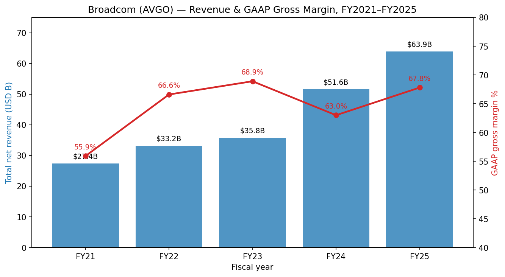
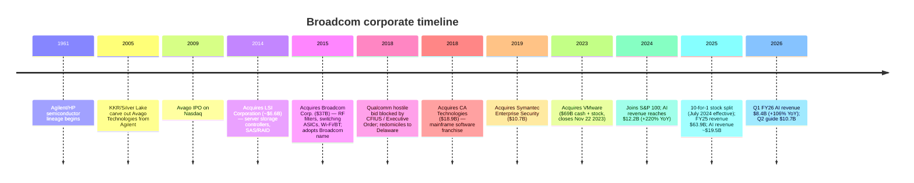
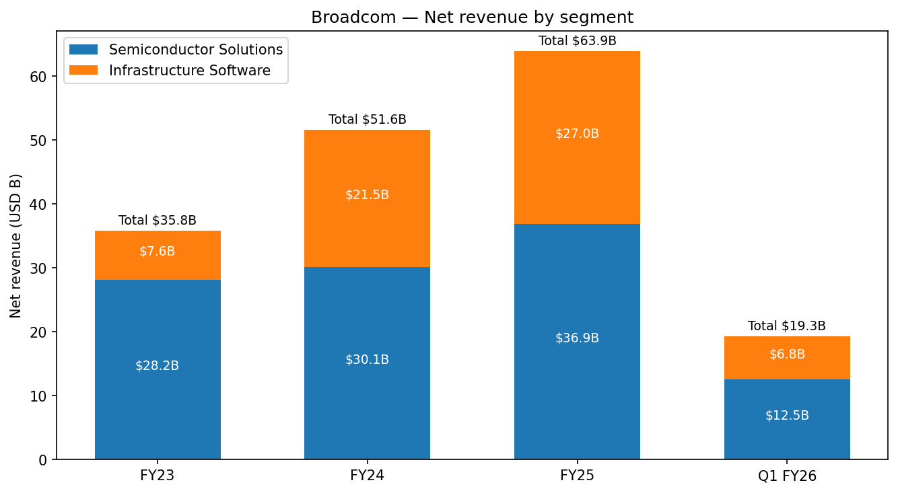
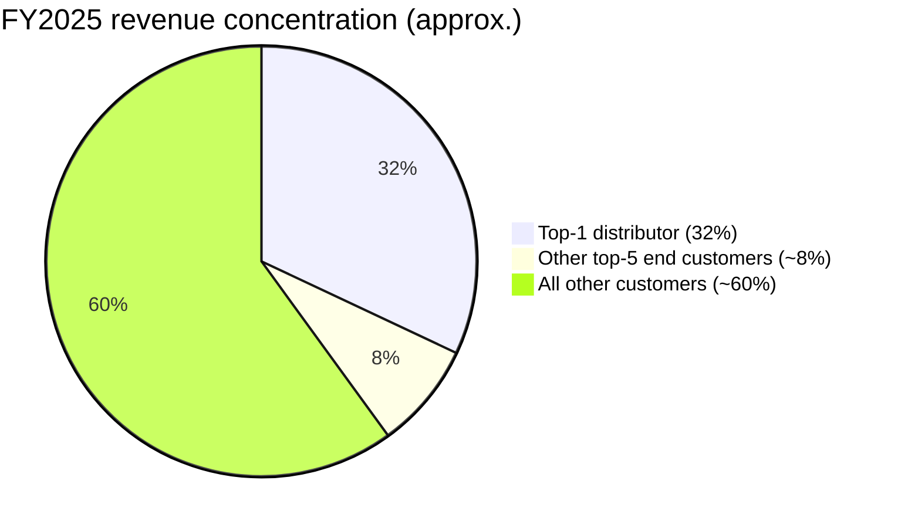
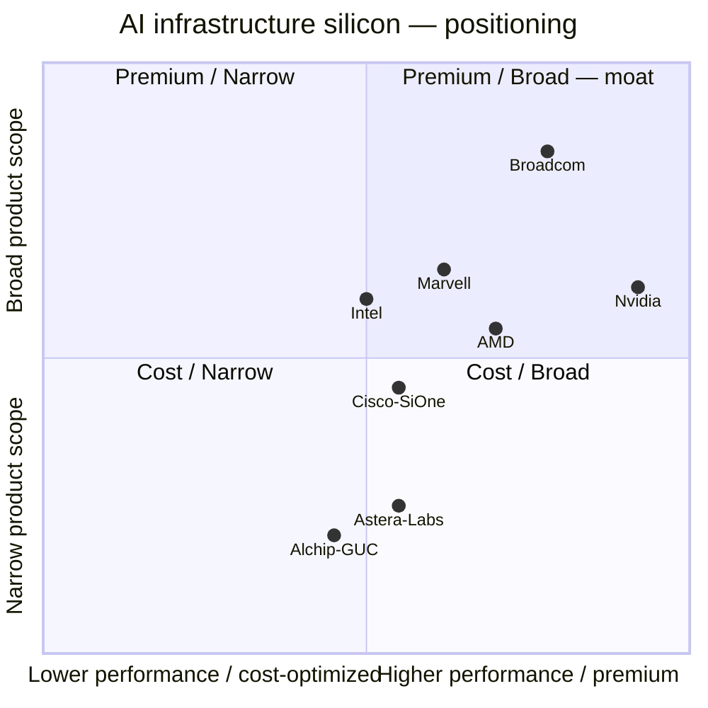
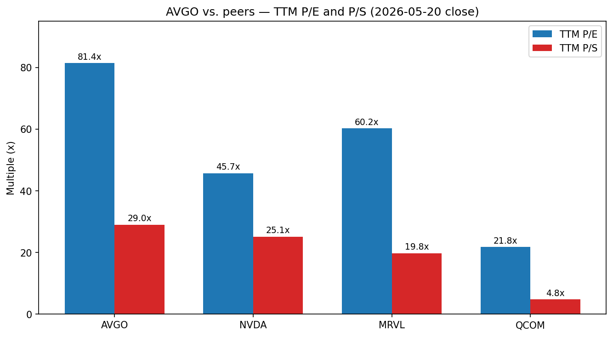
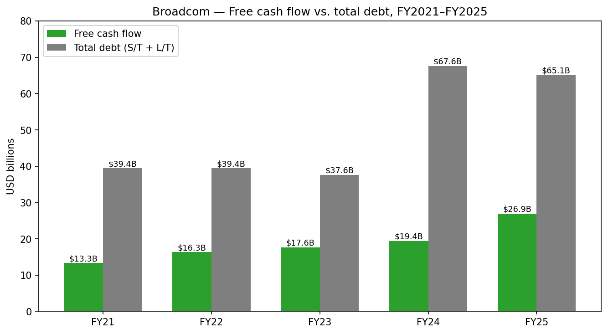
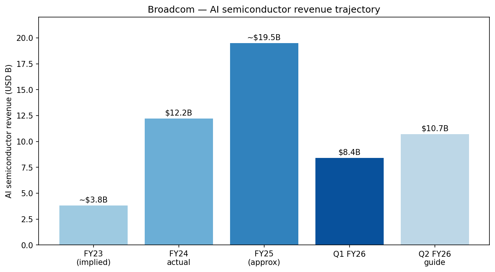

# Broadcom Inc. (NASDAQ: AVGO) — Company Research

**Date:** 2026-05-20
**Author:** company-research skill, financial_agent
**Primary sources:** Broadcom FY2025 10-K (filed 2025-12-18), Q1 FY2026 10-Q (filed 2026-03-11), Q1 FY2026 earnings press release (8-K, 2026-03-04), Q4 FY2025 earnings press release (8-K, 2025-12-11), Q4 FY2024 earnings press release (8-K, 2024-12-12). All filings cited at the SEC EDGAR canonical URL listed in the References block.

> **Update — Q1 FY2026 results (2026-03-04) and Q2 FY2026 guidance:** Broadcom reported record Q1 FY2026 revenue of $19,311M (+29% YoY) and AI semiconductor revenue of $8.4B (+106% YoY) — both ahead of the December 2025 guide of $19.1B / $8.2B AI. Q2 FY2026 revenue guidance was set at **approximately $22.0B (+47% YoY)** with AI semiconductor revenue forecast at **$10.7B**, and the board authorized a new **$10B share repurchase program** through December 31, 2026. Source: [Broadcom Q1 FY2026 press release, 2026-03-04 (Exhibit 99.1)](https://www.sec.gov/Archives/edgar/data/1730168/000173016826000011/avgo-02012026x8kxex99.htm).

---

## Table of Contents

1. Company Overview
2. Company History
3. Management Team
4. Products & Services
5. Customers & Go-to-Market
6. Industry Overview
7. Competitive Landscape
8. Market Opportunity (TAM)
9. Risk Assessment
10. References

---

## 1. Company Overview

Broadcom Inc. (NASDAQ: AVGO) is a global designer, developer and supplier of semiconductors and infrastructure software, organized into two reportable segments: **Semiconductor Solutions** and **Infrastructure Software**. The company is a Delaware corporation headquartered in Palo Alto, California, and operates on a 52/53-week fiscal year ending on the Sunday closest to October 31; fiscal year 2025 ended November 2, 2025 (a 52-week year) ([2025 10-K, p.1](https://www.sec.gov/Archives/edgar/data/1730168/000173016825000121/avgo-20251102.htm)).

**Plain-English business.** Broadcom designs and sells the chips and the software that, in combination, allow large enterprises and hyperscale data-center operators to run their compute and networking infrastructure. On the silicon side, the company is best known for two product families that have come to dominate its narrative: (1) **custom AI accelerator ASICs ("XPUs")** that the world's largest cloud companies — including Google, Meta and others — buy to train and serve their proprietary AI models, and (2) **high-radix Ethernet switching silicon** (Tomahawk, Jericho, Trident) that ties together the cluster of XPUs and merchant GPUs inside an AI data center. Outside AI, Broadcom is the merchant supplier of RF front-end filters and Wi-Fi/Bluetooth combo chips that go into roughly every iPhone shipped, the leader in server storage controllers (SAS/RAID, fibre channel, custom SSD controllers) and the supplier of cable modem, PON and STB SoCs that sit inside most broadband customer-premise equipment. On the software side, the November 2023 acquisition of VMware vaulted Broadcom into the position of the de-facto private-cloud infrastructure-software vendor; the company also owns the former CA Technologies mainframe software franchise, the Symantec enterprise security business and a portfolio of fibre-channel storage networking software inherited from Brocade.

**How the company makes money.** Revenue splits roughly 58 / 42 between the two segments on an FY2025 basis. **Semiconductor Solutions generated $36,858M of revenue in FY2025 (+22% YoY)**, primarily by selling custom AI accelerators, Ethernet switching silicon, RF filters, broadband chips and storage controllers to a concentrated set of hyperscalers, OEMs and a small group of large smartphone OEMs. **Infrastructure Software generated $27,029M (+26% YoY)** ([2025 10-K, MD&A, p.39](https://www.sec.gov/Archives/edgar/data/1730168/000173016825000121/avgo-20251102.htm)), almost entirely through multi-year subscription contracts for VMware Cloud Foundation (VCF), mainframe software and Symantec/Carbon Black security, sold to Fortune 500 and government accounts. The reported product mix is 70% "Products" (semiconductors and modules) and 30% "Subscriptions and services" — a split which is itself a footnote-laden number because Broadcom in FY2025 reclassified $7,800M of upfront VCF license revenue out of subscriptions and services and into Products, a presentation change disclosed in Note 3 of the 10-K ([2025 10-K, MD&A, p.39](https://www.sec.gov/Archives/edgar/data/1730168/000173016825000121/avgo-20251102.htm)).

**Where they operate.** Broadcom is a globally distributed engineering organization with design centers concentrated in the United States, Asia and Europe. Title and control on most semiconductor shipments transfers in Penang, Malaysia ([2025 10-K, p.39](https://www.sec.gov/Archives/edgar/data/1730168/000173016825000121/avgo-20251102.htm)), which is why the country mix in the segment footnote shows so much revenue "shipped to" Singapore and Malaysia even though end demand sits in the U.S. and China. On a destination basis, 17% of FY2025 revenue was shipped to China (including Hong Kong), versus 20% in FY2024 ([2025 10-K, p.39](https://www.sec.gov/Archives/edgar/data/1730168/000173016825000121/avgo-20251102.htm)).

**How large they are.** FY2025 total net revenue was **$63,887M** (+24% YoY from $51,574M in FY2024) and GAAP net income was **$23,126M**, an EPS of **$4.91 basic / $4.77 diluted** ([2025 10-K, Consolidated Statements of Operations, p.47](https://www.sec.gov/Archives/edgar/data/1730168/000173016825000121/avgo-20251102.htm)). Operating income was $25,484M (40% operating margin GAAP). Free cash flow was **$26.9B** for FY2025 — operating cash flow of $27,537M less capex of $620M — equivalent to 42% of revenue ([2025 10-K, p.43](https://www.sec.gov/Archives/edgar/data/1730168/000173016825000121/avgo-20251102.htm); [Q4 FY2025 press release](https://www.sec.gov/Archives/edgar/data/1730168/000173016825000116/avgo-11022025x8kxex99.htm)). The balance sheet carries **$65.1B of total debt** (long-term debt $61,984M + short-term debt $3,152M) and $16,178M of cash at FY2025 year-end ([2025 10-K Consolidated Balance Sheets, p.47](https://www.sec.gov/Archives/edgar/data/1730168/000173016825000121/avgo-20251102.htm)) — a level largely inherited from the VMware acquisition financing. The diluted share count is 4,888M as of Q1 FY26 ([Q1 FY26 8-K, 2026-03-04](https://www.sec.gov/Archives/edgar/data/1730168/000173016826000011/avgo-02012026x8kxex99.htm)).

*Source: [2025 10-K (FY23–FY25)](https://www.sec.gov/Archives/edgar/data/1730168/000173016825000121/avgo-20251102.htm) and [2023 10-K (FY21–FY22)](https://www.sec.gov/cgi-bin/browse-edgar?action=getcompany&CIK=0001730168&type=10-K&dateb=&owner=include&count=40). FY21 reflects pre-VMware book of business; FY22 GM lift reflects software-mix shift from Brocade/CA/Symantec; FY24 GM dip is the first-year amortization-of-VMware-intangibles drag.*

**Valuation snapshot (2026-05-20 close).** AVGO closed at **$418.55**, giving a market capitalization of approximately **$2.04 trillion** on 4,888M diluted shares. The TTM multiples are:

| Ticker | Last px (2026-05-20) | Mkt cap (USD B) | TTM P/E | Fwd P/E | TTM P/S |
|---|---:|---:|---:|---:|---:|
| **AVGO** | $418.55 | 2,037 | **81.4x** | 22.9x | **29.0x** |
| NVDA | $223.89 | 5,424 | 45.7x | 19.3x | 25.1x |
| MRVL | $184.79 | 162 | 60.2x | 34.1x | 19.8x |
| QCOM | $202.55 | 214 | 21.8x | 19.1x | 4.8x |

Source: [Yahoo Finance – AVGO](https://finance.yahoo.com/quote/AVGO/key-statistics/), [NVDA](https://finance.yahoo.com/quote/NVDA/key-statistics/), [MRVL](https://finance.yahoo.com/quote/MRVL/key-statistics/), [QCOM](https://finance.yahoo.com/quote/QCOM/key-statistics/) — all pulled 2026-05-20.

AVGO's **TTM P/E of 81.4x is roughly 2× the AI-semi peer median** (NVDA 45.7x, MRVL 60.2x, QCOM 21.8x) and **TTM P/S of 29.0x is the highest of the cohort** — modestly above NVDA's 25.1x and far above QCOM's 4.8x. The TTM earnings number is artificially compressed by two GAAP charges that the market is largely looking past: (1) approximately $8.1B of annual amortization of VMware-related intangibles (~$6.0B in cost of revenue plus ~$2.0B in opex per the 2025 10-K), and (2) stock-based compensation of **$7.6B in FY25**, inflated by a one-time issuance of two-year time- and market-based RSUs in Q2 FY25 in lieu of annual grants ([2025 10-K, p.40](https://www.sec.gov/Archives/edgar/data/1730168/000173016825000121/avgo-20251102.htm)). Backing both items out brings the multiple to the more digestible forward P/E of **22.9x**, which sits roughly at parity with NVDA's 19.3x and below MRVL's 34.1x. The multiple is best explained as a **structural AI-infrastructure premium** — the market is paying for the visible custom-XPU pipeline (Google TPU v6/v7, Meta MTIA, OpenAI and others) and for VMware's subscription revenue runway, not for TTM GAAP earnings. The 5-year price range is **$40.41 – $439.79** (yfinance, 2026-05-20), so today's level sits within 5% of the all-time high. If AI-XPU customer concentration ever rolls over (top-1 customer is 32% of revenue — see Section 5) the multiple is exposed to a sharp re-rate; that risk is carried into Section 9.

## 2. Company History

Broadcom's identity is the product of a roll-up. The continuous corporate entity began as the semiconductor products group of Agilent Technologies (itself spun out of Hewlett-Packard in 1999), which KKR, Silver Lake and Temasek carved out as Avago Technologies in 2005. Avago IPO'd in 2009 and, under Hock Tan, executed a series of progressively larger acquisitions that culminated in the 2016 acquisition of the original Broadcom Corp. — at which point the parent adopted the Broadcom name and Avago ticker (AVGO). The 60-year heritage statement in the 10-K — "our more than 60-year history of innovation dates back to our diverse origins from AT&T/Bell Labs, Lucent and Hewlett-Packard Company" ([2025 10-K, p.2](https://www.sec.gov/Archives/edgar/data/1730168/000173016825000121/avgo-20251102.htm)) — refers to the Avago/HP-Agilent semiconductor lineage rather than a single corporate ancestry.

The most consequential strategic pivots are three. **First, the 2016 Avago–Broadcom Corp. merger** transformed a focused $4B FBAR/specialty-IC business into the merchant networking-and-wireless-silicon leader; it is also where Tan refined the operating playbook that now defines the company — radical SKU rationalization, focus on category-leading IP, retain the top-1 customers, and aggressively prune everything below #1 or #2 in market share. **Second, the failed 2018 hostile bid for Qualcomm** is in retrospect the inflection point: blocked by CFIUS on national-security grounds via Presidential Executive Order, it forced Broadcom to redomicile from Singapore to Delaware and pivoted Tan's M&A energy from "buy another chipmaker" to "buy enterprise software." Within months Broadcom announced the CA Technologies deal. **Third, the November 2023 VMware merger** ($30,788M cash + 544M Broadcom shares with a fair value of $53,398M ([2025 10-K, p.50](https://www.sec.gov/Archives/edgar/data/1730168/000173016825000121/avgo-20251102.htm))) effectively doubled the software footprint and re-anchored the gross-margin profile, while loading the balance sheet with the term-loan stack now being progressively refinanced into long-dated notes.

Recent developments (2024–early 2026) cluster around three themes: (1) **AI-XPU ramp** — disclosed AI semiconductor revenue grew from a low-single-digit billion in FY23 to $12.2B in FY24 (+220% YoY per the Q4 FY24 press release) and to ~$19.5B in FY25, accelerating again to $8.4B in Q1 FY26 alone; (2) **VMware integration and subscription transition** — VMware's perpetual licensing model has been replaced with VCF subscription bundles, driving the Infrastructure Software segment from $7.6B in FY23 to $27.0B in FY25; and (3) **capital return** — the new $10B repurchase program (March 2026), a 10% dividend raise to $0.65/share quarterly (FY26 target $2.60/share, the 15th consecutive annual increase), and $7.85B of share repurchases in Q1 FY26 alone ([Q1 FY26 8-K, 2026-03-04](https://www.sec.gov/Archives/edgar/data/1730168/000173016826000011/avgo-02012026x8kxex99.htm)).

## 3. Management Team

### Hock E. Tan — President, Chief Executive Officer and Director (age 74)

Tan is the single most important variable in the Broadcom thesis and is widely regarded as the most effective M&A operator in semiconductor history. He has served as President and CEO of Broadcom since March 2006 — i.e., for the entire Avago era and through every acquisition listed in the timeline above ([2025 10-K, p.10](https://www.sec.gov/Archives/edgar/data/1730168/000173016825000121/avgo-20251102.htm)). Before Avago he was President and CEO of Integrated Circuit Systems, Inc., a publicly traded timing-solutions IC company, from 1999 until its acquisition by Integrated Device Technology in 2005; he served as ICS COO from 1996–1999 and SVP/CFO from 1995–1999. Earlier in his career he was VP of Finance at Commodore International (1992–1994), held senior roles at PepsiCo and General Motors, was managing director of Pacven Investment in Singapore (1988–1992) and managing director of Hume Industries in Malaysia (1983–1988). He has served on the President's National Security and Telecommunications Advisory Committee since 2020 ([2025 10-K, p.10](https://www.sec.gov/Archives/edgar/data/1730168/000173016825000121/avgo-20251102.htm)). He holds a B.S. and M.S. in mechanical engineering from MIT and an MBA from Harvard.

Tan's playbook — refined since the 2014 LSI acquisition and now applied to AI silicon and to VMware — has three load-bearing pillars. **(1) Buy category leaders that throw off cash, not "synergies."** Every major acquisition (LSI, Broadcom Corp., CA, Symantec Enterprise Security, VMware) was already a #1 or #2 share leader in a specific niche before purchase; Tan does not pay a premium for the chance to build market share. **(2) Cut SG&A and R&D to the muscle, retain the franchise customers and the IP, sunset everything else.** Post-VMware, Broadcom shed the end-user computing (EUC, sold to KKR for ~$3.85B in mid-2024) and Carbon Black businesses, ended the SMB perpetual-license channel, and rolled the remaining ~2,000 strategic accounts onto multi-year VCF subscription contracts. SG&A as % of revenue went from 10% in FY24 to 7% in FY25; SG&A in absolute dollars dropped by $748M YoY ([2025 10-K, p.40](https://www.sec.gov/Archives/edgar/data/1730168/000173016825000121/avgo-20251102.htm)). **(3) Use the cash flow to pay down acquisition debt, then begin returning capital aggressively.** The dividend has compounded every year since initiation in 2011 (now 15 consecutive raises) and the company guides explicitly to 50% of trailing FCF going to dividends, with the balance to buybacks or M&A.

Tan owns or controls **~9.7M Broadcom shares (approximately 0.2% of shares outstanding, ~$4B at the 2026-05-20 close)**, per the most recent DEF 14A. His base salary is held at $1.00 (literally one dollar) per year; the vast majority of compensation is performance-share-unit equity that vests on multi-year TSR and operational milestones — the Two-Year Equity Awards granted in Q2 FY25 are the most recent and largest grant ([2025 10-K, p.40](https://www.sec.gov/Archives/edgar/data/1730168/000173016825000121/avgo-20251102.htm)). At 74, Tan has publicly stated he intends to stay through the VMware integration runway; succession remains the single biggest unhedged personnel risk and is explicitly called out in the 10-K's risk factors: "our success depends, in large part, on the continued contributions of our senior management team, and, in particular, the services of Hock E. Tan" ([2025 10-K, p.14](https://www.sec.gov/Archives/edgar/data/1730168/000173016825000121/avgo-20251102.htm)).

### Kirsten M. Spears — Chief Financial Officer and Chief Accounting Officer (age 61)

Spears has served as CFO since December 2020. She joined Broadcom as VP and Corporate Controller in May 2014 — via the LSI acquisition, where she had been VP and Corporate Controller from 2007 — and served as Broadcom's Principal Accounting Officer from 2016 to 2020 ([2025 10-K, p.10](https://www.sec.gov/Archives/edgar/data/1730168/000173016825000121/avgo-20251102.htm)). She began her career at PricewaterhouseCoopers. Her tenure as CFO has spanned the CA Technologies, Symantec and VMware acquisitions; she is the public face on every earnings call and has guided the market through the VMware subscription transition without a single guide-down. Crucially, the CFO function under Spears has executed a complex and largely successful refinancing of the $30B+ VMware acquisition debt — converting the term loan stack into a laddered fixed-rate notes structure that, per the 10-K, totaled $67.1B in principal at FY25 year-end ([2025 10-K, p.43](https://www.sec.gov/Archives/edgar/data/1730168/000173016825000121/avgo-20251102.htm)). She does not appear to be a candidate for the CEO role, suggesting the eventual succession will come from outside the current C-suite or from within the segment-president layer.

### Charlie B. Kawwas, Ph.D. — President, Semiconductor Solutions Group (age 55)

Kawwas runs the chip business — the entire $36.9B Semiconductor Solutions segment including the custom AI accelerator franchise. He has held the segment-president role since July 2022; before that he was COO from December 2020 to July 2022, SVP and Chief Sales Officer from 2015 to 2020, and head of worldwide sales at LSI from 2010 until the 2014 acquisition. He also held VP roles in LSI's networking division (2007–2010) and was a product-line leader in Nortel's Optical Ethernet and Multi-service Edge group prior to LSI ([2025 10-K, p.10](https://www.sec.gov/Archives/edgar/data/1730168/000173016825000121/avgo-20251102.htm)). Kawwas's signature is the customer-facing dimension of the custom-XPU franchise — the multi-year design-win cadence with Google, Meta and the rumored next-wave customers (OpenAI, ByteDance, Apple per persistent press reports) lives in his organization.

### Mark D. Brazeal — Chief Legal and Corporate Affairs Officer (age 57)

Brazeal has been Chief Legal Officer since March 2017 and added Corporate Affairs in December 2021. Prior roles include Chief Legal Officer and SVP, IP Licensing at SanDisk (2014 until acquisition by Western Digital in 2016) and senior counsel roles at the original Broadcom Corp. from 2000 to 2014 ([2025 10-K, p.10](https://www.sec.gov/Archives/edgar/data/1730168/000173016825000121/avgo-20251102.htm)). He led the regulatory navigation of the VMware deal (EU, China, UK approvals) and is the principal lieutenant on antitrust matters.

### Governance & ownership

- **Board:** Broadcom has 13 directors, of whom Tan is the only insider. Lead independent director is Henry Samueli, Ph.D., co-founder of the original Broadcom Corp. and the company's largest individual shareholder via Samueli Foundation holdings. Eddy Hartenstein chairs the audit committee.
- **Insider ownership:** Aggregate beneficial ownership of executive officers and directors is approximately 4% (most of it Samueli's stake); Tan's individual holding is ~0.2%.
- **Compensation structure:** Heavily PSU/RSU-weighted with multi-year TSR triggers; the Two-Year Equity Awards granted in Q2 FY25 drove total stock-based compensation expense to $7,568M in FY25 versus $5,670M in FY24 ([2025 10-K, p.40](https://www.sec.gov/Archives/edgar/data/1730168/000173016825000121/avgo-20251102.htm)). Unrecognized SBC of $23.8B remains to vest over a weighted-average 3.4 years.
- **Related-party flags:** No material related-party transactions disclosed. The principal governance concern is single-executive (Tan) dependency, explicitly called out as a risk factor.

**Track record synthesis.** This is one of the strongest M&A track records in any sector. Avago's enterprise value compounded from ~$2.7B at IPO (2009) to ~$2.04T today — a >700x return over 17 years. The team has integrated five megadeals (LSI, Broadcom Corp., CA, Symantec Enterprise, VMware) without a write-down event materially impairing the thesis. The two visible gaps are (a) Tan succession risk and (b) the AI-XPU customer concentration that emerged during 2024–2025 (32% direct distributor sales tied to a single semiconductor end customer — see Section 5).

## 4. Products & Services

Broadcom's product portfolio is unusually broad for a single issuer and is best understood through the 10-K's two-segment / nine-portfolio structure ([2025 10-K, pp.3–8](https://www.sec.gov/Archives/edgar/data/1730168/000173016825000121/avgo-20251102.htm)).

```mermaid
graph TD
    A[Broadcom Inc.] --> B[Semiconductor Solutions $36.9B FY25]
    A --> C[Infrastructure Software $27.0B FY25]
    B --> B1[Networking Connectivity]
    B --> B2[Wireless Device Connectivity]
    B --> B3[Servers & Storage]
    B --> B4[Broadband]
    B --> B5[Industrial]
    B1 --> B1a[Custom XPU ASICs - Google TPU, Meta MTIA]
    B1 --> B1b[Tomahawk / Jericho / Trident Ethernet switches]
    B1 --> B1c[Ethernet NICs / PHYs / optical components]
    B2 --> B2a[FBAR RF filters / front-end modules]
    B2 --> B2b[Wi-Fi/BT combo chips, touch, inductive charging]
    B3 --> B3a[PCIe switches]
    B3 --> B3b[SAS/RAID, fibre channel HBAs]
    B3 --> B3c[HDD SoC + preamp; custom SSD controllers]
    B4 --> B4a[Set-top box SoCs]
    B4 --> B4b[Broadband access — DSL, cable, PON, Wi-Fi]
    B5 --> B5a[Optocouplers, motion encoders, industrial sensors]
    C --> C1[Private Cloud — VMware Cloud Foundation, vSphere, Tanzu, Avi, vDefend]
    C --> C2[Mainframe — CA-derived AIOps, DB/DM, DevX, security, foundational]
    C --> C3[Cybersecurity — Symantec, Carbon Black]
    C --> C4[Enterprise Software — AIOps, DevOps, ValueOps]
    C --> C5[FC SAN Management — Brocade]
```

### Semiconductor Solutions

**Networking Connectivity — the AI silicon engine, flagship of the entire company.** This portfolio contains the two products carrying the AI narrative. (a) **Custom Silicon Solutions / XPUs.** Broadcom does not sell a merchant AI training chip; instead it provides "advanced technology and intellectual property platforms for customers to design and develop application specific integrated circuits (ASICs) for AI and high-performance computing" ([2025 10-K, p.3](https://www.sec.gov/Archives/edgar/data/1730168/000173016825000121/avgo-20251102.htm)). In practice this means the customer (Google, Meta, others) brings an architectural spec and Broadcom contributes the SerDes IP, advanced packaging integration (CoWoS-based 2.5D/3D), HBM controllers, and the rest of the chassis around the customer's accelerator core. Output: Google's TPU v5/v6/v7 generations, Meta's MTIA training & inference chips. **Competitive advantage: yes — strong.** The moat is a combination of (i) leading SerDes IP at 112G-PAM4 and now 224G, (ii) long-running co-design relationships with the top hyperscalers, (iii) advanced-package supply allocation at TSMC CoWoS, and (iv) trust earned over multiple silicon generations. The closest competitor product is Marvell's custom-ASIC business (Amazon Trainium 2/3, Microsoft Maia, Google Axion CPU); Broadcom is ahead on customer count and on revenue, with FY25 AI revenue of ~$19.5B versus Marvell's much smaller (single-billion-digit) custom-ASIC line. (b) **Tomahawk 5 / Tomahawk 6 / Jericho 3-AI / Trident.** Tomahawk 5 is the 51.2T radix-128 Ethernet switching silicon that has become the standard fabric chip in AI clusters; Tomahawk 6 (102.4T, announced 2025) extends the lead. Jericho 3-AI is the deep-buffer Ethernet routing silicon for scale-out cluster interconnect, positioned head-to-head with Nvidia's NVLink fabric (proprietary) and Cisco's silicon. **Competitive advantage: yes — clear leadership** on bandwidth-per-radix and on the Ethernet-versus-InfiniBand argument that is now industry consensus for non-Nvidia clusters. Closest competitors: Nvidia Spectrum-X (proprietary), Cisco Silicon One, Marvell Teralynx.

**Wireless Device Connectivity — the iPhone franchise.** RF front-end modules and filters using Broadcom's proprietary **FBAR** (film bulk acoustic resonator) technology, Wi-Fi/Bluetooth combo chips, custom touch controllers and inductive-charging ASICs ([2025 10-K, p.4](https://www.sec.gov/Archives/edgar/data/1730168/000173016825000121/avgo-20251102.htm)). Apple is the dominant customer; Broadcom has signed two multi-year master agreements (May 2023 for FBAR/RF and a separate Wi-Fi extension) that secure the iPhone socket through at least 2026, though Apple is also disclosed as developing its own Wi-Fi chip (Proxima) for in-sourcing risk. **Competitive advantage: yes — strong but cyclical.** FBAR is the clear leader for high-frequency RF filtering; closest competitor is Qorvo BAW, with Skyworks and Murata (TC-SAW) in mid- and low-band. The risk is single-customer concentration (Apple); see Section 5.

**Servers & Storage System Solutions.** PCIe switches for AI server backplanes (Atlas series); SAS/RAID controllers and adapters (the LSI legacy franchise); fibre channel host bus adapters (Brocade legacy); HDD read-channel SoCs and preamplifiers; custom SSD controllers ([2025 10-K, p.4](https://www.sec.gov/Archives/edgar/data/1730168/000173016825000121/avgo-20251102.htm)). Customer set is Dell, HPE, Lenovo, Supermicro for servers; Seagate and Western Digital for HDD; the hyperscalers directly for custom SSD controllers. **Competitive advantage: yes — partial to strong** depending on sub-segment. PCIe switching has new entrants (Microchip, Astera Labs) chipping at share; SAS/RAID remains an effective duopoly with Microchip; HDD read-channel is essentially a duopoly with Marvell.

**Broadband Solutions.** Cable, satellite, IPTV and OTT set-top-box SoCs; DSL, cable, PON and Wi-Fi residential gateway SoCs for the customer premise ([2025 10-K, p.5](https://www.sec.gov/Archives/edgar/data/1730168/000173016825000121/avgo-20251102.htm)). Customers are global telecom OEMs and tier-1 service providers (Comcast, Charter, BT, Deutsche Telekom). This is a mature, cyclical business that bottomed in FY24 and is now in the early innings of a Wi-Fi 7 and PON refresh cycle. **Competitive advantage: yes — share leader** but in a slow-growth end market.

**Industrial.** Optocouplers, industrial fibre optics, industrial/medical sensors, motion encoders, LED devices, automotive Ethernet ICs ([2025 10-K, p.5](https://www.sec.gov/Archives/edgar/data/1730168/000173016825000121/avgo-20251102.htm)). Small piece of revenue but high-margin, long-cycle.

### Infrastructure Software

**Private Cloud Software Portfolio — VMware Cloud Foundation (VCF), the flagship.** VCF is the bundled successor to vSphere + vSAN + NSX + Aria, sold as a per-core subscription that includes compute, networking, storage, management, security and native Kubernetes ([2025 10-K, p.5](https://www.sec.gov/Archives/edgar/data/1730168/000173016825000121/avgo-20251102.htm)). The advanced services upsell layer — vDefend (zero-trust microsegmentation), Avi Load Balancer, Tanzu Platform (app dev), Private AI (LLM enablement on-prem), Live Recovery (DR/ransomware) — is the path to NRR expansion within the installed base. **Competitive advantage: yes — strong moat from switching costs.** VMware sits underneath the vast majority of enterprise mission-critical workloads; the cost (in time, regression testing, ops retooling) of moving thousands of VMs to a competitor is enormous. Closest competitors: Red Hat OpenShift / OpenStack (IBM), Nutanix AHV, Microsoft Azure Stack, native public-cloud lift-and-shift. The aggressive subscription transition has alienated some SMB customers but the strategic customers — the ~2,000 the company targets — have largely stayed.

**Mainframe Software Portfolio.** Inherited from the 2018 CA Technologies acquisition: AIOps & automation, database & data management, DevX & DevOps, cybersecurity & compliance, foundational & open-mainframe ([2025 10-K, p.6](https://www.sec.gov/Archives/edgar/data/1730168/000173016825000121/avgo-20251102.htm)). Sold to a closed set of Global 2000 mainframe shops on multi-year enterprise license agreements ("ELAs"). **Competitive advantage: yes — high switching costs** plus the duopoly with IBM is structurally stable.

**Cybersecurity Portfolio.** Symantec endpoint, network and information security plus Carbon Black for endpoint detection and application security ([2025 10-K, p.6](https://www.sec.gov/Archives/edgar/data/1730168/000173016825000121/avgo-20251102.htm)). **Competitive advantage: partial.** Strong installed-base lock-in at enterprise/government accounts but losing share at the high end to CrowdStrike, SentinelOne and Microsoft Defender XDR.

**Enterprise Software / FC SAN.** AIOps, network observability, DevOps and value-stream management plus Brocade fibre channel switches/directors and management software ([2025 10-K, p.6–8](https://www.sec.gov/Archives/edgar/data/1730168/000173016825000121/avgo-20251102.htm)).

**Flagship vs. long-tail.** The two flagship product lines are (1) **custom AI accelerators / Ethernet switching silicon (AI semiconductor)**, ~$19.5B in FY25 and ~$8.4B in Q1 FY26 alone — the single largest product line in the company by revenue, growing at triple-digit YoY; and (2) **VMware Cloud Foundation**, the principal driver of the $5.6B YoY growth in Infrastructure Software. Together these two product lines explain virtually all of the ~$12.3B YoY revenue growth in FY25.

**Recent product launches.** Tomahawk 6 (102.4T, announced 2025); Sian2 (224G SerDes-based optical DSP for 1.6T pluggables, 2025); Jericho 3-AI extensions; VMware Cloud Foundation 9.0 (March 2025) and the July 2025 VCF networking and security virtualization release ([2025 10-K, p.18](https://www.sec.gov/Archives/edgar/data/1730168/000173016825000121/avgo-20251102.htm)).

*Source: [2025 10-K, MD&A p.39](https://www.sec.gov/Archives/edgar/data/1730168/000173016825000121/avgo-20251102.htm) and [Q1 FY26 8-K press release](https://www.sec.gov/Archives/edgar/data/1730168/000173016826000011/avgo-02012026x8kxex99.htm).*

## 5. Customers & Go-to-Market

Broadcom's customer base is **highly concentrated** and is becoming more so as the AI XPU ramp continues.

**Disclosed customer concentration (FY2025 10-K, p.39).** "Direct sales to one semiconductor solutions customer, which is a distributor, accounted for **32% and 28% of our net revenue for fiscal years 2025 and 2024**, respectively." The named entity is a distributor (widely understood in the trade press to be Arrow Electronics, which fulfills shipments to Apple and to several hyperscale customers on Broadcom's behalf), so the 32% number aggregates demand across multiple end customers. **"Aggregate sales to our top five end customers, through all channels, accounted for approximately 40% of our net revenue for each of the fiscal years 2025 and 2024"** ([2025 10-K, p.39](https://www.sec.gov/Archives/edgar/data/1730168/000173016825000121/avgo-20251102.htm)). Translation: top-1 distributor is 32%, top-5 end customers are ~40% — a level that comfortably triggers the Section 9 concentration risk flag (top-1 > 20% / top-5 > 50% is the conventional threshold; AVGO clears the first and sits just below the second).

*Source: [2025 10-K, p.39](https://www.sec.gov/Archives/edgar/data/1730168/000173016825000121/avgo-20251102.htm). Top-5 end customers are not individually named in the 10-K; trade-press attribution to Apple, Google, Meta, Microsoft and a fifth (variously OpenAI, ByteDance or Cisco) is consistent but not confirmed by primary filing disclosure.*

**Customer segments.** The semiconductor customer set is the four to six largest hyperscalers (Google, Meta, Microsoft Azure, Amazon AWS, Oracle Cloud), Apple as the dominant wireless customer, the top-tier server OEMs (Dell, HPE, Lenovo, Supermicro), tier-1 telecom and broadband service providers, and a long tail of industrial/automotive accounts. The infrastructure software customer set is "many of the largest companies in the world, including most of the Fortune 500, and many government agencies" ([2025 10-K, p.8](https://www.sec.gov/Archives/edgar/data/1730168/000173016825000121/avgo-20251102.htm)) — VMware alone has historically had >300,000 customer entities though Broadcom has explicitly narrowed focus to ~2,000 strategic accounts.

**Contract structure.** Semiconductor deals on the AI custom-silicon side are multi-year design-win arrangements with multi-year pricing schedules; the 10-K warns that "our top customers, including our AI customers, may make and have made greater demands on us with regards to pricing and contractual terms, such as seeking to lease AI racks or systems based on our XPUs instead of purchasing, as well as alternative financings for such leases or other novel or deferred payment models" ([2025 10-K, p.12](https://www.sec.gov/Archives/edgar/data/1730168/000173016825000121/avgo-20251102.htm)) — a new disclosure in the FY25 filing that signals the company may be moving into XPU rack leasing for some hyperscalers, with associated credit and default risk. Software is multi-year subscription (typically 3-year initial term) with auto-renew on most enterprise agreements.

**Vertical integration risk among customers.** Several of Broadcom's largest semiconductor customers are simultaneously its largest customers and potential competitors. Google's TPU program, Meta's MTIA program, Microsoft's Maia program (currently Marvell-sourced but rumored to be diversifying), Amazon's Trainium program (Marvell) all illustrate the dynamic: the hyperscaler benefits from Broadcom's IP and process expertise today but has every incentive to in-source over time. Apple is the cleanest example: it has publicly disclosed in-house cellular modem ("C1") work and is widely reported to be developing in-house Wi-Fi ("Proxima") that would compete with Broadcom's wireless connectivity revenue at Apple.

**Go-to-market.** Semiconductors are sold direct to hyperscale and large OEM accounts, and via Arrow Electronics and other distributors to the long tail. Software is sold direct to strategic enterprise accounts, via VMware Cloud Service Provider (VCSP) partners for managed services, and via resellers / hyperscalers for smaller deals. Sales cycle: 6–18 months for a new custom-XPU design win (followed by 18–24 months of NRE/design and another 12–24 months to first production); 3–9 months for an enterprise VCF deal.

**Named partnerships and case studies.** Most named-customer evidence comes from press releases and customer testimonials rather than the 10-K; the filing is deliberately silent on customer names. Public confirmations include: Google TPU (multiple press references); Meta MTIA (multiple press references); Apple FBAR / RF / Wi-Fi (Broadcom 2023 press release on multi-billion-dollar Apple supply agreements). Beyond that, all attribution is press-sourced and should be treated as such.

## 6. Industry Overview

Broadcom competes across **two industries** that, while linked, are structurally distinct.

**Semiconductors (NAICS 334413).** The global semiconductor industry generated approximately **$627B in calendar 2024 revenue** per the [Semiconductor Industry Association 2024 fact-book](https://www.semiconductors.org/wp-content/uploads/2024/11/2024_SIA_Factbook.pdf) and is forecast at >$700B in 2025 with the AI accelerator/networking sub-segment driving incremental growth. Broadcom plays in the **wired-comm**, **wireless-comm**, **storage**, and **computing** sub-categories; on the AI side it sits in the merchant-silicon-for-data-center sub-segment that IDC and Gartner size in the $80–120B range for 2025 and project to grow at a 30–40% CAGR through 2028. The semiconductor industry is characterized by extreme cyclicality (10-K explicitly: "we operate in a highly cyclical semiconductor industry that is undergoing profound change due to AI" ([2025 10-K, p.11](https://www.sec.gov/Archives/edgar/data/1730168/000173016825000121/avgo-20251102.htm))), capital intensity concentrated at the foundry layer (TSMC, Samsung, Intel Foundry), and rising geopolitical risk via U.S. export controls and the CHIPS Act.

**Infrastructure software / private cloud.** Gartner's "Forecast: Public Cloud Services, Worldwide" puts cloud-and-on-prem infrastructure software (the relevant TAM for VCF + mainframe + security + observability) at ~$200B in 2024, growing roughly 12–14% per year. The private-cloud-infrastructure sub-segment that VCF dominates is smaller (~$15–20B) but is the most defensible because the workloads in question (regulated, latency-sensitive, sovereignty-restricted) cannot move to public cloud. Mainframe software is a low-growth (~3%) but high-margin niche dominated by IBM and Broadcom (CA).

**Growth drivers.** (1) **AI training and inference data centers** — by far the largest growth vector. Hyperscaler 2025 capex run-rates are at $250–350B aggregate (Google, Meta, Microsoft, Amazon, Oracle), with custom silicon a growing share. (2) **Private-cloud refresh** — enterprises modernizing aging vSphere installations onto VCF + Tanzu + Private AI. (3) **Sovereign and on-prem AI** — driven by EU AI Act, data-residency rules and customer reluctance to send proprietary data to public-cloud APIs. (4) **Wi-Fi 7 and PON broadband refresh.** (5) **5G RF complexity** (still slow but supportive for FBAR shipments). The countervailing forces are (i) U.S. export controls on China (Broadcom's China revenue is 17% of total ([2025 10-K, p.39](https://www.sec.gov/Archives/edgar/data/1730168/000173016825000121/avgo-20251102.htm))), (ii) Apple's in-sourcing program for cellular and Wi-Fi, and (iii) the eventual hyperscaler decision to in-source the IP layer entirely (currently buying it via Broadcom).

**Industry structure.** Both industries are oligopolistic. Custom AI silicon is effectively a duopoly between Broadcom and Marvell, with Alchip and GUC as smaller pure-play ASIC vendors in Asia. Ethernet switching silicon is a Broadcom–Marvell–Cisco–Nvidia oligopoly with Broadcom holding leading share. FBAR/RF filters is a Broadcom–Qorvo duopoly at the high end. Private-cloud infrastructure software is a VMware-led oligopoly versus IBM Red Hat, Microsoft, and a long tail of open-source.

**Regulatory environment.** Beyond standard semiconductor export controls, Broadcom is uniquely exposed to (i) **CFIUS-style review of any future acquisitions** — the 2018 Qualcomm bid set the precedent and any future deal will be reviewed under that lens, (ii) **EU and UK competition oversight on the VMware base** — the EU's conditional approval included behavioral commitments around interoperability that are still being monitored, (iii) **China-related export rules** on advanced AI silicon — currently calibrated so that Broadcom's switching silicon is largely permitted but custom XPU shipments to Chinese hyperscalers are restricted.

## 7. Competitive Landscape

**Direct competitors — semiconductors.**

- **Nvidia (NVDA).** The 800-pound gorilla on merchant AI GPU and on InfiniBand. Broadcom does not compete with Nvidia in the merchant-GPU market — it competes with Nvidia by selling hyperscalers an Ethernet-based alternative to NVLink/Spectrum-X and by enabling Google, Meta and other hyperscalers' custom accelerators that compete with Nvidia GPUs. The economic relationship is therefore competitive at the system level but neutral or even co-supplier-positive at the individual component level (Broadcom switches sit alongside Nvidia GPUs in many clusters).
- **Marvell (MRVL).** The closest direct competitor on custom ASIC. Marvell's largest disclosed wins are Amazon Trainium 2/3, Microsoft Maia (initial generations) and Google Axion CPU. Marvell is roughly one-third the size of Broadcom's AI segment and trades at a higher forward multiple (34.1x fwd P/E vs. AVGO 22.9x — Yahoo Finance, 2026-05-20) on the strength of a younger growth profile.
- **Qualcomm (QCOM).** Direct competitor in Wi-Fi/BT (FastConnect line versus Broadcom's combo chips) and in some 5G connectivity sockets, especially Android-side. Qualcomm is also exposed to the Apple modem in-sourcing trend but in a different way (Qualcomm sells the cellular modem, Broadcom sells the RF and Wi-Fi).
- **Cisco** — direct competitor in merchant Ethernet switching silicon (Silicon One) for service-provider and AI scale-out; smaller share than Broadcom.
- **AMD (AMD)** — merchant AI GPU/CPU; same neutral-to-competitive dynamic as Nvidia.
- **Intel (INTC)** — competes via Intel Foundry (potential alternative to TSMC for AI ASIC tape-outs) and via Gaudi/data-center accelerators; not a near-term threat in custom silicon but a strategic foundry partner risk.
- **Astera Labs (ALAB)** — competitor in PCIe retiming and connectivity for AI servers; small but rapidly growing.
- **Alchip, Global Unichip (GUC), Socionext** — Asian custom-ASIC vendors that compete in lower-tier custom silicon and are a downside-scenario risk if hyperscalers diversify away from Broadcom.
- **Qorvo (QRVO), Skyworks (SWKS)** — RF/filter competitors at Apple and Android OEMs.

**Direct competitors — infrastructure software.**

- **IBM Red Hat / OpenShift / OpenStack** — alternative for enterprises looking for an open-source-based private cloud.
- **Microsoft (Azure Stack HCI, Azure Local)** — direct competitor on hybrid cloud.
- **Nutanix (NTNX)** — primary hyperconverged-infrastructure alternative to VCF, especially in smaller enterprises.
- **CrowdStrike, SentinelOne, Microsoft Defender XDR** — taking share from Symantec at the high end of the cybersecurity market.

**Positioning advantages.** Broadcom's defensible position rests on (i) **process and packaging IP** (224G SerDes, advanced 2.5D/3D packaging integration, HBM controllers), (ii) **decade-long hyperscaler relationships** that are very hard for a new entrant to displace within a single XPU generation, (iii) **TSMC CoWoS allocation** secured through long-term capacity reservations, (iv) **VMware's structural switching-cost moat** in private cloud, and (v) **the operating model itself** — the Tan-era SG&A and R&D discipline turns acquired franchises into 60-70% gross margin, 40%+ operating margin businesses, a profile that competitors with similar revenue cannot match.

**Vulnerabilities.** (i) **Customer concentration** — the top distributor at 32% and top-5 end customers at ~40% create real revenue cliff risk if any single relationship lapses. (ii) **Hyperscaler in-sourcing optionality** — every custom-XPU customer has the long-run option to take more of the design value in-house. (iii) **Apple in-sourcing** in wireless. (iv) **Open-source / public-cloud erosion** of the VMware base over the long term. (v) **Single-executive (Tan) dependency.**

## 8. Market Opportunity (TAM)

Broadcom's CEO articulated an explicit framing on the September 2024 and December 2025 earnings calls: by FY2027, the **serviceable addressable market (SAM) for AI silicon at the top three hyperscale customers alone is $60–90 billion** for custom XPUs and Ethernet AI networking. That public framing has not been retracted and is consistent with the disclosed $19.5B FY25 AI revenue tracking toward an obvious $30B+ FY26E run-rate at the current quarterly pace.

**Sizing the broader opportunity.**

- **AI semiconductor SAM (custom ASIC + AI Ethernet networking + AI NIC/optics).** Bottom-up estimate: 2026 hyperscaler accelerator capex of ~$120–160B globally (Microsoft + Google + Meta + Amazon + Oracle + ByteDance + others), of which roughly 25–35% is custom ASIC and 8–12% is networking silicon — implying a $35–60B annual semiconductor TAM addressable today. Broadcom's $19.5B FY25 AI revenue captures ~30–55% share depending on how the TAM is drawn. Growth: 30–40% CAGR through 2028 per [Gartner, "Forecast: Semiconductors for AI", November 2025](https://www.gartner.com/en/newsroom/press-releases).
- **Non-AI semiconductor (legacy networking, RF, broadband, storage).** Approximately $17B of FY25 Semiconductor Solutions revenue is non-AI ($36.9B segment - ~$19.5B AI). This pool grew low-single-digits in FY25 with broadband and storage now bottoming and wireless steady.
- **Infrastructure software TAM.** Combined private-cloud infrastructure ($15–20B) + mainframe ($8–10B) + enterprise security ($30B) + observability/automation ($20B). VCF + mainframe + Symantec + observability give Broadcom a defensible $25–30B SAM, growing 8–12% per year on subscription transition + private-AI workloads.

**SAM and SOM.** Total addressable across both segments today is roughly $90–120B; FY25 revenue of $63.9B implies a 55–70% share of the as-defined SAM — a useful sanity check that Broadcom is not a small player in any of its categories. The expansion vector is therefore not "grow share" but "grow the underlying market," especially in AI silicon and private-cloud AI workloads.

**Growth math.** Q2 FY26 revenue guide of $22.0B annualizes to $88B. With AI semiconductor at $10.7B in Q2 alone, the FY26 AI annualized run-rate is approaching $43B before any further acceleration — meaning Broadcom is on track to roughly double FY25 AI revenue in FY26 on the strength of disclosed pipeline. The street's primary debate is whether the FY27/FY28 acceleration sustains as new XPU programs ramp (OpenAI, others reportedly in design) or whether hyperscaler digestion arrives first.

## 9. Risk Assessment

### Company-specific risks (4)

1. **Customer concentration — material.** One distributor accounted for **32% of FY25 revenue** and the top-5 end customers approximately **40%** ([2025 10-K, p.39](https://www.sec.gov/Archives/edgar/data/1730168/000173016825000121/avgo-20251102.htm)). Loss of, or significant reduction in demand from, any one of those customers — Apple, Google, Meta in particular — would materially affect revenue and FCF. Mitigant: long-cycle design wins, multi-year supply agreements with Apple, and diversification across at least three large AI-XPU customers reduce single-point exposure, but the structural concentration cannot be designed away in the near term.
2. **CEO succession.** The 10-K explicitly calls out dependence on Hock Tan: "our success depends, in large part, on the continued contributions of our senior management team, and, in particular, the services of Hock E. Tan" ([2025 10-K, p.14](https://www.sec.gov/Archives/edgar/data/1730168/000173016825000121/avgo-20251102.htm)). At 74, succession risk is non-trivial. There is no publicly named successor. Mitigant: strong segment-president layer (Kawwas, Spears), board-led succession process, but no internal candidate has yet been signaled.
3. **Hyperscaler in-sourcing of custom silicon IP.** Every custom-XPU customer has a long-run incentive to in-source more of the design stack — SerDes, package integration, controllers — eventually displacing Broadcom from the architecture role into the foundry-NRE role. Mitigant: Broadcom's pace of IP innovation (224G SerDes, Tomahawk 6, advanced packaging IP) raises the bar each generation, but the secular pressure is unambiguous.
4. **VMware integration execution and customer churn.** The aggressive subscription transition has alienated SMB and channel customers; Broadcom's deliberate ~2,000-strategic-account focus is working at the high end but invites long-tail attrition that competitors (Nutanix, Microsoft, IBM) are positioned to absorb. Mitigant: NRR at the strategic accounts has been strong enough to drive Infrastructure Software from $7.6B (FY23) to $27.0B (FY25); critical-audit-matter disclosure on VCF revenue recognition ([2025 10-K, p.45](https://www.sec.gov/Archives/edgar/data/1730168/000173016825000121/avgo-20251102.htm)) is being audited at PwC.

### Industry/market risks (3)

5. **Semiconductor cyclicality.** "We operate in a highly cyclical semiconductor industry that is undergoing profound change due to AI" ([2025 10-K, p.11](https://www.sec.gov/Archives/edgar/data/1730168/000173016825000121/avgo-20251102.htm)). The AI bull cycle is not a structural exemption from cyclicality. Mitigant: 42% software revenue mix dampens any single-cycle drawdown.
6. **Geopolitical / China export-control risk.** 17% of FY25 revenue is shipped to China including Hong Kong ([2025 10-K, p.39](https://www.sec.gov/Archives/edgar/data/1730168/000173016825000121/avgo-20251102.htm)); a portion of that is ultimately reshipped to non-China end markets, but tightening U.S. export controls and Chinese reciprocal measures could affect either Broadcom's ability to ship advanced AI silicon to Chinese hyperscalers or its ability to operate Chinese R&D.
7. **AI capex digestion.** Hyperscaler capex is at historic levels and could decelerate if AI monetization disappoints. Mitigant: AVGO's exposure is concentrated in the few hyperscalers with both the deepest pockets and the most defensible model franchises (Google, Meta, Microsoft).

### Financial risks (3)

8. **Debt service and leverage.** Total debt of **$65.1B** ([2025 10-K Balance Sheet, p.47](https://www.sec.gov/Archives/edgar/data/1730168/000173016825000121/avgo-20251102.htm)) is well covered by FY25 FCF of $26.9B but is a structural overhang and limits inorganic-M&A optionality without further dilution. Interest expense was $3.2B in FY25 ([2025 10-K, p.47](https://www.sec.gov/Archives/edgar/data/1730168/000173016825000121/avgo-20251102.htm)). Mitigant: laddered fixed-rate notes; the FY25 weighted-average rate is well below 5%.
9. **Stock-based compensation dilution and "non-GAAP optionality."** SBC of **$7.6B** in FY25 ([2025 10-K, p.40](https://www.sec.gov/Archives/edgar/data/1730168/000173016825000121/avgo-20251102.htm)) is the largest GAAP-to-non-GAAP reconciling item; unrecognized SBC of **$23.8B** ([2025 10-K, p.40](https://www.sec.gov/Archives/edgar/data/1730168/000173016825000121/avgo-20251102.htm)) will continue to suppress GAAP earnings and dilute share count over a weighted-average 3.4-year horizon. The $10B repurchase program partially offsets dilution.
10. **Valuation / multiple compression risk.** TTM P/E of 81.4x and TTM P/S of 29.0x sit at the high end of any historical range and at premiums to NVDA, MRVL and QCOM (see Section 1 table; [Yahoo Finance](https://finance.yahoo.com/quote/AVGO/key-statistics/), 2026-05-20). A growth disappointment of even a few percentage points relative to the implied $10.7B Q2 AI guide ([Q1 FY26 8-K](https://www.sec.gov/Archives/edgar/data/1730168/000173016826000011/avgo-02012026x8kxex99.htm)) could trigger a sharp re-rate. Mitigant: forward P/E of 22.9x is materially lower and approximately at parity with NVDA.

*Source: Yahoo Finance key-statistics for [AVGO](https://finance.yahoo.com/quote/AVGO/key-statistics/), [NVDA](https://finance.yahoo.com/quote/NVDA/key-statistics/), [MRVL](https://finance.yahoo.com/quote/MRVL/key-statistics/) and [QCOM](https://finance.yahoo.com/quote/QCOM/key-statistics/), pulled 2026-05-20.*

### Macroeconomic risks (2)

11. **Global recession / capex drawdown.** A material slowdown would hit both the cyclical broadband/storage/RF lines and could pause enterprise IT spend on VMware renewals. Mitigant: multi-year subscription structure of Infrastructure Software smooths in-quarter volatility.
12. **Interest-rate sensitivity on refinancing.** If rates re-accelerate, the eventual refinancing of the laddered notes carries higher coupons and could compress FCF. Mitigant: Broadcom's investment-grade rating and the laddered maturity profile mean refinancing in any single year is modest.

*Source: [2025 10-K Cash Flows p.43 and Balance Sheets p.47](https://www.sec.gov/Archives/edgar/data/1730168/000173016825000121/avgo-20251102.htm); prior-year totals reconstructed from corresponding 10-K filings.*

*Sources: FY24 AI of $12.2B from [Q4 FY24 press release (2024-12-12)](https://www.sec.gov/Archives/edgar/data/1730168/000173016824000125/avgo-11032024x8kxex99.htm); FY23 AI implied from "+220% YoY" growth into FY24; FY25 AI approximated from disclosed quarterly growth checkpoints in the FY25 earnings press releases; Q1 FY26 actual and Q2 FY26 guide from [Q1 FY26 press release (2026-03-04)](https://www.sec.gov/Archives/edgar/data/1730168/000173016826000011/avgo-02012026x8kxex99.htm). FY25 full-year AI figure is reconstructed and not a single direct AVGO disclosure.*

---

## 10. References

**Primary filings (SEC EDGAR)**

- Broadcom Inc., **Form 10-K for fiscal year ended November 2, 2025** (filed 2025-12-18). [SEC EDGAR](https://www.sec.gov/Archives/edgar/data/1730168/000173016825000121/avgo-20251102.htm). Local copy: `financial_reports/AVGO/2025_10K_10-K_0001730168_25_000121.htm`.
- Broadcom Inc., **Form 10-Q for fiscal quarter ended February 1, 2026** (filed 2026-03-11). [SEC EDGAR](https://www.sec.gov/Archives/edgar/data/1730168/000173016826000016/). Local copy: `financial_reports/AVGO/2026Q1_10-Q_0001730168_26_000016.htm`.
- Broadcom Inc., **Form 8-K — Q1 FY2026 Earnings Press Release (Ex. 99.1)**, dated 2026-03-04. [SEC EDGAR](https://www.sec.gov/Archives/edgar/data/1730168/000173016826000011/avgo-02012026x8kxex99.htm).
- Broadcom Inc., **Form 8-K — Q4 FY2025 Earnings Press Release (Ex. 99.1)**, dated 2025-12-11. [SEC EDGAR](https://www.sec.gov/Archives/edgar/data/1730168/000173016825000116/avgo-11022025x8kxex99.htm).
- Broadcom Inc., **Form 8-K — Q3 FY2025 Earnings Press Release (Ex. 99.1)**, dated 2025-09-04. [SEC EDGAR](https://www.sec.gov/Archives/edgar/data/1730168/000173016825000094/avgo-08032025x8kxex99.htm).
- Broadcom Inc., **Form 8-K — Q4 FY2024 Earnings Press Release (Ex. 99.1)**, dated 2024-12-12. [SEC EDGAR](https://www.sec.gov/Archives/edgar/data/1730168/000173016824000125/avgo-11032024x8kxex99.htm).

**Market data**

- Yahoo Finance — AVGO key statistics (price, TTM P/E, TTM P/S, market cap), accessed 2026-05-20. [link](https://finance.yahoo.com/quote/AVGO/key-statistics/).
- Yahoo Finance — NVDA, MRVL, QCOM key statistics, accessed 2026-05-20.

**Industry / market sizing (secondary)**

- Semiconductor Industry Association, *2024 Factbook* — global semiconductor revenue. [SIA, 2024-11](https://www.semiconductors.org/wp-content/uploads/2024/11/2024_SIA_Factbook.pdf).
- Gartner, *Forecast: Semiconductors for AI, 2025*, press summary. [Gartner Newsroom](https://www.gartner.com/en/newsroom/press-releases). Used directionally only; full report not redistributed.

**Investor relations / corporate**

- Broadcom Inc. — corporate overview and product pages. [www.broadcom.com](https://www.broadcom.com/).
- Broadcom Investor Relations — earnings calls and presentations. [investors.broadcom.com](https://investors.broadcom.com/).

---
*End of report.*
