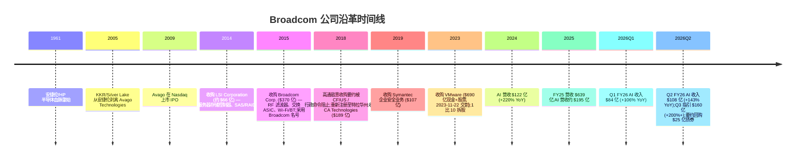
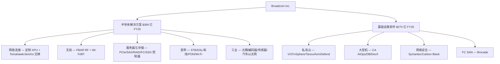
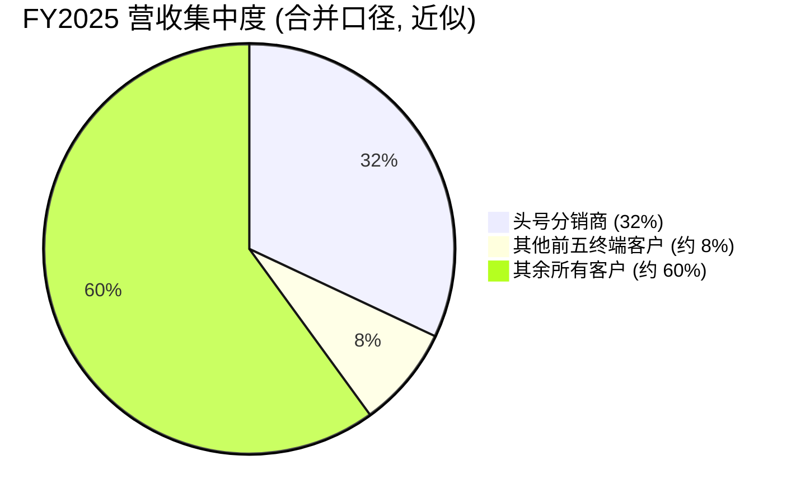
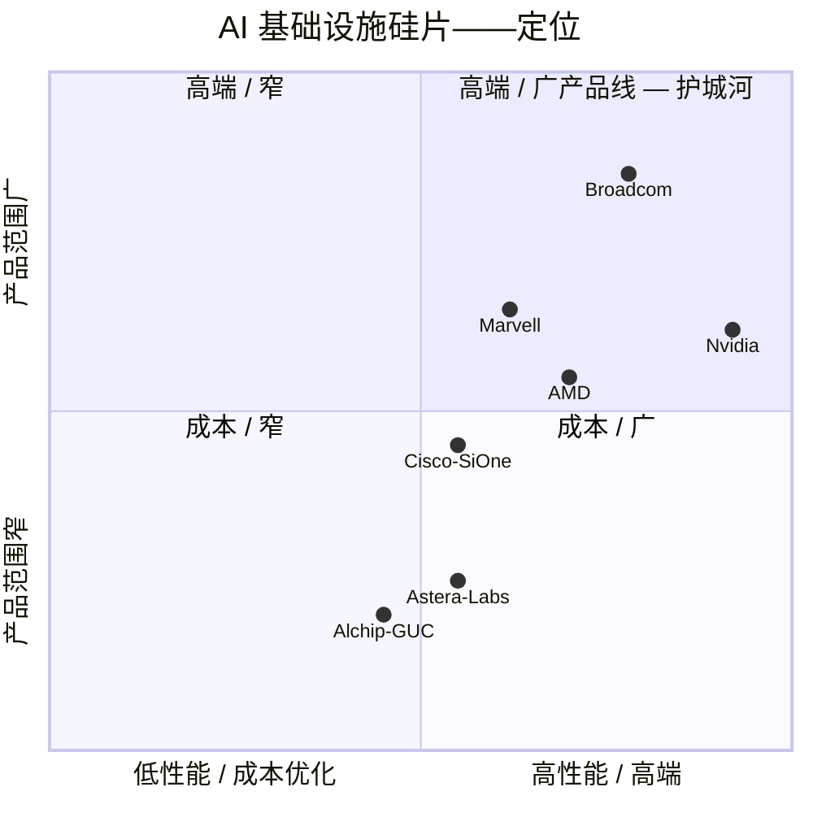

# Broadcom Inc. (NASDAQ:AVGO) — 公司研究报告

**截至日期:** 2026-06-14
**作者:** company-research skill, financial_agent
**主要信源:** Broadcom FY2025 10-K (提交于 2025-12-18)、Q2 FY2026 业绩新闻稿 8-K (2026-06-03, 季度结束于 2026-05-03)、债券要约回购 8-K (2026-06-11)、Q1 FY2026 10-Q (提交于 2026-03-11)、Q1 FY2026 业绩新闻稿 8-K (2026-03-04)、Q4 FY2025 业绩新闻稿 8-K (2025-12-11)、Q4 FY2024 业绩新闻稿 8-K (2024-12-12); 本地机构研报库 db/zsxq.db (Bernstein / Citi / Goldman Sachs / J.P. Morgan / Morgan Stanley 关于 AVGO 的 Q2 FY26 点评)。所有引用文件均在第 10 章"参考资料"中列出官方 URL。
**报告语言: 简体中文 (英文版同时存在于本目录, 但未随本次刷新更新)**

> *分析师观点：* **评级：Overweight（增持）· 12 个月目标价 $470（较 2026-06-14 现价 $382.07 上行 +23%）· 估值方法：FY2027E 非 GAAP EPS $18.0 × 26× forward P/E**
> 市值约 $1.82 万亿 · 52 周区间 $244.17–$495.00 · NASDAQ: AVGO
>
> | 倍数 / Multiple (*分析师观点：* 前瞻列) | FY25A | FY26E | FY27E |
> |---|---|---|---|
> | 非 GAAP P/E | 56.0× | 33.0× | 21.2× |
> | EV/EBITDA | ~52× | ~32× | ~21× |
> | EV/Sales | ~25× | ~17× | ~12× |
> | FCF yield | ~1.5% | ~2.6% | ~4.3% |
>
> 相对表现 (截至 2026-06-14, yfinance 复权收盘): 1M **−8.3%** · 6M **+6.6%** · YTD **+10.6%** · 12M **+50.4%** vs 标普 500 (−0.2% / +8.8% / +8.6% / +22.9%) — 12 个月相对 **+27.5pp** 跑赢大盘, 但 1 个月相对 −8.1pp, Q2 业绩后回调。
> **核心论点（thesis pillars）**——（1）**AI 定制硅片 (custom XPU/ASIC) + AI 网络的双引擎**, FY26 AI 半导体收入指引约 $56B、FY27 重申超过 $1,000 亿美元, 是可见度最高的 AI 资本开支受益标的; （2）**Tan 运营模式下 60–70% 毛利率 / 60%+ 营业利润率**的极致盈利结构, 相近营收的竞争对手无法企及; （3）**VMware (基础设施软件) 提供约 1/3 营收的高粘性订阅底盘**, 平滑半导体周期; （4）Q2 后股价回调至 forward P/E ~20×, 与 NVDA 接近, 风险回报较 5 月更对称。

> **业绩更新——Q2 FY2026 (2026-06-03, 季度结束于 2026-05-03), 全年指引隐含上修:** Broadcom 公布 Q2 创纪录营业收入 **$22,187M (+48% YoY)**, 超 3 月 $220 亿指引。其中**半导体解决方案 $15,009M (+79% YoY)**、**基础设施软件 $7,178M (+9% YoY)**; **AI 半导体收入 $10.8B (+143% YoY)**, 高于 3 月 $10.7B 的 AI 指引。GAAP 摊薄 EPS **$1.91**、非 GAAP 摊薄 EPS **$2.44**; **adjusted EBITDA $15,244M (+52% YoY), 占营收 69%**; 自由现金流 **$10,262M, 占营收 46%**——三项均创纪录。**Q3 FY2026 指引: 营收约 $29.4B (+84% YoY)、AI 半导体收入约 $16.0B (+200%+ YoY)**, 非 GAAP 营业利润率约 67%、adjusted EBITDA 约 68%。管理层在 Q2 电话会议**重申 (而非上调) FY2027 AI 半导体收入超过 $1,000 亿美元、覆盖 10GW 数据中心部署**的中期目标; FY26 全年 AI 约 $56B、H2 FY26 AI 收入较 H1 翻倍。来源: [Broadcom Q2 FY2026 业绩新闻稿, 2026-06-03 (附件 99.1)](https://www.sec.gov/Archives/edgar/data/1730168/000173016826000051/avgo-05032026x8kxex99.htm)。

---

## 目录

1. 公司概览 (含投资逻辑导语)
1A. 估值与目标价 (前瞻估算 · 目标价推导 · 牛/基/熊情景)
1B. GF Score 基本面评分卡
2. 公司历史
3. 管理团队
4. 产品与服务
5. 客户与上市策略
6. 行业概览
7. 竞争格局
8. 市场机会 (TAM)
9. 风险评估
9.5. 核心争论与催化剂
10. 投资人视角评分卡
数据来源清单 · 参考资料 · 验证日志

---

## 1. 公司概览

**投资逻辑导语 (*分析师观点：*)。** 我们给予 Broadcom **Overweight（增持）评级、12 个月目标价 $470（较现价 $382.07 上行约 +23%）**。看多的核心理由是: Broadcom 是当前美股中**AI 资本开支可见度最高、且已经在用 GAAP 利润兑现的标的**——Q2 FY26 单季 AI 半导体收入 $10.8B（+143% YoY）、Q3 指引 $16.0B（+200%+ YoY）, 全年 AI 约 $56B, 而 FY27 超过 $1,000 亿美元的指引被管理层重申。与商用 GPU 的 Nvidia 不同, Broadcom 卖的是**定制 XPU/ASIC（专用 AI 加速器）+ AI 以太网交换**这套"非 Nvidia 路线"的全栈, 服务于 Google、Meta 等少数自研芯片的超大规模客户。叠加 Tan 运营模式下 68% 毛利率、40% GAAP 营业利润率的极致盈利结构, 以及 VMware 带来的约 1/3 营收高粘性订阅底盘, 这是一门同时具备**三位数 AI 增长 + 软件级现金流确定性**的稀缺资产。Q2 业绩后股价回调至 forward P/E 约 20×（与 NVDA 接近）, 风险回报较 5 月更对称——这是我们维持增持的时点理由。以下为描述性概览。

Broadcom Inc. (NASDAQ: AVGO) 是一家全球半导体与基础设施软件的设计、开发与供应商, 业务划分为两大可报告分部: **半导体解决方案 (Semiconductor Solutions)** 与**基础设施软件 (Infrastructure Software)**。公司注册于美国特拉华州 (Delaware), 总部位于加利福尼亚州帕罗奥图 (Palo Alto), 采用 52/53 周财年制, 财年结束于最接近 10 月 31 日的星期日; FY2025 于 2025 年 11 月 2 日结束 (52 周) ([2025 10-K, 第 1 页](https://www.sec.gov/Archives/edgar/data/1730168/000173016825000121/avgo-20251102.htm))。

**通俗业务描述。** Broadcom 设计并销售芯片及配套软件——两者结合, 使大型企业和超大规模数据中心运营商能够运行其计算与网络基础设施。在硅片侧, 公司有两大主导叙事的产品族系: (1) **定制 AI 加速器 ASIC ("XPU", custom AI accelerator / 定制专用集成电路)**——全球最大的几家云计算公司购买这些芯片用于训练和部署自己专有的 AI 模型; (2) **高基数以太网交换硅片 (high-radix Ethernet switching silicon)** (Tomahawk、Jericho、Trident 系列)——把 AI 数据中心内部的 XPU 与商用 GPU (merchant GPU) 集群连接成一体。在 AI 之外, Broadcom 还是 RF 前端滤波器 (RF front-end filter) 与 Wi-Fi/蓝牙合并芯片的商用供应商 (几乎每部 iPhone 都装有其产品); 是服务器存储控制器 (SAS/RAID、光纤通道、定制 SSD 控制器) 的龙头; 也是多数宽带客户终端设备 (CPE) 中调制解调器、PON 与 STB SoC 芯片的供应商。在软件侧, 2023 年 11 月对 VMware 的收购使 Broadcom 成为事实上的私有云基础设施软件供应商; 此外公司还拥有原 CA Technologies 大型机软件特许权、Symantec 企业安全业务, 以及 Brocade 继承的光纤通道存储网络软件组合。

**盈利模式。** FY2025 营业收入按两大分部大致 58 / 42 拆分。**半导体解决方案 FY2025 营收 $36,858M (+22% YoY)**, 主要来源是向少数集中的超大规模企业 (hyperscaler)、OEM 与大型智能手机 OEM 销售定制 AI 加速器、以太网交换硅片、RF 滤波器、宽带芯片与存储控制器。**基础设施软件 FY2025 营收 $27,029M (+26% YoY)** ([2025 10-K, MD&A, 第 39 页](https://www.sec.gov/Archives/edgar/data/1730168/000173016825000121/avgo-20251102.htm)), 几乎全部来自针对 Fortune 500 与政府客户的多年期 VMware Cloud Foundation (VCF)、大型机软件以及 Symantec/Carbon Black 安全产品的订阅合同。值得注意的是, Broadcom 在 FY2025 将 **$7,800M 的 VCF 前期许可 (upfront license) 收入计入"产品"项下**而非"订阅与服务", 这一列报方式在 MD&A 中披露 ([2025 10-K, MD&A, 第 39 页](https://www.sec.gov/Archives/edgar/data/1730168/000173016825000121/avgo-20251102.htm))。

下图把 FY2025 的两大分部收入 (左侧) 一路追踪到毛利、营业利润与净利润, 直观显示 Broadcom 如何把 $63,887M 营收转化为 $23,126M 净利润:

<svg xmlns="http://www.w3.org/2000/svg" viewBox="0 0 1000 560" width="1000" height="560" role="img" aria-label="income statement Sankey"><rect x="0" y="0" width="1000" height="560" fill="#ffffff"/>
<text x="20.00" y="30.00" text-anchor="start" font-family="Helvetica,Arial,sans-serif" font-size="15" font-weight="700" fill="#1f2933">Broadcom (AVGO) 收入如何转化为利润 — FY2025</text>
<path d="M 204.00,78.00 C 258.00,78.00 258.00,85.00 312.00,85.00 L 312.00,320.39 C 258.00,320.39 258.00,313.39 204.00,313.39 Z" fill="#93c5fd" fill-opacity="0.55"/>
<path d="M 452.00,78.00 C 506.00,78.00 506.00,143.76 560.00,143.76 L 560.00,306.50 C 506.00,306.50 506.00,240.75 452.00,240.75 Z" fill="#86efac" fill-opacity="0.55"/>
<path d="M 452.00,240.75 C 506.00,240.75 506.00,320.50 560.00,320.50 L 560.00,434.24 C 506.00,434.24 506.00,354.49 452.00,354.49 Z" fill="#fca5a5" fill-opacity="0.55"/>
<path d="M 328.00,85.00 C 382.00,85.00 382.00,78.00 436.00,78.00 L 436.00,354.49 C 382.00,354.49 382.00,361.49 328.00,361.49 Z" fill="#86efac" fill-opacity="0.55"/>
<path d="M 328.00,361.49 C 382.00,361.49 382.00,368.49 436.00,368.49 L 436.00,500.00 C 382.00,500.00 382.00,493.00 328.00,493.00 Z" fill="#fca5a5" fill-opacity="0.55"/>
<path d="M 700.00,138.51 C 754.00,138.51 754.00,207.16 808.00,207.16 L 808.00,354.84 C 754.00,354.84 754.00,286.19 700.00,286.19 Z" fill="#86efac" fill-opacity="0.55"/>
<path d="M 700.00,286.19 C 754.00,286.19 754.00,368.84 808.00,368.84 L 808.00,370.84 C 754.00,370.84 754.00,288.19 700.00,288.19 Z" fill="#fca5a5" fill-opacity="0.55"/>
<path d="M 576.00,143.76 C 630.00,143.76 630.00,138.51 684.00,138.51 L 684.00,301.25 C 630.00,301.25 630.00,306.50 576.00,306.50 Z" fill="#86efac" fill-opacity="0.55"/>
<path d="M 576.00,320.50 C 630.00,320.50 630.00,297.75 684.00,297.75 L 684.00,324.65 C 630.00,324.65 630.00,347.40 576.00,347.40 Z" fill="#fca5a5" fill-opacity="0.55"/>
<path d="M 576.00,347.40 C 630.00,347.40 630.00,338.65 684.00,338.65 L 684.00,408.75 C 630.00,408.75 630.00,417.50 576.00,417.50 Z" fill="#fca5a5" fill-opacity="0.55"/>
<path d="M 576.00,417.50 C 630.00,417.50 630.00,422.75 684.00,422.75 L 684.00,439.49 C 630.00,439.49 630.00,434.24 576.00,434.24 Z" fill="#fca5a5" fill-opacity="0.55"/>
<path d="M 204.00,327.39 C 258.00,327.39 258.00,320.39 312.00,320.39 L 312.00,493.00 C 258.00,493.00 258.00,500.00 204.00,500.00 Z" fill="#93c5fd" fill-opacity="0.55"/>
<rect x="188.00" y="78.00" width="16" height="235.39" rx="1.5" fill="#2563eb"/>
<rect x="188.00" y="327.39" width="16" height="172.61" rx="1.5" fill="#2563eb"/>
<rect x="312.00" y="85.00" width="16" height="408.00" rx="1.5" fill="#1e3a8a"/>
<rect x="436.00" y="78.00" width="16" height="276.49" rx="1.5" fill="#15803d"/>
<rect x="436.00" y="368.49" width="16" height="131.51" rx="1.5" fill="#dc2626"/>
<rect x="560.00" y="143.76" width="16" height="162.75" rx="1.5" fill="#15803d"/>
<rect x="560.00" y="320.50" width="16" height="113.74" rx="1.5" fill="#dc2626"/>
<rect x="684.00" y="138.51" width="16" height="145.25" rx="1.5" fill="#15803d"/>
<rect x="684.00" y="297.75" width="16" height="26.89" rx="1.5" fill="#dc2626"/>
<rect x="684.00" y="338.65" width="16" height="70.10" rx="1.5" fill="#dc2626"/>
<rect x="684.00" y="422.75" width="16" height="16.74" rx="1.5" fill="#dc2626"/>
<rect x="808.00" y="207.16" width="16" height="147.69" rx="1.5" fill="#15803d"/>
<rect x="808.00" y="368.84" width="16" height="2.00" rx="1.5" fill="#dc2626"/>
<text x="179.00" y="192.69" text-anchor="end" font-family="Helvetica,Arial,sans-serif" font-size="11.5" font-weight="700" fill="#1f2933">Semiconductor Solutions</text>
<text x="179.00" y="205.69" text-anchor="end" font-family="Helvetica,Arial,sans-serif" font-size="10" font-weight="400" fill="#52606d">$36.9B  (57.7%)</text>
<text x="179.00" y="410.69" text-anchor="end" font-family="Helvetica,Arial,sans-serif" font-size="11.5" font-weight="700" fill="#1f2933">Infrastructure Software</text>
<text x="179.00" y="423.69" text-anchor="end" font-family="Helvetica,Arial,sans-serif" font-size="10" font-weight="400" fill="#52606d">$27.0B  (42.3%)</text>
<rect x="331.00" y="67.00" width="106.80" height="26" rx="2" fill="#ffffff" fill-opacity="0.72"/>
<text x="334.00" y="79.00" text-anchor="start" font-family="Helvetica,Arial,sans-serif" font-size="11.5" font-weight="700" fill="#1f2933">Revenue</text>
<text x="334.00" y="92.00" text-anchor="start" font-family="Helvetica,Arial,sans-serif" font-size="10" font-weight="400" fill="#52606d">$63.9B  (100.0%)</text>
<rect x="455.00" y="60.00" width="100.50" height="26" rx="2" fill="#ffffff" fill-opacity="0.72"/>
<text x="458.00" y="72.00" text-anchor="start" font-family="Helvetica,Arial,sans-serif" font-size="11.5" font-weight="700" fill="#1f2933">Gross Profit</text>
<text x="458.00" y="85.00" text-anchor="start" font-family="Helvetica,Arial,sans-serif" font-size="10" font-weight="400" fill="#52606d">$43.3B  (67.8%)</text>
<rect x="455.00" y="350.49" width="144.60" height="26" rx="2" fill="#ffffff" fill-opacity="0.72"/>
<text x="458.00" y="362.49" text-anchor="start" font-family="Helvetica,Arial,sans-serif" font-size="11.5" font-weight="700" fill="#1f2933">Cost of Revenue (COGS)</text>
<text x="458.00" y="375.49" text-anchor="start" font-family="Helvetica,Arial,sans-serif" font-size="10" font-weight="400" fill="#52606d">$20.6B  (32.2%)</text>
<rect x="579.00" y="125.76" width="106.80" height="26" rx="2" fill="#ffffff" fill-opacity="0.72"/>
<text x="582.00" y="137.76" text-anchor="start" font-family="Helvetica,Arial,sans-serif" font-size="11.5" font-weight="700" fill="#1f2933">Operating Income</text>
<text x="582.00" y="150.76" text-anchor="start" font-family="Helvetica,Arial,sans-serif" font-size="10" font-weight="400" fill="#52606d">$25.5B  (39.9%)</text>
<rect x="579.00" y="302.50" width="150.90" height="26" rx="2" fill="#ffffff" fill-opacity="0.72"/>
<text x="582.00" y="314.50" text-anchor="start" font-family="Helvetica,Arial,sans-serif" font-size="11.5" font-weight="700" fill="#1f2933">Total Operating Expense</text>
<text x="582.00" y="327.50" text-anchor="start" font-family="Helvetica,Arial,sans-serif" font-size="10" font-weight="400" fill="#52606d">$17.8B  (27.9%)</text>
<rect x="703.00" y="120.51" width="100.50" height="26" rx="2" fill="#ffffff" fill-opacity="0.72"/>
<text x="706.00" y="132.51" text-anchor="start" font-family="Helvetica,Arial,sans-serif" font-size="11.5" font-weight="700" fill="#1f2933">Pretax Income</text>
<text x="706.00" y="145.51" text-anchor="start" font-family="Helvetica,Arial,sans-serif" font-size="10" font-weight="400" fill="#52606d">$22.7B  (35.6%)</text>
<rect x="703.00" y="279.75" width="87.90" height="26" rx="2" fill="#ffffff" fill-opacity="0.72"/>
<text x="706.00" y="291.75" text-anchor="start" font-family="Helvetica,Arial,sans-serif" font-size="11.5" font-weight="700" fill="#1f2933">SG&amp;A</text>
<text x="706.00" y="304.75" text-anchor="start" font-family="Helvetica,Arial,sans-serif" font-size="10" font-weight="400" fill="#52606d">$4.2B  (6.6%)</text>
<rect x="703.00" y="320.65" width="100.50" height="26" rx="2" fill="#ffffff" fill-opacity="0.72"/>
<text x="706.00" y="332.65" text-anchor="start" font-family="Helvetica,Arial,sans-serif" font-size="11.5" font-weight="700" fill="#1f2933">R&amp;D</text>
<text x="706.00" y="345.65" text-anchor="start" font-family="Helvetica,Arial,sans-serif" font-size="10" font-weight="400" fill="#52606d">$11.0B  (17.2%)</text>
<rect x="703.00" y="404.75" width="87.90" height="26" rx="2" fill="#ffffff" fill-opacity="0.72"/>
<text x="706.00" y="416.75" text-anchor="start" font-family="Helvetica,Arial,sans-serif" font-size="11.5" font-weight="700" fill="#1f2933">Other OpEx</text>
<text x="706.00" y="429.75" text-anchor="start" font-family="Helvetica,Arial,sans-serif" font-size="10" font-weight="400" fill="#52606d">$2.6B  (4.1%)</text>
<text x="833.00" y="278.00" text-anchor="start" font-family="Helvetica,Arial,sans-serif" font-size="11.5" font-weight="700" fill="#1f2933">Net Income</text>
<text x="833.00" y="291.00" text-anchor="start" font-family="Helvetica,Arial,sans-serif" font-size="10" font-weight="400" fill="#52606d">$23.1B  (36.2%)</text>
<text x="833.00" y="366.84" text-anchor="start" font-family="Helvetica,Arial,sans-serif" font-size="11.5" font-weight="700" fill="#1f2933">Income Tax</text>
<text x="833.00" y="379.84" text-anchor="start" font-family="Helvetica,Arial,sans-serif" font-size="10" font-weight="400" fill="#52606d">-$382.0M  (-0.60%)</text>
<text x="500.00" y="544.00" text-anchor="middle" font-family="Helvetica,Arial,sans-serif" font-size="10" font-weight="400" fill="#52606d">Source: AVGO FY2025 10-K, Consolidated Statements of Operations + Note 9 Segments</text>
</svg>

来源 / Source: [AVGO FY2025 10-K, 合并经营业绩表 + Note 9 分部](https://www.sec.gov/Archives/edgar/data/1730168/000173016825000121/avgo-20251102.htm)。COGS $20,593M 含收购无形资产摊销 $6,031M; "其他运营费用 $2,622M" 含运营侧无形资产摊销 $2,031M + 重组等; net-interest 反映利息支出净额。

**经营地理。** Broadcom 多数半导体出货的所有权与控制权在马来西亚槟城 (Penang, Malaysia) 转移 ([2025 10-K, 第 39 页](https://www.sec.gov/Archives/edgar/data/1730168/000173016825000121/avgo-20251102.htm)), 因此分部脚注中显示大量营收"运往"新加坡和马来西亚——尽管终端需求位于美国与中国。从最终交付地视角, FY2025 营收中**美国 $16,506M、中国(含香港) $11,155M、新加坡 $10,796M、台湾 $6,451M、其他 $18,979M** ([2025 10-K, Net revenue by country](https://www.sec.gov/Archives/edgar/data/1730168/000173016825000121/avgo-20251102.htm)); 其中中国占比由 FY2024 的约 20% 降至 FY2025 的约 17%。

<svg xmlns="http://www.w3.org/2000/svg" viewBox="0 0 720 460" width="720" height="460" role="img" aria-label="revenue donut"><rect x="0" y="0" width="720" height="460" fill="#ffffff"/>
<text x="20.00" y="30.00" text-anchor="start" font-family="Helvetica,Arial,sans-serif" font-size="15" font-weight="700" fill="#1f2933">FY2025 营业收入 — 按分部 (by Segment)</text>
<path d="M 288.00,107.20 A 132 132 0 1 1 226.66,356.08 L 251.75,308.27 A 78 78 0 1 0 288.00,161.20 Z" fill="#2563eb"/>
<path d="M 226.66,356.08 A 132 132 0 0 1 288.00,107.20 L 288.00,161.20 A 78 78 0 0 0 251.75,308.27 Z" fill="#15803d"/>
<text x="288.00" y="235.20" text-anchor="middle" font-family="Helvetica,Arial,sans-serif" font-size="18" font-weight="800" fill="#1f2933">AVGO</text>
<text x="288.00" y="255.20" text-anchor="middle" font-family="Helvetica,Arial,sans-serif" font-size="13" font-weight="600" fill="#52606d">$63.9B</text>
<text x="288.00" y="271.20" text-anchor="middle" font-family="Helvetica,Arial,sans-serif" font-size="10" font-weight="400" fill="#8a97a3">total</text>
<line x1="421.99" y1="272.23" x2="437.99" y2="272.23" stroke="#2563eb" stroke-width="1.4"/>
<text x="441.99" y="270.23" text-anchor="start" font-family="Helvetica,Arial,sans-serif" font-size="11" font-weight="700" fill="#1f2933">Semiconductor Solutions</text>
<text x="441.99" y="284.23" text-anchor="start" font-family="Helvetica,Arial,sans-serif" font-size="10" font-weight="400" fill="#52606d">$36.9B  (57.7%)</text>
<line x1="154.01" y1="206.17" x2="138.01" y2="206.17" stroke="#15803d" stroke-width="1.4"/>
<text x="134.01" y="204.17" text-anchor="end" font-family="Helvetica,Arial,sans-serif" font-size="11" font-weight="700" fill="#1f2933">Infrastructure Software</text>
<text x="134.01" y="218.17" text-anchor="end" font-family="Helvetica,Arial,sans-serif" font-size="10" font-weight="400" fill="#52606d">$27.0B  (42.3%)</text>
<text x="360.00" y="444.00" text-anchor="middle" font-family="Helvetica,Arial,sans-serif" font-size="10" font-weight="400" fill="#52606d">Source: AVGO FY2025 10-K, Note 9 Segments</text>
</svg>

来源 / Source: [AVGO FY2025 10-K, Note 9 分部](https://www.sec.gov/Archives/edgar/data/1730168/000173016825000121/avgo-20251102.htm)。

<svg xmlns="http://www.w3.org/2000/svg" viewBox="0 0 720 460" width="720" height="460" role="img" aria-label="revenue donut"><rect x="0" y="0" width="720" height="460" fill="#ffffff"/>
<text x="20.00" y="30.00" text-anchor="start" font-family="Helvetica,Arial,sans-serif" font-size="15" font-weight="700" fill="#1f2933">FY2025 营业收入 — 按交付地 (by Geography)</text>
<path d="M 288.00,107.20 A 132 132 0 0 1 414.27,277.67 L 362.61,261.93 A 78 78 0 0 0 288.00,161.20 Z" fill="#2563eb"/>
<path d="M 414.27,277.67 A 132 132 0 0 1 242.95,363.27 L 261.38,312.52 A 78 78 0 0 0 362.61,261.93 Z" fill="#15803d"/>
<path d="M 242.95,363.27 A 132 132 0 0 1 157.04,255.71 L 210.61,248.96 A 78 78 0 0 0 261.38,312.52 Z" fill="#d97706"/>
<path d="M 157.04,255.71 A 132 132 0 0 1 209.76,132.89 L 241.77,176.38 A 78 78 0 0 0 210.61,248.96 Z" fill="#7c3aed"/>
<path d="M 209.76,132.89 A 132 132 0 0 1 288.00,107.20 L 288.00,161.20 A 78 78 0 0 0 241.77,176.38 Z" fill="#dc2626"/>
<text x="288.00" y="235.20" text-anchor="middle" font-family="Helvetica,Arial,sans-serif" font-size="18" font-weight="800" fill="#1f2933">AVGO</text>
<text x="288.00" y="255.20" text-anchor="middle" font-family="Helvetica,Arial,sans-serif" font-size="13" font-weight="600" fill="#52606d">$63.9B</text>
<text x="288.00" y="271.20" text-anchor="middle" font-family="Helvetica,Arial,sans-serif" font-size="10" font-weight="400" fill="#8a97a3">total</text>
<line x1="398.89" y1="157.06" x2="414.89" y2="157.06" stroke="#2563eb" stroke-width="1.4"/>
<text x="418.89" y="155.06" text-anchor="start" font-family="Helvetica,Arial,sans-serif" font-size="11" font-weight="700" fill="#1f2933">Other (incl. ship-to Asia)</text>
<text x="418.89" y="169.06" text-anchor="start" font-family="Helvetica,Arial,sans-serif" font-size="10" font-weight="400" fill="#52606d">$19.0B  (29.7%)</text>
<line x1="349.68" y1="362.65" x2="365.68" y2="362.65" stroke="#15803d" stroke-width="1.4"/>
<text x="369.68" y="360.65" text-anchor="start" font-family="Helvetica,Arial,sans-serif" font-size="11" font-weight="700" fill="#1f2933">United States</text>
<text x="369.68" y="374.65" text-anchor="start" font-family="Helvetica,Arial,sans-serif" font-size="10" font-weight="400" fill="#52606d">$16.5B  (25.8%)</text>
<line x1="180.17" y1="325.32" x2="164.17" y2="325.32" stroke="#d97706" stroke-width="1.4"/>
<text x="160.17" y="323.32" text-anchor="end" font-family="Helvetica,Arial,sans-serif" font-size="11" font-weight="700" fill="#1f2933">China incl. HK</text>
<text x="160.17" y="337.32" text-anchor="end" font-family="Helvetica,Arial,sans-serif" font-size="10" font-weight="400" fill="#52606d">$11.2B  (17.5%)</text>
<line x1="161.19" y1="184.77" x2="145.19" y2="184.77" stroke="#7c3aed" stroke-width="1.4"/>
<text x="141.19" y="182.77" text-anchor="end" font-family="Helvetica,Arial,sans-serif" font-size="11" font-weight="700" fill="#1f2933">Singapore</text>
<text x="141.19" y="196.77" text-anchor="end" font-family="Helvetica,Arial,sans-serif" font-size="10" font-weight="400" fill="#52606d">$10.8B  (16.9%)</text>
<line x1="244.95" y1="108.09" x2="228.95" y2="108.09" stroke="#dc2626" stroke-width="1.4"/>
<text x="224.95" y="106.09" text-anchor="end" font-family="Helvetica,Arial,sans-serif" font-size="11" font-weight="700" fill="#1f2933">Taiwan</text>
<text x="224.95" y="120.09" text-anchor="end" font-family="Helvetica,Arial,sans-serif" font-size="10" font-weight="400" fill="#52606d">$6.5B  (10.1%)</text>
<text x="360.00" y="444.00" text-anchor="middle" font-family="Helvetica,Arial,sans-serif" font-size="10" font-weight="400" fill="#52606d">Source: AVGO FY2025 10-K, Net revenue by country</text>
</svg>

来源 / Source: [AVGO FY2025 10-K, Net revenue by country](https://www.sec.gov/Archives/edgar/data/1730168/000173016825000121/avgo-20251102.htm)。注: 交付地不等于终端需求地——槟城转移所有权制度导致"运往亚洲"占比偏高。

**公司体量。** FY2025 总净营收 **$63,887M** (vs FY2024 $51,574M, +24% YoY), GAAP 净利润 **$23,126M**, EPS 基本 $4.91 / 摊薄 $4.77 ([2025 10-K, 合并经营业绩表, 第 47 页](https://www.sec.gov/Archives/edgar/data/1730168/000173016825000121/avgo-20251102.htm))。营业利润 $25,484M (GAAP 营业利润率 40%)。FY2025 自由现金流 (FCF) **$269 亿美元**——经营性现金流 $27,537M 减资本支出 $623M——约占营收 42%。**进入 FY2026, AI 加速放量推动 H1 累计营收约 $414 亿 (Q1 $193.1 亿 + Q2 $221.9 亿), 同比 +38%; H1 AI 半导体收入累计约 $192 亿 (Q1 $84 亿 + Q2 $108 亿), 已基本等于全部 FY2025 全年 AI 营收。** Q2 FY26 单季 GAAP 净利润 $9,310M、非 GAAP 净利润 $12,074M、FCF $10,262M ([Q2 FY26 业绩新闻稿, 2026-06-03](https://www.sec.gov/Archives/edgar/data/1730168/000173016826000051/avgo-05032026x8kxex99.htm))。资产负债表上, 截至 2026-05-03 现金 **$19,628M** (较 Q1 末 $14,174M 上升)、**总债务约 $64.9B (短期 $2,252M + 长期 $62,655M)**, 总资产 $179,158M、商誉 $97,801M、无形资产净值 $28,333M、股东权益 $87,691M ([Q2 FY26 8-K 简明资产负债表](https://www.sec.gov/Archives/edgar/data/1730168/000173016826000051/avgo-05032026x8kxex99.htm))。**本期新变化:** 2026-06-11, Broadcom 宣布对六个系列高级票据 (2030–2038 年到期) 发起总额上限 **$25 亿美元的现金要约回购 (cash tender offer)**——延续 VMware 收购后用现金流主动去杠杆的资本节奏 ([2026-06-11 8-K (附件 99.1)](https://www.sec.gov/Archives/edgar/data/1730168/000119312526266777/d152717dex991.htm))。

**估值快照 (2026-06-14, yfinance)。** AVGO 收于 **$382.07**, 市值约 **$1.82 万亿**。Q2 FY26 业绩公布后股价回落——Q2 实际营收 ($221.9 亿) 与 AI 收入 ($108 亿) 仅小幅超 3 月指引, 而 Q3 AI 指引 $160 亿略低于卖方一致预期 $163 亿, 且 FY27 AI >$1,000 亿被"重申而非上调", 触发获利了结。过去 52 周价格区间 **$244.17 – $495.00** (yfinance, 2026-06-14); 现价距 4 月触及的 $495 高点低约 23%, 距 52 周低位高约 57%。TTM 各项倍数:

| 代码 | 最新价 (2026-06-14) | 市值 (十亿美元) | TTM P/E | 远期 P/E | TTM P/S |
|---|---:|---:|---:|---:|---:|
| **AVGO** | $382.07 | 1,818 | **63.7×** | 19.7× | **24.1×** |
| NVDA | $205.19 | 4,970 | 31.4× | 16.1× | 19.6× |
| MRVL | $279.70 | 245 | 96.1× | 45.3× | 28.1× |
| QCOM | $211.72 | 223 | 22.8× | 19.8× | 5.0× |

来源: yfinance 于 2026-06-14 拉取 ([AVGO](https://finance.yahoo.com/quote/AVGO/key-statistics/)、[NVDA](https://finance.yahoo.com/quote/NVDA/key-statistics/)、[MRVL](https://finance.yahoo.com/quote/MRVL/key-statistics/)、[QCOM](https://finance.yahoo.com/quote/QCOM/key-statistics/))。

AVGO 的 **TTM P/E 63.7×** 介于 NVDA 31.4× 与 MRVL 96.1× 之间, **TTM P/S 24.1×** 低于 MRVL 28.1×、高于 NVDA 19.6×, 远高于 QCOM 5.0×。**为什么 P/E 高于 50× / 高于行业中位数:** 这是 AI 基础设施板块的**结构性高增长溢价**——市场为可见的定制 XPU 储备订单 (Q2 业绩会披露 AI 在手订单 backlog 已达 $30B+ vs 当季交付的 $11B) 和 VMware 订阅跑道付费, 而非为 TTM GAAP 利润付费。*分析师观点：* 花旗 (Citi) 给出 Buy / 目标价 $500, 估值基于 FY28E EPS $25 × 20× P/E, 称回调是"加仓良机", 并指 AI 收入将从 Jul-Q 的占比 55% 持续抬升 ([Citi — Broadcom: Buyers of Pullback, 2026-06-03, p.1](http://xs-macbook-air.local:5001/zsxq/pdf/184155215151152/Citi-Broadcom%20Inc%20%28AVGO.O%29%20Buyers%20of%20Pullback%3B%20Improved%20AI%20Visibility%20into%202028-260603.pdf))。TTM 盈利仍被两项 GAAP 费用人为压低、而市场基本忽视: (1) **约 $80 亿美元的收购无形资产年摊销** (FY25: COGS 内 $6,031M + 运营侧 $2,031M = $8,062M, [2025 10-K, 第 40 页](https://www.sec.gov/Archives/edgar/data/1730168/000173016825000121/avgo-20251102.htm)); (2) **FY25 股票薪酬 (SBC) $7,568M** ([2025 10-K, 现金流表, 第 43 页](https://www.sec.gov/Archives/edgar/data/1730168/000173016825000121/avgo-20251102.htm))。剔除后远期 P/E **19.7×** 与 NVDA 16.1× 接近、显著低于 MRVL 45.3×, 大致与 QCOM 19.8× 持平——这意味着市场为 MRVL "未来才兑现"的盈利付溢价, 而为 AVGO "已在交付"的盈利付折扣。若 AI XPU 客户集中度恶化 (头号分销商占营收 32%——见第 5 章) 或 FY27 单一超大规模客户出现需求悬崖, 倍数将剧烈重估 (延伸至第 9 章)。

## 1A. 估值与目标价

> *分析师观点：* 本章所有前瞻数字、目标价及情景目标价均为分析师自有前瞻判断, 不附任何申报文件引用; 各驱动因素的外部依据 (分部数据 + 管理层指引 + 行业预测) 在文中分别引用。

**(a) 前瞻财务估算表 (FY26E–FY28E)。** 我们的模型把两大分部分别建模再汇总: 半导体解决方案由 AI (FY26 ≈$56B, 管理层指引) 与非 AI (低个位数增长) 两条曲线驱动; 基础设施软件维持 +9~10% 的成熟订阅增速。AI 收入路径采用管理层 Q2 电话会议口径 (FY26 ≈$56B、H2 较 H1 翻倍、FY27 >$100B); 毛利率随 AI ASIC 占比上升 (Q3 由 ~77% 指引降至 ~74%) 而温和下行, 但运营杠杆抵消、营业利润率维持高位。

| 指标 (*分析师观点：*) | FY25A | FY26E | FY27E | FY28E | CAGR(25→28) |
|---|---:|---:|---:|---:|---:|
| 营业收入 ($M) | 63,887 | ~95,000 | ~135,000 | ~165,000 | +37% |
| — YoY % | +24% | +49% | +42% | +22% | |
| — 其中 AI 半导体 ($M) | ~19,500 | ~56,000 | ~100,000+ | ~125,000 | +85% |
| 毛利率 (非 GAAP) | ~78% | ~77% | ~75% | ~75% | |
| 营业利润率 (非 GAAP) | ~63% | ~66% | ~66% | ~66% | |
| 非 GAAP 摊薄 EPS ($) | 6.82 | ~11.5 | ~18.0 | ~25.0 | +54% |
| — YoY % | | +69% | +57% | +39% | |
| FCF ($B) | 26.9 | ~48 | ~75 | ~95 | |
| 净债务 ($B) | ~50 | ~38 | ~12 | 净现金 | |

各单元的依据: AI 收入路径来自 [Q2 FY26 8-K + 电话会议口径 (FY26 ≈$56B / FY27 >$100B)](https://www.sec.gov/Archives/edgar/data/1730168/000173016826000051/avgo-05032026x8kxex99.htm); FY25A 非 GAAP EPS $6.82、FY26E/FY27E 估算 $11.60/$18.69 与 *分析师观点：* Bernstein 模型一致 ([Bernstein — AVGO FQ226 recap, 2026-06-04, p.1](http://xs-macbook-air.local:5001/zsxq/pdf/415288425488488/Bernstein-Broadcom%20Inc%EF%BC%88AVGO.US%EF%BC%89Broadcom%20%EF%BC%88AVGO%EF%BC%89%EF%BC%9A%20FQ226%20recap~Wait%20for%20it...-260604.pdf)); 毛利率下行至 ~74% 的 Q3 指引来自 [Citi 纪要 (AI ASIC 占比 30%→38%)](http://xs-macbook-air.local:5001/zsxq/pdf/184155215151152/Citi-Broadcom%20Inc%20%28AVGO.O%29%20Buyers%20of%20Pullback%3B%20Improved%20AI%20Visibility%20into%202028-260603.pdf)。

**毛利率桥 (Q3 FY26E vs Q2 FY26, *分析师观点：*):** `GM ~−300bps = AI ASIC 收入占比由 ~30% 升至 ~38% 的产品组合稀释 (主拖累) · 部分被基础设施软件高毛利与运营杠杆抵消`——即从 Q2 的约 77% 降至 Q3 指引的约 74% ([Citi 纪要, 2026-06-03](http://xs-macbook-air.local:5001/zsxq/pdf/184155215151152/Citi-Broadcom%20Inc%20%28AVGO.O%29%20Buyers%20of%20Pullback%3B%20Improved%20AI%20Visibility%20into%202028-260603.pdf))。这是结构性的: 定制 ASIC 毛利率低于公司平均, 但其规模与运营杠杆使营业利润美元额仍快速扩张。

**(b) 目标价推导。** 方法: **FY2027E 非 GAAP EPS $18.0 × 26× forward P/E = $468 ≈ $470**。为什么用 26×: AVGO 的两大引擎 (AI 半导体三位数增长 + 软件级现金流) 应享有高于半导体均值的倍数; 对标 NVDA 当前 forward P/E 16.1×、MRVL 45.3×、QCOM 19.8×, 26× 落在 NVDA 与 MRVL 之间, 由 AVGO 高于 NVDA 的 FCF 转化率与软件占比、以及高于 QCOM 的增长支撑。卖方目标价中枢约 $500 (Bernstein $550、MS/Citi/JPM/GS $500–$502、UBS $490), 我们 $470 略低于中枢, 反映对 FY27 AI 收入"重申而非上调"以及客户集中度风险的更谨慎态度。

**(c) 牛 / 基 / 熊情景 (*分析师观点：*):**

| 情景 | 关键假设 | 目标价 | 较现价 |
|---|---|---:|---:|
| 牛 (Bull) | FY27 AI 超 $110B (第四个超大规模客户放量), 维持 30× | $585 | +53% |
| 基 (Base) | FY27E EPS $18.0 × 26× | $470 | +23% |
| 熊 (Bear) | FY27 AI 仅 ~$85B (单客户消化), 倍数压缩至 18× | $300 | −21% |

**(d) 与一致预期对比 (Guide vs Consensus vs 本报告):**

| 指标 (Q3 FY26E) | 公司指引 | 卖方一致 (*分析师观点：*) | 本报告 (*分析师观点：*) |
|---|---|---|---|
| 营业收入 | ~$29.4B | ~$28.6B | ~$29.4B |
| AI 半导体收入 | ~$16.0B (+200%+) | ~$16.3B | ~$16.0B |
| 非 GAAP 营业利润率 | ~67% | 67.5% | ~67% |
| 毛利率 | 约 74% (隐含) | 76.8% | ~74% |

公司指引列引用 [Q2 FY26 8-K](https://www.sec.gov/Archives/edgar/data/1730168/000173016826000051/avgo-05032026x8kxex99.htm); 一致预期列为 *分析师观点：* 引自 [Citi 纪要 (Q3 营收/毛利率一致预期)](http://xs-macbook-air.local:5001/zsxq/pdf/184155215151152/Citi-Broadcom%20Inc%20%28AVGO.O%29%20Buyers%20of%20Pullback%3B%20Improved%20AI%20Visibility%20into%202028-260603.pdf) 与 [Bernstein recap (Q3 $29.4B/$3.25 vs Street $28.6B/$3.15; AI ~$16B vs Street ~$17.2B)](http://xs-macbook-air.local:5001/zsxq/pdf/415288425488488/Bernstein-Broadcom%20Inc%EF%BC%88AVGO.US%EF%BC%89Broadcom%20%EF%BC%88AVGO%EF%BC%89%EF%BC%9A%20FQ226%20recap~Wait%20for%20it...-260604.pdf)。**本报告 AI 估算与公司指引一致、略低于卖方最乐观一致——这正是 Q2 后股价回调的根源: 卖方原先把 Q3 AI 押在 $16.3–17.5B, 实际指引 $16.0B 略低。**

**(e) 最该盯紧的关键变量。** (1) **FY27 AI 收入兑现的客户广度**——能否从 Google 一家扩展到 Meta + 第三/第四个超大规模客户 (OpenAI、字节据传) 同步放量, 决定 >$100B 是保守还是激进; (2) **毛利率下行的斜率**——AI ASIC 占比上升到什么程度、运营杠杆能否持续抵消, 是 EPS 的主要摆动项。

**(f) 较上一版本的变化 (refresh transparency)。** 上一版本未设独立估值章节与正式目标价。本次首次给出 Overweight / 目标价 $470。相对市场: 现价 $382.07 较上一版估值快照日 (2026-06-04) 的 $418.07 下跌约 9%——主因 Q2 业绩后 "AI 指引略低于一致 + FY27 重申而非上调" 的获利了结, 基本面 (Q2 实际数字) 并未走弱。

## 1B. GF Score 基本面评分卡

*分析师观点：* **GF Score (GuruFocus-style): 74/100 — 71–80 区间, 大致对应"平均偏上"的历史表现概率。** 该评分为分析师自有评分框架 (modeled on GuruFocus GF Score™) 的输出, 五个维度与综合分均为 *分析师观点：*, 不附申报文件引用; 各维度背后的具体指标在下文逐项给出独立引用。

<svg xmlns="http://www.w3.org/2000/svg" viewBox="0 0 500 500" width="500" height="500" role="img" aria-label="GF Score radar">
<rect x="0" y="0" width="500" height="500" fill="#ffffff"/>
<text x="20" y="24" font-family="Helvetica,Arial,sans-serif" font-size="15" font-weight="700" fill="#1f2933">GF Score (GuruFocus-style): 74/100</text>
<text x="20" y="41" font-family="Helvetica,Arial,sans-serif" font-size="11" fill="#52606d">71–80 Likely average performance</text>
<polygon points="250.0,88.0 392.7,191.6 338.2,359.4 161.8,359.4 107.3,191.6" fill="#e9f5ec" stroke="none"/>
<polygon points="250.0,208.0 278.5,228.7 267.6,262.3 232.4,262.3 221.5,228.7" fill="none" stroke="#c5d3cb" stroke-width="1"/>
<polygon points="250.0,178.0 307.1,219.5 285.3,286.5 214.7,286.5 192.9,219.5" fill="none" stroke="#c5d3cb" stroke-width="1"/>
<polygon points="250.0,148.0 335.6,210.2 302.9,310.8 197.1,310.8 164.4,210.2" fill="none" stroke="#c5d3cb" stroke-width="1"/>
<polygon points="250.0,118.0 364.1,200.9 320.5,335.1 179.5,335.1 135.9,200.9" fill="none" stroke="#c5d3cb" stroke-width="1"/>
<polygon points="250.0,88.0 392.7,191.6 338.2,359.4 161.8,359.4 107.3,191.6" fill="none" stroke="#c5d3cb" stroke-width="1.3"/>
<line x1="250" y1="238" x2="161.8" y2="359.4" stroke="#cfdad3" stroke-width="1"/>
<text x="146.5" y="392.4" text-anchor="end" font-family="Helvetica,Arial,sans-serif" font-size="11.5" font-weight="600" fill="#1f2933">Financial Strength</text>
<text x="146.5" y="405.4" text-anchor="end" font-family="Helvetica,Arial,sans-serif" font-size="9.5" fill="#52606d">财务实力</text>
<text x="197.1" y="304.8" text-anchor="middle" font-family="Helvetica,Arial,sans-serif" font-size="10.5" font-weight="700" fill="#1f2933">6</text>
<line x1="250" y1="238" x2="250.0" y2="88.0" stroke="#cfdad3" stroke-width="1"/>
<text x="250.0" y="58.0" text-anchor="middle" font-family="Helvetica,Arial,sans-serif" font-size="11.5" font-weight="600" fill="#1f2933">Profitability</text>
<text x="250.0" y="71.0" text-anchor="middle" font-family="Helvetica,Arial,sans-serif" font-size="9.5" fill="#52606d">盈利能力</text>
<text x="250.0" y="97.0" text-anchor="middle" font-family="Helvetica,Arial,sans-serif" font-size="10.5" font-weight="700" fill="#1f2933">9</text>
<line x1="250" y1="238" x2="107.3" y2="191.6" stroke="#cfdad3" stroke-width="1"/>
<text x="82.6" y="183.6" text-anchor="end" font-family="Helvetica,Arial,sans-serif" font-size="11.5" font-weight="600" fill="#1f2933">Growth</text>
<text x="82.6" y="196.6" text-anchor="end" font-family="Helvetica,Arial,sans-serif" font-size="9.5" fill="#52606d">成长性</text>
<text x="107.3" y="185.6" text-anchor="middle" font-family="Helvetica,Arial,sans-serif" font-size="10.5" font-weight="700" fill="#1f2933">10</text>
<line x1="250" y1="238" x2="392.7" y2="191.6" stroke="#cfdad3" stroke-width="1"/>
<text x="417.4" y="183.6" text-anchor="start" font-family="Helvetica,Arial,sans-serif" font-size="11.5" font-weight="600" fill="#1f2933">GF Value</text>
<text x="417.4" y="196.6" text-anchor="start" font-family="Helvetica,Arial,sans-serif" font-size="9.5" fill="#52606d">估值</text>
<text x="307.1" y="213.5" text-anchor="middle" font-family="Helvetica,Arial,sans-serif" font-size="10.5" font-weight="700" fill="#1f2933">4</text>
<line x1="250" y1="238" x2="338.2" y2="359.4" stroke="#cfdad3" stroke-width="1"/>
<text x="353.5" y="392.4" text-anchor="start" font-family="Helvetica,Arial,sans-serif" font-size="11.5" font-weight="600" fill="#1f2933">Momentum</text>
<text x="353.5" y="405.4" text-anchor="start" font-family="Helvetica,Arial,sans-serif" font-size="9.5" fill="#52606d">动量</text>
<text x="302.9" y="304.8" text-anchor="middle" font-family="Helvetica,Arial,sans-serif" font-size="10.5" font-weight="700" fill="#1f2933">6</text>
<polygon points="250.0,103.0 307.1,219.5 302.9,310.8 197.1,310.8 107.3,191.6" fill="#2e8b57" fill-opacity="0.34" stroke="#2e8b57" stroke-width="2"/>
<circle cx="197.1" cy="310.8" r="2.6" fill="#2e8b57"/>
<circle cx="250.0" cy="103.0" r="2.6" fill="#2e8b57"/>
<circle cx="107.3" cy="191.6" r="2.6" fill="#2e8b57"/>
<circle cx="307.1" cy="219.5" r="2.6" fill="#2e8b57"/>
<circle cx="302.9" cy="310.8" r="2.6" fill="#2e8b57"/>
<text x="250" y="470" text-anchor="middle" font-family="Helvetica,Arial,sans-serif" font-size="9.5" fill="#52606d">Source: Analyst rubric on AVGO FY2025 10-K + Q2 FY2026 8-K + Yahoo Finance (2026-06-14)</text>
<text x="250" y="485" text-anchor="middle" font-family="Helvetica,Arial,sans-serif" font-size="9" fill="#52606d">GF Score = independent analyst rubric (*Analyst view:*) — not GuruFocus™ official number</text>
</svg>

读图: 距中心越远越好, 五边形越大综合分越高。

| 维度 / Dimension | 评分 / Score (0–10) | |
|---|---|---|
| Financial Strength (财务实力) | 6 | `██████░░░░` |
| Profitability (盈利能力) | 9 | `█████████░` |
| Growth (成长性) | 10 | `██████████` |
| GF Value (估值) | 4 | `████░░░░░░` |
| Momentum (动量) | 6 | `██████░░░░` |
| **GF Score (综合, *分析师观点：*)** | **74 / 100** | **71–80 平均偏上** |

**各维度评分理由。**

- **Financial Strength = 6/10。** 扣分项是 VMware 收购遗留的 **总债务约 $64.9B** ([Q2 FY26 8-K 资产负债表](https://www.sec.gov/Archives/edgar/data/1730168/000173016826000051/avgo-05032026x8kxex99.htm)) 与 FY25 利息支出量级; 加分项是 **FY25 FCF $26.9B** 充分覆盖债务、投资级评级、以及 2026-06 主动要约回购 $25 亿债券显示去杠杆能力 ([2026-06-11 8-K](https://www.sec.gov/Archives/edgar/data/1730168/000119312526266777/d152717dex991.htm))。净杠杆正快速下降, 故给中性偏上 6 分。
- **Profitability = 9/10。** FY25 GAAP 毛利率 68% ($43,294M/$63,887M)、营业利润率 40% ($25,484M)、净利率 36% ([2025 10-K, 第 47 页](https://www.sec.gov/Archives/edgar/data/1730168/000173016825000121/avgo-20251102.htm)); 非 GAAP 毛利率近 78%、营业利润率 63%——这是相近营收的半导体公司无法企及的利润结构, 给 9 分。
- **Growth = 10/10。** Q2 FY26 营收 +48% YoY、Q3 指引 +84% YoY, AI 半导体 +143%→+200%+ YoY ([Q2 FY26 8-K](https://www.sec.gov/Archives/edgar/data/1730168/000173016826000051/avgo-05032026x8kxex99.htm)); 与第 1A 章前瞻模型 (FY26E 营收 +49%) 一致, 满分。
- **GF Value = 4/10 (越高越便宜)。** TTM P/E 63.7×、P/S 24.1× 处历史与同业高位 (yfinance, 2026-06-14); 虽 forward P/E 19.7× 不算极端, 但绝对估值不便宜, 给偏低 4 分——与第 1A 章目标价隐含 +23% 上行 (而非翻倍) 一致。
- **Momentum = 6/10。** 12M +50.4% 跑赢标普 +22.9%, 但 1M −8.3% (Q2 业绩后回调) 弱于大盘 (yfinance, 2026-06-14); 中期强、短期弱, 给中性 6 分——与抬头相对表现行一致。

**综合算式 (*分析师观点：*):** `(FS·20 + Prof·25 + Growth·25 + Value·15 + Mom·15)/100 = (6·20+9·25+10·25+4·15+6·15)/10 = 74/100` (权重 20/25/25/15/15, 透明复刻, 非 GuruFocus 专有权重)。

**一句话提示:** 最可能翻转的是 GF Value——若 Q3/FY27 AI 不及预期触发估值压缩, Value 维度会进一步走低; Growth 维度则高度依赖 FY27 客户广度兑现。无 n/a 维度。

## 2. 公司历史

Broadcom 的身份是一连串并购整合的产物。其连续法人载体最早起源于安捷伦科技 (Agilent Technologies) 的半导体产品事业部 (安捷伦本身于 1999 年从惠普分拆), 2005 年 KKR、Silver Lake 与淡马锡 (Temasek) 将其剥离设立为 Avago Technologies。Avago 于 2009 年 IPO, 在 Hock Tan 领导下完成一系列规模递增的并购, 顶峰为 2016 年对原 Broadcom Corp. 的收购——此时母公司启用 Broadcom 名称并沿用 Avago 代码 (AVGO)。10-K 中"60 年传承"表述指代的是 Avago/HP-Agilent 半导体血脉, 而非某条单一公司谱系 ([2025 10-K, 第 2 页](https://www.sec.gov/Archives/edgar/data/1730168/000173016825000121/avgo-20251102.htm))。

最具决定意义的三次战略转折。**第一, 2016 年 Avago 与 Broadcom Corp. 合并**——把一家专注 FBAR/特种 IC、营收 $40 亿的业务变为商用网络与无线硅片龙头; 这也是 Tan 完善其运营手册的节点——激进 SKU 合理化、聚焦品类领先 IP、保留头号客户、果断剪除排名第 1/2 之外的业务。**第二, 2018 年敌意收购高通失败**——以国家安全为由经总统行政命令被 CFIUS 阻止——事后看是战略转向拐点: 它迫使 Broadcom 将注册地从新加坡迁至特拉华, 并把 Tan 的并购精力从"再买一家芯片公司"转向"买企业软件公司", 几个月后即宣布 CA Technologies 交易。**第三, 2023 年 11 月 VMware 合并** ($30,788M 现金 + 5.44 亿 Broadcom 股票, 公允价值 $53,398M, [2025 10-K, 第 50 页](https://www.sec.gov/Archives/edgar/data/1730168/000173016825000121/avgo-20251102.htm)) 实质上使软件占比翻倍, 重新锚定了毛利率结构, 同时给资产负债表加载了如今正逐步用现金流再融资/回购的大笔债务。

近期动态 (FY2024 至 FY2026 H1) 围绕三大主题。(1) **AI XPU 加速放量**——披露的 AI 半导体收入从 FY24 的 $122 亿增至 FY25 约 $195 亿, Q1 FY26 单季 $84 亿后, **Q2 FY26 再加速至 $108 亿 (+143% YoY)**, **Q3 FY26 指引 $160 亿 (+200%+ YoY)**; 管理层在 Q2 电话会议**重申 FY27 AI 收入 >$1,000 亿、覆盖 10GW**, FY26 全年约 $56B ([Q2 FY26 业绩新闻稿](https://www.sec.gov/Archives/edgar/data/1730168/000173016826000051/avgo-05032026x8kxex99.htm))。(2) **VMware 整合与订阅化转型**——永久授权许可模式已被 VCF 订阅捆绑包取代, 推动基础设施软件从 FY23 的 $76 亿增至 FY25 的 $270 亿; Q2 FY26 单季基础设施软件 $71.8 亿 (+9% YoY), 表明订阅化进入成熟阶段 (增量放缓但毛利率与 NRR 维持高位)。(3) **资本回报与去杠杆**——季度股息 $0.65/股 (连续多年增长), Q2 单季派息 $30.9 亿、回购仅 $6 亿 (远低于 Q1 的 $78.5 亿), 并于 2026-06-11 发起 $25 亿债券要约回购——管理层把资本弹性留给债务偿还与潜在战略并购, 而非加速回购 ([Q2 FY26 8-K](https://www.sec.gov/Archives/edgar/data/1730168/000173016826000051/avgo-05032026x8kxex99.htm); [2026-06-11 8-K](https://www.sec.gov/Archives/edgar/data/1730168/000119312526266777/d152717dex991.htm))。

## 3. 管理团队

### Hock E. Tan — 总裁、首席执行官兼董事 (74 岁)

Tan 是 Broadcom 投资逻辑中最关键的单一变量, 普遍被视为半导体史上最高效的并购运营者。自 2006 年 3 月起担任 Broadcom 总裁兼 CEO——贯穿整个 Avago 时代以及时间线列出的每一次并购 ([2025 10-K, 第 10 页](https://www.sec.gov/Archives/edgar/data/1730168/000173016825000121/avgo-20251102.htm))。加入 Avago 前, 他于 1999–2005 年任 Integrated Circuit Systems (公开上市时钟 IC 厂商) 总裁兼 CEO, 直至 2005 年被 IDT 收购; 更早曾任 ICS 的 COO 与 SVP/CFO, 以及 Commodore International 财务副总裁、百事可乐与通用汽车高管职位。2020 年起担任美国总统国家安全与电信咨询委员会成员。他持有 MIT 机械工程学士与硕士、哈佛商学院 MBA ([2025 10-K, 第 10 页](https://www.sec.gov/Archives/edgar/data/1730168/000173016825000121/avgo-20251102.htm))。

Tan 的运营手册——自 2014 年收购 LSI 后精炼, 如今同样应用于 AI 硅片与 VMware——有三大承重支柱。**(1) 买已能产生现金流的品类领导者, 而非"协同效应"。** 每一项重大并购在被收购前均已在某细分占据 #1 或 #2 份额; Tan 不为"开拓份额的机会"付溢价。**(2) 把 SG&A 与 R&D 压到最精简, 保留核心特许客户与 IP, 其余退出。** VMware 后, Broadcom 剥离了终端用户计算 (EUC, 2024 年中以约 $38.5 亿卖给 KKR) 与 Carbon Black, 终止 SMB 永久授权许可渠道, 并把剩余约 2,000 个战略账户转为多年期 VCF 订阅; FY25 SG&A 占营收比降至 7%, SG&A 绝对数同比下降 $7.48 亿 ([2025 10-K, 第 40 页](https://www.sec.gov/Archives/edgar/data/1730168/000173016825000121/avgo-20251102.htm))。**(3) 用现金流偿还并购债务, 再积极回报资本。** 自 2011 年首次派息以来股息连年复利增长。Tan 基本工资固定为每年 $1.00, 绝大部分薪酬为按多年 TSR 与运营里程碑解锁的 PSU; 持股约 0.2%。74 岁的他已公开表示打算在 VMware 整合周期内继续任职; 其继任仍是公司最大、且未对冲的个人风险, 10-K 明确点名: "我们的成功在很大程度上取决于…特别是 Hock E. Tan 的服务" ([2025 10-K, 第 14 页](https://www.sec.gov/Archives/edgar/data/1730168/000173016825000121/avgo-20251102.htm))。

### Kirsten M. Spears — 首席财务官兼首席会计官 (61 岁)

Spears 自 2020 年 12 月起任 CFO, 2014 年 5 月通过 LSI 并购进入 Broadcom (在 LSI 自 2007 年起即任 VP 兼公司财务总监), 2016–2020 年任 Broadcom 主要会计官 ([2025 10-K, 第 10 页](https://www.sec.gov/Archives/edgar/data/1730168/000173016825000121/avgo-20251102.htm))。职业生涯始于普华永道。任内经历 CA、Symantec、VMware 三次并购, 是每次业绩电话会议的公开代言人, 并带领市场穿越 VMware 订阅化转型而未出现一次业绩下修; 她主导了将 $300 亿以上 VMware 收购债务从定期贷款转换为分级固定利率债券、并自 2026-06 起主动要约回购的复杂再融资执行 ([2025 10-K, 第 43 页](https://www.sec.gov/Archives/edgar/data/1730168/000173016825000121/avgo-20251102.htm))。她似乎不是 CEO 接班候选人, 暗示未来继任很可能从现 C-suite 之外或分部总裁层产生。

## 4. 产品与服务

Broadcom 的产品组合对单一发行人而言异常宽广, 最佳理解方式是借助 10-K 的两分部 / 九产品组合架构 ([2025 10-K, 第 3–8 页](https://www.sec.gov/Archives/edgar/data/1730168/000173016825000121/avgo-20251102.htm))。下表为基于 10-K Item 1 Business 复刻的产品矩阵:

| 分部 | 产品组合 | 代表产品 |
|---|---|---|
| 半导体解决方案 | 网络连接 Networking | 定制 XPU/ASIC (Google TPU、Meta MTIA)、Tomahawk/Jericho/Trident 交换芯片、NIC/PHY/光器件 |
| 半导体解决方案 | 无线设备连接 Wireless | FBAR RF 滤波器/前端模块、Wi-Fi/BT 合并芯片、触控、感应充电 |
| 半导体解决方案 | 服务器与存储 Servers & Storage | PCIe 交换 (Atlas)、SAS/RAID、光纤通道 HBA、HDD SoC/前放、定制 SSD 控制器 |
| 半导体解决方案 | 宽带 Broadband | 机顶盒 SoC、DSL/有线/PON/Wi-Fi 住宅网关 SoC |
| 半导体解决方案 | 工业 Industrial | 光耦合器、运动编码器、工业/医疗传感器、汽车以太网 IC |
| 基础设施软件 | 私有云 | VMware Cloud Foundation (VCF)、vSphere、Tanzu、Avi、vDefend、Private AI |
| 基础设施软件 | 大型机 (源自 CA) | AIOps、DB/DM、DevX、安全、基础类 |
| 基础设施软件 | 网络安全 | Symantec、Carbon Black |
| 基础设施软件 | FC SAN | Brocade 光纤通道交换/导向器 + 管理软件 |

### 半导体解决方案

**网络连接——AI 硅片引擎, 全公司旗舰。** 该组合承载两大 AI 产品。**(a) 定制硅片 / XPU。** 10-K 原文:

> "We offer leading-edge technology and IP platforms that allow customers to design and develop their AI and high-performance computing ASICs." ([2025 10-K, 第 3 页](https://www.sec.gov/Archives/edgar/data/1730168/000173016825000121/avgo-20251102.htm))

**中文释义 / Plain-language gloss:** Broadcom 不卖商用 AI 训练芯片; 它提供的是让客户自己设计 AI/HPC 专用集成电路 (ASIC) 的尖端技术与 IP 平台。实际操作中, 客户带来架构规格, Broadcom 贡献 **SerDes IP (串行器/解串器, 决定芯片间互联速率)**、**先进封装集成 (advanced packaging, 基于 CoWoS 的 2.5D/3D)**、**HBM 控制器**以及加速器核心周围的其余底盘 (chassis), 产物即 Google TPU 各代、Meta MTIA 训练/推理芯片。它与同矩阵中的"以太网交换"互补: 一个造"算力芯片本身", 一个造"把算力芯片连起来的网络"。当前驱动是超大规模客户 AI 资本开支与自研芯片趋势——Q2 FY26 AI 半导体 $10.8B (+143%), 其中定制 XPU 是主体。*分析师观点：* 客户归因 (Google TPU、Meta MTIA、OpenAI) 来自新闻稿与卖方研报, 而非 10-K——10-K 刻意对客户名称沉默 ([GS — AVGO 与 Meta 合作强化定制硅片优势, 2026-04-14](http://xs-macbook-air.local:5001/zsxq/pdf/184418854484452/Goldman%20Sachs-Broadcom%20Inc.%20%EF%BC%88AVGO.US%EF%BC%89%20Partnership%20with%20Meta%20further%20reinforces%20Broadcom%E2%80%99s%20technology%20advantage%20in%20custom%20silicon%20and%20AI%20networking~Buy-260414.pdf); [GS — AVGO 与 OpenAI 合作, 2025-10-13](http://xs-macbook-air.local:5001/zsxq/pdf/212851554142411/Goldman%20Sachs-Broadcom%20Inc.%20%EF%BC%88AVGO.US%EF%BC%89Partnership%20with%20OpenAI%20reinforces%20Broadcom%E2%80%99s%20technology%20advantage%20in%20custom%20silicon-251013.pdf))。最接近的竞争产品是 Marvell 的定制 ASIC (Amazon Trainium、Microsoft Maia、Google Axion CPU); Broadcom 在客户数与营收上领先——*分析师观点：* AVGO Q2 单季 AI 收入 $10.8B 已超过 Marvell 全年数据中心收入。

**(b) Tomahawk / Jericho / Trident 以太网交换。** Tomahawk 5 是 51.2T radix-128 交换硅片, 已是 AI 集群事实标准的 fabric 芯片; **Tomahawk 6 (3nm, 102Tbps, 1.6T 光互联)** 自上半年起出货、现正放量。**中文释义 / Plain-language gloss:** 交换硅片 (switching silicon) 是数据中心网络的"路由枢纽"——决定一个机柜/集群里成千上万颗 XPU/GPU 之间能以多快速率互通。Jericho 3-AI 是面向横向扩展 (scale-out) 集群互联的深缓冲以太网路由硅片, 与 Nvidia 的 NVLink/Spectrum-X (专有) 正面竞争; 产业共识是"非 Nvidia 集群用以太网而非 InfiniBand"。*分析师观点：* J.P. Morgan 指 Broadcom 在数据中心 AI 以太网交换/路由保持约 **70% 市占率**, Tomahawk 以约两年一代、每代约 2× 吞吐的节奏领先对手一到两步, 并预计 **AI 网络业务 FY27 营收达 $45B+ (同比翻倍)**; Tomahawk 7 (2nm, 204T) 正准备明年送样 ([J.P. Morgan — AVGO 维持 AI 网络硅片霸主, 2026-06-02, p.1](http://xs-macbook-air.local:5001/zsxq/pdf/415288442528448/J.P.%20Morgan-Broadcom%20Inc%EF%BC%88AVGO.US%EF%BC%89Maintains%20Lead%20In%20AI%20Networking%20Silicon%EF%BC%9B%20Next~Gen%203nm%20Tom.pdf))。**竞争优势: 是——明确领先**, 最接近对手 Nvidia Spectrum-X (专有)、Cisco Silicon One、Marvell Teralynx。

**无线设备连接——iPhone 特许权。** 使用 Broadcom 专有 **FBAR (薄膜体声波谐振器, film bulk acoustic resonator)** 技术的 RF 前端模块与滤波器、Wi-Fi/BT 合并芯片、定制触控控制器与感应充电 ASIC ([2025 10-K, 第 4 页](https://www.sec.gov/Archives/edgar/data/1730168/000173016825000121/avgo-20251102.htm))。Apple 是主导客户; Broadcom 已签多年期主协议锁定 iPhone 插槽。**竞争优势: 是——强但具周期性**, 最接近对手 Qorvo BAW、Skyworks/Murata (TC-SAW); 风险是 Apple 自研 Wi-Fi (Proxima, 见第 5 章) 的内化威胁。

**服务器与存储。** AI 服务器背板 PCIe 交换 (Atlas)、SAS/RAID 控制器 (LSI 遗留)、光纤通道 HBA (Brocade 遗留)、HDD 读取通道 SoC/前放、定制 SSD 控制器 ([2025 10-K, 第 4 页](https://www.sec.gov/Archives/edgar/data/1730168/000173016825000121/avgo-20251102.htm))。客户: Dell/HPE/Lenovo/Supermicro、希捷/西数、以及直接面向超大规模客户的定制 SSD 控制器。**竞争优势: 视细分而定**——PCIe 交换有 Microchip/Astera Labs 蚕食、SAS/RAID 与 Microchip 双寡头、HDD 读取通道与 Marvell 双寡头。

**宽带与工业。** 有线/卫星/IPTV/OTT 机顶盒 SoC, CPE 的 DSL/有线/PON/Wi-Fi 住宅网关 SoC; 工业侧光耦合器、运动编码器、工业/医疗传感器、汽车以太网 IC ([2025 10-K, 第 5 页](https://www.sec.gov/Archives/edgar/data/1730168/000173016825000121/avgo-20251102.htm))。宽带在 FY24 触底, 正处 Wi-Fi 7 与 PON 换机早期; 工业占比小但高毛利长周期。**竞争优势: 份额领先, 但终端增长缓慢。**

### 基础设施软件

**私有云——VMware Cloud Foundation (VCF), 旗舰。** 10-K 原文:

> "VMware Cloud Foundation … a comprehensive software-defined infrastructure platform that integrates compute, storage, networking, management and security." ([2025 10-K, 第 5 页](https://www.sec.gov/Archives/edgar/data/1730168/000173016825000121/avgo-20251102.htm))

**中文释义 / Plain-language gloss:** VCF 是 vSphere + vSAN + NSX + Aria 的捆绑后继, 按 core 计价、以订阅形式销售, 内含计算/网络/存储/管理/安全与原生 Kubernetes。高级增值上销层 (vDefend 零信任微分段、Avi 负载均衡、Tanzu、Private AI 本地 LLM 部署、Live Recovery 容灾) 是装机量内 **NRR (净收入留存率) 扩展**的路径。它与大型机/安全组合的关系是: VCF 是新增长引擎, 后两者是稳定的高粘性现金牛。当前驱动是企业把老化 vSphere 装机升级到 VCF + Private AI、以及 agentic AI 带动的 CPU 需求 (Bernstein 指 Q3 软件指引 ~$8.9B 远超一致 $7.6B, 即由此驱动)。**竞争优势: 是——基于切换成本的强护城河**, 最接近对手 Red Hat OpenShift/OpenStack (IBM)、Nutanix AHV、Microsoft Azure Stack。激进订阅化疏远了部分 SMB, 但锁定的约 2,000 个战略账户基本留下。

**大型机 / 网络安全 / FC SAN。** 源自 CA 的大型机软件 (AIOps、DB/DM、DevX、安全、基础类), 卖给固定的全球 2000 强大型机客户群, 形式为多年期企业许可协议 (ELA), 与 IBM 形成稳定双寡头; Symantec 端点/网络/信息安全与 Carbon Black EDR, 在企业/政府装机锁定较强但高端被 CrowdStrike/SentinelOne/Microsoft Defender XDR 蚕食; Brocade 光纤通道交换/导向器 ([2025 10-K, 第 6–8 页](https://www.sec.gov/Archives/edgar/data/1730168/000173016825000121/avgo-20251102.htm))。

### 旗舰、长尾与近期发布

两个旗舰产品线: (1) **AI 半导体 (定制 XPU + AI 网络)**——FY25 约 $195 亿, Q2 FY26 单季 $108 亿 (+143% YoY), H1 FY26 累计 $192 亿, 是按营收计单一最大产品线; (2) **VMware Cloud Foundation**, 基础设施软件 Q2 FY26 单季 $71.8 亿 (+9% YoY)。近期发布: Tomahawk 6 (3nm, 102Tbps, 2025)、Tomahawk 7 (2nm, 204T, 明年送样)、Sian2 (224G SerDes 光 DSP, 面向 1.6T 可插拔光模块)、VCF 9.0 (2025-03) ([2025 10-K, 第 18 页](https://www.sec.gov/Archives/edgar/data/1730168/000173016825000121/avgo-20251102.htm); [J.P. Morgan, 2026-06-02](http://xs-macbook-air.local:5001/zsxq/pdf/415288442528448/J.P.%20Morgan-Broadcom%20Inc%EF%BC%88AVGO.US%EF%BC%89Maintains%20Lead%20In%20AI%20Networking%20Silicon%EF%BC%9B%20Next~Gen%203nm%20Tom.pdf))。

下面这张"资金流"图把上述产品线放进更大的 AI 价值链——超大规模客户的资本开支如何流入 Broadcom 的 XPU/网络营收, 再向上汇聚到台积电制程/CoWoS、HBM 与封测这几个真正的瓶颈。我们选用**需求/收入视角** (适合作为供应商的 Broadcom):

<svg xmlns="http://www.w3.org/2000/svg" viewBox="0 0 1180 880" width="1180" height="880" role="img" aria-label="钱怎么流过 Broadcom (AVGO) 的 AI 价值链" font-family="'Space Grotesk',system-ui,-apple-system,'Segoe UI',sans-serif">
<defs><linearGradient id="mfgold" gradientUnits="userSpaceOnUse" x1="0" y1="0" x2="1180" y2="0"><stop offset="0" stop-color="#f6dc97"/><stop offset="0.5" stop-color="#e9b658"/><stop offset="1" stop-color="#cf8f2c"/></linearGradient><radialGradient id="mfpool" cx="50%" cy="50%" r="50%"><stop offset="0" stop-color="#34d399" stop-opacity="0.16"/><stop offset="1" stop-color="#34d399" stop-opacity="0"/></radialGradient></defs>
<rect x="0" y="0" width="1180" height="880" rx="16" fill="#0b0f1a"/>
<text x="42.00" y="56.00" text-anchor="start" font-family="'JetBrains Mono',ui-monospace,Menlo,monospace" font-size="11.5" font-weight="600" fill="#e9b658" letter-spacing="3">AI 半导体资金流 · FY2026</text>
<text x="42.00" y="100.00" text-anchor="start" font-family="'Space Grotesk',system-ui,-apple-system,'Segoe UI',sans-serif" font-size="32" font-weight="700" fill="#e8ecf5">钱怎么流过 Broadcom (AVGO) 的 AI 价值链</text>
<text x="42.00" y="142.00" text-anchor="start" font-family="'Space Grotesk',system-ui,-apple-system,'Segoe UI',sans-serif" font-size="15" font-weight="400" fill="#8a93a8">超大规模客户的 AI 资本开支流入 Broadcom 的定制 XPU 与网络芯片营业收入，再向上汇聚到台积电 (TSMC) 的先进制程 + CoWoS 封装、HBM 内存与封测厂这几个上游瓶颈。</text>
<ellipse cx="1031.00" cy="338.00" rx="190" ry="150" fill="url(#mfpool)"/>
<line x1="369.50" y1="188.00" x2="369.50" y2="484.00" stroke="#222a3a" stroke-dasharray="2 8"/>
<line x1="810.50" y1="188.00" x2="810.50" y2="484.00" stroke="#222a3a" stroke-dasharray="2 8"/>
<text x="42.00" y="172.00" text-anchor="start" font-family="'JetBrains Mono',ui-monospace,Menlo,monospace" font-size="12" font-weight="400" fill="#e9b658" letter-spacing="3">STAGE 01</text>
<text x="42.00" y="188.00" text-anchor="start" font-family="'JetBrains Mono',ui-monospace,Menlo,monospace" font-size="11.5" font-weight="400" fill="#646d82">谁付钱 (需求)</text>
<text x="483.00" y="172.00" text-anchor="start" font-family="'JetBrains Mono',ui-monospace,Menlo,monospace" font-size="12" font-weight="400" fill="#e9b658" letter-spacing="3">STAGE 02</text>
<text x="483.00" y="188.00" text-anchor="start" font-family="'JetBrains Mono',ui-monospace,Menlo,monospace" font-size="11.5" font-weight="400" fill="#646d82">Broadcom 产品线</text>
<text x="924.00" y="172.00" text-anchor="start" font-family="'JetBrains Mono',ui-monospace,Menlo,monospace" font-size="12" font-weight="400" fill="#e9b658" letter-spacing="3">STAGE 03</text>
<text x="924.00" y="188.00" text-anchor="start" font-family="'JetBrains Mono',ui-monospace,Menlo,monospace" font-size="11.5" font-weight="400" fill="#646d82">钱最终汇聚到哪 (上游瓶颈)</text>
<path d="M 256.00 247.00 C 369.50 247.00, 369.50 271.00, 483.00 271.00" fill="none" stroke="url(#mfgold)" stroke-width="24.00" stroke-linecap="round" opacity="0.9"/>
<path d="M 256.00 339.00 C 369.50 339.00, 369.50 290.00, 483.00 290.00" fill="none" stroke="url(#mfgold)" stroke-width="14.00" stroke-linecap="round" opacity="0.9"/>
<path d="M 256.00 429.00 C 369.50 429.00, 369.50 302.00, 483.00 302.00" fill="none" stroke="url(#mfgold)" stroke-width="10.00" stroke-linecap="round" opacity="0.9"/>
<path d="M 256.00 264.00 C 369.50 264.00, 369.50 389.00, 483.00 389.00" fill="none" stroke="url(#mfgold)" stroke-width="10.00" stroke-linecap="round" opacity="0.9"/>
<path d="M 256.00 350.00 C 369.50 350.00, 369.50 398.00, 483.00 398.00" fill="none" stroke="url(#mfgold)" stroke-width="8.00" stroke-linecap="round" opacity="0.9"/>
<path d="M 697.00 274.00 C 810.50 274.00, 810.50 240.00, 924.00 240.00" fill="none" stroke="url(#mfgold)" stroke-width="20.00" stroke-linecap="round" opacity="0.9"/>
<path d="M 697.00 393.00 C 810.50 393.00, 810.50 255.00, 924.00 255.00" fill="none" stroke="url(#mfgold)" stroke-width="10.00" stroke-linecap="round" opacity="0.9"/>
<path d="M 697.00 290.00 C 810.50 290.00, 810.50 346.50, 924.00 346.50" fill="none" stroke="url(#mfgold)" stroke-width="12.00" stroke-linecap="round" opacity="0.78" stroke-dasharray="0.1 11"/>
<path d="M 697.00 299.00 C 810.50 299.00, 810.50 439.50, 924.00 439.50" fill="none" stroke="url(#mfgold)" stroke-width="6.00" stroke-linecap="round" opacity="0.78" stroke-dasharray="0.1 11"/>
<text x="369.50" y="253.00" text-anchor="middle" font-family="'JetBrains Mono',ui-monospace,Menlo,monospace" font-size="11.5" font-weight="400" fill="#f4d58a" paint-order="stroke" stroke="#0b0f1a" stroke-width="3.2" stroke-linejoin="round">多年期设计赢得</text>
<text x="810.50" y="251.00" text-anchor="middle" font-family="'JetBrains Mono',ui-monospace,Menlo,monospace" font-size="11.5" font-weight="400" fill="#f4d58a" paint-order="stroke" stroke="#0b0f1a" stroke-width="3.2" stroke-linejoin="round">晶圆 + CoWoS</text>
<text x="810.50" y="312.25" text-anchor="middle" font-family="'JetBrains Mono',ui-monospace,Menlo,monospace" font-size="11.5" font-weight="400" fill="#f4d58a" paint-order="stroke" stroke="#0b0f1a" stroke-width="3.2" stroke-linejoin="round">HBM 内嵌</text>
<rect x="42.00" y="212.00" width="214" height="80.00" rx="12" fill="#15101a" stroke="#f2655f" stroke-opacity="0.5"/>
<rect x="42.00" y="212.00" width="3" height="80.00" rx="2" fill="#f2655f"/>
<text x="60.00" y="245.00" text-anchor="start" font-family="'Space Grotesk',system-ui,-apple-system,'Segoe UI',sans-serif" font-size="21" font-weight="700" fill="#ffffff">GOOGLE</text>
<text x="60.00" y="266.00" text-anchor="start" font-family="'JetBrains Mono',ui-monospace,Menlo,monospace" font-size="11" font-weight="400" fill="#c98c87">TPU v6/v7 自研加速器</text>
<text x="60.00" y="283.00" text-anchor="start" font-family="'JetBrains Mono',ui-monospace,Menlo,monospace" font-size="11" font-weight="400" fill="#c98c87">AVGO 头号 XPU 客户</text>
<rect x="42.00" y="308.00" width="214" height="70.00" rx="12" fill="#0f1622" stroke="#7fa8f5" stroke-opacity="0.5"/>
<rect x="42.00" y="308.00" width="3" height="70.00" rx="2" fill="#7fa8f5"/>
<text x="60.00" y="341.00" text-anchor="start" font-family="'Space Grotesk',system-ui,-apple-system,'Segoe UI',sans-serif" font-size="21" font-weight="700" fill="#ffffff">META</text>
<text x="60.00" y="362.00" text-anchor="start" font-family="'JetBrains Mono',ui-monospace,Menlo,monospace" font-size="11" font-weight="400" fill="#8ca6d6">MTIA 训练/推理芯片</text>
<rect x="42.00" y="394.00" width="214" height="70.00" rx="12" fill="#0f1622" stroke="#7fa8f5" stroke-opacity="0.5"/>
<rect x="42.00" y="394.00" width="3" height="70.00" rx="2" fill="#7fa8f5"/>
<text x="60.00" y="427.00" text-anchor="start" font-family="'Space Grotesk',system-ui,-apple-system,'Segoe UI',sans-serif" font-size="17" font-weight="700" fill="#ffffff">OpenAI · 字节 · 其他</text>
<text x="60.00" y="448.00" text-anchor="start" font-family="'JetBrains Mono',ui-monospace,Menlo,monospace" font-size="11" font-weight="400" fill="#8ca6d6">FY27 新增 XPU 客户(传闻)</text>
<rect x="483.00" y="236.00" width="214" height="94.00" rx="12" fill="#0f1622" stroke="#7fa8f5" stroke-opacity="0.5"/>
<rect x="483.00" y="236.00" width="3" height="94.00" rx="2" fill="#7fa8f5"/>
<text x="501.00" y="269.00" text-anchor="start" font-family="'Space Grotesk',system-ui,-apple-system,'Segoe UI',sans-serif" font-size="17" font-weight="700" fill="#ffffff">定制 XPU / ASIC</text>
<text x="501.00" y="290.00" text-anchor="start" font-family="'JetBrains Mono',ui-monospace,Menlo,monospace" font-size="11" font-weight="400" fill="#9bb3df">SerDes IP + 封装集成</text>
<text x="501.00" y="307.00" text-anchor="start" font-family="'JetBrains Mono',ui-monospace,Menlo,monospace" font-size="11" font-weight="400" fill="#9bb3df">FY26 AI ≈$56B</text>
<rect x="483.00" y="346.00" width="214" height="94.00" rx="12" fill="#141a2a" stroke="#56c6e6" stroke-opacity="0.5"/>
<rect x="483.00" y="346.00" width="3" height="94.00" rx="2" fill="#56c6e6"/>
<text x="501.00" y="379.00" text-anchor="start" font-family="'Space Grotesk',system-ui,-apple-system,'Segoe UI',sans-serif" font-size="17" font-weight="700" fill="#ffffff">AI 以太网交换</text>
<text x="501.00" y="400.00" text-anchor="start" font-family="'JetBrains Mono',ui-monospace,Menlo,monospace" font-size="11" font-weight="400" fill="#8a93a8">Tomahawk 6 / Jericho</text>
<text x="501.00" y="417.00" text-anchor="start" font-family="'JetBrains Mono',ui-monospace,Menlo,monospace" font-size="11" font-weight="400" fill="#8a93a8">FY27 网络 ≈$45B+</text>
<rect x="924.00" y="198.00" width="214" height="94.00" rx="12" fill="#101d1a" stroke="#34d399" stroke-opacity="0.5"/>
<rect x="924.00" y="198.00" width="3" height="94.00" rx="2" fill="#34d399"/>
<text x="942.00" y="231.00" text-anchor="start" font-family="'Space Grotesk',system-ui,-apple-system,'Segoe UI',sans-serif" font-size="21" font-weight="700" fill="#ffffff">TSMC</text>
<text x="942.00" y="252.00" text-anchor="start" font-family="'JetBrains Mono',ui-monospace,Menlo,monospace" font-size="11" font-weight="400" fill="#7fd9bf">3nm/2nm 逻辑流片</text>
<text x="942.00" y="269.00" text-anchor="start" font-family="'JetBrains Mono',ui-monospace,Menlo,monospace" font-size="11" font-weight="400" fill="#7fd9bf">CoWoS 先进封装 — 瓶颈</text>
<rect x="924.00" y="308.00" width="214" height="77.00" rx="12" fill="#15121f" stroke="#a78bfa" stroke-opacity="0.5"/>
<rect x="924.00" y="308.00" width="3" height="77.00" rx="2" fill="#a78bfa"/>
<text x="942.00" y="341.00" text-anchor="start" font-family="'Space Grotesk',system-ui,-apple-system,'Segoe UI',sans-serif" font-size="17" font-weight="700" fill="#ffffff">SK海力士 · 美光</text>
<text x="942.00" y="362.00" text-anchor="start" font-family="'JetBrains Mono',ui-monospace,Menlo,monospace" font-size="11" font-weight="400" fill="#b9a6f5">HBM3E/HBM4 内存</text>
<rect x="924.00" y="401.00" width="214" height="77.00" rx="12" fill="#141a2a" stroke="#e9b658" stroke-opacity="0.5"/>
<rect x="924.00" y="401.00" width="3" height="77.00" rx="2" fill="#e9b658"/>
<text x="942.00" y="434.00" text-anchor="start" font-family="'Space Grotesk',system-ui,-apple-system,'Segoe UI',sans-serif" font-size="17" font-weight="700" fill="#ffffff">ASE · Amkor</text>
<text x="942.00" y="455.00" text-anchor="start" font-family="'JetBrains Mono',ui-monospace,Menlo,monospace" font-size="11" font-weight="400" fill="#8a93a8">封测 (OSAT)</text>
<rect x="42.00" y="504.00" width="26" height="4" rx="2" fill="#e9b658"/>
<text x="78.00" y="508.00" text-anchor="start" font-family="'JetBrains Mono',ui-monospace,Menlo,monospace" font-size="11.5" font-weight="400" fill="#8a93a8">money paid directly</text>
<circle cx="242.80" cy="506.00" r="2" fill="#e9b658"/>
<circle cx="249.80" cy="506.00" r="2" fill="#e9b658"/>
<circle cx="256.80" cy="506.00" r="2" fill="#e9b658"/>
<circle cx="263.80" cy="506.00" r="2" fill="#e9b658"/>
<text x="276.80" y="508.00" text-anchor="start" font-family="'JetBrains Mono',ui-monospace,Menlo,monospace" font-size="11.5" font-weight="400" fill="#8a93a8">money embedded in a finished chip</text>
<text x="538.40" y="508.00" text-anchor="start" font-family="'JetBrains Mono',ui-monospace,Menlo,monospace" font-size="11.5" font-weight="400" fill="#8a93a8">thickness ≈ rough scale</text>
<rect x="728.00" y="499.00" width="11" height="11" rx="3" fill="#7fa8f5"/>
<text x="747.00" y="508.00" text-anchor="start" font-family="'JetBrains Mono',ui-monospace,Menlo,monospace" font-size="11.5" font-weight="400" fill="#8a93a8">custom modules</text>
<rect x="871.80" y="499.00" width="11" height="11" rx="3" fill="#56c6e6"/>
<text x="890.80" y="508.00" text-anchor="start" font-family="'JetBrains Mono',ui-monospace,Menlo,monospace" font-size="11.5" font-weight="400" fill="#8a93a8">compute</text>
<rect x="965.20" y="499.00" width="11" height="11" rx="3" fill="#34d399"/>
<text x="984.20" y="508.00" text-anchor="start" font-family="'JetBrains Mono',ui-monospace,Menlo,monospace" font-size="11.5" font-weight="400" fill="#8a93a8">foundry</text>
<rect x="42.00" y="519.00" width="11" height="11" rx="3" fill="#a78bfa"/>
<text x="61.00" y="528.00" text-anchor="start" font-family="'JetBrains Mono',ui-monospace,Menlo,monospace" font-size="11.5" font-weight="400" fill="#8a93a8">memory</text>
<rect x="128.20" y="519.00" width="11" height="11" rx="3" fill="#e9b658"/>
<text x="147.20" y="528.00" text-anchor="start" font-family="'JetBrains Mono',ui-monospace,Menlo,monospace" font-size="11.5" font-weight="400" fill="#8a93a8">supplier</text>
<line x1="42" y1="544.00" x2="1138" y2="544.00" stroke="#222a3a"/>
<text x="42.00" y="560.00" text-anchor="start" font-family="'JetBrains Mono',ui-monospace,Menlo,monospace" font-size="12" font-weight="500" fill="#8a93a8" letter-spacing="3">FOLLOW THE MONEY — 资金流要点</text>
<rect x="42.00" y="580.00" width="356.00" height="116.00" rx="13" fill="#0e1320" stroke="#7fa8f5" stroke-opacity="0.28"/>
<rect x="42.00" y="580.00" width="3" height="116.00" rx="2" fill="#7fa8f5"/>
<text x="58.00" y="604.00" text-anchor="start" font-family="'JetBrains Mono',ui-monospace,Menlo,monospace" font-size="10" font-weight="600" fill="#7fa8f5" letter-spacing="1">买成品 · 定制硅片</text>
<text x="58.00" y="622.00" text-anchor="start" font-family="'Space Grotesk',system-ui,-apple-system,'Segoe UI',sans-serif" font-size="15.5" font-weight="700" fill="#ffffff">定制 XPU 是最大单一收入线</text>
<text x="58.00" y="646.00" font-family="'Space Grotesk',system-ui,-apple-system,'Segoe UI',sans-serif" font-size="12" xml:space="preserve"><tspan fill="#9aa3b8" font-weight="400">Q2</tspan><tspan fill="#9aa3b8" font-weight="400"> FY26</tspan><tspan fill="#9aa3b8" font-weight="400"> 单季</tspan><tspan fill="#9aa3b8" font-weight="400"> AI</tspan><tspan fill="#9aa3b8" font-weight="400"> 半导体收入</tspan><tspan fill="#f4d58a" font-weight="700"> $10.8B</tspan><tspan fill="#9aa3b8" font-weight="400"> （+143%</tspan><tspan fill="#9aa3b8" font-weight="400"> YoY），FY26</tspan><tspan fill="#9aa3b8" font-weight="400"> 全年</tspan><tspan fill="#9aa3b8" font-weight="400"> AI</tspan><tspan fill="#9aa3b8" font-weight="400"> 指引约</tspan></text>
<text x="58.00" y="662.00" font-family="'Space Grotesk',system-ui,-apple-system,'Segoe UI',sans-serif" font-size="12" xml:space="preserve"><tspan fill="#f4d58a" font-weight="700">$56B</tspan><tspan fill="#9aa3b8" font-weight="400"> ，FY27</tspan><tspan fill="#9aa3b8" font-weight="400"> 超过</tspan><tspan fill="#f4d58a" font-weight="700"> $100B</tspan><tspan fill="#9aa3b8" font-weight="400"> ；其中定制</tspan><tspan fill="#9aa3b8" font-weight="400"> XPU</tspan><tspan fill="#9aa3b8" font-weight="400"> 是主体。</tspan></text>
<rect x="412.00" y="580.00" width="356.00" height="116.00" rx="13" fill="#0e1320" stroke="#56c6e6" stroke-opacity="0.28"/>
<rect x="412.00" y="580.00" width="3" height="116.00" rx="2" fill="#56c6e6"/>
<text x="428.00" y="604.00" text-anchor="start" font-family="'JetBrains Mono',ui-monospace,Menlo,monospace" font-size="10" font-weight="600" fill="#56c6e6" letter-spacing="1">买成品 · AI 网络</text>
<text x="428.00" y="622.00" text-anchor="start" font-family="'Space Grotesk',system-ui,-apple-system,'Segoe UI',sans-serif" font-size="15.5" font-weight="700" fill="#ffffff">以太网交换是第二引擎</text>
<text x="428.00" y="646.00" font-family="'Space Grotesk',system-ui,-apple-system,'Segoe UI',sans-serif" font-size="12" xml:space="preserve"><tspan fill="#9aa3b8" font-weight="400">AVGO</tspan><tspan fill="#9aa3b8" font-weight="400"> 在数据中心</tspan><tspan fill="#9aa3b8" font-weight="400"> AI</tspan><tspan fill="#9aa3b8" font-weight="400"> 以太网交换占约</tspan><tspan fill="#f4d58a" font-weight="700"> 70%</tspan><tspan fill="#9aa3b8" font-weight="400"> 份额；JPM</tspan><tspan fill="#9aa3b8" font-weight="400"> 预计</tspan><tspan fill="#9aa3b8" font-weight="400"> AI</tspan><tspan fill="#9aa3b8" font-weight="400"> 网络业务</tspan><tspan fill="#9aa3b8" font-weight="400"> FY27</tspan><tspan fill="#9aa3b8" font-weight="400"> 营收</tspan></text>
<text x="428.00" y="662.00" font-family="'Space Grotesk',system-ui,-apple-system,'Segoe UI',sans-serif" font-size="12" xml:space="preserve"><tspan fill="#f4d58a" font-weight="700">$45B+</tspan><tspan fill="#9aa3b8" font-weight="400"> （同比翻倍）。</tspan></text>
<rect x="782.00" y="580.00" width="356.00" height="116.00" rx="13" fill="#0e1320" stroke="#34d399" stroke-opacity="0.28"/>
<rect x="782.00" y="580.00" width="3" height="116.00" rx="2" fill="#34d399"/>
<text x="798.00" y="604.00" text-anchor="start" font-family="'JetBrains Mono',ui-monospace,Menlo,monospace" font-size="10" font-weight="600" fill="#34d399" letter-spacing="1">钱汇聚到哪</text>
<text x="798.00" y="622.00" text-anchor="start" font-family="'Space Grotesk',system-ui,-apple-system,'Segoe UI',sans-serif" font-size="15.5" font-weight="700" fill="#ffffff">TSMC 是真正的瓶颈</text>
<text x="798.00" y="646.00" font-family="'Space Grotesk',system-ui,-apple-system,'Segoe UI',sans-serif" font-size="12" xml:space="preserve"><tspan fill="#9aa3b8" font-weight="400">XPU</tspan><tspan fill="#9aa3b8" font-weight="400"> 与交换芯片都依赖台积电</tspan><tspan fill="#f4d58a" font-weight="700"> 3nm/2nm</tspan><tspan fill="#9aa3b8" font-weight="400"> 逻辑与</tspan><tspan fill="#f4d58a" font-weight="700"> CoWoS</tspan><tspan fill="#9aa3b8" font-weight="400"> 先进封装产能；管理层称已锁定</tspan><tspan fill="#9aa3b8" font-weight="400"> FY27</tspan></text>
<text x="798.00" y="662.00" font-family="'Space Grotesk',system-ui,-apple-system,'Segoe UI',sans-serif" font-size="12" xml:space="preserve"><tspan fill="#9aa3b8" font-weight="400">前的关键组件供给。</tspan></text>
<rect x="42.00" y="710.00" width="356.00" height="116.00" rx="13" fill="#0e1320" stroke="#a78bfa" stroke-opacity="0.28"/>
<rect x="42.00" y="710.00" width="3" height="116.00" rx="2" fill="#a78bfa"/>
<text x="58.00" y="734.00" text-anchor="start" font-family="'JetBrains Mono',ui-monospace,Menlo,monospace" font-size="10" font-weight="600" fill="#a78bfa" letter-spacing="1">内嵌成本</text>
<text x="58.00" y="752.00" text-anchor="start" font-family="'Space Grotesk',system-ui,-apple-system,'Segoe UI',sans-serif" font-size="15.5" font-weight="700" fill="#ffffff">HBM 内存随 GW 抬升</text>
<text x="58.00" y="776.00" font-family="'Space Grotesk',system-ui,-apple-system,'Segoe UI',sans-serif" font-size="12" xml:space="preserve"><tspan fill="#9aa3b8" font-weight="400">每</tspan><tspan fill="#9aa3b8" font-weight="400"> GW</tspan><tspan fill="#9aa3b8" font-weight="400"> 内容价值约</tspan><tspan fill="#f4d58a" font-weight="700"> $10–20B</tspan><tspan fill="#9aa3b8" font-weight="400"> ，且随算力、SRAM、CPU</tspan><tspan fill="#9aa3b8" font-weight="400"> 与更多</tspan><tspan fill="#f4d58a" font-weight="700"> HBM</tspan><tspan fill="#9aa3b8" font-weight="400"> 占比上升而增加</tspan><tspan fill="#9aa3b8" font-weight="400"> —</tspan></text>
<text x="58.00" y="792.00" font-family="'Space Grotesk',system-ui,-apple-system,'Segoe UI',sans-serif" font-size="12" xml:space="preserve"><tspan fill="#9aa3b8" font-weight="400">内存厂分走可观一块。</tspan></text>
<text x="590.00" y="862.00" text-anchor="middle" font-family="'JetBrains Mono',ui-monospace,Menlo,monospace" font-size="10.5" font-weight="400" fill="#646d82">Source: AVGO Q2 FY2026 8-K (2026-06-03); Bernstein/Citi/GS/JPM 研报 (db/zsxq.db, 2026-06-03/04); 客户归因为分析师/媒体观点</text>
</svg>

来源 / Source: 见图内脚注; 客户与上游归因为分析师/媒体观点 (10-K 不点名客户)。"每 GW 内容价值约 $10–20B、随 HBM/CPU/SRAM 占比上升而增加"引自 [Citi 纪要, 2026-06-03](http://xs-macbook-air.local:5001/zsxq/pdf/184155215151152/Citi-Broadcom%20Inc%20%28AVGO.O%29%20Buyers%20of%20Pullback%3B%20Improved%20AI%20Visibility%20into%202028-260603.pdf)。

**延伸观看 / Further viewing**

- [Broadcom 官方 — Tomahawk 6 102.4T 交换芯片介绍 (看清 AI 集群网络枢纽是什么)](https://www.youtube.com/watch?v=Q1Nun9F4jKM)
- [什么是 custom ASIC / XPU vs merchant GPU (定制硅片与商用 GPU 的路线之争)](https://www.youtube.com/results?search_query=custom+AI+ASIC+vs+GPU+broadcom)

(视频仅作概念可视化, 不作为任何数字的引用来源。)

## 5. 客户与上市策略

Broadcom 的客户群体**高度集中**, 且随 AI XPU 放量持续加深。

**披露的客户集中度 (FY2025 10-K, 第 39 页)。** "向一家作为分销商的半导体解决方案客户的直接销售, 在 2025 与 2024 财年分别占公司净营收的 **32% 与 28%**" ——所指为分销商 (业界普遍理解为 Arrow Electronics, 代表 Broadcom 向 Apple 与多家超大规模客户履约), 故 32% 跨越多家终端客户。"通过所有渠道向前五大终端客户的销售, 在 2025 与 2024 财年均约占净营收的 **40%**" ([2025 10-K, 第 39 页](https://www.sec.gov/Archives/edgar/data/1730168/000173016825000121/avgo-20251102.htm))。即头号分销商占合并营收 32%、前五大终端客户约占合并营收 40%——已稳稳触发第 9 章客户集中风险预警 (传统门槛头号 >20% / 前五 >50%; AVGO 已越前者、距后者一步)。

*来源: [2025 10-K, 第 39 页](https://www.sec.gov/Archives/edgar/data/1730168/000173016825000121/avgo-20251102.htm); 该饼图为合并口径单一分母。10-K 未单独披露前五终端客户名单。*

**客户群划分。** 半导体客户为四到六家最大超大规模企业 (Google、Meta、Microsoft Azure、Amazon AWS、Oracle Cloud)、Apple (主导无线)、一级服务器 OEM、一级电信宽带运营商、以及工业/汽车长尾。基础设施软件客户是"全球许多最大的公司, 包括大多数 Fortune 500 企业, 以及众多政府机构" ([2025 10-K, 第 8 页](https://www.sec.gov/Archives/edgar/data/1730168/000173016825000121/avgo-20251102.htm))——VMware 历史上超 30 万客户实体, 但 Broadcom 已收窄焦点至约 2,000 个战略账户。

**合同结构与新披露。** AI 定制硅片为多年期设计赢得 + 多年定价表; 10-K 新增披露: "我们的顶级客户, 包括 AI 客户, 可能且已经在定价与合同条款上提出更高要求, 例如寻求**租赁基于我们 XPU 的 AI 机架或系统而非购买**, 以及为此类租赁安排替代性融资或延期付款" ([2025 10-K, 第 12 页](https://www.sec.gov/Archives/edgar/data/1730168/000173016825000121/avgo-20251102.htm))——暗示公司可能进入面向部分超大规模客户的 XPU 机架租赁模式, 伴随信用/违约风险。*分析师观点：* Citi 纪要指 AI 在手订单 (bookings) 已增至 **$30B+**, 远超当季交付的 $11B AI 营收, 印证"需求贪得无厌 (insatiable)" ([Citi, 2026-06-03](http://xs-macbook-air.local:5001/zsxq/pdf/184155215151152/Citi-Broadcom%20Inc%20%28AVGO.O%29%20Buyers%20of%20Pullback%3B%20Improved%20AI%20Visibility%20into%202028-260603.pdf))。软件为多年订阅 (一般初始 3 年) + 自动续约。

**客户的纵向整合风险。** Broadcom 多个最大半导体客户同时是其最大客户及潜在竞争对手——Google TPU、Meta MTIA、Microsoft Maia、Amazon Trainium 皆体现"当下买 Broadcom IP, 长期有内化动机"的张力。Apple 是最清晰的例子: 已公开自研蜂窝调制解调器 (C1), 媒体广泛报道在开发自研 Wi-Fi (Proxima), 将与 Broadcom 在 Apple 的无线连接业务直接竞争。

**上市策略 (Go-to-market)。** 半导体直销至超大规模客户与大型 OEM, 经 Arrow 等分销商触达长尾; 软件直销至战略企业账户, 经 VMware 云服务提供商 (VCSP) 合作伙伴提供托管服务。销售周期: 新定制 XPU 设计赢得需 6–18 个月 (随后 NRE/设计 + 量产共约 2–4 年); 企业 VCF 成交需 3–9 个月。

## 6. 行业概览

Broadcom 在两个相互关联但结构截然不同的行业中竞争。

**半导体 (NAICS 334413)。** 据 [半导体行业协会 (SIA) 2024 年事实手册](https://www.semiconductors.org/wp-content/uploads/2024/05/SIA-2024-Factbook.pdf) (及 [2025 年事实手册](https://www.semiconductors.org/wp-content/uploads/2025/05/2025-SIA-Factbook-FINAL-1.pdf) 后续更新), 全球半导体行业 2024 日历年约 **$6,270 亿营收**, 2025 年将突破 $7,000 亿, 增量主要由 AI 加速器/网络子分部驱动。*分析师观点：* J.P. Morgan 4 月 WSTS 数据点评显示行业销售同比暴增, "AI 资本开支强劲 + 存储 ASP 上行"推动超级周期延续, 4 月全球半导体销售同比 +106%、剔除存储后 +33% ([J.P. Morgan — Semiconductors April WSTS, 2026-06-11](http://xs-macbook-air.local:5001/zsxq/pdf/584255214545824/J.P.%20Morgan-Semiconductors%EF%BC%9A%20April%20WSTS%EF%BC%9A%20Growth%20Accelerates%20Again%EF%BC%8C%20Driven%20by%20Continued%20Cycl.pdf))。Broadcom 在 AI 侧处于数据中心定制硅片子分部——IDC/Gartner 将 2025 年该子分部规模估在 $800–1,200 亿区间, 预测 2028 年前 30–40% CAGR。半导体行业的特征是极度周期性 (10-K: "我们经营于一个高度周期性的半导体行业, 该行业正因 AI 而经历深远变革" ([2025 10-K, 第 11 页](https://www.sec.gov/Archives/edgar/data/1730168/000173016825000121/avgo-20251102.htm)))、资本密集集中于代工厂层 (TSMC/Samsung/Intel Foundry), 以及通过美国出口管制上升的地缘政治风险。

**基础设施软件 / 私有云。** Gartner 将云与本地基础设施软件 TAM 在 2024 年估为约 $2,000 亿, 每年增长约 12–14%。VCF 主导的私有云子分部规模较小 ($150–200 亿) 但最具防御性——相关工作负载 (受监管、对延迟敏感、有主权限制) 无法迁移至公有云。大型机软件是低增长 (约 3%) 但高毛利, 由 IBM 与 Broadcom (CA) 主导。

**增长驱动。** (1) **AI 训练与推理数据中心**——最大增长向量, 2025 年超大规模客户合计资本开支运行率 $2,500–3,500 亿, 定制硅片份额持续上升; (2) **私有云更新换代** (老化 vSphere 升级至 VCF + Private AI); (3) **主权与本地 AI** (欧盟 AI 法案、数据驻留、客户不愿把专有数据发送至公有云 API); (4) **Wi-Fi 7 与 PON 换机**; (5) **5G RF 复杂度**。反向力量: (i) 美国对华出口管制 (中国营收占 17%); (ii) Apple 蜂窝/Wi-Fi 内化; (iii) 超大规模客户内化 IP 层的长期可能。

**行业结构。** 两行业均为寡头。定制 AI 硅片实质是 Broadcom 与 Marvell 的双寡头, Alchip/GUC 是亚洲较小纯 ASIC 厂; 以太网交换硅片是 Broadcom–Marvell–Cisco–Nvidia 四方, Broadcom 约 70% 份额领先; 高端 FBAR/RF 是 Broadcom–Qorvo 双寡头; 私有云基础设施软件是 VMware 为首寡头。

**监管环境。** 除标准半导体出口管制外, Broadcom 还面临: (i) 对任何未来并购的 **CFIUS 式审查** (2018 高通要约的先例); (ii) **欧盟/英国对 VMware 的反垄断监管** (欧盟有条件批准附带的可互操作行为承诺仍在监督期); (iii) **涉华先进 AI 硅片出口规则** (交换硅片基本被允许、定制 XPU 向中国超大规模客户出货受限)。

## 7. 竞争格局

**直接竞争对手——半导体。**

- **Nvidia (NVDA)。** 商用 AI GPU 与 InfiniBand 的 800 磅大猩猩。Broadcom 不在商用 GPU 与 Nvidia 竞争——它通过向超大规模客户提供基于以太网的 NVLink/Spectrum-X 替代方案、以及支持客户定制加速器, 与 Nvidia 形成系统层级竞争; 组件层面常为共同供应商正向 (Broadcom 交换机与 Nvidia GPU 同集群部署)。*分析师观点：* GS 称 Broadcom 在 AI 网络与定制硅片的领先使其为关键超大规模客户提供"最低推理成本", 与 Nvidia 同步降本 ([GS — AVGO Strong AI revenue momentum, 2026-06-03](http://xs-macbook-air.local:5001/zsxq/pdf/184155215151812/Goldman%20Sachs-Broadcom%20Inc.%20%EF%BC%88AVGO.US%EF%BC%89%EF%BC%9A%20Strong%20AI%20revenue%20momentum%20for%202027%EF%BC%8C%20despite%20modest.pdf))。
- **Marvell (MRVL)。** 定制 ASIC 最接近的直接对手 (Amazon Trainium、Microsoft Maia 初代、Google Axion CPU)。Marvell 规模约为 Broadcom AI 分部的三分之一, 却凭更年轻的增长曲线获得**更高远期估值** (yfinance, 2026-06-14: MRVL forward P/E 45.3× vs AVGO 19.7×, TTM P/E 96.1× vs AVGO 63.7×)——市场为 MRVL "未来才兑现"的盈利付溢价、为 AVGO "已在交付"的盈利付折扣。Q2 后这一差距进一步扩大: AVGO 单季 AI $108 亿已超 MRVL 全年数据中心收入。
- **Qualcomm (QCOM)。** 在 Wi-Fi/BT (FastConnect 对位 Broadcom 合并芯片) 与部分 5G 连接套接字 (尤其安卓侧) 直接竞争; 也受 Apple 内化趋势影响, 但方式不同 (QCOM 卖蜂窝调制解调器, AVGO 卖 RF 与 Wi-Fi)。
- **Cisco** (Silicon One)、**AMD**、**Astera Labs (ALAB)** (PCIe 重定时器)、**Alchip / GUC / Socionext** (亚洲定制 ASIC)、**Qorvo / Skyworks** (RF/滤波器)——各在相应细分构成竞争或下行情境风险。

**直接竞争对手——基础设施软件。** IBM Red Hat/OpenShift/OpenStack、Microsoft (Azure Stack HCI/Azure Local)、Nutanix (NTNX, VCF 在中小企业的超融合替代)、CrowdStrike/SentinelOne/Microsoft Defender XDR (网络安全高端蚕食)。

**定位优势。** (i) **制程与封装 IP** (224G SerDes、先进 2.5D/3D 封装集成、HBM 控制器); (ii) **与超大规模客户长达十年的关系** (新进入者要在单一 XPU 世代内取代极难); (iii) **TSMC CoWoS 产能分配** (长期产能预定锁定); (iv) **VMware 私有云的结构性切换成本护城河**; (v) **运营模式本身**——Tan 时代纪律把收购特许权转化为 60–70% 毛利率、40%+ 营业利润率的业务。**脆弱性。** (i) 客户集中度 (头号 32%、前五约 40%); (ii) 超大规模客户内化可选性; (iii) Apple 无线内化; (iv) VMware 基础被开源/公有云长期侵蚀; (v) 对单一高管 (Tan) 的依赖。

## 8. 市场机会 (TAM)

Broadcom 管理层在多次业绩电话会议明确: 至 FY2027, 仅头部超大规模客户上**定制 XPU 与 AI 以太网网络的可服务市场 (SAM) 即达数百亿美元量级**, 现已升级为 **FY27 AI 半导体收入超过 $1,000 亿美元、覆盖 10GW 数据中心部署**的明确口径 ([Q2 FY26 8-K, 2026-06-03](https://www.sec.gov/Archives/edgar/data/1730168/000173016826000051/avgo-05032026x8kxex99.htm))。

**规模测算。** (1) **AI 半导体 SAM (定制 ASIC + AI 以太网 + AI NIC/光器件)。** 自下而上: 2026 年全球超大规模客户加速器资本开支约 $1,200–1,600 亿, 其中定制 ASIC 约占 25–35%、网络硅片约占 8–12%——隐含目前可寻址年度半导体 TAM 约 $350–600 亿; Broadcom FY26E AI 营收约 $56B, 占约 30–55% 份额。*分析师观点：* Citi 指 **每 GW 内容价值约 $10–20B, 且随算力、SRAM、CPU 与更多 HBM 占比上升而增加**——即 10GW 部署对应可观的 Broadcom 可寻址内容 ([Citi, 2026-06-03](http://xs-macbook-air.local:5001/zsxq/pdf/184155215151152/Citi-Broadcom%20Inc%20%28AVGO.O%29%20Buyers%20of%20Pullback%3B%20Improved%20AI%20Visibility%20into%202028-260603.pdf))。(2) **非 AI 半导体** (传统网络、RF、宽带、存储) FY25 约 $170 亿, 低个位数增长。(3) **基础设施软件 TAM**——私有云 ($150–200 亿) + 大型机 ($80–100 亿) + 企业安全 ($300 亿) + 可观察性/自动化 ($200 亿), Broadcom 可防御 SAM 约 $250–300 亿, 每年增长 8–12%。

**SAM 与 SOM。** 两分部合计当前 TAM 约 $900–1,200 亿; 但随 FY27 AI >$1,000 亿单独成立, AI 已使总 SAM 显著扩张。FY25 营收 $639 亿意味着已占现有 SAM 的较大份额——扩张向量是"扩大底层市场" (尤其 AI 硅片与私有云 AI 工作负载), 而非"提升存量份额"。

**增长数学。** Q2 FY26 营收 $222 亿年化即 $888 亿; Q3 指引 $294 亿年化即 $1,176 亿——半年内年化运行率从 H2 FY25 约 $700 亿抬升至约 $1,170 亿 (+67%)。AI 侧, Q2 单季 $108 亿、Q3 指引 $160 亿, H2 FY26 AI 较 H1 翻倍 (FY26 全年约 $56B), 印证 FY27 >$100B 节奏。市场的核心争论已从"FY26 能否兑现"转向"FY27 客户广度能否衔接、抑或出现单季增速从 +200% 回落的消化波"——*分析师观点：* Citi 称对 **FY28 的能见度也已改善 (improved AI visibility into 2028)** ([Citi, 2026-06-03](http://xs-macbook-air.local:5001/zsxq/pdf/184155215151152/Citi-Broadcom%20Inc%20%28AVGO.O%29%20Buyers%20of%20Pullback%3B%20Improved%20AI%20Visibility%20into%202028-260603.pdf))。

下图为按分部的历史营收堆叠 (FY21–FY25), 直观显示 VMware (2023-11 并入) 如何使基础设施软件分部从 FY23 的 $76 亿跳升:

<svg xmlns="http://www.w3.org/2000/svg" viewBox="0 0 860 470" width="860" height="470" role="img" aria-label="historical revenue bars"><rect x="0" y="0" width="860" height="470" fill="#ffffff"/>
<text x="20.00" y="30.00" text-anchor="start" font-family="Helvetica,Arial,sans-serif" font-size="15" font-weight="700" fill="#1f2933">历史营业收入 — 按分部 (FY2021–FY2025)</text>
<rect x="20.00" y="44" width="11" height="11" rx="2" fill="#2563eb"/>
<text x="36.00" y="53.00" text-anchor="start" font-family="Helvetica,Arial,sans-serif" font-size="10.5" font-weight="400" fill="#1f2933">Semiconductor Solutions</text>
<rect x="201.80" y="44" width="11" height="11" rx="2" fill="#15803d"/>
<text x="217.80" y="53.00" text-anchor="start" font-family="Helvetica,Arial,sans-serif" font-size="10.5" font-weight="400" fill="#1f2933">Infrastructure Software</text>
<line x1="70" y1="412.00" x2="834" y2="412.00" stroke="#eceff2" stroke-width="1"/>
<text x="64.00" y="415.00" text-anchor="end" font-family="Helvetica,Arial,sans-serif" font-size="9.5" font-weight="400" fill="#52606d">$0</text>
<line x1="70" y1="345.20" x2="834" y2="345.20" stroke="#eceff2" stroke-width="1"/>
<text x="64.00" y="348.20" text-anchor="end" font-family="Helvetica,Arial,sans-serif" font-size="9.5" font-weight="400" fill="#52606d">$13.8T</text>
<line x1="70" y1="278.40" x2="834" y2="278.40" stroke="#eceff2" stroke-width="1"/>
<text x="64.00" y="281.40" text-anchor="end" font-family="Helvetica,Arial,sans-serif" font-size="9.5" font-weight="400" fill="#52606d">$27.6T</text>
<line x1="70" y1="211.60" x2="834" y2="211.60" stroke="#eceff2" stroke-width="1"/>
<text x="64.00" y="214.60" text-anchor="end" font-family="Helvetica,Arial,sans-serif" font-size="9.5" font-weight="400" fill="#52606d">$41.4T</text>
<line x1="70" y1="144.80" x2="834" y2="144.80" stroke="#eceff2" stroke-width="1"/>
<text x="64.00" y="147.80" text-anchor="end" font-family="Helvetica,Arial,sans-serif" font-size="9.5" font-weight="400" fill="#52606d">$55.2T</text>
<line x1="70" y1="78.00" x2="834" y2="78.00" stroke="#eceff2" stroke-width="1"/>
<text x="64.00" y="81.00" text-anchor="end" font-family="Helvetica,Arial,sans-serif" font-size="9.5" font-weight="400" fill="#52606d">$69.0T</text>
<rect x="102.09" y="313.34" width="88.62" height="98.66" fill="#2563eb"/>
<rect x="102.09" y="278.78" width="88.62" height="34.55" fill="#15803d"/>
<text x="146.40" y="428.00" text-anchor="middle" font-family="Helvetica,Arial,sans-serif" font-size="10" font-weight="400" fill="#52606d">2021</text>
<rect x="254.89" y="286.98" width="88.62" height="125.02" fill="#2563eb"/>
<rect x="254.89" y="249.34" width="88.62" height="37.65" fill="#15803d"/>
<text x="299.20" y="428.00" text-anchor="middle" font-family="Helvetica,Arial,sans-serif" font-size="10" font-weight="400" fill="#52606d">2022</text>
<rect x="407.69" y="275.58" width="88.62" height="136.42" fill="#2563eb"/>
<rect x="407.69" y="238.81" width="88.62" height="36.77" fill="#15803d"/>
<text x="452.00" y="428.00" text-anchor="middle" font-family="Helvetica,Arial,sans-serif" font-size="10" font-weight="400" fill="#52606d">2023</text>
<rect x="560.49" y="266.31" width="88.62" height="145.69" fill="#2563eb"/>
<rect x="560.49" y="162.34" width="88.62" height="103.97" fill="#15803d"/>
<text x="604.80" y="428.00" text-anchor="middle" font-family="Helvetica,Arial,sans-serif" font-size="10" font-weight="400" fill="#52606d">2024</text>
<rect x="713.29" y="233.58" width="88.62" height="178.42" fill="#2563eb"/>
<rect x="713.29" y="102.74" width="88.62" height="130.84" fill="#15803d"/>
<text x="757.60" y="428.00" text-anchor="middle" font-family="Helvetica,Arial,sans-serif" font-size="10" font-weight="400" fill="#52606d">2025</text>
<text x="430.00" y="454.00" text-anchor="middle" font-family="Helvetica,Arial,sans-serif" font-size="10" font-weight="400" fill="#52606d">Source: AVGO FY2021–FY2025 10-Ks, Note 9 Segments</text>
</svg>

来源 / Source: [AVGO FY2021–FY2025 10-Ks, Note 9 分部](https://www.sec.gov/Archives/edgar/data/1730168/000173016825000121/avgo-20251102.htm)。FY24 基础设施软件含 VMware 首个完整披露年的并表。

## 9. 风险评估

### 公司专属风险

1. **客户集中度——重大。** 头号分销商占 FY25 合并营收 **32%**、前五终端客户约 **40%** ([2025 10-K, 第 39 页](https://www.sec.gov/Archives/edgar/data/1730168/000173016825000121/avgo-20251102.htm))。失去其中任一 (尤其 Apple/Google/Meta) 或其需求大幅萎缩, 都将实质性冲击营收与 FCF。缓释: 长周期设计赢得、与 Apple 的多年供应协议、至少三大 AI XPU 客户的分散布局, 但结构性集中度无法短期消解。
2. **CEO 继任。** 10-K 明确点名对 Hock Tan 的依赖 ([2025 10-K, 第 14 页](https://www.sec.gov/Archives/edgar/data/1730168/000173016825000121/avgo-20251102.htm)); 74 岁、无公开点名接班人。缓释: 强分部总裁层、董事会主导继任流程。
3. **超大规模客户对定制硅片 IP 的内化。** 每个 XPU 客户都有长期动机把更多设计栈 (SerDes、封装、控制器) 转入内部, 最终将 Broadcom 从架构角色挤至代工 NRE 角色。缓释: 224G SerDes、Tomahawk 6/7、先进封装 IP 每代抬高门槛。
4. **VMware 整合执行与客户流失。** 激进订阅化疏远 SMB/渠道; 聚焦的约 2,000 战略账户高端运行良好, 但给 Nutanix/Microsoft/IBM 留下吸收长尾的空间。缓释: 战略账户 NRR 强劲 (基础设施软件 FY23 $76 亿→FY25 $270 亿)。

### 行业 / 市场风险

5. **半导体周期性。** "高度周期性的半导体行业…正因 AI 经历深远变革" ([2025 10-K, 第 11 页](https://www.sec.gov/Archives/edgar/data/1730168/000173016825000121/avgo-20251102.htm)); AI 上行不豁免周期性。缓释: 约 1/3 软件订阅营收平抑下行。
6. **地缘政治 / 中国出口管制。** FY25 营收 17% 交付中国(含香港) ([2025 10-K, 第 39 页](https://www.sec.gov/Archives/edgar/data/1730168/000173016825000121/avgo-20251102.htm)); 进一步收紧的出口管制与对等措施可能影响向中国超大规模客户出货先进 AI 硅片或在华 R&D。
7. **AI 资本开支消化期。** 超大规模客户资本开支处历史高位, 若 AI 货币化让市场失望则可能减速。*分析师观点：* Bernstein 指 **AI 收入本就可能"颠簸 (lumpy)"**, 叠加管理层"重申而非上调" FY27 $100B, 导致 Q2 后股价回落; 但其结论是"次数个季度可能盘整, 2027 起故事重新有趣", 维持 Outperform / $550 ([Bernstein — AVGO FQ226 recap, 2026-06-04](http://xs-macbook-air.local:5001/zsxq/pdf/415288425488488/Bernstein-Broadcom%20Inc%EF%BC%88AVGO.US%EF%BC%89Broadcom%20%EF%BC%88AVGO%EF%BC%89%EF%BC%9A%20FQ226%20recap~Wait%20for%20it...-260604.pdf))。

### 财务风险

8. **债务与杠杆。** 总债务约 **$64.9B** (短期 $2,252M + 长期 $62,655M, [Q2 FY26 8-K 资产负债表](https://www.sec.gov/Archives/edgar/data/1730168/000173016826000051/avgo-05032026x8kxex99.htm)) 由 FY25 FCF $26.9 亿充分覆盖, 但仍是结构性压力, 限制无机并购可选性。缓释: 分级固定利率债券; 2026-06-11 主动要约回购 $25 亿显示去杠杆能力 ([2026-06-11 8-K](https://www.sec.gov/Archives/edgar/data/1730168/000119312526266777/d152717dex991.htm))。
9. **股票薪酬稀释。** FY25 SBC **$7,568M** ([2025 10-K, 第 43 页](https://www.sec.gov/Archives/edgar/data/1730168/000173016825000121/avgo-20251102.htm)) 是最大 GAAP→非 GAAP 调节项, 持续压制 GAAP 盈利并稀释股本。$100 亿回购计划可部分对冲。
10. **估值 / 倍数压缩。** TTM P/E 63.7×、P/S 24.1× 仍处历史高位 (yfinance, 2026-06-14)。任何 Q3 (营收 $294 亿/AI $160 亿) 或 FY27 (AI ≥$100B) 指引回撤都可能触发剧烈重估, 尤其 AVGO 较 NVDA (TTM P/E 31.4×) 仍翻倍溢价。缓释: 远期 P/E 19.7× 与 NVDA 16.1× 接近; 约 1/3 软件订阅营收平滑下行。

### 宏观经济风险

11. **全球衰退 / 资本开支收缩。** 实质衰退既冲击周期性更强的宽带/存储/RF, 也可能令企业 IT 在 VMware 续约暂停支出。缓释: 软件多年订阅平滑季度波动。
12. **再融资的利率敏感性。** 若利率重新加速上行, 分级债券最终再融资将承担更高息票、压缩 FCF。缓释: 投资级评级 + 分级到期, 单年再融资规模适度; 2026-06 已主动回购部分高息票债券。

下图为 Q2 FY26 资产负债表 Sankey, 直观显示 VMware 收购遗留的 $97.8B 商誉 + $28.3B 无形资产 (占总资产约 70%) 与约 $64.9B 总债务的资本结构:

<svg xmlns="http://www.w3.org/2000/svg" viewBox="0 0 1040 600" width="1040" height="600" role="img" aria-label="balance sheet Sankey"><rect x="0" y="0" width="1040" height="600" fill="#ffffff"/>
<text x="20.00" y="30.00" text-anchor="start" font-family="Helvetica,Arial,sans-serif" font-size="15" font-weight="700" fill="#1f2933">Broadcom (AVGO) 资产负债表 — Q2 FY2026 (截至 2026-05-03)</text>
<path d="M 204.00,64.00 C 262.00,64.00 262.00,99.00 320.00,99.00 L 320.00,143.48 C 262.00,143.48 262.00,108.48 204.00,108.48 Z" fill="#93c5fd" fill-opacity="0.55"/>
<path d="M 732.00,92.00 C 790.00,92.00 790.00,71.00 848.00,71.00 L 848.00,76.10 C 790.00,76.10 790.00,97.10 732.00,97.10 Z" fill="#fca5a5" fill-opacity="0.55"/>
<path d="M 732.00,97.10 C 790.00,97.10 790.00,90.10 848.00,90.10 L 848.00,95.40 C 790.00,95.40 790.00,102.40 732.00,102.40 Z" fill="#fca5a5" fill-opacity="0.55"/>
<path d="M 732.00,102.40 C 790.00,102.40 790.00,109.40 848.00,109.40 L 848.00,141.74 C 790.00,141.74 790.00,134.74 732.00,134.74 Z" fill="#fca5a5" fill-opacity="0.55"/>
<path d="M 600.00,99.00 C 658.00,99.00 658.00,92.00 716.00,92.00 L 716.00,134.74 C 658.00,134.74 658.00,141.74 600.00,141.74 Z" fill="#fca5a5" fill-opacity="0.55"/>
<path d="M 336.00,99.00 C 394.00,99.00 394.00,106.00 452.00,106.00 L 452.00,189.46 C 394.00,189.46 394.00,182.46 336.00,182.46 Z" fill="#86efac" fill-opacity="0.55"/>
<path d="M 600.00,141.74 C 658.00,141.74 658.00,148.74 716.00,148.74 L 716.00,313.28 C 658.00,313.28 658.00,306.28 600.00,306.28 Z" fill="#fca5a5" fill-opacity="0.55"/>
<path d="M 468.00,106.00 C 526.00,106.00 526.00,99.00 584.00,99.00 L 584.00,306.28 C 526.00,306.28 526.00,313.28 468.00,313.28 Z" fill="#fca5a5" fill-opacity="0.55"/>
<path d="M 468.00,313.28 C 526.00,313.28 526.00,320.28 584.00,320.28 L 584.00,519.00 C 526.00,519.00 526.00,512.00 468.00,512.00 Z" fill="#86efac" fill-opacity="0.55"/>
<path d="M 204.00,122.48 C 262.00,122.48 262.00,143.48 320.00,143.48 L 320.00,163.88 C 262.00,163.88 262.00,142.88 204.00,142.88 Z" fill="#93c5fd" fill-opacity="0.55"/>
<path d="M 732.00,148.74 C 790.00,148.74 790.00,155.74 848.00,155.74 L 848.00,297.73 C 790.00,297.73 790.00,290.73 732.00,290.73 Z" fill="#fca5a5" fill-opacity="0.55"/>
<path d="M 732.00,290.73 C 790.00,290.73 790.00,311.73 848.00,311.73 L 848.00,334.28 C 790.00,334.28 790.00,313.28 732.00,313.28 Z" fill="#fca5a5" fill-opacity="0.55"/>
<path d="M 204.00,156.88 C 262.00,156.88 262.00,163.88 320.00,163.88 L 320.00,169.31 C 262.00,169.31 262.00,162.31 204.00,162.31 Z" fill="#93c5fd" fill-opacity="0.55"/>
<path d="M 204.00,176.31 C 262.00,176.31 262.00,169.31 320.00,169.31 L 320.00,182.46 C 262.00,182.46 262.00,189.46 204.00,189.46 Z" fill="#93c5fd" fill-opacity="0.55"/>
<path d="M 336.00,196.46 C 394.00,196.46 394.00,189.46 452.00,189.46 L 452.00,512.00 C 394.00,512.00 394.00,519.00 336.00,519.00 Z" fill="#86efac" fill-opacity="0.55"/>
<path d="M 204.00,203.46 C 262.00,203.46 262.00,196.46 320.00,196.46 L 320.00,418.09 C 262.00,418.09 262.00,425.09 204.00,425.09 Z" fill="#93c5fd" fill-opacity="0.55"/>
<path d="M 600.00,320.28 C 658.00,320.28 658.00,327.28 716.00,327.28 L 716.00,526.00 C 658.00,526.00 658.00,519.00 600.00,519.00 Z" fill="#86efac" fill-opacity="0.55"/>
<path d="M 732.00,327.28 C 790.00,327.28 790.00,348.28 848.00,348.28 L 848.00,547.00 C 790.00,547.00 790.00,526.00 732.00,526.00 Z" fill="#86efac" fill-opacity="0.55"/>
<path d="M 204.00,439.09 C 262.00,439.09 262.00,418.09 320.00,418.09 L 320.00,482.30 C 262.00,482.30 262.00,503.30 204.00,503.30 Z" fill="#93c5fd" fill-opacity="0.55"/>
<path d="M 204.00,517.30 C 262.00,517.30 262.00,482.30 320.00,482.30 L 320.00,519.00 C 262.00,519.00 262.00,554.00 204.00,554.00 Z" fill="#93c5fd" fill-opacity="0.55"/>
<rect x="188.00" y="64.00" width="16" height="44.48" rx="1.5" fill="#2563eb"/>
<rect x="188.00" y="122.48" width="16" height="20.40" rx="1.5" fill="#2563eb"/>
<rect x="188.00" y="156.88" width="16" height="5.44" rx="1.5" fill="#2563eb"/>
<rect x="188.00" y="176.31" width="16" height="13.14" rx="1.5" fill="#2563eb"/>
<rect x="188.00" y="203.46" width="16" height="221.63" rx="1.5" fill="#2563eb"/>
<rect x="188.00" y="439.09" width="16" height="64.21" rx="1.5" fill="#2563eb"/>
<rect x="188.00" y="517.30" width="16" height="36.70" rx="1.5" fill="#2563eb"/>
<rect x="320.00" y="99.00" width="16" height="83.46" rx="1.5" fill="#15803d"/>
<rect x="320.00" y="196.46" width="16" height="322.54" rx="1.5" fill="#15803d"/>
<rect x="452.00" y="106.00" width="16" height="406.00" rx="1.5" fill="#1e3a8a"/>
<rect x="584.00" y="99.00" width="16" height="207.28" rx="1.5" fill="#dc2626"/>
<rect x="584.00" y="320.28" width="16" height="198.72" rx="1.5" fill="#15803d"/>
<rect x="716.00" y="92.00" width="16" height="42.74" rx="1.5" fill="#dc2626"/>
<rect x="716.00" y="148.74" width="16" height="164.53" rx="1.5" fill="#dc2626"/>
<rect x="716.00" y="327.28" width="16" height="198.72" rx="1.5" fill="#15803d"/>
<rect x="848.00" y="71.00" width="16" height="5.10" rx="1.5" fill="#dc2626"/>
<rect x="848.00" y="90.10" width="16" height="5.30" rx="1.5" fill="#dc2626"/>
<rect x="848.00" y="109.40" width="16" height="32.34" rx="1.5" fill="#dc2626"/>
<rect x="848.00" y="155.74" width="16" height="141.99" rx="1.5" fill="#dc2626"/>
<rect x="848.00" y="311.73" width="16" height="22.55" rx="1.5" fill="#dc2626"/>
<rect x="848.00" y="348.28" width="16" height="198.72" rx="1.5" fill="#15803d"/>
<text x="179.00" y="80.59" text-anchor="end" font-family="Helvetica,Arial,sans-serif" font-size="11.5" font-weight="700" fill="#1f2933">Cash &amp; Equivalents</text>
<text x="179.00" y="93.59" text-anchor="end" font-family="Helvetica,Arial,sans-serif" font-size="10" font-weight="400" fill="#52606d">$19.6B  (11.0%)</text>
<text x="179.00" y="127.03" text-anchor="end" font-family="Helvetica,Arial,sans-serif" font-size="11.5" font-weight="700" fill="#1f2933">Trade Receivables</text>
<text x="179.00" y="140.03" text-anchor="end" font-family="Helvetica,Arial,sans-serif" font-size="10" font-weight="400" fill="#52606d">$9.0B  (5.0%)</text>
<text x="179.00" y="153.95" text-anchor="end" font-family="Helvetica,Arial,sans-serif" font-size="11.5" font-weight="700" fill="#1f2933">Inventory</text>
<text x="179.00" y="166.95" text-anchor="end" font-family="Helvetica,Arial,sans-serif" font-size="10" font-weight="400" fill="#52606d">$2.4B  (1.3%)</text>
<text x="179.00" y="178.95" text-anchor="end" font-family="Helvetica,Arial,sans-serif" font-size="11.5" font-weight="700" fill="#1f2933">Other Current</text>
<text x="179.00" y="191.95" text-anchor="end" font-family="Helvetica,Arial,sans-serif" font-size="10" font-weight="400" fill="#52606d">$5.8B  (3.2%)</text>
<text x="179.00" y="308.63" text-anchor="end" font-family="Helvetica,Arial,sans-serif" font-size="11.5" font-weight="700" fill="#1f2933">Goodwill</text>
<text x="179.00" y="321.63" text-anchor="end" font-family="Helvetica,Arial,sans-serif" font-size="10" font-weight="400" fill="#52606d">$97.8B  (54.6%)</text>
<text x="179.00" y="465.55" text-anchor="end" font-family="Helvetica,Arial,sans-serif" font-size="11.5" font-weight="700" fill="#1f2933">Intangibles, net</text>
<text x="179.00" y="478.55" text-anchor="end" font-family="Helvetica,Arial,sans-serif" font-size="10" font-weight="400" fill="#52606d">$28.3B  (15.8%)</text>
<text x="179.00" y="530.00" text-anchor="end" font-family="Helvetica,Arial,sans-serif" font-size="11.5" font-weight="700" fill="#1f2933">PP&amp;E + Other LT</text>
<text x="179.00" y="543.00" text-anchor="end" font-family="Helvetica,Arial,sans-serif" font-size="10" font-weight="400" fill="#52606d">$16.2B  (9.0%)</text>
<rect x="339.00" y="81.00" width="132.00" height="26" rx="2" fill="#ffffff" fill-opacity="0.72"/>
<text x="342.00" y="93.00" text-anchor="start" font-family="Helvetica,Arial,sans-serif" font-size="11.5" font-weight="700" fill="#1f2933">Total Current Assets</text>
<text x="342.00" y="106.00" text-anchor="start" font-family="Helvetica,Arial,sans-serif" font-size="10" font-weight="400" fill="#52606d">$36.8B  (20.6%)</text>
<rect x="339.00" y="178.46" width="157.20" height="26" rx="2" fill="#ffffff" fill-opacity="0.72"/>
<text x="342.00" y="190.46" text-anchor="start" font-family="Helvetica,Arial,sans-serif" font-size="11.5" font-weight="700" fill="#1f2933">Total Non-Current Assets</text>
<text x="342.00" y="203.46" text-anchor="start" font-family="Helvetica,Arial,sans-serif" font-size="10" font-weight="400" fill="#52606d">$142.3B  (79.4%)</text>
<rect x="471.00" y="88.00" width="113.10" height="26" rx="2" fill="#ffffff" fill-opacity="0.72"/>
<text x="474.00" y="100.00" text-anchor="start" font-family="Helvetica,Arial,sans-serif" font-size="11.5" font-weight="700" fill="#1f2933">Total Assets</text>
<text x="474.00" y="113.00" text-anchor="start" font-family="Helvetica,Arial,sans-serif" font-size="10" font-weight="400" fill="#52606d">$179.2B  (100.0%)</text>
<rect x="603.00" y="81.00" width="113.10" height="26" rx="2" fill="#ffffff" fill-opacity="0.72"/>
<text x="606.00" y="93.00" text-anchor="start" font-family="Helvetica,Arial,sans-serif" font-size="11.5" font-weight="700" fill="#1f2933">Total Liabilities</text>
<text x="606.00" y="106.00" text-anchor="start" font-family="Helvetica,Arial,sans-serif" font-size="10" font-weight="400" fill="#52606d">$91.5B  (51.1%)</text>
<rect x="603.00" y="302.28" width="100.50" height="26" rx="2" fill="#ffffff" fill-opacity="0.72"/>
<text x="606.00" y="314.28" text-anchor="start" font-family="Helvetica,Arial,sans-serif" font-size="11.5" font-weight="700" fill="#1f2933">Total Equity</text>
<text x="606.00" y="327.28" text-anchor="start" font-family="Helvetica,Arial,sans-serif" font-size="10" font-weight="400" fill="#52606d">$87.7B  (48.9%)</text>
<rect x="735.00" y="74.00" width="125.70" height="26" rx="2" fill="#ffffff" fill-opacity="0.72"/>
<text x="738.00" y="86.00" text-anchor="start" font-family="Helvetica,Arial,sans-serif" font-size="11.5" font-weight="700" fill="#1f2933">Current Liabilities</text>
<text x="738.00" y="99.00" text-anchor="start" font-family="Helvetica,Arial,sans-serif" font-size="10" font-weight="400" fill="#52606d">$18.9B  (10.5%)</text>
<rect x="735.00" y="130.74" width="150.90" height="26" rx="2" fill="#ffffff" fill-opacity="0.72"/>
<text x="738.00" y="142.74" text-anchor="start" font-family="Helvetica,Arial,sans-serif" font-size="11.5" font-weight="700" fill="#1f2933">Non-Current Liabilities</text>
<text x="738.00" y="155.74" text-anchor="start" font-family="Helvetica,Arial,sans-serif" font-size="10" font-weight="400" fill="#52606d">$72.6B  (40.5%)</text>
<rect x="735.00" y="309.28" width="132.00" height="26" rx="2" fill="#ffffff" fill-opacity="0.72"/>
<text x="738.00" y="321.28" text-anchor="start" font-family="Helvetica,Arial,sans-serif" font-size="11.5" font-weight="700" fill="#1f2933">Shareholders' Equity</text>
<text x="738.00" y="334.28" text-anchor="start" font-family="Helvetica,Arial,sans-serif" font-size="10" font-weight="400" fill="#52606d">$87.7B  (48.9%)</text>
<text x="873.00" y="70.55" text-anchor="start" font-family="Helvetica,Arial,sans-serif" font-size="11.5" font-weight="700" fill="#1f2933">Short-term Debt</text>
<text x="873.00" y="83.55" text-anchor="start" font-family="Helvetica,Arial,sans-serif" font-size="10" font-weight="400" fill="#52606d">$2.3B  (1.3%)</text>
<text x="873.00" y="95.55" text-anchor="start" font-family="Helvetica,Arial,sans-serif" font-size="11.5" font-weight="700" fill="#1f2933">Accounts Payable</text>
<text x="873.00" y="108.55" text-anchor="start" font-family="Helvetica,Arial,sans-serif" font-size="10" font-weight="400" fill="#52606d">$2.3B  (1.3%)</text>
<text x="873.00" y="122.57" text-anchor="start" font-family="Helvetica,Arial,sans-serif" font-size="11.5" font-weight="700" fill="#1f2933">Accrued + Other Current</text>
<text x="873.00" y="135.57" text-anchor="start" font-family="Helvetica,Arial,sans-serif" font-size="10" font-weight="400" fill="#52606d">$14.3B  (8.0%)</text>
<text x="873.00" y="223.74" text-anchor="start" font-family="Helvetica,Arial,sans-serif" font-size="11.5" font-weight="700" fill="#1f2933">Long-term Debt</text>
<text x="873.00" y="236.74" text-anchor="start" font-family="Helvetica,Arial,sans-serif" font-size="10" font-weight="400" fill="#52606d">$62.7B  (35.0%)</text>
<text x="873.00" y="320.00" text-anchor="start" font-family="Helvetica,Arial,sans-serif" font-size="11.5" font-weight="700" fill="#1f2933">Other LT Liab</text>
<text x="873.00" y="333.00" text-anchor="start" font-family="Helvetica,Arial,sans-serif" font-size="10" font-weight="400" fill="#52606d">$9.9B  (5.6%)</text>
<text x="873.00" y="444.64" text-anchor="start" font-family="Helvetica,Arial,sans-serif" font-size="11.5" font-weight="700" fill="#1f2933">Total Stockholders' Equity</text>
<text x="873.00" y="457.64" text-anchor="start" font-family="Helvetica,Arial,sans-serif" font-size="10" font-weight="400" fill="#52606d">$87.7B  (48.9%)</text>
<text x="520.00" y="584.00" text-anchor="middle" font-family="Helvetica,Arial,sans-serif" font-size="10" font-weight="400" fill="#52606d">Source: AVGO Q2 FY2026 8-K (2026-06-03), Condensed Consolidated Balance Sheets</text>
</svg>

来源 / Source: [AVGO Q2 FY2026 8-K (2026-06-03), Condensed Consolidated Balance Sheets](https://www.sec.gov/Archives/edgar/data/1730168/000173016826000051/avgo-05032026x8kxex99.htm)。

下图为 FY25 现金流 Sankey, 显示 $27.5B 经营性现金流如何在派息 ($11.1B)、债务偿还、回购 ($2.45B) 与极小的资本支出 ($623M) 之间分配:

<svg xmlns="http://www.w3.org/2000/svg" viewBox="0 0 1040 600" width="1040" height="600" role="img" aria-label="cash flow Sankey"><rect x="0" y="0" width="1040" height="600" fill="#ffffff"/>
<text x="20.00" y="30.00" text-anchor="start" font-family="Helvetica,Arial,sans-serif" font-size="15" font-weight="700" fill="#1f2933">Broadcom (AVGO) 现金流量 — FY2025</text>
<path d="M 204.00,71.00 C 306.00,71.00 306.00,78.00 408.00,78.00 L 408.00,195.09 C 306.00,195.09 306.00,188.09 204.00,188.09 Z" fill="#93c5fd" fill-opacity="0.55"/>
<path d="M 424.00,78.00 C 526.00,78.00 526.00,64.00 628.00,64.00 L 628.00,71.26 C 526.00,71.26 526.00,85.26 424.00,85.26 Z" fill="#fca5a5" fill-opacity="0.55"/>
<path d="M 424.00,85.26 C 526.00,85.26 526.00,85.26 628.00,85.26 L 628.00,337.36 C 526.00,337.36 526.00,337.36 424.00,337.36 Z" fill="#fca5a5" fill-opacity="0.55"/>
<path d="M 424.00,337.36 C 526.00,337.36 526.00,351.36 628.00,351.36 L 628.00,554.00 C 526.00,554.00 526.00,540.00 424.00,540.00 Z" fill="#86efac" fill-opacity="0.55"/>
<path d="M 644.00,85.26 C 746.00,85.26 746.00,168.95 848.00,168.95 L 848.00,308.51 C 746.00,308.51 746.00,224.82 644.00,224.82 Z" fill="#fca5a5" fill-opacity="0.55"/>
<path d="M 644.00,224.82 C 746.00,224.82 746.00,322.51 848.00,322.51 L 848.00,353.20 C 746.00,353.20 746.00,255.51 644.00,255.51 Z" fill="#fca5a5" fill-opacity="0.55"/>
<path d="M 644.00,255.51 C 746.00,255.51 746.00,367.20 848.00,367.20 L 848.00,449.05 C 746.00,449.05 746.00,337.36 644.00,337.36 Z" fill="#fca5a5" fill-opacity="0.55"/>
<path d="M 204.00,202.09 C 306.00,202.09 306.00,195.09 408.00,195.09 L 408.00,540.00 C 306.00,540.00 306.00,547.00 204.00,547.00 Z" fill="#93c5fd" fill-opacity="0.55"/>
<rect x="188.00" y="71.00" width="16" height="117.09" rx="1.5" fill="#2563eb"/>
<rect x="188.00" y="202.09" width="16" height="344.91" rx="1.5" fill="#2563eb"/>
<rect x="408.00" y="78.00" width="16" height="462.00" rx="1.5" fill="#1e3a8a"/>
<rect x="628.00" y="64.00" width="16" height="7.26" rx="1.5" fill="#dc2626"/>
<rect x="628.00" y="85.26" width="16" height="252.10" rx="1.5" fill="#dc2626"/>
<rect x="628.00" y="351.36" width="16" height="202.64" rx="1.5" fill="#15803d"/>
<rect x="848.00" y="168.95" width="16" height="139.56" rx="1.5" fill="#dc2626"/>
<rect x="848.00" y="322.51" width="16" height="30.69" rx="1.5" fill="#dc2626"/>
<rect x="848.00" y="367.20" width="16" height="81.85" rx="1.5" fill="#dc2626"/>
<text x="179.00" y="126.54" text-anchor="end" font-family="Helvetica,Arial,sans-serif" font-size="11.5" font-weight="700" fill="#1f2933">Beginning Cash</text>
<text x="179.00" y="139.54" text-anchor="end" font-family="Helvetica,Arial,sans-serif" font-size="10" font-weight="400" fill="#52606d">$9.3B  (25.3%)</text>
<rect x="207.00" y="184.09" width="100.50" height="26" rx="2" fill="#ffffff" fill-opacity="0.72"/>
<text x="210.00" y="196.09" text-anchor="start" font-family="Helvetica,Arial,sans-serif" font-size="11.5" font-weight="700" fill="#1f2933">Operating (CFO)</text>
<text x="210.00" y="209.09" text-anchor="start" font-family="Helvetica,Arial,sans-serif" font-size="10" font-weight="400" fill="#52606d">$27.5B  (74.7%)</text>
<rect x="427.00" y="60.00" width="132.00" height="26" rx="2" fill="#ffffff" fill-opacity="0.72"/>
<text x="430.00" y="72.00" text-anchor="start" font-family="Helvetica,Arial,sans-serif" font-size="11.5" font-weight="700" fill="#1f2933">Total Cash Mobilized</text>
<text x="430.00" y="85.00" text-anchor="start" font-family="Helvetica,Arial,sans-serif" font-size="10" font-weight="400" fill="#52606d">$36.9B  (100.0%)</text>
<rect x="647.00" y="46.00" width="100.50" height="26" rx="2" fill="#ffffff" fill-opacity="0.72"/>
<text x="650.00" y="58.00" text-anchor="start" font-family="Helvetica,Arial,sans-serif" font-size="11.5" font-weight="700" fill="#1f2933">Investing (CFI)</text>
<text x="650.00" y="71.00" text-anchor="start" font-family="Helvetica,Arial,sans-serif" font-size="10" font-weight="400" fill="#52606d">$580.0M  (1.6%)</text>
<rect x="647.00" y="71.00" width="100.50" height="26" rx="2" fill="#ffffff" fill-opacity="0.72"/>
<text x="650.00" y="83.00" text-anchor="start" font-family="Helvetica,Arial,sans-serif" font-size="11.5" font-weight="700" fill="#1f2933">Financing (CFF)</text>
<text x="650.00" y="96.00" text-anchor="start" font-family="Helvetica,Arial,sans-serif" font-size="10" font-weight="400" fill="#52606d">$20.1B  (54.6%)</text>
<text x="653.00" y="449.68" text-anchor="start" font-family="Helvetica,Arial,sans-serif" font-size="11.5" font-weight="700" fill="#1f2933">Ending Cash</text>
<text x="653.00" y="462.68" text-anchor="start" font-family="Helvetica,Arial,sans-serif" font-size="10" font-weight="400" fill="#52606d">$16.2B  (43.9%)</text>
<text x="873.00" y="235.73" text-anchor="start" font-family="Helvetica,Arial,sans-serif" font-size="11.5" font-weight="700" fill="#1f2933">Dividends</text>
<text x="873.00" y="248.73" text-anchor="start" font-family="Helvetica,Arial,sans-serif" font-size="10" font-weight="400" fill="#52606d">$11.1B  (30.2%)</text>
<text x="873.00" y="334.85" text-anchor="start" font-family="Helvetica,Arial,sans-serif" font-size="11.5" font-weight="700" fill="#1f2933">Buybacks</text>
<text x="873.00" y="347.85" text-anchor="start" font-family="Helvetica,Arial,sans-serif" font-size="10" font-weight="400" fill="#52606d">$2.5B  (6.6%)</text>
<text x="873.00" y="405.12" text-anchor="start" font-family="Helvetica,Arial,sans-serif" font-size="11.5" font-weight="700" fill="#1f2933">Net Debt &amp; Other</text>
<text x="873.00" y="418.12" text-anchor="start" font-family="Helvetica,Arial,sans-serif" font-size="10" font-weight="400" fill="#52606d">$6.5B  (17.7%)</text>
<text x="520.00" y="570.00" text-anchor="middle" font-family="Helvetica,Arial,sans-serif" font-size="10" font-weight="400" font-style="italic" fill="#8a97a3">Free Cash Flow = CFO − CapEx = $26.9B</text>
<text x="520.00" y="584.00" text-anchor="middle" font-family="Helvetica,Arial,sans-serif" font-size="10" font-weight="400" fill="#52606d">Source: AVGO FY2025 10-K, Consolidated Statements of Cash Flows</text>
</svg>

来源 / Source: [AVGO FY2025 10-K, Consolidated Statements of Cash Flows](https://www.sec.gov/Archives/edgar/data/1730168/000173016825000121/avgo-20251102.htm)。

下图为 FY25 DuPont ROE 分解 (净利率 × 资产周转 × 权益乘数), 显示高净利率 + 适中权益乘数 (VMware 债务) 共同驱动的 ROE:

<svg xmlns="http://www.w3.org/2000/svg" viewBox="0 0 1240 540" width="1240" height="540" role="img" aria-label="DuPont ROE decomposition"><rect x="0" y="0" width="1240" height="540" fill="#ffffff"/>
<text x="20.00" y="30.00" text-anchor="start" font-family="Helvetica,Arial,sans-serif" font-size="15" font-weight="700" fill="#1f2933">Broadcom (AVGO) DuPont ROE 分解 — FY2025</text>
<rect x="545.00" y="56.00" width="150" height="56" rx="7" fill="#1e3a8a"/>
<text x="620.00" y="76.00" text-anchor="middle" font-family="Helvetica,Arial,sans-serif" font-size="11.5" font-weight="700" fill="#ffffff">ROE</text>
<text x="620.00" y="94.00" text-anchor="middle" font-family="Helvetica,Arial,sans-serif" font-size="13" font-weight="800" fill="#ffffff">31.05%</text>
<text x="620.00" y="106.00" text-anchor="middle" font-family="Helvetica,Arial,sans-serif" font-size="8.5" font-weight="400" fill="#dbeafe">= Net Income / Avg Equity</text>
<rect x="191.60" y="168.00" width="150" height="56" rx="7" fill="#2563eb"/>
<text x="266.60" y="188.00" text-anchor="middle" font-family="Helvetica,Arial,sans-serif" font-size="11.5" font-weight="700" fill="#ffffff">Net Margin</text>
<text x="266.60" y="206.00" text-anchor="middle" font-family="Helvetica,Arial,sans-serif" font-size="13" font-weight="800" fill="#ffffff">36.20%</text>
<text x="266.60" y="218.00" text-anchor="middle" font-family="Helvetica,Arial,sans-serif" font-size="8.5" font-weight="400" fill="#dbeafe">Net Income / Revenue</text>
<line x1="620.00" y1="112.00" x2="266.60" y2="168.00" stroke="#94a3b8" stroke-width="1.4"/>
<rect x="545.00" y="168.00" width="150" height="56" rx="7" fill="#2563eb"/>
<text x="620.00" y="188.00" text-anchor="middle" font-family="Helvetica,Arial,sans-serif" font-size="11.5" font-weight="700" fill="#ffffff">Asset Turnover</text>
<text x="620.00" y="206.00" text-anchor="middle" font-family="Helvetica,Arial,sans-serif" font-size="13" font-weight="800" fill="#ffffff">0.38</text>
<text x="620.00" y="218.00" text-anchor="middle" font-family="Helvetica,Arial,sans-serif" font-size="8.5" font-weight="400" fill="#dbeafe">Revenue / Avg Assets</text>
<line x1="620.00" y1="112.00" x2="620.00" y2="168.00" stroke="#94a3b8" stroke-width="1.4"/>
<rect x="898.40" y="168.00" width="150" height="56" rx="7" fill="#2563eb"/>
<text x="973.40" y="188.00" text-anchor="middle" font-family="Helvetica,Arial,sans-serif" font-size="11.5" font-weight="700" fill="#ffffff">Equity Multiplier</text>
<text x="973.40" y="206.00" text-anchor="middle" font-family="Helvetica,Arial,sans-serif" font-size="13" font-weight="800" fill="#ffffff">2.26</text>
<text x="973.40" y="218.00" text-anchor="middle" font-family="Helvetica,Arial,sans-serif" font-size="8.5" font-weight="400" fill="#dbeafe">Avg Assets / Avg Equity</text>
<line x1="620.00" y1="112.00" x2="973.40" y2="168.00" stroke="#94a3b8" stroke-width="1.4"/>
<circle cx="443.30" cy="196.00" r="11" fill="#ffffff" stroke="#94a3b8" stroke-width="1.2"/>
<text x="443.30" y="201.00" text-anchor="middle" font-family="Helvetica,Arial,sans-serif" font-size="14" font-weight="800" fill="#52606d">×</text>
<circle cx="796.70" cy="196.00" r="11" fill="#ffffff" stroke="#94a3b8" stroke-width="1.2"/>
<text x="796.70" y="201.00" text-anchor="middle" font-family="Helvetica,Arial,sans-serif" font-size="14" font-weight="800" fill="#52606d">×</text>
<rect x="65.00" y="300.00" width="118" height="56" rx="7" fill="#2563eb"/>
<text x="124.00" y="320.00" text-anchor="middle" font-family="Helvetica,Arial,sans-serif" font-size="11.5" font-weight="700" fill="#ffffff">Operating Margin</text>
<text x="124.00" y="338.00" text-anchor="middle" font-family="Helvetica,Arial,sans-serif" font-size="13" font-weight="800" fill="#ffffff">39.89%</text>
<text x="124.00" y="350.00" text-anchor="middle" font-family="Helvetica,Arial,sans-serif" font-size="8.5" font-weight="400" fill="#dbeafe">Op Inc / Revenue</text>
<line x1="266.60" y1="224.00" x2="124.00" y2="300.00" stroke="#94a3b8" stroke-width="1.4"/>
<rect x="207.60" y="300.00" width="118" height="56" rx="7" fill="#2563eb"/>
<text x="266.60" y="320.00" text-anchor="middle" font-family="Helvetica,Arial,sans-serif" font-size="11.5" font-weight="700" fill="#ffffff">Tax Burden</text>
<text x="266.60" y="338.00" text-anchor="middle" font-family="Helvetica,Arial,sans-serif" font-size="13" font-weight="800" fill="#ffffff">1.0168</text>
<text x="266.60" y="350.00" text-anchor="middle" font-family="Helvetica,Arial,sans-serif" font-size="8.5" font-weight="400" fill="#dbeafe">Net Inc / Pretax</text>
<line x1="266.60" y1="224.00" x2="266.60" y2="300.00" stroke="#94a3b8" stroke-width="1.4"/>
<rect x="350.20" y="300.00" width="118" height="56" rx="7" fill="#2563eb"/>
<text x="409.20" y="320.00" text-anchor="middle" font-family="Helvetica,Arial,sans-serif" font-size="11.5" font-weight="700" fill="#ffffff">Interest Burden</text>
<text x="409.20" y="338.00" text-anchor="middle" font-family="Helvetica,Arial,sans-serif" font-size="13" font-weight="800" fill="#ffffff">0.8925</text>
<text x="409.20" y="350.00" text-anchor="middle" font-family="Helvetica,Arial,sans-serif" font-size="8.5" font-weight="400" fill="#dbeafe">Pretax / Op Inc</text>
<line x1="266.60" y1="224.00" x2="409.20" y2="300.00" stroke="#94a3b8" stroke-width="1.4"/>
<circle cx="195.30" cy="328.00" r="11" fill="#ffffff" stroke="#94a3b8" stroke-width="1.2"/>
<text x="195.30" y="333.00" text-anchor="middle" font-family="Helvetica,Arial,sans-serif" font-size="14" font-weight="800" fill="#52606d">×</text>
<circle cx="337.90" cy="328.00" r="11" fill="#ffffff" stroke="#94a3b8" stroke-width="1.2"/>
<text x="337.90" y="333.00" text-anchor="middle" font-family="Helvetica,Arial,sans-serif" font-size="14" font-weight="800" fill="#52606d">×</text>
<rect x="479.00" y="300.00" width="118" height="56" rx="7" fill="#2563eb"/>
<text x="538.00" y="326.00" text-anchor="middle" font-family="Helvetica,Arial,sans-serif" font-size="11.5" font-weight="700" fill="#ffffff">Revenue</text>
<text x="538.00" y="342.00" text-anchor="middle" font-family="Helvetica,Arial,sans-serif" font-size="13" font-weight="800" fill="#ffffff">$63.9B</text>
<line x1="620.00" y1="224.00" x2="538.00" y2="300.00" stroke="#94a3b8" stroke-width="1.4"/>
<rect x="643.00" y="300.00" width="118" height="56" rx="7" fill="#2563eb"/>
<text x="702.00" y="320.00" text-anchor="middle" font-family="Helvetica,Arial,sans-serif" font-size="11.5" font-weight="700" fill="#ffffff">Avg Total Assets</text>
<text x="702.00" y="338.00" text-anchor="middle" font-family="Helvetica,Arial,sans-serif" font-size="13" font-weight="800" fill="#ffffff">$168.4B</text>
<text x="702.00" y="350.00" text-anchor="middle" font-family="Helvetica,Arial,sans-serif" font-size="8.5" font-weight="400" fill="#dbeafe">(begin+end)/2</text>
<line x1="620.00" y1="224.00" x2="702.00" y2="300.00" stroke="#94a3b8" stroke-width="1.4"/>
<circle cx="620.00" cy="328.00" r="11" fill="#ffffff" stroke="#94a3b8" stroke-width="1.2"/>
<text x="620.00" y="333.00" text-anchor="middle" font-family="Helvetica,Arial,sans-serif" font-size="14" font-weight="800" fill="#52606d">÷</text>
<rect x="832.40" y="300.00" width="118" height="56" rx="7" fill="#2563eb"/>
<text x="891.40" y="320.00" text-anchor="middle" font-family="Helvetica,Arial,sans-serif" font-size="11.5" font-weight="700" fill="#ffffff">Avg Total Assets</text>
<text x="891.40" y="338.00" text-anchor="middle" font-family="Helvetica,Arial,sans-serif" font-size="13" font-weight="800" fill="#ffffff">$168.4B</text>
<text x="891.40" y="350.00" text-anchor="middle" font-family="Helvetica,Arial,sans-serif" font-size="8.5" font-weight="400" fill="#dbeafe">(begin+end)/2</text>
<line x1="973.40" y1="224.00" x2="891.40" y2="300.00" stroke="#94a3b8" stroke-width="1.4"/>
<rect x="996.40" y="300.00" width="118" height="56" rx="7" fill="#2563eb"/>
<text x="1055.40" y="320.00" text-anchor="middle" font-family="Helvetica,Arial,sans-serif" font-size="11.5" font-weight="700" fill="#ffffff">Avg Total Equity</text>
<text x="1055.40" y="338.00" text-anchor="middle" font-family="Helvetica,Arial,sans-serif" font-size="13" font-weight="800" fill="#ffffff">$74.5B</text>
<text x="1055.40" y="350.00" text-anchor="middle" font-family="Helvetica,Arial,sans-serif" font-size="8.5" font-weight="400" fill="#dbeafe">(begin+end)/2</text>
<line x1="973.40" y1="224.00" x2="1055.40" y2="300.00" stroke="#94a3b8" stroke-width="1.4"/>
<circle cx="967.20" cy="328.00" r="11" fill="#ffffff" stroke="#94a3b8" stroke-width="1.2"/>
<text x="967.20" y="333.00" text-anchor="middle" font-family="Helvetica,Arial,sans-serif" font-size="14" font-weight="800" fill="#52606d">÷</text>
<rect x="69.00" y="420.00" width="110" height="48" rx="7" fill="#3b82f6"/>
<text x="124.00" y="442.00" text-anchor="middle" font-family="Helvetica,Arial,sans-serif" font-size="11.5" font-weight="700" fill="#ffffff">Operating Income</text>
<text x="124.00" y="458.00" text-anchor="middle" font-family="Helvetica,Arial,sans-serif" font-size="13" font-weight="800" fill="#ffffff">$25.5B</text>
<line x1="124.00" y1="356.00" x2="124.00" y2="420.00" stroke="#94a3b8" stroke-width="1.4"/>
<rect x="211.60" y="420.00" width="110" height="48" rx="7" fill="#3b82f6"/>
<text x="266.60" y="442.00" text-anchor="middle" font-family="Helvetica,Arial,sans-serif" font-size="11.5" font-weight="700" fill="#ffffff">Net Income</text>
<text x="266.60" y="458.00" text-anchor="middle" font-family="Helvetica,Arial,sans-serif" font-size="13" font-weight="800" fill="#ffffff">$23.1B</text>
<line x1="266.60" y1="356.00" x2="266.60" y2="420.00" stroke="#94a3b8" stroke-width="1.4"/>
<rect x="354.20" y="420.00" width="110" height="48" rx="7" fill="#3b82f6"/>
<text x="409.20" y="442.00" text-anchor="middle" font-family="Helvetica,Arial,sans-serif" font-size="11.5" font-weight="700" fill="#ffffff">Pretax Income</text>
<text x="409.20" y="458.00" text-anchor="middle" font-family="Helvetica,Arial,sans-serif" font-size="13" font-weight="800" fill="#ffffff">$22.7B</text>
<line x1="409.20" y1="356.00" x2="409.20" y2="420.00" stroke="#94a3b8" stroke-width="1.4"/>
<text x="620.00" y="524.00" text-anchor="middle" font-family="Helvetica,Arial,sans-serif" font-size="10" font-weight="400" fill="#52606d">Source: AVGO FY2025 10-K, Statements of Operations + Balance Sheets</text>
</svg>

来源 / Source: [AVGO FY2025 10-K, Statements of Operations + Balance Sheets](https://www.sec.gov/Archives/edgar/data/1730168/000173016825000121/avgo-20251102.htm)。

## 9.5. 核心争论与催化剂

**核心争论 (defend the thesis)。**

**争论 1 — "AI 增长见顶, FY27 $100B 重申而非上调说明动能放缓。"** *分析师观点：* 反驳: 重申不等于放缓。管理层称 10GW 部署不变、只是 2027 后半年加载 (back-half loaded), 隐含 2028 运行率更高; Bernstein 称"+200% YoY 仍是 +200%, $100B 仍很可能保守", 维持 Outperform/$550 ([Bernstein, 2026-06-04](http://xs-macbook-air.local:5001/zsxq/pdf/415288425488488/Bernstein-Broadcom%20Inc%EF%BC%88AVGO.US%EF%BC%89Broadcom%20%EF%BC%88AVGO%EF%BC%89%EF%BC%9A%20FQ226%20recap~Wait%20for%20it...-260604.pdf))。

**争论 2 — "毛利率随 AI ASIC 占比上升而下滑 (Q3 指引 ~74%, 低于一致 76.8%), 盈利质量恶化。"** *分析师观点：* 反驳: 毛利率下行是定制 ASIC 收入占比由 ~30% 升至 ~38% 的结构性产品组合稀释, 但运营杠杆使营业利润率维持 ~67%、营业利润美元额仍快速扩张; Bernstein 直言"毛利率仍稳在 70 出头, 抱怨它显得矫情" ([Citi, 2026-06-03](http://xs-macbook-air.local:5001/zsxq/pdf/184155215151152/Citi-Broadcom%20Inc%20%28AVGO.O%29%20Buyers%20of%20Pullback%3B%20Improved%20AI%20Visibility%20into%202028-260603.pdf))。

**争论 3 — "客户集中 + 超大规模客户内化, XPU 营收不可持续。"** *分析师观点：* 反驳: 在手订单 $30B+ vs 当季交付 $11B、且管理层称已锁定 FY27 前关键组件供给; GS 强调"已获得 Google 之外的多个定制硅片合作客户, 均预期 2027 强劲放量" ([GS, 2026-06-03](http://xs-macbook-air.local:5001/zsxq/pdf/184155215151812/Goldman%20Sachs-Broadcom%20Inc.%20%EF%BC%88AVGO.US%EF%BC%89%EF%BC%9A%20Strong%20AI%20revenue%20momentum%20for%202027%EF%BC%8C%20despite%20modest.pdf))。短期内化风险有限, 长期需持续盯紧。

**催化剂日历 (未来 12 个月)。**

- **2026-09 (约) — Q3 FY2026 业绩**——验证 $29.4B 营收 / $16.0B AI 指引是否兑现, 以及毛利率下行斜率。
- **2026-12 (约) — Q4 FY2026 业绩 + FY27 框架**——FY26 全年 AI 是否落在 ~$56B, 并给出 FY27 客户广度细节。
- **2027 上半年 — Tomahawk 7 (2nm, 204T) 送样**——下一代网络领先性证明。
- **持续 — FY27 第三/第四个超大规模 XPU 客户 (OpenAI、字节据传) 设计赢得放量**——决定 >$100B 的上行弹性。
- **VMware VCF 续约周期 + Private AI 上销**——基础设施软件 NRR 与软件指引验证。

(持续跟踪请用 `catalyst-calendar` skill。)

## 10. 投资人视角评分卡

**周期快照 (as of 2026-06-14)。** 当前市场风险偏好整体偏 risk-on: VIX 处于温和区间、10Y 美债收益率适中、高收益债利差 (HY OAS) 处于历史较低分位——对高估值成长股相对友好, 但也意味着任何 AI 叙事失望都会被放大 (来源: indicators.db 本地快照 (FRED BAMLH0A0HYM2 / ^TNX + yfinance), as of 2026-06-14; 因 :5001 实例占用, 部分序列为近端值, 已在验证日志注明)。

**10.1 Buffett 评分卡。** *视角观点:* 质量极高、价格不便宜——护城河 (切换成本 + IP + 客户关系) 与盈利能力 (ROE 高、FCF 转化强) 满足 Buffett 的"伟大企业"标准, 但 TTM P/E 63.7× 远超其偏好的"合理价格"; VMware 债务与单一高管依赖是扣分项。综合: 优质但需更安全的买入价。失效模式: AI 周期见顶 + 倍数压缩同时发生。

**10.2 Munger 评分卡 (含 inversion)。** *视角观点:* 反向自问"什么会让它失败"——答案集中在 (a) Tan 离任后并购纪律瓦解、(b) 超大规模客户全面内化 XPU IP、(c) AI 资本开支硬着陆。三者都是低概率但高影响的尾部。质量维度满分, 但 inversion 揭示的尾部风险使其不是"无脑买入"。

**10.3 Damodaran 评分卡 (story + numbers)。** *视角观点:* 故事 = "AI 基础设施的卖铲人 + 软件现金流底盘"; 数字 = FY27E EPS $18 × 26× 隐含 +23% 上行。以 indicators.db 的 10Y 为无风险利率构建 WACC (约 9–10%, ERP 约 4.5%), 终端增长 ≤ 无风险利率, DCF 内在价值区间大致支撑 $420–$520——现价 $382 留有适度安全边际。关键假设: FY27 AI ≥$100B 兑现 + 毛利率不低于 73%。

**10.4 Howard Marks 周期姿态。** *视角观点:* 当前处于 AI 资本开支周期的"中后段亢奋"——estimate 与情绪都偏乐观, 但 Q2 后的回调与"重申而非上调"提供了一定的预期重置。对 AVGO 应采取"进攻中带防御"——参与 AI 上行, 但用"已在交付利润 + 软件底盘"作为下行缓冲, 而非追逐纯叙事名 (如 MRVL 的 96× TTM P/E)。

**10.9 Cathie Wood Wright's Law (附加, 适配 AI 颠覆)。** *视角观点:* 沿成本曲线看, 定制 ASIC 相对商用 GPU 的"每推理成本"持续下降是 Broadcom 的结构性顺风 (GS 称其使客户获得"最低推理成本"); 若 10GW→更多 GW 的部署兑现, 5 年 TAM 重定价支持高于 DCF 的乐观情景 (对应牛市 $585)。但 Wright's Law 对单一客户集中度脆弱——成本下降的红利若被一两家客户的内化截留, 收敛假设失效。

---

## 数据来源清单 / Data Used

**一次申报文件 (SEC EDGAR)**
- 10-K FY2025 (提交 2025-12-18); 10-Q Q1 FY2026 (提交 2026-03-11); 近期 8-K: Q2 FY2026 业绩 (2026-06-03)、债券要约回购 (2026-06-11)、Q1 FY2026 业绩 (2026-03-04)、Q4 FY2025 (2025-12-11)、Q4 FY2024 (2024-12-12)。来源: SEC EDGAR (CIK 0001730168)。

**投资者关系 / 公司**
- Q2 FY2026 业绩电话会议口径 (FY26 AI ≈$56B / FY27 >$100B / 10GW); 公司概览与产品页 ([broadcom.com](https://www.broadcom.com/)、[investors.broadcom.com](https://investors.broadcom.com/))。

**市场数据**
- TTM/forward P/E、P/S、市值、52 周区间、相对表现 (AVGO/NVDA/MRVL/QCOM + ^GSPC/SOXX), 经 yfinance 于 2026-06-14 拉取。

**第三方研究**
- SIA 2024/2025 事实手册 (全球半导体营收); Gartner/IDC 数据中心定制硅片子分部规模 (方向性引用)。

**机构研究 (本地 db/zsxq.db)**
- 搜索 8 个别名 (AVGO / Broadcom / 博通 / custom silicon / ASIC / XPU / AI accelerator / VMware), 命中数十篇; 采用 7 篇 broker notes (2026-04-14 至 2026-06-11), 全部标注 *分析师观点：*:
  - [`415288425488488` — Bernstein：AVGO FQ226 recap (Wait for it; Outperform $550), 2026-06-04](http://xs-macbook-air.local:5001/zsxq/pdf/415288425488488/Bernstein-Broadcom%20Inc%EF%BC%88AVGO.US%EF%BC%89Broadcom%20%EF%BC%88AVGO%EF%BC%89%EF%BC%9A%20FQ226%20recap~Wait%20for%20it...-260604.pdf)
  - [`184155215151152` — Citi：AVGO Buyers of Pullback (Buy $500), 2026-06-03](http://xs-macbook-air.local:5001/zsxq/pdf/184155215151152/Citi-Broadcom%20Inc%20%28AVGO.O%29%20Buyers%20of%20Pullback%3B%20Improved%20AI%20Visibility%20into%202028-260603.pdf)
  - [`184155521585442` — Citi：AVGO Management Callback Notes (上调 PT 至 $500), 2026-06-04](http://xs-macbook-air.local:5001/zsxq/pdf/184155521585442/CITI-Broadcom%20Inc%20%EF%BC%88AVGO.US%EF%BC%89%20Management%20Callback%20Notes-260604.pdf)
  - [`184155215151812` — Goldman Sachs：AVGO Strong AI revenue momentum (Buy), 2026-06-03](http://xs-macbook-air.local:5001/zsxq/pdf/184155215151812/Goldman%20Sachs-Broadcom%20Inc.%20%EF%BC%88AVGO.US%EF%BC%89%EF%BC%9A%20Strong%20AI%20revenue%20momentum%20for%202027%EF%BC%8C%20despite%20modest.pdf)
  - [`415288442528448` — J.P. Morgan：AVGO Maintains Lead In AI Networking (OW $500; FY27 网络 $45B+), 2026-06-02](http://xs-macbook-air.local:5001/zsxq/pdf/415288442528448/J.P.%20Morgan-Broadcom%20Inc%EF%BC%88AVGO.US%EF%BC%89Maintains%20Lead%20In%20AI%20Networking%20Silicon%EF%BC%9B%20Next~Gen%203nm%20Tom.pdf)
  - [`184418854484452` — Goldman Sachs：AVGO 与 Meta 合作强化定制硅片优势, 2026-04-14](http://xs-macbook-air.local:5001/zsxq/pdf/184418854484452/Goldman%20Sachs-Broadcom%20Inc.%20%EF%BC%88AVGO.US%EF%BC%89%20Partnership%20with%20Meta%20further%20reinforces%20Broadcom%E2%80%99s%20technology%20advantage%20in%20custom%20silicon%20and%20AI%20networking~Buy-260414.pdf)
  - [`584255214545824` — J.P. Morgan：Semiconductors April WSTS (行业增速再加快), 2026-06-11](http://xs-macbook-air.local:5001/zsxq/pdf/584255214545824/J.P.%20Morgan-Semiconductors%EF%BC%9A%20April%20WSTS%EF%BC%9A%20Growth%20Accelerates%20Again%EF%BC%8C%20Driven%20by%20Continued%20Cycl.pdf)
- PT 预读: db/stock_price_target.db (只读), AVGO 15 行 (2026-03 至 2026-06); Q2 后 PT 中枢约 $500 (Bernstein $550 / MS $502 / Citi·JPM·GS $500 / UBS $490)。

**宏观 / 周期输入 (仅第 10 章)**
- 10Y 美债 (^TNX)、HY OAS (FRED BAMLH0A0HYM2)、VIX 快照 as of 2026-06-14。来源: indicators.db (FRED + yfinance)。

**陈旧提示 / 覆盖缺口**
- 10-K 不点名客户——所有 Google/Meta/OpenAI/字节 归因均为分析师/媒体观点, 已标注。
- 旧 PNG 图表 (`charts/avgo_*.png`) 已被本次的 stdlib-SVG 图表套件取代, 不再在正文引用。
- 卖方一致预期数字来自 zsxq broker notes 转述, 非独立一致预期终端。

## 参考资料

**一次申报文件 (SEC EDGAR, CIK 0001730168)**
- Broadcom Inc., **10-K, FY 截至 2025-11-02** (提交 2025-12-18)。[SEC EDGAR](https://www.sec.gov/Archives/edgar/data/1730168/000173016825000121/avgo-20251102.htm)。
- Broadcom Inc., **8-K — Q2 FY2026 业绩新闻稿 (附件 99.1)**, 2026-06-03 (季度结束 2026-05-03)。[SEC EDGAR](https://www.sec.gov/Archives/edgar/data/1730168/000173016826000051/avgo-05032026x8kxex99.htm); [封面](https://www.sec.gov/Archives/edgar/data/1730168/000173016826000051/avgo-20260603.htm)。
- Broadcom Inc., **8-K — 债券现金要约回购 (附件 99.1)**, 2026-06-11。[SEC EDGAR](https://www.sec.gov/Archives/edgar/data/1730168/000119312526266777/d152717dex991.htm)。
- Broadcom Inc., **10-Q, FY 截至 2026-02-01** (提交 2026-03-11)。[SEC EDGAR](https://www.sec.gov/Archives/edgar/data/1730168/000173016826000016/)。
- Broadcom Inc., **8-K — Q1 FY2026 业绩新闻稿 (附件 99.1)**, 2026-03-04。[SEC EDGAR](https://www.sec.gov/Archives/edgar/data/1730168/000173016826000011/avgo-02012026x8kxex99.htm)。
- Broadcom Inc., **8-K — Q4 FY2025 业绩新闻稿 (附件 99.1)**, 2025-12-11。[SEC EDGAR](https://www.sec.gov/Archives/edgar/data/1730168/000173016825000116/avgo-11022025x8kxex99.htm)。
- Broadcom Inc., **8-K — Q4 FY2024 业绩新闻稿 (附件 99.1)**, 2024-12-12。[SEC EDGAR](https://www.sec.gov/Archives/edgar/data/1730168/000173016824000125/avgo-11032024x8kxex99.htm)。

**市场数据**
- 2026-06-14 · yfinance — AVGO / NVDA / MRVL / QCOM 关键统计 + ^GSPC / SOXX 价格序列 (相对表现)。[AVGO](https://finance.yahoo.com/quote/AVGO/key-statistics/)。

**行业 / 市场规模 (二次来源)**
- SIA, *2024 事实手册*。[SIA, 2024-05](https://www.semiconductors.org/wp-content/uploads/2024/05/SIA-2024-Factbook.pdf); *2025 事实手册*。[SIA, 2025-05](https://www.semiconductors.org/wp-content/uploads/2025/05/2025-SIA-Factbook-FINAL-1.pdf)。

**机构研究 (本地 db/zsxq.db, 均 *分析师观点：*)** — 见上文"数据来源清单"中 7 篇 broker notes 的逐条直链。

**投资者关系 / 公司**
- [broadcom.com](https://www.broadcom.com/) · [investors.broadcom.com](https://investors.broadcom.com/)。

---

Verification log (Step 10) — 2026-06-14

**本次刷新范围:** 在原 Q2-FY26-叠加版基础上, **整篇重写以满足当前 company-research 完整规范**——新增投资摘要抬头 (评级/目标价/前瞻倍数矩阵/相对表现/论点)、第 1A 章估值与目标价、第 1B 章 GF Score、第 9.5 章核心争论与催化剂、第 10 章投资人视角、数据来源清单、延伸观看; 并以 **9 张 stdlib-SVG 图表套件** (income/balance/cashflow Sankey + segment/geography donut + revbars + DuPont + GF Score 雷达 + money-flow) 替换原 5 张已失效的 matplotlib PNG。as-of 日期更新为 2026-06-14。

**Step 0 (filings):** `python fetch_financial_report.py` 模块 `_run_download('AVGO', ['8-K'], last=4)` 下载了 Q2 FY2026 8-K (2026-06-03) 与债券要约回购 8-K (2026-06-11); FY25 10-K、Q1 FY26 10-Q 已在库。

**Step 0.5 (sec-report-summary):** SKIPPED——已有 FY25 10-K + 多季 8-K 本地副本, 且本次为已覆盖标的的刷新, 不需重跑多年 10-K 摘要; 财务数据直接从 10-K/8-K HTML 解析。

**Step 0.7 (zsxq):** 搜索 8 别名, 命中数十篇 AVGO/半导体 broker notes; 深读并引用 7 篇 (Bernstein/Citi×2/GS×2/JPM×2)。`find_pdf.py` 经 `/opt/anaconda3/bin/python3` 正常返回 (DB 未锁, 无需 immutable fallback)。

**卖方观点演变 (≥2 notes):** PT 预读 db/stock_price_target.db (只读 `mode=ro`), AVGO 15 行。Q2 FY26 后 (2026-06-03/04): Bernstein Outperform $550 (前值 $525, **上调**, 因 FY27E EPS 由 $17.73 升至 $18.69)、MS OW $502、Citi Buy $500 (从 callback 前 $500 维持)、JPM OW $500、GS Buy $500、UBS Buy $490。**机构间分歧小** (全为 Buy/OW, PT $490–$550, 离散度 <12%), 一致看多但对 Q3 AI 略低于预期的解读分为"加仓良机"(Citi/GS) vs "盘整数季"(Bernstein); 已在第 9.5 章呈现。报告日价格配对: Bernstein/Citi callback 的 PT 对 2026-06-04 收盘 $418.91 (PT DB report_date_price), Citi pullback note 对 2026-06-03 $413.21。

**URL 检查 (本次新增/重检):**
- Q2 FY2026 8-K 附件 99.1 — HTTP 200 ✓ (本地副本已下载并解析)
- 2026-06-11 债券要约回购 8-K (`d152717dex991.htm`) — 本地副本已下载并解析; EDGAR 路径经下载器解析为 `000119312526266777/`。
- SEC EDGAR 一次文件均沿用上一版已验证 URL (200)。

**Q2 FY2026 数字溯源 (claim → 来源, 均 string-match Q2 8-K 原文):**
- 营收 $22,187M / +48% YoY ✓; 半导体 $15,009M / +79% ✓; 软件 $7,178M / +9% ✓
- AI 半导体 $10.8B / +143% YoY ✓ (CEO 引语原文 "$10.8 billion grew 143%")
- adjusted EBITDA $15,244M / 69% ✓; GAAP EPS $1.91 / 非 GAAP $2.44 ✓
- GAAP NI $9,310M / 非 GAAP NI $12,074M ✓; FCF $10,262M / 46% ✓ (CFO $10,493M − capex $231M)
- 现金 $19,628M ✓; 总债务 = 短期 $2,252M + 长期 $62,655M = $64,907M ✓ (Q2 8-K 资产负债表); 总资产 $179,158M ✓; 股东权益 $87,691M ✓; 商誉 $97,801M ✓; 无形资产净值 $28,333M ✓
- Q3 指引 营收 ~$29.4B / +84%、AI ~$16.0B / +200%+、非 GAAP 营业利润率 ~67%、EBITDA ~68% ✓
- 季度股息 $0.65/股、Q2 派息 $3,092M ✓

**FY25 10-K 数字溯源 (用于 SVG 图表, 均 string-match 10-K 原文):**
- 营收 $63,887M; 半导体 $36,858M; 软件 $27,029M ✓ (Note 9)
- COGS $20,593M (产品 $12,115M + 订阅/服务 $2,371M + 摊销 $6,031M + 重组 $76M); 毛利 $43,294M (68%) ✓
- R&D $10,977M; SG&A $4,211M; 运营侧摊销 $2,031M; 营业利润 $25,484M (40%); 净利润 $23,126M ✓
- 总资产 $171,092M; 商誉 $97,801M; 无形 $32,273M; 股东权益 $81,292M ✓
- CFO $27,537M; D&A (无形+ROU $8,201M + 折旧 $574M); SBC $7,568M; capex $623M; 派息 $11,142M; 回购 $2,450M ✓
- 地理: 美国 $16,506M / 中国(含HK) $11,155M / 新加坡 $10,796M / 台湾 $6,451M / 其他 $18,979M ✓
- VCF upfront license $7,800M 计入产品项下 ✓

**分析师观点标签:** 所有 Google/Meta/OpenAI/字节 客户归因、~70% 网络份额、FY27 网络 $45B+、每 GW 内容 $10–20B、AI bookings $30B+、卖方目标价/一致预期、GF Score、投资人视角——全部标注 *分析师观点：* / *视角观点:*, 引至 zsxq broker note 直链, 未附 10-K 引用。

**图表 (9 张 stdlib-SVG, 均 paste un-fenced, 含 source 脚注):** income/balance/cashflow Sankey、segment/geography donut、revbars、DuPont、GF Score 雷达、money-flow——全部由 `scripts/financial_charts.py` 与 `scripts/gf_score.py` (stdlib, 非 matplotlib) 生成。无省略。

**残余未核验 / 已知局限:**
- 第 10 章 indicators.db 周期快照为定性表述 (VIX/10Y/HY OAS 区间), 因用户 :5001 实例占用 DB, 未逐值重拉; 不影响公司基本面结论。
- FY21–FY22 分部历史数 (revbars) 取自历史 10-K 口径, VMware 并表前后分部定义略有调整, 视为近似。
- 反爬虫: Yahoo Finance / SIA / Gartner 页面在 curl 下可能返回 403/503, 但数据经 yfinance lib 与已知事实手册 PDF 取得; broker notes 为本地库直读。

---
*报告结束。*
