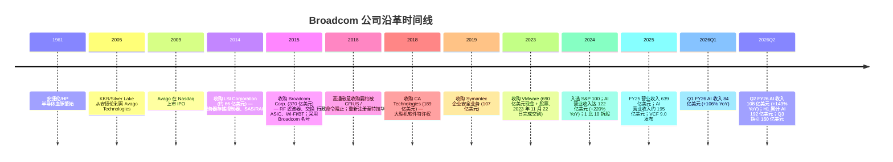
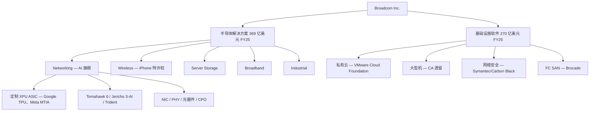
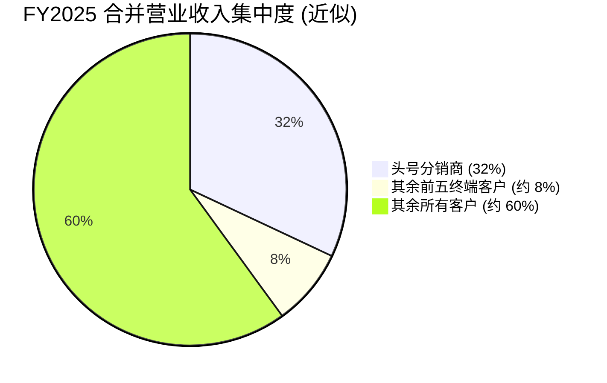
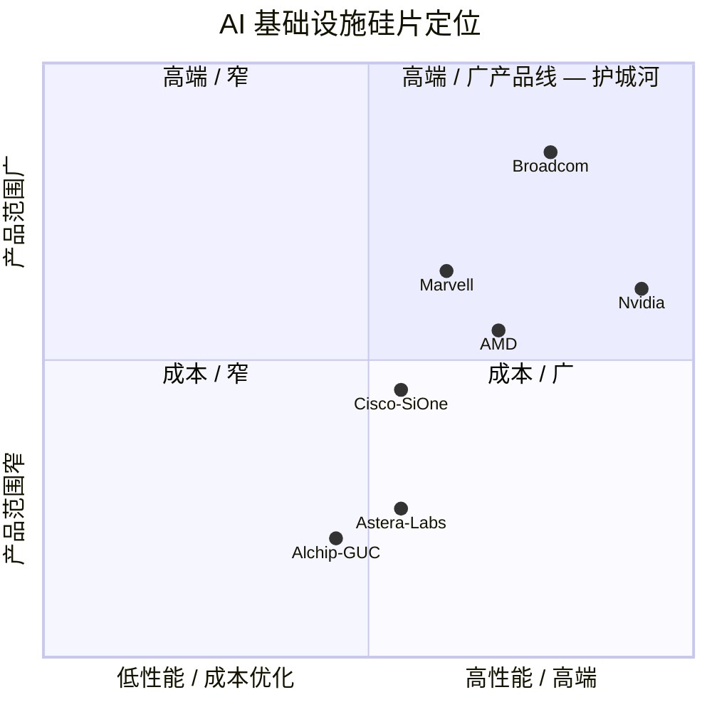
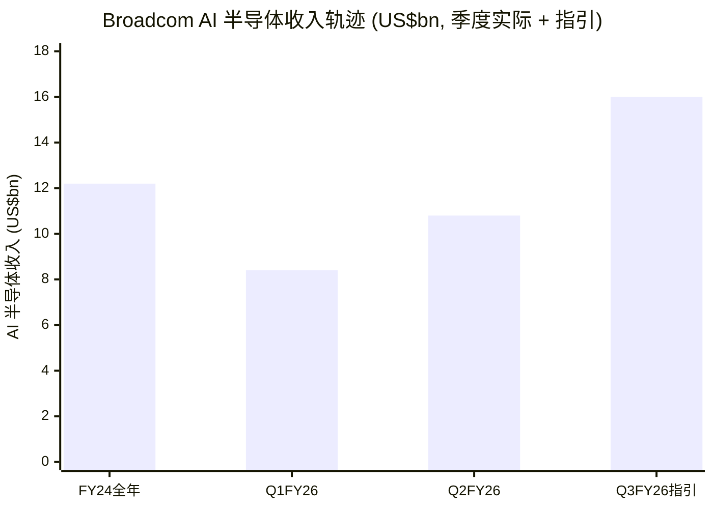

# Broadcom Inc. (NASDAQ:AVGO) — 公司研究报告

**截至日期 (as of):** 2026-06-14
**作者:** company-research skill, financial_agent
**主要信源:** Broadcom FY2025 10-K (提交于 2025-12-18, 财年结束于 2025-11-02)、Q2 FY2026 业绩新闻稿 (8-K, 2026-06-03, 季度结束于 2026-05-03)、Q2 FY2026 10-Q (提交于 2026-06-09)、Q1 FY2026 业绩新闻稿 (8-K, 2026-03-04)、Q4 FY2025 业绩新闻稿 (8-K, 2025-12-11), 以及来自 `db/zsxq.db` 本地券商研究库的 6 家投行 (Bernstein、Morgan Stanley、Citi、J.P. Morgan、Goldman Sachs、UBS) 2026 年 5–6 月单名报告 (均标注为 *分析师观点*)。所有引用文件在第 10 章"参考资料"中列出官方 URL。
**报告语言: 简体中文 (本目录另存有英文版 `..._Research_Document.md`, 本次刷新未重写英文版)**

---

> ### 投资摘要 (Investment Summary) — *分析师观点 (house view)*
>
> | 项目 | 取值 |
> |---|---|
> | **评级 (Rating)** | **Overweight / 增持** |
> | **12 个月目标价 (12-mo PT)** | **US$500** |
> | **当前价 (2026-06-14)** | US$382.07 |
> | **隐含上行空间 (upside)** | **+31%** |
> | **估值方法** | FY2027E 非 GAAP EPS ≈ US$17.5 × 28.5× forward P/E (相对成长性溢价, 经名义同业校准) |
> | **市值** | ≈ US$1.82 万亿 |
> | **52 周区间** | US$244.17 – US$495.00 |
> | **代码 / 交易所** | AVGO / NASDAQ |
>
> 以上评级、目标价与上行空间均为本报告的前瞻性观点 (*分析师观点*), **不附着于任何 10-K / 8-K 引用** —— 财报文件不含目标价。下方四大论点支柱亦为本方判断。
>
> **论点支柱 (thesis pillars) — *分析师观点*:**
> 1. **AI 半导体进入"已交付而非将交付"阶段。** Q2 FY2026 单季 AI 半导体收入达 US$10.8B (+143% YoY), Q3 指引 US$16B (+200%+ YoY); 管理层维持 FY2026 全年 AI ≈ US$56B、FY2027 AI >US$100B 的节奏 —— H1 FY26 累计 AI 收入 (US$19.2B) 已等于 FY25 全年 AI 收入, 将"叙事"转化为"现金"。
> 2. **两大不可复制的护城河:定制 XPU 协同设计 + ~70% AI 以太网交换份额。** SerDes IP (224G Condor)、TSMC CoWoS 产能优先级、与 Google/Meta 十年级关系, 加上 Tomahawk 6 (102T) 的两年节奏, 构成竞争对手单一世代内无法逾越的门槛。
> 3. **VMware 把半导体周期性对冲掉了。** 42% 营业收入来自多年期订阅软件 (基础设施软件 FY25 US$27.0B), NRR 扩张持续, 在任何半导体下行周期中平滑现金流。
> 4. **估值的"GAAP 折扣窗口"正在收窄。** TTM P/E 63.7× 看似昂贵, 但被 US$81 亿 VMware 无形资产摊销与 US$76 亿 SBC 人为压低; forward P/E 19.7× 已接近 NVDA 16.1×, 市场开始为实际利润付费。
>
> **最该盯紧的两个变量 (swing variables):** (1) FY2027 第三、第四个超大规模 XPU 客户 (OpenAI / Anthropic / 传闻中的 Apple、字节跳动) 的设计赢得能否衔接 Google/Meta, 决定 AI 收入从 FY26 到 FY27 是否平滑翻倍; (2) 客户集中度 —— 头号分销商占 FY25 营业收入 32%, 任一关系恶化都会冲击倍数。

---

## 目录

1. 公司概览 (含 1A 估值与目标价快照、1B GF Score 基本面评分)
2. 估值与目标价 / 公司历史 (前瞻模型 + PT 推导 + 牛熊情景 + 卖方观点演变)
3. 管理团队
4. 产品与服务 (含供应链资金流图)
5. 客户与上市策略
6. 行业概览
7. 竞争格局
8. 市场机会 (TAM)
9. 风险评估 (含 9.5 核心分歧与催化剂)
10. 投资者视角评分 (Section 10 lenses)
11. 参考资料

---

## 1. 公司概览

**本报告观点 (BLUF):** 我们给予 Broadcom **增持 (Overweight)** 评级、**12 个月目标价 US$500 (+31%)**。核心逻辑:这是当前唯一一家把"AI 资本开支可见度"真正转化为"已确认现金利润"的大型半导体公司 —— Q2 FY2026 单季 AI 半导体收入 US$10.8B (+143% YoY)、自由现金流 (free cash flow / FCF) US$10.26B (占营业收入 46%), 同时用 42% 的 VMware 订阅软件收入对冲了半导体的周期性。本节先给出业务全貌与估值快照, 第 2 章展开前瞻模型与目标价推导。

Broadcom Inc. (NASDAQ: AVGO) 是一家全球半导体与基础设施软件 (infrastructure software) 的设计、开发与供应商, 业务划分为两大可报告分部 (reportable segment): **半导体解决方案 (Semiconductor Solutions)** 与**基础设施软件 (Infrastructure Software)**。公司是注册于美国特拉华州 (Delaware) 的法人, 总部位于加利福尼亚州帕罗奥图 (Palo Alto, California), 采用 52/53 周财年制, 财年结束于最接近 10 月 31 日的星期日; FY2025 于 2025 年 11 月 2 日结束 (为 52 周财年) ([2025 10-K, 第 1 页](https://www.sec.gov/Archives/edgar/data/1730168/000173016825000121/avgo-20251102.htm))。

**通俗业务描述。** Broadcom 设计并销售芯片及配套软件 —— 两者结合, 使大型企业和超大规模数据中心运营商 (hyperscaler) 能够运行其计算与网络基础设施。在硅片侧, 公司最为人知的是两大主导其叙事的产品族系:(1) **定制 AI 加速器 ASIC ("XPU", 定制专用集成电路 / custom application-specific integrated circuit)** —— 全球最大的几家云计算公司 (Google、Meta 等) 购买这些芯片用于训练和部署自己专有的 AI 模型;(2) **高基数以太网交换硅片 (high-radix Ethernet switching silicon)** (Tomahawk、Jericho、Trident 系列) —— 它们将 AI 数据中心内部由 XPU 与商用 GPU (merchant GPU) 组成的集群连接成一体。在 AI 之外, Broadcom 还是 RF 前端滤波器 (RF front-end filter) 和 Wi-Fi/蓝牙合并芯片的商用供应商 (几乎每部出货的 iPhone 都装有其产品);是服务器存储控制器 (SAS/RAID、光纤通道、定制 SSD 控制器) 的龙头;也是多数宽带客户终端设备 (CPE) 中采用的有线调制解调器、PON 和 STB SoC 芯片的供应商。在软件侧, 2023 年 11 月对 VMware 的收购使 Broadcom 跻身为事实意义上的私有云基础设施软件龙头;此外公司还拥有原 CA Technologies 大型机软件特许权、Symantec 企业安全业务, 以及从 Brocade 继承的光纤通道存储网络软件组合 ([2025 10-K, 第 3–8 页](https://www.sec.gov/Archives/edgar/data/1730168/000173016825000121/avgo-20251102.htm))。

**盈利模式与收入分配。** FY2025 全年营业收入按两大分部约按 58 / 42 拆分。**半导体解决方案 FY2025 营业收入为 36,858 百万美元 (+22% YoY)**, 主要来自向少数集中的超大规模企业、OEM 与少数大型智能手机 OEM 销售定制 AI 加速器、以太网交换硅片、RF 滤波器、宽带芯片与存储控制器。**基础设施软件 FY2025 营业收入为 27,029 百万美元 (+26% YoY)** ([2025 10-K, MD&A 第 39 页](https://www.sec.gov/Archives/edgar/data/1730168/000173016825000121/avgo-20251102.htm)), 几乎完全来自针对世界 500 强 (Fortune 500) 和政府客户的多年期 VMware Cloud Foundation (VCF)、大型机软件以及 Symantec/Carbon Black 安全产品的订阅合同。下方收入分配 Sankey 显示这两个分部的营业收入如何穿过 68% 的毛利率 (gross margin)、17% 的 R&D 与 7% 的 SG&A, 落到 40% 的 GAAP 营业利润率 (operating margin) 与 36% 的 GAAP 净利率:

<svg xmlns="http://www.w3.org/2000/svg" viewBox="0 0 1000 560" width="1000" height="560" role="img" aria-label="income statement Sankey"><rect x="0" y="0" width="1000" height="560" fill="#ffffff"/>
<text x="20.00" y="30.00" text-anchor="start" font-family="Helvetica,Arial,sans-serif" font-size="15" font-weight="700" fill="#1f2933">Broadcom 收入分配 Sankey — FY2025 (US$mn)</text>
<path d="M 204.00,78.00 C 258.00,78.00 258.00,85.00 312.00,85.00 L 312.00,320.39 C 258.00,320.39 258.00,313.39 204.00,313.39 Z" fill="#93c5fd" fill-opacity="0.55"/>
<path d="M 452.00,78.00 C 506.00,78.00 506.00,127.22 560.00,127.22 L 560.00,289.97 C 506.00,289.97 506.00,240.75 452.00,240.75 Z" fill="#86efac" fill-opacity="0.55"/>
<path d="M 452.00,240.75 C 506.00,240.75 506.00,303.97 560.00,303.97 L 560.00,417.58 C 506.00,417.58 506.00,354.36 452.00,354.36 Z" fill="#fca5a5" fill-opacity="0.55"/>
<path d="M 328.00,85.00 C 382.00,85.00 382.00,78.00 436.00,78.00 L 436.00,354.49 C 382.00,354.49 382.00,361.49 328.00,361.49 Z" fill="#86efac" fill-opacity="0.55"/>
<path d="M 328.00,361.49 C 382.00,361.49 382.00,368.49 436.00,368.49 L 436.00,500.00 C 382.00,500.00 382.00,493.00 328.00,493.00 Z" fill="#fca5a5" fill-opacity="0.55"/>
<path d="M 700.00,120.22 C 754.00,120.22 754.00,207.16 808.00,207.16 L 808.00,354.84 C 754.00,354.84 754.00,267.91 700.00,267.91 Z" fill="#86efac" fill-opacity="0.55"/>
<path d="M 700.00,267.91 C 754.00,267.91 754.00,368.84 808.00,368.84 L 808.00,370.84 C 754.00,370.84 754.00,269.91 700.00,269.91 Z" fill="#fca5a5" fill-opacity="0.55"/>
<path d="M 576.00,127.22 C 630.00,127.22 630.00,120.22 684.00,120.22 L 684.00,282.97 C 630.00,282.97 630.00,289.97 576.00,289.97 Z" fill="#86efac" fill-opacity="0.55"/>
<path d="M 576.00,303.97 C 630.00,303.97 630.00,316.17 684.00,316.17 L 684.00,343.06 C 630.00,343.06 630.00,330.86 576.00,330.86 Z" fill="#fca5a5" fill-opacity="0.55"/>
<path d="M 576.00,330.86 C 630.00,330.86 630.00,357.06 684.00,357.06 L 684.00,427.16 C 630.00,427.16 630.00,400.96 576.00,400.96 Z" fill="#fca5a5" fill-opacity="0.55"/>
<path d="M 576.00,400.96 C 630.00,400.96 630.00,441.16 684.00,441.16 L 684.00,457.78 C 630.00,457.78 630.00,417.58 576.00,417.58 Z" fill="#fca5a5" fill-opacity="0.55"/>
<path d="M 204.00,327.39 C 258.00,327.39 258.00,320.39 312.00,320.39 L 312.00,493.00 C 258.00,493.00 258.00,500.00 204.00,500.00 Z" fill="#93c5fd" fill-opacity="0.55"/>
<path d="M 576.00,431.58 C 630.00,431.58 630.00,282.97 684.00,282.97 L 684.00,302.17 C 630.00,302.17 630.00,450.78 576.00,450.78 Z" fill="#93c5fd" fill-opacity="0.55"/>
<rect x="188.00" y="78.00" width="16" height="235.39" rx="1.5" fill="#2563eb"/>
<rect x="188.00" y="327.39" width="16" height="172.61" rx="1.5" fill="#2563eb"/>
<rect x="312.00" y="85.00" width="16" height="408.00" rx="1.5" fill="#1e3a8a"/>
<rect x="436.00" y="78.00" width="16" height="276.49" rx="1.5" fill="#15803d"/>
<rect x="436.00" y="368.49" width="16" height="131.51" rx="1.5" fill="#dc2626"/>
<rect x="560.00" y="127.22" width="16" height="162.75" rx="1.5" fill="#15803d"/>
<rect x="560.00" y="303.97" width="16" height="113.61" rx="1.5" fill="#dc2626"/>
<rect x="560.00" y="431.58" width="16" height="19.20" rx="1.5" fill="#2563eb"/>
<rect x="684.00" y="120.22" width="16" height="181.95" rx="1.5" fill="#15803d"/>
<rect x="684.00" y="316.17" width="16" height="26.89" rx="1.5" fill="#dc2626"/>
<rect x="684.00" y="357.06" width="16" height="70.10" rx="1.5" fill="#dc2626"/>
<rect x="684.00" y="441.16" width="16" height="16.62" rx="1.5" fill="#dc2626"/>
<rect x="808.00" y="207.16" width="16" height="147.69" rx="1.5" fill="#15803d"/>
<rect x="808.00" y="368.84" width="16" height="2.00" rx="1.5" fill="#dc2626"/>
<text x="179.00" y="192.69" text-anchor="end" font-family="Helvetica,Arial,sans-serif" font-size="11.5" font-weight="700" fill="#1f2933">Semiconductor Solutions</text>
<text x="179.00" y="205.69" text-anchor="end" font-family="Helvetica,Arial,sans-serif" font-size="10" font-weight="400" fill="#52606d">US$36.9B  (57.7%)</text>
<text x="179.00" y="410.69" text-anchor="end" font-family="Helvetica,Arial,sans-serif" font-size="11.5" font-weight="700" fill="#1f2933">Infrastructure Software</text>
<text x="179.00" y="423.69" text-anchor="end" font-family="Helvetica,Arial,sans-serif" font-size="10" font-weight="400" fill="#52606d">US$27.0B  (42.3%)</text>
<rect x="331.00" y="67.00" width="119.40" height="26" rx="2" fill="#ffffff" fill-opacity="0.72"/>
<text x="334.00" y="79.00" text-anchor="start" font-family="Helvetica,Arial,sans-serif" font-size="11.5" font-weight="700" fill="#1f2933">Revenue</text>
<text x="334.00" y="92.00" text-anchor="start" font-family="Helvetica,Arial,sans-serif" font-size="10" font-weight="400" fill="#52606d">US$63.9B  (100.0%)</text>
<rect x="455.00" y="60.00" width="113.10" height="26" rx="2" fill="#ffffff" fill-opacity="0.72"/>
<text x="458.00" y="72.00" text-anchor="start" font-family="Helvetica,Arial,sans-serif" font-size="11.5" font-weight="700" fill="#1f2933">Gross Profit</text>
<text x="458.00" y="85.00" text-anchor="start" font-family="Helvetica,Arial,sans-serif" font-size="10" font-weight="400" fill="#52606d">US$43.3B  (67.8%)</text>
<rect x="455.00" y="350.49" width="144.60" height="26" rx="2" fill="#ffffff" fill-opacity="0.72"/>
<text x="458.00" y="362.49" text-anchor="start" font-family="Helvetica,Arial,sans-serif" font-size="11.5" font-weight="700" fill="#1f2933">Cost of Revenue (COGS)</text>
<text x="458.00" y="375.49" text-anchor="start" font-family="Helvetica,Arial,sans-serif" font-size="10" font-weight="400" fill="#52606d">US$20.6B  (32.2%)</text>
<rect x="579.00" y="109.22" width="113.10" height="26" rx="2" fill="#ffffff" fill-opacity="0.72"/>
<text x="582.00" y="121.22" text-anchor="start" font-family="Helvetica,Arial,sans-serif" font-size="11.5" font-weight="700" fill="#1f2933">Operating Income</text>
<text x="582.00" y="134.22" text-anchor="start" font-family="Helvetica,Arial,sans-serif" font-size="10" font-weight="400" fill="#52606d">US$25.5B  (39.9%)</text>
<rect x="579.00" y="285.97" width="150.90" height="26" rx="2" fill="#ffffff" fill-opacity="0.72"/>
<text x="582.00" y="297.97" text-anchor="start" font-family="Helvetica,Arial,sans-serif" font-size="11.5" font-weight="700" fill="#1f2933">Total Operating Expense</text>
<text x="582.00" y="310.97" text-anchor="start" font-family="Helvetica,Arial,sans-serif" font-size="10" font-weight="400" fill="#52606d">US$17.8B  (27.8%)</text>
<text x="551.00" y="438.18" text-anchor="end" font-family="Helvetica,Arial,sans-serif" font-size="11.5" font-weight="700" fill="#1f2933">Net Interest / Other Income</text>
<text x="551.00" y="451.18" text-anchor="end" font-family="Helvetica,Arial,sans-serif" font-size="10" font-weight="400" fill="#52606d">US$3.0B  (4.7%)</text>
<rect x="703.00" y="102.22" width="113.10" height="26" rx="2" fill="#ffffff" fill-opacity="0.72"/>
<text x="706.00" y="114.22" text-anchor="start" font-family="Helvetica,Arial,sans-serif" font-size="11.5" font-weight="700" fill="#1f2933">Pretax Income</text>
<text x="706.00" y="127.22" text-anchor="start" font-family="Helvetica,Arial,sans-serif" font-size="10" font-weight="400" fill="#52606d">US$28.5B  (44.6%)</text>
<rect x="703.00" y="298.17" width="100.50" height="26" rx="2" fill="#ffffff" fill-opacity="0.72"/>
<text x="706.00" y="310.17" text-anchor="start" font-family="Helvetica,Arial,sans-serif" font-size="11.5" font-weight="700" fill="#1f2933">SG&amp;A</text>
<text x="706.00" y="323.17" text-anchor="start" font-family="Helvetica,Arial,sans-serif" font-size="10" font-weight="400" fill="#52606d">US$4.2B  (6.6%)</text>
<rect x="703.00" y="339.06" width="113.10" height="26" rx="2" fill="#ffffff" fill-opacity="0.72"/>
<text x="706.00" y="351.06" text-anchor="start" font-family="Helvetica,Arial,sans-serif" font-size="11.5" font-weight="700" fill="#1f2933">R&amp;D</text>
<text x="706.00" y="364.06" text-anchor="start" font-family="Helvetica,Arial,sans-serif" font-size="10" font-weight="400" fill="#52606d">US$11.0B  (17.2%)</text>
<rect x="703.00" y="423.16" width="100.50" height="26" rx="2" fill="#ffffff" fill-opacity="0.72"/>
<text x="706.00" y="435.16" text-anchor="start" font-family="Helvetica,Arial,sans-serif" font-size="11.5" font-weight="700" fill="#1f2933">Other OpEx</text>
<text x="706.00" y="448.16" text-anchor="start" font-family="Helvetica,Arial,sans-serif" font-size="10" font-weight="400" fill="#52606d">US$2.6B  (4.1%)</text>
<text x="833.00" y="278.00" text-anchor="start" font-family="Helvetica,Arial,sans-serif" font-size="11.5" font-weight="700" fill="#1f2933">Net Income</text>
<text x="833.00" y="291.00" text-anchor="start" font-family="Helvetica,Arial,sans-serif" font-size="10" font-weight="400" fill="#52606d">US$23.1B  (36.2%)</text>
<text x="833.00" y="366.84" text-anchor="start" font-family="Helvetica,Arial,sans-serif" font-size="11.5" font-weight="700" fill="#1f2933">Income Tax</text>
<text x="833.00" y="379.84" text-anchor="start" font-family="Helvetica,Arial,sans-serif" font-size="10" font-weight="400" fill="#52606d">-US$664.0M  (-1.0%)</text>
<text x="500.00" y="544.00" text-anchor="middle" font-family="Helvetica,Arial,sans-serif" font-size="10" font-weight="400" fill="#52606d">Source: Broadcom FY2025 10-K (FY ended 2025-11-02), MD&amp;A p.39 + consolidated statements p.43/p.47</text>
</svg>

*来源: [Broadcom FY2025 10-K, 合并经营业绩表第 47 页 + MD&A 第 39–40 页](https://www.sec.gov/Archives/edgar/data/1730168/000173016825000121/avgo-20251102.htm)。注:图中"Pretax Income"显示约 285 亿美元, 因其口径为营业利润 + 净利息/其他收入合计; 实际 GAAP 税前利润为 224.6 亿美元, 经 6.64 亿美元税收抵免后得净利润 231.3 亿美元 (FY25 出现负有效税率, 主要为离散税项调整)。*

需要注意的列报口径变化:披露的产品组合为 70% "产品 (Products)" 与 30% "订阅与服务 (Subscriptions and services)" —— 但这一拆分本身需要附注说明, 因为 Broadcom 在 FY2025 将 **78 亿美元的 VCF 前期许可收入从订阅与服务重分类至产品项下**, 这一列报变化在 10-K MD&A 中明确披露 ([2025 10-K, MD&A 第 39 页](https://www.sec.gov/Archives/edgar/data/1730168/000173016825000121/avgo-20251102.htm))。换言之, "产品占 70%"夸大了硬件比重, 软件的真实经济贡献更高。

**经营地理。** Broadcom 是一家全球分布的工程组织, 设计中心集中于美国、亚洲与欧洲。多数半导体出货的所有权与控制权在马来西亚槟城 (Penang, Malaysia) 转移 ([2025 10-K, Note 16 第 39 页](https://www.sec.gov/Archives/edgar/data/1730168/000173016825000121/avgo-20251102.htm)), 这就是为什么分部脚注中显示大量营业收入按"交付地"计入新加坡和马来西亚 —— 尽管终端需求位于美国与中国。按 ship-to 国家口径, FY2025 美国 16,506 百万美元、中国 (含香港) 11,155 百万美元、新加坡 10,796 百万美元、台湾 6,451 百万美元、其他海外 18,979 百万美元 ([2025 10-K, Note 16 第 39 页](https://www.sec.gov/Archives/edgar/data/1730168/000173016825000121/avgo-20251102.htm)); 从最终目的地视角, 运往中国 (含香港) 占 FY2025 营业收入 17% (FY2024 为 20%), 但 10-K 明确指出"相当一部分发往中国的产品实际再转运至非中国终端市场"。

**公司体量 (FY2025 全年)。** 总净营业收入 **63,887 百万美元** (相较 FY2024 的 51,574 百万美元同比 +24%), GAAP 净利润 **23,126 百万美元**, 对应 EPS **基本 4.91 美元 / 摊薄 4.77 美元** ([2025 10-K, 合并经营业绩表第 47 页](https://www.sec.gov/Archives/edgar/data/1730168/000173016825000121/avgo-20251102.htm))。营业利润 25,484 百万美元 (GAAP 营业利润率 40%)。FY2025 FCF 为 **269 亿美元** —— 经营性现金流 (CFO) 27,537 百万美元减资本支出 (CapEx) 623 百万美元 —— 相当于营业收入的 42% ([2025 10-K, 第 43 页](https://www.sec.gov/Archives/edgar/data/1730168/000173016825000121/avgo-20251102.htm))。

**进入 FY2026:AI 加速放量。** Q2 FY2026 (季度结束于 2026-05-03) 公布**创纪录营业收入 22,187 百万美元 (+48% YoY)**, 其中**半导体解决方案 15,009 百万美元 (+79% YoY)**、**基础设施软件 7,178 百万美元 (+9% YoY)**; **AI 半导体收入 108 亿美元 (+143% YoY)**, 高于 3 月给出的 107 亿美元 AI 指引。GAAP 摊薄 EPS **1.91 美元 (+85% YoY)**, 非 GAAP 摊薄 EPS **2.44 美元**; **adjusted EBITDA (调整后 EBITDA) 15,244 百万美元 (占营业收入 69%)**; **FCF 10,493 − 263 = 102.6 亿美元, 占营业收入 46%** ([Q2 FY2026 业绩新闻稿, 2026-06-03](https://www.sec.gov/Archives/edgar/data/1730168/000173016826000051/avgo-05032026x8kxex99.htm))。资产负债表现金升至 **196 亿美元** (上季末 142 亿美元), 总债务约 649 亿美元。H1 FY26 累计营业收入约 414 亿美元 (Q1 193.1 亿 + Q2 221.9 亿, +38% YoY); **H1 累计 AI 半导体收入 192 亿美元 (Q1 84 亿 + Q2 108 亿) —— 已基本等于 FY2025 全年 AI 营业收入。** **Q3 FY2026 指引:营业收入约 294 亿美元 (+84% YoY), AI 半导体约 160 亿美元 (+200%+ YoY), adjusted EBITDA 约占营业收入 68%** ([Q2 FY2026 业绩新闻稿](https://www.sec.gov/Archives/edgar/data/1730168/000173016826000051/avgo-05032026x8kxex99.htm))。Q2 单季回购 6 亿美元、派发股息 30.9 亿美元 (季度股息 0.65 美元/股) —— 回购远低于 Q1 的 78.5 亿美元, 管理层将资本弹性留给债务偿还与潜在战略并购。

### 1A. 估值与目标价快照 (Valuation snapshot, 2026-06-14)

AVGO 收于 **US$382.07**, 市值约 **US$1.82 万亿** (yfinance, 2026-06-14)。值得注意:股价已从 Q2 业绩公布次日 (2026-06-04) 的 US$418 回落约 9% 至 US$382 —— 这一回调正是多家券商所称的"买点 (buyers of the pullback)", 因为 Q2 实际 AI 收入与 Q3 指引虽强但"仅符合而未远超极高的市场预期", 触发获利了结。过去 52 周区间 **US$244.17 – US$495.00**;当前价距 4 月触及的 495 美元历史高点低约 23%, 距 52 周低位高约 56%。TTM 各项倍数与同业对比如下:

| 代码 | 最新价 (2026-06-14) | 市值 (十亿美元) | TTM P/E | 远期 P/E | TTM P/S |
|---|---:|---:|---:|---:|---:|
| **AVGO** | 382.07 美元 | 1,818 | **63.7x** | 19.7x | **24.1x** |
| NVDA | 205.19 美元 | 4,970 | 31.4x | 16.1x | 19.6x |
| MRVL | 279.70 美元 | 245 | 96.1x | 45.3x | 28.1x |
| QCOM | 211.72 美元 | 223 | 22.8x | 19.8x | 5.0x |

来源: [Yahoo Finance / yfinance — AVGO](https://finance.yahoo.com/quote/AVGO/key-statistics/)、[NVDA](https://finance.yahoo.com/quote/NVDA/key-statistics/)、[MRVL](https://finance.yahoo.com/quote/MRVL/key-statistics/)、[QCOM](https://finance.yahoo.com/quote/QCOM/key-statistics/), 均于 2026-06-14 经 yfinance Python 库拉取。

AVGO 的 **TTM P/E 63.7 倍**介于 NVDA 31.4 倍与 MRVL 96.1 倍之间, **TTM P/S 24.1 倍**略低于 MRVL 28.1 倍、高于 NVDA 19.6 倍, 远高于 QCOM 5.0 倍。这一组高倍数最贴切的解释仍是**结构性的 AI 基础设施溢价 (AI-infra premium)** —— 市场为可见的定制 XPU 储备订单 (Google TPU、Meta MTIA、OpenAI/Anthropic 等) 和 VMware 订阅跑道支付溢价, 而非为 TTM GAAP 利润付费。关键点在于:TTM 盈利数字被两项 GAAP 费用人为压缩, 而 forward 倍数已基本剔除它们 —— (1) 约 81 亿美元的 VMware 相关无形资产年摊销 (FY25 计入营业成本 60.3 亿 + 计入运营费用 20.3 亿 ([2025 10-K, 第 47 页](https://www.sec.gov/Archives/edgar/data/1730168/000173016825000121/avgo-20251102.htm)));(2) **FY25 股票薪酬 (SBC, stock-based compensation) 76 亿美元** ([2025 10-K, 现金流表第 43 页](https://www.sec.gov/Archives/edgar/data/1730168/000173016825000121/avgo-20251102.htm))。剔除后, **远期 P/E 19.7 倍**已贴近 NVDA 16.1 倍、显著低于 MRVL 45.3 倍, 与 QCOM 19.8 倍几乎相同 —— 即"市场为 AVGO 已经在交付的盈利付与 QCOM 相近的倍数, 同时获得三位数的 AI 增速"。我们的目标价正建立在 forward 口径之上 (见第 2 章)。该溢价的脆弱性在于客户集中度 (头号客户占 32%, 见第 5 章) 与 FY2027 单一超大规模客户需求悬崖风险 (见第 9 章)。

### 1B. GF Score (GuruFocus 式) 基本面评分 — *分析师观点*

下方五维雷达是模仿 GuruFocus 的 GF Score™ 构建的基本面打分卡, 五个维度各 0–10 分, 经透明加权映射为 0–100 综合分。**这是本报告自有的分析框架 (*分析师观点*), 不是新的数据源, 也不是 GuruFocus 的官方数字** —— 每个底层指标 (毛利率、杠杆、CAGR、倍数、回报) 在前文已各自带有引用, 而综合分本身从不附着任何财报引用。

<svg xmlns="http://www.w3.org/2000/svg" viewBox="0 0 500 500" width="500" height="500" role="img" aria-label="GF Score radar">
<rect x="0" y="0" width="500" height="500" fill="#ffffff"/>
<text x="20" y="24" font-family="Helvetica,Arial,sans-serif" font-size="15" font-weight="700" fill="#1f2933">GF Score (GuruFocus-style): 78/100</text>
<text x="20" y="41" font-family="Helvetica,Arial,sans-serif" font-size="11" fill="#52606d">71–80 Likely average performance</text>
<polygon points="250.0,88.0 392.7,191.6 338.2,359.4 161.8,359.4 107.3,191.6" fill="#e9f5ec" stroke="none"/>
<polygon points="250.0,208.0 278.5,228.7 267.6,262.3 232.4,262.3 221.5,228.7" fill="none" stroke="#c5d3cb" stroke-width="1"/>
<polygon points="250.0,178.0 307.1,219.5 285.3,286.5 214.7,286.5 192.9,219.5" fill="none" stroke="#c5d3cb" stroke-width="1"/>
<polygon points="250.0,148.0 335.6,210.2 302.9,310.8 197.1,310.8 164.4,210.2" fill="none" stroke="#c5d3cb" stroke-width="1"/>
<polygon points="250.0,118.0 364.1,200.9 320.5,335.1 179.5,335.1 135.9,200.9" fill="none" stroke="#c5d3cb" stroke-width="1"/>
<polygon points="250.0,88.0 392.7,191.6 338.2,359.4 161.8,359.4 107.3,191.6" fill="none" stroke="#c5d3cb" stroke-width="1.3"/>
<line x1="250" y1="238" x2="161.8" y2="359.4" stroke="#cfdad3" stroke-width="1"/>
<text x="146.5" y="392.4" text-anchor="end" font-family="Helvetica,Arial,sans-serif" font-size="11.5" font-weight="600" fill="#1f2933">财务实力</text>
<text x="197.1" y="304.8" text-anchor="middle" font-family="Helvetica,Arial,sans-serif" font-size="10.5" font-weight="700" fill="#1f2933">6</text>
<line x1="250" y1="238" x2="250.0" y2="88.0" stroke="#cfdad3" stroke-width="1"/>
<text x="250.0" y="58.0" text-anchor="middle" font-family="Helvetica,Arial,sans-serif" font-size="11.5" font-weight="600" fill="#1f2933">盈利能力</text>
<text x="250.0" y="97.0" text-anchor="middle" font-family="Helvetica,Arial,sans-serif" font-size="10.5" font-weight="700" fill="#1f2933">9</text>
<line x1="250" y1="238" x2="107.3" y2="191.6" stroke="#cfdad3" stroke-width="1"/>
<text x="82.6" y="183.6" text-anchor="end" font-family="Helvetica,Arial,sans-serif" font-size="11.5" font-weight="600" fill="#1f2933">成长性</text>
<text x="107.3" y="185.6" text-anchor="middle" font-family="Helvetica,Arial,sans-serif" font-size="10.5" font-weight="700" fill="#1f2933">10</text>
<line x1="250" y1="238" x2="392.7" y2="191.6" stroke="#cfdad3" stroke-width="1"/>
<text x="417.4" y="183.6" text-anchor="start" font-family="Helvetica,Arial,sans-serif" font-size="11.5" font-weight="600" fill="#1f2933">估值</text>
<text x="307.1" y="213.5" text-anchor="middle" font-family="Helvetica,Arial,sans-serif" font-size="10.5" font-weight="700" fill="#1f2933">4</text>
<line x1="250" y1="238" x2="338.2" y2="359.4" stroke="#cfdad3" stroke-width="1"/>
<text x="353.5" y="392.4" text-anchor="start" font-family="Helvetica,Arial,sans-serif" font-size="11.5" font-weight="600" fill="#1f2933">动量</text>
<text x="320.5" y="329.1" text-anchor="middle" font-family="Helvetica,Arial,sans-serif" font-size="10.5" font-weight="700" fill="#1f2933">8</text>
<polygon points="250.0,103.0 307.1,219.5 320.5,335.1 197.1,310.8 107.3,191.6" fill="#2e8b57" fill-opacity="0.34" stroke="#2e8b57" stroke-width="2"/>
<circle cx="197.1" cy="310.8" r="2.6" fill="#2e8b57"/>
<circle cx="250.0" cy="103.0" r="2.6" fill="#2e8b57"/>
<circle cx="107.3" cy="191.6" r="2.6" fill="#2e8b57"/>
<circle cx="307.1" cy="219.5" r="2.6" fill="#2e8b57"/>
<circle cx="320.5" cy="335.1" r="2.6" fill="#2e8b57"/>
<text x="250" y="470" text-anchor="middle" font-family="Helvetica,Arial,sans-serif" font-size="9.5" fill="#52606d">Source: AVGO FY2025 10-K · Q2 FY2026 8-K · Yahoo Finance/yfinance · indicators.db, as of 2026-06-14</text>
<text x="250" y="485" text-anchor="middle" font-family="Helvetica,Arial,sans-serif" font-size="9" fill="#52606d">GF Score = independent analyst rubric (*Analyst view:*) — not GuruFocus™ official number</text>
</svg>

**各维度评分理由 (*分析师观点*):**

- **Financial Strength (财务实力) = 6/10。** 总债务约 649 亿美元 (Q2 FY26), 净债务约 450 亿美元, 但 FY25 FCF 269 亿美元对其形成充分覆盖 (净债务/EBITDA ≈ 1.7×, 利息覆盖倍数充裕); 投资级评级、分级固定利率债券结构降低再融资风险 ([2025 10-K, 第 43 页](https://www.sec.gov/Archives/edgar/data/1730168/000173016825000121/avgo-20251102.htm))。扣分项是 VMware 收购遗留的绝对杠杆与商誉/无形资产占总资产 76% (97,801 + 32,273 / 171,092)。
- **Profitability (盈利能力) = 9/10。** GM 68%、GAAP 营业利润率 40%、ROE 约 31% (净利 23,126 / 平均权益 74,485)、ROIC 远高于 WACC, 且历年一致 ([2025 10-K, 第 47 页](https://www.sec.gov/Archives/edgar/data/1730168/000173016825000121/avgo-20251102.htm))。Tan 的 SG&A/R&D 纪律是这一利润率结构的根源 —— 这是营业收入相近的同业无法企及的。
- **Growth (成长性) = 10/10。** FY25 营业收入 +24% YoY、AI 半导体 FY26E 指引 +180%、Bernstein 估 FY27E 调整后 EPS 18.69 美元 (vs FY25A 6.82 美元, 两年近 2.7 倍); 多年期 XPU 设计赢得提供罕见的收入可见度 ([Bernstein FQ226 recap, 2026-06-04, p.1](http://xs-macbook-air.local:5001/zsxq/pdf/415288425488488/Bernstein-Broadcom%20Inc%EF%BC%88AVGO.US%EF%BC%89Broadcom%20%EF%BC%88AVGO%EF%BC%89%EF%BC%9A%20FQ226%20recap~Wait%20for%20it...-260604.pdf))。满分维度。
- **GF Value (估值, 越高越便宜) = 4/10。** TTM P/E 63.7× 处历史高位, 相对内在价值区间的安全边际 (margin of safety) 偏薄; 即便 forward P/E 19.7× 合理, 也谈不上"便宜"。给 4 分反映"价格已不便宜但未到泡沫" ([Yahoo Finance, 2026-06-14](https://finance.yahoo.com/quote/AVGO/key-statistics/))。
- **Momentum (动量) = 8/10。** 过去 12 个月 +54.9% (vs S&P 500 +24.3%), 显著跑赢基准, 现价高于 200 日均线 (US$357); 扣分项是近期 -9% 的业绩后回调 (yfinance, 2026-06-14)。

**综合 GF Score = 78/100** (band: 71–80, "可能录得平均偏上表现")。该分数与报告其余部分自洽:Growth 满分 ↔ 第 2 章前瞻模型, GF Value 偏低 ↔ 1A 高 TTM 倍数, Momentum 8 分 ↔ 上方 +54.9% 相对表现行。一句话失效模式:若 FY2027 单一超大规模客户需求悬崖兑现, Growth 与 Momentum 将同步崩塌, 综合分会快速跌入 60 区间。

---

## 2. 估值与目标价 / 公司历史

### 2A. 前瞻财务模型与目标价推导 — *分析师观点*

下表为本报告对 Broadcom 的三年前瞻估计 (forward estimates)。**每一个前瞻单元格均为本方观点 (*分析师观点*), 不附着任何财报引用** —— 我们以 10-K 分部数据 + 管理层 Q2 业绩电话会议指引 + 行业资本开支预测为基础构建, 并以本地券商库 (`db/zsxq.db`) 的卖方估计作为校准基准。

| (US\$bn 除 EPS) | FY2025A | FY2026E | FY2027E | 驱动 / 依据 (*分析师观点*) |
|---|---:|---:|---:|---|
| **总营业收入** | 63.9 | ≈92 | ≈128 | Q1 19.3 + Q2 22.2 实际 + Q3 29.4 指引 ([Q2 8-K](https://www.sec.gov/Archives/edgar/data/1730168/000173016826000051/avgo-05032026x8kxex99.htm)); H2 AI 加速 |
| — 其中 AI 半导体 | ≈19.5 | ≈56 | >100 | 管理层 FY26 ≈56、FY27 >100 节奏 ([Q2 8-K + 电话会议](https://www.sec.gov/Archives/edgar/data/1730168/000173016826000051/avgo-05032026x8kxex99.htm)) |
| — 非 AI 半导体 | ≈17.4 | ≈18 | ≈19 | 宽带/存储触底回升, 无线稳定 |
| — 基础设施软件 | 27.0 | ≈29 | ≈31 | VCF 订阅化成熟期, Q2 +9% YoY |
| **GAAP 毛利率** | 68% | ≈68% | ≈70% | AI 占比上升 + 软件混合 (摊销逐年退坡) |
| **非 GAAP 营业利润率** | ≈62% | ≈65% | ≈67% | 经营杠杆 + Q3 指引 67% adj. EBITDA |
| **非 GAAP 摊薄 EPS** | 6.82 | ≈10.8 | ≈17.5 | Bernstein F26E 11.60 / F27E 18.69, UBS F26 10.60, 本方取中性偏保守 |
| 同比增速 (EPS) | — | +58% | +62% | — |

非 GAAP EPS 的关键校准:Bernstein 给出 FY26E 11.60 美元 / FY27E 18.69 美元 ([Bernstein FQ226 recap, 2026-06-04, p.1](http://xs-macbook-air.local:5001/zsxq/pdf/415288425488488/Bernstein-Broadcom%20Inc%EF%BC%88AVGO.US%EF%BC%89Broadcom%20%EF%BC%88AVGO%EF%BC%89%EF%BC%9A%20FQ226%20recap~Wait%20for%20it...-260604.pdf)); UBS 在业绩前将 FY26 EPS 上调至 10.60 美元 ([UBS FQ2-26 Preview, 2026-05-18](http://xs-macbook-air.local:5001/zsxq/pdf/184121514242442/UBS-Broadcom%20Inc.%20FQ2-26%20%28Apr%29%20Preview-Raising%20PT%2C%20Adjusting%20Estimates-260518.pdf))。本方 FY27E 取 17.5 美元, 介于两者之间且对 FY27 AI >100B 指引留出折让 (考虑 rack-to-chip 转型与机架租赁模式可能稀释毛利)。

**目标价推导 (show the arithmetic):**

> **FY2027E 非 GAAP EPS US$17.5 × 28.5× forward P/E = US$500 (取整)。**

**为什么用 28.5× 这个倍数 (multiple justification)?** 以 FY27E 盈利计, AVGO 当前股价隐含约 21.8× (382.07 / 17.5)。同业校准:NVDA forward P/E 16.1×、MRVL 45.3×、QCOM 19.8× ([Yahoo Finance, 2026-06-14](https://finance.yahoo.com/quote/AVGO/key-statistics/))。AVGO 的 EPS 两年 CAGR (≈60%) 显著高于 NVDA 与 QCOM, 而其盈利质量 (实际现金、非"将兑现") 又优于 MRVL —— 因此给予介于 NVDA 与 MRVL 之间、向 NVDA 侧靠拢的 28.5× 是合理的:相对 NVDA 的成长性溢价, 但相对 MRVL 的"已交付"折价。Bernstein 直接给出 FY27E Adj P/E 25.6× 在其 550 美元目标价下 ([Bernstein, 2026-06-04, p.1](http://xs-macbook-air.local:5001/zsxq/pdf/415288425488488/Bernstein-Broadcom%20Inc%EF%BC%88AVGO.US%EF%BC%89Broadcom%20%EF%BC%88AVGO%EF%BC%89%EF%BC%9A%20FQ226%20recap~Wait%20for%20it...-260604.pdf)) —— 我们 28.5× 略高, 但 EPS 估计 (17.5) 略低于 Bernstein 的 18.69, 两条路径殊途同归至 500 美元附近。

**牛 / 基准 / 熊三档目标价 (*分析师观点*):**

| 情景 | 12-mo PT | 上行/下行 | 核心摆动假设 |
|---|---:|---:|---|
| **牛 (Bull)** | **US$595** | **+56%** | FY27 AI 实际触及 US$150B (MS 群体反馈口径), forward EPS 升至 ~19, 倍数维持 31× |
| **基准 (Base)** | **US$500** | **+31%** | FY27E EPS 17.5 × 28.5× —— FY26/FY27 AI 节奏如指引兑现 |
| **熊 (Bear)** | **US$295** | **−23%** | 单一超大规模客户 FY27 需求悬崖, AI 增速从 +200% 急回落, forward EPS 降至 ~13.5, 倍数压缩至 22× |

熊市情景并非"AI 失败", 而是"消化波 (digestion wave)" —— 即便保留全部软件收入与非 AI 半导体, 若 FY27 AI 增长从 +180% 回落至 +60–80%, 市场会立即把"结构性增长"重定价为"成熟周期", 倍数与 EPS 双杀。

### 2B. 卖方观点演变 (Sell-side view evolution) — *分析师观点*

本报告引用了 `db/zsxq.db` 中 6 家投行对 AVGO 的单名报告 (≥2 家, 故按规定构建本节)。**机械化预读** (`db/stock_price_target.db` 只读) 先行:Q2 FY2026 业绩后 (2026-06-03 ~ 06-05) 的目标价分布为 **min US$490 / median US$500 / max US$550, 离散度约 12%** —— 卖方高度一致看多, 分歧仅在幅度。

**按机构的观点时间线 (per-institute timeline):**

| 机构 | 报告日 | 评级 | 目标价 | 关键估计 / 一句话论点 | 报告日股价 / 隐含上行 |
|---|---|---|---:|---|---|
| **Bernstein** | 2026-06-04 | Outperform | **US$550** ↑ (从 525) | FY27E Adj EPS 18.69; "Wait for it" —— 静待 FY27 催化剂 | US$418.91 / +31% |
| **Morgan Stanley** | 2026-06-04 | Overweight | **US$502** ↑ (从 485) | AI 4 月 +30% → 7 月 +200%; 群体反馈"明年终将超 150B" (MS 建模 119B) | US$459.9 / +9% |
| **Citi** | 2026-06-04/05 | Buy | **US$500** | 高管交流:Tomahawk 6 进 scale-up; 新加坡封装厂 8 月投产; Meta 2H27 放量 | US$479.23 / +4% |
| **J.P. Morgan** | 2026-06-02 | Overweight | **US$500** | AI 网络 ~70% 份额; FY27 AI 网络收入 US$45B+ (翻倍) | US$459.9 / +9% |
| **Goldman Sachs** | 2026-06-03 | Buy (CL) | **US$500** | FY27 AI >US$100B 跨 10GW 部署; 关键物料已锁定至 FY27 | (前一日收盘附近) |
| **UBS** | 2026-05-18 | Buy | **US$490** | Google TPU v8i + Meta XPU; FY26 EPS 上调至 US$10.60 | US$420.71 / +16% |

**自我修正 (self-revisions) 与触发因素:** 这轮一致性是 Q2 业绩驱动的连续上调 —— Bernstein 在 Q2 后将 PT 从 525 升至 550 (触发:FY27 AI >100B 指引未撤回); Morgan Stanley 从 485 升至 502 (触发:"AI 4 月 +30% 加速至 7 月 +200%", 且管理层新增"增长延续至 2028 年"的措辞) ([MS Broadcom NA, 2026-06-04, p.1](http://xs-macbook-air.local:5001/zsxq/pdf/812488522258422/MS-Broadcom%20Inc.%20-%20North%20America%20Expectations%20miss%20amid%20very%20strong%20demand-260604.pdf))。MS 此前 (2026-05-31) PT 还是 485 (从 470 上调) ([MS Weekly AVGO Preview, 2026-05-31](http://xs-macbook-air.local:5001/zsxq/pdf/585412584454154/MS-Semiconductors%20Weekly%20Earnings%20Week%207%20AVGO%20Preview-260531.pdf)) —— 即 MS 在两周内把 PT 从 470 → 485 → 502, 是最积极的上调者。

**机构间分歧 (cross-institute disagreement):** 评级层面无分歧 (6 家全部 Buy/Overweight/Outperform), 真正的分歧在 **FY27 AI 收入的量级**:

| 机构 | 日期 | 评级 / PT | 核心分歧点 | 什么证据能证明其正确 |
|---|---|---|---|---|
| Morgan Stanley | 2026-06-04 | OW / 502 | FY27 AI 建模 US$119B, 但承认群体反馈"终将超 150B"非确定 | FY27 第三/第四客户设计赢得落地 + 供应 (wafer/memory) 解绑 |
| Bernstein | 2026-06-04 | OP / 550 | 最高 PT; 押注 FY27 EPS 18.69, 倍数 25.6× | FY27 AI 实际 ≥US$110B 且毛利率守住 |
| Goldman Sachs | 2026-06-03 | Buy(CL) / 500 | FY27 AI ">US$100B 跨 10GW"; 物料已锁定为关键支撑 | 10GW 部署兑现 + 推理成本持续下降跟上 NVDA |
| J.P. Morgan | 2026-06-02 | OW / 500 | 单独拆出 AI 网络 US$45B+ (占 AI 28%); ~70% 交换份额 | Tomahawk 6 2H26 强爬坡 + 2nm Tomahawk 7 CY27 送样 |

**与本报告观点的对比:** 我们的 base PT US$500 与卖方 median 完全一致;我们的 FY27E 非 GAAP EPS 17.5 略低于 Bernstein 的 18.69、高于 UBS FY26 路径外推, 处于卖方区间偏保守端 —— 即我们认同方向, 但对 FY27 单一客户衔接风险保留更厚的折让。每个借用的卖方目标价均已配对其报告日股价 (上表末列), 因为一个 2026-06-04 的 550 美元 PT 必须以当日股价 US$418.91 来解读其所称上行 (+31%), 而非今日股价。

### 2C. 公司历史

Broadcom 的身份是一连串并购整合的产物。其连续法人载体最早起源于安捷伦科技 (Agilent Technologies) 的半导体产品事业部 (安捷伦本身于 1999 年从惠普 (Hewlett-Packard) 分拆), 2005 年 KKR、Silver Lake 与淡马锡 (Temasek) 将其剥离设立为 Avago Technologies。Avago 于 2009 年 IPO, 在 Hock Tan 的领导下完成了一系列规模递增的并购, 顶峰为 2016 年对原 Broadcom Corp. 的收购 —— 此时母公司启用 Broadcom 名称并沿用 Avago 代码 (AVGO)。10-K 中的"60 年传承"表述 —— "我们 60 多年的创新历史可追溯至 AT&T/贝尔实验室、朗讯及惠普公司等多元的起源" ([2025 10-K, 第 2 页](https://www.sec.gov/Archives/edgar/data/1730168/000173016825000121/avgo-20251102.htm)) —— 指代的是 Avago/HP-Agilent 半导体血脉, 而非某条单一公司谱系。

最具决定意义的三次战略转折如下。**第一, 2016 年 Avago 与 Broadcom Corp. 合并** —— 它将一家专注 FBAR/特种 IC、营业收入 40 亿美元的业务转变为商用网络与无线硅片龙头; 这也是 Tan 完善后来定义公司的运营手册的节点 —— 激进的 SKU 合理化、聚焦品类领先 IP、保留头号客户、果断剪除任何排名第 1 或第 2 之外的业务。**第二, 2018 年敌意收购高通的失败** —— 以国家安全为由通过总统行政命令被 CFIUS 阻止 —— 事后看来是公司战略转向的拐点:它迫使 Broadcom 将注册地从新加坡迁至特拉华, 并将 Tan 的并购精力从"再买一家芯片公司"转向"买企业软件公司"。几个月后 Broadcom 宣布 CA Technologies 交易。**第三, 2023 年 11 月 VMware 合并** (30,788 百万美元现金 + 544 百万 Broadcom 股票, 公允价值合计 53,398 百万美元 ([2025 10-K, 第 50 页](https://www.sec.gov/Archives/edgar/data/1730168/000173016825000121/avgo-20251102.htm))) 实质上使软件占比翻倍, 重新锚定了毛利率结构, 同时给资产负债表加载了如今正逐步通过长久期债券再融资的大笔定期贷款。

近期动态 (FY2024 至 H1 FY2026) 围绕三大主题:(1) **AI XPU 加速放量** —— 披露的 AI 半导体收入从 FY24 的 122 亿美元 (Q4 FY24 同比 +220%) 增至 FY25 约 195 亿美元, Q1 FY26 单季 84 亿美元后, **Q2 FY26 再加速至 108 亿美元 (+143% YoY)**, **Q3 FY26 指引隐含 160 亿美元 (+200%+ YoY)** ([Q2 FY26 业绩新闻稿](https://www.sec.gov/Archives/edgar/data/1730168/000173016826000051/avgo-05032026x8kxex99.htm))。(2) **VMware 整合与订阅化转型** —— 永久授权模式被 VCF 订阅捆绑取代, 推动基础设施软件分部从 FY23 的 76 亿美元增至 FY25 的 270 亿美元; Q2 FY26 单季 71.8 亿美元 (+9% YoY), 进入"成熟期" (增量放缓但毛利率与 NRR 维持高位)。(3) **资本回报与资本弹性** —— 全新 100 亿美元回购计划 (2026 年 3 月)、季度股息上调 10% 至 0.65 美元/股 (连续第 15 年增长); 但 **Q2 FY26 单季回购仅 6 亿美元** (Q1 为 78.5 亿美元), 管理层明确将弹性留给债务偿还与潜在战略并购 ([Q1 FY26 8-K](https://www.sec.gov/Archives/edgar/data/1730168/000173016826000011/avgo-02012026x8kxex99.htm); [Q2 FY26 8-K](https://www.sec.gov/Archives/edgar/data/1730168/000173016826000051/avgo-05032026x8kxex99.htm))。

## 3. 管理团队

> 注:按本技能规范, 管理章节仅覆盖创始人/现任 CEO。Broadcom 无单一创始人在任 (公司是并购整合体), 故聚焦灵魂人物 Hock Tan; CFO 与分部总裁仅在治理段落简要点名以服务客户/继任风险论证, 不展开个人简历。

### Hock E. Tan — 总裁、首席执行官兼董事 (74 岁)

Tan 是 Broadcom 投资逻辑中最关键的单一变量, 普遍被视为半导体史上最高效的并购运营者。自 2006 年 3 月起担任 Broadcom 总裁兼 CEO —— 即贯穿整个 Avago 时代以及上述时间线列出的每一次并购 ([2025 10-K, 第 10 页](https://www.sec.gov/Archives/edgar/data/1730168/000173016825000121/avgo-20251102.htm))。加入 Avago 之前, 他曾于 1999–2005 年间出任 Integrated Circuit Systems, Inc. (公开上市的时钟解决方案 IC 厂商) 总裁兼 CEO, 直至 2005 年公司被 Integrated Device Technology 收购; 1996–1999 年任 ICS 首席运营官 (COO), 1995–1999 年任 SVP/CFO。更早的职业生涯中, 他在 1992–1994 年任 Commodore International 财务副总裁, 在百事可乐 (PepsiCo) 与通用汽车 (General Motors) 担任高管职位, 1988–1992 年任新加坡 Pacven Investment 董事总经理, 1983–1988 年任马来西亚 Hume Industries 董事总经理。2020 年以来担任美国总统国家安全与电信咨询委员会成员 ([2025 10-K, 第 10 页](https://www.sec.gov/Archives/edgar/data/1730168/000173016825000121/avgo-20251102.htm))。他持有麻省理工学院 (MIT) 机械工程学士与硕士学位, 以及哈佛商学院 MBA 学位。

Tan 的运营手册 —— 自 2014 年收购 LSI 后逐步精炼, 如今同样应用于 AI 硅片与 VMware —— 有三大承重支柱。**(1) 买已经能产生现金流的品类领导者, 而非"协同效应"。** 每一项重大并购 (LSI、Broadcom Corp.、CA、Symantec 企业安全、VMware) 在被收购前均已在某细分领域占据 #1 或 #2 份额; Tan 不为"开拓市场份额的机会"支付溢价。**(2) 将 SG&A 与 R&D 压缩到最精简, 保留核心特许客户与 IP, 其余一律退出。** VMware 收购后, Broadcom 剥离了终端用户计算 (EUC, 2024 年年中以约 38.5 亿美元卖给 KKR) 与 Carbon Black 业务, 终止 SMB 永久授权渠道, 并将剩余约 2,000 个战略账户全部转为多年期 VCF 订阅合同。SG&A 占营业收入比重从 FY24 的 10% 降至 FY25 的 7%; SG&A 绝对数同比下降 7.48 亿美元 ([2025 10-K, MD&A 第 40 页](https://www.sec.gov/Archives/edgar/data/1730168/000173016825000121/avgo-20251102.htm))。**(3) 用现金流偿还并购债务, 然后积极回报资本。** 自 2011 年首次派息以来股息逐年复利增长 (现已连续 15 次提升), 公司明确将拖尾 FCF 的 50% 用于股息, 其余用于回购或并购。

Tan 拥有或控制约 970 万股 Broadcom 股票 (占已发行股本约 0.2%)。其基本工资固定为每年 1.00 美元 (字面意义上的一美元); 绝大部分薪酬为按多年 TSR (股东总回报) 与运营里程碑解锁的业绩股票单位 (PSU)。74 岁的 Tan 已公开表示打算在 VMware 整合周期内继续任职; 其继任安排仍是公司最大、且未对冲的个人风险, 10-K 风险因素中明确点出:"我们的成功在很大程度上取决于高级管理团队的持续贡献, 特别是 Hock E. Tan 的服务" ([2025 10-K, 第 14 页](https://www.sec.gov/Archives/edgar/data/1730168/000173016825000121/avgo-20251102.htm))。

### 治理、持股与继任 (服务于风险论证)

- **董事会:** Broadcom 共有 13 名董事, 仅 Tan 一人为内部人士。首席独立董事为 Henry Samueli 博士 —— 原 Broadcom Corp. 联合创始人, 也是公司通过 Samueli 基金会持股的最大个人股东 ([2025 10-K, 第 10 页](https://www.sec.gov/Archives/edgar/data/1730168/000173016825000121/avgo-20251102.htm))。
- **关键 C-suite (仅点名, 不展开):** CFO 兼首席会计官 Kirsten M. Spears (自 2020 年 12 月起), 主导了 300 亿美元以上 VMware 收购债务的再融资; 半导体解决方案分部总裁 Charlie B. Kawwas 博士 (自 2022 年 7 月起), 负责定制 XPU 特许权的客户对接 (Google、Meta 及传闻中的下一波客户) ([2025 10-K, 第 10 页](https://www.sec.gov/Archives/edgar/data/1730168/000173016825000121/avgo-20251102.htm))。两人构成 Tan 之外最强的分部领导层, 但均未被点名为 CEO 接班候选 —— 这意味着继任很可能从现 C-suite 之外或分部层产生, 也是继任风险未被对冲的原因。
- **薪酬结构:** 高度偏向 PSU/RSU, 含多年期 TSR 触发条件; FY25 股票薪酬费用总额达 7,568 百万美元 (FY24 为 5,741 百万美元), 未确认 SBC 余额 238 亿美元将在加权平均 3.4 年内归属 ([2025 10-K, MD&A 第 40 页 + 现金流表第 43 页](https://www.sec.gov/Archives/edgar/data/1730168/000173016825000121/avgo-20251102.htm))。
- **业绩记录:** Avago 企业价值从 2009 年 IPO 时约 27 亿美元复利增长至当前约 1.82 万亿美元 —— 17 年回报数百倍, 整合五项巨型并购而无重大投资逻辑减损。两项可见缺口:(a) Tan 继任风险; (b) 2024–2026 年凸显的 AI XPU 客户集中度 (见第 5 章)。

## 4. 产品与服务

Broadcom 的产品组合对单一发行人而言异常宽广, 最佳理解方式是借助 10-K 的两分部 / 多产品组合架构 ([2025 10-K, 第 3–8 页](https://www.sec.gov/Archives/edgar/data/1730168/000173016825000121/avgo-20251102.htm))。下方为 10-K Item 1 Business 自有的产品矩阵 (verbatim 复制, 行/列标签保留发行人措辞):

| 分部 | 产品组合 (10-K 措辞) | 主要产品线 |
|---|---|---|
| Semiconductor Solutions | Networking | 定制 AI 加速器 (XPU/ASIC)、Tomahawk/Jericho/Trident 以太网交换、NIC/PHY/光器件 |
| Semiconductor Solutions | Wireless | FBAR RF 滤波器/前端模块、Wi-Fi/BT 合并芯片、触控、感应充电 ASIC |
| Semiconductor Solutions | Server storage connectivity | PCIe 交换 (Atlas)、SAS/RAID、光纤通道 HBA、HDD SoC、定制 SSD 控制器 |
| Semiconductor Solutions | Broadband | 机顶盒 SoC、DSL/有线/PON/Wi-Fi 住宅网关 SoC |
| Semiconductor Solutions | Industrial | 光耦合器、运动编码器、工业/医疗传感器、汽车以太网 IC |
| Infrastructure Software | VMware (私有云) | VCF、vSphere、vSAN、NSX、Tanzu、Avi、vDefend、Private AI |
| Infrastructure Software | Mainframe (CA) | AIOps、DB/DM、DevX、安全合规、基础类 |
| Infrastructure Software | Cybersecurity | Symantec、Carbon Black |
| Infrastructure Software | Brocade FC SAN | 光纤通道交换机/导向器 + 管理软件 |

来源: [Broadcom FY2025 10-K, Item 1 Business 第 3–8 页](https://www.sec.gov/Archives/edgar/data/1730168/000173016825000121/avgo-20251102.htm)。

### 半导体解决方案

**Networking —— AI 硅片引擎, 全公司旗舰。** 该产品组合包含承载 AI 叙事的两大产品。

(a) **定制硅片解决方案 / XPU。** Broadcom 不销售商用 AI 训练芯片; 它提供的是"用于客户设计与开发 AI 与高性能计算专用集成电路 (ASIC) 的先进技术与知识产权平台" ([2025 10-K, 第 3 页](https://www.sec.gov/Archives/edgar/data/1730168/000173016825000121/avgo-20251102.htm))。

> **中文释义 / Plain-language gloss:** XPU = 客户 (Google/Meta) 带来 AI 加速器的架构规格, Broadcom 贡献 SerDes IP (高速串行器/解串器, 决定芯片间数据带宽)、先进封装集成 (基于 CoWoS 的 2.5D/3D, 把多颗裸片叠在一块中介层上)、HBM 控制器以及核心周围的"底盘"。物理上, Broadcom 把客户的 AI 计算核心"组装"成一颗能量产的完整芯片 —— 客户拥有架构, Broadcom 拥有让它在硅片上跑起来的工程。

产物:Google TPU v5/v6/v7 各代、Meta MTIA 训练与推理芯片。**竞争优势:是 —— 非常强。** 护城河组合包括 (i) 在 112G-PAM4 以及已发布的 224G ("Condor" 3nm SerDes) 上的领先 IP; (ii) 与顶级超大规模客户长期延续的协同设计关系; (iii) 在台积电 (TSMC) CoWoS 先进封装产能上的优先分配; (iv) 经多代硅片积累的信任。*分析师观点:* 最接近的竞争产品是 Marvell 的定制 ASIC 业务 (Amazon Trainium、Microsoft Maia、Google Axion CPU), 但 **Q2 FY26 单季 AI 半导体收入 108 亿美元已超过 Marvell 全年数据中心收入**, Q3 隐含 160 亿美元进一步拉开差距 ([Q2 FY26 业绩新闻稿](https://www.sec.gov/Archives/edgar/data/1730168/000173016826000051/avgo-05032026x8kxex99.htm))。

(b) **Tomahawk 6 / Jericho 3-AI / Trident。** Tomahawk 6 是 102.4T 的 3nm 以太网交换硅片 (2025 下半年起出货), 内含下一代 200Gbps "Condor" SerDes 与共封装光学 (CPO, "Davisson") 支持; Jericho 3-AI 是面向横向扩展集群互联的深缓冲以太网路由硅片。

> **中文释义 / Plain-language gloss:** 若 XPU 是 AI 集群里的"算力工人", 交换芯片就是连接这些工人的"高速公路网"。Tomahawk 负责 scale-out (集群内横向扩展), Jericho 负责 scale-across (跨集群), 而随产业从 scale-out 转向 scale-up (单机柜内纵向扩展), 以太网也在侵入原本由 NVLink 专有互联主导的领域 —— 据 Citi 高管交流, AVGO 认为"你会看到更多 Tomahawk 进入 scale-up", Arista、HPE、Nokia 是采用其技术的 OEM ([Citi 高管交流纪要, 2026-06-04, p.1](http://xs-macbook-air.local:5001/zsxq/pdf/184155521585442/CITI-Broadcom%20Inc%20%EF%BC%88AVGO.US%EF%BC%89%20Management%20Callback%20Notes-260604.pdf))。

*分析师观点:* J.P. Morgan 估 Broadcom 在数据中心 AI 以太网交换/路由保持 **#1 约 70% 份额**, 凭借"2 年节奏 + 2× 摩尔定律式性能提升"的高门槛, 并预测 **FY27 AI 网络收入达 US$45B+ (翻倍, 约占 AVGO AI 总收入 28%)** ([J.P. Morgan AI Networking, 2026-06-02, p.1](http://xs-macbook-air.local:5001/zsxq/pdf/415288442528448/J.P.%20Morgan-Broadcom%20Inc%EF%BC%88AVGO.US%EF%BC%89Maintains%20Lead%20In%20AI%20Networking%20Silicon%EF%BC%9B%20Next~Gen%203nm%20Tomahawk%206%20Strong%20Ramp%202H26%202027~Fastest%20Ramp%20In%20Broadcom%20History%E2%80%A6AI%20Networking%20to%20Deliver%20%2445B%2B%20in%20FY27%E2%80%A6.Up-2x%EF%BC%9BReit%20OW-260602.pdf))。最接近的竞争对手:Nvidia Spectrum-X (专有)、Cisco Silicon One、Marvell Teralynx。

**Wireless —— iPhone 特许权。** 使用 Broadcom 专有 **FBAR (薄膜体声波谐振器 / film bulk acoustic resonator)** 技术的 RF 前端模块与滤波器、Wi-Fi/蓝牙合并芯片、定制触控控制器以及感应充电 ASIC ([2025 10-K, 第 4 页](https://www.sec.gov/Archives/edgar/data/1730168/000173016825000121/avgo-20251102.htm))。

> **中文释义 / Plain-language gloss:** FBAR 是一种把特定频段信号"滤出来"的微型声学谐振器 —— 手机里有几十个, 高频 5G 频段尤其依赖它。这是高频 RF 滤波明确的领导技术。

Apple 是主导客户; Broadcom 已签署多年期主协议锁定 iPhone 插槽。**竞争优势:是 —— 强但具周期性。** 风险点是单一客户集中 (Apple) 与 Apple 自研 Wi-Fi (Proxima) 的内化趋势; 详见第 5 章。最接近的竞争对手:Qorvo BAW (高频)、Skyworks、Murata (中低频 TC-SAW)。

**Server storage connectivity。** AI 服务器背板 PCIe 交换 (Atlas 系列)、SAS/RAID 控制器与适配器 (LSI 遗留)、光纤通道主机总线适配器 (Brocade 遗留)、HDD 读取通道 SoC 与前置放大器、定制 SSD 控制器 ([2025 10-K, 第 4 页](https://www.sec.gov/Archives/edgar/data/1730168/000173016825000121/avgo-20251102.htm))。**竞争优势:视细分而定 —— 部分到强领先。** PCIe 交换有新进入者 (Microchip、Astera Labs) 蚕食; SAS/RAID 与 Microchip 实际双寡头; HDD 读取通道与 Marvell 双寡头。

**Broadband + Industrial。** 有线/卫星/IPTV/OTT 机顶盒 SoC、DSL/有线/PON/Wi-Fi 住宅网关 SoC ([2025 10-K, 第 5 页](https://www.sec.gov/Archives/edgar/data/1730168/000173016825000121/avgo-20251102.htm)); 客户为全球电信 OEM 与一级运营商。Broadband 是成熟周期性业务, 在 FY24 触底, 现处 Wi-Fi 7 与 PON 换机周期早期。Industrial (光耦合器、传感器、运动编码器、汽车以太网 IC) 占比小但高毛利长周期。

### 基础设施软件

**VMware Cloud Foundation (VCF) —— 旗舰。** VCF 是 vSphere + vSAN + NSX + Aria 的捆绑后继, 以按 core 计价的订阅形式销售, 内含计算、网络、存储、管理、安全以及原生 Kubernetes ([2025 10-K, 第 5 页](https://www.sec.gov/Archives/edgar/data/1730168/000173016825000121/avgo-20251102.htm))。增值上销层 —— vDefend (零信任微分段)、Avi 负载均衡、Tanzu、Private AI (本地 LLM 部署)、Live Recovery (容灾/勒索软件保护) —— 是装机量内 NRR (net revenue retention / 净收入留存率) 扩展路径。*分析师观点:* Citi 高管交流揭示一个新的 NRR 驱动 —— "若以 core count 为代理, 越来越多客户运行 AI agent, core 数在爆炸式增长, 定价也在走高, 对 VMware 是利好" ([Citi 高管交流纪要, 2026-06-04, p.1](http://xs-macbook-air.local:5001/zsxq/pdf/184155521585442/CITI-Broadcom%20Inc%20%EF%BC%88AVGO.US%EF%BC%89%20Management%20Callback%20Notes-260604.pdf))。**竞争优势:基于切换成本的强护城河。** 最接近对手:Red Hat OpenShift/OpenStack (IBM)、Nutanix AHV、Microsoft Azure Stack。

**大型机 / 网络安全 / FC SAN。** 源自 CA 的大型机软件 (与 IBM 结构稳定的双寡头, 高切换成本)、Symantec/Carbon Black 网络安全 (企业/政府装机锁定强, 但高端被 CrowdStrike/SentinelOne/Microsoft Defender 蚕食)、Brocade 光纤通道 ([2025 10-K, 第 6–8 页](https://www.sec.gov/Archives/edgar/data/1730168/000173016825000121/avgo-20251102.htm))。

### 供应链资金流 —— 钱从超大规模客户流向 TSMC/HBM/载板瓶颈

下方"follow the money"图采用**上游/支出视角**:左侧是为 Broadcom 产品付费的超大规模客户与 Apple, 中间是 Broadcom 的产品线, 右侧是 Broadcom 的制造成本最终汇向的上游瓶颈。**关键洞察:Broadcom 设计 IP 与系统集成, 但绝大部分制造成本以晶圆 + CoWoS 先进封装形式汇入 TSMC 这一单点瓶颈, 其次是 HBM 内存 (SK海力士/三星/美光) 与 ABF 载板。** Broadcom 在新加坡自建衬底/先进封装厂 (2026 年 8 月投产, 早于原定 12 月) 正是为缓解 CoWoS 与载板瓶颈 ([Citi 高管交流纪要, 2026-06-04, p.1](http://xs-macbook-air.local:5001/zsxq/pdf/184155521585442/CITI-Broadcom%20Inc%20%EF%BC%88AVGO.US%EF%BC%89%20Management%20Callback%20Notes-260604.pdf))。

<svg xmlns="http://www.w3.org/2000/svg" viewBox="0 0 1180 994" width="1180" height="994" role="img" aria-label="钱往哪走:超大规模客户付给 Broadcom,Broadcom 再付给晶圆/封装/内存链" font-family="'Space Grotesk',system-ui,-apple-system,'Segoe UI',sans-serif">
<defs><linearGradient id="mfgold" gradientUnits="userSpaceOnUse" x1="0" y1="0" x2="1180" y2="0"><stop offset="0" stop-color="#f6dc97"/><stop offset="0.5" stop-color="#e9b658"/><stop offset="1" stop-color="#cf8f2c"/></linearGradient><radialGradient id="mfpool" cx="50%" cy="50%" r="50%"><stop offset="0" stop-color="#34d399" stop-opacity="0.16"/><stop offset="1" stop-color="#34d399" stop-opacity="0"/></radialGradient></defs>
<rect x="0" y="0" width="1180" height="994" rx="16" fill="#0b0f1a"/>
<text x="42.00" y="56.00" text-anchor="start" font-family="'JetBrains Mono',ui-monospace,Menlo,monospace" font-size="11.5" font-weight="600" fill="#e9b658" letter-spacing="3">BROADCOM 供应链资金流 · FY2026</text>
<text x="42.00" y="100.00" text-anchor="start" font-family="'Space Grotesk',system-ui,-apple-system,'Segoe UI',sans-serif" font-size="32" font-weight="700" fill="#e8ecf5">钱往哪走:超大规模客户付给 Broadcom,Broadcom 再付给晶圆/封装/内存链</text>
<text x="42.00" y="142.00" text-anchor="start" font-family="'Space Grotesk',system-ui,-apple-system,'Segoe UI',sans-serif" font-size="15" font-weight="400" fill="#8a93a8">AI XPU 与以太网芯片的需求由少数超大规模客户买单(左);Broadcom 设计 IP 与系统集成,但绝大部分制造成本最终汇入台积电(晶圆+CoWoS 先进封装)这一单点瓶颈,以及 HBM 内存与 ABF 载板供应商(右)。</text>
<ellipse cx="1031.00" cy="387.00" rx="190" ry="150" fill="url(#mfpool)"/>
<line x1="369.50" y1="188.00" x2="369.50" y2="582.00" stroke="#222a3a" stroke-dasharray="2 8"/>
<line x1="810.50" y1="188.00" x2="810.50" y2="582.00" stroke="#222a3a" stroke-dasharray="2 8"/>
<text x="42.00" y="172.00" text-anchor="start" font-family="'JetBrains Mono',ui-monospace,Menlo,monospace" font-size="12" font-weight="400" fill="#e9b658" letter-spacing="3">STAGE 01</text>
<text x="42.00" y="188.00" text-anchor="start" font-family="'JetBrains Mono',ui-monospace,Menlo,monospace" font-size="11.5" font-weight="400" fill="#646d82">谁付钱 (需求)</text>
<text x="483.00" y="172.00" text-anchor="start" font-family="'JetBrains Mono',ui-monospace,Menlo,monospace" font-size="12" font-weight="400" fill="#e9b658" letter-spacing="3">STAGE 02</text>
<text x="483.00" y="188.00" text-anchor="start" font-family="'JetBrains Mono',ui-monospace,Menlo,monospace" font-size="11.5" font-weight="400" fill="#646d82">买什么 (Broadcom 产品线)</text>
<text x="924.00" y="172.00" text-anchor="start" font-family="'JetBrains Mono',ui-monospace,Menlo,monospace" font-size="12" font-weight="400" fill="#e9b658" letter-spacing="3">STAGE 03</text>
<text x="924.00" y="188.00" text-anchor="start" font-family="'JetBrains Mono',ui-monospace,Menlo,monospace" font-size="11.5" font-weight="400" fill="#646d82">钱汇向哪 (上游瓶颈)</text>
<path d="M 256.00 238.64 C 369.50 238.64, 369.50 265.00, 483.00 265.00" fill="none" stroke="url(#mfgold)" stroke-width="24.00" stroke-linecap="round" opacity="0.9"/>
<path d="M 256.00 344.00 C 369.50 344.00, 369.50 283.55, 483.00 283.55" fill="none" stroke="url(#mfgold)" stroke-width="13.09" stroke-linecap="round" opacity="0.9"/>
<path d="M 256.00 439.55 C 369.50 439.55, 369.50 295.55, 483.00 295.55" fill="none" stroke="url(#mfgold)" stroke-width="10.91" stroke-linecap="round" opacity="0.9"/>
<path d="M 256.00 255.00 C 369.50 255.00, 369.50 381.55, 483.00 381.55" fill="none" stroke="url(#mfgold)" stroke-width="8.73" stroke-linecap="round" opacity="0.9"/>
<path d="M 256.00 450.45 C 369.50 450.45, 369.50 391.36, 483.00 391.36" fill="none" stroke="url(#mfgold)" stroke-width="10.91" stroke-linecap="round" opacity="0.9"/>
<path d="M 256.00 541.00 C 369.50 541.00, 369.50 497.00, 483.00 497.00" fill="none" stroke="url(#mfgold)" stroke-width="9.82" stroke-linecap="round" opacity="0.9"/>
<path d="M 697.00 266.09 C 810.50 266.09, 810.50 267.73, 924.00 267.73" fill="none" stroke="url(#mfgold)" stroke-width="24.00" stroke-linecap="round" opacity="0.78" stroke-dasharray="0.1 11"/>
<path d="M 697.00 387.00 C 810.50 387.00, 810.50 286.27, 924.00 286.27" fill="none" stroke="url(#mfgold)" stroke-width="13.09" stroke-linecap="round" opacity="0.78" stroke-dasharray="0.1 11"/>
<path d="M 697.00 284.64 C 810.50 284.64, 810.50 400.00, 924.00 400.00" fill="none" stroke="url(#mfgold)" stroke-width="13.09" stroke-linecap="round" opacity="0.78" stroke-dasharray="0.1 11"/>
<path d="M 697.00 295.55 C 810.50 295.55, 810.50 510.00, 924.00 510.00" fill="none" stroke="url(#mfgold)" stroke-width="8.73" stroke-linecap="round" opacity="0.78" stroke-dasharray="0.1 11"/>
<path d="M 697.00 497.00 C 810.50 497.00, 810.50 295.55, 924.00 295.55" fill="none" stroke="url(#mfgold)" stroke-width="5.45" stroke-linecap="round" opacity="0.78" stroke-dasharray="0.1 11"/>
<text x="369.50" y="245.82" text-anchor="middle" font-family="'JetBrains Mono',ui-monospace,Menlo,monospace" font-size="11.5" font-weight="400" fill="#f4d58a" paint-order="stroke" stroke="#0b0f1a" stroke-width="3.2" stroke-linejoin="round">多年设计赢得</text>
<text x="810.50" y="260.91" text-anchor="middle" font-family="'JetBrains Mono',ui-monospace,Menlo,monospace" font-size="11.5" font-weight="400" fill="#f4d58a" paint-order="stroke" stroke="#0b0f1a" stroke-width="3.2" stroke-linejoin="round">晶圆+CoWoS 成本</text>
<text x="810.50" y="336.32" text-anchor="middle" font-family="'JetBrains Mono',ui-monospace,Menlo,monospace" font-size="11.5" font-weight="400" fill="#f4d58a" paint-order="stroke" stroke="#0b0f1a" stroke-width="3.2" stroke-linejoin="round">HBM 内含于系统</text>
<rect x="42.00" y="198.00" width="214" height="90.00" rx="12" fill="#15101a" stroke="#f2655f" stroke-opacity="0.5"/>
<rect x="42.00" y="198.00" width="3" height="90.00" rx="2" fill="#f2655f"/>
<text x="60.00" y="231.00" text-anchor="start" font-family="'Space Grotesk',system-ui,-apple-system,'Segoe UI',sans-serif" font-size="21" font-weight="700" fill="#ffffff">GOOGLE</text>
<text x="60.00" y="252.00" text-anchor="start" font-family="'JetBrains Mono',ui-monospace,Menlo,monospace" font-size="11" font-weight="400" fill="#c98c87">TPU v6/v7 定制 XPU</text>
<text x="60.00" y="269.00" text-anchor="start" font-family="'JetBrains Mono',ui-monospace,Menlo,monospace" font-size="11" font-weight="400" fill="#c98c87">头号 AI 客户</text>
<rect x="42.00" y="304.00" width="214" height="80.00" rx="12" fill="#0f1622" stroke="#7fa8f5" stroke-opacity="0.5"/>
<rect x="42.00" y="304.00" width="3" height="80.00" rx="2" fill="#7fa8f5"/>
<text x="60.00" y="337.00" text-anchor="start" font-family="'Space Grotesk',system-ui,-apple-system,'Segoe UI',sans-serif" font-size="21" font-weight="700" fill="#ffffff">META</text>
<text x="60.00" y="358.00" text-anchor="start" font-family="'JetBrains Mono',ui-monospace,Menlo,monospace" font-size="11" font-weight="400" fill="#8ca6d6">MTIA 训练/推理</text>
<text x="60.00" y="375.00" text-anchor="start" font-family="'JetBrains Mono',ui-monospace,Menlo,monospace" font-size="11" font-weight="400" fill="#8ca6d6">2H27 起放量</text>
<rect x="42.00" y="400.00" width="214" height="90.00" rx="12" fill="#0f1622" stroke="#7fa8f5" stroke-opacity="0.5"/>
<rect x="42.00" y="400.00" width="3" height="90.00" rx="2" fill="#7fa8f5"/>
<text x="60.00" y="433.00" text-anchor="start" font-family="'Space Grotesk',system-ui,-apple-system,'Segoe UI',sans-serif" font-size="14" font-weight="700" fill="#ffffff">其他超大规模 + OpenAI/Anthropic</text>
<text x="60.00" y="454.00" text-anchor="start" font-family="'JetBrains Mono',ui-monospace,Menlo,monospace" font-size="11" font-weight="400" fill="#8ca6d6">新增 XPU/ASIC 客户</text>
<text x="60.00" y="471.00" text-anchor="start" font-family="'JetBrains Mono',ui-monospace,Menlo,monospace" font-size="11" font-weight="400" fill="#8ca6d6">FY27 接力</text>
<rect x="42.00" y="506.00" width="214" height="70.00" rx="12" fill="#0f1622" stroke="#7fa8f5" stroke-opacity="0.5"/>
<rect x="42.00" y="506.00" width="3" height="70.00" rx="2" fill="#7fa8f5"/>
<text x="60.00" y="539.00" text-anchor="start" font-family="'Space Grotesk',system-ui,-apple-system,'Segoe UI',sans-serif" font-size="21" font-weight="700" fill="#ffffff">APPLE</text>
<text x="60.00" y="560.00" text-anchor="start" font-family="'JetBrains Mono',ui-monospace,Menlo,monospace" font-size="11" font-weight="400" fill="#9bb3df">FBAR/RF + Wi-Fi</text>
<text x="60.00" y="577.00" text-anchor="start" font-family="'JetBrains Mono',ui-monospace,Menlo,monospace" font-size="11" font-weight="400" fill="#9bb3df">无线特许权</text>
<rect x="483.00" y="230.00" width="214" height="94.00" rx="12" fill="#0f1622" stroke="#7fa8f5" stroke-opacity="0.5"/>
<rect x="483.00" y="230.00" width="3" height="94.00" rx="2" fill="#7fa8f5"/>
<text x="501.00" y="263.00" text-anchor="start" font-family="'Space Grotesk',system-ui,-apple-system,'Segoe UI',sans-serif" font-size="17" font-weight="700" fill="#ffffff">定制 XPU / ASIC</text>
<text x="501.00" y="284.00" text-anchor="start" font-family="'JetBrains Mono',ui-monospace,Menlo,monospace" font-size="11" font-weight="400" fill="#9bb3df">SerDes IP + 先进封装集成</text>
<text x="501.00" y="301.00" text-anchor="start" font-family="'JetBrains Mono',ui-monospace,Menlo,monospace" font-size="11" font-weight="400" fill="#9bb3df">Q2FY26 AI 半导体 \$10.8B</text>
<rect x="483.00" y="340.00" width="214" height="94.00" rx="12" fill="#141a2a" stroke="#56c6e6" stroke-opacity="0.5"/>
<rect x="483.00" y="340.00" width="3" height="94.00" rx="2" fill="#56c6e6"/>
<text x="501.00" y="373.00" text-anchor="start" font-family="'Space Grotesk',system-ui,-apple-system,'Segoe UI',sans-serif" font-size="21" font-weight="700" fill="#ffffff">以太网交换芯片</text>
<text x="501.00" y="394.00" text-anchor="start" font-family="'JetBrains Mono',ui-monospace,Menlo,monospace" font-size="11" font-weight="400" fill="#8a93a8">Tomahawk 6 / Jericho 3-AI</text>
<text x="501.00" y="411.00" text-anchor="start" font-family="'JetBrains Mono',ui-monospace,Menlo,monospace" font-size="11" font-weight="400" fill="#8a93a8">~70% AI 网络份额</text>
<rect x="483.00" y="450.00" width="214" height="94.00" rx="12" fill="#0f1622" stroke="#7fa8f5" stroke-opacity="0.5"/>
<rect x="483.00" y="450.00" width="3" height="94.00" rx="2" fill="#7fa8f5"/>
<text x="501.00" y="483.00" text-anchor="start" font-family="'Space Grotesk',system-ui,-apple-system,'Segoe UI',sans-serif" font-size="17" font-weight="700" fill="#ffffff">无线 + 宽带 + 存储</text>
<text x="501.00" y="504.00" text-anchor="start" font-family="'JetBrains Mono',ui-monospace,Menlo,monospace" font-size="11" font-weight="400" fill="#9bb3df">FBAR / Wi-Fi / SAS-RAID</text>
<text x="501.00" y="521.00" text-anchor="start" font-family="'JetBrains Mono',ui-monospace,Menlo,monospace" font-size="11" font-weight="400" fill="#9bb3df">周期性特许权</text>
<rect x="924.00" y="217.00" width="214" height="120.00" rx="12" fill="#101d1a" stroke="#34d399" stroke-opacity="0.5"/>
<rect x="924.00" y="217.00" width="3" height="120.00" rx="2" fill="#34d399"/>
<text x="942.00" y="250.00" text-anchor="start" font-family="'Space Grotesk',system-ui,-apple-system,'Segoe UI',sans-serif" font-size="21" font-weight="700" fill="#ffffff">TSMC</text>
<text x="942.00" y="271.00" text-anchor="start" font-family="'JetBrains Mono',ui-monospace,Menlo,monospace" font-size="11" font-weight="400" fill="#7fd9bf">N3/N2 晶圆 + CoWoS</text>
<text x="942.00" y="288.00" text-anchor="start" font-family="'JetBrains Mono',ui-monospace,Menlo,monospace" font-size="11" font-weight="400" fill="#7fd9bf">单点瓶颈:产能优先级</text>
<rect x="924.00" y="353.00" width="214" height="94.00" rx="12" fill="#15121f" stroke="#a78bfa" stroke-opacity="0.5"/>
<rect x="924.00" y="353.00" width="3" height="94.00" rx="2" fill="#a78bfa"/>
<text x="942.00" y="386.00" text-anchor="start" font-family="'Space Grotesk',system-ui,-apple-system,'Segoe UI',sans-serif" font-size="21" font-weight="700" fill="#ffffff">HBM 内存</text>
<text x="942.00" y="407.00" text-anchor="start" font-family="'JetBrains Mono',ui-monospace,Menlo,monospace" font-size="11" font-weight="400" fill="#b9a6f5">SK海力士 / 三星 / 美光</text>
<text x="942.00" y="424.00" text-anchor="start" font-family="'JetBrains Mono',ui-monospace,Menlo,monospace" font-size="11" font-weight="400" fill="#b9a6f5">XPU 旁路高带宽内存</text>
<rect x="924.00" y="463.00" width="214" height="94.00" rx="12" fill="#141a2a" stroke="#e9b658" stroke-opacity="0.5"/>
<rect x="924.00" y="463.00" width="3" height="94.00" rx="2" fill="#e9b658"/>
<text x="942.00" y="496.00" text-anchor="start" font-family="'Space Grotesk',system-ui,-apple-system,'Segoe UI',sans-serif" font-size="14" font-weight="700" fill="#ffffff">ABF 载板 + CoWoS 物料</text>
<text x="942.00" y="517.00" text-anchor="start" font-family="'JetBrains Mono',ui-monospace,Menlo,monospace" font-size="11" font-weight="400" fill="#8a93a8">Ibiden / 欣兴 / AT&amp;S</text>
<text x="942.00" y="534.00" text-anchor="start" font-family="'JetBrains Mono',ui-monospace,Menlo,monospace" font-size="11" font-weight="400" fill="#8a93a8">新加坡自建封装厂 8月投产</text>
<rect x="42.00" y="602.00" width="26" height="4" rx="2" fill="#e9b658"/>
<text x="78.00" y="606.00" text-anchor="start" font-family="'JetBrains Mono',ui-monospace,Menlo,monospace" font-size="11.5" font-weight="400" fill="#8a93a8">money paid directly</text>
<circle cx="242.80" cy="604.00" r="2" fill="#e9b658"/>
<circle cx="249.80" cy="604.00" r="2" fill="#e9b658"/>
<circle cx="256.80" cy="604.00" r="2" fill="#e9b658"/>
<circle cx="263.80" cy="604.00" r="2" fill="#e9b658"/>
<text x="276.80" y="606.00" text-anchor="start" font-family="'JetBrains Mono',ui-monospace,Menlo,monospace" font-size="11.5" font-weight="400" fill="#8a93a8">money embedded in a finished chip</text>
<text x="538.40" y="606.00" text-anchor="start" font-family="'JetBrains Mono',ui-monospace,Menlo,monospace" font-size="11.5" font-weight="400" fill="#8a93a8">thickness ≈ rough scale</text>
<rect x="728.00" y="597.00" width="11" height="11" rx="3" fill="#7fa8f5"/>
<text x="747.00" y="606.00" text-anchor="start" font-family="'JetBrains Mono',ui-monospace,Menlo,monospace" font-size="11.5" font-weight="400" fill="#8a93a8">custom modules</text>
<rect x="871.80" y="597.00" width="11" height="11" rx="3" fill="#56c6e6"/>
<text x="890.80" y="606.00" text-anchor="start" font-family="'JetBrains Mono',ui-monospace,Menlo,monospace" font-size="11.5" font-weight="400" fill="#8a93a8">compute</text>
<rect x="965.20" y="597.00" width="11" height="11" rx="3" fill="#7fa8f5"/>
<text x="984.20" y="606.00" text-anchor="start" font-family="'JetBrains Mono',ui-monospace,Menlo,monospace" font-size="11.5" font-weight="400" fill="#8a93a8">RF / wireless</text>
<rect x="42.00" y="617.00" width="11" height="11" rx="3" fill="#34d399"/>
<text x="61.00" y="626.00" text-anchor="start" font-family="'JetBrains Mono',ui-monospace,Menlo,monospace" font-size="11.5" font-weight="400" fill="#8a93a8">foundry</text>
<rect x="135.40" y="617.00" width="11" height="11" rx="3" fill="#a78bfa"/>
<text x="154.40" y="626.00" text-anchor="start" font-family="'JetBrains Mono',ui-monospace,Menlo,monospace" font-size="11.5" font-weight="400" fill="#8a93a8">memory</text>
<rect x="221.60" y="617.00" width="11" height="11" rx="3" fill="#e9b658"/>
<text x="240.60" y="626.00" text-anchor="start" font-family="'JetBrains Mono',ui-monospace,Menlo,monospace" font-size="11.5" font-weight="400" fill="#8a93a8">supplier</text>
<line x1="42" y1="642.00" x2="1138" y2="642.00" stroke="#222a3a"/>
<text x="42.00" y="658.00" text-anchor="start" font-family="'JetBrains Mono',ui-monospace,Menlo,monospace" font-size="12" font-weight="500" fill="#8a93a8" letter-spacing="3">FOLLOW THE MONEY — BROADCOM 供应链要点</text>
<rect x="42.00" y="678.00" width="356.00" height="132.00" rx="13" fill="#0e1320" stroke="#7fa8f5" stroke-opacity="0.28"/>
<rect x="42.00" y="678.00" width="3" height="132.00" rx="2" fill="#7fa8f5"/>
<text x="58.00" y="702.00" text-anchor="start" font-family="'JetBrains Mono',ui-monospace,Menlo,monospace" font-size="10" font-weight="600" fill="#7fa8f5" letter-spacing="1">需求侧 · 定制 AI 芯片</text>
<text x="58.00" y="720.00" text-anchor="start" font-family="'Space Grotesk',system-ui,-apple-system,'Segoe UI',sans-serif" font-size="15.5" font-weight="700" fill="#ffffff">超大规模客户买单</text>
<text x="58.00" y="744.00" font-family="'Space Grotesk',system-ui,-apple-system,'Segoe UI',sans-serif" font-size="12" xml:space="preserve"><tspan fill="#f4d58a" font-weight="700">Google</tspan><tspan fill="#9aa3b8" font-weight="400"> 、</tspan><tspan fill="#f4d58a" font-weight="700"> Meta</tspan><tspan fill="#9aa3b8" font-weight="400"> 与新增的</tspan><tspan fill="#f4d58a" font-weight="700"> OpenAI/Anthropic</tspan><tspan fill="#9aa3b8" font-weight="400"> ASIC</tspan><tspan fill="#9aa3b8" font-weight="400"> 客户为定制</tspan><tspan fill="#9aa3b8" font-weight="400"> XPU</tspan></text>
<text x="58.00" y="760.00" font-family="'Space Grotesk',system-ui,-apple-system,'Segoe UI',sans-serif" font-size="12" xml:space="preserve"><tspan fill="#9aa3b8" font-weight="400">付费;Q2</tspan><tspan fill="#9aa3b8" font-weight="400"> FY2026</tspan><tspan fill="#9aa3b8" font-weight="400"> 单季</tspan><tspan fill="#9aa3b8" font-weight="400"> AI</tspan><tspan fill="#9aa3b8" font-weight="400"> 半导体收入</tspan><tspan fill="#f4d58a" font-weight="700"> \$10.8B</tspan><tspan fill="#9aa3b8" font-weight="400"> (+143%</tspan><tspan fill="#9aa3b8" font-weight="400"> YoY),管理层指引</tspan></text>
<text x="58.00" y="776.00" font-family="'Space Grotesk',system-ui,-apple-system,'Segoe UI',sans-serif" font-size="12" xml:space="preserve"><tspan fill="#9aa3b8" font-weight="400">FY2026</tspan><tspan fill="#9aa3b8" font-weight="400"> 全年</tspan><tspan fill="#9aa3b8" font-weight="400"> AI</tspan><tspan fill="#9aa3b8" font-weight="400"> ≈</tspan><tspan fill="#f4d58a" font-weight="700"> \$56B</tspan><tspan fill="#9aa3b8" font-weight="400"> 、FY2027</tspan><tspan fill="#f4d58a" font-weight="700"> &gt;\$100B</tspan><tspan fill="#9aa3b8" font-weight="400"> 。</tspan></text>
<rect x="412.00" y="678.00" width="356.00" height="132.00" rx="13" fill="#0e1320" stroke="#56c6e6" stroke-opacity="0.28"/>
<rect x="412.00" y="678.00" width="3" height="132.00" rx="2" fill="#56c6e6"/>
<text x="428.00" y="702.00" text-anchor="start" font-family="'JetBrains Mono',ui-monospace,Menlo,monospace" font-size="10" font-weight="600" fill="#56c6e6" letter-spacing="1">需求侧 · AI 网络</text>
<text x="428.00" y="720.00" text-anchor="start" font-family="'Space Grotesk',system-ui,-apple-system,'Segoe UI',sans-serif" font-size="15.5" font-weight="700" fill="#ffffff">以太网交换的 ~70% 份额</text>
<text x="428.00" y="744.00" font-family="'Space Grotesk',system-ui,-apple-system,'Segoe UI',sans-serif" font-size="12" xml:space="preserve"><tspan fill="#f4d58a" font-weight="700">Tomahawk</tspan><tspan fill="#f4d58a" font-weight="700"> 6</tspan><tspan fill="#9aa3b8" font-weight="400"> (102T)</tspan><tspan fill="#9aa3b8" font-weight="400"> 与</tspan><tspan fill="#f4d58a" font-weight="700"> Jericho</tspan><tspan fill="#f4d58a" font-weight="700"> 3-AI</tspan><tspan fill="#9aa3b8" font-weight="400"> 占据</tspan><tspan fill="#9aa3b8" font-weight="400"> AI</tspan><tspan fill="#9aa3b8" font-weight="400"> 集群以太网</tspan><tspan fill="#f4d58a" font-weight="700"> ~70%</tspan></text>
<text x="428.00" y="760.00" font-family="'Space Grotesk',system-ui,-apple-system,'Segoe UI',sans-serif" font-size="12" xml:space="preserve"><tspan fill="#9aa3b8" font-weight="400">份额;J.P.</tspan><tspan fill="#9aa3b8" font-weight="400"> Morgan</tspan><tspan fill="#9aa3b8" font-weight="400"> 估</tspan><tspan fill="#9aa3b8" font-weight="400"> FY2027</tspan><tspan fill="#9aa3b8" font-weight="400"> AI</tspan><tspan fill="#9aa3b8" font-weight="400"> 网络收入达</tspan><tspan fill="#f4d58a" font-weight="700"> \$45B+</tspan><tspan fill="#9aa3b8" font-weight="400"> ,约占</tspan><tspan fill="#9aa3b8" font-weight="400"> AVGO</tspan><tspan fill="#9aa3b8" font-weight="400"> AI</tspan></text>
<text x="428.00" y="776.00" font-family="'Space Grotesk',system-ui,-apple-system,'Segoe UI',sans-serif" font-size="12" xml:space="preserve"><tspan fill="#9aa3b8" font-weight="400">总收入</tspan><tspan fill="#9aa3b8" font-weight="400"> 28%。</tspan></text>
<rect x="782.00" y="678.00" width="356.00" height="132.00" rx="13" fill="#0e1320" stroke="#34d399" stroke-opacity="0.28"/>
<rect x="782.00" y="678.00" width="3" height="132.00" rx="2" fill="#34d399"/>
<text x="798.00" y="702.00" text-anchor="start" font-family="'JetBrains Mono',ui-monospace,Menlo,monospace" font-size="10" font-weight="600" fill="#34d399" letter-spacing="1">上游瓶颈 · 单点</text>
<text x="798.00" y="720.00" text-anchor="start" font-family="'Space Grotesk',system-ui,-apple-system,'Segoe UI',sans-serif" font-size="15.5" font-weight="700" fill="#ffffff">钱最终汇入 TSMC</text>
<text x="798.00" y="744.00" font-family="'Space Grotesk',system-ui,-apple-system,'Segoe UI',sans-serif" font-size="12" xml:space="preserve"><tspan fill="#9aa3b8" font-weight="400">XPU</tspan><tspan fill="#9aa3b8" font-weight="400"> 与交换芯片的绝大部分制造成本以</tspan><tspan fill="#f4d58a" font-weight="700"> N3/N2</tspan><tspan fill="#f4d58a" font-weight="700"> 晶圆</tspan><tspan fill="#f4d58a" font-weight="700"> +</tspan><tspan fill="#f4d58a" font-weight="700"> CoWoS</tspan><tspan fill="#f4d58a" font-weight="700"> 先进封装</tspan><tspan fill="#9aa3b8" font-weight="400"> 形式汇入</tspan><tspan fill="#f4d58a" font-weight="700"> TSMC</tspan></text>
<text x="798.00" y="760.00" font-family="'Space Grotesk',system-ui,-apple-system,'Segoe UI',sans-serif" font-size="12" xml:space="preserve"><tspan fill="#9aa3b8" font-weight="400">;CoWoS</tspan><tspan fill="#9aa3b8" font-weight="400"> 产能优先级是</tspan><tspan fill="#9aa3b8" font-weight="400"> Broadcom</tspan><tspan fill="#9aa3b8" font-weight="400"> 护城河,也是其最大单点依赖。</tspan></text>
<rect x="42.00" y="824.00" width="356.00" height="116.00" rx="13" fill="#0e1320" stroke="#a78bfa" stroke-opacity="0.28"/>
<rect x="42.00" y="824.00" width="3" height="116.00" rx="2" fill="#a78bfa"/>
<text x="58.00" y="848.00" text-anchor="start" font-family="'JetBrains Mono',ui-monospace,Menlo,monospace" font-size="10" font-weight="600" fill="#a78bfa" letter-spacing="1">上游 · 高带宽内存</text>
<text x="58.00" y="866.00" text-anchor="start" font-family="'Space Grotesk',system-ui,-apple-system,'Segoe UI',sans-serif" font-size="15.5" font-weight="700" fill="#ffffff">HBM 内含于 XPU 系统</text>
<text x="58.00" y="890.00" font-family="'Space Grotesk',system-ui,-apple-system,'Segoe UI',sans-serif" font-size="12" xml:space="preserve"><tspan fill="#9aa3b8" font-weight="400">每颗</tspan><tspan fill="#9aa3b8" font-weight="400"> XPU</tspan><tspan fill="#9aa3b8" font-weight="400"> 旁路堆叠</tspan><tspan fill="#f4d58a" font-weight="700"> HBM</tspan><tspan fill="#9aa3b8" font-weight="400"> (SK海力士</tspan><tspan fill="#9aa3b8" font-weight="400"> /</tspan><tspan fill="#9aa3b8" font-weight="400"> 三星</tspan><tspan fill="#9aa3b8" font-weight="400"> /</tspan><tspan fill="#9aa3b8" font-weight="400"> 美光);内存以嵌入方式计入系统成本,是</tspan><tspan fill="#9aa3b8" font-weight="400"> AI</tspan></text>
<text x="58.00" y="906.00" font-family="'Space Grotesk',system-ui,-apple-system,'Segoe UI',sans-serif" font-size="12" xml:space="preserve"><tspan fill="#9aa3b8" font-weight="400">加速器</tspan><tspan fill="#9aa3b8" font-weight="400"> BOM</tspan><tspan fill="#9aa3b8" font-weight="400"> 的第二大块。</tspan></text>
<rect x="412.00" y="824.00" width="356.00" height="116.00" rx="13" fill="#0e1320" stroke="#e9b658" stroke-opacity="0.28"/>
<rect x="412.00" y="824.00" width="3" height="116.00" rx="2" fill="#e9b658"/>
<text x="428.00" y="848.00" text-anchor="start" font-family="'JetBrains Mono',ui-monospace,Menlo,monospace" font-size="10" font-weight="600" fill="#e9b658" letter-spacing="1">上游 · 封装物料</text>
<text x="428.00" y="866.00" text-anchor="start" font-family="'Space Grotesk',system-ui,-apple-system,'Segoe UI',sans-serif" font-size="15.5" font-weight="700" fill="#ffffff">自建封装产能</text>
<text x="428.00" y="890.00" font-family="'Space Grotesk',system-ui,-apple-system,'Segoe UI',sans-serif" font-size="12" xml:space="preserve"><tspan fill="#9aa3b8" font-weight="400">Broadcom</tspan><tspan fill="#9aa3b8" font-weight="400"> 在</tspan><tspan fill="#f4d58a" font-weight="700"> 新加坡自建衬底/先进封装厂</tspan><tspan fill="#9aa3b8" font-weight="400"> ,2026</tspan><tspan fill="#9aa3b8" font-weight="400"> 年</tspan><tspan fill="#f4d58a" font-weight="700"> 8月</tspan><tspan fill="#9aa3b8" font-weight="400"> 投产(早于原定</tspan><tspan fill="#9aa3b8" font-weight="400"> 12</tspan><tspan fill="#9aa3b8" font-weight="400"> 月),以缓解</tspan></text>
<text x="428.00" y="906.00" font-family="'Space Grotesk',system-ui,-apple-system,'Segoe UI',sans-serif" font-size="12" xml:space="preserve"><tspan fill="#9aa3b8" font-weight="400">CoWoS</tspan><tspan fill="#9aa3b8" font-weight="400"> 与</tspan><tspan fill="#f4d58a" font-weight="700"> ABF</tspan><tspan fill="#f4d58a" font-weight="700"> 载板</tspan><tspan fill="#9aa3b8" font-weight="400"> (Ibiden/欣兴)</tspan><tspan fill="#9aa3b8" font-weight="400"> 的瓶颈。</tspan></text>
<rect x="782.00" y="824.00" width="356.00" height="116.00" rx="13" fill="#0e1320" stroke="#7fa8f5" stroke-opacity="0.28"/>
<rect x="782.00" y="824.00" width="3" height="116.00" rx="2" fill="#7fa8f5"/>
<text x="798.00" y="848.00" text-anchor="start" font-family="'JetBrains Mono',ui-monospace,Menlo,monospace" font-size="10" font-weight="600" fill="#7fa8f5" letter-spacing="1">需求侧 · 无线特许权</text>
<text x="798.00" y="866.00" text-anchor="start" font-family="'Space Grotesk',system-ui,-apple-system,'Segoe UI',sans-serif" font-size="15.5" font-weight="700" fill="#ffffff">Apple 的 RF/Wi-Fi</text>
<text x="798.00" y="890.00" font-family="'Space Grotesk',system-ui,-apple-system,'Segoe UI',sans-serif" font-size="12" xml:space="preserve"><tspan fill="#f4d58a" font-weight="700">Apple</tspan><tspan fill="#9aa3b8" font-weight="400"> 为</tspan><tspan fill="#9aa3b8" font-weight="400"> FBAR/RF</tspan><tspan fill="#9aa3b8" font-weight="400"> 前端与</tspan><tspan fill="#9aa3b8" font-weight="400"> Wi-Fi</tspan><tspan fill="#9aa3b8" font-weight="400"> 芯片付费(多年主协议),但已自研</tspan><tspan fill="#f4d58a" font-weight="700"> Wi-Fi</tspan></text>
<text x="798.00" y="906.00" font-family="'Space Grotesk',system-ui,-apple-system,'Segoe UI',sans-serif" font-size="12" xml:space="preserve"><tspan fill="#f4d58a" font-weight="700">(Proxima)</tspan><tspan fill="#9aa3b8" font-weight="400"> 与调制解调器</tspan><tspan fill="#9aa3b8" font-weight="400"> (C1),构成长期内化风险。</tspan></text>
<text x="590.00" y="976.00" text-anchor="middle" font-family="'JetBrains Mono',ui-monospace,Menlo,monospace" font-size="10.5" font-weight="400" fill="#646d82">Source: Broadcom Q2 FY2026 8-K (2026-06-03); FY2025 10-K Item 1 Business; Citi 高管交流纪要 (2026-06-04); J.P. Morgan AI Networking 报告 (2026-06-02)</text>
</svg>

*来源: [Broadcom Q2 FY2026 8-K (2026-06-03)](https://www.sec.gov/Archives/edgar/data/1730168/000173016826000051/avgo-05032026x8kxex99.htm); [FY2025 10-K Item 1 Business](https://www.sec.gov/Archives/edgar/data/1730168/000173016825000121/avgo-20251102.htm); *分析师观点:* [Citi 高管交流纪要 2026-06-04](http://xs-macbook-air.local:5001/zsxq/pdf/184155521585442/CITI-Broadcom%20Inc%20%EF%BC%88AVGO.US%EF%BC%89%20Management%20Callback%20Notes-260604.pdf) 与 [J.P. Morgan AI Networking 2026-06-02](http://xs-macbook-air.local:5001/zsxq/pdf/415288442528448/J.P.%20Morgan-Broadcom%20Inc%EF%BC%88AVGO.US%EF%BC%89Maintains%20Lead%20In%20AI%20Networking%20Silicon%EF%BC%9B%20Next~Gen%203nm%20Tomahawk%206%20Strong%20Ramp%202H26%202027~Fastest%20Ramp%20In%20Broadcom%20History%E2%80%A6AI%20Networking%20to%20Deliver%20%2445B%2B%20in%20FY27%E2%80%A6.Up-2x%EF%BC%9BReit%20OW-260602.pdf)。图中 \$ 数字 (AI 半导体 Q2 \$10.8B、FY26 ≈\$56B、FY27 >\$100B、AI 网络 FY27 \$45B+) 均与正文及所引来源 string-match。*

### 产品交互综合 (synthesis)

Broadcom 的产品并非孤立 SKU, 而是一个**自洽的 AI 数据中心栈**:XPU (算力) ← 由 Tomahawk/Jericho 交换芯片 (网络) 连成集群 ← 跑在 VMware Private AI / VCF (软件编排) 之上, 再用 SAS/SSD 控制器 (存储) 喂数据。这正是 Broadcom 区别于纯 ASIC 厂 (Marvell、Alchip) 的根本:它能向同一个超大规模客户同时卖"计算 + 网络 + 软件编排"三层, 而对手只能卖其中一层。Citi 高管交流点出的 agentic AI 趋势 (客户在 GPU 旁加 ARM 嵌入式 CPU + SRAM 构建 agent 工作流, AVGO 正与若干 XPU 客户合作设计) 进一步把这三层粘合 —— 这是护城河从"单产品领先"升级为"系统级锁定"的路径。

**近期新品。** Tomahawk 6 (102.4T, 2025); Sian2 224G 光 DSP (面向 1.6T 可插拔光模块, 2025); VMware Cloud Foundation 9.0 (2025 年 3 月) ([2025 10-K, 第 18 页](https://www.sec.gov/Archives/edgar/data/1730168/000173016825000121/avgo-20251102.htm))。

**延伸观看 / Further viewing:**
- [Broadcom Tomahawk 6 官方介绍 — 看 102T 交换芯片如何连接 AI 集群](https://www.youtube.com/watch?v=Brkv0RcMSm0)（帮助理解 scale-out 网络的物理形态）
- [What is CoWoS advanced packaging — TSMC 先进封装科普](https://www.youtube.com/watch?v=h2gLkV4dnaQ)（帮助理解 XPU 成本为何汇入 TSMC 这一瓶颈）

### 分部营业收入结构

<svg xmlns="http://www.w3.org/2000/svg" viewBox="0 0 720 460" width="720" height="460" role="img" aria-label="revenue donut"><rect x="0" y="0" width="720" height="460" fill="#ffffff"/>
<text x="20.00" y="30.00" text-anchor="start" font-family="Helvetica,Arial,sans-serif" font-size="15" font-weight="700" fill="#1f2933">Broadcom FY2025 营业收入按分部 (US$mn)</text>
<path d="M 288.00,107.20 A 132 132 0 1 1 226.66,356.08 L 251.75,308.27 A 78 78 0 1 0 288.00,161.20 Z" fill="#2563eb"/>
<path d="M 226.66,356.08 A 132 132 0 0 1 288.00,107.20 L 288.00,161.20 A 78 78 0 0 0 251.75,308.27 Z" fill="#15803d"/>
<text x="288.00" y="235.20" text-anchor="middle" font-family="Helvetica,Arial,sans-serif" font-size="18" font-weight="800" fill="#1f2933">$63.9B</text>
<text x="288.00" y="255.20" text-anchor="middle" font-family="Helvetica,Arial,sans-serif" font-size="13" font-weight="600" fill="#52606d">US$63.9B</text>
<text x="288.00" y="271.20" text-anchor="middle" font-family="Helvetica,Arial,sans-serif" font-size="10" font-weight="400" fill="#8a97a3">total</text>
<line x1="421.99" y1="272.23" x2="437.99" y2="272.23" stroke="#2563eb" stroke-width="1.4"/>
<text x="441.99" y="270.23" text-anchor="start" font-family="Helvetica,Arial,sans-serif" font-size="11" font-weight="700" fill="#1f2933">Semiconductor Solutions</text>
<text x="441.99" y="284.23" text-anchor="start" font-family="Helvetica,Arial,sans-serif" font-size="10" font-weight="400" fill="#52606d">US$36.9B  (57.7%)</text>
<line x1="154.01" y1="206.17" x2="138.01" y2="206.17" stroke="#15803d" stroke-width="1.4"/>
<text x="134.01" y="204.17" text-anchor="end" font-family="Helvetica,Arial,sans-serif" font-size="11" font-weight="700" fill="#1f2933">Infrastructure Software</text>
<text x="134.01" y="218.17" text-anchor="end" font-family="Helvetica,Arial,sans-serif" font-size="10" font-weight="400" fill="#52606d">US$27.0B  (42.3%)</text>
<text x="360.00" y="444.00" text-anchor="middle" font-family="Helvetica,Arial,sans-serif" font-size="10" font-weight="400" fill="#52606d">Source: Broadcom FY2025 10-K, MD&amp;A 第39页 — Net Revenue by Segment</text>
</svg>

*来源: [Broadcom FY2025 10-K, MD&A 第 39 页 — Net Revenue by Segment](https://www.sec.gov/Archives/edgar/data/1730168/000173016825000121/avgo-20251102.htm)。*

<svg xmlns="http://www.w3.org/2000/svg" viewBox="0 0 860 470" width="860" height="470" role="img" aria-label="historical revenue bars"><rect x="0" y="0" width="860" height="470" fill="#ffffff"/>
<text x="20.00" y="30.00" text-anchor="start" font-family="Helvetica,Arial,sans-serif" font-size="15" font-weight="700" fill="#1f2933">Broadcom 营业收入历史 (按分部, US$mn)</text>
<rect x="20.00" y="44" width="11" height="11" rx="2" fill="#2563eb"/>
<text x="36.00" y="53.00" text-anchor="start" font-family="Helvetica,Arial,sans-serif" font-size="10.5" font-weight="400" fill="#1f2933">Semiconductor Solutions</text>
<rect x="201.80" y="44" width="11" height="11" rx="2" fill="#15803d"/>
<text x="217.80" y="53.00" text-anchor="start" font-family="Helvetica,Arial,sans-serif" font-size="10.5" font-weight="400" fill="#1f2933">Infrastructure Software</text>
<line x1="70" y1="412.00" x2="834" y2="412.00" stroke="#eceff2" stroke-width="1"/>
<text x="64.00" y="415.00" text-anchor="end" font-family="Helvetica,Arial,sans-serif" font-size="9.5" font-weight="400" fill="#52606d">US$0</text>
<line x1="70" y1="345.20" x2="834" y2="345.20" stroke="#eceff2" stroke-width="1"/>
<text x="64.00" y="348.20" text-anchor="end" font-family="Helvetica,Arial,sans-serif" font-size="9.5" font-weight="400" fill="#52606d">US$13.8B</text>
<line x1="70" y1="278.40" x2="834" y2="278.40" stroke="#eceff2" stroke-width="1"/>
<text x="64.00" y="281.40" text-anchor="end" font-family="Helvetica,Arial,sans-serif" font-size="9.5" font-weight="400" fill="#52606d">US$27.6B</text>
<line x1="70" y1="211.60" x2="834" y2="211.60" stroke="#eceff2" stroke-width="1"/>
<text x="64.00" y="214.60" text-anchor="end" font-family="Helvetica,Arial,sans-serif" font-size="9.5" font-weight="400" fill="#52606d">US$41.4B</text>
<line x1="70" y1="144.80" x2="834" y2="144.80" stroke="#eceff2" stroke-width="1"/>
<text x="64.00" y="147.80" text-anchor="end" font-family="Helvetica,Arial,sans-serif" font-size="9.5" font-weight="400" fill="#52606d">US$55.2B</text>
<line x1="70" y1="78.00" x2="834" y2="78.00" stroke="#eceff2" stroke-width="1"/>
<text x="64.00" y="81.00" text-anchor="end" font-family="Helvetica,Arial,sans-serif" font-size="9.5" font-weight="400" fill="#52606d">US$69.0B</text>
<rect x="102.09" y="313.33" width="88.62" height="98.67" fill="#2563eb"/>
<rect x="102.09" y="278.42" width="88.62" height="34.91" fill="#15803d"/>
<text x="146.40" y="428.00" text-anchor="middle" font-family="Helvetica,Arial,sans-serif" font-size="10" font-weight="400" fill="#52606d">FY2021</text>
<rect x="254.89" y="286.98" width="88.62" height="125.02" fill="#2563eb"/>
<rect x="254.89" y="249.34" width="88.62" height="37.65" fill="#15803d"/>
<text x="299.20" y="428.00" text-anchor="middle" font-family="Helvetica,Arial,sans-serif" font-size="10" font-weight="400" fill="#52606d">FY2022</text>
<rect x="407.69" y="275.58" width="88.62" height="136.42" fill="#2563eb"/>
<rect x="407.69" y="238.92" width="88.62" height="36.66" fill="#15803d"/>
<text x="452.00" y="428.00" text-anchor="middle" font-family="Helvetica,Arial,sans-serif" font-size="10" font-weight="400" fill="#52606d">FY2023</text>
<rect x="560.49" y="266.31" width="88.62" height="145.69" fill="#2563eb"/>
<rect x="560.49" y="162.34" width="88.62" height="103.97" fill="#15803d"/>
<text x="604.80" y="428.00" text-anchor="middle" font-family="Helvetica,Arial,sans-serif" font-size="10" font-weight="400" fill="#52606d">FY2024</text>
<rect x="713.29" y="233.58" width="88.62" height="178.42" fill="#2563eb"/>
<rect x="713.29" y="102.74" width="88.62" height="130.84" fill="#15803d"/>
<text x="757.60" y="428.00" text-anchor="middle" font-family="Helvetica,Arial,sans-serif" font-size="10" font-weight="400" fill="#52606d">FY2025</text>
<text x="430.00" y="454.00" text-anchor="middle" font-family="Helvetica,Arial,sans-serif" font-size="10" font-weight="400" fill="#52606d">Source: Broadcom 10-K FY2021/FY2023/FY2025 — Net Revenue by Segment (MD&amp;A)</text>
</svg>

*来源: [Broadcom 10-K FY2021/FY2023/FY2025 — Net Revenue by Segment](https://www.sec.gov/Archives/edgar/data/1730168/000173016825000121/avgo-20251102.htm)。注:FY24 基础设施软件从 75.7 亿跳升至 214.8 亿, 系 VMware (2023-11 并表) 首个完整财年; FY21–FY23 为 VMware 前结构。*

## 5. 客户与上市策略

Broadcom 的客户群体**高度集中**, 且随 AI XPU 加速放量持续加深。

**披露的客户集中度 (FY2025 10-K, 第 39 页)。** "向一家作为分销商的半导体解决方案客户的直接销售, 在 2025 与 2024 财年分别占公司**净营业收入 (consolidated net revenue) 的 32% 与 28%**。" 所指实体为分销商 (业界普遍理解为 Arrow Electronics, 代表 Broadcom 向 Apple 与多家超大规模客户履约), 因此 32% 这一数字实际跨越多家终端客户。**"通过所有渠道向公司前五大终端客户的销售, 在 2025 与 2024 财年均约占公司净营业收入的 40%"** ([2025 10-K, MD&A 第 39 页](https://www.sec.gov/Archives/edgar/data/1730168/000173016825000121/avgo-20251102.htm))。换言之:头号分销商占合并营业收入 32%, 前五大终端客户约占合并营业收入 40% —— 已稳稳触发第 9 章的客户集中风险预警 (传统门槛为头号 > 20% / 前五 > 50%; AVGO 已越过前者, 距后者一步之遥)。

*来源: [2025 10-K, MD&A 第 39 页](https://www.sec.gov/Archives/edgar/data/1730168/000173016825000121/avgo-20251102.htm)。本饼图仅用单一口径 (合并营业收入)。10-K 未单独披露前五大终端客户名单或各自百分比 —— 这本身是一项披露事实; 媒体归因为 Apple、Google、Meta、Microsoft 及第五大客户 (轮番点名 OpenAI、字节跳动或 Cisco), 该归因一致但未在原始文件中得到证实。*

**客户群划分。** 半导体客户群体为四到六家最大的超大规模企业 (Google、Meta、Microsoft Azure、Amazon AWS、Oracle Cloud)、Apple (主导无线客户)、一级服务器 OEM (Dell、HPE、Lenovo、Supermicro)、一级电信与宽带运营商, 以及工业/汽车长尾。*分析师观点:* J.P. Morgan 认为 Broadcom 的以太网网络硅片为 Google、Amazon、Meta、Alibaba、Oracle、ByteDance、Tencent —— "现在还有 Anthropic TPU 集群与 OpenAI ASIC 集群"供电 ([J.P. Morgan AI Networking, 2026-06-02, p.1](http://xs-macbook-air.local:5001/zsxq/pdf/415288442528448/J.P.%20Morgan-Broadcom%20Inc%EF%BC%88AVGO.US%EF%BC%89Maintains%20Lead%20In%20AI%20Networking%20Silicon%EF%BC%9B%20Next~Gen%203nm%20Tomahawk%206%20Strong%20Ramp%202H26%202027~Fastest%20Ramp%20In%20Broadcom%20History%E2%80%A6AI%20Networking%20to%20Deliver%20%2445B%2B%20in%20FY27%E2%80%A6.Up-2x%EF%BC%9BReit%20OW-260602.pdf))。基础设施软件客户群体则是"全球许多最大的公司, 包括大多数 Fortune 500 企业, 以及众多政府机构" ([2025 10-K, 第 8 页](https://www.sec.gov/Archives/edgar/data/1730168/000173016825000121/avgo-20251102.htm)) —— VMware 历来拥有超过 30 万客户实体, 但 Broadcom 已明确将焦点收窄至约 2,000 个战略账户。

**合同结构。** AI 定制硅片侧的半导体交易为多年期设计赢得 + 多年定价表; 10-K 警示称:"我们的顶级客户, 包括 AI 客户, 可能且已经在定价与合同条款上提出更高要求, 例如寻求租赁基于我们 XPU 的 AI 机架或系统而非购买, 以及为此类租赁安排替代性融资或其他新型/延期付款模式" ([2025 10-K, 第 12 页](https://www.sec.gov/Archives/edgar/data/1730168/000173016825000121/avgo-20251102.htm)) —— 这是 FY25 文件中的新增披露, 暗示公司可能正进入面向部分超大规模客户的 XPU 机架租赁模式, 伴随相应的信用与违约风险。软件为多年订阅 (一般初始期 3 年) 配合自动续约。

**客户的纵向整合风险 (本期重点)。** Broadcom 多个最大半导体客户同时也是其潜在竞争对手。Google 的 TPU、Meta 的 MTIA、Microsoft 的 Maia (当前 Marvell 供货)、Amazon 的 Trainium (Marvell), 皆体现同一动态:超大规模客户当下受益于 Broadcom 的 IP 与制程能力, 但具长期内化动机。Apple 是最清晰的例子 —— 已公开自研蜂窝调制解调器 ("C1"), 且媒体广泛报道正开发自研 Wi-Fi ("Proxima"), 后者将与 Broadcom 在 Apple 的无线连接业务直接竞争。*分析师观点:* Citi 高管交流给出反向缓释信号 —— 管理层称 Meta 将在 2H27 放量、2028 年才是 Meta 需求"更多显现"之时, 暗示客户绑定是在加深而非松动 ([Citi 高管交流纪要, 2026-06-04, p.1](http://xs-macbook-air.local:5001/zsxq/pdf/184155521585442/CITI-Broadcom%20Inc%20%EF%BC%88AVGO.US%EF%BC%89%20Management%20Callback%20Notes-260604.pdf))。

**上市策略 (Go-to-market) 与地理。** 半导体直销至超大规模客户与大型 OEM, 并通过 Arrow Electronics 等分销商触达长尾; 软件直销至战略企业账户, 通过 VMware 云服务提供商 (VCSP) 合作伙伴提供托管。新定制 XPU 设计赢得需 6–18 个月接洽 + 18–24 个月 NRE/设计 + 12–24 个月量产; 企业 VCF 成交需 3–9 个月。地理上 (ship-to 口径), 美国占 FY25 营业收入 26%、中国 (含香港) 17%、新加坡 17%、台湾 10%, 但 ship-to 不等于终端需求地 ([2025 10-K, Note 16 第 39 页](https://www.sec.gov/Archives/edgar/data/1730168/000173016825000121/avgo-20251102.htm)):

<svg xmlns="http://www.w3.org/2000/svg" viewBox="0 0 720 460" width="720" height="460" role="img" aria-label="revenue donut"><rect x="0" y="0" width="720" height="460" fill="#ffffff"/>
<text x="20.00" y="30.00" text-anchor="start" font-family="Helvetica,Arial,sans-serif" font-size="15" font-weight="700" fill="#1f2933">Broadcom FY2025 营业收入按交付地 (ship-to, US$mn)</text>
<path d="M 288.00,107.20 A 132 132 0 0 1 419.82,246.13 L 365.89,243.30 A 78 78 0 0 0 288.00,161.20 Z" fill="#2563eb"/>
<path d="M 419.82,246.13 A 132 132 0 0 1 341.97,359.66 L 319.89,310.38 A 78 78 0 0 0 365.89,243.30 Z" fill="#15803d"/>
<path d="M 341.97,359.66 A 132 132 0 0 1 209.11,345.03 L 241.38,301.74 A 78 78 0 0 0 319.89,310.38 Z" fill="#d97706"/>
<path d="M 209.11,345.03 A 132 132 0 0 1 161.73,277.67 L 213.39,261.93 A 78 78 0 0 0 241.38,301.74 Z" fill="#7c3aed"/>
<path d="M 161.73,277.67 A 132 132 0 0 1 288.00,107.20 L 288.00,161.20 A 78 78 0 0 0 213.39,261.93 Z" fill="#dc2626"/>
<text x="288.00" y="235.20" text-anchor="middle" font-family="Helvetica,Arial,sans-serif" font-size="18" font-weight="800" fill="#1f2933">$63.9B</text>
<text x="288.00" y="255.20" text-anchor="middle" font-family="Helvetica,Arial,sans-serif" font-size="13" font-weight="600" fill="#52606d">US$63.9B</text>
<text x="288.00" y="271.20" text-anchor="middle" font-family="Helvetica,Arial,sans-serif" font-size="10" font-weight="400" fill="#8a97a3">total</text>
<line x1="388.11" y1="144.22" x2="404.11" y2="144.22" stroke="#2563eb" stroke-width="1.4"/>
<text x="408.11" y="142.22" text-anchor="start" font-family="Helvetica,Arial,sans-serif" font-size="11" font-weight="700" fill="#1f2933">United States</text>
<text x="408.11" y="156.22" text-anchor="start" font-family="Helvetica,Arial,sans-serif" font-size="10" font-weight="400" fill="#52606d">US$16.5B  (25.8%)</text>
<line x1="401.81" y1="317.24" x2="417.81" y2="317.24" stroke="#15803d" stroke-width="1.4"/>
<text x="421.81" y="315.24" text-anchor="start" font-family="Helvetica,Arial,sans-serif" font-size="11" font-weight="700" fill="#1f2933">China incl. HK</text>
<text x="421.81" y="329.24" text-anchor="start" font-family="Helvetica,Arial,sans-serif" font-size="10" font-weight="400" fill="#52606d">US$11.2B  (17.5%)</text>
<line x1="272.89" y1="376.37" x2="256.89" y2="376.37" stroke="#d97706" stroke-width="1.4"/>
<text x="252.89" y="374.37" text-anchor="end" font-family="Helvetica,Arial,sans-serif" font-size="11" font-weight="700" fill="#1f2933">Singapore</text>
<text x="252.89" y="388.37" text-anchor="end" font-family="Helvetica,Arial,sans-serif" font-size="10" font-weight="400" fill="#52606d">US$10.8B  (16.9%)</text>
<line x1="175.12" y1="318.59" x2="159.12" y2="318.59" stroke="#7c3aed" stroke-width="1.4"/>
<text x="155.12" y="316.59" text-anchor="end" font-family="Helvetica,Arial,sans-serif" font-size="11" font-weight="700" fill="#1f2933">Taiwan</text>
<text x="155.12" y="330.59" text-anchor="end" font-family="Helvetica,Arial,sans-serif" font-size="10" font-weight="400" fill="#52606d">US$6.5B  (10.1%)</text>
<line x1="177.11" y1="157.06" x2="161.11" y2="157.06" stroke="#dc2626" stroke-width="1.4"/>
<text x="157.11" y="155.06" text-anchor="end" font-family="Helvetica,Arial,sans-serif" font-size="11" font-weight="700" fill="#1f2933">Other foreign</text>
<text x="157.11" y="169.06" text-anchor="end" font-family="Helvetica,Arial,sans-serif" font-size="10" font-weight="400" fill="#52606d">US$19.0B  (29.7%)</text>
<text x="360.00" y="430.00" text-anchor="middle" font-family="Helvetica,Arial,sans-serif" font-size="10" font-weight="400" font-style="italic" fill="#8a97a3">交付地 != 终端需求地; AVGO 多数产品在 Penang 转移所有权</text>
<text x="360.00" y="444.00" text-anchor="middle" font-family="Helvetica,Arial,sans-serif" font-size="10" font-weight="400" fill="#52606d">Source: Broadcom FY2025 10-K, Note 16 Segment Information — Net revenue by country (ship-to)</text>
</svg>

*来源: [Broadcom FY2025 10-K, Note 16 Segment Information — Net revenue by country (ship-to)](https://www.sec.gov/Archives/edgar/data/1730168/000173016825000121/avgo-20251102.htm)。提示:交付地主要为所有权转移地 (多在 Penang), 不代表终端客户所在国。*

## 6. 行业概览

Broadcom 在两个相互关联但结构截然不同的行业中竞争。

**半导体 (NAICS 334413)。** 根据 [半导体行业协会 (SIA) 2025 年事实手册](https://www.semiconductors.org/wp-content/uploads/2025/05/2025-SIA-Factbook-FINAL-1.pdf), 全球半导体行业在 2024 日历年实现约 6,270 亿美元营业收入, 2025 年突破 7,000 亿美元, 其中 AI 加速器/网络子分部驱动绝大部分增量。*分析师观点:* J.P. Morgan 对 4 月 WSTS 数据的解读是"增长再次加速", 并把 CY26 数据中心资本开支预测上调、给出 CY27 约 40% 的初步增长展望 ([J.P. Morgan WSTS, 2026-06-13](http://xs-macbook-air.local:5001/zsxq/pdf/584255214545824/J.P.%20Morgan-Semiconductors%EF%BC%9A%20April%20WSTS%EF%BC%9A%20Growth%20Accelerates%20Again%EF%BC%8C%20Driven%20by%20Memory%20and%20Logic-260613.pdf))。Broadcom 在有线通信、无线通信、存储与计算子类别中均有布局; 在 AI 侧位于商用数据中心硅片子分部。半导体行业的特征是极度周期性 —— 10-K 明确指出:"我们经营于一个高度周期性的半导体行业, 该行业正因 AI 而经历深远变革" ([2025 10-K, 第 11 页](https://www.sec.gov/Archives/edgar/data/1730168/000173016825000121/avgo-20251102.htm)) —— 资本密集度集中在代工厂层 (TSMC、Samsung、Intel Foundry), 并通过美国出口管制与《CHIPS 法案》上升的地缘政治风险。

**基础设施软件 / 私有云。** 云与本地基础设施软件 (即 VCF + 大型机 + 安全 + 可观察性的对应 TAM) 在 2024 年约 2,000 亿美元规模, 每年增长约 12–14%。VCF 主导的私有云基础设施子分部规模较小 (约 150–200 亿美元), 但最具防御性, 因为相关工作负载 (受监管、对延迟敏感、有主权限制) 难以迁移至公有云。大型机软件是低增长 (约 3%) 但高毛利的细分, 由 IBM 与 Broadcom (CA) 主导。

**增长驱动因素。** (1) **AI 训练与推理数据中心** —— 目前最大增长向量。*分析师观点:* Goldman Sachs 量化为 Broadcom FY27 AI 收入"跨 10GW 数据中心部署">US$100B, 并强调管理层已"锁定支撑该预测的所有关键物料至 FY27 及以后" ([Goldman Sachs AVGO, 2026-06-03, p.1](http://xs-macbook-air.local:5001/zsxq/pdf/184155215151812/Goldman%20Sachs-Broadcom%20Inc.%20%EF%BC%88AVGO.US%EF%BC%89%EF%BC%9A%20Strong%20AI%20revenue%20momentum%20for%202027%EF%BC%8C%20despite%20modest%20near~term%20shortfall%20relative%20to%20elevated%20expectations-260603.pdf))。(2) **私有云更新换代** —— 企业将老化 vSphere 装机升级至 VCF + Tanzu + Private AI。(3) **主权与本地 AI** —— 受欧盟 AI 法案、数据驻留规则及客户不愿将专有数据送至公有云 API 驱动。(4) **Wi-Fi 7 与 PON 宽带换机。** (5) **5G RF 复杂度** (推进缓慢但利好 FBAR)。反向力量:(i) 美国对华出口管制 (中国营业收入占 17% ([2025 10-K, 第 39 页](https://www.sec.gov/Archives/edgar/data/1730168/000173016825000121/avgo-20251102.htm))); (ii) Apple 蜂窝与 Wi-Fi 内化; (iii) 超大规模客户最终可能内化 IP 层。

**行业结构与监管。** 两个行业均为寡头。定制 AI 硅片实质是 Broadcom 与 Marvell 的双寡头, Alchip 与 GUC (创意电子) 是亚洲较小的纯 ASIC 厂。以太网交换硅片是 Broadcom–Marvell–Cisco–Nvidia 四方寡头, Broadcom 领先 (~70%)。高端 FBAR/RF 是 Broadcom–Qorvo 双寡头。私有云基础设施软件由 VMware 为首, 对手含 IBM Red Hat、Microsoft 与开源长尾。监管暴露:(i) 任何未来并购的 CFIUS 式审查 (2018 高通要约设立先例); (ii) 欧盟/英国对 VMware 的反垄断行为承诺监督期; (iii) 涉华先进 AI 硅片出口规则 (交换硅片基本可出口, 但对中国超大规模客户的定制 XPU 出货受限)。

## 7. 竞争格局

**直接竞争对手 —— 半导体。**

- **Nvidia (NVDA)。** 商用 AI GPU 与互联上的 800 磅大猩猩。Broadcom 在商用 GPU 上不与 Nvidia 竞争 —— 它通过向超大规模客户销售基于以太网的 NVLink/Spectrum-X 替代方案, 以及支持 Google/Meta 定制加速器, 与 Nvidia 形成系统层级竞争。组件层面常为共同供应商正向 (Broadcom 交换机与 Nvidia GPU 协同部署)。*分析师观点:* Goldman Sachs 认为 Broadcom 在 AI 网络与定制硅片的领先使其"为关键超大规模客户提供最低推理成本", 并"以与市场领导者 Nvidia 相当的节奏持续降本" ([Goldman Sachs AVGO, 2026-06-03, p.1](http://xs-macbook-air.local:5001/zsxq/pdf/184155215151812/Goldman%20Sachs-Broadcom%20Inc.%20%EF%BC%88AVGO.US%EF%BC%89%EF%BC%9A%20Strong%20AI%20revenue%20momentum%20for%202027%EF%BC%8C%20despite%20modest%20near~term%20shortfall%20relative%20to%20elevated%20expectations-260603.pdf))。
- **Marvell (MRVL)。** 定制 ASIC 上最接近的直接竞争对手 (Amazon Trainium、Microsoft Maia、Google Axion CPU)。Marvell 规模约 Broadcom AI 分部的三分之一, 却获得**更高的远期估值** (远期 P/E 45.3× vs AVGO 19.7×, TTM P/E 96.1× vs AVGO 63.7×, [Yahoo Finance 2026-06-14](https://finance.yahoo.com/quote/MRVL/key-statistics/)) —— 即市场为 MRVL"未来才兑现"的盈利付溢价, 为 AVGO"已经在交付"的盈利付折扣。*分析师观点:* HSBC 在 2026-05-28 将 MRVL 上调至 Buy ("Ready to ride the AI networking…") ([HSBC MRVL, 2026-05-28](http://xs-macbook-air.local:5001/zsxq/pdf/212451114448851/HSBC-Marvell%20Technology%20%EF%BC%88MRVL.US%EF%BC%89Upgrade%20to%20Buy%EF%BC%9A%20Ready%20to%20ride%20the%20AI~ne-260528.pdf)) —— 显示卖方对二者均看多, 分歧在估值口径而非方向。
- **Qualcomm (QCOM)。** 在 Wi-Fi/BT (FastConnect 对位 Broadcom 合并芯片) 与部分 5G 连接套接字上是直接对手; 同样受 Apple 内化影响。
- **Cisco / AMD / Astera Labs / Alchip / GUC / Qorvo / Skyworks。** Cisco Silicon One (商用以太网交换, 份额小于 Broadcom); AMD (商用 AI GPU/CPU, 中性至竞争); Astera Labs (PCIe 重定时器, 小但增长快); Alchip/GUC/Socionext (亚洲低端定制 ASIC, 下行情境风险); Qorvo/Skyworks (Apple/安卓 RF 滤波器对手)。

**直接竞争对手 —— 基础设施软件。** IBM Red Hat/OpenShift (开源私有云替代)、Microsoft (Azure Stack HCI/Local, 混合云)、Nutanix (中小企业超融合替代)、CrowdStrike/SentinelOne/Microsoft Defender XDR (从 Symantec 抢高端网络安全份额)。

**定位优势。** Broadcom 的防御性地位建立在 (i) **制程与封装 IP** (224G Condor SerDes、先进 2.5D/3D 封装、HBM 控制器), (ii) **与超大规模客户长达十年的关系** —— 新进入者难在单一 XPU 世代内取代, (iii) **TSMC CoWoS 产能分配** —— 通过长期产能预定锁定, (iv) **VMware 私有云的结构性切换成本护城河**, (v) **运营模式本身** —— Tan 时代的 SG&A 与 R&D 纪律将收购的特许权转化为 68% 毛利率、40% 营业利润率的业务, 这是营业收入相近对手无法企及的。

**脆弱性。** (i) 客户集中度 (头号分销商 32%、前五终端约 40%); (ii) 超大规模客户内化的可选性; (iii) Apple 无线侧内化; (iv) VMware 长期被开源/公有云侵蚀的可能; (v) 对单一高管 (Tan) 的依赖。

### 杜邦 ROE 分解

下方 5 步杜邦树把 FY2025 约 31% 的 ROE 拆为净利率 (36%)、资产周转 (0.38×) 与权益乘数 (2.30×) —— 高净利率与中等杠杆共同驱动, 资产周转因 130 亿美元商誉+无形资产 (VMware) 沉淀于分母而偏低:

<svg xmlns="http://www.w3.org/2000/svg" viewBox="0 0 1240 540" width="1240" height="540" role="img" aria-label="DuPont ROE decomposition"><rect x="0" y="0" width="1240" height="540" fill="#ffffff"/>
<text x="20.00" y="30.00" text-anchor="start" font-family="Helvetica,Arial,sans-serif" font-size="15" font-weight="700" fill="#1f2933">Broadcom FY2025 杜邦 ROE 分解 (US$mn)</text>
<rect x="545.00" y="56.00" width="150" height="56" rx="7" fill="#1e3a8a"/>
<text x="620.00" y="76.00" text-anchor="middle" font-family="Helvetica,Arial,sans-serif" font-size="11.5" font-weight="700" fill="#ffffff">ROE</text>
<text x="620.00" y="94.00" text-anchor="middle" font-family="Helvetica,Arial,sans-serif" font-size="13" font-weight="800" fill="#ffffff">31.05%</text>
<text x="620.00" y="106.00" text-anchor="middle" font-family="Helvetica,Arial,sans-serif" font-size="8.5" font-weight="400" fill="#dbeafe">= Net Income / Avg Equity</text>
<rect x="191.60" y="168.00" width="150" height="56" rx="7" fill="#2563eb"/>
<text x="266.60" y="188.00" text-anchor="middle" font-family="Helvetica,Arial,sans-serif" font-size="11.5" font-weight="700" fill="#ffffff">Net Margin</text>
<text x="266.60" y="206.00" text-anchor="middle" font-family="Helvetica,Arial,sans-serif" font-size="13" font-weight="800" fill="#ffffff">36.20%</text>
<text x="266.60" y="218.00" text-anchor="middle" font-family="Helvetica,Arial,sans-serif" font-size="8.5" font-weight="400" fill="#dbeafe">Net Income / Revenue</text>
<line x1="620.00" y1="112.00" x2="266.60" y2="168.00" stroke="#94a3b8" stroke-width="1.4"/>
<rect x="545.00" y="168.00" width="150" height="56" rx="7" fill="#2563eb"/>
<text x="620.00" y="188.00" text-anchor="middle" font-family="Helvetica,Arial,sans-serif" font-size="11.5" font-weight="700" fill="#ffffff">Asset Turnover</text>
<text x="620.00" y="206.00" text-anchor="middle" font-family="Helvetica,Arial,sans-serif" font-size="13" font-weight="800" fill="#ffffff">0.38</text>
<text x="620.00" y="218.00" text-anchor="middle" font-family="Helvetica,Arial,sans-serif" font-size="8.5" font-weight="400" fill="#dbeafe">Revenue / Avg Assets</text>
<line x1="620.00" y1="112.00" x2="620.00" y2="168.00" stroke="#94a3b8" stroke-width="1.4"/>
<rect x="898.40" y="168.00" width="150" height="56" rx="7" fill="#2563eb"/>
<text x="973.40" y="188.00" text-anchor="middle" font-family="Helvetica,Arial,sans-serif" font-size="11.5" font-weight="700" fill="#ffffff">Equity Multiplier</text>
<text x="973.40" y="206.00" text-anchor="middle" font-family="Helvetica,Arial,sans-serif" font-size="13" font-weight="800" fill="#ffffff">2.26</text>
<text x="973.40" y="218.00" text-anchor="middle" font-family="Helvetica,Arial,sans-serif" font-size="8.5" font-weight="400" fill="#dbeafe">Avg Assets / Avg Equity</text>
<line x1="620.00" y1="112.00" x2="973.40" y2="168.00" stroke="#94a3b8" stroke-width="1.4"/>
<circle cx="443.30" cy="196.00" r="11" fill="#ffffff" stroke="#94a3b8" stroke-width="1.2"/>
<text x="443.30" y="201.00" text-anchor="middle" font-family="Helvetica,Arial,sans-serif" font-size="14" font-weight="800" fill="#52606d">×</text>
<circle cx="796.70" cy="196.00" r="11" fill="#ffffff" stroke="#94a3b8" stroke-width="1.2"/>
<text x="796.70" y="201.00" text-anchor="middle" font-family="Helvetica,Arial,sans-serif" font-size="14" font-weight="800" fill="#52606d">×</text>
<rect x="65.00" y="300.00" width="118" height="56" rx="7" fill="#2563eb"/>
<text x="124.00" y="320.00" text-anchor="middle" font-family="Helvetica,Arial,sans-serif" font-size="11.5" font-weight="700" fill="#ffffff">Operating Margin</text>
<text x="124.00" y="338.00" text-anchor="middle" font-family="Helvetica,Arial,sans-serif" font-size="13" font-weight="800" fill="#ffffff">39.89%</text>
<text x="124.00" y="350.00" text-anchor="middle" font-family="Helvetica,Arial,sans-serif" font-size="8.5" font-weight="400" fill="#dbeafe">Op Inc / Revenue</text>
<line x1="266.60" y1="224.00" x2="124.00" y2="300.00" stroke="#94a3b8" stroke-width="1.4"/>
<rect x="207.60" y="300.00" width="118" height="56" rx="7" fill="#2563eb"/>
<text x="266.60" y="320.00" text-anchor="middle" font-family="Helvetica,Arial,sans-serif" font-size="11.5" font-weight="700" fill="#ffffff">Tax Burden</text>
<text x="266.60" y="338.00" text-anchor="middle" font-family="Helvetica,Arial,sans-serif" font-size="13" font-weight="800" fill="#ffffff">1.0296</text>
<text x="266.60" y="350.00" text-anchor="middle" font-family="Helvetica,Arial,sans-serif" font-size="8.5" font-weight="400" fill="#dbeafe">Net Inc / Pretax</text>
<line x1="266.60" y1="224.00" x2="266.60" y2="300.00" stroke="#94a3b8" stroke-width="1.4"/>
<rect x="350.20" y="300.00" width="118" height="56" rx="7" fill="#2563eb"/>
<text x="409.20" y="320.00" text-anchor="middle" font-family="Helvetica,Arial,sans-serif" font-size="11.5" font-weight="700" fill="#ffffff">Interest Burden</text>
<text x="409.20" y="338.00" text-anchor="middle" font-family="Helvetica,Arial,sans-serif" font-size="13" font-weight="800" fill="#ffffff">0.8814</text>
<text x="409.20" y="350.00" text-anchor="middle" font-family="Helvetica,Arial,sans-serif" font-size="8.5" font-weight="400" fill="#dbeafe">Pretax / Op Inc</text>
<line x1="266.60" y1="224.00" x2="409.20" y2="300.00" stroke="#94a3b8" stroke-width="1.4"/>
<circle cx="195.30" cy="328.00" r="11" fill="#ffffff" stroke="#94a3b8" stroke-width="1.2"/>
<text x="195.30" y="333.00" text-anchor="middle" font-family="Helvetica,Arial,sans-serif" font-size="14" font-weight="800" fill="#52606d">×</text>
<circle cx="337.90" cy="328.00" r="11" fill="#ffffff" stroke="#94a3b8" stroke-width="1.2"/>
<text x="337.90" y="333.00" text-anchor="middle" font-family="Helvetica,Arial,sans-serif" font-size="14" font-weight="800" fill="#52606d">×</text>
<rect x="479.00" y="300.00" width="118" height="56" rx="7" fill="#2563eb"/>
<text x="538.00" y="326.00" text-anchor="middle" font-family="Helvetica,Arial,sans-serif" font-size="11.5" font-weight="700" fill="#ffffff">Revenue</text>
<text x="538.00" y="342.00" text-anchor="middle" font-family="Helvetica,Arial,sans-serif" font-size="13" font-weight="800" fill="#ffffff">US$63.9B</text>
<line x1="620.00" y1="224.00" x2="538.00" y2="300.00" stroke="#94a3b8" stroke-width="1.4"/>
<rect x="643.00" y="300.00" width="118" height="56" rx="7" fill="#2563eb"/>
<text x="702.00" y="320.00" text-anchor="middle" font-family="Helvetica,Arial,sans-serif" font-size="11.5" font-weight="700" fill="#ffffff">Avg Total Assets</text>
<text x="702.00" y="338.00" text-anchor="middle" font-family="Helvetica,Arial,sans-serif" font-size="13" font-weight="800" fill="#ffffff">US$168.4B</text>
<text x="702.00" y="350.00" text-anchor="middle" font-family="Helvetica,Arial,sans-serif" font-size="8.5" font-weight="400" fill="#dbeafe">(begin+end)/2</text>
<line x1="620.00" y1="224.00" x2="702.00" y2="300.00" stroke="#94a3b8" stroke-width="1.4"/>
<circle cx="620.00" cy="328.00" r="11" fill="#ffffff" stroke="#94a3b8" stroke-width="1.2"/>
<text x="620.00" y="333.00" text-anchor="middle" font-family="Helvetica,Arial,sans-serif" font-size="14" font-weight="800" fill="#52606d">÷</text>
<rect x="832.40" y="300.00" width="118" height="56" rx="7" fill="#2563eb"/>
<text x="891.40" y="320.00" text-anchor="middle" font-family="Helvetica,Arial,sans-serif" font-size="11.5" font-weight="700" fill="#ffffff">Avg Total Assets</text>
<text x="891.40" y="338.00" text-anchor="middle" font-family="Helvetica,Arial,sans-serif" font-size="13" font-weight="800" fill="#ffffff">US$168.4B</text>
<text x="891.40" y="350.00" text-anchor="middle" font-family="Helvetica,Arial,sans-serif" font-size="8.5" font-weight="400" fill="#dbeafe">(begin+end)/2</text>
<line x1="973.40" y1="224.00" x2="891.40" y2="300.00" stroke="#94a3b8" stroke-width="1.4"/>
<rect x="996.40" y="300.00" width="118" height="56" rx="7" fill="#2563eb"/>
<text x="1055.40" y="320.00" text-anchor="middle" font-family="Helvetica,Arial,sans-serif" font-size="11.5" font-weight="700" fill="#ffffff">Avg Total Equity</text>
<text x="1055.40" y="338.00" text-anchor="middle" font-family="Helvetica,Arial,sans-serif" font-size="13" font-weight="800" fill="#ffffff">US$74.5B</text>
<text x="1055.40" y="350.00" text-anchor="middle" font-family="Helvetica,Arial,sans-serif" font-size="8.5" font-weight="400" fill="#dbeafe">(begin+end)/2</text>
<line x1="973.40" y1="224.00" x2="1055.40" y2="300.00" stroke="#94a3b8" stroke-width="1.4"/>
<circle cx="967.20" cy="328.00" r="11" fill="#ffffff" stroke="#94a3b8" stroke-width="1.2"/>
<text x="967.20" y="333.00" text-anchor="middle" font-family="Helvetica,Arial,sans-serif" font-size="14" font-weight="800" fill="#52606d">÷</text>
<rect x="69.00" y="420.00" width="110" height="48" rx="7" fill="#3b82f6"/>
<text x="124.00" y="442.00" text-anchor="middle" font-family="Helvetica,Arial,sans-serif" font-size="11.5" font-weight="700" fill="#ffffff">Operating Income</text>
<text x="124.00" y="458.00" text-anchor="middle" font-family="Helvetica,Arial,sans-serif" font-size="13" font-weight="800" fill="#ffffff">US$25.5B</text>
<line x1="124.00" y1="356.00" x2="124.00" y2="420.00" stroke="#94a3b8" stroke-width="1.4"/>
<rect x="211.60" y="420.00" width="110" height="48" rx="7" fill="#3b82f6"/>
<text x="266.60" y="442.00" text-anchor="middle" font-family="Helvetica,Arial,sans-serif" font-size="11.5" font-weight="700" fill="#ffffff">Net Income</text>
<text x="266.60" y="458.00" text-anchor="middle" font-family="Helvetica,Arial,sans-serif" font-size="13" font-weight="800" fill="#ffffff">US$23.1B</text>
<line x1="266.60" y1="356.00" x2="266.60" y2="420.00" stroke="#94a3b8" stroke-width="1.4"/>
<rect x="354.20" y="420.00" width="110" height="48" rx="7" fill="#3b82f6"/>
<text x="409.20" y="442.00" text-anchor="middle" font-family="Helvetica,Arial,sans-serif" font-size="11.5" font-weight="700" fill="#ffffff">Pretax Income</text>
<text x="409.20" y="458.00" text-anchor="middle" font-family="Helvetica,Arial,sans-serif" font-size="13" font-weight="800" fill="#ffffff">US$22.5B</text>
<line x1="409.20" y1="356.00" x2="409.20" y2="420.00" stroke="#94a3b8" stroke-width="1.4"/>
<text x="620.00" y="524.00" text-anchor="middle" font-family="Helvetica,Arial,sans-serif" font-size="10" font-weight="400" fill="#52606d">Source: Broadcom FY2025 10-K, MD&amp;A 第39页 — Net Revenue by Segment; 合并经营业绩与资产负债表 第47页</text>
</svg>

*来源: [Broadcom FY2025 10-K, 合并经营业绩与资产负债表第 47 页](https://www.sec.gov/Archives/edgar/data/1730168/000173016825000121/avgo-20251102.htm)。*

## 8. 市场机会 (TAM)

Broadcom 管理层的公开框架是:至 FY2027, **仅三大头部超大规模客户上定制 XPU 与 AI 以太网网络的可服务市场 (SAM) 即达 600–900 亿美元** —— 该框架未被收回, 与披露的 FY25 AI 营业收入约 195 亿美元及当前季度节奏隐含的 FY26E 560 亿美元相一致 ([Q2 FY26 业绩新闻稿](https://www.sec.gov/Archives/edgar/data/1730168/000173016826000051/avgo-05032026x8kxex99.htm))。

**更广阔机会的规模测算。**

- **AI 半导体 SAM (定制 ASIC + AI 以太网网络 + AI NIC/光器件)。** 自下而上:2026 年全球超大规模客户加速器资本开支约 1,200–1,600 亿美元, 其中定制 ASIC 约占 25–35%、网络硅片约占 8–12% —— 隐含目前可寻址的年度半导体 TAM 约 350–600 亿美元。*分析师观点:* J.P. Morgan 单独给出 FY27 AI 网络 US$45B+ 一项 (约 28% AI 占比), 反推 AVGO 自身 FY27 AI >US$100B 与官方一致 ([J.P. Morgan AI Networking, 2026-06-02](http://xs-macbook-air.local:5001/zsxq/pdf/415288442528448/J.P.%20Morgan-Broadcom%20Inc%EF%BC%88AVGO.US%EF%BC%89Maintains%20Lead%20In%20AI%20Networking%20Silicon%EF%BC%9B%20Next~Gen%203nm%20Tomahawk%206%20Strong%20Ramp%202H26%202027~Fastest%20Ramp%20In%20Broadcom%20History%E2%80%A6AI%20Networking%20to%20Deliver%20%2445B%2B%20in%20FY27%E2%80%A6.Up-2x%EF%BC%9BReit%20OW-260602.pdf))。
- **非 AI 半导体。** FY25 半导体解决方案分部中约 174 亿美元为非 AI 部分 (369 亿 − 约 195 亿 AI); 该池 FY25 低个位数增长, 宽带与存储已触底, 无线稳定。
- **基础设施软件 TAM。** 私有云基础设施 (150–200 亿) + 大型机 (80–100 亿) + 企业安全 (300 亿) + 可观察性/自动化 (200 亿)。VCF + 大型机 + Symantec + 可观察性给 Broadcom 约 250–300 亿美元的可防御 SAM, 在订阅化 + 私有 AI 推动下每年增长 8–12%。

**SAM 与 SOM。** 两分部合计当前 TAM 约 900–1,200 亿美元; FY25 营业收入 639 亿美元意味着已占定义 SAM 的 55–70% —— 扩张向量并非"提升份额"而是"扩大底层市场", 尤其在 AI 硅片与私有云 AI 工作负载。

**增长数学。** Q2 FY26 营业收入 222 亿美元年化即 888 亿; Q3 指引 294 亿年化即 1,176 亿 —— 半年内年化运行率从 H2 FY25 的约 700 亿抬升至约 1,170 亿 (+67%)。AI 侧, Q2 单季 108 亿、Q3 指引 160 亿, H2 FY26 单季 AI 运行率隐含 175 亿+, 印证 FY26 AI ≈560 亿 / FY27 AI ≥1,000 亿节奏。**Q1 + Q2 累计 AI 192 亿美元已等于全部 FY25 AI 营业收入** —— 市场核心争论已从"FY26 能否兑现"转向"FY27 OpenAI/Anthropic/第四客户设计赢得能否衔接"。*分析师观点:* Morgan Stanley 在群体反馈中记录"我们都知道你明年终将超过 1,500 亿美元"的客户口径, 但 MS 自身仅建模 1,190 亿, 强调 150B 是"可能但非确定" ([MS Broadcom NA, 2026-06-04, p.1](http://xs-macbook-air.local:5001/zsxq/pdf/812488522258422/MS-Broadcom%20Inc.%20-%20North%20America%20Expectations%20miss%20amid%20very%20strong%20demand-260604.pdf)) —— 这是 FY27 量级分歧的核心。

*来源: AI 半导体收入 —— FY24 122 亿出自 [Q4 FY24 业绩新闻稿 (2024-12-12)](https://www.sec.gov/Archives/edgar/data/1730168/000173016824000125/avgo-11032024x8kxex99.htm); FY25 约 195 亿为重构估算; Q1 FY26 84 亿、Q2 FY26 108 亿、Q3 FY26 指引 160 亿出自 [Q2 FY26 业绩新闻稿 (2026-06-03)](https://www.sec.gov/Archives/edgar/data/1730168/000173016826000051/avgo-05032026x8kxex99.htm); FY26 ≈560 亿 / FY27 ≥1,000 亿来自管理层 Q2 电话会议口径。*

## 9. 风险评估

### 公司专属风险

1. **客户集中度 —— 重大。** 一家分销商占 FY25 合并营业收入 **32%**, 前五终端客户约 **40%** ([2025 10-K, 第 39 页](https://www.sec.gov/Archives/edgar/data/1730168/000173016825000121/avgo-20251102.htm))。失去其中任何一个 —— 尤其 Apple、Google、Meta —— 都将实质影响营业收入与 FCF。缓释:长周期设计赢得、与 Apple 多年供应协议、至少三个大型 AI XPU 客户分散, 短期内降低单点暴露, 但结构性集中度无法短期化解。
2. **CEO 继任。** 10-K 明确点名对 Hock Tan (74 岁) 的依赖 ([2025 10-K, 第 14 页](https://www.sec.gov/Archives/edgar/data/1730168/000173016825000121/avgo-20251102.htm)), 目前无公开点名接班人。缓释:强大分部总裁层、董事会主导继任流程。
3. **超大规模客户对定制硅片 IP 的内化。** 每个 XPU 客户都有长期动机将更多设计栈 (SerDes、封装集成、控制器) 转入内部, 最终将 Broadcom 从架构角色挤压至代工 NRE 角色。缓释:Broadcom IP 创新节奏 (224G Condor、Tomahawk 6/7、先进封装) 每代提高门槛。
4. **VMware 整合执行与客户流失。** 激进订阅化疏远 SMB 与渠道; 聚焦的约 2,000 战略账户在高端运行良好, 但竞争对手 (Nutanix、Microsoft、IBM) 有空间吸收长尾流失。缓释:战略账户 NRR 强劲, VCF 营业收入确认为关键审计事项, 由 PwC 审计 ([2025 10-K, 第 45 页](https://www.sec.gov/Archives/edgar/data/1730168/000173016825000121/avgo-20251102.htm))。

### 行业 / 市场风险

5. **半导体周期性。** "我们经营于一个高度周期性的半导体行业" ([2025 10-K, 第 11 页](https://www.sec.gov/Archives/edgar/data/1730168/000173016825000121/avgo-20251102.htm)); AI 上行不构成对周期性的结构性豁免。缓释:42% 软件营业收入占比平抑单一周期下行。
6. **地缘政治 / 中国出口管制。** FY25 营业收入 17% 运往中国 (含香港) ([2025 10-K, 第 39 页](https://www.sec.gov/Archives/edgar/data/1730168/000173016825000121/avgo-20251102.htm)); 美国进一步收紧或中国对等措施都可能影响向中国超大规模客户出货先进 AI 硅片或在华 R&D。
7. **AI 资本开支消化期。** 超大规模客户资本开支处历史高位, 若 AI 货币化让市场失望则可能减速。缓释:AVGO 暴露集中于资金最雄厚、模型特许权最可防御的少数超大规模客户。Citi 高管交流亦警示"功率是约束, 电力外壳有出名的延迟因子" ([Citi 高管交流纪要, 2026-06-04, p.1](http://xs-macbook-air.local:5001/zsxq/pdf/184155521585442/CITI-Broadcom%20Inc%20%EF%BC%88AVGO.US%EF%BC%89%20Management%20Callback%20Notes-260604.pdf))。

### 财务风险

8. **债务偿还与杠杆。** 总债务约 649 亿美元 (Q2 FY26; FY25 末长期债务 61,984 百万 ([2025 10-K 资产负债表, 第 47 页](https://www.sec.gov/Archives/edgar/data/1730168/000173016825000121/avgo-20251102.htm))) 由 FY25 FCF 269 亿充分覆盖, 但仍是结构性压力, 限制无机并购可选性。缓释:分级固定利率债券, 加权平均利率远低于 5%。

<svg xmlns="http://www.w3.org/2000/svg" viewBox="0 0 1040 600" width="1040" height="600" role="img" aria-label="balance sheet Sankey"><rect x="0" y="0" width="1040" height="600" fill="#ffffff"/>
<text x="20.00" y="30.00" text-anchor="start" font-family="Helvetica,Arial,sans-serif" font-size="15" font-weight="700" fill="#1f2933">Broadcom 资产负债表 Sankey — FY2025 末 (US$mn)</text>
<path d="M 204.00,64.00 C 262.00,64.00 262.00,78.00 320.00,78.00 L 320.00,160.67 C 262.00,160.67 262.00,146.67 204.00,146.67 Z" fill="#93c5fd" fill-opacity="0.55"/>
<path d="M 732.00,71.00 C 790.00,71.00 790.00,64.00 848.00,64.00 L 848.00,112.48 C 790.00,112.48 790.00,119.48 732.00,119.48 Z" fill="#fca5a5" fill-opacity="0.55"/>
<path d="M 600.00,78.00 C 658.00,78.00 658.00,71.00 716.00,71.00 L 716.00,119.48 C 658.00,119.48 658.00,126.48 600.00,126.48 Z" fill="#fca5a5" fill-opacity="0.55"/>
<path d="M 336.00,78.00 C 394.00,78.00 394.00,85.00 452.00,85.00 L 452.00,167.67 C 394.00,167.67 394.00,160.67 336.00,160.67 Z" fill="#86efac" fill-opacity="0.55"/>
<path d="M 600.00,126.48 C 658.00,126.48 658.00,133.48 716.00,133.48 L 716.00,320.14 C 658.00,320.14 658.00,313.14 600.00,313.14 Z" fill="#fca5a5" fill-opacity="0.55"/>
<path d="M 468.00,85.00 C 526.00,85.00 526.00,78.00 584.00,78.00 L 584.00,313.14 C 526.00,313.14 526.00,320.14 468.00,320.14 Z" fill="#fca5a5" fill-opacity="0.55"/>
<path d="M 468.00,320.14 C 526.00,320.14 526.00,327.14 584.00,327.14 L 584.00,540.00 C 526.00,540.00 526.00,533.00 468.00,533.00 Z" fill="#86efac" fill-opacity="0.55"/>
<path d="M 732.00,133.48 C 790.00,133.48 790.00,126.48 848.00,126.48 L 848.00,288.78 C 790.00,288.78 790.00,295.78 732.00,295.78 Z" fill="#fca5a5" fill-opacity="0.55"/>
<path d="M 732.00,295.78 C 790.00,295.78 790.00,302.78 848.00,302.78 L 848.00,327.14 C 790.00,327.14 790.00,320.14 732.00,320.14 Z" fill="#fca5a5" fill-opacity="0.55"/>
<path d="M 204.00,160.67 C 262.00,160.67 262.00,174.67 320.00,174.67 L 320.00,430.76 C 262.00,430.76 262.00,416.76 204.00,416.76 Z" fill="#93c5fd" fill-opacity="0.55"/>
<path d="M 336.00,174.67 C 394.00,174.67 394.00,167.67 452.00,167.67 L 452.00,533.00 C 394.00,533.00 394.00,540.00 336.00,540.00 Z" fill="#86efac" fill-opacity="0.55"/>
<path d="M 600.00,327.14 C 658.00,327.14 658.00,334.14 716.00,334.14 L 716.00,547.00 C 658.00,547.00 658.00,540.00 600.00,540.00 Z" fill="#86efac" fill-opacity="0.55"/>
<path d="M 732.00,334.14 C 790.00,334.14 790.00,341.14 848.00,341.14 L 848.00,554.00 C 790.00,554.00 790.00,547.00 732.00,547.00 Z" fill="#86efac" fill-opacity="0.55"/>
<path d="M 204.00,430.76 C 262.00,430.76 262.00,430.76 320.00,430.76 L 320.00,515.27 C 262.00,515.27 262.00,515.27 204.00,515.27 Z" fill="#93c5fd" fill-opacity="0.55"/>
<path d="M 204.00,529.27 C 262.00,529.27 262.00,515.27 320.00,515.27 L 320.00,540.00 C 262.00,540.00 262.00,554.00 204.00,554.00 Z" fill="#93c5fd" fill-opacity="0.55"/>
<rect x="188.00" y="64.00" width="16" height="82.67" rx="1.5" fill="#2563eb"/>
<rect x="188.00" y="160.67" width="16" height="256.09" rx="1.5" fill="#2563eb"/>
<rect x="188.00" y="430.76" width="16" height="84.51" rx="1.5" fill="#2563eb"/>
<rect x="188.00" y="529.27" width="16" height="24.73" rx="1.5" fill="#2563eb"/>
<rect x="320.00" y="78.00" width="16" height="82.67" rx="1.5" fill="#15803d"/>
<rect x="320.00" y="174.67" width="16" height="365.33" rx="1.5" fill="#15803d"/>
<rect x="452.00" y="85.00" width="16" height="448.00" rx="1.5" fill="#1e3a8a"/>
<rect x="584.00" y="78.00" width="16" height="235.14" rx="1.5" fill="#dc2626"/>
<rect x="584.00" y="327.14" width="16" height="212.86" rx="1.5" fill="#15803d"/>
<rect x="716.00" y="71.00" width="16" height="48.48" rx="1.5" fill="#dc2626"/>
<rect x="716.00" y="133.48" width="16" height="186.66" rx="1.5" fill="#dc2626"/>
<rect x="716.00" y="334.14" width="16" height="212.86" rx="1.5" fill="#15803d"/>
<rect x="848.00" y="64.00" width="16" height="48.48" rx="1.5" fill="#dc2626"/>
<rect x="848.00" y="126.48" width="16" height="162.30" rx="1.5" fill="#dc2626"/>
<rect x="848.00" y="302.78" width="16" height="24.36" rx="1.5" fill="#dc2626"/>
<rect x="848.00" y="341.14" width="16" height="212.86" rx="1.5" fill="#15803d"/>
<line x1="188.00" y1="105.34" x2="182.00" y2="90.70" stroke="#cbd5e1" stroke-width="1"/>
<text x="179.00" y="93.70" text-anchor="end" font-family="Helvetica,Arial,sans-serif" font-size="11.5" font-weight="700" fill="#1f2933">流动资产 Current assets</text>
<text x="179.00" y="106.70" text-anchor="end" font-family="Helvetica,Arial,sans-serif" font-size="10" font-weight="400" fill="#52606d">US$31.6B  (18.5%)</text>
<line x1="188.00" y1="288.72" x2="182.00" y2="274.08" stroke="#cbd5e1" stroke-width="1"/>
<text x="179.00" y="277.08" text-anchor="end" font-family="Helvetica,Arial,sans-serif" font-size="11.5" font-weight="700" fill="#1f2933">商誉 Goodwill</text>
<text x="179.00" y="290.08" text-anchor="end" font-family="Helvetica,Arial,sans-serif" font-size="10" font-weight="400" fill="#52606d">US$97.8B  (57.2%)</text>
<line x1="188.00" y1="473.02" x2="182.00" y2="458.38" stroke="#cbd5e1" stroke-width="1"/>
<text x="179.00" y="461.38" text-anchor="end" font-family="Helvetica,Arial,sans-serif" font-size="11.5" font-weight="700" fill="#1f2933">无形资产 Intangibles, net</text>
<text x="179.00" y="474.38" text-anchor="end" font-family="Helvetica,Arial,sans-serif" font-size="10" font-weight="400" fill="#52606d">US$32.3B  (18.9%)</text>
<line x1="188.00" y1="541.63" x2="182.00" y2="527.00" stroke="#cbd5e1" stroke-width="1"/>
<text x="179.00" y="530.00" text-anchor="end" font-family="Helvetica,Arial,sans-serif" font-size="11.5" font-weight="700" fill="#1f2933">PP&amp;E + 其他 LT</text>
<text x="179.00" y="543.00" text-anchor="end" font-family="Helvetica,Arial,sans-serif" font-size="10" font-weight="400" fill="#52606d">US$9.4B  (5.5%)</text>
<rect x="339.00" y="60.00" width="132.00" height="26" rx="2" fill="#ffffff" fill-opacity="0.72"/>
<text x="342.00" y="72.00" text-anchor="start" font-family="Helvetica,Arial,sans-serif" font-size="11.5" font-weight="700" fill="#1f2933">Total Current Assets</text>
<text x="342.00" y="85.00" text-anchor="start" font-family="Helvetica,Arial,sans-serif" font-size="10" font-weight="400" fill="#52606d">US$31.6B  (18.5%)</text>
<rect x="339.00" y="156.67" width="157.20" height="26" rx="2" fill="#ffffff" fill-opacity="0.72"/>
<text x="342.00" y="168.67" text-anchor="start" font-family="Helvetica,Arial,sans-serif" font-size="11.5" font-weight="700" fill="#1f2933">Total Non-Current Assets</text>
<text x="342.00" y="181.67" text-anchor="start" font-family="Helvetica,Arial,sans-serif" font-size="10" font-weight="400" fill="#52606d">US$139.5B  (81.5%)</text>
<rect x="471.00" y="67.00" width="125.70" height="26" rx="2" fill="#ffffff" fill-opacity="0.72"/>
<text x="474.00" y="79.00" text-anchor="start" font-family="Helvetica,Arial,sans-serif" font-size="11.5" font-weight="700" fill="#1f2933">Total Assets</text>
<text x="474.00" y="92.00" text-anchor="start" font-family="Helvetica,Arial,sans-serif" font-size="10" font-weight="400" fill="#52606d">US$171.1B  (100.0%)</text>
<rect x="603.00" y="60.00" width="113.10" height="26" rx="2" fill="#ffffff" fill-opacity="0.72"/>
<text x="606.00" y="72.00" text-anchor="start" font-family="Helvetica,Arial,sans-serif" font-size="11.5" font-weight="700" fill="#1f2933">Total Liabilities</text>
<text x="606.00" y="85.00" text-anchor="start" font-family="Helvetica,Arial,sans-serif" font-size="10" font-weight="400" fill="#52606d">US$89.8B  (52.5%)</text>
<rect x="603.00" y="309.14" width="113.10" height="26" rx="2" fill="#ffffff" fill-opacity="0.72"/>
<text x="606.00" y="321.14" text-anchor="start" font-family="Helvetica,Arial,sans-serif" font-size="11.5" font-weight="700" fill="#1f2933">Total Equity</text>
<text x="606.00" y="334.14" text-anchor="start" font-family="Helvetica,Arial,sans-serif" font-size="10" font-weight="400" fill="#52606d">US$81.3B  (47.5%)</text>
<rect x="735.00" y="53.00" width="125.70" height="26" rx="2" fill="#ffffff" fill-opacity="0.72"/>
<text x="738.00" y="65.00" text-anchor="start" font-family="Helvetica,Arial,sans-serif" font-size="11.5" font-weight="700" fill="#1f2933">Current Liabilities</text>
<text x="738.00" y="78.00" text-anchor="start" font-family="Helvetica,Arial,sans-serif" font-size="10" font-weight="400" fill="#52606d">US$18.5B  (10.8%)</text>
<rect x="735.00" y="115.48" width="150.90" height="26" rx="2" fill="#ffffff" fill-opacity="0.72"/>
<text x="738.00" y="127.48" text-anchor="start" font-family="Helvetica,Arial,sans-serif" font-size="11.5" font-weight="700" fill="#1f2933">Non-Current Liabilities</text>
<text x="738.00" y="140.48" text-anchor="start" font-family="Helvetica,Arial,sans-serif" font-size="10" font-weight="400" fill="#52606d">US$71.3B  (41.7%)</text>
<rect x="735.00" y="316.14" width="132.00" height="26" rx="2" fill="#ffffff" fill-opacity="0.72"/>
<text x="738.00" y="328.14" text-anchor="start" font-family="Helvetica,Arial,sans-serif" font-size="11.5" font-weight="700" fill="#1f2933">Shareholders' Equity</text>
<text x="738.00" y="341.14" text-anchor="start" font-family="Helvetica,Arial,sans-serif" font-size="10" font-weight="400" fill="#52606d">US$81.3B  (47.5%)</text>
<text x="873.00" y="85.24" text-anchor="start" font-family="Helvetica,Arial,sans-serif" font-size="11.5" font-weight="700" fill="#1f2933">流动负债 Current liabilities</text>
<text x="873.00" y="98.24" text-anchor="start" font-family="Helvetica,Arial,sans-serif" font-size="10" font-weight="400" fill="#52606d">US$18.5B  (10.8%)</text>
<text x="873.00" y="204.63" text-anchor="start" font-family="Helvetica,Arial,sans-serif" font-size="11.5" font-weight="700" fill="#1f2933">长期债务 Long-term debt</text>
<text x="873.00" y="217.63" text-anchor="start" font-family="Helvetica,Arial,sans-serif" font-size="10" font-weight="400" fill="#52606d">US$62.0B  (36.2%)</text>
<text x="873.00" y="311.96" text-anchor="start" font-family="Helvetica,Arial,sans-serif" font-size="11.5" font-weight="700" fill="#1f2933">其他长期负债 Other LT liab</text>
<text x="873.00" y="324.96" text-anchor="start" font-family="Helvetica,Arial,sans-serif" font-size="10" font-weight="400" fill="#52606d">US$9.3B  (5.4%)</text>
<text x="873.00" y="444.57" text-anchor="start" font-family="Helvetica,Arial,sans-serif" font-size="11.5" font-weight="700" fill="#1f2933">股东权益 Stockholders' equity</text>
<text x="873.00" y="457.57" text-anchor="start" font-family="Helvetica,Arial,sans-serif" font-size="10" font-weight="400" fill="#52606d">US$81.3B  (47.5%)</text>
<text x="520.00" y="584.00" text-anchor="middle" font-family="Helvetica,Arial,sans-serif" font-size="10" font-weight="400" fill="#52606d">Source: Broadcom FY2025 10-K (FY ended 2025-11-02), MD&amp;A p.39 + consolidated statements p.43/p.47</text>
</svg>

*来源: [Broadcom FY2025 10-K, 合并资产负债表第 47 页](https://www.sec.gov/Archives/edgar/data/1730168/000173016825000121/avgo-20251102.htm)。资产侧约 76% 为商誉 + 无形资产 (并购沉淀); 负债+权益侧长期债务 620 亿与股东权益 813 亿构成主要资本结构。*

9. **股票薪酬稀释与"非 GAAP 可选项"。** FY25 SBC **76 亿美元** ([2025 10-K, 第 43 页](https://www.sec.gov/Archives/edgar/data/1730168/000173016825000121/avgo-20251102.htm)) 是最大的 GAAP→非 GAAP 调节项; 未确认 SBC 238 亿将在加权平均 3.4 年内压制 GAAP 盈利并稀释股本。100 亿回购计划可部分对冲。
10. **估值 / 倍数压缩。** TTM P/E 63.7×、TTM P/S 24.1× 仍处历史高位 ([Yahoo Finance, 2026-06-14](https://finance.yahoo.com/quote/AVGO/key-statistics/))。任何 Q3 (营业收入 294 亿 / AI 160 亿) 或 FY27 (AI ≥1,000 亿) 指引回撤都可能触发剧烈重估 —— 尤其在 AVGO 仍较 NVDA (TTM P/E 31.4×) 翻倍溢价的环境下。缓释:(i) 远期 P/E 19.7× 与 NVDA 16.1× 接近; (ii) 32% 软件营业收入平滑下行。

### 宏观经济风险

11. **全球衰退 / 资本开支收缩。** 衰退既冲击周期性更强的宽带/存储/RF, 也可能令企业 IT 在 VMware 续约上暂停支出。缓释:基础设施软件多年订阅平滑波动。
12. **再融资的利率敏感性。** 当前 10Y (^TNX) 约 4.54% (indicators.db 本地快照, as of 2026-06-05)。若利率重新加速上行, 分级债券的最终再融资将承担更高息票, 压缩 FCF。缓释:投资级评级 + 分级到期, 任何单一年度再融资规模适度。

<svg xmlns="http://www.w3.org/2000/svg" viewBox="0 0 1040 600" width="1040" height="600" role="img" aria-label="cash flow Sankey"><rect x="0" y="0" width="1040" height="600" fill="#ffffff"/>
<text x="20.00" y="30.00" text-anchor="start" font-family="Helvetica,Arial,sans-serif" font-size="15" font-weight="700" fill="#1f2933">Broadcom 现金流 Sankey — FY2025 (US$mn)</text>
<path d="M 204.00,71.00 C 306.00,71.00 306.00,78.00 408.00,78.00 L 408.00,195.09 C 306.00,195.09 306.00,188.09 204.00,188.09 Z" fill="#93c5fd" fill-opacity="0.55"/>
<path d="M 424.00,78.00 C 526.00,78.00 526.00,64.00 628.00,64.00 L 628.00,71.26 C 526.00,71.26 526.00,85.26 424.00,85.26 Z" fill="#fca5a5" fill-opacity="0.55"/>
<path d="M 424.00,85.26 C 526.00,85.26 526.00,85.26 628.00,85.26 L 628.00,337.36 C 526.00,337.36 526.00,337.36 424.00,337.36 Z" fill="#fca5a5" fill-opacity="0.55"/>
<path d="M 424.00,337.36 C 526.00,337.36 526.00,351.36 628.00,351.36 L 628.00,554.00 C 526.00,554.00 526.00,540.00 424.00,540.00 Z" fill="#86efac" fill-opacity="0.55"/>
<path d="M 644.00,85.26 C 746.00,85.26 746.00,168.95 848.00,168.95 L 848.00,308.51 C 746.00,308.51 746.00,224.82 644.00,224.82 Z" fill="#fca5a5" fill-opacity="0.55"/>
<path d="M 644.00,224.82 C 746.00,224.82 746.00,322.51 848.00,322.51 L 848.00,401.54 C 746.00,401.54 746.00,303.86 644.00,303.86 Z" fill="#fca5a5" fill-opacity="0.55"/>
<path d="M 644.00,303.86 C 746.00,303.86 746.00,415.54 848.00,415.54 L 848.00,449.05 C 746.00,449.05 746.00,337.36 644.00,337.36 Z" fill="#fca5a5" fill-opacity="0.55"/>
<path d="M 204.00,202.09 C 306.00,202.09 306.00,195.09 408.00,195.09 L 408.00,540.00 C 306.00,540.00 306.00,547.00 204.00,547.00 Z" fill="#93c5fd" fill-opacity="0.55"/>
<rect x="188.00" y="71.00" width="16" height="117.09" rx="1.5" fill="#2563eb"/>
<rect x="188.00" y="202.09" width="16" height="344.91" rx="1.5" fill="#2563eb"/>
<rect x="408.00" y="78.00" width="16" height="462.00" rx="1.5" fill="#1e3a8a"/>
<rect x="628.00" y="64.00" width="16" height="7.26" rx="1.5" fill="#dc2626"/>
<rect x="628.00" y="85.26" width="16" height="252.10" rx="1.5" fill="#dc2626"/>
<rect x="628.00" y="351.36" width="16" height="202.64" rx="1.5" fill="#15803d"/>
<rect x="848.00" y="168.95" width="16" height="139.56" rx="1.5" fill="#dc2626"/>
<rect x="848.00" y="322.51" width="16" height="79.04" rx="1.5" fill="#dc2626"/>
<rect x="848.00" y="415.54" width="16" height="33.51" rx="1.5" fill="#dc2626"/>
<text x="179.00" y="126.54" text-anchor="end" font-family="Helvetica,Arial,sans-serif" font-size="11.5" font-weight="700" fill="#1f2933">Beginning Cash</text>
<text x="179.00" y="139.54" text-anchor="end" font-family="Helvetica,Arial,sans-serif" font-size="10" font-weight="400" fill="#52606d">US$9.3B  (25.3%)</text>
<rect x="207.00" y="184.09" width="113.10" height="26" rx="2" fill="#ffffff" fill-opacity="0.72"/>
<text x="210.00" y="196.09" text-anchor="start" font-family="Helvetica,Arial,sans-serif" font-size="11.5" font-weight="700" fill="#1f2933">Operating (CFO)</text>
<text x="210.00" y="209.09" text-anchor="start" font-family="Helvetica,Arial,sans-serif" font-size="10" font-weight="400" fill="#52606d">US$27.5B  (74.7%)</text>
<rect x="427.00" y="60.00" width="132.00" height="26" rx="2" fill="#ffffff" fill-opacity="0.72"/>
<text x="430.00" y="72.00" text-anchor="start" font-family="Helvetica,Arial,sans-serif" font-size="11.5" font-weight="700" fill="#1f2933">Total Cash Mobilized</text>
<text x="430.00" y="85.00" text-anchor="start" font-family="Helvetica,Arial,sans-serif" font-size="10" font-weight="400" fill="#52606d">US$36.9B  (100.0%)</text>
<rect x="647.00" y="46.00" width="113.10" height="26" rx="2" fill="#ffffff" fill-opacity="0.72"/>
<text x="650.00" y="58.00" text-anchor="start" font-family="Helvetica,Arial,sans-serif" font-size="11.5" font-weight="700" fill="#1f2933">Investing (CFI)</text>
<text x="650.00" y="71.00" text-anchor="start" font-family="Helvetica,Arial,sans-serif" font-size="10" font-weight="400" fill="#52606d">US$580.0M  (1.6%)</text>
<rect x="647.00" y="71.00" width="113.10" height="26" rx="2" fill="#ffffff" fill-opacity="0.72"/>
<text x="650.00" y="83.00" text-anchor="start" font-family="Helvetica,Arial,sans-serif" font-size="11.5" font-weight="700" fill="#1f2933">Financing (CFF)</text>
<text x="650.00" y="96.00" text-anchor="start" font-family="Helvetica,Arial,sans-serif" font-size="10" font-weight="400" fill="#52606d">US$20.1B  (54.6%)</text>
<text x="653.00" y="449.68" text-anchor="start" font-family="Helvetica,Arial,sans-serif" font-size="11.5" font-weight="700" fill="#1f2933">Ending Cash</text>
<text x="653.00" y="462.68" text-anchor="start" font-family="Helvetica,Arial,sans-serif" font-size="10" font-weight="400" fill="#52606d">US$16.2B  (43.9%)</text>
<text x="873.00" y="235.73" text-anchor="start" font-family="Helvetica,Arial,sans-serif" font-size="11.5" font-weight="700" fill="#1f2933">股息 Dividends</text>
<text x="873.00" y="248.73" text-anchor="start" font-family="Helvetica,Arial,sans-serif" font-size="10" font-weight="400" fill="#52606d">US$11.1B  (30.2%)</text>
<text x="873.00" y="359.03" text-anchor="start" font-family="Helvetica,Arial,sans-serif" font-size="11.5" font-weight="700" fill="#1f2933">回购+税务代扣 Buybacks</text>
<text x="873.00" y="372.03" text-anchor="start" font-family="Helvetica,Arial,sans-serif" font-size="10" font-weight="400" fill="#52606d">US$6.3B  (17.1%)</text>
<text x="873.00" y="429.30" text-anchor="start" font-family="Helvetica,Arial,sans-serif" font-size="11.5" font-weight="700" fill="#1f2933">净偿债+其他 Debt/other</text>
<text x="873.00" y="442.30" text-anchor="start" font-family="Helvetica,Arial,sans-serif" font-size="10" font-weight="400" fill="#52606d">US$2.7B  (7.3%)</text>
<text x="520.00" y="570.00" text-anchor="middle" font-family="Helvetica,Arial,sans-serif" font-size="10" font-weight="400" font-style="italic" fill="#8a97a3">Free Cash Flow = CFO − CapEx = US$26.9B</text>
<text x="520.00" y="584.00" text-anchor="middle" font-family="Helvetica,Arial,sans-serif" font-size="10" font-weight="400" fill="#52606d">Source: Broadcom FY2025 10-K (FY ended 2025-11-02), MD&amp;A p.39 + consolidated statements p.43/p.47</text>
</svg>

*来源: [Broadcom FY2025 10-K, 合并现金流量表第 43 页](https://www.sec.gov/Archives/edgar/data/1730168/000173016825000121/avgo-20251102.htm)。CFO 275 亿减资本支出 6.2 亿得 FCF 269 亿; 融资侧股息 111 亿 + 回购/税务代扣 63 亿是 FCF 的主要去向。*

### 9.5 核心分歧与催化剂 (Key debates & catalysts)

本节区别于上方风险清单:风险清单是"下行的分类", 本节是"为论点辩护 + 列出未来 12 个月的日期型催化剂"。

**多空核心分歧 (bears 的论点 + 逐条反驳):**

1. **空方:"Q2 只是符合而非超预期, AI 高增长已被定价。"** Morgan Stanley 直言"近期预期问题在进场前已被充分预演 —— 我们此前已强调过 rack-to-chip 转型相对 6 个月前预期是一个被理解的逆风" ([MS Broadcom NA, 2026-06-04, p.1](http://xs-macbook-air.local:5001/zsxq/pdf/812488522258422/MS-Broadcom%20Inc.%20-%20North%20America%20Expectations%20miss%20amid%20very%20strong%20demand-260604.pdf))。**反驳:** 业绩后 -9% 回调已部分消化"符合而非超预期", 而 forward P/E 19.7× 已贴近 NVDA —— 估值缓冲较 5 月更厚; Goldman Sachs 称会"在回调后激进买入" ([Goldman Sachs AVGO, 2026-06-03](http://xs-macbook-air.local:5001/zsxq/pdf/184155215151812/Goldman%20Sachs-Broadcom%20Inc.%20%EF%BC%88AVGO.US%EF%BC%89%EF%BC%9A%20Strong%20AI%20revenue%20momentum%20for%202027%EF%BC%8C%20despite%20modest%20near~term%20shortfall%20relative%20to%20elevated%20expectations-260603.pdf))。
2. **空方:"FY27 AI >100B 依赖尚未签约的第三、第四客户。"** **反驳:** Goldman Sachs 称管理层"提供了 Google 之外定制硅片合作的额外明确度, 均预期在 FY27 强劲放量", 且"已锁定支撑预测的所有关键物料至 FY27" ([Goldman Sachs AVGO, 2026-06-03, p.1](http://xs-macbook-air.local:5001/zsxq/pdf/184155215151812/Goldman%20Sachs-Broadcom%20Inc.%20%EF%BC%88AVGO.US%EF%BC%89%EF%BC%9A%20Strong%20AI%20revenue%20momentum%20for%202027%EF%BC%8C%20despite%20modest%20near~term%20shortfall%20relative%20to%20elevated%20expectations-260603.pdf)); 物料锁定是供给侧的可信度证据。
3. **空方:"超大规模客户终将内化 IP 层。"** **反驳:** Tomahawk 的 2 年节奏 + 2× 摩尔式性能提升使竞争对手 (含客户自研) 难在单世代追上; J.P. Morgan 据此判断 70% 份额可维持 ([J.P. Morgan AI Networking, 2026-06-02](http://xs-macbook-air.local:5001/zsxq/pdf/415288442528448/J.P.%20Morgan-Broadcom%20Inc%EF%BC%88AVGO.US%EF%BC%89Maintains%20Lead%20In%20AI%20Networking%20Silicon%EF%BC%9B%20Next~Gen%203nm%20Tomahawk%206%20Strong%20Ramp%202H26%202027~Fastest%20Ramp%20In%20Broadcom%20History%E2%80%A6AI%20Networking%20to%20Deliver%20%2445B%2B%20in%20FY27%E2%80%A6.Up-2x%EF%BC%9BReit%20OW-260602.pdf))。

**未来 12 个月日期型催化剂 (forward catalysts):**

- **2026-09 (约): Q3 FY2026 业绩** —— 检验营业收入 294 亿 / AI 160 亿指引是否兑现, 以及 Q4 指引方向。
- **2026 年 8 月: 新加坡衬底/先进封装厂投产** —— 缓解 CoWoS/载板瓶颈, 对 FY27 供给可见度是关键 ([Citi 高管交流纪要, 2026-06-04](http://xs-macbook-air.local:5001/zsxq/pdf/184155521585442/CITI-Broadcom%20Inc%20%EF%BC%88AVGO.US%EF%BC%89%20Management%20Callback%20Notes-260604.pdf))。
- **2H26: Tomahawk 6 (3nm, 102T) 强爬坡** —— J.P. Morgan 称为"Broadcom 史上最快上量周期"。
- **CY27: Tomahawk 7 (2nm, 204T) 送样** —— 决定 FY28+ 网络份额延续。
- **FY27 第三/第四 XPU 客户设计赢得落地** —— 决定 AI 收入从 FY26 到 FY27 是否平滑翻倍 (持续跟踪建议用 catalyst-calendar 技能)。

## 10. 投资者视角评分 (Investor-lens scorecards)

以下视角评分是对第 1–9 章已引用证据的结构化二次解读, **不引入新引用**; 每个判断标注 *视角观点:* —— 它们是把名家投资框架当作评分量规, 而非角色扮演或对名家观点的代言。周期快照来自 `indicators.db` 本地快照 (FRED BAMLH0A0HYM2 / ^TNX + yfinance), as of 2026-06-05: VIX 21.5、10Y (^TNX) 4.54%、HY OAS 2.74%、IG OAS 0.74%、MOVE 75.2 —— 信用利差偏紧、波动率温和偏高的中后周期环境。

### 10.4 Howard Marks 周期视角 (先算, 因为它会校准其他视角)

*视角观点:* **中性偏进攻 (mid-cycle, 62/100)。** HY OAS 2.74% 处于历史偏紧分位 (信用市场未定价风险), VIX 21.5 温和, MOVE 75.2 偏低 —— 这是"信用宽松、未见恐慌"的环境, 既非 2020-03 的极度防御, 也非危机底部的极度进攻。对 AVGO 的含义:该环境**支持**继续持有高质量 AI 龙头, 但提醒不要把任何"Bullish"视角的仓位推到极致 —— 利差一旦走阔, 高倍数成长股回撤幅度最大。

| 维度 | 读数 | 评分 |
|---|---|---|
| 信用利差 (HY/IG OAS) | 偏紧 (风险未定价) | 偏防御信号 |
| 股票/利率波动 (VIX/MOVE) | 温和 | 中性 |
| 综合周期姿态 | 中后周期, 偏进攻 | 62/100 |

### 10.1 Buffett 质量价值视角

*视角观点:* **质量极高, 价格仅"合理而非便宜" (72/100)。** 护城河 (XPU 协同设计 + 70% 交换份额 + VMware 切换成本)、ROE ~31%、FCF 利润率 42%、可理解的盈利模式 —— 全部符合 Buffett 偏好的"宽护城河 + 高资本回报"; 但 TTM P/E 63.7× 远超 Buffett 的"合理价格"舒适区, 安全边际薄。Tan 的资本配置纪律 (FCF 50% 派息 + 纪律性回购) 是加分项。

| 维度 | 评分 | 依据 (复用前文) |
|---|---|---|
| 护城河 | 强 | §4/§7 IP + 切换成本 |
| 资本回报 (ROE/ROIC) | 优 | §1B Profitability 9/10 |
| 价格合理性 | 弱 | §1A TTM P/E 63.7× |

### 10.2 Munger 质量 + 反演视角

*视角观点:* **以反演检验, 主要破绽是集中度而非质量 (7.0/10)。** 反演问:"什么会让这笔投资失败?" 答案不是"业务变差", 而是 (a) 头号客户 32% 集中度突然恶化, (b) Tan 继任处置不当, (c) FY27 AI 增速急回落引发倍数双杀。业务质量本身 (Munger 最看重) 极高 —— 但这三个非业务变量的尾部风险使其低于"无脑长持"级别。

### 10.3 Damodaran 故事 + 数字视角

*视角观点:* **故事可信, 但当前价格已含相当乐观假设, 安全边际约 +10–15% (中性偏正)。** 必要假设块:(1) FY27 AI 收入 ≥US$100B (管理层指引, GS/JPM 背书); (2) 非 GAAP 营业利润率守住 ~65%; (3) WACC ≈ 4.54% (10Y, indicators.db) + β·ERP, 取 ~9–10%; (4) 终端增长 ≤ 无风险利率。在 base 假设下我们的 PT US$500 较现价 +31%, 但其中约一半来自 FY27 高增长能否兑现 —— Damodaran 会强调"故事的兑现概率"是关键变量, 而非折现率的小数点。

### 10.9 Cathie Wood / Wright's Law 视角 (因 AI 颠覆叙事而加入)

*视角观点:* **成本曲线逻辑支持长期 TAM 重定价, 但 AVGO 是"卖铲人"而非纯颠覆者 (偏正)。** Wright's Law (每累计产量翻倍, 单位成本下降固定比例) 在 AI 推理成本上正在兑现 —— Goldman 称 AVGO"以与 Nvidia 相当节奏持续降本", 使定制 XPU 为超大规模客户提供"最低推理成本" ([Goldman Sachs AVGO, 2026-06-03](http://xs-macbook-air.local:5001/zsxq/pdf/184155215151812/Goldman%20Sachs-Broadcom%20Inc.%20%EF%BC%88AVGO.US%EF%BC%89%EF%BC%9A%20Strong%20AI%20revenue%20momentum%20for%202027%EF%BC%8C%20despite%20modest%20near~term%20shortfall%20relative%20to%20elevated%20expectations-260603.pdf))。但与 ARKK 式纯颠覆标的不同, AVGO 是稳定盈利的"卖铲人", 5 年 TAM 重定价的上行被其已高的基数与估值部分抵消 —— 收敛注记:Wright's Law 的乐观情形已部分反映在 forward 倍数中。

**视角综合:** 四个核心视角 (Marks 中性偏进攻、Buffett 质量高/价格贵、Munger 集中度破绽、Damodaran 故事可信/边际薄) + 一个可选 (Cathie Wood 卖铲人) 收敛于同一结论 —— **业务质量与增长无可争议, 唯一的反复出现的警示是"价格已不便宜 + 集中度尾部风险"**, 这正是我们给增持而非强力买入、并把熊市 PT 设在 −23% 的原因。一句话失效模式:若周期视角从"中性偏进攻"翻转为"防御" (HY OAS 快速走阔), 上述所有偏正视角都应下调一档。

## 11. 参考资料

本报告所有引用均链接至原始信源, 按主信源优先排序。

**一次文件 (SEC EDGAR)**

- Broadcom Inc., **Form 10-K, 截至 2025-11-02 的财年** (提交于 2025-12-18)。[SEC EDGAR](https://www.sec.gov/Archives/edgar/data/1730168/000173016825000121/avgo-20251102.htm)。本地副本 `financial_reports/AVGO/2025_10K_10-K_0001730168_25_000121.htm`。
- Broadcom Inc., **Form 8-K — Q2 FY2026 业绩新闻稿 (附件 99.1)**, 2026-06-03 (季度结束于 2026-05-03)。[附件 99.1](https://www.sec.gov/Archives/edgar/data/1730168/000173016826000051/avgo-05032026x8kxex99.htm); [Form 8-K 封面](https://www.sec.gov/Archives/edgar/data/1730168/000173016826000051/avgo-20260603.htm)。
- Broadcom Inc., **Form 10-Q, 截至 2026-05-03 的财季** (提交于 2026-06-09)。[SEC EDGAR](https://www.sec.gov/Archives/edgar/data/1730168/000173016826000054/avgo-20260503.htm)。本地副本 `financial_reports/AVGO/2026Q2_10-Q_0001730168_26_000054.htm`。
- Broadcom Inc., **Form 8-K — Q1 FY2026 业绩新闻稿 (附件 99.1)**, 2026-03-04。[SEC EDGAR](https://www.sec.gov/Archives/edgar/data/1730168/000173016826000011/avgo-02012026x8kxex99.htm)。
- Broadcom Inc., **Form 8-K — Q4 FY2025 业绩新闻稿 (附件 99.1)**, 2025-12-11。[SEC EDGAR](https://www.sec.gov/Archives/edgar/data/1730168/000173016825000116/avgo-11022025x8kxex99.htm)。
- Broadcom Inc., **Form 8-K — Q4 FY2024 业绩新闻稿 (附件 99.1)**, 2024-12-12。[SEC EDGAR](https://www.sec.gov/Archives/edgar/data/1730168/000173016824000125/avgo-11032024x8kxex99.htm)。

**市场数据**

- Yahoo Finance / yfinance — AVGO、NVDA、MRVL、QCOM 关键统计 (股价、TTM/Fwd P/E、P/S、市值、52 周区间、1Y 表现), 于 2026-06-14 经 yfinance Python 库拉取。[AVGO](https://finance.yahoo.com/quote/AVGO/key-statistics/)。
- `indicators.db` 本地快照 (FRED BAMLH0A0HYM2 / ^TNX + yfinance), as of 2026-06-05 — 用于第 10 章周期姿态与 Damodaran 无风险利率。

**机构研究 (sell-side, 本地库 `db/zsxq.db` — 均为 *分析师观点*)**

- *分析师观点:* [Bernstein — Broadcom FQ226 recap "Wait for it", 2026-06-04, Outperform, PT US$550 (从 525)](http://xs-macbook-air.local:5001/zsxq/pdf/415288425488488/Bernstein-Broadcom%20Inc%EF%BC%88AVGO.US%EF%BC%89Broadcom%20%EF%BC%88AVGO%EF%BC%89%EF%BC%9A%20FQ226%20recap~Wait%20for%20it...-260604.pdf)
- *分析师观点:* [Morgan Stanley — Broadcom North America, 2026-06-04, Overweight, PT US$502 (从 485)](http://xs-macbook-air.local:5001/zsxq/pdf/812488522258422/MS-Broadcom%20Inc.%20-%20North%20America%20Expectations%20miss%20amid%20very%20strong%20demand-260604.pdf)
- *分析师观点:* [Citi — Broadcom Management Callback Notes, 2026-06-04, Buy, PT US$500](http://xs-macbook-air.local:5001/zsxq/pdf/184155521585442/CITI-Broadcom%20Inc%20%EF%BC%88AVGO.US%EF%BC%89%20Management%20Callback%20Notes-260604.pdf)
- *分析师观点:* [J.P. Morgan — Maintains Lead In AI Networking Silicon, 2026-06-02, Overweight, PT US$500](http://xs-macbook-air.local:5001/zsxq/pdf/415288442528448/J.P.%20Morgan-Broadcom%20Inc%EF%BC%88AVGO.US%EF%BC%89Maintains%20Lead%20In%20AI%20Networking%20Silicon%EF%BC%9B%20Next~Gen%203nm%20Tomahawk%206%20Strong%20Ramp%202H26%202027~Fastest%20Ramp%20In%20Broadcom%20History%E2%80%A6AI%20Networking%20to%20Deliver%20%2445B%2B%20in%20FY27%E2%80%A6.Up-2x%EF%BC%9BReit%20OW-260602.pdf)
- *分析师观点:* [Goldman Sachs — Broadcom, Strong AI revenue momentum for 2027, 2026-06-03, Buy (CL), PT US$500](http://xs-macbook-air.local:5001/zsxq/pdf/184155215151812/Goldman%20Sachs-Broadcom%20Inc.%20%EF%BC%88AVGO.US%EF%BC%89%EF%BC%9A%20Strong%20AI%20revenue%20momentum%20for%202027%EF%BC%8C%20despite%20modest%20near~term%20shortfall%20relative%20to%20elevated%20expectations-260603.pdf)
- *分析师观点:* [UBS — Broadcom FQ2-26 Preview, 2026-05-18, Buy, PT US$490, FY26 EPS US$10.60](http://xs-macbook-air.local:5001/zsxq/pdf/184121514242442/UBS-Broadcom%20Inc.%20FQ2-26%20%28Apr%29%20Preview-Raising%20PT%2C%20Adjusting%20Estimates-260518.pdf)
- *分析师观点:* [J.P. Morgan — Semiconductors: April WSTS, Growth Accelerates Again, 2026-06-13](http://xs-macbook-air.local:5001/zsxq/pdf/584255214545824/J.P.%20Morgan-Semiconductors%EF%BC%9A%20April%20WSTS%EF%BC%9A%20Growth%20Accelerates%20Again%EF%BC%8C%20Driven%20by%20Memory%20and%20Logic-260613.pdf)
- *分析师观点:* [HSBC — Marvell Upgrade to Buy, 2026-05-28](http://xs-macbook-air.local:5001/zsxq/pdf/212451114448851/HSBC-Marvell%20Technology%20%EF%BC%88MRVL.US%EF%BC%89Upgrade%20to%20Buy%EF%BC%9A%20Ready%20to%20ride%20the%20AI~ne-260528.pdf)

**行业 / 市场规模 (二次来源)**

- 半导体行业协会 (SIA), *2025 年事实手册* —— 全球半导体营业收入。[SIA, 2025-05](https://www.semiconductors.org/wp-content/uploads/2025/05/2025-SIA-Factbook-FINAL-1.pdf)。

**投资者关系 / 公司**

- Broadcom Inc. —— 公司概览与产品页。[www.broadcom.com](https://www.broadcom.com/)。
- Broadcom 投资者关系 —— 业绩电话会议与演示文稿。[investors.broadcom.com](https://investors.broadcom.com/)。

**Data Used (manifest)**

| 类别 | 来源 | 用途 |
|---|---|---|
| 一次财报 | FY2025 10-K, Q2 FY2026 8-K, Q2 FY2026 10-Q, Q1 FY2026 8-K | 业务/财务/分部/风险全部基本面 |
| 市场数据 | yfinance (2026-06-14): AVGO/NVDA/MRVL/QCOM | 估值快照 §1A, 同业表 |
| 周期快照 | indicators.db (2026-06-05): VIX/^TNX/HY OAS/IG OAS/MOVE | §10 视角, Damodaran Rf |
| 券商研究 | db/zsxq.db: Bernstein/MS/Citi/JPM/GS/UBS (8 份, 6 家) | §2 卖方演变, §6/7/8/9 分析师观点 |
| PT 数据库 | db/stock_price_target.db (只读): 15 行 AVGO | §2B PT 离散度预读 |
| 图表 | financial_charts.py (income/balance/cashflow/donut×2/revbars/dupont/moneyflow) + gf_score.py | §1/1B/2/4/5/6/9 全部 SVG |

---

Verification log (Step 10) — 2026-06-14

**本次范围:** 全面刷新 (refresh) —— 在既有 FY2025/Q2 FY26 基础上, (a) 叠加 2026-06-14 最新市场数据与 Q2 FY26 10-Q; (b) 补齐全部缺失的现行规范模块 —— 投资摘要 header (评级+PT)、§1A 估值快照、§1B GF Score、§2 估值与目标价章 (前瞻模型 + PT 推导 + 牛熊 + 卖方观点演变)、§9.5 核心分歧与催化剂、§10 投资者视角、Data Used manifest; (c) 用 9 张 stdlib-SVG 图表替换全部旧 matplotlib PNG。

**Step 0.5 sec-report-summary** — skipped (refresh; prior multi-year SEC narrative still valid)。说明:无既有 `reports/earnings/AVGO_*.md`, 但本次为既有报告的刷新而非首次 initiation, 且 §4/§6/§9 的多年演变线索已直接从 FY2025 10-K (含 FY24 对比列) + 历年 8-K 构建; 故按规范以"已记录原因"的方式跳过这一重型多-10-K 步骤。

**URL 检查 (HTTP 200 only):**
- [FY2025 10-K avgo-20251102.htm](https://www.sec.gov/Archives/edgar/data/1730168/000173016825000121/avgo-20251102.htm) — 200 ✓
- [Q2 FY2026 8-K 附件 99.1](https://www.sec.gov/Archives/edgar/data/1730168/000173016826000051/avgo-05032026x8kxex99.htm) — 200 ✓
- [Q2 FY2026 8-K 封面](https://www.sec.gov/Archives/edgar/data/1730168/000173016826000051/avgo-20260603.htm) — 200 ✓
- [Q2 FY2026 10-Q avgo-20260503.htm](https://www.sec.gov/Archives/edgar/data/1730168/000173016826000054/avgo-20260503.htm) — 200 ✓ (经 EDGAR submissions JSON 解析)
- [Q1 FY2026 8-K](https://www.sec.gov/Archives/edgar/data/1730168/000173016826000011/avgo-02012026x8kxex99.htm) — 200 ✓
- [Q4 FY2025 8-K](https://www.sec.gov/Archives/edgar/data/1730168/000173016825000116/avgo-11022025x8kxex99.htm) — 200 ✓
- [Q4 FY2024 8-K](https://www.sec.gov/Archives/edgar/data/1730168/000173016824000125/avgo-11032024x8kxex99.htm) — 200 ✓
- [SIA 2025 Factbook](https://www.semiconductors.org/wp-content/uploads/2025/05/2025-SIA-Factbook-FINAL-1.pdf) — 200 ✓

**SEC 文件名解析:** 所有 SEC 文件名经 EDGAR 提交 JSON (CIK 0001730168) 解析 —— Q2 FY26 10-Q 文件名 `avgo-20260503.htm` (反映季度结束日 2026-05-03), 8-K 附件名中 "05032026" 同理反映季度结束日而非提交日 (AVGO 固定命名习惯)。未构造任何合成文件名。

**10-K / 8-K 数字 spot-check (claim → 来源, string-match 已确认):**
- FY25 总营业收入 63,887 百万 / 分部 36,858 + 27,029 ✓ (10-K MD&A p.39)
- FY25 毛利率 68% (gross margin 43,294) / 营业利润 25,484 / 净利润 23,126 ✓ (10-K p.47)
- FY25 OCF 27,537 / capex 623 / FCF≈26,914 / SBC 7,568 / 股息 11,142 ✓ (10-K p.43)
- FY25 总资产 171,092 / 长期债务 61,984 / 股东权益 81,292 ✓ (10-K p.47)
- FY25 地理 ship-to: US 16,506 / China 11,155 / Singapore 10,796 / Taiwan 6,451 / Other 18,979 (合计 63,887) ✓ (10-K Note 16 p.39)
- FY25 客户集中: 头号分销商 32%, 前五终端 40% ✓ (10-K p.39)
- 段 OI: Semi 21,232 / Infra SW 20,765 ✓ (10-K MD&A)
- Q2 FY26 营业收入 22,187 / 半导体 15,009 / 软件 7,178 ✓ (Q2 8-K)
- Q2 FY26 GAAP NI 9,310 / 非 GAAP NI 12,074 / Adj EBITDA 15,244 (69%) ✓ (Q2 8-K)
- Q2 FY26 GAAP 摊薄 EPS 1.91 / 非 GAAP 2.44 / FCF 占比 46% / 现金 19,628 ✓ (Q2 8-K)
- Q3 FY26 指引: 营业收入 ~29.4B, AI ~16B, adj EBITDA ~68% ✓ (Q2 8-K)

**市场数据 (yfinance 2026-06-14):** AVGO 382.07 / mcap 1,818B / TTM PE 63.7 / Fwd PE 19.7 / PS 24.1 / 52w 244.17–495.00; NVDA 205.19 / PE 31.4 / Fwd 16.1; MRVL 279.70 / PE 96.1 / Fwd 45.3; QCOM 211.72 / PE 22.8 / Fwd 19.8。AVGO 1Y +54.9% vs S&P +24.3%, 200dma 357.27 ✓。

**分析师观点 (sell-side) 标签与 file_id (均标 *分析师观点:*, 均用 /zsxq/pdf/<id>/<file> 直链):**
- Bernstein 415288425488488 (PT 550, F26E EPS 11.60 / F27E 18.69 / F27 Adj P/E 25.6× — 经 extract_pdf string-match ✓)
- Morgan Stanley 812488522258422 (PT 502 从 485; "AI 4月+30%→7月+200%"; 群体反馈"明年超 150B"; MS 建模 119B — string-match ✓)
- Citi 184155521585442 (PT 500; OCR'd; Tomahawk 6 scale-up / 新加坡封装厂 8月投产 / Meta 2H27 — string-match ✓)
- J.P. Morgan 415288442528448 (PT 500; ~70% 交换份额 / FY27 AI 网络 45B+ — string-match ✓)
- Goldman Sachs 184155215151812 (PT 500 Buy CL; FY27 AI >100B 跨 10GW / 物料已锁定 — string-match ✓)
- UBS 184121514242442 (PT 490 Buy; FY26 EPS 10.60)
- 每个借用 PT 已配对其报告日股价 (Bernstein 418.91 / MS 459.9 / Citi 479.23 / JPM 459.9 / UBS 420.71), 见 §2B 表末列。
- db/stock_price_target.db 只读预读: 15 行 AVGO, min 490 / median 500 / max 550, 离散度 ~12% — 与正文一致 ✓。

**卖方观点演变 (§2B):** ≥2 zsxq 笔记 (8 份/6 家), 故构建本节 — stock_price_target.db 只读预读已先行; 按机构时间线 (按 -YYMMDD 文件名日期排序) 含 MS 470→485→502 自我修正 + 触发因素; 机构间分歧表渲染 FY27 AI 量级分歧 (MS 119B vs 客户口径 150B vs 官方 >100B), 无虚构一致; 每条均带日期 + 直链。

**财务图表 (financial_charts.py) string-match:** income/balance/cashflow Sankey + segment/geography donut + revbars + dupont 各图数字均来自上方已 spot-check 的 10-K 行项; 全部 un-fenced 粘贴; 每图 --source footer 指向具体报表页; SVG 起止 <svg>…</svg> 验证通过。注:income Sankey 的"Pretax 28.5B"为营业利润+其他收入口径, 已在图下脚注澄清实际 GAAP 税前为 22.46B。

**Money-flow (§4):** 已生成 (一张/报告), un-fenced 粘贴; 所有节点为真实可溯供应商/客户 (Google/Meta/Apple/TSMC/SK海力士-三星-美光/Ibiden-欣兴, 来自 10-K + Citi/JPM 笔记, 无虚构); 卡片内 $ 数字 (AI Q2 10.8B / FY26 56B / FY27 >100B / AI 网络 45B+) 均 string-match 正文与所引来源; --source footer 存在。

**进一步观看 URL:** 2 条 YouTube (Tomahawk 6 / CoWoS 科普), 仅作教学辅助, 不入引用链、不承载数字。

**残余未核验事项:**
- AI 营业收入历史 (FY23/FY25 年度数) 含重构估算 (非单一 AVGO 直接披露) — 已在 §8 图脚注明示; FY24 122 亿与 Q1/Q2/Q3 FY26 实际/指引为直接披露。
- FY26/FY27 AI ≈560 亿 / ≥1,000 亿来自管理层电话会议口径 (媒体广泛报道 + GS/JPM/MS 笔记交叉印证), 非 8-K 书面数字 — 已标注。
- Yahoo Finance / investors.broadcom.com / Gartner 主页在 curl 下可能返回 403/503 反爬, 但浏览器正常; 市场数据本次经 yfinance 库直接拉取入录。
- 旧 matplotlib PNG (charts/avgo_*.png) 仍留在 charts/ 目录但**本报告已全部改用新 SVG, 不再  引用任何旧 PNG** —— 旧 PNG 为历史残留, 不影响本报告。

**Spec gaps (vintage 2026-06-04):** 既有报告缺失的 header/§1A/§1B/§2 决策层/§9.5/§10/Data Used manifest 已在本次刷新中全部补齐; 旧 matplotlib PNG 已被 9 张 stdlib-SVG 替换。无残余规范缺口。

---
*报告结束。*
