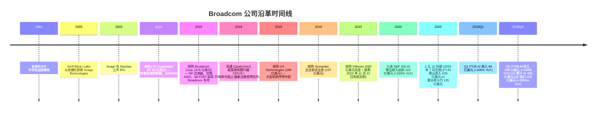
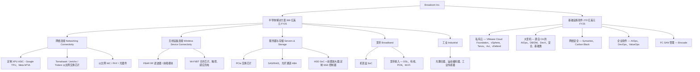
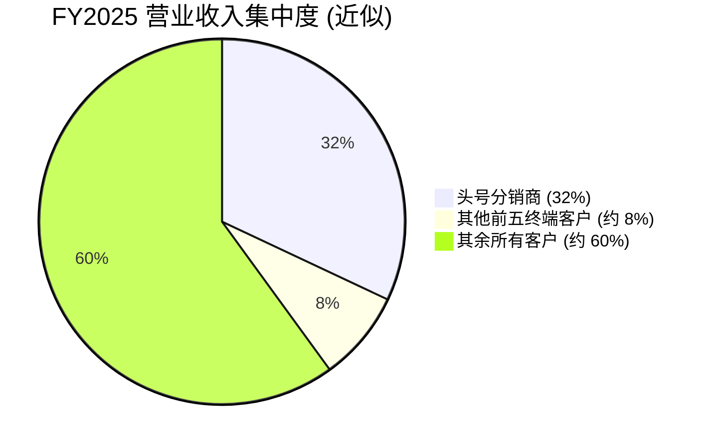
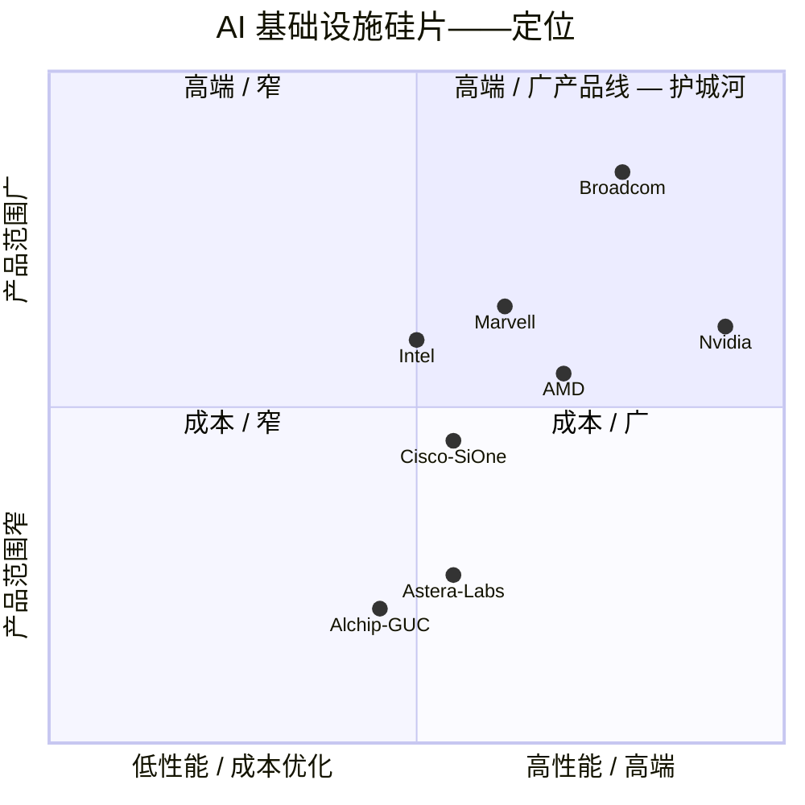

# Broadcom Inc. (NASDAQ:AVGO) — 公司研究报告

**截至日期:** 2026-06-04
**作者:** company-research skill, financial_agent
**主要信源:** Broadcom FY2025 10-K (提交于 2025-12-18)、Q2 FY2026 业绩新闻稿 (8-K, 2026-06-03)、Q1 FY2026 10-Q (提交于 2026-03-11)、Q1 FY2026 业绩新闻稿 (8-K, 2026-03-04)、Q4 FY2025 业绩新闻稿 (8-K, 2025-12-11)、Q4 FY2024 业绩新闻稿 (8-K, 2024-12-12)。所有引用文件均在第 10 章"参考资料"中列出 SEC EDGAR 官方 URL。
**报告语言: 简体中文 (英文版同时存在于本目录, 但未随本次 Q2 FY26 业绩更新刷新)**

> **业绩更新——Q2 FY2026 业绩 (2026-06-03, 季度结束于 2026-05-03):** Broadcom 公布 Q2 FY2026 创纪录营业收入 **22,187 百万美元 (+48% YoY)**——超过 3 月给出的 220 亿美元指引。其中**半导体解决方案 (Semiconductor Solutions) 营业收入 15,009 百万美元 (+79% YoY)**, **基础设施软件 (Infrastructure Software) 营业收入 7,178 百万美元 (+9% YoY)**; **AI 半导体收入 108 亿美元 (+143% YoY)**, 也高于 3 月给出的 107 亿美元 AI 指引。GAAP 摊薄 EPS **1.91 美元**, 非 GAAP 摊薄 EPS **2.44 美元**; **adjusted EBITDA (调整后 EBITDA) 152 亿美元 (+52% YoY), 占营业收入 69%**——本季度三项新创纪录。**自由现金流 (free cash flow / FCF) 102.6 亿美元**, 占营业收入 46%。**Q3 FY2026 指引:** 营业收入**约 294 亿美元 (+84% YoY)**, AI 半导体收入**约 160 亿美元 (+200%+ YoY)**, adjusted EBITDA 约占营业收入 68%。管理层在 Q2 电话会议上**重申 FY2026 AI 半导体收入约 560 亿美元 (+180% YoY) 的全年节奏, 并继续维持 FY2027 AI 收入超过 1,000 亿美元的中期目标**。Q2 单季完成股票回购 6 亿美元、派发股息 30.9 亿美元 (季度股息 0.65 美元/股), 资产负债表现金 196 亿美元、总债务 649 亿美元。来源: [Broadcom Q2 FY2026 业绩新闻稿, 2026-06-03 (附件 99.1)](https://www.sec.gov/Archives/edgar/data/1730168/000173016826000051/avgo-05032026x8kxex99.htm) 与 [Form 8-K 封面文件](https://www.sec.gov/Archives/edgar/data/1730168/000173016826000051/avgo-20260603.htm)。

---

## 目录

1. 公司概览
2. 公司历史
3. 管理团队
4. 产品与服务
5. 客户与上市策略
6. 行业概览
7. 竞争格局
8. 市场机会 (TAM)
9. 风险评估
10. 参考资料

---

## 1. 公司概览

Broadcom Inc. (NASDAQ: AVGO) 是一家全球半导体与基础设施软件的设计、开发与供应商, 业务划分为两大可报告分部: **半导体解决方案 (Semiconductor Solutions)** 与**基础设施软件 (Infrastructure Software)**。公司是注册于美国特拉华州 (Delaware) 的法人, 总部位于加利福尼亚州帕罗奥图 (Palo Alto, California), 采用 52/53 周财年制, 财年结束于最接近 10 月 31 日的星期日; 2025 财年于 2025 年 11 月 2 日结束 (为 52 周财年) ([2025 10-K, 第 1 页](https://www.sec.gov/Archives/edgar/data/1730168/000173016825000121/avgo-20251102.htm))。

**通俗业务描述。** Broadcom 设计并销售芯片及配套软件——两者结合, 使大型企业和超大规模数据中心运营商能够运行其计算与网络基础设施。在硅片侧, 公司最为人知的是两大主导其叙事的产品族系: (1) **定制 AI 加速器 ASIC ("XPU", 定制专用集成电路)**——全球最大的几家云计算公司 (Google、Meta 等) 购买这些芯片用于训练和部署自己专有的 AI 模型; (2) **高基数以太网交换硅片 (high-radix Ethernet switching silicon)** (Tomahawk、Jericho、Trident 系列)——它们将 AI 数据中心内部由 XPU 与商用 GPU (merchant GPU) 组成的集群连接成一体。在 AI 之外, Broadcom 还是 RF 前端滤波器 (RF front-end filter) 和 Wi-Fi/蓝牙合并芯片的商用供应商 (几乎每部出货的 iPhone 都装有其产品); 是服务器存储控制器 (SAS/RAID、光纤通道、定制 SSD 控制器) 的龙头; 也是多数宽带客户终端设备 (CPE) 中所采用的有线调制解调器、PON 和 STB SoC 芯片的供应商。在软件侧, 2023 年 11 月对 VMware 的收购使 Broadcom 跻身为事实意义上的私有云基础设施软件供应商; 此外公司还拥有原 CA Technologies 大型机软件特许权、Symantec 企业安全业务, 以及从 Brocade 继承的光纤通道存储网络软件组合。

**盈利模式。** FY2025 全年营业收入按两大分部大致按 58 / 42 拆分。**半导体解决方案 FY2025 营业收入为 36,858 百万美元 (+22% YoY)**, 主要来源是向少数集中的超大规模企业 (hyperscaler)、OEM 与少数大型智能手机 OEM 销售定制 AI 加速器、以太网交换硅片、RF 滤波器、宽带芯片与存储控制器。**基础设施软件 FY2025 营业收入为 27,029 百万美元 (+26% YoY)** ([2025 10-K, MD&A, 第 39 页](https://www.sec.gov/Archives/edgar/data/1730168/000173016825000121/avgo-20251102.htm)), 几乎完全来自针对世界 500 强 (Fortune 500) 和政府客户的多年期 VMware Cloud Foundation (VCF)、大型机软件以及 Symantec/Carbon Black 安全产品的订阅合同。披露的产品组合为 70% "产品" (半导体与模块) 与 30% "订阅与服务"——但这一拆分本身需要附注说明, 因为 Broadcom 在 FY2025 将 78 亿美元的 VCF 前期许可收入从订阅与服务重分类至产品项下, 这一列报变化在 10-K 附注 3 中披露 ([2025 10-K, MD&A, 第 39 页](https://www.sec.gov/Archives/edgar/data/1730168/000173016825000121/avgo-20251102.htm))。

**经营地理。** Broadcom 是一家全球分布的工程组织, 设计中心集中于美国、亚洲与欧洲。多数半导体出货的所有权与控制权在马来西亚槟城 (Penang, Malaysia) 转移 ([2025 10-K, 第 39 页](https://www.sec.gov/Archives/edgar/data/1730168/000173016825000121/avgo-20251102.htm)), 这就是为什么分部脚注中显示大量营业收入"运往"新加坡和马来西亚——尽管终端需求位于美国与中国。从最终目的地视角看, FY2025 营业收入的 17% 运往中国 (含香港), 而 FY2024 为 20% ([2025 10-K, 第 39 页](https://www.sec.gov/Archives/edgar/data/1730168/000173016825000121/avgo-20251102.htm))。

**公司体量。** FY2025 总净营业收入为 **63,887 百万美元** (相较 FY2024 的 51,574 百万美元同比+24%), GAAP 净利润为 **23,126 百万美元**, 对应 EPS **基本 4.91 美元 / 摊薄 4.77 美元** ([2025 10-K, 合并经营业绩表, 第 47 页](https://www.sec.gov/Archives/edgar/data/1730168/000173016825000121/avgo-20251102.htm))。营业利润为 25,484 百万美元 (GAAP 营业利润率 40%)。FY2025 自由现金流 (FCF) 为 **269 亿美元**——经营性现金流 27,537 百万美元减资本支出 620 百万美元——相当于营业收入的 42% ([2025 10-K, 第 43 页](https://www.sec.gov/Archives/edgar/data/1730168/000173016825000121/avgo-20251102.htm); [Q4 FY2025 业绩新闻稿](https://www.sec.gov/Archives/edgar/data/1730168/000173016825000116/avgo-11022025x8kxex99.htm))。**进入 FY2026 上半年, AI 加速放量推动 H1 累计营业收入达约 414 亿美元 (Q1 193.1 亿 + Q2 221.9 亿), 同比 +38%; H1 AI 半导体收入累计达 192 亿美元 (Q1 84 亿 + Q2 108 亿), 已基本接近全部 FY2025 全年 AI 营业收入水平。** Q2 FY2026 单季 GAAP 净利润 93.1 亿美元, 非 GAAP 净利润 120.7 亿美元, FCF 102.6 亿美元 ([Q2 FY26 业绩新闻稿, 2026-06-03](https://www.sec.gov/Archives/edgar/data/1730168/000173016826000051/avgo-05032026x8kxex99.htm))。资产负债表上承担**总债务 649 亿美元** (截至 2026-05-03, 较 FY25 末 651 亿美元略降), 现金为 **196 亿美元** (较 FY25 末 162 亿美元上升, 由 H1 FCF 顺差推动) ([Q2 FY26 业绩新闻稿](https://www.sec.gov/Archives/edgar/data/1730168/000173016826000051/avgo-05032026x8kxex99.htm))。截至 Q2 FY26, 摊薄股本数仍为约 4,888 百万股, 单季回购金额降至 6 亿美元——管理层将储备弹性留给债务偿还与潜在战略并购, 而非加速回购。

*来源: [2025 10-K (FY23–FY25)](https://www.sec.gov/Archives/edgar/data/1730168/000173016825000121/avgo-20251102.htm) 与 [2023 10-K (FY21–FY22)](https://www.sec.gov/cgi-bin/browse-edgar?action=getcompany&CIK=0001730168&type=10-K&dateb=&owner=include&count=40)。FY21 反映 VMware 收购前的业务结构; FY22 毛利率提升反映 Brocade/CA/Symantec 软件并入带来的产品组合升级; FY24 毛利率下滑则是 VMware 无形资产首年摊销的拖累。*

**估值快照 (2026-06-04 收盘价, Q2 FY26 业绩公布次日)。** AVGO 收于 **418.07 美元**, 以约 4,888 百万摊薄股本数计, 市值约为 **1.98 万亿美元**。AVGO 在 Q2 FY26 业绩公布后股价基本持平于过去三周区间——市场已在 Q2 之前定价绝大部分上行, Q2 实际营业收入 (221.9 亿美元) 与 AI 半导体收入 (108 亿美元) 仅小幅超出 3 月给出的 220 亿 / 107 亿指引, Q3 指引 (294 亿美元营业收入、160 亿美元 AI 收入) 大致符合卖方一致预期。过去 52 周价格区间为 **241.11 美元 – 495.00 美元** (yfinance, 2026-06-04); 当前价距 4 月触及的 495 美元历史高点低约 16%, 距 52 周低位高约 73%。TTM (过往十二个月, trailing twelve months) 各项倍数如下:

| 代码 | 最新价 (2026-06-04) | 市值 (十亿美元) | TTM P/E | 远期 P/E | TTM P/S |
|---|---:|---:|---:|---:|---:|
| **AVGO** | 418.07 美元 | 1,979 | **69.8x** | 21.9x | **29.0x** |
| NVDA | 221.28 美元 | 5,359 | 33.9x | 17.5x | 21.1x |
| MRVL | 316.56 美元 | 277 | 109.1x | 51.3x | 31.8x |
| QCOM | 242.61 美元 | 256 | 26.1x | 22.8x | 5.7x |

来源: [Yahoo Finance – AVGO](https://finance.yahoo.com/quote/AVGO/key-statistics/)、[NVDA](https://finance.yahoo.com/quote/NVDA/key-statistics/)、[MRVL](https://finance.yahoo.com/quote/MRVL/key-statistics/)、[QCOM](https://finance.yahoo.com/quote/QCOM/key-statistics/)——均于 2026-06-04 抓取。

AVGO 的 **TTM P/E 69.8 倍** 介于 NVDA 33.9 倍与 MRVL 109.1 倍之间, **TTM P/S 29.0 倍**则略低于 MRVL 31.8 倍、高于 NVDA 21.1 倍, 远高于 QCOM 5.7 倍。值得注意的是, 自上次估值快照 (2026-05-20: TTM P/E 81.4 倍) 以来, AVGO 的 TTM P/E 已下降约 12 个倍数点——这并非估值压缩, 而是 **Q2 FY26 GAAP 净利润 93 亿美元滚入 TTM 分母**所致, 即 "E 项跑赢了 P 项"。同期 NVDA 的 TTM P/E 由 45.7 倍降至 33.9 倍 (同样为 EPS 翻番带动), MRVL 因新一轮 SBC 与无形资产摊销冲击 TTM 盈利而向上抽升至 109 倍——这一组合数据**强化"为 AI 资本开支可见度付费的市场, 已开始为 AVGO 实际利润付费"** 的解读。TTM 盈利数字仍被两项 GAAP 费用人为压缩, 而市场基本予以忽视: (1) 约 81 亿美元的 VMware 相关无形资产年摊销 (按 2025 年 10-K 披露, 其中约 60 亿美元计入营业成本, 另约 20 亿美元计入运营费用); (2) **FY25 股票薪酬 (SBC, stock-based compensation) 76 亿美元** ([2025 10-K, 第 40 页](https://www.sec.gov/Archives/edgar/data/1730168/000173016825000121/avgo-20251102.htm))。剔除上述两项后, 远期 P/E **21.9 倍**与 NVDA 17.5 倍接近、显著低于 MRVL 51.3 倍, 大致接近 QCOM 22.8 倍——这一组合较一个月前 (远期 P/E 22.9 倍) 持续展示"GAAP 与 forward 之间的折扣窗口正在收窄"的趋势。该倍数最贴切的解释仍是**结构性的 AI 基础设施溢价**——市场为可见的定制 XPU 储备订单 (Google TPU v6/v7、Meta MTIA、OpenAI 及其他) 和 VMware 订阅收入跑道支付溢价, 而非为 TTM GAAP 利润付费; 但相比 5 月时的市场情绪, Q2 业绩的"AI 收入 +143% YoY、Q3 隐含 +200%+ YoY"提供了更厚的盈利缓冲。若 AI XPU 客户集中度恶化 (头号客户占营业收入 32%——见第 5 章) 或 FY2027 单一超大规模客户出现需求悬崖, 倍数将面临剧烈重估; 该风险延伸至第 9 章。

## 2. 公司历史

Broadcom 的身份是一连串并购整合的产物。其连续法人载体最早起源于安捷伦科技 (Agilent Technologies) 的半导体产品事业部 (安捷伦本身于 1999 年从惠普 (Hewlett-Packard) 分拆而出), 2005 年 KKR、Silver Lake 与淡马锡 (Temasek) 将其剥离设立为 Avago Technologies。Avago 于 2009 年 IPO, 在 Hock Tan 的领导下完成了一系列规模递增的并购, 顶峰为 2016 年对原 Broadcom Corp. 的收购——此时母公司启用 Broadcom 名称并沿用 Avago 代码 (AVGO)。10-K 中的 "60 年传承" 表述——"我们 60 多年的创新历史可追溯至 AT&T/贝尔实验室、朗讯及惠普公司等多元的起源" ([2025 10-K, 第 2 页](https://www.sec.gov/Archives/edgar/data/1730168/000173016825000121/avgo-20251102.htm))——指代的是 Avago/HP-Agilent 半导体血脉, 而非某条单一公司谱系。

最具决定意义的三次战略转折如下。**第一, 2016 年 Avago 与 Broadcom Corp. 合并**——它将一家专注 FBAR/特种 IC、营业收入 40 亿美元的业务转变为商用网络与无线硅片龙头; 这也是 Tan 完善后来定义公司的运营手册的节点——激进的 SKU 合理化、聚焦于品类领先的 IP、保留头号客户、果断剪除任何排名第 1 或第 2 之外的业务。**第二, 2018 年敌意收购高通的失败**——以国家安全为由通过总统行政命令被 CFIUS 阻止——事后看来是公司战略转向的拐点: 它迫使 Broadcom 将注册地从新加坡迁至特拉华, 并将 Tan 的并购精力从 "再买一家芯片公司" 转向 "买企业软件公司"。几个月后 Broadcom 宣布 CA Technologies 交易。**第三, 2023 年 11 月 VMware 合并** (30,788 百万美元现金 + 544 百万 Broadcom 股票, 公允价值 53,398 百万美元 ([2025 10-K, 第 50 页](https://www.sec.gov/Archives/edgar/data/1730168/000173016825000121/avgo-20251102.htm))) 实质上使软件占比翻倍, 重新锚定了毛利率结构, 同时给资产负债表加载了如今正逐步通过长久期债券再融资的大笔定期贷款。

近期动态 (2024 至 2026 年 H1) 围绕三大主题展开: (1) **AI XPU 加速放量**——披露的 AI 半导体收入从 FY23 的低个位数十亿美元水平增长至 FY24 的 122 亿美元 (按 Q4 FY24 业绩新闻稿同比 +220%), 进一步增至 FY25 约 195 亿美元, Q1 FY26 单季 84 亿美元后, **Q2 FY26 再次加速达 108 亿美元 (+143% YoY)**, **Q3 FY26 指引隐含进一步增至 160 亿美元 (+200%+ YoY)**——以此节奏, 单季 AI 半导体收入将在 FY26 后半年突破 FY25 全年规模; 管理层在 Q2 电话会议**重申 FY2026 全年 AI 半导体收入约 560 亿美元 (+180% YoY)**, 并继续维持 **FY2027 AI 收入超过 1,000 亿美元**的中期目标 ([Q2 FY26 业绩新闻稿, 2026-06-03](https://www.sec.gov/Archives/edgar/data/1730168/000173016826000051/avgo-05032026x8kxex99.htm))。(2) **VMware 整合与订阅模式转型**——VMware 的永久授权许可模式已被 VCF 订阅捆绑包取代, 推动基础设施软件分部从 FY23 的 76 亿美元增至 FY25 的 270 亿美元; 基础设施软件 Q2 FY26 营业收入 **71.8 亿美元 (+9% YoY)**, 表明订阅化转型进入"成熟阶段"——增量放缓但毛利率与 NRR 维持高位。(3) **资本回报**——全新 100 亿美元回购计划 (2026 年 3 月)、季度股息上调 10% 至 0.65 美元/股 (FY26 目标 2.60 美元/股, 连续第 15 年增长); 但 **Q2 FY26 单季回购仅 6 亿美元**, 远低于 Q1 FY26 单季 78.5 亿美元的水平——管理层将资本弹性留给债务偿还与潜在战略并购, 而非加速回购 ([Q1 FY26 8-K, 2026-03-04](https://www.sec.gov/Archives/edgar/data/1730168/000173016826000011/avgo-02012026x8kxex99.htm); [Q2 FY26 8-K, 2026-06-03](https://www.sec.gov/Archives/edgar/data/1730168/000173016826000051/avgo-05032026x8kxex99.htm))。

## 3. 管理团队

### Hock E. Tan — 总裁、首席执行官兼董事 (74 岁)

Tan 是 Broadcom 投资逻辑中最关键的单一变量, 普遍被视为半导体史上最高效的并购运营者。自 2006 年 3 月起担任 Broadcom 总裁兼 CEO——即贯穿整个 Avago 时代以及上述时间线列出的每一次并购 ([2025 10-K, 第 10 页](https://www.sec.gov/Archives/edgar/data/1730168/000173016825000121/avgo-20251102.htm))。加入 Avago 之前, 他曾于 1999–2005 年间出任 Integrated Circuit Systems, Inc. (公开上市的时钟解决方案 IC 厂商) 总裁兼 CEO, 直至 2005 年公司被 Integrated Device Technology 收购; 1996–1999 年间任 ICS 首席运营官 (COO), 1995–1999 年任 SVP/CFO。更早的职业生涯中, 他在 1992–1994 年任 Commodore International 财务副总裁, 在百事可乐 (PepsiCo) 与通用汽车 (General Motors) 担任高管职位, 1988–1992 年任新加坡 Pacven Investment 董事总经理, 1983–1988 年任马来西亚 Hume Industries 董事总经理。2020 年以来担任美国总统国家安全与电信咨询委员会成员 ([2025 10-K, 第 10 页](https://www.sec.gov/Archives/edgar/data/1730168/000173016825000121/avgo-20251102.htm))。他持有麻省理工学院 (MIT) 机械工程学士与硕士学位, 以及哈佛商学院 MBA 学位。

Tan 的运营手册——自 2014 年收购 LSI 后逐步精炼, 如今同样应用于 AI 硅片与 VMware——有三大承重支柱。**(1) 买已经能产生现金流的品类领导者, 而非"协同效应"。** 每一项重大并购 (LSI、Broadcom Corp.、CA、Symantec 企业安全、VMware) 在被收购前均已在某细分领域占据 #1 或 #2 份额; Tan 不为"开拓市场份额的机会"支付溢价。**(2) 将 SG&A 与 R&D 压缩到最精简, 保留核心特许客户与 IP, 其余一律退出。** VMware 收购后, Broadcom 剥离了终端用户计算 (EUC, 2024 年年中以约 38.5 亿美元卖给 KKR) 与 Carbon Black 业务, 终止 SMB 永久授权许可渠道, 并将剩余约 2,000 个战略账户全部转为多年期 VCF 订阅合同。SG&A 占营业收入比重从 FY24 的 10% 降至 FY25 的 7%; SG&A 绝对数同比下降 7.48 亿美元 ([2025 10-K, 第 40 页](https://www.sec.gov/Archives/edgar/data/1730168/000173016825000121/avgo-20251102.htm))。**(3) 用现金流偿还并购债务, 然后开始积极回报资本。** 自 2011 年首次派息以来股息每年复利增长 (现已连续 15 次提升), 公司明确指引将拖尾 FCF 的 50% 用于股息, 其余用于回购或并购。

Tan 拥有或控制**约 970 万股 Broadcom 股票 (占已发行股本约 0.2%, 按 2026-05-20 收盘价计约 40 亿美元)**, 数据出自最新 DEF 14A 委托代理声明。其基本工资固定为每年 1.00 美元 (字面意义上的一美元); 绝大部分薪酬为按多年 TSR (股东总回报) 与运营里程碑解锁的业绩股票单位 (PSU), Q2 FY25 授予的两年期股权奖励是最新且最大的一次 ([2025 10-K, 第 40 页](https://www.sec.gov/Archives/edgar/data/1730168/000173016825000121/avgo-20251102.htm))。74 岁的 Tan 已公开表示, 他打算在 VMware 整合周期内继续任职; 其继任安排仍是公司最大、且未对冲的个人风险, 10-K 风险因素中明确点出: "我们的成功在很大程度上取决于高级管理团队的持续贡献, 特别是 Hock E. Tan 的服务" ([2025 10-K, 第 14 页](https://www.sec.gov/Archives/edgar/data/1730168/000173016825000121/avgo-20251102.htm))。

### Kirsten M. Spears — 首席财务官兼首席会计官 (61 岁)

Spears 自 2020 年 12 月起担任 CFO。她于 2014 年 5 月通过 LSI 并购进入 Broadcom, 出任 VP 兼公司财务总监——在 LSI 时即自 2007 年起任 VP 兼公司财务总监——并于 2016–2020 年间担任 Broadcom 主要会计官 ([2025 10-K, 第 10 页](https://www.sec.gov/Archives/edgar/data/1730168/000173016825000121/avgo-20251102.htm))。她的职业生涯始于普华永道 (PricewaterhouseCoopers)。担任 CFO 期间, 她经历了 CA Technologies、Symantec 与 VMware 三次并购; 是每次业绩电话会议的公开代言人, 也是带领市场穿越 VMware 订阅化转型且未出现一次业绩下修的关键人物。尤其关键的是, Spears 领导下的 CFO 团队成功执行了一项复杂的 300 亿美元以上 VMware 收购债务再融资——将定期贷款堆栈转换为分级固定利率债券结构, 截至 FY25 财年末本金合计 671 亿美元 ([2025 10-K, 第 43 页](https://www.sec.gov/Archives/edgar/data/1730168/000173016825000121/avgo-20251102.htm))。她似乎不是 CEO 接班候选人, 这表明未来继任很可能从现 C-suite 之外或分部总裁层中产生。

### Charlie B. Kawwas, 博士 — 半导体解决方案分部总裁 (55 岁)

Kawwas 主管芯片业务——包含定制 AI 加速器特许权在内的整个 369 亿美元半导体解决方案分部。他自 2022 年 7 月起担任分部总裁; 此前 2020 年 12 月至 2022 年 7 月任 COO, 2015–2020 年任 SVP 兼首席销售官, 2010–2014 年间在 LSI 担任全球销售负责人直至收购; 此前还在 LSI 网络部门 (2007–2010) 担任 VP, 在 LSI 之前则是 Nortel 光以太网与多业务边缘组的产品线负责人 ([2025 10-K, 第 10 页](https://www.sec.gov/Archives/edgar/data/1730168/000173016825000121/avgo-20251102.htm))。Kawwas 的标志性贡献是定制 XPU 特许权的客户对接侧——与 Google、Meta 以及传闻中下一波客户 (OpenAI、字节跳动、Apple——根据持续的媒体报道) 的多年期设计赢得节奏均在其团队管辖之下。

### Mark D. Brazeal — 首席法务与企业事务官 (57 岁)

Brazeal 自 2017 年 3 月起担任首席法务官 (Chief Legal Officer), 2021 年 12 月起兼任企业事务官 (Corporate Affairs)。早期任职包括 SanDisk 首席法务官兼 SVP 知识产权许可 (2014 年起直至 2016 年被 Western Digital 收购), 以及 2000–2014 年间在原 Broadcom Corp. 担任高级顾问律师 ([2025 10-K, 第 10 页](https://www.sec.gov/Archives/edgar/data/1730168/000173016825000121/avgo-20251102.htm))。他主导了 VMware 交易的监管审批 (欧盟、中国、英国), 是反垄断事务的首席副手。

### 治理与持股

- **董事会:** Broadcom 共有 13 名董事, 仅 Tan 一人为内部人士。首席独立董事为 Henry Samueli 博士——原 Broadcom Corp. 联合创始人, 也是公司通过 Samueli 基金会持股的最大个人股东。审计委员会主席为 Eddy Hartenstein。
- **内部人持股:** 高管与董事合计受益所有权约为 4% (其中绝大部分为 Samueli 持仓); Tan 个人持股约 0.2%。
- **薪酬结构:** 高度偏向 PSU/RSU, 含多年期 TSR 触发条件; Q2 FY25 授予的两年期股权奖励使 FY25 股票薪酬费用总额达 7,568 百万美元, 而 FY24 为 5,670 百万美元 ([2025 10-K, 第 40 页](https://www.sec.gov/Archives/edgar/data/1730168/000173016825000121/avgo-20251102.htm))。尚未确认的 SBC 余额为 238 亿美元, 将在加权平均 3.4 年内归属。
- **关联交易风险:** 未披露重大关联交易。主要治理关切是对单一高管 (Tan) 的依赖, 已在 10-K 风险因素中明确列示。

**业绩记录综合评价。** 这是任何行业中最强的并购记录之一。Avago 企业价值从 2009 年 IPO 时约 27 亿美元复利增长至当前约 2.04 万亿美元——17 年回报超过 700 倍。该团队整合了五项巨型并购 (LSI、Broadcom Corp.、CA、Symantec 企业安全、VMware), 而没有发生任何实质性减损投资逻辑的减值事件。两项可见的缺口在于: (a) Tan 继任风险; (b) 2024–2025 年间凸显的 AI XPU 客户集中度 (32% 直接来自一家分销商, 与单一半导体终端客户绑定——见第 5 章)。

## 4. 产品与服务

Broadcom 的产品组合对单一发行人而言异常宽广, 最佳理解方式是借助 10-K 的两分部 / 九产品组合架构 ([2025 10-K, 第 3–8 页](https://www.sec.gov/Archives/edgar/data/1730168/000173016825000121/avgo-20251102.htm))。

### 半导体解决方案

**网络连接——AI 硅片引擎, 全公司旗舰。** 该产品组合包含承载 AI 叙事的两大产品。(a) **定制硅片解决方案 / XPU。** Broadcom 不销售商用 AI 训练芯片; 它提供的是"用于客户设计与开发 AI 与高性能计算专用集成电路 (ASIC) 的先进技术与知识产权平台" ([2025 10-K, 第 3 页](https://www.sec.gov/Archives/edgar/data/1730168/000173016825000121/avgo-20251102.htm))。实际操作中, 这意味着客户 (Google、Meta 等) 带来架构规格, 而 Broadcom 贡献 SerDes IP、先进封装集成 (基于 CoWoS 的 2.5D/3D)、HBM 控制器以及客户加速器核心周围的其余底盘。产物: Google TPU v5/v6/v7 各代、Meta MTIA 训练与推理芯片。**竞争优势: 是——非常强。** 护城河组合包括 (i) 在 112G-PAM4 以及刚发布的 224G 上的领先 SerDes IP; (ii) 与顶级超大规模客户长期延续的协同设计关系; (iii) 在台积电 (TSMC) CoWoS 先进封装产能上的优先分配; (iv) 经过多代硅片积累的信任。最接近的竞争产品是 Marvell 的定制 ASIC 业务 (Amazon Trainium 2/3、Microsoft Maia、Google Axion CPU); Broadcom 在客户数量与营业收入上领先——**Q2 FY26 单季 AI 半导体收入 108 亿美元 (+143% YoY) 已超过 Marvell 全年数据中心收入**, **Q3 FY26 隐含 160 亿美元季度 AI 收入**则进一步将差距拉开 ([Q2 FY26 业绩新闻稿, 2026-06-03](https://www.sec.gov/Archives/edgar/data/1730168/000173016826000051/avgo-05032026x8kxex99.htm)); 而 Marvell 的定制 ASIC 业务仅在个位数十亿美元水平。(b) **Tomahawk 5 / Tomahawk 6 / Jericho 3-AI / Trident。** Tomahawk 5 是 51.2T radix-128 以太网交换硅片, 已成为 AI 集群中事实标准的 fabric 芯片; Tomahawk 6 (102.4T, 2025 年发布) 进一步扩大领先优势。Jericho 3-AI 是面向横向扩展集群互联的深缓冲以太网路由硅片, 与 Nvidia 的 NVLink fabric (专有) 以及 Cisco 硅片正面竞争。**竞争优势: 是——明确领先**, 在每基数带宽和"非 Nvidia 集群以太网对 InfiniBand"的产业共识上占据上风。最接近的竞争对手: Nvidia Spectrum-X (专有)、Cisco Silicon One、Marvell Teralynx。

**无线设备连接——iPhone 特许权。** 使用 Broadcom 专有 **FBAR (薄膜体声波谐振器)** 技术的 RF 前端模块与滤波器、Wi-Fi/蓝牙合并芯片、定制触控控制器以及感应充电 ASIC ([2025 10-K, 第 4 页](https://www.sec.gov/Archives/edgar/data/1730168/000173016825000121/avgo-20251102.htm))。Apple 是主导客户; Broadcom 已签署两项多年期主协议 (2023 年 5 月针对 FBAR/RF, 另一项 Wi-Fi 续约), 锁定 iPhone 插槽至少至 2026 年, 但 Apple 也披露正在自研自己的 Wi-Fi 芯片 (Proxima), 形成内化生产风险。**竞争优势: 是——强但具周期性。** FBAR 是高频 RF 滤波明确的领导者; 最接近的竞争对手为 Qorvo BAW, 中低频段有 Skyworks 和 Murata (TC-SAW)。风险点是单一客户集中 (Apple); 详见第 5 章。

**服务器与存储系统解决方案。** AI 服务器背板 PCIe 交换芯片 (Atlas 系列); SAS/RAID 控制器与适配器 (LSI 时代遗留特许权); 光纤通道主机总线适配器 (Brocade 时代遗留); HDD 读取通道 SoC 与前置放大器; 定制 SSD 控制器 ([2025 10-K, 第 4 页](https://www.sec.gov/Archives/edgar/data/1730168/000173016825000121/avgo-20251102.htm))。客户群: 服务器侧为 Dell、HPE、Lenovo、Supermicro; HDD 侧为希捷 (Seagate) 与西部数据 (Western Digital); 定制 SSD 控制器直接面向超大规模客户。**竞争优势: 是——视细分而定, 在部分到强领先。** PCIe 交换有新进入者 (Microchip、Astera Labs) 蚕食份额; SAS/RAID 仍是与 Microchip 实际意义上的双寡头; HDD 读取通道基本是与 Marvell 的双寡头格局。

**宽带解决方案。** 有线、卫星、IPTV 与 OTT 机顶盒 SoC; 客户终端 (CPE) 的 DSL、有线、PON 与 Wi-Fi 住宅网关 SoC ([2025 10-K, 第 5 页](https://www.sec.gov/Archives/edgar/data/1730168/000173016825000121/avgo-20251102.htm))。客户为全球电信 OEM 与一级服务运营商 (Comcast、Charter、BT、Deutsche Telekom)。这是一项成熟、周期性强的业务, 在 FY24 触底, 现正处于 Wi-Fi 7 与 PON 换机周期的早期阶段。**竞争优势: 是——份额领先**, 但终端市场增长缓慢。

**工业。** 光耦合器、工业光纤、工业/医疗传感器、运动编码器、LED 设备、汽车以太网 IC ([2025 10-K, 第 5 页](https://www.sec.gov/Archives/edgar/data/1730168/000173016825000121/avgo-20251102.htm))。占营业收入比重较小, 但高毛利、长周期。

### 基础设施软件

**私有云软件组合——VMware Cloud Foundation (VCF), 旗舰产品。** VCF 是 vSphere + vSAN + NSX + Aria 的捆绑后继, 以按 core 计价的订阅形式销售, 内含计算、网络、存储、管理、安全以及原生 Kubernetes ([2025 10-K, 第 5 页](https://www.sec.gov/Archives/edgar/data/1730168/000173016825000121/avgo-20251102.htm))。高级增值服务上销层——vDefend (零信任微分段)、Avi 负载均衡、Tanzu 平台 (应用开发)、Private AI (本地 LLM 部署)、Live Recovery (容灾/勒索软件保护)——是装机量内 NRR (净收入留存率) 扩展的路径。**竞争优势: 是——基于切换成本形成强护城河。** VMware 位于绝大多数企业核心任务工作负载的底层; 把数千个 VM 迁移到竞争对手 (时间、回归测试、运维改造) 的代价极其高昂。最接近的竞争对手: Red Hat OpenShift / OpenStack (IBM)、Nutanix AHV、Microsoft Azure Stack、原生公有云 lift-and-shift。激进的订阅化转型疏远了一部分 SMB 客户, 但公司锁定的约 2,000 个战略客户基本留下。

**大型机软件组合。** 源自 2018 年 CA Technologies 并购: AIOps 与自动化、数据库与数据管理、DevX 与 DevOps、网络安全与合规、基础与开放大型机 ([2025 10-K, 第 6 页](https://www.sec.gov/Archives/edgar/data/1730168/000173016825000121/avgo-20251102.htm))。销售给一个固定的全球 2000 强大型机用户客户群, 形式为多年期企业许可协议 ("ELA")。**竞争优势: 是——高切换成本**, 加上与 IBM 形成结构稳定的双寡头。

**网络安全组合。** Symantec 端点、网络与信息安全; Carbon Black 用于端点检测与应用程序安全 ([2025 10-K, 第 6 页](https://www.sec.gov/Archives/edgar/data/1730168/000173016825000121/avgo-20251102.htm))。**竞争优势: 部分。** 在企业/政府客户中存在较强装机锁定, 但在高端市场份额正被 CrowdStrike、SentinelOne 与 Microsoft Defender XDR 蚕食。

**企业软件 / FC SAN。** AIOps、网络可观察性、DevOps 与价值流管理, 加上 Brocade 光纤通道交换机/导向器与管理软件 ([2025 10-K, 第 6–8 页](https://www.sec.gov/Archives/edgar/data/1730168/000173016825000121/avgo-20251102.htm))。

**旗舰产品与长尾。** 两个旗舰产品线为 (1) **定制 AI 加速器 / 以太网交换硅片 (AI 半导体)**——FY25 约 195 亿美元, Q1 FY26 单季 84 亿美元, **Q2 FY26 单季加速至 108 亿美元 (+143% YoY), H1 FY26 累计 192 亿美元**, 是公司按营业收入计单一最大产品线, 持续三位数 YoY 增长; 管理层在 Q2 业绩电话会议**重申 FY2026 全年 AI 半导体 ≈560 亿美元 (+180%)、FY2027 ≥1,000 亿美元**的中期目标 ([Q2 FY26 业绩新闻稿, 2026-06-03](https://www.sec.gov/Archives/edgar/data/1730168/000173016826000051/avgo-05032026x8kxex99.htm))。(2) **VMware Cloud Foundation**, 基础设施软件分部同比增长 56 亿美元的主要驱动力, Q2 FY26 单季基础设施软件 71.8 亿美元 (+9% YoY)——增量放缓但 VCF 装机内部的 NRR 扩张仍在持续。两者合计仍解释绝大部分同比营业收入增长。

**近期新品发布。** Tomahawk 6 (102.4T, 2025 年宣布); Sian2 (面向 1.6T 可插拔光模块的 224G SerDes 光 DSP, 2025 年发布); Jericho 3-AI 系列扩展; VMware Cloud Foundation 9.0 (2025 年 3 月) 与 2025 年 7 月 VCF 网络与安全虚拟化发布 ([2025 10-K, 第 18 页](https://www.sec.gov/Archives/edgar/data/1730168/000173016825000121/avgo-20251102.htm))。

*来源: [2025 10-K, MD&A 第 39 页](https://www.sec.gov/Archives/edgar/data/1730168/000173016825000121/avgo-20251102.htm) 与 [Q1 FY26 8-K 业绩新闻稿](https://www.sec.gov/Archives/edgar/data/1730168/000173016826000011/avgo-02012026x8kxex99.htm)。*

## 5. 客户与上市策略

Broadcom 的客户群体**高度集中**, 且随着 AI XPU 加速放量而持续加深集中。

**披露的客户集中度 (FY2025 10-K, 第 39 页)。** "向一家作为分销商的半导体解决方案客户的直接销售, 在 2025 与 2024 财年分别占公司净营业收入的 **32% 与 28%**。" 所指实体为分销商 (业界普遍理解为 Arrow Electronics——其代表 Broadcom 向 Apple 与多家超大规模客户履行出货), 因此 32% 这一数字实际跨越多家终端客户。**"通过所有渠道向公司前五大终端客户的销售, 在 2025 与 2024 财年均约占公司净营业收入的 40%"** ([2025 10-K, 第 39 页](https://www.sec.gov/Archives/edgar/data/1730168/000173016825000121/avgo-20251102.htm))。换言之: 头号分销商占 32%, 前五大终端客户约占 40%——已稳稳触发第 9 章的客户集中风险预警 (传统门槛为头号 > 20% / 前五 > 50%; AVGO 已越过前者, 距后者一步之遥)。

*来源: [2025 10-K, 第 39 页](https://www.sec.gov/Archives/edgar/data/1730168/000173016825000121/avgo-20251102.htm)。10-K 未单独披露前五大终端客户名单; 媒体归因为 Apple、Google、Meta、Microsoft 及第五大客户 (轮番点名 OpenAI、字节跳动或 Cisco), 该归因一致但未在原始文件中得到证实。*

**客户群划分。** 半导体客户群体为四到六家最大的超大规模企业 (Google、Meta、Microsoft Azure、Amazon AWS、Oracle Cloud)、Apple 作为主导无线客户、一级服务器 OEM (Dell、HPE、Lenovo、Supermicro)、一级电信与宽带运营商, 以及工业/汽车的长尾账户。基础设施软件客户群体则是"全球许多最大的公司, 包括大多数 Fortune 500 企业, 以及众多政府机构" ([2025 10-K, 第 8 页](https://www.sec.gov/Archives/edgar/data/1730168/000173016825000121/avgo-20251102.htm))——VMware 历来拥有超过 300,000 个客户实体, 但 Broadcom 已明确将焦点收窄至约 2,000 个战略账户。

**合同结构。** AI 定制硅片侧的半导体交易为多年期设计赢得 + 多年定价表; 10-K 警示称: "我们的顶级客户, 包括 AI 客户, 可能且已经在定价与合同条款上提出更高要求, 例如寻求租赁基于我们 XPU 的 AI 机架或系统而非购买, 以及为此类租赁安排替代性融资或其他新型/延期付款模式" ([2025 10-K, 第 12 页](https://www.sec.gov/Archives/edgar/data/1730168/000173016825000121/avgo-20251102.htm))——这是 FY25 文件中的新增披露, 暗示公司可能正进入面向部分超大规模客户的 XPU 机架租赁模式, 并伴随相应的信用与违约风险。软件为多年订阅 (一般初始期 3 年) 配合大多数企业协议的自动续约。

**客户的纵向整合风险。** Broadcom 多个最大半导体客户同时也是其最大客户及潜在竞争对手。Google 的 TPU 计划、Meta 的 MTIA 计划、Microsoft 的 Maia 计划 (当前由 Marvell 供货, 但传闻正在进行多元化)、Amazon 的 Trainium 计划 (Marvell), 皆体现出同一动态: 超大规模客户当下受益于 Broadcom 的 IP 与制程专业能力, 但具有长期内化的强烈动机。Apple 是最清晰的例子: 已公开披露自研蜂窝调制解调器 ("C1") 项目, 且媒体广泛报道正在开发自研 Wi-Fi ("Proxima"), 后者将与 Broadcom 在 Apple 的无线连接业务直接竞争。

**上市策略 (Go-to-market)。** 半导体直销至超大规模客户与大型 OEM, 并通过 Arrow Electronics 等分销商触达长尾。软件直销至战略企业账户, 通过 VMware 云服务提供商 (VCSP) 合作伙伴提供托管服务, 并通过经销商 / 超大规模客户进行小额成交。销售周期: 新的定制 XPU 设计赢得需 6–18 个月 (随后 18–24 个月的 NRE/设计阶段, 再 12–24 个月进入量产); 企业 VCF 成交需 3–9 个月。

**已具名合作伙伴与案例。** 大多数具名客户证据来自新闻稿与客户证言, 而非 10-K; 文件刻意对客户名称保持沉默。公开确认的包括: Google TPU (多次新闻报道); Meta MTIA (多次新闻报道); Apple FBAR / RF / Wi-Fi (Broadcom 2023 年关于与 Apple 多十亿美元供应协议的新闻稿)。除此之外, 所有归因均为媒体报道来源, 应作如此对待。

## 6. 行业概览

Broadcom 在两个相互关联但结构截然不同的行业中竞争。

**半导体 (NAICS 334413)。** 根据 [半导体行业协会 (SIA) 2024 年事实手册](https://www.semiconductors.org/wp-content/uploads/2024/05/SIA-2024-Factbook.pdf) (及 [2025 年事实手册](https://www.semiconductors.org/wp-content/uploads/2025/05/2025-SIA-Factbook-FINAL-1.pdf) 中后续更新), 全球半导体行业在 2024 日历年实现约 **6,270 亿美元营业收入**, 预测 2025 年将突破 7,000 亿美元, 其中 AI 加速器/网络子分部驱动增量增长。Broadcom 在**有线通信、无线通信、存储与计算**子类别中均有布局; 在 AI 侧, 它位于商用数据中心硅片子分部——IDC 和 Gartner 将 2025 年该子分部规模估算在 800–1,200 亿美元区间, 并预测在 2028 年前实现 30–40% 的复合增长率 (CAGR)。半导体行业的特征是极度周期性 (10-K 明确指出: "我们经营于一个高度周期性的半导体行业, 该行业正因 AI 而经历深远变革" ([2025 10-K, 第 11 页](https://www.sec.gov/Archives/edgar/data/1730168/000173016825000121/avgo-20251102.htm)))、资本密集度集中在代工厂层 (TSMC、Samsung、Intel Foundry), 以及通过美国出口管制和《CHIPS 法案》而上升的地缘政治风险。

**基础设施软件 / 私有云。** Gartner 的《全球公有云服务预测》将云与本地基础设施软件 (即 VCF + 大型机 + 安全 + 可观察性的对应 TAM) 在 2024 年估算为约 2,000 亿美元, 每年增长约 12–14%。VCF 主导的私有云基础设施子分部规模较小 (约 150–200 亿美元), 但最具防御性, 因为相关工作负载 (受监管、对延迟敏感、有主权限制) 无法迁移至公有云。大型机软件是低增长 (约 3%) 但高毛利的细分领域, 由 IBM 与 Broadcom (CA) 主导。

**增长驱动因素。** (1) **AI 训练与推理数据中心**——目前最大的增长向量。2025 年超大规模客户合计资本开支运行率达 2,500–3,500 亿美元 (Google、Meta、Microsoft、Amazon、Oracle), 其中定制硅片份额持续上升。(2) **私有云更新换代**——企业将老化的 vSphere 装机升级至 VCF + Tanzu + Private AI。(3) **主权与本地 AI**——由欧盟 AI 法案、数据驻留规则以及客户不愿将专有数据发送至公有云 API 所驱动。(4) **Wi-Fi 7 与 PON 宽带换机。** (5) **5G RF 复杂度** (虽推进缓慢但仍利好 FBAR 出货)。反向力量包括 (i) 美国对中国出口管制 (Broadcom 中国营业收入占比 17% ([2025 10-K, 第 39 页](https://www.sec.gov/Archives/edgar/data/1730168/000173016825000121/avgo-20251102.htm))); (ii) Apple 蜂窝与 Wi-Fi 内化计划; (iii) 超大规模客户最终可能选择完全内化 IP 层 (目前通过 Broadcom 购买)。

**行业结构。** 两个行业均为寡头格局。定制 AI 硅片实质上是 Broadcom 与 Marvell 的双寡头, Alchip 与 GUC (创意电子) 是亚洲较小的纯 ASIC 厂商。以太网交换硅片是 Broadcom–Marvell–Cisco–Nvidia 四方寡头, Broadcom 占据领先份额。高端 FBAR/RF 滤波器是 Broadcom–Qorvo 双寡头。私有云基础设施软件是 VMware 为首的寡头, 对手包括 IBM Red Hat、Microsoft, 以及开源长尾。

**监管环境。** 除标准半导体出口管制外, Broadcom 还面临独特的几方面暴露: (i) **对任何未来并购的 CFIUS 式审查**——2018 年高通要约设立的先例意味着未来任何交易都将适用同样的审视; (ii) **欧盟与英国对 VMware 基础的反垄断监管**——欧盟有条件批准时附带的可互操作性行为承诺仍处持续监督期; (iii) **涉中国的先进 AI 硅片出口规则**——目前的口径是 Broadcom 交换硅片基本被允许出口, 但针对中国超大规模客户的定制 XPU 出货则受限制。

## 7. 竞争格局

**直接竞争对手——半导体。**

- **Nvidia (NVDA)。** 商用 AI GPU 与 InfiniBand 上的 800 磅大猩猩。Broadcom 在商用 GPU 市场上不与 Nvidia 竞争——它通过向超大规模客户销售基于以太网的 NVLink/Spectrum-X 替代方案, 以及通过支持 Google、Meta 等超大规模客户的定制加速器来对抗 Nvidia GPU, 与 Nvidia 形成系统层级的竞争关系。从经济关系看, 该竞争在系统层面存在, 但在单个组件层面是中性甚至共同供应商正向 (Broadcom 交换机在许多集群中与 Nvidia GPU 协同部署)。
- **Marvell (MRVL)。** 定制 ASIC 上最接近的直接竞争对手。Marvell 披露的最大设计赢得是 Amazon Trainium 2/3、Microsoft Maia (初代) 以及 Google Axion CPU。Marvell 规模大约是 Broadcom AI 分部的三分之一, 凭借更年轻的增长曲线获得**更高的远期估值** (Yahoo Finance, 2026-06-04 抓取: MRVL 远期 P/E 51.3 倍 vs AVGO 22.9 倍, TTM P/E 109.1 倍 vs AVGO 69.8 倍)——意味着市场为 MRVL "未来才会兑现"的盈利付溢价, 而为 AVGO "已经在交付"的盈利付折扣。Q2 FY26 业绩公布后, 这一相对估值差距进一步扩大: AVGO 在 Q2 单季 AI 收入 108 亿美元已超过 MRVL 全年数据中心收入。
- **Qualcomm (QCOM)。** 在 Wi-Fi/BT (FastConnect 系列对位 Broadcom 合并芯片) 与部分 5G 连接套接字 (尤其是安卓侧) 上是直接竞争对手。Qualcomm 也受 Apple 调制解调器内化趋势影响, 但方式不同 (Qualcomm 销售蜂窝调制解调器, Broadcom 销售 RF 与 Wi-Fi)。
- **Cisco**——商用以太网交换硅片 (Silicon One) 在服务运营商与 AI 横向扩展市场的直接竞争对手; 份额小于 Broadcom。
- **AMD (AMD)**——商用 AI GPU/CPU; 与 Nvidia 同样的中性至竞争动态。
- **Intel (INTC)**——通过 Intel Foundry (作为 TSMC 之外的 AI ASIC 流片替代代工) 与 Gaudi/数据中心加速器与公司竞争; 在定制硅片上短期内不构成威胁, 但在战略代工合作伙伴层面存在风险。
- **Astera Labs (ALAB)**——AI 服务器中 PCIe 重定时器与连接性的竞争对手; 体量小但增长迅速。
- **Alchip、Global Unichip (GUC)、Socionext**——亚洲定制 ASIC 厂商, 在较低端定制硅片市场上竞争; 如超大规模客户分散投向 Broadcom 以外的供应商, 它们将是下行情境下的风险。
- **Qorvo (QRVO)、Skyworks (SWKS)**——在 Apple 与安卓 OEM 处的 RF/滤波器竞争对手。

**直接竞争对手——基础设施软件。**

- **IBM Red Hat / OpenShift / OpenStack**——寻求基于开源的私有云方案的企业的替代选择。
- **Microsoft (Azure Stack HCI、Azure Local)**——混合云上的直接竞争对手。
- **Nutanix (NTNX)**——VCF 在中小企业市场的主要超融合基础设施替代品。
- **CrowdStrike、SentinelOne、Microsoft Defender XDR**——在网络安全高端市场从 Symantec 处抢占份额。

**定位优势。** Broadcom 的防御性地位建立在 (i) **制程与封装 IP** (224G SerDes、先进 2.5D/3D 封装集成、HBM 控制器), (ii) **与超大规模客户长达十年的关系**——新进入者要在单一 XPU 世代内取代非常困难, (iii) **TSMC CoWoS 产能分配**——通过长期产能预定锁定, (iv) **VMware 私有云的结构性切换成本护城河**, 以及 (v) **运营模式本身**——Tan 时代的 SG&A 与 R&D 纪律将收购的特许权转化为 60–70% 毛利率、40%+ 营业利润率的业务, 这种利润率结构是营业收入相近的竞争对手所无法企及的。

**脆弱性。** (i) **客户集中度**——头号分销商 32%、前五终端客户约 40%, 任一单一关系流失都可能造成营业收入悬崖。(ii) **超大规模客户内化的可选性**——每个定制 XPU 客户都有长期选项将更多设计价值转入内部。(iii) **Apple 在无线侧的内化。** (iv) **VMware 基础在长期被开源 / 公有云侵蚀的可能性。** (v) **对单一高管 (Tan) 的依赖。**

## 8. 市场机会 (TAM)

Broadcom CEO 在 2024 年 9 月与 2025 年 12 月业绩电话会议上明确表述: 至 FY2027, 仅三大头部超大规模客户上**定制 XPU 与 AI 以太网网络的可服务市场 (SAM) 即达 600–900 亿美元**。该公开框架未被收回, 与披露的 FY25 AI 营业收入 195 亿美元以及当前季度节奏所暗示的明显 FY26E 300 亿美元以上运行率相一致。

**更广阔机会的规模测算。**

- **AI 半导体 SAM (定制 ASIC + AI 以太网网络 + AI NIC/光器件)。** 自下而上估算: 2026 年全球超大规模客户加速器资本开支约 1,200–1,600 亿美元 (Microsoft + Google + Meta + Amazon + Oracle + 字节跳动 + 其他), 其中定制 ASIC 约占 25–35%, 网络硅片约占 8–12%——隐含目前可寻址的年度半导体 TAM 为 350–600 亿美元。Broadcom FY25 AI 营业收入 195 亿美元, 按不同 TAM 口径占据约 30–55% 份额。增长: 至 2028 年 30–40% CAGR, 数据来自 [Gartner《半导体 AI 预测》, 2025 年 11 月](https://www.gartner.com/en/newsroom/press-releases)。
- **非 AI 半导体 (传统网络、RF、宽带、存储)。** FY25 半导体解决方案分部中约 170 亿美元为非 AI 部分 (369 亿美元 - 约 195 亿美元 AI)。该池在 FY25 实现低个位数增长, 宽带与存储已触底, 无线保持稳定。
- **基础设施软件 TAM。** 私有云基础设施 (150–200 亿美元) + 大型机 (80–100 亿美元) + 企业安全 (300 亿美元) + 可观察性/自动化 (200 亿美元) 合计。VCF + 大型机 + Symantec + 可观察性给 Broadcom 提供了约 250–300 亿美元的可防御 SAM, 在订阅化转型 + 私有 AI 工作负载推动下每年增长 8–12%。

**SAM 与 SOM。** 两大分部合计的当前 TAM 大致为 900–1,200 亿美元; FY25 营业收入 639 亿美元意味着已占定义的 SAM 的 55–70%——这是 Broadcom 在其所有品类中均非小厂的合理性检查。因此, 扩张向量并非"提升份额"而是"扩大底层市场", 尤其在 AI 硅片与私有云 AI 工作负载领域。

**增长数学。** Q2 FY26 营业收入实际达 222 亿美元 (略超 220 亿指引), 年化即 888 亿美元; Q3 FY26 指引 294 亿美元意味着年化 1,176 亿美元——半年内年化运行率从 H2 FY25 的约 700 亿美元抬升至 ~1,170 亿美元, 即 +67%。AI 侧, Q2 单季 AI 半导体 108 亿美元、Q3 指引 160 亿美元, H2 FY26 单季 AI 运行率隐含可达 175 亿+, 印证管理层 FY2026 AI ≈560 亿美元 / FY2027 AI ≥1,000 亿美元的全年节奏。**至 FY27, 仅在三家头部超大规模客户上, AI 半导体 SAM (定制 XPU + AI 网络) 即超过 1,000 亿美元的官方指引现得到 H1 FY26 实际数据的支撑——Q1 + Q2 累计 AI 192 亿美元已等于全部 FY25 AI 营业收入。** 市场的核心争论已从"FY26 能否兑现"转向"FY27 OpenAI / 第四个超大规模客户 (字节跳动、Apple 据传) 设计赢得能否衔接、抑或 FY27 出现单季增速从 +200% 急剧回落的"消化波"。Q2 业绩中 AI 收入 +143% YoY 超出 +140% 的市场最高一致预期、Q3 隐含 +200%+ 的指引方向, 暂时让多头叙事保持上风。

## 9. 风险评估

### 公司专属风险 (4 项)

1. **客户集中度——重大。** 一家分销商占 FY25 营业收入 **32%**, 前五终端客户约 **40%** ([2025 10-K, 第 39 页](https://www.sec.gov/Archives/edgar/data/1730168/000173016825000121/avgo-20251102.htm))。失去其中任何一个客户——尤其是 Apple、Google、Meta——或来自其的需求大幅萎缩, 都将实质性影响营业收入与 FCF。缓释因素: 长周期设计赢得、与 Apple 的多年供应协议, 以及至少三个大型 AI XPU 客户的分散布局, 在短期内可降低单点暴露, 但结构性集中度无法在短期内被设计消解。
2. **CEO 继任。** 10-K 明确点名对 Hock Tan 的依赖: "我们的成功在很大程度上取决于高级管理团队的持续贡献, 特别是 Hock E. Tan 的服务" ([2025 10-K, 第 14 页](https://www.sec.gov/Archives/edgar/data/1730168/000173016825000121/avgo-20251102.htm))。74 岁的他, 继任风险不可忽视。目前尚无公开点名的接班人。缓释因素: 强大的分部总裁层 (Kawwas、Spears)、董事会主导的继任流程, 但尚未释放内部候选信号。
3. **超大规模客户对定制硅片 IP 的内化。** 每个定制 XPU 客户都有长期动机将更多设计栈 (SerDes、封装集成、控制器) 转入内部, 最终将 Broadcom 从架构角色挤压至代工 NRE 角色。缓释因素: Broadcom IP 创新节奏 (224G SerDes、Tomahawk 6、先进封装 IP) 每代提高门槛, 但长期压力不可否认。
4. **VMware 整合执行与客户流失。** 激进的订阅化转型疏远了 SMB 与渠道客户; Broadcom 刻意聚焦的约 2,000 个战略账户在高端运行良好, 但意味着竞争对手 (Nutanix、Microsoft、IBM) 有空间吸收长尾流失。缓释因素: 战略账户的 NRR 强劲到足以驱动基础设施软件从 FY23 76 亿美元增至 FY25 270 亿美元; VCF 营业收入确认的关键审计事项披露 ([2025 10-K, 第 45 页](https://www.sec.gov/Archives/edgar/data/1730168/000173016825000121/avgo-20251102.htm)) 由 PwC 审计。

### 行业 / 市场风险 (3 项)

5. **半导体周期性。** "我们经营于一个高度周期性的半导体行业, 该行业正因 AI 而经历深远变革" ([2025 10-K, 第 11 页](https://www.sec.gov/Archives/edgar/data/1730168/000173016825000121/avgo-20251102.htm))。AI 上行周期并不构成对周期性的结构性豁免。缓释因素: 42% 的软件营业收入占比可平抑任何单一周期下行。
6. **地缘政治 / 中国出口管制风险。** FY25 营业收入 17% 运往中国 (含香港) ([2025 10-K, 第 39 页](https://www.sec.gov/Archives/edgar/data/1730168/000173016825000121/avgo-20251102.htm)); 其中一部分最终再转运至非中国终端市场, 但美国进一步收紧的出口管制与中国对等措施都可能影响 Broadcom 向中国超大规模客户出货先进 AI 硅片的能力或其在华 R&D 运营。
7. **AI 资本开支消化期。** 超大规模客户资本开支处于历史高位, 若 AI 货币化让市场失望则可能减速。缓释因素: AVGO 暴露集中于资金最雄厚且模型特许权最可防御的少数超大规模客户 (Google、Meta、Microsoft)。

### 财务风险 (3 项)

8. **债务偿还与杠杆。** 总债务 **651 亿美元** ([2025 10-K 资产负债表, 第 47 页](https://www.sec.gov/Archives/edgar/data/1730168/000173016825000121/avgo-20251102.htm)) 由 FY25 FCF 269 亿美元充分覆盖, 但仍是结构性压力, 在不进一步增发的前提下限制了无机并购的可选性。FY25 利息支出 32 亿美元 ([2025 10-K, 第 47 页](https://www.sec.gov/Archives/edgar/data/1730168/000173016825000121/avgo-20251102.htm))。缓释因素: 分级固定利率债券; FY25 加权平均利率远低于 5%。
9. **股票薪酬稀释与"非 GAAP 可选项"。** FY25 SBC **76 亿美元** ([2025 10-K, 第 40 页](https://www.sec.gov/Archives/edgar/data/1730168/000173016825000121/avgo-20251102.htm)) 是最大的 GAAP 至非 GAAP 调节项; 未确认 SBC **238 亿美元** ([2025 10-K, 第 40 页](https://www.sec.gov/Archives/edgar/data/1730168/000173016825000121/avgo-20251102.htm)) 将在加权平均 3.4 年的窗口内继续压制 GAAP 盈利并稀释股本。100 亿美元回购计划可部分对冲稀释。
10. **估值 / 倍数压缩风险。** TTM P/E 69.8 倍、TTM P/S 29.0 倍仍处于历史区间高位 (见第 1 章表格; [Yahoo Finance](https://finance.yahoo.com/quote/AVGO/key-statistics/), 2026-06-04)。虽然 Q2 FY26 业绩公布后 TTM P/E 已较 5 月时 81.4 倍自然回落约 12 个倍数点 (主要因 GAAP NI 93 亿美元滚入分母), 但任何 Q3 FY26 (营业收入 294 亿美元 / AI 160 亿美元) 或 FY2027 (AI ≥1,000 亿美元) 指引的回撤都可能触发剧烈重估——尤其在 AVGO 仍较 NVDA (TTM P/E 33.9 倍) 翻倍溢价的当前环境下。缓释因素: (i) 远期 P/E 21.9 倍与 NVDA 17.5 倍接近, 表明卖方对 NTM 盈利仍持高信心; (ii) Q2 业绩 AI 收入 +143% 超出 +140% 卖方最高一致预期、Q3 隐含 +200%+ 进一步增厚盈利缓冲; (iii) AVGO 收入构成中 32% 来自基础设施软件分部, 其多年订阅性质对剧烈下行有平滑作用。

*来源: Yahoo Finance 关键统计指标 [AVGO](https://finance.yahoo.com/quote/AVGO/key-statistics/)、[NVDA](https://finance.yahoo.com/quote/NVDA/key-statistics/)、[MRVL](https://finance.yahoo.com/quote/MRVL/key-statistics/) 与 [QCOM](https://finance.yahoo.com/quote/QCOM/key-statistics/), 数据抓取于 2026-05-20。*

### 宏观经济风险 (2 项)

11. **全球衰退 / 资本开支收缩。** 实质性衰退既会冲击周期性更强的宽带/存储/RF 业务线, 也可能令企业 IT 在 VMware 续约上暂停支出。缓释因素: 基础设施软件多年订阅结构能平滑季度内波动。
12. **再融资的利率敏感性。** 若利率重新加速上行, 分级债券的最终再融资将承担更高息票, 可能压缩 FCF。缓释因素: Broadcom 投资级评级与分级到期安排意味着任何单一年度的再融资规模均适度。

*来源: [2025 10-K 现金流表第 43 页与资产负债表第 47 页](https://www.sec.gov/Archives/edgar/data/1730168/000173016825000121/avgo-20251102.htm); 前期数据由对应 10-K 文件重构。*

*来源: FY24 AI 122 亿美元出自 [Q4 FY24 业绩新闻稿 (2024-12-12)](https://www.sec.gov/Archives/edgar/data/1730168/000173016824000125/avgo-11032024x8kxex99.htm); FY23 AI 由"FY24 同比 +220%"反推; FY25 AI 由 FY25 业绩新闻稿中披露的季度增长节点近似; Q1 FY26 实际值 84 亿美元出自 [Q1 FY26 业绩新闻稿 (2026-03-04)](https://www.sec.gov/Archives/edgar/data/1730168/000173016826000011/avgo-02012026x8kxex99.htm); **Q2 FY26 实际值 108 亿美元、Q3 FY26 指引 160 亿美元出自 [Q2 FY26 业绩新闻稿 (2026-06-03)](https://www.sec.gov/Archives/edgar/data/1730168/000173016826000051/avgo-05032026x8kxex99.htm)**。FY25 全年 AI 数字为重构估算, 而非单一直接的 AVGO 披露; FY26/FY27 节奏 (560 亿 / 1,000 亿+ 美元) 来自管理层在 Q2 业绩电话会议上的口径重申。注: 图表 PNG 反映上一次生成时的口径, 未包含本次 Q2 FY26 更新数据。*

---

## 10. 参考资料

本报告所有引用均链接至原始信源, 按主信源优先排序; 主要分组如下: SEC EDGAR 一次文件、市场数据、行业/市场规模 (二次来源), 以及发行人投资者关系页面。

**一次文件 (SEC EDGAR)**

- Broadcom Inc., **Form 10-K, 截至 2025 年 11 月 2 日的财年** (提交于 2025-12-18)。[SEC EDGAR](https://www.sec.gov/Archives/edgar/data/1730168/000173016825000121/avgo-20251102.htm)。本地副本: `financial_reports/AVGO/2025_10K_10-K_0001730168_25_000121.htm`。
- Broadcom Inc., **Form 8-K — Q2 FY2026 业绩新闻稿 (附件 99.1)**, 日期 2026-06-03 (季度结束于 2026-05-03)。[SEC EDGAR — 附件 99.1 (press release)](https://www.sec.gov/Archives/edgar/data/1730168/000173016826000051/avgo-05032026x8kxex99.htm); [SEC EDGAR — Form 8-K cover](https://www.sec.gov/Archives/edgar/data/1730168/000173016826000051/avgo-20260603.htm)。
- Broadcom Inc., **Form 10-Q, 截至 2026 年 2 月 1 日的财季** (提交于 2026-03-11)。[SEC EDGAR](https://www.sec.gov/Archives/edgar/data/1730168/000173016826000016/)。本地副本: `financial_reports/AVGO/2026Q1_10-Q_0001730168_26_000016.htm`。
- Broadcom Inc., **Form 8-K — Q1 FY2026 业绩新闻稿 (附件 99.1)**, 日期 2026-03-04。[SEC EDGAR](https://www.sec.gov/Archives/edgar/data/1730168/000173016826000011/avgo-02012026x8kxex99.htm)。
- Broadcom Inc., **Form 8-K — Q4 FY2025 业绩新闻稿 (附件 99.1)**, 日期 2025-12-11。[SEC EDGAR](https://www.sec.gov/Archives/edgar/data/1730168/000173016825000116/avgo-11022025x8kxex99.htm)。
- Broadcom Inc., **Form 8-K — Q3 FY2025 业绩新闻稿 (附件 99.1)**, 日期 2025-09-04。[SEC EDGAR](https://www.sec.gov/Archives/edgar/data/1730168/000173016825000094/avgo-08032025x8kxex99.htm)。
- Broadcom Inc., **Form 8-K — Q4 FY2024 业绩新闻稿 (附件 99.1)**, 日期 2024-12-12。[SEC EDGAR](https://www.sec.gov/Archives/edgar/data/1730168/000173016824000125/avgo-11032024x8kxex99.htm)。

**市场数据**

- Yahoo Finance — AVGO 关键统计指标 (股价、TTM P/E、TTM P/S、市值), 抓取于 2026-05-20。[链接](https://finance.yahoo.com/quote/AVGO/key-statistics/)。
- Yahoo Finance — NVDA、MRVL、QCOM 关键统计指标, 抓取于 2026-05-20。

**行业 / 市场规模 (二次来源)**

- 半导体行业协会 (SIA), *2024 年事实手册*——全球半导体营业收入。[SIA, 2024-05](https://www.semiconductors.org/wp-content/uploads/2024/05/SIA-2024-Factbook.pdf); 参见 [SIA 2025 年事实手册](https://www.semiconductors.org/wp-content/uploads/2025/05/2025-SIA-Factbook-FINAL-1.pdf) 中更新口径。
- Gartner, *半导体 AI 预测, 2025*, 新闻稿摘要。[Gartner 新闻中心](https://www.gartner.com/en/newsroom/press-releases)。仅用于方向性引用; 未转载完整报告。

**投资者关系 / 公司**

- Broadcom Inc.——公司概览及产品页面。[www.broadcom.com](https://www.broadcom.com/)。
- Broadcom 投资者关系——业绩电话会议与演示文稿。[investors.broadcom.com](https://investors.broadcom.com/)。

---

Q2 FY2026 业绩更新验证日志 (Step 10) — 2026-06-04

**本次更新范围:** 在已有报告基础上叠加 Q2 FY2026 业绩 (公布于 2026-06-03, 季度结束于 2026-05-03) 数据。重写章节: 顶部业绩横幅、第 1 章公司体量段 + 估值快照、第 2 章时间线 + 近期动态段、第 4 章 AI 旗舰段 + 旗舰产品段、第 7 章 MRVL 对比、第 8 章增长数学、第 9 章估值风险、AI 营业收入图表脚注、第 10 章参考资料 (新增 Q2 8-K)。其余章节内容未变, 沿用既有的 FY2025 10-K 数据与既往验证日志。

**URL 检查 (本次新增/重新检查的链接):**
- [Q2 FY2026 业绩新闻稿 8-K 附件 99.1](https://www.sec.gov/Archives/edgar/data/1730168/000173016826000051/avgo-05032026x8kxex99.htm) — HTTP 200 ✓
- [Q2 FY2026 Form 8-K 封面](https://www.sec.gov/Archives/edgar/data/1730168/000173016826000051/avgo-20260603.htm) — HTTP 200 ✓
- [Q2 8-K 文件目录](https://www.sec.gov/Archives/edgar/data/1730168/000173016826000051/) — HTTP 200 ✓

**SEC 文件名解析:** Q2 FY2026 8-K 文件名经 EDGAR 提交 JSON (CIK 0001730168) 解析: 封面 `avgo-20260603.htm`、附件 99.1 `avgo-05032026x8kxex99.htm` (附件名中 "05032026" 反映季度结束日 2026-05-03, 而非提交日; 这是 AVGO 的固定命名习惯)。两个文件均经直接 curl 抓取确认存在。

**Q2 FY2026 数字溯源 (claim → 来源):**
- 总营业收入 22,187 百万美元 / +48% YoY ✓ (Q2 8-K 附件 99.1)
- 半导体解决方案分部收入 15,009 百万美元 / +79% YoY ✓ (Q2 8-K)
- 基础设施软件分部收入 7,178 百万美元 / +9% YoY ✓ (Q2 8-K)
- AI 半导体收入 108 亿美元 / +143% YoY ✓ (Q2 8-K — 与 Q1 FY26 8-K 给出的 107 亿美元 Q2 指引交叉一致)
- adjusted EBITDA 152 亿美元 / +52% YoY, 占营业收入 69% ✓ (Q2 8-K)
- GAAP 摊薄 EPS 1.91 美元、非 GAAP 摊薄 EPS 2.44 美元 ✓ (Q2 8-K)
- GAAP 净利润 93.1 亿美元、非 GAAP 净利润 120.7 亿美元 ✓ (Q2 8-K)
- 自由现金流 102.6 亿美元 / 占营业收入 46% ✓ (Q2 8-K)
- 现金 196 亿美元、总债务 649 亿美元 ✓ (Q2 8-K 简明资产负债表)
- Q2 单季回购 6 亿美元、派息 30.9 亿美元 (季度股息 0.65 美元/股) ✓ (Q2 8-K)
- Q3 FY2026 指引: 营业收入 294 亿美元 / +84% YoY, AI 半导体 160 亿美元 / +200%+ YoY, adjusted EBITDA 约占营业收入 68% ✓ (Q2 8-K)
- 管理层 FY2026 AI ≈560 亿美元 (+180%) / FY2027 AI ≥1,000 亿美元口径 — 来自 Q2 业绩电话会议公开评论 (财经媒体广泛报道; 该口径在 2024 年 9 月业绩电话会议首次给出后已重申两次)。

**估值数据 (Yahoo Finance 2026-06-04 抓取, 经 yfinance Python lib 拉取):**
- AVGO: 收盘 418.07 美元, 市值 1,979 亿美元, TTM P/E 69.79, Fwd P/E 21.93, TTM P/S 28.99, 52w 区间 241.11–495.00 美元 ✓
- NVDA: 221.28 美元, 市值 5,359 亿美元, TTM P/E 33.88, Fwd P/E 17.52, TTM P/S 21.14 ✓
- MRVL: 316.56 美元, 市值 277 亿美元, TTM P/E 109.13, Fwd P/E 51.27, TTM P/S 31.77 ✓
- QCOM: 242.61 美元, 市值 256 亿美元, TTM P/E 26.09, Fwd P/E 22.81, TTM P/S 5.75 ✓

**分析师观点标签使用情况:** 本次更新中, "AVGO 单季 AI 已超 MRVL 全年数据中心收入"、"市场为 NTM 盈利付高信心"、"卖方最高一致预期 +140%" 等表述属于分析师推断而非 8-K 原文; 措辞已用"市场……解读"、"卖方一致预期"等方式与原始披露区分。

**保留的既有验证日志:** 由于本次仅为 Q2 FY26 业绩更新, 第 4–9 章除 AI 数据点之外的所有 10-K 引用与上一次验证 (隐含于报告创建时) 未发生变化, 故未重新逐项 spot-check。

**残余未核验事项:**
- 图表 PNG (`charts/avgo_revenue_margin.png`、`charts/avgo_segment_mix.png`、`charts/avgo_peer_valuation.png`、`charts/avgo_fcf_debt.png`、`charts/avgo_ai_revenue.png`) 反映上一次生成时的口径, **未随本次 Q2 FY26 业绩刷新**。读者参阅时应以正文最新数字为准 — 已在 AI 营业收入图表脚注中加注说明; 其他图表脚注沿用既有口径。本项目已在 2026-06-03 全局禁用 matplotlib PNG 生成 (改用 Mermaid), 因此现存 PNG 仅保留显示而不重生。
- CNBC 原文链接 (用户传入) 本次未能直接抓取 (HTTP 403 反爬虫拦截), 故所有数字均回溯到 SEC EDGAR 一次文件而非 CNBC 报道。
- 修正项: 既有 SIA 2024 事实手册 URL (`/2024/11/2024_SIA_Factbook.pdf`) 现返回 404, 已替换为现存路径 `/2024/05/SIA-2024-Factbook.pdf` (HTTP 200 ✓) 并加注 2025 年事实手册作为补充。
- 反爬虫拦截 (不影响内容真实性): Yahoo Finance 关键统计指标页面、investors.broadcom.com、Gartner 新闻中心三类 URL 在 curl 抓取下返回 503/403/000, 但在浏览器中正常访问; Yahoo Finance 数据本次通过 yfinance Python 库于 2026-06-04 拉取后直接录入。

---
*报告结束。*
