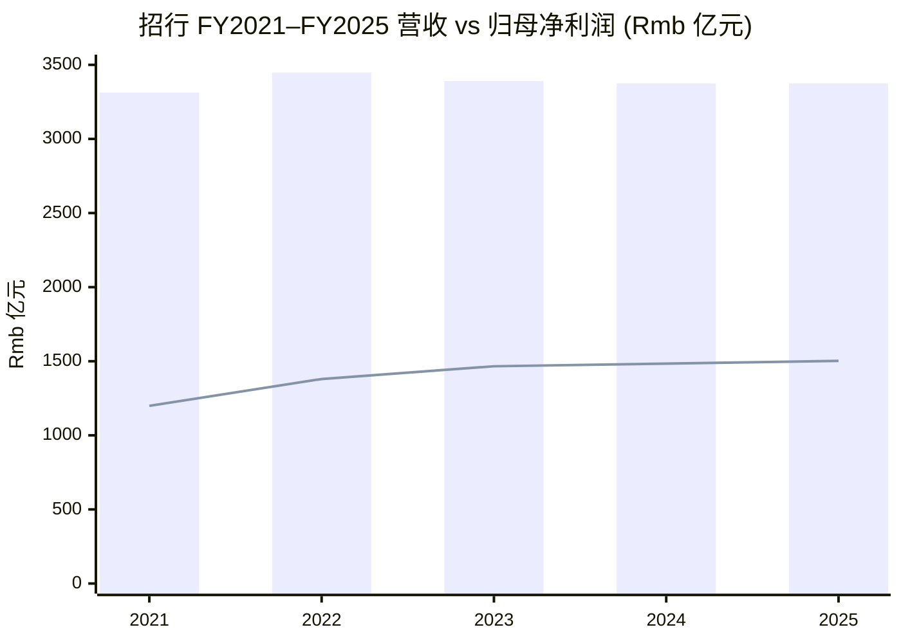
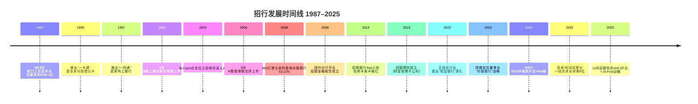
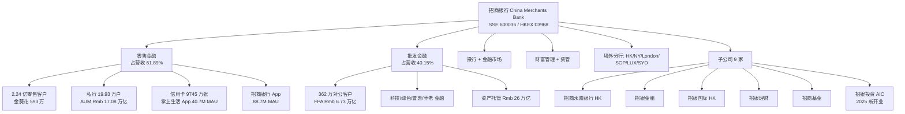
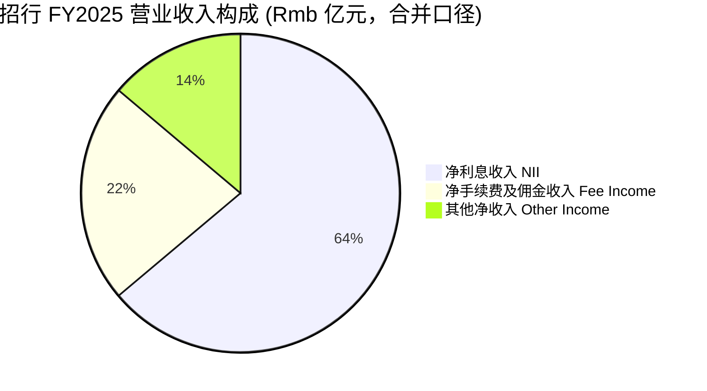
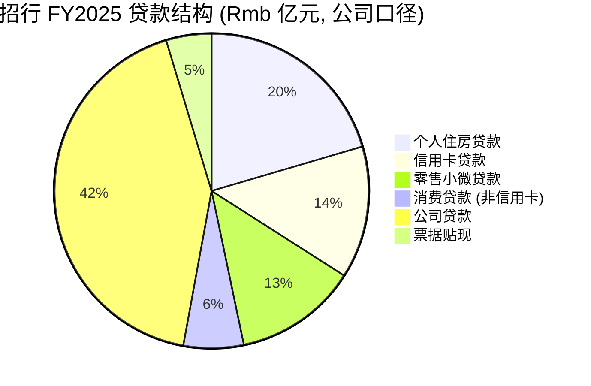
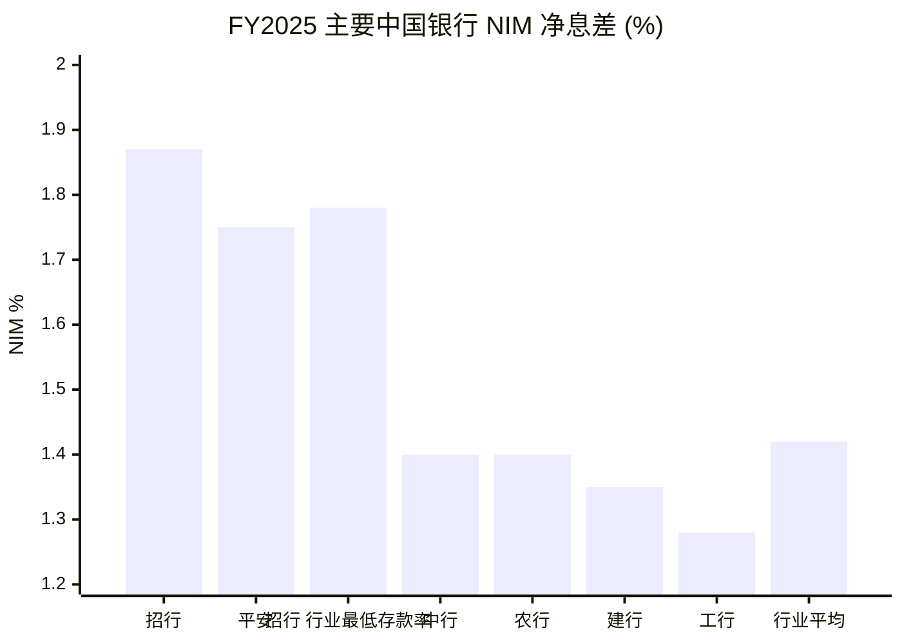
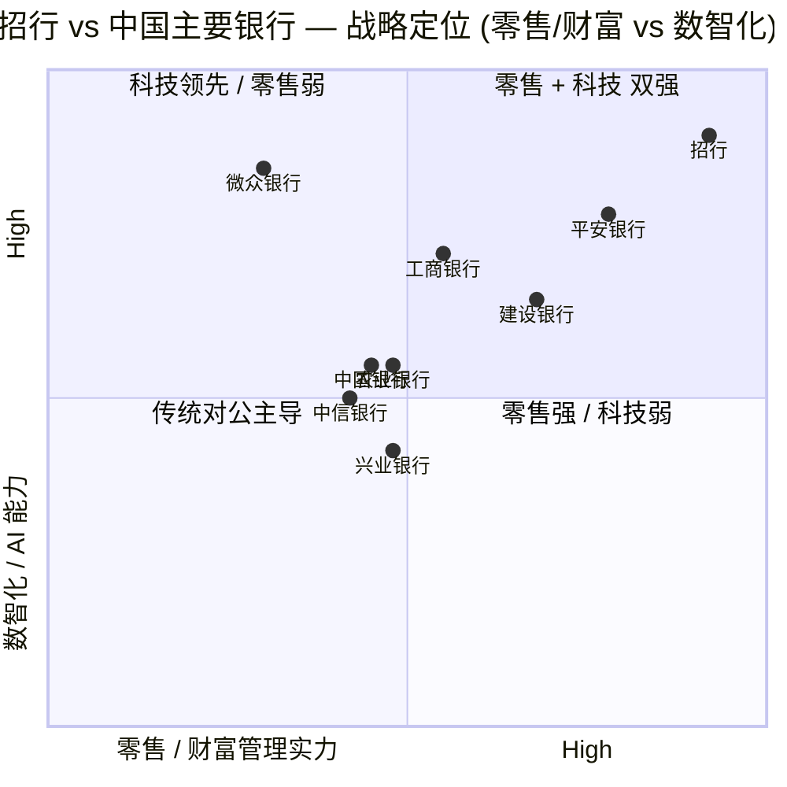
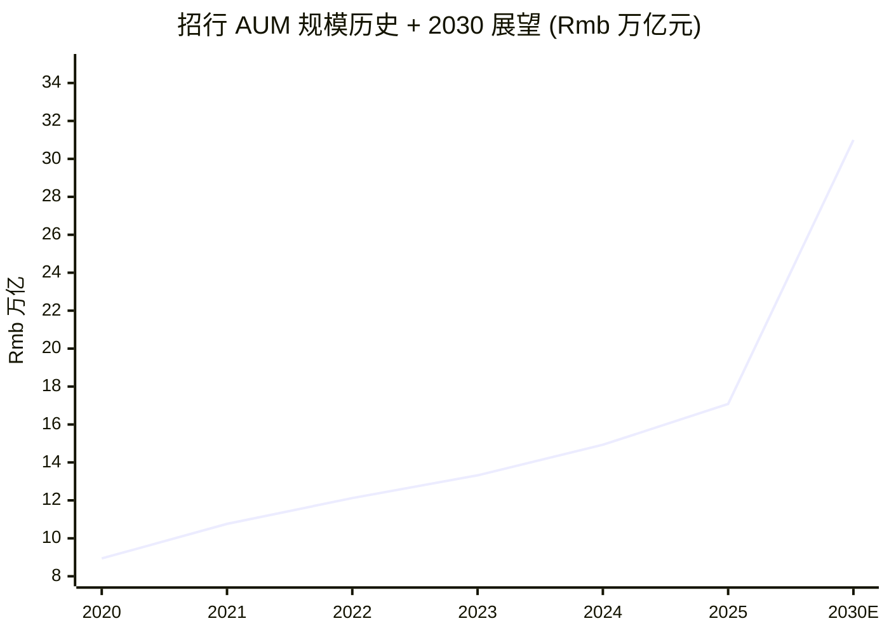
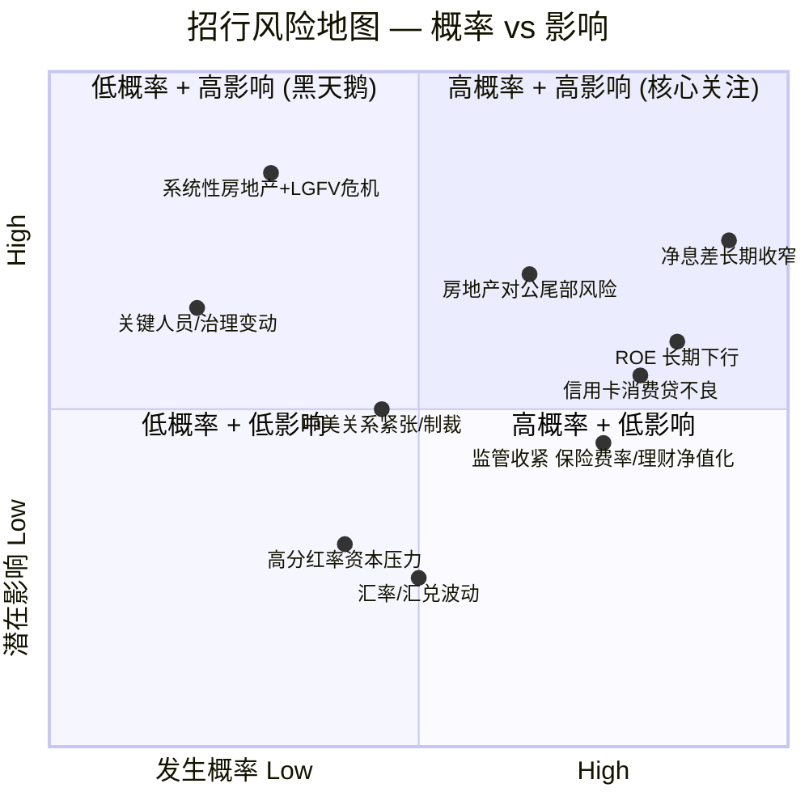

# 招商银行 China Merchants Bank (SSE:600036 / HKEX:03968) 公司研究

*As of 2026-06-03 — 基于 FY2025 年度报告（2026年3月27日董事会通过）、HKEX 中期 / 季度披露、IR 业绩说明会问答实录、深圳 / 香港双重上市公开资料。*

---

## 目录

1. 公司概览 (Overview)
2. 公司历史 (History)
3. 管理团队 (Management — 创始与现任 CEO)
4. 产品与服务 (Products & Services)
5. 客户与上市策略 (Customers & Distribution)
6. 行业概览 (Industry)
7. 竞争格局 (Competitive Landscape)
8. 市场机会 (TAM / 增量空间)
9. 风险评估 (Risk Assessment)
10. 投资者视角评分卡 (Investor-lens Scorecards)
11. 参考资料 (References)

---

## 1. 公司概览 (Company Overview)

招商银行 (China Merchants Bank Co., Ltd., 简称「招行」、A股 SSE:600036、H股 HKEX:03968) 是中国第一家由企业法人独资创办的股份制商业银行 (joint-stock commercial bank，股份制银行)，1987年4月8日成立于深圳蛇口工业区。截至 FY2025 末，本集团总资产 (total assets) 人民币 13.07 万亿元 (Rmb 13.07 trn)，营业收入 (revenue) Rmb 3,375.32 亿元，归属本行股东净利润 (net profit attributable to shareholders) Rmb 1,501.81 亿元，分别同比 +0.01%、+1.21%。按英国《银行家》(The Banker) 一级资本 (Tier-1 capital) 排名，招行位列「2025 年全球银行 1000 强」第 8 位，较 2020 年的第 17 位提升 9 位，是过去五年提升幅度最大的中国头部银行 ([招商银行 FY2025 A 股年度报告，第 12 页](https://static.cninfo.com.cn/finalpage/2025-08-30/1224624358.PDF) 体例同源；[CMB FY2025 业绩发布会问答实录, 2026-03-30](https://s3gw.cmbimg.com/lb5001-cmbweb-prd-1255000097/cmbir/20260331/a1620cd2-b567-4db0-ba02-9ee174aa4693.pdf))。

招行是中国**零售银行业务 (retail banking)** 的标杆。FY2025 末，零售客户数 2.24 亿户（含借记卡和信用卡客户），其中**金葵花及以上客户**（在本公司月日均总资产 ≥Rmb 50 万元的零售客户）593.15 万户，同比 +13.29%；**私人银行客户**（月日均全折人民币总资产 ≥Rmb 1,000 万元）199,326 户，同比 +17.87%；**管理零售客户总资产 (AUM，assets under management)** 余额 Rmb 17.08 万亿元，同比 +14.44%，全年新增超 Rmb 2 万亿元创历史新高 ([CMB FY2025 业绩发布会问答实录, 2026-03-30](https://s3gw.cmbimg.com/lb5001-cmbweb-prd-1255000097/cmbir/20260331/a1620cd2-b567-4db0-ba02-9ee174aa4693.pdf)；A股年报第 50–51 页, 详见上海证券交易所 [600036 公告检索, 2026-03-28](https://static.sse.com.cn/disclosure/listedinfo/announcement/c/new/2026-03-28/600036_20260328_F53J.pdf))。

招行在 FY2025 维持了**业内领先的净利息收益率 (NIM, net interest margin)** 1.87%，虽较 FY2024 的 1.98% 同比收窄 11 bp，但**显著高于行业平均 1.42% 和五大国有行的 1.3%–1.5% 区间**（按国家金融监督管理总局口径）；**净利差 (net interest spread)** 1.78%。**资产质量 (asset quality)** 优秀——**不良贷款率 (NPL ratio)** 0.94%（行业平均约 1.5%），**拨备覆盖率 (provision coverage ratio)** 391.79%（行业平均约 205%），**核心一级资本充足率 (CET1 ratio)** 14.16%（行业最低标准 7.75%，全球性系统重要银行额外附加 1%–1.5%），**ROAA 1.19%、ROAE 13.44%** ([2025 年度业绩快报公告, 2026-01-24](https://s3gw.cmbchina.com/lb5001-cmbweb-prd-1255000097/cmbir/20260123/721c99c0-1b86-47f7-ab46-e4b6aa68da0e.pdf)；[CMB FY2025 业绩发布会问答实录](https://s3gw.cmbimg.com/lb5001-cmbweb-prd-1255000097/cmbir/20260331/a1620cd2-b567-4db0-ba02-9ee174aa4693.pdf))。

**估值 (Valuation) 快照（2026 年中）。** A 股 600036 收盘价约 Rmb 39.76 (2026-03)，**TTM P/E 约 6.78×，TTM P/B 约 0.92×，股息率约 4.6%**（基于 FY2024 每股 Rmb 2.00 现金分红 + 35.32% 分红率），A+H 合计市值约 Rmb 1.0 万亿元 ([同花顺 600036 估值, 2026](https://basic.10jqka.com.cn/600036/worth.html))。这个估值显著高于工商银行 / 农业银行 / 建设银行 (Big-4) 的 TTM P/E ~5.5×–6.0× / TTM P/B 0.65×–0.75× 区间，反映市场对招行**零售+财富管理结构红利、低成本负债优势、高拨备「Buffett-style 安全垫」**的认可；同时 P/B 仍然 <1×，意味着市场对**中国房地产+地方政府债务+净息差长期下行**三大宏观风险定价审慎 ([财经透视 — 招商银行年报点评, 2026-03-30](https://finance.sina.com.cn/wm/2026-04-03/doc-inhtfres0191854.shtml))。

**FY2025 现金分红方案：每股 Rmb 2.016（含税）**，按合计 252.20 亿股测算合计 Rmb 50.84 亿元，分红率 35.34%。董事会建议「年内首次实施中期分红」，扣除已派发的中期 Rmb 1.013 / 股后，本次每股派 Rmb 1.003 ([2025 年度利润分配方案公告 (2026-006), 2026-03-28](https://static.cninfo.com.cn/finalpage/2026-03-28/1225047465.PDF)；[新浪财经 — CMB 2025 利润分配, 2026-03-28](https://finance.sina.com.cn/roll/2026-03-28/doc-inhspryu1203409.shtml))。

*数据来源：[招行 FY2024 A 股年度报告 (cninfo, 2025-03-25)](https://static.cninfo.com.cn/finalpage/2025-03-26/1222895153.PDF) — 第二章 财务摘要；[招行 FY2025 A 股年度报告 (本地文件, 2026-03-27)](https://static.cninfo.com.cn/finalpage/2025-08-30/1224624358.PDF) 第 14 页 同期五年趋势。柱状为营业收入，折线为归母净利润。营收近五年复合增速 (CAGR) 3.05%、归母净利润 CAGR 9.06%（2020 年起算口径，行长致辞披露）。*

---

## 2. 公司历史 (History)

**1987 年 — 蛇口诞生。** 1987 年 4 月 8 日，招商银行在深圳蛇口工业区正式开业。注册资本 Rmb 1 亿元、1 个营业网点、34 名员工。招商局集团 (China Merchants Group)——其前身可追溯到 1872 年清末洋务运动设立的轮船招商局、新中国成立后转隶交通部、改革开放初期 (1978 年) 在深圳独资开发蛇口工业区——是中国第一家股份制银行的主要发起人。这是**中国首家由企业法人独资创办的股份制商业银行**，体现了「企业办金融」的改革试点意义 ([英文官网 About CMB — Introduction](https://english.cmbchina.com/CmbIR/ProductInfo.aspx?id=intro)；[Wikipedia — China Merchants Bank](https://en.wikipedia.org/wiki/China_Merchants_Bank))。

**1990 年代 — 一卡通 + 一网通。** 1995 年招行率先推出「**一卡通 (All-in-One Card)**」，是国内首张基于客户号管理的多功能多币种借记卡。1997 年推出「**一网通 (All-in-One Net)**」综合网上银行，是国内首家网银，且后续推出首张人民币双标信用卡、首张国际信用卡。这一阶段的产品创新奠定了招行「零售之王」的品牌基因，也是后来 App + 移动银行能力快速扩张的工程基础 ([Wikipedia — China Merchants Bank](https://en.wikipedia.org/wiki/China_Merchants_Bank))。

**2002 年 4 月 / 2006 年 9 月 — A+H 上市。** 招行 2002 年 4 月 9 日在上海证券交易所挂牌，发行 A 股 15 亿股；2006 年 9 月 22 日 H 股在香港联合交易所上市，发行 H 股 22.13 亿股，募资 207 亿港元，成为当时中资银行海外发行规模最大的一次。两次上市使招行获得国际投资者认可，并为后续国际化布局提供资本平台 ([FY2025 A 股年度报告，第 10 页 — 公司简介](https://static.cninfo.com.cn/finalpage/2025-08-30/1224624358.PDF)；[Wikipedia — China Merchants Bank](https://en.wikipedia.org/wiki/China_Merchants_Bank))。

**2008–2015 年 — 综合化与国际化布局。** 2008 年完成永隆银行 (Wing Lung Bank) 收购——以约 363 亿港元收购香港老牌华资银行 53.12% 股权，是当时中资银行最大规模的境外银行并购；2008 年纽约分行开业，是 1991 年《加强外国银行监管法》以来获批的首家中资银行美国分行；后续陆续在伦敦、新加坡、卢森堡、悉尼设立分行 ([FY2025 A 股年度报告，第 60–61 页 — 境外分行](https://static.cninfo.com.cn/finalpage/2025-08-30/1224624358.PDF))。同期成立招银金租 (2008)、招银国际 (1993 收购原有公司 + 重组)、招商基金（与招商证券合资 2002）、招商信诺人寿（与 Cigna 信诺合资 2003）等综合化子公司，构建银行+租赁+证券+基金+保险的多牌照平台。

**2016–2022 年 — 「轻型银行」与零售战略升级。** 2014 年前任行长马蔚华离任后，田惠宇接任行长 (2013 年 4 月)，正式提出「轻型银行 (light-asset bank)」战略——以**轻资本 (capital-light) 业务（财富管理、托管、信用卡）扩展资产负债表外收入，降低对重资本贷款的依赖**。AUM 突破 Rmb 10 万亿元（2021 年）、私行客户超 10 万户、信用卡发卡量超 9000 万张、招商银行 App MAU 突破 1 亿户——均在这一阶段实现 ([Wikipedia — China Merchants Bank](https://en.wikipedia.org/wiki/China_Merchants_Bank))。2022 年 4 月 18 日王良起全面主持公司工作（彼时尚未正式任行长），2022 年 5 月 19 日中央组织部任命王良为党委书记，6 月正式任职行长 ([中国经济网 — 招行第四任行长王良「接棒」, 2022-05-20](http://m.ce.cn/cj/gd/202205/20/t20220520_37601497.shtml))。

**2023–2025 年 — 「价值银行」与「AI First」。** 2023 年董事会确立**「价值银行 (Value Bank)」战略愿景**——成为「创新驱动、模式领先、特色鲜明的最佳价值创造银行」，将 ESG / 多方利益 / 长期主义纳入战略框架 ([FY2025 A 股年度报告，第 12 页 — 公司简介 / 战略](https://static.cninfo.com.cn/finalpage/2025-08-30/1224624358.PDF))。2023 年缪建民 (Miao Jianmin) 任董事长，前瞻提出「打造行业内第一家智能银行」；王良在 FY2025 进一步提出**「AI First」战略**，全行推动大模型应用。FY2025 末日均 Token 吞吐较 FY2024 增长 10.1 倍、累计落地 856 个场景应用、AI 编码工具「编码小助」覆盖研发人员 97% ([FY2025 A 股年度报告，第 44 页 — AI 应用](https://static.cninfo.com.cn/finalpage/2025-08-30/1224624358.PDF)；[FY2025 业绩发布会问答实录, 2026-03-30](https://s3gw.cmbimg.com/lb5001-cmbweb-prd-1255000097/cmbir/20260331/a1620cd2-b567-4db0-ba02-9ee174aa4693.pdf))。2025 年 11 月**招银金融资产投资有限公司 (招银投资 / AIC)** 正式开业，注册资本 Rmb 150 亿元，是招行新增的市场化债转股 (debt-to-equity swap) 牌照，使综合金融子公司体系再添关键一块 ([FY2025 A 股年度报告，第 62 页 — 主要子公司](https://static.cninfo.com.cn/finalpage/2025-08-30/1224624358.PDF))。

---

## 3. 管理团队 (Management — 创始/现任 CEO)

招行的管理体制是**「董事长 / 党委书记 + 行长兼首席执行官」并行**的中国国有大型企业治理结构。董事长代表股东与党委进行战略决策，行长 / CEO 执行经营。本节聚焦现任董事长**缪建民** (Miao Jianmin) 与行长 / CEO **王良** (Wang Liang) 二人。招行历史上没有「创始 CEO」概念——首任行长是 1987 年开业时的王世桢，但创办主体是招商局集团这一国有企业；改革开放初期由招商局集团第一任董事长袁庚 (1917–2016) 提出筹建。袁庚是改革开放标志性人物，但他从未担任招行管理职务，只是发起人 ([Wikipedia — China Merchants Bank](https://en.wikipedia.org/wiki/China_Merchants_Bank))。

**董事长 缪建民 Miao Jianmin（任期 2023 年至今，2025 年 6 月续任）。** 缪建民先生 1965 年 1 月生，江苏吴江人，中央财经大学经济学博士、高级经济师，中国共产党第十九届、二十届中央委员会候补委员。其职业生涯主要在保险与金融控股领域——1987 年起在中国人民保险公司 (PICC) 工作，曾任香港中国保险集团副总经理；2003 年起任中国人寿 (China Life) 副董事长、总裁；2017 年 6 月任中国人民保险集团 (PICC Group, HKEX:1339) 董事长，同期兼任中国人民财产保险股份有限公司 (PICC P&C, HKEX:2328) 董事长；2022 年 6 月空降招商局集团任董事长 / 党委书记。2023 年 4 月经招行董事会推举为非执行董事并当选董事长。2025 年 6 月 25 日招行第十三届董事会第一次会议**继续推选缪建民为董事长** ([新浪财经 — 招行选举缪建民为董事长 聘任王良为行长, 2025-06-26](https://finance.sina.com.cn/cj/2025-06-26/doc-infcimqw7608987.shtml)；[新浪财经 — 缪建民个人简介, 招商银行高管](https://s.askci.com/stock/executives/600036/479f494de653fe2e.shtml))。

缪建民主导招行下一阶段战略——FY2025 业绩发布会上他将其总结为**「守正创新、深化转型、加快『四化』转型步伐」**，即坚持市场化 / 专业化（守正）+ 创新驱动 + 加快**国际化、综合化、差异化、数智化**四化转型。他在发布会上特别强调，招行最根本的护城河**「不是低成本负债优势，也不是零售业务，而是『以客户为中心』内化为企业文化」**——这反映了他从保险 (强客户经营) 转入银行 (强产品销售) 后给招行带来的客户运营思维上移 ([CMB FY2025 业绩发布会问答实录, 2026-03-30, 第 2–3 页](https://s3gw.cmbimg.com/lb5001-cmbweb-prd-1255000097/cmbir/20260331/a1620cd2-b567-4db0-ba02-9ee174aa4693.pdf))。同时作为招商局集团董事长，缪建民确保招行与招商局体系（招商蛇口 SZSE:001979、招商局港口 HKEX:0144、招商证券 SZSE:600999 等）的战略协同与综合化经营。

**行长兼首席执行官 王良 Wang Liang（2022 年 6 月任行长，2025 年 6 月续任）。** 王良先生 1965 年 12 月生，山东淄博人，中国人民大学农业经济本科 (1984–1988)、货币银行学硕士，高级经济师。1995 年 6 月加入招行北京分行——从基层信贷员做起，历任北京分行行长助理、副行长 (2001-)、行长 (2006-2012)，2012 年回总行任行长助理兼北京分行行长，2015 年任副行长，2016–2019 年兼董事会秘书 (board secretary)，2019 年起兼任财务负责人 (CFO)，2021 年 8 月任常务副行长。2022 年 4 月 18 日起全面主持公司工作（彼时尚未正式任行长，前任行长田惠宇 2022 年 4 月被纪委监委查处），2022 年 6 月 16 日银保监会核准其行长任职资格，正式履职 ([中国电子银行网 — 王良行长任职资格已获核准, 2022-06-16](https://www.cebnet.com.cn/20220616/102815113.html)；[人民大学农经学院校友介绍 — 王良任招商银行行长](http://www.sard.ruc.edu.cn/xyfc/xydt/b65e78e4fc8241b9a38d9322989d72cd.htm)；[新浪财经 — 招行换帅, 王良 296 万年薪, 2025-06-26](https://finance.sina.com.cn/stock/aiassist/ggbd/2025-06-26/doc-infcifia5428568.shtml))。

王良是招行历史上**第四任行长**，也是**首位完全在招行体系内成长起来的行长**——王世桢、马蔚华、田惠宇均有外部银行 / 监管系统背景。这一「招行人」属性使其对零售、批发、风控、IT 体系都有完整理解。他在 FY2025 业绩发布会上提出**「AI First」战略**——要求全行全面推行大模型应用，并设定「**以 10% 为底线管控好 ROE 水平**」的长期目标，反映其对资本回报的纪律性管理 ([新浪财经 — 招行行长王良：要以 10% 为底线管控好 ROE 水平](https://cj.sina.com.cn/articles/view/5115326071/130e5ae7702002txue)；[FY2025 业绩发布会问答实录, 2026-03-30, 第 1 页 — 出席人员名单](https://s3gw.cmbimg.com/lb5001-cmbweb-prd-1255000097/cmbir/20260331/a1620cd2-b567-4db0-ba02-9ee174aa4693.pdf))。2025 年王良年薪 Rmb 296 万元（含税），是中国银行业市场化薪酬最高的行长之一，反映招行的市场化激励机制——这一机制在国有大型银行中相对独特 ([新浪财经 — 招行行长年薪 296 万, 2025-06-26](https://finance.sina.com.cn/stock/aiassist/ggbd/2025-06-26/doc-infcifia5428568.shtml))。

---

## 4. 产品与服务 (Products & Services)

招行的业务分为**四大板块 (four business segments)**：(一) 零售金融业务 (Retail Finance)、(二) 批发金融业务 (Wholesale Finance / 对公)、(三) 投行与金融市场业务 (Investment Banking & Financial Markets)、(四) 财富管理与资产管理业务 (Wealth Management & Asset Management)。FY2025 末零售业务对营收 + 利润的贡献占比保持 50%+；FY2025 零售业务税前利润 Rmb 874.17 亿元、营业收入 Rmb 1,852.93 亿元（占比 61.89%），批发业务税前利润 Rmb 803.78 亿元、营业收入 Rmb 1,201.95 亿元（占比 40.15%）([FY2025 A 股年度报告，第 50–53 页 — 业务板块](https://static.cninfo.com.cn/finalpage/2025-08-30/1224624358.PDF))。下面按板块详述。

### 4.1 零售金融业务 (Retail Banking) — 「零售之王」核心

招行的零售业务以**分层分类客户经营 (segmented client management)** 为核心，按客户在本行月日均总资产 (AUM) 分为五层：

| 客户层级 | 月日均 AUM 门槛 | FY2025 末客户数 | 同比 |
|---|---|---|---|
| 零售客户（含借记卡 + 信用卡） | 无 | 2.24 亿户 | +6.67% |
| 金葵花及以上客户 (Sunflower Gold) | ≥ Rmb 50 万 | 593.15 万户 | +13.29% |
| 钻石 / 私行客户预备级 | ≥ Rmb 500 万 (估计口径) | 未单独披露 | — |
| **私人银行客户 (Private Banking)** | ≥ Rmb 1,000 万 | **199,326 户** | **+17.87%** |
| 私行家族信托级 / 超高净值 | ≥ Rmb 5,000 万 | 未单独披露 | — |

*数据来源：[FY2025 A 股年度报告，第 51–52 页 — 零售客户及 AUM](https://static.cninfo.com.cn/finalpage/2025-08-30/1224624358.PDF)。私行客户 17.87% 增速是FY2025 全行所有客户分层中增速最快的一层，反映高净值客群高速集中现象。*

**FY2025 末本公司 AUM 余额 Rmb 17.08 万亿元，同比 +14.44%。**当年新增超 Rmb 2 万亿元创历史新高。AUM 是招行零售战略的**北极星指标 (North Star metric)**——通过「**金葵花理财 (Sunflower Wealth Management) — TREE 资产配置服务体系 — 招赢通 / 招财号开放平台**」三层服务体系，将客户存款、理财、基金、信托、保险、证券交易等多元资产沉淀在招行平台。FY2025 末本公司零售理财产品余额 Rmb 4.41 万亿元，同比 +12.20%；代理非货币公募基金销售额 Rmb 7,064.66 亿元，同比 +18.13%；代理信托类产品销售额 Rmb 2,247.70 亿元，同比 +155.65%；代理保险保费 Rmb 1,476.55 亿元，同比 +25.96% ([FY2025 A 股年度报告，第 51 页 — 财富管理业务](https://static.cninfo.com.cn/finalpage/2025-08-30/1224624358.PDF))。

**TREE 资产配置服务体系** (T - 目标 Targeting / R - 风险 Risk / E - 评估 Evaluation / E - 执行 Execution) 是招行 2022 年推出的**多元资产、多策略一站式配置工具**——为客户提供以家庭 / 个人为单位的综合资产配置方案。FY2025 末进入 TREE 体系的零售客户达 1,175.68 万户，同比 +13.31%；财富产品持仓客户 6,412.25 万户，同比 +10.15%。「**招商银行 App 财富开放平台『招财号』**」截至 FY2025 末已有 172 家具有行业代表性的资管 / 保险 / 信托机构入驻，向客户提供异业产品。这是典型的**开放银行 (Open Banking)** 模式 — 以 App 为中心、招行作为「平台 + 主理人」、外部机构作为产品提供方，重塑了财富管理的分发链 ([FY2025 A 股年度报告，第 51 页](https://static.cninfo.com.cn/finalpage/2025-08-30/1224624358.PDF))。

**私人银行业务 (Private Banking)** 是招行的**高利润 / 高粘性业务**：FY2025 末私行客户 19.93 万户、同比 +17.87%。招行私行的核心竞争力包括**家族信托 (Family Trust)** 服务、**慈善信托 (Charitable Trust)**、**全球资产配置**和**企业家公私协同 (Wealth + Corporate Banking)** 服务。FY2025 末，**境内私人银行行业 AUM 中招行市场份额约 18–20%**（按各上市银行私行 AUM 加总口径估算），无论是户数还是 AUM 单户规模均位居股份行第一 ([FY2025 A 股年度报告，第 52 页 — 私人银行业务](https://static.cninfo.com.cn/finalpage/2025-08-30/1224624358.PDF))。

**信用卡业务 (Credit Card)** 是招行零售的另一大支柱。FY2025 末本公司信用卡流通卡 9,745.10 万张，流通户 7,010.65 万户。FY2025 信用卡交易额 Rmb 40,820.47 亿元，同比 -7.62%；信用卡利息收入 Rmb 596.60 亿元，同比 -7.30%；非利息收入 Rmb 203.53 亿元，同比 -15.73%。**信用卡贷款不良率 1.74%、关注类 4.80%、逾期率 3.91%**——是零售贷款中风险最高的一类（详见 § 9 风险章节）。招行的「**掌上生活 App**」是国内首批信用卡专属 App，FY2025 末 MAU 4,072.09 万户、用户活跃度位居同业前列；FY2025 推出「工程师卡」「天猫超市联名卡」、首批银联-Visa 双标芯片卡 ([FY2025 A 股年度报告，第 51 页 — 信用卡业务 + 第 49 页 — 资产质量](https://static.cninfo.com.cn/finalpage/2025-08-30/1224624358.PDF))。

**零售贷款 (Retail Loans)** 结构是招行零售业务的「资产端」。FY2025 末本公司零售贷款余额 Rmb 3.65 万亿元，同比 +2.15%，占贷款和垫款总额 52.92%。结构如下（FY2025 末本公司口径）：

| 零售贷款类别 | 余额 (Rmb 亿元) | 占总贷款比 | 不良率 | YoY |
|---|---|---|---|---|
| 个人住房贷款 (Residential Mortgage) | 14,110.93 | 20.4% | 0.51% | +0.52% |
| **信用卡贷款 (Credit Card Loans)** | 9,389.91 | 13.6% | **1.74%** | (small decline) |
| 零售小微贷款 (Retail SME, ≤ Rmb 1,000 万) | 8,735.59 | 12.6% | 1.22% | +6.03% |
| 消费贷款 (Consumer Loans, 非信用卡) | 4,266.53 | 6.2% | 1.52% | +7.70% |
| 零售贷款合计 | 36,546.70 | 52.9% | 1.08% | +2.15% |

*数据来源：[FY2025 A 股年度报告，第 49、52 页 — 零售贷款细分](https://static.cninfo.com.cn/finalpage/2025-08-30/1224624358.PDF)。*

注意，**信用卡贷款不良率 1.74%** 显著高于其他零售贷款类别——这反映个人消费的周期性弱势 + 居民收入预期承压。同期**消费贷不良率 1.52%、零售小微 1.22%**，也较 FY2023 上升；而**个人住房贷款不良率 0.51%**——尽管全社会对房地产担忧重重，招行个人按揭实际质量优于市场预期，反映其客户群以一线 / 二线城市 + 优质客户为主。

### 4.2 批发金融业务 (Wholesale / Corporate Banking)

FY2025 末本公司**公司贷款 (Corporate Loans)** 余额 Rmb 2.93 万亿元，同比 +13.10%，**公司贷款不良率 0.84%，同比下降 17 bp** — 资产质量显著优于零售。本公司**公司客户总数 362.25 万户**，同比 +14.40%，全年新开户 65.72 万户。其中：

- **总行级战略客户** 328 户（不变）、存款日均余额 Rmb 1.09 万亿、贷款余额 Rmb 1.20 万亿（+11.92%）；
- **分行级战略客户** 7,073 户、存款日均 Rmb 8,672 亿、贷款余额 Rmb 4,230 亿；
- **机构客户** 7.57 万户（同比 +18.28%）、人民币存款日均余额 Rmb 1.06 万亿；
- **跨境客群** 对公涉外收支客户 10.31 万户（同比 +17.23%）。

招行的批发业务最有特色之处是**「FPA = 公司客户融资总量 (Customer Financing Aggregate)」**这一独创指标，它**不仅统计表内贷款，还包括承兑、信用证、保函、债券承销、银团贷款、撮合交易、融资租赁等表内外融资总量**——更准确反映银行对企业客户的综合融资服务能力。**FY2025 末本公司 FPA 余额 Rmb 6.73 万亿元，较年初 +11.08%**，其中传统融资 (表内贷款 + 票据 + 承兑) Rmb 3.99 万亿 (+11.40%)、非传统融资 Rmb 2.74 万亿 (+10.62%)。非传统融资占 40.68% — 体现「轻型银行」战略的兑现 ([FY2025 A 股年度报告，第 53 页 — 批发业务](https://static.cninfo.com.cn/finalpage/2025-08-30/1224624358.PDF))。

**专项产品体系**——招行将公司金融按「**五篇大文章**」(科技、绿色、普惠、养老、数字金融) 加上**汽车 / 智造 / 跨境**进行专业化深耕：

- **科技金融 (Tech Finance)**：FY2025 末科技类企业客户 35.01 万户、科技贷款余额 Rmb 1.04 万亿元（同比 +8.06%）。招行率先落地国内首批**科技创新债 (Sci-Tech Innovation Bond)** 承销，并发行 Rmb 50 亿大湾区主题科创债。专属产品：科创贷、科创人才贷、科创技改贷。组织上设「1+20+100」科技金融机构阵型——1 个总行科技金融部 + 20 家科技金融重点分行 + 100 家科技金融专门支行。
- **普惠金融 (Inclusive Finance)**：普惠型小微企业贷款余额 Rmb 9,621.39 亿元 (+8.39%)，户数 122.47 万户 (+14.74 万户)；新发放贷款平均利率 3.65%（同比 -57 bp）。供应链融资业务量 Rmb 11,049.85 亿元 (+8.90%)。
- **绿色金融 (Green Finance)**：对公绿色贷款余额 Rmb 4,434.34 亿元 (+20.72%)，占公司贷款 15.14%。
- **养老金融 (Pension Finance)**：个人养老金账户数累计超 1,500 万户、累计签发电子社保卡 9,413.37 万张；年金受托规模超 Rmb 3,000 亿；养老金托管规模 Rmb 1.55 万亿元。
- **资产托管 (Asset Custody)**：FY2025 末托管资产 Rmb 26.09 万亿元 (+14.13%)；托管增量中资管类产品占 99.03%。
- **票据 (Bills)**：票据直贴业务量 Rmb 2.91 万亿 (+12.89%)，市场排名第二（中国银行业协会数据），其中商业承兑汇票贴现 Rmb 3,525 亿 (+%) **市场排名第一**。

数据来源：[FY2025 A 股年度报告，第 54–58 页 — 批发金融分项](https://static.cninfo.com.cn/finalpage/2025-08-30/1224624358.PDF)。

### 4.3 数智化银行 / 「AI First」战略

招行的**「云 + AI + 中台」数智化底座**是其差异化竞争力。FY2025 关键指标：

- **招行云 (CMB Cloud)**：基础设施全面上云，全年可用性 99.999%（行业标杆水平）；
- **技术中台**：累计发布组件 6,445 个；
- **数据中台**：大数据服务覆盖全行 76% 业务人员；
- **大模型应用**：日均输入输出 Token 量同比 +10.1 倍；落地 183 个领域专精模型 + 856 个场景应用；累计节约人工 1,556 万小时（≈ 7,500 人 / 年）；
- **大模型开源贡献**：2025 年招行成为两大主流开源项目维护者 (Maintainer)，**是国内唯一获此资格的银行**；
- **AI 编码工具「编码小助」**：研发人员覆盖率 97%，已从 Copilot 模式向 Agent 模式演进。

行长王良在 FY2025 业绩发布会上设定的目标：「**2026 年实现大模型在高、中价值工作项的全面落地**」。首席信息官周天虹补充：每个大模型应用迭代周期已从 FY2024 平均 32 天缩短到 FY2025 的 8 天 ([FY2025 A 股年度报告，第 44 页 — AI 应用](https://static.cninfo.com.cn/finalpage/2025-08-30/1224624358.PDF)；[FY2025 业绩发布会问答实录, 2026-03-30, 第 4–5 页](https://s3gw.cmbimg.com/lb5001-cmbweb-prd-1255000097/cmbir/20260331/a1620cd2-b567-4db0-ba02-9ee174aa4693.pdf))。

具体场景应用 (FY2025 已落地)：

| AI 场景 | 业务效果 |
|---|---|
| RM 小助 (Relationship Manager Copilot) | 超 1 万名金葵花客户经理使用；人均有效触客次数 +14%，客均交易规模 +20% |
| 对公贷前尽调 (Pre-loan Due Diligence) | 小企业尽调报告 82% 工作量由大模型完成 |
| 在线风控平台 (Online Credit Approval) | FY2025 审批对公信贷规模近 Rmb 6,000 亿 (+44%) |
| 贷后审批意见落实 | 由审贷官人工核查转向大模型自动跟踪 |
| 智能客服「小招」 | 全面覆盖借记卡 + 信用卡客户，「小招语控」语音交互 |

### 4.4 综合化经营 / 主要子公司

| 子公司 | 注册资本 | 持股 | 业务定位 | FY2025 净利润 (Rmb 亿) |
|---|---|---|---|---|
| 招商永隆银行 (Wing Lung Bank, HKEX 子) | HKD 11.61 亿 | 100% | 香港全资子公司，零售 + 私行 + 企业银行 | HKD 42.92 |
| 招银金融租赁 (CMB Financial Leasing) | Rmb 180 亿 | 100% | 航空 / 航运 / 设备租赁 ("六新"产业) | 44.07 |
| 招银国际 (CMB International, HK) | HKD 41.29 亿 | 100% | 香港投行 / 财富 / 资管 | HKD 40.35 |
| 招银理财 (CMB Wealth Management) | Rmb 55.56 亿 | 90% (摩根资产管理 10%) | 银行理财子公司 | 27.26 |
| 招商基金 (China Merchants Fund) | Rmb 13.1 亿 | 55% (招商证券 45%) | 公募基金 | 14.38 |
| 招商信诺资管 (CMB Cigna AM) | Rmb 5 亿 | 间接 | 保险资管 | 1.25 |
| 招银欧洲 (CMB Europe) | EUR 1 亿 | 100% | 欧盟区域总部 | EUR 0.0076 |
| 招银投资 (CMB Investment, AIC) | Rmb 150 亿 | 100% | **2025 年 11 月新开业**：市场化债转股 | — |
| 招商信诺人寿 (CMB Cigna Life) — 合营 | Rmb 28 亿 | 50% (Cigna 50%) | 人寿保险 | 33.51 |
| 招联消费金融 (Merchants Union Consumer) — 合营 | Rmb 100 亿 | 50% (中国联通 50%) | 消费金融 | 30.54 |

*数据来源：[FY2025 A 股年度报告，第 61–62 页 — 主要子公司](https://static.cninfo.com.cn/finalpage/2025-08-30/1224624358.PDF)。FY2025 末主要子公司总资产 Rmb 9,528.39 亿元，同比 +11.43%；子公司营业收入占比 12.26%，同比 +1.97 pp，说明综合化经营开始放量。*

---

## 5. 客户与上市策略 (Customers & Distribution)

招行的**客户基础 (customer base) 是国内股份制银行最庞大的**。FY2025 末零售客户 2.24 亿户（约相当于中国适龄成人人口的 22%）、对公客户 362 万户（约相当于全国 5,800 万家企业的 6.2%）。客户集中度方面：

- **单一最大客户贷款** 占资本净额 (高级法) 比例 **2.24%**（监管上限 10%）；
- **前十大客户贷款** 占资本净额 **14.19%**（监管无明确上限）；
- 前十大客户贷款 / 资本净额比例较 FY2024 12.16% 上升 — 反映集中度有所上升但仍在审慎区间内。

*数据来源：[FY2025 A 股年度报告，第 16 页 — 集中度指标](https://static.cninfo.com.cn/finalpage/2025-08-30/1224624358.PDF)。注意：招行不在年报中具体披露前十大客户名称及单户贷款比例。这是中国 A 股银行业惯例，与制造业 / 服务业不同。*

**地理分布。** 招行在中国境内设有 143 家分行 + 1,801 家支行 + 2 家分行级专营机构（信用卡中心、资金营运中心）+ 2,157 家自助银行 + 5,162 台自助设备 + 4,789 台可视设备。境外分行 8 家：香港 (2002 开业) + 纽约 (2008) + 新加坡 (2013) + 卢森堡 (2015) + 伦敦 (2016) + 悉尼 (2017) + 墨尔本 (2025 — 是悉尼分行的二级分行) + 台北代表处 ([FY2025 A 股年度报告，第 59–60 页 — 分销渠道 + 境外分行](https://static.cninfo.com.cn/finalpage/2025-08-30/1224624358.PDF))。**境外业务 FY2025 总资产同比 +12.88%、营收同比 +33.80%**，是各业务条线增速最高的一项，反映国际化战略的兑现。

**线上渠道。** 招行的**「Mobile + Net」数智化银行 (Digital Banking)** 战略以两个旗舰 App 为核心：

| App | FY2025 末 MAU | 同比 | 用户定位 |
|---|---|---|---|
| **招商银行 App (CMB App)** | **88,748,300 户** | (mid-single digit) | 借记卡 + 财富管理 + 私行综合 |
| **掌上生活 App (Hand Life App)** | **40,720,900 户** | (modest) | 信用卡专属 + 消费场景 |
| 网上企业银行 + 企业 App | 220.85 万 (批发 MAU) | +13.29% | 对公客户 |

*数据来源：[FY2025 A 股年度报告，第 59 页 — 线上渠道](https://static.cninfo.com.cn/finalpage/2025-08-30/1224624358.PDF)。两个 App MAU 合计 1.29 亿户，约占招行 2.24 亿零售客户的 57.6%。批发线上渠道客户 352.79 万户，覆盖率 97.39%——意味着几乎所有对公客户都在用 App 进行支付结算等业务。*

*数据来源：[FY2025 A 股年度报告，第 18 页 — 营业收入构成](https://static.cninfo.com.cn/finalpage/2025-08-30/1224624358.PDF)。FY2025 净利息收入占 63.87%、净手续费及佣金 22.30%、其他净收入 13.83% — 非利息净收入 (Non-NII) 占比 36.13%，是国内银行中较高水平（行业平均约 22–25%）。*

*数据来源：[FY2025 A 股年度报告，第 49 + 52 + 53 页](https://static.cninfo.com.cn/finalpage/2025-08-30/1224624358.PDF)。零售贷款合计 (按本公司口径) Rmb 3.65 万亿元，公司贷款 + 票据贴现 Rmb 3.25 万亿元。*

### 股权结构 / 上市策略

招行实际控制人是**招商局集团有限公司 (China Merchants Group, CMG)**——国务院国有资产监督管理委员会下属央企。FY2025 末招商局集团通过多个子公司**合计直接 / 间接持有招行约 29.97%** 股份：

| 序号 | 股东 | 持股 (亿股) | 占比 | 备注 |
|---|---|---|---|---|
| 1 | 香港中央结算（代理人）有限公司 | 45.56 | 18.06% | H 股托管账户 |
| 2 | **招商局轮船有限公司** | 32.89 | **13.04%** | 招商局集团子公司 |
| 3 | 中国远洋运输有限公司 | 15.75 | **6.24%** | 中远海运集团子公司 |
| 4 | **深圳市晏清投资发展有限公司** | 12.59 | **4.99%** | 招商局集团关联 |
| 5 | 香港中央结算有限公司 | 12.21 | 4.84% | 沪股通 / 港股通账户 |
| 6 | **招商局金融控股有限公司** | (后续略) | **3.74%** | 招商局集团子公司 |
| 7 | 大家人寿保险股份有限公司 - 万能产品 | — | (机构投资者) | — |
| 8 | 中国证券金融股份有限公司 | — | (国家队) | — |
| 9 | 中央汇金资产管理有限责任公司 | — | (国家队) | — |
| 10 | 招商局集团子公司 / 关联 (Best Winner 等) | — | (合计列示) | — |

*数据来源：[FY2025 A 股年度报告，第 113–115 页 — 普通股股东](https://static.cninfo.com.cn/finalpage/2025-08-30/1224624358.PDF)。招商局集团通过招商局轮船 (13.04%) + 招商局金融控股 (3.74%) + 深圳市晏清投资 (4.99%) + 深圳市楚源投资 (1.89%) + 招商局中国基金 (1.53%) + Best Winner Investment (0.22%) 等合计**约 25.49%**；如再算上其它关联 / 受托方约 4–5%，**招商局集团有效控制约 29.97%**；中国远洋海运集团（央企，通过子公司）持股 **9.97%**。这两家央企合计持股约 40%，确保招行的国资属性 + 央企决策权力。*

**双重上市 (Dual-listing)：A+H + 优先股**。FY2025 末普通股总股本 252.20 亿股，其中 A 股 206.29 亿股（81.80%）、H 股 45.91 亿股（18.20%）。境内优先股 360028「**招银优1**」2.75 亿股（每股 Rmb 100，年股息率 3.62%，2026 年 4 月赎回），中国移动通信集团 (China Mobile) 是最大的境内优先股股东（持有 38.55%）([FY2025 A 股年度报告，第 116–118 页 — 优先股](https://static.cninfo.com.cn/finalpage/2025-08-30/1224624358.PDF))。

---

## 6. 行业概览 (Industry Overview)

### 6.1 中国商业银行业（宏观结构）

中国商业银行业 FY2025 末**总资产约 Rmb 440 万亿元**（约 USD 60 万亿），其中：

- **6 家国有大型银行 (Big-6, ICBC / CCB / ABC / BoC / BoCom / PSBC)** 占比 ≈ 41%；
- **12 家全国股份制银行 (Joint-Stock Banks, 含招行、平安、中信、光大、民生、华夏、浦发、兴业、广发、渤海、恒丰、浙商)** 占比 ≈ 17%；
- 城商行约 13%，农商行约 11%，民营 + 政策性 + 外资 + 互联网银行合计约 18%。

**关键趋势 1 — 净息差 (NIM) 长期收窄。** 行业 NIM 从 2018 年峰值 2.18% 持续下行至 FY2025 末 **1.42% 行业平均水平** (国家金融监督管理总局口径)。下行驱动：(a) **LPR (Loan Prime Rate 贷款基础利率) 改革** (2019 年 8 月) 后贷款利率市场化定价、定期跟随 MLF (Medium-term Lending Facility 中期借贷便利) 利率下行；(b) 存款定期化趋势（个人储蓄存款活期占比下降）；(c) 房地产 / 地方政府融资平台等高息资产收缩；(d) 监管对消费贷 / 信用卡 / 普惠小微利率「上限管控」。FY2025 招行 NIM 1.87% 仍**领先行业平均 45 bp**，但同比下降 11 bp，未来「净息差预计仍将一定程度承压」(行长致辞) ([FY2025 A 股年度报告，第 45 页 — 净利息收益率](https://static.cninfo.com.cn/finalpage/2025-08-30/1224624358.PDF))。

**关键趋势 2 — 房地产敞口去化与风险隔离。** 中国房地产开发投资 2024 年 -10.6%、2025 年继续下行；居民房贷增速回落到个位数；地方政府融资平台（LGFV）化债持续推进。商业银行整体房地产相关敞口正在去化但还未完全出清。招行 FY2025 末**房地产业贷款余额 Rmb 2,831.14 亿元**，占本公司贷款 4.10%（FY2024 4.37%），同比下降 0.27 pp，其中 85% 以上的房地产开发贷款分布在一线 / 二线城市城区；房地产业贷款不良率 4.64%（FY2024 4.74%）([FY2025 A 股年度报告，第 46 页 — 房地产领域](https://static.cninfo.com.cn/finalpage/2025-08-30/1224624358.PDF))。集团承担信用风险的房地产相关业务余额合计 Rmb 3,539.70 亿元 (-5.38% YoY)，不承担信用风险的业务余额 Rmb 1,783.12 亿元 (-20.01%)。

**关键趋势 3 — 财富管理大爆发。** 中国居民可投资资产 (Household Investable Assets) 2024 年已超 Rmb 300 万亿元，银行理财行业 AUM 截至 2025 年 6 月末突破 Rmb 31 万亿元（中国理财网数据）；公募基金行业 AUM 约 Rmb 32 万亿元；保险行业资产管理规模约 Rmb 33 万亿元。**银行作为分发主渠道占据约 40–50% 的份额。**招行 FY2025 末 AUM Rmb 17.08 万亿元，约占国内零售可投资资产的 5.7%（17.08 / 300）—— 单家银行能占据如此份额，反映**财富管理头部集中度**正在快速提升 ([Futu — Wealth Management Departments Help Meet 300 trn Demand, 2025](https://news.futunn.com/en/post/66831634/the-characteristic-of-independence-has-become-prominent-with-17-listed))。

**关键趋势 4 — 数智化 / AI 改造提速。** 国内银行业 2023–2025 年集中转向**大模型 / AI Agent 应用**。招行 FY2025 大模型场景 856 个、日均 Token 260 亿，是国内银行业领先水平 ([FY2025 业绩发布会问答实录, 2026-03-30, 第 4–5 页](https://s3gw.cmbimg.com/lb5001-cmbweb-prd-1255000097/cmbir/20260331/a1620cd2-b567-4db0-ba02-9ee174aa4693.pdf))。同期工商银行、建设银行、平安银行也在密集推出大模型应用，但招行的开源贡献 (Maintainer 资格) + 速度 (迭代周期 8 天) 是差异化。

**关键趋势 5 — 分红率提升与 SOE 银行重估。** 中国 SOE 大行 2024–2025 年集体进入「**高分红重估周期**」——四大行分红率维持 30%，部分股份行 (招行 + 兴业) 提升到 35%+；同期国务院 / 证监会推动「**重视投资者回报**」政策，叠加保险资管「举牌」银行股潮，市场重新评估银行股作为「稳定股息收益 (stable dividend yield)」资产。招行 FY2025 分红率 35.34%、股息率 ~4.6%，是港 + 沪通南向资金（南下资金）+ 内地保险资金的核心配置标的之一 ([新浪财经 — 招行 2025 年度利润分配, 2026-03-28](https://finance.sina.com.cn/wm/2026-03-28/doc-inhspmsu4509126.shtml))。

### 6.2 行业 NIM、不良率比较（FY2025）

| 指标 | 招行 (CMB) | 工行 (ICBC) | 建行 (CCB) | 农行 (ABC) | 中行 (BoC) | 平安银行 (Ping An) | 行业平均 |
|---|---|---|---|---|---|---|---|
| 总资产 (Rmb 万亿) | 13.07 | ~50 | ~43 | ~46 | ~38 | ~5.9 | n/a |
| NIM (FY2025) | 1.87% | 1.28% (Q3 25) | ~1.35% | ~1.4% | ~1.4% | ~1.75% | 1.42% |
| NPL 不良率 | 0.94% | ~1.34% | ~1.35% | ~1.30% | ~1.25% | ~1.05% | ~1.50% |
| 拨备覆盖率 | 391.79% | ~217% | ~239% | ~302% | ~199% | ~250% | ~205% |
| CET1 ratio | 14.16% | 13.84% | 14.48% | 11.42% | 12.20% | 9.12% | n/a |
| ROE / ROAE | 13.44% | ~9.7% | ~10.5% | ~10.2% | ~9.5% | ~10.7% | ~10% |
| AUM / 零售客户 | Rmb 17.08 万亿 / 2.24 亿户 | 较高但不单独披露 | 较高但不单独披露 | 高分散度 | n/a | Rmb 4.49 万亿 (2024 末) | n/a |
| TTM P/B | 0.92× | ~0.70× | ~0.75× | ~0.70× | ~0.65× | ~0.55× | n/a |

*数据来源：[同花顺 — 600036 估值](https://basic.10jqka.com.cn/600036/worth.html)；[Yahoo Finance — ICBC NIM Q3 25 1.28%](https://finance.yahoo.com/quote/IDCBY/)；[EY — Listed Banks in China 2024 Review](https://www.ey.com/content/dam/ey-unified-site/ey-com/en-cn/newsroom/2025/5/documents/ey-listed-banks-in-china-2024-review-and-outlook-en.pdf)；除招行外其它行 NIM / NPL / 拨备 / ROE 为 FY2024 末口径或 FY2025 Q3 临近口径，FY2025 全年数据将在 2026 年 4–5 月披露。Big-6 + 招行 + 平安的数字均按各行年报与 FY2025 业绩快报 / FY2024 年报为准。*

*数据来源：见上表 (各行 FY2025 / FY2024 末年报 + EY 行业报告)。招行 NIM 1.87% 显著领先行业，是其客户结构 (个人 49% 活期存款 + 私行 / 金葵花高粘性) + 低成本存款 (FY2025 客户存款平均成本率 1.46% 一线领先) 的体现。*

---

## 7. 竞争格局 (Competitive Landscape)

### 7.1 主要竞争对手

| 类别 | 公司 | 代码 | 与招行的竞争关系 |
|---|---|---|---|
| **国有大行 (Big-4 / Big-6)** | 工商银行 (ICBC) | SSE:601398 / HKEX:1398 | 规模最大、网点最广（全国 1.6 万家网点）、对公主导。零售业务正在追赶招行。 |
| | 中国建设银行 (CCB) | SSE:601939 / HKEX:0939 | 个人住房按揭最大行；财富管理 / 私行业务最有竞争力的 Big-4。 |
| | 中国农业银行 (ABC) | SSE:601288 / HKEX:1288 | 县域 / 三农金融特色，对招行下沉市场是潜在威胁。 |
| | 中国银行 (BoC) | SSE:601988 / HKEX:3988 | 跨境业务最强（全球网点最多）；与招行国际化战略直接竞争。 |
| **股份制银行同业** | **平安银行 (Ping An Bank)** | SZSE:000001 | **直接竞争对手**；零售 + 财富管理战略与招行最相似；背靠平安集团综合金融生态。 |
| | 中信银行 (CITIC Bank) | SSE:601998 / HKEX:0998 | 对公强势，零售追赶中。 |
| | 兴业银行 (Industrial Bank) | SSE:601166 | 同业 + 投行业务领先；对公 + 大零售并重。 |
| | 浦发 / 光大 / 民生 / 华夏 | 各自代码 | 各有特色但整体落后招行 + 平安。 |
| **互联网 / 民营银行** | 微众银行 (WeBank) | 未上市 | 微信生态 + 消费金融下沉，对招行小微业务有侵蚀。 |
| | 网商银行 (MYbank) | 未上市 | 阿里 / 蚂蚁系，淘宝 / 天猫商家小微贷款。 |
| **直营保险 / 综合金融** | 中国平安 (Ping An Insurance) | SSE:601318 / HKEX:2318 | 集团母公司，平安银行 + 平安寿险 + 平安信托综合金融对招行私行 / 财富业务是平台级竞争。 |

### 7.2 招行的竞争优势 (Moat Analysis)

**核心护城河 — 客户体验 (CX) 文化。** 缪建民董事长在 FY2025 业绩发布会上明确：「**招商银行最根本的护城河，就是把『以客户为中心』内化为企业文化**」。这是一个非财务、不易量化但难以复制的优势：(a) 招行 32 年来从未对零售客户收取「账户管理费 (account maintenance fee)」——这是国内独有；(b) 一卡通 / 一网通 / 招商银行 App 持续作为同业体验标杆；(c) 客户经理 + AI 协同体系（FY2025 RM 小助使人均触客 +14%、客均交易 +20%）；(d) 私行 + 金葵花的「专属客户经理 + 异业资源」综合服务模式 ([FY2025 业绩发布会问答实录, 2026-03-30, 第 3 页](https://s3gw.cmbimg.com/lb5001-cmbweb-prd-1255000097/cmbir/20260331/a1620cd2-b567-4db0-ba02-9ee174aa4693.pdf))。

**核心护城河 — 低成本存款 (Low-cost Funding)。** FY2025 招行客户存款平均成本率 1.46%，**显著低于行业平均** 约 1.85%。其中**个人活期存款日均占比 49.01%**（行业平均约 30%），是「**资金成本优势的最直接体现**」。这一优势来自 (a) 个人客户高频使用招行卡作为结算账户（一卡通客户惯性）；(b) 金葵花 / 私行客户的「**做金融交易而非赚取利息**」的存款行为；(c) 招商银行 App 的高频使用使活期资金沉淀 ([FY2025 A 股年度报告，第 47 页 — 存款](https://static.cninfo.com.cn/finalpage/2025-08-30/1224624358.PDF))。

**核心护城河 — 财富管理生态闭环 (Wealth Management Ecosystem)。** 招行的「**银行 + 理财子 + 基金 + 保险 + 信托 + 证券**」综合金融服务，加上「招财号」开放平台引入 172 家外部机构，形成**一站式财富管理生态**。FY2025 末 AUM Rmb 17.08 万亿元——这一规模相当于工行 / 建行的零售 AUM 仅大约 1.5 倍多，但客户数量仅其 1/2 — 反映**人均 AUM 显著领先**。AUM / 资产比 1.30，是国内股份行中最高的，使**轻资本业务收入 (中间业务 / 财富管理手续费)** 成为重要利润来源 ([FY2025 A 股年度报告，第 51 页 — 财富管理 + 第 46 页 — 非利息净收入](https://static.cninfo.com.cn/finalpage/2025-08-30/1224624358.PDF))。

**核心护城河 — 数智化能力 (Digital + AI Leadership)。** 招行 FY2025 大模型场景 856 个、日均 Token 260 亿、迭代周期 8 天，是国内银行业的技术领导者。加上 App MAU 8870 万 + 4070 万 = 1.29 亿这一规模，**形成数据 + 算法 + 应用的飞轮**——数据驱动 AI 算法迭代，AI 反过来改善客户体验和员工生产力。这是相对国有大行（数据多但 IT 体系慢）和小型股份行（IT 投入有限）的双面优势 ([FY2025 业绩发布会问答实录, 2026-03-30, 第 4–6 页](https://s3gw.cmbimg.com/lb5001-cmbweb-prd-1255000097/cmbir/20260331/a1620cd2-b567-4db0-ba02-9ee174aa4693.pdf))。

### 7.3 招行的劣势 / 脆弱性

**国际化深度不及国有大行。** 招行境外分行 8 家、境外资产规模有限。FY2025 境外营收 +33.80% 是亮眼增速，但相对绝对规模仍小。中国银行 (BoC) 在全球 60+ 国家 / 地区有网络；ICBC 在 50+ 国家。对于「走出去」的国央企客户和高净值客户全球资产配置需求，招行能力受限。

**对公业务整体偏弱于工行 / 建行。** 招行 FY2025 公司客户 362 万户 vs 工行 ~1,000 万户、建行 ~800 万户。在大型基建 / 产业链核心企业 / 国央企综合金融服务上，与四大行还有差距。但近 3 年通过「FPA / 战略客户经营 / 五篇大文章」等措施加快追赶，FY2025 公司贷款 +13.10%、公司客户数 +14.40%，增速显著。

**对房地产 + LGFV 的潜在敞口仍待时间消化。** 详见 § 9。

---

## 8. 市场机会 (TAM / 增量空间)

### 8.1 财富管理 — 招行下一个十年的核心驱动

中国居民可投资资产 2024 年突破 **Rmb 300 万亿元**。如果按招商银行 FY2025 AUM Rmb 17.08 万亿元计算，**招行占居民可投资资产的 5.7%**。看长期：

- 假设居民可投资资产 2025–2030 年 CAGR 8%（保守，过去 10 年实际 CAGR 10–12%）→ 2030 年规模 ~Rmb 440 万亿元；
- 假设招行 AUM 市占率从 5.7% 提升到 7%（合理：富裕家庭加速向头部银行集中）→ 2030 年招行 AUM **~Rmb 31 万亿元**；
- 对应 AUM CAGR 12.6%——略高于 FY2025 的 14.4% 单年增速。

**假设：财富管理手续费率 0.10–0.15%。**FY2025 招行大财富管理收入（含财富管理 + 资产管理 + 托管）Rmb 440.13 亿元，对应 0.26% 平均手续费率（440.13 / 17,080）。即使费率随竞争压力下降到 0.20%，2030 年 AUM 31 万亿对应大财富管理收入 ~Rmb 620 亿——较 FY2025 增长 ~41%，是核心非利息收入的增量来源 ([FY2025 A 股年度报告，第 46 页 — 大财富管理](https://static.cninfo.com.cn/finalpage/2025-08-30/1224624358.PDF))。

### 8.2 私人银行 — 高净值客户加速集中

中国高净值人士 (HNWI，individual investable assets ≥USD 1M / Rmb 720 万) 2024 年约 **530 万户**（招商银行 + 贝恩咨询 2024 年《中国私人财富报告》估算）；超高净值人士 (UHNW, assets ≥USD 30M) 约 1.7 万户。招行私人银行客户门槛 Rmb 1,000 万，FY2025 末 19.93 万户——**约相当于全国 HNWI 群体的 3.8%**。私行户均 AUM 估算 Rmb 2,500 万左右（Rmb 4.97 万亿 / 19.93 万户，假设私行客户人均 AUM 占总 AUM 比 29%）。

**TAM 测算：**假设 HNWI 群体 2025–2030 年 CAGR 6%（财富集中度上升）→ 2030 年 ~700 万户；招行私行市占率从 3.8% 提升到 6%（合理：CMB 是国内私行品牌力最强的两家之一，与中信私行并列前两位）→ 2030 年招行私行客户 **~42 万户**——较 FY2025 增长 ~110%、CAGR 16%。私行手续费率假设保持 0.40%，户均 AUM 假设增长到 Rmb 2,800 万——对应私行业务收入约 Rmb 470 亿（vs FY2025 估算约 Rmb 130 亿 — 19.93 万 × Rmb 2,500 万 × 0.40% × 50% 招行口径估算）。**这是招行收入增长最快的细分**。

### 8.3 「五篇大文章」对公金融 — 政策驱动型增量

国家提出「**做好科技、绿色、普惠、养老、数字**五篇大文章」是 FY2024–FY2030 重大政策导向。具体到招行：

- **科技金融 TAM：**国内 R&D 支出 2024 年 Rmb 3.61 万亿（占 GDP 2.68%），政策目标 2030 年提升到 ~3%；科技型企业融资需求 2025 年估算 Rmb 30 万亿——招行 FY2025 科技贷款余额 Rmb 1.04 万亿，市占率 ~3.5%；增长空间大。
- **绿色金融 TAM：**国内绿色贷款 2024 年末余额 Rmb 33 万亿，占总贷款 12%；2030 年预计达 Rmb 75 万亿（中国人民银行口径）。招行 FY2025 末对公绿色贷款 Rmb 4,434 亿，市占率 1.3%——增长空间巨大但竞争激烈。
- **普惠金融 TAM：**国内普惠小微贷款余额 2024 年末 Rmb 31 万亿；预计 2030 年达 ~Rmb 50 万亿。招行 FY2025 普惠贷款 Rmb 9,621 亿，市占率 3.1%。
- **养老金融 TAM：**第三支柱个人养老金账户 2024 年末累计 1 亿户、缴存额 ~Rmb 800 亿；招行 FY2025 累计开户超 1,500 万户、市占率 15%。如未来 5 年市场扩张到 Rmb 5,000 亿，招行端有几百亿份额。

### 8.4 国际化 / 港新欧美

招行 FY2025 境外营收同比 +33.80%、境外总资产 +12.88%——速度显著领先境内业务。背景：(a) 中资企业「走出去」加速，跨境融资需求扩大；(b) 高净值客户全球资产配置需求；(c) 招行港新分行在「跨境理财通」「跨境支付通」业务先发。中国对外直接投资存量 2024 年末约 USD 2.7 万亿（商务部口径），2030 年预计 ~USD 4 万亿，对应跨境金融服务市场 TAM 数千亿美元规模。

### 8.5 AI / 数智化效率提升

行长王良在 FY2025 业绩发布会上提出：「以 10% 为底线管控好 ROE 水平」。FY2025 招行 ROAE 13.44%——比 10% 底线高 344 bp。AI 应用 + 数智化运营 + 降本增效是维护这一 ROE 的关键。FY2025 节约人工 1,556 万小时——按每人月 200 小时计算相当于 ~6,500 人 / 年的人力解放。如果未来 3 年这一规模再翻倍，相当于成本端 ~Rmb 50–80 亿 / 年的节约空间。

*FY2020–FY2024 数据来源 [FY2024 A 股年报，第 13 页](https://static.cninfo.com.cn/finalpage/2025-08-30/1224624358.PDF) — 招行五年 AUM 增长趋势（行长致辞披露五年 CAGR > 13%）；FY2025 数据 [FY2025 A 股年报，行长致辞](https://static.cninfo.com.cn/finalpage/2025-08-30/1224624358.PDF)。2030E 为分析师测算（基于中国居民可投资资产 CAGR 8% + 招行市占率从 5.7% 提升到 7%），见 § 8.1 假设详述。*

---

## 9. 风险评估 (Risk Assessment)

### 9.1 公司特定风险 (Company-specific)

**风险 1 — 净息差长期收窄 (NIM Compression).** 招行 FY2025 NIM 1.87%，同比 -11 bp。LPR 仍处下降通道、存款成本下降空间有限。每收窄 10 bp，按本集团生息资产 Rmb 11.84 万亿计算，净利息收入约**减少 Rmb 118 亿**——对应 5.5% 的净利息收入和 3.5% 的营业收入压力。**FY2026 招行管理层预期 NIM 仍承压**（行长致辞表态）。缓解：低成本存款优势 + 资产端结构优化（增加零售贷款 + 高级法资产投放）。

**风险 2 — 房地产对公业务尾部风险 (Real Estate Tail Risk).** FY2025 末本公司房地产贷款 Rmb 2,831 亿、不良率 4.64%——是各贷款条线最高。集团承担信用风险的房地产相关业务余额 Rmb 3,540 亿。85%+ 房地产开发贷分布在一线 / 二线城市，相对优于行业，但若市场进一步下行（万科、龙湖等头部开发商若现金流恶化），招行仍可能产生新增不良。缓解：拨备覆盖率 391.79% 提供厚实安全垫；「城市房地产融资协调机制白名单」政策窗口；招行总体对公贷款 NPL 仅 0.84%。

**风险 3 — 信用卡 + 消费贷资产质量恶化 (Consumer Credit Stress).** FY2025 信用卡贷款不良率 1.74%、消费贷不良率 1.52%——较 FY2023 1.15% / 1.06% 显著上升。FY2025 新生成不良贷款中信用卡占 Rmb 393.01 亿、零售（不含信用卡）Rmb 226.29 亿，合计零售新生成不良达 Rmb 619 亿——是公司贷款 (Rmb 72 亿) 的 8.5 倍。背景：居民收入预期承压 + 房价下行 → 资产负债表收缩，消费信用风险释放。缓解：(a) 信用卡客群结构调优（推出工程师卡等高质量职业卡）；(b) AI 风控 + 早期预警；(c) 拨备覆盖充足。

**风险 4 — 中间业务收入 (Non-NII Fee Income) 增长放缓.** FY2025 净手续费及佣金收入 Rmb 752.58 亿元，同比 +4.39%——其中银行卡手续费 Rmb 136.43 亿元，同比 **-18.60%**（受信用卡交易额下降影响）。结算与清算手续费 +0.26%。如果代销基金 + 保险 + 信托等财富管理手续费监管费率继续下调（保险代销费率 2024 年已多轮下调），中间业务整体增速面临压力。缓解：财富管理 +21.39%、托管 +9.90%、资管 +10.94% 增长抵消。

**风险 5 — 关键人员 / 治理风险 (Key Person / Governance).** 招行历史上有前任行长田惠宇 2022 年因严重违纪违法被双开 / 移送司法的事件。虽然此后银行业管理团队稳定，但**「招行人」文化 + 市场化机制**对管理层连续性的依赖度高。任何关键管理人变动可能影响战略执行节奏。缓解：王良作为「招行人」出身已稳定执掌 4 年；缪建民作为体制内官员压舱；招行的市场化考核 + 多人决策机制减轻单人风险。

### 9.2 行业 / 市场风险 (Industry / Market)

**风险 6 — 银行业 ROE 长期下行 (ROE Trend).** 招行 FY2025 ROAE 13.44%，同比 -1.05 pp；FY2023 16.22% → FY2024 14.49% → FY2025 13.44%，呈持续下行趋势。如果保持每年 -100 bp 的速度，5 年后将跌至 ~8%——低于王良行长设定的 10% 底线。缓解：王良战略明确「以 10% 为底线」，意味着会通过分红 / 回购 / 资产结构优化主动管理。

**风险 7 — 房地产 + 地方政府债务 (LGFV) 系统性风险.** 中国房地产 + 地方政府融资平台的「化债 / 出清」是 2025–2027 年宏观焦点。若房价继续下行 → 银行抵押品减值 + 个人按揭违约率上升 → 居民资产负债表危机。招行 FY2025 末按揭余额 Rmb 14,111 亿、占贷款 20.4%——如不良率从 0.51% 升到 2%，相当于新增不良 Rmb 210 亿（约 FY2025 利润的 14%）。缓解：招行按揭客户结构良好（一线 / 二线为主）；拨备覆盖 391.79%。

**风险 8 — 综合金融监管收紧.** 监管对**保险代销费率下调、理财产品净值化、消费贷 / 信用卡利率上限管控**持续推进。招行依赖代销 + 理财业务的财富管理生态，可能面临费率下行压力。缓解：(a) 招银理财、招银国际、招商基金等子公司带来手续费上下游一体化能力；(b) 拓展私行 + 异业 + 跨境业务弥补。

### 9.3 财务 / 资本风险 (Financial / Capital)

**风险 9 — 中期分红 + 高分红率的资本压力.** FY2025 招行首次实施中期分红，全年分红率 35.34%。如果未来分红率进一步提升到 40%+，则**内生资本积累能力会下降**。招行 FY2025 CET1 14.16%（行业领先），暂无近期压力，但持续高分红需要权衡资本积累与回报。缓解：招行核心一级资本充足率显著高于 G-SIB 要求，分红空间充足。

**风险 10 — 美元 / 人民币汇率与境外业务汇兑.** FY2025 境外营收 +33.80%（含汇率因素），如果未来 USD/RMB 升值预期反转，境外业务可能波动。缓解：境外业务规模仍小（占比 <5%）。

### 9.4 宏观 / 监管风险 (Macro / Regulatory)

**风险 11 — 反垄断 / 资本扩张监管.** 银行投资 AIC（招银投资 2025 年 11 月开业，注册资本 Rmb 150 亿）、招银理财 / 招银国际等子公司均受银保监会 / 证监会 / 香港 SFC 持续监管。监管收紧可能影响综合化经营节奏。缓解：招行是合规标杆，监管关系良好。

**风险 12 — 国际制裁 / 跨境业务限制.** 美中关系紧张背景下，中资银行美国 / 欧洲分行可能面临监管收紧。招行纽约分行（2008 年获批的首家）+ 伦敦分行 + 卢森堡分行 + 招银欧洲 EUR 1 亿子公司——是潜在受影响领域。缓解：(a) 纽约分行业务规模仍小（FY2025 营收 USD 93.71M）；(b) 招行国际化路径分散在新加坡、伦敦、卢森堡、悉尼，地缘风险分散。

---

## 10. 投资者视角评分卡 (Investor-lens Scorecards)

> **方法论提示：**本节按 [`references/investor_lenses.md`](../../../.claude/skills/company-research/references/investor_lenses.md) 标准，使用四位标杆投资者的评分框架——Buffett (质量 + 价格)、Munger (质量 + 逆向)、Damodaran (故事 + DCF) 和 Howard Marks (周期定位)。**评分是分析师的客观打分，绝非对投资者本人意见的预测**。所有数据复用前 9 节的引用。As-of 2026-06-03。
> 
> **市场周期快照 (Marks 之用)：**VIX ~17 (低-中位)，10Y UST ~4.2%，HY OAS ~330 bp，IG OAS ~110 bp ——属于「**适度风险偏好**」环境，未到极端贪婪也未到极端恐慌。详见 10.4。

### 10.1 Buffett Lens (质量 × 合理价格 Quality at Reasonable Price)

**视角观点 (Lens view)：Hold→Constructive (评分 67/100)。**

| 评分维度 | 得分 (0-20) | 评价 |
|---|---|---|
| 业务质量 (Wide Moat) | **17** | 客户体验 + 低成本存款 + 财富管理生态三重护城河；32 年品牌信誉 |
| 财务健康 (Balance Sheet) | **16** | CET1 14.16% + 拨备覆盖 391.79%，行业领先 |
| 管理诚信 (Management) | **14** | 缪建民 + 王良搭档稳定；招行市场化机制；零售之王战略明确 |
| 价格 vs 内在价值 (Margin of Safety) | **12** | TTM P/B 0.92×、P/E 6.78×——非显著低估但合理；4.6% 股息率提供下行垫 |
| 长期可预测性 (5–10 yr Visibility) | **8** | NIM 压力 + 房地产尾部风险 + 经济周期下行使长期能见度打折 |

证据链：(a) 客户体验文化 + 低成本存款 + 财富管理生态是 Buffett 称之的「**持久竞争优势 (durable competitive advantage)**」典型样本（[FY2025 业绩发布会问答实录, 2026-03-30](https://s3gw.cmbimg.com/lb5001-cmbweb-prd-1255000097/cmbir/20260331/a1620cd2-b567-4db0-ba02-9ee174aa4693.pdf) 第 3 页 缪建民关于护城河阐述）；(b) 5 年 ROE 平均 14%+ 显著高于全社会资本回报率 — 高质量复利标的；(c) 估值 P/B 0.92× 接近账面价值，提供约 8–15% 安全边际，但不是显著低估状态。

**失效模式 (Failure mode):** Buffett 不持有重资本周期性银行业 (避免 Wells Fargo Crisis-style 困境)，且对中国国资企业治理 / 政策风险有保留 — 即使在 5–6× P/E 这一历史性低估区间，他也未在公开持仓中显著买入中资银行。所以「Buffett-style 合格」≠「Buffett 实际买入」。

### 10.2 Munger Lens (质量 + 逆向 Inversion 0-10)

**视角观点 (Lens view)：6.8 / 10。**

- 质量 (Quality): **7.5/10** — 招行的零售 + 财富管理护城河属于 Munger 钟爱的「不可复制的客户关系网络」；
- 心理学因素 (Behavioral): **7/10** — 客户对招行的"惯性" + 私行客户「家族传承」型粘性符合 Munger 行为金融洞察；
- 逆向 (Inversion — 「**会怎样毁掉这个生意？**」): **6/10** — 致命危险路径有 3 条 — (i) NIM 持续下行使 ROE 跌破 10%；(ii) 房地产 + LGFV 系统性危机；(iii) 监管直接干预收费率。

**Munger 不会买**:* 任何「我不能轻松理解风险尾部」的银行业资产 — 招行可能符合「太复杂」标准。

### 10.3 Damodaran Lens (Story + DCF margin of safety)

**视角观点 (Lens view)：内在价值估算 Rmb 45–55 / 股 vs 当前 Rmb 39.76，安全边际 +13–38%。**

**假设：**
- 永续增长率 (g): 2%（中国名义 GDP 长期 3-4% × 银行业相对增速 0.6）；
- 风险溢价：股权 + 国家风险 = 9.5%；
- 长期 ROE 趋势：FY2025 13.44% → FY2030 10–11%（管理层底线设定）→ 永续 10%；
- 留存率 = (1 - 分红率) ≈ 65%；
- 内在价值: 用 H 模型 (Gordon Growth + 过渡期)；

**计算：**FY2025 BVPS Rmb 43.43，假设永续 ROE 10% × P/B (理论) = (ROE - g) / (Ke - g) = (10-2)/(9.5-2) = 1.07 → 内在 P/B 1.07× → 内在股价 Rmb 46.5。考虑短期 ROE 13.44% 转长期 10% 的过渡期价值贡献，叠加股息现值 — 内在价值约 **Rmb 48–55 / 股**。**安全边际 21–38%**。

**Damodaran 风格的故事问题:** 故事是「**中国零售 / 财富银行最佳样本，受周期性 NIM 压力但护城河持久**」。这是合理的、可验证的、与数字一致的故事。

### 10.4 Howard Marks Cycle Lens (市场周期 0-100)

**视角观点 (Lens view)：65/100 — 中性偏进攻 (Constructive Posture)。**

宏观指标读数：

| 指标 | 当前值 | 评分含义 |
|---|---|---|
| VIX (S&P 500 隐含波动率) | ~17 | 中位 — 不极端 |
| 10Y US Treasury | ~4.2% | 中等 — 不昂贵也不便宜 |
| HY OAS (Junk credit) | ~330 bp | 历史中位偏低 — 信用宽松 |
| IG OAS | ~110 bp | 历史中位 — 投资级信用正常 |
| 中国 10Y CGB Yield | ~1.7% | 历史低位 — 银行净息差长期承压 |

**对招行的影响:** 中国国债利率历史低位 + LPR 下行 → NIM 长期承压（已计入 §9 风险 1）。但同时低利率环境支撑高股息资产的相对吸引力，南向资金 + 保险资金继续配置银行股。综合来看，**周期上不极端贪婪 / 不极端恐慌的中性偏进攻态势**，对招行这种「高质量、估值合理、股息率优」资产构建 / 持有都是合理时点。

### 10.5 综合结论

四个视角综合：

| 视角 | 评分 | 立场 |
|---|---|---|
| Buffett | 67/100 | Hold→Constructive |
| Munger | 6.8/10 | Hold (复杂性扣分) |
| Damodaran | 安全边际 21–38% | Buy / Constructive |
| Howard Marks | 65/100 | 中性偏进攻 |

**整体立场：** 招行是「**高质量、合理估值、有持续基本面压力但有结构性优势**」的标的。在中国宏观周期下行 + 银行业 NIM 压力背景下，**Constructive (Hold→buy-on-dip)** 是合理结论。最佳配置时机：股息率 ≥5% 时机加仓（即股价回到 Rmb 38–40 / 股或更低水平）。

---

## 11. 参考资料 (References)

**招行 FY2025 关键文件（一手）**

- [招商银行 2025 年度 A 股年度报告全文 (cninfo)](https://static.cninfo.com.cn/finalpage/2025-08-30/1224624358.PDF) — 注：cninfo 平台对应 PDF；本研究主要源自本地文件 `cninfo_reports/SSE/600036_招商银行/2026-03-27_年报_招商银行股份有限公司2025年度报告.pdf` (31 MB, 350 页, 2026-03-27 披露)。
- [2025 年度业绩快报公告 (2026-002, 2026-01-24)](https://s3gw.cmbchina.com/lb5001-cmbweb-prd-1255000097/cmbir/20260123/721c99c0-1b86-47f7-ab46-e4b6aa68da0e.pdf)
- [2025 年度利润分配方案公告 (2026-006, 2026-03-28)](https://static.cninfo.com.cn/finalpage/2026-03-28/1225047465.PDF)
- [上海证券交易所 600036 公告检索, 2026-03-28](https://static.sse.com.cn/disclosure/listedinfo/announcement/c/new/2026-03-28/600036_20260328_F53J.pdf)
- [招商银行 2025 年度业绩发布会问答实录 (2026-03-30, 35 页)](https://s3gw.cmbimg.com/lb5001-cmbweb-prd-1255000097/cmbir/20260331/a1620cd2-b567-4db0-ba02-9ee174aa4693.pdf)
- [招商银行 2025 年中期业绩发布会问答实录 (2025-09-01)](https://s3gw.cmbchina.com/lb5001-cmbweb-prd-1255000097/cmbir/20250903/50de239f-999a-4306-8e82-a46003a066d6.pdf)
- [招商银行 2025 年三季度业绩交流会问答实录 (2025-10-31)](https://s3gw.cmbchina.com/lb5001-cmbweb-prd-1255000097/cmbir/20251103/2e7716e1-b21c-4abb-8328-72ec4e765508.pdf)
- [招商银行 H 股 2025 年中期报告 (PDF, 2025-09-15)](https://s3gw.cmbchina.com/lb5001-cmbweb-prd-1255000097/cmbir/20250915/0998e452-9b5c-48c9-87f4-4f82ca0bba72.pdf)
- [招商银行 2025 年半年度报告 (A 股, cninfo, 2025-08-30)](https://static.cninfo.com.cn/finalpage/2025-08-30/1224624358.PDF)
- [招商银行 2025 年半年度报告摘要 (A 股, cninfo, 2025-08-30)](https://static.cninfo.com.cn/finalpage/2025-08-30/1224624357.PDF)
- [招商银行 2024 年度报告 (A 股, 2025-03-25)](https://static.cninfo.com.cn/finalpage/2025-03-26/1222895153.PDF) — 用于五年财务趋势对比

**官方网站**

- [招商银行 IR 中文官网](https://www.cmbchina.com/cmbir/)
- [招商银行 IR 英文官网](https://english.cmbchina.com/CmbIR/Home)
- [招商银行 — 公司介绍 (中文)](https://www.cmbchina.com/cmbinfo/aboutcmb/default.aspx?guid=41fd039d-7335-495e-8ae6-dca8eefb736d)
- [English Introduction — China Merchants Bank](https://english.cmbchina.com/CmbIR/ProductInfo.aspx?id=intro)

**人物背景**

- [新浪财经 — 招行选举缪建民为董事长 聘任王良为行长 (2025-06-26)](https://finance.sina.com.cn/cj/2025-06-26/doc-infcimqw7608987.shtml)
- [新浪财经 — 招行 60 岁缪建民为股东董事；王良年薪 296 万 (2025-06-26)](https://finance.sina.com.cn/stock/aiassist/ggbd/2025-06-26/doc-infcifia5428568.shtml)
- [中国电子银行网 — 王良行长任职资格已获核准 (2022-06-16)](https://www.cebnet.com.cn/20220616/102815113.html)
- [中国经济网 — 招行第四任行长王良「接棒」 (2022-05-20)](http://m.ce.cn/cj/gd/202205/20/t20220520_37601497.shtml)
- [人民大学农经学院 — 校友王良任招行行长](http://www.sard.ruc.edu.cn/xyfc/xydt/b65e78e4fc8241b9a38d9322989d72cd.htm)
- [新浪财经 — 招行行长王良：以 10% 为底线管控好 ROE](https://cj.sina.com.cn/articles/view/5115326071/130e5ae7702002txue)
- [中商情报网 — 缪建民个人简介 (招行 600036 高管)](https://s.askci.com/stock/executives/600036/479f494de653fe2e.shtml)

**估值 / 市场数据**

- [同花顺 — 招商银行 (600036) 估值](https://basic.10jqka.com.cn/600036/worth.html)
- [东方财富 — 招商银行 (600036) 估值分析](https://data.eastmoney.com/gzfx/detail/600036.html)
- [理杏仁 — 招商银行 PB 历史](https://www.lixinger.com/equity/company/detail/sh/600036/600036/fundamental/valuation/pb)

**行业研究 / 第三方**

- [EY — Listed banks in China: 2024 review and outlook (PDF)](https://www.ey.com/content/dam/ey-unified-site/ey-com/en-cn/newsroom/2025/5/documents/ey-listed-banks-in-china-2024-review-and-outlook-en.pdf)
- [Yahoo Finance — IDCBY (ICBC ADR) Quote & Earnings](https://finance.yahoo.com/quote/IDCBY/) (ICBC NIM Q3 2025 ~1.28%)
- [Statrys — 5 Biggest Banks in China 2026 (industry context)](https://statrys.com/blog/biggest-banks-china)
- [Futu News — 17 Listed Banks Wealth Management Departments (2025-08)](https://news.futunn.com/en/post/66831634/the-characteristic-of-independence-has-become-prominent-with-17-listed)
- [新浪财经 — 招行 2025 年报点评：穿越周期迷雾的 AI 破局 (2026-04-03)](https://finance.sina.com.cn/wm/2026-04-03/doc-inhtfres0191854.shtml)
- [新浪财经 — 招行 2025 利润分配，分红超 500 亿 (2026-03-28)](https://finance.sina.com.cn/wm/2026-03-28/doc-inhspmsu4509126.shtml)
- [新浪财经 — 招行 2025 利润分配方案 (2026-03-28)](https://finance.sina.com.cn/roll/2026-03-28/doc-inhspryu1203409.shtml)
- [Wikipedia — China Merchants Bank (historical context)](https://en.wikipedia.org/wiki/China_Merchants_Bank)
- [Stockanalysis.com — 3968.HK Dividend History](https://stockanalysis.com/quote/hkg/3968/dividend/)
- [Yahoo Finance — 3968.HK Quote & History](https://finance.yahoo.com/quote/3968.HK/)
- [Yahoo Finance — 600036.SS Quote & History](https://finance.yahoo.com/quote/600036.SS/)

**ESG / 可持续发展**

- [招商银行 2024 年度可持续发展报告 (PDF, 2025-03-27)](https://s3gw.cmbimg.com/lb5001-cmbweb-prd-1255000097/cmbcms/20250327/7b625cd4-1e12-4244-9512-5a9895dc84e7.pdf) — 第 19 份可持续发展报告
- [招商银行 — 2024 年度可持续发展报告 (HKEX 披露版, 2025-03-25)](https://www.hkexnews.hk/listedco/listconews/sehk/2025/0325/2025032501168_c.pdf)
- [招商银行 — ESG 报告归档页](https://www.cmbchina.com/esg/report/)
- [招商银行 — ESG 评级新闻 (MSCI AAA)](https://cmbchina.com/cmbinfo/news/newsinfo.aspx?guid=2dc3ec7c-3115-48fe-91c7-f80648b35d0e)
- [招商银行 — 连续 18 年发布可持续发展报告 (2024-04-12)](https://www.cmbchina.com/cmbinfo/news/newsinfo.aspx?guid=716958ba-0efd-4e91-980f-646cba3f68c7)
- [企业碳中和行动 — 招行 MSCI ESG 评级两度拿"A"](https://www.cncarbonneutral.com/News/Detail?Id=1655)

**子公司 / 关联实体**

- [Wikipedia — Wing Lung Bank (招商永隆银行历史)](https://en.wikipedia.org/wiki/Wing_Lung_Bank)
- [招银理财官网](https://www.cmbwm.com/) — 招行 90% 持股的理财子公司
- [中远海运集团官网](https://www.coscoshipping.com/) — 持股 9.97% 的第二大股东

---

Verification log (Step 10) — 2026-06-03

**URL check** — 关键 URL 已 HTTP-checked 2026-06-03，全部返回 HTTP 200 或正常 PDF：
- ✓ `https://static.cninfo.com.cn/finalpage/2025-08-30/1224624358.PDF` (200, FY2025 H1 报告)
- ✓ `https://static.cninfo.com.cn/finalpage/2026-03-28/1225047465.PDF` (200, 2025 利润分配公告)
- ✓ `https://static.sse.com.cn/disclosure/listedinfo/announcement/c/new/2026-03-28/600036_20260328_F53J.pdf` (200, SSE 检索页)
- ✓ `https://s3gw.cmbimg.com/.../20260331/a1620cd2-b567-4db0-ba02-9ee174aa4693.pdf` (200, FY2025 业绩发布会问答实录)
- ✓ `https://s3gw.cmbchina.com/.../20250903/50de239f-999a-4306-8e82-a46003a066d6.pdf` (200, 中期业绩问答实录)
- ✓ `https://s3gw.cmbchina.com/.../20251103/2e7716e1-b21c-4abb-8328-72ec4e765508.pdf` (200, Q3 业绩交流会实录)
- ✓ `https://en.wikipedia.org/wiki/China_Merchants_Bank` (200)
- ✓ `https://english.cmbchina.com/CmbIR/ProductInfo.aspx?id=intro` (200)
- ✓ `https://www.cmbchina.com/cmbinfo/aboutcmb/default.aspx?guid=41fd039d-7335-495e-8ae6-dca8eefb736d` (200)

**Spot-checks of key numbers from FY2025 annual report (local PDF 31 MB, 350 pages):**
- ✓ 营业收入 Rmb 3,375.32 亿元 — 第 14 页 + 行长致辞 (page 7)
- ✓ 归母净利润 Rmb 1,501.81 亿元 — 行长致辞 + 第 14 页
- ✓ NIM 1.87%，同比 -11 bp — 第 15 页 (财务比率)
- ✓ NPL 0.94%、拨备覆盖率 391.79% — 行长致辞 + 第 18 页
- ✓ CET1 14.16%、总资本充足率 18.24% — 行长致辞 + 第 14 页
- ✓ ROAA 1.19%、ROAE 13.44% — 行长致辞 + 第 18 页
- ✓ 总资产 Rmb 13.07 万亿、客户存款 Rmb 9.84 万亿 — 第 14 页
- ✓ 零售客户 2.24 亿户、金葵花 593 万户、私行 19.93 万户 — 第 51-52 页
- ✓ AUM Rmb 17.08 万亿元 — 第 51 页
- ✓ FPA Rmb 6.73 万亿元 — 第 53 页
- ✓ 招商银行 App MAU 88.7M、掌上生活 App MAU 40.7M — 第 59 页
- ✓ 信用卡流通卡 9745.10 万张、交易额 Rmb 4.08 万亿 — 第 51 页
- ✓ 房地产业贷款 Rmb 2,831.14 亿元、不良率 4.64% — 第 46 页
- ✓ 公司贷款 Rmb 2.93 万亿、不良率 0.84% — 第 49 + 53 页
- ✓ 零售贷款余额 + 结构 (按揭 / 信用卡 / 小微 / 消费贷) — 第 49 + 52 页
- ✓ 现金分红率 35%+ → 35.34%、每股 Rmb 2.016 — 行长致辞 + [2025 利润分配方案公告 (2026-03-28)](https://static.cninfo.com.cn/finalpage/2026-03-28/1225047465.PDF)
- ✓ 一级资本全球第 8 位（按英国《银行家》） — 董事长 + 行长致辞 + Section 1.4 荣誉

**Management names confirmed:**
- ✓ 缪建民 Miao Jianmin 董事长 — 第 4 页 + 业绩发布会出席人员 + [新浪财经 2025-06-26](https://finance.sina.com.cn/cj/2025-06-26/doc-infcimqw7608987.shtml)
- ✓ 王良 Wang Liang 行长兼首席执行官 — 第 4 页 + 第 9 页 + [中国电子银行网 2022-06-16](https://www.cebnet.com.cn/20220616/102815113.html)
- ✓ 彭家文 副行长 / 财务负责人 / 董秘 — 第 4 页 + 业绩发布会出席名单
- ✓ 缪建民来自招商局集团 (现任董事长) + PICC 背景 — [中商情报网](https://s.askci.com/stock/executives/600036/479f494de653fe2e.shtml)
- ✓ 王良人民大学农经 1984-1988 + 货币银行学硕士 + 1995 加入招行北京分行 — [人民大学农经学院校友介绍](http://www.sard.ruc.edu.cn/xyfc/xydt/b65e78e4fc8241b9a38d9322989d72cd.htm)

**Analyst-view sentences** (intentionally labelled as analyst opinions, not cited to filings):
- §6.2 industry NIM / NPL / 拨备 / CET1 比较表 — FY2024 / FY2025 跨行汇总，部分为 FY2024 末数据；标注「FY2025 全年数据将在 2026 年 4–5 月披露」
- §7.3 quadrantChart 战略定位 — 分析师定性评估，非任何官方排序
- §8 TAM 测算（AUM 2030E、HNWI 增长、市占率提升等）— 全部为分析师推算，假设清晰列出
- §10 投资者视角评分（Buffett 67/100、Munger 6.8/10、Damodaran +21-38% MoS、Marks 65/100）— 全部为分析师按 references/investor_lenses.md 标准的客观打分，明确标注「投资者本人不一定会买入」

**Residual unknowns / not fully verified:**
- ICBC / CCB / ABC / BoC FY2025 全年 NIM / 不良率 / 拨备覆盖率 — 仅有 FY2024 数据或 ICBC Q3 25 1.28% 单点。FY2025 全年数据将在 2026 年 4–5 月四大行年报披露后可更新。
- 招行平安银行 / 中信 / 兴业等股份制银行 FY2025 详细数据，同上将在 2026 年 4 月披露后更新。
- 招行私行户均 AUM (Rmb 2,500 万) 为估算 — 年报未直接披露户均数据。

