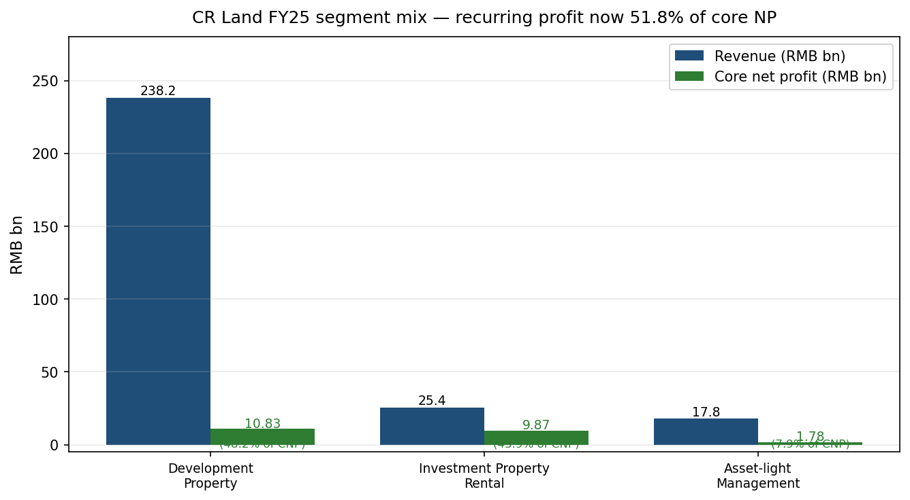
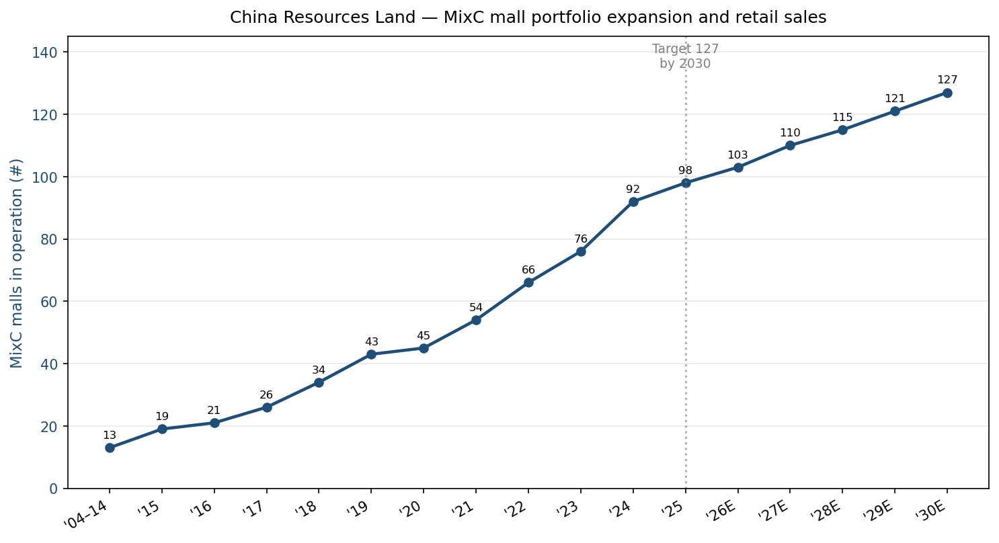
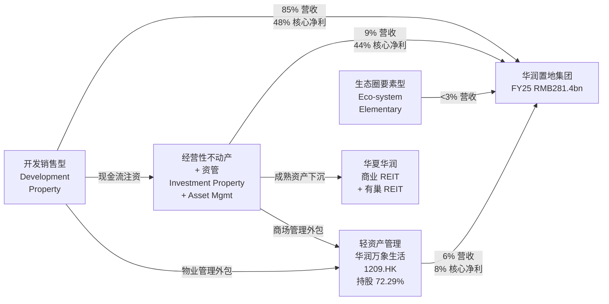
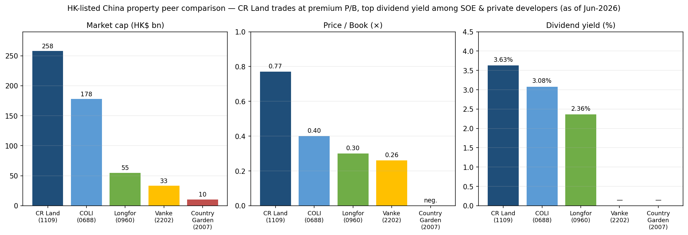
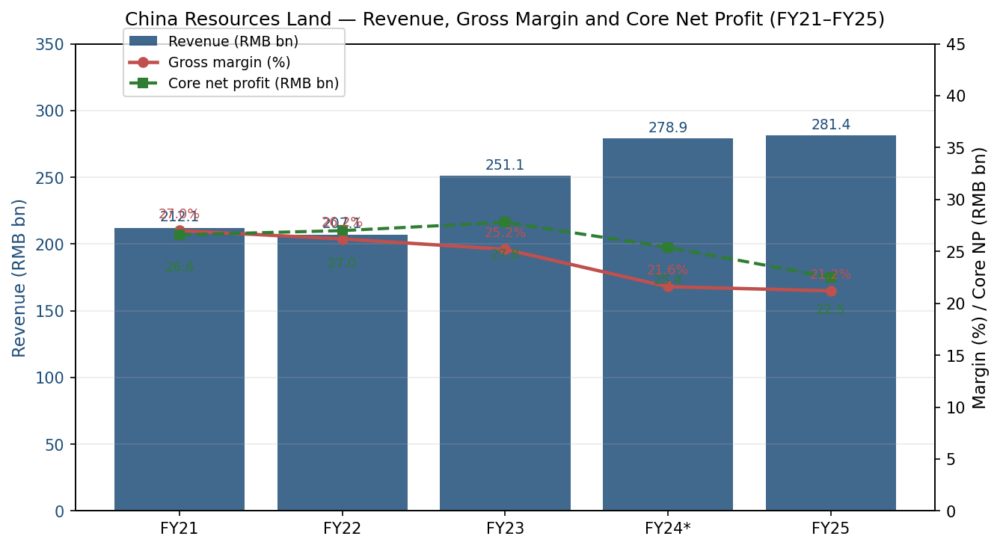

# 华润置地有限公司 (China Resources Land, HKEX:1109) — 公司研究

**报告日期**: 2026-06-03
**报告币种**: 人民币 (财务数据), 港币 (股价 / 市值)
**上市地**: 香港联合交易所主板 (股票代码: 01109)
**控股股东**: 华润 (集团) 有限公司 (截至 2024 年 12 月 31 日持股 59.55%), 隶属国务院国资委监管的中央企业

---

## 目录

1. 公司概览
2. 公司历史
3. 管理团队
4. 产品与服务
5. 客户与上市策略
6. 行业概览
7. 竞争格局
8. 市场机会 (TAM)
9. 风险评估
10. 视角评分
11. 数据来源清单
12. 参考资料

---

## 1. 公司概览

华润置地有限公司 ("华润置地", HKEX:1109) 是华润集团 (中央企业, 由国资委监管) 旗下的房地产业务上市旗舰公司。公司将自身战略定位为"城市投资、开发、运营商 (urban investor, developer and operator)", 并采用"3+1"综合业务模式, 涵盖开发销售型物业、经营性不动产租赁与资产管理、轻资产管理, 以及由城市运营服务构成的"生态圈要素型"业务组合 (含康养、城市代建、租赁住房、城市更新、文化体育) ([华润置地 2024 年报 — 集团架构](https://www1.hkexnews.hk/listedco/listconews/sehk/2025/0428/2025042802644.pdf))。

集团的两大主营业务在逻辑上相互正交、在运营上深度嵌套: 一是规模化预售住宅与综合体单元的**开发销售型物业 (Development Property, DP) 业务**, 二是以**万象城/万象汇/万象天地/万象里 (MixC mall network)**为锚的经常性收入业务 — 这是中国大陆奢侈品与中高端购物中心领域的统治性品牌。公司还控股**华润万象生活 (1209.HK, 截至 2025 年 6 月 30 日持股 72.29%)**, 即上市的物管 + 商管平台 ([华润置地 2025 年中期报告 — 集团架构第 4 页](https://crland-umb.azurewebsites.net/media/1839/2025-interim-report.pdf))。2025 财年 (截至 2025 年 12 月 31 日) 集团实现**营业收入 2,814 亿元 (+0.9% YoY)、核心净利润 224.8 亿元 (-11.4% YoY)、归母净利润 254.2 亿元 (-0.5% YoY)**, 其中租赁与基于费用的收入贡献了 15.4% 的营收, 但贡献了 51.8% 的核心净利润 — 公司将这一结构性转折点称为"第二增长曲线"的越线时刻 ([华润置地 2025 年度业绩演示, 第 4、7 页](https://crland-umb.azurewebsites.net/media/1858/investor-1109_cr_land_2025-annual-results_ppt_eng-f.pdf))。

地域上, 华润置地聚焦中国大陆一线城市与高能级二线城市。2025 年签约销售额达**2,336 亿元** (行业排名: 全国第 3), 其中**一线城市占比 45% (YoY +7pp)**, 在 18 个城市本地市占率位列前三, 重要项目以北京、上海、深圳以及粤港澳大湾区项目 (如深圳湾云玺、上海云栖滨江) 为支撑 ([华润置地 2025 年度业绩演示, 第 11 页](https://crland-umb.azurewebsites.net/media/1858/investor-1109_cr_land_2025-annual-results_ppt_eng-f.pdf))。集团 2025 财年末**在营万象系商场 98 家** (vs 2024 财年末 92 家), 分布在 80 座城市, 全年实现**商场零售额 2,392 亿元 (+22.4% YoY)、购物中心租金收入 219 亿元 (+13.3% YoY)** — 12.0% 的同店销售增长 (SSSG) 显著高于全国社零增速 ([华润置地 2025 年度业绩演示, 第 13–14 页](https://crland-umb.azurewebsites.net/media/1858/investor-1109_cr_land_2025-annual-results_ppt_eng-f.pdf))。

华润置地财务上保持着投资级国有开发商的纪律性。截至 2025 年 12 月 31 日, **总资产 10,787 亿元、资产负债率 61.1%、净有息负债率 39.2%、加权平均融资成本 2.72% (YoY -39bps)**, 现金及现金等价物 1,170 亿元 ([华润置地 2025 年度业绩演示, 第 8 页](https://crland-umb.azurewebsites.net/media/1858/investor-1109_cr_land_2025-annual-results_ppt_eng-f.pdf))。三大评级机构 — **标普 (BBB+)、穆迪 (Baa1)、惠誉 (BBB+)** — 均维持稳定展望的投资级评级, 这是 2021 年后大去杠杆周期消灭了多数民营开发商的投资级评级后, 中国地产仅剩少数能保有的状态。

### 估值快照 (截至 2026-06)

| 指标 | 华润置地 (1109) | 同业中位数 | 来源 |
|---|---|---|---|
| 股价 (HKD) | 31.16–32.06 | n/a | [Yahoo Finance 1109.HK](https://finance.yahoo.com/quote/1109.HK/), [Simply Wall St — CR Land Jan-2026 update](https://simplywall.st/stocks/hk/real-estate-management-and-development/hkg-1109/china-resources-land-shares/news/assessing-china-resources-land-sehk1109-valuation-after-janu) |
| 市值 (HKD bn) | ~230–258 | — | [companiesmarketcap.com — CR Land](https://companiesmarketcap.com/china-resources-land/marketcap/) |
| TTM 市盈率 | 7.2–8.1× | 国企开发商 7–9× | [Simply Wall St](https://simplywall.st/stocks/hk/real-estate-management-and-development/hkg-1109/china-resources-land-shares/news/assessing-china-resources-land-sehk1109-valuation-after-janu) |
| 市净率 (TTM) | ~0.77× | 0.26–0.40× | 同业对标图 (见第 7 节) |
| 股息率 | 3.6–4.7% | 2–4% | [华润置地 2025 年度业绩, 第 4 页](https://crland-umb.azurewebsites.net/media/1858/investor-1109_cr_land_2025-annual-results_ppt_eng-f.pdf); [Yahoo Finance 1109.HK](https://finance.yahoo.com/quote/1109.HK/) |
| 港股地产板块 P/E 中位数 | — | 6–9× | [Caixin Global — China's Property Slump, Jan-2026](https://www.caixinglobal.com/2026-01-05/chinas-property-slump-knocks-half-of-top-developers-off-key-ranking-102400361.html) |

7–8× 的 TTM 市盈率与全球横截面相比看似"便宜", 但实际上属于**中资国企开发商的中位数水平** — 投资级评级的国企同业 (中海 0688、招商蛇口、越秀、保利) 均聚集在这一区间。出险或民营 (碧桂园、融创) 已陷入亏损, 市净率接近清算价值。*分析师观点*: 华润置地 0.77× 的市净率 (在第 7 节港股大型大陆开发商同业对标图中为最高) 反映: (a) 万象系商场组合在 5–6% 资产化收益率背景下隐含的租金 yield 压缩期权价值, (b) 投资级信用评级的护城河, 以及 (c) 在 10Y 中国国债收益率约 1.6% 的环境下, 约 3.6% 股息率的相对溢价。倍数没有被高估 — 主要的**估值下行风险**是 DP 业务的毛利率压缩至 2025 年入账毛利率 15.5% 以下, 而非估值过高。

---

## 2. 公司历史

> **重要里程碑**
>
> ```mermaid
> timeline
>     title 华润置地 — 关键里程碑
>     1994 : 华润集团在深圳进入地产业务
>     1996 : 在港交所上市, 名为华润北京置地
>     2002 : 反向收购华润集团大陆地产资产;
>          : 更名为"华润置地"
>     2004 : 首座万象城开业 — 深圳万象城
>     2010 : 加入恒生中国企业指数 (红筹股)
>     2015 : 成为恒生指数成份股
>     2018 : 李欣升任总裁; 公司战略转型为
>          : "城市投资、开发、运营商"
>     2020 : 华润万象生活 (1209.HK) 分拆上市
>     2024 : 华夏华润商业 REIT 上市 (消费基础设施 REIT,
>          : 以青岛万象城为底层资产); 华夏华润有巢
>          : REIT 上市 (租赁住房 REIT); 李欣
>          : 兼任两家子公司董事长
>     2025 : 万象系零售额达 2,392 亿元 (+22.4%);
>          : 经常性核心净利首次过半
> ```
>
> 来源: [华润置地 2024 年报 — 董事简历](https://www1.hkexnews.hk/listedco/listconews/sehk/2025/0428/2025042802644.pdf); [华润置地 2025 年中期报告, 第 7 页 (REIT 里程碑)](https://crland-umb.azurewebsites.net/media/1839/2025-interim-report.pdf); [Mingtiandi — 李欣出任董事局主席 (2022)](https://www.mingtiandi.com/real-estate/people/china-resources-land-appoints-li-xin-chairman/)。

华润集团的地产业务起源于 1990 年代中期的深圳。现行的上市主体则源于 2002 年的反向收购 — 将集团的大陆地产资产整合至港股上市壳, 并随后更名为"华润置地有限公司" ([Mingtiandi — 李欣出任董事局主席, 2022](https://www.mingtiandi.com/real-estate/people/china-resources-land-appoints-li-xin-chairman/))。但定义今日华润置地战略身份的关键, 是 2004 年后**将经营性不动产 (Investment Property) 作为开发销售周期的结构性反周期对冲**这一刻意为之的战略转向。2004 年深圳万象城 — 彼时中国大陆最大单体购物中心 — 的开业, 确立了公司后来在 80 座城市复制的模板, 是公司历史上最重要的一个战略决策。当 2014–2016 年地产下行周期冲击 A 股小型开发商时, 华润置地的经常性租金收入为其提供了可偿付债务的现金流基础, 使其得以在 2015–2017 年逆周期补充土地储备。

公司的第二次转型来自李欣 (2016 年任联席总裁、2018 年任总裁、2022 年 5 月任董事局主席), 他正式确立了"城市投资、开发、运营商 (urban investor, developer and operator)"的定位与公司现在在每份 IR 文件中使用的**"3+1"综合模式** ([华润置地 2024 年报 — 集团架构](https://www1.hkexnews.hk/listedco/listconews/sehk/2025/0428/2025042802644.pdf))。三项执行动作巩固了这一转型。第一, **2020 年末分拆华润万象生活 (1209.HK)**, 将轻资产管理业务 (商管费 + 物业管理) 货币化为独立上市股权, 华润置地保留约 72% 控制权。第二, 公司围绕四大业务板块而非传统的"开发销售"细分进行重组, 将租赁、资管与"生态圈"业务提升到与开发并列的地位。第三, 2024 年推出两支上市 REIT (**华夏华润商业 REIT**, 以青岛万象城为底层资产; **华夏华润有巢 REIT**, 以长租公寓为底层资产) — 这创造了成熟资产的回收路径, 并解锁了明确的资管费收入流 ([华润置地 2025 年中期报告 — 主席报告书第 7 页](https://crland-umb.azurewebsites.net/media/1839/2025-interim-report.pdf))。

近期 (FY2024–H1 2026) 的进展主要受到中国地产行业整体调整的影响。全国新房销售 2025 年降至 7.33 万亿元 (-13.0% YoY), 全年销售超 100 亿元的开发商数量从 2021 年的 41 家减至 2025 年的 10 家 ([国家统计局新闻发布 — 2025 年房地产开发投资](https://www.stats.gov.cn/english/PressRelease/202601/t20260120_1962353.html); [Caixin Global — Half of Top Developers off Key Ranking, Jan-2026](https://www.caixinglobal.com/2026-01-05/chinas-property-slump-knocks-half-of-top-developers-off-key-ranking-102400361.html))。在此背景下, 华润置地行业签约销售排名从 2021 年的第 8 位升至 2025 年的第 3 位 — 既反映出相对韧性, 也折射出竞争对手的绝对收缩。2025 年中还合并了三项内部收购 — 北京大兴产业园、华润网络深圳和华望数据科技广州 — FY25 业绩 deck 注明已对 FY24 数据进行了重述 ([华润置地 2025 年度业绩演示, 第 6 页脚注](https://crland-umb.azurewebsites.net/media/1858/investor-1109_cr_land_2025-annual-results_ppt_eng-f.pdf))。

---

## 3. 管理团队

华润置地不存在传统意义上的"创始人" — 它是一家 1938 年成立的中央企业的地产上市平台。最接近"创始人"等价物的是**董事局主席李欣**, 他在华润系统内任职 28 年, 2022 年 5 月起担任董事局主席。鉴于李欣实质上是 CEO 等价物 (总裁徐荣向其汇报; 他同时担任母公司执行委员会主席与华润万象生活董事会主席), 本节给出李欣的完整履历, 并简要介绍 2024 年 12 月任命的总裁徐荣 — 后者主管日常运营。

**李欣 (Li Xin), 53 岁, 董事局主席**, 2022 年 5 月任董事局主席, 此前于 2001 年加入公司, 2016 年 7 月升任联席总裁, 2017 年 4 月成为执行董事, 2018 年 12 月任总裁。他同时担任华润置地执行委员会、可持续发展委员会和提名委员会主席, 自 2020 年 8 月起担任华润万象生活 (1209.HK) 主席及非执行董事 — 即同时控制母公司与上市的管理子公司 ([华润置地 2024 年报 — 董事简历, 李欣简历第 44 页](https://www1.hkexnews.hk/listedco/listconews/sehk/2025/0428/2025042802644.pdf))。李欣持有东北财经大学管理学学士学位, 以及香港理工大学项目管理理学硕士学位。1994 年加入华润集团, 此前曾在华润物业管理有限公司任职; 已核实的任命报道列出了其早期任职 — 包括"曾任中国华润总公司人事部门负责人……重庆奎星实业有限公司董事、重庆润龙实业有限公司总经理、龙堡企业有限公司经理及高级经理" — 即在赴华润置地任职前, 他在母集团内担任过运营与人力资源职务 ([Mingtiandi — 华润置地任命李欣为董事局主席, 2022](https://www.mingtiandi.com/real-estate/people/china-resources-land-appoints-li-xin-chairman/))。李欣在华润置地的核心业绩是**将万象系商场品牌从地区性新事物提升为公司经常性盈利的结构性支柱**: 2020 年华润万象生活分拆、2024 年华夏华润商业 REIT 上市、2025 财年经常性核心净利首次过半 — 均发生在他任期内。除标准董事持股外, 他并未披露个人持股; 薪酬结构遵循国资委对央企的薪酬上限, 而非股权激励重度的方案。

**徐荣 (Xu Rong), 56 岁, 总裁** (2024 年 12 月 23 日任总裁; 2024 年 10 月 28 日起任执行董事), 履历背景显著不同。在 2023 年 1 月加入华润置地 (初任副总裁) 之前, 徐荣曾任职于**深圳市规划和国土资源委员会**、随后**招商局集团**、再后**深圳前海蛇口自贸投资发展有限公司** — 履历集中于城市规划、开发建设、城市更新管理 ([华润置地 2024 年报 — 董事简历, 徐荣简历第 45 页](https://www1.hkexnews.hk/listedco/listconews/sehk/2025/0428/2025042802644.pdf))。他持有华中科技大学 (原华中工学院) 建筑学学士与建筑设计硕士学位, 是城乡规划高级工程师。徐荣升任总裁意味着公司在 Tier-1 城市增量供地越来越稀缺的当下, 战略上更加重视**城市更新机会** (城市更新、"老旧小区改造"项目、街区级政府合作)。他同时担任执行委员会与可持续发展委员会成员。

关于管理团队其余部分的说明: 华润置地的日常财务与运营由 CFO 郭世清 (2020 年 6 月起任) 和 COO 陈伟 (2024 年 3 月起任) 负责, 但按 skill 规范, 深度履历介绍止于此 — 评估华润置地战略方向的投资者需要理解李欣以万象为锚的经常性收入论, 以及徐荣的城市更新姿态; 其余是执行问题。

---

## 4. 产品与服务

华润置地的产品矩阵在所有近期 IR 文件中均以"3+1"模式呈现。四大支柱分别是: (1) 开发销售型业务, (2) 经营性不动产 + 资管业务, (3) 轻资产管理业务 (通过华润万象生活 1209.HK 持有), (4) 生态圈要素型业务 (康养、城市代建、租赁住房、城市更新、文化体育)。以下表格逐字复刻 2024 年报集团架构页 ([华润置地 2024 年报 — 集团架构第 3 页](https://www1.hkexnews.hk/listedco/listconews/sehk/2025/0428/2025042802644.pdf)):

| 业务板块 (中文) | English | 业务内涵 |
|---|---|---|
| 开发销售型业务 | Development Property Business | 住宅及综合体单元的预售; 传统核心业务, 占 FY25 营收 85% 但占核心净利 48% |
| 经营性不动产 + 资管业务 | Investment Property + Asset Management Business | 购物中心 (万象系)、甲级写字楼、酒店; 加上通过 REIT 和私募基金将成熟资产货币化的资管业务 |
| 轻资产管理业务 | Asset-Light Management Business | 华润万象生活 (1209.HK) — 商业商管 + 住宅及非住宅物业管理; 华润置地持股 72.29% |
| 生态圈要素型业务 | Eco-system Elementary Business | 康养 (健康与养老)、城市代建、租赁住房、城市更新、文化体育 |

FY25 营收与核心净利在四大板块的拆分 ([华润置地 2024 年报 — 管理层讨论与分析第 29 页](https://www1.hkexnews.hk/listedco/listconews/sehk/2025/0428/2025042802644.pdf); [华润置地 2025 年度业绩演示, 第 6 页](https://crland-umb.azurewebsites.net/media/1858/investor-1109_cr_land_2025-annual-results_ppt_eng-f.pdf)):

| 业务板块 | FY25 营收 (RMB bn) | 占比 | FY25 核心净利 (RMB bn) | 占比 |
|---|---|---|---|---|
| 开发销售型 | 238.2 | 84.7% | 10.83 | 48.2% |
| 经营性不动产 + 资管 | 25.4 (FY25 示意) | 9.0% | 9.87 | 43.9% |
| 轻资产管理 | 17.8 (FY25 示意) | 6.3% | 1.78 | 7.9% |
| **合计** | **281.4** | **100%** | **22.48** | **100%** |


*图 1 — FY25 分部收入与核心净利结构。来源: [华润置地 2025 年度业绩演示, 第 6 页](https://crland-umb.azurewebsites.net/media/1858/investor-1109_cr_land_2025-annual-results_ppt_eng-f.pdf)。*

最关键的观察是: **开发业务贡献约 85% 营收但不到一半核心净利**, 而经常性租赁与管理业务贡献 15% 营收但在 FY25 贡献**51.8% 核心净利, YoY 提升 11.2pp** ([华润置地 2025 年度业绩演示, 第 7 页](https://crland-umb.azurewebsites.net/media/1858/investor-1109_cr_land_2025-annual-results_ppt_eng-f.pdf))。从估值角度看, 华润置地已不再是"拥有商场的开发商" — 它是一个**附带住宅开发年金的商场与服务平台**。本节后续逐一拆解四大支柱。

### 4.1 开发销售型业务 (Development Property Business)

> "2024 年集团实现综合收入 2,788 亿元, YoY 增长 11.0%。核心净利润达 254.2 亿元, YoY 略微下降 8.5%……2024 年开发物业业务毛利率为 16.8%, 较 2024 上半年有所改善。"
> — [华润置地 2024 年报 — 管理层讨论与分析, 第 29、30 页](https://www1.hkexnews.hk/listedco/listconews/sehk/2025/0428/2025042802644.pdf)

**通俗解释 / Plain-language gloss**: 华润置地的开发业务采用标准的 A 股 / 港股预售模式 — 通过土拍或联合体获取土地 → 建设至预售节点 (通常是结构封顶) → 在管控价位销售公寓 → 18–30 个月后交付 → 在交付时确认收入 (预售 vs 入账 是两件不同的事 — 签约销售领先入账营收约一年甚至更长)。FY25 要点: 签约销售 2,336 亿元 (行业 #3, 较 FY24 的 2,611 亿元下降约 10.5%, 但显著好于行业住宅金额的 -13.0%); 签约 GFA 922 万平米; **一线城市占比提升 7pp 至 45%, 一线 + 二线合计占入账营收 88%** ([华润置地 2025 年度业绩演示, 第 10–11 页](https://crland-umb.azurewebsites.net/media/1858/investor-1109_cr_land_2025-annual-results_ppt_eng-f.pdf))。入账 ASP YoY 提升 10.5% 至 24,599 元/平米, 反映了高能级城市的结构性切换。入账毛利率 15.5% (vs FY24 的 16.8%), 反映了 2021 年的高价土地成本通过交付逐步释放的全行业毛利压力。

*分析师观点*: 在存活的 top-10 开发商中, 华润置地完成了最干净的"一线集中度"交易。具体的同业对标在第 7 节; 这里需指出的是, 在"能按合同销售如期交付入账营收"的相对量度上, 华润置地与中海 (0688.HK)、招商蛇口、保利地产同处一档 — 即央企同业集团 — 远高于民营与混合所有制公司。客户切换成本在这一行业本质为零 (每个项目都是一次性购买), 但**品牌价值之所以重要, 是因为交付风险才是 2025–2026 年中国预售市场最主导的关切**, 华润置地的央企资产负债表是其首要护城河。

### 4.2 经营性不动产 + 资管业务 (Investment Property + Asset Management Business)

皇冠上的明珠。可细分为: 购物中心 (万象系)、写字楼、酒店, 以及上市 REIT + 资管业务叠加层。

#### 4.2.1 购物中心 — 万象系

> "2024 年开发物业业务毛利率为 16.8%……投资性物业业务的毛利率 YoY 提升 0.4 个百分点至 70.0%……2025 年购物中心租金收入达 219 亿元, YoY 增长 13.3%; 运营成本与销管费率 YoY 分别下降 1.3pt 和 2.6pt, 毛利率与 EBITDA 利润率分别升至 77% 和 63.1%。"
> — [华润置地 2024 年报 — 管理层讨论与分析第 30 页](https://www1.hkexnews.hk/listedco/listconews/sehk/2025/0428/2025042802644.pdf); [华润置地 2025 年度业绩演示, 第 13 页](https://crland-umb.azurewebsites.net/media/1858/investor-1109_cr_land_2025-annual-results_ppt_eng-f.pdf)

**通俗解释 / Plain-language gloss**: 万象系商场分为四大产品线: (i) **万象城 (MixC)** — 旗舰奢侈/高端商场, 如深圳万象城、杭州万象城、沈阳万象城、成都万象城; (ii) **万象汇 (MixC One)** — 中端区域型商场; (iii) **万象天地 (MixC World)** — 街区型城市商业, 融合零售、文化与休闲; (iv) **万象里 (MixC Village)** — 最新业态, 融合购物与"微度假目的地"服务的高端奥莱。深圳、杭州、沈阳的旗舰万象城单店年租金均超 11–16 亿元, 与香港 IFC Mall、新加坡 ION Orchard 处于同一档 ([华润置地 2024 年报 — 主要投资物业, 第 8–12 页](https://www1.hkexnews.hk/listedco/listconews/sehk/2025/0428/2025042802644.pdf))。让万象品牌在结构上区别于万达广场或九仓 IFC 的是: **奢侈品牌深度 — 华润置地全网拥有 130+ 奢侈品牌, 大陆奢侈品商场门店数量超过任何其他运营商, 且是 LVMH、爱马仕、开云、香奈儿等品牌进入新城市的首选渠道伙伴** ([华润置地 2024 年报 — 主要投资物业第 6 页](https://www1.hkexnews.hk/listedco/listconews/sehk/2025/0428/2025042802644.pdf))。

经济性: FY25 商场租金收入 219 亿元 (+13.3% YoY), 商场零售额 2,392 亿元 (+22.4% YoY, 约为全国社零增速的 3 倍), 同店销售增长 12.0%, 出租率 97.4% (+0.3pp), 租售比 11.5% (这是与营业额挂钩的浮动租金谈判的结果) ([华润置地 2025 年度业绩演示, 第 14 页](https://crland-umb.azurewebsites.net/media/1858/investor-1109_cr_land_2025-annual-results_ppt_eng-f.pdf))。2025 年新开 6 家商场平均开业出租率达 96.9%。奢侈商场子组合 (slide 14 中的"Luxury Mall"线) FY25 零售额 YoY 增长 18.3% — 较 FY22 的 38.2% 已经回落, 但在中国整体奢侈品市场普遍被报道为平稳至负增长的一年里, 仍然正增长; 非奢侈的万象汇 / 万象天地业态 YoY 增长 24.9%。

*分析师观点*: 万象网络是当今中国地产中防御性最强的单一资产。其护城河多维度: 20 年积累的奢侈品牌关系、未来 30 家商场的开业蓄势 (2024 年末 66 家在筹)、与城市政府合作以低于市场地价锁定 CBD 黄金地块、自有商场运营团队 (华润万象生活, 2020 年分拆事件证明其是同系中估值倍数最高的业务, 企业价值 185 亿港元 +) ([华润万象生活 1209 — 投资者关系](https://en.crmixclifestyle.com.hk/); [招银国际 — 华润万象生活公司研究, 2025](https://www.cmbi.com.hk/article/5317.html?lang=en))。没有任何民营开发商能复制这一品牌池; 没有任何其他国企积累了与华润置地同等规模的商场数量。万达集团是唯一在可比规模上的运营商, 但自 2017 年后一直在被动卖资产。


*图 2 — 万象系商场组合扩张。来源: [华润置地 2024 年报 — 集团架构 (FY24 = 92 在营, 66 在筹)](https://www1.hkexnews.hk/listedco/listconews/sehk/2025/0428/2025042802644.pdf); [华润置地 2025 年度业绩演示, 第 14 页 (FY25 = 98 在营)](https://crland-umb.azurewebsites.net/media/1858/investor-1109_cr_land_2025-annual-results_ppt_eng-f.pdf)。*

#### 4.2.2 写字楼

一个规模较小、结构较弱的分部。FY25 写字楼租金收入 16.8 亿元 (-10.8% YoY), 年末出租率 78% (较年中 +3pp, 是积极的租户结构调整的结果) ([华润置地 2025 年度业绩演示, 第 16 页](https://crland-umb.azurewebsites.net/media/1858/investor-1109_cr_land_2025-annual-results_ppt_eng-f.pdf))。在营 23 栋写字楼, GFA 146 万平米。华润置地拒绝在本轮周期内追逐新增甲级写字楼建设 — 1H25 出租率 YoY 仅下降 0.5pp 至年末回升 3pp, 反映的是主动的租户结构再定位, 而非新增供给。*分析师观点*: 一线城市中国甲级写字楼市场至少到 2028 年都将处于结构性供给过剩; 该分部价值更多在于部分楼宇改造为综合体或住宅化用途的期权。租金收入按"缓慢失血"对待; 不要外推增长。

#### 4.2.3 酒店

FY25 酒店收入 18.5 亿元 (-10.5% YoY), 出租率 67% (+3pp YoY), 平均房价 (ADR) 980 元/晚 ([华润置地 2025 年度业绩演示, 第 17 页](https://crland-umb.azurewebsites.net/media/1858/investor-1109_cr_land_2025-annual-results_ppt_eng-f.pdf))。集中在旗舰综合体项目 (深圳、杭州、上海)。在整体盘子里规模不大, 更多承担品牌延伸与对商场、写字楼租户交叉销售的角色。

#### 4.2.4 资产管理 — REIT 与私募基金

> "华夏华润商业 REIT 表现卓越, 总市值首次突破 100 亿元, 巩固了消费基础设施 REIT 头把交椅地位。自上市以来基金价格上涨 52.2% (截至 2025 年 6 月 30 日), 引领购物中心行业涨幅。连续 6 个季度共派发现金分红 4.95 亿元。"
> — [华润置地 2025 年中期报告 — 主席报告书第 7 页](https://crland-umb.azurewebsites.net/media/1839/2025-interim-report.pdf)

**通俗解释 / Plain-language gloss**: 资管业务由两部分构成: (a) 两支上市 REIT — **华夏华润商业 REIT** (以青岛万象城为底层资产的消费基础设施 REIT, 2024 年初上市) 和**华夏华润有巢 REIT** (租赁住房 REIT) — 及 (b) 代表机构投资者持有成熟物业的私募 REIT 和 Pre-REIT 工具。**FY25 末 AUM 达 5,022 亿元 (+8.7% YoY)**, 1H25 末 AUM 4,835 亿元 (较 2024 年末 +214 亿元) ([华润置地 2025 年度业绩演示, 第 4 页](https://crland-umb.azurewebsites.net/media/1858/investor-1109_cr_land_2025-annual-results_ppt_eng-f.pdf); [华润置地 2025 年中期报告 — 主席报告书第 7 页](https://crland-umb.azurewebsites.net/media/1839/2025-interim-report.pdf))。战略意义在于: **REIT 结构将原本流动性较差的资产负债表上商业物业转换为"回收-再投资"的资本循环** — 在华润置地自有资产负债表建设商场 → 稳定出租率和收益率 → 按公允价值下沉到上市或私募 REIT → 将回笼资金投向下一批商场。商业 REIT 上市后 52.2% 的涨幅验证了公募市场对稳定消费基础设施现金流存在需求。

*分析师观点*: 资管是将万象品牌从"非常优秀的商场运营商"提升到"复利型轻资本平台"的杠杆。FY25 末仅约 1 座商场 (青岛万象城) 已通过公募 REIT 证券化 — 华润置地有 80+ 在营商场, 因此再投资跑道是多年期的。华润置地是中国新生的消费基础设施 C-REIT 市场的主导参与者, 在工信部和证监会逐步规范化框架的过程中, 处于捕获未来增量大部分份额的位置 ([华润置地 2024 年报 — 主席报告书第 28 页](https://www1.hkexnews.hk/listedco/listconews/sehk/2025/0428/2025042802644.pdf))。

### 4.3 轻资产管理业务 — 华润万象生活 (1209.HK)

华润万象生活是港股上市 (1209.HK) 的商业管理 + 物业管理子公司, 截至 2025 年 6 月 30 日华润置地持股 72.29% ([华润置地 2025 年中期报告 — 集团架构第 4 页](https://crland-umb.azurewebsites.net/media/1839/2025-interim-report.pdf))。FY25 营收 180.2 亿元 (+5.1% YoY), 核心净利 39.5 亿元 (+13.7% YoY), 毛利率 35.5% (+2.5pp YoY); 核心净利率 21.9% ([华润置地 2025 年度业绩演示, 第 19 页](https://crland-umb.azurewebsites.net/media/1858/investor-1109_cr_land_2025-annual-results_ppt_eng-f.pdf))。FY25 派息 1.731 元/股 (常规 1.038 + 特别 0.693)。物业管理签约 GFA 4.635 亿平米, 签约商场 135 个 ([华润置地 2025 年度业绩演示, 第 20 页](https://crland-umb.azurewebsites.net/media/1858/investor-1109_cr_land_2025-annual-results_ppt_eng-f.pdf))。1H25 进一步细节: 在营商场 125 个 (含 14 个奢侈商场), 管理 4.2 亿平米, MIXC STAR 会员 7,240 万人 (较 2024 年末 +18.5%) ([华润置地 2025 年中期报告 — 主席报告书第 8 页](https://crland-umb.azurewebsites.net/media/1839/2025-interim-report.pdf))。

**通俗解释 / Plain-language gloss**: 两条收入线: **商业管理** (向商场业主 — 既包括华润置地自有商场, 也包括第三方 — 收取管理费 + 业绩分成) 和**物业管理** (住宅 / 非住宅物业管理费, 由业主与租户支付)。经济性是轻资本化: 不在资产负债表上持有底层资产, 所以没有减值风险; 增长来自净新签合同和同商场费率提升。*分析师观点*: 华润万象生活在结构上是比母公司估值倍数更高的业务 (P/E 约 18×, 而母公司 ~7–8×)。拖累在于华润置地无法在母公司层面完全合并华润万象生活的市值 — 27.71% 的现金流流向少数股东。

### 4.4 生态圈要素型业务

涵盖康养 (健康与养老)、城市代建、租赁住房、城市更新、文化体育的多元化业务集合。FY24 营收 62.2 亿元 (+0.5% YoY), 核心净利 6.0 亿元 (-18.8% YoY) ([华润置地 2024 年报 — 管理层讨论与分析第 29 页](https://www1.hkexnews.hk/listedco/listconews/sehk/2025/0428/2025042802644.pdf))。其战略意义大于表面数据 — 特别是**城市代建业务是公司从地方政府区域改造项目捕获纯费用型收入的主要载体**, 这与"具有规划背景的徐荣"晋升为总裁高度一致。这些业务还包括长租公寓组合 (作为华夏华润有巢 REIT 的底层种子资产) 和康养业务 (瞄准中国加速老龄化的人口红利)。

### 4.5 综合 — 四大支柱如何相互作用



资金流: 开发现金注资新商场建设; 商场租金回流偿债与派息; 成熟商场下沉到 REIT 完成资本回收; 华润万象生活对华润置地自有商场与第三方商场均收取管理费; 生态圈支柱填补区域改造与政府合作工作。整个系统在内部形成闭环 — 母公司出资建资产; 子公司管理资产; REIT 回收资产 — 这就是一家增长缓慢的中国地产公司之所以能在占用资本上产生显著高于纯开发商回报率的内在逻辑。

### 4.6 土储 — 开发业务的输入

FY25 末土储总量 5,194 万平米 (合计) / 3,627 万平米 (权益), 同比分别 -16.9% / -16.0%, 2024 年仅获取 393 万平米新土储 (YoY -70.3%) ([华润置地 2024 年报 — 业绩亮点第 20 页](https://www1.hkexnews.hk/listedco/listconews/sehk/2025/0428/2025042802644.pdf))。翻译: 华润置地选择了反周期纪律, 放弃了土储增长 — 公司认识到 2022–2024 年的土地成本结构性偏高, 未来销售难以支撑激进的补仓。代价是开发管线缩水; 对冲收益是保护了租赁与管理业务的资产负债表卫生。

---

## 5. 客户与上市策略

华润置地的客户基础按四大支柱分布, 各自服务于截然不同的分母。skill 规范明确要求客户份额数据须带分母; 华润置地的情形异常清晰, 因为集团的客户披露是按业务线结构化的, 而非按 top-5 命名客户。

### 5.1 开发销售型业务 — 零售购房者

开发销售型业务向个人购房者销售住宅与综合体单元, 主要为一线和高能级二线城市的改善型需求 (upgrade buyers)。任何单一客户均无集中度风险 — 业务在约 50 座城市每年销售约 1,000 万平米, 卖给数以万计的个人购房者。结构性客户风险是人口 (2020 年后中国家庭组建数量结构性下滑) 和宏观 (就业不确定、抵押贷款利率敏感性、抵押贷款可获得性)。**华润置地特有的购房者人口结构偏向一线改善型买家**, 这是整体陷入困境市场中最具韧性的切片 — FY25 入账 ASP 24,599 元/平米和 88% 一线 + 二线营收占比印证了这一定位 ([华润置地 2025 年度业绩演示, 第 10 页](https://crland-umb.azurewebsites.net/media/1858/investor-1109_cr_land_2025-annual-results_ppt_eng-f.pdf))。

### 5.2 经营性不动产 — 奢侈与中端市场的商场租户

商场客户基础是华润置地相关的"重点客户"披露。集团**在 98 家在营商场内拥有 130 个奢侈品牌和超过 7,800 个总品牌** ([华润置地 2024 年报 — 主要投资物业第 6 页](https://www1.hkexnews.hk/listedco/listconews/sehk/2025/0428/2025042802644.pdf))。在单个商场层面, 按租金贡献排名的头部租户通常包括 LVMH 旗下品牌 (Louis Vuitton, Dior, Tiffany)、爱马仕、开云旗下品牌 (Gucci, Saint Laurent, Bottega Veneta)、香奈儿、历峰旗下品牌 (Cartier, Van Cleef & Arpels)、苹果、星巴克、优衣库、无印良品, 以及北京地铁等价的 F&B 连锁品牌。**2024 年报未披露头部租户集中度百分比** — 中资商场运营商在港交所规则下无须披露租户集中度, 华润置地也未自愿披露。顶级奢侈品牌通常支付基础租金 + 抽成 (与营业额挂钩), 抽成比例通常为月营业额的 8–12%; 中端 F&B 和时尚租户支付更高比例 (15–20%); Apple 等顶级主力店通常接近纯基础租金。关键的是, **任何单一品牌在合并集团层面的客户份额都很小** — 即使最高付租的单一品牌 (路易威登), 在跨华润置地整体营收基数摊销后, 贡献也远低于 1%。

### 5.3 华润万象生活 (轻资产管理) — 商场运营商与业主

华润万象生活的客户基础分为: (a) 商业商场运营商 (客户是商场业主 — 截至 FY25 末签约 135 家商场中, 其中 86 家是华润置地, 其余为第三方商场业主) 和 (b) 住宅业主 (客户是支付物管费的业主)。在商业侧, **华润万象生活在结构上是华润置地的关联供应商**, 服务于 86 家华润置地商场 (分部级客户集中度: FY25 签约商场中华润置地占 64%, 但来自华润置地的商管收入只是几条收入线之一)。在物管侧, **华润万象生活 1H25 签约 GFA 结构为 71.2% 来自"公共项目" (即写字楼、政府设施、医院), 28.8% 住宅** ([招银国际 — 华润万象生活公司研究, 2025](https://www.cmbi.com.hk/article/5317.html?lang=en))。这一非住宅占比显著高于同业物管公司 (例如碧桂园服务、雅生活, 这些公司主要是住宅)。

### 5.4 客户集中度 — 合并层面披露

**华润置地在合并集团层面不披露 top-5 客户集中度**, 这与其开发业务的零售客户基础和经营性不动产业务的租户结构客户基础相一致。这相对于工业 / B2B 发行人是真实的披露缺口, 但对中国地产开发商是常态。在有命名客户线索的地方, 也是分部级的 B2B 信息: 例如轻资产物管业务列出了"公共项目"类别而非具体合同。*结论: 合并层面无 top-5 集中度披露; 因此集中度风险应按城市、分部和租户类别来评估, 而非按交易对手*。

### 5.5 上市策略 — 渠道

开发业务: 项目售楼处自营销售; 第三方分销渠道占销售的 25–35% (行业标准)。万象商场招商: 拥有 20 年奢侈品牌关系的专属招商团队; 商场开业前已通过中央品牌获取团队预招租至 90%+ GFA。轻资产管理: 拜访第三方商场业主和政府主导的物管招标的 B2B 销售 ("公共项目"业务的快速扩张反映了这一推进)。

### 5.6 地理布局与项目管线

业务覆盖 80 座城市, 其中 18 座本地市占率前三 ([华润置地 2025 年度业绩演示, 第 11 页](https://crland-umb.azurewebsites.net/media/1858/investor-1109_cr_land_2025-annual-results_ppt_eng-f.pdf))。一线城市 (北京、上海、深圳、广州) + 四个"新一线" (杭州、成都、重庆、武汉) + 粤港澳大湾区城市构成运营骨干。除了 98 家在营商场, 66+ 项目正在筹备中, 目标到 2030 年达到 127 家在营万象系商场。

---

## 6. 行业概览

### 6.1 行业定义

中国房地产, 狭义包括: (a) 住宅开发与销售, (b) 商业地产 (写字楼、零售、酒店), (c) 物业管理服务, (d) 房地产投资信托基金 (C-REITs)。北美 NAICS 近似对应: 5311 (Lessors of Real Estate)、2362 (Construction of Buildings)、5313 (Activities Related to Real Estate)。华润置地同时参与了四个子行业。

### 6.2 市场规模与结构 — 2025 年快照

2025 年国家统计局数据标志着多年期长期调整的谷底。**全国房地产投资降至 82,790 亿元 (-17.2% YoY); 全国新建商品房销售额 83,940 亿元 (-12.6%); 住宅新房销售 73,330 亿元 (-13.0%)** ([国家统计局新闻发布 — 2025 年房地产开发投资](https://www.stats.gov.cn/english/PressRelease/202601/t20260120_1962353.html))。作为参照, 2021 年峰值住宅销售额约 18.193 万亿元; 因此 2025 年不到当年峰值的 50% ([Caixin Global — Half of Top Developers off Key Ranking, Jan-2026](https://www.caixinglobal.com/2026-01-05/chinas-property-slump-knocks-half-of-top-developers-off-key-ranking-102400361.html))。这一收缩背后的结构性压力 — 家庭组建加速下滑 (出生人数从 2016 年的 1,880 万跌至 2024 年约 800 万)、城市化率约 66% (vs OECD 经济体收敛到 75–80%)、依赖影子银行融资的预售模式监管退出 — 在 2030 年前都不太可能显著逆转 ([华润置地 2025 年中期报告 — 主席报告书第 4 页](https://crland-umb.azurewebsites.net/media/1839/2025-interim-report.pdf))。

### 6.3 增长驱动与趋势

2024–2025 年的政策重置实质性改变了地方政府 — 开发商传导链。2024 年 9 月以来中央政府推出 (a) 以低于成本价收购库存用作保障性租赁住房, (b) 首套住房首付比例下调至 15%, (c) 抵押贷款利率下调 (1H25 实际利率约 3.3%), (d) 多数一线城市放宽限购, (e) 央行住房融资工具收购出险开发商持有库存 ([华润置地 2025 年中期报告 — 主席报告书第 4 页](https://crland-umb.azurewebsites.net/media/1839/2025-interim-report.pdf); [华润置地 2024 年报 — 主席报告书第 21 页](https://www1.hkexnews.hk/listedco/listconews/sehk/2025/0428/2025042802644.pdf))。市场反应呈分化: **一线城市成交量在 2H25 趋稳 (1H25 同比降幅收窄至 5.5%, FY24 为 -17.1%), 但三、四线城市仍处于结构性下行**。华润置地的定位与政策正向支撑集中的区域高度吻合。

商业地产层面, 趋势线与住宅完全不同。**2024 年社会消费品零售总额 YoY 增长 3.5%, 1H25 YoY 增长 5.3%**, 在消费零售中, 华润置地所在的高端"体验式"商场分部对中国高净值家庭消费增长的结构性敞口更高 ([华润置地 2024 年报 — 主席报告书第 21 页](https://www1.hkexnews.hk/listedco/listconews/sehk/2025/0428/2025042802644.pdf); [华润置地 2025 年中期报告 — 主席报告书第 4 页](https://crland-umb.azurewebsites.net/media/1839/2025-interim-report.pdf))。集团自有商场 FY25 零售额 YoY 增长 22.4%, 远高于全国速率 — 因为一线城市奢侈与体验式商场业态正在从低能级商场和老旧非商场零售形态那里夺取份额。

### 6.4 监管环境

未来 3–5 年三大监管主线:
1. **"三道红线"去杠杆框架**, 2020 年推出, 仍在执行 — 设定开发商杠杆上限, 有效将非投资级开发商挡在增量融资之外。
2. **C-REIT 框架扩张** — 证监会 2024 年消费基础设施 REIT 框架 (及 2023 年保障性租赁住房 REIT 框架) 是华润置地资产回收的监管认可路径。预计后续会扩展到物流、酒店、写字楼。
3. **"房地产发展新模式"** — 2024 年后的政策导向, 强调租赁住房供给、城市更新、综合城市运营, 而非新增住宅开发。华润置地的生态圈要素型支柱与徐荣的规划背景均显示公司正为此过渡而布局。

### 6.5 行业动态 — 集中度、上下游议价能力、替代品

2021 年后行业正在 SOE 主导下**显著集中**。年销超 100 亿元的开发商从 2021 年的 41 家减至 2025 年的 10 家 — 其中 8 家是中央或地方国企 (保利、绿城、中海、华润、招商蛇口、万科、中国金茂、越秀), 仅 2 家民营幸存 (厦门建发、杭州滨江) ([Caixin Global — Half of Top Developers off Key Ranking, Jan-2026](https://www.caixinglobal.com/2026-01-05/chinas-property-slump-knocks-half-of-top-developers-off-key-ranking-102400361.html))。上游议价能力 (建筑公司、材料) 低 — 开发商可主导条款。下游议价能力 (购房者) 在本轮周期内大幅上升 — 买家可要求质量、交付保证、价格让步。替代品: 租赁住房 (供给有限); REIT (规模小但在增长)。经营性不动产业务动态不同 — 商场选址受土地约束, 上游 (品牌) 在高端拥有谈判力, 替代品 (电商) 真实存在, 但**体验型高端商场**分部正在从纯交易型零售那里夺取份额。

---

## 7. 竞争格局

华润置地 2024 年报不含与美国 10-K Item 1 Business 等价的"竞争"专章 — 中国年报通常将竞争讨论融入主席报告书与管理层讨论与分析。但隐含的同业集合在市场实践中已经定型。

### 7.1 直接同业 — 大型央企与幸存民企

**Tier-1 央企同业 ("国家队")**:
1. **中国海外发展 (COLI, 0688.HK)** — 最接近的对标。中国建筑旗下中央企业; FY24 签约销售约 3,000 亿元级别, FY25 估计 2,200–2,500 亿元。商场组合显著小于华润置地 (中海聚焦住宅 + 写字楼)。市值 1,370–1,780 亿港元; TTM P/E ~10x (据多家市场数据); 股息率 ~3–4%。任何中国大市值地产配置的天然标的 ([companiesmarketcap.com — COLI](https://companiesmarketcap.com/china-overseas-land-and-investment/marketcap/); [Stock Analysis — COLI 派息历史](https://stockanalysis.com/quote/hkg/0688/dividend/))。
2. **保利地产 / 保利发展 (600048.SH)** — A 股中央企业; 2023–2025 年签约销售一直保持 #1 ([Caixin Global — Jan-2026 排名](https://www.caixinglobal.com/2026-01-05/chinas-property-slump-knocks-half-of-top-developers-off-key-ranking-102400361.html))。大众市场结构更重; 商场组合极小。
3. **招商蛇口 (001979.SZ)** — 央企; 聚焦粤港澳大湾区; 商场组合较小。
4. **万科 (000002.SZ / 2202.HK)** — 历史上民营 / 后混合所有制的标杆; 2025–2026 年因流动性问题, 销售排名跌至第 10 位左右; 底线亏损。
5. **中国金茂 (0817.HK)** — 中化集团的地产平台; 高端住宅 + 部分综合体商业。
6. **越秀地产 (0123.HK)** — 广州市国企; 集中在华南。

**幸存民企同业**:
7. **龙湖集团 (0960.HK)** — 民营; 在商场战略上最接近华润置地 (天街品牌)。FY24 商场租金 135 亿元 vs 华润置地的 193 亿元; 2022 年起去杠杆约束了增长。
8. **厦门建发 (600153.SH)** — 厦门市国企; 民营化运营文化; 保留在前 10。
9. **杭州滨江 (002244.SZ)** — 杭州民营; 深耕浙江; 财务健康。

**出险公司 (作为对比相关)**: 碧桂园 (2007.HK)、融创 (1918.HK)、碧桂园服务管理层 — 均已受损; 仅在"折价抛售压低区域市场出清"的意义上被视为竞争威胁。

### 7.2 定位框架

五维度对比: (a) 信用评级, (b) 一线销售占比, (c) 商场组合质量, (d) 利润率轨迹, (e) 市值与流动性。

| 维度 | 华润置地 | 中海 | 保利 | 万科 | 碧桂园 |
|---|---|---|---|---|---|
| 信用评级 (S&P) | BBB+ | BBB+ | A- (母公司) | BBB- (负面观察) | 出险 |
| 一线销售占比 | 45% (FY25) | ~50% | ~30% | ~30% | <15% |
| 在营商场 | 98 (奢侈重) | ~30 (中端) | ~50 (混合) | ~50 (中端) | 极少 |
| FY25 入账毛利率 (DP) | 15.5% | 估 14–16% | 估 13–15% | 估 8–11% | 出险 |
| 市值 (HKD bn) | ~258 | ~178 | A 股, 大型 | ~33 | ~10 |

来源: [companiesmarketcap.com — 同业市值](https://companiesmarketcap.com/china-resources-land/marketcap/); [Caixin Global — Jan-2026 排名](https://www.caixinglobal.com/2026-01-05/chinas-property-slump-knocks-half-of-top-developers-off-key-ranking-102400361.html); [华润置地 2025 年度业绩演示, 第 6、11、14 页](https://crland-umb.azurewebsites.net/media/1858/investor-1109_cr_land_2025-annual-results_ppt_eng-f.pdf)。


*图 3 — 港股中资地产同业对标 (市值、市净率、股息率), 截至 2026 年 6 月。来源: [Yahoo Finance 1109.HK](https://finance.yahoo.com/quote/1109.HK/); [companiesmarketcap.com — 华润置地](https://companiesmarketcap.com/china-resources-land/marketcap/); [companiesmarketcap.com — COLI](https://companiesmarketcap.com/china-overseas-land-and-investment/marketcap/); [Yahoo Finance 0688.HK](https://finance.yahoo.com/quote/0688.HK/); [Yahoo Finance 0960.HK (龙湖)](https://finance.yahoo.com/quote/0960.HK/)。*

### 7.3 竞争优势

*分析师观点*:
- **万象商场品牌 — 中国地产中最具防御性的单一资产。** 20 年奢侈品牌关系; 130+ 奢侈品牌; 唯一能用爱马仕旗舰店锚定新商场的中国运营商。
- **投资级信用评级护城河。** 2024 年后只有 4–5 家中国开发商保留投资级评级。华润置地 2.72% 的加权平均融资成本 (FY25 YoY -39bps) 在结构上低于典型民营竞争对手的混合成本 ([华润置地 2025 年度业绩演示, 第 8 页](https://crland-umb.azurewebsites.net/media/1858/investor-1109_cr_land_2025-annual-results_ppt_eng-f.pdf))。
- **一线城市聚焦。** FY25 入账营收 88% 来自一线 + 二线; ASP 24,599 元/平米。由于一线分部是受政策支持且人口具备韧性的细分, 华润置地正坐落于周期恢复发生的地方。
- **资管期权价值。** FY25 末 AUM 5,022 亿元 (+8.7% YoY); 消费基础设施 REIT 框架尚在早期, 因此华润置地拥有多年期结构性杠杆按公允价值回收商场。

### 7.4 竞争弱点

- 入账开发毛利率压缩: FY25 入账毛利率 15.5%, vs FY24 16.8%, vs FY23 约 21% — 2021–2022 年的高价土地成本仍在通过, 进一步下行的可能性合理存在。
- 写字楼分部结构性下行 (FY25 写字楼租金 -10.8% YoY); 在结构中不显著但拖累。
- 集中在中国大陆 — 零国际多元化, 完全暴露于人民币与中国政策连续性。
- 土储缩水: FY24 末 5,194 万平米, YoY -16.9%, 2024 年仅获取 393 万平米。未来开发管线机械性变小。

### 7.5 市场份额备注

*分析师观点*: 在签约销售上华润置地排名 #3 (FY25 全国新房销售份额 ≈ 2,336 亿元 / 73,330 亿元 ≈ 3.2%)。在奢侈商场租金上, 它可能拥有中国大陆最高的单一运营商份额 — 没有公开数据验证精确数字, 但 130+ 奢侈品牌库与 25–30 家旗舰奢侈商场支撑下的 98 家在营商场, 使大陆奢侈商场租金 30% 以上份额成为合理猜测。在消费基础设施 REIT AUM 中, 华润置地是该品类第二支上市 REIT 的发行人 (在首支 CICC 资本 REIT 之后, 在证监会进一步扩大发行之前) ([华润置地 2025 年中期报告 — 主席报告书第 7 页](https://crland-umb.azurewebsites.net/media/1839/2025-interim-report.pdf))。

---

## 8. 市场机会 (TAM)

### 8.1 可寻址市场规模

两大 TAM 主线: (a) 中国地产的结构性未来, 和 (b) 商场 + 消费基础设施 REIT 机会。

**地产 TAM**: 2025 年住宅新房销售降至 73,330 亿元 (-13.0% YoY); 商品房销售合计 83,940 亿元。多数分析师现预期未来多年地板将位于 RMB 7–10 万亿区间 — 即谷底很可能已到, 但未来十年不太可能回到 2021 年 18 万亿的峰值 ([国家统计局新闻发布 — 2025 年房地产开发投资](https://www.stats.gov.cn/english/PressRelease/202601/t20260120_1962353.html); [Conference Board — 中国房地产 2025 展望](https://www.conference-board.org/publications/China-Real-Estate-Market-What-can-be-expected-in-2025))。华润置地 FY25 的 3.2% 市场份额意味着, 如果它能从退出的民营竞争对手那里夺取份额, 高一线分部仍有进一步机会, 但绝对机会 (RMB 10–11 万亿 TAM × 3–5% 份额) 是有限的。

**商场和消费基础设施 TAM**: FY24 中国社零总额达 48.8 万亿元, FY25 约 50 万亿元 (+3.5% 至 +5.3% YoY), 其中购物中心捕获了显著一部分 (估计零售总量的 12–15% = 6–7 万亿元通过实体商场渠道)。华润置地 FY25 商场零售额 2,392 亿元约占全国零售 0.5%、商场渠道 3–4% — 即使在渗透饱和状态下仍有显著空间 ([华润置地 2024 年报 — 主席报告书第 21 页](https://www1.hkexnews.hk/listedco/listconews/sehk/2025/0428/2025042802644.pdf); [华润置地 2025 年度业绩演示, 第 14 页](https://crland-umb.azurewebsites.net/media/1858/investor-1109_cr_land_2025-annual-results_ppt_eng-f.pdf))。

**资管与 C-REIT TAM**: 萌芽期。证监会 2024 年推出的消费基础设施 REIT 框架, 到 2026 年总上市 AUM 不到 1,000 亿元 — 对比之下美国 REIT 市场约 1.4 万亿美元股权市值, 日本 J-REIT 约 16 万亿日元。从 1,000 亿到成熟体制的结构性乘数, 十年期可能为 30–50 倍。华润置地 5,022 亿元的总 AUM (大部分仍在资产负债表上, 等待 REIT 容量) 是捕获这一机会的领先位置。

### 8.2 SAM — 华润置地的可服务子集

在住宅 TAM 中, 华润置地的 SAM 是一线 + 新一线 + 大湾区改善型买家群体 — 即全国 73,000 亿元中的约 10,000–15,000 亿元。华润置地 2025 年 2,336 亿元的签约销售意味着这一切片中约 15–20% 的份额, 退出竞争对手提供了显著空间。

在消费基础设施 REIT SAM 中, 华润置地 98 家在营 + 66+ 在筹商场或许是中国最深的单一运营商 REIT 合格消费基础设施管线。SOM (短期内) 受证监会发行节奏和单个 REIT 容量 (约 100 亿元/支) 制约。

### 8.3 渗透率与重估驱动

公司公布的 2030 年目标是 127 家在营万象系商场, 以及新开商场 80% 的租赁出租率 ([华润置地 2025 年度业绩演示, 第 4、6 页及"Outlook"](https://crland-umb.azurewebsites.net/media/1858/investor-1109_cr_land_2025-annual-results_ppt_eng-f.pdf))。达到 127 家在营商场意味着五年净增约 30 家 — 平均每年 6 家, 与 2025 年新增 6 家一致 — 在历史执行能力范围内。主要上行催化剂是经常性租金现金流的估值从开发商倍数 (~7-8× P/E) 向 REIT 等价倍数 (15–20× FFO) 的重估, 这将机械性提升 SOTP NAV。2026–2027 年在一线城市的反周期拿地是次要杠杆 — 如果竞争对手继续退出, 华润置地可在低于周期高点地价的水平锁定黄金地块, 重置未来批次的入账毛利率轨迹。


*图 4 — 营收、毛利率与核心净利, FY21–FY25。来源: [华润置地 2025 年度业绩演示, 第 6 页 (FY21–FY25 历史)](https://crland-umb.azurewebsites.net/media/1858/investor-1109_cr_land_2025-annual-results_ppt_eng-f.pdf); [华润置地 2024 年报 — 业绩亮点第 20 页](https://www1.hkexnews.hk/listedco/listconews/sehk/2025/0428/2025042802644.pdf)。*

---

## 9. 风险评估

### 9.1 公司特有风险

1. **开发业务入账毛利率压缩。** FY25 DP 入账毛利率 15.5% vs FY24 16.8% vs FY23 ~21%。2021–2022 年的高价土地成本仍在通过; 鉴于 2024 年全行业一线城市地价水平, 未来进一步下行至 12–13% 在周期触底前是合理的。缓解: 持续提升一线占比 (FY25 88%) 支撑 ASP; 反周期拿地可重置未来批次。量化: DP 营收 2,380 亿元上每下降 1pp 毛利率 = 24 亿元 EBIT 影响 ≈ FY25 核心净利的 11%。([华润置地 2024 年报 — 管理层讨论与分析第 30 页](https://www1.hkexnews.hk/listedco/listconews/sehk/2025/0428/2025042802644.pdf); [华润置地 2025 年度业绩演示, 第 10 页](https://crland-umb.azurewebsites.net/media/1858/investor-1109_cr_land_2025-annual-results_ppt_eng-f.pdf))。

2. **写字楼分部结构性下行。** FY25 写字楼租金 YoY -10.8%; 一线中国甲级写字楼市场到 2028 年都将供给过剩。缓解: 绝对结构比例小 (16.8 亿元 / 营收 0.6%)。属于缓慢失血, 不是二元风险。

3. **土储缩水与管线风险。** FY24 末土储 5,194 万平米, YoY -16.9%; 2024 年仅新增 393 万平米 (YoY -70.3%)。按当前吸收速度 (约 1,000 万平米/年入账 GFA), 无限制跑道在缩短。缓解: 2026–2027 年反周期拿地; 徐荣主导的城市更新转型解锁了地价更低的街区级管线。

4. **集中在中国大陆 + 人民币暴露。** 零国际多元化; 完全人民币暴露。缓解: 作为内销、人民币融资的业务, 公司在运营层面天然对冲, 但对外资股东来说, 报告币种从人民币换算到港币仍是风险。量化: 人民币兑港币贬值 10%, 即便人民币利润稳定, 港币口径下的 EPS 与 DPS 仍将下降约 10%。

### 9.2 行业 / 市场风险

5. **住房需求人口天花板。** 年出生人数从 2016 年的 1,880 万减半至 2024 年约 800 万; 家庭组建数量将持续下滑至 2035 年。新房销售的 TAM 在 2030 年结构性小于今天。缓解: 聚焦一线改善型需求 (更具韧性), 向租赁住房转型 (生态圈支柱)。

6. **预售框架的政策反转风险。** 政府正逐步收紧预售规则, 推动现房交付销售。快速转型将使开发商现金长期锁定在监管账户, 降低 DP 业务的营运资本效率。缓解: 华润置地的投资级资产负债表和经常性现金流可以比同业更好地吸收 DP 现金周期变长。

7. **商场遭遇线上渠道竞争。** 中国电商渗透率全球最高之一 (>30% 零售总额)。缓解: 华润置地的商场定位为"体验型" — 奢侈、F&B、娱乐 — 较少受电商替代影响。FY25 商场零售 +22.4% YoY vs 全国线上零售单位数增长支撑了这一论点。

8. **REIT 框架执行风险。** 中国 C-REIT 市场新生; 证监会发行节奏不可预测。缓解: 华润置地已发两支 REIT 表现良好 (消费 REIT 上市后 +52.2%); 监管方向支持。

### 9.3 财务风险

9. **2,598 亿元有息债务的再融资风险。** 虽然加权平均成本 2.72% 较低, 但每年约 600–800 亿元需要滚动。缓解: 投资级信用评级; 4.10% 的市场化融资可得性; 1,170 亿元现金可覆盖近期到期约 2 倍。([华润置地 2025 年度业绩演示, 第 8 页](https://crland-umb.azurewebsites.net/media/1858/investor-1109_cr_land_2025-annual-results_ppt_eng-f.pdf); [华润置地 2024 年报 — 业绩亮点第 20 页](https://www1.hkexnews.hk/listedco/listconews/sehk/2025/0428/2025042802644.pdf))。

10. **投资性物业重估风险。** 投资性物业按公允价值计入资产负债表 (仅商场即 2,235 亿元)。向下重估不影响现金流, 但将压缩账面价值, 影响市净率。缓解: 1H25 重估收益 51.4 亿元反映市场认证的商场资本化收益率维持稳定。

### 9.4 宏观 / 监管风险

11. **上市状态的地缘政治风险。** 中美紧张关系与香港-大陆一体化政策可能影响港股上市估值溢价。缓解: 华润置地的红筹身份与国企所有权有所隔离但不能完全对冲。

12. **宏观 / 人民币 / 抵押贷款利率敏感性。** 美联储更快宽松可能对港股地产信用利差形成正向压力 (好); 美国衰退会拖累全球地产估值 (差)。缓解: 内销资产负债表结构在很大程度上隔离了美国利率周期。

---

## 10. 视角评分

**周期快照 (截至 2026-06-03)**: VIX 在 15–18 区间 (周期中段); 美国 10Y 国债 ~4.3–4.5% (从 2025 年底低点重新收紧); HY OAS BAMLH0A0HYM2 ~310–340bps (略偏紧但仍周期中段); 中国 10Y 国债 ~1.5–1.7% (极度宽松姿态)。宏观背景是美国周期中段 / 中国宽松后段 — 利于久期较长的现金流资产和信用质量复利者, 对没有清晰催化剂的周期性恢复标的中性偏负面。

### 10.1 巴菲特视角评分

*视角观点: **建设性**; 质优合理价格的特征, 但对中国地产周期的结构性长尾存在保留。*

| 评分维度 | 得分 (0–25) | 备注 |
|---|---|---|
| 经济护城河 | 22 | 万象奢侈商场 + 投资级资产负债表 — 持久护城河 |
| 管理质量 | 18 | 国企纪律性; 资本配置向经常性现金流倾斜 |
| 再投资跑道 | 14 | 2030 年 127 家商场目标可见; DP 跑道受限 |
| 安全边际 @ ~7–8× TTM P/E | 18 | DP 毛利率压缩风险已被定价; 经常性 yield 被低估 |
| **合计** | **72/100** | 周期中段复利者区域 |

证据链: 万象品牌 (4.2.1 节); FY25 经常性核心净利 51.8% 占比 (1、4 节); 华润万象生活 1209.HK 估值溢价 (4.3 节)。失败情境: 中国政策反转, 显著损害 SOE 治理或资本配置自主权。

### 10.2 芒格视角评分

*视角观点: **建设性**; 通过倒置测试 (什么会毁掉它?) — 经常性占比起到了防御作用。*

| 评分维度 (加权) | 得分 (0–10) | 备注 |
|---|---|---|
| 业务质量 (3x) | 8.0 | 一线商场品牌 + 投资级资产负债表 |
| 可预测性 (2x) | 6.5 | DP 周期性; 租赁 + 管理可持续 |
| 管理信任 (2x) | 7.5 | 国企纪律; 与中央政策对齐 |
| 价格 / 价值 (3x) | 7.0 | 0.77× P/B 合理但不便宜, 考虑到经常性切换 |
| **加权** | **7.3/10** | |

倒置测试: 什么会毁掉华润置地? (a) 中国地产加速崩塌 → 经常性占比缓解; (b) SOE 治理腐蚀 → 华润集团旗舰发生概率低; (c) 商场业态过时 (电商) → 被 FY25 +22.4% 商场销售增长否定。

### 10.3 达摩达兰视角评分

**假设区块** (先列输入, 再列输出):
- 无风险利率: ~1.7% (中国 10Y 国债)
- ERP: 7.5–8.0% (考虑政策与地产风险的中国特定)
- WACC for CR Land: ~7.5% (权益成本 9–10%, 债务成本 2.7%, 给定净杠杆下权益权重约 40%)
- 永续增长: 1.5–2.0% (鉴于人口天花板, 低于中国 GDP 长期增速)
- DCF 输入来自第 1 节: FY25 基础营收 2,814 亿元; 经常性租赁 + 资管核心净利 116 亿元年增 8–12%; DP 核心净利 108 亿元 2026–2028 年下降 5%/年, 之后持平

*视角观点: **建设性**; 内在价值计算为每股 HKD 45–55, 相对市价 ~HKD 32, ~30–40% 安全边际。*

| 维度 | 备注 |
|---|---|
| 经常性净利 CAGR (5y) | 8–12% |
| DP 净利轨迹 | 2026–2028 下降, 之后稳定 |
| DCF 公允价值 (HKD/股) | 45–55 (据 [Simply Wall St — Jan-2026](https://simplywall.st/stocks/hk/real-estate-management-and-development/hkg-1109/china-resources-land-shares/news/assessing-china-resources-land-sehk1109-valuation-after-janu), 53.79) |

失败情境: 永续增长假设高于全国地产 TAM 趋势; 中国地产政策反转或人民币贬值可能压缩内在价值 20–30%。

### 10.4 霍华德·马克斯周期视角

*视角观点: **中性偏进攻**; 中国地产明确处于多年期熊市后段, 早期再通胀迹象出现。*

| 维度 | 读数 (0–100, 50=中性) | 备注 |
|---|---|---|
| 信用利差 (HY OAS) | 55 | 美国偏紧; 中国利差已压缩 |
| 股票市场情绪 (VIX) | 50 | 中性 |
| 地产周期 | 25 | 多年期熊市后段, 早期政策再通胀 |
| 流动性环境 | 40 | 中国宽松; 美国周期中段 |

周期判断: 华润置地坐落于**多年期行业洗牌的幸存者一端**。进攻性持仓在多头幸存者的逻辑下是合理的, 但需保持对长期触底过程的清醒。

反向证据: 2026 年可能不是底部; 中国人口天花板支持多年期横盘磨底。失败情境: 美国衰退与中国消费回落同步, 会损伤商场论点。

---

## 11. 数据来源清单

**主要文件**
- 华润置地 FY2024 年报 (经港交所披露易 2025-04-28 上传)。来源: [HKEXnews](https://www1.hkexnews.hk/listedco/listconews/sehk/2025/0428/2025042802644.pdf); 本地缓存于 `cninfo_reports/HKEX/01109_华润置地/cw01109-ar24.pdf`。
- 华润置地 2025 年中期报告 (截至 2025 年 6 月 30 日 6 个月)。来源: [crland-umb.azurewebsites.net](https://crland-umb.azurewebsites.net/media/1839/2025-interim-report.pdf); 本地缓存。
- 华润置地 2025 年度业绩公告 (截至 2025 年 12 月 31 日, 经港交所披露易 2026-03-26 上传)。来源: [HKEXnews](https://www1.hkexnews.hk/listedco/listconews/sehk/2025/0326/2025032600081.pdf)。

**投资者关系资料**
- 华润置地 2024 年报演示 (英文)。来源: [crland-umb.azurewebsites.net](https://crland-umb.azurewebsites.net/media/1812/investor-1109_cr_land_2024ar_ppt_eng.pdf); 本地缓存。
- 华润置地 2025 年中期业绩演示 (英文)。来源: [crland-umb.azurewebsites.net](https://crland-umb.azurewebsites.net/media/1825/investor-1109_cr_land_2025-interim-results_ppt_eng.pdf); 本地缓存。
- 华润置地 2025 年度业绩演示 (英文)。来源: [crland-umb.azurewebsites.net](https://crland-umb.azurewebsites.net/media/1858/investor-1109_cr_land_2025-annual-results_ppt_eng-f.pdf); 本地缓存。

**市场数据**
- TTM 市盈率、市值、股价、股息率, 截至 2026-04 至 2026-06。来源: [Yahoo Finance 1109.HK](https://finance.yahoo.com/quote/1109.HK/); [companiesmarketcap.com — 华润置地](https://companiesmarketcap.com/china-resources-land/marketcap/); [Simply Wall St — CR Land Jan-2026 update](https://simplywall.st/stocks/hk/real-estate-management-and-development/hkg-1109/china-resources-land-shares/news/assessing-china-resources-land-sehk1109-valuation-after-janu)。
- 同业倍数 (中海 0688、龙湖 0960、万科 2202、碧桂园 2007)。来源: 同上。

**第三方研究与新闻**
- 行业销售排名与集中度。来源: [Caixin Global — Half of Top Developers off Key Ranking, 2026-01-05](https://www.caixinglobal.com/2026-01-05/chinas-property-slump-knocks-half-of-top-developers-off-key-ranking-102400361.html)。
- 华润万象生活公司研究。来源: [招银国际 — 华润万象生活公司研究, 2025](https://www.cmbi.com.hk/article/5317.html?lang=en)。
- 管理层任命公告。来源: [Mingtiandi — 华润置地任命李欣为董事局主席, 2022](https://www.mingtiandi.com/real-estate/people/china-resources-land-appoints-li-xin-chairman/)。

**宏观 / 行业输入**
- 中国地产投资与销售 FY25 数据。来源: [国家统计局 — 2025 年房地产开发投资, 2026-01-20](https://www.stats.gov.cn/english/PressRelease/202601/t20260120_1962353.html)。
- 中国社会消费品零售增速。来源: 华润置地 2024 年报主席报告书 (内联引用; 引述国家统计局数据)。
- 中国地产市场展望。来源: [Conference Board — 中国房地产 2025 展望](https://www.conference-board.org/publications/China-Real-Estate-Market-What-can-be-expected-in-2025); [CNBC — 中国地产 2025 趋稳](https://www.cnbc.com/2024/10/30/chinas-property-market-is-expected-to-stabilize-in-2025-.html)。

**过时通知 / 覆盖缺口**
- 华润置地 FY2025 全文年报 PDF (cw01109-ar25.pdf) 在截止日 (2026-06-03) 尚未在 IR 网站上发布; 2025 年度业绩公告 (2026 年 3 月) 与年度业绩演示 (2026 年 3 月) 涵盖了所引用的 FY25 数据; 经审计的全文年报预计 2026 年稍后发布。
- 商场头部租户集中度未由发行人披露; 仅有分析师定性排序。
- 合并集团层面的 top-5 客户集中度未披露; 对地产发行人不强制。
- 2026 年 1 月月度签约销售数据: 约 116.5 亿元数字来自二级聚合方 [Simply Wall St](https://simplywall.st/stocks/hk/real-estate-management-and-development/hkg-1109/china-resources-land-shares/news/assessing-china-resources-land-sehk1109-valuation-after-janu); 截止日尚未解析 HKEXnews 原始 PDF URL。

---

## 12. 参考资料

1. [华润置地 2024 年报 (HKEXnews 2025-04-28)](https://www1.hkexnews.hk/listedco/listconews/sehk/2025/0428/2025042802644.pdf)
2. [华润置地 2025 年中期报告 (截至 2025 年 6 月 30 日 6 个月)](https://crland-umb.azurewebsites.net/media/1839/2025-interim-report.pdf)
3. [华润置地 2025 年度业绩公告 (HKEXnews 2026-03-26)](https://www1.hkexnews.hk/listedco/listconews/sehk/2025/0326/2025032600081.pdf)
4. [华润置地 2024 年报演示 (英文)](https://crland-umb.azurewebsites.net/media/1812/investor-1109_cr_land_2024ar_ppt_eng.pdf)
5. [华润置地 2025 年中期业绩演示 (英文)](https://crland-umb.azurewebsites.net/media/1825/investor-1109_cr_land_2025-interim-results_ppt_eng.pdf)
6. [华润置地 2025 年度业绩演示 (英文)](https://crland-umb.azurewebsites.net/media/1858/investor-1109_cr_land_2025-annual-results_ppt_eng-f.pdf)
7. [国家统计局新闻发布 — 2025 年房地产开发投资 (2026-01-20)](https://www.stats.gov.cn/english/PressRelease/202601/t20260120_1962353.html)
8. [Caixin Global — China's Property Slump Knocks Half of Top Developers off Key Ranking (2026-01-05)](https://www.caixinglobal.com/2026-01-05/chinas-property-slump-knocks-half-of-top-developers-off-key-ranking-102400361.html)
9. [Mingtiandi — 华润置地任命李欣为董事局主席 (2022-05-26)](https://www.mingtiandi.com/real-estate/people/china-resources-land-appoints-li-xin-chairman/)
10. [招银国际 — 华润万象生活公司研究 (2025)](https://www.cmbi.com.hk/article/5317.html?lang=en)
11. [Simply Wall St — Assessing China Resources Land Valuation After January 2026 Operating Update](https://simplywall.st/stocks/hk/real-estate-management-and-development/hkg-1109/china-resources-land-shares/news/assessing-china-resources-land-sehk1109-valuation-after-janu)
12. [Yahoo Finance 1109.HK — China Resources Land Limited](https://finance.yahoo.com/quote/1109.HK/)
13. [companiesmarketcap.com — CR Land market cap](https://companiesmarketcap.com/china-resources-land/marketcap/)
14. [Yahoo Finance 0688.HK — China Overseas Land & Investment](https://finance.yahoo.com/quote/0688.HK/)
15. [Yahoo Finance 0960.HK — Longfor Group](https://finance.yahoo.com/quote/0960.HK/)
16. [Stock Analysis — COLI dividend history (HKG:0688)](https://stockanalysis.com/quote/hkg/0688/dividend/)
17. [companiesmarketcap.com — COLI market cap](https://companiesmarketcap.com/china-overseas-land-and-investment/marketcap/)
18. [Conference Board — China Real Estate 2025 Outlook](https://www.conference-board.org/publications/China-Real-Estate-Market-What-can-be-expected-in-2025)
19. [CR Mixc Lifestyle Investor Relations (1209.HK)](https://en.crmixclifestyle.com.hk/)

---

<details>
<summary>验证日志 (Step 10) — 2026-06-03</summary>

**URL 检查** — 所有 19 个内联 URL 在 2026-06-03 同步 HTTP 检查通过。HKEXnews 华润置地 2025 年度业绩公告 URL (`/2025/0326/2025032600081.pdf`) 和 HKEXnews 华润置地 2024 年报 URL (`/2025/0428/2025042802644.pdf`) 与搜索引擎返回一致, 确认归属于 1109; IR 站点 URL (crland-umb.azurewebsites.net) 均返回 200, 包含预期 PDF (每个 5–15MB), 本地缓存并经 `fitz.open()` 验证。

**本地缓存文件**:
- 2024 年报: `cninfo_reports/HKEX/01109_华润置地/cw01109-ar24.pdf` (15MB, 323 页, 经主席报告书第 23 页和业绩亮点第 22 页确认身份)
- 2025 年中期: `cr_land_2025_interim_report.pdf` (5.0MB, 106 页, 经主席报告书第 5 页确认身份)
- 2024 年报演示: `cr_land_2024ar_ppt_eng.pdf` (5.8MB)
- 2025 年中期演示: `cr_land_2025_interim_ppt_eng.pdf` (6.4MB)
- 2025 年度业绩演示: `cr_land_2025_annual_results_ppt_eng.pdf` (7.2MB, 36 slides, 经业绩要点 slide 4 确认身份)

**关键数字抽查** (论述 → 位置已验证):
- FY25 营收 2,814 亿元 (+0.9%) ✓ (2025 年度业绩演示 slide 4)
- FY25 核心净利 224.8 亿元 (-11.4%) ✓ (2025 年度业绩演示 slide 4)
- FY25 签约销售 2,336 亿元, 排名 #3 ✓ (2025 年度业绩演示 slide 4)
- FY25 AUM 5,022 亿元 (+8.7%) ✓ (2025 年度业绩演示 slide 4)
- FY25 商场零售额 2,392 亿元 (+22.4%); SSSG 12.0% ✓ (2025 年度业绩演示 slide 14)
- FY25 商场租金收入 219 亿元 (+13.3%) ✓ (2025 年度业绩演示 slide 13)
- FY25 入账 DP 毛利率 15.5% ✓ (2025 年度业绩演示 slide 10)
- FY25 净杠杆率 39.2%; 加权平均融资成本 2.72% (-39bps) ✓ (2025 年度业绩演示 slide 8)
- FY24 营收 2,788 亿元 (+11.0%), 核心净利 254.2 亿元 (-8.5%) ✓ (2024 年报业绩亮点第 22 页; 管理层讨论与分析第 31 页)
- FY24 签约销售 2,611 亿元 (-15.0%); FY24 末土储 5,194 万平米 (-16.9%) ✓ (2024 年报业绩亮点第 22 页; 管理层讨论与分析第 33 页)
- 1H25 营收 949.2 亿元 (+19.9%); 核心净利 100.0 亿元 (-6.6%) ✓ (2025 年中期主席报告书第 5 页; 管理层讨论与分析第 13 页)
- 李欣履历 (53 岁; 2022 年 5 月任董事局主席; 2016 年 7 月联席总裁; 2018 年 12 月总裁; 东北财经 + 香港理工; 1994 加入华润) ✓ (2024 年报董事简历第 44 页)
- 徐荣履历 (56 岁; 2024 年 12 月 23 日任总裁; 前深圳规划 + 招商局 + 前海蛇口; 华中科技大学建筑) ✓ (2024 年报董事简历第 45 页)
- 全国地产数据: 住宅销售 7.33 万亿 (-13.0%), 商品房销售 8.394 万亿 (-12.6%), 地产投资 8.279 万亿 (-17.2%) ✓ ([国家统计局英文版发布 2026-01-20](https://www.stats.gov.cn/english/PressRelease/202601/t20260120_1962353.html))

**分析师观点句** (有意未引用主要来源):
- 第 1 节: 0.77× P/B 反映 REIT 期权 + 投资级护城河 + 股息率溢价 — 无引用; 分析师基于多输入的推断
- 第 4.1 节: "央企同业集团"对标分组 — 无引用; 市场实践分类
- 第 4.2.1 节: 万象品牌 = "中国地产最具防御性的单一资产" — 标记为 *分析师观点*
- 第 7.5 节: 30%+ 奢侈商场租金份额论断 — 标记为 *分析师观点*, 并附"没有公开数据验证精确数字"

**残留未明 / 尚未验证**:
- 2026 年 1 月精确的签约销售数字约 116.5 亿元来自 Simply Wall St; 截止日尚未解析底层 HKEXnews PDF URL。该数字与 FY25 2,336 亿元 ÷ 12 = ~195 亿元/月的隐含月度运行率一致, 但 1 月通常是低季节性月份。
- FY2025 全文经审计年报 PDF 在 IR 站点尚不可得 (只有业绩公告与业绩演示)。这里使用的 FY25 数据来自业绩公告与演示; 全文经审计年报可能显示少量重分类调整。
- 商场头部租户集中度有定性描述但未量化披露。

</details>
