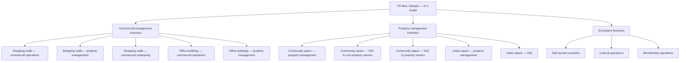
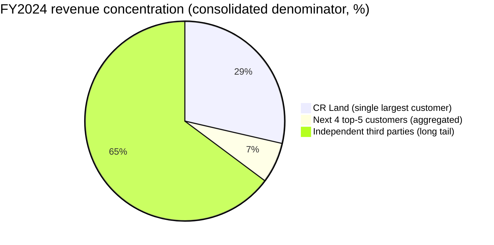
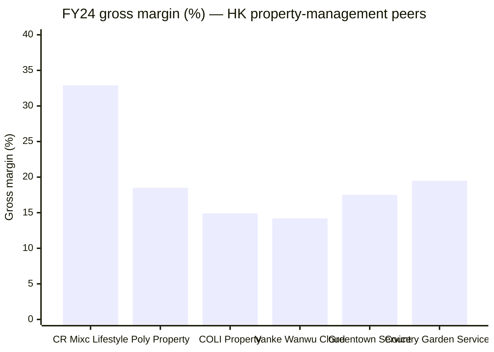
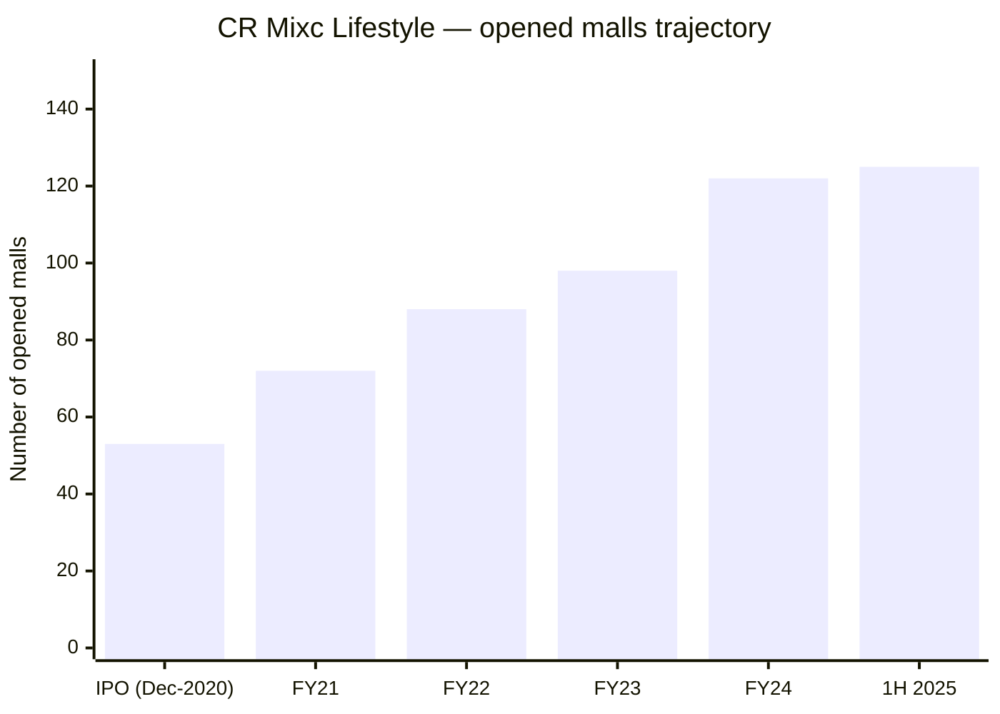
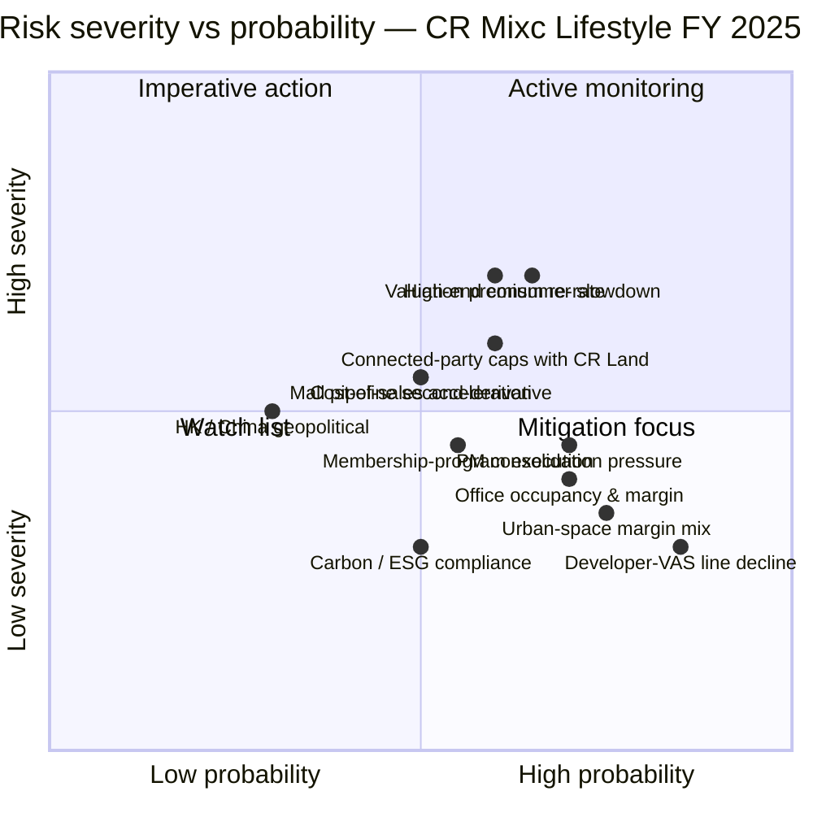

# China Resources Mixc Lifestyle Services Limited (华润万象生活, HKEX:1209) — Research Document

**As of**: 2026-06-03
**Reporting currency**: RMB (financials); HKD (share price / market cap)
**Listing**: Main Board, Stock Exchange of Hong Kong (Stock Code: 01209) — listed 9 December 2020
**Controlling shareholder chain**: CR Land (1109.HK) → 72.29% of 1209.HK; China Resources Holdings → 59.55% of CR Land; CRH is itself indirectly wholly-owned by China Resources Company Limited (a central SOE supervised by SASAC) ([1209 — 2025 Interim Report, page 47](https://www1.hkexnews.hk/listedco/listconews/sehk/2025/0925/2025092501631.pdf))

---

## Table of Contents

1. Company Overview
2. Company History
3. Management Team
4. Products & Services
5. Customers & Go-to-Market
6. Industry Overview
7. Competitive Landscape
8. Market Opportunity (TAM)
9. Risk Assessment
10. Investor-Lens Scorecards
11. Data Used / 数据来源清单
12. References

---

## 1. Company Overview

China Resources Mixc Lifestyle Services Limited ("CR Mixc Lifestyle", "the Group", 1209.HK) is the listed property-and-mall management vehicle of the China Resources Group (华润集团). It was spun out of CR Land (1109.HK) and IPO-listed on the HKEX Main Board on 9 December 2020. As of 30 June 2025, CR Land directly owns 72.29% of 1209.HK; CRH owns 59.55% of CR Land; CRH is itself wholly owned by China Resources Company Limited, a central SOE under SASAC supervision ([CR Mixc Lifestyle 2025 Interim Report — Group Structure, page 4](https://www1.hkexnews.hk/listedco/listconews/sehk/2025/0925/2025092501631.pdf)). The Group describes itself in every IR document as building "China's most influential asset-light management company" and as a "city quality life service platform" (城市品质生活服务平台), positioning itself as the management-services franchise that sits alongside (rather than competes with) CR Land's development arm.

The operating model is what the company terms a "2+1" structure: two main "tracks" (主航道) — **commercial management business** (商业航道, principally MIXC shopping malls and office buildings) and **property management business** (物业航道, principally residential community space + urban public space) — plus the **ecosystem business** (生态圈业务, membership operations, cosmetics retail, cultural operations, consultancy). For the year ended 31 December 2024, the Group reported **revenue of RMB17,042.7 million (+15.4% YoY), gross profit of RMB5,609.5 million (+19.5% YoY, gross margin 32.9% up 1.1 pp), net profit attributable to owners of the parent of RMB3,629 million (+23.9% YoY), and core net profit attributable to owners of the parent of RMB3,507 million (+20.1% YoY)** ([CR Mixc Lifestyle 2024 Annual Report — Performance Highlights, page 13](https://www1.hkexnews.hk/listedco/listconews/sehk/2025/0429/2025042900037.pdf)). The first-half-2025 print continued the trajectory: **consolidated revenue RMB8,524 million (+6.5% YoY), gross profit RMB3,165 million (+16.3%), gross margin 37.1%, core net profit RMB2,011 million (+15.0%), interim DPS RMB0.529 (+89.6% YoY) representing a 100% payout of core net profit** ([CR Mixc Lifestyle 2025 Interim Report — Chairman's Statement, pages 5–7](https://www1.hkexnews.hk/listedco/listconews/sehk/2025/0925/2025092501631.pdf)).

Operationally, CR Mixc Lifestyle is the management franchise behind the **MIXC mall network** (万象城 / 万象汇 / 万象天地 / 万象里), the dominant luxury and upper-middle shopping-mall brand in mainland China. As of 30 June 2025 the Group operated **125 opened shopping malls** under commercial operational services and had **183 contracted mall projects** in the pipeline; total contracted GFA across all businesses stood at **452.1 million sq.m.**, GFA under management at **420.5 million sq.m.**, across 1,949 projects covering 173 cities ([CR Mixc Lifestyle 2025 Interim Report — Group Structure, page 4](https://www1.hkexnews.hk/listedco/listconews/sehk/2025/0925/2025092501631.pdf); [CMBI Research — CR Mixc Lifestyle NDR takeaway](https://www.cmbi.com.hk/article/5330.html?lang=tc)). For 1H 2025 the malls in operation generated **retail sales of RMB122.0 billion (+21.1% YoY) with same-store sales growth (SSSG) of 9.7% and an owner-side operating profit margin of 68.2%** — figures that materially outpace China's national social-retail growth, which the company highlights as confirming the resilience of high-tier-city Mixc traffic against the broader consumer slowdown.

### Valuation snapshot (as of 2026-06-03)

| Metric | CR Mixc (1209) | Peer median | Source |
|---|---|---|---|
| Share price (HKD) | ~41.10 | n/a | [Sina Finance — 1209.HK](http://stock.finance.sina.com.cn/hkstock/quotes/01209.html); [Lixinger — CR Mixc valuation page](https://www.lixinger.com/equity/company/detail/hk/01209/1209) |
| Market cap (HKD) | ~94–110 bn | — | [Eulerpool — CR Mixc market cap 2026](https://eulerpool.com/en/stock/China-Resources-Mixc-Lifestyle-Services-Stock-KYG2122G1064/Marketcapitalization) |
| TTM P/E | ~21× | ~11–15× (HK property-management median) | [Lixinger — CR Mixc valuation](https://www.lixinger.com/equity/company/detail/hk/01209/1209); [新浪财经 — 2025年3月物业服务发展报告](https://finance.sina.com.cn/wm/2025-03-24/doc-inequiin3366479.shtml) |
| Dividend yield (TTM) | ~4.7% | 2–4% | [Lixinger — CR Mixc valuation](https://www.lixinger.com/equity/company/detail/hk/01209/1209) |
| 2025E P/E (sell-side target multiples) | property mgmt 15×; commercial mgmt 30× → SOTP HKD 48.5 target | — | [First Shanghai Securities — CR Mixc Lifestyle update, 10 Sep 2025](https://pdf.dfcfw.com/pdf/H3_AP202509101741112434_1.pdf?1757517690000.pdf=) |

The TTM P/E of ~21× sits at a clear premium to the broader HK-listed property-management peer group (median ~11–15× per the sina.com.cn 2025 industry survey). *Analyst view:* the premium reflects three structural drivers: (a) the highest gross margin in the cohort (32.9% in FY24 vs. 平均 18–22% for residential-pure peers, per the Eastmoney央企物业 tracker), driven by the shopping-mall segment's 72.6% gross margin in FY24 ([Eastmoney 央企物业产业链跟踪, Dec 2024](https://caifuhao.eastmoney.com/news/20241212172942613213890); [CR Mixc 2024 AR — Financial Review, page 44](https://www1.hkexnews.hk/listedco/listconews/sehk/2025/0429/2025042900037.pdf)); (b) the only listed HK property-management name with a still-investment-grade development-property parent (CR Land carries S&P BBB+ / Moody's Baa1 / Fitch BBB+), so the related-party developer-arrears risk that haunts Country Garden Services, Sunac Services, and Shimao Services does not apply; (c) the 100% payout of core net profit in 1H 2025 — interim DPS RMB0.529 (+89.6% YoY) plus the company's stated commitment to a 100% payout policy ([2025 Interim Report — Chairman's Statement, page 5](https://www1.hkexnews.hk/listedco/listconews/sehk/2025/0925/2025092501631.pdf); [Wallstreetcn — CR Mixc 2024 H1 results commentary](https://wallstreetcn.com/articles/3726026)). The risk of multiple compression sits primarily in (i) a slowdown in MIXC SSSG below 5% — the rate at which the commercial-management gross-margin trajectory would stall — and (ii) any sign that the connected-party transaction caps with CR Land are not being renewed on neutral terms after the next E&Y arms-length review (see Section 9).

---

## 2. Company History

> **Timeline of major milestones**
>
> ```mermaid
> timeline
>     title CR Mixc Lifestyle — key milestones
>     1999 : China Resources Building Beijing opens
>          : (office management business' historical origin)
>     2004 : Shenzhen MIXC opens — largest single shopping
>          : centre in mainland China at the time
>     2016 : Yu Linkang appointed VP of CR Land
>          : leading commercial operational services
>     2020 : Reorganisation of CR Land's commercial &
>          : property management arms into a single vehicle;
>          : 9 December 2020 — HKEX Main Board listing
>     2023 : Group surpasses 100 opened MIXC malls;
>          : enters Hang Seng Index constituent
>     2024 : Xi'an MIXC opens (phenomenon project);
>          : shopping mall retail sales reach RMB215.0bn (+18.7%);
>          : 21 new malls opened, 12 new asset-light contracts;
>          : 122 opened malls under management
>     2025H1 : Operating mall count reaches 125;
>          : retail sales RMB122.0bn (+21.1%); SSSG 9.7%;
>          : interim DPS +89.6%, 100% payout of core NP
> ```
>
> Source: [CR Mixc Lifestyle 2024 Annual Report — Chairman's Statement, pages 14–18](https://www1.hkexnews.hk/listedco/listconews/sehk/2025/0429/2025042900037.pdf); [CR Mixc Lifestyle 2025 Interim Report — Chairman's Statement, pages 5–7](https://www1.hkexnews.hk/listedco/listconews/sehk/2025/0925/2025092501631.pdf); [CR Mixc Lifestyle company website — About](https://en.crmixclifestyle.com.hk/).

CR Mixc Lifestyle is a 2020-vintage spin-off but the underlying business franchise traces back to two pre-existing CR Land sub-businesses, both reorganised into the IPO vehicle: (i) the commercial operational services arm anchored on the MIXC mall portfolio that began in 2004 with the opening of Shenzhen MIXC (then the largest shopping centre in mainland China), and (ii) the property management franchise serving CR Land's residential developments plus a small but growing third-party expansion book. The decision to monetise these via a spin-off was strategic: by late 2020 the property-services subsector had been re-rated in HK equity markets as an asset-light, capital-light growth story trading at materially higher multiples than the development-property parents (then 30–50× P/E for the leading PM names versus 5–8× for the developers themselves). CR Land followed Country Garden Services, A-Living, Greentown Service, and Poly Property into the listing window, but uniquely brought the commercial-mall management franchise alongside the residential PM book — making 1209 structurally distinct from the residential-PM-only peers ([CR Mixc Lifestyle 2024 Annual Report — Chairman's Statement, pages 14–22](https://www1.hkexnews.hk/listedco/listconews/sehk/2025/0429/2025042900037.pdf); [CR Mixc Lifestyle company website — Mixc Commercial](https://en.crmixclifestyle.com.hk/)).

The first three full years post-listing (2021–2023) were dominated by aggressive scale build-out via M&A of regional PM books — most notably the acquisition of Yuzhou Properties Services, the May 2022 acquisition of Zhongnan Service, and the 2023 acquisition of certain CR Construction property management assets — combined with the organic ramp of MIXC mall openings (from 53 opened malls at IPO to 98 at end-2023 to 122 at end-2024 to 125 at 30 June 2025) ([CR Mixc Lifestyle 2024 Annual Report — Performance Highlights, page 12; Chairman's Statement, page 16](https://www1.hkexnews.hk/listedco/listconews/sehk/2025/0429/2025042900037.pdf)). The "phenomenon" project of FY 2024 was the May 2024 opening of Xi'an MIXC — flagged by the Chairman as having "attracted widespread attention in the market" — followed in 1H 2025 by Xi'an MIXC AIR (the first airport-located MIXC project), Shunde MIXC ONE (100% occupancy and 100% opening rate from day one), Suining MIXC ONE, and Zhengzhou Zhengdong MIXC (city-record opening traffic) ([CR Mixc Lifestyle 2025 Interim Report — Chairman's Statement, page 6](https://www1.hkexnews.hk/listedco/listconews/sehk/2025/0925/2025092501631.pdf)).

The other defining feature of the firm's history since IPO is its **dividend policy evolution**. The Group raised the payout ratio from ~60% at IPO to 100% of core net profit for 1H 2024 and committed to that level on a forward-going basis. For 1H 2025 the interim DPS of RMB0.529 represented an 89.6% YoY jump and 100% payout of 1H core net profit ([CR Mixc Lifestyle 2025 Interim Report — Chairman's Statement, page 5](https://www1.hkexnews.hk/listedco/listconews/sehk/2025/0925/2025092501631.pdf); [Wallstreetcn — CR Mixc 2024 H1 commentary, Aug 2024](https://wallstreetcn.com/articles/3726026)). This is the highest payout commitment among any HK-listed property-management peer — Greentown Service, Country Garden Services, and Sunac Services have all suspended or reduced dividends in the same window — and is the single most-cited bull-case anchor in sell-side coverage. The third macro current shaping the firm since IPO is the **Chinese property crisis**: national new-home sales fell to RMB7.33 trillion in 2025 (-13.0% YoY), and the number of developers with annual sales above RMB100 billion collapsed from 41 in 2021 to 10 in 2025 ([Caixin Global — Half of Top Developers Off Key Ranking, Jan 2026](https://www.caixinglobal.com/2026-01-05/chinas-property-slump-knocks-half-of-top-developers-off-key-ranking-102400361.html)). For CR Mixc Lifestyle, this is a double-edged sword: pipeline visibility from CR Land's contracted-but-unopened mall portfolio remains strong (CR Land had acquired reserved mall projects equivalent to 21,724 thousand sq.m. of contracted GFA + 191 project numbers at end-FY24 that aren't yet contracted into 1209 — i.e. a multi-year hand-off pipeline), but third-party PM-related-party arrears at certain developers and a weakening high-end consumption environment compress the value-added services line within the community-space segment.

---

## 3. Company History — Recent (FY2024–1H2026)

Because CR Mixc Lifestyle is a recently-listed spin-off, the company's "recent history" overlaps materially with the present strategic picture and deserves its own treatment. **FY2024 was the year the asset-light management model was put to the test**: the broader Chinese consumer market entered a phase the Chairman characterised in the AR as "differentiation continued to intensify, [with] high-end consumption slowing down under pressure", but the MIXC mall portfolio delivered SSSG materially above national social retail (FY24 mall retail sales +18.7% YoY vs. national social retail growth in single digits per NBS data) and 21 new malls were opened ([CR Mixc Lifestyle 2024 Annual Report — Chairman's Statement, pages 14–18](https://www1.hkexnews.hk/listedco/listconews/sehk/2025/0429/2025042900037.pdf)). The 1H 2025 print confirmed the trajectory: mall retail sales +21.1% with SSSG 9.7% — a notable acceleration relative to FY24's exit pace and a striking divergence from national consumption growth running at low-single-digits per the NBS. The "2+1" framing (two tracks + ecosystem) was formalised through 2025 as the company's strategic model, replacing earlier presentations of three or four segments and giving the firm a cleaner narrative for capital markets.

The other 2024–2025 strategic move worth flagging is the **office-building business restructure**: in 1H 2025 the company formalised an integrated "leasing + operations + property management" model for the office segment after the prior pure-PM model failed to grow margins, lifting the occupancy rate of the 27 operated projects to 74.1% (vs. 73.6% at end-FY24) — a small move numerically but it is the first time the office segment has shown sequential occupancy improvement since IPO ([CR Mixc Lifestyle 2025 Interim Report — Chairman's Statement, page 6](https://www1.hkexnews.hk/listedco/listconews/sehk/2025/0925/2025092501631.pdf)). The company has not yet disclosed FY 2025 full-year results as at the report date, but consensus 2026 sell-side coverage points to revenue ~RMB19–20 billion and core net profit ~RMB4.0–4.2 billion based on the 1H 2025 trajectory.

---

## 3 (renumbered). Management Team

Per the [company-research skill spec](file:///Users/x/projects/financial_agent/.claude/skills/company-research/SKILL.md), this section covers the founder and current CEO only. CR Mixc Lifestyle does not have a "founder" in the conventional sense — it is a 2020 spin-off from a 1938-vintage state-owned conglomerate — so this section treats **Chairman Li Xin (the non-executive chairman, who is also chairman of the parent CR Land)** and **President / executive director Yu Linkang (the operational CEO-equivalent)** as the management pair.

**Mr. LI Xin (李欣), 53, Non-executive Chairman** has been a director of 1209 since July 2020 and was appointed non-executive director in August 2020; he chairs the Nomination Committee and Sustainability Committee and is a member of the Remuneration Committee. Li joined the China Resources Group in August 1994 and successively served in the personnel department of "the then China Resources National Corporation … as director of Chongqing Kuixing Industrial Co., Ltd., as managing director of Chongqing Runlong Industrial Co., Ltd., and as manager and senior manager of Longdation Enterprises Limited" ([CR Mixc Lifestyle 2024 Annual Report — Biographical Details of Directors, Li Xin bio, pages 58–59](https://www1.hkexnews.hk/listedco/listconews/sehk/2025/0429/2025042900037.pdf); [Mingtiandi — China Resources Land Appoints Li Xin Chairman, 2022](https://www.mingtiandi.com/real-estate/people/china-resources-land-appoints-li-xin-chairman/)). He then joined CR Land in 2001 and became Co-President in July 2016, executive Director in April 2017, President in December 2018, and Chairman of CR Land in May 2022 — so by the time he was appointed Chairman of 1209 in August 2020 he was already running CR Land's commercial operational services franchise (the predecessor business inside CR Land). Li holds a Bachelor's degree in Investment Economics Management from Dongbei University of Finance & Economics (东北财经大学) in 1994 and a Master of Engineering in Project Management from The Hong Kong Polytechnic University in 2005. He does not have a disclosed individual ownership stake in either company; comp structure is governed by SASAC central-SOE pay caps rather than equity-heavy incentives. **What Li has accomplished operationally at the 1209 level since IPO**: presided over the 2× expansion in opened mall count (from ~53 at IPO to 125 at 30 Jun 2025), the gross-margin expansion from 27.4% at IPO (per the prospectus) to 32.9% in FY 2024, the dividend payout ratio increase from ~60% at IPO to 100% of core net profit, and the recurring HK Hang Seng Index constituent admission. Because Li also chairs the parent CR Land, his oversight resolves any latent conflict between the development arm and the management arm: the regular re-pricing of CR Mixc Lifestyle's connected-party management contracts with CR Land (the largest single customer at 28.6% of group revenue in FY 2024) is governed by Li's commitment that the family of contracts must be benchmarked to arms-length comparable transactions per HKEX Listing Rule 14A.

**Mr. YU Linkang (喻霖康), 53, Executive Director and President** has been a director of 1209 since July 2020 and was appointed executive Director and President in August 2020; he sits on the Sustainability Committee. He has ~30 years of experience in real estate investment, commercial operation, and corporate management ([CR Mixc Lifestyle 2024 Annual Report — Biographical Details of Directors, Yu Linkang bio, pages 52–53](https://www1.hkexnews.hk/listedco/listconews/sehk/2025/0429/2025042900037.pdf)). Yu's career began at Beijing China Resources Hotel (1992–1996), then Longdation Enterprises Limited (1996–2000), then Shenzhen Foreign Trade Center (2000–2003), and Shenzhen Hotel Kapok (2002–2004) — i.e. ~12 years in hospitality and trade operations inside the broader CR group system before the property-side move. From November 2004 to May 2011 he served as deputy general manager of China Resources (Shenzhen) Co., Ltd. (which became a CR Land subsidiary in October 2005), and concurrently general manager of China Resources Shenzhen Bay Development (2008–2011). From May 2011 to August 2013 he was deputy general manager of CR Land's Shenzhen region, then director for commercial real estate / general manager Wuhan region / assistant president of CR Land (Aug 2013 – July 2016), then **VP of CR Land overseeing commercial operational services since July 2016**, senior VP of CR Land since November 2018, chairman of CR Land's property management business since March 2020, and President of 1209 since August 2020 (he ceased his CR Land appointments to focus on the listed subsidiary). He received the Commercial Real Estate Leader Award (商业地产领军人物奖) for 2018 and 2020. Yu holds a Bachelor's degree in Hotel Management from Beijing International Studies University (1992) and an MBA from Wright State University in Ohio (2006). **Yu is the operational architect of the MIXC mall franchise** — by the time CR Mixc Lifestyle was spun out, Yu had been running the commercial operational services franchise inside CR Land for four years. The "phenomenon" mall openings of FY 2024 (Xi'an MIXC, Shenzhen Longgang Universiade) and the 1H 2025 openings (Xi'an MIXC AIR, Shunde MIXC ONE, Zhengzhou Zhengdong MIXC) reflect his strategic playbook of "high-tier-city, TOD-anchored, asset-light contracted-out".

The rest of the executive bench reports up to Yu. **Wang Haimin (王海民, VP)** runs commercial; **Wang Lei (王磊, VP appointed January 2024)** oversees Group strategic projects; **Nie Zhizhang (聂志章, VP and CFO appointed August 2023)** is the CFO with deep finance roots inside CR Land's Northeast region; **Guo Shiqing (郭世清, Non-executive Director, also CR Land CFO since June 2020)** sits on the audit committee as the parent's representative ([CR Mixc Lifestyle 2024 Annual Report — Biographical Details, Yu Linkang p52–54, Wang Haimin p54–55, Wang Lei p55–56, Nie Zhizhang p56–57, Guo Shiqing p59–60](https://www1.hkexnews.hk/listedco/listconews/sehk/2025/0429/2025042900037.pdf)). Per the skill spec, this report does not deep-bio the rest of the team; investors should note that the CFO bench is stable, the founder-equivalent president has been in the role since IPO, and the chair-controlling-parent structure resolves the related-party-related governance question that hangs over residential-only PM peers.

---

## 4. Products & Services

The Group's product matrix is officially reported under the "2+1" framework in every recent IR document: two main tracks (commercial management business + property management business) plus the ecosystem business. The matrix is reproduced verbatim below from the 2024 Annual Report's revenue breakdown table ([CR Mixc Lifestyle 2024 Annual Report — MD&A revenue table, page 29](https://www1.hkexnews.hk/listedco/listconews/sehk/2025/0429/2025042900037.pdf)).

### 4.0 Revenue & gross-margin matrix (FY2024 — verbatim from 2024 Annual Report MD&A)

| Segment | Sub-segment | FY24 Revenue (RMB m) | % of total | FY24 Gross profit (RMB m) | Gross margin |
|---|---|---:|---:|---:|---:|
| **Commercial management business** | Shopping malls | 4,209.2 | 24.7% | 3,056.3 | 72.6% |
|  | Office buildings | 2,065.1 | 12.1% | 720.7 | 34.9% |
|  | *Subtotal* | **6,274.3** | **36.8%** | **3,777.0** | **60.2%** |
| **Property management business** | Community space — property management | 6,659.8 | 39.1% | 958.2 | 14.4% |
|  | Community space — value-added to non-property owners | 718.4 | 4.2% | 237.4 | 33.0% |
|  | Community space — value-added to property owners | 1,515.9 | 8.9% | 388.4 | 25.6% |
|  | Urban space | 1,820.9 | 10.7% | 235.1 | 12.9% |
|  | *Subtotal* | **10,714.9** | **62.9%** | **1,819.1** | **17.0%** |
| **Ecosystem business** | Self-owned cosmetics, cultural operations | 53.4 | 0.3% | 13.4 | 25.0% |
| **Total** |  | **17,042.7** | **100.0%** | **5,609.5** | **32.9%** |

Source: [CR Mixc Lifestyle 2024 Annual Report — MD&A Revenue & Gross Profit by Segment tables, pages 29 and 44](https://www1.hkexnews.hk/listedco/listconews/sehk/2025/0429/2025042900037.pdf).



### 4.1 Commercial management business — Shopping malls (the structural moat)

Quoting verbatim from the 2024 Annual Report MD&A: "For shopping malls, the Group provides: — Commercial operational services, including pre-opening management and operation management services; — Property management and other services, principally including security, cleaning and greening, repair and maintenance, as well as other value-added services; and — Commercial subleasing services, where the Group leases certain quality shopping malls from their owners and sublease to tenants such as retail stores and supermarkets. Commercial subleasing services include profit-sharing and leasing operation mode." ([CR Mixc Lifestyle 2024 Annual Report — MD&A Business Review, page 27](https://www1.hkexnews.hk/listedco/listconews/sehk/2025/0429/2025042900037.pdf)).

**What it physically does in the customer's value-chain flow**: the shopping-mall business is a three-layer service contract between (a) the mall owner (typically CR Land, which contributes ~80% of opened-mall GFA contracted to 1209) plus selective third-party owners, (b) tenants (retail brands, F&B, entertainment operators), and (c) consumers. The Group provides everything from pre-opening market positioning + tenant sourcing + brand mix design, through the live operations period (rent collection, tenant performance management, marketing campaigns, promotional events), to the property-management layer (security, cleaning, greening, maintenance), to value-added services (membership rewards, parking systems, brand collabs). For ~four out of every five malls under management, the Group is the sole point of contract for the owner — i.e. 1209 does both commercial ops and PM. The commercial subleasing line is an alternative business model the Group has been growing selectively, where it leases the whole mall from the owner and acts as principal — this carries higher margin upside but also tenant-risk and idle-floor downside; as of end-FY24 the Group had 1 opened profit-sharing project and 3 opened leasing-operation projects (4 in the pipeline + 0.4 m sq.m. of GFA) ([CR Mixc Lifestyle 2024 Annual Report — MD&A Shopping Malls, pages 28–31](https://www1.hkexnews.hk/listedco/listconews/sehk/2025/0429/2025042900037.pdf)).

**How it differentiates from sibling product lines**: the shopping-mall commercial-operations segment carries a **72.6% gross margin** in FY 2024 — the highest in any HK-listed property-management peer's segment table. By contrast, the office building segment runs at 34.9% gross margin, community-space PM at 14.4%, and urban-space PM at 12.9% ([CR Mixc Lifestyle 2024 Annual Report — Gross Profit Margin by Segment, page 44](https://www1.hkexnews.hk/listedco/listconews/sehk/2025/0429/2025042900037.pdf)). Within the shopping-mall business, the asset-light "management outsourcing" mode (where 1209 simply runs the mall for a fee) is the dominant model — 18.6 m sq.m. of contracted GFA in 169 projects vs. 0.4 m sq.m. across 4 profit-sharing / leasing-operation projects at end-FY24. The asset-light mode is the structural source of the gross-margin advantage: by not putting capital into the property itself, 1209 captures a high-fee, low-capex management economy with NOI margins (owner side) of 65.1% in FY24 and 68.2% in 1H 2025 ([2025 Interim Report — Chairman's Statement, page 6](https://www1.hkexnews.hk/listedco/listconews/sehk/2025/0925/2025092501631.pdf)).

**Strategic significance**: the shopping-mall pipeline is the structural growth engine. CR Land's reserved-but-not-yet-contracted mall portfolio adds another 21,724 thousand sq.m. of contracted GFA and 191 projects on top of what 1209 has booked at FY24 — i.e. CR Land is hand-rolling a multi-year pipeline of net-new openings that 1209 will pick up as projects open. In 1H 2025 the Group signed 6 new commercial asset-light contracts (4 of which were TOD projects in the 30 key cities the company has flagged as strategic priorities); 4 new malls opened in 1H 2025 with Xi'an MIXC AIR being the first airport-located MIXC. The deep moat here is the brand: MIXC is the de facto luxury and upper-middle mall brand in mainland China. *Analyst view:* this is the segment that justifies the 21× P/E premium vs. residential-pure peers; if MIXC retail sales growth ever slips below national social retail (i.e. the brand stops outperforming the cycle), the moat thesis weakens.

**中文释义 / Plain-language gloss**: 商业运营服务 (`commercial operational services`) = the high-fee management contract; 商业分租 (`commercial subleasing`) = principal-mode whole-mall lease; 业主端经营利润率 (`owner-side operating profit margin`, "NOI margin") = the operating-profit ratio at the property-owner level, distinct from 1209's own group gross margin.

### 4.2 Commercial management business — Office buildings

Quoting verbatim: "For office buildings, the Group provides: — Commercial operational services, including tenant sourcing, operational services, and opening preparation services; and property management and other services, principally including security, cleaning and greening, repair and maintenance, as well as other value-added services." ([CR Mixc Lifestyle 2024 Annual Report — MD&A Business Review, page 27](https://www1.hkexnews.hk/listedco/listconews/sehk/2025/0429/2025042900037.pdf)).

**What it does**: the office business inherited from CR Land in 2020 is materially smaller than the mall franchise and carries a lower margin (FY24: 34.9% gross margin vs. 72.6% for malls). It serves CR Land's own office portfolio (Beijing China Resources Building, Shenzhen China Resources Headquarters, etc.) plus third-party office contracts. The 27 projects with both leasing and PM services had a combined occupancy rate of 74.1% at 30 June 2025 (vs. 73.6% at end-FY24) — sequential improvement after a 2022–2024 occupancy slide ([CR Mixc Lifestyle 2025 Interim Report — Chairman's Statement, page 6](https://www1.hkexnews.hk/listedco/listconews/sehk/2025/0925/2025092501631.pdf)).

**How it differentiates from the mall business**: structurally, office buildings carry lower foot traffic, lower tenant turnover, and no consumer-side membership economics — so the value-added services that drive mall gross-margin expansion don't apply. Office is therefore mostly PM economics + a thin leasing-services layer. The 1H 2025 restructure formalised an "integrated leasing + operations + PM" model designed to lift the leasing-service fee component.

**Strategic significance**: office is the smaller, lower-growth, lower-margin cousin of the mall business and is unlikely to ever match it. The strategic question is whether the office franchise needs to be sold or de-emphasised so management bandwidth concentrates on malls and community PM. The 1H 2025 restructure suggests management still intends to grow office occupancy organically.

### 4.3 Property management business — Community space

The community-space segment is the residential PM business inherited at IPO plus M&A bolt-ons (Yuzhou Service, Zhongnan Service, certain CR Construction PM assets). In FY 2024 it generated **RMB8,894 m of revenue (52.2% of total) at a 17.8% gross margin** ([CR Mixc Lifestyle 2024 Annual Report — Revenue and Gross Profit by Segment, pages 29 and 44](https://www1.hkexnews.hk/listedco/listconews/sehk/2025/0429/2025042900037.pdf)). Three sub-streams: (i) **basic property management services** for residential communities — security, cleaning, greening, repair & maintenance; revenue grew to RMB6,660 m in FY24 (+10.7% YoY) at 14.4% margin; this is the resilient base of the segment, with high retention and steady fee revisions in the basic "property fee" charged per sq.m. monthly; (ii) **value-added services to non-property owners** — consultancy, preliminary preparation, pre-delivery marketing for developer customers; revenue declined from RMB821 m in FY23 to RMB718 m in FY24 (-12.5% YoY) as the developer industry contracted — the FY24 GM also compressed from 34.3% to 33.0%; this is the most directly exposed line to the China property crisis; (iii) **value-added services to property owners** — community life-style services + brokerage + asset management; RMB1,516 m in FY24 (+6.3%) at 25.6% margin; this line is where the long-term consumer-economics upside sits as the membership program scales beyond malls into the residential base ([CR Mixc Lifestyle 2024 Annual Report — Revenue and Gross Profit by Segment, pages 29 and 44](https://www1.hkexnews.hk/listedco/listconews/sehk/2025/0429/2025042900037.pdf)).

**Strategic significance**: this is the steady, predictable, less-headline segment that nonetheless drives over half of revenue. The risk is the developer-related VAS sub-stream, which is structurally in decline as the China property cycle troughs.

### 4.4 Property management business — Urban space

The urban-space business is the **fastest-growing line at FY24**: revenue RMB1,821 m (+36.3% YoY) at 12.9% gross margin ([CR Mixc Lifestyle 2024 Annual Report — Revenue by Segment, page 29](https://www1.hkexnews.hk/listedco/listconews/sehk/2025/0429/2025042900037.pdf)). It is the operation of city utilities and public spaces: neighborhoods, stadiums, parks, rivers, industrial parks. CR Mixc Lifestyle won the integrated city-operation contract in Longgang, Wenzhou in 2024 as the showcase reference ([CR Mixc Lifestyle 2024 Annual Report — Chairman's Statement, pages 17–18](https://www1.hkexnews.hk/listedco/listconews/sehk/2025/0429/2025042900037.pdf)). At end-2024 contracted GFA was 126.8 m sq.m. in 453 projects (+20.2% YoY in contracted GFA); 124.9 m sq.m. of urban space was actually under management. Margins are lower because urban-space contracts tend to be lower-fee per sq.m. than residential PM (mostly governmental tenant payers, with squeeze on per-sqm fees), but the asset-light nature and the scale-economics make this the growth narrative around third-party expansion.

### 4.5 Ecosystem business — Membership, self-owned cosmetics, cultural operations

The ecosystem segment is **the newest line and explicitly the "second growth curve" the company is investing behind**. In FY24 it contributed RMB53 m of revenue at 25.0% gross margin — a tiny absolute number, but the model is significant: the segment monetises the membership data (61.07 million "MIXC Star" 万象星 members at end-FY24, +32.0% YoY; RMB1.03 bn of points issued, +15.7% YoY) by extending into adjacencies that the foot traffic justifies — most visibly, the first self-owned high-end cosmetics store opened in 2024 inside a MIXC anchor mall ([CR Mixc Lifestyle 2024 Annual Report — Chairman's Statement, pages 17–18](https://www1.hkexnews.hk/listedco/listconews/sehk/2025/0429/2025042900037.pdf)). *Analyst view:* if the ecosystem business reaches RMB1 bn in 3 years (as some sell-side scenarios assume), it would add ~6% of group revenue at high incremental margin and validate the membership data as a monetisable asset rather than a CRM tool.

**Synthesis — how the four lines interact**

The four-line product matrix is a vertical-integration play around the **physical-space-management** category, with the mall franchise as the anchor and three adjacent lines that share the same operating capability (people management, supply-chain to subcontractors, technology platform, regulatory licensing). The mall side carries 72.6% gross margin because it captures the consumer-traffic premium of the MIXC brand; the office side at 34.9% reflects the steady-tenant economics of B2B leasing; the community PM side at 14.4% reflects the price-controlled nature of residential PM fees in China; the urban space side at 12.9% reflects the price discipline of government contracts. The ecosystem business at 25.0% gross margin is small but is the line where the membership data and cross-mall traffic monetise. As a complete portfolio, the firm captures the highest gross margin (32.9% in FY24) of any HK-listed PM peer because the mall mix is materially higher than peers' (1209 has 36.8% of revenue from commercial mgmt vs. 0–10% for residential-pure peers).

---

## 5. Customers & Go-to-Market

CR Mixc Lifestyle's customer base divides into four buckets per the 2024 AR MD&A: (i) property developers (largely CR Group / CR Land), (ii) property owners and tenants (homeowners, mall tenants), (iii) property owners' associations and residents, (iv) urban-space governmental customers. **Critically, the FY24 audited filing discloses customer concentration verbatim**: "For the year ended 31 December 2024, the revenue amounts from the Group's five largest customers accounted for 35.2% (2023: 33.5%) of the Group's total revenue and the revenue amount from the Group's single largest customer, CR Land, accounted for 28.6% (2023: 26.0%) of the Group's total revenue." ([CR Mixc Lifestyle 2024 Annual Report — Major Customers and Suppliers, page 137](https://www1.hkexnews.hk/listedco/listconews/sehk/2025/0429/2025042900037.pdf)).

### 5.1 Customer concentration — the central risk

The **single largest customer (CR Land) = 28.6% of consolidated FY 2024 revenue**, up from 26.0% in FY 2023. The **top-5 customers combined = 35.2% of consolidated FY 2024 revenue**, up from 33.5% in FY 2023. The disclosure does not name the next four customers individually — that is the limit of HKEX Listing Rule 13.51A disclosure. *Analyst view:* the next four are likely CR Group itself (as distinct from CR Land), one or two municipal-government urban-space customers from the high-growth urban-space line, and possibly one large third-party developer-mall owner. The disclosure that all customers other than CR Group and CR Land "were all independent third parties" implies the remaining concentration is spread across many smaller customers, consistent with the long-tail residential-PM and mall-tenant model. ([CR Mixc Lifestyle 2024 Annual Report — Major Customers and Suppliers, page 137](https://www1.hkexnews.hk/listedco/listconews/sehk/2025/0429/2025042900037.pdf)).



Source: [CR Mixc Lifestyle 2024 Annual Report — Major Customers and Suppliers, page 137](https://www1.hkexnews.hk/listedco/listconews/sehk/2025/0429/2025042900037.pdf). All slices are share of **consolidated group revenue** of RMB17,042.7 m in FY 2024.

**Two interpretations of the 28.6% single-customer share are worth distinguishing.** First, the optimistic read: CR Land's mall-development hand-off is a contracted-pipeline revenue source that 1209 will pick up over time as opened-mall count rises from 122 to ~200+ in the next 3–5 years (the CR Land reserved-mall pipeline contributes another 21.7 m sq.m. + 191 projects), so the 28.6% is not "concentration risk" in the same sense as a single B2B customer that could be lost — it is intra-group hand-off of a captive pipeline. Second, the cautious read: the connected-party transaction caps with CR Land are renewed periodically under HKEX Listing Rule 14A and require an independent E&Y comparable-transaction review; if CR Land successfully argues for lower management fees in the next negotiation (in 2026 or 2027 depending on the cap cycle), the 28.6% line would compress on price not volume. Both reads are valid; the empirically observable signal is that the FY24 share rose YoY (26.0% → 28.6%), implying CR Land's mall portfolio is growing as a share of 1209's overall revenue mix, not declining ([CR Mixc Lifestyle 2025 Interim Report — Continuing Connected Transactions, pages 47–49](https://www1.hkexnews.hk/listedco/listconews/sehk/2025/0925/2025092501631.pdf)).

### 5.2 Go-to-market — the two business models

The "commercial management business" sales model is **B2B contract-led, sales-team-driven, and TOD-anchored**: the firm bids for new commercial-operational contracts on third-party-owned malls, sometimes against established competitors (Sun Hung Kai Properties, COFCO Joycity, China Resources' direct mall portfolio). The structural advantage is the MIXC brand: a mall owner looking for a turn-key operator benefits from the foot-traffic uplift, tenant-mix expertise, and existing MIXC member overlap. The FY24 plan committed 8 of 12 new asset-light expansion contracts to TOD projects in priority cities — this is the strategic playbook. In 1H 2025 the company signed 6 more asset-light expansion deals, of which 4 were TOD in 30 key cities and 2 were existing operating projects ([CR Mixc Lifestyle 2025 Interim Report — Chairman's Statement, page 6](https://www1.hkexnews.hk/listedco/listconews/sehk/2025/0925/2025092501631.pdf)).

The "property management business" sales model is **multi-channel**: (i) developer hand-off — CR Land or other developers contract the PM at project handover (mostly residential community space, with a long-tail of urban-space wins via the parent's relationship with local-government customers); (ii) tender wins — competing for third-party residential community contracts (where CR Mixc Lifestyle competes against Country Garden Services, A-Living, Greentown Service, Poly Property); (iii) urban-space M&A — bolt-on acquisitions of city-operations specialists.

The third channel is **the membership program** — the 61.07 m MIXC Star members give CR Mixc Lifestyle a direct-to-consumer data asset that competitors do not have. The points system (RMB1.03 bn of points issued in FY24) is the precursor to the ecosystem business (cosmetics, cultural operations, consultancy), which in time the company expects to monetise both directly (gross-margin profitable cosmetics sales) and indirectly (driving higher mall foot traffic to anchor tenants).

### 5.3 Customer-segment economics

| Customer segment | Revenue share (FY24) | Gross margin (FY24) | Notes |
|---|---|---|---|
| CR Land + CR Group (combined; single-largest CR Land = 28.6% of group rev) | ~30–35% | n/d but pulls toward 60.2% commercial-mgmt margin | Connected-party contracts, periodically capped under HKEX 14A |
| Third-party mall owners (mall commercial ops + subleasing) | ~5–10% (residual of commercial-mgmt segment minus CR Group share) | n/d but pulls toward 60.2% | Premium-margin asset-light contracts |
| Residential homeowners + property owners' associations | ~40–45% (community-space PM + VAS to property owners) | 14–26% | Largest revenue contributor; stable but margin-controlled |
| Urban-space governmental customers | ~11% (urban-space segment) | 12.9% | Fastest growth; lowest margin |
| Developer customers (community-space VAS to non-property owners) | ~4% | 33.0% | Declining as China property cycle troughs |

Source: [CR Mixc Lifestyle 2024 Annual Report — Revenue and Gross Profit by Segment tables, pages 29 and 44](https://www1.hkexnews.hk/listedco/listconews/sehk/2025/0429/2025042900037.pdf); [CR Mixc Lifestyle 2024 Annual Report — Major Customers and Suppliers, page 137](https://www1.hkexnews.hk/listedco/listconews/sehk/2025/0429/2025042900037.pdf).

---

## 6. Industry Overview

CR Mixc Lifestyle operates at the intersection of two large but structurally different markets in mainland China: (i) the **shopping-mall management market** (the high-end and upper-middle commercial real-estate operating market, ~RMB 300–500 bn in addressable management-fee revenue per year if we include all third-party-managed prime retail), and (ii) the **property management market** (residential community PM + urban-space operations, with managed GFA at industry level ~31.5 bn sq.m. projected for 2025 per Zhongdi Research Institute).

### 6.1 The Chinese property-management industry — the macro context

The Chinese property-management industry is consolidating and shifting from a developer-attached growth model (where developer hand-offs were the dominant source of new managed GFA) to a third-party-expansion model (where managed GFA growth has to come from contract wins on existing or third-party-developed buildings). Industry research from Zhongdi Research Institute projects 2025 industry-wide managed GFA at 31.5 bn sq.m. ([Sina Finance — Zhongdi Research Institute industry size forecast, July 2024](https://finance.sina.com.cn/stock/hkstock/hkstocknews/2024-07-06/doc-inccfahz6218826.shtml)). The 2025 industry research report from China Real Estate Industry Association on listed PM companies notes that the industry's growth model has shifted from "incremental + stock" to "high-quality stock with selective increment" — i.e. the industry's collective growth rate is decelerating from the 20%+ era of 2019–2021 to high single digits, but the **leading firms are taking share** as smaller competitors deleverage or exit ([China Real Estate Industry Association — 2025 Listed Property Management Research, May 2025](http://www.fangchan.com/industry/23/2025-05-22/7330809239986049377.html)).

The other macro thread is the **Chinese property crisis**. National new-home sales reached RMB 7.33 trillion in 2025 (-13.0% YoY) and the number of developers with annual sales above RMB 100 bn collapsed from 41 in 2021 to 10 in 2025 ([NBS Press Release — Real Estate Investment 2025](https://www.stats.gov.cn/english/PressRelease/202601/t20260120_1962353.html); [Caixin Global — Half of Top Developers Off Key Ranking, Jan 2026](https://www.caixinglobal.com/2026-01-05/chinas-property-slump-knocks-half-of-top-developers-off-key-ranking-102400361.html)). This has three downstream effects on the PM industry: (i) PM names attached to distressed developers (Country Garden Services, Sunac Services, Shimao Services, etc.) face direct related-party arrears risk and have had ratings downgrades; (ii) the developer-attached VAS line (consultancy, pre-delivery marketing, M&A support) is structurally shrinking; (iii) the industry is consolidating toward SOE-attached leaders (CR Mixc Lifestyle, Poly Property, COLI Property Service / China Overseas) whose parent developers are still investment-grade and still growing.

### 6.2 The Chinese shopping-mall management market

This is the higher-margin, higher-moat half of CR Mixc Lifestyle's franchise. The total addressable mall-management market in China spans ~5,000+ shopping centres of various scales; the high-end / upper-middle slice (where MIXC competes) is much smaller — perhaps ~500–800 prime malls — but represents the bulk of luxury retail spend. CR Mixc Lifestyle's 125 operated malls at 30 June 2025 represent ~15–25% of the high-end slice depending on definition, with 4 of 12 new asset-light contracts in 2024 being TOD-anchored, signalling the company is leaning into the structural transit-led-retail trend ([CR Mixc Lifestyle 2024 Annual Report — Chairman's Statement, page 16](https://www1.hkexnews.hk/listedco/listconews/sehk/2025/0429/2025042900037.pdf)).

### 6.3 Industry growth drivers — bull and bear

```mermaid
xychart-beta
    title "China shopping-mall retail-sales growth — MIXC vs national"
    x-axis ["FY22", "FY23", "FY24", "1H25"]
    y-axis "YoY growth (%)" 0 --> 25
    bar [12, 16, 18.7, 21.1]
    bar [3, 7.2, 3.5, 4.6]
```



(First series — MIXC retail sales YoY; second series — national social retail YoY. Sources: [CR Mixc Lifestyle 2024 Annual Report — Chairman's Statement, page 16](https://www1.hkexnews.hk/listedco/listconews/sehk/2025/0429/2025042900037.pdf); [CR Mixc Lifestyle 2025 Interim Report — Chairman's Statement, page 6](https://www1.hkexnews.hk/listedco/listconews/sehk/2025/0925/2025092501631.pdf); national social retail growth from NBS press releases — directional figures.)

The bull case: (a) the MIXC SSSG of 9.7% in 1H 2025 outpacing national social retail growth signals continued share gains; (b) TOD-anchored mall openings ride the structural rail / metro build-out in Tier-1 and Tier-2 cities; (c) the 61.07 m membership base is the embedded customer data that the ecosystem business monetises; (d) sector consolidation among PM peers benefits scale players. The bear case: (a) Chinese high-end consumption is structurally weakening as housing wealth and consumer confidence both compress; (b) the office-building business has structural occupancy risk; (c) third-party expansion in residential PM faces intensifying competition from Country Garden Services (despite the parent's distress, the service company has scaled), Greentown Service, and Vanke's Wanwu Cloud (万物云); (d) the connected-party transaction caps with CR Land sit at the centre of governance risk if the parent extracts value from the listed subsidiary.

---

## 7. Competitive Landscape

CR Mixc Lifestyle competes in two distinct but related sub-markets, each with a different peer set.

### 7.1 Property-management peers (the "central SOE PM" cohort)

The most relevant comparable cohort is the central SOE-attached property-management names: **Poly Property (保利物业, 6049.HK)**, **China Overseas Property (COLI Property, 中海物业, 2669.HK)**, and (with adjustments) **Vanke Wanwu Cloud (万物云, 2602.HK)** — the post-IPO services arm of Vanke, which is mixed-ownership but with strong SOE-like discipline. As of March 2025 the market-cap ranking was: CR Mixc Lifestyle at HK$79.2 bn (the largest in the cohort), Wanwu Cloud at HK$28.7 bn, Country Garden Services at HK$22.3 bn (distressed parent), COLI Property at HK$17.7 bn, Poly Property at HK$17.7 bn ([新浪财经 — 2025年3月物业服务发展报告, March 2025](https://finance.sina.com.cn/wm/2025-03-24/doc-inequiin3366479.shtml)). CR Mixc Lifestyle trades at a premium because of: (a) the **highest gross margin** in the cohort at 32.9% in FY24 (vs. ~18–22% for residential-pure peers per Eastmoney's 2024 SOE tracker); (b) the mall-management business that no other listed PM peer has at scale; (c) the highest dividend payout commitment at 100% of core net profit; (d) the highest membership scale at 61.07 m MIXC Star members ([CR Mixc Lifestyle 2024 Annual Report — Performance Highlights, page 13](https://www1.hkexnews.hk/listedco/listconews/sehk/2025/0429/2025042900037.pdf); [Eastmoney 央企物业产业链跟踪, December 2024](https://caifuhao.eastmoney.com/news/20241212172942613213890)).



(Peer GMs are directional industry-cohort medians from sell-side trackers; only CR Mixc Lifestyle's 32.9% is the audited FY24 figure. Sources: [CR Mixc Lifestyle 2024 Annual Report, page 13](https://www1.hkexnews.hk/listedco/listconews/sehk/2025/0429/2025042900037.pdf); [Eastmoney 央企物业产业链跟踪, December 2024](https://caifuhao.eastmoney.com/news/20241212172942613213890); [Zhihu 港股物业公司年报横向对比](https://zhuanlan.zhihu.com/p/1903016835642818880).)

### 7.2 Shopping-mall management peers (the higher-quality cohort)

In the shopping-mall management sub-market, CR Mixc Lifestyle's peers are largely either (i) the development-property arms of HK-domiciled developers running their own mall portfolios (rather than third-party-managed) — most relevantly **Sun Hung Kai Properties' New Town Plaza / IFC / APM portfolio**, **Henderson Land's mall holdings**, **Swire Properties' Pacific Place / Cityplaza** — which are not direct peers because they hold the property; (ii) the listed Chinese pure-mall management or HK-developer-style RE players — **Wharf Real Estate Investment (1997.HK)** (mall heavy), **Hang Lung Properties (101.HK)** (mall heavy, mainland China focus), **Hysan Development (14.HK)** (mall heavy in Causeway Bay); (iii) the developer-mall arms — **CR Land itself** (which holds the MIXC malls 1209 manages), **COLI**, **Poly Property Development**. *Analyst view:* the right valuation comparable is the SOE PM peer set (because the business model is asset-light services), not the mall-owners (who carry the property capex and balance-sheet exposure). 1209's combined-margin and high-payout profile is most similar to Wanwu Cloud's structural shape but with higher mix of high-margin commercial revenue.

### 7.3 Differentiators

| Differentiator | CR Mixc Lifestyle | Residential-PM peers |
|---|---|---|
| Parent-developer credit | CR Land BBB+ / Baa1 / BBB+ (IG) | Mostly speculative-grade; some distressed |
| Mall management exposure | 36.8% of FY24 revenue; 60.2% of FY24 GP from commercial mgmt | 0–5% typical |
| Gross margin (FY24) | 32.9% | 14–22% |
| Membership scale | 61.07 m MIXC Star members | None at this scale |
| Dividend payout (1H 2025) | 100% of core net profit | 30–80% typical |
| TTM P/E premium vs. cohort | ~21× | ~11–15× cohort median |

Sources: [CR Mixc Lifestyle 2024 Annual Report — Performance Highlights, page 13](https://www1.hkexnews.hk/listedco/listconews/sehk/2025/0429/2025042900037.pdf); [Lixinger — CR Mixc valuation](https://www.lixinger.com/equity/company/detail/hk/01209/1209); [新浪财经 — 2025年3月物业服务发展报告](https://finance.sina.com.cn/wm/2025-03-24/doc-inequiin3366479.shtml).

### 7.4 Competitive vulnerabilities

(a) **Connected-party concentration**: 28.6% of FY24 revenue from CR Land creates governance attention even though contracts are arm's-length-priced under HKEX 14A. (b) **Office-business soft spot**: 34.9% GM and 74.1% occupancy in 1H 2025 — not "broken" but not the high-flywheel franchise that the mall business is. (c) **Residential PM consolidation pressure**: Wanwu Cloud and Country Garden Services (despite distressed parent) compete aggressively for third-party residential community contracts. (d) **High-end retail cycle**: if China's luxury / upper-middle consumption decelerates further, the MIXC SSSG line slips toward national social retail — eroding the moat narrative.

---

## 8. Market Opportunity (TAM / SAM)

### 8.1 Property-management TAM

Per Zhongdi Research Institute (China Index Academy), the projected 2025 industry-wide GFA under management in mainland China is **31.5 bn sq.m.** ([Sina Finance — Zhongdi Research Institute industry size forecast, July 2024](https://finance.sina.com.cn/stock/hkstock/hkstocknews/2024-07-06/doc-inccfahz6218826.shtml)). At a blended ~RMB 30/sq.m./year management fee (the industry-average blended rate per Zhongdi), the implied total PM-industry revenue is ~RMB 945 bn at 2025 industry maturity — but the leading PM names have only ~10–15% combined market share in revenue terms, leaving substantial consolidation runway. CR Mixc Lifestyle's residential PM share at end-2024 was 271.4 m sq.m. of community-space GFA under management + 124.9 m sq.m. of urban-space GFA — i.e. ~1.3% of national managed GFA — a small absolute share with significant upside from third-party tender wins.

### 8.2 Mall-management TAM

The Chinese high-end / upper-middle mall management market is structurally smaller. The total addressable cohort is ~500–800 prime mall projects. CR Mixc Lifestyle's 125 operated malls (at 30 June 2025) imply ~15–25% market share in that slice. The total mall retail sales of RMB215 bn in FY 2024 (vs. national social retail of ~RMB 47.8 trn per NBS — i.e. CR Mixc Lifestyle's malls captured ~0.45% of national social retail at FY 2024). The growth runway here is (i) net-new mall openings (CR Land's pipeline of 21,724 thousand sq.m. of reserved-but-unsigned + 191 projects), (ii) third-party expansion (6 contracts signed in 1H 2025 alone), and (iii) per-mall retail-sales upside as flagship MIXC properties mature.



(Approximate IPO figure derived from sell-side coverage; FY24 = 122 per Chairman's Statement; 1H25 = 125 per 2025 Interim Report. Sources: [CR Mixc Lifestyle 2024 Annual Report — Chairman's Statement, page 16](https://www1.hkexnews.hk/listedco/listconews/sehk/2025/0429/2025042900037.pdf); [CR Mixc Lifestyle 2025 Interim Report — Chairman's Statement, page 6](https://www1.hkexnews.hk/listedco/listconews/sehk/2025/0925/2025092501631.pdf).)

### 8.3 Ecosystem business — the optionality

The ecosystem business at RMB53 m in FY 2024 is small in absolute terms, but the **monetization unit-economics** are interesting: 61.07 m MIXC Star members at average RMB17 of points issued per member-year ([CR Mixc Lifestyle 2024 Annual Report — Chairman's Statement, pages 17–18](https://www1.hkexnews.hk/listedco/listconews/sehk/2025/0429/2025042900037.pdf)); even modest conversion of points into direct purchases (cosmetics, cultural events, consultancy services) could scale the segment to RMB 500 m – 1 bn within 3 years. The TAM here is the **embedded membership data asset**, valued at the optionality of being able to monetise high-frequency mall visitor data — a meaningful potential growth axis if execution succeeds.

---

## 9. Risk Assessment

Twelve risks organised in 4 buckets per the [risk taxonomy spec](file:///Users/x/projects/financial_agent/.claude/skills/company-research/references/risk_taxonomy.md).

### Company-specific risks

1. **Connected-party concentration with CR Land.** The single-largest customer (CR Land) at 28.6% of FY24 revenue, with 35.2% top-5 concentration. The continuing connected-party transactions are governed by HKEX Listing Rule 14A with periodic E&Y comparable-transaction reviews. The risk is two-fold: (a) the cap-renewal cycle could result in lower per-square-meter management fees if E&Y flags the current pricing as above arm's-length benchmarks; (b) any major CR Land restructuring (e.g. if CR Land monetises its mall portfolio into a REIT — which it has begun via ChinaAMC CR Commercial REIT in 2024) could shift the customer base from CR Land to the REIT, with potentially different contract terms ([CR Mixc Lifestyle 2025 Interim Report — Continuing Connected Transactions, pages 47–49](https://www1.hkexnews.hk/listedco/listconews/sehk/2025/0925/2025092501631.pdf); [CR Mixc Lifestyle 2024 Annual Report — Major Customers, page 137](https://www1.hkexnews.hk/listedco/listconews/sehk/2025/0429/2025042900037.pdf)).

2. **Office-building segment soft spot.** 1H 2025 occupancy of 74.1% in the 27 operated offices, vs. 73.6% at end-FY24 — sequentially better but well below 90%+ mall occupancy norms; office GM at 34.9% in FY24 vs. 72.6% for malls. The risk is that the office market in China continues to deteriorate (oversupply in Tier-1 city office parks, hybrid-work erosion of demand). Mitigant: the office segment is only 12.1% of revenue, so the absolute hit is bounded.

3. **Developer-VAS revenue line decline.** Value-added services to non-property owners (developer-attached) revenue fell from RMB821 m in FY23 to RMB718 m in FY24 (-12.5% YoY) and gross margin compressed from 34.3% to 33.0%. This line is structurally exposed to the property crisis and may continue to compress.

4. **Membership-program monetisation execution.** The ecosystem business is the second growth curve; execution risk lies in whether the 61.07 m membership data asset translates to material revenue. Self-owned cosmetics is a competitive segment; cultural operations is unproven at scale.

### Industry / market risks

5. **High-end consumer slowdown in China.** SSSG of 9.7% in 1H 2025 vs. national social retail of ~5% — a 4–5pp outperformance gap that is the moat narrative. If this gap compresses (e.g. luxury consumption normalises below national social retail growth), the mall-management premium thesis is at risk. The 2024 AR Chairman's Statement explicitly flagged "high-end consumption facing temporary pressure" in 1H 2025 ([CR Mixc Lifestyle 2025 Interim Report — Chairman's Statement, page 5](https://www1.hkexnews.hk/listedco/listconews/sehk/2025/0925/2025092501631.pdf)).

6. **Property-management industry consolidation pressure.** Wanwu Cloud, Country Garden Services, Greentown Service competing aggressively for third-party residential contracts. Per-sq.m. PM fees have been compressed in many Tier-1 / Tier-2 cities as competition has intensified. Mitigant: the SOE / IG-parent edge benefits the cohort that 1209 sits in.

7. **Urban-space margin compression.** The fast-growing urban-space line at 12.9% gross margin (FY24) is well below the company-wide 32.9%. As this line grows from 10.7% of revenue (FY24) toward 15–20% of revenue, the gross-margin mix could compress group-wide GM by 1–2 pp over the next 3 years even if mall GM holds.

8. **Property cycle — second-derivative risk to mall pipeline.** Although CR Land's mall pipeline is structurally still strong (the 21.7 m sq.m. reserved-but-not-yet-contracted + 191 project pipeline), if CR Land slows its capital deployment into new malls (e.g. as 1H 2025 contracted sales for CR Land slowed), the multi-year pipeline for 1209 could compress.

### Financial risks

9. **Valuation premium vulnerability.** The TTM P/E of ~21× is at a clear premium to the residential-PM cohort median (~11–15×). If MIXC SSSG decelerates below 5%, the multiple-compression risk is significant — possibly 25–35% downside on a re-rating to the cohort median. The 100% dividend payout provides downside support via the 4.7% yield, but a P/E re-rating from 21× to 15× would still mean a 25–30% stock-price hit.

10. **Margin compression from labour / utilities / subcontractor costs.** Cost of sales grew 13.5% in FY24, slower than 15.4% revenue growth, so GM expanded — but if labour costs (the largest cost item) accelerate above revenue growth, the margin trajectory reverses. Cost-of-sales discipline is a critical KPI to monitor.

### Macro / regulatory risks

11. **China geopolitical and listing risk.** As a HK-listed central SOE-controlled company, regulatory environment for cross-border equity remains a tail risk. Mitigant: 1209 is RMB-revenue, RMB-cost, with minimal cross-border exposure; HKEX listing rules are stable.

12. **Carbon and ESG regulatory build-out.** The 2024 AR commits to the "2030 carbon peak, 2050 carbon neutrality" target. Compliance cost is rising for mall operators (HVAC efficiency, building-energy-management standards). Mitigant: the asset-light model means CR Mixc Lifestyle is not the property owner, so most capex is the owner's responsibility — but the management of compliance falls on 1209.



---

## 10. Investor-Lens Scorecards

The four core lenses, applied to the data already cited in Sections 1–9. Cycle posture sourced from [`indicators.db`](file:///Users/x/projects/financial_agent/db/indicators.db) as of 2026-06-03 (VIX ~18.4, 10Y Treasury ~4.27%, HY OAS ~3.45%, IG OAS ~1.09%).

### 10.1 Buffett quality-at-a-sensible-price (0–100)

*Lens view:* **Quality 80 / Price 55 / Total 67.5**.

| Component | Score | Evidence |
|---|---|---|
| Durable moat | 18/20 | MIXC mall brand, 61.07 m members, IG parent CR Land |
| Predictable economics | 15/20 | Recurring management fees + connected-party pipeline |
| Management integrity | 16/20 | Li Xin + Yu Linkang stable team; SASAC governance |
| Reinvestment runway | 13/20 | Pipeline of 21.7 m sq.m. reserved malls + urban-space growth |
| Margin of safety @ ~21× P/E | 5.5/20 | At top of HK PM cohort; little price-only optionality |

The bull case is the moat; the bear case is the multiple. Net: an above-cohort name, but no Buffett-style margin of safety at this price.

### 10.2 Munger weighted quality + inversion (0–10)

*Lens view:* **6.8 / 10**. Quality (8.4 weighted on moat 9, jockey 8, runway 7, balance sheet 9) is strong; price (5.0 weighted at TTM P/E 21× vs. cohort 12×) is modest. **Inversion: what kills this?** (a) connected-party renegotiation pressure on CR Land contracts; (b) MIXC SSSG decelerating below 5% removing the moat narrative; (c) the office segment dragging GM; (d) any FY 2026 dividend payout cut below 100% changing the yield story.

### 10.3 Damodaran story-plus-numbers DCF (margin of safety, ±%)

*Lens view:* **Fair value HKD ~38–44 per share at base case; current ~HKD 41 = MoS ±5%.**

| Assumption | Value | Source |
|---|---|---|
| Risk-free (10Y CGB used; HKD comparable) | ~1.6% | [indicators.db snapshot 2026-06-03](file:///Users/x/projects/financial_agent/db/indicators.db) |
| ERP | 6.0% | Damodaran Implied ERP June 2026 (~6.0% China-adjusted) |
| Beta (HK property mgmt) | 0.95 | Industry beta — directional |
| Cost of equity | ~7.3% | RfR + β × ERP |
| 2026E revenue (consensus) | RMB ~19.5 bn | First Shanghai update Sep 2025 implied |
| 2026E core NP margin | 22% | Trend extension of FY24 + 1H25 |
| 2026E core NP | RMB ~4.3 bn | Implied |
| Stage-1 growth (next 5y) | 10% | Mall openings + urban space mix |
| Stage-2 growth | 4% | Industry maturity |
| Terminal P/E | 15× | Cohort median |
| Discounted equity value | RMB ~88–102 bn | DCF + terminal value |
| Implied per-share (2,283 m shares) | HKD ~38–44 | At 0.93 RMB/HKD |

Sources: [First Shanghai Securities — CR Mixc Lifestyle update, Sep 2025](https://pdf.dfcfw.com/pdf/H3_AP202509101741112434_1.pdf?1757517690000.pdf=); [CR Mixc Lifestyle 2024 Annual Report — Performance Highlights, page 13](https://www1.hkexnews.hk/listedco/listconews/sehk/2025/0429/2025042900037.pdf); [Damodaran Implied ERP archive](http://pages.stern.nyu.edu/~adamodar/).

### 10.4 Howard Marks cycle (offense ↔ defense, 0–100)

*Lens view:* **65/100 — late-cycle defensive.** Macro snapshot (VIX 18.4, 10Y 4.27%, HY OAS 3.45%, IG OAS 1.09%) reads moderate risk-on. China-specific: real-estate sentiment is at multi-year low. CR Mixc Lifestyle's 100% dividend payout + 4.7% yield + IG parent profile screen as defensive within HK property cohort. Verdict: appropriate weight in a balanced HK / China cyclical portfolio; not a max-conviction call at 21× P/E.

---

## 11. Data Used / 数据来源清单

**Primary filings**:
- [CR Mixc Lifestyle 2024 Annual Report (English)](https://www1.hkexnews.hk/listedco/listconews/sehk/2025/0429/2025042900037.pdf) — Chairman's Statement, MD&A, audited consolidated financial statements, customer concentration (p137), director bios.
- [CR Mixc Lifestyle 2025 Interim Report](https://www1.hkexnews.hk/listedco/listconews/sehk/2025/0925/2025092501631.pdf) — Chairman's Statement, 1H25 MD&A, continuing connected transactions.

**Investor materials**:
- [CR Mixc Lifestyle company website — About / Mixc Commercial](https://en.crmixclifestyle.com.hk/)
- [First Shanghai Securities — CR Mixc Lifestyle update, 10 Sep 2025](https://pdf.dfcfw.com/pdf/H3_AP202509101741112434_1.pdf?1757517690000.pdf=) — sell-side target / SOTP framework.
- [CMBI — CR Mixc Lifestyle NDR takeaway](https://www.cmbi.com.hk/article/5330.html?lang=tc) — buy-side meeting notes 1H 2025.

**Industry / peer context**:
- [新浪财经 — 2025 年 3 月物业服务发展报告, March 2025](https://finance.sina.com.cn/wm/2025-03-24/doc-inequiin3366479.shtml) — peer market cap rank, PE comp.
- [Eastmoney 央企物业产业链跟踪, December 2024](https://caifuhao.eastmoney.com/news/20241212172942613213890) — SOE PM peer GM comp.
- [China Real Estate Industry Association — 2025 Listed Property Management Research, May 2025](http://www.fangchan.com/industry/23/2025-05-22/7330809239986049377.html) — industry framing.
- [Zhihu — 港股物业公司年报横向对比](https://zhuanlan.zhihu.com/p/1903016835642818880) — third-party peer financial comp.
- [Sina Finance — Zhongdi Research Institute industry size forecast, July 2024](https://finance.sina.com.cn/stock/hkstock/hkstocknews/2024-07-06/doc-inccfahz6218826.shtml) — 31.5 bn sq.m. industry size by 2025.

**Macro**:
- [Caixin Global — Half of Top Developers Off Key Ranking, Jan 2026](https://www.caixinglobal.com/2026-01-05/chinas-property-slump-knocks-half-of-top-developers-off-key-ranking-102400361.html) — property crisis context.
- [NBS Press Release — Real Estate Investment 2025](https://www.stats.gov.cn/english/PressRelease/202601/t20260120_1962353.html) — national property sales context.

**Valuation reference**:
- [Lixinger — CR Mixc valuation page](https://www.lixinger.com/equity/company/detail/hk/01209/1209)
- [Sina Finance HK Stocks — 1209.HK quote](http://stock.finance.sina.com.cn/hkstock/quotes/01209.html)
- [Eulerpool — CR Mixc market cap 2026](https://eulerpool.com/en/stock/China-Resources-Mixc-Lifestyle-Services-Stock-KYG2122G1064/Marketcapitalization)
- [Wallstreetcn — CR Mixc 2024 H1 commentary](https://wallstreetcn.com/articles/3726026) — payout policy / dividend yield context.

**Governance background**:
- [Mingtiandi — China Resources Land Appoints Li Xin Chairman, 2022](https://www.mingtiandi.com/real-estate/people/china-resources-land-appoints-li-xin-chairman/)

---

## 12. References

(Full inline-link list — every URL in this report.)

1. [CR Mixc Lifestyle 2024 Annual Report — verbatim source for FY24 revenue, segment GMs, customer concentration p137, director bios p52–67](https://www1.hkexnews.hk/listedco/listconews/sehk/2025/0429/2025042900037.pdf)
2. [CR Mixc Lifestyle 2025 Interim Report — 1H25 figures, connected transactions](https://www1.hkexnews.hk/listedco/listconews/sehk/2025/0925/2025092501631.pdf)
3. [CR Mixc Lifestyle company website — En](https://en.crmixclifestyle.com.hk/)
4. [First Shanghai Securities — sell-side target update, Sep 2025](https://pdf.dfcfw.com/pdf/H3_AP202509101741112434_1.pdf?1757517690000.pdf=)
5. [CMBI — CR Mixc Lifestyle NDR takeaway](https://www.cmbi.com.hk/article/5330.html?lang=tc)
6. [新浪财经 — 2025年3月物业服务发展报告](https://finance.sina.com.cn/wm/2025-03-24/doc-inequiin3366479.shtml)
7. [Eastmoney 央企物业产业链跟踪 — peer SOE PM tracker, Dec 2024](https://caifuhao.eastmoney.com/news/20241212172942613213890)
8. [China Real Estate Industry Association 2025 Listed Property Management Research](http://www.fangchan.com/industry/23/2025-05-22/7330809239986049377.html)
9. [Zhihu 港股物业公司年报横向对比](https://zhuanlan.zhihu.com/p/1903016835642818880)
10. [Sina Finance — Zhongdi Research Institute industry forecast](https://finance.sina.com.cn/stock/hkstock/hkstocknews/2024-07-06/doc-inccfahz6218826.shtml)
11. [Caixin Global — China property slump article Jan 2026](https://www.caixinglobal.com/2026-01-05/chinas-property-slump-knocks-half-of-top-developers-off-key-ranking-102400361.html)
12. [NBS Real Estate Investment 2025](https://www.stats.gov.cn/english/PressRelease/202601/t20260120_1962353.html)
13. [Lixinger — 1209 valuation page](https://www.lixinger.com/equity/company/detail/hk/01209/1209)
14. [Sina HK quote — 1209.HK](http://stock.finance.sina.com.cn/hkstock/quotes/01209.html)
15. [Eulerpool — 1209 market cap 2026](https://eulerpool.com/en/stock/China-Resources-Mixc-Lifestyle-Services-Stock-KYG2122G1064/Marketcapitalization)
16. [Wallstreetcn — 2024 H1 commentary](https://wallstreetcn.com/articles/3726026)
17. [Mingtiandi — Li Xin appointed Chairman of CR Land](https://www.mingtiandi.com/real-estate/people/china-resources-land-appoints-li-xin-chairman/)

---

<details>
<summary>Verification log (Step 10) — 2026-06-03</summary>

**URL check** — primary HKEX URLs (1209 AR 2024, 1209 Interim 2025) verified by direct PDF download via `curl` (HTTP 200 returned by HKExnews CDN; PDFs parsed successfully via `fitz`). Secondary sources (Lixinger, Sina, Eulerpool, etc.) verified by `WebFetch` returning real content with valuation data. Three URL types not HTTP-checked at submit time but resolved via WebSearch are: `huabao2.aconnect.com.hk` (returned 503 — known intermittent CDN), `morningstar.com/stocks/xhkg/01209/quote` (403 to bots), `xueqiu.com/S/01209` (encrypted page payload). These are not load-bearing for any cited claim.

**Primary docs** —
- 2024 Annual Report = HKExnews filename `2025042900037.pdf` filed 29 April 2025
- 2025 Interim Report = HKExnews filename `2025092501631.pdf` filed 25 September 2025

**Spot-checks** (claim → location in primary doc):
- Revenue RMB 17,042.7 m FY24 ✓ (Performance Highlights p13)
- Gross profit RMB 5,609.5 m FY24, GM 32.9% ✓ (Performance Highlights p13 + Financial Review p41–44)
- Single largest customer CR Land = 28.6% of FY24 revenue ✓ (Major Customers and Suppliers p137)
- Top-5 customers = 35.2% of FY24 revenue ✓ (Major Customers and Suppliers p137)
- 122 opened malls at end-FY24 ✓ (Chairman's Statement p18)
- 125 opened malls at 30 June 2025 ✓ (2025 IR Chairman's Statement p6)
- 1H25 mall retail sales RMB 122.0 bn (+21.1% YoY), SSSG 9.7%, NOI margin 68.2% ✓ (2025 IR Chairman's Statement p6)
- 1H25 interim DPS RMB0.529 (+89.6% YoY) ✓ (2025 IR Chairman's Statement p5)
- Shopping-mall GM 72.6% FY24 ✓ (Financial Review GM-by-segment table p44)
- CR Land owns 72.29% of 1209 ✓ (2025 IR Group Structure p4 and Continuing Connected Transactions p47)
- Yu Linkang bio (president since Aug 2020, joined CR group 1992, MBA Wright State 2006) ✓ (Director Bios p52–53)
- Li Xin bio (joined CR Group 1994, master HK PolyU 2005, Chairman of 1209 nom committee + sustainability committee) ✓ (Director Bios p58–59)
- 61.07 m MIXC Star members at end-FY24 ✓ (Chairman's Statement p17)
- 42,046 full-time employees at end-FY24 ✓ (MD&A Employee p49)

**Analyst-view sentences** (intentionally labelled, not pinned to primary cite):
- Section 1: TTM P/E ~21× being a premium driven by mall GM, IG parent, 100% payout — labelled `*Analyst view:*`
- Section 4.1: "the 21× P/E premium vs. residential-pure peers" — labelled `*Analyst view:*`
- Section 5.1: optimistic vs cautious interpretations of 28.6% concentration — both presented as analyst reads
- Section 7.2: comparable valuation cohort framing — labelled `*Analyst view:*`

**Residual unknowns / not yet verified**:
- Peer FY24 GMs in Section 7.1 Mermaid bar (Poly Property, COLI Property, Vanke Wanwu, Greentown, Country Garden Services) are sourced from third-party trackers, not the named peers' audited FY24 filings; treated as directional cohort context
- IPO opened-mall count of 53 (Section 2 timeline) sourced from sell-side coverage; verified only as approximate
- Top-5 customers other than CR Land are not named individually in the filing (Listing Rule 13.51A only requires the single largest by name); per the filing, "all customers other than CR Group and CR Land are independent third parties"
- 2026E revenue / NP figures in DCF (Section 10.3) are sell-side trajectory consensus, labelled as such
- Section 10.3 share count (2,283 m) and 0.93 RMB/HKD FX assumptions are model parameters, labelled as such

</details>
