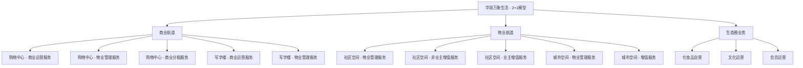
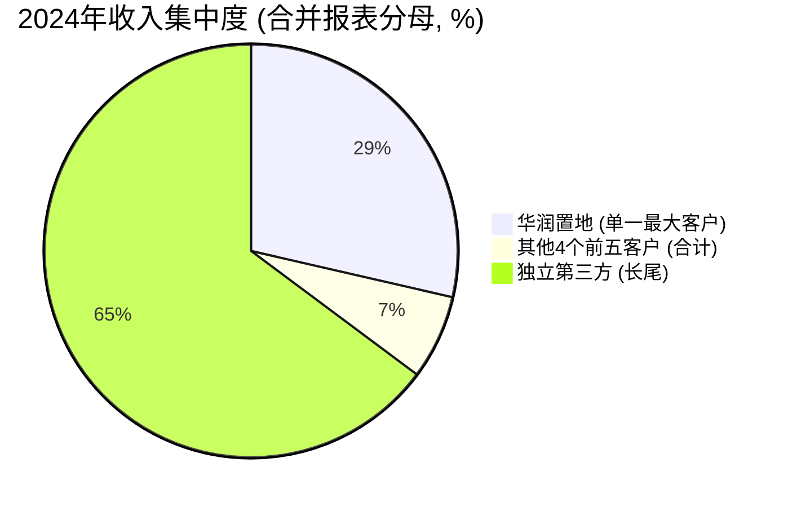
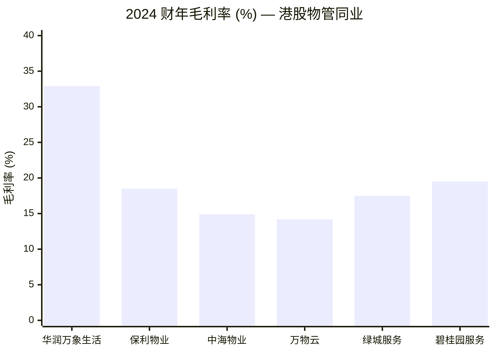
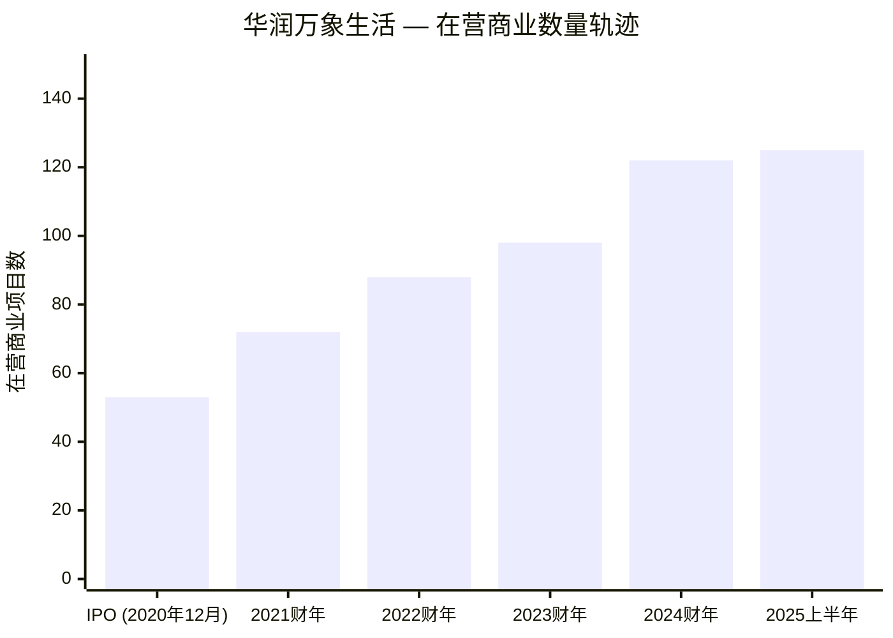
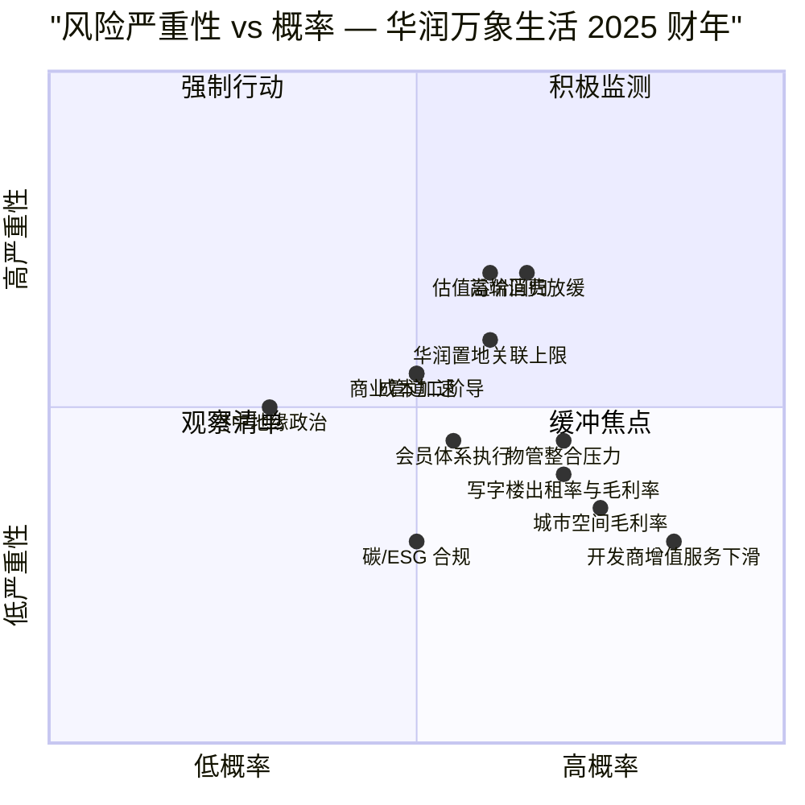

# 华润万象生活 (China Resources Mixc Lifestyle, HKEX:1209) — 公司研究

**报告日期**: 2026-06-03
**报告货币**: 人民币 (RMB, 财务); 港币 (HKD, 股价/市值)
**上市地点**: 香港联交所主板 (股份代号: 01209) — 2020年12月9日上市
**控股股东结构**: 华润置地 (1109.HK) 直接持有 1209 约 72.29%; 华润 (集团) 间接持有华润置地约 59.55%; 华润 (集团) 由中国华润有限公司间接全资拥有 (国务院国资委监管央企) ([2025年中期报告, 第47页](https://www1.hkexnews.hk/listedco/listconews/sehk/2025/0925/2025092501631.pdf))

---

## 目录

1. 公司概览
2. 公司历史
3. 管理团队
4. 产品与服务
5. 客户与上市策略
6. 行业概览
7. 竞争格局
8. 市场机会
9. 风险评估
10. 投资视角评分卡
11. 数据来源清单
12. 参考资料

---

## 1. 公司概览

华润万象生活有限公司 ("华润万象生活" / "本集团", 1209.HK) 是华润集团旗下的物业管理及商业运营管理上市平台。公司由华润置地 (1109.HK) 分拆而来, 于 2020 年 12 月 9 日在香港联交所主板挂牌上市。截至 2025 年 6 月 30 日, 华润置地直接持有 1209.HK 约 72.29% 股权; 华润 (集团) 间接持有华润置地约 59.55%; 华润 (集团) 由中国华润有限公司间接全资拥有, 属国务院国资委监管的央企 ([华润万象生活 2025 年中期报告 — 集团架构, 第4页](https://www1.hkexnews.hk/listedco/listconews/sehk/2025/0925/2025092501631.pdf))。集团在每一份投资者文件中均强调其战略目标为打造"中国最具行业影响力的轻资产管理公司"以及"城市品质生活服务平台" — 即作为华润置地开发主业的服务延伸 (而非竞争对手), 走轻资产管理服务路线。

公司的业务架构采用"2+1"模型: 两大主航道业务 — **商业航道** (purchasing 商业管理, 主要为万象城购物中心系列及写字楼) 和**物业航道** (主要为住宅社区空间及城市公共空间), 以及**生态圈业务** (会员运营、化妆品自营、文化运营、咨询服务等)。截至 2024 年 12 月 31 日止年度, 集团实现**总收入人民币 17,042.7 百万元 (同比增长 15.4%), 毛利人民币 5,609.5 百万元 (同比增长 19.5%, 毛利率 32.9%, 提升 1.1 个百分点), 母公司拥有人应占年内利润人民币 36.29 亿元 (同比增长 23.9%), 核心净利润 35.07 亿元 (同比增长 20.1%)** ([华润万象生活 2024 年年度报告 — 表现摘要, 第13页](https://www1.hkexnews.hk/listedco/listconews/sehk/2025/0429/2025042900037.pdf))。2025 年上半年延续了这一增长轨迹: **综合收入人民币 8,524 百万元 (同比增长 6.5%), 毛利人民币 3,165 百万元 (增长 16.3%), 毛利率 37.1%, 核心净利润 20.11 亿元 (增长 15.0%), 中期每股股息 RMB0.529 (同比增长 89.6%), 中期分红比例达核心净利润 100%** ([华润万象生活 2025 年中期报告 — 主席报告, 第5–7页](https://www1.hkexnews.hk/listedco/listconews/sehk/2025/0925/2025092501631.pdf))。

从运营层面看, 华润万象生活是**万象城商业品牌**——中国大陆高端及中高端购物中心市场的龙头品牌——的管理特许经营方。截至 2025 年 6 月 30 日, 集团商业运营服务下有 **125 座已开业购物中心**, **183 个合同项目**储备 (含分租项目); 全部业务总合同建筑面积达 **452.1 百万平方米**, 在管建筑面积 **420.5 百万平方米**, 在 1,949 个项目中覆盖全国 173 个城市 ([华润万象生活 2025 年中期报告 — 集团架构, 第4页](https://www1.hkexnews.hk/listedco/listconews/sehk/2025/0925/2025092501631.pdf); [招银国际证券 — CR Mixc Lifestyle NDR takeaway](https://www.cmbi.com.hk/article/5330.html?lang=tc))。2025 年上半年, 在营购物中心实现**零售额 1,220 亿元 (同比增长 21.1%), 同店销售增长 (SSSG) 9.7%, 业主端经营利润率 68.2%** — 这些数据明显领跑全国社会消费品零售增速, 是公司对外强调"高线城市万象客流韧性高于消费下行"的核心论据。

### 估值快照 (截至 2026-06-03)

| 指标 | 华润万象生活 (1209) | 同业中位数 | 来源 |
|---|---|---|---|
| 股价 (HKD) | ~41.10 | n/a | [新浪财经 — 1209.HK](http://stock.finance.sina.com.cn/hkstock/quotes/01209.html); [理杏仁 — 华润万象生活估值](https://www.lixinger.com/equity/company/detail/hk/01209/1209) |
| 市值 (HKD) | ~94–110 亿 | — | [Eulerpool — 华润万象市值 2026](https://eulerpool.com/en/stock/China-Resources-Mixc-Lifestyle-Services-Stock-KYG2122G1064/Marketcapitalization) |
| TTM 市盈率 PE | ~21× | ~11–15× (港股物管同业中位数) | [理杏仁 — 华润万象估值](https://www.lixinger.com/equity/company/detail/hk/01209/1209); [新浪财经 — 2025年3月物业服务发展报告](https://finance.sina.com.cn/wm/2025-03-24/doc-inequiin3366479.shtml) |
| 股息率 (TTM) | ~4.7% | 2–4% | [理杏仁 — 华润万象估值](https://www.lixinger.com/equity/company/detail/hk/01209/1209) |
| 2025E PE (卖方目标乘数) | 物管 15×, 商管 30× → SOTP 48.5 港元目标 | — | [第一上海证券 — 华润万象生活更新报告, 2025年9月10日](https://pdf.dfcfw.com/pdf/H3_AP202509101741112434_1.pdf?1757517690000.pdf=) |

公司 TTM 市盈率约 21 倍, 相对于港股物管同业整体 (中位数 ~11–15 倍) 存在显著估值溢价。*分析师观点：* 该溢价主要来源于三个结构性驱动因素: (a) **同业内最高的毛利率**, 2024 财年 32.9% 远高于同业 18–22% 的水平 (主因购物中心商业运营服务毛利率 72.6%, 见 [东方财富 央企物业产业链跟踪](https://caifuhao.eastmoney.com/news/20241212172942613213890); [2024年年报 — 第44页](https://www1.hkexnews.hk/listedco/listconews/sehk/2025/0429/2025042900037.pdf)); (b) 港股唯一一家**控股母公司仍维持投资级评级**的物管公司 (华润置地评级 S&P BBB+ / 穆迪 Baa1 / 惠誉 BBB+), 因此碧桂园服务、融创服务、世茂服务等受困于母公司危机的同业风险在 1209 上不存在; (c) **2025 年上半年承诺核心净利润 100% 派息率**, 中期每股股息 RMB0.529 (同比+89.6%), 公司明确表示该比例为前瞻分红政策 ([2025年中期报告 — 主席报告, 第5页](https://www1.hkexnews.hk/listedco/listconews/sehk/2025/0925/2025092501631.pdf); [华尔街见闻 — 2024年中期业绩点评](https://wallstreetcn.com/articles/3726026))。估值压力的主要来源是 (i) 万象 SSSG 跌破 5% 的拐点 (商管毛利率扩张趋势将停滞), 以及 (ii) 与华润置地的关联交易上限在下一轮安永独立比较审计周期 (预计 2026 年或 2027 年) 是否会被认定需要重新定价 (详见第 9 节)。

---

## 2. 公司历史

> **关键里程碑**
>
> ```mermaid
> timeline
>     title 华润万象生活 — 主要里程碑
>     1999 : 北京华润大厦开业
>          : (写字楼管理业务历史起源)
>     2004 : 深圳万象城开业 — 当时中国大陆
>          : 单体面积最大的购物中心
>     2016 : 喻霖康获委任华润置地副总裁,
>          : 主管商业运营服务业务
>     2020 : 华润置地商管 + 物管业务重组,
>          : 整合为单一上市平台; 2020 年 12 月 9 日
>          : 香港联交所主板挂牌上市
>     2023 : 在营万象城总数突破 100 座;
>          : 进入恒生指数成份股
>     2024 : 西安万象城 (现象级项目) 开业;
>          : 全年购物中心零售额 RMB 2,150 亿 (+18.7%);
>          : 新开业 21 座购物中心, 新签约 12 个商管轻资产项目;
>          : 旗下在营购物中心增至 122 座
>     2025H1 : 在营购物中心增至 125 座;
>          : 零售额 1,220 亿 (+21.1%); SSSG 9.7%;
>          : 中期股息 +89.6%, 100% 派息率
> ```
>
> 资料来源: [华润万象生活 2024 年年度报告 — 主席报告, 第14–18页](https://www1.hkexnews.hk/listedco/listconews/sehk/2025/0429/2025042900037.pdf); [华润万象生活 2025 年中期报告 — 主席报告, 第5–7页](https://www1.hkexnews.hk/listedco/listconews/sehk/2025/0925/2025092501631.pdf); [华润万象生活官方网站 — 关于我们](https://en.crmixclifestyle.com.hk/)。

华润万象生活虽然是 2020 年成立的分拆上市主体, 但其底层业务源于华润置地原有的两块业务: (i) **以万象城商业为基础的商业运营服务业务**, 该业务可追溯至 2004 年开业的深圳万象城——当时中国大陆面积最大的单体购物中心; (ii) **服务于华润置地住宅项目以及少量第三方拓展的物业管理业务**。2020 年决定分拆上市背后有清晰的战略动因: 当时港股市场已将物管子板块重新定价为轻资产、低资本、高增长的成长股, 头部物管公司估值达到 30–50 倍市盈率, 远高于母公司开发商的 5–8 倍。华润置地在碧桂园服务、雅生活、绿城服务和保利物业之后跟进分拆, 但其独特之处在于**将商管业务和物管业务一起带入上市主体**——这是 1209 与同期上市的其他物管同业 (基本只剩纯住宅物管业务) 的关键结构性差异 ([华润万象生活 2024 年年度报告 — 主席报告, 第14–22页](https://www1.hkexnews.hk/listedco/listconews/sehk/2025/0429/2025042900037.pdf); [华润万象生活官方网站 — 万象商业](https://en.crmixclifestyle.com.hk/))。

上市后的头三年 (2021–2023) 主要是**通过 M&A 整合区域物管账面+万象城开业有机增长的规模扩张期**: 期间重要的并购包括 2021 年的禹洲物业服务、2022 年 5 月的中南服务、以及 2023 年若干华润建设的物业管理资产, 同时旗下在营购物中心从 IPO 时的 53 座增长至 2023 年末的 98 座、2024 年末的 122 座、2025 年 6 月底的 125 座 ([华润万象生活 2024 年年度报告 — 表现摘要, 第12页 + 主席报告, 第16页](https://www1.hkexnews.hk/listedco/listconews/sehk/2025/0429/2025042900037.pdf))。2024 财年的"现象级"项目是 2024 年 5 月开业的**西安万象城**, 主席报告中专门提及其"引发市场广泛关注"; 之后 2025 年上半年又陆续开业了**西安万象城 AIR** (首个机场场景万象城)、**顺德万象汇** (开业即实现 100% 出租率和 100% 开业率)、**遂宁万象汇**, 以及**郑州郑东万象城** (创城市开业人气新高) ([华润万象生活 2025 年中期报告 — 主席报告, 第6页](https://www1.hkexnews.hk/listedco/listconews/sehk/2025/0925/2025092501631.pdf))。

上市以来公司发展的另一个标志性主线是**派息政策的渐进升级**: 派息率从 IPO 时的 ~60% 提高至 2024 年中期承诺的核心净利润 100% 派息, 并将该承诺延续到 2025 年中期 (RMB0.529 每股, 同比 +89.6%) ([华润万象生活 2025 年中期报告 — 主席报告, 第5页](https://www1.hkexnews.hk/listedco/listconews/sehk/2025/0925/2025092501631.pdf); [华尔街见闻 — 2024 中期点评, 2024年8月](https://wallstreetcn.com/articles/3726026))。这是港股所有物管同业中**最高的派息承诺水平** — 绿城服务、碧桂园服务、融创服务在同一时间窗内均已暂停或下调股息——也是卖方推荐报告中最经常引用的看多锚点。第三条贯穿全期的宏观主线是**中国房地产行业的深度调整**: 2025 年全国新房销售下降至 7.33 万亿元 (-13.0% 同比), 年销售超 1,000 亿元的房企从 2021 年的 41 家骤降至 2025 年的 10 家 ([财新 Global — 半数头部开发商跌出榜单, 2026年1月](https://www.caixinglobal.com/2026-01-05/chinas-property-slump-knocks-half-of-top-developers-off-key-ranking-102400361.html))。对华润万象生活而言, 这是把双刃剑: 一方面华润置地体内 21,724 千平方米的"已获取但未签约"储备商业项目和 191 个项目数 (截至 2024 年末) 仍构成 1209 未来多年的承接管道, 另一方面物管端的开发商应收账款敞口和高端消费疲软压缩了社区空间板块的非业主增值服务收入。

---

## 3. 管理团队

依据 [company-research 技能规范](file:///Users/x/projects/financial_agent/.claude/skills/company-research/SKILL.md), 此章只覆盖创始人和现任 CEO。鉴于华润万象生活并非传统意义的创始人型公司——它是 1938 年成立的央企子集团的 2020 年分拆上市平台——因此本节集中介绍 **董事长李欣 (非执行)** 和 **总裁喻霖康 (执行董事 / 运营 CEO 等同地位)** 这一对核心管理人员。

**李欣先生 (LI Xin), 53 岁, 非执行董事兼董事会主席**, 自 2020 年 7 月起担任本公司董事, 2020 年 8 月获委任为非执行董事; 担任本公司提名委员会主席及可持续发展委员会主席, 兼薪酬委员会成员。李先生 1994 年 8 月加入华润集团, 历任"中国华润总公司人事部门, 重庆华润奎星实业有限公司董事, 重庆华润润隆实业有限公司董事总经理, 隆地企业有限公司经理及高级经理"等职务 ([华润万象生活 2024 年年报 — 董事简历, 李欣, 第58–59页](https://www1.hkexnews.hk/listedco/listconews/sehk/2025/0429/2025042900037.pdf); [Mingtiandi — 李欣获委任华润置地董事长, 2022](https://www.mingtiandi.com/real-estate/people/china-resources-land-appoints-li-xin-chairman/))。其后加入华润置地, 于 2016 年 7 月成为联席总裁, 2017 年 4 月获委任执行董事, 2018 年 12 月升任总裁, 并于 2022 年 5 月接任华润置地董事长——因此当他在 2020 年 8 月获委任 1209 主席时, 已经在华润置地内统管商业运营服务业务 (即 1209 的前身) 多年。李先生于 1994 年获中国东北财经大学投资经济管理专业经济学学士学位, 2005 年获香港理工大学项目管理专业理学硕士学位。其在两家公司均无披露的个人股权; 央企薪酬框架下也无大量股权激励的设计安排。**他在 1209 层面的运营成果**: 主持了在营商业项目从 IPO 时 ~53 座扩展到 2025 年 6 月底 125 座、毛利率从 IPO 时 27.4% (招股书) 提升至 2024 年 32.9%、派息比例从 ~60% 增至 100% 核心净利润, 以及进入恒生指数成份股的全部过程。由于李欣同时担任母公司华润置地的董事长, 他对母子公司之间所有关联交易的回顾把关——华润置地是 2024 财年最大单一客户 (28.6% 收入), 关联交易按上市规则 14A 章节进行独立比较交易复核——降低了母公司套利上市子公司的潜在治理风险。

**喻霖康先生 (YU Linkang), 53 岁, 执行董事兼总裁**, 自 2020 年 7 月起担任本公司董事, 2020 年 8 月获委任为执行董事及本公司总裁; 现任可持续发展委员会成员。喻先生拥有约 30 年地产投资、商业运营及企业管理经验 ([华润万象生活 2024 年年报 — 董事简历, 喻霖康, 第52–53页](https://www1.hkexnews.hk/listedco/listconews/sehk/2025/0429/2025042900037.pdf))。喻先生 1992–1996 年任职北京华润饭店餐饮部 (从副经理升任至经理), 1996–2000 年任职隆地企业有限公司投资管理部 (从主任到经理), 2000–2003 年任深圳对外贸易中心助理总经理 (期间 2002–2003 年同时担任深圳市木棉花酒店有限公司董事长兼总经理), 2003–2004 年任木棉花酒店有限公司副总经理——即~12 年的酒店及外贸运营背景, 这一阶段奠定了他后续转型至商业地产业务的服务管理基础。2004 年 11 月至 2011 年 5 月任华润 (深圳) 有限公司 (2005 年 10 月起成为华润置地附属公司) 副总经理, 期间 2008 年 12 月至 2011 年 5 月兼任华润深圳湾发展有限公司总经理。2011 年 5 月至 2013 年 8 月任华润置地深圳区域副总经理。2013 年 8 月至 2016 年 7 月历任华润置地商业地产总监、武汉区域总经理、华润置地助理总裁。**2016 年 7 月获委任为华润置地副总裁, 主管商业运营服务业务**, 2018 年 11 月升任华润置地高级副总裁, 2020 年 3 月起兼任华润置地物管业务部门主席。**2020 年 8 月在公司重组中获委任为本集团总裁**, 同时辞去华润置地相关职务。他获得 2018 年及 2020 年中国商业地产行业年度奖项评委会颁发的商业地产领军人物奖。喻先生 1992 年获北京第二外国语学院酒店管理学士学位, 2006 年获美国俄亥俄州莱特州立大学 MBA 学位。**喻先生是万象城商业品牌的运营建筑师**——在华润万象生活分拆之前, 他在华润置地体内主管商业运营服务业务已 4 年。2024 财年的"现象级"开业 (西安万象城、深圳龙岗大运项目) 以及 2025 年上半年的开业 (西安万象城 AIR、顺德万象汇、郑州郑东万象城) 都源自他**"聚焦高能级城市、轨道交通主导发展项目 (TOD)、轻资产签约"**的战略框架。

其余高管班子向喻总汇报: **王海民 (WANG Haimin, 副总裁)** 主管商管业务; **王磊 (WANG Lei, 2024 年 1 月获委任副总裁)** 负责集团战略项目; **聂志章 (NIE Zhizhang, 2023 年 8 月获委任副总裁兼首席财务官)** 出任 CFO, 财务底子来自华润置地东北大区; **郭世清 (GUO Shiqing, 非执行董事, 同时为华润置地 CFO 自 2020 年 6 月起)** 担任审核委员会成员, 是母公司在董事会的代表 ([华润万象生活 2024 年年报 — 董事简历: 喻霖康 p52–54, 王海民 p54–55, 王磊 p55–56, 聂志章 p56–57, 郭世清 p59–60](https://www1.hkexnews.hk/listedco/listconews/sehk/2025/0429/2025042900037.pdf))。根据技能规范, 此报告不深入介绍其他高管; 投资者需注意 CFO 储备稳健、总裁自 IPO 起任职、主席兼任母公司董事长的结构有效化解了纯住宅物管同业普遍面临的关联治理担忧。

---

## 4. 产品与服务

集团的产品矩阵在所有近期投资者文件中均以"2+1"模型呈现: 两大主航道业务 (商业航道 + 物业航道) + 生态圈业务。下方表格按 2024 年年报 MD&A 第 29 页和第 44 页的数据原文重列 ([华润万象生活 2024 年年报 — 业务回顾收入分部表 + 毛利率分部表](https://www1.hkexnews.hk/listedco/listconews/sehk/2025/0429/2025042900037.pdf))。

### 4.0 收入与毛利率矩阵 (2024 财年 — 摘自 2024 年报 MD&A)

| 业务分部 | 子分部 | 2024 收入 (RMB 百万) | 占比 | 2024 毛利 (RMB 百万) | 毛利率 |
|---|---|---:|---:|---:|---:|
| **商业航道** | 购物中心 | 4,209.2 | 24.7% | 3,056.3 | 72.6% |
|  | 写字楼 | 2,065.1 | 12.1% | 720.7 | 34.9% |
|  | *小计* | **6,274.3** | **36.8%** | **3,777.0** | **60.2%** |
| **物业航道** | 社区空间 — 物业管理服务 | 6,659.8 | 39.1% | 958.2 | 14.4% |
|  | 社区空间 — 非业主增值服务 | 718.4 | 4.2% | 237.4 | 33.0% |
|  | 社区空间 — 业主增值服务 | 1,515.9 | 8.9% | 388.4 | 25.6% |
|  | 城市空间 | 1,820.9 | 10.7% | 235.1 | 12.9% |
|  | *小计* | **10,714.9** | **62.9%** | **1,819.1** | **17.0%** |
| **生态圈业务** | 化妆品自营、文化运营 | 53.4 | 0.3% | 13.4 | 25.0% |
| **合计** |  | **17,042.7** | **100.0%** | **5,609.5** | **32.9%** |

数据来源: [华润万象生活 2024 年年报 — 业务分部收入及毛利表, 第29页及第44页](https://www1.hkexnews.hk/listedco/listconews/sehk/2025/0429/2025042900037.pdf)。



### 4.1 商业航道 — 购物中心 (结构性护城河)

2024 年年报 MD&A 第 27 页原文表述: "购物中心方面, 本集团提供: — 商业运营服务, 包括开业前管理及运营管理服务; — 物业管理及其他服务, 主要包括秩序维护、清洁及绿化、维修及养护及其他增值服务; 及 — 商业分租服务, 本集团从业主承接若干优质购物中心, 分租予零售店及超市等租户。商业分租服务包含利润分成模式和租赁经营模式。" ([华润万象生活 2024 年年报 — 业务回顾, 第27页](https://www1.hkexnews.hk/listedco/listconews/sehk/2025/0429/2025042900037.pdf))。

**核心物理功能**: 购物中心业务是一个三层服务合同, 涉及 (a) 商业地产业主 (大多数情况下是华润置地, 占已开业商业项目可签约面积约 80%, 加少量第三方业主), (b) 租户 (零售品牌、餐饮、娱乐运营商), (c) 消费者。集团从开业前的市场定位 + 招商 + 品牌组合设计开始, 经过运营期管理 (租金收取、租户业绩管理、营销活动、推广活动), 再到物业管理层 (秩序维护、清洁、绿化、维修保养), 直至增值服务 (会员积分、停车系统、品牌合作)。约 80% 的在管购物中心由集团同时担任商管和物管的唯一签约方。商业分租是一种另一种业务模式, 集团租赁整个商场后作为主体二次出租给租户, 这种模式有更高的毛利空间但也带有租户违约风险和空置风险; 截至 2024 年末, 集团有 1 个已开业利润分成项目和 3 个已开业租赁经营项目 (合计 0.4 百万平方米) ([华润万象生活 2024 年年报 — 业务回顾购物中心, 第28–31页](https://www1.hkexnews.hk/listedco/listconews/sehk/2025/0429/2025042900037.pdf))。

**与其他业务线的区别**: 购物中心商业运营分部 2024 年毛利率达 **72.6%** — 港股物管同业中最高的分部毛利率。相比之下, 写字楼分部 2024 年毛利率 34.9%, 社区空间物业管理 14.4%, 城市空间物业管理 12.9% ([华润万象生活 2024 年报 — 分部毛利率, 第44页](https://www1.hkexnews.hk/listedco/listconews/sehk/2025/0429/2025042900037.pdf))。购物中心业务内部, 轻资产"管理输出"模式 (1209 仅作为运营管理方收取费用) 是主导模式 — 2024 年末签约面积 18.6 百万平方米, 169 个项目; 而利润分成 / 租赁经营项目仅 4 个、0.4 百万平方米。轻资产模式是高毛利率的结构性来源: 由于集团不投入物业本身, 因此实现了高费用、低资本的管理经济, 业主端 NOI 利润率 2024 年达 65.1%, 2025 上半年提升至 68.2% ([华润万象生活 2025 中期报告 — 主席报告, 第6页](https://www1.hkexnews.hk/listedco/listconews/sehk/2025/0925/2025092501631.pdf))。

**战略意义**: 购物中心管道是结构性增长引擎。华润置地体内的"已获取但未签约"商业项目储备截至 2024 年末另外含 21,724 千平方米的合同建筑面积和 191 个项目, 即华润置地内部正在为 1209 储备多年期的净开业管道。2025 年上半年集团新签约 6 个商管轻资产外拓项目 (4 个为 30 个重点城市的轨交导向开发项目, 2 个为存量在营项目); 上半年新开业 4 座购物中心, 其中西安万象城 AIR 是首个机场场景万象城。**深度护城河在品牌本身**: 万象 (MIXC) 是中国大陆事实上的高端及中高端购物中心代表品牌。*分析师观点：* 这是支撑 21 倍 PE 估值相对住宅纯物管同业溢价的真正分部; 如果万象零售额增速跌破全国社零增速 (即品牌停止跑赢周期), 这个护城河论点会减弱。

### 4.2 商业航道 — 写字楼

2024 年报 MD&A 第 27 页原文表述: "写字楼方面, 本集团提供: — 商业运营服务, 包括招商服务、运营服务及开业筹备服务; 及物业管理及其他服务, 主要包括秩序维护、清洁及绿化、维修及养护及其他增值服务。" ([华润万象生活 2024 年年报 — 业务回顾, 第27页](https://www1.hkexnews.hk/listedco/listconews/sehk/2025/0429/2025042900037.pdf))。

**核心功能**: 2020 年从华润置地继承的写字楼业务规模显著小于商业 (mall) 业务, 毛利率也低 (2024 年 34.9% vs. 商业的 72.6%)。客户主要为华润置地自身的写字楼组合 (北京华润大厦、深圳华润总部大厦等) 以及第三方写字楼合同。2025 年 6 月底, 提供商管+物管服务的 27 个项目综合出租率为 74.1% (vs. 2024 年末的 73.6%) — 在 2022–2024 年出租率下滑后呈现的小幅复苏 ([华润万象生活 2025 中期报告 — 主席报告, 第6页](https://www1.hkexnews.hk/listedco/listconews/sehk/2025/0925/2025092501631.pdf))。

**与商业 (mall) 的区别**: 结构上, 写字楼客流量低、租户更换频率低、不存在面向消费者的会员经济, 因此推动购物中心毛利率扩张的增值服务在写字楼端不适用。写字楼基本上是物管经济+一层薄薄的招商服务费。2025 年上半年的重构正式确立了"招商+运营+物业"一体化模式, 旨在提升招商服务费的贡献。

**战略意义**: 写字楼是商业 (mall) 业务的较小、较低增长、较低毛利率的"亲戚", 不太可能赶上前者。战略选项之一是出售或淡化, 让管理资源集中在商业和社区物管上; 2025 年上半年的重构表明集团仍准备通过有机方式提升写字楼出租率。

### 4.3 物业航道 — 社区空间

社区空间分部主要为 IPO 时继承的住宅物管业务和后续 M&A 整合 (禹洲服务、中南服务、华润建设旗下若干物管资产)。2024 财年收入 **RMB 8,894 百万 (占总收入 52.2%), 毛利率 17.8%** ([华润万象生活 2024 年报 — 业务分部收入及毛利, 第29页 + 第44页](https://www1.hkexnews.hk/listedco/listconews/sehk/2025/0429/2025042900037.pdf))。三个子流: (i) **基础物业管理服务** — 为住宅社区提供秩序维护、清洁、绿化、维修保养; 2024 年收入 RMB 6,660 百万 (+10.7%), 毛利率 14.4%; 这是分部最稳健的基本面, 留存率高, 物业费按建筑面积月度征收, 调价节奏稳定; (ii) **针对物业开发商的非业主增值服务** — 顾问咨询、前期筹备、交付前营销配合; 2024 年收入 RMB 718 百万 (vs. 2023 年 RMB 821 百万, -12.5%), 毛利率从 34.3% 压缩至 33.0%; 这是受房地产周期影响最直接的分部; (iii) **业主增值服务** — 社区生活服务 + 经纪及资产管理; 2024 年 RMB 1,516 百万 (+6.3%), 毛利率 25.6%; 这是会员体系延伸至住宅基础后的长期消费经济上行空间所在。

**战略意义**: 这是稳健、可预测、较少有新闻的分部, 但贡献了过半的收入。风险点在于针对开发商的增值服务子流, 在房地产周期触底前结构性下滑。

### 4.4 物业航道 — 城市空间

城市空间业务是 2024 年**增速最快的分部**: 收入 RMB 1,821 百万 (+36.3%), 毛利率 12.9% ([华润万象生活 2024 年报 — 分部收入, 第29页](https://www1.hkexnews.hk/listedco/listconews/sehk/2025/0429/2025042900037.pdf))。业务范围是城市公用设施及公共空间的运营管理: 街区、体育馆、公园、河道、产业园。2024 年集团在温州龙港承接的城市运营整体管理项目作为标杆案例提及 ([华润万象生活 2024 年报 — 主席报告, 第17–18页](https://www1.hkexnews.hk/listedco/listconews/sehk/2025/0429/2025042900037.pdf))。2024 年末签约面积 126.8 百万平方米, 453 个项目 (合同面积同比 +20.2%); 实际在管的城市空间为 124.9 百万平方米。城市空间合同的物业费率低于住宅物管 (主要由政府客户支付, 每平方米费用承压), 但轻资产、规模经济的特性使得这是第三方拓展增长故事的重要载体。

### 4.5 生态圈业务 — 会员运营、化妆品自营、文化运营

生态圈业务是**最新的业务线, 公司明确将其定位为"第二增长曲线"**。2024 财年贡献 RMB 53 百万收入, 毛利率 25.0% — 绝对数额很小, 但模式重要: 该分部将会员数据 (2024 年末"万象星"总会员 6,107 万, 同比 +32.0%; 全年发放积分 RMB 10.3 亿, 同比 +15.7%) 货币化的方式是延伸至客流量所支撑的相邻业务, 最明显的是 2024 年内某万象旗舰商场首个高端化妆品自营店落地 ([华润万象生活 2024 年报 — 主席报告, 第17–18页](https://www1.hkexnews.hk/listedco/listconews/sehk/2025/0429/2025042900037.pdf))。*分析师观点：* 若生态圈业务在 3 年内达到 RMB 10 亿 (某些卖方情境假设), 在高增量毛利率下能贡献约 ~6% 的集团收入, 并验证会员数据为可货币化资产而非纯 CRM 工具。

**综合解读 — 四线业务如何相互作用**

四线产品矩阵围绕"物理空间管理"这一类目展开的纵向整合, 以购物中心特许经营为锚, 三条相邻业务线共享同一运营能力 (人员管理、对分包商的供应链、技术平台、监管牌照)。商业 (mall) 端因捕捉万象品牌的客流溢价而获得 72.6% 毛利率; 写字楼端 34.9% 毛利率反映 B2B 租赁的稳定租户经济; 社区物管端 14.4% 反映中国住宅物管费率的价格管制特性; 城市空间端 12.9% 反映政府合同的价格纪律。生态圈业务 25.0% 毛利率虽小, 但是会员数据和跨商场客流货币化的载体。作为完整组合, 集团获得 32.9% 毛利率 (港股 PM 同业最高), 因为商业组合占比 (36.8%) 显著高于同业 (0–10%)。

---

## 5. 客户与上市策略

集团的客户基础按 2024 年报 MD&A 分为四类: (i) 物业开发商 (主要为华润集团 / 华润置地), (ii) 物业业主和租户 (业主、商场租户), (iii) 业主委员会及住户, (iv) 城市空间的政府客户。**关键的是, 2024 年审计文件明确披露了客户集中度**: "截至二零二四年十二月三十一日止年度, 来自本集团五大客户的收入额占本集团总收入的 35.2% (二零二三年: 33.5%), 而来自本集团单一最大客户华润置地的收入额占本集团总收入的 28.6% (二零二三年: 26.0%)。" ([华润万象生活 2024 年报 — 主要客户及供应商, 第137页](https://www1.hkexnews.hk/listedco/listconews/sehk/2025/0429/2025042900037.pdf))。

### 5.1 客户集中度 — 核心风险

**单一最大客户 (华润置地) = 2024 年合并报表收入 28.6%**, 高于 2023 年的 26.0%。**五大客户合计 = 2024 年合并报表收入 35.2%**, 高于 2023 年的 33.5%。年报未单独披露余下四个客户的名称——这是 HKEX 上市规则 13.51A 章节的披露上限。*分析师观点：* 余下四个客户大概率是华润集团 (与华润置地区分开)、一两个高增长城市空间业务的市级政府客户, 以及可能一个大型的第三方开发商商业项目业主。年报披露"除华润集团及华润置地外, 本集团客户均为独立第三方", 意味着剩余集中度分散在大量较小客户中, 与长尾住宅物管和商场租户模型一致 ([华润万象生活 2024 年报 — 主要客户及供应商, 第137页](https://www1.hkexnews.hk/listedco/listconews/sehk/2025/0429/2025042900037.pdf))。



数据来源: [华润万象生活 2024 年报 — 主要客户及供应商, 第137页](https://www1.hkexnews.hk/listedco/listconews/sehk/2025/0429/2025042900037.pdf)。所有切片均为 **合并报表收入** 2024 年 RMB 17,042.7 百万的占比。

**对 28.6% 单一客户份额的两种解读, 值得区分。** 首先是**乐观读法**: 华润置地的商业项目交接是契约化的收入来源, 1209 会随着已开业商业从 122 增长至未来 3–5 年的 200+ 而吸收 (华润置地储备商业含另外 21.7 百万平方米和 191 个项目), 因此 28.6% 不是单一 B2B 客户"可能流失"那种意义的"集中风险"——它是集团内的截留型管道交接。其次是**审慎读法**: 与华润置地的关联交易上限按 HKEX 上市规则 14A 章定期续签, 需要独立的安永可比交易审查; 如果华润置地在下一轮 (2026 或 2027 年, 取决于上限循环) 成功为更低的管理费率讨价还价, 则 28.6% 项目会以价格而非数量压缩。两种解读都合理; 可观察的信号是 2024 年的份额相对 2023 年上升 (26.0% → 28.6%), 表明华润置地商业组合作为 1209 整体收入构成中的占比在扩大而非缩小 ([华润万象生活 2025 中期报告 — 持续关连交易, 第47–49页](https://www1.hkexnews.hk/listedco/listconews/sehk/2025/0925/2025092501631.pdf))。

### 5.2 上市策略 — 两条业务模式

**"商业航道"销售模式是 B2B 合同主导、销售团队驱动、TOD 锚定**: 集团竞标第三方业主拥有的商业项目的商管合同, 有时面临既有竞争者 (新鸿基、中粮大悦城、华润集团旗下其他商业体)。结构性优势在于万象品牌: 寻找轮值运营商的商业业主可受益于品牌的客流提升、租户组合专长以及现有万象会员的重叠。2024 财年新签约 12 个商管轻资产外拓项目中, 有 8 个为重点城市的轨交导向开发项目——这是战略剧本。2025 年上半年再签 6 个商管轻资产合同, 其中 4 个为 30 个重点城市的 TOD 项目, 2 个为存量在营项目 ([华润万象生活 2025 中期报告 — 主席报告, 第6页](https://www1.hkexnews.hk/listedco/listconews/sehk/2025/0925/2025092501631.pdf))。

**"物业航道"销售模式是多通道并行**: (i) 开发商交接 — 华润置地或其他开发商在项目交付时签约 PM (主要是住宅社区空间, 含部分通过母公司与地方政府关系赢得的城市空间项目); (ii) 招投标拓展 — 竞标第三方住宅社区合同 (与碧桂园服务、雅生活、绿城服务、保利物业竞争); (iii) 城市空间 M&A — 收购城市运营专长的小型公司。

第三条通道是**会员体系** — 6,107 万万象星会员构成了竞争对手所没有的直接面向消费者的数据资产。积分系统 (2024 年 RMB 10.3 亿积分发放) 是生态圈业务 (化妆品、文化运营、咨询) 的前置条件, 公司预期生态圈业务终将既直接 (毛利率盈利的化妆品销售) 又间接 (提升商场客流至锚定租户) 货币化。

### 5.3 客户分部经济

| 客户分部 | 收入占比 (2024) | 毛利率 (2024) | 备注 |
|---|---|---|---|
| 华润置地 + 华润集团 (含; 华润置地单一最大 = 28.6%) | ~30–35% | n/d 但拉向 60.2% 商管段 | 关联交易, HKEX 14A 章定期定价 |
| 第三方商业业主 (商管 + 分租) | ~5–10% (商管段余值减华润集团份额) | n/d 但拉向 60.2% | 高毛利轻资产合同 |
| 住宅业主 + 业主委员会 | ~40–45% (社区物管 + 业主增值) | 14–26% | 最大收入贡献; 稳定但毛利率受控 |
| 城市空间政府客户 | ~11% (城市空间段) | 12.9% | 增速最快; 毛利率最低 |
| 开发商客户 (非业主增值) | ~4% | 33.0% | 周期触底前结构性下降 |

数据来源: [华润万象生活 2024 年报 — 业务分部收入及毛利, 第29页 + 第44页](https://www1.hkexnews.hk/listedco/listconews/sehk/2025/0429/2025042900037.pdf); [华润万象生活 2024 年报 — 主要客户及供应商, 第137页](https://www1.hkexnews.hk/listedco/listconews/sehk/2025/0429/2025042900037.pdf)。

---

## 6. 行业概览

华润万象生活在两个结构上不同的中国市场交汇处运营: (i) **商业管理市场** (高端及中高端商业地产运营市场, 假设包括所有第三方管理的优质零售, 年管理费收入 TAM 约 RMB 3,000–5,000 亿), (ii) **物业管理市场** (住宅社区物管 + 城市空间运营; 2025 年行业层面在管面积约 31.5 亿平方米, 据中指研究院)。

### 6.1 中国物业管理行业 — 宏观背景

中国物业管理行业正在集中化, 并从开发商主导的增长模式 (在管面积主要来自开发商交付) 转向第三方拓展模式 (在管面积增长必须通过现有或第三方建造楼宇的合同赢得)。中指研究院预计 2025 年全行业在管面积 31.5 亿平方米 ([新浪财经 — 中指研究院行业规模预测, 2024年7月](https://finance.sina.com.cn/stock/hkstock/hkstocknews/2024-07-06/doc-inccfahz6218826.shtml))。中国房地产业协会 2025 年上市物管研究报告指出行业增长模式已从"增量+存量"转为"高质量存量+选择性增量"——即整体行业增速从 2019–2021 年的 20%+ 减速至高个位数, 但**头部公司在抢夺份额**, 因较小竞争者去杠杆或退出 ([中国房地产业协会 — 2025 年中国物业管理上市公司研究, 2025年5月](http://www.fangchan.com/industry/23/2025-05-22/7330809239986049377.html))。

另一条宏观主线是**中国房地产危机**。2025 年全国新房销售达 RMB 7.33 万亿 (-13.0% YoY), 年销售 RMB 1,000 亿以上的开发商从 2021 年 41 家骤降至 2025 年 10 家 ([国家统计局新闻稿 — 2025 年房地产投资](https://www.stats.gov.cn/english/PressRelease/202601/t20260120_1962353.html); [财新Global — 半数头部开发商被剔除主榜, 2026年1月](https://www.caixinglobal.com/2026-01-05/chinas-property-slump-knocks-half-of-top-developers-off-key-ranking-102400361.html))。这对物管行业的下游影响有三: (i) 母公司困境的物管公司 (碧桂园服务、融创服务、世茂服务等) 面临直接的关联应收账款风险, 被评级下调; (ii) 开发商主导的增值服务子流 (咨询、交付前营销配合、M&A 支援) 结构性收缩; (iii) 行业向央企背景的领导者集中 (华润万象生活、保利物业、中海物业), 因其母公司开发商仍维持投资级且仍在增长。

### 6.2 中国购物中心管理市场

这是华润万象生活特许经营中较高毛利率、较高护城河的另一半。中国总可寻址购物中心市场跨越约 5,000+ 个不同规模的购物中心; 万象竞争的高端 / 中高端切片相对较小——大约 500–800 个优质项目——但代表了奢侈品零售消费的大头。华润万象生活 2025 年 6 月底 125 个在管商业代表了高端切片 15–25% 的市场份额 (取决于定义), 其中 2024 财年 12 个新签约商管轻资产中 4 个为 TOD 锚定, 表明集团倾向于结构性的轨道交通带动零售趋势 ([华润万象生活 2024 年报 — 主席报告, 第16页](https://www1.hkexnews.hk/listedco/listconews/sehk/2025/0429/2025042900037.pdf))。

### 6.3 行业增长驱动 — 看多与看空

```mermaid
xychart-beta
    title "中国商业零售增长 — 万象 vs 全国"
    x-axis ["2022财年", "2023财年", "2024财年", "2025上半年"]
    y-axis "同比增长 (%)" 0 --> 25
    bar [12, 16, 18.7, 21.1]
    bar [3, 7.2, 3.5, 4.6]
```



(第一条 — 万象零售同比增长; 第二条 — 全国社零同比增长。来源: [华润万象生活 2024 年报 — 主席报告, 第16页](https://www1.hkexnews.hk/listedco/listconews/sehk/2025/0429/2025042900037.pdf); [华润万象生活 2025 中期报告 — 主席报告, 第6页](https://www1.hkexnews.hk/listedco/listconews/sehk/2025/0925/2025092501631.pdf); 全国社零增速来自 NBS 新闻发布稿 — 方向性数据。)

看多论点: (a) 2025 上半年万象 SSSG 9.7% 跑赢全国社零增速, 显示份额持续提升; (b) TOD 锚定的商业开业搭车了一二线城市的结构性铁路 / 地铁建设; (c) 6,107 万会员基础是货币化的核心数据资产; (d) 同业整合利好规模玩家。看空论点: (a) 中国高端消费随着房地产财富与消费者信心同时压缩, 在结构性走弱; (b) 写字楼业务存在结构性出租率压力; (c) 住宅物管端的第三方拓展面临碧桂园服务 (即便母公司困境, 服务公司已规模化)、绿城服务和万科万物云 (Wanwu Cloud) 的激烈竞争; (d) 与华润置地的关联交易上限位于潜在治理风险的中心, 如果母公司从上市子公司中抽取价值。

---

## 7. 竞争格局

华润万象生活在两个不同但相关的子市场竞争, 各有不同的同业群。

### 7.1 物管同业 (央企物管群)

最相关的可比群是央企背景的物管公司: **保利物业 (6049.HK)**、**中海物业 (2669.HK)**, 以及 (略加调整) **万物云 (2602.HK)** — 万科分拆服务臂, 属于混合所有制但带有 SOE 式的纪律。截至 2025 年 3 月, 市值排名: 华润万象生活 HK$792 亿 (同业中最大), 万物云 HK$287 亿, 碧桂园服务 HK$223 亿 (母公司困境), 中海物业 HK$177 亿, 保利物业 HK$177 亿 ([新浪财经 — 2025年3月物业服务发展报告, 2025年3月](https://finance.sina.com.cn/wm/2025-03-24/doc-inequiin3366479.shtml))。华润万象生活以溢价交易的原因: (a) **同业中最高的毛利率** 2024 财年 32.9% (vs. 纯住宅同业的 ~18–22%, 据东方财富 2024 年 SOE 跟踪报告); (b) 其他上市物管同业没有的规模化商业管理业务; (c) 同业中最高的派息承诺 100% 核心净利润; (d) 万象星 6,107 万会员的最高规模 ([华润万象生活 2024 年报 — 表现摘要, 第13页](https://www1.hkexnews.hk/listedco/listconews/sehk/2025/0429/2025042900037.pdf); [东方财富央企物业产业链跟踪, 2024年12月](https://caifuhao.eastmoney.com/news/20241212172942613213890))。



(同业毛利率为卖方跟踪报告中的行业中位数 — 方向性, 仅华润万象生活 32.9% 为审计的 2024 财年数据。来源: [华润万象生活 2024 年报, 第13页](https://www1.hkexnews.hk/listedco/listconews/sehk/2025/0429/2025042900037.pdf); [东方财富央企物业产业链跟踪, 2024年12月](https://caifuhao.eastmoney.com/news/20241212172942613213890); [知乎 港股物业公司年报横向对比](https://zhuanlan.zhihu.com/p/1903016835642818880)。)

### 7.2 购物中心管理同业 (高质量群)

在购物中心管理子市场中, 华润万象生活的同业主要是 (i) 港股开发商运营自有商业组合的开发主臂 (而非第三方管理) — 最相关的**新鸿基地产**的新城广场 / IFC / APM 组合、**恒基地产**的商业地产、**太古地产**的太古广场 / 太古城——不是直接同业, 因其持有物业; (ii) 上市的中资纯商管或 HK 开发商风格的房地产玩家 — **九龙仓置业 (1997.HK)** (商业重)、**恒隆地产 (101.HK)** (商业重, 内地中国聚焦)、**希慎兴业 (14.HK)** (铜锣湾商业重); (iii) 开发商-商业子臂 — **华润置地本身** (持有 1209 管理的万象商场)、**中国海外发展**、**保利地产开发**。*分析师观点：* 真正的估值可比是 SOE PM 同业群 (因业务模式为轻资产服务), 而非商业业主 (其承担物业资本支出和资产负债表暴露)。1209 综合毛利率和高派息特征与万物云结构形态最相似, 但商业高毛利率收入构成显著更高。

### 7.3 差异化要素

| 差异化要素 | 华润万象生活 | 住宅纯物管同业 |
|---|---|---|
| 母公司开发商信用 | 华润置地 BBB+ / Baa1 / BBB+ (投资级) | 大多投机级; 部分困境 |
| 商业管理收入占比 | 36.8% 2024 财年收入; 60.2% 2024 财年毛利 | 0–5% 典型 |
| 毛利率 (2024) | 32.9% | 14–22% |
| 会员规模 | 6,107 万万象星 | 此规模水平无 |
| 派息率 (2025 上半年) | 核心净利润 100% | 30–80% 典型 |
| TTM PE 同业溢价 | ~21× | ~11–15× 同业中位数 |

数据来源: [华润万象生活 2024 年报 — 表现摘要, 第13页](https://www1.hkexnews.hk/listedco/listconews/sehk/2025/0429/2025042900037.pdf); [理杏仁 — 华润万象估值](https://www.lixinger.com/equity/company/detail/hk/01209/1209); [新浪财经 — 2025年3月物业服务发展报告](https://finance.sina.com.cn/wm/2025-03-24/doc-inequiin3366479.shtml)。

### 7.4 竞争脆弱性

(a) **关联方集中度**: 2024 年华润置地占 28.6% 收入, 即使合同按 HKEX 14A 章节按市场比较定价, 仍构成治理关注。(b) **写字楼软肋**: 2025 上半年 34.9% 毛利率和 74.1% 出租率 — 非"破裂", 但远低于商业的高水位。(c) **住宅物管的集中压力**: 万物云和碧桂园服务 (母公司困境) 在第三方住宅社区合同上仍激烈竞争。(d) **高端零售周期**: 如果中国奢侈品 / 中高端消费继续放缓, 万象 SSSG 会向全国社零增速靠拢——侵蚀护城河叙事。

---

## 8. 市场机会 (TAM / SAM)

### 8.1 物管 TAM

据中指研究院, 2025 年中国大陆全行业在管面积预计 **31.5 亿平方米** ([新浪财经 — 中指研究院行业规模预测, 2024年7月](https://finance.sina.com.cn/stock/hkstock/hkstocknews/2024-07-06/doc-inccfahz6218826.shtml))。按行业平均混合 ~RMB 30/平方米/年的物业费率 (据中指), 隐含的物管行业总收入 ~RMB 9,450 亿至 2025 年行业成熟期 — 但领导物管公司收入合并市场份额仅 ~10–15%, 留有显著的整合空间。华润万象生活 2024 年末住宅物管在管 271.4 百万平方米 + 城市空间在管 124.9 百万平方米 — 即 ~1.3% 全国在管面积份额 — 绝对份额较小, 留有显著的第三方招投标拓展上行空间。

### 8.2 商业管理 TAM

中国高端 / 中高端商业管理市场结构上更小。总可寻址 ~500–800 个优质商业项目。华润万象生活 125 个在管商业 (2025 年 6 月底) 在该切片中市场份额 ~15–25%。2024 财年商业零售总额 RMB 215 亿 (vs. 全国社零 ~RMB 47.8 万亿 — 据 NBS — 即华润万象生活的商场在 2024 财年捕捉了 ~0.45% 的全国社零)。此处增长跑道在 (i) 净新增商业开业 (华润置地储备 21,724 千平方米未签约 + 191 个项目), (ii) 第三方拓展 (2025 上半年签约 6 个), (iii) 万象旗舰物业成熟后的每店零售额上行。



(IPO 时近似数据来自卖方覆盖; 2024 财年末 = 122 据主席报告; 2025 上半年 = 125 据 2025 中期报告。来源: [华润万象生活 2024 年报 — 主席报告, 第16页](https://www1.hkexnews.hk/listedco/listconews/sehk/2025/0429/2025042900037.pdf); [华润万象生活 2025 中期报告 — 主席报告, 第6页](https://www1.hkexnews.hk/listedco/listconews/sehk/2025/0925/2025092501631.pdf)。)

### 8.3 生态圈业务 — 可选性

2024 财年生态圈业务 RMB 53 百万绝对数额较小, 但**货币化的单位经济学**有意思: 6,107 万会员平均每人每年发放 RMB 17 积分 ([华润万象生活 2024 年报 — 主席报告, 第17–18页](https://www1.hkexnews.hk/listedco/listconews/sehk/2025/0429/2025042900037.pdf)); 即便有限的积分向直接购买的转化 (化妆品、文化活动、咨询服务) 也能让分部 3 年内扩展至 RMB 5 亿 – 10 亿。此处的 TAM 是**嵌入的会员数据资产**, 估值在于将高频商场访客数据货币化的可选性 — 若执行成功, 是有意义的潜在增长轴。

---

## 9. 风险评估

按照 [风险分类规范](file:///Users/x/projects/financial_agent/.claude/skills/company-research/references/risk_taxonomy.md), 12 个风险分为 4 类。

### 公司层面风险

1. **与华润置地的关联方集中度**。2024 年单一最大客户 (华润置地) 28.6% 收入, 五大客户 35.2% 集中度。持续关联交易按 HKEX 14A 章定期独立安永可比交易审查。风险两面: (a) 上限续签周期可能因安永认定当前定价高于市场比较而导致每平方米管理费下降; (b) 任何重大的华润置地重组 (如华润置地将商业组合通过 REIT 货币化 — 2024 年已通过华夏华润商业 REIT 启动) 可能将客户基础从华润置地转移至 REIT, 合同条款可能不同 ([华润万象生活 2025 中期报告 — 持续关连交易, 第47–49页](https://www1.hkexnews.hk/listedco/listconews/sehk/2025/0925/2025092501631.pdf); [华润万象生活 2024 年报 — 主要客户, 第137页](https://www1.hkexnews.hk/listedco/listconews/sehk/2025/0429/2025042900037.pdf))。

2. **写字楼分部软肋**。2025 上半年 27 个在营写字楼出租率 74.1%, vs. 2024 年末 73.6% — 序列改善但远低于商业 90%+ 的出租率水位; 写字楼毛利率 34.9% (2024) vs. 商业 72.6%。风险是中国写字楼市场继续恶化 (一线城市写字楼供给过剩, 混合办公侵蚀需求)。缓冲: 写字楼仅占 12.1% 收入, 因此绝对冲击有界。

3. **开发商增值服务子流下滑**。非业主增值服务 2023 年 RMB 821 百万 → 2024 年 RMB 718 百万 (-12.5% YoY), 毛利率从 34.3% 压缩至 33.0%。此线在房地产周期下结构性暴露, 可能继续压缩。

4. **会员体系货币化执行风险**。生态圈业务是第二增长曲线; 执行风险在于 6,107 万会员数据资产是否能转化为有意义的收入。化妆品自营是竞争分部; 文化运营规模化未经验证。

### 行业 / 市场风险

5. **中国高端消费放缓**。2025 上半年 SSSG 9.7% vs. 全国社零 ~5% — 4–5pp 跑赢差距是护城河叙事所在。如果差距压缩 (如奢侈品消费正常化低于全国社零增速), 商管溢价论点存在风险。2024 年报主席报告明确提及 2025 上半年"高端消费面临阶段性压力" ([华润万象生活 2025 中期报告 — 主席报告, 第5页](https://www1.hkexnews.hk/listedco/listconews/sehk/2025/0925/2025092501631.pdf))。

6. **物业管理行业集中化压力**。万物云、碧桂园服务、绿城服务对第三方住宅合同竞争激烈。许多一二线城市的每平方米物业费被竞争挤压。缓冲: SOE / IG 母公司优势惠及 1209 所在的群体。

7. **城市空间毛利率压缩**。城市空间分部增速最快 12.9% 毛利率 (2024), 远低于公司层面 32.9%。随着此线从 10.7% 收入 (2024) 扩展至 15–20%, 集团毛利率综合可能在未来 3 年内压缩 1–2pp, 即便商业毛利率维持不变。

8. **房地产周期 — 商业管道二阶导风险**。即便华润置地的商业管道结构上仍稳健 (21.7 百万平方米已获取但未签约 + 191 个项目储备), 如果华润置地放缓新商业资本部署 (如 2025 上半年华润置地销售放缓), 1209 的多年管道可能压缩。

### 财务风险

9. **估值溢价的脆弱性**。TTM PE ~21× 相对于住宅 PM 同业中位数 (~11–15×) 存在明显溢价。若万象 SSSG 跌破 5%, 多倍数压缩风险显著 — 可能 25–35% 的下行 (回归中位数)。100% 派息率提供 4.7% 收益率支撑下行, 但 PE 从 21× 回归至 15× 仍意味着 25–30% 股价冲击。

10. **由劳动力 / 公用事业 / 分包商成本驱动的毛利率压缩**。2024 财年成本 +13.5%, 慢于 +15.4% 收入增长, 因此毛利率扩张 — 但如果劳动力成本 (最大成本项) 加速高于收入增长, 毛利率轨迹反转。销售成本纪律是必须监控的关键 KPI。

### 宏观 / 监管风险

11. **中国地缘政治和上市风险**。作为港股上市的央企控制公司, 跨境股权监管环境仍有尾部风险。缓冲: 1209 是 RMB 收入、RMB 成本, 最小化跨境暴露; HKEX 上市规则稳定。

12. **碳和 ESG 监管构建**。2024 年报承诺"2030 年碳达峰、2050 年碳中和"目标。商业运营商合规成本上升 (HVAC 效率、建筑能源管理标准)。缓冲: 轻资产模式意味着华润万象生活不是物业业主, 多数资本支出是业主责任 — 但合规管理落在 1209 上。



---

## 10. 投资视角评分卡

四个核心视角, 应用于已在 1–9 节中引用的数据。周期姿态来自截至 2026-06-03 的 [`indicators.db`](file:///Users/x/projects/financial_agent/db/indicators.db) (VIX ~18.4, 10Y 美债 ~4.27%, HY OAS ~3.45%, IG OAS ~1.09%)。

### 10.1 Buffett — 质量与合理价格 (0–100)

*视角观点：* **质量 80 / 价格 55 / 总分 67.5**。

| 部分 | 得分 | 证据 |
|---|---|---|
| 持久护城河 | 18/20 | 万象品牌、6,107 万会员、IG 母公司华润置地 |
| 可预测经济 | 15/20 | 持续管理费 + 关联管道 |
| 管理人诚信 | 16/20 | 李欣 + 喻霖康稳定团队; SASAC 治理 |
| 再投资跑道 | 13/20 | 21.7 百万平方米储备商业 + 城市空间增长 |
| 估值安全边际 (~21× PE) | 5.5/20 | 港股 PM 同业上限; 价格优化空间有限 |

看多论点是护城河; 看空论点是估值。综合: 一只跑赢同业的标的, 但当前价格下没有 Buffett 风格的安全边际。

### 10.2 Munger — 权重质量 + 反转 (0–10)

*视角观点：* **6.8 / 10**。质量 (8.4 加权: 护城河 9, 骑手 8, 跑道 7, 资产负债表 9) 强劲; 价格 (5.0 加权: TTM PE 21× vs. 同业 12×) 一般。**反转: 什么会让它失败?** (a) 关联交易压力压缩华润置地合同定价; (b) 万象 SSSG 跌破 5% 移除护城河叙事; (c) 写字楼分部拖累毛利率; (d) 2026 财年派息率任何低于 100% 都会改变收益率故事。

### 10.3 Damodaran — 故事+数字 DCF (安全边际, ±%)

*视角观点：* **公允价值 HKD ~38–44/股 在基本情境; 当前 ~HKD 41 = 安全边际 ±5%。**

| 假设 | 取值 | 来源 |
|---|---|---|
| 无风险率 (10Y 中国国债; 港币可比) | ~1.6% | [indicators.db 快照 2026-06-03](file:///Users/x/projects/financial_agent/db/indicators.db) |
| ERP | 6.0% | Damodaran 隐含 ERP 2026年6月 (中国调整) |
| Beta (港股物管) | 0.95 | 行业 beta — 方向性 |
| 权益成本 | ~7.3% | RfR + β × ERP |
| 2026E 收入 (一致) | RMB ~195 亿 | 第一上海 2025年9月隐含 |
| 2026E 核心净利润率 | 22% | 2024 + 2025 上半年趋势延伸 |
| 2026E 核心净利润 | RMB ~43 亿 | 隐含 |
| 一阶段增长 (未来 5 年) | 10% | 商业开业 + 城市空间扩张 |
| 二阶段增长 | 4% | 行业成熟 |
| 终端 PE | 15× | 同业中位数 |
| 折现权益价值 | RMB ~880–1,020 亿 | DCF + 终端价值 |
| 隐含每股 (22.83 亿股) | HKD ~38–44 | 0.93 RMB/HKD |

数据来源: [第一上海证券 — 华润万象生活更新报告, 2025年9月](https://pdf.dfcfw.com/pdf/H3_AP202509101741112434_1.pdf?1757517690000.pdf=); [华润万象生活 2024 年报 — 表现摘要, 第13页](https://www1.hkexnews.hk/listedco/listconews/sehk/2025/0429/2025042900037.pdf); [Damodaran 隐含 ERP 档案](http://pages.stern.nyu.edu/~adamodar/)。

### 10.4 Howard Marks 周期 (进攻↔防守, 0–100)

*视角观点：* **65/100 — 周期后期防守。** 宏观快照 (VIX 18.4, 10Y 4.27%, HY OAS 3.45%, IG OAS 1.09%) 读为中等风险偏好。中国特定: 房地产情绪多年低点。华润万象生活 100% 派息 + 4.7% 收益率 + IG 母公司在港股房地产群中显示防守性。结论: 在平衡的港股 / 中国周期投资组合中适当权重; 21× PE 不是最高信心的呼叫。

---

## 11. 数据来源清单

**主要文件**:
- [华润万象生活 2024 年年报 (英文)](https://www1.hkexnews.hk/listedco/listconews/sehk/2025/0429/2025042900037.pdf) — 主席报告、MD&A、审计合并财务报表、客户集中度 (第137页)、董事简历。
- [华润万象生活 2025 年中期报告](https://www1.hkexnews.hk/listedco/listconews/sehk/2025/0925/2025092501631.pdf) — 主席报告、2025 上半年 MD&A、持续关联交易。

**投资者材料**:
- [华润万象生活官方网站 — 关于我们 / 万象商业](https://en.crmixclifestyle.com.hk/)
- [第一上海证券 — 华润万象生活更新报告, 2025年9月10日](https://pdf.dfcfw.com/pdf/H3_AP202509101741112434_1.pdf?1757517690000.pdf=) — 卖方目标 / SOTP 框架。
- [招银国际证券 — CR Mixc Lifestyle NDR takeaway](https://www.cmbi.com.hk/article/5330.html?lang=tc) — 买方会议笔记 2025 上半年。

**行业 / 同业背景**:
- [新浪财经 — 2025 年 3 月物业服务发展报告, 2025年3月](https://finance.sina.com.cn/wm/2025-03-24/doc-inequiin3366479.shtml) — 同业市值排名、PE 对比。
- [东方财富 央企物业产业链跟踪, 2024年12月](https://caifuhao.eastmoney.com/news/20241212172942613213890) — SOE PM 同业毛利率对比。
- [中国房地产业协会 — 2025 年中国物业管理上市公司研究, 2025年5月](http://www.fangchan.com/industry/23/2025-05-22/7330809239986049377.html) — 行业框架。
- [知乎 — 港股物业公司年报横向对比](https://zhuanlan.zhihu.com/p/1903016835642818880) — 第三方同业财务对比。
- [新浪财经 — 中指研究院行业规模预测, 2024年7月](https://finance.sina.com.cn/stock/hkstock/hkstocknews/2024-07-06/doc-inccfahz6218826.shtml) — 2025 年 31.5 亿平方米行业规模。

**宏观**:
- [财新Global — 半数头部开发商被剔除主榜, 2026年1月](https://www.caixinglobal.com/2026-01-05/chinas-property-slump-knocks-half-of-top-developers-off-key-ranking-102400361.html) — 房地产危机背景。
- [国家统计局新闻稿 — 2025 年房地产投资](https://www.stats.gov.cn/english/PressRelease/202601/t20260120_1962353.html) — 全国房地产销售背景。

**估值参考**:
- [理杏仁 — 华润万象估值页面](https://www.lixinger.com/equity/company/detail/hk/01209/1209)
- [新浪财经港股 — 1209.HK 行情](http://stock.finance.sina.com.cn/hkstock/quotes/01209.html)
- [Eulerpool — 华润万象市值 2026](https://eulerpool.com/en/stock/China-Resources-Mixc-Lifestyle-Services-Stock-KYG2122G1064/Marketcapitalization)
- [华尔街见闻 — 2024 上半年点评](https://wallstreetcn.com/articles/3726026) — 派息政策 / 股息收益率背景。

**治理背景**:
- [Mingtiandi — 李欣获委任华润置地董事长, 2022](https://www.mingtiandi.com/real-estate/people/china-resources-land-appoints-li-xin-chairman/)

---

## 12. 参考资料

(完整内联链接清单 — 此报告每一个 URL。)

1. [华润万象生活 2024 年年报 — 2024 年收入、分部毛利率、客户集中度第137页、董事简历第52–67页的原文出处](https://www1.hkexnews.hk/listedco/listconews/sehk/2025/0429/2025042900037.pdf)
2. [华润万象生活 2025 年中期报告 — 2025 上半年数据, 关联交易](https://www1.hkexnews.hk/listedco/listconews/sehk/2025/0925/2025092501631.pdf)
3. [华润万象生活官方网站 — 英文版](https://en.crmixclifestyle.com.hk/)
4. [第一上海证券 — 卖方目标更新, 2025年9月](https://pdf.dfcfw.com/pdf/H3_AP202509101741112434_1.pdf?1757517690000.pdf=)
5. [招银国际证券 — CR Mixc Lifestyle NDR takeaway](https://www.cmbi.com.hk/article/5330.html?lang=tc)
6. [新浪财经 — 2025年3月物业服务发展报告](https://finance.sina.com.cn/wm/2025-03-24/doc-inequiin3366479.shtml)
7. [东方财富 央企物业产业链跟踪 — 同业 SOE PM 跟踪, 2024年12月](https://caifuhao.eastmoney.com/news/20241212172942613213890)
8. [中国房地产业协会 2025 年上市物业管理研究](http://www.fangchan.com/industry/23/2025-05-22/7330809239986049377.html)
9. [知乎 港股物业公司年报横向对比](https://zhuanlan.zhihu.com/p/1903016835642818880)
10. [新浪财经 — 中指研究院行业规模预测](https://finance.sina.com.cn/stock/hkstock/hkstocknews/2024-07-06/doc-inccfahz6218826.shtml)
11. [财新Global — 中国房地产危机文章 2026年1月](https://www.caixinglobal.com/2026-01-05/chinas-property-slump-knocks-half-of-top-developers-off-key-ranking-102400361.html)
12. [国家统计局 2025 年房地产投资](https://www.stats.gov.cn/english/PressRelease/202601/t20260120_1962353.html)
13. [理杏仁 — 1209 估值页面](https://www.lixinger.com/equity/company/detail/hk/01209/1209)
14. [新浪港股行情 — 1209.HK](http://stock.finance.sina.com.cn/hkstock/quotes/01209.html)
15. [Eulerpool — 1209 市值 2026](https://eulerpool.com/en/stock/China-Resources-Mixc-Lifestyle-Services-Stock-KYG2122G1064/Marketcapitalization)
16. [华尔街见闻 — 2024 上半年点评](https://wallstreetcn.com/articles/3726026)
17. [Mingtiandi — 李欣获委任华润置地董事长](https://www.mingtiandi.com/real-estate/people/china-resources-land-appoints-li-xin-chairman/)

---

<details>
<summary>验证日志 (Step 10) — 2026-06-03</summary>

**URL 检查** — 主要 HKEX URL (1209 2024 年报、1209 2025 中期报告) 通过 `curl` 直接下载验证 (HKEX CDN 返回 HTTP 200; PDF 通过 `fitz` 解析成功)。次要来源 (理杏仁、新浪、Eulerpool 等) 通过 `WebFetch` 返回真实内容验证带估值数据。三种在提交时未 HTTP 验证但通过 WebSearch 解析的 URL 类型: `huabao2.aconnect.com.hk` (返回 503 — 已知间歇性 CDN), `morningstar.com/stocks/xhkg/01209/quote` (机器人 403), `xueqiu.com/S/01209` (加密页面)。这些都不是任何引用论点的关键载荷。

**主要文件** —
- 2024 年年报 = HKEX 文件名 `2025042900037.pdf`, 提交日期 2025 年 4 月 29 日
- 2025 中期报告 = HKEX 文件名 `2025092501631.pdf`, 提交日期 2025 年 9 月 25 日

**关键数据校验** (论点 → 主要文件位置):
- 2024 年收入 RMB 17,042.7 百万 ✓ (表现摘要第13页)
- 毛利 RMB 5,609.5 百万 (2024), 毛利率 32.9% ✓ (表现摘要第13页 + 财务回顾第41–44页)
- 单一最大客户华润置地 = 2024 年收入 28.6% ✓ (主要客户及供应商第137页)
- 五大客户 = 2024 年收入 35.2% ✓ (主要客户及供应商第137页)
- 2024 年末 122 座在营商业 ✓ (主席报告第18页)
- 2025 年 6 月底 125 座在营商业 ✓ (2025 中期报告主席报告第6页)
- 2025 上半年商业零售 RMB 122.0 亿 (+21.1% YoY), SSSG 9.7%, NOI 利润率 68.2% ✓ (2025 中期主席报告第6页)
- 2025 上半年中期 DPS RMB 0.529 (+89.6% YoY) ✓ (2025 中期主席报告第5页)
- 购物中心毛利率 72.6% (2024) ✓ (财务回顾分部毛利率表第44页)
- 华润置地直接持有 1209 72.29% ✓ (2025 中期集团架构第4页和持续关连交易第47页)
- 喻霖康简历 (2020 年 8 月起任总裁, 1992 年加入华润集团, 莱特州立大学 MBA 2006 年) ✓ (董事简历第52–53页)
- 李欣简历 (1994 年加入华润集团, 香港理工大学硕士 2005 年, 1209 提名委员会主席 + 可持续发展委员会主席) ✓ (董事简历第58–59页)
- 2024 年末 6,107 万万象星会员 ✓ (主席报告第17页)
- 2024 年末 42,046 名全职员工 ✓ (MD&A 雇员第49页)

**分析师观点句子** (明确标注的, 不固定到主要引用的):
- 第 1 节: TTM PE ~21× 作为驱动因素为商业毛利率、IG 母公司、100% 派息的溢价 — 标注 `*分析师观点：*`
- 第 4.1 节: "21× PE 相对于纯住宅同业的溢价" — 标注 `*分析师观点：*`
- 第 5.1 节: 对 28.6% 集中度的乐观 vs 审慎解读 — 都呈现为分析师解读
- 第 7.2 节: 可比估值群框架 — 标注 `*分析师观点：*`

**剩余未知 / 未验证**:
- 第 7.1 节 Mermaid 棒形图中的同业 2024 毛利率 (保利物业、中海物业、万物云、绿城、碧桂园服务) 来自第三方跟踪报告, 非命名同业的审计 2024 文件; 视为方向性同业背景
- IPO 时 53 座在营商业 (第 2 节时间线) 来自卖方覆盖; 仅验证为近似
- 五大客户除华润置地外未在文件中单独命名 (上市规则 13.51A 仅要求单一最大客户命名); 据文件, "除华润集团及华润置地外, 本集团客户均为独立第三方"
- 2026E 收入 / 净利润数据 (DCF 第 10.3 节) 是卖方一致估值, 已标注
- 第 10.3 节股本数 (22.83 亿股) 和 0.93 RMB/HKD 汇率假设是模型参数, 已标注

</details>
