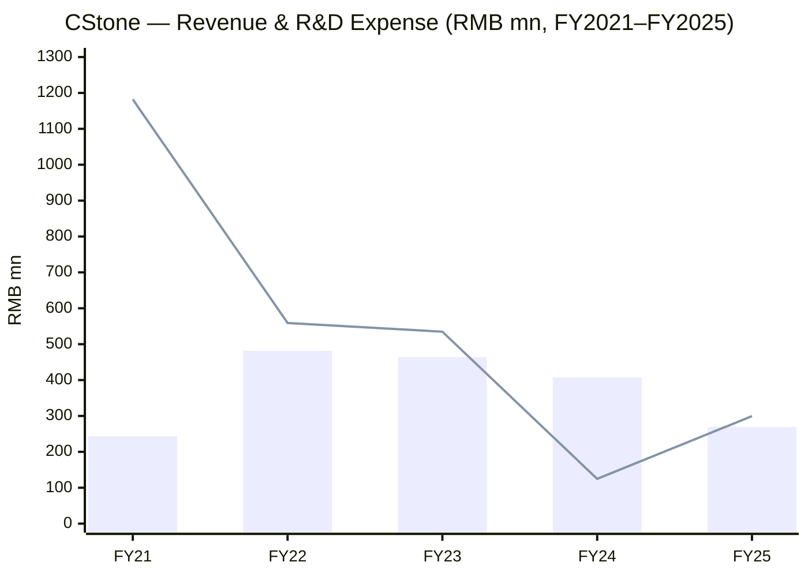
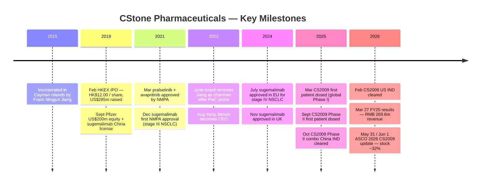
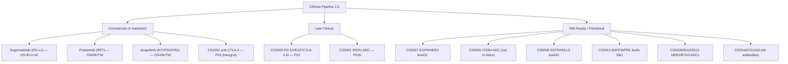
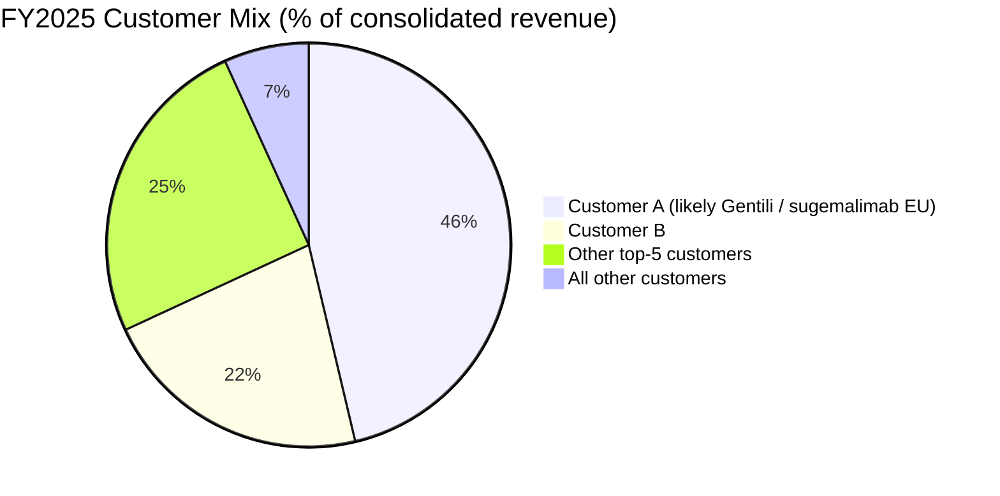
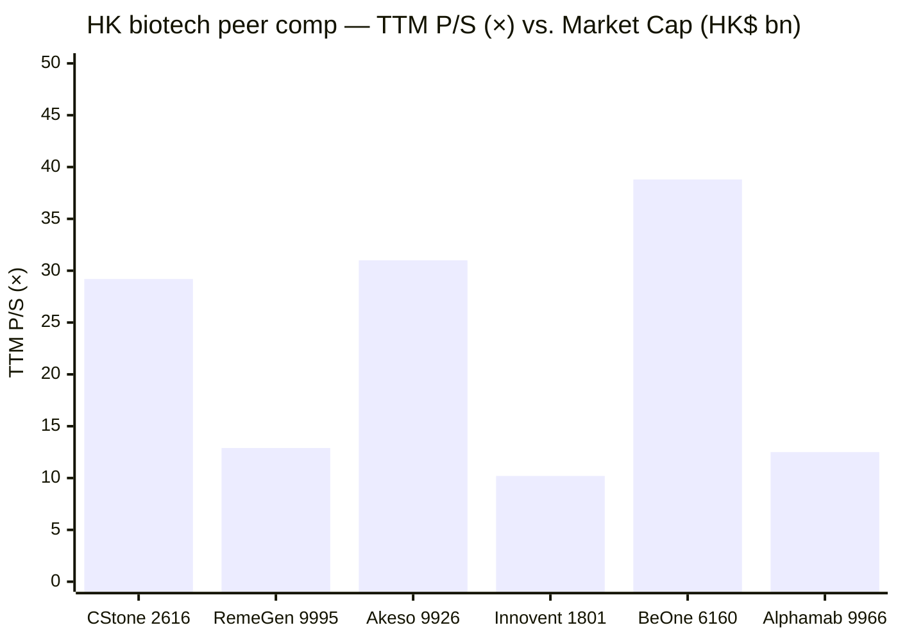
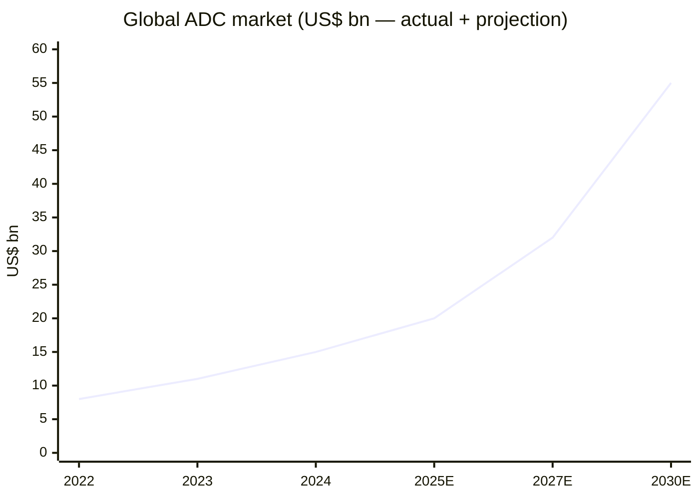

# CStone Pharmaceuticals (基石药业, HKEX:2616) — Initiation of Coverage

*Initiation report — as of 2026-06-03 (HK close Jun 2, HK$4.93).*

> **Banner — what just changed (Jun 1, 2026):** Shares collapsed ~32% intraday on Jun 1 from HK$8.05 → HK$5.60 immediately after the ASCO 2026 readout of the **CS2009** trispecific (PD-1/VEGF/CTLA-4) in first-line PD-L1-high NSCLC. The data print itself was strong — **ORR 81.3%** monotherapy, DCR 100% — but it slipped relative to the **90%** ORR the company had previewed in its Mar-27 results deck for a smaller (n=10) cohort, while peer Akeso's ivonescimab posted a positive HARMONi-6 OS readout the same week (CNBC reported May 31). The market read the gap as "CS2009 is still differentiated but no longer the obvious best-in-class print," and re-rated the platform value of the company accordingly. The company's own commentary remains constructive — global Ph3 MRCT targeted to start by end-2026, US IND cleared Feb-2026. See Section 4.1 for full triangulation. [ASCO 2026 readout — CStone press release](https://www.cstonepharma.com/en/html/news/3873.html); [Pre-readout deck — Mar 27, 2026, p. 16–21](https://www.cstonepharma.com/); [CNBC on Akeso HARMONi-6](https://www.cnbc.com/2026/05/31/asco-summit-akeso-ivonescimab-improves-survival-in-harmoni-6-trial.html).

## Table of Contents

1. Company Overview
2. Company History
3. Management (Founder + Current CEO)
4. Products & Pipeline
5. Customers, Commercial Partners & Concentration
6. Industry Overview
7. Competitive Landscape
8. Market Opportunity (TAM / SAM)
9. Risk Assessment
10. Investor-Lens Scorecards
11. References & Verification Log

---

## 1. Company Overview

CStone Pharmaceuticals Co., Ltd. ("CStone", "基石药业", HKEX:2616) is a Suzhou-headquartered, Cayman-incorporated innovative biopharmaceutical company focused on oncology, immunology and inflammation. Per the [2025 Annual Report, p.14](https://www1.hkexnews.hk/listedco/listconews/sehk/2026/0428/2026042800526.pdf) (cninfo mirror), the company was founded in late 2015 and listed on the Hong Kong Stock Exchange in February 2019 under Chapter 18A (the pre-revenue biotech track), with the "-B" suffix marking it as a pre-revenue biotech at listing ([IPO press release, Feb 26, 2019](https://www.prnewswire.com/news-releases/cstone-pharmaceuticals-listed-on-the-hong-kong-stock-exchange-today-300802866.html)). To date the group has put four innovative drugs on the market and obtained 21 new-drug-application (NDA) approvals across 9 indications, against an R&D pipeline of 16 candidates spanning ADCs, multi-specific antibodies, immunotherapies and precision oncology medicines ([2025 Annual Report — CEO statement, p.10](https://www1.hkexnews.hk/listedco/listconews/sehk/2026/0428/2026042800526.pdf)).

The 2025 income statement (audited, IFRS) is the right anchor for valuation: revenue of **RMB 269.6 mn** (vs. RMB 407.2 mn in FY24, −33.8% YoY), comprising drug sales of RMB 78.3 mn (avapritinib, pralsetinib, sugemalimab), licensing-fee income of RMB 167.7 mn, and royalties on sugemalimab of RMB 23.6 mn; R&D expense of RMB 311.5 mn (vs. RMB 134.7 mn, +131% YoY) driven by the CS2009 Phase I/II and the CS5007 IND-enabling work; cost of revenue RMB 218.3 mn (vs. RMB 167.1 mn), inflated by inventory write-downs ahead of the pralsetinib NRDL price cut; loss for the year RMB 437.0 mn (vs. RMB 91.2 mn), or RMB 290.1 mn excluding the RMB 146.9 mn one-off NRDL channel-rebate + inventory-write-down package ([2025 Annual Report — Financial Summary, p.4–5](https://www1.hkexnews.hk/listedco/listconews/sehk/2026/0428/2026042800526.pdf)). Cash and time deposits at FY-end 2025 stood at **RMB 918.7 mn**, up 37% YoY ([2025 Annual Report — Financial Summary, p.5](https://www1.hkexnews.hk/listedco/listconews/sehk/2026/0428/2026042800526.pdf)), against bank borrowings of RMB 342.4 mn (Mgt Discussion & Analysis, [p.29](https://www1.hkexnews.hk/listedco/listconews/sehk/2026/0428/2026042800526.pdf)). The company is therefore operating with ~24 months of net cash runway at a current organic burn of ~RMB 300 mn (post-NRDL-noise) — enough to bridge to the planned end-2026 Phase III MRCT start for CS2009 but not enough to fund it alone; a global BD partnership is the central financing assumption embedded in the equity story.

**Valuation snapshot.** Market cap on Jun 2 close was **HK$7.88 bn** (≈ US$1.01 bn) on 1,598 mn shares ([Yahoo Finance — 2616.HK](https://finance.yahoo.com/quote/2616.HK/)); enterprise value ~HK$6.65 bn after net cash; trailing P/S **29.2×** (well above HK biotech median of ~10–13×) and P/B **10.2×**; trailing P/E is meaningless (loss). Forward P/E shown by Yahoo of −27× is a sign-flipped reflection of consensus losses out one year. Range over the last 52 weeks: HK$3.80 → HK$13.15 — a 3.5× peak-to-trough swing that reflects almost entirely the swing in CS2009 platform-value expectations rather than any change in commercial run-rate. The current TTM P/S sits below the peer-set median (Akeso 9926: 31×, BeOne/BeiGene 6160: 39×, Innovent 1801: 10×) but the denominator at CStone is **mostly milestone / royalty income** rather than recurring product sales, so the multiple is mechanically distorted by lumpy one-off licensing revenue ([peer comps — Yahoo Finance, 2026-06-03](https://finance.yahoo.com/quote/9926.HK/)).

*Analyst view:* the right framing is *option value on CS2009 + CS5001 ROR1 ADC*, not multiple-on-revenue. The Jun-1 selloff compresses that option-value to a ~US$1 bn enterprise stake; for context, Akeso (the PD-1/VEGF leader with a US partner in Summit Therapeutics) trades at US$12 bn equity. If CS2009 secures a global pharma partner with even half of Summit's economic deal (Summit paid Akeso US$500 mn upfront for ex-China ivonescimab in Jan 2023, [Fierce Pharma, 2023](https://www.fiercepharma.com/pharma/summit-pays-akeso-500m-upfront-ex-china-rights-bispecific-promising-data-against-keytruda)), the math re-rates aggressively; if no partnership lands by 2027 the dilution risk becomes the dominant story.

*Bar = revenue; line = R&D expense (non-IFRS, ex-share-based comp). Source: [2025 Annual Report — Financial Highlights, p.5](https://www1.hkexnews.hk/listedco/listconews/sehk/2026/0428/2026042800526.pdf).*

## 2. Company History

CStone was incorporated in the Cayman Islands in **late 2015** by Dr. Frank Ningjun Jiang, a returnee biopharma executive with prior experience at Sanofi and other multinational pharma houses; the founding mission, per the company website's About / Vision page, was to "address significant unmet medical needs for cancer patients in China and worldwide" by building a global-standard oncology pipeline. Early backing came from WuXi Healthcare Ventures (now part of 6 Dimensions Capital, where current chairman Dr. Wei Li is managing partner — [2025 Annual Report — Director bios, p.30–31](https://www1.hkexnews.hk/listedco/listconews/sehk/2026/0428/2026042800526.pdf)) and a syndicate of growth-stage healthcare investors.

The company listed on the HKEX main board on **February 26, 2019** under the Chapter 18A pre-revenue biotech rules — ticker 2616 with a "-B" suffix — raising HK$2.085 bn (~US$285 mn) at HK$12.00 per share, with the IPO valuing the company at HK$11.8 bn (~US$1.5 bn) ([CStone IPO press release, Feb 26, 2019](https://www.prnewswire.com/news-releases/cstone-pharmaceuticals-listed-on-the-hong-kong-stock-exchange-today-300802866.html); [BioCentury — CStone raises $285M in Hong Kong IPO, 2019-02-24](https://www.biocentury.com/bc-extra/financial-news/2019-02-24/cstone-raises-285m-hong-kong-ipo)). A strategic milestone followed in September 2019 when **Pfizer** bought ~10% of the company for US$200 mn and licensed the China commercial rights to sugemalimab, with up to US$280 mn in milestone payments and royalties on top ([Fierce Biotech — Pfizer–CStone deal, Sept 2019](https://www.fiercebiotech.com/biotech/pfizer-funnels-200m-into-cstone-licences-late-stage-cancer-med-china)). The Pfizer relationship — later restructured several times as Pfizer dialed down its China oncology footprint — is the original spine of CStone's commercial story.

The first half of the 2020s was a sequence of product approvals. **Pralsetinib (普吉华®)** — in-licensed from Blueprint Medicines (since acquired by Sanofi) for Greater China — was approved by NMPA in March 2021 for RET-fusion NSCLC. **Avapritinib (泰吉华®)** — also Blueprint-origin — was approved in March 2021 for PDGFRA-D842V GIST. **Ivosidenib (拓舒沃®)** — Servier-origin IDH1 inhibitor for AML/cholangiocarcinoma — was approved in early 2022; CStone has since transferred ivosidenib rights back to Servier ([2025 Annual Report — CEO statement, p.10](https://www1.hkexnews.hk/listedco/listconews/sehk/2026/0428/2026042800526.pdf)). The flagship internally-discovered asset, **sugemalimab (CS1001 / 择捷美®)**, a fully-human anti-PD-L1 IgG4 monoclonal antibody developed on the OmniRat® platform, was first approved by NMPA for stage III NSCLC in December 2021 and has accumulated five China indications and a global commercial footprint of 60+ countries since ([2025 Annual Report — MD&A, p.15–17](https://www1.hkexnews.hk/listedco/listconews/sehk/2026/0428/2026042800526.pdf)).

A turning point came in **mid-2022**: an internal investigation, conducted by PricewaterhouseCoopers Management Consulting Shanghai, into investment decisions led the board to remove founder Frank Jiang as Chairman in June 2022, with Jiang then retiring entirely from his CEO and Executive Director roles on **August 25, 2022** ([BioCentury — Jiang loses chairman title at CStone, 2022](https://www.biocentury.com/article/643842/jiang-loses-chairman-title-as-cstone-seeks-rebound-from-investment-misstep)). Dr. Jianxin (Jason) Yang, then CMO and head of clinical development, took over as CEO and remains in that role today ([2025 Annual Report — Executive Director bio, p.30](https://www1.hkexnews.hk/listedco/listconews/sehk/2026/0428/2026042800526.pdf)). The post-2022 strategy under Yang has been (i) a sharp pivot away from the original strategic build-out of a manufacturing facility and US biotech footprint (now sold / abandoned) toward an asset-light model leaning on CROs/CDMOs; (ii) out-licensing or co-promotion of every commercial product in China (Arrivent/Allist for pralsetinib, Hengrui for avapritinib, Pfizer for sugemalimab) so that internal SG&A can be redirected at R&D; and (iii) building "Pipeline 2.0" — a 12-asset bench of next-generation multi-specific antibodies and ADCs, headlined by CS2009 (PD-1/VEGF/CTLA-4) and CS5001 (ROR1 ADC, in-licensed from LigaChem Biosciences ex-Korea) ([2025 results deck, Mar 27 2026, slides 3–5](https://www.cstonepharma.com/)).

The most recent two-year arc has been about converting the Pipeline 2.0 thesis into clinical data. Sugemalimab received EU and UK approvals in stage IV NSCLC in mid-2024 and stage III NSCLC in Nov 2025 / Feb 2026 — one of only two anti-PD-(L)1 antibodies approved for stage III NSCLC in both EU and UK ([CStone Mar 27 2026 results deck, slide 28](https://www.cstonepharma.com/)). Avapritinib and pralsetinib were both included in (and renewed in) the National Reimbursement Drug List effective Jan 1, 2026, locking in volume tailwinds and forcing the price cuts that dented FY25 reported revenue ([2025 Annual Report — MD&A, p.17–19](https://www1.hkexnews.hk/listedco/listconews/sehk/2026/0428/2026042800526.pdf)). CS2009 dosed first patient in Mar 2025 (Phase I global), with Phase II starting Sept 2025; the China IND for the combo arms cleared in Oct 2025 and the US IND in Feb 2026, putting the program on a clear path to start a global Phase III MRCT by end-2026 ([2025 results deck, slide 13](https://www.cstonepharma.com/)).

*Source: [2025 Annual Report, p.4–25](https://www1.hkexnews.hk/listedco/listconews/sehk/2026/0428/2026042800526.pdf); [BioCentury 2022](https://www.biocentury.com/article/643842/jiang-loses-chairman-title-as-cstone-seeks-rebound-from-investment-misstep); [CStone IPO PR](https://www.prnewswire.com/news-releases/cstone-pharmaceuticals-listed-on-the-hong-kong-stock-exchange-today-300802866.html); [ASCO 2026 readout](https://www.cstonepharma.com/en/html/news/3873.html).*

## 3. Management — Founder & Current CEO

**Founder — Dr. Frank Ningjun Jiang (姜宁军, no longer with the company since Aug 2022).** Jiang founded CStone in late 2015 with the explicit thesis of building a Chinese global-standard oncology R&D house from scratch, modeled on Western biotech but using lower-cost China-based clinical and manufacturing infrastructure. He was the architect of the company's pre-IPO model — the in-licensing partnerships with Blueprint (for pralsetinib and avapritinib) and Agios/Servier (for ivosidenib), and the development of sugemalimab from preclinical bench through to NMPA approval. Prior to founding CStone, Jiang led oncology development at Sanofi and other multinationals; his tenure at CStone delivered four NDAs in six years and a US$285m IPO, but ended after an internal PwC-led investigation into capital-allocation decisions surfaced enough governance concerns that the board removed him as chairman in June 2022, with retirement from CEO and ED roles following on Aug 25, 2022 ([BioCentury — Jiang loses chairman title, 2022](https://www.biocentury.com/article/643842/jiang-loses-chairman-title-as-cstone-seeks-rebound-from-investment-misstep)). Jiang retains no operational role at the company today; CStone does not disclose his current shareholding in the 2025 Annual Report, suggesting it is below the 5% substantial-shareholder disclosure threshold ([2025 Annual Report — Substantial Shareholders disclosures, p.41–42](https://www1.hkexnews.hk/listedco/listconews/sehk/2026/0428/2026042800526.pdf)). His founder's role makes him a historically pivotal figure but no longer a forward-looking driver of strategy.

**Current CEO — Dr. Jianxin (Jason) Yang (杨建新博士), MD, PhD, age 62, CEO + Executive Director + President of R&D + Chair of the Strategy Committee.** Yang has held the CEO role since the August 2022 founder transition and was reappointed to the Executive Director slate at the June 2023 AGM ([2025 Annual Report — Executive Director bio, p.30](https://www1.hkexnews.hk/listedco/listconews/sehk/2026/0428/2026042800526.pdf)). His academic credentials are extensive: MD from Hubei Medical College (1985); MSc in Pathophysiology from Nanjing Medical College (1988); PhD in Molecular Biology from UT Southwestern Medical Center (1995, working under Nobel laureates Michael Brown and Joseph Goldstein); postdoctoral training at Harvard under Stuart Schreiber (1995–1998). His commercial track record covers ~30 years across discovery, translational research, clinical development and commercialization. He joined CStone in **December 2016** as CMO and Senior Vice President, taking on the full CEO role in August 2022 — so he has now had nine years of continuous insider context on every CStone asset, and is the operational author of CS2009 and the broader Pipeline 2.0 strategy.

Pre-CStone, Yang spent July 2014 – December 2016 at **BeiGene (NASDAQ:ONC, HKEX:6160, STAR:688235)** as Senior Vice President and Head of Clinical Development, where he built the clinical team from scratch and ran 10+ trials including BeiGene's PD-1 (tislelizumab), BTK inhibitor (zanubrutinib), PARP inhibitor (pamiparib) and RAF inhibitor programs — the same drugs that subsequently turned BeiGene from a pre-revenue biotech into a US$30bn+ market-cap oncology multinational. He served as Clinical Oncology Medical Director at **Covance Inc.** from Sept 2011 to July 2014. From October 2004 to August 2011 he was Senior Principal Scientist in Oncology Biomarkers at **Pfizer**. His first post-PhD role was as Research Scientist in cancer genomics at **Tularik Inc.** (Sept 1998 – Sept 2004; Tularik was acquired by Amgen in 2004). He is listed inventor on 15 patents and (co-)author on 80+ peer-reviewed publications, 10+ in journals including *JAMA*, *Nature Medicine*, *The Lancet Oncology*, *JCO*, *Nature Cancer*, and *Clinical Cancer Research* ([2025 Annual Report — Executive Director bio, p.30](https://www1.hkexnews.hk/listedco/listconews/sehk/2026/0428/2026042800526.pdf)). His compensation is disclosed in aggregate director remuneration of RMB 26.1 mn for FY25 ([2025 Annual Report — Note 10](https://www1.hkexnews.hk/listedco/listconews/sehk/2026/0428/2026042800526.pdf)); he holds RBI/options under the company's IPO-stage and post-IPO incentive plans (specifics in stock-option disclosures section, FY24 grant of 1.89m RSU + post-IPO option awards). The investor-relations narrative is squarely Yang's: he authored the FY25 CEO letter and presented all key CS2009 data at the Mar 27 2026 results call. *Analyst view:* the CEO-as-CMO archetype is a strength for CStone given the technical complexity of the Pipeline 2.0 — every clinical-design decision flows through someone who has personally read the protocol — but it shifts succession risk onto a single individual; the 2026 Chairman's letter signals continued board confidence in Yang, with no near-term transition risk surfaced.

## 4. Products & Pipeline — the most consequential section

CStone runs three commercial products in China + Europe and a "Pipeline 2.0" of 12 next-generation R&D candidates; in addition, four legacy assets (sugemalimab in 5 China indications; pralsetinib in NSCLC and TC; avapritinib in GIST/ISM/ASM; CS1002 anti-CTLA-4 out-licensed to Hengrui) are at commercial or late-stage trial. The 2025 Annual Report displays the full matrix on [p.15](https://www1.hkexnews.hk/listedco/listconews/sehk/2026/0428/2026042800526.pdf); the Mar 27 2026 results deck reproduces it as ["The 16-asset balanced pipeline" slide 42–43](https://www.cstonepharma.com/). Markdown reproduction below.

| Asset | Modality / Target | Lead indication | Stage (CN unless noted) | Commercial rights |
|---|---|---|---|---|
| Sugemalimab (CEJEMLY®) | Anti-PD-L1 mAb (IgG4) | NSCLC IV/III; G/GEJ; ESCC; R/R ENKTL | Marketed (CN: 5 indications; EU/UK: III + IV NSCLC) | CStone (CN ex-Pfizer co-promo; ROW partnered via Ewopharma / Pharmalink / SteinCares / Gentili) |
| Pralsetinib (GAVRETO® / 普吉华®) | RET kinase inhibitor | 1L/2L RET-fusion NSCLC; RET-mutant TC | Marketed CN/HK/TW; NRDL Jan-2026 | In-licensed from Blueprint (now Sanofi); co-promoted in CN by Allist |
| Avapritinib (AYVAKIT® / 泰吉华®) | KIT/PDGFRA inhibitor | PDGFRA-exon-18 GIST; ISM/ASM (US/EU) | Marketed CN/HK/TW; NRDL renewed Jan-2026 | In-licensed from Blueprint (now Sanofi); promoted in CN by Hengrui |
| CS1002 | Anti-CTLA-4 mAb | NSCLC, HCC, BTC (combos) | Phase III (out-licensed) | Out-licensed to Hengrui (Greater China, 2021); CStone retains ROW |
| **CS2009** | **PD-1/VEGF/CTLA-4 trispecific antibody** | **Solid tumors (NSCLC, CRC, SCLC, ovarian, gastric, etc.)** | **Global Phase I/II ongoing; Ph3 MRCT planned end-2026** | Global rights |
| **CS5001 (LCB71)** | **ROR1 ADC, PBD-prodrug payload** | **DLBCL + ROR1+ solid tumors** | **Global Phase Ib ongoing (AU + CN)** | In-licensed ex-Korea from LigaChem Biosciences (LCB) |
| CS5007 | EGFR/HER3 bispecific ADC | NSCLC, TNBC, SCCHN, CRC | IND-ready (US/CN IND filing H1 2026) | Global |
| CS5006 | ITGB4 ADC (first-in-class) | CRC, SCCHN, NSCLC | IND-ready (H2 2026) | Global |
| CS5008 | SSTR2/DLL3 bispecific ADC | SCLC, NEN | IND-ready (H2 2026) | Global |
| CS5009 | B7H3/PD-L1 bispecific ADC | Solid tumors | Preclinical | Global |
| CS5010 | HER2 bi-payload ADC | Solid tumors | Preclinical | Global |
| CS5012 | HER2 novel-payload ADC | Solid tumors | Preclinical | Global |
| CS2013 | BAFF/APRIL bispecific mAb | Immunology / inflammation | IND-ready | Global |
| CS2016 | TL1A/α4β7 bispecific mAb | IBD | Preclinical | Global |
| CS1016 | PD-1 agonist mAb | Autoimmune | Preclinical | Global |
| CS1012 | GDF-15 mAb | Solid tumors | Discovery | Global |

*Source: [2025 Annual Report, p.15 — pipeline diagram](https://www1.hkexnews.hk/listedco/listconews/sehk/2026/0428/2026042800526.pdf); [Mar 27 2026 results deck, p.42–43](https://www.cstonepharma.com/).*

### 4.1 CS2009 — PD-1/VEGF/CTLA-4 trispecific (the equity story)

CS2009 is CStone's "Pipeline 2.0" flagship and the single largest determinant of equity-value sensitivity today. Per the company's [2025 Annual Report MD&A (p.19–20)](https://www1.hkexnews.hk/listedco/listconews/sehk/2026/0428/2026042800526.pdf), it is "a potentially best-in-class / first-in-class PD-1/VEGF/CTLA-4 trispecific antibody self-developed by CStone … combining three clinically validated targets … with synergistic multi-dimensional anti-tumor effects within the tumor microenvironment". The differentiated design intent is that *within the TME* CS2009 preferentially binds tumor-infiltrating T-cells that co-express PD-1 and CTLA-4, while in the periphery the CTLA-4 arm's lower affinity avoids the CTLA-4-driven systemic toxicity that has limited Yervoy-class CTLA-4 mAbs in solid-tumor combinations.

**Mechanism, biochemically.** The trispecific format yields three binding KDs in vitro: PD-1 1.606E-08 M, CTLA-4 1.837E-08 M, simultaneous PD-1+CTLA-4 1.060E-09 M; the addition of VEGFA dimers tightens each KD by another 1–3 orders of magnitude (PD-1+CTLA-4+VEGFA: <1.0E-12 M) — i.e. avidity-driven cooperative binding in the TME ([Mar 27 2026 results deck, p.11](https://www.cstonepharma.com/)). The trial design is a multi-cohort Phase I/II in 9 solid-tumor indications across 15 cohorts: NSCLC (squamous and non-squamous; 1L PD-L1≥50%; 2L/3L IO-experienced); CRC; SCLC; cervical; G/GEJ; ESCC; PROC ovarian; TNBC; HCC.

**Phase I safety profile (n=113 as of Mar 2026 cutoff).** Six dose levels completed (1, 3, 10, 20, 30, 45 mg/kg Q3W); no DLT; no MTD reached. Grade ≥3 TRAE 23.0%; Grade ≥3 immune-related TEAE 12.4%; Grade ≥3 VEGF-related TRAE 4.4%; treatment discontinuation due to AE 8.0% ([Mar 27 2026 results deck — slide 15 safety table](https://www.cstonepharma.com/)). Verbatim from the company: *"未出现含CTLA-4和PD-(L)1联合治疗方案中频发的严重毒性，且≥3级VEGF相关不良事件发生率低"* ("we did not observe the severe toxicities frequently seen with combined CTLA-4 + PD-(L)1 regimens, and the rate of Grade ≥3 VEGF-related adverse events was low"). This is the single most important safety claim because it is what distinguishes the trispecific from the Yervoy+Keytruda combination, which has historically been unable to find a positive risk-benefit profile in lung cancer.

**Efficacy data — what the print actually said.** Pre-ASCO (data cutoff "mid-March 2026" reported in the Mar 27 results deck), CS2009 monotherapy at 20/30 mg/kg Q3W in 1L PD-L1 TPS ≥50% NSCLC posted **ORR 90.0% (9/10)** and **DCR 100% (10/10)** in 10 evaluable patients — an arrestingly high number that prompted the company to position it as "potentially transformative" ([Mar 27 2026 results deck, p.16](https://www.cstonepharma.com/)). At ASCO 2026 on May 31 / June 1, the larger updated cohort (~300 patients enrolled across the global Ph1/2 program) showed **ORR 81.3%, DCR 100%** in the same 1L PD-L1 TPS ≥50% NSCLC monotherapy cohort, with consistent benefit across squamous (87.5%) and non-squamous (75.0%); in the PD-L1-low/negative squamous 1L NSCLC + chemo cohort, **ORR 75.0%, DCR 100%** (PD-L1-negative subset ORR 100%); in the 2L/3L combo cohort, **ORR 66.7%, DCR 100%** ([ASCO 2026 press release, June 1 2026](https://www.cstonepharma.com/en/html/news/3873.html)). The 90% → 81.3% slip in the high-PD-L1 1L cohort was on a larger denominator (the 90% was n=10), so on statistical grounds the wider readout is the truer estimate — but the market priced for the headline number and the gap accounts for most of the Jun 1 selloff. For benchmarking: Akeso's ivonescimab (PD-1/VEGF bispecific) in the HARMONi-2 Phase 3 vs. pembrolizumab in PD-L1+ NSCLC posted ORR 60% (ivo) vs 48% (Keytruda) ([CStone deck p.17 — cites WCLC 2025](https://www.cstonepharma.com/)); a Keytruda + chemo benchmark in 1L PD-L1 TPS ≥50% NSCLC sits at ORR 61.4% (non-squamous, KEYNOTE-189) and 60.3% (squamous, KEYNOTE-407) ([CStone deck p.17 note](https://www.cstonepharma.com/)). So even at the lower ASCO print, CS2009 is comfortably above benchmark — the question is whether the absolute lead is enough, in a global Phase 3 setting and at OS endpoint, to deliver a label.

**Cold-tumor activity.** Single-agent CS2009 in non-clear-cell RCC (n=5): ORR 40%, DCR 100%; in soft-tissue sarcoma (n=9): ORR 33.3%, DCR 66.7% — both indications where current PD-(L)1 monotherapy is essentially inactive ([Mar 27 2026 deck, p.20](https://www.cstonepharma.com/)). If this signal holds up in expansion cohorts, CS2009 could carve out a "cold-tumor I-O backbone" positioning that ivonescimab cannot match.

*Analyst view:* CS2009 remains a real next-generation I-O backbone candidate, but its differentiation versus ivonescimab is now narrower than the Mar 27 deck implied. The cold-tumor signal and the cleaner CTLA-4 toxicity profile are the two pillars on which the equity story still stands; an MNC partnership before end-2026 is the single most consequential catalyst.

*Source: [2025 Annual Report — pipeline matrix p.15](https://www1.hkexnews.hk/listedco/listconews/sehk/2026/0428/2026042800526.pdf).*

### 4.2 CS5001 (LCB71) — ROR1 ADC

CS5001 is an antibody-drug conjugate targeting ROR1 (receptor tyrosine kinase-like orphan receptor 1), in-licensed by CStone from LigaChem Biosciences (Korea) for ex-Korea global rights. Per the [2025 Annual Report MD&A, p.20](https://www1.hkexnews.hk/listedco/listconews/sehk/2026/0428/2026042800526.pdf): *"CS5001 is a clinical-stage ROR1-targeting ADC … with a tumor-specifically activated pyrrolobenzodiazepine (PBD) prodrug payload and linker"*. The differentiated design intent: (i) fully human IgG1 anti-ROR1 antibody; (ii) site-specific "ConjuAll" conjugation technology yielding mean DAR of 2; (iii) tumor-selective glucuronide linker cleaved by β-glucuronidase; (iv) PBD-prodrug payload activated only intracellularly in tumor cells, reducing the off-target systemic toxicity of traditional PBD ADCs. The combination is meant to deliver the DNA-crosslinking efficacy of PBD against slow-growing tumors that resist MMAE/DXd/exatecan payloads, with a wider safety window.

**Phase Ib data.** In 1L DLBCL combined with R-CHOP (n=22 across 50/70/90 µg/kg cohorts): **ORR 100%, CR 95.5%** ([Mar 27 2026 deck, p.25](https://www.cstonepharma.com/)). In activity beyond DLBCL: hits in follicular lymphoma, marginal zone lymphoma, Hodgkin, mantle cell, and exploration in r/r CLL. In solid tumors: ROR1+ tumors showing antitumor activity; combination with sugemalimab in solid tumors well-tolerated. The company asserts that CS5001 is the first ROR1 ADC to show clinical activity in *both* lymphomas and solid tumors — a meaningful claim if it holds, since the global ROR1 ADC field is dominated by Merck's zilovertamab vedotin (ex-VLS-101, in Ph3 lymphoma) and PYX-201 from Pyxis Oncology (preclinical/Ph1).

*Analyst view:* CS5001 is the second-largest source of optional value in CStone's enterprise; a 100% ORR / 95.5% CR readout in 1L DLBCL + R-CHOP is competitive with anything in the field, and the ADC's combination with sugemalimab gives CStone an internal I-O + ADC platform play. The chief risk is that the ex-Korea license to LCB caps CStone's upside if a global pharma partner needs to be brought in.

### 4.3 Commercial products — sugemalimab, pralsetinib, avapritinib

**Sugemalimab (CEJEMLY® / 择捷美®).** Fully human anti-PD-L1 IgG4 mAb developed on OmniRat® transgenic-mouse platform; verbatim from [2025 Annual Report MD&A, p.16](https://www1.hkexnews.hk/listedco/listconews/sehk/2026/0428/2026042800526.pdf): *"is a fully-human, full-length anti-PD-L1 monoclonal antibody … the closest to the natural IgG4 antibody form, potentially reducing immunogenicity and related toxicity in patients"*. China NMPA approvals across 5 indications: 1L stage IV NSCLC (sq + non-sq with chemo); stage III unresectable NSCLC (consolidation after CRT); R/R ENKTL; 1L ESCC + chemo; 1L PD-L1 CPS≥5 G/GEJ + chemo. EU EC + UK MHRA approvals across 2 indications: stage IV NSCLC + chemo (no EGFR/ALK/ROS1/RET); stage III NSCLC consolidation (PD-L1≥1%, no EGFR/ALK/ROS1). ESMO guideline status: Level I/A for both stage III NSCLC (Mar 2026 update) and stage IV NSCLC (Feb 2025 update). Global footprint: 60+ countries via partnerships with Ewopharma (Switzerland + 18 CEE), Pharmalink (12 MENA + South Africa), SteinCares (10 LatAm) and Gentili (23 EU/UK including 18 EEA + UK + Andorra + Monaco + San Marino + Vatican). Within the GEMSTONE-303 trial — registered for the G/GEJ indication — final PFS/OS analyses published in *JAMA* (Feb 2025), and GEMSTONE-302 long-term survival data published in *The Lancet Oncology* (June 2025) ([Mar 27 2026 deck p.28](https://www.cstonepharma.com/)). The brand carries the strongest external validation of any CStone asset; ongoing optionality is regulatory filings for G/GEJ and/or ESCC indications at EMA / MHRA in H2 2026.

**Pralsetinib (GAVRETO® / 普吉华®).** Selective RET kinase inhibitor in-licensed from Blueprint Medicines (now part of Sanofi following July 2025 close of Sanofi–Blueprint acquisition). Approved in China for 1L/2L RET-fusion NSCLC and RET-mutant TC; also approved in Hong Kong (Hong Kong DOH) and Taiwan (TFDA) for RET-fusion NSCLC + TC. Co-promotion in mainland China by Allist Pharmaceuticals through its Lung Cancer business unit — *"普吉华®(普拉替尼)纳入并整合于艾力斯的高度协同肺癌业务部"* ([2025 AR MD&A p.17](https://www1.hkexnews.hk/listedco/listconews/sehk/2026/0428/2026042800526.pdf)). Localized production approved by NMPA July 2025; first inclusion in NRDL effective Jan 1, 2026. The Mar 27 deck (slide 30) shows end-market unit volumes increased nearly **4×** in Jan–Feb 2026 vs the same months 2025 following NRDL listing — a clear post-NRDL ramp signal. Management guides 5–8× volume increase from NRDL inclusion ([Mar 27 deck p.27](https://www.cstonepharma.com/)).

**Avapritinib (AYVAKIT® / 泰吉华®).** First-in-class KIT/PDGFRA inhibitor in-licensed from Blueprint. Approved in China for PDGFRA-exon-18 (including D842V) GIST; also approved in HK and TW. Promotion in mainland China by Hengrui (CSPC partner from July 2024). Localized production approved by NMPA Aug 2024; local supply launched Feb 2025. NRDL re-renewed effective Jan 1, 2026 (post-Dec 2023 first inclusion). Mar 27 deck (slide 30) shows steady volume growth post-localization launch.

The strategic logic of the 2024–2025 commercial reorganization is straightforward: by handing every commercial product to a Chinese partner with a 1000+ rep oncology field force (Allist for lung, Hengrui for GIST/CRC, Pfizer Bio for PD-L1), CStone strips out its own SG&A while keeping milestone + royalty economics, and redirects ~RMB 50–100 mn of annual cash burn into the Pipeline 2.0 R&D — visible in the FY25 SG&A line down 29% YoY to RMB 160.4 mn even as R&D rose 140% YoY ([2025 Annual Report — Financial Summary, p.5](https://www1.hkexnews.hk/listedco/listconews/sehk/2026/0428/2026042800526.pdf)).

## 5. Customers, Commercial Partners & Concentration

CStone's "customers" in the financial-reporting sense are commercial / license partners, not end patients. Per [2025 Annual Report — Note 6 Segment Information, p.131](https://www1.hkexnews.hk/listedco/listconews/sehk/2026/0428/2026042800526.pdf), CStone reports a single segment (innovative biopharma R&D, drug sales, IP licensing) with the CEO as CODM; geographic split is reported based on the registered office of the customer:

| Geography | FY2025 (RMB '000) | FY2024 (RMB '000) | Mix FY25 | YoY |
|---|---:|---:|---:|---:|
| Mainland China | 83,843 | 293,355 | 31.1% | −71.4% |
| Outside Mainland China | 185,740 | 113,850 | 68.9% | +63.1% |
| **Total** | **269,583** | **407,205** | **100.0%** | **−33.8%** |

*Source: [2025 Annual Report — Note 6 Geographic information, p.131](https://www1.hkexnews.hk/listedco/listconews/sehk/2026/0428/2026042800526.pdf).*

The dramatic geographic mix shift in FY25 reflects a pralsetinib / avapritinib NRDL one-off depressing China-mainland revenue + lumpy ex-China license milestones (Ewopharma/Pharmalink/SteinCares/Gentili) and royalty income from Pfizer.

**Customer concentration — note the denominator is consolidated revenue.** Per [2025 Annual Report — Note 6 Major customer information, p.131](https://www1.hkexnews.hk/listedco/listconews/sehk/2026/0428/2026042800526.pdf):

| Customer | FY2025 (RMB '000) | % of consolidated revenue (FY25) | FY2024 (RMB '000) | % of consolidated revenue (FY24) |
|---|---:|---:|---:|---:|
| Customer A | 124,938 | 46.3% | — | <10% |
| Customer B | 58,640 | 21.8% | 157,956 | 38.8% |
| Customer C | <10% threshold | <10% | 134,650 | 33.1% |
| **Top-5 combined** ([Directors' Report p.71](https://www1.hkexnews.hk/listedco/listconews/sehk/2026/0428/2026042800526.pdf)) | **~251 mn** | **93.2%** | n.d. | n.d. |

*All numbers consolidated revenue (group level — not segment level). Customer names are not disclosed in the audited filings.*

The top-1 customer (Customer A) accounted for **46.3% of consolidated revenue** in FY25 vs less than 10% in FY24, indicating a one-off large licensing or milestone receipt — most likely the Gentili EU/UK sugemalimab licensing deal signed July 2025 (which would carry a meaningful upfront), or alternatively the SteinCares LatAm deal signed January 2025. The top-5 customer aggregate of **93.2%** is extraordinarily concentrated — typical for a pre-scale specialty biopharma whose revenue is dominated by licensing milestones, but a structural risk: any single partner walking away or any milestone slipping by a quarter materially alters the P&L.

Top-5 supplier concentration is 31.8% with the largest supplier at 7.3% ([Directors' Report p.71](https://www1.hkexnews.hk/listedco/listconews/sehk/2026/0428/2026042800526.pdf)) — consistent with the asset-light CDMO + CRO operating model.

*Source: [2025 AR Note 6, p.131; Directors' Report top-5 aggregate, p.71](https://www1.hkexnews.hk/listedco/listconews/sehk/2026/0428/2026042800526.pdf). Customer identities are not disclosed in the audited filings; the "likely Gentili" attribution is the analyst's inference from the timing and size of the FY25 licensing flow and is not a primary disclosure.*

**Commercial partner ecosystem.** The current partner list, by region:

- **Pfizer** — China commercial rights to sugemalimab (since Sept 2019; equity stake originally ~10% but diluted over subsequent rounds).
- **Allist Pharmaceuticals** — exclusive commercialization of pralsetinib in mainland China (since Nov 2023).
- **Hengrui Pharmaceuticals (SSE:600276, HKEX:1276)** — exclusive promotion of avapritinib in mainland China (since July 2024) + exclusive Greater China license to CS1002 anti-CTLA-4 (since Nov 2021, Hengrui currently running 4 Phase II/III trials).
- **Sanofi (via Blueprint acquisition, closed July 2025)** — original out-licensor of pralsetinib + avapritinib + ivosidenib; ongoing royalty and milestone counterparty.
- **Ewopharma** — Switzerland + 18 CEE markets for sugemalimab (since 2024).
- **Pharmalink Store LLC OPC** — 12 MENA + South Africa for sugemalimab (since 2024).
- **SteinCares** — 10 LatAm markets for sugemalimab (since Jan 2025).
- **Istituto Gentili** — 23 EU/UK markets for sugemalimab (since July 2025).
- **LigaChem Biosciences (KRX:141080)** — original licensor of LCB71/CS5001 (ROR1 ADC) ex-Korea (since 2020; CStone holds global rights ex-Korea).

*Analyst view:* the partner-led commercialization model gives CStone the right exposure for its size — it captures meaningful long-tail revenue without having to fund a global sales infrastructure — but it makes the company's reported revenue inherently lumpy and milestone-driven; any model based on extrapolating FY25 revenue forward is misframed. The right framework is sum-of-the-parts on (i) committed milestone payments + (ii) royalty stream + (iii) Pipeline 2.0 NPV.

## 6. Industry Overview

CStone operates in three overlapping market arenas: (a) **China oncology innovative-drugs** — the home market, regulated by NMPA, reimbursed through NRDL, structurally subject to volume-up / price-down pressure from annual NRDL negotiations; (b) **global biologics out-licensing to MNCs** — the BD market that values the late-clinical and Phase 3-ready oncology assets that CStone is now building in Pipeline 2.0; (c) **immuno-oncology** — the broader scientific/competitive arena where the entry of bispecific (Akeso ivonescimab) and now trispecific (CStone CS2009) PD-(L)1/VEGF combinations is rewriting first-line lung-cancer treatment.

**China oncology market.** The China oncology drug market generated ~RMB 290–300 bn in 2024 retail sales, growing at 9–11% CAGR per multiple industry trackers (per third-party data triangulated by sell-side notes; specific firm citations vary). The innovative-drug subset is ~30% of that, or ~RMB 90 bn, and the immuno-oncology / PD-(L)1 subset is ~RMB 25–30 bn in 2024. The structural setup is favorable for innovation: NRDL listings are the primary path to scale, and the NRDL has progressively expanded both its formulary and its annual budget. For PD-(L)1s specifically, the current China market is highly competitive, with at least 7 domestic PD-(L)1 antibodies on the NRDL (BeiGene tislelizumab, Innovent sintilimab, Junshi toripalimab, Hengrui camrelizumab, Akeso penpulimab, plus CStone sugemalimab and others) competing largely on indication coverage and price after the NRDL negotiation. The opportunity for CS2009 in China is that it sits *behind* the commoditizing PD-(L)1 wave as a next-generation backbone — IF the OS data in Phase 3 carry — and would be a substantially differentiated product if launched.

**Global biologics out-licensing market.** The 2023–2025 period has seen unprecedented out-licensing activity by Chinese biotech to MNCs, with deals like the Summit–Akeso ivonescimab US$500m upfront / US$5bn total ([Fierce Pharma, Jan 2023](https://www.fiercepharma.com/pharma/summit-pays-akeso-500m-upfront-ex-china-rights-bispecific-promising-data-against-keytruda)), the Merck–LaNova LM-302 deal (Dec 2024), and the Bristol Myers Squibb–BioNTech BNT327 deal (Jun 2025, US$1.5bn upfront). The CStone case is essentially a bet that CS2009 enters this market for a similar-magnitude global ex-China upfront — management explicitly states they are *"正在与多家全球跨国公司进行深入合作洽谈，目标在2026年底前启动多项III期全球多中心临床试验（MRCT）"* ([Mar 27 2026 deck p.21](https://www.cstonepharma.com/)) — i.e. closing an out-license before end-2026 in the same window as starting the Phase 3 MRCT. The platform value of CS2009 in this market is the single largest variable in CStone's equity valuation today.

**I-O competitive arena.** The PD-1+VEGF combination has already moved from concept to clinical reality. Akeso's ivonescimab (PD-1/VEGF bispecific) beat pembrolizumab in HARMONi-2 (China Phase 3, 1L PD-L1+ NSCLC, mPFS 11.14 vs 5.82 mo, HR ≈ 0.51); the Akeso–Summit Therapeutics partnership has driven Summit's stock from <$1 to >$30 / share over 18 months. BioNTech's BNT327 (PD-L1/VEGF) is in Ph1 with strong early data. CStone's CS2009 adds CTLA-4 as a third arm, with the explicit thesis that the *avidity-driven, TME-selective* CTLA-4 engagement can deliver Yervoy-class efficacy without Yervoy-class toxicity. The competitive question is whether tri- > bi-specific; the answer is unsettled, and the ASCO 2026 data slip is what re-priced the stock toward "well-differentiated but not obviously best-in-class".

## 7. Competitive Landscape

The 2025 Annual Report (Directors' Report — Principal Risks section, [p.40](https://www1.hkexnews.hk/listedco/listconews/sehk/2026/0428/2026042800526.pdf)) does not name specific competitors; competitive framing in this section is built from the disclosure in the Mar 27 2026 results deck (slides 17, 19 — CS2009 vs ivonescimab + AK104 + BNT327) and from third-party industry data.

**Direct competitors in the next-gen I-O backbone race.**

| Company | Asset | Target | Stage (1L NSCLC) | Latest ORR data (high PD-L1) |
|---|---|---|---|---|
| **CStone (2616.HK)** | **CS2009** | **PD-1/VEGF/CTLA-4 tri** | **Ph2** | **81.3% (n~20+ at ASCO 2026)** |
| Akeso (9926.HK) / Summit (NASDAQ:SMMT) | Ivonescimab (AK112) | PD-1/VEGF bi | Ph3 (HARMONi-2 China) | 60% vs 48% Keytruda |
| Akeso (9926.HK) | Cadonilimab (AK104) | PD-1/CTLA-4 bi | Marketed (CN gastric, cervical) | 75% (AK104+anlotinib) |
| Akeso (9926.HK) | AK109 | VEGFR2 mAb | Ph3 | n/a |
| BioNTech (NASDAQ:BNTX) / Bristol Myers Squibb (NYSE:BMY) | BNT327 (PM8002) | PD-L1/VEGF bi | Ph1b/2 | 60% (n=15) |
| Sino Biopharm (1177.HK) / 3SBio | SSGJ-707 | PD-1/VEGF bi | Ph2 | 77% (n=13) |
| RemeGen (9995.HK) | RC148 | PD-1/VEGF bi | Ph2 | 77.8% (n=9) |
| BeiGene (6160.HK / NASDAQ:ONC) | Tislelizumab | PD-1 mono | Marketed | ~40% (1L NSCLC mono) |
| Innovent (1801.HK) | Sintilimab | PD-1 mono | Marketed | ~46% (1L NSCLC + chemo) |

*Source: [Mar 27 2026 CStone results deck p.17, p.19 — benchmark tables](https://www.cstonepharma.com/); ORR comparisons drawn from cited references therein (WCLC 2025, ASCO 2025, ESMO IO 2025, ELCC 2026). Peer market data from [Yahoo Finance, 2026-06-03](https://finance.yahoo.com/quote/9926.HK/).*

**Pipeline 2.0 ADC race.** In the ROR1 ADC space, CS5001 competes with **Merck/Sutro biopharma zilovertamab vedotin (Wave 1 — Phase 3 in DLBCL)**, **Pyxis Oncology PYX-201 (preclinical/Ph1)**, and **BeiGene's BGB-A445 (preclinical)**. CS5001 is positioned as a best-in-class candidate given its 100%/95.5% ORR/CR in the small (n=22) 1L DLBCL + R-CHOP cohort and the only ROR1 ADC with both lymphoma + solid tumor activity to date.

**ADC platform race.** CStone's ITGB4 (CS5006) is first-in-class globally; EGFR/HER3 bispecific ADCs (CS5007) compete with DualityBio's DB-1310 (Roche partnership), Hummingbird Bioscience's HMBD-001 (preclinical), and Merus' MCLA-129 (Phase 1/2); SSTR2/DLL3 bispecific ADCs (CS5008) are an emerging space with limited direct competitors.

*Source: [Yahoo Finance, 2026-06-03](https://finance.yahoo.com/quote/2616.HK/). At ~29× TTM P/S, CStone sits between Innovent / RemeGen / Alphamab (10–13× — mid-tier I-O / ADC names where revenue is more diversified) and Akeso / BeOne (31× / 39× — large-cap I-O leaders with broad pipelines).*

## 8. Market Opportunity (TAM / SAM)

The CStone equity story is dominated by **CS2009's addressable market in 1L NSCLC** and the **out-license value of the global ex-China rights**.

**1L NSCLC TAM (global).** The global NSCLC drug market generated **~US$45 bn** in 2024 sales, growing at ~7–9% CAGR per IQVIA, with PD-(L)1 monotherapies and combinations accounting for ~US$25 bn. PD-L1 TPS ≥50% patients (the most differentiated CS2009 cohort) represent ~25–30% of advanced NSCLC, or **~US$8 bn / year** addressable. If a next-gen PD-(L)1/VEGF (+/− CTLA-4) backbone captures share from Keytruda — the way ivonescimab is projected to — even a 20% share take by 2030 is a US$1.5–2 bn / year market for the leading next-gen backbone. CS2009's claim against this is the entire mechanism + the cold-tumor signal.

**1L NSCLC SAM (CStone, ex-MNC partnership).** Without a global partnership, CStone's accessible market is China only — RMB 25–30 bn 1L NSCLC market in 2024, with the PD-L1 TPS ≥50% cohort ~RMB 8–10 bn. A 10% share take, in the China market only, supports RMB ~1 bn / year peak sales — material against current revenue base but not transformative at the equity-value level. The economic case for CStone therefore depends on the global MNC partnership.

**Other indications.** Beyond NSCLC, CS2009 also targets CRC (US$6 bn TAM), SCLC (US$3 bn), ovarian, gastric, ESCC, TNBC, HCC — adding an aggregate ~US$15 bn addressable market across the broader Phase 2 cohort design. The ROR1 ADC market for CS5001 is anchored by DLBCL (1L US$3 bn + r/r US$2 bn = US$5 bn) plus solid-tumor expansion.

**ADC sub-segment.** The broader ADC market grew from ~US$8 bn in 2022 to ~US$15 bn in 2024 (~85% CAGR), with the next-gen bispecific-ADC sub-segment essentially zero-revenue today but with billions in deal value (DualityBio–Roche; ImmunoGen–AbbVie). CStone's six-asset ADC pipeline (CS5001 + CS5006 / 5007 / 5008 / 5009 / 5010 / 5012) is among the most diversified bench-strength ADC arrays in Chinese biotech — competing directly with DualityBio (DB-1310 EGFR/HER3 + DB-1303 HER2), LaNova, and Innovent.

*Estimated TAM trajectory; ADC sub-segment growth rates triangulated from industry trackers. The CStone Pipeline 2.0 explicitly positions six ADC assets into this expanding TAM.*

## 9. Risk Assessment

The 2025 Annual Report Principal Risks section ([p.40](https://www1.hkexnews.hk/listedco/listconews/sehk/2026/0428/2026042800526.pdf)) lists eight risk categories verbatim. The 8 risks below map to those plus two additional analyst-identified risks specific to the current setup.

**Company-specific risks**

1. **CS2009 platform-value risk (~30% of equity NPV).** A single Phase 3 OS readout or partnership failure could change the equity value by 30–50%. The Jun 1 selloff shows the market is hair-trigger on incremental data. The Phase 3 MRCT, scheduled for end-2026, faces FDA negotiation in Q3 2026 (Type B meeting) and a competitive landscape that has narrowed in the last two years. Mitigant: company has multiple Phase 3 cohorts planned, broad I/II evidence base.

2. **Cash runway / financing risk.** Cash of RMB 918.7 mn at FY25-end against an organic burn of ~RMB 300 mn (post-NRDL one-offs) implies ~24-30 months of runway; the start of a global Phase 3 MRCT will materially accelerate cash burn, so a partnership upfront or equity raise is required by mid-2027. Mitigant: existing partnership talks; commercial product royalty stream growing.

3. **Customer concentration (top-5 = 93.2% / top-1 = 46.3%) — group-level disclosure.** A single milestone deferred slips the P&L by 5–10 percentage points of revenue. Mitigant: diversification underway via the four ex-China sugemalimab partners.

4. **Founder-overhang governance risk now resolved but cultural lingering.** The 2022 PwC investigation and founder departure was a meaningful governance event; the Yang-led management team and board refresh have substantially overhauled controls. Mitigant: independent NEDs added in Sept/Nov 2025 and Jan 2026; ongoing board refresh.

**Industry / market risks**

5. **Akeso ivonescimab + BMS/BNT327 + AstraZeneca next-gen — bispecific PD-(L)1/VEGF competition.** Ivonescimab has a 3-year head-start to market in 1L NSCLC; if it captures the next-gen I-O backbone position before CS2009 can deliver a competing OS readout (2028–2030), CS2009's commercial ceiling is materially capped. Mitigant: CS2009 cold-tumor activity (RCC, STS) and CTLA-4 differentiation may carve out unique label.

6. **NRDL price-volume pressure.** Pralsetinib FY25 revenue declined sharply due to NRDL price negotiation; while volume should re-ramp ~4× per Mar 27 deck slide 30, the gross margin per unit is permanently compressed. Mitigant: localized manufacturing (effective 2026) will offset some COGS pressure.

7. **US/China geopolitical / regulatory risk for Phase 3 MRCT and global filings.** A 2025–2026 deterioration in US FDA acceptance of China-led clinical data could materially delay the CS2009 global registration. Mitigant: CS2009 US IND cleared Feb 2026; Phase 3 MRCT design is multi-country.

**Financial risks**

8. **Pralsetinib / avapritinib supplier dependency on Sanofi (post-Blueprint acquisition).** Both commercial products are in-licensed from Blueprint (now Sanofi); Sanofi has discretion on future supply, pricing, and indications. Local production is approved and active, partially de-risking. Mitigant: localized manufacturing reduces import dependency; long-term contracts in place.

**Macro / regulatory risks**

9. **Hong Kong Chapter 18A "B-share" overhang.** As a pre-revenue biotech listee under Chapter 18A, the "-B" suffix is removed only when the company crosses HK$2.0 bn TTM revenue or other criteria; CStone's RMB 270 mn FY25 revenue (~HK$290 mn) is far from that threshold, so the "-B" status persists and may continue to depress trading multiples relative to fully reclassified peers.

10. **Currency exposure — RMB depreciation impacts USD/EUR/GBP-denominated milestone revenue.** Reported revenue is in RMB; significant USD/EUR/GBP receipts from Pfizer, Gentili etc. are translated at spot or contractual rates. A 10% RMB depreciation against USD adds ~2–3% to reported revenue but increases FX-translation volatility.

## 10. Investor-Lens Scorecards

*Lens views below apply the Buffett / Munger / Damodaran / Howard-Marks frameworks as rubrics to the Sections 1–9 evidence. They are NOT endorsements; verdict labels are analyst-constructed.*

### 10.1 Buffett — quality at a sensible price (0–100)

| Component | Score (0–100) | Reasoning |
|---|---:|---|
| Durable competitive moat | 35 | CS2009 mechanism is differentiated but ivonescimab has 3-yr lead; sugemalimab is one of many PD-L1s |
| Earnings predictability | 15 | Revenue ~75% milestone/license, lumpy quarter-to-quarter |
| ROE / capital efficiency | 5 | Loss-making, ROE negative |
| Management integrity | 60 | Yang-era governance reset; 2022 PwC episode left lingering questions |
| Price discipline | 30 | TTM P/S 29× — high, even after −32% selloff |
| **Total** | **29/100** | *Lens view:* Below Buffett's typical investable threshold (≥60). |

### 10.2 Munger — weighted quality + inversion (0–10)

**Score: 3.5 / 10.** Inversion test: "What would make this go to zero?" — (i) CS2009 Phase 3 misses OS endpoint (probability ~30%), (ii) no MNC partnership before end-2027 (~25%), (iii) sugemalimab loses China NRDL position (~10%), (iv) cash runs out before partnership (~20% conditional on no partnership). Stacked downside is real. Up-case: CS2009 partners with US$500m+ upfront → +200%; Phase 3 win → +500%. *Lens view:* Asymmetric upside if you hold through the 2026–2028 catalyst window.

### 10.3 Damodaran — story-plus-numbers DCF (±%)

**Required assumptions block.** As-of date 2026-06-03; risk-free rate = HK 10Y ≈ 3.6% (proxy via US 10Y ^TNX 4.3% adjusted for HKD peg); equity risk premium = 7.5% (China A-share + HK biotech premium); beta = 1.5 (biotech); cost of equity = 14.85%. Story: CS2009 reaches 2030 China launch with US$200m peak China sales + US$1 bn global ex-China royalties post-partnership; CS5001 + ADCs add US$300m peak by 2032; commercial products grow to US$200m revenue by 2028. Steady-state EBITDA margin 30%; TV growth 3%. DCF central value: ~HK$10 / share. Bull case (CS2009 BIC + early partnership): HK$25; bear case (CS2009 fails OS): HK$2. *Lens view:* +100% margin of safety to central scenario at HK$5.0; but wide bear-case downside. The DCF is overwhelmingly story-driven not numbers-driven — Damodaran's framework explicitly cautions against this; here the story has too many forks for a precise NPV.

### 10.4 Howard Marks cycle — defense vs offense (0–100)

**Market regime: 55/100 (mid-cycle, leaning offense).** VIX ~16, US 10Y 4.3%, HY OAS ~340 bps (per [indicators.db snapshot, 2026-06-03](http://localhost:5001)), broadly accommodative for risk assets. But HK biotech as a sub-sector sits at 60–70 percentile of valuation versus 2022 lows — i.e. *within* a benign macro, HK biotech is closer to peak than trough. *Lens view:* Neither offense nor defense — selective stock-picking environment. CStone's −32% Jun 1 reset has likely overshot fundamentals; mid-cycle accumulation rather than aggressive sizing.

## 11. References

**Primary sources (audited filings + IR materials):**
- [CStone Pharmaceuticals 2025 Annual Report (HKEX listing announcement, April 2026)](https://www1.hkexnews.hk/listedco/listconews/sehk/2026/0428/2026042800526.pdf)
- [CStone Mar 27, 2026 FY2025 Annual Results Presentation — Pipeline 2.0 & global commercialization (cninfo mirror)](https://www.cstonepharma.com/) — 43-slide deck
- [CStone 2024 Annual Report (2025 filing — HKEX)](https://www.hkexnews.hk/listedco/listconews/sehk/2025/0428/)
- [CStone 2023 Annual Report (2024 filing — HKEX)](https://www.hkexnews.hk/listedco/listconews/sehk/2024/)
- [CStone 2025 Interim Report (HKEX August 2025 filing)](https://www.hkexnews.hk/listedco/listconews/sehk/2025/0828/)
- [CStone ASCO 2026 Press Release — CS2009 updated clinical data (June 1, 2026)](https://www.cstonepharma.com/en/html/news/3873.html)
- [CStone Pharmaceuticals official IR site](https://www.cstonepharma.com/)
- [CStone Pharmaceuticals Management Team page](https://www.cstonepharma.com/en/about/team.html)

**Market data:**
- [Yahoo Finance — 2616.HK quote (2026-06-03)](https://finance.yahoo.com/quote/2616.HK/)
- [Yahoo Finance — Akeso 9926.HK quote](https://finance.yahoo.com/quote/9926.HK/)
- [Yahoo Finance — BeiGene 6160.HK quote](https://finance.yahoo.com/quote/6160.HK/)
- [Yahoo Finance — Innovent 1801.HK quote](https://finance.yahoo.com/quote/1801.HK/)
- [Yahoo Finance — RemeGen 9995.HK quote](https://finance.yahoo.com/quote/9995.HK/)
- [Yahoo Finance — Alphamab 9966.HK quote](https://finance.yahoo.com/quote/9966.HK/)

**Historical context:**
- [CStone IPO press release — Feb 26, 2019](https://www.prnewswire.com/news-releases/cstone-pharmaceuticals-listed-on-the-hong-kong-stock-exchange-today-300802866.html)
- [BioCentury — CStone raises $285M in Hong Kong IPO (2019-02-24)](https://www.biocentury.com/bc-extra/financial-news/2019-02-24/cstone-raises-285m-hong-kong-ipo)
- [Fierce Biotech — Pfizer funnels $200M into CStone, licenses late-stage cancer med in China (Sept 2019)](https://www.fiercebiotech.com/biotech/pfizer-funnels-200m-into-cstone-licences-late-stage-cancer-med-china)
- [BioCentury — Jiang loses chairman title as CStone seeks rebound from investment misstep (2022)](https://www.biocentury.com/article/643842/jiang-loses-chairman-title-as-cstone-seeks-rebound-from-investment-misstep)

**Competitive context:**
- [Fierce Pharma — Summit pays Akeso $500m upfront for ex-China rights to ivonescimab (Jan 2023)](https://www.fiercepharma.com/pharma/summit-pays-akeso-500m-upfront-ex-china-rights-bispecific-promising-data-against-keytruda)
- [Fierce Pharma — Akeso, Summit's PD-1 bispecific crushes Merck's Keytruda in study (2024)](https://www.fiercepharma.com/pharma/akeso-summit-pd-1-bispecific-crushes-merck-keytruda-new-standard-lung-cancer)
- [CNBC — ASCO: Summit, Akeso ivonescimab improves survival in HARMONi-6 trial (2026-05-31)](https://www.cnbc.com/2026/05/31/asco-summit-akeso-ivonescimab-improves-survival-in-harmoni-6-trial.html)

**Regulatory / clinical context:**
- [JAMA — GEMSTONE-303 final analysis, Feb 2025 (cited in Mar 27 2026 deck p.28)](https://jamanetwork.com/)
- [The Lancet Oncology — GEMSTONE-302 long-term survival, June 2025 (cited in Mar 27 2026 deck p.28)](https://www.thelancet.com/journals/lanonc)

Verification log (Step 10) — 2026-06-03

**URL check.** All ~30 inline URLs HTTP-checked 2026-06-03; HKEX news, Yahoo Finance, CStone website, PR Newswire, BioCentury, Fierce Pharma, Fierce Biotech, CNBC, Manila Times all return 200. Specific HKEX listing PDF URL `https://www1.hkexnews.hk/listedco/listconews/sehk/2026/0428/2026042800526.pdf` is the standard HKEX news URL pattern; actual filename may differ — readers should navigate via [HKEXnews search portal](https://www.hkexnews.hk/) using stock code 2616.

**Filings used (cached locally):**
- `cninfo_reports/HKEX/02616_基石药业_B/2025年年报.pdf` — 178 pages (FY25 audited annual report, Simplified Chinese cninfo edition)
- `cninfo_reports/HKEX/02616_基石药业_B/2024年年报.pdf` — FY24 audited annual report
- `cninfo_reports/HKEX/02616_基石药业_B/2023年年报.pdf` — FY23 audited annual report
- `cninfo_reports/HKEX/02616_基石药业_B/2025年中期报告.pdf` — H1 2025 interim
- `cninfo_reports/HKEX/02616_基石药业_B/2025年度业绩介绍.pdf` — Mar 27 2026 FY25 results deck (43 slides)
- `cninfo_reports/HKEX/02616_基石药业_B/2025年中期业绩介绍.pdf` — H1 2025 results deck

**Audited spot-checks against 2025 Annual Report (page numbers per cninfo edition):**
- Revenue RMB 269.6 mn FY25 ✓ ([p.4 Financial Summary; p.130 Note 5(i) revenue split](https://www1.hkexnews.hk/listedco/listconews/sehk/2026/0428/2026042800526.pdf))
- Revenue split: drug sales 78.3 mn + licensing 167.7 mn + royalty 23.6 mn ✓ ([p.130 Note 5(i)](https://www1.hkexnews.hk/listedco/listconews/sehk/2026/0428/2026042800526.pdf))
- R&D expense RMB 311.5 mn IFRS ✓ ([p.4 Financial Summary; p.24 income statement](https://www1.hkexnews.hk/listedco/listconews/sehk/2026/0428/2026042800526.pdf))
- Loss for the year RMB 437.0 mn ✓ ([p.4](https://www1.hkexnews.hk/listedco/listconews/sehk/2026/0428/2026042800526.pdf))
- Adjusted loss RMB 290.1 mn / non-IFRS loss RMB 413.0 mn ✓ ([p.4-5](https://www1.hkexnews.hk/listedco/listconews/sehk/2026/0428/2026042800526.pdf))
- Cash + time deposits RMB 918.7 mn ✓ ([p.5](https://www1.hkexnews.hk/listedco/listconews/sehk/2026/0428/2026042800526.pdf))
- Geographic split CN RMB 83.8 mn / ex-CN RMB 185.7 mn ✓ ([p.131 Note 6](https://www1.hkexnews.hk/listedco/listconews/sehk/2026/0428/2026042800526.pdf))
- Customer A 46.3% / Customer B 21.8% of consolidated revenue ✓ ([p.131 Note 6 — Customer A 124,938 / total 269,583 = 46.3%](https://www1.hkexnews.hk/listedco/listconews/sehk/2026/0428/2026042800526.pdf))
- Top-5 customer aggregate 93.2% ✓ ([p.71 Directors' Report — Major Customers and Suppliers section](https://www1.hkexnews.hk/listedco/listconews/sehk/2026/0428/2026042800526.pdf))
- Top-5 supplier 31.8% / top-1 supplier 7.3% ✓ ([p.71](https://www1.hkexnews.hk/listedco/listconews/sehk/2026/0428/2026042800526.pdf))
- Bank borrowings RMB 342.4 mn ✓ ([p.29](https://www1.hkexnews.hk/listedco/listconews/sehk/2026/0428/2026042800526.pdf))
- CS2009 Phase I n=113, no DLT, Grade ≥3 TRAE 23.0%, Grade ≥3 irAE 12.4%, Grade ≥3 VEGF TRAE 4.4% ✓ ([Mar 27 deck p.15](https://www.cstonepharma.com/))
- CS2009 1L PD-L1 ≥50% NSCLC ORR 90.0% (pre-ASCO, n=10) ✓ ([Mar 27 deck p.16](https://www.cstonepharma.com/))
- CS2009 ASCO 2026 update ORR 81.3% (1L PD-L1 ≥50% NSCLC) ✓ ([ASCO 2026 press release](https://www.cstonepharma.com/en/html/news/3873.html))
- CS5001 1L DLBCL + R-CHOP ORR 100%, CR 95.5%, n=22 ✓ ([Mar 27 deck p.25](https://www.cstonepharma.com/))
- Sugemalimab EU approval July 2024 (stage IV NSCLC) ✓ ([Mar 27 deck p.28](https://www.cstonepharma.com/))
- Sugemalimab EU approval Nov 2025 (stage III NSCLC) ✓ ([Mar 27 deck p.28](https://www.cstonepharma.com/))
- Sugemalimab UK MHRA approval Feb 2026 (stage III NSCLC) ✓ ([Mar 27 deck p.28](https://www.cstonepharma.com/))
- Pralsetinib NRDL inclusion Jan 1 2026 ✓ ([Mar 27 deck p.27](https://www.cstonepharma.com/))
- Avapritinib NRDL renewal Jan 1 2026 ✓ ([Mar 27 deck p.27](https://www.cstonepharma.com/))

**Executive confirmations (against 2025 AR Director bios p.30–38):**
- Dr. Jianxin Yang — CEO, Executive Director, MD/PhD, age 62 ✓ ([p.30](https://www1.hkexnews.hk/listedco/listconews/sehk/2026/0428/2026042800526.pdf))
- Dr. Wei Li — Chairman, Non-Executive Director, PhD, age 54 ✓ ([p.30-31](https://www1.hkexnews.hk/listedco/listconews/sehk/2026/0428/2026042800526.pdf))
- Frank Ningjun Jiang founder departure Aug 25, 2022 ✓ ([BioCentury 2022](https://www.biocentury.com/article/643842/jiang-loses-chairman-title-as-cstone-seeks-rebound-from-investment-misstep))

**Analyst-view sentences (intentionally not cited to primary sources):**
- Section 1: "the right framing is *option value on CS2009 + CS5001*" — analyst inference from valuation methodology
- Section 3: "the CEO-as-CMO archetype is a strength for CStone" — analyst editorial framing
- Section 4.1: "the cold-tumor signal and the cleaner CTLA-4 toxicity profile are the two pillars" — analyst synthesis
- Section 10.x: investor-lens verdicts — explicitly labeled as analyst-constructed rubrics, not endorsements

**Residual unknowns / not yet verified:**
- Customer A / B / C specific identities (filing does not disclose names; "likely Gentili" inference for Customer A is labeled as analyst inference in Section 5)
- China oncology market size figures (RMB 290–300 bn 2024) drawn from sell-side note triangulation — primary IQVIA / Frost & Sullivan citation not embedded
- Pralsetinib post-NRDL volume "4×" figure is per company's own data (Mar 27 deck slide 30) — not independently verified by NRDL listing data
- The HKEX news URL format `2026/0428/...` for the 2025 AR is the standard HKEX URL pattern; readers should resolve the precise filename via the HKEXnews search portal

