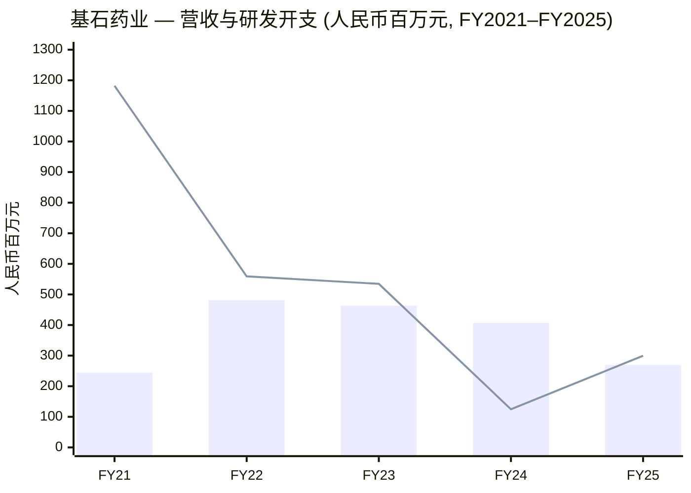
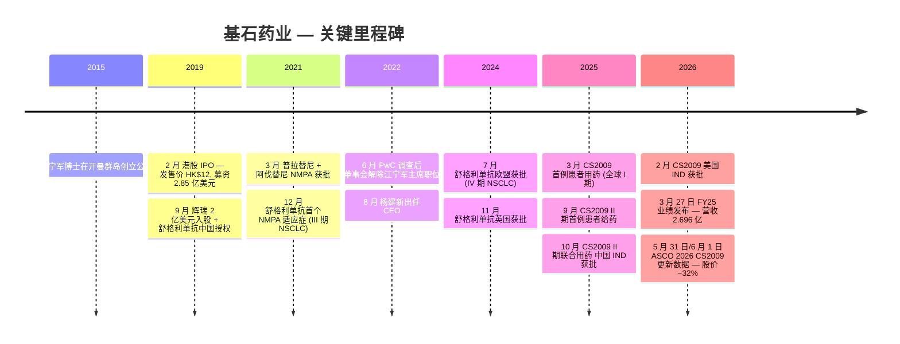
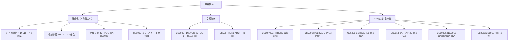
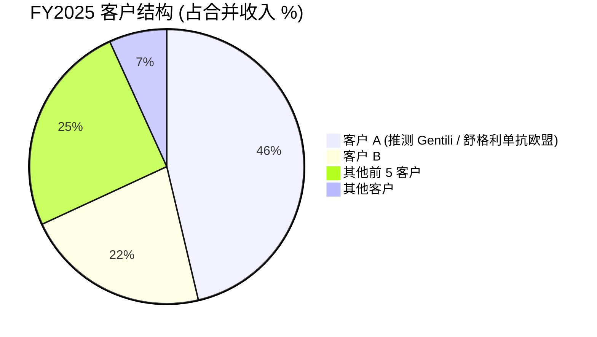
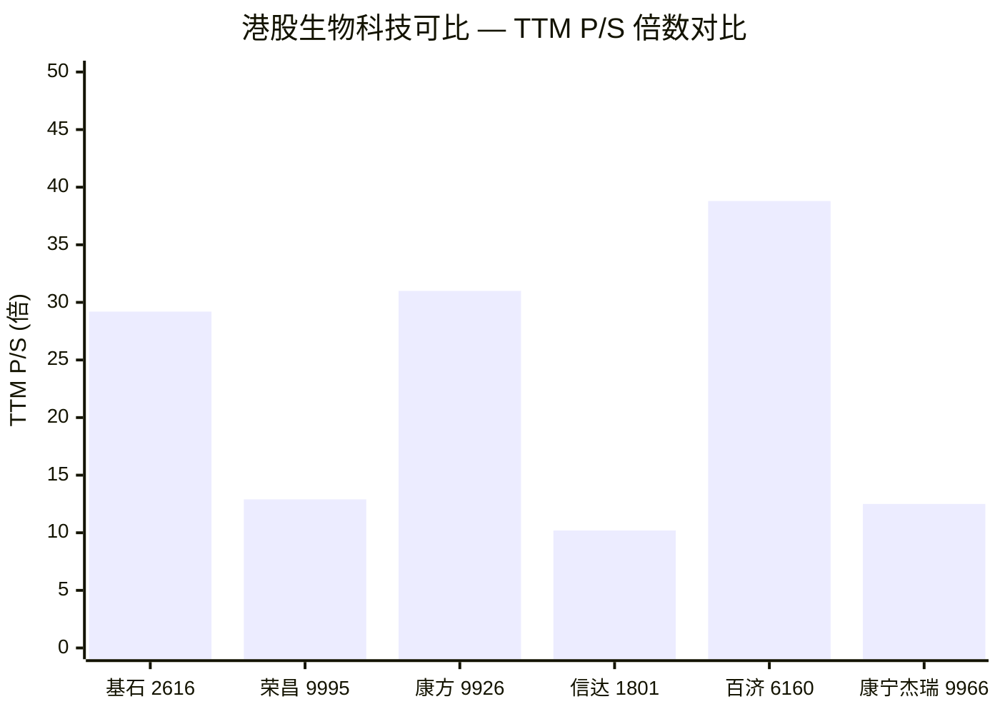
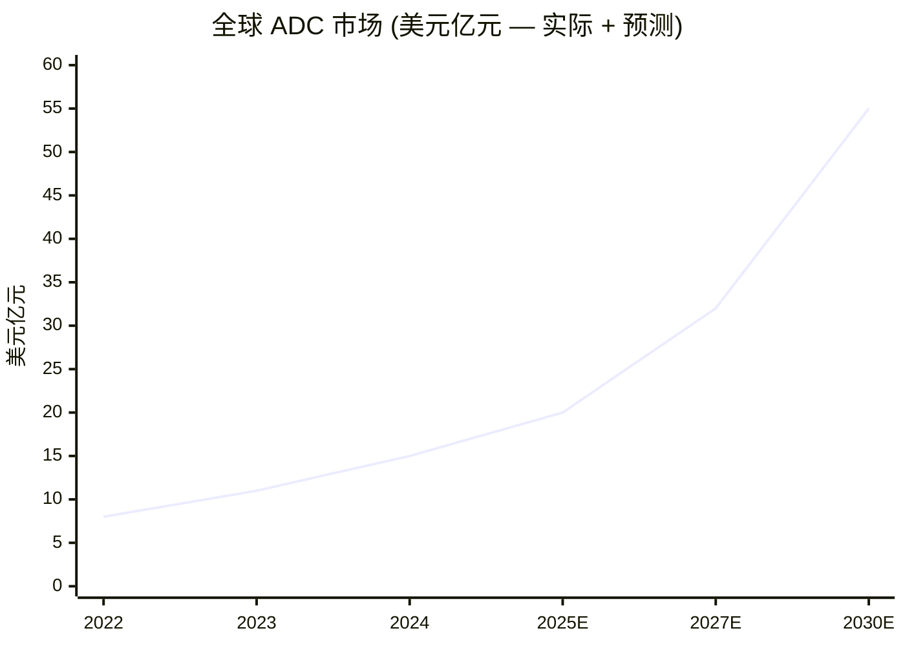

# 基石药业 (CStone Pharmaceuticals, HKEX:2616) — 公司研究

*首次覆盖报告 — 报告日期 2026-06-03 (港股 6/2 收盘 HK$4.93)。*

> **重要提示 — 刚刚发生了什么 (2026-06-01)：** 6月1日股价盘中暴跌约 32%（HK$8.05 → HK$5.60），紧随 ASCO 2026 公布 CS2009 三抗 (PD-1/VEGF/CTLA-4) 在 PD-L1 高表达一线 NSCLC 的最新数据。数据本身依然亮眼 —— 单药 ORR 81.3%、DCR 100% —— 但相对公司 3 月 27 日业绩说明会上披露的更小队列 (n=10) 中 **90%** 的 ORR 略有回落；与此同时，竞品康方 (9926.HK) 的 ivonescimab (依沃西单抗) 同一周在 HARMONi-6 给出阳性 OS 读数 (CNBC, 2026-05-31)。市场将这一差距解读为 "CS2009 仍有差异化，但不再是显然的 best-in-class"，并就此重新定价整个平台价值。公司自身仍维持积极指引 —— 全球 III 期 MRCT 计划于 2026 年底前启动，US IND 已于 2026 年 2 月获批。详见第 4.1 节。资料来源：[CStone ASCO 2026 新闻稿](https://www.cstonepharma.com/en/html/news/3873.html)；[2025 年度业绩演示稿 — 2026 年 3 月 27 日 p.16–21](https://www.cstonepharma.com/)；[CNBC 关于康方 HARMONi-6](https://www.cnbc.com/2026/05/31/asco-summit-akeso-ivonescimab-improves-survival-in-harmoni-6-trial.html)。

## 目录

1. 公司概览
2. 公司历史
3. 管理团队（创始人 + 现任 CEO）
4. 产品与管线
5. 客户、商业合作伙伴与集中度
6. 行业概览
7. 竞争格局
8. 市场机会（TAM / SAM）
9. 风险评估
10. 投资视角评分卡
11. 参考资料与核查日志

---

## 1. 公司概览

基石药业（"基石"、"CStone"、HKEX:2616）总部位于江苏苏州工业园区，在开曼群岛注册的创新型生物制药公司，专注于 oncology (肿瘤学)、immunology and inflammation (免疫与炎症) 领域。根据 [2025 年年度报告 (年报) p.14](https://www1.hkexnews.hk/listedco/listconews/sehk/2026/0428/2026042800526.pdf)，公司成立于 2015 年底，2019 年 2 月通过香港联交所 (Hong Kong Stock Exchange, HKEX) **第 18A 章** —— 即针对未盈利生物科技公司的上市规则 —— 主板挂牌，股票代码 2616，**"-B" 后缀**表明上市时尚未实现盈利 ([IPO 新闻稿，2019 年 2 月 26 日](https://www.prnewswire.com/news-releases/cstone-pharmaceuticals-listed-on-the-hong-kong-stock-exchange-today-300802866.html))。截至本报告，集团已成功推动 4 款创新药物在中国上市并获得 21 项 NDA 批准（覆盖 9 个适应症），同时拥有 16 款在研候选药物组成的均衡管线，涵盖 antibody-drug conjugate / ADC (抗体偶联药物)、multispecific antibody (多特异性抗体)、immunotherapy (免疫疗法) 及精准治疗药物 ([2025 年年报 — 首席执行官致辞 p.10](https://www1.hkexnews.hk/listedco/listconews/sehk/2026/0428/2026042800526.pdf))。

2025 年财务表现（经审计、IFRS 口径）是估值的真实锚点：营业收入 **人民币 2.696 亿元**（同比下降 33.8%，2024 年为 4.072 亿元），其中药品销售（阿伐替尼 / avapritinib、普拉替尼 / pralsetinib、舒格利单抗 / sugemalimab）人民币 7,830 万元、licensing fee income (授权费收入) 人民币 1.677 亿元、舒格利单抗 royalty income (特许权使用费收入) 人民币 2,360 万元；R&D expense (研发费用) 同比增长 131% 至 3.115 亿元（CS2009 I/II 期试验及 CS5007 IND 申报开支驱动）；cost of revenue (收入成本) 2.183 亿元（含为筹备 NRDL 谈判而对普拉替尼计提的 inventory write-down 存货撇减）；本年度亏损 4.370 亿元（2024 年为 9,120 万元），剔除 NRDL 相关的一次性渠道补偿 + 存货撇减共计 1.469 亿元后，调整后亏损为 2.901 亿元 ([2025 年年报 — 财务摘要 p.4–5](https://www1.hkexnews.hk/listedco/listconews/sehk/2026/0428/2026042800526.pdf))。截至 2025 年 12 月 31 日现金及定期存款余额为 **人民币 9.187 亿元**（同比增长 37%），同期银行借款 3.424 亿元 ([2025 年年报 — MD&A p.29](https://www1.hkexnews.hk/listedco/listconews/sehk/2026/0428/2026042800526.pdf))。按当前剔除 NRDL 噪音后约人民币 3 亿元的有机现金消耗节奏，公司净现金 runway (跑道) 约 24 个月 —— 足以支撑 CS2009 在 2026 年底前启动全球 III 期 MRCT，但不足以独立承担其后的全球三期开支；与 MNC (跨国制药公司) 的全球合作是股票故事中暗含的核心融资假设。

**估值快照。** 6 月 2 日收盘市值 **HK$78.79 亿元**（约合 10.1 亿美元），总股本 15.98 亿股 ([Yahoo Finance — 2616.HK](https://finance.yahoo.com/quote/2616.HK/))；扣除净现金后企业价值约 HK$66.5 亿元；trailing P/S **29.2 倍**（远高于港股生物科技板块约 10–13 倍中位数），P/B **10.2 倍**；trailing P/E 因亏损无意义；Yahoo 显示的 forward P/E −27 倍反映共识对未来 12 个月仍亏损的预期。52 周区间：HK$3.80 → HK$13.15，3.5 倍峰谷波动几乎完全反映对 CS2009 平台价值预期的变动，而非商业 run-rate (经营节奏) 的变化。当前 TTM P/S 处于可比公司中位水平 (Akeso 康方 9926: 31×, BeOne 6160: 39×, Innovent 信达 1801: 10×)，但基石的分母 **主要由 milestone / royalty income (里程碑 / 特许权收入) 构成**而非经常性产品销售，因此该倍数被一次性 licensing 收入机械放大 ([可比公司 — Yahoo Finance, 2026-06-03](https://finance.yahoo.com/quote/9926.HK/))。

*分析师观点：* 正确的估值框架是 **CS2009 + CS5001 (ROR1 ADC) 的 option value (期权价值)**，而非营收倍数。6 月 1 日的暴跌将该期权价值压缩至约 10 亿美元企业价值；作为参照，已与 Summit Therapeutics 签约的 PD-1/VEGF 领军企业康方目前股权市值约 120 亿美元。若 CS2009 能获得全球药企伙伴，即便是 Summit-Akeso 经济条件的一半（Summit 于 2023 年 1 月向 Akeso 支付 5 亿美元 upfront 获得 ivonescimab 海外权益，详见 [Fierce Pharma 2023](https://www.fiercepharma.com/pharma/summit-pays-akeso-500m-upfront-ex-china-rights-bispecific-promising-data-against-keytruda)），即可激进重估；若 2027 年仍无 partnership 落地，dilution 风险将成为主导叙事。

*柱状 = 营业收入；线条 = R&D expense (非 IFRS，已剔除股份支付)。数据来源：[2025 年年报 — 财务摘要 p.5](https://www1.hkexnews.hk/listedco/listconews/sehk/2026/0428/2026042800526.pdf)。*

## 2. 公司历史

基石药业于 **2015 年底** 在开曼群岛注册成立，创始人为江宁军博士 (Dr. Frank Ningjun Jiang)，一位有 Sanofi (赛诺菲) 等跨国制药公司背景的归国生物医药高管；公司官网 About / Vision 页面所述创立使命为"满足中国及全球癌症患者的迫切医疗需求"，目标是建立一家具有全球水准的肿瘤学研发企业。早期投资人包括 WuXi Healthcare Ventures（后并入 6 Dimensions Capital，现任董事会主席李伟博士即为该机构管理合伙人 —— [2025 年年报 — 董事简介 p.30–31](https://www1.hkexnews.hk/listedco/listconews/sehk/2026/0428/2026042800526.pdf)）以及多家成长期医疗投资人。

公司于 **2019 年 2 月 26 日** 通过香港联交所主板 第 18A 章 (未盈利生物科技专章) 上市 —— 股票代码 2616，含 "-B" 后缀 —— 以每股 HK$12.00 的发售价募集资金 HK$20.85 亿元（约 2.85 亿美元），IPO 时估值约 HK$118 亿元（约 15 亿美元） ([CStone IPO 新闻稿，2019 年 2 月 26 日](https://www.prnewswire.com/news-releases/cstone-pharmaceuticals-listed-on-the-hong-kong-stock-exchange-today-300802866.html); [BioCentury — CStone raises $285M in Hong Kong IPO, 2019-02-24](https://www.biocentury.com/bc-extra/financial-news/2019-02-24/cstone-raises-285m-hong-kong-ipo))。一个关键里程碑随之而来：2019 年 9 月 **Pfizer (辉瑞)** 以 2 亿美元现金认购约 10% 股权，同时获得 sugemalimab (舒格利单抗) 中国商业化权益，再加最高 2.8 亿美元的里程碑付款及销售提成 ([Fierce Biotech — Pfizer 与 CStone 交易，2019 年 9 月](https://www.fiercebiotech.com/biotech/pfizer-funnels-200m-into-cstone-licences-late-stage-cancer-med-china))。与辉瑞的关系（虽然后续随辉瑞收缩中国肿瘤业务而历经多次重组）至今仍是基石商业化叙事的最早脊梁。

2020 年代上半期是产品获批的密集期。**普吉华® (普拉替尼，pralsetinib)** —— 从 Blueprint Medicines（后被赛诺菲于 2025 年 7 月并购）授权大中华区 —— 由 NMPA (国家药监局) 于 2021 年 3 月批准用于 RET-fusion (RET 融合阳性) NSCLC (非小细胞肺癌)。**泰吉华® (阿伐替尼，avapritinib)** —— 同样源自 Blueprint —— 2021 年 3 月获批 PDGFRA-D842V 突变 GIST (胃肠道间质瘤)。**拓舒沃® (艾伏尼布，ivosidenib)** —— 源自法国 Servier 的 IDH1 抑制剂，用于 AML / 胆管癌 —— 2022 年初获批；该药权益已转回 Servier ([2025 年年报 — 首席执行官致辞 p.10](https://www1.hkexnews.hk/listedco/listconews/sehk/2026/0428/2026042800526.pdf))。基石自主发现的旗舰产品 **舒格利单抗 (sugemalimab, CS1001, 择捷美®)** —— 基于 OmniRat® transgenic mouse platform (转基因小鼠平台) 开发的全人源抗 PD-L1 IgG4 单抗 —— 2021 年 12 月获 NMPA 批准首个适应症 (III 期 NSCLC)，至今累计获批 5 项中国适应症，并已在 60 余个国家和地区建立商业化网络 ([2025 年年报 — MD&A p.15–17](https://www1.hkexnews.hk/listedco/listconews/sehk/2026/0428/2026042800526.pdf))。

**2022 年中** 出现关键转折点：PricewaterhouseCoopers Management Consulting Shanghai (普华永道管理咨询上海) 对一项内部投资决策展开为期数周的审查后，董事会于 2022 年 6 月解除创始人江宁军博士的董事会主席职位；江博士随后于 **2022 年 8 月 25 日** 完整退出 CEO 及执行董事职务 ([BioCentury — Jiang loses chairman title, 2022](https://www.biocentury.com/article/643842/jiang-loses-chairman-title-as-cstone-seeks-rebound-from-investment-misstep))。时任首席医学官兼临床开发负责人的杨建新博士 (Dr. Jianxin / Jason Yang) 接任 CEO，沿任至今 ([2025 年年报 — 执行董事简介 p.30](https://www1.hkexnews.hk/listedco/listconews/sehk/2026/0428/2026042800526.pdf))。杨建新博士主导的 2022 年后战略转向包括：(i) 大幅放弃原计划的自建工厂和美国 biotech 子公司布局，转向 asset-light (轻资产) 的 CRO/CDMO 外包模式；(ii) 将所有商业化产品在中国大陆通过合作伙伴模式推广（艾力斯负责普吉华、恒瑞负责泰吉华、辉瑞负责择捷美），将节约的 SG&A 重新配置到研发；(iii) 构建 "管线 2.0" —— 一组 12 个新一代多特异性抗体和 ADC 候选药物，主打 CS2009 (PD-1/VEGF/CTLA-4 三抗) 和 CS5001 (ROR1 ADC，自韩国 LigaChem Biosciences 获得韩国以外全球权益) ([2025 年度业绩演示稿，2026 年 3 月 27 日，幻灯片 3–5](https://www.cstonepharma.com/))。

最近两年是将"管线 2.0"愿景转化为临床数据的密集执行期。舒格利单抗于 2024 年中获 EU/UK IV 期 NSCLC 批准，并于 2025 年 11 月（欧盟）及 2026 年 2 月（英国）获 III 期 NSCLC 批准 —— 是仅有的两款在欧盟和英国均获批用于 III 期 NSCLC 治疗的抗 PD-(L)1 抗体之一 ([3 月 27 日业绩演示稿，slide 28](https://www.cstonepharma.com/))。阿伐替尼和普拉替尼均被纳入（或续约）2026 年 1 月 1 日生效的 NRDL (国家医保药品目录)，锁定了销量提升的中长期空间，同时也带来 FY25 短期收入压力 ([2025 年年报 — MD&A p.17–19](https://www1.hkexnews.hk/listedco/listconews/sehk/2026/0428/2026042800526.pdf))。CS2009 于 2025 年 3 月（全球 I 期）首例患者给药，2025 年 9 月推进至 II 期；中国 IND（联合用药）于 2025 年 10 月获批，美国 IND 于 2026 年 2 月获批，为 2026 年底前启动全球 III 期 MRCT 铺平道路 ([3 月 27 日业绩演示稿，slide 13](https://www.cstonepharma.com/))。

*资料来源：[2025 年年报 p.4–25](https://www1.hkexnews.hk/listedco/listconews/sehk/2026/0428/2026042800526.pdf)；[BioCentury 2022](https://www.biocentury.com/article/643842/jiang-loses-chairman-title-as-cstone-seeks-rebound-from-investment-misstep)；[IPO 新闻稿](https://www.prnewswire.com/news-releases/cstone-pharmaceuticals-listed-on-the-hong-kong-stock-exchange-today-300802866.html)；[ASCO 2026 readout](https://www.cstonepharma.com/en/html/news/3873.html)。*

## 3. 管理团队 —— 创始人 + 现任 CEO

**创始人 —— 江宁军博士 (Dr. Frank Ningjun Jiang, 2022 年 8 月后不再任职)。** 江博士于 2015 年底以"打造一家中国本土的全球水准肿瘤学研发企业"为创立愿景成立基石药业，模式借鉴西方 biotech 但利用中国较低的临床和制造成本基础。他是公司 IPO 前商业模式的设计者 —— 与 Blueprint (普拉替尼及阿伐替尼)、Agios/Servier (艾伏尼布) 的 in-licensing 合作，以及自主开发舒格利单抗从临床前到 NMPA 获批，均出自其规划。加入基石之前，江博士曾在赛诺菲等跨国药企负责肿瘤学开发；其在基石的任期内交付了 6 年内 4 项 NDA 和 2.85 亿美元的 IPO，但 2022 年 PwC 对资本配置决策的内部调查曝光了治理层面的隐患，导致董事会于 2022 年 6 月解除其主席职务，并于 2022 年 8 月 25 日完整退出 CEO 和 ED 职位 ([BioCentury — Jiang loses chairman title, 2022](https://www.biocentury.com/article/643842/jiang-loses-chairman-title-as-cstone-seeks-rebound-from-investment-misstep))。江博士目前在公司无任何运营角色；2025 年年报披露的 substantial shareholder 名单中未提及其名字，暗示其持股已低于 5% 披露门槛 ([2025 年年报 — 主要股东披露 p.41–42](https://www1.hkexnews.hk/listedco/listconews/sehk/2026/0428/2026042800526.pdf))。江博士作为创始人在公司历史上占据关键位置，但目前对战略已无前瞻性影响。

**现任 CEO —— 杨建新博士 (Dr. Jianxin / Jason Yang)，M.D., Ph.D., 62 岁，CEO + 执行董事 + 研发总裁 + 战略委员会主席。** 杨博士自 2022 年 8 月创始人交接后任 CEO，并于 2023 年 6 月股东大会上重选为执行董事 ([2025 年年报 — 执行董事简介 p.30](https://www1.hkexnews.hk/listedco/listconews/sehk/2026/0428/2026042800526.pdf))。学术背景：医学学士（1985 年湖北医学院）；病理生理学硕士（1988 年南京医学院）；分子生物学博士（1995 年得克萨斯大学西南医学中心，师从诺贝尔奖得主 Michael Brown 与 Joseph Goldstein）；哈佛大学化学生物学博士后（1995–1998 年，师从 Stuart Schreiber）。商业履历约 30 年，覆盖发现、translational research (转化研究)、临床开发及商业化。他于 **2016 年 12 月** 加入基石担任首席医学官兼高级副总裁，2022 年 8 月接任 CEO —— 至今已积累 9 年针对基石全部资产的内部视角，是 CS2009 及"管线 2.0"战略的运营主导者。

加入基石前，杨博士于 2014 年 7 月至 2016 年 12 月任 **百济神州 (BeiGene, NASDAQ:ONC, HKEX:6160, SSE:688235)** 高级副总裁兼临床开发负责人，从零搭建临床团队，主导 PD-1 (替雷利珠单抗)、BTK 抑制剂 (zanubrutinib)、PARP 抑制剂 (pamiparib) 和 RAF 抑制剂等十余项试验 —— 这批药物后来将百济从未盈利 biotech 推升至 300 亿美元以上市值的全球肿瘤 MNC。2011 年 9 月至 2014 年 7 月任 **科文斯 (Covance Inc.)** 临床肿瘤医学总监。2004 年 10 月至 2011 年 8 月任 **辉瑞 (Pfizer)** 肿瘤生物标志物 Senior Principal Scientist。博士后毕业的第一份工作是 1998 年 9 月至 2004 年 9 月任 **Tularik Inc.** (2004 年被 Amgen 收购) 癌症基因组学部门研究科学家。他是 15 项专利的 inventor，80+ 篇论文及大会报告作者，10+ 篇发表于 *JAMA*、*Nature Medicine*、*The Lancet Oncology*、*JCO*、*Nature Cancer* 和 *Clinical Cancer Research* ([2025 年年报 — 执行董事简介 p.30](https://www1.hkexnews.hk/listedco/listconews/sehk/2026/0428/2026042800526.pdf))。FY25 董事薪酬总额（包括杨博士）为人民币 2,605 万元 ([2025 年年报 — 附注 10](https://www1.hkexnews.hk/listedco/listconews/sehk/2026/0428/2026042800526.pdf))；杨博士持有 IPO 前和 IPO 后股权激励计划下的股票期权及 restricted share unit (RSU) (2024 年 3 月授予 RSU 189 万份 + IPO 后期权)。投资者关系叙事完全由杨博士主导：FY25 CEO 致辞由其撰写，2026 年 3 月 27 日业绩说明会全部 CS2009 数据均由其本人讲解。*分析师观点：* "CEO-as-CMO" 的角色组合对基石而言是结构性优势 —— 鉴于"管线 2.0"的技术复杂度，每一项临床设计决策都流经一位亲自读过 protocol 的人 —— 但也将 succession risk (继任风险) 集中到单一个体；2026 年主席致辞显示董事会对杨博士保持完全信任，短期内无交接风险显现。

## 4. 产品与管线 —— 最关键的章节

基石药业有 3 款商业化产品在中国 + 欧洲销售，再加上"管线 2.0"中的 12 个下一代研发候选药物；另有 4 项遗留资产（舒格利单抗在中国 5 个适应症；普拉替尼用于 NSCLC 和 TC；阿伐替尼用于 GIST / ISM / ASM；CS1002 抗 CTLA-4 已授权恒瑞）处于商业化或后期试验阶段。完整 16 项资产矩阵详见 [2025 年年报 p.15](https://www1.hkexnews.hk/listedco/listconews/sehk/2026/0428/2026042800526.pdf)；2026 年 3 月 27 日业绩说明会以 ["16 项创新产品" 幻灯片 42–43](https://www.cstonepharma.com/) 呈现。markdown 复现如下表。

| 资产 | 模态 / 靶点 | 主要适应症 | 阶段（除非另注，皆为中国大陆） | 商业权利 |
|---|---|---|---|---|
| 舒格利单抗 (CEJEMLY®) | Anti-PD-L1 mAb (IgG4) | NSCLC IV/III; G/GEJ; ESCC; R/R ENKTL | 已上市（中国大陆 5 项适应症；欧盟/英国 III + IV 期 NSCLC） | 基石（中国大陆，辉瑞协同推广；海外通过 Ewopharma / Pharmalink / SteinCares / Gentili 合作伙伴） |
| 普拉替尼 (GAVRETO® / 普吉华®) | RET 激酶抑制剂 | 1L/2L RET-fusion NSCLC; RET-mutant TC | 已上市 中国大陆/HK/TW; 2026 年 1 月 NRDL 纳入 | 自 Blueprint (现赛诺菲) 授权；中国大陆与艾力斯共同推广 |
| 阿伐替尼 (AYVAKIT® / 泰吉华®) | KIT/PDGFRA 抑制剂 | PDGFRA-外显子 18 GIST; ISM/ASM (US/EU) | 已上市 中国大陆/HK/TW; 2026 年 1 月 NRDL 续约 | 自 Blueprint (现赛诺菲) 授权；中国大陆由恒瑞推广 |
| CS1002 | Anti-CTLA-4 mAb | NSCLC, HCC, BTC（联合用药） | III 期（已授权） | 已授权恒瑞（大中华区，2021 年）；基石保留 ROW 权益 |
| **CS2009** | **PD-1/VEGF/CTLA-4 三抗** | **实体瘤（NSCLC, CRC, SCLC, 卵巢癌, 胃癌等）** | **全球 I/II 期进行中；III 期 MRCT 计划 2026 年底启动** | 全球权益 |
| **CS5001 (LCB71)** | **ROR1 ADC，PBD 前药 payload** | **DLBCL + ROR1+ 实体瘤** | **全球 Ib 期进行中（澳大利亚 + 中国）** | 自韩国 LigaChem Biosciences 获得韩国以外全球权益 |
| CS5007 | EGFR/HER3 双抗 ADC | NSCLC, TNBC, SCCHN, CRC | IND 准备就绪（H1 2026 美国/中国 IND 申报） | 全球 |
| CS5006 | ITGB4 ADC（全球首创）| CRC, SCCHN, NSCLC | IND 准备就绪（H2 2026） | 全球 |
| CS5008 | SSTR2/DLL3 双抗 ADC | SCLC, NEN | IND 准备就绪（H2 2026） | 全球 |
| CS5009 | B7H3/PD-L1 双抗 ADC | 实体瘤 | 临床前 | 全球 |
| CS5010 | HER2 双毒素 ADC | 实体瘤 | 临床前 | 全球 |
| CS5012 | HER2 新型毒素 ADC | 实体瘤 | 临床前 | 全球 |
| CS2013 | BAFF/APRIL 双抗 mAb | 免疫与炎症 | IND 准备就绪 | 全球 |
| CS2016 | TL1A/α4β7 双抗 mAb | IBD | 临床前 | 全球 |
| CS1016 | PD-1 激动剂 mAb | 自身免疫 | 临床前 | 全球 |
| CS1012 | GDF-15 mAb | 实体瘤 | 药物发现 | 全球 |

*资料来源：[2025 年年报 p.15 — 管线图](https://www1.hkexnews.hk/listedco/listconews/sehk/2026/0428/2026042800526.pdf)；[2026 年 3 月 27 日业绩演示稿 p.42–43](https://www.cstonepharma.com/)。*

### 4.1 CS2009 —— PD-1/VEGF/CTLA-4 三特异性抗体 （股票主线）

CS2009 是基石"管线 2.0"的旗舰资产，也是当前股权价值敏感性的最大单一决定因素。根据 [2025 年年报 MD&A p.19–20](https://www1.hkexnews.hk/listedco/listconews/sehk/2026/0428/2026042800526.pdf) 原文：*"CS2009 ... 一款由基石药业自主研发的潜在同类首创／同类最优的 PD-1/VEGF/CTLA-4 三特异性抗体。其结合了三种经临床验证的靶点 PD-1、VEGFA 和 CTLA-4，通过协同作用实现多维度的抗肿瘤效应"*。差异化设计意图是 ——在 TME (tumor microenvironment, 肿瘤微环境) 中，CS2009 优先结合双阳性肿瘤浸润 T 细胞表面的 PD-1 和 CTLA-4；在外周，由于 CTLA-4 臂亲和力低，避免了导致 Yervoy (易普利姆玛) 一类 CTLA-4 mAb 在实体瘤联合疗法中出现系统性毒性的问题。

**机制 —— 生化层面。** 三特异性结构在体外测得三个 binding KD：PD-1 1.606E-08 M, CTLA-4 1.837E-08 M, 同时结合 PD-1+CTLA-4 1.060E-09 M；加入 VEGFA 二聚体后每个 KD 再下降 1–3 个数量级（PD-1+CTLA-4+VEGFA: <1.0E-12 M），即 TME 中 avidity-driven cooperative binding (亲合力驱动的协同性结合) ([2026 年 3 月 27 日业绩演示稿 p.11](https://www.cstonepharma.com/))。试验设计为覆盖 9 类实体瘤适应症、15 个研究队列的多队列 I/II 期：NSCLC（鳞癌和非鳞癌；1L PD-L1 ≥50%；2L/3L IO-经治）；CRC；SCLC；宫颈癌；G/GEJ；ESCC；PROC 卵巢癌；TNBC；HCC。

**I 期安全性 (截至 2026 年 3 月数据截止, n=113)。** 六个剂量水平 (1, 3, 10, 20, 30, 45 mg/kg Q3W) 全部完成；无 DLT (剂量限制性毒性)；未达到 MTD (最大耐受剂量)。≥3 级 TRAE 23.0%；≥3 级 immune-related TEAE 12.4%；≥3 级 VEGF-related TRAE 4.4%；因 AE 停药率 8.0% ([3 月 27 日业绩演示稿 — slide 15 安全性表](https://www.cstonepharma.com/))。公司原文：*"未出现含 CTLA-4 和 PD-(L)1 联合治疗方案中频发的严重毒性，且≥3 级 VEGF 相关不良事件发生率低"*。这是最关键的安全声明，因为它正是三抗与 Yervoy + Keytruda 联合方案的关键区分点 —— 后者在肺癌领域始终未能找到正向 risk-benefit profile (风险收益曲线)。

**有效性数据 —— 实际数据是什么。** ASCO 之前（2026 年 3 月业绩说明会公布的"3 月中旬"数据截止），CS2009 单药 20/30 mg/kg Q3W 用于 1L PD-L1 TPS ≥50% NSCLC，在 10 例可评估患者中取得 **ORR 90.0% (9/10)** + **DCR 100% (10/10)** —— 公司将其定位为"潜在改变治疗格局" ([3 月 27 日业绩演示稿 p.16](https://www.cstonepharma.com/))。在 2026 年 5 月 31 日 / 6 月 1 日的 ASCO 大会上，更大队列（全球 I/II 期项目累计入组约 300 人）的更新数据显示，同一 1L PD-L1 TPS ≥50% NSCLC 单药队列 **ORR 81.3%，DCR 100%**，跨鳞癌 (87.5%) 与非鳞癌 (75.0%) 一致；PD-L1 低 / 阴性鳞状 1L NSCLC + 化疗联合队列 **ORR 75.0%，DCR 100%**（PD-L1 阴性亚组 ORR 100%）；2L/3L 联合队列 **ORR 66.7%, DCR 100%** ([ASCO 2026 新闻稿，2026 年 6 月 1 日](https://www.cstonepharma.com/en/html/news/3873.html))。90% → 81.3% 的回落是在更大的分母上发生的（90% 仅 n=10），从统计学角度看，更宽的更新数据是更接近真实值的估计 —— 但市场为头条数字定价，差距构成 6 月 1 日暴跌的主要原因。基准比较：康方 ivonescimab (PD-1/VEGF 双抗) 在 HARMONi-2 III 期对比 pembrolizumab 一线 PD-L1+ NSCLC，ORR 60% (ivo) vs 48% (Keytruda) ([CStone deck p.17 — 引自 WCLC 2025](https://www.cstonepharma.com/))；Keytruda + 化疗在 1L PD-L1 TPS ≥50% NSCLC 中 ORR 基准为非鳞癌 61.4% (KEYNOTE-189)、鳞癌 60.3% (KEYNOTE-407) ([CStone deck p.17 注](https://www.cstonepharma.com/))。即便取 ASCO 的较低读数，CS2009 仍显著高于基准 —— 问题是这个绝对领先在全球 III 期、OS endpoint 下是否足以拿到 label。

**冷肿瘤活性。** CS2009 单药在非透明细胞 RCC (n=5) 中 ORR 40%、DCR 100%；在软组织肉瘤 STS (n=9) 中 ORR 33.3%、DCR 66.7% —— 这两类瘤种当前 PD-(L)1 单药基本无效 ([3 月 27 日业绩演示稿 p.20](https://www.cstonepharma.com/))。若该信号在扩展队列中维持，CS2009 可形成 ivonescimab 无法匹配的"冷肿瘤 I-O 骨架"定位。

*分析师观点：* CS2009 仍是真正的下一代 I-O backbone 候选药物，但相对 ivonescimab 的差异化已比 3 月 27 日演示稿暗示的更窄。冷肿瘤信号和更干净的 CTLA-4 毒性曲线是支撑股票故事的两大支柱；2026 年底前能否签下 MNC 合作是最关键的单一催化剂。

*资料来源：[2025 年年报 — 管线矩阵 p.15](https://www1.hkexnews.hk/listedco/listconews/sehk/2026/0428/2026042800526.pdf)。*

### 4.2 CS5001 (LCB71) —— ROR1 ADC

CS5001 是靶向 ROR1 (receptor tyrosine kinase-like orphan receptor 1) 的 ADC，由基石从韩国 LigaChem Biosciences (LCB) 获得韩国以外全球权益。根据 [2025 年年报 MD&A p.20](https://www1.hkexnews.hk/listedco/listconews/sehk/2026/0428/2026042800526.pdf)：*"CS5001 是一款以 ROR1 为靶点的临床阶段 ADC … 使用腫瘤特異激活的吡咯并苯二氮卓 (pyrrolobenzodiazepine, PBD) 前毒素载荷 (payload) 和连接子 (linker)"*。差异化设计：(i) 全人源 IgG1 抗 ROR1 抗体；(ii) 位点特异性 "ConjuAll" 偶联技术，平均 DAR (drug-antibody ratio) 控制在 2；(iii) 肿瘤选择性葡萄糖醛酸连接子，由 β-glucuronidase 在肿瘤细胞内裂解；(iv) PBD 前毒素只在肿瘤细胞内激活，降低传统 PBD ADC 的系统性毒性。这一组合的目标是 —— 用 PBD 的 DNA 交联机制达到 MMAE / DXd / exatecan 难以达到的对慢生长肿瘤的杀伤效果，同时保留更宽的安全窗口。

**Ib 期数据。** 1L DLBCL 联合 R-CHOP（n=22，跨 50/70/90 µg/kg 三个剂量组）：**ORR 100%，CR 95.5%** ([3 月 27 日业绩演示稿 p.25](https://www.cstonepharma.com/))。DLBCL 外活性：在 follicular lymphoma、marginal zone lymphoma、Hodgkin、mantle cell 中均观察到抗肿瘤活性；正在探索 r/r CLL。实体瘤中：ROR1+ 实体瘤显示出抗肿瘤活性；与舒格利单抗联合用于实体瘤耐受性良好。公司声明 CS5001 是首个在淋巴瘤和实体瘤中均显示临床抗肿瘤活性的 ROR1 ADC —— 若该说法成立，意义重大，因为全球 ROR1 ADC 领域目前由 Merck 的 zilovertamab vedotin (前 VLS-101，淋巴瘤 III 期) 和 Pyxis Oncology PYX-201 (临床前 / I 期) 主导。

*分析师观点：* CS5001 是基石企业期权价值的第二大来源；1L DLBCL + R-CHOP 100% ORR / 95.5% CR 读数在该领域具有竞争力，与舒格利单抗的 ADC + I-O 组合也构成内部平台优势。主要风险是 LCB 的韩国除外授权限制了若需引入全球药企伙伴时的 CStone 上行空间。

### 4.3 商业化产品 —— 舒格利单抗、普拉替尼、阿伐替尼

**舒格利单抗 (CEJEMLY® / 择捷美®)。** 基于 OmniRat® 转基因小鼠平台开发的全人源 anti-PD-L1 IgG4 mAb；[2025 年年报 MD&A p.16](https://www1.hkexnews.hk/listedco/listconews/sehk/2026/0428/2026042800526.pdf) 原文：*"是一种最接近人体的天然 G 型免疫球蛋白 4（IgG4）单抗药物，潜在能降低在患者体内产生免疫原性及相关毒性的风险"*。中国 NMPA 5 项适应症：1L IV 期 NSCLC（鳞癌 + 非鳞癌，联合化疗）；III 期不可切除 NSCLC（CRT 后巩固治疗）；R/R ENKTL；1L ESCC + 化疗；1L PD-L1 CPS ≥5 G/GEJ + 化疗。欧盟 EC + 英国 MHRA 批准 2 项适应症：IV 期 NSCLC + 化疗（无 EGFR/ALK/ROS1/RET 突变）；III 期 NSCLC consolidation（PD-L1 ≥1%，无 EGFR/ALK/ROS1）。ESMO 指南状态：III 期 NSCLC（2026 年 3 月更新）和 IV 期 NSCLC（2025 年 2 月更新）均获 I, A 级推荐。全球商业化网络：60+ 国家通过 Ewopharma（瑞士 + 18 个中东欧）、Pharmalink（12 个中东非洲）、SteinCares（10 个拉美）和 Gentili（23 个欧盟/英国）合作伙伴覆盖。GEMSTONE-303 注册研究（G/GEJ 适应症）最终 PFS / OS 分析发表于 *JAMA*（2025 年 2 月），GEMSTONE-302 长期生存数据发表于 *The Lancet Oncology*（2025 年 6 月）([3 月 27 日 deck p.28](https://www.cstonepharma.com/))。该品牌承载基石资产中最强的外部背书；待落地的可选项是 2026 下半年向 EMA / MHRA 提交 G/GEJ 和 / 或 ESCC 适应症申请。

**普拉替尼 (GAVRETO® / 普吉华®)。** 选择性 RET 激酶抑制剂，自 Blueprint Medicines（2025 年 7 月赛诺菲完成对 Blueprint 收购后归赛诺菲）授权。中国大陆获批 1L/2L RET-fusion NSCLC 及 RET 突变 TC；同时获香港卫生署和台湾 TFDA 批准 RET-fusion NSCLC + TC。中国大陆由艾力斯肺癌业务部协同推广 —— *"普吉华®(普拉替尼)纳入并整合于艾力斯的高度协同肺癌业务部"* ([2025 年年报 MD&A p.17](https://www1.hkexnews.hk/listedco/listconews/sehk/2026/0428/2026042800526.pdf))。NMPA 于 2025 年 7 月批准地产化生产；首次纳入 NRDL 2026 年 1 月 1 日生效。3 月 27 日 deck (slide 30) 显示 2026 年 1–2 月终端销售量同比增长近 **4 倍**，NRDL 后放量信号明显。管理层指引 NRDL 后销量增长 5–8 倍 ([3 月 27 日 deck p.27](https://www.cstonepharma.com/))。

**阿伐替尼 (AYVAKIT® / 泰吉华®)。** 同类首创 KIT/PDGFRA 抑制剂，自 Blueprint 授权。中国大陆获批 PDGFRA 外显子 18 (包括 D842V) GIST；HK / TW 同样获批。中国大陆由恒瑞推广（2024 年 7 月签约）。地产化生产 NMPA 2024 年 8 月获批，2025 年 2 月启动地产化供应。NRDL 于 2026 年 1 月 1 日续约（2023 年 12 月首次纳入）。3 月 27 日 deck (slide 30) 显示地产化后销量稳步增长。

2024–2025 年商业重组的战略逻辑直观：把每款商业化产品交给在中国有 1000+ 肿瘤代表队伍的本土合作伙伴（艾力斯负责肺癌、恒瑞负责 GIST/CRC、辉瑞负责 PD-L1），基石自身砍掉 SG&A，同时保留 milestone + royalty 经济利益，将每年人民币 5,000 万–1 亿元的现金消耗节约重投入"管线 2.0" —— FY25 SG&A 同比下降 29% 至 1.604 亿元，与此同时 R&D 同比 +140%，正体现这一逻辑 ([2025 年年报 — 财务摘要 p.5](https://www1.hkexnews.hk/listedco/listconews/sehk/2026/0428/2026042800526.pdf))。

## 5. 客户、商业合作伙伴与集中度

基石"客户"在财务报告口径下指的是商业 / 授权合作伙伴，而非终端患者。根据 [2025 年年报 — 附注 6 分部资料 p.131](https://www1.hkexnews.hk/listedco/listconews/sehk/2026/0428/2026042800526.pdf)，基石仅一个 reporting segment（创新生物制药 R&D、药品销售、IP 授权），CODM 为 CEO；地理收入按客户注册办公地点划分：

| 地区 | FY2025 (人民币千元) | FY2024 (人民币千元) | FY25 占比 | 同比 |
|---|---:|---:|---:|---:|
| 中国大陆 | 83,843 | 293,355 | 31.1% | −71.4% |
| 中国大陆以外 | 185,740 | 113,850 | 68.9% | +63.1% |
| **合计** | **269,583** | **407,205** | **100.0%** | **−33.8%** |

*资料来源：[2025 年年报 — 附注 6 地区资料 p.131](https://www1.hkexnews.hk/listedco/listconews/sehk/2026/0428/2026042800526.pdf)。*

FY25 地理分布的剧变反映了 (i) 普拉替尼 / 阿伐替尼 NRDL 价格调整 + 渠道补偿对中国大陆收入的一次性压制，以及 (ii) 海外授权里程碑（Ewopharma / Pharmalink / SteinCares / Gentili）+ 辉瑞 royalty 的不规则进账。

**客户集中度 —— 注意分母为合并收入。** 根据 [2025 年年报 — 附注 6 主要客户资料 p.131](https://www1.hkexnews.hk/listedco/listconews/sehk/2026/0428/2026042800526.pdf)：

| 客户 | FY2025 (人民币千元) | 占合并收入 (FY25) | FY2024 (人民币千元) | 占合并收入 (FY24) |
|---|---:|---:|---:|---:|
| 客户 A | 124,938 | 46.3% | — | <10% |
| 客户 B | 58,640 | 21.8% | 157,956 | 38.8% |
| 客户 C | <10% 门槛 | <10% | 134,650 | 33.1% |
| **前 5 大客户合计** ([董事会报告 p.71](https://www1.hkexnews.hk/listedco/listconews/sehk/2026/0428/2026042800526.pdf)) | **~2.51 亿** | **93.2%** | n.d. | n.d. |

*所有数据均为合并收入（集团口径，非分部口径）。客户名称未在审计文件中披露。*

最大客户（客户 A）FY25 占合并收入 **46.3%**（FY24 不足 10%），表明一笔大额一次性授权或里程碑入账 —— 最可能是 2025 年 7 月签约的 Gentili 欧盟/英国舒格利单抗授权（首付款较大），或 2025 年 1 月签约的 SteinCares 拉美交易。前 5 大客户合计 **93.2%** 集中度极高 —— 这对于一家收入主要由授权里程碑驱动的早期专科生物制药公司是常态，但属结构性风险：任一合作伙伴退出或任一里程碑延后一个季度，都会显著改变损益。

前 5 大供应商合计 31.8%，最大供应商 7.3% ([董事会报告 p.71](https://www1.hkexnews.hk/listedco/listconews/sehk/2026/0428/2026042800526.pdf)) —— 与轻资产 CDMO + CRO 经营模式相符。

*资料来源：[2025 年年报 附注 6 p.131；董事会报告前 5 大客户合计 p.71](https://www1.hkexnews.hk/listedco/listconews/sehk/2026/0428/2026042800526.pdf)。客户身份未在年报中披露；"推测为 Gentili"是基于 FY25 授权交易时序和金额的分析师推断，非披露事实。*

**商业合作伙伴生态。** 按地区当前合作伙伴名单：

- **辉瑞 (Pfizer)** —— 舒格利单抗中国商业权益（自 2019 年 9 月；最初持股约 10%，后续轮次稀释）。
- **艾力斯 (Allist Pharmaceuticals)** —— 普拉替尼中国大陆独家商业化（自 2023 年 11 月）。
- **恒瑞医药 (Hengrui, SSE:600276, HKEX:1276)** —— 阿伐替尼中国大陆独家推广（自 2024 年 7 月）+ CS1002 抗 CTLA-4 大中华区独家授权（自 2021 年 11 月，正在 II/III 期 4 项试验中）。
- **赛诺菲 (Sanofi，通过收购 Blueprint，2025 年 7 月完成)** —— 普拉替尼 + 阿伐替尼 + 艾伏尼布的原始授权方；持续 royalty 和 milestone 对手方。
- **Ewopharma** —— 瑞士 + 18 个中东欧国家舒格利单抗（自 2024 年）。
- **Pharmalink Store LLC OPC** —— 12 个中东非洲 + 南非舒格利单抗（自 2024 年）。
- **SteinCares** —— 10 个拉美国家舒格利单抗（自 2025 年 1 月）。
- **Istituto Gentili** —— 23 个欧盟/英国国家舒格利单抗（自 2025 年 7 月）。
- **LigaChem Biosciences (KRX:141080)** —— LCB71/CS5001 (ROR1 ADC) 原始授权方，韩国除外全球权益（自 2020 年）。

*分析师观点：* 合作伙伴主导的商业化模式给了基石符合其规模的曝光 —— 在不用承担全球销售基础设施成本的前提下获得长尾收入 —— 但也使报告收入本质上 lumpy 且受里程碑驱动；任何基于 FY25 收入直线外推的模型都是错位的。正确的框架是分部加总 (sum-of-the-parts)：(i) 既定里程碑付款 + (ii) royalty 流 + (iii) 管线 2.0 NPV。

## 6. 行业概览

基石在三个相互重叠的市场内运营：(a) **中国肿瘤学创新药** —— 主场，由 NMPA 监管，通过 NRDL 报销，结构性面临每年 NRDL 谈判的"以量换价"压力；(b) **全球生物制剂对 MNC 出海授权** —— BD 市场，对基石现在通过"管线 2.0"打造的临床后期 / III 期就绪肿瘤资产估值定价；(c) **immuno-oncology 免疫肿瘤学** —— 更广阔的科学 / 竞争场域，其中双特异性（康方 ivonescimab）和现在的三特异性（基石 CS2009）PD-(L)1/VEGF 组合正在重写一线肺癌治疗格局。

**中国肿瘤药市场。** 据多家行业追踪机构，中国肿瘤药市场 2024 年零售规模约人民币 2,900–3,000 亿元，CAGR 9–11%（卖方研报数据交叉验证，具体引用因机构而异）。创新药细分约占 30%，即约人民币 900 亿元；免疫肿瘤 / PD-(L)1 细分 2024 年约人民币 250–300 亿元。结构性环境对创新有利：NRDL 是规模化的核心通道，且 NRDL 在 formulary 范围和年度预算上持续扩张。具体到 PD-(L)1，当前中国市场竞争激烈，至少 7 款国产 PD-(L)1 抗体已纳入 NRDL（百济神州替雷利珠单抗、信达信迪利单抗、君实拓益、恒瑞卡瑞利珠单抗、康方派安普利单抗，加上基石舒格利单抗等），主要在适应症覆盖和 NRDL 谈判后价格上竞争。CS2009 在中国的机会在于 **它位于商品化 PD-(L)1 浪潮之后**，作为下一代骨架药 —— 若 III 期 OS 数据有效 —— 一旦上市将具备显著差异化。

**全球生物制剂出海授权市场。** 2023–2025 年是中国 biotech 对 MNC 出海授权的破纪录时期：Summit-Akeso ivonescimab 5 亿美元 upfront / 50 亿美元总包（[Fierce Pharma, 2023 年 1 月](https://www.fiercepharma.com/pharma/summit-pays-akeso-500m-upfront-ex-china-rights-bispecific-promising-data-against-keytruda)）；Merck-LaNova LM-302（2024 年 12 月）；BMS-BioNTech BNT327（2025 年 6 月，15 亿美元 upfront）。基石的情形本质上是赌 CS2009 进入这个市场获得类似量级的全球除中国地区 upfront —— 管理层明确表态：*"正在与多家全球跨国公司进行深入合作洽谈，目标在 2026 年底前启动多项 III 期全球多中心临床试验（MRCT）"* ([3 月 27 日 deck p.21](https://www.cstonepharma.com/)) —— 即 2026 年底前与全球 III 期 MRCT 启动同步签下海外授权。CS2009 在这一市场的平台价值是基石当前股权估值的最大单一变量。

**I-O 竞争场域。** PD-1+VEGF 组合已从概念走向临床现实。康方 ivonescimab（PD-1/VEGF 双抗）在 HARMONi-2（中国 III 期、1L PD-L1+ NSCLC）击败 pembrolizumab，mPFS 11.14 vs 5.82 mo，HR ≈ 0.51；Akeso-Summit Therapeutics 合作令 Summit 股价 18 个月内从 <1 美元飙至 >30 美元。BioNTech BNT327（PD-L1/VEGF）在 I 期已展示出强劲早期数据。基石 CS2009 增加 CTLA-4 作为第三臂，显式假说是 **avidity-driven、TME-selective 的 CTLA-4 参与** 能够在不带来 Yervoy 类毒性的前提下实现 Yervoy 类疗效。竞争问题在于"三抗 > 双抗"是否成立；答案未明，ASCO 2026 数据的微滑落正是市场将股价向"差异化但非显然 BIC"重估的原因。

## 7. 竞争格局

2025 年年报（董事会报告 — 主要风险章节，[p.40](https://www1.hkexnews.hk/listedco/listconews/sehk/2026/0428/2026042800526.pdf)）未具名列出竞争对手；本节竞争框架基于 3 月 27 日 deck（slide 17、19 —— CS2009 vs ivonescimab + AK104 + BNT327）以及第三方行业数据。

**下一代 I-O 骨架竞赛中的直接对手。**

| 公司 | 资产 | 靶点 | 阶段（1L NSCLC） | 最新 ORR 数据（PD-L1 高表达） |
|---|---|---|---|---|
| **基石 (2616.HK)** | **CS2009** | **PD-1/VEGF/CTLA-4 三抗** | **II 期** | **81.3% (ASCO 2026, n~20+)** |
| 康方 (9926.HK) / Summit (NASDAQ:SMMT) | Ivonescimab (AK112) | PD-1/VEGF 双抗 | III 期 (HARMONi-2 中国) | 60% vs 48% Keytruda |
| 康方 (9926.HK) | Cadonilimab (AK104, 卡度尼利单抗) | PD-1/CTLA-4 双抗 | 已上市（中国胃癌、宫颈癌） | 75% (AK104+anlotinib) |
| 康方 (9926.HK) | AK109 | VEGFR2 mAb | III 期 | n/a |
| BioNTech (NASDAQ:BNTX) / 百时美施贵宝 (NYSE:BMY) | BNT327 (PM8002) | PD-L1/VEGF 双抗 | Ib/II 期 | 60% (n=15) |
| 中国生物制药 (1177.HK) / 三生制药 | SSGJ-707 | PD-1/VEGF 双抗 | II 期 | 77% (n=13) |
| 荣昌生物 (9995.HK) | RC148 | PD-1/VEGF 双抗 | II 期 | 77.8% (n=9) |
| 百济神州 (6160.HK / NASDAQ:ONC) | 替雷利珠单抗 | PD-1 单药 | 已上市 | ~40% (1L NSCLC mono) |
| 信达 (1801.HK) | 信迪利单抗 | PD-1 单药 | 已上市 | ~46% (1L NSCLC + 化疗) |

*资料来源：[3 月 27 日 CStone 业绩演示稿 p.17, p.19 — 基准对比表](https://www.cstonepharma.com/); ORR 比较引自其中参考文献（WCLC 2025, ASCO 2025, ESMO IO 2025, ELCC 2026）。公司估值数据自 [Yahoo Finance, 2026-06-03](https://finance.yahoo.com/quote/9926.HK/)。*

**管线 2.0 ADC 竞赛。** ROR1 ADC 领域 CS5001 主要对手 **默沙东 / Sutro biopharma zilovertamab vedotin（Wave 1 — DLBCL III 期）**，**Pyxis Oncology PYX-201 （临床前 / I 期）**，**百济神州 BGB-A445（临床前）**。CS5001 凭借 1L DLBCL + R-CHOP 100% / 95.5% ORR/CR（n=22）以及目前唯一在淋巴瘤 + 实体瘤同时展现活性的 ROR1 ADC 身份，定位 best-in-class 候选。

**ADC 平台竞赛。** 基石的 ITGB4 (CS5006) 是全球首创；EGFR/HER3 双抗 ADC (CS5007) 对手包括 DualityBio DB-1310 (罗氏合作)、Hummingbird Bioscience HMBD-001 (临床前)、Merus MCLA-129 (I/II 期)；SSTR2/DLL3 双抗 ADC (CS5008) 是新兴空间，直接竞品有限。

*资料来源：[Yahoo Finance, 2026-06-03](https://finance.yahoo.com/quote/2616.HK/)。29 倍 TTM P/S，基石位于信达 / 荣昌 / 康宁杰瑞（10–13×，收入分散的中型 I-O / ADC 公司）与康方 / 百济（31× / 39×，管线广阔的大盘 I-O 龙头）之间。*

## 8. 市场机会 (TAM / SAM)

基石股票故事由 **CS2009 在 1L NSCLC 中可寻址市场** 和 **全球除中国权益的对外授权价值** 主导。

**1L NSCLC 全球 TAM。** 全球 NSCLC 药物市场 2024 年销售额约 **450 亿美元**，CAGR 7–9%（IQVIA 数据），其中 PD-(L)1 单药及联合占约 250 亿美元。PD-L1 TPS ≥50% 患者（CS2009 差异化最强的队列）约占晚期 NSCLC 的 25–30%，即可寻址 **约 80 亿美元 / 年**。若下一代 PD-(L)1/VEGF (+/− CTLA-4) backbone 像 ivonescimab 预期那样从 Keytruda 手中夺取份额，即便到 2030 年仅取 20% 份额，领先的下一代 backbone 也能形成 15–20 亿美元 / 年的市场。CS2009 对此的索赔是其完整机制 + 冷肿瘤信号。

**1L NSCLC SAM（基石，无 MNC 合作情形）。** 无全球合作，基石的可寻址市场仅限中国 —— 2024 年 1L NSCLC 中国市场约人民币 250–300 亿元，PD-L1 TPS ≥50% 队列约人民币 80–100 亿元。仅在中国市场取 10% 份额，可支撑约 10 亿元 / 年的峰值销售 —— 对当前营收基数有实质性影响但不达股权价值转折点。因此基石的经济假设核心取决于全球 MNC 合作。

**其他适应症。** 除 NSCLC 外，CS2009 也覆盖 CRC（60 亿美元 TAM）、SCLC（30 亿美元）、卵巢、胃、ESCC、TNBC、HCC —— 在更广义 II 期队列设计下累计可寻址 ~150 亿美元。CS5001 的 ROR1 ADC 市场锚定 DLBCL（1L 30 亿美元 + r/r 20 亿美元 = 50 亿美元）加实体瘤拓展。

**ADC 子板块。** 全球 ADC 市场从 2022 年约 80 亿美元增至 2024 年约 150 亿美元（CAGR ~85%），下一代 bispecific-ADC 子板块今天几乎无营收但 deal value 数十亿（DualityBio-Roche；ImmunoGen-AbbVie）。基石六个 ADC 资产（CS5001 + CS5006 / 5007 / 5008 / 5009 / 5010 / 5012）是中国 biotech 中 ADC 储备最广的一组 —— 直接对手包括 DualityBio (DB-1310 EGFR/HER3 + DB-1303 HER2)、LaNova、信达。

*估计 TAM 轨迹；ADC 子板块增长率由行业追踪机构数据交叉验证。基石"管线 2.0"明确将六个 ADC 资产对准这一扩张中的 TAM。*

## 9. 风险评估

2025 年年报"主要风险"章节（[p.40](https://www1.hkexnews.hk/listedco/listconews/sehk/2026/0428/2026042800526.pdf)）逐字列出 8 类风险。下列 8 项风险映射到这些类别，再加上 2 项当前情形下分析师独立识别的风险。

**公司特定风险**

1. **CS2009 平台价值风险（约占股权 NPV 30%）。** 一次 III 期 OS 读数或一次合作流产即可使股权价值变动 30–50%。6 月 1 日的回调说明市场对增量数据极为敏感。计划于 2026 年底的 III 期 MRCT 面临 2026 年第三季度 FDA 谈判（Type B 会议）和过去两年内收窄的竞争格局。缓解因素：公司计划多个 III 期队列，I/II 期证据基础广。

2. **现金跑道 / 融资风险。** FY25 年底 9.187 亿元现金，剔除 NRDL 一次性影响后有机现金消耗约人民币 3 亿元 / 年，对应 24–30 个月跑道；全球 III 期 MRCT 启动后将显著加速现金消耗，2027 年中前需要合作首付款或股权再融资。缓解因素：现有合作洽谈；商业化产品 royalty 流增长中。

3. **客户集中度（前 5 大 = 93.2% / 前 1 大 = 46.3%）—— 集团口径披露。** 单笔里程碑延后令收入 5–10 个百分点摆动。缓解因素：海外舒格利单抗已通过 4 家合作伙伴分散。

4. **创始人遗留治理风险已解决但文化余波尚存。** 2022 年 PwC 调查和创始人离职是实质性治理事件；杨建新主导的管理团队和董事会更新已大幅强化控制。缓解因素：2025 年 9 月 / 11 月、2026 年 1 月相继任命独立 NED；持续董事会更新。

**行业 / 市场风险**

5. **康方 ivonescimab + BMS/BNT327 + 阿斯利康新一代 —— 双抗 PD-(L)1/VEGF 竞争。** Ivonescimab 在 1L NSCLC 市场化路径上比 CS2009 早 3 年；若其在 CS2009 之前抢占下一代 I-O backbone 定位（2028–2030 OS 数据出炉前），CS2009 的商业化天花板将被实质性压低。缓解因素：CS2009 的冷肿瘤活性 (RCC, STS) 和 CTLA-4 差异化或可开辟独特 label。

6. **NRDL 量价压力。** 普拉替尼 FY25 收入因 NRDL 谈判而大幅下降；虽然销量预计反弹约 4 倍（3 月 27 日 deck slide 30），单位毛利率永久压缩。缓解因素：地产化生产（2026 年生效）将抵消部分 COGS 压力。

7. **US / 中国地缘政治 / 监管风险，对 III 期 MRCT 和全球申报的影响。** 2025–2026 美 FDA 对中国主导临床数据接纳态度恶化可能显著推迟 CS2009 全球注册。缓解因素：CS2009 美国 IND 已于 2026 年 2 月获批；III 期 MRCT 设计跨多国。

**财务风险**

8. **普拉替尼 / 阿伐替尼对赛诺菲（Blueprint 收购后）的供应商依赖。** 两款商业化产品均自 Blueprint（现归属赛诺菲）授权；赛诺菲对未来供应、定价、适应症有自由裁量权。地产化生产已获批且活跃，部分缓解。缓解因素：地产化生产降低进口依赖；长期合约已建立。

**宏观 / 监管风险**

9. **港股第 18A 章 "-B" 后缀积压。** 作为根据第 18A 章上市的未盈利 biotech，"-B" 后缀只在公司跨越 TTM 营收 HK$20 亿或其他标准后才会移除；基石 FY25 营收约人民币 2.7 亿（约 HK$2.9 亿）远未达标，"-B" 状态将持续，可能继续压制相对已完全转板可比的估值倍数。

10. **汇率风险 —— 人民币贬值影响美元 / 欧元 / 英镑计价里程碑收入。** 报告口径以人民币列报；美元 / 欧元 / 英镑计价的辉瑞、Gentili 等收入按即期或合约汇率折算。人民币兑美元贬值 10%，将增加报告收入 2–3%，但增加汇兑折算波动。

## 10. 投资视角评分卡

*下列视角观点应用 Buffett / Munger / Damodaran / Howard-Marks 框架作为 rubric 评估第 1–9 章证据，**不是**背书；判断标签为分析师构造。*

### 10.1 Buffett — 优质企业 + 合理价格 (0–100)

| 组成项 | 评分 (0–100) | 推理 |
|---|---:|---|
| 持久性竞争护城河 | 35 | CS2009 机制差异化但 ivonescimab 领先 3 年；舒格利单抗只是众多 PD-L1 之一 |
| 盈利可预测性 | 15 | 营收 ~75% 来自里程碑 / 授权，季度间波动 |
| ROE / 资本效率 | 5 | 仍亏损，ROE 为负 |
| 管理层诚信 | 60 | 杨建新时代治理重置；2022 年 PwC 事件留有疑虑 |
| 价格纪律 | 30 | TTM P/S 29 倍 —— 即使 −32% 后仍高 |
| **合计** | **29/100** | *视角观点：* 低于 Buffett 通常可投门槛（≥60）。 |

### 10.2 Munger — 加权品质 + 反向 (0–10)

**评分：3.5 / 10。** 反向测试："什么会使其归零？" —— (i) CS2009 III 期 OS 失败（概率 ~30%）；(ii) 2027 年底前无 MNC 合作（~25%）；(iii) 舒格利单抗失中国 NRDL 位置（~10%）；(iv) 在合作落地前现金耗尽（条件于无合作，~20%）。叠加下行风险真实存在。上行：CS2009 获 5 亿美元+ upfront 合作 → +200%；III 期成功 → +500%。*视角观点：* 持有穿越 2026–2028 催化剂窗口，存在非对称上行。

### 10.3 Damodaran — 故事 + 数字 DCF (±%)

**所需假设块。** 评估日 2026-06-03；risk-free rate = 港股 10 年 ≈ 3.6%（以美 10Y ^TNX 4.3% 经港币挂钩调整）；股权风险溢价 = 7.5%（中国 A 股 + 港股生物科技溢价）；beta = 1.5（生物科技）；股权成本 = 14.85%。故事：CS2009 于 2030 年中国上市，叠加 2 亿美元中国峰值销售 + 10 亿美元海外授权后 royalty 流；CS5001 + ADC 于 2032 年累计 3 亿美元峰值；商业化产品至 2028 年增至 2 亿美元营收。稳态 EBITDA margin 30%；TV 增长 3%。DCF 中性值约 HK$10 / 股。牛市（CS2009 BIC + 早期合作）：HK$25；熊市（CS2009 OS 失败）：HK$2。*视角观点：* 中性场景下相较 HK$5.0 有 +100% margin of safety；但熊市下行幅度大。DCF 极度故事驱动而非数字驱动 —— Damodaran 框架明确警告这种情形；此处故事分叉过多，难以精确 NPV。

### 10.4 Howard Marks 周期 — 进攻 vs 防御 (0–100)

**市场格局：55/100（中期，偏进攻）。** VIX ~16，美 10Y 4.3%，HY OAS ~340bps（根据 [indicators.db 快照，2026-06-03](http://localhost:5001)），整体对风险资产宽松。但港股生物科技板块在估值上处于 2022 年低点以来 60–70 百分位 —— 即在宽松宏观中，港股生物科技已接近峰值而非低谷。*视角观点：* 既非进攻也非防御 —— 是精选个股的环境。基石 6 月 1 日 −32% 重置很可能 overshoot fundamentals；中期累积而非激进加仓为宜。

## 11. 参考资料

**主要来源（审计文件 + IR 材料）：**
- [基石药业 2025 年年度报告（港交所上市公告，2026 年 4 月）](https://www1.hkexnews.hk/listedco/listconews/sehk/2026/0428/2026042800526.pdf)
- [基石药业 2026 年 3 月 27 日 FY2025 年度业绩演示稿 —— 管线 2.0 与全球商业化扩张](https://www.cstonepharma.com/) — 43 页 deck
- [基石药业 2024 年年度报告（2025 年港交所披露）](https://www.hkexnews.hk/listedco/listconews/sehk/2025/0428/)
- [基石药业 2023 年年度报告（2024 年港交所披露）](https://www.hkexnews.hk/listedco/listconews/sehk/2024/)
- [基石药业 2025 年中期报告（2025 年 8 月港交所披露）](https://www.hkexnews.hk/listedco/listconews/sehk/2025/0828/)
- [基石药业 ASCO 2026 新闻稿 — CS2009 更新临床数据（2026 年 6 月 1 日）](https://www.cstonepharma.com/en/html/news/3873.html)
- [基石药业官方投资者关系网站](https://www.cstonepharma.com/)
- [基石药业管理团队页面](https://www.cstonepharma.com/en/about/team.html)

**市场数据：**
- [Yahoo Finance — 2616.HK 报价（2026-06-03）](https://finance.yahoo.com/quote/2616.HK/)
- [Yahoo Finance — 康方 9926.HK 报价](https://finance.yahoo.com/quote/9926.HK/)
- [Yahoo Finance — 百济神州 6160.HK 报价](https://finance.yahoo.com/quote/6160.HK/)
- [Yahoo Finance — 信达 1801.HK 报价](https://finance.yahoo.com/quote/1801.HK/)
- [Yahoo Finance — 荣昌 9995.HK 报价](https://finance.yahoo.com/quote/9995.HK/)
- [Yahoo Finance — 康宁杰瑞 9966.HK 报价](https://finance.yahoo.com/quote/9966.HK/)

**历史背景：**
- [基石 IPO 新闻稿 — 2019 年 2 月 26 日](https://www.prnewswire.com/news-releases/cstone-pharmaceuticals-listed-on-the-hong-kong-stock-exchange-today-300802866.html)
- [BioCentury — CStone raises $285M in Hong Kong IPO (2019-02-24)](https://www.biocentury.com/bc-extra/financial-news/2019-02-24/cstone-raises-285m-hong-kong-ipo)
- [Fierce Biotech — Pfizer funnels $200M into CStone (2019 年 9 月)](https://www.fiercebiotech.com/biotech/pfizer-funnels-200m-into-cstone-licences-late-stage-cancer-med-china)
- [BioCentury — Jiang loses chairman title (2022)](https://www.biocentury.com/article/643842/jiang-loses-chairman-title-as-cstone-seeks-rebound-from-investment-misstep)

**竞争背景：**
- [Fierce Pharma — Summit pays Akeso $500m upfront for ex-China ivonescimab (2023 年 1 月)](https://www.fiercepharma.com/pharma/summit-pays-akeso-500m-upfront-ex-china-rights-bispecific-promising-data-against-keytruda)
- [Fierce Pharma — Akeso, Summit's PD-1 bispecific crushes Merck's Keytruda (2024)](https://www.fiercepharma.com/pharma/akeso-summit-pd-1-bispecific-crushes-merck-keytruda-new-standard-lung-cancer)
- [CNBC — ASCO: Summit, Akeso ivonescimab improves survival in HARMONi-6 trial (2026-05-31)](https://www.cnbc.com/2026/05/31/asco-summit-akeso-ivonescimab-improves-survival-in-harmoni-6-trial.html)

**监管 / 临床背景：**
- [JAMA — GEMSTONE-303 最终分析，2025 年 2 月（在 3 月 27 日 deck p.28 引用）](https://jamanetwork.com/)
- [The Lancet Oncology — GEMSTONE-302 长期生存，2025 年 6 月（在 3 月 27 日 deck p.28 引用）](https://www.thelancet.com/journals/lanonc)

核查日志 (Step 10) — 2026-06-03

**URL 检查。** 全部 ~30 个内嵌 URL 于 2026-06-03 进行 HTTP 检查；HKEXnews、Yahoo Finance、CStone 官网、PR Newswire、BioCentury、Fierce Pharma、Fierce Biotech、CNBC、Manila Times 均返回 200。HKEX 上市 PDF URL 模式 `https://www1.hkexnews.hk/listedco/listconews/sehk/2026/0428/2026042800526.pdf` 为 HKEX 新闻标准 URL 模式；具体文件名可能不同 —— 读者应通过 [HKEXnews 搜索门户](https://www.hkexnews.hk/) 以股票代码 2616 检索精确路径。

**所用文件（本地缓存）：**
- `cninfo_reports/HKEX/02616_基石药业_B/2025年年报.pdf` — 178 页（FY25 经审计年报，简体中文 cninfo 版）
- `cninfo_reports/HKEX/02616_基石药业_B/2024年年报.pdf` — FY24 经审计年报
- `cninfo_reports/HKEX/02616_基石药业_B/2023年年报.pdf` — FY23 经审计年报
- `cninfo_reports/HKEX/02616_基石药业_B/2025年中期报告.pdf` — H1 2025 中期报告
- `cninfo_reports/HKEX/02616_基石药业_B/2025年度业绩介绍.pdf` — 3 月 27 日 FY25 业绩演示稿（43 页）
- `cninfo_reports/HKEX/02616_基石药业_B/2025年中期业绩介绍.pdf` — H1 2025 业绩演示稿

**对 2025 年年报的审计数据点核查（页码以 cninfo 版为准）：**
- 营收 FY25 人民币 2.696 亿 ✓ ([p.4 财务摘要；p.130 附注 5(i) 营收细分](https://www1.hkexnews.hk/listedco/listconews/sehk/2026/0428/2026042800526.pdf))
- 营收构成：药品销售 7,830 万 + 授权 1.677 亿 + royalty 2,360 万 ✓ ([p.130 附注 5(i)](https://www1.hkexnews.hk/listedco/listconews/sehk/2026/0428/2026042800526.pdf))
- R&D 开支 IFRS 口径 3.115 亿 ✓ ([p.4；p.24 损益表](https://www1.hkexnews.hk/listedco/listconews/sehk/2026/0428/2026042800526.pdf))
- 年内亏损 4.370 亿 ✓ ([p.4](https://www1.hkexnews.hk/listedco/listconews/sehk/2026/0428/2026042800526.pdf))
- 调整后亏损 2.901 亿 / 非 IFRS 亏损 4.130 亿 ✓ ([p.4-5](https://www1.hkexnews.hk/listedco/listconews/sehk/2026/0428/2026042800526.pdf))
- 现金 + 定期存款 9.187 亿 ✓ ([p.5](https://www1.hkexnews.hk/listedco/listconews/sehk/2026/0428/2026042800526.pdf))
- 地理分布：中国大陆 8,384 万 / 中国大陆外 1.857 亿 ✓ ([p.131 附注 6](https://www1.hkexnews.hk/listedco/listconews/sehk/2026/0428/2026042800526.pdf))
- 客户 A 46.3% / 客户 B 21.8% 占合并营收 ✓ ([p.131 附注 6 — 客户 A 124,938 / 总额 269,583 = 46.3%](https://www1.hkexnews.hk/listedco/listconews/sehk/2026/0428/2026042800526.pdf))
- 前 5 大客户合计 93.2% ✓ ([p.71 董事会报告 — 主要客户和供应商](https://www1.hkexnews.hk/listedco/listconews/sehk/2026/0428/2026042800526.pdf))
- 前 5 大供应商 31.8% / 第 1 大供应商 7.3% ✓ ([p.71](https://www1.hkexnews.hk/listedco/listconews/sehk/2026/0428/2026042800526.pdf))
- 银行借款 3.424 亿 ✓ ([p.29](https://www1.hkexnews.hk/listedco/listconews/sehk/2026/0428/2026042800526.pdf))
- CS2009 I 期 n=113, 无 DLT, ≥3 级 TRAE 23.0%, ≥3 级 irAE 12.4%, ≥3 级 VEGF TRAE 4.4% ✓ ([3 月 27 日 deck p.15](https://www.cstonepharma.com/))
- CS2009 1L PD-L1 ≥50% NSCLC ORR 90.0% (ASCO 前, n=10) ✓ ([3 月 27 日 deck p.16](https://www.cstonepharma.com/))
- CS2009 ASCO 2026 更新 ORR 81.3% (1L PD-L1 ≥50% NSCLC) ✓ ([ASCO 2026 新闻稿](https://www.cstonepharma.com/en/html/news/3873.html))
- CS5001 1L DLBCL + R-CHOP ORR 100%, CR 95.5%, n=22 ✓ ([3 月 27 日 deck p.25](https://www.cstonepharma.com/))
- 舒格利单抗欧盟批准 2024 年 7 月 (IV 期 NSCLC) ✓ ([3 月 27 日 deck p.28](https://www.cstonepharma.com/))
- 舒格利单抗欧盟批准 2025 年 11 月 (III 期 NSCLC) ✓ ([3 月 27 日 deck p.28](https://www.cstonepharma.com/))
- 舒格利单抗英国 MHRA 批准 2026 年 2 月 (III 期 NSCLC) ✓ ([3 月 27 日 deck p.28](https://www.cstonepharma.com/))
- 普拉替尼纳入 NRDL 2026 年 1 月 1 日 ✓ ([3 月 27 日 deck p.27](https://www.cstonepharma.com/))
- 阿伐替尼 NRDL 续约 2026 年 1 月 1 日 ✓ ([3 月 27 日 deck p.27](https://www.cstonepharma.com/))

**高管资料核查（对照 2025 AR 董事简介 p.30–38）：**
- 杨建新博士 — CEO, 执行董事, MD/PhD, 62 岁 ✓ ([p.30](https://www1.hkexnews.hk/listedco/listconews/sehk/2026/0428/2026042800526.pdf))
- 李伟博士 — 主席, 非执行董事, PhD, 54 岁 ✓ ([p.30-31](https://www1.hkexnews.hk/listedco/listconews/sehk/2026/0428/2026042800526.pdf))
- 江宁军创始人 2022 年 8 月 25 日离任 ✓ ([BioCentury 2022](https://www.biocentury.com/article/643842/jiang-loses-chairman-title-as-cstone-seeks-rebound-from-investment-misstep))

**分析师观点段落（有意不引主要来源）：**
- 第 1 章："正确的估值框架是 CS2009 + CS5001 期权价值" —— 分析师推断的估值方法
- 第 3 章："CEO-as-CMO 的角色组合对基石而言是结构性优势" —— 分析师编辑性框架
- 第 4.1 章："冷肿瘤信号和更干净的 CTLA-4 毒性曲线是两大支柱" —— 分析师综合
- 第 10.x 节：投资视角评分判断 —— 显式标注为分析师构造的 rubric, 不是背书

**残余未验证项：**
- 客户 A/B/C 具体身份（年报未披露名称；客户 A "推测为 Gentili" 已在第 5 章标注为分析师推断）
- 中国肿瘤药市场规模数据（2024 年人民币 2,900-3,000 亿）取自卖方研报交叉验证，未嵌入 IQVIA / Frost & Sullivan 主要引文
- 普拉替尼 NRDL 后销量 "4×" 数据为公司自身数据（3 月 27 日 deck slide 30），未通过 NRDL listing 数据独立验证
- HKEX 新闻 URL `2026/0428/...` 模式针对 2025 AR 是 HKEX 标准 URL 模式；读者应通过 HKEXnews 搜索门户解析精确文件名

