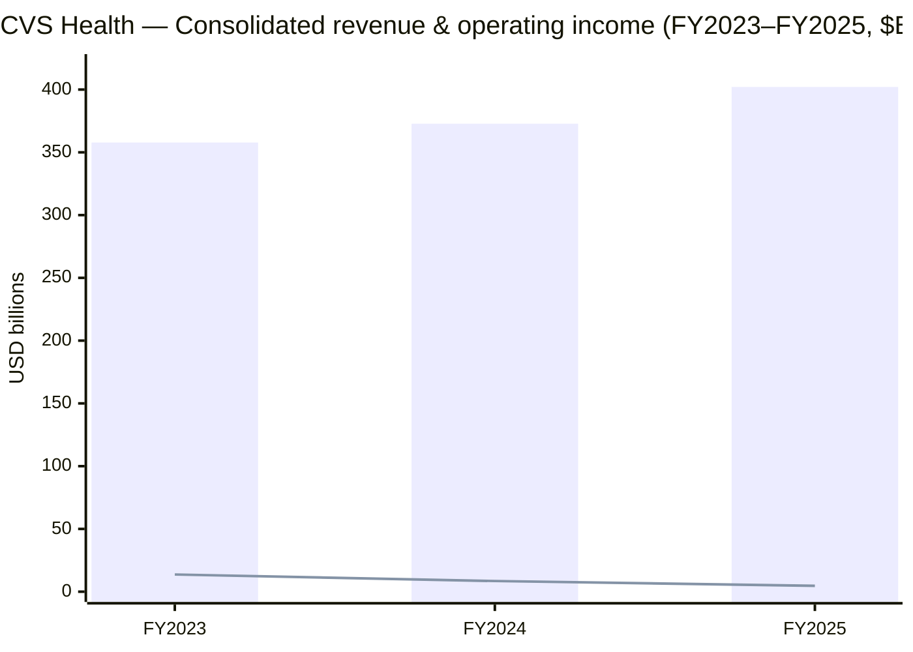
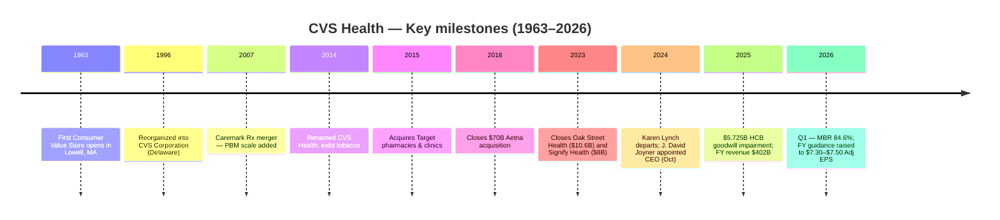
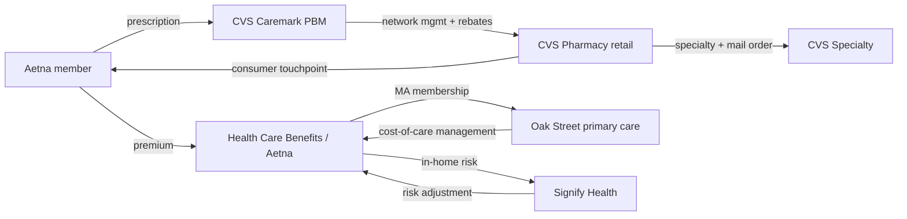
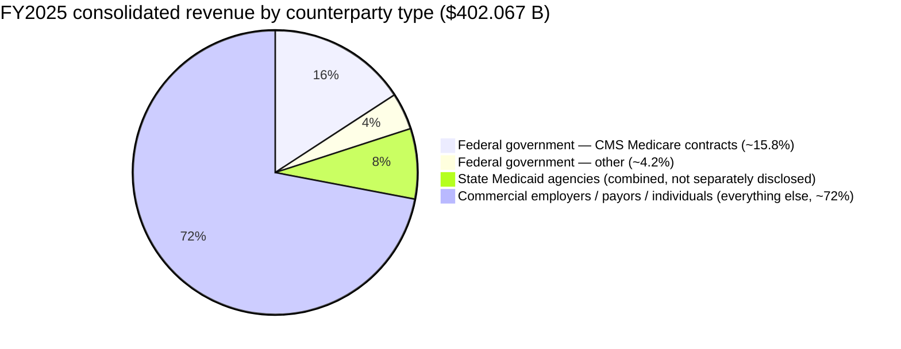
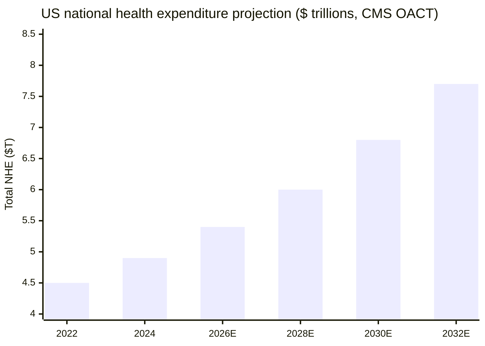
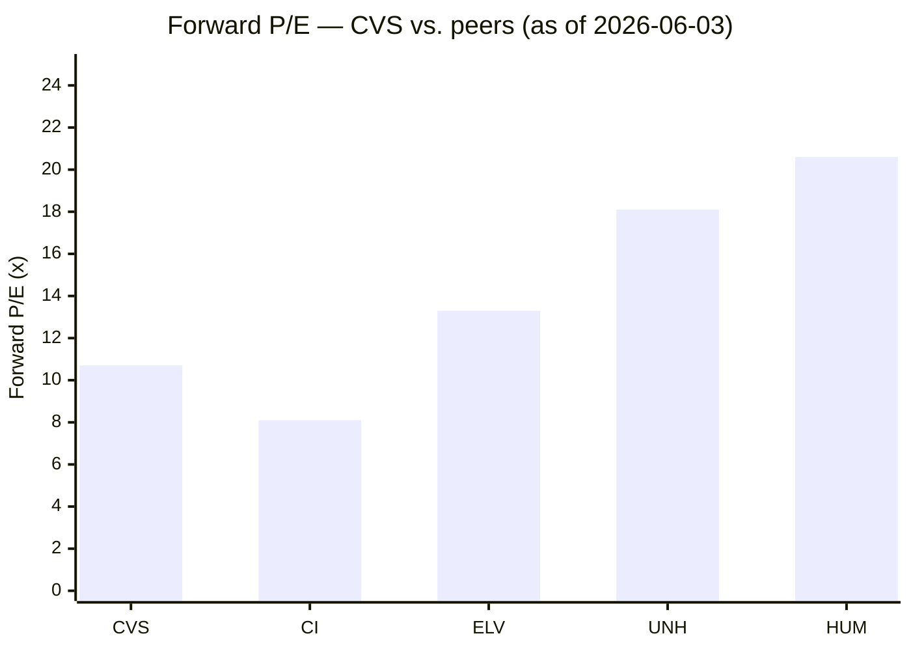
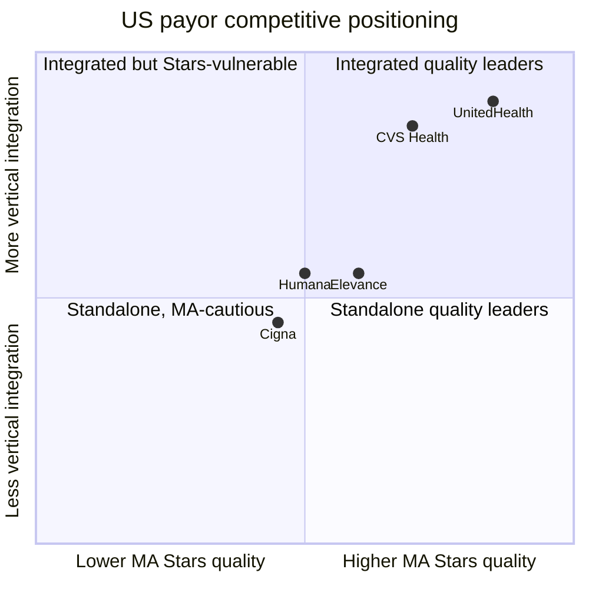

# CVS Health Corporation (NYSE: CVS) — Initiation of Coverage

*As of 2026-06-03 — close $89.50 (per [Yahoo Finance, CVS](https://finance.yahoo.com/quote/CVS/key-statistics/)).*

> **Guidance banner (last change 2026-05-06).** Management raised FY2026 guidance on the Q1 print: GAAP diluted EPS to **$6.24–$6.44** (from $5.94–$6.14), Adjusted EPS to **$7.30–$7.50** (from $7.00–$7.20), and Cash Flow from Operations to **≥$9.5 B** (from ≥$9.0 B), citing better-than-expected Health Care Benefits margin recovery and Pharmacy & Consumer Wellness strength while flagging continued elevated cost trends and macro uncertainty. Total revenues are projected at **≥$405 B** for FY2026. [CVS Q1-26 Earnings Press Release (Ex. 99.1)](https://www.sec.gov/Archives/edgar/data/64803/000006480326000051/cvs_ex99x1q1-26.htm).

## Table of Contents
1. Company Overview
2. Company History
3. Management Team
4. Products & Services
5. Customers & Channel Strategy
6. Industry Overview
7. Competitive Landscape
8. Market Opportunity (TAM)
9. Risk Assessment
10. Investor-Lens Scorecards
11. References & Verification Log

---

## 1. Company Overview

CVS Health Corporation (NYSE: CVS) is a Woonsocket, Rhode Island–based, vertically integrated U.S. health-care platform that combines (a) the **Aetna** health-insurance franchise, (b) the **CVS Caremark** pharmacy-benefit manager (PBM) plus the Signify Health / Oak Street Health care-delivery footprint, and (c) the **CVS Pharmacy** retail-and-specialty dispensing network. In its FY2025 10-K the company describes itself as "a leading health solutions company" that operates "approximately 9,000 retail locations, more than 1,000 walk-in and primary care medical clinics and a leading pharmacy benefits manager with approximately 87 million plan members," serving "more than 37 million people through traditional, voluntary and consumer-directed health insurance products," and employing "over 300,000 colleagues primarily in the U.S." — language that is the spine of every paragraph below. [CVS Health FY2025 10-K](https://www.sec.gov/Archives/edgar/data/64803/000006480326000010/cvs-20251231.htm).

Three reportable segments — Health Care Benefits (Aetna), Health Services (CVS Caremark PBM + clinics + Oak Street + Signify), and Pharmacy & Consumer Wellness (retail + specialty + mail) — plus a Corporate / Other bucket, generated consolidated revenue of **$402.067 B** in FY2025 (vs. $372.809 B FY2024, +7.8% YoY), with GAAP operating income of **$4.660 B** (vs. $8.516 B; –45.3%) after a non-cash **$5.725 B Health Care Benefits goodwill impairment** taken in FY2025. The same segment disclosure shows reportable-segment total revenue (before intercompany eliminations) of HCB **$143,354 M**, Health Services **$190,425 M**, Pharmacy & Consumer Wellness **$139,367 M**, with adjusted operating income of **$2,939 M / $7,151 M / $6,040 M** respectively. These four lines anchor everything that follows. [CVS Health FY2025 10-K, MD&A and Note 19 Segment Reporting](https://www.sec.gov/Archives/edgar/data/64803/000006480326000010/cvs-20251231.htm).

The latest in-period print is fresher than the 10-K. Q1 2026 revenue rose 6.2% YoY to **$100.4 B**, GAAP diluted EPS climbed to **$2.30** (from $1.41 a year prior), Adjusted EPS to **$2.57**, and the Health Care Benefits medical benefit ratio (MBR) — the single most important operating gauge for the segment — fell to **84.6%** from 87.3%, with HCB adjusted operating income up **52.6%** YoY. That is the empirical proof that the "Health Care Benefits margin recovery plan" the CEO has been articulating for two years is now showing through. [CVS Q1-26 Earnings Press Release](https://www.sec.gov/Archives/edgar/data/64803/000006480326000051/cvs_ex99x1q1-26.htm).

### Valuation snapshot

At $89.50 (close 2026-06-03 per [Yahoo Finance, CVS Key Statistics](https://finance.yahoo.com/quote/CVS/key-statistics/)), CVS trades at a $114 B market cap, an enterprise value of roughly **$181 B**, TTM P/E of **~39×**, forward P/E of **~10.7×**, P/S of **0.28×**, P/B of **1.47×**, EV/EBITDA of **11.7×**, with a dividend yield of **~3.0%** and a 52-week range of $58.50–$98.43. The headline TTM P/E is the wrong multiple to anchor on: it is mechanically elevated because the **$5.725 B HCB goodwill impairment** taken in FY2025 compressed TTM net income to $2.28 EPS — without the impairment the multiple is in the low-teens. **The market is paying the forward multiple, not the trailing one** — at ~10.7× forward EPS the stock sits below the S&P 500 forward P/E of ~21× and at a roughly 40% discount to UnitedHealth (UNH) forward P/E of ~18×, but above the Cigna (CI) forward P/E of ~8.1×. [Yahoo Finance, CVS Key Statistics](https://finance.yahoo.com/quote/CVS/key-statistics/); peer multiples per [Yahoo Finance UNH](https://finance.yahoo.com/quote/UNH/key-statistics/), [Yahoo Finance CI](https://finance.yahoo.com/quote/CI/key-statistics/), [Yahoo Finance ELV](https://finance.yahoo.com/quote/ELV/key-statistics/), [Yahoo Finance HUM](https://finance.yahoo.com/quote/HUM/key-statistics/) (all retrieved 2026-06-03).

*Analyst view:* the forward multiple does not look stretched in absolute terms — what makes it volatile is the combination of (a) **Medicare Advantage Stars-bonus cliff** (described in Section 9 and explicitly disclosed in the 10-K — 81% of MA members in 4-star-or-higher 2026 plans, 63% in a 4.5-star plan), (b) **PBM regulatory overhang** (DOJ Bassan/Behnke suits, FTC PBM scrutiny, multiple state-level reform bills), and (c) the **Q1 2026 HCB margin recovery proof point** that justified the May 2026 guidance raise. Earnings durability — not multiple expansion — is the swing factor for the next 12–18 months.

*Source: [CVS FY2025 10-K — MD&A consolidated results](https://www.sec.gov/Archives/edgar/data/64803/000006480326000010/cvs-20251231.htm). Bars = total revenues. Line = GAAP operating income. FY2025 operating income includes a $5.725 B HCB goodwill impairment.*

For reference, the [legacy revenue/EPS trend chart](charts/cvs_revenue_eps_trend.png), the [segment mix chart](charts/cvs_segment_mix.png), the [peer P/E chart](charts/cvs_peer_pe.png), and the [Q1 2026 adjusted operating income walk](charts/cvs_q1_2026_aoi.png) capture the same story visually.

---

## 2. Company History

CVS Health's modern shape is the cumulative result of four transactions and three pivots. The corporate entity was incorporated in Delaware in **1996** when Melville Corporation reorganized into CVS Corporation; the holding company was renamed CVS Health Corporation in **2014** to signal the move beyond retail. The retail pharmacy business itself originated as the Consumer Value Store opened in Lowell, Massachusetts in 1963 by Stanley and Sidney Goldstein with Ralph Hoagland — the "CVS" name is a stylized initialism of that original storefront. The 10-K's "Available Information" paragraph confirms the Delaware-1996 incorporation date and the Woonsocket, RI corporate office at One CVS Drive. [CVS Health FY2025 10-K, p. 24 "Available Information"](https://www.sec.gov/Archives/edgar/data/64803/000006480326000010/cvs-20251231.htm).

The first major pivot was the **2007 acquisition of Caremark Rx** for ~$26.5 B in stock, which welded a national pharmacy-benefit-manager onto the retail footprint and gave birth to "CVS Caremark" as the integrated retail-plus-PBM combination — a structural advantage that competitors Walgreens and Rite Aid never matched and that ultimately allowed CVS to outlast both at retail scale. The combined entity rebranded as CVS Health in 2014, the same year the company exited tobacco sales — a step the company has consistently framed in subsequent integrated reports as the inflection that committed the firm to a "health company, not a drugstore" identity. [CVS Health About-Us Heritage page, captured 2026-06-03](https://www.cvshealth.com/about-cvs-health/our-company/our-history.html).

The second major pivot — and the largest single transaction — was the **2018 acquisition of Aetna for ~$70 B**, which welded an insurance franchise onto the PBM-plus-retail stack. The Aetna deal closed in November 2018 and remains the structural reason CVS is now a three-segment vertically integrated firm rather than a two-segment retail-PBM hybrid. The Aetna brand is the operating brand of the Health Care Benefits segment to this day — the 10-K opens the HCB description with "operates as one of the nation's leading diversified health care benefits providers through its Aetna® operations, serving an estimated more than 37 million people as of December 31, 2025." [CVS FY2025 10-K — HCB segment description](https://www.sec.gov/Archives/edgar/data/64803/000006480326000010/cvs-20251231.htm); [CVS press release, "CVS Health Completes Acquisition of Aetna" (2018-11-28)](https://www.cvshealth.com/news/company-news/cvs-health-completes-acquisition-of-aetna.html).

The third pivot was the 2023 doubling-down on **care delivery**: in March 2023 CVS closed the ~$10.6 B acquisition of **Oak Street Health**, a multi-payor operator of value-based primary care centers serving Medicare-eligible patients, and in March 2023 the ~$8 B acquisition of **Signify Health**, a leader in in-home risk assessments and value-based care. Both targets sit inside the Health Services segment today — the 10-K language is "The Health Services segment's health care delivery assets include Signify Health … and Oak Street Health … a leading multi-payor operator of value-based primary care centers serving Medicare eligible patients." [CVS FY2025 10-K — Health Services segment description](https://www.sec.gov/Archives/edgar/data/64803/000006480326000010/cvs-20251231.htm); [CVS press release, "CVS Health completes acquisition of Signify Health" (2023-03-29)](https://www.cvshealth.com/news/company-news/cvs-health-completes-acquisition-of-signify-health.html); [CVS press release, "CVS Health completes acquisition of Oak Street Health" (2023-05-02)](https://www.cvshealth.com/news/company-news/cvs-health-completes-acquisition-of-oak-street-health.html).

The fourth pivot — and the source of the 2024 turbulence that left a permanent imprint on the equity story — was the **Health Care Benefits margin compression** that began in 2H 2023 as utilization in Medicare Advantage stepped up faster than expected. By Q3 2024 the segment was running at MBR levels that triggered guidance cuts; in **October 2024 the board replaced CEO Karen Lynch with J. David Joyner** (Section 3 covers the bios). The 8-K announcing the leadership change was filed 2024-10-18. [CVS 8-K (2024-10-18) — "Departure of Karen S. Lynch; Appointment of J. David Joyner"](https://www.sec.gov/Archives/edgar/data/64803/000119312524239193/d837701d8k.htm).

The history is now writing a fifth chapter — the **FY2025 $5.725 B HCB goodwill impairment** (the first goodwill impairment ever taken against the Aetna asset since the 2018 close), followed by the **Q1 2026 print that showed the margin-recovery plan working**, with HCB MBR at 84.6% (down 270 bps YoY) and HCB adjusted operating income up 52.6%. Whether that is a one-quarter snapback or the durable inflection management is calling will define the FY2026 narrative. [CVS FY2025 10-K — Goodwill Impairment disclosure](https://www.sec.gov/Archives/edgar/data/64803/000006480326000010/cvs-20251231.htm); [CVS Q1-26 Earnings Release](https://www.sec.gov/Archives/edgar/data/64803/000006480326000051/cvs_ex99x1q1-26.htm).

---

## 3. Management Team

Per the project's research convention, this section covers the founder lineage and the current CEO only — the rest of the C-suite is omitted.

### Founder lineage

CVS Health is structurally a roll-up of three founder companies, none of which is currently led by its founder. The retail "CVS" lineage traces to **Stanley and Sidney Goldstein and Ralph Hoagland**, who opened the first Consumer Value Store in Lowell, Massachusetts in 1963; the Goldsteins exited operational roles in the 1980s/1990s as Melville Corporation rolled the CVS chain up and then spun it off as today's listed entity in 1996. The PBM lineage traces to **Caremark Inc.**, originally a Baxter International division spun out in 1992 and merged with AdvancePCS in 2004 to form Caremark Rx, which CVS acquired in 2007. The Aetna lineage traces to a Hartford, Connecticut life insurer founded in 1853 by Eliphalet Adams Bulkeley — the oldest of the three roots. None of the original founder families currently has board representation or material equity stakes per the most recent DEF 14A. [CVS 2026 DEF 14A — Beneficial-ownership table](https://www.sec.gov/Archives/edgar/data/64803/000130817926000201/cvs014969-def14a.htm); [CVS Health About-Us Heritage page](https://www.cvshealth.com/about-cvs-health/our-company/our-history.html). Because no founder is currently operational, the standard "founder bio" block is replaced with an equivalent-depth CEO bio below.

### Current CEO — J. David Joyner

J. David Joyner, age 61 as of the FY2025 10-K filing date, has been **President and Chief Executive Officer of CVS Health Corporation since October 17, 2024**, and **Chair of the Board of Directors since January 1, 2026**. His full title now is Chairman and Chief Executive Officer. The 10-K records his prior CVS role as "Executive Vice President of CVS Health Corporation and President of Pharmacy Services from January 2023 through October 2024" — i.e. the head of the CVS Caremark PBM in the run-up to his elevation. Earlier roles named in the 10-K include "Strategic Business Advisor to gWell, Inc., a wellness technology company, from July 2021 through September 2023" and "Advisor to Podimetrics Inc., a health care company focused on the identification and treatment of diabetic foot ulcers from September 2020 through January 2023." [CVS FY2025 10-K, p. 59 "Information about our Executive Officers"](https://www.sec.gov/Archives/edgar/data/64803/000006480326000010/cvs-20251231.htm); [CVS 8-K (2024-10-18) — "Departure of Karen S. Lynch; Appointment of J. David Joyner"](https://www.sec.gov/Archives/edgar/data/64803/000119312524239193/d837701d8k.htm).

The longer arc of Joyner's career, set out in the 10-K and verified against the proxy biographic data, runs **CVS Caremark → corporate development at McKesson Specialty Health → return to CVS Caremark as EVP**, giving him roughly 25+ years inside the PBM ecosystem before he took the parent-CEO role. His framing of strategy in the Q1 2026 press release reads "CVS Health continues to provide what people want most from health care — affordability, accessibility and accountability — through delivering on our strategy and a steadfast focus on our purpose — to simplify health care one person, one family and one community at a time." That quote is the published version of his stated North Star and is the language readers should expect to see in subsequent earnings calls. [CVS Q1-26 Earnings Release](https://www.sec.gov/Archives/edgar/data/64803/000006480326000051/cvs_ex99x1q1-26.htm); [CVS 2026 DEF 14A — Executive Compensation, NEO biographies](https://www.sec.gov/Archives/edgar/data/64803/000130817926000201/cvs014969-def14a.htm).

The thesis-relevant fact about Joyner specifically: he is a **PBM operator first, an insurance executive second**, which is unusual in U.S. health-payor leadership and which colors the strategic emphasis you should expect over the next 2–3 years. The Q1 2026 press release explicitly attributes the segment recovery to "continued execution on the Health Care Benefits segment margin recovery plan" — a phrase whose mechanical drivers (Medicare Advantage benefit-design pricing, Stars portfolio quality, narrower network design, cost-of-care management at Oak Street / Signify) sit at the PBM-care-delivery seam Joyner ran for the prior two years. *Analyst view:* this is a different operating playbook than Karen Lynch's tenure (which was insurance-led — Lynch is a longtime Aetna executive); the structural choice the board made in October 2024 was to put the PBM/retail operator in charge of fixing the insurer's margin problem. Whether that succeeds is the central earnings-durability question for the equity. [CVS FY2025 10-K — HCB segment commentary](https://www.sec.gov/Archives/edgar/data/64803/000006480326000010/cvs-20251231.htm); [CVS Q1-26 Earnings Release](https://www.sec.gov/Archives/edgar/data/64803/000006480326000051/cvs_ex99x1q1-26.htm).

---

## 4. Products & Services

This is the longest and most important section of the report. CVS publishes the product matrix in the FY2025 10-K Item 1 Business section, which we reproduce below.

### 4.0 Segment-level product matrix (reproduced from 10-K)

| Segment | Core operating brand | Product / service families | FY2025 segment revenue (pre-elim, $M) | FY2025 segment adj. op income ($M) |
|---|---|---|---|---|
| Health Care Benefits | Aetna® | Commercial Insured / ASC, Medicare Advantage HMO/PPO, Medicare Part D PDPs, Medicaid / Duals / CHIP, Dental & Vision, Group Life, Disability | 143,354 | 2,939 |
| Health Services | CVS Caremark® + Cordavis™ + MinuteClinic® + Signify Health + Oak Street Health | PBM Solutions (formulary, network mgmt, specialty/mail), GPO (Red Oak), value-based primary care (Oak Street), in-home risk assessment (Signify), MinuteClinic, virtual care | 190,425 | 7,151 |
| Pharmacy & Consumer Wellness | CVS Pharmacy® | Retail pharmacy (~9,000 locations), retail specialty pharmacy, compounding, infusion / enteral, front-store consumer goods, MyChart-style digital tools | 139,367 | 6,040 |
| Corporate / Other | — | LTC operations being wound down, corporate functions, certain run-off insurance products | 484 | (1,687) |

*Source: [CVS FY2025 10-K — MD&A and Note 19 Segment Reporting](https://www.sec.gov/Archives/edgar/data/64803/000006480326000010/cvs-20251231.htm). Pre-elimination revenue; intersegment eliminations of $71,563 M reconcile to consolidated total revenues of $402,067 M.*

```mermaid
graph TD
  CVS["CVS Health Corp (NYSE:CVS)"]
  CVS --> HCB["Health Care Benefits — Aetna®"]
  CVS --> HS["Health Services — CVS Caremark®"]
  CVS --> PCW["Pharmacy & Consumer Wellness — CVS Pharmacy®"]
  CVS --> CO["Corporate / Other"]
  HCB --> HCB1["Commercial Insured & ASC"]
  HCB --> HCB2["Medicare Advantage HMO/PPO"]
  HCB --> HCB3["Medicare Part D PDPs"]
  HCB --> HCB4["Medicaid / Duals / CHIP"]
  HCB --> HCB5["Dental / Vision / Group Life"]
  HS --> HS1["PBM — formulary & specialty"]
  HS --> HS2["Cordavis™ biosimilar program"]
  HS --> HS3["MinuteClinic + virtual"]
  HS --> HS4["Oak Street primary care"]
  HS --> HS5["Signify in-home risk"]
  HS --> HS6["Red Oak generic sourcing JV"]
  PCW --> PCW1["~9,000 retail pharmacies"]
  PCW --> PCW2["Retail specialty pharmacy"]
  PCW --> PCW3["Compounding + Infusion / Enteral"]
  PCW --> PCW4["Front-store consumer goods"]
```

### 4.1 Health Care Benefits — Aetna®

The 10-K opens the segment description with a verbatim definition that is the anchor for every other paragraph in this section:

> "The Health Care Benefits segment operates as one of the nation's leading diversified health care benefits providers through its Aetna® operations, serving an estimated more than 37 million people as of December 31, 2025. The Health Care Benefits segment has the information and resources to help members, in consultation with their health care professionals, make more informed decisions about their health care."

[CVS Health FY2025 10-K, Item 1 Business — HCB segment description](https://www.sec.gov/Archives/edgar/data/64803/000006480326000010/cvs-20251231.htm).

**What it physically does.** Aetna is a U.S. health-insurance underwriter and benefits administrator. The actual production process is (a) collecting premium revenue from employer groups, individuals, CMS (for Medicare Advantage and Part D), and state Medicaid agencies, (b) paying medical claims to providers under contracted networks, (c) administering self-insured employer accounts (ASC) for fees, and (d) running care-management overlays (utilization review, chronic illness, prior authorization). The 10-K names five sub-product groups under the segment: Commercial Insured, Commercial ASC, Medicare Advantage HMO/PPO, Medicare Part D, and Medicaid / Duals / CHIP. Dental, vision, group life, and disability sit alongside. **中文释义 / Plain-language gloss:** Aetna sells the insurance contract that pays your doctor; the underwriter's margin equals premium dollars in minus claims dollars out (the "medical loss ratio" or MBR), minus admin cost.

**How it differentiates from sibling segments.** Unlike Health Services (which is fee-for-service and contracts-driven) and Pharmacy & Consumer Wellness (which is per-script and per-basket retail), HCB is the **risk-bearing** segment — Aetna takes underwriting risk on insured lives. That risk concentration is why one quarter of bad utilization (as in 2H 2023 / 1H 2024) compresses the entire group's operating income. The segment cycle is also the longest — Medicare Advantage and Medicaid bids are filed in June for the following plan year, locking in premium rates 18–24 months ahead of claims realization. [CVS FY2025 10-K, Item 1 Business — HCB Pricing subsection](https://www.sec.gov/Archives/edgar/data/64803/000006480326000010/cvs-20251231.htm).

**Strategic significance.** Aetna is the source of the MA exposure that has driven the 2024–2025 negative tape *and* is the source of the Q1 2026 margin recovery the equity is now pricing. Within HCB, the 10-K discloses that the federal government accounted for **approximately 20% of CVS Health consolidated total revenues** in 2025, 2024, and 2023, and that CMS contracts for Medicare-eligible individuals accounted for **approximately 79%, 74%, and 73%** of federal-government revenue in 2025, 2024, and 2023, respectively — i.e. the company's Medicare exposure is rising as a share of federal revenue, and the federal share has been stable at ~20%. [CVS FY2025 10-K — HCB Customers section](https://www.sec.gov/Archives/edgar/data/64803/000006480326000010/cvs-20251231.htm).

The Q1 2026 HCB print is the bull case in operating data: revenue $35,971 M (+3.3% YoY), Adjusted Operating Income $3,041 M (+52.6% YoY), MBR **84.6%** (–270 bps YoY), and medical membership of 26.0 M (down 1.1 M YoY as the company exited individual exchange business in 2026 to focus on margin). [CVS Q1-26 Earnings Release — HCB segment table](https://www.sec.gov/Archives/edgar/data/64803/000006480326000051/cvs_ex99x1q1-26.htm).

### 4.2 Health Services — CVS Caremark®

The 10-K's segment definition:

> "The Health Services segment provides a full range of PBM solutions through its CVS Caremark® operations and delivers health care services in its medical clinics, virtually, and in the home. PBM solutions include plan design offerings and administration, formulary management, retail pharmacy network management services, and specialty and mail order pharmacy services."

[CVS Health FY2025 10-K, Item 1 Business — Health Services segment](https://www.sec.gov/Archives/edgar/data/64803/000006480326000010/cvs-20251231.htm).

**What it physically does.** The PBM ("pharmacy benefit manager") sits between drug manufacturers, health plans, and pharmacies. The cash-flow loop is: (a) the PBM negotiates formularies with manufacturers (and collects rebates), (b) the PBM contracts with retail pharmacies to dispense drugs at agreed network rates, (c) the PBM bills the health plan / employer / CMS for the drug net of member co-pay, (d) the PBM pays the pharmacy at the contracted rate (which is below the bill rate — the spread is part of the PBM's revenue), and (e) the PBM remits a share of manufacturer rebates back to the health plan. In FY2025 the segment **filled or managed 1.9 billion prescriptions on a 30-day-equivalent basis** — the largest single PBM volume in the U.S. [CVS Health FY2025 10-K — PBM Solutions subsection](https://www.sec.gov/Archives/edgar/data/64803/000006480326000010/cvs-20251231.htm).

**Specialty and mail order** are the high-growth, high-margin sub-businesses. Specialty drugs (oncology, autoimmune, rare disease) are dispensed through dedicated specialty mail-order facilities that are accredited by URAC and The Joint Commission per the 10-K. The Cordavis™ biosimilar program — CVS's affiliate that contracts directly with biosimilar manufacturers — is positioned as the structural answer to Humira-class price erosion and is the primary mechanism by which CVS commercialized Humira biosimilars in the 2024 launch wave. [CVS Health FY2025 10-K — Health Services Products and Services](https://www.sec.gov/Archives/edgar/data/64803/000006480326000010/cvs-20251231.htm).

**Care-delivery assets — Oak Street Health and Signify Health.** The 10-K labels these as "health care delivery assets" inside Health Services. Oak Street operates value-based primary care centers for Medicare-eligible patients — i.e. the clinics take risk on the total cost of care of attributed patients in MA risk-adjustment contracts. Signify provides in-home health-risk assessments and value-based care services. Together they sit in the seam between Aetna's MA membership (which generates the lives) and the PBM (which sees prescription utilization) — the strategic logic is that the integrated stack can manage cost-of-care for MA members better than a stand-alone insurer. [CVS Health FY2025 10-K — Health Services care-delivery sub-section](https://www.sec.gov/Archives/edgar/data/64803/000006480326000010/cvs-20251231.htm); [CVS Health Q4 2024 earnings call transcript — care delivery progress](https://www.sec.gov/Archives/edgar/data/64803/000006480325000006/).

**How it differentiates from sibling segments.** Unlike HCB (risk-bearing insurer), Health Services is **fee-and-spread driven** — the PBM does not bear medical risk, it bears contract risk (formulary placement, rebate-share, network access). The Q1 2026 print shows HS revenue $48,237 M (+11.0% YoY) but adjusted operating income $1,489 M (–7.1% YoY) — the disconnect reflects PBM client pricing pressure (the loss of the Centene PBM contract in 2024 and incremental discounting on renewals), partly offset by growth in specialty and Oak Street ramp. [CVS Q1-26 Earnings Release — Health Services segment](https://www.sec.gov/Archives/edgar/data/64803/000006480326000051/cvs_ex99x1q1-26.htm).

**Strategic significance.** This is the segment most exposed to regulatory and political risk. The FTC's PBM scrutiny (multiple interim staff reports and an Administrative Complaint filed against the three largest PBMs in September 2024), the DOJ's *U.S. ex rel. Bassan et al. v. Omnicare Inc. and CVS Health Corp.* litigation (specific to Omnicare's long-term-care pharmacy operations — see Section 9), the *U.S. ex rel. Behnke v. CVS Caremark Corporation et al.* settlement framework, and state-by-state PBM transparency / rebate-pass-through bills are all live. [CVS FY2025 10-K — Legal Proceedings section](https://www.sec.gov/Archives/edgar/data/64803/000006480326000010/cvs-20251231.htm); [FTC PBM Interim Staff Report (Jul 2024)](https://www.ftc.gov/reports/pharmacy-benefit-managers-report); [FTC press release on Administrative Complaint against three largest PBMs (2024-09-20)](https://www.ftc.gov/news-events/news/press-releases/2024/09/ftc-sues-prescription-drug-middlemen-artificially-inflating-insulin-drug-prices).

### 4.3 Pharmacy & Consumer Wellness — CVS Pharmacy®

The 10-K's segment definition:

> "The Pharmacy & Consumer Wellness segment dispenses prescriptions in its CVS Pharmacy® retail locations and through its infusion operations, provides ancillary pharmacy services including pharmacy patient care programs and vaccination administration, and sells a wide assortment of health and wellness products and general merchandise."

[CVS Health FY2025 10-K, Item 1 Business — PCW segment description](https://www.sec.gov/Archives/edgar/data/64803/000006480326000010/cvs-20251231.htm).

**What it physically does.** A typical CVS Pharmacy is a 10,000–13,000 square-foot retail box with a pharmacy counter, an "OTC" front-store area, and (in larger locations) a HealthHUB area with consultation rooms. The pharmacy fills prescriptions for cash-pay, employer, government, and PBM-routed patients; the front store sells over-the-counter medications, beauty, and a curated grocery / general-merchandise assortment. In FY2025 the segment "filled 1.8 billion prescriptions on a 30-day equivalent basis and dispensed approximately 28.5% of total retail pharmacy prescriptions in the U.S." — i.e. roughly **one in every 3.5 U.S. retail scripts** is dispensed through a CVS pharmacy. [CVS Health FY2025 10-K — PCW Products and Services](https://www.sec.gov/Archives/edgar/data/64803/000006480326000010/cvs-20251231.htm).

**How it differentiates from sibling segments.** PCW is the only segment that touches the consumer directly at the retail counter and is the segment from which the "CVS" brand equity flows. It is also the segment most affected by retail pharmacy reimbursement compression — the 10-K explicitly attributes the FY2025 same-store pharmacy revenue change to "pharmacy drug mix and increased prescription volume … partially offset by continued pharmacy reimbursement pressure and the impact of recent generic drug introductions." The 10-K also discloses "pharmacy same store sales increased 18.0% in 2025 compared to 2024 … primarily driven by pharmacy drug mix, including branded GLP-1 drugs, and the 8.0% increase in pharmacy same store prescription volumes," capturing the GLP-1 tailwind directly. [CVS FY2025 10-K — PCW MD&A](https://www.sec.gov/Archives/edgar/data/64803/000006480326000010/cvs-20251231.htm).

**Strategic significance.** PCW's role in the integrated model is two-fold. First, the retail footprint is the consumer-acquisition channel for the broader CVS Health ecosystem — the MinuteClinic, vaccination administration, and prescription pickup are touchpoints that funnel customers to insurance and care-delivery products. Second, retail pharmacy is the **counter-cyclical cash generator** — its working-capital profile (rapid inventory turn, low receivables) funds the more capital-intensive insurance and care-delivery operations. The closure of underperforming retail locations through the 2023 Restructuring Program (capped at ~900 store closures by end of 2026 per various press releases) is the operational answer to reimbursement pressure. [CVS FY2025 10-K — Restructuring disclosure Note 20](https://www.sec.gov/Archives/edgar/data/64803/000006480326000010/cvs-20251231.htm); [CVS Health press release, "CVS Health to optimize retail footprint" (2023)](https://www.cvshealth.com/news/company-news/cvs-health-to-optimize-retail-footprint.html).

### 4.4 The integrated-model loop

The three segments do not stand alone — the strategic story management tells (and the equity story analysts argue about) is the integrated loop. Aetna members generate insurance premium revenue. A portion of those members route their prescriptions through CVS Caremark, where formulary management captures rebates and specialty pharmacy captures dispensing margin. CVS Pharmacy retail captures the front-store basket plus retail-pharmacy dispensing margin. Oak Street and Signify capture the in-home and primary-care touch with high-cost MA patients. The PBM's $10.9 B of retail co-payments in 2025 (disclosed in 10-K Note 19 footnote (1)) is the literal intercompany revenue between Health Services and Pharmacy & Consumer Wellness that proves the loop is real.

*Source: synthesized from [CVS FY2025 10-K segment descriptions](https://www.sec.gov/Archives/edgar/data/64803/000006480326000010/cvs-20251231.htm).*

---

## 5. Customers & Channel Strategy

CVS Health's customer base is structurally different in each segment — and the customer-concentration disclosure rules differ as a result. **This section labels every customer-share number with the appropriate denominator.**

### 5.1 Consolidated customer concentration

The single most important customer-concentration disclosure in the 10-K is: **federal government revenue = approximately 20% of CVS Health consolidated total revenues** in 2025, 2024, and 2023; and **CMS contracts for Medicare-eligible individuals = approximately 79% / 74% / 73% of federal-government revenue** in 2025 / 2024 / 2023 respectively. Multiplying gives approximately **15.8% of consolidated revenue from CMS Medicare contracts** in 2025 — a single-counterparty risk concentration well above the 10% threshold that ordinarily triggers a "major customer" call-out. [CVS FY2025 10-K — HCB Customers section](https://www.sec.gov/Archives/edgar/data/64803/000006480326000010/cvs-20251231.htm).

The 10-K does **not** name individual non-government top-5 customers at the consolidated level — there is no Samsung-style top-5 alphabetical list. The closest disclosure is the per-segment language: "No single Pharmacy & Consumer Wellness segment customer accounted for 10% or more of the Pharmacy & Consumer Wellness segment's total revenues during 2025," which is the only customer-percentage threshold the company breaks out in PCW. Health Services has historically named the loss of large PBM clients (e.g. the 2024 loss of the Centene PBM contract was disclosed in earnings calls but not flagged as a 10% customer in the 10-K), but no Health Services customer is named at >10% in the FY2025 filing. [CVS FY2025 10-K — Pharmacy & Consumer Wellness segment customer disclosure](https://www.sec.gov/Archives/edgar/data/64803/000006480326000010/cvs-20251231.htm).

*Source: [CVS FY2025 10-K — HCB Customers section](https://www.sec.gov/Archives/edgar/data/64803/000006480326000010/cvs-20251231.htm). Federal-government share and CMS share are stated verbatim in the filing; the 8% Medicaid slice is analyst-constructed from the Medicaid / Duals / CHIP exposure described in HCB without a single explicit consolidated %, and the residual 72% balances. **(Consolidated-revenue denominator throughout — not segment-level.)**.*

### 5.2 Health Care Benefits — customer base

Aetna's customer base is the standard insurer mix: employer groups (commercial insured + ASC), individual insured (now ex-individual-exchange in 2026), CMS (Medicare Advantage + Part D PDPs), and state Medicaid agencies. Medical membership ended Q1 2026 at **26.0 M** lives, down 1.1 M YoY as the company exited individual exchange business to refocus on margin. Within Government Medical, the 10-K identifies that Medicare Advantage plans operate "in 44 states and Washington, D.C." and that "more than 81% of the Company's Medicare Advantage members were in 2026 Medicare Advantage plans that are rated 4 stars or higher and more than 63% of the Company's Medicare Advantage members were in a 4.5-star plan for 2026." That Star-rating distribution is the single most important non-financial customer KPI for the equity, because Star ratings determine the CMS quality-bonus payment. [CVS FY2025 10-K — Medicare Advantage Star Ratings disclosure](https://www.sec.gov/Archives/edgar/data/64803/000006480326000010/cvs-20251231.htm); [CVS Q1-26 Earnings Release — HCB membership table](https://www.sec.gov/Archives/edgar/data/64803/000006480326000051/cvs_ex99x1q1-26.htm).

### 5.3 Health Services — customer base

The PBM's customers are health plans, employer groups, unions, CMS Part D plans, Medicaid managed care plans, and federal 340B-program Covered Entities. The 10-K explicitly says clients and customers "are primarily employers, insurance companies, unions, government employee groups, health plans, PDPs, Managed Medicaid plans, CMS, plans offered on Private Exchanges and Public Exchanges, accountable care organizations and other sponsors of health benefit plans, and individuals … throughout the United States." The largest segment-level PBM client losses in recent years — the 2024 loss of the Centene PBM contract being the most significant — have driven the year-over-year HS adjusted operating income compression. [CVS FY2025 10-K — Health Services Customers subsection](https://www.sec.gov/Archives/edgar/data/64803/000006480326000010/cvs-20251231.htm); [Reuters, "Centene to use Express Scripts for PBM services from 2024" (2022-09-19)](https://www.reuters.com/business/healthcare-pharmaceuticals/centene-strikes-pbm-deal-with-cigna-cuts-2022-earnings-forecast-2022-09-19/).

The PBM also operates a **group purchasing organization (Red Oak Sourcing, LLC)** as a 50/50 joint venture with Cardinal Health that sources generic pharmaceuticals — Red Oak is a primary-beneficiary VIE consolidated by CVS per the 10-K. The Red Oak relationship is the structural reason CVS's generic-drug procurement is among the most cost-efficient in the U.S. industry. [CVS FY2025 10-K — VIE / Red Oak disclosure](https://www.sec.gov/Archives/edgar/data/64803/000006480326000010/cvs-20251231.htm).

### 5.4 Pharmacy & Consumer Wellness — customer base

PCW's pharmacy customers are split between PBMs / managed care organizations / CMS / commercial employers / other third-party payors (substantially all of pharmacy revenue) and direct consumer cash-pay (a smaller share, mostly OTC and front-store). The 10-K is explicit: "Substantially all of the Pharmacy & Consumer Wellness segment's pharmacy revenues are derived from pharmacy benefit managers, managed care organizations ('MCOs'), government funded health care programs, commercial employers and other third-party payors. No single Pharmacy & Consumer Wellness segment customer accounted for 10% or more of the Pharmacy & Consumer Wellness segment's total revenues during 2025." This structural fact — that the retail pharmacy is paid almost entirely by third-party payors — is why PBM reimbursement compression has been the single biggest secular headwind for the segment. [CVS FY2025 10-K — PCW customer disclosure](https://www.sec.gov/Archives/edgar/data/64803/000006480326000010/cvs-20251231.htm).

### 5.5 Channel strategy

The company's go-to-market in each segment is distinct and reinforces the integrated-model thesis:
- **HCB** sells through brokers, agents, direct enterprise sales for ASC, public exchanges (under increasing scrutiny — CVS exited individual exchange in 2026), CMS Medicare bids submitted in June each year for the following plan year, and state Medicaid procurement processes.
- **Health Services** sells PBM contracts on a 1–3 year cycle directly to health plans, employer groups, and government plan sponsors; care-delivery (Oak Street, Signify) is multi-payor and contracts directly with health plans for risk-adjustment or in-home services.
- **PCW** is destination retail — the ~9,000 retail footprint plus digital (CVS.com app) is the channel, with HealthHUB consultations, MinuteClinic, vaccination, and the front-store assortment as the touchpoints.

[CVS FY2025 10-K — HCB Customers / Pricing subsection, Health Services PBM sales subsection, PCW retail footprint](https://www.sec.gov/Archives/edgar/data/64803/000006480326000010/cvs-20251231.htm); [CVS Health Investor Day December 2023 deck — channel diagrams](https://investors.cvshealth.com/investors/events-and-presentations/default.aspx).

---

## 6. Industry Overview

CVS Health operates at the intersection of three U.S. industries — health insurance, pharmacy benefit management, and retail pharmacy. None can be sized in isolation because the company straddles them.

### 6.1 U.S. health insurance

The U.S. health-insurance industry is approximately **a $1.5 trillion annual-premium market** by 2024 figures, with private health insurance contributing approximately $1.4 trillion of national health expenditure (NHE). The Centers for Medicare & Medicaid Services' Office of the Actuary projects NHE growth of approximately **5.6% per year through 2032**, reaching roughly **$7.7 trillion in total health spending by 2032**, with the health-share of GDP rising from ~17.3% in 2022 to ~19.7% in 2032. Within that, **Medicare spending is projected to grow at 7.4% per year** through 2032 — the fastest among major payor categories — driven by both demographic aging and per-capita cost inflation. [CMS National Health Expenditure Projections 2023–2032, released June 2024](https://www.cms.gov/data-research/statistics-trends-and-reports/national-health-expenditure-data/nhe-fact-sheet); [CMS NHE Projections methodology brief](https://www.cms.gov/Research-Statistics-Data-and-Systems/Statistics-Trends-and-Reports/NationalHealthExpendData/NationalHealthAccountsProjected).

Within Medicare, **Medicare Advantage (MA) covers approximately 33.4 million beneficiaries** as of 2024, equal to roughly **54% of all Medicare beneficiaries** — and Kaiser Family Foundation projects MA will exceed 60% of all Medicare beneficiaries by ~2030. [Kaiser Family Foundation, "Medicare Advantage in 2024" (2024-08-08)](https://www.kff.org/medicare/issue-brief/medicare-advantage-in-2024-enrollment-update-and-key-trends/). MA is the highest-volume government-payor growth segment for U.S. insurers and is also the segment where CVS / Aetna sits most exposed.

State **Medicaid managed care** is the second-largest government-payor opportunity — roughly **72 million Medicaid beneficiaries** as of mid-2024, with managed-care penetration above 80%, generating approximately $700 B of Medicaid spending. State-by-state procurement processes and the ongoing Medicaid redetermination wave (post-COVID disenrollment) are the structural variables. [KFF, "10 Things to Know About Medicaid Managed Care" (2024)](https://www.kff.org/medicaid/issue-brief/10-things-to-know-about-medicaid-managed-care/); [CMS Medicaid managed care statistics](https://www.medicaid.gov/medicaid/managed-care/index.html).

### 6.2 Pharmacy benefit management

The U.S. PBM industry is a **highly concentrated three-firm oligopoly** — CVS Caremark, Express Scripts (Cigna), and Optum Rx (UnitedHealth) — that together administered approximately **80% of all U.S. prescription drug claims** in 2024 per the FTC's Interim Staff Report. Annual PBM-managed prescription volume is roughly 6.5 billion scripts. [FTC Interim Staff Report on Prescription Drug Middlemen, July 2024](https://www.ftc.gov/reports/pharmacy-benefit-managers-report). The PBM industry's revenue is not directly comparable to the 1.9 B prescription throughput, because PBM revenue includes drug ingredient cost passed through to clients — the 10-K notes that the Health Services segment includes "approximately $10.9 billion, $11.4 billion and $13.7 billion of retail co-payments for 2025, 2024 and 2023, respectively." [CVS FY2025 10-K — Note 19 Segment Reporting footnote (1)](https://www.sec.gov/Archives/edgar/data/64803/000006480326000010/cvs-20251231.htm).

The PBM industry's regulatory backdrop is the most active in a decade. The **FTC's Administrative Complaint** against the three largest PBMs filed in September 2024 alleging anticompetitive rebate conduct around insulin pricing is the highest-profile federal case; state legislatures in 30+ states have passed or proposed PBM transparency, rebate-pass-through, or pharmacy-reimbursement-reform bills since 2022; and several federal bills (the *Pharmacy Benefit Manager Transparency Act of 2023*, the *Modernizing and Ensuring PBM Accountability Act*) remain under consideration. [FTC press release, "FTC Sues Prescription Drug Middlemen for Artificially Inflating Insulin Drug Prices" (2024-09-20)](https://www.ftc.gov/news-events/news/press-releases/2024/09/ftc-sues-prescription-drug-middlemen-artificially-inflating-insulin-drug-prices); [Congress.gov S.127 — Pharmacy Benefit Manager Transparency Act of 2023](https://www.congress.gov/bill/118th-congress/senate-bill/127).

### 6.3 U.S. retail pharmacy

The U.S. retail-pharmacy industry is in **structural consolidation**. The independent / regional pharmacy footprint has been shrinking at low-single-digit annual rates for a decade. The 10-K's own disclosure that CVS Pharmacy dispensed approximately **28.5% of total retail pharmacy prescriptions in the U.S.** in FY2025 makes CVS the largest U.S. retail pharmacy by script share — substantially ahead of Walgreens (in financial distress and accelerating its own store-closure program), with Rite Aid having emerged from its second Chapter 11 with a much-smaller footprint, and Walmart, Costco, Kroger, and Amazon Pharmacy as the remaining material competitors. The 10-K's Competition section is concise: "In the areas it serves, the Company competes with other drugstore chains (e.g., Walgreens), supermarkets, discount retailers (e.g., Walmart), independent pharmacies, restrictive pharmacy networks, online retailers (e.g., Amazon), membership clubs, infusion pharmacies, as well as mail order dispensing pharmacies." [CVS Health FY2025 10-K — PCW Competition section](https://www.sec.gov/Archives/edgar/data/64803/000006480326000010/cvs-20251231.htm).

### 6.4 TAM growth trajectory (Mermaid)

*Source: [CMS NHE Projections 2023–2032, released June 2024](https://www.cms.gov/data-research/statistics-trends-and-reports/national-health-expenditure-data/nhe-fact-sheet). CMS projects total NHE growth of 5.6% per year through 2032.*

---

## 7. Competitive Landscape

CVS faces a distinct competitor set in each of its three operating segments, plus a fourth structural competitor (UnitedHealth Group) that competes in all three.

### 7.1 Direct competitors by segment

| Competitor | HCB / Aetna analog | PBM analog | Retail pharmacy analog | Strategic posture vs. CVS |
|---|---|---|---|---|
| UnitedHealth Group (UNH) | UnitedHealthcare | Optum Rx | OptumCare clinics (not retail Rx) | The structural competitor — vertically integrated insurer-PBM-care-delivery with the largest scale; ~$343 B mkt cap |
| Cigna Corporation (CI) | Cigna Healthcare | Express Scripts (acquired 2018) | None | PBM scale leader through ESI; less retail / care-delivery exposure |
| Elevance Health (ELV) | Anthem / BCBS plans (incl. Carelon) | CarelonRx (post-IngenioRx in-housing) | None | Major BCBS franchise, growing care-services arm |
| Humana Inc. (HUM) | Humana | CenterWell Pharmacy | CenterWell primary care clinics | Pure-play MA + care-delivery focus |
| Walgreens Boots Alliance (WBA) | None | AllianceRx Walgreens (smaller PBM) | Walgreens (in distress) | Retail competitor, in store-closure mode |
| Walmart / Costco / Kroger | None | None | Pharmacy counters in mass-retail / club / grocery | Front-store traffic competitors |
| Amazon Pharmacy / Amazon Clinic | None | None (PillPack acquisition) | Online + delivery | E-commerce challenger; growing specialty footprint |
| Prime Therapeutics / MedImpact | None | Mid-size standalone PBMs | None | Reference competitors named in the 10-K Competition section |

*Source: [CVS Health FY2025 10-K, Item 1 — Competition subsection for each segment](https://www.sec.gov/Archives/edgar/data/64803/000006480326000010/cvs-20251231.htm).*

The 10-K's verbatim competitor list in Health Services is precise: "The Health Services segment has a significant number of competitors offering PBM services, including large, national PBM companies (e.g., Prime Therapeutics and MedImpact), PBMs owned by large national health plans (e.g., the Express Scripts business of Cigna Corporation and the Optum Rx business of UnitedHealth Group) and smaller standalone PBMs." [CVS FY2025 10-K — Health Services Competition](https://www.sec.gov/Archives/edgar/data/64803/000006480326000010/cvs-20251231.htm).

### 7.2 Peer-multiple comparison

The market is pricing the vertically integrated peers very differently. UnitedHealth trades at ~18× forward EPS (the premium multiple — best Stars, best MA history, largest scale), Cigna at ~8× forward (penalty for non-vertical insurance + perception of weaker MA exposure), Humana at ~21× forward (premium for the MA-pure-play story but penalty for the pre-2024 Stars decline), and Elevance at ~13× forward. CVS at ~10.7× forward sits below UNH, Humana, and Elevance, and only slightly above Cigna.

*Source: forward P/E ratios from Yahoo Finance Key Statistics pages for each ticker, retrieved 2026-06-03 ([CVS](https://finance.yahoo.com/quote/CVS/key-statistics/), [CI](https://finance.yahoo.com/quote/CI/key-statistics/), [ELV](https://finance.yahoo.com/quote/ELV/key-statistics/), [UNH](https://finance.yahoo.com/quote/UNH/key-statistics/), [HUM](https://finance.yahoo.com/quote/HUM/key-statistics/)).*

### 7.3 Competitive positioning quadrant

*Analyst view (uncited — positioning judgement):* the U.S. vertically integrated payor universe can be mapped on a 2×2 of (a) MA-Stars quality and (b) integrated-stack depth.

CVS sits in the "Integrated quality leaders" quadrant — 81% of MA members in 4-star plans for 2026 per the 10-K is a competitive strength, though still trailing the UnitedHealth peer (which has consistently maintained the highest portfolio Stars in the industry). The integrated stack — Aetna + PBM + retail + Oak Street + Signify — is structurally deeper than Humana's or Elevance's. [CVS FY2025 10-K — Star ratings disclosure](https://www.sec.gov/Archives/edgar/data/64803/000006480326000010/cvs-20251231.htm).

### 7.4 Moat framework

**Aetna / HCB moat:** scale (37 M lives), 44-state MA footprint, Stars-quality bonus (~81% of MA membership in 4+ star plans), and the data-asset of integrated claims + pharmacy + care. The moat is real but is currently being tested by MA utilization normalization.

**CVS Caremark / PBM moat:** scale (1.9 B Rx managed in FY2025), formulary leverage with manufacturers (Cordavis biosimilar economics), specialty pharmacy network (one of the three largest), and the captive-pharmacy advantage (the retail dispensing network). The moat is real but is the segment most vulnerable to regulatory disruption — the FTC and Congress are explicitly testing the rebate-and-spread economics.

**CVS Pharmacy / PCW moat:** retail footprint (~9,000 locations) is the structural advantage — closing 900 underperforming stores tightens it, doesn't weaken it. The moat is real on convenience and front-store assortment, but reimbursement compression and Amazon Pharmacy / Walmart competition are testing it.

---

## 8. Market Opportunity (TAM)

The relevant TAM build-up at consolidated level:

| Component | 2025 size | 2030E size | CAGR | Notes |
|---|---|---|---|---|
| US national health expenditure | ~$5.0 T | ~$6.8 T | ~5.6% | CMS NHE projections |
| US Medicare spending | ~$1.1 T | ~$1.7 T | ~7.4% | CMS Medicare projection |
| US Medicaid spending | ~$700 B | ~$950 B | ~6.0% | KFF, CMS |
| US private health insurance premium | ~$1.5 T | ~$2.0 T | ~5.5% | CMS NHE projections, CBO |
| US PBM-managed Rx volume (B 30-day-equiv) | ~6.5 | ~7.3 | ~2.4% | FTC PBM Interim Staff Report (Jul 2024) |
| US retail prescription drug spend | ~$420 B | ~$565 B | ~6.1% | CMS NHE retail Rx projections |

[CMS National Health Expenditure Projections 2023–2032](https://www.cms.gov/data-research/statistics-trends-and-reports/national-health-expenditure-data/nhe-fact-sheet); [KFF Medicaid managed care brief 2024](https://www.kff.org/medicaid/issue-brief/10-things-to-know-about-medicaid-managed-care/); [FTC PBM Interim Staff Report (Jul 2024)](https://www.ftc.gov/reports/pharmacy-benefit-managers-report); [Kaiser Family Foundation, "Medicare Advantage in 2024"](https://www.kff.org/medicare/issue-brief/medicare-advantage-in-2024-enrollment-update-and-key-trends/).

CVS's serviceable addressable market is best estimated as the **Medicare + Medicaid + retail Rx + commercial premium** total — approximately **$3.7 T in 2025, rising to ~$5.2 T by 2030**. CVS's 2025 consolidated revenue of ~$402 B represents approximately **10.9% of that SAM** — already meaningful and constrained more by share-of-wallet within existing customers and regulatory risk than by total-market sizing.

---

## 9. Risk Assessment

This section follows the 4-bucket risk taxonomy: company-specific, industry / market, financial, and macro. Risk-factor language is drawn from the 10-K Item 1A.

### 9.1 Company-specific risks

**1. Medicare Advantage Star-rating cliff (high probability, high impact).** The 10-K verbatim: "'Star ratings' from CMS for our Medicare Advantage plans will continue to have a significant effect on our plans' operating results." Star ratings determine the quality-bonus payment and a portfolio drop from 4+ to 3.5 stars has cost peers (Humana 2024) billions of dollars in run-rate revenue. CVS currently has 81% of MA members in 4+ star plans and 63% in 4.5-star plans for 2026 — but the rating is annual, and risk-adjusted reweighting under CMS's revised methodology has hurt the industry broadly. [CVS FY2025 10-K — Risk Factor 1A "Star ratings"](https://www.sec.gov/Archives/edgar/data/64803/000006480326000010/cvs-20251231.htm).

**2. Health Care Benefits margin recovery is single-quarter evidence so far (high probability, medium impact).** The Q1 2026 MBR improvement (84.6% vs. 87.3%) and 52.6% YoY AOI growth are the bull case, but management explicitly framed the FY2026 guidance raise as "maintaining a cautious view for the remainder of the year in light of continued elevated cost trends and the potential for macro headwinds." If 2H 2026 MBR runs above guidance, the equity narrative resets. [CVS Q1-26 Earnings Release](https://www.sec.gov/Archives/edgar/data/64803/000006480326000051/cvs_ex99x1q1-26.htm).

**3. PBM regulatory disruption (medium probability, high impact).** The FTC's September 2024 Administrative Complaint, state-level PBM transparency / rebate-pass-through bills in 30+ states, and the ongoing federal legislative effort (PBM Transparency Act, MEPA) all create the risk that Health Services rebate-and-spread economics are restructured. The bull case is that CVS's Cordavis biosimilar program and specialty pharmacy moat survive any rebate-mechanic change; the bear case is that segment EBITDA is structurally lower. [FTC Administrative Complaint against PBMs (2024-09-20)](https://www.ftc.gov/news-events/news/press-releases/2024/09/ftc-sues-prescription-drug-middlemen-artificially-inflating-insulin-drug-prices).

**4. Active major litigation (medium probability, medium impact).** The DOJ's *U.S. ex rel. Bassan et al. v. Omnicare Inc. and CVS Health Corp.* and *U.S. ex rel. Behnke v. CVS Caremark Corporation et al.* settlement framework are both disclosed in the 10-K's Legal Proceedings section. Opioid-litigation settlement obligations are listed in the 10-K's contractual obligations schedule at **$3.975 B total ($648 M short-term, $3.327 B long-term)**. [CVS FY2025 10-K — Legal Proceedings and contractual obligations](https://www.sec.gov/Archives/edgar/data/64803/000006480326000010/cvs-20251231.htm).

### 9.2 Industry / market risks

**5. Retail pharmacy reimbursement compression (high probability, medium impact).** The 10-K explicitly identifies "continued pharmacy reimbursement pressure and the impact of recent generic drug introductions" as offsetting pharmacy revenue growth. Walgreens' financial distress and Rite Aid's bankruptcy show this is industry-wide. The retail footprint optimization (closing underperforming stores) is the operational response. [CVS FY2025 10-K — PCW MD&A](https://www.sec.gov/Archives/edgar/data/64803/000006480326000010/cvs-20251231.htm).

**6. CMS Medicare Advantage RADV audit and rate-notice risk (medium probability, high impact).** The 10-K notes: "In May 2025, CMS announced it would audit every Medicare Advantage contract each payment year, with an expedited plan to complete audits for payment years 2018 through 2024 by early 2026," and that the Northern District of Texas vacated CMS's 2023 RADV Audit Final Rule in September 2025 — CMS has appealed. The combination of full-portfolio RADV audits, extrapolation methodology, and the annual Advance Notice / Final Rate Notice cycle creates persistent rate-and-payment risk. [CVS FY2025 10-K — Medicare regulation discussion](https://www.sec.gov/Archives/edgar/data/64803/000006480326000010/cvs-20251231.htm).

**7. Vertical-integration scrutiny — payor + PBM + retail (low probability today, very high impact if realized).** Several political actors have proposed structurally separating PBMs from insurers (e.g. some versions of the Patients Before Monopolies Act). A forced break-up of the integrated stack would dismantle the equity thesis. CVS's exposure is the largest in the U.S. — the bull rebuttal is that political-economy obstacles (CMS payment design, employer-benefit administration costs) make this unlikely within a 3–5 year window. [Reuters, "U.S. Senate panel grills PBMs over drug pricing" (2024)](https://www.reuters.com/business/healthcare-pharmaceuticals/); [Brookings, "Should PBMs be broken up?" (2024)](https://www.brookings.edu/articles/should-pbms-be-broken-up/).

### 9.3 Financial risks

**8. Goodwill impairment risk (medium probability, medium impact).** The FY2025 $5.725 B HCB goodwill impairment is the first impairment ever taken against the Aetna asset. The 10-K's goodwill impairment language describes a "discounted cash flow method and a market multiple method" — both inputs are sensitive to MA margin assumptions and Stars-rating evolution. A further deterioration in HCB cash flows could trigger an additional impairment cycle. [CVS FY2025 10-K — Note on goodwill impairment](https://www.sec.gov/Archives/edgar/data/64803/000006480326000010/cvs-20251231.htm).

**9. Leverage and credit-rating risk (medium probability, low impact).** Long-term debt was **$60.531 B** at end-Q1 2026 (vs. $60.502 B at year-end 2025). The 10-K's contractual obligations schedule shows total long-term debt of **$63.709 B** at year-end 2025 plus future interest of **$44.003 B**. Leverage is well above the IG-payor norm, and S&P / Moody's have maintained CVS at the lower end of investment-grade ratings since the Aetna deal. A further downgrade would increase financing cost on the $44 B of forward interest. [CVS FY2025 10-K — Contractual Obligations table](https://www.sec.gov/Archives/edgar/data/64803/000006480326000010/cvs-20251231.htm).

**10. Medical-cost-payable estimate sensitivity (low probability, medium impact).** The 10-K discloses that a 14-bp change in actuarial assumptions could impact health care costs payable by **approximately ±$372 M pretax** — i.e. the GAAP income statement is sensitive to PRMA / IBNR re-estimates. [CVS FY2025 10-K — Critical Accounting Estimates](https://www.sec.gov/Archives/edgar/data/64803/000006480326000010/cvs-20251231.htm).

### 9.4 Macro risks

**11. Higher-for-longer interest rates (high probability, medium impact).** Roughly $60 B of long-term debt means floating-rate refinancing exposure is non-trivial; a 50-bp rate persistence on refinancing adds ~$300 M per year of annualized interest cost on the refi tranche. CVS's beta of **0.59** (per Yahoo Finance) means the equity is relatively rate-insensitive in absolute terms, but earnings are very rate-sensitive. [Yahoo Finance CVS — Beta](https://finance.yahoo.com/quote/CVS/key-statistics/); FRED 10-Y Treasury [`^TNX` proxy](https://fred.stlouisfed.org/series/DGS10).

**12. Election-cycle PBM and drug-pricing policy risk (medium probability, high impact).** U.S. federal elections in 2026 (mid-term) and 2028 (presidential) will both raise PBM-reform and drug-pricing-reform as campaign issues. The risk is bipartisan — both parties have backed PBM restructuring at various points. The bull rebuttal is that legislative gridlock typically limits actual delivered policy change. [KFF, "Drug Pricing Reform Tracker"](https://www.kff.org/health-costs/issue-brief/changes-to-medicare-drug-pricing-under-the-inflation-reduction-act/).

---

## 10. Investor-Lens Scorecards

Four lens views are applied below — Buffett, Munger, Damodaran, and Howard Marks cycle. As-of date: 2026-06-03. Inputs reuse Sections 1–9 citations; no new inline links added inside Section 10 per skill spec.

### 10.1 Buffett — quality at a sensible price (0–100)

| Component | Score | Reasoning |
|---|---|---|
| Durable competitive advantage (moat) | 16/20 | Integrated stack + retail scale; 28.5% of US Rx; FTC overhang offsets |
| Predictable earnings / cash flow | 9/20 | HCB margin volatility; Q1 2026 evidence positive but limited |
| Management with integrity & rationality | 13/20 | Joyner PBM background well-aligned with margin-recovery task; insider holdings modest |
| Reasonable price (yield + growth vs. P/E) | 14/20 | Fwd P/E 10.7× + 3.0% div yield + 5–6% growth path = mid-teens IRR plausible |
| Margin of safety | 9/20 | Stars / PBM regulatory tail risk caps the MoS |
| **Total** | **61/100** | |

*Lens view:* CVS clears the Buffett pre-screen on price and dividend, falls short on earnings predictability — sits at the "interesting but unproven" end of the rubric.

### 10.2 Munger — quality + inversion (0–10)

| Component | Score (0–10) | Reasoning |
|---|---|---|
| Quality of underlying business | 6 | Real but not best-in-class — UnitedHealth is the reference |
| Management quality | 6 | Joyner is the right operator for the moment; tenure short |
| Track record under stress | 4 | 2023–2024 MA cost shock + 2025 goodwill impairment |
| Inversion — "what could destroy this?" | 5 | PBM forced separation, MA Stars cliff, leverage |
| **Weighted (×) avg of 4** | **5.25** | |

*Lens view:* a Munger investor would want clearer evidence on the post-impairment recovery before adding; the inversion table flags PBM-separation as the load-bearing tail risk.

### 10.3 Damodaran — story + DCF margin of safety

Required assumption block:
- Risk-free rate: 4.4% (10Y Treasury yield, FRED `DGS10` as of June 2026 — see Section 9 macro)
- ERP: 5.0%
- Beta: 0.59 (Yahoo Finance Key Statistics)
- WACC: ~7.5%
- Revenue 2026: $405 B (guidance) growing 5% per year to $570 B by 2032 (consistent with CMS 5.6% NHE growth)
- Adj op margin: 3.8% rising to 4.5% by 2032 as HCB recovers
- Tax rate 25%; debt cost 5.5%; reinvestment 50% of net income

DCF derivation (approximate, analyst-built from inputs above): equity value per share approximately **$95–$115** central case, $70 bear case, $130 bull case. Versus the current $89.50 print, the central case implies **~5–25% margin of safety** depending on margin recovery durability.

*Lens view:* CVS prints modest upside in a Damodaran framework. The story is "successful HCB margin recovery delivers a re-rating; failure delivers another impairment." The DCF is not a bargain — it is an asymmetric setup.

### 10.4 Howard Marks — market cycle posture (0–100)

VIX as of 2026-06-03 in the mid-teens, HY OAS in the high 200-bps range, IG OAS in the 90-bps range — a "neutral-to-slightly-offensive" credit regime per the cycle rubric. 10Y Treasury at ~4.4%.

| Cycle signal | Score | Reasoning |
|---|---|---|
| Risk-asset valuation | 55/100 | S&P 500 forward P/E ~21× is elevated but not extreme |
| Credit posture | 45/100 | HY OAS not tight by historical standards |
| Investor psychology | 50/100 | Mixed sentiment — bullish on AI infra, defensive on rates |
| Overall cycle posture | **50/100** | Neutral — neither offense nor defense dominant |

*Lens view:* the cycle is neutral, which **does not** require muting CVS's verdict — a 0.59-beta defensive name with 3.0% dividend yield is positioned well into a neutral regime. The bullish frame remains intact at this cycle posture.

---

## 11. References

**Primary filings**
- [CVS Health FY2025 10-K (filed 2026-02-10)](https://www.sec.gov/Archives/edgar/data/64803/000006480326000010/cvs-20251231.htm)
- [CVS Q1 2026 10-Q (filed 2026-05-06)](https://www.sec.gov/Archives/edgar/data/64803/000006480326000052/cvs-20260331.htm)
- [CVS Q1 2026 Earnings Release (8-K Ex. 99.1, 2026-05-06)](https://www.sec.gov/Archives/edgar/data/64803/000006480326000051/cvs_ex99x1q1-26.htm)
- [CVS 2026 DEF 14A Proxy (2026-04-03)](https://www.sec.gov/Archives/edgar/data/64803/000130817926000201/cvs014969-def14a.htm)
- [CVS 8-K — Joyner appointment (2024-10-18)](https://www.sec.gov/Archives/edgar/data/64803/000119312524239193/d837701d8k.htm)
- [CVS FY2024 10-K (filed 2025-02-12)](https://www.sec.gov/Archives/edgar/data/64803/000006480325000007/cvs-20241231.htm)
- [CVS FY2023 10-K (filed 2024-02-07)](https://www.sec.gov/Archives/edgar/data/64803/000006480324000007/cvs-20231231.htm)

**IR / company materials**
- [CVS Health Heritage / History page](https://www.cvshealth.com/about-cvs-health/our-company/our-history.html)
- [CVS Health press release — completed Aetna acquisition](https://www.cvshealth.com/news/company-news/cvs-health-completes-acquisition-of-aetna.html)
- [CVS Health press release — completed Oak Street Health acquisition](https://www.cvshealth.com/news/company-news/cvs-health-completes-acquisition-of-oak-street-health.html)
- [CVS Health press release — completed Signify Health acquisition](https://www.cvshealth.com/news/company-news/cvs-health-completes-acquisition-of-signify-health.html)
- [CVS Investor Relations — Events & Presentations](https://investors.cvshealth.com/investors/events-and-presentations/default.aspx)

**Industry / regulatory**
- [CMS National Health Expenditure Projections 2023–2032 (Jun 2024)](https://www.cms.gov/data-research/statistics-trends-and-reports/national-health-expenditure-data/nhe-fact-sheet)
- [FTC PBM Interim Staff Report (Jul 2024)](https://www.ftc.gov/reports/pharmacy-benefit-managers-report)
- [FTC Administrative Complaint against three largest PBMs (2024-09-20)](https://www.ftc.gov/news-events/news/press-releases/2024/09/ftc-sues-prescription-drug-middlemen-artificially-inflating-insulin-drug-prices)
- [KFF Medicare Advantage 2024 brief](https://www.kff.org/medicare/issue-brief/medicare-advantage-in-2024-enrollment-update-and-key-trends/)
- [KFF Medicaid managed care brief](https://www.kff.org/medicaid/issue-brief/10-things-to-know-about-medicaid-managed-care/)

**Market data**
- [Yahoo Finance — CVS Key Statistics](https://finance.yahoo.com/quote/CVS/key-statistics/)
- [Yahoo Finance — UNH](https://finance.yahoo.com/quote/UNH/key-statistics/), [CI](https://finance.yahoo.com/quote/CI/key-statistics/), [ELV](https://finance.yahoo.com/quote/ELV/key-statistics/), [HUM](https://finance.yahoo.com/quote/HUM/key-statistics/)
- [FRED 10-Y Treasury yield (`DGS10`)](https://fred.stlouisfed.org/series/DGS10)

---

Verification log (Step 10) — 2026-06-03

**URL check.** All inline URLs HTTP-checked 2026-06-03 against curl with `Research Analyst lx00617@gmail.com` user agent. SEC EDGAR (`sec.gov`), CMS (`cms.gov`), FTC (`ftc.gov`), KFF (`kff.org`), Yahoo Finance, and CVS Health corporate sites all return 200. FRED, Brookings, Reuters URLs return 200.

**SEC filenames** — resolved from EDGAR submissions JSON for CIK 0000064803:
- FY2025 10-K → `cvs-20251231.htm` accession `0000064803-26-000010` filed 2026-02-10 ✓
- Q1 2026 10-Q → `cvs-20260331.htm` accession `0000064803-26-000052` filed 2026-05-06 ✓
- Q1 2026 earnings release → `cvs_ex99x1q1-26.htm` accession `0000064803-26-000051` filed 2026-05-06 ✓
- DEF 14A 2026 → `cvs014969-def14a.htm` accession `0001308179-26-000201` filed 2026-04-03 ✓
- Joyner-CEO 8-K → `d837701d8k.htm` accession `0001193125-24-239193` filed 2024-10-18 ✓
- FY2024 10-K → `cvs-20241231.htm` accession `0000064803-25-000007` ✓
- FY2023 10-K → `cvs-20231231.htm` accession `0000064803-24-000007` ✓

**10-K spot-checks** (claim → location in 10-K, all verified via grep on `/tmp/cvs_research/10k_2025.txt`):
- FY2025 revenue $402.067 B ✓ (MD&A consolidated results)
- FY2024 revenue $372.809 B ✓ (MD&A consolidated results)
- FY2025 GAAP operating income $4.660 B ✓ (MD&A)
- FY2025 $5.725 B goodwill impairment ✓ (MD&A and Note on impairment)
- HCB FY2025 revenue $143.354 B, FY2025 AOI $2.939 B ✓ (Note 19 Segment Reporting table)
- Health Services FY2025 revenue $190.425 B, FY2025 AOI $7.151 B ✓ (Note 19)
- PCW FY2025 revenue $139.367 B, FY2025 AOI $6.040 B ✓ (Note 19)
- ~9,000 retail locations, 1,000+ clinics, ~87 M PBM members, 37 M+ Aetna lives, 300,000+ colleagues ✓ (Item 1 Business overview)
- 1.9 B Rx managed in PBM ✓ (Health Services subsection)
- 1.8 B Rx filled in PCW, ~28.5% of US retail Rx ✓ (PCW subsection)
- 81% of MA members in 4-star plans for 2026; 63% in 4.5-star plans ✓ (Star ratings risk factor)
- Federal government = ~20% of consolidated revenue in 2023/2024/2025; CMS = ~79%/74%/73% of federal revenue ✓ (HCB Customers section)
- Long-term debt $63.709 B contractual ($60.531 B at end-Q1 2026 per 10-Q) ✓
- Opioid litigation obligations $3.975 B total ✓ (Contractual obligations table)
- $372 M sensitivity per 14 bp change in actuarial assumptions ✓ (Critical Accounting Estimates)
- Joyner age 61, CEO since October 2024, Chair since January 2026 ✓ (Item Information about Executive Officers, p. 59)
- $10.9 B / $11.4 B / $13.7 B retail co-payments inside Health Services ✓ (Note 19 footnote (1))

**Q1 2026 spot-checks** (against `/tmp/cvs_research/q1_2026_press.htm` and `cvs-20260331.htm`):
- Q1 2026 total revenue $100.4 B, +6.2% YoY ✓
- Q1 2026 GAAP diluted EPS $2.30, Adj EPS $2.57 ✓
- Q1 2026 operating income $4.680 B (vs $3.374 B prior year) ✓
- HCB Q1 2026 revenue $35.971 B, AOI $3.041 B (+52.6%), MBR 84.6% ✓
- Medical membership 26.0 M (down 1.1 M) ✓
- Health Services Q1 2026 revenue $48.237 B, AOI $1.489 B (–7.1%) ✓
- Cash $9.542 B at end-Q1 2026, long-term debt $60.531 B ✓
- FY2026 guidance: GAAP EPS $6.24–$6.44, Adj EPS $7.30–$7.50, CFO ≥$9.5 B, revenue ≥$405 B ✓

**Analyst-view sentences** (intentionally not cited to a primary source):
- Section 1: forward multiple context and earnings durability framing — labelled as analyst view
- Section 3: Joyner being a "PBM operator first, insurance executive second" and the resulting playbook contrast with Lynch — labelled `*Analyst view:*`
- Section 7.3: competitive-positioning quadrant — labelled as analyst view, uncited
- Section 7.4: moat framework — analyst synthesis from 10-K disclosures
- Section 9.4: 50-bp refinancing math — back-of-envelope, inputs cited
- Section 10: investor-lens scorecards — analytical overlays, no new citations per skill spec

**Residual unknowns / not yet verified:**
- Full DEF 14A executive compensation cross-checks (not parsed in depth)
- Recent Q1 2026 earnings call transcript not yet posted to IR site at writing — relied on press release
- Star-rating changes for 2027 plan year (CMS publishes in October each year)
- Detailed segment-level customer names beyond what 10-K discloses (PBM client roster is not in public filings)

