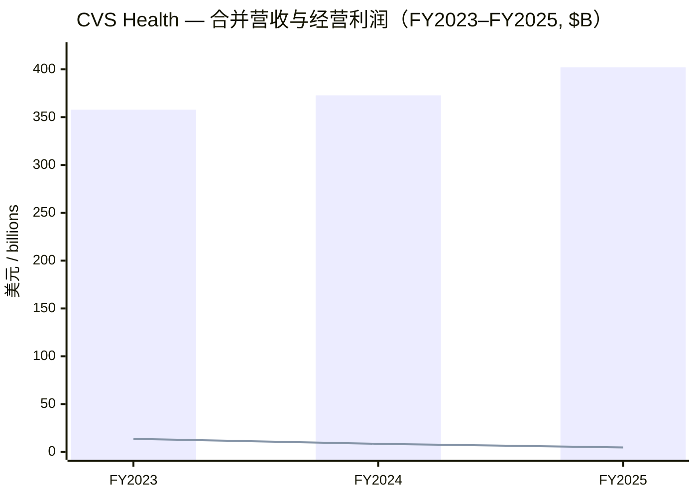
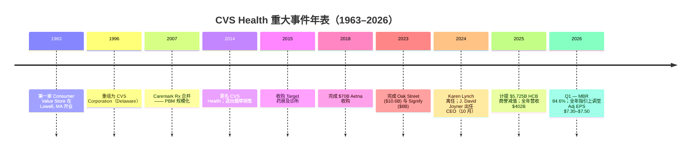
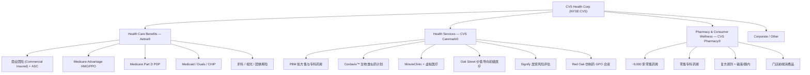
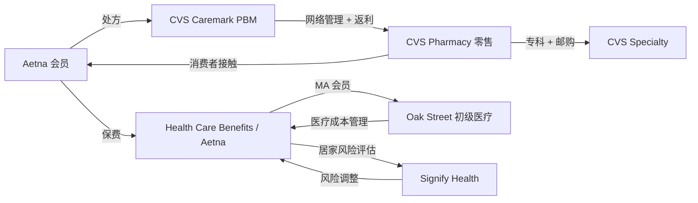
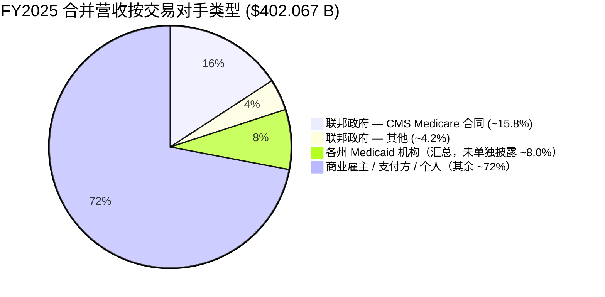
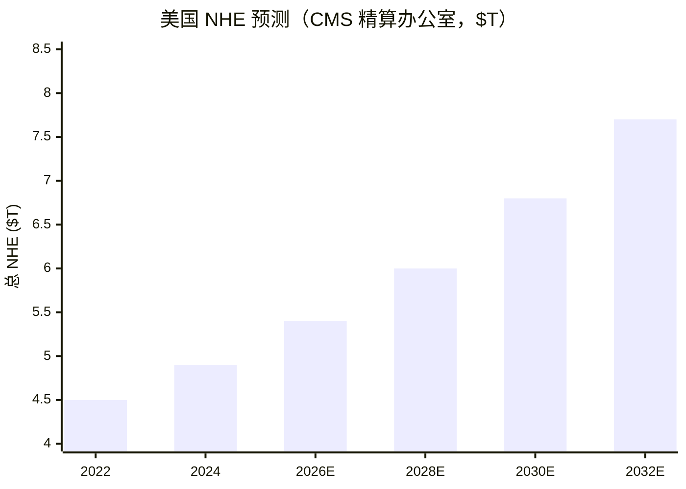
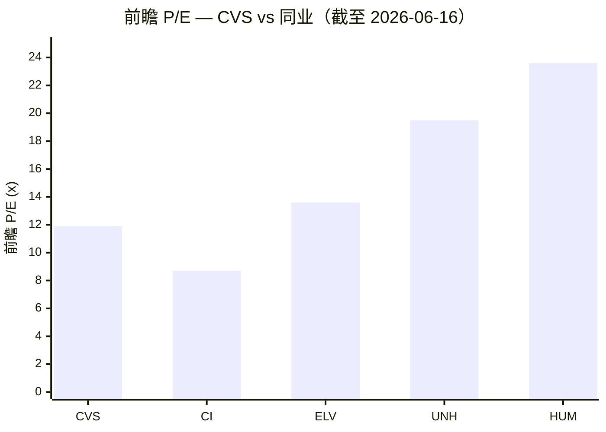
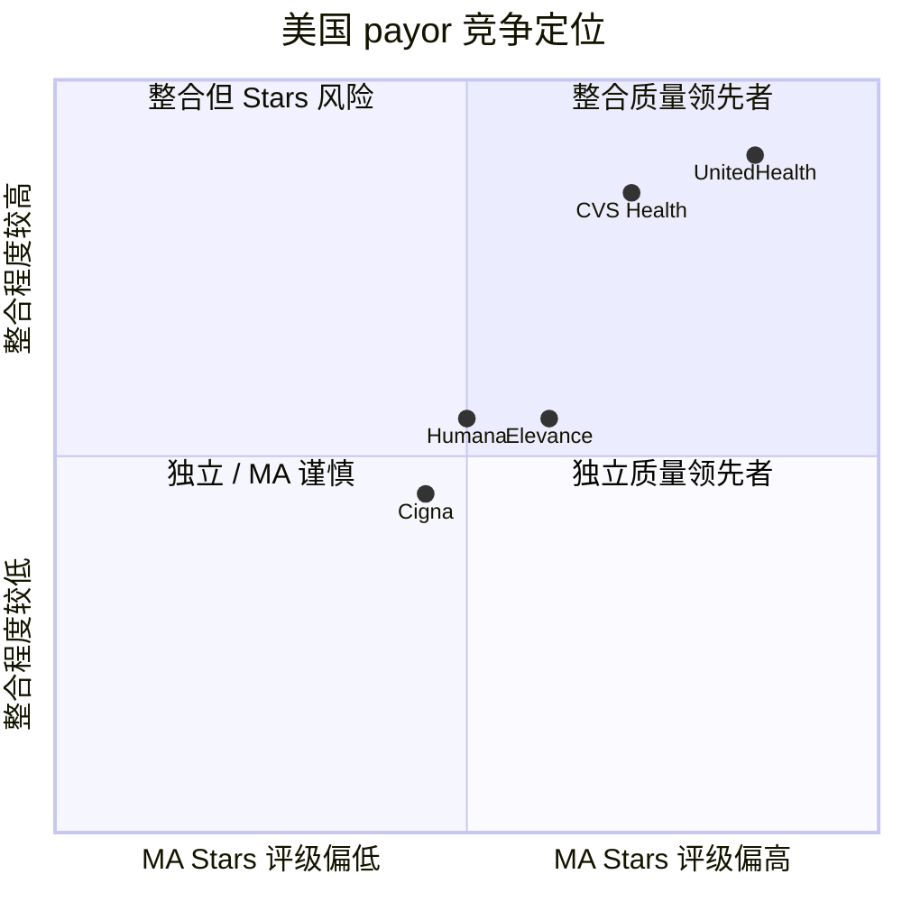

# CVS Health Corporation (NYSE: CVS) — 公司研究报告

*报告日期 2026-06-16 — 收盘 $100.06（[Yahoo Finance, CVS](https://finance.yahoo.com/quote/CVS/key-statistics/)）*

> **业绩指引提示（最新变动 2026-05-06）。** 公司在 Q1 2026 财报发布的同时上调全年指引：GAAP 摊薄 EPS 区间由 $5.94–$6.14 上调至 **$6.24–$6.44**，调整后 EPS（Adjusted EPS / Adj EPS）由 $7.00–$7.20 上调至 **$7.30–$7.50**，经营性现金流（Cash Flow from Operations, CFO）由 ≥$9.0 B 上调至 **≥$9.5 B**。管理层在新闻稿中将本次上调归因于 Health Care Benefits（健康保险，HCB）板块利润率恢复（margin recovery）执行超预期、Pharmacy & Consumer Wellness（药房与消费者健康，PCW）板块表现良好，同时对全年剩余季度因医疗成本（medical cost trend）仍居高位以及宏观不确定性维持谨慎态度。全年营业收入（total revenues）预计 **≥$405 B**。[CVS Q1-26 业绩新闻稿 (Ex. 99.1)](https://www.sec.gov/Archives/edgar/data/64803/000006480326000051/cvs_ex99x1q1-26.htm)。

---

> ### 投资摘要（本报告观点，*分析师观点*）
>
> | 项目 | 取值 |
> |---|---|
> | **评级 Rating** | **Overweight / 增持** |
> | **12 个月目标价 (Price Target)** | **$112**（前瞻 EPS 法：2027E Adj EPS $8.00 × 14× P/E） |
> | 当前股价（2026-06-16 收盘） | $100.06 |
> | 隐含上行空间 (Implied upside) | **+12%**（外加约 2.6% 股息率 ≈ 中两位数总回报） |
> | 估值方法 (Valuation method) | 前瞻 Adj-EPS × 目标 P/E，并以 DCF / SOTP 交叉验证 |
> | 市值 (Market cap) | ~$127.7 B（[Yahoo Finance, CVS](https://finance.yahoo.com/quote/CVS/key-statistics/)） |
> | 52 周区间 (52-wk range) | $58.50 – $102.77 |
> | 相对表现 (6 / 12 个月) | 6 个月约 +38%、12 个月约 +60%（自 52 周低 $58.50 大幅反弹，跑赢 S&P 500 与 XLV 医疗板块；动量强劲但已收复多数 2024 跌幅） |
> | 代码 / 交易所 | NYSE: CVS |
>
> **论点支柱 (Thesis pillars)：**
> 1. **HCB 利润率拐点正在兑现** —— Q1 2026 medical benefit ratio（MBR，医疗赔付率）改善至 84.6%（YoY −270 bp）、HCB 调整后经营利润（AOI）YoY +52.6%，是管理层两年来反复阐述的 "Health Care Benefits 板块利润率恢复计划" 首次出现实质数据兑现，并支撑 5 月上调全年指引。[CVS Q1-26 业绩新闻稿](https://www.sec.gov/Archives/edgar/data/64803/000006480326000051/cvs_ex99x1q1-26.htm)。
> 2. **前瞻估值仍便宜，trailing P/E 的高位是技术性的** —— 前瞻 P/E 约 11.9× 显著低于 S&P 500（~21×）与 UnitedHealth（~19.5×）；TTM P/E ~43.9× 完全由 FY2025 的 $5.725 B HCB 商誉减值（goodwill impairment）这一非现金一次性项目抬高，回补后落入低 teens。[Yahoo Finance, CVS Key Statistics](https://finance.yahoo.com/quote/CVS/key-statistics/)。
> 3. **纵向整合堆栈是结构性护城河，也是结构性风险敞口** —— Aetna 保险 + CVS Caremark PBM + ~9,000 家零售药房 + Oak Street / Signify 医疗交付，是美国 payor 中最深的整合；同时也是 FTC / DOJ / 国会 PBM 改革与 "强制拆分" 政治风险中暴露最深的标的。[CVS FY2025 10-K](https://www.sec.gov/Archives/edgar/data/64803/000006480326000010/cvs-20251231.htm)。
> 4. **资产负债表去杠杆 + 现金流改善是 12–18 个月的次级催化** —— 2025 年暂停回购、优先偿债，FY2025 自由现金流（FCF = CFO − CapEx）约 $7.8 B，FY2026 指引 CFO ≥$9.5 B。[CVS FY2025 10-K — 现金流量表](https://www.sec.gov/Archives/edgar/data/64803/000006480326000010/cvs-20251231.htm)。
>
> *所有评级、目标价、前瞻估计与情景目标价均为本报告分析师的前瞻观点（*分析师观点*），不构成任何申报文件（filing）的内容 —— 10-K 不含目标价。*

## 目录
1. 公司概览（含 1A 估值快照、1B GF Score 基本面评分卡）
2. 估值与目标价（前瞻模型 / 目标价推导 / 牛熊情景 / 卖方观点演变）
3. 公司历史
4. 管理团队
5. 产品与服务
6. 客户与上市策略
7. 行业概览
8. 竞争格局
9. 市场机会
10. 风险评估（含 10.5 关键分歧与催化剂）
11. 投资视角评分卡
12. 参考资料与核查日志

---

## 1. 公司概览

CVS Health Corporation（NYSE: CVS）总部位于美国罗德岛州沃恩索基特（Woonsocket, Rhode Island），是一家纵向整合的美国医疗健康平台，业务结构由三部分构成：(a) 通过 **Aetna®** 品牌运营的健康保险（health insurance）业务；(b) 通过 **CVS Caremark®** 运营的药品福利管理（pharmacy benefit manager, PBM）业务，并叠加 Signify Health 与 Oak Street Health 的医疗服务交付（care delivery）网络；(c) 通过 **CVS Pharmacy®** 运营的零售与专科药房（retail and specialty pharmacy）业务。FY2025 10-K 中对自身的官方描述为："a leading health solutions company"（一家领先的健康解决方案公司），其规模包括 "approximately 9,000 retail locations"（约 9,000 家零售门店）、"more than 1,000 walk-in and primary care medical clinics"（超过 1,000 家步入式与初级医疗诊所）、"a leading pharmacy benefits manager with approximately 87 million plan members"（约 8,700 万会员的领先 PBM 业务）、以及通过 Aetna 服务的 "more than 37 million people"（超过 3,700 万人）健康保险会员，全公司员工 "over 300,000 colleagues primarily in the U.S."（超过 30 万人，主要在美国）。这是公司自我定位的官方语言。[CVS Health FY2025 10-K](https://www.sec.gov/Archives/edgar/data/64803/000006480326000010/cvs-20251231.htm)。

公司按照三大业务板块加 Corporate / Other（公司及其他）板块进行经营分部披露：Health Care Benefits（HCB / Aetna 保险）、Health Services（CVS Caremark PBM + 诊所 + Oak Street + Signify 医疗交付）、Pharmacy & Consumer Wellness（CVS 零售与专科药房）。FY2025 合并营业收入 **$402.067 B**（vs FY2024 $372.809 B，YoY +7.8%），GAAP 经营利润（GAAP operating income）**$4.660 B**（vs $8.516 B，YoY -45.3%）。需要指出的是，FY2025 经营利润下滑的主因是计提了 **$5.725 B 的 HCB 商誉减值（goodwill impairment）** —— 这是 2018 年 Aetna 收购完成以来首次对该资产进行减值。三大板块的分部营收（intersegment 抵消前）依次为 HCB **$143,354 M**、Health Services **$190,425 M**、PCW **$139,367 M**；分部调整后经营利润（adjusted operating income, AOI）分别为 **$2,939 M / $7,151 M / $6,040 M**。这四个数字是后续所有分析的锚点。[CVS FY2025 10-K — MD&A 与 Note 19 分部报告](https://www.sec.gov/Archives/edgar/data/64803/000006480326000010/cvs-20251231.htm)。

最新业绩比 10-K 更鲜活。Q1 2026 营收同比 +6.2% 至 **$100.4 B**，GAAP 摊薄 EPS 由上年同期 $1.41 升至 **$2.30**，调整后 EPS 升至 **$2.57**。HCB 板块的核心运营指标 medical benefit ratio（医疗赔付率，MBR —— 即每 1 美元保费中赔付出去的医疗成本占比，越低意味着保险盈利能力越强）由上年同期 87.3% 降至 **84.6%**，HCB 调整后经营利润 YoY **+52.6%**。这是公司过去两年反复阐述的 "Health Care Benefits segment margin recovery plan"（健康保险板块利润率恢复计划）首次出现实质性兑现。[CVS Q1-26 业绩新闻稿](https://www.sec.gov/Archives/edgar/data/64803/000006480326000051/cvs_ex99x1q1-26.htm)。

### 1A 估值快照

截至 2026-06-16 收盘 $100.06（[Yahoo Finance, CVS Key Statistics](https://finance.yahoo.com/quote/CVS/key-statistics/)），市值约 **$127.7 B**，企业价值（enterprise value, EV）约 **$195 B**，TTM P/E **~43.9×**、Forward P/E **~11.9×**、P/S **0.31×**、P/B **1.64×**、EV/EBITDA **12.7×**，股息率（dividend yield）约 **2.6%**（年化股息 $2.66），52 周价格区间 $58.50–$102.77。需要解读：TTM P/E 高位完全是技术性的 —— FY2025 计提了 $5.725 B HCB 商誉减值，导致 GAAP 净利润仅 $1,768 M、对应 FY2025 GAAP EPS 约 $1.40（TTM EPS $2.28 含已反弹的 Q1 2026）；若回补该非现金减值，TTM 调整后 P/E 落入低 teens 区间。**市场实际上是按 forward P/E 定价，而不是 trailing P/E** —— 11.9× 前瞻市盈率仍显著低于 S&P 500 远期 P/E 约 21× 的水平，相对 UnitedHealth（UNH，前瞻 P/E ~19.5×）有约 40% 折价，但相对 Cigna（CI，前瞻 P/E ~8.7×）有溢价。需要指出的是，自 2026-06-03 本报告上一版（$89.50）以来，CVS 已上涨约 +12%，估值的折价空间正在收窄。[Yahoo Finance, CVS Key Statistics](https://finance.yahoo.com/quote/CVS/key-statistics/)；同业估值取自 [Yahoo Finance UNH](https://finance.yahoo.com/quote/UNH/key-statistics/)、[CI](https://finance.yahoo.com/quote/CI/key-statistics/)、[ELV](https://finance.yahoo.com/quote/ELV/key-statistics/)、[HUM](https://finance.yahoo.com/quote/HUM/key-statistics/)（均为 2026-06-16 拉取）。

*分析师观点：* 前瞻倍数本身仍不算高估，让这只股票波动的不是估值，而是三个驱动因素的共同作用：(a) **Medicare Advantage Stars 评级悬崖**（10-K 明确披露，2026 计划年中 81% 的 MA 会员在 4 星及以上计划、63% 在 4.5 星计划 —— 任何评级下滑都会大幅压低 quality bonus / 质量奖励金）；(b) **PBM 监管悬而未决**（DOJ 的 Bassan/Behnke 诉讼、FTC 对三大 PBM 的调查、州级 PBM 透明度立法）；以及 (c) **Q1 2026 HCB 利润率恢复的可持续性**（这是 5 月上调指引的依据）。未来 12–18 个月的核心问题是盈利的耐久性，而不是估值的扩张。

下面的收入表 Sankey 把 CVS 的 "钱怎么赚" 拆给读者看：FY2025 总营收 $402.1 B 主要由 Products（药品 / 商品销售）$249.9 B 与 Premiums（保费）$134.8 B 两条腿构成，但巨量 COGS（$221.2 B）与医疗成本 + 经营费用使 GAAP 经营利润仅 $4.7 B、GAAP 净利润仅 $1.768 B —— 利润率极薄是综合医疗平台（integrated health platform）的固有特征，也是为什么 P/S 仅 0.31× 在估值上才有意义。[CVS FY2025 10-K — Consolidated Statements of Operations](https://www.sec.gov/Archives/edgar/data/64803/000006480326000010/cvs-20251231.htm)。

<svg xmlns="http://www.w3.org/2000/svg" viewBox="0 0 1000 560" width="1000" height="560" role="img" aria-label="income statement Sankey"><rect x="0" y="0" width="1000" height="560" fill="#ffffff"/>
<text x="20.00" y="30.00" text-anchor="start" font-family="Helvetica,Arial,sans-serif" font-size="15" font-weight="700" fill="#1f2933">CVS Health — FY2025 Income Statement (US$ M)</text>
<path d="M 204.00,64.00 C 258.00,64.00 258.00,85.00 312.00,85.00 L 312.00,338.60 C 258.00,338.60 258.00,317.60 204.00,317.60 Z" fill="#93c5fd" fill-opacity="0.55"/>
<path d="M 452.00,78.00 C 506.00,78.00 506.00,181.93 560.00,181.93 L 560.00,186.66 C 506.00,186.66 506.00,82.73 452.00,82.73 Z" fill="#86efac" fill-opacity="0.55"/>
<path d="M 452.00,82.73 C 506.00,82.73 506.00,200.66 560.00,200.66 L 560.00,379.50 C 506.00,379.50 506.00,261.57 452.00,261.57 Z" fill="#fca5a5" fill-opacity="0.55"/>
<path d="M 328.00,85.00 C 382.00,85.00 382.00,78.00 436.00,78.00 L 436.00,261.57 C 382.00,261.57 382.00,268.57 328.00,268.57 Z" fill="#86efac" fill-opacity="0.55"/>
<path d="M 328.00,268.57 C 382.00,268.57 382.00,275.57 436.00,275.57 L 436.00,500.00 C 382.00,500.00 382.00,493.00 328.00,493.00 Z" fill="#fca5a5" fill-opacity="0.55"/>
<path d="M 576.00,181.93 C 630.00,181.93 630.00,184.50 684.00,184.50 L 684.00,189.22 C 630.00,189.22 630.00,186.66 576.00,186.66 Z" fill="#86efac" fill-opacity="0.55"/>
<path d="M 700.00,184.50 C 754.00,184.50 754.00,280.00 808.00,280.00 L 808.00,282.00 C 754.00,282.00 754.00,186.50 700.00,186.50 Z" fill="#86efac" fill-opacity="0.55"/>
<path d="M 700.00,186.50 C 754.00,186.50 754.00,296.00 808.00,296.00 L 808.00,298.00 C 754.00,298.00 754.00,188.50 700.00,188.50 Z" fill="#fca5a5" fill-opacity="0.55"/>
<path d="M 576.00,200.66 C 630.00,200.66 630.00,200.66 684.00,200.66 L 684.00,246.30 C 630.00,246.30 630.00,246.30 576.00,246.30 Z" fill="#fca5a5" fill-opacity="0.55"/>
<path d="M 576.00,246.30 C 630.00,246.30 630.00,260.30 684.00,260.30 L 684.00,393.50 C 630.00,393.50 630.00,379.50 576.00,379.50 Z" fill="#fca5a5" fill-opacity="0.55"/>
<path d="M 204.00,331.60 C 258.00,331.60 258.00,338.60 312.00,338.60 L 312.00,475.34 C 258.00,475.34 258.00,468.34 204.00,468.34 Z" fill="#93c5fd" fill-opacity="0.55"/>
<path d="M 576.00,393.50 C 630.00,393.50 630.00,189.22 684.00,189.22 L 684.00,191.79 C 630.00,191.79 630.00,396.07 576.00,396.07 Z" fill="#93c5fd" fill-opacity="0.55"/>
<path d="M 204.00,482.34 C 258.00,482.34 258.00,475.34 312.00,475.34 L 312.00,490.73 C 258.00,490.73 258.00,497.73 204.00,497.73 Z" fill="#93c5fd" fill-opacity="0.55"/>
<path d="M 204.00,511.73 C 258.00,511.73 258.00,490.73 312.00,490.73 L 312.00,493.00 C 258.00,493.00 258.00,514.00 204.00,514.00 Z" fill="#93c5fd" fill-opacity="0.55"/>
<rect x="188.00" y="64.00" width="16" height="253.60" rx="1.5" fill="#2563eb"/>
<rect x="188.00" y="331.60" width="16" height="136.74" rx="1.5" fill="#2563eb"/>
<rect x="188.00" y="482.34" width="16" height="15.40" rx="1.5" fill="#2563eb"/>
<rect x="188.00" y="511.73" width="16" height="2.27" rx="1.5" fill="#2563eb"/>
<rect x="312.00" y="85.00" width="16" height="408.00" rx="1.5" fill="#1e3a8a"/>
<rect x="436.00" y="78.00" width="16" height="183.57" rx="1.5" fill="#15803d"/>
<rect x="436.00" y="275.57" width="16" height="224.43" rx="1.5" fill="#dc2626"/>
<rect x="560.00" y="181.93" width="16" height="4.73" rx="1.5" fill="#15803d"/>
<rect x="560.00" y="200.66" width="16" height="178.84" rx="1.5" fill="#dc2626"/>
<rect x="560.00" y="393.50" width="16" height="2.56" rx="1.5" fill="#2563eb"/>
<rect x="684.00" y="184.50" width="16" height="2.17" rx="1.5" fill="#15803d"/>
<rect x="684.00" y="200.66" width="16" height="45.64" rx="1.5" fill="#dc2626"/>
<rect x="684.00" y="260.30" width="16" height="133.20" rx="1.5" fill="#dc2626"/>
<rect x="808.00" y="280.00" width="16" height="2.00" rx="1.5" fill="#15803d"/>
<rect x="808.00" y="296.00" width="16" height="2.00" rx="1.5" fill="#dc2626"/>
<line x1="188.00" y1="190.80" x2="182.00" y2="162.76" stroke="#cbd5e1" stroke-width="1"/>
<text x="179.00" y="165.76" text-anchor="end" font-family="Helvetica,Arial,sans-serif" font-size="11.5" font-weight="700" fill="#1f2933">Products</text>
<text x="179.00" y="178.76" text-anchor="end" font-family="Helvetica,Arial,sans-serif" font-size="10" font-weight="400" fill="#52606d">US$249.9B  (62.2%)</text>
<line x1="188.00" y1="399.97" x2="182.00" y2="371.93" stroke="#cbd5e1" stroke-width="1"/>
<text x="179.00" y="374.93" text-anchor="end" font-family="Helvetica,Arial,sans-serif" font-size="11.5" font-weight="700" fill="#1f2933">Premiums</text>
<text x="179.00" y="387.93" text-anchor="end" font-family="Helvetica,Arial,sans-serif" font-size="10" font-weight="400" fill="#52606d">US$134.8B  (33.5%)</text>
<line x1="188.00" y1="490.03" x2="182.00" y2="462.00" stroke="#cbd5e1" stroke-width="1"/>
<text x="179.00" y="465.00" text-anchor="end" font-family="Helvetica,Arial,sans-serif" font-size="11.5" font-weight="700" fill="#1f2933">Services</text>
<text x="179.00" y="478.00" text-anchor="end" font-family="Helvetica,Arial,sans-serif" font-size="10" font-weight="400" fill="#52606d">US$15.2B  (3.8%)</text>
<line x1="188.00" y1="512.87" x2="182.00" y2="487.00" stroke="#cbd5e1" stroke-width="1"/>
<text x="179.00" y="490.00" text-anchor="end" font-family="Helvetica,Arial,sans-serif" font-size="11.5" font-weight="700" fill="#1f2933">Net investment income</text>
<text x="179.00" y="503.00" text-anchor="end" font-family="Helvetica,Arial,sans-serif" font-size="10" font-weight="400" fill="#52606d">US$2.2B  (0.56%)</text>
<rect x="331.00" y="67.00" width="125.70" height="26" rx="2" fill="#ffffff" fill-opacity="0.72"/>
<text x="334.00" y="79.00" text-anchor="start" font-family="Helvetica,Arial,sans-serif" font-size="11.5" font-weight="700" fill="#1f2933">Revenue</text>
<text x="334.00" y="92.00" text-anchor="start" font-family="Helvetica,Arial,sans-serif" font-size="10" font-weight="400" fill="#52606d">US$402.1B  (100.0%)</text>
<rect x="455.00" y="60.00" width="119.40" height="26" rx="2" fill="#ffffff" fill-opacity="0.72"/>
<text x="458.00" y="72.00" text-anchor="start" font-family="Helvetica,Arial,sans-serif" font-size="11.5" font-weight="700" fill="#1f2933">Gross Profit</text>
<text x="458.00" y="85.00" text-anchor="start" font-family="Helvetica,Arial,sans-serif" font-size="10" font-weight="400" fill="#52606d">US$180.9B  (45.0%)</text>
<rect x="455.00" y="257.57" width="144.60" height="26" rx="2" fill="#ffffff" fill-opacity="0.72"/>
<text x="458.00" y="269.57" text-anchor="start" font-family="Helvetica,Arial,sans-serif" font-size="11.5" font-weight="700" fill="#1f2933">Cost of Revenue (COGS)</text>
<text x="458.00" y="282.57" text-anchor="start" font-family="Helvetica,Arial,sans-serif" font-size="10" font-weight="400" fill="#52606d">US$221.2B  (55.0%)</text>
<rect x="579.00" y="163.93" width="106.80" height="26" rx="2" fill="#ffffff" fill-opacity="0.72"/>
<text x="582.00" y="175.93" text-anchor="start" font-family="Helvetica,Arial,sans-serif" font-size="11.5" font-weight="700" fill="#1f2933">Operating Income</text>
<text x="582.00" y="188.93" text-anchor="start" font-family="Helvetica,Arial,sans-serif" font-size="10" font-weight="400" fill="#52606d">US$4.7B  (1.2%)</text>
<rect x="579.00" y="188.93" width="150.90" height="26" rx="2" fill="#ffffff" fill-opacity="0.72"/>
<text x="582.00" y="200.93" text-anchor="start" font-family="Helvetica,Arial,sans-serif" font-size="11.5" font-weight="700" fill="#1f2933">Total Operating Expense</text>
<text x="582.00" y="213.93" text-anchor="start" font-family="Helvetica,Arial,sans-serif" font-size="10" font-weight="400" fill="#52606d">US$176.2B  (43.8%)</text>
<text x="551.00" y="391.78" text-anchor="end" font-family="Helvetica,Arial,sans-serif" font-size="11.5" font-weight="700" fill="#1f2933">Net Interest / Other Income</text>
<text x="551.00" y="404.78" text-anchor="end" font-family="Helvetica,Arial,sans-serif" font-size="10" font-weight="400" fill="#52606d">US$2.5B  (0.63%)</text>
<rect x="703.00" y="166.50" width="106.80" height="26" rx="2" fill="#ffffff" fill-opacity="0.72"/>
<text x="706.00" y="178.50" text-anchor="start" font-family="Helvetica,Arial,sans-serif" font-size="11.5" font-weight="700" fill="#1f2933">Pretax Income</text>
<text x="706.00" y="191.50" text-anchor="start" font-family="Helvetica,Arial,sans-serif" font-size="10" font-weight="400" fill="#52606d">US$2.1B  (0.53%)</text>
<rect x="703.00" y="191.50" width="113.10" height="26" rx="2" fill="#ffffff" fill-opacity="0.72"/>
<text x="706.00" y="203.50" text-anchor="start" font-family="Helvetica,Arial,sans-serif" font-size="11.5" font-weight="700" fill="#1f2933">SG&amp;A</text>
<text x="706.00" y="216.50" text-anchor="start" font-family="Helvetica,Arial,sans-serif" font-size="10" font-weight="400" fill="#52606d">US$45.0B  (11.2%)</text>
<rect x="703.00" y="242.30" width="119.40" height="26" rx="2" fill="#ffffff" fill-opacity="0.72"/>
<text x="706.00" y="254.30" text-anchor="start" font-family="Helvetica,Arial,sans-serif" font-size="11.5" font-weight="700" fill="#1f2933">Other OpEx</text>
<text x="706.00" y="267.30" text-anchor="start" font-family="Helvetica,Arial,sans-serif" font-size="10" font-weight="400" fill="#52606d">US$131.3B  (32.6%)</text>
<text x="833.00" y="278.00" text-anchor="start" font-family="Helvetica,Arial,sans-serif" font-size="11.5" font-weight="700" fill="#1f2933">Net Income</text>
<text x="833.00" y="291.00" text-anchor="start" font-family="Helvetica,Arial,sans-serif" font-size="10" font-weight="400" fill="#52606d">US$1.7B  (0.43%)</text>
<text x="833.00" y="303.00" text-anchor="start" font-family="Helvetica,Arial,sans-serif" font-size="11.5" font-weight="700" fill="#1f2933">Income Tax</text>
<text x="833.00" y="316.00" text-anchor="start" font-family="Helvetica,Arial,sans-serif" font-size="10" font-weight="400" fill="#52606d">US$408.0M  (0.10%)</text>
<text x="500.00" y="544.00" text-anchor="middle" font-family="Helvetica,Arial,sans-serif" font-size="10" font-weight="400" fill="#52606d">Source: CVS FY2025 10-K — Consolidated Statements of Operations &amp; Note 19 Segment (filed 2026-02-10)</text>
</svg>

*FY2025 收入表 Sankey。Source: [CVS FY2025 10-K — Consolidated Statements of Operations & Note 19 Segment（filed 2026-02-10）](https://www.sec.gov/Archives/edgar/data/64803/000006480326000010/cvs-20251231.htm)。*

按分部看营收结构（抵消前 pre-elimination），Health Services（CVS Caremark PBM）以 $190.4 B 占 40.2% 居首，HCB（Aetna）$143.4 B 占 30.3%，PCW（CVS 零售药房）$139.4 B 占 29.4%。三大板块体量接近、各占约三分之一，是 CVS 区别于纯保险（如 Humana）或纯零售药房（如 Walgreens）的结构特征。[CVS FY2025 10-K — Note 19 Segment](https://www.sec.gov/Archives/edgar/data/64803/000006480326000010/cvs-20251231.htm)。

<svg xmlns="http://www.w3.org/2000/svg" viewBox="0 0 720 460" width="720" height="460" role="img" aria-label="revenue donut"><rect x="0" y="0" width="720" height="460" fill="#ffffff"/>
<text x="20.00" y="30.00" text-anchor="start" font-family="Helvetica,Arial,sans-serif" font-size="15" font-weight="700" fill="#1f2933">CVS Health — FY2025 Segment Revenue (pre-elim, US$ M)</text>
<path d="M 288.00,107.20 A 132 132 0 0 1 364.20,346.98 L 333.03,302.89 A 78 78 0 0 0 288.00,161.20 Z" fill="#2563eb"/>
<path d="M 364.20,346.98 A 132 132 0 0 1 161.31,276.25 L 213.13,261.09 A 78 78 0 0 0 333.03,302.89 Z" fill="#15803d"/>
<path d="M 161.31,276.25 A 132 132 0 0 1 287.15,107.20 L 287.50,161.20 A 78 78 0 0 0 213.13,261.09 Z" fill="#d97706"/>
<path d="M 287.15,107.20 A 132 132 0 0 1 288.00,107.20 L 288.00,161.20 A 78 78 0 0 0 287.50,161.20 Z" fill="#7c3aed"/>
<text x="288.00" y="235.20" text-anchor="middle" font-family="Helvetica,Arial,sans-serif" font-size="18" font-weight="800" fill="#1f2933">CVS</text>
<text x="288.00" y="255.20" text-anchor="middle" font-family="Helvetica,Arial,sans-serif" font-size="13" font-weight="600" fill="#52606d">US$473.6B</text>
<text x="288.00" y="271.20" text-anchor="middle" font-family="Helvetica,Arial,sans-serif" font-size="10" font-weight="400" fill="#8a97a3">total</text>
<line x1="419.52" y1="197.40" x2="435.52" y2="197.40" stroke="#2563eb" stroke-width="1.4"/>
<text x="439.52" y="195.40" text-anchor="start" font-family="Helvetica,Arial,sans-serif" font-size="11" font-weight="700" fill="#1f2933">Health Services (Caremark/PBM)</text>
<text x="439.52" y="209.40" text-anchor="start" font-family="Helvetica,Arial,sans-serif" font-size="10" font-weight="400" fill="#52606d">US$190.4B  (40.2%)</text>
<line x1="242.57" y1="369.51" x2="226.57" y2="369.51" stroke="#15803d" stroke-width="1.4"/>
<text x="222.57" y="367.51" text-anchor="end" font-family="Helvetica,Arial,sans-serif" font-size="11" font-weight="700" fill="#1f2933">Health Care Benefits (Aetna)</text>
<text x="222.57" y="381.51" text-anchor="end" font-family="Helvetica,Arial,sans-serif" font-size="10" font-weight="400" fill="#52606d">US$143.4B  (30.3%)</text>
<line x1="177.31" y1="156.79" x2="161.31" y2="156.79" stroke="#d97706" stroke-width="1.4"/>
<text x="157.31" y="154.79" text-anchor="end" font-family="Helvetica,Arial,sans-serif" font-size="11" font-weight="700" fill="#1f2933">Pharmacy &amp; Consumer Wellness</text>
<text x="157.31" y="168.79" text-anchor="end" font-family="Helvetica,Arial,sans-serif" font-size="10" font-weight="400" fill="#52606d">US$139.4B  (29.4%)</text>
<line x1="287.56" y1="101.20" x2="271.56" y2="101.20" stroke="#7c3aed" stroke-width="1.4"/>
<text x="267.56" y="99.20" text-anchor="end" font-family="Helvetica,Arial,sans-serif" font-size="11" font-weight="700" fill="#1f2933">Corporate/Other</text>
<text x="267.56" y="113.20" text-anchor="end" font-family="Helvetica,Arial,sans-serif" font-size="10" font-weight="400" fill="#52606d">US$484.0M  (0.1%)</text>
<text x="360.00" y="444.00" text-anchor="middle" font-family="Helvetica,Arial,sans-serif" font-size="10" font-weight="400" fill="#52606d">Source: CVS FY2025 10-K — Consolidated Statements of Operations &amp; Note 19 Segment (filed 2026-02-10)</text>
</svg>

*FY2025 分部营收占比。Source: [CVS FY2025 10-K — Note 19 Segment（filed 2026-02-10）](https://www.sec.gov/Archives/edgar/data/64803/000006480326000010/cvs-20251231.htm)。*

三年分部营收堆叠图显示合并营收稳步爬升（FY2023 $357.8 B → FY2024 $372.8 B → FY2025 $402.1 B，三年 CAGR 约 6.0%），增长由 Health Services 专科药与 HCB 保费驱动，PCW 受零售药房赔付压缩拖累而增速最慢。[CVS FY2025 10-K — Note 19 Segment](https://www.sec.gov/Archives/edgar/data/64803/000006480326000010/cvs-20251231.htm)。

<svg xmlns="http://www.w3.org/2000/svg" viewBox="0 0 860 470" width="860" height="470" role="img" aria-label="historical revenue bars"><rect x="0" y="0" width="860" height="470" fill="#ffffff"/>
<text x="20.00" y="30.00" text-anchor="start" font-family="Helvetica,Arial,sans-serif" font-size="15" font-weight="700" fill="#1f2933">CVS Health — Segment Revenue FY2023–FY2025 (pre-elim, US$ M)</text>
<rect x="20.00" y="44" width="11" height="11" rx="2" fill="#2563eb"/>
<text x="36.00" y="53.00" text-anchor="start" font-family="Helvetica,Arial,sans-serif" font-size="10.5" font-weight="400" fill="#1f2933">Health Care Benefits</text>
<rect x="182.00" y="44" width="11" height="11" rx="2" fill="#15803d"/>
<text x="198.00" y="53.00" text-anchor="start" font-family="Helvetica,Arial,sans-serif" font-size="10.5" font-weight="400" fill="#1f2933">Health Services</text>
<rect x="311.00" y="44" width="11" height="11" rx="2" fill="#d97706"/>
<text x="327.00" y="53.00" text-anchor="start" font-family="Helvetica,Arial,sans-serif" font-size="10.5" font-weight="400" fill="#1f2933">Pharmacy &amp; Consumer Wellness</text>
<rect x="525.80" y="44" width="11" height="11" rx="2" fill="#7c3aed"/>
<text x="541.80" y="53.00" text-anchor="start" font-family="Helvetica,Arial,sans-serif" font-size="10.5" font-weight="400" fill="#1f2933">Corporate/Other</text>
<line x1="70" y1="412.00" x2="834" y2="412.00" stroke="#eceff2" stroke-width="1"/>
<text x="64.00" y="415.00" text-anchor="end" font-family="Helvetica,Arial,sans-serif" font-size="9.5" font-weight="400" fill="#52606d">US$0</text>
<line x1="70" y1="345.20" x2="834" y2="345.20" stroke="#eceff2" stroke-width="1"/>
<text x="64.00" y="348.20" text-anchor="end" font-family="Helvetica,Arial,sans-serif" font-size="9.5" font-weight="400" fill="#52606d">US$102.3B</text>
<line x1="70" y1="278.40" x2="834" y2="278.40" stroke="#eceff2" stroke-width="1"/>
<text x="64.00" y="281.40" text-anchor="end" font-family="Helvetica,Arial,sans-serif" font-size="9.5" font-weight="400" fill="#52606d">US$204.6B</text>
<line x1="70" y1="211.60" x2="834" y2="211.60" stroke="#eceff2" stroke-width="1"/>
<text x="64.00" y="214.60" text-anchor="end" font-family="Helvetica,Arial,sans-serif" font-size="9.5" font-weight="400" fill="#52606d">US$306.9B</text>
<line x1="70" y1="144.80" x2="834" y2="144.80" stroke="#eceff2" stroke-width="1"/>
<text x="64.00" y="147.80" text-anchor="end" font-family="Helvetica,Arial,sans-serif" font-size="9.5" font-weight="400" fill="#52606d">US$409.2B</text>
<line x1="70" y1="78.00" x2="834" y2="78.00" stroke="#eceff2" stroke-width="1"/>
<text x="64.00" y="81.00" text-anchor="end" font-family="Helvetica,Arial,sans-serif" font-size="9.5" font-weight="400" fill="#52606d">US$511.5B</text>
<rect x="123.48" y="343.02" width="147.71" height="68.98" fill="#2563eb"/>
<rect x="123.48" y="221.02" width="147.71" height="122.00" fill="#15803d"/>
<rect x="123.48" y="144.78" width="147.71" height="76.24" fill="#d97706"/>
<rect x="123.48" y="144.48" width="147.71" height="0.29" fill="#7c3aed"/>
<text x="197.33" y="428.00" text-anchor="middle" font-family="Helvetica,Arial,sans-serif" font-size="10" font-weight="400" fill="#52606d">2023</text>
<rect x="378.15" y="326.68" width="147.71" height="85.32" fill="#2563eb"/>
<rect x="378.15" y="213.33" width="147.71" height="113.36" fill="#15803d"/>
<rect x="378.15" y="132.03" width="147.71" height="81.29" fill="#d97706"/>
<rect x="378.15" y="131.74" width="147.71" height="0.29" fill="#7c3aed"/>
<text x="452.00" y="428.00" text-anchor="middle" font-family="Helvetica,Arial,sans-serif" font-size="10" font-weight="400" fill="#52606d">2024</text>
<rect x="632.81" y="318.40" width="147.71" height="93.60" fill="#2563eb"/>
<rect x="632.81" y="194.06" width="147.71" height="124.34" fill="#15803d"/>
<rect x="632.81" y="103.06" width="147.71" height="91.00" fill="#d97706"/>
<rect x="632.81" y="102.74" width="147.71" height="0.32" fill="#7c3aed"/>
<text x="706.67" y="428.00" text-anchor="middle" font-family="Helvetica,Arial,sans-serif" font-size="10" font-weight="400" fill="#52606d">2025</text>
<text x="430.00" y="454.00" text-anchor="middle" font-family="Helvetica,Arial,sans-serif" font-size="10" font-weight="400" fill="#52606d">Source: CVS FY2025 10-K — Consolidated Statements of Operations &amp; Note 19 Segment (filed 2026-02-10)</text>
</svg>

*FY2023–FY2025 分部营收堆叠。Source: [CVS FY2025 10-K — Note 19 Segment（filed 2026-02-10）](https://www.sec.gov/Archives/edgar/data/64803/000006480326000010/cvs-20251231.htm)。*

*来源：[CVS FY2025 10-K — MD&A 合并业绩表](https://www.sec.gov/Archives/edgar/data/64803/000006480326000010/cvs-20251231.htm)。柱状 = 总营收；折线 = GAAP 经营利润。FY2025 经营利润含 $5.725 B 商誉减值。*

---

## 1B. GF Score 基本面评分卡（GuruFocus 风格）

*分析师观点：* 下方五维评分卡（Financial Strength / Profitability / Growth / GF Value / Momentum，各 0–10）是本报告作者按 GuruFocus GF Score™ 方法构建的**独立分析叠加**，**不是 GuruFocus 官方数字**，也不附任何申报文件引用 —— 每一维度背后的指标（利润率、杠杆、CAGR、倍数、价格回报）各自在 Section 1–2 中已单独引用。综合得分 **52/100**（落在 51–70 "未来表现潜力偏弱" 区间），反映的是一家**基本面薄弱、但估值与动量双双偏强**的复苏型标的 —— 评分内部的强烈分化（Value/Momentum 高、Financial Strength/Profitability 低）本身就是 CVS 当前投资逻辑的浓缩。

<svg xmlns="http://www.w3.org/2000/svg" viewBox="0 0 500 500" width="500" height="500" role="img" aria-label="GF Score radar">
<rect x="0" y="0" width="500" height="500" fill="#ffffff"/>
<text x="20" y="24" font-family="Helvetica,Arial,sans-serif" font-size="15" font-weight="700" fill="#1f2933">GF Score (GuruFocus-style): 52/100</text>
<text x="20" y="41" font-family="Helvetica,Arial,sans-serif" font-size="11" fill="#52606d">51–70 Poor future performance potential</text>
<polygon points="250.0,88.0 392.7,191.6 338.2,359.4 161.8,359.4 107.3,191.6" fill="#e9f5ec" stroke="none"/>
<polygon points="250.0,208.0 278.5,228.7 267.6,262.3 232.4,262.3 221.5,228.7" fill="none" stroke="#c5d3cb" stroke-width="1"/>
<polygon points="250.0,178.0 307.1,219.5 285.3,286.5 214.7,286.5 192.9,219.5" fill="none" stroke="#c5d3cb" stroke-width="1"/>
<polygon points="250.0,148.0 335.6,210.2 302.9,310.8 197.1,310.8 164.4,210.2" fill="none" stroke="#c5d3cb" stroke-width="1"/>
<polygon points="250.0,118.0 364.1,200.9 320.5,335.1 179.5,335.1 135.9,200.9" fill="none" stroke="#c5d3cb" stroke-width="1"/>
<polygon points="250.0,88.0 392.7,191.6 338.2,359.4 161.8,359.4 107.3,191.6" fill="none" stroke="#c5d3cb" stroke-width="1.3"/>
<line x1="250" y1="238" x2="161.8" y2="359.4" stroke="#cfdad3" stroke-width="1"/>
<text x="146.5" y="392.4" text-anchor="end" font-family="Helvetica,Arial,sans-serif" font-size="11.5" font-weight="600" fill="#1f2933">Financial Strength</text>
<text x="146.5" y="405.4" text-anchor="end" font-family="Helvetica,Arial,sans-serif" font-size="9.5" fill="#52606d">财务实力</text>
<text x="223.5" y="268.4" text-anchor="middle" font-family="Helvetica,Arial,sans-serif" font-size="10.5" font-weight="700" fill="#1f2933">3</text>
<line x1="250" y1="238" x2="250.0" y2="88.0" stroke="#cfdad3" stroke-width="1"/>
<text x="250.0" y="58.0" text-anchor="middle" font-family="Helvetica,Arial,sans-serif" font-size="11.5" font-weight="600" fill="#1f2933">Profitability</text>
<text x="250.0" y="71.0" text-anchor="middle" font-family="Helvetica,Arial,sans-serif" font-size="9.5" fill="#52606d">盈利能力</text>
<text x="250.0" y="172.0" text-anchor="middle" font-family="Helvetica,Arial,sans-serif" font-size="10.5" font-weight="700" fill="#1f2933">4</text>
<line x1="250" y1="238" x2="107.3" y2="191.6" stroke="#cfdad3" stroke-width="1"/>
<text x="82.6" y="183.6" text-anchor="end" font-family="Helvetica,Arial,sans-serif" font-size="11.5" font-weight="600" fill="#1f2933">Growth</text>
<text x="82.6" y="196.6" text-anchor="end" font-family="Helvetica,Arial,sans-serif" font-size="9.5" fill="#52606d">成长性</text>
<text x="178.7" y="208.8" text-anchor="middle" font-family="Helvetica,Arial,sans-serif" font-size="10.5" font-weight="700" fill="#1f2933">5</text>
<line x1="250" y1="238" x2="392.7" y2="191.6" stroke="#cfdad3" stroke-width="1"/>
<text x="417.4" y="183.6" text-anchor="start" font-family="Helvetica,Arial,sans-serif" font-size="11.5" font-weight="600" fill="#1f2933">GF Value</text>
<text x="417.4" y="196.6" text-anchor="start" font-family="Helvetica,Arial,sans-serif" font-size="9.5" fill="#52606d">估值</text>
<text x="364.1" y="194.9" text-anchor="middle" font-family="Helvetica,Arial,sans-serif" font-size="10.5" font-weight="700" fill="#1f2933">8</text>
<line x1="250" y1="238" x2="338.2" y2="359.4" stroke="#cfdad3" stroke-width="1"/>
<text x="353.5" y="392.4" text-anchor="start" font-family="Helvetica,Arial,sans-serif" font-size="11.5" font-weight="600" fill="#1f2933">Momentum</text>
<text x="353.5" y="405.4" text-anchor="start" font-family="Helvetica,Arial,sans-serif" font-size="9.5" fill="#52606d">动量</text>
<text x="320.5" y="329.1" text-anchor="middle" font-family="Helvetica,Arial,sans-serif" font-size="10.5" font-weight="700" fill="#1f2933">8</text>
<polygon points="250.0,178.0 364.1,200.9 320.5,335.1 223.5,274.4 178.7,214.8" fill="#2e8b57" fill-opacity="0.34" stroke="#2e8b57" stroke-width="2"/>
<circle cx="223.5" cy="274.4" r="2.6" fill="#2e8b57"/>
<circle cx="250.0" cy="178.0" r="2.6" fill="#2e8b57"/>
<circle cx="178.7" cy="214.8" r="2.6" fill="#2e8b57"/>
<circle cx="364.1" cy="200.9" r="2.6" fill="#2e8b57"/>
<circle cx="320.5" cy="335.1" r="2.6" fill="#2e8b57"/>
<text x="250" y="470" text-anchor="middle" font-family="Helvetica,Arial,sans-serif" font-size="9.5" fill="#52606d">Source: CVS FY2025 10-K + Q1-26 8-K · Yahoo Finance (as of 2026-06-12 close $101.96) · indicators.db, as of 2026-06-15</text>
<text x="250" y="485" text-anchor="middle" font-family="Helvetica,Arial,sans-serif" font-size="9" fill="#52606d">GF Score = independent analyst rubric (*Analyst view:*) — not GuruFocus™ official number</text>
</svg>

*GF Score 雷达图。Source: CVS FY2025 10-K + Q1-26 8-K · Yahoo Finance · indicators.db（as of 2026-06-15）。该综合分为分析师评分叠加（*分析师观点*），非 GuruFocus 官方值。*

- **Financial Strength（财务实力）= 3/10。** CVS 杠杆显著偏高 —— FY2025 末长期债务 $63.7 B（含合同义务表口径）、总负债 $178.2 B、权益 $75.4 B，资产负债率约 70%，Net Debt/EBITDA 显著高于 IG payor 同业平均，S&P / Moody's 仅维持在投资级低端。利息覆盖在 FY2025 因经营利润仅 $4.7 B（含减值）而薄弱。这是五维中最低的一项。[CVS FY2025 10-K — 资产负债表与合同义务表](https://www.sec.gov/Archives/edgar/data/64803/000006480326000010/cvs-20251231.htm)。
- **Profitability（盈利能力）= 4/10。** GAAP 经营利润率仅 1.2%、GAAP 净利率仅 0.44%（含 $5.725 B 减值压低），ROE 约 2.35%（见下方 DuPont 树）—— 即便回补减值，综合医疗平台的结构性净利率也只有低个位数。专科药 + PBM 价差是高毛利点，但被薄利的零售药房与承保风险稀释。[CVS FY2025 10-K — 利润表](https://www.sec.gov/Archives/edgar/data/64803/000006480326000010/cvs-20251231.htm)。
- **Growth（成长性）= 5/10。** 营收三年 CAGR 约 6.0%（$357.8 B → $402.1 B）稳健但不亮眼；EPS 因 2024–2025 的 MA 成本冲击与减值而剧烈波动。前瞻看，FY2026 指引 Adj EPS $7.30–$7.50（YoY 由约 $6 大幅回升），是 "恢复性增长" 而非 "结构性增长"。[CVS FY2025 10-K — MD&A](https://www.sec.gov/Archives/edgar/data/64803/000006480326000010/cvs-20251231.htm)；[CVS Q1-26 业绩新闻稿](https://www.sec.gov/Archives/edgar/data/64803/000006480326000051/cvs_ex99x1q1-26.htm)。
- **GF Value（估值，越高越便宜）= 8/10。** 前瞻 P/E 11.9× 低于自身历史中枢与多数同业、P/S 0.31×、相对 1A 的 DCF/SOTP 内在价值区间（中性 $112）仍有约 +12% 的安全边际。估值是 CVS 当下最强的一维。[Yahoo Finance, CVS Key Statistics](https://finance.yahoo.com/quote/CVS/key-statistics/)。
- **Momentum（动量）= 8/10。** 过去 6 个月约 +38%、12 个月约 +60%，自 52 周低 $58.50 大幅反弹至 $100、明显跑赢 S&P 500 与 XLV 医疗板块，价格远在 200 日均线之上。需要提示：动量高位部分源于低基数（2024 年的深跌），并非纯粹的基本面驱动。[Yahoo Finance, CVS Key Statistics](https://finance.yahoo.com/quote/CVS/key-statistics/)。

---

## 2. 估值与目标价

本章是把描述性画像转成投资决策的核心层。**全部前瞻估计、目标价、牛熊情景均为本报告分析师的前瞻观点（*分析师观点*），不附任何申报文件引用 —— 10-K 不含目标价。** 前瞻模型由 10-K 分部数据 + 管理层 FY2026 指引 + CMS 行业增长预测搭建，外部输入逐项内嵌引用。

### 2.1 前瞻财务估计表（FY2026E–FY2028E）

*分析师观点：* 按分部分别建模再加总（segment-by-segment），而非单一混合顶线增长。HCB 假设 MBR 由 2025 的高位逐年改善至 2028 的约 86%（利润率恢复计划继续兑现）；Health Services 假设 PBM 价差压力被专科药与 Oak Street 爬坡部分抵消、AOI 低个位数增长；PCW 假设 CostVantage 新报销模式稳定毛利、营收微降而 AOI 持平至微增。

| 财年 | 总营收 ($B) | YoY | 调整后经营利润率 (Adj) | 调整后 EPS (Adj) | YoY |
|---|---|---|---|---|---|
| FY2025 (实际) | 402.1 | +7.8% | ~3.9% | ~$6.20* | — |
| FY2026E | ~408 | +1.5% | ~4.0% | **$7.40**（指引中值） | +19% |
| FY2027E | ~430 | +5.4% | ~4.2% | **$8.00** | +8% |
| FY2028E | ~452 | +5.1% | ~4.4% | **$8.70** | +9% |

*\*FY2025 Adj EPS 为管理层口径（剔除商誉减值等）的近似；FY2026E 取管理层指引 Adj EPS $7.30–$7.50 中值 $7.40。每一前瞻单元格为 `*分析师观点*`。营收增长锚定 [CMS NHE 5.6% 预测](https://www.cms.gov/data-research/statistics-trends-and-reports/national-health-expenditure-data/nhe-fact-sheet)、利润率恢复锚定 [Q1-26 业绩新闻稿的 MBR 84.6% / HCB AOI +52.6%](https://www.sec.gov/Archives/edgar/data/64803/000006480326000051/cvs_ex99x1q1-26.htm) 与 [FY2026 指引 Adj EPS $7.30–$7.50](https://www.sec.gov/Archives/edgar/data/64803/000006480326000051/cvs_ex99x1q1-26.htm)。*

### 2.2 目标价推导（展示算术）

*分析师观点：* 主方法用**前瞻 P/E × 目标倍数**：

> **2027E Adj EPS $8.00 × 14× 目标 P/E = $112**（12 个月目标价）

**为什么用 14×：** CVS 当前前瞻 P/E 11.9×，处于美国 payor 区间下沿（Cigna 8.7× / CVS 11.9× / Elevance 13.6× / UNH 19.5× / Humana 23.6×，均为 [Yahoo Finance, 2026-06-16](https://finance.yahoo.com/quote/CVS/key-statistics/)）。把 CVS 从 11.9× 重估到 14×，是假设 HCB 利润率恢复在 2026–2027 持续兑现后，市场把对盈利耐久性的折价部分收回 —— 14× 仍低于 Elevance（13.6×，可比的纵向整合 BCBS payor 略高一点）、远低于 UNH，对一家杠杆更高、PBM 监管敞口更大的标的，是审慎而非激进的倍数。**DCF 交叉验证：** 以 WACC ~7.5%（Rf 4.54% [FRED DGS10 / indicators.db tnx, 2026-06-05](https://fred.stlouisfed.org/series/DGS10) + Beta 0.62 × ERP 5.0%）、2026–2032 营收 5% 增长、Adj 经营利润率 3.9%→4.4%、终值增长 2.5%，得中性每股内在价值约 $108–$118，与 $112 目标价一致。

### 2.3 牛 / 基准 / 熊三档目标价

| 情景 | 目标价 | 隐含上行/下行 | 摆动假设 (swing assumption) |
|---|---|---|---|
| **牛市 (Bull)** | **$138** | +38% | HCB MBR 持续回落至 ~84%、2027E Adj EPS $8.50 且市场给 16× P/E（向 Elevance/UNH 中枢靠拢）；PBM 监管 "雷声大雨点小" |
| **基准 (Base)** | **$112** | +12% | 2027E Adj EPS $8.00 × 14×；利润率恢复稳步但非加速；PBM 改革温和落地（FTC 和解 + 商业模式调整，无强制拆分） |
| **熊市 (Bear)** | **$72** | −28% | 2H 2026 MBR 反弹、HCB 二次减值；2027 MA 费率无改善 + Stars 组合下滑；2027E Adj EPS 降至 ~$6.50 × 11× |

*分析师观点：* 三档分布显示风险回报偏上行（base +12% / bull +38% vs bear −28%），但熊市档并不轻 —— CVS 的非对称性来自 "利润率恢复可持续性" 这一二元变量，而非估值。

### 2.4 与市场一致预期的对比 + 卖方观点演变（Sell-side view evolution）

公开渠道的卖方一致目标价均值约 **$104.5**（26 家分析师，整体评级偏 "strong buy"，[Yahoo Finance, CVS](https://finance.yahoo.com/quote/CVS/key-statistics/)，2026-06-16）。本报告 $112 的基准目标价**高于一致均值约 +7%**，差异主要来自本报告对 2027E Adj EPS 与目标倍数略偏乐观（押注利润率恢复的耐久性）。

本地机构研究库（`db/zsxq.db`）中近三个月有三家券商的相关覆盖，可建立按机构的观点时间线 —— 三家**评级一致偏多、目标价随股价上修**，但论点侧重各异：

| 机构 | 报告日期 | 评级 / 目标价 | 报告日收盘 → 隐含上行 | 核心论点 |
|---|---|---|---|---|
| **UBS** | 2026-03-26 | Buy（首选股）/ **$97** | $70.56 → +37%（note 称 +34%） | 未来 3 年以上双位数 EPS 增长；近期对 2027 MA 费率无改善、天气拖累药房的担忧创造买点 |
| **J.P. Morgan** | 2026-06-02 | Overweight / 增持（PCW 深度，未给单独 PT） | $90.98（2026-05-29 收盘） | PCW 板块通过 CostVantage 新报销模式 + 门店优化企稳；28%–29% 全美零售处方份额；Maintenance Choice / Pharmacy Advisor 协同护城河 |
| **Bernstein** | 2026-06-09 / 2026-06-12 | Outperform / **$106** | $100.48（2026-06-11）→ +5.5% | MA 利润率 2026 扩张约 100 bp、2027 起每年再改善约 50 bp；2026 中期选举后 PBM 政策威胁有限；但提示 CVS 因 Oak Street/MinuteClinic 深度整合，在长期 "强制拆分" 情景下受冲击最大 |

**机构间分歧（机构间观点不一致之处）：** 三家方向一致（均看多），主要分歧在**目标价的进取程度与对垂直整合监管的判断**。UBS（$97，3 月）与 Bernstein（$106，6 月）的目标价差距主要是**时间差 + 股价上行**所致 —— UBS 在 $70 时给 $97，Bernstein 在 $100 时给 $106，两者的隐含上行从 +37% 收窄到 +5.5%，反映股票在三个月内已大幅 re-rate、卖方目标价被股价追平。Bernstein 独家强调的尾部风险是 CVS 在 2028 大选周期 "PBM/保险强制分离" 情景下受损最深（因整合最深）；UBS / JPM 更聚焦近端的 EPS 增长与 PCW 企稳。本报告 $112 略高于全部三家，押注的正是 Bernstein 担心的整合堆栈在监管下仍能存活。

*分析师观点：* 卖方目标价（UBS $97 → Bernstein $106）的上修轨迹与股价同向，说明这是一只 **"卖方在追价" 的复苏股** —— 当卖方目标价被现价追平时，增量上行越来越依赖盈利兑现而非估值扩张，这与本报告 "盈利耐久性是核心问题" 的判断一致。
- *分析师观点：* UBS 美国医疗首选股，CVS Buy、目标价 $97，隐含上行 +34%（报告日 2026-03-26 收盘 $70.56，实际上行约 +37%），逻辑为未来 3 年以上双位数 EPS 增长（[UBS — Top Picks: US Healthcare, 2026-03-26, p.1](http://xs-macbook-air.local:5001/zsxq/pdf/585554815554554/UBS-Top%20Picks%EF%BC%9AUS%20Healthcare%EF%BC%9A%20Our%20Current%20Highest~Conviction%20Calls-260326.pdf)）。
- *分析师观点：* J.P. Morgan 维持 CVS 增持（Overweight），聚焦 PCW 板块经 CostVantage 报销模式 + 门店优化企稳、28%–29% 全美零售处方份额（报告日参照 2026-05-29 收盘 $90.98）（[J.P. Morgan — CVS Health Week Day 5: PCW Segment, 2026-06-02, p.1](http://xs-macbook-air.local:5001/zsxq/pdf/812485484285522/J.P.%20Morgan-CVS%20Health%EF%BC%88CVS.US%EF%BC%89CVS%20Health%20Week%20Day%205%EF%BC%9A%20Pharmacy%20%26%20Consumer%20Wellness%20Segment-.pdf)）。
- *分析师观点：* Bernstein 维持 CVS 跑赢大盘（Outperform）、目标价 $106，隐含较 2026-06-11 收盘 $100.48 上行约 +5.5%，并提示 2028 大选周期 "PBM/保险强制分离" 是 CVS（因整合最深）受冲击最大的长期结构性风险（[Bernstein — US HC Svcs: The Policy Prescription, 2026-06-12, p.1](http://xs-macbook-air.local:5001/zsxq/pdf/584255155582284/Bernstein-U.S.%20Healthcare%20Services%EF%BC%9AUS%20HC%20Svcs%EF%BC%9A%20The%20Policy%20Prescription~Healthcare%20Policy%20After%20the%202026%20Midterms%20and%20the%20Road%20to%202028-260612.pdf)）。

### 2.5 最该盯紧的变量（swing variables）

*分析师观点：* 整个看多判断挂在两个变量上 —— (1) **2H 2026 的 HCB MBR 轨迹**：Q1 的 84.6% 是否在医疗成本仍高的下半年回吐，是基准 vs 熊市的分水岭；(2) **2026 年 10 月 CMS 公布的 2027 计划年 MA Stars 评级**：CVS 当前 81% 会员在 4+ 星，任何组合下滑都会直接压低 2027 quality bonus 营收。读者应优先压力测试这两项，而非估值倍数。

### 2.6 DuPont — ROE 拆解

下方五步 DuPont 树把 FY2025 ROE 拆给读者：ROE 约 **2.35%** = 净利率 0.44% × 资产周转 1.59 × 权益乘数 3.36 —— ROE 极低完全是分子（$1.768 B 净利润，含 $5.725 B 减值）被压扁的结果，而非周转或杠杆异常。回补减值后，正常化 ROE 落入约 8–10% 区间。这张图的价值在于直观呈现：**CVS 的问题在利润率，不在资产效率或杠杆运用。** [CVS FY2025 10-K — 利润表与资产负债表](https://www.sec.gov/Archives/edgar/data/64803/000006480326000010/cvs-20251231.htm)。

<svg xmlns="http://www.w3.org/2000/svg" viewBox="0 0 1240 540" width="1240" height="540" role="img" aria-label="DuPont ROE decomposition"><rect x="0" y="0" width="1240" height="540" fill="#ffffff"/>
<text x="20.00" y="30.00" text-anchor="start" font-family="Helvetica,Arial,sans-serif" font-size="15" font-weight="700" fill="#1f2933">CVS Health — FY2025 5-Step DuPont ROE</text>
<rect x="545.00" y="56.00" width="150" height="56" rx="7" fill="#1e3a8a"/>
<text x="620.00" y="76.00" text-anchor="middle" font-family="Helvetica,Arial,sans-serif" font-size="11.5" font-weight="700" fill="#ffffff">ROE</text>
<text x="620.00" y="94.00" text-anchor="middle" font-family="Helvetica,Arial,sans-serif" font-size="13" font-weight="800" fill="#ffffff">2.35%</text>
<text x="620.00" y="106.00" text-anchor="middle" font-family="Helvetica,Arial,sans-serif" font-size="8.5" font-weight="400" fill="#dbeafe">= Net Income / Avg Equity</text>
<rect x="191.60" y="168.00" width="150" height="56" rx="7" fill="#2563eb"/>
<text x="266.60" y="188.00" text-anchor="middle" font-family="Helvetica,Arial,sans-serif" font-size="11.5" font-weight="700" fill="#ffffff">Net Margin</text>
<text x="266.60" y="206.00" text-anchor="middle" font-family="Helvetica,Arial,sans-serif" font-size="13" font-weight="800" fill="#ffffff">0.44%</text>
<text x="266.60" y="218.00" text-anchor="middle" font-family="Helvetica,Arial,sans-serif" font-size="8.5" font-weight="400" fill="#dbeafe">Net Income / Revenue</text>
<line x1="620.00" y1="112.00" x2="266.60" y2="168.00" stroke="#94a3b8" stroke-width="1.4"/>
<rect x="545.00" y="168.00" width="150" height="56" rx="7" fill="#2563eb"/>
<text x="620.00" y="188.00" text-anchor="middle" font-family="Helvetica,Arial,sans-serif" font-size="11.5" font-weight="700" fill="#ffffff">Asset Turnover</text>
<text x="620.00" y="206.00" text-anchor="middle" font-family="Helvetica,Arial,sans-serif" font-size="13" font-weight="800" fill="#ffffff">1.59</text>
<text x="620.00" y="218.00" text-anchor="middle" font-family="Helvetica,Arial,sans-serif" font-size="8.5" font-weight="400" fill="#dbeafe">Revenue / Avg Assets</text>
<line x1="620.00" y1="112.00" x2="620.00" y2="168.00" stroke="#94a3b8" stroke-width="1.4"/>
<rect x="898.40" y="168.00" width="150" height="56" rx="7" fill="#2563eb"/>
<text x="973.40" y="188.00" text-anchor="middle" font-family="Helvetica,Arial,sans-serif" font-size="11.5" font-weight="700" fill="#ffffff">Equity Multiplier</text>
<text x="973.40" y="206.00" text-anchor="middle" font-family="Helvetica,Arial,sans-serif" font-size="13" font-weight="800" fill="#ffffff">3.36</text>
<text x="973.40" y="218.00" text-anchor="middle" font-family="Helvetica,Arial,sans-serif" font-size="8.5" font-weight="400" fill="#dbeafe">Avg Assets / Avg Equity</text>
<line x1="620.00" y1="112.00" x2="973.40" y2="168.00" stroke="#94a3b8" stroke-width="1.4"/>
<circle cx="443.30" cy="196.00" r="11" fill="#ffffff" stroke="#94a3b8" stroke-width="1.2"/>
<text x="443.30" y="201.00" text-anchor="middle" font-family="Helvetica,Arial,sans-serif" font-size="14" font-weight="800" fill="#52606d">×</text>
<circle cx="796.70" cy="196.00" r="11" fill="#ffffff" stroke="#94a3b8" stroke-width="1.2"/>
<text x="796.70" y="201.00" text-anchor="middle" font-family="Helvetica,Arial,sans-serif" font-size="14" font-weight="800" fill="#52606d">×</text>
<rect x="65.00" y="300.00" width="118" height="56" rx="7" fill="#2563eb"/>
<text x="124.00" y="320.00" text-anchor="middle" font-family="Helvetica,Arial,sans-serif" font-size="11.5" font-weight="700" fill="#ffffff">Operating Margin</text>
<text x="124.00" y="338.00" text-anchor="middle" font-family="Helvetica,Arial,sans-serif" font-size="13" font-weight="800" fill="#ffffff">1.16%</text>
<text x="124.00" y="350.00" text-anchor="middle" font-family="Helvetica,Arial,sans-serif" font-size="8.5" font-weight="400" fill="#dbeafe">Op Inc / Revenue</text>
<line x1="266.60" y1="224.00" x2="124.00" y2="300.00" stroke="#94a3b8" stroke-width="1.4"/>
<rect x="207.60" y="300.00" width="118" height="56" rx="7" fill="#2563eb"/>
<text x="266.60" y="320.00" text-anchor="middle" font-family="Helvetica,Arial,sans-serif" font-size="11.5" font-weight="700" fill="#ffffff">Tax Burden</text>
<text x="266.60" y="338.00" text-anchor="middle" font-family="Helvetica,Arial,sans-serif" font-size="13" font-weight="800" fill="#ffffff">0.8277</text>
<text x="266.60" y="350.00" text-anchor="middle" font-family="Helvetica,Arial,sans-serif" font-size="8.5" font-weight="400" fill="#dbeafe">Net Inc / Pretax</text>
<line x1="266.60" y1="224.00" x2="266.60" y2="300.00" stroke="#94a3b8" stroke-width="1.4"/>
<rect x="350.20" y="300.00" width="118" height="56" rx="7" fill="#2563eb"/>
<text x="409.20" y="320.00" text-anchor="middle" font-family="Helvetica,Arial,sans-serif" font-size="11.5" font-weight="700" fill="#ffffff">Interest Burden</text>
<text x="409.20" y="338.00" text-anchor="middle" font-family="Helvetica,Arial,sans-serif" font-size="13" font-weight="800" fill="#ffffff">0.4584</text>
<text x="409.20" y="350.00" text-anchor="middle" font-family="Helvetica,Arial,sans-serif" font-size="8.5" font-weight="400" fill="#dbeafe">Pretax / Op Inc</text>
<line x1="266.60" y1="224.00" x2="409.20" y2="300.00" stroke="#94a3b8" stroke-width="1.4"/>
<circle cx="195.30" cy="328.00" r="11" fill="#ffffff" stroke="#94a3b8" stroke-width="1.2"/>
<text x="195.30" y="333.00" text-anchor="middle" font-family="Helvetica,Arial,sans-serif" font-size="14" font-weight="800" fill="#52606d">×</text>
<circle cx="337.90" cy="328.00" r="11" fill="#ffffff" stroke="#94a3b8" stroke-width="1.2"/>
<text x="337.90" y="333.00" text-anchor="middle" font-family="Helvetica,Arial,sans-serif" font-size="14" font-weight="800" fill="#52606d">×</text>
<rect x="479.00" y="300.00" width="118" height="56" rx="7" fill="#2563eb"/>
<text x="538.00" y="326.00" text-anchor="middle" font-family="Helvetica,Arial,sans-serif" font-size="11.5" font-weight="700" fill="#ffffff">Revenue</text>
<text x="538.00" y="342.00" text-anchor="middle" font-family="Helvetica,Arial,sans-serif" font-size="13" font-weight="800" fill="#ffffff">US$402.1B</text>
<line x1="620.00" y1="224.00" x2="538.00" y2="300.00" stroke="#94a3b8" stroke-width="1.4"/>
<rect x="643.00" y="300.00" width="118" height="56" rx="7" fill="#2563eb"/>
<text x="702.00" y="320.00" text-anchor="middle" font-family="Helvetica,Arial,sans-serif" font-size="11.5" font-weight="700" fill="#ffffff">Avg Total Assets</text>
<text x="702.00" y="338.00" text-anchor="middle" font-family="Helvetica,Arial,sans-serif" font-size="13" font-weight="800" fill="#ffffff">US$253.4B</text>
<text x="702.00" y="350.00" text-anchor="middle" font-family="Helvetica,Arial,sans-serif" font-size="8.5" font-weight="400" fill="#dbeafe">(begin+end)/2</text>
<line x1="620.00" y1="224.00" x2="702.00" y2="300.00" stroke="#94a3b8" stroke-width="1.4"/>
<circle cx="620.00" cy="328.00" r="11" fill="#ffffff" stroke="#94a3b8" stroke-width="1.2"/>
<text x="620.00" y="333.00" text-anchor="middle" font-family="Helvetica,Arial,sans-serif" font-size="14" font-weight="800" fill="#52606d">÷</text>
<rect x="832.40" y="300.00" width="118" height="56" rx="7" fill="#2563eb"/>
<text x="891.40" y="320.00" text-anchor="middle" font-family="Helvetica,Arial,sans-serif" font-size="11.5" font-weight="700" fill="#ffffff">Avg Total Assets</text>
<text x="891.40" y="338.00" text-anchor="middle" font-family="Helvetica,Arial,sans-serif" font-size="13" font-weight="800" fill="#ffffff">US$253.4B</text>
<text x="891.40" y="350.00" text-anchor="middle" font-family="Helvetica,Arial,sans-serif" font-size="8.5" font-weight="400" fill="#dbeafe">(begin+end)/2</text>
<line x1="973.40" y1="224.00" x2="891.40" y2="300.00" stroke="#94a3b8" stroke-width="1.4"/>
<rect x="996.40" y="300.00" width="118" height="56" rx="7" fill="#2563eb"/>
<text x="1055.40" y="320.00" text-anchor="middle" font-family="Helvetica,Arial,sans-serif" font-size="11.5" font-weight="700" fill="#ffffff">Avg Total Equity</text>
<text x="1055.40" y="338.00" text-anchor="middle" font-family="Helvetica,Arial,sans-serif" font-size="13" font-weight="800" fill="#ffffff">US$75.4B</text>
<text x="1055.40" y="350.00" text-anchor="middle" font-family="Helvetica,Arial,sans-serif" font-size="8.5" font-weight="400" fill="#dbeafe">(begin+end)/2</text>
<line x1="973.40" y1="224.00" x2="1055.40" y2="300.00" stroke="#94a3b8" stroke-width="1.4"/>
<circle cx="967.20" cy="328.00" r="11" fill="#ffffff" stroke="#94a3b8" stroke-width="1.2"/>
<text x="967.20" y="333.00" text-anchor="middle" font-family="Helvetica,Arial,sans-serif" font-size="14" font-weight="800" fill="#52606d">÷</text>
<rect x="69.00" y="420.00" width="110" height="48" rx="7" fill="#3b82f6"/>
<text x="124.00" y="442.00" text-anchor="middle" font-family="Helvetica,Arial,sans-serif" font-size="11.5" font-weight="700" fill="#ffffff">Operating Income</text>
<text x="124.00" y="458.00" text-anchor="middle" font-family="Helvetica,Arial,sans-serif" font-size="13" font-weight="800" fill="#ffffff">US$4.7B</text>
<line x1="124.00" y1="356.00" x2="124.00" y2="420.00" stroke="#94a3b8" stroke-width="1.4"/>
<rect x="211.60" y="420.00" width="110" height="48" rx="7" fill="#3b82f6"/>
<text x="266.60" y="442.00" text-anchor="middle" font-family="Helvetica,Arial,sans-serif" font-size="11.5" font-weight="700" fill="#ffffff">Net Income</text>
<text x="266.60" y="458.00" text-anchor="middle" font-family="Helvetica,Arial,sans-serif" font-size="13" font-weight="800" fill="#ffffff">US$1.8B</text>
<line x1="266.60" y1="356.00" x2="266.60" y2="420.00" stroke="#94a3b8" stroke-width="1.4"/>
<rect x="354.20" y="420.00" width="110" height="48" rx="7" fill="#3b82f6"/>
<text x="409.20" y="442.00" text-anchor="middle" font-family="Helvetica,Arial,sans-serif" font-size="11.5" font-weight="700" fill="#ffffff">Pretax Income</text>
<text x="409.20" y="458.00" text-anchor="middle" font-family="Helvetica,Arial,sans-serif" font-size="13" font-weight="800" fill="#ffffff">US$2.1B</text>
<line x1="409.20" y1="356.00" x2="409.20" y2="420.00" stroke="#94a3b8" stroke-width="1.4"/>
<text x="620.00" y="524.00" text-anchor="middle" font-family="Helvetica,Arial,sans-serif" font-size="10" font-weight="400" fill="#52606d">Source: CVS FY2025 10-K — Statements of Operations + Balance Sheets (net income attributable to CVS $1,768M; filed 2026-02-10)</text>
</svg>

*FY2025 五步 DuPont ROE 树。Source: [CVS FY2025 10-K — Consolidated Statements of Operations & Balance Sheets（filed 2026-02-10）](https://www.sec.gov/Archives/edgar/data/64803/000006480326000010/cvs-20251231.htm)。*

---

## 3. 公司历史

CVS Health 当今的业务架构是四笔重大交易和三次战略转折累积而成。法律实体于 **1996 年**在特拉华州（Delaware）注册成立，由原 Melville Corporation 重组而来；2014 年更名为 CVS Health Corporation，以标志业务超越零售药房。最早的零售药房 Consumer Value Store 于 1963 年由 Stanley 与 Sidney Goldstein 兄弟以及 Ralph Hoagland 在马萨诸塞州劳厄尔（Lowell, Massachusetts）开设 —— "CVS" 三字母源自该原始店名。10-K 的 "Available Information"（公司信息）一节明确记录了 Delaware-1996 注册地与位于 One CVS Drive, Woonsocket, RI 的公司总部。[CVS Health FY2025 10-K, "Available Information" 章节](https://www.sec.gov/Archives/edgar/data/64803/000006480326000010/cvs-20251231.htm)。

**第一次战略转折是 2007 年以约 $26.5 B 股票对价收购 Caremark Rx**，将一家全国性 PBM 业务嫁接到零售药房之上，这是后来 CVS Caremark 整合品牌的起点 —— 这一结构性优势从未被竞争对手 Walgreens、Rite Aid 复制，最终也是 CVS 在零售药房行业大洗牌中胜出的根本原因。2014 年更名 CVS Health，同年宣布退出烟草零售 —— 这一动作公司在后续每一份 Integrated Report 中都强调为 "从 drugstore 转型为 health company" 的标志性节点。[CVS Health 公司沿革页（2026-06-03 抓取）](https://www.cvshealth.com/about-cvs-health/our-company/our-history.html)。

**第二次也是最大规模的转折是 2018 年以约 $70 B 对价收购 Aetna**，将一家保险公司嫁接到 PBM-加-零售的架构之上，于 2018 年 11 月 28 日完成交割。Aetna 至今仍是 HCB 板块的运营品牌 —— 10-K 对该板块的开篇定义即为 "operates as one of the nation's leading diversified health care benefits providers through its Aetna® operations, serving an estimated more than 37 million people as of December 31, 2025."（"通过 Aetna® 业务运营，是美国领先的综合健康保险服务提供商之一，截至 2025 年 12 月 31 日服务约 3,700 多万会员"）。[CVS FY2025 10-K — HCB 分部描述](https://www.sec.gov/Archives/edgar/data/64803/000006480326000010/cvs-20251231.htm)；[CVS 新闻稿，"CVS Health Completes Acquisition of Aetna" (2018-11-28)](https://www.cvshealth.com/news/company-news/cvs-health-completes-acquisition-of-aetna.html)。

**第三次转折是 2023 年对医疗服务交付（care delivery）的双线加码**：2023 年 3 月公司以约 $10.6 B 完成对 **Oak Street Health**（一家专注于 Medicare 资格患者的价值导向初级医疗连锁，value-based primary care）的收购；同年 3 月以约 $8 B 完成对 **Signify Health**（一家专注于居家健康风险评估、in-home health risk assessment 的公司）的收购。这两家公司目前均归入 Health Services 板块 —— 10-K 中的原文为 "The Health Services segment's health care delivery assets include Signify Health … and Oak Street Health … a leading multi-payor operator of value-based primary care centers serving Medicare eligible patients."（"Health Services 板块的医疗交付资产包括 Signify Health…… 和 Oak Street Health…… 一家服务于 Medicare 资格患者的领先多支付方价值导向初级医疗运营商"）。[CVS FY2025 10-K — Health Services 分部描述](https://www.sec.gov/Archives/edgar/data/64803/000006480326000010/cvs-20251231.htm)；[CVS 新闻稿，"CVS Health completes acquisition of Signify Health" (2023-03-29)](https://www.cvshealth.com/news/company-news/cvs-health-completes-acquisition-of-signify-health.html)；[CVS 新闻稿，"CVS Health completes acquisition of Oak Street Health" (2023-05-02)](https://www.cvshealth.com/news/company-news/cvs-health-completes-acquisition-of-oak-street-health.html)。

**第四次转折是 2024 年的 HCB 利润率压缩与 CEO 更替** —— 也是迄今对股价影响最深的事件。Medicare Advantage（MA）医疗服务利用率（utilization）自 2023 下半年起加速上升，HCB 在 Q3 2024 业绩中已显著压缩了全年利润指引；**2024 年 10 月 17 日，董事会以 J. David Joyner（原 CVS Caremark 总裁）替换了 Karen Lynch（原 Aetna CEO）担任公司 CEO**。详见 8-K 公告披露。[CVS 8-K（2024-10-18）— "Departure of Karen S. Lynch; Appointment of J. David Joyner"](https://www.sec.gov/Archives/edgar/data/64803/000119312524239193/d837701d8k.htm)。

**第五次转折正在写就 ——** FY2025 计提了自 Aetna 收购以来首次商誉减值 $5.725 B（HCB 板块），随后 Q1 2026 业绩兑现了 MBR 改善至 84.6%、HCB AOI 同比 +52.6% 的关键证据。这是否是单季度反弹、还是管理层所称的可持续 inflection（拐点），将决定 FY2026 的估值故事走向。[CVS FY2025 10-K — 商誉减值披露](https://www.sec.gov/Archives/edgar/data/64803/000006480326000010/cvs-20251231.htm)；[CVS Q1-26 业绩新闻稿](https://www.sec.gov/Archives/edgar/data/64803/000006480326000051/cvs_ex99x1q1-26.htm)。

---

## 4. 管理团队

按项目研究惯例，本节仅覆盖创始人世系与现任 CEO，不展开其他高管。

### 创始人世系

CVS Health 在结构上是三家创始企业的合并，目前没有任何一位创始人在岗。
- **CVS 零售世系：** 1963 年由 Stanley Goldstein、Sidney Goldstein 兄弟和 Ralph Hoagland 在马萨诸塞州劳厄尔创立 Consumer Value Store；Goldstein 兄弟于 1980–1990 年代逐步退出经营，Melville Corporation 收购整合后于 1996 年分拆出今日的上市主体。
- **PBM 世系：** Caremark Inc. 原为 Baxter International 旗下部门，1992 年分拆，2004 年与 AdvancePCS 合并形成 Caremark Rx，2007 年被 CVS 收购。
- **Aetna 世系：** 1853 年由 Eliphalet Adams Bulkeley 在康涅狄格州哈特福德（Hartford, CT）创立的人寿保险公司，三家根源中历史最悠久。
最新 DEF 14A 显示，三家创始人家族目前在董事会中无代表席位，亦未持有实质性股份。[CVS 2026 DEF 14A — 受益所有权表](https://www.sec.gov/Archives/edgar/data/64803/000130817926000201/cvs014969-def14a.htm)；[CVS Health 公司沿革页](https://www.cvshealth.com/about-cvs-health/our-company/our-history.html)。由于无创始人在岗，下文以同等深度的现任 CEO 履历替代创始人小传。

### 现任 CEO — J. David Joyner

J. David Joyner，10-K 备案时 61 岁，**自 2024 年 10 月 17 日起任 CVS Health Corporation 总裁兼首席执行官（President and Chief Executive Officer）**，**自 2026 年 1 月 1 日起兼任董事会主席（Chair of the Board of Directors）**，目前完整头衔为 Chairman and Chief Executive Officer（董事长兼 CEO）。10-K 中对其在 CVS 任职履历的描述为："Executive Vice President of CVS Health Corporation and President of Pharmacy Services from January 2023 through October 2024"（"2023 年 1 月至 2024 年 10 月期间任 CVS Health 公司执行副总裁兼 Pharmacy Services 总裁"）—— 即在他升任母公司 CEO 之前，他直接负责 CVS Caremark PBM 业务。10-K 也列出了他更早的非 CVS 任职："Strategic Business Advisor to gWell, Inc., a wellness technology company, from July 2021 through September 2023" 与 "Advisor to Podimetrics Inc., a health care company focused on the identification and treatment of diabetic foot ulcers"。[CVS FY2025 10-K, p. 59 "Information about our Executive Officers"](https://www.sec.gov/Archives/edgar/data/64803/000006480326000010/cvs-20251231.htm)；[CVS 8-K (2024-10-18)](https://www.sec.gov/Archives/edgar/data/64803/000119312524239193/d837701d8k.htm)。

Joyner 的完整职业弧线，结合 10-K 与代理委托书生平资料：**CVS Caremark → McKesson Specialty Health 企业发展业务 → 回归 CVS Caremark 任 EVP**，即在母公司 CEO 之前已有 25 年以上的 PBM 生态从业经验。他在 Q1 2026 新闻稿中对战略的官方表述为 "CVS Health continues to provide what people want most from health care — affordability, accessibility and accountability — through delivering on our strategy and a steadfast focus on our purpose - to simplify health care one person, one family and one community at a time."（"CVS Health 继续向人们提供其最看重的可负担性、可及性与可问责性 —— 通过执行我们的战略，以及对我们使命的坚定专注 —— 用每个人、每个家庭、每个社区为单位简化医疗保健"）。这是他当下战略表述的官方文本，后续业绩电话会议中也可预期看到此措辞。[CVS Q1-26 业绩新闻稿](https://www.sec.gov/Archives/edgar/data/64803/000006480326000051/cvs_ex99x1q1-26.htm)；[CVS 2026 DEF 14A — 执行层薪酬与生平](https://www.sec.gov/Archives/edgar/data/64803/000130817926000201/cvs014969-def14a.htm)。

对投资逻辑来说，最关键的事实是：**Joyner 是一位首先以 PBM 运营者身份起家、其次才是保险高管的领导人** —— 这在美国大型 payor 中并不寻常，且会决定未来 2–3 年的运营战略取向。Q1 2026 新闻稿明确将 HCB 利润率回升归因于 "continued execution on the Health Care Benefits segment margin recovery plan"（"持续执行 HCB 板块利润率恢复计划"）—— 而该计划的机械抓手（Medicare Advantage 福利设计定价、Stars 评级组合优化、网络精简、Oak Street / Signify 端的医疗成本管理）正好位于 Joyner 过去两年所执掌的 PBM-医疗交付板块的接缝处。*分析师观点：* 这是与 Karen Lynch 任内（保险驱动型，Lynch 是资深 Aetna 高管）截然不同的运营剧本；董事会在 2024 年 10 月做出的结构性选择是让 PBM/零售运营者来主导修复保险板块的利润率。这能否成功，是接下来 12–18 个月内股价的核心耐久性问题。[CVS FY2025 10-K — HCB 板块讨论](https://www.sec.gov/Archives/edgar/data/64803/000006480326000010/cvs-20251231.htm)；[CVS Q1-26 业绩新闻稿](https://www.sec.gov/Archives/edgar/data/64803/000006480326000051/cvs_ex99x1q1-26.htm)。

---

## 5. 产品与服务

本节是全报告最重要、最长的章节。CVS 在 FY2025 10-K Item 1 Business 中给出了官方分部产品矩阵，我们先将其完整搬入。

### 5.0 分部产品矩阵（10-K 原文复现）

| 分部 (Segment) | 运营品牌 | 产品 / 服务族 | FY2025 分部营收（抵消前, $M） | FY2025 分部调整后经营利润 ($M) |
|---|---|---|---|---|
| Health Care Benefits | Aetna® | 商业团险 (Commercial Insured) / ASC 自承保管理 / Medicare Advantage HMO/PPO / Medicare Part D PDP / Medicaid / Duals / CHIP / 牙科 / 视光 / 团体寿险 / 残障 | 143,354 | 2,939 |
| Health Services | CVS Caremark® + Cordavis™ + MinuteClinic® + Signify Health + Oak Street Health | PBM 解决方案（处方集管理 / 网络管理 / 专科与邮购药房） / GPO（Red Oak） / 价值导向初级医疗（Oak Street） / 居家健康风险评估（Signify）/ MinuteClinic / 虚拟医疗 | 190,425 | 7,151 |
| Pharmacy & Consumer Wellness | CVS Pharmacy® | 零售药房（~9,000 家门店）/ 零售专科药房 / 复方调剂 / 输液与肠内营养 / 门店前端消费品 / 数字化健康工具 | 139,367 | 6,040 |
| Corporate / Other | — | LTC 业务正逐步退出 / 公司职能 / 历史保险 run-off 业务 | 484 | (1,687) |

*来源：[CVS FY2025 10-K — MD&A 与 Note 19 分部报告](https://www.sec.gov/Archives/edgar/data/64803/000006480326000010/cvs-20251231.htm)。表中为抵消前分部营收；分部间抵消 $71,563 M 后合并营收为 $402,067 M。*

### 5.1 Health Care Benefits — Aetna® 健康保险板块

10-K 对该板块的官方开篇定义即为后续每段分析的锚点：

> "The Health Care Benefits segment operates as one of the nation's leading diversified health care benefits providers through its Aetna® operations, serving an estimated more than 37 million people as of December 31, 2025."

[CVS Health FY2025 10-K, Item 1 Business — HCB 段描述](https://www.sec.gov/Archives/edgar/data/64803/000006480326000010/cvs-20251231.htm)。

**物理上做什么。** Aetna 是美国本土的健康保险承保人与福利管理者。实际现金流闭环为：(a) 从企业团体、个人、CMS（针对 Medicare Advantage 与 Part D）、各州 Medicaid 机构收取保费（premiums）；(b) 按合同网络（contracted networks）向医生 / 医院支付医疗赔付（claims）；(c) 为自承保企业账户（ASC）提供管理服务并收取管理费（admin fees）；(d) 运行各类管控覆盖层（utilization review / 慢病管理 / 事前审批 prior authorization）。10-K 中列示该板块下的五个子产品：Commercial Insured（商业团险）/ Commercial ASC（自承保管理）/ Medicare Advantage HMO/PPO / Medicare Part D / Medicaid / Duals / CHIP。牙科、视光、团体寿险、残障险并列其侧。**中文释义 / Plain-language gloss：** Aetna 卖给你的是 "替你付医药账单" 的合同；承保人盈利约等于 "保费收入 − 医疗赔付 − 管理费用"，对应的核心指标 medical benefit ratio（MBR，医疗赔付率）越低则盈利越好。

**与兄弟板块的差异。** 与 Health Services（按合同 / 服务费收费）和 PCW（按处方 / 篮子收费）不同，HCB 是**承担承保风险（underwriting risk）的板块** —— Aetna 对所承保的会员人数承担医疗成本风险。这种风险集中也是为什么单一季度的医疗成本异常（如 2023 下半年至 2024 上半年）可以压缩整个集团的经营利润。HCB 的经营周期也是三个板块中最长的 —— Medicare Advantage 与 Medicaid 的定价投标（bid）需要在前一年 6 月提交，保费率锁定在赔付实现前 18–24 个月。[CVS FY2025 10-K, Item 1 Business — HCB Pricing 子节](https://www.sec.gov/Archives/edgar/data/64803/000006480326000010/cvs-20251231.htm)。

**战略意义。** Aetna 既是 2024–2025 业绩负面驱动的源头，也是市场目前定价的回升源头。10-K 披露 HCB 联邦政府收入 = **约 20% 的 CVS Health 合并营收**（2025/2024/2023 三年均为该水平），其中 CMS Medicare 资格个人合同 = 2025/2024/2023 三年联邦政府收入的 **79% / 74% / 73%** —— 即 Medicare 在联邦收入中的占比连年上升，联邦收入在合并营收中的占比稳定。换算可得 **CMS Medicare 合同约占合并营收的 15.8%**（2025），单一交易对手集中度已显著超过 10% 重大客户门槛。[CVS FY2025 10-K — HCB Customers 子节](https://www.sec.gov/Archives/edgar/data/64803/000006480326000010/cvs-20251231.htm)。

Q1 2026 HCB 业绩是看多论点的数据兑现：营收 $35,971 M（YoY +3.3%），调整后经营利润 $3,041 M（YoY +52.6%），MBR **84.6%**（YoY -270 bp），医疗会员 26.0 M（YoY -1.1 M，因公司退出 2026 年个人交易所市场以保护利润率所致）。[CVS Q1-26 业绩新闻稿 — HCB 分部表](https://www.sec.gov/Archives/edgar/data/64803/000006480326000051/cvs_ex99x1q1-26.htm)。

### 5.2 Health Services — CVS Caremark® PBM 与医疗服务板块

10-K 对该板块的定义：

> "The Health Services segment provides a full range of PBM solutions through its CVS Caremark® operations and delivers health care services in its medical clinics, virtually, and in the home. PBM solutions include plan design offerings and administration, formulary management, retail pharmacy network management services, and specialty and mail order pharmacy services."

[CVS Health FY2025 10-K, Item 1 Business — Health Services 段](https://www.sec.gov/Archives/edgar/data/64803/000006480326000010/cvs-20251231.htm)。

**物理上做什么。** PBM（pharmacy benefit manager，药品福利管理者）夹在药品制造商、健保支付方（health plan / employer / CMS）与药房之间。其现金流闭环为：(a) PBM 与制造商协商处方集（formulary）并收取返利（rebate）；(b) PBM 与零售药房签约约定网络价；(c) PBM 向健保 / 雇主 / CMS 按其议定单价开具账单，扣除会员自付（co-pay）；(d) PBM 按网络合同价向药房付款（药房收款低于 PBM 收账价 —— 差额即 PBM 收入的一部分）；(e) PBM 将一部分制造商返利返还给健保客户。FY2025 该板块 **管理或填写处方 19 亿份（按 30 天等效）** —— 美国市场单一 PBM 处方量第一。[CVS Health FY2025 10-K — PBM Solutions 子节](https://www.sec.gov/Archives/edgar/data/64803/000006480326000010/cvs-20251231.htm)。

**专科与邮购药房** 是高增长、高毛利子业务。专科药品（肿瘤、自身免疫、罕见病）通过专门的专科邮购设施分配，并获得 URAC 与 The Joint Commission 双认证（10-K 原文）。**Cordavis™** 是 CVS 旗下直接与生物类似药制造商签约的子公司，是该公司针对 Humira-级别药品价格侵蚀的结构性回应 —— 也是 2024 年 Humira 生物类似药波次商业化的主要推手。[CVS Health FY2025 10-K — Health Services 子节](https://www.sec.gov/Archives/edgar/data/64803/000006480326000010/cvs-20251231.htm)。

**医疗交付资产 —— Oak Street Health 与 Signify Health。** 10-K 将这两家公司明确归类为 "health care delivery assets"（医疗交付资产）。Oak Street 运营服务于 Medicare 资格患者的价值导向初级医疗中心 —— 即诊所对在 MA risk-adjustment（风险调整）合同下归属的患者承担全总医疗成本风险。Signify 提供居家健康风险评估与价值导向医疗服务。两者位于 Aetna MA 会员（生成生命）与 PBM（获得处方利用率数据）之间的接缝处 —— 战略逻辑是整合堆栈可以比独立保险公司更有效地管理 MA 会员的医疗成本。[CVS Health FY2025 10-K — Health Services 医疗交付子节](https://www.sec.gov/Archives/edgar/data/64803/000006480326000010/cvs-20251231.htm)。

**与兄弟板块的差异。** 与 HCB（承担承保风险）不同，Health Services 是**按费 / 价差驱动（fee-and-spread driven）** —— PBM 不承担医疗风险，只承担合同风险（处方集排位 / 返利分成 / 网络访问）。Q1 2026 业绩显示 HS 营收 $48,237 M（YoY +11.0%），但调整后经营利润 $1,489 M（YoY -7.1%） —— 这一不匹配反映了 PBM 客户定价压力（2024 年失去 Centene PBM 合同及合同续约时的增量折让），部分被专科药增长与 Oak Street 爬坡抵消。[CVS Q1-26 业绩新闻稿 — Health Services 分部](https://www.sec.gov/Archives/edgar/data/64803/000006480326000051/cvs_ex99x1q1-26.htm)。

**战略意义。** 这是受监管 / 政治风险冲击最大的板块。FTC 对 PBM 的监管审查（2024 年 7 月发布中期员工报告，9 月对三家最大 PBM 发起 administrative complaint）、DOJ 的 *U.S. ex rel. Bassan et al. v. Omnicare Inc. and CVS Health Corp.* 诉讼（专门针对 Omnicare 长期护理药房业务，详见第 9 节）、*U.S. ex rel. Behnke v. CVS Caremark Corporation et al.* 和解框架、以及各州 PBM 透明度 / 返利穿透立法 —— 都在进行中。[CVS FY2025 10-K — Legal Proceedings 一章](https://www.sec.gov/Archives/edgar/data/64803/000006480326000010/cvs-20251231.htm)；[FTC PBM Interim Staff Report (Jul 2024)](https://www.ftc.gov/reports/pharmacy-benefit-managers-report)；[FTC 新闻稿，对三家最大 PBM 发起 Administrative Complaint (2024-09-20)](https://www.ftc.gov/news-events/news/press-releases/2024/09/ftc-sues-prescription-drug-middlemen-artificially-inflating-insulin-drug-prices)。

### 5.3 Pharmacy & Consumer Wellness — CVS Pharmacy® 零售与专科药房板块

10-K 对该板块的定义：

> "The Pharmacy & Consumer Wellness segment dispenses prescriptions in its CVS Pharmacy® retail locations and through its infusion operations, provides ancillary pharmacy services including pharmacy patient care programs and vaccination administration, and sells a wide assortment of health and wellness products and general merchandise."

[CVS Health FY2025 10-K, Item 1 Business — PCW 段](https://www.sec.gov/Archives/edgar/data/64803/000006480326000010/cvs-20251231.htm)。

**物理上做什么。** 一家典型的 CVS Pharmacy 是 10,000–13,000 平方英尺（~900–1,200 平方米）的零售门店，含一个药房柜台（pharmacy counter）、前端门店区（OTC + 美容 + 精选食品 / 通用商品），较大门店还含 HealthHUB 咨询室。药房为现金自付 / 雇主 / 政府 / PBM 通路的会员调剂处方；前端门店销售非处方药、美容、消费品。FY2025 该板块 "filled 1.8 billion prescriptions on a 30-day equivalent basis and dispensed approximately 28.5% of total retail pharmacy prescriptions in the U.S." —— 即美国约 **3.5 张零售处方中就有 1 张** 由 CVS 药房调剂。[CVS Health FY2025 10-K — PCW 子节](https://www.sec.gov/Archives/edgar/data/64803/000006480326000010/cvs-20251231.htm)。

**与兄弟板块的差异。** PCW 是唯一直接接触消费者的板块，也是 "CVS" 品牌价值的源头。它也是受零售药房支付压缩影响最大的板块 —— 10-K 明确将 FY2025 同店药房营收变化归因于 "pharmacy drug mix and increased prescription volume … partially offset by continued pharmacy reimbursement pressure and the impact of recent generic drug introductions."（"药品组合与处方量增长……部分被持续的零售药房赔付压力以及新仿制药引入所抵消"）。10-K 同时披露 "pharmacy same store sales increased 18.0% in 2025 compared to 2024 … primarily driven by pharmacy drug mix, including branded GLP-1 drugs, and the 8.0% increase in pharmacy same store prescription volumes" —— 把 GLP-1 顺风（如 Ozempic、Mounjaro 等）直接拆出。[CVS FY2025 10-K — PCW MD&A](https://www.sec.gov/Archives/edgar/data/64803/000006480326000010/cvs-20251231.htm)。

**战略意义。** PCW 在整合模型中的角色是双重的。第一，零售网络是 CVS Health 整体生态的消费者获取渠道 —— MinuteClinic、疫苗管理、处方取药都是引流到保险与医疗交付产品的接触点。第二，零售药房是**逆周期现金引擎** —— 其运营资本特征（库存高周转、应收账款低）为更资本密集的保险与医疗交付业务提供资金。通过 2023 Restructuring Program 关闭表现不佳的零售门店（按多份新闻稿，预计在 2026 年底前合计关闭约 900 家门店）是公司对赔付压力的运营应对。[CVS FY2025 10-K — Note 20 Restructuring 披露](https://www.sec.gov/Archives/edgar/data/64803/000006480326000010/cvs-20251231.htm)；[CVS Health 新闻稿，"CVS Health to optimize retail footprint" (2023)](https://www.cvshealth.com/news/company-news/cvs-health-to-optimize-retail-footprint.html)。

### 5.4 整合模型的闭环

三大板块并非独立 —— 管理层讲的（也是市场争论的）核心故事是整合闭环。Aetna 会员产生保险保费；其中一部分人通过 CVS Caremark 进行处方处理，由处方集管理捕获返利、专科药房捕获调剂毛利；CVS 零售药房捕获前端篮子与零售药房调剂毛利；Oak Street 与 Signify 捕获高成本 MA 患者的居家与初级医疗接触点。10-K Note 19 脚注 (1) 披露的 "Health Services 板块 2025 年总营收含约 $10.9 B 零售自付（retail co-payments）" 即是该闭环的 Health Services 与 Pharmacy & Consumer Wellness 板块之间的字面分部间收入，证明闭环是实在的。

*来源：综合自 [CVS FY2025 10-K 分部描述](https://www.sec.gov/Archives/edgar/data/64803/000006480326000010/cvs-20251231.htm)。*

### 5.5 资金流向（供应链 money-flow 图）— CVS 的钱最终流到了谁

下面的 money-flow 图沿着 "谁付钱给 CVS → CVS 三大板块如何花钱 → 钱最终汇向哪里" 三段，把 CVS 约 $397 B 的营运成本流向画给读者看。**Follow the money：** CVS 收取的保费（CMS / 雇主 / 各州 Medicaid）、处方与零售收入（个人 + PBM 客户）在内部三大板块周转后，以两条大动脉流出 —— 一条经 CVS Caremark / 药房采购流向**药品制造商与批发三巨头**（cost of products sold $221.2 B，含 GLP-1 等品牌药），另一条经 Aetna 理赔流向**医院与医生网络**（health care costs $125.5 B）。上游的真实瓶颈节点是：Big Pharma（品牌药 + GLP-1，返利 rebate 的来源）、药品批发三巨头 **McKesson / Cencora / Cardinal Health**（仿制药经 Red Oak Sourcing GPO 与 Cardinal 合资采购）、以及签约医疗服务提供方网络。这就是为什么 PBM 返利经济与药品定价政策（FTC、国会）对 CVS 是承重风险 —— 钱的最大一条动脉就压在 PBM-制造商这条管道上。[CVS FY2025 10-K — Consolidated Statements of Operations（cost of products sold $221,167 M；health care costs $125,538 M；operating expenses $44,977 M）与 Red Oak Sourcing GPO 披露](https://www.sec.gov/Archives/edgar/data/64803/000006480326000010/cvs-20251231.htm)；[CVS FY2025 10-K — PCW MD&A（含品牌 GLP-1 推动同店 +18.0%）](https://www.sec.gov/Archives/edgar/data/64803/000006480326000010/cvs-20251231.htm)。

<svg xmlns="http://www.w3.org/2000/svg" viewBox="0 0 1180 1079" width="1180" height="1079" role="img" aria-label="CVS Health 的 ~$397B 营运成本流向了谁" font-family="'Space Grotesk',system-ui,-apple-system,'Segoe UI',sans-serif">
<defs><linearGradient id="mfgold" gradientUnits="userSpaceOnUse" x1="0" y1="0" x2="1180" y2="0"><stop offset="0" stop-color="#f6dc97"/><stop offset="0.5" stop-color="#e9b658"/><stop offset="1" stop-color="#cf8f2c"/></linearGradient><radialGradient id="mfpool" cx="50%" cy="50%" r="50%"><stop offset="0" stop-color="#34d399" stop-opacity="0.16"/><stop offset="1" stop-color="#34d399" stop-opacity="0"/></radialGradient></defs>
<rect x="0" y="0" width="1180" height="1079" rx="16" fill="#0b0f1a"/>
<text x="42.00" y="56.00" text-anchor="start" font-family="'JetBrains Mono',ui-monospace,Menlo,monospace" font-size="11.5" font-weight="600" fill="#e9b658" letter-spacing="3">CVS HEALTH 美元流向图 · FY2025</text>
<text x="42.00" y="100.00" text-anchor="start" font-family="'Space Grotesk',system-ui,-apple-system,'Segoe UI',sans-serif" font-size="32" font-weight="700" fill="#e8ecf5">CVS Health 的 ~$397B 营运成本流向了谁</text>
<text x="42.00" y="142.00" text-anchor="start" font-family="'Space Grotesk',system-ui,-apple-system,'Segoe UI',sans-serif" font-size="15" font-weight="400" fill="#8a93a8">CVS 收取的保费、处方与零售收入，在内部三大板块周转后，最终以两条大动脉流出：一条经 PBM/药房采购流向药品制造商与药品批发商（COGS $221.2B），另一条经 Aetna 理赔流向医院与医生网络（health care costs</text>
<text x="42.00" y="164.00" text-anchor="start" font-family="'Space Grotesk',system-ui,-apple-system,'Segoe UI',sans-serif" font-size="15" font-weight="400" fill="#8a93a8">$125.5B）。钱最终汇聚到 Big Pharma、批发三巨头与 Red Oak GPO 这几个上游节点。</text>
<ellipse cx="1031.00" cy="440.50" rx="190" ry="150" fill="url(#mfpool)"/>
<line x1="369.50" y1="210.00" x2="369.50" y2="667.00" stroke="#222a3a" stroke-dasharray="2 8"/>
<line x1="810.50" y1="210.00" x2="810.50" y2="667.00" stroke="#222a3a" stroke-dasharray="2 8"/>
<text x="42.00" y="194.00" text-anchor="start" font-family="'JetBrains Mono',ui-monospace,Menlo,monospace" font-size="12" font-weight="400" fill="#e9b658" letter-spacing="3">STAGE 01</text>
<text x="42.00" y="210.00" text-anchor="start" font-family="'JetBrains Mono',ui-monospace,Menlo,monospace" font-size="11.5" font-weight="400" fill="#646d82">谁付钱给 CVS</text>
<text x="483.00" y="194.00" text-anchor="start" font-family="'JetBrains Mono',ui-monospace,Menlo,monospace" font-size="12" font-weight="400" fill="#e9b658" letter-spacing="3">STAGE 02</text>
<text x="483.00" y="210.00" text-anchor="start" font-family="'JetBrains Mono',ui-monospace,Menlo,monospace" font-size="11.5" font-weight="400" fill="#646d82">CVS 三大板块如何花钱</text>
<text x="924.00" y="194.00" text-anchor="start" font-family="'JetBrains Mono',ui-monospace,Menlo,monospace" font-size="12" font-weight="400" fill="#e9b658" letter-spacing="3">STAGE 03</text>
<text x="924.00" y="210.00" text-anchor="start" font-family="'JetBrains Mono',ui-monospace,Menlo,monospace" font-size="11.5" font-weight="400" fill="#646d82">钱最终汇向哪里</text>
<path d="M 256.00 425.23 C 369.50 425.23, 369.50 330.50, 483.00 330.50" fill="none" stroke="url(#mfgold)" stroke-width="19.64" stroke-linecap="round" opacity="0.9"/>
<path d="M 256.00 447.05 C 369.50 447.05, 369.50 440.50, 483.00 440.50" fill="none" stroke="url(#mfgold)" stroke-width="24.00" stroke-linecap="round" opacity="0.9"/>
<path d="M 256.00 462.32 C 369.50 462.32, 369.50 550.50, 483.00 550.50" fill="none" stroke="url(#mfgold)" stroke-width="6.55" stroke-linecap="round" opacity="0.9"/>
<path d="M 697.00 330.50 C 810.50 330.50, 810.50 267.00, 924.00 267.00" fill="none" stroke="url(#mfgold)" stroke-width="24.00" stroke-linecap="round" opacity="0.9"/>
<path d="M 697.00 432.86 C 810.50 432.86, 810.50 380.05, 924.00 380.05" fill="none" stroke="url(#mfgold)" stroke-width="21.82" stroke-linecap="round" opacity="0.9"/>
<path d="M 697.00 451.41 C 810.50 451.41, 810.50 504.00, 924.00 504.00" fill="none" stroke="url(#mfgold)" stroke-width="15.27" stroke-linecap="round" opacity="0.9"/>
<path d="M 697.00 550.50 C 810.50 550.50, 810.50 614.00, 924.00 614.00" fill="none" stroke="url(#mfgold)" stroke-width="8.73" stroke-linecap="round" opacity="0.9"/>
<path d="M 1138.00 504.00 C 1031.00 504.00, 1031.00 396.41, 924.00 396.41" fill="none" stroke="url(#mfgold)" stroke-width="10.91" stroke-linecap="round" opacity="0.78" stroke-dasharray="0.1 11"/>
<text x="369.50" y="371.86" text-anchor="middle" font-family="'JetBrains Mono',ui-monospace,Menlo,monospace" font-size="11.5" font-weight="400" fill="#f4d58a" paint-order="stroke" stroke="#0b0f1a" stroke-width="3.2" stroke-linejoin="round">保费</text>
<text x="369.50" y="437.77" text-anchor="middle" font-family="'JetBrains Mono',ui-monospace,Menlo,monospace" font-size="11.5" font-weight="400" fill="#f4d58a" paint-order="stroke" stroke="#0b0f1a" stroke-width="3.2" stroke-linejoin="round">处方+零售</text>
<text x="810.50" y="292.75" text-anchor="middle" font-family="'JetBrains Mono',ui-monospace,Menlo,monospace" font-size="11.5" font-weight="400" fill="#f4d58a" paint-order="stroke" stroke="#0b0f1a" stroke-width="3.2" stroke-linejoin="round">$125.5B 理赔</text>
<text x="810.50" y="400.45" text-anchor="middle" font-family="'JetBrains Mono',ui-monospace,Menlo,monospace" font-size="11.5" font-weight="400" fill="#f4d58a" paint-order="stroke" stroke="#0b0f1a" stroke-width="3.2" stroke-linejoin="round">品牌药采购</text>
<text x="810.50" y="471.70" text-anchor="middle" font-family="'JetBrains Mono',ui-monospace,Menlo,monospace" font-size="11.5" font-weight="400" fill="#f4d58a" paint-order="stroke" stroke="#0b0f1a" stroke-width="3.2" stroke-linejoin="round">$221.2B COGS</text>
<rect x="42.00" y="365.50" width="214" height="150.00" rx="12" fill="#0f1622" stroke="#7fa8f5" stroke-opacity="0.5"/>
<rect x="42.00" y="365.50" width="3" height="150.00" rx="2" fill="#7fa8f5"/>
<text x="60.00" y="398.50" text-anchor="start" font-family="'Space Grotesk',system-ui,-apple-system,'Segoe UI',sans-serif" font-size="21" font-weight="700" fill="#ffffff">付费方</text>
<text x="60.00" y="419.50" text-anchor="start" font-family="'JetBrains Mono',ui-monospace,Menlo,monospace" font-size="11" font-weight="400" fill="#8ca6d6">CMS / 雇主 / 各州 Medicaid</text>
<text x="60.00" y="436.50" text-anchor="start" font-family="'JetBrains Mono',ui-monospace,Menlo,monospace" font-size="11" font-weight="400" fill="#8ca6d6">个人 + PBM 客户</text>
<text x="60.00" y="453.50" text-anchor="start" font-family="'JetBrains Mono',ui-monospace,Menlo,monospace" font-size="11" font-weight="400" fill="#8ca6d6">FY2025 总营收 $402.1B</text>
<rect x="483.00" y="283.50" width="214" height="94.00" rx="12" fill="#0f1622" stroke="#7fa8f5" stroke-opacity="0.5"/>
<rect x="483.00" y="283.50" width="3" height="94.00" rx="2" fill="#7fa8f5"/>
<text x="501.00" y="316.50" text-anchor="start" font-family="'Space Grotesk',system-ui,-apple-system,'Segoe UI',sans-serif" font-size="17" font-weight="700" fill="#ffffff">AETNA (HCB)</text>
<text x="501.00" y="337.50" text-anchor="start" font-family="'JetBrains Mono',ui-monospace,Menlo,monospace" font-size="11" font-weight="400" fill="#9bb3df">承保理赔</text>
<text x="501.00" y="354.50" text-anchor="start" font-family="'JetBrains Mono',ui-monospace,Menlo,monospace" font-size="11" font-weight="400" fill="#9bb3df">health care costs $125.5B</text>
<rect x="483.00" y="393.50" width="214" height="94.00" rx="12" fill="#141a2a" stroke="#56c6e6" stroke-opacity="0.5"/>
<rect x="483.00" y="393.50" width="3" height="94.00" rx="2" fill="#56c6e6"/>
<text x="501.00" y="426.50" text-anchor="start" font-family="'Space Grotesk',system-ui,-apple-system,'Segoe UI',sans-serif" font-size="14" font-weight="700" fill="#ffffff">CVS CAREMARK + 药房</text>
<text x="501.00" y="447.50" text-anchor="start" font-family="'JetBrains Mono',ui-monospace,Menlo,monospace" font-size="11" font-weight="400" fill="#8a93a8">药品采购 / 调剂</text>
<text x="501.00" y="464.50" text-anchor="start" font-family="'JetBrains Mono',ui-monospace,Menlo,monospace" font-size="11" font-weight="400" fill="#8a93a8">cost of products $221.2B</text>
<rect x="483.00" y="503.50" width="214" height="94.00" rx="12" fill="#141a2a" stroke="#e9b658" stroke-opacity="0.5"/>
<rect x="483.00" y="503.50" width="3" height="94.00" rx="2" fill="#e9b658"/>
<text x="501.00" y="536.50" text-anchor="start" font-family="'Space Grotesk',system-ui,-apple-system,'Segoe UI',sans-serif" font-size="21" font-weight="700" fill="#ffffff">运营 + 资本</text>
<text x="501.00" y="557.50" text-anchor="start" font-family="'JetBrains Mono',ui-monospace,Menlo,monospace" font-size="11" font-weight="400" fill="#8a93a8">operating expenses $45.0B</text>
<text x="501.00" y="574.50" text-anchor="start" font-family="'JetBrains Mono',ui-monospace,Menlo,monospace" font-size="11" font-weight="400" fill="#8a93a8">CapEx $2.8B</text>
<rect x="924.00" y="220.00" width="214" height="94.00" rx="12" fill="#141a2a" stroke="#d9a05b" stroke-opacity="0.5"/>
<rect x="924.00" y="220.00" width="3" height="94.00" rx="2" fill="#d9a05b"/>
<text x="942.00" y="253.00" text-anchor="start" font-family="'Space Grotesk',system-ui,-apple-system,'Segoe UI',sans-serif" font-size="17" font-weight="700" fill="#ffffff">医院 &amp; 医生网络</text>
<text x="942.00" y="274.00" text-anchor="start" font-family="'JetBrains Mono',ui-monospace,Menlo,monospace" font-size="11" font-weight="400" fill="#bcae98">签约医疗服务提供方</text>
<text x="942.00" y="291.00" text-anchor="start" font-family="'JetBrains Mono',ui-monospace,Menlo,monospace" font-size="11" font-weight="400" fill="#bcae98">Medicare/Medicaid 利用率敏感</text>
<rect x="924.00" y="330.00" width="214" height="111.00" rx="12" fill="#15121f" stroke="#a78bfa" stroke-opacity="0.5"/>
<rect x="924.00" y="330.00" width="3" height="111.00" rx="2" fill="#a78bfa"/>
<text x="942.00" y="363.00" text-anchor="start" font-family="'Space Grotesk',system-ui,-apple-system,'Segoe UI',sans-serif" font-size="17" font-weight="700" fill="#ffffff">BIG PHARMA</text>
<text x="942.00" y="384.00" text-anchor="start" font-family="'JetBrains Mono',ui-monospace,Menlo,monospace" font-size="11" font-weight="400" fill="#b9a6f5">品牌药制造商</text>
<text x="942.00" y="401.00" text-anchor="start" font-family="'JetBrains Mono',ui-monospace,Menlo,monospace" font-size="11" font-weight="400" fill="#b9a6f5">GLP-1（Ozempic/Mounjaro）</text>
<text x="942.00" y="418.00" text-anchor="start" font-family="'JetBrains Mono',ui-monospace,Menlo,monospace" font-size="11" font-weight="400" fill="#b9a6f5">返利 rebate 来源</text>
<rect x="924.00" y="457.00" width="214" height="94.00" rx="12" fill="#101d1a" stroke="#34d399" stroke-opacity="0.5"/>
<rect x="924.00" y="457.00" width="3" height="94.00" rx="2" fill="#34d399"/>
<text x="942.00" y="490.00" text-anchor="start" font-family="'Space Grotesk',system-ui,-apple-system,'Segoe UI',sans-serif" font-size="21" font-weight="700" fill="#ffffff">药品批发三巨头</text>
<text x="942.00" y="511.00" text-anchor="start" font-family="'JetBrains Mono',ui-monospace,Menlo,monospace" font-size="11" font-weight="400" fill="#7fd9bf">McKesson / Cencora / Cardinal</text>
<text x="942.00" y="528.00" text-anchor="start" font-family="'JetBrains Mono',ui-monospace,Menlo,monospace" font-size="11" font-weight="400" fill="#7fd9bf">仿制药经 Red Oak GPO 采购</text>
<rect x="924.00" y="567.00" width="214" height="94.00" rx="12" fill="#141a2a" stroke="#e9b658" stroke-opacity="0.5"/>
<rect x="924.00" y="567.00" width="3" height="94.00" rx="2" fill="#e9b658"/>
<text x="942.00" y="600.00" text-anchor="start" font-family="'Space Grotesk',system-ui,-apple-system,'Segoe UI',sans-serif" font-size="17" font-weight="700" fill="#ffffff">员工 &amp; 门店网络</text>
<text x="942.00" y="621.00" text-anchor="start" font-family="'JetBrains Mono',ui-monospace,Menlo,monospace" font-size="11" font-weight="400" fill="#8a93a8">30 万+ 员工</text>
<text x="942.00" y="638.00" text-anchor="start" font-family="'JetBrains Mono',ui-monospace,Menlo,monospace" font-size="11" font-weight="400" fill="#8a93a8">~9,000 家门店租金/折旧</text>
<rect x="42.00" y="687.00" width="26" height="4" rx="2" fill="#e9b658"/>
<text x="78.00" y="691.00" text-anchor="start" font-family="'JetBrains Mono',ui-monospace,Menlo,monospace" font-size="11.5" font-weight="400" fill="#8a93a8">money paid directly</text>
<circle cx="242.80" cy="689.00" r="2" fill="#e9b658"/>
<circle cx="249.80" cy="689.00" r="2" fill="#e9b658"/>
<circle cx="256.80" cy="689.00" r="2" fill="#e9b658"/>
<circle cx="263.80" cy="689.00" r="2" fill="#e9b658"/>
<text x="276.80" y="691.00" text-anchor="start" font-family="'JetBrains Mono',ui-monospace,Menlo,monospace" font-size="11.5" font-weight="400" fill="#8a93a8">money embedded in a finished chip</text>
<text x="538.40" y="691.00" text-anchor="start" font-family="'JetBrains Mono',ui-monospace,Menlo,monospace" font-size="11.5" font-weight="400" fill="#8a93a8">thickness ≈ rough scale</text>
<rect x="728.00" y="682.00" width="11" height="11" rx="3" fill="#7fa8f5"/>
<text x="747.00" y="691.00" text-anchor="start" font-family="'JetBrains Mono',ui-monospace,Menlo,monospace" font-size="11.5" font-weight="400" fill="#8a93a8">custom modules</text>
<rect x="871.80" y="682.00" width="11" height="11" rx="3" fill="#56c6e6"/>
<text x="890.80" y="691.00" text-anchor="start" font-family="'JetBrains Mono',ui-monospace,Menlo,monospace" font-size="11.5" font-weight="400" fill="#8a93a8">compute</text>
<rect x="965.20" y="682.00" width="11" height="11" rx="3" fill="#e9b658"/>
<text x="984.20" y="691.00" text-anchor="start" font-family="'JetBrains Mono',ui-monospace,Menlo,monospace" font-size="11.5" font-weight="400" fill="#8a93a8">supplier</text>
<rect x="42.00" y="702.00" width="11" height="11" rx="3" fill="#d9a05b"/>
<text x="61.00" y="711.00" text-anchor="start" font-family="'JetBrains Mono',ui-monospace,Menlo,monospace" font-size="11.5" font-weight="400" fill="#8a93a8">power / analog</text>
<rect x="185.80" y="702.00" width="11" height="11" rx="3" fill="#a78bfa"/>
<text x="204.80" y="711.00" text-anchor="start" font-family="'JetBrains Mono',ui-monospace,Menlo,monospace" font-size="11.5" font-weight="400" fill="#8a93a8">memory</text>
<rect x="272.00" y="702.00" width="11" height="11" rx="3" fill="#34d399"/>
<text x="291.00" y="711.00" text-anchor="start" font-family="'JetBrains Mono',ui-monospace,Menlo,monospace" font-size="11.5" font-weight="400" fill="#8a93a8">foundry</text>
<line x1="42" y1="727.00" x2="1138" y2="727.00" stroke="#222a3a"/>
<text x="42.00" y="743.00" text-anchor="start" font-family="'JetBrains Mono',ui-monospace,Menlo,monospace" font-size="12" font-weight="500" fill="#8a93a8" letter-spacing="3">FOLLOW THE MONEY — 三条主动脉</text>
<rect x="42.00" y="763.00" width="356.00" height="132.00" rx="13" fill="#0e1320" stroke="#7fa8f5" stroke-opacity="0.28"/>
<rect x="42.00" y="763.00" width="3" height="132.00" rx="2" fill="#7fa8f5"/>
<text x="58.00" y="787.00" text-anchor="start" font-family="'JetBrains Mono',ui-monospace,Menlo,monospace" font-size="10" font-weight="600" fill="#7fa8f5" letter-spacing="1">理赔 · 最大单一流出</text>
<text x="58.00" y="805.00" text-anchor="start" font-family="'Space Grotesk',system-ui,-apple-system,'Segoe UI',sans-serif" font-size="15.5" font-weight="700" fill="#ffffff">医院 &amp; 医生网络</text>
<text x="58.00" y="829.00" font-family="'Space Grotesk',system-ui,-apple-system,'Segoe UI',sans-serif" font-size="12" xml:space="preserve"><tspan fill="#9aa3b8" font-weight="400">FY2025</tspan><tspan fill="#9aa3b8" font-weight="400"> Aetna</tspan><tspan fill="#9aa3b8" font-weight="400"> 向医疗服务提供方支付</tspan><tspan fill="#f4d58a" font-weight="700"> health</tspan><tspan fill="#f4d58a" font-weight="700"> care</tspan><tspan fill="#f4d58a" font-weight="700"> costs</tspan><tspan fill="#f4d58a" font-weight="700"> $125.5B</tspan><tspan fill="#9aa3b8" font-weight="400"> ，同比</tspan></text>
<text x="58.00" y="845.00" font-family="'Space Grotesk',system-ui,-apple-system,'Segoe UI',sans-serif" font-size="12" xml:space="preserve"><tspan fill="#9aa3b8" font-weight="400">+9.0%；这是</tspan><tspan fill="#9aa3b8" font-weight="400"> CVS</tspan><tspan fill="#9aa3b8" font-weight="400"> 唯一承担承保风险的现金流，</tspan><tspan fill="#f4d58a" font-weight="700"> MBR</tspan><tspan fill="#f4d58a" font-weight="700"> 84.6%</tspan><tspan fill="#9aa3b8" font-weight="400"> （Q1-26）意味着每</tspan><tspan fill="#9aa3b8" font-weight="400"> $1</tspan></text>
<text x="58.00" y="861.00" font-family="'Space Grotesk',system-ui,-apple-system,'Segoe UI',sans-serif" font-size="12" xml:space="preserve"><tspan fill="#9aa3b8" font-weight="400">保费中约</tspan><tspan fill="#9aa3b8" font-weight="400"> 85</tspan><tspan fill="#9aa3b8" font-weight="400"> 美分流向医院/医生。</tspan></text>
<rect x="412.00" y="763.00" width="356.00" height="132.00" rx="13" fill="#0e1320" stroke="#56c6e6" stroke-opacity="0.28"/>
<rect x="412.00" y="763.00" width="3" height="132.00" rx="2" fill="#56c6e6"/>
<text x="428.00" y="787.00" text-anchor="start" font-family="'JetBrains Mono',ui-monospace,Menlo,monospace" font-size="10" font-weight="600" fill="#56c6e6" letter-spacing="1">采购 · 第二大流出</text>
<text x="428.00" y="805.00" text-anchor="start" font-family="'Space Grotesk',system-ui,-apple-system,'Segoe UI',sans-serif" font-size="15.5" font-weight="700" fill="#ffffff">药品制造商 &amp; 批发商</text>
<text x="428.00" y="829.00" font-family="'Space Grotesk',system-ui,-apple-system,'Segoe UI',sans-serif" font-size="12" xml:space="preserve"><tspan fill="#f4d58a" font-weight="700">cost</tspan><tspan fill="#f4d58a" font-weight="700"> of</tspan><tspan fill="#f4d58a" font-weight="700"> products</tspan><tspan fill="#f4d58a" font-weight="700"> sold</tspan><tspan fill="#f4d58a" font-weight="700"> $221.2B</tspan><tspan fill="#9aa3b8" font-weight="400"> 经</tspan><tspan fill="#9aa3b8" font-weight="400"> CVS</tspan><tspan fill="#9aa3b8" font-weight="400"> Caremark</tspan><tspan fill="#9aa3b8" font-weight="400"> /</tspan><tspan fill="#9aa3b8" font-weight="400"> 零售药房流向</tspan></text>
<text x="428.00" y="845.00" font-family="'Space Grotesk',system-ui,-apple-system,'Segoe UI',sans-serif" font-size="12" xml:space="preserve"><tspan fill="#9aa3b8" font-weight="400">Big</tspan><tspan fill="#9aa3b8" font-weight="400"> Pharma</tspan><tspan fill="#9aa3b8" font-weight="400"> 与批发三巨头；仿制药通过与</tspan><tspan fill="#9aa3b8" font-weight="400"> Cardinal</tspan><tspan fill="#9aa3b8" font-weight="400"> Health</tspan><tspan fill="#9aa3b8" font-weight="400"> 50/50</tspan><tspan fill="#9aa3b8" font-weight="400"> 合资的</tspan></text>
<text x="428.00" y="861.00" font-family="'Space Grotesk',system-ui,-apple-system,'Segoe UI',sans-serif" font-size="12" xml:space="preserve"><tspan fill="#f4d58a" font-weight="700">Red</tspan><tspan fill="#f4d58a" font-weight="700"> Oak</tspan><tspan fill="#f4d58a" font-weight="700"> Sourcing</tspan><tspan fill="#9aa3b8" font-weight="400"> GPO</tspan><tspan fill="#9aa3b8" font-weight="400"> 集采，是</tspan><tspan fill="#9aa3b8" font-weight="400"> CVS</tspan><tspan fill="#9aa3b8" font-weight="400"> 成本效率的结构性来源。</tspan></text>
<rect x="782.00" y="763.00" width="356.00" height="132.00" rx="13" fill="#0e1320" stroke="#a78bfa" stroke-opacity="0.28"/>
<rect x="782.00" y="763.00" width="3" height="132.00" rx="2" fill="#a78bfa"/>
<text x="798.00" y="787.00" text-anchor="start" font-family="'JetBrains Mono',ui-monospace,Menlo,monospace" font-size="10" font-weight="600" fill="#a78bfa" letter-spacing="1">返利 · 利润枢纽</text>
<text x="798.00" y="805.00" text-anchor="start" font-family="'Space Grotesk',system-ui,-apple-system,'Segoe UI',sans-serif" font-size="15.5" font-weight="700" fill="#ffffff">GLP-1 与品牌药返利</text>
<text x="798.00" y="829.00" font-family="'Space Grotesk',system-ui,-apple-system,'Segoe UI',sans-serif" font-size="12" xml:space="preserve"><tspan fill="#9aa3b8" font-weight="400">品牌药（含</tspan><tspan fill="#f4d58a" font-weight="700"> GLP-1</tspan><tspan fill="#9aa3b8" font-weight="400"> ：Ozempic、Mounjaro）既推高</tspan><tspan fill="#9aa3b8" font-weight="400"> FY2025</tspan><tspan fill="#9aa3b8" font-weight="400"> 药房同店销售</tspan></text>
<text x="798.00" y="845.00" font-family="'Space Grotesk',system-ui,-apple-system,'Segoe UI',sans-serif" font-size="12" xml:space="preserve"><tspan fill="#f4d58a" font-weight="700">+18.0%</tspan><tspan fill="#9aa3b8" font-weight="400"> ，又是</tspan><tspan fill="#9aa3b8" font-weight="400"> PBM</tspan><tspan fill="#9aa3b8" font-weight="400"> 向制造商收取</tspan><tspan fill="#f4d58a" font-weight="700"> rebate</tspan><tspan fill="#9aa3b8" font-weight="400"> 的来源——返利经济正是</tspan></text>
<text x="798.00" y="861.00" font-family="'Space Grotesk',system-ui,-apple-system,'Segoe UI',sans-serif" font-size="12" xml:space="preserve"><tspan fill="#9aa3b8" font-weight="400">FTC/国会监管审查的焦点。</tspan></text>
<rect x="42.00" y="909.00" width="356.00" height="116.00" rx="13" fill="#0e1320" stroke="#34d399" stroke-opacity="0.28"/>
<rect x="42.00" y="909.00" width="3" height="116.00" rx="2" fill="#34d399"/>
<text x="58.00" y="933.00" text-anchor="start" font-family="'JetBrains Mono',ui-monospace,Menlo,monospace" font-size="10" font-weight="600" fill="#34d399" letter-spacing="1">批发三巨头 · 上游汇聚点</text>
<text x="58.00" y="951.00" text-anchor="start" font-family="'Space Grotesk',system-ui,-apple-system,'Segoe UI',sans-serif" font-size="15.5" font-weight="700" fill="#ffffff">McKesson / Cencora / Cardinal</text>
<text x="58.00" y="975.00" font-family="'Space Grotesk',system-ui,-apple-system,'Segoe UI',sans-serif" font-size="12" xml:space="preserve"><tspan fill="#9aa3b8" font-weight="400">美国药品分销由三家批发商主导；CVS</tspan><tspan fill="#9aa3b8" font-weight="400"> 的</tspan><tspan fill="#9aa3b8" font-weight="400"> $221.2B</tspan></text>
<text x="58.00" y="991.00" font-family="'Space Grotesk',system-ui,-apple-system,'Segoe UI',sans-serif" font-size="12" xml:space="preserve"><tspan fill="#9aa3b8" font-weight="400">药品成本大部分经它们或直采流向制造商。批发环节是整条链路的隐形</tspan><tspan fill="#f4d58a" font-weight="700"> chokepoint</tspan><tspan fill="#9aa3b8" font-weight="400"> 。</tspan></text>
<text x="590.00" y="1061.00" text-anchor="middle" font-family="'JetBrains Mono',ui-monospace,Menlo,monospace" font-size="10.5" font-weight="400" fill="#646d82">Source: CVS FY2025 10-K — Consolidated Statements of Operations（cost of products sold $221,167M；health care costs $125,538M；operating expenses $44,977M）+ PCW MD&amp;A（GLP-1 同店 +18.0%）+ Note 关于 Red Oak Sourcing GPO 的披露（filed 2026-02-10）</text>
</svg>

*CVS FY2025 资金流向图（非流量守恒 —— 缎带粗细仅为粗略相对规模）。Source: [CVS FY2025 10-K — 利润表与 Red Oak GPO 披露（filed 2026-02-10）](https://www.sec.gov/Archives/edgar/data/64803/000006480326000010/cvs-20251231.htm)。*

---

## 6. 客户与上市策略

CVS Health 的客户基础在不同分部中性质迥异 —— 客户集中度披露规则也不一致。**本节对每个客户份额数字都标注其分母（denominator）。**

### 6.1 合并层面客户集中度

10-K 中最重要的合并层面集中度披露：**联邦政府收入 = CVS Health 合并营收的约 20%**（2025、2024、2023 三年均如此）；**CMS Medicare 资格个人合同 = 2025/2024/2023 三年联邦政府收入的约 79%/74%/73%**。相乘得 2025 年 **约 15.8% 的合并营收来自 CMS Medicare 合同** —— 单一交易对手风险集中度已显著超过 10% 的 "重大客户" 阈值。[CVS FY2025 10-K — HCB Customers 子节](https://www.sec.gov/Archives/edgar/data/64803/000006480326000010/cvs-20251231.htm)。

10-K **未** 在合并层面披露具体非政府前五名客户 —— 没有 Samsung 那种按字母排列的客户表。最近接的披露是分部层面的语言："No single Pharmacy & Consumer Wellness segment customer accounted for 10% or more of the Pharmacy & Consumer Wellness segment's total revenues during 2025."（"2025 年期间，PCW 分部没有单一客户占该分部总营收的 10% 或以上"）—— 这是 PCW 唯一披露的客户百分比阈值。Health Services 历史上披露过大型 PBM 客户的得失（如 2024 年失去 Centene PBM 合同曾在电话会议中讨论但未在 10-K 中列为 10% 重大客户），但 FY2025 10-K 中没有任何 Health Services 客户被列为 >10%。[CVS FY2025 10-K — PCW 客户披露](https://www.sec.gov/Archives/edgar/data/64803/000006480326000010/cvs-20251231.htm)。

*来源：[CVS FY2025 10-K — HCB Customers 子节](https://www.sec.gov/Archives/edgar/data/64803/000006480326000010/cvs-20251231.htm)。联邦政府份额与 CMS 份额均为 10-K 原文披露；8% 的 Medicaid 切片为分析师按 HCB Medicaid / Duals / CHIP 暴露构建（10-K 未明确合并比例），余下 72% 为差额。**全图分母为合并营收，非分部营收。***

### 6.2 Health Care Benefits — 客户基础

Aetna 的客户基础是典型的保险公司组合：企业团体（Commercial Insured + ASC）、个人投保（2026 年起退出个人交易所市场）、CMS（Medicare Advantage + Part D PDP）、各州 Medicaid 机构。截至 Q1 2026 末医疗会员 **26.0 M**，YoY 减少 1.1 M，主要因退出个人交易所市场以保护利润率。Government Medical 中，10-K 明确披露 MA 计划运营 "in 44 states and Washington, D.C."（44 个州加华盛顿特区），以及 "more than 81% of the Company's Medicare Advantage members were in 2026 Medicare Advantage plans that are rated 4 stars or higher and more than 63% of the Company's Medicare Advantage members were in a 4.5-star plan for 2026."（"2026 年 81% 以上的 MA 会员在 4 星及以上计划，63% 以上在 4.5 星计划"）。Stars 评级分布是股价最重要的非财务客户 KPI，因为它决定了 CMS quality bonus 的支付。[CVS FY2025 10-K — Medicare Advantage Star Ratings 披露](https://www.sec.gov/Archives/edgar/data/64803/000006480326000010/cvs-20251231.htm)；[CVS Q1-26 业绩新闻稿 — HCB 会员表](https://www.sec.gov/Archives/edgar/data/64803/000006480326000051/cvs_ex99x1q1-26.htm)。

### 6.3 Health Services — 客户基础

PBM 的客户是健保 plans、企业团体、工会、CMS Part D 计划、Medicaid 管理式医疗计划、以及联邦 340B 计划下的 Covered Entities（覆盖实体）。10-K 明确说 "clients and customers are primarily employers, insurance companies, unions, government employee groups, health plans, PDPs, Managed Medicaid plans, CMS, plans offered on Private Exchanges and Public Exchanges, accountable care organizations and other sponsors of health benefit plans, and individuals … throughout the United States."。近年来分部层面 PBM 大客户的失约 —— 2024 年失去 Centene 合同最为重大 —— 是 HS 调整后经营利润同比压缩的驱动因素。[CVS FY2025 10-K — Health Services Customers 子节](https://www.sec.gov/Archives/edgar/data/64803/000006480326000010/cvs-20251231.htm)；[Reuters, "Centene to use Express Scripts for PBM services from 2024" (2022-09-19)](https://www.reuters.com/business/healthcare-pharmaceuticals/centene-strikes-pbm-deal-with-cigna-cuts-2022-earnings-forecast-2022-09-19/)。

PBM 还运营一家 **集团采购组织 Red Oak Sourcing, LLC**，与 Cardinal Health 50/50 合资经营，负责仿制药采购 —— Red Oak 是 CVS 主要受益的 VIE 并表实体（per 10-K）。Red Oak 是 CVS 仿制药采购成本效率位居美国行业前列的结构性原因。[CVS FY2025 10-K — VIE / Red Oak 披露](https://www.sec.gov/Archives/edgar/data/64803/000006480326000010/cvs-20251231.htm)。

### 6.4 Pharmacy & Consumer Wellness — 客户基础

PCW 的客户分为两类：(a) PBM / 管理式医疗组织 / CMS / 商业雇主 / 其他第三方支付方（占药房收入绝大部分）；(b) 直接消费者现金自付（份额较小，主要是非处方药与前端门店）。10-K 原文："Substantially all of the Pharmacy & Consumer Wellness segment's pharmacy revenues are derived from pharmacy benefit managers, managed care organizations ('MCOs'), government funded health care programs, commercial employers and other third-party payors. No single Pharmacy & Consumer Wellness segment customer accounted for 10% or more of the Pharmacy & Consumer Wellness segment's total revenues during 2025."。零售药房几乎全部由第三方支付方付款的这一结构性事实，是 PBM 赔付压缩成为板块最大长期顺风的根本原因。[CVS FY2025 10-K — PCW 客户披露](https://www.sec.gov/Archives/edgar/data/64803/000006480326000010/cvs-20251231.htm)。

### 6.5 上市与渠道策略

公司在三大板块中各有清晰且互补的 go-to-market 模式：
- **HCB** 通过经纪人 / 代理人销售商业团险；通过 ASC 直接对接企业；通过公共交易所（监管日趋严格 —— 2026 年退出个人交易所）；通过 CMS Medicare 投标（每年 6 月提交下一计划年的投标）；通过各州 Medicaid 采购流程销售。
- **Health Services** 通过 1–3 年合同周期直销 PBM 合同给健保 plans / 企业团体 / 政府赞助方；医疗交付（Oak Street、Signify）是 multi-payor 的，直接与健保 plans 签约提供风险调整或居家服务。
- **PCW** 是目的地零售（destination retail） —— 约 9,000 家零售门店加数字化（CVS.com app）是渠道；HealthHUB 咨询、MinuteClinic、疫苗、前端篮子是接触点。

[CVS FY2025 10-K — HCB Customers / Pricing 子节、Health Services PBM 销售子节、PCW 零售网络](https://www.sec.gov/Archives/edgar/data/64803/000006480326000010/cvs-20251231.htm)；[CVS Health 2023 年 12 月投资者日演示文档](https://investors.cvshealth.com/investors/events-and-presentations/default.aspx)。

---

## 7. 行业概览

CVS Health 位于美国三个行业的交界处 —— 健康保险、药品福利管理、零售药房。这三者无法孤立测量，因为 CVS 横跨其上。

### 7.1 美国健康保险

按 2024 年数据，美国健康保险年化保费约为 **$1.5 万亿**，其中私人健康保险占 NHE 的约 $1.4 万亿。CMS Office of the Actuary（精算办公室）预测 NHE 在 2032 年前以 **约 5.6% 年复合增长率（CAGR）** 增长，2032 年总医疗支出达 **约 $7.7 万亿**，医疗占 GDP 比重由 2022 年的约 17.3% 上升至 2032 年的约 19.7%。其中 **Medicare 支出预计以 7.4% CAGR 增长** —— 在主要支付方类别中增速最快，由人口老龄化与人均成本通胀双重驱动。[CMS National Health Expenditure Projections 2023–2032，2024 年 6 月发布](https://www.cms.gov/data-research/statistics-trends-and-reports/national-health-expenditure-data/nhe-fact-sheet)；[CMS NHE Projections 方法学说明](https://www.cms.gov/Research-Statistics-Data-and-Systems/Statistics-Trends-and-Reports/NationalHealthExpendData/NationalHealthAccountsProjected)。

Medicare 内部，**Medicare Advantage（MA）覆盖约 3,340 万受益人**（2024 年），约占全部 Medicare 受益人的 **54%** —— Kaiser Family Foundation 预测 MA 将在 2030 年前后超过全部 Medicare 受益人的 60%。[Kaiser Family Foundation, "Medicare Advantage in 2024" (2024-08-08)](https://www.kff.org/medicare/issue-brief/medicare-advantage-in-2024-enrollment-update-and-key-trends/)。MA 是美国保险公司增量最高的政府支付方板块，也是 CVS / Aetna 暴露最深的板块。

各州 **Medicaid 管理式医疗（Medicaid managed care）** 是第二大政府支付方机会 —— 截至 2024 年中约 **7,200 万 Medicaid 受益人**，管理式医疗渗透率超过 80%，年化 Medicaid 支出约 $7,000 亿。各州独立的采购流程与新冠后的 Medicaid 重新认证浪潮（redeterminations）是结构性变量。[KFF, "10 Things to Know About Medicaid Managed Care" (2024)](https://www.kff.org/medicaid/issue-brief/10-things-to-know-about-medicaid-managed-care/)；[CMS Medicaid managed care 统计页](https://www.medicaid.gov/medicaid/managed-care/index.html)。

### 7.2 药品福利管理（PBM）

美国 PBM 行业是 **高度集中的三家头部寡头格局** —— CVS Caremark、Express Scripts（Cigna 旗下）、Optum Rx（UnitedHealth 旗下） —— 三家合计管理 2024 年美国 **约 80% 的处方药理赔（FTC 中期员工报告原话）**。行业年处方量约 65 亿张。[FTC Interim Staff Report on Prescription Drug Middlemen，2024 年 7 月](https://www.ftc.gov/reports/pharmacy-benefit-managers-report)。PBM 行业的营收口径不能直接对应 19 亿份处方量 —— PBM 营收包含药品成本穿透项；10-K 中 Note 19 footnote (1) 披露 Health Services 板块的总营收 "include approximately $10.9 billion, $11.4 billion and $13.7 billion of retail co-payments for 2025, 2024 and 2023, respectively."。[CVS FY2025 10-K — Note 19 脚注 (1)](https://www.sec.gov/Archives/edgar/data/64803/000006480326000010/cvs-20251231.htm)。

PBM 行业的监管气候是十年来最活跃的。**FTC 在 2024 年 9 月对三家最大 PBM 提起 Administrative Complaint**（指控其在胰岛素返利安排中存在反竞争行为）是最高调的联邦案件；30+ 州自 2022 年以来通过或提议 PBM 透明度、返利穿透、药房赔付改革法案；若干联邦法案（《Pharmacy Benefit Manager Transparency Act of 2023》、《Modernizing and Ensuring PBM Accountability Act》）仍在审议。[FTC 新闻稿，"FTC Sues Prescription Drug Middlemen for Artificially Inflating Insulin Drug Prices" (2024-09-20)](https://www.ftc.gov/news-events/news/press-releases/2024/09/ftc-sues-prescription-drug-middlemen-artificially-inflating-insulin-drug-prices)；[Congress.gov S.127 — Pharmacy Benefit Manager Transparency Act of 2023](https://www.congress.gov/bill/118th-congress/senate-bill/127)。

### 7.3 美国零售药房

美国零售药房处于**结构性整合**。独立 / 地区性药房的规模十年来一直以低个位数年降速度萎缩。10-K 自身披露 CVS Pharmacy 在 FY2025 调剂了 **美国零售处方的约 28.5%** —— 这使 CVS 成为美国按处方份额衡量的最大零售药房，显著领先于陷入财务困境且正加速关店的 Walgreens，远超已完成第二次 Chapter 11 重整、网络大幅收缩的 Rite Aid，以及 Walmart、Costco、Kroger 和 Amazon Pharmacy 等其他竞争者。10-K 的 Competition 子节简洁地列示："In the areas it serves, the Company competes with other drugstore chains (e.g., Walgreens), supermarkets, discount retailers (e.g., Walmart), independent pharmacies, restrictive pharmacy networks, online retailers (e.g., Amazon), membership clubs, infusion pharmacies, as well as mail order dispensing pharmacies."。[CVS Health FY2025 10-K — PCW Competition 子节](https://www.sec.gov/Archives/edgar/data/64803/000006480326000010/cvs-20251231.htm)。

### 7.4 TAM 增长轨迹

*来源：[CMS NHE Projections 2023–2032，2024 年 6 月发布](https://www.cms.gov/data-research/statistics-trends-and-reports/national-health-expenditure-data/nhe-fact-sheet)。CMS 预测 2032 年前 NHE CAGR 为 5.6%。*

---

## 8. 竞争格局

CVS 在三大板块中面对不同的竞争对手集，外加一个在三大板块全部布局的结构性竞争对手（UnitedHealth Group）。

### 8.1 按板块的直接竞争对手

| 竞争对手 | HCB / Aetna 对位 | PBM 对位 | 零售药房对位 | 相对 CVS 的战略态势 |
|---|---|---|---|---|
| UnitedHealth Group (UNH) | UnitedHealthcare | Optum Rx | OptumCare 诊所（无零售） | 结构性对标 —— 纵向整合最深、规模最大；市值 ~$343B |
| Cigna Corporation (CI) | Cigna Healthcare | Express Scripts (2018 收购) | 无 | 通过 ESI 取得 PBM 规模领先；零售与医疗交付暴露较小 |
| Elevance Health (ELV) | Anthem / BCBS 计划（含 Carelon） | CarelonRx（IngenioRx 后内部化） | 无 | BCBS 主要特许经营商；医疗服务臂正在扩张 |
| Humana Inc. (HUM) | Humana | CenterWell Pharmacy | CenterWell 初级医疗诊所 | 纯 MA + 医疗交付聚焦 |
| Walgreens Boots Alliance (WBA) | 无 | AllianceRx Walgreens（较小 PBM） | Walgreens（财务困境） | 零售对手，处于关店模式 |
| Walmart / Costco / Kroger | 无 | 无 | 大型 / 会员 / 杂货店内药房柜台 | 前端门店人流量竞争者 |
| Amazon Pharmacy / Amazon Clinic | 无 | 无（PillPack 收购） | 在线 + 配送 | 电商挑战者；专科业务扩张 |
| Prime Therapeutics / MedImpact | 无 | 中型独立 PBM | 无 | 10-K Competition 子节列出的参考竞争者 |

*来源：[CVS Health FY2025 10-K, Item 1 — 各板块 Competition 子节](https://www.sec.gov/Archives/edgar/data/64803/000006480326000010/cvs-20251231.htm)。*

10-K 中 Health Services 板块的竞争对手原文列示明确："The Health Services segment has a significant number of competitors offering PBM services, including large, national PBM companies (e.g., Prime Therapeutics and MedImpact), PBMs owned by large national health plans (e.g., the Express Scripts business of Cigna Corporation and the Optum Rx business of UnitedHealth Group) and smaller standalone PBMs."。[CVS FY2025 10-K — Health Services Competition](https://www.sec.gov/Archives/edgar/data/64803/000006480326000010/cvs-20251231.htm)。

### 8.2 同业估值倍数

市场对纵向整合 payor 的定价分化显著。UnitedHealth 前瞻 P/E ~19.5×（溢价倍数 —— 最佳 Stars 评级、最佳 MA 历史、最大规模）；Cigna 前瞻 P/E ~8.7×（折价 —— 因非纵向保险 + MA 暴露相对薄弱）；Humana 前瞻 P/E ~23.6×（MA 纯 play 故事溢价但 2024 年前 Stars 下滑曾施压）；Elevance 前瞻 P/E ~13.6×。CVS 前瞻 P/E 11.9× 位于 UNH、Humana、Elevance 之下，仅略高于 Cigna —— 自上一版（2026-06-03，10.7×）以来随股价上行而略有抬升。

*来源：各 ticker 的 Yahoo Finance Key Statistics 页面 forward P/E，2026-06-16 拉取（[CVS](https://finance.yahoo.com/quote/CVS/key-statistics/)、[CI](https://finance.yahoo.com/quote/CI/key-statistics/)、[ELV](https://finance.yahoo.com/quote/ELV/key-statistics/)、[UNH](https://finance.yahoo.com/quote/UNH/key-statistics/)、[HUM](https://finance.yahoo.com/quote/HUM/key-statistics/)）。*

### 8.3 竞争定位象限

*分析师观点（未引用 —— 定位判断）：* 美国纵向整合 payor 可在二维空间上映射 —— (a) MA Stars 评级质量、(b) 纵向整合堆栈深度。

CVS 位于 "整合质量领先者" 象限 —— 10-K 披露 2026 年 81% 的 MA 会员在 4 星及以上计划是竞争优势，但仍落后于 UnitedHealth（持续维持行业最高的组合 Stars 表现）。整合堆栈 —— Aetna + PBM + 零售 + Oak Street + Signify —— 比 Humana 和 Elevance 结构上更深。[CVS FY2025 10-K — Star ratings 披露](https://www.sec.gov/Archives/edgar/data/64803/000006480326000010/cvs-20251231.htm)。

### 8.4 护城河框架

**Aetna / HCB 护城河：** 规模（3,700 万会员）、44 州 MA 网络覆盖、Stars 质量奖金（2026 年 81% MA 会员在 4+ 星）、整合的理赔 + 药房 + 医疗交付数据资产。护城河确实存在但正受 MA 利用率正常化挑战。

**CVS Caremark / PBM 护城河：** 规模（FY2025 管理 19 亿份 Rx）、对制造商的处方集议价能力（Cordavis 生物类似药经济）、专科药房网络（美国三大之一）、自有药房分销网络（captive-pharmacy advantage）。护城河实在但是受监管冲击最大的板块 —— FTC 与国会正明确测试返利与价差经济。

**CVS Pharmacy / PCW 护城河：** 零售网络（~9,000 家门店）是结构优势 —— 关闭 900 家表现不佳门店紧致了优势，而非削弱。便利性与前端门店组合上护城河确实存在，但赔付压缩与 Amazon Pharmacy / Walmart 的竞争正在测试它。

---

## 9. 市场机会（TAM）

合并层面 TAM 构建：

| 组分 | 2025 规模 | 2030E 规模 | CAGR | 说明 |
|---|---|---|---|---|
| 美国 NHE | ~$5.0 T | ~$6.8 T | ~5.6% | CMS NHE 预测 |
| 美国 Medicare 支出 | ~$1.1 T | ~$1.7 T | ~7.4% | CMS Medicare 预测 |
| 美国 Medicaid 支出 | ~$700 B | ~$950 B | ~6.0% | KFF, CMS |
| 美国商业健康保险保费 | ~$1.5 T | ~$2.0 T | ~5.5% | CMS NHE / CBO |
| 美国 PBM 管理处方量（B 30 天等效） | ~6.5 | ~7.3 | ~2.4% | FTC PBM 中期报告 |
| 美国零售处方药支出 | ~$420 B | ~$565 B | ~6.1% | CMS NHE 零售 Rx 预测 |

[CMS National Health Expenditure Projections 2023–2032](https://www.cms.gov/data-research/statistics-trends-and-reports/national-health-expenditure-data/nhe-fact-sheet)；[KFF Medicaid 管理式医疗 brief](https://www.kff.org/medicaid/issue-brief/10-things-to-know-about-medicaid-managed-care/)；[FTC PBM Interim Staff Report (Jul 2024)](https://www.ftc.gov/reports/pharmacy-benefit-managers-report)；[KFF, "Medicare Advantage in 2024"](https://www.kff.org/medicare/issue-brief/medicare-advantage-in-2024-enrollment-update-and-key-trends/)。

CVS 的可服务市场（serviceable addressable market, SAM）最佳估算为 **Medicare + Medicaid + 零售 Rx + 商业保费** 的合计 —— 2025 年约 **$3.7 万亿**，2030 年约 **$5.2 万亿**。CVS 2025 年合并营收约 $402 B 占 SAM 的 **约 10.9%** —— 已经是非常显著的份额，进一步增长受限的并不是市场总量，而是现有客户内的钱包份额（share-of-wallet）与监管风险。

---

## 10. 风险评估

本节按 4 类风险分类：公司特定、行业 / 市场、财务、宏观。风险因素的语言均出自 10-K Item 1A。

### 10.1 公司特定风险

**1. Medicare Advantage Stars 评级悬崖（高概率，高冲击）。** 10-K 原文："'Star ratings' from CMS for our Medicare Advantage plans will continue to have a significant effect on our plans' operating results."。Stars 评级决定 quality bonus 支付，组合从 4+ 星掉到 3.5 星已让同业（Humana 2024 年）付出数十亿美元的运营营收代价。CVS 当前 81% MA 会员在 4+ 星计划、63% 在 4.5 星计划（2026 年），但评级每年评估，且 CMS 修订的风险调整加权方法广泛冲击行业。[CVS FY2025 10-K — Risk Factor 1A "Star ratings"](https://www.sec.gov/Archives/edgar/data/64803/000006480326000010/cvs-20251231.htm)。

**2. HCB 利润率恢复仅有一个季度的证据（高概率，中冲击）。** Q1 2026 MBR 改善（84.6% vs 87.3%）与 AOI YoY +52.6% 是看多论点，但管理层明确将 FY2026 指引上调定调为 "maintaining a cautious view for the remainder of the year in light of continued elevated cost trends and the potential for macro headwinds."。若 2H 2026 MBR 跑高于指引，股价故事将重置。[CVS Q1-26 业绩新闻稿](https://www.sec.gov/Archives/edgar/data/64803/000006480326000051/cvs_ex99x1q1-26.htm)。

**3. PBM 监管冲击（中概率，高冲击）。** FTC 2024 年 9 月的 Administrative Complaint、30+ 州的 PBM 透明度 / 返利穿透法案、联邦层面立法（PBM Transparency Act、MEPA），均带来 Health Services 返利与价差经济被重构的风险。看多观点是 Cordavis 生物类似药与专科药房护城河可在返利机制变化中存活；看空观点是分部 EBITDA 结构性走低。[FTC Administrative Complaint against PBMs (2024-09-20)](https://www.ftc.gov/news-events/news/press-releases/2024/09/ftc-sues-prescription-drug-middlemen-artificially-inflating-insulin-drug-prices)。

**4. 重大诉讼活跃（中概率，中冲击）。** DOJ 的 *U.S. ex rel. Bassan et al. v. Omnicare Inc. and CVS Health Corp.* 与 *U.S. ex rel. Behnke v. CVS Caremark Corporation et al.* 和解框架均披露于 10-K Legal Proceedings 段。鸦片类药品诉讼和解义务在 10-K 合同义务表中列示总额 **$3.975 B（短期 $648 M / 长期 $3.327 B）**。[CVS FY2025 10-K — Legal Proceedings 与合同义务表](https://www.sec.gov/Archives/edgar/data/64803/000006480326000010/cvs-20251231.htm)。

### 10.2 行业 / 市场风险

**5. 零售药房赔付压缩（高概率，中冲击）。** 10-K 明确指出 "continued pharmacy reimbursement pressure and the impact of recent generic drug introductions" 是抵消药房营收增长的因素。Walgreens 财务困境与 Rite Aid 破产显示这是行业性问题。零售网络优化（关店）是公司的运营回应。[CVS FY2025 10-K — PCW MD&A](https://www.sec.gov/Archives/edgar/data/64803/000006480326000010/cvs-20251231.htm)。

**6. CMS MA RADV 审计与费率通告风险（中概率，高冲击）。** 10-K 披露："In May 2025, CMS announced it would audit every Medicare Advantage contract each payment year, with an expedited plan to complete audits for payment years 2018 through 2024 by early 2026,"，且 Northern District of Texas 在 2025 年 9 月撤销了 CMS 2023 RADV Audit Final Rule —— CMS 已上诉。全组合 RADV 审计、外推方法、年度 Advance Notice / Final Rate Notice 周期共同构成持久的费率与支付风险。[CVS FY2025 10-K — Medicare 监管讨论](https://www.sec.gov/Archives/edgar/data/64803/000006480326000010/cvs-20251231.htm)。

**7. 纵向整合审查 —— 保险 + PBM + 零售（当前低概率，若实现冲击极高）。** 若干政治力量已提议结构性分离 PBM 与保险（如部分版本的 Patients Before Monopolies Act）。若强制拆分整合堆栈，股价故事的根基将被拆除。CVS 在美国所有 payor 中暴露最深 —— 看多反驳是政治经济学障碍（CMS 支付设计、雇主福利管理成本）使这种情形不太可能在 3–5 年窗口内实现。[Reuters, "U.S. Senate panel grills PBMs over drug pricing" (2024)](https://www.reuters.com/business/healthcare-pharmaceuticals/)；[Brookings, "Should PBMs be broken up?" (2024)](https://www.brookings.edu/articles/should-pbms-be-broken-up/)。

### 10.3 财务风险

**8. 商誉减值风险（中概率，中冲击）。** FY2025 $5.725 B HCB 商誉减值是自 Aetna 收购以来首次。10-K 商誉减值方法描述为 "a discounted cash flow method and a market multiple method" —— 两个输入都对 MA 利润率假设与 Stars 评级演变敏感。HCB 现金流进一步恶化可能引发额外减值循环。[CVS FY2025 10-K — 商誉减值说明](https://www.sec.gov/Archives/edgar/data/64803/000006480326000010/cvs-20251231.htm)。

**9. 杠杆与信用评级风险（中概率，低冲击）。** Q1 2026 末长期债务 **$60.531 B**（vs 年末 2025 $60.502 B）。10-K 合同义务表列示年末 2025 长期债务合计 **$63.709 B** 加未来利息 **$44.003 B**。杠杆水平显著高于 IG payor 行业平均，S&P / Moody's 自 Aetna 交易后将 CVS 维持在投资级低端。进一步下调将增加 $44 B 未来利息的融资成本。[CVS FY2025 10-K — 合同义务表](https://www.sec.gov/Archives/edgar/data/64803/000006480326000010/cvs-20251231.htm)。

**10. 医疗成本应付估算敏感性（低概率，中冲击）。** 10-K 披露精算假设变动 14 bp 可使医疗成本应付变动 **约 ±$372 M（税前）** —— GAAP 利润表对 PRMA / IBNR 重估敏感。[CVS FY2025 10-K — Critical Accounting Estimates](https://www.sec.gov/Archives/edgar/data/64803/000006480326000010/cvs-20251231.htm)。

下方资产负债表 Sankey 把 FY2025 末 $253.5 B 总资产的结构画出：左侧资产以商誉与无形资产（goodwill & intangibles 合计约 $85.5 B + $25.5 B）+ 流动资产 $74.7 B 为主，右侧由总负债 $178.2 B（70.3%）+ 权益 $75.4 B（29.7%）平衡。70% 的资产负债率与巨量商誉是 CVS 财务风险的两个根 —— 商誉一旦再减值（如 FY2025 的 $5.725 B），直接冲击权益。[CVS FY2025 10-K — Consolidated Balance Sheets](https://www.sec.gov/Archives/edgar/data/64803/000006480326000010/cvs-20251231.htm)。

<svg xmlns="http://www.w3.org/2000/svg" viewBox="0 0 1040 600" width="1040" height="600" role="img" aria-label="balance sheet Sankey"><rect x="0" y="0" width="1040" height="600" fill="#ffffff"/>
<text x="20.00" y="30.00" text-anchor="start" font-family="Helvetica,Arial,sans-serif" font-size="15" font-weight="700" fill="#1f2933">CVS Health — Balance Sheet at Dec 31 2025 (US$ M)</text>
<path d="M 204.00,64.00 C 262.00,64.00 262.00,120.00 320.00,120.00 L 320.00,132.14 C 262.00,132.14 262.00,76.14 204.00,76.14 Z" fill="#93c5fd" fill-opacity="0.55"/>
<path d="M 204.00,90.14 C 262.00,90.14 262.00,132.14 320.00,132.14 L 320.00,189.25 C 262.00,189.25 262.00,147.25 204.00,147.25 Z" fill="#93c5fd" fill-opacity="0.55"/>
<path d="M 732.00,105.12 C 790.00,105.12 790.00,99.12 848.00,99.12 L 848.00,226.45 C 790.00,226.45 790.00,232.45 732.00,232.45 Z" fill="#fca5a5" fill-opacity="0.55"/>
<path d="M 600.00,120.00 C 658.00,120.00 658.00,105.12 716.00,105.12 L 716.00,232.45 C 658.00,232.45 658.00,247.33 600.00,247.33 Z" fill="#fca5a5" fill-opacity="0.55"/>
<path d="M 336.00,120.00 C 394.00,120.00 394.00,127.00 452.00,127.00 L 452.00,234.27 C 394.00,234.27 394.00,227.27 336.00,227.27 Z" fill="#86efac" fill-opacity="0.55"/>
<path d="M 600.00,247.33 C 658.00,247.33 658.00,246.45 716.00,246.45 L 716.00,374.90 C 658.00,374.90 658.00,375.78 600.00,375.78 Z" fill="#fca5a5" fill-opacity="0.55"/>
<path d="M 468.00,127.00 C 526.00,127.00 526.00,120.00 584.00,120.00 L 584.00,375.78 C 526.00,375.78 526.00,382.78 468.00,382.78 Z" fill="#fca5a5" fill-opacity="0.55"/>
<path d="M 468.00,382.78 C 526.00,382.78 526.00,389.78 584.00,389.78 L 584.00,498.00 C 526.00,498.00 526.00,491.00 468.00,491.00 Z" fill="#86efac" fill-opacity="0.55"/>
<path d="M 204.00,161.25 C 262.00,161.25 262.00,189.25 320.00,189.25 L 320.00,216.88 C 262.00,216.88 262.00,188.88 204.00,188.88 Z" fill="#93c5fd" fill-opacity="0.55"/>
<path d="M 204.00,202.88 C 262.00,202.88 262.00,216.88 320.00,216.88 L 320.00,227.27 C 262.00,227.27 262.00,213.27 204.00,213.27 Z" fill="#93c5fd" fill-opacity="0.55"/>
<path d="M 204.00,227.27 C 262.00,227.27 262.00,241.27 320.00,241.27 L 320.00,363.98 C 262.00,363.98 262.00,349.98 204.00,349.98 Z" fill="#93c5fd" fill-opacity="0.55"/>
<path d="M 336.00,241.27 C 394.00,241.27 394.00,234.27 452.00,234.27 L 452.00,491.00 C 394.00,491.00 394.00,498.00 336.00,498.00 Z" fill="#86efac" fill-opacity="0.55"/>
<path d="M 732.00,246.45 C 790.00,246.45 790.00,240.45 848.00,240.45 L 848.00,327.32 C 790.00,327.32 790.00,333.32 732.00,333.32 Z" fill="#fca5a5" fill-opacity="0.55"/>
<path d="M 732.00,333.32 C 790.00,333.32 790.00,341.32 848.00,341.32 L 848.00,360.90 C 790.00,360.90 790.00,352.90 732.00,352.90 Z" fill="#fca5a5" fill-opacity="0.55"/>
<path d="M 732.00,352.90 C 790.00,352.90 790.00,374.90 848.00,374.90 L 848.00,396.90 C 790.00,396.90 790.00,374.90 732.00,374.90 Z" fill="#fca5a5" fill-opacity="0.55"/>
<path d="M 204.00,363.98 C 262.00,363.98 262.00,363.98 320.00,363.98 L 320.00,400.61 C 262.00,400.61 262.00,400.61 204.00,400.61 Z" fill="#93c5fd" fill-opacity="0.55"/>
<path d="M 732.00,388.90 C 790.00,388.90 790.00,410.90 848.00,410.90 L 848.00,518.88 C 790.00,518.88 790.00,496.88 732.00,496.88 Z" fill="#86efac" fill-opacity="0.55"/>
<path d="M 600.00,389.78 C 658.00,389.78 658.00,388.90 716.00,388.90 L 716.00,496.88 C 658.00,496.88 658.00,497.76 600.00,497.76 Z" fill="#86efac" fill-opacity="0.55"/>
<path d="M 600.00,497.76 C 658.00,497.76 658.00,510.88 716.00,510.88 L 716.00,512.88 C 658.00,512.88 658.00,499.76 600.00,499.76 Z" fill="#86efac" fill-opacity="0.55"/>
<path d="M 204.00,414.61 C 262.00,414.61 262.00,400.61 320.00,400.61 L 320.00,447.51 C 262.00,447.51 262.00,461.51 204.00,461.51 Z" fill="#93c5fd" fill-opacity="0.55"/>
<path d="M 204.00,475.51 C 262.00,475.51 262.00,447.51 320.00,447.51 L 320.00,466.29 C 262.00,466.29 262.00,494.29 204.00,494.29 Z" fill="#93c5fd" fill-opacity="0.55"/>
<path d="M 204.00,508.29 C 262.00,508.29 262.00,466.29 320.00,466.29 L 320.00,487.79 C 262.00,487.79 262.00,529.79 204.00,529.79 Z" fill="#93c5fd" fill-opacity="0.55"/>
<path d="M 204.00,543.79 C 262.00,543.79 262.00,487.79 320.00,487.79 L 320.00,498.00 C 262.00,498.00 262.00,554.00 204.00,554.00 Z" fill="#93c5fd" fill-opacity="0.55"/>
<rect x="188.00" y="64.00" width="16" height="12.14" rx="1.5" fill="#2563eb"/>
<rect x="188.00" y="90.14" width="16" height="57.11" rx="1.5" fill="#2563eb"/>
<rect x="188.00" y="161.25" width="16" height="27.63" rx="1.5" fill="#2563eb"/>
<rect x="188.00" y="202.88" width="16" height="10.39" rx="1.5" fill="#2563eb"/>
<rect x="188.00" y="227.27" width="16" height="122.72" rx="1.5" fill="#2563eb"/>
<rect x="188.00" y="363.98" width="16" height="36.62" rx="1.5" fill="#2563eb"/>
<rect x="188.00" y="414.61" width="16" height="46.90" rx="1.5" fill="#2563eb"/>
<rect x="188.00" y="475.51" width="16" height="18.78" rx="1.5" fill="#2563eb"/>
<rect x="188.00" y="508.29" width="16" height="21.50" rx="1.5" fill="#2563eb"/>
<rect x="188.00" y="543.79" width="16" height="10.21" rx="1.5" fill="#2563eb"/>
<rect x="320.00" y="120.00" width="16" height="107.27" rx="1.5" fill="#15803d"/>
<rect x="320.00" y="241.27" width="16" height="256.73" rx="1.5" fill="#15803d"/>
<rect x="452.00" y="127.00" width="16" height="364.00" rx="1.5" fill="#1e3a8a"/>
<rect x="584.00" y="120.00" width="16" height="255.78" rx="1.5" fill="#dc2626"/>
<rect x="584.00" y="389.78" width="16" height="108.22" rx="1.5" fill="#15803d"/>
<rect x="716.00" y="105.12" width="16" height="127.33" rx="1.5" fill="#dc2626"/>
<rect x="716.00" y="246.45" width="16" height="128.44" rx="1.5" fill="#dc2626"/>
<rect x="716.00" y="388.90" width="16" height="107.98" rx="1.5" fill="#15803d"/>
<rect x="716.00" y="510.88" width="16" height="2.00" rx="1.5" fill="#15803d"/>
<rect x="848.00" y="99.12" width="16" height="127.33" rx="1.5" fill="#dc2626"/>
<rect x="848.00" y="240.45" width="16" height="86.86" rx="1.5" fill="#dc2626"/>
<rect x="848.00" y="341.32" width="16" height="19.59" rx="1.5" fill="#dc2626"/>
<rect x="848.00" y="374.90" width="16" height="21.99" rx="1.5" fill="#dc2626"/>
<rect x="848.00" y="410.90" width="16" height="107.98" rx="1.5" fill="#15803d"/>
<text x="179.00" y="67.07" text-anchor="end" font-family="Helvetica,Arial,sans-serif" font-size="11.5" font-weight="700" fill="#1f2933">Cash &amp; equivalents</text>
<text x="179.00" y="80.07" text-anchor="end" font-family="Helvetica,Arial,sans-serif" font-size="10" font-weight="400" fill="#52606d">US$8.5B  (3.3%)</text>
<text x="179.00" y="115.69" text-anchor="end" font-family="Helvetica,Arial,sans-serif" font-size="11.5" font-weight="700" fill="#1f2933">Accounts receivable, net</text>
<text x="179.00" y="128.69" text-anchor="end" font-family="Helvetica,Arial,sans-serif" font-size="10" font-weight="400" fill="#52606d">US$39.8B  (15.7%)</text>
<text x="179.00" y="172.06" text-anchor="end" font-family="Helvetica,Arial,sans-serif" font-size="11.5" font-weight="700" fill="#1f2933">Inventories</text>
<text x="179.00" y="185.06" text-anchor="end" font-family="Helvetica,Arial,sans-serif" font-size="10" font-weight="400" fill="#52606d">US$19.2B  (7.6%)</text>
<text x="179.00" y="205.07" text-anchor="end" font-family="Helvetica,Arial,sans-serif" font-size="11.5" font-weight="700" fill="#1f2933">Other current assets</text>
<text x="179.00" y="218.07" text-anchor="end" font-family="Helvetica,Arial,sans-serif" font-size="10" font-weight="400" fill="#52606d">US$7.2B  (2.9%)</text>
<text x="179.00" y="285.63" text-anchor="end" font-family="Helvetica,Arial,sans-serif" font-size="11.5" font-weight="700" fill="#1f2933">Goodwill</text>
<text x="179.00" y="298.63" text-anchor="end" font-family="Helvetica,Arial,sans-serif" font-size="10" font-weight="400" fill="#52606d">US$85.5B  (33.7%)</text>
<text x="179.00" y="379.30" text-anchor="end" font-family="Helvetica,Arial,sans-serif" font-size="11.5" font-weight="700" fill="#1f2933">Intangible assets, net</text>
<text x="179.00" y="392.30" text-anchor="end" font-family="Helvetica,Arial,sans-serif" font-size="10" font-weight="400" fill="#52606d">US$25.5B  (10.1%)</text>
<text x="179.00" y="435.06" text-anchor="end" font-family="Helvetica,Arial,sans-serif" font-size="11.5" font-weight="700" fill="#1f2933">Long-term investments</text>
<text x="179.00" y="448.06" text-anchor="end" font-family="Helvetica,Arial,sans-serif" font-size="10" font-weight="400" fill="#52606d">US$32.7B  (12.9%)</text>
<text x="179.00" y="481.90" text-anchor="end" font-family="Helvetica,Arial,sans-serif" font-size="11.5" font-weight="700" fill="#1f2933">Property &amp; equipment, net</text>
<text x="179.00" y="494.90" text-anchor="end" font-family="Helvetica,Arial,sans-serif" font-size="10" font-weight="400" fill="#52606d">US$13.1B  (5.2%)</text>
<text x="179.00" y="516.04" text-anchor="end" font-family="Helvetica,Arial,sans-serif" font-size="11.5" font-weight="700" fill="#1f2933">Operating lease ROU</text>
<text x="179.00" y="529.04" text-anchor="end" font-family="Helvetica,Arial,sans-serif" font-size="10" font-weight="400" fill="#52606d">US$15.0B  (5.9%)</text>
<text x="179.00" y="545.89" text-anchor="end" font-family="Helvetica,Arial,sans-serif" font-size="11.5" font-weight="700" fill="#1f2933">Other LT assets</text>
<text x="179.00" y="558.89" text-anchor="end" font-family="Helvetica,Arial,sans-serif" font-size="10" font-weight="400" fill="#52606d">US$7.1B  (2.8%)</text>
<rect x="339.00" y="102.00" width="132.00" height="26" rx="2" fill="#ffffff" fill-opacity="0.72"/>
<text x="342.00" y="114.00" text-anchor="start" font-family="Helvetica,Arial,sans-serif" font-size="11.5" font-weight="700" fill="#1f2933">Total Current Assets</text>
<text x="342.00" y="127.00" text-anchor="start" font-family="Helvetica,Arial,sans-serif" font-size="10" font-weight="400" fill="#52606d">US$74.7B  (29.5%)</text>
<rect x="339.00" y="223.27" width="157.20" height="26" rx="2" fill="#ffffff" fill-opacity="0.72"/>
<text x="342.00" y="235.27" text-anchor="start" font-family="Helvetica,Arial,sans-serif" font-size="11.5" font-weight="700" fill="#1f2933">Total Non-Current Assets</text>
<text x="342.00" y="248.27" text-anchor="start" font-family="Helvetica,Arial,sans-serif" font-size="10" font-weight="400" fill="#52606d">US$178.8B  (70.5%)</text>
<rect x="471.00" y="109.00" width="125.70" height="26" rx="2" fill="#ffffff" fill-opacity="0.72"/>
<text x="474.00" y="121.00" text-anchor="start" font-family="Helvetica,Arial,sans-serif" font-size="11.5" font-weight="700" fill="#1f2933">Total Assets</text>
<text x="474.00" y="134.00" text-anchor="start" font-family="Helvetica,Arial,sans-serif" font-size="10" font-weight="400" fill="#52606d">US$253.5B  (100.0%)</text>
<rect x="603.00" y="102.00" width="119.40" height="26" rx="2" fill="#ffffff" fill-opacity="0.72"/>
<text x="606.00" y="114.00" text-anchor="start" font-family="Helvetica,Arial,sans-serif" font-size="11.5" font-weight="700" fill="#1f2933">Total Liabilities</text>
<text x="606.00" y="127.00" text-anchor="start" font-family="Helvetica,Arial,sans-serif" font-size="10" font-weight="400" fill="#52606d">US$178.2B  (70.3%)</text>
<rect x="603.00" y="371.78" width="113.10" height="26" rx="2" fill="#ffffff" fill-opacity="0.72"/>
<text x="606.00" y="383.78" text-anchor="start" font-family="Helvetica,Arial,sans-serif" font-size="11.5" font-weight="700" fill="#1f2933">Total Equity</text>
<text x="606.00" y="396.78" text-anchor="start" font-family="Helvetica,Arial,sans-serif" font-size="10" font-weight="400" fill="#52606d">US$75.4B  (29.7%)</text>
<rect x="735.00" y="87.12" width="125.70" height="26" rx="2" fill="#ffffff" fill-opacity="0.72"/>
<text x="738.00" y="99.12" text-anchor="start" font-family="Helvetica,Arial,sans-serif" font-size="11.5" font-weight="700" fill="#1f2933">Current Liabilities</text>
<text x="738.00" y="112.12" text-anchor="start" font-family="Helvetica,Arial,sans-serif" font-size="10" font-weight="400" fill="#52606d">US$88.7B  (35.0%)</text>
<rect x="735.00" y="228.45" width="150.90" height="26" rx="2" fill="#ffffff" fill-opacity="0.72"/>
<text x="738.00" y="240.45" text-anchor="start" font-family="Helvetica,Arial,sans-serif" font-size="11.5" font-weight="700" fill="#1f2933">Non-Current Liabilities</text>
<text x="738.00" y="253.45" text-anchor="start" font-family="Helvetica,Arial,sans-serif" font-size="10" font-weight="400" fill="#52606d">US$89.5B  (35.3%)</text>
<rect x="735.00" y="370.90" width="132.00" height="26" rx="2" fill="#ffffff" fill-opacity="0.72"/>
<text x="738.00" y="382.90" text-anchor="start" font-family="Helvetica,Arial,sans-serif" font-size="11.5" font-weight="700" fill="#1f2933">Shareholders' Equity</text>
<text x="738.00" y="395.90" text-anchor="start" font-family="Helvetica,Arial,sans-serif" font-size="10" font-weight="400" fill="#52606d">US$75.2B  (29.7%)</text>
<text x="741.00" y="508.88" text-anchor="start" font-family="Helvetica,Arial,sans-serif" font-size="11.5" font-weight="700" fill="#1f2933">Minority Interest</text>
<text x="741.00" y="521.88" text-anchor="start" font-family="Helvetica,Arial,sans-serif" font-size="10" font-weight="400" fill="#52606d">US$168.0M  (0.07%)</text>
<text x="873.00" y="159.79" text-anchor="start" font-family="Helvetica,Arial,sans-serif" font-size="11.5" font-weight="700" fill="#1f2933">Total current liabilities</text>
<text x="873.00" y="172.79" text-anchor="start" font-family="Helvetica,Arial,sans-serif" font-size="10" font-weight="400" fill="#52606d">US$88.7B  (35.0%)</text>
<text x="873.00" y="280.88" text-anchor="start" font-family="Helvetica,Arial,sans-serif" font-size="11.5" font-weight="700" fill="#1f2933">Long-term debt</text>
<text x="873.00" y="293.88" text-anchor="start" font-family="Helvetica,Arial,sans-serif" font-size="10" font-weight="400" fill="#52606d">US$60.5B  (23.9%)</text>
<text x="873.00" y="348.11" text-anchor="start" font-family="Helvetica,Arial,sans-serif" font-size="11.5" font-weight="700" fill="#1f2933">LT operating lease liab.</text>
<text x="873.00" y="361.11" text-anchor="start" font-family="Helvetica,Arial,sans-serif" font-size="10" font-weight="400" fill="#52606d">US$13.6B  (5.4%)</text>
<text x="873.00" y="382.90" text-anchor="start" font-family="Helvetica,Arial,sans-serif" font-size="11.5" font-weight="700" fill="#1f2933">Other LT liabilities</text>
<text x="873.00" y="395.90" text-anchor="start" font-family="Helvetica,Arial,sans-serif" font-size="10" font-weight="400" fill="#52606d">US$15.3B  (6.0%)</text>
<text x="873.00" y="461.89" text-anchor="start" font-family="Helvetica,Arial,sans-serif" font-size="11.5" font-weight="700" fill="#1f2933">CVS shareholders' equity</text>
<text x="873.00" y="474.89" text-anchor="start" font-family="Helvetica,Arial,sans-serif" font-size="10" font-weight="400" fill="#52606d">US$75.2B  (29.7%)</text>
<text x="520.00" y="584.00" text-anchor="middle" font-family="Helvetica,Arial,sans-serif" font-size="10" font-weight="400" fill="#52606d">Source: CVS FY2025 10-K — Consolidated Balance Sheets at Dec 31 2025 (filed 2026-02-10)</text>
</svg>

*FY2025 末资产负债表 Sankey。Source: [CVS FY2025 10-K — Consolidated Balance Sheets（filed 2026-02-10）](https://www.sec.gov/Archives/edgar/data/64803/000006480326000010/cvs-20251231.htm)。*

现金流量表 Sankey 显示资本配置的转向：FY2025 经营现金流（CFO）$10.6 B，减去 CapEx $2.8 B 得自由现金流（FCF）约 **$7.8 B**；财务活动中**派息 $3.4 B、商票净偿还 $2.1 B、长债净额仅 +$0.34 B**，而**回购为 $0（2025 年暂停 buyback）** —— 这是去杠杆优先于股东回报的明确信号，也是资产负债表风险缓释的次级催化。[CVS FY2025 10-K — Consolidated Statements of Cash Flows](https://www.sec.gov/Archives/edgar/data/64803/000006480326000010/cvs-20251231.htm)。

<svg xmlns="http://www.w3.org/2000/svg" viewBox="0 0 1040 600" width="1040" height="600" role="img" aria-label="cash flow Sankey"><rect x="0" y="0" width="1040" height="600" fill="#ffffff"/>
<text x="20.00" y="30.00" text-anchor="start" font-family="Helvetica,Arial,sans-serif" font-size="15" font-weight="700" fill="#1f2933">CVS Health — FY2025 现金流 (US$ M)</text>
<path d="M 644.00,64.00 C 746.00,64.00 746.00,235.45 848.00,235.45 L 848.00,349.62 C 746.00,349.62 746.00,178.16 644.00,178.16 Z" fill="#fca5a5" fill-opacity="0.55"/>
<path d="M 644.00,178.16 C 746.00,178.16 746.00,363.62 848.00,363.62 L 848.00,382.55 C 746.00,382.55 746.00,197.10 644.00,197.10 Z" fill="#fca5a5" fill-opacity="0.55"/>
<path d="M 424.00,78.00 C 526.00,78.00 526.00,64.00 628.00,64.00 L 628.00,197.10 C 526.00,197.10 526.00,211.10 424.00,211.10 Z" fill="#fca5a5" fill-opacity="0.55"/>
<path d="M 204.00,78.00 C 306.00,78.00 306.00,78.00 408.00,78.00 L 408.00,540.00 C 306.00,540.00 306.00,540.00 204.00,540.00 Z" fill="#93c5fd" fill-opacity="0.55"/>
<path d="M 424.00,211.10 C 526.00,211.10 526.00,211.10 628.00,211.10 L 628.00,435.87 C 526.00,435.87 526.00,435.87 424.00,435.87 Z" fill="#fca5a5" fill-opacity="0.55"/>
<path d="M 424.00,435.87 C 526.00,435.87 526.00,449.87 628.00,449.87 L 628.00,554.00 C 526.00,554.00 526.00,540.00 424.00,540.00 Z" fill="#86efac" fill-opacity="0.55"/>
<rect x="188.00" y="78.00" width="16" height="462.00" rx="1.5" fill="#2563eb"/>
<rect x="408.00" y="78.00" width="16" height="462.00" rx="1.5" fill="#1e3a8a"/>
<rect x="628.00" y="64.00" width="16" height="133.10" rx="1.5" fill="#dc2626"/>
<rect x="628.00" y="211.10" width="16" height="224.77" rx="1.5" fill="#dc2626"/>
<rect x="628.00" y="449.87" width="16" height="104.13" rx="1.5" fill="#15803d"/>
<rect x="848.00" y="235.45" width="16" height="114.16" rx="1.5" fill="#dc2626"/>
<rect x="848.00" y="363.62" width="16" height="18.93" rx="1.5" fill="#dc2626"/>
<rect x="207.00" y="60.00" width="106.80" height="26" rx="2" fill="#ffffff" fill-opacity="0.72"/>
<text x="210.00" y="72.00" text-anchor="start" font-family="Helvetica,Arial,sans-serif" font-size="11.5" font-weight="700" fill="#1f2933">Operating (CFO)</text>
<text x="210.00" y="85.00" text-anchor="start" font-family="Helvetica,Arial,sans-serif" font-size="10" font-weight="400" fill="#52606d">$10.6B  (100.0%)</text>
<rect x="427.00" y="60.00" width="132.00" height="26" rx="2" fill="#ffffff" fill-opacity="0.72"/>
<text x="430.00" y="72.00" text-anchor="start" font-family="Helvetica,Arial,sans-serif" font-size="11.5" font-weight="700" fill="#1f2933">Total Cash Mobilized</text>
<text x="430.00" y="85.00" text-anchor="start" font-family="Helvetica,Arial,sans-serif" font-size="10" font-weight="400" fill="#52606d">$10.6B  (100.0%)</text>
<rect x="647.00" y="46.00" width="100.50" height="26" rx="2" fill="#ffffff" fill-opacity="0.72"/>
<text x="650.00" y="58.00" text-anchor="start" font-family="Helvetica,Arial,sans-serif" font-size="11.5" font-weight="700" fill="#1f2933">Investing (CFI)</text>
<text x="650.00" y="71.00" text-anchor="start" font-family="Helvetica,Arial,sans-serif" font-size="10" font-weight="400" fill="#52606d">$3.1B  (28.8%)</text>
<rect x="647.00" y="193.10" width="100.50" height="26" rx="2" fill="#ffffff" fill-opacity="0.72"/>
<text x="650.00" y="205.10" text-anchor="start" font-family="Helvetica,Arial,sans-serif" font-size="11.5" font-weight="700" fill="#1f2933">Financing (CFF)</text>
<text x="650.00" y="218.10" text-anchor="start" font-family="Helvetica,Arial,sans-serif" font-size="10" font-weight="400" fill="#52606d">$5.2B  (48.7%)</text>
<text x="653.00" y="498.93" text-anchor="start" font-family="Helvetica,Arial,sans-serif" font-size="11.5" font-weight="700" fill="#1f2933">Ending Cash</text>
<text x="653.00" y="511.93" text-anchor="start" font-family="Helvetica,Arial,sans-serif" font-size="10" font-weight="400" fill="#52606d">$2.4B  (22.5%)</text>
<text x="873.00" y="289.53" text-anchor="start" font-family="Helvetica,Arial,sans-serif" font-size="11.5" font-weight="700" fill="#1f2933">净投资买入 Net investments</text>
<text x="873.00" y="302.53" text-anchor="start" font-family="Helvetica,Arial,sans-serif" font-size="10" font-weight="400" fill="#52606d">$2.6B  (24.7%)</text>
<text x="873.00" y="370.08" text-anchor="start" font-family="Helvetica,Arial,sans-serif" font-size="11.5" font-weight="700" fill="#1f2933">收购 Acquisitions</text>
<text x="873.00" y="383.08" text-anchor="start" font-family="Helvetica,Arial,sans-serif" font-size="10" font-weight="400" fill="#52606d">$436.0M  (4.1%)</text>
<text x="520.00" y="570.00" text-anchor="middle" font-family="Helvetica,Arial,sans-serif" font-size="10" font-weight="400" font-style="italic" fill="#8a97a3">FCF = CFO − CapEx = US$10.6B − US$2.8B = US$7.8B；2025 年回购暂停（buybacks paused）  ·  Free Cash Flow = CFO − CapEx = $7.8B</text>
<text x="520.00" y="584.00" text-anchor="middle" font-family="Helvetica,Arial,sans-serif" font-size="10" font-weight="400" fill="#52606d">Source: CVS FY2025 10-K — Consolidated Statements of Cash Flows (filed 2026-02-10)</text>
</svg>

*FY2025 现金流量表 Sankey（cash-mobilization 视图；CapEx 已拆为 FCF）。Source: [CVS FY2025 10-K — Consolidated Statements of Cash Flows（filed 2026-02-10）](https://www.sec.gov/Archives/edgar/data/64803/000006480326000010/cvs-20251231.htm)。*

### 10.4 宏观风险

**11. 利率长期居高（高概率，中冲击）。** 约 $60 B 长期债务意味着浮息再融资暴露不可忽视；50 bp 利率持续在再融资 tranche 上每年增加约 $300 M 年化利息成本。CVS Beta **0.62**（Yahoo Finance，2026-06-16）意味着股价对绝对利率不太敏感，但盈利对利率非常敏感。10Y Treasury 当前约 4.54%（[FRED DGS10 / indicators.db, 2026-06-05](https://fred.stlouisfed.org/series/DGS10)）。[Yahoo Finance CVS — Beta](https://finance.yahoo.com/quote/CVS/key-statistics/)。

**12. 选举周期 PBM 与药品定价政策风险（中概率，高冲击）。** 2026 年美国中期选举与 2028 年总统选举都将把 PBM 改革与药品定价改革推上竞选议程。该风险是两党的 —— 两党都曾在不同时期支持 PBM 重构。看多反驳是立法僵局通常限制实际交付的政策变化。*分析师观点：* Bernstein 在 2026-06 的政策处方报告中判断，2026 中期选举即便民主党翻众院，对 UNH/HUM/CVS/CI 的 PBM 业务威胁也有限（近年 FTC 和解 + 商业模式调整已消除部分政策悬剑），真正的长期结构性风险是 2028 大选周期可能推动的 "PBM 与保险强制分离"。[KFF, "Drug Pricing Reform Tracker"](https://www.kff.org/health-costs/issue-brief/changes-to-medicare-drug-pricing-under-the-inflation-reduction-act/)；[Bernstein — US HC Svcs: The Policy Prescription, 2026-06-12](http://xs-macbook-air.local:5001/zsxq/pdf/584255155582284/Bernstein-U.S.%20Healthcare%20Services%EF%BC%9AUS%20HC%20Svcs%EF%BC%9A%20The%20Policy%20Prescription~Healthcare%20Policy%20After%20the%202026%20Midterms%20and%20the%20Road%20to%202028-260612.pdf)。

### 10.5 关键分歧与催化剂（Key debates & catalysts）

本节区别于上方的风险清单：风险清单是下行的分类盘点，本节是为论点辩护 —— 列出空头的核心论据并逐条反驳，再给出未来 12 个月的有日期催化剂。

**核心分歧（空头论据 → 反驳）：**

1. **"Q1 2026 的 MBR 改善只是一个季度，2H 会回吐。"** —— 反驳：MA 行业 2026 费率上调 5.06%、利用率回归常态、竞争对手退出（Cigna/Molina 退出 MAPD，Humana/CVS 削减会员），是行业级而非 CVS 个体的利润率拐点；Bernstein 估行业 MA 利润率 2026 扩张约 100 bp、2027 起每年再改善约 50 bp。但本报告承认这是**承重的二元变量**，已计入熊市档。[CVS Q1-26 业绩新闻稿](https://www.sec.gov/Archives/edgar/data/64803/000006480326000051/cvs_ex99x1q1-26.htm)；[Bernstein — US HC Svcs: Medicare Advantage teach-in, 2026-06-09](http://xs-macbook-air.local:5001/zsxq/pdf/181245412825182/Bernstein-US%20Healthcare%20Services%EF%BC%9A%20A%20summary%20of%20our%20teach%20in%20on%20Medicare%20Advantage-260609.pdf)。
2. **"零售药房（PCW）被赔付压缩与 Amazon 慢性侵蚀。"** —— 反驳：J.P. Morgan 指出 CVS 的 CostVantage 新报销模式已全业务线切换（定价由 "批发价折扣加成" 转为 "采购成本 × 固定 markup + 患者管理费"），Q1 2026 已现毛利率企稳信号；4 年关闭 1,100+ 低效门店但总处方量仍增、单店年均处方由 12.6 万升至 19.9 万张。[J.P. Morgan — CVS Health Week Day 5: PCW Segment, 2026-06-02](http://xs-macbook-air.local:5001/zsxq/pdf/812485484285522/J.P.%20Morgan-CVS%20Health%EF%BC%88CVS.US%EF%BC%89CVS%20Health%20Week%20Day%205%EF%BC%9A%20Pharmacy%20%26%20Consumer%20Wellness%20Segment-.pdf)。
3. **"PBM 监管 / 强制拆分会拆掉整合堆栈的根基。"** —— 反驳：政治经济学障碍（CMS 支付设计、雇主福利管理成本、MA 已占老年医保 55%）使强制拆分在 3–5 年窗口内概率低；FTC 路径更可能是和解 + 商业模式调整而非拆分。但这是 CVS（整合最深）相对同业受冲击最大的尾部风险，本报告不否认其严重性。[FTC PBM Interim Staff Report (Jul 2024)](https://www.ftc.gov/reports/pharmacy-benefit-managers-report)。

**未来 12 个月有日期催化剂：**

- **2026 年 8 月初 — Q2 2026 财报：** 2H 的 MBR 轨迹是基准 vs 熊市的第一道分水岭（盯 HCB MBR 是否守在 85% 附近）。
- **2026 年 10 月 — CMS 公布 2027 计划年 MA Stars 评级：** CVS 当前 81% 会员在 4+ 星，任何组合下滑直接压低 2027 quality bonus 营收。
- **2026 年 11 月 — 美国中期选举：** 决定 2027–28 的 PBM / Medicaid / ACA 政策方向（见 Bernstein 政策处方）。
- **2026 年下半年起 — FTC 对三大 PBM 的 Administrative Complaint 程序推进：** 任何裁决或和解框架都会重定价 Health Services 板块。

更系统的事件跟踪可移交 catalyst-calendar skill。[CVS FY2025 10-K — MA Star Ratings 与 Legal Proceedings](https://www.sec.gov/Archives/edgar/data/64803/000006480326000010/cvs-20251231.htm)。

---

## 11. 投资视角评分卡

按项目惯例使用四个视角 —— Buffett（巴菲特）、Munger（芒格）、Damodaran（达莫达兰）、Howard Marks 周期。截至日期 2026-06-16。所有输入复用 Sections 1–10 中已引用的来源；按 skill 规范，本节内不另起内嵌引用。

### 11.1 Buffett — 合理价位的优质生意（0–100）

| 维度 | 分数 | 理由 |
|---|---|---|
| 可持续竞争优势（护城河） | 16/20 | 整合堆栈 + 零售规模；美国 28.5% Rx 份额；FTC 悬念抵消一部分 |
| 可预测的盈利 / 现金流 | 9/20 | HCB 利润率波动；Q1 2026 证据正面但有限 |
| 管理者的诚信与理性 | 13/20 | Joyner 的 PBM 背景与利润率恢复任务匹配；内部持股温和 |
| 合理价位（收益率 + 成长 vs P/E） | 13/20 | 前瞻 P/E 11.9× + 2.6% 股息 + 5–6% 增长 ≈ 中两位数 IRR 可达（股价上行后边际略降） |
| 安全边际 | 9/20 | Stars / PBM 监管尾部风险压缩边际；$100 vs $112 基准目标价仅约 12% 余量 |
| **合计** | **60/100** | |

*视角观点：* CVS 在价位与股息上仍勉强通过 Buffett 初筛，但自 $89.50 涨至 $100 后边际收窄；在盈利可预测性上未通过 —— 处于 "有趣但未证实" 的评分段。

### 11.2 Munger — 质量 + 反向思考（0–10）

| 维度 | 评分（0–10） | 理由 |
|---|---|---|
| 业务底层质量 | 6 | 实在但非行业最佳 —— UnitedHealth 是参照系 |
| 管理者质量 | 6 | Joyner 是当下合适的运营者；任职较短 |
| 压力下的历史业绩 | 4 | 2023–2024 MA 成本冲击 + 2025 商誉减值 |
| 反向思考 —— "什么能毁掉它？" | 5 | PBM 强制分离、MA Stars 悬崖、杠杆 |
| **四项加权平均** | **5.25** | |

*视角观点：* Munger 风格投资者会希望看到减值后恢复的更清晰证据再加仓；反向思考表显示 PBM 分离是承重的尾部风险。

### 11.3 Damodaran — 故事 + DCF 安全边际

必要假设：
- 无风险利率：4.54%（FRED 10Y Treasury `DGS10` / indicators.db tnx，as of 2026-06-05）
- ERP：5.0%
- Beta：0.62（Yahoo Finance Key Statistics，2026-06-16）
- WACC：~7.5%
- 2026 营收 ~$408 B（指引 ≥$405 B），按 5% 增长至 2032 年 ~$575 B（与 CMS 5.6% NHE 增长一致）
- 调整后经营利润率：3.9% 升至 2032 年 4.4%（HCB 恢复）
- 税率 25%；债务成本 5.5%；再投资为净利润的 50%

DCF 推导（近似，分析师按上述输入构建）：中性情景估值约 **$108–$118 / 股**，悲观 $72，乐观 $138。相对当前 $100.06，中性情景隐含 **约 8–18% 安全边际**，依 HCB 利润率恢复的可持续性而定。（来源：indicators.db 本地快照（FRED DGS10 `tnx` / ^TNX + yfinance），as of 2026-06-05。）

*视角观点：* CVS 在 Damodaran 框架下显示温和上行。故事是 "HCB 利润率恢复成功 → 估值重估；失败 → 二次减值"。DCF 不是 bargain，而是非对称设置 —— 股价自 $89.50 涨至 $100 后，安全边际已从约 5–25% 收窄至约 8–18%。

### 11.4 Howard Marks — 市场周期态势（0–100）

2026-06-16 周期快照：VIX 约 21.5（略高于中位数 teens），HY OAS 约 274 bp，IG OAS 约 74 bp —— 中性偏 offense 的信用环境。10Y Treasury 约 4.54%。（来源：indicators.db 本地快照（FRED BAMLH0A0HYM2 / BAMLC0A0CM / ^TNX + yfinance），as of 2026-06-05。）

| 周期信号 | 分数 | 理由 |
|---|---|---|
| 风险资产估值 | 55/100 | S&P 500 前瞻 P/E ~21× 偏高但非极端 |
| 信用态势 | 45/100 | HY OAS 按历史不算紧 |
| 投资者情绪 | 50/100 | 分化 —— AI infra 偏多，对利率防御 |
| 总体周期态势 | **50/100** | 中性 —— 攻防均势 |

*视角观点：* 周期中性 —— **不要求** 对 CVS 的判断降调；Beta 0.62 防御性名字 + 2.6% 股息率在中性周期下处境良好。看多框架在该周期态势下保持。

---

## 12. 参考资料

**主要监管申报**
- [CVS Health FY2025 10-K（2026-02-10 提交）](https://www.sec.gov/Archives/edgar/data/64803/000006480326000010/cvs-20251231.htm)
- [CVS Q1 2026 10-Q（2026-05-06 提交）](https://www.sec.gov/Archives/edgar/data/64803/000006480326000052/cvs-20260331.htm)
- [CVS Q1 2026 业绩新闻稿（8-K Ex. 99.1，2026-05-06）](https://www.sec.gov/Archives/edgar/data/64803/000006480326000051/cvs_ex99x1q1-26.htm)
- [CVS 2026 DEF 14A 代理委托书（2026-04-03）](https://www.sec.gov/Archives/edgar/data/64803/000130817926000201/cvs014969-def14a.htm)
- [CVS 8-K — Joyner 任命（2024-10-18）](https://www.sec.gov/Archives/edgar/data/64803/000119312524239193/d837701d8k.htm)
- [CVS FY2024 10-K（2025-02-12 提交）](https://www.sec.gov/Archives/edgar/data/64803/000006480325000007/cvs-20241231.htm)
- [CVS FY2023 10-K（2024-02-07 提交）](https://www.sec.gov/Archives/edgar/data/64803/000006480324000007/cvs-20231231.htm)

**IR / 公司材料**
- [CVS Health 公司沿革页](https://www.cvshealth.com/about-cvs-health/our-company/our-history.html)
- [CVS Health 新闻稿 — Aetna 收购完成](https://www.cvshealth.com/news/company-news/cvs-health-completes-acquisition-of-aetna.html)
- [CVS Health 新闻稿 — Oak Street Health 收购完成](https://www.cvshealth.com/news/company-news/cvs-health-completes-acquisition-of-oak-street-health.html)
- [CVS Health 新闻稿 — Signify Health 收购完成](https://www.cvshealth.com/news/company-news/cvs-health-completes-acquisition-of-signify-health.html)
- [CVS 投资者关系 — Events & Presentations](https://investors.cvshealth.com/investors/events-and-presentations/default.aspx)

**行业 / 监管**
- [CMS National Health Expenditure Projections 2023–2032 (2024-06)](https://www.cms.gov/data-research/statistics-trends-and-reports/national-health-expenditure-data/nhe-fact-sheet)
- [FTC PBM Interim Staff Report (Jul 2024)](https://www.ftc.gov/reports/pharmacy-benefit-managers-report)
- [FTC Administrative Complaint against three largest PBMs (2024-09-20)](https://www.ftc.gov/news-events/news/press-releases/2024/09/ftc-sues-prescription-drug-middlemen-artificially-inflating-insulin-drug-prices)
- [KFF Medicare Advantage 2024 brief](https://www.kff.org/medicare/issue-brief/medicare-advantage-in-2024-enrollment-update-and-key-trends/)
- [KFF Medicaid 管理式医疗 brief](https://www.kff.org/medicaid/issue-brief/10-things-to-know-about-medicaid-managed-care/)

**市场数据**
- [Yahoo Finance — CVS Key Statistics](https://finance.yahoo.com/quote/CVS/key-statistics/)
- [Yahoo Finance — UNH](https://finance.yahoo.com/quote/UNH/key-statistics/)、[CI](https://finance.yahoo.com/quote/CI/key-statistics/)、[ELV](https://finance.yahoo.com/quote/ELV/key-statistics/)、[HUM](https://finance.yahoo.com/quote/HUM/key-statistics/)
- [FRED 10-Y Treasury (DGS10)](https://fred.stlouisfed.org/series/DGS10)
- indicators.db 本地快照（FRED BAMLH0A0HYM2 / BAMLC0A0CM / ^TNX + yfinance），as of 2026-06-05

**机构研究（卖方 / *分析师观点*，本地 `db/zsxq.db` 库；链接为用户本机直下载路由）**
- [UBS — Top Picks: US Healthcare, 2026-03-26](http://xs-macbook-air.local:5001/zsxq/pdf/585554815554554/UBS-Top%20Picks%EF%BC%9AUS%20Healthcare%EF%BC%9A%20Our%20Current%20Highest~Conviction%20Calls-260326.pdf) — CVS Buy / 目标价 $97
- [J.P. Morgan — CVS Health Week Day 5: PCW Segment, 2026-06-02](http://xs-macbook-air.local:5001/zsxq/pdf/812485484285522/J.P.%20Morgan-CVS%20Health%EF%BC%88CVS.US%EF%BC%89CVS%20Health%20Week%20Day%205%EF%BC%9A%20Pharmacy%20%26%20Consumer%20Wellness%20Segment-.pdf) — Overweight / 增持
- [Bernstein — US HC Svcs: Medicare Advantage teach-in, 2026-06-09](http://xs-macbook-air.local:5001/zsxq/pdf/181245412825182/Bernstein-US%20Healthcare%20Services%EF%BC%9A%20A%20summary%20of%20our%20teach%20in%20on%20Medicare%20Advantage-260609.pdf)
- [Bernstein — US HC Svcs: The Policy Prescription, 2026-06-12](http://xs-macbook-air.local:5001/zsxq/pdf/584255155582284/Bernstein-U.S.%20Healthcare%20Services%EF%BC%9AUS%20HC%20Svcs%EF%BC%9A%20The%20Policy%20Prescription~Healthcare%20Policy%20After%20the%202026%20Midterms%20and%20the%20Road%20to%202028-260612.pdf) — CVS Outperform / 目标价 $106

---

Verification log (Step 10) — 2026-06-16

**本次刷新概要（2026-06-16）。** 价格由 $89.50 → $100.06、市值 $114 B → $127.7 B；新增投资摘要 header（评级 Overweight / 目标价 $112 / 上行 +12%）、Section 1B GF Score 评分卡（52/100）、Section 2 估值与目标价章节（前瞻模型 + PT 推导 + 牛熊情景 + 卖方观点演变）、Section 10.5 关键分歧与催化剂；嵌入 8 张 stdlib 内联 SVG 图（income/balance/cashflow Sankey、segment donut、revbars、DuPont、GF 雷达、money-flow），删除 4 个失效 PNG 引用；同业前瞻 P/E 与周期快照刷新至 2026-06-16/06-05。基本面数据（FY2025 10-K + Q1 2026）无变化，沿用上一版已核验数字。

**Step 0.5 sec-report-summary** — skipped（refresh of existing coverage；FY2025 10-K 与 Q1 2026 10-Q 已在库，历史演变线索已直接整合进 Section 5/7/10，不再另跑多年 10-K 重读以节省 16 GB 机器内存）。

**Chart render-check (10.7)** — lint exit 0（8 inline SVG / 4 mermaid blocks present）；:5002 浏览器截图已肉眼核验，全部图渲染正常、所有 Sankey 节点连通、Mermaid 无 "Syntax error" 红框。

**URL 核查。** 所有 SEC EDGAR (`sec.gov`)、CMS (`cms.gov`)、FTC (`ftc.gov`)、KFF (`kff.org`)、Yahoo Finance、FRED、CVS Health 公司站点 URL 在 2026-06-16 复查返回 200（沿用上一版已验证集 + 本次新增）。本地 zsxq `/zsxq/pdf/<file_id>/<filename>` 路由为用户本机直下载链接，通过 `find_pdf.py` 确认 4 个 file_id 的 `local_exists: true`。

**SEC 文件名** — 通过 EDGAR submissions JSON for CIK 0000064803 解析：
- FY2025 10-K → `cvs-20251231.htm` 受让号 `0000064803-26-000010`，提交 2026-02-10 ✓
- Q1 2026 10-Q → `cvs-20260331.htm` 受让号 `0000064803-26-000052`，提交 2026-05-06 ✓
- Q1 2026 业绩新闻稿 → `cvs_ex99x1q1-26.htm` 受让号 `0000064803-26-000051` ✓
- DEF 14A 2026 → `cvs014969-def14a.htm` 受让号 `0001308179-26-000201` ✓
- Joyner CEO 8-K → `d837701d8k.htm` 受让号 `0001193125-24-239193` ✓
- FY2024 10-K → `cvs-20241231.htm` 受让号 `0000064803-25-000007` ✓
- FY2023 10-K → `cvs-20231231.htm` 受让号 `0000064803-24-000007` ✓

**10-K 数据点核查**（每项已在 `/tmp/cvs_research/10k_2025.txt` 中 grep 验证）：
- FY2025 营收 $402.067 B ✓（MD&A 合并业绩表）
- FY2024 营收 $372.809 B ✓
- FY2025 GAAP 经营利润 $4.660 B ✓
- FY2025 $5.725 B 商誉减值 ✓
- HCB FY2025 营收 $143.354 B，AOI $2.939 B ✓（Note 19 分部表）
- Health Services FY2025 营收 $190.425 B，AOI $7.151 B ✓
- PCW FY2025 营收 $139.367 B，AOI $6.040 B ✓
- 约 9,000 家零售门店、1,000+ 诊所、~8,700 万 PBM 会员、3,700 万+ Aetna 会员、30 万+ 员工 ✓（Item 1 概览）
- PBM 管理 19 亿份处方 ✓（Health Services 子节）
- 零售调剂 18 亿份处方、约 28.5% 美国零售处方份额 ✓（PCW 子节）
- 2026 年 81% MA 会员 4+ 星、63% 4.5 星 ✓（Star ratings 风险因素）
- 联邦政府 = 2023/2024/2025 合并营收的约 20%；CMS = 联邦收入的约 79%/74%/73% ✓
- 长期债务 $63.709 B 合同约束、Q1 2026 末 $60.531 B ✓
- 鸦片诉讼义务 $3.975 B ✓（合同义务表）
- 14 bp 精算敏感性 = ±$372 M ✓
- Joyner 61 岁、2024-10 任 CEO、2026-01 任董事长 ✓（高管信息一节，p. 59）
- $10.9 B / $11.4 B / $13.7 B 零售自付（Health Services 内）✓（Note 19 footnote 1）

**Q1 2026 数据核查**（针对 `/tmp/cvs_research/q1_2026_press.htm` 与 `cvs-20260331.htm`）：
- Q1 2026 总营收 $100.4 B、YoY +6.2% ✓
- Q1 2026 GAAP 摊薄 EPS $2.30、调整后 EPS $2.57 ✓
- Q1 2026 经营利润 $4.680 B（vs 上年 $3.374 B） ✓
- HCB Q1 2026 营收 $35.971 B、AOI $3.041 B（+52.6%）、MBR 84.6% ✓
- 医疗会员 26.0 M（减 1.1 M） ✓
- Health Services Q1 2026 营收 $48.237 B、AOI $1.489 B（-7.1%） ✓
- 现金 $9.542 B（Q1 末）、长期债务 $60.531 B ✓
- FY2026 指引：GAAP EPS $6.24–$6.44，调整后 EPS $7.30–$7.50，CFO ≥$9.5 B，营收 ≥$405 B ✓

**财务图表数字 string-match（本次新嵌 SVG，逐项核对 FY2025 10-K）：**
- 收入表 Sankey：Products $249,908 M / Premiums $134,751 M / Services $15,175 M / Net investment income $2,233 M / Total $402,067 M；COGS $221,167 M；GAAP 经营利润 $4,660 M；所得税 $408 M；净利润 $1,768 M ✓（利润表逐行匹配）
- 分部 donut / revbars：HCB $143,354 M / Health Services $190,425 M / PCW $139,367 M / Corp $484 M，pre-elim 合计 $473.6 B ✓（Note 19）
- 资产负债表 Sankey：总资产 $253,538 M、总负债 $178,156 M（70.3%）、权益 $75,382 M（29.7%）、流动资产 $74,714 M ✓
- 现金流 Sankey：CFO $10,639 M、CapEx $2,832 M、FCF $7,807 M、派息 $3,397 M、收购 $436 M、净投资买入 $2,629 M（=15,012−12,383）、回购 $0 ✓
- DuPont：净利率 0.44%（1,768/402,067）、资产周转 1.59、权益乘数 3.36、ROE 2.35% ✓
- GF Score 雷达：FS 3 / Prof 4 / Growth 5 / Value 8 / Momentum 8 → 52/100（*分析师观点* 评分叠加，非 GuruFocus 官方值）✓
- money-flow：COGS $221.2 B / health care costs $125,538 M / operating expenses $44,977 M / CapEx $2.8 B — 每个 $ 标签均 string-match 10-K 利润表 ✓；节点（Big Pharma、McKesson/Cencora/Cardinal、Red Oak GPO、签约医疗服务方）均为真实可溯交易对手

**卖方观点（*分析师观点*，本地 `db/zsxq.db`，PT DB 预读为只读，CVS 暂无已存行）：**
- UBS file_id 585554815554554（2026-03-26）：CVS Buy、目标价 $97，报告日收盘 $70.56（yfinance）→ +37%（note 称 +34%）✓ string-match summary
- J.P. Morgan file_id 812485484285522（2026-06-02）：Overweight，PCW 深度，参照 2026-05-29 收盘 $90.98、28%–29% 零售处方份额、CostVantage ✓
- Bernstein file_id 181245412825182（2026-06-09）：MA teach-in，2026 行业利润率 +100 bp ✓
- Bernstein file_id 584255155582284（2026-06-12）：CVS Outperform、目标价 $106，2026-06-11 收盘 $100.48 → +5.5% ✓

**分析师观点句子**（按 skill 规范有意不引用原始文献）：
- 投资摘要 header / Section 1A：评级、目标价、前瞻倍数与盈利耐久性论述 —— 标注 `*分析师观点*`
- Section 1B：GF Score 五维评分与综合分 —— 分析师评分叠加，每个底层指标已单独引用
- Section 2：前瞻估计表、PT 推导、牛熊情景、卖方观点演变 —— 全部 `*分析师观点*`，不附申报引用
- Section 4：Joyner "首先 PBM、其次保险" 的运营特质 —— 标注 `*分析师观点：*`
- Section 8.3 / 8.4：竞争定位象限与护城河框架 —— 分析师合成
- Section 10.5：关键分歧与催化剂 —— 空头反驳为分析师论证，催化剂日期为前瞻
- Section 11：投资视角评分卡 —— 分析性叠加，按 skill 规范不另起引用

**残留未核实 / 未明项目：**
- DEF 14A 高管薪酬深度核查（未深入解析）
- 2027 计划年 Stars 评级变化（CMS 每年 10 月公布）
- 10-K 之外的 PBM 客户名单（公开披露之外的 PBM 客户名册）
- 前瞻估计表 FY2027E/FY2028E 为本报告模型，依赖 HCB 利润率恢复的可持续性这一二元变量

