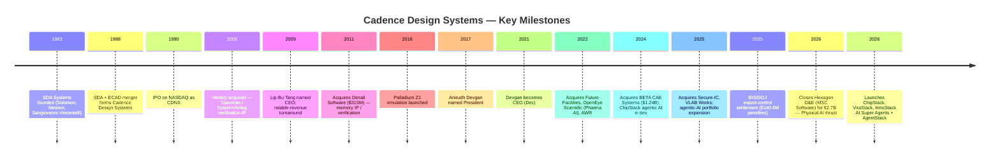
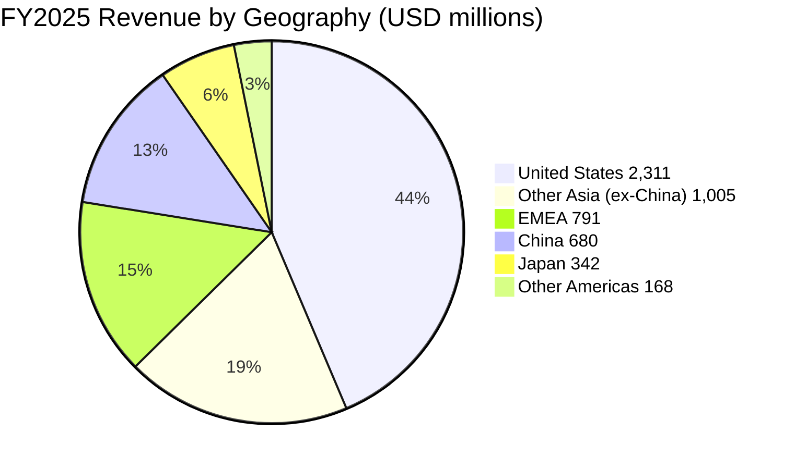

# COMPANY RESEARCH REPORT: Cadence Design Systems, Inc. (NASDAQ: CDNS)

**Date:** 2026-05-20
**Analyst-prepared deep-dive — for informational purposes only; not investment advice.**

> **Update — FY2026 guidance raised (2026-04-27):** Management raised full-year 2026 revenue guidance to **USD 6.125–6.225 billion** (from **USD 5.9–6.0 billion** issued on 2026-02-17), now implying ~17% YoY growth at the midpoint vs. the prior ~12%. Non-GAAP EPS guidance was lifted to **USD 7.85–7.95** (from **USD 8.05–8.15** — the optical decline reflects ~$0.28 of dilution from the closed Hexagon D&E acquisition, partly offset by faster organic growth). Drivers per CFO John Wall: "broad-based strength across all our businesses," accelerating AI-infrastructure design activity, a record **USD 8.0 billion** quarter-end backlog (Q1 26), 18% YoY Core EDA growth and 22% YoY IP growth.
> Source: [Cadence Reports First Quarter 2026 Financial Results, 2026-04-27](https://www.sec.gov/Archives/edgar/data/0000813672/000081367226000044/cdns04272026ex9901.htm) | prior outlook: [Cadence Reports Fourth Quarter and Fiscal Year 2025 Financial Results, 2026-02-17](https://www.sec.gov/Archives/edgar/data/0000813672/000081367226000013/cdns2182025ex9901.htm).

---

## TABLE OF CONTENTS

1. Company Overview
2. Company History
3. Management Team
4. Products & Services
5. Customers & Go-to-Market
6. Industry Overview
7. Competitive Landscape
8. Market Opportunity (TAM)
9. Risk Assessment
10. References

---

## 1. COMPANY OVERVIEW

**Cadence Design Systems, Inc.** is the world's #2 supplier of electronic design automation (EDA) software, hardware emulation/prototyping systems, and silicon intellectual property (IP), occupying — together with Synopsys (SNPS) and Siemens EDA — a tight near-oligopoly that the EDA industry sometimes calls "the Big Three." Cadence sells the tools, hardware, and IP blocks that virtually every meaningful semiconductor design team on Earth uses to architect, simulate, verify, place-and-route, and sign off integrated circuits and full electromechanical systems. Headquartered at 2655 Seely Avenue in San Jose, California, the company describes itself as "a global technology leader that develops computational, AI-driven software, accelerated hardware, and silicon intellectual property ("IP") products and solutions" and frames its strategy under the "Intelligent System Design™" (ISD) banner ([Cadence 2025 10-K, p. 1](https://www.sec.gov/Archives/edgar/data/0000813672/000081367226000016/cdns-20251231.htm)).

**What it does, in plain English.** Modern chips have tens to hundreds of billions of transistors; no human can lay them out by hand. Cadence supplies the software ("EDA tools") that lets engineers describe a chip in code (Verilog/SystemVerilog), automatically synthesize that code into a gate-level netlist, place those gates on silicon, route the wires between them, simulate the result, verify it matches the original intent, and finally sign it off so a foundry like TSMC or Samsung can fabricate it. Cadence also leases multi-million-dollar **hardware emulation boxes** (Palladium, Protium) that let customers run a chip's RTL at near-silicon speed before tape-out, and licenses pre-designed **silicon IP** blocks (PCIe, CXL, HBM, DDR, USB, SerDes, Tensilica DSPs, Secure-IC security) that customers drop into their SoCs to save engineering years.

**How it makes money.** Cadence's revenue model is highly recurring — the company reports the vast majority of its software is sold under time-based licenses (typically 2–3 years), and customers also sign hardware lease arrangements, IP royalty agreements, and multi-year master agreements known internally as "non-cancellable bookings." For FY2025, **product and maintenance revenue was USD 4,821.6M (91% of revenue, +14% YoY) and services revenue was USD 475.2M (9%, +11% YoY)**, for total revenue of **USD 5,296.8M (+14% YoY)** ([Cadence 2025 10-K, MD&A](https://www.sec.gov/Archives/edgar/data/0000813672/000081367226000016/cdns-20251231.htm)). On an internal product-category split (disclosed in earnings calls and CFO commentary rather than in the 10-K segment note — Cadence is a single reportable segment under ASC 280), **Core EDA grew 13% in FY2025**, IP roughly +20%, and System Design & Analysis low-teens. In Q1 2026 the cadence accelerated — Core EDA +18%, IP +22%, SD&A +18%, hardware delivered "a record quarter" ([Q1-2026 press release, 2026-04-27](https://www.sec.gov/Archives/edgar/data/0000813672/000081367226000044/cdns04272026ex9901.htm)).

**Where it operates.** Cadence sells globally, with **United States = USD 2,311.0M (44% of FY25 revenue), Other Asia (ex-China, principally Taiwan and Korea) = USD 1,005.2M (19%), EMEA = USD 790.6M (15%), China = USD 680.0M (13%), Japan = USD 341.7M (6%), Other Americas = USD 168.3M (3%)** ([Cadence 2025 10-K, Note 17](https://www.sec.gov/Archives/edgar/data/0000813672/000081367226000016/cdns-20251231.htm)). Notably, China revenue *grew* 19% in FY2025 despite a high-profile, six-week U.S. Bureau of Industry and Security (BIS) "EDA-to-China" license requirement that was imposed on 2025-05-23 and rescinded on 2025-07-02 ([Cadence 2025 10-K, p. 14](https://www.sec.gov/Archives/edgar/data/0000813672/000081367226000016/cdns-20251231.htm); [TrendForce, 2025-06-02](https://www.trendforce.com/news/2025/06/02/news-china-revenue-at-risk-as-u-s-curbs-slam-eda-giants-impact-on-synopsys-cadence-and-more/)).

**Scale.** Cadence ended FY2025 with **~13,800 employees** (vs. ~12,300 at the prior fiscal year-end), the majority in engineering roles, plus approximately 1,100 additional staff added on 2026-02-23 with the closing of the Hexagon Design & Engineering acquisition ([Cadence 2025 10-K, p. 8](https://www.sec.gov/Archives/edgar/data/0000813672/000081367226000016/cdns-20251231.htm); [Cadence press release, 2026-02-23](https://www.cadence.com/en_US/home/company/newsroom/press-releases/pr/2026/cadence-completes-acquisition-of-hexagons-design-and-engineering.html)). Total assets were **USD 10.15 billion**, cash and cash equivalents **USD 3.00 billion**, long-term debt **USD 2.48 billion**, stockholders' equity **USD 5.47 billion** ([Cadence 2025 10-K, Consolidated Balance Sheets](https://www.sec.gov/Archives/edgar/data/0000813672/000081367226000016/cdns-20251231.htm)). FY2025 GAAP net income was **USD 1,108.9M (EPS $4.06 diluted)**, operating cash flow **USD 1,728.8M**, capex **USD 141.9M**, free cash flow ≈ **USD 1,587M**. The company repurchased **USD 928M** of stock in FY2025 and ended the year with **271.8 million shares outstanding** (vs. 273.9M at FY24 end).


*Source: [Cadence 2025 10-K, Consolidated Statements of Operations](https://www.sec.gov/Archives/edgar/data/0000813672/000081367226000016/cdns-20251231.htm); [Cadence 2022 10-K (FY21 op income)](https://www.sec.gov/cgi-bin/browse-edgar?action=getcompany&CIK=0000813672&type=10-K).*

### Valuation snapshot (REQUIRED)

| Metric | CDNS | SNPS (peer) | Comment |
|---|---|---|---|
| Price (2026-05-20) | ~USD 338 | ~USD 545 | [Yahoo Finance — CDNS](https://finance.yahoo.com/quote/CDNS/) / [SNPS](https://finance.yahoo.com/quote/SNPS/) |
| Market cap | ~USD 93B | ~USD 84B | [stockanalysis.com — CDNS](https://stockanalysis.com/stocks/cdns/) |
| TTM P/E (GAAP) | ~81x | ~77x | TTM EPS ≈ $4.18 ([CDNS PE — fullratio](https://fullratio.com/stocks/nasdaq-cdns/pe-ratio); [SNPS PE — fullratio](https://fullratio.com/stocks/nasdaq-snps/pe-ratio)) |
| Forward P/E (non-GAAP) | ~43x | ~40x | FY26 non-GAAP EPS guide $7.85–7.95 ([Q1-2026 press release](https://www.sec.gov/Archives/edgar/data/0000813672/000081367226000044/cdns04272026ex9901.htm)); SNPS via [GuruFocus](https://www.gurufocus.com/term/forward-pe-ratio/SNPS) |
| TTM P/S | ~17.6x | ~15.2x | TTM revenue $5.30B ([10-K](https://www.sec.gov/Archives/edgar/data/0000813672/000081367226000016/cdns-20251231.htm)); SNPS via [artificall.com, 2026](https://artificall.com/analysis/companies/comparisons/synopsys-vs-cadence-design-systems/) |
| P/B | ~17x | ~7x | Book equity $5.47B |
| EV/EBITDA (TTM) | ~50x | ~45x | EBITDA ≈ $1.84B (op income + D&A + SBC) |
| 52-wk range | $235–$385 | $390–$640 | [Yahoo Finance](https://finance.yahoo.com/quote/CDNS/) |
| 3-yr P/E range | ~50x–95x | ~45x–110x | [Macrotrends — CDNS PE](https://www.macrotrends.net/stocks/charts/CDNS/cadence-design-systems/pe-ratio) |
| Software sector median P/E / P/S | 32x / 6.5x | — | [NYU Stern Damodaran data, Jan 2026](https://pages.stern.nyu.edu/~adamodar/New_Home_Page/data.html) |

**Interpretation.** CDNS trades at ~81x TTM GAAP earnings and ~17.6x TTM revenue — comfortably above both its own 3-year median (~70x P/E, ~14x P/S) and ~2.5x the broad software sector median. The multiple is **not** explained by a one-off charge: the FY2025 P&L did absorb a USD 128.5M loss from the BIS/DOJ export-control settlement (see Section 9), but adding it back lifts GAAP EPS only ~$0.40 and would compress TTM P/E to ~74x — still rich.

The right framing is **(a) high-growth-sector premium + (b) AI-infrastructure narrative**. Cadence is one of two pure-play public vehicles for "every leading-edge chip needs more EDA spend than the last one" — an unambiguous picks-and-shovels exposure to AI training/inference silicon (NVIDIA Blackwell/Rubin, AMD MI400, custom hyperscaler ASICs from Google TPU, Meta MTIA, Microsoft Maia, Amazon Trainium/Inferentia), advanced packaging/3D-IC, automotive SDV silicon, and the secular shift to chiplets. With ~14% revenue CAGR FY21–FY25, ~28% GAAP operating margin (~45% non-GAAP), >100% revenue retention, ~$8.0B backlog (1.5x trailing revenue), and a market that consensus expects to compound at ~8–10% for a decade, the market is pricing CDNS as a "compounder + AI tollkeeper" and applying a premium close to that of Synopsys (~77x P/E) and ASML (~30x P/E). Citi reaffirmed Buy ratings on both CDNS and SNPS in 2026 on the same AI-design-cycle thesis ([Citi via GuruFocus, 2026](https://www.gurufocus.com/news/3222105/citi-initiates-buy-ratings-for-cadence-cdns-and-synopsys-snps)).

Because the GAAP P/E sits above 50x with no near-term path to a sub-30x multiple without ~40%+ EPS growth, the **valuation risk** is real and flagged in Section 9. The stock has shown it can correct hard: shares fell ~24% in one session in March 2025 on a China-export-control headline, and a ~12% drawdown followed the Q4-2025 print on an in-line guide. A multiple compression of 81x → 60x (still rich) would equate to ~26% downside, holding earnings constant.

---

## 2. COMPANY HISTORY

Cadence was **formed on 1988-06-01 by the merger of SDA Systems (Solomon Design Automation, founded in San Jose in 1983 by Jim Solomon, Richard Newton, and Alberto Sangiovanni-Vincentelli) and ECAD Inc. (founded in 1982 by Ping Chao, Glen Antle, and Paul Huang)** ([Semiwiki — A Brief History of Cadence Design Systems](https://semiwiki.com/eda/cadence/1609-a-brief-history-of-cadence-design-systems/); [Wikipedia — Cadence Design Systems](https://en.wikipedia.org/wiki/Cadence_Design_Systems)). SDA brought analog/custom IC layout tools; ECAD brought the Dracula DRC/LVS verification flow. Joe Costello, who had joined SDA in 1984 from National Semiconductor and become its president in 1987, was tapped as the merged company's CEO. The company posted USD 78.6M of revenue and 433 employees in its first fiscal year ([FundingUniverse — Cadence Design Systems history](https://www.fundinguniverse.com/company-histories/cadence-design-systems-inc-history/)).

Cadence's first three decades alternated between "EDA roll-up" and "near-miss execution." The company acquired Valid Logic (1991), Tangent Systems, Comdisco's Computer-Aided Design unit, Verisity (2005, bringing in the Specman/e-language verification methodology), Cosmic Circuits, and over 60 other smaller targets. After two CEO transitions and a near-existential stretch in 2008 — the board removed CEO Mike Fister after a failed hostile bid for rival Mentor Graphics and revenue cratered — Lip-Bu Tang (now CEO of Intel as of 2025) was appointed CEO in 2009 and engineered an 8-year turnaround that pivoted the business to ratable revenue, deep customer engagement, and gradually rising R&D intensity. Tang named Anirudh Devgan president in November 2017 and handed him the CEO role in December 2021 ([I-Connect007 — Cadence Appoints Anirudh Devgan as President, 2017](https://iconnect007.com/article/107599/cadence-appoints-anirudh-devgan-as-president/107602/design)).



*Source: [Cadence 2025 10-K](https://www.sec.gov/Archives/edgar/data/0000813672/000081367226000016/cdns-20251231.htm); [Cadence newsroom, 2025–2026](https://www.cadence.com/en_US/home/company/newsroom.html); [Semiwiki history](https://semiwiki.com/eda/cadence/1609-a-brief-history-of-cadence-design-systems/).*

### Strategic pivots and recent transformations

1. **From up-front licenses to ratable subscriptions (2010–2015).** Under Tan, Cadence shifted nearly all software contracts to time-based licenses with revenue recognized ratably, smoothing the historic boom-bust pattern and giving the business >90% recurring revenue today. The financial result is visible in operating-margin expansion from ~13% in 2009 to ~28% (GAAP) in FY2025 ([Cadence 2025 10-K, MD&A](https://www.sec.gov/Archives/edgar/data/0000813672/000081367226000016/cdns-20251231.htm)).

2. **"Intelligent System Design" — EDA beyond the chip (2018–present).** Devgan's signature strategic move was to extend Cadence from chip-level EDA into PCB design (Allegro/OrCAD), system analysis (Sigrity, Clarity, Celsius), computational fluid dynamics (Pointwise → Fidelity), and finally structural mechanics (BETA CAE in 2024, Hexagon D&E / MSC Software in 2026). Each adjacent domain leverages the same computational-software muscle — solvers + simulation + AI optimization — and opens a larger TAM beyond the ~$18B EDA market into the ~$11B engineering simulation market.

3. **Pervasive Intelligence / agentic AI (2024–present).** Cadence has woven generative AI and now agentic AI into nearly every product — Cerebrus (ML-driven RTL-to-GDS exploration), Verisium (verification AI), Allegro X AI (PCB), Optimality (multiphysics), and in 2026 the **ChipStack / ViraStack / InnoStack / AgentStack** super-agent stack that orchestrates dozens of foundational EDA tools autonomously. Early customer disclosures (Altera, NVIDIA, Qualcomm, Tenstorrent) cite up to 10× verification productivity gains ([Cadence press release, ChipStack launch, 2026-02-10](https://www.cadence.com/en_US/home/company/newsroom/press-releases/pr/2026/cadence-unleashes-chipstack-ai-super-agent-pioneering-a-new.html); [EE Times, 2026-02-10](https://www.eetimes.com/cadence-unveils-chipstack-ai-agent-for-agentic-chip-design-and-verification/)).

### Key acquisitions (last five years)

- **2022 — OpenEye Scientific** (pharma molecular modeling, undisclosed price): expansion into Life Sciences AI vertical.
- **2022 — Future Facilities** (data-center digital twins): grafted into the System Design & Analysis portfolio.
- **2024 — BETA CAE Systems** (Greek mechanical simulation, ~USD 1.24B): the entry point into structural mechanics.
- **2025 — VLAB Works** (virtual prototyping for SDV/embedded software): added a virtual development environment for software-defined vehicles ([Cadence 2025 10-K, p. 3](https://www.sec.gov/Archives/edgar/data/0000813672/000081367226000016/cdns-20251231.htm)).
- **2025 — Secure-IC** (French embedded security IP): broadened the IP portfolio with cybersecurity blocks for automotive and data center ([Cadence 2025 10-K, p. 4](https://www.sec.gov/Archives/edgar/data/0000813672/000081367226000016/cdns-20251231.htm)).
- **2026 — Hexagon Design & Engineering, including MSC Software (€2.7B / ~USD 2.9B)**, closed 2026-02-23: brings MSC Nastran (structural analysis) and Adams (multibody dynamics), targeting aerospace, defense, EV, and "Physical AI" (autonomous systems, humanoid robotics). Adds ~USD 280M of 2024 revenue and ~1,100 employees; expected to be ~$0.28 dilutive to FY26 non-GAAP EPS and accretive in FY27 ([Cadence press release, 2026-02-23](https://www.cadence.com/en_US/home/company/newsroom/press-releases/pr/2026/cadence-completes-acquisition-of-hexagons-design-and-engineering.html); [eeNews Europe, 2025-09](https://www.eenewseurope.com/en/cadence-to-acquire-hexagon-de-business-in-e2-7b-deal/)).

### Recent developments (last 12 months)

- 2025-05-23 → 2025-07-02 — BIS imposed and then rescinded EDA-to-China license requirements; Cadence lost an estimated mid-single-digit-million weeks of China revenue but the year still printed +19% China growth ([Cadence 2025 10-K, p. 6](https://www.sec.gov/Archives/edgar/data/0000813672/000081367226000016/cdns-20251231.htm); [TrendForce, 2025-06-02](https://www.trendforce.com/news/2025/06/02/news-china-revenue-at-risk-as-u-s-curbs-slam-eda-giants-impact-on-synopsys-cadence-and-more/); [Silicon UK, 2025-07-03](https://www.silicon.co.uk/e-regulation/china-chip-design-620616)).
- 2025-07-27 — Cadence settled with the U.S. DOJ (plea agreement, three-year probation, one count of conspiracy to commit export-control violations) and BIS (administrative settlement, two annual compliance audits) over 2015–2021 sales of products and technology valued at **USD 45.3M** to a sanctioned Chinese customer. Cadence paid **USD 140.6M** of aggregate net penalties and forfeitures and recorded a **USD 128.5M** charge to "Loss related to contingent liability" ([Cadence 2025 10-K, Note 18](https://www.sec.gov/Archives/edgar/data/0000813672/000081367226000016/cdns-20251231.htm)).
- 2026-02-10 — Launched **ChipStack AI Super Agent** for autonomous chip design and verification ([Cadence press release](https://www.cadence.com/en_US/home/company/newsroom/press-releases/pr/2026/cadence-unleashes-chipstack-ai-super-agent-pioneering-a-new.html)).
- 2026-02-23 — Closed Hexagon D&E / MSC Software acquisition (€2.7B).
- 2026-04-27 — Q1 2026 results: USD 1.474B revenue (+19% YoY), USD 8.0B backlog, FY26 revenue guidance raised.

---

## 3. MANAGEMENT TEAM

### Anirudh Devgan, Ph.D. — President and Chief Executive Officer

Anirudh Devgan, 56, has served as CEO since December 2021 and President since November 2017 ([Cadence 2025 10-K, Information About Our Executive Officers](https://www.sec.gov/Archives/edgar/data/0000813672/000081367226000016/cdns-20251231.htm)). He is the architect of Cadence's "Intelligent System Design" strategy and the public face of its AI/agentic-AI pivot. Born in India in 1969, Devgan earned a B.Tech. in electrical engineering from the **Indian Institute of Technology, Delhi**, followed by an M.S. and Ph.D. in electrical and computer engineering from **Carnegie Mellon University** ([Cadence 2025 10-K](https://www.sec.gov/Archives/edgar/data/0000813672/000081367226000016/cdns-20251231.htm); [Wikipedia — Anirudh Devgan](https://en.wikipedia.org/wiki/Anirudh_Devgan)).

Devgan spent **12 years at IBM (1994–2005)** across the Thomas J. Watson Research Center, Server Division, Microelectronics Division, and Austin Research Lab — his research on circuit-simulation algorithms and statistical timing analysis underpinned IBM's POWER processor methodology. He left for **Magma Design Automation in May 2005**, where as Corporate VP and General Manager of the Custom Design Business Unit he initiated and shipped products in analog/mixed-signal simulation, physical verification, library characterization, and 3D extraction — the unit Magma sold to Synopsys was largely Devgan's work ([IndiaSpora bio](https://indiaspora.org/business-leader/anirudh-devgan/); [Wikipedia](https://en.wikipedia.org/wiki/Anirudh_Devgan)).

He joined Cadence in **May 2012** as Senior Vice President of R&D, rising to Executive VP of R&D in March 2017 and President eight months later. As CEO he has overseen revenue growth from **USD 2.99B in FY2021 to USD 5.30B in FY2025 (~77% cumulative, ~15% CAGR)**, GAAP operating margin expansion from 26% to 28% (and non-GAAP from ~40% to ~44%), and the BETA CAE / Secure-IC / VLAB Works / Hexagon D&E acquisition cycle that has doubled the company's addressable market.

Devgan holds **24 U.S. patents** and has published **>70 research papers**. He was named an **IEEE Fellow in 2006**, won the **IEEE/ACM William J. McCalla Award in 2003** and the **ACM/DAC Best Paper Award in 2005**, and was added to the **Lam Research board of directors on 2026-02-03** ([Lam Research newsroom, 2026-02-03](https://newsroom.lamresearch.com/2026-02-03-Lam-Research-Appoints-Cadence-CEO-Anirudh-Devgan-to-Board-of-Directors)). He has been an unusually consequential CEO precisely because he is a **practicing EDA scientist who can hold technical depth-conversations with NVIDIA, TSMC, and hyperscaler CTOs** — a contrast with most software CEOs of comparable scale. His employment agreement, last amended 2021-12-15 alongside the CEO appointment, is incorporated by reference in the 10-K exhibit index ([Cadence 2025 10-K, Exhibit 10.22](https://www.sec.gov/Archives/edgar/data/0000813672/000081367226000016/cdns-20251231.htm)). Direct beneficial ownership detail will appear in the 2026 proxy statement (DEF 14A) to be filed within 120 days of fiscal year-end per the 10-K incorporated-by-reference notice.

### John M. Wall — Senior Vice President and Chief Financial Officer

John M. Wall, 55, has served as CFO since **October 2017** and is in his ninth year in the role — unusually long tenure for a US tech CFO. He joined Cadence in **June 1997** and held a series of finance leadership roles, most recently Corporate Vice President and Corporate Controller (April 2016–October 2017) ([Cadence 2025 10-K, p. 9](https://www.sec.gov/Archives/edgar/data/0000813672/000081367226000016/cdns-20251231.htm)).

Wall is an **NCBS graduate of the Institute of Technology, Tralee** (Ireland) and a **Fellow of the Association of Chartered Certified Accountants** (FCCA). His track record as CFO is the textbook case for ratable EDA business-model conversion executed at scale: under Wall, Cadence has gone from **USD 1.94B revenue / 24% GAAP op margin (FY2017)** to **USD 5.30B / 28% GAAP / ~44% non-GAAP (FY2025)** — a ~14% revenue CAGR with steady ~150bp/year non-GAAP margin expansion. He oversaw the **2024 issuance of USD 3.2B of investment-grade notes** used to fund BETA CAE Systems, the largest debt raise in company history; the resulting net-debt/EBITDA remains <1.5x. Wall has been the on-the-record voice for every quarterly CFO Commentary deck for nine years, and the lack of a single guide miss-and-cut cycle during his tenure is a meaningful piece of the company's premium multiple. He earned roughly USD 6.8M in total compensation per the FY24 proxy (full FY25 detail forthcoming in the 2026 DEF 14A).

### Other key executives

**Chin-Chi Teng, Ph.D. — SVP & GM, Digital and Signoff Group (since September 2018).** Teng joined Cadence in January 2002 and has worked across digital implementation, signoff, and physical verification for >23 years at the company. He runs the group that ships **Innovus, Genus, Tempus, Voltus, Quantus, Pegasus, Conformal, and Cerebrus** — i.e., the entire digital RTL-to-GDS flow that competes head-to-head with Synopsys Fusion Compiler / IC Compiler II. Teng holds a B.S. in EE from National Taiwan University and a Ph.D. in ECE from the University of Illinois Urbana-Champaign ([Cadence 2025 10-K, p. 9](https://www.sec.gov/Archives/edgar/data/0000813672/000081367226000016/cdns-20251231.htm)).

**Paul Cunningham, Ph.D. — SVP & GM, System Verification Group (since March 2021).** Cunningham came to Cadence via the **July 2011 acquisition of Azuro**, which he co-founded and led as CEO; Azuro was a clock-concurrent optimization startup spun out of Cambridge. He owns Cadence's verification franchise — **Xcelium, Jasper Formal, Palladium, Protium, Verisium, and the new ChipStack agentic-AI super agent**. Cunningham holds an M.A. and Ph.D. in Computer Science from the University of Cambridge ([Cadence 2025 10-K, p. 9](https://www.sec.gov/Archives/edgar/data/0000813672/000081367226000016/cdns-20251231.htm)).

### Governance

- **Board of Directors (10 members at FY25 year-end).** ML (Mary Louise) Krakauer (independent Chair, since 2023-05-04, ex-Dell EVP), Mark W. Adams, Ita Brennan (ex-Arista CFO), Lewis Chew, Anirudh Devgan (CEO), Moshe Gavrielov (ex-Xilinx CEO, joined 2025-01-01), Julia Liuson (Microsoft EVP, GitHub), Dr. James D. Plummer (Stanford EE professor emeritus), Dr. Alberto Sangiovanni-Vincentelli (Cadence co-founder, UC Berkeley professor), Young K. Sohn (ex-Samsung Chief Strategy Officer), and Dr. Luc Van den hove (CEO of imec, joined 2026-01-01) ([Cadence 2025 10-K signature page](https://www.sec.gov/Archives/edgar/data/0000813672/000081367226000016/cdns-20251231.htm); [BusinessWire — Krakauer appointed Chair, 2023-05-11](https://www.businesswire.com/news/home/20230511005894/en/Cadence-Appoints-Mary-Louise-Krakauer-as-Chair-of-the-Board); [BusinessWire — Gavrielov appointment, 2024-12-12](https://www.businesswire.com/news/home/20241212617169/en/Cadence-Appoints-Moshe-Gavrielov-to-Board-of-Directors)).
- **Independence.** 9 of 10 directors are independent; Devgan is the only insider. Chair and CEO roles are separate.
- **Insider ownership.** Specific %s pending in the 2026 DEF 14A; FY24 proxy disclosed directors and executive officers as a group holding <2% of shares outstanding — modest insider stake but typical for a 38-year-old large-cap.
- **Comp structure.** Heavily equity-weighted; PSUs vest on operating-income and relative TSR metrics (forms of PSU agreement listed in Q1-2025 10-Q exhibits 10.4 and 10.6) ([Cadence 2025 10-K exhibit index](https://www.sec.gov/Archives/edgar/data/0000813672/000081367226000016/cdns-20251231.htm)). Stock-based compensation expense was **USD 455.2M in FY25 (8.6% of revenue)** — high but in line with large-cap software peers.
- **Auditor.** PricewaterhouseCoopers LLP.
- **Material governance event.** July 2025 DOJ plea agreement places Cadence on a three-year probationary term with ongoing reporting and certification obligations; the BIS administrative settlement requires two annual internal export-compliance audits and makes that compliance a condition for continued export rights ([Cadence 2025 10-K, Note 18](https://www.sec.gov/Archives/edgar/data/0000813672/000081367226000016/cdns-20251231.htm)).

### Track record synthesis

Devgan + Wall is one of the most stable and credible top duos in large-cap US semiconductor capital-goods: a founder-trained EDA scientist running a company conceived by his Berkeley professor (Sangiovanni-Vincentelli still sits on the board), paired with a nine-year CFO who has overseen the cleanest non-GAAP margin expansion in the EDA peer set. The principal blemish is the BIS/DOJ settlement covering 2015–2021 conduct that predates Devgan's CEO tenure but is theirs to remediate. Investor concerns center on regulatory cleanup speed, not strategic capability.

---

## 4. PRODUCTS & SERVICES

Cadence organizes its offerings into three product categories ([Cadence 2025 10-K, p. 2](https://www.sec.gov/Archives/edgar/data/0000813672/000081367226000016/cdns-20251231.htm)):

1. **Core EDA** — software and hardware for designing and verifying chips. **~60% of revenue**; growing ~13–18% YoY.
2. **System Design & Analysis (SD&A)** — PCB design, multiphysics, CFD, structural / thermal analysis. **~25% of revenue**; growing ~15–18% YoY.
3. **Semiconductor IP** — licensable silicon IP blocks. **~15% of revenue**; growing ~20–25% YoY in FY25/Q1 26.

```mermaid
graph TD
    A[Cadence Design Systems] --> B[Core EDA]
    A --> C[System Design & Analysis]
    A --> D[Semiconductor IP]
    A --> S[Services]
    B --> B1[Custom / Analog<br/>Virtuoso platform]
    B --> B2[Digital Implementation<br/>Innovus / Genus / Tempus<br/>Voltus / Quantus]
    B --> B3[Verification SW<br/>Xcelium / Jasper / Verisium<br/>Conformal AI Studio]
    B --> B4[Hardware Acceleration<br/>Palladium Z3 / Protium X3]
    B --> B5[AI Super Agents<br/>ChipStack / ViraStack /<br/>InnoStack / AgentStack]
    B --> B6[Cerebrus<br/>AI chip explorer]
    C --> C1[PCB & Packaging<br/>Allegro X / OrCAD X /<br/>Sigrity X]
    C --> C2[Multiphysics<br/>Celsius / Clarity / AWR /<br/>Fidelity CFD / Integrity 3D-IC]
    C --> C3[Structural / Mechanical<br/>BETA CAE / MSC Nastran /<br/>Adams Multibody]
    C --> C4[AI Optimization<br/>Optimality / Reality DT /<br/>Millennium Multiphysics]
    D --> D1[Interface IP<br/>PCIe / CXL / UCIe / HBM /<br/>DDR / LPDDR / USB / SerDes]
    D --> D2[Tensilica DSPs<br/>Audio / Vision / AI / Baseband]
    D --> D3[Verification IP<br/>VIP for Xcelium / Palladium]
    D --> D4[Security IP<br/>Secure-IC]
    S --> S1[Methodology services]
    S --> S2[Education / Cadence Academy]
    S --> S3[Cadence OnCloud<br/>cloud-managed EDA]
```



*Source: [Cadence 2025 10-K, Items 1.A–1.C](https://www.sec.gov/Archives/edgar/data/0000813672/000081367226000016/cdns-20251231.htm); [Cadence Products page](https://www.cadence.com/en_US/home/tools.html).*

### Core EDA — the franchise

**Virtuoso platform — custom / analog / RF / mixed-signal IC design.** Cadence's flagship and the industry standard for analog and custom IC design, used by Apple, Qualcomm, MediaTek, NXP, ST Micro, Infineon, and virtually every analog house. Integrates schematic capture, layout, simulation (Spectre), and physical verification (Pegasus DRC/LVS). Cadence states Virtuoso "is considered the industry standard for custom and analog IC design" ([Cadence 2025 10-K, p. 2](https://www.sec.gov/Archives/edgar/data/0000813672/000081367226000016/cdns-20251231.htm); [Virtuoso product page](https://www.cadence.com/en_US/home/tools/custom-ic-analog-rf-design/virtuoso-platform.html)).
- **Competitive-advantage verdict: YES — durable moat.** Moat type: **switching costs + ecosystem lock-in**. Every foundry (TSMC, Samsung, Intel Foundry, GlobalFoundries) qualifies process design kits (PDKs) for Virtuoso first; an engineering team rebuilt around a competitor would face 12–24 months of PDK requalification.
- **Closest competitor product:** Synopsys Custom Compiler. Verdict: **Cadence ahead in installed base and PDK certification depth**; SNPS has narrowed the technical gap.

**Innovus Implementation System — digital place-and-route.** Used by AMD, NVIDIA, Apple, Broadcom, Marvell, and most hyperscaler in-house silicon teams to drive RTL through synthesis (Genus) → placement → CTS → routing → signoff (Tempus, Voltus, Quantus) on advanced nodes (3nm, 2nm). Integrated with Cerebrus for AI-driven PPA exploration ([Innovus product page](https://www.cadence.com/en_US/home/tools/digital-design-and-signoff/soc-implementation-and-floorplanning/innovus-implementation-system.html)).
- **Competitive-advantage verdict: PARTIAL — duopoly with Synopsys.** Moat type: **scale + technology** — only Cadence and Synopsys have credible 3/2nm sign-off flows.
- **Closest competitor product:** Synopsys Fusion Compiler / IC Compiler II. Verdict: **roughly at parity**; market share oscillates by node and customer.

**Xcelium Parallel Logic Simulator + Jasper Formal + Verisium AI.** The functional-verification stack; verification typically consumes 60–70% of a digital SoC project's compute hours and is where ChipStack delivers its 10× productivity claim ([Cadence press release, ChipStack launch, 2026-02-10](https://www.cadence.com/en_US/home/company/newsroom/press-releases/pr/2026/cadence-unleashes-chipstack-ai-super-agent-pioneering-a-new.html); [HPCwire, 2026-02-12](https://www.hpcwire.com/2026/02/12/cadence-introduces-agentic-ai-system-for-chip-design-and-verification/)).
- **Competitive-advantage verdict: PARTIAL.** Moat type: technology + methodology lock-in (Specman 'e' verification language inherited from Verisity).
- **Closest competitor product:** Synopsys VCS + VC Formal. Verdict: **mixed** — Cadence ahead in formal (Jasper) and emulation-tied verification flows, Synopsys ahead in raw simulation throughput.

**Palladium Enterprise Emulation Platform + Protium FPGA-Based Prototyping.** Multi-million-dollar dedicated emulation appliances that run a customer's chip RTL at MHz-class speeds before silicon — essential for any chip >1B transistors. Cadence states "Palladium delivers high throughput, capacity, and reliability for global design teams" and explicitly calls this out as the segment that delivered "a record quarter" in Q1 2026 ([Cadence 2025 10-K, p. 3](https://www.sec.gov/Archives/edgar/data/0000813672/000081367226000016/cdns-20251231.htm); [Q1-2026 press release](https://www.sec.gov/Archives/edgar/data/0000813672/000081367226000044/cdns04272026ex9901.htm)).
- **Competitive-advantage verdict: YES — strong moat.** Moat type: **technology + capex barrier + scale**. Cadence and Synopsys both have custom emulation silicon; nobody else does at >1B-gate scale.
- **Closest competitor product:** Synopsys ZeBu EP2 / HAPS. Verdict: **at parity to slightly ahead in capacity; Synopsys leads in raw speed on some workloads**.

**Cerebrus Intelligent Chip Explorer** — ML-driven RTL-to-GDS exploration, runs hundreds of parallel flow recipes on the cloud and selects the best PPA. Ships with Genus / Innovus / Tempus / Voltus / Joules / Pegasus integration ([Genus Synthesis Solution product page](https://www.cadence.com/en_US/home/tools/digital-design-and-signoff/synthesis/genus-synthesis-solution.html); [Electronic Specifier on Cerebrus](https://www.electronicspecifier.com/products/design-automation/ml-based-cerebrus-delivers-productivity-and-quality/)).
- **Competitive-advantage verdict: PARTIAL.** Moat type: **data + technology** — Cerebrus improves with every flow it runs at every customer.
- **Closest competitor:** Synopsys DSO.ai. Verdict: **roughly at parity; both vendors claim first-mover bragging rights**.

**ChipStack / ViraStack / InnoStack / AgentStack — Agentic AI Super Agents (launched Feb–Apr 2026).** ChipStack orchestrates multiple LLM agents that read design intent, generate RTL and testbenches, run regression simulations, debug, and iterate — Cadence has disclosed early production deployment at **Altera, NVIDIA, Qualcomm, and Tenstorrent** with ~10× verification effort reduction at Altera ([Cadence ChipStack press release, 2026-02-10](https://www.cadence.com/en_US/home/company/newsroom/press-releases/pr/2026/cadence-unleashes-chipstack-ai-super-agent-pioneering-a-new.html); [EE Times](https://www.eetimes.com/cadence-unveils-chipstack-ai-agent-for-agentic-chip-design-and-verification/)). AgentStack (Q1 2026) is the orchestration framework that ties the super agents together with the foundational EDA tools.
- **Competitive-advantage verdict: TOO EARLY but PROMISING.** Moat type: **data + ecosystem lock-in** — the agents work best when they call native Cadence tools and ingest a customer's full design history.
- **Closest competitor:** Synopsys.ai Copilot / DSO.ai extensions. Verdict: **early lead for Cadence**; competitive picture will reset every 6 months.

### System Design & Analysis (SD&A)

**Allegro X / OrCAD X / Sigrity X — PCB design and signal/power integrity.** Allegro is the high-end PCB tool used by Apple, Cisco, NVIDIA reference boards, automotive Tier 1s; OrCAD is the mid-market sister-product sold through ~200 worldwide resellers ([Cadence 2025 10-K, p. 4](https://www.sec.gov/Archives/edgar/data/0000813672/000081367226000016/cdns-20251231.htm); [Allegro product page](https://www.cadence.com/en_US/home/tools/pcb-design-and-analysis/allegro-x-design-platform.html)). Allegro X AI is the generative-AI sister product for PCB cycle-time compression.
- **Verdict: PARTIAL.** Moat: scale + ecosystem.
- **Closest competitor:** Siemens EDA Xpedition / PADS, Altium Designer (lower-end). Verdict: **Cadence and Siemens have the high end; Altium dominates the mid-market in unit count but not revenue**.

**Multiphysics — Celsius (thermal), Clarity 3D Solver (EM), AWR (RF), Fidelity CFD (computational fluid dynamics), Optimality.** Built largely on the Pointwise + Numeca acquisitions (CFD), plus organic development. Plus the **Integrity 3D-IC Platform** for advanced packaging / chiplet stacks — described in the 10-K as "the industry's first integrated system and SoC-level solution that enables system analysis, including co-design, with Virtuoso and Allegro" ([Cadence 2025 10-K, p. 4](https://www.sec.gov/Archives/edgar/data/0000813672/000081367226000016/cdns-20251231.htm)).
- **Verdict: PARTIAL.** Moat: cross-product integration with EDA + IP.
- **Closest competitor:** Ansys (Synopsys-owned since 2025), Siemens Simcenter. Verdict: **Ansys remains the multiphysics leader**; Cadence is the #2/#3 challenger with deep EDA-side integration that Ansys cannot match.

**Structural / Mechanical — MSC Nastran, Adams (multibody), BETA CAE ANSA/META.** Acquired through BETA CAE (2024) and Hexagon D&E / MSC Software (Feb 2026). Aerospace, defense, automotive OEMs, EV. The combined portfolio gives Cadence a first credible run at the **~$11B engineering-simulation TAM** historically owned by Ansys ([Cadence press release, Hexagon close, 2026-02-23](https://www.cadence.com/en_US/home/company/newsroom/press-releases/pr/2026/cadence-completes-acquisition-of-hexagons-design-and-engineering.html)).
- **Verdict: PARTIAL — early days; integration risk significant.** Moat type: technology + customer base.
- **Closest competitor:** Ansys (now Synopsys), Altair, Dassault Simulia.

### Semiconductor IP

**Interface IP — PCIe, CXL, UCIe, HBM, DDR/LPDDR, USB, MIPI, SerDes.** Cadence's IP business has been the fastest growing segment for several years and the most defensible margin pool, as every leading-edge SoC ships with multiple Cadence interface blocks. Q1 2026 IP revenue grew **22% YoY** ([Q1-2026 press release](https://www.sec.gov/Archives/edgar/data/0000813672/000081367226000044/cdns04272026ex9901.htm)).
- **Verdict: YES.** Moat: technology + foundry certification.
- **Closest competitor:** Synopsys (the IP leader), Alphawave, Rambus. Verdict: **Cadence's "Star IP" portfolio (HBM, LPDDR, PCIe, SerDes) is at parity with Synopsys at the most advanced nodes; behind in breadth of long-tail standards**.

**Tensilica configurable DSPs** — audio/voice, baseband, vision/imaging — embedded in mobile SoCs, AI inference chips, automotive ADAS. Acquired in 2013, has held leadership in configurable audio DSP for >10 years ([Cadence 2025 10-K, p. 3](https://www.sec.gov/Archives/edgar/data/0000813672/000081367226000016/cdns-20251231.htm)).
- **Verdict: YES.** Moat: technology + customer-specific instruction set customization.
- **Closest competitor:** Synopsys ARC, Ceva, Imagination. Verdict: **Tensilica leads audio, contested in vision and AI**.

**Verification IP (VIP)** — testbench components for industry protocols, integrated with Xcelium and Palladium. **Secure-IC** added embedded security IP (root-of-trust, side-channel-attack-resistant cryptography) in 2025 for automotive and data-center silicon ([Cadence 2025 10-K, p. 4](https://www.sec.gov/Archives/edgar/data/0000813672/000081367226000016/cdns-20251231.htm)).

### Services

Cadence's services revenue (USD 475M in FY25, 9% of total) is **methodology engagements + Cadence Academy training + Cadence OnCloud** managed-EDA cloud — explicitly *not* a body-shop chip-design service, although Cadence does cooperate with chip-design houses in adjacent vertical sectors ([Cadence 2025 10-K, p. 5](https://www.sec.gov/Archives/edgar/data/0000813672/000081367226000016/cdns-20251231.htm)).

### Flagship vs. long-tail

Three products carry the business:
1. **Virtuoso** (analog/custom) — undisputed industry standard.
2. **Innovus + the digital signoff stack (Genus/Tempus/Voltus/Quantus)** — the AMD/NVIDIA/hyperscaler default for advanced-node digital SoCs.
3. **Palladium / Protium emulation hardware** — the single highest-ASP product family in EDA; multi-million-dollar deals routinely close in the last weeks of a quarter and drive the company's revenue seasonality.

The rest (PCB, SD&A, IP) are growth-engine products; Hexagon/MSC and BETA CAE are still earnings-dilutive but strategically critical for the multiphysics adjacency.

### Last-12-month launches / sunsets

- **2025-05** — Optimality™ Intelligent System Explorer GA (generative-AI multiphysics).
- **2025-07** — Conformal AI Studio launched (claim: 10× SoC designer productivity) ([Electronics Maker, 2025-07](https://electronicsmaker.com/cadence-launches-conformal-ai-studio-improves-soc-designer-productivity-by-10x)).
- **2025-09** — Secure-IC integration; Reality Digital Twin platform.
- **2025-11** — Cerebrus 2.0 with multi-block joint optimization.
- **2026-02-10** — **ChipStack AI Super Agent** GA.
- **2026-04** — **ViraStack** (analog/custom) and **InnoStack** (digital signoff) Super Agents + **AgentStack** orchestration framework.
- No material sunsets disclosed; legacy products (e.g., classic Encounter test flows) continue to be supported.

---

## 5. CUSTOMERS & GO-TO-MARKET

Cadence's customer base is the entire global semiconductor design industry plus an expanding systems-company adjacency. The 10-K describes it as "semiconductor companies that design and manufacture integrated circuits ("ICs"), as well as systems companies that design and manufacture electromechanical systems containing various types of semiconductor and other electronics" ([Cadence 2025 10-K, p. 1](https://www.sec.gov/Archives/edgar/data/0000813672/000081367226000016/cdns-20251231.htm)).

### Customer concentration (quantified)

- **FY2025 — no single customer represented 10% or more of total revenue**: "No one customer accounted for 10% or more of total revenue during fiscal 2025 or 2024" ([Cadence 2025 10-K, MD&A](https://www.sec.gov/Archives/edgar/data/0000813672/000081367226000016/cdns-20251231.htm)).
- **FY2024 — receivables** disclosed a single customer at 11% of receivables; FY2025 again no single customer at 10%+ of receivables ([Cadence 2025 10-K, Note 1](https://www.sec.gov/Archives/edgar/data/0000813672/000081367226000016/cdns-20251231.htm)).
- **Top-5 customer share — not separately disclosed.** US 10-K rules (ASC 280-10-50-42) require disclosure only when a customer crosses the 10% threshold; no such disclosure is required from Cadence and none is given. Industry observers commonly estimate top-10 customers at ~35–40% of EDA revenue for both Cadence and Synopsys (large foundries + leading-edge fabless majors + the top 4 hyperscalers' internal silicon teams), but Cadence does not publish this.
- **Three-year trend:** receivable concentration eased from 11% (FY24, single customer) to <10% (FY25); revenue concentration has consistently stayed below the 10% disclosure threshold over the disclosed three-year window.

**Verdict:** **customer concentration is low** by both 10-K disclosure and industry standards. No top-1 over 10% (let alone the 20% material-risk threshold in the report's risk taxonomy). Customer-concentration risk is still tracked in Section 9 — because **customer consolidation** within the semiconductor industry is itself a stated risk in the 10-K — but it is not currently a material exposure ([Cadence 2025 10-K, Risk Factors](https://www.sec.gov/Archives/edgar/data/0000813672/000081367226000016/cdns-20251231.htm)).


*Source: [Cadence 2025 10-K, Note 17 — Revenue by Geography](https://www.sec.gov/Archives/edgar/data/0000813672/000081367226000016/cdns-20251231.htm).*

### Customer segments

1. **Semiconductor IDMs and fabless leaders** — Intel, AMD, NVIDIA, Qualcomm, Broadcom, Marvell, Apple silicon, MediaTek, Samsung LSI, SK hynix, Micron, Texas Instruments, ST Micro, Infineon, NXP, Renesas, Analog Devices, Microchip — these are the buyers of the highest-ASP EDA software, emulation hardware, and IP. The Q1 2026 release explicitly named "AI infrastructure and semiconductor customers" as driving the Core EDA acceleration ([Q1-2026 press release](https://www.sec.gov/Archives/edgar/data/0000813672/000081367226000044/cdns04272026ex9901.htm)).
2. **Foundries** — TSMC, Samsung Foundry, Intel Foundry, GlobalFoundries, UMC, SMIC. Foundries are both customers (they license certain Cadence tools internally) and ecosystem partners — Cadence works with each to certify PDKs at every node. The April 2025 expansion of the **TSMC partnership** covered N2P, N3, and N5 reference flows and is the canonical example ([TSMC press release via The Globe and Mail, 2025-04](https://www.theglobeandmail.com/investing/markets/stocks/NVDA/pressreleases/35163569/cadence-and-tsmc-extend-partnership-to-drive-next-generation-innovation/)).
3. **Hyperscalers / systems companies designing in-house silicon** — Google (TPU), Amazon (Trainium/Inferentia/Graviton), Meta (MTIA), Microsoft (Maia), Apple — collectively the fastest-growing buyer segment in EDA, since every new in-house ASIC requires a fresh tool subscription and an emulation purchase.
4. **Automotive / SDV** — every Tier-1 (Bosch, Continental, ZF, Magna, Aptiv) plus EV-native OEMs (Tesla, BYD, Xiaomi Auto, Li Auto, Hyundai/Kia, NIO) use Allegro, Sigrity, and increasingly the MSC Adams/Nastran portfolio for system simulation.
5. **Aerospace & defense, industrial, life sciences** — newer verticals enabled by BETA CAE, Hexagon D&E, OpenEye, and Optimality.

### Distribution channels

- **Direct sales force** — almost all enterprise software, hardware, and IP licenses are sold direct via Cadence's worldwide sales and applications-engineering organization. Headcount in the Customer Success Team (formerly Worldwide Field Operations) sits in the low thousands and is run by SVP Paul Scannell ([Cadence 2025 10-K, p. 9](https://www.sec.gov/Archives/edgar/data/0000813672/000081367226000016/cdns-20251231.htm)).
- **Resellers** — OrCAD and certain Allegro mid-range tools are sold worldwide through a value-added reseller network ([Cadence 2025 10-K, p. 5](https://www.sec.gov/Archives/edgar/data/0000813672/000081367226000016/cdns-20251231.htm)).
- **Japan** — a third-party distributor licenses certain products in Japan.
- **Cadence OnCloud** — cloud-managed access to the full tool stack, hosted on AWS/Azure/GCP plus Cadence's own infrastructure ([Cadence OnCloud product page](https://www.cadence.com/en_US/home/tools/oncloud.html)).

### Sales strategy and cycle

- Cadence calls out sales cycles of "up to six months or longer" for major engagements ([Cadence 2025 10-K, p. 5](https://www.sec.gov/Archives/edgar/data/0000813672/000081367226000016/cdns-20251231.htm)).
- Contract structure: 2–3 year subscription master agreements, multi-year non-cancellable hardware leases, and royalty-bearing IP licenses. Backlog at Q1-2026 quarter-end was a **record USD 8.0 billion**, with USD 4.0 billion expected to convert to revenue in the next 12 months — providing exceptional revenue visibility ([Q1-2026 press release](https://www.sec.gov/Archives/edgar/data/0000813672/000081367226000044/cdns04272026ex9901.htm)).

### Key partnerships

- **TSMC** — extended partnership Apr 2025 for N2P/N3/N5 reference flows ([Cadence and TSMC press release, 2025-04](https://www.theglobeandmail.com/investing/markets/stocks/NVDA/pressreleases/35163569/cadence-and-tsmc-extend-partnership-to-drive-next-generation-innovation/)).
- **NVIDIA** — multi-quarter partnership announcements through 2025–2026 covering Blackwell/Rubin design flows, ChipStack early deployment, Cadence Millennium Supercomputer on NVIDIA GPUs ([Cadence and NVIDIA, 2026](https://www.cadence.com/en_US/home/company/newsroom/press-releases/pr/2026/cadence-and-nvidia-expand-partnership-to-reinvent-engineering.html)).
- **Arm** — long-running tool-verification and Neoverse-V2 reference-design partnership ([New Electronics — Cadence and Arm Neoverse V2](https://www.newelectronics.co.uk/content/news/cadence-and-arm-to-accelerate-data-centre-design-using-neoverse-v2-platform/)).
- **Samsung Foundry, Intel Foundry, GlobalFoundries, UMC** — recurring PDK and reference-flow certifications across every node.
- **AWS, Azure, GCP** — cloud-delivery partners for OnCloud.

### Named customer wins (last 12 months)

- **Altera, NVIDIA, Qualcomm, Tenstorrent** — early ChipStack production deployments, disclosed by Cadence on 2026-02-10 ([Cadence press release](https://www.cadence.com/en_US/home/company/newsroom/press-releases/pr/2026/cadence-unleashes-chipstack-ai-super-agent-pioneering-a-new.html)).
- **NVIDIA Blackwell / Rubin** — Cadence flows used end-to-end per joint announcements through 2025–2026 ([HPCwire, 2026-02-12](https://www.hpcwire.com/2026/02/12/cadence-introduces-agentic-ai-system-for-chip-design-and-verification/)).
- **Multiple hyperscalers** (unnamed) for hardware emulation — Palladium "delivered a record quarter" in Q1 2026 per CFO commentary ([Q1-2026 press release](https://www.sec.gov/Archives/edgar/data/0000813672/000081367226000044/cdns04272026ex9901.htm)).

---

## 6. INDUSTRY OVERVIEW

### Industry definition and scope

The Electronic Design Automation (EDA) industry consists of (a) software tools that design, simulate, verify, and lay out integrated circuits and electronic systems, (b) dedicated hardware emulation and prototyping appliances, and (c) reusable silicon intellectual property (IP) blocks sold to chip designers under license. The broader **Engineering Design & Simulation** market — into which Cadence has expanded via Allegro, BETA CAE, Hexagon D&E, and the multiphysics portfolio — adds PCB design, mechanical/structural CAE, computational fluid dynamics, and digital twins.

NAICS code 511210 (Software Publishers — design/engineering) is the cleanest match, with elements of 334413 (semiconductor design services). The customer base sits primarily in NAICS 334413 / 334418 (semiconductors and printed-circuit boards).

### Market size and structure

- **Global EDA software market ~ USD 17.6B in 2025**, projected to reach ~USD 33B by 2032 at ~8% CAGR per industry research aggregated by Mordor Intelligence and Precedence Research ([Mordor Intelligence — EDA Tools Market](https://www.mordorintelligence.com/industry-reports/electronic-design-automation-eda-tools-market); [Precedence Research — EDA software market to USD 34.71B by 2035](https://www.precedenceresearch.com/electronic-design-automation-software-market)).
- **Mordor Intelligence's 2026 estimate is USD 20.78B, growing to USD 30.67B by 2031** (8.1% CAGR), reflecting the same underlying trend ([Mordor Intelligence](https://www.mordorintelligence.com/industry-reports/electronic-design-automation-eda-tools-market)).
- **Including engineering simulation** (Ansys, Altair, Dassault Simulia, MSC) — where Cadence is now a meaningful player — TAM expands by another ~USD 9–12B, putting Cadence's *expanded* addressable market in the **USD 28–35B** range today, growing to USD 50B+ by 2032.


*Source: composite from [Mordor Intelligence](https://www.mordorintelligence.com/industry-reports/electronic-design-automation-eda-tools-market), [Precedence Research](https://www.precedenceresearch.com/electronic-design-automation-software-market), and industry consensus.*

### Concentration

The EDA market is structurally a **near-oligopoly**: per TrendForce data covering 2024, **Synopsys ~31%, Cadence ~30%, Siemens EDA ~13%** of the global market — together ~74%, with the rest split among Ansys (pre-Synopsys acquisition), Altium, Keysight, Empyrean (China), and a long tail ([TrendForce, 2025-06-02](https://www.trendforce.com/news/2025/06/02/news-china-revenue-at-risk-as-u-s-curbs-slam-eda-giants-impact-on-synopsys-cadence-and-more/)). With the closing of the **Synopsys + Ansys merger in 2025**, the Big Three structure has tightened further; Synopsys now owns the leading multiphysics franchise, and Cadence's BETA CAE + Hexagon D&E moves are explicitly a response.

### Growth rates and drivers

Cadence and Synopsys have both grown ~14–15% revenue CAGR over FY21–FY25 — roughly double the underlying ~8% market CAGR. The driver mix:

1. **Rising design starts at the leading edge.** Every new node (5nm → 3nm → 2nm → 1.4nm) requires roughly 2× the EDA compute hours of the prior node because design complexity (transistor count, parasitic effects, physical-verification rule set) grows super-linearly. SemiAnalysis and industry consensus place leading-edge node EDA seat costs 30–50% higher than the prior node, and emulation-hardware order sizes have grown ~25% CAGR over the same window.
2. **AI/HPC silicon explosion.** NVIDIA, AMD, Broadcom, the hyperscaler custom-silicon teams, and a multi-billion-dollar wave of AI training/inference ASIC startups (Cerebras, Groq, Tenstorrent, SambaNova, Etched, Lightmatter) all consume EDA disproportionately. Cadence's Q1 2026 release explicitly names "strong demand from AI and high‑performance computing customers" as the hardware-revenue driver.
3. **Advanced packaging / 3D-IC / chiplets.** Co-design across multiple die requires net-new tools — Integrity 3D-IC, system-level analysis (Clarity, Celsius), and the kind of multi-physics simulation that Hexagon/MSC and BETA CAE provide.
4. **Software-defined vehicles + Physical AI** (autonomous, robotics, drones). Cadence's Hexagon D&E close is the strategic vehicle here ([Cadence Hexagon close press release](https://www.cadence.com/en_US/home/company/newsroom/press-releases/pr/2026/cadence-completes-acquisition-of-hexagons-design-and-engineering.html)).
5. **AI inside EDA itself.** The Cerebrus / ChipStack / DSO.ai class of products is creating an upsell layer on top of base-tool subscriptions — typically a 10–30% premium on the base seat.

### Regulatory environment

- **U.S. export controls.** The 2024–2026 export-control regime — administered by BIS — has materially shaped EDA-to-China revenue. The 2025-05-23 license-requirement letter that paused EDA-to-China for ~6 weeks before being rescinded on 2025-07-02 was the most disruptive single event in EDA-trade history ([Silicon UK, 2025-07-03](https://www.silicon.co.uk/e-regulation/china-chip-design-620616); [TrendForce, 2025-06-02](https://www.trendforce.com/news/2025/06/02/news-china-revenue-at-risk-as-u-s-curbs-slam-eda-giants-impact-on-synopsys-cadence-and-more/)). The 2025-09-29 BIS "50% rule" extension was subsequently suspended through 2026-11-09, but the regulatory regime remains volatile ([Cadence 2025 10-K, Risk Factors](https://www.sec.gov/Archives/edgar/data/0000813672/000081367226000016/cdns-20251231.htm)).
- **Entity List restrictions** restrict sales to specific Chinese chip designers (Huawei/HiSilicon, SMIC, YMTC, CXMT, and a growing list).
- **EU AI Act** (in force 2024-08-01, substantive requirements from 2026-08-02) imposes transparency, conformity-assessment, and copyright-compliance obligations on AI providers including EDA vendors shipping generative-AI features ([Cadence 2025 10-K, p. 7](https://www.sec.gov/Archives/edgar/data/0000813672/000081367226000016/cdns-20251231.htm)).
- **Chinese industrial policy** — Beijing's "domestic EDA by 2030" mandate has produced **Empyrean Technology, Cellix (X-EPIC), Primarius, Semitronix** as state-backed competitors gaining share among lower-tier Chinese design houses ([36Kr, 2025](https://eu.36kr.com/en/p/3522967335623557)).

### Industry dynamics

- **Fragmentation:** Highly consolidated at the top (Big Three ≈ 74%), highly fragmented in long tail.
- **Supplier power:** Foundries (TSMC, Samsung, Intel Foundry) are simultaneously partners and indirect competitors via their own internal tools — moderate power.
- **Buyer power:** Top 20 customers represent material revenue; large fabless and hyperscaler customers can extract pricing concessions but cannot meaningfully switch vendors at the leading edge.
- **Substitutes:** Internal EDA tools (legacy IBM, Intel) have largely shrunk; open-source EDA (Yosys, OpenROAD) is a credible alternative for educational and ≤180nm work but not for leading-edge SoC sign-off.
- **Barriers to entry:** Among the highest in software — foundry PDK certification, customer methodology lock-in, ~40% R&D-to-revenue commitment required to stay competitive, and a decade-plus lead time to mature any new product.

---

## 7. COMPETITIVE LANDSCAPE

### Direct competitors

1. **Synopsys (NASDAQ: SNPS)** — the largest EDA company, with ~31% market share (TrendForce 2024). Pure overlap across every Cadence product category. The 2025 close of the **Ansys acquisition (~USD 35B)** added the multiphysics leader to Synopsys's portfolio, intensifying competition in the System Design & Analysis space Cadence is building into. Synopsys's revenue mix is slightly more IP-weighted than Cadence's. Both trade at premium multiples (~76–80x TTM P/E); Synopsys today is the modest valuation discount ([Synopsys vs Cadence, artificall.com 2026](https://artificall.com/analysis/companies/comparisons/synopsys-vs-cadence-design-systems/); [Citi via GuruFocus, 2026](https://www.gurufocus.com/news/3222105/citi-initiates-buy-ratings-for-cadence-cdns-and-synopsys-snps)).

2. **Siemens EDA** (the former Mentor Graphics, acquired by Siemens AG in 2017) — ~13% market share; particularly strong in PCB (Xpedition, PADS), Calibre physical verification (the de-facto sign-off DRC/LVS standard at multiple foundries), and embedded systems. Wholly inside Siemens Digital Industries Software, so reported as part of a larger conglomerate.

3. **Ansys** — historically the standalone multiphysics leader, now folded into Synopsys. Direct competitor to Cadence's Celsius / Clarity / Fidelity / Integrity 3D-IC and the Hexagon/MSC integration.

4. **Altium (acquired by Renesas in 2024)** — dominant in low-end PCB design (Altium Designer) and the cloud-native Altium 365 collaboration platform. Limits Cadence's OrCAD upsell into mid-market.

### Indirect / adjacent competitors

5. **Ceva (CEVA), Imagination Technologies, Arm (privately controlled by SoftBank/Arm Holdings)** — competing IP vendors. Arm dominates CPU IP; Cadence does not compete here directly but its bus, memory-interface, and DSP IP plug into Arm SoCs.

6. **Alphawave Semi, Rambus** — interface IP specialists (SerDes, memory). Each contests subsets of Cadence's Star IP portfolio.

7. **Altair Engineering** — a multi-product computational simulation house with structural, fluids, and HPC software; mid-cap competitor to BETA CAE / MSC.

8. **Empyrean Technology (Shenzhen, SZ:301035), Primarius, Cellix (X-EPIC), Semitronix** — Chinese domestic EDA challengers, growing rapidly inside China's "self-sufficiency by 2030" mandate. Cadence's 10-K explicitly flags "a growing class of foreign competitors and open-source alternatives, that are not subject to these [U.S. export] restrictions or to develop their own solutions" ([Cadence 2025 10-K, p. 16](https://www.sec.gov/Archives/edgar/data/0000813672/000081367226000016/cdns-20251231.htm)).

9. **Open-source EDA — OpenROAD, Yosys, KiCad** — credible at the educational / ≤180nm level; not a leading-edge threat but a continual cost-pressure on the long-tail of the market.

10. **Internal hyperscaler tool teams** — Google has historically built internal place-and-route and verification tools alongside open-source flows for TPU; long-run risk of selective insourcing at the largest customers.

### Competitive positioning

```mermaid
quadrantChart
    title EDA Competitive Positioning (Breadth vs. Leading-Edge Depth)
    x-axis "Portfolio Breadth (narrow → wide)"
    y-axis "Leading-Edge Depth (lagging → frontier)"
    quadrant-1 "Wide & Leading-edge"
    quadrant-2 "Narrow but Leading-edge"
    quadrant-3 "Narrow & Lagging"
    quadrant-4 "Wide but Lagging"
    Synopsys: [0.92, 0.95]
    Cadence: [0.88, 0.93]
    Siemens EDA: [0.78, 0.7]
    Ansys (now SNPS): [0.55, 0.85]
    Altium: [0.32, 0.4]
    Empyrean (China): [0.4, 0.45]
    OpenROAD (open-src): [0.25, 0.35]
    Altair: [0.5, 0.55]
```

### Cadence's competitive advantages

1. **Virtuoso analog/custom dominance** — single hardest moat to attack; would take a competitor 5+ years and ~USD 2B of R&D to match the PDK-certified breadth.
2. **Palladium / Protium emulation duopoly with Synopsys** — multi-million-dollar hardware ASPs, very high gross margins on the silicon, and switching costs measured in tens of millions of dollars of customer methodology rework.
3. **Integrated EDA + IP + multiphysics + (post-Hexagon) structural** — the only Big-Three vendor not owned by a larger conglomerate, so all incentives align around the single P&L.
4. **Founder-trained CEO who can sit at the technical table** — non-trivial selling advantage at the CTO level of NVIDIA / Apple / hyperscalers.
5. **Cerebrus / ChipStack / agentic AI lead** — first-mover in production-deployed agentic AI for chip design (Altera, NVIDIA, Qualcomm, Tenstorrent).
6. **Ratable revenue + USD 8B backlog** — exceptional visibility relative to most semiconductor-capex-adjacent businesses.

### Competitive vulnerabilities

1. **Synopsys is larger, has the Ansys multiphysics franchise, and a slightly cheaper multiple** — Cadence is the #2, not #1, in market share.
2. **Multiphysics / structural integration risk** — BETA CAE (2024) and Hexagon D&E (2026 close) are still being integrated; execution risk is significant and EPS-dilutive in FY26.
3. **China overhang** — 13% of revenue is China; the volatile BIS/Entity-List regime can produce sudden multi-quarter air pockets.
4. **Open-source + Chinese-domestic erosion** of long-tail and educational seats over time.
5. **Premium valuation** leaves little room for execution slip; a single guide miss has historically triggered ~20% drawdowns.

### Market share trend

Per TrendForce, Cadence's share has held roughly flat at ~30% over the last three disclosed years while Synopsys's has crept slightly higher (mid-30s pre-Ansys, ~31% reported pure EDA), and Siemens has held ~13%. The Synopsys + Ansys close in 2025 concentrated multiphysics share rather than EDA share. Cadence's BETA CAE + Hexagon D&E moves should keep its multiphysics share roughly flat (Cadence + acquired bases) but cede a few points of pure-EDA share to the Synopsys + Ansys integrated buyer experience over 2–3 years.


*Source: [stockanalysis.com — CDNS Statistics](https://stockanalysis.com/stocks/cdns/statistics/); [artificall.com — SNPS vs CDNS comparison, 2026](https://artificall.com/analysis/companies/comparisons/synopsys-vs-cadence-design-systems/); software-sector median from [NYU Stern Damodaran, Jan 2026 data update](https://pages.stern.nyu.edu/~adamodar/New_Home_Page/data.html).*

---

## 8. MARKET OPPORTUNITY (TAM)

### TAM, SAM, SOM

- **TAM — Cadence's full addressable design-software universe.** EDA software + IP + simulation/CAE + PCB ≈ **USD 28–35B in 2025**, projected to ~**USD 50B by 2032** at ~7–9% CAGR ([Mordor Intelligence](https://www.mordorintelligence.com/industry-reports/electronic-design-automation-eda-tools-market); [Precedence Research](https://www.precedenceresearch.com/electronic-design-automation-software-market)). The Cloud-EDA sub-segment alone is projected at **USD 7.5B by 2034** (high-teens CAGR) per [Precedence Research, 2024](https://www.precedenceresearch.com/cloud-eda-market).

- **SAM — Cadence's currently-served market.** Approximately **USD 26–30B** of the above is meaningfully reachable today (excluding the deep-legacy Ansys-anchored structural pool and the lower-end PCB market dominated by Altium). With Hexagon D&E and BETA CAE, ~USD 4–5B of incremental structural / multibody dynamics TAM moved from "out of reach" to "in-scope."

- **SOM — Cadence's current share.** Cadence's **FY2025 revenue of USD 5.30B** against a ~USD 28B SAM gives **~19% capture**. Within pure-play EDA the share is closer to ~30% (matching the TrendForce reading). The structural / multibody portion is sub-5% capture today and is the principal growth-headroom story.

### Market growth projections

- **EDA core**: ~8% CAGR through 2030 (industry consensus).
- **Cloud-EDA**: ~17% CAGR through 2034 ([Precedence Research](https://www.precedenceresearch.com/cloud-eda-market)).
- **AI-enabled EDA premiums** (Cerebrus / ChipStack / DSO.ai class): Cadence and Synopsys both expect this to be the fastest-growing sub-segment for the next 3–5 years, with management commentary implying ~25–40% CAGR for the AI overlay through 2028.
- **System simulation + multiphysics**: ~7% CAGR; structural/CAE in the ~5% range.
- **Physical AI** (autonomous, humanoid robotics, drones, EV simulation): TAM in the **USD 6–10B by 2030** range, today nascent but with rapid CAGR.

Bottom-up Cadence-specific growth math: ~14% revenue CAGR FY21–FY25 → consensus expects ~14–17% through FY26 (FY26 guide implies 17% at the midpoint, of which ~3 points is the Hexagon contribution), then ~12–14% organic through FY28 — a credible bridge to **USD 9–10B of revenue by FY2030** assuming no major recession or China step-down.

### Cadence's serviceable market and share opportunity

- Capture an incremental 2–3 points of EDA share from Synopsys / Siemens → **~USD 0.5–0.8B incremental revenue** at maturity.
- Capture 10–15 points of multiphysics + structural share from Ansys / Altair via BETA CAE + Hexagon D&E → **~USD 1.5–2B incremental revenue** by 2030.
- Capture ~30% of the AI-design overlay (Cerebrus / ChipStack / ViraStack / InnoStack premium) → **~USD 1–2B by 2030** if the productivity claims hold up.
- Cloud-EDA OnCloud uptake → **~USD 0.5B incremental** by 2028.

Summed at the midpoint: ~**USD 3.5–5B of incremental revenue opportunity over five years**, supporting a base case of ~14% CAGR (which is what consensus already prices).

### Penetration strategy

1. **AI super-agent upsell** to the existing top-300 customer base (~10–30% premium on the base seat).
2. **Hexagon/MSC cross-sell** to Cadence's automotive, aerospace, and defense accounts (the named acquisition rationale).
3. **Cloud OnCloud** for mid-tier customers who can't afford on-prem Palladium racks but want intermittent emulation capacity.
4. **China-pragmatic** — maintain commercial flows where legally permissible; the FY25 China growth print of +19% YoY shows the franchise has weathered the BIS volatility.
5. **Vertical-specific physical-AI offerings** — autonomous-vehicle digital twins, humanoid-robotics dynamics simulation — leveraging Reality Digital Twin and Adams.

### Penetration risk

The premium multiple already prices a substantial portion of this opportunity. Execution slips, regulatory shocks, or competitive surprises (e.g., a Synopsys-Ansys integration that lands faster than expected) could compress the multiple by 30–40% without changing the underlying business. See Section 9.


*Source: Cadence quarterly press releases — [Q1 2024](https://www.sec.gov/Archives/edgar/data/0000813672/000081367224000083/cdns04222024ex9901.htm) through [Q1 2026](https://www.sec.gov/Archives/edgar/data/0000813672/000081367226000044/cdns04272026ex9901.htm).*

---

## 9. RISK ASSESSMENT

### Company-Specific Risks

**1. Execution / integration risk on Hexagon D&E + BETA CAE (HIGH).** Cadence closed Hexagon D&E (€2.7B, ~1,100 employees) on 2026-02-23 — its largest acquisition ever, layered onto BETA CAE (2024) that is still being integrated. Hexagon adds ~USD 280M of revenue but is expected to be ~$0.28 non-GAAP EPS dilutive in FY26 ([Cadence Hexagon close press release, 2026-02-23](https://www.cadence.com/en_US/home/company/newsroom/press-releases/pr/2026/cadence-completes-acquisition-of-hexagons-design-and-engineering.html)). Cross-selling MSC Nastran / Adams into Cadence's automotive and aerospace accounts is the explicit synergy thesis; if it lags, the FY27 accretion ramp slips. Mitigant: Cadence has an above-average M&A track record (Denali, Tensilica, Verisity, Pointwise have all paid back), and SD&A is a known motion for the team.

**2. Export-control / BIS-DOJ probation overhang (MATERIAL).** The 2025-07-27 settlement included a three-year DOJ probationary term, two annual BIS audits, and compliance as a condition of continued export rights. Any second-strike export violation during probation could trigger materially more severe penalties or loss of export privileges. The original conduct (2015–2021) involved USD 45.3M of unauthorized China sales; the **USD 140.6M of net penalties Cadence paid in FY25** confirms BIS willingness to apply 3x+ disgorgement multiples ([Cadence 2025 10-K, Note 18](https://www.sec.gov/Archives/edgar/data/0000813672/000081367226000016/cdns-20251231.htm)). Mitigant: ongoing compliance enhancements, new General Counsel Marc Taxay (Arista Networks alum) appointed May 2025 partly to professionalize the export function.

**3. Customer concentration — currently low, but customer consolidation is the risk vector (LOW today; rising trajectory).** No single customer accounted for ≥10% of FY2025 revenue ([Cadence 2025 10-K, MD&A](https://www.sec.gov/Archives/edgar/data/0000813672/000081367226000016/cdns-20251231.htm)). However, the 10-K explicitly flags semiconductor-industry consolidation as a structural risk: "If this trend continues, it could make us more dependent on fewer customers who may be able to exert increased bargaining power in negotiations with us and could increase the portion of our total sales concentration for any single customer." Hyperscaler insourcing of silicon design has reduced the number of independent buyer entities at the high end of the market — a slow-moving but real exposure.

**4. Key-person dependency on Anirudh Devgan (MODERATE).** The "Devgan-as-EDA-scientist-CEO" thesis is non-trivial to the franchise's premium multiple and to the Cerebrus/ChipStack technical-credibility narrative. Loss of Devgan (illness, retirement, departure to Lam Research where he was just named director, etc.) would create real disruption. Mitigant: deep technical bench — Chin-Chi Teng (digital), Paul Cunningham (verification), Tom Beckley (until recently — analog) are credible successors; founder Sangiovanni-Vincentelli still on the board.

**5. AI super-agent product risk (MODERATE).** ChipStack / ViraStack / InnoStack are early commercial deployments with strong reference customers (Altera, NVIDIA, Qualcomm, Tenstorrent) but no third-party benchmark of the 10× productivity claim and no separately reported revenue line yet. If Synopsys catches up rapidly (DSO.ai is well-established) and customers commoditize the upsell premium, the implicit "AI-overlay TAM" in the consensus model erodes. Mitigant: foundational EDA tool moats persist regardless of the AI layer.

**6. Single-segment reporting / cyclical-end-market exposure (LOW–MODERATE).** Cadence reports as a single segment; cyclical strength in AI training silicon disguises softer mobile and consumer end markets. If AI hyperscaler capex normalizes faster than expected (e.g., a 2026–2027 digestion period), Cadence's growth could decelerate to high-single-digits rather than mid-teens.

### Industry / Market Risks

**7. Synopsys-Ansys integration competitive pressure (MATERIAL).** The 2025 close of the Synopsys-Ansys merger gave Synopsys the structural-simulation franchise Cadence lacks organically, and arguably moves the multiphysics center of gravity to Synopsys before Cadence's BETA CAE + Hexagon D&E moves can compose. Risk: Synopsys wins the integrated EDA + multiphysics RFPs at large customers and Cadence has to defend price.

**8. Technology disruption from open-source / Chinese-domestic EDA (LOW today; rising 2028+).** OpenROAD / Yosys are credible at educational scale; Chinese state-backed Empyrean / X-EPIC / Primarius / Semitronix are improving and benefit from a captive ~USD 2–3B Chinese-domestic budget. The 10-K explicitly flags "open source alternatives" alongside Chinese competitors as long-run threats ([Cadence 2025 10-K, p. 16](https://www.sec.gov/Archives/edgar/data/0000813672/000081367226000016/cdns-20251231.htm)). Mitigant: leading-edge sign-off is still impossibly hard for open-source flows.

**9. Regulatory — U.S. export controls + EU AI Act (MATERIAL ongoing).** The 2025-05-23 → 2025-07-02 BIS license requirement briefly halted EDA-to-China; further volatility is highly likely as US–China tech competition continues. Plus the EU AI Act becomes operative on 2026-08-02 with up to 7% of worldwide turnover in fines for breach ([Cadence 2025 10-K, p. 7](https://www.sec.gov/Archives/edgar/data/0000813672/000081367226000016/cdns-20251231.htm)).

**10. Market saturation at the leading edge / customer in-sourcing (LOW–MODERATE).** Apple has shown that the largest customers can in-source meaningful chunks of methodology and tool work; Google and Amazon have built internal stacks alongside commercial EDA. Risk: incremental in-sourcing as hyperscaler ASIC programs mature. Mitigant: the foundry-PDK-certification moat keeps in-sourcing economically unattractive at the leading edge.

### Financial Risks

**11. Valuation / multiple compression (MATERIAL).** Cadence trades at **~81x TTM GAAP P/E and ~17.6x TTM P/S**, both **>2× the software sector medians (~32x P/E, ~6.5x P/S)** ([NYU Stern Damodaran, Jan 2026](https://pages.stern.nyu.edu/~adamodar/New_Home_Page/data.html)). Per the risk-taxonomy threshold (P/E > 50× TTM, P/S > 15× = include), this risk is required. A de-rate from 81x to a still-rich 60x equates to ~26% downside before any earnings change. De-rating triggers: an AI-capex pause, growth deceleration to high-single-digits, a Synopsys-Ansys integration win at a marquee customer, another BIS shock, a generic risk-off rotation away from "AI-adjacent" multiples. The stock has shown it can correct sharply on regulatory headlines (March 2025 export-control sell-off).

**12. Debt and goodwill load (LOW–MODERATE).** Long-term debt rose to **USD 2.48B at FY25 year-end** (from USD 350M at FY22 year-end) to fund BETA CAE and ongoing buybacks; total goodwill is **USD 2.75B** ([Cadence 2025 10-K, Consolidated Balance Sheets](https://www.sec.gov/Archives/edgar/data/0000813672/000081367226000016/cdns-20251231.htm)). Net-debt/EBITDA still well below 1.5x and free cash flow easily services interest, but capacity for further large deals is more constrained.

**13. Stock-based compensation as a share of earnings (LOW–MODERATE).** SBC was **USD 455M in FY25**, or ~41% of GAAP net income — typical for large-cap US software but worth watching for shareholders focused on GAAP vs. non-GAAP convergence ([Cadence 2025 10-K, Consolidated Statements of Cash Flows](https://www.sec.gov/Archives/edgar/data/0000813672/000081367226000016/cdns-20251231.htm)).

### Macroeconomic Risks

**14. China revenue exposure + geopolitical decoupling (MATERIAL).** China was **13% of FY25 revenue** and grew 19% YoY despite the BIS license-requirement interruption ([Cadence 2025 10-K, Note 17](https://www.sec.gov/Archives/edgar/data/0000813672/000081367226000016/cdns-20251231.htm)). A full decoupling scenario — sustained EDA license requirement, expanded Entity List, or Chinese retaliation via the "unreliable entity list" — could halve China revenue and trim 6–7 points of total growth. The Sept 2025 BIS interim final rule on 50%-or-more-owned subsidiaries (currently suspended through 2026-11-09) is the canary.

**15. Semiconductor capex cycle / AI training capex digestion (MODERATE).** Cadence's revenue moves on a 2–4 quarter lag to semiconductor-industry R&D spend. An AI training-capex digestion cycle of the kind seen in cloud-capex in 2023 would slow EDA growth in FY27–FY28. Mitigant: ratable subscriptions smooth the impact; backlog buffer.

**16. FX exposure (LOW).** A material portion of revenue and expenses are USD-denominated ([Cadence 2025 10-K, Quantitative and Qualitative Disclosures, Item 7A](https://www.sec.gov/Archives/edgar/data/0000813672/000081367226000016/cdns-20251231.htm)); EUR/JPY/INR exposure exists but is managed via forward contracts.

---

## 10. REFERENCES

### Primary — SEC filings (Cadence Design Systems, Inc.)

- [Cadence 2025 Annual Report on Form 10-K (filed 2026-02-18)](https://www.sec.gov/Archives/edgar/data/0000813672/000081367226000016/cdns-20251231.htm)
- [Cadence Q1 2026 10-Q (filed 2026-04-30 — covers period ended 2026-03-31)](https://www.sec.gov/Archives/edgar/data/0000813672/000081367226000047/cdns-20260331.htm)
- [Cadence Reports First Quarter 2026 Financial Results — 8-K, 2026-04-27](https://www.sec.gov/Archives/edgar/data/0000813672/000081367226000044/cdns04272026ex9901.htm)
- [Cadence CFO Commentary, Q1 2026 — 8-K, 2026-04-27](https://www.sec.gov/Archives/edgar/data/0000813672/000081367226000044/cfocommentary04272026ex9902.htm)
- [Cadence Reports Fourth Quarter and Fiscal Year 2025 Financial Results — 8-K, 2026-02-17](https://www.sec.gov/Archives/edgar/data/0000813672/000081367226000013/cdns2182025ex9901.htm)
- [Cadence 2024 Annual Report on Form 10-K (filed 2025-02-20)](https://www.sec.gov/Archives/edgar/data/0000813672/000081367225000024/cdns-20241231.htm)
- [Cadence 2022 Annual Report on Form 10-K (filed 2023-02-22 — for FY21 comparative figures)](https://www.sec.gov/cgi-bin/browse-edgar?action=getcompany&CIK=0000813672&type=10-K)

### Primary — Cadence company communications

- [Cadence Press Release — Completes Acquisition of Hexagon's D&E Business, 2026-02-23](https://www.cadence.com/en_US/home/company/newsroom/press-releases/pr/2026/cadence-completes-acquisition-of-hexagons-design-and-engineering.html)
- [Cadence Press Release — ChipStack AI Super Agent launch, 2026-02-10](https://www.cadence.com/en_US/home/company/newsroom/press-releases/pr/2026/cadence-unleashes-chipstack-ai-super-agent-pioneering-a-new.html)
- [Cadence Press Release — NVIDIA partnership expansion, 2026](https://www.cadence.com/en_US/home/company/newsroom/press-releases/pr/2026/cadence-and-nvidia-expand-partnership-to-reinvent-engineering.html)
- [Cadence Products Overview page](https://www.cadence.com/en_US/home/tools.html)
- [Genus Synthesis Solution product page](https://www.cadence.com/en_US/home/tools/digital-design-and-signoff/synthesis/genus-synthesis-solution.html)
- [Cadence OnCloud Platform product page](https://www.cadence.com/en_US/home/tools/oncloud.html)
- [Cadence — Hexagon D&E acquisition announcement, Sep 2025](https://www.cadence.com/en_US/home/company/newsroom/press-releases/pr/2025/cadence-to-acquire-hexagons-design--engineering-business.html)

### Secondary — financial press and market data

- [Yahoo Finance — Cadence Design Systems quote and statistics](https://finance.yahoo.com/quote/CDNS/key-statistics/)
- [stockanalysis.com — CDNS Statistics & Valuation](https://stockanalysis.com/stocks/cdns/statistics/)
- [Macrotrends — CDNS PE ratio history](https://www.macrotrends.net/stocks/charts/CDNS/cadence-design-systems/pe-ratio)
- [Macrotrends — CDNS revenue history](https://www.macrotrends.net/stocks/charts/CDNS/cadence-design-systems/revenue)
- [Macrotrends — CDNS R&D history](https://www.macrotrends.net/stocks/charts/CDNS/cadence-design-systems/research-development-expenses)
- [Macrotrends — CDNS Price-to-Sales history](https://www.macrotrends.net/stocks/charts/CDNS/cadence-design-systems/price-sales)
- [GuruFocus — CDNS Forward P/E](https://www.gurufocus.com/term/forward-pe-ratio/CDNS)
- [fullratio.com — CDNS P/E](https://fullratio.com/stocks/nasdaq-cdns/pe-ratio)
- [fullratio.com — SNPS P/E](https://fullratio.com/stocks/nasdaq-snps/pe-ratio)
- [artificall.com — Synopsys vs Cadence comparison, 2026](https://artificall.com/analysis/companies/comparisons/synopsys-vs-cadence-design-systems/)
- [GuruFocus — Citi initiates Buy on CDNS and SNPS, 2026](https://www.gurufocus.com/news/3222105/citi-initiates-buy-ratings-for-cadence-cdns-and-synopsys-snps)
- [SimplyWall.st — CDNS valuation, peers, price targets](https://simplywall.st/stocks/us/software/nasdaq-cdns/cadence-design-systems/valuation)
- [NYU Stern Damodaran data update, Jan 2026 — software sector multiples](https://pages.stern.nyu.edu/~adamodar/New_Home_Page/data.html)
- [Lam Research newsroom — Devgan appointed director, 2026-02-03](https://newsroom.lamresearch.com/2026-02-03-Lam-Research-Appoints-Cadence-CEO-Anirudh-Devgan-to-Board-of-Directors)

### Secondary — industry research, trade press

- [TrendForce — China revenue at risk as US curbs slam EDA giants, 2025-06-02](https://www.trendforce.com/news/2025/06/02/news-china-revenue-at-risk-as-u-s-curbs-slam-eda-giants-impact-on-synopsys-cadence-and-more/)
- [Silicon UK — Synopsys, Cadence shares surge after EDA controls lifted, 2025-07-03](https://www.silicon.co.uk/e-regulation/china-chip-design-620616)
- [Mordor Intelligence — Electronic Design Automation Tools Market](https://www.mordorintelligence.com/industry-reports/electronic-design-automation-eda-tools-market)
- [Mordor Intelligence — Cloud EDA Market](https://www.mordorintelligence.com/industry-reports/cloud-eda-market)
- [Precedence Research — EDA software market to USD 34.71B by 2035](https://www.precedenceresearch.com/electronic-design-automation-software-market)
- [Precedence Research — Cloud EDA Market to USD 7.52B by 2034](https://www.precedenceresearch.com/cloud-eda-market)
- [36Kr — China domestic EDA breakthrough, 2025](https://eu.36kr.com/en/p/3522967335623557)
- [eeNews Europe — Cadence to acquire Hexagon D&E in €2.7B deal, 2025](https://www.eenewseurope.com/en/cadence-to-acquire-hexagon-de-business-in-e2-7b-deal/)
- [Hexagon press release — sale of D&E to Cadence for €2.7B, 2025](https://hexagon.com/company/newsroom/press-releases/2025/hexagon-agrees-sale-of-design--engineering-business-to-cadence-for-27bn-eur)
- [Engineering.com — Cadence completes acquisition of Hexagon design business, 2026](https://www.engineering.com/cadence-completes-acquisition-of-hexagon-design-business/)
- [EE Times — Cadence unveils ChipStack AI agent, 2026-02-10](https://www.eetimes.com/cadence-unveils-chipstack-ai-agent-for-agentic-chip-design-and-verification/)
- [HPCwire — Cadence introduces agentic AI system for chip design and verification, 2026-02-12](https://www.hpcwire.com/2026/02/12/cadence-introduces-agentic-ai-system-for-chip-design-and-verification/)
- [Futurum Group — CadenceLIVE 2026, agentic AI and 3D-IC, 2026](https://futurumgroup.com/insights/cadencelive-2026-can-agentic-ai-finally-crack-3d-ic-design-automation/)
- [Electronics Maker — Conformal AI Studio launch, 2025-07](https://electronicsmaker.com/cadence-launches-conformal-ai-studio-improves-soc-designer-productivity-by-10x)
- [Electronic Specifier — ML-based Cerebrus](https://www.electronicspecifier.com/products/design-automation/ml-based-cerebrus-delivers-productivity-and-quality/)
- [The Globe and Mail — Cadence and TSMC extend partnership, Apr 2025](https://www.theglobeandmail.com/investing/markets/stocks/NVDA/pressreleases/35163569/cadence-and-tsmc-extend-partnership-to-drive-next-generation-innovation/)
- [I-Connect007 — Cadence Design IP in TSMC N5 broad adoption](https://iconnect007.com/index.php/article/132373/cadence-design-ip-portfolio-in-tsmcs-n5-process-gains-broad-adoption-among-leading-semiconductor-system-companies/132376)
- [New Electronics — Cadence and Arm accelerate datacenter design with Neoverse V2](https://www.newelectronics.co.uk/content/news/cadence-and-arm-to-accelerate-data-centre-design-using-neoverse-v2-platform/)

### Secondary — biography / governance

- [Wikipedia — Cadence Design Systems](https://en.wikipedia.org/wiki/Cadence_Design_Systems)
- [Wikipedia — Anirudh Devgan](https://en.wikipedia.org/wiki/Anirudh_Devgan)
- [Semiwiki — A Brief History of Cadence Design Systems](https://semiwiki.com/eda/cadence/1609-a-brief-history-of-cadence-design-systems/)
- [FundingUniverse — Cadence Design Systems history](https://www.fundinguniverse.com/company-histories/cadence-design-systems-inc-history/)
- [I-Connect007 — Cadence Appoints Anirudh Devgan as President, 2017](https://iconnect007.com/article/107599/cadence-appoints-anirudh-devgan-as-president/107602/design)
- [BusinessWire — Krakauer appointed Chair, 2023-05-11](https://www.businesswire.com/news/home/20230511005894/en/Cadence-Appoints-Mary-Louise-Krakauer-as-Chair-of-the-Board)
- [BusinessWire — Moshe Gavrielov appointed to Board, 2024-12-12](https://www.businesswire.com/news/home/20241212617169/en/Cadence-Appoints-Moshe-Gavrielov-to-Board-of-Directors)
- [IndiaSpora — Anirudh Devgan bio](https://indiaspora.org/business-leader/anirudh-devgan/)

---

*End of report.*
