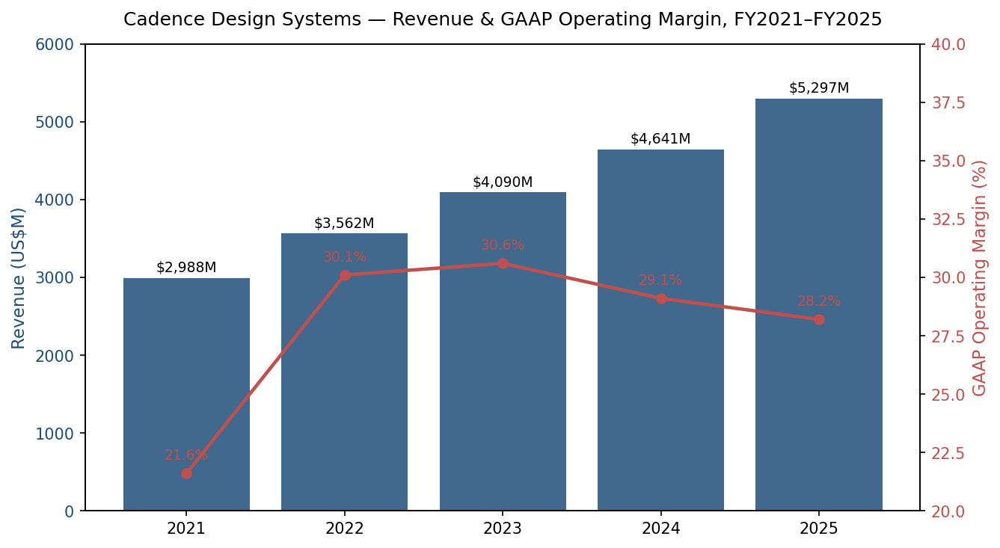
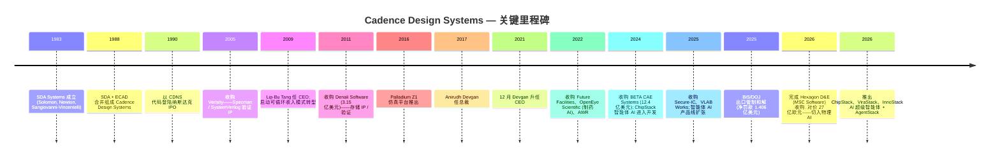
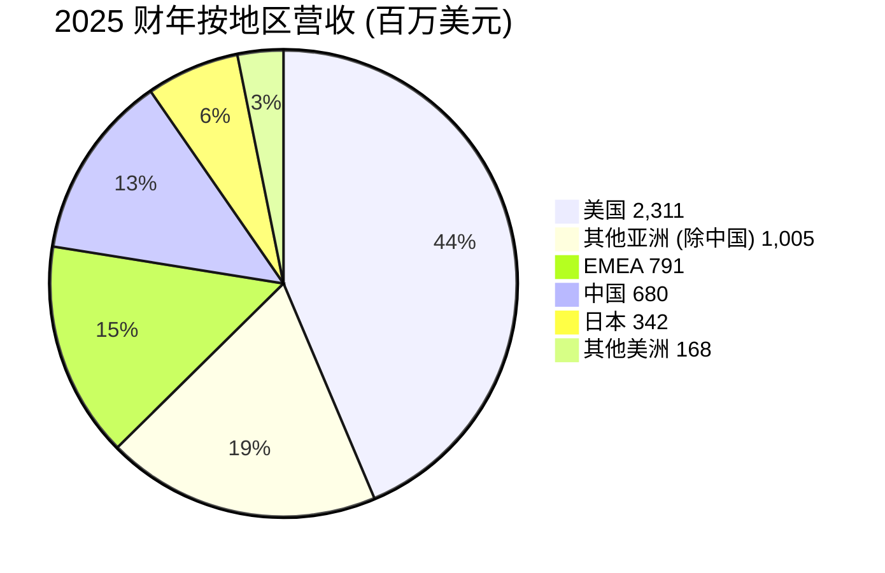
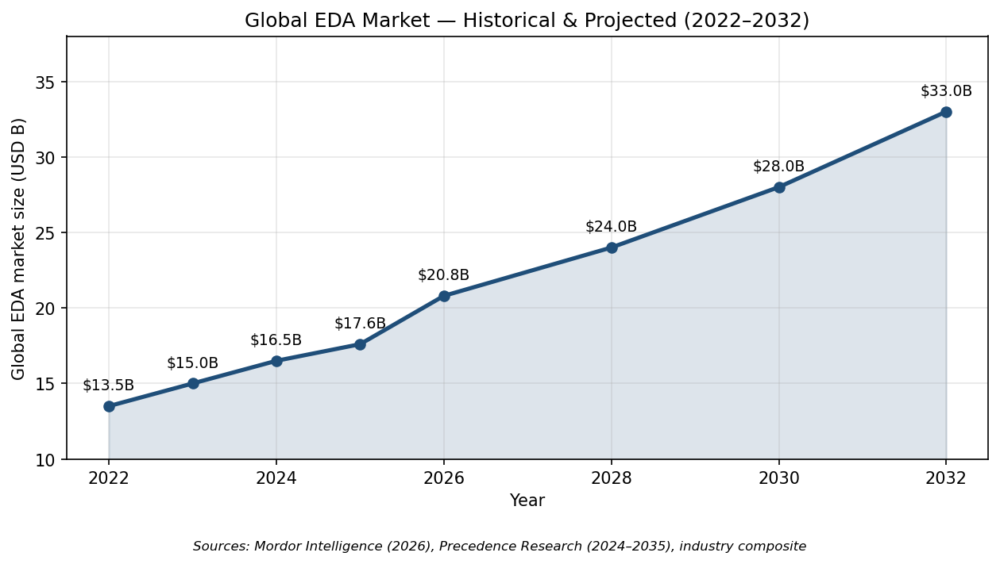
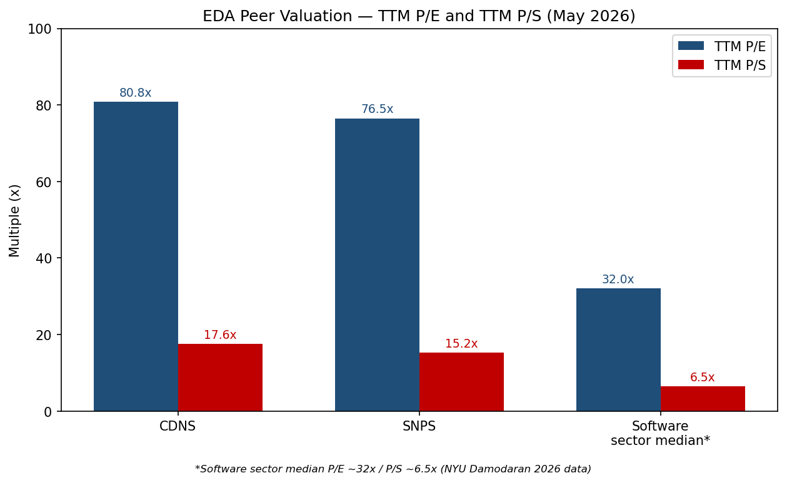
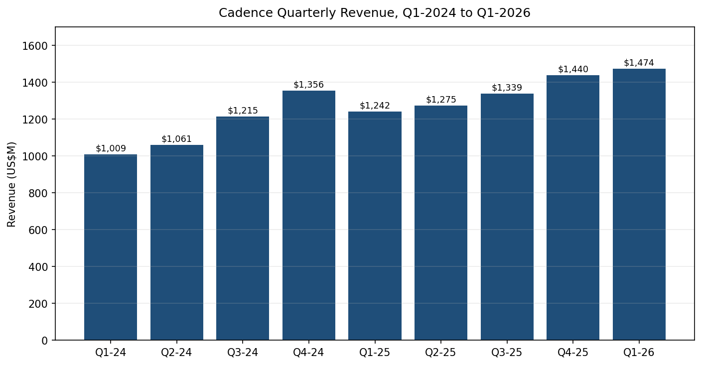

# Cadence Design Systems, Inc. (NASDAQ:CDNS) — 公司研究报告

**日期: 2026-05-20**
**上市地: 纳斯达克全球精选市场 (NASDAQ Global Select), 代码 CDNS**
**注册地: 美国加利福尼亚州圣何塞**
**报告语言: 简体中文 (英文版同时存在于本目录)**
**由分析师整理的深度研究 — 仅供参考, 不构成投资建议。**

> **更新——2026 财年全年指引上调 (2026-04-27):** 管理层将 2026 全年营业收入指引上调至 **61.25–62.25 亿美元** (此前于 2026-02-17 发布的口径为 **59.00–60.00 亿美元**), 中值口径同比增长由原约 12% 提升至约 17%。非 GAAP 每股收益 (Non-GAAP EPS) 指引上调至 **7.85–7.95 美元** (此前为 **8.05–8.15 美元**——表面下调主要反映已完成的 Hexagon D&E 收购摊薄约 0.28 美元, 但被有机增长加速部分抵消)。CFO John Wall 给出的驱动因素是: "全业务条线广泛走强", AI 基础设施 (AI infrastructure) 芯片设计活动加速, 季末在手订单 (backlog) 创纪录达 **80 亿美元** (2026 年 Q1), 核心 EDA (Core EDA) 同比 +18%, IP (硅知识产权, silicon intellectual property) 同比 +22%。
> 来源: [Cadence 2026 年 Q1 业绩公告, 2026-04-27](https://www.sec.gov/Archives/edgar/data/0000813672/000081367226000044/cdns04272026ex9901.htm) | 此前指引: [Cadence 2025 年 Q4 及 2025 全年业绩公告, 2026-02-17](https://www.sec.gov/Archives/edgar/data/0000813672/000081367226000013/cdns2182025ex9901.htm)。

---

## 目录

1. 公司概览
2. 公司历史
3. 管理团队
4. 产品与服务
5. 客户与上市策略
6. 行业概览
7. 竞争格局
8. 市场机会 (TAM)
9. 风险评估
10. 参考资料

---

## 1. 公司概览

**Cadence Design Systems, Inc.** 是全球第二大**电子设计自动化 (Electronic Design Automation, EDA)** 软件、硬件仿真/原型系统及**硅知识产权 (silicon intellectual property, IP)** 供应商, 与 Synopsys (SNPS, 新思科技) 及 Siemens EDA (西门子 EDA) 一道构成 EDA 行业有时称为"三巨头" (Big Three) 的高度集中近寡头格局。Cadence 销售的工具、硬件与 IP 模块, 实际上被全球每一个有意义的半导体设计团队用于架构设计、**仿真 (simulation)**、**验证 (verification)**、**综合 (synthesis)**、布局布线及集成电路与全电子机械系统的**签核 (signoff)**。公司总部位于美国加州圣何塞 Seely Avenue 2655 号, 其自我定位为"一家全球技术领导者, 开发计算性、AI 驱动的软件、加速硬件与硅知识产权 (IP) 产品与解决方案", 战略主线为"智能系统设计 (Intelligent System Design™, ISD)" ([Cadence 2025 10-K, 第 1 页](https://www.sec.gov/Archives/edgar/data/0000813672/000081367226000016/cdns-20251231.htm))。

**做什么——通俗解释。** 现代芯片包含数百亿至上千亿晶体管, 没有任何人类能够手动布局。Cadence 提供软件 ("EDA 工具") 让工程师用代码 (Verilog/SystemVerilog) 描述芯片, 自动将代码**综合 (synthesize)** 成门级网表 (gate-level netlist), 在硅片上摆放这些门、布通线网、对结果进行仿真、验证其与原设计意图一致, 并最终签核以供 TSMC (台积电) 或 Samsung (三星) 等代工厂完成制造。Cadence 还出租价值数百万美元的**硬件仿真器 (hardware emulation box)** Palladium 与 Protium, 让客户在流片前以接近硅片速度运行芯片 RTL; 同时授权预设计的**硅 IP 模块** (PCIe、CXL、HBM、DDR、USB、SerDes、Tensilica DSP、Secure-IC 安全模块), 客户可将其直接嵌入 SoC, 从而节省数年工程开发时间。

**盈利方式。** Cadence 的收入模式高度可循环——公司报告称其绝大多数软件以**基于时间的许可证 (time-based license)** 出售 (典型期限 2–3 年), 客户还签订硬件租赁安排、IP 版税协议及内部称为"不可取消订单 (non-cancellable bookings)"的多年期主协议。2025 财年, **产品与维护收入为 48.216 亿美元 (营业收入的 91%, 同比 +14%), 服务收入为 4.752 亿美元 (9%, 同比 +11%)**, 合计营业收入 **52.968 亿美元 (同比 +14%)** ([Cadence 2025 10-K, MD&A](https://www.sec.gov/Archives/edgar/data/0000813672/000081367226000016/cdns-20251231.htm))。按内部产品类别拆分 (在业绩说明会及 CFO 评论中披露, 而非 10-K 分部附注——按 ASC 280 准则 Cadence 为单一可报告分部), **2025 财年核心 EDA 增长 13%**, IP 约 +20%, 系统设计与分析 (System Design & Analysis, SD&A) 增长中等十几个百分点。2026 年 Q1 节奏加快——核心 EDA +18%, IP +22%, SD&A +18%, 硬件交付了"创纪录的一个季度" ([2026 Q1 业绩公告, 2026-04-27](https://www.sec.gov/Archives/edgar/data/0000813672/000081367226000044/cdns04272026ex9901.htm))。

**经营区域。** Cadence 全球销售, **美国 = 23.110 亿美元 (2025 财年营收 44%), 其他亚洲 (除中国, 主要为台湾及韩国) = 10.052 亿美元 (19%), EMEA = 7.906 亿美元 (15%), 中国 = 6.800 亿美元 (13%), 日本 = 3.417 亿美元 (6%), 其他美洲 = 1.683 亿美元 (3%)** ([Cadence 2025 10-K, 附注 17](https://www.sec.gov/Archives/edgar/data/0000813672/000081367226000016/cdns-20251231.htm))。值得注意的是, 尽管美国工业与安全局 (BIS) 在 2025-05-23 发布并于 2025-07-02 撤销的、为期六周的"EDA 对华出口"许可要求引发广泛关注, 中国地区 2025 财年营业收入仍**增长 19%** ([Cadence 2025 10-K, 第 14 页](https://www.sec.gov/Archives/edgar/data/0000813672/000081367226000016/cdns-20251231.htm); [TrendForce, 2025-06-02](https://www.trendforce.com/news/2025/06/02/news-china-revenue-at-risk-as-u-s-curbs-slam-eda-giants-impact-on-synopsys-cadence-and-more/))。

**规模指标。** Cadence 2025 财年末**员工约 13,800 人** (上一财年末为约 12,300 人), 其中大多数为工程师, 另在 2026-02-23 完成 Hexagon Design & Engineering 收购时新增约 1,100 名员工 ([Cadence 2025 10-K, 第 8 页](https://www.sec.gov/Archives/edgar/data/0000813672/000081367226000016/cdns-20251231.htm); [Cadence 新闻稿, 2026-02-23](https://www.cadence.com/en_US/home/company/newsroom/press-releases/pr/2026/cadence-completes-acquisition-of-hexagons-design-and-engineering.html))。总资产 **101.5 亿美元**, 现金及现金等价物 **30.0 亿美元**, 长期负债 **24.8 亿美元**, 股东权益 **54.7 亿美元** ([Cadence 2025 10-K, 合并资产负债表](https://www.sec.gov/Archives/edgar/data/0000813672/000081367226000016/cdns-20251231.htm))。2025 财年 GAAP 净利润 **11.089 亿美元 (摊薄 EPS 4.06 美元)**, 经营现金流 **17.288 亿美元**, 资本开支 **1.419 亿美元**, 自由现金流约 **15.87 亿美元**。公司在 2025 财年回购了 **9.28 亿美元**股票, 期末普通股流通股数为 **2.718 亿股** (2024 财年末为 2.739 亿股)。


*来源: [Cadence 2025 10-K, 合并损益表](https://www.sec.gov/Archives/edgar/data/0000813672/000081367226000016/cdns-20251231.htm); [Cadence 2022 10-K (2021 财年营业利润)](https://www.sec.gov/cgi-bin/browse-edgar?action=getcompany&CIK=0000813672&type=10-K)。*

### 估值快照 (必备)

| 指标 | CDNS | SNPS (同业) | 备注 |
|---|---|---|---|
| 股价 (2026-05-20) | ~338 美元 | ~545 美元 | [Yahoo Finance — CDNS](https://finance.yahoo.com/quote/CDNS/) / [SNPS](https://finance.yahoo.com/quote/SNPS/) |
| 市值 | ~930 亿美元 | ~840 亿美元 | [stockanalysis.com — CDNS](https://stockanalysis.com/stocks/cdns/) |
| TTM 市盈率 (GAAP) | ~81 倍 | ~77 倍 | TTM EPS ≈ 4.18 美元 ([CDNS PE — fullratio](https://fullratio.com/stocks/nasdaq-cdns/pe-ratio); [SNPS PE — fullratio](https://fullratio.com/stocks/nasdaq-snps/pe-ratio)) |
| 前瞻市盈率 (非 GAAP) | ~43 倍 | ~40 倍 | 2026 财年非 GAAP EPS 指引 7.85–7.95 美元 ([2026 Q1 业绩公告](https://www.sec.gov/Archives/edgar/data/0000813672/000081367226000044/cdns04272026ex9901.htm)); SNPS 数据来自 [GuruFocus](https://www.gurufocus.com/term/forward-pe-ratio/SNPS) |
| TTM 市销率 | ~17.6 倍 | ~15.2 倍 | TTM 营收 53.0 亿美元 ([10-K](https://www.sec.gov/Archives/edgar/data/0000813672/000081367226000016/cdns-20251231.htm)); SNPS 数据来自 [artificall.com, 2026](https://artificall.com/analysis/companies/comparisons/synopsys-vs-cadence-design-systems/) |
| 市净率 | ~17 倍 | ~7 倍 | 账面权益 54.7 亿美元 |
| EV/EBITDA (TTM) | ~50 倍 | ~45 倍 | EBITDA ≈ 18.4 亿美元 (营业利润 + 折旧摊销 + 股权激励) |
| 52 周区间 | 235–385 美元 | 390–640 美元 | [Yahoo Finance](https://finance.yahoo.com/quote/CDNS/) |
| 三年 P/E 区间 | ~50–95 倍 | ~45–110 倍 | [Macrotrends — CDNS PE](https://www.macrotrends.net/stocks/charts/CDNS/cadence-design-systems/pe-ratio) |
| 软件板块中位数 P/E / P/S | 32 倍 / 6.5 倍 | — | [NYU Stern Damodaran 数据, 2026 年 1 月](https://pages.stern.nyu.edu/~adamodar/New_Home_Page/data.html) |

**解读。** CDNS 当前 TTM GAAP P/E 约 81 倍, TTM P/S 约 17.6 倍——既显著高于自身三年中位数 (P/E 约 70 倍、P/S 约 14 倍), 也约为软件大板中位数的 2.5 倍。该倍数**并非**由一次性减值解释: 2025 财年损益表确实承担了 BIS/DOJ 出口管制和解相关的 1.285 亿美元损失 (详见第 9 章), 但加回后仅提升 GAAP EPS 约 0.40 美元, TTM P/E 压缩到约 74 倍, 仍处高位。

合理框架是 **(a) 高增长板块溢价 + (b) AI 基础设施叙事**。Cadence 是市场上仅有的两个"每一颗先进制程芯片所需 EDA 支出都高于上一颗"的纯标的之一——明确暴露于 AI 训练/推理芯片 (NVIDIA Blackwell/Rubin、AMD MI400、超大规模数据中心定制 ASIC——Google TPU、Meta MTIA、Microsoft Maia、Amazon Trainium/Inferentia)、先进封装/3D-IC、汽车软件定义车辆 (Software-Defined Vehicle, SDV) 芯片以及向 chiplet 的长期迁移。营收 2021–2025 财年复合年增长率 (CAGR) 约 14%, GAAP 营业利润率约 28% (非 GAAP 约 45%), 收入留存率 >100%, 在手订单约 80 亿美元 (相当于 TTM 营收 1.5 倍), 而市场共识预期该市场未来十年以 8–10% 复合增长——市场正在以"复利型公司 + AI 收费站"对 CDNS 定价, 并施加接近 Synopsys (~77 倍 P/E) 与 ASML (~30 倍 P/E) 水平的溢价。花旗 (Citi) 在 2026 年基于同一 AI 设计周期论点对 CDNS 与 SNPS 双双重申买入评级 ([Citi via GuruFocus, 2026](https://www.gurufocus.com/news/3222105/citi-initiates-buy-ratings-for-cadence-cdns-and-synopsys-snps))。

由于 GAAP P/E 高于 50 倍, 且若无 40%+ EPS 增长, 短期内无路径回到 30 倍以下倍数, 因此**估值风险**真实存在, 已在第 9 章明确标注。该股已多次显现剧烈调整能力: 2025 年 3 月某一交易日因中国出口管制头条新闻下跌约 24%; 2025 财年 Q4 业绩持平指引后出现约 12% 回调。倍数压缩 81 倍 → 60 倍 (仍偏贵) 在 EPS 不变情况下相当于约 26% 下行空间。

---

## 2. 公司历史

Cadence **于 1988-06-01 由 SDA Systems (Solomon Design Automation, 1983 年在圣何塞由 Jim Solomon、Richard Newton 与 Alberto Sangiovanni-Vincentelli 创立) 与 ECAD Inc. (1982 年由 Ping Chao、Glen Antle 与 Paul Huang 创立) 合并成立** ([Semiwiki — Cadence Design Systems 简史](https://semiwiki.com/eda/cadence/1609-a-brief-history-of-cadence-design-systems/); [Wikipedia — Cadence Design Systems](https://en.wikipedia.org/wiki/Cadence_Design_Systems))。SDA 带来的是模拟/定制 IC 版图工具; ECAD 带来的是 Dracula DRC/LVS 验证流程。Joe Costello 于 1984 年从 National Semiconductor 加入 SDA, 1987 年任 SDA 总裁, 合并后出任新公司 CEO。公司首个完整财年收入 7,860 万美元, 员工 433 人 ([FundingUniverse — Cadence Design Systems 历史](https://www.fundinguniverse.com/company-histories/cadence-design-systems-inc-history/))。

Cadence 此后三十年在"EDA 业务整合"与"几近翻车的执行"之间交替推进。公司先后收购了 Valid Logic (1991)、Tangent Systems、Comdisco 的 CAD 部门、Verisity (2005, 带来了 Specman/e-language 验证方法学)、Cosmic Circuits 及 60 余项其他较小标的。在两次 CEO 更迭与 2008 年濒临生死存亡时期之后——董事会因对竞争对手 Mentor Graphics 的恶意收购失败及营收暴跌而免去 CEO Mike Fister——Lip-Bu Tang (陈立武, 现任 Intel CEO, 自 2025 年起) 于 2009 年出任 CEO, 主导了为期八年的转型, 将业务转向**可循环收入 (ratable revenue)**、深度客户协作及逐步上升的研发强度。Tang 于 2017 年 11 月任命 Anirudh Devgan 为总裁, 并于 2021 年 12 月将 CEO 职位移交给 Devgan ([I-Connect007 — Cadence 任命 Anirudh Devgan 为总裁, 2017](https://iconnect007.com/article/107599/cadence-appoints-anirudh-devgan-as-president/107602/design))。



*来源: [Cadence 2025 10-K](https://www.sec.gov/Archives/edgar/data/0000813672/000081367226000016/cdns-20251231.htm); [Cadence 新闻中心, 2025–2026](https://www.cadence.com/en_US/home/company/newsroom.html); [Semiwiki 历史综述](https://semiwiki.com/eda/cadence/1609-a-brief-history-of-cadence-design-systems/)。*

### 战略转向与近期变革

1. **从一次性许可证到可循环订阅 (2010–2015)。** 在 Tan 的主导下, Cadence 将几乎全部软件合同转为基于时间的许可证, 收入按服务期间分摊确认, 平滑了此前的繁荣-萧条循环, 使如今公司经常性收入比重超过 90%。财务结果体现在 GAAP 营业利润率从 2009 年的约 13% 扩张至 2025 财年的约 28% ([Cadence 2025 10-K, MD&A](https://www.sec.gov/Archives/edgar/data/0000813672/000081367226000016/cdns-20251231.htm))。

2. **"智能系统设计"——从芯片层扩展到系统 (2018 年至今)。** Devgan 任内的标志性战略举措是把 Cadence 从芯片层 EDA 延伸至 PCB 设计 (Allegro/OrCAD)、系统分析 (Sigrity、Clarity、Celsius)、计算流体力学 (Pointwise → Fidelity), 最终延伸到结构力学 (2024 年的 BETA CAE、2026 年的 Hexagon D&E / MSC Software)。每个相邻领域复用同一套计算软件能力——求解器 + 仿真 + AI 优化——将 TAM 从约 180 亿美元的 EDA 市场扩展进入约 110 亿美元的工程仿真市场。

3. **泛在智能 / 智能体 AI (2024 年至今)。** Cadence 将生成式 AI 与现在的智能体 AI 嵌入几乎每一款产品——Cerebrus (机器学习驱动的 RTL-to-GDS 探索)、Verisium (验证 AI)、Allegro X AI (PCB)、Optimality (多物理场), 以及 2026 年的 **ChipStack / ViraStack / InnoStack / AgentStack** 超级智能体堆栈, 可自主编排数十种基础 EDA 工具。早期客户披露 (Altera、NVIDIA、Qualcomm、Tenstorrent) 引用了高达 10 倍的验证效率提升 ([Cadence 新闻稿, ChipStack 发布, 2026-02-10](https://www.cadence.com/en_US/home/company/newsroom/press-releases/pr/2026/cadence-unleashes-chipstack-ai-super-agent-pioneering-a-new.html); [EE Times, 2026-02-10](https://www.eetimes.com/cadence-unveils-chipstack-ai-agent-for-agentic-chip-design-and-verification/))。

### 近五年关键收购

- **2022 — OpenEye Scientific** (制药分子建模, 价格未披露): 扩展至生命科学 AI 垂直领域。
- **2022 — Future Facilities** (数据中心数字孪生): 嵌入 SD&A 产品线。
- **2024 — BETA CAE Systems** (希腊机械仿真厂, 约 12.4 亿美元): 进军结构力学的切入点。
- **2025 — VLAB Works** (虚拟原型, 用于 SDV/嵌入式软件): 为软件定义汽车增加虚拟开发环境 ([Cadence 2025 10-K, 第 3 页](https://www.sec.gov/Archives/edgar/data/0000813672/000081367226000016/cdns-20251231.htm))。
- **2025 — Secure-IC** (法国嵌入式安全 IP): 为汽车与数据中心增加网络安全 IP 模块, 拓宽 IP 组合 ([Cadence 2025 10-K, 第 4 页](https://www.sec.gov/Archives/edgar/data/0000813672/000081367226000016/cdns-20251231.htm))。
- **2026 — Hexagon Design & Engineering, 含 MSC Software (27 亿欧元 / 约 29 亿美元)**, 于 2026-02-23 完成交割: 引入 MSC Nastran (结构分析) 与 Adams (多体动力学), 主攻航空航天、国防、电动汽车及"物理 AI" (自主系统、人形机器人) 领域。新增 2024 财年营收约 2.80 亿美元、约 1,100 名员工; 预计 2026 财年非 GAAP EPS 摊薄约 0.28 美元, 2027 财年由摊薄转为增厚 ([Cadence 新闻稿, 2026-02-23](https://www.cadence.com/en_US/home/company/newsroom/press-releases/pr/2026/cadence-completes-acquisition-of-hexagons-design-and-engineering.html); [eeNews Europe, 2025-09](https://www.eenewseurope.com/en/cadence-to-acquire-hexagon-de-business-in-e2-7b-deal/))。

### 近 12 个月动态

- 2025-05-23 → 2025-07-02 — BIS 先后发布并撤销 EDA 对华出口许可要求; Cadence 估计损失数周的中等个位数百万美元规模中国营收, 但全年中国仍录得 +19% 增长 ([Cadence 2025 10-K, 第 6 页](https://www.sec.gov/Archives/edgar/data/0000813672/000081367226000016/cdns-20251231.htm); [TrendForce, 2025-06-02](https://www.trendforce.com/news/2025/06/02/news-china-revenue-at-risk-as-u-s-curbs-slam-eda-giants-impact-on-synopsys-cadence-and-more/); [Silicon UK, 2025-07-03](https://www.silicon.co.uk/e-regulation/china-chip-design-620616))。
- 2025-07-27 — Cadence 就 2015–2021 年向受制裁中国客户出售产品与技术合计 **4,530 万美元**一事, 与美国司法部 (DOJ) 达成认罪协议 (三年缓刑、一项共谋违反出口管制罪名), 并与 BIS 达成行政和解 (两次年度合规审计)。Cadence 支付合计净罚款与没收**1.406 亿美元**, 并就此记录**1.285 亿美元** "或有负债相关损失" ([Cadence 2025 10-K, 附注 18](https://www.sec.gov/Archives/edgar/data/0000813672/000081367226000016/cdns-20251231.htm))。
- 2026-02-10 — 推出 **ChipStack AI 超级智能体**, 用于自主芯片设计与验证 ([Cadence 新闻稿](https://www.cadence.com/en_US/home/company/newsroom/press-releases/pr/2026/cadence-unleashes-chipstack-ai-super-agent-pioneering-a-new.html))。
- 2026-02-23 — 完成 Hexagon D&E / MSC Software 收购交割 (27 亿欧元)。
- 2026-04-27 — 2026 年 Q1 业绩公布: 营收 14.74 亿美元 (同比 +19%), 在手订单 80 亿美元, 上调 2026 财年营收指引。

---

## 3. 管理团队

### Anirudh Devgan 博士 — 总裁兼首席执行官

Anirudh Devgan, 56 岁, 自 2021 年 12 月起任 CEO, 2017 年 11 月起任总裁 ([Cadence 2025 10-K, 高管信息](https://www.sec.gov/Archives/edgar/data/0000813672/000081367226000016/cdns-20251231.htm))。他是 Cadence "智能系统设计"战略的设计师, 也是公司 AI/智能体 AI 转型的公开形象代言人。Devgan 1969 年出生于印度, 在**印度理工学院德里分校 (Indian Institute of Technology, Delhi)** 获得电气工程学士学位, 随后在**卡内基梅隆大学 (Carnegie Mellon University)** 获得电气与计算机工程硕士及博士学位 ([Cadence 2025 10-K](https://www.sec.gov/Archives/edgar/data/0000813672/000081367226000016/cdns-20251231.htm); [Wikipedia — Anirudh Devgan](https://en.wikipedia.org/wiki/Anirudh_Devgan))。

Devgan 在 **IBM 服务了 12 年 (1994–2005)**, 历任 Thomas J. Watson 研究中心、服务器事业部、微电子事业部及奥斯汀研究实验室; 他在电路仿真算法与统计时序分析方面的研究, 支撑了 IBM POWER 处理器方法学。2005 年 5 月他加入 **Magma Design Automation**, 担任企业 VP 兼定制设计业务部总经理, 主导发起并交付了模拟/混合信号仿真、物理验证、库表征及 3D 提取等产品——Magma 后来卖给 Synopsys 的业务部门主要就是 Devgan 的工作成果 ([IndiaSpora 简历](https://indiaspora.org/business-leader/anirudh-devgan/); [Wikipedia](https://en.wikipedia.org/wiki/Anirudh_Devgan))。

他于 **2012 年 5 月**加入 Cadence 任研发高级副总裁, 2017 年 3 月升任研发执行副总裁, 八个月后升任总裁。担任 CEO 期间, 公司营收从 **2021 财年的 29.9 亿美元增长到 2025 财年的 53.0 亿美元 (累计约 77%, CAGR 约 15%)**, GAAP 营业利润率从 26% 扩张到 28% (非 GAAP 从约 40% 扩张到约 44%), 并通过 BETA CAE / Secure-IC / VLAB Works / Hexagon D&E 收购周期使公司可寻址市场翻倍。

Devgan 持有 **24 项美国专利**, 已发表 **70 余篇研究论文**。他于 **2006 年当选 IEEE Fellow**, 2003 年获 IEEE/ACM William J. McCalla 奖, 2005 年获 ACM/DAC 最佳论文奖, 并于 **2026-02-03 加入 Lam Research 董事会** ([Lam Research 新闻中心, 2026-02-03](https://newsroom.lamresearch.com/2026-02-03-Lam-Research-Appoints-Cadence-CEO-Anirudh-Devgan-to-Board-of-Directors))。他之所以是一位异常重要的 CEO, 恰恰因为他是**一位还在做事的 EDA 科学家, 能在 NVIDIA、TSMC 与超大规模客户 CTO 面前进行深度技术对话**——与同等规模软件公司 CEO 形成鲜明对比。他于 2021-12-15 与 CEO 任命同时修订的雇佣协议在 10-K 附件目录中作为附件 10.22 引用 ([Cadence 2025 10-K, 附件 10.22](https://www.sec.gov/Archives/edgar/data/0000813672/000081367226000016/cdns-20251231.htm))。直接受益股权明细将在 10-K 引用规则下于财年末后 120 日内提交的 2026 年股东大会代理材料 (DEF 14A) 中披露。

### John M. Wall — 高级副总裁兼首席财务官

John M. Wall, 55 岁, 自 **2017 年 10 月**起任 CFO, 至今为该岗位上的第九个年头——对美国科技公司 CFO 而言是异常长的任期。他于 **1997 年 6 月**加入 Cadence, 历任多个财务管理岗位, 最近一次为公司副总裁兼公司财务总监 (2016 年 4 月至 2017 年 10 月) ([Cadence 2025 10-K, 第 9 页](https://www.sec.gov/Archives/edgar/data/0000813672/000081367226000016/cdns-20251231.htm))。

Wall 是爱尔兰**特拉利理工学院 (Institute of Technology, Tralee)** NCBS 毕业生, 同时是**特许公认会计师公会 (Association of Chartered Certified Accountants) 资深会员 (FCCA)**。他作为 CFO 的业绩, 是大规模执行 EDA 可循环商业模式转型的教科书案例: 在 Wall 任期内, Cadence 从 **2017 财年 19.4 亿美元营收 / GAAP 营业利润率 24%** 扩张到 **2025 财年 53.0 亿美元 / GAAP 28% / 非 GAAP 约 44%**——CAGR 约 14% 且非 GAAP 利润率稳步每年扩张约 150 个基点。他主导了 **2024 年发行的 32 亿美元投资级票据**, 用于资助 BETA CAE Systems 收购, 这是公司历史上最大的一笔债务融资; 此后净债务/EBITDA 仍低于 1.5 倍。Wall 已经九年担任每季度 CFO 评论稿的发言人, 任内未出现一次"指引下调-业绩不达"的循环, 这是公司溢价倍数的重要支撑要素。根据 2024 财年股东大会代理材料, 他全年总薪酬约 680 万美元 (2025 财年完整明细将在 2026 年 DEF 14A 披露)。

### 其他主要高管

**Chin-Chi Teng 博士 — 高级副总裁兼数字与签核事业部总经理 (自 2018 年 9 月)。** Teng 于 2002 年 1 月加入 Cadence, 在数字实现、签核与物理验证方向已工作 23 年以上。他主管的事业部出货 **Innovus、Genus、Tempus、Voltus、Quantus、Pegasus、Conformal 与 Cerebrus**——即整条与 Synopsys Fusion Compiler / IC Compiler II 正面竞争的数字 RTL-to-GDS 流程。Teng 持有台湾大学电气工程学士、伊利诺伊大学厄巴纳-香槟分校电气与计算机工程博士学位 ([Cadence 2025 10-K, 第 9 页](https://www.sec.gov/Archives/edgar/data/0000813672/000081367226000016/cdns-20251231.htm))。

**Paul Cunningham 博士 — 高级副总裁兼系统验证事业部总经理 (自 2021 年 3 月)。** Cunningham 通过 **2011 年 7 月对 Azuro 的收购**进入 Cadence; 他是 Azuro 的联合创始人兼 CEO, Azuro 是从剑桥大学衍生出来的时钟并发优化初创公司。他主管 Cadence 验证业务条线——**Xcelium、Jasper Formal、Palladium、Protium、Verisium 以及新推出的 ChipStack 智能体 AI 超级智能体**。Cunningham 持有剑桥大学计算机科学硕士与博士学位 ([Cadence 2025 10-K, 第 9 页](https://www.sec.gov/Archives/edgar/data/0000813672/000081367226000016/cdns-20251231.htm))。

### 公司治理

- **董事会 (2025 财年末 10 名董事)。** ML (Mary Louise) Krakauer (独立董事长, 2023-05-04 起任, 曾任 Dell EVP)、Mark W. Adams、Ita Brennan (前 Arista CFO)、Lewis Chew、Anirudh Devgan (CEO)、Moshe Gavrielov (前 Xilinx CEO, 2025-01-01 加入)、Julia Liuson (Microsoft EVP, GitHub 业务负责人)、James D. Plummer 博士 (斯坦福大学电气工程荣休教授)、Alberto Sangiovanni-Vincentelli 博士 (Cadence 联合创始人, UC 伯克利教授)、Young K. Sohn (前三星首席战略官)、Luc Van den hove 博士 (imec CEO, 2026-01-01 加入) ([Cadence 2025 10-K 签字页](https://www.sec.gov/Archives/edgar/data/0000813672/000081367226000016/cdns-20251231.htm); [BusinessWire — Krakauer 任董事长, 2023-05-11](https://www.businesswire.com/news/home/20230511005894/en/Cadence-Appoints-Mary-Louise-Krakauer-as-Chair-of-the-Board); [BusinessWire — Gavrielov 任命, 2024-12-12](https://www.businesswire.com/news/home/20241212617169/en/Cadence-Appoints-Moshe-Gavrielov-to-Board-of-Directors))。
- **独立性。** 10 名董事中 9 名为独立董事; 仅 Devgan 为内部人。董事长与 CEO 角色分离。
- **内部人持股。** 具体比例待 2026 年 DEF 14A 披露; 2024 财年股东大会代理材料披露董事与高管合计持有总流通股的 <2%——内部人持股比例不高, 但对一家 38 年历史的大盘公司属正常。
- **薪酬结构。** 重心在股权激励; 业绩股票单位 (PSU) 按营业利润与相对股东总回报 (TSR) 指标解锁 (PSU 协议格式列于 2025 财年 Q1 10-Q 附件 10.4 与 10.6) ([Cadence 2025 10-K 附件目录](https://www.sec.gov/Archives/edgar/data/0000813672/000081367226000016/cdns-20251231.htm))。股权激励费用 2025 财年为 **4.552 亿美元 (占营收 8.6%)** ——金额较高, 但与大型软件同业一致。
- **审计师。** 普华永道会计师事务所 (PricewaterhouseCoopers LLP)。
- **重大治理事件。** 2025 年 7 月 DOJ 认罪协议使 Cadence 进入三年缓刑期, 期间需持续报告与认证; BIS 行政和解要求每年两次内部出口合规审计, 并将合规作为继续保有出口权利的条件 ([Cadence 2025 10-K, 附注 18](https://www.sec.gov/Archives/edgar/data/0000813672/000081367226000016/cdns-20251231.htm))。

### 综合履历

Devgan + Wall 组合是美国大盘半导体资本品板块最稳定、最可信的二人核心团队之一: 一位由创始人训练出来的 EDA 科学家, 经营着由他的伯克利教授 (Sangiovanni-Vincentelli 至今仍任董事) 构想的公司; 配以一位九年的 CFO, 该 CFO 监督了 EDA 同业中最干净的非 GAAP 利润率扩张曲线。唯一的污点是 BIS/DOJ 和解, 所涉行为发生在 2015–2021 年, 早于 Devgan 出任 CEO, 但补救工作落到他们身上。投资者关注的核心是合规整改速度, 而非战略能力。

---

## 4. 产品与服务

Cadence 将其产品组合划分为三大类 ([Cadence 2025 10-K, 第 2 页](https://www.sec.gov/Archives/edgar/data/0000813672/000081367226000016/cdns-20251231.htm)):

1. **核心 EDA (Core EDA)** — 用于芯片设计与验证的软件与硬件。**约占营收 60%**; 同比增长 13–18%。
2. **系统设计与分析 (System Design & Analysis, SD&A)** — PCB 设计、多物理场、CFD、结构/热分析。**约占营收 25%**; 同比增长 15–18%。
3. **半导体 IP (Semiconductor IP)** — 可授权的硅 IP 模块。**约占营收 15%**; 2025 财年/2026 Q1 同比增长 20–25%。

```mermaid
graph TD
    A[Cadence Design Systems] --> B[核心 EDA]
    A --> C[系统设计与分析]
    A --> D[半导体 IP]
    A --> S[服务]
    B --> B1[定制 / 模拟<br/>Virtuoso 平台]
    B --> B2[数字实现<br/>Innovus / Genus / Tempus<br/>Voltus / Quantus]
    B --> B3[验证软件<br/>Xcelium / Jasper / Verisium<br/>Conformal AI Studio]
    B --> B4[硬件加速<br/>Palladium Z3 / Protium X3]
    B --> B5[AI 超级智能体<br/>ChipStack / ViraStack /<br/>InnoStack / AgentStack]
    B --> B6[Cerebrus<br/>AI 芯片探索器]
    C --> C1[PCB 与封装<br/>Allegro X / OrCAD X /<br/>Sigrity X]
    C --> C2[多物理场<br/>Celsius / Clarity / AWR /<br/>Fidelity CFD / Integrity 3D-IC]
    C --> C3[结构 / 机械<br/>BETA CAE / MSC Nastran /<br/>Adams 多体动力学]
    C --> C4[AI 优化<br/>Optimality / Reality DT /<br/>Millennium 多物理场]
    D --> D1[接口 IP<br/>PCIe / CXL / UCIe / HBM /<br/>DDR / LPDDR / USB / SerDes]
    D --> D2[Tensilica DSP<br/>音频 / 视觉 / AI / 基带]
    D --> D3[验证 IP<br/>用于 Xcelium / Palladium 的 VIP]
    D --> D4[安全 IP<br/>Secure-IC]
    S --> S1[方法学服务]
    S --> S2[培训 / Cadence Academy]
    S --> S3[Cadence OnCloud<br/>云端托管 EDA]
```



*来源: [Cadence 2025 10-K, 项目 1.A–1.C](https://www.sec.gov/Archives/edgar/data/0000813672/000081367226000016/cdns-20251231.htm); [Cadence 产品页](https://www.cadence.com/en_US/home/tools.html)。*

### 核心 EDA——根基业务

**Virtuoso 平台——定制/模拟/RF/混合信号 IC 设计。** Cadence 的旗舰产品, 也是模拟与定制 IC 设计的行业标准, 被 Apple、Qualcomm、MediaTek、NXP、ST Micro、Infineon 以及几乎所有模拟厂商使用。集成原理图捕获、版图、仿真 (Spectre) 与物理验证 (Pegasus DRC/LVS)。Cadence 称 Virtuoso "被业内视为定制与模拟 IC 设计的行业标准" ([Cadence 2025 10-K, 第 2 页](https://www.sec.gov/Archives/edgar/data/0000813672/000081367226000016/cdns-20251231.htm); [Virtuoso 产品页](https://www.cadence.com/en_US/home/tools/custom-ic-analog-rf-design/virtuoso-platform.html))。
- **竞争优势判断: 是——持久护城河。** 护城河类型: **切换成本 + 生态锁定**。每个代工厂 (TSMC、Samsung、Intel Foundry、GlobalFoundries) 都首先为 Virtuoso 认证工艺设计套件 (Process Design Kit, PDK); 围绕竞品重建工程团队将面临 12–24 个月的 PDK 再认证周期。
- **最直接竞品:** Synopsys Custom Compiler。判断: **Cadence 在装机量与 PDK 认证深度上领先**; Synopsys 在技术差距上已显著收窄。

**Innovus Implementation System——数字布局布线。** 被 AMD、NVIDIA、Apple、Broadcom、Marvell 及大多数超大规模数据中心自研芯片团队用于驱动 RTL 通过综合 (Genus) → 布局 → CTS → 布线 → 签核 (Tempus、Voltus、Quantus) 全流程, 适用于先进制程 (3nm、2nm)。与 Cerebrus 集成实现 AI 驱动的 PPA (功耗-性能-面积) 探索 ([Innovus 产品页](https://www.cadence.com/en_US/home/tools/digital-design-and-signoff/soc-implementation-and-floorplanning/innovus-implementation-system.html))。
- **竞争优势判断: 部分——与 Synopsys 双寡头。** 护城河类型: **规模 + 技术**——只有 Cadence 与 Synopsys 拥有可信的 3/2nm 签核流程。
- **最直接竞品:** Synopsys Fusion Compiler / IC Compiler II。判断: **大致旗鼓相当**; 市场份额按节点和客户而摆动。

**Xcelium 并行逻辑仿真器 + Jasper Formal + Verisium AI。** 功能验证软件栈; 验证通常消耗一颗数字 SoC 项目 60–70% 的计算时数, 也是 ChipStack 宣称 10 倍效率提升的关键场景 ([Cadence 新闻稿, ChipStack 发布, 2026-02-10](https://www.cadence.com/en_US/home/company/newsroom/press-releases/pr/2026/cadence-unleashes-chipstack-ai-super-agent-pioneering-a-new.html); [HPCwire, 2026-02-12](https://www.hpcwire.com/2026/02/12/cadence-introduces-agentic-ai-system-for-chip-design-and-verification/))。
- **竞争优势判断: 部分。** 护城河类型: 技术 + 方法学锁定 (从 Verisity 继承的 Specman 'e' 验证语言)。
- **最直接竞品:** Synopsys VCS + VC Formal。判断: **互有胜负**——Cadence 在形式化验证 (Jasper) 与仿真器联动的验证流程上领先, Synopsys 在原始仿真吞吐量上领先。

**Palladium 企业仿真平台 + Protium 基于 FPGA 的原型平台。** 价值数百万美元的专用仿真器, 在流片前以 MHz 量级速度运行客户芯片 RTL——对任何 >10 亿晶体管的芯片都不可或缺。Cadence 在 10-K 中称"Palladium 为全球设计团队提供高吞吐量、容量与可靠性", 并明确指出这一品类在 2026 年 Q1 交付了"创纪录的一个季度" ([Cadence 2025 10-K, 第 3 页](https://www.sec.gov/Archives/edgar/data/0000813672/000081367226000016/cdns-20251231.htm); [2026 Q1 业绩公告](https://www.sec.gov/Archives/edgar/data/0000813672/000081367226000044/cdns04272026ex9901.htm))。
- **竞争优势判断: 是——强护城河。** 护城河类型: **技术 + 资本开支壁垒 + 规模**。Cadence 与 Synopsys 都拥有自研仿真专用硅, 但在 10 亿门级以上没有别人。
- **最直接竞品:** Synopsys ZeBu EP2 / HAPS。判断: **在容量上旗鼓相当至略胜; 在部分工作负载的原始速度上 Synopsys 领先**。

**Cerebrus 智能芯片探索器**——机器学习驱动的 RTL-to-GDS 探索, 在云端并行运行数百种流程配方, 自动挑选最佳 PPA。与 Genus / Innovus / Tempus / Voltus / Joules / Pegasus 集成 ([Genus 综合解决方案产品页](https://www.cadence.com/en_US/home/tools/digital-design-and-signoff/synthesis/genus-synthesis-solution.html); [Electronic Specifier 关于 Cerebrus](https://www.electronicspecifier.com/products/design-automation/ml-based-cerebrus-delivers-productivity-and-quality/))。
- **竞争优势判断: 部分。** 护城河类型: **数据 + 技术**——Cerebrus 在每个客户每次运行流程时都自我改进。
- **最直接竞品:** Synopsys DSO.ai。判断: **大致平手; 双方均自称首创**。

**ChipStack / ViraStack / InnoStack / AgentStack——智能体 AI 超级智能体 (2026 年 2–4 月推出)。** ChipStack 编排多个 LLM 智能体, 它们可以阅读设计意图、生成 RTL 与测试平台、运行回归仿真、调试并迭代——Cadence 已披露 **Altera、NVIDIA、Qualcomm 与 Tenstorrent** 的早期生产部署, 在 Altera 实现了约 10 倍验证工作量缩减 ([Cadence ChipStack 新闻稿, 2026-02-10](https://www.cadence.com/en_US/home/company/newsroom/press-releases/pr/2026/cadence-unleashes-chipstack-ai-super-agent-pioneering-a-new.html); [EE Times](https://www.eetimes.com/cadence-unveils-chipstack-ai-agent-for-agentic-chip-design-and-verification/))。AgentStack (2026 Q1) 是将超级智能体与基础 EDA 工具绑定在一起的编排框架。
- **竞争优势判断: 过早判断, 但前景可期。** 护城河类型: **数据 + 生态锁定**——智能体在调用原生 Cadence 工具并消化客户完整设计历史时效果最佳。
- **最直接竞品:** Synopsys.ai Copilot / DSO.ai 扩展。判断: **Cadence 早期领先**; 竞争格局每 6 个月可能重置。

### 系统设计与分析 (SD&A)

**Allegro X / OrCAD X / Sigrity X——PCB 设计与信号/电源完整性。** Allegro 是高端 PCB 工具, 被 Apple、Cisco、NVIDIA 参考板设计与汽车一级供应商使用; OrCAD 是定位中端市场的姊妹产品, 通过全球约 200 家增值经销商销售 ([Cadence 2025 10-K, 第 4 页](https://www.sec.gov/Archives/edgar/data/0000813672/000081367226000016/cdns-20251231.htm); [Allegro 产品页](https://www.cadence.com/en_US/home/tools/pcb-design-and-analysis/allegro-x-design-platform.html))。Allegro X AI 是用于 PCB 周期压缩的生成式 AI 姊妹产品。
- **判断: 部分。** 护城河: 规模 + 生态。
- **最直接竞品:** Siemens EDA Xpedition / PADS, Altium Designer (低端)。判断: **Cadence 与 Siemens 占据高端; Altium 在中端市场的装机数量领先但收入不如**。

**多物理场——Celsius (热)、Clarity 3D 求解器 (电磁)、AWR (RF)、Fidelity CFD (计算流体力学)、Optimality。** 主要基于 Pointwise + Numeca 的并购 (CFD), 加上自研开发。另有用于先进封装/chiplet 堆叠的 **Integrity 3D-IC 平台**——10-K 中描述为"业内首个集成的系统与 SoC 级解决方案, 实现与 Virtuoso 与 Allegro 的协同设计与系统分析" ([Cadence 2025 10-K, 第 4 页](https://www.sec.gov/Archives/edgar/data/0000813672/000081367226000016/cdns-20251231.htm))。
- **判断: 部分。** 护城河: 与 EDA + IP 的跨产品集成。
- **最直接竞品:** Ansys (2025 年起被 Synopsys 收购), Siemens Simcenter。判断: **Ansys 仍是多物理场龙头**; Cadence 是 #2/#3 挑战者, 其在 EDA 端的深度集成是 Ansys 无法匹敌的。

**结构 / 机械——MSC Nastran、Adams (多体动力学)、BETA CAE ANSA/META。** 通过 BETA CAE (2024) 与 Hexagon D&E / MSC Software (2026 年 2 月) 收购而来。客户群包括航空航天、国防、汽车 OEM、电动汽车。合并后产品组合让 Cadence 首次具备角逐**约 110 亿美元工程仿真 TAM**的可信能力, 此前长期由 Ansys 独占 ([Cadence Hexagon 完成收购新闻稿, 2026-02-23](https://www.cadence.com/en_US/home/company/newsroom/press-releases/pr/2026/cadence-completes-acquisition-of-hexagons-design-and-engineering.html))。
- **判断: 部分——尚处早期; 集成风险显著。** 护城河类型: 技术 + 客户基础。
- **最直接竞品:** Ansys (现属 Synopsys)、Altair、Dassault Simulia。

### 半导体 IP

**接口 IP——PCIe、CXL、UCIe、HBM、DDR/LPDDR、USB、MIPI、SerDes。** Cadence IP 业务多年来一直是公司增速最快的板块, 也是利润弹性最高的池子——每颗先进制程 SoC 都搭载多个 Cadence 接口模块。2026 年 Q1 IP 营收同比增长 **22%** ([2026 Q1 业绩公告](https://www.sec.gov/Archives/edgar/data/0000813672/000081367226000044/cdns04272026ex9901.htm))。
- **判断: 是。** 护城河: 技术 + 代工厂认证。
- **最直接竞品:** Synopsys (IP 龙头)、Alphawave、Rambus。判断: **Cadence 的"Star IP"组合 (HBM、LPDDR、PCIe、SerDes) 在最先进制程上与 Synopsys 并驾齐驱; 在长尾标准的覆盖广度上落后**。

**Tensilica 可配置 DSP**——音频/语音、基带、视觉/影像——嵌入移动 SoC、AI 推理芯片与汽车 ADAS。2013 年收购至今, 在可配置音频 DSP 上保持十余年领先 ([Cadence 2025 10-K, 第 3 页](https://www.sec.gov/Archives/edgar/data/0000813672/000081367226000016/cdns-20251231.htm))。
- **判断: 是。** 护城河: 技术 + 客户特定指令集定制能力。
- **最直接竞品:** Synopsys ARC、Ceva、Imagination。判断: **Tensilica 在音频领先, 在视觉与 AI 上有竞争**。

**验证 IP (Verification IP, VIP)**——行业协议的测试平台组件, 与 Xcelium 与 Palladium 集成。**Secure-IC** 在 2025 年加入嵌入式安全 IP (信任根、抗侧信道攻击密码学), 用于汽车与数据中心硅 ([Cadence 2025 10-K, 第 4 页](https://www.sec.gov/Archives/edgar/data/0000813672/000081367226000016/cdns-20251231.htm))。

### 服务

Cadence 的服务收入 (2025 财年 4.75 亿美元, 占总营收 9%) 由**方法学协作 + Cadence Academy 培训 + Cadence OnCloud 托管 EDA 云服务**构成——明确不包括人力外包式芯片设计服务, 但 Cadence 在相邻垂直领域确实与芯片设计公司有合作 ([Cadence 2025 10-K, 第 5 页](https://www.sec.gov/Archives/edgar/data/0000813672/000081367226000016/cdns-20251231.htm))。

### 旗舰产品 vs. 长尾

三款产品承载了大部分业务:
1. **Virtuoso** (模拟/定制) ——无可争议的行业标准。
2. **Innovus + 数字签核栈 (Genus/Tempus/Voltus/Quantus)** ——AMD/NVIDIA/超大规模厂商的先进制程数字 SoC 默认流程。
3. **Palladium / Protium 仿真硬件** ——EDA 产品中单价最高的产品族; 数百万美元规模的交易通常在季度末几周内成交, 也是公司营收季节性的主要驱动。

其余 (PCB、SD&A、IP) 是增长引擎产品; Hexagon/MSC 与 BETA CAE 当前仍稀释 EPS, 但对多物理场邻域战略至关重要。

### 过去 12 个月发布 / 终止

- **2025-05** — Optimality™ 智能系统探索器正式可用 (生成式 AI 多物理场)。
- **2025-07** — Conformal AI Studio 发布 (宣称: SoC 设计师效率提升 10 倍) ([Electronics Maker, 2025-07](https://electronicsmaker.com/cadence-launches-conformal-ai-studio-improves-soc-designer-productivity-by-10x))。
- **2025-09** — Secure-IC 集成; Reality 数字孪生平台。
- **2025-11** — Cerebrus 2.0 支持多模块联合优化。
- **2026-02-10** — **ChipStack AI 超级智能体**正式可用。
- **2026-04** — **ViraStack** (模拟/定制) 与 **InnoStack** (数字签核) 超级智能体 + **AgentStack** 编排框架。
- 未披露实质性产品终止; 旧产品 (如经典 Encounter 测试流) 仍受支持。

---

## 5. 客户与上市策略

Cadence 的客户基础涵盖整个全球半导体设计行业, 并向系统公司邻域持续扩展。10-K 将其描述为"设计与制造集成电路 (IC) 的半导体公司, 以及设计与制造各类内含半导体与其他电子器件的电子机械系统的系统公司" ([Cadence 2025 10-K, 第 1 页](https://www.sec.gov/Archives/edgar/data/0000813672/000081367226000016/cdns-20251231.htm))。

### 客户集中度 (量化)

- **2025 财年——没有单一客户占总营收 10% 或以上**: "在 2025 财年与 2024 财年, 均无任何一家客户占总营收 10% 或更多" ([Cadence 2025 10-K, MD&A](https://www.sec.gov/Archives/edgar/data/0000813672/000081367226000016/cdns-20251231.htm))。
- **2024 财年——应收账款**披露一家客户占应收账款的 11%; 2025 财年再次无任何单一客户占应收账款的 10% 以上 ([Cadence 2025 10-K, 附注 1](https://www.sec.gov/Archives/edgar/data/0000813672/000081367226000016/cdns-20251231.htm))。
- **前 5 名客户占比——未单独披露。** 美国 10-K 准则 (ASC 280-10-50-42) 仅在客户超过 10% 阈值时要求披露; Cadence 不存在此情况, 故未披露。行业观察者普遍估计 Cadence 与 Synopsys 的前 10 名客户合计占 EDA 营收的 35–40% (大型代工厂 + 头部先进 fabless + 四大超大规模厂商自研芯片团队), 但 Cadence 不公开发布该数据。
- **三年趋势:** 应收账款集中度从 2024 财年的 11% (单一客户) 下降至 2025 财年的 <10%; 营收集中度在已披露的三年窗口内始终低于 10% 披露阈值。

**判断:** 按 10-K 披露与行业标准衡量, **客户集中度均处低位**。无任何客户营收占比超过 10% (更不用说本报告风险分类中"重大风险阈值" 20%)。客户集中度风险仍在第 9 章追踪——因为**半导体行业客户合并**本身就是 10-K 列示的风险——但当前不属于重大敞口 ([Cadence 2025 10-K, 风险因素](https://www.sec.gov/Archives/edgar/data/0000813672/000081367226000016/cdns-20251231.htm))。


*来源: [Cadence 2025 10-K, 附注 17——按地区营收](https://www.sec.gov/Archives/edgar/data/0000813672/000081367226000016/cdns-20251231.htm)。*

### 客户细分

1. **半导体 IDM 与 fabless 领军企业** ——Intel、AMD、NVIDIA、Qualcomm、Broadcom、Marvell、Apple silicon、MediaTek、Samsung LSI、SK hynix、Micron、Texas Instruments、ST Micro、Infineon、NXP、Renesas、Analog Devices、Microchip——它们是最高 ASP 的 EDA 软件、仿真硬件与 IP 的购买方。2026 年 Q1 业绩公告明确指出"AI 基础设施与半导体客户"是核心 EDA 业务加速的驱动 ([2026 Q1 业绩公告](https://www.sec.gov/Archives/edgar/data/0000813672/000081367226000044/cdns04272026ex9901.htm))。
2. **代工厂** ——TSMC、Samsung Foundry、Intel Foundry、GlobalFoundries、UMC、SMIC。代工厂既是客户 (它们内部许可某些 Cadence 工具), 又是生态伙伴——Cadence 与每家代工厂在每一节点上进行 PDK 认证。2025 年 4 月扩展的 **TSMC 合作**覆盖 N2P、N3 与 N5 参考流程, 是典型例子 ([TSMC 新闻稿, The Globe and Mail, 2025-04](https://www.theglobeandmail.com/investing/markets/stocks/NVDA/pressreleases/35163569/cadence-and-tsmc-extend-partnership-to-drive-next-generation-innovation/))。
3. **超大规模厂商 / 设计自研芯片的系统公司** ——Google (TPU)、Amazon (Trainium/Inferentia/Graviton)、Meta (MTIA)、Microsoft (Maia)、Apple——合计是 EDA 增长最快的购买细分, 因为每颗新的自研 ASIC 都需要新订阅工具与新购仿真器。
4. **汽车 / SDV** ——每一家一级供应商 (Bosch、Continental、ZF、Magna、Aptiv) 加上电动车原生 OEM (Tesla、BYD、Xiaomi Auto、Li Auto、Hyundai/Kia、NIO) 都使用 Allegro、Sigrity, 并日益使用 MSC Adams/Nastran 进行系统仿真。
5. **航空航天、国防、工业、生命科学** ——通过 BETA CAE、Hexagon D&E、OpenEye 与 Optimality 启用的新垂直领域。

### 分销渠道

- **直销团队** ——几乎所有企业级软件、硬件与 IP 许可证都通过 Cadence 全球销售与应用工程团队直接销售。客户成功团队 (原全球外勤业务部) 人数约数千人, 由 SVP Paul Scannell 管理 ([Cadence 2025 10-K, 第 9 页](https://www.sec.gov/Archives/edgar/data/0000813672/000081367226000016/cdns-20251231.htm))。
- **经销商** ——OrCAD 与部分 Allegro 中端工具通过全球增值经销商网络销售 ([Cadence 2025 10-K, 第 5 页](https://www.sec.gov/Archives/edgar/data/0000813672/000081367226000016/cdns-20251231.htm))。
- **日本** ——某些产品在日本通过第三方经销商授权销售。
- **Cadence OnCloud** ——云端托管访问完整工具栈, 部署在 AWS/Azure/GCP 及 Cadence 自有基础设施上 ([Cadence OnCloud 产品页](https://www.cadence.com/en_US/home/tools/oncloud.html))。

### 销售策略与周期

- Cadence 指出主要项目的销售周期"长达六个月或更久" ([Cadence 2025 10-K, 第 5 页](https://www.sec.gov/Archives/edgar/data/0000813672/000081367226000016/cdns-20251231.htm))。
- 合同结构: 2–3 年期订阅主协议、多年期不可取消硬件租赁与版税型 IP 许可证。2026 年 Q1 季末在手订单 (backlog) 创纪录达 **80 亿美元**, 其中 40 亿美元预计在未来 12 个月内确认为收入——为公司提供卓越的营收能见度 ([2026 Q1 业绩公告](https://www.sec.gov/Archives/edgar/data/0000813672/000081367226000044/cdns04272026ex9901.htm))。

### 关键合作伙伴

- **TSMC** ——2025 年 4 月延伸合作, 覆盖 N2P/N3/N5 参考流程 ([Cadence 与 TSMC 新闻稿, 2025-04](https://www.theglobeandmail.com/investing/markets/stocks/NVDA/pressreleases/35163569/cadence-and-tsmc-extend-partnership-to-drive-next-generation-innovation/))。
- **NVIDIA** ——2025–2026 年多次合作公告, 覆盖 Blackwell/Rubin 设计流程、ChipStack 早期部署、Cadence Millennium 超级计算机部署于 NVIDIA GPU 上 ([Cadence 与 NVIDIA, 2026](https://www.cadence.com/en_US/home/company/newsroom/press-releases/pr/2026/cadence-and-nvidia-expand-partnership-to-reinvent-engineering.html))。
- **Arm** ——长期工具验证与 Neoverse-V2 参考设计合作 ([New Electronics — Cadence 与 Arm Neoverse V2](https://www.newelectronics.co.uk/content/news/cadence-and-arm-to-accelerate-data-centre-design-using-neoverse-v2-platform/))。
- **Samsung Foundry、Intel Foundry、GlobalFoundries、UMC** ——每一节点上的 PDK 与参考流程认证持续推进。
- **AWS、Azure、GCP** ——OnCloud 云交付伙伴。

### 过去 12 个月获得的客户名单

- **Altera、NVIDIA、Qualcomm、Tenstorrent** ——ChipStack 早期生产部署, Cadence 于 2026-02-10 披露 ([Cadence 新闻稿](https://www.cadence.com/en_US/home/company/newsroom/press-releases/pr/2026/cadence-unleashes-chipstack-ai-super-agent-pioneering-a-new.html))。
- **NVIDIA Blackwell / Rubin** ——根据 2025–2026 年联合公告, Cadence 流程被端到端使用 ([HPCwire, 2026-02-12](https://www.hpcwire.com/2026/02/12/cadence-introduces-agentic-ai-system-for-chip-design-and-verification/))。
- **多家超大规模厂商 (未具名)** 用于硬件仿真——Palladium 在 2026 年 Q1 "交付了创纪录的一个季度", 见 CFO 评论 ([2026 Q1 业绩公告](https://www.sec.gov/Archives/edgar/data/0000813672/000081367226000044/cdns04272026ex9901.htm))。

---

## 6. 行业概览

### 行业定义与范畴

电子设计自动化 (EDA) 行业由以下三部分构成: (a) 用于设计、仿真、验证与版图集成电路与电子系统的软件工具, (b) 专用硬件仿真与原型设备, 以及 (c) 以授权方式出售给芯片设计企业的可复用硅知识产权 (IP) 模块。更广义的**工程设计与仿真 (Engineering Design & Simulation)** 市场——Cadence 通过 Allegro、BETA CAE、Hexagon D&E 与多物理场组合扩展进入——还包含 PCB 设计、机械/结构 CAE、计算流体力学与数字孪生。

NAICS 511210 (软件发行——设计/工程) 是最贴合的归类, 兼有 334413 (半导体设计服务) 的成分。客户基础主要位于 NAICS 334413 / 334418 (半导体与 PCB)。

### 市场规模与结构

- **2025 年全球 EDA 软件市场约 176 亿美元**, 预计到 2032 年达到约 330 亿美元, CAGR 约 8%, 按 Mordor Intelligence 与 Precedence Research 汇总的行业研究 ([Mordor Intelligence — EDA 工具市场](https://www.mordorintelligence.com/industry-reports/electronic-design-automation-eda-tools-market); [Precedence Research — EDA 软件市场至 2035 年达 347.1 亿美元](https://www.precedenceresearch.com/electronic-design-automation-software-market))。
- **Mordor Intelligence 的 2026 年估算为 207.8 亿美元, 至 2031 年增至 306.7 亿美元** (CAGR 8.1%), 与同一基础趋势一致 ([Mordor Intelligence](https://www.mordorintelligence.com/industry-reports/electronic-design-automation-eda-tools-market))。
- **若包含工程仿真**(Ansys、Altair、Dassault Simulia、MSC)——Cadence 现已成为该领域有意义的玩家——TAM 再扩张约 90–120 亿美元, 使 Cadence *扩展后*可寻址市场 (今天) 达到 **280–350 亿美元**, 至 2032 年增至 500 亿美元以上。


*来源: 综合自 [Mordor Intelligence](https://www.mordorintelligence.com/industry-reports/electronic-design-automation-eda-tools-market)、[Precedence Research](https://www.precedenceresearch.com/electronic-design-automation-software-market) 及行业共识。*

### 集中度

EDA 市场结构上是**近寡头**: 按 TrendForce 涵盖 2024 年的数据, **Synopsys 约 31%、Cadence 约 30%、Siemens EDA 约 13%** 的全球市场份额——合计约 74%, 余下份额由 Ansys (Synopsys 收购前)、Altium、Keysight、华大九天 (中国)及一长串小厂分占 ([TrendForce, 2025-06-02](https://www.trendforce.com/news/2025/06/02/news-china-revenue-at-risk-as-u-s-curbs-slam-eda-giants-impact-on-synopsys-cadence-and-more/))。随着 **Synopsys + Ansys 合并于 2025 年完成**, 三巨头结构进一步收紧; Synopsys 现拥有多物理场龙头业务, Cadence 的 BETA CAE + Hexagon D&E 行动明确就是对此的回应。

### 增长率与驱动因素

Cadence 与 Synopsys 在 2021–2025 财年都实现了 14–15% 的营收 CAGR——大约是底层 EDA 市场约 8% 复合增速的 2 倍。驱动力构成:

1. **先进制程的设计起点 (design starts) 增加。** 每一代节点 (5nm → 3nm → 2nm → 1.4nm) 所需 EDA 计算时数大约是上一节点的 2 倍, 因为设计复杂度 (晶体管数、寄生效应、物理验证规则集) 呈超线性增长。SemiAnalysis 与行业共识认为先进制程节点的 EDA 单座位成本比上一节点高 30–50%, 而仿真硬件订单规模在同一窗口也以约 25% CAGR 增长。
2. **AI/HPC 芯片爆发。** NVIDIA、AMD、Broadcom、超大规模厂商自研芯片团队, 加上数十亿美元资本支持的 AI 训练/推理 ASIC 初创公司 (Cerebras、Groq、Tenstorrent、SambaNova、Etched、Lightmatter), 都不成比例地消耗 EDA。Cadence 在 2026 Q1 业绩公告中明确指出"AI 与高性能计算 (HPC) 客户的强劲需求"是硬件营收驱动力。
3. **先进封装 / 3D-IC / chiplet。** 多 die 协同设计需要全新的工具——Integrity 3D-IC、系统级分析 (Clarity、Celsius), 以及 Hexagon/MSC 与 BETA CAE 提供的那种多物理场仿真。
4. **软件定义车辆 + 物理 AI** (自主、机器人、无人机)。Cadence Hexagon D&E 的交割是该方向上的战略载体 ([Cadence Hexagon 完成收购新闻稿](https://www.cadence.com/en_US/home/company/newsroom/press-releases/pr/2026/cadence-completes-acquisition-of-hexagons-design-and-engineering.html))。
5. **EDA 内部的 AI。** Cerebrus / ChipStack / DSO.ai 这类产品正在基础工具订阅之上叠加一个增值层——通常按基础座位价加 10–30% 的溢价。

### 监管环境

- **美国出口管制。** 由 BIS 管理的 2024–2026 年出口管制制度对 EDA 对华营收产生了实质性影响。2025-05-23 暂停 EDA 对华出口 (约 6 周后于 2025-07-02 撤销) 的许可要求函是 EDA 贸易史上最具破坏性的单一事件 ([Silicon UK, 2025-07-03](https://www.silicon.co.uk/e-regulation/china-chip-design-620616); [TrendForce, 2025-06-02](https://www.trendforce.com/news/2025/06/02/news-china-revenue-at-risk-as-u-s-curbs-slam-eda-giants-impact-on-synopsys-cadence-and-more/))。2025-09-29 BIS"50% 规则"延展随后暂停至 2026-11-09, 但监管制度仍处波动状态 ([Cadence 2025 10-K, 风险因素](https://www.sec.gov/Archives/edgar/data/0000813672/000081367226000016/cdns-20251231.htm))。
- **实体清单 (Entity List) 限制**限制了对特定中国芯片设计公司的销售 (华为/海思、中芯国际、长江存储、长鑫存储, 以及不断扩展的清单)。
- **欧盟 AI 法案** (2024-08-01 生效, 实质性要求自 2026-08-02 起执行) 对包括出货生成式 AI 功能的 EDA 厂商在内的 AI 提供商, 施加透明度、合规评估与版权合规义务 ([Cadence 2025 10-K, 第 7 页](https://www.sec.gov/Archives/edgar/data/0000813672/000081367226000016/cdns-20251231.htm))。
- **中国产业政策** ——北京"2030 年实现 EDA 自主"的政策已扶持出**华大九天 (Empyrean Technology)、芯华章 (X-EPIC)、概伦电子 (Primarius)、芯禾 (Semitronix)**等国家背景竞争者, 它们正在中国低层级设计企业中获取份额 ([36Kr, 2025](https://eu.36kr.com/en/p/3522967335623557))。

### 行业格局

- **碎片化:** 顶端高度集中 (三巨头约 74%), 长尾高度碎片化。
- **供应商议价能力:** 代工厂 (TSMC、Samsung、Intel Foundry) 同时是合作伙伴与潜在内部竞争者——议价能力中等。
- **客户议价能力:** 前 20 名客户构成实质性营收; 大型 fabless 与超大规模客户可争取价格让步, 但无法在先进制程切换供应商。
- **替代品:** 内部 EDA 工具 (老 IBM、Intel) 已大幅萎缩; 开源 EDA (Yosys、OpenROAD) 在教育与 ≤180nm 工作场景下是可信替代品, 但在先进制程 SoC 签核上不可行。
- **进入壁垒:** 软件行业中最高的之一——代工厂 PDK 认证、客户方法学锁定、维持竞争力所需的约 40% 研发投入比例, 以及任何新产品要十年以上才能成熟。

---

## 7. 竞争格局

### 直接竞争对手

1. **Synopsys (NASDAQ: SNPS)** ——最大的 EDA 公司, 市场份额约 31% (TrendForce 2024 数据)。与 Cadence 在每一个产品类别上都纯重叠。2025 年完成的 **Ansys 收购 (约 350 亿美元)** 将多物理场龙头并入 Synopsys, 加剧了 Cadence 正在扩张的 SD&A 业务中的竞争。Synopsys 的营收结构略微更偏向 IP。两家均以溢价倍数交易 (~76–80 倍 TTM P/E); Synopsys 目前估值略有折让 ([Synopsys vs Cadence, artificall.com 2026](https://artificall.com/analysis/companies/comparisons/synopsys-vs-cadence-design-systems/); [Citi via GuruFocus, 2026](https://www.gurufocus.com/news/3222105/citi-initiates-buy-ratings-for-cadence-cdns-and-synopsys-snps))。

2. **Siemens EDA** (原 Mentor Graphics, 2017 年被 Siemens AG 收购) ——市场份额约 13%; 在 PCB (Xpedition、PADS)、Calibre 物理验证 (多家代工厂事实上的签核 DRC/LVS 标准) 及嵌入式系统方面尤其强势。完全在 Siemens Digital Industries Software 之下, 故作为更大综合集团的一部分披露。

3. **Ansys** ——历史上的独立多物理场龙头, 现已并入 Synopsys。直接竞争 Cadence 的 Celsius / Clarity / Fidelity / Integrity 3D-IC 与 Hexagon/MSC 集成。

4. **Altium (2024 年被 Renesas 收购)** ——在低端 PCB 设计 (Altium Designer) 与云原生 Altium 365 协作平台上占主导地位。限制 Cadence 的 OrCAD 中端市场升级潜力。

### 间接 / 邻域竞争对手

5. **Ceva (CEVA)、Imagination Technologies、Arm (由 SoftBank/Arm Holdings 私下控制)** ——竞争 IP 厂商。Arm 主导 CPU IP; Cadence 在此不直接竞争, 但其总线、存储接口与 DSP IP 接入 Arm SoC。

6. **Alphawave Semi、Rambus** ——接口 IP 专家 (SerDes、存储)。各自挑战 Cadence Star IP 组合的子集。

7. **Altair Engineering** ——多产品计算仿真厂, 具备结构、流体、HPC 软件; 是 BETA CAE / MSC 的中盘竞争对手。

8. **华大九天 (深圳, SZ:301035)、概伦电子、芯华章 (X-EPIC)、芯禾科技** ——中国国产 EDA 挑战者, 在"2030 年自主"政策下快速壮大。Cadence 10-K 明确指出"日益增长的不受 [美国出口] 限制的境外竞争者类别与开源替代品, 以及它们开发自身解决方案的能力" ([Cadence 2025 10-K, 第 16 页](https://www.sec.gov/Archives/edgar/data/0000813672/000081367226000016/cdns-20251231.htm))。

9. **开源 EDA——OpenROAD、Yosys、KiCad** ——在教育级 / ≤180nm 水平可信; 不构成先进制程威胁, 但持续对市场长尾形成成本压力。

10. **超大规模厂商内部工具团队** ——Google 历来与开源流程并行构建 TPU 自研布局布线与验证工具; 大客户选择性内部化是长期风险。

### 竞争位置

```mermaid
quadrantChart
    title EDA 竞争位置 (广度 vs. 先进制程深度)
    x-axis "产品组合广度 (窄 → 宽)"
    y-axis "先进制程深度 (落后 → 前沿)"
    quadrant-1 "宽且前沿"
    quadrant-2 "窄但前沿"
    quadrant-3 "窄且落后"
    quadrant-4 "宽但落后"
    Synopsys: [0.92, 0.95]
    Cadence: [0.88, 0.93]
    Siemens EDA: [0.78, 0.7]
    Ansys (now SNPS): [0.55, 0.85]
    Altium: [0.32, 0.4]
    Empyrean (China): [0.4, 0.45]
    OpenROAD (open-src): [0.25, 0.35]
    Altair: [0.5, 0.55]
```

### Cadence 的竞争优势

1. **Virtuoso 模拟/定制领先** ——最难被攻破的护城河; 竞品需 5 年以上和约 20 亿美元研发投入才能匹敌其经过 PDK 认证的产品广度。
2. **与 Synopsys 在 Palladium / Protium 仿真上的双寡头** ——硬件 ASP 达数百万美元, 硅片毛利率极高, 切换成本以数千万美元的客户方法学重做衡量。
3. **EDA + IP + 多物理场 + (Hexagon 收购后) 结构力学一体化** ——唯一不属于更大集团旗下的三巨头厂, 所有激励都对齐到单一损益表。
4. **由创始人训练出来的 CEO, 能坐到技术台上对话** ——这是与 NVIDIA / Apple / 超大规模厂商 CTO 级别销售的非平凡优势。
5. **Cerebrus / ChipStack / 智能体 AI 领先** ——智能体 AI 在芯片设计上的首发生产部署 (Altera、NVIDIA、Qualcomm、Tenstorrent)。
6. **可循环收入 + 80 亿美元在手订单** ——相对大多数与半导体资本开支相关的业务来说有卓越能见度。

### 竞争短板

1. **Synopsys 规模更大, 拥有 Ansys 多物理场业务, 估值略低** ——Cadence 是市场份额的 #2 而非 #1。
2. **多物理场 / 结构集成风险** ——BETA CAE (2024) 与 Hexagon D&E (2026 完成) 仍在整合中; 执行风险显著且对 2026 财年 EPS 形成稀释。
3. **中国敞口** ——营收的 13% 来自中国; 波动的 BIS/实体清单制度可能造成连续数季的"气穴"。
4. **开源 + 中国国产**对长尾与教育座位的长期侵蚀。
5. **溢价估值**几乎不给执行失误留余地; 单次指引未达历来触发约 20% 回调。

### 市场份额趋势

按 TrendForce, Cadence 份额在过去三个披露年份大致保持约 30%, 而 Synopsys 略有上升 (Ansys 前为 30 多, 纯 EDA 报告约 31%), Siemens 维持约 13%。2025 年 Synopsys + Ansys 完成主要集中了多物理场份额而非 EDA 份额。Cadence 的 BETA CAE + Hexagon D&E 行动应能保持其多物理场份额 (Cadence + 收购基础) 基本持平, 但在 2–3 年内可能向 Synopsys + Ansys 的一体化购买体验让出几个百分点的纯 EDA 份额。


*来源: [stockanalysis.com — CDNS 统计](https://stockanalysis.com/stocks/cdns/statistics/); [artificall.com — SNPS vs CDNS 比较, 2026](https://artificall.com/analysis/companies/comparisons/synopsys-vs-cadence-design-systems/); 软件板块中位数来自 [NYU Stern Damodaran, 2026 年 1 月数据更新](https://pages.stern.nyu.edu/~adamodar/New_Home_Page/data.html)。*

---

## 8. 市场机会 (TAM)

### TAM、SAM、SOM

- **TAM——Cadence 完整可寻址的设计软件版图。** EDA 软件 + IP + 仿真/CAE + PCB ≈ **2025 年 280–350 亿美元**, 预计到 2032 年增至 **~500 亿美元**, CAGR 约 7–9% ([Mordor Intelligence](https://www.mordorintelligence.com/industry-reports/electronic-design-automation-eda-tools-market); [Precedence Research](https://www.precedenceresearch.com/electronic-design-automation-software-market))。云 EDA 子板块单独预计 2034 年达到 **75 亿美元** (中等十几个百分点 CAGR), 据 [Precedence Research, 2024](https://www.precedenceresearch.com/cloud-eda-market)。

- **SAM——Cadence 当前服务市场。** 上述约 **260–300 亿美元**目前在合理触达范围内 (除去 Ansys 锚定的深度遗留结构市场池及 Altium 主导的低端 PCB 市场)。随着 Hexagon D&E 与 BETA CAE, 约 40–50 亿美元的结构 / 多体动力学 TAM 从"够不到"转为"在范围内"。

- **SOM——Cadence 当前份额。** Cadence **2025 财年营收 53.0 亿美元**, 相对约 280 亿美元 SAM 给出**约 19% 渗透率**。在纯 EDA 范畴内, 份额接近 30% (与 TrendForce 一致)。结构 / 多体动力学领域目前渗透不足 5%, 是主要的增长空间故事。

### 市场增长预测

- **EDA 核心**: 2030 年前 CAGR 约 8% (行业共识)。
- **云 EDA**: 2034 年前 CAGR 约 17% ([Precedence Research](https://www.precedenceresearch.com/cloud-eda-market))。
- **AI 增强型 EDA 溢价** (Cerebrus / ChipStack / DSO.ai 类): Cadence 与 Synopsys 都预期这是未来 3–5 年增速最快的子板块, 管理层评论暗示 AI 叠加层至 2028 年 CAGR 约 25–40%。
- **系统仿真 + 多物理场**: CAGR 约 7%; 结构/CAE 在约 5%。
- **物理 AI** (自主、人形机器人、无人机、电动车仿真): 2030 年前 TAM 约 **60–100 亿美元**, 目前仍处萌芽阶段但 CAGR 快速。

自下而上的 Cadence 特定增长测算: 2021–2025 财年营收 CAGR 约 14% → 共识预期 2026 财年增长 14–17% (2026 财年指引中点暗示 17%, 其中约 3 个百分点来自 Hexagon 贡献), 然后 2028 财年前有机增长 12–14%——可信地通向 **2030 财年 90–100 亿美元营收**, 前提是无重大衰退或中国阶梯式下行。

### Cadence 的服务市场与份额机会

- 从 Synopsys / Siemens 抢占 EDA 份额 2–3 个百分点 → **成熟期 5.0–8.0 亿美元增量营收**。
- 通过 BETA CAE + Hexagon D&E 从 Ansys / Altair 抢占多物理场 + 结构份额 10–15 个百分点 → **2030 年前 15–20 亿美元增量营收**。
- 拿下 AI 设计叠加层 (Cerebrus / ChipStack / ViraStack / InnoStack 溢价) 的约 30% → **2030 年 10–20 亿美元**, 前提是效率宣称成立。
- 云 EDA OnCloud 渗透 → **2028 年前 5 亿美元增量**。

中位数加总: **未来五年增量营收机会约 35–50 亿美元**, 支撑约 14% CAGR 的基础情境 (这正是共识当前定价的假设)。

### 渗透策略

1. **对现有前 300 大客户基础进行 AI 超级智能体升级**(基础座位加价 10–30%)。
2. **Hexagon/MSC 交叉销售**至 Cadence 的汽车、航空航天与国防客户 (这是收购的明确战略理由)。
3. **云 OnCloud** 服务中等客户, 它们买不起本地 Palladium 机柜但需间歇性仿真容量。
4. **务实对华** ——在合法的范围内维持商业流量; 2025 财年中国营收同比 +19% 表明业务已渡过 BIS 波动。
5. **垂直特定的物理 AI 产品** ——自主车数字孪生、人形机器人动力学仿真——利用 Reality 数字孪生与 Adams。

### 渗透风险

溢价倍数已对相当大部分机会进行了定价。执行失误、监管冲击或竞争意外 (如 Synopsys-Ansys 整合比预期更快落地) 在不改变底层业务的情况下可能压缩倍数 30–40%。详见第 9 章。


*来源: Cadence 季度业绩公告——从 [2024 Q1](https://www.sec.gov/Archives/edgar/data/0000813672/000081367224000083/cdns04222024ex9901.htm) 到 [2026 Q1](https://www.sec.gov/Archives/edgar/data/0000813672/000081367226000044/cdns04272026ex9901.htm)。*

---

## 9. 风险评估

### 公司层面风险

**1. Hexagon D&E + BETA CAE 整合执行风险 (高)。** Cadence 于 2026-02-23 完成 Hexagon D&E 收购 (27 亿欧元, 约 1,100 名员工) ——史上最大单笔收购, 叠加在仍在整合的 BETA CAE (2024) 之上。Hexagon 新增营收约 2.80 亿美元, 但预计在 2026 财年稀释非 GAAP EPS 约 0.28 美元 ([Cadence Hexagon 完成收购新闻稿, 2026-02-23](https://www.cadence.com/en_US/home/company/newsroom/press-releases/pr/2026/cadence-completes-acquisition-of-hexagons-design-and-engineering.html))。将 MSC Nastran / Adams 交叉销售给 Cadence 的汽车与航空航天客户是明确的协同假设; 若进度滞后, 2027 财年增厚节奏将延后。缓解: Cadence 拥有高于平均水平的 M&A 履历 (Denali、Tensilica、Verisity、Pointwise 都成功回收), 且 SD&A 是团队熟悉的运动。

**2. 出口管制 / BIS-DOJ 缓刑期 (重大)。** 2025-07-27 和解包含三年 DOJ 缓刑期、每年两次 BIS 审计, 以及合规作为继续保有出口权利的条件。任何在缓刑期间的二次出口违规可能触发严重得多的处罚或失去出口特权。原始行为 (2015–2021) 涉及 4,530 万美元未授权对华销售; Cadence 在 2025 财年支付的 **1.406 亿美元净罚款**证实 BIS 愿意按 3 倍以上 disgorgement 倍数适用 ([Cadence 2025 10-K, 附注 18](https://www.sec.gov/Archives/edgar/data/0000813672/000081367226000016/cdns-20251231.htm))。缓解: 合规体系持续增强, 新任总法律顾问 Marc Taxay (Arista Networks 出身) 于 2025 年 5 月任命, 部分原因正是为了将出口职能专业化。

**3. 客户集中度——当前低位, 但客户合并是风险向量 (今日低; 趋势上升)。** 2025 财年无任何单一客户占总营收 ≥10% ([Cadence 2025 10-K, MD&A](https://www.sec.gov/Archives/edgar/data/0000813672/000081367226000016/cdns-20251231.htm))。但 10-K 明确将半导体行业合并标记为结构性风险: "若该趋势持续, 我们可能更依赖少数客户, 它们或能在与我们的谈判中施加更大议价能力, 也可能使任一单一客户对我们总销售的占比上升。"超大规模厂商内部化芯片设计已减少市场高端独立购买方的数量——这是缓慢推进但真实的敞口。

**4. 对 Anirudh Devgan 的关键人物依赖 (中等)。** "Devgan 作为 EDA 科学家 CEO"的论点对公司溢价倍数和 Cerebrus/ChipStack 的技术可信度叙事至关重要。失去 Devgan (因病、退休、跳槽至刚被任命董事的 Lam Research 等) 将造成真实扰动。缓解: 深厚技术管理层——Chin-Chi Teng (数字)、Paul Cunningham (验证)、Tom Beckley (至近期, 模拟) 都是可信接班人; 创始人 Sangiovanni-Vincentelli 仍在董事会。

**5. AI 超级智能体产品风险 (中等)。** ChipStack / ViraStack / InnoStack 是早期商业部署, 拥有强力参考客户 (Altera、NVIDIA、Qualcomm、Tenstorrent), 但 10 倍效率宣称尚无第三方基准, 也无单独披露的收入条线。若 Synopsys 快速追上 (DSO.ai 已确立地位) 且客户使升级溢价商品化, 共识模型中隐含的"AI 叠加层 TAM"将被侵蚀。缓解: 基础 EDA 工具护城河无论 AI 层如何都将持续。

**6. 单一分部报告 / 终端市场周期敞口 (低-中等)。** Cadence 按单一分部报告; AI 训练芯片的周期性强势可能掩盖移动与消费终端市场的疲软。若 AI 超大规模厂商资本开支比预期更快回归常态 (如 2026–2027 年消化期), Cadence 增速可能从中等十几个百分点减速至高个位数。

### 行业 / 市场风险

**7. Synopsys-Ansys 整合带来的竞争压力 (重大)。** 2025 年完成的 Synopsys-Ansys 合并将 Cadence 有机不具备的结构仿真业务赋予了 Synopsys, 并可能在 Cadence 的 BETA CAE + Hexagon D&E 行动落地前将多物理场重心转向 Synopsys。风险: Synopsys 在大客户赢得集成 EDA + 多物理场 RFP, Cadence 不得不防守价格。

**8. 来自开源 / 中国国产 EDA 的技术颠覆 (今日低; 2028 年起上升)。** OpenROAD / Yosys 在教育规模可信; 国家支持的华大九天 / X-EPIC / 概伦电子 / 芯禾科技正在改进, 并受益于约 20–30 亿美元的中国国产捕获预算。10-K 明确将"开源替代品"与中国竞争者列为长期威胁 ([Cadence 2025 10-K, 第 16 页](https://www.sec.gov/Archives/edgar/data/0000813672/000081367226000016/cdns-20251231.htm))。缓解: 先进制程签核对开源流程而言仍极难做到。

**9. 监管——美国出口管制 + 欧盟 AI 法案 (重大且持续)。** 2025-05-23 → 2025-07-02 的 BIS 许可要求短暂中止了 EDA 对华出口; 随中美科技竞争持续, 进一步波动的可能性很高。加上欧盟 AI 法案将于 2026-08-02 全面生效, 违规可处全球营收最高 7% 罚款 ([Cadence 2025 10-K, 第 7 页](https://www.sec.gov/Archives/edgar/data/0000813672/000081367226000016/cdns-20251231.htm))。

**10. 先进制程市场饱和 / 客户自研 (低-中等)。** Apple 已表明最大客户能将相当部分方法学与工具工作内部化; Google 与 Amazon 在商业 EDA 之外搭建了内部栈。风险: 随超大规模 ASIC 项目成熟, 边际内部化加剧。缓解: 代工厂 PDK 认证护城河使先进制程内部化在经济上不划算。

### 财务风险

**11. 估值 / 倍数压缩 (重大)。** Cadence 当前 **TTM GAAP P/E 约 81 倍, TTM P/S 约 17.6 倍**, 均**超过软件板块中位数 (P/E 约 32 倍, P/S 约 6.5 倍) 的 2 倍** ([NYU Stern Damodaran, 2026 年 1 月](https://pages.stern.nyu.edu/~adamodar/New_Home_Page/data.html))。根据风险分类阈值 (TTM P/E > 50 倍, P/S > 15 倍 = 必须纳入), 此风险必须明确标注。从 81 倍降到仍偏贵的 60 倍, 在 EPS 不变情况下相当于约 26% 下行。降级触发: AI 资本开支暂停、增速降至高个位数、Synopsys-Ansys 整合在标杆客户处获胜、再次出现 BIS 冲击, 或对"AI 邻近"倍数的一般性风险偏好下行轮换。该股已多次显示出可能因监管头条新闻急剧调整 (2025 年 3 月出口管制抛售)。

**12. 债务与商誉负担 (低-中等)。** 长期负债在 2025 财年末升至 **24.8 亿美元** (2022 财年末仅 3.5 亿美元), 用于资助 BETA CAE 及持续回购; 商誉合计 **27.5 亿美元** ([Cadence 2025 10-K, 合并资产负债表](https://www.sec.gov/Archives/edgar/data/0000813672/000081367226000016/cdns-20251231.htm))。净债务/EBITDA 仍远低于 1.5 倍, 自由现金流足以轻松偿付利息, 但进一步大型并购的容量已更受约束。

**13. 股权激励占盈利比重 (低-中等)。** 股权激励费用 2025 财年为 **4.55 亿美元**, 约占 GAAP 净利润 41%——属于美国大盘软件常态, 但对关注 GAAP 与非 GAAP 收敛的股东值得留意 ([Cadence 2025 10-K, 合并现金流量表](https://www.sec.gov/Archives/edgar/data/0000813672/000081367226000016/cdns-20251231.htm))。

### 宏观经济风险

**14. 中国营收敞口 + 地缘政治脱钩 (重大)。** 中国占 **2025 财年营收的 13%**, 即便有 BIS 许可要求干扰仍同比增长 19% ([Cadence 2025 10-K, 附注 17](https://www.sec.gov/Archives/edgar/data/0000813672/000081367226000016/cdns-20251231.htm))。彻底脱钩情景——持续的 EDA 许可要求、扩展的实体清单, 或中国通过"不可靠实体清单"反制——可能将中国营收减半, 削减总增长 6–7 个百分点。BIS 2025 年 9 月关于持股 ≥50% 子公司的中期最终规则 (目前暂停至 2026-11-09) 是预警信号。

**15. 半导体资本开支周期 / AI 训练资本开支消化 (中等)。** Cadence 营收对半导体行业研发支出有 2–4 季度的滞后。若出现类似 2023 年云资本开支的 AI 训练资本开支消化周期, 2027–2028 财年 EDA 增速将放缓。缓解: 可循环订阅平滑影响; 在手订单缓冲。

**16. 外汇敞口 (低)。** 营收与费用中相当一部分以美元计价 ([Cadence 2025 10-K, 量化与定性披露, 项目 7A](https://www.sec.gov/Archives/edgar/data/0000813672/000081367226000016/cdns-20251231.htm)); 欧元/日元/印度卢比敞口存在但通过远期合约管理。

---

## 10. 参考资料

### 主要——SEC 备案 (Cadence Design Systems, Inc.)

- [Cadence 2025 年年度报告 Form 10-K (2026-02-18 备案)](https://www.sec.gov/Archives/edgar/data/0000813672/000081367226000016/cdns-20251231.htm)
- [Cadence 2026 年 Q1 10-Q (2026-04-30 备案——覆盖期间至 2026-03-31)](https://www.sec.gov/Archives/edgar/data/0000813672/000081367226000047/cdns-20260331.htm)
- [Cadence 2026 年 Q1 业绩公告——8-K, 2026-04-27](https://www.sec.gov/Archives/edgar/data/0000813672/000081367226000044/cdns04272026ex9901.htm)
- [Cadence CFO 评论, 2026 年 Q1——8-K, 2026-04-27](https://www.sec.gov/Archives/edgar/data/0000813672/000081367226000044/cfocommentary04272026ex9902.htm)
- [Cadence 2025 年 Q4 及 2025 全年业绩公告——8-K, 2026-02-17](https://www.sec.gov/Archives/edgar/data/0000813672/000081367226000013/cdns2182025ex9901.htm)
- [Cadence 2024 年年度报告 Form 10-K (2025-02-20 备案)](https://www.sec.gov/Archives/edgar/data/0000813672/000081367225000024/cdns-20241231.htm)
- [Cadence 2022 年年度报告 Form 10-K (2023-02-22 备案——含 2021 财年比较数据)](https://www.sec.gov/cgi-bin/browse-edgar?action=getcompany&CIK=0000813672&type=10-K)

### 主要——Cadence 公司公告

- [Cadence 新闻稿——完成 Hexagon D&E 业务收购, 2026-02-23](https://www.cadence.com/en_US/home/company/newsroom/press-releases/pr/2026/cadence-completes-acquisition-of-hexagons-design-and-engineering.html)
- [Cadence 新闻稿——ChipStack AI 超级智能体发布, 2026-02-10](https://www.cadence.com/en_US/home/company/newsroom/press-releases/pr/2026/cadence-unleashes-chipstack-ai-super-agent-pioneering-a-new.html)
- [Cadence 新闻稿——NVIDIA 合作扩展, 2026](https://www.cadence.com/en_US/home/company/newsroom/press-releases/pr/2026/cadence-and-nvidia-expand-partnership-to-reinvent-engineering.html)
- [Cadence 产品总览页](https://www.cadence.com/en_US/home/tools.html)
- [Genus 综合解决方案产品页](https://www.cadence.com/en_US/home/tools/digital-design-and-signoff/synthesis/genus-synthesis-solution.html)
- [Cadence OnCloud 平台产品页](https://www.cadence.com/en_US/home/tools/oncloud.html)
- [Cadence——Hexagon D&E 收购公告, 2025 年 9 月](https://www.cadence.com/en_US/home/company/newsroom/press-releases/pr/2025/cadence-to-acquire-hexagons-design--engineering-business.html)

### 次要——财经媒体与市场数据

- [Yahoo Finance——Cadence Design Systems 行情与统计](https://finance.yahoo.com/quote/CDNS/key-statistics/)
- [stockanalysis.com——CDNS 统计与估值](https://stockanalysis.com/stocks/cdns/statistics/)
- [Macrotrends——CDNS 市盈率历史](https://www.macrotrends.net/stocks/charts/CDNS/cadence-design-systems/pe-ratio)
- [Macrotrends——CDNS 营收历史](https://www.macrotrends.net/stocks/charts/CDNS/cadence-design-systems/revenue)
- [Macrotrends——CDNS 研发投入历史](https://www.macrotrends.net/stocks/charts/CDNS/cadence-design-systems/research-development-expenses)
- [Macrotrends——CDNS 市销率历史](https://www.macrotrends.net/stocks/charts/CDNS/cadence-design-systems/price-sales)
- [GuruFocus——CDNS 前瞻 P/E](https://www.gurufocus.com/term/forward-pe-ratio/CDNS)
- [fullratio.com——CDNS P/E](https://fullratio.com/stocks/nasdaq-cdns/pe-ratio)
- [fullratio.com——SNPS P/E](https://fullratio.com/stocks/nasdaq-snps/pe-ratio)
- [artificall.com——Synopsys vs Cadence 比较, 2026](https://artificall.com/analysis/companies/comparisons/synopsys-vs-cadence-design-systems/)
- [GuruFocus——Citi 对 CDNS 与 SNPS 启动 Buy 评级, 2026](https://www.gurufocus.com/news/3222105/citi-initiates-buy-ratings-for-cadence-cdns-and-synopsys-snps)
- [SimplyWall.st——CDNS 估值、同业、目标价](https://simplywall.st/stocks/us/software/nasdaq-cdns/cadence-design-systems/valuation)
- [NYU Stern Damodaran 数据更新, 2026 年 1 月——软件板块倍数](https://pages.stern.nyu.edu/~adamodar/New_Home_Page/data.html)
- [Lam Research 新闻中心——Devgan 任董事, 2026-02-03](https://newsroom.lamresearch.com/2026-02-03-Lam-Research-Appoints-Cadence-CEO-Anirudh-Devgan-to-Board-of-Directors)

### 次要——行业研究, 行业媒体

- [TrendForce——美国管制冲击 EDA 巨头中国营收风险, 2025-06-02](https://www.trendforce.com/news/2025/06/02/news-china-revenue-at-risk-as-u-s-curbs-slam-eda-giants-impact-on-synopsys-cadence-and-more/)
- [Silicon UK——EDA 管制解除后 Synopsys、Cadence 股价大涨, 2025-07-03](https://www.silicon.co.uk/e-regulation/china-chip-design-620616)
- [Mordor Intelligence——电子设计自动化工具市场](https://www.mordorintelligence.com/industry-reports/electronic-design-automation-eda-tools-market)
- [Mordor Intelligence——云 EDA 市场](https://www.mordorintelligence.com/industry-reports/cloud-eda-market)
- [Precedence Research——EDA 软件市场至 2035 年达 347.1 亿美元](https://www.precedenceresearch.com/electronic-design-automation-software-market)
- [Precedence Research——云 EDA 市场至 2034 年达 75.2 亿美元](https://www.precedenceresearch.com/cloud-eda-market)
- [36Kr——中国国产 EDA 突破, 2025](https://eu.36kr.com/en/p/3522967335623557)
- [eeNews Europe——Cadence 27 亿欧元收购 Hexagon D&E, 2025](https://www.eenewseurope.com/en/cadence-to-acquire-hexagon-de-business-in-e2-7b-deal/)
- [Hexagon 新闻稿——以 27 亿欧元出售 D&E 给 Cadence, 2025](https://hexagon.com/company/newsroom/press-releases/2025/hexagon-agrees-sale-of-design--engineering-business-to-cadence-for-27bn-eur)
- [Engineering.com——Cadence 完成 Hexagon 设计业务收购, 2026](https://www.engineering.com/cadence-completes-acquisition-of-hexagon-design-business/)
- [EE Times——Cadence 推出 ChipStack AI 智能体, 2026-02-10](https://www.eetimes.com/cadence-unveils-chipstack-ai-agent-for-agentic-chip-design-and-verification/)
- [HPCwire——Cadence 推出芯片设计与验证智能体 AI 系统, 2026-02-12](https://www.hpcwire.com/2026/02/12/cadence-introduces-agentic-ai-system-for-chip-design-and-verification/)
- [Futurum Group——CadenceLIVE 2026, 智能体 AI 与 3D-IC, 2026](https://futurumgroup.com/insights/cadencelive-2026-can-agentic-ai-finally-crack-3d-ic-design-automation/)
- [Electronics Maker——Conformal AI Studio 发布, 2025-07](https://electronicsmaker.com/cadence-launches-conformal-ai-studio-improves-soc-designer-productivity-by-10x)
- [Electronic Specifier——基于机器学习的 Cerebrus](https://www.electronicspecifier.com/products/design-automation/ml-based-cerebrus-delivers-productivity-and-quality/)
- [The Globe and Mail——Cadence 与 TSMC 延伸合作, 2025 年 4 月](https://www.theglobeandmail.com/investing/markets/stocks/NVDA/pressreleases/35163569/cadence-and-tsmc-extend-partnership-to-drive-next-generation-innovation/)
- [I-Connect007——Cadence Design IP 在 TSMC N5 制程上获广泛采用](https://iconnect007.com/index.php/article/132373/cadence-design-ip-portfolio-in-tsmcs-n5-process-gains-broad-adoption-among-leading-semiconductor-system-companies/132376)
- [New Electronics——Cadence 与 Arm 加速数据中心设计 Neoverse V2](https://www.newelectronics.co.uk/content/news/cadence-and-arm-to-accelerate-data-centre-design-using-neoverse-v2-platform/)

### 次要——人物传记 / 公司治理

- [Wikipedia——Cadence Design Systems](https://en.wikipedia.org/wiki/Cadence_Design_Systems)
- [Wikipedia——Anirudh Devgan](https://en.wikipedia.org/wiki/Anirudh_Devgan)
- [Semiwiki——Cadence Design Systems 简史](https://semiwiki.com/eda/cadence/1609-a-brief-history-of-cadence-design-systems/)
- [FundingUniverse——Cadence Design Systems 历史](https://www.fundinguniverse.com/company-histories/cadence-design-systems-inc-history/)
- [I-Connect007——Cadence 任命 Anirudh Devgan 为总裁, 2017](https://iconnect007.com/article/107599/cadence-appoints-anirudh-devgan-as-president/107602/design)
- [BusinessWire——Krakauer 任命为董事长, 2023-05-11](https://www.businesswire.com/news/home/20230511005894/en/Cadence-Appoints-Mary-Louise-Krakauer-as-Chair-of-the-Board)
- [BusinessWire——Moshe Gavrielov 加入董事会, 2024-12-12](https://www.businesswire.com/news/home/20241212617169/en/Cadence-Appoints-Moshe-Gavrielov-to-Board-of-Directors)
- [IndiaSpora——Anirudh Devgan 简介](https://indiaspora.org/business-leader/anirudh-devgan/)

---

*报告结束。*
