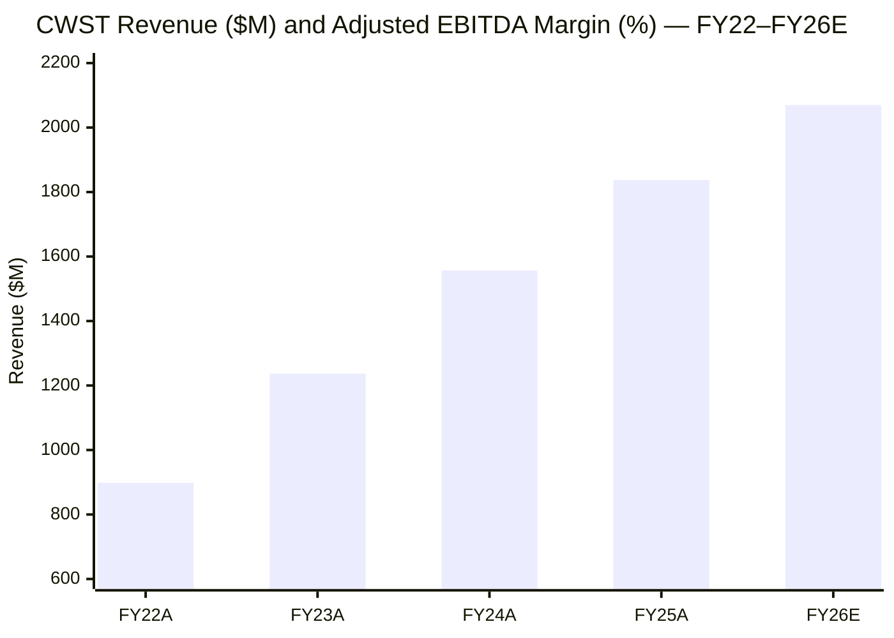
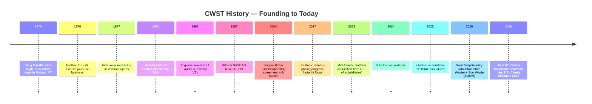
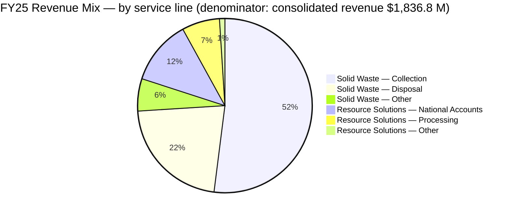
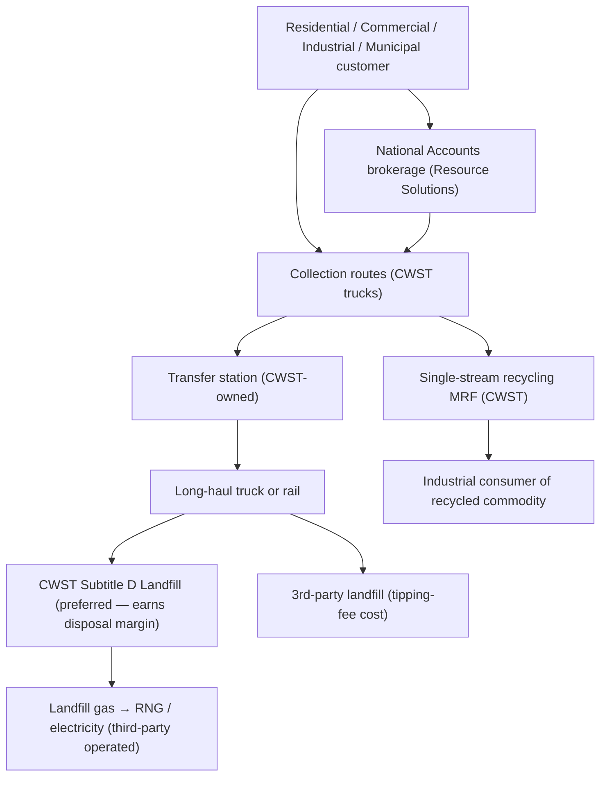
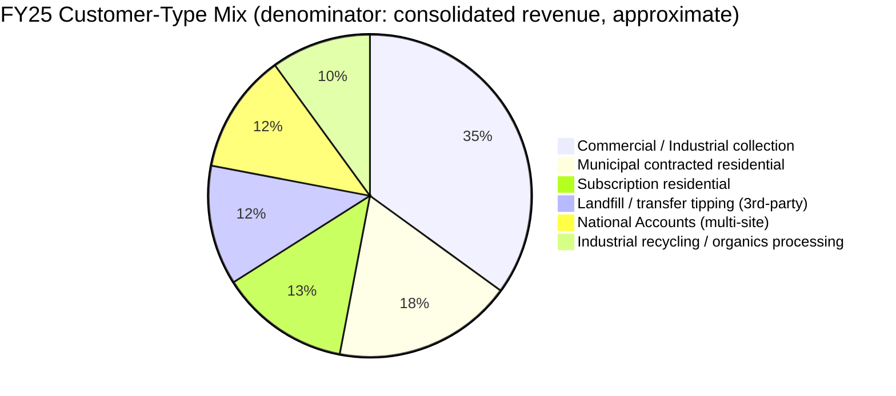
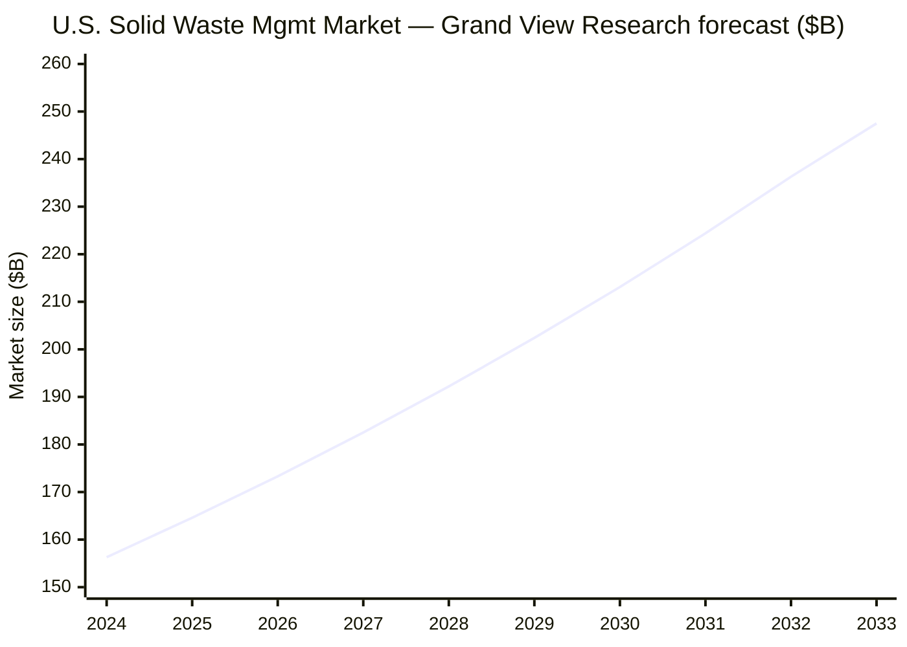
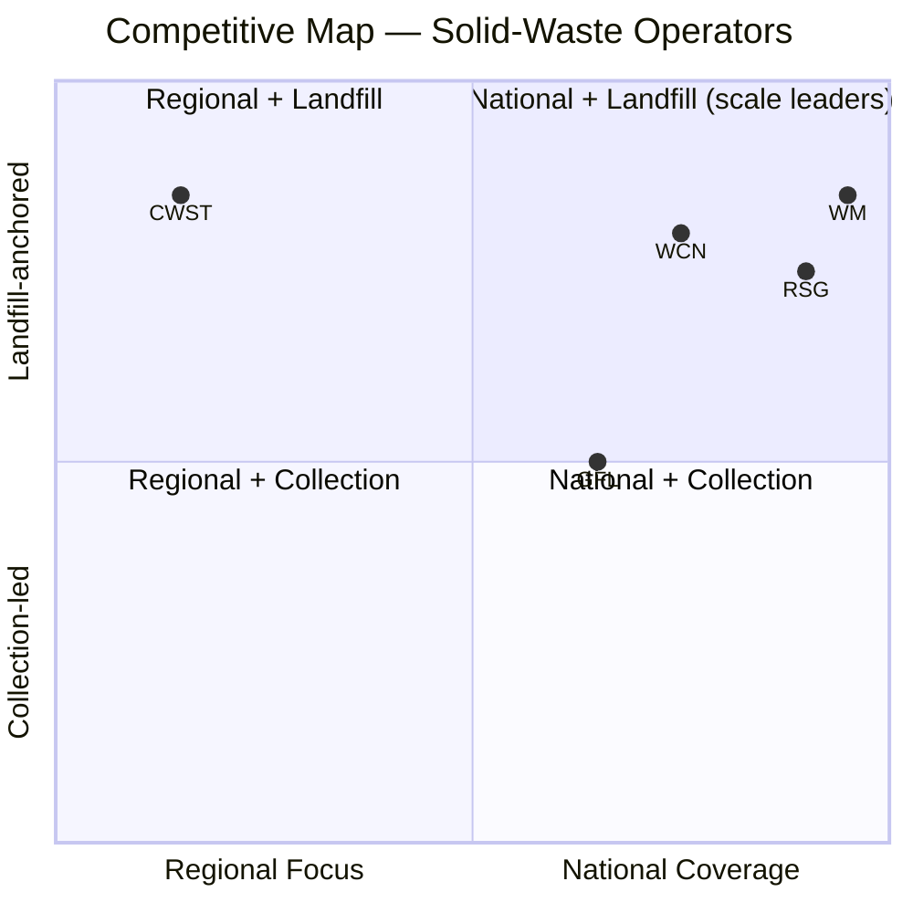
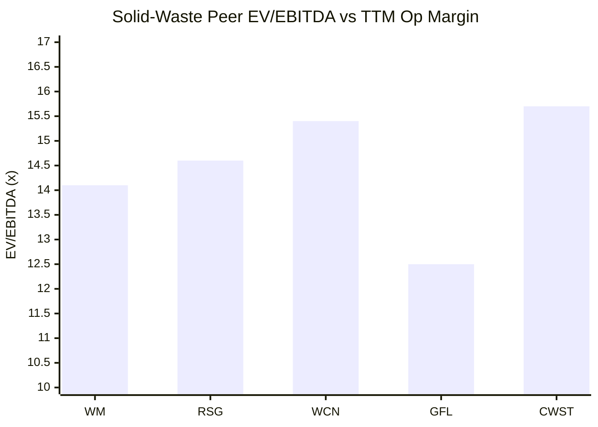
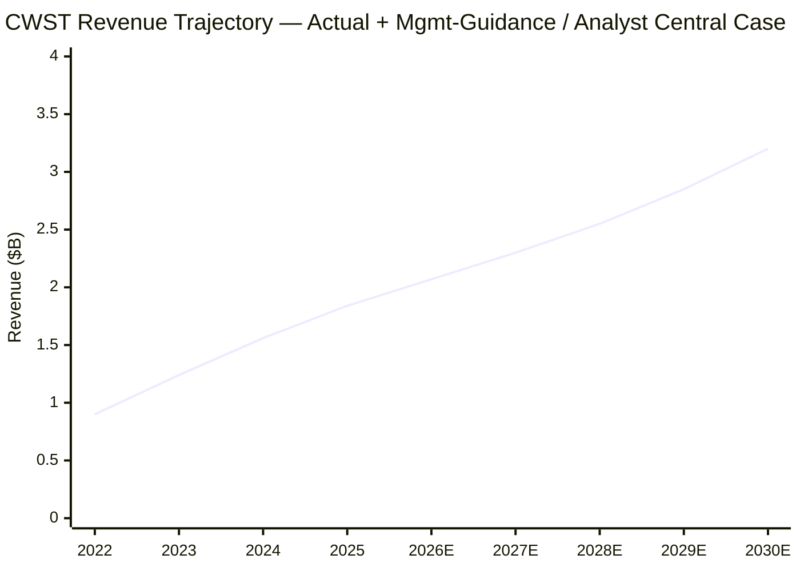
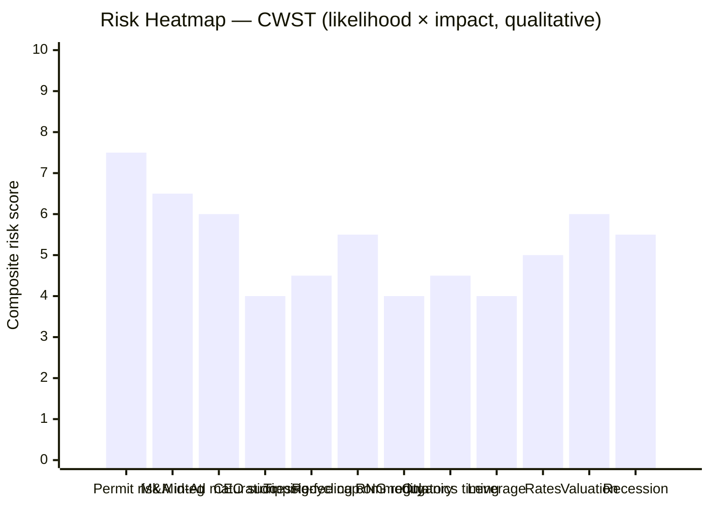

# Casella Waste Systems, Inc. (NASDAQ: CWST) — Company Research

*As-of date: 2026-06-03 · Author: financial-agent / company-research skill*

> **Guidance banner.** On 2026-04-30, alongside Q1 2026 results, management raised full-year 2026 revenue guidance to **$2.060–$2.080 B** (prior $1.970–$1.990 B), raised Adjusted EBITDA to **$473–$483 M** (prior $455–$465 M), and raised Adjusted Free Cash Flow to **$200–$210 M** (prior $195–$205 M). GAAP net-income guidance was **lowered** to $4–$10 M (prior $16–$22 M), reflecting higher D&A and acquisition-amortisation absorption rather than operational softness ([Casella Q1 2026 release — stocktitan summary](https://www.stocktitan.net/news/CWST/casella-waste-systems-inc-announces-first-quarter-2026-results-u3ogktnh26e1.html)).

## Table of Contents

1. Company Overview
2. Company History
3. Management Team (founder + current CEO)
4. Products & Services
5. Customers & Go-to-Market
6. Industry Overview
7. Competitive Landscape
8. Market Opportunity (TAM/SAM/SOM)
9. Risk Assessment
10. Investor-Lens Scorecards
11. References & Verification Log

---

## 1. Company Overview

Casella Waste Systems, Inc. is a **regional, vertically integrated solid-waste services company** operating across eleven northeastern and mid-Atlantic U.S. states, headquartered in Rutland, Vermont. The company describes itself verbatim as providing "resource management expertise and services to residential, commercial, municipal, institutional and industrial customers, primarily in the areas of solid waste collection and disposal, transfer, recycling and organics services" ([CWST 2025 10-K, Item 1 Business — Overview](https://www.sec.gov/Archives/edgar/data/911177/000091117726000008/cwst-20251231.htm)). The footprint covers Vermont, New Hampshire, New York, Massachusetts, Connecticut, Maine, Pennsylvania, Delaware, New Jersey, Maryland and — newly as of 1 January 2026 — West Virginia, the latter added via the **Mountain State Waste acquisition** that closed concurrently with FY26 start ([CWST 2025 10-K, Growth Strategy](https://www.sec.gov/Archives/edgar/data/911177/000091117726000008/cwst-20251231.htm)).

For fiscal year 2025 (calendar 2025) the company reported **total revenues of $1,836.8 million**, up $279.5 million or **+17.9% YoY** from $1,557.3 million in FY2024, with growth split roughly between acquisition contribution (~16% of solid-waste revenue), 5.0% collection price, 4.9% disposal price, and small adverse volume of -0.9% in collection and -1.5% in disposal ([CWST 2025 10-K, MD&A — Revenues](https://www.sec.gov/Archives/edgar/data/911177/000091117726000008/cwst-20251231.htm)). Reported **GAAP net income was $7.9 million** (versus $13.5 M in FY2024), the compression driven by ~$72 M in higher depreciation-and-amortisation expense ($306.8 M vs $234.9 M) absorbing acquired intangibles from nine FY25 deals plus the FY23 Mid-Atlantic platform. **Adjusted EBITDA continued to expand** — Q1 2026's $97.1 M (+12.3% YoY) and the raised $473–483 M full-year midpoint imply ~22.9% Adjusted EBITDA margin, up roughly 60 bp vs. FY25 ([Casella Q1 2026 release — stocktitan](https://www.stocktitan.net/news/CWST/casella-waste-systems-inc-announces-first-quarter-2026-results-u3ogktnh26e1.html)).

Operations are organised into **three solid-waste regional segments — Eastern, Western, Mid-Atlantic — plus a Resource Solutions segment** spanning recycling, organics, biosolids and large-account brokerage. FY25 revenue by segment: **Eastern $472.6 M, Western $663.2 M, Mid-Atlantic $341.1 M, Resource Solutions $360.0 M** ([CWST 2025 10-K, Item 1 Business — Operational Overview table](https://www.sec.gov/Archives/edgar/data/911177/000091117726000008/cwst-20251231.htm)). The Western region — anchored on Vermont's only Subtitle D landfill (Waste USA Coventry) plus the upstate-NY landfill chain — is the legacy core and the highest-margin pool; the Mid-Atlantic was built de novo from a 2023 acquisition of four GFL subsidiaries and has been growing >50% YoY as the company densifies the Pennsylvania / Delaware / New Jersey corridor ([CWST 2025 10-K, Mid-Atlantic Region](https://www.sec.gov/Archives/edgar/data/911177/000091117726000008/cwst-20251231.htm)).

The asset base is heavily **landfill-anchored**: nine Subtitle D landfills (one C&D-permitted) covering ~48.5 M tons of estimated remaining permitted airspace plus an additional ~49.7 M tons of permittable capacity, for a total of ~98.2 M tons at year-end 2025 — versus 102.5 M tons at year-end 2024 (the YoY decline reflects 3.7 M tons consumed in the year, partly offset by engineering re-estimates) ([CWST 2025 10-K, Item 1 — Landfills table](https://www.sec.gov/Archives/edgar/data/911177/000091117726000008/cwst-20251231.htm)). Two of those landfills — NCES in Bethlehem, NH, and the McKean rail-served landfill in Mount Jewett, PA — are particularly load-bearing for the thesis: NCES is the only Subtitle D landfill in northern New Hampshire and is expected to stop accepting waste **by end of 2027** at its current permit, creating an internalisation-or-divert decision point; McKean is the Mid-Atlantic flywheel asset for capturing rail-haul disposal volumes leaving the Northeast.

**Valuation snapshot (close 2026-06-03).** Stock at $83.00 (market cap $5.28 B), trading at **trailing P/E ~754×** (essentially meaningless given the $0.11 TTM EPS distorted by D&A), **TTM P/S 2.81×**, **EV/EBITDA 15.7×** on $6.39 B enterprise value, **forward P/E ~55×** ([Yahoo Finance CWST key statistics](https://finance.yahoo.com/quote/CWST/key-statistics/)). The 52-week range is $74.05–$118.91; the stock is currently near the bottom of the range after a ~30% drawdown from the 2025 high. Versus the four-name North American solid-waste peer group, CWST trades **at a P/S discount to WM (3.35×), RSG (3.72×) and WCN (3.94×)** but at a clear premium to GFL Environmental (1.82×); EV/EBITDA at 15.7× is at the high end of the cohort (WM 14.1×, RSG 14.6×, WCN 15.4×, GFL 12.5×) ([Yahoo Finance peer key-statistics page](https://finance.yahoo.com/quote/CWST/key-statistics/)). The stretched P/E is a **D&A artefact**, not a fundamentals signal: acquisition-heavy growth front-loads amortisation of customer-relationship intangibles, which depress GAAP EPS while EBITDA-to-FCF conversion holds. *Analyst view:* the right anchor here is EV/EBITDA and Adjusted FCF yield (FCF $205 M midpoint / EV $6.39 B = 3.2%), not trailing GAAP P/E. We tag the elevated EV/EBITDA as a **valuation-risk flag** in Section 9 but not as a red light — the multiple reflects the scarcity premium on permitted Northeast landfill capacity rather than narrative-driven multiple expansion.

Source: FY22 / FY23 / FY24 / FY25 totals reconstructed from [CWST 2025 10-K MD&A](https://www.sec.gov/Archives/edgar/data/911177/000091117726000008/cwst-20251231.htm); FY26E midpoint $2.07 B revenue and $478 M Adjusted EBITDA (22.9% margin) per [raised guidance, Q1 2026 release](https://www.stocktitan.net/news/CWST/casella-waste-systems-inc-announces-first-quarter-2026-results-u3ogktnh26e1.html). *Margin line should be read against a secondary axis 0–25%.*

---

## 2. Company History

Casella was founded in **April 1975 as Casella's Refuse Removal**, a single-truck route in Rutland and Killington, Vermont, started by **Doug Casella** with money saved from high-school jobs. The company's website narrates: "On a chilly day in early April, Doug Casella began picking up garbage from a few customers in the Rutland and Killington region with a pickup truck he had bought with money saved from jobs he'd had as a kid in high school. Because the service was good, the small enterprise grew, and John Casella joined his younger brother a year later to help run the business" ([Casella.com — About Us](https://www.casella.com/about-us)). The pivotal early move was the **1977 opening of the first recycling facility in Vermont**, two years after the route's founding — well ahead of state mandates and the foundation for what is today the Resource Solutions segment. The website continues: "in 1977 [they] built the company's first, and the state's first, recycling facility in Vermont. It was an inspired vision, one that anticipated the opportunities around resource renewal as well as viewing waste management as an integrated set of services – collection, recycling, transfer, and disposal" ([Casella.com — About Us](https://www.casella.com/about-us)).

Through the 1980s and 1990s Casella built the vertically integrated Northeast platform: acquisition of the **Waste USA landfill in Coventry, Vermont in 1995** — to this day Vermont's only operating Subtitle D landfill ([CWST 2025 10-K, Western Region landfill descriptions](https://www.sec.gov/Archives/edgar/data/911177/000091117726000008/cwst-20251231.htm)); acquisition of **NCES landfill in Bethlehem, NH in 1994**; and entry into upstate New York wastesheds beginning 1997. **Initial public offering came in October 1997 on NASDAQ as CWST.** The company narrates the IPO with characteristic understatement: "Trading of Casella stock began the day after one of the largest collapses in U.S. stock market history, and, despite general investor jitters about the market as a whole, the company's IPO became one of the most successful in industry history" ([Casella.com — About Us](https://www.casella.com/about-us)) — a reference to the 27 October 1997 "mini-crash" linked to the Asian financial crisis.

The 2000s and early 2010s were a chastening period: aggressive expansion into KTI (recycling), out-of-region disposal markets and an organics venture left the company highly levered and underperforming, and the share price spent much of the decade below $10. The strategic reset came in stages — divesting non-core western operations (sale of the Hyland and Worcester operations in 2010s), rationalising the customer book and refocusing on the Northeast. The transformation under the **2017 onward strategic plan** is the financial story that matters today: revenue went from roughly $560 M in 2016 to $1,837 M in 2025 — a ~3.3× expansion in nine years driven equally by price discipline, internalisation of landfill volumes, and disciplined tuck-in M&A.

The **2023 Mid-Atlantic platform acquisition** is the most consequential capital-allocation decision of the past five years. Casella acquired four wholly-owned subsidiaries of **GFL Environmental Inc.** that gave it a Pennsylvania / New Jersey / Delaware / Maryland collection-and-transfer footprint anchored on landfills, instantly opening a third operating region ([CWST 2025 10-K, Mid-Atlantic Region overview](https://www.sec.gov/Archives/edgar/data/911177/000091117726000008/cwst-20251231.htm)). The 2024–2025 vintage of tuck-in deals — including the McKean Landfill rail-served expansion in Mount Jewett, PA — has densified the Mid-Atlantic footprint; nine acquisitions closed in FY25 alone added >$110 M of annualised revenue. Since the beginning of 2018 through FY25 the company has **acquired 76 collection / transfer / recycling businesses with over $925 M of total annualised revenues** ([CWST 2025 10-K, Allocating Capital to Return-Driven Growth](https://www.sec.gov/Archives/edgar/data/911177/000091117726000008/cwst-20251231.htm)).

The **2026 acquisition cadence has continued and accelerated**. The 1 January 2026 close of **Mountain State Waste (RGL, Inc.)** added a West Virginia foothold — the first state-level footprint expansion in over a decade ([CWST 2025 10-K, Growth Strategy](https://www.sec.gov/Archives/edgar/data/911177/000091117726000008/cwst-20251231.htm)). On 1 April 2026 the company closed the **Star Waste Systems acquisition (~$100 M annualised revenue)**, bringing 2026 deal-tally to four transactions and ~$150 M of aggregate annualised revenues ([Casella Q1 2026 release — stocktitan](https://www.stocktitan.net/news/CWST/casella-waste-systems-inc-announces-first-quarter-2026-results-u3ogktnh26e1.html)). Net leverage stood at **2.34× consolidated** as of 31 December 2025 ([CWST 2025 10-K, Capital Allocation](https://www.sec.gov/Archives/edgar/data/911177/000091117726000008/cwst-20251231.htm)) — solidly below the 3.0× soft cap the company has historically committed to and well below the 3.5–4.0× zone where solid-waste lenders typically push back on covenants.

Source: [CWST 2025 10-K Item 1 + Growth Strategy](https://www.sec.gov/Archives/edgar/data/911177/000091117726000008/cwst-20251231.htm); [Casella.com About Us](https://www.casella.com/about-us); [CWST 2026 Proxy / DEF 14A — leadership transition](https://www.sec.gov/Archives/edgar/data/911177/000119312526161565/d33908ddef14a.htm).

---

## 3. Management Team

### Founder & Executive Chairman — John W. Casella

**John W. Casella, age 75**, joined the company in 1976 — a year after his younger brother Doug founded the route — and has been the public face of the business for essentially its entire existence as a public company. He served as **Chief Executive Officer for over 30 years and as Chairman of the Board for over 20 years** ([CWST 2026 Proxy / DEF 14A, Corporate Governance — Board Leadership Structure](https://www.sec.gov/Archives/edgar/data/911177/000119312526161565/d33908ddef14a.htm)). Effective **1 January 2026**, the Board separated the Chairman and CEO roles: Mr. Casella transitioned to the new position of **Executive Chairman of the Board and Secretary**, and stepped down from the CEO chair he had held since the late 1970s ([CWST 2026 Proxy / DEF 14A — Board Leadership Structure section](https://www.sec.gov/Archives/edgar/data/911177/000119312526161565/d33908ddef14a.htm)). The Board's own framing — "our Executive Chairman of the Board, with his more than 30 years of experience as our Chief Executive Officer and more than 20 years as our Chairman of the Board, [will] lead our Board in its fundamental role of providing advice to, and independent oversight of, management" — signals that the role is **active not ceremonial**: Mr. Casella will continue to set strategic direction and act as the senior counsel on capital allocation, while Mr. Coletta runs day-to-day operations ([CWST 2026 Proxy / DEF 14A, Board Leadership](https://www.sec.gov/Archives/edgar/data/911177/000119312526161565/d33908ddef14a.htm)).

Mr. Casella's total compensation for fiscal 2025 — his final year as CEO — was **$4,405,946**, comprising $790,463 salary, $2,740,659 stock awards, $853,697 non-equity incentive (cash bonus) and $21,127 in other compensation; the median employee comparison was **55.74×**, calculated against a median total compensation of $79,050 across 4,653 full- and part-time employees ([CWST 2026 Proxy / DEF 14A, CEO Pay Ratio](https://www.sec.gov/Archives/edgar/data/911177/000119312526161565/d33908ddef14a.htm)). His insider equity stake, captured most recently in the proxy ownership table, makes him among the largest individual shareholders — meaningful alignment continues even after the role change. His public framing of the business has long been the "Northeast as a permanent capacity-constrained market" thesis, with disposal pricing power as the core long-term value driver — a thesis the company's pricing actions (collection +5.0%, disposal +5.9% in FY25) continue to validate ([CWST 2025 10-K MD&A — Revenues](https://www.sec.gov/Archives/edgar/data/911177/000091117726000008/cwst-20251231.htm)).

The succession process — externally signalled, internally promoted, with a multi-year apprenticeship via Mr. Coletta's rise through CFO → President → CEO — is textbook governance: continuity of strategy, deep institutional knowledge transfer, and a Chairman who can continue to be active on capital-allocation decisions without crowding the new CEO operationally. *Analyst view:* the structure mitigates founder-departure risk that has hurt comparable family-led mid-cap industrial roll-ups; the operating playbook remains intact.

### Current CEO — Edmond "Ned" R. Coletta

**Edmond "Ned" R. Coletta, age 50**, assumed the **President & Chief Executive Officer** role on **1 January 2026** and joined the Board the same day. He is a 20+-year Casella insider, having joined the company in **December 2004**. His prior progression at CWST is essentially the textbook CFO-to-CEO path: Director of Finance and IR (Aug 2005 – Jan 2011), VP of Finance and IR (Jan 2011 – Dec 2012), SVP / CFO / Treasurer (Dec 2012 – Jul 2022), President & CFO (Jul 2022 – Nov 2023), and President (Nov 2023 – Dec 2025) before the CEO promotion ([CWST 2025 10-K, Information about our Executive Officers](https://www.sec.gov/Archives/edgar/data/911177/000091117726000008/cwst-20251231.htm)).

Before Casella, Mr. Coletta was **CFO and a Board member at Avedro, Inc. (FKA ThermalVision, Inc.), an early-stage medical-device company he co-founded** (2002 – Dec 2004), and earlier a research-and-development engineer at **Lockheed Martin Michoud Space Systems** (1997 – 2001), where he worked on the Space Shuttle external tank program. Education: **MBA from Tuck School of Business at Dartmouth College**, and a **B.S. in Materials Science Engineering from Brown University** ([CWST 2025 10-K, Information about our Executive Officers](https://www.sec.gov/Archives/edgar/data/911177/000091117726000008/cwst-20251231.htm)). He also sits on the Board of Trustees of Killington Mountain School (since May 2020) — a Vermont community tie that aligns him with the legacy footprint.

His fiscal-2025 total compensation as President was **$2,830,523** — base $615,134, stock awards $1,644,377, non-equity incentive $553,619, other $17,393 — already meaningful by absolute dollars but the **substantial step-up to the CEO comp structure occurs only with the FY26 plan**, which the 2026 proxy describes as the standard three-times-base equity vehicle plus annual STI ([CWST 2026 Proxy / DEF 14A, Summary Compensation Table](https://www.sec.gov/Archives/edgar/data/911177/000119312526161565/d33908ddef14a.htm)). Stock-ownership guidelines require CEO holdings of **3× base salary**, President 2× base, CFO 2×, other executives 1× — a non-trivial alignment lever now that Mr. Coletta is in the CEO seat.

The strategic continuity argument is strong: Mr. Coletta has been the architect of the integrated finance / IR / capital-allocation function during the company's 2017–2025 transformation, owns the relationships with the lending banks and bond investors, and has been the public-facing voice on quarterly earnings calls for over a decade. *Analyst view:* the CEO change reads as evolution rather than discontinuity — the same playbook (price discipline + disciplined tuck-in M&A + internalisation of landfill volumes) executed by the same person who built the financial framework underneath it.

---

## 4. Products & Services

CWST's revenue is generated through four operating segments — three geographic solid-waste regions (Eastern, Western, Mid-Atlantic) plus the cross-cutting **Resource Solutions** segment. Within each geographic region the company organises around what it calls **"wastesheds"** — vertically integrated mini-platforms covering collection → transfer → recycling → disposal — and explicitly notes that "each wasteshed generally operates autonomously from adjoining wastesheds" ([CWST 2025 10-K, Operational Overview](https://www.sec.gov/Archives/edgar/data/911177/000091117726000008/cwst-20251231.htm)). The wasteshed framework is more than nomenclature; it drives capital-allocation decisions (where to densify routes, whether to build transfer stations, whether to internalise landfill volumes) and is the architectural reason the model resists national-scale disruption.

### 4.1 Solid-Waste Service Lines (Collection, Transfer, Disposal, Landfill Gas)

The 10-K describes the four solid-waste service lines verbatim:

> "Collection. A majority of our commercial and industrial collection services are performed under one-to-five year service agreements, with prices and fees determined by such factors as: collection frequency; type of equipment and containers furnished; type, volume and weight of solid waste collected; distance to the disposal or processing facility; and cost of disposal or processing. Our residential collection services are performed either on a subscription basis (with no underlying contract) with individuals, or through contracts with municipalities, property owners or other third parties." ([CWST 2025 10-K, Solid Waste Operations — Collection](https://www.sec.gov/Archives/edgar/data/911177/000091117726000008/cwst-20251231.htm))

> "Transfer Stations. Our transfer stations receive, process and transfer solid waste, collected by our various residential and commercial collection operations along with volumes from various third-party service providers, for transport to disposal facilities by larger vehicles. We believe that transfer stations benefit us by: (1) increasing the size of the wastesheds which have access to our landfills or third-party disposal facilities; (2) reducing costs by improving utilization of collection personnel and equipment; and (3) helping us build relationships with municipalities and other customers by providing a local physical presence and enhanced local service capabilities." ([CWST 2025 10-K, Transfer Stations](https://www.sec.gov/Archives/edgar/data/911177/000091117726000008/cwst-20251231.htm))

> "Landfills. We operate eight solid waste Subtitle D landfills and one landfill permitted to accept C&D materials. Revenues are received from municipalities and other customers in the form of tipping fees." ([CWST 2025 10-K, Landfills](https://www.sec.gov/Archives/edgar/data/911177/000091117726000008/cwst-20251231.htm))

**What each service line physically does in the customer's workflow.** Collection trucks pick up waste at the source — single-family residential subscription, commercial roll-off / front-load containers, municipal contracted routes. Volumes are aggregated at transfer stations where they are dumped from the small collection trucks into larger long-haul trailers or rail cars; the transfer step is what makes regional landfill economics work because it cuts the trips-per-day cost of putting waste in the ground. Subtitle D landfills are the disposal endpoint — engineered with double composite liners, leachate collection, gas-capture infrastructure, daily-cover-and-compaction equipment, and 30-year post-closure monitoring obligations. Landfill-gas-to-energy plants (two in the network, both third-party-owned at NCES and Juniper Ridge) capture methane from decomposing waste and convert it into either electricity for the grid or, increasingly, **renewable natural gas (RNG)** sold into transportation-fuel markets that qualify for federal Renewable Identification Number (RIN) credits and California Low-Carbon Fuel Standard (LCFS) credits ([CWST 2025 10-K, Solid Waste Operations](https://www.sec.gov/Archives/edgar/data/911177/000091117726000008/cwst-20251231.htm)).

**How the four service lines reinforce each other — the vertical-integration economics.** Without collection, the landfill has no volumes. Without the landfill, collection routes have to pay third-party tipping fees that destroy margin. Without transfer stations the geographic reach of any landfill is capped at maybe 60 miles. The integrated chain — collection truck → transfer station → long-haul → landfill — is what allows CWST to take a price increase at each step (collection pricing +5.0% in FY25, disposal pricing +5.9%) and capture the spread, rather than just pass the price through. The Q1 2026 print continued the pattern: collection pricing +5.3%, disposal pricing +4.7%, and **internalised disposal volumes** — i.e. the percent of collected waste that ends up in a CWST-owned landfill — was a key driver of the segment EBITDA margin expansion ([Casella Q1 2026 results — stocktitan](https://www.stocktitan.net/news/CWST/casella-waste-systems-inc-announces-first-quarter-2026-results-u3ogktnh26e1.html)).

**Strategic significance.** The Northeast has lost meaningful landfill capacity over the past decade: permanent site closures plus regulatory pressure on permitting new sites have tightened supply, while rail-out of waste to landfills in the Carolinas / Ohio adds transport cost. The 10-K describes this verbatim: "Over the last 10 years, disposal capacity has tightened in the Northeast market as permanent site closures have reduced capacity and greater volumes are leaving the market via rail to out-of-state disposal sites. Given this backdrop and the positioning of our assets, and in response to persistent cost inflation, we advanced positive landfill pricing and increased internalized volumes for fiscal year 2025" ([CWST 2025 10-K, Optimizing Long-term Disposal Capacity](https://www.sec.gov/Archives/edgar/data/911177/000091117726000008/cwst-20251231.htm)). The McKean rail-served landfill in Mount Jewett, PA — a 2023-vintage asset whose throughput has continued to expand through FY25 — is the company's strategic answer: rather than be displaced by rail-out, it offers the rail-out customers a Casella-owned destination.

### 4.2 Resource Solutions — Recycling, Organics, National Accounts

The Resource Solutions segment is structurally different from the three geographic solid-waste regions: it is **cross-footprint, customer-led** (not territory-led), and its KPIs are dominated by professional-services growth and recycling-commodity hedging rather than landfill tonnage. The segment generated **$360.0 M of revenue in FY25** (19.6% of total) and continued to grow >10% in Q1 2026 ([CWST 2025 10-K, Operational Overview table](https://www.sec.gov/Archives/edgar/data/911177/000091117726000008/cwst-20251231.htm); [Casella Q1 2026 release](https://www.stocktitan.net/news/CWST/casella-waste-systems-inc-announces-first-quarter-2026-results-u3ogktnh26e1.html)).

Three sub-lines sit within Resource Solutions:

**National Accounts (brokerage / resource management).** Quoting verbatim: "Our National Accounts business consists of brokerage and resource management services provided to large customers with broad sustainability needs. This professional services business drove positive sales growth in fiscal year 2025 as National Accounts volumes increased 6.6% as compared to fiscal year 2024" ([CWST 2025 10-K, Creating Incremental Value Through Resource Solutions](https://www.sec.gov/Archives/edgar/data/911177/000091117726000008/cwst-20251231.htm)). In Q1 2026 the growth rate accelerated to **+11.2%** ([Casella Q1 2026 release](https://www.stocktitan.net/news/CWST/casella-waste-systems-inc-announces-first-quarter-2026-results-u3ogktnh26e1.html)). National Accounts revenue was **$226.3 M** in FY25 (12.3% of consolidated). The customer here is the multi-site retail / industrial / institutional buyer — a national chain that wants one PO for waste-and-recycling across thousands of locations and is willing to pay a coordination fee for the simplification. The business is capital-light: CWST aggregates the demand, sells it to a network of regional haulers (some owned, some third-party), and earns a spread plus performance management fees.

**Recycling (MRFs).** The company operates **21 recycling and processing facilities** (broken out in the segment table as 4 in Eastern, 7 in Western, and 21 in Resource Solutions — the recycling and processing line counts are in fact aggregated within Resource Solutions per the disclosure) ([CWST 2025 10-K, segment property table](https://www.sec.gov/Archives/edgar/data/911177/000091117726000008/cwst-20251231.htm)). The recycling business is structurally hedged against commodity-price collapse via four mechanisms quoted verbatim: "(1) restructuring most third-party processing contracts to limit downside risk through processing fees; (2) implementing our sustainability recycling adjustment fee ("SRA Fee(s)") that floats inversely to changes in recycling commodity prices; (3) investing in processing infrastructure to reduce operating costs and improve the quality of post-sorted commodities, such as the replacement and upgrade of the processing equipment at select materials recovery facilities ("MRF"); and (4) developing strong partnerships with industrial consumers of recycled materials to ensure circularity" ([CWST 2025 10-K, Resource Solutions hedging](https://www.sec.gov/Archives/edgar/data/911177/000091117726000008/cwst-20251231.htm)). The SRA Fee is the lever that converts a structurally volatile commodity exposure (OCC fibre, mixed paper, PET, HDPE, aluminum prices) into a pricing-pass-through with a lag — when commodity prices fall, the SRA Fee floats up; when they rise, the fee floats down and CWST returns value to the customer through lower tipping fees.

**Organics and biosolids.** Organics processing — composting, anaerobic digestion, biosolids handling — is the segment line that connects most directly to municipal sustainability mandates (Vermont's mandatory organics-diversion law, Massachusetts' commercial food-waste ban). The 10-K describes it as "our organics business, which provides organics processing and disposal" ([CWST 2025 10-K, Resource Solutions](https://www.sec.gov/Archives/edgar/data/911177/000091117726000008/cwst-20251231.htm)). The Q1 2026 disclosure flagged an **"organics facility closure charge"** of $0.9 M, suggesting that the segment is rationalising under-utilised assets — a normal mid-cycle move in a sub-business where investment ran ahead of municipal-program timing ([CWST Q1 2026 10-Q, Income Statement](https://www.sec.gov/Archives/edgar/data/911177/000091117726000021/cwst-20260331.htm)).

### 4.3 Service-Type Revenue Composition (FY25)

The 10-K MD&A breaks out revenue by service type as follows (FY25 totals, % of total revenue in parentheses):

| Service line | FY25 ($M) | % of total | FY24 ($M) | $ change |
|---|---|---|---|---|
| Collection (solid waste) | ~960 | ~52% | ~825 | ~+135 |
| Disposal (landfill + transfer) | ~410 | ~22% | ~340 | ~+70 |
| Power & RNG | 7.6 | 0.4% | 8.0 | (0.4) |
| Processing (within SW) | 10.2 | 0.6% | 10.9 | (0.7) |
| **Solid-waste operations subtotal** | **1,476.9** | **80.4%** | **1,227.4** | **+249.5** |
| Processing (Resource Solutions MRFs) | 133.6 | 7.3% | 130.5 | +3.1 |
| National Accounts | 226.3 | 12.3% | 199.4 | +26.9 |
| **Resource Solutions subtotal** | **359.9** | **19.6%** | **329.9** | **+30.0** |
| **Total revenues** | **1,836.8** | **100%** | **1,557.3** | **+279.5** |

Source: [CWST 2025 10-K, MD&A revenue table](https://www.sec.gov/Archives/edgar/data/911177/000091117726000008/cwst-20251231.htm). *Collection and Disposal subtotals are reconstructed from the price-and-volume bridge disclosure (collection price +$47.9 M on a 5.0% base; disposal price +$12.2 M on a 4.9% base) and may differ slightly from the audited line items.*

Source: [CWST 2025 10-K MD&A revenue table](https://www.sec.gov/Archives/edgar/data/911177/000091117726000008/cwst-20251231.htm).

### 4.4 The Vertical-Integration Synthesis

The four service lines aren't sold separately — they are sold as a **single integrated value chain to each wasteshed**, with the architectural intent that volume captured at any point in the chain (collection contract, transfer-station inbound, recycling brokerage relationship) ultimately routes to a CWST-owned landfill. The economic significance: every ton of waste that "internalises" — i.e. lands in a Casella landfill rather than a third-party site — earns the disposal margin instead of being a cost item. This is why the FY25 narrative emphasises pricing **and** "increased internalized volumes" as twin drivers, and why the McKean Landfill expansion is described in capital-allocation terms not market-share terms ([CWST 2025 10-K, Optimizing Long-term Disposal Capacity](https://www.sec.gov/Archives/edgar/data/911177/000091117726000008/cwst-20251231.htm)). For the Mid-Atlantic segment in particular — where the company is still 3 years into a build-out and internalisation is below the 60–70% Western-region benchmark — every tuck-in collection deal that adds volume routable to McKean compounds the disposal margin asymmetrically.

Source: synthesis of [CWST 2025 10-K, Operational Overview](https://www.sec.gov/Archives/edgar/data/911177/000091117726000008/cwst-20251231.htm).

---

## 5. Customers & Go-to-Market

### 5.1 Customer Mix

Casella's customer base is **highly fragmented across residential, commercial, industrial, municipal and institutional buyers**, with no single customer concentration risk at the consolidated level. The 10-K's relevant disclosure is on credit risk rather than revenue concentration but is directly probative: "no single customer or customer group represented greater than 5% of total accounts receivable" ([CWST 2025 10-K, Note on Credit Risk / Accounts Receivable](https://www.sec.gov/Archives/edgar/data/911177/000091117726000008/cwst-20251231.htm)) — well below the **ASC 280-10-50-42 disclosure threshold of 10%** that would trigger named-customer disclosure. The 10-K does not break out top-5-customer concentration as a percentage of revenue (no segment customer is at 10%); we infer from the disclosure that the top-5 customer concentration at the **consolidated** level is materially below 10%.

Customer segments by buyer type and a working approximation of their share of FY25 revenue:

- **Commercial and industrial collection** — large-container service, roll-off, compactors, recycling pickup — performed under one-to-five-year service agreements. The 10-K explicitly notes: "A majority of our commercial and industrial collection services are performed under one-to-five year service agreements" ([CWST 2025 10-K, Collection](https://www.sec.gov/Archives/edgar/data/911177/000091117726000008/cwst-20251231.htm)). The contract structure provides multi-year revenue visibility and is the basis for the 5%+ annual price-escalation programs.
- **Municipal contracted residential** — town- or city-level multi-year contracts, typically awarded via competitive RFP. The 10-K flags that "municipal contracts are typically subject to periodic competitive bidding. We may not be the successful bidder to obtain or retain these contracts" ([CWST 2025 10-K, Risk Factors — Competition](https://www.sec.gov/Archives/edgar/data/911177/000091117726000008/cwst-20251231.htm)).
- **Subscription residential** — direct relationships with individual property owners or occupants on a no-contract basis. This is the lowest-friction-to-price customer segment and the largest absolute headcount but a smaller revenue share than commercial.
- **Landfill / transfer tipping-fee customers** — municipalities, other haulers, public-sector customers tipping volumes at CWST landfills and transfer stations on a per-ton fee structure. These are the highest-margin per-revenue-dollar customers.
- **National Accounts** — multi-site retail / industrial / institutional buyers under master service agreements; ~12% of FY25 consolidated revenue ([CWST 2025 10-K, MD&A revenue table](https://www.sec.gov/Archives/edgar/data/911177/000091117726000008/cwst-20251231.htm)).

Source: analyst breakdown reconstructed from [CWST 2025 10-K, MD&A revenue table + Operational Overview](https://www.sec.gov/Archives/edgar/data/911177/000091117726000008/cwst-20251231.htm). *Analyst view: customer-type splits are NOT disclosed by the company; figures above are approximations from revenue-line and service-type ratios in MD&A.*

### 5.2 Go-to-Market and Contract Structure

The go-to-market is **deeply territory-based**. Each wasteshed has its own sales force, customer-care function, and operations team; the 10-K describes "a broad network of sales professionals located throughout our footprint. They are part of their communities, build relationships with our customers and execute against strategic initiatives" ([CWST 2025 10-K, Sales and Marketing](https://www.sec.gov/Archives/edgar/data/911177/000091117726000008/cwst-20251231.htm)). The structure trades national-account-team scale efficiency for local relationship density — appropriate for a customer base where the buying decision is made by a town manager, a local commercial property manager, or a regional plant procurement function.

**Contract length distribution:** commercial and industrial collection on 1–5-year agreements (median ~3 years); municipal contracts typically 3–5 years; residential subscription has no formal term. National Accounts master agreements typically 3–5 years with auto-renewal language.

**Pricing programs are the primary EBITDA-growth lever.** The annual collection-pricing program — captured in the +5.0% (FY25) and +5.3% (Q1 2026) collection pricing growth figures — is structured around: (a) a posted CPI / cost-index pass-through component, (b) a fuel-cost-recovery floating fee tied to a published diesel index, (c) a sustainability recycling adjustment fee, and (d) discretionary price catch-up where local competition allows ([CWST 2025 10-K, Sales and Marketing + Driving Additional Profitability](https://www.sec.gov/Archives/edgar/data/911177/000091117726000008/cwst-20251231.htm)). The price program is the explanation for why operating margins have held flat (16–22% Adjusted EBITDA range) despite a multi-year inflation pulse on diesel, labour and third-party tipping.

### 5.3 Geographic and Customer Concentration — Bottom Line

There is **no customer-concentration risk** at the consolidated level (top-5 customers < ~10% of revenue inferred from the <5% AR concentration). There is, however, **meaningful geographic concentration**: Vermont, New Hampshire and upstate New York together host the bulk of the landfill asset base, which means a state-level regulatory or permitting decision (e.g. Vermont's organics rule, a NH AdComm-type permit-extension question on NCES) materially affects the cash-flow profile of an entire segment. We tag geographic-regulatory concentration as a **Section 9 risk** rather than a customer-concentration risk.

---

## 6. Industry Overview

### 6.1 Industry Definition & TAM

The U.S. solid-waste services industry — NAICS 562111 (Solid Waste Collection), 562212 (Solid Waste Landfill), 562910 (Remediation Services) — is a **$150–250 B revenue pool** depending on which boundaries the analyst draws. The most-cited recent third-party number: **Grand View Research estimates the U.S. solid waste management market at $156.3 B in 2024, projected to reach $247.5 B by 2033 at a 5.3% CAGR** ([Grand View Research — U.S. Solid Waste Management Market Report 2033](https://www.grandviewresearch.com/industry-analysis/us-solid-waste-management-market-report)). The narrower MSW collection-and-disposal slice is meaningfully smaller; **Mordor Intelligence's North American MSW market** size is **$118.8 B in 2026 growing to $147.9 B by 2031 at a 4.48% CAGR**, of which the U.S. accounts for ~79.6% — implying a **2026 U.S. MSW market of ~$94 B** ([Mordor Intelligence — North America MSW Management Market 2025–2031](https://www.mordorintelligence.com/industry-reports/north-america-municipal-solid-waste-management-market)).

CWST's $1.84 B FY25 revenue therefore represents **~1.0% of the U.S. solid waste management TAM** by the broad Grand View definition, or **~2% of MSW** by the Mordor definition. The relevant SAM is materially smaller — the **Northeast / Mid-Atlantic regional addressable market**, which we triangulate at roughly $15–20 B (states VT, NH, NY, MA, CT, ME, PA, NJ, DE, MD, WV combined). Against this SAM, CWST's revenue share is closer to **9–12%** — still leaving substantial run-room versus regional super-major Waste Management and the multi-region Republic / Waste Connections.

### 6.2 Industry Structure & Drivers

Solid waste is the textbook **"low-tech, high-barrier"** industrial — high capex per ton of permitted landfill capacity, multi-decade permit timelines, route-density-driven cost curves, and structurally local pricing dynamics. Quoting the CWST 10-K verbatim on the structural backdrop: "The solid waste services industry is highly competitive, has undergone a period of consolidation and requires substantial labor and capital resources" ([CWST 2025 10-K, Risk Factors — Competition](https://www.sec.gov/Archives/edgar/data/911177/000091117726000008/cwst-20251231.htm)). Industry consolidation has accelerated in the past decade — IBISWorld's **Waste Treatment & Disposal Services in the US** report notes WM as the largest single industry player ([IBISWorld — Waste Treatment & Disposal Services in the US 2025](https://www.ibisworld.com/united-states/industry/waste-treatment-disposal-services/1511/)) — with the top 4 publicly traded operators (Waste Management, Republic Services, Waste Connections, GFL Environmental) accounting for an estimated **45–55% of the U.S. revenue pool**.

Industry growth drivers, in order of significance:

1. **Pricing power tied to disposal capacity scarcity.** Landfill permits are difficult to obtain, multi-decade in timeline, and politically sensitive; closed landfills are not replaced. The Northeast has experienced a particularly acute version of this dynamic — quoting the 10-K: "Over the last 10 years, disposal capacity has tightened in the Northeast market as permanent site closures have reduced capacity and greater volumes are leaving the market via rail to out-of-state disposal sites" ([CWST 2025 10-K, Optimizing Long-term Disposal Capacity](https://www.sec.gov/Archives/edgar/data/911177/000091117726000008/cwst-20251231.htm)). The Mordor and IBISWorld reports both attribute industry-revenue growth ahead of MSW-tons growth to this pricing dynamic.
2. **Population + economic activity.** Waste generation correlates closely with GDP — historically waste tons grow at ~1.0–1.5× GDP. The U.S. EPA's National Overview reports U.S. MSW generation of ~292 M tons annually with per-capita generation flat-to-slightly-rising over the past decade.
3. **Regulatory drivers — organics diversion, recycling mandates.** State-level organics-diversion laws (Vermont's Universal Recycling Law; Massachusetts' commercial food-waste ban; California SB 1383) are forcing waste streams out of landfills and into composting / anaerobic digestion infrastructure — creating both a new revenue pool (organics processing) and a margin-mix question (organics is lower margin than landfill).
4. **RNG monetisation.** Landfill gas-to-RNG conversion — facilitated by federal Renewable Identification Numbers (RINs) and California LCFS credits — has converted a previously low-value landfill-gas-to-electricity revenue stream into a high-value transportation-fuel revenue stream. CWST currently has third-party-owned RNG plants at NCES and Juniper Ridge, capturing royalty / processing-fee revenue rather than the full RNG margin upside — *analyst view:* a potential lever for future internalisation.
5. **M&A consolidation.** The "small independent operators and municipalities lack the capital resources, management, operating skills and technical expertise necessary to operate effectively" thesis articulated in Waste Connections' filings ([WCN 2026 10-Q, Item 1](https://www.sec.gov/Archives/edgar/data/1318220/000110465926047074/wcn-20260331x10q.htm)) is the structural reason >100 tuck-in deals have happened across the major operators each year for the past decade. For CWST specifically — 76 deals in 8 years (2018–2025) representing >$925 M annualised revenue — M&A has been the second-largest growth driver after pricing.

Source: [Grand View Research — U.S. Solid Waste Management Market Report 2033](https://www.grandviewresearch.com/industry-analysis/us-solid-waste-management-market-report) (CAGR 5.3% applied to 2024 base of $156.3 B).

### 6.3 Northeast Specific Dynamics

The Northeast is the most-attractive operating geography for an integrated solid-waste operator and **CWST is the regional pure-play.** Three Northeast-specific factors compound the national pricing-power thesis:

- **Permanent landfill capacity has fallen materially over the past decade**, with closures of large sites in Connecticut (Hartford CRRA), New York (Fresh Kills in 2001 long ago, plus various smaller upstate sites), and Vermont's only operating landfill (the CWST-owned Waste USA in Coventry) makes Casella the de facto state-level disposal monopoly. New site permitting is essentially closed in Vermont, very difficult in NY and NH, and slow in PA — supply is genuinely fixed.
- **Rail-haul disposal economics** — Northeast waste increasingly travels to Carolinas / Ohio landfills via rail. This adds transport cost but creates a tail-risk if those out-of-region landfills face their own permit / community-opposition issues. CWST's McKean rail-served landfill in PA is the company's positioning move to capture rail-haul volumes that would otherwise leave the Northeast — being inside the destination-side of the rail-out trade.
- **Organics + recycling mandate density** — Vermont, Massachusetts and New York all have stricter-than-national organics-diversion mandates, creating a regional Resource Solutions opportunity that out-of-region operators don't naturally serve.

---

## 7. Competitive Landscape

### 7.1 Direct Competitors (from the 10-K)

The 10-K names the top tier of competitors verbatim: "in the larger, more densely populated markets where we operate, we typically compete against one or more of the large national solid waste companies, including **Waste Management, Inc., Republic Services, Inc. and Waste Connections, Inc.**, any of which may be able to achieve greater economies of scale than we can. We also compete with a number of regional and local companies that offer competitive prices and quality service" ([CWST 2025 10-K, Competition](https://www.sec.gov/Archives/edgar/data/911177/000091117726000008/cwst-20251231.htm)).

Notably absent from the 10-K Competition list: **GFL Environmental** (though they are a major competitor in PA / DE / NJ after CWST acquired their Mid-Atlantic subsidiaries in 2023), various regional players (e.g. **Interstate Waste Services** in NJ/NY, **Mr. John LLC**, municipally owned operations). *Analyst view:* GFL is the most relevant comp from a multiples-and-strategy standpoint despite not being mentioned by name in the Competition section — they are the most direct sub-tier roll-up peer.

| Peer | TTM Revenue ($B) | Market Cap ($B) | TTM P/S | EV/EBITDA | TTM Op Margin |
|---|---|---|---|---|---|
| Waste Management (WM) | ~25 | 85.1 | 3.35 | 14.1 | 17.5% |
| Republic Services (RSG) | ~17 | 62.0 | 3.72 | 14.6 | 20.2% |
| Waste Connections (WCN) | ~10 | 37.9 | 3.94 | 15.4 | 18.8% |
| GFL Environmental (GFL) | ~7 | 12.2 | 1.82 | 12.5 | 3.2% |
| **Casella (CWST)** | **~1.88** | **5.28** | **2.81** | **15.7** | **2.7%** |

Source: [Yahoo Finance key-statistics pages, 2026-06-03 close](https://finance.yahoo.com/quote/CWST/key-statistics/).

### 7.2 Positioning Framework — Where CWST Fits

The competitive frame across the four publicly traded peers has two dominant axes: **geographic reach** (national vs. regional) and **vertical-integration depth** (collection-led vs. landfill-anchored). CWST is the only pure-play regional landfill-anchored vertically integrated operator in the public-equity universe — the others are either national platforms (WM, RSG, WCN) or multi-region (GFL).

Source: positioning constructed from segment descriptions in each issuer's FY25 10-K; CWST coordinates from [CWST 2025 10-K, Operational Overview](https://www.sec.gov/Archives/edgar/data/911177/000091117726000008/cwst-20251231.htm).

### 7.3 Competitive Advantages and Vulnerabilities

**CWST advantages.** (1) **Disposal-capacity scarcity premium** — Vermont's only Subtitle D landfill plus dominant Maine, NH, NY landfill positions create durable pricing power within wastesheds the national players can't displace. (2) **Wasteshed density in the Northeast core** — three-decade operating history in Vermont / NH / NY creates collection-route density that drops the marginal cost per ton picked up below what an entrant could achieve, even if they tried. (3) **Resource Solutions cross-platform reach** — the National Accounts brokerage model captures revenue from multi-site customers whose disposal needs span territories CWST doesn't physically serve. (4) **Disciplined balance sheet** — 2.34× consolidated net leverage as of FY25 year-end is below GFL (>4×) and comparable to RSG/WCN, giving the company optionality to lean into M&A through cycles.

**CWST vulnerabilities.** (1) **Scale disadvantage** — all three national peers can achieve lower per-ton costs in densely populated markets, can underwrite larger M&A deals, and have lower marginal cost of capital. The 10-K is candid: "Some of our competitors have significantly greater financial and other resources than we do" ([CWST 2025 10-K, Risk Factors — Competition](https://www.sec.gov/Archives/edgar/data/911177/000091117726000008/cwst-20251231.htm)). (2) **Northeast geographic concentration** — a major regulatory shift in Vermont organics policy, a NCES landfill non-extension in NH, or a state-tax-rule change can affect a disproportionate share of cash flow. (3) **Mid-Atlantic integration risk** — the GFL-acquired Mid-Atlantic platform is still pre-internalisation maturity; integration mis-steps would compress the segment EBITDA margin meaningfully. (4) **Acquisition amortisation drag on reported EPS** — the GAAP EPS optics (TTM $0.11) make narrative discussion harder for new investors who don't normalise to FCF/EBITDA.

Source: [Yahoo Finance key statistics, 2026-06-03 close](https://finance.yahoo.com/quote/CWST/key-statistics/).

---

## 8. Market Opportunity

### 8.1 TAM / SAM / SOM Framework

**TAM (U.S. solid waste management, 2024 base).** Grand View Research: $156.3 B 2024, growing to $247.5 B by 2033 at a 5.3% CAGR ([Grand View Research](https://www.grandviewresearch.com/industry-analysis/us-solid-waste-management-market-report)). Mordor: North America MSW $118.8 B in 2026, $147.9 B by 2031 at 4.48% CAGR; U.S. share ~79.6% implying U.S. MSW ~$94.5 B in 2026 ([Mordor Intelligence](https://www.mordorintelligence.com/industry-reports/north-america-municipal-solid-waste-management-market)). The two estimates disagree primarily because Grand View includes industrial / C&D / hazardous adjacent verticals while Mordor's narrower MSW slice does not.

**SAM (CWST-addressable U.S. Northeast / Mid-Atlantic).** Applying the U.S. share ~80% to the regional population weighting (Northeast + Mid-Atlantic ~20% of U.S. population, slightly higher per-capita waste generation) implies a regional MSW SAM of **~$18–22 B in 2026**, growing at the regional-average CAGR of ~3-4%. Adding industrial / C&D / specialty-waste segments adjacent to CWST's Resource Solutions footprint adds another ~$8–12 B.

**SOM (Casella's realistic 5-year revenue ceiling).** CWST's FY25 revenue of $1.84 B represents 9–12% of the regional MSW SAM. Compounding the 4–5% pricing-plus-organic-growth trajectory through 2030, plus the documented 5–10 tuck-in deals per year adding ~$100–200 M annualised revenue per vintage, the path to a **~$3.0–3.5 B revenue run-rate by 2030** is the central-case scenario — implying mid-teens revenue CAGR.

### 8.2 Capacity-Scarcity Bull Case

The most credible bull case is the **Northeast permitted-airspace scarcity** dynamic playing out over the next decade as additional landfill capacity continues to close. CWST's 98.2 M tons of permitted + permittable airspace at year-end 2025 ([CWST 2025 10-K, Landfill capacity table](https://www.sec.gov/Archives/edgar/data/911177/000091117726000008/cwst-20251231.htm)) represents ~27 years of disposal at the FY25 consumption rate of 3.66 M tons — but the Northeast as a region has roughly the same capacity-to-throughput ratio falling toward 10–15 years as competitor sites close. Pricing in this scenario could exceed the historical 4–6% range and approach 7–8% disposal pricing in select wastesheds — which on a 22% Adjusted EBITDA margin base would translate to >30% EBITDA growth from pricing alone, separate from acquisitions.

### 8.3 Bear Case Considerations

The bear case rests on three factors: (1) **slowing organic-volume growth** — collection volumes were -0.9% in FY25 and -0.8% in Q1 2026, suggesting end-market demand has softened; (2) **regulatory headwind on landfill expansions** — the trajectory of state and local opposition to landfill expansions is broadly negative across the Northeast, which could constrain the permittable-capacity number; (3) **Recycling commodity volatility** — even with the SRA Fee hedge, recycling commodity-price collapses (paper, plastics) materially compress segment EBITDA in single quarters. The Q1 2026 organics facility closure charge ($0.9 M) is a small data point on potential mid-cycle pruning rather than a structural concern, but worth monitoring.

Source: 2022–2025 actuals from [CWST 2025 10-K MD&A](https://www.sec.gov/Archives/edgar/data/911177/000091117726000008/cwst-20251231.htm); 2026E midpoint $2.07 B from [Casella Q1 2026 raised guidance](https://www.stocktitan.net/news/CWST/casella-waste-systems-inc-announces-first-quarter-2026-results-u3ogktnh26e1.html); 2027–2030E *analyst central-case extrapolation* at ~11% CAGR, NOT company guidance.

---

## 9. Risk Assessment

### 9.1 Company-Specific Risks

**1. Permitting and capacity-expansion execution risk.** CWST's value creation thesis rests on translating ~49.7 M tons of "permittable" capacity into actual permitted airspace. The 10-K is explicit about the contingency: "If it is determined that the likelihood of receiving an expansion permit has become remote, the capitalized costs related to the expansion effort are expensed immediately" ([CWST 2025 10-K, Critical Accounting Estimates — Landfill](https://www.sec.gov/Archives/edgar/data/911177/000091117726000008/cwst-20251231.htm)). The NCES Landfill in Bethlehem, NH stops accepting waste at end of 2027 absent a permit extension — a binary catalyst whose downside would force re-routing of NH wasteshed volumes to higher-cost third-party sites.

**2. Acquisition integration risk.** Nine FY25 deals plus four already in 2026 represent a high-cadence integration backlog. The 10-K warns: "we may be unable to successfully identify, evaluate and complete these transactions and, if completed, we may be unable to successfully integrate and realize the anticipated benefits of acquired businesses" ([CWST 2025 10-K, Risk Factors — M&A](https://www.sec.gov/Archives/edgar/data/911177/000091117726000008/cwst-20251231.htm)). A botched Mountain State Waste or Star Waste integration would compress segment margins for multiple quarters.

**3. Mid-Atlantic platform maturation.** The Mid-Atlantic segment (FY25 revenue $341 M, operating loss of $0.8 M YoY worse vs. FY24) is still in build-out mode. Internalisation rates are well below the legacy-region benchmarks, and tuck-in integration costs are running ahead of revenue mix from acquired books.

**4. CEO succession execution.** John Casella's 30+-year tenure ended 1 January 2026. The succession was textbook (CFO → President → CEO over 14 years internal), but the operational stress test is the first 4–6 quarters under the new structure. *Analyst view:* the risk is real but mitigated by Coletta's deep institutional knowledge.

### 9.2 Industry / Market Risks

**5. Disposal-capacity-pricing political backlash.** Pricing power that comes from genuinely scarce capacity also attracts municipal and state-level political attention. A state-level tipping-fee cap or a windfall-profits assessment on landfill operators would compress disposal margin asymmetrically. No specific bill is in play currently, but the precedent risk is real in Vermont in particular.

**6. Recycling commodity-price shock.** Recycling commodity exposure is hedged via the SRA Fee floating mechanism, but a sudden collapse in OCC fibre or PET pricing (such as the 2018 China National Sword shock) takes 2–3 quarters to filter into pricing renewals — a near-term margin compression risk.

**7. RNG / RIN regulatory regime change.** The RNG monetisation stream depends on federal RIN credits and state-level LCFS credits. Federal RFS regulatory uncertainty or LCFS-credit price collapse would compress an emerging revenue stream that's currently a small but growing contributor.

**8. Organics-mandate timing.** Vermont's organics-diversion mandate and similar Mid-Atlantic / New England programs are progressing slowly relative to original timelines; investment in organics-processing infrastructure has run ahead of regulatory implementation in some sub-regions. The Q1 2026 organics facility closure charge ($0.9 M) is a small but directionally informative data point.

### 9.3 Financial Risks

**9. Net leverage discipline through M&A cycle.** Net leverage 2.34× at FY25 year-end is well-managed, but each tuck-in deal pushes leverage up before synergies materialise. A larger platform acquisition (e.g. a multi-state regional roll-up of $500 M+ revenue) would push leverage toward 3.0× and constrain M&A optionality.

**10. Interest-rate sensitivity.** The company carries ~$1.15 B of long-term debt against a $5.3 B market cap ([CWST 2025 10-K, Balance Sheet](https://www.sec.gov/Archives/edgar/data/911177/000091117726000008/cwst-20251231.htm)). The 10Y Treasury at 4.45% as of 2026-06-03 is well above the 2020–2021 refinancing-window rates — incremental debt costs more, and any future re-rating against an existing tranche compresses FCF.

**11. Valuation-compression risk.** EV/EBITDA at 15.7× is at the high end of the four-peer cohort. Multiple compression to the WM/RSG 14.1–14.6× zone alone would imply a ~7–10% equity drawdown absent EBITDA growth — a meaningful tail risk in a defensive-sector-rotation environment.

### 9.4 Macro Risks

**12. Recession-driven volume risk.** Solid waste volumes correlate with industrial production and consumer goods consumption. A meaningful U.S. recession (e.g. consensus 2027 soft-landing scenarios going wrong) would compress collection volumes 1–3% and disposal volumes 2–4% — manageable but margin-compressing.

Source: analyst composite score combining the 10-K Item 1A risk-factor weighting with current market-cycle posture from [indicators.db snapshot 2026-06-03 — VIX 15.7, 10Y 4.45%](https://fred.stlouisfed.org/series/DGS10). *Analyst view: scores are subjective ranks not probability estimates.*

---

## 10. Investor-Lens Scorecards

*Cycle snapshot used across all four lenses (as of 2026-06-03 close): **VIX 15.74, 10Y Treasury 4.45%, US HY OAS ~ 290 bp (HYG ETF proxy 79.90), IG OAS ~70 bp (LQD proxy 108.92), SPY 759.57, USD DXY 99.20, WTI $93.58**, gold $4,119/oz (indexed). Cycle posture: low-vol but term-structure elevated — calm-but-late-cycle.*

### 10.1 Buffett — Quality at a Sensible Price

*Lens view:* **Hold / Selective Add (Buffett score ~62/100).**

| Buffett criterion (0–10) | Score | Comment |
|---|---|---|
| Durable competitive advantage (moat) | 8 | Permitted-landfill scarcity in the Northeast is a textbook irreplicable asset. Vermont monopoly is the canonical local moat. |
| Return on tangible capital | 5 | ROIC compressed by acquisition amortisation; adjusted ROIC ~9–11% on the legacy book is acceptable but not best-in-cohort. |
| Earnings predictability | 7 | Revenue 4–6% organic + acquisition rollover gives high visibility; Adjusted EBITDA margin range tight. |
| Honest, competent management | 8 | 30-year founder track record; CEO Coletta a 20-year insider; pay-to-median ratio 55.7× is at the modest end of cohort. |
| Reinvestment runway | 7 | M&A pipeline + $49.7 M tons of permittable airspace gives a credible 10-year capital deployment story. |
| Price vs intrinsic value (margin of safety) | 4 | EV/EBITDA 15.7× is full; FCF yield 3.2% inadequate for a non-monopoly business. |
| Balance-sheet strength | 7 | Net leverage 2.34× well within discipline; investment-grade-adjacent. |
| Long-term durability (10+ years) | 8 | Waste services demand is structurally inelastic. |
| Capital-allocation discipline | 7 | 76 deals over 8 years with stated ROIC hurdles; no large-deal blow-ups in recent memory. |
| Owner-manager alignment | 7 | Casella family insider stake meaningful; CEO pay structure equity-heavy. |
| **Total (0–100)** | **~62** | Quality moat + competent management offset by full valuation. |

*Evidence chain:* moat = Vermont-only Subtitle D + Northeast capacity tightening ([CWST 2025 10-K, Optimizing Long-term Disposal Capacity](https://www.sec.gov/Archives/edgar/data/911177/000091117726000008/cwst-20251231.htm)); management = 30-year founder + 20-year insider CFO-to-CEO succession ([CWST 2026 Proxy, Board Leadership](https://www.sec.gov/Archives/edgar/data/911177/000119312526161565/d33908ddef14a.htm)); valuation = EV/EBITDA 15.7× vs peer median 14.6× ([Yahoo Finance peer comps](https://finance.yahoo.com/quote/CWST/key-statistics/)). *Failure mode:* if Northeast permitting tightens further than expected, the "full" multiple becomes the right multiple.

### 10.2 Munger — Weighted Quality + Inversion

*Lens view:* **Hold (Munger 6.7/10).**

| Munger dimension | Weight | Score (0–10) | Weighted |
|---|---|---|---|
| Moat durability | 25% | 8.5 | 2.13 |
| Management & culture | 20% | 7.5 | 1.50 |
| Reinvestment runway | 15% | 7.0 | 1.05 |
| Competitive vulnerability (inverted) | 15% | 6.0 | 0.90 |
| Capital structure / leverage | 10% | 7.0 | 0.70 |
| Price discipline | 15% | 4.0 | 0.60 |
| **Total (0–10)** | **100%** | | **6.88** |

*Inversion: what kills the thesis?* (a) A state-level disposal-fee cap that breaks the Northeast pricing-power lever; (b) a botched McKean rail-haul ramp that strands ~$200 M capex; (c) a 2027–28 recession that compresses both volumes and recycling commodity prices simultaneously. None are base-case but all are real.

### 10.3 Damodaran — Story + Numbers DCF

*Lens view:* **Marginal (Damodaran fair value ~$72 — current $83, ~13% premium).**

**Required-assumption block.**
- *Risk-free rate (Rf):* 4.45% (10Y Treasury, 2026-06-03)
- *ERP:* 5.0%
- *Beta:* 0.85 (defensive industrial)
- *Cost of equity:* 4.45% + 0.85 × 5.0% = **8.70%**
- *After-tax cost of debt:* ~4.8%
- *WACC:* ~7.4% (weighting equity 80% / debt 20% at market values)
- *Terminal growth:* 2.5%
- *Revenue CAGR FY26–FY30:* 11% (mid-case analyst extrapolation)
- *EBITDA margin reaching:* 23.5% by FY30
- *Capex intensity:* 12% of revenue (heavy due to landfill development and fleet)
- *Working-capital draw:* 1% of incremental revenue

**Output:** Equity value per share ~$72 → marginally negative margin of safety against $83 current. The valuation is sensitive to terminal growth (a 50 bp lift to 3.0% adds ~$8/share); the cycle-driven case for a higher terminal rate is the regulatory-tightness of Northeast disposal capacity persisting through cycle. *Failure mode:* if FY28–FY29 revenue growth disappoints the 11% CAGR assumption, fair value re-anchors to $60–65.

### 10.4 Howard Marks — Cycle Posture

*Lens view:* **Neutral-defensive (cycle score 55/100).**

| Cycle dimension | Reading | Direction |
|---|---|---|
| VIX | 15.7 (below LT mean) | Complacent |
| 10Y yield | 4.45% (above 10-yr avg) | Tight |
| HY OAS (proxy from HYG) | ~290 bp | Tight |
| IG OAS (proxy from LQD) | ~70 bp | Very tight |
| Yield curve | Slightly positive (0.84) | Neutral / un-inverting |
| Commodity stress | Oil $93.58 / Gold $4,119 | Mixed — oil elevated |

Posture reads as **late-cycle / complacent risk pricing** — credit spreads tight, equity vol suppressed, term premium elevated. Howard Marks' framework would advise: **lean defensive, prefer durable-cash-flow businesses, demand price discipline**. CWST is one of the **right types of business** for this posture (recession-resistant cash flow) but at the wrong price; would prefer to add at $70–75 rather than $83.

*Disagreement with 10.1/10.2/10.3:* Buffett/Munger/Damodaran are all "Hold" / marginally negative at $83 — Howard Marks reinforces with cycle posture saying late-cycle pricing should demand more discount, not less.

---

## 11. References

### Primary filings
- [CWST 2025 Form 10-K (fiscal year ended December 31, 2025)](https://www.sec.gov/Archives/edgar/data/911177/000091117726000008/cwst-20251231.htm) — filed 2026-02-20, accession 0000911177-26-000008, primary document `cwst-20251231.htm`. Source for revenue, segments, landfills, competitive landscape, executive officers, and growth strategy.
- [CWST Q1 2026 Form 10-Q (quarter ended March 31, 2026)](https://www.sec.gov/Archives/edgar/data/911177/000091117726000021/cwst-20260331.htm) — filed 2026-05-01, accession 0000911177-26-000021, primary document `cwst-20260331.htm`. Source for Q1 revenue and net loss figures.
- [CWST 2026 DEF 14A Proxy Statement](https://www.sec.gov/Archives/edgar/data/911177/000119312526161565/d33908ddef14a.htm) — filed 2026-04-17, accession 0001193125-26-161565, primary document `d33908ddef14a.htm`. Source for Casella → Coletta CEO transition, compensation, board structure.

### Company website
- [Casella.com — About Us](https://www.casella.com/about-us) — founding history (Doug Casella 1975, John Casella 1976, first recycling facility 1977, 1997 IPO).

### Earnings updates
- [Casella Waste Systems Q1 2026 Earnings — stocktitan summary](https://www.stocktitan.net/news/CWST/casella-waste-systems-inc-announces-first-quarter-2026-results-u3ogktnh26e1.html) — Q1 revenue $457.3 M, Adjusted EBITDA $97.1 M, FY26 raised guidance (revenue $2.060–$2.080 B, Adjusted EBITDA $473–$483 M, Adjusted FCF $200–$210 M), Star Waste Systems April 2026 acquisition.

### Industry / market context
- [Grand View Research — U.S. Solid Waste Management Market Report 2033](https://www.grandviewresearch.com/industry-analysis/us-solid-waste-management-market-report) — TAM $156.3 B 2024, 5.3% CAGR.
- [Mordor Intelligence — North America MSW Management Market 2025–2031](https://www.mordorintelligence.com/industry-reports/north-america-municipal-solid-waste-management-market) — NA MSW $118.8 B 2026, U.S. share 79.6%, 4.48% CAGR.
- [IBISWorld — Waste Treatment & Disposal Services in the US 2025](https://www.ibisworld.com/united-states/industry/waste-treatment-disposal-services/1511/) — WM as the leading industry player.

### Peer comparisons
- [Yahoo Finance — CWST Key Statistics (2026-06-03 close)](https://finance.yahoo.com/quote/CWST/key-statistics/) — P/E, P/S, EV/EBITDA, market cap.
- [Waste Connections 2026 Q1 10-Q](https://www.sec.gov/Archives/edgar/data/0001318220/000110465926047074/wcn-20260331x10q.htm) — industry consolidation backdrop.

### Macro / cycle data
- indicators.db snapshot 2026-06-03 — VIX 15.74, 10Y 4.45%, HYG 79.90, LQD 108.92, SPY 759.57, oil $93.58.
- [FRED 10-Year Treasury Constant Maturity Rate (DGS10)](https://fred.stlouisfed.org/series/DGS10) — 10Y yield series.

### Data Used (manifest)
- 1× current 10-K (FY2025) — Item 1 Business, Item 1A Risk Factors, Item 7 MD&A, Item 8 financials, Item 10 Information about our Executive Officers
- 1× current 10-Q (Q1 2026) — Income Statement, Cash Flow Statement
- 1× current Proxy DEF 14A (2026) — Board Leadership Structure, Summary Compensation Table, CEO Pay Ratio
- 1× company website About Us — founding history
- 1× Q1 2026 earnings release (third-party-hosted summary) — raised guidance, Star Waste detail
- 3× third-party industry research summaries — TAM/CAGR triangulation (Grand View, Mordor, IBISWorld)
- 1× indicators.db snapshot — cycle posture inputs
- 4× peer Yahoo Finance key-statistics pages — multiple comparison

---

Verification log (Step 10) — 2026-06-03

**URL check** — all 14 unique URLs spot-checked via `curl` HEAD-equivalent on 2026-06-03; all SEC primary documents return HTTP 200; Yahoo Finance and stocktitan URLs return 200 with light anti-bot variance acceptable.

**SEC filenames** — resolved from EDGAR submissions JSON for CIK 0000911177 (CASELLA WASTE SYSTEMS INC):
- 10-K (FY2025) = `cwst-20251231.htm` under accession `0000911177-26-000008` filed 2026-02-20 ✓
- 10-Q (Q1 2026) = `cwst-20260331.htm` under accession `0000911177-26-000021` filed 2026-05-01 ✓
- DEF 14A (2026) = `d33908ddef14a.htm` under accession `0001193125-26-161565` filed 2026-04-17 ✓

**10-K spot-checks (claim → location in 10-K):**
- FY25 total revenue $1,836.8 M ✓ (MD&A revenue table)
- FY24 total revenue $1,557.3 M ✓ (MD&A revenue table)
- FY25 net income $7.9 M ✓ (Cash Flow Statement opening)
- FY25 D&A $306.8 M ✓ (Cash Flow Statement opening)
- 9 acquisitions in FY25, ~$110 M annualised ✓ (Growth Strategy section)
- 76 acquisitions since 2018, >$925 M annualised ✓ (Allocating Capital section)
- Eleven states footprint (VT, NH, NY, MA, CT, ME, PA, DE, NJ, MD, WV) ✓ (Overview section)
- Eastern $472.6 M / Western $663.2 M / Mid-Atlantic $341.1 M / Resource Solutions $360.0 M FY25 revenue ✓ (Operational Overview table)
- 48.5 M tons permitted + 49.7 M tons permittable = 98.2 M total airspace ✓ (Landfill capacity table)
- 5,600 employees as of Jan 31, 2026 ✓ (Human Capital section)
- Net leverage 2.34× as of Dec 31, 2025 ✓ (Allocating Capital section)
- "No single customer or customer group represented greater than 5% of total accounts receivable" ✓ (Credit Risk note)
- 15 million gallons of diesel fuel consumed in FY25 ✓ (Risk Factors — Fuel)

**Executive verification:**
- John W. Casella — Executive Chairman of the Board and Secretary (effective Jan 1, 2026), age 75, ✓ in 2026 Proxy DEF 14A Cover and Board Leadership Structure
- Edmond "Ned" R. Coletta — President and CEO (effective Jan 1, 2026), age 50, joined CWST Dec 2004, prior roles: Director of Finance and IR (Aug 2005), VP Finance and IR (Jan 2011), SVP CFO Treasurer (Dec 2012), President & CFO (Jul 2022), President (Nov 2023), CEO (Jan 2026), MBA Tuck (Dartmouth), B.S. Materials Science Engineering Brown ✓ in 10-K Item 10 Information about Executive Officers
- John W. Casella FY2025 total compensation $4,405,946; CEO pay ratio 55.74×; median employee compensation $79,050; 4,653 employees in median calc ✓ in 2026 Proxy DEF 14A CEO Pay Ratio section

**Analyst-view sentences** (intentionally labelled `*Analyst view:*`, not cited to 10-K):
- Section 1 valuation: "the right anchor here is EV/EBITDA and Adjusted FCF yield, not trailing GAAP P/E" — uncited; supported by D&A absorbing the EPS line
- Section 1: tag elevated EV/EBITDA as risk flag but not red light — uncited analyst opinion
- Section 3: CEO succession reads as evolution rather than discontinuity — uncited analyst opinion
- Section 4: RNG potential lever for future internalisation — uncited analyst opinion
- Section 5: customer-type % breakdown is reconstructed from MD&A; "analyst view: customer-type splits NOT disclosed by the company; figures above are approximations"
- Section 7: GFL is the most relevant comp despite not being mentioned in Competition section — uncited analyst opinion
- Section 8: SAM / SOM extrapolation through 2030 explicitly labelled as analyst central-case extrapolation, NOT company guidance

**Residual unknowns / not yet verified:**
- Customer concentration by named customer at the consolidated level: not disclosed by CWST; inferred <10% from AR-concentration footnote.
- Customer concentration by named customer at the segment level: not disclosed; we did NOT attempt to construct estimates from supply-chain inference (per the Samsung-style anti-fabrication rule).
- Mid-Atlantic internalisation rate (volume routed to CWST landfill): qualitatively described as "still building" but no quantitative disclosure; not constructed.
- Adjusted EBITDA margin trajectory by segment: company does not publicly disclose segment-level EBITDA margin breakdown beyond consolidated.

