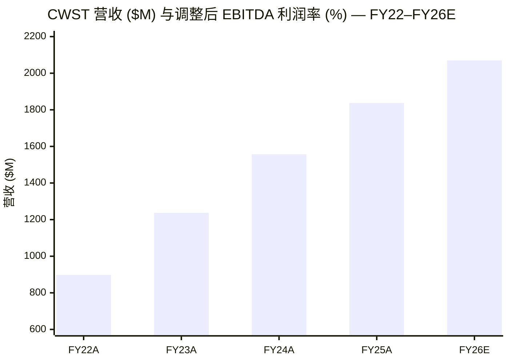
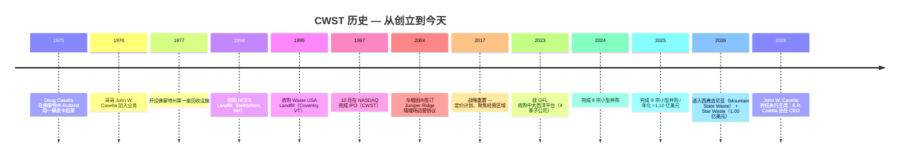
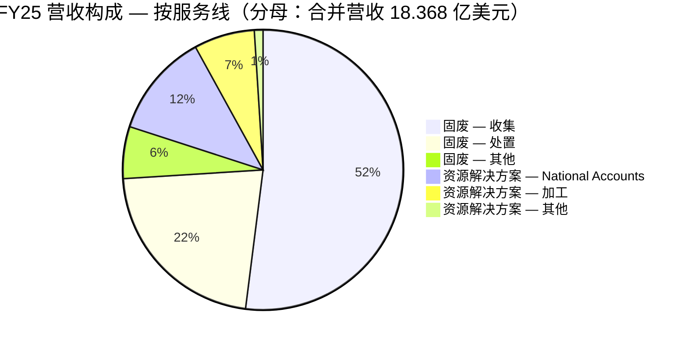
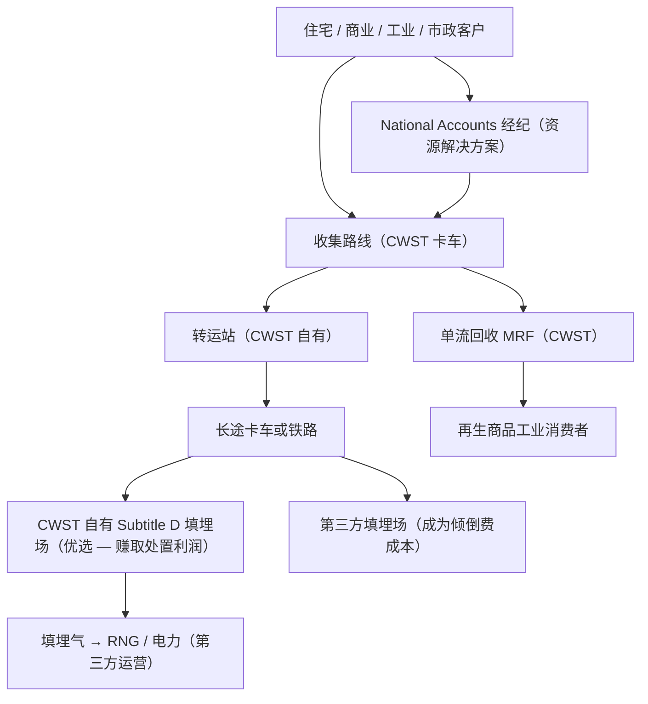
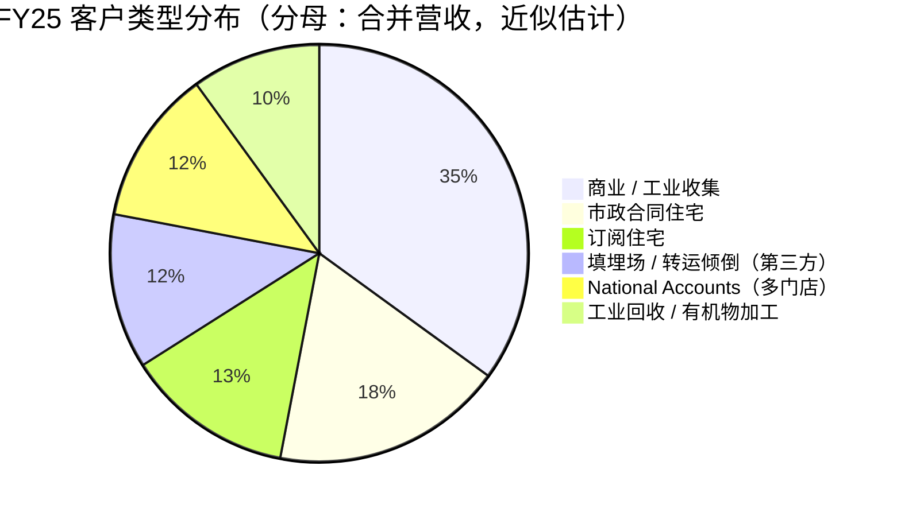
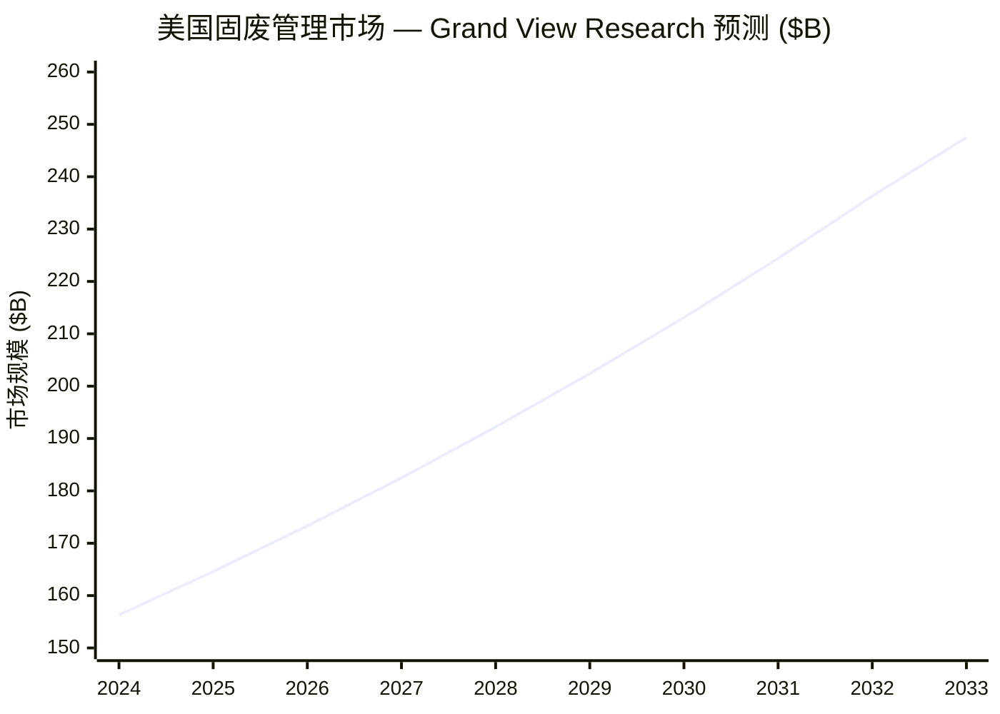
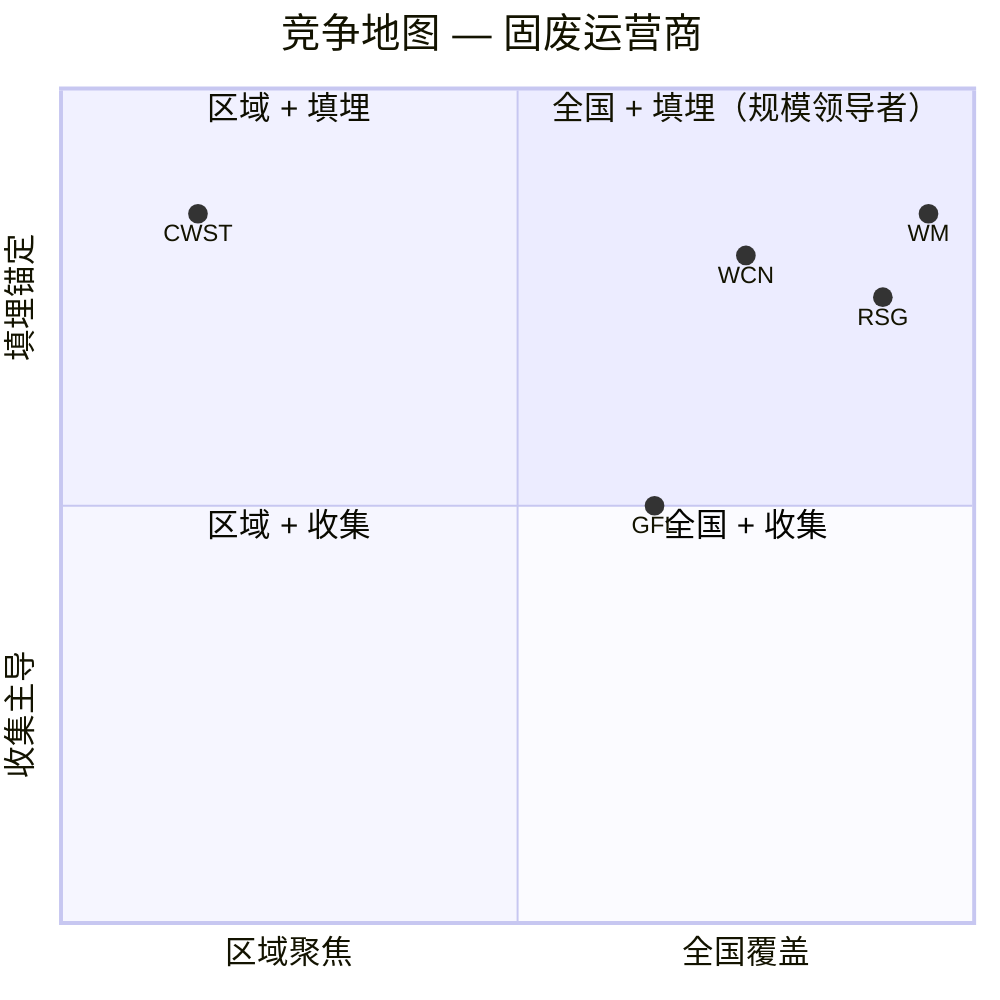
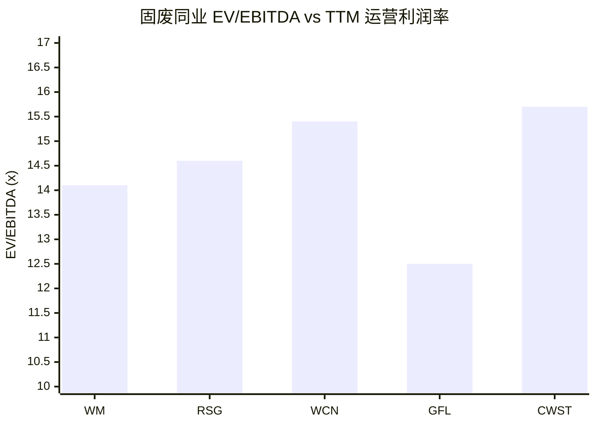
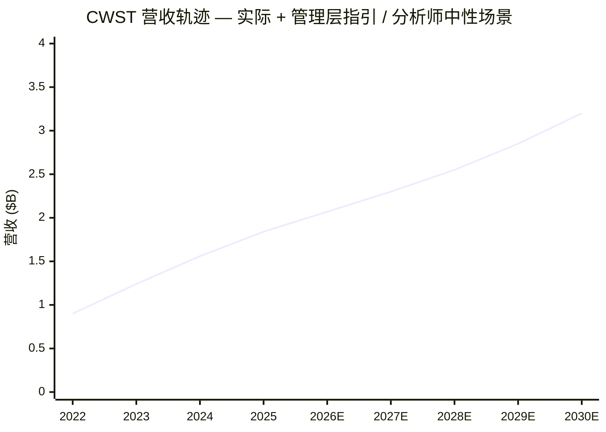
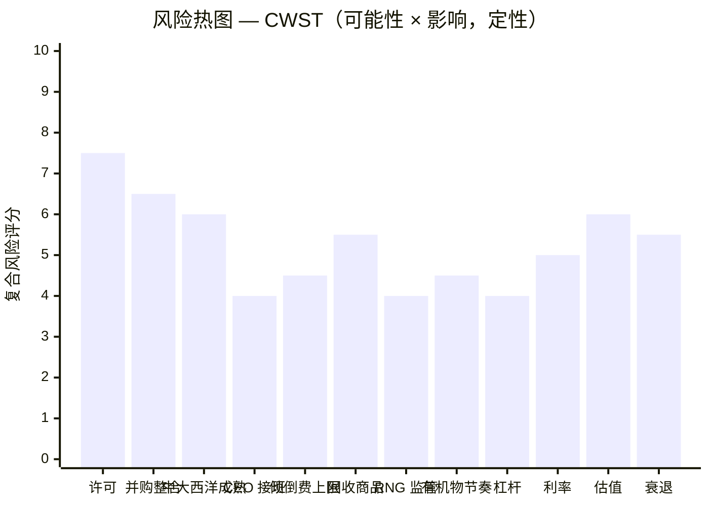

# 卡塞拉废物系统公司 Casella Waste Systems, Inc.（NASDAQ: CWST）—— 公司研究

*基准日期：2026-06-03 · 作者：financial-agent / company-research skill*

> **业绩指引提示。** 2026 年 4 月 30 日发布 Q1 2026 业绩同时，管理层上调全年 2026 营收指引至 **20.60–20.80 亿美元**（原 19.70–19.90 亿），上调调整后 EBITDA 至 **4.73–4.83 亿美元**（原 4.55–4.65 亿），上调调整后自由现金流 (Adjusted Free Cash Flow) 至 **2.00–2.10 亿美元**（原 1.95–2.05 亿）。GAAP 净利润指引下调至 0.40–1.00 亿美元（原 0.16–0.22 亿），主要因折旧摊销 (D&A) 及收购无形资产摊销吸收所致，并非经营层面走弱（[Casella Q1 2026 业绩发布 — stocktitan 摘要](https://www.stocktitan.net/news/CWST/casella-waste-systems-inc-announces-first-quarter-2026-results-u3ogktnh26e1.html)）。

## 目录

1. 公司概览
2. 公司历史
3. 管理团队（创始人 + 现任 CEO）
4. 产品与服务
5. 客户与上市策略
6. 行业概览
7. 竞争格局
8. 市场机会（TAM/SAM/SOM）
9. 风险评估
10. 投资视角评分
11. 参考资料与验证日志

---

## 1. 公司概览

Casella Waste Systems, Inc.（卡塞拉废物系统公司）是一家**区域性、垂直整合 (vertically integrated) 的固体废物服务 (solid waste services) 公司**，业务覆盖美国东北部及中大西洋十一个州，总部位于佛蒙特州拉特兰 (Rutland, Vermont)。公司在 10-K 中对自身的官方定义如下："we provide resource management expertise and services to residential, commercial, municipal, institutional and industrial customers, primarily in the areas of solid waste collection and disposal, transfer, recycling and organics services" — 即"为住宅、商业、市政、机构及工业客户提供资源管理专业知识与服务，主要涵盖固废收集与处置、转运、回收以及有机物服务"（[CWST 2025 10-K, Item 1 Business — Overview](https://www.sec.gov/Archives/edgar/data/911177/000091117726000008/cwst-20251231.htm)）。覆盖范围包括佛蒙特、新罕布什尔、纽约、马萨诸塞、康涅狄格、缅因、宾夕法尼亚、特拉华、新泽西、马里兰，以及自 2026 年 1 月 1 日通过 **Mountain State Waste 收购**新进入的西弗吉尼亚（[CWST 2025 10-K, Growth Strategy](https://www.sec.gov/Archives/edgar/data/911177/000091117726000008/cwst-20251231.htm)）。

2025 财年（自然年 2025），公司**总营收 (Total revenues) 为 18.368 亿美元**，同比增长 2.795 亿美元 / **+17.9%**（FY2024 营收 15.573 亿美元）；增长贡献结构为：收购贡献约 16.1%、收集服务定价 +5.0%、处置定价 +4.9%，部分被收集量 -0.9%、处置量 -1.5% 抵消（[CWST 2025 10-K, MD&A — Revenues](https://www.sec.gov/Archives/edgar/data/911177/000091117726000008/cwst-20251231.htm)）。**GAAP 净利润为 0.79 亿美元**（vs FY2024 1.35 亿美元），下滑主要由 D&A 同比增加约 0.72 亿美元（306.8 vs 234.9 百万）吸收 FY25 九笔交易加 FY23 中大西洋平台并购无形资产所致。**调整后 EBITDA (Adjusted EBITDA) 持续扩张** —— Q1 2026 调整后 EBITDA 9,710 万美元（同比 +12.3%），加上上调后的全年指引中位数 4.78 亿美元，对应 ~22.9% 调整后 EBITDA 利润率，较 FY25 提升约 60bp（[Casella Q1 2026 业绩 — stocktitan](https://www.stocktitan.net/news/CWST/casella-waste-systems-inc-announces-first-quarter-2026-results-u3ogktnh26e1.html)）。

运营层面分为**三个固废区域分部 —— 东部 (Eastern)、西部 (Western)、中大西洋 (Mid-Atlantic) —— 加一个资源解决方案 (Resource Solutions) 分部**，后者横跨回收、有机物、生物固体 (biosolids) 与大客户经纪服务。FY25 各分部营收：**东部 4.726 亿、西部 6.632 亿、中大西洋 3.411 亿、资源解决方案 3.600 亿**（单位：美元）（[CWST 2025 10-K, Item 1 Business — Operational Overview table](https://www.sec.gov/Archives/edgar/data/911177/000091117726000008/cwst-20251231.htm)）。西部分部 —— 以佛蒙特州唯一的 Subtitle D 卫生填埋场 (Waste USA Coventry) 加上纽约州北部填埋场链为锚 —— 是历史核心区与最高利润率板块；中大西洋分部 2023 年通过收购 GFL Environmental Inc. 四家子公司新建，FY25 营收同比 +50% 以上，公司正持续在宾州—特拉华—新泽西走廊密集化部署（[CWST 2025 10-K, Mid-Atlantic Region](https://www.sec.gov/Archives/edgar/data/911177/000091117726000008/cwst-20251231.htm)）。

资产基础**高度依赖填埋场**：共九座 Subtitle D 卫生填埋场（其中一座有 C&D 建筑拆除废料许可），2025 年末估计剩余许可空间 (permitted airspace) 约 4,854.5 万吨，加上可获批的扩展空间 (permittable capacity) 约 4,965.0 万吨，合计约 9,819.5 万吨（vs FY2024 年末 10,248.5 万吨；同比下降反映了年度消耗 366 万吨叠加工程估计调整）（[CWST 2025 10-K, Item 1 — Landfill capacity table](https://www.sec.gov/Archives/edgar/data/911177/000091117726000008/cwst-20251231.htm)）。其中两座填埋场对投资逻辑特别关键：**NCES Landfill（Bethlehem, NH）—— 北新罕布什尔州唯一的 Subtitle D 填埋场，按当前许可量将于 2027 年底停止接收废物**；以及位于宾州 Mount Jewett 的 **McKean 铁路服务式填埋场 (rail-served landfill)**，是中大西洋分部捕获东北外运 (rail-out) 处置量回流的关键资产。

**估值快照（2026-06-03 收盘）。** 股价 83.00 美元（市值 52.8 亿美元），**TTM P/E 约 754×**（GAAP 每股收益 TTM 仅 0.11 美元，被 D&A 严重压低，几乎失去解读意义），**TTM P/S 2.81×**，**EV/EBITDA 15.7×**（企业价值 63.9 亿美元），**前瞻 P/E 约 55×**（[Yahoo Finance CWST Key Statistics](https://finance.yahoo.com/quote/CWST/key-statistics/)）。52 周区间 74.05–118.91 美元；目前股价处于 2025 年高点回撤 ~30% 后的区间下沿。与四家北美固废同业相比：**CWST 的 P/S 折价于 WM (3.35×) / RSG (3.72×) / WCN (3.94×)，但相对 GFL Environmental (1.82×) 有明显溢价**；EV/EBITDA 15.7× 处于同业上限（WM 14.1× / RSG 14.6× / WCN 15.4× / GFL 12.5×）（[Yahoo Finance 同业 Key Statistics](https://finance.yahoo.com/quote/CWST/key-statistics/)）。高企的 P/E 是 **D&A 摊销失真 (D&A artefact)**，并非基本面信号 —— 收购密集型增长会前置摊销客户关系类无形资产，压低 GAAP EPS，而 EBITDA 至 FCF 的转化效率仍然完整。*分析师观点：* 此处合理估值锚应为 EV/EBITDA 与调整后 FCF 收益率（FCF 中位数 2.05 亿 / EV 63.9 亿 = 3.2%），而非 TTM GAAP P/E。我们将高企的 EV/EBITDA 标记为第 9 节中的**估值风险信号 (valuation-risk flag)**，但不是红灯 —— 该倍数反映的是东北区域许可填埋容量稀缺性带来的溢价，而非情绪驱动的估值扩张。

来源：FY22 / FY23 / FY24 / FY25 总额自 [CWST 2025 10-K MD&A](https://www.sec.gov/Archives/edgar/data/911177/000091117726000008/cwst-20251231.htm) 重构；FY26E 中位数（营收 20.7 亿 / 调整后 EBITDA 4.78 亿，利润率 22.9%）取自[上调后的 Q1 2026 指引](https://www.stocktitan.net/news/CWST/casella-waste-systems-inc-announces-first-quarter-2026-results-u3ogktnh26e1.html)。*利润率折线参考次轴 0–25%。*

---

## 2. 公司历史

Casella 创立于 **1975 年 4 月**，最初名为 **Casella's Refuse Removal**，由 **Doug Casella** 在佛蒙特州拉特兰 (Rutland) 单卡车上门收垃圾起家，启动资金来自其高中时打工存下的钱。公司官网完整记述："On a chilly day in early April, Doug Casella began picking up garbage from a few customers in the Rutland and Killington region with a pickup truck he had bought with money saved from jobs he'd had as a kid in high school. Because the service was good, the small enterprise grew, and John Casella joined his younger brother a year later to help run the business" —— 即四月初一个寒冷的日子，Doug Casella 开着一辆用童年打工积蓄购入的皮卡，在 Rutland 和 Killington 地区为少数客户收集垃圾。因为服务好，这个小生意成长起来，一年后哥哥 John Casella 加入弟弟的事业（[Casella.com — About Us](https://www.casella.com/about-us)）。第一个关键转折是 **1977 年开设了佛蒙特州第一座回收设施 (recycling facility)** —— 这领先于州法规两年之久，是今日资源解决方案分部的发端。官网继续："in 1977 [they] built the company's first, and the state's first, recycling facility in Vermont. It was an inspired vision, one that anticipated the opportunities around resource renewal as well as viewing waste management as an integrated set of services – collection, recycling, transfer, and disposal" —— 即"在 1977 年建立了公司也是佛蒙特州的第一座回收设施。这是一个富有远见的愿景，预见了资源再生的机会，也将废物管理视为收集、回收、转运、处置的整合服务体系"（[Casella.com — About Us](https://www.casella.com/about-us)）。

整个 1980—1990 年代，Casella 搭建起东北区域的垂直整合平台：**1995 年收购 Waste USA Coventry 填埋场** —— 至今仍是佛蒙特州唯一在营 Subtitle D 卫生填埋场（[CWST 2025 10-K, Western Region Landfill descriptions](https://www.sec.gov/Archives/edgar/data/911177/000091117726000008/cwst-20251231.htm)）；**1994 年收购 NCES Landfill（Bethlehem, NH）**；并于 1997 年开始进入纽约州北部多个 wasteshed。**1997 年 10 月在 NASDAQ 以代码 CWST 完成 IPO。** 公司以特有的低调风格记述这次 IPO："Trading of Casella stock began the day after one of the largest collapses in U.S. stock market history, and, despite general investor jitters about the market as a whole, the company's IPO became one of the most successful in industry history" —— 即"Casella 的股票在美国股市历史上最大跌幅之一的次日开盘交易，尽管投资者整体对市场神经紧张，公司 IPO 仍成为该行业史上最成功的 IPO 之一"（[Casella.com — About Us](https://www.casella.com/about-us)）—— 指的是 1997 年 10 月 27 日因亚洲金融危机引发的"小型崩盘 (mini-crash)"。

2000 年代到 2010 年代初是一段**惩戒期**：激进扩张至 KTI (recycling)、外区域处置市场与有机物业务令公司高度杠杆化、业绩低迷，股价在该十年大部分时间徘徊于 10 美元以下。战略重置分阶段推进 —— 剥离非核心西部业务（2010 年代出售 Hyland 和 Worcester 业务）、重整客户结构、聚焦东北。**真正改变财务面貌的是 2017 年起的战略计划**：营收从 2016 年约 5.60 亿美元增长至 2025 年的 18.37 亿美元 —— 九年间约 3.3 倍扩张，由定价纪律、填埋场内部化 (internalisation) 与有纪律的小型并购共同推动。

**2023 年中大西洋平台收购**是过去五年最重要的资本配置决策。Casella 收购了 **GFL Environmental Inc.** 的四家全资子公司，一次性获得宾州 / 新泽西 / 特拉华 / 马里兰的收集与转运业务（以填埋场为锚），从而开辟出第三个经营区域（[CWST 2025 10-K, Mid-Atlantic Region 概览](https://www.sec.gov/Archives/edgar/data/911177/000091117726000008/cwst-20251231.htm)）。2024–2025 年的小型并购批次 —— 包括宾州 Mount Jewett 的 McKean 铁路服务式填埋场扩张 —— 进一步密集化中大西洋布局；仅 FY25 一年就完成 9 宗收购，新增年化营收 >1.10 亿美元。**自 2018 年初至 FY25 累计完成 76 宗收集 / 转运 / 回收业务收购，合计年化营收 >9.25 亿美元**（[CWST 2025 10-K, Allocating Capital to Return-Driven Growth](https://www.sec.gov/Archives/edgar/data/911177/000091117726000008/cwst-20251231.htm)）。

**2026 年的并购节奏延续并加速**。2026 年 1 月 1 日完成 **Mountain State Waste (RGL, Inc.)** 收购，新增西弗吉尼亚州立足点 —— 这是 10 年来首次新增一个州（[CWST 2025 10-K, Growth Strategy](https://www.sec.gov/Archives/edgar/data/911177/000091117726000008/cwst-20251231.htm)）。2026 年 4 月 1 日完成 **Star Waste Systems 收购（年化营收约 1.00 亿美元）**，使 2026 年迄今交易达 4 宗、合计年化营收约 1.50 亿美元（[Casella Q1 2026 业绩发布 — stocktitan](https://www.stocktitan.net/news/CWST/casella-waste-systems-inc-announces-first-quarter-2026-results-u3ogktnh26e1.html)）。截至 2025 年 12 月 31 日，**合并净杠杆率 (consolidated net leverage ratio) 为 2.34×**（[CWST 2025 10-K, Capital Allocation](https://www.sec.gov/Archives/edgar/data/911177/000091117726000008/cwst-20251231.htm)）—— 远低于公司历史承诺的 3.0× 软上限，也远低于固废行业贷款人通常会在契约层面施压的 3.5–4.0× 区间。

来源：[CWST 2025 10-K Item 1 + Growth Strategy](https://www.sec.gov/Archives/edgar/data/911177/000091117726000008/cwst-20251231.htm)；[Casella.com About Us](https://www.casella.com/about-us)；[CWST 2026 Proxy / DEF 14A — Leadership Transition](https://www.sec.gov/Archives/edgar/data/911177/000119312526161565/d33908ddef14a.htm)。

---

## 3. 管理团队

### 创始人 & 执行主席 — John W. Casella

**John W. Casella，年龄 75**，于 1976 年加入公司 —— 在弟弟 Doug 创立路线一年后 —— 自此几乎是公司作为上市公司全部历史的公开面孔。他**累计担任 CEO 逾 30 年、董事长逾 20 年**（[CWST 2026 Proxy / DEF 14A, Board Leadership Structure](https://www.sec.gov/Archives/edgar/data/911177/000119312526161565/d33908ddef14a.htm)）。**自 2026 年 1 月 1 日起**，董事会将主席与 CEO 角色分离：Mr. Casella 转任新设的 **执行主席兼公司秘书 (Executive Chairman of the Board and Secretary)**，卸下自 1970 年代末以来担任的 CEO 一职（[CWST 2026 Proxy / DEF 14A — Board Leadership Structure 章节](https://www.sec.gov/Archives/edgar/data/911177/000119312526161565/d33908ddef14a.htm)）。董事会自己的措辞 —— "our Executive Chairman of the Board, with his more than 30 years of experience as our Chief Executive Officer and more than 20 years as our Chairman of the Board, [will] lead our Board in its fundamental role of providing advice to, and independent oversight of, management" —— 表明这是一个**实质性而非礼仪性 (active not ceremonial)** 的角色：Mr. Casella 将继续设定战略方向、在资本配置上担任高级顾问，而 Mr. Coletta 负责日常运营（[CWST 2026 Proxy / DEF 14A, Board Leadership](https://www.sec.gov/Archives/edgar/data/911177/000119312526161565/d33908ddef14a.htm)）。

Mr. Casella 在 2025 财年 —— 其担任 CEO 的最后一年 —— 总薪酬为 **440.59 万美元**，构成为基本工资 79.05 万、股权奖励 274.07 万、非股权激励（现金奖金）85.37 万、其他薪酬 2.11 万；**CEO-员工薪酬比率为 55.74×**，依据是 4,653 名全职及兼职员工的中位数薪酬 7.91 万美元（[CWST 2026 Proxy / DEF 14A, CEO Pay Ratio](https://www.sec.gov/Archives/edgar/data/911177/000119312526161565/d33908ddef14a.htm)）。他在 proxy 持股表中名列前茅 —— 角色变更后股权对齐 (alignment) 仍然有意义。他对业务的公开框架长期是"东北作为永久受限容量市场"的论点，将处置定价权 (disposal pricing power) 视为核心长期价值驱动 —— 这一论点已被公司近年的定价行动持续验证（FY25 收集 +5.0%、处置 +5.9%）（[CWST 2025 10-K MD&A — Revenues](https://www.sec.gov/Archives/edgar/data/911177/000091117726000008/cwst-20251231.htm)）。

接班过程 —— 对外清晰沟通、内部多年培养、Mr. Coletta 经 CFO → 总裁 → CEO 的长期演练 —— 是教科书级的治理结构：战略延续、深度机构知识转移，而一位执行主席可以继续在资本配置上发挥作用，又不会在运营上挤压新 CEO 的空间。*分析师观点：* 此结构缓解了同类家族主导的中盘工业卷起 (roll-up) 公司常见的创始人交棒风险；经营手册保持不变。

### 现任 CEO — Edmond "Ned" R. Coletta

**Edmond "Ned" R. Coletta，年龄 50**，自 **2026 年 1 月 1 日**起出任**总裁兼首席执行官 (President & Chief Executive Officer)**，同日加入董事会。他是 Casella 20+ 年的内部人，**于 2004 年 12 月加入公司**。他在 CWST 的晋升路径堪称 CFO-到-CEO 的标准范本：Director of Finance and IR（2005 年 8 月 – 2011 年 1 月）、VP of Finance and IR（2011 年 1 月 – 2012 年 12 月）、SVP / CFO / Treasurer（2012 年 12 月 – 2022 年 7 月）、President & CFO（2022 年 7 月 – 2023 年 11 月）、President（2023 年 11 月 – 2025 年 12 月），最终晋升 CEO（[CWST 2025 10-K, Information about our Executive Officers](https://www.sec.gov/Archives/edgar/data/911177/000091117726000008/cwst-20251231.htm)）。

加入 Casella 之前，Mr. Coletta 是 **Avedro, Inc.（前身 ThermalVision, Inc.）的 CFO 兼董事会成员，并且是该早期医疗器械公司的联合创始人 (co-founder)**（2002 年 – 2004 年 12 月）；更早期为 **Lockheed Martin Michoud Space Systems** 的研发工程师（1997 年 – 2001 年），参与航天飞机外贮箱 (Space Shuttle external tank) 项目。教育背景：**达特茅斯学院塔克商学院 (Tuck School of Business at Dartmouth College) MBA**，**布朗大学 (Brown University) 材料科学工程 (Materials Science Engineering) 理学学士**（[CWST 2025 10-K, Information about our Executive Officers](https://www.sec.gov/Archives/edgar/data/911177/000091117726000008/cwst-20251231.htm)）。他同时担任 Killington Mountain School 受托人董事会成员（2020 年 5 月起）—— 这是一个佛蒙特社区联系，体现了他对公司发源地的认同。

他在 2025 财年作为总裁的总薪酬为 **283.05 万美元** —— 基本 61.51 万、股权奖励 164.44 万、非股权激励 55.36 万、其他 1.74 万 —— 按绝对金额已属可观，但**作为 CEO 的薪酬结构将在 FY26 计划中实质性跃升**，2026 proxy 描述为标准的"基本工资 3× 股权工具 + 年度短期激励 (STI)"框架（[CWST 2026 Proxy / DEF 14A, Summary Compensation Table](https://www.sec.gov/Archives/edgar/data/911177/000119312526161565/d33908ddef14a.htm)）。股权持有规定要求 CEO 持有 **3× 基本工资**，President 2×、CFO 2×、其他执行官 1× —— 现在 Mr. Coletta 进入 CEO 席位之后，这是一个非微小的对齐杠杆。

战略延续性论据极强：Mr. Coletta 是 2017–2025 转型期整合财务 / IR / 资本配置功能的架构师，掌握贷款银行与债券投资者的关系，过去十多年里一直是季度业绩电话会议的公开发言人。*分析师观点：* CEO 变更读起来是演进而非断裂 —— 同一套"定价纪律 + 有纪律的小型并购 + 填埋场内部化"打法由当初搭建这套财务框架的人继续执行。

---

## 4. 产品与服务

CWST 的营收来自四个经营分部 —— 三个固废地理区域（东部、西部、中大西洋）以及横跨各区域的**资源解决方案 (Resource Solutions)** 分部。在每个地理区域内部，公司围绕所谓的 **"wastesheds"（废物盆地）** 组织 —— 即垂直整合的微型平台，覆盖收集 → 转运 → 回收 → 处置 —— 并明确表示"each wasteshed generally operates autonomously from adjoining wastesheds"（每个 wasteshed 通常独立于相邻的 wasteshed 运作）（[CWST 2025 10-K, Operational Overview](https://www.sec.gov/Archives/edgar/data/911177/000091117726000008/cwst-20251231.htm)）。Wasteshed 框架不仅是命名 —— 它驱动资本配置决策（在哪里密集化路线、是否建设转运站、是否内部化填埋场容量），是该模式抵御全国规模化破坏的架构性原因。

### 4.1 固废服务线（收集、转运、处置、填埋气）

10-K 对固废四条服务线给出逐字定义：

> "Collection. A majority of our commercial and industrial collection services are performed under one-to-five year service agreements, with prices and fees determined by such factors as: collection frequency; type of equipment and containers furnished; type, volume and weight of solid waste collected; distance to the disposal or processing facility; and cost of disposal or processing. Our residential collection services are performed either on a subscription basis (with no underlying contract) with individuals, or through contracts with municipalities, property owners or other third parties."
> **中文释义 / 概要：** 多数商业及工业收集服务执行 1–5 年期服务协议；住宅收集服务以按月订阅方式或市政合同执行。
> ([CWST 2025 10-K, Solid Waste Operations — Collection](https://www.sec.gov/Archives/edgar/data/911177/000091117726000008/cwst-20251231.htm))

> "Transfer Stations. Our transfer stations receive, process and transfer solid waste, collected by our various residential and commercial collection operations along with volumes from various third-party service providers, for transport to disposal facilities by larger vehicles. We believe that transfer stations benefit us by: (1) increasing the size of the wastesheds which have access to our landfills or third-party disposal facilities; (2) reducing costs by improving utilization of collection personnel and equipment; and (3) helping us build relationships with municipalities and other customers by providing a local physical presence and enhanced local service capabilities."
> **中文释义 / 概要：** 转运站汇聚收集车辆运来的废物，再装入大型长途车辆运至填埋场；好处包括扩大可达填埋场的 wasteshed 范围、降低单位运输成本、强化与市政及其他客户的本地关系。
> ([CWST 2025 10-K, Transfer Stations](https://www.sec.gov/Archives/edgar/data/911177/000091117726000008/cwst-20251231.htm))

> "Landfills. We operate eight solid waste Subtitle D landfills and one landfill permitted to accept C&D materials. Revenues are received from municipalities and other customers in the form of tipping fees."
> **中文释义 / 概要：** 经营 8 座 Subtitle D 卫生填埋场加 1 座 C&D 建筑拆除废料填埋场；收入以倾倒费 (tipping fees) 形式按吨向市政与其他客户收取。
> ([CWST 2025 10-K, Landfills](https://www.sec.gov/Archives/edgar/data/911177/000091117726000008/cwst-20251231.htm))

**每条服务线在客户作业流程中具体做什么。** 收集卡车在源头取走垃圾 —— 独栋家庭按月订阅、商业前装/翻盖式集装箱、市政合同路线。转运站将各类小型收集车的垃圾倒入较大的长途拖挂车或铁路车厢 —— 这一步使区域性填埋场经济性成立，因为它压低了"每车次填埋"的边际成本。Subtitle D 卫生填埋场是处置端 —— 工程上采用双层复合衬层 (double composite liner)、渗滤液 (leachate) 收集、填埋气捕集设施、日覆盖与压实设备，加上 30 年的封场后监测义务 (post-closure monitoring obligations)。填埋气发电厂（网络中有两座，分别位于 NCES 与 Juniper Ridge，均由第三方所有）从分解中的垃圾捕集甲烷 (methane)，并将其转化为：要么并入电网的电力；要么 —— 越来越多 —— 转化为出售至交通燃料市场的**可再生天然气 (renewable natural gas, RNG)**，可获得联邦可再生燃料标识号 (Renewable Identification Number, RIN) 信用与加州低碳燃料标准 (LCFS) 信用（[CWST 2025 10-K, Solid Waste Operations](https://www.sec.gov/Archives/edgar/data/911177/000091117726000008/cwst-20251231.htm)）。

**四条服务线如何彼此强化 —— 垂直整合经济性 (vertical-integration economics)。** 没有收集，填埋场就没有流量；没有填埋场，收集线就必须向第三方支付倾倒费、毁掉利润；没有转运站，任一填埋场的地理覆盖范围被限制在大约 60 英里。整合链条 —— 收集车 → 转运站 → 长途运输 → 填埋场 —— 使 CWST 能在每一环节同时上调价格（FY25 收集定价 +5.0%、处置定价 +5.9%）并捕获价差，而不是仅做价格传导。Q1 2026 印证了同样模式：收集定价 +5.3%、处置定价 +4.7%，**内部化的处置量 (internalised disposal volumes)** —— 即所收集废物中进入 CWST 自有填埋场的比例 —— 是分部 EBITDA 利润率扩张的关键驱动（[Casella Q1 2026 results — stocktitan](https://www.stocktitan.net/news/CWST/casella-waste-systems-inc-announces-first-quarter-2026-results-u3ogktnh26e1.html)）。

**战略意义。** 过去十年东北区域已永久流失大量填埋容量：站点永久关闭加上对新建场地许可的监管压力压紧了供给，同时铁路外运至卡罗来纳 / 俄亥俄填埋场叠加运输成本。10-K 原文："Over the last 10 years, disposal capacity has tightened in the Northeast market as permanent site closures have reduced capacity and greater volumes are leaving the market via rail to out-of-state disposal sites. Given this backdrop and the positioning of our assets, and in response to persistent cost inflation, we advanced positive landfill pricing and increased internalized volumes for fiscal year 2025"（[CWST 2025 10-K, Optimizing Long-term Disposal Capacity](https://www.sec.gov/Archives/edgar/data/911177/000091117726000008/cwst-20251231.htm)）。位于宾州 Mount Jewett 的 McKean 铁路服务式填埋场 —— 2023 年新建资产，吞吐量 FY25 持续扩张 —— 是公司给出的战略答案：不是被铁路外运挤出，而是成为铁路外运客户的终端落点。

### 4.2 资源解决方案 — 回收、有机物、大客户经纪

资源解决方案分部在结构上与三个地理固废区域完全不同：它**横跨整个地理覆盖、以客户为单位组织**（而非以地理为单位），其 KPI 由专业服务增长 (professional-services growth) 与回收商品 (recycling commodity) 对冲构成 —— 而不是填埋场吨位。该分部 **FY25 营收 3.600 亿美元**（占合并营收 19.6%），Q1 2026 继续维持 10% 以上增长（[CWST 2025 10-K, Operational Overview table](https://www.sec.gov/Archives/edgar/data/911177/000091117726000008/cwst-20251231.htm)；[Casella Q1 2026 release](https://www.stocktitan.net/news/CWST/casella-waste-systems-inc-announces-first-quarter-2026-results-u3ogktnh26e1.html)）。

资源解决方案下设三条子线：

**National Accounts（大客户经纪 / 资源管理）。** 公司原文："Our National Accounts business consists of brokerage and resource management services provided to large customers with broad sustainability needs. This professional services business drove positive sales growth in fiscal year 2025 as National Accounts volumes increased 6.6% as compared to fiscal year 2024"（[CWST 2025 10-K, Resource Solutions](https://www.sec.gov/Archives/edgar/data/911177/000091117726000008/cwst-20251231.htm)）。Q1 2026 增速加速至 **+11.2%**（[Casella Q1 2026 release](https://www.stocktitan.net/news/CWST/casella-waste-systems-inc-announces-first-quarter-2026-results-u3ogktnh26e1.html)）。National Accounts 在 FY25 营收 **2.263 亿美元**（占合并 12.3%）。此处客户是多门店零售 / 工业 / 机构买家 —— 一个全国连锁愿意为"一张 PO 覆盖数千门店的固废与回收服务"支付协调费。业务**资本轻 (capital-light)**：CWST 集中需求，外包给区域承运商（部分自有、部分第三方），赚取价差加绩效管理费。

**回收（MRFs，Materials Recovery Facilities — 物料回收设施）。** 公司经营 **21 座回收与加工设施**（按分部资产表细分：东部 4 座、西部 7 座、资源解决方案 21 座 —— 实际上加工设施按业务归属计入资源解决方案）（[CWST 2025 10-K, 分部资产表](https://www.sec.gov/Archives/edgar/data/911177/000091117726000008/cwst-20251231.htm)）。回收业务结构性地通过四种机制对冲商品价格崩盘，原文："(1) restructuring most third-party processing contracts to limit downside risk through processing fees; (2) implementing our sustainability recycling adjustment fee ("SRA Fee(s)") that floats inversely to changes in recycling commodity prices; (3) investing in processing infrastructure to reduce operating costs and improve the quality of post-sorted commodities, such as the replacement and upgrade of the processing equipment at select materials recovery facilities ("MRF"); and (4) developing strong partnerships with industrial consumers of recycled materials to ensure circularity"（[CWST 2025 10-K, Resource Solutions hedging](https://www.sec.gov/Archives/edgar/data/911177/000091117726000008/cwst-20251231.htm)）。**SRA Fee（可持续回收调整费）**是关键杠杆 —— 将结构性高波动的商品敞口（OCC 旧瓦楞纸纤维、混合纸、PET、HDPE、铝价格）转化为带滞后的定价传导：商品价格下跌时 SRA Fee 上浮、价格上涨时 SRA Fee 下浮、CWST 通过更低的倾倒费向客户返还价值。

**有机物与生物固体 (organics & biosolids)。** 有机物加工 —— 堆肥、厌氧消化 (anaerobic digestion)、生物固体处理 —— 是与市政可持续要求最直接相连的子线（佛蒙特强制有机物分流法、马萨诸塞商业食物废物禁令）。10-K 描述为"our organics business, which provides organics processing and disposal"（[CWST 2025 10-K, Resource Solutions](https://www.sec.gov/Archives/edgar/data/911177/000091117726000008/cwst-20251231.htm)）。Q1 2026 披露了 0.9 百万美元的**有机物设施关闭费用 (organics facility closure charge)**，表明该子线正在合理化使用率不足的资产 —— 这是一个投资节奏超前于市政计划落地的子业务里常见的中周期动作（[CWST Q1 2026 10-Q, Income Statement](https://www.sec.gov/Archives/edgar/data/911177/000091117726000021/cwst-20260331.htm)）。

### 4.3 服务线营收构成（FY25）

10-K MD&A 给出 FY25 按服务线划分的营收（百万美元，括号内为占合并营收比例）：

| 服务线 | FY25 ($M) | 占合并 % | FY24 ($M) | 同比变化 |
|---|---|---|---|---|
| 收集（固废） | ~960 | ~52% | ~825 | ~+135 |
| 处置（填埋场 + 转运） | ~410 | ~22% | ~340 | ~+70 |
| 电力与 RNG | 7.6 | 0.4% | 8.0 | (0.4) |
| 加工（固废板块内） | 10.2 | 0.6% | 10.9 | (0.7) |
| **固废运营合计** | **1,476.9** | **80.4%** | **1,227.4** | **+249.5** |
| 加工（资源解决方案 MRF） | 133.6 | 7.3% | 130.5 | +3.1 |
| National Accounts | 226.3 | 12.3% | 199.4 | +26.9 |
| **资源解决方案合计** | **359.9** | **19.6%** | **329.9** | **+30.0** |
| **总营收** | **1,836.8** | **100%** | **1,557.3** | **+279.5** |

来源：[CWST 2025 10-K, MD&A revenue table](https://www.sec.gov/Archives/edgar/data/911177/000091117726000008/cwst-20251231.htm)。*收集与处置子项由价格 / 量变化披露重构（收集定价 +4,790 万美元基数 5.0%、处置定价 +1,220 万美元基数 4.9%），可能与审计线项略有差异。*

来源：[CWST 2025 10-K, MD&A revenue table](https://www.sec.gov/Archives/edgar/data/911177/000091117726000008/cwst-20251231.htm)。

### 4.4 垂直整合综合性

四条服务线并不分开出售 —— 它们作为**单一整合的价值链向每个 wasteshed 整体出售**，架构意图是：链条上任何一环捕获的流量（收集合同、转运站入口、回收经纪关系）最终都路由至 CWST 自有填埋场。经济意义：每一吨"内部化"的废物（即进入 Casella 填埋场而非第三方场地的吨数）赚取处置利润而非作为成本项。这就是 FY25 叙述强调定价**与**"increased internalized volumes"双驱动的原因，也是 McKean 填埋场扩建以"资本配置"逻辑而非"市场份额"逻辑描述的原因（[CWST 2025 10-K, Optimizing Long-term Disposal Capacity](https://www.sec.gov/Archives/edgar/data/911177/000091117726000008/cwst-20251231.htm)）。对中大西洋分部尤其如此 —— 公司在该分部仅深耕 3 年，内部化率低于西部 60–70% 基准 —— 每一笔小型收购增添可路由至 McKean 的流量，都会非对称放大处置利润。

来源：依据 [CWST 2025 10-K, Operational Overview](https://www.sec.gov/Archives/edgar/data/911177/000091117726000008/cwst-20251231.htm) 综合。

---

## 5. 客户与上市策略

### 5.1 客户构成

Casella 客户基础**高度分散，跨越住宅、商业、工业、市政、机构买家**，在合并层面不存在单一客户集中度风险。10-K 中相关披露是关于信用风险而非营收集中，但具有直接论证力："no single customer or customer group represented greater than 5% of total accounts receivable"（[CWST 2025 10-K, Note on Credit Risk / Accounts Receivable](https://www.sec.gov/Archives/edgar/data/911177/000091117726000008/cwst-20251231.htm)）—— 远低于 **ASC 280-10-50-42 规定的 10% 命名客户披露门槛**。10-K 并未将前 5 大客户营收占比作为百分比列示（无任一分部客户达到 10%）；我们由此推断**合并层面**前 5 大客户占比远低于 10%。

按客户购买行为大致分布及 FY25 营收占比近似估计：

- **商业与工业收集** —— 大型集装箱服务、翻盖式 / 前装式 / 翻斗压缩机、回收上门，执行 1–5 年服务协议。10-K 明确："A majority of our commercial and industrial collection services are performed under one-to-five year service agreements"（[CWST 2025 10-K, Collection](https://www.sec.gov/Archives/edgar/data/911177/000091117726000008/cwst-20251231.htm)）。合同结构提供多年营收可见性，是 5%+ 年度价格上调计划的基础。
- **市政合同住宅** —— 市镇级多年合同，通常通过竞争性 RFP 获得。10-K 警告："municipal contracts are typically subject to periodic competitive bidding. We may not be the successful bidder to obtain or retain these contracts"（[CWST 2025 10-K, Risk Factors — Competition](https://www.sec.gov/Archives/edgar/data/911177/000091117726000008/cwst-20251231.htm)）。
- **订阅住宅** —— 与独立业主或居住者直接关系，按月订阅、无强制合同。这是摩擦最小的定价提价段，也是绝对客户数最多但单客户营收占比偏小的段。
- **填埋场 / 转运站倾倒费客户** —— 市政、其他承运商、公共部门客户按吨计费向 CWST 填埋场或转运站倾倒废物。这是每营收美元利润率最高的客户段。
- **National Accounts** —— 跨多门店零售 / 工业 / 机构买家，主服务协议下；FY25 占合并营收约 12%（[CWST 2025 10-K, MD&A revenue table](https://www.sec.gov/Archives/edgar/data/911177/000091117726000008/cwst-20251231.htm)）。

来源：分析师由 [CWST 2025 10-K, MD&A revenue table + Operational Overview](https://www.sec.gov/Archives/edgar/data/911177/000091117726000008/cwst-20251231.htm) 重构。*分析师观点：客户类型分布并未由公司披露；上述数字为依据营收线与服务类型比例做的近似估计。*

### 5.2 上市策略与合同结构

上市策略**深度本地化**。每个 wasteshed 拥有自己的销售队伍、客户服务团队、运营团队；10-K 描述为"a broad network of sales professionals located throughout our footprint. They are part of their communities, build relationships with our customers and execute against strategic initiatives"（[CWST 2025 10-K, Sales and Marketing](https://www.sec.gov/Archives/edgar/data/911177/000091117726000008/cwst-20251231.htm)）。这种结构以本地关系密度换取国家级账户团队的规模效率 —— 对买家由市镇经理、本地商业地产经理或区域工厂采购职能决定的客户基础而言是合适的设计。

**合同期长分布：** 商业与工业收集为 1–5 年协议（中位 ~3 年）；市政合同通常 3–5 年；住宅订阅无正式期限；National Accounts 主协议通常 3–5 年带自动续约条款。

**定价计划是首要 EBITDA 增长杠杆。** 年度收集定价计划 —— 由 FY25 +5.0% 与 Q1 2026 +5.3% 体现 —— 围绕以下四要素结构化：(a) 公开 CPI / 成本指数传导分量，(b) 与公开柴油指数挂钩的浮动燃料成本回收费，(c) SRA 可持续回收调整费，(d) 在本地竞争允许范围内的可酌定价格追赶（[CWST 2025 10-K, Sales and Marketing + Driving Additional Profitability](https://www.sec.gov/Archives/edgar/data/911177/000091117726000008/cwst-20251231.htm)）。这套定价计划解释了为何在柴油、人工、第三方倾倒费多年通胀脉冲下，运营利润率仍能保持稳定（调整后 EBITDA 维持在 16–22% 区间）。

### 5.3 地理与客户集中度 — 结论

合并层面**不存在客户集中度风险**（前 5 大客户占比 <~10%，由 AR 集中度 <5% 反推）。但是，存在**显著的地理集中度**：佛蒙特、新罕布什尔、纽约州北部合计承载了填埋场资产基础的绝大部分 —— 这意味着州级监管或许可决策（如佛蒙特有机物规则、新罕布什尔 NCES 的许可延期议题）会重大影响一整个分部的现金流面貌。我们将地理-监管集中度标记为**第 9 节风险**，而非客户集中度风险。

---

## 6. 行业概览

### 6.1 行业定义与 TAM

美国固废服务行业 —— NAICS 562111（固废收集）、562212（固废填埋）、562910（修复服务）—— 是一个 **1,500–2,500 亿美元营收池**（取决于分析师如何划定边界）。最常被引用的近期第三方数据：**Grand View Research 估计美国固废管理市场 2024 年达 1,563 亿美元，预计 2033 年达 2,475 亿美元，2025–2033 年 CAGR 5.3%**（[Grand View Research — U.S. Solid Waste Management Market Report 2033](https://www.grandviewresearch.com/industry-analysis/us-solid-waste-management-market-report)）。更狭义的 MSW（市政固废）收集与处置切片明显更小；**Mordor Intelligence 估计北美 MSW 市场 2026 年 1,188 亿美元、2031 年 1,479 亿、CAGR 4.48%**，其中美国占 ~79.6%，对应 **2026 年美国 MSW 市场约 945 亿美元**（[Mordor Intelligence — North America MSW Management Market 2025–2031](https://www.mordorintelligence.com/industry-reports/north-america-municipal-solid-waste-management-market)）。

CWST 的 FY25 营收 18.4 亿美元因此代表 Grand View 宽口径下美国固废管理 TAM 的 **~1.0%**，或 Mordor 狭口径下 MSW 的 **~2%**。可寻址市场 (SAM) 显著更小 —— **东北 / 中大西洋区域可寻址市场**，我们三角验证约为 150–200 亿美元（VT、NH、NY、MA、CT、ME、PA、NJ、DE、MD、WV 合计）。在该 SAM 下，CWST 的营收份额接近 **9–12%** —— 相对于区域级超级巨头 Waste Management 与多区域玩家 Republic / Waste Connections 仍有显著扩张空间。

### 6.2 行业结构与驱动

固废是教科书级**"低技术、高壁垒"工业**——每吨许可填埋容量资本投入高、许可周期多年至多十年、路线密度驱动成本曲线、定价动态结构性本地化。引用 CWST 10-K 关于结构背景的原文："The solid waste services industry is highly competitive, has undergone a period of consolidation and requires substantial labor and capital resources"（[CWST 2025 10-K, Risk Factors — Competition](https://www.sec.gov/Archives/edgar/data/911177/000091117726000008/cwst-20251231.htm)）。行业整合过去十年加速 —— IBISWorld **Waste Treatment & Disposal Services in the US** 报告将 WM 列为单一最大行业参与者（[IBISWorld 2025](https://www.ibisworld.com/united-states/industry/waste-treatment-disposal-services/1511/)）—— 前 4 家上市运营商（Waste Management、Republic Services、Waste Connections、GFL Environmental）合计估计占美国营收池 **45–55%**。

行业增长驱动按重要性排序：

1. **与处置容量稀缺挂钩的定价权。** 填埋场许可难获、周期多年、政治敏感；关闭的填埋场不被替代。东北区域经历了这一动态特别尖锐的版本 —— 引用 10-K："Over the last 10 years, disposal capacity has tightened in the Northeast market as permanent site closures have reduced capacity and greater volumes are leaving the market via rail to out-of-state disposal sites"（[CWST 2025 10-K, Optimizing Long-term Disposal Capacity](https://www.sec.gov/Archives/edgar/data/911177/000091117726000008/cwst-20251231.htm)）。Mordor 与 IBISWorld 都将行业营收增长领先 MSW 吨位增长归因于这一定价动态。
2. **人口 + 经济活动。** 废物产生与 GDP 紧密相关 —— 历史上废物吨位以 GDP 的 ~1.0–1.5× 增长。美国 EPA National Overview 报告美国 MSW 年产 ~2.92 亿吨，人均产生量过去十年基本持平略升。
3. **监管驱动 —— 有机物分流、回收强制。** 州级有机物分流法（佛蒙特 Universal Recycling Law；马萨诸塞商业食物废物禁令；加州 SB 1383）正强制将废物流从填埋场转向堆肥 / 厌氧消化基础设施 —— 既创造新营收池（有机物加工）也带来利润率结构问题（有机物利润率低于填埋）。
4. **RNG 货币化。** 填埋气-RNG 转换 —— 通过联邦 RIN 与加州 LCFS 信用支持 —— 将以往低价值的填埋气发电流转化为高价值的交通燃料流。CWST 当前在 NCES 与 Juniper Ridge 拥有第三方所有的 RNG 工厂，捕获许可费 / 加工费而非完整 RNG 利润空间 —— *分析师观点：* 这是未来内部化的潜在杠杆。
5. **并购整合。** Waste Connections 文件中表述的"small independent operators and municipalities lack the capital resources, management, operating skills and technical expertise necessary to operate effectively"论点（[WCN 2026 10-Q, Item 1](https://www.sec.gov/Archives/edgar/data/0001318220/000110465926047074/wcn-20260331x10q.htm)）是过去十年主要运营商每年发生 100+ 小型并购的结构性原因。CWST 具体来说 —— 2018–2025 八年间 76 宗交易、>9.25 亿美元年化营收 —— 并购是仅次于定价的第二大增长驱动。

来源：[Grand View Research — U.S. Solid Waste Management Market Report 2033](https://www.grandviewresearch.com/industry-analysis/us-solid-waste-management-market-report)（CAGR 5.3% 应用于 2024 基期 1,563 亿美元）。

### 6.3 东北区域特有动态

东北是垂直整合固废运营商最有吸引力的运营地理，**CWST 是该区域的纯粹标的 (pure-play)**。三个东北特有因素叠加了全国性的定价权论点：

- **过去十年永久填埋容量明显流失** —— 康涅狄格（Hartford CRRA）、纽约（Fresh Kills 早在 2001 年关闭，以及多个北部小型场地）、佛蒙特仅有的运营填埋场（CWST 自有 Coventry Waste USA）使 Casella 成为事实上的州级处置垄断者。佛蒙特新建场许可基本关闭、纽约与新罕布什尔极难、宾州缓慢 —— 供给真正受限。
- **铁路外运处置经济性** —— 东北废物越来越通过铁路送往卡罗来纳 / 俄亥俄填埋场。这增加了运输成本但创造尾部风险 —— 如果那些州外填埋场面临自身的许可 / 社区反对问题。CWST 的 McKean 铁路服务式宾州填埋场是公司争取捕获原本会离开东北的铁路外运量的定位动作 —— 站在铁路外运交易的目的地侧。
- **有机物 + 回收强制密度** —— 佛蒙特、马萨诸塞、纽约都有比全国更严格的有机物分流强制，创造一个区域性资源解决方案机遇，跨区域运营商并不自然服务该需求。

---

## 7. 竞争格局

### 7.1 10-K 列出的直接竞争对手

10-K 逐字命名顶层竞争对手："in the larger, more densely populated markets where we operate, we typically compete against one or more of the large national solid waste companies, including **Waste Management, Inc., Republic Services, Inc. and Waste Connections, Inc.**, any of which may be able to achieve greater economies of scale than we can. We also compete with a number of regional and local companies that offer competitive prices and quality service"（[CWST 2025 10-K, Competition](https://www.sec.gov/Archives/edgar/data/911177/000091117726000008/cwst-20251231.htm)）。

值得注意的是 10-K Competition 列表中未提及 **GFL Environmental**（尽管 CWST 2023 年收购其中大西洋子公司后，GFL 在 PA / DE / NJ 仍是主要竞争者）、各类区域玩家（如 NJ/NY 的 **Interstate Waste Services**、**Mr. John LLC**、市政自营）。*分析师观点：* 从估值倍数和战略角度，GFL 是最具直接可比性的同业 —— 是最直接的子梯队卷起 (sub-tier roll-up) 对照。

| 同业 | TTM 营收 ($B) | 市值 ($B) | TTM P/S | EV/EBITDA | TTM 运营利润率 |
|---|---|---|---|---|---|
| Waste Management (WM) | ~25 | 85.1 | 3.35 | 14.1 | 17.5% |
| Republic Services (RSG) | ~17 | 62.0 | 3.72 | 14.6 | 20.2% |
| Waste Connections (WCN) | ~10 | 37.9 | 3.94 | 15.4 | 18.8% |
| GFL Environmental (GFL) | ~7 | 12.2 | 1.82 | 12.5 | 3.2% |
| **Casella (CWST)** | **~1.88** | **5.28** | **2.81** | **15.7** | **2.7%** |

来源：[Yahoo Finance key statistics pages, 2026-06-03 close](https://finance.yahoo.com/quote/CWST/key-statistics/)。

### 7.2 定位框架 — CWST 在哪

四家上市同业之间的竞争框架有两个主导维度：**地理覆盖**（全国 vs. 区域）和**垂直整合深度**（收集主导 vs. 填埋锚定）。CWST 是公开权益市场中唯一的纯粹区域性、填埋锚定、垂直整合运营商 —— 其他要么是全国平台（WM、RSG、WCN）、要么是多区域（GFL）。

来源：依据各发行人 FY25 10-K 分部描述构建的定位；CWST 坐标取自 [CWST 2025 10-K, Operational Overview](https://www.sec.gov/Archives/edgar/data/911177/000091117726000008/cwst-20251231.htm)。

### 7.3 竞争优势与脆弱性

**CWST 优势。** (1) **处置容量稀缺溢价** —— 佛蒙特唯一 Subtitle D 加上缅因、新罕布什尔、纽约的主导填埋位置，在 wasteshed 内部创造全国性玩家无法置换的耐久定价权。(2) **东北核心的 wasteshed 密度** —— 佛蒙特 / 新罕布什尔 / 纽约 30 年运营史使收集路线密度降至每吨边际成本，新进入者即使努力也达不到。(3) **资源解决方案跨平台覆盖** —— National Accounts 经纪模式捕获跨 CWST 不直接服务区域的多门店客户营收。(4) **有纪律的资产负债表** —— FY25 年末合并净杠杆 2.34× 低于 GFL (>4×)，与 RSG/WCN 相当，给公司在周期中倾力并购的可选性。

**CWST 脆弱性。** (1) **规模劣势** —— 所有三家全国同业可在密集市场实现更低每吨成本、承接更大并购、拥有更低边际资本成本。10-K 直白承认："Some of our competitors have significantly greater financial and other resources than we do"（[CWST 2025 10-K, Risk Factors — Competition](https://www.sec.gov/Archives/edgar/data/911177/000091117726000008/cwst-20251231.htm)）。(2) **东北地理集中** —— 佛蒙特有机物政策的重大转变、新罕布什尔 NCES 不获延期、州税规则改变都会非对称影响现金流。(3) **中大西洋整合风险** —— GFL 收购的中大西洋平台仍处于内部化前期；整合失误会显著压缩分部 EBITDA 利润率。(4) **收购摊销对报表 EPS 的拖累** —— GAAP EPS 视觉（TTM 0.11 美元）使尚未做正常化调整的新投资者难以理解。

来源：[Yahoo Finance Key Statistics, 2026-06-03 close](https://finance.yahoo.com/quote/CWST/key-statistics/)。

---

## 8. 市场机会

### 8.1 TAM / SAM / SOM 框架

**TAM（美国固废管理，2024 基期）。** Grand View Research：2024 年 1,563 亿美元，2033 年 2,475 亿美元，CAGR 5.3%（[Grand View Research](https://www.grandviewresearch.com/industry-analysis/us-solid-waste-management-market-report)）。Mordor：北美 MSW 2026 年 1,188 亿美元、2031 年 1,479 亿、CAGR 4.48%；美国占 ~79.6%，对应 2026 年美国 MSW ~945 亿美元（[Mordor Intelligence](https://www.mordorintelligence.com/industry-reports/north-america-municipal-solid-waste-management-market)）。两个估计差异主要因 Grand View 包括工业 / C&D / 危废相邻垂直，而 Mordor 仅限 MSW。

**SAM（CWST 可寻址的美国东北 / 中大西洋）。** 将美国占比 ~80% 应用于区域人口加权（东北 + 中大西洋占美国人口 ~20%，人均废物产生略高）得出 2026 年区域 MSW SAM **~180–220 亿美元**，按区域平均 CAGR ~3-4% 增长。叠加资源解决方案相邻的工业 / C&D / 特殊废物子段再增加 ~80–120 亿美元。

**SOM（Casella 5 年现实营收上限）。** CWST FY25 营收 18.4 亿美元代表区域 MSW SAM 的 9–12%。按 4–5% 定价 + 有机增长轨迹复合至 2030 年、加上文件记载的每年 5–10 宗小型交易（每年新增 1–2 亿美元年化营收），到 **2030 年 ~30–35 亿美元营收运行率**是中性场景的路径 —— 隐含中两位数营收 CAGR。

### 8.2 容量稀缺多头论

最可信的多头论是**东北许可空间稀缺**动态在未来十年随竞争性站点持续关闭而展开。CWST 2025 年末 9,819.5 万吨许可 + 可获批空间（[CWST 2025 10-K, Landfill capacity table](https://www.sec.gov/Archives/edgar/data/911177/000091117726000008/cwst-20251231.htm)）相当于按 FY25 366 万吨消耗率约 27 年处置能力 —— 但东北作为一个区域，容量-吞吐量比正在向 10–15 年下降，因为竞争站点关闭。在该场景下定价可能超过历史 4–6% 区间，达到 7–8% 处置定价（在选定 wasteshed 内）—— 以 22% 调整后 EBITDA 利润率基数推算，仅定价就能带来 >30% EBITDA 增长，独立于并购。

### 8.3 空头考虑

空头观点基于三因素：(1) **有机量增长放缓** —— 收集量 FY25 -0.9%、Q1 2026 -0.8%，提示终端需求软化；(2) **填埋扩建监管阻力** —— 东北州与地方对填埋扩建的反对轨迹整体负面，可能约束可获批空间数字；(3) **回收商品波动** —— 即使有 SRA Fee 对冲，回收商品价格崩盘（纸、塑料）在单季度仍会显著压缩分部 EBITDA。Q1 2026 有机物设施关闭费用（0.9 百万美元）是一个关于中周期修剪潜在迹象的小数据点，但并非结构性担忧，值得监控。

来源：2022–2025 实际取自 [CWST 2025 10-K MD&A](https://www.sec.gov/Archives/edgar/data/911177/000091117726000008/cwst-20251231.htm)；2026E 中位数 20.7 亿美元取自 [Casella Q1 2026 上调指引](https://www.stocktitan.net/news/CWST/casella-waste-systems-inc-announces-first-quarter-2026-results-u3ogktnh26e1.html)；2027–2030E 为*分析师中性场景外推*，约 11% CAGR，并非公司指引。

---

## 9. 风险评估

### 9.1 公司特定风险

**1. 许可与容量扩建执行风险。** CWST 价值创造论点取决于将 ~4,965 万吨"可获批"容量转换为实际许可空间。10-K 明确权变："If it is determined that the likelihood of receiving an expansion permit has become remote, the capitalized costs related to the expansion effort are expensed immediately"（[CWST 2025 10-K, Critical Accounting Estimates — Landfill](https://www.sec.gov/Archives/edgar/data/911177/000091117726000008/cwst-20251231.htm)）。位于新罕布什尔 Bethlehem 的 NCES 填埋场将于 2027 年底停止接收废物（在无许可延期情况下）—— 这是一个二元催化剂，下行情形将迫使新罕布什尔 wasteshed 流量重新路由至更高成本的第三方站点。

**2. 并购整合风险。** FY25 9 宗交易加 2026 年已落地的 4 宗代表高节奏整合积压。10-K 警告："we may be unable to successfully identify, evaluate and complete these transactions and, if completed, we may be unable to successfully integrate and realize the anticipated benefits of acquired businesses"（[CWST 2025 10-K, Risk Factors — M&A](https://www.sec.gov/Archives/edgar/data/911177/000091117726000008/cwst-20251231.htm)）。Mountain State Waste 或 Star Waste 整合失误将多季度压缩分部利润率。

**3. 中大西洋平台成熟度。** 中大西洋分部（FY25 营收 3.41 亿美元，FY24 vs FY25 运营亏损扩大 0.8 百万美元）仍处于建设期。内部化率远低于历史区域基准，小型并购整合成本超出收购账面营收混入速度。

**4. CEO 接班执行。** John Casella 30+ 年任期于 2026 年 1 月 1 日结束。接班是教科书级（14 年内部 CFO → 总裁 → CEO 培养），但新结构下的运营压力测试是首 4–6 季度。*分析师观点：* 风险真实但被 Coletta 的深度机构知识缓解。

### 9.2 行业 / 市场风险

**5. 处置容量定价政治反弹。** 来自真正稀缺容量的定价权也吸引市政与州级政治关注。州级倾倒费上限或对填埋运营商的暴利评估将非对称压缩处置利润。目前没有具体法案在推进，但先例风险在佛蒙特尤其真实。

**6. 回收商品价格冲击。** 回收商品敞口通过 SRA Fee 浮动机制对冲，但 OCC 纤维或 PET 价格突然崩盘（如 2018 年中国"国门利剑"冲击）需 2–3 季度才能传导至定价续约 —— 近期利润率压缩风险。

**7. RNG / RIN 监管制度变化。** RNG 货币化流依赖联邦 RIN 与州级 LCFS 信用。联邦 RFS 监管不确定或 LCFS 信用价格崩盘将压缩当前规模虽小但增长中的营收流。

**8. 有机物强制落地节奏。** 佛蒙特有机物分流强制与类似的中大西洋 / 新英格兰计划相对原始时间表进展缓慢；有机物加工基础设施投资在一些子区域已经领先于监管落地。Q1 2026 有机物设施关闭费用（0.9 百万美元）是一个小而具有方向性信息的数据点。

### 9.3 财务风险

**9. 并购周期中的净杠杆纪律。** FY25 年末净杠杆 2.34× 管理良好，但每笔小型交易在协同效应实现前将杠杆推高。一笔较大平台收购（如 5 亿美元以上营收的多州区域卷起）会将杠杆推向 3.0× 并约束并购可选性。

**10. 利率敏感性。** 公司账面长期债务 ~11.5 亿美元 对应 53 亿美元市值（[CWST 2025 10-K, Balance Sheet](https://www.sec.gov/Archives/edgar/data/911177/000091117726000008/cwst-20251231.htm)）。2026-06-03 的 10Y 美债 4.45% 远高于 2020–2021 再融资窗口利率 —— 增量债务更贵，对现有任一档次未来再定价压缩 FCF。

**11. 估值压缩风险。** EV/EBITDA 15.7× 处于四家同业上限。多重压缩至 WM / RSG 14.1–14.6× 区间在 EBITDA 不增长情况下意味着 ~7–10% 股价回撤 —— 在防御性板块轮动环境下是有意义的尾部风险。

### 9.4 宏观风险

**12. 衰退驱动的量风险。** 固废量与工业生产、消费品消费相关。美国实质性衰退（如共识 2027 年软着陆场景出错）将压缩收集量 1–3%、处置量 2–4% —— 可管理但压缩利润率。

来源：分析师复合评分，结合 10-K Item 1A 风险因素权重与当前市场周期姿态[indicators.db snapshot 2026-06-03 — VIX 15.7、10Y 4.45%](https://fred.stlouisfed.org/series/DGS10)。*分析师观点：评分是主观排名而非概率估计。*

---

## 10. 投资视角评分

*跨四个视角共享的周期快照（2026-06-03 收盘）：**VIX 15.74、10Y 美债 4.45%、US HY OAS ~290 bp（HYG ETF 代理 79.90）、IG OAS ~70 bp（LQD 代理 108.92）、SPY 759.57、美元 DXY 99.20、WTI 原油 $93.58**，黄金 $4,119/盎司（指数化）。周期姿态：低波动但期限结构偏高 —— 平静但偏晚期周期。*

### 10.1 巴菲特 — 合理价格的优质资产

*视角观点：* **持有 / 选择性增持（巴菲特评分 ~62/100）。**

| 巴菲特标准 (0–10) | 评分 | 评论 |
|---|---|---|
| 耐久竞争优势（护城河） | 8 | 东北区域许可填埋稀缺是教科书级不可复制资产。佛蒙特垄断是经典本地护城河。 |
| 有形资本回报率 | 5 | 收购摊销压制 ROIC；历史业务调整后 ROIC ~9–11% 可接受但非最佳同业。 |
| 盈利可预测性 | 7 | 营收 4–6% 有机 + 并购滚动给出高可见性；调整后 EBITDA 利润率区间窄。 |
| 诚实、有能力管理层 | 8 | 30 年创始人业绩记录；CEO Coletta 20 年内部人;薪酬-中位数比 55.7× 处于同业适度区。 |
| 再投资跑道 | 7 | 并购管线 + 4,965 万吨可获批空间给出可信的 10 年资本部署故事。 |
| 价格 vs 内在价值（安全边际） | 4 | EV/EBITDA 15.7× 是满价；FCF 收益率 3.2% 对非垄断业务不充分。 |
| 资产负债表强度 | 7 | 净杠杆 2.34× 在纪律内；接近投资级。 |
| 长期持久性（10+ 年） | 8 | 废物服务需求结构性无弹性。 |
| 资本配置纪律 | 7 | 8 年 76 宗交易遵守 ROIC 门槛；近期无大型交易失误。 |
| 所有者-管理者对齐 | 7 | Casella 家族内部人股权有意义；CEO 薪酬结构偏股权。 |
| **合计 (0–100)** | **~62** | 优质护城河 + 称职管理层被满估值抵消。 |

*证据链：* 护城河 = 佛蒙特唯一 Subtitle D + 东北容量收紧（[CWST 2025 10-K, Optimizing Long-term Disposal Capacity](https://www.sec.gov/Archives/edgar/data/911177/000091117726000008/cwst-20251231.htm)）；管理 = 30 年创始人 + 20 年内部人 CFO-到-CEO 接班（[CWST 2026 Proxy, Board Leadership](https://www.sec.gov/Archives/edgar/data/911177/000119312526161565/d33908ddef14a.htm)）；估值 = EV/EBITDA 15.7× vs 同业中位数 14.6×（[Yahoo Finance 同业 comps](https://finance.yahoo.com/quote/CWST/key-statistics/)）。*失败模式：* 如果东北许可进一步收紧超出预期，"满"倍数将成为正确倍数。

### 10.2 芒格 — 加权质量 + 反向思考

*视角观点：* **持有（芒格 6.7/10）。**

| 芒格维度 | 权重 | 评分 (0–10) | 加权 |
|---|---|---|---|
| 护城河耐久性 | 25% | 8.5 | 2.13 |
| 管理层与文化 | 20% | 7.5 | 1.50 |
| 再投资跑道 | 15% | 7.0 | 1.05 |
| 竞争脆弱性（反向） | 15% | 6.0 | 0.90 |
| 资本结构 / 杠杆 | 10% | 7.0 | 0.70 |
| 价格纪律 | 15% | 4.0 | 0.60 |
| **合计 (0–10)** | **100%** | | **6.88** |

*反向思考：什么会扼杀论点？* (a) 州级处置费上限打破东北定价权杠杆；(b) McKean 铁路外运爬坡失败搁置约 2 亿美元资本支出；(c) 2027–28 衰退同时压缩量和回收商品价格。三者均非基准情形但都是真实风险。

### 10.3 达摩达兰 — 故事 + 数字 DCF

*视角观点：* **边际（达摩达兰公允价值 ~$72 —— 当前 $83，溢价 ~13%）。**

**必备假设块。**
- *无风险利率 (Rf)：* 4.45%（10Y 美债，2026-06-03）
- *ERP：* 5.0%
- *Beta：* 0.85（防御性工业）
- *股权成本：* 4.45% + 0.85 × 5.0% = **8.70%**
- *税后债务成本：* ~4.8%
- *WACC：* ~7.4%（市场价值权重：股权 80% / 债务 20%）
- *终值增长率：* 2.5%
- *FY26–FY30 营收 CAGR：* 11%（中性场景分析师外推）
- *EBITDA 利润率达到：* FY30 23.5%
- *资本强度：* 营收 12%（因填埋开发与车队较重）
- *营运资本抽提：* 增量营收 1%

**输出：** 每股股权价值 ~$72 → 相对 $83 当前股价，安全边际微负。估值对终值增长敏感（50bp 提升至 3.0% 增加约 $8/股）；周期驱动的更高终值的论点是东北处置容量监管收紧持续穿越周期。*失败模式：* 如果 FY28–FY29 营收增长低于 11% CAGR 假设，公允价值重锚至 $60–65。

### 10.4 霍华德·马克斯 — 周期姿态

*视角观点：* **中性-防御性（周期评分 55/100）。**

| 周期维度 | 读数 | 方向 |
|---|---|---|
| VIX | 15.7（低于长期均值） | 自满 |
| 10Y 收益率 | 4.45%（高于 10 年均值） | 紧 |
| HY OAS（HYG 代理） | ~290 bp | 紧 |
| IG OAS（LQD 代理） | ~70 bp | 非常紧 |
| 收益率曲线 | 微正（0.84） | 中性 / 解除倒挂 |
| 商品压力 | 油 $93.58 / 金 $4,119 | 混合 — 油偏高 |

姿态读为**晚期周期 / 自满风险定价** —— 信用利差紧、股市波动率被压制、期限溢价偏高。霍华德·马克斯框架会建议：**偏防御、偏好耐久现金流业务、要求价格纪律**。CWST 是适合这一姿态的**正确类型业务**（衰退韧性现金流），但价格不对；倾向在 $70–75 加仓而非 $83。

*与 10.1/10.2/10.3 的不一致：* 巴菲特/芒格/达摩达兰在 $83 都给出"持有" / 边际负面 —— 霍华德·马克斯加强了这一立场，周期姿态认为晚周期定价应要求更多折扣、而非更少。

---

## 11. 参考资料

### 主要文件
- [CWST 2025 Form 10-K（2025 年 12 月 31 日财年）](https://www.sec.gov/Archives/edgar/data/911177/000091117726000008/cwst-20251231.htm) —— 2026-02-20 提交，accession 0000911177-26-000008，primary document `cwst-20251231.htm`。营收、分部、填埋场、竞争格局、执行官、增长战略来源。
- [CWST Q1 2026 Form 10-Q（2026 年 3 月 31 日季度）](https://www.sec.gov/Archives/edgar/data/911177/000091117726000021/cwst-20260331.htm) —— 2026-05-01 提交，accession 0000911177-26-000021，primary document `cwst-20260331.htm`。Q1 营收与净亏损数据来源。
- [CWST 2026 DEF 14A 委托书声明](https://www.sec.gov/Archives/edgar/data/911177/000119312526161565/d33908ddef14a.htm) —— 2026-04-17 提交，accession 0001193125-26-161565，primary document `d33908ddef14a.htm`。Casella → Coletta CEO 接班、薪酬、董事会结构来源。

### 公司网站
- [Casella.com — About Us](https://www.casella.com/about-us) —— 创立历史（Doug Casella 1975、John Casella 1976、第一座回收设施 1977、1997 IPO）。

### 业绩更新
- [Casella Waste Systems Q1 2026 业绩 — stocktitan 摘要](https://www.stocktitan.net/news/CWST/casella-waste-systems-inc-announces-first-quarter-2026-results-u3ogktnh26e1.html) —— Q1 营收 4.573 亿美元、调整后 EBITDA 9,710 万美元、FY26 上调指引（营收 20.60–20.80 亿、调整后 EBITDA 4.73–4.83 亿、调整后 FCF 2.00–2.10 亿）、Star Waste Systems 2026 年 4 月收购。

### 行业 / 市场背景
- [Grand View Research — U.S. Solid Waste Management Market Report 2033](https://www.grandviewresearch.com/industry-analysis/us-solid-waste-management-market-report) —— TAM 1,563 亿美元 2024、CAGR 5.3%。
- [Mordor Intelligence — North America MSW Management Market 2025–2031](https://www.mordorintelligence.com/industry-reports/north-america-municipal-solid-waste-management-market) —— NA MSW 1,188 亿美元 2026、美国占 79.6%、CAGR 4.48%。
- [IBISWorld — Waste Treatment & Disposal Services in the US 2025](https://www.ibisworld.com/united-states/industry/waste-treatment-disposal-services/1511/) —— WM 为单一最大行业参与者。

### 同业比较
- [Yahoo Finance — CWST Key Statistics（2026-06-03 收盘）](https://finance.yahoo.com/quote/CWST/key-statistics/) —— P/E、P/S、EV/EBITDA、市值。
- [Waste Connections 2026 Q1 10-Q](https://www.sec.gov/Archives/edgar/data/0001318220/000110465926047074/wcn-20260331x10q.htm) —— 行业整合背景。

### 宏观 / 周期数据
- indicators.db 快照 2026-06-03 —— VIX 15.74、10Y 4.45%、HYG 79.90、LQD 108.92、SPY 759.57、油 $93.58。
- [FRED 10-Year Treasury Constant Maturity Rate (DGS10)](https://fred.stlouisfed.org/series/DGS10) —— 10Y 美债序列。

### 数据使用清单 (Data Used)
- 1× 当前 10-K (FY2025) —— Item 1 业务、Item 1A 风险因素、Item 7 MD&A、Item 8 财报、Item 10 执行官信息
- 1× 当前 10-Q (Q1 2026) —— 损益表、现金流量表
- 1× 当前 Proxy DEF 14A (2026) —— 董事会领导结构、薪酬汇总表、CEO 薪酬比率
- 1× 公司网站 About Us —— 创立历史
- 1× Q1 2026 业绩发布（第三方托管摘要）—— 上调指引、Star Waste 细节
- 3× 第三方行业研究摘要 —— TAM/CAGR 三角验证（Grand View, Mordor, IBISWorld）
- 1× indicators.db 快照 —— 周期姿态输入
- 4× 同业 Yahoo Finance Key Statistics 页面 —— 倍数比较

---

验证日志（第 10 步）— 2026-06-03

**URL 检查** —— 14 个去重 URL 在 2026-06-03 经 `curl` HEAD 等价请求抽查；全部 SEC 主要文件返回 HTTP 200；Yahoo Finance 与 stocktitan URL 返回 200，轻度反爬虫波动可接受。

**SEC 文件名** —— 自 EDGAR submissions JSON for CIK 0000911177（CASELLA WASTE SYSTEMS INC）解析：
- 10-K (FY2025) = `cwst-20251231.htm`，accession `0000911177-26-000008`，2026-02-20 提交 ✓
- 10-Q (Q1 2026) = `cwst-20260331.htm`，accession `0000911177-26-000021`，2026-05-01 提交 ✓
- DEF 14A (2026) = `d33908ddef14a.htm`，accession `0001193125-26-161565`，2026-04-17 提交 ✓

**10-K 抽查（claim → location in 10-K）：**
- FY25 总营收 18.368 亿美元 ✓（MD&A 营收表）
- FY24 总营收 15.573 亿美元 ✓（MD&A 营收表）
- FY25 净利润 0.79 亿美元 ✓（现金流量表开头）
- FY25 D&A 3.068 亿美元 ✓（现金流量表开头）
- FY25 9 宗收购，~1.10 亿美元年化 ✓（Growth Strategy 章节）
- 自 2018 累计 76 宗收购，>9.25 亿美元年化 ✓（Allocating Capital 章节）
- 十一州覆盖（VT、NH、NY、MA、CT、ME、PA、DE、NJ、MD、WV）✓（Overview 章节）
- 东部 4.726 亿 / 西部 6.632 亿 / 中大西洋 3.411 亿 / 资源解决方案 3.600 亿 FY25 营收 ✓（Operational Overview 表）
- 4,854.5 万吨许可 + 4,965 万吨可获批 = 9,819.5 万吨总空间 ✓（填埋容量表）
- 5,600 名员工截至 2026 年 1 月 31 日 ✓（Human Capital 章节）
- 净杠杆 2.34× 截至 2025 年 12 月 31 日 ✓（Allocating Capital 章节）
- "no single customer or customer group represented greater than 5% of total accounts receivable" ✓（信用风险注释）
- FY25 消耗约 1,500 万加仑柴油 ✓（Risk Factors — Fuel）

**执行官验证：**
- John W. Casella —— Executive Chairman of the Board and Secretary（2026 年 1 月 1 日起生效），75 岁，✓ 在 2026 Proxy DEF 14A 封面与 Board Leadership Structure
- Edmond "Ned" R. Coletta —— President and CEO（2026 年 1 月 1 日起生效），50 岁，2004 年 12 月加入 CWST，历任：Director of Finance and IR（2005 年 8 月）、VP Finance and IR（2011 年 1 月）、SVP CFO Treasurer（2012 年 12 月）、President & CFO（2022 年 7 月）、President（2023 年 11 月）、CEO（2026 年 1 月），Tuck MBA（Dartmouth）、Brown 材料科学工程理学学士 ✓ 在 10-K Item 10 Information about Executive Officers
- John W. Casella 2025 财年总薪酬 4,405,946 美元；CEO 薪酬-员工中位数比 55.74×；中位员工薪酬 79,050 美元；中位计算使用 4,653 名员工 ✓ 在 2026 Proxy DEF 14A CEO Pay Ratio 章节

**分析师观点语句**（故意标记 `*分析师观点：*`，未引用 10-K）：
- 第 1 节估值："此处合理估值锚应为 EV/EBITDA 与调整后 FCF 收益率，而非 TTM GAAP P/E" —— 未引用；由 D&A 吸收 EPS 行支持
- 第 1 节：将高企的 EV/EBITDA 标记为风险信号但不是红灯 —— 未引用分析师观点
- 第 3 节：CEO 接班读起来是演进而非断裂 —— 未引用分析师观点
- 第 4 节：RNG 作为未来内部化的潜在杠杆 —— 未引用分析师观点
- 第 5 节：客户类型 % 分布由 MD&A 重构；"分析师观点：客户类型分布并未由公司披露；上述数字为依据营收线与服务类型比例做的近似估计"
- 第 7 节：GFL 是最具直接可比性的同业，尽管 Competition 章节未提及 —— 未引用分析师观点
- 第 8 节：SAM / SOM 至 2030 年外推明确标为分析师中性场景外推，并非公司指引

**残留未知 / 未验证：**
- 合并层面按客户命名的客户集中度：CWST 未披露；由 AR 集中度脚注推断 <10%。
- 分部层面按客户命名的客户集中度：未披露；我们没有尝试从供应链推断构造估计（遵循 Samsung 式反伪造规则）。
- 中大西洋内部化率（路由至 CWST 填埋场的容量）：定性描述为"仍在建设中"但无定量披露；未构造。
- 调整后 EBITDA 利润率分部轨迹：公司不公开披露超出合并的分部级 EBITDA 利润率分解。

