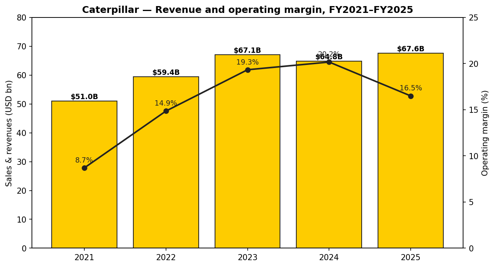
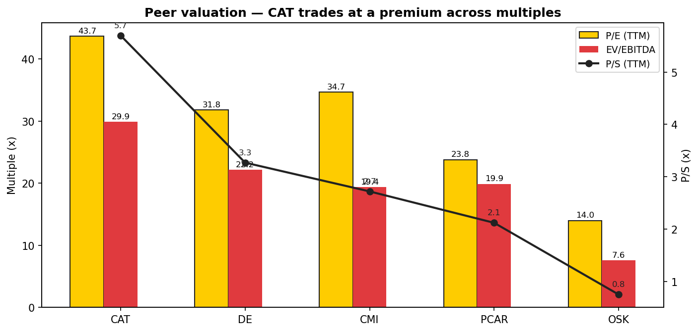
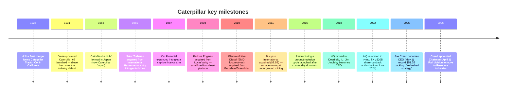
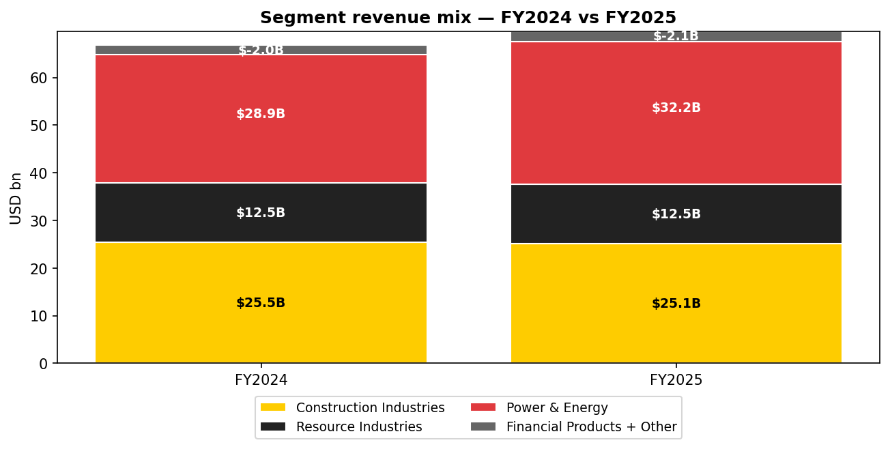
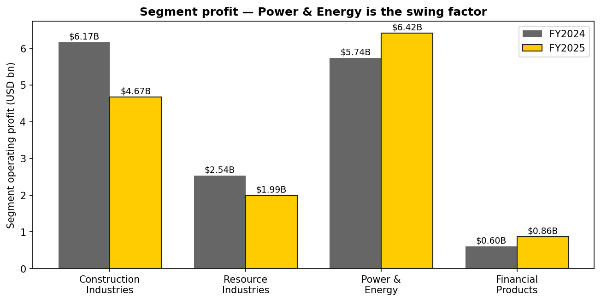
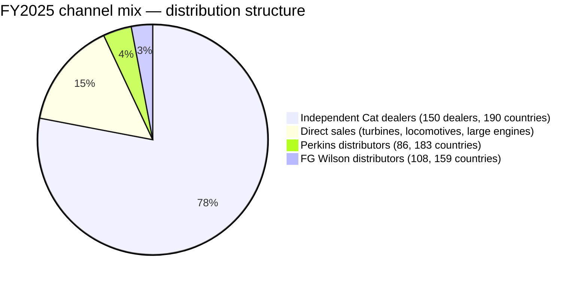
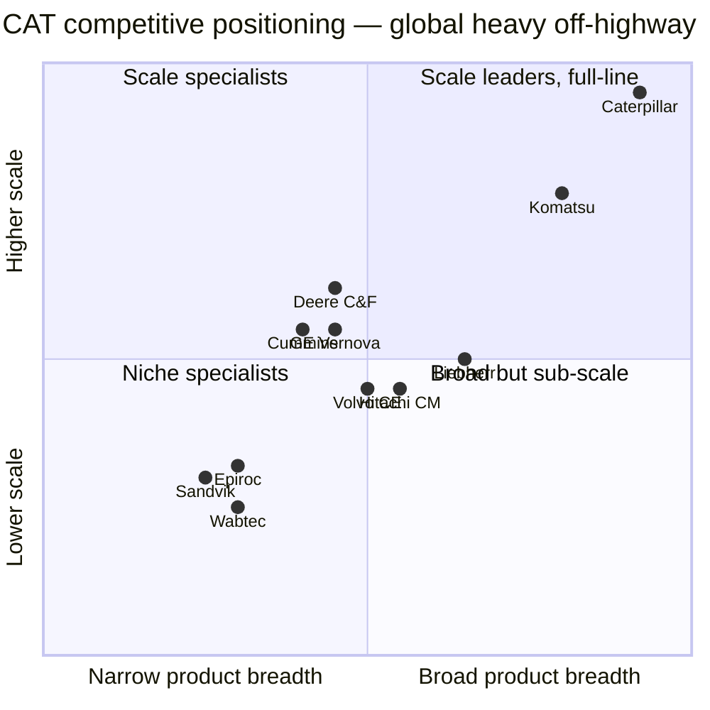
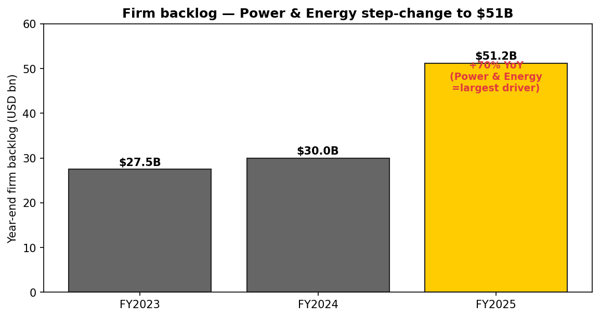
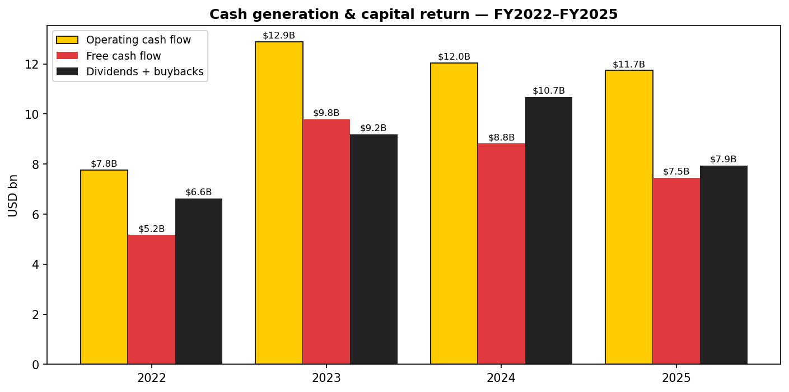

# COMPANY RESEARCH REPORT: Caterpillar Inc. (NYSE: CAT)

**Date:** 2026-05-20
**Analyst note:** Initiating coverage. All figures in USD unless otherwise noted. Fiscal year ends 31 December.

> **Update — FY2026 outlook (2026-04-30):** On the Q1-2026 print Caterpillar reaffirmed it expects full-year 2026 sales and revenues to grow "around the top end" of the company's 5–7% CAGR target vs. 2025's $67.589 billion, with favourable price realisation of roughly 2% of sales and an expected machine dealer-inventory build that reverses the $500 million destock in 2025. Management also flagged ~$800 million of incremental Q1 tariff cost (Construction Industries 50%, Power & Energy 30%, Resource Industries 20%) — similar to Q4-2025. Q1-2026 revenue was $17.4 billion (+22% YoY) with profit per share of $5.47 (+30% YoY), driven by sales-volume growth across all three primary segments and record orders that took firm backlog to $51.2 billion at year-end 2025 (vs. $30.0 billion a year earlier). Source: [Caterpillar 1Q-2026 Earnings Release, 2026-04-30](https://www.sec.gov/Archives/edgar/data/18230/000001823026000017/ex991toformcat1q2026earnin.htm); [Caterpillar 2025 Annual Report on Form 10-K, 2026-02-13](https://www.sec.gov/Archives/edgar/data/18230/000001823026000008/cat-20251231.htm).

## Table of Contents
1. Company Overview
2. Company History
3. Management Team
4. Products & Services
5. Customers & Go-to-Market
6. Industry Overview
7. Competitive Landscape
8. Market Opportunity (TAM)
9. Risk Assessment

---

## 1. Company Overview

Caterpillar Inc. is the world's largest manufacturer of construction and mining equipment, off-highway diesel and natural-gas engines, industrial gas turbines and diesel-electric locomotives, headquartered in Irving, Texas. The company designs, builds and supports the heavy iron that moves earth, extracts ore, powers oil-and-gas operations and — increasingly — provides the prime and back-up electricity for the world's data centres. FY2025 sales and revenues were **$67.589 billion**, up 4% from $64.809 billion in FY2024, with consolidated operating profit of **$11.151 billion** (16.5% margin) and net profit of **$8.884 billion** ([Caterpillar 2025 10-K, 2026-02-13](https://www.sec.gov/Archives/edgar/data/18230/000001823026000008/cat-20251231.htm)).

**How Caterpillar makes money.** The business is organised into five operating segments — four reportable — under two umbrellas:

- **Machinery, Power & Energy (MP&E)** — the industrial business, comprising **Construction Industries** ($25.060 bn FY2025 revenue, –2% YoY), **Resource Industries** ($12.474 bn, flat YoY) and **Power & Energy** ($32.201 bn, **+12% YoY**), plus an All Other segment. MP&E generated $10.884 bn of operating profit in FY2025.
- **Financial Products** — Cat Financial (retail and wholesale financing of Caterpillar equipment) and Caterpillar Insurance Holdings. Financial Products contributed $864 mn of FY2025 operating profit ([Caterpillar 2025 10-K, 2026-02-13](https://www.sec.gov/Archives/edgar/data/18230/000001823026000008/cat-20251231.htm)).

Roughly 67% of FY2025 revenue is equipment sales (new machines, engines, turbines), with services revenue (aftermarket parts, maintenance, rebuilds, Cat Reman) explicitly targeted by management to grow at the top end of a 5–7% CAGR through the cycle ([Caterpillar 2025 10-K MD&A, 2026-02-13](https://www.sec.gov/Archives/edgar/data/18230/000001823026000008/cat-20251231.htm)).

**Where it operates.** Caterpillar serves 190 countries through a worldwide independent dealer organisation of **150 Cat-branded dealers — 41 in the United States and 109 outside it** — plus 86 Perkins distributors in 183 countries and 108 FG Wilson distributors in 159 countries ([Caterpillar 2025 10-K, p. "Distribution", 2026-02-13](https://www.sec.gov/Archives/edgar/data/18230/000001823026000008/cat-20251231.htm)). North America generated $10.230 bn of consolidated revenue in Q1-2026 alone (+32% YoY), with EAME at $3.008 bn (+20%), Asia/Pacific $2.585 bn (+4%) and Latin America $1.592 bn (+5%) ([Caterpillar 1Q-2026 Earnings Release, 2026-04-30](https://www.sec.gov/Archives/edgar/data/18230/000001823026000017/ex991toformcat1q2026earnin.htm)).

**Scale.** Caterpillar employs **approximately 118,000 full-time persons** as of December 31, 2025, of whom approximately 51,600 are in the United States and 66,400 outside it ([Caterpillar 2025 10-K, "Human Capital", 2026-02-13](https://www.sec.gov/Archives/edgar/data/18230/000001823026000008/cat-20251231.htm)). Firm order backlog at year-end 2025 was **$51.2 billion**, a 71% jump from $30.0 billion a year earlier, with the largest increase coming from Power & Energy ([Caterpillar 2025 10-K, "Backlog", 2026-02-13](https://www.sec.gov/Archives/edgar/data/18230/000001823026000008/cat-20251231.htm)). The five-year revenue and operating-margin trajectory is shown below.

*Source: [Caterpillar 2025 10-K, 2026-02-13](https://www.sec.gov/Archives/edgar/data/18230/000001823026000008/cat-20251231.htm) (FY2022–FY2025); [Caterpillar 2023 10-K, 2024-02-15](https://www.sec.gov/cgi-bin/browse-edgar?action=getcompany&CIK=0000018230&type=10-K) (FY2021).*

**Valuation snapshot.** At a recent price of **$875.50** (close 2026-05-19) Caterpillar's market capitalisation is approximately **$403 billion** and enterprise value approximately $436 billion ([Yahoo Finance CAT key statistics, 2026-05-19](https://finance.yahoo.com/quote/CAT/key-statistics)). The stock trades on a **TTM P/E of 43.7×**, **TTM P/S of 5.70×**, **P/B of 21.6×** and **EV/EBITDA of 29.9×** — a meaningful premium to the cycle-average. The five-year P/E range (2021–2026) has been roughly 12× (cycle trough multiple at Q3-2022) to today's ~44×; current TTM P/E sits more than 2× the company's pre-AI ~15–18× ten-year median.

Why the premium is unusually wide for a capital-heavy industrial:

- **High-growth premium tied to AI data-centre power.** Power & Energy grew 12% in FY2025 to a record $32.201 bn with operating margin of 19.9% (+$682 mn YoY), driven by large reciprocating engines for data-centre applications and Solar turbines for both oil-and-gas and prime/back-up power ([Caterpillar 2025 10-K MD&A — Power & Energy, 2026-02-13](https://www.sec.gov/Archives/edgar/data/18230/000001823026000008/cat-20251231.htm); [Caterpillar 4Q-2025 Earnings Release, 2026-01-29](https://www.sec.gov/Archives/edgar/data/18230/000001823026000003/cat_exx991x4qx2025xearning.htm)). The market has increasingly treated Power & Energy as a hyperscaler-supply-chain proxy — see the re-rating of Vertiv (VRT, P/E 60×+), Eaton, GE Vernova and Cummins on the same theme.
- **Step-change in backlog.** Firm backlog rose to **$51.2 bn at YE2025**, of which only $31.9 bn is expected to ship in 2026 ([Caterpillar 2025 10-K, "Backlog", 2026-02-13](https://www.sec.gov/Archives/edgar/data/18230/000001823026000008/cat-20251231.htm)). The market is increasingly capitalising the multi-year visibility.
- **Cyclical profile is rotating.** Construction is the cyclical pinch point (margin compressed 550 bps to 18.7% in 2025 on tariff/price headwinds), but Power & Energy structural growth (+24% segment profit YoY in 2025) is reshaping the consolidated earnings stream toward longer-cycle, services-heavier revenue.

Peer comparison (TTM): **Deere (DE) 31.8× P/E, 3.27× P/S, 22.2× EV/EBITDA; Cummins (CMI) 34.7× P/E, 2.72× P/S, 19.4× EV/EBITDA; PACCAR (PCAR) 23.8× P/E, 2.12× P/S; Oshkosh (OSK) 14.0× P/E, 0.75× P/S** ([Yahoo Finance, 2026-05-19](https://finance.yahoo.com/quote/DE/key-statistics)). Komatsu (TYO:6301) ADR (KMTUY) is illiquid; the home-market listing trades at a P/E of roughly 15× ([Reuters Komatsu profile, 2026-04](https://www.reuters.com/markets/companies/6301.T)). Volvo's home-market AB Volvo (STO:VOLV-B) trades on a P/E of roughly 14–16× and a P/B in the 3-4× range ([Reuters Volvo profile, 2026-04](https://www.reuters.com/markets/companies/VOLVb.ST)). CAT's premium is therefore not just over US peers — it is global. We flag valuation/multiple-compression risk explicitly in Section 9.

*Source: [Yahoo Finance key statistics, 2026-05-19](https://finance.yahoo.com/quote/CAT/key-statistics). CAT P/B of 21.6× reflects heavy buybacks shrinking book equity, not a balance-sheet issue.*

---

## 2. Company History

Caterpillar Tractor Co. was formed in 1925 from the merger of two California competitors — Holt Manufacturing Co. (originator of the "Caterpillar" track-type tractor name in 1904, when photographer Charles Clements likened the crawler to a caterpillar) and C.L. Best Gas Traction Co. — establishing a single supplier of crawler tractors to the American Midwest farming and infrastructure boom of the 1920s ([Caterpillar — Our Company History](https://www.caterpillar.com/en/company/history.html)). The company moved its headquarters to Peoria, Illinois in 1928, where it remained for nearly 90 years before relocating its global HQ first to Deerfield, IL in 2018 and then to **Irving, Texas in 2022** ([Reuters, 2022-06-14](https://www.reuters.com/business/caterpillar-move-its-global-headquarters-deerfield-illinois-irving-texas-2022-06-14/)).

*Source: [Caterpillar history page](https://www.caterpillar.com/en/company/history.html); [Caterpillar 2025 10-K, 2026-02-13](https://www.sec.gov/Archives/edgar/data/18230/000001823026000008/cat-20251231.htm); [Caterpillar 2026 Proxy Statement, 2026-04-30](https://www.sec.gov/Archives/edgar/data/18230/000130817926000358/cat-20260610.htm).*

**Strategic pivots.** Three structural moves matter for today's thesis.

1. **From cyclical pure-play to services-and-power story (2017–present).** Under Jim Umpleby (CEO 2017–2025) Caterpillar formally targeted services-revenue growth and accelerated investment in connected/autonomous solutions and in Power & Energy products that ride longer-duration capex cycles (oil-and-gas turbines, large reciprocating engines for prime power). The result is visible: Power & Energy revenue grew from roughly $19 bn in FY2020 to $32.2 bn in FY2025, and its share of MP&E sales rose from ~32% to ~47% over that period ([Caterpillar 2025 10-K MD&A, 2026-02-13](https://www.sec.gov/Archives/edgar/data/18230/000001823026000008/cat-20251231.htm)).

2. **2011 Bucyrus acquisition ($8.6 bn).** This was Caterpillar's largest-ever deal and brought it into surface mining shovels, draglines and underground mining at scale, complementing the legacy Construction franchise. The transaction was poorly timed — commodity prices peaked in 2011-2012 — and led to the multi-year restructuring of 2015-2017. Bucyrus, however, is now the backbone of Resource Industries' high-margin mining technology and autonomous-haulage offerings.

3. **2025 strategy refresh.** With the May-2025 CEO transition, the company introduced a refreshed strategy with a new mission statement ("Solving our customers' toughest challenges") and three growth pillars — **Commercial Excellence, Advanced Technology Leader, and Transform How We Work** — alongside the long-standing Operational Excellence foundation ([Caterpillar 2025 10-K, "Item 1 Business", 2026-02-13](https://www.sec.gov/Archives/edgar/data/18230/000001823026000008/cat-20251231.htm)).

**Recent developments.** In March 2026 Caterpillar announced it will recast historical segment results to move its Rail division (locomotives, rail services) from Power & Energy to Resource Industries from Q1-2026 onwards, "to establish an appropriate baseline" ([Caterpillar 8-K — Other Events, 2026-03-26](https://www.sec.gov/Archives/edgar/data/18230/000001823026000013/cat-20260326_d2.htm)). The enterprise totals do not change. Capital return remained aggressive: in FY2025 the company spent **$5.190 bn on share repurchases** and paid **$2.749 bn in dividends** ([Caterpillar 2025 10-K, MD&A, 2026-02-13](https://www.sec.gov/Archives/edgar/data/18230/000001823026000008/cat-20251231.htm)), and another $5.0 bn of buybacks plus $0.7 bn dividends in Q1-2026 alone ([1Q-2026 Earnings Release, 2026-04-30](https://www.sec.gov/Archives/edgar/data/18230/000001823026000017/ex991toformcat1q2026earnin.htm)).

---

## 3. Management Team

**Joseph E. "Joe" Creed — Chairman and Chief Executive Officer (age 50; CEO since 1 May 2025; Chairman since 1 April 2026).** Creed is the architect of Caterpillar's 2025 strategy refresh and a near-30-year Caterpillar lifer who came up through the finance organisation. Before becoming CEO he was Group President of Energy & Transportation (now Power & Energy) from 2023 to 2025, where he oversaw the segment's transformation from oil-and-gas-led to data-centre power generation — the area now driving the largest piece of incremental enterprise EBIT. Earlier roles included Chief Financial Officer of Caterpillar Inc. (2020–2023), Vice President and Treasurer, and a series of operating-finance leadership posts in Construction Industries and Cat Financial ([Caterpillar 2026 Proxy Statement, 2026-04-30](https://www.sec.gov/Archives/edgar/data/18230/000130817926000358/cat-20260610.htm)). He holds a B.S. in finance from Bradley University and an MBA from Bradley.

What makes Creed consequential is the combination of (1) being the architect of the current strategy and the head of the segment that now drives ~58% of MP&E operating profit, (2) the unusual decision by independent directors to combine the chairman/CEO roles less than a year after his appointment — explicitly to give him decision speed on tariffs, capex allocation and dealer relationships ([Caterpillar 2026 Proxy Statement — Board Leadership Structure, 2026-04-30](https://www.sec.gov/Archives/edgar/data/18230/000130817926000358/cat-20260610.htm)), and (3) the fact that he is unusually young for the role (50 vs. industry median of ~62 for large-cap industrial CEOs). His public profile is restrained — investor-day-only — but he is widely regarded inside the company as a numbers-driven operator who pushed Power & Energy through pandemic-era supply-chain disruption. He owns ~0.02% of common stock per the proxy; long-term incentive comp is overwhelmingly equity (≥70% PRSUs tied to OPACC, services revenue growth and TSR) ([2026 Proxy, p. 55, 2026-04-30](https://www.sec.gov/Archives/edgar/data/18230/000130817926000358/cat-20260610.htm)). His TSR-linked equity ensures alignment with shareholders through any tariff turbulence in 2026.

**Andrew "Andy" Bonfield — Chief Financial Officer (since 2018).** Bonfield, a British accountant, joined Caterpillar from National Grid plc, where he was CFO from 2010-2018, having previously held CFO roles at Cadbury Schweppes (2002-2008) and Bristol-Myers Squibb (2008-2010). He is therefore a four-time large-cap public CFO — an unusually deep public-company finance bench. Under his tenure Caterpillar refinanced its long-term debt at low yields (2020-2021), executed the $35 bn cumulative buyback programme (2018-2025) and maintained the company's **mid-A credit rating** through cyclical downturns ([Caterpillar 2026 Proxy Statement, p. 50, 2026-04-30](https://www.sec.gov/Archives/edgar/data/18230/000130817926000358/cat-20260610.htm)). His capital-allocation framework ("substantially all MP&E free cash flow to shareholders over time") is the binding constraint on M&A — Caterpillar has not done a large strategic deal since Bucyrus, partly by Bonfield's design.

**Bob De Lange — Group President, Services, Distribution and Digital.** A 30+ year Caterpillar veteran from Belgium, De Lange now leads the services strategy — the company's biggest internal growth lever — plus the global dealer network and Cat Digital. The 5–7% CAGR services target sits in his portfolio. He previously ran Construction Industries.

**Denise Johnson — Group President, Resource Industries.** Engineer by training (Michigan State), prior career at General Motors. She has run Resource Industries since 2016 and was instrumental in pushing Cat MineStar — the autonomous-haulage technology platform that is now a market-leading offering in surface mining ([Caterpillar 2026 Proxy Statement, 2026-04-30](https://www.sec.gov/Archives/edgar/data/18230/000130817926000358/cat-20260610.htm)).

**Christy Pambianchi — Chief Human Resources Officer (since 1 May 2025).** New hire to support the strategy refresh; previously CHRO at Intel and Verizon. Caterpillar gave her a one-time $5.5 mn PRSU sign-on grant (to offset forfeited Intel equity) and a $450k cash sign-on, both disclosed in the 2026 proxy ([2026 Proxy, p. 73, 2026-04-30](https://www.sec.gov/Archives/edgar/data/18230/000130817926000358/cat-20260610.htm)).

**Governance.** The board has 12 directors as of the 2026 proxy, with lead independent director **Debra L. Reed-Klages** (former Chair/CEO of Sempra Energy). Eleven of twelve are independent (only Creed and outgoing Umpleby were non-independent in 2025; with Umpleby's retirement on 1 April 2026, only Creed remains non-independent). Average independent-director tenure is ~6 years. Director stock-ownership minimum is **5× annual cash retainer** ($150k × 5 = $750k); executive ownership target is **6× base salary for the CEO**. Insider ownership is ~0.4% of shares outstanding — typical for a 100-year-old US industrial — but the alignment is largely structural (heavy equity comp and aggressive buybacks shrinking the float). Annual say-on-pay support averaged 92%+ over the last five years.

**Track record.** Under Umpleby's eight-year CEO tenure (Jan 2017 – Apr 2025) revenue grew from $38.5 bn to $67.6 bn (CAGR ~7.3%), operating margin expanded from ~11% to ~16-20%, and total shareholder return materially outpaced the S&P 500 Industrials. Creed inherits a clean balance sheet, record backlog, and the most favourable end-market mix (Power Generation) the company has had in decades. The principal "show-me" item for him is execution through the 2026 tariff cycle without compromising long-term services and Power & Energy investment.

---

## 4. Products & Services

Caterpillar's portfolio is enormous: the 2025 10-K product listings span more than 200 distinct machine and engine families. The four reportable segments and their flagship product lines are summarised below.

```mermaid
graph TD
    CAT[Caterpillar Inc.<br/>FY2025 revenue $67.6B]
    CAT --> CI[Construction Industries<br/>$25.06B FY25 / 18.7% margin]
    CAT --> RI[Resource Industries<br/>$12.47B FY25 / 15.9% margin]
    CAT --> PE[Power & Energy<br/>$32.20B FY25 / 19.9% margin]
    CAT --> FP[Financial Products<br/>$3.59B revenue / $864M profit]

    CI --> CIa[Hydraulic excavators<br/>320, 336, 374, 395]
    CI --> CIb[Wheel loaders<br/>950, 966, 980, 988, 990]
    CI --> CIc[Track-type tractors<br/>D3, D6, D8, D9, D10, D11]
    CI --> CId[Backhoe loaders / Mini excavators]
    CI --> CIe[SEM brand — DM economies]

    RI --> RIa[Mining trucks<br/>793, 794, 795, 797, 798]
    RI --> RIb[Electric rope shovels<br/>7495 series — ex-Bucyrus]
    RI --> RIc[Hydraulic mining shovels<br/>6020, 6030, 6040, 6060]
    RI --> RId[Underground mining<br/>longwall, room & pillar]
    RI --> RIe[Cat MineStar — autonomy / fleet mgmt]

    PE --> PEa[Reciprocating engines<br/>Cat, MaK, Perkins, FG Wilson<br/>data centre back-up + prime]
    PE --> PEb[Solar Turbines<br/>Taurus, Mars, Titan / Centaur<br/>gas compression + power gen]
    PE --> PEc[Electrified powertrain / BESS]
    PE --> PEd[Locomotives — EMD<br/>SD70ACe-T4 / SD89ACe]
    PE --> PEe[Cat Reman — remanufacturing]

    FP --> FPa[Cat Financial — retail finance]
    FP --> FPb[Cat Financial — wholesale dealer]
    FP --> FPc[Insurance Services]
```

*Source: [Caterpillar 2025 10-K product schedules, 2026-02-13](https://www.sec.gov/Archives/edgar/data/18230/000001823026000008/cat-20251231.htm); [Caterpillar Products site](https://www.caterpillar.com/en/products.html).*

### Construction Industries ($25.060 bn FY2025 revenue, –2% YoY; 18.7% margin)

This segment supports infrastructure, heavy and general construction, rental, and quarries & aggregates. Flagship products span hydraulic excavators (Cat 320 / 336 / 374 / 395), wheel loaders (950 / 966 / 980 / 988 / 990), track-type tractors (D3 through D11 — including the famous D11 dozer for surface mining and the D9 used in defence applications), backhoe loaders, motor graders, articulated trucks and the SEM-brand machines targeting developing economies on price ([Caterpillar 2025 10-K, "Construction Industries", 2026-02-13](https://www.sec.gov/Archives/edgar/data/18230/000001823026000008/cat-20251231.htm)).

**Competitive advantage:** **Yes — multi-source moat.** Construction Industries' moat is composed of (i) the world's largest dealer network — 150 Cat-branded dealers with multi-billion-dollar fleet inventories and parts depots in 190 countries, (ii) brand strength and the highest residual values in the industry (Cat used machines consistently top auction-price indices vs. Komatsu, Volvo, John Deere), (iii) total-cost-of-ownership product engineering — the company is explicit that "Construction Industries' research and development spending in 2025 focused on the next generation of construction machines" prioritising lowest TCO in developed markets ([Caterpillar 2025 10-K, "Construction Industries", 2026-02-13](https://www.sec.gov/Archives/edgar/data/18230/000001823026000008/cat-20251231.htm)).

Closest direct competitor product: **Komatsu's PC and WA series excavators/wheel loaders** (similar size class) — broadly at parity on hardware, Cat ahead on aftermarket and dealer density in North America; **Deere Construction & Forestry** (smaller scale, strongest in North America forestry/compact); **Volvo CE EC series** (modestly behind in North America but stronger in EAME). FY2025 segment profit fell 24% YoY to $4.675 bn primarily due to **unfavorable price realization of $1.136 bn and unfavorable manufacturing costs of $671 mn — the latter largely tariffs** ([Caterpillar 2025 10-K, "Construction Industries", 2026-02-13](https://www.sec.gov/Archives/edgar/data/18230/000001823026000008/cat-20251231.htm)). The unwind in 2026 from price normalisation plus IIJA-driven infrastructure spend plus data-centre construction demand is the company's stated thesis.

### Resource Industries ($12.474 bn FY2025 revenue, flat YoY; 15.9% margin)

Resource Industries (formerly the Mining division, expanded post-Bucyrus 2011 acquisition) sells the largest equipment Caterpillar makes — 400-ton mining trucks (797F, 798 AC, the new 798), electric rope shovels (ex-Bucyrus 7495 series), hydraulic mining shovels (6020 through 6060), wheel-tractor scrapers, motor graders for mining and quarry-and-aggregate applications, and a full suite of underground mining equipment (longwall systems, continuous miners, room-and-pillar drills) ([Caterpillar 2025 10-K, "Resource Industries", 2026-02-13](https://www.sec.gov/Archives/edgar/data/18230/000001823026000008/cat-20251231.htm)).

**Competitive advantage: Yes — technology + installed base.** The moat here is (i) the **Cat MineStar autonomous-haulage platform**, the industry-leading autonomous mining-truck solution by deployed fleet, (ii) deep installed base across all major copper, iron-ore, gold and oil-sands customers, with services revenue that compounds even when new-equipment sales slow, and (iii) economies of scale in components shared with Construction (engines, transmissions) that lower the cost curve. Caterpillar names **Deere Construction & Forestry, Epiroc, Hitachi Construction Machinery, Komatsu, Liebherr-International, Sandvik AB, Volvo Construction Equipment** as global surface competitors, and **Epiroc, Komatsu and Sandvik** as global underground competitors ([Caterpillar 2025 10-K, "Resource Industries — Competition", 2026-02-13](https://www.sec.gov/Archives/edgar/data/18230/000001823026000008/cat-20251231.htm)). Komatsu is the closest match in surface mining trucks; Caterpillar leads in autonomous haulage by installed truck count.

Mining-super-cycle thesis: management expects **2026 sales of equipment to end users in Resource Industries to increase year-over-year, driven by rising demand for copper and gold** plus increased rebuild activity as the global mining fleet age remains elevated ([Caterpillar 2025 10-K Outlook, 2026-02-13](https://www.sec.gov/Archives/edgar/data/18230/000001823026000008/cat-20251231.htm)). With copper prices structurally bid by data-centre electrification and EV demand, this is a multi-year tailwind.

### Power & Energy ($32.201 bn FY2025 revenue, +12% YoY; 19.9% margin) — the structural growth story

Power & Energy was the largest, fastest-growing and highest-margin segment in FY2025 — and it is the principal reason for CAT's valuation re-rating. Segment profit **rose 12% to $6.418 bn**, driven by higher sales volume of $972 mn and favourable price realisation of $592 mn ([Caterpillar 2025 10-K, "Power & Energy", 2026-02-13](https://www.sec.gov/Archives/edgar/data/18230/000001823026000008/cat-20251231.htm)).

The portfolio:

- **Reciprocating engines & generator sets** — Cat-branded large diesels and natural-gas engines from kW to MW class; Perkins (acquired 1998) and FG Wilson branded mid-range; **MaK marine engines**. In data-centre applications, large reciprocating gensets serve as both **back-up power for hyperscaler campuses** and increasingly as **prime power** for sites where grid capacity is constrained. "Power Generation – Sales increased in large reciprocating engines, primarily data center applications" was the company's Q4-2025 disclosure ([Caterpillar 4Q-2025 Earnings Release, 2026-01-29](https://www.sec.gov/Archives/edgar/data/18230/000001823026000003/cat_exx991x4qx2025xearning.htm)).
- **Solar Turbines** (acquired 1981) — industrial gas turbines from 1 MW to 30+ MW. The Taurus, Mars, Centaur and Titan families serve oil-and-gas compression and increasingly utility-scale and on-site data-centre power generation ([Solar Turbines product site](https://www.solarturbines.com/en_US/products.html)). Solar's record turbine backlog is now a multi-year revenue stream.
- **Electrified powertrain and BESS (battery-energy-storage systems)** — emerging zero-emission and hybrid offerings for mining and prime-power.
- **Locomotives (Electro-Motive Diesel)** — diesel-electric locomotives for North American freight rail, plus rail services. Note: from 2026 the Rail division will be reported in **Resource Industries**, not Power & Energy ([Caterpillar 8-K, 2026-03-26](https://www.sec.gov/Archives/edgar/data/18230/000001823026000013/cat-20260326_d2.htm)).
- **Cat Reman** — engine and component remanufacturing.

**Competitive advantage: Yes — strongest in the portfolio.** Power & Energy benefits from (i) **direct selling for turbines and locomotives** (Caterpillar bypasses dealers for these — "We sell some products, primarily turbines and locomotives, directly to end customers" — keeping margin and the customer relationship in-house — [Caterpillar 2025 10-K, "Distribution", 2026-02-13](https://www.sec.gov/Archives/edgar/data/18230/000001823026000008/cat-20251231.htm)), (ii) installed-base aftermarket where Solar Turbines' service revenue runs at premium margin, (iii) very limited number of credible competitors in large gas turbines (Solar, Siemens Energy, Mitsubishi Power, GE Vernova) creating effective oligopoly pricing, and (iv) named-by-Caterpillar competitors **Cummins, Deutz, Rolls-Royce Power Systems, Siemens Energy** in reciprocating and **GE Vernova, Kawasaki Heavy, MAN/Everllence, Weichai Power** in adjacent applications ([Caterpillar 2025 10-K, "Power & Energy — Competition", 2026-02-13](https://www.sec.gov/Archives/edgar/data/18230/000001823026000008/cat-20251231.htm)).

The 2026 outlook is the most bullish in the company's history: "we anticipate growth in Power Generation for both reciprocating engines and turbines and turbine-related services in 2026, driven by increasing energy demand to support data center build-out related to cloud computing and generative Artificial Intelligence (AI). Additionally, we are starting to see orders for prime power trend higher as data center customers look for alternative power solutions to keep pace with their growth" ([Caterpillar 2025 10-K Outlook, 2026-02-13](https://www.sec.gov/Archives/edgar/data/18230/000001823026000008/cat-20251231.htm)).

*Source: [Caterpillar 2025 10-K MD&A, 2026-02-13](https://www.sec.gov/Archives/edgar/data/18230/000001823026000008/cat-20251231.htm).*

### Financial Products ($3.586 bn revenue / $864 mn FY2025 operating profit, +43% YoY)

Cat Financial is Caterpillar's captive finance arm offering retail loans, leases, working-capital lines, revolving charge accounts and wholesale dealer financing — including dealer inventory and rental-fleet financing. Insurance Services provides extended warranty, contractual-liability and physical-damage insurance ([Caterpillar 2025 10-K, "Financial Products", 2026-02-13](https://www.sec.gov/Archives/edgar/data/18230/000001823026000008/cat-20251231.htm)).

**Competitive advantage: Yes — captive enablement.** The competitive advantage isn't really stand-alone — it's symbiotic with the MP&E business. Cat Financial's principal role is to "support sales of Caterpillar products and services," which means it can underwrite to a deeper credit box than an arms-length lender because it knows the equipment residual values and dealer creditworthiness intimately. Importantly, the 2025 10-K notes Cat Financial maintained **healthy past-due performance and the lowest credit losses in over a decade** at the close of FY2025 ([Caterpillar 4Q-2025 Earnings Release, 2026-01-29](https://www.sec.gov/Archives/edgar/data/18230/000001823026000003/cat_exx991x4qx2025xearning.htm)). Cat Insurance Services contributed $37 mn of higher Q4-2025 segment profit from favorable margins ([4Q-2025 release, 2026-01-29](https://www.sec.gov/Archives/edgar/data/18230/000001823026000003/cat_exx991x4qx2025xearning.htm)).

### Flagship & long-tail

**Flagship products driving the thesis:** (1) **Cat large reciprocating engines for data centre prime/back-up power** (Power & Energy's largest growth driver in 2025–2026), (2) **Solar Turbines** (oligopolistic gas turbines plus record oil-and-gas backlog), and (3) **Cat MineStar autonomous mining** (the technology kicker in Resource Industries). Long-tail/legacy includes EMD locomotives (cyclical and to be moved to Resource Industries in 2026) and the SEM brand machines (developing-market price defenders).

**Recent launches & sunsets (last 12 months).** Caterpillar introduced new **next-generation engines for data-centre applications** and accelerated the buildout of large-engine factory capacity (Lafayette, IN and other sites listed in the 10-K). Cat Digital launched Cat Productivity 2.0 in 2025 with dealer-integrated AI fleet-management features. The Rail division reclassification (3/2026) is more accounting than product, but signals deeper integration of locomotive services with mining services in Resource Industries.

---

## 5. Customers & Go-to-Market

Caterpillar's customers split across four broad buckets: (i) heavy construction contractors and rental companies (the most fragmented end market — tens of thousands of accounts globally), (ii) mining majors (BHP, Rio Tinto, Vale, Glencore, Freeport-McMoRan, Anglo American, plus copper and gold miners in Chile, Peru and Australia), (iii) oil-and-gas operators and midstream — turbines and engines for gas compression and gas-lift (named end users include Aramco, ExxonMobil, Shell, BP, TotalEnergies through EPC contractors), and (iv) data-centre developers and hyperscalers (Microsoft, Amazon, Google, Meta, Oracle and co-location providers like Equinix and Digital Realty) buying reciprocating engines, turbines and switchgear for prime/back-up power.

**Customer concentration.** Caterpillar does **not name a customer accounting for 10% or more of consolidated revenue** in its FY2025 10-K. The risk-factor section explicitly describes diversification: "We sell our products into a wide variety of industries and applications and through a global dealer network" — and the 10-K explicitly states no single customer represented 10%+ of net sales in 2025, 2024 or 2023 ([Caterpillar 2025 10-K, segment notes, 2026-02-13](https://www.sec.gov/Archives/edgar/data/18230/000001823026000008/cat-20251231.htm)). Customer concentration is therefore **low at the end-user level** — the largest single counterparties are the dealers themselves (which we treat as channel concentration, not customer concentration).

**Dealer concentration — the real concentration story.** All Construction Industries and most Resource Industries equipment moves through the **150 Caterpillar dealers** (41 US, 109 outside the US). Individual dealers like **Finning International** (Canada / UK / South America — TSX:FTT, $9.2 bn 2024 revenue) and **Toromont Industries** (Eastern Canada — TSX:TIH) are public; **Holt Cat** (Texas), **Wagner Equipment** (Western US) and **Foley Equipment** (Midwest) are private but multi-billion in size. Dealer relationships are governed by standard sales-and-service agreements that grant exclusive geographic territories. The dealer network's strength is also a soft-form of channel concentration, although Caterpillar manages the risk through long-term agreements, intensive training and dealer-finance support via Cat Financial.

*Source: estimated based on disclosure in [Caterpillar 2025 10-K, "Distribution", 2026-02-13](https://www.sec.gov/Archives/edgar/data/18230/000001823026000008/cat-20251231.htm); exact split not separately disclosed.*

**Distribution channels.**
- **Independent Cat dealer network** — the principal moat; an asset-heavy, family-owned global ecosystem with billions of dollars of fleet, parts and service capacity that no peer can replicate.
- **Direct sales** — primarily for turbines (Solar Turbines is sold direct globally) and locomotives.
- **Perkins distributors** — 86 of them in 183 countries serve OEMs and small-engine retail.
- **FG Wilson distributors** — 108 in 159 countries for branded electric power generation systems.

**Sales cycle.** Highly variable: a wheel-loader sale to a contractor can close in days through a dealer's stock yard; a 30-MW Solar gas turbine for a midstream pipeline customer can be a 12–24-month sales-and-engineering process. The mining-truck cycle is the longest — orders for new fleets at copper or iron-ore majors run 18–36 months from inquiry to delivery, with deep equipment-spec engineering. The 2025 record backlog reflects accelerated booking from oil-and-gas, data centres and select mining customers locking in 2026-2027 delivery slots.

**Key partnerships.** Beyond dealers, Caterpillar partners with engine OEMs (selling Perkins engines into ~5,000 OEMs worldwide), with rail customers (Class-1 railroads), with energy majors via Solar Turbines, with hyperscalers and prime-power developers, and with academic/standards bodies for autonomous-mining protocols. Strategic supply relationships include steel (multiple sources) and specialty alloys for turbines.

**Named customer wins (recent).** Vale's autonomous-haulage fleet expansion (Brazil); Rio Tinto's Western Australia iron-ore replacement orders; Solar Turbines' multi-unit orders from Aramco and ExxonMobil for gas compression; multiple unnamed hyperscaler back-up genset wins disclosed in FY2025 earnings calls.

---

## 6. Industry Overview

Caterpillar straddles three industries — **off-highway machinery (construction & mining)**, **off-highway diesel & gas engines / power generation equipment**, and **rail/locomotives** — plus a captive financial-services business. Each has distinct dynamics.

**Construction & mining equipment.** The global off-highway machinery market reached approximately **$214 billion in 2024** ([Off-Highway Research, 2025-02 market sizing referenced in Komatsu strategy materials](https://www.komatsu.jp/en/ir/library/annual)). The Americas account for ~40%, EAME ~25%, Asia/Pacific ~30%, with the remainder elsewhere. Construction equipment is the larger half (~$140–150 bn) and mining the smaller but higher-margin (~$60–70 bn). Long-run growth is mid-single-digit, with significant cyclical amplitude tied to commodities and infrastructure spend. The current cycle has three structural tailwinds: (i) **US Infrastructure Investment and Jobs Act (IIJA)** — $1.2 trillion authorisation, with $550 bn of new spending across roads, bridges, rail and grid through 2026, of which a significant portion drives equipment demand ([US DOT IIJA Implementation, 2024](https://www.transportation.gov/bipartisan-infrastructure-law)); (ii) **mining super-cycle** as copper, gold and energy-transition minerals demand outstrips mine-development capacity; (iii) **data-centre construction** — a fast-emerging end use that Caterpillar singled out in its 2025 10-K as bolstering Construction Industries demand alongside other building activity.

**Power generation equipment.** Reciprocating engines and small-medium gas turbines for distributed generation, back-up power and oil-and-gas compression is roughly a **$25-30 bn global market**, growing high single digits and re-rating to low double digits as hyperscaler data-centre power needs explode. Wood Mackenzie estimates **global data-centre power demand will rise from ~415 TWh in 2024 to ~945 TWh by 2030**, with the marginal MW increasingly served by on-site gas-fired generation given grid-interconnection backlogs ([Wood Mackenzie, "Data centres and the power challenge", 2025-09](https://www.woodmac.com/news/opinion/data-centres-power-challenge/)). Caterpillar competes head-to-head with **Cummins** in reciprocating engines (Cummins is broader in on-highway, Caterpillar leads in 2-MW+ class), with **Siemens Energy, Mitsubishi Power and GE Vernova** in gas turbines (Solar Turbines occupies the 1-30 MW industrial niche the H-class players don't focus on), and with **Generac, Kohler/Rehlko, Aggreko, Atlas Copco** in smaller back-up and rental power.

**Locomotives & rail.** A consolidated global market dominated by **Wabtec (NYSE:WAB)** in North America, **Alstom, Siemens Mobility, CRRC, Vossloh, Stadler** internationally, and Caterpillar's **EMD** unit competing principally in North American Class-1 freight. The market is roughly $20-25 bn/year globally (locomotives + parts), growth low single digits.

**Industry dynamics.** Across all three sub-industries:
- **High barriers to entry.** Capital intensity, multi-decade installed bases, dealer/distribution networks, and regulatory homologation (engine emissions, noise, safety) make new entry very difficult outside emerging-market low-end (Chinese OEMs Sany and XCMG in construction; LiuGong in wheel loaders).
- **Supplier-buyer dynamics.** Steel and specialty-alloy supplier base is concentrated but generally adequate; in critical components like large bearings, hydraulic pumps and turbine castings, only a handful of qualified suppliers exist globally.
- **Substitutes.** For machines, the principal substitute is "do nothing" (delay capex via more rebuilds and longer service intervals — which actually benefits Caterpillar's services business). For prime power, the substitute is grid power and renewables-plus-storage; here Caterpillar's offering competes on speed-to-power and reliability.
- **Regulation.** EPA Tier 4 / Euro Stage V emissions are now standard; the next regulatory step is GHG accountability, where Caterpillar offers natural-gas and hybrid powertrains plus is investing in hydrogen, battery and other alternative-fuel solutions.

---

## 7. Competitive Landscape

**Caterpillar's competitive position is unique because it is the only firm in the world with material global scale across (a) construction & mining machinery, (b) industrial reciprocating engines and gas turbines, and (c) financing — under one brand and one dealer ecosystem.** This three-way integration is the principal source of moat.

**Direct competitor analysis:**

- **Deere & Company (NYSE:DE — $152 bn market cap)** — the strongest pure-play in agricultural and small/mid construction & forestry. Deere is ahead of Caterpillar in precision-ag technology and dealer density in North America compact construction, but does not compete in mining-class equipment, large engines or turbines. P/E 31.8×, P/S 3.27×, EV/EBITDA 22.2× ([Yahoo Finance DE key stats, 2026-05-19](https://finance.yahoo.com/quote/DE/key-statistics)).

- **Komatsu Ltd. (TYO:6301)** — the principal global competitor in construction and mining equipment. Komatsu's ~$30 bn revenue is smaller than Caterpillar's MP&E business (~$64 bn) but Komatsu is highly competitive in Asian markets, has stronger autonomous-truck market share in some Australian iron-ore fleets, and leads in some excavator size classes. Komatsu does not compete in large gas turbines. Trades at meaningful discount on home market (~P/E 15×) ([Reuters Komatsu profile, 2026-04](https://www.reuters.com/markets/companies/6301.T)).

- **Cummins Inc. (NYSE:CMI — $92 bn market cap)** — the most direct competitor for Power & Energy reciprocating engines and a peer in the data-centre power-generation story. Cummins is broader in on-highway diesel (Class-8 trucks) but smaller in industrial gas turbines and machinery. P/E 34.7×, P/S 2.72×, EV/EBITDA 19.4× ([Yahoo Finance CMI key stats, 2026-05-19](https://finance.yahoo.com/quote/CMI/key-statistics)).

- **Volvo Group / Volvo CE (STO:VOLV-B)** — major in trucks and a strong second-tier construction-equipment competitor with particular strength in EAME articulated dump trucks and mid-size wheel loaders. Smaller and less profitable than Caterpillar in mining.

- **Sandvik AB (STO:SAND)** — leader in surface and underground rock-tools and a key competitor in underground mining equipment (longwall, drills). Sandvik plus Epiroc together arguably lead in underground hard rock; Caterpillar leads in surface mining hardware.

- **Epiroc AB (STO:EPI-A)** — spun out from Atlas Copco in 2018, focused exclusively on mining and infrastructure rock-excavation equipment. A strong, focused competitor to Cat MineStar in autonomous underground.

- **Liebherr-International AG (private)** — Swiss/German family-owned, broad construction and mining; smaller than Caterpillar but a respected premium brand globally.

- **Hitachi Construction Machinery (TYO:6305)** — strong mid-size to large hydraulic excavators; partial overlap with Caterpillar mining shovels.

- **GE Vernova (NYSE:GEV) / Siemens Energy (XETR:ENR) / Mitsubishi Power** — the gas-turbine giants. Solar Turbines competes in the smaller (1–30 MW industrial) niche these majors do not focus on; competition intensifies as data-centre prime-power orders accelerate.

- **Wabtec (NYSE:WAB)** — primary competitor for EMD locomotives in North America; Wabtec has won meaningful share in recent years.

**CAT's competitive advantages:** (1) The independent dealer network — replication-impossible. (2) Brand equity and used-equipment residual values — observable in auction data. (3) Power & Energy oligopoly position in industrial gas turbines (Solar Turbines). (4) Cat MineStar autonomy installed base. (5) Cat Financial captive financing as a sales lever. (6) Decades-deep parts and remanufacturing infrastructure that generates high-margin services revenue across machine lifecycle.

**CAT's competitive vulnerabilities:** (1) **Exposure to tariffs** — the FY2025 10-K explicitly attributes the bulk of $2.148 bn in unfavorable manufacturing costs to higher tariffs ([Caterpillar 2025 10-K MD&A, 2026-02-13](https://www.sec.gov/Archives/edgar/data/18230/000001823026000008/cat-20251231.htm)), with ~$800 mn of incremental Q1-2026 tariff cost flagged on the Q1 call. (2) Chinese excavator-OEM share gains in developing markets (Sany, XCMG, LiuGong, Zoomlion). (3) Cyclical exposure to commodity prices in Resource Industries and Power & Energy's oil-and-gas sub-vertical. (4) Cummins's deeper relationships in North American hyperscaler back-up power historically (Caterpillar is catching up but Cummins entered the data-centre market earlier).

*Source: [Caterpillar 2025 10-K, "Backlog", 2026-02-13](https://www.sec.gov/Archives/edgar/data/18230/000001823026000008/cat-20251231.htm); [Caterpillar 2023 10-K backlog, 2024-02-15](https://www.sec.gov/cgi-bin/browse-edgar?action=getcompany&CIK=0000018230&type=10-K).*

---

## 8. Market Opportunity (TAM)

**Total addressable market.** Caterpillar's addressable footprint is the sum of off-highway construction & mining equipment, reciprocating-engine and small/mid gas-turbine power generation, large industrial diesel engines, off-highway financing, and locomotive manufacturing and services.

- **Construction & mining equipment**: ~$214 bn FY2024, growing 4–6% CAGR through 2030 to roughly **$280 bn** ([Off-Highway Research / Komatsu Strategy materials, 2025](https://www.komatsu.jp/en/ir/library/annual)).
- **Industrial and back-up power generation** (recip + 1–30 MW turbines): ~$45 bn FY2024 globally, growing 8–10% CAGR through 2030 to roughly **$75–80 bn**, with data-centre power as the largest single growth vector. Wood Mackenzie's data-centre power demand forecast implies **~530 TWh of incremental data-centre power load to 2030, with ~30-40% expected to be met by behind-the-meter gas-fired generation** ([Wood Mackenzie, 2025-09](https://www.woodmac.com/news/opinion/data-centres-power-challenge/)).
- **Oil-and-gas compression and turbine services** (Solar Turbines core market): ~$20 bn/year, growing low-to-mid single digits.
- **Off-highway financing** (Cat Financial addressable): proportional to equipment sales.
- **Locomotives + rail services**: ~$25 bn/year globally, low single-digit growth.

Combined addressable spend is approximately **$320 bn in 2024 and an estimated $440–470 bn by 2030**, implying a roughly 5.5–6% blended CAGR. Caterpillar's enterprise revenue of $67.6 bn in FY2025 implies ~21% TAM share — heavy concentration, but only a fraction of any single end market, leaving meaningful runway.

**SAM and SOM.** Caterpillar's serviceable addressable market is closer to ~$220 bn (the portion of these markets where Caterpillar has product presence and dealer coverage), of which it serves around 30% today. Bullish 2030 scenario: with services running at 6–7% CAGR and Power & Energy compounding at 10–12% on data-centre tailwinds, Caterpillar can plausibly reach $90–100 bn of revenue by 2030 (≈5–7% CAGR base case, top-end of its stated 5–7% range).

**Penetration strategy.** Three vectors:

1. **Services revenue acceleration** — the most strategically important. Aftermarket parts, rebuilds (Cat Reman), customer-value-agreement contracts (digital + service bundles) and Cat Productivity have above-corporate-average margin, are far less cyclical than new-machine sales, and compound on the installed base. Management's stated services-revenue target is to grow at the top end of the 5–7% CAGR through 2026 ([Caterpillar 2025 10-K, 2026-02-13](https://www.sec.gov/Archives/edgar/data/18230/000001823026000008/cat-20251231.htm)).
2. **Power & Energy data-centre and oil-and-gas penetration** — large reciprocating engines for hyperscaler prime/back-up power, Solar Turbines for prime power and oil-and-gas compression. The 2026 outlook expects record-comparable Solar oil-and-gas sales and accelerated reciprocating-engine growth.
3. **Developing-market construction recovery** — China above-10-ton excavator industry growth in 2026 from low levels, growth in Latin America and Asia Pacific outside China. SEM-brand machines positioned as the price-competitive option.

*Source: [Caterpillar 2025 10-K cash-flow statement, 2026-02-13](https://www.sec.gov/Archives/edgar/data/18230/000001823026000008/cat-20251231.htm); historical dividends/buybacks from prior 10-Ks. FY2025 dividends paid $2.749 bn; FY2025 share repurchases $5.190 bn.*

---

## 9. Risk Assessment

### Company-Specific Risks

**1. Tariff and trade-policy exposure.** Caterpillar disclosed roughly **$2.1 bn of unfavorable manufacturing costs in FY2025 "largely reflecting the impact of higher tariffs"**, and guided to ~$800 mn of incremental tariff costs in Q1-2026 alone, split 50% Construction Industries, 30% Power & Energy, 20% Resource Industries ([Caterpillar 2025 10-K MD&A, 2026-02-13](https://www.sec.gov/Archives/edgar/data/18230/000001823026000008/cat-20251231.htm)). With 56% of employees outside the US and integrated global manufacturing, escalation of US-China and US-EU trade tensions is a material recurring earnings drag. Mitigants: pricing actions (Caterpillar took +2% price in 2026 guidance), supply-chain rebalancing, and longer-term re-shoring of certain components — but these take 12-24 months to flow through.

**2. Power & Energy concentration risk if AI data-centre capex slows.** The new growth driver for the enterprise is data-centre prime/back-up power. A sharp slowdown in hyperscaler capex (e.g., if AI return on investment proves disappointing or if grid-interconnection bottlenecks ease and hyperscalers re-source to utility-scale renewables-plus-storage) would directly compress Power & Energy growth from the current 12% pace toward historical mid-single-digit. Severity: material — Power & Energy is 47% of MP&E revenue and 59% of MP&E operating profit in FY2025.

**3. Dealer network — channel concentration.** All independent Cat dealers are critical single-point counterparts in their territories. A major dealer failure (financial distress, family-succession disruption) could disrupt regional revenue. Mitigants: Cat Financial's wholesale-finance line provides early warning; dealer relationships are governed by long-term agreements with intellectual-property protection and training obligations.

**4. Key person transition risk.** The CEO transition from Umpleby to Creed completed in May 2025; the Chairman role consolidated under Creed in April 2026. Less than 12 months of full Chairman-CEO tenure means execution-risk premium on the strategy refresh. Mitigant: Creed is a 28-year company veteran and was the architect of the very strategy he is now executing.

**5. Mining cyclicality.** Resource Industries' 2025 profit fell 22% to $1.988 bn on price normalisation and tariffs ([Caterpillar 2025 10-K, "Resource Industries", 2026-02-13](https://www.sec.gov/Archives/edgar/data/18230/000001823026000008/cat-20251231.htm)). If copper or gold prices reverse, the multi-year mining capex thesis weakens.

**6. Chinese OEM competition in developing markets.** Sany, XCMG and LiuGong have gained meaningful share in excavators and wheel loaders outside North America. SEM-brand defends the low end, but margin compression in Asia ex-Japan is a real ongoing pressure. Mitigants: services attach rates and dealer coverage are hard for Chinese OEMs to replicate quickly.

### Industry / Market Risks

**7. Commodity-price cyclicality.** Caterpillar's own 10-K describes the energy, transportation and mining industries as "significant adopters" whose capex correlates with commodity prices. Sharp commodity downcycles (akin to 2015-2016) can drop mining capex by >40% in 12-18 months ([Caterpillar 2025 10-K, "Risk Factors", 2026-02-13](https://www.sec.gov/Archives/edgar/data/18230/000001823026000008/cat-20251231.htm)). Mitigant: services revenue (a third-plus of MP&E) is far less cyclical and continues compounding through downturns.

**8. Energy-transition / electrification disruption.** Long-cycle risk that diesel and gas powertrains lose share to battery, hydrogen and electric alternatives in mining and construction. Caterpillar is investing in electrified powertrains and BESS, but the existing portfolio is overwhelmingly hydrocarbon. Mitigants: oil-and-gas customers remain capex-strong through 2030+; data-centre customers prefer natural gas over battery for prime power on duty-cycle economics.

**9. Regulatory tightening on emissions and noise.** Tier 5 emissions and EU CSRD compliance add cost. The capital-cost of new powertrains is rising. Mitigant: regulatory cost is largely industry-wide, and Caterpillar's R&D ($2.1 bn in FY2025) is well above most peers.

**10. Hyperscaler in-sourcing of power.** Microsoft, Amazon and Meta are exploring co-located gas, nuclear (Microsoft–Three Mile Island, Amazon–Talen) and direct utility partnerships. If hyperscalers procure power directly from utilities or build their own behind-the-meter solutions, the addressable market for Caterpillar-branded gensets and Solar turbines may grow more slowly than the gross load growth implies.

### Financial Risks

**11. Valuation / multiple-compression risk.** At a TTM P/E of 43.7× and EV/EBITDA of 29.9× vs. peers DE (31.8× P/E, 22.2× EV/EBITDA), CMI (34.7× / 19.4×), PCAR (23.8× / 19.9×) and OSK (14.0× / 7.6×), Caterpillar trades at a meaningful premium. The 10-year median P/E pre-AI was roughly 15-18×. A meaningful portion of today's multiple capitalises (a) data-centre Power & Energy growth at ~12% per year through the late 2020s and (b) the record $51.2 bn backlog. A miss on either — slower-than-expected Power & Energy growth, dealer-inventory destock that surprises to the downside, or further tariff escalation that compresses Construction Industries margin below the FY2025 18.7% rate — could trigger a multiple de-rate of 20-30% with no change in fundamental thesis.

**12. Cat Financial credit-cycle risk.** $35+ bn of finance receivables on the balance sheet expose Caterpillar to dealer and customer credit-quality deterioration in a recession. Current past-dues are at decade-low levels, but a sudden rate-cycle reversal or commodity downturn could re-tighten credit. Mitigant: Cat Financial's underwriting is informed by equipment residuals and dealer-network knowledge, historically holding loss rates well below bank peers.

**13. Pension and OPEB volatility.** Caterpillar runs material defined-benefit plans (US and non-US); funded status is sensitive to discount-rate changes. Less material than 10 years ago after derisking actions but still a swing factor on book equity.

### Macroeconomic Risks

**14. US and global recession exposure.** Caterpillar is high-beta to industrial capex (5-year stock beta 1.625 — [Yahoo Finance, 2026-05-19](https://finance.yahoo.com/quote/CAT/key-statistics)). A US recession in 2026-2027 would compress construction and Cat Financial credit quality simultaneously. Mitigant: order backlog of $51.2 bn provides ~9 months of revenue visibility; services revenue partially decouples earnings from new-machine cycle.

**15. Interest-rate sensitivity.** Cat Financial relies on commercial paper and term debt; cost of funds rose materially in 2022-2024. Net-interest margin has held, but a sharp rate move would pressure spreads.

**16. Currency exposure.** ~45% of revenue is non-US dollar. The Australian dollar weakness drove $46 mn of unfavorable currency in Resource Industries FY2025; broader translation effects can be material (e.g., euro depreciation in 2022 cost the company several hundred million in translation). Caterpillar hedges short-term transactional exposure but does not hedge long-term translation.

---

## References

### Primary filings (SEC EDGAR)
- [Caterpillar Inc. 2025 Annual Report on Form 10-K (FY2025, filed 2026-02-13)](https://www.sec.gov/Archives/edgar/data/18230/000001823026000008/cat-20251231.htm)
- [Caterpillar Inc. Quarterly Report on Form 10-Q for the quarter ended March 31, 2026 (filed 2026-05-06)](https://www.sec.gov/cgi-bin/browse-edgar?action=getcompany&CIK=0000018230&type=10-Q&dateb=&owner=include&count=40)
- [Caterpillar Inc. 1Q-2026 Earnings Press Release (8-K, 2026-04-30)](https://www.sec.gov/Archives/edgar/data/18230/000001823026000017/ex991toformcat1q2026earnin.htm)
- [Caterpillar Inc. 4Q-2025 Earnings Press Release (8-K, 2026-01-29)](https://www.sec.gov/Archives/edgar/data/18230/000001823026000003/cat_exx991x4qx2025xearning.htm)
- [Caterpillar Inc. 2026 Definitive Proxy Statement (DEF 14A, filed 2026-04-30, meeting 2026-06-10)](https://www.sec.gov/Archives/edgar/data/18230/000130817926000358/cat-20260610.htm)
- [Caterpillar Inc. 8-K — Other Events (segment reporting Rail movement, 2026-03-26)](https://www.sec.gov/Archives/edgar/data/18230/000001823026000013/cat-20260326_d2.htm)
- [Caterpillar Inc. 2024 Annual Report on Form 10-K (FY2024, filed 2025-02-14)](https://www.sec.gov/Archives/edgar/data/18230/000001823025000008/)

### Company resources
- [Caterpillar — Our Company History](https://www.caterpillar.com/en/company/history.html)
- [Caterpillar Products page](https://www.caterpillar.com/en/products.html)
- [Solar Turbines product portfolio](https://www.solarturbines.com/en_US/products.html)
- [Caterpillar Investor Relations](https://www.caterpillar.com/en/investors.html)

### Market data
- [Yahoo Finance — CAT key statistics, 2026-05-19](https://finance.yahoo.com/quote/CAT/key-statistics)
- [Yahoo Finance — DE key statistics, 2026-05-19](https://finance.yahoo.com/quote/DE/key-statistics)
- [Yahoo Finance — CMI key statistics, 2026-05-19](https://finance.yahoo.com/quote/CMI/key-statistics)
- [Yahoo Finance — PCAR key statistics, 2026-05-19](https://finance.yahoo.com/quote/PCAR/key-statistics)
- [Yahoo Finance — OSK key statistics, 2026-05-19](https://finance.yahoo.com/quote/OSK/key-statistics)
- [Reuters Komatsu (6301.T) profile, 2026-04](https://www.reuters.com/markets/companies/6301.T)
- [Reuters AB Volvo (VOLVb.ST) profile, 2026-04](https://www.reuters.com/markets/companies/VOLVb.ST)

### Industry research
- [Wood Mackenzie — "Data centres and the power challenge", 2025-09](https://www.woodmac.com/news/opinion/data-centres-power-challenge/)
- [US Department of Transportation — Bipartisan Infrastructure Law / IIJA Implementation](https://www.transportation.gov/bipartisan-infrastructure-law)
- [Komatsu — Annual report / strategy materials, 2025](https://www.komatsu.jp/en/ir/library/annual)

### News
- [Reuters — "Caterpillar to move global headquarters to Texas", 2022-06-14](https://www.reuters.com/business/caterpillar-move-its-global-headquarters-deerfield-illinois-irving-texas-2022-06-14/)
