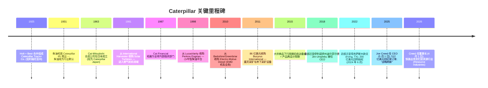
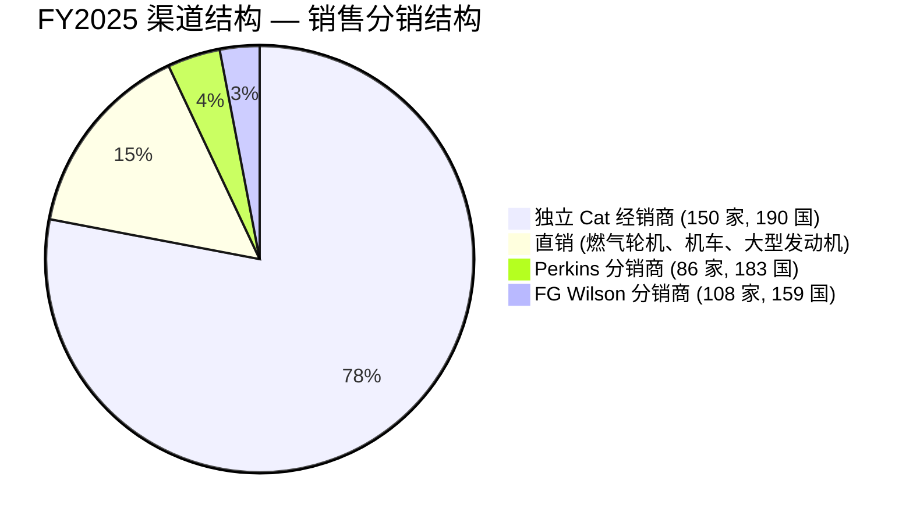
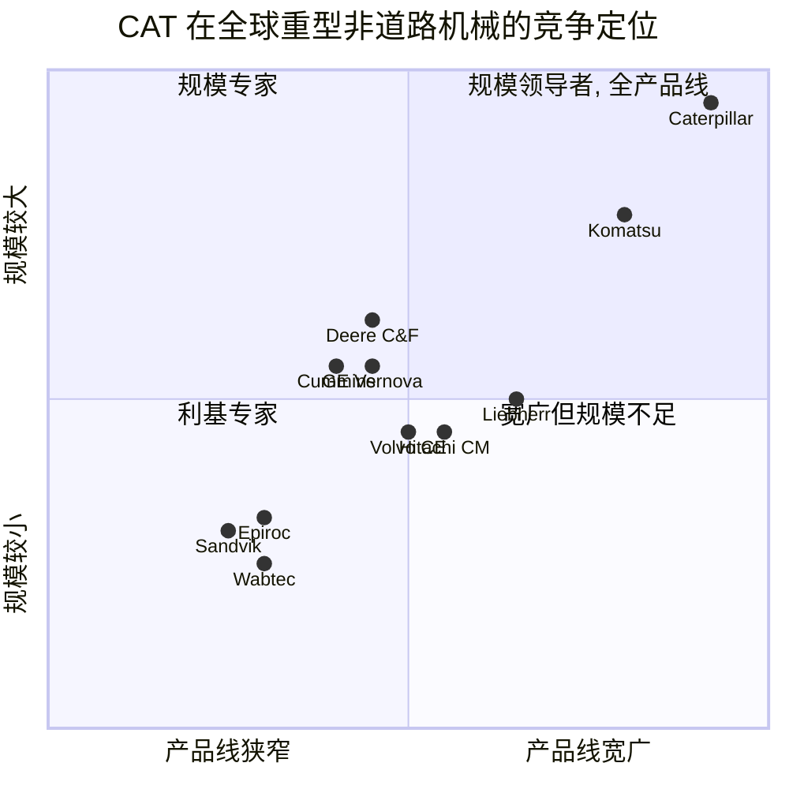

# Caterpillar Inc. (NYSE:CAT) — 公司研究报告

**截至日期: 2026-05-20**
**上市地: 纽约证券交易所 (NYSE), 代码 CAT**
**注册地: 美国得克萨斯州欧文 (Irving, Texas)**
**报告语言: 简体中文 (英文版同时存在于本目录)**
**分析师备注:** 首次覆盖。除非另有说明, 所有金额均以美元计。财年截止日为 12 月 31 日。

> **业绩更新——2026 财年展望 (2026-04-30):** 在 2026 年第一季度 (Q1-2026) 业绩公告中, Caterpillar 重申预计 2026 全年销售与营业收入将增长至公司 5–7% 复合年增长率 (CAGR) 目标的"接近上限", 对应 2025 年的 675.89 亿美元基数; 价格实现 (price realisation) 预计约占销售的 2%, 同时预计经销商机器库存将出现一次回补, 用以扭转 2025 年 5 亿美元的去库存 (destock)。管理层亦提示 Q1 关税增量成本约 8 亿美元 (工程机械 (Construction Industries) 50%、能源与动力 (Power & Energy) 30%、资源行业 (Resource Industries) 20%)——与 Q4-2025 类似量级。Q1-2026 营业收入为 174 亿美元 (同比 +22%), 每股盈利 (EPS) 5.47 美元 (同比 +30%), 三大核心业务板块销量增长以及创纪录订单推动 2025 年末确认订单 (firm backlog) 升至 512 亿美元 (上年同期为 300 亿美元)。来源: [Caterpillar 1Q-2026 业绩公告, 2026-04-30](https://www.sec.gov/Archives/edgar/data/18230/000001823026000017/ex991toformcat1q2026earnin.htm); [Caterpillar 2025 年 10-K 年报, 2026-02-13](https://www.sec.gov/Archives/edgar/data/18230/000001823026000008/cat-20251231.htm)。

## 目录
1. 公司概览
2. 公司历史
3. 管理团队
4. 产品与服务
5. 客户与上市策略
6. 行业概览
7. 竞争格局
8. 市场机会 (TAM)
9. 风险评估

---

## 1. 公司概览

Caterpillar Inc. 是全球最大的**工程机械与矿山设备 (construction and mining equipment)** 制造商, 同时也是全球领先的非道路用柴油与天然气发动机、工业燃气轮机 (industrial gas turbines)、以及柴电机车 (diesel-electric locomotives) 制造商, 总部位于美国得克萨斯州欧文市。公司设计、制造并支持那些用以挖填土方、开采矿石、为油气作业供电——并且越来越多地为全球数据中心 (data centre) 提供主电源 (prime power) 与备用电源 (back-up power)——的重型设备。2025 财年合并销售与营业收入为 **675.89 亿美元**, 较 2024 财年的 648.09 亿美元同比增长 4%, 合并营业利润为 **111.51 亿美元** (营业利润率 16.5%), 净利润 **88.84 亿美元** ([Caterpillar 2025 10-K, 2026-02-13](https://www.sec.gov/Archives/edgar/data/18230/000001823026000008/cat-20251231.htm))。

**Caterpillar 的盈利方式。** 公司业务划分为五个经营板块——其中四个为可报告板块——归入两个伞形分类:

- **机械、动力与能源 (Machinery, Power & Energy, MP&E)** ——工业业务部分, 包括**工程机械 (Construction Industries)** (FY2025 营业收入 250.60 亿美元, 同比 –2%)、**资源行业 (Resource Industries)** (124.74 亿美元, 同比持平)、以及**能源与动力 (Power & Energy)** (322.01 亿美元, **同比 +12%**), 另含一个"其他"板块。MP&E 在 FY2025 贡献了 108.84 亿美元的营业利润。
- **金融产品 (Financial Products)** ——包括 Cat 金融服务 (Cat Financial, 零售与批发性 Caterpillar 设备融资) 以及 Caterpillar 保险控股 (Caterpillar Insurance Holdings)。金融产品在 FY2025 贡献了 8.64 亿美元营业利润 ([Caterpillar 2025 10-K, 2026-02-13](https://www.sec.gov/Archives/edgar/data/18230/000001823026000008/cat-20251231.htm))。

FY2025 营业收入中约 67% 来自设备销售 (新机器、发动机、燃气轮机), 服务性营业收入 (后市场备件、维护、再制造、Cat Reman) 则被管理层明确锁定为按 5–7% 复合年增长率的上限增长——贯穿整个周期 ([Caterpillar 2025 10-K MD&A, 2026-02-13](https://www.sec.gov/Archives/edgar/data/18230/000001823026000008/cat-20251231.htm))。

**经营区域。** Caterpillar 通过全球独立经销商网络服务于 190 个国家——共有 **150 家 Cat 品牌经销商, 其中美国境内 41 家, 美国境外 109 家**, 另有 86 家 Perkins 分销商分布于 183 个国家, 以及 108 家 FG Wilson 分销商分布于 159 个国家 ([Caterpillar 2025 10-K, "Distribution"节, 2026-02-13](https://www.sec.gov/Archives/edgar/data/18230/000001823026000008/cat-20251231.htm))。仅 Q1-2026 北美地区即贡献合并营业收入 **102.30 亿美元** (同比 +32%); 欧洲、非洲、中东 (EAME) 30.08 亿美元 (+20%); 亚太地区 25.85 亿美元 (+4%); 拉丁美洲 15.92 亿美元 (+5%) ([Caterpillar 1Q-2026 业绩公告, 2026-04-30](https://www.sec.gov/Archives/edgar/data/18230/000001823026000017/ex991toformcat1q2026earnin.htm))。

**规模指标。** 截至 2025 年 12 月 31 日, Caterpillar 在全球拥有**约 118,000 名全职员工**, 其中约 51,600 人在美国境内, 66,400 人在美国境外 ([Caterpillar 2025 10-K, "人力资本"节, 2026-02-13](https://www.sec.gov/Archives/edgar/data/18230/000001823026000008/cat-20251231.htm))。2025 年末的确认订单 (firm order backlog) 为 **512 亿美元**, 较一年前的 300 亿美元跃升 71%, 其中**能源与动力**贡献了最大增量 ([Caterpillar 2025 10-K, "Backlog"节, 2026-02-13](https://www.sec.gov/Archives/edgar/data/18230/000001823026000008/cat-20251231.htm))。下图展示 FY2021–FY2025 的五年营业收入与营业利润率轨迹。

*来源: [Caterpillar 2025 10-K, 2026-02-13](https://www.sec.gov/Archives/edgar/data/18230/000001823026000008/cat-20251231.htm) (FY2022–FY2025); [Caterpillar 2023 10-K, 2024-02-15](https://www.sec.gov/cgi-bin/browse-edgar?action=getcompany&CIK=0000018230&type=10-K) (FY2021)。*

**估值快照。** 以近期收盘价 **875.50 美元** (收盘 2026-05-19) 计, Caterpillar 市值约 **4,030 亿美元**, 企业价值 (EV) 约 4,360 亿美元 ([Yahoo Finance — CAT 主要指标, 2026-05-19](https://finance.yahoo.com/quote/CAT/key-statistics))。股价对应 **TTM 市盈率 (P/E) 43.7 倍**、**TTM 市销率 (P/S) 5.70 倍**、**市净率 (P/B) 21.6 倍**、**EV/EBITDA 29.9 倍**——较周期平均显著溢价。FY2021–FY2026 的五年 P/E 区间大致在 12 倍 (2022 Q3 周期低点) 到当前约 44 倍之间; 当前 TTM P/E 是公司前 AI 时代约 15–18 倍十年中位数的 2 倍以上。

为何这一资本密集型工业品标的的溢价异常之高:

- **与 AI 数据中心电力相关的高增长溢价。** 能源与动力业务 FY2025 同比增长 12% 至创纪录的 322.01 亿美元, 营业利润率 19.9% (同比 +6.82 亿美元), 驱动力主要来自数据中心应用的大型往复式发动机, 以及面向油气与备用/主电源市场的 Solar 燃气轮机 ([Caterpillar 2025 10-K MD&A — Power & Energy, 2026-02-13](https://www.sec.gov/Archives/edgar/data/18230/000001823026000008/cat-20251231.htm); [Caterpillar 4Q-2025 业绩公告, 2026-01-29](https://www.sec.gov/Archives/edgar/data/18230/000001823026000003/cat_exx991x4qx2025xearning.htm))。市场已经越来越多地把能源与动力业务视为**超大规模数据中心 (hyperscaler) 供应链代理对象**——可参见 Vertiv (VRT, P/E 60×+)、Eaton、GE Vernova 和 Cummins 在同一主题下的估值重估。
- **订单跃迁。** 确认订单 (firm backlog) 2025 年末攀升至 **512 亿美元**, 其中只有 319 亿美元预计在 2026 年内交付 ([Caterpillar 2025 10-K, "Backlog"节, 2026-02-13](https://www.sec.gov/Archives/edgar/data/18230/000001823026000008/cat-20251231.htm))。市场正逐步把这种跨年度可见度资本化。
- **周期性结构正在轮换。** 工程机械是周期性脆弱环节 (2025 年因关税/价格逆风, 营业利润率收缩 550 个基点至 18.7%), 但能源与动力的结构性增长 (2025 年板块利润同比 +24%) 正把合并盈利结构推向更长周期、更重服务收入的方向。

同业比较 (TTM): **Deere (DE) 31.8× P/E, 3.27× P/S, 22.2× EV/EBITDA; Cummins (CMI) 34.7× P/E, 2.72× P/S, 19.4× EV/EBITDA; PACCAR (PCAR) 23.8× P/E, 2.12× P/S; Oshkosh (OSK) 14.0× P/E, 0.75× P/S** ([Yahoo Finance, 2026-05-19](https://finance.yahoo.com/quote/DE/key-statistics))。Komatsu (TYO:6301) 的 ADR (KMTUY) 流动性较差; 其本土主板股 P/E 约 15 倍 ([Reuters Komatsu 公司简介, 2026-04](https://www.reuters.com/markets/companies/6301.T))。Volvo 的本土主板股 AB Volvo (STO:VOLV-B) 交易在 P/E 约 14–16 倍、P/B 约 3–4 倍区间 ([Reuters Volvo 公司简介, 2026-04](https://www.reuters.com/markets/companies/VOLVb.ST))。因此, CAT 的溢价不仅相对美国同业, 亦相对全球同业显著。我们在第 9 章中明确提示估值/倍数压缩风险。

*来源: [Yahoo Finance 主要指标, 2026-05-19](https://finance.yahoo.com/quote/CAT/key-statistics)。CAT 的 P/B 21.6× 反映的是大额回购缩减账面权益, 而非资产负债表问题。*

---

## 2. 公司历史

Caterpillar Tractor Co. 由两家加州竞争对手于 1925 年合并形成: **Holt Manufacturing Co.** (1904 年由摄影师 Charles Clements 把履带式拖拉机比作"毛毛虫"——"caterpillar"——而起名, 也是"Caterpillar"履带式拖拉机商号的原始来源) 与 **C.L. Best Gas Traction Co.**。合并后形成了向 1920 年代美国中西部农业与基础设施热潮提供履带式拖拉机的单一供应商 ([Caterpillar — 公司历史](https://www.caterpillar.com/en/company/history.html))。公司于 1928 年将总部迁至伊利诺伊州皮奥里亚 (Peoria, Illinois), 此后近 90 年驻地不变, 直到 2018 年首次将全球总部迁至伊利诺伊州迪尔菲尔德 (Deerfield, IL), 2022 年再迁至**得克萨斯州欧文市 (Irving, Texas)** ([Reuters, 2022-06-14](https://www.reuters.com/business/caterpillar-move-its-global-headquarters-deerfield-illinois-irving-texas-2022-06-14/))。

*来源: [Caterpillar 公司历史页面](https://www.caterpillar.com/en/company/history.html); [Caterpillar 2025 10-K, 2026-02-13](https://www.sec.gov/Archives/edgar/data/18230/000001823026000008/cat-20251231.htm); [Caterpillar 2026 年委托书 (Proxy Statement), 2026-04-30](https://www.sec.gov/Archives/edgar/data/18230/000130817926000358/cat-20260610.htm)。*

**三大战略转折。** 对当前投资逻辑有意义的结构性转向有三项。

1. **从纯周期性标的转向服务与电力故事 (2017–至今)。** 在 Jim Umpleby 任 CEO 期间 (2017–2025), Caterpillar 明确以服务收入增长为目标, 并加大对互联/自动化解决方案及能源与动力 (跨越更长周期的资本开支) 产品的投资 (油气燃气轮机、用于主电源的大型往复式发动机)。结果显而易见: 能源与动力营业收入由 FY2020 约 190 亿美元增长至 FY2025 的 322 亿美元, 占 MP&E 销售的比重由约 32% 上升至约 47% ([Caterpillar 2025 10-K MD&A, 2026-02-13](https://www.sec.gov/Archives/edgar/data/18230/000001823026000008/cat-20251231.htm))。

2. **2011 年 Bucyrus 收购 (86 亿美元)。** 这是 Caterpillar 史上最大一笔交易, 让公司大规模进入露天采矿铲、拉铲挖掘机 (dragline) 与井下采矿领域, 补充了传统的工程机械业务版图。该笔交易的时机不佳——大宗商品价格在 2011–2012 年正达顶峰——并直接导致了 2015–2017 年的多年度重组。然而, Bucyrus 如今已成为资源行业高利润率采矿技术与自动化运输 (autonomous haulage) 产品组合的脊梁。

3. **2025 年战略刷新。** 2025 年 5 月 CEO 交接同期, 公司提出新版战略与新使命 ("Solving our customers' toughest challenges"), 同时确立三大增长支柱——**商业卓越 (Commercial Excellence)、先进技术领导 (Advanced Technology Leader)、变革工作方式 (Transform How We Work)**, 与长期以来作为基础的**运营卓越 (Operational Excellence)** 并行 ([Caterpillar 2025 10-K, "Item 1 Business"节, 2026-02-13](https://www.sec.gov/Archives/edgar/data/18230/000001823026000008/cat-20251231.htm))。

**近期动态。** 2026 年 3 月, Caterpillar 宣布将自 Q1-2026 起把铁路 (机车、铁路服务) 业务由**能源与动力**调整至**资源行业**报告板块, "以建立合适的基准" ([Caterpillar 8-K — 其他事件, 2026-03-26](https://www.sec.gov/Archives/edgar/data/18230/000001823026000013/cat-20260326_d2.htm))。企业合并总数不变。资本回报继续积极: FY2025 公司在股份回购上支出 **51.90 亿美元**, 支付股息 **27.49 亿美元** ([Caterpillar 2025 10-K MD&A, 2026-02-13](https://www.sec.gov/Archives/edgar/data/18230/000001823026000008/cat-20251231.htm)); 仅在 Q1-2026 即另有 50 亿美元回购加 7 亿美元股息 ([1Q-2026 业绩公告, 2026-04-30](https://www.sec.gov/Archives/edgar/data/18230/000001823026000017/ex991toformcat1q2026earnin.htm))。

---

## 3. 管理团队

**Joseph E. "Joe" Creed — 董事长兼首席执行官 (50 岁; 2025 年 5 月 1 日起任 CEO; 2026 年 4 月 1 日起兼任董事长)。** Creed 是 Caterpillar 2025 年战略刷新的设计师, 也是一名近 30 年的 Caterpillar 本地培养干部, 出身于公司财务系统。在出任 CEO 前, 他于 2023–2025 年担任能源与运输 (现能源与动力) 业务集团总裁, 期间监督了该板块从"油气主导"向"数据中心电力"的转型——正是这一板块如今驱动着企业 EBIT 增量中的最大单一部分。更早前的职位包括 Caterpillar 首席财务官 (CFO, 2020–2023)、副总裁兼司库 (Treasurer), 以及工程机械与 Cat 金融服务多个运营财务领导岗位 ([Caterpillar 2026 年委托书, 2026-04-30](https://www.sec.gov/Archives/edgar/data/18230/000130817926000358/cat-20260610.htm))。Creed 持有 Bradley 大学金融学学士学位与 Bradley 大学 MBA 学位。

Creed 之所以举足轻重, 原因有三: (1) 他既是当前战略的设计师, 又是如今贡献 MP&E 约 58% 营业利润的业务板块前负责人; (2) 在他出任 CEO 不到一年时, 独立董事便作出**合并董事长与 CEO 角色**的非常规决定, 明确目的是为了让他在关税、资本开支配置与经销商关系问题上具备决策速度 ([Caterpillar 2026 年委托书 — 董事会领导结构, 2026-04-30](https://www.sec.gov/Archives/edgar/data/18230/000130817926000358/cat-20260610.htm)); 以及 (3) 他在该岗位上异常年轻 (50 岁, 而大盘工业品 CEO 的行业中位数为约 62 岁)。他的公开个性低调——仅出席投资者日——但在公司内部以"数字驱动型经营者"著称, 曾在疫情供应链中断期间推动能源与动力业务整体前进。按委托书披露, 他持有约 0.02% 的普通股; 长期激励薪酬绝对以股权为主 (≥70% 为 PRSU, 与 OPACC、服务营业收入增长及 TSR 挂钩) ([2026 年委托书, p. 55, 2026-04-30](https://www.sec.gov/Archives/edgar/data/18230/000130817926000358/cat-20260610.htm))。其与 TSR 挂钩的股权确保他与股东在 2026 年关税扰动期间的利益对齐。

**Andrew "Andy" Bonfield — 首席财务官 (2018 年起任)。** Bonfield 是一名英国会计师, 他自 National Grid plc 加入 Caterpillar, 曾于 2010–2018 年在 National Grid 任 CFO; 此前更早曾担任 Cadbury Schweppes (2002–2008) 与 Bristol-Myers Squibb (2008–2010) 的 CFO。因此, 他是一位四次担任大盘上市公司 CFO 的资深财务高管——这是一份异常深厚的上市公司财务经验履历。在他任内, Caterpillar 在 2020–2021 年于低收益环境下再融资了长期债务、推动完成了 2018–2025 年累计 350 亿美元回购计划, 并在周期性下行周期间维持了公司**A 中段信用评级** ([Caterpillar 2026 年委托书, p. 50, 2026-04-30](https://www.sec.gov/Archives/edgar/data/18230/000130817926000358/cat-20260610.htm))。他的资本配置框架 ("在合理时间窗口内将 MP&E 全部自由现金流回馈股东") 是 M&A 的硬约束——Caterpillar 自 Bucyrus 以来未做过任何重大战略并购, 部分正是源于 Bonfield 的设计。

**Bob De Lange — 服务、分销与数字化业务集团总裁。** 一位 30 多年的 Caterpillar 比利时籍老兵, 现领导服务战略 (公司最大的内部增长杠杆), 同时负责全球经销商网络和 Cat Digital。前述 5–7% 服务 CAGR 目标即坐落于他的业务范围内。他先前主管工程机械。

**Denise Johnson — 资源行业业务集团总裁。** 毕业自密歇根州立大学的工程师, 早期职业生涯在通用汽车 (General Motors)。她自 2016 年起领导资源行业, 在推动 Cat MineStar (Cat 矿星) 自动化运输技术平台——目前在露天采矿领域居于市场领先地位——上发挥了关键作用 ([Caterpillar 2026 年委托书, 2026-04-30](https://www.sec.gov/Archives/edgar/data/18230/000130817926000358/cat-20260610.htm))。

**Christy Pambianchi — 首席人力资源官 (2025 年 5 月 1 日起任)。** 为支持战略刷新而新引进的高管; 此前任 Intel 与 Verizon 的 CHRO。Caterpillar 给予她一次性 550 万美元的 PRSU 入职授予 (用以补偿其放弃的 Intel 股权), 加上 45 万美元现金签约金, 均在 2026 年委托书中披露 ([2026 年委托书, p. 73, 2026-04-30](https://www.sec.gov/Archives/edgar/data/18230/000130817926000358/cat-20260610.htm))。

**治理结构。** 按 2026 年委托书披露, 董事会共有 12 名董事, 首席独立董事 (Lead Independent Director) 为 **Debra L. Reed-Klages** (前 Sempra Energy 董事长兼 CEO)。12 名中 11 名为独立董事 (2025 年仅 Creed 与即将退休的 Umpleby 为非独立董事; Umpleby 于 2026 年 4 月 1 日退休后, 仅剩 Creed 一人为非独立董事)。独立董事平均任期约 6 年。董事持股最低要求为**年现金应付报酬的 5 倍** (15 万美元 × 5 = 75 万美元); CEO 的高管持股目标为**基本工资的 6 倍**。内部人持股约占已发行股份的 0.4%——这对一家 100 年历史的美国工业公司是典型水平——但利益对齐主要是结构性的 (重股权薪酬加积极回购缩减流通股)。过去五年薪酬投票 (say-on-pay) 平均支持率超过 92%。

**业绩记录。** 在 Umpleby 八年 CEO 任期内 (2017 年 1 月 – 2025 年 4 月), 营业收入由 385 亿美元增长至 676 亿美元 (CAGR 约 7.3%), 营业利润率由约 11% 扩张至约 16–20%, 总股东回报 (TSR) 显著跑赢标普 500 工业板块。Creed 接过的局面是: 干净的资产负债表、创纪录的订单, 以及公司数十年来最有利的终端市场结构 (电力发电)。他需要"证明自己"的关键事项, 是在 2026 年关税周期中执行到位, 同时不影响服务与能源与动力的长期投入。

---

## 4. 产品与服务

Caterpillar 的产品组合规模庞大: 2025 年 10-K 中的产品清单涵盖逾 200 个独立机器与发动机族系。四大可报告板块及其旗舰产品系列概览如下。

*来源: [Caterpillar 2025 10-K 产品清单, 2026-02-13](https://www.sec.gov/Archives/edgar/data/18230/000001823026000008/cat-20251231.htm); [Caterpillar 产品页](https://www.caterpillar.com/en/products.html)。*

### 工程机械 (Construction Industries) — FY2025 营业收入 250.60 亿美元 (同比 –2%; 利润率 18.7%)

该板块支撑基础设施、重型与一般建筑施工、租赁, 以及采石/集料市场。旗舰产品涵盖液压挖掘机 (Cat 320 / 336 / 374 / 395)、轮式装载机 (950 / 966 / 980 / 988 / 990)、履带式推土机 (D3 到 D11——包括用于露天采矿的著名 D11 推土机, 以及国防应用的 D9)、挖掘装载机、平地机、铰接式自卸车, 以及面向发展中经济体的价格定位 SEM 品牌机器 ([Caterpillar 2025 10-K, "Construction Industries"节, 2026-02-13](https://www.sec.gov/Archives/edgar/data/18230/000001823026000008/cat-20251231.htm))。

**竞争优势: 有——多重护城河。** 工程机械的护城河由以下几个层次构成: (i) 全球最大的经销商网络——150 家 Cat 品牌经销商, 拥有数十亿美元的车队库存与备件仓库, 分布于 190 个国家; (ii) 品牌力以及行业最高的二手设备残值 (Cat 二手设备在拍卖价指数中持续领先于 Komatsu、Volvo、John Deere); (iii) 整体拥有成本 (TCO, Total Cost of Ownership) 导向的产品工程——公司明确指出"工程机械 2025 年研发投入聚焦于下一代工程机械, 优先考虑发达市场最低 TCO"([Caterpillar 2025 10-K, "Construction Industries"节, 2026-02-13](https://www.sec.gov/Archives/edgar/data/18230/000001823026000008/cat-20251231.htm))。

最接近的直接竞争产品: **Komatsu 的 PC 与 WA 系列挖掘机/轮式装载机** (相近尺寸级别) ——硬件层面大致平起平坐, Cat 在北美的后市场和经销商密度上领先; **Deere Construction & Forestry** (规模较小, 在北美林业/紧凑机型上最强); **Volvo CE EC 系列** (在北美略落后, 但在 EAME 更强)。FY2025 板块利润同比下滑 24% 至 46.75 亿美元, 主要原因为**11.36 亿美元的不利价格实现以及 6.71 亿美元的不利制造成本——后者主要为关税**([Caterpillar 2025 10-K, "Construction Industries"节, 2026-02-13](https://www.sec.gov/Archives/edgar/data/18230/000001823026000008/cat-20251231.htm))。公司明确的 2026 年逻辑是: 价格正常化的回补 + IIJA 驱动的基础设施支出 + 数据中心建设需求三因素共同回暖。

### 资源行业 (Resource Industries) — FY2025 营业收入 124.74 亿美元 (同比持平; 利润率 15.9%)

资源行业 (前身为矿业部门, 在 2011 年 Bucyrus 收购后扩张) 销售 Caterpillar 制造的最大设备——400 吨级矿用卡车 (797F、798 AC、新型 798)、电铲 (原 Bucyrus 7495 系列)、液压矿用挖掘机 (6020 到 6060)、轮式拖拉机—铲运机, 用于采矿与采石/集料应用的平地机, 以及一整套井下采矿设备 (长壁工作面系统、连续采煤机、房柱式钻机) ([Caterpillar 2025 10-K, "Resource Industries"节, 2026-02-13](https://www.sec.gov/Archives/edgar/data/18230/000001823026000008/cat-20251231.htm))。

**竞争优势: 有——技术 + 装机基础。** 这里的护城河来自三个层次: (i) **Cat MineStar (Cat 矿星) 自动化运输平台**——按部署车队规模计, 是行业领先的自动化矿用卡车解决方案; (ii) 在所有主要铜矿、铁矿、金矿和油砂客户中的深度装机基础, 即使在新设备销售放缓时, 服务收入仍然在装机基础上滚动复利; (iii) 与工程机械共用零部件 (发动机、传动) 形成的规模经济, 拉低了成本曲线。Caterpillar 把**Deere Construction & Forestry、Epiroc、Hitachi Construction Machinery、Komatsu、Liebherr-International、Sandvik AB、Volvo Construction Equipment** 列为全球露天采矿竞争对手, 把 **Epiroc、Komatsu 与 Sandvik** 列为全球井下采矿竞争对手 ([Caterpillar 2025 10-K, "Resource Industries — 竞争"节, 2026-02-13](https://www.sec.gov/Archives/edgar/data/18230/000001823026000008/cat-20251231.htm))。Komatsu 是露天采矿用卡车类别中最接近的对位; 而在以装机卡车数量计的自动化运输方面, Caterpillar 居于行业领先。

**矿业超级周期的投资逻辑:** 管理层预计**2026 年资源行业终端用户设备销售将同比增长**, 驱动力来自铜与黄金需求上行, 以及随着全球矿山车队保持高龄化而增加的再制造活动 ([Caterpillar 2025 10-K 展望, 2026-02-13](https://www.sec.gov/Archives/edgar/data/18230/000001823026000008/cat-20251231.htm))。在铜价被数据中心电气化与电动汽车需求结构性买入的背景下, 这是一项跨越多年的顺风结构。

### 能源与动力 (Power & Energy) — FY2025 营业收入 322.01 亿美元 (同比 +12%; 利润率 19.9%) — 结构性增长故事

能源与动力是 FY2025 规模最大、增长最快、利润率最高的板块——也是 CAT 估值重估的核心原因。板块利润**同比增长 12% 至 64.18 亿美元**, 驱动力为销量增长 9.72 亿美元以及有利价格实现 5.92 亿美元 ([Caterpillar 2025 10-K, "Power & Energy"节, 2026-02-13](https://www.sec.gov/Archives/edgar/data/18230/000001823026000008/cat-20251231.htm))。

产品组合:

- **往复式发动机与发电机组 (Reciprocating Engines & Generator Sets)** —— Cat 品牌的大型柴油机与天然气发动机, 功率从千瓦到兆瓦级; Perkins (1998 年收购) 与 FG Wilson 品牌主打中等功率段; **MaK 船用发动机**。在数据中心应用中, 大型往复式发电机组既用作**超大规模数据中心园区的备用电源 (back-up power)**, 也越来越多地用作**主电源 (prime power)** ——尤其当某些场地的电网容量受限时。"电力发电——销售在大型往复式发动机上有所增加, 主要来自数据中心应用"是公司在 Q4-2025 的披露原文 ([Caterpillar 4Q-2025 业绩公告, 2026-01-29](https://www.sec.gov/Archives/edgar/data/18230/000001823026000003/cat_exx991x4qx2025xearning.htm))。
- **Solar Turbines** (1981 年收购) —— 工业燃气轮机, 功率从 1 MW 到 30+ MW。Taurus、Mars、Centaur 与 Titan 系列服务于油气压缩, 也越来越多地服务于公用事业级与现场数据中心发电 ([Solar Turbines 产品页](https://www.solarturbines.com/en_US/products.html))。Solar 当前创纪录的燃气轮机订单是一条跨年度营业收入主线。
- **电气化动力总成与 BESS (Battery Energy Storage System, 电池储能系统)** —— 面向采矿与主电源的新兴零排放与混合动力解决方案。
- **机车 (Electro-Motive Diesel, EMD)** —— 服务北美货运铁路的柴电机车, 加上铁路服务。注: 自 2026 年起, 铁路业务将报告于**资源行业**, 而非能源与动力 ([Caterpillar 8-K, 2026-03-26](https://www.sec.gov/Archives/edgar/data/18230/000001823026000013/cat-20260326_d2.htm))。
- **Cat Reman** —— 发动机与部件再制造。

**竞争优势: 有——组合中最强者。** 能源与动力受益于: (i) **燃气轮机和机车采用直销** (Caterpillar 在这些产品上绕过经销商——"我们直接将一部分产品销售给终端客户, 主要是燃气轮机与机车"——保留更多利润率和客户关系于公司内部 — [Caterpillar 2025 10-K, "Distribution"节, 2026-02-13](https://www.sec.gov/Archives/edgar/data/18230/000001823026000008/cat-20251231.htm)); (ii) 装机基础后市场, Solar Turbines 的服务收入跑在溢价利润率上; (iii) 在大型燃气轮机领域可信赖的竞争对手数量极为有限 (Solar、Siemens Energy、Mitsubishi Power、GE Vernova), 形成有效的寡头定价格局; (iv) Caterpillar 自行命名的对位竞争对手——往复式领域为**Cummins、Deutz、Rolls-Royce Power Systems、Siemens Energy**, 相邻应用领域为**GE Vernova、Kawasaki Heavy、MAN/Everllence、Weichai Power (潍柴动力)** ([Caterpillar 2025 10-K, "Power & Energy — 竞争"节, 2026-02-13](https://www.sec.gov/Archives/edgar/data/18230/000001823026000008/cat-20251231.htm))。

2026 年展望是公司历史上最为乐观的: "我们预计 2026 年发电业务在往复式发动机、燃气轮机及燃气轮机相关服务上都将增长, 驱动力是用以支持云计算与生成式人工智能 (AI) 数据中心建设的能源需求增加。此外, 我们开始看到主电源 (prime power) 订单趋于走高, 这是数据中心客户在寻求替代电源方案以跟上其增长速度的体现" ([Caterpillar 2025 10-K 展望, 2026-02-13](https://www.sec.gov/Archives/edgar/data/18230/000001823026000008/cat-20251231.htm))。

*来源: [Caterpillar 2025 10-K MD&A, 2026-02-13](https://www.sec.gov/Archives/edgar/data/18230/000001823026000008/cat-20251231.htm)。*

### 金融产品 (Financial Products) — FY2025 营业收入 35.86 亿美元 / 营业利润 8.64 亿美元 (同比 +43%)

Cat 金融服务是 Caterpillar 的捕获性融资部门 (captive finance arm), 提供零售贷款、租赁、营运资金额度、循环信贷账户及批发经销商融资——含经销商库存与租赁车队融资。保险服务提供延保、合约责任及物理损害险 ([Caterpillar 2025 10-K, "Financial Products"节, 2026-02-13](https://www.sec.gov/Archives/edgar/data/18230/000001823026000008/cat-20251231.htm))。

**竞争优势: 有——使能型 captive (捕获性)。** 这一竞争优势并非真正独立——而是与 MP&E 业务形成共生关系。Cat 金融服务的主要角色是"支撑 Caterpillar 产品与服务的销售", 这意味着其信用承做边界可以比独立第三方贷款机构更深, 因为它精确了解设备残值与经销商信用状况。值得注意的是, 2025 年 10-K 提到 Cat 金融服务在 FY2025 收官时**维持了健康的逾期表现, 录得十年以上最低信用损失** ([Caterpillar 4Q-2025 业绩公告, 2026-01-29](https://www.sec.gov/Archives/edgar/data/18230/000001823026000003/cat_exx991x4qx2025xearning.htm))。Cat 保险服务在 Q4-2025 因有利保费率为板块利润贡献了额外 3,700 万美元 ([4Q-2025 公告, 2026-01-29](https://www.sec.gov/Archives/edgar/data/18230/000001823026000003/cat_exx991x4qx2025xearning.htm))。

### 旗舰产品与长尾产品

**驱动投资逻辑的旗舰产品:** (1) **Cat 用于数据中心主/备用电源的大型往复式发动机** (能源与动力 2025–2026 年最大增长驱动力); (2) **Solar Turbines** (寡头格局的燃气轮机加上创纪录的油气订单); (3) **Cat MineStar 自动化采矿** (资源行业的技术杠杆)。长尾/传统产品包括 EMD 机车 (周期性强, 2026 年将调整至资源行业板块) 和 SEM 品牌机器 (发展中市场的价格防御阵线)。

**近 12 个月的新品发布与产品停售。** Caterpillar 推出了用于数据中心应用的**下一代发动机**, 并加速了大型发动机制造产能的建设 (印第安纳州 Lafayette 等基地详见 10-K)。Cat Digital 于 2025 年发布 Cat Productivity 2.0, 整合经销商接入的 AI 车队管理功能。铁路业务的板块重新分类 (2026 年 3 月) 更多属于会计性质而非产品改动, 但向外释放了将机车服务与采矿服务深度整合在资源行业内的信号。

---

## 5. 客户与上市策略

Caterpillar 客户结构在四个宏观分类上展开: (i) 重型建筑承包商与租赁公司 (终端市场最为零散——全球数万个账户); (ii) 矿业巨头 (BHP、Rio Tinto (力拓)、Vale (淡水河谷)、Glencore (嘉能可)、Freeport-McMoRan (自由港麦克莫兰)、Anglo American, 以及智利、秘鲁与澳大利亚的铜矿和金矿); (iii) 油气运营商与中游公司——通过 EPC 总承包商, Solar 燃气轮机和发动机用于天然气压缩与气举 (gas lift); 公开的终端用户包括 Aramco (沙特阿美)、ExxonMobil (埃克森美孚)、Shell (壳牌)、BP (英国石油)、TotalEnergies (道达尔能源); (iv) 数据中心开发商与超大规模数据中心 (Microsoft (微软)、Amazon、Google、Meta、Oracle (甲骨文), 以及托管服务商如 Equinix 与 Digital Realty), 他们购买往复式发动机、燃气轮机与配电设备, 用于主电源/备用电源。

**客户集中度。** Caterpillar 在其 FY2025 10-K 中**未点名任何占合并营业收入 10% 或以上的客户**。风险因素章节明确描述了多元化: "我们将产品销售至广泛的行业与应用, 并通过全球经销商网络进行分销" ——10-K 中明确陈述 2025、2024、2023 年均无单一客户占净销售的 10% 或以上 ([Caterpillar 2025 10-K, 板块附注, 2026-02-13](https://www.sec.gov/Archives/edgar/data/18230/000001823026000008/cat-20251231.htm))。因此, 在终端用户层面客户集中度**较低**——最大的单一交易对手实际上是经销商本身 (我们将其归为渠道集中, 而非客户集中)。

**经销商集中度——真正的"集中度"故事。** 几乎所有的工程机械、以及多数资源行业产品都通过 **150 家 Caterpillar 经销商**完成销售 (美国 41 家, 美国境外 109 家)。**Finning International** (加拿大 / 英国 / 南美——TSX:FTT, 2024 年营业收入 92 亿美元) 与 **Toromont Industries** (加拿大东部——TSX:TIH) 等大型经销商是公开上市公司; **Holt Cat** (得克萨斯)、**Wagner Equipment** (美国西部) 和 **Foley Equipment** (中西部) 为私营公司, 但规模均在数十亿美元级。经销商关系由标准的销售与服务协议管辖, 协议授予排他性地理区域。经销商网络的强度也是一种软性的渠道集中度, 不过 Caterpillar 通过长期协议、密集培训以及通过 Cat 金融服务提供经销商融资支持的方式来管理这一风险。

*来源: 基于 [Caterpillar 2025 10-K, "Distribution"节, 2026-02-13](https://www.sec.gov/Archives/edgar/data/18230/000001823026000008/cat-20251231.htm) 披露的估算; 公司未单独披露精确比例。*

**分销渠道。**
- **独立 Cat 经销商网络** —— 主要护城河; 一个资产密集、家族经营的全球生态系统, 拥有数十亿美元的车队、备件与服务能力, 同业公司无法复制。
- **直销** —— 主要面向燃气轮机 (Solar Turbines 在全球均为直销) 与机车。
- **Perkins 分销商** —— 86 家覆盖 183 个国家, 服务 OEM 与小型发动机零售。
- **FG Wilson 分销商** —— 108 家覆盖 159 个国家, 服务该品牌发电系统。

**销售周期。** 变异度极高: 轮式装载机销售给承包商可在几天内通过经销商现货完成; 而向中游管道客户销售一台 30 MW 的 Solar 燃气轮机, 销售与工程化进程可能持续 12–24 个月。矿用卡车的周期最长——铜矿或铁矿巨头的新车队订单, 从询价到交付往往要 18–36 个月, 期间伴随深度的设备规格工程化。2025 年创纪录订单, 即反映了油气客户、数据中心客户与部分矿业客户加速签订, 以锁定 2026–2027 年的交付排期。

**主要合作伙伴关系。** 除经销商外, Caterpillar 与发动机 OEM 合作 (将 Perkins 发动机销售给全球约 5,000 家 OEM)、与铁路客户合作 (一级铁路公司)、通过 Solar Turbines 与能源巨头合作、与超大规模数据中心和主电源开发商合作, 以及与学术/标准组织合作制定自动化采矿协议。战略性供应关系包括钢材 (多源供应) 与燃气轮机所需的专用合金。

**近期点名客户中标。** Vale (淡水河谷) 的自动化运输车队扩张 (巴西); Rio Tinto (力拓) 西澳大利亚州铁矿石替换订单; Solar Turbines 来自 Aramco 与 ExxonMobil 的多机组天然气压缩订单; 多个未具名的超大规模数据中心备用发电机组订单在 FY2025 业绩说明会中披露。

---

## 6. 行业概览

Caterpillar 横跨三个行业——**非道路用机械 (工程机械与矿山设备)**、**非道路用柴油与天然气发动机/发电设备**, 以及**铁路/机车**——再加一个 captive 金融服务业务。各行业动态各不相同。

**工程机械与采矿设备。** 全球非道路用机械市场 2024 年达到约 **2,140 亿美元** ([Off-Highway Research, 2025-02 市场规模, 引用自 Komatsu 战略材料](https://www.komatsu.jp/en/ir/library/annual))。美洲约占 40%, EAME 约 25%, 亚太约 30%, 余下为其他地区。工程机械占大头 (约 1,400–1,500 亿美元), 采矿设备规模相对较小但利润更高 (约 600–700 亿美元)。长期增长为中等单位数, 周期性振幅与大宗商品价格及基础设施支出高度相关。当前周期上有三股结构性顺风: (i) **美国《基础设施投资与就业法案》(IIJA)** —— 1.2 万亿美元授权, 截至 2026 年新增 5,500 亿美元的道路、桥梁、铁路与电网支出, 其中相当一部分将驱动设备需求 ([美国交通部 IIJA 实施页, 2024](https://www.transportation.gov/bipartisan-infrastructure-law)); (ii) **矿业超级周期**, 因铜、金及能源转型矿物需求超过矿山开发产能; (iii) **数据中心建设** —— Caterpillar 在 2025 年 10-K 中专门强调这一新兴终端用途, 称其加强了工程机械与其他建筑活动的需求基础。

**发电设备。** 用于分布式发电、备用电源与油气压缩的往复式发动机及中小型燃气轮机, 全球市场规模约 **250–300 亿美元**, 增速高单位数, 并因超大规模数据中心电力需求爆发而向低双位数重估。Wood Mackenzie 预计**全球数据中心电力需求将从 2024 年约 415 TWh 上升至 2030 年的约 945 TWh**, 增量兆瓦由于电网互联积压, 越来越多由现场天然气发电服务 ([Wood Mackenzie, "Data centres and the power challenge", 2025-09](https://www.woodmac.com/news/opinion/data-centres-power-challenge/))。Caterpillar 在往复式发动机上与 **Cummins** 正面对位 (Cummins 在公路发动机上更广, Caterpillar 在 2 MW 以上等级领先), 在燃气轮机上与 **Siemens Energy、Mitsubishi Power 与 GE Vernova** 对位 (Solar Turbines 占据 1–30 MW 工业级利基市场, H 级巨头并不专注), 并在更小型备用电源与租赁电源市场与 **Generac、Kohler/Rehlko、Aggreko、Atlas Copco** 竞争。

**机车与铁路。** 一个高度集中的全球市场, 北美由 **Wabtec (NYSE:WAB)** 主导, 国际市场则由 **Alstom (阿尔斯通)、Siemens Mobility、CRRC (中国中车)、Vossloh、Stadler** 等主导, Caterpillar 的 **EMD** 单位主要在北美一级货运铁路上竞争。该市场全球规模约每年 200–250 亿美元 (机车 + 备件), 增速低单位数。

**行业动态。** 三个子行业的共性:
- **进入壁垒高。** 资本密集度、长达数十年的装机基础、经销商/分销网络, 以及监管同质化 (发动机排放、噪声、安全) 让新进入者在新兴市场低端 (例如中国 OEM 三一、徐工进入工程机械, 柳工进入轮式装载机) 之外极为困难。
- **供应商-买方动态。** 钢铁与专用合金供应基础相对集中但总体充足; 在关键部件如大型轴承、液压泵、燃气轮机铸件上, 全球只有少数几家合格供应商。
- **替代品。** 对于机器而言, 主要替代品是"不投资" (通过加大再制造与延长服务间隔来延迟资本支出——这反而有利于 Caterpillar 的服务业务)。在主电源领域, 替代品是电网电力与可再生能源+储能; 在这里, Caterpillar 的产品组合在"通电速度"与可靠性上具备竞争力。
- **监管。** EPA Tier 4 与欧盟 Stage V 排放标准已是行业标配; 下一步监管台阶是温室气体 (GHG) 问责, 在这一领域 Caterpillar 提供天然气与混合动力总成, 并在氢能、电池及其他替代燃料解决方案上投入研发。

---

## 7. 竞争格局

**Caterpillar 的竞争地位独特之处在于: 它是全球唯一在 (a) 工程机械与矿山设备、(b) 工业往复式发动机与燃气轮机、(c) 融资业务三方向上同时拥有可观全球规模——并归在同一品牌与同一经销商生态——的公司。** 这三者的整合, 是其护城河的主要来源。

**直接竞争对手分析:**

- **Deere & Company (NYSE:DE — 市值 1,520 亿美元)** —— 在农业机械与中小型工程机械/林业机械领域最强的纯专业玩家。Deere 在精准农业技术与北美紧凑型工程机械经销商密度上领先 Caterpillar, 但不参与采矿级设备、大型发动机或燃气轮机市场。P/E 31.8×, P/S 3.27×, EV/EBITDA 22.2× ([Yahoo Finance — DE 主要指标, 2026-05-19](https://finance.yahoo.com/quote/DE/key-statistics))。

- **Komatsu Ltd. (TYO:6301)** —— 工程机械与采矿设备的全球主要对位竞争对手。Komatsu 的约 300 亿美元营业收入小于 Caterpillar MP&E 业务 (约 640 亿美元), 但 Komatsu 在亚洲市场具有强竞争力, 在部分澳大利亚铁矿石车队的自动化运输上市场份额更高, 在某些挖掘机尺寸级别上处于领先地位。Komatsu 不参与大型燃气轮机市场。在其本土主板上交易显著折价 (约 P/E 15 倍) ([Reuters Komatsu 公司简介, 2026-04](https://www.reuters.com/markets/companies/6301.T))。

- **Cummins Inc. (NYSE:CMI — 市值 920 亿美元)** —— 能源与动力往复式发动机最直接的对位竞争对手, 也是数据中心电力故事中的同业玩家。Cummins 在公路柴油 (8 级卡车) 上更广, 但在工业燃气轮机与机械上更窄。P/E 34.7×, P/S 2.72×, EV/EBITDA 19.4× ([Yahoo Finance — CMI 主要指标, 2026-05-19](https://finance.yahoo.com/quote/CMI/key-statistics))。

- **Volvo Group / Volvo CE (STO:VOLV-B)** —— 卡车主流厂商, 也是工程机械的第二梯队强力对手, 在 EAME 铰接式自卸车与中型轮式装载机上尤为突出。规模比 Caterpillar 小, 在采矿上盈利能力较弱。

- **Sandvik AB (STO:SAND)** —— 露天与井下凿岩工具的领导者, 是井下采矿设备 (长壁工作面、钻机) 的关键竞争对手。Sandvik 与 Epiroc 在井下硬岩开采上合计领先; Caterpillar 在露天采矿硬件上领先。

- **Epiroc AB (STO:EPI-A)** —— 2018 年从 Atlas Copco 分拆, 专注于采矿与基础设施岩石挖掘设备。在井下自动化领域是 Cat MineStar 的强势聚焦型竞争对手。

- **Liebherr-International AG (私营)** —— 瑞士/德国家族控股, 工程机械与采矿设备的全产品线; 规模比 Caterpillar 小, 但全球品牌口碑高。

- **Hitachi Construction Machinery (TYO:6305)** —— 中大型液压挖掘机的强力玩家; 与 Caterpillar 矿用挖掘机存在部分重叠。

- **GE Vernova (NYSE:GEV) / Siemens Energy (XETR:ENR) / Mitsubishi Power** —— 燃气轮机巨头。Solar Turbines 在 1–30 MW 工业利基市场上与上述大型厂商竞争, 但后者并不专注于该尺寸段; 随着数据中心主电源订单加速, 竞争强度上升。

- **Wabtec (NYSE:WAB)** —— EMD 机车在北美的主要对位竞争对手; Wabtec 近年来获得了显著的市场份额。

**CAT 的竞争优势:** (1) 独立经销商网络——无法复制。(2) 品牌口碑与二手设备残值——可在拍卖数据中观察验证。(3) 工业燃气轮机寡头地位 (Solar Turbines)。(4) Cat MineStar 自动化装机基础。(5) Cat 金融服务作为销售推手 (captive financing)。(6) 跨设备全生命周期生成高利润率服务收入的备件与再制造基础设施 (数十年深度积累)。

**CAT 的竞争脆弱性:** (1) **关税敞口** —— FY2025 10-K 明确将 21.48 亿美元不利制造成本中的大部分归因于关税上升 ([Caterpillar 2025 10-K MD&A, 2026-02-13](https://www.sec.gov/Archives/edgar/data/18230/000001823026000008/cat-20251231.htm)), 公司在 Q1 业绩电话会上提示 Q1-2026 关税增量成本约 8 亿美元。(2) 中国挖掘机 OEM 在发展中市场的份额扩张 (三一、徐工、柳工、中联重科 Zoomlion)。(3) 资源行业与能源与动力油气子细分市场面临的大宗商品价格周期性敞口。(4) 历史上 Cummins 在北美超大规模数据中心备用电源市场拥有更深的关系基础 (Caterpillar 正在追赶, 但 Cummins 进入数据中心市场更早)。

*来源: [Caterpillar 2025 10-K, "Backlog"节, 2026-02-13](https://www.sec.gov/Archives/edgar/data/18230/000001823026000008/cat-20251231.htm); [Caterpillar 2023 10-K 订单数据, 2024-02-15](https://www.sec.gov/cgi-bin/browse-edgar?action=getcompany&CIK=0000018230&type=10-K)。*

---

## 8. 市场机会 (TAM)

**全部可寻址市场。** Caterpillar 的可寻址版图由非道路用工程机械与矿山设备、往复式发动机与中小型燃气轮机发电、大型工业柴油发动机、非道路设备融资, 以及机车制造和服务这几个市场加总而成。

- **工程机械与矿山设备**: 2024 年约 2,140 亿美元, 至 2030 年以 4–6% 复合年增长率增至约 **2,800 亿美元** ([Off-Highway Research / Komatsu 战略材料, 2025](https://www.komatsu.jp/en/ir/library/annual))。
- **工业与备用发电** (往复式 + 1–30 MW 燃气轮机): 2024 年全球约 450 亿美元, 至 2030 年以 8–10% 复合年增长率增至约 **750–800 亿美元**, 数据中心电力作为最大单一增长向量。Wood Mackenzie 的数据中心电力需求预测意味着**至 2030 年增量数据中心电力负荷约 530 TWh, 其中约 30–40% 预计由表后燃气发电满足** ([Wood Mackenzie, 2025-09](https://www.woodmac.com/news/opinion/data-centres-power-challenge/))。
- **油气压缩与燃气轮机服务** (Solar Turbines 核心市场): 每年约 200 亿美元, 增速低至中单位数。
- **非道路设备融资** (Cat 金融服务可寻址市场): 与设备销售成比例。
- **机车 + 铁路服务**: 全球每年约 250 亿美元, 增速低单位数。

合并可寻址支出约为**2024 年的 3,200 亿美元, 至 2030 年估约 4,400–4,700 亿美元**, 隐含约 5.5–6% 的混合 CAGR。Caterpillar FY2025 的 676 亿美元企业营业收入意味着约 21% 的 TAM 份额——集中度可观, 但只占任一终端市场的一小部分, 仍存在显著增长跑道。

**SAM 与 SOM。** Caterpillar 的可服务可寻址市场 (SAM, Serviceable Addressable Market) 接近约 2,200 亿美元 (这些市场中 Caterpillar 有产品和经销商覆盖的部分), 公司目前服务约 30%。乐观 2030 情景: 服务以 6–7% CAGR 增长, 能源与动力在数据中心顺风下以 10–12% 复合增长, Caterpillar 到 2030 年合理可达 900–1,000 亿美元营业收入 (CAGR 约 5–7% 基准情境, 处于其公布 5–7% 区间的上限)。

**渗透策略。** 三大向量:

1. **服务收入加速增长** —— 战略上最重要。后市场备件、再制造 (Cat Reman)、客户价值协议 (数字化 + 服务捆绑) 与 Cat Productivity 均具备高于公司平均的利润率, 比新机销售周期性低得多, 并依托装机基础滚动复利。管理层公布的服务营业收入目标是以 5–7% CAGR 上限到 2026 年增长 ([Caterpillar 2025 10-K, 2026-02-13](https://www.sec.gov/Archives/edgar/data/18230/000001823026000008/cat-20251231.htm))。
2. **能源与动力数据中心与油气渗透** —— 大型往复式发动机用于超大规模数据中心主/备用电源, Solar Turbines 用于主电源与油气压缩。2026 年展望预计 Solar 油气销售将创可比纪录, 且往复式发动机增长加速。
3. **发展中市场工程机械复苏** —— 2026 年中国 10 吨以上挖掘机行业从低基数恢复增长, 拉丁美洲与中国以外亚太地区增长。SEM 品牌定位为价格竞争性选项。

*来源: [Caterpillar 2025 10-K 现金流量表, 2026-02-13](https://www.sec.gov/Archives/edgar/data/18230/000001823026000008/cat-20251231.htm); 历史股息/回购数据来自历年 10-K。FY2025 股息支付 27.49 亿美元; FY2025 股份回购 51.90 亿美元。*

---

## 9. 风险评估

### 公司特定风险

**1. 关税与贸易政策敞口。** Caterpillar 披露 FY2025 不利制造成本约**21 亿美元"主要反映关税上升的影响"**, 并预计 Q1-2026 关税增量成本约 8 亿美元, 按业务板块分配为 50% 工程机械、30% 能源与动力、20% 资源行业 ([Caterpillar 2025 10-K MD&A, 2026-02-13](https://www.sec.gov/Archives/edgar/data/18230/000001823026000008/cat-20251231.htm))。鉴于 56% 的员工位于美国境外、全球制造布局深度整合, 一旦美中、美欧贸易摩擦升级, 这将构成材料级的反复盈利逆风。缓解措施: 价格行动 (Caterpillar 在 2026 年指引中取了 +2% 价格)、供应链再平衡, 以及部分组件长期回岸——但这些措施完全落地需要 12–24 个月。

**2. 如果 AI 数据中心资本开支放缓, 能源与动力业务集中度风险。** 企业新的增长驱动力是数据中心主电源/备用电源。如果超大规模数据中心资本开支大幅放缓 (例如 AI 投资回报令人失望, 或电网互联瓶颈缓解, 超大规模数据中心改向公用事业级可再生能源+储能采购), 将直接压制能源与动力业务增长, 从当前 12% 的速度退至历史水平的中单位数。严重性: 物质性——能源与动力在 FY2025 占 MP&E 营业收入的 47%, 营业利润的 59%。

**3. 经销商网络——渠道集中度。** 所有独立 Cat 经销商在其辖区内都是关键的单点交易对手。重大经销商失败 (财务困境、家族继任中断) 可能扰乱区域营业收入。缓解措施: Cat 金融服务的批发融资线提供预警; 经销商关系由具备知识产权保护与培训义务的长期协议管辖。

**4. 关键人物过渡风险。** Umpleby 至 Creed 的 CEO 过渡完成于 2025 年 5 月; 董事长职位在 2026 年 4 月归入 Creed。董事长+CEO 完整任期不到 12 个月, 意味着战略刷新的执行风险溢价。缓解措施: Creed 是公司 28 年老兵, 也是他如今所推行战略的设计师。

**5. 矿业周期性。** 资源行业 2025 年利润同比下降 22% 至 19.88 亿美元, 系价格正常化与关税所致 ([Caterpillar 2025 10-K, "Resource Industries"节, 2026-02-13](https://www.sec.gov/Archives/edgar/data/18230/000001823026000008/cat-20251231.htm))。如果铜价或金价反转, 多年期矿业资本开支逻辑将被削弱。

**6. 中国 OEM 在发展中市场的竞争。** 三一、徐工与柳工在北美以外的挖掘机与轮式装载机上获得了显著份额。SEM 品牌为低端市场提供防守, 但亚洲 (除日本) 地区的利润率压缩是一种持续的实际压力。缓解措施: 服务附着率与经销商覆盖很难被中国 OEM 在短期内复制。

### 行业 / 市场风险

**7. 大宗商品价格周期性。** Caterpillar 自己的 10-K 将能源、运输与采矿行业描述为"重要采用方", 其资本开支与大宗商品价格相关。剧烈的大宗商品下行 (类似 2015–2016) 可在 12–18 个月内将采矿资本开支压低 40% 以上 ([Caterpillar 2025 10-K, "风险因素"节, 2026-02-13](https://www.sec.gov/Archives/edgar/data/18230/000001823026000008/cat-20251231.htm))。缓解措施: 服务营业收入 (占 MP&E 三分之一以上) 周期性低得多, 即使在下行期也持续复利。

**8. 能源转型/电气化扰动。** 长周期风险, 即柴油与天然气动力总成在采矿与工程机械上向电池、氢能与电力替代品丢失份额。Caterpillar 正在投资电气化动力总成与 BESS, 但现有产品组合仍以碳氢化合物为绝对主导。缓解措施: 油气客户的资本开支至 2030+ 仍然强劲; 数据中心客户基于持续运行经济性更偏好天然气而非电池作为主电源。

**9. 排放与噪声监管收紧。** Tier 5 排放与欧盟 CSRD 合规增加了成本。新动力总成的资本成本上升中。缓解措施: 监管成本基本是全行业承担, 而 Caterpillar 的研发支出 (FY2025 为 21 亿美元) 远高于多数同业。

**10. 超大规模数据中心电力自建。** Microsoft、Amazon 与 Meta 正在探索现场天然气、核能 (Microsoft–Three Mile Island、Amazon–Talen) 与直接公用事业合作。如果超大规模数据中心直接从公用事业采购电力或在表后自建电力解决方案, Caterpillar 品牌发电机组与 Solar 燃气轮机的可寻址市场可能比总负荷增长慢一些。

### 财务风险

**11. 估值 / 倍数压缩风险。** 在 TTM P/E 43.7× 与 EV/EBITDA 29.9× 的水平上, 相对同业 DE (31.8× P/E, 22.2× EV/EBITDA)、CMI (34.7× / 19.4×)、PCAR (23.8× / 19.9×) 与 OSK (14.0× / 7.6×), Caterpillar 交易于显著溢价。前 AI 时代的十年中位数 P/E 约为 15–18 倍。当前估值倍数中相当一部分是把以下两点资本化: (a) 至 2020 年代末以约 12% 年复合速率增长的数据中心能源与动力业务; (b) 512 亿美元创纪录订单。如果两者任一不及预期——能源与动力增速低于预期、经销商库存去化超出下行预期、或关税进一步升级压低工程机械营业利润率至 FY2025 的 18.7% 之下——则可能触发 20–30% 的倍数回调, 即便基本面逻辑未变。

**12. Cat 金融服务的信贷周期风险。** 资产负债表上 350 亿美元以上的金融应收账款, 使 Caterpillar 在衰退期内对经销商与客户信贷质量恶化具有敞口。当前逾期处于十年低位, 但快速利率周期反转或大宗商品下行可能重新收紧信贷。缓解措施: Cat 金融服务的承做以设备残值与经销商网络知识为基础, 历史上损失率显著低于银行同业。

**13. 养老金与退休后福利 (OPEB) 波动性。** Caterpillar 经营着规模可观的固定收益型养老金计划 (美国与非美国); 偿付状态对贴现率变动敏感。在去风险化动作之后, 此项重要性比 10 年前低, 但仍是账面权益的摆动因子。

### 宏观经济风险

**14. 美国与全球衰退敞口。** Caterpillar 对工业资本开支高度敏感 (5 年股票 beta 1.625——[Yahoo Finance, 2026-05-19](https://finance.yahoo.com/quote/CAT/key-statistics))。2026–2027 年的美国衰退将同时压制工程机械与 Cat 金融服务信贷质量。缓解措施: 512 亿美元订单提供约 9 个月营业收入可见度; 服务营业收入部分将盈利与新机销售周期解耦。

**15. 利率敏感度。** Cat 金融服务依赖商业票据与定期债务; 资金成本在 2022–2024 年大幅上升。净息差迄今维持, 但利率剧烈变动将对利差形成压力。

**16. 货币敞口。** 约 45% 营业收入为非美元。澳元疲软在 FY2025 给资源行业带来 4,600 万美元不利汇兑; 更广泛的翻译效应可能显著 (例如 2022 年欧元贬值给公司带来数亿美元翻译损失)。Caterpillar 对短期交易敞口进行套保, 但不对长期翻译敞口套保。

---

## 参考资料

### 主要监管文件 (SEC EDGAR)
- [Caterpillar Inc. 2025 年度报告 (10-K, FY2025, 报送 2026-02-13)](https://www.sec.gov/Archives/edgar/data/18230/000001823026000008/cat-20251231.htm)
- [Caterpillar Inc. 季度报告 (10-Q, 截至 2026 年 3 月 31 日, 报送 2026-05-06)](https://www.sec.gov/cgi-bin/browse-edgar?action=getcompany&CIK=0000018230&type=10-Q&dateb=&owner=include&count=40)
- [Caterpillar Inc. 1Q-2026 业绩公告 (8-K, 2026-04-30)](https://www.sec.gov/Archives/edgar/data/18230/000001823026000017/ex991toformcat1q2026earnin.htm)
- [Caterpillar Inc. 4Q-2025 业绩公告 (8-K, 2026-01-29)](https://www.sec.gov/Archives/edgar/data/18230/000001823026000003/cat_exx991x4qx2025xearning.htm)
- [Caterpillar Inc. 2026 年正式委托书 (DEF 14A, 报送 2026-04-30, 会议日 2026-06-10)](https://www.sec.gov/Archives/edgar/data/18230/000130817926000358/cat-20260610.htm)
- [Caterpillar Inc. 8-K — 其他事件 (铁路业务板块重新分类, 2026-03-26)](https://www.sec.gov/Archives/edgar/data/18230/000001823026000013/cat-20260326_d2.htm)
- [Caterpillar Inc. 2024 年度报告 (10-K, FY2024, 报送 2025-02-14)](https://www.sec.gov/Archives/edgar/data/18230/000001823025000008/)

### 公司资源
- [Caterpillar — 公司历史](https://www.caterpillar.com/en/company/history.html)
- [Caterpillar 产品页](https://www.caterpillar.com/en/products.html)
- [Solar Turbines 产品组合](https://www.solarturbines.com/en_US/products.html)
- [Caterpillar 投资者关系](https://www.caterpillar.com/en/investors.html)

### 市场数据
- [Yahoo Finance — CAT 主要指标, 2026-05-19](https://finance.yahoo.com/quote/CAT/key-statistics)
- [Yahoo Finance — DE 主要指标, 2026-05-19](https://finance.yahoo.com/quote/DE/key-statistics)
- [Yahoo Finance — CMI 主要指标, 2026-05-19](https://finance.yahoo.com/quote/CMI/key-statistics)
- [Yahoo Finance — PCAR 主要指标, 2026-05-19](https://finance.yahoo.com/quote/PCAR/key-statistics)
- [Yahoo Finance — OSK 主要指标, 2026-05-19](https://finance.yahoo.com/quote/OSK/key-statistics)
- [Reuters Komatsu (6301.T) 公司简介, 2026-04](https://www.reuters.com/markets/companies/6301.T)
- [Reuters AB Volvo (VOLVb.ST) 公司简介, 2026-04](https://www.reuters.com/markets/companies/VOLVb.ST)

### 行业研究
- [Wood Mackenzie — "Data centres and the power challenge", 2025-09](https://www.woodmac.com/news/opinion/data-centres-power-challenge/)
- [美国交通部 — 两党基础设施法 / IIJA 实施](https://www.transportation.gov/bipartisan-infrastructure-law)
- [Komatsu — 年报 / 战略材料, 2025](https://www.komatsu.jp/en/ir/library/annual)

### 新闻
- [Reuters — "Caterpillar 将全球总部迁至得克萨斯州", 2022-06-14](https://www.reuters.com/business/caterpillar-move-its-global-headquarters-deerfield-illinois-irving-texas-2022-06-14/)
