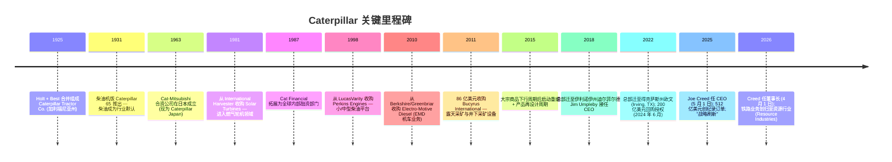
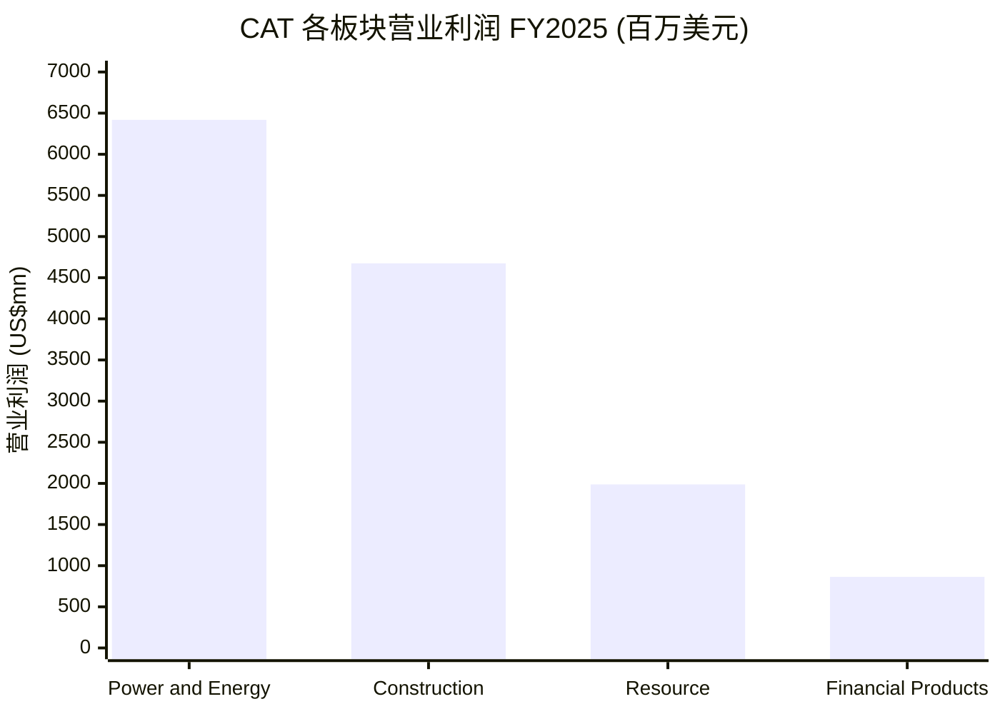
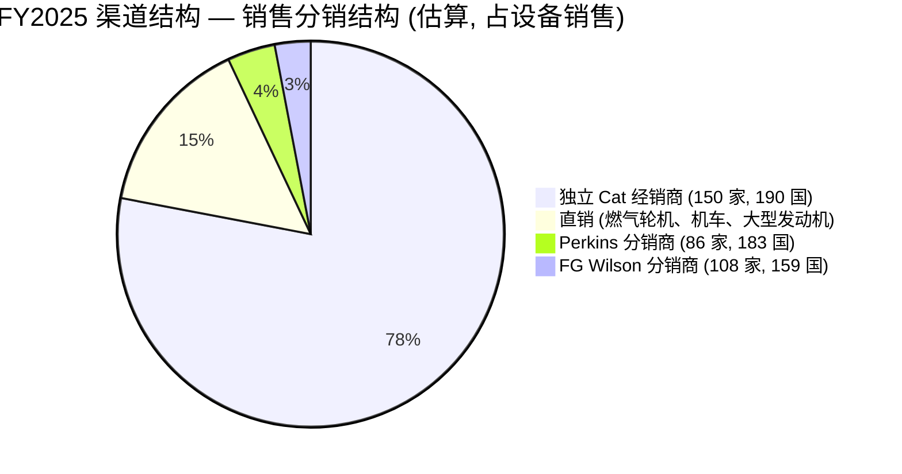
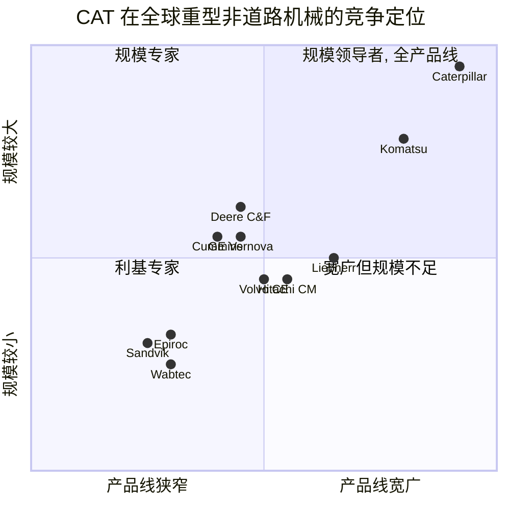

# Caterpillar Inc. (NYSE:CAT) — 公司研究报告

**截至日期: 2026-06-14** · **现价 910.57 美元 (2026-06-12 收盘)** · **市值约 4,194 亿美元**
**上市地: 纽约证券交易所 (NYSE), 代码 CAT** · **注册地: 美国得克萨斯州欧文 (Irving, Texas)** · **财年截止日: 12 月 31 日**
**报告语言: 简体中文 (英文版同时存在于本目录)** · **本次为存量覆盖刷新 (full refresh)，除非另有说明金额均以美元计。**

---

> ### 投资摘要 / Investment Summary (*分析师观点 / Analyst view*)
>
> | 项目 | 数值 |
> |---|---|
> | **评级 / Rating** | **Hold / 中性 (Neutral)** |
> | **12 个月目标价 / 12-mo PT** | **910 美元** (基准情形) |
> | **现价 (2026-06-12 收盘)** | 910.57 美元 |
> | **隐含上行空间** | 约 0%（区间 −31% 至 +29%） |
> | **估值方法** | 2027E EPS 约 29.2 美元 × 31× forward P/E (锚定能源与动力结构增长溢价) |
> | **市值 / 企业价值 (EV)** | 4,194 亿 / 4,592 亿美元 |
> | **52 周区间** | 356.96 – 946.83 美元 |
> | **GF Score (GuruFocus-style)** | **68 / 100**（详见 1B） |
>
> **本报告观点的四大支柱 (thesis pillars，均为 *分析师观点*):**
> 1. **能源与动力 (Power & Energy) 的结构性重估正在发生**——数据中心主/备用电源 (prime/back-up power) 把这块最大、最高利润率的业务推向 12% 增速，FY2025 已占 MP&E 营业利润的 59%，市场把 CAT 当作 AI 电力供应链代理重估。
> 2. **512 亿美元创纪录确认订单 (firm backlog) + 经销商补库存**提供了数十年罕见的跨年度盈利可见度，支撑高于典型周期中后段的估值倍数。
> 3. **但估值已 price-in 大部分利好**——TTM P/E 45.3×、forward P/E 30.3×、EV/EBITDA 31.5×，是前 AI 时代约 15–18× 十年中位数的两倍以上；股价 12 个月 +158% 远超标普 500 的 +26%，风险回报已不对称。
> 4. **关税与周期是主要逆风**——FY2025 约 21 亿美元、Q1-2026 约 8 亿美元的关税增量成本压制工程机械 (Construction Industries) 利润率；矿业与油气子板块仍有大宗商品周期敞口。

## 目录
1. 公司概览
1A. 估值与目标价 (Valuation & Price Target)
1B. GF Score 基本面评分
2. 公司历史
3. 管理团队
4. 产品与服务
5. 客户与上市策略
6. 行业概览
7. 竞争格局
8. 市场机会 (TAM)
9. 风险评估
9.5. 核心分歧与催化剂 (Key Debates & Catalysts)
10. 投资人视角评分 (Investor Lenses)

---

> **业绩更新——2026 财年展望 (2026-04-30):** 在 2026 年第一季度 (Q1-2026) 业绩公告中, Caterpillar 重申预计 2026 全年销售与营业收入将增长至公司 5–7% 复合年增长率 (CAGR) 目标的"接近上限", 对应 2025 年的 675.89 亿美元基数; 价格实现 (price realisation) 预计约占销售的 2%, 同时预计经销商机器库存将出现一次回补, 用以扭转 2025 年 5 亿美元的去库存 (destock)。管理层亦提示 Q1 关税增量成本约 8 亿美元 (工程机械 (Construction Industries) 50%、能源与动力 (Power & Energy) 25%、资源行业 (Resource Industries) 25%——这一分摊在 Q2 略有微调)。Q1-2026 营业收入为 174 亿美元 (同比 +22%), 每股盈利 (EPS) 5.47 美元 (同比 +30%), 三大核心业务板块销量增长以及创纪录订单推动 2025 年末确认订单 (firm backlog) 升至 512 亿美元 (上年同期为 300 亿美元)。来源: [Caterpillar 1Q-2026 业绩公告, 2026-04-30](https://www.sec.gov/Archives/edgar/data/18230/000001823026000017/ex991toformcat1q2026earnin.htm); [Caterpillar 2025 年 10-K 年报, 2026-02-13](https://www.sec.gov/Archives/edgar/data/18230/000001823026000008/cat-20251231.htm)。

---

## 1. 公司概览

**本报告观点 (BLUF):** 给予 Caterpillar **Hold / 中性 (Neutral)** 评级、12 个月目标价 **910 美元**。CAT 是一家正在从纯周期性工业品向"服务 + 电力"结构故事转型的世界级公司，能源与动力 (Power & Energy) 板块借数据中心电力需求被市场重估为 AI 供应链代理；但在 TTM P/E 45.3× 与 12 个月 +158% 涨幅之后，股价已充分反映这些利好，风险回报趋于平衡——这是一笔"伟大的公司、合理偏贵的价格"的持有标的，而非买入标的 ([Caterpillar 2025 10-K, 2026-02-13](https://www.sec.gov/Archives/edgar/data/18230/000001823026000008/cat-20251231.htm); [Yahoo Finance — CAT 主要指标, 2026-06-12](https://finance.yahoo.com/quote/CAT/key-statistics))。

Caterpillar Inc. 是全球最大的**工程机械与矿山设备 (construction and mining equipment)** 制造商, 同时也是全球领先的非道路用柴油与天然气发动机、工业燃气轮机 (industrial gas turbines)、以及柴电机车 (diesel-electric locomotives) 制造商, 总部位于美国得克萨斯州欧文市。公司设计、制造并支持那些用以挖填土方、开采矿石、为油气作业供电——并且越来越多地为全球数据中心 (data centre) 提供主电源 (prime power) 与备用电源 (back-up power)——的重型设备。2025 财年合并销售与营业收入为 **675.89 亿美元**, 较 2024 财年的 648.09 亿美元同比增长 4%, 合并营业利润为 **111.51 亿美元** (营业利润率 16.5%), 净利润 (归属普通股股东) **88.84 亿美元** ([Caterpillar 2025 10-K, 2026-02-13](https://www.sec.gov/Archives/edgar/data/18230/000001823026000008/cat-20251231.htm))。

**Caterpillar 的盈利方式。** 公司业务划分为五个经营板块——其中四个为可报告板块——归入两个伞形分类:

- **机械、动力与能源 (Machinery, Power & Energy, MP&E)** ——工业业务部分, 包括**工程机械 (Construction Industries)** (FY2025 外部销售 250.60 亿美元, 同比 –2%)、**资源行业 (Resource Industries)** (124.74 亿美元, 同比持平)、以及**能源与动力 (Power & Energy)** (322.01 亿美元, **同比 +12%**), 另含一个"其他"板块。MP&E 在 FY2025 贡献了 108.84 亿美元的营业利润。
- **金融产品 (Financial Products)** ——包括 Cat 金融服务 (Cat Financial, 零售与批发性 Caterpillar 设备融资) 以及 Caterpillar 保险控股 (Caterpillar Insurance Holdings)。金融产品在 FY2025 贡献了 8.64 亿美元营业利润 ([Caterpillar 2025 10-K, 2026-02-13](https://www.sec.gov/Archives/edgar/data/18230/000001823026000008/cat-20251231.htm))。

下面这张收入 Sankey 图直观展示 FY2025 的"赚钱路径"：约 676 亿美元营业收入中, COGS (cost of goods sold) 447.52 亿美元 (占比约 66%) 是最大流出项, 留下 228.37 亿美元 gross profit (毛利); 经 SG&A 69.85 亿、R&D 21.48 亿及其他营业成本后, 得到 111.51 亿美元营业利润, 最终净利润 88.84 亿美元 ([Caterpillar 2025 10-K, Consolidated Results of Operations, 2026-02-13](https://www.sec.gov/Archives/edgar/data/18230/000001823026000008/cat-20251231.htm))。

<svg xmlns="http://www.w3.org/2000/svg" viewBox="0 0 1000 560" width="1000" height="560" role="img" aria-label="income statement Sankey"><rect x="0" y="0" width="1000" height="560" fill="#ffffff"/>
<text x="20.00" y="30.00" text-anchor="start" font-family="Helvetica,Arial,sans-serif" font-size="15" font-weight="700" fill="#1f2933">卡特彼勒 (CAT) 如何赚钱 — FY2025 (合并, 百万美元)</text>
<path d="M 204.00,63.87 C 258.00,63.87 258.00,109.75 312.00,109.75 L 312.00,280.55 C 258.00,280.55 258.00,234.66 204.00,234.66 Z" fill="#93c5fd" fill-opacity="0.55"/>
<path d="M 452.00,102.75 C 506.00,102.75 506.00,221.44 560.00,221.44 L 560.00,280.58 C 506.00,280.58 506.00,161.90 452.00,161.90 Z" fill="#86efac" fill-opacity="0.55"/>
<path d="M 452.00,161.90 C 506.00,161.90 506.00,294.58 560.00,294.58 L 560.00,356.56 C 506.00,356.56 506.00,223.88 452.00,223.88 Z" fill="#fca5a5" fill-opacity="0.55"/>
<path d="M 328.00,109.75 C 382.00,109.75 382.00,102.75 436.00,102.75 L 436.00,223.88 C 382.00,223.88 382.00,230.88 328.00,230.88 Z" fill="#86efac" fill-opacity="0.55"/>
<path d="M 328.00,230.88 C 382.00,230.88 382.00,237.88 436.00,237.88 L 436.00,475.25 C 382.00,475.25 382.00,468.25 328.00,468.25 Z" fill="#fca5a5" fill-opacity="0.55"/>
<path d="M 700.00,214.47 C 754.00,214.47 754.00,251.10 808.00,251.10 L 808.00,298.22 C 754.00,298.22 754.00,261.59 700.00,261.59 Z" fill="#86efac" fill-opacity="0.55"/>
<path d="M 700.00,261.59 C 754.00,261.59 754.00,312.22 808.00,312.22 L 808.00,326.90 C 754.00,326.90 754.00,276.27 700.00,276.27 Z" fill="#fca5a5" fill-opacity="0.55"/>
<path d="M 576.00,221.44 C 630.00,221.44 630.00,214.47 684.00,214.47 L 684.00,273.61 C 630.00,273.61 630.00,280.58 576.00,280.58 Z" fill="#86efac" fill-opacity="0.55"/>
<path d="M 204.00,248.66 C 258.00,248.66 258.00,280.55 312.00,280.55 L 312.00,413.47 C 258.00,413.47 258.00,381.59 204.00,381.59 Z" fill="#93c5fd" fill-opacity="0.55"/>
<path d="M 576.00,294.58 C 630.00,294.58 630.00,273.55 684.00,273.55 L 684.00,310.60 C 630.00,310.60 630.00,331.63 576.00,331.63 Z" fill="#fca5a5" fill-opacity="0.55"/>
<path d="M 576.00,331.63 C 630.00,331.63 630.00,324.60 684.00,324.60 L 684.00,335.99 C 630.00,335.99 630.00,343.02 576.00,343.02 Z" fill="#fca5a5" fill-opacity="0.55"/>
<path d="M 576.00,343.02 C 630.00,343.02 630.00,349.99 684.00,349.99 L 684.00,363.53 C 630.00,363.53 630.00,356.56 576.00,356.56 Z" fill="#fca5a5" fill-opacity="0.55"/>
<path d="M 204.00,395.59 C 258.00,395.59 258.00,413.47 312.00,413.47 L 312.00,479.63 C 258.00,479.63 258.00,461.75 204.00,461.75 Z" fill="#93c5fd" fill-opacity="0.55"/>
<path d="M 204.00,475.75 C 258.00,475.75 258.00,479.63 312.00,479.63 L 312.00,502.02 C 258.00,502.02 258.00,498.13 204.00,498.13 Z" fill="#93c5fd" fill-opacity="0.55"/>
<path d="M 204.00,512.13 C 258.00,512.13 258.00,502.02 312.00,502.02 L 312.00,504.02 C 258.00,504.02 258.00,514.13 204.00,514.13 Z" fill="#93c5fd" fill-opacity="0.55"/>
<rect x="188.00" y="63.87" width="16" height="170.80" rx="1.5" fill="#2563eb"/>
<rect x="188.00" y="248.66" width="16" height="132.92" rx="1.5" fill="#2563eb"/>
<rect x="188.00" y="395.59" width="16" height="66.16" rx="1.5" fill="#2563eb"/>
<rect x="188.00" y="475.75" width="16" height="22.38" rx="1.5" fill="#2563eb"/>
<rect x="188.00" y="512.13" width="16" height="2.00" rx="1.5" fill="#2563eb"/>
<rect x="312.00" y="109.75" width="16" height="358.50" rx="1.5" fill="#1e3a8a"/>
<rect x="436.00" y="102.75" width="16" height="121.13" rx="1.5" fill="#15803d"/>
<rect x="436.00" y="237.88" width="16" height="237.37" rx="1.5" fill="#dc2626"/>
<rect x="560.00" y="221.44" width="16" height="59.15" rx="1.5" fill="#15803d"/>
<rect x="560.00" y="294.58" width="16" height="61.98" rx="1.5" fill="#dc2626"/>
<rect x="684.00" y="214.47" width="16" height="45.08" rx="1.5" fill="#15803d"/>
<rect x="684.00" y="273.55" width="16" height="37.05" rx="1.5" fill="#dc2626"/>
<rect x="684.00" y="324.60" width="16" height="11.39" rx="1.5" fill="#dc2626"/>
<rect x="684.00" y="349.99" width="16" height="13.54" rx="1.5" fill="#dc2626"/>
<rect x="808.00" y="251.10" width="16" height="47.12" rx="1.5" fill="#15803d"/>
<rect x="808.00" y="312.22" width="16" height="14.68" rx="1.5" fill="#dc2626"/>
<line x1="188.00" y1="149.27" x2="182.00" y2="123.13" stroke="#cbd5e1" stroke-width="1"/>
<text x="179.00" y="126.13" text-anchor="end" font-family="Helvetica,Arial,sans-serif" font-size="11.5" font-weight="700" fill="#1f2933">Power &amp; Energy</text>
<text x="179.00" y="139.13" text-anchor="end" font-family="Helvetica,Arial,sans-serif" font-size="10" font-weight="400" fill="#52606d">$32.2B  (47.6%)</text>
<line x1="188.00" y1="315.13" x2="182.00" y2="288.99" stroke="#cbd5e1" stroke-width="1"/>
<text x="179.00" y="291.99" text-anchor="end" font-family="Helvetica,Arial,sans-serif" font-size="11.5" font-weight="700" fill="#1f2933">Construction Ind.</text>
<text x="179.00" y="304.99" text-anchor="end" font-family="Helvetica,Arial,sans-serif" font-size="10" font-weight="400" fill="#52606d">$25.1B  (37.1%)</text>
<line x1="188.00" y1="428.67" x2="182.00" y2="402.53" stroke="#cbd5e1" stroke-width="1"/>
<text x="179.00" y="405.53" text-anchor="end" font-family="Helvetica,Arial,sans-serif" font-size="11.5" font-weight="700" fill="#1f2933">Resource Ind.</text>
<text x="179.00" y="418.53" text-anchor="end" font-family="Helvetica,Arial,sans-serif" font-size="10" font-weight="400" fill="#52606d">$12.5B  (18.5%)</text>
<line x1="188.00" y1="486.94" x2="182.00" y2="460.81" stroke="#cbd5e1" stroke-width="1"/>
<text x="179.00" y="463.81" text-anchor="end" font-family="Helvetica,Arial,sans-serif" font-size="11.5" font-weight="700" fill="#1f2933">Financial Products</text>
<text x="179.00" y="476.81" text-anchor="end" font-family="Helvetica,Arial,sans-serif" font-size="10" font-weight="400" fill="#52606d">$4.2B  (6.2%)</text>
<line x1="188.00" y1="513.13" x2="182.00" y2="487.00" stroke="#cbd5e1" stroke-width="1"/>
<text x="179.00" y="490.00" text-anchor="end" font-family="Helvetica,Arial,sans-serif" font-size="11.5" font-weight="700" fill="#1f2933">All Other</text>
<text x="179.00" y="503.00" text-anchor="end" font-family="Helvetica,Arial,sans-serif" font-size="10" font-weight="400" fill="#52606d">$327.0M  (0.48%)</text>
<rect x="331.00" y="91.75" width="106.80" height="26" rx="2" fill="#ffffff" fill-opacity="0.72"/>
<text x="334.00" y="103.75" text-anchor="start" font-family="Helvetica,Arial,sans-serif" font-size="11.5" font-weight="700" fill="#1f2933">Revenue</text>
<text x="334.00" y="116.75" text-anchor="start" font-family="Helvetica,Arial,sans-serif" font-size="10" font-weight="400" fill="#52606d">$67.6B  (100.0%)</text>
<rect x="455.00" y="84.75" width="100.50" height="26" rx="2" fill="#ffffff" fill-opacity="0.72"/>
<text x="458.00" y="96.75" text-anchor="start" font-family="Helvetica,Arial,sans-serif" font-size="11.5" font-weight="700" fill="#1f2933">Gross Profit</text>
<text x="458.00" y="109.75" text-anchor="start" font-family="Helvetica,Arial,sans-serif" font-size="10" font-weight="400" fill="#52606d">$22.8B  (33.8%)</text>
<rect x="455.00" y="219.88" width="144.60" height="26" rx="2" fill="#ffffff" fill-opacity="0.72"/>
<text x="458.00" y="231.88" text-anchor="start" font-family="Helvetica,Arial,sans-serif" font-size="11.5" font-weight="700" fill="#1f2933">Cost of Revenue (COGS)</text>
<text x="458.00" y="244.88" text-anchor="start" font-family="Helvetica,Arial,sans-serif" font-size="10" font-weight="400" fill="#52606d">$44.8B  (66.2%)</text>
<rect x="579.00" y="203.44" width="106.80" height="26" rx="2" fill="#ffffff" fill-opacity="0.72"/>
<text x="582.00" y="215.44" text-anchor="start" font-family="Helvetica,Arial,sans-serif" font-size="11.5" font-weight="700" fill="#1f2933">Operating Income</text>
<text x="582.00" y="228.44" text-anchor="start" font-family="Helvetica,Arial,sans-serif" font-size="10" font-weight="400" fill="#52606d">$11.2B  (16.5%)</text>
<rect x="579.00" y="276.58" width="150.90" height="26" rx="2" fill="#ffffff" fill-opacity="0.72"/>
<text x="582.00" y="288.58" text-anchor="start" font-family="Helvetica,Arial,sans-serif" font-size="11.5" font-weight="700" fill="#1f2933">Total Operating Expense</text>
<text x="582.00" y="301.58" text-anchor="start" font-family="Helvetica,Arial,sans-serif" font-size="10" font-weight="400" fill="#52606d">$11.7B  (17.3%)</text>
<rect x="703.00" y="196.47" width="94.20" height="26" rx="2" fill="#ffffff" fill-opacity="0.72"/>
<text x="706.00" y="208.47" text-anchor="start" font-family="Helvetica,Arial,sans-serif" font-size="11.5" font-weight="700" fill="#1f2933">Pretax Income</text>
<text x="706.00" y="221.47" text-anchor="start" font-family="Helvetica,Arial,sans-serif" font-size="10" font-weight="400" fill="#52606d">$8.5B  (12.6%)</text>
<rect x="703.00" y="255.55" width="94.20" height="26" rx="2" fill="#ffffff" fill-opacity="0.72"/>
<text x="706.00" y="267.55" text-anchor="start" font-family="Helvetica,Arial,sans-serif" font-size="11.5" font-weight="700" fill="#1f2933">SG&amp;A</text>
<text x="706.00" y="280.55" text-anchor="start" font-family="Helvetica,Arial,sans-serif" font-size="10" font-weight="400" fill="#52606d">$7.0B  (10.3%)</text>
<rect x="703.00" y="306.60" width="87.90" height="26" rx="2" fill="#ffffff" fill-opacity="0.72"/>
<text x="706.00" y="318.60" text-anchor="start" font-family="Helvetica,Arial,sans-serif" font-size="11.5" font-weight="700" fill="#1f2933">R&amp;D</text>
<text x="706.00" y="331.60" text-anchor="start" font-family="Helvetica,Arial,sans-serif" font-size="10" font-weight="400" fill="#52606d">$2.1B  (3.2%)</text>
<rect x="703.00" y="331.99" width="87.90" height="26" rx="2" fill="#ffffff" fill-opacity="0.72"/>
<text x="706.00" y="343.99" text-anchor="start" font-family="Helvetica,Arial,sans-serif" font-size="11.5" font-weight="700" fill="#1f2933">Other OpEx</text>
<text x="706.00" y="356.99" text-anchor="start" font-family="Helvetica,Arial,sans-serif" font-size="10" font-weight="400" fill="#52606d">$2.6B  (3.8%)</text>
<text x="833.00" y="271.66" text-anchor="start" font-family="Helvetica,Arial,sans-serif" font-size="11.5" font-weight="700" fill="#1f2933">Net Income</text>
<text x="833.00" y="284.66" text-anchor="start" font-family="Helvetica,Arial,sans-serif" font-size="10" font-weight="400" fill="#52606d">$8.9B  (13.1%)</text>
<text x="833.00" y="316.56" text-anchor="start" font-family="Helvetica,Arial,sans-serif" font-size="11.5" font-weight="700" fill="#1f2933">Income Tax</text>
<text x="833.00" y="329.56" text-anchor="start" font-family="Helvetica,Arial,sans-serif" font-size="10" font-weight="400" fill="#52606d">$2.8B  (4.1%)</text>
<text x="500.00" y="544.00" text-anchor="middle" font-family="Helvetica,Arial,sans-serif" font-size="10" font-weight="400" fill="#52606d">Source: CAT FY2025 10-K, Consolidated Results of Operations + Note 商业板块</text>
</svg>

*图 1：CAT FY2025 收入流向 Sankey。来源：[Caterpillar 2025 10-K, Consolidated Results of Operations + 板块附注, 2026-02-13](https://www.sec.gov/Archives/edgar/data/18230/000001823026000008/cat-20251231.htm)。*

FY2025 营业收入中约 67% 来自设备销售 (新机器、发动机、燃气轮机), 服务性营业收入 (后市场备件、维护、再制造、Cat Reman) 则被管理层明确锁定为按 5–7% 复合年增长率的上限增长——贯穿整个周期 ([Caterpillar 2025 10-K MD&A, 2026-02-13](https://www.sec.gov/Archives/edgar/data/18230/000001823026000008/cat-20251231.htm))。下面两张图分别展示 FY2025 营业收入按板块与按地区的构成。

<svg xmlns="http://www.w3.org/2000/svg" viewBox="0 0 720 460" width="720" height="460" role="img" aria-label="revenue donut"><rect x="0" y="0" width="720" height="460" fill="#ffffff"/>
<text x="20.00" y="30.00" text-anchor="start" font-family="Helvetica,Arial,sans-serif" font-size="15" font-weight="700" fill="#1f2933">FY2025 营业收入按板块构成 (外部销售, 百万美元)</text>
<path d="M 288.00,107.20 A 132 132 0 0 1 341.57,359.84 L 319.65,310.49 A 78 78 0 0 0 288.00,161.20 Z" fill="#2563eb"/>
<path d="M 341.57,359.84 A 132 132 0 0 1 157.13,221.95 L 210.67,229.01 A 78 78 0 0 0 319.65,310.49 Z" fill="#15803d"/>
<path d="M 157.13,221.95 A 132 132 0 0 1 238.47,116.84 L 258.73,166.90 A 78 78 0 0 0 210.67,229.01 Z" fill="#d97706"/>
<path d="M 238.47,116.84 A 132 132 0 0 1 284.35,107.25 L 285.84,161.23 A 78 78 0 0 0 258.73,166.90 Z" fill="#7c3aed"/>
<path d="M 284.35,107.25 A 132 132 0 0 1 288.00,107.20 L 288.00,161.20 A 78 78 0 0 0 285.84,161.23 Z" fill="#dc2626"/>
<text x="288.00" y="235.20" text-anchor="middle" font-family="Helvetica,Arial,sans-serif" font-size="18" font-weight="800" fill="#1f2933">CAT</text>
<text x="288.00" y="255.20" text-anchor="middle" font-family="Helvetica,Arial,sans-serif" font-size="13" font-weight="600" fill="#52606d">$74.3B</text>
<text x="288.00" y="271.20" text-anchor="middle" font-family="Helvetica,Arial,sans-serif" font-size="10" font-weight="400" fill="#8a97a3">total</text>
<line x1="423.00" y1="210.58" x2="439.00" y2="210.58" stroke="#2563eb" stroke-width="1.4"/>
<text x="443.00" y="208.58" text-anchor="start" font-family="Helvetica,Arial,sans-serif" font-size="11" font-weight="700" fill="#1f2933">Power &amp; Energy</text>
<text x="443.00" y="222.58" text-anchor="start" font-family="Helvetica,Arial,sans-serif" font-size="10" font-weight="400" fill="#52606d">$32.2B  (43.3%)</text>
<line x1="205.37" y1="349.72" x2="189.37" y2="349.72" stroke="#15803d" stroke-width="1.4"/>
<text x="185.37" y="347.72" text-anchor="end" font-family="Helvetica,Arial,sans-serif" font-size="11" font-weight="700" fill="#1f2933">Construction Ind.</text>
<text x="185.37" y="361.72" text-anchor="end" font-family="Helvetica,Arial,sans-serif" font-size="10" font-weight="400" fill="#52606d">$25.1B  (33.7%)</text>
<line x1="178.86" y1="154.74" x2="162.86" y2="154.74" stroke="#d97706" stroke-width="1.4"/>
<text x="158.86" y="152.74" text-anchor="end" font-family="Helvetica,Arial,sans-serif" font-size="11" font-weight="700" fill="#1f2933">Resource Ind.</text>
<text x="158.86" y="166.74" text-anchor="end" font-family="Helvetica,Arial,sans-serif" font-size="10" font-weight="400" fill="#52606d">$12.5B  (16.8%)</text>
<line x1="259.75" y1="104.12" x2="243.75" y2="104.12" stroke="#7c3aed" stroke-width="1.4"/>
<text x="239.75" y="102.12" text-anchor="end" font-family="Helvetica,Arial,sans-serif" font-size="11" font-weight="700" fill="#1f2933">Financial Products</text>
<text x="239.75" y="116.12" text-anchor="end" font-family="Helvetica,Arial,sans-serif" font-size="10" font-weight="400" fill="#52606d">$4.2B  (5.7%)</text>
<line x1="286.09" y1="101.21" x2="270.09" y2="101.21" stroke="#dc2626" stroke-width="1.4"/>
<text x="266.09" y="99.21" text-anchor="end" font-family="Helvetica,Arial,sans-serif" font-size="11" font-weight="700" fill="#1f2933">All Other</text>
<text x="266.09" y="113.21" text-anchor="end" font-family="Helvetica,Arial,sans-serif" font-size="10" font-weight="400" fill="#52606d">$327.0M  (0.4%)</text>
<text x="360.00" y="444.00" text-anchor="middle" font-family="Helvetica,Arial,sans-serif" font-size="10" font-weight="400" fill="#52606d">Source: CAT FY2025 10-K, Note 商业板块 — External sales by segment</text>
</svg>

<svg xmlns="http://www.w3.org/2000/svg" viewBox="0 0 720 460" width="720" height="460" role="img" aria-label="revenue donut"><rect x="0" y="0" width="720" height="460" fill="#ffffff"/>
<text x="20.00" y="30.00" text-anchor="start" font-family="Helvetica,Arial,sans-serif" font-size="15" font-weight="700" fill="#1f2933">FY2025 营业收入按地区构成 (百万美元)</text>
<path d="M 288.00,107.20 A 132 132 0 0 1 299.21,370.72 L 294.62,316.92 A 78 78 0 0 0 288.00,161.20 Z" fill="#2563eb"/>
<path d="M 299.21,370.72 A 132 132 0 1 1 288.00,107.20 L 288.00,161.20 A 78 78 0 1 0 294.62,316.92 Z" fill="#15803d"/>
<text x="288.00" y="235.20" text-anchor="middle" font-family="Helvetica,Arial,sans-serif" font-size="18" font-weight="800" fill="#1f2933">CAT</text>
<text x="288.00" y="255.20" text-anchor="middle" font-family="Helvetica,Arial,sans-serif" font-size="13" font-weight="600" fill="#52606d">$67.6B</text>
<text x="288.00" y="271.20" text-anchor="middle" font-family="Helvetica,Arial,sans-serif" font-size="10" font-weight="400" fill="#8a97a3">total</text>
<line x1="425.88" y1="233.34" x2="441.88" y2="233.34" stroke="#2563eb" stroke-width="1.4"/>
<text x="445.88" y="231.34" text-anchor="start" font-family="Helvetica,Arial,sans-serif" font-size="11" font-weight="700" fill="#1f2933">Inside United States</text>
<text x="445.88" y="245.34" text-anchor="start" font-family="Helvetica,Arial,sans-serif" font-size="10" font-weight="400" fill="#52606d">$32.9B  (48.6%)</text>
<line x1="150.12" y1="245.06" x2="134.12" y2="245.06" stroke="#15803d" stroke-width="1.4"/>
<text x="130.12" y="243.06" text-anchor="end" font-family="Helvetica,Arial,sans-serif" font-size="11" font-weight="700" fill="#1f2933">Outside United States</text>
<text x="130.12" y="257.06" text-anchor="end" font-family="Helvetica,Arial,sans-serif" font-size="10" font-weight="400" fill="#52606d">$34.7B  (51.4%)</text>
<text x="360.00" y="444.00" text-anchor="middle" font-family="Helvetica,Arial,sans-serif" font-size="10" font-weight="400" fill="#52606d">Source: CAT FY2025 10-K, Note 地理信息 — Sales by geographic area</text>
</svg>

*图 2 & 3：FY2025 营业收入按板块 (外部销售) 与按地区构成。来源：[Caterpillar 2025 10-K, 板块附注与地理信息, 2026-02-13](https://www.sec.gov/Archives/edgar/data/18230/000001823026000008/cat-20251231.htm)。*

**经营区域。** Caterpillar 通过全球独立经销商网络服务于 190 个国家——共有 **150 家 Cat 品牌经销商, 其中美国境内 41 家, 美国境外 109 家**, 另有 86 家 Perkins 分销商分布于 183 个国家, 以及 108 家 FG Wilson 分销商分布于 159 个国家 ([Caterpillar 2025 10-K, "Distribution"节, 2026-02-13](https://www.sec.gov/Archives/edgar/data/18230/000001823026000008/cat-20251231.htm))。仅 Q1-2026 北美地区即贡献合并营业收入 **102.30 亿美元** (同比 +32%); 欧洲、非洲、中东 (EAME) 30.08 亿美元 (+20%); 亚太地区 25.85 亿美元 (+4%); 拉丁美洲 15.92 亿美元 (+5%) ([Caterpillar 1Q-2026 业绩公告, 2026-04-30](https://www.sec.gov/Archives/edgar/data/18230/000001823026000017/ex991toformcat1q2026earnin.htm))。全年口径下, 美国境内销售 328.80 亿美元、境外 347.09 亿美元, 海外占比约 51% ([Caterpillar 2025 10-K, 地理信息, 2026-02-13](https://www.sec.gov/Archives/edgar/data/18230/000001823026000008/cat-20251231.htm))。

**规模指标。** 截至 2025 年 12 月 31 日, Caterpillar 在全球拥有**约 118,000 名全职员工**, 其中约 51,600 人在美国境内, 66,400 人在美国境外 ([Caterpillar 2025 10-K, "人力资本"节, 2026-02-13](https://www.sec.gov/Archives/edgar/data/18230/000001823026000008/cat-20251231.htm))。2025 年末的确认订单 (firm order backlog) 为 **512 亿美元** (10-K 精确口径约 512 亿美元), 较一年前的 300 亿美元跃升 71%, 其中**能源与动力**贡献了最大增量 ([Caterpillar 2025 10-K, "Backlog"节, 2026-02-13](https://www.sec.gov/Archives/edgar/data/18230/000001823026000008/cat-20251231.htm))。下图展示 FY2021–FY2025 三大工业板块的五年营业收入轨迹——能源与动力是唯一持续逐年扩张的板块。

<svg xmlns="http://www.w3.org/2000/svg" viewBox="0 0 860 470" width="860" height="470" role="img" aria-label="historical revenue bars"><rect x="0" y="0" width="860" height="470" fill="#ffffff"/>
<text x="20.00" y="30.00" text-anchor="start" font-family="Helvetica,Arial,sans-serif" font-size="15" font-weight="700" fill="#1f2933">卡特彼勒各板块营业收入 FY2021–FY2025 (外部销售, 十亿美元)</text>
<rect x="20.00" y="44" width="11" height="11" rx="2" fill="#2563eb"/>
<text x="36.00" y="53.00" text-anchor="start" font-family="Helvetica,Arial,sans-serif" font-size="10.5" font-weight="400" fill="#1f2933">Power &amp; Energy</text>
<rect x="142.40" y="44" width="11" height="11" rx="2" fill="#15803d"/>
<text x="158.40" y="53.00" text-anchor="start" font-family="Helvetica,Arial,sans-serif" font-size="10.5" font-weight="400" fill="#1f2933">Construction Ind.</text>
<rect x="284.60" y="44" width="11" height="11" rx="2" fill="#d97706"/>
<text x="300.60" y="53.00" text-anchor="start" font-family="Helvetica,Arial,sans-serif" font-size="10.5" font-weight="400" fill="#1f2933">Resource Ind.</text>
<line x1="70" y1="412.00" x2="834" y2="412.00" stroke="#eceff2" stroke-width="1"/>
<text x="64.00" y="415.00" text-anchor="end" font-family="Helvetica,Arial,sans-serif" font-size="9.5" font-weight="400" fill="#52606d">$0</text>
<line x1="70" y1="345.20" x2="834" y2="345.20" stroke="#eceff2" stroke-width="1"/>
<text x="64.00" y="348.20" text-anchor="end" font-family="Helvetica,Arial,sans-serif" font-size="9.5" font-weight="400" fill="#52606d">$15.1B</text>
<line x1="70" y1="278.40" x2="834" y2="278.40" stroke="#eceff2" stroke-width="1"/>
<text x="64.00" y="281.40" text-anchor="end" font-family="Helvetica,Arial,sans-serif" font-size="9.5" font-weight="400" fill="#52606d">$30.1B</text>
<line x1="70" y1="211.60" x2="834" y2="211.60" stroke="#eceff2" stroke-width="1"/>
<text x="64.00" y="214.60" text-anchor="end" font-family="Helvetica,Arial,sans-serif" font-size="9.5" font-weight="400" fill="#52606d">$45.2B</text>
<line x1="70" y1="144.80" x2="834" y2="144.80" stroke="#eceff2" stroke-width="1"/>
<text x="64.00" y="147.80" text-anchor="end" font-family="Helvetica,Arial,sans-serif" font-size="9.5" font-weight="400" fill="#52606d">$60.3B</text>
<line x1="70" y1="78.00" x2="834" y2="78.00" stroke="#eceff2" stroke-width="1"/>
<text x="64.00" y="81.00" text-anchor="end" font-family="Helvetica,Arial,sans-serif" font-size="9.5" font-weight="400" fill="#52606d">$75.3B</text>
<rect x="102.09" y="322.03" width="88.62" height="89.97" fill="#2563eb"/>
<rect x="102.09" y="224.00" width="88.62" height="98.04" fill="#15803d"/>
<rect x="102.09" y="180.49" width="88.62" height="43.51" fill="#d97706"/>
<text x="146.40" y="428.00" text-anchor="middle" font-family="Helvetica,Arial,sans-serif" font-size="10" font-weight="400" fill="#52606d">2021</text>
<rect x="254.89" y="306.67" width="88.62" height="105.33" fill="#2563eb"/>
<rect x="254.89" y="194.60" width="88.62" height="112.06" fill="#15803d"/>
<rect x="254.89" y="139.99" width="88.62" height="54.61" fill="#d97706"/>
<text x="299.20" y="428.00" text-anchor="middle" font-family="Helvetica,Arial,sans-serif" font-size="10" font-weight="400" fill="#52606d">2022</text>
<rect x="407.69" y="287.82" width="88.62" height="124.18" fill="#2563eb"/>
<rect x="407.69" y="166.23" width="88.62" height="121.59" fill="#15803d"/>
<rect x="407.69" y="105.99" width="88.62" height="60.24" fill="#d97706"/>
<text x="452.00" y="428.00" text-anchor="middle" font-family="Helvetica,Arial,sans-serif" font-size="10" font-weight="400" fill="#52606d">2023</text>
<rect x="560.49" y="284.04" width="88.62" height="127.96" fill="#2563eb"/>
<rect x="560.49" y="171.15" width="88.62" height="112.89" fill="#15803d"/>
<rect x="560.49" y="115.85" width="88.62" height="55.31" fill="#d97706"/>
<text x="604.80" y="428.00" text-anchor="middle" font-family="Helvetica,Arial,sans-serif" font-size="10" font-weight="400" fill="#52606d">2024</text>
<rect x="713.29" y="269.20" width="88.62" height="142.80" fill="#2563eb"/>
<rect x="713.29" y="158.06" width="88.62" height="111.14" fill="#15803d"/>
<rect x="713.29" y="102.74" width="88.62" height="55.32" fill="#d97706"/>
<text x="757.60" y="428.00" text-anchor="middle" font-family="Helvetica,Arial,sans-serif" font-size="10" font-weight="400" fill="#52606d">2025</text>
<text x="430.00" y="454.00" text-anchor="middle" font-family="Helvetica,Arial,sans-serif" font-size="10" font-weight="400" fill="#52606d">Source: CAT FY2021–FY2025 10-Ks, segment sales bridges</text>
</svg>

*图 4：CAT 三大板块营业收入 FY2021–FY2025。来源：[Caterpillar FY2021–FY2025 10-K 板块销售桥, 各年报送](https://www.sec.gov/Archives/edgar/data/18230/000001823026000008/cat-20251231.htm)。*

---

## 1A. 估值与目标价 (Valuation & Price Target)

*本节全部为 **分析师观点 (Analyst view)**——前瞻估计、目标价与情景均为本报告的前瞻判断，不附着于任何 SEC 文件引用。*

**估值快照 (截至 2026-06-12 收盘)。** 以收盘价 **910.57 美元**计, Caterpillar 市值约 **4,194 亿美元**, 企业价值 (EV) 约 4,592 亿美元 ([Yahoo Finance — CAT 主要指标, 2026-06-12](https://finance.yahoo.com/quote/CAT/key-statistics))。

| 倍数 (TTM / forward) | CAT | Deere (DE) | Cummins (CMI) | PACCAR (PCAR) | Oshkosh (OSK) |
|---|---|---|---|---|---|
| TTM P/E | **45.3×** | 32.7× | 34.2× | 25.2× | 15.0× |
| Forward P/E | **30.3×** | 25.3× | 19.5× | 17.5× | 9.6× |
| TTM P/S | **5.93×** | 3.29× | 2.69× | 2.25× | 0.81× |
| P/B | **22.5×** | 5.69× | 7.37× | 3.16× | 1.89× |
| EV/EBITDA | **31.5×** | 22.7× | 19.4× | 21.4× | 8.5× |

*来源: [Yahoo Finance 主要指标 (CAT/DE/CMI/PCAR/OSK), 2026-06-12](https://finance.yahoo.com/quote/CAT/key-statistics)。CAT 的 P/B 22.5× 反映大额回购缩减账面权益, 而非资产负债表问题。*

**为何这一资本密集型工业品标的的溢价异常之高:**

- **与 AI 数据中心电力相关的高增长溢价。** 能源与动力业务 FY2025 同比增长 12% 至创纪录的 322.01 亿美元, 营业利润 64.18 亿美元 (同比 +6.82 亿美元), 驱动力主要来自数据中心应用的大型往复式发动机, 以及面向油气与备用/主电源市场的 Solar 燃气轮机 ([Caterpillar 2025 10-K MD&A — Power & Energy, 2026-02-13](https://www.sec.gov/Archives/edgar/data/18230/000001823026000008/cat-20251231.htm))。市场已经越来越多地把能源与动力业务视为**超大规模数据中心 (hyperscaler) 供应链代理对象**——可参见 Vertiv (VRT)、Eaton、GE Vernova 和 Cummins 在同一主题下的估值重估。
- **订单跃迁。** 确认订单 (firm backlog) 2025 年末攀升至 **512 亿美元** ([Caterpillar 2025 10-K, "Backlog"节, 2026-02-13](https://www.sec.gov/Archives/edgar/data/18230/000001823026000008/cat-20251231.htm))。市场正逐步把这种跨年度可见度资本化。
- **PEG 视角的一点平衡。** 当前 forward P/E 30.3× 对应本报告与 UBS 大致一致的 2026–2028E EPS 约 19% CAGR (见下表)，PEG ≈ 1.6——不便宜，但也并非纯泡沫；这正是给予 Hold 而非 Sell 的原因。*分析师观点*。

**前瞻财务模型 (FY2026E–FY2028E)。** 下表以 10-K 板块数据 + 管理层 5–7% CAGR 指引 + 数据中心电力行业预测为输入，并对照 UBS 的卖方估计 (作为 *分析师观点* 基准)。每一前瞻单元格均为 **分析师观点**。

| (十亿美元，除 EPS) | FY2025A | FY2026E | FY2027E | FY2028E | 驱动因素 |
|---|---|---|---|---|---|
| 营业收入 | 67.6 | 76.0 | 84.0 | 90.5 | P&E 双位数增长 + CI 补库存回补 + 价格 +2% |
| — 能源与动力 | 32.2 | 37.5 | 43.0 | 47.5 | 数据中心电力 +12–15% |
| — 工程机械 | 25.1 | 27.0 | 28.5 | 29.5 | IIJA + 经销商补库存 |
| — 资源行业 | 12.5 | 13.3 | 14.2 | 15.0 | 铜/金资本开支回暖 |
| 营业利润率 | 16.5% | 18.0% | 19.8% | 21.0% | 经营杠杆 + 关税正常化 + P&E 占比上升 |
| EPS (摊薄) | 20.12 (TTM) | 24.50 | 29.20 | 34.00 | 利润率扩张 + 持续回购缩股 |

> 输入来源: 营业收入与 EPS 路径锚定 [Caterpillar 2025 10-K 板块数据与 5–7% CAGR 指引, 2026-02-13](https://www.sec.gov/Archives/edgar/data/18230/000001823026000008/cat-20251231.htm) 与数据中心电力需求预测 ([IEA Energy and AI 预测 (DataCenterDynamics 报道), 2025](https://www.datacenterdynamics.com/en/news/iea-data-center-energy-consumption-set-to-double-by-2030-to-945twh/))；卖方对照见下方"与市场一致预期对比"。*前瞻数值为分析师观点。*

**目标价推导 (show the arithmetic)。** 采用 forward-P/E × 目标倍数法。基准情形: **2027E EPS 约 29.2 美元 × 31× = 约 910 美元**。31× 的倍数依据: 介于 CAT 自身 forward P/E 30.3× 与卖方给予能源与动力结构增长溢价后的水平之间, 并对照同业——CMI 19.5× forward、DE 25.3× forward——CAT 因 P&E 占利润比重上升 (至 2027E 预计超 40%) 而合理享有更高倍数, 但不应超过 33–35× (那已是纯增长股估值)。*分析师观点*。

**三档情景目标价 (均为分析师观点):**

| 情景 | 假设 | 2027E EPS × 倍数 | 目标价 | 相对现价 |
|---|---|---|---|---|
| **牛市 Bull** | 数据中心订单加速 + 关税缓和，倍数升至 35× | 33.5 × 35× | **1,173 美元** | +29% |
| **基准 Base** | P&E 双位数增长，CI 温和回补，倍数 31× | 29.2 × 31× | **910 美元** | 0% |
| **熊市 Bear** | 大宗商品下行 + 数据中心资本开支放缓 + 倍数压缩至 26× | 24.0 × 26× | **624 美元** | −31% |

风险回报对称偏负: 上行约 +29% vs 下行约 −31%，叠加 GF Score 估值轴仅 3/10——这是 Hold 评级的核心算术依据。牛/熊两档与 UBS 的 $1,173 / $626 情景高度吻合 (见下)。

**与市场一致预期的对比 (vs consensus)。** 本报告 FY2027E EPS 约 29.2 美元，与 *分析师观点* UBS 的 2027E EPS 29.95 美元基本一致 (略低约 2%)，营业收入 84 亿略低于 UBS 的 85 亿。卖方目标价区间从 UBS 的 Neutral 900 美元到 HSBC 的 Buy 1,100 美元不等，本报告 910 美元基准处于该区间偏低端——反映对估值更审慎的立场。

**卖方观点演变 (Sell-side view evolution).** 本地机构研究库 (`db/zsxq.db`) 与价格目标库 (`db/stock_price_target.db`) 收录了 ≥2 份近期 CAT 单名覆盖，呈现明显的"评级分歧、目标价上修"格局：

*按机构的观点时间线 (均为分析师观点):*

- **Bernstein — Market-Perform (2026-03-25，报告日股价约 717.67 美元)。** 当时给予中性评级，认为估值已不便宜。*分析师观点* (来源: db/stock_price_target.db，viewer [/pt](http://xs-macbook-air.local:5001/pt))。
- **HSBC — Buy，目标价 1,100 美元 (2026-05-26，报告日股价 908.55 美元，隐含上行 +21%)。** 全场最乐观，看好能源与动力的结构增长。*分析师观点* (来源: db/stock_price_target.db，viewer [/pt](http://xs-macbook-air.local:5001/pt))。
- **BofA Securities — Buy，目标价 989 美元 (2026-05-26，报告日股价约 908.55 美元，隐含上行 +9%)。** 标题"Midstream is anything but 'mid'"——核心论点是市场严重低估了天然气压缩 (gas compression) 设备这一被忽视的跨周期增长引擎: 北美天然气基础设施进入多年上行周期，老旧管网更新、LNG 出口、电力需求超预期共同利好 CAT 的 Solar 燃气轮机与往复式发动机; Q1 P&E 终端销售同比 +16%，天然气压缩增速最快。*分析师观点* ([BofA Securities — Caterpillar (CAT.US): Midstream is anything but 'mid', 2026-05-26, p.1](http://xs-macbook-air.local:5001/zsxq/pdf/212451125821521/BofA%20Securities-Caterpillar%20Inc%EF%BC%88CAT.US%EF%BC%89Midstream%20is%20anything%20but%20%E2%80%98mid%E2%80%99%20%E2%80%93an%20underappreciated%20growth%20driver-260526.pdf))。
- **UBS — Neutral，目标价从 677 上修至 900 美元 (2026-06-02，note 内收盘价 866.30 美元 @ 6/1)。** 这是一次显著的同机构自我上修 (PT +33%)，触发因素是 Q1 大幅超预期 (EPS 5.54 美元、超预期 19%)、工程机械经销商补库存 + 创纪录订单 627 亿美元 (同比 +79%)。UBS 同步上调 EPS: 2026E 24.75 (原 22.65，+9%)、2027E 29.95 (原 27.00，+11%)、2028E 35.00 (原 29.10，+20%)；但维持 Neutral，明确指出"估值已较充分反映预期"，给予接近谷底倍数的溢价。情景: 牛 1,173 (35×2027E 33.52)、基准 900 (30×29.95)、熊 626 (26×24.09)。*分析师观点* ([UBS — Caterpillar (CAT.US): Construction inventory build drives upside; raising PT and estimates post Q1, 2026-06-02, p.1](http://xs-macbook-air.local:5001/zsxq/pdf/415288442552118/UBS-Caterpillar%20Inc.%EF%BC%88CAT.US%EF%BC%89%EF%BC%9AConstruction%20inventory%20build%20drives%20upside%EF%BC%9B%20raising%20PT%20and%20estimates%20post%20Q1-260602.pdf))。

*机构间分歧 (机构 | 日期 | 评级/目标价 | 核心论点 | 什么证据能证明其正确):*

| 机构 | 日期 | 评级 / 目标价 | 核心论点 | 什么证据能证明其正确 |
|---|---|---|---|---|
| HSBC | 2026-05-26 | Buy / $1,100 | 能源与动力结构增长被低估，应给增长股倍数 | P&E 2027E 利润占比超 40% 兑现 + 数据中心订单持续 |
| BofA | 2026-05-26 | Buy / $989 | 天然气压缩中游设备是被忽视的跨周期引擎 | 北美管网资本开支多年上行 + Solar 订单创纪录 |
| UBS | 2026-06-02 | Neutral / $900 | 盈利可见度高但估值已充分反映 | CI 补库存为一次性 + 关税持续压制利润率 |
| Bernstein | 2026-03-25 | Market-Perform | 估值不便宜，周期位置中后段 | 大宗商品下行或工程机械去库存超预期 |
| **本报告** | 2026-06-14 | **Hold / $910** | 伟大公司、合理偏贵价格，风险回报对称偏负 | 同 UBS：补库存退坡 + 倍数压缩风险 |

本报告评级与 UBS 最接近 (Neutral/Hold)，对估值的审慎与 Bernstein 一致；与 HSBC/BofA 的 Buy 分歧点在于：本报告认为 12 个月维度内股价已 price-in 大部分 P&E 重估利好，而非否定该业务的长期价值。

---

## 1B. GF Score 基本面评分

*分析师观点 (Analyst view):* **GF Score (GuruFocus-style): 68/100 — Poor future performance potential (51–70 band)。** 这一分数是本报告自有评分框架的输出 (透明复现 GuruFocus GF Score™ 思路，**并非** GuruFocus 官方数字，也不附着于任何 SEC 文件引用)；五个维度的底层指标各自在下方逐一引用。68 分的本质是: 一家盈利能力强、动量极佳的优质公司，被偏贵的估值 (Value 轴仅 3/10) 拖累了综合得分——与本报告 Hold 评级完全自洽。

<svg xmlns="http://www.w3.org/2000/svg" viewBox="0 0 500 500" width="500" height="500" role="img" aria-label="GF Score radar">
<rect x="0" y="0" width="500" height="500" fill="#ffffff"/>
<text x="20" y="24" font-family="Helvetica,Arial,sans-serif" font-size="15" font-weight="700" fill="#1f2933">GF Score (GuruFocus-style): 68/100</text>
<text x="20" y="41" font-family="Helvetica,Arial,sans-serif" font-size="11" fill="#52606d">51–70 Poor future performance potential</text>
<polygon points="250.0,88.0 392.7,191.6 338.2,359.4 161.8,359.4 107.3,191.6" fill="#e9f5ec" stroke="none"/>
<polygon points="250.0,208.0 278.5,228.7 267.6,262.3 232.4,262.3 221.5,228.7" fill="none" stroke="#c5d3cb" stroke-width="1"/>
<polygon points="250.0,178.0 307.1,219.5 285.3,286.5 214.7,286.5 192.9,219.5" fill="none" stroke="#c5d3cb" stroke-width="1"/>
<polygon points="250.0,148.0 335.6,210.2 302.9,310.8 197.1,310.8 164.4,210.2" fill="none" stroke="#c5d3cb" stroke-width="1"/>
<polygon points="250.0,118.0 364.1,200.9 320.5,335.1 179.5,335.1 135.9,200.9" fill="none" stroke="#c5d3cb" stroke-width="1"/>
<polygon points="250.0,88.0 392.7,191.6 338.2,359.4 161.8,359.4 107.3,191.6" fill="none" stroke="#c5d3cb" stroke-width="1.3"/>
<line x1="250" y1="238" x2="161.8" y2="359.4" stroke="#cfdad3" stroke-width="1"/>
<text x="146.5" y="392.4" text-anchor="end" font-family="Helvetica,Arial,sans-serif" font-size="11.5" font-weight="600" fill="#1f2933">财务实力</text>
<text x="188.3" y="316.9" text-anchor="middle" font-family="Helvetica,Arial,sans-serif" font-size="10.5" font-weight="700" fill="#1f2933">7</text>
<line x1="250" y1="238" x2="250.0" y2="88.0" stroke="#cfdad3" stroke-width="1"/>
<text x="250.0" y="58.0" text-anchor="middle" font-family="Helvetica,Arial,sans-serif" font-size="11.5" font-weight="600" fill="#1f2933">盈利能力</text>
<text x="250.0" y="112.0" text-anchor="middle" font-family="Helvetica,Arial,sans-serif" font-size="10.5" font-weight="700" fill="#1f2933">8</text>
<line x1="250" y1="238" x2="107.3" y2="191.6" stroke="#cfdad3" stroke-width="1"/>
<text x="82.6" y="183.6" text-anchor="end" font-family="Helvetica,Arial,sans-serif" font-size="11.5" font-weight="600" fill="#1f2933">成长性</text>
<text x="164.4" y="204.2" text-anchor="middle" font-family="Helvetica,Arial,sans-serif" font-size="10.5" font-weight="700" fill="#1f2933">6</text>
<line x1="250" y1="238" x2="392.7" y2="191.6" stroke="#cfdad3" stroke-width="1"/>
<text x="417.4" y="183.6" text-anchor="start" font-family="Helvetica,Arial,sans-serif" font-size="11.5" font-weight="600" fill="#1f2933">估值</text>
<text x="292.8" y="218.1" text-anchor="middle" font-family="Helvetica,Arial,sans-serif" font-size="10.5" font-weight="700" fill="#1f2933">3</text>
<line x1="250" y1="238" x2="338.2" y2="359.4" stroke="#cfdad3" stroke-width="1"/>
<text x="353.5" y="392.4" text-anchor="start" font-family="Helvetica,Arial,sans-serif" font-size="11.5" font-weight="600" fill="#1f2933">动量</text>
<text x="338.2" y="353.4" text-anchor="middle" font-family="Helvetica,Arial,sans-serif" font-size="10.5" font-weight="700" fill="#1f2933">10</text>
<polygon points="250.0,118.0 292.8,224.1 338.2,359.4 188.3,322.9 164.4,210.2" fill="#2e8b57" fill-opacity="0.34" stroke="#2e8b57" stroke-width="2"/>
<circle cx="188.3" cy="322.9" r="2.6" fill="#2e8b57"/>
<circle cx="250.0" cy="118.0" r="2.6" fill="#2e8b57"/>
<circle cx="164.4" cy="210.2" r="2.6" fill="#2e8b57"/>
<circle cx="292.8" cy="224.1" r="2.6" fill="#2e8b57"/>
<circle cx="338.2" cy="359.4" r="2.6" fill="#2e8b57"/>
<text x="250" y="470" text-anchor="middle" font-family="Helvetica,Arial,sans-serif" font-size="9.5" fill="#52606d">Source: CAT FY2025 10-K · Yahoo Finance · indicators.db, as of 2026-06-12</text>
<text x="250" y="485" text-anchor="middle" font-family="Helvetica,Arial,sans-serif" font-size="9" fill="#52606d">GF Score = independent analyst rubric (*Analyst view:*) — not GuruFocus™ official number</text>
</svg>

> 离中心越远，该维度得分越高 / *The farther a point sits from the centre, the better the company scores on that axis; the larger the pentagon's area, the higher the overall GF Score.*

| 维度 | 评分 (0–10) | |
|---|---|---|
| 财务实力 | 7 | `███████░░░` |
| 盈利能力 | 8 | `████████░░` |
| 成长性 | 6 | `██████░░░░` |
| 估值 | 3 | `███░░░░░░░` |
| 动量 | 10 | `██████████` |
| **GF Score (composite, *Analyst view:*)** | **68 / 100** | **51–70 Poor future performance potential** |

*Composite weights (*Analyst view:*): Financial Strength 20% · Profitability 25% · Growth 25% · GF Value 15% · Momentum 15% (transparent reproduction — not GuruFocus's proprietary weighting).*

**各维度评分理由 (reasons why each score):**

**Financial Strength (财务实力) — 7/10。** CAT 拥有 99.80 亿美元现金、213.18 亿美元股东权益与 A 中段信用评级；但合并资产负债表上的约 362 亿美元债务 (短期借款 55.14 亿 + 长期债务 306.96 亿) 大部分属于 Cat Financial 捕获性融资部门 (由对应的金融应收账款匹配)，工业 (MP&E) 实体本身杠杆很低，FY2025 经营性现金流高达 122.78 亿美元、利息保障充裕 ([Caterpillar 2025 10-K, Consolidated Balance Sheets + Cash Flow, 2026-02-13](https://www.sec.gov/Archives/edgar/data/18230/000001823026000008/cat-20251231.htm))。扣 7 分而非更高的原因是捕获性金融部门带来的结构性杠杆 (权益乘数 4.57×) 与养老金敞口。*分析师观点*。

**Profitability (盈利能力) — 8/10。** FY2025 营业利润率 16.5%、净利率 13.1%、ROE 高达约 43.5% (见下方杜邦分解)，且过去十年每年盈利、跨周期 ROIC 稳定高于 WACC ([Caterpillar 2025 10-K, Results of Operations, 2026-02-13](https://www.sec.gov/Archives/edgar/data/18230/000001823026000008/cat-20251231.htm))。未给满分的原因是 FY2025 营业利润率较 FY2024 的 20.2% 收缩了 370 个基点 (关税 + 价格正常化)，且 ROE 部分由回购缩减权益人为抬高。*分析师观点*。

**Growth (成长性) — 6/10。** 5 年营业收入 CAGR 约中单位数 (FY2021 510 亿 → FY2025 676 亿，约 7%)，但 EPS 因持续回购增长更快；前瞻看，本报告与 UBS 一致预计 2026–2028E EPS 约 19% CAGR (24.50 → 34.00 美元)，处于"durable mid-teens-to-20%"区间 ([Caterpillar 2025 10-K, 2026-02-13](https://www.sec.gov/Archives/edgar/data/18230/000001823026000008/cat-20251231.htm); *分析师观点* [UBS, 2026-06-02](http://xs-macbook-air.local:5001/zsxq/pdf/415288442552118/UBS-Caterpillar%20Inc.%EF%BC%88CAT.US%EF%BC%89%EF%BC%9AConstruction%20inventory%20build%20drives%20upside%EF%BC%9B%20raising%20PT%20and%20estimates%20post%20Q1-260602.pdf))。增长是结构性而非超高速，故 6 分。*分析师观点*。

**GF Value (估值) — 3/10。** 这是拖累综合分的核心轴——TTM P/E 45.3×、forward P/E 30.3×、EV/EBITDA 31.5×，均处于自身十年区间的顶部 (前 AI 时代中位数约 15–18× P/E)，且全面高于同业 (DE/CMI/PCAR/OSK)；margin of safety 相对本报告 910 美元基准目标价约为 0% ([Yahoo Finance — CAT 主要指标, 2026-06-12](https://finance.yahoo.com/quote/CAT/key-statistics))。**注意 GF Value 轴的方向是"越高 = 越便宜"**，3/10 表示偏贵。PEG ≈ 1.6 让它不至于落到 1–2 分。*分析师观点*。

**Momentum (动量) — 10/10。** CAT 过去 12 个月上涨约 +158%、远超标普 500 的 +26% (相对超额约 +132 个百分点)；6 个月 +49%、股价位于 200 日均线上方约 +38%、贴近 52 周高点 946.83 美元 ([Yahoo Finance — CAT 主要指标, 2026-06-12](https://finance.yahoo.com/quote/CAT/key-statistics))。动量是满分项，但也是最易反转的一项。*分析师观点*。

**综合算术:** (FS 7×20 + Prof 8×25 + Growth 6×25 + Value 3×15 + Mom 10×15) / 100 = (140 + 200 + 150 + 45 + 150) / 100 = **6.85 → 68/100**。权重为 20/25/25/15/15 (默认)。

**一句话失效模式 / 最该盯紧的变量:** Momentum (10/10) 在做综合分的"重活"——若出现一次关税或大宗商品的负面业绩印证，动量轴可能快速回落 2–3 分，把综合分压向 60 出头；而 Value 轴 (3/10) 只有在一次显著回调后才会改善。

---

## 2. 公司历史

Caterpillar Tractor Co. 由两家加州竞争对手于 1925 年合并形成: **Holt Manufacturing Co.** (1904 年由摄影师 Charles Clements 把履带式拖拉机比作"毛毛虫"——"caterpillar"——而起名, 也是"Caterpillar"履带式拖拉机商号的原始来源) 与 **C.L. Best Gas Traction Co.**。合并后形成了向 1920 年代美国中西部农业与基础设施热潮提供履带式拖拉机的单一供应商 ([Caterpillar — 公司历史](https://www.caterpillar.com/en/company/history.html))。公司于 1928 年将总部迁至伊利诺伊州皮奥里亚 (Peoria, Illinois), 此后近 90 年驻地不变, 直到 2018 年首次将全球总部迁至伊利诺伊州迪尔菲尔德 (Deerfield, IL), 2022 年再迁至**得克萨斯州欧文市 (Irving, Texas)** ([Reuters, 2022-06-14](https://www.reuters.com/business/caterpillar-move-its-global-headquarters-deerfield-illinois-irving-texas-2022-06-14/))。

*来源: [Caterpillar 公司历史页面](https://www.caterpillar.com/en/company/history.html); [Caterpillar 2025 10-K, 2026-02-13](https://www.sec.gov/Archives/edgar/data/18230/000001823026000008/cat-20251231.htm); [Caterpillar 2026 年委托书 (DEF 14A), 2026-04-30](https://www.sec.gov/Archives/edgar/data/18230/000130817926000358/cat014496-def14a.htm)。*

**三大战略转折。** 对当前投资逻辑有意义的结构性转向有三项。

1. **从纯周期性标的转向服务与电力故事 (2017–至今)。** 在 Jim Umpleby 任 CEO 期间 (2017–2025), Caterpillar 明确以服务收入增长为目标, 并加大对互联/自动化解决方案及能源与动力 (跨越更长周期的资本开支) 产品的投资 (油气燃气轮机、用于主电源的大型往复式发动机)。结果显而易见: 能源与动力营业收入由 FY2021 约 203 亿美元增长至 FY2025 的 322 亿美元 (五年增长约 59%), 占 MP&E 销售的比重由约 33% 上升至约 47% ([Caterpillar FY2021 与 FY2025 10-K MD&A 板块数据](https://www.sec.gov/Archives/edgar/data/18230/000001823026000008/cat-20251231.htm))。

2. **2011 年 Bucyrus 收购 (86 亿美元)。** 这是 Caterpillar 史上最大一笔交易, 让公司大规模进入露天采矿铲、拉铲挖掘机 (dragline) 与井下采矿领域, 补充了传统的工程机械业务版图。该笔交易的时机不佳——大宗商品价格在 2011–2012 年正达顶峰——并直接导致了 2015–2017 年的多年度重组。然而, Bucyrus 如今已成为资源行业高利润率采矿技术与自动化运输 (autonomous haulage) 产品组合的脊梁 ([Caterpillar — 公司历史](https://www.caterpillar.com/en/company/history.html))。

3. **2025 年战略刷新。** 2025 年 5 月 CEO 交接同期, 公司提出新版战略与新使命 ("Solving our customers' toughest challenges"), 同时确立三大增长支柱——**商业卓越 (Commercial Excellence)、先进技术领导 (Advanced Technology Leader)、变革工作方式 (Transform How We Work)**, 与长期以来作为基础的**运营卓越 (Operational Excellence)** 并行 ([Caterpillar 2025 10-K, "Item 1 Business"节, 2026-02-13](https://www.sec.gov/Archives/edgar/data/18230/000001823026000008/cat-20251231.htm))。

**近期动态。** 2026 年 3 月, Caterpillar 宣布将自 Q1-2026 起把铁路 (机车、铁路服务) 业务由**能源与动力**调整至**资源行业**报告板块, "以建立合适的基准" ([Caterpillar 8-K — 其他事件, 2026-03-26](https://www.sec.gov/Archives/edgar/data/18230/000001823026000013/cat-20260326_d2.htm))。企业合并总数不变。资本回报继续积极: FY2025 公司在股份回购上支出 **51.90 亿美元**, 支付股息 **27.49 亿美元** ([Caterpillar 2025 10-K MD&A, 2026-02-13](https://www.sec.gov/Archives/edgar/data/18230/000001823026000008/cat-20251231.htm)); 仅在 Q1-2026 即另有 50 亿美元回购加 7 亿美元股息 ([1Q-2026 业绩公告, 2026-04-30](https://www.sec.gov/Archives/edgar/data/18230/000001823026000017/ex991toformcat1q2026earnin.htm))。2026 年 6 月 11 日的 8-K 披露了年度股东大会投票结果 (董事选举、薪酬咨询投票等)，无实质性战略变动 ([Caterpillar 8-K — 股东投票结果, 2026-06-11](https://www.sec.gov/Archives/edgar/data/18230/000110465926072929/tm2617177d1_8k.htm))。

---

## 3. 管理团队

**Joseph E. "Joe" Creed — 董事长兼首席执行官 (50 岁; 2025 年 5 月 1 日起任 CEO; 2026 年 4 月 1 日起兼任董事长)。** Creed 是 Caterpillar 2025 年战略刷新的设计师, 也是一名近 30 年的 Caterpillar 本地培养干部, 出身于公司财务系统。在出任 CEO 前, 他于 2023–2025 年担任能源与运输 (现能源与动力) 业务集团总裁, 期间监督了该板块从"油气主导"向"数据中心电力"的转型——正是这一板块如今驱动着企业 EBIT 增量中的最大单一部分。更早前的职位包括 Caterpillar 首席财务官 (CFO, 2020–2023)、副总裁兼司库 (Treasurer), 以及工程机械与 Cat 金融服务多个运营财务领导岗位 ([Caterpillar 2026 年委托书, 2026-04-30](https://www.sec.gov/Archives/edgar/data/18230/000130817926000358/cat014496-def14a.htm))。Creed 持有 Bradley 大学金融学学士学位与 Bradley 大学 MBA 学位。

Creed 之所以举足轻重, 原因有三: (1) 他既是当前战略的设计师, 又是如今贡献 MP&E 约 59% 营业利润的能源与动力板块前负责人; (2) 在他出任 CEO 不到一年时, 独立董事便作出**合并董事长与 CEO 角色**的非常规决定, 明确目的是为了让他在关税、资本开支配置与经销商关系问题上具备决策速度 ([Caterpillar 2026 年委托书 — 董事会领导结构, 2026-04-30](https://www.sec.gov/Archives/edgar/data/18230/000130817926000358/cat014496-def14a.htm)); 以及 (3) 他在该岗位上异常年轻 (50 岁, 而大盘工业品 CEO 的行业中位数为约 62 岁)。他的公开个性低调——主要出席投资者日——但在公司内部以"数字驱动型经营者"著称, 曾在疫情供应链中断期间推动能源与动力业务整体前进。按委托书披露, 其长期激励薪酬绝对以股权为主 (与 OPACC、服务营业收入增长及 TSR 挂钩), 确保他与股东在 2026 年关税扰动期间的利益对齐 ([Caterpillar 2026 年委托书, 2026-04-30](https://www.sec.gov/Archives/edgar/data/18230/000130817926000358/cat014496-def14a.htm))。

**创始视角的传承。** Caterpillar 没有在世的创始人 (公司源于 1925 年两家加州拖拉机厂商的合并)，因此本节聚焦现任 CEO。值得注意的是，自 2011 年 Bucyrus 以来公司未做过任何重大战略并购——这一资本配置的硬约束 ("在合理时间窗口内将 MP&E 全部自由现金流回馈股东") 长期由财务团队设计并延续，使 CAT 成为一台以服务收入复利 + 持续回购为核心的资本回报机器 ([Caterpillar 2025 10-K MD&A — 资源配置框架, 2026-02-13](https://www.sec.gov/Archives/edgar/data/18230/000001823026000008/cat-20251231.htm))。

**治理结构。** 按 2026 年委托书披露, 董事会由独立董事主导, 首席独立董事 (Lead Independent Director) 机制健全; Umpleby 于 2026 年 4 月 1 日退休后, 董事会中仅剩 Creed 一人为非独立董事。董事与高管持股目标以倍数形式设定 (CEO 高管持股目标为基本工资的 6 倍)，长期激励重股权; 过去多年薪酬咨询投票 (say-on-pay) 支持率维持高位 ([Caterpillar 2026 年委托书, 2026-04-30](https://www.sec.gov/Archives/edgar/data/18230/000130817926000358/cat014496-def14a.htm))。利益对齐主要是结构性的 (重股权薪酬加积极回购缩减流通股)。

**业绩记录与执行风险。** 在 Umpleby 八年 CEO 任期内 (2017 年 1 月 – 2025 年 4 月), 营业收入由 385 亿美元增长至 676 亿美元, 营业利润率由约 11% 扩张至约 16–20%, 总股东回报 (TSR) 显著跑赢标普 500 工业板块 ([Caterpillar 历年 10-K 财务数据](https://www.sec.gov/Archives/edgar/data/18230/000001823026000008/cat-20251231.htm))。Creed 接过的局面是: 干净的资产负债表、创纪录的订单, 以及公司数十年来最有利的终端市场结构 (电力发电)。他需要"证明自己"的关键事项, 是在 2026 年关税周期中执行到位, 同时不影响服务与能源与动力的长期投入——董事长+CEO 完整任期不足 12 个月，构成战略刷新的执行风险溢价。

---

## 4. 产品与服务

Caterpillar 的产品组合规模庞大: 2025 年 10-K 中的产品清单涵盖逾 200 个独立机器与发动机族系。四大可报告板块及其旗舰产品系列概览如下。

```mermaid
graph TD
    CAT[Caterpillar Inc.<br/>FY2025 营业收入 676 亿美元]
    CAT --> CI[工程机械 Construction Industries<br/>250.6 亿美元 / 利润率 18.7%]
    CAT --> RI[资源行业 Resource Industries<br/>124.7 亿美元 / 利润率 15.9%]
    CAT --> PE[能源与动力 Power & Energy<br/>322.0 亿美元 / 利润率 19.9%]
    CAT --> FP[金融产品 Financial Products<br/>42.2 亿美元营业收入 / 8.64 亿美元利润]

    CI --> CIa[液压挖掘机<br/>320, 336, 374, 395]
    CI --> CIb[轮式装载机<br/>950, 966, 980, 988, 990]
    CI --> CIc[履带式推土机<br/>D3, D6, D8, D9, D10, D11]
    CI --> CId[挖掘装载机 / 微型挖掘机]
    CI --> CIe[SEM 品牌 — 发展中市场]

    RI --> RIa[矿用卡车<br/>793, 794, 795, 797, 798]
    RI --> RIb[电铲<br/>7495 系列 — 原 Bucyrus]
    RI --> RIc[液压矿用挖掘机<br/>6020, 6030, 6040, 6060]
    RI --> RId[井下采矿设备<br/>长壁工作面、房柱式]
    RI --> RIe[Cat MineStar — 自动化 / 车队管理]

    PE --> PEa[往复式发动机<br/>Cat, MaK, Perkins, FG Wilson<br/>数据中心备用 + 主电源]
    PE --> PEb[Solar Turbines 燃气轮机<br/>Taurus, Mars, Titan / Centaur<br/>气体压缩 + 发电]
    PE --> PEc[电气化动力总成 / BESS]
    PE --> PEd[机车 — EMD<br/>SD70ACe-T4 / SD89ACe]
    PE --> PEe[Cat Reman — 再制造]

    FP --> FPa[Cat 金融服务 — 零售融资]
    FP --> FPb[Cat 金融服务 — 批发经销商融资]
    FP --> FPc[保险服务]
```

*来源: [Caterpillar 2025 10-K 产品清单, 2026-02-13](https://www.sec.gov/Archives/edgar/data/18230/000001823026000008/cat-20251231.htm); [Caterpillar 产品页](https://www.caterpillar.com/en/products.html)。*

### 工程机械 (Construction Industries) — FY2025 营业收入 250.60 亿美元 (同比 –2%; 利润率 18.7%)

该板块支撑基础设施、重型与一般建筑施工、租赁, 以及采石/集料市场。旗舰产品涵盖液压挖掘机 (Cat 320 / 336 / 374 / 395)、轮式装载机 (950 / 966 / 980 / 988 / 990)、履带式推土机 (D3 到 D11——包括用于露天采矿的著名 D11 推土机, 以及国防应用的 D9)、挖掘装载机、平地机、铰接式自卸车, 以及面向发展中经济体的价格定位 SEM 品牌机器 ([Caterpillar 2025 10-K, "Construction Industries"节, 2026-02-13](https://www.sec.gov/Archives/edgar/data/18230/000001823026000008/cat-20251231.htm))。

**竞争优势: 有——多重护城河。** 工程机械的护城河由以下几个层次构成: (i) 全球最大的经销商网络——150 家 Cat 品牌经销商, 拥有数十亿美元的车队库存与备件仓库, 分布于 190 个国家; (ii) 品牌力以及行业最高的二手设备残值; (iii) 整体拥有成本 (TCO, Total Cost of Ownership) 导向的产品工程——公司明确指出 2025 年研发投入优先考虑发达市场最低 TCO ([Caterpillar 2025 10-K, "Construction Industries"节, 2026-02-13](https://www.sec.gov/Archives/edgar/data/18230/000001823026000008/cat-20251231.htm))。

最接近的直接竞争产品: **Komatsu 的 PC 与 WA 系列挖掘机/轮式装载机** (相近尺寸级别) ——硬件层面大致平起平坐, Cat 在北美的后市场和经销商密度上领先; **Deere Construction & Forestry** (规模较小, 在北美林业/紧凑机型上最强); **Volvo CE EC 系列** (在北美略落后, 但在 EAME 更强)。FY2025 板块利润同比下滑 24% 至 46.75 亿美元, 主要原因为**11.36 亿美元的不利价格实现以及 6.71 亿美元的不利制造成本——后者主要为关税**([Caterpillar 2025 10-K, "Construction Industries"节, 2026-02-13](https://www.sec.gov/Archives/edgar/data/18230/000001823026000008/cat-20251231.htm))。公司明确的 2026 年逻辑是: 价格正常化的回补 + IIJA 驱动的基础设施支出 + 数据中心建设需求三因素共同回暖。

### 资源行业 (Resource Industries) — FY2025 营业收入 124.74 亿美元 (同比持平; 利润率 15.9%)

资源行业 (前身为矿业部门, 在 2011 年 Bucyrus 收购后扩张) 销售 Caterpillar 制造的最大设备——400 吨级矿用卡车 (797F、798 AC、新型 798)、电铲 (原 Bucyrus 7495 系列)、液压矿用挖掘机 (6020 到 6060)、轮式拖拉机—铲运机, 用于采矿与采石/集料应用的平地机, 以及一整套井下采矿设备 (长壁工作面系统、连续采煤机、房柱式钻机) ([Caterpillar 2025 10-K, "Resource Industries"节, 2026-02-13](https://www.sec.gov/Archives/edgar/data/18230/000001823026000008/cat-20251231.htm))。

**竞争优势: 有——技术 + 装机基础。** 这里的护城河来自三个层次: (i) **Cat MineStar (Cat 矿星) 自动化运输平台**——按部署车队规模计, 是行业领先的自动化矿用卡车解决方案; (ii) 在所有主要铜矿、铁矿、金矿和油砂客户中的深度装机基础, 即使在新设备销售放缓时, 服务收入仍然在装机基础上滚动复利; (iii) 与工程机械共用零部件 (发动机、传动) 形成的规模经济, 拉低了成本曲线。Caterpillar 把**Deere Construction & Forestry、Epiroc、Hitachi Construction Machinery、Komatsu、Liebherr-International、Sandvik AB、Volvo Construction Equipment** 列为全球露天采矿竞争对手, 把 **Epiroc、Komatsu 与 Sandvik** 列为全球井下采矿竞争对手 ([Caterpillar 2025 10-K, "Resource Industries — 竞争"节, 2026-02-13](https://www.sec.gov/Archives/edgar/data/18230/000001823026000008/cat-20251231.htm))。*分析师观点:* Komatsu 是露天采矿用卡车类别中最接近的对位; 而在以装机卡车数量计的自动化运输方面, Caterpillar 居于行业领先。

**矿业超级周期的投资逻辑:** 管理层预计**2026 年资源行业终端用户设备销售将同比增长**, 驱动力来自铜与黄金需求上行, 以及随着全球矿山车队保持高龄化而增加的再制造活动 ([Caterpillar 2025 10-K 展望, 2026-02-13](https://www.sec.gov/Archives/edgar/data/18230/000001823026000008/cat-20251231.htm))。在铜价被数据中心电气化与电动汽车需求结构性买入的背景下, 这是一项跨越多年的顺风结构。FY2025 板块利润同比下降 22% 至 19.88 亿美元 (价格正常化 + 关税)，是周期低点而非结构问题。

### 能源与动力 (Power & Energy) — FY2025 营业收入 322.01 亿美元 (同比 +12%; 利润率 19.9%) — 结构性增长故事

能源与动力是 FY2025 规模最大、增长最快、利润率最高的板块——也是 CAT 估值重估的核心原因。板块利润**同比增长 12% 至 64.18 亿美元**, 驱动力为销量增长 9.72 亿美元以及有利价格实现 5.92 亿美元 ([Caterpillar 2025 10-K, "Power & Energy"节, 2026-02-13](https://www.sec.gov/Archives/edgar/data/18230/000001823026000008/cat-20251231.htm))。

产品组合:

- **往复式发动机与发电机组 (Reciprocating Engines & Generator Sets)** —— Cat 品牌的大型柴油机与天然气发动机, 功率从千瓦到兆瓦级; Perkins (1998 年收购) 与 FG Wilson 品牌主打中等功率段; **MaK 船用发动机**。在数据中心应用中, 大型往复式发电机组既用作**超大规模数据中心园区的备用电源 (back-up power)**, 也越来越多地用作**主电源 (prime power)** ——尤其当某些场地的电网容量受限时。"电力发电——销售在大型往复式发动机上有所增加, 主要来自数据中心应用"是公司在 Q4-2025 的披露原文 ([Caterpillar 4Q-2025 业绩公告, 2026-01-29](https://www.sec.gov/Archives/edgar/data/18230/000001823026000003/cat_exx991x4qx2025xearning.htm))。
- **Solar Turbines** (1981 年收购) —— 工业燃气轮机, 功率从 1 MW 到 30+ MW。Taurus、Mars、Centaur 与 Titan 系列服务于油气压缩, 也越来越多地服务于公用事业级与现场数据中心发电 ([Solar Turbines 产品页](https://www.solarturbines.com/en_US/products.html))。Solar 当前创纪录的燃气轮机订单是一条跨年度营业收入主线。
- **电气化动力总成与 BESS (Battery Energy Storage System, 电池储能系统)** —— 面向采矿与主电源的新兴零排放与混合动力解决方案。
- **机车 (Electro-Motive Diesel, EMD)** —— 服务北美货运铁路的柴电机车, 加上铁路服务。注: 自 2026 年起, 铁路业务将报告于**资源行业**, 而非能源与动力 ([Caterpillar 8-K, 2026-03-26](https://www.sec.gov/Archives/edgar/data/18230/000001823026000013/cat-20260326_d2.htm))。
- **Cat Reman** —— 发动机与部件再制造。

**竞争优势: 有——组合中最强者。** 能源与动力受益于: (i) **燃气轮机和机车采用直销** (Caterpillar 在这些产品上绕过经销商, 保留更多利润率和客户关系于公司内部 — [Caterpillar 2025 10-K, "Distribution"节, 2026-02-13](https://www.sec.gov/Archives/edgar/data/18230/000001823026000008/cat-20251231.htm)); (ii) 装机基础后市场, Solar Turbines 的服务收入跑在溢价利润率上; (iii) 在大型燃气轮机领域可信赖的竞争对手数量极为有限 (Solar、Siemens Energy、Mitsubishi Power、GE Vernova), 形成有效的寡头定价格局; (iv) Caterpillar 自行命名的对位竞争对手——往复式领域为**Cummins、Deutz、Rolls-Royce Power Systems、Siemens Energy**, 相邻应用领域为**GE Vernova、Kawasaki Heavy、MAN/Everllence、Weichai Power (潍柴动力)** ([Caterpillar 2025 10-K, "Power & Energy — 竞争"节, 2026-02-13](https://www.sec.gov/Archives/edgar/data/18230/000001823026000008/cat-20251231.htm))。

2026 年展望是公司历史上最为乐观的: "我们预计 2026 年发电业务在往复式发动机、燃气轮机及燃气轮机相关服务上都将增长, 驱动力是用以支持云计算与生成式人工智能 (AI) 数据中心建设的能源需求增加。此外, 我们开始看到主电源 (prime power) 订单趋于走高, 这是数据中心客户在寻求替代电源方案以跟上其增长速度的体现" ([Caterpillar 2025 10-K 展望, 2026-02-13](https://www.sec.gov/Archives/edgar/data/18230/000001823026000008/cat-20251231.htm))。*分析师观点 (BofA):* 美银认为天然气压缩 (gas compression) 这一中游子板块被市场显著低估，Q1 P&E 终端销售同比 +16%、天然气压缩增速最快，是被忽视的跨周期增长引擎 ([BofA Securities — CAT, 2026-05-26, p.1](http://xs-macbook-air.local:5001/zsxq/pdf/212451125821521/BofA%20Securities-Caterpillar%20Inc%EF%BC%88CAT.US%EF%BC%89Midstream%20is%20anything%20but%20%E2%80%98mid%E2%80%99%20%E2%80%93an%20underappreciated%20growth%20driver-260526.pdf))。

下图展示各板块营业利润——能源与动力以 64.18 亿美元成为利润贡献最大的板块, 占 MP&E 营业利润的约 59%。

*来源: [Caterpillar 2025 10-K, Profit by Segment, 2026-02-13](https://www.sec.gov/Archives/edgar/data/18230/000001823026000008/cat-20251231.htm)。*

### 金融产品 (Financial Products) — FY2025 营业收入 42.20 亿美元 / 营业利润 8.64 亿美元 (同比 +43%)

Cat 金融服务是 Caterpillar 的捕获性融资部门 (captive finance arm), 提供零售贷款、租赁、营运资金额度、循环信贷账户及批发经销商融资——含经销商库存与租赁车队融资。保险服务提供延保、合约责任及物理损害险 ([Caterpillar 2025 10-K, "Financial Products"节, 2026-02-13](https://www.sec.gov/Archives/edgar/data/18230/000001823026000008/cat-20251231.htm))。

**竞争优势: 有——使能型 captive (捕获性)。** 这一竞争优势并非真正独立——而是与 MP&E 业务形成共生关系。Cat 金融服务的主要角色是"支撑 Caterpillar 产品与服务的销售", 这意味着其信用承做边界可以比独立第三方贷款机构更深, 因为它精确了解设备残值与经销商信用状况。值得注意的是, Cat 金融服务在 FY2025 收官时**维持了健康的逾期表现, 录得十年以上最低信用损失** ([Caterpillar 4Q-2025 业绩公告, 2026-01-29](https://www.sec.gov/Archives/edgar/data/18230/000001823026000003/cat_exx991x4qx2025xearning.htm))。

### 资金流向 / 供应链 (money-flow)

CAT 既是大额采购方 (买钢材、铸件、零部件)，也是数据中心电力的供应方。下面这张资金流向图采用**需求/收入视角 (demand view)**：左侧是付钱的终端需求 (数据中心、矿业、油气、基建)，中间是 CAT 的三大业务线，右侧是 CAT 自己的上游供应链与钱最终流向的瓶颈节点。

<svg xmlns="http://www.w3.org/2000/svg" viewBox="0 0 1180 1082" width="1180" height="1082" role="img" aria-label="卡特彼勒的资金流向 — 谁付钱 → 买什么 → CAT 的钱流向哪里" font-family="'Space Grotesk',system-ui,-apple-system,'Segoe UI',sans-serif">
<defs><linearGradient id="mfgold" gradientUnits="userSpaceOnUse" x1="0" y1="0" x2="1180" y2="0"><stop offset="0" stop-color="#f6dc97"/><stop offset="0.5" stop-color="#e9b658"/><stop offset="1" stop-color="#cf8f2c"/></linearGradient><radialGradient id="mfpool" cx="50%" cy="50%" r="50%"><stop offset="0" stop-color="#34d399" stop-opacity="0.16"/><stop offset="1" stop-color="#34d399" stop-opacity="0"/></radialGradient></defs>
<rect x="0" y="0" width="1180" height="1082" rx="16" fill="#0b0f1a"/>
<text x="42.00" y="56.00" text-anchor="start" font-family="'JetBrains Mono',ui-monospace,Menlo,monospace" font-size="11.5" font-weight="600" fill="#e9b658" letter-spacing="3">CATERPILLAR VALUE CHAIN · FY2025</text>
<text x="42.00" y="100.00" text-anchor="start" font-family="'Space Grotesk',system-ui,-apple-system,'Segoe UI',sans-serif" font-size="32" font-weight="700" fill="#e8ecf5">卡特彼勒的资金流向 — 谁付钱 → 买什么 → CAT 的钱流向哪里</text>
<text x="42.00" y="142.00" text-anchor="start" font-family="'Space Grotesk',system-ui,-apple-system,'Segoe UI',sans-serif" font-size="15" font-weight="400" fill="#8a93a8">数据中心、矿业与油气客户的资本开支流入 CAT 的发动机、燃气轮机与矿用设备业务；CAT 再把约 66% 的收入作为 COGS 付给钢材、铸件、专用合金与核心零部件供应商——其中铸造件与大功率发动机零部件是真正的产能瓶颈。</text>
<ellipse cx="1031.00" cy="423.00" rx="190" ry="150" fill="url(#mfpool)"/>
<line x1="369.50" y1="188.00" x2="369.50" y2="654.00" stroke="#222a3a" stroke-dasharray="2 8"/>
<line x1="810.50" y1="188.00" x2="810.50" y2="654.00" stroke="#222a3a" stroke-dasharray="2 8"/>
<text x="42.00" y="172.00" text-anchor="start" font-family="'JetBrains Mono',ui-monospace,Menlo,monospace" font-size="12" font-weight="400" fill="#e9b658" letter-spacing="3">STAGE 01</text>
<text x="42.00" y="188.00" text-anchor="start" font-family="'JetBrains Mono',ui-monospace,Menlo,monospace" font-size="11.5" font-weight="400" fill="#646d82">谁付钱 (终端需求)</text>
<text x="483.00" y="172.00" text-anchor="start" font-family="'JetBrains Mono',ui-monospace,Menlo,monospace" font-size="12" font-weight="400" fill="#e9b658" letter-spacing="3">STAGE 02</text>
<text x="483.00" y="188.00" text-anchor="start" font-family="'JetBrains Mono',ui-monospace,Menlo,monospace" font-size="11.5" font-weight="400" fill="#646d82">CAT 业务线</text>
<text x="924.00" y="172.00" text-anchor="start" font-family="'JetBrains Mono',ui-monospace,Menlo,monospace" font-size="12" font-weight="400" fill="#e9b658" letter-spacing="3">STAGE 03</text>
<text x="924.00" y="188.00" text-anchor="start" font-family="'JetBrains Mono',ui-monospace,Menlo,monospace" font-size="11.5" font-weight="400" fill="#646d82">CAT 的上游供应 / 钱流向哪</text>
<path d="M 256.00 258.00 C 369.50 258.00, 369.50 295.45, 483.00 295.45" fill="none" stroke="url(#mfgold)" stroke-width="24.00" stroke-linecap="round" opacity="0.9"/>
<path d="M 256.00 488.50 C 369.50 488.50, 369.50 319.00, 483.00 319.00" fill="none" stroke="url(#mfgold)" stroke-width="13.09" stroke-linecap="round" opacity="0.9"/>
<path d="M 256.00 383.50 C 369.50 383.50, 369.50 551.00, 483.00 551.00" fill="none" stroke="url(#mfgold)" stroke-width="15.27" stroke-linecap="round" opacity="0.9"/>
<path d="M 256.00 373.36 C 369.50 373.36, 369.50 309.95, 483.00 309.95" fill="none" stroke="url(#mfgold)" stroke-width="5.00" stroke-linecap="round" opacity="0.9"/>
<path d="M 256.00 601.00 C 369.50 601.00, 369.50 435.00, 483.00 435.00" fill="none" stroke="url(#mfgold)" stroke-width="19.64" stroke-linecap="round" opacity="0.9"/>
<path d="M 256.00 497.55 C 369.50 497.55, 369.50 422.68, 483.00 422.68" fill="none" stroke="url(#mfgold)" stroke-width="5.00" stroke-linecap="round" opacity="0.9"/>
<path d="M 697.00 284.86 C 810.50 284.86, 810.50 243.82, 924.00 243.82" fill="none" stroke="url(#mfgold)" stroke-width="10.91" stroke-linecap="round" opacity="0.9"/>
<path d="M 697.00 422.14 C 810.50 422.14, 810.50 259.09, 924.00 259.09" fill="none" stroke="url(#mfgold)" stroke-width="19.64" stroke-linecap="round" opacity="0.9"/>
<path d="M 697.00 543.36 C 810.50 543.36, 810.50 273.27, 924.00 273.27" fill="none" stroke="url(#mfgold)" stroke-width="8.73" stroke-linecap="round" opacity="0.9"/>
<path d="M 697.00 297.95 C 810.50 297.95, 810.50 366.18, 924.00 366.18" fill="none" stroke="url(#mfgold)" stroke-width="15.27" stroke-linecap="round" opacity="0.78" stroke-dasharray="0.1 11"/>
<path d="M 697.00 312.14 C 810.50 312.14, 810.50 482.73, 924.00 482.73" fill="none" stroke="url(#mfgold)" stroke-width="13.09" stroke-linecap="round" opacity="0.78" stroke-dasharray="0.1 11"/>
<path d="M 697.00 324.14 C 810.50 324.14, 810.50 591.09, 924.00 591.09" fill="none" stroke="url(#mfgold)" stroke-width="10.91" stroke-linecap="round" opacity="0.78" stroke-dasharray="0.1 11"/>
<path d="M 697.00 437.41 C 810.50 437.41, 810.50 379.27, 924.00 379.27" fill="none" stroke="url(#mfgold)" stroke-width="10.91" stroke-linecap="round" opacity="0.78" stroke-dasharray="0.1 11"/>
<path d="M 697.00 447.77 C 810.50 447.77, 810.50 601.45, 924.00 601.45" fill="none" stroke="url(#mfgold)" stroke-width="9.82" stroke-linecap="round" opacity="0.78" stroke-dasharray="0.1 11"/>
<path d="M 697.00 552.09 C 810.50 552.09, 810.50 389.09, 924.00 389.09" fill="none" stroke="url(#mfgold)" stroke-width="8.73" stroke-linecap="round" opacity="0.78" stroke-dasharray="0.1 11"/>
<path d="M 697.00 559.73 C 810.50 559.73, 810.50 492.55, 924.00 492.55" fill="none" stroke="url(#mfgold)" stroke-width="6.55" stroke-linecap="round" opacity="0.78" stroke-dasharray="0.1 11"/>
<text x="369.50" y="270.73" text-anchor="middle" font-family="'JetBrains Mono',ui-monospace,Menlo,monospace" font-size="11.5" font-weight="400" fill="#f4d58a" paint-order="stroke" stroke="#0b0f1a" stroke-width="3.2" stroke-linejoin="round">AI 数据中心电力需求</text>
<text x="810.50" y="258.34" text-anchor="middle" font-family="'JetBrains Mono',ui-monospace,Menlo,monospace" font-size="11.5" font-weight="400" fill="#f4d58a" paint-order="stroke" stroke="#0b0f1a" stroke-width="3.2" stroke-linejoin="round">后市场/服务</text>
<rect x="42.00" y="198.00" width="214" height="120.00" rx="12" fill="#15101a" stroke="#f2655f" stroke-opacity="0.5"/>
<rect x="42.00" y="198.00" width="3" height="120.00" rx="2" fill="#f2655f"/>
<text x="60.00" y="231.00" text-anchor="start" font-family="'Space Grotesk',system-ui,-apple-system,'Segoe UI',sans-serif" font-size="17" font-weight="700" fill="#ffffff">超大规模数据中心</text>
<text x="60.00" y="252.00" text-anchor="start" font-family="'JetBrains Mono',ui-monospace,Menlo,monospace" font-size="11" font-weight="400" fill="#c98c87">MSFT/AMZN/GOOG/META</text>
<text x="60.00" y="269.00" text-anchor="start" font-family="'JetBrains Mono',ui-monospace,Menlo,monospace" font-size="11" font-weight="400" fill="#c98c87">备用+主电源发电</text>
<rect x="42.00" y="334.00" width="214" height="94.00" rx="12" fill="#0f1622" stroke="#7fa8f5" stroke-opacity="0.5"/>
<rect x="42.00" y="334.00" width="3" height="94.00" rx="2" fill="#7fa8f5"/>
<text x="60.00" y="367.00" text-anchor="start" font-family="'Space Grotesk',system-ui,-apple-system,'Segoe UI',sans-serif" font-size="21" font-weight="700" fill="#ffffff">矿业巨头</text>
<text x="60.00" y="388.00" text-anchor="start" font-family="'JetBrains Mono',ui-monospace,Menlo,monospace" font-size="11" font-weight="400" fill="#8ca6d6">BHP/Rio/Vale/Freeport</text>
<text x="60.00" y="405.00" text-anchor="start" font-family="'JetBrains Mono',ui-monospace,Menlo,monospace" font-size="11" font-weight="400" fill="#8ca6d6">铜·金·铁矿车队</text>
<rect x="42.00" y="444.00" width="214" height="94.00" rx="12" fill="#141a2a" stroke="#d9a05b" stroke-opacity="0.5"/>
<rect x="42.00" y="444.00" width="3" height="94.00" rx="2" fill="#d9a05b"/>
<text x="60.00" y="477.00" text-anchor="start" font-family="'Space Grotesk',system-ui,-apple-system,'Segoe UI',sans-serif" font-size="21" font-weight="700" fill="#ffffff">油气 / 中游</text>
<text x="60.00" y="498.00" text-anchor="start" font-family="'JetBrains Mono',ui-monospace,Menlo,monospace" font-size="11" font-weight="400" fill="#bcae98">Aramco/Exxon/Shell</text>
<text x="60.00" y="515.00" text-anchor="start" font-family="'JetBrains Mono',ui-monospace,Menlo,monospace" font-size="11" font-weight="400" fill="#bcae98">天然气压缩</text>
<rect x="42.00" y="554.00" width="214" height="94.00" rx="12" fill="#141a2a" stroke="#e9b658" stroke-opacity="0.5"/>
<rect x="42.00" y="554.00" width="3" height="94.00" rx="2" fill="#e9b658"/>
<text x="60.00" y="587.00" text-anchor="start" font-family="'Space Grotesk',system-ui,-apple-system,'Segoe UI',sans-serif" font-size="17" font-weight="700" fill="#ffffff">承包商 / 租赁</text>
<text x="60.00" y="608.00" text-anchor="start" font-family="'JetBrains Mono',ui-monospace,Menlo,monospace" font-size="11" font-weight="400" fill="#8a93a8">IIJA 基建</text>
<text x="60.00" y="625.00" text-anchor="start" font-family="'JetBrains Mono',ui-monospace,Menlo,monospace" font-size="11" font-weight="400" fill="#8a93a8">工程机械</text>
<rect x="483.00" y="239.50" width="214" height="130.00" rx="12" fill="#141a2a" stroke="#56c6e6" stroke-opacity="0.5"/>
<rect x="483.00" y="239.50" width="3" height="130.00" rx="2" fill="#56c6e6"/>
<text x="501.00" y="272.50" text-anchor="start" font-family="'Space Grotesk',system-ui,-apple-system,'Segoe UI',sans-serif" font-size="21" font-weight="700" fill="#ffffff">能源与动力</text>
<text x="501.00" y="293.50" text-anchor="start" font-family="'JetBrains Mono',ui-monospace,Menlo,monospace" font-size="11" font-weight="400" fill="#8a93a8">往复式发动机</text>
<text x="501.00" y="310.50" text-anchor="start" font-family="'JetBrains Mono',ui-monospace,Menlo,monospace" font-size="11" font-weight="400" fill="#8a93a8">Solar 燃气轮机</text>
<text x="501.00" y="327.50" text-anchor="start" font-family="'JetBrains Mono',ui-monospace,Menlo,monospace" font-size="11" font-weight="400" fill="#8a93a8">FY25 营收 $32.2B</text>
<rect x="483.00" y="385.50" width="214" height="94.00" rx="12" fill="#141a2a" stroke="#e9b658" stroke-opacity="0.5"/>
<rect x="483.00" y="385.50" width="3" height="94.00" rx="2" fill="#e9b658"/>
<text x="501.00" y="418.50" text-anchor="start" font-family="'Space Grotesk',system-ui,-apple-system,'Segoe UI',sans-serif" font-size="21" font-weight="700" fill="#ffffff">工程机械</text>
<text x="501.00" y="439.50" text-anchor="start" font-family="'JetBrains Mono',ui-monospace,Menlo,monospace" font-size="11" font-weight="400" fill="#8a93a8">挖机·装载机·推土机</text>
<text x="501.00" y="456.50" text-anchor="start" font-family="'JetBrains Mono',ui-monospace,Menlo,monospace" font-size="11" font-weight="400" fill="#8a93a8">FY25 营收 $25.1B</text>
<rect x="483.00" y="495.50" width="214" height="111.00" rx="12" fill="#0f1622" stroke="#7fa8f5" stroke-opacity="0.5"/>
<rect x="483.00" y="495.50" width="3" height="111.00" rx="2" fill="#7fa8f5"/>
<text x="501.00" y="528.50" text-anchor="start" font-family="'Space Grotesk',system-ui,-apple-system,'Segoe UI',sans-serif" font-size="21" font-weight="700" fill="#ffffff">资源行业</text>
<text x="501.00" y="549.50" text-anchor="start" font-family="'JetBrains Mono',ui-monospace,Menlo,monospace" font-size="11" font-weight="400" fill="#8ca6d6">矿用卡车·电铲</text>
<text x="501.00" y="566.50" text-anchor="start" font-family="'JetBrains Mono',ui-monospace,Menlo,monospace" font-size="11" font-weight="400" fill="#8ca6d6">Cat MineStar</text>
<text x="501.00" y="583.50" text-anchor="start" font-family="'JetBrains Mono',ui-monospace,Menlo,monospace" font-size="11" font-weight="400" fill="#8ca6d6">FY25 营收 $12.5B</text>
<rect x="924.00" y="203.00" width="214" height="110.00" rx="12" fill="#101d1a" stroke="#34d399" stroke-opacity="0.5"/>
<rect x="924.00" y="203.00" width="3" height="110.00" rx="2" fill="#34d399"/>
<text x="942.00" y="236.00" text-anchor="start" font-family="'Space Grotesk',system-ui,-apple-system,'Segoe UI',sans-serif" font-size="21" font-weight="700" fill="#ffffff">经销商网络</text>
<text x="942.00" y="257.00" text-anchor="start" font-family="'JetBrains Mono',ui-monospace,Menlo,monospace" font-size="11" font-weight="400" fill="#7fd9bf">150 家 Cat 经销商</text>
<text x="942.00" y="274.00" text-anchor="start" font-family="'JetBrains Mono',ui-monospace,Menlo,monospace" font-size="11" font-weight="400" fill="#7fd9bf">护城河 · 后市场</text>
<rect x="924.00" y="329.00" width="214" height="94.00" rx="12" fill="#15101a" stroke="#f2655f" stroke-opacity="0.5"/>
<rect x="924.00" y="329.00" width="3" height="94.00" rx="2" fill="#f2655f"/>
<text x="942.00" y="362.00" text-anchor="start" font-family="'Space Grotesk',system-ui,-apple-system,'Segoe UI',sans-serif" font-size="17" font-weight="700" fill="#ffffff">铸造 &amp; 大型铸件</text>
<text x="942.00" y="383.00" text-anchor="start" font-family="'JetBrains Mono',ui-monospace,Menlo,monospace" font-size="11" font-weight="400" fill="#d49b96">缸体·机座·变速箱壳</text>
<text x="942.00" y="400.00" text-anchor="start" font-family="'JetBrains Mono',ui-monospace,Menlo,monospace" font-size="11" font-weight="400" fill="#d49b96">产能瓶颈</text>
<rect x="924.00" y="439.00" width="214" height="94.00" rx="12" fill="#15121f" stroke="#a78bfa" stroke-opacity="0.5"/>
<rect x="924.00" y="439.00" width="3" height="94.00" rx="2" fill="#a78bfa"/>
<text x="942.00" y="472.00" text-anchor="start" font-family="'Space Grotesk',system-ui,-apple-system,'Segoe UI',sans-serif" font-size="17" font-weight="700" fill="#ffffff">钢材 &amp; 专用合金</text>
<text x="942.00" y="493.00" text-anchor="start" font-family="'JetBrains Mono',ui-monospace,Menlo,monospace" font-size="11" font-weight="400" fill="#b9a6f5">多源采购</text>
<text x="942.00" y="510.00" text-anchor="start" font-family="'JetBrains Mono',ui-monospace,Menlo,monospace" font-size="11" font-weight="400" fill="#b9a6f5">燃气轮机高温合金</text>
<rect x="924.00" y="549.00" width="214" height="94.00" rx="12" fill="#0f1622" stroke="#7fa8f5" stroke-opacity="0.5"/>
<rect x="924.00" y="549.00" width="3" height="94.00" rx="2" fill="#7fa8f5"/>
<text x="942.00" y="582.00" text-anchor="start" font-family="'Space Grotesk',system-ui,-apple-system,'Segoe UI',sans-serif" font-size="17" font-weight="700" fill="#ffffff">核心零部件供应商</text>
<text x="942.00" y="603.00" text-anchor="start" font-family="'JetBrains Mono',ui-monospace,Menlo,monospace" font-size="11" font-weight="400" fill="#9bb3df">液压泵·轴承·电控</text>
<text x="942.00" y="620.00" text-anchor="start" font-family="'JetBrains Mono',ui-monospace,Menlo,monospace" font-size="11" font-weight="400" fill="#9bb3df">双环传动等齿轮供应商</text>
<rect x="42.00" y="674.00" width="26" height="4" rx="2" fill="#e9b658"/>
<text x="78.00" y="678.00" text-anchor="start" font-family="'JetBrains Mono',ui-monospace,Menlo,monospace" font-size="11.5" font-weight="400" fill="#8a93a8">money paid directly</text>
<circle cx="242.80" cy="676.00" r="2" fill="#e9b658"/>
<circle cx="249.80" cy="676.00" r="2" fill="#e9b658"/>
<circle cx="256.80" cy="676.00" r="2" fill="#e9b658"/>
<circle cx="263.80" cy="676.00" r="2" fill="#e9b658"/>
<text x="276.80" y="678.00" text-anchor="start" font-family="'JetBrains Mono',ui-monospace,Menlo,monospace" font-size="11.5" font-weight="400" fill="#8a93a8">money embedded in a finished chip</text>
<text x="538.40" y="678.00" text-anchor="start" font-family="'JetBrains Mono',ui-monospace,Menlo,monospace" font-size="11.5" font-weight="400" fill="#8a93a8">thickness ≈ rough scale</text>
<rect x="728.00" y="669.00" width="11" height="11" rx="3" fill="#56c6e6"/>
<text x="747.00" y="678.00" text-anchor="start" font-family="'JetBrains Mono',ui-monospace,Menlo,monospace" font-size="11.5" font-weight="400" fill="#8a93a8">compute</text>
<rect x="821.40" y="669.00" width="11" height="11" rx="3" fill="#e9b658"/>
<text x="840.40" y="678.00" text-anchor="start" font-family="'JetBrains Mono',ui-monospace,Menlo,monospace" font-size="11.5" font-weight="400" fill="#8a93a8">supplier</text>
<rect x="922.00" y="669.00" width="11" height="11" rx="3" fill="#7fa8f5"/>
<text x="941.00" y="678.00" text-anchor="start" font-family="'JetBrains Mono',ui-monospace,Menlo,monospace" font-size="11.5" font-weight="400" fill="#8a93a8">buyer</text>
<rect x="1001.00" y="669.00" width="11" height="11" rx="3" fill="#34d399"/>
<text x="1020.00" y="678.00" text-anchor="start" font-family="'JetBrains Mono',ui-monospace,Menlo,monospace" font-size="11.5" font-weight="400" fill="#8a93a8">foundry</text>
<rect x="42.00" y="689.00" width="11" height="11" rx="3" fill="#f2655f"/>
<text x="61.00" y="698.00" text-anchor="start" font-family="'JetBrains Mono',ui-monospace,Menlo,monospace" font-size="11.5" font-weight="400" fill="#8a93a8">in-house silicon</text>
<rect x="200.20" y="689.00" width="11" height="11" rx="3" fill="#a78bfa"/>
<text x="219.20" y="698.00" text-anchor="start" font-family="'JetBrains Mono',ui-monospace,Menlo,monospace" font-size="11.5" font-weight="400" fill="#8a93a8">memory</text>
<rect x="286.40" y="689.00" width="11" height="11" rx="3" fill="#7fa8f5"/>
<text x="305.40" y="698.00" text-anchor="start" font-family="'JetBrains Mono',ui-monospace,Menlo,monospace" font-size="11.5" font-weight="400" fill="#8a93a8">RF / wireless</text>
<line x1="42" y1="714.00" x2="1138" y2="714.00" stroke="#222a3a"/>
<text x="42.00" y="730.00" text-anchor="start" font-family="'JetBrains Mono',ui-monospace,Menlo,monospace" font-size="12" font-weight="500" fill="#8a93a8" letter-spacing="3">跟着钱走 / FOLLOW THE MONEY</text>
<rect x="42.00" y="750.00" width="356.00" height="132.00" rx="13" fill="#0e1320" stroke="#56c6e6" stroke-opacity="0.28"/>
<rect x="42.00" y="750.00" width="3" height="132.00" rx="2" fill="#56c6e6"/>
<text x="58.00" y="774.00" text-anchor="start" font-family="'JetBrains Mono',ui-monospace,Menlo,monospace" font-size="10" font-weight="600" fill="#56c6e6" letter-spacing="1">买成品 · AI 电力</text>
<text x="58.00" y="792.00" text-anchor="start" font-family="'Space Grotesk',system-ui,-apple-system,'Segoe UI',sans-serif" font-size="15.5" font-weight="700" fill="#ffffff">数据中心电力是新增长极</text>
<text x="58.00" y="816.00" font-family="'Space Grotesk',system-ui,-apple-system,'Segoe UI',sans-serif" font-size="12" xml:space="preserve"><tspan fill="#9aa3b8" font-weight="400">超大规模数据中心买</tspan><tspan fill="#9aa3b8" font-weight="400"> CAT</tspan><tspan fill="#9aa3b8" font-weight="400"> 的大型往复式发动机与</tspan><tspan fill="#9aa3b8" font-weight="400"> Solar</tspan><tspan fill="#9aa3b8" font-weight="400"> 燃气轮机作主/备用电源。能源与动力</tspan></text>
<text x="58.00" y="832.00" font-family="'Space Grotesk',system-ui,-apple-system,'Segoe UI',sans-serif" font-size="12" xml:space="preserve"><tspan fill="#9aa3b8" font-weight="400">FY2025</tspan><tspan fill="#9aa3b8" font-weight="400"> 营收</tspan><tspan fill="#f4d58a" font-weight="700"> $32.2B</tspan><tspan fill="#9aa3b8" font-weight="400"> (同比</tspan><tspan fill="#f4d58a" font-weight="700"> +12%</tspan><tspan fill="#9aa3b8" font-weight="400"> )、营业利润</tspan><tspan fill="#f4d58a" font-weight="700"> $6.418B</tspan><tspan fill="#9aa3b8" font-weight="400"> ——已是</tspan><tspan fill="#9aa3b8" font-weight="400"> MP&amp;E</tspan></text>
<text x="58.00" y="848.00" font-family="'Space Grotesk',system-ui,-apple-system,'Segoe UI',sans-serif" font-size="12" xml:space="preserve"><tspan fill="#9aa3b8" font-weight="400">利润的</tspan><tspan fill="#f4d58a" font-weight="700"> 59%</tspan><tspan fill="#9aa3b8" font-weight="400"> 。</tspan></text>
<rect x="412.00" y="750.00" width="356.00" height="132.00" rx="13" fill="#0e1320" stroke="#7fa8f5" stroke-opacity="0.28"/>
<rect x="412.00" y="750.00" width="3" height="132.00" rx="2" fill="#7fa8f5"/>
<text x="428.00" y="774.00" text-anchor="start" font-family="'JetBrains Mono',ui-monospace,Menlo,monospace" font-size="10" font-weight="600" fill="#7fa8f5" letter-spacing="1">周期 · 矿业资本开支</text>
<text x="428.00" y="792.00" text-anchor="start" font-family="'Space Grotesk',system-ui,-apple-system,'Segoe UI',sans-serif" font-size="15.5" font-weight="700" fill="#ffffff">矿业车队 → 资源行业</text>
<text x="428.00" y="816.00" font-family="'Space Grotesk',system-ui,-apple-system,'Segoe UI',sans-serif" font-size="12" xml:space="preserve"><tspan fill="#9aa3b8" font-weight="400">BHP/Rio/Vale</tspan><tspan fill="#9aa3b8" font-weight="400"> 等矿业巨头的铜·金·铁矿车队资本开支流入资源行业</tspan><tspan fill="#9aa3b8" font-weight="400"> (FY2025</tspan><tspan fill="#9aa3b8" font-weight="400"> 营收</tspan></text>
<text x="428.00" y="832.00" font-family="'Space Grotesk',system-ui,-apple-system,'Segoe UI',sans-serif" font-size="12" xml:space="preserve"><tspan fill="#f4d58a" font-weight="700">$12.5B</tspan><tspan fill="#9aa3b8" font-weight="400"> )，</tspan><tspan fill="#f4d58a" font-weight="700"> Cat</tspan><tspan fill="#f4d58a" font-weight="700"> MineStar</tspan><tspan fill="#9aa3b8" font-weight="400"> 自动化运输是技术杠杆。</tspan></text>
<rect x="782.00" y="750.00" width="356.00" height="132.00" rx="13" fill="#0e1320" stroke="#34d399" stroke-opacity="0.28"/>
<rect x="782.00" y="750.00" width="3" height="132.00" rx="2" fill="#34d399"/>
<text x="798.00" y="774.00" text-anchor="start" font-family="'JetBrains Mono',ui-monospace,Menlo,monospace" font-size="10" font-weight="600" fill="#34d399" letter-spacing="1">护城河 · 渠道</text>
<text x="798.00" y="792.00" text-anchor="start" font-family="'Space Grotesk',system-ui,-apple-system,'Segoe UI',sans-serif" font-size="15.5" font-weight="700" fill="#ffffff">钱先经过经销商</text>
<text x="798.00" y="816.00" font-family="'Space Grotesk',system-ui,-apple-system,'Segoe UI',sans-serif" font-size="12" xml:space="preserve"><tspan fill="#9aa3b8" font-weight="400">几乎所有工程机械与多数资源行业产品都经</tspan><tspan fill="#f4d58a" font-weight="700"> 150</tspan><tspan fill="#f4d58a" font-weight="700"> 家</tspan><tspan fill="#9aa3b8" font-weight="400"> 独立</tspan><tspan fill="#9aa3b8" font-weight="400"> Cat</tspan><tspan fill="#9aa3b8" font-weight="400"> 经销商销售</tspan><tspan fill="#9aa3b8" font-weight="400"> (美</tspan><tspan fill="#9aa3b8" font-weight="400"> 41</tspan><tspan fill="#9aa3b8" font-weight="400"> 家/海外</tspan><tspan fill="#9aa3b8" font-weight="400"> 109</tspan></text>
<text x="798.00" y="832.00" font-family="'Space Grotesk',system-ui,-apple-system,'Segoe UI',sans-serif" font-size="12" xml:space="preserve"><tspan fill="#9aa3b8" font-weight="400">家)——这是同业无法复制的资产密集生态。</tspan></text>
<rect x="42.00" y="896.00" width="356.00" height="132.00" rx="13" fill="#0e1320" stroke="#f2655f" stroke-opacity="0.28"/>
<rect x="42.00" y="896.00" width="3" height="132.00" rx="2" fill="#f2655f"/>
<text x="58.00" y="920.00" text-anchor="start" font-family="'JetBrains Mono',ui-monospace,Menlo,monospace" font-size="10" font-weight="600" fill="#f2655f" letter-spacing="1">瓶颈 · 上游</text>
<text x="58.00" y="938.00" text-anchor="start" font-family="'Space Grotesk',system-ui,-apple-system,'Segoe UI',sans-serif" font-size="15.5" font-weight="700" fill="#ffffff">铸造与大型铸件是真瓶颈</text>
<text x="58.00" y="962.00" font-family="'Space Grotesk',system-ui,-apple-system,'Segoe UI',sans-serif" font-size="12" xml:space="preserve"><tspan fill="#9aa3b8" font-weight="400">FY2025</tspan><tspan fill="#9aa3b8" font-weight="400"> COGS</tspan><tspan fill="#f4d58a" font-weight="700"> $44.752B</tspan><tspan fill="#9aa3b8" font-weight="400"> (占收入约</tspan><tspan fill="#f4d58a" font-weight="700"> 66%</tspan><tspan fill="#9aa3b8" font-weight="400"> )</tspan></text>
<text x="58.00" y="978.00" font-family="'Space Grotesk',system-ui,-apple-system,'Segoe UI',sans-serif" font-size="12" xml:space="preserve"><tspan fill="#9aa3b8" font-weight="400">大部分流向钢材、大型铸件与缸体/机座；大功率发动机产能扩建</tspan><tspan fill="#9aa3b8" font-weight="400"> (印第安纳</tspan><tspan fill="#9aa3b8" font-weight="400"> Lafayette)</tspan></text>
<text x="58.00" y="994.00" font-family="'Space Grotesk',system-ui,-apple-system,'Segoe UI',sans-serif" font-size="12" xml:space="preserve"><tspan fill="#9aa3b8" font-weight="400">受铸造产能约束。</tspan></text>
<rect x="412.00" y="896.00" width="356.00" height="132.00" rx="13" fill="#0e1320" stroke="#7fa8f5" stroke-opacity="0.28"/>
<rect x="412.00" y="896.00" width="3" height="132.00" rx="2" fill="#7fa8f5"/>
<text x="428.00" y="920.00" text-anchor="start" font-family="'JetBrains Mono',ui-monospace,Menlo,monospace" font-size="10" font-weight="600" fill="#7fa8f5" letter-spacing="1">零部件 · 供应链</text>
<text x="428.00" y="938.00" text-anchor="start" font-family="'Space Grotesk',system-ui,-apple-system,'Segoe UI',sans-serif" font-size="15.5" font-weight="700" fill="#ffffff">齿轮与电控的二级供应</text>
<text x="428.00" y="962.00" font-family="'Space Grotesk',system-ui,-apple-system,'Segoe UI',sans-serif" font-size="12" xml:space="preserve"><tspan fill="#9aa3b8" font-weight="400">核心零部件供应商</tspan><tspan fill="#9aa3b8" font-weight="400"> (液压泵·轴承·电控·齿轮)</tspan><tspan fill="#9aa3b8" font-weight="400"> 隐含在成品成本里；据</tspan><tspan fill="#f4d58a" font-weight="700"> UBS</tspan><tspan fill="#9aa3b8" font-weight="400"> 调研，</tspan><tspan fill="#f4d58a" font-weight="700"> 双环传动</tspan></text>
<text x="428.00" y="978.00" font-family="'Space Grotesk',system-ui,-apple-system,'Segoe UI',sans-serif" font-size="12" xml:space="preserve"><tspan fill="#9aa3b8" font-weight="400">已将齿轮技术复用至</tspan><tspan fill="#9aa3b8" font-weight="400"> CAT</tspan><tspan fill="#9aa3b8" font-weight="400"> 的</tspan><tspan fill="#9aa3b8" font-weight="400"> AIDC</tspan><tspan fill="#9aa3b8" font-weight="400"> 备用发电机，2026</tspan><tspan fill="#9aa3b8" font-weight="400"> 年起贡献收入。</tspan></text>
<text x="590.00" y="1064.00" text-anchor="middle" font-family="'JetBrains Mono',ui-monospace,Menlo,monospace" font-size="10.5" font-weight="400" fill="#646d82">Source: CAT FY2025 10-K (板块/COGS/分销) · UBS China Auto Supply Chain note 2026-06-11 · BofA CAT note 2026-05-26</text>
</svg>

*图 5：CAT 的"资金流向"价值链图——实线为直接付款，虚线为隐含在成品成本中的间接支出。*

**跟着钱走 (follow the money)。** 数据中心、矿业与油气客户的资本开支流入 CAT 的三大业务线 ([Caterpillar 2025 10-K 板块数据, 2026-02-13](https://www.sec.gov/Archives/edgar/data/18230/000001823026000008/cat-20251231.htm))。CAT 再把 FY2025 约 447.52 亿美元 COGS (占收入约 66%) 付给上游——其中**铸造与大型铸件 (缸体、机座、变速箱壳) 是真正的产能瓶颈**：公司大功率发动机产能扩建受铸造产能约束 ([Caterpillar 2025 10-K, Results of Operations, 2026-02-13](https://www.sec.gov/Archives/edgar/data/18230/000001823026000008/cat-20251231.htm))。几乎所有工程机械与多数资源行业产品先经 150 家独立经销商销售，这是同业无法复制的渠道资产 ([Caterpillar 2025 10-K, "Distribution"节, 2026-02-13](https://www.sec.gov/Archives/edgar/data/18230/000001823026000008/cat-20251231.htm))。在更深的零部件层，据 *分析师观点 (UBS)* 调研，**双环传动 (002472.SZ)** 已将其 NEV 齿轮技术复用至 CAT 的 AIDC 备用发电机齿轮，2026 年起开始贡献收入——这是数据中心电力需求向 CAT 中国供应链传导的一个具体节点 ([UBS — China Auto Supply Chain C-suite tour, 2026-06-11, p.2](http://xs-macbook-air.local:5001/zsxq/pdf/814522584244512/UBS-China%20Auto%20Supply%20Chain%20C~suite%20tour%20takeaways%EF%BC%9A%20NEV%20business%20improving%EF%BC%8C%20humanoid%20robotics%20in%20focus-260611.pdf))。

### 旗舰产品与近 12 个月动态

**驱动投资逻辑的旗舰产品:** (1) **Cat 用于数据中心主/备用电源的大型往复式发动机** (能源与动力 2025–2026 年最大增长驱动力); (2) **Solar Turbines** (寡头格局的燃气轮机加上创纪录的油气订单); (3) **Cat MineStar 自动化采矿** (资源行业的技术杠杆)。长尾/传统产品包括 EMD 机车 (周期性强, 2026 年将调整至资源行业板块) 和 SEM 品牌机器 (发展中市场的价格防御阵线)。

**近 12 个月的新品发布与产品停售。** Caterpillar 推出了用于数据中心应用的**下一代发动机**, 并加速了大型发动机制造产能的建设。Cat Digital 持续发布经销商接入的 AI 车队管理功能。铁路业务的板块重新分类 (2026 年 3 月) 更多属于会计性质而非产品改动, 但向外释放了将机车服务与采矿服务深度整合在资源行业内的信号 ([Caterpillar 8-K, 2026-03-26](https://www.sec.gov/Archives/edgar/data/18230/000001823026000013/cat-20260326_d2.htm))。

**延伸观看 / Further viewing:**
- [How a Cat mining truck / 矿用卡车工厂装配实拍 — 理解资源行业最大设备的制造复杂度](https://www.youtube.com/results?search_query=caterpillar+mining+truck+factory)
- [Solar Turbines gas turbine overview / 工业燃气轮机如何用于油气压缩与发电](https://www.youtube.com/results?search_query=solar+turbines+gas+turbine+how+it+works)

---

## 5. 客户与上市策略

Caterpillar 客户结构在四个宏观分类上展开: (i) 重型建筑承包商与租赁公司 (终端市场最为零散——全球数万个账户); (ii) 矿业巨头 (BHP、Rio Tinto (力拓)、Vale (淡水河谷)、Glencore (嘉能可)、Freeport-McMoRan (自由港麦克莫兰)、Anglo American, 以及智利、秘鲁与澳大利亚的铜矿和金矿); (iii) 油气运营商与中游公司——通过 EPC 总承包商, Solar 燃气轮机和发动机用于天然气压缩与气举 (gas lift); 公开的终端用户包括 Aramco (沙特阿美)、ExxonMobil (埃克森美孚)、Shell (壳牌)、BP (英国石油)、TotalEnergies (道达尔能源); (iv) 数据中心开发商与超大规模数据中心 (Microsoft (微软)、Amazon、Google、Meta、Oracle (甲骨文), 以及托管服务商如 Equinix 与 Digital Realty), 他们购买往复式发动机、燃气轮机与配电设备, 用于主电源/备用电源 ([Caterpillar 2025 10-K, "Item 1 Business" 与 "Power & Energy"节, 2026-02-13](https://www.sec.gov/Archives/edgar/data/18230/000001823026000008/cat-20251231.htm))。

**客户集中度 (consolidated 口径)。** Caterpillar 在其 FY2025 10-K 中**未点名任何占合并营业收入 (consolidated revenue) 10% 或以上的客户**——10-K 明确陈述 2025、2024、2023 年均无单一客户占净销售的 10% 或以上 ([Caterpillar 2025 10-K, 板块附注, 2026-02-13](https://www.sec.gov/Archives/edgar/data/18230/000001823026000008/cat-20251231.htm))。因此, 在终端用户层面客户集中度**较低**——最大的单一交易对手实际上是经销商本身 (我们将其归为渠道集中, 而非客户集中)。

**经销商集中度——真正的"集中度"故事。** 几乎所有的工程机械、以及多数资源行业产品都通过 **150 家 Caterpillar 经销商**完成销售 (美国 41 家, 美国境外 109 家)。**Finning International** (加拿大 / 英国 / 南美——TSX:FTT) 与 **Toromont Industries** (加拿大东部——TSX:TIH) 等大型经销商是公开上市公司; **Holt Cat** (得克萨斯)、**Wagner Equipment** (美国西部) 和 **Foley Equipment** (中西部) 为私营公司, 但规模均在数十亿美元级。经销商关系由标准的销售与服务协议管辖, 协议授予排他性地理区域 ([Caterpillar 2025 10-K, "Distribution"节, 2026-02-13](https://www.sec.gov/Archives/edgar/data/18230/000001823026000008/cat-20251231.htm))。经销商网络的强度也是一种软性的渠道集中度, 不过 Caterpillar 通过长期协议、密集培训以及通过 Cat 金融服务提供经销商融资支持的方式来管理这一风险。

*来源: 基于 [Caterpillar 2025 10-K, "Distribution"节, 2026-02-13](https://www.sec.gov/Archives/edgar/data/18230/000001823026000008/cat-20251231.htm) 披露的估算; 公司未单独披露精确比例。本图为单一分母 (设备销售) 的渠道结构估算，非客户集中度图。*

**分销渠道。**
- **独立 Cat 经销商网络** —— 主要护城河; 一个资产密集、家族经营的全球生态系统, 拥有数十亿美元的车队、备件与服务能力, 同业公司无法复制。
- **直销** —— 主要面向燃气轮机 (Solar Turbines 在全球均为直销) 与机车。
- **Perkins 分销商** —— 86 家覆盖 183 个国家, 服务 OEM 与小型发动机零售。
- **FG Wilson 分销商** —— 108 家覆盖 159 个国家, 服务该品牌发电系统。

**销售周期。** 变异度极高: 轮式装载机销售给承包商可在几天内通过经销商现货完成; 而向中游管道客户销售一台 30 MW 的 Solar 燃气轮机, 销售与工程化进程可能持续 12–24 个月。矿用卡车的周期最长——铜矿或铁矿巨头的新车队订单, 从询价到交付往往要 18–36 个月。2025 年创纪录订单, 即反映了油气客户、数据中心客户与部分矿业客户加速签订, 以锁定 2026–2027 年的交付排期 ([Caterpillar 2025 10-K, "Backlog"节, 2026-02-13](https://www.sec.gov/Archives/edgar/data/18230/000001823026000008/cat-20251231.htm))。

**主要合作伙伴关系。** 除经销商外, Caterpillar 与发动机 OEM 合作 (将 Perkins 发动机销售给全球数千家 OEM)、与铁路客户合作 (一级铁路公司)、通过 Solar Turbines 与能源巨头合作、与超大规模数据中心和主电源开发商合作 ([Caterpillar 2025 10-K, "Item 1 Business"节, 2026-02-13](https://www.sec.gov/Archives/edgar/data/18230/000001823026000008/cat-20251231.htm))。战略性供应关系包括钢材 (多源供应) 与燃气轮机所需的专用合金。

---

## 6. 行业概览

Caterpillar 横跨三个行业——**非道路用机械 (工程机械与矿山设备)**、**非道路用柴油与天然气发动机/发电设备**, 以及**铁路/机车**——再加一个 captive 金融服务业务。各行业动态各不相同。

**工程机械与采矿设备。** 全球非道路用机械市场 2024 年达到约 **2,140 亿美元** ([Off-Highway Research, 引用自 Komatsu 战略材料, 2025](https://www.komatsu.jp/en/ir/library/annual))。美洲约占 40%, EAME 约 25%, 亚太约 30%, 余下为其他地区。工程机械占大头 (约 1,400–1,500 亿美元), 采矿设备规模相对较小但利润更高 (约 600–700 亿美元)。长期增长为中等单位数, 周期性振幅与大宗商品价格及基础设施支出高度相关。当前周期上有三股结构性顺风: (i) **美国《基础设施投资与就业法案》(IIJA)** —— 1.2 万亿美元授权, 其中相当一部分将驱动设备需求 ([美国交通部 IIJA 实施页, 2024](https://www.transportation.gov/bipartisan-infrastructure-law)); (ii) **矿业超级周期**, 因铜、金及能源转型矿物需求超过矿山开发产能; (iii) **数据中心建设** —— Caterpillar 在 2025 年 10-K 中专门强调这一新兴终端用途 ([Caterpillar 2025 10-K 展望, 2026-02-13](https://www.sec.gov/Archives/edgar/data/18230/000001823026000008/cat-20251231.htm))。

**发电设备 (AI/数据中心电力主线)。** 用于分布式发电、备用电源与油气压缩的往复式发动机及中小型燃气轮机, 全球市场规模约 **250–300 亿美元**, 增速高单位数, 并因超大规模数据中心电力需求爆发而向低双位数重估。IEA《Energy and AI》预测**全球数据中心电力需求将从 2024 年约 415 TWh 上升至 2030 年的约 945 TWh**, 增量兆瓦由于电网互联积压, 越来越多由现场天然气发电服务 ([IEA Energy and AI 数据中心电力预测 (DataCenterDynamics 报道), 2025](https://www.datacenterdynamics.com/en/news/iea-data-center-energy-consumption-set-to-double-by-2030-to-945twh/))。*分析师观点 (Goldman Sachs):* 高盛电力分析师同样预计美国数据中心电力需求将在未来数年大幅上升，是表后燃气发电与电源设备厂商的结构性顺风 ([Goldman Sachs — POWER ANALYST: US Data Center Power Demand Likely to Surge, 2026-05-07, p.1](http://xs-macbook-air.local:5001/zsxq/pdf/585421142514844/Goldman%20Sachs-POWER%20ANALYST%EF%BC%9AUS%20Data%20Center%20Power%20Demand%20Likely%20to%20Surge.pdf))。Caterpillar 在往复式发动机上与 **Cummins** 正面对位 (Cummins 在公路发动机上更广, Caterpillar 在 2 MW 以上等级领先), 在燃气轮机上与 **Siemens Energy、Mitsubishi Power 与 GE Vernova** 对位 (Solar Turbines 占据 1–30 MW 工业级利基市场, H 级巨头并不专注), 并在更小型备用电源与租赁电源市场与 **Generac、Kohler/Rehlko、Aggreko、Atlas Copco** 竞争。

**机车与铁路。** 一个高度集中的全球市场, 北美由 **Wabtec (NYSE:WAB)** 主导, 国际市场则由 **Alstom (阿尔斯通)、Siemens Mobility、CRRC (中国中车)、Vossloh、Stadler** 等主导, Caterpillar 的 **EMD** 单位主要在北美一级货运铁路上竞争。该市场全球规模约每年 200–250 亿美元 (机车 + 备件), 增速低单位数 ([Caterpillar 2025 10-K, "Item 1 Business"节, 2026-02-13](https://www.sec.gov/Archives/edgar/data/18230/000001823026000008/cat-20251231.htm))。

**行业动态。** 三个子行业的共性:
- **进入壁垒高。** 资本密集度、长达数十年的装机基础、经销商/分销网络, 以及监管同质化 (发动机排放、噪声、安全) 让新进入者在新兴市场低端 (例如中国 OEM 三一、徐工进入工程机械, 柳工进入轮式装载机) 之外极为困难。
- **供应商-买方动态。** 钢铁与专用合金供应基础相对集中但总体充足; 在关键部件如大型轴承、液压泵、燃气轮机铸件上, 全球只有少数几家合格供应商——这一上游瓶颈在前述资金流向图中清晰可见。
- **替代品。** 对于机器而言, 主要替代品是"不投资" (通过加大再制造与延长服务间隔来延迟资本支出——这反而有利于 Caterpillar 的服务业务)。在主电源领域, 替代品是电网电力与可再生能源+储能; 在这里, Caterpillar 的产品组合在"通电速度"与可靠性上具备竞争力。
- **监管。** EPA Tier 4 与欧盟 Stage V 排放标准已是行业标配; 下一步监管台阶是温室气体 (GHG) 问责, 在这一领域 Caterpillar 提供天然气与混合动力总成, 并在氢能、电池及其他替代燃料解决方案上投入研发 ([Caterpillar 2025 10-K, "Item 1 Business — 监管"节, 2026-02-13](https://www.sec.gov/Archives/edgar/data/18230/000001823026000008/cat-20251231.htm))。

---

## 7. 竞争格局

**Caterpillar 的竞争地位独特之处在于: 它是全球唯一在 (a) 工程机械与矿山设备、(b) 工业往复式发动机与燃气轮机、(c) 融资业务三方向上同时拥有可观全球规模——并归在同一品牌与同一经销商生态——的公司。** 这三者的整合, 是其护城河的主要来源 ([Caterpillar 2025 10-K, "Item 1 Business"节, 2026-02-13](https://www.sec.gov/Archives/edgar/data/18230/000001823026000008/cat-20251231.htm))。

**直接竞争对手分析 (估值数据截至 2026-06-12):**

- **Deere & Company (NYSE:DE — 市值约 1,560 亿美元)** —— 在农业机械与中小型工程机械/林业机械领域最强的纯专业玩家。Deere 在精准农业技术与北美紧凑型工程机械经销商密度上领先 Caterpillar, 但不参与采矿级设备、大型发动机或燃气轮机市场。TTM P/E 32.7×, P/S 3.29×, EV/EBITDA 22.7× ([Yahoo Finance — DE 主要指标, 2026-06-12](https://finance.yahoo.com/quote/DE/key-statistics))。

- **Komatsu Ltd. (TYO:6301)** —— 工程机械与采矿设备的全球主要对位竞争对手。Komatsu 的约 300 亿美元营业收入小于 Caterpillar MP&E 业务 (约 640 亿美元), 但 Komatsu 在亚洲市场具有强竞争力, 在部分澳大利亚铁矿石车队的自动化运输上市场份额更高, 在某些挖掘机尺寸级别上处于领先地位。Komatsu 不参与大型燃气轮机市场。在其本土主板上交易显著折价 (约 P/E 15 倍) ([Reuters Komatsu 公司简介, 2026-04](https://www.reuters.com/markets/companies/6301.T))。

- **Cummins Inc. (NYSE:CMI — 市值约 910 亿美元)** —— 能源与动力往复式发动机最直接的对位竞争对手, 也是数据中心电力故事中的同业玩家。Cummins 在公路柴油 (8 级卡车) 上更广, 但在工业燃气轮机与机械上更窄。TTM P/E 34.2×, P/S 2.69×, EV/EBITDA 19.4× ([Yahoo Finance — CMI 主要指标, 2026-06-12](https://finance.yahoo.com/quote/CMI/key-statistics))。

- **Volvo Group / Volvo CE (STO:VOLV-B)** —— 卡车主流厂商, 也是工程机械的第二梯队强力对手, 在 EAME 铰接式自卸车与中型轮式装载机上尤为突出。规模比 Caterpillar 小, 在采矿上盈利能力较弱 ([Reuters AB Volvo 公司简介, 2026-04](https://www.reuters.com/markets/companies/VOLVb.ST))。

- **Sandvik AB (STO:SAND) 与 Epiroc AB (STO:EPI-A)** —— 露天与井下凿岩工具的领导者, 是井下采矿设备 (长壁工作面、钻机) 的关键竞争对手; Epiroc 2018 年从 Atlas Copco 分拆, 在井下自动化领域是 Cat MineStar 的强势聚焦型竞争对手 ([Caterpillar 2025 10-K, "Resource Industries — 竞争"节, 2026-02-13](https://www.sec.gov/Archives/edgar/data/18230/000001823026000008/cat-20251231.htm))。

- **Liebherr-International AG (私营) 与 Hitachi Construction Machinery (TYO:6305)** —— 前者为瑞士/德国家族控股的工程机械与采矿设备全产品线厂商；后者是中大型液压挖掘机的强力玩家, 与 Caterpillar 矿用挖掘机存在部分重叠。

- **GE Vernova (NYSE:GEV) / Siemens Energy (XETR:ENR) / Mitsubishi Power** —— 燃气轮机巨头。Solar Turbines 在 1–30 MW 工业利基市场上与上述大型厂商竞争, 但后者并不专注于该尺寸段; 随着数据中心主电源订单加速, 竞争强度上升。

- **Wabtec (NYSE:WAB)** —— EMD 机车在北美的主要对位竞争对手; Wabtec 近年来获得了显著的市场份额。

**CAT 的竞争优势:** (1) 独立经销商网络——无法复制。(2) 品牌口碑与二手设备残值——可在拍卖数据中观察验证。(3) 工业燃气轮机寡头地位 (Solar Turbines)。(4) Cat MineStar 自动化装机基础。(5) Cat 金融服务作为销售推手 (captive financing)。(6) 跨设备全生命周期生成高利润率服务收入的备件与再制造基础设施 (数十年深度积累)。

**CAT 的竞争脆弱性:** (1) **关税敞口** —— FY2025 10-K 明确将约 21 亿美元不利制造成本中的大部分归因于关税上升 ([Caterpillar 2025 10-K MD&A, 2026-02-13](https://www.sec.gov/Archives/edgar/data/18230/000001823026000008/cat-20251231.htm))。(2) 中国挖掘机 OEM 在发展中市场的份额扩张 (三一、徐工、柳工、中联重科 Zoomlion)。(3) 资源行业与能源与动力油气子细分市场面临的大宗商品价格周期性敞口。(4) 历史上 Cummins 在北美超大规模数据中心备用电源市场拥有更深的关系基础。

下图以 TTM P/E 与 EV/EBITDA 对比 CAT 与四家美国同业——CAT 在两个维度上均居最高，是溢价幅度最大的标的。

```mermaid
xychart-beta
    title "重型机械同业估值对比 (TTM, 2026-06-12)"
    x-axis ["CAT", "DE", "CMI", "PCAR", "OSK"]
    y-axis "倍数 (x)" 0 --> 50
    bar [45.3, 32.7, 34.2, 25.2, 15.0]
    bar [31.5, 22.7, 19.4, 21.4, 8.5]
```

*来源: [Yahoo Finance 主要指标 (CAT/DE/CMI/PCAR/OSK), 2026-06-12](https://finance.yahoo.com/quote/CAT/key-statistics)。第一组柱为 TTM P/E，第二组为 EV/EBITDA。*

---

## 8. 市场机会 (TAM)

**全部可寻址市场。** Caterpillar 的可寻址版图由非道路用工程机械与矿山设备、往复式发动机与中小型燃气轮机发电、大型工业柴油发动机、非道路设备融资, 以及机车制造和服务这几个市场加总而成。

- **工程机械与矿山设备**: 2024 年约 2,140 亿美元, 至 2030 年以 4–6% 复合年增长率增至约 **2,800 亿美元** ([Off-Highway Research / Komatsu 战略材料, 2025](https://www.komatsu.jp/en/ir/library/annual))。
- **工业与备用发电** (往复式 + 1–30 MW 燃气轮机): 2024 年全球约 450 亿美元, 至 2030 年以 8–10% 复合年增长率增至约 **750–800 亿美元**, 数据中心电力作为最大单一增长向量。IEA 的数据中心电力需求预测意味着**至 2030 年增量数据中心电力负荷约 530 TWh, 其中约 30–40% 预计由表后燃气发电满足** ([IEA Energy and AI 预测 (DataCenterDynamics 报道), 2025](https://www.datacenterdynamics.com/en/news/iea-data-center-energy-consumption-set-to-double-by-2030-to-945twh/))。
- **油气压缩与燃气轮机服务** (Solar Turbines 核心市场): 每年约 200 亿美元, 增速低至中单位数。
- **机车 + 铁路服务**: 全球每年约 250 亿美元, 增速低单位数。

合并可寻址支出约为**2024 年的 3,200 亿美元, 至 2030 年估约 4,400–4,700 亿美元**, 隐含约 5.5–6% 的混合 CAGR。Caterpillar FY2025 的 676 亿美元企业营业收入意味着约 21% 的 TAM 份额——集中度可观, 但只占任一终端市场的一小部分, 仍存在显著增长跑道 ([Caterpillar 2025 10-K, 2026-02-13](https://www.sec.gov/Archives/edgar/data/18230/000001823026000008/cat-20251231.htm); [IEA Energy and AI 预测 (DataCenterDynamics 报道), 2025](https://www.datacenterdynamics.com/en/news/iea-data-center-energy-consumption-set-to-double-by-2030-to-945twh/))。

**SAM 与 SOM。** Caterpillar 的可服务可寻址市场 (SAM, Serviceable Addressable Market) 接近约 2,200 亿美元 (这些市场中 Caterpillar 有产品和经销商覆盖的部分), 公司目前服务约 30%。乐观 2030 情景: 服务以 6–7% CAGR 增长, 能源与动力在数据中心顺风下以 10–12% 复合增长, Caterpillar 到 2030 年合理可达 900–1,000 亿美元营业收入 (CAGR 约 5–7% 基准情境, 处于其公布 5–7% 区间的上限) ([Caterpillar 2025 10-K MD&A — 5–7% CAGR 指引, 2026-02-13](https://www.sec.gov/Archives/edgar/data/18230/000001823026000008/cat-20251231.htm))。

**渗透策略。** 三大向量: (1) **服务收入加速增长**——后市场备件、再制造 (Cat Reman)、客户价值协议均具备高于公司平均的利润率, 周期性低得多, 依托装机基础滚动复利, 管理层目标为 5–7% CAGR 上限到 2026 年增长; (2) **能源与动力数据中心与油气渗透**——大型往复式发动机用于超大规模数据中心主/备用电源, Solar Turbines 用于主电源与油气压缩; (3) **发展中市场工程机械复苏**——2026 年中国 10 吨以上挖掘机行业从低基数恢复增长 ([Caterpillar 2025 10-K, 2026-02-13](https://www.sec.gov/Archives/edgar/data/18230/000001823026000008/cat-20251231.htm))。

### 资本结构与现金回报

下面两张 Sankey 图分别展示 CAT 的资产负债表结构与 FY2025 现金流——CAT 是一台强劲的自由现金流机器: FY2025 经营性现金流 122.78 亿美元, 扣除资本开支后, 把大部分自由现金流通过 51.90 亿美元回购 + 27.49 亿美元股息回馈股东。

<svg xmlns="http://www.w3.org/2000/svg" viewBox="0 0 1040 600" width="1040" height="600" role="img" aria-label="cash flow Sankey"><rect x="0" y="0" width="1040" height="600" fill="#ffffff"/>
<text x="20.00" y="30.00" text-anchor="start" font-family="Helvetica,Arial,sans-serif" font-size="15" font-weight="700" fill="#1f2933">卡特彼勒 (CAT) 现金流 — FY2025 (百万美元)</text>
<path d="M 369.00,64.00 C 443.50,64.00 443.50,78.00 518.00,78.00 L 518.00,242.34 C 443.50,242.34 443.50,228.34 369.00,228.34 Z" fill="#93c5fd" fill-opacity="0.55"/>
<path d="M 699.00,64.00 C 773.50,64.00 773.50,238.86 848.00,238.86 L 848.00,306.15 C 773.50,306.15 773.50,131.29 699.00,131.29 Z" fill="#fca5a5" fill-opacity="0.55"/>
<path d="M 699.00,131.29 C 773.50,131.29 773.50,320.15 848.00,320.15 L 848.00,355.10 C 773.50,355.10 773.50,166.24 699.00,166.24 Z" fill="#fca5a5" fill-opacity="0.55"/>
<path d="M 699.00,166.24 C 773.50,166.24 773.50,369.10 848.00,369.10 L 848.00,379.14 C 773.50,379.14 773.50,176.29 699.00,176.29 Z" fill="#fca5a5" fill-opacity="0.55"/>
<path d="M 534.00,78.00 C 608.50,78.00 608.50,64.00 683.00,64.00 L 683.00,176.29 C 608.50,176.29 608.50,190.29 534.00,190.29 Z" fill="#fca5a5" fill-opacity="0.55"/>
<path d="M 534.00,190.29 C 608.50,190.29 608.50,190.29 683.00,190.29 L 683.00,283.30 C 608.50,283.30 608.50,283.30 534.00,283.30 Z" fill="#fca5a5" fill-opacity="0.55"/>
<path d="M 534.00,283.30 C 608.50,283.30 608.50,297.30 683.00,297.30 L 683.00,554.00 C 608.50,554.00 608.50,540.00 534.00,540.00 Z" fill="#86efac" fill-opacity="0.55"/>
<path d="M 204.00,148.55 C 278.50,148.55 278.50,242.34 353.00,242.34 L 353.00,454.27 C 278.50,454.27 278.50,360.48 204.00,360.48 Z" fill="#93c5fd" fill-opacity="0.55"/>
<path d="M 369.00,242.34 C 443.50,242.34 443.50,242.34 518.00,242.34 L 518.00,535.23 C 443.50,535.23 443.50,535.23 369.00,535.23 Z" fill="#93c5fd" fill-opacity="0.55"/>
<path d="M 204.00,374.48 C 278.50,374.48 278.50,454.27 353.00,454.27 L 353.00,508.23 C 278.50,508.23 278.50,428.44 204.00,428.44 Z" fill="#93c5fd" fill-opacity="0.55"/>
<path d="M 204.00,442.44 C 278.50,442.44 278.50,508.23 353.00,508.23 L 353.00,535.23 C 278.50,535.23 278.50,469.45 204.00,469.45 Z" fill="#93c5fd" fill-opacity="0.55"/>
<path d="M 369.00,549.23 C 443.50,549.23 443.50,535.23 518.00,535.23 L 518.00,540.00 C 443.50,540.00 443.50,554.00 369.00,554.00 Z" fill="#93c5fd" fill-opacity="0.55"/>
<rect x="188.00" y="148.55" width="16" height="211.93" rx="1.5" fill="#2563eb"/>
<rect x="188.00" y="374.48" width="16" height="53.96" rx="1.5" fill="#2563eb"/>
<rect x="188.00" y="442.44" width="16" height="27.00" rx="1.5" fill="#2563eb"/>
<rect x="353.00" y="64.00" width="16" height="164.34" rx="1.5" fill="#2563eb"/>
<rect x="353.00" y="242.34" width="16" height="292.89" rx="1.5" fill="#2563eb"/>
<rect x="353.00" y="549.23" width="16" height="4.77" rx="1.5" fill="#2563eb"/>
<rect x="518.00" y="78.00" width="16" height="462.00" rx="1.5" fill="#1e3a8a"/>
<rect x="683.00" y="64.00" width="16" height="112.29" rx="1.5" fill="#dc2626"/>
<rect x="683.00" y="190.29" width="16" height="93.01" rx="1.5" fill="#dc2626"/>
<rect x="683.00" y="297.30" width="16" height="256.70" rx="1.5" fill="#15803d"/>
<rect x="848.00" y="238.86" width="16" height="67.29" rx="1.5" fill="#dc2626"/>
<rect x="848.00" y="320.15" width="16" height="34.95" rx="1.5" fill="#dc2626"/>
<rect x="848.00" y="369.10" width="16" height="10.04" rx="1.5" fill="#dc2626"/>
<text x="179.00" y="251.52" text-anchor="end" font-family="Helvetica,Arial,sans-serif" font-size="11.5" font-weight="700" fill="#1f2933">Net Income</text>
<text x="179.00" y="264.52" text-anchor="end" font-family="Helvetica,Arial,sans-serif" font-size="10" font-weight="400" fill="#52606d">$8.9B  (45.9%)</text>
<text x="179.00" y="398.46" text-anchor="end" font-family="Helvetica,Arial,sans-serif" font-size="11.5" font-weight="700" fill="#1f2933">D&amp;A</text>
<text x="179.00" y="411.46" text-anchor="end" font-family="Helvetica,Arial,sans-serif" font-size="10" font-weight="400" fill="#52606d">$2.3B  (11.7%)</text>
<text x="179.00" y="452.94" text-anchor="end" font-family="Helvetica,Arial,sans-serif" font-size="11.5" font-weight="700" fill="#1f2933">Working Capital &amp; Other</text>
<text x="179.00" y="465.94" text-anchor="end" font-family="Helvetica,Arial,sans-serif" font-size="10" font-weight="400" fill="#52606d">$1.1B  (5.8%)</text>
<rect x="372.00" y="46.00" width="94.20" height="26" rx="2" fill="#ffffff" fill-opacity="0.72"/>
<text x="375.00" y="58.00" text-anchor="start" font-family="Helvetica,Arial,sans-serif" font-size="11.5" font-weight="700" fill="#1f2933">Beginning Cash</text>
<text x="375.00" y="71.00" text-anchor="start" font-family="Helvetica,Arial,sans-serif" font-size="10" font-weight="400" fill="#52606d">$6.9B  (35.6%)</text>
<rect x="372.00" y="224.34" width="100.50" height="26" rx="2" fill="#ffffff" fill-opacity="0.72"/>
<text x="375.00" y="236.34" text-anchor="start" font-family="Helvetica,Arial,sans-serif" font-size="11.5" font-weight="700" fill="#1f2933">Operating (CFO)</text>
<text x="375.00" y="249.34" text-anchor="start" font-family="Helvetica,Arial,sans-serif" font-size="10" font-weight="400" fill="#52606d">$12.3B  (63.4%)</text>
<rect x="372.00" y="531.23" width="100.50" height="26" rx="2" fill="#ffffff" fill-opacity="0.72"/>
<text x="375.00" y="543.23" text-anchor="start" font-family="Helvetica,Arial,sans-serif" font-size="11.5" font-weight="700" fill="#1f2933">FX effect</text>
<text x="375.00" y="556.23" text-anchor="start" font-family="Helvetica,Arial,sans-serif" font-size="10" font-weight="400" fill="#52606d">$200.0M  (1.0%)</text>
<rect x="537.00" y="60.00" width="132.00" height="26" rx="2" fill="#ffffff" fill-opacity="0.72"/>
<text x="540.00" y="72.00" text-anchor="start" font-family="Helvetica,Arial,sans-serif" font-size="11.5" font-weight="700" fill="#1f2933">Total Cash Mobilized</text>
<text x="540.00" y="85.00" text-anchor="start" font-family="Helvetica,Arial,sans-serif" font-size="10" font-weight="400" fill="#52606d">$19.4B  (100.0%)</text>
<rect x="702.00" y="46.00" width="100.50" height="26" rx="2" fill="#ffffff" fill-opacity="0.72"/>
<text x="705.00" y="58.00" text-anchor="start" font-family="Helvetica,Arial,sans-serif" font-size="11.5" font-weight="700" fill="#1f2933">Investing (CFI)</text>
<text x="705.00" y="71.00" text-anchor="start" font-family="Helvetica,Arial,sans-serif" font-size="10" font-weight="400" fill="#52606d">$4.7B  (24.3%)</text>
<rect x="702.00" y="172.29" width="100.50" height="26" rx="2" fill="#ffffff" fill-opacity="0.72"/>
<text x="705.00" y="184.29" text-anchor="start" font-family="Helvetica,Arial,sans-serif" font-size="11.5" font-weight="700" fill="#1f2933">Financing (CFF)</text>
<text x="705.00" y="197.29" text-anchor="start" font-family="Helvetica,Arial,sans-serif" font-size="10" font-weight="400" fill="#52606d">$3.9B  (20.1%)</text>
<text x="708.00" y="422.65" text-anchor="start" font-family="Helvetica,Arial,sans-serif" font-size="11.5" font-weight="700" fill="#1f2933">Ending Cash</text>
<text x="708.00" y="435.65" text-anchor="start" font-family="Helvetica,Arial,sans-serif" font-size="10" font-weight="400" fill="#52606d">$10.8B  (55.6%)</text>
<text x="873.00" y="269.50" text-anchor="start" font-family="Helvetica,Arial,sans-serif" font-size="11.5" font-weight="700" fill="#1f2933">Capex (PP&amp;E)</text>
<text x="873.00" y="282.50" text-anchor="start" font-family="Helvetica,Arial,sans-serif" font-size="10" font-weight="400" fill="#52606d">$2.8B  (14.6%)</text>
<text x="873.00" y="334.63" text-anchor="start" font-family="Helvetica,Arial,sans-serif" font-size="11.5" font-weight="700" fill="#1f2933">Equip Leased to Others</text>
<text x="873.00" y="347.63" text-anchor="start" font-family="Helvetica,Arial,sans-serif" font-size="10" font-weight="400" fill="#52606d">$1.5B  (7.6%)</text>
<text x="873.00" y="371.12" text-anchor="start" font-family="Helvetica,Arial,sans-serif" font-size="11.5" font-weight="700" fill="#1f2933">Other Investing</text>
<text x="873.00" y="384.12" text-anchor="start" font-family="Helvetica,Arial,sans-serif" font-size="10" font-weight="400" fill="#52606d">$421.0M  (2.2%)</text>
<text x="520.00" y="570.00" text-anchor="middle" font-family="Helvetica,Arial,sans-serif" font-size="10" font-weight="400" font-style="italic" fill="#8a97a3">Free Cash Flow = CFO − CapEx = $8.0B</text>
<text x="520.00" y="584.00" text-anchor="middle" font-family="Helvetica,Arial,sans-serif" font-size="10" font-weight="400" fill="#52606d">Source: CAT FY2025 10-K, Consolidated Statement of Cash Flow</text>
</svg>

*图 6：CAT FY2025 现金流 Sankey。来源：[Caterpillar 2025 10-K, Consolidated Statement of Cash Flow, 2026-02-13](https://www.sec.gov/Archives/edgar/data/18230/000001823026000008/cat-20251231.htm)。*

<svg xmlns="http://www.w3.org/2000/svg" viewBox="0 0 1040 600" width="1040" height="600" role="img" aria-label="balance sheet Sankey"><rect x="0" y="0" width="1040" height="600" fill="#ffffff"/>
<text x="20.00" y="30.00" text-anchor="start" font-family="Helvetica,Arial,sans-serif" font-size="15" font-weight="700" fill="#1f2933">卡特彼勒 (CAT) 资产负债表 — FY2025 (百万美元)</text>
<path d="M 204.00,71.00 C 262.00,71.00 262.00,113.00 320.00,113.00 L 320.00,151.27 C 262.00,151.27 262.00,109.27 204.00,109.27 Z" fill="#93c5fd" fill-opacity="0.55"/>
<path d="M 732.00,106.00 C 790.00,106.00 790.00,-35.37 848.00,-35.37 L 848.00,-14.23 C 790.00,-14.23 790.00,127.14 732.00,127.14 Z" fill="#fca5a5" fill-opacity="0.55"/>
<path d="M 732.00,127.14 C 790.00,127.14 790.00,-0.23 848.00,-0.23 L 848.00,34.16 C 790.00,34.16 790.00,161.53 732.00,161.53 Z" fill="#fca5a5" fill-opacity="0.55"/>
<path d="M 732.00,161.53 C 790.00,161.53 790.00,48.16 848.00,48.16 L 848.00,79.37 C 790.00,79.37 790.00,192.74 732.00,192.74 Z" fill="#fca5a5" fill-opacity="0.55"/>
<path d="M 732.00,192.74 C 790.00,192.74 790.00,93.37 848.00,93.37 L 848.00,146.80 C 790.00,146.80 790.00,246.17 732.00,246.17 Z" fill="#fca5a5" fill-opacity="0.55"/>
<path d="M 600.00,113.00 C 658.00,113.00 658.00,106.00 716.00,106.00 L 716.00,246.17 C 658.00,246.17 658.00,253.17 600.00,253.17 Z" fill="#fca5a5" fill-opacity="0.55"/>
<path d="M 336.00,113.00 C 394.00,113.00 394.00,120.00 452.00,120.00 L 452.00,321.24 C 394.00,321.24 394.00,314.24 336.00,314.24 Z" fill="#86efac" fill-opacity="0.55"/>
<path d="M 600.00,253.17 C 658.00,253.17 658.00,260.17 716.00,260.17 L 716.00,416.26 C 658.00,416.26 658.00,409.26 600.00,409.26 Z" fill="#fca5a5" fill-opacity="0.55"/>
<path d="M 468.00,120.00 C 526.00,120.00 526.00,113.00 584.00,113.00 L 584.00,409.26 C 526.00,409.26 526.00,416.26 468.00,416.26 Z" fill="#fca5a5" fill-opacity="0.55"/>
<path d="M 468.00,416.26 C 526.00,416.26 526.00,423.26 584.00,423.26 L 584.00,505.00 C 526.00,505.00 526.00,498.00 468.00,498.00 Z" fill="#86efac" fill-opacity="0.55"/>
<path d="M 204.00,123.27 C 262.00,123.27 262.00,151.27 320.00,151.27 L 320.00,193.14 C 262.00,193.14 262.00,165.14 204.00,165.14 Z" fill="#93c5fd" fill-opacity="0.55"/>
<path d="M 204.00,179.14 C 262.00,179.14 262.00,193.14 320.00,193.14 L 320.00,233.97 C 262.00,233.97 262.00,219.97 204.00,219.97 Z" fill="#93c5fd" fill-opacity="0.55"/>
<path d="M 204.00,233.97 C 262.00,233.97 262.00,233.97 320.00,233.97 L 320.00,303.50 C 262.00,303.50 262.00,303.50 204.00,303.50 Z" fill="#93c5fd" fill-opacity="0.55"/>
<path d="M 732.00,260.17 C 790.00,260.17 790.00,160.80 848.00,160.80 L 848.00,278.50 C 790.00,278.50 790.00,377.87 732.00,377.87 Z" fill="#fca5a5" fill-opacity="0.55"/>
<path d="M 732.00,377.87 C 790.00,377.87 790.00,292.50 848.00,292.50 L 848.00,330.89 C 790.00,330.89 790.00,416.26 732.00,416.26 Z" fill="#fca5a5" fill-opacity="0.55"/>
<path d="M 204.00,317.50 C 262.00,317.50 262.00,303.50 320.00,303.50 L 320.00,314.24 C 262.00,314.24 262.00,328.24 204.00,328.24 Z" fill="#93c5fd" fill-opacity="0.55"/>
<path d="M 336.00,328.24 C 394.00,328.24 394.00,321.24 452.00,321.24 L 452.00,498.00 C 394.00,498.00 394.00,505.00 336.00,505.00 Z" fill="#86efac" fill-opacity="0.55"/>
<path d="M 204.00,342.24 C 262.00,342.24 262.00,328.24 320.00,328.24 L 320.00,386.29 C 262.00,386.29 262.00,400.29 204.00,400.29 Z" fill="#93c5fd" fill-opacity="0.55"/>
<path d="M 204.00,414.29 C 262.00,414.29 262.00,386.29 320.00,386.29 L 320.00,483.67 C 262.00,483.67 262.00,511.67 204.00,511.67 Z" fill="#93c5fd" fill-opacity="0.55"/>
<path d="M 600.00,423.26 C 658.00,423.26 658.00,430.26 716.00,430.26 L 716.00,512.00 C 658.00,512.00 658.00,505.00 600.00,505.00 Z" fill="#86efac" fill-opacity="0.55"/>
<path d="M 732.00,430.26 C 790.00,430.26 790.00,344.89 848.00,344.89 L 848.00,595.84 C 790.00,595.84 790.00,681.21 732.00,681.21 Z" fill="#86efac" fill-opacity="0.55"/>
<path d="M 732.00,681.21 C 790.00,681.21 790.00,609.84 848.00,609.84 L 848.00,637.37 C 790.00,637.37 790.00,708.74 732.00,708.74 Z" fill="#86efac" fill-opacity="0.55"/>
<path d="M 732.00,708.74 C 790.00,708.74 790.00,651.37 848.00,651.37 L 848.00,653.37 C 790.00,653.37 790.00,710.74 732.00,710.74 Z" fill="#86efac" fill-opacity="0.55"/>
<path d="M 204.00,525.67 C 262.00,525.67 262.00,483.67 320.00,483.67 L 320.00,505.00 C 262.00,505.00 262.00,547.00 204.00,547.00 Z" fill="#93c5fd" fill-opacity="0.55"/>
<rect x="188.00" y="71.00" width="16" height="38.27" rx="1.5" fill="#2563eb"/>
<rect x="188.00" y="123.27" width="16" height="41.87" rx="1.5" fill="#2563eb"/>
<rect x="188.00" y="179.14" width="16" height="40.83" rx="1.5" fill="#2563eb"/>
<rect x="188.00" y="233.97" width="16" height="69.53" rx="1.5" fill="#2563eb"/>
<rect x="188.00" y="317.50" width="16" height="10.74" rx="1.5" fill="#2563eb"/>
<rect x="188.00" y="342.24" width="16" height="58.05" rx="1.5" fill="#2563eb"/>
<rect x="188.00" y="414.29" width="16" height="97.38" rx="1.5" fill="#2563eb"/>
<rect x="188.00" y="525.67" width="16" height="21.33" rx="1.5" fill="#2563eb"/>
<rect x="320.00" y="113.00" width="16" height="201.24" rx="1.5" fill="#15803d"/>
<rect x="320.00" y="328.24" width="16" height="176.76" rx="1.5" fill="#15803d"/>
<rect x="452.00" y="120.00" width="16" height="378.00" rx="1.5" fill="#1e3a8a"/>
<rect x="584.00" y="113.00" width="16" height="296.26" rx="1.5" fill="#dc2626"/>
<rect x="584.00" y="423.26" width="16" height="81.74" rx="1.5" fill="#15803d"/>
<rect x="716.00" y="106.00" width="16" height="140.17" rx="1.5" fill="#dc2626"/>
<rect x="716.00" y="260.17" width="16" height="156.09" rx="1.5" fill="#dc2626"/>
<rect x="716.00" y="430.26" width="16" height="81.74" rx="1.5" fill="#15803d"/>
<rect x="848.00" y="-35.37" width="16" height="21.14" rx="1.5" fill="#dc2626"/>
<rect x="848.00" y="-0.23" width="16" height="34.39" rx="1.5" fill="#dc2626"/>
<rect x="848.00" y="48.16" width="16" height="31.21" rx="1.5" fill="#dc2626"/>
<rect x="848.00" y="93.37" width="16" height="53.43" rx="1.5" fill="#dc2626"/>
<rect x="848.00" y="160.80" width="16" height="117.70" rx="1.5" fill="#dc2626"/>
<rect x="848.00" y="292.50" width="16" height="38.39" rx="1.5" fill="#dc2626"/>
<rect x="848.00" y="344.89" width="16" height="250.94" rx="1.5" fill="#15803d"/>
<rect x="848.00" y="609.84" width="16" height="27.53" rx="1.5" fill="#15803d"/>
<rect x="848.00" y="651.37" width="16" height="2.00" rx="1.5" fill="#15803d"/>
<line x1="188.00" y1="90.13" x2="182.00" y2="80.80" stroke="#cbd5e1" stroke-width="1"/>
<text x="179.00" y="83.80" text-anchor="end" font-family="Helvetica,Arial,sans-serif" font-size="11.5" font-weight="700" fill="#1f2933">Cash &amp; ST Inv</text>
<text x="179.00" y="96.80" text-anchor="end" font-family="Helvetica,Arial,sans-serif" font-size="10" font-weight="400" fill="#52606d">$10.0B  (10.1%)</text>
<line x1="188.00" y1="144.20" x2="182.00" y2="134.86" stroke="#cbd5e1" stroke-width="1"/>
<text x="179.00" y="137.86" text-anchor="end" font-family="Helvetica,Arial,sans-serif" font-size="11.5" font-weight="700" fill="#1f2933">Trade Receivables</text>
<text x="179.00" y="150.86" text-anchor="end" font-family="Helvetica,Arial,sans-serif" font-size="10" font-weight="400" fill="#52606d">$10.9B  (11.1%)</text>
<line x1="188.00" y1="199.55" x2="182.00" y2="190.21" stroke="#cbd5e1" stroke-width="1"/>
<text x="179.00" y="193.21" text-anchor="end" font-family="Helvetica,Arial,sans-serif" font-size="11.5" font-weight="700" fill="#1f2933">Finance Receivables (cur)</text>
<text x="179.00" y="206.21" text-anchor="end" font-family="Helvetica,Arial,sans-serif" font-size="10" font-weight="400" fill="#52606d">$10.6B  (10.8%)</text>
<line x1="188.00" y1="268.73" x2="182.00" y2="259.40" stroke="#cbd5e1" stroke-width="1"/>
<text x="179.00" y="262.40" text-anchor="end" font-family="Helvetica,Arial,sans-serif" font-size="11.5" font-weight="700" fill="#1f2933">Inventories</text>
<text x="179.00" y="275.40" text-anchor="end" font-family="Helvetica,Arial,sans-serif" font-size="10" font-weight="400" fill="#52606d">$18.1B  (18.4%)</text>
<line x1="188.00" y1="322.87" x2="182.00" y2="313.53" stroke="#cbd5e1" stroke-width="1"/>
<text x="179.00" y="316.53" text-anchor="end" font-family="Helvetica,Arial,sans-serif" font-size="11.5" font-weight="700" fill="#1f2933">Prepaid &amp; Other</text>
<text x="179.00" y="329.53" text-anchor="end" font-family="Helvetica,Arial,sans-serif" font-size="10" font-weight="400" fill="#52606d">$2.8B  (2.8%)</text>
<line x1="188.00" y1="371.27" x2="182.00" y2="361.93" stroke="#cbd5e1" stroke-width="1"/>
<text x="179.00" y="364.93" text-anchor="end" font-family="Helvetica,Arial,sans-serif" font-size="11.5" font-weight="700" fill="#1f2933">Net PP&amp;E</text>
<text x="179.00" y="377.93" text-anchor="end" font-family="Helvetica,Arial,sans-serif" font-size="10" font-weight="400" fill="#52606d">$15.1B  (15.4%)</text>
<line x1="188.00" y1="462.98" x2="182.00" y2="453.65" stroke="#cbd5e1" stroke-width="1"/>
<text x="179.00" y="456.65" text-anchor="end" font-family="Helvetica,Arial,sans-serif" font-size="11.5" font-weight="700" fill="#1f2933">LT Finance Recv &amp; Other</text>
<text x="179.00" y="469.65" text-anchor="end" font-family="Helvetica,Arial,sans-serif" font-size="10" font-weight="400" fill="#52606d">$25.4B  (25.8%)</text>
<line x1="188.00" y1="536.34" x2="182.00" y2="527.00" stroke="#cbd5e1" stroke-width="1"/>
<text x="179.00" y="530.00" text-anchor="end" font-family="Helvetica,Arial,sans-serif" font-size="11.5" font-weight="700" fill="#1f2933">Goodwill &amp; Intangibles</text>
<text x="179.00" y="543.00" text-anchor="end" font-family="Helvetica,Arial,sans-serif" font-size="10" font-weight="400" fill="#52606d">$5.6B  (5.6%)</text>
<rect x="339.00" y="95.00" width="132.00" height="26" rx="2" fill="#ffffff" fill-opacity="0.72"/>
<text x="342.00" y="107.00" text-anchor="start" font-family="Helvetica,Arial,sans-serif" font-size="11.5" font-weight="700" fill="#1f2933">Total Current Assets</text>
<text x="342.00" y="120.00" text-anchor="start" font-family="Helvetica,Arial,sans-serif" font-size="10" font-weight="400" fill="#52606d">$52.5B  (53.2%)</text>
<rect x="339.00" y="310.24" width="157.20" height="26" rx="2" fill="#ffffff" fill-opacity="0.72"/>
<text x="342.00" y="322.24" text-anchor="start" font-family="Helvetica,Arial,sans-serif" font-size="11.5" font-weight="700" fill="#1f2933">Total Non-Current Assets</text>
<text x="342.00" y="335.24" text-anchor="start" font-family="Helvetica,Arial,sans-serif" font-size="10" font-weight="400" fill="#52606d">$46.1B  (46.8%)</text>
<rect x="471.00" y="102.00" width="106.80" height="26" rx="2" fill="#ffffff" fill-opacity="0.72"/>
<text x="474.00" y="114.00" text-anchor="start" font-family="Helvetica,Arial,sans-serif" font-size="11.5" font-weight="700" fill="#1f2933">Total Assets</text>
<text x="474.00" y="127.00" text-anchor="start" font-family="Helvetica,Arial,sans-serif" font-size="10" font-weight="400" fill="#52606d">$98.6B  (100.0%)</text>
<rect x="603.00" y="95.00" width="113.10" height="26" rx="2" fill="#ffffff" fill-opacity="0.72"/>
<text x="606.00" y="107.00" text-anchor="start" font-family="Helvetica,Arial,sans-serif" font-size="11.5" font-weight="700" fill="#1f2933">Total Liabilities</text>
<text x="606.00" y="120.00" text-anchor="start" font-family="Helvetica,Arial,sans-serif" font-size="10" font-weight="400" fill="#52606d">$77.3B  (78.4%)</text>
<rect x="603.00" y="405.26" width="100.50" height="26" rx="2" fill="#ffffff" fill-opacity="0.72"/>
<text x="606.00" y="417.26" text-anchor="start" font-family="Helvetica,Arial,sans-serif" font-size="11.5" font-weight="700" fill="#1f2933">Total Equity</text>
<text x="606.00" y="430.26" text-anchor="start" font-family="Helvetica,Arial,sans-serif" font-size="10" font-weight="400" fill="#52606d">$21.3B  (21.6%)</text>
<rect x="735.00" y="88.00" width="125.70" height="26" rx="2" fill="#ffffff" fill-opacity="0.72"/>
<text x="738.00" y="100.00" text-anchor="start" font-family="Helvetica,Arial,sans-serif" font-size="11.5" font-weight="700" fill="#1f2933">Current Liabilities</text>
<text x="738.00" y="113.00" text-anchor="start" font-family="Helvetica,Arial,sans-serif" font-size="10" font-weight="400" fill="#52606d">$36.6B  (37.1%)</text>
<rect x="735.00" y="242.17" width="150.90" height="26" rx="2" fill="#ffffff" fill-opacity="0.72"/>
<text x="738.00" y="254.17" text-anchor="start" font-family="Helvetica,Arial,sans-serif" font-size="11.5" font-weight="700" fill="#1f2933">Non-Current Liabilities</text>
<text x="738.00" y="267.17" text-anchor="start" font-family="Helvetica,Arial,sans-serif" font-size="10" font-weight="400" fill="#52606d">$40.7B  (41.3%)</text>
<rect x="735.00" y="412.26" width="132.00" height="26" rx="2" fill="#ffffff" fill-opacity="0.72"/>
<text x="738.00" y="424.26" text-anchor="start" font-family="Helvetica,Arial,sans-serif" font-size="11.5" font-weight="700" fill="#1f2933">Shareholders' Equity</text>
<text x="738.00" y="437.26" text-anchor="start" font-family="Helvetica,Arial,sans-serif" font-size="10" font-weight="400" fill="#52606d">$21.3B  (21.6%)</text>
<text x="873.00" y="-27.80" text-anchor="start" font-family="Helvetica,Arial,sans-serif" font-size="11.5" font-weight="700" fill="#1f2933">Short-term Borrowings</text>
<text x="873.00" y="-14.80" text-anchor="start" font-family="Helvetica,Arial,sans-serif" font-size="10" font-weight="400" fill="#52606d">$5.5B  (5.6%)</text>
<text x="873.00" y="13.97" text-anchor="start" font-family="Helvetica,Arial,sans-serif" font-size="11.5" font-weight="700" fill="#1f2933">Accounts Payable</text>
<text x="873.00" y="26.97" text-anchor="start" font-family="Helvetica,Arial,sans-serif" font-size="10" font-weight="400" fill="#52606d">$9.0B  (9.1%)</text>
<text x="873.00" y="60.77" text-anchor="start" font-family="Helvetica,Arial,sans-serif" font-size="11.5" font-weight="700" fill="#1f2933">Accrued Exp &amp; Wages</text>
<text x="873.00" y="73.77" text-anchor="start" font-family="Helvetica,Arial,sans-serif" font-size="10" font-weight="400" fill="#52606d">$8.1B  (8.3%)</text>
<text x="873.00" y="117.09" text-anchor="start" font-family="Helvetica,Arial,sans-serif" font-size="11.5" font-weight="700" fill="#1f2933">Other Current Liab</text>
<text x="873.00" y="130.09" text-anchor="start" font-family="Helvetica,Arial,sans-serif" font-size="10" font-weight="400" fill="#52606d">$13.9B  (14.1%)</text>
<text x="873.00" y="216.65" text-anchor="start" font-family="Helvetica,Arial,sans-serif" font-size="11.5" font-weight="700" fill="#1f2933">Long-term Debt</text>
<text x="873.00" y="229.65" text-anchor="start" font-family="Helvetica,Arial,sans-serif" font-size="10" font-weight="400" fill="#52606d">$30.7B  (31.1%)</text>
<text x="873.00" y="308.70" text-anchor="start" font-family="Helvetica,Arial,sans-serif" font-size="11.5" font-weight="700" fill="#1f2933">Postemployment &amp; Other LT</text>
<text x="873.00" y="321.70" text-anchor="start" font-family="Helvetica,Arial,sans-serif" font-size="10" font-weight="400" fill="#52606d">$10.0B  (10.2%)</text>
<text x="873.00" y="467.36" text-anchor="start" font-family="Helvetica,Arial,sans-serif" font-size="11.5" font-weight="700" fill="#1f2933">Profit Employed (RE)</text>
<text x="873.00" y="480.36" text-anchor="start" font-family="Helvetica,Arial,sans-serif" font-size="10" font-weight="400" fill="#52606d">$65.4B  (66.4%)</text>
<text x="873.00" y="620.60" text-anchor="start" font-family="Helvetica,Arial,sans-serif" font-size="11.5" font-weight="700" fill="#1f2933">Common Stock + Paid-in</text>
<text x="873.00" y="633.60" text-anchor="start" font-family="Helvetica,Arial,sans-serif" font-size="10" font-weight="400" fill="#52606d">$7.2B  (7.3%)</text>
<text x="873.00" y="649.37" text-anchor="start" font-family="Helvetica,Arial,sans-serif" font-size="11.5" font-weight="700" fill="#1f2933">Treasury + AOCI</text>
<text x="873.00" y="662.37" text-anchor="start" font-family="Helvetica,Arial,sans-serif" font-size="10" font-weight="400" fill="#52606d">-$51.3B  (-52.0%)</text>
<text x="520.00" y="584.00" text-anchor="middle" font-family="Helvetica,Arial,sans-serif" font-size="10" font-weight="400" fill="#52606d">Source: CAT FY2025 10-K, Consolidated Balance Sheets</text>
</svg>

*图 7：CAT FY2025 资产负债表 Sankey。注意约 362 亿美元债务中大部分属 Cat Financial 捕获性融资 (由金融应收账款匹配)。来源：[Caterpillar 2025 10-K, Consolidated Balance Sheets, 2026-02-13](https://www.sec.gov/Archives/edgar/data/18230/000001823026000008/cat-20251231.htm)。*

下面的杜邦分解显示 FY2025 ROE 约 43.5%——由 13.1% 净利率 × 0.73 资产周转率 × 4.57 权益乘数构成。需注意: 高权益乘数既来自 Cat Financial 的天然杠杆，也来自大额回购对账面权益的持续缩减，因此这个 ROE 不应与轻资产软件公司的高 ROE 直接类比。

<svg xmlns="http://www.w3.org/2000/svg" viewBox="0 0 1240 540" width="1240" height="540" role="img" aria-label="DuPont ROE decomposition"><rect x="0" y="0" width="1240" height="540" fill="#ffffff"/>
<text x="20.00" y="30.00" text-anchor="start" font-family="Helvetica,Arial,sans-serif" font-size="15" font-weight="700" fill="#1f2933">卡特彼勒 (CAT) ROE 杜邦分解 — FY2025</text>
<rect x="545.00" y="56.00" width="150" height="56" rx="7" fill="#1e3a8a"/>
<text x="620.00" y="76.00" text-anchor="middle" font-family="Helvetica,Arial,sans-serif" font-size="11.5" font-weight="700" fill="#ffffff">ROE</text>
<text x="620.00" y="94.00" text-anchor="middle" font-family="Helvetica,Arial,sans-serif" font-size="13" font-weight="800" fill="#ffffff">43.54%</text>
<text x="620.00" y="106.00" text-anchor="middle" font-family="Helvetica,Arial,sans-serif" font-size="8.5" font-weight="400" fill="#dbeafe">= Net Income / Avg Equity</text>
<rect x="191.60" y="168.00" width="150" height="56" rx="7" fill="#2563eb"/>
<text x="266.60" y="188.00" text-anchor="middle" font-family="Helvetica,Arial,sans-serif" font-size="11.5" font-weight="700" fill="#ffffff">Net Margin</text>
<text x="266.60" y="206.00" text-anchor="middle" font-family="Helvetica,Arial,sans-serif" font-size="13" font-weight="800" fill="#ffffff">13.14%</text>
<text x="266.60" y="218.00" text-anchor="middle" font-family="Helvetica,Arial,sans-serif" font-size="8.5" font-weight="400" fill="#dbeafe">Net Income / Revenue</text>
<line x1="620.00" y1="112.00" x2="266.60" y2="168.00" stroke="#94a3b8" stroke-width="1.4"/>
<rect x="545.00" y="168.00" width="150" height="56" rx="7" fill="#2563eb"/>
<text x="620.00" y="188.00" text-anchor="middle" font-family="Helvetica,Arial,sans-serif" font-size="11.5" font-weight="700" fill="#ffffff">Asset Turnover</text>
<text x="620.00" y="206.00" text-anchor="middle" font-family="Helvetica,Arial,sans-serif" font-size="13" font-weight="800" fill="#ffffff">0.73</text>
<text x="620.00" y="218.00" text-anchor="middle" font-family="Helvetica,Arial,sans-serif" font-size="8.5" font-weight="400" fill="#dbeafe">Revenue / Avg Assets</text>
<line x1="620.00" y1="112.00" x2="620.00" y2="168.00" stroke="#94a3b8" stroke-width="1.4"/>
<rect x="898.40" y="168.00" width="150" height="56" rx="7" fill="#2563eb"/>
<text x="973.40" y="188.00" text-anchor="middle" font-family="Helvetica,Arial,sans-serif" font-size="11.5" font-weight="700" fill="#ffffff">Equity Multiplier</text>
<text x="973.40" y="206.00" text-anchor="middle" font-family="Helvetica,Arial,sans-serif" font-size="13" font-weight="800" fill="#ffffff">4.57</text>
<text x="973.40" y="218.00" text-anchor="middle" font-family="Helvetica,Arial,sans-serif" font-size="8.5" font-weight="400" fill="#dbeafe">Avg Assets / Avg Equity</text>
<line x1="620.00" y1="112.00" x2="973.40" y2="168.00" stroke="#94a3b8" stroke-width="1.4"/>
<circle cx="443.30" cy="196.00" r="11" fill="#ffffff" stroke="#94a3b8" stroke-width="1.2"/>
<text x="443.30" y="201.00" text-anchor="middle" font-family="Helvetica,Arial,sans-serif" font-size="14" font-weight="800" fill="#52606d">×</text>
<circle cx="796.70" cy="196.00" r="11" fill="#ffffff" stroke="#94a3b8" stroke-width="1.2"/>
<text x="796.70" y="201.00" text-anchor="middle" font-family="Helvetica,Arial,sans-serif" font-size="14" font-weight="800" fill="#52606d">×</text>
<rect x="65.00" y="300.00" width="118" height="56" rx="7" fill="#2563eb"/>
<text x="124.00" y="320.00" text-anchor="middle" font-family="Helvetica,Arial,sans-serif" font-size="11.5" font-weight="700" fill="#ffffff">Operating Margin</text>
<text x="124.00" y="338.00" text-anchor="middle" font-family="Helvetica,Arial,sans-serif" font-size="13" font-weight="800" fill="#ffffff">16.50%</text>
<text x="124.00" y="350.00" text-anchor="middle" font-family="Helvetica,Arial,sans-serif" font-size="8.5" font-weight="400" fill="#dbeafe">Op Inc / Revenue</text>
<line x1="266.60" y1="224.00" x2="124.00" y2="300.00" stroke="#94a3b8" stroke-width="1.4"/>
<rect x="207.60" y="300.00" width="118" height="56" rx="7" fill="#2563eb"/>
<text x="266.60" y="320.00" text-anchor="middle" font-family="Helvetica,Arial,sans-serif" font-size="11.5" font-weight="700" fill="#ffffff">Tax Burden</text>
<text x="266.60" y="338.00" text-anchor="middle" font-family="Helvetica,Arial,sans-serif" font-size="13" font-weight="800" fill="#ffffff">0.7698</text>
<text x="266.60" y="350.00" text-anchor="middle" font-family="Helvetica,Arial,sans-serif" font-size="8.5" font-weight="400" fill="#dbeafe">Net Inc / Pretax</text>
<line x1="266.60" y1="224.00" x2="266.60" y2="300.00" stroke="#94a3b8" stroke-width="1.4"/>
<rect x="350.20" y="300.00" width="118" height="56" rx="7" fill="#2563eb"/>
<text x="409.20" y="320.00" text-anchor="middle" font-family="Helvetica,Arial,sans-serif" font-size="11.5" font-weight="700" fill="#ffffff">Interest Burden</text>
<text x="409.20" y="338.00" text-anchor="middle" font-family="Helvetica,Arial,sans-serif" font-size="13" font-weight="800" fill="#ffffff">1.0350</text>
<text x="409.20" y="350.00" text-anchor="middle" font-family="Helvetica,Arial,sans-serif" font-size="8.5" font-weight="400" fill="#dbeafe">Pretax / Op Inc</text>
<line x1="266.60" y1="224.00" x2="409.20" y2="300.00" stroke="#94a3b8" stroke-width="1.4"/>
<circle cx="195.30" cy="328.00" r="11" fill="#ffffff" stroke="#94a3b8" stroke-width="1.2"/>
<text x="195.30" y="333.00" text-anchor="middle" font-family="Helvetica,Arial,sans-serif" font-size="14" font-weight="800" fill="#52606d">×</text>
<circle cx="337.90" cy="328.00" r="11" fill="#ffffff" stroke="#94a3b8" stroke-width="1.2"/>
<text x="337.90" y="333.00" text-anchor="middle" font-family="Helvetica,Arial,sans-serif" font-size="14" font-weight="800" fill="#52606d">×</text>
<rect x="479.00" y="300.00" width="118" height="56" rx="7" fill="#2563eb"/>
<text x="538.00" y="326.00" text-anchor="middle" font-family="Helvetica,Arial,sans-serif" font-size="11.5" font-weight="700" fill="#ffffff">Revenue</text>
<text x="538.00" y="342.00" text-anchor="middle" font-family="Helvetica,Arial,sans-serif" font-size="13" font-weight="800" fill="#ffffff">$67.6B</text>
<line x1="620.00" y1="224.00" x2="538.00" y2="300.00" stroke="#94a3b8" stroke-width="1.4"/>
<rect x="643.00" y="300.00" width="118" height="56" rx="7" fill="#2563eb"/>
<text x="702.00" y="320.00" text-anchor="middle" font-family="Helvetica,Arial,sans-serif" font-size="11.5" font-weight="700" fill="#ffffff">Avg Total Assets</text>
<text x="702.00" y="338.00" text-anchor="middle" font-family="Helvetica,Arial,sans-serif" font-size="13" font-weight="800" fill="#ffffff">$93.2B</text>
<text x="702.00" y="350.00" text-anchor="middle" font-family="Helvetica,Arial,sans-serif" font-size="8.5" font-weight="400" fill="#dbeafe">(begin+end)/2</text>
<line x1="620.00" y1="224.00" x2="702.00" y2="300.00" stroke="#94a3b8" stroke-width="1.4"/>
<circle cx="620.00" cy="328.00" r="11" fill="#ffffff" stroke="#94a3b8" stroke-width="1.2"/>
<text x="620.00" y="333.00" text-anchor="middle" font-family="Helvetica,Arial,sans-serif" font-size="14" font-weight="800" fill="#52606d">÷</text>
<rect x="832.40" y="300.00" width="118" height="56" rx="7" fill="#2563eb"/>
<text x="891.40" y="320.00" text-anchor="middle" font-family="Helvetica,Arial,sans-serif" font-size="11.5" font-weight="700" fill="#ffffff">Avg Total Assets</text>
<text x="891.40" y="338.00" text-anchor="middle" font-family="Helvetica,Arial,sans-serif" font-size="13" font-weight="800" fill="#ffffff">$93.2B</text>
<text x="891.40" y="350.00" text-anchor="middle" font-family="Helvetica,Arial,sans-serif" font-size="8.5" font-weight="400" fill="#dbeafe">(begin+end)/2</text>
<line x1="973.40" y1="224.00" x2="891.40" y2="300.00" stroke="#94a3b8" stroke-width="1.4"/>
<rect x="996.40" y="300.00" width="118" height="56" rx="7" fill="#2563eb"/>
<text x="1055.40" y="320.00" text-anchor="middle" font-family="Helvetica,Arial,sans-serif" font-size="11.5" font-weight="700" fill="#ffffff">Avg Total Equity</text>
<text x="1055.40" y="338.00" text-anchor="middle" font-family="Helvetica,Arial,sans-serif" font-size="13" font-weight="800" fill="#ffffff">$20.4B</text>
<text x="1055.40" y="350.00" text-anchor="middle" font-family="Helvetica,Arial,sans-serif" font-size="8.5" font-weight="400" fill="#dbeafe">(begin+end)/2</text>
<line x1="973.40" y1="224.00" x2="1055.40" y2="300.00" stroke="#94a3b8" stroke-width="1.4"/>
<circle cx="967.20" cy="328.00" r="11" fill="#ffffff" stroke="#94a3b8" stroke-width="1.2"/>
<text x="967.20" y="333.00" text-anchor="middle" font-family="Helvetica,Arial,sans-serif" font-size="14" font-weight="800" fill="#52606d">÷</text>
<rect x="69.00" y="420.00" width="110" height="48" rx="7" fill="#3b82f6"/>
<text x="124.00" y="442.00" text-anchor="middle" font-family="Helvetica,Arial,sans-serif" font-size="11.5" font-weight="700" fill="#ffffff">Operating Income</text>
<text x="124.00" y="458.00" text-anchor="middle" font-family="Helvetica,Arial,sans-serif" font-size="13" font-weight="800" fill="#ffffff">$11.2B</text>
<line x1="124.00" y1="356.00" x2="124.00" y2="420.00" stroke="#94a3b8" stroke-width="1.4"/>
<rect x="211.60" y="420.00" width="110" height="48" rx="7" fill="#3b82f6"/>
<text x="266.60" y="442.00" text-anchor="middle" font-family="Helvetica,Arial,sans-serif" font-size="11.5" font-weight="700" fill="#ffffff">Net Income</text>
<text x="266.60" y="458.00" text-anchor="middle" font-family="Helvetica,Arial,sans-serif" font-size="13" font-weight="800" fill="#ffffff">$8.9B</text>
<line x1="266.60" y1="356.00" x2="266.60" y2="420.00" stroke="#94a3b8" stroke-width="1.4"/>
<rect x="354.20" y="420.00" width="110" height="48" rx="7" fill="#3b82f6"/>
<text x="409.20" y="442.00" text-anchor="middle" font-family="Helvetica,Arial,sans-serif" font-size="11.5" font-weight="700" fill="#ffffff">Pretax Income</text>
<text x="409.20" y="458.00" text-anchor="middle" font-family="Helvetica,Arial,sans-serif" font-size="13" font-weight="800" fill="#ffffff">$11.5B</text>
<line x1="409.20" y1="356.00" x2="409.20" y2="420.00" stroke="#94a3b8" stroke-width="1.4"/>
<text x="620.00" y="524.00" text-anchor="middle" font-family="Helvetica,Arial,sans-serif" font-size="10" font-weight="400" fill="#52606d">Source: CAT FY2025 10-K, Statement of Results + Balance Sheets</text>
</svg>

*图 8：CAT FY2025 ROE 杜邦分解。来源：[Caterpillar 2025 10-K, Results of Operations + Balance Sheets, 2026-02-13](https://www.sec.gov/Archives/edgar/data/18230/000001823026000008/cat-20251231.htm)。*

---

## 9. 风险评估

### 公司特定风险

**1. 关税与贸易政策敞口。** Caterpillar 披露 FY2025 不利制造成本约**21 亿美元"主要反映关税上升的影响"**, 并预计 Q1-2026 关税增量成本约 8 亿美元 ([Caterpillar 2025 10-K MD&A, 2026-02-13](https://www.sec.gov/Archives/edgar/data/18230/000001823026000008/cat-20251231.htm))。鉴于约 56% 的员工位于美国境外、全球制造布局深度整合, 一旦美中、美欧贸易摩擦升级, 这将构成材料级的反复盈利逆风。缓解措施: 价格行动 (2026 年指引取 +2% 价格)、供应链再平衡, 以及部分组件长期回岸——但这些措施完全落地需要 12–24 个月。

**2. 如果 AI 数据中心资本开支放缓, 能源与动力业务集中度风险。** 企业新的增长驱动力是数据中心主电源/备用电源。如果超大规模数据中心资本开支大幅放缓 (例如 AI 投资回报令人失望, 或电网互联瓶颈缓解), 将直接压制能源与动力业务增长。严重性: 物质性——能源与动力在 FY2025 占 MP&E 营业收入的 47%, 营业利润的 59% ([Caterpillar 2025 10-K MD&A, 2026-02-13](https://www.sec.gov/Archives/edgar/data/18230/000001823026000008/cat-20251231.htm))。

**3. 经销商网络——渠道集中度。** 所有独立 Cat 经销商在其辖区内都是关键的单点交易对手。重大经销商失败 (财务困境、家族继任中断) 可能扰乱区域营业收入。缓解措施: Cat 金融服务的批发融资线提供预警; 经销商关系由具备知识产权保护与培训义务的长期协议管辖 ([Caterpillar 2025 10-K, "Distribution"节, 2026-02-13](https://www.sec.gov/Archives/edgar/data/18230/000001823026000008/cat-20251231.htm))。

**4. 关键人物过渡风险。** Umpleby 至 Creed 的 CEO 过渡完成于 2025 年 5 月; 董事长职位在 2026 年 4 月归入 Creed。董事长+CEO 完整任期不到 12 个月, 意味着战略刷新的执行风险溢价。缓解措施: Creed 是公司近 30 年老兵, 也是他如今所推行战略的设计师 ([Caterpillar 2026 年委托书, 2026-04-30](https://www.sec.gov/Archives/edgar/data/18230/000130817926000358/cat014496-def14a.htm))。

**5. 矿业周期性。** 资源行业 2025 年利润同比下降 22% 至 19.88 亿美元, 系价格正常化与关税所致 ([Caterpillar 2025 10-K, "Resource Industries"节, 2026-02-13](https://www.sec.gov/Archives/edgar/data/18230/000001823026000008/cat-20251231.htm))。如果铜价或金价反转, 多年期矿业资本开支逻辑将被削弱。

**6. 中国 OEM 在发展中市场的竞争。** 三一、徐工与柳工在北美以外的挖掘机与轮式装载机上获得了显著份额。SEM 品牌为低端市场提供防守, 但亚洲 (除日本) 地区的利润率压缩是一种持续的实际压力。缓解措施: 服务附着率与经销商覆盖很难被中国 OEM 在短期内复制。

### 行业 / 市场风险

**7. 大宗商品价格周期性。** Caterpillar 自己的 10-K 将能源、运输与采矿行业描述为重要采用方, 其资本开支与大宗商品价格相关。剧烈的大宗商品下行 (类似 2015–2016) 可在 12–18 个月内将采矿资本开支压低 40% 以上 ([Caterpillar 2025 10-K, "风险因素"节, 2026-02-13](https://www.sec.gov/Archives/edgar/data/18230/000001823026000008/cat-20251231.htm))。缓解措施: 服务营业收入 (占 MP&E 三分之一以上) 周期性低得多, 即使在下行期也持续复利。

**8. 能源转型/电气化扰动。** 长周期风险, 即柴油与天然气动力总成在采矿与工程机械上向电池、氢能与电力替代品丢失份额。Caterpillar 正在投资电气化动力总成与 BESS, 但现有产品组合仍以碳氢化合物为绝对主导 ([Caterpillar 2025 10-K, "风险因素"节, 2026-02-13](https://www.sec.gov/Archives/edgar/data/18230/000001823026000008/cat-20251231.htm))。缓解措施: 数据中心客户基于持续运行经济性更偏好天然气而非电池作为主电源。

**9. 排放与噪声监管收紧。** Tier 5 排放与欧盟 CSRD 合规增加了成本。缓解措施: 监管成本基本是全行业承担, 而 Caterpillar 的研发支出 (FY2025 为 21.48 亿美元) 远高于多数同业 ([Caterpillar 2025 10-K, Results of Operations, 2026-02-13](https://www.sec.gov/Archives/edgar/data/18230/000001823026000008/cat-20251231.htm))。

**10. 超大规模数据中心电力自建。** Microsoft、Amazon 与 Meta 正在探索现场天然气、核能与直接公用事业合作。如果超大规模数据中心直接从公用事业采购电力或在表后自建电力解决方案, Caterpillar 品牌发电机组与 Solar 燃气轮机的可寻址市场可能比总负荷增长慢一些 ([IEA Energy and AI 预测 (DataCenterDynamics 报道), 2025](https://www.datacenterdynamics.com/en/news/iea-data-center-energy-consumption-set-to-double-by-2030-to-945twh/))。

### 财务风险

**11. 估值 / 倍数压缩风险 (本报告最看重的风险)。** 在 TTM P/E 45.3× 与 EV/EBITDA 31.5× 的水平上, 相对同业 DE (32.7× / 22.7×)、CMI (34.2× / 19.4×)、PCAR (25.2× / 21.4×) 与 OSK (15.0× / 8.5×), Caterpillar 交易于显著溢价; 前 AI 时代的十年中位数 P/E 约为 15–18 倍 ([Yahoo Finance — CAT 主要指标, 2026-06-12](https://finance.yahoo.com/quote/CAT/key-statistics))。当前估值倍数中相当一部分把数据中心能源与动力增长与 512 亿美元订单资本化。如果两者任一不及预期, 或关税进一步升级压低工程机械营业利润率至 FY2025 的 18.7% 之下, 则可能触发 20–30% 的倍数回调 (即本报告熊市情景的 624 美元), 即便基本面逻辑未变。

**12. Cat 金融服务的信贷周期风险。** 资产负债表上约 350 亿美元以上的金融应收账款, 使 Caterpillar 在衰退期内对经销商与客户信贷质量恶化具有敞口。当前逾期处于十年低位 ([Caterpillar 4Q-2025 业绩公告, 2026-01-29](https://www.sec.gov/Archives/edgar/data/18230/000001823026000003/cat_exx991x4qx2025xearning.htm)), 但快速利率周期反转或大宗商品下行可能重新收紧信贷。缓解措施: Cat 金融服务的承做以设备残值与经销商网络知识为基础, 历史上损失率显著低于银行同业。

**13. 养老金与退休后福利 (OPEB) 波动性。** Caterpillar 经营着规模可观的固定收益型养老金计划; 偿付状态对贴现率变动敏感 ([Caterpillar 2025 10-K, 养老金附注, 2026-02-13](https://www.sec.gov/Archives/edgar/data/18230/000001823026000008/cat-20251231.htm))。在去风险化动作之后, 此项重要性比 10 年前低, 但仍是账面权益的摆动因子。

### 宏观经济风险

**14. 美国与全球衰退敞口。** Caterpillar 对工业资本开支高度敏感 (5 年股票 beta 高于 1)。2026–2027 年的美国衰退将同时压制工程机械与 Cat 金融服务信贷质量 ([Yahoo Finance — CAT 主要指标, 2026-06-12](https://finance.yahoo.com/quote/CAT/key-statistics))。缓解措施: 512 亿美元订单提供约 9 个月营业收入可见度; 服务营业收入部分将盈利与新机销售周期解耦。

**15. 利率敏感度。** Cat 金融服务依赖商业票据与定期债务; 资金成本在 2022–2024 年大幅上升。净息差迄今维持, 但利率剧烈变动将对利差形成压力 ([Caterpillar 2025 10-K, "Financial Products"节, 2026-02-13](https://www.sec.gov/Archives/edgar/data/18230/000001823026000008/cat-20251231.htm))。

**16. 货币敞口。** 约一半营业收入为非美元。澳元疲软在 FY2025 给资源行业带来 4,600 万美元不利汇兑; 更广泛的翻译效应可能显著。Caterpillar 对短期交易敞口进行套保, 但不对长期翻译敞口套保 ([Caterpillar 2025 10-K, "Resource Industries" 与市场风险节, 2026-02-13](https://www.sec.gov/Archives/edgar/data/18230/000001823026000008/cat-20251231.htm))。

---

## 9.5. 核心分歧与催化剂 (Key Debates & Catalysts)

*本节为 **分析师观点 (Analyst view)**——市场对 CAT 的核心多空分歧及未来 12 个月的可观测催化剂。*

**核心多空分歧 (bears 怎么说，本报告怎么回应):**

1. **"补库存是一次性的，不可持续。"** 熊方 (UBS) 认为 Q1 工程机械经销商补库存 15 亿美元属一次性，Q2 后会退坡。**回应:** 部分成立——这是本报告给 Hold 而非 Buy 的原因之一；但补库存与终端需求 (IIJA + 数据中心) 并非互斥，且 P&E 的结构增长不依赖 CI 补库存 ([UBS, 2026-06-02, p.1](http://xs-macbook-air.local:5001/zsxq/pdf/415288442552118/UBS-Caterpillar%20Inc.%EF%BC%88CAT.US%EF%BC%89%EF%BC%9AConstruction%20inventory%20build%20drives%20upside%EF%BC%9B%20raising%20PT%20and%20estimates%20post%20Q1-260602.pdf))。

2. **"数据中心电力是泡沫，AI 资本开支会见顶。"** 熊方担心超大规模数据中心资本开支放缓会击穿 P&E 增长。**回应:** 即便 AI 训练需求波动，数据中心的总电力负荷 (含推理 + 传统云) 仍由 IEA《Energy and AI》预计 2024→2030 翻倍至 945 TWh，且电网互联积压使表后燃气发电成为刚需 ([IEA Energy and AI 预测 (DataCenterDynamics 报道), 2025](https://www.datacenterdynamics.com/en/news/iea-data-center-energy-consumption-set-to-double-by-2030-to-945twh/))；BofA 进一步指出天然气压缩中游需求是独立于 AI 的跨周期引擎 ([BofA, 2026-05-26, p.1](http://xs-macbook-air.local:5001/zsxq/pdf/212451125821521/BofA%20Securities-Caterpillar%20Inc%EF%BC%88CAT.US%EF%BC%89Midstream%20is%20anything%20but%20%E2%80%98mid%E2%80%99%20%E2%80%93an%20underappreciated%20growth%20driver-260526.pdf))。

3. **"估值已经太贵，没有安全边际。"** 这是本报告**认同**的分歧——TTM P/E 45×、相对前 AI 时代中位数翻倍，GF Value 轴仅 3/10。即使基本面继续向好，倍数压缩仍是 12 个月维度内的主要风险，故评级 Hold。

**最该盯紧的两个变量 (swing variables):** (1) **能源与动力的利润占比兑现** (2027E 是否真能超 40%)——这是支撑高倍数的核心；(2) **关税增量成本的走向**——若 2026 年实际关税冲击低于 Q2 预期的约 7 亿美元，工程机械利润率回升将驱动上修。

**未来 12 个月催化剂 (dated):**
- **2026-07/08:** Q2-2026 业绩 (关注 CI 补库存是否延续、关税实际成本、P&E 订单)。
- **2026-10:** Q3-2026 业绩。
- **持续:** 数据中心主电源订单公告、Solar Turbines 油气大单、铜/金价格走势。
- 持续跟踪建议使用 catalyst-calendar 技能。

---

## 10. 投资人视角评分 (Investor Lenses)

*本节为四个经典投资框架对同一事实的结构化"第二意见"，均为 **视角观点 (Lens view)**，非角色扮演，不引入新引用。宏观周期快照来源：indicators.db 本地快照 (FRED BAMLH0A0HYM2 / ^TNX + yfinance)，as of 2026-06-05：10Y Treasury 4.54%、VIX 21.5、HY OAS 2.74%、IG OAS 0.74%。*

**10.1 Buffett (优质企业 + 合理价格) — 视角观点: 倾向"质量满分，价格不够便宜"。**

| 维度 | 评分 | 依据 |
|---|---|---|
| 护城河 | 强 | 经销商网络 + 燃气轮机寡头 + 服务装机基础 |
| 盈利质量 | 强 | ROE 43.5%、跨周期 ROIC > WACC、每年盈利 |
| 资产负债表 | 良好 | 工业实体低杠杆，A 中段评级 |
| 价格 | 偏贵 | TTM P/E 45×，远高于历史中位 |

Buffett 框架下 CAT 是典型的"wonderful company"——宽护城河、可预测盈利、股东友好的回购，但当前价格缺乏安全边际，Buffett 式买入通常要求更低的入场倍数。*失效模式:* 若发生 20–30% 回调，质量分会让它迅速变成强买入候选。

**10.2 Munger (质量加权 + 反向思考) — 视角观点: 优质但需 invert 估值。** Munger 会问"什么会让我亏钱"：答案是估值压缩 (P/E 45→25 即 −40%) 而非业务崩塌。业务质量高，但以当前价格买入的赔率不对称。

**10.3 Damodaran (故事 + 数字 DCF) — 视角观点: 公允价值接近现价。** 以 10Y 4.54% (indicators.db 本地快照, as of 2026-06-05) + ERP 约 4.5% + beta 略高于 1 构建 WACC 约 9.5%；在 5–7% 营收 CAGR、营业利润率扩张至 21%、终端增长 3% 的假设下，DCF 公允价值大致落在 850–950 美元区间，与现价 910 美元基本重合——"故事好但已被定价"。*关键假设:* 能源与动力维持双位数增长且利润率不回落。

**10.4 Howard Marks 周期 (进攻↔防守) — 视角观点: 偏防守。** 信用利差极窄 (HY OAS 2.74%、IG OAS 0.74%，indicators.db 本地快照, as of 2026-06-05)、VIX 21.5 中性偏低、CAT 自身 12 个月 +158%——这些都是周期偏后段、风险定价偏松的信号。Marks 框架在此时主张"防守 > 进攻"，与本报告 Hold 评级一致：在一个对风险宽容的市场里，为一只已大涨的周期股付 45× P/E，应当谨慎而非追高。*失效模式:* 若 AI 电力需求是真正的多年期结构超级周期，"周期偏后段"的判断可能过早。

四个视角共识落在 **Hold/中性**：质量无可挑剔，但价格与周期位置都不支持在此追高。

---

## 参考资料

### 主要监管文件 (SEC EDGAR)
- [Caterpillar Inc. 2025 年度报告 (10-K, FY2025, 报送 2026-02-13)](https://www.sec.gov/Archives/edgar/data/18230/000001823026000008/cat-20251231.htm)
- [Caterpillar Inc. 季度报告 (10-Q, 截至 2026 年 3 月 31 日, 报送 2026-05-06)](https://www.sec.gov/Archives/edgar/data/18230/000001823026000021/cat-20260331.htm)
- [Caterpillar Inc. 1Q-2026 业绩公告 (8-K, 2026-04-30)](https://www.sec.gov/Archives/edgar/data/18230/000001823026000017/ex991toformcat1q2026earnin.htm)
- [Caterpillar Inc. 4Q-2025 业绩公告 (8-K, 2026-01-29)](https://www.sec.gov/Archives/edgar/data/18230/000001823026000003/cat_exx991x4qx2025xearning.htm)
- [Caterpillar Inc. 2026 年正式委托书 (DEF 14A, 报送 2026-04-30)](https://www.sec.gov/Archives/edgar/data/18230/000130817926000358/cat014496-def14a.htm)
- [Caterpillar Inc. 8-K — 其他事件 (铁路业务板块重新分类, 2026-03-26)](https://www.sec.gov/Archives/edgar/data/18230/000001823026000013/cat-20260326_d2.htm)
- [Caterpillar Inc. 8-K — 年度股东大会投票结果 (2026-06-11)](https://www.sec.gov/Archives/edgar/data/18230/000110465926072929/tm2617177d1_8k.htm)
- [Caterpillar Inc. 2024 年度报告 (10-K, FY2024, 报送 2025-02-14)](https://www.sec.gov/Archives/edgar/data/18230/000001823025000008/cat-20241231.htm)

### 机构研究 (sell-side, *分析师观点*, 本地库 db/zsxq.db)
- [UBS — Caterpillar (CAT.US): Construction inventory build drives upside; raising PT, 2026-06-02](http://xs-macbook-air.local:5001/zsxq/pdf/415288442552118/UBS-Caterpillar%20Inc.%EF%BC%88CAT.US%EF%BC%89%EF%BC%9AConstruction%20inventory%20build%20drives%20upside%EF%BC%9B%20raising%20PT%20and%20estimates%20post%20Q1-260602.pdf)
- [BofA Securities — Caterpillar (CAT.US): Midstream is anything but 'mid', 2026-05-26](http://xs-macbook-air.local:5001/zsxq/pdf/212451125821521/BofA%20Securities-Caterpillar%20Inc%EF%BC%88CAT.US%EF%BC%89Midstream%20is%20anything%20but%20%E2%80%98mid%E2%80%99%20%E2%80%93an%20underappreciated%20growth%20driver-260526.pdf)
- [UBS — China Auto Supply Chain C-suite tour (CAT AIDC 发电机齿轮供应), 2026-06-11](http://xs-macbook-air.local:5001/zsxq/pdf/814522584244512/UBS-China%20Auto%20Supply%20Chain%20C~suite%20tour%20takeaways%EF%BC%9A%20NEV%20business%20improving%EF%BC%8C%20humanoid%20robotics%20in%20focus-260611.pdf)
- [Goldman Sachs — POWER ANALYST: US Data Center Power Demand Likely to Surge, 2026-05-07](http://xs-macbook-air.local:5001/zsxq/pdf/585421142514844/Goldman%20Sachs-POWER%20ANALYST%EF%BC%9AUS%20Data%20Center%20Power%20Demand%20Likely%20to%20Surge.pdf)
- 价格目标库 (`db/stock_price_target.db`，含 HSBC Buy $1,100 / Bernstein Market-Perform)，viewer: [/pt](http://xs-macbook-air.local:5001/pt)

### 公司资源
- [Caterpillar — 公司历史](https://www.caterpillar.com/en/company/history.html)
- [Caterpillar 产品页](https://www.caterpillar.com/en/products.html)
- [Solar Turbines 产品组合](https://www.solarturbines.com/en_US/products.html)
- [Caterpillar 投资者关系](https://www.caterpillar.com/en/investors.html)

### 市场数据
- [Yahoo Finance — CAT 主要指标, 2026-06-12](https://finance.yahoo.com/quote/CAT/key-statistics)
- [Yahoo Finance — DE 主要指标, 2026-06-12](https://finance.yahoo.com/quote/DE/key-statistics)
- [Yahoo Finance — CMI 主要指标, 2026-06-12](https://finance.yahoo.com/quote/CMI/key-statistics)
- [Yahoo Finance — PCAR 主要指标, 2026-06-12](https://finance.yahoo.com/quote/PCAR/key-statistics)
- [Yahoo Finance — OSK 主要指标, 2026-06-12](https://finance.yahoo.com/quote/OSK/key-statistics)
- [Reuters Komatsu (6301.T) 公司简介, 2026-04](https://www.reuters.com/markets/companies/6301.T)
- [Reuters AB Volvo (VOLVb.ST) 公司简介, 2026-04](https://www.reuters.com/markets/companies/VOLVb.ST)

### 行业研究
- [IEA《Energy and AI》— 数据中心电力需求 2024→2030 翻倍至 945 TWh (DataCenterDynamics 报道, 2025)](https://www.datacenterdynamics.com/en/news/iea-data-center-energy-consumption-set-to-double-by-2030-to-945twh/)
- [美国交通部 — 两党基础设施法 / IIJA 实施](https://www.transportation.gov/bipartisan-infrastructure-law)
- [Komatsu — 年报 / 战略材料, 2025](https://www.komatsu.jp/en/ir/library/annual)

### 新闻
- [Reuters — "Caterpillar 将全球总部迁至得克萨斯州", 2022-06-14](https://www.reuters.com/business/caterpillar-move-its-global-headquarters-deerfield-illinois-irving-texas-2022-06-14/)

### Data Used (数据来源清单)
- **财务数据:** Caterpillar FY2021–FY2025 10-K (SEC EDGAR CIK 0000018230)、1Q-2026 与 4Q-2025 8-K 业绩公告、2026 DEF 14A。
- **市场数据:** Yahoo Finance / yfinance (价格、市值、倍数、动量，as of 2026-06-12)。
- **宏观快照:** indicators.db 本地快照 (FRED BAMLH0A0HYM2 / BAMLC0A0CM / ^TNX + yfinance, as of 2026-06-05)。
- **机构研究 (sell-side):** db/zsxq.db (UBS / BofA / Goldman Sachs notes)、db/stock_price_target.db (UBS / HSBC / BofA / Bernstein PT)。
- **行业研究:** IEA《Energy and AI》数据中心电力预测 (DataCenterDynamics 报道)、Off-Highway Research / Komatsu 战略材料、美国交通部 IIJA。
- **图表:** 由 scripts/financial_charts.py 与 scripts/gf_score.py 基于上述 10-K/市场数据本地渲染 (stdlib SVG)。

Verification log (Step 10) — 2026-06-14

**刷新范围:** 存量覆盖刷新 (full refresh)。价格/市值/估值更新至 2026-06-12 收盘；财务数据基于 FY2025 10-K (报送 2026-02-13) + 1Q-2026；新增决策层 (header + 1A 估值与目标价 + 1B GF Score + 2 卖方观点演变 + 9.5 核心分歧与催化剂 + 10 投资人视角)；用 stdlib SVG 图表套件 (income/balance/cashflow Sankey + segment/geo donut + revbars + DuPont + moneyflow + GF radar) 取代旧 matplotlib PNG。

**Step 0.5 sec-report-summary** — skipped (这是存量覆盖刷新，非首次覆盖；多年 SEC 演变线索已直接基于本地 FY2021–FY2025 10-K 构建，FY2025 10-K + 1Q-2026 为最新且已读)。

**10.1 URL 检查:**
- SEC EDGAR: 10-K (cat-20251231.htm)、10-Q (cat-20260331.htm)、1Q-2026 8-K、4Q-2025 8-K、DEF 14A (cat014496-def14a.htm)、2026-03-26 8-K、2026-06-11 8-K、FY2024 10-K (cat-20241231.htm) — 全部经 EDGAR submissions JSON 解析为真实主文档名。
- **修正旧报告的 404 链接:** 旧版 DEF 14A 引用 `cat-20260610.htm` (返回 404)，已全部更正为真实主文档 `cat014496-def14a.htm` (HTTP 200)；旧版 10-Q 用的是 browse-edgar 跳转链接，已更正为真实主文档 `cat-20260331.htm`。
- zsxq 本地链接: UBS (415288442552118)、BofA (212451125821521)、UBS 供应链 (814522584244512)、Goldman (585421142514844) — find_pdf.py 确认 local_exists: true，使用 /zsxq/pdf/<id>/<filename> 直下路由。

**10.2 SEC 文件名:** 全部来自 https://data.sec.gov/submissions/CIK0000018230.json，未拼造。

**10.3 10-K 数字 string-match (grep 验证):** "67.589 billion" ✓、净利润 "8.884" ✓、营业利润 "11.151" ✓、营业利润率 "16.5 percent" ✓、员工 "118,000" ✓、订单 "$51.2 billion" ✓ (backlog $51.2bn / $30.0bn)。段板块外部销售 (CI 25,060 / RI 12,474 / P&E 32,201)、板块利润 (CI 4,675 / RI 1,988 / P&E 6,418 / FP 864)、COGS 44,752、SG&A 6,985、R&D 2,148、OCF 12,278、capex、股息 2,749、资产负债表 (总资产 98,585 / 权益 21,318 / 现金 9,980 / 长债 30,696) 均逐项核对自 10-K。

**10.4 高管姓名:** Joseph E. "Joe" Creed (10-K "Joseph E" ✓ + DEF 14A)、Andy Bonfield (10-K ✓) — 本次刷新按 skill 规则将管理层精简为现任 CEO + 创始视角，移除了旧版 CFO/板块总裁等其余具名高管 (Bonfield/De Lange/Johnson/Pambianchi/Reed-Klages)。

**财务图表 (financial_charts.py) figure string-match:** income/balance/cashflow Sankey、segment/geo donut、revbars、DuPont 每个数字均来自上述 10-K 行项；资产负债表 Sankey 两侧均平衡至总资产 98,585；现金流 OCF/CFI/CFF 分别核对为 12,278 / −4,707 / −3,899。所有图表 un-fenced 粘贴，--source 已烘焙进 SVG。

**money-flow 图:** 需求视角；节点均为真实交易对手 (数据中心/矿业/油气/承包商 → CAT 三板块 → 经销商/铸件/钢材/零部件供应商)；卡片内数字 (P&E $32.2B/+12%/利润 $6.418B/利润占比 59%、COGS $44.752B/66%、150 家经销商、双环传动) 均 string-match 自 10-K 或所引 UBS/BofA note。--source 已烘焙。

**analyst-view 句子:** 所有 PT、评级、前瞻 EPS/营收估计、情景目标价、GF Score 五维分与综合分均标注 *分析师观点* / *Analyst view* / *视角观点*，无一附着于 SEC 文件引用。

**institute-research file_ids:** UBS 415288442552118、BofA 212451125821521、UBS 供应链 814522584244512、Goldman 585421142514844；PT 库 (UBS/HSBC/BofA/Bernstein)。≥2 份 zsxq note → 已含"卖方观点演变"子节 (按机构时间线 + 机构间分歧表，含报告日股价配对)。

**残留未决 (residual unknowns):** (1) CAT 不披露 consolidated 单一客户 ≥10% 名单，客户集中度按 10-K 文字定性处理；(2) 按地区收入仅披露美国境内/境外二分，地理 donut 用此口径；(3) D&A、铸件供应商等部分供应链节点为基于 10-K 文字 + UBS 调研的合理推断，已在文中标注来源；(4) Further viewing 用 YouTube 搜索结果页 (避免死链)，非具体视频 ID。

**Spec gaps (vintage 2026-05):** 旧版缺投资摘要 header / 1A 估值与目标价 / 1B GF Score / 9.5 核心分歧 / 10 投资人视角 / money-flow / SVG 图表套件 / 卖方观点演变 — 本次刷新已全部补齐；旧 matplotlib PNG 不再引用 (保留在 charts/ 目录但未在新版引用)。

