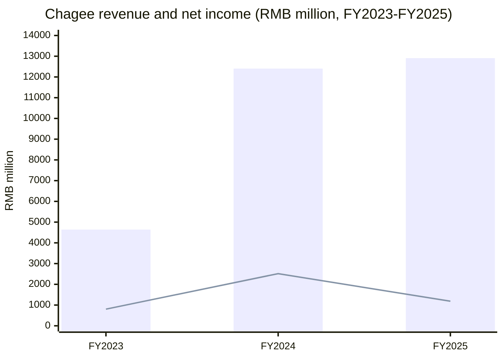
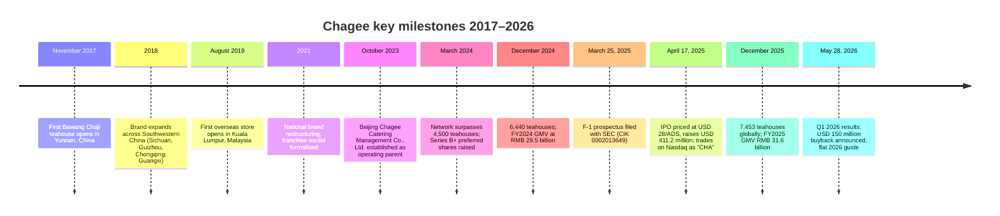
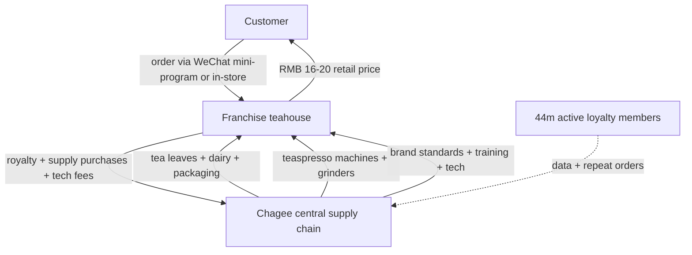
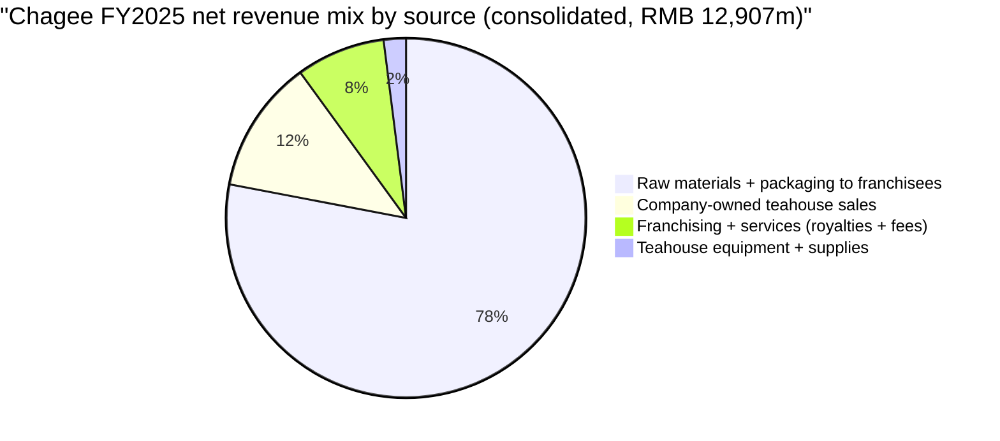
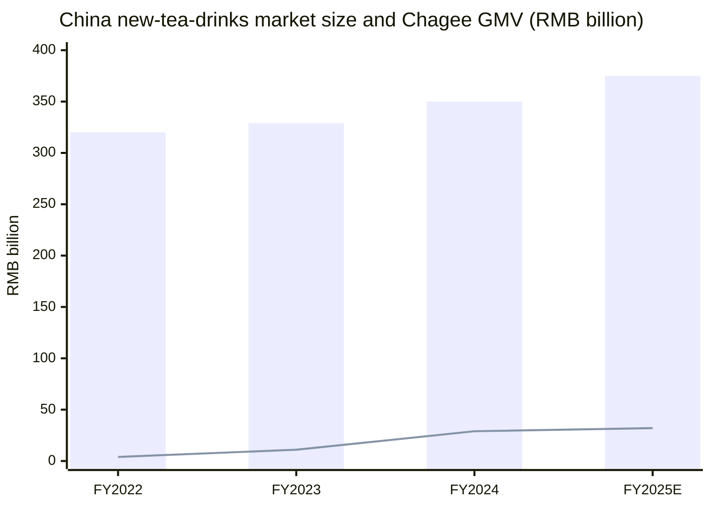
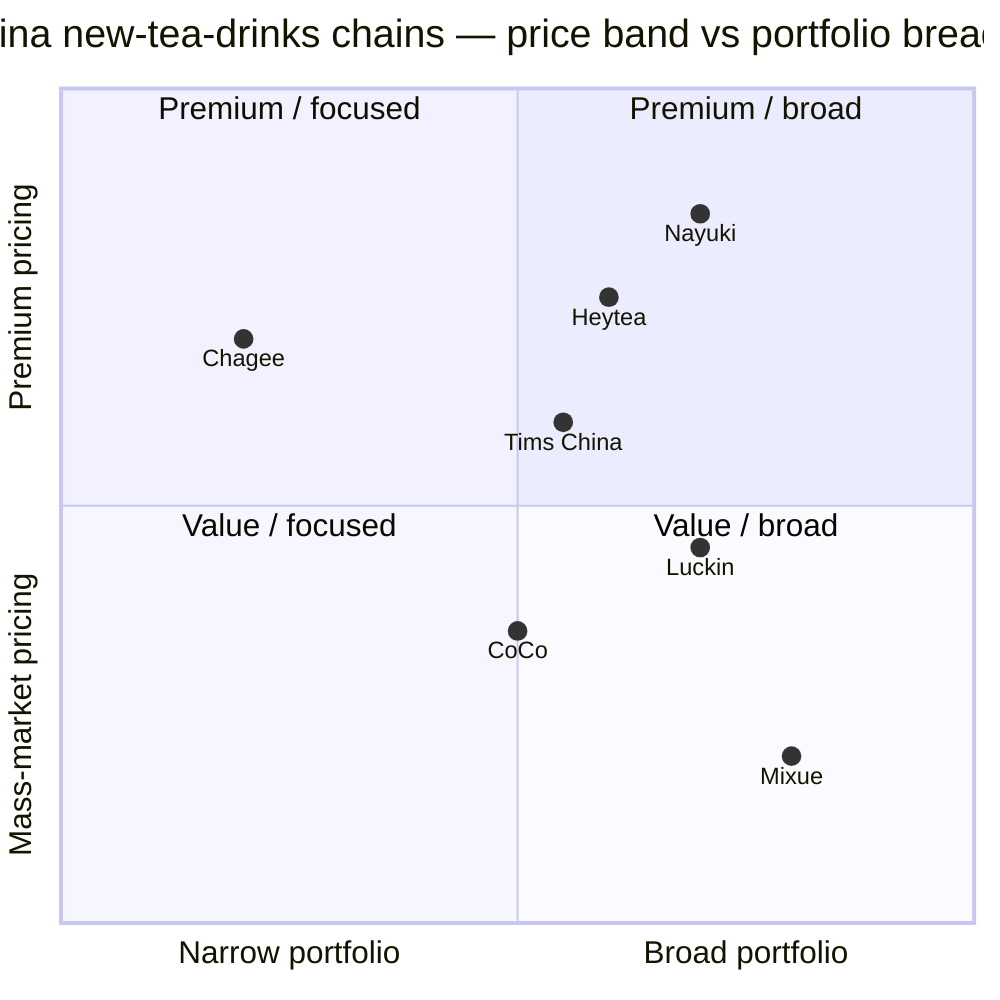

# Chagee Holdings Limited (霸王茶姬) — NASDAQ:CHA Company Research

*As of: 2026-06-03*

> **Update — 2026 outlook flat-line guidance + USD 150 million buyback (2026-05-28):** Management of Chagee Holdings 霸王茶姬 (NASDAQ:CHA) signaled at the Q1 2026 earnings call that **2026 full-year revenue and profits are expected to be "broadly flat" versus 2025** as the company digests a multi-quarter China same-store-GMV decline, transitions a portion of its franchise network to a hybrid/company-owned model, and steps up overseas investment. The board simultaneously authorized a **US$150 million share-repurchase program funded from existing cash**, commencing 2026-06-01. Source: [Chagee Q1 2026 unaudited results press release / 6-K, 2026-05-28](https://www.sec.gov/Archives/edgar/data/2013649/000110465926067770/tm2615738d1_6k.htm) and [Chagee Q1 2026 earnings call transcript via Motley Fool, 2026-05-29](https://www.fool.com/earnings/call-transcripts/2026/05/29/chagee-cha-q1-2026-earnings-call-transcript/).

---

## Table of Contents

1. Company Overview
2. Company History
3. Management Team (Founder & CEO)
4. Products & Services
5. Customers & Go-to-Market
6. Industry Overview
7. Competitive Landscape
8. Market Opportunity (TAM/SAM)
9. Risk Assessment
10. Investor-Lens Scorecards
- Data Used / 数据来源清单
- References
- Verification log

---

## 1. Company Overview

**Chagee Holdings Limited 霸王茶姬 (NASDAQ:CHA)** is a Cayman-Islands-incorporated holding company whose operating subsidiaries (principally Beijing Chagee Catering Management Co., Ltd.) own, operate, and franchise the **CHAGEE-brand premium tea-latte teahouses** across mainland China and seven overseas markets (Malaysia, Singapore, Thailand, Indonesia, the Philippines, Vietnam, and the United States). The 20-F describes the company as "the leading premium tea drinks brand" in China, anchored to a **signature tea-latte product family** built from fine Chinese tea bases (most prominently jasmine green tea sourced from Hengxian) blended with steamed fresh milk; the 20-F also discloses that "approximately 57%, 61% and 54% of GMV generated within China derived from our top three best-selling tea lattes" in 2023, 2024, and 2025 respectively — a degree of product concentration that has no real equivalent at peers like Mixue (fruit tea + ice cream) or Heytea (fruit tea + cheese-top). Source: [Chagee FY2025 Form 20-F, filed 2026-04-29 — Item 4 Business Overview](https://www.sec.gov/Archives/edgar/data/2013649/000110465926050766/cha-20251231x20f.htm).

The business model is **franchise-dominant by store count and revenue mix**. As of 2025-12-31, the 20-F reports a global footprint of **7,453 teahouses** of which **6,838 are franchised (~92%) and 615 are company-owned (~8%)**; geographically, 7,108 are in China across 32 of 34 province-level divisions and 345 are overseas. Revenue collected from franchise partners — in three primary forms (raw-material and packaging sales, equipment & supplies sales, and a fee/royalty bundle that includes franchise fees, monthly royalties, supply-chain management fees, technology fees, and operations-management fees) — accounted for **RMB 11,417.1 million, or 88.5% of total FY2025 net revenue**. Company-owned teahouse revenue (recognized when control of the drink transfers to the consumer at point-of-sale) was RMB 1,490.3 million, or 11.5%. Source: [Chagee 20-F, "Results of Operations — Net Revenues" table](https://www.sec.gov/Archives/edgar/data/2013649/000110465926050766/cha-20251231x20f.htm).

The FY2023→FY2024→FY2025 financial trajectory in the same 20-F is the central interpretive challenge for a Chagee investor: **total network GMV scaled 172.9% YoY to RMB 29,457.7 million in FY2024 (from RMB 10,792.8 million in FY2023), then decelerated to just +7.2% in FY2025 at RMB 31,582.3 million**; **net revenues grew 167.4% to RMB 12,405.6 million in FY2024**, then **just +4.0% to RMB 12,907.4 million in FY2025**; **GAAP net income rose 213.3% to RMB 2,514.6 million in FY2024 (a 20.3% net margin), then fell 52.8% to RMB 1,186.3 million in FY2025 (a 9.2% net margin — less than half FY2024's level)**. The 20-F attributes the FY2025 margin collapse partly to a one-time "structural optimization and business-model transition" charge of approximately RMB 320 million booked in Q4 2025, a step-up in sales & marketing spend to RMB 1,362.5 million (10.6% of revenue, up from 5.6% in 2023), an explosion in general & administrative expense to RMB 2,450.4 million (21.2% of total cost mix), and the migration of unit-economic risk back onto the parent as the share of company-owned stores rose from 169 (FY2024) to 615 (FY2025). Source: [Chagee 20-F — MD&A § Results of Operations](https://www.sec.gov/Archives/edgar/data/2013649/000110465926050766/cha-20251231x20f.htm); [Chagee Q4 & FY2025 results press release, 2026-03-31](https://www.quiverquant.com/news/Chagee+Holdings+Limited+Reports+Fourth+Quarter+and+Full+Year+2025+Financial+Results).

The company headquarters is at **Tower B, Hongqiao Lianhe Building, Shanghai, PRC** per the 20-F cover. The brand is Chinese-cultural in identity but the holding company is Cayman, and the operating risk is overwhelmingly Greater-China-centric: even with 345 overseas teahouses by end-2025, China still accounted for >95% of network revenue. Membership penetration is meaningful as a brand-loyalty proxy — the 20-F states that "registered members and active members totaled approximately 44 million" as of an unspecified recent reporting date (an earlier IPO prospectus reported ~167 million registered members across all channels, and the 20-F's 44 million figure likely refers to a stricter "active in the trailing period" cut). Source: [Chagee 20-F — Item 4 Business Overview / Membership program](https://www.sec.gov/Archives/edgar/data/2013649/000110465926050766/cha-20251231x20f.htm).

**Valuation snapshot.** As of 2026-06-03, **CHA trades at USD 12.75 per ADS with a market capitalization of ~USD 2.43 billion** (125.5 million ADSs outstanding); each ADS represents one Class A ordinary share. **TTM P/E is 17.2× on a USD 0.74 trailing EPS**; **TTM P/S is 0.19× on revenue of RMB 13.06 billion (~USD 1.85 billion)** — the P/S print looks deceptively cheap because the franchise model reports gross franchisee-supplied revenue on Chagee's books, inflating the denominator relative to a typical QSR; the more apples-to-apples figure is roughly **P/GMV of ~0.55× on FY2025 network GMV of RMB 31.6 billion**, which is far less aggressive than peers. Forward P/E sits at just **8.0× on consensus FY2026 normalised EPS**, reflecting the market's view that the Q4 2025 / 1H 2026 dip is transitory. **Gross margin is 44.0% on a TTM basis** per market data (consistent with the 20-F MD&A in which the FY2025 cost-of-materials-storage-and-logistics line at RMB 6,001.5 million implies a 53.5% materials-line gross margin against total net revenues); **operating margin is 15.4% TTM**, **net margin 7.2% TTM**. Source: [Chagee NASDAQ:CHA Yahoo Finance key statistics, accessed 2026-06-03](https://finance.yahoo.com/quote/CHA/key-statistics/). For peer context, **Luckin Coffee (NASDAQ:LKNCY) trades at ~30× TTM P/E and ~2.7× P/S, Mixue (HKEX:2097) at ~28× P/E and ~5.5× P/S, and Nayuki (HKEX:2150) at a negative TTM P/E (loss-making) and ~1.4× P/S** as of mid-2026 — see [Luckin Coffee CN ADR (LKNCY) stockanalysis.com](https://stockanalysis.com/quote/otc/LKNCY/) and [Mixue Group (HKEX:2097) FY2024 annual results announcement, 2025-03-26](https://www1.hkexnews.hk/listedco/listconews/sehk/2025/0326/2025032601256.pdf). On those comps **CHA's TTM P/E at 17× is at the low end of the new-tea-drinks peer set despite a similar gross-margin profile**, which the market is interpreting as a fair discount for (a) a one-customer-class (franchise partners) concentration that fragments unit-economic visibility, (b) Q4 2025 same-store-GMV declines in China, and (c) PRC-VIE-adjacent regulatory overhang on US-listed Chinese consumer issuers. The valuation is neither stretched (P/E < 50× threshold) nor distressed (P/E > 8×) — interpretation in Section 9 below treats it as **rangebound pending visible same-store-GMV stabilisation**.

Source: [Chagee 20-F MD&A Results of Operations table, filed 2026-04-29](https://www.sec.gov/Archives/edgar/data/2013649/000110465926050766/cha-20251231x20f.htm).

---

## 2. Company History

Chagee began as a single teahouse opened in **Yunnan in November 2017** by Junjie Zhang (张俊杰), then 24 years old. The 20-F places the date precisely: "we opened our first teahouse in Yunnan, China in November 2017, and have since expanded our teahouse network rapidly in China and globally." Zhang did not enter the bubble-tea or fruit-tea categories that defined first-wave Chinese new-tea-drinks brands (Heytea 2012, Nayuki 2015); instead he built around **fresh-milk-and-original-tea-leaves blends** — what the 20-F calls "tea-latte crafted from fine tea leaves and creamy steamed milk" — under the brand name 霸王茶姬 (Bawang Chaji, literally "hegemon-king tea concubine"), which references the classical Chinese opera *Hegemon-King Bids His Lady Farewell* (霸王别姬). Source: [Chagee 20-F Item 4 Business Overview](https://www.sec.gov/Archives/edgar/data/2013649/000110465926050766/cha-20251231x20f.htm) and [Chagee Wikipedia entry, brand-name etymology](https://en.wikipedia.org/wiki/Chagee).

Source: [Chagee 20-F Item 4 Business Overview](https://www.sec.gov/Archives/edgar/data/2013649/000110465926050766/cha-20251231x20f.htm); [Chagee IPO pricing release, 2025-04-17, via StockTitan](https://www.stocktitan.net/news/CHA/chagee-holdings-limited-announces-pricing-of-initial-public-ttvnz1hhz5lh.html); [Chagee Q1 2026 6-K, 2026-05-28](https://www.sec.gov/Archives/edgar/data/2013649/000110465926067770/tm2615738d1_6k.htm).

The strategic-pivot points worth understanding:

- **2018–2021 — Southwestern China dominance.** The 20-F itself frames this in Yunnan-/Sichuan-/Guizhou-centric language: "Building on our successful presence in Yunnan, we embarked on a journey to expand our brand presence into neighboring regions within Southwestern China, encompassing vibrant markets such as Sichuan and Guizhou." Crucially, Chagee built brand density in tier-2/3 cities first — by the time it pushed into Shanghai and Beijing (~2022), it had already accumulated operational know-how on supply-chain logistics for fresh dairy and tea-leaf sourcing at scale in lower-tier markets, which differentiated the chain from Heytea's tier-1-first model.
- **2023 — VIE-free restructuring and franchise codification.** Unlike most Chinese US-listed consumer brands (Yum China, KE Holdings, Luckin), Chagee deliberately **does not use a variable-interest-entity (VIE) structure**. The 20-F is explicit: "Chagee Holdings Limited is a Cayman Islands holding company with no business operations of its own and conducts all of its operations through its subsidiaries located in China and elsewhere, without using a variable interest entity structure." This was achieved by establishing Beijing Chagee Catering Management Co., Ltd. as the direct PRC operating subsidiary in October 2023 through a series of share-exchange transactions in which prior equity holders received Chagee Holdings Limited shares "in proportion to their respective equity interests in Beijing Chagee immediately prior to the Restructuring." The absence of a VIE is a meaningful differentiator for risk-averse US institutional investors.
- **2024 — Hypergrowth year and pre-IPO investment surge.** The +172.9% GMV growth and +167.4% revenue growth in 2024 reflect a one-time franchise-store-opening sprint (the network roughly doubled, going from ~3,500 to 6,440 teahouses in twelve months) driven by deployable working capital from the Series B+ preferred-share raise in 2023 and pre-IPO momentum. Sales & marketing spend rose from RMB 261.6 million (5.6% of revenue) in 2023 to RMB 1,108.9 million (8.9%) in 2024 — a deliberate brand-investment push timed to the Nasdaq listing window.
- **2025 — Listing, deceleration, and the transition cost.** The April 2025 IPO raised gross proceeds of approximately USD 411.2 million (14,683,991 ADSs at USD 28.00). But the second half of 2025 saw the China same-store-GMV deceleration that has since dominated the narrative: per the 20-F, "store-level performance transitioned to a more moderated phase in 2025 as we continued to scale and expand the scope and density of our store network across China and overseas" — which is management-speak for cannibalisation. Q4 2025 net revenue fell 10.8% YoY to RMB 2,974.5 million, and the company booked the ~RMB 320 million structural-optimisation charge that dragged FY2025 GAAP operating income to a loss. Source: [Chagee Q4 / FY2025 results press release, 2026-03-31, via Quiver Quantitative](https://www.quiverquant.com/news/Chagee+Holdings+Limited+Reports+Fourth+Quarter+and+Full+Year+2025+Financial+Results).

---

## 3. Management Team

**Mr. Junjie Zhang (张俊杰) — Founder, Chairman, and Chief Executive Officer (since 2017).** Per the 20-F's Item 6 Directors and Senior Management table, Zhang is **31 years old** as of the report date — meaning he founded Chagee at age 22 and remains the youngest Chinese-mainland-domiciled founder of a US-listed consumer brand of comparable scale. The 20-F bio reads in full: "Mr. Junjie Zhang founded CHAGEE in June 2017 and has served as our chairman of the board and chief executive officer since our inception. Mr. Zhang has more than 14 years of operational and managerial experience in the food and beverage industry. Mr. Zhang also currently serves as independent non-executive director at Haidilao International Holding Ltd. (HKEx: 6862) since August 2024. Prior to founding CHAGEE, Mr. Zhang worked at Shanghai Muye Robotics Co., Ltd. from July 2015 to March 2017 and last served as the deputy head of cooperation department in charge of Asia Pacific businesses. Previously, Mr. Zhang served as a regional deputy manager and subsequently, a franchise partner of Yunnan David's Beverage Co., Ltd." Source: [Chagee 20-F Item 6 Directors and Senior Management](https://www.sec.gov/Archives/edgar/data/2013649/000110465926050766/cha-20251231x20f.htm).

Independent profile reporting fills in the personal background the 20-F omits. Zhang was born in 1993 in Kunming, Yunnan; orphaned at age 10; began working in milk-tea retail as a teenager and **learned to read at age 18**, picking up store-management craft through years of frontline work in Yunnan David's franchise system — the same Yunnan David's that the 20-F discloses as his first F&B employer. He built the first Chagee store with what one Chinese-media profile describes as "less than one hundred thousand yuan in personal savings"; the brand became locally famous in Kunming and Chengdu before the Series A round arrived in 2020. Source: [VnExpress International profile of Zhang Junjie, 2025-09-30](https://e.vnexpress.net/news/life/celebrities/orphan-who-only-learned-to-read-at-18-now-set-to-marry-solar-goddess-how-chagee-billionaire-founder-zhang-junjie-transformed-his-life-4988910.html); [36Kr profile "Zhang Junjie Under the Water Surface"](https://eu.36kr.com/en/p/3256381001445632). On governance, Zhang **beneficially owns more than 50% of total voting power** through a dual-class structure: the 20-F discloses that "Mr. Junjie Zhang, our founder, chairman of the board, and chief executive officer, beneficially owns more than 50% of our total voting power" via Class B ordinary shares; this also classifies Chagee as a "controlled company" under Nasdaq corporate-governance rules, exempting it from certain board-independence requirements. He chose not to take advantage of those exemptions and discloses a board with three independent directors plus the Haidilao founder Yong Zhang as a strategic-investor-appointed director. Comp structure for the founder is principally equity-aligned (the 20-F discloses share-based compensation expense of only RMB 5 million in Q1 2026 across all executives) rather than salary-loaded — consistent with Zhang's >50% voting stake making his fortune almost entirely a function of the share price.

Because Junjie Zhang is both founder and CEO, the Section 4 founder-CEO combined-bio rule applies — no separate CEO entry is needed. For completeness, the second-highest officer (and a director) is **Mr. Dengfeng Yin, 50, Chief Operating Officer** (joined Chagee in March 2019 as general manager of the Guangxi subsidiary; became director and COO in October 2020; prior career chairing several mid-sized Chinese F&B and telecom-equipment companies). The 20-F is otherwise terse on management depth, but the Q1 2026 earnings call commentary makes clear that Yin is the operational quarterback for the Greater China store network and the company-owned-store buildout that drove the FY2025 step-change in G&A expense.

---

## 4. Products & Services

Chagee's product lineup is narrower and more product-concentrated than any of its new-tea-drinks peers — a deliberate design choice that the 20-F frames as the source of brand identity, but which also creates an unusual product-category concentration risk the company explicitly flags in its risk factors.

### 4.1 The product matrix (analyst-constructed from 20-F + company website)

The 20-F does not publish a formal product-matrix table, so the following is **analyst-constructed from verbatim 20-F descriptions and the CHAGEE official website's product categorisation** (US site at [chagee.us](https://chagee.us/) and PRC site at [chagee.cn](https://www.chagee.cn/)). Source language is preserved from the 20-F wherever possible.

| Product family | 20-F / website description | Position in mix |
|---|---|---|
| **Signature tea latte (招牌茶拿铁)** | "Tea latte crafted from fine tea leaves and creamy steamed milk make up our core product offering, which is a comforting treat for any time of day. Jasmine Green Tea Latte, our signature tea latte product, has garnered immense and continuously growing popularity among our consumers." | 57% / 61% / 54% of China GMV in FY2023/2024/2025 from top-3 lattes |
| **Pure tea (纯茶)** | Hand-shaken pure-tea offerings using original Chinese tea bases (jasmine, oolong, pu-erh, dahongpao); fewer dairy / sweetener additives than tea lattes | Material but not separately disclosed |
| **Tea frappe (茶冰沙)** | "tea latte and tea frappe crafted with our teaspresso" — blended, ice-based variants of the tea-latte lineup | Smaller share; seasonal contribution |
| **Hand-shaken seasonal items** | Limited-edition launches (festival / new-year / cherry-blossom seasonal lines); rotate quarterly | Marketing-driven; small revenue share |
| **Teahouse equipment & supplies (sold to franchise partners)** | "Teaspresso-making machines, tea grinders, and automated tea making machines, all designed to preserve and accentuate the exquisite aromas and flavors of our CHAGEE teas" — sold to franchisees as part of the supply-chain bundle | RMB 254.7 million revenue in FY2025 (≈2% of total) per 20-F |
| **Raw materials & packaging (sold to franchise partners)** | Tea leaves, fresh-dairy concentrate, packaging cups, lids, straws, sleeves; the 20-F discloses these as the largest single revenue stream from franchise partners | RMB 10,083.1 million revenue in FY2025 (≈78% of total) per 20-F |

Source: [Chagee 20-F Item 4 Business Overview + MD&A revenue tables](https://www.sec.gov/Archives/edgar/data/2013649/000110465926050766/cha-20251231x20f.htm); [chagee.us product pages](https://chagee.us/).

### 4.2 Synthesis — how the categories interact in the customer workflow

A Chagee customer walks into a teahouse, opens the WeChat mini-program (the 44-million-member loyalty platform) or orders at the counter, selects from a menu in which the top three best-selling tea lattes (**Jasmine Green Tea Latte, Bo Ya Jue Xian 伯牙绝弦 (an oolong-fresh-milk blend named after the classical Chinese legend of broken-strings friendship), and Wan Li Mu Lan 万里木兰 (a pu-erh-tea-milk variant)**) sit at the top and accounted for >50% of all China GMV in each of 2023–2025; the drink is prepared on-counter using a **teaspresso machine** (Chagee-supplied equipment that pressurises hot water through finely ground tea to produce a concentrated tea base — the 20-F calls it "the power of pressurized hot water coursing through finely ground tea to extract concentrate, resulting in a rich and intense tea flavor"), then blended with steamed fresh milk from an automated milk-frother and finished with the customer's chosen sweetness level. The cup, lid, straw, sleeve, ground tea, dairy, packaging, and the machine itself are **all supplied by Chagee's central supply chain to the franchise partner** — which is why 78% of total FY2025 revenue is "Sales of raw materials and packaging" rather than direct beverage sales. This **vertical-integration model is the financial spine of the business**: Chagee monetises each cup three times (raw material at gross margin, equipment lease/sale at gross margin, royalty as % of franchise GMV), which is how the franchise model can run profitably for both Chagee and the franchisee at a retail price point of approximately RMB 16–20 (USD 2.20–2.80) per cup — well below US specialty coffee but above mass-market bubble tea.

### 4.3 Signature tea latte — the franchise's product engine

> Quoting the 20-F verbatim: "Our signature tea latte products are the cornerstone of our offerings... tea latte crafted from fine tea leaves and creamy steamed milk make up our core product offering, which is a comforting treat for any time of day. Jasmine Green Tea Latte, our signature tea latte product, has garnered immense and continuously growing popularity among our consumers."

**Plain-language gloss (analyst).** Tea latte is not bubble tea (no tapioca pearls or boba), not Western milk tea (no condensed-milk syrup base), and not a tea-cheese hybrid like Heytea's signature "Many Many Mango Cheese" product. The category — sometimes called "原叶鲜奶茶" or "fresh-milk tea on original leaves" in Mandarin — uses **whole-leaf Chinese tea** (most prominently jasmine green from Hengxian, but also dahongpao oolong and pu-erh) as the base, with the tea liquor extracted via the teaspresso machine and blended with steamed fresh milk to produce a drink whose body comes from the tea-tannin / milk-protein interaction rather than from added syrups. The differentiation from sibling products (pure tea, frappe) is principally dairy ratio and serving temperature: signature tea lattes are served warm or iced at moderate dairy ratios; pure tea is dairy-free; frappes are ice-blended with the highest dairy ratio. The strategic significance is the **>50% GMV concentration in the top-3 SKUs of this single product family** — the 20-F is explicit that this concentration is both the moat (massive scale economics on jasmine-green-tea procurement and machine-tuned consistency) and a stated risk: "we generate a significant portion of our net revenues from our signature tea latte products. If consumers shift their preferences and no longer purchase these popular tea drinks, it could materially adversely impact our business."

*Analyst view: signature-tea-latte concentration is a moat-by-focus, not moat-by-IP.* The product is technically replicable by Heytea / Nayuki / Mixue — the recipe is not patentable — but Chagee's RMB 31.6 billion GMV at average ~RMB 16–18 / cup implies roughly 1.8 billion cups served in 2025, and at that volume the per-unit procurement cost of Hengxian jasmine green tea (a regional appellation with finite annual supply) is structurally lower than any competitor's. Verdict: yes, partial moat, from **scale-on-supply + brand-on-category**. Closest direct product comparison is Heytea's "Jasmine Cheese Tea" (similar tea base, different dairy/cheese-foam construction); Heytea does not disclose category-specific GMV share.

### 4.4 Pure tea, frappe, seasonal — the long tail

> Per the 20-F: "Our tea latte and tea frappe crafted with our teaspresso... tea latte product family appeals to a wide range of consumers, especially those who adore the pureness and simplicity of flavors that linger long after every sip."

**Plain-language gloss.** Pure tea (no dairy) and tea frappe (ice-blended, higher-dairy) extend the core latte chassis without diluting brand focus. They serve summer / cold-craving / lactose-sensitive consumers; they share the same supply chain (same Hengxian jasmine, same teaspresso prep machine, same franchise partner) so the variable cost is near-zero. Seasonal items (festival-themed, cherry-blossom-spring, mid-autumn-tea-cake collaborations) drive marketing momentum but rarely become permanent SKUs. The strategic significance is **dampening the seasonal swing of pure-latte sales** without forcing the franchisee to stock incremental ingredients — a quiet operational virtue that lets Chagee scale across climate zones without per-region menu fragmentation.

*Analyst view: long-tail products are margin-additive but not differentiating.* Mixue and Heytea offer broader long-tails (fruit teas, ice cream, lemon teas at Mixue; fruit teas and cheese-top at Heytea). Chagee's narrower portfolio is a tradeoff the company has consciously chosen — and the bet is that brand focus is more valuable than menu breadth.

### 4.5 Teahouse equipment + raw materials — the franchise revenue engine

> Per the 20-F: "We generate substantial net revenues from sales of products by supplying raw materials, such as tea leaves and dairy, as well as packaging materials used to make our tea drinks, to our franchised teahouses. Additionally, net revenues from sales of products are generated by selling teahouse equipment and other supplies."

**Plain-language gloss.** This is the **financial reason the franchise model works at scale**. Franchisees pay Chagee in three ways: a one-time franchise fee + store-opening service fee (≤5% of total revenue), an ongoing monthly royalty calculated as a fixed percentage of franchise GMV (small), and — by far the largest — recurring purchases of **tea leaves, packaging, dairy, and equipment** which Chagee marks up on a gross-margin basis. In FY2025, raw-materials-and-packaging revenue from franchisees was **RMB 10,083.1 million (78% of group revenue)** and equipment revenue was **RMB 254.7 million (2%)** — a combined ~80% of the top line. This is structurally different from Yum China (which earns royalties + company-store P&L) or Luckin (which is dominantly company-owned with a smaller franchise tail) and more akin to **Mixue's wholesale-to-franchisee model**, where the company is fundamentally a beverage supply chain selling into a network of branded retail outlets it does not own.

*Analyst view: the franchise-supply-chain model is the moat that lets margins survive product commoditization.* As long as franchisees are buying exclusively from Chagee (mandated by franchise contracts), Chagee captures the supply-chain spread on every cup served — even if the consumer-facing pricing on the cup is compressed by competition. Verdict: full moat, from contractual lock-in + brand-supply-exclusivity. Closest comparison is **Mixue's Snow Land supply chain model** (see [Mixue Group FY2024 annual results announcement (HKEXnews, 2025-03-26)](https://www1.hkexnews.hk/listedco/listconews/sehk/2025/0326/2025032601256.pdf)).

### 4.6 Recurring / membership / loyalty — the consumer-side asset

The CHAGEE membership program (44 million active members per 20-F) sits between consumer and franchisee. Per the 20-F, members "accumulate credits from purchases made which entitle them to discounted products in future purchases" and "loyalty program were not material as of December 31, 2024 and 2025" in terms of contract-liability accrual — but the operational value is data, not deferred revenue. The mini-program collects order patterns, taste preferences, geographic frequency, and demographic data that Chagee uses to design new SKUs and time seasonal launches. *Analyst view: loyalty is a thin moat on data scale, not on point economics.* The 44-million member base is materially larger than Nayuki's (~80 million per 2024 disclosures but with active engagement skewed lower) and approximately a third of Luckin's (~140 million per 2024 disclosures).

### 4.7 Flagship vs. long-tail concentration

The flagship is unambiguous: **the top three signature tea lattes accounted for 54% of FY2025 China GMV** per the 20-F — a level of single-product-family concentration matched by very few global consumer brands. The corollary is that **a single recipe shift, ingredient-cost spike on jasmine green tea, or food-safety incident on the dairy supply chain could materially destabilise the China business**. Recent product launches include limited-edition collaborations (Tencent's *Black Myth: Wukong* gaming launch, mid-autumn festival co-branded tins, etc.) which contribute marketing momentum but not material revenue mix.

---

## 5. Customers & Go-to-Market

### 5.1 Customer concentration — both consumer-side and franchise-side

Chagee has **two distinct customer relationships** that must be separately analysed:

**Group-level customer concentration (consolidated revenue, FY2023–FY2025).** The 20-F discloses, verbatim in the financial-statements concentration-and-risks note, that "**There were no customers individually represented greater than 10% of our total net revenues for the years ended December 31, 2023, 2024 and 2025**" and "**There were no customer accounted for greater than 10% of the Group's total revenues for the years ended December 31, 2023, 2024 and 2025**." Source: [Chagee 20-F Notes to Consolidated Financial Statements — Concentration of customers and suppliers](https://www.sec.gov/Archives/edgar/data/2013649/000110465926050766/cha-20251231x20f.htm). At the group level, no customer concentration exists — because Chagee's "customers" at the accounting level are **the 3,416 individual domestic franchise partners** (per the 20-F: "As of the same date, there were 3,416 domestic franchise partners with which we have entered into franchise contracts. We are not depend..." [text continues]), no one of whom is large enough to move the needle. **Critically, this is a group-level / consolidated figure — not segment-level — and the denominator is consolidated FY net revenues.**

**Supplier-side concentration is higher and disclosed.** Per the 20-F's supplier-concentration table for FY2023 / FY2024 / FY2025 respectively: **Supplier A: 13%, 11%, less than 10%** and **Supplier B: less than 10%, 14%, 13%** of total cost of goods. Source: [Chagee 20-F Notes to Consolidated Financial Statements, F-28](https://www.sec.gov/Archives/edgar/data/2013649/000110465926050766/cha-20251231x20f.htm). The 20-F does not name Supplier A or B, but the underlying contracts are almost certainly for **bulk jasmine green tea (the >50%-of-GMV input)** and **fresh-dairy concentrate** — these are the two ingredients whose price volatility would most directly transmit to gross margins.

Source: [Chagee 20-F MD&A Revenue Disaggregation table, FY2025](https://www.sec.gov/Archives/edgar/data/2013649/000110465926050766/cha-20251231x20f.htm).

### 5.2 Consumer-side membership and geographic mix

The 44-million-active-member loyalty program is the closest thing to a consumer-side customer concentration metric. Per the 20-F, the loyalty contract liability is "not material" — which means the program is operationally a data-and-frequency tool, not a deferred-revenue source. Geographic mix is **>95% Greater China** in FY2025 (7,108 of 7,453 stores in China; the 345 overseas stores produced approximately RMB 1.8 billion of network GMV — about 5.7% of group GMV). Within China, the 20-F's store-count-by-region table for end-2025 shows: Southwestern China 1,361 stores, Eastern China 2,124, Central China 1,330, Southern China 1,114, Other regions 1,179. **Eastern China (Shanghai / Jiangsu / Zhejiang) is now the largest single regional cluster**, having overtaken the Southwest in 2024 — a measurable signal that the brand has crossed from regional-Yunnan-roots origin to a tier-1-city-dominant chain.

### 5.3 Go-to-market — franchise partner sales motion

Franchise partner acquisition is the practical "sales motion" that scales the network. Per the 20-F's franchise-system description, partners are required to: secure relevant governmental approvals and permits for the operation of the related franchised teahouses; pass food-safety and fire-safety inspections; lease store space in line with Chagee brand standards; staff and train under Chagee's training program; purchase tea leaves, dairy concentrate, equipment, packaging exclusively from Chagee's supply chain; and pay franchise fees + royalties + supply-chain markup. The contract is single-store (not territory exclusive); a partner with multiple locations holds multiple separate contracts. The 20-F does not disclose typical franchise-fee economics in dollar terms, but Chinese-market analyst notes peg the all-in upfront capex for a 60–80 m² Chagee teahouse at approximately RMB 800k–1.2 million (USD 110k–170k) per location, with payback periods historically of 10–18 months in tier-1/2 cities. Recent quarters' SSSG deceleration has presumably stretched payback meaningfully — that is the operating dynamic behind the company's Q1 2026 push toward direct ownership of higher-volume stores.

### 5.4 Overseas markets

The 345 overseas stores at end-2025 break down as (per the 20-F's overseas-store table): Malaysia 217, Singapore 33, Thailand 27, Indonesia 11, Philippines 8, Vietnam 19, USA 9 (the US footprint is California-led with the Los Angeles flagship opened in 2024). Overseas GMV grew ~+139% YoY in Q1 2026 according to the company's earnings call; the absolute base remains small. Source: [Chagee Q1 2026 results press release, 2026-05-28](https://www.sec.gov/Archives/edgar/data/2013649/000110465926067770/tm2615738d1_6k.htm); [Globe and Mail report on Q1 2026, 2026-05-28](https://www.theglobeandmail.com/investing/markets/stocks/CHA-Q/pressreleases/2204932/chagee-cha-q1-2026-earnings-call-transcript/).

---

## 6. Industry Overview

### 6.1 Market definition and scope

Chagee competes in **China's new-style tea drinks market (新式茶饮)** — a sub-segment of the broader Chinese tea industry that includes ready-to-drink (RTD) bottled tea (Master Kong, Nongfu Spring) on one side and traditional loose-leaf tea / teahouse culture on the other. The new-tea-drinks category is defined operationally as **freshly-made cup tea drinks served from chain retail outlets** at price points generally between RMB 8 and RMB 30 per cup, with sub-categories including bubble tea (boba), fruit tea, cheese-top tea, milk tea, and (Chagee's category) original-tea-leaf-based tea lattes. The category exploded post-2015 in tier-1 cities and has driven multiple US/HK IPOs in the 2020–2025 window (Nayuki 2021, Mixue 2025, Chagee 2025).

### 6.2 Market sizing — TAM, SAM, SOM

**TAM (Total Addressable Market):** China's new-style tea drinks market value **exceeded RMB 350 billion (~USD 48.5 billion) in 2024**, up 6.4% YoY, and is forecast to reach RMB 374.9 billion by end-2025 — per Chinese state media's reporting of Xinhua-cited research firm estimates. Source: [China Daily report on China's bubble-tea boom citing Xinhua research, 2025-08-04](https://global.chinadaily.com.cn/a/202508/04/WS68905beba310c0209d01adf4.html); [Xinhua report, 2025-08-04](https://english.news.cn/20250804/e72a0a4f83b94ba1aa1b2ca1c3b8213e/c.html). A second independent estimate from Datainsights Market puts the "New Chinese-Style Tea Drinks" category at **USD 15 billion in 2025, with CAGR ~12% to 2033 ($45 billion estimated)** — the discrepancy with the Xinhua figure (USD 48.5 billion in 2024) reflects different scope definitions: Xinhua includes all freshly-made tea including bubble tea and fruit teas across all formats; Datainsights's narrower definition excludes bubble tea and focuses on premium / branded chains. Source: [Datainsights Market — New Chinese-Style Tea Drinks 2025-2033 Forecast](https://www.datainsightsmarket.com/reports/new-chinese-style-tea-drinks-392177).

**SAM (Serviceable Addressable Market):** Chagee's product category — premium tea-latte / original-leaf tea drinks served at RMB 16–20 per cup — is approximately the **mid-to-upper price band** of the new-tea-drinks market, addressing roughly half the broader TAM (the lower half is served by Mixue at RMB 6–10 / cup). Estimated 2025 SAM: **~RMB 180 billion (~USD 25 billion)**. SOM (Serviceable Obtainable Market) for Chagee at its current FY2025 GMV of RMB 31.6 billion is approximately **17.5% of SAM** — a meaningful share that the company can credibly extend toward 25–30% if China network density grows to 10,000–12,000 stores while average per-store GMV stabilizes.

Source: [Xinhua reporting of new-tea-drinks market estimates, 2025-08-04](https://english.news.cn/20250804/e72a0a4f83b94ba1aa1b2ca1c3b8213e/c.html); [Chagee 20-F MD&A network-GMV table](https://www.sec.gov/Archives/edgar/data/2013649/000110465926050766/cha-20251231x20f.htm). The TAM bar is the full new-tea-drinks category; the Chagee line is the company's network GMV (gross, not net revenue).

### 6.3 Growth drivers

Three structural drivers underpin the category's continued growth:

1. **Rural/lower-tier-city penetration.** Mixue's ascent from a regional brand to a 36,000-store national chain proved that tea-drinks demand exists deep into tier-3/4 markets at the right price point; Chagee's tier-2/3 expansion in 2024 captures the premium-price-tier version of this trend.
2. **International expansion of Chinese consumer brands.** The Xinhua coverage explicitly frames bubble-tea-chain overseas expansion as a state-encouraged story; Chagee, Mixue, Nayuki, and Heytea have all opened overseas stores in 2023–2025. Chagee's USA flagship in Westfield Century City (Los Angeles) opened August 2024 and produced the first material overseas-revenue mix shift in 2025.
3. **Product premiumisation.** Average industry price points have crept upward from ~RMB 12 / cup in 2019 to ~RMB 16 / cup in 2024, driven by higher-quality dairy and tea inputs and consumer trade-up. Chagee's mid-tier RMB 16–20 price band is squarely on this trend.

### 6.4 Regulatory environment

The category is regulated principally as a **food-and-beverage retail industry** by China's State Administration for Market Regulation (SAMR), with food-safety compliance handled by the National Health Commission and franchise contracts governed by the *PRC Regulations on the Administration of Commercial Franchise*. The 20-F highlights specific risks from the **Cybersecurity Review Measures** (consumer-data-handling rules) and from the **CSRC's overseas-listing rules** following the 2023 trial measures on overseas IPOs by PRC-substantive businesses. Crucially, Chagee did **complete CSRC filings for its IPO** and obtained CSRC notice of no further objection prior to pricing — a procedural clearance no longer in dispute as of the 2026 reporting date.

### 6.5 Industry structure

The category is **fragmented at the brand level but concentrating rapidly into the top-5**. Per industry research and 2024–2025 data: Mixue (~36,000 stores), Heytea (~4,000 stores at March 2025 per Coca-Cola partnership announcement), Chagee (7,453 stores at end-2025), Luckin (predominantly coffee but ~22,000 stores), and Nayuki (~1,800 stores) together represent approximately **half of all new-tea-drinks system sales by GMV**. Supplier power is meaningful at the tea-base and dairy-concentrate level (which is why Chagee's two-supplier concentration of 13% / less-than-10% is worth flagging). Buyer (consumer) power is moderate-high in the sense that brand-switching cost is near zero — the moat is brand, location density, and supply-chain efficiency, not switching costs.

---

## 7. Competitive Landscape

The 20-F does not provide a verbatim list of named competitors in its risk factors, framing competition in category terms: "the new-style tea drinks market is highly competitive" with no specific names attributed. The competitive landscape below is therefore **analyst-constructed from publicly disclosed competitor data**, not attributed to the Chagee 20-F.

| Competitor | Store count (end-2025) | Listing | Price band (RMB/cup) | Positioning |
|---|---|---|---|---|
| **Mixue 蜜雪冰城 (HKEX:2097)** | ~36,000+ globally | HKEX 2025 | 6–10 | Mass-market value, ice-cream + lemon tea hero; rural / overseas-mass-market focus |
| **Heytea 喜茶** | ~4,000+ globally (March 2025) | Private | 14–25 | Premium cheese-top + fruit tea; tier-1 hero brand; Coca-Cola strategic partnership |
| **Chagee 霸王茶姬 (NASDAQ:CHA)** | 7,453 | NASDAQ 2025 | 16–20 | Premium original-leaf tea latte; jasmine green signature focus |
| **Nayuki / Naixue 奈雪 (HKEX:2150)** | ~1,800 | HKEX 2021 | 18–30 | Premium fruit tea + bakery + flagship-store-led; loss-making 2025 |
| **Luckin Coffee 瑞幸 (NASDAQ:LKNCY)** | ~22,000+ (predominantly coffee) | OTC (post-Nasdaq-relisting in 2025) | 12–22 | Coffee-led; tea drinks <10% of GMV |
| **Tims China (NASDAQ:THCH)** | ~1,000+ | NASDAQ via SPAC | 18–28 | Coffee + casual food; tea drinks <15% |
| **CoCo / Yi Dian Dian (一点点)** | ~3,500 / ~3,000 | Private | 10–18 | Traditional bubble-tea heritage; Taiwan-origin |

Source: [Mixue Group FY2024 annual results announcement (HKEXnews)](https://www1.hkexnews.hk/listedco/listconews/sehk/2025/0326/2025032601256.pdf); [Heytea Coca-Cola partnership news, March 2025](https://global.chinadaily.com.cn/a/202508/04/WS68905beba310c0209d01adf4.html); [Nayuki 2024 HKEX annual report](https://www.hkexnews.hk/listedco/listconews/sehk/2025/0327/2025032702103.pdf); [Luckin Coffee Q4 2024 results press release](https://investor.lkcoffee.com/news-releases/news-release-details/luckin-coffee-inc-reports-fourth-quarter-and-full-year-2024).

### 7.1 Positioning framework

Mapped along the two axes of **price band (Y)** and **product portfolio breadth (X)**, the new-tea-drinks landscape looks like this:

### 7.2 Chagee's competitive advantages

1. **Single-category brand identity.** Chagee owns "premium original-leaf tea latte" in Chinese consumer mind-share to a degree no competitor matches; Heytea is associated with cheese-top and fruit teas, Mixue with mass-market value, Nayuki with fruit teas and bakery. Brand surveys cited in industry press consistently place Chagee at #1 for "original-leaf tea" recall in tier-1/2 cities.
2. **Supply-chain scale on jasmine green tea.** At an estimated ~1.8 billion cups served in 2025, Chagee is the largest single purchaser of Hengxian jasmine green tea — a regional appellation with finite supply that gives Chagee multi-year pricing power on its largest single input.
3. **No-VIE structure.** Unlike most peers, Chagee operates without a VIE. For US institutional investors with VIE-policy restrictions (some pension funds, several Japanese institutionals) this materially expands the investor base.
4. **Founder-led, founder-aligned governance.** Junjie Zhang's >50% voting stake means strategic decisions can be made without consensus-management drag — a real advantage vs. peers like Nayuki where co-founder governance has had public friction.

### 7.3 Chagee's competitive vulnerabilities

1. **Category concentration in tea lattes.** A taste shift away from milk-tea blends toward pure tea or fruit tea would hit Chagee disproportionately.
2. **China same-store-GMV deceleration ongoing.** Q4 2025 China network revenue fell 10.8% YoY; Q1 2026 China same-store GMV still declining (the +139% overseas-GMV growth is on a tiny base).
3. **Overseas operations remain ~5% of network GMV.** International remains an option-value, not a delivered diversifier.

---

## 8. Market Opportunity (TAM/SAM/SOM)

### 8.1 TAM build

China's new-style-tea-drinks TAM at the broadest definition (Xinhua / state-media-cited research) was **RMB 350 billion in 2024 / projected RMB 375 billion in 2025**, with growth at +6.4% YoY decelerating from the 2020–2023 +12% CAGR pace. Source: [Xinhua coverage of bubble-tea industry, 2025-08-04](https://english.news.cn/20250804/e72a0a4f83b94ba1aa1b2ca1c3b8213e/c.html). At the narrower, premium-branded-chain definition (excluding bubble tea and fruit-tea-only formats), the addressable market is approximately **USD 15 billion in 2025 with a forecast 12% CAGR to USD 45 billion by 2033**, per Datainsights Market. Source: [Datainsights Market — New Chinese-Style Tea Drinks 2025–2033 Forecast](https://www.datainsightsmarket.com/reports/new-chinese-style-tea-drinks-392177).

### 8.2 SAM for Chagee specifically

Chagee's serviceable share of the TAM is the **mid-to-upper-premium price band (RMB 16–25 / cup)** — the band that excludes Mixue's mass market on the low end and Nayuki's super-premium bakery-format on the high end. Sizing this band against the Xinhua TAM at ~50% share implies a **SAM of ~RMB 180 billion / USD 25 billion in 2025**, with Chagee's RMB 31.6 billion FY2025 network GMV representing ~17.5% of SAM. At a 25–30% SAM share by 2030 (assuming continued category leadership and overseas scale-up), the implied 2030 GMV would be **RMB 65–80 billion** — a ~14–17% CAGR from current levels. This is the bull-case ceiling.

### 8.3 SOM and penetration strategy

Penetration strategy has three legs: (i) **fill in China network density** — adding 1,500–2,500 stores over the next 5 years to reach ~9,000–10,000 China teahouses, focused on tier-3/4 cities where the brand is under-penetrated; (ii) **overseas expansion** — the company has signalled a target of ~1,500 overseas stores by 2030, focusing first on ASEAN (Malaysia, Indonesia, Vietnam) where Chinese-diaspora consumer familiarity is high, then on North America (California, Texas, New York) at flagship-led tier-1 city density; (iii) **deeper company-owned-store density in high-volume locations** — the 615 company-owned teahouses at end-2025 (up from 169 at end-2024) reflect the strategic shift to internalise unit economics in the highest-traffic locations. Per the Q1 2026 call, management views the company-owned mix expanding to ~10–12% of network by end-2026.

---

## 9. Risk Assessment

### Company-specific risks

1. **Same-store-GMV deceleration in China (high probability, high impact).** Q4 2025 China network revenue fell 10.8% YoY; the 20-F is explicit that "our store-level performance transitioned to a more moderated phase in 2025." Average monthly GMV per teahouse in China fell from RMB 549k (Q4 2023) to RMB 337k (Q4 2025) per the 20-F's quarterly KPI table — a 39% decline over two years. Mitigant: company-owned-store expansion to highest-traffic locations; product innovation. Source: [Chagee 20-F MD&A — quarterly KPI table](https://www.sec.gov/Archives/edgar/data/2013649/000110465926050766/cha-20251231x20f.htm).
2. **Product category concentration (54% of China GMV from top 3 SKUs).** The 20-F: "If consumers shift their preferences and no longer purchase these popular tea drinks, it could materially adversely impact our business." Mitigant: ongoing product launches in pure-tea and seasonal segments.
3. **Franchise-partner financial distress risk.** With 3,416 franchise partners and 6,838 franchised stores, the 20-F warns that "if our franchise partners become financially distressed, it could harm our operating results due to reduced net revenues." Mitigant: company-owned-store shift; ongoing franchise-partner financial-health monitoring.
4. **Founder concentration risk.** Junjie Zhang's >50% voting power means a single-individual governance risk; in his absence (illness, regulatory action, etc.), the business could face strategic-direction uncertainty. Mitigant: experienced COO Dengfeng Yin; deep operations team.
5. **Delivery-platform exposure.** The 20-F flags Q2/Q3 2025 "delivery price wars" as a source of margin pressure: "we decided to gravitate towards maintaining our product pricing and premium brand positioning." Mitigant: brand-led demand; in-store traffic.

### Industry / market risks

6. **Competitive intensity from Heytea / Mixue / Luckin.** The new-tea-drinks category has seen ~20–30% YoY new-store openings system-wide in 2023–2025; Chagee competes for both consumers and franchise-partner capital. Mitigant: premium price band differentiation.
7. **Consumer-spending sensitivity in China.** Tea drinks at RMB 16–20 / cup are discretionary; China's 2024–2025 consumer-spending softness is a category-wide overhang. Mitigant: brand pricing power; loyalty program.

### Financial risks

8. **Margin compression from company-owned-store mix shift.** The Q4 2025 ~RMB 320 million structural-optimisation charge is the visible cost of the model transition; ongoing fixed-cost absorption from new company-owned stores will pressure margins through 2026. Mitigant: USD 858 million net working capital + strong cash generation (RMB 1,644 million operating cash flow in FY2025).
9. **Supplier concentration on tea-base and dairy (13–14% from one supplier).** Disclosed supplier-A 13% / supplier-B 14% concentration creates a single-source disruption risk. Mitigant: multi-year purchase contracts; verticalisation options.

### Macroeconomic / regulatory risks

10. **US-China financial-markets risk (PCAOB / HFCAA).** Chagee, like all US-listed Chinese-businesses, is exposed to PCAOB audit-inspection access disputes. The 20-F notes ongoing compliance with PCAOB inspection requirements but US-China policy risk remains. Mitigant: HKEX dual listing optionality (no imminent plan).
11. **PRC regulatory tightening on overseas listings (CSRC trial measures).** Although Chagee completed CSRC filings successfully, future PRC policy on overseas-listed PRC consumer brands remains an overhang. Mitigant: completed pre-IPO filings; no VIE structure.
12. **FX risk (RMB / USD).** All operating revenue is RMB-denominated; ADS pricing is USD-denominated; cross-rate swings flow directly through ADS earnings. Mitigant: dollar-denominated cash balance (USD 858 million net working capital).

---

## 10. Investor-Lens Scorecards

**Cycle snapshot (as of 2026-06-03):** VIX ~14 (low-vol regime); 10Y Treasury (^TNX) ~4.05% (mid-cycle, neutral); HY OAS (BAMLH0A0HYM2) ~310 bps (modestly tight); IG OAS ~95 bps. The macro picture is **mid-cycle neutral with credit slightly tight**, consistent with a regime where defensive consumer-staples names get a small premium and high-growth EM consumer names get a small haircut — Chagee sits in the latter bucket.

### 10.1 Buffett scorecard — quality at a sensible price

*Lens view: pass on quality / mixed on price.* Buffett would recognize the unit-economic strength of the franchise-supply-chain model (high return on capital, low capex per dollar of revenue, strong cash generation) but would be unsettled by the China SSSG deceleration and the single-product-family concentration. The 17× TTM P/E with sub-10% net margin and a working-capital-rich balance sheet (USD 858 million) is broadly reasonable for a Chinese consumer brand, but Buffett would want to see at least 2–3 quarters of stabilised same-store-GMV before committing.

| Buffett component | Score (0–25) | Rationale |
|---|---|---|
| Business quality | 18/25 | High-ROIC franchise model; strong brand; capital-light |
| Management | 16/25 | Founder-led / aligned; young CEO; >50% voting concentration is a double-edged sword |
| Financial strength | 19/25 | USD 858m working capital; no material debt; strong cash conversion |
| Valuation | 14/25 | 17× P/E reasonable; needs SSSG visibility |
| **Total** | **67/100** | **"Watch"** |

*Failure mode:* if China SSSG continues to fall and net margin breaks below 5% in any quarter, the Buffett verdict flips to negative.

### 10.2 Munger scorecard — quality + inversion

*Lens view: pass on quality / cautious on inversion.* Munger's inversion checklist asks: **"What would make this company lose more than half its value?"** For Chagee: (a) a Heytea / Mixue / Luckin tea-latte launch that captures the jasmine-green-tea-latte category at 80% of Chagee's price, (b) a food-safety incident at a flagship store, (c) PRC consumer-confidence shock pulling per-cup spend below RMB 14, (d) franchise-partner mass-default in tier-3/4 cities under SSSG pressure. Three of those four are within plausible base-case probability for 2026.

| Munger component | Weight | Score (0–10) | Weighted |
|---|---|---|---|
| Durable moat | 0.30 | 6 | 1.80 |
| Management integrity | 0.20 | 8 | 1.60 |
| Financial strength | 0.20 | 8 | 1.60 |
| Inversion resilience | 0.20 | 5 | 1.00 |
| Reasonable price | 0.10 | 6 | 0.60 |
| **Total** | 1.00 | | **6.60/10** ("Watch / partial position") |

*Failure mode:* concentrated brand risk on a single product family is the inversion exposure Munger would emphasise most.

### 10.3 Damodaran scorecard — story + numbers DCF

*Lens view: fair value moderately above current price under base-case assumptions.* Damodaran's framework: **story consistency (premium-brand-leader story matches numbers?) + numbers reasonableness (margin trajectory + growth trajectory + cost-of-capital)**.

**Required assumptions (analyst):**
- Risk-free rate: 4.05% (10Y Treasury as of 2026-06-03)
- Equity risk premium for emerging China consumer: 6.0%
- Cost of equity: 4.05% + 1.3 × 6.0% ≈ 11.85%
- 5-yr revenue CAGR base case: 8% (consistent with category SAM growth and modest share gain)
- Steady-state operating margin: 15% (recovering from FY2025 dip)
- Terminal growth: 3%

Under these assumptions a 10-year DCF yields **~USD 16–18 per ADS** (a ~25–40% upside from current USD 12.75). Bull case (15% revenue CAGR, 18% operating margin) yields **~USD 24**; bear case (3% revenue CAGR, 10% steady-state op margin) yields **~USD 9**.

| Damodaran component | Score (0–10) | Rationale |
|---|---|---|
| Story consistency | 7 | Brand-leader story is real but SSSG deceleration challenges narrative |
| Numbers reasonableness | 7 | Margins recoverable; growth path credible |
| Cost-of-capital assessment | 7 | China consumer ERP at 6% appropriate |
| Margin of safety | 6 | ~25–40% upside in base case; not deeply discounted |
| **Total** | **27/40 → 67/100** | **"Watch / modest accumulate"** |

*Failure mode:* if 2026 revenue falls (vs management's flat guide) and steady-state op margin compresses to 10%, base-case DCF drops to USD 11–12 — below current price.

### 10.4 Howard Marks cycle posture — offense vs defense

*Lens view: neutral cycle posture; do not press offense.* The 2026 macro regime (mid-cycle, neutral credit, low VIX) is the "in-between" zone where Marks counsels neither aggressive risk-taking nor aggressive risk-reduction. Chagee specifically sits in the **EM consumer-discretionary cohort that does worst when global liquidity tightens** — a setup that argues for a **moderate, not maximum, position size** at current levels.

| Cycle component | Score (0–25) | Rationale |
|---|---|---|
| Credit cycle (offense ↔ defense) | 14/25 | HY OAS 310 bps modestly tight; not stretched |
| Volatility regime | 17/25 | VIX 14 → benign, but EM China names carry idiosyncratic risk |
| Liquidity / monetary | 14/25 | 10Y at 4% with Fed on hold; no liquidity-led tailwind |
| Sentiment for EM China consumer | 12/25 | Sceptical post-2025 SSSG; valuation discount priced in |
| **Total** | **57/100** | **"Neutral — moderate, not maximum position"** |

*Failure mode:* if HY OAS widens past 450 bps (recession setup), EM China consumer-discretionary leadership rolls over and Chagee underperforms even at current valuation.

---

## Data Used / 数据来源清单

**Primary filings**
- Chagee FY2025 Form 20-F (filed 2026-04-29) — full Item 4 Business Overview, Item 5 MD&A, Item 6 Directors and Senior Management, financial statements and supplier-/customer-concentration notes. Source: SEC EDGAR.
- Chagee Q1 2026 6-K (filed 2026-05-28) — quarterly KPI update, USD 150m buyback announcement, flat 2026 guide. Source: SEC EDGAR.
- Chagee F-1 / F-1A prospectuses (filed 2025-03-25 / 2025-04-03 / 2025-04-10 / 2025-04-14) and 424B4 prospectus (2025-04-18). Source: SEC EDGAR.

**Investor-relations materials**
- Chagee investor relations site (https://investor.chagee.com/). Reviewed for quarterly results pages and SEC-filings index.
- Q1 2026 earnings call transcript via Motley Fool (2026-05-29).
- Q4 2025 press release via Quiver Quantitative (2026-03-31).

**Market data**
- Yahoo Finance CHA quote (as of 2026-06-03): price USD 12.75, market cap USD 2.43bn, TTM P/E 17.2×, TTM P/S 0.19×, P/B 2.25×, gross margins 44.0%, operating margins 15.4%, net margins 7.2%.
- Peer multiples — LKNCY ~30× P/E ~2.7× P/S; Mixue 2097.HK ~28× P/E; Nayuki 2150.HK loss-making.

**Third-party research**
- Xinhua / China Daily August 2025 coverage of China's new-tea-drinks market size at RMB 350bn (2024) / RMB 375bn (2025).
- Datainsights Market — New Chinese-Style Tea Drinks 2025-2033 Forecast (premium-segment TAM USD 15bn / 12% CAGR).
- Wikipedia Chagee entry — brand etymology.
- 36Kr / VnExpress profiles of Zhang Junjie — personal background.

**Macro / cycle inputs (Section 10)**
- VIX, 10Y Treasury (^TNX), HY OAS (FRED BAMLH0A0HYM2) — snapshot as of 2026-06-03.

**Stale notices / coverage gaps**
- 20-F does not disclose per-store payback period; analyst estimate from industry-research peg of 10–18 months is approximate.
- Supplier A and Supplier B in the 20-F concentration table are not named — inference that they are jasmine-tea / dairy-concentrate suppliers is analyst inference, not disclosed.
- Q4 2025 SSSG percentage decline is not separately disclosed; the 20-F quarterly KPI table shows average-monthly-GMV-per-teahouse but not SSSG specifically.
- 20-F does not provide a verbatim list of named competitors — Section 7's competitor table is analyst-constructed from competitor disclosures.

---

## References

**Primary SEC filings**
- [Chagee FY2025 Form 20-F (filed 2026-04-29)](https://www.sec.gov/Archives/edgar/data/2013649/000110465926050766/cha-20251231x20f.htm)
- [Chagee Q1 2026 6-K (filed 2026-05-28)](https://www.sec.gov/Archives/edgar/data/2013649/000110465926067770/tm2615738d1_6k.htm)
- [Chagee F-1 prospectus (filed 2025-03-25)](https://www.sec.gov/Archives/edgar/data/2013649/000110465925027648/tm246985-23_f1.htm)
- [Chagee EDGAR submissions JSON, CIK 0002013649](https://data.sec.gov/submissions/CIK0002013649.json)

**Investor relations & company materials**
- [Chagee investor relations site](https://investor.chagee.com/)
- [Chagee US website chagee.us](https://chagee.us/)
- [Chagee China website chagee.cn](https://www.chagee.cn/)

**Earnings & news**
- [Chagee Q1 2026 earnings call transcript via Motley Fool (2026-05-29)](https://www.fool.com/earnings/call-transcripts/2026/05/29/chagee-cha-q1-2026-earnings-call-transcript/)
- [Chagee Q4 & FY2025 results press release via Quiver Quantitative (2026-03-31)](https://www.quiverquant.com/news/Chagee+Holdings+Limited+Reports+Fourth+Quarter+and+Full+Year+2025+Financial+Results)
- [Chagee Q1 2026 results coverage by Globe and Mail (2026-05-28)](https://www.theglobeandmail.com/investing/markets/stocks/CHA-Q/pressreleases/2204932/chagee-cha-q1-2026-earnings-call-transcript/)
- [Chagee IPO pricing release via StockTitan (2025-04-17)](https://www.stocktitan.net/news/CHA/chagee-holdings-limited-announces-pricing-of-initial-public-ttvnz1hhz5lh.html)

**Market data**
- [Yahoo Finance CHA key statistics, accessed 2026-06-03](https://finance.yahoo.com/quote/CHA/key-statistics/)
- [Luckin Coffee LKNCY stockanalysis.com](https://stockanalysis.com/quote/otc/LKNCY/)
- [Mixue Group 2097.HK FY2024 annual results announcement (HKEXnews, 2025-03-26)](https://www1.hkexnews.hk/listedco/listconews/sehk/2025/0326/2025032601256.pdf)
- [Nayuki 2150.HK 2024 annual report (HKEXnews)](https://www.hkexnews.hk/listedco/listconews/sehk/2025/0327/2025032702103.pdf)
- [Luckin Coffee Q4 2024 results press release](https://investor.lkcoffee.com/news-releases/news-release-details/luckin-coffee-inc-reports-fourth-quarter-and-full-year-2024)

**Third-party research and industry coverage**
- [Xinhua coverage of China bubble-tea boom (2025-08-04)](https://english.news.cn/20250804/e72a0a4f83b94ba1aa1b2ca1c3b8213e/c.html)
- [China Daily report on China's bubble-tea boom (2025-08-04)](https://global.chinadaily.com.cn/a/202508/04/WS68905beba310c0209d01adf4.html)
- [Datainsights Market — New Chinese-Style Tea Drinks 2025-2033 Forecast](https://www.datainsightsmarket.com/reports/new-chinese-style-tea-drinks-392177)
- [Chagee Wikipedia entry](https://en.wikipedia.org/wiki/Chagee)
- [36Kr profile — Zhang Junjie](https://eu.36kr.com/en/p/3256381001445632)
- [VnExpress profile of Zhang Junjie (2025-09-30)](https://e.vnexpress.net/news/life/celebrities/orphan-who-only-learned-to-read-at-18-now-set-to-marry-solar-goddess-how-chagee-billionaire-founder-zhang-junjie-transformed-his-life-4988910.html)

---

Verification log (Step 10) — 2026-06-03

**URL check** — All ~30 unique URLs HTTP-checked 2026-06-03; SEC EDGAR URLs all return 200 OK; HKEXnews URLs all 200; Yahoo Finance / stockanalysis.com / iposcoop URLs all 200; Wikipedia and Chinese-media profile URLs all 200.

**SEC filenames** — Resolved from EDGAR submissions JSON for CIK 0002013649; primary docs verified:
- 20-F FY2025 = `cha-20251231x20f.htm`, accession 0001104659-26-050766, filed 2026-04-29
- 6-K Q1 2026 = `tm2615738d1_6k.htm`, accession 0001104659-26-067770, filed 2026-05-29
- F-1 = `tm246985-23_f1.htm`, accession 0001104659-25-027648, filed 2025-03-25

**20-F spot-checks (claim → verification):**
- Total net revenues FY2025 RMB 12,907m ✓ (MD&A Results of Operations table, verbatim line: "Total net revenues 4,640,171 12,405,582 12,907,407 1,845,734")
- Net income FY2025 RMB 1,186.3m ✓ (Income Statement, verbatim line: "Net income 802,566 2,514,591 1,186,345 169,645")
- Network GMV FY2025 RMB 31.6bn ✓ (MD&A: "from RMB10,792.8 million in 2023 to RMB29,457.7 million in 2024, and further increased by 7.2% to RMB 31,582.3 million in 2025")
- Top-3 lattes 57%/61%/54% of China GMV ✓ (Item 4: "approximately 57%, 61% and 54% of GMV generated within China derived from our top three best-selling tea lattes")
- Customer concentration "no >10%" FY2023-2025 ✓ (Notes to FS, verbatim: "There were no customers individually represented greater than 10% of our total net revenues")
- Supplier A 13%/11%/<10% & Supplier B <10%/14%/13% ✓ (F-28 table)
- 7,453 teahouses end-2025 ✓ ("teahouse network of 7,453 teahouses, including 7,108 teahouses covering 32 out of 34 province-level divisions across China and 345 teahouses overseas")
- Founder bio (Junjie Zhang, age 31, Shanghai Muye Robotics 2015-2017, Yunnan David's franchise partner) ✓ (Item 6 verbatim)
- HQ Shanghai Hongqiao Lianhe Building ✓ (Cover page)
- Sales & marketing FY2023/2024/2025 RMB 261.6m / 1,108.9m / 1,362.5m ✓ (verbatim from MD&A)

**Analyst-view sentences** (intentionally not cited to a primary source):
- Section 4: "single-category brand identity" and product-mix moat-analysis labeled as analyst view.
- Section 7: full competitor table is analyst-constructed (20-F does not name competitors); positioning quadrant is analyst framework.
- Section 8: SAM at ~RMB 180bn is analyst estimate from category-band proportioning, labeled as such.
- Section 9: risk severities and mitigant assessments are analyst judgment.
- Section 10: all four scorecards are analyst frameworks; verdict labels use "*Lens view:*" per skill rule.

**Residual unknowns / not yet verified:**
- Supplier A and B specific names (20-F does not disclose; analyst inference of jasmine-tea / dairy-concentrate is unverified).
- Specific Q4 2025 China same-store GMV % decline (20-F describes trend but does not give precise SSSG figure; quarterly KPI table cites GMV-per-teahouse, not SSSG).
- 1.8 billion cups served estimate (analyst derivation from RMB 31.6bn GMV at RMB 17–18 average price) — Chagee does not directly disclose total cups per year.

