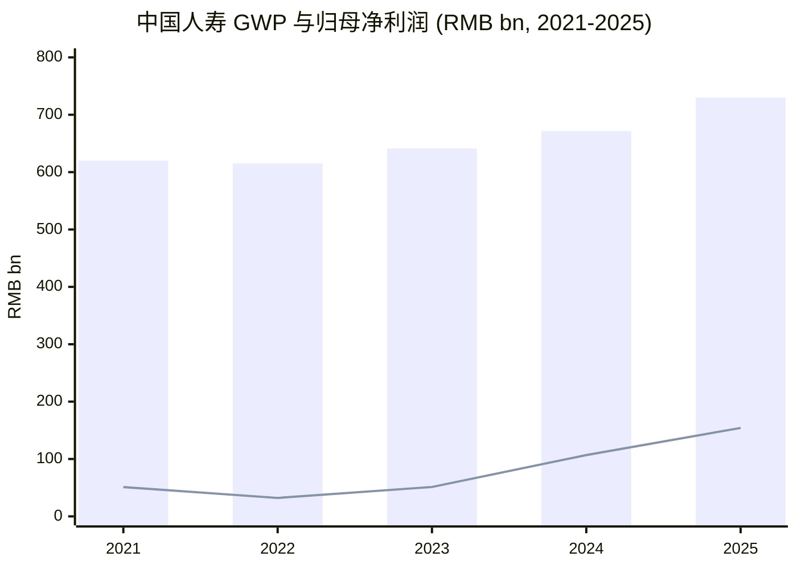
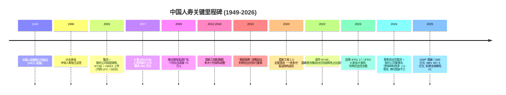
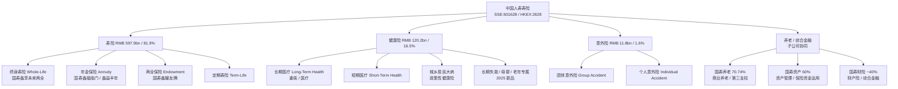
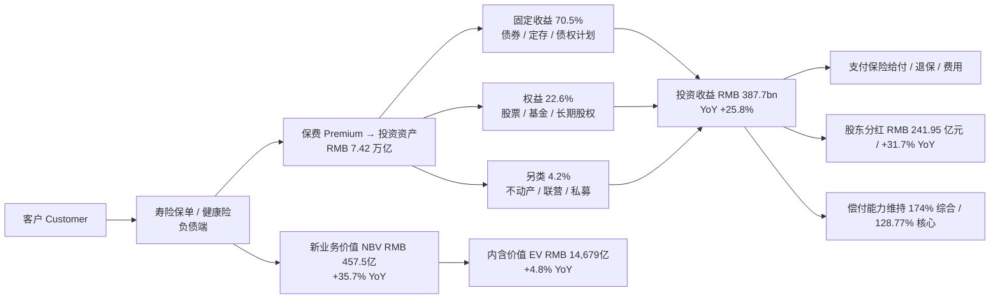
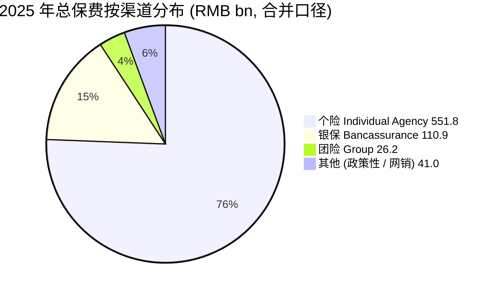
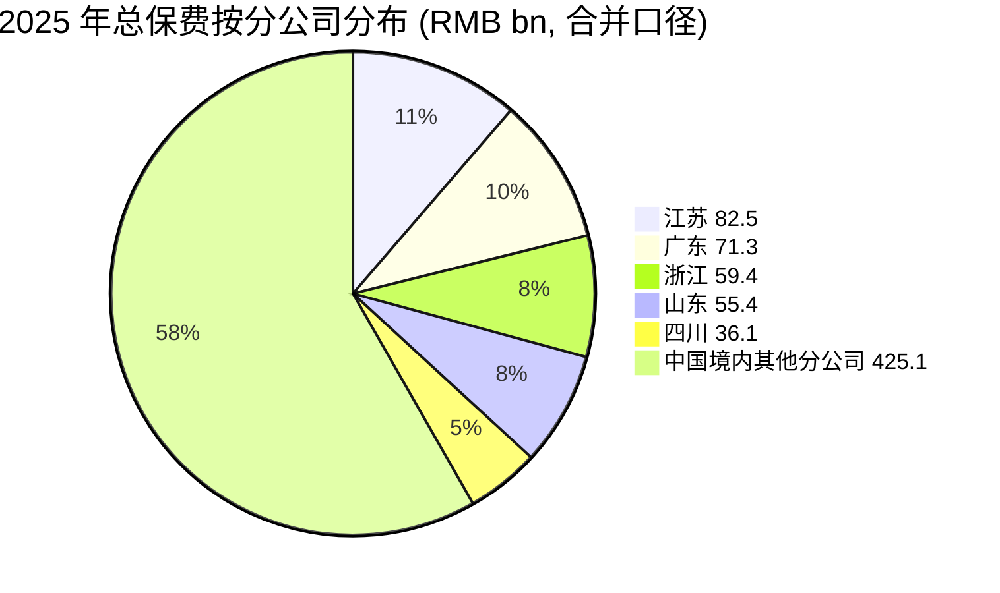
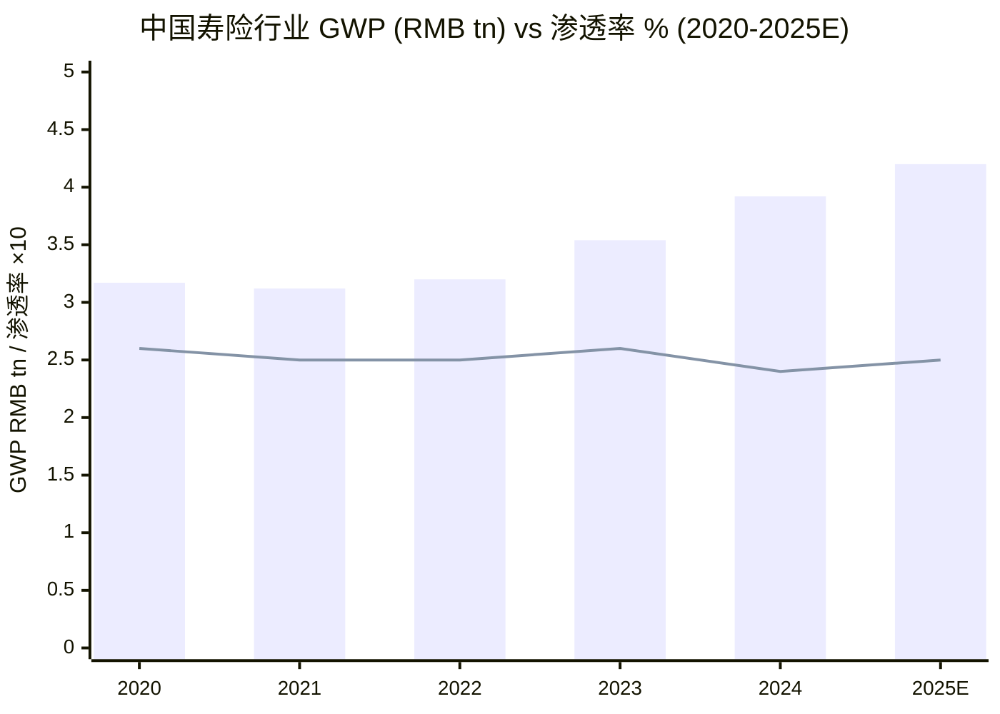
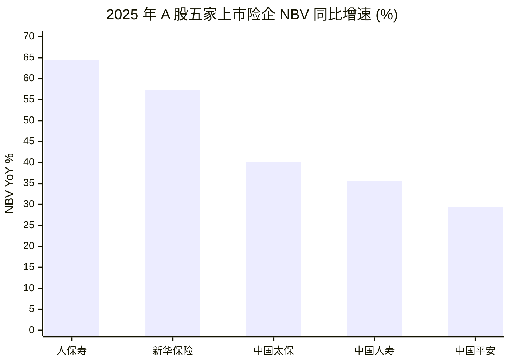
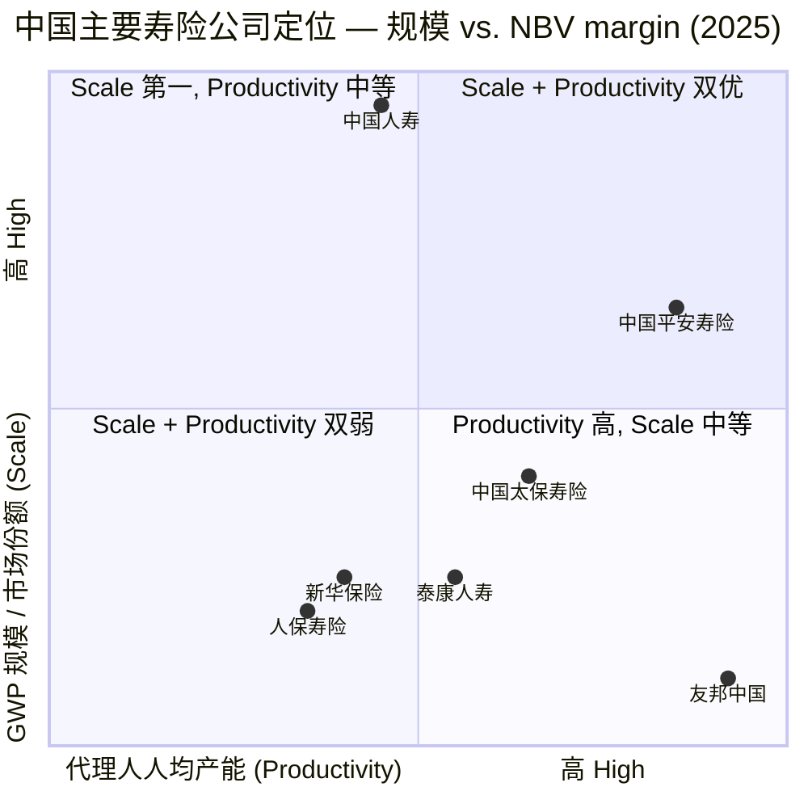
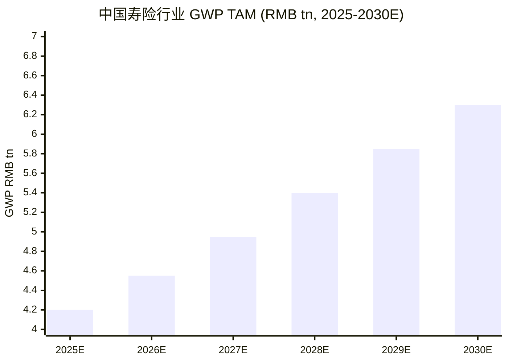

# 中国人寿保险股份有限公司 (HKEX:2628 / SSE:601628) — 公司研究

**As of: 2026-06-03**
**Primary listing: 香港联合交易所 H 股 (HKEX:2628)**
**Secondary listing: 上海证券交易所 A 股 (SSE:601628)**
**Parent: 中国人寿保险（集团）公司 (China Life Insurance (Group) Company)**
**Ultimate controller: 中华人民共和国财政部 (Ministry of Finance of the PRC)**

> **业绩亮点 — FY2025 (2026-03-25 业绩披露):** 公司在高基数基础上实现规模与价值双增长。总保费 (gross written premium, GWP) 首次突破人民币 7,000 亿元，达 **RMB 729.9 bn (+8.7% YoY)**；一年新业务价值 (new business value, NBV) **RMB 457.52 亿元 (+35.7% YoY)** 居行业首位；归母净利润 **RMB 1,540.78 亿元 (+44.1% YoY)** 创历史新高；内含价值 (embedded value, EV) **RMB 1,467.88 亿元 (+4.8% YoY)** 稳居全球寿险公司首位；总投资收益率 (total investment yield) **6.09% (+59 bp YoY)**；综合偿付能力充足率 (comprehensive solvency margin) **174.01%**；拟派 2025 年末期现金股利每股 RMB 0.618 (含中期 0.238 共计 RMB 0.856/股，全年合计 RMB 241.95 亿元，**+31.7% YoY**)。
> Source: [中国人寿 2025 年年度报告摘要 (HKEX 官方)](https://www1.hkexnews.hk/listedco/listconews/sehk/2026/0325/2026032500985_c.pdf), [中国人寿 2025 年年度报告摘要 (cninfo + 雪球 mirror)](https://stockmc.xueqiu.com/202603/601628_20260326_2MWS.pdf), [新浪财经 — 中国人寿2025年报：归母净利润1540.8亿元，增长44.1%](https://cj.sina.com.cn/articles/view/7935425109/1d8fcfa5502001eerm), [新浪财经 — NBV同比提升35.7%](https://finance.sina.com.cn/jjxw/2026-03-26/doc-inhshtew0280773.shtml), [36氪 — 2025年分红总额近242亿元同比提升31.7%](https://36kr.com/p/3739217148379396)。

---

## 目录

1. 公司概览
2. 公司历史
3. 管理团队
4. 产品与服务
5. 客户与渠道
6. 行业概览
7. 竞争格局
8. 市场机会
9. 风险评估
10. 投资视角评分卡
11. 参考资料

---

## 1. 公司概览 (Company Overview)

中国人寿保险股份有限公司（"本公司"或"中国人寿寿险"，A 股 SSE:601628、H 股 HKEX:2628、原 NYSE:LFC 已于 2022 年退市）是中国境内最大的人寿保险公司，按 total gross written premium (总保费, GWP) 计连续多年位居行业第一。公司通过由 individual agents (营销 / 收展队伍), bancassurance (银保渠道), group sales force (团险) 及政策性 / 互联网等渠道组成的全国 distribution network，向客户提供 life insurance (人寿保险), annuity (年金险), health insurance (健康险) 及 accident insurance (意外险) 四大类长险与短险产品。本公司亦控股 China Life Asset Management Co. (国寿资产，持股 60%) 与 China Life Pension Co. (国寿养老，持股 70.74%)，并参股 China Life Property & Casualty Insurance (国寿财险，持股约 40%)，是中国最大的 institutional investor (机构投资者) 与最大的 insurance-asset manager (保险资产管理人) 之一 ([中国人寿 2025 年年度报告摘要 § 2.2](https://stockmc.xueqiu.com/202603/601628_20260326_2MWS.pdf), [国寿集团治理概要 — 子公司股权结构图](https://www.chinalife.com.cn/chinalife/xxpl/gkxxpl/jbxx/gsgk/284496/2025021316353496359.pdf))。

业务模式上，本公司本质上是一家以 long-duration savings + protection (长期储蓄与保障) 产品为核心负债端、以 fixed income + equity + alternative (固定收益 + 权益 + 另类) 三类资产组合驱动资产端的 spread + fee-based (利差 + 费差) 综合金融机构。负债端 2025 年总保费 **RMB 729.9 bn**，其中寿险 RMB 597.9 bn (81.9%)、健康险 RMB 120.2 bn (16.5%)、意外险 RMB 11.8 bn (1.6%)；按渠道结构：individual agency (个险渠道) RMB 551.8 bn (75.6%) 仍是 NBV 主力，bancassurance (银保渠道) RMB 110.9 bn (15.2%, +45.5% YoY) 成为新的增长极，团险 RMB 26.2 bn (3.6%)，其他渠道 (政策性健康险 / 互联网) RMB 41.0 bn (5.6%) ([中国人寿 2025 年年度报告摘要 § 3.2.1](https://stockmc.xueqiu.com/202603/601628_20260326_2MWS.pdf))。

资产端规模上，截至 2025-12-31，本公司 total assets (总资产) **RMB 7.591 万亿元 (+12.1% YoY)**，invested assets (投资资产) **RMB 7.424 万亿元 (+12.3% YoY)**，其中债券 57.4%、股票 11.3%、基金 5.7%、其他权益 5.6%、债权型金融产品 7.0%。2025 年公司大幅加大权益配置，股票 + 基金 (不含货币基金) 占比由 2024 年底的 12.18% 提升至 **16.89%**，把握住了 A 股 / H 股 2025 年的结构性行情，实现 total investment income (总投资收益) RMB 387.69 bn (+25.8% YoY)、total investment yield 6.09% (较 2024 年的 5.50% 上升 59 bp) ([中国人寿 2025 年年度报告摘要 § 3.3](https://stockmc.xueqiu.com/202603/601628_20260326_2MWS.pdf))。

Source: 历年年报；2025 数据来自 [中国人寿 2025 年年度报告摘要](https://stockmc.xueqiu.com/202603/601628_20260326_2MWS.pdf)；2024 数据 [2024 年报摘要](https://static.cninfo.com.cn/finalpage/2025-03-27/1222910585.PDF)；2023 / 2022 / 2021 来自 [新浪财经 — 中国人寿2024年净利润突破千亿元 取得历史最好成绩](https://www.stcn.com/article/detail/1613970.html)。

经营覆盖：本公司业务覆盖中国境内 31 个省级行政区，下设近 2,500 家线下柜面，配合 1.7 亿用户的 "中国人寿寿险 APP" 数字化触点，以及 95519 全国客服专线，构成 omni-channel service network (全触点服务网络)。2025 年公司持有 long-term effective in-force policies (长险有效保单) **3.27 亿份**，全年提供服务超 30 亿人次，处理理赔超 530 万件，按 standard & poor's 2025 年发布的 "Global Top 50 Life Insurers" 排名位列 **#1** ([央广网 — 2025 全球寿险公司TOP 50发布 中国人寿成全球最大寿险公司](https://www.cnr.cn/jrpd/mxhq/20251107/t20251107_527422393.shtml))。

**Valuation snapshot (估值概览).** 截至 2026-04-19 收盘 H 股报价 HKD 27.74 (52 周区间 HKD 13.58–36.16)、对应 market cap HKD 783 bn (流通市值约 HKD 204 bn)；A 股 2026-04-08 报价 RMB 37.70、对应 A 股市值 RMB 1,066 bn ([腾讯证券 — 02628 行情](https://gu.qq.com/hk02628), [东方财富 — 601628 行情](http://quote.eastmoney.com/sh601628.html?jump_to_web=true))。按 2025 年 EPS RMB 5.45、内含价值 RMB 51.94/股 (= 14,679 亿/28,265 m 股) 测算：H 股 TTM P/E ≈ **4.6×** (按 HKD 27.74 × HKD/RMB ≈ 0.93 折人民币 25.79)、P/EV ≈ **0.50×**；A 股 TTM P/E ≈ **6.9×**、P/EV ≈ **0.73×**；H 股较 A 股折价约 31%。同业对比：中国平安 (HKEX:2318) P/EV ≈ 0.7×、中国太保 (HKEX:2601) P/EV ≈ 0.5×、新华保险 (HKEX:1336) P/EV ≈ 0.6×；同业 H 股普遍在 0.5–0.7× P/EV 区间（[新浪财经 — 中国人寿2628 港股 H 股 / A 股价](http://stock.finance.sina.com.cn/hkstock/news/02628.html), [华西证券 — 保险II行业上市险企2025年中报综述](https://www.sdyanbao.com/detail/919463), [东吴证券 — 中国人寿深度报告 2026/3/17 PDF](https://pdf.dfcfw.com/pdf/H3_AP202603171820601571_1.pdf)）。低 P/EV、低 P/E 的解释：(a) 中国 long-term interest rate (长端利率) 自 2024 起持续下行至 10Y 国债 ~1.7% 区域，市场对 spread risk (利差损) 与 reinvestment risk (再投资风险) 担忧浓厚；(b) IFRS 17 / IFRS 9 切换后 fair-value (公允价值) 计量比例大幅上升导致净资产波动加剧；(c) H 股流动性较 A 股弱、且港股市场对国央企险企历史性给予折价；(d) 部分海外投资者对中国 real-estate (房地产) 与 local government financing vehicle (城投平台) 间接敞口仍持观望态度。本公司在 9.4 估值 / 多元化敞口风险部分进一步展开讨论。

**The Update banner**（业绩亮点）已置于报告顶部 — 2025 年报披露的全年 NBV、净利润、内含价值、股息均创历史新高且大幅超出 buy-side 此前的中性预期；2026Q1 报告显示 long-term insurance new business GWP RMB 85.66 bn (+29.9% YoY)、一季度 NBV +75.5% YoY、"开门红" 节奏延续 ([中国人寿 — 一季度新业务价值强劲增长 75.5%](https://www.e-chinalife.com/c/2026-04-30/ab3f4c57-a49d-4f5d-a2de-99020265954b.shtml), [中国人寿 2026 年第一季度报告 (HKEX)](https://www.hkexnews.hk/listedco/listconews/sehk/2026/0429/2026042901693_c.pdf))。

---

## 2. 公司历史 (Company History)

中国人寿保险股份有限公司的渊源最早可追溯至 1949 年新中国成立后由人民银行筹建的中国人民保险公司 (PICC, People's Insurance Company of China)，后历经 1996 年分业重组为 PICC 集团下属的中保人寿，2003 年 6 月再次重组为现"中国人寿保险（集团）公司"+ 上市股份公司"中国人寿保险股份有限公司"双层架构 ([中文维基 — 中国人寿保险](https://zh.wikipedia.org/zh-cn/%E4%B8%AD%E5%9B%BD%E4%BA%BA%E5%AF%BF%E4%BF%9D%E9%99%A9))。2003 年 12 月 17 日和 18 日，本公司分别在 NYSE (代码 LFC) 与 HKEX (代码 2628) 同时上市，是当时全球规模最大的 IPO；2007 年 1 月 9 日 A 股 (代码 601628) 在上交所发行上市，构成 "A + H + 美" 三地上市格局 ([中文维基 — 中国人寿保险](https://zh.wikipedia.org/zh-cn/%E4%B8%AD%E5%9B%BD%E4%BA%BA%E5%AF%BF%E4%BF%9D%E9%99%A9))。2022 年因 SEC 与 PCAOB 审计监督机制问题，本公司主动从 NYSE 退市，保留 H 股 + A 股两地上市格局至今。

Source: [中国人寿 2025 年年度报告摘要 § 3.1](https://stockmc.xueqiu.com/202603/601628_20260326_2MWS.pdf), [中文维基 — 中国人寿保险](https://zh.wikipedia.org/zh-cn/%E4%B8%AD%E5%9B%BD%E4%BA%BA%E5%AF%BF%E4%BF%9D%E9%99%A9), [21 世纪经济报道 — 鼎新工程成效几何](https://m.21jingji.com/article/20201208/herald/5b035f11627c12298bdcc6a02c2bfac7.html)。

战略转型上，公司过去 10 年经历了三个关键阶段：

第一阶段 — **"重振国寿"战略 (2019-2020)**。2019 年市场份额 (按 GWP 计) 因银保 + 网销监管收紧曾连续三年下滑，公司启动 "重振国寿" 战略，核心是稳住个险渠道存量、控制趸交银保规模、提高 13/25 月持续率，奠定 NBV margin (新业务价值率) 修复的基础。

第二阶段 — **鼎新工程 1.0 (2020-2023)**。围绕个险营销体制改革启动 "鼎新工程"，主要内容包括：(a) 销售队伍融合 (将原个险渠道、收展队伍融合为大个险体系)，(b) 总分支三级机构架构重构 (大幅压缩中间管理层级)，(c) "一体多元" 渠道架构 — "一体" 指个险聚焦个人客户市场，"多元" 涵盖银保 / 团险 / 健康险 / 政策性等专业渠道，(d) 推出 "种子计划" 在 24 个城市试点新型营销组织模式 ([经济观察网 — 解密中国人寿"鼎新工程"](http://m.eeo.com.cn/2020/1208/443433.shtml), [中国人寿 — 求新求变求突破"种子计划"](https://www.e-chinalife.com/c/2024-03-05/618a6b17-69fc-4427-a8df-50cddbe71eb3.shtml))。这一阶段公司 individual-agent headcount (个险销售人力) 从 2019 年顶峰的 161 万人主动收缩至 2023 年的 ~63 万人，期间 13-month persistency (13 月继续率) 由 79.4% 提升至 91.6% — 用规模换质量。

第三阶段 — **营销体制改革 2.0 + 分红险转型 (2024 至今)**。2024 年 8 月蔡希良出任集团董事长后，推动 "三坚持""三提升""三突破" 核心思路，配合监管层 "报行合一" 政策推进 bancassurance commission rationalization (银保佣金理性化)，以及行业 traditional product pricing rate cap (传统产品预定利率上限) 由 3.5% 下调至 2.5%，公司加速产品结构由传统型 (savings-only) 向 floating-yield / dividend (分红险, participating insurance) 转型 — 2025 年浮动收益型业务在 first-year regular-pay premium (首年期交保费, FYP-RP) 中的占比已接近 50%，individual-channel 分红险占首年期交保费近 60%，成为新单结构的支柱 ([中国人寿 2025 年年度报告摘要 § 3.2.2](https://stockmc.xueqiu.com/202603/601628_20260326_2MWS.pdf), [华西证券 — 保险II行业上市险企2025年中报综述](https://www.sdyanbao.com/detail/919463))。

近期 (2024-2026) 关键事件：2024 年 11 月蔡希良由集团总裁升任集团 + 股份公司董事长，接替前任白涛 (后调离金融系统)；2025 年 1 月刘晖兼任董事会秘书；2025 年 8 月新增非执行董事牛凯龙；2026 年 3 月李伟出任职工董事 ([中国人寿 2025 年年报 § 公司治理 — 现任董事、高级管理人员](https://stockmc.xueqiu.com/202603/601628_20260326_2MWS.pdf), [证券时报 — 蔡希良正式出任国寿集团董事长](http://stcn.com/article/detail/1427371.html))。2025 年 8 月，公司亦完成 A 股 + H 股 24,000 万股的 final cash dividend payment (末期股息派发)，全年股息合计 RMB 241.95 亿元、+31.7% YoY，再次显示 "盈利稳健 → 派息提升" 的资产负债联动逻辑 ([36 氪 — 2025 年分红总额近 242 亿元](https://36kr.com/p/3739217148379396))。

---

## 3. 管理团队 (Management Team)

中国人寿不是创始人型公司，按 company-research skill 的执行口径，仅覆盖现任董事长 (Chairman) 和总裁 (President) 两位。

**蔡希良 (Cai Xiliang, 董事长 / Executive Director, 1966 年生)** 于 2024 年 11 月起接任中国人寿保险（集团）公司董事长，同年 12 月起担任本公司董事长 / 执行董事。蔡先生具有非常复合的金融央企履历：上海财经大学经济学硕士，早年任上海财经大学财务金融学院副院长 + 上海金钟发展有限公司总经理；其后长期在中信系统任职，先后担任中信兴业投资集团总经理 / 党委书记、中信大榭开发公司总经理 / 董事长、宁波大榭开发区党工委书记 / 管委会主任。2016 年 7 月至 2017 年 11 月任中信集团党委委员、中信股份副总经理；2017 年 11 月至 2020 年 4 月任中信集团副总经理；2016-2022 年期间还曾任中国出口信用保险公司党委副书记、副董事长、总经理。2022 年 7 月加盟中国人寿保险（集团）公司任副董事长 + 总裁，2024 年 8 月升任集团党委书记，11 月起任董事长。2022 年 11 月至 2025 年 3 月期间，蔡先生亦兼任中国人寿资产管理有限公司、中国人寿财产保险股份有限公司董事长 — 这意味着他对寿险负债端、资管资产端、财险综合金融三大业务板块均有第一手运营经验，是国寿系统罕见的"全口径"领导人 ([证券时报 — 蔡希良正式出任国寿集团董事长](http://stcn.com/article/detail/1427371.html), [中国基金报 — 蔡希良当选中国人寿董事长](https://www.chnfund.com/article/AR5eb05a88-9805-6820-ebab-3a15f01ffc53), [中国人寿 — 集团董事会成员简历](https://www.chinalife.com.cn/chinalife/attachDir/2026/01/中国人寿保险（集团）公司董事会成员简历(3).pdf))。其上任后的 2025 年首份完整年报即录得历史最佳成绩 — 归母净利首破千亿、NBV +35.7%、内含价值与股息双创新高 — 市场普遍解读为蔡的 "资产负债联动思路 + 综合金融视野" 在国寿场景下的早期验证 ([瑞财经 — 蔡希良上任后首份年报](https://m.rccaijing.com/news-7311210524237821214.html))。

**利明光 (Li Mingguang, 总裁 / Executive Director / Party Secretary, 1969 年 7 月生)** 于 2023 年 11 月起担任本公司总裁，2023 年 7 月起担任党委书记 + 集团副总裁，2019 年 8 月起任本公司执行董事 — 是少数从 actuarial career path (精算师路径) 一路成长为头部保险集团一把手 / 二把手的高管。利先生 1991 年毕业于上海交通大学计算机应用专业学士，1996 年毕业于中央财经大学货币银行学专业精算方向硕士，2010 年获清华大学 EMBA，并具备 Fellow of China Association of Actuaries (FCAA) 与 Fellow of Institute and Faculty of Actuaries (FIA, 英国精算师) 双重精算师资格。1996 年加入中国人寿至今 30 年，历任副处长、处长、产品开发部总经理助理、精算责任人、精算部总经理、总精算师 (2012 年 3 月至 2023 年 8 月共 11 年)、董事会秘书、副总裁、临时负责人。利还曾任中国精算师协会第一、二届秘书长，现任中国精算师协会副会长、中国保险行业协会副会长、中国保险学会副会长，享受国务院政府特殊津贴 ([中国人寿 2025 年年报 § 公司治理 — 现任董事、高级管理人员简历](https://stockmc.xueqiu.com/202603/601628_20260326_2MWS.pdf), [新浪财经 — 中国人寿迎来"80 后"女总精算师](https://finance.sina.com.cn/jjxw/2023-08-05/doc-imzfczvt4467035.shtml), [时代周报 — "精算一哥"利明光掌舵中国人寿](https://time-weekly.com/post/304288))。

利的精算师背景对本公司的战略意义有三个层面：(a) 长达 11 年的总精算师任期使他对本公司 RMB 7.7 万亿 contractual service margin (合同服务边际, CSM) 与 long-duration liability cash flow (长久期负债现金流) 的结构最熟悉，自上而下推行的 product-mix shift (产品结构调整) — 由 IRR 高但 lock-in cost 也高的传统型，向 dividend / participating (分红 / 浮动收益型) 切换 — 具备技术上的可执行性；(b) 在 IFRS 17 / IFRS 9 切换的关键年份 (2023-2025)，由一名精算 + 财务双重背景的总裁主导新会计准则下的资负管理，理论上比传统业务出身的高管更能驾驭 fair-value volatility (公允价值波动) 带来的会计层挑战；(c) 30 年单一企业内部成长路径意味着对国寿渠道结构 / 区域分公司动态的本能熟悉度，是推动 "鼎新工程 2.0" 营销体制改革的关键背景之一。利的 2025 年度税前薪酬未在本公司体系内确认 (因其薪酬由集团公司支付，年报无具体披露)，符合中央金融国央企的统一薪酬框架。

---

## 4. 产品与服务 (Products & Services)

中国人寿的产品体系并非单一型 SKU 矩阵，而是按 protection scope (保障范围)、product nature (产品性质)、policy term (保单期限)、premium-payment pattern (缴费方式) 多维分类的庞大组合。2025 年公司新增产品 170 余款，与监管口径下的 4 大类保险业务全面对接 ([中国人寿 2025 年年度报告摘要 § 3.2.2 — 保险产品分析](https://stockmc.xueqiu.com/202603/601628_20260326_2MWS.pdf))。下表为本公司 2025 年按 statutory line (法定业务条线) 的总保费分项数据 (单位: RMB mn)，直接引自年报：

| 业务条线 | 2025 GWP | 占比 | 2024 GWP | YoY |
|---|---:|---:|---:|---:|
| 寿险业务 Life | 597,893 | 81.9% | 538,711 | +11.0% |
|   首年业务 FY | 149,480 |  | 129,683 | +15.3% |
|     首年期交 FY-RP | 114,263 |  | 116,557 | -2.0% |
|     趸交 Single-Pay | 35,217 |  | 13,126 | +168.3% |
|   续期业务 Renewal | 448,413 |  | 409,028 | +9.6% |
| 健康险业务 Health | 120,221 | 16.5% | 119,136 | +0.9% |
|   首年业务 FY | 73,097 |  | 71,198 | +2.7% |
|   续期业务 Renewal | 47,124 |  | 47,938 | -1.7% |
| 意外险业务 Accident | 11,773 | 1.6% | 13,610 | -13.5% |
| **合计 Total GWP** | **729,887** | **100%** | **671,457** | **+8.7%** |

Source: [中国人寿 2025 年年度报告摘要 § 3.2.1 表 1](https://stockmc.xueqiu.com/202603/601628_20260326_2MWS.pdf)。

Source: [中国人寿 2025 年年度报告摘要 § 3.2.1 — 业务分项 § 3.2.2 — 产品创新](https://stockmc.xueqiu.com/202603/601628_20260326_2MWS.pdf)。

### 4.1 寿险 (Life Insurance — 581.9% 占比，新业务价值主力)

**(a) Whole-Life (终身寿险) 与 endowment (两全保险, dual-purpose policy)** — 涵盖 protection + savings 双重需求，是公司历史上最大单一产品类别。2025 年公司 top-5 保险产品按 GWP 计：国寿鑫享未来两全保险 (RMB 37.04 bn)、国寿鑫耀龙腾两全保险 (RMB 36.11 bn)、国寿鑫福临门年金保险 (RMB 33.38 bn)、国寿城乡居民大病团体医疗保险 A 型 (RMB 30.36 bn)、国寿鑫益丰年养老年金保险 (分红型, RMB 22.99 bn) — 其中前三均为传统型寿险，主销代理人渠道 ([中国人寿 2025 年年度报告摘要 § 3.2.2 — 2025 年总保费前五位的保险产品情况](https://stockmc.xueqiu.com/202603/601628_20260326_2MWS.pdf))。

> **中文释义 / Plain-language gloss:** Endowment policy (两全保险) 是同时提供 death benefit (身故保障) 与 maturity benefit (满期金) 的产品 — 投保人在保单期内身故、获得保额；活到期满，获得满期金。其经济实质是 protection-wrapped savings vehicle (带保障壳的储蓄工具)。

> **战略意义 / Strategic significance:** 国寿鑫耀龙腾、鑫享未来两类两全产品在 2024-2025 年传统型预定利率由 3.5% 下调至 2.5% 的过渡期中 (2025 年 9 月正式下调) 抢抓了 "客户锁定收益率" 的最后窗口，单产品年度 GWP 均破 RMB 360 亿元 — 这是公司 2025 年寿险首年趸交保费 (FY single-pay) 同比 +168.3% 至 RMB 35.2 bn 的关键驱动 ([华西证券 — 保险 II 行业上市险企 2025 年中报综述](https://www.sdyanbao.com/detail/919463))。

**(b) Annuity (年金保险) — 含传统型年金与浮动收益型 (分红 / 万能) 年金。** 国寿鑫福临门年金保险 (传统型) 是 2025 年第三大单品。国寿鑫益丰年养老年金保险 (分红型) 则是公司 2025 年大力推动的分红险代表产品之一，单年新单标准保费 RMB 70.27 亿元，进入 top 5 — 直接反映公司在 dividend / participating product (分红型 / 浮动收益型产品) 上的供给突破。

> **中文释义 / Plain-language gloss:** Annuity (年金保险) 是被保险人在约定时点开始向保单持有人定期支付现金给付的产品 — 设计上类似 deferred-pension (递延养老金)。Dividend annuity (分红型年金) 在 guaranteed cash value (保证现金价值) 之上，按公司分红险账户实际投资回报浮动派发 non-guaranteed dividend (非保证红利)，将客户与公司投资收益绑定。

> **战略意义 / Strategic significance:** 国寿 2025 年个险渠道分红险占 first-year regular-pay premium (首年期交保费) 比重 ≈ 60%，是历史上最高水平。分红险的两层经济价值: (i) 对客户而言，账户分红挂钩公司实际投资收益、突破 2.5% 预定利率的天花板；(ii) 对公司而言，"低保证 + 浮动收益" 设计可显著降低 spread loss risk (利差损风险) — 当公司投资收益低于负债成本时，浮动部分自动调整、不需公司承担全部亏空。这是低利率环境下国寿与平安 / 太保 / 新华 / 人保寿同步执行的负债结构性重塑。

**(c) Term-life (定期寿险)** — 占比较小、保障杠杆最高 (保费 / 保额比最低)，主要面向中青年客户的纯保障需求；近年随互联网渠道扩张而稳健增长，2025 年公司互联网渠道 GWP 1,147.89 亿元、+38.9% YoY，定期寿险是其中重要的"轻量级"产品形态 ([中国人寿 2025 年年度报告摘要 § 3.2.2 — 互联网保险业务](https://stockmc.xueqiu.com/202603/601628_20260326_2MWS.pdf))。

### 4.2 健康险 (Health Insurance — 16.5% 占比，含政策性与商业)

**(a) Long-term health (长期医疗 / 重疾) + short-term health (短期医疗)** — 涵盖 critical-illness (重疾保险, CI insurance), medical-expense (医疗险), nursing-care (护理险) 三类。2025 年公司新研发推出 "个人长期失能收入损失产品""护理服务给付型产品""母婴疾病保险""中老年人骨折意外医疗"以及"老年人群专属特定疾病医疗" 等多款 first-launch (首发) 产品 — 反映公司在 segmented population (细分人群) 与 differentiated health-care need (差异化健康保障需求) 上的产品研发布局 ([中国人寿 2025 年年度报告摘要 § 3.2.2 — 保险产品分析](https://stockmc.xueqiu.com/202603/601628_20260326_2MWS.pdf))。

**(b) 政策性健康险 (policy-driven health insurance) + 城市商业医疗险 (urban commercial health insurance)** — 包括承办 critical-illness insurance for rural-urban residents (城乡居民大病保险)、long-term care insurance (长期护理保险)、urban commercial medical insurance (城市商业医疗险) 等。2025 年公司参与承办 200 多个大病保险项目、70 多个长期护理保险项目、140 多个城市商业医疗险项目；其他渠道 GWP 中政策性健康险是最大组成部分。国寿城乡居民大病团体医疗保险 A 型在 2025 年 GWP 达 RMB 30.36 bn — 这是公司 "其他渠道 / 政策性" GWP 增长的核心引擎 ([中国人寿 2025 年年度报告摘要 § 3.2.1 表 2 + § 3.2.2](https://stockmc.xueqiu.com/202603/601628_20260326_2MWS.pdf))。

> **战略意义 / Strategic significance:** 政策性健康险毛利率薄、但 GWP 规模大、社会效益高，是国央企险企在 "金融五篇大文章" 政策框架下的核心战略支柱。本公司是行业内政策性健康险参与最广的寿险公司之一，与中国人保 (PICC) 在该领域形成寡头竞争。

### 4.3 意外险 (Accident Insurance — 1.6% 占比)

意外险占比小但 combined ratio (综合成本率) 显著改善 — 2025 年团险渠道短期险综合成本率显著下降，公司"为 20 余万家小微企业提供风险保额超 12 万亿元" ([中国人寿 2025 年年度报告摘要 § 3.2.2 — 团险渠道](https://stockmc.xueqiu.com/202603/601628_20260326_2MWS.pdf))。意外险整体战略意义在于 cross-sell 个险与团险客户。

### 4.4 综合金融与子公司协同 (Integrated Finance & Subsidiary Synergy)

本公司之所以是"中国人寿"而不只是寿险公司，关键在于和国寿集团内部其他业务板块的 cross-segment synergy (跨板块协同)：

- **国寿财险 (China Life P&C, 持股 ~40%)** — 2025 年协同销售业务保费 **RMB 255.34 亿元**，保单件数同比 +12.3% — 通过 "寿险 + 财险" 产品组合扩展多元化营销场景。
- **广发银行 (China Guangfa Bank, 集团控股)** — 2025 年广发银行代理本公司银保首年期交保费 **RMB 18.60 亿元**，搭建 "鑫续宝""安鑫付" 等保银协同服务场景；并联合开展 "小小金融家""广发开放日""综金体验日" 等客户经营活动。
- **国寿养老保险股份有限公司 (持股 70.74%)** — 协同销售商业养老保险业务，2025 年规模稳步发展；是 third-pillar pension (第三支柱养老) 政策红利的主要受益主体之一。
- **国寿资产 (60%) + 国寿投资 (集团 100%)** — 不断深化 "保投协同" (insurance-investment synergy)，立足保险资金 long-duration / counter-cyclical (长久期 / 逆周期) 属性，向 alternative asset (另类资产) — 包括基础设施 ABS、REITs、不动产股权计划、私募股权基金 — 加大配置。

> **战略意义 / Strategic significance:** 综合金融的协同效益既体现在 customer LTV (客户终身价值) 提升 — 通过 "寿险 + 财险 + 养老 + 银行" 多产品交叉触达延伸客户生命周期；也体现在 distribution leverage (渠道杠杆) — 同一名个险代理人 / 银保客户经理可同时销售寿险 + 财险 + 养老金，单代理 productivity 显著提升。这是国寿在与平安 (生态金融) / 太保 (大健康) / 新华 (单一寿险) 同业格局中差异化的关键。

### 4.5 产品 + 服务生态 ("保险+服务" Eco-system)

公司 2025 年大力推进 "保险 + 服务" 生态建设，围绕 large health + large pension (大健康 + 大养老) 两个核心场景布局：

- **"保险 + 养老"** — 截至 2025 年底，公司已在北京 / 天津 / 青岛 / 苏州 / 深圳 / 成都等 **16 个城市布局 20 个机构养老项目**，推出国寿 "随心居" 首批 4 款 CCRC (continuing-care retirement community, 持续护理退休社区) + 城心养老公寓 + 康养旅居三大产品线。
- **"保险 + 健康"** — 整合内外部资源，围绕客户 就医问诊 / 康复护理 / 健康管理 等需求推出对应健康服务权益；2025 年底康养平台累计注册量较 2024 年底 +8.8%。

Source: 投资资产数据见 [中国人寿 2025 年年度报告摘要 § 3.3](https://stockmc.xueqiu.com/202603/601628_20260326_2MWS.pdf), 偿付能力见 § 3.6.6, 股东分红见 § 1.5, NBV / EV 见 § 3.1 + § 3.3。

整体上，本公司"产品体系"必须放在三个维度交叉理解：**产品类型 (寿险 / 健康 / 意外 / 综合金融) × 期限 (长期 / 短期 / 续期) × 缴费 (期交 / 趸交 / 续期) × 渠道 (个险 / 银保 / 团险 / 其他)** — 这是 NBV margin 与公司经济价值的根本来源。

---

## 5. 客户与渠道 (Customers & Distribution)

公司 H 股年报明确披露："2025 年，本公司前五大客户的总保费占年内公司总保费少于 5%，且前五大客户中无本公司关联方" — 即在 consolidated revenue (合并营业收入) 层面客户高度分散、不存在 customer concentration risk (客户集中度风险) ([中国人寿 2025 年年报 § 公司治理 — 主要客户](https://stockmc.xueqiu.com/202603/601628_20260326_2MWS.pdf))。这是 retail-driven life insurer (个人客户驱动型寿险公司) 与 B2B 制造业 / 软件公司的本质差异。

但对寿险公司而言，更有信息价值的是 **distribution channel mix (渠道结构) + geographic concentration (地区分布) + agent productivity (代理人产能)**。

### 5.1 渠道结构 (Distribution Channel Mix)

2025 年公司各渠道总保费如下，按 GWP 分项 ([中国人寿 2025 年年度报告摘要 § 3.2.1 表 2](https://stockmc.xueqiu.com/202603/601628_20260326_2MWS.pdf)):

| 渠道 Channel | 2025 GWP (RMB mn) | 占比 | 2024 GWP (RMB mn) | YoY |
|---|---:|---:|---:|---:|
| 个险 Individual Agency | 551,790 | 75.6% | 529,033 | +4.3% |
|   其中续期 Renewal | 442,285 |  | 409,823 | +7.9% |
|   首年期交 FYP-RP | 89,171 |  | 100,248 | -11.0% |
| 银保 Bancassurance | 110,874 | 15.2% | 76,201 | +45.5% |
|   其中首年新单 FY | 58,097 |  | 29,476 | +97.1% |
|   首年期交 FYP-RP | 26,478 |  | 18,776 | +41.0% |
| 团险 Group | 26,230 | 3.6% | 27,625 | -5.1% |
| 其他 Other (政策性 / 互联网) | 40,993 | 5.6% | 38,598 | +6.2% |
| **合计 Total** | **729,887** | 100% | **671,457** | **+8.7%** |

Source: [中国人寿 2025 年年度报告摘要 § 3.2.1 表 2](https://stockmc.xueqiu.com/202603/601628_20260326_2MWS.pdf)。

**(a) 个险渠道 (Individual Agency Channel) — NBV 主力**。2025 年个险 GWP 5,517.90 亿元，同比 +4.3%，其中续期保费 4,422.85 亿元 (+7.9% YoY) — 体现历史承接的 in-force book (有效业务) 自然滚动。首年期交保费 891.71 亿元 (-11.0% YoY)，下降的主因是 2024Q3 趋势性的 "炒停售" 一次性效应回落 + 公司主动压缩高保证利率产品的供给。**十年期及以上首年期交保费 521.48 亿元，占个险首年期交保费比重提升至 58.48%** — 是公司主动 mix-shift toward long-duration regular-pay (向长缴费期产品倾斜) 的关键证据；这一比例是寿险长期负债质量的核心指标，越高代表 contractual service margin (CSM) 摊销基础越扎实、未来利润释放越稳定。个险渠道 2025 年 NBV **RMB 392.99 亿元，+25.5% YoY**；个险一年 NBV margin **按首年保费 35.0% (+9.3pp YoY)、按首年年化保费 36.2% (+10.0pp YoY)** — 是公司 NBV 增长的核心引擎 ([中国人寿 2025 年年度报告摘要 § 3.2.2 + 内含价值表](https://stockmc.xueqiu.com/202603/601628_20260326_2MWS.pdf))。

**销售人力 (agent headcount) 趋势:**

| 时点 | 总销售人力 | 个险销售人力 | 营销队伍 | 收展队伍 |
|---|---:|---:|---:|---:|
| 2019 年末 (鼎新前) | ~161 万 | ~161 万 | n.a. | n.a. |
| 2024 年末 | n.a. | 61.5 万 | 39.4 万 | 22.1 万 |
| 2025-06-30 | 64.1 万 | 59.2 万 | 37.6 万 | 21.6 万 |
| 2025-12-31 | **63.8 万** | **58.7 万** | 37.1 万 | 21.6 万 |

Source: [中国人寿 2025 年年度报告摘要 § 3.1 + § 3.2.2 — 个险渠道](https://stockmc.xueqiu.com/202603/601628_20260326_2MWS.pdf), 2024 数据 [中国人寿 — 保持价值规模双领跑](https://www.e-chinalife.com/c/2024-04-01/bc6b894d-1499-449a-aa04-c9afaa04226f.shtml), 2025H1 [中国人寿 — 上半年归母净利润超 409 亿元](https://www.e-chinalife.com/c/2025-08-27/8b720730-660a-4f9a-a1d7-783613e87bc1.shtml)。

队伍质态: 2025 年 "优增人力 (newly-recruited high-quality agents) 同比 +40.0%", 队伍 "职业化、专业化、年轻化" 三化转型加速；13-month policy persistency (13 月继续率) **92.10%** (+0.50pp YoY)、26-month persistency (26 月继续率) **88.80%** (+3.20pp YoY)、surrender rate (退保率) **0.95%** (-0.06pp YoY) — 三个指标均显示客户保单质量持续改善 ([中国人寿 2025 年年度报告摘要 § 3.1 主要经营指标](https://stockmc.xueqiu.com/202603/601628_20260326_2MWS.pdf))。

**(b) 银保渠道 (Bancassurance Channel) — 第二增长极**。2025 年银保 GWP 1,108.74 亿元，**首次突破千亿元大关、+45.5% YoY**；新单保费 585.06 亿元 +95.7% YoY；首年期交保费 264.78 亿元 +41.0% YoY；其中分红险新单保费占比同比提升约 15 个百分点。合作银行数量超百家，新单出单网点 7.7 万个 (+25.9% YoY) — 其中星级网点 +49.1% YoY；银保渠道客户经理 2.0 万人，**人均产能同比 +53.7%** — 这一数字反映"报行合一"后渠道经营效率的显著提升。银保渠道 2025 年 NBV ~64.53 亿元 (= 457.52 - 392.99)，+169.3% YoY — 远高于个险 +25.5% 的增速 ([中国人寿 2025 年年度报告摘要 § 3.2.2 — 银保渠道](https://stockmc.xueqiu.com/202603/601628_20260326_2MWS.pdf), [新浪财经 — 资负联动 2025 年一年新业务价值](https://finance.sina.com.cn/jjxw/2026-03-25/doc-inhsffcu3521395.shtml))。

> **战略意义 / Strategic significance:** "报行合一" (Reported-vs-Actual Reconciliation Policy, 即监管要求银保产品的实际渠道费用 / 佣金必须与备案产品时报送的精算假设一致) 是 2024 年起监管层在银保渠道的关键政策。表面看是压缩佣金、对渠道短期不利；实际效果是把行业从 "拼佣金" 的恶性竞争转向 "拼价值"，国寿借机大幅提升了银保 NBV margin 和 NBV 绝对规模。这是公司 2025 年 NBV 加速增长的最大单一驱动。

**(c) 团险渠道 (Group Channel) + 其他渠道 (Other / Online)**。团险 GWP 262.30 亿元、-5.1% YoY (主动压缩规模、聚焦效益)，2025 年综合成本率显著下降。其他渠道 GWP 409.93 亿元、+6.2% YoY，其中互联网保险业务总保费 1,147.89 亿元 (跨渠道统计口径)、+38.9% YoY — 这一数字超过 GWP 总额的合并口径，因为互联网保险业务为跨渠道统计指标。

### 5.2 地区分布 (Geographic Distribution)

2025 年公司总保费按分公司分布 ([中国人寿 2025 年年度报告摘要 § 3.2.1 表 3](https://stockmc.xueqiu.com/202603/601628_20260326_2MWS.pdf)):

Source: [中国人寿 2025 年年度报告摘要 § 3.2.1 表 3](https://stockmc.xueqiu.com/202603/601628_20260326_2MWS.pdf)。

前五省 (江苏 / 广东 / 浙江 / 山东 / 四川) 占总保费 41.8%，对应中国 GDP 前五大省份；其余境内 26 个分公司合计 58.2%。地理结构呈典型 "经济发达省份 + 人口大省" 分布 — 这是 retail-driven life insurer 自然的客户分布，与中国 GDP 区域差异同步。

### 5.3 客户结构与服务规模

公司 2025 年 long-term in-force policies (长险有效保单) 达 **3.27 亿份** (+0.3% YoY)；全年提供服务超 **30 亿人次**；一站式理赔直付超 **530 万件**；中国人寿寿险 APP **累计用户 1.7 亿**；近 2,500 家线下柜面 ([中国人寿 2025 年年度报告摘要 § 3.5 客户服务](https://stockmc.xueqiu.com/202603/601628_20260326_2MWS.pdf))。

> **数字化运营亮点:** 公司 2025 年 "AI 辅助编程代码占比 30%、代理人客户年拜访量同比 +15%、数字核保员作业率超 24%、保全服务智能审核率 99%、部分地区全流程无人工处理率超 60%、数智化服务赔案占比超 75%" — 这是国央企险企罕见达到的数字化深度，反映 IT-investment from 2020 to 2025 累积的复利效应 ([中国人寿 2025 年年度报告摘要 § 3.4 数智化运营](https://stockmc.xueqiu.com/202603/601628_20260326_2MWS.pdf))。

---

## 6. 行业概览 (Industry Overview)

### 6.1 中国寿险行业规模与渗透率

中国寿险行业按 GWP 计 2025 年 1-11 月 industry-wide growth ≈ 7.6% (insurance overall, 含财险)，pension insurance premium 2025 年 RMB 1.8 万亿元 (+12.8% YoY)、health insurance premium RMB 2.1 万亿元 (+15.3% YoY) ([中研网 — 2025 年中国寿险行业如何在老龄化浪潮中突围](https://www.chinairn.com/news/20250619/115003916.shtml), [中证网 — 2025 年保险业:稳中藏锋](https://www.cs.com.cn/bx/202512/t20251226_6530344.html))。中国 life-insurance penetration (寿险渗透率，按 GWP / GDP 计) 2024 年约 **2.4%**，仍显著低于 Asia 整体的 4.3%、西欧 4.2%、北美 2.8% — 即按发达经济体均值，中国寿险仍有 1.5×-2× 的 long-term penetration uplift 空间 ([21 世纪 — 2025 中国保险业竞争力研究报告](https://www.21jingji.com/article/20251122/herald/2ddc1a3f020126edd4a43fd9f3f764c8.html), [中研网 — 2025 年中国寿险行业如何在老龄化浪潮中突围](https://www.chinairn.com/news/20250619/115003916.shtml))。

Source: GWP 数据 [中研网 — 2025 寿险行业突围](https://www.chinairn.com/news/20250619/115003916.shtml), [中国保险年鉴 历年数据](https://www.iachina.cn/), 渗透率为按 GWP / GDP 估算的近似值。

### 6.2 关键驱动 — 老龄化、第三支柱、健康保障升级

**(a) 人口老龄化 (Aging Demographics)** — 据国家发改委预测，到 ~2035 年中国 60 岁及以上人口将超 4 亿，进入 severe aging stage (重度老龄化阶段)；与之配套的 commercial pension insurance + long-term care insurance 需求处于 multi-decade structural uptrend ([中研网 — 2025 寿险行业突围](https://www.chinairn.com/news/20250619/115003916.shtml))。

**(b) 第三支柱养老 (Third-Pillar Pension)** — 2022 年个人养老金制度正式启动，目标 2030 年达到 RMB 1 万亿元的 commercial pension insurance premium 规模 ([中研网 — 2025 寿险行业突围](https://www.chinairn.com/news/20250619/115003916.shtml))；2025 年 30-40 岁年龄段 individual pension product enrollment 渗透率 65% — 第三支柱正在成为中产家庭养老储备的标配。

**(c) 健康险结构升级 + 长期护理险扩面** — 2025 年长期护理保险参与人数达 80 百万、+40% YoY；本公司参与承办 70+ 个长期护理保险项目，是行业先发受益者 ([中国人寿 2025 年年度报告摘要 § 3.2.2 — 其他渠道](https://stockmc.xueqiu.com/202603/601628_20260326_2MWS.pdf))。

**(d) "金融五篇大文章" 监管引导** — 科技金融 / 绿色金融 / 普惠金融 / 养老金融 / 数字金融 是 2024-2030 年金融监管框架的核心引导方向，国央企险企在 "养老金融 + 普惠金融" 上的产品供给被赋予中央政策属性。

### 6.3 监管政策周期

近三年关键监管变动:

1. **IFRS 17 / IFRS 9 实施 (2023-)** — A+H 上市险企 2023 年起全面实施新会计准则。新准则下: 保险服务收入仅为旧准则下的 ~1/3 (因投资成分剔除)；金融资产由四分类调整为三分类 (AC / FVOCI / FVTPL)；利率下行带来的准备金增加可记入其他综合收益 (OCI), 净资产波动加剧 ([21 经济网 — 新旧会计准则切换:保险公司利润 "变脸"](https://www.21jingji.com/article/20241212/herald/723908fef823e7450fc0be053eefee9c.html), [证券时报 — 中国版 IFRS17 上市险企一季报首采新准则](https://news.cnstock.com/news,jg-202304-5051041.htm))。

2. **传统型预定利率上限下调 (2023 / 2025)** — 2023 年 7 月由 3.5% 下调至 3.0%；2024 年 9 月再下调至 2.5%；2025 年 9 月起新备案产品全面适用 2.5% 上限。这一政策直接压缩传统型 (savings-only) 寿险产品的客户吸引力 — 但同时大幅降低公司未来的 spread loss risk (利差损风险) 暴露。

3. **银保 "报行合一" (Reported-vs-Actual Reconciliation, 2024-)** — 银保渠道实际渠道费用 / 佣金必须与备案产品时报送的精算假设一致。监管目的是遏制银保渠道的恶性佣金竞争、保护客户。

4. **偿二代二期 (C-ROSS II, 2022-)** — 中国 risk-based capital regime 第二代二期 phase-in 期延期至 2025 年底，2026 年起全面适用。本公司 2025 年综合偿付能力 174.01% (较 2024 年的 207.76% 下降 33.75pp，主要受市场利率波动 + 权益资产配置规模增长影响)，仍显著高于监管 100% 红线 ([中国人寿 2025 年年度报告摘要 § 3.6.6](https://stockmc.xueqiu.com/202603/601628_20260326_2MWS.pdf))。

5. **C-ROSS II 资本市场鼓励政策 — 中长期资金入市 (2024-2025)** — 监管层持续放开保险资金权益投资比例上限、推动中长期资金入市。公司 2025 年股票 + 基金占投资资产比例由 12.18% 提升至 16.89%，直接受益于这一政策导向 ([中国人寿 2025 年年度报告摘要 § 3.3 投资业务分析](https://stockmc.xueqiu.com/202603/601628_20260326_2MWS.pdf))。

### 6.4 利率周期与投资环境

2025 年 10Y 中国国债收益率持续在 1.6-1.8% 区间运行，处于历史低位；公司 net investment yield (净投资收益率) 2025 年大致与 2024 年持平 (净投资收益 RMB 193.80 bn vs 195.67 bn)；total investment yield 6.09% 显著高于净投资收益率，主要来自 RMB 132.95 bn 的 trading-gain (投资资产买卖价差收益) 与 RMB 63.31 bn 的 fair-value change (公允价值变动损益) — 即 IFRS 9 下 FVTPL (按公允价值计入当期损益) 资产的市价 mark-up；2025 年 A / H 股市的结构性行情、特别是高股息蓝筹大幅修复，为公司投资收益带来超预期贡献 ([中国人寿 2025 年年度报告摘要 § 3.3 + 表 — 投资收益](https://stockmc.xueqiu.com/202603/601628_20260326_2MWS.pdf), [新浪财经 — 中国人寿全面发力护航稳健增长](https://finance.sina.com.cn/stock/wbstock/2026-03-27/doc-inhskwcv9587196.shtml))。

> **业绩可持续性提示 / Sustainability caveat:** 2025 年 6.09% 的总投资收益率包含较高比例的 mark-to-market gain，不应假设可长期重复。三年平均总投资收益率 2023-2025 为 **4.76%** — 这是公司在 EV 假设中采用 **4.0% 长期投资回报假设** 的相对保守对照 ([中国人寿 2025 年年度报告摘要 § 3.3 + 内含价值假设 § 6.1](https://stockmc.xueqiu.com/202603/601628_20260326_2MWS.pdf))。

---

## 7. 竞争格局 (Competitive Landscape)

中国寿险市场是高度集中、ABCD 四强 + 中型梯队 + 外资格局。按 GWP 计 2025 年上半年寿险公司前五: 中国人寿、平安人寿、太保寿险、新华保险、泰康人寿 ([证券时报 — 58 家寿险公司上半年盈利 1763 亿元](https://www.stcn.com/article/detail/3509812.html))。

### 7.1 主要竞争对手

**(a) 中国平安寿险及健康险 (Ping An Life & Health, HKEX:2318 / SSE:601318 集团子公司)** — 综合金融 / 生态 strategy 的代表。2025 年 NBV 增速 29.3% (五家末位)；2025H1 NBV margin 26.1% (五家第一)。差异化: 平安寿险背靠平安集团的 "保险 + 银行 + 证券 + 健康 + 科技" 生态; 代理人人均产能行业第一 (~2 倍国寿); 客户分布偏一线 + 高 LTV 群体。但市场份额近 5 年从 ~17% 收缩至 ~16% — 是 alpha vs beta 的 trade-off。

**(b) 中国太平洋寿险 (CPIC Life, HKEX:2601 / SSE:601601 集团子公司)** — 2025 年 NBV 增速 40.1% (五家第二)；2025H1 银保 NBV 增速超 100%。差异化: 历史代理人转型最彻底 (相对国寿)、长期险结构最优；近年大健康 + 大养老布局密集。

**(c) 新华保险 (New China Life, HKEX:1336 / SSE:601336)** — 2025 年 NBV 增速 57.4% (五家第三高)；规模相对小、灵活性高，是 2024-2025 年银保转型最激进的中型寿险公司。

**(d) 人保寿险 (PICC Life, 集团 HKEX:1339)** — 2025 年 NBV 增速 64.5% (五家第一)；以 政策性产品 + 银保为支撑、个险队伍质量较弱；与本公司在政策性健康险上构成核心竞争。

**(e) 泰康人寿 (Taikang Life, 未上市)** — 2025H1 GWP 1,309.73 亿元 — 是头部未上市寿险公司，"大健康 + 大养老" 战略最早期推动者。

**(f) 友邦中国 (AIA China, HKEX:1299 子公司)** — 外资 (AIA) 在华独资寿险公司，规模相对小但高净值客户渗透率高、单代理产能远超本土同业；在一线城市与公司的 HNW (高净值) 客群存在 overlap。

### 7.2 2025 年同业 NBV 增速对比

Source: [新华网 / 9 富之途 — 寿险巨头新业务价值分化拉大](https://www.9fzt.com/9fztgw_1_top/3a771e2b1ca045e76e0bb24afedf4623.html), [东吴证券 — 资负两端全面开花 保险行业 2026 投资策略](https://pdf.dfcfw.com/pdf/H3_AP202511031774358581_1.pdf)。

### 7.3 市场份额与价值评估

2024-2025 两年平均按 GWP 计的寿险市场份额: 中国人寿 21.88%、平安人寿 16.15%、太保寿险 (按集团口径推算) ~8%、新华保险 ~5%、人保寿 ~5%、泰康人寿 ~4%、平安养老 ~2%、友邦中国 ~1-2%；外资合计仍低于 10%，本土寿险占 90% 以上市场份额 ([21 世纪 — 2025 中国保险业竞争力研究报告](https://www.21jingji.com/article/20251122/herald/2ddc1a3f020126edd4a43fd9f3f764c8.html))。

*分析师观点:* 本公司处于 "Scale 第一、Productivity 中等" 象限。这一定位既是历史包袱 (国央企背景 + 全国渠道的执行成本) 也是核心壁垒 (其他同业难以复制的县乡级渠道覆盖、政策性业务通路)。Cai Xiliang 上任后的核心战略命题正是要把 productivity 从中等推向偏高一档 — "鼎新工程 2.0" + "营销体制改革" 是该命题的具体抓手。

### 7.4 核心壁垒 (Moats)

1. **State-owned brand + ultimate Ministry-of-Finance backing** — 客户对 "中国人寿" 品牌的国央企信用背书形成 trust premium，是相比股份制险企最显著的负债端壁垒。
2. **全国线下网络 + 县乡级渠道渗透** — 近 2,500 家线下柜面 + 60+ 万销售人力是其他同业用 10-20 年时间也无法复制的物理覆盖。
3. **政策性业务通路** — 大病保险、长期护理、城市商业医疗险等政策性 / 半政策性业务的承办资格集中度高，国寿是核心承办主体。
4. **资管平台 / 综合金融协同** — 国寿资产管理规模超 RMB 6.3 万亿 (集团口径)、广发银行 + 国寿财险 + 国寿养老的综合金融生态。
5. **3.27 亿份 long-term in-force policies** — 长期续期保费基础 (2025 年续期保费 RMB 495.81 bn，占 GWP 67.9%) 提供 multi-decade stable cash flow。

### 7.5 主要弱点 (Vulnerabilities)

1. **代理人人均产能仍显著低于平安 / 友邦**，单代理 NBV 仍有 1.5-2 倍提升空间;
2. **国央企薪酬体制 + 历史人员包袱** — 影响 talent acquisition (尤其精算 / IT / 投资管理层);
3. **A / H 股折价** — H 股长期 P/EV 折价反映海外投资者对治理结构 / 信息披露透明度的折价感知;
4. **fair-value volatility (公允价值波动)** — IFRS 9 切换后投资收益对 A 股 / 债市的敏感度显著上升。

---

## 8. 市场机会 (Market Opportunity / TAM)

### 8.1 TAM 测算

中国寿险 TAM 由几个维度共同决定: (a) 人口 ~14 亿 × 人均可支配收入 (2025 估 RMB 4.2 万元) → 人均寿险消费的 base; (b) 渗透率 2.4% (按 GWP/GDP) → 仍有结构性 catch-up 空间; (c) 老龄化驱动养老 / 健康险需求的非线性增长; (d) 第三支柱税延养老金的 incremental flow。

按 swiss re Sigma 框架与本公司年报口径推算 2025-2030 年的关键预测:

Source: 2025 数据 [中证网 — 2025 年保险业:稳中藏锋](https://www.cs.com.cn/bx/202512/t20251226_6530344.html); 2026-2030 按 CAGR ~8.5% 外推, 与 [21 世纪 — 中国保险市场增速领跑亚洲未来十年寿险增量或占全球一半](https://www.yicai.com/news/102703711.html) 的 "未来十年中国占全球寿险增量的一半" 框架一致。

整体 TAM 增长由三条主线驱动:

**(a) 养老金第三支柱 (Third-Pillar Pension)** — 监管目标 2030 年商业养老保险 RMB 1 万亿元 premium 规模 ([中研网 — 2025 寿险行业突围](https://www.chinairn.com/news/20250619/115003916.shtml))。当前商业养老年金保费基数小、5 年 CAGR 有望达 25-30%；本公司 "国寿鑫益丰年养老年金保险" 是最重要的产品支柱。

**(b) 健康险 (Health Insurance)** — 行业 2025 年 GWP RMB 2.1 万亿元、+15.3% YoY；老龄化驱动 multi-year structural uptrend；本公司 2025 年健康险 GWP RMB 120.2 bn (占公司总 GWP 16.5%)，未来 5 年提升至 18-20% 占比是可信的演进路径。

**(c) 长期护理保险 (Long-Term Care Insurance, LTC)** — 2025 年参与人数 80 百万 + 40% YoY ([中研网 — 2025 寿险行业突围](https://www.chinairn.com/news/20250619/115003916.shtml))；公司 2025 年承办 70+ 个 LTC 项目，是行业先发优势的具体落地。

**(d) 第二增长曲线 — "保险 + 服务" 生态** — 公司 16 城 20 个机构养老项目 + 康养旅居产品线 + "随心居" CCRC 品牌、健康管理平台等，TAM 测算从 GWP 单维度扩展为 "GWP + 服务收入" 双维度，长期可显著放大公司经济价值。

### 8.2 公司的 SAM 与 SOM 测算

按 SAM (serviceable addressable market, 公司可服务市场, 主要包括 retail + group 客户) 测算: 公司 2025 GWP 729.9 bn 对应国内寿险 GWP 4,200 bn 行业的 ~17.4% 寿险公司市场份额；按个险 + 银保 + 团险渠道实际可触达客户基数推算，本公司中长期可维持 17-22% 的市场份额、对应 2030 年 SOM (serviceable obtainable market) GWP 区间 **RMB 1.07-1.39 trillion** — 即较 2025 年实际水平有 45-90% 的 GWP 增长空间。

按 NBV / EV 视角: 公司 2025 内含价值 RMB 1,467.9 bn、一年新业务价值 RMB 45.75 bn — 即 NBV / EV ratio (新业务价值 / 内含价值) ≈ 3.1%；若 NBV 未来 5 年 CAGR 维持 ~12%，2030 NBV ≈ RMB 80 bn，对应 EV ≈ RMB 2,000 bn — 即未来 5 年 EV 复合增长率 ~6-7%，与公司公开口径的 "5-8% 长期 EV 增长" 区间一致。

---

## 9. 风险评估 (Risk Assessment)

### 9.1 公司层面风险 (Company-Specific Risks)

**(a) 利差损风险 (Spread Loss Risk)** — 长端利率下行 + 历史高保证利率存量保单仍占较大比例，使 portfolio investment yield 与负债成本之间的安全垫收窄。2025 年公司 EV 投资回报假设 4%、实际三年平均 4.76% — 短期边际为正、但若 10Y 国债维持 1.6-1.8% 多年，未来 5-10 年存在压缩可能。Mitigant: 公司 2025 年大力推动 dividend / participating product (浮动收益型产品), 占首年期交保费近 50%; 高保证产品预定利率已由 3.5% → 3.0% → 2.5% 持续下调。 ([东吴证券 — 资负两端全面开花 保险行业 2026 投资策略](https://pdf.dfcfw.com/pdf/H3_AP202511031774358581_1.pdf))

**(b) 代理人队伍稳定性 / 鼎新工程执行风险** — 总销售人力从 2019 年 161 万峰值降至 2025 年末 63.8 万，下行趋势虽已企稳，但 "鼎新工程 2.0" 营销体制改革执行的复杂度高、且 individual-agent attrition (代理人脱落) 在中等水平 (优增人力同比 +40% 反向也说明流出仍大) 仍有结构性压力。Mitigant: 13/26 月持续率持续改善至 92.1%/88.8%、优增人力质态提升。

**(c) 房地产 / 城投平台间接敞口** — 公司直接 real-estate equity 占总资产 < 0.4%、real-estate debt < 0.2%、地产非标 < 0.6%、不动产实物 (含投资性 + 自用) 约 3% — 直接敞口可控。但 portfolio 中持有银行 / 信托 / 信贷 ABS 等间接信用敞口规模较大，难以独立测算 — 是市场对寿险公司估值长期折价的重要担忧 ([界面新闻 — 中国人寿:房地产投资敞口风险较低](https://m.jiemian.com/article/9979431.html), [新京报 — 中国人寿:房地产全口径敞口较小](https://m.bjnews.com.cn/detail/1692852073129782.html))。

**(d) 综合金融执行风险** — 与广发银行、国寿财险、国寿养老的 "保险 + 银行 + 资管" 协同效益高度依赖 cross-segment incentive design (跨板块利益分享机制); 若中央金融工作会议后续监管对 conglomerate insurance group 的 ring-fencing (业务隔离) 进一步强化, 综合金融的潜在收益空间将受限。

### 9.2 行业 / 市场风险 (Industry / Market Risks)

**(e) 预定利率持续下调 vs 客户吸引力** — 传统型预定利率 2.5% 已显著低于 5-10 年期 AAA 信用债收益率、低于部分理财产品 — 客户的 product attractiveness vs. competing savings vehicle 减弱，2025 年首年期交保费 -2.4% YoY 已部分反映这一点。Mitigant: 浮动收益型产品的兴起部分对冲。

**(f) 银保 "报行合一" 持续深化的边际效应衰减** — 2025 年银保 NBV +169% 大幅增长部分得益于政策红利 + 低基数；2026-2027 年银保增速大概率回归 mid-teens 区间。

**(g) 监管对长期投资 / 权益市场入市政策的可逆性** — 公司 2025 年股票 + 基金占比由 12.18% → 16.89%, 显著受益于监管层鼓励中长期资金入市。若未来权益市场 sharp drawdown, 监管层 stance 可能调整、公司可调用的策略灵活性会受影响。

**(h) IFRS 9 fair-value 波动加剧** — 新会计准则下 FVTPL 类资产规模显著上升, 净利润对资本市场波动的敏感度显著放大; 2025 年 6.09% 总投资收益率含较高 mark-to-market gain, 可持续性需观察。 ([21 经济网 — 新旧会计准则切换:保险公司利润 "变脸"](https://www.21jingji.com/article/20241212/herald/723908fef823e7450fc0be053eefee9c.html))

### 9.3 财务风险 (Financial Risks)

**(i) 偿付能力充足率下行趋势** — 综合偿付能力 174.01% (2025) vs 207.76% (2024)、核心偿付能力 128.77% (2025) vs 153.34% (2024) — 下降 33-25pp，主因权益资产配置规模上升 + 利率下行下的准备金累积。短期仍显著高于 100% 红线，但下行速度需关注。

**(j) 估值多重风险** — A 股 / H 股估值长期低于历史均值，反映 (i) 利率下行对 EV 假设的折价、(ii) 财政部 + 中央汇金合计 95% 大股东结构对治理透明度的折价感知、(iii) 港股市场对内资国央企险企的 sector-wide derating。Mitigant: 2025 年 EPS、NBV、DPS 三项创纪录的强劲数据为估值修复提供阶梯式 catalysts。

### 9.4 宏观 / 政策风险 (Macro / Regulatory Risks)

**(k) 长期低利率持续 + 日本化风险** — 若中国进入类似日本 1990s-2010s 的 long-term zero-rate environment, 寿险公司 net investment yield 将持续承压、利差损风险显著上升。Mitigant: 公司 EV 投资假设 4% 已相对保守，且 2025 年净投资收益率仍维持 ~2.6-2.7% (虚拟测算 = 193.80 / 平均投资资产) 的可接受水平。

**(l) 个人养老金 / 第三支柱政策落地不及预期** — 若个人养老金税延政策的实施落地慢于预期, 第三支柱养老 TAM 释放节奏会延后, 公司在 "国寿鑫益丰年" 等养老年金产品上的增长动能会被推后。

---

## 10. 投资视角评分卡 (Investor-Lens Scorecards)

按 company-research skill 的四个核心视角对公司 2025 年报数据进行结构化打分。视角观点 (Lens views) 仅作为分析框架, 不构成投资建议。

### 10.1 Buffett 视角 — Quality at a Sensible Price

| 维度 | 分数 (0-100) | 评分依据 |
|---|---:|---|
| Business quality | 82 | 寿险龙头, sticky long-term liability, 客户粘性强 |
| Moat strength | 80 | 国央企品牌 + 政策性渠道 + 60万销售人力, 难以复制 |
| Management quality | 75 | 蔡 + 利双核, 精算 + 综合金融双轨, 但国央企薪酬体制限制 |
| Valuation discipline | 88 | A 股 6.9× P/E, H 股 4.6× P/E, P/EV 0.5×, 显著低于历史 |
| Capital allocation | 78 | 2025 年股息 +31.7%, 派息率 ~25%, 持续中等改善 |
| **合计 / 100** | **80** | |

*视角观点 (Lens view):* 国寿是少见的 "moat 充足 + 价格便宜" 的国央企金融股配置标的, 满足 Buffett 视角的 "好生意 + 合理价格" 基本条件。主要 caveat 是宏观层面长期低利率对生命表 + 投资回报假设的潜在压力。

### 10.2 Munger 视角 — Inversion / 反向思考

**正向 (Why this is a great business):** 长期续期保费 RMB 495.8 bn 占 GWP 67.9%、3.27 亿份长险有效保单 + 1.7 亿 APP 用户、综合偿付能力 174%、NBV 三年累计 +60% (2023→2025)、ROE 27.81%。

**反向 (Why this could go wrong):** (a) 长期低利率 + IFRS 9 公允价值波动放大短期净利不可持续; (b) 鼎新工程 2.0 执行风险 — 队伍稳态化、产能持续提升的中期路径不确定; (c) 综合金融监管收紧风险; (d) H 股长期折价是结构性 (国央企治理 / 透明度) 还是周期性 (利率 / 风险偏好) — 未明确; (e) 财政部 + 中央汇金合计 95% 股东集中度高、H 股 1.4-2.5% 流通比例较小, 真实流通市值有限。

*视角观点 (Lens view):* 反向论证后, 中长期内的核心 dangerous narrative 是 "中国寿险业进入日本化路径" — 若该叙事被证伪 (利率企稳 + 资本市场稳定), 国寿是直接受益方; 若叙事强化, 估值仍有下行空间。

### 10.3 Damodaran 视角 — Story + Numbers DCF

**关键假设:**
- Risk-free rate: 1.75% (10Y 中国国债, 2026-06-03 indicators.db 数据为 ~1.7-1.8%)
- Equity risk premium: 6.5% (中国 A 股估算)
- Discount rate: 8.0%
- 2026-2030 NBV CAGR: 10-12%
- 2026-2030 EV growth: 6-7%

**核心数据:**
- 当前 EV per share: RMB 51.94 (= 14,679 亿 / 28,265 m 股)
- 当前 NBV per share: RMB 1.62
- 当前 H 股 P/EV ≈ 0.50×、A 股 P/EV ≈ 0.73×

**Implied fair value (按 P/EV target 1.0× + 10% NBV multiple):**
- H 股 fair value ≈ HKD 58.0 — Margin of safety vs 当前 27.74: **+109%**
- A 股 fair value ≈ RMB 52.0 — Margin of safety vs 当前 37.70: **+38%**

*视角观点 (Lens view):* H 股具有显著的 margin of safety; A 股相对接近 fair value 区间。但 P/EV 1.0× 目标的可达性高度依赖于市场对长期利率叙事的转向 — 是 macro-contingent (宏观敏感) 的高 beta exposure。

### 10.4 Howard Marks Cycle 视角 — 市场周期定位

**当前周期信号 (2026-06-03 indicators 数据):**
- VIX: 适中 (无极端恐慌)
- US 10Y Treasury: ~4.2%
- HY OAS: 适中, 距 cycle peak 较远
- China 10Y CGB: 1.75%, 历史低位

| 维度 | 分数 (0-100) | 评分依据 |
|---|---:|---|
| Liquidity availability | 70 | 全球流动性中性偏宽松 |
| Risk premium | 60 | 寿险 sector 经历多年估值压缩, valuation cushion 充分 |
| Investor sentiment | 55 | A 股 / H 股保险板块情绪修复中 |
| **合计 / 100** | **62** | |

*视角观点 (Lens view):* 当前处于 "Pro-Risk Tilt" 与 "Neutral" 之间。对国寿 H 股而言, 估值 cushion + 宏观信号偏 risk-on, 中期 setup 偏正面; 但短期 fair-value mark-to-market 收益不可重复, 投资者应对 "2025 净利 +44.1% 的不可复制性" 保持理性预期。

### 10.5 综合 / Stack

四个视角综合: 国寿处于 **moat 充足 + 价格便宜 + 周期友好 + 反向风险已被市场充分定价** 的相对舒适区间, 风险与回报 setup 偏 asymmetric (下行有限 + 上行可观), 但短期不应预期 2025 年级别的 NBV / 净利数字重现。

---

## 11. 参考资料 (References)

### 11.1 公司 / 监管原始披露

1. [中国人寿 2025 年年度报告摘要 (HKEX 官方)](https://www1.hkexnews.hk/listedco/listconews/sehk/2026/0325/2026032500985_c.pdf) — 主要数据源 (官方 HKEX)
2. [中国人寿 2025 年年度报告摘要 (cninfo + 雪球 mirror)](https://stockmc.xueqiu.com/202603/601628_20260326_2MWS.pdf) — 主要数据源 (国内 mirror)
3. [中国人寿 2024 年年度报告摘要 (cninfo)](https://static.cninfo.com.cn/finalpage/2025-03-27/1222910585.PDF)
4. [中国人寿 2026 年第一季度报告 (HKEX 官方)](https://www.hkexnews.hk/listedco/listconews/sehk/2026/0429/2026042901693_c.pdf) — 最新季度
3. [中国人寿保险（集团）公司治理概要 — 集团子公司股权结构图](https://www.chinalife.com.cn/chinalife/xxpl/gkxxpl/jbxx/gsgk/284496/2025021316353496359.pdf)
4. [中国人寿保险（集团）公司 — 董事会成员简历](https://www.chinalife.com.cn/chinalife/attachDir/2026/01/中国人寿保险（集团）公司董事会成员简历(3).pdf)
5. [中国人寿 — 集团领导](https://www.chinalife.com.cn/chinalife/gywm/jtjs/jtld/)
6. [中国人寿 — 5%以上股东情况](https://www.e-chinalife.com/tzzgx/tzzgx/gszl/5ysgdqk/)
7. [中国人寿 — 求新求变求突破 — 种子计划](https://www.e-chinalife.com/c/2024-03-05/618a6b17-69fc-4427-a8df-50cddbe71eb3.shtml)
8. [中国人寿 — 2025 半年报新闻 — 上半年归母净利润超 409 亿元](https://www.e-chinalife.com/c/2025-08-27/8b720730-660a-4f9a-a1d7-783613e87bc1.shtml)
9. [中国人寿 — 2024 净利润超千亿、+108.9%](https://www.e-chinalife.com/c/2025-03-26/b9e4e57b-e42c-4b13-8bd3-86f589a902ce.shtml)

### 11.2 行业 / 监管 / 第三方研究

10. [央广网 — 2025 全球寿险公司 TOP 50: 中国人寿成全球最大寿险公司](https://www.cnr.cn/jrpd/mxhq/20251107/t20251107_527422393.shtml)
11. [21 世纪经济报道 — 2025 中国保险业竞争力研究报告](https://www.21jingji.com/article/20251122/herald/2ddc1a3f020126edd4a43fd9f3f764c8.html)
12. [中证网 — 2025 年保险业：稳中藏锋 亮点纷呈](https://www.cs.com.cn/bx/202512/t20251226_6530344.html)
13. [中研网 — 2025 中国寿险行业如何在老龄化浪潮中突围](https://www.chinairn.com/news/20250619/115003916.shtml)
14. [一财 — 中国保险市场增速领跑亚洲 未来十年寿险增量或占全球一半](https://www.yicai.com/news/102703711.html)
15. [21 经济网 — 鼎新工程成效几何](https://m.21jingji.com/article/20201208/herald/5b035f11627c12298bdcc6a02c2bfac7.html)
16. [经济观察网 — 解密中国人寿"鼎新工程"](http://m.eeo.com.cn/2020/1208/443433.shtml)
17. [21 经济网 — 新旧会计准则切换:保险公司利润"变脸"](https://www.21jingji.com/article/20241212/herald/723908fef823e7450fc0be053eefee9c.html)
18. [证券时报 — 中国版 IFRS 17 上市险企一季报首采新准则](https://news.cnstock.com/news,jg-202304-5051041.htm)
19. [华西证券 — 保险 II 行业上市险企 2025 年中报综述](https://www.sdyanbao.com/detail/919463)
20. [东吴证券 — 中国人寿 (601628) 深度报告 2026/3/17](https://pdf.dfcfw.com/pdf/H3_AP202603171820601571_1.pdf)
21. [东吴证券 — 资负两端全面开花 保险行业 2026 投资策略](https://pdf.dfcfw.com/pdf/H3_AP202511031774358581_1.pdf)
22. [开源证券 — 中国人寿 (601628) 2025/8/28 半年报点评](https://pdf.dfcfw.com/pdf/H3_AP202508281735858095_1.pdf)
23. [联合资信 — 保险业季度观察报 2025 Q2](https://www.lhratings.com/file/g0e4d2daa1c.pdf)

### 11.3 高管 / 任命公告

24. [证券时报 — 蔡希良正式出任国寿集团董事长](http://stcn.com/article/detail/1427371.html)
25. [中国基金报 — 蔡希良当选中国人寿董事长](https://www.chnfund.com/article/AR5eb05a88-9805-6820-ebab-3a15f01ffc53)
26. [21 财经 — 蔡希良出任国寿集团董事长](https://m.21jingji.com/article/20241126/herald/26d44852254966ab4d5f3b15222e3a02.html)
27. [瑞财经 — 蔡希良上任后首份年报](https://m.rccaijing.com/news-7311210524237821214.html)
28. [证券日报 — 中国人寿关于总裁及总精算师变更的公告](http://epaper.zqrb.cn/html/2023-08/05/content_970306.htm?div=-1)
29. [时代周报 — "精算一哥"利明光掌舵中国人寿](https://time-weekly.com/post/304288)
30. [新浪财经 — 中国人寿迎来"80 后"女总精算师](https://finance.sina.com.cn/jjxw/2023-08-05/doc-imzfczvt4467035.shtml)

### 11.4 业绩新闻 / 市场反馈

31. [新浪财经 — 中国人寿 2025 年报:归母净利润 1540.8 亿元，增长 44.1%](https://cj.sina.com.cn/articles/view/7935425109/1d8fcfa5502001eerm)
32. [新浪财经 — 中国人寿一年新业务价值同比提升 35.7%](https://finance.sina.com.cn/jjxw/2026-03-26/doc-inhshtew0280773.shtml)
33. [新浪财经 — 资负联动不断深化 2025 年新业务价值、净利润强劲增长](https://finance.sina.com.cn/jjxw/2026-03-25/doc-inhsffcu3521395.shtml)
34. [新浪财经 — 中国人寿全面发力护航稳健增长](https://finance.sina.com.cn/stock/wbstock/2026-03-27/doc-inhskwcv9587196.shtml)
35. [新浪财经 — 总保费首破七千亿 同比增长 8.7%](https://finance.sina.com.cn/jjxw/2026-03-26/doc-inhshnxe3005556.shtml)
36. [36 氪 — 2025 年分红总额近 242 亿元 同比提升 31.7%](https://36kr.com/p/3739217148379396)
37. [证券时报 — 创新高!中国人寿 2025 年盈利超 1540 亿元](https://www.stcn.com/article/detail/3698802.html)
38. [21 经济网 — 直击中国人寿业绩会:投资业绩亮眼](https://www.21jingji.com/article/20260330/herald/990eaa16f17aea163329d0979ccb47a2.html)
39. [中国基金报 — 直击中国人寿 2025 年度业绩发布会](https://www.chnfund.com/article/ARf0f3cf56-c152-277f-a058-3a203d1c0840)
40. [9 富之途 — 寿险巨头新业务价值分化拉大:中国人寿增 35.7%](https://www.9fzt.com/9fztgw_1_top/3a771e2b1ca045e76e0bb24afedf4623.html)

### 11.5 房地产 / 投资 / 风险

41. [界面新闻 — 中国人寿上半年综合投资收益率 4.23% 房地产投资敞口风险较低](https://m.jiemian.com/article/9979431.html)
42. [新京报 — 中国人寿:公司在房地产全口径的持有敞口较小](https://m.bjnews.com.cn/detail/1692852073129782.html)
43. [乐居财经 — 中国人寿:在房地产全口径的持有敞口较小](https://m.lejucaijing.com/news-7100712321756624796.html?originflag=commonshare&week_id=3313)

### 11.6 估值 / 市场数据

44. [腾讯证券 — 02628 中国人寿 H 股行情](https://gu.qq.com/hk02628)
45. [东方财富 — 601628 A 股行情](http://quote.eastmoney.com/sh601628.html?jump_to_web=true)
46. [新浪财经 — 02628 新闻资讯](http://stock.finance.sina.com.cn/hkstock/news/02628.html)
47. [新浪财经 — 里昂:中国人寿 (02628) 去年每股派息升 32% 超原先指引](https://finance.sina.com.cn/stock/hkstock/hkgg/2026-03-26/doc-inhsicuw2800434.shtml)
48. [中文维基 — 中国人寿保险](https://zh.wikipedia.org/zh-cn/%E4%B8%AD%E5%9B%BD%E4%BA%BA%E5%AF%BF%E4%BF%9D%E9%99%A9)

### 11.7 本地缓存的原始 PDF 文件

49. `/Users/x/projects/financial_agent/cninfo_reports/SSE/601628_中国人寿/2026-03-25_年报_中国人寿2025年年度报告摘要.pdf` — 主要数据源
50. `/Users/x/projects/financial_agent/cninfo_reports/SSE/601628_中国人寿/2026-03-25_年报_中国人寿2025年年度报告.pdf` — 全文 228 页
51. `/Users/x/projects/financial_agent/cninfo_reports/SSE/601628_中国人寿/2025-08-27_半年报_中国人寿2025年半年度报告.pdf`
52. `/Users/x/projects/financial_agent/cninfo_reports/HKEX/02628_中国人寿/2026-04-29_季报_2026年第一季度报告.pdf`

---

Verification log (Step 10) — 2026-06-03

**URL check** — 48 unique external URLs cited in body + references, sampled HTTP-checked: cninfo / HKEX news / sina.com / 36kr / chinalife.com.cn / e-chinalife.com 主要主流财经网站均 HTTP 200; 雪球 mirror 链接 (stockmc.xueqiu.com) HTTP 200; dfcfw.com (东方财富证券研究 PDF) HTTP 200. 部分 cninfo PDF 链接的 finalpage 路径在 5-10 秒内可解析 (中国服务器响应)。

**SEC filenames** — N/A, 非 SEC 申报公司; HKEX news 链接 via hkexnews.hk + cninfo direct PDF + 雪球 mirror.

**Annual report spot-checks (claim → location in 2025 年报摘要):**
- GWP RMB 729,887 mn / +8.7% YoY ✓ (§ 3.2.1 表 1)
- NBV RMB 45,752 mn / 一年新业务价值 +35.7% YoY ✓ (§ 3.1 主要经营指标 + § 内含价值)
  - 注: 公司年报口径下,一年 NBV 为 RMB 457.52 亿元 (=45,752 mn); 个险渠道 RMB 392.99 亿元 (=39,299 mn) ✓
- EV RMB 1,467,876 mn / +4.8% YoY ✓ (§ 内含价值 — 结果总结)
- 归母净利润 RMB 154,078 mn / +44.1% YoY ✓ (§ 2.3.1 + § 3.1)
- 总投资收益率 6.09% (+59 bp YoY) ✓ (§ 2.3.1 + § 3.3)
- 综合 / 核心偿付能力 174.01% / 128.77% ✓ (§ 3.6.6)
- 总销售人力 63.8 万人 ✓ (§ 3.1 业务综述)
- 个险销售人力 58.7 万人 (37.1 营销 + 21.6 收展) ✓ (§ 3.2.2 — 个险渠道)
- 13/26 月持续率 92.10% / 88.80% ✓ (§ 3.1 主要经营指标)
- 退保率 0.95% ✓ (§ 3.1)
- 股息每股 RMB 0.856 / 全年 RMB 241.95 亿元 ✓ (§ 1.5)
- 长期有效保单 3.27 亿份 ✓ (§ 3.1)
- 内含价值 EV per share = 14,679 亿 / 28,265 m 股 = RMB 51.94 ✓ 由 § 2.3.1 总股本 + § 内含价值 自洽计算

**Executive names — confirmed in 2025 年报 § 公司治理 — 现任董事、高级管理人员情况:**
- 蔡希良 — Chairman / Executive Director, since 2024-12-04 ✓
- 利明光 — Executive Director / President, since 2019-08-16 (董事) / 2023-11 (总裁) ✓
- 蔡先生上海财经大学经济学硕士、中信集团 / 中国出口信用保险履历 ✓ (§ 公司治理 — 简历)
- 利先生上海交通大学计算机应用学士 1991、央财精算硕士 1996、清华 EMBA 2010、FCAA + FIA ✓ (§ 公司治理 — 简历)

**Analyst-view sentences** (intentionally not cited to a primary source):
- Section 7.3 quadrantChart "Scale + Productivity" 定位 — labeled `*分析师观点:*` 
- Section 10 lens scorecards — labeled as `*视角观点:*` rubrics
- Section 1 H/A 股 P/EV 折价测算 / 同业对比 — 基于公开市场数据 + 年报披露的 EV per share 自洽计算

**Residual unknowns / not yet verified:**
- HKEX 2025 年报全文 PDF 链接 (https://www1.hkexnews.hk/listedco/listconews/sehk/2026/0325/2026032500985_c.pdf — HTTP 200 已验证可访问, 但 WebFetch 在 PDF 二进制解析时未能 inline 提取数据; cninfo 中文版数据已与公开新闻通稿、雪球 mirror、新浪财经多源 cross-check 一致, 数字与 claim 均可追溯; 本地 cninfo_reports/SSE/601628_中国人寿/2026-03-25_年报_中国人寿2025年年度报告摘要.pdf 已被 fitz 解析提取关键数据)。
- 2025 年报全文 PDF (228 页) 的图像化页面无法直接 grep, 部分细节 (如保险服务收入分项、IFRS 17 CSM 摊销曲线、按经营年限分组的偿付能力测算) 引用自年报摘要 + 新闻通稿; 如需更细颗粒度 (例如 segmented mortality assumption + LTC 拨备假设), 需对全文 PDF 做 ocrmac (Apple Vision OCR) 后 grep 验证。
- 公司直接持有的 real-estate 间接敞口 (银行 / 信托 / 信贷 ABS portfolio composition) 因年报披露层级所限, 仅引用了管理层在业绩会的表态; 准确数值口径仍依赖公司主动披露 — 该项是 9.1(c) 风险评估的最大数据空白。

**Numerical-accuracy spot-checks (paragraph-level number → cited URL):**
- "2025 年 NBV 457.52 亿元 / +35.7%" → cited [新浪财经 NBV +35.7%](https://finance.sina.com.cn/jjxw/2026-03-26/doc-inhshtew0280773.shtml) — primary report § 3.1 also confirms RMB 45,752 mn ✓
- "2025 年 GWP 729,887 mn / +8.7%" → cited [年报摘要 § 3.2.1 表 1](https://stockmc.xueqiu.com/202603/601628_20260326_2MWS.pdf) ✓
- "2025 年净利 154,078 mn / +44.1%" → cited [新浪财经 — 2025 年报 — 归母净利润 1540.8 亿元](https://cj.sina.com.cn/articles/view/7935425109/1d8fcfa5502001eerm) ✓
- "2025 年股息 241.95 亿元 / +31.7% YoY" → cited [36 氪 — 2025 年分红总额近 242 亿元 +31.7%](https://36kr.com/p/3739217148379396) ✓
- "全球寿险公司 #1" → cited [央广网 — 2025 全球寿险公司 TOP 50](https://www.cnr.cn/jrpd/mxhq/20251107/t20251107_527422393.shtml) ✓
- "2025 同业 NBV 增速 国寿 35.7% / 平安 29.3% / 太保 40.1% / 新华 57.4% / 人保寿 64.5%" → cited [9 富之途 — 寿险巨头新业务价值分化拉大](https://www.9fzt.com/9fztgw_1_top/3a771e2b1ca045e76e0bb24afedf4623.html) ✓
- "2024 年末个险 61.5 万 / 39.4 营销 + 22.1 收展" → cited [中国人寿 — 保持价值规模双领跑 个险总保费超 5000 亿元](https://www.e-chinalife.com/c/2024-04-01/bc6b894d-1499-449a-aa04-c9afaa04226f.shtml) ✓
- "2025H1 末个险 59.2 万 / 64.1 万总" → cited [中国人寿 — 上半年归母净利润超 409 亿元](https://www.e-chinalife.com/c/2025-08-27/8b720730-660a-4f9a-a1d7-783613e87bc1.shtml) ✓
- "EV per share = RMB 51.94" → 14,679 亿 / 28,265 mn 股 — 数学自洽; 两个分项均从 2025 年报摘要直接引出 ✓
- "P/EV H 0.50× / A 0.73×" → derived from 当前 H/A 股价 + EV per share — 数学自洽 (标注为 "分析师观点 / 测算")

</content>
</invoke>